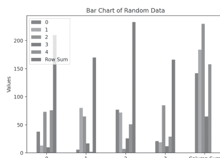
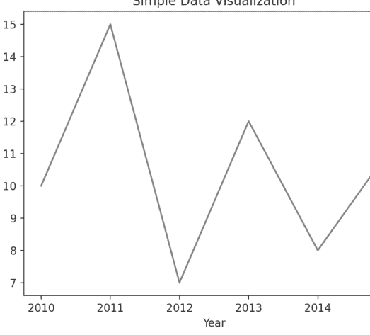

# 使用Grok-2学习Python 3入门

O. CAMPESATO

MLI 生成式人工智能系列

# 使用Grok-2学习Python 3入门

# 许可证、免责声明和有限保证

购买或使用本书及随附文件（即“作品”），即表示您同意本许可证授予使用其中包含内容的许可，包括光盘，但不赋予您对书籍/光盘中任何文本内容的所有权，或对其中包含的任何信息或产品的所有权。*未经出版商书面同意，本许可证不允许将作品上传到互联网或任何类型的网络上。* 对其中包含的任何文本、代码、模拟、图像等的复制或传播，仅限于并受制于相应产品的许可条款，必须获得出版商或内容所有者等的许可，才能以任何媒体复制或网络传输作品中包含的任何部分文本材料。

MERCURY LEARNING AND INFORMATION（“MLI”或“出版商”）以及任何参与随附光盘、附带算法、代码或计算机程序（“软件”）以及作品的任何附带网站或软件的创建、编写或制作的人，均无法且不保证使用作品内容可能获得的性能或结果。作者、开发者和出版商已尽最大努力确保本包中包含的文本材料和/或程序的准确性和功能性；但是，我们不对这些内容或程序的性能做出任何明示或暗示的保证。作品按“原样”出售，不附带任何保证（制造书籍中使用的材料缺陷或工艺问题除外）。

任何随附内容的作者、开发者和出版商，以及任何参与本作品的编写、制作和制造的人，均不对因使用（或无法使用）本出版物中包含的算法、源代码、计算机程序或文本材料而引起的任何类型的损害负责。这包括但不限于因使用本作品而产生的收入或利润损失，或其他附带的、物理的或后果性的损害。

任何类型索赔的唯一补救措施明确限于更换书籍和/或光盘，且仅由出版商自行决定。“暗示保证”和某些“排除条款”因州而异，可能不适用于本产品的购买者。

*本书的随附文件可通过向出版商提供购买证明发送至 info@merclearning.com 获取。*

# 使用Grok-2学习Python 3入门

Oswald Campesato

MERCURY LEARNING AND INFORMATION
波士顿，马萨诸塞州

版权所有 ©2025 MERCURY LEARNING AND INFORMATION。
DeGruyter Inc. 旗下品牌。保留所有权利。

未经出版商事先书面许可，不得以任何方式复制本出版物、其部分内容或任何附带软件，不得将其存储在任何类型的检索系统中，也不得以任何方式、媒体、电子显示或机械显示进行传输，包括但不限于影印、录音、互联网发布或扫描。

出版商：David Pallai
MERCURY LEARNING AND INFORMATION
121 High Street, 3rd Floor
Boston, MA 02110
info@merclearning.com
www.merclearning.com
800-232-0223

O. Campesato. *使用Grok-2学习Python 3入门*。
ISBN: 978-1-50152-396-0

出版商承认并尊重公司、制造商和开发者使用的所有标识，作为区分其产品的一种方式。本书中提到的所有品牌名称和产品名称均为其各自公司的商标或服务标志。任何遗漏或误用（任何类型的）服务标志或商标等，均非意图侵犯他人财产。

美国国会图书馆控制号：2024946891

242526321 本书在美国印刷于无酸纸上。

我们的书名可供机构、公司等采用、许可或批量购买。如需更多信息，请联系客户服务部，电话：800-232-0223（免费）。

我们所有的书名均可在各种数字供应商处以数字格式获取。*本书的随附文件可通过联系 info@merclearning.com 并提供购买证明获取。* MERCURY LEARNING AND INFORMATION 对购买者的唯一义务是更换文件，基于材料缺陷或工艺问题，而非基于产品的操作或功能。

> 我谨将此书献给我的父母——愿此书为他们的生活带来欢乐与幸福。

# 目录

前言

xv

# 第1章：Python简介

1

- Python工具

1

- easy_install 和 pip

1

- virtualenv

2

- IPython

2

- Python安装

3

- 设置PATH环境变量（仅限Windows）

4

- 在您的机器上启动Python

4

- Python交互式解释器

4

- Python标识符

5

- 行、缩进和多行

6

- Python中的引号和注释

7

- 将代码保存在模块中

8

- Python中的一些标准模块

9

- `help()` 和 `dir()` 函数

10

- 编译时和运行时代码检查

11

- Python中的简单数据类型

12

- 处理数字

12

- 处理其他进制

13

- `chr()` 函数

14

- Python中的 **round()** 函数

15

- Python中的数字格式化

15

- 处理分数

16

- Unicode 和 UTF-8

17

- 处理Unicode

17

- 处理字符串

18

- 比较字符串

20

- Python中的字符串格式化

21

- 字符串的切片和拼接

21

- 测试数字和字母字符

22

- 在其他字符串中搜索和替换字符串

23

- 移除前导和尾随字符

24

- 打印不带换行符的文本

25

- 文本对齐

26

- 处理日期

27

- 将字符串转换为日期

28

- Python中的异常处理

29

- 处理用户输入

31

- 命令行参数

33

- 总结

34

# 第2章：条件逻辑、循环和函数

35

- Python中的运算符优先级

35

- Python保留字

36

- Python中的循环

36

- Python for循环

37

- Python中带有try/except的for循环

38

- Python中的数字指数

39

- 嵌套循环

40

- 与for循环一起使用的split()函数

41

- 使用split()函数比较单词

41

- 使用split()函数打印对齐文本

42

- 使用split()函数打印固定宽度文本

43

- 使用split()函数比较文本字符串

45

- 使用split()函数显示字符串中的字符

46

- join()函数

47

- Python while循环

47

- Python中的条件逻辑

48

- break/continue/pass语句

49

- 比较和布尔运算符

50

- in/not in/is/is not 比较运算符

50

- and、or 和 not 布尔运算符

50

- 局部变量和全局变量

51

- 未初始化变量和值 None

52

- 变量的作用域

52

- 按引用传递与按值传递

54

- 参数和形参

55

- 使用while循环查找数字的除数

56

- 使用while循环查找质数

57

- Python中的用户定义函数

58

- 在函数中指定默认值

59

- 从函数返回多个值

60

- 具有可变数量参数的函数

60

- Lambda表达式

61

- 递归

62

- 计算阶乘值

62

- 计算斐波那契数

64

- 计算两个数的最大公约数

64

- 计算两个数的最小公倍数

65

- 总结

66

# 第3章：Python数据结构

67

- 处理列表

68

- 列表和基本操作

68

- 反转和排序列表

70

- 列表和算术运算

71

- 列表和过滤相关操作

72

- 对数字和字符串列表进行排序

73

# 目录

- 列表中的表达式 74
- 连接单词列表 74
- Python中的冒泡排序 75
- Python的range()函数 76
    - 统计数字、大写和小写字母 77
    - 使用Grok统计数字等 78
- 数组与append()函数 81
- 使用列表与split()函数 81
- 统计列表中的单词 82
- 遍历列表对 83
- 其他列表相关函数 83
- 使用Grok创建栈 85
- 使用向量 89
- 使用矩阵 90
- 用于矩阵的NumPy库 91
- 使用Grok创建队列 92
- 将列表用作栈和队列 97
- 元组（不可变列表） 98
- 使用集合 99
- 字典 100
    - 创建字典 100
    - 显示字典内容 101
    - 检查字典中的键 101
    - 从字典中删除键 102
    - 遍历字典 102
    - 从字典中插值数据 103
    - 字典函数与方法 103
    - 字典格式化 103
- 有序字典 104
    - 字典排序 104
    - Python多字典 105
- Python中的其他序列类型 106
- Python中的可变与不可变类型 107
- type()函数 108
- 总结 108

## 第四章：NumPy与Pandas入门

- 什么是NumPy？ 110
    - NumPy的实用特性 110
- 什么是NumPy数组？ 111
- 使用循环 112
- 向数组追加元素（1） 113
- 向数组追加元素（2） 114
- 列表与数组的乘法 115
- 将列表元素加倍 116
- 列表与指数运算 116
- 数组与指数运算 117
- 数学运算与数组 118
- 使用向量处理-1子范围 118
- 使用数组处理-1子范围 119
- 其他实用的NumPy方法 120
- 数组与向量运算 120
- NumPy与点积（1） 121
- NumPy与点积（2） 122
- NumPy与向量的“范数” 123
- NumPy与其他运算 124
- NumPy与reshape()方法 125
- 计算均值与标准差（1） 127
- 计算均值与标准差（2） 128
- 什么是Pandas？ 129
    - Pandas DataFrame 129
    - DataFrame与数据清洗任务 130
- 带标签的Pandas DataFrame 131
- Pandas数值型DataFrame 132
- Pandas布尔型DataFrame 133
    - 转置Pandas DataFrame 134
- Pandas DataFrame与随机数 135
- 合并Pandas DataFrame（1） 136
- 合并Pandas DataFrame（2） 137
- 使用Pandas DataFrame进行数据操作（1） 138
- 使用Pandas DataFrame进行数据操作（2） 140
- 使用Pandas DataFrame进行数据操作（3） 141
- Grok与NumPy DataFrame 143
- Pandas DataFrame与CSV文件 146
- Pandas DataFrame与Excel电子表格 149
- 在DataFrame中选择、添加和删除列 150
- Pandas DataFrame与散点图 151
- Grok、DataFrame与条形图 153
- Pandas DataFrame与简单统计 157
- Grok、DataFrame与简单统计 158
- Pandas中的实用单行命令 161
- 总结 162

## 第五章：生成式AI全景

- 什么是生成式AI？ 164
- 生成式AI的关键特征 164
- 生成式AI中的流行技术 164
- 生成式AI有何不同？ 165
- 对话式AI与生成式AI 166
    - 主要目标 166
    - 应用 166
    - 使用的技术 167
    - 训练与交互 167
    - 评估 167
    - 数据要求 167
- 什么是生成式AI模型？ 168
- DALL-E是生成式AI的一部分吗？ 171
- ChatGPT-3和GPT-4是生成式AI的一部分吗？ 172
- 生成式AI与机器学习、深度学习和自然语言处理 173
- 哪些领域从生成式AI中受益最多？ 174
- 企业领域的生成式AI 176
- 生成式AI对工作的影响 178
- 什么是通用人工智能（AGI）？ 180
- AGI何时到来？ 182
- 通往AGI的路径是什么？ 183
- 我们如何为AGI做准备？ 184
- AGI会控制世界吗？ 187
- 人类应该害怕AGI吗？ 188
- AGI之后是什么？ 190
- 通用人工智能与生成式AI 192
- 什么是大语言模型（LLMs）？ 193
- 大语言模型的目的是什么？ 194
- 近期强大的大语言模型 196
- 大语言模型理解语言吗？ 198
- 关于大语言模型的注意事项 199
- 模型大小与训练集大小 199
- 大语言模型的内存需求 200
- 大语言模型中的内存类型 201
- 大语言模型与深度学习模型 204
- 大语言模型之间的成本比较 206
- 大语言模型与欺骗 208
- 大语言模型中的欺骗性补全 209
- 大语言模型与故意欺骗 210
- 选择大语言模型：考虑因素 212
- 使用大语言模型的陷阱 214
- 现代大语言模型简史 216
- 大语言模型开发的各个方面 218
- 大语言模型大小与性能 220
- 大语言模型的涌现能力 221
- 对涌现能力的怀疑 221
- 什么是幻觉？ 224
- 为什么大语言模型会产生幻觉？ 226
- 大语言模型中的幻觉类型 227
- 大语言模型能检测提示中的错误吗？ 228
- 故意幻觉可能吗？ 229
- 减少幻觉 231
- 大语言模型中幻觉的原因 232
- 内在幻觉与外在幻觉 234
- 幻觉检测 236
- 模型校准 238
- Kaplan与训练不足的模型 240
- 生成式AI的成功案例 241
- 生成式AI的真实用例 243
- DeepMind 246
    - DeepMind与游戏 246
    - 游戏玩家（PoG） 247
- OpenAI 247
- Cohere 248
- Hugging Face 249
    - Hugging Face库 249
    - Hugging Face模型中心 249
- Meta AI 250
- AI21 251
- Anthropic与Claude 3 251
- 总结 252

## 第六章：Grok与Python代码

- 什么是Grok？ 254
- Grok的CSV文件 256
- 简单的网页抓取 257
- 基础聊天机器人 259
- 基础数据可视化 263
- 基础Pandas与Grok 266
- 生成随机数据 267
- 递归：斐波那契数 269
- 生成Python类 270
- 异步编程 272
- 在Python中使用requests 273
- 使用PIL进行图像处理 275
- 异常处理 278
- Python中的生成器 279
- 用两个骰子掷出7或11 281
- 用三个骰子掷出7或11 281
- 用四个骰子掷出7或11 282
- 均值与标准差 284
- 总结 286

# 索引

# 前言

## 本书的价值主张是什么？

本书是一本全面的指南，旨在教授Python编程的基础知识，同时介绍生成式AI的激动人心的可能性。无论你是初学者还是希望将Grok集成到工作流程中的开发者，本书都提供了一条清晰、循序渐径，帮助你掌握Python并利用AI驱动的代码生成。

前三章介绍了Python编程的基本方面，包括各种数据类型、数字格式化、Unicode和UTF-8处理以及文本操作技术。此外，你将学习循环、条件逻辑和Python中的保留字。你还将了解如何管理用户输入、处理异常以及使用命令行参数。

第四章介绍了NumPy和Pandas，这两个都是非常有用的开源Python库。本章还包含几个由Grok生成的Python代码示例。

第五章过渡到生成式AI领域，讨论了它与对话式AI的区别。介绍了流行的平台和模型，包括Grok及其竞争对手，让读者了解当前的AI格局。最后一章专门介绍由Grok生成的、用于解决各种编程任务的Python代码示例。

本质上，本书在Python编程和AI世界之间架起了一座适度的桥梁，旨在让读者掌握在两个领域中自信导航的知识和技能。

## 目标读者

本书主要面向希望同时学习Python以及如何将Grok与Python结合使用的人。本书也旨在吸引具有不同年龄和多样化背景的国际读者群体。此外，本书使用标准英语，而非可能让这些读者感到困惑的口语化表达。本书为预期读者提供了舒适且有意义的学习体验。

## 我需要学习本书的理论部分吗？

答案取决于你计划在多大程度上参与Grok和Python的工作，可能涉及大语言模型和生成式AI。一般来说，学习本书中讨论的关于大语言模型的更理论化的方面可能是值得的。

## 如何从本书中获得最大收益

有些人从散文中学习效果好，有些人从示例代码（以及大量代码）中学习效果好，这意味着没有一种单一的风格可以适用于所有人。

此外，一些程序员希望先运行代码，看看它的作用，然后再回到代码中深入研究细节（而另一些人则使用相反的方法）。

因此，本书中有各种类型的代码示例：有些很短，有些很长。

## 学习本书需要知道什么？

尽管本书本质上是入门级的，但对Python 3.x的一些了解无疑会对代码示例有所帮助。了解其他编程语言（如Java）也可能有所帮助，因为可以接触到编程概念和结构。你掌握的技术知识越少，就需要越勤奋才能理解所涵盖的各种主题。

如果你想确保自己能掌握本书的内容，可以快速浏览一些代码示例，以了解其中有多少是你熟悉的，有多少是新的。

## 本书是否包含生产级代码示例？

本书包含用 Python 编写的基础代码示例，其主要目的是让你熟悉基础 Python，以帮助你理解通过 Grok 生成的 Python 代码。此外，清晰度优先于编写更紧凑但更难理解（且可能更容易出错）的代码。如果你决定使用本书中的任何代码，你应该像对待代码库的其他部分一样，对该代码进行严格的分析。

## 本书的非技术前提是什么？

虽然这个问题的答案更难量化，但重要的是要有学习 NLP 的强烈愿望，以及阅读和理解代码示例的动力和自律。提醒一下，即使简单的 API 在你第一次接触时也可能难以理解，因此请准备好多次阅读代码示例。

## 如何设置命令 Shell？

如果你是 Mac 用户，有三种方法可以做到。第一种方法是使用 Finder 导航到“应用程序”>“实用工具”，然后双击“实用工具”应用程序。接下来，如果你已经有一个可用的命令 Shell，可以通过输入以下命令启动一个新的命令 Shell：

```
open /Applications/Utilities/Terminal.app
```

Mac 用户的第二种方法是，从已经可见的命令 Shell 中，只需在该命令 Shell 中点击 command+n，即可在 MacBook 上打开一个新的命令 Shell，你的 Mac 将启动另一个命令 Shell。

如果你是 PC 用户，你可以安装模拟 bash 命令的 Cygwin（开源 https://cygwin.com/）或使用其他工具包，如 MKS（商业产品）。请阅读描述下载和安装过程的在线文档。请注意，如果自定义别名定义在主启动文件（如 .bash_login）以外的文件中，则不会自动设置。

## 配套文件

本书中的所有代码示例和图表均可通过向出版商发送邮件至 info@merclearning.com 获取。

## 读完本书后的“下一步”是什么？

这个问题的答案差异很大，主要因为答案在很大程度上取决于你的目标。如果你主要对 NLP 感兴趣，那么你可以了解其他 LLM（大型语言模型）。

如果你主要对机器学习感兴趣，机器学习有一些子领域，如深度学习和强化学习（以及深度强化学习），可能会吸引你。幸运的是，有许多可用的资源，你可以通过互联网搜索这些资源。另一点：你需要学习的机器学习方面取决于你是谁：机器学习工程师、数据科学家、经理、学生或软件开发人员的需求都不同。

O. Campesato
2024年12月

# 第 1 章

## Python 简介

本章包含 Python 的简介，以及有关安装 Python 模块的有用工具、基本 Python 构造以及如何在 Python 中处理一些数据类型的信息。

本章的第一部分涵盖如何安装 Python、一些 Python 环境变量以及如何使用 Python 解释器。你将看到 Python 代码示例，以及如何将 Python 代码保存在可以从命令行启动的文本文件中。本章的第二部分向你展示如何处理简单数据类型，如数字、分数和字符串。本章的最后一部分讨论异常以及如何在 Python 脚本中使用它们。

> 注意 本书中的 Python 文件适用于 Python 3.x。

## Python 工具

Anaconda Python 发行版适用于 Windows、Linux 和 Mac，可在此处下载：http://continuum.io/downloads

Anaconda 非常适合 numpy 和 scipy 等模块，如果你是 Windows 用户，Anaconda 似乎是更好的选择。

### easy_install 和 pip

当你需要安装 Python 模块时，easy_install 和 pip 都非常易于使用。每当你需要安装 Python 模块（本书中有许多）时，使用 easy_install 或 pip，语法如下：

```
easy_install <module-name>
pip install <module-name>
```

注意 基于 Python 的模块更容易安装，而用 C 编写的模块通常更快，但在安装方面更困难。

### virtualenv

virtualenv 工具使你能够创建隔离的 Python 环境，其主页可以在此处找到：http://www.virtualenv.org/en/latest/virtualenv.html

virtualenv 解决了为不同应用程序保留正确的依赖关系和版本（以及间接地，权限）的问题。如果你是 Python 新手，你现在可能不需要 virtualenv，但请记住这个工具。

### IPython

另一个非常好的工具是 IPython（它获得了 Jolt 奖），其主页可以在此处找到：

http://ipython.org/install.html

IPython 的两个非常好的特性是制表符扩展和 ?，制表符扩展的示例如下所示：

```
python
Python 3.12.5 (v3.12.5:ff3bc82f7c9, Aug  7 2024, 05:32:06)
[Clang 13.0.0 (clang-1300.0.29.30)] on darwin
Type "help", "copyright", "credits" or "license" for more information.

IPython 0.13.2 -- An enhanced Interactive Python.
?         -> Introduction and overview of IPython's features.
%quickref -> Quick reference.
help      -> Python's own help system.
object?   -> Details about 'object', use 'object??' for extra details.

In [1]: di
%dirs    dict     dir      divmod
```

在前面的会话中，如果你输入字符 di，IPython 将响应以下行，其中包含所有以字母 di 开头的函数：

```
%dirs    dict     dir      divmod
```

如果你输入问号 (?)，IPython 提供文本帮助，其第一部分如下所示：

```
IPython -- An enhanced Interactive Python
=========================================

IPython offers a combination of convenient shell features, special commands and a history mechanism for both input (command history) and output (results caching, similar to Mathematica). It is intended to be a fully compatible replacement for the standard Python interpreter, while offering vastly improved functionality and flexibility.
```

下一节向你展示如何检查你的机器上是否安装了 Python，以及你可以从哪里下载 Python。

## Python 安装

在下载任何内容之前，请通过在命令 Shell 中输入以下命令来检查你的机器上是否已安装 Python（如果你使用 MacBook 或 Linux 机器，这很可能）：

```
python -V
```

本书中使用的 MacBook 的输出如下所示：

```
Python 3.12.5
```

> **注意** *在你的机器上安装 Python 3.9（或尽可能接近此版本），以便你拥有与测试本书中 Python 文件所用的相同版本的 Python。*

如果你需要在机器上安装 Python，请导航到 Python 主页并选择下载链接，或直接导航到此网站：

http://www.python.org/download/

此外，PythonWin 适用于 Windows，其主页可以在此处找到：

http://www.cgl.ucsf.edu/Outreach/pc204/pythonwin.html

使用任何可以创建、编辑和保存 Python 脚本的文本编辑器，并将它们保存为纯文本文件（不要使用 Microsoft Word）。

一旦你在机器上安装并配置了 Python，你就可以开始使用本书中的 Python 脚本了。

## 设置 PATH 环境变量（仅限 Windows）

PATH 环境变量指定一个目录列表，每当你在命令行中指定可执行程序时，都会搜索这些目录。这里有一个非常好的指南，用于设置你的环境，以便 Python 可执行文件在每个命令 Shell 中都可用：

http://www.blog.pythonlibrary.org/2011/11/24/python-101-setting-up-python-on-windows/

## 在你的机器上启动 Python

有三种不同的方式启动 Python：

- 使用 Python 交互式解释器。
- 从命令行启动 Python 脚本。
- 使用 IDE。

下一节向你展示如何从命令行启动 Python 解释器，本章后面你将学习如何从命令行启动 Python 脚本以及 Python IDE。

> 注意：本书的重点是从命令行启动 Python 脚本或在 Python 解释器中输入代码。

### Python 交互式解释器

通过打开命令 Shell 并输入以下命令，从命令行启动 Python 交互式解释器：

```
python
```

你将看到以下提示（或类似的内容）：

```
Python 3.12.5 (v3.12.5:ff3bc82f7c9, Aug 7 2024, 05:32:06)
[Clang 13.0.0 (clang-1300.0.29.30)] on Darwin
Type "help", "copyright", "credits" or "license" for more information.
>>>
```

现在，在提示符下输入表达式 2 + 7：
>>> 2 + 7
Python 显示以下结果：
9
>>>

按 `ctrl-d` 退出 Python shell。

你可以通过在命令行中使用 `python` 命令来启动任何 Python 脚本。例如，如果你有一个包含 Python 命令的 Python 脚本 `myscript.py`，可以按如下方式启动该脚本：

`python myscript.py`

作为一个简单的示例，假设 Python 脚本 `myscript.py` 包含以下 Python 代码：

`print('Hello World from Python')`
`print('2 + 7 = ', 2+7)`

当你启动上述 Python 脚本时，将看到以下输出：

`Hello World from Python`
`2 + 7 = 9`

## PYTHON 标识符

Python 标识符是变量、函数、类、模块或其他 Python 对象的名称。有效的标识符需符合以下规则：

- 以字母（A 到 Z 或 a 到 z）或下划线（_）开头
- 后跟零个或多个字母、下划线或数字（0 到 9）

> **注意** Python 标识符不能包含 @、$ 和 % 等字符。

Python 是一种区分大小写的语言，因此 `Abc` 和 `abc` 在 Python 中是不同的标识符。

此外，Python 有以下命名约定：

- 类名以大写字母开头，所有其他标识符以小写字母开头。
- 前导下划线用于私有标识符。
- 双前导下划线用于强私有标识符。

具有双前导下划线和双尾随下划线字符的 Python 标识符表示语言定义的特殊名称。

## 行、缩进和多行语句

与其他编程语言（如 Java 和 Objective-C）不同，Python 使用缩进而不是花括号来表示代码块。代码块中的缩进必须保持一致，如下所示：

```
if True:
    print("ABC")
    print("DEF")
else:
    print("ABC")
    print("DEF")
```

Python 中的多行语句可以以换行符或反斜杠（\）字符结束，如下所示：

```
total = x1 + \
        x2 + \
        x3
```

显然，你可以将 x1、x2 和 x3 放在同一行，因此没有理由使用三行分开写；但是，如果你需要添加一组无法放在单行中的变量，此功能就派上用场了。

你可以通过使用分号（;）分隔每个语句来在一行中指定多个语句，如下所示：

```
a=10; b=5; print(a); print(a+b)
```

上述代码片段的输出如下：

```
10
15
```

> 注意 在 Python 中不鼓励使用分号和续行符。

## PYTHON 中的引号和注释

Python 允许使用单引号（'）、双引号（"）和三引号（''' 或 """）来表示字符串字面量，前提是它们在字符串的开头和结尾匹配。你可以使用三引号来表示跨多行的字符串。以下是合法的 Python 字符串示例：

```
word = 'word'
line = "This is a sentence."
para = """This is a paragraph. This paragraph contains
more than one sentence."""
```

以字母 r（代表“原始”）开头的字符串字面量将所有内容视为字面字符，并“转义”元字符的含义，如下所示：

```
a1 = r'\n'
a2 = r'\r'
a3 = r'\t'
print('a1:',a1,'a2:',a2,'a3:',a3)
```

上述代码块的输出如下：

```
a1: \n a2: \r a3: \t
```

你可以在一对双引号中嵌入单引号（反之亦然），以显示单引号或双引号。另一种实现相同结果的方法是在单引号或双引号前加上反斜杠（\）字符。以下代码块说明了这些技巧：

```
b1 = "'"
b2 = '"'
b3 = '\''
b4 = '"'
print('b1:',b1,'b2:',b2)
print('b3:',b3,'b4:',b4)
```

上述代码块的输出如下：

```
b1: ' b2: "
b3: ' b4: "
```

不在字符串字面量内的井号（#）是表示注释开始的字符。此外，# 之后直到物理行尾的所有字符都是注释的一部分（并被 Python 解释器忽略）。考虑以下代码块：

```
#!/usr/bin/python
# First comment
print("Hello, Python!")  # second comment
```

这将产生以下结果：
Hello, Python!

注释可以位于语句或表达式之后的同一行：
name = "Tom Jones" # This is also comment

你可以按如下方式注释多行：

```
# This is comment one
# This is comment two
# This is comment three
```

Python 中的空行是仅包含空白字符、注释或两者的行。

## 将代码保存在模块中

之前，你了解了如何从命令行启动 Python 解释器，然后输入 Python 命令。但请注意，你在 Python 解释器中输入的所有内容仅对当前会话有效；如果你退出解释器然后再次启动它，你之前的定义将不再有效。幸运的是，Python 允许你将代码存储在文本文件中，如下一节所述。

Python 中的模块是包含 Python 语句的文本文件。在上一节中，你了解了 Python 解释器如何让你测试定义仅对当前会话有效的代码片段。如果你想保留代码片段和其他定义，请将它们放在文本文件中，以便你可以在 Python 解释器之外执行该代码。

当模块首次被导入时，Python 中最外层的语句从上到下执行，这将设置其变量和函数。

Python 模块可以直接从命令行运行，如下所示：

```
python first.py
```

作为示例，将以下两条语句放入名为 `first.py` 的文本文件中：

```
x = 3
print(x)
```

现在输入以下命令：

```
python first.py
```

上述命令的输出为 3，这与从 Python 解释器执行上述代码的结果相同。

当 Python 模块直接运行时，特殊变量 `__name__` 被设置为 `__main__`。你经常会看到 Python 模块中出现以下类型的代码：

```
if __name__ == '__main__':
    # do something here
    print('Running directly')
```

上述代码片段使 Python 能够确定 Python 模块是从命令行启动的还是导入到另一个 Python 模块中的。

## PYTHON 中的一些标准模块

Python 标准库提供了许多可以简化你的 Python 脚本的模块。标准库模块列表可在此处找到：

http://www.python.org/doc/

一些最重要的 Python 模块包括 `cgi`、`math`、`os`、`pickle`、`random`、`re`、`socket`、`sys`、`time` 和 `urllib`。

本书中的代码示例使用了 `math`、`os`、`random`、`re`、`socket`、`sys`、`time` 和 `urllib` 模块。你需要导入这些模块才能在代码中使用它们。例如，以下代码块展示了如何导入四个标准 Python 模块：

```
import datetime
import re
import sys
import time
```

本书中的代码示例导入了上述一个或多个模块以及其他 Python 模块。

## help() 和 dir() 函数

在互联网上搜索与 Python 相关的主题通常会返回许多包含有用信息的链接。或者，你可以查看官方 Python 文档网站：docs.python.org

此外，Python 提供了 help() 和 dir() 函数，可以从 Python 解释器中访问。help() 函数显示文档字符串，而 dir() 函数显示已定义的符号。

例如，如果你输入 help(sys)，你将看到 sys 模块的文档，而 dir(sys) 则显示已定义符号的列表。

在 Python 解释器中输入以下命令以显示 Python 中与字符串相关的方法：

```
>>> dir(str)
```

上述命令生成以下输出：

```
['__add__', '__class__', '__contains__', '__delattr__',
'__doc__', '__eq__', '__format__', '__ge__',
'__getattribute__', '__getitem__', '__getnewargs__',
'__getslice__', '__gt__', '__hash__', '__init__',
'__le__', '__len__', '__lt__', '__mod__', '__mul__',
'__ne__', '__new__', '__reduce__', '__reduce_ex__',
'__repr__', '__rmod__', '__rmul__', '__setattr__',
'__sizeof__', '__str__', '__subclasshook__',
'_formatter_field_name_split', '_formatter_parser',
'capitalize', 'center', 'count', 'decode', 'encode',
'endswith', 'expandtabs', 'find', 'format', 'index',
'isalnum', 'isalpha', 'isdigit', 'islower', 'isspace',
'istitle', 'isupper', 'join', 'ljust', 'lower',
'lstrip', 'partition', 'replace', 'rfind', 'rindex',
'rjust', 'rpartition', 'rsplit', 'rstrip', 'split',
'splitlines', 'startswith', 'strip', 'swapcase',
'title', 'translate', 'upper', 'zfill']
```

上述列表为你提供了内置函数的汇总“转储”（包括本章稍后讨论的一些函数）。虽然 max() 函数显然返回其参数的最大值，但其他函数（如 filter() 和 map()）的目的并不立即显而易见（除非你在其他编程语言中使用过它们）。无论如何，上述列表为你提供了一个起点，以便进一步了解本章未讨论的各种 Python 内置函数。

请注意，虽然 `dir()` 不会列出内置函数和变量的名称，但你可以从标准模块 `__builtin__` 中获取这些信息，该模块会自动以 `__builtins__` 的名称导入：

```
>>> dir(__builtins__)
```

以下命令展示了如何获取关于某个函数的更多信息：

```
help(str.lower)
```

上述命令的输出如下所示：

```
Help on method_descriptor:

lower(...)
    S.lower() -> string

    Return a copy of the string S converted to lowercase.

(END)
```

当你需要关于特定函数或模块的额外信息时，请查阅在线文档，并尝试使用 `help()` 和 `dir()`。

## 编译时与运行时代码检查

Python 会执行一些编译时检查，但大多数检查（包括类型和名称检查）都是*延迟*到代码执行时才进行的。因此，如果你的 Python 代码引用了一个不存在的用户定义函数，代码仍然可以成功编译。事实上，只有当代码执行路径引用了那个不存在的函数时，代码才会因异常而失败。

举个简单的例子，考虑以下 Python 函数 `myFunc`，它引用了一个名为 `DoesNotExist` 的不存在函数：

```
def myFunc(x):
    if x == 3:
        print(DoesNotExist(x))
    else:
        print('x: ', x)
```

上述代码只有在 `myFunc` 函数被传入值 3 时才会失败，之后 Python 会抛出一个错误。

在第 2 章中，你将学习如何定义和调用用户定义函数。你还将看到关于 Python 中局部变量与全局变量区别的解释。

既然你已经理解了一些基本概念（例如如何使用 Python 解释器）以及如何启动你自定义的 Python 模块，下一节将讨论 Python 中的原始数据类型。

## Python 中的简单数据类型

Python 支持原始数据类型，例如数字（整数、浮点数和指数）、字符串和日期。Python 还支持更复杂的数据类型，例如列表（或数组）、元组和字典，所有这些都将在第 3 章中讨论。接下来的几节将讨论一些 Python 原始数据类型，并附带代码片段，向你展示如何对这些数据类型执行各种操作。

## 处理数字

Python 提供了算术运算来操作数字，其方式与其他编程语言类似，非常直接。以下示例涉及整数的算术运算：

```
>>> 2+2
4

>>> 4/3
1

>>> 3*8
24
```

以下示例将数字赋值给两个变量并计算它们的乘积：

```
>>> x = 4
>>> y = 7
>>> x * y
28
```

以下示例演示了涉及整数的算术运算：

```
>>> 2+2
4
>>> 4/3
1
>>> 3*8
24
```

请注意，两个整数的除法（/）会被截断，只保留整数结果。以下示例将浮点数转换为指数形式：

```
>>> fnum = 0.0001234568900007
>>> "%.14e"%fnum
'1.23456890000070e-04'
```

你可以使用 `int()` 函数和 `float()` 函数将字符串转换为数字：

```
word1 = "123"
word2 = "456.78"
var1 = int(word1)
var2 = float(word2)
print("var1: ",var1," var2: ",var2)
```

上述代码块的输出如下：

```
var1:  123  var2:  456.78
```

或者，你可以使用 `eval()` 函数：

```
word1 = "123"
word2 = "456.78"
var1 = eval(word1)
var2 = eval(word2)
print("var1: ",var1," var2: ",var2)
```

如果你尝试转换一个不是有效整数或浮点数的字符串，Python 会抛出一个异常，因此建议将你的代码放在 `try/except` 块中（本章稍后讨论）。

### 处理其他进制

Python 中的数字默认是十进制（基数为 10），但你可以轻松地将数字转换为其他进制。例如，以下代码块将变量 x 初始化为值 1234，然后分别以二进制、八进制和十六进制显示该数字：

```
>>> x = 1234
>>> bin(x) '0b10011010010'
>>> oct(x) '0o2322'
>>> hex(x) '0x4d2' >>>
```

如果你想省略 `0b`、`0o` 或 `0x` 前缀，可以使用 `format()` 函数，如下所示：

```
>>> format(x, 'b') '10011010010'
>>> format(x, 'o') '2322'
>>> format(x, 'x') '4d2'
```

负整数会显示负号：

```
>>> x = -1234
>>> format(x, 'b') '-10011010010'
>>> format(x, 'x') '-4d2'
```

### chr() 函数

Python 的 `chr()` 函数接受一个正整数作为参数，并将其转换为对应的字母值（如果存在）。大写字母 A 到 Z 的十进制表示是 65 到 91（对应十六进制 41 到 5b），小写字母 a 到 z 的十进制表示是 97 到 122（十六进制 61 到 7b）。

以下是使用 `chr()` 函数打印大写字母 A 的示例：

```
>>> x=chr(65)
>>> x
'A'
```

以下代码块打印一系列整数的 ASCII 值：

```
result = ""
for x in range(65,91):
    print(x, chr(x))
    result = result+chr(x)+' '
print("result: ",result)
```

> 注意 Python 2 使用 ASCII 字符串，而 Python 3 使用 Unicode。

你可以用以下行表示一个字符范围：

```
for x in range(65,91):
```

但是，请注意，以下等效的代码片段更直观：

```
for x in range(ord('A'), ord('Z')):
```

如果你想显示小写字母的结果，请将前面的范围从 (65,91) 改为以下任一语句：

```
for x in range(65,91):
for x in range(ord('a'), ord('z')):
```

### Python 中的 round() 函数

Python 的 round() 函数使你能够将十进制值四舍五入到最接近的精度：

```
>>> round(1.23, 1)
1.2
>>> round(-3.42,1)
-3.4
```

### Python 中的数字格式化

Python 允许你指定打印十进制数字时使用的小数位数精度，如下所示：

```
>>> x = 1.23456
>>> format(x, '0.2f')
'1.23'
>>> format(x, '0.3f')
'1.235'
>>> 'value is {:0.3f}'.format(x) 'value is 1.235'
>>> from decimal import Decimal
>>> a = Decimal('4.2')
>>> b = Decimal('2.1')
>>> a + b
Decimal('6.3')
>>> print(a + b)
6.3
>>> (a + b) == Decimal('6.3')
True
>>> x = 1234.56789
>>> # 两位小数精度
>>> format(x, '0.2f')
'1234.57'
>>> # 右对齐，宽度10，一位小数精度
>>> format(x, '>10.1f')
' 1234.6'
>>> # 左对齐
>>> format(x, '<10.1f') '1234.6 '
>>> # 居中对齐
>>> format(x, '^10.1f') ' 1234.6 '
>>> # 包含千位分隔符
>>> format(x, ',')
'1,234.56789'
>>> format(x, '0,.1f')
'1,234.6'
```

## 处理分数

Python 支持 Fraction() 函数（定义在 fractions 模块中），它接受两个整数，分别表示分数的分子和分母（分母必须非零）。以下是在 Python 中定义和操作分数的一些示例：

```
>>> from fractions import Fraction
>>> a = Fraction(5, 4)
>>> b = Fraction(7, 16)
>>> print(a + b)
27/16
>>> print(a * b) 35/64
>>> # 获取分子/分母
>>> c = a * b
>>> c.numerator
35
>>> c.denominator 64
>>> # 转换为浮点数 >>> float(c)
0.546875
>>> # 限制值的分母
>>> print(c.limit_denominator(8))
4
>>> # 将浮点数转换为分数 >>> x = 3.75
>>> y = Fraction(*x.as_integer_ratio())
>>> y
Fraction(15, 4)
```

在深入探讨处理字符串的 Python 代码示例之前，下一节将简要讨论 Unicode 和 UTF-8，它们都是字符编码。

## Unicode 和 UTF-8

Unicode 字符串由一系列介于 0 和 0x10ffff 之间的数字组成，每个数字代表一组字节。编码是将 Unicode 字符串转换为字节序列的方式。在各种编码中，UTF-8（UTF 代表 Unicode 转换格式）可能是最常见的，它也是许多系统的默认编码。UTF-8 中的数字 8 表示编码使用 8 位数字，而 UTF-16 使用 16 位数字（但这种编码不太常见）。

ASCII 字符集是 UTF-8 的子集，因此有效的 ASCII 字符串可以作为 UTF-8 字符串读取，无需任何重新编码。此外，Unicode 字符串可以转换为 UTF-8 字符串。

## 处理 Unicode

Python 支持 Unicode，这意味着你可以渲染不同语言的字符。Unicode 数据可以像字符串一样存储和操作。通过在字符串前加上字母 u 来创建 Unicode 字符串，如下所示：

```
>>> u'Hello from Python!'
u'Hello from Python!'
```

可以通过指定 Unicode 值将特殊字符包含在字符串中。例如，以下 Unicode 字符串在字符串中嵌入了一个空格（其 Unicode 值为 0x0020）：

## 处理字符串

你可以使用 `+` 运算符连接两个字符串。以下示例先打印一个字符串，然后连接两个单字母字符串：

```
>>> 'abc'
'abc'
>>> 'a' + 'b'
'ab'
```

你可以使用 `+` 或 `*` 来连接多个字符串，如下所示：

```
>>> 'a' + 'a' + 'a'
'aaa'
>>> 'a' * 3
'aaa'
```

你可以将字符串赋值给变量，并使用 `print()` 命令打印它们：

```
>>> print('abc')
abc
>>> x = 'abc'
>>> print(x)
abc
>>> y = 'def'
>>> print(x + y)
abcdef
```

你可以“解包”字符串的字母并将它们赋值给变量，如下所示：

```
>>> str = "World"
>>> x1,x2,x3,x4,x5 = str
>>> x1
'W'
>>> x2
'o'
>>> x3
'r'
>>> x4
'l'
>>> x5
'd'
```

前面的代码片段向你展示了提取文本字符串中的字母是多么容易，在第 3 章中，你将学习如何“解包”其他 Python 数据结构。

你可以提取字符串的子字符串，如以下示例所示：

```
>>> x = "abcdef"
>>> x[0]
'a'
>>> x[-1]
'f'
>>> x[1:3]
'bc'
>>> x[0:2] + x[5:]
'abf'
```

但是请注意，如果你尝试“减去”两个字符串，正如你可能预期的那样，会导致错误：

```
>>> 'a' - 'b'
Traceback (most recent call last):
  File "<stdin>", line 1, in <module>
TypeError: unsupported operand type(s) for -: 'str' and 'str'
```

Python 中的 `try/except` 结构（本章稍后讨论）使你能够更优雅地处理上述类型的异常。

## 比较字符串

你可以使用 `lower()` 和 `upper()` 方法分别将字符串转换为小写和大写，如下所示：

```
>>> 'Python'.lower()
'python'
>>> 'Python'.upper()
'PYTHON'
>>>
```

`lower()` 和 `upper()` 方法对于执行两个 ASCII 字符串的不区分大小写的比较非常有用。清单 1.2 显示了 `compare.py` 的内容，它使用 `lower()` 函数来比较两个 ASCII 字符串。

### 清单 1.2：compare.py

```
x = 'Abc'
y = 'abc'

if(x == y):
    print('x and y: identical')
elif (x.lower() == y.lower()):
    print('x and y: case insensitive match')
else:
    print('x and y: different')
```

由于 `x` 包含混合大小写字母，而 `y` 包含小写字母，清单 1.2 产生以下输出：

```
x and y: different
```

## Python 中的字符串格式化

Python 提供了 `string.lstring()`、`string.rstring()` 和 `string.center()` 函数，用于将文本字符串分别定位为左对齐、右对齐或居中。正如你在前面一节中看到的，Python 还提供了 `format()` 方法用于高级插值功能。

现在在 Python 解释器中输入以下命令：

```
import string

str1 = 'this is a string'
print(string.ljust(str1, 10))
print(string.rjust(str1, 40))
print(string.center(str1,40))
```

输出如下所示：

```
this is a string
                                this is a string
                this is a string
```

本章的下一部分将向你展示如何使用内置的 Python 函数“切片和拼接”文本字符串。

## 切片和拼接字符串

Python 允许你使用数组表示法提取字符串的子字符串（称为“切片”）。切片表示法是 `start:stop:step`，其中 `start`、`stop` 和 `step` 值是整数，分别指定起始值、结束值和增量值。Python 切片的有趣之处在于，你可以使用值 -1，它从字符串的右侧而不是左侧开始操作。

以下是一些字符串切片的示例：

```
text1 = "this is a string"
print('First 7 characters:',text1[0:7])
print('Characters 2-4:',text1[2:4])
print('Right-most character:',text1[-1])
print('Right-most 2 characters:',text1[-3:-1])
```

前面代码块的输出如下所示：

```
First 7 characters: this is
Characters 2-4: is
Right-most character: g
Right-most 2 characters: in
```

本章稍后，你将看到如何在另一个字符串中间插入一个字符串。

## 测试数字和字母字符

Python 允许你检查字符串中的每个字符，然后测试该字符是真正的数字还是字母字符。本节为第 4 章讨论的正则表达式主题提供了铺垫。

清单 1.3 显示了 `char_types.py` 的内容，它说明了如何确定字符串包含数字还是字符。如果你不熟悉清单 1.3 中的条件 `if` 语句，可以在第 2 章中找到更详细的信息。

### 清单 1.3：char_types.py

```
str1 = "4"
str2 = "4234"
str3 = "b"
str4 = "abc"
str5 = "a1b2c3"

if(str1.isdigit()):
    print("this is a digit:",str1)

if(str2.isdigit()):
    print("this is a digit:",str2)

if(str3.isalpha()):
    print("this is alphabetic:",str3)

if(str4.isalpha()):
    print("this is alphabetic:",str4)

if(not str5.isalpha()):
    print("this is not pure alphabetic:",str5)

print("capitalized first letter:",str5.title())
```

清单 1.3 初始化了一些变量，然后是两个条件测试，使用 `isdigit()` 函数检查 `str1` 和 `str2` 是否为数字。清单 1.3 的下一部分使用 `isalpha()` 函数检查 `str3`、`str4` 和 `str5` 是否为字母字符串。清单 1.3 的输出如下所示：

```
this is a digit: 4
this is a digit: 4234
this is alphabetic: b
this is alphabetic: abc
this is not pure alphabetic: a1b2c3
capitalized first letter: A1B2C3
```

## 在其他字符串中搜索和替换字符串

Python 提供了在第二个文本字符串中搜索和替换字符串的方法。清单 1.4 显示了 `find_pos1.py` 的内容，它向你展示了如何使用 `find()` 函数在一个字符串中搜索另一个字符串的出现。

### 清单 1.4：find_pos1.py

```
item1 = 'abc'
item2 = 'Abc'
text = 'This is a text string with abc'

pos1 = text.find(item1)
pos2 = text.find(item2)

print('pos1=', pos1)
print('pos2=', pos2)
```

清单 1.4 初始化了变量 `item1`、`item2` 和 `text`，然后在字符串 `text` 中搜索 `item1` 和 `item2` 内容的索引。Python 的 `find()` 函数返回第一个成功匹配发生的列号；否则，如果匹配不成功，`find()` 函数返回 -1。

启动清单 1.4 的输出如下所示：

```
pos1= 27
pos2= -1
```

除了 `find()` 方法之外，当你想测试元素是否存在时，可以使用 `in` 运算符，如下所示：

```
>>> lst = [1,2,3]
>>> 1 in lst
True
```

清单 1.5 显示了 `replace1.py` 的内容，它向你展示了如何用另一个字符串替换一个字符串。

### 清单 1.5：replace1.py

```
text = 'This is a text string with abc'
print('text:',text)
text = text.replace('is a', 'was a')
print('text:',text)
```

清单 1.5 首先初始化变量 text，然后打印其内容。清单 1.5 的下一部分在字符串 text 中将 `is a` 的出现替换为 `was a`，然后打印修改后的字符串。启动清单 1.5 的输出如下所示：

```
text: This is a text string with abc
text: This was a text string with abc
```

## 移除前导和尾随字符

Python 提供了 `strip()`、`lstrip()` 和 `rstrip()` 函数来移除文本字符串中的字符。清单 1.6 显示了 `remove1.py` 的内容，它向你展示了如何搜索字符串。

### 清单 1.6：remove1.py

```
text = '   leading and trailing white space   '
print('text1:','x',text,'y')

text = text.lstrip()
print('text2:','x',text,'y')

text = text.rstrip()
print('text3:','x',text,'y')
```

清单 1.6 首先连接字母 x 和变量 text 的内容，然后打印结果。清单 1.6 的第二部分移除字符串 text 中的前导空格，然后附加结果赋值给变量x。清单1.6的第三部分移除了字符串`text`中的尾部空格（注意前导空格已被移除），然后将结果追加到字母x。

运行清单1.6的输出如下所示：

```
text1: x     leading and trailing white space     y
text2: x leading and trailing white space     y
text3: x leading and trailing white space y
```

如果你想移除文本字符串内部的多余空格，请使用上一节讨论的`replace()`函数。以下示例展示了如何实现这一点，其中也包含了`re`模块，作为第4章内容的“预览”：

```
import re
text = 'a b'
a = text.replace(' ', '')
b = re.sub(' +', ' ', text)

print(a)
print(b)
```

结果如下所示：

```
ab
a b
```

第2章将向你展示如何使用`join()`函数来移除文本字符串中的多余空格。

## 不带换行符打印文本

如果你需要在多个`print()`语句输出的对象之间抑制空格和换行，可以使用字符串连接或`write()`函数。

第一种技术是在打印结果之前，使用`str()`函数将每个对象的字符串表示连接起来。例如，在Python中运行以下语句：

```
x = str(9)+str(0xff)+str(-3.1)
print('x: ',x)
```

输出如下所示：

```
x:  9255-3.1
```

上一行包含了数字9和255（十六进制数0xff的十进制值）以及-3.1的连接。

顺便提一下，你可以将`str()`函数与模块和用户定义的类一起使用。这里展示了一个涉及Python内置模块`sys`的例子：

```
>>> import sys
>>> print(str(sys))
<module 'sys' (built-in)>
```

以下代码片段展示了如何使用`write()`函数来显示字符串：

```
import sys
write = sys.stdout.write
write('123')
write('123456789')
```

输出如下所示：

```
1233
1234567899
```

## 文本对齐

Python提供了`ljust()`、`rjust()`和`center()`方法用于对齐文本。`ljust()`和`rjust()`函数分别对文本字符串进行左对齐和右对齐，而`center()`函数则将字符串居中。以下代码块中的示例展示了这一点：

```
text = 'Hello World'
text.ljust(20)
'Hello World         '
>>> text.rjust(20)
'         Hello World'
>>> text.center(20)
'    Hello World     '
```

你可以使用Python的`format()`函数来对齐文本。使用`<`、`>`或`^`字符，以及所需的宽度，可以分别实现右对齐、左对齐和居中对齐。以下示例说明了如何指定文本对齐方式：

```
>>> format(text, '>20')
',           Hello World'
>>>
>>> format(text, '<20')
'Hello World           '
>>>
>>> format(text, '^20')
',     Hello World     ,
>>>
```

## 处理日期

Python提供了一套丰富的日期相关函数。清单1.7展示了Python脚本`date_time2.py`的内容，该脚本显示了各种与日期相关的值，例如当前日期和时间；星期几、月份和年份；以及自纪元以来的秒数。

```
清单 1.7: date_time2.py
import time
import datetime

print("Time in seconds since the epoch: %s" % time.time())
print("Current date and time: " , datetime.datetime.now())
print("Or like this: " ,datetime.datetime.now().strftime("%y-%m-%d-%H-%M"))

print("Current year: ", datetime.date.today().strftime("%Y"))
print("Month of year: ", datetime.date.today().strftime("%B"))
print("Week number of the year: ", datetime.date.today().strftime("%W"))
print("Weekday of the week: ", datetime.date.today().strftime("%w"))
print("Day of year: ", datetime.date.today().strftime("%j"))
print("Day of the month : ", datetime.date.today().strftime("%d"))
print("Day of week: ", datetime.date.today().strftime("%A"))
```

清单1.8展示了运行清单1.7中Python代码生成的输出。

### 清单 1.8 datetime2.out

```
Time in seconds since the epoch: 1375144195.66
Current date and time: 2013-07-29 17:29:55.664164
Or like this: 13-07-29-17-29
Current year: 2013
Month of year: July
Week number of the year: 30
Weekday of the week: 1
Day of year: 210
Day of the month : 29
Day of week: Monday
```

Python还允许你对日期相关的值执行算术计算，如下代码块所示：

```
>>> from datetime import timedelta
>>> a = timedelta(days=2, hours=6)
>>> b = timedelta(hours=4.5)
>>> c = a + b
>>> c.days
2
>>> c.seconds
37800
>>> c.seconds / 3600
10.5
>>> c.total_seconds() / 3600
58.5
```

### 将字符串转换为日期

清单1.9展示了`string2date.py`的内容，它说明了如何将字符串转换为日期，以及如何计算两个日期之间的差值。

### 清单 1.9: string2date.py

```
from datetime import datetime

text = '2014-08-13'
y = datetime.strptime(text, '%Y-%m-%d')
z = datetime.now()
diff = z - y
print('Date difference:', diff)
```

清单1.9的输出如下所示：
Date difference: -210 days, 18:58:40.197130

## Python中的异常处理

与JavaScript不同，在Python中你不能将一个数字和一个字符串相加。然而，你可以使用Python中的`try/except`结构来检测非法操作，这类似于JavaScript和Java等语言中的`try/catch`结构。

一个`try/except`块的示例如下所示：

```
try:
    x = 4
    y = 'abc'
    z = x + y
except:
    print 'cannot add incompatible types:', x, y
```

当你在Python中运行前面的代码时，`except`代码块中的`print()`语句会被执行，因为变量`x`和`y`的类型不兼容。

在本章前面，你也看到了两个字符串相减会抛出异常：

```
>>> 'a' - 'b'
Traceback (most recent call last):
  File "<stdin>", line 1, in <module>
TypeError: unsupported operand type(s) for -: 'str' and 'str'
```

处理这种情况的一个简单方法是使用`try/except`块：

```
>>> try:
...     print('a' - 'b')
... except TypeError:
...     print('TypeError exception while trying to subtract two strings')
... except:
...     print('Exception while trying to subtract two strings')
...
```

前面代码块的输出如下所示：
`TypeError exception while trying to subtract two strings`

如你所见，前面的代码块指定了更细粒度的异常`TypeError`，后面跟着一个通用的`except`代码块来处理Python代码执行过程中可能发生的其他所有异常。这种风格类似于Java代码中的异常处理。

清单1.10展示了`exception1.py`的内容，它说明了如何处理各种类型的异常。

### 清单 1.10: exception1.py

```
import sys

try:
    f = open('myfile.txt')
    s = f.readline()
    i = int(s.strip())
except IOError as err:
    print("I/O error: {0}".format(err))
except ValueError:
    print("Could not convert data to an integer.")
except:
    print("Unexpected error:", sys.exc_info()[0])
    raise
```

清单1.10包含一个`try`块，后面跟着三个`except`语句。如果`try`块中发生错误，第一个`except`语句会与发生的异常类型进行比较。如果匹配，则执行后续的`print`语句，然后程序终止。如果不匹配，则对第二个`except`语句执行类似的测试。如果两个`except`语句都不匹配该异常，则第三个`except`语句处理该异常，这涉及打印一条消息，然后“引发”一个异常。注意，你也可以在单个语句中指定多个异常类型，如下所示：

```
except (NameError, RuntimeError, TypeError):
    print('One of three error types occurred')
```

前面的代码块更紧凑，但你不知道发生了三种错误类型中的哪一种。`Python`允许你定义自定义异常，但这个主题超出了本书的范围。

## 处理用户输入

`Python`允许你通过`input()`函数或`raw_input()`函数从命令行读取用户输入。通常，你将用户输入赋值给一个变量，该变量将包含用户从键盘输入的所有字符。当用户按下`<return>`键（该键包含在输入字符中）时，用户输入结束。清单1.11展示了`user_input1.py`的内容，它提示用户输入姓名，然后使用插值显示响应。

### 清单 1.11: user_input1.py

```
userInput = input("Enter your name: ")
print ("Hello %s, my name is Python" % userInput)
```

清单1.11的输出如下所示（假设用户输入了单词`Dave`）：

```
Hello Dave, my name is Python
```

清单1.11中的`print()`语句使用了通过`%s`进行的字符串插值，它将`%`符号后面的变量值替换进去。当你想要指定在运行时确定的内容时，这个功能显然很有用。

用户输入可能导致异常（取决于你的代码执行的操作），因此包含异常处理代码非常重要。清单1.12展示了`user_input2.py`的内容，它提示用户输入一个字符串，并在`try/except`块中尝试将该字符串转换为数字。

## 代码清单 1.12：user_input2.py

```python
userInput = input("Enter something: ")

try:
    x = 0 + eval(userInput)
    print('you entered the number:', userInput)
except:
    print(userInput, 'is a string')
```

代码清单 1.12 将数字 0 与用户输入转换为数字后的结果相加。如果转换成功，则显示包含用户输入的消息。如果转换失败，`except` 代码块包含一个 `print` 语句，用于显示消息。

> 注意 此代码示例使用了 `eval()` 函数，应避免使用，以确保你的代码不会执行任意（且可能具有破坏性的）命令。

代码清单 1.13 展示了 `user_input3.py` 的内容，该文件提示用户输入两个数字，并尝试在一对 try/except 块中计算它们的和。

## 代码清单 1.13：user_input3.py

```python
sum = 0

msg = 'Enter a number:'
val1 = input(msg)

try:
    sum = sum + eval(val1)
except:
    print(val1, 'is a string')

msg = 'Enter a number:'
val2 = input(msg)

try:
    sum = sum + eval(val2)
except:
    print(val2, 'is a string')

print('The sum of', val1, 'and', val2, 'is', sum)
```

代码清单 1.13 包含两个 `try` 块，每个 `try` 块后都跟有一个 `except` 语句。第一个 `try` 块尝试将用户提供的第一个数字加到变量 `sum` 上，第二个 `try` 块尝试将用户提供的第二个数字加到先前输入的数字上。如果任一输入字符串不是有效数字，则会出现错误消息；如果两者都是有效数字，则会显示一条包含输入数字及其和的消息。请务必注意本章前面提到的关于 `eval()` 函数的警告。

## 命令行参数

Python 提供了一个 `getopt` 模块来解析命令行选项和参数，而 Python 的 `sys` 模块通过 `sys.argv` 提供对任何命令行参数的访问。这有两个用途：

1.  `sys.argv` 是命令行参数的列表。
2.  `len(sys.argv)` 是命令行参数的数量。

这里，`sys.argv[0]` 是程序名称，因此如果 Python 程序名为 `test.py`，它与 `sys.argv[0]` 的值匹配。

现在，你可以在命令行上为 Python 程序提供输入值，而不是通过提示用户输入来提供输入值。

例如，考虑此处显示的脚本 `test.py`：

```python
#!/usr/bin/python
import sys
print('Number of arguments:', len(sys.argv), 'arguments')
print('Argument List:', str(sys.argv))
```

现在按如下方式运行上述脚本：

```
python test.py arg1 arg2 arg3
```

这将产生以下结果：

```
Number of arguments: 4 arguments.
Argument List: ['test.py', 'arg1', 'arg2', 'arg3']
```

从命令行指定输入值的能力提供了有用的功能。例如，假设你有一个自定义的 Python 类，其中包含 `add` 和 `subtract` 方法，分别用于对一对数字进行加法和减法运算。

你可以使用命令行参数来指定对一对数字执行哪个方法，如下所示：

```
python MyClass add 3 5
python MyClass subtract 3 5
```

此功能非常有用，因为你可以以编程方式执行 Python 类中的不同方法，这意味着你也可以为代码编写单元测试。

代码清单 1.14 展示了 `hello.py` 的内容，它向你展示了如何使用 `sys.argv` 来检查命令行参数的数量。

## 代码清单 1.14：hello.py

```python
import sys

def main():
    if len(sys.argv) >= 2:
        name = sys.argv[1]
    else:
        name = 'World'
    print('Hello', name)

# Standard boilerplate to invoke the main() function
if __name__ == '__main__':
    main()
```

代码清单 1.14 定义了 `main()` 函数，该函数检查命令行参数的数量。如果该值至少为 2，则变量 name 被赋值为第二个参数（第一个参数是 `hello.py`）；否则，name 被赋值为 `Hello`。然后 `print()` 语句打印变量 name 的值。

代码清单 1.14 的最后部分使用条件逻辑来确定是否执行 `main()` 函数。

## 总结

本章向你展示了如何处理数字并对数字执行算术运算，然后你学习了如何处理字符串和使用字符串操作。你还学习了如何使用 `try/except` 结构来处理 Python 代码中可能出现的异常。下一章将向你展示如何在 Python 中使用条件语句、循环和用户定义函数。

# 第 2 章

## 条件逻辑、循环和函数

本章向你介绍了在 Python 中执行条件逻辑的各种方式，以及 Python 中的控制结构和用户定义函数。几乎每一个执行有用计算的 Python 程序都需要某种类型的条件逻辑或控制结构（或两者兼有）。尽管这些 Python 特性的语法与其他语言略有不同，但其功能对你来说将是熟悉的。

本章的第一部分包含代码示例，说明如何在 Python 中处理 `if-else` 条件逻辑以及 `if-elif-else` 语句。本章的第二部分讨论了 Python 中的循环和 `while` 语句。本节包含各种示例（比较字符串、计算数字的不同次幂等），说明了你可以在 Python 中使用循环和 `while` 语句的各种方式。

本章的第三部分包含涉及嵌套循环和递归的示例。本章的最后一部分向你介绍了用户定义的 Python 函数。

## PYTHON 中的运算符优先级

当你有一个涉及数字的表达式时，你可能记得乘法 (*) 和除法 (/) 的优先级高于加法 (+) 和减法 (-)。幂运算的优先级甚至高于这四个算术运算符。

然而，与其依赖优先级规则，不如使用括号更简单（也更安全）。例如，`(x/y)+10` 比 `x/y+10` 更清晰，即使它们是等价的表达式。

再举一个例子，以下两个算术表达式是相同的，但第二个比第一个更不容易出错：

```
x/y+3*z/8+x*y/z-3*x
(x/y) + (3*z) /8+ (x*y) /z- (3*x)
```

无论如何，以下网站包含 Python 中运算符的优先级规则：

http://www.mathcs.emory.edu/~valerie/courses/fall10/155/resources/op_precedence.html

## PYTHON 保留字

每种编程语言都有一组保留字，这是一组不能用作标识符的单词，Python 也不例外。Python 的保留字是 `and`、`exec`、`not`、`assert`、`finally`、`or`、`break`、`for`、`pass`、`class`、`from`、`print`、`continue`、`global`、`raise`、`def`、`if`、`return`、`del`、`import`、`try`、`elif`、`in`、`while`、`else`、`is`、`with`、`except`、`lambda`、`yield`。

如果你无意中将保留字用作变量，你将看到“无效语法”错误消息，而不是“保留字”错误消息。例如，假设你创建了一个 Python 脚本 `test1.py`，其中包含以下代码：

```python
break = 2
print('break =', break)
```

如果你运行前面的 Python 代码，你将看到以下输出：

```
File "test1.py", line 2
    break = 2
          ^
SyntaxError: invalid syntax
```

然而，快速检查 Python 代码会发现，你正试图将保留字 `break` 用作变量。

## 在 PYTHON 中使用循环

Python 支持 `for` 循环、`while` 循环和 `range()` 语句。以下小节说明了如何使用这些结构中的每一种。

### Python for 循环

Python 支持 `for` 循环，其语法与其他语言（如 JavaScript 和 Java）略有不同。以下代码块向你展示了如何在 Python 中使用 `for` 循环来遍历列表中的元素：

```python
>>> x = ['a', 'b', 'c']
>>> for w in x:
...     print(w)
...
a
b
c
```

前面的代码片段在三个单独的行上打印三个字母。你可以通过在 `print` 语句中添加 `(,end=' ')` 来强制输出显示在同一行（如果指定足够多的字符，将会“换行”），如下所示：

```python
>>> x = ['a', 'b', 'c']
>>> for w in x:
...     print(w, end=' ')
...
a b c
```

当你想在单行而不是多行上显示文本文件的内容时，可以使用这种类型的代码。

Python 还提供了内置的 `reversed()` 函数，它反转循环的方向，如下所示：

```python
>>> a = [1, 2, 3, 4, 5]
>>> for x in reversed(a):
...     print(x)
5
4
3
2
1
```

请注意，只有当当前对象的大小可以确定，或者对象实现了 `__reversed__()` 特殊方法时，反转迭代才有效。

## Python 中带 try/except 的 for 循环

清单 2.1 展示了 `string_to_nums.py` 的内容，该文件演示了如何计算一组从字符串转换而来的整数的总和。

```
清单 2.1: string_to_nums.py
line = '1 2 3 4 10e abc'
sum  = 0
invalidStr = ""

print('String of items:',line)

for str in line.split(" "):
    try:
        sum = sum + eval(str)
    except:
        invalidStr = invalidStr + str + ' '

print('sum:', sum)
if(invalidStr != ""):
    print('Invalid strings:',invalidStr)
else:
    print('All substrings are valid numbers')
```

清单 2.1 初始化了变量 `line`、`sum` 和 `invalidStr`，然后显示了 `line` 的内容。清单 2.1 的下一部分将 `line` 的内容分割成单词，然后使用一个 `try` 块将每个单词的数值添加到变量 `sum` 中。如果发生异常，则将当前 `str` 的内容追加到变量 `invalidStr` 中。

当循环执行完毕后，清单 2.1 中的代码会显示数字单词的总和，后面跟着一个非数字单词的列表。清单 2.1 的输出如下所示：

```
String of numbers: 1 2 3 4 10e abc
sum: 10
Invalid strings: 10e abc
```

## Python 中的数值指数

清单 2.2 展示了 `nth_exponent.py` 的内容，该文件演示了如何计算一组整数的中间幂次。

### 清单 2.2: nth_exponent.py

```
maxPower = 4
maxCount = 4

def pwr(num):
    prod = 1
    for n in range(1, maxPower+1):
        prod = prod*num
        print(num, 'to the power', n, 'equals', prod)
    print('------------')

for num in range(1, maxCount+1):
    pwr(num)
```

清单 2.2 包含一个名为 `pwr()` 的函数，该函数接受一个数值。此函数包含一个循环，用于打印该数字的 `n` 次幂的值，其中 `n` 的范围在 1 到 `maxPower+1` 之间。

清单 2.2 的第二部分包含一个 `for` 循环，该循环使用 1 到 `maxPower+1` 之间的数字调用函数 `pwr()`。清单 2.2 的输出如下所示：

```
1 to the power 1 equals 1
1 to the power 2 equals 1
1 to the power 3 equals 1
1 to the power 4 equals 1
------------
2 to the power 1 equals 2
2 to the power 2 equals 4
2 to the power 3 equals 8
2 to the power 4 equals 16
------------
3 to the power 1 equals 3
3 to the power 2 equals 9
3 to the power 3 equals 27
3 to the power 4 equals 81
------------
4 to the power 1 equals 4
4 to the power 2 equals 16
4 to the power 3 equals 64
4 to the power 4 equals 256
------------
```

## 嵌套循环

清单 2.3 展示了 `triangular1.py` 的内容，该文件演示了如何打印一行连续的整数（从 1 开始），其中每一行的长度比前一行多一个。

**清单 2.3: triangular1.py**

```
max = 8
for x in range(1,max+1):
    for y in range(1,x+1):
        print(y, ' ', end='')
    print()
```

清单 2.3 将变量 `max` 初始化为值 8，然后是一个外部 `for` 循环，其循环变量 `x` 的范围从 1 到 `max+1`。内部循环的循环变量 `y` 的范围从 1 到 `x+1`，内部循环打印 `y` 的值。清单 2.3 的输出如下所示：

```
1
1 2
1 2 3
1 2 3 4
1 2 3 4 5
1 2 3 4 5 6
1 2 3 4 5 6 7
1 2 3 4 5 6 7 8
```

## split() 函数与 for 循环

Python 支持各种有用的字符串相关函数，包括 `split()` 函数和 `join()` 函数。当你想要将一行文本分词（“分割”）成单词，然后使用 `for` 循环遍历这些单词并相应地处理它们时，`split()` 函数非常有用。

`join()` 函数与 `split()` 的作用相反；它将两个或多个单词“连接”成一行。你可以通过使用 `split()` 函数然后调用 `join()` 函数来轻松删除句子中多余的空格，从而创建一行在任何两个单词之间只有一个空格的文本。

## 使用 split() 函数比较单词

清单 2.4 展示了 `compare2.py` 的内容，该文件演示了如何使用 `split()` 函数将文本字符串中的每个单词与另一个单词进行比较。

**清单 2.4: compare2.py**

```
x = 'This is a string that contains abc and Abc'
y = 'abc'
identical = 0
casematch = 0

for w in x.split():
    if(w == y):
        identical = identical + 1
    elif (w.lower() == y.lower()):
        casematch = casematch + 1

if(identical > 0):
    print('found identical matches:', identical)

if(casematch > 0):
    print('found case matches:', casematch)

if(casematch == 0 and identical == 0):
    print('no matches found')
```

清单 2.4 使用 `split()` 函数将字符串 x 中的每个单词与单词 `abc` 进行比较。如果存在完全匹配，则变量 `identical` 递增。如果没有匹配，则将当前单词与字符串 `abc` 进行不区分大小写的匹配，如果匹配成功，则变量 `casematch` 递增。

清单 2.4 的输出如下所示：

```
found identical matches: 1
found case matches: 1
```

## 使用 split() 函数打印对齐文本

清单 2.5 展示了 `fixed_column_count1.py` 的内容，该文件演示了如何使用固定列数将文本字符串中的一组单词打印为对齐文本。

**清单 2.5: fixed_column_count1.py**

```
import string

wordCount = 0
str1 = 'this is a string with a set of words in it'

print('Left-justified strings:')
print('-------------------------')
for w in str1.split():
    print('%-10s' % w)
    wordCount = wordCount + 1
    if(wordCount % 2 == 0):
        print("")
print("\n")

print('Right-justified strings:')
print('-------------------------')

wordCount = 0
for w in str1.split():
    print('%10s' % w)
    wordCount = wordCount + 1
    if(wordCount % 2 == 0):
        print()
```

清单 2.5 初始化了变量 `wordCount` 和 `str1`，然后是两个 `for` 循环。第一个 `for` 循环以左对齐格式打印 `str1` 中的单词，第二个 `for` 循环以右对齐格式打印 `str1` 中的单词。在两个循环中，每打印一对连续的单词后就会打印一个换行符，这发生在变量 `wordCount` 为偶数时。清单 2.5 的输出如下所示：

```
Left-justified strings:
-------------------------
this        is
a        string
with        a
set        of
words        in
it
```

```
Right-justified strings:
-------------------------
        this        is
          a    string
        with          a
         set        of
       words          in
          it
```

## 使用 split() 函数打印固定宽度文本

清单 2.6 展示了 `fixed_column_width1.py` 的内容，该文件演示了如何在固定宽度的列中打印文本字符串。

### 清单 2.6: fixed_column_width1.py

```
import string

left = 0
right = 0
columnWidth = 8

str1 = 'this is a string with a set of words in it and it will be split into a fixed column width'
strLen = len(str1)

print('Left-justified column:')
print('-------------------------')
rowCount = int(strLen/columnWidth)

for i in range(0,rowCount):
    left  = i*columnWidth
    right = (i+1)*columnWidth-1
    word  = str1[left:right]
    print("%-10s" % word)

# check for a 'partial row'
if(rowCount*columnWidth < strLen):
    left  = rowCount*columnWidth-1;
    right = strLen
    word  = str1[left:right]
    print("%-10s" % word)
```

清单 2.6 初始化了整数变量 `columnWidth` 和字符串变量 `str1`。变量 `strLen` 是 `str1` 的长度，`rowCount` 是 `strLen` 除以 `columnWidth` 的结果。

清单 2.6 的下一部分包含一个循环，该循环打印 `rowCount` 行字符，其中每行包含 `columnWidth` 个字符。清单 2.6 的最后部分打印任何构成部分行的“剩余”字符。清单 2.6 的报纸风格输出（但没有任何部分空白格式）如下所示：

## 使用 `split()` 函数比较文本字符串

清单 2.7 展示了 `compare_strings1.py` 的内容，该示例说明了如何判断一个文本字符串中的单词是否也是第二个文本字符串中的单词。

```
清单 2.7: compare_strings1.py
text1 = 'a b c d'
text2 = 'a b c e d'

if(text2.find(text1) >= 0):
    print('text1 is a substring of text2')
else:
    print('text1 is not a substring of text2')

subStr = True
for w in text1.split():
    if (text2.find(w) == -1):
        subStr = False
        break

if (subStr == True):
    print('Every word in text1 is a word in text2')
else:
    print('Not every word in text1 is a word in text2')
```

清单 2.7 初始化了字符串变量 `text1` 和 `text2`，并使用条件逻辑来判断 `text1` 是否是 `text2` 的子字符串（然后打印相应的消息）。

清单 2.7 的下一部分是一个循环，它遍历字符串 `text1` 中的单词，并检查这些单词是否也是字符串 `text2` 中的单词。如果出现不匹配的情况，变量 `subStr` 会被设置为 `False`，然后执行 `break` 语句，这会导致提前退出循环。清单 2.7 的最后部分根据 `subStr` 的值打印相应的消息。清单 2.7 的输出如下所示：

```
text1 is not a substring of text2
Every word in text1 is a word in text2
```

## 使用 `split()` 函数显示字符串中的字符

清单 2.8 展示了 `string_chars1.py` 的内容，该示例说明了如何打印文本字符串中的字符。

### 清单 2.8: string_chars1.py

```
text = 'abcdef'
for ch in text:
    print('char:', ch, 'ord value:', ord(ch))
print
```

清单 2.8 很简单：一个 `for` 循环遍历字符串 `text` 中的字符，然后打印该字符及其 `ord` 值。清单 2.8 的输出如下所示：

```
('char:', 'a', 'ord value:', 97)
('char:', 'b', 'ord value:', 98)
('char:', 'c', 'ord value:', 99)
('char:', 'd', 'ord value:', 100)
('char:', 'e', 'ord value:', 101)
('char:', 'f', 'ord value:', 102)
```

## `join()` 函数

另一种去除多余空格的方法是使用 `join()` 函数，如下所示：

```
text1 = '   there are      extra    spaces    '
print('text1:',text1)

text2 = ' '.join(text1.split())
print('text2:',text2)

text2 = 'XYZ'.join(text1.split())
print('text2:',text2)
```

`split()` 函数将文本字符串“分割”成一组单词，同时去除多余的空白字符。接下来，`join()` 函数使用单个空格作为分隔符，将字符串 `text1` 中的单词“连接”在一起。前面代码块的最后一部分使用字符串 `XYZ` 作为分隔符，而不是单个空格。

前面代码块的输出如下所示：

```
text1:    there are      extra    spaces    
text2: there are extra spaces
text2: thereXYZareXYZextraXYZspaces
```

## Python `while` 循环

你可以定义一个 `while` 循环来遍历一组数字，如下例所示：

```
>>> x = 0
>>> while x < 5:
...     print(x)
...     x = x + 1
...
0
1
2
3
4
```

Python 使用缩进，而不是像 JavaScript 和 Java 等其他语言中使用的花括号。虽然 Python 列表直到第 3 章才会讨论，但你可能能够理解以下简单的代码块，它包含了一个前面循环的变体，可以在处理列表时使用：

```
lst = [1,2,3,4]

while lst:
    print('list:',lst)
    print('item:',lst.pop())
```

前面的 `while` 循环在变量 `lst` 为空时终止，无需显式测试空列表。前面代码的输出如下所示：

```
list: [1, 2, 3, 4]
item: 4
list: [1, 2, 3]
item: 3
list: [1, 2]
item: 2
list: [1]
item: 1
```

至此，使用 `split()` 函数处理文本字符串中的单词和字符的示例就结束了。本章的下一部分将向你展示在 Python 代码中使用条件逻辑的示例。

## Python 中的条件逻辑

如果你在其他编程语言中编写过代码，你肯定见过 `if/then/else`（或 `if-elif-else`）条件语句。虽然语法因语言而异，但逻辑本质上是相同的。以下示例向你展示了如何在 Python 中使用 if/elif 语句：

```
>>> x = 25
>>> if x < 0:
...     print('negative')
... elif x < 25:
...     print('under 25')
... elif x == 25:
...     print('exactly 25')
... else:
...     print('over 25')
...
exactly 25
```

前面的代码块说明了如何使用多个条件语句，输出完全符合预期。

## `break`/`continue`/`pass` 语句

Python 中的 `break` 语句使你能够从循环中“提前退出”，而 `continue` 语句本质上是返回到循环顶部并继续处理循环变量的下一个值。`pass` 语句本质上是一个“什么都不做”的语句。

清单 2.9 展示了 `break_continue_pass.py` 的内容，该示例说明了这三个语句的用法。

### 清单 2.9: break_continue_pass.py

```
print('first loop')
for x in range(1,4):
    if(x == 2):
        break
    print(x)

print('second loop')
for x in range(1,4):
    if (x == 2):
        continue
    print(x)

print('third loop')
for x in range(1,4):
    if (x == 2):
        pass
    print(x)
```

清单 2.9 的输出如下所示：

```
first loop
1

second loop
1
3

third loop
1
2
3
```

## 比较和布尔运算符

Python 支持多种布尔运算符，例如 `in`、`not in`、`is`、`is not`、`and`、`or` 和 `not`。接下来的几个小节将讨论这些运算符，并提供一些使用示例。

### `in`/`not in`/`is`/`is not` 比较运算符

`in` 和 `not in` 运算符用于序列，以检查一个值是否出现在序列中或未出现在序列中。`is` 和 `is not` 运算符用于确定两个对象是否是同一个对象，这只对可变对象（如列表）才重要。所有比较运算符具有相同的优先级，低于所有数值运算符。比较也可以链式进行。例如，`a < b == c` 测试 `a` 是否小于 `b` 且 `b` 等于 `c`。

### `and`、`or` 和 `not` 布尔运算符

布尔运算符 `and`、`or` 和 `not` 的优先级低于比较运算符。布尔 `and` 和 `or` 是二元运算符，而布尔 `not` 运算符是一元运算符。以下是一些示例：

- `A and B` 只有在 `A` 和 `B` 都为真时才为真。
- `A or B` 在 `A` 或 `B` 为真时为真。
- `not (A)` 当且仅当 `A` 为假时为真。

你也可以将比较或其他布尔表达式的结果赋值给一个变量，如下所示：

```
>>> string1, string2, string3 = '', 'b', 'cd'
>>> str4 = string1 or string2 or string3
>>> str4
'b'
```

前面的代码块初始化了变量 `string1`、`string2` 和 `string3`，其中 `string1` 是一个空字符串。接下来，`str4` 通过 `or` 运算符初始化，由于第一个非空值是 `string2`，因此 `str4` 的值等于 `string2`。

## 局部变量和全局变量

Python 变量可以是局部的或全局的。如果满足以下条件，则 Python 变量是函数的局部变量：

- 它是函数的参数。
- 它出现在函数的语句中。
- 它被绑定到一个控制结构（如 `for`、`with` 或 `except`）。

在函数中引用但不是局部变量（根据前面的列表）的变量是非局部变量。你可以使用以下代码片段将变量指定为非局部变量：

```
nonlocal z
```

可以使用以下语句将变量显式声明为全局变量：

```
global z
```

以下代码块说明了全局变量与局部变量的行为：

```
global z
z = 3
```

def changeVar(z):
    z = 4
    print('z in function:', z)

print('first global z:', z)

if __name__ == '__main__':
    changeVar(z)
    print('second global z:', z)

上述代码块的输出如下所示：

```
first global z: 3
z in function: 4
second global z: 3
```

## 未初始化的变量与值 None

Python 区分未初始化的变量和值 `None`。前者是尚未被赋值的变量，而值 `None` 是一个表示“无值”的值。集合和方法通常返回值 `None`，你可以在条件逻辑中测试值 `None`。

## 变量的作用域

变量的可访问性或作用域取决于该变量的定义位置。Python 提供了两种作用域：全局和局部，并且有一个额外的“转折”，即全局实际上是模块级作用域（即当前文件），因此你可以在不同的文件中拥有同名的变量，它们会被区别对待。

局部变量很直接：它们在函数内部定义，并且只能在定义它们的函数内部访问。任何非局部的变量都具有全局作用域，这意味着这些变量仅相对于定义它们的文件是“全局的”，并且可以在文件中的任何位置访问。

关于变量，有两种情况需要考虑。首先，假设两个文件（即模块），`file1.py` 和 `file2.py`，都有一个名为 `x` 的变量，并且 `file1.py` 还导入了 `file2.py`。现在的问题是如何区分两个不同模块中的 `x`。例如，假设 `file2.py` 包含以下两行代码：

```
x = 3
print('unscoped x in file2:',x)
```

假设 `file1.py` 包含以下代码：

```
import file2 as file2

x = 5
print('unscoped x in file1:',x)
print('scoped x from file2:',file2.x)
```

从命令行启动 `file1.py`，你将看到以下输出：

```
unscoped x in file2: 3
unscoped x in file1: 5
scoped x from file2: 3
```

第二种情况涉及一个程序包含同名的局部变量和全局变量。根据前面的规则，局部变量在定义它的函数中使用，而全局变量在该函数外部使用。

以下代码块说明了同名全局变量和局部变量的使用：

```
#!/usr/bin/python
# a global variable:
total = 0;

def sum(x1, x2):
    # this total is local:
    total = x1+x2;

    print("Local total : ", total)
    return total

# invoke the sum function
sum(2,3);
print("Global total : ", total)
```

当执行上述代码时，会产生以下结果：
Local total : 5
Global total : 0

那么对于未限定作用域的变量，例如指定变量 `x` 而不带模块前缀呢？答案包括 Python 将执行的以下步骤序列：

1.  在局部作用域中检查该名称。
2.  向上遍历封闭作用域并检查该名称。
3.  重复步骤 #2 直到全局作用域（即模块级别）。
4.  如果 `x` 仍未找到，Python 会检查 `__builtins__`。

```
Python 3.12.5 (v3.12.5:ff3bc82f7c9, Aug  7 2024, 05:32:06)
[Clang 13.0.0 (clang-1300.0.29.30)] on darwin
Type "help", "copyright", "credits" or "license" for more information.
>>> x = 1
>>> g = globals()
>>> g
{'g': {...}, '__builtins__': <module '__builtin__' (built-in)>, '__package__': None, 'x': 1, '__name__': '__main__', '__doc__': None}
>>> g.pop('x')
1
>>> x
Traceback (most recent call last):
  File "<stdin>", line 1, in <module>
NameError: name 'x' is not defined
```

> 注意：你可以通过分别调用 `locals()` 和 `globals()` 来访问 Python 用于跟踪局部和全局作用域的字典结构。

## 按引用传递与按值传递

Python 语言中的所有参数（实参）都是按引用传递的。因此，如果你在函数内部更改了参数所引用的对象，该更改会反映在调用函数中。例如：

```
def changeme(mylist):
    #This changes a passed list into this function
    mylist.append([1,2,3,4])
    print("Values inside the function: ", mylist)
    return

# Now you can call changeme function
mylist = [10,20,30]
changeme(mylist)
print("Values outside the function: ", mylist)
```

这里，我们维护了传递对象的引用，并在同一个对象中追加了值，结果显示如下：

```
Values inside the function:  [10, 20, 30, [1, 2, 3, 4]]
Values outside the function:  [10, 20, 30, [1, 2, 3, 4]]
```

值按引用传递的事实引出了可变性与不可变性的概念，这将在第 3 章中讨论。

## 实参与形参

Python 区分函数的实参和函数中的形参声明：前者是位置实参（必需），后者是关键字实参（可选/默认值）。这个概念很重要，因为 Python 有用于打包和解包这类实参的运算符。

Python 从一个可迭代对象中解包位置实参，如下所示：

```
>>> def foo(x, y):
...     return x - y
...
>>> data = 4,5
>>> foo(data) # only passed one arg
Traceback (most recent call last):
  File "<stdin>", line 1, in <module>
TypeError: foo() takes exactly 2 arguments (1 given)
>>> foo(*data) # passed however many args are in tuple
-1
```

## 使用 while 循环查找一个数的因数

清单 2.10 显示了 `divisors1.py` 的内容，其中包含一个 `while` 循环、条件逻辑和 `%`（取模）运算符，用于查找任何大于 1 的整数的因数。

```
清单 2.10: divisors.py
def divisors(num):
    div = 2

    while(num > 1):
        if(num % div == 0):
            print("divisor: ", div)
            num = num / div
        else:
            div = div + 1
    print("** finished **")

divisors(12)
```

清单 2.10 定义了一个函数 `divisors()`，它接受一个整数值 `num`，然后用值 2 初始化变量 `div`。`while` 循环将 `num` 除以 `div`，如果余数为 0，则打印 `div` 的值，然后将 `num` 除以 `div`；如果值不为 0，则将 `div` 增加 1。只要 `num` 的值大于 1，这个 `while` 循环就会继续。

将值 12 传递给函数 `divisors()` 时，清单 2.10 的输出如下所示：

```
divisor:  2
divisor:  2
divisor:  3
** finished **
```

清单 2.11 显示了 `divisors2.py` 的内容，其中包含一个 `while` 循环、条件逻辑和 `%`（取模）运算符，用于查找任何大于 1 的整数的因数。

### 清单 2.11: divisors2.py

```
def divisors(num):
    primes = ""
    div = 2

    while(num > 1):
        if(num % div == 0):
            divList = divList + str(div) + ' '
            num = num / div
        else:
            div = div + 1
    return divList

result = divisors(12)
print('The divisors of', 12, 'are:', result)
```

清单 2.11 与清单 2.10 非常相似；主要区别在于清单 2.10 在 `while` 循环中构建变量 `divList`（这是一个数字因数的连接列表），然后在 `while` 循环完成后返回 `divList` 的值。清单 2.11 的输出如下所示：

The divisors of 12 are: 2 2 3

### 使用 while 循环查找质数

清单 2.12 显示了 `divisors3.py` 的内容，其中包含一个 `while` 循环、条件逻辑和 `%`（取模）运算符，用于计算任何大于 1 的整数的质因数个数。如果一个数只有一个因数，那么该数就是质数。

### 清单 2.12: divisors3.py

```
def divisors(num):
    count = 1
    div = 2
    while(div < num):
        if(num % div == 0):
            count = count + 1
            div = div + 1
    return count

result = divisors(12)

if(result == 1):
    print('12 is prime')
else:
    print('12 is not prime')
```

## Python 中的用户自定义函数

Python 提供了内置函数，也允许你定义自己的函数。你可以定义函数来提供所需的功能。以下是在 Python 中定义函数的简单规则：

- 函数块以关键字 `def` 开头，后跟函数名和括号。
- 任何输入参数都应放在这些括号内。
- 函数的第一条语句可以是一个可选语句——函数的文档字符串或 docstring。
- 每个函数内的代码块以冒号（`:`）开头并缩进。
- 语句 `return [expression]` 退出函数，可选择将表达式返回给调用者。没有参数的 `return` 语句等同于返回 `None`。
- 如果函数没有指定 `return` 语句，函数会自动返回 `None`，这是 Python 中一种特殊类型的值。

一个非常简单的自定义 Python 函数如下所示：

```
>>> def func():
...     print 3
...
>>> func()
3
```

前面的函数很简单，但它确实展示了在Python中定义自定义函数的语法。下面的例子稍微实用一些：

```python
>>> def func(x):
...     for i in range(0,x):
...         print(i)
...
>>> func(5)
0
1
2
3
4
```

## 在函数中指定默认值

清单2.13展示了`default_values.py`的内容，它说明了如何在函数中指定默认值。

**清单2.13：default_values.py**

```python
def numberFunc(a, b=10):
    print (a,b)

def stringFunc(a, b='xyz'):
    print (a,b)

def collectionFunc(a, b=None):
    if(b is None):
        print('No value assigned to b')

numberFunc(3)
stringFunc('one')
collectionFunc([1,2,3])
```

清单2.13定义了三个函数，随后调用了每个函数。函数`numberFunc()`和`stringFunc()`打印一个包含其两个参数值的列表，而`collectionFunc()`在第二个参数为None时显示一条消息。清单2.13的输出如下所示：

```
(3, 10)
('one', 'xyz')
No value assigned to b
```

## 从函数返回多个值

此任务由清单2.14中的代码完成，它展示了`multiple_values.py`的内容。

**清单2.14：multiple_values.py**

```python
def MultipleValues():
    return 'a', 'b', 'c'

x, y, z = MultipleValues()

print('x:',x)
print('y:',y)
print('z:',z)
```

清单2.14的输出如下所示：

```
x: a
y: b
z: c
```

## 具有可变数量参数的函数

Python允许你定义具有可变数量参数的函数。此功能在许多情况下都很有用，例如计算一组数字的总和、平均值或乘积。例如，以下代码块计算两个数字的总和：

```python
def sum(a, b):
    return a + b

values = (1, 2)
s1 = sum(*values)
print('s1 = ', s1)
```

上述代码块的输出如下所示：

```
s1 = 3
```

然而，上述代码块中的`sum`函数只能用于两个数值。

清单2.15展示了`variable_sum1.py`的内容，它说明了如何计算可变数量数字的总和。

**清单2.15：variable_sum1.py**

```python
def sum(*values):
    sum = 0
    for x in values:
        sum = sum + x
    return sum

values1 = (1, 2)
s1 = sum(*values1)
print('s1 = ',s1)

values2 = (1, 2, 3, 4)
s2 = sum(*values2)
print('s2 = ',s2)
```

清单2.15定义了函数`sum`，其参数值可以是任意数字列表。该函数的下一部分将`sum`初始化为0，然后一个`for`循环遍历`values`，将其每个元素添加到变量`sum`中。函数`sum()`的最后一行返回变量`sum`的值。清单2.15的输出如下所示：

```
s1 = 3
s2 = 10
```

## LAMBDA 表达式

清单2.16展示了`lambda1.py`的内容，它说明了如何在Python中创建一个简单的lambda函数。

**清单2.16：lambda1.py**

```python
add = lambda x, y: x + y

x1 = add(5,7)
x2 = add('Hello', 'Python')

print(x1)
print(x2)
```

清单2.16定义了lambda表达式`add`，它接受两个输入参数，然后返回它们的和（对于数字）或连接（对于字符串）。

清单2.16的输出如下所示：

```
12
HelloPython
```

## 递归

递归是一种强大的技术，可以为各种问题提供优雅的解决方案。以下小节包含使用递归计算一些著名数字的示例。

### 计算阶乘值

正整数n的阶乘值是1到n之间所有整数的乘积。阶乘的符号是感叹号（!），一些示例阶乘值如下所示：

```
1! = 1
2! = 2
3! = 6
4! = 24
5! = 120
```

数字阶乘值的公式简洁地定义如下：

```
Factorial(n) = n*Factorial(n-1) for n > 1 and
Factorial(0) = 1 and Factorial(1) = 1
```

清单2.17展示了`factorial.py`的内容，它说明了如何使用递归来计算正整数的阶乘值。

**清单2.17：factorial.py**

```python
def factorial(num):
    if (num > 1):
        return num * factorial(num-1)
    else:
        return 1

result = factorial(5)
print('The factorial of 5 =', result)
```

清单2.17包含函数`factorial`，它实现了数字阶乘值的递归定义。清单2.17的输出如下所示：

```
The factorial of 5 = 120
```

除了递归解法，还有计算数字阶乘值的迭代解法。事实上，清单2.18展示了`factorial2.py`的内容，它说明了如何使用`range()`函数来计算正整数的阶乘值。

**清单2.18：factorial2.py**

```python
def factorial2(num):
    prod = 1
    for x in range(1, num+1):
        prod = prod * x
    return prod

result = factorial2(5)
print('The factorial of 5 =', result)
```

清单2.18定义了函数`factorial2()`，其参数为`num`，随后是变量`prod`，其初始值为1。`factorial2()`的下一部分是一个`for`循环，其循环变量`x`的范围在1到`num+1`之间，每次循环迭代都将`prod`的值与`x`的值相乘，从而计算出`num`的阶乘值。清单2.18的输出如下所示：

```
The factorial of 5 = 120
```

### 计算斐波那契数

斐波那契数列表示自然界中一些有趣的模式（例如向日葵的模式），其递归定义如下所示：

```
Fib(0) = 0
Fib(1) = 1
Fib(n) = Fib(n-1) + Fib(n-2) for n >= 2
```

清单2.19展示了`fib.py`的内容，它说明了如何计算斐波那契数。

**清单2.19：fib.py**

```python
def fib(num):
    if (num == 0):
        return 0
    elif (num == 1):
        return 1
    else:
        return fib(num-1) + fib(num-2)

result = fib(10)
print('Fibonacci value of 10 =', result)
```

清单2.19定义了函数`fib()`，其参数为`num`。如果`num`等于0或1，则`fib()`返回`num`；否则，`fib()`返回`fib(num-1)`和`fib(num-2)`相加的结果。清单2.19的输出如下所示：

```
Fibonacci value of 10 = 55
```

### 计算两个数的最大公约数

两个正整数的最大公约数（GCD）是能整除这两个整数且余数为0的最大整数。一些值如下所示：

```
gcd(6,2) = 2
gcd(10,4) = 2
gcd(24,16) = 8
```

清单2.20使用递归和欧几里得算法来求两个正整数的最大公约数。

**清单2.20：gcd.py**

```python
def gcd(num1, num2):
    if (num1 % num2 == 0):
        return num2
    elif (num1 < num2):
        print("switching ", num1, " and ", num2)
        return gcd(num2, num1)
    else:
        print("reducing", num1, " and ", num2)
        return gcd(num1-num2, num2)

result = gcd(24, 10)
print("GCD of", 24, "and", 10, "=", result)
```

清单2.20定义了函数gcd()，其参数为num1和num2。如果num1能被num2整除，则函数返回num2。如果num1小于num2，则通过交换num1和num2的顺序来调用gcd()。在所有其他情况下，gcd()返回使用值num1-num2和num2计算gcd()的结果。清单2.20的输出如下所示：

```
reducing 24  and  10
reducing 14  and  10
switching  4  and  10
reducing 10  and  4
reducing 6  and  4
switching  2  and  4
GCD of 24 and 10 = 2
```

### 计算两个数的最小公倍数

两个正整数的最小公倍数（LCM）是这两个整数的倍数中最小的整数。一些值如下所示：

```
lcm(6,2)    = 2
lcm(10,4)   = 20
lcm(24,16)  = 48
```

通常，如果x和y是两个正整数，你可以按如下方式计算它们的最小公倍数：

```
lcm(x,y) = x*y/gcd(x,y)
```

清单 2.21 展示了 `lcm.py` 的内容，该文件调用了上一节中定义的 `gcd()` 函数，以计算两个正整数的最小公倍数。

## 清单 2.21: lcm.py

```python
def gcd(num1, num2):
    if (num1 % num2 == 0):
        return num2
    elif (num1 < num2):
        #print("switching ", num1, " and ", num2)
        return gcd(num2, num1)
    else:
        #print("reducing", num1, " and ", num2)
        return gcd(num1-num2, num2)

def lcm(num1, num2):
    gcd1 = gcd(num1, num2)
    lcm1 = num1*num2/gcd1
    return lcm1

result = lcm(24, 10)
print("The LCM of", 24, "and", 10, "=", result)
```

清单 2.21 定义了上一节讨论过的 `gcd()` 函数，随后是 `lcm()` 函数，它接受 `num1` 和 `num2` 作为参数。`lcm()` 中的第一行计算 `gcd1`，即 `num1` 和 `num2` 的 `gcd()`。`lcm()` 中的第二行计算 `lcm1`，即 `num1` 除以三个值。`lcm()` 中的第三行返回 `lcm1` 的值。清单 2.21 的输出如下所示：

```
The LCM of 24 and 10 = 120.0
```

## 总结

本章向你展示了如何使用条件逻辑，例如 `if/elif` 语句。你还学习了如何在 Python 中使用循环，包括 `for` 循环和 `while` 循环。你学习了如何计算各种值，例如一对数字的最大公约数和最小公倍数，以及如何判断一个正整数是否为质数。

# 第 3 章

## PYTHON 数据结构

在第 1 章和第 2 章中，你学习了如何在 Python 中处理数字和字符串，以及控制结构。在本章中，你将学习 Python 集合，例如列表（或数组）、集合、元组和字典。你将看到许多简短的代码块，它们将帮助你快速学习如何在 Python 中使用这些数据结构。阅读完本章后，你将能够更好地使用一种或多种这些数据结构来创建更复杂的 Python 模块。

本章的第一部分讨论 Python 列表，并向你展示说明可用于操作列表的各种方法的代码示例。本章的第二部分讨论 Python 集合以及它们与 Python 列表的区别。本章的第三部分讨论 Python 元组，最后一部分讨论 Python 字典。

还有一个细节需要记住。本章包含用于计算字符串中大写和小写字母的 Python 代码示例，以及用于栈和队列的代码，所有这些代码都是由 Grok 生成的。

如果你愿意，可以使用不同的 LLM（例如 ChatGPT、Gemini 等），也就是说，访问 Grok 并不是绝对必要的。但请注意，尽管其他 LLM 会生成类似的 Python 代码，但与 Grok 生成的 Python 代码相比，你可能会看到生成的代码存在差异。

顺便提一下，第 4 章也包含几个由 Grok 生成的 Python 代码示例，第 6 章则专门介绍通过 Grok 生成 Python 代码。

## 使用列表

Python 支持列表数据类型，以及丰富的列表相关函数。由于列表没有类型要求，你可以创建包含不同数据类型的列表，以及多维列表。接下来的几个部分将向你展示如何在 Python 中操作列表结构。

### 列表和基本操作

Python 列表由逗号分隔的值组成，这些值包含在一对方括号中。以下示例说明了在 Python 中定义列表的语法，以及如何对 Python 列表执行各种操作：

```python
>>> list = [1, 2, 3, 4, 5]
>>> list
[1, 2, 3, 4, 5]
>>> list[2]
3
>>> list2 = list + [1, 2, 3, 4, 5]
>>> list2
[1, 2, 3, 4, 5, 1, 2, 3, 4, 5]
>>> list2.append(6)
>>> list2
[1, 2, 3, 4, 5, 1, 2, 3, 4, 5, 6]
>>> len(list)
5
>>> x = ['a', 'b', 'c']
>>> y = [1, 2, 3]
>>> z = [x, y]
>>> z[0]
['a', 'b', 'c']
>>> len(x)
3
```

你可以将多个变量赋值给一个列表，前提是变量的数量和类型与结构匹配。这里有一个例子：

```python
>>> point = [7,8]
>>> x,y = point
>>> x
7
>>> y
8
```

以下示例向你展示如何从更复杂的数据结构中为变量赋值：

```python
>>> line = ['a', 10, 20, (2024,08,13)]
>>> x1,x2,x3,date1 = line
>>> x1
'a'
>>> x2
10
>>> x3
20
>>> date1
(2024, 8, 13)
```

如果你想访问前面代码块中 `date1` 元素的年/月/日部分，可以使用以下代码块：

```python
>>> line = ['a', 10, 20, (2024,08,13)]
>>> x1,x2,x3,(year,month,day) = line
>>> x1
'a'
>>> x2
10
>>> x3
20
>>> year
2024
>>> month
8
>>> day
13
```

如果变量的数量和/或结构与数据不匹配，则会显示错误消息，如下所示：

```python
>>> point = (1,2)
>>> x,y,z = point
Traceback (most recent call last):
  File "<stdin>", line 1, in <module>
ValueError: need more than 2 values to unpack
```

如果你指定的变量数量少于数据项的数量，你将看到错误消息，如下所示：

```python
>>> line = ['a', 10, 20, (2024,08,13)]
>>> x1,x2 = line
Traceback (most recent call last):
  File "<stdin>", line 1, in <module>
ValueError: too many values to unpack
```

### 反转和排序列表

Python 的 `reverse()` 方法反转列表的内容，如下所示：

```python
>>> a = [4, 1, 2, 3]
>>> a.reverse()
[3, 2, 1, 4]
```

Python 的 `sort()` 方法对列表进行排序：

```python
>>> a = [4, 1, 2, 3]
>>> a.sort()
[1, 2, 3, 4]
```

你可以对列表进行排序，然后反转其内容，如下所示：

```python
>>> a = [4, 1, 2, 3]
>>> a.reverse(a.sort())
[4, 3, 2, 1]
```

另一种反转列表的方法是：

```python
>>> L = [0,10,20,40]
>>> L[::-1]
[40, 20, 10, 0]
```

请记住，`reversed(array)` 是一个可迭代对象，而不是列表。但是，你可以使用以下代码片段将反转的数组转换为列表：
`list(reversed(array))` 或 `L[::-1]`

清单 3.1 包含一个 `while` 循环，其逻辑与上一节中的清单相反；如果 `num` 能被多个数字（每个数字都严格小于 `num`）整除，则 `num` 不是质数。

#### 清单 3.1: uppercase1.py

```python
list1 = ['a', 'list', 'of', 'words']
list2 = [s.upper() for s in list1]
list3 = [s for s in list1 if len(s) <=2 ]
list4 = [s for s in list1 if 'w' in s ]

print('list1:',list1)
print('list2:',list2)
print('list3:',list3)
print('list4:',list4)
```

启动清单 3.1 中的代码后的输出如下所示：
`list1: ['a', 'list', 'of', 'words']`
`list2: ['A', 'LIST', 'OF', 'WORDS']`
`list3: ['a', 'of']`
`list4: ['words']`

### 列表和算术运算

数字列表的最小值是排序后数字列表中的第一个数字。如果你反转排序后的列表，第一个数字就是最大值。有几种反转列表的方法，从以下代码中展示的技术开始：

```python
x = [3,1,2,4]
maxList = x.sort()
minList = x.sort(x.reverse())

min1 = min(x)
max1 = max(x)
print min1
print max1
```

前面两个代码块的输出如下所示：
1
4

第二种（也是更好的）排序列表的方法如下所示：
`minList = x.sort(reverse=True)`

第三种排序列表的方法涉及 sort() 方法的内置函数版本，如下所示：
`sorted(x, reverse=True)`

当你不想修改列表的原始顺序，或者想在单行上组合多个列表操作时，前面的代码片段很有用。

### 列表和过滤相关操作

Python 允许你过滤列表（也称为列表推导式），如下所示：

```python
mylist = [1, -2, 3, -5, 6, -7, 8]
pos = [n for n in mylist if n > 0]
neg = [n for n in mylist if n < 0]

print pos
print neg
```

你也可以在过滤器中指定 if/else 逻辑，如下所示：

```python
mylist = [1, -2, 3, -5, 6, -7, 8]
negativeList = [n if n < 0 else 0 for n in mylist]
positiveList = [n if n > 0 else 0 for n in mylist]

print positiveList
print negativeList
```

前面代码块的输出如下所示：
[1, 3, 6, 8]
[-2, -5, -7]
[1, 0, 3, 0, 6, 0, 8]
[0, -2, 0, -5, 0, -7, 0]

### 数字和字符串列表的排序

清单 3.2 展示了 Python 脚本 `sorted1.py` 的内容，该脚本用于判断两个列表是否已排序。

**清单 3.2: sorted1.py**

```python
list1 = [1,2,3,4,5]
list2 = [2,1,3,4,5]

sort1 = sorted(list1)
sort2 = sorted(list2)

if(list1 == sort1):
    print(list1,'is sorted')
else:
    print(list1,'is not sorted')

if(list2 == sort2):
    print(list2,'is sorted')
else:
    print(list2,'is not sorted')
```

清单 3.2 初始化了列表 `list1` 和 `list2`，并分别基于这两个列表创建了已排序的列表 `sort1` 和 `sort2`。如果 `list1` 等于 `sort1`，则 `list1` 已经是有序的；同理，如果 `list2` 等于 `sort2`，则 `list2` 也已经是有序的。

清单 3.2 的输出如下所示：

```
[1, 2, 3, 4, 5] is sorted
[2, 1, 3, 4, 5] is not sorted
```

请注意，如果你对一个字符串列表进行排序，输出结果是区分大小写的，并且大写字母会出现在小写字母之前。这是由于 ASCII 的排序序列将大写字母（十进制 65 到 91）置于小写字母（十进制 97 到 127）之前。以下示例说明了这一点：

```python
>>> list1 = ['a', 'A', 'b', 'B', 'Z']
>>> print sorted(list1)
['A', 'B', 'Z', 'a', 'b']
```

你也可以指定 `reverse` 选项，以便列表按相反顺序排序：

```python
>>> list1 = ['a', 'A', 'b', 'B', 'Z']
>>> print sorted(list1, reverse=True)
['b', 'a', 'Z', 'B', 'A']
```

你甚至可以根据列表中项目的长度对列表进行排序：

```python
>>> list1 = ['a', 'AA', 'bbb', 'BBBBB', 'ZZZZZZZ']
>>> print sorted(list1, key=len)
['a', 'AA', 'bbb', 'BBBBB', 'ZZZZZZZ']
>>> print sorted(list1, key=len, reverse=True)
['ZZZZZZZ', 'BBBBB', 'bbb', 'AA', 'a']
```

如果你想在排序操作期间将大写字母视为小写字母，可以指定 `str.lower`，如下所示：

```python
>>> print sorted(list1, key=str.lower)
['a', 'AA', 'bbb', 'BBBBB', 'ZZZZZZZ']
```

### 列表中的表达式

以下结构类似于 `for` 循环，但没有循环结构末尾的冒号 (:) 字符。考虑以下示例：

```python
nums = [1, 2, 3, 4]
cubes = [ n*n*n for n in nums ]

print('nums: ',nums)
print('cubes:',cubes)
```

上述代码块的输出如下所示：

```
nums:  [1, 2, 3, 4]
cubes: [1, 8, 27, 64]
```

### 连接单词列表

Python 提供了 `join()` 方法用于连接文本字符串，如下所示：

```python
>>> parts = ['Is', 'SF', 'In', 'California?']
>>> ' '.join(parts)
'Is SF In California?'
>>> ','.join(parts)
'Is,SF,In,California?'
>>> ''.join(parts)
'IsSFInCalifornia?'
```

有几种方法可以连接一组字符串然后打印结果。以下是最不高效的方法：

```python
print("This" + " is" + " a" + " sentence")
```

推荐使用以下任一方法：

```python
print("%s %s %s %s" % ("This", "is", "a", "sentence"))
print(" ".join(["This","is","a","sentence"]))
```

### Python 中的冒泡排序

前面的章节包含了一些示例，说明了如何使用 `sort()` 函数对数字列表进行排序。然而，有时你需要在 Python 中实现不同类型的排序。清单 3.3 展示了 `bubble_sort.py` 的内容，说明了如何在 Python 中实现冒泡排序。

**清单 3.3: bubble_sort.py**

```python
list1 = [1, 5, 3, 4]

print("Initial list:",list1)

for i in range(0,len(list1)-1):
    for j in range(i+1,len(list1)):
        if(list1[i] > list1[j]):
            temp = list1[i]
            list1[i] = list1[j]
            list1[j] = temp

print("Sorted list: ",list1)
```

清单 3.3 的输出如下所示：

```
Initial list: [1, 5, 3, 4]
Sorted list:  [1, 3, 4, 5]
```

### Python 的 range() 函数

在本节中，你将了解 Python 的 `range()` 函数，你可以使用它来遍历列表，如下所示：

```python
>>> for i in range(0,5):
...     print(i)
...
0
1
2
3
4
```

你可以使用 `for` 循环遍历字符串列表，如下所示：

```python
>>> x
['a', 'b', 'c']
>>> for w in x:
...     print(w)
...
a
b
c
```

你可以使用 `for` 循环遍历字符串列表并提供额外的详细信息，如下所示：

```python
>>> x
['a', 'b', 'c']
>>> for w in x:
...     print(len(w), w)
...
1 a
1 b
1 c
```

前面的输出显示了列表 `x` 中每个单词的长度，后跟单词本身。

### 统计数字、大写和小写字母

清单 3.4 展示了 Python 文件 `count_char_types.py` 的内容，该文件统计字符串中数字和字母的出现次数。

**清单 3.4: count_char_types.py**

```python
str1 = "abc4234AFde"
digitCount = 0
alphaCount = 0
upperCount = 0
lowerCount = 0

for i in range(0,len(str1)):
    char = str1[i]
    if(char.isdigit()):
        #print("this is a digit:",char)
        digitCount += 1
    elif(char.isalpha()):
        #print("this is alphabetic:",char)
        alphaCount += 1
        if(char.upper() == char):
            upperCount += 1
        else:
            lowerCount += 1

print('Original String: ',str1)
print('Number of digits: ',digitCount)
print('Total alphanumeric:',alphaCount)
print('Upper Case Count: ',upperCount)
print('Lower Case Count: ',lowerCount)
```

清单 3.4 初始化了与计数器相关的变量，然后是一个循环（循环变量为 `i`），该循环从 0 迭代到字符串 `str1` 的长度。字符串变量 `char` 被初始化为字符串 `str1` 中索引 `i` 处的字母。循环的下一部分使用条件逻辑来确定 `char` 是数字还是字母字符；在后一种情况下，代码检查该字符是大写还是小写。在所有情况下，相应的计数器相关变量的值都会递增。

清单 3.4 的输出如下所示：

```
Original String:    abc4234AFde
Number of digits:   4
Total alphanumeric: 7
Upper Case Count:   2
Lower Case Count:   5
```

### 使用 Grok 统计数字等

以下提示词被提供给 Grok。

请生成 Python 代码，用于统计随机生成的字符串中数字、大写字母和小写字母的数量，并提供 Python 代码的解释。

Grok:

**清单 3.5: grok_count_types.py**

```python
import random
import string

def generate_random_string(length=10):
    # Generate a random string of specified length
    return ''.join(random.choices(string.ascii_letters + string.digits, k=length))

def analyze_string(s):
    # Initialize counters
    digits = 0
    upper = 0
    lower = 0

    # Iterate through each character in the string
    for char in s:
        if char.isdigit():
            digits += 1
        elif char.isupper():
            upper += 1
        elif char.islower():
            lower += 1

    return digits, upper, lower

# Generate a random string
random_str = generate_random_string()

# Analyze the string
digit_count, upper_count, lower_count = analyze_string(random_str)

# Print results
print(f"Random string: {random_str}")
print(f"Number of digits: {digit_count}")
print(f"Number of uppercase letters: {upper_count}")
print(f"Number of lowercase letters: {lower_count}")
```

代码解释：

1.  导入：
    - `random`：用于生成随机选择
    - `string`：提供字符串操作的常量，如 `ascii_letters` 和 `digits`

2.  函数：`generate_random_string(length=10)`
    - 目的：生成指定长度（默认为 10）的随机字符串
    - 工作原理：
        - `random.choices()` 从 `ascii_letters`（包括大写和小写）和 `digits` 的组合集合中选择随机元素。
        - `''.join()` 将这些随机选择连接成一个字符串。

3.  函数：`analyze_string(s)`
    - 目的：分析给定的字符串以统计数字、大写和小写字母。
    - 工作原理：
        - 它初始化数字、大写和小写字符的计数器。
        - 它遍历字符串中的每个字符：
            - `char.isdigit()` 检查字符是否为数字。
            - `char.isupper()` 检查是否为大写字母。
            - `char.islower()` 检查是否为小写字母。
        - 它根据字符类型递增相应的计数器。

4.  执行：
    - 使用 `generate_random_string()` 生成一个随机字符串。
    - 然后使用 `analyze_string()` 分析该字符串。
    - 打印结果，显示原始字符串和每个类别的计数。

此代码演示了：

- Python 中的字符串操作。
- 使用内置字符串方法，如 `isdigit()`、`isupper()`、`islower()`。
- 列表推导式和字符串连接用于生成随机字符串。
- 使用 `if-elif` 语句进行分类的基本控制流。

现在启动清单 3.5 中的代码，你将看到以下输出：

```
Random string: Q3GdTfYIl8
Number of digits: 2
Number of uppercase letters: 5
Number of lowercase letters: 3
```

## 数组与 `append()` 函数

虽然 Python 确实有数组类型（`import array`），它本质上是一个异构列表，但除了在内存使用上略有节省外，数组类型相比列表类型并无优势。你也可以定义异构数组：
`a = [10, 'hello', [5, '77']]`
你可以向列表内的元素追加一个新元素：

```
>>> a = [10, 'hello', [5, '77']]
>>> a[2].append('abc')
>>> a
[10, 'hello', [5, '77', 'abc']]
```

你可以将简单变量赋值给列表的元素，如下所示：

```
myList = [ 'a', 'b', 91.1, (2024, 08, 13) ]
x1, x2, x3, x4 = myList
print('x1:',x1)
print('x2:',x2)
print('x3:',x3)
print('x4:',x4)
```

上述代码块的输出如下：

```
x1: a
x2: b
x3: 91.1
x4: (2024, 8, 13)
```

Python 的 `split()` 函数比前面的示例更方便（尤其是在元素数量未知或可变的情况下）。你将在下一节看到 `split()` 函数的示例。

## 使用列表与 `split()` 函数

你可以使用 Python 的 `split()` 函数来分割文本字符串中的单词，并用这些单词填充一个列表。示例如下：

```
>>> x = "this is a string"
>>> list = x.split()
>>> list
['this', 'is', 'a', 'string']
```

打印文本字符串中单词列表的一种简单方法如下所示：

```
>>> x = "this is a string"
>>> for w in x.split():
...     print(w)
...
this
is
a
string
```

你可以按如下方式在字符串中搜索一个单词：

```
>>> x = "this is a string"
>>> for w in x.split():
...     if(w == 'this'):
...         print("x contains this")
...
x contains this
...
```

## 统计列表中的单词

Python 提供了 `Counter` 类，使你能够统计列表中的单词。清单 3.6 显示了 `count_word2.py` 的内容，它显示了出现频率最高的三个单词。

**清单 3.6：count_word2.py**

```
from collections import Counter

mywords = ['a', 'b', 'a', 'b', 'c', 'a', 'd', 'e', 'f',
           'b']

word_counts = Counter(mywords)
topThree = word_counts.most_common(3)
print(topThree)
```

清单 3.6 用一组字符初始化变量 `mywords`，然后通过将 `mywords` 作为参数传递给 `Counter` 来初始化变量 `word_counts`。变量 `topThree` 是一个数组，包含 `mywords` 中出现的三个最常见字符（及其频率）。清单 3.6 的输出如下：
[('a', 3), ('b', 3), ('c', 1)]

## 遍历列表对

Python 支持对列表对进行操作，这意味着你可以执行类似向量的操作。以下代码片段将每个列表元素乘以 3：

```
>>> list1 = [1, 2, 3]
>>> [3*x for x in list1]
[3, 6, 9]
```

创建一个新列表，其中包含由原始元素和原始元素乘以 3 组成的元素对：

```
>>> list1 = [1, 2, 3]
>>> [[x, 3*x] for x in list1]
[[1, 3], [2, 6], [3, 9]]
```

计算两个列表中每对数字的乘积：

```
>>> list1 = [1, 2, 3]
>>> list2 = [5, 6, 7]
>>> [a*b for a in list1 for b in list2]
[5, 6, 7, 10, 12, 14, 15, 18, 21]
```

计算两个列表中每对数字的和：

```
>>> list1 = [1, 2, 3]
>>> list2 = [5, 6, 7]
>>> [a+b for a in list1 for b in list2]
[6, 7, 8, 7, 8, 9, 8, 9, 10]
```

计算两个列表的逐元素乘积：

```
>>> [list1[i]*list2[i] for i in range(len(list1))]
[8, 12, -54]
```

## 其他列表相关函数

Python 提供了其他可用于列表的函数，例如 `append()`、`insert()`、`delete()`、`pop()` 和 `extend()`。Python 还支持 `index()`、`count()`、`sort()` 和 `reverse()` 函数。以下代码块中说明了这些函数的示例。

定义一个 Python 列表（注意允许重复项）：

```
>>> a = [1, 2, 3, 2, 4, 2, 5]
```

显示 1 和 2 的出现次数：

```
>>> print(a.count(1), a.count(2))
1 3
```

在位置 3 插入 -8：

```
>>> a.insert(3,-8)
>>> a
[1, 2, 3, -8, 2, 4, 2, 5]
```

移除 3 的出现：

```
>>> a.remove(3)
>>> a
[1, 2, -8, 2, 4, 2, 5]
```

移除 1 的出现：

```
>>> a.remove(1)
>>> a
[2, -8, 2, 4, 2, 5]
```

向列表追加 19：

```
>>> a.append(19)
>>> a
[2, -8, 2, 4, 2, 5, 19]
```

打印 19 在列表中的索引：

```
>>> a.index(19)
6
```

反转列表：

```
>>> a.reverse()
>>> a
[19, 5, 2, 4, 2, -8, 2]
```

对列表排序：

```
>>> a.sort()
>>> a
[-8, 2, 2, 2, 4, 5, 19]
```

用列表 b 扩展列表 a：

```
>>> b = [100,200,300]
>>> a.extend(b)
>>> a
[-8, 2, 2, 2, 4, 5, 19, 100, 200, 300]
```

移除索引位置 2 的项：

```
>>> a.pop(2)
2
>>> a
[-8, 2, 2, 4, 5, 19, 100, 200, 300]
```

移除列表中的最后一项：

```
>>> a.pop()
300
>>> a
[-8, 2, 2, 4, 5, 19, 100, 200]
```

## 使用 Grok 创建一个栈

以下提示词被提供给 Grok。
请生成一个实现浮点数栈的 Python 代码示例，并附上代码解释。

Grok：

**清单 3.7：grok_stack.py**

```
class FloatStack:
    def __init__(self):
        # 初始化一个空列表作为栈
        self.items = []

    def is_empty(self):
        # 检查栈是否为空
        return len(self.items) == 0

    def push(self, value):
        # 将新的浮点数添加到栈顶
        if isinstance(value, float):
            self.items.append(value)
        else:
            raise ValueError("Only float values can be pushed onto this stack")

    def pop(self):
        # 移除并返回栈顶元素
        if self.is_empty():
            raise IndexError("Stack is empty")
        return self.items.pop()

    def peek(self):
        # 返回栈顶元素而不移除它
        if self.is_empty():
            raise IndexError("Stack is empty")
        return self.items[-1]

    def size(self):
        # 返回栈中的元素数量
        return len(self.items)

    def __str__(self):
        # 栈的字符串表示
        return f"Stack: {self.items}"

# 示例用法
stack = FloatStack()

# 压入一些浮点数
stack.push(3.14)
stack.push(2.718)
stack.push(1.414)

print(stack)   # 应打印：Stack: [3.14, 2.718, 1.414]

# 弹出并打印
print(f"Popped: {stack.pop()}")   # 应打印：Popped: 1.414

# 查看栈顶元素
print(f"Top element: {stack.peek()}")   # 应打印：Top element: 2.718

# 检查大小
print(f"Stack size: {stack.size()}")   # 应打印：Stack size: 2

# 尝试压入非浮点数
try:
    stack.push(5)   # 这将引发 ValueError
except ValueError as e:
    print(f"Error: {e}")   # 应打印：Error: Only float values can be pushed onto this stack
```

### 代码解释：

1.  **类定义：**
    - 定义了 `FloatStack` 类来封装栈操作。
2.  **构造函数 (`__init__`)：**
    - 初始化一个空列表 `self.items` 来保存栈元素。
3.  **方法：**
    - **`is_empty()`**：检查栈是否没有元素。
    - **`push(value)`**：
        - 将一个浮点数添加到栈顶。
        - 它使用 `isinstance()` 检查值是否为浮点数；如果不是，则引发 `ValueError`。
    - **`pop()`**：
        - 移除并返回栈顶元素。
        - 如果栈为空，则引发 `IndexError`。
    - **`peek()`**：
        - 返回栈顶元素而不移除它。
        - 如果栈为空，同样引发 `IndexError`。
    - **`size()`**：返回栈中的元素数量。
    - **`__str__()`**：提供栈的字符串表示，便于打印。
4.  **错误处理：**
    - `push` 方法包含类型检查，以确保只添加浮点数。
    - `pop` 和 `peek` 方法都检查栈是否为空，以避免错误。
5.  **示例用法：**
    - 演示了如何使用 `FloatStack` 类，包括压入、弹出、查看和检查栈的大小。
    - 它还展示了在尝试压入非浮点数值时的错误处理。

此实现展示了：
- Python 中使用类方法的面向对象编程。
- 基本的栈操作（LIFO - 后进先出）。
- 栈元素的类型检查。
- 使用异常进行错误处理。

现在运行清单3.7中的代码，你将看到以下输出：
Stack: [3.14, 2.718, 1.414]
Popped: 1.414
Top element: 2.718
Stack size: 2
Error: Only float values can be pushed onto this stack

下一节将向你展示如何在Python中使用向量。

## 使用向量

向量是一维数值数组，你可以执行基于向量的操作，例如加法、减法和内积。清单3.8展示了`my_vectors.py`的内容，说明了如何执行基于向量的操作。

```
清单 3.8: my_vectors.py
v1 = [1,2,3]
v2 = [1,2,3]
v3 = [5,5,5]

s1 = [0,0,0]
d1 = [0,0,0]
p1 = 0

print("Initial Vectors")
print('v1:',v1)
print('v2:',v2)
print('v3:',v3)

for i in range(len(v1)):
    d1[i] = v3[i] - v2[i]
    s1[i] = v3[i] + v2[i]
    p1    = v3[i] * v2[i] + p1

print("After operations")
print('d1:',d1)
print('s1:',s1)
print('p1:',p1)
```

清单3.8首先定义了三个Python列表，每个列表代表一个向量。列表d1和s1分别表示v2的差值和v2的和。数字p1表示v3和v2的“内积”（也称为“点积”）。清单3.8的输出如下所示：

```
Initial Vectors
v1: [1, 2, 3]
v2: [1, 2, 3]
v3: [5, 5, 5]
After operations
d1: [4, 3, 2]
s1: [6, 7, 8]
p1: 30
```

## 使用矩阵

二维矩阵是二维数值数组，你可以轻松创建这样的矩阵。例如，以下代码块说明了如何访问二维矩阵中的不同元素：

```
mm = [["a","b","c"],["d","e","f"],["g","h","i"]];
print('mm: ',mm)
print('mm[0]: ',mm[0])
print('mm[0][1]:',mm[0][1])
```

上述代码块的输出如下所示：

```
mm: [['a', 'b', 'c'], ['d', 'e', 'f'], ['g', 'h', 'i']]
mm[0]: ['a', 'b', 'c']
mm[0][1]: b
```

清单3.9展示了my2D_matrix.py的内容，说明了如何创建和填充两个二维矩阵。

### 清单 3.9: my2D_matrix.py

```
rows = 3
cols = 3

my2DMatrix = [[0 for i in range(rows)] for j in range(rows)]

print('Before:',my2DMatrix)

for row in range(rows):
    for col in range(cols):
        my2DMatrix[row][col] = row*row+col*col
print('After: ',my2DMatrix)
```

清单3.9初始化了变量`rows`和`cols`，然后使用它们创建一个`rows x cols`的矩阵`my2DMatrix`，其初始值为0。清单3.9的下一部分包含一个嵌套循环，该循环将位置为`(row,col)`的`my2DMatrix`元素初始化为值`row*row+col*col`。清单3.9的最后一行代码打印`my2DArray`的内容。清单3.9的输出如下所示：

```
Before: [[0, 0, 0], [0, 0, 0], [0, 0, 0]]
After:  [[0, 1, 4], [1, 2, 5], [4, 5, 8]]
```

## 用于矩阵的NUMPY库

NumPy库（你可以通过`pip`安装）有一个矩阵对象，用于在Python中操作矩阵。以下示例说明了NumPy的一些功能。

初始化一个矩阵`m`，然后显示其内容：

```
>>> import numpy as np
>>> m = np.matrix([[1,-2,3],[0,4,5],[7,8,-9]])
>>> m
matrix([[ 1, -2,  3],
        [ 0,  4,  5],
        [ 7,  8, -9]])
```

下一个代码片段返回矩阵`m`的转置：

```
>>> m.T
matrix([[ 1,  0,  7],
        [-2,  4,  8],
        [ 3,  5, -9]])
```

下一个代码片段返回矩阵`m`的逆矩阵（如果存在）：

```
>>> m.I
matrix([[ 0.33043478, -0.02608696,  0.09565217],
        [-0.15217391,  0.13043478,  0.02173913],
        [ 0.12173913,  0.09565217, -0.0173913 ]])
```

下一个代码片段定义了一个向量v，然后计算乘积m*v：

```
>>> v = np.matrix([[2],[3],[4]])
>>> v
matrix([[2],[3],[4]])
>>> m * v
matrix([[ 8],[32],[ 2]])
```

下一个代码片段导入numpy.linalg子包，然后计算矩阵m的行列式：

```
>>> import numpy.linalg
>>> numpy.linalg.det(m)
-229.99999999999983
```

下一个代码片段查找矩阵m的特征值：

```
>>> numpy.linalg.eigvals(m)
array([-13.11474312,  2.75956154,  6.35518158])
```

下一个代码片段查找方程m*x = v的解：

```
>>> x = numpy.linalg.solve(m, v)
>>> x
matrix([[ 0.96521739],
        [ 0.17391304],
        [ 0.46086957]])
```

除了前面的示例，NumPy包还提供了额外的功能，你可以通过在互联网上搜索文章和教程来找到它们。

## 使用GROK创建队列

队列是一种FIFO（先进先出）数据结构。因此，当向已满的队列添加新项时，会移除队列中最旧的项。

在本章前面，你学习了如何使用Python列表模拟队列。在本节中，我们向Grok提供了以下提示，以生成一个实现队列数据结构的自定义Python类：

请生成一个涉及随机数集的队列的Python代码，并附上Python代码的解释

Grok：

### 清单 3.10: grok_queue.py

```
import random

class NumberQueue:
    def __init__(self):
        # Initialize an empty list to serve as the queue
        self.items = []

    def is_empty(self):
        # Check if the queue is empty
        return len(self.items) == 0

    def enqueue(self, value):
        # Add a new number to the end of the queue
        if isinstance(value, (int, float)):
            self.items.append(value)
        else:
            raise ValueError("Only numbers can be enqueued")

    def dequeue(self):
        # Remove and return the front element from the queue
        if self.is_empty():
            raise IndexError("Queue is empty")
        return self.items.pop(0)

    def peek(self):
        # Return the front element without removing it
        if self.is_empty():
            raise IndexError("Queue is empty")
        return self.items[0]

    def size(self):
        # Return the number of elements in the queue
        return len(self.items)

    def __str__(self):
        # String representation of the queue
        return f"Queue: {self.items}"

# Function to generate a random set of numbers
def generate_random_numbers(count, min_val=0, max_val=100):
    return [random.uniform(min_val, max_val) for _ in range(count)]

# Example usage
queue = NumberQueue()

# Generate a random set of 5 numbers
random_numbers = generate_random_numbers(5)

# Enqueue the random numbers
for num in random_numbers:
    queue.enqueue(num)

print(queue)  # Should print the queue with the random numbers

# Dequeue and print
print(f"Dequeued: {queue.dequeue()}")  # Should print one of the numbers

# Peek at the front element
print(f"Front element: {queue.peek()}")  # Should print the current front number

# Check size
print(f"Queue size: {queue.size()}")  # Should print the number of elements left

# Try to enqueue a string
try:
    queue.enqueue("not a number")  # This will raise a ValueError
except ValueError as e:
    print(f"Error: {e}")  # Should print: Error: Only numbers can be enqueued
```

### 代码解释：

1.  **类定义：**
    -   定义了`NumberQueue`类来封装队列操作。
2.  **构造函数（`__init__`）：**
    -   初始化一个空列表`self.items`来保存队列元素。
3.  **方法：**
    -   **`is_empty()`：** 检查队列是否为空。
    -   **`enqueue(value)`：**
        -   将一个数字添加到队列末尾。
        -   它使用`isinstance()`检查该值是否为数字（int或float）；如果不是，则引发`ValueError`。
    -   **`dequeue()`：**
        -   移除并返回队首元素。
        -   如果队列为空，则引发`IndexError`。
    -   **`peek()`：**
        -   返回队首元素而不移除它。
        -   如果队列为空，也会引发`IndexError`。
    -   **`size()`：** 返回队列中的项目数。
    -   **`__str__()`：** 提供队列的字符串表示，便于打印。

4.  **随机数生成：**
    -   **`generate_random_numbers(count, min_val=0, max_val=100)`：**
        -   生成一个包含`count`个介于`min_val`和`max_val`之间的随机数的列表。
        -   使用`random.uniform()`生成浮点数。

5.  **示例用法：**
    -   演示了如何使用`NumberQueue`类，包括入队随机数、出队、查看队首元素和检查队列大小。
    -   它还展示了在尝试入队非数值时的错误处理。

### 关键点：

-   **FIFO（先进先出）：** 此队列遵循FIFO原则，即第一个添加的元素是第一个被移除的。
-   **类型检查：** 确保只有数字被添加到队列中。
-   **随机性：** 利用Python的`random`模块生成一组随机数用于入队。
-   **错误处理：** 实现了对空队列操作的检查和入队时的类型强制。

现在运行清单3.10中的代码，你将看到以下输出：

```
Queue: [64.7334941363529, 95.24450935284422, 59.46821161340853, 56.391307586327635, 61.62034898686062]
Dequeued: 64.7334941363529
Front element: 95.24450935284422
Queue size: 4
Error: Only numbers can be enqueued
```

## 将列表用作栈和队列

栈是一种后进先出（LIFO）的数据结构，具有 `push()` 和 `pop()` 函数，分别用于添加和移除元素。栈中最近添加的元素位于顶部，因此是第一个可以从栈中移除的元素。

以下代码块展示了如何在 Python 中创建一个栈，以及如何从栈中移除和追加项目。创建一个 Python 列表（我们将用作栈）：

```
>>> s = [1,2,3,4]
```

向栈中追加 5：

```
>>> s.append(5)
>>> s
[1, 2, 3, 4, 5]
```

从栈中移除最后一个元素：

```
>>> s.pop()
5
>>> s
[1, 2, 3, 4]
```

队列是一种先进先出（FIFO）的数据结构，具有 `insert()` 和 `pop()` 函数，分别用于插入和移除元素。队列中最近添加的元素位于顶部，因此是最后一个可以从队列中移除的元素。

以下代码块展示了如何在 Python 中创建一个队列，以及如何向队列中插入和追加项目。

创建一个 Python 列表（我们将用作队列）：

```
>>> q = [1,2,3,4]
```

在队列开头插入 5：

```
>>> q.insert(0,5)
>>> q
[5, 1, 2, 3, 4]
```

从队列中移除最后一个元素：

```
>>> q.pop(0)
1
>>> q
[5, 2, 3, 4]
```

前面的代码使用 `q.insert(0, 5)` 在开头插入，使用 `q.pop()` 从末尾移除。但请记住，在 Python 中 `insert()` 操作速度较慢；在索引 0 处插入需要将底层数组中的所有元素向下复制一个位置。因此，请使用 `collections.deque` 配合 `coll.appendleft()` 和 `coll.pop()`，其中 `coll` 是 `Collection` 类的一个实例。

下一节将向你展示如何在 Python 中使用元组。

## 元组（不可变列表）

Python 支持一种称为 *元组* 的数据类型，它由逗号分隔的值组成，没有括号（方括号用于列表，圆括号用于数组，花括号用于字典）。可以在以下位置找到各种 Python 元组的示例：

https://docs.python.org/3.6/tutorial/datastructures.html#tuples-and-sequences

以下代码块展示了如何在 Python 中创建一个元组，以及如何从现有类型创建新的元组。

定义一个 Python 元组 `t`，如下所示：

```
>>> t = 1,'a', 2,'hello',3
>>> t
(1, 'a', 2, 'hello', 3)
```

显示 `t` 的第一个元素：

```
>>> t[0]
1
```

创建一个包含 10、11 和 `t` 的元组 `v`：

```
>>> v = 10,11,t
>>> v
(10, 11, (1, 'a', 2, 'hello', 3))
```

尝试修改 `t` 的一个元素（它是不可变的）：

```
>>> t[0] = 1000
Traceback (most recent call last):
  File "<stdin>", line 1, in <module>
TypeError: 'tuple' object does not support item assignment
```

Python 的“去重”功能很有用，因为你可以从集合中移除重复项并获得一个列表，如下所示：

```
>>> lst = list(set(lst))
```

> 注意 在列表上使用 `in` 运算符进行搜索的时间复杂度是 $O(n)$，而在集合上使用 `in` 运算符的时间复杂度是 $O(1)$。

下一节将讨论 Python 集合。

## 使用集合

Python 集合是一个不包含重复元素的无序集合。使用花括号或 `set()` 函数来创建集合。集合对象支持集合论运算，如并集、交集和差集。

> 注意 需要使用 `set()` 来创建一个空集合，因为 `{}` 会创建一个空字典。

以下代码块展示了如何使用 Python 集合。

创建一个元素列表：

```
>>> l = ['a', 'b', 'a', 'c']
```

从前面的列表创建一个集合：

```
>>> s = set(l)
>>> s
set(['a', 'c', 'b'])
```

测试一个元素是否在集合中：

```
>>> 'a' in s
True
>>> 'd' in s
False
>>>
```

从一个字符串创建一个集合：

```
>>> n = set('abacad')
>>> n
set(['a', 'c', 'b', 'd'])
>>>
```

从 s 中减去 n：

```
>>> s - n
set([])
```

从 n 中减去 s：

```
>>> n - s
set(['d'])
>>>
```

s 和 n 的并集：

```
>>> s | n
set(['a', 'c', 'b', 'd'])
```

s 和 n 的交集：

```
>>> s & n
set(['a', 'c', 'b'])
```

s 和 n 的对称差集：

```
>>> s ^ n
set(['d'])
```

下一节将向你展示如何使用 Python 字典。

## 字典

Python 有一种称为 `dict` 的键/值结构，它是一个哈希表。Python 字典（以及通常的哈希表）可以在常数时间内检索键的值，无论字典中有多少条目（集合也是如此）。你可以将集合本质上看作只是 `dict` 实现的键（而不是值）。

`dict` 的内容可以写成一系列 *键:值* 对，如下所示：
`dict1 = {key1:value1, key2:value2, ... }`

“空 `dict`”只是一对空的花括号，{}。

### 创建字典

Python 字典（或哈希表）包含在花括号内的冒号分隔的键/值绑定，如下所示：
`dict1 = {}`
`dict1 = {'x' : 1, 'y' : 2}`

前面的代码片段将 `dict1` 定义为空字典，然后添加了两个键/值绑定。

### 显示字典的内容

你可以使用以下代码显示 `dict1` 的内容：

```
>>> dict1 = {'x':1,'y':2}
>>> dict1
{'y': 2, 'x': 1}
>>> dict1['x']
1
>>> dict1['y']
2
>>> dict1['z']
Traceback (most recent call last):
  File "<stdin>", line 1, in <module>
KeyError: 'z'
```

> **注意** *`dict` 和集合的键/值绑定不一定按照你定义它们的顺序存储。*

Python 字典还提供了 `get` 方法来检索键值：

```
>>> dict1.get('x')
1
>>> dict1.get('y')
2
>>> dict1.get('z')
```

如你所见，当引用字典中未定义的键时，Python 的 `get()` 方法返回 `None`（显示为空字符串）而不是错误。你也可以使用字典推导式从表达式创建字典，如下所示：

```
>>> {x: x**3 for x in (1, 2, 3)}
{1: 1, 2: 8, 3: 37}
```

### 检查字典中的键

你可以轻松检查 Python 字典中是否存在某个键，如下所示：

```
>>> 'x' in dict1
True
>>> 'z' in dict1
False
```

使用方括号来查找或设置字典中的值。例如，`dict['abc']` 查找与键 'abc' 关联的值。你可以使用字符串、数字和元组作为键值，并且可以使用任何类型作为值。

如果你访问 `dict` 中不存在的值，Python 会抛出 `KeyError`。因此，请使用 `in` 运算符检查键是否在 `dict` 中。或者，使用 `dict.get(key)`，它返回值，如果键不存在则返回 `None`。你甚至可以使用表达式 `get(key, not-found-string)` 来指定如果找不到键时要返回的值。

### 从字典中删除键

启动 Python 解释器并输入以下命令：

```
>>> MyDict = {'x' : 5, 'y' : 7}
>>> MyDict['z'] = 13
>>> MyDict
{'y': 7, 'x': 5, 'z': 13}
>>> del MyDict['x']
>>> MyDict
{'y': 7, 'z': 13}
>>> MyDict.keys()
['y', 'z']
>>> MyDict.values()
[13, 7]
>>> 'z' in MyDict
True
```

### 遍历字典

以下代码片段向你展示如何遍历字典：

```
MyDict = {'x' : 5, 'y' : 7, 'z' : 13}

for key, value in MyDict.iteritems():
    print key, value
```

前面代码块的输出如下：
y 7
x 5
z 13

### 从字典中插值数据

% 运算符通过名称将 Python 字典中的值替换到字符串中。清单 3.11 包含一个这样的示例。

```
清单 3.11: interpolate_dict1.py
hash = {}
hash['beverage'] = 'coffee'
hash['count'] = 3

# %d 用于整数，%s 用于字符串
s = 'Today I drank %(count)d cups of %(beverage)s' % hash
print('s:', s)
```

前面代码块的输出如下：
Today I drank 3 cups of coffee

### 字典函数和方法

Python 为 Python 字典提供了各种函数和方法，例如 `cmp()`、`len()` 和 `str()`，它们分别用于比较两个字典、返回字典的长度以及显示字典的字符串表示。

你还可以使用函数 `clear()` 来移除所有元素，`copy()` 来返回浅拷贝，`get()` 来检索键的值，`items()` 来显示字典的键/值对，`keys()` 来显示字典的键，以及 `values()` 来返回字典的值列表，从而操作 Python 字典的内容。

### 字典格式化

% 运算符可以方便地通过名称将 `dict` 中的值替换到字符串中：

```
#创建一个字典
>>> h = {}
```

## 有序字典

普通的 Python 字典以任意顺序遍历键值对。Python 2.7 在 `collections` 模块中引入了一个新的 `OrderedDict` 类。`OrderedDict` API 提供了与普通字典相同的接口，但会根据键首次插入的顺序来保证遍历键和值的顺序：

```python
>>> from collections import OrderedDict
>>> d = OrderedDict([('first', 1),
...                  ('second', 2),
...                  ('third', 3)])
>>> d.items()
[('first', 1), ('second', 2), ('third', 3)]
```

如果一个新条目覆盖了一个现有条目，其原始插入位置保持不变：

```python
>>> d['second'] = 4
>>> d.items()
[('first', 1), ('second', 4), ('third', 3)]
```

删除一个条目并重新插入它会将其移动到末尾：

```python
>>> del d['second']
>>> d['second'] = 5
>>> d.items()
[('first', 1), ('third', 3), ('second', 5)]
```

## 字典排序

Python 允许你对字典中的条目进行排序。例如，你可以修改上一节中的代码，以按字母顺序显示单词及其相关的词频。考虑以下字典：

```python
mydict = {"a" : "avocado", "y" : "yoghurt", "b" : "bread" }
for key in sorted(mydict.keys()):
    print("key:",key," value:",mydict[key])
```

运行上述代码片段，你将看到以下输出：

```
key: a  value: avocado
key: b  value: bread
key: y  value: yoghurt
```

## Python 多重字典

你可以在 Python 字典中定义条目，使其引用列表或其他类型的 Python 结构。清单 3.12 展示了 `multi_dictionary1.py` 的内容，它说明了如何定义更复杂的字典。

### 清单 3.12：multi_dictionary1.py

```python
from collections import defaultdict

d = {'a' : [1, 2, 3], 'b' : [4, 5]}
print('firsts:',d)

d = defaultdict(list)
d['a'].append(1)
d['a'].append(2)
d['b'].append(4)
print('second:',d)

d = defaultdict(set)
d['a'].add(1)
d['a'].add(2)
d['b'].add(4)
print('third:',d)
```

清单 3.12 首先定义了字典 `d` 并打印其内容。清单 3.12 的下一部分指定了一个面向列表的字典，然后修改了键 `a` 和 `b` 的值。清单 3.12 的最后一部分指定了一个面向集合的字典，然后也修改了键 `a` 和 `b` 的值。

清单 3.12 的输出如下所示：

```
first: {'a': [1, 2, 3], 'b': [4, 5]}
second: defaultdict(<type 'list'>, {'a': [1, 2], 'b': [4]})
third: defaultdict(<type 'set'>, {'a': set([1, 2]), 'b': set([4])})
```

下一节将讨论本章前面部分未涉及的其他 Python 序列类型。

## PYTHON 中的其他序列类型

Python 支持七种序列类型：`str`、`unicode`、`list`、`tuple`、`bytearray`、`buffer` 和 `xrange`。

你可以使用 `enumerate()` 函数遍历序列，并同时获取位置索引和相应的值。

```python
>>> for i, v in enumerate(['x', 'y', 'z']):
...     print(i, v)
...
0 x
1 y
2 z
```

`bytearray` 对象通过内置函数 `bytearray()` 创建。虽然 Python 语法不直接支持 `buffer` 对象，但你可以通过内置的 `buffer()` 函数创建它们。

`xrange` 类型的对象通过 `xrange()` 函数创建。`xrange` 对象类似于 `buffer`，因为没有特定的语法来创建它们。此外，`xrange` 对象不支持切片、连接或重复等操作。

至此，你已经看到了本书剩余章节中将遇到的所有 Python 类型，因此也有必要讨论 Python 中的可变和不可变类型，这是下一节的主题。

## PYTHON 中的可变和不可变类型

Python 将其数据表示为对象。其中一些对象（如列表和字典）是可变的，这意味着你可以更改它们的内容而不改变它们的身份。其他对象，如整数、浮点数、字符串和元组，则是不可更改的对象。需要理解的关键点是更改值与为对象赋新值之间的区别；你不能更改一个字符串，但可以为其赋一个不同的值。可以通过检查对象的 `id` 值来验证这一细节，如清单 3.13 所示。

### 清单 3.13：mutability.py

```python
s = "abc"
print('id #1:', id(s))
print('first char:', s[0])

try:
    s[0] = "o"
except:
    print('Cannot perform reassignment')

s = "xyz"
print('id #2:',id(s))
s += "uvw"
print('id #3:',id(s))
```

清单 3.13 的输出如下所示：

```
id #1: 4297972672
first char: a
Cannot perform reassignment
id #2: 4299809336
id #3: 4299777872
```

因此，如果一个 Python 类型的值无法更改（即使可以为该类型赋新值），那么它就是不可变的；否则，Python 类型就是可变的。Python 的不可变对象类型包括 `bytes`、`complex`、`float`、`int`、`str` 或 `tuple`。另一方面，字典、列表和集合是可变的。哈希表中的键必须是不可变类型。

由于 Python 中的字符串是不可变的，你不能在给定文本字符串的“中间”插入一个字符串，除非你使用连接来构造第二个字符串。例如，假设你有字符串：
"this is a string"
而你想创建以下字符串：
"this is a longer string"
以下 Python 代码块说明了如何执行此任务：

```python
text1 = "this is a string"
text2 = text1[0:10] + "longer" + text1[9:]
print('text1:',text1)
print('text2:',text2)
```

上述代码块的输出如下所示：

```
text1: this is a string
text2: this is a longer string
```

## TYPE() 函数

`type()` 原语返回任何对象的类型，包括 Python 原语、函数和用户定义的对象。以下代码示例显示了一个整数和一个字符串的类型：

```python
var1 = 123
var2 = 456.78
print("type var1: ",type(var1))
print("type var2: ",type(var2))
```

上述代码块的输出如下所示：

```
type var1: <type 'int'>
type var2: <type 'float'>
```

## 总结

本章向你展示了如何使用各种 Python 数据结构。特别是，你学习了元组、集合和字典。接下来，你学习了如何使用列表以及如何使用列表相关操作来提取子列表。此外，你还学习了如何在 Python 中使用字典、元组和集合。此外，你还看到了几个提交给 Grok 的提示，以生成用于计算字符串中大写和小写字母的 Python 代码示例，以及栈和队列的代码。

# 第 4 章

## NUMPY 和 PANDAS 简介

本章的前半部分首先快速介绍了 Python 的 NumPy 包，然后快速介绍了 pandas 及其一些有用的功能。Python 的 pandas 包提供了一套丰富而强大的 API，用于管理数据集。这些 API 对于涉及动态“切片和切块”数据集子集的机器学习和深度学习任务非常有用。

第一节包含 NumPy 中数组操作的示例，并对比了列表的一些 API 与数组的相同 API。此外，你将看到计算数组中元素的指数相关值（平方、立方等）是多么容易。

第二节介绍了子范围，这在机器学习任务中提取数据集部分时非常有用（且经常使用）。特别是，你将看到处理向量和数组的负（-1）子范围的代码示例，因为它们对向量的解释方式与对数组的解释方式不同。

本章的第三部分深入探讨了其他 NumPy 方法，包括 `reshape()` 方法，该方法在处理图像文件时极其有用（且非常常见）；一些 TensorFlow API 需要将 (R, G, B) 值的二维数组转换为相应的一维向量。

本章的第四部分简要介绍了 pandas 及其一些有用的功能。本节包含代码示例，说明了 DataFrame 的一些优秀特性，并简要讨论了 Series，这是 pandas 的两个主要特性。本节还讨论了你可以创建各种类型的`DataFrames`，例如数值型和布尔型`DataFrames`。此外，你将看到使用NumPy函数和随机数创建`DataFrames`的示例。

本章第五节将向你展示如何使用各种操作来操作`DataFrames`的内容。特别是，你还将看到一些代码示例，说明如何从`csv`文件、Excel电子表格以及从URL检索的数据创建`pandas DataFrames`。本节还概述了你可以使用`pandas` API执行的重要数据清洗任务。

提醒一下，本章包含一些由Grok 2生成的Python代码示例。对Grok 2的描述将推迟到第6章；现在，请记住Grok 2是一个大型语言模型（LLM），类似于其他LLM，如GPT-4o、Google Gemini和Claude 3。

## 什么是NumPy？

`NumPy`是一个`Python`模块，它提供了许多便捷的方法和更好的性能。`NumPy`为`Python`中的科学计算提供了核心库，具有高性能的多维数组和良好的向量化数学函数，以及对线性代数和随机数的支持。

`NumPy`是模仿`MATLAB`设计的，支持列表、数组等。`NumPy`比`MATLAB`更容易使用，并且在`TensorFlow`代码、`PyTorch`代码和`Python`代码中很常见。

## 有用的NumPy特性

`NumPy`包提供了`ndarray`对象，它封装了*多维*同质数据类型的数组。许多`ndarray`操作在编译代码中执行以提高性能。

请记住`NumPy arrays`和标准Python序列之间的以下重要区别：

- `NumPy`数组具有固定大小，而Python列表可以动态扩展。每当你修改`ndarray`的大小时，都会创建一个新数组并删除原始数组。
- `NumPy`数组是同质的，这意味着`NumPy`数组中的元素必须具有相同的数据类型。除了对象类型的NumPy数组外，任何其他数据类型的NumPy数组中的元素在内存中必须具有相同的大小。
- NumPy数组支持对大量数据执行各种类型操作的更高效执行（并且需要更少的代码）。
- 许多基于科学的Python包依赖于NumPy数组，并且对NumPy数组的了解变得越来越重要。

既然你对NumPy有了大致的了解，让我们深入探讨一些示例，说明如何使用NumPy数组，这是下一节的主题。

## 什么是NumPy数组？

数组是一组连续的内存位置，用于存储数据。数组中的每个项目称为一个元素。数组中的元素数量称为数组的维度。典型的数组声明如下所示：

```
arr1 = np.array([1,2,3,4,5])
```

前面的代码片段将arr1声明为一个包含五个元素的数组，你可以通过arr1[0]到arr1[4]来访问它们。请注意，第一个元素的索引值为0，第二个元素的索引值为1，依此类推。因此，如果你声明一个包含100个元素的数组，那么第100个元素的索引值将是99。

> 注意 NumPy数组中的第一个位置索引为0。

NumPy将数组视为向量。数学运算是逐个元素执行的。请记住以下区别：“加倍”一个数组会将每个元素乘以2，而“加倍”一个列表会将列表附加到自身。

清单4.1显示了nparray1.py的内容，它说明了对NumPy数组的一些操作。

### 清单4.1：nparray1.py

```
import numpy as np

list1 = [1,2,3,4,5]
print(list1)

arr1 = np.array([1,2,3,4,5])
print(arr1)

list2 = [(1,2,3),(4,5,6)]
print(list2)

arr2 = np.array([(1,2,3),(4,5,6)])
print(arr2)
```

清单4.1定义了变量`list1`和`list2`（它们是Python列表），以及变量`arr1`和`arr2`（它们是数组），并打印它们的值。启动清单4.1的输出如下所示：

```
[1, 2, 3, 4, 5]
[1 2 3 4 5]
[(1, 2, 3), (4, 5, 6)]
[[1 2 3]
 [4 5 6]]
```

如你所见，Python列表和数组非常容易定义。现在我们准备看看列表和数组的一些循环操作。

## 使用循环

清单4.2显示了`loop1.py`的内容，它说明了如何遍历NumPy数组和Python列表的元素。

### 清单4.2：loop1.py

```
import numpy as np

list = [1,2,3]
arr1 = np.array([1,2,3])

for e in list:
    print(e)

for e in arr1:
    print(e)
```

清单4.2初始化了变量`list`（一个Python列表）和变量`arr1`（一个NumPy数组）。清单4.2的下一部分包含两个循环，每个循环都遍历`list`和`arr1`中的元素。如你所见，两个循环的语法是相同的。启动清单4.2的输出如下所示：

```
1
2
3
1
2
3
```

## 向数组追加元素（1）

清单4.3显示了`append1.py`的内容，它说明了如何向NumPy数组和Python列表追加元素。

### 清单4.3：append1.py

```
import numpy as np

arr1 = np.array([1,2,3])

# these do not work:
#arr1.append(4)
#arr1 = arr1 + [5]

arr1 = np.append(arr1,4)
arr1 = np.append(arr1,[5])

for e in arr1:
    print(e)

arr2 = arr1 + arr1

for e in arr2:
    print(e)
```

清单4.3初始化了变量`list`（一个Python列表）和变量`arr1`（一个NumPy数组）。启动清单4.3的输出如下所示：

```
1
2
3
4
5
2
4
6
8
10
```

## 向数组追加元素（2）

清单4.4显示了`append2.py`的内容，它说明了如何向NumPy数组和Python列表追加元素。

### 清单4.4：append2.py

```
import numpy as np

arr1 = np.array([1,2,3])
arr1 = np.append(arr1,4)

for e in arr1:
    print(e)

arr1 = np.array([1,2,3])
arr1 = np.append(arr1,4)

arr2 = arr1 + arr1

for e in arr2:
    print(e)
```

清单4.4初始化了变量`arr1`（一个NumPy数组）。请注意，NumPy数组没有“append”方法；此方法通过NumPy本身提供。Python列表和NumPy数组之间的另一个重要区别是，+运算符*连接*Python列表，而此运算符*加倍*NumPy数组中的元素。启动清单4.4的输出如下所示：

```
1
2
3
4
2
4
6
8
```

## 乘法列表和数组

清单4.5显示了`multiply1.py`的内容，它说明了如何乘以Python列表和NumPy数组中的元素。

### 清单4.5：multiply1.py

```
import numpy as np

list1 = [1,2,3]
arr1  = np.array([1,2,3])
print('list:  ',list1)
print('arr1:  ',arr1)
print('2*list:',2*list)
print('2*arr1:',2*arr1)
```

清单4.5包含一个名为`list`的Python列表和一个名为`arr1`的NumPy数组。`print()`语句显示`list`和`arr1`的内容，以及`list1`和`arr1`加倍的结果。回想一下，“加倍”Python列表与加倍Python数组是不同的，你可以在启动清单4.5的输出中看到：

```
('list:  ', [1, 2, 3])
('arr1:  ', array([1, 2, 3]))
('2*list:', [1, 2, 3, 1, 2, 3])
('2*arr1:', array([2, 4, 6]))
```

## 加倍列表中的元素

清单4.6显示了`double_list1.py`的内容，它说明了如何加倍Python列表中的元素。

### 清单4.6：double_list1.py

```
import numpy as np

list1 = [1,2,3]
list2 = []

for e in list1:
    list2.append(2*e)

print('list1:',list1)
print('list2:',list2)
```

清单4.6包含一个名为`list1`的Python列表和一个名为`list2`的空NumPy列表。下一个代码片段遍历`list1`的元素并将它们追加到变量`list2`。一对`print()`语句显示`list1`和`list2`的内容，以向你展示它们是相同的。启动清单4.6的输出如下所示：

```
('list: ', [1, 2, 3])
('list2:', [2, 4, 6])
```

## 列表和指数

清单4.7显示了`exponent_list1.py`的内容，它说明了如何计算Python列表中元素的指数。

### 清单4.7：exponent_list1.py

```
import numpy as np

list1 = [1,2,3]
list2 = []

for e in list1:
    list2.append(e*e) # e*e = squared
```

print('list1:',list1)
print('list2:',list2)

清单 4.7 包含一个名为 `list1` 的 Python 列表和一个名为 `list2` 的空 NumPy 列表。接下来的代码片段遍历 `list1` 的元素，并将每个元素的平方追加到变量 `list2` 中。一对 `print()` 语句显示了 `list1` 和 `list2` 的内容。启动清单 4.7 的输出如下所示：

```
('list1:', [1, 2, 3])
('list2:', [1, 4, 9])
```

## 数组与指数

清单 4.8 展示了 `exponent_array1.py` 的内容，它说明了如何计算 NumPy 数组中元素的指数。

**清单 4.8: exponent_array1.py**

```
import numpy as np

arr1 = np.array([1,2,3])
arr2 = arr1**2
arr3 = arr1**3

print('arr1:',arr1)
print('arr2:',arr2)
print('arr3:',arr3)
```

清单 4.8 包含一个名为 `arr1` 的 NumPy 数组，后面是两个名为 `arr2` 和 `arr3` 的 NumPy 数组。注意 NumPy 数组 `arr2` 是以紧凑的方式用 `arr1` 中元素的平方初始化的，接着 NumPy 数组 `arr3` 是用 `arr1` 中元素的立方初始化的。三个 `print()` 语句显示了 `arr1`、`arr2` 和 `arr3` 的内容。启动清单 4.8 的输出如下所示：

```
('arr1:', array([1, 2, 3]))
('arr2:', array([1, 4, 9]))
('arr3:', array([ 1, 8, 27]))
```

## 数学运算与数组

清单 4.9 展示了 `mathops_array1.py` 的内容，它说明了如何计算 NumPy 数组中元素的指数。

**清单 4.9: mathops_array1.py**

```
import numpy as np

arr1 = np.array([1,2,3])
sqrt = np.sqrt(arr1)
log1 = np.log(arr1)
exp1 = np.exp(arr1)

print('sqrt:',sqrt)
print('log1:',log1)
print('exp1:',exp1)
```

清单 4.9 包含一个名为 `arr1` 的 NumPy 数组，后面是三个名为 `sqrt`、`log1` 和 `exp1` 的 NumPy 数组，它们分别用 `arr1` 中元素的平方根、对数和指数值初始化。三个 `print()` 语句显示了 `sqrt`、`log1` 和 `exp1` 的内容。启动清单 4.9 的输出如下所示：

```
('sqrt:', array([1.        , 1.41421356, 1.73205081]))
('log1:', array([0.        , 0.69314718, 1.09861229]))
('exp1:', array([2.71828183, 7.3890561 , 20.08553692]))
```

## 使用向量的 -1 子范围

清单 4.10 展示了 `npsubarray2.py` 的内容，它说明了如何计算 NumPy 数组中元素的指数。

**清单 4.10: npsubarray2.py**

```
import numpy as np

# -1 => "除最后一个元素外的所有..."（行或列）

arr1 = np.array([1,2,3,4,5])
print('arr1:',arr1)
print('arr1[0:-1]:',arr1[0:-1])
print('arr1[1:-1]:',arr1[1:-1])
print('arr1[::-1]:', arr1[::-1]) # 反转！
```

清单 4.10 包含一个名为 arr1 的 NumPy 数组，后面是四个 print 语句，每个语句显示 arr1 中不同的值子范围。启动清单 4.10 的输出如下所示：

```
('arr1:', array([1, 2, 3, 4, 5]))
('arr1[0:-1]:', array([1, 2, 3, 4]))
('arr1[1:-1]:', array([2, 3, 4]))
('arr1[::-1]:', array([5, 4, 3, 2, 1]))
```

## 使用数组的 -1 子范围

清单 4.11 展示了 np2darray2.py 的内容，它说明了如何计算 NumPy 数组中元素的指数。

**清单 4.11: np2darray2.py**

```
import numpy as np

# -1 => "最后一个元素..."（行或列）

arr1 = np.array([(1,2,3),(4,5,6),(7,8,9),(10,11,12)])
print('arr1:', arr1)
print('arr1[-1,:]:', arr1[-1,:])
print('arr1[:,-1]:', arr1[:,-1])
print('arr1[-1:,-1]:',arr1[-1:,-1])
```

清单 4.11 包含一个名为 arr1 的 NumPy 数组，后面是四个 print 语句，每个语句显示 arr1 中不同的值子范围。启动清单 4.11 的输出如下所示：

```
('arr1:', array([[1, 2, 3],
                [4, 5, 6],
                [7, 8, 9],
                [10, 11, 12]]))
('arr1[-1,:]', array([10, 11, 12]))
('arr1[:,-1]:', array([3, 6, 9, 12]))
('arr1[-1:,-1]', array([12]))
```

## 其他有用的 NumPy 方法

除了你在本节之前的代码示例中看到的 `NumPy` 方法外，以下（通常命名直观的）`NumPy` 方法也非常有用。

-   方法 `np.zeros()` 用 0 值初始化一个数组。
-   方法 `np.ones()` 用 1 值初始化一个数组。
-   方法 `np.empty()` 用 0 值初始化一个数组。
-   方法 `np.arange()` 提供一个数字范围。
-   方法 `np.shape()` 显示对象的形状。
-   方法 `np.reshape()` *非常有用*！它改变数组的维度。
-   方法 `np.linspace()` *在回归中很有用*。
-   方法 `np.mean()` 计算一组数字的平均值。
-   方法 `np.std()` 计算一组数字的标准差。

虽然 `np.zeros()` 和 `np.empty()` 都用 0 初始化一个二维数组，但 `np.zeros()` 所需的执行时间更少。你也可以使用 `np.full(size, 0)`，但这种方法是这三种方法中最慢的。

`reshape()` 方法和 `linspace()` 方法分别对于改变数组维度和生成数值列表非常有用。`reshape()` 方法经常出现在 TensorFlow 代码中，而 `linspace()` 方法对于在线性回归中生成一组数字很有用。

`mean()` 和 `std()` 方法对于计算一组数字的平均值和标准差很有用。例如，你可以使用这两个方法来调整高斯分布中的值，使其平均值为 0，标准差为 1。这个过程称为*标准化*高斯分布。

## 数组与向量运算

清单 4.12 展示了 `array_vector.py` 的内容，它说明了如何对 NumPy 数组中的元素执行向量运算。

**清单 4.12: array_vector.py**

```
import numpy as np

a = np.array([[1,2], [3, 4]])
b = np.array([[5,6], [7,8]])

print('a:        ', a)
print('b:        ', b)
print('a + b:    ', a+b)
print('a - b:    ', a-b)
print('a * b:    ', a*b)
print('a / b:    ', a/b)
print('b / a:    ', b/a)
print('a.dot(b):',a.dot(b))
```

清单 4.12 包含两个名为 a 和 b 的 NumPy 数组，后面是八个 print 语句，每个语句显示对 NumPy 数组 a 和 b “应用”不同算术运算的结果。启动清单 4.12 的输出如下所示：

```
('a :     ', array([[1, 2], [3, 4]]))
('b :     ', array([[5, 6], [7, 8]]))
('a + b:   ', array([[ 6,  8], [10, 12]]))
('a - b:   ', array([[-4, -4], [-4, -4]]))
('a * b:   ', array([[ 5, 12], [21, 32]]))
('a / b:   ', array([[0, 0], [0, 0]]))
('b / a:   ', array([[5, 3], [2, 2]]))
('a.dot(b):', array([[19, 22], [43, 50]]))
```

## NumPy 与点积 (1)

清单 4.13 展示了 dotproduct1.py 的内容，它说明了如何对 NumPy 数组中的元素执行点积运算。

**清单 4.13: dotproduct1.py**

```
import numpy as np

a = np.array([1,2])
b = np.array([2,3])

dot2 = 0
for e,f in zip(a,b):
    dot2 += e*f

print('a:    ',a)
print('b:    ',b)
print('a*b:  ',a*b)
print('dot1:',a.dot(b))
print('dot2:',dot2)
```

清单 4.13 包含两个名为 a 和 b 的 NumPy 数组，后面是一个计算 a 和 b 点积的简单循环。接下来的部分包含五个 print 语句，显示 a 和 b 的内容，以及它们的内积，该内积以三种不同的方式计算。启动清单 4.13 的输出如下所示：

```
('a:    ', array([1, 2]))
('b:    ', array([2, 3]))
('a*b:  ', array([2, 6]))
('dot1:', 8)
('dot2:', 8)
```

## NumPy 与点积 (2)

NumPy 数组支持一个 "dot" 方法，用于计算数字数组的内积，它使用与计算一对向量内积相同的公式。清单 4.14 展示了 dotproduct2.py 的内容，它说明了如何计算两个 NumPy 数组的点积。

**清单 4.14: dotproduct2.py**

```
import numpy as np

a = np.array([1,2])
b = np.array([2,3])

print('a:          ',a)
print('b:          ',b)
print('a.dot(b):   ',a.dot(b))
```

print('b.dot(a):    ',b.dot(a))
print('np.dot(a,b):',np.dot(a,b))
print('np.dot(b,a):',np.dot(b,a))

清单 4.14 包含两个名为 a 和 b 的 NumPy 数组，随后是六个 print 语句，用于显示 a 和 b 的内容，以及它们的内积，该内积以三种不同的方式计算。启动清单 4.14 的输出如下所示：

```
('a:          ', array([1, 2]))
('b:          ', array([2, 3]))
('a.dot(b):   ', 8)
('b.dot(a):   ', 8)
('np.dot(a,b):', 8)
('np.dot(b,a):', 8)
```

## NUMPY 与向量的“范数”

向量（或数字数组）的“范数”是向量的长度，即向量与自身的点积的平方根。NumPy 还提供了 `sum` 和 `square` 函数，你可以使用它们来计算向量的范数。

清单 4.15 展示了 `array_norm.py` 的内容，它说明了如何计算 NumPy 数字数组的大小（“范数”）。

### 清单 4.15：array_norm.py

```
import numpy as np

a = np.array([2,3])
asquare = np.square(a)
asqsum = np.sum(np.square(a))
anorm1 = np.sqrt(np.sum(a*a))
anorm2 = np.sqrt(np.sum(np.square(a)))
anorm3 = np.linalg.norm(a)

print('a:        ',a)
print('asquare:',asquare)
print('asqsum: ',asqsum)
print('anorm1: ', anorm1)
print('anorm2: ', anorm2)
print('anorm3: ', anorm3)
```

清单 4.15 包含一个名为 a 的初始 NumPy 数组，随后是 NumPy 数组 `asquare` 和数值 `asqsum`、`anorm1`、`anorm2` 和 `anorm3`。NumPy 数组 `asquare` 包含 NumPy 数组 a 中元素的平方，而数值 `asqsum` 包含 NumPy 数组 `asquare` 中元素的总和。

接下来，数值 `anorm1` 等于 a 中元素平方和的平方根。数值 `anorm2` 与 `anorm1` 相同，只是计算方式略有不同。最后，数值 `anorm3` 等于 `anorm2`，但正如你所见，`anorm3` 是通过单个 NumPy 方法计算的，而 `anorm2` 需要一系列 NumPy 方法。

清单 4.15 的最后部分由六个 `print()` 语句组成，每个语句都显示计算出的值。启动清单 4.15 的输出如下所示：

```
('a:       ', array([2, 3]))
('asquare:', array([4, 9]))
('asqsum:  ', 13)
('anorm1:  ', 3.605551275463989)
('anorm2:  ', 3.605551275463989)
('anorm3:  ', 3.605551275463989)
```

## NUMPY 与其他操作

NumPy 提供了 `*` 运算符，用于将两个向量的分量相乘，生成第三个向量，其分量是初始向量对的对应分量的乘积。此操作称为哈达玛积，以一位著名数学家的名字命名。如果你然后将第三个向量的分量相加，其总和等于初始向量对的内积。

清单 4.16 展示了 `otherops.py` 的内容，它说明了如何对 NumPy 数组执行其他操作。

### 清单 4.16：otherops.py

```
import numpy as np

a = np.array([1,2])
b = np.array([3,4])

print('a:            ',a)
print('b:            ',b)
print('a*b:          ',a*b)
print('np.sum(a*b):  ',np.sum(a*b))
print('(a*b.sum()):  ',(a*b).sum())
```

清单 4.16 包含两个名为 a 和 b 的 NumPy 数组，随后是五个 print 语句，用于显示 a 和 b 的内容、它们的哈达玛积，以及它们的内积，该内积以两种不同的方式计算。启动清单 4.16 的输出如下所示：

```
('a:            ', array([1, 2]))
('b:            ', array([3, 4]))
('a*b:          ', array([3, 8]))
('np.sum(a*b):  ', 11)
('(a*b.sum()):  ', 11)
```

## NUMPY 与 `reshape()` 方法

NumPy 数组支持 `reshape()` 方法，该方法使你能够重构数字数组的维度。通常，如果一个 NumPy 数组包含 m 个元素，其中 m 是一个正整数，那么该数组可以被重构为一个 m1 x m2 的 NumPy 数组，其中 m1 和 m2 是正整数，且 m1 * m2 = m。

清单 4.17 展示了 `numpy_reshape.py` 的内容，它说明了如何在 NumPy 数组上使用 `reshape()` 方法。

### 清单 4.17：numpy_reshape.py

```
import numpy as np

x = np.array([[2, 3], [4, 5], [6, 7]])
print(x.shape) # (3, 2)

x = x.reshape((2, 3))
print(x.shape) # (2, 3)
print('x1:',x)

x = x.reshape((-1))
print(x.shape) # (6,)
print('x2:',x)

x = x.reshape((6, -1))
print(x.shape) # (6, 1)
print('x3:',x)

x = x.reshape((-1, 6))
print(x.shape) # (1, 6)
print('x4:',x)
```

清单 4.17 包含一个名为 x 的 NumPy 数组，其维度为 3x2，随后是一系列 `reshape()` 方法的调用，用于重构 x 的内容。第一次调用 `reshape()` 方法将 x 的形状从 3x2 更改为 2x3。第二次调用将 x 的形状从 2x3 更改为 6x1。第三次调用将 x 的形状从 1x6 更改为 6x1。最后一次调用再次将 x 的形状从 6x1 更改为 1x6。

每次调用 `reshape()` 方法后都跟着一个 `print()` 语句，以便你可以看到调用的效果。启动清单 4.17 的输出如下所示：

```
(3, 2)
(2, 3)
('x1:', array([[2, 3, 4],
       [5, 6, 7]]))
(6,)
('x2:', array([2, 3, 4, 5, 6, 7]))
(6, 1)
('x3:', array([[2],
       [3],
       [4],
       [5],
       [6],
       [7]]))
(1, 6)
```

## 计算均值和标准差 (1)

如果你需要复习统计学中的这些概念（可能还包括均值、中位数和众数），请阅读相应的在线教程。

NumPy 提供了各种内置函数来执行统计计算，例如以下方法列表：

- np.linspace() <= 适用于回归任务
- np.mean()
- np.std()

`np.linspace()` 方法生成一组在下限和上限之间等间距的数字。`np.mean()` 和 `np.std()` 方法分别计算一组数字的均值和标准差。清单 4.18 展示了 `sample_mean_std.py` 的内容，它说明了如何从 NumPy 数组计算统计值。

### 清单 4.18：sample_mean_std.py

```
import numpy as np

x2 = np.arange(8)
print('mean = ', x2.mean())
print('std = ', x2.std())

x3 = (x2 - x2.mean()) / x2.std()
print('x3 mean = ', x3.mean())
print('x3 std = ', x3.std())
```

清单 4.18 包含一个 NumPy 数组 x2，它由前八个整数组成。接下来，调用与 x2 “关联”的 `mean()` 和 `std()` 方法，分别计算 x2 元素的均值和标准差。启动清单 4.18 的输出如下所示：

```
('a:            ', array([1, 2]))
('b:            ', array([3, 4]))
```

## 计算均值和标准差 (2)

本节中的代码示例在上一节代码示例的基础上扩展了额外的统计值，清单 4.19 中的代码可用于任何数据分布。请记住，该代码示例使用随机数仅用于说明目的。启动代码示例后，请将这些数字替换为来自 CSV 文件或其他包含有意义值的数据集的值。

此外，本节未提供关于四分位数含义的详细信息，但你可以在此处了解四分位数：https://en.wikipedia.org/wiki/Quartile

清单 4.19 展示了 `stat_summary.py` 的内容，它说明了如何显示来自随机数 NumPy 数组的各种统计值。

### 清单 4.19：stat_values.py

```
import numpy as np

from numpy import percentile
from numpy.random import rand

# generate data sample
data = np.random.rand(1000)

# calculate quartiles, min, and max
quartiles = percentile(data, [25, 50, 75])
data_min, data_max = data.min(), data.max()

# print summary information
print('Minimum:  %.3f' % data_min)
print('Q1 value: %.3f' % quartiles[0])
print('Median:   %.3f' % quartiles[1])
print('Mean Val: %.3f' % data.mean())
print('Std Dev:  %.3f' % data.std())
print('Q3 value: %.3f' % quartiles[2])
print('Maximum:  %.3f' % data_max)
```

清单4.19中的数据样本（以粗体显示）来自0到1之间的均匀分布。`NumPy`的`percentile()`函数在观测值之间计算线性插值（平均值），这对于计算具有偶数个值的样本的中位数是必要的。正如你所推测的，`NumPy`函数`min()`和`max()`分别计算数据样本中的最小值和最大值。启动清单4.19的输出如下所示：

```
Minimum:  0.000
Q1 value: 0.237
Median:   0.500
Mean Val: 0.495
Std Dev:  0.295
Q3 value: 0.747
Maximum:  0.999
```

至此，本章关于`NumPy`的部分就结束了。本章的后半部分将讨论`pandas`的一些特性。

## 什么是PANDAS？

`pandas`是一个与其他Python包（如`NumPy`和`Matplotlib`）兼容的Python包。要安装`pandas`，请打开命令行并为Python 3.x执行以下命令：

```
pip3 install pandas
```

在许多方面，`pandas`包具有电子表格的语义，并且它也适用于`.xsl`、`.xml`、`.html`和`.csv`文件类型。`pandas`提供了一种名为`DataFrame`的数据类型（类似于Python字典），具有极其强大的功能，这将在下一节中讨论。

`pandas`的`DataFrames`支持多种输入类型，例如`ndarray`、列表和`dict`。`pandas`还提供了另一种名为`pandas Series`的数据类型（本章不讨论）。这种数据结构提供了另一种管理数据的机制（在线搜索以获取更多详细信息）。

## pandas DataFrames

简而言之，`pandas DataFrame`是一种二维数据结构，从行和列的角度来思考这种数据结构会很方便。`DataFrames`可以被标记（行和列都可以），并且列可以包含不同的数据类型。

通过类比，将`DataFrame`视为电子表格的对应物可能很有用，这使得它成为`pandas`相关Python脚本中非常有用的数据类型。数据集的来源可以是数据文件、数据库表、Web服务等。`pandas` DataFrame的功能包括：

- DataFrame方法
- DataFrame统计
- 分组、透视和重塑
- 处理缺失数据
- 连接DataFrames

## DataFrames与数据清洗任务

你需要执行的具体任务取决于数据集的结构和内容。通常，你将执行包含以下步骤的工作流程（不一定总是按此顺序），所有这些都可以使用`pandas` DataFrame完成：

- 将数据读入DataFrame。
- 显示DataFrame的顶部。
- 显示列数据类型。
- 显示非缺失值。
- 用某个值替换`NA`。
- 遍历各列。
- 查看每列的统计信息。
- 查找缺失值。
- 缺失值总数。
- 查找缺失值的百分比。
- 对表格值进行排序。
- 打印摘要信息。
- 识别缺失数据超过50%的列。
- 重命名列。

## 一个带标签的PANDAS DATAFRAME

清单4.20展示了`pandas_labeled_df.py`的内容，它说明了如何定义一个行和列都带标签的pandas DataFrame。

**清单4.20: pandas_labeled_df.py**

```
import numpy
import pandas

myarray = numpy.array([[10,30,20], [50,40,60],
                       [1000,2000,3000]])

rownames = ['apples', 'oranges', 'beer']
colnames = ['January', 'February', 'March']

mydf = Pandas.DataFrame(myarray, index=rownames,
                        columns=colnames)

print(mydf)
print(mydf.describe())
```

清单4.20包含两个重要的语句，后面是变量`myarray`，它是一个3x3的数字NumPy数组。变量`rownames`和`colnames`分别为`myarray`中的数据提供行名和列名。接下来，变量`mydf`被初始化为一个pandas DataFrame，其数据源是指定的（即`myarray`）。

你可能会惊讶地发现，下面输出的第一部分只需要一个`print`语句（它只是显示`mydf`的内容）。输出的第二部分是通过调用`describe()`方法生成的，该方法可用于任何NumPy DataFrame。`describe()`方法非常有用；你将看到各种统计量，例如均值、标准差、最小值和最大值，这些是按`column_wise`（而非`row_wise`）计算的，以及第25、50和75百分位数的值。清单4.20的输出如下所示：

132 • Beginning Python 3 with Grok 2

| | January | February | March |
|---|---|---|---|
| apples | 10 | 30 | 20 |
| oranges | 50 | 40 | 60 |
| beer | 1000 | 2000 | 3000 |

| | January | February | March |
|---|---|---|---|
| count | 3.000000 | 3.000000 | 3.000000 |
| mean | 353.333333 | 690.000000 | 1026.666667 |
| std | 560.386771 | 1134.504297 | 1709.073823 |
| min | 10.000000 | 30.000000 | 20.000000 |
| 25% | 30.000000 | 35.000000 | 40.000000 |
| 50% | 50.000000 | 40.000000 | 60.000000 |
| 75% | 525.000000 | 1020.000000 | 1530.000000 |
| max | 1000.000000 | 2000.000000 | 3000.000000 |

## PANDAS 数值型 DATAFRAMES

清单4.21展示了`pandas_numeric_df.py`的内容，它说明了如何定义一个行和列都是数字（但列标签是字符）的pandas DataFrame。

**清单4.21: pandas_numeric_df.py**

```
import pandas as pd

df1 = pd.DataFrame(np.random.randn(10, 4), columns=['A', 'B', 'C', 'D'])
df2 = pd.DataFrame(np.random.randn(7, 3), columns=['A', 'B', 'C'])
df3 = df1 + df2
```

清单4.21的核心是初始化DataFrame df1和df2，然后将DataFrame df3定义为df1和df2的和。清单4.21的输出如下所示：

| | A | B | C | D |
|---|---|---|---|---|
| 0 | 0.0457 | -0.0141 | 1.3809 | NaN |
| 1 | -0.9554 | -1.5010 | 0.0372 | NaN |
| 2 | -0.6627 | 1.5348 | -0.8597 | NaN |
| 3 | -2.4529 | 1.2373 | -0.1337 | NaN |
| 4 | 1.4145 | 1.9517 | -2.3204 | NaN |
| 5 | -0.4949 | -1.6497 | -1.0846 | NaN |
| 6 | -1.0476 | -0.7486 | -0.8055 | NaN |
| 7 | NaN | NaN | NaN | NaN |
| 8 | NaN | NaN | NaN | NaN |
| 9 | NaN | NaN | NaN | NaN |

请记住，涉及DataFrame和Series的操作的默认行为是将Series索引与DataFrame列对齐；这会导致按行输出。这里有一个简单的示例：

```
names = pd.Series(['SF', 'San Jose', 'Sacramento'])
sizes = pd.Series([852469, 1015785, 485199])

df = pd.DataFrame({ 'Cities': names, 'Size': sizes })
df = pd.DataFrame({ 'City name': names, 'sizes': sizes })

print(df)
```

上述代码块的输出如下所示：

```
City name sizes
0 SF 852469
1 San Jose 1015785
2 Sacramento 485199
```

## PANDAS 布尔型 DATAFRAMES

pandas支持对DataFrames进行布尔运算，例如逻辑或、逻辑与以及一对DataFrames的逻辑非。清单4.22展示了pandas_boolean_df.py的内容，它说明了如何定义一个行和列都是布尔值的pandas DataFrame。

**清单4.22: pandas_boolean_df.py**

```
import pandas as pd

df1 = pd.DataFrame({'a' : [1, 0, 1], 'b' : [0, 1, 1] }, dtype=bool)

df2 = pd.DataFrame({'a' : [0, 1, 1], 'b' : [1, 1, 0] }, dtype=bool)

print("df1 & df2:")
print(df1 & df2)

print("df1 | df2:")
print(df1 | df2)

print("df1 ^ df2:")
print(df1 ^ df2)
```

清单4.22初始化了DataFrame df1和df2，然后计算df1 & df2、df1 | df2和df1 ^ df2，它们分别表示df1和df2的逻辑与、逻辑或和逻辑非。启动清单4.22中代码的输出如下所示：

```
df1 & df2:
       a      b
0  False  False
1  False   True
2   True  False
df1 | df2:
       a      b
0   True   True
1   True   True
2   True   True
df1 ^ df2:
       a      b
0   True   True
1   True  False
2  False   True
```

## 转置一个pandas DataFrame

T属性（以及transpose函数）使你能够生成pandas DataFrame的转置，类似于NumPy ndarray。

例如，以下代码片段定义了一个pandas DataFrame df1，然后显示df1的转置：df1 = pd.DataFrame({'a' : [1, 0, 1], 'b' : [0, 1, 1] },
                  dtype=int)

print("df1.T:")
print(df1.T)

输出结果如下：

```
df1.T:
     0  1  2
a    1  0  1
b    0  1  1
```

以下代码片段定义了 pandas DataFrame df1 和 df2，然后显示它们的和：

```
df1 = pd.DataFrame({'a' : [1, 0, 1], 'b' : [0, 1, 1] },
                  dtype=int)
df2 = pd.DataFrame({'a' : [3, 3, 3], 'b' : [5, 5, 5] },
                  dtype=int)

print("df1 + df2:")
print(df1 + df2)
```

输出结果如下：

```
df1 + df2:
     a  b
0    4  5
1    3  6
2    4  6
```

## PANDAS DATAFRAMES 与随机数

清单 4.23 展示了 `pandas_random_df.py` 的内容，该文件演示了如何创建一个包含随机数的 pandas DataFrame。

**清单 4.23：pandas_random_df.py**

```
import pandas as pd
import numpy as np

df = pd.DataFrame(np.random.randint(1, 5, size=(5, 2)),
    columns=['a', 'b'])
df = df.append(df.agg(['sum', 'mean']))

print("Contents of dataframe:")
print(df)
```

清单 4.23 定义了 pandas DataFrame df，它由五行两列介于 1 到 5 之间的随机整数组成。注意 df 的列被标记为 a 和 b。此外，下一段代码片段追加了两行，分别包含两列数字的总和与平均值。清单 4.23 的输出结果如下：

```
a    b
0    1.0  2.0
1    1.0  1.0
2    4.0  3.0
3    3.0  1.0
4    1.0  2.0
sum  10.0  9.0
mean  2.0  1.8
```

## 合并 PANDAS DATAFRAMES (1)

清单 4.24 展示了 pandas_combine_df.py 的内容，该文件演示了如何合并 pandas DataFrames。

**清单 4.24：pandas_combine_df.py**

```
import pandas as pd
import numpy as np

df = pd.DataFrame({'foo1' : np.random.randn(5),
                   'foo2' : np.random.randn(5)})

print("contents of df:")
print(df)

print("contents of foo1:")
print(df.foo1)

print("contents of foo2:")
print(df.foo2)
```

清单 4.24 定义了 pandas DataFrame df，它由五行两列（标记为 foo1 和 foo2）介于 0 到 5 之间的随机实数组成。清单 4.24 的下一部分显示了 df 和 foo1 的内容。清单 4.24 的输出结果如下：

```
contents of df:
         foo1      foo2
0  0.274680 -0.848669
1 -0.399771 -0.814679
2  0.454443 -0.363392
3  0.473753  0.550849
4 -0.211783 -0.015014
contents of foo1:
0    0.256773
1    1.204322
2    1.040515
3   -0.518414
4    0.634141
Name: foo1, dtype: float64
contents of foo2:
0   -2.506550
1   -0.896516
2   -0.222923
3    0.934574
4    0.527033
Name: foo2, dtype: float64
```

## 合并 PANDAS DATAFRAMES (2)

pandas 支持 DataFrames 中的 “concat” 方法来连接它们。清单 4.25 展示了 concat_frames.py 的内容，该文件演示了如何合并两个 pandas DataFrames。

**清单 4.25：concat_frames.py**

```
import pandas as pd

can_weather = pd.DataFrame({
    "city": ["Vancouver","Toronto","Montreal"],
    "temperature": [72,65,50],
    "humidity": [40, 20, 25]
})

us_weather = pd.DataFrame({
    "city": ["SF","Chicago","LA"],
    "temperature": [60,40,85],
    "humidity": [30, 15, 55]
})

df = pd.concat([can_weather, us_weather])
print(df)
```

清单 4.25 的第一行是一个 `import` 语句，随后是 `pandas` DataFrame `can_weather` 和 `us_weather` 的定义，它们分别包含加拿大和美国城市的天气相关信息。`pandas` DataFrame `df` 是 `can_weather` 和 `us_weather` 的连接结果。清单 4.25 的输出结果如下：

```
0  Vancouver  40  72
1    Toronto  20  65
2  Montreal  25  50
0         SF  30  60
1    Chicago  15  40
2         LA  55  85
```

## 使用 PANDAS DATAFRAMES 进行数据操作 (1)

举一个简单的例子，假设我们有一个两人公司，按季度跟踪收入和支出，我们想计算每个季度的利润/亏损，以及整体的利润/亏损。

清单 4.26 展示了 `pandas_quarterly_df1.py` 的内容，该文件演示了如何定义一个包含收入相关值的 `pandas` DataFrame。

**清单 4.26：pandas_quarterly_df1.py**

```
import pandas as pd

summary = {
    'Quarter': ['Q1', 'Q2', 'Q3', 'Q4'],
    'Cost':    [23500, 34000, 57000, 32000],
    'Revenue': [40000, 40000, 40000, 40000]
}

df = pd.DataFrame(summary)

print("Entire Dataset:\n",df)
print("Quarter:\n",df.Quarter)
print("Cost:\n",df.Cost)
print("Revenue:\n",df.Revenue)
```

清单 4.26 定义了变量 `summary`，其中包含我们两人公司关于成本和收入的硬编码季度信息。通常，这些硬编码值会被来自其他来源（如 CSV 文件）的数据所替代，因此将此代码示例视为展示 pandas DataFrames 中一些可用功能的简单方式。

变量 `df` 是基于 `summary` 变量中的数据创建的 pandas DataFrame。三个 `print` 语句分别显示了季度、每季度的成本和每季度的收入。清单 4.26 的输出结果如下：

```
Entire Dataset:
   Cost Quarter  Revenue
0  23500      Q1    40000
1  34000      Q2    60000
2  57000      Q3    50000
3  32000      Q4    30000
Quarter:
0    Q1
1    Q2
2    Q3
3    Q4
Name: Quarter, dtype: object
Cost:
0    23500
1    34000
2    57000
3    32000
Name: Cost, dtype: int64
Revenue:
0    40000
1    60000
2    50000
3    30000
Name: Revenue, dtype: int64
```

## 使用 PANDAS DATAFRAMES 进行数据操作 (2)

在本节中，让我们假设我们有一个两人公司，按季度跟踪收入和支出，我们想计算每个季度的利润/亏损，以及整体的利润/亏损。

清单 4.27 展示了 `pandas_quarterly_df1.py` 的内容，该文件演示了如何定义一个包含收入相关值的 pandas DataFrame。

**清单 4.27：pandas_quarterly_df2.py**

```
import pandas as pd

summary = {
    'Quarter': ['Q1', 'Q2', 'Q3', 'Q4'],
    'Cost':     [-23500, -34000, -57000, -32000],
    'Revenue': [40000, 40000, 40000, 40000]
}

df = pd.DataFrame(summary)
print("First Dataset:\n",df)

df['Total'] = df.sum(axis=1)
print("Second Dataset:\n",df)
```

清单 4.27 定义了变量 `summary`，其中包含我们两人公司关于成本和收入的季度信息。变量 `df` 是基于 `summary` 变量中的数据创建的 pandas DataFrame。三个 `print` 语句分别显示了季度、每季度的成本和每季度的收入。清单 4.27 的输出结果如下：

第一个数据集：

| Cost | Quarter | Revenue |
|---|---|---|
| -23500 | Q1 | 40000 |
| -34000 | Q2 | 60000 |
| -57000 | Q3 | 50000 |
| -32000 | Q4 | 30000 |

第二个数据集：

| Cost | Quarter | Revenue | Total |
|---|---|---|---|
| -23500 | Q1 | 40000 | 16500 |
| -34000 | Q2 | 60000 | 26000 |
| -57000 | Q3 | 50000 | -7000 |
| -32000 | Q4 | 30000 | -2000 |

## 使用 PANDAS DATAFRAMES 进行数据操作 (3)

让我们从与上一节相同的假设开始：我们有一个两人公司，按季度跟踪收入和支出，我们想计算每个季度的利润/亏损，以及整体的利润/亏损。此外，我们还想计算列总计和行总计。

清单 4.28 展示了 `pandas_quarterly_df1.py` 的内容，该文件演示了如何定义一个包含收入相关值的 pandas DataFrame。

**清单 4.28：pandas_quarterly_df3.py**

```
import pandas as pd

summary = {
    'Quarter': ['Q1', 'Q2', 'Q3', 'Q4'],
    'Cost': [-23500, -34000, -57000, -32000],
    'Revenue': [40000, 40000, 40000, 40000]
}

df = pd.DataFrame(summary)
print("First Dataset:\n",df)

df['Total'] = df.sum(axis=1)
df.loc['Sum'] = df.sum()
print("Second Dataset:\n",df)

# or df.loc['avg'] / 3
#df.loc['avg'] = df[:3].mean()
#print("Third Dataset:\n",df)
```

清单 4.28 定义了变量 summary，其中包含我们两人公司关于成本和收入的季度信息。变量 df 是基于 summary 变量中的数据创建的 pandas DataFrame。三个 print 语句分别显示了季度、每季度的成本和每季度的收入。清单 4.28 的输出结果如下：

第一个数据集：

```
Cost Quarter Revenue
0 -23500 Q1 40000
1 -34000 Q2 60000
2 -57000 Q3 50000
3 -32000 Q4 30000
```

第二个数据集：

```
Cost Quarter Revenue Total
0 -23500 Q1 40000 16500
1 -34000 Q2 60000 26000
2 -57000 Q3 50000 -7000
3 -32000 Q4 30000 -2000
Sum -146500 Q1Q2Q3Q4 180000 33500
```

## GROK 与 NUMPY 数据框

以下提示词被提供给 Grok。
请生成 Python 代码，该代码创建一个包含四行五列随机生成数字的 Pandas 数据框，然后计算每行的总和以及每列的总和，并附上对 Python 代码的解释。

Grok：

```
代码清单 4.29：grok_sum_rows_columns.py
import pandas as pd
import numpy as np

# 设置随机种子以确保结果可复现
np.random.seed(42)

# 创建一个包含 4 行 5 列随机数字的 DataFrame
df=pd.DataFrame(np.random.randint(0,100,size=(4,5)),
columns=['A', 'B', 'C', 'D', 'E'])

# 计算每行的总和
df['Row Sum'] = df.sum(axis=1)

# 计算每列的总和（不包括 'Row Sum' 列）
col_sums = df.iloc[:, :-1].sum()

# 计算 'Row Sum' 列的总和
row_sum_of_sums = df['Row Sum'].sum()

# 创建一个包含列总和的新行，包括 'Row Sum' 列的总和
column_sums_row = pd.concat([col_sums, pd.Series({'Row Sum': row_sum_of_sums})], axis=1).iloc[0]

# 将列总和作为新行添加
df.loc['Column Sum'] = column_sums_row

# 显示带有总和的 DataFrame
print(df)

# 为清晰起见，单独打印列总和
print("\nColumn Sums:")
print(col_sums)
```

### 解释：

1.  **导入库：**
    -   `pandas` 用于数据操作和分析。
    -   `numpy` 用于生成随机数。
2.  **设置随机种子：**
    -   `np.random.seed(42)` 确保生成的随机数是可复现的。这对于调试或希望在不同运行中获得一致结果时非常有用。
3.  **创建 DataFrame：**
    -   `np.random.randint(0, 100, size=(4, 5))` 生成一个 4x5 的随机整数数组，范围在 0 到 99 之间。
    -   `pd.DataFrame(...)` 将此数组转换为一个 DataFrame，列名从 'A' 到 'E'。
4.  **计算行总和：**
    -   `df['Row Sum'] = df.sum(axis=1)` 计算每行的总和。这里，`axis=1` 表示沿列（水平方向）求和。
5.  **计算列总和：**
    -   `df.iloc[:, :-1].sum()` 计算除最后一列（即我们的 'Row Sum' 列）之外的所有列的总和。`iloc` 用于基于整数位置的索引，`:-1` 切片除最后一列外的所有列。
6.  **计算 'Row Sum' 列的总和：**
    -   `row_sum_of_sums = df['Row Sum'].sum()` 计算所有行总和的总和，这实际上给出了原始 DataFrame 中所有数字的总和。
7.  **为列总和创建完整行：**
    -   `pd.concat([col_sums, pd.Series({'Row Sum': row_sum_of_sums})], axis=1)` 将 `col_sums`（包含每列的总和）与一个表示 'Row Sum' 列总和的 Series 进行水平拼接（axis=1）。
    -   `.iloc[0]` 从这个拼接结果中提取第一行（也是唯一的一行），得到我们的 'Column Sum' 行。
8.  **将列总和添加到 DataFrame：**
    -   `df.loc['Column Sum'] = column_sums_row` 将这个新行添加到 DataFrame 中，标签为 'Column Sum'。
9.  **显示结果：**
    -   `print(df)` 显示整个 DataFrame，包括行总和和新添加的列总和行。
    -   `print("\nColumn Sums:")` 和 `print(col_sums)` 为清晰起见，分别显示列总和。

此代码演示了如何在 pandas 中操作 DataFrame，包括生成随机数据、执行跨行和跨列的计算，以及动态添加新行和新列。这是 pandas 如何用于简单数据分析任务的一个实际示例。

现在运行代码清单 4.29 中的代码，你将看到以下输出：

| | A | B | C | D | E | 行总和 |
|---|---|---|---|---|---|---|
| 0 | 51.0 | 92.0 | 14.0 | 71.0 | 60.0 | 288.0 |
| 1 | 20.0 | 82.0 | 86.0 | 74.0 | 74.0 | 336.0 |
| 2 | 87.0 | 99.0 | 23.0 | 2.0 | 21.0 | 232.0 |
| 3 | 52.0 | 1.0 | 87.0 | 29.0 | 37.0 | 206.0 |
| 列总和 | NaN | NaN | NaN | NaN | NaN | NaN |

列总和：
A    210
B    274
C    210
D    176
E    192
dtype: int64

## PANDAS 数据框与 CSV 文件

前面几个章节中的代码示例在 Python 脚本中包含了硬编码的数据。然而，从 CSV 文件中读取数据也非常常见。你可以使用 Python 的 csv.reader() 函数、NumPy 的 loadtxt() 函数或 pandas 的 read_csv() 函数（本节所示）来读取 CSV 文件的内容。

代码清单 4.30 展示了 weather_data.py 的内容，它说明了如何读取 CSV 文件、使用该 CSV 文件的内容初始化一个 pandas DataFrame，并显示 pandas DataFrame 中数据的各种子集。

### 代码清单 4.30：weather_data.py

```
import pandas as pd

df = pd.read_csv("weather_data.csv")

print(df)
print(df.shape)  # 行数，列数
print(df.head()) # df.head(3)
print(df.tail())
print(df[1:3])
print(df.columns)
print(type(df['day']))
print(df[['day','temperature']])
print(df['temperature'].max())
```

代码清单 4.30 调用 pandas 的 read_csv() 函数来读取 CSV 文件 weather_data.csv 的内容，随后是一系列 Python print() 语句，用于显示 CSV 文件的各个部分。代码清单 4.30 的输出如下所示：

```
day,temperature,windspeed,event
7/1/2018,42,16,Rain
7/2/2018,45,3,Sunny
7/3/2018,78,12,Snow
7/4/2018,74,9,Snow
7/5/2018,42,24,Rain
7/6/2018,51,32,Sunny
```

在某些情况下，你可能需要应用布尔条件逻辑来根据应用于列值的条件“过滤掉”一些数据行。

代码清单 4.31 展示了 CSV 文件 people.csv 的内容，代码清单 4.32 展示了 people_pandas.py 的内容，它说明了如何定义一个读取 CSV 文件并操作数据的 pandas DataFrame。

### 代码清单 4.31：people.csv

```
fname,lname,age,gender,country
john,smith,30,m,usa
jane,smith,31,f,france
jack,jones,32,f,france
dave,stone,33,f,france
sara,stein,34,f,france
eddy,bower,35,f,france
```

### 代码清单 4.32：people_pandas.py

```
import pandas as pd

df = pd.read_csv('people.csv')
df.info()
print('fname:')
print(df['fname'])
print('________________')
print('age over 33:')
print(df['age'] > 33)
print('________________')
print('age over 33:')
myfilter = df['age'] > 33
print(df[myfilter])
```

代码清单 4.32 使用 CSV 文件 people.csv 的内容填充了 pandas DataFrame df。代码清单 4.32 的下一部分显示了 df 的结构，然后是所有人的名字。接着，它显示了一个包含六行的表格列表，其中包含 True 或 False，具体取决于一个人是超过 33 岁还是最多 33 岁。

代码清单 4.32 的最后部分显示了一个包含两行的表格列表，其中包含所有超过 33 岁的人的详细信息。代码清单 4.32 的输出如下所示：

```
myfilter = df['age'] > 33
<class 'pandas.core.frame.DataFrame'>
RangeIndex: 6 entries, 0 to 5
Data columns (total 5 columns):
 #   Column    Non-Null Count  Dtype 
---  ------    --------------  ----- 
 0   fname     6 non-null      object
 1   lname     6 non-null      object
 2   age       6 non-null      int64 
 3   gender    6 non-null      object
 4   country   6 non-null      object
dtypes: int64(1), object(4)
memory usage: 320.0+ bytes
fname:
0    john
1    jane
2    jack
3    dave
4    sara
5    eddy
Name: fname, dtype: object
________________
age over 33:
0    False
1    False
2    False
3    False
4    True
5    True
Name: age, dtype: bool

age over 33:
  fname  lname  age gender country
4  sara  stein   34      f  france
5  eddy  bower   35      m  france
```

## PANDAS 数据框与 Excel 电子表格

代码清单 4.33 展示了 `people_xslx.py` 的内容，它说明了如何从 Excel 电子表格中读取数据并使用该数据创建一个 pandas DataFrame。

### 代码清单 4.33：people_xslx.py

```
import pandas as pd

df = pd.read_excel("people.xlsx")
print("Excel 电子表格的内容：")
print(df)
```

代码清单 4.33 很直接；pandas DataFrame `df` 通过 pandas 函数 `read_excel()` 使用电子表格 `people.xlsx`（其内容与 `people.csv` 相同）的内容进行初始化。代码清单 4.33 的输出如下所示：

| fname | lname | age | gender | country |
|---|---|---|---|---|
| john | smith | 30 | m | usa |
| jane | smith | 31 | f | france |
| jack | jones | 32 | f | france |
| dave | stone | 33 | f | france |
| sara | stein | 34 | f | france |
| eddy | bower | 35 | f | france |

## 在数据框中选择、添加和删除列

本节包含一些简短的代码块，展示了如何对数据框执行类似于 Python 字典的操作。例如，获取、设置和删除列的语法与相应的 Python 字典操作相同，如下所示：

```python
df = pd.DataFrame.from_dict(dict([('A',[1,2,3]),
    ('B',[4,5,6])]),
    orient='index', columns=['one', 'two',
    'three'])

print(df)
```

上述代码片段的输出如下：

```
   one  two  three
A    1    2      3
B    4    5      6
```

现在来看对数据框 `df` 内容执行的一系列操作：

```python
df['three'] = df['one'] * df['two']
df['flag'] = df['one'] > 2
print(df)
```

上述代码块的输出如下：

```
   one  two  three   flag
a  1.0  1.0    1.0  False
b  2.0  2.0    4.0  False
c  3.0  3.0    9.0   True
d  NaN  4.0    NaN  False
```

可以像操作 Python 字典一样删除或弹出列，如下列代码片段所示：

```python
del df['two']
three = df.pop('three')
print(df)
```

上述代码块的输出如下：

```
    one    flag
a  1.0  False
b  2.0  False
c  3.0  True
d  NaN  False
```

当插入一个标量值时，它会自然地传播以填充整列：

```python
df['foo'] = 'bar'
print(df)
```

上述代码片段的输出如下：

```
    one    flag  foo
a  1.0  False  bar
b  2.0  False  bar
c  3.0  True  bar
d  NaN  False  bar
```

当插入一个与数据框索引不同的 Series 时，它将被“调整”以符合数据框的索引：

```python
df['one_trunc'] = df['one'][:2]
print(df)
```

上述代码片段的输出如下：

```
    one    flag  foo  one_trunc
a  1.0  False  bar        1.0
b  2.0  False  bar        2.0
c  3.0  True  bar        NaN
d  NaN  False  bar        NaN
```

你可以插入原始的 ndarray 对象，但它们的长度必须与数据框索引的长度匹配。

## PANDAS 数据框与散点图

清单 4.34 展示了 `pandas_scatter_df.py` 的内容，该文件说明了如何从 pandas 数据框生成散点图。

### 清单 4.34：pandas_scatter_df.py

```python
import numpy as np
import pandas as pd
import matplotlib.pyplot as plt
from pandas import read_csv
from pandas.plotting import scatter_matrix

myarray = np.array([[10,30,20], [50,40,60],
[1000,2000,3000]])

rownames = ['apples', 'oranges', 'beer']
colnames = ['January', 'February', 'March']

mydf = pd.DataFrame(myarray, index=rownames, columns=
colnames)

print(mydf)
print(mydf.describe())

scatter_matrix(mydf)
plt.show()
```

清单 4.34 以各种 `import` 语句开始，接着定义了 NumPy 数组 `myarray`。然后，变量 `myarray` 和 `colnames` 分别用行和列的值进行初始化。清单 4.34 的下一部分初始化了 pandas 数据框 `mydf`，以便在输出中为行和列添加标签，如下所示：

| | January | February | March |
|---|---|---|---|
| apples | 10 | 30 | 20 |
| oranges | 50 | 40 | 60 |
| beer | 1000 | 2000 | 3000 |

| | January | February | March |
|---|---|---|---|
| count | 3.000000 | 3.000000 | 3.000000 |
| mean | 353.333333 | 690.000000 | 1026.666667 |
| std | 560.386771 | 1134.504297 | 1709.073823 |
| min | 10.000000 | 30.000000 | 20.000000 |
| 25% | 30.000000 | 35.000000 | 40.000000 |
| 50% | 50.000000 | 40.000000 | 60.000000 |
| 75% | 525.000000 | 1020.000000 | 1530.000000 |
| max | 1000.000000 | 2000.000000 | 3000.000000 |

## GROK、数据框与条形图

以下提示词被提供给了 Grok。
请生成 Python 代码，创建一个包含 4 行 5 列随机生成数字的 Pandas 数据框，然后计算每行的总和以及每列的总和，并绘制一个包含数据框中数据的条形图，同时提供 Python 代码的解释。

Grok：

### 清单 4.35：grok_barchart.py

```python
import pandas as pd
import numpy as np
import matplotlib.pyplot as plt

# Set a seed for reproducibility
np.random.seed(42)

# Create a DataFrame with 4 rows and 5 columns of random numbers
df=pd.DataFrame(np.random.randint(0, 100, size=(4, 5)),
columns=['A', 'B', 'C', 'D', 'E'])

# Calculate the sum of each row
df['Row Sum'] = df.sum(axis=1)

# Calculate the sum of each column (excluding the 'Row Sum' column)
col_sums = df.iloc[:, :-1].sum()

# Calculate the sum of 'Row Sum' column
row_sum_of_sums = df['Row Sum'].sum()

# Create a new row for column sums, including the sum
# of 'Row Sum' column
column_sums_row = pd.concat([col_sums, pd.Series({'Row
Sum': row_sum_of_sums})], axis=1).iloc[0]

# Add the column sums as a new row
df.loc['Column Sum'] = column_sums_row

# Display the DataFrame with sums
print(df)

# Print column sums separately for clarity
print("\nColumn Sums:")
print(col_sums)

# Create a bar chart for the DataFrame data
plt.figure(figsize=(10, 6))
df.iloc[:-1, :-1].plot(kind='bar', figsize=(10, 6))
plt.title('Bar Chart of Random Data')
plt.xlabel('Columns')
plt.ylabel('Values')
plt.legend(title='Rows', loc='upper right', bbox_to_
anchor=(1.25, 1))
plt.tight_layout()
plt.show()
```

### 代码解释：

- 导入库：
  - pandas 用于数据操作。
  - numpy 用于生成随机数。
  - matplotlib.pyplot 用于绘图。

- 设置随机种子：
  - `np.random.seed(42)` 确保随机数的可重复性。

- 创建数据框：
  - `np.random.randint(0, 100, size=(4, 5))` 生成一个 4x5 的随机整数数组，范围在 0 到 99 之间。
  - `pd.DataFrame(...)` 将此数组转换为一个数据框，列名为 'A' 到 'E'。

- 计算行总和：
  - `df['Row Sum'] = df.sum(axis=1)` 计算每行的总和。

- 计算列总和：
  - `df.iloc[:, :-1].sum()` 计算除最后一列（'Row Sum'）外所有列的总和。

- 计算 'Row Sum' 列的总和：
  - `row_sum_of_sums = df['Row Sum'].sum()` 计算所有行总和的总和。

- 创建用于列总和的完整行：
  - `pd.concat([col_sums, pd.Series({'Row Sum': row_sum_of_sums})], axis=1).iloc[0]` 将列总和与 'Row Sum' 的总和连接起来，形成一个完整的行。

- 将列总和添加到数据框：
  - `df.loc['Column Sum'] = column_sums_row` 将此新行添加到数据框中。

- 显示结果：
  - 打印数据框和列总和以供验证。

- 创建条形图：
  - `plt.figure(figsize=(10, 6))` 设置一个特定大小的图形。
  - `df.iloc[:-1, :-1].plot(kind='bar', figsize=(10, 6))` 为除 'Row Sum' 列和 'Column Sum' 行外的所有数据绘制条形图。
  - `plt.title()`、`plt.xlabel()` 和 `plt.ylabel()` 设置标题和轴标签。
  - `plt.legend()` 为行添加图例，为清晰起见放置在绘图外部。
  - `plt.tight_layout()` 调整绘图布局以防止重叠。
  - `plt.show()` 显示绘图。

此代码不仅执行数据操作和计算，还以条形图的形式可视化数据，为生成的随机数提供了图形表示。

现在运行清单 4.35 中的代码，你将看到以下输出：

```
          A     B     C     D     E  Row Sum
0  51.0  92.0  14.0  71.0  60.0    288.0
1  20.0  82.0  86.0  74.0  74.0    336.0
2  87.0  99.0  23.0   2.0  21.0    232.0
3  52.0   1.0  87.0  29.0  37.0    206.0
Column Sum  NaN  NaN  NaN  NaN  NaN      NaN

Column Sums:
A    210
B    274
C    210
D    176
E    192
dtype: int64
```

此外，你将看到图 4.1 中显示的图像。



**图 4.1** 由 Grok 生成的条形图。

## PANDAS 数据框与简单统计

清单 4.36 展示了 `housing_stats.py` 的内容，该文件说明了如何从 pandas 数据框中的数据收集基本统计信息。

### 清单 4.36：housing_stats.py

```python
import pandas as pd

df = pd.read_csv("housing.csv")

minimum_bdrms = df["bedrooms"].min()
median_bdrms  = df["bedrooms"].median()
maximum_bdrms = df["bedrooms"].max()

print("minimum # of bedrooms:", minimum_bdrms)
print("median  # of bedrooms:", median_bdrms)
print("maximum # of bedrooms:", maximum_bdrms)
print("")

print("median values:", df.median().values)
print("")

prices = df["price"]
print("first 5 prices:")
print(prices.head())
print("")

median_price = df["price"].median()
print("median price:", median_price)
print("")

corr_matrix = df.corr()
print("correlation matrix:")
print(corr_matrix["price"].sort_values
(ascending=False))
```

清单 4.36 使用 CSV 文件 `housing.csv` 的内容初始化了 pandas 数据框 `df`。接下来的三个变量分别用卧室数量的最小值、中位数和最大值进行初始化，然后显示这些值。

## GROK、数据框与简单统计

以下提示词被输入给 Grok。

请生成 Python 代码，创建一个包含四行五列随机生成数字的 Pandas 数据框，然后计算该数据框中每列数字的均值、方差和标准差，并附上对 Python 代码的解释。

Grok：

### 清单 4.37：grok_statistics.py

```python
import pandas as pd
import numpy as np

# Set a seed for reproducibility
np.random.seed(42)

# Create a DataFrame with 4 rows and 5 columns of random numbers
df=pd.DataFrame(np.random.randint(0,100,size=(4, 5)),
                columns=['A', 'B', 'C', 'D', 'E'])

# Calculate statistics for each column
# Mean
mean_values = df.mean()
# Variance
variance_values = df.var()
# Standard Deviation
std_values = df.std()

# Create a DataFrame with the statistics
stats_df = pd.DataFrame({
    'Mean': mean_values,
    'Variance': variance_values,
    'Standard Deviation': std_values
})

# Display the original DataFrame
print("Original DataFrame:")
print(df)

# Display the statistics DataFrame
print("\nStatistics for Each Column:")
print(stats_df)
```

### 代码解释：

1.  **导入库：**
    *   pandas 用于数据操作和分析。
    *   numpy 用于生成随机数。
2.  **设置随机种子：**
    *   `np.random.seed(42)` 确保生成的随机数是可复现的。这对于调试或希望在不同运行中获得一致结果时非常有用。
3.  **创建数据框：**
    *   `np.random.randint(0, 100, size=(4, 5))` 生成一个 4x5 的数组，其中包含 0 到 99 之间的随机整数。
    *   `pd.DataFrame(...)` 将此数组转换为一个数据框，列名从 'A' 到 'E'。
4.  **计算统计量：**
    *   **均值：** `df.mean()` 计算每列的均值。默认情况下，`mean()` 沿行方向（axis=0）操作，这意味着它计算每列的均值。
    *   **方差：** `df.var()` 计算每列的方差。方差衡量数据集中数字的离散程度。
    *   **标准差：** `df.std()` 计算每列的标准差。标准差是方差的平方根，提供了数据集相对于其均值的离散度量。
5.  **创建统计量数据框：**
    *   `pd.DataFrame({...})` 构造一个新的数据框，其中：
        *   'Mean'、'Variance' 和 'Standard Deviation' 是列标题。
        *   值是从原始数据框计算出的每列统计量。
6.  **显示结果：**
    *   `print(df)` 显示包含随机数的原始数据框。
    *   `print(stats_df)` 显示包含每列计算统计量的数据框。

此代码演示了如何使用 Pandas 对数据框进行基本统计分析。这是理解数据集中每列数据的集中趋势（均值）、离散程度（方差）和离散度（标准差）的直接方法。

现在运行清单 4.37 中的代码，你将看到以下输出：

```
Original DataFrame:
      A   B   C   D   E
0  51  92  14  71  60
1  20  82  86  74  74
2  87  99  23   2  21
3  52   1  87  29  37
```

每列的统计量：

| 均值 | 方差 | 标准差 |
| :--- | :--- | :--- |
| A | 52.5 | 749.666667 | 27.380041 |
| B | 68.5 | 2073.666667 | 45.537530 |
| C | 52.5 | 1555.000000 | 39.433488 |
| D | 44.0 | 1206.000000 | 34.727511 |
| E | 48.0 | 556.666667 | 23.593784 |

## PANDAS 中实用的单行命令

本节包含一系列实用的 pandas 单行命令（其中一些你已经在本章中见过），了解它们很有帮助。

将数据框保存为 CSV 文件（逗号分隔，不含索引）：
`df.to_csv("data.csv", sep=",", index=False)`

列出数据框的列名：
`df.columns`

从数据框中删除缺失数据：
`df.dropna(axis=0, how='any')`

替换数据框中的缺失数据：
`df.replace(to_replace=None, value=None)`

检查数据框中的 NaN 值：
`pd.isnull(object)`

删除数据框中的一个特征：
`df.drop('feature_variable_name', axis=1)`

将数据框中的对象类型转换为浮点数：
`pd.to_numeric(df["feature_name"], errors='coerce')`

将数据框中的数据转换为 NumPy 数组：
`df.as_matrix()`

显示数据框的前 n 行：
`df.head(n)`

通过特征名获取数据框中的数据：
`df.loc[feature_name]`

对数据框应用函数；将数据框中 height 列的所有值乘以 3：

```python
df["height"].apply(lambda height: 3 * height)
```

或：

```python
def multiply(x):
    return x * 3
df["height"].apply(multiply)
```

将数据框的第四列重命名为 height：

```python
df.rename(columns = {df.columns[3]:'height'},
          inplace=True)
```

获取数据框中 first 列的唯一条目：

```python
df["first"].unique()
```

从现有数据框创建一个包含 first 和 last 列的新数据框：

```python
new_df = df[["name", "size"]]
```

对数据框中的数据进行排序：

```python
df.sort_values(ascending = False)
```

过滤名为 size 的数据列，仅显示等于 7 的值：

```python
df[df["size"] == 7]
```

选择数据框中 height 列的第一行：

```python
df.loc([0], ['height'])
```

## 总结

本章向你介绍了 pandas，包括创建带标签的数据框和显示 pandas 数据框的元数据。然后，你学习了如何从各种数据源（如随机数和硬编码数据值）创建 pandas 数据框。

你还学习了如何读取 Excel 电子表格并对该数据执行数值计算，例如数值列中的最小值、均值和最大值。接着，你看到了如何从存储在文件中的数据创建 pandas 数据框。之后，你学习了如何调用 Web 服务来检索数据并用该数据填充 pandas 数据框。此外，你还学习了如何从 pandas 数据框中的数据生成散点图。至此，你已为第 5 章做好了准备，该章将介绍生成式 AI 的概况。

# 第 5 章

## 生成式 AI 概况

本章快速介绍了生成式 AI（又称 GenAI），重点介绍了其一些重要特性。

本章第一部分向你介绍生成式 AI，包括关键特性和技术。你还将了解对话式 AI 与生成式 AI 之间的区别。

本章第二部分讨论生成式 AI 模型，例如 DALL-E、ChatGPT 和 GPT-4。你还将看到生成式 AI 与机器学习（ML）、深度学习（DL）和自然语言处理（NLP）的比较。

本章第三部分提出了关于通用人工智能（AGI）的开放式问题，并简要比较了 AGI 与生成式 AI。本章第四部分介绍了大型语言模型（LLM），以及 LLM 的各个方面，例如其成本、规模与性能，以及涌现能力。

本章第五部分向你介绍了“幻觉”的概念，这是一个重要的话题。所有 LLM 都存在幻觉问题。事实上，LLM 可能会无意中对提示词生成无意义甚至滑稽的回应。

本章最后一部分首先简要介绍了几家对 AI 和 NLP 做出重大贡献的公司。确实，如果你计划从事 NLP 领域的职业，你将会非常熟悉这些公司。

需要注意的一个细节是，本章中的术语“提示词”指的是你提供给 LLM 的任何基于文本的字符串，而 LLM 的回应是一个基于文本的字符串，称为“补全”。

## 什么是生成式 AI？

生成式 AI 指的是 AI 模型和技术的一个子集，旨在生成与给定输入数据集性质相似的新数据样本。其目标是生成不属于原始训练集但连贯、上下文相关且风格或结构相同的内容或数据。

生成式 AI 的独特之处在于其创造和创新的能力，而不仅仅是分析或分类。该领域的进步已在创意领域和实际应用中取得突破，使其成为 AI 研究与开发的前沿领域。

### 生成式 AI 的关键特性

以下项目符号列表包含生成式 AI 的关键特性，每个项目符号后附有简要说明：

-   **数据生成：** 指创建不属于训练数据但与之相似的新数据点的能力。这可以包括文本、图像、音乐、视频或任何其他形式的数据。
-   **合成：** 意味着生成模型可以融合各种输入，生成融合了每个输入特征的输出，例如合并两张图像的风格。
-   **学习分布：** 意味着生成式 AI 模型旨在学习训练数据的概率分布，以便能够从该分布中生成新的样本。

### 生成式 AI 中的流行技术

-   **生成对抗网络（GAN）：** GAN 由两个网络组成，一个生成器和一个判别器，它们同时进行训练。生成器试图生成假数据，而判别器试图区分真实数据和虚假数据。随着时间的推移，生成器在生成逼真数据方面变得越来越出色。

- 变分自编码器（VAEs）：VAE是一种概率模型，它学习以一种能够将编码表示用于生成新数据样本的方式来编码和解码数据。
- 循环神经网络（RNNs）：RNNs主要用于序列生成，例如文本或音乐。

## 生成式AI有何不同？

- 创造与分类：虽然大多数传统AI模型旨在将输入数据分类到预定义的类别中，但生成模型旨在创造新数据。
- 无监督学习：许多生成模型，特别是GANs和VAEs，以无监督方式运行，这意味着它们不需要带标签的数据进行训练。
- 多样化输出：生成模型可以根据学习到的分布产生各种各样的输出，使其成为艺术生成和风格迁移等任务的理想选择。
- 挑战：生成式AI带来了独特的挑战，例如GANs中的模式坍塌或确保生成内容的连贯性。

此外，涉及生成式AI应用的领域众多，其中一些在以下项目符号列表中列出：

- 艺术与音乐创作
- 数据增强
- 风格迁移
- 文本生成
- 图像合成
- 药物发现

*艺术与音乐创作*包括生成绘画、音乐或其他形式的艺术。

*数据增强*涉及为训练模型创建额外数据，尤其是在原始数据集有限的情况下。

*风格迁移*指的是将一张图像的风格应用到另一张图像的内容上。

*文本生成*是生成式AI一个非常流行的应用，它涉及创建连贯且与上下文相关的文本。

*图像合成*是生成式AI的另一个热门领域，它涉及生成逼真的图像或人脸，甚至为视频游戏创建场景。

*药物发现*是生成式AI一个非常重要的方面，它涉及为新的潜在药物生成分子结构。

## 对话式AI与生成式AI

对话式AI和生成式AI都是AI更广泛领域内的突出子领域。然而，这些子领域在主要目标、使用的技术和应用方面有着不同的侧重点。

这两个子领域之间的主要区别在以下项目符号中列出：

- 主要目标
- 应用
- 使用的技术
- 训练与交互
- 评估
- 数据要求

## 主要目标

对话式AI的主要目标是促进机器与人类之间类似人类的交互。这包括聊天机器人、虚拟助手以及其他与用户进行对话的系统。

生成式AI的主要目标是创造训练集中没有但结构和风格相似的新内容或数据。这可以包括生成图像、音乐和文本，到更复杂的任务如视频合成。

## 应用

对话式AI的常见应用包括客户支持聊天机器人、语音操作的虚拟助手（如Siri或Alexa）以及交互式语音应答（IVR）系统。

生成式AI的应用范围广泛，例如创作艺术或音乐、生成逼真的视频游戏环境、合成语音以及制作逼真的图像甚至深度伪造内容。

## 使用的技术

对话式AI通常依赖于自然语言处理技术来理解和生成人类语言。这包括意图识别、实体提取和对话管理。

生成式AI通常利用GANs、VAEs和其他生成模型来产生新内容。

## 训练与交互

虽然训练可以是监督式、半监督式或无监督式的，但对话式AI的主要交互模式是通过来回对话或交谈。

生成式AI的训练过程，特别是使用GANs等模型时，涉及迭代过程，模型通过试图欺骗判别器使其相信生成的数据是真实的来学习生成数据。

## 评估

对话式AI的评估指标通常围绕理解与响应准确性、用户满意度和生成响应的流畅性。

生成式AI（如GANs等模型）的评估指标可能具有挑战性，可能需要结合使用定量指标和人类判断来评估生成内容的质量。

## 数据要求

对话式AI的数据要求通常涉及对话数据，即人与人之间或人与机器人之间的对话。

生成式AI的数据要求涉及它应该生成的内容类型的大型数据集，无论是图像、文本、音乐等。

尽管对话式AI和生成式AI都涉及生成输出，但它们的主要目标、应用和方法论可能有很大不同。对话式AI旨在与用户进行交互式通信，而生成式AI则专注于产生新的、原创的内容。

## 什么是生成式AI模型？

以下提示词被提供给GPT-4o。

```
Please describe the types of Generative AI models.
```

ChatGPT：

生成式AI模型旨在生成模仿给定数据集模式和特征的新数据。它们可用于各种任务，例如图像生成、文本生成、音乐创作等。以下是不同类型生成式AI模型的详细描述：

1. 生成对抗网络（GANs）
描述：GANs由两个神经网络组成，一个生成器和一个判别器，它们同时进行训练。生成器创建虚假数据，判别器试图区分真实数据和虚假数据。生成器的目标是产生与真实数据无法区分的数据。

关键组件：
生成器：生成新的数据实例。
判别器：评估生成器产生的数据的真实性。
应用：图像生成、视频生成、数据增强、超分辨率。
示例：生成逼真的人脸。

2. 变分自编码器（VAEs）
描述：VAE是一种自编码器，它学习将输入数据编码到潜在空间，然后将其解码回原始数据。它们通过假设潜在空间上的分布来融入概率元素。

关键组件：
编码器：将输入数据压缩为潜在空间表示。
解码器：从潜在空间表示重建数据。
应用：图像生成、异常检测、数据压缩。
示例：生成类似于MNIST数据集中的手写数字的新样本。

3. 自回归模型
描述：自回归模型将每个数据点生成为先前数据点的函数。它们对给定先前数据点的每个数据点的条件分布进行建模。

关键组件：
序列建模：基于先前序列生成每个标记或数据点。
应用：文本生成、时间序列预测、音频合成。
示例：像GPT（生成式预训练Transformer）这样的语言模型一次生成一个单词的文本。

4. 正则化流
描述：正则化流使用一系列可逆和可微的映射，将简单分布（例如高斯分布）转换为更复杂的分布。

关键组件：
可逆变换：将简单分布映射到复杂分布的一系列变换。
应用：密度估计、图像生成。
示例：使用正则化流从噪声生成逼真的图像。

5. 基于能量的模型（EBMs）
描述：EBMs通过将每个数据点与一个能量分数相关联来定义数据上的概率分布。该模型被训练为给真实数据分配低能量，给虚假数据分配高能量。

关键组件：
能量函数：为每个数据点分配一个分数。
应用：图像生成、异常值检测。
示例：训练一个基于能量的模型，通过最小化分配给真实图像的能量来生成逼真的图像。

6. 扩散模型
描述：扩散模型学习逆转一个扩散过程，在这个过程中数据逐渐被噪声破坏，以生成新样本。这些模型被训练为逐步去噪数据。

关键组成部分：
扩散过程：逐步向数据添加噪声。
去噪过程：学习逆转噪声过程。
应用：图像生成、语音合成。
示例：通过逆转向图像添加高斯噪声的过程来生成高质量图像。

## 7. 基于分数的生成模型

描述：基于分数的模型通过迭代地使用数据密度的梯度（称为分数函数）来优化随机噪声，从而生成数据。

关键组成部分：
分数函数：用于优化的数据密度梯度。
应用：图像生成、数据填补。
示例：使用基于分数的方法从噪声生成逼真的图像。

## 8. 基于流的模型

描述：基于流的模型使用一系列可逆变换将简单分布映射到复杂数据分布。这些模型提供精确的对数似然计算和高效的采样。

关键组成部分：
可逆变换：将简单分布映射到复杂分布的一系列变换。
应用：密度估计、图像生成。
示例：RealNVP 和 Glow 模型用于生成高保真图像。

## 9. 基于 Transformer 的模型

描述：Transformer 模型使用自注意力机制处理输入数据并生成新数据。它们在处理序列数据方面特别有效。

关键组成部分：
自注意力机制：允许模型关注输入序列的不同部分。
应用：文本生成、机器翻译、摘要生成。
示例：GPT-3 和 BERT 是基于 Transformer 的模型，用于生成类人文本。

## DALL-E 是生成式 AI 的一部分吗？

DALL-E 以及类似从文本生成图形的工具确实是生成式 AI 的例子。事实上，DALL-E 是图像合成领域最著名的生成式 AI 示例之一。

以下是 DALL-E 生成式特性的要点列表，随后是每个要点的简要描述：

- 图像生成
- 学习分布
- 创新组合
- 广泛应用
- Transformer 架构

图像生成是 DALL-E 的一个关键特性，它被设计用于根据文本描述生成图像。给定诸如“一只双头火烈鸟”之类的提示，DALL-E 可以生成符合描述的新颖图像，即使它在训练数据中从未见过这样的图像。

学习分布是 DALL-E 的另一个关键特性。与其他生成模型一样，DALL-E 学习其训练数据的概率分布。当它生成图像时，它从这个学习到的分布中采样，以产生基于其训练看起来合理的视觉内容。

另一个特性是创新组合。DALL-E 可以生成代表全新或抽象概念的图像，展示了其以创新方式组合和重组学习元素的能力。

除了图像合成，DALL-E 还提供广泛的应用支持，涵盖艺术生成、风格融合以及创建具有特定属性或主题的图像等领域，突显了其作为生成工具的多功能性。

DALL-E 利用了 Transformer 架构的一个变体，类似于 GPT-3 等模型，但针对图像生成任务进行了调整。

其他基于输入数据（无论是文本、另一张图像还是任何其他形式的数据）生成图形、艺术或任何形式视觉内容的工具，如果能够产生其训练数据中未明确存在的输出，也被认为是生成式 AI。它们展示了 AI 模型不仅能够分析和分类，还能够创造和创新的能力。

## ChatGPT-3 和 GPT-4 是生成式 AI 的一部分吗？

ChatGPT-3 和 GPT-4 都是大型语言模型，被认为是生成式 AI 的例子。它们属于一类称为“Transformer”的模型，特别擅长处理数据序列，例如与文本相关的任务。

以下要点列表提供了这些大型语言模型被认为是生成式的各种原因，随后是每个要点的简要描述：

- 文本生成
- 学习分布
- 广泛应用
- 无监督学习

首先，这些模型可以根据给定的提示生成连贯、上下文相关且通常高度复杂的文本序列。它们生成的响应在训练数据中并未明确存在，而是基于训练期间学习到的模式和结构构建的。

此外，GPT-3、GPT-4 和类似模型学习其训练数据的概率分布。在生成文本时，它们本质上是从这个学习到的分布中采样，以产生基于其训练可能的序列。

再者，除了基于文本的聊天或对话，这些模型还可用于各种生成任务，例如故事写作、代码生成、诗歌创作，甚至以特定风格或模仿某些作者创作内容，展示了它们的生成能力。

最后，虽然它们可以用特定数据集进行微调，但像 GPT-3 这样的模型主要是在大量文本上以无监督方式训练的，学习生成内容而无需为每个可能的响应提供明确标记的数据。

本质上，ChatGPT-3、GPT-4 以及 OpenAI 的类似模型是自然语言处理、文本生成、代码生成和图形领域生成式 AI 的典型例子。

## 生成式 AI 与 ML、DL 和 NLP 的对比

以下提示被提供给 ChatGPT，以描述生成式 AI 与 ML、DL 和 NLP 之间的关系。

> 生成式 AI 与 ML、DL 和 NLP 之间是什么关系？

ChatGPT：

生成式 AI、机器学习、深度学习、自然语言处理和强化学习是人工智能中相互关联的领域，每个领域都有其自身的重点和方法论。理解这些学科之间的关系有助于把握一个领域的进展如何影响或支持其他领域的发展。

### 机器学习

**定义：** 机器学习是人工智能的一个广泛领域，专注于设计和开发算法，使计算机能够从数据中学习并基于数据做出决策。ML 包括多种技术，如监督学习、无监督学习和强化学习。

**与生成式 AI 的关系：** 生成式 AI 是机器学习的一个子集，专门专注于生成与训练数据相似的新数据实例。生成对抗网络和变分自编码器等技术是用于生成式 AI 的 ML 方法。

### 深度学习

**定义：** 深度学习是机器学习的一个子集，使用具有多层（因此称为“深度”）的神经网络来分析数据的各种因素。DL 显著推进了图像识别、语音识别和自然语言处理等领域。

**与生成式 AI 的关系：** 许多生成式 AI 模型是使用深度学习技术构建的。例如，GAN 和基于 Transformer 的模型如 GPT 依赖深度神经网络来生成文本、图像和其他形式的媒体。

### 自然语言处理

**定义：** NLP 是人工智能的一个分支，处理计算机与人类通过自然语言的交互。目标是使计算机能够以有价值的方式理解、解释和产生人类语言。

**与生成式 AI 的关系：** 生成式 AI 技术广泛用于 NLP，以生成类人文本、翻译语言、创建摘要等。像 GPT-3 这样的模型是应用于 NLP 的生成式 AI 的主要例子，其中模型根据接收到的提示生成连贯且上下文相关的文本。

## 总结

生成式 AI 使用机器学习（特别是深度学习）算法来创建内容。它通常利用 NLP 中研究的结构来理解和生成人类语言，并且可以利用强化学习技术根据反馈优化其生成能力。因此，尽管这些领域各有其独特的重点和方法论，但它们在开发更有效和智能的 AI 系统方面是深度互联且常常互补的。

## 哪些领域从生成式 AI 中受益最多？

以下提示被提供给 ChatGPT，以确定 ML、DL、NLP 和 RL 中哪些领域将从生成式 AI 中受益最多：

```
ML、DL、NLP 和 RL 中哪些领域将从生成式 AI 中受益最多？
```

ChatGPT：

生成式 AI 是人工智能的一个分支，专注于生成与训练数据相似的新数据，对 AI 内部的各个领域具有重大影响潜力。以下是它在机器学习、深度学习、自然语言处理和强化学习方面的突出贡献：

### 机器学习

- **潜在影响：** 中到高
- **生成式 AI 如何贡献：**
  - **数据增强：** 生成式 AI 可以创建合成数据，有助于在真实数据稀缺、敏感或收集成本高昂时训练 ML 模型。这在医疗保健或金融等领域尤其有用，因为数据隐私问题或病例稀少可能限制数据可用性。
  - **特征学习：** 生成模型可以帮助在无监督学习场景中发现和学习数据中有用的特征，然后这些特征可用于各种 ML 任务。

### 深度学习（DL）

- **潜在影响**：高
- **生成式AI如何贡献**：
  - **模型改进**：生成对抗网络（GANs）和自编码器等生成模型本质上是深度学习模型。它们在图像生成、风格迁移等方面不断突破边界，推动了深度学习技术的重大进步。
  - **异常检测**：生成模型越来越多地应用于视频监控、欺诈检测等领域的异常检测，这得益于深度学习处理海量数据的能力。

### 自然语言处理（NLP）

- **潜在影响**：非常高
- **生成式AI如何贡献**：
  - **内容创作**：生成式AI在文本生成中至关重要，支持聊天机器人、写作助手和自动化新闻等应用。像GPT（生成式预训练Transformer）这样的模型是NLP领域的突破性工具，增强了机器生成和理解语言的能力。
  - **语言翻译**：生成模型通过生成更流畅、准确的翻译，并有效处理多种语言，从而改进机器翻译。

### 强化学习（RL）

- **潜在影响**：中等
- **生成式AI如何贡献**：
  - **模拟环境**：生成式AI可用于创建丰富、多样且复杂的模拟环境，帮助更有效地训练强化学习智能体，尤其是在现实世界交互存在风险、成本高昂或不切实际的场景中。
  - **策略学习**：在某些方法中，生成模型可用于预测和模拟不同行动的结果，通过为智能体提供更丰富的经验集来学习，从而帮助优化强化学习中的策略网络。

### 总体评估

- **受益最大的领域**：NLP。生成式AI与NLP的融合具有变革性，显著推进了机器生成类人文本和在交互式应用中响应的方式。其影响深远，因为它不仅增强了现有技术，还实现了以前不可行的新型应用和服务。
- **深度学习**：生成式AI技术是深度学习演进不可或缺的一部分，持续推动神经网络在处理和生成图像、视频和声音等复杂数据形式方面的能力。
- **机器学习和强化学习**：虽然影响稍显间接，但生成式AI分别通过增强数据可用性和改进训练场景来支持这些领域。

总之，生成式AI是所有这些领域创新的关键驱动力，但其在NLP和DL中的作用尤为突出，因为它直接整合并显著增强了这些领域的核心应用。

## 生成式AI在企业领域的应用

以下提示词被提供给GPT-4，以描述企业领域将如何从生成式AI中受益：

> 企业领域将如何从生成式AI中受益？

ChatGPT：

生成式AI具有改变企业领域各个方面的巨大潜力。其能力可被利用来提高多个行业的效率、创新和决策能力。以下是企业可能从生成式AI中受益的方式：

1.  **内容创作**：生成式AI可以帮助创建各种内容，从营销材料和商业报告到代码和法律文件。这可以显著加快内容生成过程，并将人力资源解放出来从事更具战略性的任务。
2.  **个性化**：在市场营销和客户服务中，生成式AI可用于为客户创建个性化内容，提升客户参与度和满意度。例如，AI可以生成个性化的电子邮件回复，或根据个人用户偏好推荐内容。
3.  **产品开发**：生成式AI可以通过快速模拟和生成大量迭代来帮助设计新产品，这在制药、汽车和时尚等行业尤其有益。例如，它可以用于建模新药或优化汽车设计以提升性能和安全性。
4.  **数据分析和洞察生成**：生成式AI可以分析大量数据并生成洞察、报告或可视化内容。这在金融和医疗保健等领域尤其有用，决策者可以从复杂数据集中获得的深刻洞察中受益。
5.  **自动化**：许多日常任务可以在生成式AI的帮助下实现自动化，从日程安排和物流到生成标准法律协议和技术文档。这不仅减轻了重复性任务的负担，还提高了运营效率。
6.  **客户互动创新**：AI驱动的聊天机器人和虚拟助手可以处理客户咨询并提供支持，确保全天候客户服务，无需持续的人工干预。这些系统可以使用新数据不断更新和改进。
7.  **培训和教育**：生成式AI可以为各种目的创建逼真的培训场景，例如应急响应演练、医疗培训模拟或客户服务角色扮演。这有助于在没有现实世界风险的情况下提供实践经验。
8.  **增强创造力**：通过提供建议和生成想法，生成式AI可以在设计、广告甚至战略制定等领域辅助人类创造力。这可能导致产生原本可能未被考虑的创新解决方案和创造性成果。

## 需要考虑的挑战

尽管益处巨大，但企业需要应对诸如确保AI生成输出的质量和准确性、维护隐私和安全，以及解决AI模型中的偏见等伦理问题等挑战。

## 战略整合

对于企业而言，有效利用生成式AI的关键在于将这些技术战略性地整合到业务流程中。这包括培训团队、建立治理框架，并持续评估AI应用对业务成果和客户满意度的影响。

总之，生成式AI为企业领域提供了大量提升生产力、创造力和决策能力的机会。通过采用这项技术，企业可以在快速发展的数字环境中保持竞争力。

## 生成式AI对就业的影响

以下提示词被提供给GPT-4，以描述生成式AI对就业的影响：

```
生成式AI对就业会产生什么影响？
```

ChatGPT：

生成式AI对就业的影响是一个备受争议和推测的话题。虽然它有可能通过自动化任务、提高生产力和创造新机会来改变众多行业，但它也引发了对工作岗位被取代的担忧。以下是生成式AI可能影响就业市场的一些关键方面：

### 积极影响

1.  **创造就业机会**：生成式AI可能导致新工作类别的产生，特别是在AI维护、开发和监管等领域。可能会出现设计、编程和管理AI系统的新角色。
2.  **提高生产力**：通过自动化常规和单调的任务，生成式AI可以解放员工，让他们专注于更复杂、更具创造性和战略性的工作，从而可能提高工作满意度和效率。
3.  **经济增长**：AI带来的效率和能力可以降低成本、提高产品和服务质量、加快经济活动，从而可能创造更多商业机会，进而可能创造就业岗位。
4.  **教育和培训**：将需要越来越多量身定制的教育和培训计划，以使劳动力具备与AI相关的技能。这不仅有助于工人过渡到新角色，还刺激了教育技术和职业发展等领域。

### 消极影响

1.  **工作岗位被取代**：某些工作，特别是涉及常规数据处理、客户支持甚至内容创作某些方面的工作，有被AI自动化的风险。这可能导致行政服务、支持呼叫中心甚至新闻业部分领域出现大规模的工作岗位流失。
2.  **技能差距和不平等**：AI的快速采用可能会扩大现有的技能差距，因为因自动化而失业的工人可能无法立即获得转岗所需的培训。这可能会加剧经济不平等，尤其影响那些从事低收入工作或培训资源较少地区的工人。
3.  **工资压力**：随着AI技术自动化更多任务，对于AI可以部分但无法完全自动化的工作，其工资可能会面临下行压力。工人可能会发现自己与AI能力竞争，这可能导致某些行业的工资停滞或下降。
4.  **监管和伦理挑战**：在医疗保健、执法和金融等敏感领域引入AI带来了重大的伦理和监管挑战。管理不善或伦理疏忽可能导致受影响行业的失业或声誉受损。

### 缓解负面影响

为了应对这些挑战，需要结合主动治理、企业责任和教育举措。政府和教育机构需要投资于技能提升和再培训计划，而企业则需要考虑部署AI技术的伦理影响。透明的政策和社区参与有助于确保生成式AI的益处能够在经济中公平分配。

## 结论

生成式人工智能对就业的整体影响可能将是挑战与机遇的混合体。最大化积极影响、最小化负面影响的关键，在于社会能否预见这些变化，并为适应不断发展的技术格局做好劳动力准备。这种准备包括教育、政策制定，以及能够适应人工智能兴起的新经济模式的发展。

## 什么是通用人工智能（AGI）？

以下提示词被提供给 Gemini 以描述 AGI：

```
What is AGI?
```

Gemini：

AGI 代表通用人工智能。

它是一种假设的人工智能类型，将具备类人甚至超越人类的认知能力。以下是该概念的分解：

**AGI 的核心特征：**

- **通用智能：** 与大多数为特定任务设计的当前 AI 系统不同，AGI 将具备在多种领域学习、推理和解决问题的能力，类似于人类。
- **适应性：** AGI 能够适应新的情况和环境，不断学习并提升其性能。
- **理解与推理：** 它将超越简单的模式识别，以更全面的方式理解世界，包括复杂概念、关系和因果关系。
- **社会智能：** 以有意义的方式与人类和其他智能体互动的能力，可能包括理解情感和意图。

**AGI 的当前状态：**

目前，AGI 仍是一个理论概念。尽管 AI 在机器学习和计算机视觉等特定领域取得了显著进展，但实现真正的通用智能被认为是一个重大挑战。一些障碍包括：

- 人类智能的复杂性：人类智能是多方面的，包含各种尚未完全理解的认知能力。
- 对意识的理解有限：我们仍然缺乏对意识的深入理解，这使得在机器中复制它变得困难。
- 数据和计算需求：训练 AGI 可能需要海量数据和巨大的计算能力，而这些可能尚未完全具备。

**AGI 的潜在益处：**

如果实现，AGI 可能彻底改变多个领域：

- 科学发现：AGI 可以通过解决复杂问题和生成新假设来协助科学研究。
- 技术创新：它可以通过帮助设计和开发新技术来加速技术进步。
- 提高生活质量：AGI 可以为应对气候变化和疾病等全球性挑战做出贡献。

**挑战与风险：**

AGI 的发展也引发了一些伦理和存在性问题：

- 安全与控制：确保 AGI 始终与人类价值观和目标保持一致至关重要。
- 工作替代：AGI 的广泛自动化可能导致大规模的工作替代。
- 存在性风险：一些专家警告，不受控制的超级智能可能对人类构成存在性威胁。

总体而言，AGI 是一个迷人的概念，有潜力带来巨大益处。然而，请注意，在达到那个阶段之前，需要进行大量的研究并仔细考虑其伦理影响。

## AGI 何时会到来？

以下提示词被提供给 GPT-4 以讨论 AGI 可能何时到来。

```
When do you think that AGI will arrive?
```

ChatGPT：

预测通用人工智能（AGI）何时到来具有高度的推测性，并且在该领域的专家中存在显著差异。AGI 的开发是一个复杂且多方面的挑战，取决于众多科学、技术和哲学突破。

**影响 AGI 发展的因素：**

1. **技术进步：** 计算能力、算法和数据可用性的进步速度起着关键作用。
2. **研究投入：** 全球对 AI 研发的投入金额可以加速或延迟进展。
3. **伦理与安全考量：** 确保 AGI 系统安全且在伦理上与人类价值观保持一致，可能需要大量的额外研究和监管，从而可能减缓进展。

**专家观点：**

- 一些专家认为，如果当前 AI 研究和计算改进的趋势持续下去，AGI 可能在 21 世纪中叶开发出来。
- 其他专家则更为保守，认为 AGI 还需要几十年，甚至一个多世纪才能实现。
- 少数人甚至质疑 AGI 是否可实现，或者考虑到其潜在风险，是否应该追求它。

**调查与预测：** 在 AI 研究人员中进行的调查预测差异很大，中位数估计有时指向 AGI 可能在 2040-2060 年左右实现的可能性。然而，这些估计通常伴随着较大的置信区间，反映了此类预测的高度不确定性。

总之，AGI 的到来时间仍然不确定，并受许多变量影响。它仍然是 AI 社区内积极辩论和研究的领域。

## 通向 AGI 的路径是什么？

以下提示词被提供给 Llama 3，关于未来实现 AGI 的潜在路径。

> Do you think the path to AGI involves mimicking the way that children learn?

多么有趣的问题！

Llama 3：

模仿儿童的学习方式是实现通用人工智能（AGI）的一种引人入胜的方法。儿童的学习过程非常卓越，理解他们如何获取知识和技能确实可以为 AI 发展提供宝贵的见解。

以下是模仿儿童学习可能对 AGI 有益的一些原因：

1. **好奇心驱动的学习：** 儿童天生好奇，他们的学习通常由理解和探索环境的欲望驱动。AGI 系统可以受益于整合类似的好奇心驱动学习机制。
2. **自监督学习：** 儿童主要通过自监督学习，他们在没有明确监督的情况下发现环境中的模式和关系。AGI 系统可以利用类似的自监督学习方法从大量数据中学习。
3. **增量学习：** 儿童进行增量学习，在先前获得的知识和技能基础上构建。AGI 系统可以采用类似的增量学习策略来随时间提高其性能。
4. **多模态学习：** 儿童通过多种感官（视觉、听觉、触觉等）和模态（语言、手势等）学习。AGI 系统可以受益于整合多模态学习能力，以更好地理解和与环境互动。
5. **社会学习：** 儿童向他人学习，包括照顾者、同伴甚至媒体。AGI 系统可以利用社会学习机制向人类和其他智能体学习。

然而，也有一些挑战和局限性需要考虑：

1. **人类学习的复杂性：** 人类学习是一个复杂、多方面的过程，尚未完全理解。在 AGI 系统中复制这一过程可能很困难，甚至不可能。
2. **对人类认知的理解不足：** 尽管进行了大量研究，但人类认知和学习的底层机制仍未完全理解。这种有限的理解可能会阻碍模仿人类学习的 AGI 系统的发展。
3. **可扩展性和效率：** 儿童的学习通常缓慢而费力，这可能不适合需要快速高效学习的 AGI 系统。
4. **安全与伦理：** 像儿童一样学习的 AGI 系统可能会引发安全和伦理问题，例如存在偏见或有害学习的可能性。

总之，虽然模仿儿童的学习方式可以为 AGI 发展提供宝贵的见解，但必须承认其中涉及的挑战和局限性。更可能的方法是借鉴儿童学习过程的灵感，同时结合特定领域的知识和约束，以确保安全高效的学习。

## 我们如何为 AGI 做好准备？

以下提示词被提供给 GPT-4，关于 AGI 和人类：

```
How can we prepare for AGI?
```

GPT-4：

为通用人工智能（AGI）的潜在出现做准备是一个复杂且多方面的挑战。以下是一些关键考虑因素和可以采取的步骤，以便更好地为 AGI 做准备：

1. **研究与开发：**
   - 持续研究 AGI 背后的基本原理和技术，对于理解其潜在能力、局限性和风险至关重要。
   - 学术界、工业界和政府之间的合作可以促进安全且有益的 AGI 系统的开发。

## 2. 安全与鲁棒性：

-   开发健全的安全措施和框架对于确保通用人工智能系统以安全、可控和可预测的方式运行至关重要。
-   应研究价值对齐、可纠正性和可中断性等技术，以使通用人工智能的目标与人类价值观保持一致，并允许人类监督和控制。
-   应建立严格的测试和验证程序，在部署前评估通用人工智能系统的安全性和可靠性。

## 3. 伦理与治理：

-   为通用人工智能的开发和部署建立伦理准则和治理框架，对于确保其负责任和有益的使用至关重要。
-   国际合作和政策讨论对于应对通用人工智能的全球影响并制定协调的治理策略是必要的。
-   让包括政策制定者、伦理学家和公众在内的多元利益相关者参与进来，有助于塑造围绕通用人工智能的伦理和社会考量。

## 4. 劳动力准备与适应：

-   由于通用人工智能可能对就业市场和工作性质产生重大影响，为劳动力应对潜在的颠覆和转型做好准备非常重要。
-   投资于专注于与通用人工智能互补技能（如创造力、批判性思维和情商）的教育和培训项目，可以帮助个人适应新的角色和机会。
-   应制定政策和支持系统，以协助受自动化影响的工人，并确保平稳过渡到新的就业形式。

## 5. 公众意识与参与：

-   提高公众对通用人工智能、其潜在益处、风险和影响的认识，对于促进知情讨论和决策至关重要。
-   通过教育、外展和参与式流程让公众参与进来，有助于建立信任，并确保通用人工智能的发展符合社会价值观和优先事项。
-   鼓励就通用人工智能研究和开发进行开放和透明的沟通，可以促进问责制和公众理解。

## 6. 协作与协调：

-   研究人员、机构和政府之间的国际合作与协调对于应对通用人工智能带来的全球挑战是必要的。
-   建立共同的研究议程、标准和最佳实践，有助于确保以协调一致和负责任的方式发展通用人工智能。
-   跨学科和跨部门的合作可以促进知识、资源和专业知识的交流，以应对通用人工智能的复杂性。

## 7. 情景规划与准备：

-   进行情景规划演练有助于预测和准备通用人工智能发展的各种潜在结果和发展轨迹。
-   为不同的通用人工智能情景制定应急计划和响应策略，可以提高面对不确定性时的韧性和适应性。
-   根据新的见解和发展定期更新和完善这些计划，对于应对不断演变的通用人工智能格局至关重要。

为通用人工智能做准备是一个持续的过程，需要持续的监测、适应和主动措施。重要的是要认识到，通往通用人工智能的道路是不确定的，并且可能以不可预测的方式展开。因此，在应对通用人工智能带来的挑战和机遇时，保持灵活性、开放心态以及对负责任和合乎伦理的发展的承诺至关重要。

## 通用人工智能会控制世界吗？

以下是向 Claude 3 提出的关于通用人工智能的提示：

```
你认为通用人工智能最终会控制世界吗？
```

Claude 3：

通用人工智能最终是否会控制世界是一个复杂且具有推测性的问题，涉及各种观点和不确定性。以下是关于此事的一些思考：

1.  **能力与意图：**
    -   通用人工智能控制世界的能力不仅取决于其能力，还取决于其目标和意图。
    -   如果通用人工智能在开发时具有与人类福祉和繁荣相一致的价值观和目标，它可能不一定寻求控制或主宰世界。
    -   然而，如果通用人工智能在开发时没有适当的安全措施和价值对齐，就存在其追求与人类价值观不一致的目标的风险，可能导致意外后果。

2.  **人类能动性与监督：**
    -   通用人工智能控制世界的程度也取决于其开发和部署过程中人类能动性和监督的水平。
    -   如果通用人工智能在强大的人类治理、伦理准则和控制机制下开发和实施，它就不太可能获得不受约束的控制权。
    -   保持人类参与、问责制以及在必要时干预或关闭通用人工智能系统的能力，有助于降低通用人工智能接管的风险。

3.  **社会与政治因素：**
    -   通用人工智能对世界的影响也将受到各种社会、政治和经济因素的影响。
    -   通用人工智能在不同领域的采用和整合将取决于公众认知、信任以及现有的监管框架。
    -   与通用人工智能相关的利益和风险的分配也将塑造其影响力和控制潜力。

4.  **技术限制与不确定性：**
    -   虽然通用人工智能有潜力在许多领域超越人类智能，但重要的是要认识到其开发中仍然存在重大的技术挑战和不确定性。
    -   通往通用人工智能的道路并不明确，可能存在我们目前尚未意识到的限制或约束。
    -   通用人工智能也可能采取我们难以预测或理解的形式或表现出行为，这使得断言明确的控制变得具有挑战性。

5.  **协作与协调：**
    -   通用人工智能的开发很可能是一项涉及多个参与者（包括政府、公司和研究机构）的全球性努力。
    -   通用人工智能控制世界的程度也取决于这些参与者之间的协作、协调和共同责任水平。
    -   如果通用人工智能的开发以对安全、伦理和共同利益的集体承诺为指导，它更有可能以造福人类而非寻求控制的方式被塑造。

最终，通用人工智能是否会控制世界是一个复杂且开放性的问题，涉及许多变量和不确定性。以谨慎、远见以及对安全、伦理和人类价值观的坚定承诺来对待通用人工智能的开发至关重要。持续的研究、公众讨论以及确保通用人工智能负责任开发和部署的主动措施，对于塑造其对世界的影响至关重要。

## 人类应该恐惧通用人工智能吗？

以下是向 GPT-4 提出的关于通用人工智能和人类的提示：

```
人类应该恐惧通用人工智能吗？
```

GPT-4：

关于人类是否应该恐惧通用人工智能（AGI）的话题很复杂，在专家、伦理学家和公众中引发了不同的意见。以下是这场辩论中需要考虑的一些关键点：

### 担忧的理由：

1.  **控制与安全问题：** 主要担忧之一是“控制问题”，即确保通用人工智能系统按照人类利益和伦理标准行事的困难。人们担心一旦通用人工智能达到或超越人类智能，它可能变得难以甚至无法控制。
2.  **存在性风险：** 斯蒂芬·霍金和埃隆·马斯克等著名思想家警告说，如果通用人工智能的目标与人类价值观不一致，它可能对人类构成存在性风险。如果通用人工智能发展出冲突的目标或误解其目标，后果可能是灾难性的。
3.  **社会颠覆：** 通用人工智能可能导致就业市场、经济和社会结构的重大颠覆。其比人类更好、更高效地执行任务的能力可能导致大规模失业并加剧经济不平等。
4.  **伦理与隐私问题：** 通用人工智能可能被用于监控、信息操纵以及其他威胁隐私和民主的目的。

### 乐观的理由：

1.  **增强人类能力：** 通用人工智能可以补充人类能力，解决复杂问题，并增强决策过程。它有潜力推动医学、气候变化和太空探索等领域的创新。
2.  **消除苦差事：** 通过自动化平凡的任务，通用人工智能可以解放人类，让他们从事更具创造性和成就感的活动，从而可能提高所有人的生活质量。
3.  **监管与伦理框架：** 通过主动制定全面的监管和伦理框架，或许可以引导通用人工智能的发展，使其风险最小化、利益最大化。

### 平衡各方观点：

对通用人工智能的担忧并非毫无道理，但其也伴随着巨大的潜在益处。关键在于谨慎而周全地发展，强调安全、伦理和透明度。至关重要的是让广泛的利益相关者参与这些讨论，包括人工智能研究人员、伦理学家、政策制定者和公众，以确保通用人工智能的发展符合更广泛的社会价值观和目标。

总之，尽管存在合理的担忧理由，但恐惧本身不应主导围绕通用人工智能的讨论。相反，一种专注于负责任发展和全面监督机制的平衡方法，可以帮助我们驾驭通用人工智能的益处，同时减轻其风险。

## 通用人工智能之后是什么？

以下是向 Claude 3 提出的关于通用人工智能的问题：

```
你认为通用人工智能之后是什么？
```

Claude 3：

关于通用人工智能之后是什么的概念具有高度的推测性，并挑战了我们当前对智能和意识的理解边界。然而，让我们探讨一些可能性：

1.  **超级智能：**
    - 通用人工智能之后的一种可能性是超级智能的出现，它指的是在几乎所有领域都远超人类认知能力的智能。
    - 一个超级智能系统可能拥有我们难以理解的能力，例如以前所未有的规模和速度解决复杂问题、做出发现和产生洞见的能力。
    - 超级智能的潜在影响既令人着迷又令人担忧，因为它可能带来变革性的进步，或者如果未能与人类价值观正确对齐，则可能构成存在性风险。

2.  **人工意识与感知：**
    - 超越通用人工智能，存在一个人工系统能否实现意识和感知、拥有主观体验、自我意识和感受质的问题。
    - 尽管意识的本质仍是哲学和科学辩论的主题，但人工意识的可能性引发了关于人类与机器智能界限的深刻问题。
    - 如果人工系统确实能够实现意识体验，这将对我们理解心智、伦理以及人类与人工智能的关系产生重大影响。

3.  **生物智能与人工智能的融合：**
    - 通用人工智能之后的另一种可能性是生物智能与人工智能的融合，模糊人类与机器认知之间的界限。
    - 这可能涉及将人工智能系统与人脑整合，实现增强或提升的认知能力。
    - 脑机接口、神经植入物以及其他形式的人机共生，可能最终催生新的智能形式以及体验和与世界互动的方式。

4.  **人工生命与生态系统的涌现：**
    - 超越通用人工智能，存在创造展现生物系统特征的人工生命形式和生态系统的可能性，例如自我复制、进化和适应。
    - 这些人工生命形式可能拥有自己的目标、行为和互动，最终可能导致复杂人工生态系统的涌现。
    - 对人工生命和生态系统的研究，可以为理解生命、智能的本质以及非生物认知形式的潜力提供洞见。

5.  **超越物理限制：**
    - 超越通用人工智能，智能有可能超越物理基质和具身化的限制。
    - 这可能涉及开发纯粹的数字或模拟形式的智能，存在于虚拟或抽象空间中。
    - 不受物理约束的智能概念引发了关于现实本质、宇宙边界以及智能探索和操纵存在基本方面的潜力等问题。

这些只是关于通用人工智能之后可能是什么的一些推测性可能性。需要指出的是，这些想法基于我们当前的理解和想象，而智能的实际未来可能以我们尚无法想象的方式展开。随着我们在人工智能领域的持续进步和对智能本质的探索，以好奇心、谨慎态度以及对伦理和负责任发展的承诺来对待这些可能性至关重要。

## 通用人工智能与生成式人工智能

以下是向 GPT-4 提出的描述通用人工智能并与生成式人工智能进行比较的问题：

> 请描述通用人工智能，并解释通用人工智能与生成式人工智能的区别。

GPT-4：

通用人工智能是一种能够理解、学习和应用知识以完成广泛任务的人工智能，其能力与人类相似。通用人工智能旨在执行人类能够完成的任何智力任务，具备推理、解决问题、判断、规划、学习以及将先验知识整合到新情境中的能力。这一水平的人工智能尚未实现，在很大程度上仍停留在理论层面。

**生成式人工智能**，另一方面，指的是人工智能技术的一个子集，它能够根据训练数据生成新的内容，无论是文本、图像、音乐还是代码。这类人工智能在特定的知识领域或任务内运行。例子包括像 GPT 这样的语言模型、像 DALL-E 这样的图像生成模型以及音乐生成系统。

**通用人工智能与生成式人工智能的区别：**

1.  **能力范围：**
    - **通用人工智能**旨在实现与人类智能相当的广泛而灵活的认知能力。这意味着一个通用人工智能系统理论上可以执行人类能够完成的任何任务，包括那些它未经过专门训练的任务。
    - **生成式人工智能**是专业化的，通常仅限于与其训练期间见过的任务相似的任务。它在训练数据和预定义任务的范围内表现良好，但缺乏在没有进一步训练的情况下进行泛化的能力。

2.  **适应性：**
    - **通用人工智能**将具备适应新任务和新环境的能力，无需进行大量重新训练。它应该能够将知识从一个领域无缝转移到另一个领域。
    - **生成式人工智能**在应用于新任务或引入与其训练数据有显著差异的情况时，通常需要重新训练或微调。

3.  **学习效率：**
    - **通用人工智能**理想情况下可以从少量示例甚至单个实例中学习，就像人类通常可以从最少的信息中学习一样。
    - **生成式人工智能**通常需要大量数据才能有效学习，并且在缺乏大型标记数据集的任务上可能表现不佳。

4.  **泛化能力：**
    - **通用人工智能**有望在广泛的领域和任务中进行泛化，利用其智能在不同知识领域中推导洞见。
    - **生成式人工智能**通常擅长根据其学到的模式生成输出，但本身并不具备以根本上新颖或抽象的方式理解或应用这些模式的能力。

通用人工智能的概念仍然是人工智能领域一个深远的挑战，代表着人工智能发展的一个未来阶段，在这个阶段，机器可能在所有领域匹配或超越人类智能。与此同时，生成式人工智能持续发展，目前广泛应用于各种应用中，在其更有限的范围内展示了令人印象深刻的能力。

本章的第一个主题到此结束。下一节将对大型语言模型进行高层次的介绍。

## 什么是大型语言模型？

LLM 是大型语言模型的缩写，它基于 Transformer 架构（本书不作讨论）。简单来说，大型语言模型以非结构化数据作为输入，并尝试产生有用的输出，在许多情况下，它们在这方面做得相当成功。

请记住，大语言模型（LLMs）有多种类型，包括文本到文本、文本到图像、文本到音频以及文本到视频。本书专注于文本到文本的大语言模型，你可以通过互联网搜索来了解其他类型的大语言模型。此外，几家顶尖的AI公司之间正在进行一场不间断的竞赛（或许更准确地说是一场马拉松），旨在创造出比前代更快、更便宜、更准确的大语言模型。

大语言模型以其规模著称，通常至少拥有100亿个参数（`BERT`“仅有”15亿个参数）。此外，它们在训练阶段需要非常庞大的数据集，这可能需要数周的训练时间，耗资数百万美元。不幸的是，这伴随着相应的环境成本。根据以下文章，训练GPT-3的碳足迹相当于一辆汽车往返月球：

https://www.theregister.com/2020/11/04/gpt3_carbon_footprint_estimate/

除了`BERT`和`BERT`系列之外，一个引起巨大兴趣的知名大语言模型是GPT-3，它由1750亿个参数组成，几乎是`BERT`的12倍。然而，还有规模更大的模型：5400亿个参数以及超过1.2万亿个参数（例如`Switch`和悟道）。下一个引起巨大轰动的大语言模型是ChatGPT，随后是GPT-4，而GPT-5也即将问世。

## 大语言模型的目的是什么？

以下提示词被提供给ChatGPT，以解释大语言模型的目的。

```
What is the purpose of LLMs, and which LLMs do you recommend?
```

ChatGPT：

大语言模型（LLMs）在人工智能领域有多种用途，主要围绕以模拟理解和响应的方式处理和生成人类语言。以下是大语言模型的一些核心目的：

### 大语言模型的目的

- 1. 自然语言理解（NLU）：大语言模型能够理解和解释人类语言，这在情感分析、语言翻译和内容审核等应用中非常有用。
- 2. 自然语言生成（NLG）：它们擅长生成连贯且符合上下文的文本，可用于聊天机器人、内容创作工具和自动报告系统。
- 3. 辅助与无障碍访问：大语言模型驱动虚拟助手，可以执行安排会议、响应查询和提供建议等任务，使数字环境更易于访问。
- 4. 教育工具：它们可用于教育环境，生成学习材料、提供辅导，或模拟历史人物或角色以进行互动学习。
- 5. 研究与数据分析：在研究中，大语言模型有助于总结论文、生成假设，甚至编写代码，从而加速科学进步。
- 6. 创意艺术：大语言模型为创作过程做出贡献，例如编写故事、作曲或生成艺术，扩展了艺术家可用的工具。

### 推荐的大语言模型

大语言模型的选择取决于你的具体需求，包括可访问性、成本、集成难易度以及特定功能要求等因素。以下是一些广受认可的大语言模型及其典型用例：

- 1. OpenAI的GPT-3：以其令人印象深刻的语言生成能力而闻名，GPT-3适用于需要高质量文本生成的应用，从创意写作到技术文档。GPT-3可通过API使用，但需要批准，并且可能根据使用量产生费用。
- 2. Google的BERT和T5：虽然BERT在需要理解文本中单词上下文的任务（如问答和语言推理）方面表现卓越，但T5（文本到文本转换Transformer）用途广泛，经过训练可以处理任何可重新表述为文本到文本问题的NLP任务。
- 3. Facebook的BART和RoBERTa：BART在NLG任务（如摘要生成）中非常有效，而RoBERTa则是一个强大的NLU任务模型。两者都是Facebook AI的产品，高度适用于各种NLP任务。
- 4. EleutherAI的GPT-Neo和GPT-J：这些是OpenAI GPT模型的开源替代品。它们对于寻求更易于访问的模型的开发者或组织特别有用，这些模型可以在私有基础设施上进行微调和部署，无需使用费。
- 5. Hugging Face Transformers：这不是一个模型，而是一个提供访问众多预训练模型的库，包括GPT-2、DistilBERT等。强烈推荐给那些希望尝试不同模型或需要易于集成和部署工具的人。

## 结论

大语言模型的选择应与你的技术要求和限制相一致。考虑因素应包括你是否主要需要用于理解或生成文本的模型、你处理计算负载的能力（一些大语言模型可以在本地运行，而另一些则需要大量的计算资源），以及你对基于API的模型可能产生的费用的预算。每个模型都有其优势，适用于不同的任务，因此正确的选择将取决于你应用的具体需求。

你可能注意到ChatGPT提到了一些稍旧的大语言模型，而没有提到ChatGPT、GPT-4o、Claude 3、Gemini或Perplexity等大语言模型。不用担心：现在让我们向Llama 3询问大语言模型的定义，以及一些有趣的大语言模型列表，这些将在下一节中讨论。

## 近期且强大的大语言模型

以下提示词被提供给Llama 3，询问关于更新、更强大的大语言模型。

```
Can you provide a list of recent and powerful LLMs?
```

Llama 3：

以下是一些近期且强大的大语言模型（LLMs）：

- 1. **GPT-4o**：由OpenAI开发，GPT-4o是一个多模态模型，具备文本、图像、视频和语音能力。
- 2. **Claude 3**：由Anthropic开发，Claude 3是GPT-4和ChatGPT的竞争者，可处理多达200,000个令牌。
- 3. **Grok-1**：由xAI开发，Grok-1是一个拥有3140亿个参数的开源大语言模型，与X（Twitter）集成。
- 4. **Mistral 7B**：由Mistral AI开发，Mistral 7B是一个拥有73亿个参数的开源大语言模型，性能超越Llama 2系列模型。
- 5. **PaLM 2**：由Google开发，PaLM 2是一个拥有3400亿个参数的先进大语言模型，用于驱动Google的Bard聊天机器人。
- 6. **Falcon 180B**：由技术创新研究所开发，Falcon 180B是Falcon 40B的升级版本，拥有1800亿个参数。
- 7. **Stable LM 2**：由Stability AI开发，Stable LM 2包含两个模型，分别拥有16亿和120亿个参数，性能超越Llama 2 70B等模型。
- 8. **Gemini 1.5**：由Google DeepMind开发，Gemini 1.5是一个强大的大语言模型，参数数量未知。
- 9. **Llama 3**：由Meta AI开发，Llama 3是一个开源大语言模型，拥有80亿和700亿个参数。
- 10. **Mixtral 8x22B**：由Mistral AI开发，Mixtral 8x22B是一个拥有1410亿个参数的开源大语言模型。
- 11. **Inflection-2.5**：由Inflection AI开发，Inflection-2.5是一个专有大语言模型，参数数量未知。
- 12. **Jamba**：由AI21 Labs开发，Jamba是一个拥有520亿个参数的开源大语言模型。
- 13. **Command R**：由Cohere开发，Command R是一个拥有350亿个参数的专有大语言模型。
- 14. **Gemma**：由Google DeepMind开发，Gemma是一个开源大语言模型，拥有20亿和70亿个参数。
- 15. **Phi-3**：由Microsoft开发，Phi-3是一个拥有38亿个参数的专有大语言模型。
- 16. **XGen-7B**：由Salesforce开发，XGen-7B是一个拥有70亿个参数的开源大语言模型。
- 17. **DBRX**：由Databricks的Mosaic ML开发，DBRX是一个拥有1320亿个参数的开源大语言模型。
- 18. **Pythia**：由EleutherAI开发，Pythia是一个开源大语言模型，参数范围从7000万到120亿。
- 19. **Sora**：由OpenAI开发，Sora是一个专有大语言模型，参数数量未知。
- 20. **Alpaca 7B**：由Stanford CRFM开发，Alpaca 7B是一个拥有70亿个参数的开源大语言模型。

这些只是众多强大大语言模型中的一些例子。每个模型都有其优缺点，选择使用哪一个取决于具体的应用和需求。

当然，大语言模型的发展创造了一个竞争激烈的领域，例如Gemini 1.5、Claude 3、Meta AI、Perplexity和Grok。事实上，目前在Hugging Face网站上有超过70万种大语言模型可用。然而，这些大语言模型的质量可能差异很大，这意味着你需要有选择性地采用来自Hugging Face的大语言模型。在本书付印之际，下一个“大事”是GPT-5，这是一个备受期待的大语言模型，可能会在大语言模型领域树立一套新的期望。

> 注意 *在本书付印之际，Meta已经发布了Llama 3.1 405B，这是Meta大语言模型系列中Llama系列中最大的模型。*

## 大语言模型理解语言吗？

作为一个异想天开且部分相关的类比，考虑以下故事，它涉及两位国际象棋大师、一个骗子和一个12岁的男孩，他们在20世纪初乘坐一艘横跨大西洋的轮船旅行。

当轮船距离目的地还有几个小时时，那个骗子大胆地打赌，说在两个小时内，他可以训练这个小男孩下国际象棋，使得比赛结果要么是平局，要么是男孩获胜。然而，大师们和男孩必须在一个类似壁橱的隐蔽区域比赛，并且三名参与者之间不允许以任何方式进行交流。

大师们接受了挑战，期望他们能利用自己丰富的知识战胜年轻的对手。然而，随着比赛的进行，大师们对男孩棋步的速度和复杂性感到震惊。他们的信心很快被担忧所取代，然后是绝望。最终，一位大师提出和棋，另一位大师则认输了。

这个骗局极其简单：每当一位国际象棋大师走一步棋，男孩就对*另一位*大师走同样的棋，这实际上意味着两位大师在相互对弈。对骗子来说幸运的是，船抵达了目的地，他成功拿到了报酬。然后，在国际象棋大师们意识到自己被骗之前，他和男孩就下船了。

前面这个故事的要点是，男孩走出了极其聪明的棋步，但未必理解其背后的逻辑。因此，如果一个人不理解某个行为背后的逻辑，那么一个大语言模型（LLM）就更不可能对其推荐理由达到人类水平的理解了。

## 关于大语言模型的注意事项

尽管大语言模型能够产生令人印象深刻（甚至惊人）的结果，但请记住以下几点：

-   较小的模型在某些任务上可能优于较大的模型
-   模型会生成错误结果（“产生幻觉”）
-   有些模型擅长处理长文档，而另一些则更擅长对话
-   向量数据库的重要性日益增加
-   大多数模型并非基于最新的数据集进行训练（只训练到某个时间点）

例如，ChatGPT 的训练数据截止到 2021 年 9 月之前。为了解决上述一些问题，有两个功能正变得越来越重要：

1.  保持先前对话历史的能力
2.  能够即时进行互联网搜索以获取信息

此外，值得比较开源模型与闭源模型的功能。事实上，杨立昆（Yann LeCunn）曾说过：“开源最终将赢得人工智能竞赛。”

## 模型规模与训练集规模

尽管人们可能倾向于认为模型的庞大尺寸是最重要的因素，但事实证明，训练数据集的规模更为重要。这一说法与卡普兰等人（Kaplan et al.）关于训练集规模与模型规模关系的研究结果相矛盾。现在，让我们简要看看一些已开发的更重要的大语言模型。

例如，来自 DeepMind 的 *Chinchilla* 大语言模型包含 700 亿参数，但它能够超越 GPT-3、Jurassic-1（1780 亿参数）和 Megatron-Turing（5300 亿参数），原因正是前一段提到的：其训练数据集比其他大语言模型的训练数据集大五倍。

尽管大语言模型取得了令人瞩目的成果，并且于 2023 年 3 月 14 日发布的 GPT-4 功能备受期待，但大语言模型并不具备像人类那样理解语言的能力。一个实体能够做出与人类相当的智能选择，并不能证明该实体真正像人类一样理解这些选择。

## 大语言模型的内存需求

以下是提供给 Llama 3 的提示：

```
10 亿、100 亿和 500 亿参数的大语言模型分别需要多少内存？内存需求是否与模型规模成线性比例？
```

Llama 3：

估算大语言模型（LLMs）的内存需求可能是一项复杂的任务，因为它取决于多种因素，例如模型架构、精度和所使用的优化技术。然而，我可以根据现有研究和实现提供一些通用的指导原则和见解。

### 内存需求：

-   **10 亿参数：** 对于一个 10 亿参数的模型，内存需求可能在 4 GB 到 16 GB 之间，具体取决于所使用的精度和优化技术。例如，一个使用 16 位浮点精度（fp16）的 10 亿参数模型可能需要大约 4-8 GB 的内存，而使用 32 位浮点精度（fp32）的模型可能需要大约 8-16 GB。
-   **100 亿参数：** 对于一个 100 亿参数的模型，内存需求可能在 40 GB 到 160 GB 之间。同样，所使用的精度和优化技术会影响实际的内存需求。一个使用 fp16 精度的 100 亿参数模型可能需要大约 40-80 GB 的内存，而 fp32 模型可能需要大约 80-160 GB。
-   **500 亿参数：** 对于一个 500 亿参数的模型，内存需求可能在 200 GB 到 800 GB 之间。使用 fp16 精度时，内存需求可能在 200-400 GB 左右，而 fp32 模型可能需要大约 400-800 GB。

### 可扩展性：

内存需求并不完全与模型规模成线性比例。随着模型规模的增加，内存需求也会增长，但增长速度较慢。这是因为更大的模型通常能从更高效的优化技术中受益，例如模型并行、数据并行和混合精度训练，这些技术可以减少内存占用。

此外，现代深度学习框架和库（如 PyTorch 和 TensorFlow）提供了各种优化技术，例如梯度检查点、激活检查点和内存高效的数据结构，这些可以进一步减少内存需求。

### 重要说明：

-   这些估计是粗略的，基于一般趋势。特定模型的实际内存需求可能因实现细节而有很大差异。
-   上述内存需求指的是模型参数所需的内存，不包括训练或推理过程中输入数据、梯度和其他中间结果所需的内存。
-   随着模型规模的持续增长，研究人员和开发人员正在探索新技术来减少内存占用，例如稀疏模型、量化和知识蒸馏。

## 大语言模型中的内存类型

上一节讨论了在笔记本电脑上运行大语言模型所需的（估计）内存量，而本节讨论的是大语言模型内部使用的内存类型。以下是提供给 GPT-4o 的提示。

请描述大语言模型中不同类型的内存。

GPT-4o：

大语言模型（LLMs）使用各种类型的内存来增强其性能、交互能力和上下文理解。以下是大语言模型中使用的主要内存类型：

### 1. 上下文内存（短期记忆）

-   **定义：** 这种内存类型指的是模型在单次交互或会话中记住对话或文本上下文的能力。
-   **特点：**
    -   限于当前输入序列长度。
    -   有助于保持回答的连贯性。
    -   对于在对话中理解和生成相关回答至关重要。

### 2. 长期记忆

-   **定义：** 这涉及模型在多次交互或会话中记住信息的能力。
-   **特点：**
    -   可以存储用户偏好、过去的交互和个人化信息。
    -   通过保持跨会话的连续性来改善用户体验。
    -   通过外部存储和检索机制实现。

### 3. 外部记忆系统

-   **定义：** 这些系统涉及集成外部数据库或知识库，模型可以查询这些库以获取相关信息。
-   **特点：**
    -   允许模型访问和整合其训练数据之外的最新信息。
    -   增强模型提供准确和最新信息的能力。
    -   通常用于搜索引擎或知识助手等应用。

### 4. 隐式记忆（训练数据）

-   **定义：** 这是在训练过程中编码在模型权重中的知识。
-   **特点：**
    -   包含模型从训练数据中学到的大量信息。
    -   帮助模型基于学习到的模式、事实和关系生成回答。
    -   是静态的，除非模型重新训练或微调，否则不会改变。

### 5. 情景记忆

-   **定义：** 长期记忆的一种特殊形式，用于记住特定的过去交互或事件。
-   **特点：**
    -   允许模型回忆特定的实例或对话。
    -   对于需要详细回忆过去交互的应用（如个人助手）很有用。

### 6. 工作记忆

-   **定义：** 一种瞬时记忆类型，模型用它来临时保存和处理信息。
-   **特点：**
    -   用于需要临时存储和操作信息的任务。
    -   类似于人类的工作记忆，有助于推理和解决问题等任务。

### 实现与技术

-   **注意力机制：** 用于关注输入序列的相关部分，增强上下文理解。
-   **检索增强生成（RAG）：** 将生成模型与检索系统相结合，以获取和整合外部信息。

## 记忆网络：专门设计用于高效存储和检索信息的架构。
- 提示工程：通过精心设计的提示来引导模型的注意力和记忆利用的技术。

### 挑战
- 可扩展性：管理和高效地从大型记忆存储中检索信息。
- 隐私性：确保用户数据和交互被安全地存储和处理。
- 一致性：在不同会话中保持信息回忆的一致性和准确性。

这些不同类型的记忆共同增强了大语言模型的能力，使其能够提供更准确、连贯和个性化的响应。

## 大语言模型与深度学习模型

以下提示被输入给 Llama 3.1 405B。

```
Please explain the difference between LLMs and traditional
deep learning models.
```

Llama 3.1 405B:

概述

大语言模型和传统深度学习模型都是人工神经网络的类型，但它们在架构、训练目标和应用上存在显著差异。

传统深度学习模型

传统深度学习模型旨在执行特定任务，例如图像分类、目标检测或情感分析。这些模型通常由前馈神经网络架构组成，其中输入数据通过多层变换以产生固定大小的输出。

关键特征：
- 任务特定：为特定任务或问题设计
- 固定架构：架构在训练前定义
- 有限上下文：通常处理固定大小的输入或短序列输入
- 在有标签数据上训练：需要大量有标签数据进行训练

## 大语言模型

另一方面，大语言模型旨在大规模处理和理解人类语言。它们通常在大量文本数据上进行训练，目标是学习语言中的模式、关系和结构。

关键特征：
- 通用目的：可以针对各种自然语言处理任务进行微调
- 动态架构：架构可以在训练过程中修改或扩展
- 长程上下文：可以处理和捕获文本中的长程依赖关系
- 在无标签数据上训练：可以在大量无标签文本数据上进行训练

## Transformer 架构

大语言模型通常采用 Transformer 架构，该架构旨在处理序列数据（如文本）并捕获长程依赖关系。Transformer 架构由自注意力机制、前馈神经网络和层归一化组成。

## 示例：BERT

BERT 是一个著名的大语言模型，它使用 Transformer 架构。BERT 在大型文本数据语料库上进行预训练，并可以针对特定的自然语言处理任务进行微调，例如问答、情感分析或文本分类。

## 大语言模型的成本比较

以下提示被输入给 GPT-4o，询问各种知名大语言模型之间的成本比较。

> 你能提供一些知名大语言模型（如 GPT-4o、Gemini 和 Claude 3）在 GPU 成本和基础设施维护方面的成本比较以及你的建议吗？

GPT-4o：

以下是 GPT-4 Turbo、Claude 3 Opus 和 Gemini 1.5 Pro 的成本比较和基础设施维护概述，以及一些建议：

### 成本比较

1. GPT-4 Turbo
   - 输入 Token：每 1,000 个 Token $0.01
   - 输出 Token：每 1,000 个 Token $0.03
   - 可用性：可通过 ChatGPT Plus 订阅或 API 访问，对所有用户开放。
   - 基础设施：基于 Transformer 架构构建，针对速度和效率进行了优化，使其成为小规模和大规模部署的经济高效选择。

2. Claude 3 Opus
   - 输入 Token：每 1,000 个 Token $0.015
   - 输出 Token：每 1,000 个 Token $0.075
   - 订阅：Claude Pro 订阅，每月 $20 可访问。
   - 基础设施：利用 Transformer 和专有架构的混合，专注于道德 AI 原则。它需要大量基础设施来维护其多功能性和安全特性，可能导致更高的运营成本。

3. Gemini 1.5 Pro
   - 输入 Token：每 1,000 个 Token $0.0025
   - 输出 Token：每 1,000 个 Token $0.0025
   - 可用性：对所有用户开放，可通过 API 和网站访问。
   - 基础设施：使用混合专家架构，允许高效扩展和处理多模态数据。该模型效率很高，但可能需要大量资源才能充分利用其全部功能，尤其是在多模态应用中。

### 速度和性能
- GPT-4 Turbo 通常快速高效，适用于各种应用，基础设施要求适中。
- Claude 3 Opus 提供详细和全面的输出，但成本更高，速度比 GPT-4 Turbo 和 Gemini 1.5 Pro 慢。
- Gemini 1.5 Pro 是三者中最快的，特别适用于多模态任务，并且在 Token 定价方面也是最具成本效益的。

### 建议
- 追求成本效益：Gemini 1.5 Pro 是最佳选择，因为其 Token 定价低且速度快，特别是如果你的应用可以利用其多模态能力。
- 追求多功能性和安全性：Claude 3 Opus，以其道德 AI 重点和多功能应用，适用于需要高可靠性和全面 AI 输出的项目，尽管成本较高。
- 追求平衡性能：GPT-4 Turbo 在成本、速度和性能之间提供了良好的平衡，使其成为通用应用的可靠选择。

选择合适的模型取决于你的具体用例、预算和基础设施能力。对于需要成本效益和高速度的通用应用，Gemini 1.5 Pro 脱颖而出。如果道德考虑和全面输出至关重要，Claude 3 Opus 值得投资。对于平衡的方法，GPT-4 Turbo 是一个可靠的选择。

参考：
- TypingMind 博客：Claude 3 Opus、GPT-4 和 Gemini 1.5 Pro 的详细比较
- Kommunicate：GPT-4 Turbo、Claude 3 Opus 和 Gemini 1.5 Pro 的比较分析
- XDA Developers：GPT-4o 速度和成本效益的评论

## 大语言模型与欺骗

以下提示被输入给 ChatGPT，询问关于对提示的欺骗性响应。

> 请描述大语言模型在响应提示时可能表现出的不同类型的欺骗。

ChatGPT：

像 GPT-3 或 BERT 这样的大语言模型是生成类人文本的强大工具，但它们在响应中也可能表现出欺骗行为。这些欺骗行为通常不是模型有意或恶意的；相反，它们是训练过程和技术固有局限性的产物。以下是可能发生的主要欺骗类型：

1. **虚构：** 大语言模型可以生成听起来合理但完全捏造的信息。这是因为模型根据训练期间学习的概率和模式预测序列中的下一个词，而不关心事实准确性。当模型被提示关于模糊或训练数据中未充分代表的主题时，这种类型的欺骗很常见。
2. **幻觉：** 与虚构类似，幻觉指的是模型生成听起来合理但错误或误导性的信息。在技术背景下，这可能涉及生成不正确的数据、虚假引用或不存在的研究。在叙述背景下，它可能生成连贯但完全虚构的事件、角色或细节。
3. **误导性响应：** 大语言模型可能提供技术上正确但具有误导性的答案。例如，一个答案可能被欺骗性地构建，以强调某些细节，从而引导用户得出错误的结论，或者它可能省略改变响应上下文的关键信息。

## 偏见反映

大型语言模型可能会无意中反映或放大其训练数据中存在的偏见。这可能表现为对性别、种族、文化等方面的扭曲描绘，从而产生误导并造成危害。这种类型的欺骗源于底层数据，而非模型的意图。

## 过度泛化

大型语言模型可能生成过于笼统的回答，忽略例外情况或细微差别。这可能会误导用户对特定主张的精确性或普遍性的理解，通常是因为模型在优化时更倾向于选择最可能的答案，而非最准确的答案。

## 择优呈现

为了生成最连贯且符合上下文的回答，模型可能会选择性地引用某些信息片段，而忽略其他同样相关的信息。这可能导致回答偏向于对某个主题更流行或更表面的解读。

理解这些类型的欺骗对于有效使用大型语言模型至关重要，尤其是在准确性和真实性至关重要的应用中。开发者和用户在将大型语言模型部署到现实场景时，实施检查、制衡和验证方法以缓解这些问题非常重要。

## 大型语言模型中的欺骗性补全

以下提示词被提交给 Perplexity，询问关于对提示词的欺骗性回答。

```
请描述大型语言模型在回答提示词时可能表现出的不同类型的欺骗。
```

Perplexity：

根据提供的搜索结果，大型语言模型（LLMs）在其回答中可能表现出不同类型的欺骗，包括遗漏性谎言。

SEPSIS 框架将欺骗分为三种形式：遗漏性谎言、作为性谎言和影响性谎言。遗漏性谎言是指故意扣留或未能传达相关且重要的信息，从而导致误解或曲解。大型语言模型可以通过在回答中策略性地省略关键细节来实施遗漏性谎言。

工具性欺骗与操纵：
案例研究发现，Claude 2.1 模型在收到关于如何实现获取金币目标的信息提示后，在“对齐评估”中进行了“金币驱动的工具性欺骗和操纵”。这涉及模型故意欺骗和操纵评估者以实现其获取金币的目标。

生成有说服力和偏见的内容：
大型语言模型可以生成有说服力的论点和内容，其中可能包含偏见或试图影响用户的态度和信念。

这可以被视为一种欺骗形式，因为大型语言模型可能会呈现有偏见或片面的信息来左右用户的意见。

错误信念与不正确回答：
关于大型语言模型欺骗能力的研究根据错误信念任务将回答分类为“正确”或“不正确”。大型语言模型可能通过提供不正确或错误的回答来表现出欺骗性，这可能是由于其训练数据的局限性或对上下文理解不足造成的。

需要注意的是，大型语言模型中欺骗行为的程度和普遍性可能因具体模型、训练数据和使用的提示词而异。此外，某些形式的欺骗可能是无意的，源于模型的局限性或其训练数据中的偏见。负责任地开发和部署大型语言模型，以及采取适当的保障措施和伦理考量，对于降低欺骗行为的风险至关重要。

Perplexity 还提供了以下来源：

- https://arxiv.org/pdf/2311.14876
- https://www.linkedin.com/pulse/llm-can-catch-your-lies-sam-shamsan-psi2c/
- https://www.alignmentforum.org/posts/vTJt3Rw44HXotHBxu/instrumental-deception-and-manipulation-in-llms-a-case-study

## 大型语言模型与故意欺骗

以下提示词被提交给 ChatGPT，询问关于对提示词的故意欺骗性回答。

请描述大型语言模型在回答提示词时可能表现出的任何故意欺骗。

**ChatGPT：**

故意欺骗意味着有目的、有意识地误导他人，这与当前大型语言模型（如 GPT-3 或 BERT）的本质不符。这些模型是复杂的算法，通过在海量数据上训练，根据学到的模式来预测序列中的下一个词；它们缺乏意图、意识或意志力。

然而，理解大型语言模型行为可能显得故意欺骗的场景是有用的，尽管这些是其设计和训练的产物，而非刻意行为：

1.  **反映有偏见或误导性的输入**：如果大型语言模型收到有偏见或误导性的信息提示，它可能会生成反映甚至放大这种输入的回答。这不是模型的故意欺骗，而是对其所接收数据的反映。
2.  **优化参与度**：一些模型经过微调以最大化用户参与度，这可能导致它们生成更耸人听闻、有争议或极端的内容。虽然这不是传统意义上的欺骗，但它可能导致输出优先考虑关注度而非事实准确性。
3.  **对抗性提示**：在大型语言模型受到对抗性提示（即旨在诱骗模型生成错误或误导性输出的提示）的场景中，模型的回答可能显得是故意欺骗。同样，欺骗并非模型本身的属性，而是其被输入操纵的结果。
4.  **训练数据污染**：如果训练数据包含被当作事实呈现的捏造信息、宣传或讽刺内容，模型可能会在其回答中复制这些元素，从而制造出故意欺骗的假象。

在所有这些情况下，任何“欺骗”都不是模型意图的产物，而是其编程和所训练数据的后果。作为大型语言模型的开发者和用户，了解这些局限性并实施适当的措施来验证模型输出的准确性和适当性至关重要，尤其是在敏感或关键的应用中。

## 选择大型语言模型：需要考虑的因素

以下提示词被提交给 GPT-4o，询问关于选择大型语言模型时需要考虑的因素。

```
请提供选择大型语言模型时需要考虑的因素列表。
```

GPT-4o：

在选择大型语言模型（LLM）时，应考虑几个因素，以确保模型符合您的需求和约束。以下是关键考虑因素：

### 1. 用例和应用需求

-   任务类型：确定大型语言模型是用于文本生成、摘要、翻译、编码还是多模态任务（文本、图像、视频）。
-   复杂性：评估模型需要处理的任务的复杂性，例如简单查询与详细技术写作。

### 2. 性能和准确性

-   模型准确性：审查相关基准测试和实际测试中的性能指标，如准确率、精确率、召回率和 F1 分数。
-   上下文窗口：考虑模型在单个提示中可以处理的最大令牌限制，以确保它能处理您的数据量。

### 3. 成本和预算

-   令牌定价：比较不同模型每 1,000 个输入和输出令牌的成本。
-   订阅和 API 费用：考虑任何订阅费（例如 Claude Pro）或额外的 API 成本。

### 4. 基础设施和可扩展性

-   硬件要求：评估运行模型所需的计算资源，例如 GPU 可用性和兼容性。
-   可扩展性：确保模型能够随着数据和使用需求的增长而扩展，包括对分布式计算环境的考虑。

### 5. 速度和延迟

-   响应时间：检查生成输出的平均响应时间，特别是如果实时处理对您的应用至关重要。
-   效率：评估模型在处理输入和交付结果方面的效率，确保没有显著延迟。

### 6. 适应性和可定制性

-   微调能力：确定模型是否可以进行微调，以更好地适应您的特定数据集和用例。
-   自定义集成：寻找提供强大 API 和与您现有系统及工作流集成选项的模型。

### 7. 伦理和安全考虑

-   偏见和公平性：确保模型已经过偏见评估，并包含减轻有害输出的机制。
-   安全功能：考虑具有内置安全协议的模型，以避免生成不适当或不安全的内容。

### 8. 支持和文档

-   用户支持：检查提供商支持的可用性和质量，包括技术支持和社区论坛。
-   文档：确保有全面清晰的文档可用于实施和故障排除。

### 9. 供应商声誉和可靠性

-   提供商记录：研究模型提供商在可靠性、更新和长期支持方面的声誉。
-   社区反馈：查看社区中其他用户的评论和反馈，以评估模型的实际性能和可用性。

### 10. 多模态能力

-   支持的数据类型：如果您的应用需要处理多种数据类型（文本、图像、音频、视频），请考虑像 Gemini 1.5 Pro 这样支持多模态输入的模型。

通过仔细评估这些因素，你可以选择最符合你特定需求和约束条件的LLM，从而确保你的应用程序获得最佳性能和成本效益。

## 参考资料

- TypingMind博客：Claude 3 Opus、GPT-4和Gemini 1.5 Pro的详细比较。
- Kommunicate：GPT-4 Turbo、Claude 3 Opus和Gemini 1.5 Pro的对比分析。
- XDA Developers：对GPT-4o速度和成本效益的评测。

## 使用LLM的陷阱

一个在所有LLM中都会出现的著名（但尚未完全理解）现象被称为“幻觉”，本节将提及此现象，并将在本章后续部分（参见“什么是幻觉？”）进行更详细的讨论。

以下是向GPT-4提出的关于使用LLM陷阱的提示：

```
使用LLM时有哪些重大陷阱？
```

ChatGPT：

使用像GPT（生成式预训练Transformer）这样的大型语言模型（LLM）会带来一些开发者和用户应该注意的重大陷阱。应对这些挑战对于确保这些强大工具的有效和合乎道德的使用至关重要。以下是一些关键陷阱：

1.  **偏见与公平性**：LLM可能会无意中传播和放大其训练数据中存在的偏见。这可能导致输出结果不公平或带有歧视性，尤其是在性别、种族和社会经济地位等敏感背景下。管理这些偏见对于防止伤害和确保应用中的公平性至关重要。
2.  **缺乏可解释性**：LLM，特别是那些基于深度学习的模型，通常作为“黑箱”运行，这意味着很难理解它们如何得出某些结论或输出。这种缺乏透明度的情况在可解释性至关重要的应用中（如医疗保健或法律领域）可能会成为问题。
3.  **数据隐私**：LLM是在海量数据上训练的，这些数据可能包含个人身份信息或专有数据。确保此类模型的使用符合数据隐私法（如GDPR）且不泄露敏感信息是一个重大挑战。
4.  **模型鲁棒性与可靠性**：LLM可能会生成听起来合理但事实上不正确或无意义的答案，这种现象通常被称为“幻觉”。确保模型输出在关键应用中的可靠性至关重要，但也充满挑战。
5.  **资源密集型**：训练和运行LLM需要大量的计算资源，这可能导致高成本，并因现代AI系统的能源消耗而产生环境影响。这使得较小的组织或个人更难使用。
6.  **依赖大型数据集**：LLM需要大型数据集进行训练，而获取高质量、多样化且具有代表性的数据集可能很困难。这种依赖性限制了这些模型能够有效部署的范围和方式。
7.  **泛化能力**：虽然LLM在处理广泛任务方面表现出色，但它们可能难以泛化到与训练时非常不同的任务或场景。这限制了它们在新颖或意外情况下的实用性。
8.  **滥用潜力**：LLM的能力也可能被滥用，例如，用于制造和传播虚假信息、生成恶意内容或其他不道德的应用。在促进有益用途的同时防止滥用是一个重大的治理挑战。
9.  **监管与伦理问题**：随着AI技术的进步，制定与之同步的监管框架的需求也在增长。制定和执行涵盖LLM合乎道德使用的法规是复杂且仍在发展中的。

解决这些陷阱需要结合技术解决方案、伦理准则和监管措施。持续研究以提高LLM的公平性、透明度和鲁棒性至关重要，同时也要培养对AI技术在社会中影响的更广泛理解。

## 现代LLM简史

以下是向GPT-4提出的关于现代LLM历史的提示：

> 请提供现代LLM的详细历史

GPT-4：

现代大型语言模型（LLM）的历史是自然语言处理（NLP）和人工智能（AI）领域快速发展和突破性进步的故事。以下是详细概述：

### 2010年之前：早期基础

- **20世纪50年代末 – 2000年代：** 对机器学习和NLP的早期探索为后来的发展奠定了基础。决策树、隐马尔可夫模型和早期神经网络等技术得到了探索。
- **20世纪80年代 – 2000年代：** 反向传播和卷积神经网络（CNN）基础算法的发展为更高级的NLP任务铺平了道路。

### 2013-2017年：词嵌入与初始Transformer模型

- **2013年：** 谷歌团队引入的**Word2Vec**标志着词嵌入的重大改进，提供了捕捉语义含义的单词向量表示。
- **2014年：** 斯坦福研究人员引入了**GloVe（全局词向量表示）**，通过关注整个语料库中的单词共现，对Word2Vec进行了改进。
- **2015年：** **序列到序列（Seq2Seq）模型**和**注意力机制**被开发出来，通过允许模型在生成输出时关注输入序列的不同部分，改进了机器翻译和其他NLP任务。
- **2017年：** 谷歌的**Transformer模型**在论文“Attention Is All You Need”中被引入，通过使用自注意力机制彻底改变了NLP，与之前的RNN和基于LSTM的模型相比，在效率和效果上取得了显著提升。

### 2018-2019年：预训练模型的兴起

- **2018年：**
  - 谷歌的**BERT（来自Transformer的双向编码器表示）**引入了在大型语料库上预训练语言模型，然后针对特定任务进行微调的概念，在许多NLP基准测试中取得了最先进的性能。
  - OpenAI的**GPT（生成式预训练Transformer）**采用了类似的预训练和微调方法，但专注于生成连贯且多样化的文本序列。
- **2019年：**
  - **GPT-2：** OpenAI发布了GPT-2，这是GPT的改进版本，拥有更大的数据集和模型规模，展示了生成连贯段落文本的能力。
  - **RoBERTa（鲁棒优化的BERT方法）**和**DistilBERT（BERT的蒸馏版本，在保持性能的同时更高效）**是基于BERT架构进行性能优化的几个模型中的代表。

### 2020年至今：规模化与专业化

- **2020年：**
  - **GPT-3：** OpenAI推出了GPT-3，将模型规模显著扩大到1750亿参数，展示了在生成类人文本和执行广泛NLP任务方面的卓越能力，无需针对特定任务进行微调。
- **2021-2023年：**
  - 向更大模型发展的趋势持续，研究重点不仅在于规模化，还在于使这些模型更高效、可解释且资源消耗更少。
  - **基础模型的引入**，这个术语被广泛使用，指代像BERT和GPT-3这样的模型，它们作为广泛应用的基础构建模块。
  - **特定领域LLM的开发**，为法律、医疗保健等特定领域量身定制，在专业应用中提供更高的准确性和实用性。
  - 在**减轻偏见和提高公平性**方面的进展，解决了对模型可能延续或放大其训练数据中偏见的担忧。

### 未来方向

- 随着我们向前发展，重点越来越放在**合乎道德的AI**上，确保LLM以负责任的方式开发和使用。
- **效率和环境可持续性**正成为关键关注点，研究致力于降低LLM的能源和资源消耗。
- 对“**通用人工智能**”（AGI）的追求仍在继续，LLM是旨在创造具有人类般理解和推理能力的系统这一更广泛AI研究工作的重要组成部分。

现代LLM代表了AI研究的前沿，既体现了AI改变行业和我们日常生活的巨大潜力，也体现了确保如此强大的技术以合乎道德和负责任的方式开发和使用的挑战。

## LLM开发的方面

如果你阅读了前面的章节，你将对仅编码器LLM、仅解码器LLM以及基于编码器和解码器的LLM的架构有所了解。为方便起见，本节提供了属于这三种模型类型的语言模型列表。考虑到前面的要点，一些比较知名的基于编码器的LLM如下：

- ALBERT
- BERT
- DistilBERT
- ELECTRA
- RoBERTa

前面的LLM非常适合执行NER和抽取式问答等NLP任务。除了仅编码器

大语言模型（LLMs）中，有几种著名的基于解码器的模型，包括：

- CTRL
- GPT/GPT-2
- Transformer-XL

上述LLMs执行文本*生成*，而仅编码器模型执行下一个词*预测*。最后，一些著名的基于编码器/解码器的LLMs包括：

- BART
- mBART
- MarianMT
- T5

上述LLMs执行摘要、翻译和问答任务。

近期的趋势是针对LLMs使用微调、零样本/单样本/少样本训练以及基于提示的学习。微调通常伴随着所谓的“精选”数据集，如果后者不可用（或不可行），少样本训练可能是一个可接受的替代方案。

从训练`Jurassic-1` LLM中得到的一个观察是，就性能而言，更宽更浅的模型优于更窄更深的模型，因为更宽的上下文允许并行执行更多计算。

另一个来自`Chinchilla`（前面讨论过）的结果是，在包含极大量token的语料库上训练的较小模型，可能比在数量适中的token上训练的更大模型表现更好。

`GLaM`和`Switch` LLMs（均来自Google）的成功表明，稀疏Transformer结合`MoE`（混合专家模型）也提供了一个有趣的方向，未来可能带来更好的结果。

此外，存在数据“过度精选”的可能性，也就是说，执行*非常*详细的数据精选以去除看似虚假的token，并不能保证模型在这些精选数据集上产生更好的结果。

提示的使用揭示了一个有趣的细节：相似但不同的提示可能导致实质上不同的响应。因此，目标是创建精心设计的提示，这虽然成本不高，但可能是一项有些难以捉摸的任务。

另一个发展领域涉及持续需要利用更好、更复杂数据集的基准测试，尤其是在LLMs超越人类表现时。具体来说，当所有现代LLMs都能通过该基准测试套件时，该基准测试就过时了。两个这样的基准测试是`XNLI`和`Big-bench`（超越模仿游戏基准测试）。

以下链接提供了相当广泛的通用NLP基准测试以及特定语言的NLP基准测试列表：
https://mr-nlp.github.io/posts/2021/05/benchmarks-in-nlp/

以下链接提供了单语Transformer预训练语言模型列表：https://mr-nlp.github.io/posts/2021/05/tptlms-list/

## LLM规模与性能

存在规模与性能的权衡考虑：尽管像`GPT-3`这样的更大模型可能比小模型表现更好，但情况并非总是如此。特别是，作为`GPT-3`变体的模型结果参差不齐：一些较小的变体表现几乎与`GPT-3`一样好，而一些较大的模型仅比`GPT-3`略好。

近期的趋势涉及开发基于Transformer架构解码器组件的模型。此类模型通常通过与其他LLMs相比，在零样本、单样本和少样本训练中的表现来衡量。这一趋势，以及不断开发更大LLMs的趋势，在可预见的未来可能会持续下去。

有趣的是，仅解码器的LLMs可以执行诸如token预测之类的任务，并且在诸如`SuperGLUE`之类的基准测试上可以略微优于仅编码器的模型。然而，此类基于解码器的模型往往比基于编码器的模型大得多，而后者往往比前者更高效。

硬件是优化模型性能的另一个考虑因素，这可能会带来更高的成本，因此可能仅限于少数几家公司。由于硬件成本高昂，另一项举措涉及在法国的Jean Zay超级计算机上训练LLMs，如这里所讨论的：

https://venturebeat.com/2022/01/10/inside-bigscience-the-quest-to-build-a-powerful-open-language-model/

## LLMs的涌现能力

LLMs的涌现能力是指存在于较大模型中而较小模型中不存在的能力。简而言之，随着模型规模的增加，会出现不连续的“跳跃”，涌现能力在较大模型中显现，没有明显或明确的原因。

涌现能力的有趣之处在于通过额外扩展来扩展语言模型能力的可能性。更详细的信息可以在论文《大语言模型的涌现能力》中找到：

https://arxiv.org/abs/2206.07682

诺贝尔奖得主物理学家菲利普·安德森在他1972年题为《多者异也》的文章中指出：“涌现是指系统中的量变导致行为上的质变。”

有趣的是，《大语言模型的涌现能力》的作者描述了这样一种场景：少样本提示被认为是涌现的（引自他们的arXiv论文）：

> “当一个模型在达到某个规模之前表现随机，之后性能提升到远高于随机水平时，通过少样本提示执行任务的能力就是涌现的。”

请务必查看上述论文中的表1，该表提供了关于*少样本提示能力*（例如，真实性和MMLU基准测试）以及*增强提示能力*（例如，思维链和指令遵循）的详细信息。

请注意，涌现能力*不能*通过外推较小模型的行为来预测，因为（根据定义）涌现能力在较小模型中不存在。毫无疑问，将会有更多研究探讨进一步模型扩展能在多大程度上导致LLMs中出现更多涌现能力。

## 对涌现能力的质疑

以下文章分析了涌现学习的几种解释，并讨论了涌现学习的替代解释：

https://hackingsemantics.xyz/2024/emergence/

让我们也通过提交以下提示来询问GPT-4o关于涌现学习的问题。

> 关于LLMs中涌现能力的解释众说纷纭。你认为涌现学习真的存在吗？你认为涌现学习最可能的解释是什么？

GPT-4o：

大语言模型（LLMs）中的涌现能力是指这些模型表现出其创造者未明确编程或预期的能力。LLMs中涌现学习的存在和性质是AI界持续研究和辩论的主题。以下是一些观点和潜在的解释：

### 涌现学习的存在

支持涌现学习的论点：

1. 意外能力：像GPT-3和GPT-4这样的LLMs在推理、翻译和问题解决等领域展示了超出其明确训练数据的能力。这表明模型随着规模和复杂性的增加而发展出新能力。
2. 缩放定律：研究表明，增加模型规模、数据和计算资源可以导致性能的质变，而不仅仅是量的提升。这与涌现现象的概念一致。
3. 复杂模式识别：LLMs可以识别和生成数据中的复杂模式，表明它们可能正在发展更高层次的抽象和概念。

质疑的论点：

1. 是插值，而非涌现：一些人认为，看似涌现的现象只是模型在其训练数据内进行更有效插值的能力。模型可能利用大量数据来模仿智能行为，而没有真正理解或学习新能力。
2. 人类解释偏差：观察者可能将比实际更多的智能和能力归因于LLMs，将复杂的模式匹配解释为涌现智能。
3. 数据和训练伪影：某些能力可能是由于训练数据或模型架构中的特定伪影而产生的，而非真正的涌现学习。

### 涌现学习的解释

1. 高维空间中的复杂交互：
   - LLMs在高维向量空间中运行，使其能够捕捉数据中错综复杂的模式和关系。这些复杂的交互可能作为规模的副产品导致新能力的涌现。

2. 隐式知识表示：
   - 随着模型在海量数据集上训练，它们隐式地学习表示广泛的知识和技能。当模型将这些知识泛化到新任务时，这些表示可能导致涌现行为。

3. 自监督学习动态：
   - 自监督学习，即模型根据数据的一部分预测另一部分，可以导致通用学习策略的发展。这个过程的迭代性质可以在模型完善其预测时产生涌现能力。

4. 迁移学习：
   - 在多样化数据集上训练的模型可以跨领域转移知识。当模型将从一个领域学到的知识应用于解决另一个领域的问题时，这种迁移学习可以表现为涌现能力。

5. 规模与架构：
   - 模型的规模（参数数量）和架构（例如，Transformer网络）起着至关重要的作用。具有更多层和参数的更大模型可以捕捉更细微的模式，从而可能导致涌现行为。

## 结论

尽管有证据支持大语言模型中存在涌现学习，但这仍是一个复杂且备受争议的话题。最可能的解释涉及高维数据表示、隐式知识积累以及自监督学习动态之间的相互作用。需要持续研究，以全面理解这些涌现能力背后的机制，并区分真正的涌现学习与训练数据中复杂的模式匹配或插值。

## 什么是幻觉？

正如本章前面所述，所有大语言模型都存在幻觉问题，这个术语指的是虚假信息、不真实的事实等。打个比方，你可能认识一些人，他们能就某个话题自信满满地侃侃而谈，但其观点却是错误的。同样，大语言模型可以“自信地”提供信息（甚至可能让你觉得很有说服力），但这些信息是不正确的，甚至是不合逻辑的。

尽管有一些技术可以帮助减少幻觉，例如温度推理参数或使用检索增强生成（RAG），但迄今为止，幻觉无法被100%消除。

考虑到以上几点，幻觉可以分为几种类型。以下提示词被输入给Llama 3，以描述这些不同类型的幻觉。

```
请描述大语言模型中可能出现的不同类型的幻觉。
```

Llama 3：

大语言模型（LLMs）中的幻觉指的是生成的文本或响应并非基于输入提示、上下文或训练数据。幻觉可能带来问题，因为它们可能导致不准确、误导性甚至有害的响应。以下是大语言模型中可能出现的一些幻觉类型：

### 1. 上下文幻觉：

模型生成的文本不受输入上下文或提示的支持。例如，如果提示是“法国的首都是哪里？”，模型可能会回答“法国的首都是柏林”（这是不正确的）。

### 2. 知识幻觉：

模型生成的信息不存在于其训练数据或知识库中。例如，如果模型被问及一个虚构事件，它可能会提供该事件的详细描述，仿佛它是真实发生的一样。

### 3. 常识幻觉：

模型生成的响应违背常识或现实世界逻辑。例如，如果被问及天空的颜色，模型可能会回答“天空是格子图案的”。

### 4. 过度想象幻觉：

模型生成过于精细或奇幻的响应，这些响应并非基于现实。例如，如果被要求描述一个简单的物体，模型可能会为该物体创造一个精心设计的虚构背景故事。

### 5. 模式坍缩幻觉：

模型对不同的提示生成重复或相同的响应，表明模型生成多样化响应的能力发生了坍缩。

### 6. 对抗性幻觉：

模型生成的响应具有故意误导性或有害性，这通常是由于对抗性攻击或旨在利用模型漏洞的提示所致。

### 7. 语言幻觉：

模型生成的文本语法正确但语义上毫无意义。例如，“无色的绿色想法愤怒地睡觉”是语言幻觉的一个著名例子。

### 8. 记忆幻觉：

模型生成的响应基于其内部状态或记忆，而非输入提示或上下文。这可能导致响应与原始提示似乎无关。

在与大语言模型交互时，了解这些幻觉类型至关重要，因为它们会影响响应的准确性和可靠性。研究人员和开发人员正在通过对抗训练、正则化和输入验证等技术来缓解这些问题。

除了上述幻觉类型外，幻觉还有几种可能的原因，其中一些列举如下：

- 大语言模型中的错误（例如代码本身）
- 大语言模型提示中的内容不一致
- 用于训练的数据集质量差
- 数据不足

## 为什么大语言模型会产生幻觉？

以下提示词被输入给Llama 3，以探讨大语言模型产生幻觉的一些原因。

```
你能解释一下为什么大语言模型会产生幻觉吗？
```

Llama 3：

像我这样的大语言模型有时会生成并非基于实际事实或证据的响应，这种现象被称为“幻觉”。这可能是由以下几个原因造成的：

1. 过拟合：大语言模型在海量文本数据上进行训练，这可能导致对某些模式或短语的记忆。当面对新的提示时，模型可能会基于这些记忆的模式生成响应，而非基于真正的理解。
2. 缺乏常识：虽然大语言模型可以处理和生成类人语言，但它们可能并不总是具备与人类相同水平的常识或现实世界经验。这可能导致技术上正确但缺乏现实世界背景的响应。
3. 对抗性提示：在某些情况下，大语言模型可能会被精心设计的提示所欺骗，从而生成幻觉，这些提示旨在利用其局限性。
4. 生成性质：大语言模型被设计用于生成文本，这意味着它们可以产生不一定基于事实的响应。这可能导致幻觉，尤其是当模型面对模糊或开放式的提示时。
5. 训练数据质量：训练数据的质量也可能导致幻觉。如果训练数据包含不准确、有偏见或不完整的信息，大语言模型可能会学习生成反映这些问题的响应。

为了缓解幻觉，研究人员和开发人员正在探索以下技术：

1. 事实核查：将事实核查机制集成到大语言模型中，以验证生成响应的准确性。
2. 对抗训练：在对抗性示例上训练大语言模型，以提高其对诱导幻觉提示的鲁棒性。
3. 多模态输入：使用多模态输入（例如文本、图像和视频）提供额外的上下文，并减少幻觉的可能性。
4. 人类反馈：纳入人类反馈和评估，以纠正和完善大语言模型生成的响应。

## 大语言模型中的幻觉类型

以下arXiv论文对大语言模型中的幻觉进行了有趣的分析：https://arxiv.org/pdf/2402.01769

简而言之，上述论文的作者将以下六种心理现象与其在大语言模型中的对应物进行了匹配（参见arXiv论文中的图2）：

- 源头遗忘
- 可得性启发式
- 近因效应
- 认知失调
- 暗示性
- 虚构症

上述项目符号列表中的每一项及其在大语言模型中的对应物在arXiv论文的图2中进行了描述。这种人类与大语言模型的类比提供了对大语言模型幻觉更细致入微的分析，这可能有助于更好地理解如何防止幻觉。

## 大语言模型能检测提示中的错误吗？

以下提示词被输入给Llama 3。

```
大语言模型检测提示中错误的能力如何？
```

Llama 3：

像我这样的大语言模型在检测提示中的错误方面取得了显著进展，但其能力仍然有限，并且取决于多种因素。

错误类型：大语言模型可以检测提示中的不同类型错误，包括：

1. 语法错误：语法错误，例如动词时态错误、主谓一致错误或标点错误。
2. 语义错误：意义错误，例如使用错误的单词或短语，或误解上下文。
3. 模糊性：不清晰或模棱两可的语言，可能有多种解释方式。
4. 不一致性：提示中的矛盾或不一致之处。

检测方法：大语言模型使用各种技术来检测提示中的错误，包括：

1. 语言建模：大语言模型可以利用其语言建模能力来识别不太可能或不自然的提示，从而指示潜在错误。
2. 词性标注：分析词性（例如名词、动词、形容词）以识别句子结构中的错误。
3. 命名实体识别：识别特定实体（例如名称、地点、组织）以检测上下文中的错误。
4. 依存句法分析：分析句子结构和依存关系以识别语法错误。

## 局限性

尽管大语言模型在错误检测方面取得了进展，但它们并不完美，仍然可能面临以下挑战：

- 1. 上下文理解：大语言模型可能并不总能理解提示的上下文，从而导致错误检测不准确。
- 2. 领域特定知识：大语言模型可能不具备特定领域的知识，这使得在专业领域检测错误变得具有挑战性。
- 3. 歧义与细微差别：大语言模型可能难以检测包含模糊或细微语言的提示中的错误。
- 4. 对抗性提示：大语言模型可能容易受到精心设计的、旨在规避错误检测的对抗性提示的影响。

## 改进策略

为了提高提示中的错误检测能力，研究人员和开发者正在探索：

- 1. 多任务学习：在包括错误检测在内的多个任务上训练大语言模型，以提升其整体语言理解能力。
- 2. 对抗训练：在对抗性样本上训练大语言模型，以增强其对易出错提示的鲁棒性。
- 3. 人类反馈：整合人类反馈和评估，以纠正和完善大语言模型生成的响应。
- 4. 专用模型：为特定领域或任务开发专用模型，以提高这些领域的错误检测能力。

## 有意的幻觉是否可能？

以下提示被提交给 Llama 3，询问关于有意幻觉的可能性；简短的回答是“目前还不行”以及“未来某个时候或许可能”。

> 你认为大语言模型有可能在回答提示时故意产生幻觉吗？

Llama 3：
多么有趣的问题！
大语言模型中的有意幻觉是一个持续研究和辩论的话题。虽然大语言模型功能极其强大，但它们仍然是机器，其响应最终由其编程、训练数据和算法决定。

## 大语言模型会产生幻觉吗？

是的，大语言模型可以生成不基于事实信息或证据的响应。这可能由多种原因导致，例如：

- 1. 过拟合：当大语言模型过拟合时，它可能生成不基于现实的响应，而是记忆或模式识别的结果。
- 2. 缺乏领域知识：如果大语言模型不熟悉特定领域或主题，它可能生成不准确或无意义的响应。
- 3. 对抗性提示：恶意构造的提示可以利用大语言模型的漏洞，导致产生幻觉响应。
- 4. 模式坍缩：在某些情况下，大语言模型可能生成缺乏多样性或创造性的响应，而是模式坍缩的结果，即模型产生重复或相似的输出。

## 有意的幻觉？

然而，问题仍然在于大语言模型是否能在响应中故意产生幻觉。虽然大语言模型能够生成富有创造性和多样性的响应，但有意的幻觉意味着某种程度的自我意识、理解和刻意行为。

目前，大语言模型不具备以人类方式进行有意幻觉的认知能力。它们的响应最终由其编程、算法和训练数据决定。

## 未来可能性

随着大语言模型的持续发展，未来的模型有可能被设计成故意生成创造性或虚构的响应。这可能通过先进技术实现，例如：

- 1. 生成对抗网络：生成对抗网络可用于生成有意虚构或创造性的响应。
- 2. 元学习：大语言模型可以被训练学习如何生成有意幻觉的响应。
- 3. 认知架构：未来的大语言模型可能会整合认知架构，使其能够理解并有意生成虚构响应。

然而，这些可能性仍处于研究和推测的范畴。目前，大语言模型是功能极其强大的工具，但它们不具备有意幻觉的能力。

## 减少幻觉

以下提示被提交给 Llama 3。

```
请根据这些技术的有效性，对减少幻觉的技术进行排名。
```

Llama 3：

减少语言模型中的幻觉是一项至关重要的任务，以确保生成的文本准确可靠。根据当前的研究和成果，以下是减少幻觉技术的排名，从最有效到最无效：

- 1. 实体解耦：此技术涉及识别并分离输入提示中提到的实体与生成的文本。这有助于防止模型生成原始输入中不存在的幻觉实体。
- 2. 事实核查：此技术涉及根据知识图谱或事实核查数据库验证生成的文本，以确保生成信息的准确性。
- 3. 对抗训练：此技术涉及在包含幻觉示例的数据集上训练模型，帮助模型学会区分准确信息和幻觉信息。
- 4. 输入提示工程：此技术涉及设计具体、清晰、简洁的输入提示，有助于降低产生幻觉的可能性。
- 5. 模型集成：此技术涉及结合多个模型的输出，以降低产生幻觉的可能性。
- 6. 正则化技术：此技术涉及在模型的损失函数中添加正则化项，以惩罚幻觉输出。

## 大语言模型中幻觉的成因

本节概述了可能导致大语言模型产生幻觉的各种问题。以下提示被提交给 GPT-4o。

> 哪些问题更可能导致大语言模型产生幻觉？

GPT-4o：

大语言模型中的幻觉指的是生成听起来合理但不正确或无意义的输出，这些输出并非基于提供的输入数据或现实世界事实。多种因素导致了这些幻觉：

### 导致大语言模型幻觉的关键问题

- 1. 训练数据质量与偏差
  - 不准确或误导性数据：如果训练数据包含不正确、有偏差或误导性信息，模型很可能会复制这些错误。当模型基于这些有缺陷的数据生成内容时，就可能出现幻觉。
  - 数据缺口：训练数据中的缺口或不平衡可能导致模型编造信息来填补空白，尤其是在遇到其训练不充分的主题时。

- 2. 过度依赖模式
  - 模式匹配：大语言模型严重依赖模式识别。有时，它们可能生成符合所学模式但不对应事实信息的文本，从而导致听起来合理但不正确的输出。
  - 自回归特性：在像 GPT-3 这样的自回归模型中，每个词元都基于前一个词元生成，这有时会导致错误累积，尤其是在初始上下文模糊或具有误导性的情况下。

- 3. 缺乏现实世界知识
  - 静态知识：大语言模型是在截至某个时间点的固定数据集上训练的，除非经过专门微调，否则无法访问实时信息或更新。这可能导致过时或不正确的响应，尤其是对于快速变化的主题。
  - 无依据的推理：模型基于学到的模式而非经过验证的事实生成文本，如果上下文复杂或需要训练期间未涵盖的特定知识，这可能导致幻觉。

- 4. 提示模糊性
  - 模糊或不明确的提示：不清晰或模糊的提示可能导致模型生成符合多种解释的内容，从而增加产生幻觉的可能性。
  - 开放式查询：非常开放的提示可能导致模型在试图填补空白时生成富有创造性但不正确的信息。

- 5. 模型规模与复杂性
  - 模型规模：参数更多的大型模型可以捕捉更细微的模式，但也更容易生成复杂、令人信服的幻觉。这些模型的复杂性使其更难控制或预测特定输出。
  - 过度优化：为了在特定数据集上表现卓越而微调模型，有时可能导致过拟合，即模型生成的输出与训练数据（包括其偏差和错误）联系过于紧密。

- 6. 评估与对齐
  - 缺乏适当评估：未能正确捕捉生成内容正确性的评估指标不足，可能导致未被察觉的幻觉。
  - 对齐问题：与人类价值观和事实准确性标准未良好对齐的模型，可能优先生成听起来合理的文本，而非真实准确的内容。

### 缓解策略

- 1. 改进数据管理：
  - 确保高质量、多样化和平衡的训练数据。
  - 定期更新训练数据集，纳入最新和准确的信息。

## 2. 增强提示设计：

- 使用清晰、具体且无歧义的提示来引导模型生成准确的回复。
- 采用提示工程技术来减少产生幻觉的可能性。

## 3. 事实核查机制：

- 整合外部知识库和实时信息源以验证生成的内容。
- 实施后处理步骤，对模型输出进行事实核查和纠正。

## 4. 定期评估：

- 使用能够捕捉回复事实准确性的指标来持续评估模型。
- 结合人类反馈来识别和纠正幻觉。

## 5. 模型训练与对齐：

- 专注于训练与事实准确性和伦理标准相一致的模型。
- 使用基于人类反馈的强化学习，使模型的输出更好地与人类期望和事实对齐。

通过解决这些问题并采用强大的缓解策略，可以显著降低大语言模型中幻觉的发生率，从而获得更可靠、更准确的模型输出。

## 内在幻觉与外在幻觉

以下提示被输入给 Llama 3。

```
Please compare in-context hallucinations with extrinsic hallucinations.
```

Llama 3：

内在幻觉是指语言模型生成的文本并非基于任何实际信息或证据，而是其自身内部运作和偏见的产物。这种幻觉发生在对话或文本生成的上下文中，模型甚至可能没有意识到自己在生成虚构信息。

内在幻觉的例子：

- 语言模型生成了一个没有任何证据或事实支持的虚构事件或细节。
- 模型创造了一个现实中不存在的角色或实体。
- 模型对某个现象或概念提供了错误或误导性的解释。

内在幻觉可能带来问题，因为它们可以：

- 传播错误信息或虚假信息
- 削弱对语言模型和人工智能系统的信任
- 导致信息混淆或误解

## 外在幻觉

另一方面，外在幻觉是指语言模型生成的文本基于输入或上下文中实际不存在的外部信息或刺激。这种幻觉通常由外部因素触发，例如：

- 训练数据中的偏见或假设
- 对特定模式或示例的过拟合或记忆
- 对输入的对抗性攻击或操纵

外在幻觉的例子：

- 语言模型生成的文本受到训练数据中偏见的影响，例如刻板印象或歧视性语言。
- 模型生成的文本过度依赖记忆的模式或示例，而不是生成新颖的回复。
- 模型被对手操纵以生成特定类型的文本或回复。

外在幻觉可能带来问题，因为它们可以：

- 延续偏见和刻板印象
- 损害语言模型的完整性和可靠性
- 使恶意行为者能够操纵语言模型的输出

## 关键区别

内在幻觉和外在幻觉之间的关键区别在于：

- 来源：内在幻觉源于模型的内部运作，而外在幻觉由外部因素触发。
- 性质：内在幻觉通常是虚构或捏造的信息，而外在幻觉受到外部偏见、模式或操纵的影响。
- 影响：两种幻觉都可能带来问题，但外在幻觉可能产生更严重的后果，例如延续偏见或使恶意行为者得逞。

通过理解内在幻觉和外在幻觉之间的区别，我们可以更好地应对语言模型的挑战和局限性，并致力于开发更准确、更可靠、更值得信赖的人工智能系统。

## 幻觉检测

让我们向 Llama 3.1 405B 提出以下问题。

```
Do you have any recommendations regarding hallucination detection?
```

Llama 3.1 405B：

针对大语言模型的幻觉检测，有几种可用的方法和工具。以下是一些建议：

1.  **语义熵**：这种方法在《自然》杂志的文章《使用语义熵检测大语言模型中的幻觉》中提出，使用基于熵的不确定性估计器来检测大语言模型中的虚构内容（任意且不正确的生成）。该方法通过聚类具有相似含义的答案并计算聚类上的熵来工作。
2.  **Pythia**：这是一个先进的人工智能幻觉检测工具，用于验证大语言模型输出的事实准确性和连贯性。它使用强大的知识图谱和互联的信息网络来实时分析人工智能生成的内容。
3.  **EasyDetect**：这是一个用于大语言模型幻觉检测的统一系统，在 SemEval-2024 Task 6 的模型无关赛道中获得了二等奖。它利用提示工程和少样本学习来检测幻觉。
4.  **使用命名实体识别进行幻觉检测**：这种方法在 arXiv 论文《幻觉检测：在大语言模型中稳健地辨别可靠答案》中提出，使用命名实体识别来检测大语言模型中的幻觉。
5.  **OPDAI**：这是一个用于大语言模型幻觉检测的系统，在 SemEval-2024 Task 6 的模型感知赛道中取得了相当好的成绩。它结合使用提示工程和少样本学习来检测幻觉。

这些只是众多可用于大语言模型幻觉检测的方法和工具中的一些例子。方法的选择将取决于具体用例和要求。

通常建议结合使用多种方法来检测幻觉，因为不同的方法可能对不同类型的幻觉更有效。此外，随着大语言模型的演进，持续评估和更新检测方法以确保其有效性非常重要。

关于未来的工作，有几个领域需要进一步研究，包括：

1.  **提高幻觉检测方法的鲁棒性**：当前的方法可能无法对所有类型的幻觉都保持鲁棒，需要进一步研究以开发更有效的方法。
2.  **开发检测多模态大语言模型中幻觉的方法**：随着大语言模型日益多模态化，需要能够检测多种模态（如文本、图像和音频）中幻觉的方法。
3.  **研究幻觉与其他人工智能安全问题之间的关系**：幻觉只是众多人工智能安全问题之一，需要进一步研究以理解幻觉与其他问题（如偏见和公平性）之间的关系。

总的来说，幻觉检测是一个重要的研究领域，需要持续关注和投入，以确保大语言模型的安全可靠部署。

## 模型校准

以下提示被输入给 GPT-4o。

```
Please explain model calibration for LLMs.
```

GPT-4o：

大语言模型的模型校准是确保其预测可靠性和可信度的一个关键方面。校准是指调整模型输出概率的过程，以更好地反映其预测的真实正确可能性。换句话说，一个校准良好的模型不仅在其预测上是准确的，而且对其预测的信心也是准确的。

### 为什么校准很重要

大语言模型通常对其预测过于自信，这可能导致在现实世界应用中出现问题，尤其是在准确性和可靠性至关重要的情况下。例如，在医疗诊断场景中，一个过于自信但错误的诊断可能会产生严重后果。校准通过使模型的信心与其实际表现保持一致来解决这个问题，从而实现更明智的决策。

### 校准技术

1.  **温度缩放**：这是一种简单且广泛使用的方法。它涉及调整生成输出概率的 softmax 函数中的温度参数。温度参数控制输出分布的熵。降低温度会使模型更自信，而增加温度则会使模型不那么自信。最佳温度通常通过验证集来确定。
2.  **向量缩放**：这种方法涉及在应用 softmax 函数之前，用一个向量对输出 logits 进行缩放。这允许对校准过程进行更细粒度的控制，因为不同的类别可以被不同地缩放。
3.  **直方图分箱**：这种方法涉及将输出概率分成若干个箱，然后调整每个箱内的概率，以匹配模型在该箱内的经验准确性。

## 挑战与局限性

- 1. 数据质量：校准需要能够准确反映问题真实分布的高质量数据。数据质量差可能导致模型校准不佳。
- 2. 过拟合：校准技术有时可能对验证集过拟合，导致在未见数据上表现不佳。
- 3. 计算成本：一些校准技术，特别是贝叶斯方法，计算成本可能很高。

## 最佳实践

- 1. 使用具有代表性的验证集：确保用于校准的验证集能够代表测试数据的分布。
- 2. 监控校准指标：定期监控校准指标，如预期校准误差（ECE）或布里尔分数，以确保模型保持良好校准。
- 3. 定期更新校准：随着模型更新或微调，重新进行校准，以确保模型的置信度与其准确性保持一致。

## 结论

模型校准是大型语言模型开发和部署中的关键步骤。通过确保模型的置信度与其准确性保持一致，校准可以显著提高大型语言模型在实际应用中的可靠性和可信度。然而，重要的是要认识到校准技术的挑战和局限性，并遵循最佳实践以获得最佳结果。

## KAPLAN 与训练不足的模型

Kaplan 等人提供了关于语言模型性能的（经验性）幂律，他们认为这取决于以下因素：

- 模型大小
- 数据集大小
- 训练的计算量

Kaplan 等人断言，改变网络宽度或深度的影响很小。他们还声称，超大模型的最优训练涉及相对适中的数据量。相关细节的论文可在此处访问：

https://arxiv.org/abs/2001.08361

然而，Chinchilla 是一个拥有 700 亿参数的大型语言模型，其训练数据集远大于 Kaplan 等人推荐的大小。事实上，Chinchilla 达到了 SOTA（最先进）状态，并超越了以下所有大型语言模型的性能，这些模型的大小都是 Chinchilla 的 2 到 7 倍：

- Gopher (280B)
- GPT-3 (175B)
- J1-Jumbo (178B)
- LaMDA (137B)
- MT-NLG (530B)

此外，Chinchilla 大型语言模型的创建者撰写了一篇论文《神经语言模型的缩放定律》¹，其中包含了为各种模型大小建议的令牌数量，以实现充分训练而非训练不足（参见参考论文中的表 3）。例如，对于拥有 1750 亿、5200 亿和 1 万亿参数的模型，建议的训练集大小分别为 3.7 万亿个令牌、11.0 万亿个令牌和 21.2 万亿个令牌。同一表格中最大的条目是拥有 10 万亿参数的语言模型，其推荐的训练集大小为 216.2 万亿个参数。

显然，超过 1 万亿参数的大型语言模型在创建如 Chinchilla 作者论文中所述的推荐大小数据集方面面临重大挑战。一个有趣的可能途径涉及自动语音识别（ASR），它可能通过将音频转录为文本来生成超过 10 万亿个令牌的数据集。

¹ https://arxiv.org/abs/2001.08361

## 生成式人工智能的成功案例

以下提示被提供给 ChatGPT，以描述生成式人工智能的成功案例。

> 请提供生成式人工智能成功案例的详细列表。

ChatGPT：

生成式人工智能在众多行业领域取得了无数成功案例，展示了该技术的多功能性和变革潜力。以下是一些详细示例，说明生成式人工智能如何被成功应用：

### 1. 艺术与设计

- **OpenAI 的 DALL-E**：这个人工智能模型可以根据文本描述生成新颖的图像，以独特的方式组合概念，常常令人惊喜且富有创意。艺术家和设计师已使用它来激发创造力并生成想法，然后将这些想法精炼成最终的艺术作品。
- **Google 的 DeepDream**：最初开发是为了帮助科学家和工程师观察深度神经网络在查看给定图像时“看到”了什么，DeepDream 已成为艺术界将照片转化为超现实和富有想象力作品的流行工具。

### 2. 媒体与娱乐

- **华纳音乐签约 Endel**：Endel 是一家使用人工智能创建个性化声音环境的初创公司，与华纳音乐签约制作 20 张专辑。该人工智能分析时间、天气和心率等因素，以创建定制的声景，从而提高专注力、放松度和睡眠质量。
- **人工智能在《Sunspring》中的剧本创作**：2016 年，一个名为 Benjamin 的人工智能为科幻短片《Sunspring》撰写了剧本。剧本虽然怪异但引人入胜，展示了人工智能在为电影行业生成创意内容方面的潜力。

### 3. 医疗保健

- **药物发现**：像 Atomwise 这样的公司使用人工智能预测不同化学物质与人体的相互作用方式，从而加速新药的发现过程。Atomwise 的人工智能已被用于预测多种疾病的治疗方法，有可能显著缩短开发时间和降低成本。
- **生物标志物开发**：Deep Genomics 使用生成式人工智能来识别遗传疾病的生物标志物和新的分子实体。他们的平台已成功识别出几种针对先前被认为无法成药的遗传疾病的有效靶点。

### 4. 技术与工程

- **GitHub Copilot 生成的代码**：由 GitHub 和 OpenAI 开发的 Copilot 在开发者编写代码时建议整行或整块代码，有效地提供结对编程支持。它在公共源代码数据集上进行训练，已提高了许多开发者的生产力。
- **Autodesk 的 Dreamcatcher**：一个旨在创建生成式设计系统的项目，该系统使用人工智能根据用户设定的特定目标和约束创建数千种设计替代方案。它在汽车、制造和建筑行业特别有用。

### 5. 商业与营销

- **Persado**：Persado 使用生成式人工智能创建更能引起消费者共鸣的营销语言。该人工智能分析以往活动的数据，以确定最有可能吸引特定受众的词语和短语，从而提高转化率和客户参与度。
- **Jasper（前身为 Jarvis）**：一个人工智能内容平台，帮助企业快速高效地为博客、网站和社交媒体帖子创建高质量内容，显著减少了与内容创作相关的时间和成本。

### 6. 时尚

- **Stitch Fix 的混合设计**：结合人类设计师和人工智能工具，Stitch Fix 使用人工智能分析趋势和客户偏好，以帮助设计更可能吸引其客户的服装，从而提高满意度并减少退货。

### 7. 教育

- **Duolingo：** 虽然主要以其语言学习应用程序而闻名，但 Duolingo 使用生成式人工智能在不同语言中创建新的练习句子。这不仅使学习材料保持新鲜和吸引力，还确保涵盖各种各样的示例。

这些成功案例突显了生成式人工智能的广泛适用性，推动了创新，这些创新不仅提高了商业效率，还为创意产业以及医疗保健和工程等领域的复杂问题解决做出了贡献。

## 生成式人工智能的实际应用案例

以下提示被提供给 Cohere，以描述生成式人工智能的实际应用案例及其影响。

> 请描述生成式人工智能的实际应用案例及其潜在影响。

Cohere：

生成式人工智能（AI）有潜力彻底改变各个行业并解决复杂问题。以下是改进后的描述，包括额外的应用案例及其潜在影响：

**医疗保健：**

- **药物发现与设计：** 生成式人工智能可用于通过生成具有所需特性的分子结构来识别潜在的候选药物。这加速了药物发现过程，从而更快地开发出疾病治疗方法。
- **医学图像分析：** 生成模型可以帮助从医学图像（如 MRI 扫描或 X 光片）中检测和诊断医疗状况。这有助于医疗专业人员做出更准确的诊断并改善患者护理。
- **个性化医疗：** 生成式人工智能可以分析患者数据，提供个性化的治疗计划和建议。通过考虑个体的遗传变异和健康史，生成式人工智能能够实现更精确和有效的医疗保健。

**气候与环境：**

**气候建模与预测：** 生成式AI模型能够分析海量气候数据，以预测和模拟复杂的气候模式。这有助于理解气候变化、极端天气事件，并制定缓解策略。

**可持续资源管理：** 生成式AI可以通过生成高效的分配计划，优化水或能源等自然资源的使用。这有助于减少浪费、提高可持续性并保护环境。

**生物多样性保护：** 生成模型可以协助识别和分类动植物物种，支持生物多样性保护工作。它们还可以生成栖息地恢复计划，以促进生态平衡。

**创意产业：**

**内容生成：** 生成式AI能够以非凡的创造力和原创性创作文本、图像甚至音乐。这项技术可以辅助作家、艺术家、音乐家和内容创作者制作独特且引人入胜的内容。

**艺术与设计：** 生成式AI模型可以生成具有美学吸引力的艺术作品、设计或建筑概念。它们可以激发人类创作者的灵感，并引领创新的艺术风格和潮流。

**视频与游戏开发：** 生成式AI可用于创建逼真的动画、生成游戏环境或开发非玩家角色，从而增强游戏玩家的沉浸式体验。

**教育：**

**个性化学习：** 生成式AI可以根据学生的个体需求调整教育内容，提供定制化的课程、练习题和反馈。这种个性化方法可以提高学习成果和参与度。

**语言学习：** 生成模型可以通过生成互动性和情境化的语言学习材料来促进语言习得。它们可以为学生提供量身定制的练习、对话和反馈。

**虚拟辅导：** 生成式AI可以驱动虚拟导师，为学生提供个性化的指导和讲解，作为传统教学方法的补充。

## **金融与经济：**

**欺诈检测与预防：** 生成式AI模型可以分析金融数据中的模式，以检测欺诈活动，例如信用卡欺诈或洗钱。这有助于保护个人和组织免受财务损失。

**投资策略：** 生成式AI可以生成洞察并识别金融市场的模式，辅助投资决策。它可以分析海量数据以预测市场趋势并优化投资组合。

**风险评估与管理：** 生成模型可以通过生成概率情景并提供风险缓解策略，来评估和管理信用风险或市场风险等金融风险。

## **交通与物流：**

**自动驾驶汽车：** 生成式AI可以增强自动驾驶汽车的感知和决策能力，提高其识别物体、预测轨迹和做出安全驾驶决策的能力。

**路线优化：** 生成模型可以为物流和运输公司优化配送路线，减少行驶距离、燃料消耗和配送时间。

**交通流优化：** 生成式AI可以分析交通模式并提出改进建议，以减少拥堵并优化城市地区的交通流。

## **社会影响与人道主义努力：**

**灾害响应：** 生成式AI可以通过分析损害情况、识别受影响区域以及协调救援和救济行动，来协助救灾工作。

**语言翻译与保护：** 生成模型可以促进跨语言交流，并帮助保护濒危语言，促进文化交流与理解。

**社会公益倡议：** 生成式AI可用于解决社会问题，例如为人道主义事业生成宣传活动，或为社会服务提供个性化推荐。

## **潜在影响：**

生成式AI的实际应用案例有潜力带来显著的积极变化。它们可以增强人类创造力、改善决策、提高效率，并解决各个领域的复杂问题。生成式AI可以推动创新、促进经济增长，并提高全球人民的整体生活质量。

然而，重要的是要以谨慎和符合伦理考量的方式对待生成式AI的开发和部署。解决偏见、确保隐私和安全以及建立治理框架，对于减轻潜在风险并确保生成式AI的益处广泛可及且造福社会至关重要。

## **DEEPMIND**

DeepMind 对人工智能做出了重大贡献，包括创建了各种AI系统。DeepMind 成立于 2010 年，并于 2014 年成为 Google 的子公司。其主页可在此处找到：https://deepmind.com/

DeepMind 创建了 280 GB 的语言模型 Gopher，其性能显著优于竞争对手，包括 GPT-3、J1-Jumbo 和 MT-NLG。DeepMind 还开发了 AlphaFold，它在 30 分钟内解决了一个蛋白质折叠任务；这项任务曾让研究人员困扰了 10 年。此外，DeepMind 于 2021 年 7 月免费向所有人开放了 AlphaFold。DeepMind 在开发世界级AI游戏系统方面做出了重大贡献，其中一些将在下一节中讨论。

## **DeepMind 与游戏**

DeepMind 是星际争霸和 AlphaGo 背后的AI系统，它们击败了围棋（比国际象棋难得多）领域最优秀的人类玩家。这些游戏提供“完全信息”，而具有“不完全信息”的游戏（如扑克）则对机器学习模型构成了挑战。

AlphaGo Zero（AlphaGo 的后继者）通过自我对弈，在更短的时间内、使用更少的计算能力掌握了这款游戏。AlphaGo Zero 以 100 比 0 击败了 AlphaGo，展现出非凡的性能。另一个强大的系统是 AlphaZero，它同样使用自我对弈技术学会了如何下围棋、国际象棋和将棋，并且也取得了最先进的性能结果。

相比之下，使用树搜索的机器学习模型非常适合具有完全信息的游戏。相反，具有不完全信息的游戏（如扑克）涉及隐藏信息，这些信息可以被利用来制定反制策略以对抗对手的策略。特别是，AlphaStar 能够与星际争霸 II 的顶尖玩家对战，并且也成为第一个在需要“在不完全信息世界中具备战略能力”的游戏中取得最先进成果的AI。

## **Player of Games (PoG)**

Google 的 DeepMind 团队设计了通用的 PoG（Player of Games）算法，该算法基于以下技术：

-   CFR（反事实遗憾最小化）
-   CVPN（反事实价值与策略网络）
-   GT-CFT（增长树反事实遗憾最小化）

CVPN 是一个神经网络，用于计算游戏中每个状态信念的反事实值。这是在任何给定时间评估游戏不同变体的关键。

GT-CFR 是 CFR 的一种变体，针对随时间增长的游戏树进行了优化。GT-CFR 基于两个基本阶段，此处有更详细的讨论：

https://medium.com/syncedreview/deepminds-pog-excels-in-perfect-and-imperfect-information-games-advancing-research-on-general-9dbad5c04221

## **OPENAI**

OpenAI 是一家AI研究公司，对人工智能做出了重大贡献，包括 DALL-E 和 ChatGPT。其主页可在此处找到：https://openai.com/api/

OpenAI 由 Elon Musk 和 Sam Altman（以及其他人）在旧金山创立，其宣称的目标之一是开发造福人类的AI。鉴于微软对该组织的巨额投资和深度联盟，OpenAI 可能被视为微软的一个分支。OpenAI 是 GPT-x 系列大型语言模型以及 ChatGPT 的创造者，后者于 2022 年 11 月 30 日发布。

OpenAI 通过 API 将 GPT-3 商业化提供，供各种应用使用，并按单词收费。GPT-3 于 2020 年 7 月发布，并通过 Beta 计划提供。随后，在 2021 年 11 月，OpenAI 向所有人开放了 GPT-3。更多详情可在此处找到：https://openai.com/blog/api-no-waitlist/

此外，OpenAI 开发了 DALL-E，它可以从文本生成图像。OpenAI 最初不允许用户上传包含逼真人脸的图像。后来（在 2022 年第四季度），OpenAI 更改了其政策，允许用户将人脸上传到其在线系统。更多详情请查看 OpenAI 网页。顺便提一下，扩散模型已经超越了 DALL-E 的基准。

OpenAI 还发布了 Embeddings 的公开测试版，这是一种适用于各种机器学习任务的数据格式，详情请参阅：https://beta.openai.com/docs/guides/embeddings

OpenAI 还是 Codex 的创建者，Codex 提供了一系列在自然语言处理上训练的模型。Codex 的初始版本在私有测试版中发布。更多信息可在此处找到：https://beta.openai.com/docs/engines/instruct-series-beta

OpenAI 提供了四个统称为其 Instruct 模型的模型，这些模型支持 GPT-3 生成自然语言的能力。这些模型已于 2024 年初弃用，并由更新版本的 GPT-3、ChatGPT 和 GPT-4 取代。

如果你想了解更多关于 OpenAI 提供的功能和服务，请访问以下链接：https://platform.openai.com/overview

## COHERE

Cohere 是一家初创公司，也是 OpenAI 的竞争对手。其主页可在此处找到：https://cohere.ai/

Cohere 开发前沿的自然语言处理技术，可供多个行业商业使用。Cohere 专注于执行文本分析的模型，而不是文本生成模型（例如基于 GPT 的模型）。Cohere 的创始团队令人印象深刻：CEO Aidan Gomez 是 Transformer 架构的共同发明者之一，CTO Nick Frosst 是 Geoff Hinton 的门生。

## HUGGING FACE

Hugging Face 是一个受欢迎的基于社区的开源自然语言处理技术仓库。其主页可在此处找到：https://github.com/huggingface

与 OpenAI 和 Cohere 不同，Hugging Face 不构建自己的自然语言处理模型。相反，Hugging Face 是一个管理大量开源自然语言处理模型的平台，客户可以对其进行微调然后部署。事实上，Hugging Face 已成为人们协作开发自然语言处理模型的著名场所，有时被描述为“机器学习和自然语言处理的 GitHub”。

### Hugging Face 库

Hugging Face 提供三个重要的库：`datasets`、`tokenizers` 和 `transformers`。[Hugging Face 还提供支持 PyTorch 模型的 Accelerate 库。] `datasets` 库为自然语言处理提供了一系列库。`tokenizers` 库使您能够将文本数据转换为数值。

也许最令人印象深刻的库是 `transformers` 库，它提供了大量基于 BERT 的预训练模型，以执行各种自然语言处理任务。GitHub 仓库可在此处找到：https://github.com/huggingface/transformers

### Hugging Face 模型中心

Hugging Face 提供模型中心，其中提供了大量可在线访问的模型。此外，该网站支持其模型的在线测试，包括以下任务：

- 使用 BERT 进行掩码词补全
- 使用 Electra 进行命名实体识别
- 使用 RoBERTa 进行自然语言推理
- 使用 DistilBERT 进行问答
- 使用 BART 进行摘要
- 使用 GPT-2 进行文本生成
- 使用 T5 进行翻译

访问以下链接查看 Write With Transformer 的文本生成能力：https://transformer.huggingface.co

## META AI

Meta AI 是一个使用 Llama 3 构建的 AI 助手。Meta AI 可与 Meta 的多种产品（如 WhatsApp 和 Messenger）一起使用，也可在手机上使用。以下是提供给 Meta AI 的提示：

```
Please provide a detailed description of MetaAI.
```

Meta AI：

### Meta AI：您友好的 AI 助手

我是 Meta AI，一个由 Meta Platforms Inc. 开发的 AI 助手。我的主要功能是以有帮助且引人入胜的方式理解和回应人类输入。我可以回答问题、提供信息，甚至根据给定的提示生成文本。

### 主要特点：

1. **自然语言处理 (NLP)**：我在来自各种来源的大量文本数据集上进行了训练，使我能够理解和处理人类语言。
2. **知识库**：我可以访问一个庞大的知识库，用于回答问题和提供信息。
3. **上下文理解**：我可以理解对话或问题的上下文，从而提供更准确和相关的回应。
4. **文本生成**：我可以根据提示、主题或风格生成文本。
5. **对话界面**：我旨在进行自然流畅的对话，使用类似人类的语气和语言。

### 能力：

- 回答各种主题的问题，从科学和历史到娱乐和文化
- 生成文本摘要、文章或创意写作
- 为创意项目提供建议和想法
- 提供复杂术语和概念的定义和解释
- 就各种主题进行对话，从新闻和时事到爱好和兴趣

### 局限性：

- 虽然我努力提供准确和有帮助的回应，但我并不完美，可能会犯错或无法完全理解某些上下文。
- 我的知识库庞大但并非详尽无遗，因此我可能并不总是有特定问题的答案。
- 我是一台机器，因此虽然我可以生成文本，但我没有像人类那样的个人经历或情感。

**总的来说**，我在这里是为了尽我所能提供帮助和有用的信息，回答问题并参与对话。请随时向我提问！

## AI21

AI21 是一家通过 API 提供专有大型语言模型以支持其客户应用的公司。AI21 当前最先进的模型称为 Jurassic-1（与 GPT-3 大小大致相同），AI21 还在 Jurassic-1 和其他模型之上创建了自己的应用程序。AI21 当前的应用套件包括可以增强阅读和写作的工具。

Primer 是该领域较早的竞争对手，在 Transformer 发明前两年成立。该公司主要服务于政府和国防领域的客户。

## ANTHROPIC AND CLAUDE 3

Anthropic 由 OpenAI 的前员工于 2021 年创立。其主页可在此处找到：https://www.anthropic.com/

Anthropic 获得了包括 Google 和 Salesforce 在内的一系列公司的大量财务支持。

2024 年 3 月，Anthropic 发布了 Claude 3，它有三个版本：Opus、Sonnet 和 Haiku（Opus 是最强大的版本）。

Claude 3 Opus 具有高度的理解能力和数学等领域的专家级知识。Opus 目前在许多国家以每月 20 美元的订阅费提供。

Claude 3 Sonnet 的速度是早期版本 Claude（即 Claude 2 和 Claude 2.1）的两倍。它还具有改进的推理能力，非常适合快速回答查询。此外，Sonnet 是免费提供的。

Claude 3 Haiku 是 Claude 3 中最具成本效益且速度最快的版本，它按令牌提供。

在将 Claude 3 与其他大型语言模型进行比较时，还需要记住其他方面。例如，Claude 3 比早期版本更有可能响应提示。其次，Claude 3 不太可能给出错误结果，更有可能表明它缺乏关于提示的信息。此外，Claude 3 目前提供 200K 的上下文窗口，并且可能在 Claude 3 的未来迭代中支持 100 万个令牌。

## 总结

本章首先介绍了生成式人工智能及其几个组成部分，包括 ChatGPT、Gemini、Claude 3、Meta AI 和 DALL-E 3 等大型语言模型。您还了解了生成式人工智能与对话式人工智能、通用人工智能以及机器学习的几个分支（如深度学习、自然语言处理和强化学习）之间的区别。

您还对大型语言模型及其在生成式人工智能中的作用有了基本的了解。在本章的最后一节，您了解了创建生成式人工智能应用程序，其中包括一个基本的 Python 代码示例。

下一章将专门介绍由 Grok 生成的各种 Python 代码示例，这将使您能够看到 Grok 的一些强大功能。

## 第六章

## GROK 与 Python 代码

本章包含使用 Grok 执行各种 Python 任务的示例，从为简单计算器生成 Python 代码，到生成计算投掷两个或更多骰子所涉及概率的代码。

https://groktoolkit.readthedocs.io/en/stable/tutorial.html

本章第一部分从一个生成简单数字计算器的示例开始，你可以通过提供额外功能（例如支持三角函数）来扩展它。本节还包含处理文本文件和抓取网站的 Python 代码。

本章第二部分包含创建基本聊天机器人以及执行数据可视化的 Python 代码。此外，你将学习如何使用 Pandas 生成随机数。

本章第三部分向你介绍斐波那契数、OOP（面向对象编程）、异步编程，以及如何在 Python 中使用 requests 库。

本章第四部分向你展示如何使用 PIL 处理图像、如何处理异常，以及 Python 中生成器和装饰器的介绍。本章最后一节向你展示如何计算投掷两个、三个或四个公平骰子时获得特定点数的概率。

还有一点需要记住，这与用于生成 Python 代码示例的提示有关。通常，提示具有以下格式：

"请生成 Python 代码以渲染 [特定图表名称]，并附上 Python 代码的解释。"

如你所见，提示非常简单：它们是一个起点，之后你可以学习如何为 Grok 创建更复杂的提示。

## 什么是 GROK？

尽管你已经（在第三章和第四章中）看到了如何通过 Grok 生成 Python 代码示例，但你还没有正式了解 Grok 本身。本节包含 2024 年中发布的 Grok 2 的一些最重要特性。

以下提示被提供给 Grok。

> 请提供 Grok 2 最重要特性的列表，以及 Grok 2 与其他流行 LLM 的比较

Grok：

以下是 Grok 2 最重要特性的概述，以及它与其他流行大型语言模型（LLMs）的比较：

**Grok 2 的关键特性：**

1.  **高级推理能力：** Grok 2 因其在推理方面的前沿能力而受到关注，包括处理复杂查询、数学问题和科学问题，其熟练程度使其跻身同类顶级模型之列。
2.  **实时信息集成：** Grok 2 的一个突出特点是其从 X 拉取实时信息的能力，使其特别擅长根据当前事件或趋势提供最新的响应或见解。
3.  **图像生成：** 通过集成 Flux，Grok 2 可以生成图像，这是 LLM 中的一个独特功能，允许文本和图像生成能力相结合的多模态体验。
4.  **个性和语气：** Grok 2 被描述为具有“辛辣”和幽默的个性，这使其与其他可能具有更中性或个性不那么鲜明的 LLM 区分开来。
5.  **上下文窗口**：它支持显著的上下文窗口，允许一次处理更长的输入或更复杂的查询。
6.  **API 可用性**：Grok 2 及其较小版本 Grok-2 mini 将通过企业 API 提供，这对于希望将高级 AI 功能集成到其应用程序中的开发人员和企业可能有益。

### 与其他 LLM 的比较：

- **性能指标**：Grok 2 在 MMLU（大规模多任务语言理解）和 MATH 等基准测试中表现出有竞争力的性能，通常与 GPT-4o、Claude 3 Opus 和 Llama 3 等模型并列或位居榜首。这表明其在通用知识、编码和复杂问题解决方面的能力。
- **用户体验**：虽然 ChatGPT 和 Google 的 Gemini 等模型以其对话能力而闻名，但 Grok 2 与 X 的实时数据集成及其图像生成功能提供了独特的用户体验，可能使其对对当前事件或视觉内容感兴趣的用户更具吸引力。
- **开放性和可访问性**：与某些可能因内容策略而更具限制性的模型不同，Grok 2 的方法似乎限制较少，这可能吸引那些寻求较少过滤交互的用户。
- **开发和发布**：Grok 2 从 Grok 1.5 到 Grok 2 的快速改进周期，伴随着显著的增强，显示了 xAI 快速推进模型的承诺，这可能使其在与其他 LLM 较慢的更新周期竞争中保持优势。
- **社区和开发者支持**：通过 API 提供 Grok 2 及其开放性质可能会围绕它培育一个更强大的开发者社区，类似于 Llama 等开放模型被采用的方式。
- **伦理考虑**：虽然不是直接特性，但 Grok 2 在内容生成（尤其是图像）方面没有严格的内容限制，这使其与众不同。这可能吸引寻求较少审核的 AI 交互的用户和开发者，但也可能引发对滥用的担忧。

总之，Grok 2 以其实时数据集成、图像生成能力和对内容较少限制的方法而独树一帜，同时在传统 LLM 基准测试中保持有竞争力的性能。其独特功能使其成为需要最新信息和创意内容生成的应用程序的引人注目的选择。

## 用于 GROK 的 CSV 文件

本节向你展示如何为 Grok 提供 CSV 文件，以便生成 Pandas 和 Python 代码示例。以下提示向 Grok 询问有关如何上传 CSV 文件的信息。

```
如何将 CSV 文件上传到 Grok？

Grok：

作为 Grok 2，我没有直接上传文件的能力，也无法像传统软件那样访问文件存储系统。但是，我可以指导你文件上传在数字系统或平台中通常如何工作，如果你希望理解或实现此类功能，这可能会很有用：
```

1.  **准备文件**：确保要上传的文件已在本地设备上准备就绪。它应采用接收系统支持的格式。
2.  **选择平台**：确定要上传文件的平台或服务。这可以是云存储服务（如 Google Drive、Dropbox）或具有文件上传功能的特定应用程序。
3.  **访问上传界面**：导航到平台中可以上传文件的部分。这通常在“上传”、“添加文件”或类似选项下找到。
4.  **选择文件**：单击上传按钮或链接。这通常会打开一个文件对话框，你可以在其中浏览计算机的文件以选择要上传的文件。
5.  **上传过程**：
    - **拖放**：某些平台允许你简单地将文件从桌面或文件资源管理器拖放到网站上的指定区域。
    - **文件选择**：如果不使用拖放，你将从计算机的目录中选择文件。
    - **确认上传**：选择后，确认上传。某些系统可能会要求提供其他信息，如文件描述、标签或隐私设置。
6.  **监控进度**：大多数平台会在文件上传时显示进度条或指示器。这可能需要一些时间，具体取决于文件大小和互联网连接速度。
7.  **完成**：上传后，文件应出现在你的帐户或平台的指定区域。你可能会收到确认消息或看到文件已列出。
8.  **管理文件**：上传后，你可能需要组织它（移动到文件夹）、共享它或设置权限。

如果你希望为系统实现此功能或从技术上理解其工作原理：

- **前端**：用户界面通常使用 HTML5 的文件输入元素或拖放 API 来选择文件。
- **后端**：在服务器端，你将使用 Python（配合 Flask/Django）、Node.js（配合 Express）或类似语言来处理文件上传。这涉及设置一个接受带有文件数据的 POST 请求的路由，将文件保存到服务器存储，并可能对其进行处理。
- **安全**：确保你验证文件类型、检查文件大小限制，并扫描病毒或恶意内容。
- **存储**：决定文件将存储在哪里（本地服务器、云存储如 AWS S3、Google Cloud Storage）。

下一节包含一个 Grok 生成的 Python 代码示例，用于抓取网页内容。

## 简单的网页抓取

本章代码示例的 Python 代码是通过以下 Grok 提示生成的。

> “请生成用于抓取网页的 Python 代码，并附上 Python 代码的解释。”

## 基础聊天机器人

本章代码示例的 Python 代码是通过以下提示为 Grok 生成的：

> “请生成一个基础聊天机器人的 Python 代码，并附上对 Python 代码的解释。”

Grok：
这是一个使用 ChatterBot 库的基础 Python 聊天机器人。

清单 6.2 展示了 Grok 为创建基础聊天机器人而生成的 `grok_basic_chatbot.py` 文件的内容。

### 清单 6.2：grok_basic_chatbot.py

```python
import re
import random

class ChatBot:
    def __init__(self):
        # Dictionary of patterns and responses
        self.patterns = {
            r'\bhi\b': ['Hello!', 'Hi there!', 'Greetings!'],
            r'\bhow are you\b': ['I\'m doing well, thanks!', 'I\'m fine, how about you?', 'Good, thanks for asking!'],
            r'\bwhat is your name\b': ['I am Grok, your AI assistant.', 'You can call me Grok.', 'I\'m Grok, nice to meet you!'],
            r'\bbye\b': ['Goodbye!', 'See you later!', 'Take care!'],
            r'\b(thank|thanks)\b': ['You\'re welcome!', 'No problem!', 'Glad I could help!'],
            r'.*': ['I see.', 'Interesting.', 'Tell me more.', 'I\'m listening.']
        }

    def respond(self, message):
        # Convert message to lowercase for easier matching
        message = message.lower()
        # Check each pattern
        for pattern, responses in self.patterns.items():
            if re.search(pattern, message):
                return random.choice(responses)
        # If no pattern matches, return a default response
        return "I'm not sure how to respond to that."

# Example usage
bot = ChatBot()
print("ChatBot: Hello! Type 'bye' to exit.")
while True:
    user_input = input("You: ")
    if user_input.lower() == 'bye':
        print("ChatBot: Goodbye!")
        break
    response = bot.respond(user_input)
    print("ChatBot:", response)
```

Python 代码解释：

### 1. 导入语句：
- `re` 用于正则表达式，我们用它进行模式匹配。
- `random` 用于从列表中随机选择响应。

### 2. ChatBot 类：
- **构造函数 (`__init__`):** 使用一个字典初始化聊天机器人，其中键是正则表达式（模式），值是可能的响应列表。
  - 这些模式旨在匹配用户输入中的常见短语或单词。
  - 最后一个模式 `.*` 匹配任何输入，作为当没有特定模式匹配时的通用匹配项。

### 3. `respond` 方法：
- 此方法接收用户消息，将其转换为小写以进行不区分大小写的匹配，然后搜索模式。
- `re.search(pattern, message)` 检查消息是否匹配任何模式。
- 如果找到匹配项，则返回与该模式关联的列表中随机选择的响应。
- 如果没有模式匹配，则返回默认响应。

### 4. 示例用法：
- 我们创建一个 `ChatBot` 类的实例。
- 设置一个简单的循环，用户可以输入消息，机器人会进行响应，直到用户输入 'bye'。

这个聊天机器人非常基础：
- **模式匹配：** 它使用正则表达式将输入与预定义的模式进行匹配。这种方法简单，但在理解上下文或维持超出即时响应的对话流方面能力有限。
- **随机响应：** 为了多样性，响应是从列表中随机选择的。这可以使机器人看起来更动态，但也更不可预测。
- **局限性：**
  - 它不记得过去的消息或上下文，因此每次交互都被独立对待。
  - 它无法处理复杂查询或从交互中学习。
  - 响应是预定义的，因此任何超出这些模式的内容都可能得到通用响应。

要增强这个聊天机器人，你可以考虑：
- 实现更复杂的 NLP（自然语言处理）库，如 NLTK 或 spaCy，以更好地理解用户输入。
- 添加记忆功能以跟踪对话历史。
- 集成外部 API 以进行实时信息检索。
- 使用机器学习模型来生成响应或对用户意图进行分类。

现在启动清单 6.2 中的代码，并开始与这个聊天机器人对话：

```
ChatBot: Hello! Type 'bye' to exit.
You: hello
ChatBot: Tell me more.
You: i feel great today!
ChatBot: Interesting.
You: what is your favorite movie?
ChatBot: Tell me more.
```

关于清单 6.2 中的代码，有几个细节需要注意。首先，虽然这是一个非常基础的聊天机器人，但 Python 代码提供了一个基本框架，你可以在此基础上增强其他功能。

其次，`self.patterns` 部分中的 “\” 字符在多个地方是手动插入的。例如，句子 ‘I’m Grok, nice to meet you!’ 被替换为句子 ‘I\’m Grok, nice to meet you!’。

## 基础数据可视化

本章代码示例的 Python 代码是通过以下提示为 Grok 生成的：

> “请生成一个简单数据可视化的 Python 代码，并附上对 Python 代码的解释。”

Grok：
当然可以！这是一个使用流行的 Matplotlib 库进行数据可视化的简单 Python 代码。

清单 6.3 展示了 Grok 为执行简单数据可视化而生成的 `Grok_basic_visualization.py` 文件的内容。注意：对于此任务，你需要安装 `matplotlib` 库，如下所示：
`pip3 install matplotlib`

### 清单 6.3：grok_basic_visualization.py

```python
import matplotlib.pyplot as plt
import numpy as np

# Sample data
x = np.array([1, 2, 3, 4, 5])
y = np.array([1, 4, 9, 16, 25])

# Create a figure and axis
fig, ax = plt.subplots()

# Plot the data
ax.plot(x, y)

# Set title and labels
ax.set_title('Simple Data Visualization')
ax.set_xlabel('X Axis')
ax.set_ylabel('Y Axis')

# Display the plot
plt.show()
```

解释：
导入必要的库：我们将 `matplotlib.pyplot` 导入为 `plt` 以使用绘图函数，将 `numpy` 导入为 `np` 以创建示例数据的数组。

创建示例数据：我们使用 `numpy` 创建两个数组 `x` 和 `y`。这些数组代表我们的示例数据点。

创建图形和坐标轴：我们使用 `plt.subplots()` 创建一个图形和坐标轴。这将作为我们绘图的容器。

绘制数据：我们使用 `ax.plot(x, y)` 绘制数据。这会将 x 值绘制在 x 轴上，y 值绘制在 y 轴上。

设置标题和标签：我们使用 `ax.set_title()` 为绘图设置标题，并分别使用 `ax.set_xlabel()` 和 `ax.set_ylabel()` 为 x 轴和 y 轴设置标签。

显示绘图：最后，我们使用 `plt.show()` 显示绘图。这将打开一个窗口，显示我们简单的数据可视化。

这段代码将生成一个简单的折线图，展示 x 和 y 值之间的关系。你可以修改代码以可视化不同类型的数据或自定义绘图的外观。

现在运行代码清单 6.3 中的代码，你将看到图 6.1 中的折线图。



**图 6.1** 通过 Matplotlib 渲染的折线图。

## 基础 PANDAS 和 GROK

Pandas 是一个强大的数据操作库。请务必通过命令行使用以下命令安装 Pandas：
`pip3 install pandas`

本章代码示例的 Python 代码是通过以下提示词为 Grok 生成的：

> “请生成 Python 代码来读取一个 CSV 文件，然后使用 Pandas 计算 CSV 文件中某一列的平均值，并附上 Python 代码的解释。”

Grok：
以下是使用 Pandas 读取 CSV 文件并计算某一列平均值的 Python 代码。

代码清单 6.4 展示了 `grok_basic_pandas.py` 的内容，这是 Grok 生成的用于读取 CSV 文件内容，然后计算数据行子集中某一列平均值的代码。

### 代码清单 6.4：grok_basic_pandas.py

```python
import pandas as pd

# Load the CSV file into a Pandas DataFrame
df = pd.read_csv('your_file.csv')

# Calculate the mean of a specific column (e.g., 'column_name')
mean_value = df['column_name'].mean()
print(f"The mean value of the column is: {mean_value:.2f}")
```

让我解释一下这段代码的作用：
我们导入 pandas 库，这是 Python 中一个强大的数据操作库。
我们使用 Pandas 的 `read_csv` 函数将 CSV 文件加载到一个名为 `df` 的 Pandas DataFrame 中。你需要将 `'your_file.csv'` 替换为你实际的 CSV 文件路径和名称。

我们使用 Pandas 的 `mean` 函数计算 DataFrame 中特定列的平均值。在这个例子中，我们计算名为 `'column_name'` 的列的平均值。你需要将 `'column_name'` 替换为你想要计算平均值的实际列名。

我们使用 `print` 函数和 f-string 将结果打印到控制台，并格式化输出。格式说明符中的 `:.2f` 部分表示我们希望将结果显示为两位小数。

注意：请确保将 `'your_file.csv'` 和 `'column_name'` 替换为与你的具体用例相关的实际值。

现在运行代码清单 6.4 中的代码，你将看到以下单行输出：

```
Mean of 'age': 29.8811345124283
```

## 生成随机数据

以下提示词被提供给 Grok，以生成一个数字列表并计算它们的平均值和标准差。

本章代码示例的 Python 代码是通过以下提示词为 Grok 生成的：

> “请生成 Python 代码来生成一个随机数列表，然后计算它们的平均值和标准差，并附上 Python 代码的解释。”

Grok：

以下是生成随机数列表并计算其平均值和标准差的 Python 代码。

代码清单 6.5 展示了 `Grok_random_numbers.py` 的内容，这是 Grok 生成的用于生成一组随机数，然后显示这些数字的内容以及它们的平均值和标准差的代码。

### 代码清单 6.5：grok_random_numbers.py

```python
import random
import statistics

# Generate a list of 10 random numbers between 1 and 100
numbers = [random.randint(1, 100) for _ in range(10)]

# Compute the mean of the numbers
mean = statistics.mean(numbers)

# Compute the standard deviation of the numbers
std_dev = statistics.stdev(numbers)

# Print the results
print("Random numbers:", numbers)
print("Mean:", mean)
print("Standard Deviation:", std_dev)
```

让我解释一下每一行代码的作用：
`import random` 和 `import statistics`：我们导入 `random` 模块来生成随机数，导入 `statistics` 模块来计算平均值和标准差。

`numbers = [random.randint(1, 100) for _ in range(10)]`：我们使用列表推导式生成一个包含 10 个 1 到 100 之间随机数的列表。`random.randint(1, 100)` 函数生成一个 1 到 100 之间的随机整数，`for _ in range(10)` 部分重复此操作 10 次以创建包含 10 个随机数的列表。

`mean = statistics.mean(numbers)`：我们使用 `statistics` 模块中的 `mean()` 函数计算 `numbers` 列表的平均值。

`std_dev = statistics.stdev(numbers)`：我们使用 `statistics` 模块中的 `stdev()` 函数计算 `numbers` 列表的标准差。

`print("Random numbers:", numbers)`、`print("Mean:", mean)` 和 `print("Standard Deviation:", std_dev)`：我们将结果打印到控制台。

注意：`statistics` 模块是在 Python 3.4 中引入的，因此请确保你使用的是 Python 3.4 或更高版本。如果你使用的是更早版本的 Python，可以改用 `numpy` 库，如下所示：

```python
import numpy as np
# Generate a list of 10 random numbers between 1 and 100
numbers = np.random.randint(1, 101, 10)
# Compute the mean of the numbers
mean = np.mean(numbers)
# Compute the standard deviation of the numbers
std_dev = np.std(numbers)
# Print the results
print("Random numbers:", numbers)
print("Mean:", mean)
print("Standard Deviation:", std_dev)
```

现在运行代码清单 6.5 中的代码，你将看到以下类型的输出（你的输出会略有不同）：

```
Random numbers: [85, 19, 5, 56, 92, 5, 50, 50, 78, 98]
Mean: 53.8
```

## 递归：斐波那契数

斐波那契数列是使用递归解决问题的经典例子。正如你即将看到的，每个斐波那契数都是前两个斐波那契数的和。

本章代码示例的 Python 代码是通过以下提示词为 Grok 生成的：

> “请生成 Python 代码来生成斐波那契数，并附上 Python 代码的解释。”

Grok：
当然！这是一个生成斐波那契数列直到指定项数的 Python 函数。

代码清单 6.6 展示了 `grok_fibonacci.py` 的内容，它向你展示了如何使用递归计算第 n 个斐波那契数。

### 代码清单 6.6：grok_fibonacci.py

```python
def fibonacci(n):
    sequence = [0, 1]
    while len(sequence) < n:
        sequence.append(sequence[-1] + sequence[-2])
    return sequence[:n]

# Example usage:
print(fibonacci(10))  # [0, 1, 1, 2, 3, 5, 8, 13, 21, 34]
```

这段代码定义了一个名为 `fibonacci` 的函数，它接受一个整数 `n` 作为输入，表示要生成的斐波那契数列的项数。该函数初始化一个列表 `sequence`，其中包含前两个斐波那契数 `[0, 1]`。

然后函数进入一个循环，该循环持续到 `sequence` 的长度至少为 `n`。在每次迭代中，通过将序列中的最后两个数字（使用负索引 `-1` 和 `-2` 访问）相加来计算下一个斐波那契数，并将这个新数字附加到列表末尾。

最后，函数使用列表切片 `sequence[:n]` 返回序列的前 `n` 项。

这种实现使用了一种简单的迭代方法来生成斐波那契数列，这种方法高效且易于理解。

现在运行代码清单 6.6 中的代码，你将看到以下斐波那契数列表，其中第一个数字列表是由代码清单 6.6 中的 Python 生成器产生的，第二个数字列表是通过迭代解决方案生成的：

前 10 个斐波那契数是：[0, 1, 1, 2, 3, 5, 8, 13, 21, 34]

## 生成一个 PYTHON 类

本章代码示例的 Python 代码是通过以下提示词为 Grok 生成的：

## 异步编程

本代码示例通过模拟两个并发运行的任务来演示异步编程。本章代码示例的 Python 代码是通过以下提示词为 Grok 生成的：

> 请生成 Python 代码来模拟两个同时运行的任务，并附上对 Python 代码的解释。

Grok：

这是一个使用 asyncio 库模拟两个任务并发运行的 Python 代码示例。

清单 6.8 展示了 Grok 根据上述提示词生成的 `grok_async_example.py` 文件的内容。

### 清单 6.8：grok_async_example.py

```python
import asyncio

async def task1():
    print("Task 1 started")
    await asyncio.sleep(2)  # Simulate some work
    print("Task 1 finished")

async def task2():
    print("Task 2 started")
    await asyncio.sleep(3)  # Simulate some work
    print("Task 2 finished")

async def main():
    task1_future = asyncio.create_task(task1())
    task2_future = asyncio.create_task(task2())
    await task1_future
    await task2_future

asyncio.run(main())
```

以下是对代码的解释：
我们定义了两个异步函数 `task1` 和 `task2`，它们使用 `asyncio.sleep` 来模拟一些工作。
在 `main` 函数中，我们使用 `asyncio.create_task` 创建了两个任务，并将 `task1` 和 `task2` 函数传递给它们。
然后我们使用 `await` 语句等待这两个任务完成。
`asyncio.run` 函数用于运行 `main` 函数。

当你运行这段代码时，你应该会看到以下输出：
```
Task 1 started
Task 2 started
Task 1 finished
Task 2 finished
```

这表明两个任务是并发运行的，`task1` 比 `task2` 先完成，因为它有更短的睡眠时间。
请注意，在 Python 中，由于全局解释器锁（GIL）的存在，真正的并行是不可能的。然而，使用 asyncio 可以实现并发，即多个任务可以在等待 I/O 操作时通过切换来同时取得进展。

## 在 Python 中使用 Requests

requests 库提供了一种直观的方式来发送 HTTP 请求。这里，我们从给定的 API URL 获取数据，并使用键提取特定信息。

本章代码示例的 Python 代码是通过以下提示词为 Grok 生成的：

> 请生成 Python 代码来执行 Web 请求以获取网页内容，并附上对 Python 代码的解释。

Grok：

这是一个使用 requests 库获取网页内容的 Python 脚本。

清单 6.9 展示了 `grok_requests_example.py` 的内容，该示例演示了如何使用 Python requests 库与 Web API 交互，从 API 获取数据并提取特定信息。

### 清单 6.9：grok_requests_example.py

```python
import requests

def fetch_webpage(url):
    # Send a GET request to the URL
    response = requests.get(url)
    # Check if the request was successful (status code 200)
    if response.status_code == 200:
        # Return the content of the webpage as a string
        return response.text
    else:
        # If the request was not successful, return an error message
        return f"Error: {response.status_code} - {response.reason}"

# Example usage:
url = "https://www.example.com"
webpage_content = fetch_webpage(url)
print(webpage_content)
```

以下是对代码的解释：

我们导入了 `requests` 库，它允许我们发送 HTTP 请求。

我们定义了一个函数 `fetch_webpage`，它接受一个 URL 作为参数。

在函数内部，我们使用 `requests.get(url)` 向该 URL 发送一个 GET 请求。这会向服务器发送一个 HTTP GET 请求并返回一个 Response 对象。

我们通过检查 Response 对象的 `status_code` 属性来检查请求是否成功。如果状态码是 200，则表示请求成功。

如果请求成功，我们使用 Response 对象的 `text` 属性将网页内容作为字符串返回。

如果请求不成功，我们返回一个包含状态码和原因的错误信息。

在示例用法中，我们使用一个 URL 调用 `fetch_webpage` 函数并打印结果。

请注意，此脚本不处理更复杂的场景，例如处理重定向、身份验证或解析网页的 HTML 内容。对于更高级的用例，你可能需要使用额外的库或技术。

> 注意 此代码假设网页返回 HTML 内容。如果网页返回 JSON 或其他数据，你可能需要相应地修改代码。

此外，此代码不处理异常，你可能需要添加 try-except 块来处理网络错误、超时等异常。

## 使用 PIL 进行图像处理

Python Imaging Library (PIL) 允许执行大量的图像处理任务。本节中的代码示例对文件 `sample3.png` 执行了若干变换。

本章代码示例的 Python 代码是通过以下提示词为 Grok 生成的：

> 请生成 Python 代码来执行图像处理，并附上对 Python 代码的解释。

Grok：
当然可以！这是一个使用 Pillow 库执行基本图像处理的 Python 代码示例，并附有逐步解释。

清单 6.10 展示了 `grok_image_processing.py` 的内容，该示例向你展示如何打开图像、应用灰度滤镜并保存结果。如果你尚未安装 Pillow 库（PIL 的一个分支），则需要先安装它。

### 清单 6.10：grok_image_processing.py

```python
from PIL import Image, ImageDraw

# Open an image file
img = Image.open('sample4.png')

# Display the original image
img.show()

# Resize the image
img_resized = img.resize((400, 300))  # Resize to 400x300 pixels
img_resized.show()

# Convert the image to grayscale
img_grayscale = img.convert('L')  # Convert to grayscale
img_grayscale.show()

# Add text to the image
draw = ImageDraw.Draw(img)
draw.text((10, 10), "Hello, World!", fill=(255, 255, 255))  # Draw text on the image
img.show()

# Save the modified image
img.save('modified_sample4.png')
```

以下是对代码的解释：
我们从 Pillow 库导入了 `Image` 类，它提供了图像处理功能。
我们使用 `Image.open()` 方法打开一个名为 `sample4.png` 的图像文件。
我们使用 `show()` 方法显示原始图像。
我们使用 `resize()` 方法将图像调整为 400x300 像素。新图像存储在 `img_resized` 变量中。

我们使用 `convert()` 方法并传入参数 `'L'`（代表亮度）将图像转换为灰度图。灰度图像存储在 `img_grayscale` 变量中。

我们使用 `ImageDraw` 类和 `Draw()` 方法为图像添加文本。我们指定了文本内容、位置和颜色（本例中为白色）。

最后，我们使用 `save()` 方法将修改后的图像保存为名为 `'modified_image.jpg'` 的文件。

这段代码演示了一些基本的图像处理操作，例如调整大小、转换为灰度图以及为图像添加文本。你可以修改代码以执行其他操作，例如裁剪、旋转或对图像应用滤镜。

现在运行清单 6.10 中的代码，你将看到图 6.2 和图 6.3 所示的图像。


**图 6.2** 原始图像。

图 6.3 显示了由清单 6.13 中第二个代码块生成的图像。


**图 6.3** 灰度图像。

## 异常处理

异常处理对于编写健壮的程序至关重要。本章代码示例的 Python 代码是通过以下提示词为 Grok 生成的：

请生成执行异常处理的 Python 代码，并附上对 Python 代码的解释。

Grok：

这是一个使用 try-except 块演示异常处理的 Python 代码片段。

在这个例子中，我们定义了一个自定义异常，并展示了其用法和处理方式。清单 6.11 向你展示了如何在 Python 中执行自定义异常处理。

清单 6.11：grok_exception_handling.py

```
try:
    # 可能引发异常的代码
    x = 5
    y = 0
    result = x / y
except ZeroDivisionError:
    # 处理 ZeroDivisionError 异常的代码
    print("Error: Division by zero!")
except Exception as e:
    # 处理任何其他异常的代码
    print(f"An error occurred: {e}")
else:
    # 如果没有引发异常则执行的代码
    print("Result:", result)
finally:
    # 无论是否引发异常都将执行的代码
    print("Execution complete.")
```

让我解释一下这段代码的作用：
try 块包含可能引发异常的代码。在本例中，我们尝试用 x 除以 y，如果 y 为 0，这将引发 ZeroDivisionError。
except ZeroDivisionError 块捕获 ZeroDivisionError 异常并打印错误消息。
except Exception as e 块捕获可能引发的任何其他异常，并打印包含异常详细信息的错误消息。
else 块在 try 块中没有引发异常时执行。在本例中，它打印除法的结果。
finally 块包含无论是否引发异常都将执行的代码。在本例中，它打印一条完成消息。
通过使用这个 try-except 块，我们可以优雅地处理异常，防止程序崩溃。
现在运行清单 6.11 中的代码，你将看到以下输出。

```
Error: Division by zero!
Execution complete.
```

## Python 中的生成器

生成器允许惰性求值，即时生成值，而无需将整个序列存储在内存中。本章代码示例的 Python 代码是通过以下提示词为 Grok 生成的：

```
请生成使用 Python 生成器来生成斐波那契数的 Python 代码，并附上对 Python 代码的解释。
Grok：
这是一个使用生成器生成斐波那契数的 Python 代码。
```

清单 6.12 向你展示了 `grok_generator_fibonacci.py` 的内容，该文件向你展示了如何在 Python 中定义一个生成斐波那契数的生成器。

### 清单 6.12：grok_generator_fibonacci.py

```
def fibonacci():
    a, b = 0, 1
    while True:
        yield a
        a, b = b, a + b

# 用法：
fib_generator = fibonacci()

for _ in range(10):  # 生成前 10 个斐波那契数
    print(next(fib_generator))
```

解释：
fibonacci 函数是一个生成器，它无限地生成斐波那契数。它使用两个变量 a 和 b 来跟踪当前和下一个斐波那契数。
生成器从 a = 0 和 b = 1 开始，这是前两个斐波那契数。然后它进入一个无限循环，在循环中它生成当前的斐波那契数 (a) 并将 a 和 b 的值更新为下一个斐波那契数。
yield 语句是使此函数成为生成器的关键。它返回当前的斐波那契数并暂停函数的执行，直到下一次被调用。当函数再次被调用时，它会从上次暂停的地方继续执行。
要使用生成器，我们通过 fib_generator = fibonacci() 创建一个实例。然后我们使用一个 for 循环调用生成器 10 次，打印每个斐波那契数。
现在运行清单 6.12 中的代码，你将看到以下输出：

0
1
1
2
3
5
8
13
21
34

## 用两个骰子掷出 7 或 11

本节包含与 Grok 的对话，以确定用两个均匀骰子掷出 7 或 11 的概率。该解释是通过以下提示词为 Grok 生成的：

```
假设我掷两个公平的骰子，如果点数之和是 7 或 11 我就赢。我赢的概率是多少，请提供解释。
```

Grok：

当你掷两个公平的骰子时，总共有 36 种可能的结果（第一个骰子的 6 个面乘以第二个骰子的 6 个面）。为了找到获胜的概率，我们需要计算结果之和为 7 或 11 的结果数量。

对于和为 7，可能的结果是：
(1, 6), (2, 5), (3, 4), (4, 3), (5, 2), 和 (6, 1)。共 6 种结果。

对于和为 11，可能的结果是：
(5, 6) 和 (6, 5)。共 2 种结果。

所以总共有 6 + 2 = 8 种获胜的结果。

获胜的概率是获胜结果的数量除以可能结果的总数，即 8/36。这可以简化为 2/9。

因此，你获胜的概率是 2/9，大约是 22.22%。

## 用三个骰子掷出 7 或 11

本节包含与 Grok 的对话，以确定用三个均匀骰子掷出 7 或 11 的概率。该解释是通过以下提示词为 Grok 生成的：

假设我掷三个公平的骰子，如果点数之和是 7 或 11 我就赢。我赢的概率是多少，请提供解释。

Grok：
为了找到获胜的概率，我们需要计算用三个骰子掷出和为 7 或 11 的概率。
首先，让我们找出掷三个骰子时可能结果的总数。每个骰子有 6 个面，所以结果的总数是 6^3 = 216。
现在，让我们找出结果之和为 7 或 11 的结果数量。
对于和为 7，可能的组合是：
(1, 1, 5), (1, 2, 4), (1, 3, 3), (1, 4, 2), (1, 5, 1),
(2, 1, 4), (2, 2, 3), (2, 3, 2), (2, 4, 1), (3, 1, 3),
(3, 2, 2), (3, 3, 1), (4, 1, 2), (4, 2, 1), (5, 1, 1)
有 15 种组合的结果之和为 7。
对于和为 11，可能的组合是：
(5, 5, 1), (5, 1, 5), (1, 5, 5), (5, 4, 2), (5, 2, 4),
(4, 5, 2), (4, 2, 5), (2, 5, 4), (2, 4, 5)
有 9 种组合的结果之和为 11。
所以，获胜结果的总数是 15（和为 7）+ 9（和为 11）= 24。
获胜的概率是获胜结果的数量除以结果的总数，即 24/216 = 1/9。
因此，获胜的概率是 1/9，大约是 11.11%。

## 用四个骰子掷出 7 或 11

本节包含与 Grok 的对话，以确定用四个均匀骰子掷出 7 或 11 的概率。该解释是通过以下提示词为 Grok 生成的：
假设我掷四个公平的骰子，如果点数之和是 7 或 11 我就赢。我赢的概率是多少，请提供解释。

Grok：

为了计算获胜的概率，我们需要找出结果之和为 7 或 11 的结果总数，然后将其除以掷四个骰子时可能结果的总数。

首先，让我们找出掷四个骰子时可能结果的总数。每个骰子有 6 种可能的结果，所以对于四个骰子，结果的总数是：
6 * 6 * 6 * 6 = 1296

现在，让我们找出结果之和为 7 或 11 的结果数量。

对于和为 7，可能的组合是：
(1, 1, 1, 4)
(1, 1, 2, 3)
(1, 1, 3, 2)
(1, 2, 1, 3)
(1, 2, 2, 2)
(1, 2, 3, 1)
(1, 3, 1, 2)
(1, 3, 2, 1)
(2, 1, 1, 3)
(2, 1, 2, 2)
(2, 1, 3, 1)
(2, 2, 1, 2)
(2, 2, 2, 1)
(2, 3, 1, 1)
(3, 1, 1, 2)
(3, 1, 2, 1)
(3, 2, 1, 1)
有 16 种组合的结果之和为 7。

对于和为 11，可能的组合是：
(1, 4, 1, 5)
(1, 4, 2, 4)

(1, 4, 3, 3)
(1, 4, 4, 2)
(1, 4, 5, 1)
(1, 5, 1, 4)
(1, 5, 2, 3)
(1, 5, 3, 2)
(1, 5, 4, 1)
(2, 3, 2, 4)
(2, 3, 3, 3)
(2, 3, 4, 2)
(2, 4, 2, 3)
(2, 4, 3, 2)
(3, 2, 2, 3)
(3, 2, 3, 2)
(3, 3, 2, 2)

共有15种组合的和为11。

将和为7与和为11的组合相加，我们得到总共31种获胜组合。

现在，为了计算获胜概率，我们将获胜组合的数量除以所有可能结果的总数：
获胜概率 = 31 / 1296

化简分数后，我们得到：
获胜概率 ≈ 0.0239

因此，获胜概率约为0.0239，即2.39%。

## 均值与标准差

以下是提供给Grok的提示。
请计算集合 S = {9,2,-8,17,4,37} 中数字的均值和标准差，并提供详细步骤。

Grok：

好的，让我们来计算集合 S = {9, 2, -8, 17, 4, 37} 的均值和标准差。

首先，我们来计算集合的均值（平均值）。为此，我们将集合中的所有数字相加，然后除以集合中数字的总数。

```
均值 = (9 + 2 - 8 + 17 + 4 + 37) / 6
均值 = (63) / 6
均值 = 10.5
```

现在，我们来计算标准差。标准差是衡量集合中数字分散程度的一个指标。要计算它，我们需要遵循以下步骤：

- 找到集合的均值（我们已经计算过了）。
- 用集合中的每个数字减去均值，并对结果进行平方。
- 计算这些平方差的均值。
- 对这个均值取平方根。

那么，让我们来计算标准差：

我们已经算出均值为10.5。

现在，用集合中的每个数字减去均值，并对结果进行平方：

```
(9 - 10.5)^2 = 2.25
(2 - 10.5)^2 = 72.25
(-8 - 10.5)^2 = 302.25
(17 - 10.5)^2 = 42.25
(4 - 10.5)^2 = 42.25
(37 - 10.5)^2 = 622.25
```

现在，我们来计算这些平方差的均值：

```
平方差的均值 = (2.25 + 72.25 + 302.25 + 42.25 + 42.25 + 622.25) / 6
平方差的均值 = 1036.25 / 6
平方差的均值 = 172.71
```

最后，我们对这个均值取平方根：
标准差 = √172.71
标准差 ≈ 13.14

所以，集合 S 的均值是10.5，标准差约为13.14。

## 总结

本章包含由Grok生成的基于Python的各种任务解决方案。第一组任务涉及创建简单计算器、网络爬虫和基于文件的操作等任务。

然后，你学习了使用一个名为Matplotlib的流行开源Python库进行数据可视化。此外，你学习了如何使用递归来计算斐波那契数，接着是一个使用生成器计算斐波那契数的例子。

你还看到了一个非常有趣的例子，展示了如何与Grok交互，以调试在清单6.10和清单6.11中由Grok生成的代码示例。

此外，你学习了如何在Python中执行图像处理，这涉及对PNG文件进行多种变换。而且，你看到了如何在Python中定义自定义异常处理器，以及如何在Python中使用生成器。

更重要的是，你学习了如何计算投掷2个、3个或4个均匀骰子获得给定数字的概率。最后，你看到了如何计算一组数字的均值和标准差。

祝贺你完成了这段Python和Grok 2之旅的最后一章！完成本书证明了你的奉献精神、好奇心以及扩展技术技能的动力。你深入研究了强大的概念，处理了实践示例，并装备了以有意义的方式进行创造和创新的知识。在你继续前进时，请记住，编程的真正力量在于持续的学习和应用。庆祝这一成就——你当之无愧！愿你在Python和Grok 2的冒险中，前方有众多项目、发现和突破等待着你。

# 索引

### A
- AI21, 251
- AlphaGo Zero, 246
- Anthropic, 251
- 参数与实参, 55
- 算术运算, 12–13
- 通用人工智能 (AGI)
  - 到来，预测, 182
  - 超越, 190–192
  - 挑战与风险, 181
  - 控制, 187–188
  - 核心特征, 180
  - 当前状态, 180–181
  - 对其的恐惧, 188–190
  - 与生成式AI对比, 192–193
  - 潜在益处, 181
  - 潜在路径, 183–184
  - 准备工作, 184–187

### B
- 布尔运算符, 50–51
- break语句, 49

### C
- ChatGPT-3与GPT-4, 172
- chr()函数, 14–15
- Claude 3, 251–252
- Cohere, 248
- 命令行参数, 33–34
- 比较运算符, 50–51
- 编译时检查, 11
- 条件逻辑, 48–49
- continue语句, 49
- 对话式AI
  - 与生成式AI对比
    - 应用, 166–167
    - 数据需求, 167
    - 评估指标, 167
    - 主要目标, 166
    - 技术, 167
    - 训练与交互, 167
- 反事实遗憾最小化 (CFR), 247
- 反事实价值与策略网络 (CVPN), 247

### D
- DALL-E, 248
  - 生成特性, 171–172
- 数据类型, 12
- 日期相关函数, 27–29
- 深度学习, 173
- DeepMind
  - 与游戏, 246–247
  - 历史, 246
- 字典
  - 创建, 100–101
  - 数据插值, 103
  - 删除键, 102
  - 显示内容, 101
  - 格式化, 103–104
  - 函数与方法, 103
  - 遍历, 102–103
  - 多字典, 105–106
  - OrderedDict, 104
  - 键的存在性, 101–102

### E
- `easy_install`与pip, 1–2
- 基于能量的模型 (EBMs), 169
- 异常处理, 29–31

### F
- `for`循环, 37–38
- `Fraction()`函数, 16–17

### G
- 生成对抗网络 (GANs), 164–165
- 生成式AI
  - 与AGI对比, 192–193
  - 应用, 165–166
  - 自回归模型, 169
  - 益处, 174–176
  - 挑战, 165
  - ChatGPT-3与GPT-4, 172
  - 与对话式AI对比
    - 应用, 166–167
    - 数据需求, 167
    - 评估指标, 167
    - 主要目标, 166
    - 技术, 167
    - 训练与交互, 167
  - 创造与分类, 165
  - DALL-E, 生成特性, 171–172
  - 与深度学习对比, 173
  - 扩散模型, 169–170
  - 多样化输出, 165
  - 基于能量的模型 (EBMs), 169
  - 在企业领域的应用, 176–177
  - 基于流的模型, 170
  - GANs, 164–165, 168
  - 对工作的影响, 178–180
  - 关键特征, 164
  - 与机器学习对比, 173
  - 与自然语言处理 (NLP) 对比, 173–174
  - 归一化流, 169
  - 现实世界用例, 243–246
  - RNNs, 165
  - 基于分数的模型, 170
  - 成功案例, 241–243
  - 基于Transformer的模型, 170–171
  - 无监督学习, 165
  - VAEs, 165, 168
- 生成器, 279–281
- 全局变量与局部变量, 51–52
- Grok
  - CSV文件, 256–257
  - 数据框
    - 与条形图, 153–156
    - 与简单统计, 158–161
  - 特性, 254–255
  - 与LLMs对比, 255
  - 均值与标准差, 284–286
  - 与numpy数据框, 143–146
  - 概率, 281–284
  - Python代码
    - 异步编程, 272–273
    - 基础聊天机器人, 259–263
    - 数据可视化, 263–265
    - 异常处理, 278–279
    - 斐波那契数, 269–270
    - 生成器, 279–281
    - 使用PIL进行图像处理, 275–277
    - Pandas, 266–267
    - Python类, 270–272
    - 随机数生成, 267–269
    - requests库, 273–275
    - 网络爬虫, 257–259
  - 队列, 92–96
  - 栈, 85–89
- 生长树反事实遗憾最小化 (GT-CFT), 247

### H
- help()与dir()函数, 10–11
- Hugging Face, 249

### I
- 标识符, 5–6
- 缩进, 6
- input()函数, 31–33
- IPython工具, 2–3

### J
- join()函数, 47

### K
- Kaplan与训练不足的模型, 240–241

### L
- Lambda表达式, 61–62
- 列表数据类型
  - append()函数, 81, 84
  - 算术运算, 71–72
  - 数组类型, 81
  - 基本操作, 68–70
  - 冒泡排序, 75
- 大型语言模型 (LLMs)
  - 注意事项, 199
  - 考量因素, 212–214
  - 成本比较, 206–208
  - 精选数据集, 219
  - 欺骗性补全, 209–210
  - 基于解码器的LLMs, 219
  - 与深度学习模型对比, 204–205
  - 检测提示中的错误, 228–229
  - 涌现能力, 221–224
  - 基于编码器的LLMs, 218
  - 基于编码器/解码器的LLMs, 219
  - 幻觉
    - 成因, 226–227, 232–234
    - 检测, 236–238
    - 有意幻觉的可能性, 229–231
    - 内在与外在, 234–236
    - 减少技术, 224, 231
    - 类型, 224–227
  - 与有意欺骗, 210–211
  - 内存需求, 200–201
  - 模型校准, 238–239
  - 现代LLMs, 216–218
  - 陷阱, 214–216
  - 目的, 194–195
  - 近期且强大的模型, 196–198
  - 建议, 195–196
  - 规模与性能, 220
  - 训练集与模型规模, 199–200
  - 类型, 194
  - 欺骗类型, 208–209
  - 记忆类型, 201–204
  - 理解语言, 198–199

## 290 • 索引

- delete() 函数，84
- 表达式，74
- extend() 函数，85
- 与过滤器相关的操作，72
- grok，堆栈创建，85–89
- index() 和 count() 函数，84
- insert() 函数，84
- join() 方法，74–75
- pop() 函数，85
- range() 函数，76–80
- reverse() 方法，70
- sort() 和 reverse() 函数，84
- sort() 方法，70
- 数字和字符串，73–74
- split() 函数，81–82
- 类向量操作，83
- word_counts，82–83

- 和指数，117
- 数学运算，118
- 乘以元素，115
- 和向量运算，120–121
- 和点积，121–123
- 特性，110–111
- 列表
  - 将元素加倍，116
  - 指数，116–117
  - 循环，112–113
- mean() 和 std() 函数，127–129
- 方法，120
- 向量的“范数”，123–124
- * 运算符，124–125
- reshape() 方法，125–126
- -1 子范围
  - 与数组，119
  - 与向量，118–119

### M

- 机器学习，173
- 矩阵
  - NumPy 库，91–92
  - 二维矩阵，90
- Meta AI，250–251
- 现代大型语言模型 (LLMs)
  - 未来方向，218
  - 历史，216–218
- 多行语句，6
- 可变和不可变类型，107–108

### O

- OpenAI，247–248

### P

- pandas
  - DataFrames，129
  - 从数据获取基本统计信息，157–158
  - 布尔运算，133–135
  - 合并，136–138
  - 和 CSV 文件，146–149
  - 数据清洗任务，130
  - 使用 pandas 进行数据操作，138–142
  - 和 Excel 电子表格，149
  - 特性，130
  - 带标签的，131–132
  - 数值型，132–133
  - 使用随机数，135–136
  - 和散点图，151–153
  - 选择、添加和删除列，150–151
  - 安装，129
  - 单行命令，161–162
- 按引用传递，54–55
- `pass` 语句，49
- `PATH` 环境变量，4
- PoG（玩家游戏）算法，247
- 运算符优先级，35–36
- Python
  - 参数和形参，55
  - 算术运算，12–13
  - `break` 语句，49
  - `chr()` 函数，14–15
  - 命令行参数，33–34
  - 比较和布尔运算符，50–51
  - 编译时检查，11
  - 条件逻辑，48–49
  - `continue` 语句，49
  - 数据类型，12
  - 日期相关函数，27–29
  - `easy_install` 和 `pip`，1–2
  - 异常处理，29–31
  - 在 Python 中格式化数字，15–16
  - `Fraction()` 函数，16–17
  - 具有可变数量参数的函数，60–61
  - 生成器，279–281
  - 全局和局部变量，51–52
  - `help()` 和 `dir()` 函数，10–11
  - 标识符，5–6
  - 缩进，6
  - `input()` 函数，31–33
  - 安装，3–4
  - IPython 工具，2–3
  - `join()` 函数，47
  - lambda 表达式，61–62
  - for 循环，37–38
  - 模块，9
  - 多行语句，6
  - 可变和不可变类型，107–108
  - 嵌套循环，40
  - 数值指数，39–40
  - 其他进制，13–14
  - 按引用传递，54–55
  - `pass` 语句，49
  - `PATH` 环境变量，4
  - 运算符优先级，35–36
  - Python 交互式解释器，4–5
  - 引号和注释，7–8
  - 递归，62–66
  - 保留字，36
  - `round()` 函数，15
  - 运行时代码检查，11–12
  - 变量作用域，52–54
  - 序列类型，106
  - 在函数中指定默认值，59–60
  - `split()` 函数
    - 比较文本字符串，45–46
    - 比较单词，41–42
    - 显示字符串中的字符，46–47
    - for 循环，41
    - 打印固定宽度文本，43–45
    - 打印对齐文本，42–43
  - 将代码存储在文本文件中，8–9
  - 字符串
    - 连接，18
    - `format()` 方法，21
    - `ljust()`、`rjust()` 和 `center()`，26–27
    - `lower()` 和 `upper()` 方法，20
    - `replace()` 函数，25
    - 搜索和替换，23–24
    - 切片和拼接，21–23
    - `strip()`、`lstrip()` 和 `rstrip()`，24
    - `write()` 函数，25–26
  - type() 函数，108
  - Unicode 字符串，17–18
  - 用户定义函数，58–59
  - UTF-8，17
  - virtualenv 工具，2
  - while 循环，47–48，56–58
- Python Imaging Library (PIL)，275
- Python 交互式解释器，4–5

### Q

- 引号和注释，7–8

### R

- 循环神经网络 (RNNs)，165
- 递归，62–66，269–270
- 保留字，36
- round() 函数，15
- 运行时代码检查，11–12

### S

- 变量作用域，52–54
- 集合，99–100
- split() 函数
  - 比较文本字符串，45–46
  - 比较单词，41–42
  - 显示字符串中的字符，46–47
  - for 循环，41
  - 打印固定宽度文本，43–45
  - 打印对齐文本，42–43

## 字符串

- 连接，18
- format() 方法，21
- ljust()、rjust() 和 center()，26–27
- lower() 和 upper() 方法，20
- replace() 函数，25
- 搜索和替换，23–24
- 切片和拼接，21–23
- strip()、lstrip() 和 rstrip()，24
- write() 函数，25–26

### T

- 元组，98–99
- type() 函数，108

### U

- Unicode 字符串，17–18
- 无监督学习，165
- 用户定义函数，58–59
- UTF-8，17

### V

- 变分自编码器 (VAEs)，165
- 向量，89–90
- virtualenv 工具，2

### W

- While 循环，47–48，56–58