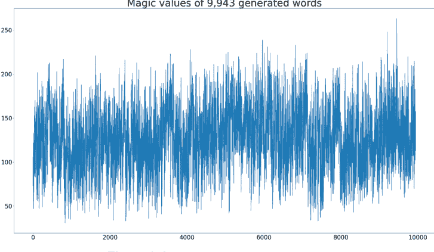
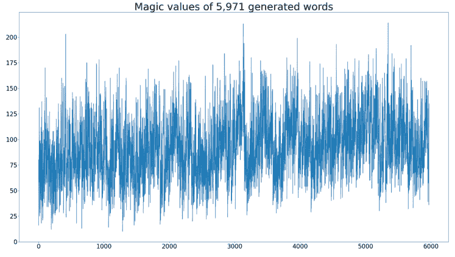
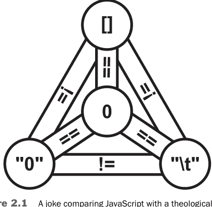
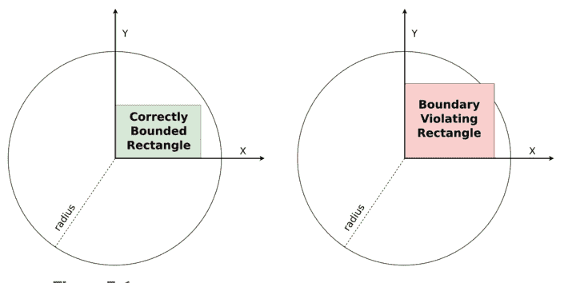
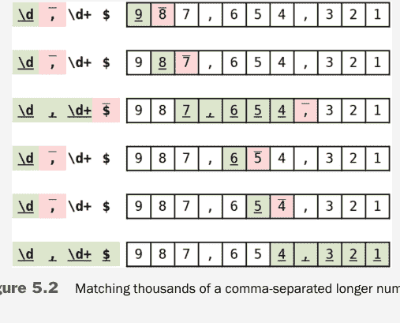
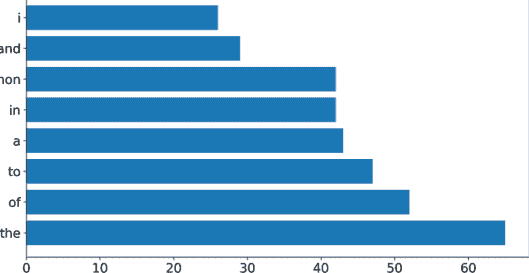
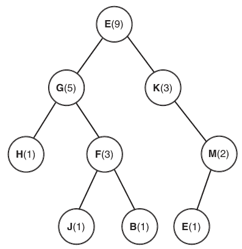
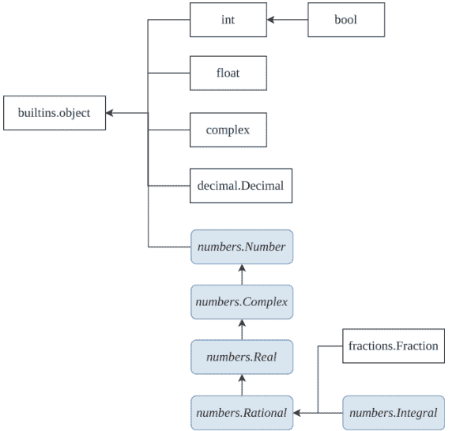

# 更优的Python代码

David Mertz

Alex Martelli 作序

# 对《更优的Python代码》的赞誉

> “通过实践《更优的Python代码：写给有志成为专家的指南》，你将不再只是渴望成为专家，而是真正成为他们中的一员！向David Mertz学习，他在过去20年里通过写作和培训培养了无数专家。”
—Iqbal Abdullahi，PyCon Asia Pacific 前主席，PyCon Japan 前董事会成员

> “在《更优的Python代码：写给有志成为专家的指南》中，David Mertz以简短精悍的章节，呈现了Python化的智慧，这是每位严肃的Python程序员必备的藏书。这本书有助于弥合从初学者到高级Python用户的鸿沟，但即使是最资深的Python程序员，也能从Mertz对Python方方面面的深刻见解中提升自己的水平。”
—Katrina Riehl，NumFOCUS 主席

> “是什么将普通程序员与Python专家区分开来？这不仅仅是了解最佳实践——而是理解Python诸多方面的利弊，并知道何时以及为何选择一种方法而非另一种。在这本书中，David运用了他20多年参与Python生态系统的经验，以及他作为Python作家的经验，确保读者在各种场景下都能理解*该做什么*以及*为什么这么做*。”
—Naomi Ceder，Python Software Foundation 前主席

> “就像一个Python化的BBC，David Mertz在超过四分之一个世纪的时间里，一直以他令人愉悦的可读风格，为Python世界提供信息、娱乐和教育，他在这里继续这样做。”
—Steve Holden，Python Software Foundation 前主席

> “成为专家意味着拥有丰富的经验。David的最新著作提供了一些重要但常见的问题，这些问题通常只有在多年实践和修复后才能学到。我认为这本书将提供一种更快捷的方式来收集这些重要的知识点，并帮助世界各地的许多人变得更好。”
—Kushal Das，CPython 核心开发者，Python Software Foundation 董事

> “这本书适合所有人：从希望避免难以发现的bug的初学者，到希望编写更高效代码的专家。David Mertz汇编了一套非常有用的惯用法，将使你的程序员生活更轻松，让你的用户更满意。”
—Marc-André Lemburg，EuroPython 前主席，Python Software Foundation 前董事

# 更优的Python代码

# 写给有志成为专家的指南

David Mertz

Addison-Wesley
Hoboken, New Jersey

封面图片：StudioLondon/Shutterstock
Python 和 Python 徽标是 Python Software Foundation 的商标。
Linux® 是 Linus Torvalds 在美国和其他国家的注册商标。
macOS® 是 Apple Inc. 的商标。
Microsoft Windows 是 Microsoft 集团公司的商标。

制造商和销售商用于区分其产品的许多名称被声称是商标。当这些名称出现在本书中，并且出版商意识到商标索赔时，这些名称已以首字母大写或全大写印刷。

作者和出版商在准备本书时已尽心尽力，但不作任何明示或暗示的保证，也不对错误或遗漏承担责任。对于因使用本文所含信息或程序而引起的或与之相关的任何附带或间接损害，不承担任何责任。

有关批量购买本书或特殊销售机会（可能包括电子版本；定制封面设计；以及针对您的业务、培训目标、营销重点或品牌兴趣的特定内容）的信息，请联系我们的企业销售部门：corpsales@pearsoned.com 或 (800) 382-3419。

有关政府销售咨询，请联系 governmentsales@pearsoned.com。

有关美国以外的销售问题，请联系 intlcs@pearson.com。

访问我们的网站：informit.com/aw

美国国会图书馆控制号：2023944574

版权所有 © 2024 Pearson Education, Inc.

保留所有权利。本出版物受版权保护，未经出版商事先许可，不得以任何形式或任何方式（电子、机械、影印、录音或类似方式）进行任何禁止的复制、存储在检索系统中或传输。有关权限、请求表以及 Pearson Education 全球权利与权限部门内的适当联系人的信息，请访问 www.pearson.com/permissions。

ISBN-13: 978-0-13-832094-2
ISBN-10: 0-13-832094-2

$PrintCode

# Pearson 对多元化、公平和包容的承诺

Pearson 致力于创建无偏见的内容，反映所有学习者的多样性。我们拥抱多元化的诸多维度，包括但不限于种族、民族、性别、社会经济地位、能力、年龄、性取向以及宗教或政治信仰。

教育是推动世界公平与变革的强大力量。它有可能提供改善生活、实现经济流动的机会。当我们与作者合作为每种产品和服务创建内容时，我们承认我们有责任展示包容性并融入多元化学术，以便每个人都能通过学习实现其潜力。作为全球领先的学习公司，我们有责任帮助推动变革，并履行我们的使命，帮助更多人创造更美好的生活，创造更美好的世界。

我们的目标是为以下世界做出有目的的贡献：

-   每个人都有公平且终身的机会通过学习取得成功。
-   我们的教育产品和服务具有包容性，代表了学习者的丰富多样性。
-   我们的教育内容准确反映了我们所服务的学习者的历史和经历。
-   我们的教育内容能引发与学习者的更深入讨论，并激励他们扩展自己的学习（和世界观）。

虽然我们努力呈现无偏见的内容，但我们希望您就本 Pearson 产品的任何疑虑或需求与我们联系，以便我们进行调查和解决。

-   请通过 https://www.pearson.com/report-bias.html 联系我们，报告任何潜在的偏见问题。

本书献给我的母亲 Gayle Mertz，她始终重视思想和对现有现实的不懈批判。

# 目录

前言 xvii

序言 xix

致谢 xxv

关于作者 xxvii

引言 1

## 1 循环遍历错误的对象 3

- 1.1 （很少）为迭代生成列表 3
- 1.2 使用 enumerate() 而不是循环遍历索引 6
- 1.3 当你需要 dict.items() 时，不要遍历 dict.keys() 8
- 1.4 在迭代过程中修改对象 9
- 1.5 for 循环比 while 循环更符合习惯 12
- 1.6 海象运算符用于“循环一半”代码块 13
- 1.7 zip() 简化了多个可迭代对象的使用 15
- 1.8 zip(strict=True) 和 itertools.zip_longest() 17
- 1.9 总结 20

## 2 混淆相等性与同一性 21

- 2.1 闭包的延迟绑定 21
- 2.2 过度检查布尔值 25
- 2.3 比较 x == None 28
- 2.4 误解可变默认参数 29
  - 2.4.1 第一种方法，使用类 31
  - 2.4.2 第二种方法，使用 None 哨兵值 32
  - 2.4.3 第三种方法，利用有状态生成器 32
- 2.5 可变对象的复制与引用 33
- 2.6 混淆 is 与 ==（在存在驻留机制的情况下） 35
- 2.7 总结 37

## 3 Python 的各种陷阱 39

- 3.1 命名事物 39
  - 3.1.1 将文件命名为与标准库模块相同的名称 39
  - 3.1.2 避免使用 import * 42
  - 3.1.3 裸露或过于通用的 except 语句 46
- 3.2 朴素字符串连接的二次方行为 52
- 3.3 使用上下文管理器打开文件 56
  - 3.3.1 第一个危险 57
  - 3.3.2 第二个危险 58
  - 3.3.3 修正脆弱性 58
- 3.4 .sort() 和 sorted() 的可选参数 key 59
- 3.5 对不确定的键使用 dict.get() 62
- 3.6 总结 64

## 4 高级 Python 用法 67

- 4.1 比较 type(x) == type(y) 67
- 4.2 命名事物（再探） 71
  - 4.2.1 覆盖内置名称 71
  - 4.2.2 直接访问受保护的属性 75
- 4.3 记住较少使用的特性 79
  - 4.3.1 F-String 调试 80
  - 4.3.2 装饰器的优雅魔力 83

# 目录

### 4.3.3 充分使用itertools 90
### 4.3.4 more-itertools第三方库 95

### 4.4 类型注解并非运行时类型 98
#### 4.4.1 类型注解并非运行时约束 100
#### 4.4.2 误将typing.NewType()当作运行时类型 102

### 4.5 本章小结 105

## 5 能做不代表应该做... 107

### 5.1 元类 107
### 5.2 猴子补丁 112
### 5.3 Getter与Setter 115
### 5.4 请求原谅比请求许可更容易 118
### 5.5 结构化模式匹配 121
### 5.6 正则表达式与灾难性回溯 123
### 5.7 本章小结 126

## 6 选择正确的数据结构 129

### 6.1 collections.defaultdict 129
### 6.2 collections.Counter 132
#### 6.2.1 解决方案 132
#### 6.2.2 常见错误 134
### 6.3 collections.deque 135
#### 6.3.1 解决方案 136
#### 6.3.2 常见错误 137
### 6.4 collections.ChainMap 138
#### 6.4.1 解决方案 139
#### 6.4.2 常见错误 140
### 6.5 数据类与命名元组 141
#### 6.5.1 使用命名元组 142
#### 6.5.2 静态与动态 144
#### 6.5.3 数据类 145

### 6.6 高效的具体序列 146
### 6.7 本章小结 150

## 7 误用数据结构 153

### 7.1 重复列表搜索的二次方行为 153
### 7.2 在列表中间删除或添加元素 157
#### 7.2.1 更高效的数据结构 161
### 7.3 字符串是字符串的可迭代对象 165
### 7.4 （通常）使用enum而非常量 166
### 7.5 学习不常见的字典方法 169
#### 7.5.1 定义对象的字典 169
#### 7.5.2 回到我们常规的错误 171
### 7.6 JSON无法干净地往返转换为Python 174
#### 7.6.1 JSON的一些背景知识 175
#### 7.6.2 无法往返转换的数据 176
### 7.7 自制数据结构 178
#### 7.7.1 何时自制是坏主意 179
#### 7.7.2 何时自制是好主意 181
#### 7.7.3 要点总结 186
### 7.8 本章小结 187

## 8 安全 189

### 8.1 随机性的种类 190
#### 8.1.1 使用secrets获取密码学随机性 190
#### 8.1.2 可重现的随机分布 192
### 8.2 将密码或其他机密信息放在“安全”的源代码中 195
### 8.3 “自制”安全机制 198
### 8.4 为微服务使用SSL/TLS 201
### 8.5 使用第三方requests库 205
### 8.6 未使用DB-API时的SQL注入攻击 208
### 8.7 不要使用assert检查安全假设 212
### 8.8 本章小结 215

## 9 Python中的数值计算 217

### 9.1 理解IEEE-754浮点数 217
#### 9.1.1 比较NaN（及其他浮点数） 218
#### 9.1.2 NaN与statistics.median() 221
#### 9.1.3 浮点数的朴素使用：结合律与分配律 224
#### 9.1.4 浮点数的朴素使用：粒度 226
### 9.2 数值数据类型 228
#### 9.2.1 避免在金融计算中使用浮点数 228
#### 9.2.2 数值数据类型的非显而易见行为 232
### 9.3 本章小结 239

## A 附录：其他书籍的主题 241

### A.1 测试驱动开发 241
### A.2 并发 242
### A.3 打包 243
### A.4 类型检查 243
### A.5 数值与DataFrame库 244

## 索引 245

# 前言

我很荣幸受邀为David的新书写前言，因为我一直期待David能提供有用、富有洞察力的内容。

正如我起初抱有很高的期望一样，我很高兴地说，这些期望不仅得到了满足，而且被超越了：这本书引人入胜，为任何中级或高级水平的读者提供了大量提升Python编程技能的见解，并包含了大量实践和教授这门语言的宝贵经验分享；它易于阅读，风格对话式。尽管如此，David还是设法让这本书足够简短精炼，以便快速而充分地吸收。

本书的大部分内容反映并有效地教授了Python专家们关于最佳实践和应避免错误的共识。在少数情况下，作者对某些风格问题的解释与其他专家不同，David会仔细而清晰地指出这些情况，以便读者权衡利弊并做出自己的决定。

本书的大部分内容涉及中级经验和技能水平的Python相关问题。其中包括许多熟悉不同语言的程序员可能在Python中采用较差风格的情况，仅仅因为这看起来像是对他们所熟知语言中合适风格的直接“翻译”。

后者问题的一个极好例子是编写暴露*getter*和*setter*方法的API：在Python中，应该直接获取和设置属性（通常通过*property*装饰器实现）来取代它们。阅读像`widgets.set_count(widgets.get_count() + 1)`这样的假设代码——而经验丰富的Python程序员会使用直接、可读的表达式`widgets.count += 1`——清楚地表明假设的编码者忽视或不了解Python的“最佳实践”。David的书在解决这个和其他常见误解方面大有帮助。

尽管整体处于中级水平，本书并不回避讨论相当多的高级主题，包括正则表达式中灾难性回溯的危险、浮点数表示的一些怪癖、JSON等序列化方法的“往返转换”问题等。对这些问题的涵盖使得学习这本书绝对值得，不仅对中级技能的Python程序员如此，对高级程序员也是如此。

—Alex Martelli

# 前言

Python是一门设计得非常好的编程语言。在令人惊讶的许多情况下，这门语言都设法满足了Tim Peters的*《Python之禅》*中的一句格言：“应该有一种——最好只有一种——显而易见的方法来做这件事。”如果只有一种方法来做这件事，就很难犯错。

当然，这句格言是一个并未普遍实现的愿望。通常在Python中执行一项任务有许多方法，其中许多方法是错误的，许多方法不优雅，许多方法严重依赖其他编程语言的惯用法而非*Pythonic*的，还有一些方法并非完全*错误*但效率极低。本书描述的所有问题都是我在实际代码中见过的，有时是在野外，有时是在代码审查中发现的，而且坦率地说，在我反思其缺陷之前，我自己编写的代码中也出现过太多次。

## 关于本书

本书的各节都呈现了开发者容易陷入的一些错误、陷阱或小毛病，并附有避免这些错误的方法描述。有时这些解决方案仅仅涉及“拼写”上的微小改变，但在大多数情况下，它们需要在你的代码中进行细微的思考和设计。许多讨论还做了其他事情……

我不仅希望向你展示你不知道的东西，而且在很多情况下，我希望向你展示你不知道*有东西*可了解的东西。我相信最有效的写作和教学不仅向读者或学生传达信息，还传达思考问题和推理特定解决方案的*良好思维方式*。本书中的信息框、脚注和愚蠢的离题话都希望让你对特定领域、特定任务或特定编程风格进行更深入的思考。

没有必要从头到尾阅读本书（但我相信这样做的读者会受益）。每章都涉及一组相关的概念，但可以独立阅读。此外，每章中的每一节也是自包含的。每一节都可以独立于其他节阅读，大多数读者都会在每一节中学到一些有趣的东西。有些节比其他节更高级，但即使在那些看似入门的节中，我认为你也会发现你不知道的细微差别。即使在那些看似高级的节中，我也希望你会发现讨论易于理解且富有启发性。

尽管每一节都形成了一种小插图，但各章通常按复杂程度递增的顺序组织，各节则松散地建立在彼此。在觉得有帮助的地方，许多讨论会引用其他章节，这些章节可能提供背景知识，或为后续章节的详细阐述埋下伏笔。

总的来说，我的目标读者是中级Python开发者，或者可能是高级初学者。我假设你了解Python编程语言的基础知识；这些讨论不会教授你在Python入门课程或第一本Python书籍中会学到的最基本语法和语义。我主要假设你拥有求知欲，并希望编写出优雅、高效且正确的代码。

本书以Python 3.12为基准编写，该版本于2023年10月发布。书中展示的代码已针对3.12测试版进行了测试。绝大多数代码示例在Python 3.8中也能运行，这是截至2023年中期尚未停止支持的最早版本。在某些情况下，我会注明代码至少需要Python 3.10（于2021年10月4日发布）；或者偶尔至少需要Python 3.11（于2022年10月24日发布）。本书讨论的绝大多数错误在Python 3.8中就已存在，尽管少数错误反映了后续Python版本的改进。

题为“*Python M.m.μ 版本新特性*”¹的文档至少从Python 1.4时代（1996年）起就一直在维护。²

## 代码示例

本书中展示的大多数代码示例使用Python REPL（读取-求值-打印-循环）。或者更具体地说，它们使用IPython (https://ipython.readthedocs.io) 增强型REPL，但使用`%doctest_mode`魔法命令，使提示符和输出与普通Python REPL非常相似。示例中相当常用的一个IPython“魔法”是`%timeit`；它封装了标准库的`timeit`模块，但提供了一种易于使用且自适应的方式来可靠地计时操作。本书讨论的一些*错误*中，结果本身并非*错误*，但计算所需时间比应有时间长了几个数量级；这个魔法命令就是用来说明这一点的。

当然，当你编写自己的代码时，在REPL中的交互——包括在Jupyter notebooks (https://jupyter.org) 或其他富交互环境中——只是你编写内容的一小部分。但本书中的错误试图聚焦于尽可能小范围的代码样本。交互式shell通常是说明这些错误的好方法；我鼓励你借鉴所学的经验，并将它们复制到完整的`*.py`文件中。理想情况下，这些讨论可以从简单的代码片段开始，最终适应到丰富的代码库中。

在展示操作系统shell中运行的命令（即运行Python脚本以显示结果）时，我会显示命令提示符`[BetterPython]$`，以提供快速的视觉线索。这实际上不是我个人机器上的提示符，而是我如果愿意可以更改的样式。在类Unix系统中，`$`通常是（但不总是）shell提示符的一部分。

1. Python并未严格使用语义化版本控制 (https://semver.org)，因此我隐含的“主版本号.次版本号.微版本号”命名法并不完全准确。
2. 请参阅 https://docs.python.org/3/whatsnew/index.html 获取过去版本发布说明的索引。

### 注 A REPL简介

许多来自其他编程语言的开发者，或者刚刚开始编程的开发者，可能没有意识到交互式shell是多么神奇、多功能和有用。通常，当我希望弄清楚如何完成某个编程任务时，我会跳入Python、IPython或Jupyter环境，以更扎实地理解我设想的问题解决方案将如何运作。

对我来说，在bash终端中进行此类会话的一个快速示例可能如下所示：

```
[BetterPython]$ ipython
Python 3.11.0 | packaged by conda-forge |
    (main, Oct 25 2022, 06:24:40) [GCC 10.4.0]
Type 'copyright', 'credits' or 'license' for more information
IPython 8.7.0 -- An enhanced Interactive Python. Type '?' for help.

In [1]: %doctest_mode
Exception reporting mode: Plain
Doctest mode is: ON
>>> from collections import ChainMap
>>> ChainMap?
Init signature: ChainMap(*maps)
Docstring:
A ChainMap groups multiple dicts (or other mappings) together
to create a single, updateable view.
[...]
File:        ~/miniconda3/lib/python3.11/collections/__init__.py
Type:        ABCMeta
>>> dict1 = dict(foo=1, bar=2, baz=3)
>>> dict2 = {"bar": 7, "blam": 55}
>>> chain = ChainMap(dict1, dict2)
>>> chain["blam"], chain["bar"]
(55, 2)
>>> !ls src/d*.adoc
src/datastruct2.adoc  src/datastruct.adoc
```

1. 使用类似于仅运行python而不带脚本的显示样式。
2. 我按了<tab>键在collections之后选择了一行补全。
3. 我想了解这个对象的功能信息（此处已节选）。
4. 输入表达式会立即显示其值。
5. 使用!，我可以在外部shell中运行命令并查看结果。

REPL能做的事情远不止于此，但这能让你快速感受其能力。

不同的编程环境对将代码示例复制/粘贴到其中的处理方式不同。在IPython内部，使用`%paste`魔法命令会以适当的方式忽略前导的`>>>`或`...`字符。其他各种shell、IDE和代码编辑器的行为会有所不同。许多在REPL之外展示的代码示例，以及使用的许多数据文件，都可以在 https://gnosis.cx/better 获取。此外，路径大多为展示而简化；文件通常位于书籍网站的`code/`或`data/`子目录中，但这些路径通常不会显示。换句话说，展示的代码用于解释概念，而非我打算让你直接复制的可重用代码。（当然，你*可以*使用它。）特别地，许多展示的代码存在*缺陷*；对于这些代码，我当然不希望你在生产环境中使用。

所有标题包含“Source code of `<filename>`”的代码块都可以从 https://gnosis.cx/better 下载。在某些情况下，本书中展示的代码是从一个更长的命名文件中摘录的。所有其他代码块，无论是为辅助导航而命名还是未命名，都仅用于解释概念；当然，你可以自由地通过复制、重新输入或调整来用于你的目的。

## 获取本书使用的工具

Python编程语言是自由软件，可以从Python软件基金会（PSF）的官方网站获取。许多其他实体也创建了定制的Python发行版，捆绑了额外或不同的功能。这些包括许多操作系统供应商。大多数Linux发行版都捆绑了Python。macOS（以前曾以略有不同的方式书写，如“Mac OS X”和“OS X”）自2001年起就包含了Python。它也可以从Microsoft Store获取用于Windows。

要获取PSF发行版的Python，请访问 https://www.python.org/downloads/。许多操作系统和硬件平台都有可用版本。要跟随本书中的一些示例，建议使用基于IPython终端的REPL (https://ipython.org/install.html) 或Jupyter notebooks (https://docs.jupyter.org/en/latest/install.html)。这些增强型交互环境支持“魔法”，例如`%timeit`，这些是Python语言本身不包含的特殊命令，但可以改进交互式探索。在整本书中，当展示交互式会话时，可以通过初始行的前导`>>>`和续行的前导`...`（如果存在）轻松识别。然而，Jupyter——以及许多集成开发环境（IDE）或高级代码编辑器中的交互式shell——使用其他视觉标记来标记输入的代码和产生的结果。提到的增强型REPL还支持在Python名称末尾添加单个或双个`?`来显示其引用对象的信息；这在一些示例中使用。

我个人使用Miniconda (https://docs.conda.io/en/latest/miniconda.html) 作为安装Python、IPython、Jupyter以及许多其他工具和库的方式。Miniconda本身包含一个Python版本，但也允许创建具有不同Python版本的*环境*，或者实际上不包含Python，而是其他有用工具的环境。你将在一些示例中看到关于我安装选择的提示，但本书中的任何内容都不依赖于你遵循我的选择。

## 其他实用工具

本书中的大多数讨论都是概念性的，而非仅仅涉及风格。然而，代码检查工具通常能检测出至少接近概念性的错误，有时甚至包括本书中描述的错误。Python 的一个特别优秀的代码检查工具是 Flake8 (https://flake8.pycqa.org/)，它实际上利用了多个更底层的检查工具作为（可选的）依赖项。一个优秀的检查工具很可能无法检测出所有重要错误，但至少*理解*它为何对你的代码提出抱怨，这绝不会错。

Black 代码格式化工具 (https://black.readthedocs.io/) 的主页很好地描述了自己：

> Black 是一个毫不妥协的 Python 代码格式化工具。使用它，你就同意放弃对手动格式化细节的控制。作为回报，Black 为你提供速度、确定性，以及摆脱 pycodestyle 对格式问题唠叨的自由。你将节省时间和精力，用于更重要的事情。

— Black 主页

Python 开发者对使用 Black 的看法不一。我发现，即使 Black 偶尔会以我并非完全认可的方式格式化代码，但在与其他开发者协作时强制保持一致性，有助于提高共享代码的可读性，尤其是在大型项目中。

一个近期令人印象深刻的代码检查和格式化项目是 Ruff (https://beta.ruff.rs/docs/)。Ruff 覆盖了与 Flake8 和其他工具相同的大部分检查规则，但它是用 Rust 编写的，运行速度比其他检查工具快几个数量级。此外，Ruff 提供了类似于 Black 的自动格式化功能，但清理了许多 Black 未处理的问题。（然而，Black 也清理了 Ruff 未处理的问题；它们是互补的。）

在现代 Python 开发中，类型注解和类型检查工具已得到相对广泛的应用。其中最受欢迎的工具可能是 Mypy (http://mypy-lang.org/)、Pytype (https://google.github.io/pytype/)、Pyright (https://github.com/Microsoft/pyright) 和 Pyre (https://pyre-check.org/)。所有这些工具都有其优点，尤其对于大型项目而言，但本书通常避免讨论 Python 的类型检查生态系统。类型检查能够检测到的错误类型，与我们在此讨论的语义和风格问题大多不相交。

> 在 InformIT 网站上注册你的《*Better Python Code*》副本，以便在更新和/或更正发布时方便地获取。要开始注册流程，请访问 informit.com/register 并登录或创建一个帐户。输入产品 ISBN (9780138320942) 并点击提交。在“已注册产品”选项卡上查找此产品旁边的“访问额外内容”链接，并按照该链接访问任何可用的额外材料。如果你想收到有关新版本和更新的独家优惠通知，请勾选框以接收我们的电子邮件。

## 致谢

Python-Help 论坛 (https://discuss.python.org/c/users/7) 的许多参与者为这些错误提出了很好的建议。对于他们的许多建议，我已经包含了他们的想法或其某种变体，但在其他情况下，他们的想法促使我增加或修改了所讨论的错误。我衷心感谢 Chris Angelico、Charles Machalow、John Melendy、Steven D'Aprano、Ryan Duve、Alexander Bessman、Cooper Lees、Peter Bartlett、Glenn A. Richard、Ruben Vorderman、Matt Welke、Steven Rumbalski 和 Marco Sulla 的建议。

其他提出建议的朋友包括 Brad Hunting、Adam Peacock 和 Mary Ann Sushinsky。

由于收到的建议，本书变得更好了；所有错误仍由我本人负责。

## 关于作者

**David Mertz, Ph.D.**，是 Python 社区的长期成员：大约 25 年——足以让他记得 Python 1.5 相对于 1.4 的新特性。他密切关注这门语言的发展，就版本间的许多变化发表过主题演讲，他的写作对 Python 及其流行库的发展方向产生了一定影响。David 曾向科学家、来自其他语言的开发者以及编程新手教授 Python。

你可以在 https://gnosis.cx/publish/resumes/david-mertz-publications.pdf 找到关于他出版物的大量详细信息。你可以在 https://gnosis.cx/publish/resumes/david-mertz-resume.pdf 了解更多关于他工作经历的信息。

## 引言

Python 是一门强大的，同时也是相当有主见的编程语言。虽然在 Python 中完成一项任务通常有多种*可能*的方法，但往往只有一种*应该*采用的方法。有些程序被认为是“Pythonic”的，而有些则不是。

> **关于 Pythonic 的说明**

*Pythonic* 这个略带玩笑意味的术语在 Python 社区中被广泛使用。它大致意味着“反映了 Python 语言的良好编程实践”。但这个术语也有一种难以言喻的*微妙*之处，类似于其他程序员用 *fragile*（脆弱）、*elegant*（优雅）或 *robust*（健壮）来描述特定代码的方式。你将在本书中经常看到 *Pythonic* 和 *unpythonic* 这两个术语。

在相关的 Python 幽默中——毕竟这门语言是以 Monty Python 喜剧团命名的——我们经常用 *Pythonista* 来称呼那些精通 Pythonic 编程的开发者。

在相当大的程度上，Pythonic 是一个目标，旨在提高程序的*可读性*，以便其他用户和贡献者能够轻松理解你的意图、代码的行为，甚至识别其错误。此外，很多时候，不 Pythonic 的做法会导致意外行为，从而在你可能未考虑或未尝试过的边缘情况下损害*功能性*。

在本书中，我对于好的 Python 实践毫不掩饰自己的主见。在讨论中，我试图解释这些观点背后的动机，并反思我长期使用、教授和撰写关于 Python 的经验。这是一门真正令人愉悦的编程语言，我对此怀有真诚的热情。

我们对 Python 代码的许多期望在*《Python 之禅》*中得到了阐释。

```
>>> import this
The Zen of Python, by Tim Peters

Beautiful is better than ugly.
Explicit is better than implicit.
Simple is better than complex.
Complex is better than complicated.
Flat is better than nested.
Sparse is better than dense.
Readability counts.
Special cases aren't special enough to break the rules.
Although practicality beats purity.
Errors should never pass silently.
Unless explicitly silenced.
In the face of ambiguity, refuse the temptation to guess.
There should be one---and preferably only one---obvious way to do it.
Although that way may not be obvious at first unless you're Dutch.
Now is better than never.
Although never is often better than *right* now.
If the implementation is hard to explain, it's a bad idea.
If the implementation is easy to explain, it may be a good idea.
Namespaces are one honking great idea---let's do more of those!
```

Python 编程世界中有许多非常重要的话题，但这本简短的书中并未涉及。附录《*其他书籍的主题*》提供了一些资源指引，以及我认为你在学习这些主题时值得追求的想法的简要概述。

## 遍历错误的对象

与大多数过程式编程语言一样，Python 有两种循环：`for` 和 `while`。这些循环的语义与大多数类似语言非常相似。然而，Python 特别强调*遍历*可迭代对象——包括*惰性*可迭代对象和具体集合——这是许多语言所不具备的。本章中的许多错误在其他编程语言中是“最佳实践”，但当直接移植到 Python 时，要么在风格上有缺陷，要么不必要地脆弱。

从技术上讲，Python 也允许递归，这是另一种“循环”方式，但 Python 中的递归深度是有限的，并且缺少尾调用优化（参见 https://en.wikipedia.org/wiki/Tail_call）。对于那些自然*细分*以达到解决方案的问题，递归可能非常有用，但在 Python 中，它很少是构建一系列相似动作的好方法。

本章中的错误都不专门涉及递归，但来自 Lisp 系列语言、ML 系列语言，或者可能是 Haskell、Rust、Lua、Scala 或 Erlang 的程序员应该注意，虽然递归在你过去使用的语言中可能是个好习惯，但它*可能*成为 Python 中的坏习惯。

### 1.1 （很少）生成列表用于迭代

许多 Python 程序中的一个常见模式是生成一系列待处理的项目，将它们附加到一个列表中，然后遍历该列表，在遍历到每个项目时进行处理。事实上，以这种方式构建程序通常完全合理且非常直观。除非它不合理。

当项目序列可能非常长（或潜在无限长），或者每个项目可能是一个占用大量内存的对象时，创建并填充列表通常会消耗比所需更多的内存。此外，当处理操作可能与生成操作并发时，我们可能花费很长时间生成列表，然后花费同样长的时间处理列表。如果实际并行是可能的，我们或许能够以一半的时间完成整个程序。但当并行成为可能时，它并不总是容易的。（关于并发的更多信息，请参见本书的附录。）

## 第一章 循环遍历错误的对象

假设我们有一个名为 `get_word()` 的函数，每次调用它都会返回一个单词，通常不同调用会返回不同的单词。例如，这个函数可能以某种方式响应通过线路发送的数据，或者根据程序状态的其他信息动态计算得出。对于这个示例函数，如果 `get_word()` 返回 None，则表示其数据源已耗尽；此外，本例中的“单词”仅指由小写 ASCII 字母组成的序列。

编写类似以下的代码是直接且常见的。

从生成的项目创建列表

```python
# source = <some identifier for how we generate data>
words = []
while True:
    word = get_word(src=source)
    if word is None:
        break
    words.append(word)

print(f"{len(words):,}") # -> 267,752
```

本书其他章节的读者可能认出生成的单词数量，并由此猜测 `get_word()` 的实现。但让我们假设单词的数量及其内容在每次程序运行时都可能变化，并且可能跨越多个数量级。

在一个简单的数字命理学中，我们通过将 'a' 赋值为 1，'b' 赋值为 2，依此类推，直到 'z' 赋值为 26，然后将这些值相加，为每个单词分配一个魔法数字。这个特定的转换并不重要，但“从每个数据计算一个值”的想法非常普遍。我们使用以下函数进行此计算。

数字命理学单词魔法数字

```python
def word_number(word):
    magic = 0
    for letter in word:
        magic += 1 + ord(letter) - ord('a')
    return magic
```

我们可以如图 1.1 所示可视化这些数字命理值的分布。

```python
# words = <regenerated list from another source>
import matplotlib.pyplot as plt  # ❶
plt.plot([word_number(word) for word in words])
plt.title(f"Magic values of {len(words):,} generated words")
plt.show()
```

❶ pip install matplotlib or conda install matplotlib



**图 1.1** 生成单词的魔法数字。

假设我们只关心最终生成的图表，那么我们没有必要实例化完整的单词集合，只需要它们的魔法数字。诚然，这个示例过于简单，无法展示重构的全部优势，但一个合理的方法是惰性地构建一个仅包含我们实际关心的数据的生成器，并且仅在需要时使用中间数据。例如，以下代码生成图 1.2 所示的图表。

在生成器中仅惰性计算所需内容

```python
def word_numbers(src):
    while (word := get_word(src=src)) is not None:
        yield word_number(word)

# source2 = <some different identifier for data source>
magic_nums = list(word_numbers(source2))
plt.plot(magic_nums)
plt.title(f"Magic values of {len(magic_nums):,} generated words")
plt.show()
```

图 1.2 所示的示例仍然需要实例化数字列表，但不需要实际单词的列表。如果“单词”是某些更大、更消耗内存的对象，这种变化将变得更加重要。对于许多场景，仅从生成器中逐个增量处理每个值，完全没有中间集合，就足够了，并且可以节省大量内存。



**图 1.2** 更多生成单词的魔法数字。

## 1.2 使用 enumerate() 而不是循环遍历索引

来自 C 派生语言的开发者有时会自动使用循环遍历列表或其他数据结构的索引元素。这通常是一种非 Pythonic 的循环编写方式。以这种方式编写的代码在速度上并不比使用 `enumerate()` 慢多少，但可读性较差，更冗长，并且通常感觉像是一种“代码异味”。

例如，在 C++ 中，这样的惯用法很常见：

```cpp
// `items` could be array, vector, or other collection types
for (int i = 0; i < items.size(); i++) {
    process(i, items[i]);
}
```

Python 中也有一个非常类似的选项，在 Python 相对久远的过去，这种方法是标准可用的机制：

```python
for i in range(len(items)):
    process(i, items[i])
```

确实，如果你不需要在循环中使用索引位置，那么在 Python 中使用索引通常是一种代码异味。一个更地道的选项是：

```python
for item in items:
    process(None, item)
```

在那些相当常见的需要同时使用索引和底层项目的场合，使用 `enumerate()` 更具表现力和地道性：

```python
for i, item in enumerate(items):
    process(i, item)
```

在相对不常见的情况下，我想要索引但不想要项目本身时，我通常仍然使用 `enumerate()`，并且我使用 Python 的惯例 `_`（单下划线）表示“我不关心的值”：

```python
for i, _ in enumerate(items):
    process(i, None)
```

我有时使用的一种方法，当我实际上想要维护多个增量时，是在循环之前初始化多个计数器，即使其中一个可以从 `enumerate()` 派生：

```python
total, n_foo, n_bar = 0, 0, 0
for item in items:
    if is_foo(item):
        process_foo(item)
        n_foo += 1
    elif is_bar(item):
        process_bar(item)
        n_bar += 1
    else:
        pass
    total += 1
```

在这个例子中，`total` 也可以在循环本身中重置，但你可能希望强调与 `n_foo` 和 `n_bar` 的平行关系，这可能更好地表达为这里所示。

## 1.3 当你需要 dict.items() 时，不要迭代 dict.keys()

在某种意义上，你可以*几乎*将 Python 列表视为从索引位置到值的映射。在字典中，整数完全可以作为键；因此，`obj[7]` 可能同样是一个 `dict`（或其他映射）的索引，或者是一个 `list`（或其他序列）的索引。

就像你有时会看到非 Pythonic 的代码循环遍历列表的索引位置，然后在循环体中查找该索引一样，你有时也会看到非 Pythonic 的代码循环遍历 `dict.keys()`。实际上，让我们稍微回溯一下：刚刚提到了两个风格错误。想象这样的代码：

```python
for key in my_dict.keys():
    process(key, my_dict[key])
```

这首先是非地道的，因为循环遍历 `my_dict.keys()` 等同于循环遍历 `my_dict` 本身。在幕后，产生的对象类型略有不同：`my_dict.keys()` 产生 `dict_keys`，而字典本身产生 `dict_keyiterator`。然而，很少有实际代码依赖于这种差异，因为它们在大多数目的下行为相同：

```python
>>> my_dict = {c:ord(c) for c in "Bread and butter"}
>>> type(my_dict.keys())
<class 'dict_keys'>
>>> type(iter(my_dict))
<class 'dict_keyiterator'>
```

具体来说，以下恒等式对于每个字典都将始终适用（除非你以极大的反常方式在 `dict` 的子类或某些自定义映射中破坏此恒等式）：

```python
>>> all(a is b for a, b in zip(iter(my_dict), iter(my_dict.keys())))
True
```

换句话说，如果你希望循环遍历键，你应该直接写：

```python
for key in my_dict:
    process(key, my_dict[key])
```

然而，相对不常见的是只希望循环遍历字典的*键*。即使你很少在代码的某个分支中实际使用该值，将其作为循环变量包含在内也几乎没有任何成本。记住，Python 对象是通过引用访问的；你只是通过绑定循环变量将引用分配给现有对象；你不会复制或创建对象。

换句话说，不要费心写：

```python
for key in my_dict:
    if rare_condition(key):
        val = my_dict[key]
        process(key, val)
```

直接编写干净、Pythonic 的代码：

```python
for key, val in my_dict.items():
    if rare_condition(key):
        process(key, val)
```

这个问题是 linter 可能会警告的——就像之前关于使用 `enumerate()` 的问题一样——但*理解*循环的机制比仅仅阅读警告更进一步。

## 1.4 在迭代过程中修改对象

你不应该修改你正在迭代的对象。有时你可以“侥幸逃脱”而没有不良影响，但这种习惯仍然是不好的。

我们首先应该注意的是，某些 Python 对象是不可变的。例如，如果你迭代一个 `str`、`bytes`、`tuple` 或 `frozenset` 对象，那么修改底层集合的问题根本不会出现。

尽管如此，许多 Python 对象既是可迭代的又是可变的——最显著的是 `list`、`dict`、`set` 和 `bytearray`，当然，自定义或第三方对象也可能是。尝试在迭代对象时修改它可能会以几种不同的方式出错。

对不可变对象的基线迭代

```python
>>> s = "Mary had a little lamb!"
>>> for c in s:
...     if c <= "s":
...         print(c, end="")
... print()
Mar had a lile lamb!
```

这个示例代码本身大多毫无意义，但我们对可迭代对象中满足某个谓词的元素执行选择性操作。我们当然可以做的不是打印单个字符，而是将通过过滤器的字符重新聚合到某个新的

## 第一章 循环遍历错误的对象

集合。这种方法通常是解决所有变更问题的完美方案，因此请将其作为备选方案牢记于心。
假设我们想尝试使用可变集合而非不可变字符串来实现类似功能。

### 可迭代对象变更时的快速失败

```python
>>> my_set
{'r', 'M', 'm', 'a', 'e', 'h', 'l', 't', 'd', 'b', '!', ' ', 'i'}
>>> my_set = set("Mary had a little lamb!")
>>> for c in my_set:
...     if c > "s":
...         my_set.discard(c)
...
Traceback (most recent call last):
  [...]
RuntimeError: Set changed size during iteration

>>> my_dict = {c:ord(c) for c in "Mary had a little lamb!"}
>>> for c in my_dict:
...     if c > "s":
...         del my_dict[c]
...
Traceback (most recent call last):
  [...]
RuntimeError: dictionary changed size during iteration
```

通过快速抛出 `RuntimeError`，修改这些可迭代对象的诱惑被降低了。然而，对于有序集合，我们就不那么幸运了。虽然也会出错，但错误可能更加微妙且更难察觉。

### 可迭代对象变更时的隐藏失败

```python
>>> my_list = list("Mary had a little lamb!")
>>> for i, c in enumerate(my_list):
...     if c > "s":
...         del my_list[i]
...
>>> my_list
['M', 'a', 'r', ' ', 'h', 'a', 'd', ' ', 'a', ' ', 'l', 'i',
 't', 'l', 'e', ' ', 'l', 'a', 'm', 'b', '!']
>>> "".join(my_list)
'Mar had a litle lamb!'
```

```python
>>> my_ba = bytearray("Mary had a little lamb!", "utf8")
>>> for i, c in enumerate(my_ba):
...     if c > ord("s"):
...         del my_ba[i]
...
>>> my_ba
bytearray(b'Mar had a litle lamb!')
```

在这段代码中，表面上看起来运行正确。没有抛出异常。我们确实得到了一个删除了部分字符的列表或字节数组。然而，仔细观察会发现，一个本应被过滤掉的 `t` 字符仍然留在了变更后的对象中。这是因为一旦删除了某个元素，索引位置就不再与底层实际序列对齐。插入新元素时也会出现类似问题。

处理此需求的正确方法是简单地基于谓词创建一个全新的对象，并选择性地向其追加内容。在 Python 列表或字节数组上，追加操作是廉价的（然而，向新序列中间插入元素很容易导致二次复杂度——本书其他部分会对此风险提出警告）。

### 创建新对象作为序列的过滤器

```python
>>> my_list = list("Mary had a little lamb!")
>>> new_list = []
>>> for c in my_list:
...     if c <= "s":
...         new_list.append(c)
...
>>> new_list
['M', 'a', 'r', ' ', 'h', 'a', 'd', ' ', 'a', ' ', 'l', 'i', 'l', 'e', ' ', 'l', 'a', 'm', 'b', '!']
>>> "".join(new_list)
'Mar had a lile lamb!'
```

更简洁的写法：

```python
>>> new_list = [c for c in my_list if c <= "s"]
>>> "".join(new_list)
'Mar had a lile lamb!'
```

回想一下，你也可以通过取空切片来创建序列的（浅）副本。在稍有不同的场景中，`my_list[:]` 或 `my_ba[:]` 通常可以作为创建包含相同元素的新序列的便捷语法。

## 1.5 for 循环比 while 循环更符合 Python 风格

在可能的情况下，符合 Python 风格的循环看起来像这样：`for item in iterable`。这是基本的惯用法，当你发现自己在做其他事情时，请思考一下其他方式是否真的更好。

在编写程序循环时，你经常面临在 `for` 和 `while` 之间做出选择。或者更准确地说，对于任何给定的循环，你*可以*始终使用其中任何一个。这可能不明显，但如果一种语言只有 `for` 循环但拥有无限迭代器，你也能应付。

### 仅使用 `for` 实现 `while predicate(a, b)` 的等效形式

```python
>>> from itertools import repeat
>>> a, b = 17, 23  # 初始示例值没有特殊含义
>>> for _ in repeat(None):  # ❶
...     print("Current values:", a, b)
...     if predicate(a, b):  # ❷
...         break
...     a = get_data(a)  # ❸
...     b = get_data(b)  # ❸
...
Current values: 857 338
Current values: 613 500
Current values: 611 47
Current values: 387 871
Current values: 689 812
Current values: 406 892
Current values: 817 522
```

- ❶ 一个始终产生 `None` 的无限迭代器
- ❷ 故意模糊 `predicate()` 检查的内容
- ❸ 故意模糊 `get_data()` 执行的操作

前面的代码是 `while True` 循环的标准示例，但没有使用 `while` 编写。也就是说，我们以有状态的方式获取要处理的数据。然后我们评估这些数据，期望它*可能*达到我们希望退出循环的状态（但它也可能是一个永远运行的服务器）。¹

将 `for` 表示为 `while` 的形式作为翻译甚至更简单。

### 仅使用 `while` 实现 `for item in iterable` 的等效形式

```python
>>> # iterable = <collection, generator, something else>
>>> iterator = iter(iterable)
>>> try:
...     while True:
...         item = next(iterator)
...         print("Current item:", item)
... except StopIteration:
...     pass
...
Current item: 2
Current item: 3
Current item: 5
Current item: 7
Current item: 11
```

显然，你可以在前面的 `while` 结构中执行相同的条件分支、`break`、`continue` 或所有其他你可能放在 `for` 循环中的操作。

尽管它们在形式上是等价的（可能需要少量额外行来强制实现），但 `for` 循环比 `while` 循环更常让人感觉符合 Python 风格。这个一般性建议有*许多*例外，但你会发现*几乎总是*在 Python 中循环时，要么是遍历集合，要么是遍历可迭代对象（如生成器函数、生成器表达式或自定义可迭代类）。在许多不是这种情况的时候，这表明需要将提供数据进行操作的代码部分重构*为*可迭代对象。

使用 `while` 并不是错误，但每当你发现自己在编写它时，你仍然应该问自己：“我能用 `for` 循环来完成这个吗？”对于你能够重构的代码，也问自己同样的问题。答案很可能是 `while` 循环是最具表现力和最清晰的版本，但这个问题仍然应该出现在你的脑海中。从（潜在的无限）序列的角度思考通常能促进 Python 中清晰而优雅的设计。

## 1.6 用于“半循环”块的海象运算符

Python 程序员——以及许多其他编程语言的程序员——经常使用的一种模式总是略显丑陋。这就是“半循环”模式。事实上，许多语言在设计时就包含了，或者后来增加了像 `do ... while` 或 `repeat ... until` 这样的结构，专门为了避免这个小缺陷。例如，以下代码使用了与前面章节相同的神秘 `get_data()` 和 `predicate()` 函数。

### Python 中的旧式半循环

```python
>>> val = get_data()
>>> while not predicate(val):
...     print("Current value acceptable:", val)
...     val = get_data()
...
Current value acceptable: 869
Current value acceptable: 805
Current value acceptable: 632
Current value acceptable: 430
```

在循环之前和循环体内重复对 `val` 进行赋值，从风格和代码清晰度的角度来看感觉有点不对（尽管，这并不是一个实际的*错误*）。
这种模式的一个可能更不美观的变体是在循环体内使用 `break` 来避免重复。

### Python 中的内部 break 式半循环

```python
>>> while True:
...     val = get_data()
...     if predicate(val):
...         break
...     print("Current value acceptable:", val)
...
Current value acceptable: 105
Current value acceptable: 166
Current value acceptable: 747
```

自 Python 3.8 起，我们有了使用所谓的“海象运算符”来简化此结构的选项。该运算符因其类似于海象的表情符号（有眼睛和獠牙）而得名。海象运算符 (`:=`) 允许你在表达式内赋值，而不仅仅是作为语句。

### Python 中的新式半循环

```python
>>> while not predicate(val := get_data()):
...     print("Current value acceptable:", val)
...
Current value acceptable: 859
Current value acceptable: 296
Current value acceptable: 235
Current value acceptable: 805
Current value acceptable: 383
```

在谓词位于 `while` 语句内的两种情况下，循环可能进入零次。使用 `while True` 时，循环至少会进入一次，但如果发生某些条件，它可能会提前终止（即“半循环”）。

¹ 欢迎读者尝试猜测 `get_data()` 和 `predicate()` 的功能。请在深入理解梅森旋转伪随机数生成器（PRNG）后前来尝试。

在 `if` 语句中使用海象运算符，在提供值和可能不运行代码块方面都非常相似。

一个没有和带有内联初始化的 `if` 代码块

```
>>> val = get_data()
>>> if val:
...     print("Current value acceptable:", val)
...
Current value acceptable: 247

>>> if val := get_data():
...     print("Current value acceptable:", val)
...
Current value acceptable: 848
```

## 1.7 `zip()` 简化了多个可迭代对象的使用

与本章的许多讨论一样，让我们来看一个主要关乎风格和代码清晰度的错误。一种不够 Pythonic 的循环遍历多个可迭代对象（例如多个列表）的方式可能如下所示。在示例中，几个数据文件包含了 1,255 个 NOAA 监测气象站的信息。

并行访问多个相同长度的列表

```
>>> from pprint import pprint
>>> from pathlib import Path
>>> from collections import namedtuple

>>> Station = namedtuple("Station",
...     "name latitude longitude elevation")
...
>>> names = Path("station-names.txt").read_text().splitlines()
>>> lats = Path("station-latitudes.txt").read_text().splitlines()
>>> lons = Path("station-longitudes.txt").read_text().splitlines()
>>> els = Path("station-elevations.txt").read_text().splitlines()
>>> assert len(names) == len(lats) == len(lons) == len(els) == 1255

>>> stations = []
>>> for i in range(1255):
...     station = Station(names[i], lats[i], lons[i], els[i])
...     stations.append(station)
```

## 第 1 章 循环遍历错误的对象

```
...
>>> pprint(stations[:4])
[Station(name='JAN MAYEN NOR NAVY', latitude='70.9333333',
    longitude='-8.6666667', elevation='9.0'),
 Station(name='SORSTOKKEN', latitude='59.791925',
    longitude='5.34085', elevation='48.76'),
 Station(name='VERLEGENHUKEN', latitude='80.05',
    longitude='16.25', elevation='8.0'),
 Station(name='HORNSUND', latitude='77.0',
    longitude='15.5', elevation='12.0')]
```

示例中的断言检查了所有这些文件确实具有相同数量的数据。当然，更健壮的错误处理是可能的。示例中使用 `pathlib` 确保了文件在读取后会被关闭。使用 `pathlib` 为你提供了与使用上下文管理器类似的正确清理保证，这将在第 3 章中讨论。

前面的代码并不糟糕，但可以使其更加 Pythonic。作为一项改进，我们可以注意到打开的文件句柄本身就是可迭代的。更重要的是，我们不需要中间列表来执行此操作，也不需要分别访问每个列表中对应的索引位置。这呼应了本章讨论的几个错误，即关注数据在集合中的*位置*，而不是直接关注数据本身。

构建气象站数据命名元组列表的更清晰代码可能如下所示。

使用 `zip()` 读取多个打开的文件

```
>>> stations = []
>>> with (
...     open("station-names.txt") as names,
...     open("station-latitudes.txt") as lats,
...     open("station-longitudes.txt") as lons,
...     open("station-elevations.txt") as els,
... ):
...     for data in zip(names, lats, lons, els):
...         data = (field.rstrip() for field in data)
...         stations.append(Station(*data))
...
>>> assert len(stations) == 1255
>>> pprint(stations[:4])
[Station(name='JAN MAYEN NOR NAVY', latitude='70.9333333',
    longitude='-8.6666667', elevation='9.0'),
 Station(name='SORSTOKKEN', latitude='59.791925',
    longitude='5.34085', elevation='48.76'),
 Station(name='VERLEGENHUKEN', latitude='80.05',
    longitude='16.25', elevation='8.0'),
```

```
Station(name='HORNSUND', latitude='77.0',
    longitude='15.5', elevation='12.0')]
```

❶ 带括号的上下文管理器在 Python 3.10 中引入。

必须从文件迭代器中去除额外换行符的美学效果并不理想，但总体而言，这段代码同样安全（在保证文件关闭方面），在给定时间只在内存中保存每个文件的一个数据项，并且更简洁、更具表达力。额外的名称仍然存在于命名空间中，但它们只是占用最少内存的已关闭文件：

```
>>> names
<_io.TextIOWrapper name='station-names.txt' mode='r' encoding='UTF-8'>
>>> next(names)
Traceback (most recent call last):
  [...]
ValueError: I/O operation on closed file.
```

## 1.8 `zip(strict=True)` 和 `itertools.zip_longest()`

在上一节中，我们探讨了使用 `zip()` 通常可以实现的可读性改进。但那一节也忽略了底层任务中一个可能的问题。我们 `zip()` 在一起的可迭代对象可能长度不同，当它们长度不同时，`zip()` 会静默地忽略较长迭代器中未消耗的项。

回想一下，我们有几个数据文件，包含 NOAA 监测气象站的名称、纬度、经度和海拔信息。人们很快就能注意到这是一种脆弱的数据安排，因为创建文件的过程可能无法确保其数据的准确同步。然而，数据通常以我们无法控制的、存在上游缺陷的形式提供给我们。

我们编写的用于说明 `zip()` 良好用法的代码，是通过将每个气象站的所有属性放在同一个对象中（示例中是命名元组，尽管数据类、字典或自定义对象等其他对象也可能是不错的选择）来修复原始数据格式中某些缺陷的好方法。

在上一节的“解决方案”中使用的最简单形式的 `zip()`，实际上可能会掩盖错误，而不是更好的选择——即明确失败。回想一下《Python 之禅》中的明智建议：“错误决不应该被默默传递。”

我们之前使用了这段代码，但让我们将数据文件 `station-lattrunc.txt` 替换 `station-latitudes.txt`。也就是说，前者是后者的截断版本，我为这个示例构造了它。

## 第 1 章 循环遍历错误的对象

使用 `zip()` 可能掩盖可迭代对象之间的不匹配

```
>>> stations = []
>>> with (
...     open("station-names.txt") as names,
...     open("station-lattrunc.txt") as lats,
...     open("station-longitudes.txt") as lons,
...     open("station-elevations.txt") as els,
... ):
...     for datum in zip(names, lats, lons, els):
...         datum = (d.rstrip() for d in datum)
...         stations.append(Station(*datum))
...
>>> assert len(stations) == 1255
Traceback (most recent call last):
  [...]
AssertionError
>>> len(stations)
1250
```

显示的断言捕获了生成的对象列表长度不是精确的 1,255；但我们希望代码足够灵活，能够处理与精确数量不同的对应数据项。

当我们想要强制一定程度的数据一致性，但不一定知道确切的数据大小时，我们可以采取两种合理的方法：要求所有数据文件*实际上*长度匹配，或者在数据不可用时填充字段。根据你的目的，两者都是合理的。

使用 `zip(strict=True)` 强制迭代器长度一致性

```
>>> stations = []
>>> with (
...     open("station-names.txt") as names,
...     open("station-lattrunc.txt") as lats,
...     open("station-longitudes.txt") as lons,
...     open("station-elevations.txt") as els,
... ):
...     for datum in zip(names, lats, lons, els, strict=True):
...         datum = (d.rstrip() for d in datum)    # ❶
...         stations.append(Station(*datum))
...
Traceback (most recent call last):
  [...]
ValueError: zip() argument 2 is shorter than argument 1
```

❶ 可选的 `strict` 参数在 Python 3.10 中添加。

这种方法在独立于多个数据流长度的情况下非常有用，只是强制它们相同。而且它是一种非常“快速失败”的方法，这几乎是普遍期望的。

然而，同样肯定存在一些情况，其中为缺失数据填充哨兵值更合适。*哨兵*是一个特殊值，可以标记数据点的“特殊”情况。在许多上下文中，一个非常常见的哨兵是 `None`。有时你可能使用像 -1 这样的值作为哨兵，以表示“正常”值是正数。其他时候，你可能包含一个定义的名称，如 `my_sentinel = object()`，以保证该值与程序中的所有其他值都不同。使用 `zip_longest()` 填充推断值很容易。

使用 `itertools.zip_longest()` 填充缺失数据

```
>>> from itertools import zip_longest
>>> stations = []
>>> with (
...     open("station-names.txt") as names,
...     open("station-lattrunc.txt") as lats,
...     open("station-longitudes.txt") as lons,
...     open("station-elevations.txt") as els,
... ):
...     for datum in zip_longest(
...             names, lats, lons, els, fillvalue="-1"):
...         datum = (d.rstrip() for d in datum)
...         stations.append(Station(*datum))
...
>>> pprint(stations[-6:])
[Station(name='SCUOL', latitude='46.8',
    longitude='10.2833333', elevation='1295.0'),
 Station(name='NALUNS', latitude='-1',
    longitude='10.2666666', elevation='2400.0'),
 Station(name='BUOCHS AIRPORT STANS', latitude='-1',
    longitude='8.4', elevation='450.0'),
 Station(name='SITTERDORF', latitude='-1',
    longitude='9.2666666', elevation='506.0'),
 Station(name='SCALOTTAS', latitude='-1',
    longitude='9.5166666', elevation='2323.0'),
 Station(name='VADUZ', latitude='-1',
    longitude='9.5166666', elevation='463.0')]
```

对于 `zip_longest()`，较短的可迭代对象只是用某个哨兵值填充。`None` 是默认值，但可以使用参数 `fillvalue` 进行配置。

当然，本节中的两种方法都不是完美的。特别是，让来自可迭代对象的项*正确对应*比让它们*正确对齐*是一个严格得多的要求。如果一个序列丢失了第 10 项，另一个丢失了第 20 项，它们仍然可以

## 1.9 总结

现代 Python 最迷人的特性之一，是它强调对可迭代对象进行循环，包括那些并非具体集合的迭代对象。在第 4 章《高级 Python 用法》的一些错误示例中，我们探讨了显式的“迭代器代数”。本章反映了你几乎每次编写 Python 代码时都会用到的模式和习惯；我们强调了 Python 的重点在于循环遍历你实际关心的数据，而不是循环遍历指向数据的间接引用。

除了那些引导你强调正确循环对象的错误示例，我们还探讨了在迭代过程中修改具体集合的危险，以及当 `while` 循环是更优雅的方法时，如何受益于使用较新的海象运算符。

## 2 混淆相等性与同一性

Python 中的大多数对象都是可变的。此外，Python 中的*所有对象*都是通过引用访问的。对于不可变对象，如字符串、数字和**冻结集合**，比较相等性或不相等性很少会引发关于这些对象是否也是同一对象的担忧。然而，对于可变对象，如可变集合，区分同一性与单纯的相等性变得非常重要。

在许多编程语言中，会区分*按值传递*、*按地址传递*和*按引用传递*（有时也会出现*按名称传递*）。Python 的行为最类似于引用传递，但在 Python 术语中，我们通常通过称其为*按对象引用传递*来强调 Python 的语义。由于 Python 是彻底面向对象的，无论对象存在于何种作用域中，它总是封装其对象。传递给函数的不是值，也不是内存地址，也不是变量名，它仅仅是一个*对象*。

需要考虑的重要问题是，传递给函数或方法的对象是否是*不可变的*。如果是，那么它的行为就非常类似于其他语言中的按值传递（因为它根本无法被改变，因此不在调用作用域内）。对象在不同作用域中的特定名称可能不同，但对象在每个名称下保持不变。如果该对象是可变的，它可能会在子作用域中被修改，从而在调用作用域（或程序运行时行为中的其他地方）中改变它。

### 2.1 闭包的延迟绑定

Python 的作用域行为可能会让来自其他动态编程语言的程序员感到意外。许多开发者的预期是，如果一个函数——包括 *lambda* 函数——是在循环中创建的（包括在列表、集合、字典或生成器推导式的循环元素中），那么创建的函数将使用函数创建时存在的变量的值。

> **注意 常用不可变对象的驻留**

作为一种优化策略，CPython（和其他实现）有时会通过将某些对象视为伪永久对象来重用其内存分配。最值得注意的是，*小整数*和*短字符串*通常会重用相同的对象来指代不同名称的相等对象。

发生这种情况的具体细节取决于实现和版本，你永远不应该在程序中依赖这种行为。它们可能仅仅因为这些优化而运行得更快。例如，CPython 和 PyPy 在“驻留”方面采取了非常不同的方法，但编写良好的程序不会注意到这种实现差异。

#### 整数驻留

```
>>> a = 5
>>> b = 2 + 3
>>> a == b, a is b
(True, True)
>>> c = 1_000_000
>>> d = 999_999 + 1
>>> c == d, c is d
(True, False)
```

#### 字符串驻留

```
>>> e = "foobar"
>>> f = "foo" + "bar"
>>> e == f, e is f
(True, True)
>>> g = "flimflam"
>>> h = ".join(["flim", "flam"])
>>> g == h, g is h
(True, False)
```

然而，在这种情况下，Python 是*按名称绑定*，而不是按值绑定。最终使用的值是闭包函数最终被调用时变量所取的*最终*值。

#### 作为闭包创建的函数的意外行为

```
>>> def make_adders(addends):
...     funcs = []
...     for addend in addends:
...         funcs.append(lambda x: x + addend)    # ❶
...     return funcs
...
>>> adders = make_adders([10, 100, 1000])       # ②
>>> for adder in adders:
...     print(adder(5))
...
1005
1005
1005
```

❶ 这里的 lambda 没有做任何特殊的事情；使用 def adder 内部函数定义会产生完全相同的行为。

② 注意 adders 是一个函数列表，每个函数都在循环中被调用。

> **注意 那么，闭包到底是什么？**

术语“闭包”是计算机科学中的一点行话，虽然重要，但对于编程新手或没有研究过理论方面的人来说可能不熟悉。别担心，它并没有看起来那么糟糕。
在编程语言中，（词法的；即嵌套作用域的）闭包意味着在函数定义的当前作用域之外定义的变量被“闭合”了。也就是说，函数本身以某种方式捕获了这些变量，并且在函数被调用时可以继续使用它们。
然而，正如我们将看到的，许多编程语言“捕获”变量是捕获它们的值，而 Python 捕获的是它们的名称。

相比之下，如果我们用（相当）现代的 JavaScript 编写一个非常类似的程序，其行为可能是我们所期望的。旧版 JavaScript 确实包含关键字 function，这与 Python 版本更接近；但在过去几年中，对“箭头函数”的偏好已成为主流。

#### JavaScript 闭包的意外行为较少

```
// Welcome to Node.js v18.10.0.
> const make_adders = (addends) => {
...     const funcs = [];
...     for (const addend of addends) {
...         funcs.push((x) => x + addend);
...     };
...     return funcs;
... };
undefined
> const adders = make_adders([10, 100, 1000]);
undefined
> for (const adder of adders) {
... console.log(adder(5));
... };
15
105
1005
undefined
```

在 JavaScript 的对比中，const 关键字强制了“预期的”作用域，但我们可以通过在 Python 中使用关键字绑定来强制更明显的作用域，从而达到相同的效果。为了获得大多数新手——可能也包括大多数经验丰富的 Python 开发者——所期望的输出，可以通过分配默认参数来强制早期绑定。

#### Python 闭包的意外行为较少

```
>>> def make_adders(addends):
...     funcs = []
...     for addend in addends:
...         funcs.append(lambda x, *, _addend=addend: x + _addend)
...     return funcs
...
>>> adders = make_adders([10, 100, 1000])          # ❶
>>> for adder in adders:
...     print(adder(5))
...
15
105
1005
```

❶ adders 是一个（lambda）函数对象的列表。

我们要求只传递一个位置参数，并为关键字参数使用了一个“私有”名称。当然，从技术上讲，我们仍然可以覆盖闭包函数的行为：

```
>>> add10 = adders[0]
>>> add10(5, 6)
Traceback (most recent call last):
  Cell In[272], line 1
    add10(5, 6)
TypeError: make_adders.<locals>.<lambda>() takes 1 positional
argument but 2 were given

>>> add10(5, _addend=6)
11
```

### 2.2 过度检查布尔值

Python 中几乎所有的对象都是“真值”或“假值”。也就是说，在*布尔上下文*中，几乎所有对象都可以直接使用，无需用 `bool()` 包装，尤其不需要进行完全无意义的 `obj is True` 或 `obj is False` 比较。
虽然 `is True` 和 `is False` 通常只是不必要的，但它们有时会导致实际的错误。你从函数调用中获得的值——特别是从你没有自己编写的函数中获得的值，例如来自库的函数——可能不是 `True` 或 `False`，因为 API 只保证或尝试返回一个真值或假值。通常，假设一个值是实际的布尔值*通常*是有效的，然后当函数使用不同类型的对象（例如用于传递哨兵值）时，它会意外失败。

> **注意 真值的特殊情况**

作为快速指南，等于零的数字是假值。空的集合也是假值。长度为零的类字符串对象也是假值。当然，单例 `False` 和 `None` 也是假值。当你在“布尔上下文”中看到这些值时，它们等同于实际的 `False`。大多数其他对象是真值。
既不是真值也不是假值的知名对象是 NumPy 数组以及 Pandas 的 Series 和 DataFrame。

```python
>>> import numpy as np
>>> import pandas as pd
>>> arr = np.array([1, 2])
>>> bool(arr)
ValueError: The truth value of an array with more than one element is ambiguous. Use a.any() or a.all()

>>> series = pd.Series([1, 2], index=["A", "B"])
>>> series
A    1
B    2
dtype: int64
>>> bool(series)
ValueError: The truth value of a Series is ambiguous.
    Use a.empty, a.bool(), a.item(), a.any() or a.all().
```

你可以通过包含 `__bool__()` 魔术方法来定义你自己类的真值。虽然你*可以*做其他事情，正如我们在 NumPy 和 Pandas 中看到的，但你几乎总是希望从该方法返回 `True` 或 `False`，根据对你的自定义类实例有意义的任何标准。

## 第二章 混淆相等性与同一性

虽然 `is True` 和 `is False` 在少数边缘情况下可能有意义，但使用 `obj == True` 或 `obj == False` 总会让 Python 开发者感到不安，因为 `True` 和 `False` 本身就是唯一的标识符。在 Python 中，非零数字和非空集合被视为真值，而零和空集合被视为假值。对于大多数构造，我们只需了解这些就足够了。

地道的 Python 真值检查

```python
>>> tuples = [ (1, 2, 3), (), (4, 5), (9,) ]
>>> [max(tup) for tup in tuples if tup]            # ❶
[3, 5, 9]
>>> for tup in tuples:
...     if tup:                                    # ❶
...         print(len(tup))
...     else:
...         print("EMPTY")
...
3
EMPTY
2
1
```

- ❶ 依赖隐式真值

你可能会看到一些变体，它们试图进行超出明确需要的检查。

非地道的 Python 真值检查

```python
>>> [min(tup) for tup in tuples if len(tup)]      # ❶
[1, 4, 9]
>>> [min(tup) for tup in tuples if bool(tup)]     # ❷
[1, 4, 9]
>>> for tup in tuples:
...     if (len(tup) > 0) is True:                 # ❸
...         print(min(tup))
...
1
4
9
```

- ❶ 不必要的 `len()` 检查
- ❷ 不必要的 `bool()` 检查
- ❸ 三重不必要的 `len()`、不等比较和 `is True`

在大多数情况下，将仅仅是“真值”或“假值”的对象强制转换为实际的 `True` 或 `False` 值，这只是一个风格问题，并不会损害程序运行。但这种用法带有强烈的代码异味，应该避免。

通常，拼写 `is True` 的习惯是从 SQL 借鉴来的，在 SQL 中，数据库列可能既是布尔类型又是可空的。¹ 然而，有时你会在现有的 Python 代码中遇到类似的用法。在 SQL 中，这些检查确实有意义，如下所示代码所示。

```sql
SQL 中使用 = TRUE
SQLite version 3.37.2 2022-01-06 13:25:41
sqlite> CREATE TABLE test (name TEXT, flag BOOL NULL);
sqlite> INSERT INTO test VALUES ("Bob", TRUE), ("Ann", FALSE),
   ...> ("Li", NULL);
sqlite> SELECT name FROM test WHERE flag IS NULL;
Li
sqlite> SELECT name FROM test WHERE flag = TRUE;
Bob
sqlite> SELECT name FROM test WHERE flag = FALSE;
Ann
sqlite> SELECT name FROM test WHERE NOT flag;       # ❶
Ann
```

> ❶ 在许多 SQL 方言中，我们可以像 Python 一样使用裸值，但该语言的最佳实践仍然是显式检查。

有时在 Python 代码中，你会看到在一个通常返回实际 `True` 或 `False` 的函数中使用哨兵值。通常这个哨兵值是 `None`，但有时也使用其他值。这里的问题当然是，哨兵值几乎肯定具有真值，这在使用此类函数的代码中可能会产生误导。

如果你是从头开始编写代码，或者正在重构代码，最好使用显式枚举，利用设计良好的 `enum` 标准库模块。但在现实世界中，你可能会遇到并需要使用不这样做的代码。

```python
使用哨兵值的“近似布尔”函数
>>> import re
>>> def has_vowel(s):
...     "Vowels are a, e, i, o, u ... and sometimes y"
...     class Maybe:
...         def __repr__(self):
...             return "MAYBE"
...
...     if re.search(r"[aeiou]", s):
...         return True
...     elif "y" in s:
...         return Maybe()
...     else:
...         return False
...
>>> has_vowel("Oh no!")                    # ❶
True
>>> has_vowel("My my!")                    # ❶
MAYBE
>>> if has_vowel(my_phrase) is True:        # ❷
...     print("The phrase definitely has a vowel")
...
```

- ❶ 对于打印答案来说，可以说没问题
- ❷ 三值逻辑迫使我们采用非 Pythonic 的风格。

如果你可以自由地重新设计这个函数，你可以定义 `Vowel = enum.Enum("Vowel", ["Yes", "No", "Maybe"])`，然后在函数中根据情况返回 `Vowel.Yes`、`Vowel.No` 或 `Vowel.Maybe`。比较将需要显式的同一性（或相等性）检查，但无论如何，这都能更好地阐明意图。

## 2.3 比较 x == None

这个问题很简单，也许可以作为许多其他需要广泛背景信息的问题的调剂。在 Python 中，`None` 是一个*单例*常量。`True` 和 `False` 也是唯一的，但从超技术意义上讲，它们是 `bool` 类的*两个*可能实例。也就是说，在 Python 解释器的特定执行期间，永远只能有一个 `None`。

如果你看到代码使用 `if obj == None`，你立刻就知道编写它的人是 Python 新手，这应该在代码审查中清理掉。大多数代码检查工具和风格检查工具都会对此提出抱怨。

正确的写法总是简单的 `if obj is None`。当你这样写，或者在遗留代码中修复它时，你会让你的同事感到高兴。

> **注意 单例与博格**

著名的 1994 年“四人帮”书籍（《设计模式：可复用面向对象软件的基础》，作者：Erich Gamma、Richard Helm、Ralph Johnson 和 John Vlissides）普及了软件中的“单例”概念。在他们的案例中，他们指的是一个类（在 C++ 或 Smalltalk 中）只能有一个实例。

狭义上讲，Python 的 `None` 满足这个定义：

```python
>>> type(None)
<class 'NoneType'>
>>> None.__class__() is None
True
>>> (1).__class__() is 1
# 1
<>:1: SyntaxWarning: "is" with a literal. Did you mean "=="?
False
```

¹ Python 3.10、3.11 和 3.12 中的警告已经变得明显更加精确。这个友好的提醒就是一个很好的例子。

对于你自己的类，“单例模式”在 Python 中是一个糟糕的选择。是的，*可以*实现，但为了达到所有相同的目标，Alex Martelli 的“博格惯用法”通常更 Pythonic：

```python
class Borg:
    _the_collective = {}
    def __init__(self):
        self.__dict__ = self._the_collective

    def __eq__(self, other):
        return isinstance(other, self.__class__)
```

许多博格可以存在，但每个属性和方法都在它们之间共享。然而，`None` 仍然是一个适当的单例。

## 2.4 误解可变默认参数

可变默认参数的行为让许多开发者感到惊讶。事实上，许多程序员——包括许多经验丰富的 Python 开发者——会简单地将其描述为语言的缺陷或反模式。²

与我的许多同事相比，我对 Python 在命名参数中使用可变值的行为持一种更为同情的观点；然而，我可能承认我的喜爱在很大程度上源于很久以前就知道这个“技巧”，并且在 2001 年以或多或少积极的措辞写过它。此外，在我第一次写关于利用这种行为的 Python 2.1 中，许多现在存在的替代方案尚未进入语言。

让我们看一个简单的函数来说明这个问题。我们磁盘上有几个单词列表文件：

```python
>>> for fname in Path("data").glob("?-words.txt"):
...     print(f"{fname}: {Path(fname).read_text().strip()}")
...
data/a-words.txt: acclimations airways antinarrative astrocyte
data/b-words.txt: buggiest biros bushvelds begazed braunite
data/z-words.txt: zonate zoophyte zumbooruk zoozoos
```

我们希望处理列表中的各个单词。

从文件中读取单词，将它们排列在列表中

```python
>>> def wordfile_to_list(fname, initial_words=[]):
...     with open(fname) as words:
...         initial_words.extend(words.read().split())
...     return initial_words
...
>>> wordfile_to_list("data/z-words.txt", ["zlotys", "zappier"])
['zlotys', 'zappier', 'zonate', 'zoophyte', 'zumbooruk', 'zoozoos']
```

到目前为止，一切顺利。我们可能想从一些初始列表元素开始，但再从文件中添加更多。这很简单。让我们再试一次。

从文件读取单词到列表，进行两次

```python
>>> wordfile_to_list("data/a-words.txt")
['acclimations', 'airways', 'antinarrative', 'astrocyte']
>>> wordfile_to_list("data/b-words.txt")
['acclimations', 'airways', 'antinarrative', 'astrocyte',
 'buggiest', 'biros', 'bushvelds', 'begazed', 'braunite']
>>> wordfile_to_list("data/b-words.txt", ['brine'])
['brine', 'buggiest', 'biros', 'bushvelds', 'begazed', 'braunite']
```

在第一次只读取 *a-words.txt* 时，一切似乎都很好。在第二次也读取 *b-words.txt* 时，我们惊讶地发现结果正在累积。

¹ 实际上，可空布尔类型为你提供了三元或“三值”逻辑（https://en.wikipedia.org/wiki/Three-valued_logic）。

² 在一篇挑衅性的博客文章标题中，Florimond Manca 在 2018 年宣称“Python 可变默认参数是万恶之源”。许多其他作者也以不那么华丽的语言发出了同样的警告。

而不是调用相互独立。然而，在第三次遍历中情况变得更加奇怪：我们重新读取了*b-words.txt*，但它再次停止了累积。

一旦你理解了Python的执行模型，就会明白发生了什么。关键字参数在定义时求值。*给定作用域内的所有Python行*都在定义时求值，所以这*应该*不足为奇。列表`initial_words`在定义时被定义一次，并且在每次调用时扩展同一个对象（除非为调用替换了不同的对象）。但是好吧，我明白了。这是奇怪的行为。

如果我们想在函数调用（或等效的东西）中实现状态保持，我们有几种很好的方法可以做到这一点，而不需要使用“不可变默认值”*技巧*。

### 2.4.1 第一种方法，使用类

我喜欢函数式编程风格，但类是封装有状态行为的好方法。

基于类的有状态单词读取器

```
>>> class Wordlist:
...     def __init__(self, initial=[]):
...         self._words = initial
...
...     def add_words(self, fname):
...         self._words.extend(Path(fname).read_text().split())
...
...     def reset(self, initial=None):
...         self._words = initial if initial is not None else []
...
...     def __repr__(self):
...         return str(self._words)
...
>>> words = Wordlist(["microtubules", "magisterial"])
>>> words
['microtubules', 'magisterial']
>>> words.add_words("data/b-words.txt")
>>> words
['microtubules', 'magisterial', 'buggiest', 'biros',
 'bushvelds', 'begazed', 'braunite']
>>> words.reset(["visioning", "virulency"])
>>> words
['visioning', 'virulency']
>>> words.add_words("data/a-words.txt")
>>> words
['visioning', 'virulency', 'acclimations', 'airways',
 'antinarrative', 'astrocyte']
```

### 2.4.2 第二种方法，使用None哨兵值

你在其他地方会读到的最常见的“解决方案”是简单地使用None而不是可变默认值，并将初始化放在函数体内。这使代码保持在函数中，函数通常比类更简单，并且坚持使用内置集合类型。

哨兵None作为函数命名参数

```
>>> def wordfile_to_list(fname, initial_words=None):
...     words = [] if initial_words is None else initial_words
...     with open(fname) as wordfile:
...         words.extend(wordfile.read().split())
...     return words
...
>>> words = wordfile_to_list("data/a-words.txt")
>>> words
['acclimations', 'airways', 'antinarrative', 'astrocyte']
>>> words = wordfile_to_list("data/b-words.txt")
>>> words
['buggiest', 'biros', 'bushvelds', 'begazed', 'braunite']
>>> words = wordfile_to_list("data/z-words.txt", words)
>>> words
['buggiest', 'biros', 'bushvelds', 'begazed', 'braunite',
 'zonate', 'zoophyte', 'zumbooruk', 'zoozoos']
```

我们可以通过决定是否传入当前状态进行修改，或者跳过该参数以获得全新的列表结果，来控制此设计中的状态保持。

### 2.4.3 第三种方法，利用有状态生成器

我将提出的最后一个解决方案是我在公共论坛上最少讨论过的。同时，它可能是我最喜欢的一个，而且在2001年我第一次看到人们为可变默认参数问题绞尽脑汁时，这个方法还不可用。

基于生成器的状态保持

```
>>> def word_injector(initial_words=None):
...     words = [] if initial_words is None else initial_words
...     while True:
...         fname = (yield words)
...         if fname is not None:
...             with open(fname) as wordfile:
...                 words.extend(wordfile.read().split())
...
>>> words = word_injector(["microtubules", "magisterial"])
>>> next(words)                          # ❶
['microtubules', 'magisterial']
>>> words.send("data/a-words.txt")       # ❷
['microtubules', 'magisterial', 'acclimations', 'airways',
 'antinarrative', 'astrocyte']
>>> words.send("data/z-words.txt")       # ❷
['microtubules', 'magisterial', 'acclimations', 'airways',
 'antinarrative', 'astrocyte', 'zonate', 'zoophyte', 'zumbooruk',
 'zoozoos']
>>> words2 = word_injector()
>>> next(words2)                         # ❶
[]
>>> words2.send("data/b-words.txt")      # ❷
['buggiest', 'biros', 'bushvelds', 'begazed', 'braunite']
>>> next(words2)                         # ❶
['buggiest', 'biros', 'bushvelds', 'begazed', 'braunite']
```

❶ 普通的next()调用将始终简单地检索单词列表的当前状态。
❷ 在生成器上阅读.send()方法，请访问 https://docs.python.org/3/reference/expressions.html#generator.send。

这种方法类似于函数式编程范式。如果我们想要单词列表的多个有状态“实例”，我们不是实例化一个类，而是简单地从生成器函数创建新的生成器对象。所有状态保持都纯粹是生成器在while True循环内位置的内部状态。

如果我们真的想，我们可以使用像_RESET这样的哨兵值来注入（.send()）代替文件名；但这实际上没有必要。更简单的方法是创建一个新的生成器，该生成器使用next(old_words)或old_words.send(newfile)从现有生成器启动值。或者，就此而言，你可以简单地从任何可能通过任何方式创建了单词列表的任意代码中启动一个新的生成器。

## 2.5 可变对象的副本与引用

我们在上一节中看到，很容易忘记给定作用域内的所有Python表达式都在定义时求值。用户有时会被可变默认参数困扰，但其他构造也提供了有吸引力的麻烦。

例如，初始化一个列表的列表是很常见的。³ 一个*显而易见*的方法如下。

创建一个“空白”Python列表的列表（错误的方法）

```
>>> from pprint import pprint
>>> from enum import Enum
>>> Color = Enum("C", ["BLANK", "RED", "GREEN", "BLUE"])
>>> grid = [[Color.BLANK] * width] * height
>>> pprint(grid)
[[<C.BLANK: 1>, <C.BLANK: 1>, <C.BLANK: 1>, <C.BLANK: 1>],
 [<C.BLANK: 1>, <C.BLANK: 1>, <C.BLANK: 1>, <C.BLANK: 1>],
 [<C.BLANK: 1>, <C.BLANK: 1>, <C.BLANK: 1>, <C.BLANK: 1>],
 [<C.BLANK: 1>, <C.BLANK: 1>, <C.BLANK: 1>, <C.BLANK: 1>],
 [<C.BLANK: 1>, <C.BLANK: 1>, <C.BLANK: 1>, <C.BLANK: 1>]]
```

看起来我们得到了一个漂亮的网格，正如我们所希望的。然而，让我们尝试填充它：

```
>>> grid[1][0] = Color.RED
>>> grid[3][2] = Color.BLUE
>>> grid[3][1] = Color.GREEN
>>> grid[4][1:4] = [Color.RED] * 3
>>> pprint(grid)
[[<C.RED: 2>, <C.RED: 2>, <C.RED: 2>, <C.RED: 2>],
 [<C.RED: 2>, <C.RED: 2>, <C.RED: 2>, <C.RED: 2>],
 [<C.RED: 2>, <C.RED: 2>, <C.RED: 2>, <C.RED: 2>],
 [<C.RED: 2>, <C.RED: 2>, <C.RED: 2>, <C.RED: 2>],
 [<C.RED: 2>, <C.RED: 2>, <C.RED: 2>, <C.RED: 2>]]
>>> pprint([id(sublist) for sublist in grid])
[139768215997440,
 139768215997440,
 139768215997440,
 139768215997440,
 139768215997440]
```

我们并没有创建一个网格，而是创建了一个包含五个对相同对象（在这种情况下是一个列表，但同样的危险潜伏在任何可变对象类型中）的引用的列表。
一旦你记住了这个问题，就有多种方法可以修复它。最简单的解决方案可能是使用推导式而不是列表乘法快捷方式。

> 3. 如果你处理表格数据，请考虑NumPy或Pandas，或其他DataFrame库是否是更好的选择。

创建一个空白Python列表的列表（好的方法）

```
>>> grid = [[Color.BLANK for _w in range(width)] for _h in range(height)]
>>> pprint(grid)
[[<C.BLANK: 1>, <C.BLANK: 1>, <C.BLANK: 1>, <C.BLANK: 1>],
 [<C.BLANK: 1>, <C.BLANK: 1>, <C.BLANK: 1>, <C.BLANK: 1>],
 [<C.BLANK: 1>, <C.BLANK: 1>, <C.BLANK: 1>, <C.BLANK: 1>],
 [<C.BLANK: 1>, <C.BLANK: 1>, <C.BLANK: 1>, <C.BLANK: 1>],
 [<C.BLANK: 1>, <C.BLANK: 1>, <C.BLANK: 1>, <C.BLANK: 1>]]
>>> grid[1][0] = Color.RED
>>> grid[3][2] = Color.BLUE
>>> grid[3][1] = Color.GREEN
>>> grid[4][1:4] = [Color.RED] * 3
>>> pprint(grid)
[[<C.BLANK: 1>, <C.BLANK: 1>, <C.BLANK: 1>, <C.BLANK: 1>],
 [<C.RED: 2>, <C.BLANK: 1>, <C.BLANK: 1>, <C.BLANK: 1>],
 [<C.BLANK: 1>, <C.BLANK: 1>, <C.BLANK: 1>, <C.BLANK: 1>],
 [<C.BLANK: 1>, <C.GREEN: 3>, <C.BLUE: 4>, <C.BLANK: 1>],
 [<C.BLANK: 1>, <C.RED: 2>, <C.RED: 2>, <C.RED: 2>]]
>>> pprint([id(sublist) for sublist in grid])
[139768305000064,
 139768302388864,
 139768304216832,
 139768302374976,
 139768216006464]
```

我们有一个长度为5的列表，每个项目都是一个不同的列表（如其不同的ID所示），可以独立修改。

## 2.6 混淆is与==（在存在驻留的情况下）

在本章前面，我们深入探讨了==和is。在某种意义上，本节是这些讨论的延伸。然而，这里的问题是*意外身份*；或者至少是*非保证身份*。
本章引言中的一个旁注讨论了*小整数*和*短字符串*通常会重用相同的对象来指代具有不同名称的相等对象的事实。我强烈怀疑“更快的CPython”项目（https://github.com/faster-cpython/）将扩展驻留对象的范围，特别是从Python 3.12开始。PyPy（https://www.pypy.org/）在对象驻留方面已经更加积极；尽管这只是其通过跟踪JIT（https://en.wikipedia.org/wiki/Tracing_just-in-time_compilation）获得巨大加速的一个非常小的方面。

## 第2章 混淆相等性与同一性

之前的讨论探讨了为什么永远不应该在代码中使用 `x == None`；但归根结底，这只是一个风格问题，关乎Pythonic（Python风格）的问题。最终，即使你使用了这种违反风格的写法，你的程序也不会崩溃。但“驻留值”（interned values）的情况则不同。你可能会注意到类似这样的现象：

```
>>> a = 5 * 5
>>> b = 21 + 4
>>> a is b, a == b
(True, True)
```

如果沿着这个思路想得太“聪明”，你可能会得出结论：同一性比较可能比相等性比较更快。在某种程度上你是对的（至少在我的CPU和操作系统上，对于Python 3.11是这样）：

```
>>> def intern_id(a, b):
...     for _ in range(20_000_000):
...         a is b
...
>>> def intern_eq(a, b):
...     for _ in range(20_000_000):
...         a == b
...
>>> %timeit intern_id(a, b)
361 ms ± 2.8 ms per loop (mean ± std. dev. of 7 runs, 1 loop each)
>>> %timeit intern_eq(a, b)
448 ms ± 9.96 ms per loop (mean ± std. dev. of 7 runs, 1 loop each)
```

当然，问题在于，只有某些相等的数字（和某些字符串）才具有同一性，而实际的程序几乎总是需要对运行时变化的值进行比较。除了特殊的单例对象，或者当你确实关心两个自定义对象（例如，集合中不同位置的对象）是否是同一个对象时，请坚持使用相等性检查：

```
>>> fb1 = "foobar"
>>> fb2 = "foo" + "bar"
>>> fb3 = "    foobar    ".strip()
>>> fb1 is fb2, fb1 == fb2
(True, True)
>>> fb1 is fb3, fb1 == fb3
(False, True)

>>> c = 250 + 9
>>> d = 7 * 37
>>> c is d, c == d
(False, True)
```

## 2.7 总结

相等性与同一性的谜题曾让许多杰出的程序员感到困惑。在Common Lisp中，开发者区分`eq`、`equal`、`eql`和`equalp`。在Scheme中，他们满足于只使用`=`、`eqv?`和`equal?`。在JavaScript中，相等性是出了名的、且颇具幽默感地不满足传递性。一个关于JavaScript的著名图示（在图2.1中显示为“神学三位一体”）让我们得以一窥Python在比较方面的相对合理性，Python保持了传递性（除非故意创建病态的自定义类，那可能引发一切恐怖的事情）。



在Python中，我们没有那么多变体。相反，我们用`is`测试*同一*对象，用`==`测试*等价*对象。语义相对直接明了，但当开发者试图理解这些概念之间的区别时，仍然会发生许多错误。

本章的脚注或许可以补充一点：虽然Python的标准库有一个非常有用的函数`copy.deepcopy()`来递归复制嵌套集合，但标准库中并不存在任何用于`deepequality()`（深度相等性）的函数来递归比较此类嵌套集合。你在网上可以找到许多实现了此功能的代码片段，但它们都略有不同，没有一个达到值得在这些讨论中包含的普遍性。这为你创造了一个机会，让你可以犯下自己独特的错误。

# 3 Python常见陷阱集锦

本章探讨的是严格在Python语言本身内部遇到的问题——以及人们可能经常犯的错误。就像前两章分别讨论循环以及相等性与同一性一样，这些讨论是关于Python语言核心的。后面的章节将探讨不太常见的语言构造、使用较少或更专业的标准库模块，以及一些非常常见的第三方模块。

虽然本章的讨论内容有些庞杂，但根据我的经验，它们也涉及了现实世界Python代码中最常遇到的一些问题。本章中的相当一部分问题反映了为其他编程语言培养的、不太适合Python代码的习惯。

## 3.1 命名事物

正如那句名言所说：

> 计算机科学中有两件难事：缓存失效、命名，以及差一错误。

在本节中，我们将探讨命名可能出错的地方。本节讨论的错误类型有些庞杂，但都与选择不当的名称可能以某种方式导致你的程序直接崩溃，或者至少使其变得脆弱、丑陋且不符合Python风格有关。

### 3.1.1 将文件命名为与标准库模块相同

Python用于确定从何处导入模块的机制相当复杂。为了提供大量灵活性，有很多选项。设置环境变量`PYTHONPATH`会影响它。使用虚拟环境会影响它。运行时操作`sys.path`——包括在导入的模块内部——会影响它。使用`_pth`文件会影响它。`-E`、`-I`、`-s`和`-S`命令行选项也会影响它。

不幸的是，它*就是这么复杂*。本书不是探讨Python导入系统细节的地方，但可以在 https://docs.python.org/3/library/sys_path_init.html 找到一篇很好的总结性文章。

这种复杂性带来的结果是，开发者最好避免使用与标准库模块名称冲突的文件名——或者实际上与任何其他他们打算使用的第三方包或模块的名称冲突。不幸的是，后一类别的名称尤其多，冲突可能在无意中产生。

如果你不确定是否存在冲突，或者担心随着后续依赖项的添加可能会发生冲突，使用*相对导入*通常可以避免这些错误。

让我们看一个简短的shell会话：

```
[BetterPython]$ python code/hello.py
Hello World!
[BetterPython]$ cd code
[code]$ python hello.py
Program goes BOOM!
```

有很多“神奇”的方式可以产生这种奇怪的行为，但我使用的方式其实*并没有那么*神奇。

code/hello.py 的源代码

```
# 特殊的路径操作
import sys, os
if 'code' not in os.path.abspath('.'):
    sys.path = [p for p in sys.path if "BetterPython" not in p]

# “常规”程序
import re
pat = re.compile("hello", re.I)
s = "Hello World!"
if re.match(pat, s):
    print(s)
```

注意，消息“Program goes BOOM!”完全不在这个脚本中。这是因为它存在于*re.py*中；不是Python标准库附带的那个版本，而是恰好位于我电脑上 /home/dmertz/git/BetterPython/code/re.py 的那个版本。

code/re.py 的源代码

```
import sys
print("Program goes BOOM!")
sys.exit()
```

当然，如果你使用NumPy或Pandas，将本地模块命名为`numpy.py`或`pandas.py`可能会发生类似的冲突。因此，仅仅查看标准库模块列表并不能保证没有冲突。但是，确实有很多方法可以为你的项目中的文件想出独特的名称。

然而，假设你确实想使用某个特定的名称。例如，**calendar** 是一个标准库模块，但它非常古老，你可能甚至从未想过使用它。然而，它是一个相当好的、通用的名称，很容易成为你自己全新项目中子模块的好选择。

> **注意** 最古老的Python模块

当我提到`calendar`很*古老*时，我是认真的。它在1991年的Python 0.9版本中就存在了，功能基本相同：

```
[BetterPython]$ grep '0\.9' \
    /home/dmertz/miniconda3/envs/py0.9/README
This is version 0.9 (the first beta release), patchlevel 1.
[BetterPython]$
/home/dmertz/miniconda3/envs/py0.9/bin/python
>>> import calendar
>>> calendar.prmonth(2023, 2)
Mon Tue Wed Thu Fri Sat Sun
          1   2   3   4   5
  6   7   8   9  10  11  12
 13  14  15  16  17  18  19
 20  21  22  23  24  25  26
 27  28
```

Python对向后兼容性有着相当强的承诺。

我们可以相当简单地编写自己的`calendar.py`模块，如下所示。

code/calendar.py 的源代码

```python
from datetime import datetime
this_year = datetime.now().year
this_month = datetime.now().month
```

我们可以在脚本中使用这段代码。

code/thismonth.py 的源代码

```python
from .calendar import this_year, this_month    # ❶
from calendar import TextCalendar
TextCalendar().prmonth(this_year, this_month)  # ❷
```

## 第三章 Python 常见陷阱集锦

1.  模块名前的一个或多个点表示*相对导入*（参见 https://docs.python.org/3/reference/import.html）。
2.  是的！在 Python 0.9 到 Python 3.12 之间的 32 年里，API 发生了适度的变化。

此脚本同时使用了全局和本地的 `calendar.py` 模块（标准库提供了 `TextCalendar`；本地模块提供了 `this_year` 和 `this_month`）。让我们运行它：

```
[BetterPython]$ python -m code.thismonth
February 2023
Mo Tu We Th Fr Sa Su
       1  2  3  4  5
 6  7  8  9 10 11 12
13 14 15 16 17 18 19
20 21 22 23 24 25 26
27 28
```

当然，你也可以对更复杂的模块和子包使用相对导入，包括跨多个目录层级的情况。详情请参见 https://docs.python.org/3/reference/import.html#package-relative-imports。

在合理的情况下，尽量避免使用与其他库（包括标准库）相同的名称。作为后备方案，相对导入是解决此问题的合理方案。

### 3.1.2 避免使用 import *

在你的 Python 模块和脚本中使用 `from modname import *` 通常是个坏主意。即使严格限制在标准库内，这种模式也是危险的，而当用于定义自身名称的、令人眼花缭乱的第三方模块时，情况会变得更糟。这个坏主意你会在很多现有代码中遇到，也会在 Stack Overflow 上成千上万个答案中看到。

这种模式之所以危险，原因很简单：许多模块对对象使用相同的名称，尤其是函数（但有时也包括类、常量或其他东西）。`encode()`、`open()`、`connect()` 或 `add()` 被赋予了众多不同的含义。如果你使用 `import *` 模式，你的程序行为可能仅因导入语句的顺序而发生巨大变化。当许多导入可能是间接或动态的时候，情况会变得更糟。

让我们看看三个 Python 程序。

`math1.py` 的源代码

```
from math import *
from cmath import *
from numpy import *

inf = float('inf')
for fn, num in zip([sqrt, ceil, isfinite], [-1, 4.5, inf*1j]):
    try:
        print(f"{fn.__name__}({num}) -> {fn(num)}")
    except Exception as err:
        print(err)
```

这三个程序仅在导入行的顺序上有所不同。

`math2.py` 的源代码

```
from cmath import *
from numpy import *
from math import *

inf = float('inf')
for fn, num in zip([sqrt, ceil, isfinite], [-1, 4.5, inf*1j]):
    try:
        print(f"{fn.__name__}({num}) -> {fn(num)}")
    except Exception as err:
        print(err)
```

最后，再换一种导入顺序。

`math3.py` 的源代码

```
from math import *
from numpy import *
from cmath import *

inf = float('inf')
for fn, num in zip([sqrt, ceil, isfinite], [-1, 4.5, inf*1j]):
    try:
        print(f"{fn.__name__}({num}) -> {fn(num)}")
    except Exception as err:
        print(err)
```

你能一眼看出每个脚本将做什么吗？

在阅读下面的输出之前，请尝试推断结果。更复杂的是，所使用的某些函数存在于所有导入的模块中，而另一些则只存在于部分模块中。因此，`sqrt`、`ceil` 和 `isfinite` 这些名称的实际含义只有在你非常熟悉所有这三个模块（并且知道你所使用的模块的具体版本）时才会显而易见。

运行示例脚本的输出

```
[BetterPython]$ python code/math1.py
RuntimeWarning: invalid value encountered in sqrt
    print(f"{fn.__name__}({num}) -> {fn(num)}")
sqrt(-1) -> nan
ceil(4.5) -> 5.0
isfinite((nan+infj)) -> False

[BetterPython]$ python code/math2.py
math domain error
ceil(4.5) -> 5
must be real number, not complex

[BetterPython]$ python code/math3.py
sqrt(-1) -> 1j
ceil(4.5) -> 5.0
isfinite((nan+infj)) -> False
```

显然，我们使用了三个不同版本的 `sqrt()`，因为我们得到了三个不同的答案。对于 `ceil()` 和 `isfinite()` 发生了什么则不那么清楚。

`ceil()` 产生了两个不同的答案，数据类型也不同。但这可能是两种实现，也可能是三种实现。事实上，`cmath` 缺少 `ceil()` 的实现，因此 `math` 和 `numpy` 中的一个实现在不同的脚本中处于活动状态；这些不同的实现只是在这个例子中碰巧产生了相同的结果。

`isfinite()` 也产生了两个不同的答案，尽管其中一个答案实际上不是结果，而是一个异常。无论如何，事实证明这里涉及三种不同的 `isfinite()` 实现，其中 `numpy` 版本接受各种可选参数，并且可以愉快地对数组以及标量进行逐元素操作。

当然，*有可能*用后续从另一个模块导入的名称覆盖从一个模块导入的名称，即使指定了名称也是如此。但显式地包含这些名称会使推理正在发生的事情变得更加清晰。

从多个模块命名导入常用名称

```
from numpy import sqrt
from cmath import sqrt
from math import sqrt
# ...更多代码...
```

在前面的例子中，很明显我们正在重复覆盖名称 `sqrt`，而 `cmath` 或 `numpy` 可能提供的任何定义都无法访问，因为只有 `math` 中的定义会被使用。如果该名称在早期模块中不存在，我们会立即看到 `ImportError`。当然，我们可以更改导入以使用命名空间 `cmath.sqrt`；或者我们可以使用 `from cmath import sqrt as csqrt` 来提供一个替代名称。无论我们做出什么选择，从代码本身就能看出来。

> **注意 规则总有例外**

许多经验丰富的 Python 开发者会不同意我接下来的观点。然而，我相信在少数标准库模块中，`import *` 模式仍然是可以接受的。

`itertools` 模块包含许多用于执行“惰性迭代器代数”的有用函数，这些函数在设计上彼此配合良好，并且具有相对不太可能在其他地方出现的独特名称。如果你开始一个程序使用 `filterfalse()` 和 `takewhile()`，你很可能会在后面发现对 `repeat()` 和 `chain()` 的相关需求。从某种意义上说，我相信 `itertools` 中的所有名称都合理地放入了 `__builtins__`。

我对第三方的 `more_itertools`（它有更多名称，在其他地方讨论）也持类似态度，它同样“与自身和 `itertools` 配合良好”。

另一方面，显式地以如下方式开始你的脚本并不困难：

```python
from itertools import (
    filterfalse, takewhile, repeat, chain, groupby, tee)
```

如果你想使用其他几个，只需将它们添加到列表中。我对 `collections.abc` 也会有同样的评论，其中像 `AsyncIterable` 和 `MutableMapping` 这样的名称极不可能被某个不相关的模块（甚至是第三方模块）意外重用。那里没有任何东西会因 `import *` 而可能导致问题。

还有一些其他模块，我也不太担心名称冲突，但你想要的功能非常有限。如果你想要 `collections.namedtuple`，你几乎没有理由会想要其中的其他少数几个集合。`dataclasses`、`fractions.Fraction` 和 `decimal.Decimal` 几乎是这些模块中*唯一*的名称。然而，在最后一种情况下，`decimal.getcontext`、`decimal.setcontext` 和 `decimal.localcontext` 实际上可能很有用；所以 `decimal` 可能是我个人不会反对 `import *` 的少数模块之一。

### 3.1.3 裸露或过于通用的 except 语句

主要由于历史原因，Python 允许 `except` 语句以裸露形式出现，而不指定要捕获的具体异常。这绝对是一个错误。在更合适的子类异常处捕获宽泛的异常也常常是错误；然而，关于捕获多宽泛的异常最合适，存在灰色地带，需要根据每个具体情况进行判断。

广义上讲，当你只在代码块中识别出“出了问题”时，你应用的补救措施很容易与实际发生的根本问题不匹配。通过将捕获的异常缩小到你真正知道如何纠正的那些，你可以准确地表达你的意图。即使在某些异常情况下最好的行动是停止并捕获火灾（halt-and-catch-fire）也是如此；至少你是经过深思熟虑这样做的。

Python 有一个丰富的异常层次结构，大多数第三方库都通过添加特定于其目的的额外异常来扩展它。此外，标准库中的许多模块也扩展了内置异常，但除非导入它们，否则不会暴露它们（因为只有使用该模块时才会看到它们）。

通过一个简短的 Python 程序生成并显示在图 3.1 中的层次结构很容易看到这一点。

```
code/exception-hierarchy.py 的源代码

def asciiDocTree(cls, level=1):
    print (f"{'*' * level} {cls.__module__}.{cls.__name__}")
    for i in cls.__subclasses__():
        asciiDocTree(i, level+1)

asciiDocTree(BaseException)
```

我正在用 AsciiDoc 格式（https://asciidoc.org/）写这本书，所以为了方便自己，我使用了它的嵌套项目符号样式。你可以轻松修改此代码以呈现具有不同外观的树。你会注意到在少数情况下，内置异常本身引用了其他模块中的异常。在列表中，`builtins.Exception` 的后代用斜体表示，这包括了层次结构中的大部分。

假设我们想编写一个程序，从两个文件中读取数字，并创建一个集合，表示第一个文件中的分子除以第二个文件中的分母。这个程序可能以多种方式出错。你编写的许多——实际上是大多数——程序都有许多潜在的失败模式。

一个天真的初步尝试可能会使用*裸露的 except*（大多数代码检查器或风格检查器已经会对此提出警告）。

## 第三章 Python 常见陷阱集锦

builtins.BaseException
    builtins.BaseExceptionGroup
        builtins.ExceptionGroup
    builtins.Exception
        builtins.ArithmeticError
            builtins.FloatingPointError
            builtins.OverflowError
            builtins.ZeroDivisionError
        builtins.AssertionError
        builtins.AttributeError
        builtins.BufferError
        builtins.EOFError
        builtins.ImportError
            builtins.ModuleNotFoundError
            zipimport.ZipImportError
        builtins.LookupError
            builtins.IndexError
            builtins.KeyError
            encodings.CodeRegistryError
        builtins.MemoryError
        builtins.NameError
            builtins.UnboundLocalError
        builtins.OSError
            builtins.BlockingIOError
            builtins.ChildProcessError
            builtins.ConnectionError
                builtins.BrokenPipeError
                builtins.ConnectionAbortedError
                builtins.ConnectionRefusedError
                builtins.ConnectionResetError
            builtins.FileExistsError
            builtins.FileNotFoundError
            builtins.InterruptedError
            builtins.IsADirectoryError
            builtins.NotADirectoryError
            builtins.PermissionError
            builtins.ProcessLookupError
            builtins.TimeoutError
            io.UnsupportedOperation
            signal.itimer_error
    builtins.GeneratorExit
    builtins.KeyboardInterrupt
    builtins.SystemExit

builtins.ReferenceError
    builtins.RuntimeError
        builtins.NotImplementedError
        builtins.RecursionError
    _frozen_importlib._DeadlockError
    builtins.StopAsyncIteration
    builtins.StopIteration
    builtins.SyntaxError
        builtins.IndentationError
            builtins.TabError
    builtins.SystemError
    encodings.CodeRegistryError
    builtins.TypeError
    builtins.ValueError
        builtins.UnicodeError
            builtins.UnicodeDecodeError
            builtins.UnicodeEncodeError
            builtins.UnicodeTranslateError
    io.UnsupportedOperation
    builtins.Warning
        builtins.BytesWarning
        builtins.DeprecationWarning
        builtins.EncodingWarning
        builtins.FutureWarning
        builtins.ImportWarning
        builtins.PendingDeprecationWarning
        builtins.ResourceWarning
        builtins.RuntimeWarning
        builtins.SyntaxWarning
        builtins.UnicodeWarning
        builtins.UserWarning
    builtins.ExceptionGroup
    warnings._OptionError

**图 3.1** 内置异常的层次结构。

code/divide1.py 源代码

```python
#!/usr/bin/env python
import sys
numerators = sys.argv[1]
denominators = sys.argv[2]

try:
    ratios = []
    num_fh = open(numerators)            # ❶
    den_fh = open(denominators)
    for string_a, string_b in zip(num_fh, den_fh, strict=True):
        a = float(string_a.strip())
        b = float(string_b.strip())
        ratios.append(a/b)
    print(ratios)
except:
    print("Unable to perform divisions")
finally:
    num_fh.close()
    den_fh.close()
```

❶ 另一节讨论了为什么在 `open()` 周围使用上下文管理器可能更好。然而，`finally` 块将执行已打开文件的清理工作，并能更好地说明这一点。

让我们运行现有的程序：

```
[BetterPython]$ code/divide1.py numerators1.txt denominators1.txt
Unable to perform divisions
```

`try` 块的代码套件中发生了*某些*错误。但我们对具体发生了什么问题知之甚少。让我们尝试通过修改第 15-16 行的 `except` 来获得更好的可见性，使用以下代码。

code/divide2.py 源代码（部分）

```python
except Exception as err:
    print(f"Unable to perform divisions:\n    {err}")
    print(f"Partial results: {ratios}")
```

此脚本显示的浮点数在小数点后最多显示六位数字，以使呈现更清晰。如果你在自己的系统上运行此代码，可能会看到更长的表示。要重现列出的权限错误，你可能需要运行 `chmod -r denominators3.txt` 或你操作系统上的等效命令。

当我们运行这个程序时，我们能更好地洞察到使用裸 `except` 时不可能发现的问题。让我们尝试使用几组不同的数据文件来运行：

```
[BetterPython]$ code/divide2.py numerators1.txt denominators1.txt
Unable to perform divisions:
    float division by zero
Partial results: [0.737704, 1.15, 2.0]

[BetterPython]$ code/divide2.py numerators1.txt denominators2.txt
Unable to perform divisions:
    zip() argument 2 is shorter than argument 1
Partial results: [0.737704, 1.15, 2.0, 0.326086, 0.0]

[BetterPython]$ code/divide2.py numerators1.txt denominators3.txt
Unable to perform divisions:
    [Errno 13] Permission denied: 'denominators3.txt'
Partial results: []
Traceback (most recent call last):
  [...]
NameError: name 'den_fh' is not defined

[BetterPython]$ code/divide2.py numerators1.txt denominators4.txt
Unable to perform divisions:
    [Errno 2] No such file or directory: 'denominators4.txt'
Partial results: []
Traceback (most recent call last):
  [...]
NameError: name 'den_fh' is not defined

[BetterPython]$ code/divide2.py numerators1.txt denominators5.txt
[0.737704, 1.15, 2.0, 0.326086, 0.0, 0.962962]
```

发生了几种不同的错误。通过更具体地处理每一种错误条件，可以使程序不那么脆弱。下面是一个例子。

code/divide3.py 源代码

```python
#!/usr/bin/env python
import sys

numerators = sys.argv[1]
denominators = sys.argv[2]

try:
    ratios = []
    num_fh = open(numerators)
    den_fh = open(denominators)
    line = 0
    for string_a, string_b in zip(num_fh, den_fh, strict=True):
        line += 1
        a = float(string_a.strip())
        b = float(string_b.strip())
        ratios.append(a / b)
    print([f"{r:.3f}" for r in ratios])
except ZeroDivisionError:
    print(f"Partial results: {[f'{r:.3f}' for r in ratios]}")
    print(f"Attempt to divide by zero at input line {line}")
except ValueError as err:
    print(f"Partial results: {[f'{r:.3f}' for r in ratios]}")
    desc = err.args[0]
    if "zip()" in desc:
        print(desc)
    elif "could not convert" in desc:
        print(f"String is not numeric at input line {line}")
except PermissionError:
    print(f"Partial results: {[f'{r:.3f}' for r in ratios]}")
    print("Insufficient permission to file(s). Run as sudo?")
except FileNotFoundError as err:
    print(f"Partial results: {[f'{r:.3f}' for r in ratios]}")
    print(f"File {err.filename} does not exist")
except OSError as err:
    # Superclass after PermissionError and FileNotFoundError
    print(f"Partial results: {[f'{r:.3f}' for r in ratios]}")
    print(err)
finally:
    try:
        num_fh.close()
        den_fh.close()
    except NameError:
        # Opened in same order as closed, if failure with open()
        # on second, the first file will still get closed here.
        pass
```

显然，在这个扩展版本中发生了更多事情。在一个非演示程序中，你可能会在各个 `except` 套件中执行一些实际的补救措施，而不仅仅是根据遇到的错误类型打印一些不同的消息。

前面代码的一个显著特点是，我们捕获了 `PermissionError` 和 `FileNotFoundError`，但随后又在 `except` 子句序列中捕获了它们的父类 `OSError`。如果确实发生了这些特定的错误，我们希望有特定的行为，但仍然认识到 `open()` 可能还有其他我们尚未具体想到的失败方式。

在某些套件中，可能会有一个最终的 `except Exception`，它对“我们尚未想到的所有可能出错的事情”进行通用日志记录。这样的套件可能会决定继续执行程序的其余部分，或者使用裸 `raise` 来重新引发相同的异常，这取决于哪种方式更符合程序的目的。

让我们运行新版本：

```
[BetterPython]$ code/divide3.py numerators1.txt denominators1.txt
Partial results: ['0.738', '1.150', '2.000']
Attempt to divide by zero at input line 4

[BetterPython]$ code/divide3.py numerators1.txt denominators2.txt
Partial results: ['0.738', '1.150', '2.000', '0.326', '0.000']
zip() argument 2 is shorter than argument 1

[BetterPython]$ code/divide3.py numerators1.txt denominators3.txt
Partial results: []
Insufficient permission to file(s). Run as sudo?

[BetterPython]$ code/divide3.py numerators1.txt denominators4.txt
Partial results: []
File denominators4.txt does not exist

[BetterPython]$ code/divide3.py numerators1.txt denominators5.txt
['0.738', '1.150', '2.000', '0.326', '0.000', '0.963']
```

我没有费心显示几个数据文件的内容，因为那些并不重要。它们都是每行列出一个数字的文本文件。但是，请注意，代码考虑了包含无法转换为 `float` 的字符串的行的情况。

不幸的是，`zip(strict=True)` 和 `float("abc")` 这两种情况都会引发 `ValueError`，而不是更具体的子类。我们不得不在 `except` 套件内部通过查看异常对象中包含的实际消息来区分它们。这仍然有点脆弱，因为 Python 不保证不会在不同版本之间更改错误消息的措辞，而我们只是在寻找当前出现在这些消息中的子字符串。实际上，不仅仅是不保证，自 3.10 版本以来，一直在有意识地努力提高错误消息的质量；但“提高”显然意味着“改变”。

## 3.2 朴素字符串拼接的二次方行为

> **注意 理解运行时复杂度**

这个陷阱讨论的标题包含一点计算机科学术语。数学中的*二次方*一词指的是一个二次多项式。在计算机科学中，它实际上意味着完全相同的东西，但这种联系可能并不立即显而易见。

在计算机科学中，我们经常讨论各种算法的“大O”行为（参见 https://en.wikipedia.org/wiki/Big_O_notation）。本书的许多讨论都会涉及这一概念。

简而言之，大O复杂度表达了被操作数据的大小与计算机执行操作所需时间之间的关系。我们能期望的最好情况是 O(1)，这意味着无论数据大小如何，代码执行所需的时间都是相同的。更常见的是可以达到 O(N)，这意味着计算时间与数据大小同步增长。稍差一些但经常看到的是 O(N×log N)；这表示计算时间是数据大小乘以该大小的对数。

当我们看到二次方行为，即 O(N²) 时，我们开始感到担忧。不过，更差的行为也是可能的。某些计算可能需要的时间等于数据大小的立方或四次方。我们通常遇到的最差行为被称为指数级，即 O(2ᴺ)。随着数据规模的增长，这些算法会很快变得难以处理；一些所谓的“难题”无法在指数复杂度之上得到改进。

Python 字符串拼接使用直观的加号运算符，尽管这个运算符对于其他类型有着非常不同的含义。例如，+（在底层调用对象类上的“dunder”¹ 方法 `.__add__()` 或 `.__radd__()`）既表示数字相加，也表示列表聚合。

像这样的代码是直观、可读且完全符合 Python 风格的：

```
firstname = "David"
lastname = "Mertz"
degree = "Ph.D."

fullname = firstname + " " + lastname          # ❶
```

1.  *dunder* 这个术语通常被 Python 程序员用来指代那些既有两个前导下划线又有两个尾随下划线的名称。本书多处讨论了这些内容。

```
if degree:
    fullname += ", " + degree
```

❶ 这里使用 f-string 可能会更好。

然而，如果我们进行太多的拼接操作，这段好代码很快就会变坏：

```
>>> from pprint import pprint
>>> def lorem_ipsum(n=10):
...     phrase = ""
...     for _ in range(n):
...         phrase = phrase + get_word() + " "     # ❶
...     return phrase
...
>>> pprint(lorem_ipsum(), width=68)
('engobe rereads hussif bethwacks aubade followup rabic '
 'privateerings nonsegregation sniffed ')
```

❷ 字符串拼接

到目前为止，这段代码仍然是相当 Pythonic 的，就其使用而言，我对此没有意见。与本节主要观点的其他示例或需要更大数据集的情况一样，源代码和数据文件可以在 https://gnosis.cx/better 找到。对于当前的讨论，重要的是 `get_word()` 每次调用都返回某个字符串。²

但是，如果我们尝试用这段代码生成更大的短语会发生什么？

```
>>> %timeit lorem_ipsum(10)
5.85 µs ± 54 ns per loop (mean ± std. dev. of 7 runs, 100,000 loops each)
>>> %timeit lorem_ipsum(1000)
957 µs ± 8.09 µs per loop (mean ± std. dev. of 7 runs, 1,000 loops each)
>>> %timeit lorem_ipsum(100_000)
5.64 s ± 33.8 ms per loop (mean ± std. dev. of 7 runs, 1 loop each)
```

从 10 个单词增加到 1,000 个单词，时间主要还是由从 267,752 个可用单词中随机选择所花费的时间主导。因此，时间并非增加了 100 倍，而是大约增加了 200 倍。然而，将拼接字符串的大小再增加 100 倍（大约；单词长度不一）则需要大约 5,500 倍的时间。

2.  从 SOWPODS 英文单词列表（https://en.wikipedia.org/wiki/Collins_Scrabble_Words）中随机挑选单词，可能没有排版工人为“Lorem ipsum”示例所喜欢的特定字母间距分布，但就本书的目的而言，我们并不真正关心。

这里发生的情况是，许多拼接操作都涉及不可变字符串的分配和释放。并非每次拼接都如此，因为 CPython 内部使用了一些过度分配，但这很常见。这导致了大约二次方（即，关于单词数量的 O(N²)）的复杂度增长。

碰巧的是，对于我展示的这个示例代码，有一个几乎不需要修改 `lorem_ipsum()` 函数的解决方案。然而，如果你做的不仅仅是构建一个长字符串，这种方法并不通用。Python 经过优化，可以将*原地*字符串拼接处理得更像追加到列表，这具有摊销的 O(N) 行为（第 7 章《误用数据结构》中的“删除或向列表中间添加元素”一节进一步讨论了摊销成本）。

原地字符串拼接

```
>>> def lorem_ipsum(n=10):
...     phrase = ""
...     for _ in range(n):
...         phrase += get_word() + " "          # ❶
...     return phrase
...
>>> %timeit lorem_ipsum()
5.37 µs ± 194 ns per loop (mean ± std. dev. of 7 runs, 100,000 loops each)
>>> %timeit lorem_ipsum(1000)
549 µs ± 6.04 µs per loop (mean ± std. dev. of 7 runs, 1,000 loops each)
>>> %timeit lorem_ipsum(100_000)
53.1 ms ± 765 µs per loop (mean ± std. dev. of 7 runs, 10 loops each)
```

❶ += 运算符被称为“原地”操作。

这是完美的缩放！然而，对于无法像这样简单表达的函数或循环，值得记住另外两个选项。在原地拼接无法直接表达你的需求的情况下，这些选项通常很实用。

拼接构造的列表

```
>>> def lorem_ipsum(n=10):
...     words = []
...     for _ in range(n):
...         words.append(get_word())
...     return " ".join(words)
...
>>> %timeit lorem_ipsum()
4.55 µs ± 54.4 ns per loop (mean ± std. dev. of 7 runs, 100,000 loops each)
>>> %timeit lorem_ipsum(1000)
426 µs ± 3.43 µs per loop (mean ± std. dev. of 7 runs, 1,000 loops each)
>>> %timeit lorem_ipsum(100_000)
47.5 ms ± 917 µs per loop (mean ± std. dev. of 7 runs, 10 loops each)
```

使用最后的 `str.join()` 会快几个百分点，这并不特别重要（而且不一定通用）。但重要的是，随着列表/字符串大小的增长，它保持了线性缩放。

另一种方法是使用 `io.StringIO` 流。

用于类似文件追加字符串的流

```
>>> from io import StringIO
>>> def lorem_ipsum(n=10):
...     buff = StringIO()
...     for _ in range(n):
...         buff.write(get_word() + " ")
...     return buff.getvalue()
...
>>> %timeit lorem_ipsum()
5.69 µs ± 176 ns per loop (mean ± std. dev. of 7 runs, 100,000 loops each)
>>> %timeit lorem_ipsum(1000)
548 µs ± 9.33 µs per loop (mean ± std. dev. of 7 runs, 1,000 loops each)
>>> %timeit lorem_ipsum(100_000)
57.2 ms ± 430 µs per loop (mean ± std. dev. of 7 runs, 10 loops each)
```

同样，`io.StringIO` 具有我们所寻求的相同线性缩放，并且速度与其他方法相差几个百分点。在简单情况下，使用流可能稍微慢一点，但拥有一个类似文件的对象可以让你执行诸如 `.seek()`、`.tell()` 和 `.readlines()` 等操作，这些操作通常独立有用。此外，如果你需要“升级”到使用实际文件系统（例如，用于持久化），许多类似文件的对象可以在代码中直接替换。

我在表 3.1 中总结了几种追加字符串方法的性能。

**表 3.1** 追加字符串的方法，时间单位为 μs，按数据大小划分。

| 方法 (μs) | 10 个字符串 | 1,000 个字符串 | 100,000 个字符串 |
| :--- | :--- | :--- | :--- |
| 追加字符串 | 5.85 | 957 | 5,640,000 |
| 原地拼接 | 5.37 | 549 | 53,100 |
| 最后 list.join() | 4.55 | 426 | 47,500 |
| StringIO 写入 | 5.69 | 548 | 57,200 |

## 3.3 使用上下文管理器打开文件

上下文管理器是管理需要清理的资源的重要机制。最常见的例子是打开文件。

在 Python 非常古老的年代，上下文管理器并不存在，程序员有责任在完成文件操作后显式关闭文件。许多开发者——出于匆忙、因为脚本是“一次性”的，或者假设“这无关紧要”——有时仍然以这种方式处理文件。我自己也犯过这种坏习惯，而且可能比我想承认的更近做过。

在这种快速而粗糙的方法中，我编写了许多类似于以下内容的脚本。

代码/wordcount 的源代码

```
#!/usr/bin/env python
import os

n_words = 0
for root, dir_, files in os.walk("src"):
    for name in files:
        if name.endswith(".adoc"):
            filepath = os.path.join(root, name)
            fh = open(filepath)
            n_words += len(fh.read().split())

print(f"Total words in book draft: {n_words:,}")
```

使用这个我几分钟前刚写的脚本，我可以检查我写这本书的进度。构成这本书的嵌套目录中的许多较小文件是用一种名为 AsciiDoc 的文本格式编写的（它类似于 reStructuredText 或 Markdown；这里唯一重要的重点是它基本上只是文本文件）：

```
[BetterPython]$ code/wordcount
Total words in book draft: 65,376
```

作为一个字数统计算法，它相当粗糙。与本讨论更相关的是，我完全依赖Python的隐式垃圾回收。对于这个有限的目的，这*可能*会工作得很好。当`fh`被反复重新绑定时，打开的文件对象的引用计数将降为零，并且在此清理过程中，`TextIOWrapper`对象（`fh`是其一个实例）的`__del__()`方法将被调用，从而关闭文件。

然而，在更复杂的程序中，这种推理可能很快变得不那么清晰，尤其是那些利用并发的程序。当文件可能未被关闭时——既因为控制流实际上没有到达调用`fh.close()`，也因为作用域或程序终止未能强制进行垃圾回收——至少存在两种危险，将在以下小节中解释。控制流可能失败，因为`if/elif/else`分支没有被完全分析，或者类似地，对于`match/case`（在Python 3.10+中），但最常见的是因为未捕获的异常被引发，阻止程序到达显式的`fh.close()`，而悬挂的文件句柄则保留下来。

### 3.3.1 第一种危险

第一种危险是遇到操作系统施加的文件句柄限制。

操作系统文件句柄限制

```
>>> files = [open(f"tmp-{n:04d}.txt", mode="w") for n in range(10_000)]
Traceback (most recent call last):
  [...]
OSError: [Errno 24] Too many open files: 'tmp-1011.txt'

>>> from glob import glob
>>> sorted(glob("tmp-*.txt"))[-4:]
['tmp-1007.txt', 'tmp-1008.txt', 'tmp-1009.txt', 'tmp-1010.txt']
```

创建的文件数量远少于10,000个。理论上，我们可以使用`resource.setrlimit()`调整具体数字，但在某个点上，我们将遇到操作系统本身的限制；此外，增加它会导致计算机正在执行的其他操作出现延迟。试图一次打开10,000个临时文件根本不是一个好主意。相反，我们应该采取一种一次只使用几个文件的方法，并在需要时重新打开它们，而不是提前打开。

安全使用多个临时文件

```
# 如果文件名可以从索引完全重现，那么
# 就不需要在列表中预先生成它们。假设名称
# 是通过比简单编号更复杂的程序创建的
filenames = [f"tmp-{n:04d}.txt" for n in range(10_000)]

while (index := more_work_needed()) is not None:
    if not 0 <= index <= 9999:
        raise IndexError(f"Cannot access temporary file {index}")
    with open(filenames[index], mode="a") as tmpfile:    # ❶
        data = get_information_to_store()                # ❷
        tmpfile.write(data)
```

- ❶ 假设相同的索引被重复使用，追加模式可能更好。
- ❷ 与其他部分一样，此函数的示例实现位于 https://gnosis.cx/better；任何返回不同字符串的函数都同样具有说明性。

### 3.3.2 第二种危险

第二种危险是，未能关闭打开的文件可能会导致一些排队的更改未写入磁盘。事实上，未关闭文件的权限或存在性也可能被搞乱。同样，使用上下文管理器可以确保这方面的安全。

不安全的打开文件 code/crash.py

```
import os
fh = open("crash.txt", mode="w")
fh.write("Hello, world!\n")
fh.flush()
fh.write("Goodbye!\n")
os._exit(1)
fh.close()
```

显然，这个程序是一个玩具示例。然而，请注意，它*包含*了一个`.close()`方法调用（但未被执行到）：

```
[PythonMistakes]$ python code/crash.py    # ❶
[BetterPython]$ cat crash.txt            # ❷
Hello, world!
```

- ❶ 运行程序。
- ❷ 显示在*crash.txt*中生成的完整输出。

### 3.3.3 修正脆弱性

只需将每个`open()`都包含在上下文管理器中，危险就能得到缓解。

安全的打开文件 code/safe-crash.py

```
import os
with open("crash.txt", mode="w") as fh:
    fh.write("Hello, world!\n")
    fh.write("Goodbye!\n")
    os._exit(1)
```

诚然，像`os._exit()`模拟的真正系统级崩溃会干扰未关闭文件的刷新。也就是说，如果崩溃发生在“Hello”和“Goodbye”写入之间，我们仍然无法将所有数据写入磁盘。但将写入操作保持在`with`块内至少可以将暴露于该危险的风险降至最低：

```
[PythonMistakes]$ python code/safe-crash.py
[BetterPython]$ cat crash.txt
Hello, world!
Goodbye!
```

正确执行时，所有`fh.write()`行都会输出到`crash.txt`。您可以在 https://docs.python.org/3/reference/datamodel.html#context-managers 阅读更多关于编写自己的上下文管理器的信息。Python文档中的精彩描述描述了上下文管理器内部工作的“核心”。

## 3.4 .sort() 和 sorted() 的可选参数 key

使用`sorted()`和`list.sort()`的可选`key`参数可以使您的代码更简洁、更快、更健壮。在相关情况下未能使用`key`函数是一个常见错误。

Python中对集合或可迭代对象进行排序的要求出奇地少。每个对象必须能够与其在序列中相邻的对象执行*小于*比较。

鉴于我们只需要小于不等式，为自定义对象提供可排序性极其容易。这里有一个例子。

创建可排序的自定义对象

```
>>> class Thing:
...     def __init__(self, value):
...         self.value = value
...     def __lt__(self, other):
...         return self.value < other.value
...     def __repr__(self):
...         return f"Thing({self.value})"
...
>>> sorted([Thing(2), Thing(-17), Thing(55), Thing(7)])
[Thing(-17), Thing(2), Thing(7), Thing(55)]
>>> things = [Thing(2), Thing(-17), Thing(55), Thing(7)]
>>> things.sort()
>>> things
[Thing(-17), Thing(2), Thing(7), Thing(55)]
```

> **注意 排序的棘手之处**

并非所有对象都可以进行小于不等式比较，这偶尔会产生令人惊讶的效果，即序列的可排序性取决于元素的原始顺序。

虽然这可能发生，但更常见的情况是，对异构可迭代对象进行排序只会因某种TypeError而失败。尽管如此，我们*确实*可以看到这样的情况：

```
>>> sorted([5, Strange(), 1, Strange(), 2+3j])
[1, 5, StrangeObject, StrangeObject, (2+3j)]
>>> sorted([5, Strange(), 2+3j, Strange(), 1])
[1, 5, StrangeObject, StrangeObject, (2+3j)]
>>> sorted([5, Strange(), 1, 2+3j, Strange()])
Traceback (most recent call last):
  [...]
TypeError: '<' not supported between instances of 'complex' and 'int'
```

要真正理解对于给定的部分不兼容对象序列，何时会成功，何时会失败，您需要了解Timsort算法的细节（https://en.wikipedia.org/wiki/Timsort）。这样做是一个有价值的目标，但并非理解本书任何内容所必需。

一个更有用的“东西”可能具有额外的属性和方法，但这足以展示所需的框架（`__repr__()`是可选的，但它能提供更吸引人的显示）。

如果开发者不知道可以传递给`sorted()`或`list.sort()`的可选关键字参数`key`，他们编写的代码可能效率低下或完全错误。特别是，这种有缺陷的代码有时最终会基于对所涉及对象有用的排序顺序以外的其他基础进行排序。

例如，假设我们想对“Things”进行排序，不是基于它们的数值顺序，而是基于它们在给定模数的环（称为$\mathbb{Z}_n$）中的数值顺序。第一反应可能是对`Thing`进行子类化以具有此行为。

注意 可迭代对象是可排序的（如果相应的具体集合是的话）

Python确实强调在可行的情况下使用可迭代对象而非具体集合。排序的结果仍然是一个具体集合，但可迭代对象不必一开始就是具体的。例如：

```
>>> from random import randint
>>> def make_things():
...     for _ in range(5):
...         yield Thing(randint(1, 1000)) # ❶
...
>>> sorted(make_things())
[Thing(544), Thing(651), Thing(666), Thing(799), Thing(920)]
```

- ❶ yield的存在使其成为一个生成器函数。

仅为排序顺序而不必要地使用子类

```
>>> class ModThing(Thing):
...     def __init__(self, value: int, mod: int=7):
...         self.value = value
...         self._mod = mod
...     def __lt__(self, other):
...         return self.value % self._mod < other.value % other._mod
...
...
>>> sorted([ModThing(2), ModThing(-17), ModThing(55), ModThing(7)])
[Thing(7), Thing(2), Thing(-17), Thing(55)]
```

很可能还有其他原因将模数附加到类本身，但假设我们只关心排序，我们可以使用以下方法更轻松地实现相同的效果。

在装饰-排序-反装饰排序中使用key函数

```
>>> sorted([Thing(2), Thing(-17), Thing(55), Thing(7)],
...         key=lambda thing: thing.value % 7)
[Thing(7), Thing(2), Thing(-17), Thing(55)]
```

任何能够表示对被排序底层对象的一致转换的东西都适合作为key函数。装饰-排序-反装饰模式在大O复杂度上比在每对项目之间使用比较函数要高效得多。参见 https://en.wikipedia.org/wiki/Schwartzian_transform 上的讨论。越高效的比较函数惯用法在许多其他编程语言中仍在使用，并且在 Python 2.4 版本之前就已在 Python 中使用过。

Lambda 函数在此上下文中使用是完全合适的，即使在大多数其他地方，命名函数可能更有利于清晰度。但通常使用 `operator.itemgetter` 或 `operator.attrgetter` 作为比自定义 lambda 函数更快、更具表达力的函数是很有用的。我们经常看到这种需求的一个地方是处理反序列化的 JSON 数据，这些数据往往高度嵌套。

使用 `operator.itemgetter` 根据字典键进行排序

```
>>> from operator import itemgetter
>>> students = [
...     dict(name="Xian", grade="B", age=10),
...     dict(name="Jane", grade="B", age=12),
...     dict(name="John", grade="A", age=15)
... ]
>>> sorted(students, key=itemgetter('age'), reverse=True)
[{'name': 'John', 'grade': 'A', 'age': 15},
 {'name': 'Jane', 'grade': 'B', 'age': 12},
 {'name': 'Xian', 'grade': 'B', 'age': 10}]
>>> sorted(students, key=itemgetter('name'))
[{'name': 'Jane', 'grade': 'B', 'age': 12},
 {'name': 'John', 'grade': 'A', 'age': 15},
 {'name': 'Xian', 'grade': 'B', 'age': 10}]
```

对于存储在类中的数据，`operator.attrgetter` 非常相似，但它只是访问作为参数传递给每个被排序实例的属性。

## 3.5 对不确定的键使用 dict.get()

`dict` 对象一个偶尔被遗忘的便利特性是其 `.get()` 方法。它非常方便，而采用其他方法的代码通常略显笨拙且不够友好。

还记得上一节关于排序中使用的学生吗？让我们回到他们身上。但让我们再添加几个学生：

```
students = [
    dict(name="Xian", grade="A-", age=10),
    dict(name="Jane", grade="B", age=12),
    dict(name="John", grade="C", age=15),
    dict(name="Pema", age=14),
    dict(name="Thandiwe", grade="B+")
]
```

我们想从学生列表中创建一个小报告。处理缺失数据的一种有些笨拙的方法如下所示。

先检查后使用方法（LBYL）

```
>>> print("| Name      | Grade | Age")
... print("+----------+-------+-----")
... for student in students:
...     name = student['name'] if 'name' in student else "MISSING"
...     grade = student['grade'] if 'grade' in student else "PASS"
...     age = student['age'] if 'age' in student else "?"
...     print(f"| {name:9s} | {grade:<4s}  | {age}")
...
| Name      | Grade | Age
+----------+-------+-----
| Xian      | A-    | 10
| Jane      | B     | 12
| John      | C     | 15
| Pema      | PASS  | 14
| Thandiwe  | B+    | ?
```

尽管我在第 4 章 *高级 Python 用法* 中有所警告，但有时“先原谅后许可”（EAFP）的方法会使代码变得更糟。

先请求原谅后请求许可方法（EAFP）

```
>>> print("| Name      | Grade | Age")
... print("+----------+-------+-----")
... for student in students:
...     try:
...         name = student['name']
...     except KeyError:
...         name = "MISSING"
...     try:
...         grade = student['grade']
...     except KeyError:
...         grade = "PASS"
...     try:
...         age = student['age']
...     except KeyError:
...         age = "?"
...     print(f"| {name:9s} | {grade:<4s}  | {age}")
...
```

| Name | Grade | Age |
|---|---|---|
| Xian | A- | 10 |
| Jane | B | 12 |
| John | C | 15 |
| Pema | PASS | 14 |
| Thandiwe | B+ | ? |

在这个例子中，以及在许多我们处理字典的场景中，这两种方法都不是理想的。LBYL 和 EAFP 都需要太多代码，并且阻碍了此任务的可读性。最简洁的解决方案就是“选择一个默认值”。

直接使用默认值方法

```
>>> print("| Name       | Grade | Age")
... print("+-----------+-------+-----")
... for student in students:
...     print(f"| {student.get('name', 'MISSING'):9s} "
...           f"| {student.get('grade', 'PASS'):<4s}  "
...           f"| {student.get('age', '?')}")
...
| Name       | Grade | Age
+-----------+-------+-----
| Xian       | A-    | 10
| Jane       | B     | 12
| John       | C     | 15
| Pema       | PASS  | 14
| Thandiwe   | B+    | ?
```

将 `print()` 参数跨行书写意味着我们只节省了一行（尽管节省了更多字符）。更重要的是，我们只是表达了默认为某些值的意图，并避免在循环内引入额外变量。

## 3.6 总结

在本章中，我们探讨了一些非常日常的特性，这些特性很容易以导致问题的方式使用。这些常见的陷阱范围很广，从代码能得到正确结果但运行时开销远超必要的糟糕方式，到命名选择不当可能造成歧义或冲突的方式，再到未能认识到熟悉且地道的 Pythonic 方法的必要性（顺便说一句，这些方法能让你避免边缘情况下的问题）。

在本书中，我们了解到许多事情是可能的，但其中许多最好避免。第 5 章 *仅仅因为你能，并不意味着你应该……* 探讨了我们可能称之为“冲动”使用相当高级特性的情况。然而，本章中的陷阱表达了你几乎每次坐下来编写 Python 程序，或修改或扩展现有程序时都会执行的任务。即使是这些简单的事情也可能做错。

虽然这并非错误的唯一来源，但本章中的错误通常反映了开发者从他们可能使用过的其他编程语言中带来的习惯。调整你的 Python 习惯以利用 Pythonic 代码，是对自己和同事的善意。

# 第 4 章 高级 Python 用法

本章继续关注纯 Python 的特性——也就是说，主要关注内置函数和“几乎内置”子集中的少数标准库函数。然而，正如标题所示，这里的错误涉及新的或偶尔使用 Python 的程序员尚未（或尚未）每天使用的特性。

在第 3 章 *Python 陷阱杂烩* 中，我们讨论了良好命名在几种模式、反模式以及一些完全错误代码中的重要性。我们在本章中探讨的一些错误非常重申了同样的主题，但呈现的是高级开发者——可以说*过于*高级以至于对自己不利——可能犯的错误。

其他经常被误用——有时是应该使用却未使用——的特性包括检查对象类型、使用*迭代器代数*、装饰器以及 f 字符串的一些小魔法。本章中的一些主题可能对你来说还不熟悉，但阅读它们将帮助你意识到新的可能性。

## 4.1 比较 type(x) == type(y)

人们通常希望 Python 函数是多态的。许多内置函数可以操作多种类型的对象。例如，`len()`、`repr()`、`float()` 和 `sum()` 每个都可以接受各种对象（尽管每个接受的种类并不相同）。

当你希望编写自己的函数时，通常可以通过*鸭子类型*来实现。在这种情况下，任何类型的检查都被绕过。通常，在 EAFP 方法下，会使用 `try/except` 块（“更容易请求原谅而不是寻求许可”）。尽管如此，确实有些时候你特别想根据传递给函数（或在其主体中创建的局部变量）的值类型来执行不同的操作。

让我们创建一个函数，该函数以向量化的方式对一个具体序列执行二元运算。后续章节将讨论像 NumPy 和 Pandas 这样本质上向量化的库。对于这个我们直接比较类型的例子，我们只关注纯 Python。

68 **第 4 章** 高级 Python 用法

> **注意 像鸭子一样嘎嘎叫**

维基百科对“鸭子类型”（https://en.wikipedia.org/wiki/Duck_typing）有一个很好的定义：

> 计算机编程中的鸭子类型是鸭子测试的应用——“如果它走起来像鸭子，叫起来也像鸭子，那么它一定是鸭子”——用于确定一个对象是否可以用于特定目的。在名义类型中，如果一个对象被声明为给定类型，那么它就是该类型。[...] 在鸭子类型中，如果一个对象具有该类型所需的所有方法和属性，那么它就是给定类型。鸭子类型可以被视为给定对象与类型要求之间基于使用的结构等价。

Pythonic 编程经常利用鸭子类型的思想。

函数 vector_op()（有缺陷的实现）

```
from operator import add  # ❶

def vector_op(seq1, seq2, op=add):
    if type(seq1) != type(seq2):
        raise ValueError(
            "Both sequences must have same collection type")

    if type(seq1) == list:  # ❷
        return [op(x, y) for x, y in zip(seq1, seq2, strict=True)]

    if type(seq1) == tuple:  # ❸
        return tuple(op(x, y)
                     for x, y in zip(seq1, seq2, strict=True))

    if type(seq1) == str:  # ❹
        nums1 = seq1.split()
        nums2 = seq2.split()
        new = (op(float(x), float(y))
               for x, y in zip(nums1, nums2, strict=True))
        return " ".join(str(n) for n in new)

    raise ValueError("Unsupported type for collections")
```

- ❶ 加法作为命名函数
- ❷ 仅将类型与列表比较，而不与任何子类比较

## 第4章 高级Python用法

我们可以轻松支持`vector_op()`函数所支持类型的特化。如果前面代码中失败的调用能够直接运行，那会感觉更有用；同样，如果这样做没有额外工作量，为什么不允许`list`或`str`的任何子类型无缝工作呢？

既然如此，为什么不直接支持`list`、`tuple`和`str`所属的抽象协议呢？如果某个对象在结构上“足够接近”我们每个分支工作所需的方式，我们就可以使用能力而非精确类型。

函数`vector_op()`（良好且通用的实现）

```python
from collections.abc import MutableSequence, Sequence, ByteString
from operator import add

def vector_op(seq1, seq2, op=add):
    if isinstance(seq1, (ByteString, str)) \
            and isinstance(seq2, (ByteString, str)):
        nums1 = seq1.split()
        nums2 = seq2.split()
        new = (op(float(x), float(y))
                for x, y in zip(nums1, nums2, strict=True))

        if isinstance(seq1, ByteString):
            as_str = " ".join(str(n) for n in new)
            return type(seq1)(as_str.encode("ascii"))
        else:
            sep = type(seq1)(" ")
            return sep.join(type(seq1)(n) for n in new)

    # Since issubclass(MutableSequence, Sequence), we could
    # specialize implementation of mutable versus immutable.
    # However, since we construct the concrete collection from a
    # generator comprehension, this is handled for us here.
    if isinstance(seq1, Sequence) and isinstance(seq2, Sequence):
        new = (op(x, y) for x, y in zip(seq1, seq2, strict=True))
        try:
            return type(seq1)(new)
        except TypeError:
            # Unfortunately, namedtuple must be instantiated
            # with separate arguments, not one generator
            return type(seq1)(*new)

    raise ValueError("Unsupported type for collections")
```

❶ 由于`issubclass(str, Sequence)`，我们需要先检查类字符串对象。

❷ 我们遵循第一个序列的类型，其中两个序列是“兼容”但不同的。

新实现更加灵活，同时也稍微短一些（如果你删除额外的注释）。我们可以尝试一下：

```python
>>> vector_op(vec1, vec2)
Vector(x=5, y=3, z=7)
>>> vector_op(vec1, (2, -1, 3))
Vector(x=5, y=3, z=7)
>>> vector_op(vec1, [2, -1, 3]) # ❶
Vector(x=5, y=3, z=7)
>>> vector_op("3 4 7", "2 -1 3", mul)
'6.0 -4.0 21.0'
>>> vector_op(b"3 4 7", b"2 -1 3", mul)
b'6.0 -4.0 21.0'
>>> vector_op(b"3 4 7", "2 -1 3") # ❶
b'5.0 3.0 10.0'
>>> vector_op([3, 4, 4], (2, -1, 3)) # ❶
[5, 3, 7]
>>> vector_op((3, 4, 4), [2, -1, 3]) # ❶
(5, 3, 7)
```

❶ 如果你希望在混合非子类型时减少灵活性，代码可以很容易地调整。

第二个实现中仍然有一点魔法，因为我们检查`type(seq1)`来决定在构造结果时使用哪个精确类。一个不那么神奇的版本可能只是在传递`Sequence`类型的混合参数时返回一个列表。然而，一点魔法并不总是不符合Python风格的；有时这种能力可以被明智而强大地使用。

### 4.2 命名事物（重访）

良好地使用名称是Pythonic编程的基本特征。第3章*Python陷阱集锦*讨论了一些关于好名称的考虑。在这里我们扩展它们。这些更高级的情况同样应该被关注。

#### 4.2.1 覆盖内置名称

Python有一个相当大的标准库模块叫做`__builtins__`，以及一个相对较小的实际关键字集合。在Python版本之间，只有少数东西慢慢从前者迁移到后者，但大多数Python程序员并不经常考虑这种区别。

每当Python解释器启动时（至少是CPython，参考实现且目前最常见的实现），`__builtins__`中的所有内容都会自动加载。所以表面上看，它只是“一堆名称”。

让我们看看Python 3.12中的实际关键字是什么。

Python 3.12关键字

```python
>>> import keyword
>>> keyword.kwlist
['False', 'None', 'True', 'and', 'as', 'assert', 'async', 'await',
'break', 'class', 'continue', 'def', 'del', 'elif', 'else', 'except',
'finally', 'for', 'from', 'global', 'if', 'import', 'in', 'is',
'lambda', 'nonlocal', 'not', 'or', 'pass', 'raise', 'return', 'try',
'while', 'with', 'yield']
>>> len(keyword.kwlist)
35
```

相比之下，内置但技术上非保留的名称要大得多。像`__name__`和`__package__`这样的双下划线名称有点特殊，因为它们根据运行的代码设置方式不同。但普通名称只是你默认始终可用的功能。这是一个很长的列表，但浏览一下很有用（你可能会学到你不熟悉的名称，或者想起你部分忘记的名称）。

Python 3.12内置名称，不包括双下划线

```python
>>> [b for b in dir(__builtins__)
...     if not b.startswith("_") and b not in keyword.kwlist]
['ArithmeticError', 'AssertionError', 'AttributeError',
'BaseException', 'BaseExceptionGroup', 'BlockingIOError',
'BrokenPipeError', 'BufferError', 'BytesWarning', 'ChildProcessError',
'ConnectionAbortedError', 'ConnectionError', 'ConnectionRefusedError',
'ConnectionResetError', 'DeprecationWarning', 'EOFError', 'Ellipsis',
'EncodingWarning', 'EnvironmentError', 'Exception', 'ExceptionGroup',
'FileExistsError', 'FileNotFoundError', 'FloatingPointError',
'FutureWarning', 'GeneratorExit', 'IOError', 'ImportError',
'ImportWarning', 'IndentationError', 'IndexError', 'InterruptedError',
'IsADirectoryError', 'KeyError', 'KeyboardInterrupt', 'LookupError',
'MemoryError', 'ModuleNotFoundError', 'NameError',
'NotADirectoryError', 'NotImplemented', 'NotImplementedError',
'OSError', 'OverflowError', 'PendingDeprecationWarning',
'PermissionError', 'ProcessLookupError', 'RecursionError',
'ReferenceError', 'ResourceWarning', 'RuntimeError', 'RuntimeWarning',
'StopAsyncIteration', 'StopIteration', 'SyntaxError', 'SyntaxWarning',
'SystemError', 'SystemExit', 'TabError', 'TimeoutError', 'TypeError',
'UnboundLocalError', 'UnicodeDecodeError', 'UnicodeEncodeError',
'UnicodeError', 'UnicodeTranslateError', 'UnicodeWarning',
'UserWarning', 'ValueError', 'Warning', 'ZeroDivisionError', 'abs',
'aiter', 'all', 'anext', 'any', 'ascii', 'bin', 'bool', 'breakpoint',
'bytearray', 'bytes', 'callable', 'chr', 'classmethod', 'compile',
'complex', 'copyright', 'credits', 'delattr', 'dict', 'dir', 'divmod',
enumerate', 'eval', 'exec', 'exit', 'filter', 'float', 'format',
'frozenset', 'getattr', 'globals', 'hasattr', 'hash', 'help', 'hex',
'id', 'input', 'int', 'isinstance', 'issubclass', 'iter', 'len',
'license', 'list', 'locals', 'map', 'max', 'memoryview', 'min',
'next', 'object', 'oct', 'open', 'ord', 'pow', 'print', 'property',
'quit', 'range', 'repr', 'reversed', 'round', 'set', 'setattr',
'slice', 'sorted', 'staticmethod', 'str', 'sum', 'super', 'tuple',
'type', 'vars', 'zip']
>>> len([b for b in dir(__builtins__)
...       if not b.startswith("_") and b not in keyword.kwlist])
146
```

有一些奇怪的东西，比如`True`和`None`，它们既是关键字又在`__builtins__`中。这些不同的“始终可用”名称之间的区别仅仅在于它们是否可赋值。

对关键字与内置名称赋值

```python
>>> FutureWarning = "FutureWarning"
>>> lambda = "λ"
  File "<stdin>", line 1
    lambda = "λ"
            ^
SyntaxError: invalid syntax
```

很少有Python开发者能必然地快速列出关键字或内置名称的完整列表，但我们大多数人时不时地使用过几乎所有这些名称。

前面示例中的覆盖不太可能是你不经意间会做的事情，而且它只会在相对不常见的情况下引起问题。`FutureWarning`被库用于打算“在未来”弃用某些API。然而，除非你将该覆盖放在库本身内部（作为作者或通过猴子补丁），否则库本身将保留真正的版本。

然而，`__builtins__`中有少数名称相对容易被覆盖，只需不仔细考虑这个问题。对于其中许多，我自己也犯过这种“错误”，有时是在代码中，这些代码早于后来添加到`__builtins__`模块中添加该名称的时间。

无意中覆盖内置名称

```python
# 在函数中使用一个看似自然的名称
def total_receipts(receipts):
```

#### 4.2.2 直接访问受保护的属性

在定义类或模块自身使用的“受保护”名称之外访问它们，（通常）是一个错误。Python 本身对此没有编程上的限制，而且由于操作非常简单，直接使用这些成员往往极具诱惑力。你应该避免这样做。然而，大量的 Python 代码未能遵循这一建议，并且常常因此在后续出现问题。

Python 有一个约定：存在于命名空间中的名称——无论是在模块、类还是其他定义命名空间的对象内部——可以使用一个或两个前导下划线来声明这些名称是“受保护的”或“私有的”（类似于 C++ 和 Java 等语言）。粗略地说，一个前导下划线更接近于 *protected*，两个前导下划线更接近于 *private*；但这充其量只是一个不太精确的类比。

Python 还有一个使用“dunder”（双下划线）名称的约定，这些名称既有前导双下划线也有尾随双下划线。除非是为了文档中记载的覆盖某个运算符或支持某个内置及标准库函数的目的，否则你*绝不应该*使用这些名称。

对于真正的*框架*来说，发明自己的 dunder 名称用于私有目的，这几乎是勉强可以接受的；但即便如此，我也建议框架创建者避免这种模式。例如，如果 `.__lshift__()` 或 `.__call__()` 与你的类相关，你绝对应该覆盖它们，但要尽量避免在自己的代码中发明 `.__modify__()`，即使没有其他原因，也是因为 Python 的未来版本可能会发现需要这个名称。

模块和类的创建者通常遵循一个约定，即使用以下划线开头的属性名称，以此告诉用户“不要直接使用此属性”。这些开发者无法*强制*下游用户遵守此要求，但其意图是明确的。

举个例子，让我们编写一个具有合理行为和代码的 `LinearCongruentialGenerator`（线性同余生成器，LCG）类（参见 https://en.wikipedia.org/wiki/Linear_congruential_generator）。在第 8 章 *安全* 的 *随机性种类* 一节中，我将更详细地讨论 Python 实际的伪随机数生成器（PRNG），即梅森旋转算法。简单来说，LCG 作为 PRNG 不如 Python 提供的那么好；但 LCG 过去和现在都被用于实际生产软件的 PRNG 中，因此它们并非糟糕得离谱（取决于参数配置）。

### 线性同余生成器的类实现

```python
class LinearCongruentialGenerator:
    def __init__(self, seed: int = 123):  # ③
        self.__seed: int = seed  # ①
        self._multiplier: int = 1_103_515_245  # ②
        self._modulus: int = 2**32  # ②
        self._increment: int = 1  # ②

        # Simple constraints we should follow
        assert 0 < self._modulus
        assert 0 < self._multiplier < self._modulus
        assert 0 <= self._increment < self._modulus
        assert 0 <= seed < self._modulus

        # One initial application of recurrence relation
        self._state = (
            (self._multiplier * self.__seed + self._increment)
            % self._modulus)

    @property
    def seed(self):
        return self.__seed

    def next(self):
        # Increment the state
        self._state = (
            (self._multiplier * self._state + self._increment)
            % self._modulus)
        return self._state / self._modulus
```

- ① “私有”属性
- ② “受保护”属性
- ③ 类型注解在运行时不强制执行，但用于记录意图。

这个类将产生一个相当不错的伪随机数序列，每个数介于 0（闭区间）和 1（开区间）之间，并且对于 2**32 以下的几乎每个不同整数种子，都会产生一个不同的序列。让我们快速看一下如何使用这个类：

```python
>>> lcg = LinearCongruentialGenerator(456)
>>> [lcg.next() for _ in range(8)]
[0.9508262551389635, 0.8921057728584856, 0.5018460648134351,
0.16488368925638497, 0.7462635268457234, 0.6617225247900933,
0.06575838476419449, 0.07386434846557677]
>>> lcg2 = LinearCongruentialGenerator(9876)
>>> [lcg2.next() for _ in range(8)]
[0.9167962749488652, 0.9652843165677041, 0.09186752885580063,
0.6128534006420523, 0.5585974934510887, 0.8420640060212463,
0.9102171016857028, 0.9698882394004613]
```

就我们的目的而言，我们希望用户能够检查给定生成器使用的种子，但绝对不希望他们修改（所谓的）种子：

```python
>>> lcg.seed
456
>>> lcg.seed = 789
Traceback (most recent call last):
  [...]
AttributeError: property 'seed' of 'LinearCongruentialGenerator'
object has no setter
```

这种使用只读属性来访问“私有”属性的模式是一个值得遵循的好模式。作为创建者，我希望我的类的实例始终能诚实地报告用于初始化它们的种子。

那些仅以单个下划线开头的属性（“受保护的”）则不那么敏感。你*可能*能够更改它们并让功能保持“合理”（但你可能做不到）：

```python
>>> lcg3 = LinearCongruentialGenerator(456)
>>> [lcg3.next() for _ in range(3)]          # ❶
[0.9508262551389635, 0.8921057728584856, 0.5018460648134351]
>>> lcg3._multiplier = 22695477              # ❷
```

对于这类用法，这个“错误”可能并不那么重要。如果内置函数 `sum()` 后来没有在 `total_receipts()` 用户函数中使用，那么我们（局部地）覆盖了一个标准名称的事实，一旦离开函数作用域就不再重要了。

> **注意 Python 作用域规则**

Python 使用一种称为 LEGB（Local 局部、Enclosing 外层、Global 全局、Built-in 内置）的规则来确定变量的作用域。也就是说，当运行时看到一个名称时，它会按照列出的顺序在每个作用域中查找。Enclosing 指的是定义方法的外部函数或类。Local 指的是代码所在的函数或方法的主体内部。

作用域的重要之处在于，当你离开它们时，它们定义的名称会被释放，并且不会影响在外层作用域（或你稍后进入的其他局部作用域）中对相同名称的使用。

在覆盖 `id` 的情况下，这种用法感觉很自然，但*稍微*更容易出错。像我构造的这样的循环*可能*发生在更大函数或方法的主体内，而同一个函数*可能*想使用实际的 `__builtins__.id()` 函数。话虽如此，该函数*确实*在 `__builtins__` 命名空间中保持可用（原则上，该命名空间本身也可能被覆盖，这*绝对*是个坏主意）。

只有少数几个名称，开发者可能会自然地想将其用作自定义变量。然而，其中一些*确实*感觉用起来很自然。这里有一个例子。

### 有害地覆盖内置名称

```python
>>> input = input("Your name? ")                # ❶
Your name? David Mertz
>>> input
'David Mertz'
>>> input = input("Your name? ") # ②
Traceback (most recent call last):
  File "<stdin>", line 1, in <module>
TypeError: 'str' object is not callable
```

- ① 此时是内置函数 `input()`
- ② 现在名称 `input` 已被绑定到一个字符串。

我真希望我能诚实地写道，这个例子是一个纯粹的假设性错误，我自己在实际代码中从未犯过。我*可以*诚实地声明，我从未有过不假思索地将局部变量命名为 `StopAsyncIteration` 的倾向，因为那看起来就像是我程序中一个自定义值的直观名称。自然产生这种犯错倾向的名称少于 20 个。

一般来说，对此问题的标准解决方案是在程序中的自定义名称后附加一个尾随下划线。例如：

```python
>>> input_ = input("Your name? ")
Your name? Bob Loblaw
>>> input_
'Bob Loblaw'
>>> input_ = input("Your name? ")
Your name? Kitty Sanchez
>>> input_
'Kitty Sanchez'
```

## 第四章 高级Python用法

```python
>>> [lcg3.next() for _ in range(3)]
[0.8215138253290206, 0.1279368051327765, 0.818344411207363]

>>> lcg3._multiplier = 0
>>> [lcg3.next() for _ in range(2)]
[2.3283064365386963e-10, 2.3283064365386963e-10]
```

1.  基于种子的初始数字是可复现的
2.  合理的乘数，但破坏了从种子开始的可复现性
3.  糟糕的乘数选择会严重破坏生成器

在这个例子中，*非常糟糕*的乘数零导致生成器永远产生相同的固定数字。然而，其他糟糕的选择可能只是削弱了分布。好的乘数、模数和增量的具体细节涉及到相对深奥的数论，其中素性、互素性、乘数被4整除的特性以及其他因素都会起作用。换句话说，该类的普通用户可能不知道相关的考量，也不应该去触碰这些属性。

> **注意** 下划线的第一条规则是“不要谈论名称修饰”

Python开头的双下划线有一个肮脏的小秘密。它们*并非*真正的私有，如果用户了解名称修饰，就可以访问它们。让我们看看：

```python
>>> lcg.__seed
Traceback (most recent call last):
  [...]
AttributeError: 'LinearCongruentialGenerator' object has no attribute '__seed'

>>> lcg._LinearCongruentialGenerator__seed
456
>>> lcg._LinearCongruentialGenerator__seed = 123
>>> lcg.seed
123
```

如果你发现自己以这种方式突破了名称的隐私性，那么你是在犯错，或者你是一个Python框架的实际核心开发者。然而，这两种情况当然可能同时存在。

使用私有或受保护属性的另一个危险是，模块或库的作者明确*不*承诺它们会在该软件的下一个版本中继续存在。他们非常合理地决定重新设计或重构代码，并且只维护与文档化接口的向后兼容性，例如示例类中的`lcg.seed`和`lcg.next()`。

也许作为我的LCG的作者，我决定我肯定想使用2的幂作为模数。这在所示的实现中是硬编码的，但例如，一个子类可能会改变这一点，同时保留官方API。基于这个决定，我可能会将我的实现更改为：

```python
class LinearCongruentialGenerator:
    def __init__(self, seed: int=123):
        self.__seed: int = seed
        self._multiplier: int = 1_103_515_245
        self._modpow: int = 32
        self._increment: int = 1

    # ...其他代码...

    def next(self):
        # 增加状态
        self._state = (
            (self._multiplier * self._state + self._increment)
            % 2**self._modpow)
        return self._state / self._modulus
```

这个新实现具有*所有*相同的文档化行为。给定相同的种子，新实现将从PRNG产生完全相同的数字序列。然而，受保护的属性`._modulus`在这个版本中已经停止存在。一个不恰当地依赖该属性的下游用户，即使只是检查其值，也会发现他们的代码因这个更改而中断。如果他们的代码实际上修改了受保护的属性，失败可能不那么明显，因为Python实例可以附加任何用途都不使用的属性；更改`._modulus`现在将对产生的序列没有影响，这同样可能会让行为不当的下游用户感到惊讶。

最后一点，我将提到模块在关于前导下划线方面与类非常相似。通常模块内部会有这样的私有或受保护名称。`import`的机制使得这些名称稍微不那么容易访问，但并非完全不可见。尽管如此，如果模块作者要求你不要使用某些名称，你应该相信他们，只使用文档化和导出的名称。

## 4.3 记住较少使用的特性

Python中有许多你通常不需要考虑的出色特性。然而，当需求确实出现时，不了解和利用这些能力是一个错误。

> **注意** 规则偶尔有例外

在Python标准库中，有几个奇怪的角落确实可以合理地违反本节的建议。其中最值得注意的是：

```python
>>> from collections import namedtuple
>>> Person = namedtuple("Person", "first last handedness")
>>> david = Person("David", "Mertz", "Left")
>>> david
Person(first='David', last='Mertz', handedness='Left')
>>> david._fields
('first', 'last', 'handedness')
>>> david._asdict()
{'first': 'David', 'last': 'Mertz', 'handedness': 'Left'}
```

namedtuple必须解决的特殊问题是，*任何东西*都可能是构造的特殊对象（如Person）的属性。对于某些namedtuple类，一个名为.fields的字段可能是完全合理的（也许一个名为.asdict的字段就不那么合理了）。

对于这种情况——以及极少数其他情况——namedtuple实际文档化和承诺的API包括几个名称以单下划线开头的属性和方法。

知识就是力量。或者至少通常是：下一章将探讨一个更好的格言可能是“无知是福”的情况。

### 4.3.1 F-String调试

本书中有几个陷阱，其中所讨论的错误仅仅是对有用特性的无知。我们使用*调试f-string*能做的所有事情，通过其他方式也完全可以做到；使用这种技术只是让代码看起来更漂亮，并让你调试代码稍微容易一点。

Python 3.8引入的一个小但非常酷的特性是使用模式f"{var=}"的f-string格式。这种格式化风格所做的只是创建一个格式化字符串，其中*变量名*伴随着其值，该值按照通常的f-string（格式字符串）规则进行格式化。一个稍微冗长的拼写只是f"var={var}"。

在前面的讨论中，在第三章《Python陷阱集锦》中，我们探讨了为什么“裸露”或过于通用的异常是一个错误，以及如何修复它。以下代码可以说使用了一个过于通用的异常，但在使异常处理达到我们想要的精细程度的过程中，它可能很有用。

源代码 code/divide1b.py

```python
#!/usr/bin/env python
import sys

numerators = sys.argv[1]
denominators = sys.argv[2]

try:
    ratios = []
    num_fh = open(numerators)
    den_fh = open(denominators)
    for string_a, string_b in zip(num_fh, den_fh, strict=True):
        a = float(string_a.strip())
        b = float(string_b.strip())
        ratios.append(a/b)
    print([f"{r:.3f}" for r in ratios])
except Exception as err:
    print("Unable to perform divisions")
```

正如我们在前面使用几乎相同的小程序的讨论中所看到的，在这个脚本中可能会发生许多不同的事情。在接下来的几段中，我们将看到在以下通用错误中显示的具体原因：

```
[BetterPython]$ code/divide1b.py numerators1.txt denominators1.txt
Unable to perform divisions
[BetterPython]$ code/divide1b.py numerators1.txt denominators2.txt
Unable to perform divisions
[BetterPython]$ code/divide1b.py numerators1.txt denominators3.txt
Unable to perform divisions
[BetterPython]$ code/divide1b.py numerators1.txt denominators4.txt
Unable to perform divisions
[BetterPython]$ code/divide1b.py numerators1.txt denominators5.txt
['0.738', '1.150', '2.000', '0.326', '0.000', '0.963']
```

这里的例子，和大多数讨论一样，是玩具代码。然而，人们很容易在正在开发的库或应用程序的函数中找到类似的逻辑。事实上，这个函数可能使用了很长时间，而没有遇到这些构造的错误情况中的任何一个。我们希望弄清楚每个例子中*什么*出了问题。

使用实际的调试器绝对是一种值得的方法。¹ 此外，将以下代码中打印的更详细信息发送到日志系统通常是可取的。对于这个例子，我们只让打印的错误信息更具信息性。

> 1. 我个人对PuDB (https://documen.tician.de/pudb/) 有特殊的喜爱，它和IPython pdb (https://github.com/gotcha/ipdb) 一样，是建立在标准库模块pdb (https://docs.python.org/3/library/pdb.html) 之上的。然而，大多数开发者可能更喜欢集成在GUI编辑器或IDE（如VS Code或PyCharm）中的更图形化的调试器。

## 第四章 高级Python用法

代码文件 code/divide1c.py 的源代码

```python
#!/usr/bin/env python
import sys
numerators = sys.argv[1]
denominators = sys.argv[2]
num_fh = den_fh = string_a = string_b = None

try:
    ratios = []
    num_fh = open(numerators)
    den_fh = open(denominators)
    for string_a, string_b in zip(num_fh, den_fh, strict=True):
        a = float(string_a.strip())
        b = float(string_b.strip())
        ratios.append(a/b)
    print([f"{r:.3f}" for r in ratios])
except Exception as err:
    print("Unable to perform divisions")
    print(f"{err=}\n{numerators=}\n{denominators=}\n"
          f"{num_fh=}\n{den_fh=}\n{string_a=}\n{string_b=}")
```

尝试两个出错的案例，就能更容易理解问题所在。由此，我们可以决定如何最好地预防或捕获这些特定问题：

```
[BetterPython]$ code/divide1c.py numerators1.txt denominators1.txt
Unable to perform divisions
err=ZeroDivisionError('float division by zero')
numerators='data/numerators1.txt'
denominators='data/denominators1.txt'
num_fh=<_io.TextIOWrapper name='data/numerators1.txt' mode='r'
    encoding='UTF-8'>
den_fh=<_io.TextIOWrapper name='data/denominators1.txt' mode='r'
    encoding='UTF-8'>
string_a='3\n'
string_b='0\n'

[BetterPython]$ code/divide1c.py numerators1.txt denominators3.txt
Unable to perform divisions
err=PermissionError(13, 'Permission denied')
numerators='data/numerators1.txt'
denominators='data/denominators3.txt'
num_fh=<_io.TextIOWrapper name='data/numerators1.txt' mode='r'
    encoding='UTF-8'>
den_fh=None
string_a=None
string_b=None
```

你可以自由地将f-string的常规格式化选项与特殊的`=`标记结合使用。例如：

```python
>>> from math import pi
>>> f"{pi:=<0.6f}"
'pi=3.141593'
```

### 4.3.2 装饰器的优雅魔力

与之前和接下来的两次讨论一样，这里讨论的问题是“疏忽之过”，而非“行为之过”。装饰器能做的事情，不用装饰器也能做到；然而，它们却常常能提升代码的质量和可读性。

> **注意 “仅此而已”的字面含义**

在评论装饰器*严格来说*从不是必需品时，我的意思是，这比我说其他那些*可以*不用的便捷特性时，含义更加字面化。对于你使用的任何装饰器，你都可以通过一个小型的、机械化的翻译，将其重写为没有装饰器的代码。

**使用装饰器**
```python
@some_decorator
def my_function(this, that):
    # do some stuff
    return a_value
```

具有*完全相同*的语义，但未能很好地突出其含义，我们可以写成以下形式。

**不使用装饰器重写**
```python
def my_function(this, that):
    # do some stuff
    return a_value

my_function = some_decorator(my_function)
```

这种等价性完全解释了装饰器实际做了什么。它不多也不少，就是将一个用于定义函数（或类）的名称重新绑定到一个新对象上，这个新对象是基于将原始函数（或类）作为参数并返回转换后的版本而创建的。

装饰器的价值通常在于为Python提供一种*面向切面编程*（https://en.wikipedia.org/wiki/Cross-cutting_concern）的方式，其中一种通用行为可以被“注入”到许多函数或类中，而无需将这些功能的共享方面单独放入这些函数的主体中。

从某种意义上说，你可以将函数视为执行特定任务，而装饰器（切面）则重塑了许多函数执行各自任务的方式。在非常面向对象的思维方式中，基类或混入类可用于为不同对象提供共同行为。通常，使用装饰器为函数提供这种共同行为，比面向对象的设计更简洁、更可读，且脆弱性大大降低。

此外，许多装饰器内置于Python本身或在标准库模块（特别是`functools`）中可用。其中只有少数几个与横切关注点相关，但每个都对函数、类或类中的方法执行某种特殊配置，这种配置最优雅的表达方式就是作为后续定义的前缀。

本讨论分为几个小节，首先探讨如何自己编写有用的装饰器——特别是*面向切面*的装饰器——然后探讨一些最常见和有用的“标准”装饰器。这两个元素都值得了解，如果不利用这些相关机会，你的代码将会更差。

## 编写装饰器

通常，装饰器就是一个函数，它接受另一个函数作为参数并返回*某个东西*。在Python语义中，这个东西*可以是*任何Python对象。然而，在几乎所有情况下，用于函数和方法的有用装饰器几乎总是返回一个可调用对象。此外，这个可调用对象几乎总是具有与被装饰函数或方法相同或几乎相同的调用签名。用于类的有用装饰器返回新类，但这些类与代码中直接使用的类具有密切相关的用途——只是在某些方面被“调整”或“增强”了。

下面是非常简单的好坏装饰器示例；稍后阅读以了解编写即使是“好”装饰器的更好方法。

**(相当)好与坏的装饰器**

```python
>>> def bad_decorator(fn):
...     return 42
...
>>> @bad_decorator
... def fused_multiply_add(a, b, c):
...     return (a * b) + c
...
>>> fused_multiply_add(4, 7, 3)
Traceback (most recent call last):
  [...]
TypeError: 'int' object is not callable
```

```python
>>> import sys
>>> def ok_decorator(fn):
...     def inner(*args, **kws):
...         print(f"Calling {fn.__name__}{args}", file=sys.stderr)
...         return fn(*args, **kws)
...     return inner
...
>>> @ok_decorator
... def fused_multiply_add(a, b, c):
...     return (a * b) + c
...
>>> fused_multiply_add(4, 7, 3)
Calling fused_multiply_add(4, 7, 3)                # ❷
31
>>> fused_multiply_add.__name__                    # ❸
'inner'
```

❶ 描述这个装饰器的一个委婉说法是“滥用记法”。
❷ 这个注入的、横切的行为“相当不错”。
❸ 丢失内省细节不太好，但可以修复。

让我们编写两个相当好的装饰器来表达横切关注点。在这个过程中，我们将使用Python标准库中包含的一个非常好的装饰器工厂。

### 向量化装饰器

```python
>>> from functools import wraps
>>> from collections.abc import Sequence
>>> def vectorize(fn):
...     @wraps(fn)                                    # ❶
...     def inner(*args):
...         if len(args) > 1:                         # ❷
...             return fn(*args)
...         elif isinstance(args[0], Sequence):
...             return [fn(*a) for a in args[0]]
...         else:                                     # ❸
...             raise ValueError(
...                 "Requires original arguments or "
...                 "sequence of tuples")
...     return inner
...
>>> @vectorize
... def fused_multiply_add(a, b, c):
...     "Multiply and accumulate"
...     return (a * b) + c
...
>>> fused_multiply_add(4, 7, 3)
31
>>> fused_multiply_add([(4, 7, 3), (7, 2, 4), (12, 1, 5)])
[31, 18, 17]

>>> fused_multiply_add.__name__
'fused_multiply_add'
>>> fused_multiply_add? # 4
Signature: fused_multiply_add(a, b, c)
Docstring: Multiply and accumulate
File: ~/git/PythonFoibles/...
Type: function
```

1. 一个方便的*装饰器工厂*，有助于保留函数签名
2. 我们*确实*假设原始函数接受两个或更多参数
3. 对已经接受一个序列的函数进行向量化时会出错
4. 使用`@wraps(fn)`保留了所有函数属性。

> **注意 装饰器与装饰器工厂**

*装饰器*和*装饰器工厂*之间有一个经常被忽略的区别。在你将阅读的大部分内容中，甚至在官方Python文档本身中，这一点都没有被明确区分。

一个真正的装饰器接受一个函数（或方法或类）并返回一个修改后的版本。然而，许多非常常见和有用的“装饰器”实际上是参数化的“装饰器工厂”。也就是说，这些工厂接受完全不同的参数，并且它们本身*返回一个装饰器*。事实上，许多有用的“装饰器”被巧妙地配置为同时扮演这两种角色（这可能增加了命名上的混淆，但使函数本身更有用）。

例如，优秀的标准库`lru_cache`就提供了这种双重功能：

```python
>>> def mandelbrot(z0:complex, orbits:int=255) -> int: # 1
...     z = z0
...     for n in range(orbits):
...         if abs(z) > 2.0:
...             return n
...         z = z * z + z0
>>> %timeit mandelbrot(0.0965-0.638j) # 2
1.7 µs ± 6.82 ns per loop (mean ± std. dev. of 7 runs,
1,000,000 loops each)
```

```python
>>> from functools import lru_cache
>>> @lru_cache
... def mandelbrot(z0, orbits=255):
...     z = z0
...     for n in range(orbits):
...         if abs(z) > 2.0:
...             return n
...         z = z * z + z0
...
>>> %timeit mandelbrot(0.0965-0.638j)                  # ③
91.8 ns ± 0.507 ns per loop (mean ± std. dev. of 7 runs,
10,000,000 loops each)

>>> @lru_cache(maxsize=50, typed=True)                 # ④
... def mandelbrot(z0, orbits=255):
...     z = z0
...     for n in range(orbits):
...         if abs(z) > 2.0:
...             return n
...         z = z * z + z0
```

- ① 类型注解仅用于文档说明；对行为没有影响。
- ② 未装饰的 `mandelbrot()` 函数对于单个点和255次迭代来说速度尚可。
- ③ 由于 `%timeit` 进行了多次调用，几乎所有结果都被缓存，因此速度更快。
- ④ 装饰器工厂改变了 `@lru_cache` 行为的细节。

这个装饰器的最大优势在于，我们可以完全自由地将其重用于*任何*接受多个参数的函数，而无需在每个函数内部重写关于是否进行向量化的条件逻辑。我们装饰的每个函数都可以专注于其需要执行的数值（或其他）操作，而将“向量化”方面留给装饰器处理。

当然，NumPy 的“通用函数”（ufuncs）（https://numpy.org/doc/stable/reference/ufuncs.html）对于专门是 NumPy 数组的序列也能实现同样的功能，并且针对这种情况进行了更优化的实现。但这个版本适用于*任何*可能以向量化方式操作的 Python 序列。

本着类似的精神，假设我们想跟踪一个函数被调用的次数。

## 统计函数调用次数

```python
>>> def count_calls(fn):
...     @wraps(fn)
...     def inner(*args):
...         inner.num_calls += 1
...         return fn(*args)
...
    inner.num_calls = 0
    return inner
...
>>> @count_calls
... def fused_multiply_add(a, b, c):
...     return (a * b) + c
...
>>> [fused_multiply_add(*args)
...     for args in [(4, 7, 3), (7, 2, 4), (12, 1, 5)]]
[31, 18, 17]
>>> fused_multiply_add.num_calls
3
>>> fused_multiply_add(7, 6, 5)
47
>>> fused_multiply_add.num_calls
4
```

Python 函数完全可以拥有附加的属性，这对于我们维护与函数运行时使用相关的状态非常有用。

## 标准装饰器

Python 标准库包含许多非常有用的装饰器。上一节介绍了使用 `@property`，它是 `__builtins__` 中的一个名称。装饰器 `@staticmethod` 和 `@classmethod` 是修改类内方法行为的类似方式。

在本讨论的早期，我们有机会看到 `@functools.lru_cache` 如何加速纯函数（即给定相同参数应始终返回相同答案的函数）。一个有趣的标准库装饰器是 `@dataclasses.dataclass`，它可以“增强”主要用于存储“记录”的类的行为。数据类在第6章《选择正确的数据结构》中讨论。

与 `@functools.lru_cache` 类似的是 `@functools.cache`，它在 Python 3.9 中添加。它只是“最近最少使用”（LRU）缓存的无界变体。两者之间存在权衡：无界缓存可能更快，但也可能无限增加内存使用量。

一个非常有趣的类装饰器是 `functools.total_ordering`。如果我们希望自定义类的实例可排序并支持不等式和相等比较，我们需要实现 `__lt__()`、`__le__()`、`__gt__()` 或 `__ge__()` 以及 `__eq__()`。这是一项繁重的工作，使用装饰器可以使其变得更容易。

### 可比较的人

```python
>>> import random
>>> from functools import total_ordering, cached_property
>>> @total_ordering
... class Person:
...     def __init__(self, firstname, lastname):
...         self.firstname = firstname
...         self.lastname = lastname
...
...     def __eq__(self, other):                     # ❶
...         return (self.firstname == other.firstname and
...                 self.lastname == other.lastname)
...
...     def __gt__(self, other):                     # ❶
...         return ((self.lastname, self.firstname) >
...                 (other.lastname, other.firstname))
...
...     @cached_property                             # ❷
...     def lucky_number(self):
...         print(f"Generating for {self.firstname} {self.lastname}")
...         return random.randint(1, 100)
...
>>> person1 = Person("David", "Mertz")
>>> person2 = Person("Guido", "van Rossum")
>>> person3 = Person("Grace", "Hopper")
>>> person1 <= person3                             # ❸
False

>>> person1.lucky_number
Generating for David Mertz
88
>>> person1.lucky_number                           # ❹
88
>>> person2.lucky_number
Generating for Guido van Rossum
17
>>> person2.lucky_number                           # ❹
17
```

- ❶ 可以实现任意两个比较魔术方法，其余的将为我们自动构建。
- ❷ 此属性仅计算一次，然后被缓存。
- ❸ 一个我们未直接实现的比较，`.__le__()`。
- ❹ 第二次访问没有副作用，也不会再次调用 `randint()`。

Python 标准库中散布着许多其他有用的装饰器，许多库和框架也提供了自己的装饰器。大多数时候，使用装饰器提供了一种干净、简洁且富有表现力的方式来创建代码，而无需显式编写。与大多数事物一样，装饰器也有其滥用之处；当使用得当时，它们使代码更加 Pythonic。

## 4.3.3 充分使用 itertools

这个陷阱与本节中的其他陷阱一样，只是描述了开发者可能采取的方法比使用 `itertools` 模块版本所支持的方法*更差*。这种“更差”很少是产生错误结果的问题，而通常是产生正确结果更慢的问题，有时在大O复杂度行为上更差（即，快速超出可用时间和计算机资源）。

基本的 Python 语言非常强大。Python 强调的概念之一是*惰性计算*。具体来说，Python 中的可迭代对象可能很大或无限。具体集合也是（通常）可迭代的，但许多不是具体集合的可迭代对象具有一个很好的特性：一次只产生一个对象，并且除了该对象所需的内存外几乎不需要额外内存。

> **注意 可迭代对象和迭代器**

概念的新用户通常会忽略*可迭代对象*和*迭代器*之间有些微妙的区别。许多可迭代对象就是它们自己的迭代器这一事实无助于理清这种混淆。这些类型的东西在程序上由 `collections.abc.Iterable` 和 `collections.abc.Iterator` 分别定义。

简而言之，可迭代对象是一个对象，当传递给内置函数 `iter()` 时，返回一个迭代器。迭代器只是一个对象，当传递给内置函数 `next()` 时，要么返回一个值，要么引发 `StopIteration`。这两个简单的属性使得可迭代对象和迭代器能够与循环、推导式和其他“可迭代上下文”*良好协作*。

生成器函数在调用时返回迭代器。但可迭代对象和迭代器也可以由自定义类定义。通常，是魔术方法的存在允许对象与运算符和内置函数一起工作。一个典型的此类类可能如下所示。

### 既是可迭代对象又是迭代器的类

```python
>>> class Ones:
...     def __next__(self):
...         return 1
...     def __iter__(self):
...         return self
...
>>> list(zip(Ones(), "ABC"))
[(1, 'A'), (1, 'B'), (1, 'C')]
```

由于 `Ones` 类的实例在传递给 `iter()` 时返回自身（这在任何可迭代上下文中隐式发生，例如作为 `zip()` 的参数），`Ones()` 既是可迭代对象又是迭代器。我们可以将其等效地写为 `itertools.repeat(1)`，它同样产生无限多个值（在示例中，数字1无限多次）。

## 读取 FASTA 文件

让我们先看一个使用迭代器的小程序，然后我们将使用 `itertools` 函数来组合它们。FASTA 格式（https://www.ncbi.nlm.nih.gov/BLAST/fasta.shtml）是生物信息学中用于描述核酸或氨基酸序列的文本格式。通常，一个扩展名为 `.fa`、`.fna`、`.fna` 或 `.fasta` 的文件会包含数十万条序列，每条序列又包含数万个单字母代码。例如，这样的文件可能代表了对一毫升土壤或海水中遗传多样性的分析，其中每条记录描述了一种不同的细菌物种（微观生物的多样性令人惊叹）。

当生成可迭代对象产生的每个对象是资源密集型的——无论是需要大量计算、大量 I/O 还是占用大量内存——一次只生成一个对象能构建出更好的程序。例如，不会因内存不足错误而崩溃或需要数月才能完成创建集合的程序，就比那些会崩溃的程序要好。对于大数据，能够现在处理*一个数据点*并产生一个部分结果，几乎总是比需要只产生最终的聚合集合要好。对于时间敏感的数据，这样做通常是硬性要求（想想自我调节的工业设备或股票行情，它们实际上是无限的数据流）。

与本节中的其他特性一样，使用标准库 `itertools` 模块中的函数能完成的事情，并非不用它们就无法完成。事实上，在该模块的文档（https://docs.python.org/3/library/itertools.html）中，每个提供的函数都附带了一个（近似的）Python 示例实现（通常底层的 CPython 版本是用 C 编写的，在少数边缘情况下行为可能略有不同）。`itertools` 中函数的目的是提供一种用于处理无限或非常大的迭代器的嵌入式语言。然而，即使你*可以*自己编写 `itertools` 中相对较少的函数，大多数函数也存在陷阱，其中微妙错误的实现最终会使用大量内存，而不是保持完全惰性。

`itertools` 本身的文档包含的“食谱”数量几乎与模块中的函数一样多。每个食谱只有几行（通常少于五行），但它以*正确的方式*组合了模块的构建块，而不是犯一些微妙的错误，这些错误可能会破坏边缘情况或导致糟糕的大 O 行为。

### 用于增量读取 FASTA 文件的生成器函数

```python
from collections import namedtuple
FASTA = namedtuple("FASTA", "Description Sequence")

def read_fasta(filename):
    with open(filename) as fh:
        line = next(fh)
        if not line.startswith(">"):
            raise ValueError(
                f"{filename} does not appear to be in FASTA format")
        description = line[1:].rstrip()
        nucleic_acids = []
        for line in fh:
            if line.startswith(">"):
                yield FASTA(description, "".join(nucleic_acids))
                description = line[1:].rstrip()
                nucleic_acids = []
            else:
                nucleic_acids.append(line.rstrip())    # ❶
        yield FASTA(description, "".join(nucleic_acids))
```

❶ FASTA 文件通常（但并非统一）在序列块内有 80 列宽的行；但换行符没有意义。

这是一个读取仅包含两条序列的文件的示例，这两条序列分别是辉瑞和 Moderna COVID-19 疫苗的假定 mRNA 序列：²

```python
>>> for vaccine in read_fasta("COVID-19-vax-mRNA.fasta"):
...     print(f">{vaccine.Description}")
...     print(vaccine.Sequence[:60] + "...")
...
>Spike-encoding_contig_assembled_from_BioNTech/Pfizer_BNT-162b2
GAGAATAAACTAGTATTCTTCTGGTCCCACAGACTCAGAGAGAACCCGCCACCATGTTC...
>Spike-encoding_contig_assembled_from_Moderna_mRNA-1273
GGGAAATAAGAGAGAAAAGAAGAGTAAGAAGAAATATAAGACCCCGGCGCCGCCACCATG...
```

让我们继续讨论如何对这个我们可以迭代的 FASTA 数据*做点什么*。

## 游程编码

在预期有许多连续相同符号出现的数据中，游程编码（RLE）通常可以显著压缩表示。RLE 通常用作复杂压缩算法中的一个组件。
特别是，我们可以使用 `itertools` 编写极其紧凑的游程编码和游程解码实现。这些实现还具有能够惰性操作的优点。也就是说，以下两个函数都可以一次消费一个值，并接受可迭代对象作为参数，因此可以高效地处理大型甚至无限的数据流。

### 游程函数

```python
from collections.abc import Iterable, Iterator
from itertools import groupby, chain, repeat

def rle_encode(it: Iterable) -> Iterator:
    for k, g in groupby(it):
        yield (k, len(list(g)))

def rle_decode(it: Iterable) -> Iterator:
    yield from chain.from_iterable(repeat(x, n) for x, n in it)
```

这些函数的注解只是为了强调它们是惰性操作的。它们利用了 itertools 函数 groupby()、chain.from_iterable() 和 repeat() 来保持代码紧凑和惰性。chain.from_iterable() 的参数本身也是一个生成器表达式。它们为何如此优雅地工作，在某种程度上，留给应该阅读每个函数（以及模块中其他便捷函数）官方文档的读者去理解。值得看看它们的运行以理解发生了什么：

```python
>>> from itertools import islice
>>> for vaccine in read_fasta("COVID-19-vax-mRNA.fasta"):
...     encoded = rle_encode(vaccine.Sequence)           # ❶
...     first5_regions = islice(encoded, 5)              # ❶
...     print(vaccine.Description)
...     print(list(first5_regions))                      # ❷
...
Spike-encoding_contig_assembled_from_BioNTech/Pfizer_BNT-162b2
[('G', 1), ('A', 1), ('G', 1), ('A', 2), ('T', 1)]
Spike-encoding_contig_assembled_from_Moderna_mRNA-1273
[('G', 3), ('A', 3), ('T', 1), ('A', 2), ('G', 1)]
```

❶ 对象 seq 和 first5_regions 是惰性迭代器，不是具体的。
❷ 只有通过从迭代器创建列表，我们才分配内存。

我们可以验证我们的配对函数是对称的：

```python
>>> for vaccine in read_fasta("data/COVID-19-vax-mRNA.fasta"):
...     encoded = rle_encode(vaccine.Sequence)
...     decoded = rle_decode(encoded)
...     print(vaccine.Description)
...     print(decoded)
...     print("".join(islice(decoded, 60)) + "...")
...
Spike-encoding_contig_assembled_from_BioNTech/Pfizer_BNT-162b2
<generator object rle_decode at 0x7f5441632810>
GAGAATAAACTAGTATTCTTCTGGTCCCACAGACTCAGAGAGAACCCGCCACCATGTTC...
Spike-encoding_contig_assembled_from_Moderna_mRNA-1273
<generator object rle_decode at 0x7f54416f7440>
GGGAAATAAGAGAGAAAAGAAGAGTAAGAAGAAATATAAGACCCCGGCGCCGCCACCATG...
```

请注意，函数 `rle_encode()` 和 `rle_decode()` 并不限于编码或解码字符；这仅仅是为了示例方便。事实上，任何可能连续重复的任何类型的值的可迭代对象，都可以同样好地被这些函数编码或解码。它们也可以处理无限长的值迭代器进行编码或解码，只要你一次只请求有限数量的值。

## 更多的“迭代器代数”

当然，对于一个只有两条相对较短的核酸序列的文件，如此担心惰性具体化迭代器有些愚蠢和不必要。然而，如前所述，类似的文件可能是包含更长序列的更大集合。许多其他数据源也可能很大，或者产生后续数据很慢（例如从缓慢的远程在线源获取的数据）；本节讨论的技术同样适用于这些情况。

`itertools` 中的一些额外函数包括 `dropwhile()`、`takewhile()`、`pairwise()`、`accumulate()`、`tee()`、`permutations()`、`combinations()`、`zip_longest()` 和 `filterfalse()`。`filter()` 是一个内置函数，但在“精神上”属于 `itertools`，`map()`、`range()`、`enumerate()` 和 `zip()` 也是如此。这个列表并不完整，但可能是我最常用的那些。优秀的官方文档讨论了模块中的所有内容。鉴于 `itertools` 在许多方面扩展了 `__builtins__` 中已有的几个类似 `itertools` 的函数，使用 `from itertools import *` 是我少数几个不反对本书其他地方讨论的 `import *` 模式的情况之一。

假设你有一个可能很大的 FASTA 源，并且你希望识别每个（RNA）序列中出现长段相同核苷酸的情况。但一旦你在序列中找到一个，你就不想花费额外的工作去检查该序列的其余部分：

```python
>>> for vaccine in read_fasta("data/COVID-19-vax-mRNA.fasta"):
...     long_seq = next(dropwhile(lambda run: run[1] < 8,
...         rle_encode(vaccine.Sequence)), None)
...     print(vaccine.Description)
...     print(f"First long nucleotide duplication: {long_seq}")
...
Spike-encoding_contig_assembled_from_BioNTech/Pfizer_BNT-162b2
```

² 所使用的数据可在 https://gnosis.cx/better/data/COVID-19-vax-mRNA.fasta 获取。它取自 Dae-Eun Jeong、Matthew McCoy、Karen Artiles、Orkan Ilbay、Andrew Fire、Kari Nadeau、Helen Park、Brooke Betts、Scott Boyd、Ramona Hoh 和 Massa Shoura 的“假定 SARS CoV2 刺突蛋白编码 mRNA 序列的组装，用于疫苗 BNT-162b2 和 mRNA-1273”（https://github.com/NAalytics）。

首次长核苷酸重复：无
Spike-encoding_contig_assembled_from_Moderna_mRNA-1273
首次长核苷酸重复：('A', 9)

为了展示迭代器代数（iterator algebra）的简洁与强大，我们来看一个有些著名的数学级数。*交错调和级数*收敛于2的自然对数。它的收敛速度不算特别快，但一个优雅的实现可以巧妙地利用多个迭代器组合函数：

$$\sum_{n=1}^{\infty} \frac{(-1)^{n+1}}{n} = 1 - \frac{1}{2} + \frac{1}{3} - \frac{1}{4} + \frac{1}{5} - \dots$$

```python
>>> from math import log
>>> log(2)
0.6931471805599453

>>> from itertools import accumulate, cycle, islice
>>> alt_harm = accumulate(sign/denom
...     for (denom, sign) in enumerate(cycle([1, -1]), start=1))
>>> for approx in islice(alt_harm, 1_000_000, 1_000_003):  # ❶
...     print(approx)
...
0.6931476805592526
0.6931466805612526
0.6931476805582526
>>> for approx in islice(alt_harm, 4_000_000, 4_000_001):  # ❷
...     print(approx)
...
0.6931470805601476
```

+   ❶ 将前一百万零三项消耗到累加器中。
❷ 注意这是*接下来的*400万项，因此总共是500万项。

本节仅介绍了`itertools`的几种用法。该模块中的函数可以以无数种方式组合，而能够以这种组合方式思考，对任何Python开发者来说都是一项宝贵的技能。

## 4.3.4 more-itertools 第三方库

第三方库`more-itertools`是一个令人愉悦的小宝石，它扩展了前一节讨论的标准库`itertools`的构建块。正如我在本章其他讨论中所介绍的，问题仅仅在于不知道一个便捷的工具，而这个工具可以使你经常执行的许多任务变得更加容易。

第4章 高级Python用法

> **注意**

来自JavaScript世界的读者可能熟悉非常有用的Lodash库（https://lodash.com/），它将许多强大的功能添加回JavaScript中，而当我不得不从更熟悉、更友好的Python转向JavaScript时，我个人最怀念这些功能。然而，Lodash库所做的很多工作，是实现类似于`itertools`和`more-itertools`提供的函数。

然而，这是一本关于Python的书，你无需使用过JavaScript或Lodash就能阅读本章。

我认为`more-itertools`在某种程度上是“开箱即用的标准库中缺失的库”。顺便说一句，我会将`requests`和`pytest`归入类似的类别（尽管我理解它们没有实际包含在内的充分理由）。第8章的一节讨论了为什么使用`requests`几乎总是更可取；附录的全部内容或多或少都假设`pytest`是正确的选择，而不是标准库。

尽管我在本书中也有讨论NumPy和Pandas的章节，因为它们被Python程序员广泛使用，但我并不希望它们存在于标准库中；它们确实属于不同的领域，并且开发节奏与Python本身不同。还有其他一些库也几乎在Python开发者中普遍使用：Matplotlib（https://matplotlib.org/）；scikit-learn（https://scikit-learn.org/stable/）；Flask（https://flask.palletsprojects.com/en/2.2.x/）或FastAPI（https://fastapi.tiangolo.com/）；以及Pillow（PIL分支；https://pillow.readthedocs.io/en/stable/）。显然，使用所有这些库也可能犯错误；但它们超出了本书的范围。

`more-itertools`的一个元素让我给予它特殊地位，因为它确实不像其他提到的第三方库那样局限于任何特定领域。你在Python中做的几乎所有事情，使用`more-itertools`中的函数都可能变得稍微清晰和容易一些。

虽然我并不完全反对使用`from itertools import *`的Python程序，但不幸的是，我不能对`from more_itertools import *`说同样的话。其中的函数显然设计精良，可以很好地协同工作（并且与`itertools`中的函数以及少数专门用于处理迭代器的内置函数协同工作）。然而，仅少数名称可能与你可能用于合理且不相关目的的名称冲突。虽然你不太可能将`interleave_longest()`用于不相关的目的，但`locate()`、`replace()`、`difference()`、`consume()`、`collapse()`以及其他一些名称，感觉它们可能非常无辜地服务于与`more-itertools`中版本不相关的目的。

`itertools`文档中的大多数或所有食谱都直接包含在`more-itertools`中，作为可直接导入的函数。除了提供这些食谱而无需你将它们复制粘贴到自己的代码中之外，该模块还包含约100个用于高级“迭代器代数”的额外精彩函数。显然，本书不是重复所有这些函数文档的地方；请参阅https://more-itertools.readthedocs.io/en/stable/api.html获取该文档。

然而，让我向你展示一个（半随机的）我特别觉得巧妙的例子。随着JSON作为不同软件系统之间交换格式的兴起，高度嵌套的数据结构变得更加普遍。然而，在Python中，“扁平胜于嵌套”（根据*Python之禅*第5行）。有时我们希望有一种无痛的方式来遍历嵌套数据，而无需编写自定义代码。这种自定义代码通常使用递归，这是适当的用法。但有时，我们只是希望有一个简单的函数来为我们完成。这里有一个例子。

### 递归展平嵌套（具体）数据结构

```python
>>> from more_itertools import collapse
>>> data = [
...     [[[[['insures'], 'mostests', 'fugs', 'debouchments'],
...         'impostumated',
...         'astringe',
...         'mazeful'],
...         'handrails',
...         'floridean',
...         'oxymoron'],
...         'reprinter',
...         'confessionals',
...         'pornocracies'],
...         'wryly',
...         'lobotomizes',
...         'gelatinous',
...         'lipidoplast'],
...         'muscardines',
...         'contexts',
...         'orphanism',
...         'aftmost',
...     ]
>>> collapse(data)
<generator object collapse at 0x7f5432ed49a0>
>>> list(collapse(data))
['insures', 'mostests', 'fugs', 'debouchments', 'impostumated',
'astringe', 'mazeful', 'handrails', 'floridean', 'oxymoron',
'reprinter', 'confessionals', 'pornocracies', 'wryly', 'lobotomizes',
'gelatinous', 'lipidoplast', 'muscardines', 'contexts',
'orphanism', 'aftmost']
```

这很好，我们可以看到调用`collapse()`的直接结果是一个惰性迭代器（因此可以使用`itertools`和`more-itertools`中的所有其他函数进行组合和处理）。

更妙的是，这个函数同样适用于可能自身产生其他迭代器的迭代器，而无需一次具体化多个元素。

### 递归展平迭代器的迭代器

```python
>>> from random import random, randint, choice, seed
>>> def word_tree(words=None):
...     if words is None:
...         words = [word.rstrip() for word in open("sowpods")]
...     if random() < 0.75:
...         yield word_tree(words)
...     for _ in range(randint(1, 4)):
...         yield choice(words)
...
>>> seed(4)                          # ❶
>>> wt = word_tree()
>>> wt
<generator object word_tree at 0x7f5432d0d990>
>>> next(wt)
<generator object word_tree at 0x7f5432d0f2e0>  # ❷
>>> seed(4)                          # ❶
>>> for word in collapse(word_tree()):
...     print(word, end=" ")
...
insures mostests fugs debouchments impostumated astringe mazeful
handrails floridean oxymoron reprinter confessionals pornocracies
wryly lobotomizes gelatinous lipidoplast muscardines contexts
orphanism aftmost
```

+   ❶ 使用种子可以创建可重现的随机性。
❷ 迭代器产生的第一个值本身就是一个迭代器。

我们熟悉的SOWPODS单词列表，在其他各种示例中使用，可在https://gnosis.cx/better获取。

## 4.4 类型注解不是运行时类型

类型检查工具的使用在相当一部分Python开发者中变得流行。正如前言中提到的，本书既不够长，也不够专注于解决类型注解中可能出现的各种错误，即使假设你或你的团队已决定使用类型注解。至于你*是否*应该这样做，本文将不发表任何意见。

类型注解的使用相当复杂，尽管可以逐步或最小化地使用，而像 Mypy、Pytype、Pyright 和 Pyre 这样的工具实现了*渐进式类型注解*。<sup>3</sup> 随着 Python 标准库 `typing` 模块和 Python 语法能力的增强，自 2014 年题为 "Type Hints" 的 PEP 484 以来，可表达内容的复杂性和可能出现的错误范围都已大幅增长。<sup>4</sup>

这里需要记住的主要一点是，*类型注解对 Python 的运行时行为没有影响。大多数情况下*。

> **注意 Python 中的动态类型求值**

与大多数主题一样，需要注意一些事项。注解在运行时对 Python 程序是可用的，就像 Python 中几乎所有你可能内省的东西一样。例如：

```python
>>> def add(a: int, b: int) -> int:
...     c: int = a + b  # Annotation of `c` not exposed directly
...     return c
...
>>> add.__annotations__
{'a': <class 'int'>, 'b': <class 'int'>, 'return': <class 'int'>}
>>> add.__code__.co_varnames
('a', 'b', 'c')
>>> import inspect
>>> inspect.getsource(add)
'def add(a: int, b: int) -> int:\n    c: int = a + b\n    return c\n'
>>> import typing
>>> typing.get_type_hints(add)
{'a': <class 'int'>, 'b': <class 'int'>, 'return': <class 'int'>}
```

虽然“普通”Python 开发者使用这种内省并不常见，但 Pydantic (https://docs.pydantic.dev/) 库以及一些广泛使用的库如 FastAPI (https://fastapi.tiangolo.com/)*确实*使用了这种内省，但将其包装在它们自己增强且有用的接口中。

3. 渐进式类型的概念由 Jeremy Siek 和 Walid Taha 于 2006 年提出。背景信息请参见 https://wphomes.soic.indiana.edu/jsiek/what-is-gradual-typing/。多种编程语言和工具已经实现了这一概念，甚至超出了 Python 生态系统的范围。

4. 带着些许自豪或虚荣心，我相当确信我 2015 年在 PyCon Belarus 的主题演讲 "Python's (future) type annotation system(s)" 是这些想法在 Python 世界内的首次公开会议演讲。也就是说，我不过是这一趋势的观察者，对 Python 中类型注解的具体发展方向没有做出任何相关贡献。

## 4.4.1 类型注解不是运行时约束

假设我们编写一个利用注解的简单 Python 程序。

### 静态和运行时类型检查

```python
# type-violations.py
from typing import TypeVar

Numeric = TypeVar("Numeric", float, complex, contravariant=True)

def fused_multiply_add(a: Numeric, b: Numeric, c: Numeric) -> Numeric:
    r: Numeric = (a * b) + c
    return r

print("fused_multiply_add(1, 2, 3)", end=" -> ")
try:
    print(fused_multiply_add(1, 2, 3))
except Exception as ex:
    print(type(ex))

print("fused_multiply_add('foo', 2, 'bar')", end=" -> ")
try:
    print(fused_multiply_add("foo", 2, "bar"))      # ❶
except Exception as ex:
    print(type(ex))

print("fused_multiply_add('foo', 2.0, 'bar')", end=" -> ")
try:
    print(fused_multiply_add("foo", 2.0, "bar"))    # ❷
except Exception as ex:
    print(type(ex))

print("fused_multiply_add(1+1j, 2.0, 3.0)", end=" -> ")
try:
    print(fused_multiply_add(1 + 1j, 2.0, 3.0))
except Exception as ex:
    print(type(ex))
```

- ❶ 第 20 行
- ❷ 第 26 行。

使用静态类型分析器 Mypy，我们可以在这个脚本中发现某些问题。

### Mypy 对 type-violations.py 的分析

```
[BetterPython]$ mypy type-violations.py
type-violations.py:20: error: Value of type variable "Numeric" of
    "fused_multiply_add" cannot be "object"
type-violations.py:26: error: Value of type variable "Numeric" of
    "fused_multiply_add" cannot be "object"
Found 2 errors in 1 file (checked 1 source file)
```

在运行时，行为有所不同。

### 运行时捕获 TypeError 异常

```
[BetterPython]$ python type-violations.py
fused_multiply_add(1, 2, 3) -> 5
fused_multiply_add('foo', 2, 'bar') -> foofoobar
fused_multiply_add('foo', 2.0, 'bar') -> <class 'TypeError'>
fused_multiply_add(1+1j, 2.0, 3.0) -> (5+2j)
```

我们可以看到，type-violations.py 在静态分析和运行时都存在类型问题。然而，错误彼此有些不同。很可能，从定义的函数名来看，开发者并不打算将函数 fused_multiply_add() 用于字符串，但如果没有文档或经过静态检查的准确注解，我们无法确定这一点。

人们很容易概括地说静态分析比运行时类型检查“更严格”。然而，虽然在这个例子中确实如此，但通常并非如此。注解可能只是逐步使用的。此外，有许多边缘情况，静态检查器不会捕获动态产生的问题。抱怨的集合——即使是严格的 TypeError 异常——在静态分析或运行时检查下都可能更广泛。此外，这种比较的细节取决于使用哪个静态分析工具以及哪个版本（这远远超出了本书的范围）。

我们可以看到为什么这个特定示例会遇到运行时类型错误：

```python
>>> "foo" * 2
'foofoo'
>>> "foo" * 2.0
Traceback (most recent call last):
  [...]
TypeError: can't multiply sequence by non-int of type 'float'
```

碰巧静态分析工具会完全乐意将 2 和 2.0 作为类似浮点数的数字互换使用。这就是 typing.SupportsFloat 的用途；这也是为什么 fused_multiply_add(1, 2, 3) 没有引起静态分析器任何抱怨的原因。但在 Python 中，虽然字符串可以被整数“乘”，但它们不能被浮点数乘，即使其值等于整数。

如果我们从前面的程序中移除*所有*类型注解，运行时类型检查和程序行为将不会有任何改变。

## 4.4.2 将 typing.NewType() 误认为运行时类型

本节专门讨论 NewType()，但 `typing` 模块中有许多对象容易与运行时类型检查的功能混淆。事实上，许多相同的对象具有双重角色，可能会让开发者感到困惑，特别是那些来自其他编程语言（即那些具有静态类型的语言，注解与之相似）的开发者，这些语言中的类型系统运作方式不同。

像 typing.Sequence 这样的对象是双重角色对象的一个好例子。假设你有一个只能对序列进行合理操作的函数。你可能会写类似这样的代码。

### 一个操作整数序列的带注解函数

```python
>>> from typing import Sequence
>>> def double_middle_element(seq: Sequence[int]) -> Sequence[int]:
...     if len(seq) > 0:
...         middle = len(seq)//2
...         item = seq[middle] * 2
...         new = seq[:middle] + type(seq)([item]) + seq[middle+1:]
...     return new
...
>>> double_middle_element([5, 8, 4, 6, 2, 3])
[5, 8, 4, 12, 2, 3]
>>> double_middle_element((5, 8, 4, 6, 2, 3))
(5, 8, 4, 12, 2, 3)
```

对于 Python 类型注解的有经验用户来说，这在声明中可能约束不足，因为声明本身并不要求，例如，如果传入元组作为参数，则返回元组（尽管这*是*运行时行为）。然而，这不是本节特定的主题。

我们可能期望这段代码能捕获一些它似乎明显声明不当的误用。

### 注解不施加运行时约束

```python
>>> double_middle_element("abcde")
"ab['cc']de"
>>> double_middle_element({1: 'a', 2: 'b', 3: 'c'})
Traceback (most recent call last):
  [...]
TypeError: unhashable type: 'slice'
```

代码意外地在字符串作为参数时“工作”了。结果可能不是我们想要的，但没有引发异常。然而，对于字典参数，发生的异常实际上与参数*不是整数序列*这一事实无关。

如果我们想要实际的运行时检查，我们可以写更像这样的代码。

### 一个运行时检查的函数来操作整数序列

```python
>>> def double_middle_element(seq):
...     "Double middle element in sequence of ints or return unchanged"
...     if not isinstance(seq, Sequence) or not seq:
...         return seq
...     if not all(isinstance(i, int) for i in seq):
...         return seq
...     middle = len(seq)//2
...     item = seq[middle] * 2
...     return seq[:middle] + type(seq)([item]) + seq[middle+1:]
...
>>> double_middle_element((5, 8, 4, 6, 2, 3))
(5, 8, 4, 12, 2, 3)
>>> double_middle_element([5, 8, 4, 6, 2, 3])
[5, 8, 4, 12, 2, 3]
>>> double_middle_element({1: 'a', 2: 'b', 3: 'c'})
{1: 'a', 2: 'b', 3: 'c'}
>>> double_middle_element("abcde")
'abcde'
```

注意，同一个对象 `Sequence` 可能扮演静态或运行时角色，但代码的结构因目的不同而不同。使用 Pydantic 可能提供了一条统一这两个角色的途径，但“在不同上下文中使用相同对象会做不同事情”的基本概念实际上并不难理解。

然而，`typing` 中的一些对象确实提供了一种“有吸引力的麻烦”。例如，我的一位同事——他主要开发 C++，但使用 Python 已有十多年——想要拥有专门的整数，以便他可以在程序的其他地方对它们进行 `isinstance()` 检查。这个愿望非常合理。也许 `UserId` 是一种特殊类型的整数，我们希望确保通用整数不会在某些地方使用。或者我们可能想要一个用于温度计温度的整数，或用于百分位排名的整数，或用于距离测量的整数，我们希望避免混淆英里和公里。知道错误类型的单位/值是否混入其中非常有用。

考虑到这样的需求，这里有一个针对该需求的明显——且错误的——解决方案。

## 第四章 高级 Python 用法

失败的温度转换为开尔文程序

```python
>>> from typing import NewType
>>> Fahrenheit = NewType("F", float)
>>> Celsius = NewType("C", float)
>>> roomF = Fahrenheit(70.0)
>>> roomC = Celsius(21.1)
>>> def to_Kelvin(t):
...     if isinstance(t, Celsius):
...         return t + 273.15
...     elif isinstance(t, Fahrenheit):
...         return 5 * (t-32)/9 + 273.15
...     else:
...         return temp
...
>>> to_Kelvin(roomF)
Traceback (most recent call last):
  [...]
TypeError: isinstance() arg 2 must be a type, a tuple of types,
  or a union
```

至少这个程序失败得很快。但为什么它不工作呢？如果我们仔细阅读类型检查文档，会发现“这些检查仅由静态类型检查器强制执行。”

我们实际解决这个问题的方法是使用自 Python 1.0 以来就有的、普通而乏味的 `class` 语句。不过，这里我使用了一些更新的特性来构建一个更健壮的版本。

成功的温度转换为开尔文程序

```python
>>> class Celsius(float):
...     def __new__(cls, deg):
...         if deg < -273.15:
...             raise ValueError("Colder than absolute zero")
...         return super().__new__(cls, deg)
...
>>> class Fahrenheit(float):
...     def __new__(cls, deg):
...         if deg < -459.67:
...             raise ValueError("Colder than absolute zero")
...         return super().__new__(cls, deg)
...
>>> def to_Kelvin(t):
...     if isinstance(t, Celsius):
...         return t + 273.15
...     if isinstance(t, Fahrenheit):
...         return 5 * (t-32)/9 + 273.15
...     return t
...
>>> to_Kelvin(Celsius(21.1))
294.25
>>> to_Kelvin(Fahrenheit(70.0))
294.26111111111106
>>> to_Kelvin(294.3)
294.3
>>> Celsius(-300)
Traceback (most recent call last):
  [...]
ValueError: Colder than absolute zero
```

如果你不关心边界检查，简单地写 `class Celsius(float): pass` 就足够了。

## 4.5 总结

在本章中，我们探讨了一系列有些混杂的错误，但它们仍然都属于我们可能称之为“通用 Python 关注点”的范畴。后续章节将探讨更专门化（但同样重要）的问题，例如测试、数据结构、安全性和数值计算。

这里有两个错误重申了第三章《Python 常见陷阱集锦》中关于良好命名的错误。随着你成为更成熟的程序员，好的命名——以及遵循关于命名的 Pythonic 惯例——仍然很重要。

讨论的其他几个错误是由于无知或遗忘造成的。事实上，Python 内部有一些略显晦涩但非常有用的角落。了解 Python 语法或标准库的一些功能，通常可以使你的工作更轻松，并使你的代码对他人更友好。

最后两个错误涉及 Python 新手开发者，尤其是那些更熟悉静态类型编程语言的人常见的困惑。虽然本书的导言部分讨论了为什么本书不专门深入探讨 Python 中的静态类型分析世界，但类型注解的存在有时会误导一些程序员。事实上，本书本身偶尔也会使用带注解的示例；但它这样做只是为了强调正确的读者期望；换句话说，对于大多数 Python 用户来说，它们只是一种文档形式（尽管通常很有用的形式）。

本页有意留白

# 你能做，不代表你应该做……

Python 有许多功能的存在都有其充分的理由。然而，其中许多特性创造了法学家所称的“有吸引力的公害”。¹ 本章实际上是正面和负面建议的混合。它介绍了一些新 Python 开发者经常学习并感到兴奋的、略显不寻常的构造，但最终却在这些可能性带来的陷阱上绊倒。希望阅读这里的错误能促进学习部分，但阻止误用的后续行为。在其他一些错误中，我简单地讨论了一些 Python 新手可能不知道的技术（但不利用它们是错误的）；在一个案例（以及另外半个案例）中，长期使用 Python 的人也可能不熟悉某个更新的功能。

## 5.1 元类

本节涉及 Python 设计中稍微更晦涩的领域。如果你见过元类的讨论，或者它们在你工作的代码库中使用过，那么这绝对适合你。如果你没见过，仍然值得一读，但请将这个主题视为一种娱乐或启蒙，而不是必需品。你使用的库可能使用了元类，即使你没有意识到这一点；了解更多总是有用的。

元类触及了 Python 高度动态特性的边缘。即使是类对象本身，也可以通过声明元类以不同于其代码描述的方式创建。此外，元类的选择本身原则上也可以是动态选择的。

1. 有吸引力的公害：“一种法律原则，它使一个人因在财产上留下对好奇儿童既有吸引力又危险的设备或其他条件而疏忽。这些包括拖拉机、无防护的游泳池、敞开的坑洞和废弃的冰箱”（来自 https://dictionary.law.com）。Python 中一些更晦涩的特性确实让人联想到敞开的坑洞和废弃的冰箱。

## 第五章 你能做，不代表你应该做……

在我们展示元类*能*做什么，以及为什么做这些事通常是错误之前，让我们思考一下 2000 年代初（元类被引入时）的一句评论，它经受住了 20 年的考验：

> 元类是比 99% 的用户应该担心的更深层的魔法。如果你想知道你是否需要它们，你就不需要（真正需要它们的人确切地知道他们需要它们，并且不需要解释为什么）。

— Tim Peters，《Python 之禅》作者（来自令人怀念的 **comp.lang.python Usenet** 新闻组）

大约在 Tim Peters 引用这句话的同时，也就是元类被引入 Python 后不久，我写了许多关于 Python 元类的文章（通常与 Michele Simionato 合作）。不幸的是，我可能引发了此后犯下的许多元类之罪。

尽管我几乎普遍建议不要使用元类，但有一些著名的 Python 框架广泛使用它们（*咳，咳*，Django：https://www.djangoproject.com/）。可以说，*必须*有它们是最佳选择的情况。然而，Python 标准库 **typing** 模块最初广泛使用元类但随后不再使用（该模块主要是 Python 创始人 Guido van Rossum 的创作），这可能很有启发性。

让我们看一个可以说使用得当的元类例子。假设你有一个大型代码库，特别是有一个某种插件系统，其中组件是动态加载的。你希望能够检查在运行时在这个动态安排中创建了哪些类。

一个提供类注册和一些插件的元类

```python
from math import sqrt
import os
import logging

log_level = os.environ.get("APP_LOG_LEVEL", 20)
logging.basicConfig(filename='app.log', level=log_level)

class PluginLoggerMeta(type):  # 1
    def __init__(cls, name, bases, attrs):
        logging.info(f"Registering: {name}"
                    f"({', '.join(b.__name__ for b in bases)}): "
                    f"\n  contains: {', '.join(attrs.keys())}")

class Plugin(metaclass=PluginLoggerMeta):
    pass

if True:  # ②
    class Point2d(tuple, Plugin):
        def __new__(self, x, y):
            return tuple.__new__(self, (x, y))

        @property
        def distance(self):
            return sqrt(self[0]**2 + self[1]**2)

if not False:  # ②
    class Point3d(tuple, Plugin):
        def __new__(self, x, y, z):
            return tuple.__new__(self, (x, y, z))

        @property
        def distance(self):
            return sqrt(self[0]**2 + self[1]**2 + self[2]**2)

print(Point2d(4, 5).distance, Point3d(3, 5, 7).distance)
```

- ① 继承自，而不是 type 的元类
- ② 在生产环境中，是其他外部条件

这种安排*有效*，并且记录已注册的插件是一个完全合理的目标。让我们看看。

运行 metaclass.py 的源代码

```
[BetterPython]$ python code/metaclass.py
6.4031242374328485 9.1104335791443
[BetterPython]$ cat app.log
INFO:root:Registering: Plugin():
    contains: __module__, __qualname__
INFO:root:Registering: Point2d(tuple, Plugin):
    contains: __module__, __qualname__, __new__, distance
INFO:root:Registering: Point3d(tuple, Plugin):
    contains: __module__, __qualname__, __new__, distance
```

然而，这种元类的使用方式比其他实现相同目标的方法*更脆弱*。由于我们对插件的约定要求添加*某些东西*，例如继承自 Plugin，才能工作，我们同样可以要求其他东西。例如，使用插件的框架同样可以要求一个像 `@register_plugin` 这样的装饰器。那个装饰器只需要记录关于类对象的信息，然后原样返回该类。例如：

## 注意 元类的内部机制

通常，当你在 Python 中创建一个类时，你在“幕后”所做的实际上是调用构造函数 `type()`。例如，这里有一个 tuple 的子类（它需要使用 `__new__()` 而不是 `__init__()`，因为不可变的元组在初始化期间（即实例已经存在时）不能被修改）：

```
>>> from math import sqrt
>>> class Point2d(tuple):
...     def __new__(self, x, y):
...         return tuple.__new__(self, (x, y))
...
...     def distance(self):
...         return sqrt(self[0]**2 + self[1]**2)
...
>>> point = Point2d(3, 4)
>>> point
(3, 4)
>>> point.distance()
5.0
>>> point.__class__.__name__
'Point2d'
```

非常有用的 `collections.namedtuple` 会创建类似于 `Point2d` 的动态生成的类。我们*可以*改写成这样：

```
>>> Point2d = type("Point2d", (tuple,),
...              {"__new__": lambda self, x, y:
...                  tuple.__new__(self, (x, y)),
...               "distance": lambda self:
...                  sqrt(self[0]**2 + self[1]**2)})
>>> point = Point2d(3, 4)
>>> point.distance()
5.0
>>> point.__class__.__name__
'Point2d'
```

元类不过是一个使用 `type` 的子类（而不是 `type` 本身）作为类的构造函数而创建的类。² 或者等价地说，每个类定义（在常规格式中）都可以包含 `metaclass=type` 并保留默认行为。

² 严格来说，元类并不一定需要是 `type` 的子类。原则上，任何接受名称、基类元组和属性/方法字典作为参数的可调用对象都可以作为元类。如果它返回一个类对象，这甚至可以是一个普通函数。

```
def register_plugin(cls):
    logging.info(f"Registering: {cls.__name__} ...")
    return cls
```

在使用时，我们会看到类似这样的情况（取决于日志记录的配置）：

```
>>> @register_plugin
... class TestClass: pass
Registering: TestClass ...
```

同样，如果你想使用继承，而不是使用元类，你可以在 `Plugin` 类中简单地包含一个日志记录的 `__new__()` 方法。但这为什么不仅仅是一个小的风格偏好呢？以下是元类脆弱性显现的众多地方之一：

```
>>> class NullMeta(type):
...     pass
...
>>> class NullBase(metaclass=NullMeta):
...     pass
...
>>> class MyStuff(Plugin, NullBase):
...     pass
...
Traceback (most recent call last):
  class MyStuff(Plugin, NullBase):
TypeError: metaclass conflict: the metaclass of a derived class must
    be a (non-strict) subclass of the metaclasses of all its bases
```

错误信息相当不错，但本质上问题是 `Plugin` 和 `NullBase` 暗示了用于类创建的不同元类（分别是 `PluginLoggerMeta` 和 `NullMeta`），而 Python 无法决定使用哪一个。有一个解决方案是创建一个同时继承这两个元类的自定义元类，但这很快就会变得棘手和晦涩。

如果自定义元类在你的代码中变得普遍，多重继承期间的冲突几乎不可避免。如果它能做一些你无法通过其他方式完成的事情，这种危险可能是合理的。然而，如前所述，类装饰器几乎总是更简洁、更可读，并且可以完成自定义元类能做的*所有*事情，或者非常接近。

## 5.2 猴子补丁

在像 Python 这样的高度动态语言中，一个强大且因此容易被滥用的能力是它们允许*猴子补丁*。通过猴子补丁，甚至现有的模块和类也可以在运行时被修改，以表现出可能更适合特定项目需求的不同行为。

编程语言 Ruby 在许多方面与 Python 非常相似。它甚至更具动态性，因此在 Python 中难以或不可能进行猴子补丁的一些事情在 Ruby 中很容易（主要是动态更改内置类型的可能性，Python 不允许这样做）。部分由于这种广泛的能力，猴子补丁比在 Python 中更深入地融入了 Ruby 的文化。反过来，这种文化趋势在 Ruby 开发者中也很大程度上被视为一种反模式；然而，大量的代码（如 Ruby 最大的推动者，Rails Web 框架）包含了猴子补丁，如果不破坏向后兼容性就无法移除。

该生态系统中一篇有影响力的文章是 Avdi Grimm 2008 年的《猴子补丁正在摧毁 Ruby》(https://avdi.codes/why-monkeypatching-is-destroying-ruby/)。从日期可以看出，这个讨论并不新鲜。事实上，Grimm 承认 Python 是这个术语的来源，并且是允许它的先驱语言。

早在 2008 年，猴子补丁在 Python 中就已为人所知，但并未被广泛使用。在我撰写本文的 2023 年，这一描述仍然成立。你当然可能会遇到使用猴子补丁的 Python 代码，但只是偶尔。在你自己的代码中决定使用猴子补丁*通常*是一个错误，但*并非总是*。在 Python 中，类、实例、源代码本身以及其他一些对象都可以被猴子补丁。不过，对于这个例子，我将介绍该技术最常见的用法：猴子补丁模块。

对于一个稍微有些牵强但确实真实地体现了促使 Python 开发者进行猴子补丁的情况的例子，假设你有一个处理来自供应商的 CSV 数据的应用程序。一个示例数据文件可能看起来像这样。

文件 *accounts.csv* 中的数据

```
Balance,AccountNum,Owner
2913.94,3850234082,Omar
9102.53,0028382910,Sarita
5181.32,8213593023,David
...更多行...
```

你的应用程序可能看起来像这个更复杂的版本：

```
import re
import sys

def get_5k_balances(rows):
    for row in rows:
        if re.match(r"5\d{3}\.\d{2}", row):
            balance, account_num, owner = row.split(",")
            yield (f"Account: {account_num}\n"
                   f"  Owner: {owner.strip()}\n"
                   f"Balance: ${float(balance):,.2f}\n")

# ... 更多函数 ...

if __name__ == "__main__":
    for account in get_5k_balances(open(sys.argv[1])):
        print(account)
```

根据规定，实际上这段代码中有许多地方我们对余额数字执行 `re.match()`。当我们运行这个脚本时，它将循环遍历指定的文件并生成某些行的格式化版本（即 Sarita 和 Omar 的账户余额不在感兴趣的范围内）。

运行 `process-accounts.py` 的源代码

```
[BetterPython]$ python process-accounts.py accounts.csv
Account: 8213593023
  Owner: David
Balance: $5,181.32
```

一段时间后，我们的供应商引入了透支余额，因此决定更改格式，使余额始终显示前导加号或减号。

文件 `accounts-new.csv` 中的数据

```
Balance,AccountNum,Owner
+2913.94,3850234082,Omar
+9102.53,0028382910,Sarita
+5181.32,8213593023,David
-1002.26,4890094375,Juana
...更多行...
```

按原样编写的程序将不会匹配任何行。因此，人们可能会想出一个*聪明的*主意，让所有 `re.match()` 调用都查找额外的前导加号，而不是在整个代码中更改它们。这很容易做到。

`monkey_plus.py` 的源代码

```
import re
from re import match as _match

def match_positive(pat, s, flags=0):
    return _match(rf"\+{pat}", s, flags)

re.match = match_positive
```

如果我们在脚本顶部添加一行 `import monkey_plus`，创建 `process-accounts2.py`，它现在就能处理新格式（在脚本中*所有*使用 `re.match()` 的假设函数中，而不仅仅是在 `get_5k_balances()` 中）。

运行 `process-accounts2.py` 的源代码

```
[BetterPython]$ python process-accounts2.py accounts-new.csv
Account: 8213593023
    Owner: David
Balance: $5,181.32
```

一个聪明的程序员会注意到他们控制着 `process-accounts2.py` 中的所有代码，并且确信 `re.match()` 唯一使用的地方是匹配余额（或者无论如何，匹配前面有加号或减号的数字）。

到目前为止，还没有出问题。但这个叙述中的聪明程序员决定，他们想添加一个开关来控制众多可用函数中哪些用于处理匹配新供应商格式的数据文件。一个合理的程序可能是以下这样。

`process-accounts3.py` 的源代码

```
import re
import monkey_plus
import argparse

def get_5k_balances(rows):
    # ... 与之前展示的相同 ...

# ... 更多函数 ...

if __name__ == "__main__":
    parser = argparse.ArgumentParser()
    parser.add_argument("datafile", type=str, help="CSV data file")
    parser.add_argument(
        "-f", "--function", action="store", default="get_5k_balances")
    args = parser.parse_args()
```

## 5.3 Getter 与 Setter

在一些编程语言中——尤其是 C++ 和 Java——一种常见的模式是控制对私有或受保护变量的访问，但同时暴露“getter”和“setter”方法。

在 Python 中使用这种模式是错误的，尽管你相对经常能看到来自其他语言的程序员编写这样的代码。

乍一看，我关于避免使用 getter 和 setter 的告诫似乎与第 4 章《高级 Python 用法》中“直接访问受保护属性”一节的内容相矛盾。在那一节中，我建议不要直接修改伪受保护（即单下划线开头）或伪私有（即双下划线开头）的实例属性。我在前一句中使用“伪”这个词，是因为在 Python 中，你当然从未被真正阻止读取或修改这些属性（除了通过约定和轻微的名称修饰）。

在像 Java 这样的所谓“约束与纪律语言”中，其意图是防止类的用户去做他们*不应该*做的事情。相比之下，Python 开发者中有一句常见的说法：“我们都是成年人。”也就是说，类的创建者可以通过使用单下划线或双下划线前缀来包含*访问建议*，但这些并不是 C 和 Java 风格的*访问修饰符*（除了“protected”和“private”，C 语言——以及 Visual Basic——还包括“friend”作为绕过其他访问修饰符的一种方式）。

如果一个 Python 实例的属性包含一个或两个前导下划线，这并不是因为类的创建者试图保证你不会访问它，而仅仅是一种表明该属性可能在类的下一个版本中消失，或者其含义或值可能以未在文档化和公共 API 中保证的方式被更改的方式。此外，带有访问建议的那个属性的实际含义可能确实与你最初假设的有所不同。类作者对该属性不做任何承诺。

回到 getter 和 setter，让我们看一个 Python 中这种反模式的快速示例。以下代码*可以工作*；只是感觉不符合 Python 风格。

用 Python 编写 Java 风格的反模式

```python
class GetterSetterExample:
    def __init__(self, value):
        self._value = value

    def get_value(self):
        return self._value

    def set_value(self, new_val):
        self._value = new_val
```

即使这些额外的方法执行了额外的操作，这也不会感觉像是好的 Python 代码。是的，你不应该随意修改 `._value`，但如果需要一种间接机制来对其进行受保护的访问，*属性*提供了一种更自然的风格。

为了给出一个比 `GetterSetterExample` 稍微充实一点的例子，假设我们想要一个 `Rectangle` 类，但有一个特殊的约束：如果我们想象矩形的左下角在原点，那么矩形的任何部分都不能落在给定半径的圆外。这在图 5.1 中进行了说明。以 Python 风格，我们可以这样编写。



图 5.1 根据对角线长度规则的有效和无效矩形。

编写 Python 风格的 Python 代码

```python
from sys import stderr
from math import sqrt

class BoundedRectangle:
    def __init__(self, x, y, radius=1):
        assert x > 0 and y > 0 and radius > 0          # ❶
        assert sqrt(x**2 + y**2) <= radius
        self._x = x
        self._y = y
        self._radius = radius                           # ❷

    @property
    def x(self):
        return self._x

    @x.setter                                           # ❸
    def x(self, new_x):
        if new_x < 0 or sqrt(new_x**2 + self._y**2) > self._radius:
            print("Rectangle bounds violated", file=stderr)
            return
        self._x = new_x

    @property
    def y(self):
        return self._y

    @y.setter
    def y(self, new_y):
        if new_y < 0 or sqrt(new_y**2 + self._x**2) > self._radius:
            print("Rectangle bounds violated", file=stderr)
            return
        self._y = new_y

    @property
    def area(self):
        return self._x * self._y
```

1. 生产代码可能会做比断言不变量更多的事情。
2. 设计上，初始化后没有提供更改半径的机制。
3. “setter”在其装饰器中仍然保留该名称，但在其 API 中没有。

注意到我们在定义类时没有节省任何代码，甚至没有使其更具可读性或更明显，这并不奇怪。Python 风格的节省是为类的*用户*准备的：

```python
>>> from BoundedRectangle import BoundedRectangle
>>> rect = BoundedRectangle(0.65, 0.30)
>>> rect.x, rect.y, rect.area
(0.65, 0.3, 0.195)
>>> rect.y = 0.25
>>> rect.x, rect.y, rect.area
(0.65, 0.25, 0.1625)
>>> rect.y = 0.8
Rectangle bounds violated
>>> rect.x, rect.y, rect.area
(0.65, 0.25, 0.1625)
```

本节的简要总结是，使用属性——无论是像 .area 这样的只读属性，还是像 .x 和 .y 这样的读/写属性——为类的用户提供了更简单、更符合 Python 风格的 API。访问“受保护”属性（如 ._radius）仍然违反了类创建者的*建议*，并可能产生不可预测的行为（即，在这个特定类中，半径仅在初始化时设置）。

## 5.4 请求原谅比请求许可更容易

海军上将格蕾丝·霍珀发明或推广了链接器、与机器无关的编程语言以及编程意义上的*bug*一词，她还有一句著名的评论：“请求原谅比请求许可更容易。”

## 第五章 你能做，不代表你应该做……

在 Python 世界——以及在一定程度上其他编程语言社区中——EAFP 和 LBYL（三思而后行）这两个对比鲜明的缩写词被广泛使用。事实上，Python 官方文档对此有描述（https://docs.python.org/3/glossary.html#term-EAFP）³：

> 请求原谅比请求许可更容易。这种常见的 Python 编码风格假设存在有效的键或属性，并在假设被证明为假时捕获异常。这种简洁快速的风格以存在大量 `try` 和 `except` 语句为特征。该技术与许多其他语言（如 C）中常见的 LBYL 风格形成对比。

— Python 文档，术语表

总体而言，本节的讨论只是对官方文档的适度扩展。与本书中讨论的其他一些问题一样，偏好 EAFP 只是一个粗略的经验法则；使用 LBYL 绝对不是*绝对*错误的。然而，如果你发现自己正在编写 LBYL 模式，绝对值得问问自己，是否用 EAFP 风格表达会更好。

举一个简单的例子，假设你有包含单词列表的文件，每行一个单词。正如本书中经常做的那样，我使用了 SOWPODS 单词列表（https://gnosis.cx/better/data/sowpods）来为所示的简单代码随机选择单词。具体来说，我在一个单独的终端中运行了类似 `shuf sowpods | head -50 > 50-words` 的命令：

```python
>>> def total_length(words_file):
...     total = 0
...     while word := words_file.readline():
...         total += len(word.strip())  # remove trailing LF
...     return total
...
>>> words1 = open("data/50-words")
>>> words2 = open("data/50-more-words")
>>> total_length(words1)
454
>>> total_length(words2)
444
```

这是一个简单的函数，但它做了一些有意义的事情。然而，这个函数有很多出错的方式：

```python
>>> total_length(problem1)
Traceback (most recent call last):
  [...]
ValueError: I/O operation on closed file.

>>> total_length(problem2)
Traceback (most recent call last):
  [...]
AttributeError: 'PosixPath' object has no attribute 'readline'

>>> total_length(problem3)
Traceback (most recent call last):
  [...]
UnicodeDecodeError: 'utf-8' codec can't decode byte 0xe6 in
  position 2: invalid continuation byte

>>> total_length(problem4)
Traceback (most recent call last):
  [...]
OSError: [Errno 5] Input/output error
```

LBYL 方法是在尝试使用手头的对象调用 `total_length()` 之前检查问题。这可能开始于：

```python
if not hasattr(words_file, "readline"):
    print("words_file is not a file-like object")
elif words_file.closed:
    print("words_file is a closed file")
else:
    print(f"Aggregate length is {total_length(words_file)}")
```

这里的问题是，我们甚至没有检查那些我专门在 REPL 会话中想到并创建的异常，更不用说所有我目前未能考虑到的异常了。老实说，我不知道除了尝试回答“某些未读字节是否可以解码为 UTF-8”（或者如果 `open()` 中指定了其他编码，则是其他编码）这个问题之外的任何机制。我也不知道如何提前询问 I/O 是否可能失败。在上面的 REPL 中，我通过将文件放在拇指驱动器上并物理移除它来创建了这种情况；类似的问题发生在网络文件系统和其他情况下。

EAFP 方法在这里更灵活、更 Pythonic。例如：

```python
try:
    print(f"Aggregate length is {total_length(words_file)}")
except AttributeError as err:
    print(f"words_file is not file-like: {type(words_file)}")
except ValueError as err:
    if hasattr(words_file, "closed") and words_file.closed:
        print("words_file is a closed file")
    else:
        print(f"ValueError encountered with message {type(err)}")
except UnicodeDecodeError as err:
    print(f"UnicodeDecodeError: {err}")
except OSError as err:
    print(f"OSError (probably I/O problem): {err}")
except Exception as err:
    print(f"Other error type: {err} {type(err)}")
```

这段 EAFP 代码处理的情况比 LBYL *更多*，但它也用一个通用的后备方案处理了每一个失败。我们能够为我们知道的每一个异常提供不同的问题补救措施，并为我们在最初编写代码时没有想到的问题提供一些非常通用的后备方案。

### 5.5 结构化模式匹配

与本书的许多其他章节一样，这是对“不作为之罪”而非“作为之罪”的讨论。在 PEP 384、385 和 386 将结构化模式匹配引入 Python 3.10 之前的许多年里，即使没有这个新特性，人们也编写了漂亮且 Pythonic 的代码。在第一章《循环错误的事物》中，对海象运算符（在 Python 3.8 中引入）的讨论同样展示了通过使用新构造可以使代码变得*更好*的例子。

本着本章标题的精神，你*可以*使用 `if`、`elif` 和 `else` 语句来表达 `match/case` 语句所做的一切。事实上，`if` 肯定不会消失，它将继续成为许多目的的首选模式。让我们看一个简短的例子，其中结构化模式匹配使代码更具可读性且更短。为此，我们将分析来自 `requests` 库的一些响应（其优点在第八章《安全》中讨论）。

**解包响应对象**

```python
from requests.models import Response
def process_resp(resp):
    match resp:
        case Response(status_code=200, headers=headers) \
                if "json" in headers['Content-Type']:
            print("Received JSON response")
            match resp.json():
                case [*args]:
                    print(f" -> {', '.join(args[:5])}, ...")
                case {**kws}:
                    print(f" -> {', '.join(kws.keys())}, ...")
        case str() as json:
            print(f" -> {json[:30]}...")
        case Response(status_code=200, text=text):
            print(f"Received {len(text.splitlines())} lines")
        case Response(status_code=404, text=text):
            print(f"Not Found with message {text.splitlines()[0]}...")
        case Response(status_code=status_code):
            print(f"Received status code {status_code}")
        case _:
            print("'Response' has no status code (wrong type?)")
```

使用这个函数很容易，例如：

```python
>>> import requests
>>> # Substitute some URL component path for RESOURCE below
>>> resp = requests.get("https://gnosis.cx/better/RESOURCE")
>>> process_resp(resp) # ❶
```

❶ 这里会打印一些内容，具体取决于响应。

如果你不熟悉这种语法，它可能会有些令人惊讶。当我们命名 **Response** 类并提供看起来像初始化参数的内容时，我们实际上*要么*在检查值*要么*在嵌套块内绑定名称。例如，在第一个子句中，`Response(status_code=200, headers=headers)`，我们首先检查匹配的 `resp` 对象是否具有 `resp.status_code == 200`；如果成立，我们然后在块内将 `headers` 绑定到 `resp.headers`。

在第一种情况下，我们需要检查匹配的 `resp` 的附加特征，我们可以通过额外的 `if` 子句来完成。如果该情况不成立，包括 `if` 子句，那么 Python 会检查下一个情况，如果它仍然是 200 状态码，它会将 `text` 绑定到 `resp.text`。接下来，我们以类似的方式考虑 404 代码。如果前几个情况都不匹配，我们通常会查找可用的任何状态码；但如果“响应”完全缺少任何状态码，我们也会回退到默认情况。

在包含 JSON 数据的情况中，我们使用另一个 `match` 来匹配反序列化 JSON 的实际类型。它可能是 JSON 数组（即 Python `list`）或 JSON 对象（即 Python `dict`）。我们通过提供列表或字典外观的模板来匹配它，将内容捕获为名称 `args` 或 `kws`。在 JSON 字符串是数据的情况下，我们可以使用 `as` 子句将其绑定到块作用域中的名称（是的，空字符串匹配所有字符串很奇怪；但它很方便）。

让我们看看函数的使用：

```python
>>> import requests
>>> basename = "https://gnosis.cx/better/data"
>>> process_resp(requests.get(f"{basename}/sowpods"))
```

³ 我可爱的同事，也是本书前言的作者 Alex Martelli，在 Python 哲学发展的早期贡献了这些可爱的缩写词，大约在 2000 年前后一两年。

## 5.6 正则表达式与灾难性回溯

正则表达式可以极其精细，通常是表达文本模式的一种简洁而强大的方式。本书无法深入讲解或提供正则表达式教程，但我的著作*《正则表达式谜题与AI编程助手》*（Manning出版社，2023年）在附录中包含了一个入门教程；我显然推荐这本书。

读者可能已经广泛使用过正则表达式，但尚未陷入*catastrophic backtracking*（灾难性回溯）的陷阱。当你确实遇到这个问题时，它可能会带来非常不愉快的意外。在许多情况下运行良好且快速的模式，可能会开始花费更长时间，并且随着匹配字符串的增长，其耗时会以指数级速率变得更糟。

对于这个例子，假设我们有一个文件，其中每一行包含一个非递减的（两位数）数字列表，每个数字之间用空格分隔。我们希望从每一行中识别出所有小于90的数字。有些行会匹配，有些则不会。在这个假设的文件格式中，每一行开头还有一个标签。让我们看一个这样的文件示例（在下面的展示中，由于书籍版面限制，有些行被换行了；在文件本身中，每个带标签的行都是独立的一行）。

文件 *numbers.txt* 中的数据

```
A: 08 12 22 27 29 38 39 43 47 51 52 73 74 78 78 79 80 83 86 87 88 89
B: 03 04 04 05 16 18 23 26 30 31 33 34 35 36 52 61 63 68 69 72 75 80
    82 83 83 90 92 92 92 95 97
C: 01 07 14 19 27 30 34 36 36 38 44 47 47 50 51 54 58 60 61 62 82 83 83 95
D: 05 10 13 17 30 31 42 50 56 61 63 66 76 90 91 91 93
E: 03 21 23 24 26 31 31 31 33 36 38 38 39 42 49 55 68 79 81
F: 04 08 13 14 14 16 19 21 25 26 27 34 36 39 43 45 45 50 51 62 66 67 71 75 79 82 88
G: 03 10 27 49 51 64 70 71 82 86 94
H: 27 31 38 42 43 43 48 50 63 72 83 87 90 92
I: 12 16 18 19 38 39 40 43 54 55 63 73 74 74 75 77 78 79 88
```

作为这个程序的一个朴素版本，我们可能会尝试定义如下模式：

```
pat = re.compile(r"^(.+ : )(.+ )+(?=9.)")
```

现在让我们尝试使用这个模式来处理这个文件。在实际代码中，我们可能会利用匹配中的分组执行某些操作，而不仅仅是打印出匹配成功或失败的事实。

计时正则表达式匹配

```
>>> from time import monotonic
>>> for line in open("data/numbers.txt"):
...     start = monotonic()
...     if match := re.search(pat, line):
...         print(f"Matched line {line.split(':')[0]} "
...               f"in {monotonic()-start:0.3f} seconds")
...     else:
...         print(f"Fail on line {line.split(':')[0]} "
...               f"in {monotonic()-start:0.3f} seconds")
...
Fail on line A in 0.226 seconds
Matched line B in 0.000 seconds
Matched line C in 0.000 seconds
Matched line D in 0.000 seconds
Fail on line E in 0.026 seconds
Fail on line F in 6.738 seconds
Matched line G in 0.000 seconds
Matched line H in 0.000 seconds
Fail on line I in 0.025 seconds
```

我们可以注意到几点。首先，实际的匹配总是花费很少的时间（不到一毫秒），而大多数失败则花费了零点几秒。除了F行，它花了将近7秒。可能不太明显，但事实上，如果F行再多一个小于90的数字，它将花费两倍的时间。再加一个数字，时间又会翻倍。指数级行为会迅速变得糟糕。

### 注意 可视化回溯

理解正则表达式引擎在做什么确实可能令人困惑。特别是，执行回溯的NFA（非确定性有限自动机）的匹配方式并不直观。让我们看一个更简单且非灾难性的例子，逐步分析（见图5.2）。



我们可能有一个长数字字符串，它使用逗号按照西方每三位分组的惯例来分隔千位、百万位、十亿位等。模式 r"\d,\d+$" 应该满足这个要求。

在图中，匹配成功的字符和正则子模式显示为带下划线和绿色背景。匹配失败的字符和正则子模式显示为带上划线和红色背景。

为了匹配，正则表达式引擎向前扫描以找到一个数字，然后期望后面跟着一个逗号。当这失败时，它放弃部分匹配，并再次扫描以寻找后面的数字。一旦找到一个数字-逗号序列，它就寻找重复的数字。最初，它找到了匹配的一个子序列，但在未到达字符串末尾时失败了。因此，它回到再次扫描初始数字，*回退*部分匹配。

让我们思考一下数字序列示例中发生的情况。由于子模式 r"(.+)+" 实际上可以匹配任何字符，它首先尝试匹配整个字符串，然后发现没有 r"(?=9.)" 的前瞻匹配，于是*回溯*以考虑少匹配一点。也许在回溯之后，它发现下一个未匹配的字符是"9."。如果不是，它会尝试更多回溯，因为*一次或多次*量词允许减少重复次数。然而，每次回溯后，模式都会尝试用更多重复次数向前搜索，保持上次回溯的位置。当这不成功时，我们展开尾部，并在头部进行更多回溯。

类似于著名的汉诺塔谜题（https://en.wikipedia.org/wiki/Tower_of_Hanoi），在模式最终失败之前，需要探索头部与尾部的每一种可能状态。人们可能直觉地认为可以通过使用非贪婪重复组来解决这个问题。直觉上，感觉如果我们不贪婪地用+匹配尽可能多的内容，模式可能就不会那么努力地回溯。然而，如果我们设置模式为 `r"^(.+: )(.+? )+(?=9.)"`，时间实际上会变得更糟一点（在我的机器上大约10秒；但无论如何，时间都会随着长度指数级增长）。如果你再思考一下这个问题，你会意识到匹配尽可能少而不是尽可能多的内容实际上并不能防止回溯，因为对于正则表达式引擎来说，整体不匹配仍然是"不可能的"。同样的可能性空间仍然需要被探索。

在这个具体问题中，实际上有一个简单的解决方案。如果我们使用模式 `r"^(.+: )(\d+? )+(?=9\d)"`，所有时间都变得可以忽略不计。我们匹配*一些数字*后跟空格，而不是*包括空格在内的任何序列*。然而，大多数时候当你遇到这个问题时，它并不像这个例子那么简单。更典型的情况是，当你考虑备选子模式时，没有意识到它们有时实际上可以匹配相同的字符串（这实际上就是我们用(.+)所做的，其中的点也可以是空格）。

"重叠备选项"问题的一般形式是（元语法）`(«pat1»|«pat2»|«pat3»)+`，其中每个模式本身可能很复杂，并且不容易看出它们可以匹配相同的内容。作为一个简单的例子，考虑像 `\b(a\S*|\S*f\S*|\S*z)\b` 这样的子模式；即，以"a"开头的单词、中间有"f"的单词，以及以"z"结尾的单词。用英语写出来很容易看出"alferez"（中世纪伊比利亚半岛的高级官员）匹配每一个备选项。如果字符串包含许多该单词的重复，完整匹配将跨越所有选项进行回溯。

对于这类问题或错误，没有一个完全通用的解决方案。有时，一个更容易匹配但不够具体的模式的前瞻可以放在真正的搜索之前，从而允许快速失败。例如，在当前目标中，我们可能只需在真正匹配之前泛泛地断言某处存在空格-9：`^(?=.* 9)(.+: )(.+ )+(?=9\d)`。这会产生正确的答案和匹配组，但每一行都只需几微秒。

在Python 3.11中，`re`模块引入了一个非常好的新特性。实际上是两个密切相关的特性：占有量词和原子组。在这两种情况下，含义都是"匹配或失败一次，但不要回溯。"尽管这些构造的目的相关，但它们是否适用于当前目标并不明显。但了解它们将使你在重写许多有问题的模式时受益。

## 5.7 总结

本章中的错误具有异质性。Python允许并使你能够做很多事情，甚至包括一些通常不明智的事情。其中一些技术是对于*高级*Python程序员，或者至少是接近高级水平的程序员来说，这尤其具有诱惑力；这些通常不是初学者会犯的错误。给某人一把新锤子，每个问题看起来都像拇指。

利用元类的能力无疑是一项高级特性。而且，它甚至是一项拥有专门语法的高级特性，而不仅仅是Python对象模型*偶然*产生的结果。相比之下，猴子补丁是一种有些高级的能力，但它或多或少是Python中对象含义的自然产物。在这种情况下，该能力的存在主要是因为Python的开发者没有费大力气去阻止它，而不是因为他们*为了*它而设计了语言。无论哪种方式，这两种技术都应该很少使用，最多偶尔为之。

编写getter和setter并不是一种特别高级的技术。它们只是普通的方法。但使用它们的习惯几乎总是其他语言遗留习惯的体现，这有损于地道的Python风格。属性，或者直接的属性访问，总是更清晰、更优美。在某种程度上，对于LBYL和EAFP编码风格之间的选择，情况也是如此。我承认，一种以老话“异常并非那么异常”为特征的态度，在经验丰富的Python开发者中，其共识程度并不像我认为的那样高。虽然我站在可能的分歧的一边，但在很多情况下，提前检查*所有*事情是不可行且脆弱的，而局部和外部作用域的异常处理都是必不可少的。

这里剩下的错误首先是未能利用Python 3.10的一项新特性。使用`match`和`case`的结构化模式匹配简洁而富有表现力，而且现在通常能更清晰地表达意图。它通常比一长串`elif`子句稍快一些。最后一个关于正则表达式回溯的错误则比较棘手。明智但适度地使用正则表达式极其强大；没有意识到它们何时会变得显著变慢是一个潜伏的危险，但没有一个简单且绝对的解决方案。错误讨论部分为创建这种潜在危险时需要注意的事项提供了指导。

## 6 选择正确的数据结构

本章旨在通过介绍一些有用的数据结构来帮助读者避免不必要的复杂代码，这些数据结构可能不为Python初学者，甚至许多高级语言使用者所知，或者仅仅是容易被遗忘。其中四种数据结构包含在Python标准库的`collections`模块中，另一种在`dataclasses`模块中（某种程度上——我们将讨论这一点）。最后讨论的错误涉及几种额外的、密切相关的序列（即类似列表的）数据结构，它们有时比列表更高效。这些都是内置类型或标准库模块中的内容。

本书对错误最长的讨论出现在第7章*误用数据结构*的“自定义数据结构”一节。那个更高级的错误深入探讨了创建自定义数据结构的诸多利弊。在你*考虑*过本章讨论的所有标准库集合，以及第三方库sortedcontainers (https://grantjenks.com/docs/sortedcontainers/) 和 pyrsistent (https://pyrsistent.readthedocs.io/en/latest/) 之前，你创建自己的自定义数据结构肯定为时过早。

本章中的一些讨论——每个都关于Python标准库中一个特定的数据结构——其安排方式与本书其他部分略有不同。对于每一个，都会展示一个使用其中一种简单数据结构完成简单任务的例子；随后是*错误*，即如果不使用这些数据结构，为了达到相同目标而需要编写的更长、更难读、有时明显更慢的代码。

### 6.1 collections.defaultdict

在Python非常古老的历史中（2.7之前），`collections.defaultdict`已经可用，但`collections.Counter`还没有；自2010年以来Counter所解决的用例，在当时是通过建议“使用`defaultdict`”来满足的。

这两种集合都是`dict`的子类，增加了专门的功能。默认字典只是狭义上的专用，从这个意义上说，它比`collections.Counter`、`collections.OrderedDict`或`collections.UserDict`更通用。后两者值得在Python文档(https://docs.python.org/3/library/collections.html)中阅读，但本书不专门讨论它们。

使用`defaultdict`所修正的“错误”，仅仅是使用了一种重复且过于冗长的模式，这种模式可以被简化。我经常犯这种不优雅的错误，因此觉得这个提醒很有价值。

当你使用普通字典时，你经常想要修改与一个键关联的可变值。但在执行修改之前，你需要首先检查字典是否*拥有*所需的键。例如，让我们使用在各种示例中使用的SOWPODS词表，并创建一个将首字母映射到以该字母开头的单词集合的字典：

```
>>> from random import choice, seed
>>> from pathlib import Path
>>> words = Path("data/sowpods").read_text().split()
>>> seed("first-letter") # ❶
>>> for _ in range(100):
...     word = choice(words)
...     first_letter = word[0]
...     if first_letter not in by_letter:
...         by_letter[first_letter] = set([word])
...     else:
...         by_letter[first_letter].add(word)
...
>>> by_letter.get("g", set())
set()
>>> by_letter.get("r", set())
{'repositories', 'rotating', 'resectional', 'reflectometry'}
```

❶ 使用种子只是为了方便读者复现特定的选择。

类似的模式也经常用于`list`和`.append()`，有时也用于其他集合及其对应的包含更多项的方法。

这种模式完全可行，但使用`defaultdict`会更好：

```
>>> first_letter = defaultdict(set)
>>> seed("first-letter")
>>> by_letter = defaultdict(set)
>>> for _ in range(100):
...     word = choice(words)
...     by_letter[word[0]].add(word)
...
>>> by_letter['g']
set()
>>> by_letter['r']
{'repositories', 'rotating', 'resectional', 'reflectometry'}
```

不仅可以使用集合，还可以使用任何可调用对象。例如，回想一下第1章*遍历错误的事物*中“（很少）生成用于迭代的列表”一节定义的奇特数字命理函数`word_number()`。但这里我们假设这个函数实际上计算成本很高，我们希望避免运行它超过必要的次数（`@functools.lru_cache`和`@functools.cache`装饰器也提供了实现此任务的有用方式）：

```
>>> def word_number(word):
...     magic = 0
...     for letter in word:
...         magic += 1 + ord(letter) - ord("a")
...     return magic
...
>>> word_magic = defaultdict(lambda: "<unknown>")
>>> word_magic["chillier"] = word_number("chillier")
>>> word_magic["snicker"] = word_number("snicker")
>>> word_magic["bonesetter"] = word_number("bonesetter")
>>> word_magic["overboiled"]
'<unknown>'
>>> word_magic["chillier"]
76
>>> word_magic
defaultdict(<function <lambda> at 0x7fab522b9bc0>, {'chillier': 76, 'snicker': 79, 'bonesetter': 123, 'overboiled': '<unknown>'})
```

然而，在这个特定的例子中，我们可能希望直接执行一次计算，以便将昂贵的计算结果实际保存到字典中（下一个示例也适用于普通`dict`）：

```
>>> word_magic.setdefault("sternitic", word_number("sternitic"))
117
>>> word_magic
defaultdict(<function <lambda> at 0x7fab522b9bc0>, {'chillier': 76, 'snicker': 79, 'bonesetter': 123, 'overboiled': '<unknown>', 'sternitic': 117})
>>> word_magic.setdefault("overboiled", word_number("sternitic"))
'<unknown>'
```

与`defaultdict`相关，标准但很大程度上被忽视的`dict.setdefault()`也提供了一种机制，用于在键存在时检索它，但如果不存在则设置（并检索）它。

回到本讨论的第一段，`Counter`类似于将工厂设置为`int`的`defaultdict`，但增加了额外的方法。

## 6.2 collections.Counter

Python标准库`collections`模块中最精巧的集合之一是`Counter`。这是对有时被称为*多重集*、*包*或*mset*（https://en.wikipedia.org/wiki/Multiset）概念的实现。计数器的一个非常常见的用途是方便地创建通常非正式称为直方图的东西。¹ 在本节及接下来的几节中，我将首先给出解决方案（即Pythonic示例），然后指出错误。

### 6.2.1 解决方案

在我的个人系统上，我有一个名为`histogram`的小型Python脚本，使用频率相对较高。让我们看看这个完整的脚本。

histogram的源代码

```
#!/usr/bin/env python
import re
from sys import argv, stdin
from collections import Counter

if '-w' in argv or '--word' in argv:    # ①
    # 词频直方图
    cleaned = re.sub(r'[^\w]', ' ', stdin.read())
    hist = Counter(cleaned.lower().split())
else:
    # 字符频率直方图
    cleaned = re.sub(r'[^\w]', '', stdin.read())
    hist = Counter(cleaned)

for item, count in hist.most_common():
    print(f"{count}\t{item}")
```

① argparse、click、docopt或typer可以实现更灵活的开关处理。

我以如下方式使用此工具（此处与其他shell工具如`head`结合使用）：

1.  严格来说，直方图是将连续数据按数值范围划分为*区间*（通常为等宽区间）的表示方式。类似但不完全相同的是分类数据计数或频率的条形图。本章所示的工具属于后者。

```
[BetterPython]$ histogram < frontmatter | head -8
895     e
807     t
766     o
641     n
626     i
618     a
579     s
465     r
[BetterPython]$ histogram --word < frontmatter | head -8
65      the
52      of
47      to
43      a
42      in
42      python
29      and
26      i
```

我甚至可以像图6.1那样创建可视化效果（同样小巧的条形图工具使用matplotlib，可从本书网站获取）：

```
[BetterPython]$ histogram -w < frontmatter | head -8 | barchart
```



**图6.1** 本书前言部分的词频统计。

所示数据对于本书前言的最终版本可能不会完全准确，但会相似。在我的脚本中，我仅用可迭代对象（字母或单词）初始化计数器，并使用`.most_common()`方法对被计数的对象进行排序。在较大的程序中，你可能会在现有计数器上反复调用`.update()`方法，每次增加传入可迭代对象中每个对象的计数。`.subtract()`方法则递减这些计数。例如：

```
>>> from collections import Counter
>>> count = Counter()
>>> count.update("gildings")
>>> count.update("delated")
>>> count.most_common()
[('d', 3), ('g', 2), ('i', 2), ('l', 2), ('e', 2), ('n', 1),
 ('s', 1), ('a', 1), ('t', 1)]
>>> count.subtract("antennas")
>>> count.most_common()
[('d', 3), ('g', 2), ('i', 2), ('l', 2), ('e', 1), ('s', 0),
 ('t', 0), ('a', -1), ('n', -2)]
>>> del count["n"]
>>> count.most_common()
[('d', 3), ('g', 2), ('i', 2), ('l', 2), ('e', 1), ('s', 0),
 ('t', 0), ('a', -1)]
>>> count.most_common(4)
[('d', 3), ('g', 2), ('i', 2), ('l', 2)]
```

所有从未出现过的字母（或任何可哈希对象）都不会出现，但每个出现过的对象都指示了其被看到的次数。由于代码使用了`.subtract()`，我们可能会得到零或负数的计数。因为`Counter`是`dict`的子类，它仍然具有所有常规的字典行为，例如删除键，如果我们希望使用这些功能的话。

### 6.2.2 常见错误

如果你不知道`collections.Counter`，当然仍然可以实现相同的程序。只是它会不那么优雅。例如：

```
>>> import re
>>> from pathlib import Path
>>> from operator import itemgetter
>>> frontmatter = Path("frontmatter").read_text()
>>> hist = {}
>>> for word in cleaned.split():
...     if word in hist:
...         hist[word] += 1
...     else:
...         hist[word] = 1
...
>>> counts = sorted(hist.items(), key=itemgetter(1), reverse=True)
>>> counts[:8]
[('the', 65), ('of', 52), ('to', 47), ('a', 43), ('in', 42),
('python', 42), ('and', 29), ('i', 26)]
```

我们想要的结果当然可以在没有`collections.Counter`的情况下实现。然而，与使用计数器相比，我们需要在列表推导式、自定义排序顺序、切片等方面更加巧妙。非计数器方法对于计数器上只需一次方法调用的操作，也需要两到五行代码。

## 6.3 collections.deque

双端队列（deque）是栈和队列的线程安全泛化。也就是说，虽然`collections.deque`与内置`list`具有几乎相同的API，但它为列表的几个方法添加了`.*left()`版本。关键的是，尽管列表*可以*做同样的事情——例如，`list.pop(0)`与`deque.popleft()`功能相同，`list.insert(0, x)`与`deque.appendleft()`功能相同——但双端队列能*高效地*完成这些操作。FIFO（先进先出）和LIFO（后进先出）操作在双端队列上都能很好地工作。

在第7章*误用数据结构*中，前两节讨论了不明智地使用列表可能导致二次复杂度的情况（参见第3章*Python常见陷阱集锦*第一节的注释，以及关于“二次复杂度”讨论的https://en.wikipedia.org/wiki/Big_O_notation）。本节预示了这些讨论。

`collection.deque`的底层实现是*双向链表*，而不是*引用数组*（如`list`）。这使得在两端追加或弹出操作高效，但也使得索引操作不如列表高效，并且切片不可用（因为提供切片会在双端队列设计者Raymond Hettinger眼中错误地暗示其高效性）。然而，`deque`提供了一个有趣的`.rotate()`方法，这是列表所缺乏的（同样因为列表实现该操作效率低下）。`deque`和`list`都不是“纯粹的赢家”，而是提供了权衡。一些常见操作的复杂度如表6.1所示。

表6.1 deque和list上常见操作的效率。

| 操作 | deque | list |
| :--- | :--- | :--- |
| 按位置索引 (stuff[p]) | O(N) | O(1) |
| 弹出/追加左侧元素 | O(1) | O(N) |
| 弹出/追加右侧元素 | O(1) | O(1) 均摊 |
| 从中间插入/删除 | O(N) | O(N) |

在本节及接下来的几节中，我将首先给出解决方案（即Pythonic示例），然后指出错误。

### 6.3.1 解决方案

Python文档（https://docs.python.org/3/library/collections.html）中的一个示例展示了使用双端队列计算移动平均值。这是一个很好的、简单的案例，我们希望能够在一端追加，在另一端弹出。敏锐的读者会注意到，对于所示脚本的特定任务，我们实际上根本不需要集合；然而，想象一下脚本中还执行了其他操作，因此你需要具体的集合而不仅仅是总数。

code/moving-average-deque的源代码

```
#!/usr/bin/env python
from sys import stdin, argv
from collections import deque

window = int(argv[1]) if len(argv) > 1 else 5
nums = deque()

# 用第一个窗口的数字预填充双端队列
for n, num in zip(range(window), stdin):
    nums.append(int(num.rstrip()))

# 计算初始总和与平均值
total = sum(nums)
print(total/window)

# 对于读取的每个新数字，打印移动平均值
for num in stdin:
    total -= nums.popleft()
    nums.append(int(num.rstrip()))
    total += nums[-1]
    print(total/window)
```

使用此工具很简单：

```
[BetterPython]$ echo "4 6 2 1 3 10 11 35 32" |
    tr ' ' '\n' |
    moving-average-deque
3.2
4.4
```

### 6.3.2 常见错误

你*可以*用列表来实现这个程序，只需改动几个字符，但性能会急剧下降。

代码/moving-average-list 的源代码

```python
#!/usr/bin/env python
from sys import stdin, argv

window = int(argv[1]) if len(argv) > 1 else 5
nums = []

# Pre-populate deque with first window of numbers
for n, num in zip(range(window), stdin):
    nums.append(int(num.rstrip()))

# Calculate initial sum and mean
total = sum(nums)
print(total/window)

# For each new number read, print the moving average
for num in stdin:
    total -= nums.pop(0)
    nums.append(int(num.rstrip()))
    total += nums[-1]
    print(total/window)
```

对于小规模输入，这并不重要，行为也相同：

```
[BetterPython]$ echo "4 6 2 1 3 10 11 35 32" |
            tr ' ' '\n' |
            moving-average-list
3.2
4.4
5.4
12.0
18.2
```

四行脚本 `numbers` 和 `moving-average-deque` 都可在本书网站上找到。`numbers` 的参数是在 [1, 1000] 区间内随机生成的数字数量：

```
% numbers 7 | moving-average-list
510.0
571.2
670.8
```

然而，当窗口更大、数据更多时，我们会注意到移动平均算法的两种实现之间存在一个重要差异：

```
[BetterPython]$ time numbers 1_000_000 | # ❶
    moving-average-deque 100_000 >/dev/null

real    0m0.869s

[BetterPython]$ time numbers 1_000_000 |
    moving-average-list 100_000 >/dev/null

real    0m18.025s
```

❶ `time` 和 `/dev/null` 这些 Unix 特性只是附带的；我们只是想计时脚本，而不关心输出。

效率提升 20 倍当然很棒。但除此之外，我们还获得了线程安全性，这在队列和栈的上下文中通常非常重要。例如，当我们从集合中弹出一个值时，Python `list` 不保证两个线程不会弹出同一个元素，而 `deque` 则可以保证。当你编写多线程代码时，需要仔细思考线程间共享的数据结构是否会导致死锁、竞态条件和其他并发陷阱；选择正确的数据结构并不能消除这些顾虑，但选择错误的数据结构几乎必然会导致它们。关于并发的更广泛讨论超出了本书范围，但附录《其他主题》简要回顾了 Python 的并发生态系统。

## 6.4 collections.ChainMap

可爱的 `collections.ChainMap` 对象是一种*虚拟映射*。它提供了一种抽象，用于依次查找多个字典（或其他映射）。使用 `ChainMap` 时，我们无需复制任何数据，也避免了在不适当的上下文中修改底层字典。

本节与前几节一样，我们将先看一个 Python 解决方案，然后是它修复的错误。

### 6.4.1 解决方案

配置选项的一个常见模式是拥有多个可能包含信息的字典，每个字典根据应用程序的业务逻辑覆盖前一个。使用 ChainMap 我们可以精确地实现这一点：

```python
>>> from collections import ChainMap
>>> default = {
...     "timeout-secs": 30,
...     "environment": "development",
...     "env-file": "/opt/.env-default"
... }
>>> application = {
...     "timeout-secs": 15,
...     "application-name": "FooBarMaker",
...     "env-file": "/user/local/foobar/.env"
... }
>>> user = {
...     "timeout-secs": 60,
...     "env-file": "/home/david/.env-foobar",
...     "username": "David"
... }

>>> settings = ChainMap(user, application, default)
>>> settings["timeout-secs"]                    # ❶
60
>>> settings["username"]                        # ❷
'David'
>>> settings["environment"]                     # ❸
'development'
>>> settings.get("application-name", "app")    # ❹
'FooBarMaker'
>>> settings.get("session", "Unknown")          # ❺
'Unknown'
```

- ❶ 第一个映射提供了该键，其他映射被忽略
- ❷ 只有第一个映射有该键
- ❸ 最后一个映射有该键
- ❹ 中间的映射有该键，因此返回其值
- ❺ 没有任何映射有该键，回退到参数值

如果某些映射可能在运行时更改，这会变得更加有用。例如：

```python
>>> user['username'] = "Dr. Mertz"
>>> settings["username"]
'Dr. Mertz'
>>> user['application-name'] = "DavidMaker"
>>> settings["application-name"]
'DavidMaker'
```

`ChainMap` 中包含的映射是动态引用的。我们可以检查它们是哪些：

```python
>>> settings.maps
[{'timeout-secs': 60, 'env-file': '/home/david/.env-foobar',
'username': 'Dr. Mertz', 'application-name': 'DavidMaker'},
{'timeout-secs': 15, 'application-name': 'FooBarMaker', 'env-file':
'/user/local/foobar/.env'}, {'timeout_secs': 30, 'environment':
'development', 'env-file': '/opt/.env-default'}]
```

`collections.ChainMap.new_child()` 方法还允许你向搜索序列的开头添加额外的映射。原则上，`.maps` 属性也可以修改，但这样做通常不够简洁（创建一个新的 `ChainMap` 几乎没有开销）。

### 6.4.2 常见错误

“手动”实现 `ChainMap` 的功能是可能的，但很繁琐。例如，我们可能会编写一个函数来实现相同的目的：

```python
def search_dicts(key, default, *dicts):
...     for dict_ in dicts:
...         if key in dict_:
...             return dict_[key]
...     return default
...
>>> search_dicts("timeout-secs", 120, user, application, default)
60
>>> search_dicts("environment", "prod", user, application, default)
'development'
>>> search_dicts("session", "Unknown", user, application, default)
'Unknown'
```

- ❶ 从 user 中找到值
- 2. 从 default 中找到值
- 3. 回退到参数值

这代码量不大，但每次都需要调用它，而不是将映射序列封装在一个对象中。此外，这实际上只实现了 `collections.ChainMap.get()`，而不是 `ChainMap` 提供的完整类 `dict` 方法集合。

比所示的实用函数更糟糕的是手动更新字典。例如，如果我们这样做，确实会得到一个包含我们希望使用的所有值的映射：

```python
>>> default.update(application)
>>> default.update(user)
>>> default
{'timeout-secs': 60, 'environment': 'development', 'env-file':
'/home/david/.env-foobar', 'application-name': 'DavidMaker',
'username': 'Dr. Mertz'}
```

然而，在将 `application` 和 `user` 合并到 `default` 之后，我们丢失了关于 `default` 中原本可能有什么以及可能缺少什么的记录。对于许多应用程序来说，保留这些信息很有价值。

有人可能会尝试通过使用一个全新的名称来补救（假设所有初始映射都重置为之前显示的初始值）：

```python
>>> settings = default.copy()
>>> settings is default
False
>>> settings.update(application)
>>> settings.update(user)
>>> settings
{'timeout-secs': 60, 'environment': 'development', 'env-file':
'/home/david/.env-foobar', 'application-name': 'FooBarMaker',
'username': 'David'}
```

这可能比上一个错误版本更好，因为 `default` 保持了其初始配置。但是，如果应用程序更新了收集的映射之一或多个，除非我们在每次检查 `settings` 之前使用相同的几行代码，否则这些更改不会反映在 `settings` 中。

## 6.5 数据类和命名元组

Python 的标准库包含两种非常有用的数据结构，用于存储相关数据元素的“记录”。第一种是命名元组，其底层实际上是元组的子类，但具有命名字段。第二种是数据类，它们只是 Python 类，自动生成了许多双下划线方法和其他有用的行为。

我们可以用数据类和命名元组完成的事情，也可以用内置类型 `dict` 和 `tuple` 来完成。事实上，每个 `namedtuple` 都只是 `tuple` 的子类，所以它确实是相同的类型。然而，使用允许读者将代码清晰地理解为“记录”的数据类型，可以提高可读性并使推理更容易。

通常，处理每个项目都有固定字段集合的数据集合非常有用，但我们处理许多这样的项目（比较、排序、聚合等）。命名元组和数据类比简单的标量（如 `float`、`int`、`str` 或 `decimal.Decimal` 或其他特殊类型）有更多的部分，但它们更类似于*数据类型*而不是*数据结构*。本节讨论的两种类型之间最明显的区别是数据类是可变的，而命名元组是不可变的。

让我们看一个面向记录的数据示例。我们经常在关系数据库表、CSV 或固定宽度文件、Apache Parquet 或 Apache Arrow 等格式、JSON 序列化记录以及其他地方遇到此类数据。特别是对于广泛的数值分析，像 Pandas 或 Polars 这样的数据框库通常很有用。然而，对于本次讨论，我们仍然停留在纯 Python 领域。

标准库模块 `csv` 对于读取行导向的、分隔的文本数据文件通常非常有用。尽管缩写代表“逗号分隔值”，但该模块完全可以处理数据文件中可能有的任何分隔符。当需要字符转义时（分隔符、转义字符和引号字符本身必须非字面处理），`csv` 模块尤其有用。对于本次讨论中的示例，我们通过约定和示例文件的实际格式避免了这个问题。在本书的存档文件 (https://gnosis.cx/better) 中，我们有一个包含一些国家人口统计数据的文件：

```
[data]$ wc -l population-data.txt
236 population-data.txt
[data]$ head -5 population-data.txt
Name|Population|Pct_Change_2023|Net_Change|Density_km3|Area_km2
China|1,439,323,776|0.39|5,540,090|153|9,388,211
India|1,380,004,385|0.99|13,586,631|464|2,973,190
United States|331,002,651|0.59|1,937,734|36|9,147,420
Indonesia|273,523,615|1.07|2,898,047|151|1,811,570
```

### 6.5.1 使用命名元组

每一行代表某种具有各种属性的对象，这些行的集合应该存在于一个集合（如 `list` 或 `set`）中以执行分组操作。让我们尝试一种使用 `collections.namedtuple` 的方法：

```python
>>> from collections import namedtuple
>>> from operator import attrgetter
```

```python
>>> from statistics import mean

>>> with open("population-data.txt") as pop:
...     fields = pop.readline().strip().split("|")
...     Nation = namedtuple("Nation", fields)
...     world_data = []
...     for line in pop:
...         line = line.replace(",", "")  # 不带分隔符的整数
...         data = line.split("|")
...         typed_data = [data[0]] + [float(v) for v in data[1:]]
...         world_data.append(Nation(*typed_data))
...
>>> max(world_data, key=lambda rec: rec.Density_km3)  # ❶
Nation(Name='Monaco', Population=39242.0, Pct_Change_2023=0.71,
Net_Change=278.0, Density_km3=26337.0, Area_km2=1.0)

>>> for nation in sorted(                          # ❷
...         world_data,
...         key=attrgetter("Net_Change"),
...         reverse=True)[:4]:
...     print(nation)
...
Nation(Name='India', Population=1380004385.0, Pct_Change_2023=0.99,
Net_Change=13586631.0, Density_km3=464.0, Area_km2=2973190.0)
Nation(Name='China', Population=1439323776.0, Pct_Change_2023=0.39,
Net_Change=5540090.0, Density_km3=153.0, Area_km2=9388211.0)
Nation(Name='Nigeria', Population=206139589.0, Pct_Change_2023=2.58,
Net_Change=5175990.0, Density_km3=226.0, Area_km2=910770.0)
Nation(Name='Pakistan', Population=220892340.0, Pct_Change_2023=2.0,
Net_Change=4327022.0, Density_km3=287.0, Area_km2=770880.0)

>>> f"{mean(nation.Population for nation in world_data):,.0f}"
'33,171,203'                                      # ❸
```

- ❶ 最高人口密度
- ❷ 按人口增长排序的前四个国家
- ❸ 各国平均人口

由于命名元组是一种元组，我们同样可以通过索引来引用其中的数据。只是使用名称通常更友好。我们也可以内省所使用的字段，并将结构转换为字典：

```python
>>> world_data[37][5]
306230.0
>>> world_data[37].Area_km2
306230.0
>>> world_data[37]._fields
('Name', 'Population', 'Pct_Change_2023', 'Net_Change',
'Density_km3', 'Area_km2')
>>> world_data[37]._asdict()
{'Name': 'Poland', 'Population': 37846611.0,
'Pct_Change_2023': -0.11, 'Net_Change': -41157.0,
'Density_km3': 124.0, 'Area_km2': 306230.0}
```

## 6.5.2 静态与动态

读者会注意到，前面的例子对于大多数用途来说可能有点*过于巧妙*。我们动态地创建了命名元组的属性，但在后续代码中使用这些名称时，却假设我们知道哪些字段名是动态确定的。

当然，我们*不必*依赖动态创建字段名。构造函数可以接受一个静态序列，甚至是一个静态的、以空格分隔的字段名字符串。这是更常见的情况，尽管动态情况确实有一些用途；例如，如果你*知道*读取的文件会有几个字段名，但其他字段可能会变化。

为了强调静态声明，一些 Python 开发者更喜欢使用 `typing.NamedTuple` 的类风格拼写。注意在下面的代码中，注解仅仅是意图的文档；它们*不会*执行任何类型转换或检查注解是否匹配（除非使用第三方类型检查器）。例如：

```python
from typing import NamedTuple

>>> class Nation(NamedTuple):
...     Name: str
...     Population: int
...     Pct_Change: float
...     Net_Change: int
...     Density: float
...     Area: float
...
>>> poland = Nation(
...     "Poland",
...     37_846_611,
...     -0.11,
...     -41_157,
...     Density=124.0,
...     Area=306_230
... )
...
>>> poland
Nation(Name='Poland', Population=37846611, Pct_Change=-0.11,
Net_Change=-41157, Density=124.0, Area=306230)
```

我们可以使用位置参数或命名参数来创建新的 `Nation` 对象，因此示例中混合使用了两者（当然是位置参数在前）。如前所述，类型声明并未被强制执行；例如，`poland.Area` 是一个整数（与实际源数据一致），即使从概念上讲它可能是“声明”中的非整数。

## 6.5.3 数据类

使用数据类在语法上与使用 `typing.NamedTuple` 非常相似。然而，数据类允许你修改字段，也允许你添加对处理字段内数据有用的方法。让我们创建一个 `Nation` 对象的 `dataclass` 版本。

可变性是 `typing.NamedTuple` 和 `@dataclasses.dataclass` 之间的主要区别，但 `collections.namedtuple` 的优势在于在代码中使用时感觉更轻量级（对人类读者而言，而非底层资源利用率）。在速度和内存使用方面，这些选项大致相当；主要区别在于表达意图。同样，在几乎所有的普通类中，你*可以*将它们装饰为数据类，而不会对程序运行造成损害；但如果一个类确实没有面向记录的目的，这样的装饰器会令人困惑并误导后续开发者：

```python
>>> from dataclasses import dataclass
>>> from copy import copy

>>> @dataclass
... class DataNation:
...     Name: str
...     Population: int = 0
...     Pct_Change: float = 0
...     Net_Change: int = 0
...     Density: float = 0
...     Area: float = 0
...
...     def project_next_year(self, new_people):
...         self.Population += new_people
...         self.Net_Change = new_people
...         self.Pct_Change = new_people / self.Population
...         self.Density = self.Population / self.Area
...         return self
...
>>> peru_2023 = DataNation(
...     "Peru",
...     32_971_854,
...     Pct_Change=1.42,
...     Net_Change=461_401,
...     Density=26,
...     Area=1_280_000
... )
>>> peru_2023
DataNation(Name='Peru', Population=32971854, Pct_Change=1.42,
Net_Change=461401, Density=26, Area=1280000)
>>> peru_2023.Density, peru_2023.Population
(26, 32971854)
>>> peru_2024 = copy(peru_2023).project_next_year(500_000)
>>> peru_2024.Density, peru_2024.Population
(26.1498859375, 33471854)
```

- 1. 为了示例，我们希望保留旧记录。
- 2. 整数表明源数据不精确。

与 `typing.NamedTuple` 中的文档注解一样，数据类中的注解也未被 Python 本身以任何方式强制执行。虽然符合惯例，但 Python 甚至不要求注解必须是类型。

数据类还有一些更“高级”的功能，例如 `dataclasses.field()` 允许你指定一个特定于实例的可变默认值。`dataclasses.fields()`、`dataclasses.asdict()` 和 `dataclasses.astuple()` 提供了内省和转换数据类的方法。

当你定义一个数据类时，你使用装饰器，而不是，例如，继承自基类。这样做是因为构造过程在某种程度上动态地向创建的类添加了属性和方法，而这通过继承是无法实现的。你不需要担心这个，只需记住语法即可。然而，如果你真的需要知道一个对象是否是数据类，可以使用 `dataclasses.is_dataclass(obj)` 来询问。

## 6.6 高效的具体序列

Python 有一些数据结构是 `collections.Sequence` 的虚拟子类，但它们避免了 Python 列表所需的大部分间接引用和值装箱。这些类型包括 `bytes`、`bytearray` 和 `array.array`。最后一种是一系列数据结构，因为它可以被配置为存储相同数值数据类型的、相同位宽的各种元素。

有一个相对狭窄的领域适合使用 Python 标准库的 `array` 模块，而不是“更进一步”使用 NumPy，但在那个狭窄的用例范围内，能够使用 `array.array` 以避免外部依赖是很好的。从概念上讲，`bytearray` 与 `array.array("B")` 非常相似，因为两者都是可变的、未装箱的、值在 0 到 255 之间（即字节）的整数序列。然而，它们各自提供的方法集合是不同的。`bytearray` 拥有与 `str` 相同的大部分方法，并且刻意设计得像字符串；相比之下，`array.array`（对于每种数据类型）的方法更接近于 `list` 中的方法。

正如 `tuple` 在某种意义上是“`list` 的不可变版本”，`bytes` 是“`bytearray` 的不可变版本”。这个类比并不完美。元组的方法集合受到严格限制（即恰好两个，`.count()` 和 `.index()`），但 `bytes` 有许多方法，其中大部分与 `str` 共有。内置类型 `bytearray` 本质上拥有 `bytes` 方法的超集（一些与可变序列相关的方法仅存在于 `bytearray` 中）：

```python
>>> set(dir(bytearray)) - set(dir(bytes))           # ❶
{'copy', 'clear', 'remove', 'append', '__alloc__', '__delitem__',
'__setitem__', 'reverse', 'pop', '__iadd__', 'insert', '__imul__',
'extend'}
```

- ❶ 对可变序列可以做的几件合理的事情

让我们看几个出现显著（但常数级而非大O级）速度差异的情况。对于这些快速示例，我们只使用随机数据；更现实地说，这些字节可能是在二进制格式中有意义的内容。分析或转换此类二进制数据通常是一个重要目标：

```python
>>> from array import array
>>> with open("/dev/urandom", "rb") as r:
...     rand_bytes = r.read(2**29)  # 512 MiB
...
>>> type(rand_bytes)
<class 'bytes'>
>>> rand_bytearray = bytearray(rand_bytes)
>>> rand_array = array("B", rand_bytes)
>>> rand_list = list(rand_bytes)
>>> for a, b, c, d in zip(
...         rand_bytes, rand_bytearray, rand_array, rand_list
...     ):
...     assert a == b == c == d
...
```

## 第六章 选择正确的数据结构

```python
>>> rand_list[:3]
[201, 217, 132]
```

表面上看，这四种序列类型似乎相似。运行循环以确保它们具有相等的元素花了一些时间，但它们确实相等。它们之间第一个显著的区别是内存使用情况。对于前三个对象，我们可以用简单的方式查询内存使用情况：

```python
>>> import sys
>>> f"{sys.getsizeof(rand_bytes):,}"
'536,870,945'
>>> f"{sys.getsizeof(rand_bytearray):,}"
'536,870,969'
>>> f"{sys.getsizeof(rand_array):,}"
'570,425,427'
```

这些大小并不完全相同，因为它们的头部信息不同（而且 `array.array` 使用了适度的过度分配策略，类似于 `list`）。然而，所有这些都接近 536,870,912 字节，这是表示所有这些随机字节所需的最小可能大小。

对于 `rand_list`，问题稍微复杂一些。列表使用了相对激进的槽位过度分配；但即使不考虑这种内存过度分配，每个槽位都是一个指向用于表示 Python 整数的内部数据结构的指针。对于字节大小的整数（即介于 0 和 255 之间），这个结构占用 28 字节。对于更大的整数或更宽的浮点数，*装箱数字*的大小会有所增加，尽管增长缓慢。从概念上讲，一个整数列表需要包含*一个*指针槽位数组（在现代系统上可能是 64 位），其长度大致与数组相同，*并且*，在不同的内存地址上，还有底层的装箱数字。

然而，在当前示例中，由于 CPython 中*小整数是驻留的*，情况变得更加复杂。这在第二章开头简要讨论过，*混淆相等性与同一性*。这意味着当 Python 启动时，所有指向 8 位整数的指针已经分配好了，这些指针只是被重复用于列表槽位。如果我们处理的是更大的数字，我们必须将（非重复的）项目数量乘以装箱数字的大小，然后将其加到指针数组本身的大小上：

```python
>>> sys.getsizeof(2)
28
>>> sys.getsizeof(2**31)
32
>>> sys.getsizeof(2**63)
36
>>> sys.getsizeof(2**200)
52
```

```python
>>> f"{sys.getsizeof(rand_list):,}"
'4,294,967,352'
```

作为一个粗略的估计，列表版本大约占用 4 GiB，因为 64 位指针的大小是 8 位数字的八倍。如果我们处理的是非驻留的数字，内存方面的劣势将更加明显地倾向于 `list`。

通常比内存使用更重要的是运行时间：

```python
>>> assert (rand_bytes.count(42) ==
...         rand_bytearray.count(42) ==
...         rand_array.count(42) ==
...         rand_list.count(42))
>>> %timeit rand_bytes.count(42)
178 ms ± 501 µs per loop (mean ± std. dev. of 7 runs, 10 loops each)
>>> %timeit rand_bytearray.count(42)
179 ms ± 1.49 ms per loop (mean ± std. dev. of 7 runs, 10 loops each)
>>> %timeit rand_array.count(42)
5.5 s ± 33.6 ms per loop (mean ± std. dev. of 7 runs, 1 loop each)
>>> %timeit rand_list.count(42)
4.88 s ± 17.3 ms per loop (mean ± std. dev. of 7 runs, 1 loop each)
```

❶ 健全性检查，确保计数结果相同

在 `bytes` 或 `bytearray` 上计数比在 `list` 上快得多，这令人印象深刻。令人失望的是，类似的数据结构 `array.array` 没有达到类似的结果（甚至比 `list` 稍差）。原因在于，在 CPython 中，`array.array.count()` 仍然使用与其他纯 Python 序列相同的索引机制。这至少从 2015 年和 Python 3.7 开始就是 CPython 中的一个“已知问题”——然而，没有核心开发者认为这是一个需要修复的问题，因为一旦你开始问这个问题，答案*几乎总是*“使用 NumPy”（它同时解决了大量其他问题）。

当然，这个例子只使用了 8 位无符号整数。如果你想存储 16 位、32 位或 64 位有符号或无符号整数，或者系统宽度的浮点数（现在通常是 64 位），`bytearray` 显然不是一个选择。此外，在这些情况下，由于驻留机制，`array.array` 会略微领先于 `list`。作为 `array.array` 的补救，我们可以注意到，在处理相同底层机器类型的数字序列的许多其他情况下，它*确实*比 `list` 快得多。例如：

```python
>>> rand_arr2 = rand_array[:-1]
>>> rand_arr3 = rand_array[:-1]
>>> rand_arr2 is rand_arr3  # ❶
False
>>> rand_arr2 == rand_arr3 # ②
True
>>> %timeit rand_arr2 == rand_arr3
196 ms ± 2.42 ms per loop (mean ± std. dev. of 7 runs, 1 loop each)
>>> rand_list2 = rand_list[:-1]
>>> rand_list3 = rand_list[:-1]
>>> %timeit rand_list2 == rand_list3
886 ms ± 12.4 ms per loop (mean ± std. dev. of 7 runs, 1 loop each)
```

+   ❶ 切片创建了全新的对象，复制了旧对象。
+   ② 这些不同的对象仍然相等。

与 `list` 相比的速度提升不像在 `bytes` 上计数时的 30 倍差异那么显著，但如果底层操作在你的应用中很重要，4.5 倍的提升是值得的。

有很多角落，非 `list` 序列会加速，有些不会，有些根本不适合手头的目的。然而，对于许多需要处理数字序列的情况，非常值得记住这些其他序列作为选项。

## 6.7 总结

> 事实上，我要说的是，一个糟糕的程序员和一个优秀的程序员之间的区别在于，他是否认为他的代码或他的数据结构更重要。
> 糟糕的程序员担心代码。优秀的程序员担心数据结构及其关系。
> —— Linus Torvalds，Linux 创始人

选择一个适合你任务的数据结构是编程中最重要的任务之一。Python 提供了普遍使用的数据结构——主要是 `dict`、`list`、`tuple` 和 `set` 内置类型——以及其他一些经常被忽视的类型。许多被忽视的瑰宝存在于标准库的 `collections` 模块中。一些存在于其他模块中，或者仅仅是作为较少使用的内置类型。

在 Python 包索引 (https://pypi.org/) 上，你可能会找到数百个非常专业的数据结构模块。肯定有某些时候，其中一个正是你所需要的；然而，PyPI 上的许多内容有些初步或不完整，是某个或几个程序员的爱好。本章引言中提到的 sortedcontainers 和 pyrsistent 库绝对值得了解。例如，我发现 pygtrie (https://pypi.org/project/pygtrie/) 和 R-tree (https://pypi.org/project/R-tree/) 也有特定的用途。

为项目选择数据结构的一个好策略是，首先考虑前面段落中列出的“四大”是否完全满足你的需求（包括良好的大 O 行为）。通常答案是肯定的。如果你觉得使用它们可能有缺点，请考虑使用标准库 collections、array、enum、dataclasses 中的其他数据结构，或者可能是 queue 和其他一些。如果仍然觉得缺少什么，请考虑 sortedcontainers、pyrsistent、NumPy 和 Pandas。如果仍然不够——如果确实不够，请非常仔细地考虑你是否真的在问正确的问题——在开源世界中寻找其他数据结构项目。在罕见但并非不存在的情况下，如果前面的步骤不能满足你的需求，请考虑创建自定义数据结构（在阅读下一章之后）。

## 7 误用数据结构

Python 拥有设计极其精良的数据结构和数据表示，其中许多在前一章中讨论过。然而，一些不幸很常见的反模式，可能会使数据结构的使用效率急剧下降，或导致代码中出现意外行为。

### 7.1 重复列表搜索的二次行为

在 Python 中，`in` 关键字是一种非常灵活的方式来查找对象中的“成员资格”，通常是某种容器。在幕后，`in` 关键字调用的是可能包含某些“内部”内容的对象的 `.__contains__(self, elem)` 方法。

请允许我花几段文字讨论 `in` 的行为，然后再讨论使用列表时可能遇到的二次行为陷阱。我相信，对“包含”机制的更深入理解将帮助许多可能只有近似心理模型的开发者。

许多种类的对象——有些可能看起来出乎意料——都响应 `in`。这里有一个例子。

RegexFlag 可以检查成员资格

```python
>>> import re
>>> flags = re.VERBOSE | re.IGNORECASE | re.DOTALL | re.UNICODE
>>> type(flags)
<flag 'RegexFlag'>
>>> re.U in flags
True
>>> type(re.M)
<flag 'RegexFlag'>
```

从常识角度看，标志 `re.U`（它只是 `re.UNICODE` 的别名）被*包含*在多个标志的掩码中。单个标志只是一个仅指示一个

## 第7章 误用数据结构

操作性的 `re` 修饰符。此外，一些不是集合而是可迭代对象的特殊对象也响应 `in` 操作符。例如，`range` 在这方面就很特殊。

### 探究 range 是什么

```python
>>> import collections
>>> r = range(1_000_000_000_000) # ❶
>>> isinstance(r, collections.abc.Collection)
True
>>> r[:10] # ❷
range(0, 10)
>>> r[999_999_999_990:]
range(999999999990, 1000000000000)
>>> f"{r[999_999_999_990:][5]:,}" # ❷
'999,999,999,995'
```

❶ 表面上看，这是一个非常大的集合；实际上，它是一个非常紧凑的表示，并不真正*包含*一万亿个整数，只包含范围的端点和步长。
❷ `range` 对象的实现中存在许多巧妙的快捷方式，通常会产生我们“预期”的结果。

`range` 的巧妙之处在于，即使它在许多方面类似于列表，也不需要对其元素进行线性搜索。`range` 对象在大多数方面表现得像一个已实现的列表，但只是在合成意义上*包含*任何东西。换句话说，`range(start, stop, step)` 有一个类似于其调用签名的内部表示，切片或成员测试等操作是通过几次算术运算计算出来的。例如，`n in my_range` 可以简单地检查 *start ≤ n < stop* 以及 *(n - start) % step = 0*。

### 计时 range 的效率

```python
>>> %timeit 10 in r
54 ns ± 0.85 ns per loop (mean ± std. dev. of 7 runs, 10,000,000 loops each)
>>> %timeit 999_999_999_995 in r
77 ns ± 0.172 ns per loop (mean ± std. dev. of 7 runs, 10,000,000 loops each)
```

检查靠近范围“起始”位置的元素的成员资格所需的时间，与检查靠近“结束”位置的元素几乎相同，因为 Python 实际上并没有*搜索*成员。

列表是元素的具体且有序的集合，可以非常快速地追加，并且还有一些其他的内部优化。然而，我们必须注意*有序*部分可能带来的问题。判断一个元素是否包含在列表中的唯一通用方法是对列表进行线性搜索。我们可能直到搜索接近尾声时才能找到它，如果它不在列表中，我们将不得不搜索整个列表。

> **注意 当你希望列表保持排序时**

如果我们希望大大加快对那些我们愿意保持排序状态的列表（然而，并非我们所有的列表都如此）的搜索速度，可以使用标准库中的 bisect 模块。第三方库 sortedcontainers (https://grantjenks.com/docs/sortedcontainers/) 在我们可以接受上述约束时，也提供了类似的加速。

通过一个简单的例子，我们可以看到在列表中检查包含性变得多么笨拙。我在自己的系统上保存了一份包含 267,752 个单词的 SOWPODS (https://en.wikipedia.org/wiki/Collins_Scrabble_Words) 英文单词表。我们可以将其用作一个中等大小列表（在这种情况下是字符串列表）的示例。

### 搜索 SOWPODS 单词表

```python
>>> words = [w.rstrip() for w in open('data/sowpods')]
>>> len(words)
267752
>>> import random
>>> random.seed(42)
>>> most_words = random.sample(words, k=250_000)    # ❶
>>> %timeit "zygote" in most_words
2.8 ms ± 147 µs per loop (mean ± std. dev. of 7 runs, 100 loops each)
>>> %timeit "zebra" in most_words
200 µs ± 12.2 µs per loop (mean ± std. dev. of 7 runs, 1,000 loops each)
>>> %timeit "aardvark" in most_words
172 µs ± 776 ns per loop (mean ± std. dev. of 7 runs, 10,000 loops each)
>>> %timeit "coalfish" in most_words
10.7 ms ± 163 µs per loop (mean ± std. dev. of 7 runs, 100 loops each)
```

❶ 单词在随机抽样中是真正打乱的。

我们可以看到，“aardvark”和“zebra”的搜索时间都相当适中，约为 200 微秒。为了显示 most_words 列表确实不是按字母顺序排列的，“zygote”的搜索时间超过了 10 倍（但它被找到了）。

然而，“coalfish”（完整词典中的一个真实单词，在林奈分类系统中与 pollock 密切相关）的搜索时间超过了 10 毫秒，因为它在抽样列表中从未被找到。

对于一次性操作，10 毫秒可能还可以。但想象一下，我们想做一些稍微复杂一点的事情。这个例子有些人为，但在现实世界中，人们可以合理地想象需要比较人名或地址列表以检查重复程度——或者，例如，比较从土壤中随机抽样的核苷酸片段。

### 在一个集合中查找另一个集合中的单词

```python
>>> random.seed(13)
>>> some_words = random.sample(words, k=10_000)
>>> sum(1 for word in some_words if word not in most_words)
649
>>> %timeit sum(1 for word in some_words if word not in most_words)
55.2 s ± 1.26 s per loop (mean ± std. dev. of 7 runs, 1 loop each)
```

这个简单操作花费整整一分钟是很糟糕的，而且情况会迅速恶化——大约以 O(N²) 的速率（准确地说，是 Ω(N×M)，因为对于特定数据，随着命中率下降，情况会变得更糟）。¹

我们展示的是简洁且表面上直观的代码，它对 `some_words` 中的每个单词执行一次对 `most_words` 的线性扫描。也就是说，我们执行了 M 次 O(N) 的扫描操作（其中 N 和 M 是各自列表的大小）。识别此类陷阱的一个快速线索是寻找表达式或代码块中多次出现的 `in` 关键字。无论是在 `if` 表达式中还是在循环中，复杂度都是相似的。

幸运的是，Python 通过使用集合为我们提供了一种非常高效的方式来解决这个问题。

### 高效地在一个集合中查找另一个集合中的单词

```python
>>> len(set(some_words) - set(most_words))
649
>>> %timeit len(set(some_words) - set(most_words))
43.3 ms ± 1.31 ms per loop (mean ± std. dev. of 7 runs, 10 loops each)
```

这比 1000 倍的加速还要好。我们可以看到结果完全相同。即使假设我们需要具体查看这些单词在列表中的位置，而不仅仅是计数或查看它们是什么，649 次 `some_words.index(word)` 操作与遇到的三个数量级的差异相比，也是*相对*廉价的（搜索较短的列表要快得多，而且通常我们在搜索到一半时就能找到不同的单词）。

> 1. 所谓的大 O 表示法在计算机科学中常用于分析算法的复杂度。维基百科在 https://en.wikipedia.org/wiki/Big_O_notation 上有很好的讨论。有多个符号用于表示渐近复杂度的略微不同的特征：O、o、Ω、ω 和 Θ。大 O 最常用，表示最坏情况行为；大 Θ 表示最坏情况和最佳情况的渐近线；大 Ω 表示最佳情况行为。小 o 和小 ω 用于表达一个函数*支配*另一个函数而非*约束*另一个函数的稍微复杂的概念。

> **注意 用于快速前缀搜索的 Trie 结构**

如果讨论的具体问题确实接近你面临的问题，请考虑使用第三方模块 `pygtrie` (https://pypi.org/project/pygtrie/)，它可能会给你更快、更灵活的行为。对于描述的具体问题，`CharTrie` 是你想要的类。一般来说，*trie* 数据结构 (https://en.wikipedia.org/wiki/Trie) 对于一类字符串搜索算法非常强大。

### 7.2 在列表中间删除或添加元素

本书早期的讨论，在第 3 章《Python 陷阱集锦》中，涉及了在循环中天真地进行字符串连接可能遇到二次复杂度的问题。也就是说，执行 *N* 次操作所需的总时间和计算量是 O(N²)。²

尽管在许多情况下，（某些）字符串操作变慢的解决方案是简单地“改用列表”（也许最后再用 `"".join(thelist)` 来重新得到字符串），但列表本身也有非常相似的危险。这里的问题在于不理解列表的“廉价”和“昂贵”操作。具体来说，在列表末尾以外的任何位置插入或删除项目都是*昂贵*的。

我们首先探讨 Python 中列表实现的一些细节，然后看看对于哪些实际用例，哪些其他数据结构是好的选择。

Python 允许你从列表中的任何位置插入或删除项目，对于某些问题，这似乎是显而易见的方法。确实，对于相对较小的列表上的少数操作，轻微的低效完全不重要。

2. *同上。*

## 第7章 误用数据结构

> 注意 成本与摊销成本

对于列表，按给定数字位置访问元素的时间复杂度为 O(1)。修改数字位置处的值的时间复杂度也是 O(1)。或许令人惊讶的是，`list.append()` 和 `list.pop()` 的摊销时间复杂度同样为 O(1)。

也就是说，向列表添加更多元素会间歇性地需要重新分配内存以存储其对象引用；但 Python 足够聪明，它会使用预分配的备用空间来存放可能添加的元素。此外，随着列表大小的增长，预分配的填充空间也会增长。总体效果是，重新分配变得越来越罕见，其相对成本在渐进意义上平均为 0%。在 CPython 3.11 中，我们在 x86-64 架构上观察到以下行为（但这些细节在不同的 Python 实现、版本或芯片架构上并不保证）：

```python
>>> from sys import getsizeof
>>> def pre_allocate():
...     lst = []
...     size = getsizeof(lst)
...     print(" Len   Size  Alloc")
...     for i in range(1, 10_001):
...         lst.append('a')
...         newsize = getsizeof(lst)
...         if newsize > size:
...             print(f"{i:>4d}{newsize:>7d}{newsize-size:>6d}")
...             size = newsize
...
>>> pre_allocate()
```

```
Len   Size  Alloc | Len   Size  Alloc
   1     88     32 |  673   6136    704
   5    120     32 |  761   6936    800
   9    184     64 |  861   7832    896
  17    248     64 |  973   8856   1024
  25    312     64 | 1101  10008   1152
  33    376     64 | 1245  11288   1280
  41    472     96 | 1405  12728   1440
  53    568     96 | 1585  14360   1632
  65    664     96 | 1789  16184   1824
  77    792    128 | 2017  18232   2048
  93    920    128 | 2273  20536   2304
 109   1080    160 | 2561  23128   2592
 129   1240    160 | 2885  26040   2912
 149   1432    192 | 3249  29336   3296
 173   1656    224 | 3661  33048   3712
 201   1912    256 | 4125  37208   4160
 233   2200    288 | 4645  41880   4672
 269   2520    320 | 5229  47160   5280
 309   2872    352 | 5889  53080   5920
 353   3256    384 | 6629  59736   6656
 401   3704    448 | 7461  67224   7488
 457   4216    512 | 8397  75672   8448
 521   4792    576 | 9453  85176   9504
 593   5432    640
```

打印输出经过修改，以显示两列 len/size/alloc

这种每次列表增长时预分配更大空间（大致与现有列表长度成比例）的通用模式，对于包含数百万项的列表同样适用。

### 7.2 在列表中间删除或添加元素

从列表中间插入和删除单词

```python
>>> words = [get_word() for _ in range(10)]
>>> words
['hennier', 'oughtness', 'testcrossed', 'railbus', 'ciclatoun',
 'consimilitudes', 'trifacial', 'mauri', 'snowploughing', 'ebonics']
>>> del words[3] # ❶
>>> del words[7]
>>> del words[3] # ❶
>>> words
['hennier', 'oughtness', 'testcrossed', 'consimilitudes', 'trifacial',
 'mauri', 'ebonics']
>>> words.insert(3, get_word())
>>> words.insert(1, get_word())
>>> words # ❷
['hennier', 'awless', 'oughtness', 'testcrossed', 'wringings',
 'consimilitudes', 'trifacial', 'mauri', 'ebonics']
```

❶ 在初始索引 3 处删除的单词是 *railbus*，但在下一次删除时，*ciclatoun* 位于该索引处。

❷ 单词 *wringings* 被插入到索引 3，但当 *awless* 被插入到索引 1 时，它被移动到了索引 4。

> **注意 关注概念，但代码可在本书网站获取**

此处使用的 `get_word()` 函数的具体实现并不重要。然而，与本节主要观点的辅助示例或需要更大数据集的其他示例一样，源代码和数据文件可以在 https://gnosis.cx/better 找到。对于当前小节，重要的是 `get_word()` 每次调用都返回某个字符串。

对于示例中从这个小列表中插入和删除的少数几项，相对的低效率并不重要。然而，即使在这个小示例中，跟踪每个元素最终落在哪个索引位置也会变得令人困惑。

随着操作次数的增加，这种方法会变得明显痛苦。以下这个玩具函数执行相当无意义的插入和删除，最后总是返回五个单词。但它使用的通用模式是你在实际代码中可能会倾向于采用的。

从列表中间插入和删除的渐进时间

```python
>>> from random import randrange
>>> def insert_then_del(n):
...     words = [get_word() for _ in range(5)]
...     for _ in range(n):
...         words.insert(randrange(0, len(words)), get_word())
...     for _ in range(n):
...         del words[randrange(0, len(words))]
...     return words
...
>>> insert_then_del(100)
['healingly', 'cognitions', 'borsic', 'rathole', 'division']
>>> insert_then_del(10_000)
['ferny', 'pleurapophyses', 'protoavis', 'unhived', 'misinform']
>>> %timeit insert_then_del(100)
109 µs ± 2.42 µs per loop (mean ± std. dev. of 7 runs, 10,000 loops each)
>>> %timeit insert_then_del(10_000)
20.3 ms ± 847 µs per loop (mean ± std. dev. of 7 runs, 10 loops each)
>>> %timeit insert_then_del(1_000_000)
1min 52s ± 1.51 s per loop (mean ± std. dev. of 7 runs, 1 loop each)
```

从 200 次操作（计算每次插入和删除）增加到 20,000 次操作，耗时大约增加了 200 倍。在这些规模下，列表本身很小，影响不大；所花费的时间主要由调用 `get_word()` 的次数主导，或者可能有一部分是 `randrange()`，尽管我们仍然看到列表操作导致了 2 倍的比例减速。

然而，当操作次数再增加 100 倍，达到 200 万次时，线性缩放会看到从 20 毫秒增加到大约 2 秒。相反，它跳到了近 2 分钟，或者说比线性缩放慢了大约 55 倍。在 `%timeit` 运行七次计时的 15 分钟里，我观察了我的内存使用情况，它保持稳定。

并不是说这些操作实际上使用了非常多的内存；而是每次我们在一个包含 100 万个单词的列表中间插入一个单词时，都要求解释器将 500,000 个指针在列表中向上移动一个位置。同样，每次在包含 100 万个单词的列表中间删除一个元素，都要求我们将顶部的 500,000 个指针向下移动。随着操作次数的进一步增加，情况会迅速恶化。

### 7.2.1 更高效的数据结构

对于这里描述的问题，没有唯一的解决方案。另一方面，像前面示例中的代码所实现的精确行为，在实际用例中极其罕见。相信我，像那样的代码并非纯粹为本书而构造——我在生产系统中遇到过很多类似的代码（问题隐藏在大量其他功能之下）。

如果你只需要能够从一个具体序列的*末尾*或*开头*进行插入和删除，`collections.deque` 正好提供你所需的功能。这不是任意中间位置的插入和删除，但通常你真正想要的只是 `.appendleft()` 和 `.popleft()` 来配合 `.append()` 和 `.pop()`。

在某些情况下，`sortedcontainers` 或 `pyrsistent` 可能具有更接近你需要的性能特征，同时仍然提供*序列*数据类型。通常，使用这些第三方容器仍然只能让你达到 O(N×log N) 而不是 O(N)，但这仍然显著优于 O(N²)。

本章后面在“自定义数据结构”一节中，我将展示一个创建自定义数据结构确实*可以*有意义的例子。我的纯 Python 实现的 `CountingTree` 能够执行本节描述的“插入到中间”操作，并且保持相对高效。对于这个狭窄而具体的用例，我的自定义数据结构实际上相当不错。

然而，与其使用上述集合——尽管它们每一个都确实很优秀——这个问题很可能是你（或之前的开发者）误解了底层问题*实际*需要什么。

例如，一个看似合理的原因是你可能*确实*希望保持项目的某种顺序，因为它们代表了要执行的操作或要处理的数据的某种*优先级*。维护这种优先级的一个绝佳数据结构就是 Python 的 `dict`。使用这种快速数据结构的一个合理方法是将你的“单词”（根据前面的示例）作为键，它们的优先级作为值。

优先级与索引位置并不完全相同，但它*确实*能让你非常快速地为希望处理的数据维护一个序列，同时保持插入或删除操作始终为 O(1)。当然，这意味着执行 N 次这样的操作是 O(N)，这是我们可能合理期望的最佳结果。在*此类操作结束时*构建一个序列既便宜又容易，如下例所示。

一个包含一百万个可能优先级的项目集合

```python
>>> from pprint import pprint
>>> from functools import partial
>>> priority = partial(randrange, 1, 1_000_000)
>>> words = {get_word():priority() for _ in range(100_000)}
>>> words_by_priority = sorted(words.items(), key=lambda p: p[1])
>>> pprint(words_by_priority[:10])
[('badland', 8),
 ('weakliest', 21),
```

('sowarry', 28),
('actinobiology', 45),
('oneself', 62),
('subpanel', 68),
('alarmedly', 74),
('marbled', 98),
('dials', 120),
('dearing', 121)]
>>> pprint(words_by_priority[-5:])
[('overslow', 999976),
('ironings', 999980),
('tussocked', 999983),
('beaters', 999984),
('tameins', 999992)]

完全有可能——甚至很可能——相同的优先级会偶尔出现在多个单词上。同样，你*实际上*也极少会关心在100,000个条目中，两个特定条目的*确切*顺序。然而，即使存在重复的优先级，条目也不会被丢弃，它们只是被任意排序（但如果你有理由，可以很容易地强制规定一个顺序）。

从**words**数据结构中删除条目比它曾是列表时的**del words[n]**稍微复杂一点。为了安全起见，你可能需要这样做：

```
>>> for word in ['producibility', 'scrambs', 'marbled']:
...     if word in words:
...         print("Removing:", word, words[word])
...         del words[word]
...     else:
...         print("Not present:", word)
...
Not present: producibility
Removing: scrambs 599046
Removing: marbled 98
```

额外的**print()**调用和**else**子句仅用于说明；如果这种方法符合你的需求，你可能会省略它们：

```
>>> for word in ['producibility', 'scrambs', 'marbled']:
...     if word in words:
...         del words[word]
```

这种方法仍然快速且可扩展，并且很可能比误用列表更接近你的软件的实际需求。

## 7.3 字符串是字符串的可迭代对象

Python中的字符串是奇特的对象。它们极其有用、强大且设计精良。但它们仍然很奇特。在许多方面，字符串是*标量*对象。例如，它们是不可变且可哈希的。我们通常将字符串视为*单个值*，或者等价地称之为*原子*。

然而，与此同时，字符串是可迭代的，并且其迭代中的每个项也是一个字符串（它本身也是可迭代的）。这种奇特之处常常在我们希望分解或展平嵌套数据时导致错误。有时在相关上下文中也是如此，如下例所示。

天真尝试的flatten()函数

```
>>> def flatten(o, items=[]):
...     try:
...         for part in o:
...             flatten(part, items)
...     except TypeError:
...         items.append(o)
...     return items
```

如果你更喜欢LBYL（三思而后行）而不是EAFP（先斩后奏），你可以这样写。

天真尝试的flatten2()函数

```
>>> from collections.abc import Iterable
>>> def flatten2(o, items=[]):
...     if isinstance(o, Iterable):
...         for part in o:
...             flatten2(part, items)
...     else:
...         items.append(o)
...     return items
```

无论哪种方式，这些都是非常合理的函数，用于接受一个具有标量叶子的嵌套数据结构，并从中返回一个线性序列。前两个函数返回一个具体的列表，但它们同样可以写成生成器函数，如下所示。

天真尝试的flatten_gen函数

```
>>> def flatten_gen(o):
...     if isinstance(o, Iterable):
...         for part in o:
...             yield from flatten_gen(part)
... else:
...     yield o
```

使用这个函数通常会产生我们想要的结果：

```
>>> nested = [
...     (1, 2, 3),
...     {{4, 5, 6}, 7, 8, frozenset([9, 10, 11])},
...     [[12, 13], [14, 15], 16], 17, 18
... ]
>>> flatten(nested, [])  # ❶
[1, 2, 3, 8, 9, 10, 11, 4, 5, 6, 7, 12, 13, 14, 15, 16, 17, 18]
>>> flatten2(nested, [])  # ❶
[1, 2, 3, 8, 9, 10, 11, 4, 5, 6, 7, 12, 13, 14, 15, 16, 17, 18]
>>> for item in flatten_gen(nested):
...     print(item, end=" ")
... print()
1 2 3 8 9 10 11 4 5 6 7 12 13 14 15 16 17 18
```

❶ 为避免可变默认参数问题，请传入初始**items**进行扩展。

在示例中，中间那个可迭代但无序的集合恰好先产生了**frozenset**，尽管它在源代码中是最后列出的。你无法保证这个偶然情况在不同的Python版本，甚至在不同的机器或不同的运行中是否成立。

当涉及字符串时，这一切都会变得非常糟糕。因为字符串是可迭代的，其迭代中的每个项也是一个字符串（它本身也是可迭代的）。

字符串如何破坏递归

```
>>> import sys
>>> sys.setrecursionlimit(10)  # ❶
>>> flatten(nested, [])
[1, 2, 3, 8, 9, 10, 11, 4, 5, 6, 7, 12, 13, 14, 15, 16, 17, 18]
>>> flatten('abc', [])
Traceback (most recent call last):
  File "<stdin>", line 1, in <module>
  File "<stdin>", line 4, in flatten
  File "<stdin>", line 4, in flatten
  File "<stdin>", line 4, in flatten
  [Previous line repeated 6 more times]  # ❷
RecursionError: maximum recursion depth exceeded
```

❶ 在默认深度1000时也会发生同样的故障，只是它会在显示更多回溯行之后才发生。

❷ 最近的Python shell简化了许多回溯，但**ipython**默认不会。

使用`flatten2()`或`flatten_gen()`会产生非常相似的回溯和异常（它们回溯的细节略有不同，但`RecursionError`是所有情况下的普遍结果）。如果字符串嵌套在其他数据结构中而不是顶层，结果基本相同：

```
>>> flatten2(('a', ('b', 'c'))), [])
Traceback (most recent call last):
  File "<stdin>", line 1, in <module>
  File "<stdin>", line 4, in flatten2
  File "<stdin>", line 4, in flatten2
  File "<stdin>", line 4, in flatten2
  [Previous line repeated 2 more times]
  File "<stdin>", line 2, in flatten2
  File "<frozen abc>", line 119, in __instancecheck__
RecursionError: maximum recursion depth exceeded in comparison
```

这些问题的解决方案是在代码中添加一些不幸的丑陋，如这里所示的示例。

丑陋但安全的flatten函数

```
>>> def flatten_safe(o, items=[]):
...     if isinstance(o, (str, bytes)):          # ❶
...         items.append(o)
...     elif isinstance(o, Iterable):
...         for part in o:
...             flatten_safe(part, items)
...     else:
...         items.append(o)
...     return items
...
>>> flatten_safe(('a', ['b', 'c'], {'dee'}), [])
['a', 'b', 'c', 'dee']
>>> flatten_safe(nested, [])
[1, 2, 3, 8, 9, 10, 11, 4, 5, 6, 7, 12, 13, 14, 15, 16, 17, 18]

>>> flatten([b'abc', [100, 101]], [])
[97, 98, 99, 100, 101]                          # ❷
>>> flatten_safe([b'abc', [100, 101]], [])
[b'abc', 100, 101]                              # ❸
```

+   ❶ bytes有一个稍微不同但同样恼人的问题。
❷ 没有发生异常，但这可能不是你想要的
❸ 这很可能是你期望的行为

如果Python有一个像`collections.abc.NonAtomicIterable`这样的虚拟父类就好了。不幸的是，它没有，并且*不能*在不实质性改变Python字符串语义的情况下拥有。或者，也许，侵入性更小一点，`isinstance()`在决定一个对象是否是这个假想的`NonAtomicIterable`接口的实例时，可以检查除了`.__iter__()`存在之外的其他东西。

对于当前的Python版本（截至本文写作时为3.12），对字符串特殊性的特例检查确实是处理字符串的双重组合/原子性质的唯一可用方法。

## 7.4 （通常）使用enum而不是CONSTANT

`enum`模块是在Python 3.4中添加的，并且自那以后在几个版本中逐步增加了新功能。在该模块添加之前，但同样仅仅因为一些开发者更习惯于bash、C和Java等语言，^3 在Python代码中看到大写名称（通常在模块作用域定义）用作常量并不罕见。

使用大写的非正式枚举

```
"This module works with sprites having colors and shapes"

RED = "RED"
GREEN = "GREEN"
BLUE = "BLUE"

CIRCLE, SQUARE, TRIANGLE = range(3)

class Sprite:
    def __init__(self, shape, color):
        self.shape = shape
        self.color = color

    # ... other methods

def process(sprite):
    if sprite.shape == TRIANGLE and sprite.color == RED:
        red_triangle_action(sprite)
    elif something_else:
        # ... other处理
```

3. C、Java、Go、Rust、C#、TypeScript以及大多数编程语言也有各种类型的枚举。但`CONSTANT`约定在这些语言的代码中仍然经常出现。

在像 Python 这样高度动态的语言中，我们*可以*潜在地重新定义“常量”，因为大写命名只是一种约定，而非语言语法或语义的一部分。如果程序后续的某一行重新定义了 `SQUARE = 2`，很可能会出现错误行为。更可能的情况是，导入的其他某个模块将 `SQUARE` 重新定义为与当前模块预期不同的值。如果导入都在命名空间内，这种风险很小，但在当前模块中使用 `from othermod import SQUARE, CUBE, TESSERACT` 也并非不合理。

像前面那样编写的程序不一定有问题，甚至不一定是错误，但对于成组出现的常量，使用枚举（enums）无疑更为优雅。

### 为一组备选值使用枚举

```python
>>> from enum import Enum
>>> Color = Enum("Color", ["RED", "GREEN", "BLUE"])
>>> class Shape(Enum):
...     CIRCLE = 0
...     SQUARE = 1
...     TRIANGLE = 2
...
>>> my_sprite = Sprite(Shape.TRIANGLE, Color.RED)
>>> def process(sprite):
...     if sprite.shape == Shape.TRIANGLE and sprite.color == Color.RED:
...         print("It is a red triangle")
...     elif something_else:
...         pass
...
>>> process(my_sprite)
It is a red triangle
>>> Color.RED = 2
Traceback (most recent call last):
  [...]
AttributeError: cannot reassign member 'RED'
```

绕过 `Enum` 提供的保护并非*不可能*，但你需要费很大力气才能做到，而不是无意中破坏它。实际上，枚举的属性是*只读*的。因此，对不可变属性重新赋值会引发异常。

还有一些“常量”并非备选值，而仅仅是数值；这些在 Python 中同样无法真正强制为常量。枚举可能仍然是合理的命名空间，比模块具有稍强的防止更改的强制性。

## 第7章 误用数据结构

### 覆盖常量

```python
>>> import math
>>> radius = 2
>>> volume = 4/3 * math.pi * radius**3
>>> volume # ❶
33.510321638291124
>>> math.pi = 3.14 # ❷
>>> 4/3 * math.pi * radius**3
33.49333333333333
>>> from math import pi
>>> 4/3 * pi * radius**3
33.49333333333333
>>> pi = 3.1415 # ❸
>>> 4/3 * pi * radius**3
33.50933333333333
```

- ❶ 使用64位浮点数能得到的最佳结果
- ❷ 猴子补丁（Monkeypatching）了一个不精确的 pi 近似值
- ❸ 一个稍微不那么差的 pi 近似值

### 使用枚举来“强制”值的一致性

```python
>>> from enum import Enum
>>> import math
>>> class Math(Enum):
...     pi = math.pi
...     tau = math.tau
...     e = math.e
...
>>> radius = 2
>>> Math.pi.value
3.141592653589793
>>> 4/3 * Math.pi.value * radius**3
33.510321638291124
>>> math.pi = 3
>>> 4/3 * Math.pi.value * radius**3
33.510321638291124
>>> Math.pi.value = 3
Traceback (most recent call last):
  [...]
AttributeError: <enum 'Enum'> cannot set attribute 'value'
```

这种用法并非真正将枚举用作枚举不同值的方式，但它确实带来了适度的“只读”值保护。

## 7.5 学习不那么常见的字典方法

字典是一种美妙的数据结构，在许多方面构成了 Python 的核心。在内部，大多数对象（包括模块）都是由它们的字典定义的。
有时被忽视的方法 `dict.get()` 在第3章《Python 陷阱杂谈》中讨论过，但字典还有其他一些方法也经常被忽视，即使是经验丰富的 Python 程序员也是如此。与本书中许多其他错误一样，这里的错误仅仅是无知或遗忘；结果通常不是代码损坏，而只是代码可能不够快速、优雅和富有表现力。

### 7.5.1 定义对象的字典

本小节是关于 Python 内部机制的题外话。对于实际的陷阱，可以随意跳过；或者阅读它以更好地理解 Python。
你可以使用 Python 很长时间而无需考虑大多数非字典对象核心的字典。有一些例外，但许多 Python 对象都有一个 `.__dict__` 属性来存储提供其功能和行为的字典。
让我们看几个例子。

#### 模块字典

```python
>>> import re
>>> type(re.__dict__)
<class 'dict'>
>>> for key in re.__dict__.keys():
...     print(key, end=" ")
...
__name__ __doc__ __package__ __loader__ __spec__ __path__ __file__ __cached__ __builtins__ enum _constants _parser _casefix _compiler functools __all__ __version__ NOFLAG ASCII A IGNORECASE I LOCALE L UNICODE U MULTILINE M DOTALL S VERBOSE X TEMPLATE T DEBUG RegexFlag error match fullmatch search sub subn split findall finditer compile purge template _special_chars_map escape Pattern Match _cache _MAXCACHE _compile _compile_repl _expand _subx copyreg _pickle Scanner
```

模块中的各种函数和常量就是它的字典。内置类型通常使用一个略有不同的类字典对象。

#### 基本类型的字典

```python
>>> for typ in (str, int, list, tuple, dict):
...     print(typ, type(typ.__dict__))
...
<class 'str'> <class 'mappingproxy'>
<class 'int'> <class 'mappingproxy'>
<class 'list'> <class 'mappingproxy'>
<class 'tuple'> <class 'mappingproxy'>
<class 'dict'> <class 'mappingproxy'>

>>> int.__dict__["numerator"]
<attribute 'numerator' of 'int' objects>
>>> (7).__class__.__dict__["numerator"]
<attribute 'numerator' of 'int' objects>
>>> (7).numerator
7
```

自定义类也延续了这种模式（它们的实例具有 .__dict__ 或 .__slots__，取决于它们的定义方式）。

#### 定义类（和实例）的字典

```python
>>> class Point:
...     def __init__(self, x, y):
...         self.x = x
...         self.y = y
...     def from_origin(self):
...         from math import sqrt
...         return sqrt(self.x**2 + self.y**2)
...
>>> point = Point(3, 4)
>>> point.from_origin()
5.0
>>> type(Point.__dict__)
<class 'mappingproxy'>
>>> type(point.__dict__)
<class 'dict'>
>>> Point.__dict__.keys()
dict_keys(['__module__', '__init__', 'from_origin', '__dict__', '__weakref__', '__doc__'])
>>> point.__dict__
{'x': 3, 'y': 4}
```

### 7.5.2 回到我们常规的错误

#### 方法 .setdefault()

在所有有用的字典方法中，我个人最常忘记的是 dict.setdefault()。我曾尴尬地经常编写这样的代码：

```python
>>> point = {"x": 3, "y": 4}
>>> if 'color' in point:
...     color = point["color"]
... else:
...     color = "lime green"
...     point["color"] = color
...
>>> point
{'x': 3, 'y': 4, 'color': 'lime green'}
```

一直以来，我*应该*直接这样写：

```python
>>> point = {"x": 3, "y": 4}
>>> color = point.setdefault("color", "lime green")
>>> color
'lime green'
>>> point
{'x': 3, 'y': 4, 'color': 'lime green'}
>>> point.setdefault("color", "brick red")
'lime green'
```

第一个版本可以工作，但它用了五行，而一行代码会稍微快一点，并且明显更清晰。

#### 方法 .update()

方法 dict.update() 有助于避免编写：

```python
>>> from pprint import pprint
>>> features = {
...     "shape": "rhombus",
...     "flavor": "vanilla",
...     "color": "brick red"}
>>> for key, val in features.items():
...     point[key] = val
...
>>> pprint(point)
{'color': 'brick red',
 'flavor': 'vanilla',
 'shape': 'rhombus',
 'x': 3,
 'y': 4}
```

在 Python 3.9 之前，更友好的快捷方式是：

```python
>>> point = {"x": 3, "y": 4, "color": "chartreuse"}
>>> point.update(features)
>>> pprint(point)
{'color': 'brick red',
 'flavor': 'vanilla',
 'shape': 'rhombus',
 'x': 3,
 'y': 4}
```

但在最近的 Python 版本中，更优雅的版本是：

```python
>>> point = {"x": 3, "y": 4, "color": "chartreuse"}
>>> point | features # 1
{'x': 3, 'y': 4, 'color': 'brick red', 'shape': 'rhombus',
'flavor': 'vanilla'}
>>> point
{'x': 3, 'y': 4, 'color': 'chartreuse'}
>>> point |= features # 2
>>> point
{'x': 3, 'y': 4, 'color': 'brick red', 'shape': 'rhombus',
'flavor': 'vanilla'}
```

- 1. 创建一个将 features 与 point 合并的新字典。
- 2. 等同于 point.update(features)

#### 方法 .pop() 和 .popitem()

方法 dict.pop() 和 dict.popitem() 也容易忘记，但在需要时极其有用。前者在你想查找并移除特定键时很有用；后者在你想查找并移除一个未指定的键/值对时很有用：

```python
>>> point.pop("color", "gray")
'brick red'
```

## 制作副本

另一个常被忽视的方法是 `dict.copy()`。然而，我倾向于认为这个方法通常被恰当地忽视了。此方法创建的副本是*浅*副本，因此任何可变值仍可能被间接修改，从而导致微妙且难以发现的错误。第2章*混淆相等性与同一性*主要就是关于这类错误。大多数情况下，更好的选择是 `copy.deepcopy()`。例如：

```
>>> d1 = {"foo": [3, 4, 5], "bar": {6, 7, 8}}
>>> d2 = d1.copy()
>>> d2["foo"].extend([10, 11, 12])
>>> del d2["bar"]
>>> d1
{'foo': [3, 4, 5, 10, 11, 12], 'bar': {8, 6, 7}}
>>> d2
{'foo': [3, 4, 5, 10, 11, 12]}
```

这令人困惑，而且几乎是个错误的温床。更好的做法是：

```
>>> from copy import deepcopy
>>> d1 = {"foo": [3, 4, 5], "bar": {6, 7, 8}}
>>> d2 = deepcopy(d1)
>>> d2["foo"].extend([10, 11, 12])
>>> del d2["bar"]
>>> d1
{'foo': [3, 4, 5], 'bar': {8, 6, 7}}
>>> d2
{'foo': [3, 4, 5, 10, 11, 12]}
```

字典是Python中一种极其丰富的数据结构。除了哈希映射或键/值存储在大多数编程语言中通常具有的效率外，Python还提供了数量适中且精心挑选的“增强”方法。原则上，如果字典只有键/值插入、键删除和列出键的方法，就足以*完成*底层数据结构所能实现的一切。然而，通过策略性地使用本文讨论的额外方法，你的代码可以变得更清晰、更直观。

## 7.6 JSON 无法干净地往返转换为 Python

Python 开发者可能会错误地认为任意 Python 对象都可以序列化为 JSON，并且相关地，可序列化的对象反序列化后必然得到等效的对象。

### 7.6.1 关于 JSON 的一些背景

在微服务和“云原生计算”的现代世界中，Python 经常需要序列化和反序列化 JavaScript 对象表示法（JSON）数据。此外，JSON 不仅出现在小型协作服务之间的消息交换上下文中，还被用作某些结构化数据的存储表示。例如，GeoJSON 和相关的 TopoJSON，或用于本体和知识图谱数据的 JSON-LD，都是利用 JSON 编码领域特定结构的格式。

表面上看，JSON 与 Python 的数字、字符串、列表和字典非常相似。这种相似性足以让许多 JSON 字符串只需编写 `eval(json_str)` 就能将字符串反序列化为有效的 Python 对象；事实上，这*通常*（但当然不是*总是*）会产生与正确方法 `json.loads(json_str)` 相同的结果。JSON 看起来*甚至更*像 JavaScript 中的原生表达式（正如其名称所暗示的），但即使在那里，一些有效的 JSON 字符串也无法（有意义地）反序列化为 JavaScript。

虽然表面上 `json.loads()` 执行的任务类似于 `pickle.loads()`，而 `json.dumps()` 执行的任务类似于 `pickle.dumps()`，但 JSON 版本在许多情况下做的明显*更少*。JSON 的“类型系统”不如 Python 的丰富。对于绝大多数 Python 对象，包括（深度）嵌套的数据结构，这个不变式成立：

```
obj == pickle.loads(pickle.dumps(obj))
```

这里也有例外。例如，文件句柄或打开的套接字无法被合理地序列化和反序列化。但大多数*数据结构*，包括自定义类，都能完美地完成这种往返转换。

相比之下，这个“不变式”经常被违反：

```
obj = json.loads(json.dumps(obj))
```

JSON 在几个方面是一种非常有用的格式。它是（相对）可读的纯文本；它与用其他编程语言编写的服务具有高度互操作性，Python 程序希望与之协作；反序列化 JSON 不会引入代码执行漏洞。

Pickle（在其多个协议版本中）也很有用。它是一种二进制序列化格式，比文本更紧凑。或者具体来说，它是协议 0、1、2、3、4 或 5，每个后续版本在某些方面都有所改进，但都遵循该特征。几乎所有 Python 对象都可以使用 `pickle` 模块以可往返的方式序列化。然而，你可能希望交互的任何服务，无论是用 JavaScript、Go、Rust、Kotlin、C++、Ruby 还是其他语言编写的，都不知道如何处理 Python pickle。

### 7.6.2 无法往返转换的数据

首先，JSON 只定义了少数几种数据类型。这些在 RFC 8259 (https://datatracker.ietf.org/doc/html/rfc8259)、ECMA-404 (https://www.ecma-international.org/publications-and-standards/standards/ecma-404/) 和 ISO/IEC 21778:2017 (https://www.iso.org/standard/71616.html) 中有讨论。尽管有“标准”被多个标准机构以并非完全相同的语言确立，但这些标准是等效的。

我们应该稍作回顾。我之前两次声称——有点不正确——JSON 具有有限的数据类型。实际上，JSON 有零个数据类型，严格来说，它只是一个没有任何语义的语法定义。正如 RFC 8259 定义其最高级别的 BNF（巴科斯-诺尔范式）：

```
value ::= false | null | true | object | array | number | string
```

这里 `false`、`null` 和 `true` 是字面量，而 `object`、`array`、`number` 和 `string` 是文本模式。简化来说，JSON 对象类似于 Python 字典，使用花括号、冒号和逗号。数组类似于 Python 列表，使用方括号和逗号。数字可以采用多种格式，但规则与定义有效 Python 数字的规则*几乎*相同。同样，JSON 字符串与 Python 字符串的拼写*几乎*相同，但总是使用双引号。JSON 和 Python 之间的 Unicode 数字代码大部分相同（边缘情况涉及非常晦涩的代理对处理）。

让我们看一些边缘情况。Python 标准库模块 `json` 在两种情况下通过产生*实际上不是* JSON 的输出而“成功”：

```
>>> import json
>>> import math
>>> print(json.dumps({"nan": math.nan}))          # ❶
{"nan": NaN}
>>> print(json.dumps({"inf": math.inf}))
{"inf": Infinity}
>>> json.loads(json.dumps({'nan': math.nan}))     # ❷
{'nan': nan}
>>> json.loads(json.dumps({'inf': math.inf}))
{'inf': inf}
```

- ❶ `json.dumps()` 的结果是一个字符串；打印它只是去除了回显表示中的额外引号。
- ❷ NaN 和 Infinity（无论任何拼写变体）都不在 JSON 标准中。

在某种意义上，这种行为对 Python 程序员很方便，但它破坏了与（许多）其他编程语言中这些序列化消费者的兼容性。我们可以通过 `json.dumps(obj, allow_nan=False)` 来强制更严格的行为，

## 第7章 误用数据结构

在前面的行中会引发 `ValueError`。然而，*某些*其他编程语言中的*某些*其他库也允许这种近乎 JSON 的约定。
根据你对“往返”的定义，你可能会说这成功了。严格来说，在 Python 内部确实如此；但当*往返*涉及与用不同编程语言编写的服务进行通信并得到回应时，它就失败了。让我们看看 Python 内部的一些失败案例。最明显的例子出现在 Python 更多样化的集合类型中。

### 使用 JSON 进行不完全的集合往返

```python
>>> from collections import namedtuple
>>> Person = namedtuple("Person", "first last body_temp")
>>> david = Person("David", "Mertz", "37°C")
>>> vector1 = (4.6, 3.2, 1.5)
>>> vector2 = (9.8, -1.2, 0.4)
>>> obj = {1: david, 2: [vector1, vector2], 3: True, 4: None}
>>> obj
{1: Person(first='David', last='Mertz', body_temp='37°C'),
 2: [(4.6, 3.2, 1.5), (9.8, -1.2, 0.4)], 3: True, 4: None}

>>> print(json.dumps(obj))
{"1": ["David", "Mertz", "37\u2103"], "2": [[4.6, 3.2, 1.5],
[9.8, -1.2, 0.4]], "3": true, "4": null}
>>> json.loads(json.dumps(obj))
{'1': ['David', 'Mertz', '37°C'], '2': [[4.6, 3.2, 1.5],
[9.8, -1.2, 0.4]], '3': True, '4': None}
```

在 JSON 中，Python 的 `True` 写作 `true`，`None` 写作 `null`，但这只是完全字面上的拼写变化。同样，摄氏度符号 Unicode 字符可以完美地存在于 JSON 字符串中（或者除引号、*反斜杠*以及控制字符 U+0000 到 U+001F 之外的任何 Unicode 字符）。出于某种原因，Python 的 `json` 模块决定用数字代码替换它，但这对往返没有影响。
丢失的是，一些数据位于名为 `Person` 的 `namedtuple` 中，而其他数据位于 `tuple` 中。JSON 只有数组，即方括号中的东西。数据的通用“意义”仍然存在，但我们丢失了重要的类型信息。
此外，在序列化过程中，只允许字符串作为对象键，因此我们 Python 中有效的整数键被转换为字符串。然而，这是有损的，因为 Python 字典原则上（但这不是好代码）可以同时拥有字符串和数字键：

```python
>>> json.dumps({1: "foo", "1": "bar"})
'{"1": "foo", "1": "bar"}'
>>> json.loads(json.dumps({1: "foo", "1": "bar"}))
{'1': 'bar'}
```

这里有两三件事对我们不利。首先，JSON 规范并不禁止重复键的出现。其次，整数 `1` 在变成 JSON 时被转换为字符串 `"1"`。第三，Python 字典总是具有唯一的键，因此第二次设置 `"1"` 键覆盖了第一次尝试。
另一个有些晦涩的边缘情况是，JSON 本身可以有效地表示 Python 不支持的数字：

```python
>>> json_str = '[1E400, 3.141592653589793238462643383279]'
>>> json.loads(json_str)
[inf, 3.141592653589793]
```

这不是崩溃的情况，也不是完全无法加载数字。而是，一个数字因为太大而溢出为无穷大（对于 float64），另一个数字被近似到比提供的更少的精度位数。
一个极端的边缘情况是，“看起来像 Python 整数”的 JSON 数字实际上被转换为 `int` 而不是 `float`：

```python
>>> json_str = f'{"7"*400}' # ❶
>>> val = json.loads(json_str)
>>> math.log10(val)
399.8908555305749
>>> type(val)
<class 'int'>
```

❶ 一个由四百个连续的“7”组成的字符串
然而，由于你可能与之通信的其他编程语言或架构很少支持，例如 `float128`，最好的策略通常是坚持使用 `float64` 可以表示的数字。

## 7.7 自定义数据结构

本节涵盖了一个微妙的问题（而且篇幅很长）。从大学数据结构课程中走出来，或阅读过该主题好书的读者⁴，已经了解了许多强大的数据结构，这些结构既不在 Python 的标准库中，也不在我在本书各部分讨论的著名第三方库中。其中一些包括 treap、k-d 树、R 树、B 树、斐波那契堆、trie（前缀树）、单链表、双链表和多链表、堆、图、布隆过滤器、cons 单元以及数十种其他结构。

> 4. 也许是唐纳德·克努特的“圣经”：《计算机程序设计艺术》（当前五卷中的各种版本；但特别是第1卷第3版，Addison-Wesley，1997年）。

选择哪些数据结构作为内置结构或包含在标准库中，是语言设计者争论的问题，通常会导致深入的讨论和分析。Python 的哲学是包含相对最小但极其强大和通用的原语集合，包括 `__builtins__` 中的 `dict`、`list`、`tuple`、`set`、`frozenset`、`bytes` 和 `bytearray`（可以说，`complex` 也是一个简单的数据结构）。诸如 `collections`、`queue`、`dataclasses`、`enum`、`array` 以及其他一些外围模块包含了其他数据结构，但即使在那里，数量也比许多编程语言少得多。

在这方面，与 Python 形成鲜明对比的是 Java。Python 追求简洁，而 Java 则力求在其标准库（即 `java.util` 命名空间）中包含用户可能想要的每种数据结构。Java 本身包含数百种不同的数据结构。对于 Python 程序员来说，这种丰富的选择很大程度上只会导致“分析瘫痪”（https://en.wikipedia.org/wiki/Analysis_paralysis）。在如此多只有细微差别的数据结构中进行选择会带来巨大的认知负担，而最终做出的决定（经过更多努力后）往往仍然是次优的。给某人更多的锤子有时除了提供更多砸到拇指的方式外，几乎没什么用。

> **注意 一个尚未完全进入 Python 的数据结构**

Python 设计讨论中一个真正可爱的例子是 PEP 603（https://peps.python.org/pep-0603/），以及核心开发者之间随后在 python-dev 邮件列表和 Discourse 讨论线程中进行的讨论。自 2019 年 9 月以来，这个新数据结构的提案并未被完全拒绝，但到目前为止也尚未被接受。

在内部，CPython 使用一种称为哈希数组映射 trie（HAMT）的数据结构。这并未被广泛使用，但在实现 CPython 的 C 代码中的特定位置，它是最佳选择。HAMT 本质上是一种不可变字典。由于这种结构*已经存在于* CPython 代码库中，因此将其以 `frozenmap` 或 `frozendict` 之类的名称暴露出来相对容易；这将与现有的 `frozenset` 和 `tuple` 并行，成为“内置可变集合的不可变版本”。

HAMT 对于某些目的来说显然是一种有用的数据结构。如果不是这样，非常有才华的 CPython 开发者就不会使用它。然而，这些开发者当前的舆论潮流是，HAMT 不够通用，不足以增加数千万*可能不需要它*的 Python 开发者的认知负担。

### 7.7.1 何时自定义数据结构是个坏主意

在 Python 中编写前面提到的任何数据结构都相对容易。例如，这通常是大学考试和软件工程面试的主题。对于你将面临的大多数软件任务来说，这样做也*通常*是个坏主意。当你迅速抓住机会使用你学过的这些数据结构之一时——每一种在特定环境中确实*具有*具体的优势——这往往反映的是过度的聪明和急切，而不是良好的设计直觉。

一个现实是，Python 本身是一个相对较慢的字节码解释器。与编译型编程语言（包括生成机器原生指令的即时编译语言）不同，CPython 是一个巨大的字节码分派循环。每次执行指令时，都需要多层间接寻址，基本值都是围绕其底层数据的相对复杂的包装器（还记得你如此喜爱的所有那些数据类型的方法吗？）。

> **注意 Python 实现**

除了 CPython 之外，还存在几种 Python 的替代实现。特别是，其中一些包括即时编译。最广泛使用的此类实现是 PyPy（https://www.pypy.org/），它对所有内容进行即时编译，并且做得非常好。它的主要缺点是它在版本兼容性方面落后于 CPython，并且使用为 CPython 创建的编译扩展可能会遇到开销，从而大大降低速度优势。

使用较少的尝试构建即时 Python 解释器的项目包括 Pyston（https://github.com/pyston/pyston）、Cinder（https://github.com/facebookincubator/cinder）和 Pyjion（https://github.com/tonybaloney/Pyjion）。虽然所有这些项目都有好的想法——并且都源自 CPython 源代码（不同于 PyPy）——但这些开源项目在很大程度上仍然专注于开发它们的私人公司。这些公司分别是 Dropbox、Meta 和 Microsoft（Alphabet——即 Google——子公司 DeepMind 放弃了其类似的 S6 项目）。

尽管有上述保留意见，但完全有可能的是，在即时解释器中开发的纯 Python 自定义数据结构将实现与编译语言开发的数据结构相同的速度和灵活性优势。

伴随着 Python 相对较慢的事实，你可能使用的大多数内置和标准库数据结构都是用高度优化的 C 编写的。广泛使用的库 NumPy 也是如此，它有自己的一章。

一方面，像前面提到的自定义数据结构可能在大 O 复杂度方面比 Python 自带的结构具有显著优势。⁵ 另一方面，这些优势需要与通常是（大致）恒定的开销进行权衡。

5. 参见第156页的注释1。

与纯Python代码相比存在乘法级的劣势。也就是说，用纯Python实现相同的数据结构，其速度可能比使用C、C++、Rust或Fortran等优化良好的编译语言慢100倍，甚至1000倍。随着数据集的增长，大O表示法最终会主导任何乘法因子，但通常这个临界点远超你实际关心的数据集规模。

此外，编写新的数据结构意味着需要实际动手实现。这容易产生缺陷，耗费开发者时间，需要编写文档，并积累技术债务。换句话说，这样做很可能是一个错误。

## 7.7.2 何时自行实现是好主意

考虑到本讨论第一小节的所有警告和注意事项，仍然有许多时候*不*编写自定义数据结构本身就是一个错误。你可能会想，这真是左右为难。但真正的问题更为微妙；错误在于对如何抉择做出了糟糕的判断。

在接下来的小节中，我将展示一个“相当不错”的专用数据结构，以说明问题的两面。这个例子的灵感来源于本章前面“在列表中间删除或添加元素”一节。简要总结该节内容：在Python列表中间插入元素效率低下，但这通常是在*解决错误的问题*。

然而，现在让我们假设你确实*需要*一个具体的、严格有序的、可索引的、可迭代的数据结构，并且需要在不同的中间位置插入新项目。目前没有任何标准库或广泛使用的Python库能完全满足这一点。也许值得自己开发一个。

### 创建数据结构时务必进行基准测试

在我展示为解决这个特定需求而编写的代码*之前*，我想通过展示性能来揭示“关键点”。一个测试函数展示了我们期望的高性能行为。

执行我们用例的 `insert_many()` 函数

```python
from random import randint, seed
from get_word import get_word  # ❶
def insert_many(Collection, n, test_seed="roll-your-own"):
    seed(test_seed)  # ❷
    collection = Collection()
    for _ in range(n):
        collection.insert(randint(0, len(collection)), get_word())
    return collection
```

- ❶ 本书网站提供的 `get_word()` 函数在许多示例中使用。它每次调用时简单地返回一个不同的单词。
- ❷ 使用相同的随机种子确保我们对每种集合类型执行*完全相同*的插入操作。

测试函数执行我们要求的任意多次插入，我们可以计时：

```python
>>> from binary_tree import CountingTree

>>> %timeit insert_many(list, 100)
92.9 µs ± 742 ns per loop (mean ± std. dev. of 7 runs, 10,000 loops each)
>>> %timeit insert_many(CountingTree, 100)
219 µs ± 8.17 µs per loop (mean ± std. dev. of 7 runs, 1,000 loops each)

>>> %timeit insert_many(list, 10_000)
13.9 ms ± 193 µs per loop (mean ± std. dev. of 7 runs, 100 loops each)
>>> %timeit insert_many(CountingTree, 10_000)
38 ms ± 755 µs per loop (mean ± std. dev. of 7 runs, 10 loops each)

>>> %timeit insert_many(list, 100_000)
690 ms ± 5.84 ms per loop (mean ± std. dev. of 7 runs, 1 loop each)
>>> %timeit insert_many(CountingTree, 100_000)
674 ms ± 20.1 ms per loop (mean ± std. dev. of 7 runs, 1 loop each)

>>> %timeit insert_many(list, 1_000_000)
1min 5s ± 688 ms per loop (mean ± std. dev. of 7 runs, 1 loop each)
>>> %timeit insert_many(CountingTree, 1_000_000)
9.72 s ± 321 ms per loop (mean ± std. dev. of 7 runs, 1 loop each)
```

在尚未说明 `CountingTree` 是什么的情况下，我可以告诉你，我花在调试代码上的时间比我完全愿意承认的还要多。正如你将看到的，代码量并不大，但细节非常繁琐。

值得注意的是，即使我创建了一个针对*此*任务优化的数据结构，它在处理100个项目时表现不如 `list`。`CountingTree` 在处理10,000个项目时也表现不如 `list`，甚至比处理100个项目时的差距略大。然而，我的自定义数据结构在处理100,000个项目时*略微*领先；而在处理一百万个项目时则*大幅*领先。

使用 `list` 处理百万级项目序列会非常痛苦，如果我需要执行更多的 `collection.insert()` 操作，情况会越来越糟。

### 在纯Python中施展魔法

`binary_tree.py` 的源代码可在本书网站（https://gnosis.cx/better）获取。但我们将在此处介绍大部分内容。我的*计数二叉树*数据结构背后的基本思想是，我想维护一个二叉树，但我也希望每个节点都保留其自身及其所有后代中项目总数的计数。与其他一些树数据结构不同，我们特别*不*希望根据节点值的不等比较来排序节点，而是将每个节点保持在其被插入的确切位置。



**图 7.1** 计数二叉树的图示。

在图 7.1 中，每个节点包含一个单字母值；括号中显示了每个节点及其子树的*长度*。相同的值可以出现在多个位置（与集合或字典键不同）。获取此数据结构的 `len()` 只需读取一个属性。但拥有这个长度信息正是指导插入操作的关键。

从树构建*序列*非常简单。只需选择一个确定性的规则来排序节点即可。在我的代码中，我选择了*深度优先、从左到右*；这不是唯一可能的选择，但这是一个显而易见且常见的选择。换句话说，每个节点值在序列中恰好出现一次，每个序列位置（直到长度）恰好被一个值占据。由于我们的用例是新项目的插入点大致随机，因此不需要额外的工作来进行再平衡或强制执行任何其他不变式。

所示代码*仅*实现了插入操作，这是我们声明的用例。对该数据结构的自然扩展是实现删除操作。或者更改给定位置的值。或者列表和其他数据结构具有的其他功能。其中大多数功能仍然开销不大，但具体细节会因操作而异。

计数二叉树的基本实现

```python
class CountingTree:
    def __init__(self, value=EMPTY):
        self.left = EMPTY
        self.right = EMPTY
        self.value = value
        self.length = 0 if value is EMPTY else 1

    def insert(self, index: int, value):
        if index != 0 and not 0 < index <= self.length:
            raise IndexError(
                f"CountingTree index {index} out of range")

        if self.value is EMPTY:
            self.value = value
        elif index == self.length:
            if self.right is EMPTY:
                self.right = CountingTree(value)
            else:
                self.right.insert(
                    index - (self.left.length + 1), value)
        elif index == 0 and self.left is EMPTY:
            self.left = CountingTree(value)
        else:
            if index > self.left.length:
                self.right.insert(
                    index - (self.left.length + 1), value)
            else:
                self.left.insert(index, value)

        self.length += 1
```

以上就是我们实际运行此处基准测试所需的全部代码。重复调用 `CountingTree.insert()` 会创建类似于图中的树。每一层的 `.left` 和 `.right` 属性可能被哨兵 `EMPTY` 占用，逻辑可以利用它来处理没有给定子节点的节点。

定义一些我们希望集合具有的其他行为也很有用。

计数二叉树中的附加方法

```python
def append(self, value):
    self.insert(len(self), value)

def __iter__(self):
    if self.left is not EMPTY:
        yield from self.left
    if self.value is not EMPTY:
        yield self.value
    if self.right is not EMPTY:
        yield from self.right

def __repr__(self):
    return f"CountingTree({list(self)})"
```

def __len__(self):
    return self.length

def tree(self, indent=0):
    print(f"{'.' * indent}{self.value}")
    if self.left is not EMPTY or self.right is not EMPTY:
        self.left.tree(indent+1)
        self.right.tree(indent+1)

这些其他方法主要基于 `.insert()` 构建。`CountingBinaryTree` 是可迭代的，但除了 `.__iter__()` 之外，自然还需要定义 `.__getitem__()` 或 `.__contains__()` 以支持方括号索引和 `in` 操作符。这些实现起来都很直接。

对于 `.tree()` 方法，我们需要哨兵节点具备一些特定行为。此方法主要用于数据结构的可视化展示，虽然不是必需的，但确实很有用。

### EMPTY 哨兵节点

```python
# 用于未使用节点的哨兵
class Empty:
    length = 0

    def __repr__(self):
        return "EMPTY"

    def tree(self, indent=0):
        print(f"{'.' * indent}EMPTY")

EMPTY = Empty()
```

## 观察数据结构的行为

我绝非提倡普遍使用这种特定的骨架数据结构实现。展示它仅仅是为了说明，在理解特定数据结构的理论优势并针对明确用例时，你可能采取的通用创建方法。不过，让我们来看几个行为示例：

```python
>>> insert_many(CountingTree, 10)
CountingTree(['secedes', 'poss', 'killcows', 'unpucker',
'gaufferings', 'funninesses', 'trilingual', 'nihil', 'bewigging',
'reproachably'])
>>> insert_many(list, 10)                    # ❶
['secedes', 'poss', 'killcows', 'unpucker', 'gaufferings',
'funninesses', 'trilingual', 'nihil', 'bewigging', 'reproachably']

>>> ct = insert_many(CountingTree, 1000, "david")
>>> lst = insert_many(list, 1000, "david")
>>> list(ct) == lst # 2
True

>>> insert_many(CountingTree, 9, "foobar").tree() # 3
loaf
· acknown
· · spongily
· · · saeculums
· · · EMPTY
· · EMPTY
· fecundities
· · EMPTY
· · input
· · · boddle
· · · · sots
· · · · shrifts
· · · EMPTY
```

- 1. 向 `list` 或 `CountingTree` 插入元素保持相同的顺序。
- 2. `list` 和 `CountingTree` 在某些操作上具有等价性。
- 3. 显示实现该序列的底层树结构。

这棵树相当平衡，有时给定的子树只填充其左子节点或右子节点之一。例如，如果我们总是使用 `.append()`，这种平衡就会丧失（它会退化为单链表）。

### 7.7.3 要点总结

本节进行了长篇讨论。你应该记住的要点并非简单明了。教训是，在决定何时创建以及何时避免创建自定义数据结构时，要“判断微妙而准确”。这不是一个固定配方，而更模糊地倡导一种细致入微的态度。

作为做出正确选择的一般方法，我建议在思考中遵循几个步骤：

- 1. 尝试使用广泛使用的标准 Python 数据结构来实现代码。
- 2. 运行基准测试，以确定任何理论上的次优性是否*真正*影响到代码的实际用例。
- 3. 研究世界上存在的各种数据结构，看看是否有任何数据结构在理论上最适合你的用例。
- 4. 研究是否有人已经为你考虑的较不常见的数据结构编写了经过充分测试的 Python 实现。这样的库可能没有被广泛使用，仅仅因为它所满足的利基市场相对狭窄。另一方面，将部分开发、测试不足且有缺陷的库发布到 PyPI、conda-forge、GitHub、GitLab、Bitbucket 或其他公共位置也很容易。
- 5. 假设你在考虑了前面的步骤后决定自己编写，那么在实现数据结构的同时，甚至之前，就要创建测试和基准测试。
- 6. 如果你经过充分测试的新数据结构实现使你的代码变得更好，那就向你的老板要求加薪或奖金……然后以开源许可证将代码分享给 Python 社区。

## 7.8 总结

有时，一个强大的对象方法或通用技术也可能将你引向错误的方向，即使在看似普通的使用中也是如此。这种错误的方向可能导致糟糕的复杂度行为；有时它可能在初始情况下有效，但在你尚未考虑到的情况下失败。

在本章中，我们探讨了对列表的一些操作——通常列表是 Python 中优化最好、最灵活的数据结构之一——而在这些情况下，使用不同的数据结构会更好。我们还探讨了递归算法如何需要记住字符串既是标量又是可迭代的，这意味着它们通常需要在程序流程中进行特殊处理。

本章中的另外两个错误探讨了“遗漏之过”，即一些可能不太熟悉的工具为常见任务提供了更方便、更可读的方法。具体来说，两个错误提醒了 `enum` 模块以及字典中一些使用不太广泛的方法。

在本章的倒数第二个错误中，探讨了广泛使用的 JSON 格式的能力和局限性。特别是，我们看到了 Python 开发者可能会忘记 JSON 数据表示的（相对较小的）有损性。

最后一个错误讨论的是细微差别和复杂决策。通常，创建自定义数据结构是过早优化；但在其他时候，它们可以显著改善你的代码。这个（冗长的）讨论为如何明智地做出这一选择提供了一些指导。

# 8 安全

本书并非你理解密码学或基于密码学原语构建的计算机安全的必读书籍。当然，从非常普遍的意义上讲，将资金汇给以各种快速致富或博取同情为幌子进行网络钓鱼的欺诈实体是一个错误。然而，那是可能涉及使用计算机的生活建议，而非 Python 建议。

本章中的错误所讨论的，仅仅是我经常看到 Python 开发者处理不当的安全问题方法。这通常反映了对一些非常通用的安全概念的误解。其他时候，则表现为对适当模块和函数（标准库或第三方）的使用缺乏了解。

关于密码学的实际背景，布鲁斯·施奈尔的《应用密码学：协议、算法与C语言源代码》是一本相当古老但仍然经典的著作（第二版，John Wiley & Sons，1996；它甚至包含了由当前作者从第一版修正的一些勘误）。施奈尔与合著者尼尔斯·弗格森和高德顺在2010年出版的《密码工程：设计原则与实际应用》也很出色（John Wiley & Sons）。

密码学和安全之间存在区别，后者范围更广。密码学是安全软件设计的重要元素，但它不是唯一的关注点，甚至不是唯一的构建模块。密码学关注的是强制执行机密性、完整性、不可否认性和认证的数学机制。安全则更广泛地关注风险管理、访问控制、信息分类、业务连续性、灾难恢复以及法律法规。解决广泛的安全问题通常会利用密码学协议，但将其置于寻求保护的通用“威胁模型”背景下。¹

威胁建模和安全程序涉及许多超出 Python 程序员能力范围的问题。例如，它考虑了关于何时进行企业培训的问题

> 1. *威胁模型*这个术语，在我看来相当优雅；但它也可能对许多读者来说很陌生。它基本上等同于提出一系列关于可能导致计算机系统故障的潜在（恶意）行为的“如果……会怎样？”问题。系统*可能*以哪些方式出错？这偶尔是“有人破解了加密协议”的问题。但更常见的是，像社会工程（通过误导说服人们不明智地行动）或拒绝服务（导致系统崩溃而入侵者本身并未获取信息）这样的威胁被建模。

以及员工应与谁分享秘密。它包括建筑物上的物理锁。它包括用于面对面或电话身份验证的程序。它包括在授予人类特定访问权限之前进行的背景调查。它包括对传输线路或服务器机房的物理安全保护。

你无需阅读任何推荐的外部文本就能理解本章，但它们为本章讨论的特定函数和模块的数学和算法设计提供了一些通用背景。围绕“社会工程学”（即说服人们做出损害安全的行为）的更广泛关切甚至更超出了本章的直接范围。

## 8.1 随机性的种类

标准库中的 `random` 模块——除了 `random.SystemRandom()` 类之外——使用梅森旋转（MT）伪随机数生成器（PRNG）。² 该算法被众多其他编程语言和库使用；较旧的语言和库可能使用线性同余生成器（LCGs），³ 而一些较新的系统则使用置换同余生成器（PCGs）。⁴ 还有其他几种伪随机生成器偶尔会被使用。

每种生成器背后都蕴含着大量的数学理论，但伪随机数生成器在高层面上都以类似的方式运行。它们从一个状态开始，该状态由一个种子派生而来。然后，它们在一个非常大的状态循环中确定性地移动（例如，在梅森旋转中是在 2¹⁹⁹³⁷−1 个状态之间移动）。根据众多统计测试，状态的分布*类似于*一个随机过程，但它实际上是从当前状态开始的完全确定性的演进。如果你知道当前状态，你就能确切地知道下一个状态是什么。

标准库中的 `secrets` 模块建立在 `random.SystemRandom()` 之上，但使用 `secrets` 中的包装器几乎总是更好的实践。`secrets` 的目的是生成不可重复的、密码学强度高的随机数。`secrets` 中的函数利用系统熵（在类 Unix 系统上称为 `/dev/random`），并且实际上会阻塞（如果需要，虽然不常见）直到有足够的熵可用以提供“随机”数据。熵来自各种设备（例如磁盘、键盘、网络）的中断时序、CPU 执行时间抖动，以及如果可用的话，硬件随机数生成器（RNG）。

### 8.1.1 为密码学随机性使用 secrets

许多想要随机值（如生成的密码或令牌）的开发者会倾向于使用 `random` 模块。`random` 模块被广泛使用，大多数 Python 用户都很熟悉，并且通常感觉在不可预测性方面“足够好”。

² 参见梅森旋转的描述：https://en.wikipedia.org/wiki/Mersenne_Twister。
³ 参见线性同余生成器的描述：https://en.wikipedia.org/wiki/Linear_congruential_generator。
⁴ 参见置换同余生成器的描述：https://en.wikipedia.org/wiki/Permuted_congruential_generator。

然而，对于实际的密码学需求，`random` 模块就力不从心了。当未向 `random.seed()` 指定种子时，会使用少量真正的随机熵字节作为种子。在许多情况下，这使得“随机”令牌具有足够的不可预测性。但许多情况并非*所有情况*，对于关心密码学安全性的应用程序，最好直接开始使用 **secrets**，以防你的代码在漏洞暴露的情况下被使用。**secrets** 模块自 Python 3.6 起就已可用，所以它并不是什么新东西。

James Roper 对梅森旋转的漏洞进行了出色的、相当非正式的分析。⁵ 简短的总结是，如果你能观察到梅森旋转产生的 624 个连续整数，你就可以重建其完整状态，从而知道它将来产生的每一个输出。即使恶意入侵者只能观察到更少的连续值，也可能利用间接漏洞。

除了 Roper 指出的漏洞，我们还经常启动初始熵很少和/或复制 MT 生成器确切已知状态的虚拟镜像。在你本地运行了数小时或数周的机器上运行，可以为生成的种子提供足够的强度。但在 Kubernetes 频繁启动的 Docker 镜像上、在 AWS Lambda 上或 Google Cloud Function 上运行则很可能不行。

你今天在“`random` 没问题”的情况下运行的代码，明天很可能就会被移植到它不再适用的环境中。

**secrets** 模块中只有几个函数。最常用的一个以几种不同的格式生成任意长度的令牌：

```
>>> secrets.token_bytes(12)
b'\xe7wt\x96;\x829a\xc9\xbd\xe1\x94'
>>> secrets.token_hex(20)
'b397afc44c9cac5dba7900ef615ad48dd351d7e3'
>>> secrets.token_urlsafe(24)
'QYNBxUDVG04feQUyetyih8V5vKKyy8nQ'
```

为了防范国家级行为者的暴力破解攻击，建议长度至少为 32。还有一些额外的函数可用，特别是 **secrets.choice()**、**secrets.randbelow()** 和 **secrets.randbits()**，但没有 `random` 提供的完整分布和其他类型的伪随机性。

非常有趣的 **secrets.compare_digest()** 也存在，它将以恒定时间比较两个字符串或字节值，以避免时序攻击。这种情况是一种非常特定的威胁模型，只是偶尔存在。也就是说，如果你是在比较令牌而不是简单的通用字符串，使用这个函数而不是简单的 `==` 没有任何坏处，以防你忽略了这种攻击。

> ⁵ 参见 Roper 的“破解随机数生成器 - 第 3 部分”：https://jazzy.id.au/2010/09/22/cracking_random_number_generators_part_3.html，以及“破解随机数生成器 - 第 4 部分”：https://jazzy.id.au/2010/09/25/cracking_random_number_generators_part_4.html。

### 8.1.2 可重现的随机分布

如果匆忙阅读，上一节可能会给读者留下错误的印象。真正的随机性对于密码学和安全关切来说是一个宝贵的特性。然而，对于同样多的*其他*目的，密码学随机性恰恰是我们*不想要*的（使用它是一个错误）。

除了提供相当数量的随机分布外，`random` 还有一个 `secrets` 本质上永远无法拥有的基本特性：可重现性。提供的分布包括 `random.random()`（在区间 [0.0, 1.0) 上均匀分布）；`random.uniform(a, b)`（在区间 [a, b) 上均匀分布）；`random.triangular()`、`random.betavariate()`、`random.expovariate()`、`random.gammavariate()`、`random.gauss()`、`random.lognormvariate()`、`random.vonmisesvariate()`、`random.paretovariate()` 和 `random.weibullvariate()`。此外，`random` 还提供其他有用的选择器，如 `random.randint()`、`random.randrange()`、`random.randbytes()`、`random.choice()`、`random.choices()` 和 `random.sample()`（后两者的区别在于是否放回抽样）。

上一段列出了大量的分布。如果你不知道它们大多数是做什么的，不用担心；那些在需要它们的领域工作的人理解为什么需要它们。对于各种科学和数值目的，这些分布中的每一个都很有用，而 `secrets` 中几乎没有。然而，通过代数运算，原则上你可以从例如 `secrets.randbelow(a)`（从区间 [0, a) 中均匀选择一个整数）的调用中获得这些数值分布中的每一个。

更根本的是，`random` 包含 `random.seed()`、`random.setstate()` 和 `random.getstate()`。这使得随机值序列的*可重现性*成为可能。这里有一个例子。

从 SOWPODS 词表中可重现地随机选择

```
>>> import random, secrets
>>> words = [w.strip() for w in open('data/sowpods')]
>>> random.seed('reproducible-abc123')
>>> for _ in range(9_999_999):
...     random.choice(words)
...
>>> random.choice(words)
'spekboom'
>>> for _ in range(secrets.randbelow(1_000_000)):  # ①
...     random.choice(words)
...
>>> random.choice(words)                          # ②
'remotivations'
>>> random.seed('reproducible-abc123')
>>> for _ in range(9_999_999):
```

## 第8章 安全

快速提醒一下，尽管前面的示例使用了来自词表的`random.choice`来创建令人难忘的输出，但同样的可复现性和API在从任何数值分布中抽取时也以相同的方式工作。

“可重复随机性”最明显的需求可能是在创建软件的单元测试或功能测试时。我们希望确保我们的软件——例如，一个长时间运行的Web服务器——在给定特定输入序列时，能够持续以相同的方式运行。

对于1000万个输入，我们或许可以将它们保存在数据文件中，在现代计算机上不会造成巨大的浪费。但如果是100亿个输入，保存输入序列会极其浪费，而只需一个由几个字符组成的种子字符串，或一个包含625个数字的状态就足够了。

另一个常见的相关需求是，当你有一个复杂的过程，你认为可以优化，但希望确保相同的行为得以保留。举个刻意的例子，我们有一个函数`blackbox()`，它接受一个字符串和一个整数可迭代对象作为参数，并返回该字符串的一个排列。同样，对于短的可迭代对象，直接将它们保存为静态数据是可以的，但对于长的可迭代对象，可重复性就很重要了。

让我们运行现有的实现。

### 一个低效但重要的`blackbox()`函数

```python
from typing import Iterable

def blackbox(s: str, nums: Iterable[int]) -> str:
    # some non-optimized computation
    return new_s
```

观察`blackbox()`的行为，我们发现：

```python
>>> def test_sequence(seed="abc", count=10, floor=0, ceil=100):
...     random.seed(seed)
...     for _ in range(count):
...         yield random.randint(floor, ceil)
...
>>> s = "Mary had a little lamb!"
>>> blackbox(s, [5, 9999, 34, -65, 4, 2])
'Mryaa hd a itltle lamb!'
>>> blackbox(s, test_sequence(count=10_000_000))
'aMt!r ahbma i  letllyda'
>>> %timeit blackbox(s, test_sequence(count=10_000_000))
28 s ± 195 ms per loop (mean ± std. dev. of 7 runs, 1 loop each)
```

我们可以创建其他不同长度、不同种子、不同整数生成范围（下限和上限）的测试序列。但在合理的一组此类配置中，我们希望新的`blackbox_fast()`函数能够产生与之前慢速实现相同的输出。

### 检查`blackbox_fast()`的实现

```python
>>> blackbox_fast(s, [5, 9999, 34, -65, 4, 2])
'Mryaa hd a itltle lamb!'
>>> (blackbox(s, test_sequence(count=10_000_000)) ==
...     blackbox_fast(s, test_sequence(count=10_000_000)))
True
>>> (blackbox(s, test_sequence(seed="xyz", count=1_000_000)) ==
...     blackbox_fast(s, test_sequence(seed="xyz", count=1_000_000)))
True
>>> (blackbox(s, test_sequence(count=1000, ceil=500)) ==
...     blackbox_fast(s, test_sequence(count=1000, ceil=500)))
True
>>> %timeit blackbox_fast(s, test_sequence(count=10_000_000))
3.6 s ± 36 ms per loop (mean ± std. dev. of 7 runs, 1 loop each)
```

我们可以看到，新实现的速度显著提升，同时在我们的测试用例范围内保持了行为的一致性。如果没有“确定性随机性”，构建针对大型可迭代对象的此类测试集合将是不切实际的。

## 8.2 将密码或其他机密信息放在“安全”的源代码中

我见过太多次密码信息被包含在项目文件的源代码中。通常这样做时，开发者会草率地认为，在他们的特定场景下，这些源代码文件不会直接暴露给用户，因此这种做法无关紧要。

通常涉及的系统是Web服务器或其他类型的数据服务器，在正常操作中，访问仅通过URL或其他封装机制进行。源代码中的密码用于访问额外的资源，例如受凭据保护的其他网站或数据库。这类开发者常常试图通过断言资源本身位于防火墙区域内，或对发出此类请求的特定应用程序或服务器进行白名单来安慰自己。

以这种方式处理机密信息*总是*一个坏主意，通常仅仅是由懒惰驱动的（尽管无知也可能起作用）。你对底层源代码不会暴露给恶意行为者的假设几乎不可避免地会被证明是错误的，通过一种或另一种机制。有时这是所谓的“黑客”故意寻找漏洞造成的；可能更常见的情况是，仅仅是因为在版本控制系统、共享驱动器、备份存储等中，对源代码的访问没有得到很好的管理。

这种错误的一个典型例子可能类似于以下代码。此示例使用HTTPS请求，但使用Python的DB-API与使用凭据的数据库通信的请求也会应用非常相似的模式。

### 不安全且设计糟糕的凭据存储

```python
import requests
from requests.auth import HTTPBasicAuth

def get_other_data():
    _username = "DavidMertz"
    _password = "jNeyQIyE6@pR"
    _localservice1 = "192.168.227.1"
    _localservice2 = "192.168.227.2"
    _localservice3 = "192.168.227.3"

    for service in [_localservice1, _localservice2, _localservice3]:
        resp = requests.get(f"https://{service}/latest-data",
                            auth = HTTPBasicAuth(_username,
                                                _password))
        if resp.status_code == 200:
            data = process(resp.text)
            break

    return data
```

同样的通用原则适用于密码、令牌、会话密钥或任何其他通常应保持安全的信息。

一种初步的、有时足够好的方法是将机密信息存储在环境变量中。

### 使用用户环境变量半安全地存储机密信息

```python
import os

def get_other_data():
    _username = os.environ.get("LOCAL_SERVICE_USER")
    _password = os.environ.get("LOCAL_SERVICE_PASSWORD")
    _localservice1 = os.environ.get("LOCAL_SERVICE_ADDR_1")
    _localservice2 = os.environ.get("LOCAL_SERVICE_ADDR_2")
    _localservice3 = os.environ.get("LOCAL_SERVICE_ADDR_3")

    # ... rest of code ...
```

只有当攻击者能够获得对运行代码的系统的shell访问权限或等效权限时，这才会成为漏洞。然而，这些机密信息在操作系统shell中以未加密形式可见。开发者（包括我自己）常常忘记之前设置了哪些环境变量，从而忘记在使用它们的应用程序终止后显式地取消设置它们。

更好的一步是使用“dotenv”方法。这种方式*确实*将机密信息保存在文件系统上的一个文件中，通常具有特殊名称`.env`。具体来说，这个文件必须始终将其排除在版本控制之外（例如，在 `.gitignore` 中），并应根据需要通过单独的安全渠道进行分发。同时，`.env` 文件的权限应限制为具有合法访问权限的特定用户或组。

### 使用 dotenv 在文件系统中半安全地存储密钥

```python
# pip install python-dotenv
import os
from os.path import join, dirname
from dotenv import load_dotenv

dotenv_path = join(dirname(__file__), ".env")
load_dotenv(dotenv_path)

def get_other_data():
    _username = os.environ.get("LOCAL_SERVICE_USER")
    _password = os.environ.get("LOCAL_SERVICE_PASSWORD")
    _localservice1 = os.environ.get("LOCAL_SERVICE_ADDR_1")
    _localservice2 = os.environ.get("LOCAL_SERVICE_ADDR_2")
    _localservice3 = os.environ.get("LOCAL_SERVICE_ADDR_3")

    # ... 其余代码 ...
```

这看起来与直接加载环境变量非常相似；确实如此，因为代码是相同的。然而，这些环境变量仅在代码运行时加载，而不在父进程的环境中。
本示例中使用的 `.env` 文件如下所示：

```
# 本地服务设置
LOCAL_SERVICE_USER=DavidMertz
LOCAL_SERVICE_PASSWORD="jNeyQIyE6@pR"
LOCAL_SERVICE_PREFIX=192.168.227
LOCAL_SERVICE_ADDR_1=${LOCAL_SERVICE_PREFIX}.1
LOCAL_SERVICE_ADDR_2=${LOCAL_SERVICE_PREFIX}.2
LOCAL_SERVICE_ADDR_3=${LOCAL_SERVICE_PREFIX}.3
```

更好的方法是使用操作系统的密钥环服务。macOS、Windows、Linux 甚至 Android 对此的处理方式略有不同，但它们都有不存储明文密码的安全系统。`keyring` 模块封装了这些操作系统特定的细节，并在 Python 中提供了一个通用接口。

### 使用 keyring 安全地存储密钥

```python
# pip install keyring
import keyring as kr

def get_other_data():
    _username = kr.get_password("data-service", "user")  # ❶
    _password = kr.get_password("data-service", "pw")
    _localservice1 = kr.get_password("data-service", "1")
    _localservice2 = kr.get_password("data-service", "2")
    _localservice3 = kr.get_password("data-service", "3")

    # ... 其余代码 ...
```

❶ 必须在运行代码的系统上预先运行 `kr.set_password("data-service", "user", "DavidMertz")`

使用 `keyring` 模块非常简单，并且不会在文件系统的任何地方保留任何密钥的未加密版本。如果可能，请使用这种最终方法。然而，前两种解决方案仍然*远*比将密钥直接放入源代码中要好。

## 8.3 “自行构建”安全机制

如果你不是专业密码学家，构建密码协议是一个错误。*看起来显然很强*的东西可能并非如此。

Python 标准库不包含大多数公认的密码学原语。这种排除是有原因的，并非仅仅是 CPython 核心开发者的懒惰或疏忽。处理密码学的库的演进和修复已发现漏洞的速度与 Python 发布周期不同。Python 的开发者本身不一定是密码学家或密码分析师。

CPython 开发者之间有时会就这种排除是否是最佳策略展开辩论，但做出这一决定*并非*缺乏思考和讨论。即使是像 Miniconda 安装的环境，虽然包含*一点*超出标准库的内容，也没有添加通用的密码学原语。

人们会受到诱惑——作者本人也经常犯这种错误——仅仅基于标准库中*已有的*原语来创建一些“足够好”的东西。例如，标准库有 `secrets`、`hmac` 和 `hashlib`，其中包含*一些*公认的密码学原语。如果你觉得代码的威胁模型有限，并且你只追求“快速而粗糙”，你可能会快速编写如下内容。

### 作者匆忙设计的对称加密

```python
>>> def amateur_encrypt(plaintext: str, key: str) -> bytes:
...     encoded_text = plaintext.encode()  # ❶
...     m = hashlib.sha256()  # ❷
...     m.update(key.encode())  # ❸
...     # 扩展密钥长度以匹配完整明文
...     hashed_key = m.digest() * (1 + len(encoded_text)//32)
...     ciphertext0 = b"".join(                          # ❹
...         (a ^ b).to_bytes()
...         for a, b in zip(encoded_text, hashed_key))
...     ciphertext = b"".join(                           # ❺
...         (a ^ b).to_bytes()
...         for a, b in zip(reversed(ciphertext0), hashed_key))
...     return ciphertext
...
>>> hidden = amateur_encrypt("Mary had a little lamb",
...                          "MyStrongKey!!17")
>>> hidden
b'\x8f\xe5SDz\xb4f\xc5\x8f\x8d\xc1\x87\x91v\xb9wDF\xf6q\xa0'
```

- ❶ 字节而非 Unicode 码点
- ❷ 一个密码学上强的哈希
- ❸ 密钥的字节哈希
- ❹ 每个密钥字节与编码后的明文字节之间的异或
- ❺ 我*认为*我如此“聪明”，通过与反转的密文进行异或来混淆对类维吉尼亚密码的频率攻击。

这个加密算法足够好，以至于*我不知道*除了对密钥进行暴力搜索之外还有更好的攻击方法。解密与加密几乎是对称的，并且有效。

### 匹配的匆忙设计解密

```python
>>> def amateur_decrypt(ciphertext: bytes, key: str) -> str:
...     m = hashlib.sha256()
...     m.update(key.encode())
...     hashed_key = m.digest() * (1 + len(ciphertext)//32)
...     plainbytes0 = b"".join(
...         (a ^ b).to_bytes()                          # ❶
...         for a, b in zip(ciphertext, hashed_key))
...     plainbytes = b"".join(
...         (a ^ b).to_bytes()
...         for a, b in zip(reversed(plainbytes0), hashed_key))
...     return plainbytes.decode()
...
>>> amateur_decrypt(hidden, "MyStrongKey!!17")
'Mary had a little lamb'
```

- ❶ 在 Python 3.11+ 中，`.to_bytes()` 的默认长度为 1。对于旧版本的 Python，你需要指定 `.to_bytes(length=1)`。

问题是这样的。我远没有聪明到知道如何攻击这个加密算法，即使给我许多明文和密文。然而，我微薄的智慧告诉我，确实有密码分析师在*远*比我擅长此类攻击。你们读者极有可能不是比我更好的密码学家。⁶ 仅仅因为你无法想出如何破解一个算法，并不意味着别人不能。

与其依赖业余密码学，正确的方法是获取第三方 pyca/cryptography 库 (https://cryptography.io/en/latest/)。这是由真正理解安全的人正确实现的，并且在发现弱点时会快速更新。

协议设置可能有点繁琐，但在模块文档中有很好的记录。我展示的内容可以很容易地包装在具有简单签名的函数中，类似于我之前创建的业余版本。

### 正确的对称加密

```python
>>> from pprint import pprint
>>> import secrets
>>> from cryptography.hazmat.primitives.kdf.scrypt import Scrypt
>>> from cryptography.hazmat.primitives.ciphers import (
...     Cipher, algorithms, modes)

>>> salt = secrets.token_bytes(16)                          # ❷
>>> kdf = Scrypt(salt=salt, length=32, n=2**14, r=8, p=1)  # ❶
>>> key = kdf.derive(b"MyStrongKey!!17")

>>> iv = secrets.token_bytes(16)                            # ❷
>>> cipher = Cipher(algorithms.AES(key), modes.CBC(iv))
>>> encryptor = cipher.encryptor()

>>> plaintext = b"Mary had a little lamb"
>>> padded = plaintext.ljust(32, b"\x00")                  # ❸
>>> encrypted = encryptor.update(padded) + encryptor.finalize()
>>> pprint(encrypted, width=68)                             # ❹
(b'\xfd\xaf}s\x9e8#\xe4\x94Fh\x83\x18\x17j\xa1\xe7\x8a\x98 '
 b'\xc3\xd9\x07\xee\x1e\xe9\x9c\xf2\xec\x90\xf74')
```

⁶. 作为一个随意的消遣，我在 https://gnosis.cx/better 创建了一个挑战。对于这个挑战，我创建了 1000 个密文，所有密文都使用*完全相同*的加密代码，使用相同的密钥加密。此外，这 1000 个明文都是本书草稿中的句子（尽管在后续编辑后可能不会逐字出现）。如果任何读者能够识别出使用的密钥，甚至两个明文句子，我将向他们赠送一本签名的纸质版本书。

## 8.4 为微服务使用 SSL/TLS

在通过 HTTP(S) 进行通信时，使用传输层安全协议非常重要，但在本地开发过程中，或者出于对本地连接服务器节点周围防火墙足以保障安全的错误信心，这一环节常常被忽略。

传输层安全协议（TLS）是一种加密协议，旨在为计算机网络上的通信提供安全保障。该协议允许客户端/服务器应用程序以一种旨在防止窃听、篡改或消息伪造的方式进行通信。TLS 取代了现已弃用的 SSL（安全套接字层）协议。

目前大量的 Python 软件以“微服务”形式编写，也常被称为“Web 服务”。这种命名选择通常（但并非总是）反映了特定服务器的功能被设计得多么有限。

在典型的架构中，会使用 RESTful Web 服务器（https://en.wikipedia.org/wiki/Representational_state_transfer）创建少量端点。许多这样的服务器可以运行并相互提供服务，通常与特定的托管方式无关。在生产环境中，通常会使用云托管提供商（例如 AWS、GCP 或 Azure）和/或容器编排系统（例如 Docker Swarm 或 Kubernetes），并常常配置需求扩展、负载均衡和其他相关功能。

通常，Python Web 服务使用 Flask（https://flask.palletsprojects.com/）或 FastAPI（https://fastapi.tiangolo.com/）编写，两者都非常轻量级，并且或多或少是围绕微服务设计的。重量级的 Web 框架 Django 也有一个附属项目 Django REST framework（https://www.django-rest-framework.org/）。

作为一个 Web 服务的简单示例，我编写了这个 Flask 应用程序。

HelloServer.py 源代码

```python
# pip install flask[async]
from flask import Flask

app = Flask(__name__)

@app.route("/")
async def hello_world():
    return "<p>Hello, World!</p>"
```

❶ 为了启用异步路由，我使用 `pip install flask[async]` 进行了安装。

在本地以开发模式启动时，我们看到：

```
[code]$ flask --app HelloServer run
* Serving Flask app 'HelloServer'
* Debug mode: off
WARNING: This is a development server. Do not use it in a production deployment. Use a production WSGI server instead.
* Running on http://127.0.0.1:5000
Press CTRL+C to quit
```

有关如何使用健壮的 WSGI 服务器启动的详细信息，请参阅 Flask 文档。你也可以修改暴露的 IP 地址和端口。这个错误的关键点在于，通过这种方式启动，我们只发布了一个 `http://` 路由。

我们可以从同一个本地主机访问此服务器提供的数据，例如：

```python
>>> import requests
>>> resp = requests.get("http://127.0.0.1:5000")
>>> resp.text
'<p>Hello, World!</p>'
```

然而，我并不完全确信这台服务器不会通过我系统上暴露的端口（或例如托管的 Docker 镜像上的端口）被外部访问。最好只通过加密的 TLS 通道从此服务器提供数据。

获取和安装 SSL 证书是一项有些繁琐的任务。社区项目 Let's Encrypt（https://letsencrypt.org/）或商业公司 Cloudflare 提供的免费 SSL/TLS（即使在免费账户上也可用）（https://www.cloudflare.com/ssl/）使得这项任务变得相对容易一些。但是，你的雇主或项目很可能拥有自己的证书创建和分发系统，对于生产环境，你显然应该遵循该系统。

幸运的是，对于本地开发和测试目的，使用临时证书非常简单（但不理想；我们稍后会改进）：

```
[code]$ pip install pyopenssl
# 关于安装进度的消息
[code]$ flask --app HelloServer run --cert=adhoc
 * Serving Flask app 'HelloServer'
 [...]
 * Running on https://127.0.0.1:5000
Press CTRL+C to quit
```

此时，没有创建 `http://` 路由。我们可以尝试再次连接，分别连接到 TLS 和未加密的通道。

连接到临时 SSL 认证的路由

```python
>>> import requests
>>> resp = requests.get('https://127.0.0.1:5000', verify=False)
InsecureRequestWarning: Unverified HTTPS request is being made to host '127.0.0.1'. Adding certificate verification is strongly advised.
>>> resp.text
'<p>Hello, World!</p>'

>>> try:
...     resp = requests.get("http://127.0.0.1:5000", verify=False)
... except Exception as err:
...     print(err)
...
('Connection aborted.',
ConnectionResetError(104, 'Connection reset by peer'))
```

对未加密路由的连接被直接拒绝。未验证的证书只会产生一个警告，但仍然提供其数据。然而，最好还是注意这个警告。这样做并不困难。你需要安装 openssl（https://www.openssl.org/）。

生成自签名证书并在微服务中使用

```
[code]$ openssl req -x509 -newkey rsa:4096 -nodes \
            -out cert.pem -keyout key.pem -days 365
# ...显示密钥生成过程...
You are about to be asked to enter information that will be
incorporated into your certificate request.
What you are about to enter is what is called a Distinguished
Name or a DN.
There are quite a few fields but you can leave some blank
For some fields there will be a default value,
If you enter '.', the field will be left blank.
-----
Country Name (2 letter code) [AU]:US
State or Province Name (full name) [Some-State]:Maine
Locality Name (eg, city) []:
Organization Name (eg, company) [Internet Widgits]:KDM Training
Organizational Unit Name (eg, section) []:
Common Name (e.g. server FQDN or YOUR name) []:localhost
Email Address []:

[code]$ flask --app HelloServer run --cert=cert.pem --key=key.pem
 * Serving Flask app 'HelloServer'
 [...]
 * Running on https://127.0.0.1:5000
Press CTRL+C to quit
```

我们现在能够连接到本地微服务，但只能使用特定的域名“localhost”并指向正确的 `cert.pem`。如果我们愿意，也可以将 FQDN 配置为“127.0.0.1”，但使用符号名称通常是推荐的做法。

连接到生成的自签名证书

```python
>>> resp = requests.get('https://localhost:5000',
...                     verify="code/cert.pem")
```

> **重要提示** 传输层安全协议不是身份验证

本错误中的讨论描述了利用 TLS/SSL 的价值和过程。使用此方法意味着*通道*受到保护，免受窃听。

然而，在这个示例中，没有创建或描述任何围绕使用*身份验证*进行访问的机制。任何能够访问示例中使用的 IP 地址和端口的人都可以访问演示服务器。如果我们还希望要求访问凭证，那将是另一个讨论话题。我们提到的所有 Web 服务器当然都能做到这一点，但具体细节未在本文档中记录。

## 8.5 使用第三方 requests 库

Python 标准库在 `urllib` 模块中提供了若干中层功能，特别是其 `urllib.request`、`urllib.error`、`urllib.parse` 和 `urllib.robotparser` 子模块。对于底层的 SSL/TLS，可以使用标准库的 `ssl` 模块。

`urllib.request` 的 Python 文档 (https://docs.python.org/3/library/urllib.request.html#module-urllib.request) 指出：

> urllib.request 模块定义了在复杂环境中帮助打开 URL（主要是 HTTP）的函数和类——包括基本和摘要认证、重定向、Cookie 等。

然而，该页面紧接着指出，第三方 `requests` 包 (https://requests.readthedocs.io/en/latest/) 被“推荐用于更高级的 HTTP 客户端接口”。这一推荐有充分的理由：使用 Python 标准库提供的底层模块既繁琐又容易出错。你很少需要处理 SSL/TLS 上下文、DNS 解析、代理以及在现代网络上进行 HTTP(S) 请求所需的许多其他底层细节。

引用的文档中有一个非常关键的部分需要注意：“主要是 HTTP”。使用 urllib.request 处理现代 HTTPS 网站（或微服务）极其困难。虽然可行，但过程非常勉强且令人沮丧。

例如，本章的一个脚注提到了伴随本书的一些挑战。碰巧我的网站通过 Cloudflare (https://www.cloudflare.com/) 进行代理，以提供 SSL/TLS 和内容缓存（在其免费计划下，满足我有限的需求）；底层内容托管在 GitHub Pages (https://pages.github.com/) 上。在我的本地计算机上，我使用 VPN。对于静态页面来说，这种配置并不罕见，但它确实不是 2003 年那种托管在单个服务器上、具有固定 DNS 条目的页面。

让我们尝试获取该页面。

### 使用 requests 获取 HTTPS 页面

```python
>>> import requests
>>> domain = "www.gnosis.cx"
>>> resource = "better"
>>> resp = requests.get(f"https://{domain}/{resource}/")
>>> resp.status_code
200
>>> for header in ["Content-Type", "Date", "Server"]:
...     print(f"{header}: {resp.headers[header]}")
...
Content-Type: text/html; charset=utf-8
Date: Mon, 20 Feb 2023 03:37:25 GMT
Server: cloudflare
>>> len(resp.text)
24974
```

这里没有任何困难，我确信 requests 的维护者遵循了所有相关的安全和传输协议。那么，如果我们尝试用 Python 标准库做同样的事情呢？

### 使用 urllib 获取 HTTPS 页面失败

```python
>>> import urllib.request
>>> try:
...     url = f"https://{domain}/{resource}/"
...     resp = urllib.request.urlopen(url)
... except Exception as err:
...     print(f"{err.__class__.__name__}: {err}")
...
HTTPError: HTTP Error 403: Forbidden
>>> import ssl
>>> try:
...     ctx = ssl.create_default_context(ssl.Purpose.CLIENT_AUTH)
...     url = f"https://{domain}/{resource}/"
...     resp = urllib.request.urlopen(url, context=ctx)
... except Exception as err:
...     print(f"{err.__class__.__name__}: {err}")
...
URLError: <urlopen error Cannot create a client socket with a
PROTOCOL_TLS_SERVER context (_ssl.c:795)>

>>> cert = ssl.get_server_certificate((domain, 443))
>>> print(f"{cert[:157]}\n...\n{cert[-145:]}")       # ③
-----BEGIN CERTIFICATE-----
MIIFMTCCBNigAwIBAgIQDJcUxb0DI0d5ZhI2SbcvOzAKBggqhkjOPQQDAjBKMqsw
CQYDVQQGEwJVUzEZMBcGA1UEChMQQ2xvdWRmbGFyZSwgSW5jLjEgMB4GA1UEAxMX
...

MAoGCCqGSM49BAMCA0cAMEQCIFv5r9ARdjfr5ctvjV57d2i18t0wGWRAS9HwDr/
zyy8AiA4V5gjyLS5wRF24bqfyl y64AnKQqOJyAMMCXy5HAK95A==
-----END CERTIFICATE-----

>>> import socket                          # ④
>>> answers = socket.getaddrinfo("www.gnosis.cx", 443)
>>> (family, type_, proto, canonname, (address, port)) = answers[0]
>>> address
'172.67.139.241'

>>> try:
...     ctx = ssl.create_default_context(cadata=cert)
...     url = f"https://{address}:{port}/{resource}/"
...     resp = urllib.request.urlopen(url, context=ctx)
... except Exception as err:
...     print(f"{err.__class__.__name__}: {err}")
...
URLError: <urlopen error [SSL: WRONG_VERSION_NUMBER] wrong
version number (_ssl.c:992)>
```

1. 此时触发了对错误解释的疯狂搜索。
2. Python 文档和一些用户 bug 表明我们需要一个 SSL/TLS 上下文。
3. 一些模糊的提示表明我们没有找到所需的证书。
4. 或者也许我们需要 DNS 解析出的实际 IP 地址？

我确信，确实存在*某种神奇的咒语*，能够说服 Python 的标准库获取这个相当普通的静态网页的内容。付出更多的努力，我最终可能会找到它。

与此同时，我将乐于使用、高效（且安全地）使用第三方 **requests** 库，正如 CPython 开发者自己推荐的那样。

## 8.6 不使用 DB-API 时的 SQL 注入攻击

SQL 注入攻击是几乎所有能够使用 SQL 数据库的语言中普遍存在的安全漏洞。这不是 Python 特有的*错误*，但解决方案是专门使用 Python DB-API 的全部功能。其他编程语言和其他库或驱动程序有自己的解决方案，但在 Python 中，它属于 DB-API 的范畴，几乎所有数据库驱动程序都遵循它。

DB-API 提供的部分功能是一种向 SQL 调用传递参数的方式，这种方式保证可以安全地防止注入攻击。对于大多数现代 RDBMS（关系数据库管理系统），查询参数实际上是作为与查询模板分开的流传递的。然而，除了为效率因此提高而感到高兴之外，你不需要担心这个内部细节。你只需确信 DB-API 和驱动程序模块正在保护你的安全。

让我们看一个使用 DB-API 的简单示例。

### 使用 DB-API 的一个简单（且安全）的示例

```python
>>> password = keyring.get_password("postgres", "pw")    # ❶
>>> import psycopg2                                        # ❷
>>> with psycopg2.connect(
...         dbname='mistakes',
...         host='localhost',
...         user='developer',
...         password=password) as conn:
...     with conn.cursor() as cur:
...         cur.execute("SELECT * FROM wordlist")
...         for record in cur:
...             print(record)
...     conn.commit()
...
('biochips',)
('fluoroacetate',)
('potentialities',)
('steelwares',)
('edacity',)
('platter',)
('pulverizations',)
('entertains',)
('photoionising',)
```

❶ 根据将密钥放在源代码中的错误，这里使用了好的方法。
❷ 用于连接 PostgreSQL 的 Psycopg 3 驱动程序

然而，这个单词表中可能有很多单词，所以我们希望限制它。具体来说，我们希望根据用户提供的标准来限制它；在我们的例子中，用户可能请求只查看具有特定前缀的单词。

### 一个看似简单但暴露了注入攻击的函数

```python
>>> def some_words():
...     prefix = input("[Prefix]? ")
...     print("-"*40)
...     with psycopg.connect(
...             dbname='mistakes',
...             host='localhost',
...             user='developer',
...             password=password) as conn:
...         with conn.cursor() as cur:
...             cur.execute(f"SELECT word FROM wordlist "
...                         f"WHERE word LIKE '{prefix}%'")
...             for record in cur:
...                 print(record[0])
...         conn.commit()
...
>>> some_words()
[Prefix]? p
----------------------------------------
potentialities
platter
pulverizations
photoionising
```

到目前为止，一切仍然直接而简单。但让我们尝试再次调用该函数。

### 注入攻击进行中

```python
>>> some_words()
[Prefix]? ';DELETE FROM wordlist;--
----------------------------------------
```

问题当然不在于没有匹配奇怪的用户输入。问题在于我们实际上执行了以下操作：

- 选择匹配 '' 的单词
- 删除表中的*所有内容*
- 包含一个最终的注释 --'

一个未经清理的用户输入刚刚删除了我们表中的全部内容！请求以“e”开头的单词（“edacity”和“entertains”）会显示空表，再次尝试以“p”开头的单词也同样如此：

```
>>> some_words()
[Prefix]? e
-----------------------------------
>>> some_words()
[Prefix]? p
-----------------------------------
```

> 注意：一位母亲的遭遇
兰德尔·门罗精彩的漫画系列XKCD，一如既往地，非常精辟地捕捉到了这个错误的担忧。⁷

Python本身也对XKCD有一个绝妙的引用。有时在Python shell中尝试输入`import antigravity`。


让我们用一些新单词重新填充表，并尝试一个更安全的函数版本。由于对字母“b”表现出特别的喜爱，我在psql shell中运行了这个查询：

```
mistakes=> INSERT INTO wordlist (word) VALUES
    ('blondness'),
    ('disinures'),
    ('starchily'),
    ('behooveful'),
    ('berming');
INSERT 0 5
```

7. 漫画经兰德尔·门罗（xkcd）许可使用，由The Gernert Company授权。

然而，在我们这样做之前，值得一提的是，DB-API实际上允许多种不同风格的参数指定方式，驱动程序可以自由选择。这些在PEP 249 (https://peps.python.org/pep-0249/) 中有规定。

| paramstyle | 含义 |
|---|---|
| qmark | 问号风格，例如，...WHERE name=? |
| numeric | 数字、位置风格，例如，...WHERE name=:1 |
| named | 命名风格，例如，...WHERE name=:name |
| format | ANSI C printf格式代码，例如，...WHERE name=%s |
| pyformat | Python扩展格式代码，例如，...WHERE name=%(name)s |

查询当前的psycopg驱动程序：

```
>>> psycopg.paramstyle
'pyformat'
```

掌握了这些知识，让我们来加固我们的函数。

一个查询参数经过清理并防止注入的函数

```
>>> def some_words():
...     prefix = input("[Prefix]? ")
...     print("-"*40)
...     with psycopg.connect(
...             dbname='mistakes',
...             host='localhost',
...             user='developer',
...             password=password) as conn:
...         with conn.cursor() as cur:
...             cur.execute(
...                 "SELECT word FROM wordlist WHERE word LIKE %s;",
...                 (f"{prefix}%",))          # ❶
...             for record in cur:
...                 print(record[0])
...         conn.commit()
...
>>> some_words()
[Prefix]? b
----------------------------------------
behoveful
berming
blondness
```

> ❶ 在这个例子中，`%`作为SQL通配符和在Python字符串中的交互需要特别注意。

如果我们尝试用这个修正后的代码进行类似的注入，不会发生任何坏事。我们只会得到零结果，因为`'';DELETE FROM wordlist;--`不是wordlist表中的一个单词。或者如果它是一个不寻常的单词，我们会得到无害的结果：

```
>>> some_words()
[Prefix]? '';DELETE FROM wordlist;--
-----------------------------------
'';DELETE FROM wordlist;--more stuff after prefix
```

## 8.7 不要使用断言来检查安全假设

断言是向阅读你编写的代码的其他开发者传达你意图的绝佳手段。将这种效用扩展到防范代码中的危险可能很诱人，但这样做是错误的，原因很简单。在生产环境中运行的代码有时会使用`-O`或`-OO`开关来（非常轻微地）优化代码性能。

当Python代码被“优化”时，其中一项基本优化就是移除断言。在开发过程中，它们是强制执行代码中假设的好方法；然而，为了挤出几个百分点的生产系统性能提升，优化开关通常会被使用。这些标志带来的差异很小，我自己也很少使用它们；但要注意它们可能会被使用，而且我自己的习惯在这方面远非普遍。

这里有一个合理使用断言的简短例子。这是第4章“高级Python用法”中“直接访问受保护属性”一节中例子的呼应。我们在那里介绍了一个基于类的伪随机线性同余生成器。该算法的细节在那一章以及本章前面的“随机性种类”部分有更详细的讨论。

这里介绍的算法是一个完全合理的伪随机数生成器，但对于生产用途，你应该使用标准库中的`random`模块，从而隐式地使用梅森旋转算法（至少在Python 3.12中是这样）。本节的重点只是展示一些具有不变量的算法，而不是讨论一般的伪随机数生成。

我们可以将此算法实现为一个生成器函数。

实现LCG的生成器函数

```
def lcg(
    seed: int = 123,
    multiplier: int = 1_103_515_245,
    modulus: int = 2**32,
    increment: int = 1
):
    # 我们应该遵循的简单约束
    assert 0 < modulus
    assert 0 < multiplier < modulus
    assert 0 <= increment < modulus
    assert 0 <= seed < modulus

    # 递归关系的初始应用
    state = (multiplier * seed + increment) % modulus

    while True:
        state = (multiplier * state + increment) % modulus
        yield state / modulus
```

我们可以利用生成器在区间[0,1)内获取伪随机数：

```
>>> from lcg import lcg
>>> for x, _ in zip(lcg(), range(5)):
...     print(x)
...
0.7730483340565115
0.7532131555490196
0.8828994461800903
0.6617866707965732
0.1618147783447057
```

当我第一次调试这段代码时，所做的断言确实很有用。此外，它们向其他开发者传达了我对算法合理工作前提的一些期望（有些要微妙得多；什么构成“好的”模数和乘数需要数论方面的完整论文，而不是单行代码）。

然而，假设一个天真的开发者想通过在传入不允许的参数时回退到Python标准库的`random`模块来增强这段代码。

`code/bad_lcg.py`的源代码

```
def bad_lcg(
    seed: int = 123,
    multiplier: int = 1_103_515_245,
    modulus: int = 2**32,
    increment: int = 1
):
    # 如果参数不可用，则跳过LCG算法
    try:
        assert 0 < modulus
        assert 0 < multiplier < modulus
        assert 0 <= increment < modulus
        assert 0 <= seed < modulus

        # 递归关系的初始应用
        state = (multiplier * seed + increment) % modulus

        while True:
            state = (multiplier * state + increment) % modulus
            yield state / modulus

    except AssertionError:
        import random
        while True:
            yield random.random()

if __name__ == '__main__':
    for x, _ in zip(bad_lcg(multiplier=-1), range(5)):
        print(x)
```

乍一看，这似乎有效。至少在获得*一些*伪随机数的意义上（尽管不像非回退情况那样容易重现）：

```
[BetterPython]$ python code/bad_lcg.py
0.9091770816298352
0.5190613689590089
0.911898811723727
0.8066722366593495
0.5563737722223733
[BetterPython]$ python code/bad_lcg.py
0.19828280342458238
0.3661064573367322
0.02637664736327605
0.04362950928898546
0.32456135199248937
```

然而，一旦我们使用优化标志运行代码，这就会严重崩溃：

```
[BetterPython]$ python -O code/bad_lcg.py
2.8638169169425964e-08
0.9999999715946615
2.8638169169425964e-08
0.9999999715946615
2.8638169169425964e-08
```

这些伪随机数在它们的工作上表现非常糟糕。具体来说，相同的两个数字（接近单位区间的两端）将永远交替出现，这不是预期的分布。此外，如果你将此数字流用于任何与安全相关的事情，未能回退到备用代码路径会打开许多攻击向量。当然，根据上下文，还可能出现许多其他问题；例如，性能问题、建模错误、例如哈希键的过度冲突等等。

这种特定回退的明智性是另一回事；绝对有许多其他上下文回退是合理的。幸运的是，这个错误的解决方案极其简单。只需在`if/elif`或`match/case`块中使用显式检查允许或禁止的条件，并使用它们回退到备用行为。在这些块中使用显式`raise`一个非`AssertionError`的异常也是完全合理的。

## 8.8 总结

在Python中，就像在每种现代编程语言中一样，创建任何软件系统时的一个背景担忧是它可能产生的漏洞。软件可能在不产生我们编写时所设想的输出或交互的意义上做错事；但它也可能在允许恶意行为者通过使用该软件造成伤害的意义上做错事。

对软件进行真正的安全分析是一个广泛的主题，需要大量知识，涉及许多不在本书中的内容。然而，Python开发者经常犯一些重复的错误，每一个都可以通过遵循本章的建议相对直接地纠正。这几件事并不能解决所有可能的问题，但它们会修复我们Python开发者经常出错的惊人多的问题。

要更深入地了解一些安全问题，开放全球应用安全项目（OWASP；https://owasp.org/）是一个很好的资源。他们讨论并提供了一些我讨论的漏洞以及许多其他漏洞的资源。

由于必要性，本章没有专门解决许多安全错误。安全是一个广泛的问题，有许多完全关于它的书，许多专业人士被雇佣来理解一系列问题。然而，Python文档中已经很好描述的一些错误仍然值得快速提及。

- 从不受控来源反序列化pickle可能导致任意代码执行。
- 加载YAML与pickle有同样的担忧，但一个简单的解决方案是`yaml.safe_load()`。

## 第8章 安全

- 加载XML可能引发拒绝服务攻击；相关详细讨论请参阅 https://docs.python.org/3/library/xml.html。
- 使用 `tempfile.mktemp()` 创建的临时文件存在安全隐患，但Python文档已说明此问题，并提供了 `tempfile.mkstemp()` 作为直接替代方案。

选择正确的库，挑选合适的API。避免一些明显的错误——一旦你内化了本章所述的教训，这些错误就会变得显而易见。完成这几项简单操作后，你所创建软件的所谓*攻击面*将大大减小。

## 第9章 Python中的数值计算

处理数字当然是编程语言中最常见的操作之一。然而，我们的数值代码可能以许多微妙的方式出错。对于更大规模、更密集的数值计算工作，第三方库NumPy和Pandas能让许多任务变得更简单、更快速。其他重要的数值库也存在，但这两个库在Python生态系统中如此普及，值得单独讨论。附录《其他主题》中简要讨论了若干此类库。

虽然使用“向量化”或“非装箱”数值库通常很有用，¹ 但我们应该并且确实在Python本身中执行大量数值计算。

我们在处理数字时可能犯的许多错误，源于浮点数行为的微妙边界情况。总体而言，这类问题同样适用于第三方库和纯Python。事实上，本章IEEE-754部分讨论的四个错误中，有三个几乎同样适用于除Python外的大多数编程语言，但它们仍然是Python开发者的关注点，因此在此讨论。

Python开发者可能犯的其他错误涉及其他类型的*数值域*，或许是在给定任务中选择了错误的域。本章最后两个错误涉及 `decimal.Decimal` 和 `fractions.Fraction`，以及何时它们是数值类型的良好选择。

### 9.1 理解IEEE-754浮点数

如果J. B. S. Haldane晚生75年，他可能会说：

> 现在，我自己的怀疑是，[IEEE-754]不仅比我们想象的更奇特，而且比我们能够想象的更奇特……我怀疑数值近似中存在比任何哲学所能梦想或能够梦想的更多的东西。²

本节探讨Python程序员在处理浮点数时犯的几个常见错误，这些错误通常出现在不太可能立即引起开发者怀疑的地方，尤其是那些尚未深受其害的开发者。

#### 9.1.1 比较NaN（及其他浮点数）

IEEE-754-1985浮点数标准包含一种称为“非数字”（NaN）的特殊值。³ 几乎所有编程语言和计算机架构都实现了IEEE-754和NaN值。NaN在纯Python中是完全有效的浮点值，当它们是NumPy数组或Pandas DataFrame（以及Xarray DataArray、Vaex/Polars DataFrame和其他数值特殊集合）中的单个值时，还扮演着特殊角色。

> **注意 关于NaN的严谨讨论**
>
> 精确地说，NaN不是*一个值*，而是一族由特定比特模式标记的值。有16,777,214个32位NaN和9,007,199,254,740,990个64位NaN。此外，在这个庞大的可能NaN空间中，比特模式在*信号*NaN和*安静*NaN之间均匀分布。
>
> 这是许多复杂性，IEEE-754的原始设计者，包括首席架构师William Kahan，希望利用这些复杂性来携带描述计算中出现不可表示浮点值情况的*有效载荷*。但实际情况是，没有广泛使用的计算系统利用众多的NaN值，所有系统基本上都将每个NaN视为相同的值。

让我们深入探讨一些细节。这些细节适用于许多关注点。浮点数表示为符号位，后跟指数，再后跟尾数。⁴ NaN就是指数位全为1的数字。无论尾数中发生什么，它仍然是NaN，并以相同的特殊方式处理。让我们看看实际操作。

**查看浮点数的比特模式**

```python
>>> import struct, math
>>> def show32(num):  # ①
...     pack32 = struct.pack("!f", num)
...     bits = ''.join(f"{c:0>8b}" for c in pack32)
...     sign = bits[0]
...     exp = bits[1:9]
...     mantissa = bits[9:]
...     print("- exponent mantissa")
...     print(f"{sign} {exp} {mantissa}")
...
>>> show32(3.1415)
- exponent mantissa
0 10000000 10010010000111001010110
>>> show32(-math.pi)
- exponent mantissa
1 10000000 10010010000111111011011
```

① 我们将浮点数“转换”为32位，即使其原生格式更宽。

我们可以看到，π的一个非常粗略的近似值与我们在IEEE-754中能做出的负π的最佳近似值具有相同的指数和大部分相同的尾数位。两个数字的符号位不同。但导致NaN的操作呢？

**查看Python生成的NaN比特模式**

```python
>>> show32(math.nan)
- exponent mantissa
0 11111111 10000000000000000000000
>>> show32(math.inf/math.inf)
- exponent mantissa
1 11111111 10000000000000000000000
>>> show32(-math.nan)
- exponent mantissa
1 11111111 10000000000000000000000
>>> show32(1e500-1e500)
- exponent mantissa
1 11111111 10000000000000000000000
>>> show32(0 * math.inf)
- exponent mantissa
1 11111111 10000000000000000000000
```

Python，像几乎所有其他编程语言一样，无论我们如何得到它，都只使用数百万（或数万亿）个可能的NaN之一。尾数中的前导1在技术上使其成为信号NaN，但据我所知，没有Python库关注这一事实。在Python中，从技术上讲可以构造具有不同比特模式的NaN，但这需要 `struct` 或 `ctypes` 模块的深奥知识；没有“普通Python”操作会这样做，也不会关注这个特殊值。

让我们尝试一个比较，这个比较起初*看起来*应该成功。

**比较浮点数，包括NaN**

```python
>>> a = [math.pi, math.e, float('nan'), math.tau]
>>> b = [math.pi, math.e, math.nan, math.tau]
>>> a == b
False
```

a和b中存储的NaN的比特模式实际上是相同的。其他提到的数学常数也是如此。问题在于，根据IEEE-754，任何NaN都不会与另一个NaN比较为相等，即使它们的有效载荷相同：

```python
>>> math.nan == math.nan, math.nan is math.nan
(False, True)
>>> math.isnan(math.nan) # ❶
True
```

❶ 检查值是否为NaN的最简洁方法

NaN是一个特殊的Python对象，可以自相等，但又不等于自身。此外，所示示例让我们能够解决浮点数的另一个常见问题，其他部分也将讨论此问题。虽然a和b的示例*确实*为非NaN常数产生了按位相同的值，但通常，通过不同浮点运算序列得到的“数学上”相等的数字，由于舍入问题，往往不相等。下面展示了一种稳健比较两个浮点数可迭代对象的方法。

**稳健地比较浮点数，包括NaN等价性**

```python
>>> def approxEqualNums(seq1, seq2):
...     for x, y in zip(seq1, seq2, strict=True):
...         if math.isnan(x) and math.isnan(y):
...             continue
...         elif math.isclose(x, y): # ❶
...             continue
...         else:
...             return False
```

¹ 维基百科关于向量化（https://en.wikipedia.org/wiki/Array_programming）和数值装箱（https://en.wikipedia.org/wiki/Boxing_(computer_science)）的文章是理解这些计算机编程主题的良好起点。

² J. B. S. Haldane, *Possible Worlds*. New Brunswick, NJ: Transaction Publishers, 2000.

³ 更多信息请参阅 https://en.wikipedia.org/wiki/IEEE_754-1985 上的讨论。不幸的是，这些标准本身并非免费提供，但其技术要求已广泛以其他形式发布。从技术上讲，此标准已被IEEE-754-2008取代，然后又被IEEE-754-2019取代，但本文相关部分未作修改。

⁴ 更技术性地说，对于*次正规数*（https://en.wikipedia.org/wiki/Subnormal_number）存在一种替代表示，当我们希望以更高精度表示接近零的浮点数时使用。

## 9.1.2 NaN 与 statistics.median()

在上一节中，我们已经非常详细地讨论了 NaN 有时令人惊讶的行为。如果需要熟悉相关内容，请回顾那里的脚注、注释和讨论。

Python 标准库中用于处理浮点数集合的主要模块之一是 `statistics`。正如我们之前讨论的那样，当你考虑浮点数集合时，应该记住其中一些浮点数可能是 NaN。

`statistics` 模块中的大多数函数会*传播* NaN。也就是说，如果集合中的某些数字是 NaN，结果也会变成 NaN。这样的两个函数是 `statistics.mean()` 和 `statistics.fmean()`；它们的区别在于前者试图保留元素的特定数值数据类型，而后者自动将所有内容转换为浮点数（因此通常更快）。

比较 statistics.mean() 与 statistics.fmean()

```
>>> import statistics
>>> from fractions import Fraction as F
>>> a = [F(3, 7), F(1, 21), F(5, 3), F(1, 3)]
>>> statistics.mean(a)
Fraction(13, 21)
>>> statistics.fmean(a)
0.6190476190476191
>>> from decimal import Decimal as D
>>> b = [D("0.5"), D("0.75"), D("0.625"), D("0.375")]
>>> statistics.mean(b)
Decimal('0.5625')
>>> statistics.fmean(b)
0.5625
```

当我们引入 NaN 时，无论使用哪种方法，都无法确定“平均值”是什么。

在存在 NaN 值时计算平均值

```
>>> import math
>>> statistics.fmean([math.nan] + b)
nan
>>> statistics.mean(a + [math.nan])
nan
```

类似的行为也出现在 `statistics.stdev()`、`statistics.variance()`、`statistics.correlation()` 等函数中，原因基本相同。有趣的是，`statistics.mode()` 和 `statistics.multimode()` 是“NaN 感知”而非“NaN 传播”的：

```
>>> from math import nan
>>> statistics.mode([nan, nan, nan, 4, 3, 3, 3.0])
nan
>>> statistics.multimode([nan, nan, nan, 4, 3, 3, 3.0])
[nan, 3]
```

我可能会认为 `statistics.mode` 的这种行为并不明显，甚至可能是错误的。那几个 NaN 值彼此之间永远不应该相等（尽管它们是相同的），而且不清楚“相同”的值多次出现的意义何在。然而，即使纯粹性考虑可能被搁置，这种行为仍然清晰易懂。

我们发现模块行为中真正奇怪的角落是 `statistics.median()`（及其近亲 `statistics.median_low()`、`statistics.median_high()` 和 `statistics.median_grouped()`）。在所有这些函数中，NaN 值的存在使结果变得完全无意义。

在存在 NaN 时中位数变得荒谬

```
>>> statistics.median([nan, nan, nan, 4, 3, 3, 7])
3
>>> statistics.median_grouped([nan, nan, nan, 4, 3, 3, 7])
3.2
>>> statistics.median_high([7, 4, 3, 3, nan, nan, nan])
7
>>> statistics.median_grouped([7, 4, 3, 3, nan, nan, nan])
6.625
```

根据元素在数字列表中的位置，中位数可能是最低的数字、最高的数字、一个 NaN（某些排序未显示），或者在 `statistics.median_grouped()` 的情况下，是某个将相当无意义的平均值纳入整体结果的数字（对于严格非 NaN 的值，这种“元素之间的值”有时非常有用）。

我们基本上有两种方法来*修复*这个问题。我曾在 python-ideas 邮件列表上主张这些函数应该增加一个可选参数来澄清行为；我从未完全说服该模块的主要作者。一种方法是引入 NaN 传播，另一种是引入 NaN 剥离。值得注意的是，这两种方法分别是 NumPy 和 Pandas 的默认行为（但彼此不同）。

幸运的是，在 Python 中选择任一行为都很容易实现；你只需要记住去做。

带 NaN 传播的中位数

```
>>> c = [nan, nan, nan, 4, 3, 3, 7]
>>> d = [4, 3, 3, 7, 0, 10, 4]
>>> math.nan if math.nan in c else statistics.median(c)
nan
>>> math.nan if math.nan in d else statistics.median(d)
4
```

请注意，这个三元子句之所以有效，是因为 `in` 在尝试相等性测试之前会进行身份检查。正如我们所看到的，`nan != nan`，因此它以这种方式检查对于建议的实现是必要的。以下是后一种选项的代码。

带 NaN 剥离的中位数

```
>>> statistics.median([x for x in c if not math.isnan(x)])
3.5
>>> statistics.median([x for x in d if not math.isnan(x)])
4
```

## 9.1.3 浮点数的朴素使用：结合律与分配律

众所周知，很容易忘记浮点数的基本代数运算通常既不满足结合律也不满足分配律。即使我们排除像 `math.inf` 和 `math.nan` 这样的特殊值，基本的“普通数字”也只是有理数或实数的近似。我们可以用 `math.isfinite()` 函数排除无穷大与 NaN。

简单来说，在 IEEE-754 标准中——无论是在 Python 还是其他大多数将浮点数作为内置类型或标准库类型的编程语言中——我们都不能假设这些性质成立。

结合律与分配律的缺失

```
>>> from math import isfinite
>>> a, b, c, d = 0.1, 0.2, 0.3, 0.4
>>> isfinite(a) and isfinite(b) and isfinite(c) and isfinite(d)
True
>>> (a + b) + c == a + (b + c)
False
>>> (a + b) + d == a + (b + d)
True
>>> a * (b + c) == (a * b) + (a * c)
True
>>> c * (a + b) == (c * a) + (c * b)
False
```

当然，结合律和分配律并非*总是*失败。我们在前面的代码块中看到了这些性质成立和失败的例子，而且都是用非常普通的数字。然而，要准确预测哪些运算序列会保持精确相等，哪些不会，是极其微妙的。

解决这个戈尔迪之结的方法，当然不是去理解可能包含数千或数百万次浮点运算的计算中的所有舍入误差，而是满足于“合理的相等性”。值得一提的是，在并发环境下，这个问题变得更加复杂，因为你甚至可能无法预测运算执行的顺序。

Python 的 `math.isclose()` 和 NumPy 的 `numpy.isclose()` 都提供了这样的合理答案。

近似的结合律与分配律

```
>>> import numpy as np
>>> import math
>>> math.isclose((a + b) + c, a + (b + c))
True
>>> np.isclose((a + b) + c, a + (b + c))
True
>>> math.isclose(c * (a + b), (c * a) + (c * b))
True
>>> np.isclose(c * (a + b), (c * a) + (c * b))
True
```

> **注意** *追忆似水年华*

我之前在 2003 年的一本书中就曾评论过：“如果你认为你*理解*了 IEEE 754 数学有多复杂，那你还没有意识到它所有的微妙之处。”在那本古老的著作中，我指出我的朋友、同事和曾经的数值计算教授 Alex Martelli 曾写道：

> 任何认为自己在涉及浮点数时知道自己在做什么的人，要么是天真的，要么是 Tim Peters（好吧，我猜*可能*是 W. Kahan）。

Tim Peters（Python 和许多其他现代编程语言中使用的排序算法“Timsort”就是以他命名的）回应道：

> 我发现两者兼而有之是可能的（眨眼）。但*没有任何*关于浮点数的东西是容易的，即使是 Kahan 也为了得出他那些惊人的成果而拼命工作。

Peters 进一步通过 Donald Knuth（《计算机程序设计艺术》，第 3 版，Addison-Wesley，1997：229）来说明：

> 许多严肃的数学家曾试图严格分析一系列浮点运算，但发现这项任务如此艰巨，以至于他们试图满足于合理性论证。

`math.isclose()` 和 `numpy.isclose()` 都带有可选参数来微调它们对“接近度”的定义。然而，请注意这些对应的函数在算法上*并不*相同。事实上，引用 NumPy 文档：

> 与内置的 `math.isclose` 不同，上述方程在 a 和 b 中不是对称的——它假设 b 是参考值——因此 `isclose(a, b)` 可能与 `isclose(b, a)` 不同。

换句话说，`numpy.isclose()` 本身也不是可交换的（数学中运算符的性质，其中 A ⊕ B 总是等于 B ⊕ A）。

## 9.1.4 浮点数的朴素使用：粒度

浮点数运算的暗角不仅包括我们已见过的结合律和分配律，还包括粒度问题。IEEE-754标准允许用相对较少的位数表示非常大的数值范围；本节将探讨这一选择在误差容易产生的地方所带来的影响。

让我们先看一个问题，然后看一个解决方案和一个失败的尝试。

尝试计算三个浮点数的平均值

```
>>> import statistics
>>> import numpy as np
>>> nums = [1e20, 1.0, -1e20]
>>> sum(nums)/len(nums)
0.0
>>> statistics.mean(nums)
0.3333333333333333
>>> np.mean(nums)
0.0
```

至此我们可以断定，`statistics`模块在求平均值方面做得很好，而算术上显而易见的手动方法和NumPy的表现则差得多（也就是说，它们完全错误）。

我想我们可能会止步于评论“使用`statistics`来解决你的问题”。对于`statistics`所包含的那些操作，以及那些假设样本没有固有顺序的操作，这并非糟糕的建议。我们在另一个谜题中看到，这个列表不包括在存在NaN时的`statistics.median()`。但对于均值、几何平均数、调和平均数、众数、多众数、分位数、标准差、方差、线性回归、总体方差、协方差以及其他一些操作，这个建议是合理的。

让我们深入探讨这个困境。根本问题在于浮点数的结构——包含符号、指数和尾数——导致可表示的数字分布不均匀。特别是，一个浮点数与下一个可表示的浮点数之间的间隔可能大于样本集合中的另一个数字。

浮点数的粒度

```
>>> math.nextafter(1e20, math.inf)            # ❶
1.0000000000000002e+20
>>> math.nextafter(1e20, -math.inf)           # ❶
9.999999999999998e+19
>>> 1e20 + 1.0 == 1e20
True
```

❶ 第二个参数指示这个“下一个”浮点数的*方向*。严格来说，任何浮点数都可以用在那里，但在大多数情况下使用正无穷或负无穷。

由于在1e20附近，最接近的浮点数之间的间隔大于1.0，因此加减1.0可能没有任何效果。最佳表示仍然是我们开始时的数字。事实上，这个例子基于我正在使用的系统原生的64位浮点数；对于32位浮点数，问题要严重得多，而对于16位浮点数则荒谬地糟糕。

不同位宽浮点数的粒度

```
>>> from numpy import inf, nextafter
>>> nextafter(np.array(1e20, np.float32), inf)    # ❶
1.0000000200408775e+20
>>> nextafter(np.array(1e15, np.float32), inf)    # ❷
999999986991104.1
>>> nextafter(np.array(1e6, np.float16), inf)     # ❸
inf
>>> nextafter(np.array(50_000, np.float16), inf)  # ❹
49984.00000000001
```

- ❶ 1e20之后的下一个32位浮点数大了2,004,087,750,656！
- ❷ 1e15之后的“下一个”32位浮点数反而*小了*13,008,896！1e15被表示为一个比“下一个”数更小的数字！
- ❸ 一百万之后的下一个16位浮点数甚至是无穷大。
- ❹ 50,000之后的“下一个”16位浮点数实际上比50k还小。

尽管这些例子有些令人沮丧，但*通常*（但并非总是）有一种相当直接的方法来解决这些粒度问题。如果你的操作涉及将大小差异很大的数字相加，首先按绝对值降序排序通常能获得浮点数所能达到的最佳稳定性。

> **注意 关于数值误差的绝对精确性**

虽然我提供的启发式方法值得记住，但它*不是*`statistics`模块所做的。相反（稍微简化一下），该模块首先将所有数字转换为数值精确（但慢得多）的分数，然后根据需要再转换回浮点数。

一个“通常正确”的数字集合相加启发式方法

```
>>> nums = [1e20, 1.0, -1e20]
>>> sum(sorted(nums, key=abs, reverse=True))/len(nums)
0.3333333333333333
```

不幸的是，目前在NumPy中没有直接的方法进行等效的稳定化处理。当然，你可以将一维NumPy数组转换为Python列表，然后再转换回来，但代价是数量级的性能下降。

浮点数作为数学中实数的近似值，既无处不在又极其有用。然而，由于有限的计算机无法真正完整地表示实数轴，这种近似引入了许多妥协和误差。Python开发者，与几乎所有软件开发者一样，应该关注那些不可避免的误差（在数学意义上）在编程意义上变成*错误*的地方。

## 9.2 数值数据类型

选择正确的数据类型可能不仅仅意味着使用系统默认的浮点数。对于NumPy用户来说，一个常见的错误是为浮点数选择不合适的位宽；这个问题同样适用于Pandas用户。在Pandas中，另一个准数据类型错误是在适当的地方使用分类数据。然而，正如附录所讨论的，这些库超出了本书的范围。

本节探讨开发者可能选择非理想——或者实际上是危险地有缺陷——数据类型的地方。

### 9.2.1 避免在金融计算中使用浮点数

Python开发者，与大多数其他流行编程语言的开发者一样，在进行数值计算时通常会使用浮点数。然而，有时这些计算涉及金融量——最常见的是货币单位，但有时也指资产的指定份额或其他单位。

当涉及金融计算时，计算的精确方式通常由法律或法规规定。与例如从科学数据进行外推（其中更高的精度通常更好——或者至少精度可能是计算速度的权衡）不同，金融法规指定了必须使用的精确程序。此外，这些程序几乎普遍以十进制数的舍入和精度来给出。例如，在一系列计算的每个阶段都必须确定精确的美元和美分。

假设你在银行存款，银行告诉你他们将支付你3.95%的存款利息，利息每日复利。根据每日复利的规则，如果你将钱存入银行一整年，有效利率将约为4.03%。此外，为了简化本讨论，我们将简单假设当前年份不是闰年。⁵ 在Python中：

⁵ 不同贷款机构在实际使用中以及不同监管机构允许的闰年计算方法各不相同。一个例子说明了这可能有多复杂，详见JS Coats Capital LLC页面“利息计算方法”(https://jscoats.com/interest-calculation-methods/)。

```
>>> f"{100 * ((1 + 0.0395/365)**365 - 1):.3f}%"
'4.029%'
```

然而，银行所属的监管机构规定了以下规则。

- 每日余额必须以十分之一美分的形式在内部存储。这些每日内部余额必须将半百分之一的余额分数金额舍入到偶数的十分之一。
- 客户可用的每日余额基于内部余额，但在舍入半十分之一时，美分向下舍入。
- 精确的每日记录由监管机构定期审计，错误将面临严厉罚款。

我们知道64位浮点数比这些所需金额具有更高的精度。一个64位浮点数大约携带17位十进制数字的精度，这当然比我们显然需要的两位或三位数字（美分或十分之一美分）多得多。也许我们可以用一个简单地根据需要存储近似值的程序来应付。

代码/daily_interest_float的源代码

```
#!/usr/bin/env python
import sys

def print_daily_balance(deposit, interest_rate):
    balance = deposit
    daily_interest = interest_rate/365
    print(" Day | Customer | Internal")
    print("-----+-----------+----------")
    for day in range(1, 366):
        print(f" {day:>3d} | {balance:8.2f} | {balance:8.3f}")
        balance = balance * (1 + daily_interest)

if __name__ == '__main__':
    deposit = float(sys.argv[1])
    interest_rate = float(sys.argv[2]) / 100
    print_daily_balance(deposit, interest_rate)
```

让我们部分地看看这个程序输出了什么。

计息账户的错误简略每日余额表

```
[BetterPython]$ code/daily_interest_float 500 3.95
 Day | Customer | Internal
-----+-----------+----------
  1 |    500.00 |   500.000
  2 |    500.05 |   500.054
```

## 第9章 Python中的数值计算

| 天数 | 客户余额 | 内部余额 |
|-----|----------|----------|
| 3 | 500.11 | 500.108 |
| 4 | 500.16 | 500.162 |
| 5 | 500.22 | 500.216 |
| 6 | 500.27 | 500.271 # ❶ |
| ... | ... | ... |
| 360 | 519.81 | 519.807 # ❶ |
| 361 | 519.86 | 519.863 # ❶ |
| 362 | 519.92 | 519.919 # ❷ |
| 363 | 519.98 | 519.975 # ❷ |
| 364 | 520.03 | 520.032 # ❶ |
| 365 | 520.09 | 520.088 # ❷ |

❶ 客户可用余额四舍五入正确，但内部余额有误。
❷ 客户可用余额和内部余额均有误。

这个程序只是在需要时使用f-string格式化进行四舍五入。我们*也可以*在循环中使用`round(balance, 3)`来周期性地近似，试图满足监管规则。然而，无论是这种朴素的方法还是这种周期性近似，都不会产生*完全*正确的余额。

表面上看，客户在年底获得了*近似*正确的利息金额，甚至在每个中间日也相当接近正确金额。然而，*真实*的资产负债表应该如下所示。

### 计息账户的正确简明日资产负债表

```
[BetterPython]$ code/daily_interest_decimal 500 3.95
天数 | 客户余额 | 内部余额
----+----------+---------
1 | 500.00 | 500.000
2 | 500.05 | 500.054
3 | 500.11 | 500.108
4 | 500.16 | 500.162
5 | 500.22 | 500.216
6 | 500.27 | 500.270
... | ... | ...
360 | 519.80 | 519.802
361 | 519.86 | 519.858
362 | 519.91 | 519.914
363 | 519.97 | 519.970
364 | 520.03 | 520.026
365 | 520.08 | 520.082
```

实际正确的计算与纯浮点数计算之间的差异是缓慢发生的，数值误差几乎可以忽略不计。如果这些是科学计算——或者即使是金融领域的预测模型——这些数值差异将是微不足道的。然而，在法律、条约和监管规则下，它们并非如此。

`decimal`模块正确处理十进制算术，包括精度和舍入规则。有单独的可用舍入模式：ROUND_CEILING、ROUND_DOWN、ROUND_FLOOR、ROUND_HALF_DOWN、ROUND_HALF_EVEN、ROUND_HALF_UP、ROUND_UP和ROUND_05UP。解决这个特定问题的代码使用了其中两种，如果它没有选择它所使用的那两种，将会产生略有不同（错误）的结果。

### code/daily_interest_decimal的源代码

```python
#!/usr/bin/env python

import sys
from decimal import Decimal, ROUND_HALF_EVEN, ROUND_HALF_DOWN

def print_daily_balance(deposit, interest_rate):
    balance = deposit
    daily_interest = interest_rate/365
    print(" 天数 | 客户余额 | 内部余额")
    print("-----+----------+----------")
    cents = Decimal('1.00')
    tenths = Decimal('1.000')
    for day in range(1, 366):
        balance = balance.quantize(tenths, rounding=ROUND_HALF_EVEN)
        customer = balance.quantize(cents, rounding=ROUND_HALF_DOWN)
        print(f" {day:>3d} | {customer:8.2f} | {balance:8.3f}")
        balance = balance * (1 + daily_interest)

if __name__ == '__main__':
    deposit = Decimal(sys.argv[1])
    interest_rate = Decimal(sys.argv[2]) / 100
    print_daily_balance(deposit, interest_rate)
```

我们可以注意到，`ROUND_HALF_EVEN`方法在统计上是完全平衡的。从长远来看，在不包含固有失真、趋势和倾向的数据上，它们将完全平衡。但这并不能确保*每个*结果都与使用更大（虚假）精度时相同。

使用`ROUND_HALF_DOWN`是系统性偏差；然而，在这个特定代码中，它永远不会传播，而只是重复派生的量化。如果我们将其用于内部余额累计总额，我们将系统性地相对于“真实”浮点近似值呈下降趋势（尽管在这个例子中非常缓慢）。

解决使用（二进制）浮点数进行金融数学计算所导致错误的一半方案是简单地“使用`decimal`模块”。虽然这些数字不如IEEE-754浮点数*快*，但Python提供了一个相当高效的机器原生实现。解决方案的另一半更为微妙；它需要准确理解监管或行政关注所施加的舍入和精度规则。解决方案的确切细节将根据这些关注点而变化，但`decimal`模块为所有这些广泛使用的规则提供了选项。

## 9.2.2 数值数据类型的非显而易见行为

Python中所谓的“数值塔”更像是一个“分岔路径的花园”。⁶ 与Python中的许多边缘情况一样，事情之所以如此存在广泛讨论和充分合理的动机。这些原因对普通开发者来说不一定显而易见。搞错这些细节可能会导致你错误地得到一个意想不到的数值数据类型。

与Python内置或标准库模块中提供的具体数值类型并行的是`numbers`模块中的一系列*抽象基类*。这些抽象基类*可以*被继承，如果你实现了它们要求的相对较大的方法集合；然而，更常见的是它们用于“虚拟继承”的目的。在我们深入之前，让我们看看数值类型的实际继承图，包括抽象类型（在图9.1中用斜体和圆角标记）。



6. “分岔路径的花园”这个短语借用了豪尔赫·路易斯·博尔赫斯1941年精彩短篇小说《小径分岔的花园》的翻译标题。

> **注意 关于虚拟父类的题外话**

让我们看看一个抽象基类。为此，我们希望创建一个名为BigNumber的类，其实例“包含”所有大数字（实际上，所有可比较的数字类型）。这个类没有做太多其他事情，也没有太多用处，但它*虚拟地*包含所有大数字（这里定义为大于一千）：

```python
>>> class BigNumber:
...     def __contains__(self, value):
...         return value > 1000
...
>>> big_numbers = BigNumber()
>>> 5.7 in big_numbers
False
>>> 1_000_000 in big_numbers
True

>>> from collections.abc import Container
>>> isinstance(big_numbers, Container)
True
>>> BigNumber.__mro__
(<class '__main__.BigNumber'>, <class 'object'>)
```

即使Container不在BigNumber的继承树中，仅仅因为它实现了具有`.__contains__()`方法的所需协议，它的行为就好像它确实有那个祖先类一样。

`numbers`模块中的抽象类是各种具体数值类的“虚拟父类”。然而，存在的特定的虚拟父子关系并不一定是那些显而易见的关系。

### 疏远的子类

```python
>>> from fractions import Fraction
>>> from decimal import Decimal
>>> frac = Fraction(1, 1)
>>> dec = Decimal("1.0")
>>> 1 == 1.0 == Fraction(1, 1) == Decimal("1.0")    # ❶
True

>>> (1.0).as_integer_ratio()                          # ❷
(1, 1)
>>> (0.3).as_integer_ratio()                          # ❷
(5404319552844595, 18014398509481984)

>>> isinstance(1, numbers.Integral) # ③
True
>>> isinstance(1, numbers.Rational) # ④
True
>>> isinstance(frac, numbers.Integral) # ⑤
False
>>> isinstance(frac, numbers.Rational) # ⑥
True
>>> isinstance(dec, numbers.Integral) # ⑤
False
>>> isinstance(dec, numbers.Rational) # ⑦
False
>>> isinstance(dec, numbers.Real) # ⑦
False
>>> isinstance(dec, numbers.Number) # ⑧
True
>>> isinstance(0.3, numbers.Rational) # ⑨
False
>>> isinstance(0.3, numbers.Real) # ⑨
True
```

- ① 各种“一”彼此相等。
- ② 每个浮点数都是整数的比率，即使在二进制中是近似的。
- ③ 合理地说，整数是Integral。
- ④ 而Integral数字继承自Rational。
- ⑤ 分数和Decimal通常不是Integral，即使等于int。
- ⑥ 分数确实是Rational的同义词。
- ⑦ Decimal是有限位数，为什么不是Rational，甚至不是Real？！
- ⑧ 然而，Decimal*是*一个Number！
- ⑨ 为什么一个具有分子和分母的浮点数是Real而不是Rational？！

## 困惑循环中的循环

很难将Python具体数值数据类型的虚拟父类关系与我在中学代数中学到的相协调。部分责任可以归咎于IEEE-754浮点数，这是本书中讨论的众多错误的主题。然而，即使其他没有舍入误差的数值类型也存在怪异之处。此外，我们可以想知道当我们执行一个结合不同类型数字的操作时会发生什么。

## 第9章 Python中的数值计算

### 与decimal.Decimal数字混合运算

```python
>>> dec + 1
Decimal('2.0')
>>> 1 + dec
Decimal('2.0')
>>> dec + 1.0
[...]
TypeError: unsupported operand type(s) for +:
    'decimal.Decimal' and 'float'

>>> dec + frac
[...]
TypeError: unsupported operand type(s) for +:
    'decimal.Decimal' and 'Fraction'
>>> dec + 1+0j
[...]
TypeError: unsupported operand type(s) for +:
    'decimal.Decimal' and 'complex'
```

Decimal数字大多拒绝与其他类型的数字进行运算，但对整数是个例外。人们可能会质疑Python的这个决定，因为decimal.Decimal已经具有特定的精度，即使结果不精确也可以简单地进行舍入，但这个决定并非明显错误。看起来更糟糕的是，浮点数倾向于接管几乎所有与之交互的其他类型。

### 一种数据类型统治一切（几乎）

```python
>>> frac + frac
Fraction(2, 1)
>>> frac + 1, 1 + frac                # ❶
(Fraction(2, 1), Fraction(2, 1))

>>> frac + 1.0, 1.0 + frac            # ❷
(2.0, 2.0)
>>> 1 + 1.0, 1.0 + 1                  # ❷
(2.0, 2.0)

>>> f"{frac + 0.3:.17f}"              # ❸
'1.30000000000000004'
>>> frac + Fraction(0.3)              # ❸
Fraction(23418718062326579, 18014398509481984)
```

```python
>>> frac + Fraction("0.3") # ④
Fraction(13, 10)
```

1. 整数对其他数据类型相当顺从。
2. 浮点数倾向于接管，这可能并不糟糕。
3. 浮点数初始化器在创建Fraction之前就丢失了精度。
4. 字符串初始化器能产生最简单的精确分数。

### 尝试保持精度

我们已经看到，浮点数——在底层——始终只是我们想要的有理数的不精确分数。浮点数被如此广泛使用*确实*有充分的理由：精确地处理有理数通常会导致分子和分母无限制地增长。

当我们组合具有大最小公分母的各种分数时，分子和分母的大小会增长，运算变慢，并消耗更多内存。我们在这里用少量数字展示的小例子永远不会变得那么糟糕；但执行数百万或数十亿数值运算的实际代码很快就会变得笨重迟缓。IEEE-754是一个合理的折衷方案。⁷

尽管有理数的浮点近似值很容易具有看似大得离谱的分子和分母，但`fractions.Fraction`类提供了一种粗略的启发式方法来限制这一点，代价是引入其自身的数值误差：

```python
>>> f"{0.3:.17f}" # ①
'0.29999999999999999'
>>> Fraction(*(0.3).as_integer_ratio()) # ②
Fraction(5404319552844595, 18014398509481984)
>>> Fraction(*(0.3).as_integer_ratio()).limit_denominator(1000)
Fraction(3, 10)
>>> Fraction(*(0.3).as_integer_ratio()).limit_denominator(9)
Fraction(2, 7)
```

1. 在二进制中无法精确表示0.3。
2. 如果能得到更简单的Fraction(3, 10)就好了。

手动限制分母通常可以产生*我们想要的结果*。不幸的是，对于我们在抽象中实际想要多少限制，并没有明显或可计算的规则。在像所示这样的简单例子中，选择似乎很明显；但没有机制能以完全通用的方式提供这一点。

⁷ Posits和unums (https://en.wikipedia.org/wiki/Unum_(number_format)) 是一种提议的替代机器表示法，用于实数的近似值，在许多方面更有效地使用有限的位数，并且可能对硬件友好。它们尚未被广泛采用，但未来有可能被采用。

### 向下转换

与其让浮点数吞并所有结合Fraction和float运算的结果，我们可以创建一个自定义类来做相反的事情。是的，我们可能需要考虑使用Fraction.limit_denominator()进行周期性近似，但舍入将是我们明确的选择。例如，让我们从这个开始：

```python
>>> class Ratio(Fraction):
...     def __add__(self, other):
...         if isinstance(other, float):
...             numerator, denominator = other.as_integer_ratio()
...             other = Fraction(numerator, denominator)
...             self = Fraction(self.numerator, self.denominator)
...         return Ratio(self + other)
...
>>> Ratio(3, 10) + 0.3
Ratio(54043195528445951, 90071992547409920)
>>> 0.3 + Ratio(3, 10)            # ❶
0.6
>>> f"{0.3 + Ratio(3, 10):.17f}"
'0.59999999999999998'
```

> ❶ Python shell在其显示中执行了一些“友好”的舍入，因此我们可能会错误地认为它产生了精确的结果。

我们已经朝着正确的方向前进。Ratio类可以使与浮点数的加法保持Ratio类型。然而，我们在这个过程中失去了交换律。这是一个容易纠正的疏忽：

```python
>>> class Ratio(Fraction):
...     def __add__(self, other):
...         if isinstance(other, float):
...             numerator, denominator = other.as_integer_ratio()
...             other = Fraction(numerator, denominator)
...             self = Fraction(self.numerator, self.denominator)
...         return Ratio(self + other)
...
...     __radd__ = __add__
...
>>> 0.3 + Ratio(3, 10)
Ratio(54043195528445951, 90071992547409920)
>>> Ratio(3, 10) + 0.3
Ratio(54043195528445951, 90071992547409920)
```

问题在于我们只以这种方式处理了加法。显然还存在其他运算符：

```python
>>> Ratio(3, 10) * 1.0
0.3
```

为所有运算符添加完整的dunder方法套件将是直接的，只是稍微有点繁琐。从`__mul__()`和`__rmul__()`开始，然后以类似的方式处理其余部分。

### 如何处理所有这些数字？

如果我们在自己的项目中强制执行一条规则，即我们操作的所有数字都是`decimal.Decimal`，或者都是`fractions.Fraction`，运算将保持合理。这引发了关于数值虚拟类型层次结构意义的疑问，但我们将保持在一个数值域内。

如前所述，`Fraction`域的问题在于，由于执行许多操作，分子和分母通常会无限制地增长，速度和内存使用会显著恶化。在这个数值域中，对大量数字进行大量计算可能成为主要瓶颈。

`Decimal`域保持固定长度，可以通过上下文设置（默认为28位数字），并且在执行运算时速度合理。在类似精度下，浮点数仍然比`Decimal`快约2到5倍，但后者并不糟糕。问题在于，对于科学或其他基于观察的测量，二进制比十进制*更好地*最小化数值偏差的累积。十进制对大多数人来说更容易理解，但其舍入误差在数值上*并不优越*。

运用一些聪明才智——可以说过于聪明——我们也可以创建自定义类，强制运算结果进入自己的数值域，如`Ratio`类所示，以部分完善的形式。

选择正确的数值数据类型通常是Python程序员关注的问题，令人高兴的是，Python提供了除浮点数之外的几种选择。在Python中创建具有更专业数值数据类型的自定义类也相对容易，尽管只是偶尔需要。

### 9.3 总结

在本章中，我们探讨了各种可能出错的“明显”数值运算，既在浮点数的*数值域*内，也在其他域中。开发者往往对数字做出许多假设——也许是因为我们在小学或中学学习了它们应该如何工作——但当我们编写实际的计算机程序时，这些假设变得不那么明显。

## 附录：其他书籍的主题

当然，Python编程领域中存在许多你可能犯错或面临权衡取舍的方面。并非所有此类主题都能在本书中涵盖，但未涉及的主题未必不重要。在大多数情况下，这些未讨论的主题之所以未被讨论，仅仅是因为它们足够庞大，值得单独成书。

### A.1 测试驱动开发

良好的软件开发实践应*始终*包含广泛的测试。如何正确进行测试存在大量细节，有时甚至颇为微妙。但最大的错误，也是我在实际代码库中见过最普遍的错误，就是根本没有测试。仅比完全没有测试稍好一点的情况是，拥有未被维护的测试套件。遇到生产代码中测试只是偶尔且随意地运行，而开发者只是抱着大多数测试都会失败的假设继续工作，这总是令人感到困难和痛苦。通常当你看到这种情况时，很难分辨哪些失败的测试曾经通过过，哪些从一开始就没有完成或根本无法运行。

一个好的测试套件应该成为每次代码合并前的屏障。无论是在每次推送时，还是在每次合并时（至少是合并到生产分支时），CI/CD（持续集成/持续开发）测试都应通过自动化方式运行。对于更耗时的测试，安排它们在每晚或每周运行也是合适的；但无论如何，此类测试必须在代码投入生产使用前运行并通过。

开发是否严格遵循TDD（测试驱动开发）是一个可以合理辩论的话题。无论你在辩论中持何种立场，开发者都应*始终*简单地假设未经测试的代码就是有问题的代码。当然，这几段话中的建议同样适用于每种编程语言，而不仅限于Python。

在Python本身，我的建议是始终使用pytest (https://docs.pytest.org) 而不是标准库的`unittest`。Pytest以向后兼容的方式支持`unittest`套件，提供了好得多的语法、更多功能，并且总体上更符合Python风格。第三方库nose2 (https://docs.nose2.io/en/latest/) 也不是一个糟糕的选择，但通常我推荐pytest胜过nose2。标准库的**doctest**模块对于那些容易表示为文档字符串的测试也非常有用（这类测试的数量出乎意料地多，提供它们对未来的维护者大有裨益）。

### A.2 并发

在本书的编写过程中，我曾想讨论一些并发陷阱和权衡。然而，这是一个庞大的主题；对于这本中等规模的书来说，用一两章来充分讨论它显得过于庞大。本书不讨论并发这一事实，并不削弱该主题的重要性，也不意味着你所做的选择不会面临陷阱和权衡。

在Python本身，处理并发有三种主要方法。Python的标准库有一个**threading**模块用于处理线程。线程以容易出现死锁、竞态条件、优先级反转、数据结构损坏等陷阱而闻名。此外，在纯Python中，由于臭名昭著的GIL（全局解释器锁），线程无法实现CPU并行。话虽如此，许多第三方模块会“释放GIL”，从而允许真正的并行。

Python的标准库还包含**multiprocessing**模块，其API与**threading**模块大体相似，但处理的是进程而非线程。该模块提供了在多个CPU核心上运行并行任务的方法，但也受到无法在进程间直接共享数据以及“更重量级”的限制。通常，为了通信，进程需要消息传递，通常通过管道和队列（这些在**multiprocessing**模块中可用）。

对于线程和多进程，一个有用且更高级的抽象是标准库的**concurrent.futures**模块。许多问题可以使用“futures”抽象更轻松、更安全地表达，并且在可能的情况下，使用此机制进行并发更容易。

Python中用于并发的第三种抽象是使用协程的异步编程。这通过**async**和**await**关键字支持，并由**asyncio**标准库模块或第三方异步事件循环（如uvloop (https://uvloop.readthedocs.io/)、Trio (https://trio.readthedocs.io/en/stable/)、Curio (https://curio.readthedocs.io/en/latest/) 和Twisted (https://twisted.org/)）管理。协程背后的一般思想是，异步函数可以在操作过程中*让出*控制权，允许事件循环关注同一进程和线程中的其他协程。当操作是I/O密集型时（因为I/O通常比CPU密集型计算慢几个数量级），这通常很有用。

官方Python文档对不同并发方法之间的许多权衡进行了很好的讨论（请参阅 https://docs.python.org/3/library/concurrency.html 以开始了解）。

### A.3 打包

Python生态系统的一个重要部分是关于软件打包以进行分发。实际上，*每种*编程语言几乎都是如此。当你编写软件时，无论是可执行文件、库还是其他系统，你通常都希望与其他用户和开发者分享你的工作。

对于一些比Python更新的语言，其语言本身的设计与其打包系统的设计是同步的。因此，例如，Go编程语言的用户会使用`go get`...来安装包。Rust用户会使用`cargo`和`rustup`。在Julia中，是`using Pkg; Pkg.add(...)`的组合。在R中，通常总是`install.packages(...)`。对于这些语言，安装包只有一种方式，发布你创建的包或工具也几乎只有一种方式。其他语言如Ruby大多围绕`gem`凝聚，JavaScript则在`npm`和`yarn`之间分裂，但两者*大部分*是兼容的。

Python不像C、Fortran，甚至Perl、Bash、Haskell或Forth那样古老。可以说，所有这些语言在打包方面的混乱程度都比Python更甚。但Python*相当古老*，始于1991年，在此期间经历了众多不完全兼容的打包和安装系统，同时在认真投入这方面工作方面起步相对较晚。在过去的五到十年里，Python打包已经变得稳固且相对稳定，但仍然存在一些相互竞争的工具，以及一些包格式。

Wheel格式得到了Python打包权威机构 (https://www.pypa.io/en/latest/) 的支持和认可，但*sdist*源码包归档也同样受到支持。许多创建wheel的工具彼此之间大体兼容，但并非完全兼容。Conda包使用不同的格式和构建系统，但允许创建、分发和安装完全非Python的包。大量工具允许为Python创建特定平台的可执行文件，通常包括操作系统发行版的原生打包系统。此外，特别是现在如此多的软件以“云原生”或至少“云中心”的方式部署，容器化（如Docker和Kubernetes）也成为了一种流行的替代方法。

本书并不试图讨论软件打包，而是建议你阅读一些关于该主题的优秀在线材料，从 https://packaging.python.org/en/latest/overview 开始。

### A.4 类型检查

除了类型检查错误与本书讨论的概念错误在本质上大多正交之外，类型检查及其相关工具的使用在Python开发者中有些分歧。我毫不犹豫地在本书中对许多事情表达明确观点，但我选择不就Python代码库中使用或添加大量类型注解的优缺点发表意见。有许多优秀的书籍和其他资源深入探讨了这个主题以及这些辩论，内容非常详细。

如果你对这个主题感兴趣，Python关于类型提示的文档是一个很好的起点：https://docs.python.org/3/library/typing.html。mypy项目（https://mypy.readthedocs.io/）是最接近Python“官方”类型检查工具的工具。Pyre项目（https://pyre-check.org/）是一个流行的类型检查工具，对于大型代码库尤其有用。Pyright（https://microsoft.github.io/pyright）和Pytype（https://google.github.io/pytype/）同样服务于类似的目的。PyCharm IDE（https://www.jetbrains.com/pycharm/）对类型检查和类型推断有出色的支持，如果你正在寻找一个Python IDE，值得考虑。

## A.5 数值计算与数据框库

Python中许多数值计算的核心是NumPy库（https://numpy.org/）。NumPy提供了一个强大而高效的多维数组类型，以及大量用于操作这些数组的函数。NumPy是用C语言开发的，部分使用了Fortran，但它明确是一个Python库，不能在Python之外使用。NumPy中用于向量化计算的惯用法通常与“原生Python”中使用的惯用法大不相同，已经并将继续有许多书籍和文章探讨其惯用法。

为了将NumPy的最佳实践排除在本书之外，只需注意到这些最佳实践通常与“原生Python”中使用的不同。在许多方面，学习NumPy就像学习一种用于数值计算的领域特定语言（DSL），它存在于Python*内部*。

诸如TensorFlow（https://www.tensorflow.org/）、PyTorch（https://pytorch.org/）、CuPy（https://cupy.dev/）和JAX（https://jax.readthedocs.io）之类的张量库借鉴了NumPy的许多概念，但它们是用C++和CUDA重新实现的，通常用于机器学习应用。可能比NumPy更甚，使用这些Python库实际上是在Python代码中使用DSL（虽然在语法上不严格如此，但在感觉上确实如此）。

处理表格数据的一个强大抽象是*数据框*。这个概念由R编程语言普及，在Python中主要通过Pandas库（https://pandas.pydata.org/）广泛使用。Pandas本身建立在NumPy之上。其他库，如Polars（https://www.pola.rs/）和通过其GPU加速的cuDF库的RAPIDS（https://rapids.ai/），提供了类似的功能，并且在某些方面优于Pandas。

与NumPy一样，使用Pandas和其他数据框库需要与“原生Python”中使用的惯用法相当不同。特别是，这些库非常常用“方法链”或“流畅接口”来表达意图。这种风格非常强大且富有表现力，是许多书籍的主题（例如，Daniel Y. Chen的《Pandas for Everyone: Python Data Analysis》第二版 [Addison-Wesley, 2022]，ISBN-13: 9780137891054），但本书将其省略。

# 索引

注意：页码后的斜体字母表示特殊格式——*f*代表图，*n*代表脚注，*t*代表表。

### A

- 追加操作，11，56
- *Applied Cryptography: Protocols, Algorithms, and Source Code in C*（Schneier），189
- approxEqualNums()，220–221
- array.array数据结构，147–148，149–150
- *The Art of Computer Programming*（Knuth），225
- AssertionError，215
- 断言
  - 作为安全措施，212
  - 示例算法，212–213
- 结合律，数学的，224
- 异步事件循环，242
- async关键字，242
- asyncio模块，242
- 原子组，Python特性，126
- 认证，203
- 平均值，浮点数，226
- await关键字，242
- 和列表插入/删除操作，161
- 符号解释，156n
- 和运行时行为，52
- 二进制格式，147
- 位宽，227，228
- BNF（巴科斯-瑙尔范式），JSON的，176
- 布尔值
  - 检查，25–28
  - 和三值逻辑，27–28
- “Borg惯用法”，29
- 博尔赫斯，豪尔赫·路易斯，232n
- 暴力攻击，防御，191
- 缺陷
  - 由布尔值过度检查引起，25
  - 和编写新数据结构，81
- 内置（builtin）函数
  - 异常层次结构，47f
  - 覆盖其中的名称，71–75
- bytearray
  - 和追加操作，11
  - 作为可变序列的数据结构，147–149
  - 可迭代和可变属性，9

### B

- 回溯
  - 指数行为，124
  - 解决方案，126
  - 可视化，125
- 基线迭代，9
- 基准测试，181–182，184–185
- 大O复杂度
  - 和自定义数据结构，180–181
  - 装饰-排序-反装饰模式，61
  - 和惰性计算解决方案，90–91

### C

- 大写格式，用于常量，166–167
- 灾难性回溯，123–126
- 证书，202–205
- 类
  - 和面向切面编程，84
  - 和猴子补丁，112
  - 数值类，父子关系，232–233，232f
  - 和实现中的受保护名称，75–77
  - 单实例类 vs. 类Borg，29
  - 真值性，25
- 清理。参见文件关闭
- 闭包函数
  - 行为，24
  - 定义，23
- Cloudflare网络，202
- 代码示例
  - 断言
    - 示例算法，212–213
    - 优化后的示例算法，213–214
  - 避免相对导入的文件名冲突，40，41–42
  - 正则表达式匹配中的回溯，124
  - Python中的向后兼容性，示例，41
  - 布尔检查
    - NumPy和Pandas，25
    - 在Python中，26
    - 在SQL中，27
  - 带有哨兵值的布尔函数，27–28
  - 内置函数，在Python 3.11中，72–73
  - 使用魔术方法计算数据值，4–5，5f
  - LCG的类实现，76–78，79
  - 闭包行为
    - 在JavaScript中，23–24
    - 在Python中，22–23，24
  - 比较类型
    - isinstance()实现，69
    - vector_op()有缺陷的实现，68–69
    - vector_op()良好的实现，70
  - 字符串连接
    - 就地字符串，52–53，54
    - 使用构造的列表，54–55
    - 使用io.StringIO，55
  - 常量
    - 通过大写定义，166
    - 通过枚举定义，167
    - 覆盖，168
    - 使用枚举表示只读值，168
- CountingTree自定义数据结构
  - 基准测试，182，184–185
  - 实现，183–184
  - 性能，186
- 密码学
  - 自定义加密/解密，198–199
  - 使用模板，200–201
- 数据结构
  - bytearray用于可变序列的方法，147–149
  - collections.defaultdict，130–131
  - collections.ChainMap，139–141
  - collections.Counter，132–134
  - collections.deque，136–138
  - collections.namedtuple，142–145
  - 在collections.Sequence运行时中，149–150
  - dataclass，145–146
- 装饰器
  - 附加属性，87–88
  - @register_plugin()用于元类注册，111
  - 工厂用法，85–86
  - 功能，83
  - 功能，双重，86–87
  - 使用functools.total_ordering，88–89
  - 编写好的和坏的，84–85
- 字典
  - 示例，169
  - 基本类型的，170
  - 类的，170
  - 使用dict.copy()，174
  - 使用dict.pop()，172–173
  - 使用dict.popitem()，173
  - 使用dict.setdefault()，171
  - 使用dict.update()，171–172
- EAFP和LBYL编码风格比较，119–121
- EAFP编码风格示例，120–121
- enumerate()用法，7
- 相等性和身份比较，36–37
- except语句
  - 通用，输出，48
  - 具体，输出，48–50，51
- 异常层次结构，46
- FASTA文件检索，91–92，93–94，95–96
- 文件处理
  - 临时文件的限制，57–58
  - 操作系统的限制，57
  - 不使用闭包打开，56
  - 安全，58–59
  - 不安全，58
- 扁平化，字符串
  - 和断裂的递归，164
  - 安全地，165
- 扁平化嵌套数据，朴素尝试，163–164，165
- 浮点数
  - 结合律和分配律，224–225
  - 位模式，219
  - 比较statistics.mean()与statistics.fmean()，222
  - 使用approxEqualNums()比较，221
  - 包括NaN的比较，220–221
  - 在存在NaN时找到中位数，223
  - 粒度，226–227
  - 平均值，226
  - NaN位模式，219
  - NaN感知比较，222
- for循环 vs. while循环，12–13
- f-string调试使用f"{var=}," 81，82–83
- “getter”和“setter”反模式，116
- 使用属性进行获取和设置，117–118
- HTTPS页面检索
  - 使用urllib失败，206–207
  - 使用requests，206
- if套件，带/不带内联初始化，15
- import *
  - 从itertools，45
  - 输入，42–43
  - 输出，44
- 导入，命名源，44
- 整数驻留，22
- 返回迭代器的可迭代类，90
- 可迭代对象多个
  - 非Pythonic用法，15–16
  - zip()用法，16–17
- itertools组合函数
  - accumulate()，95–96
  - itertools.zip_longest()用于填补缺失数据，19
- JSON数据处理
  - 往返失败，177–178
  - 使用json模块，176
- 关键字，Python 3.11，72
- 生成器内的惰性计算，5，6f
- LBYL编码风格示例，119–120
- 从生成项创建列表，4
- 列表的列表
  - 错误创建，34
  - 创建解决方案，35
- 列表
  - 从单词数据结构中删除项目，161
  - insert_then_del()，160
  - 维护数据序列，161–162
  - 内存分配和摊销，158–159
- 循环半模式，13–14
- 循环遍历my_dict.keys()，8–9
- 匹配结构模式
  - 使用match和case语句，121–122
  - 使用requests.get()，122–123
- 元类
  - 使用tuple.__new__()创建，110
  - 注册，使用装饰器@register_plugin()，111
  - 使用，与PluginLoggerMeta(type)，108–109
- metaclass.py源代码，109
- 猴子补丁场景与re.match()调用，112–115
- 可变默认参数
  - 基于类的解决方案，31
  - 基于生成器的解决方案，32–33
  - 示例，30
  - None解决方案，32
- 在迭代期间修改对象，9–11
- 名称修饰，78
- namedtuple属性和方法，80

# 索引

## 命名
- 赋值给关键字与内置函数，73
- 覆盖内置函数，73–75

## 数值数据类型
- 类的父子关系，233–234
- `fractions.Fraction` 类，236
- 复利计算，229–231
- 混合数值类型的操作，235–236
- `Ratio(Fraction)` 类，237–238
- 舍入模式，231

## 对象创建作为序列的过滤器，11

## 随机性
- 密码学，生成令牌长度，191
- 可复现的，192–193
- 可复现的，创建测试序列，194–195
- 可复现的，保存梅森旋转算法状态，193

## 游程编码函数，93–94

## 搜索
- 从一个集合到另一个集合，156
- 使用 `get_word()`，159
- 使用 `range`，153
- 使用 `RegexFlag`，153
- 时间，155

## 安全源代码
- 不安全的凭证存储，196
- 使用 `dotenv`，197
- 使用环境变量，196
- 使用 `keyring`，197–198

## 单例类与 Borg 类，29

## 排序
- 自定义对象，59–60
- 异构可迭代对象，60
- 使用 `operator.itemgetter` 和字典键，62
- 使用键函数，61
- 不必要地使用子类，61

## SQL 注入攻击
- 示例，209–210
- 与 DB-API 解决方案，208–209
- 与净化输入，210, 211, 212

## SSL/TLS
- 认证，203–205
- Flask 应用，202
- 本地主机访问，202

## 字符串驻留，22

## 测试函数，181

## 类型注解，示例，99

## 类型检查
- 静态与运行时，100–101
- 使用 `typing.Sequence`，102–103

## `TypeError` 异常，101

## 类型提示，使用类语句，104–105

## `typing.NewType()` 误用，104

## 不确定的键
- EAFP 方法，63
- 直接使用默认值方法，64
- LBYL 方法，63

## `zip(strict=True)` 用于数据一致性，18

## 代码异味
- 布尔值过度检查，27
- 在循环中利用索引位置，7

## `collapse()`，97–98

## 集合
- 遍历，13
- 有序，10

## `collections.ChainMap`
- 错误代码示例，140–141
- 解决方案代码示例，139–140
- 与虚拟映射，138

## `collections.Counter`
- 错误代码示例，134–135
- 解决方案代码示例，132–134

## `collections.defaultdict`
- 错误代码示例，130
- 解决方案代码示例，130–132

## `collections.deque`
- 双端队列特性，135
- 列表插入与删除，161
- 错误代码示例，137–138
- 解决方案代码示例，136–137

## `collections.namedtuple`
- 动态代码示例，142–144
- 静态代码示例，144–145

## 交换律，数学，225

## 连接
- 简单连接，遇到二次复杂度，157
- 字符串连接，52–56
- 使用构造的列表，54–55
- 使用 `io.StringIO`，55

## 并发，3, 138, 224, 242

## `concurrent.futures` 模块，242

## 常量
- 使用大写字母定义，166
- 由 `enum` 定义，167–168
- 覆盖，168

## 容器化打包方法，243

## 包含机制，153–157

## 上下文管理器
- 清理损失缓解，56–59
- 围绕 `open()` 放置，48
- 编写自定义，59

## 复制，制作，173–174

## `copy.deepcopy()`，174

## `CountingTree`（自定义实现），161, 182–186, 183f

## 密码学
- 业余挑战，200n
- 原语，在 Python 库中，198–199
- 范围，189
- 模板，200–201

## 《密码工程：设计原则与实际应用》（Schneier, Ferguson, 和 Kohno），189

## `csv` 模块，142

## 自定义方法
- 用于浮点数平均，226
- 用于编写数据结构，161, 179–186
- 用于编写安全机制，198–201

# D

## 数据类，142, 145–146

## 数据缺陷补救
- `itertools.zip_longest()`，19–20
- `zip()`，16–20
- `zip(strict=True)`，17–18

## 数据丢失缓解，59

## 数据结构，自定义
- 基准测试，181–182
- 指南，181–182, 186–187
- 实现示例，181–186
- Python 库限制，178–179
- 反对的理由，179–181

## 数据结构。另见特定数据结构

### 用于反模式
- 字典解决方案，169–174
- 用于常量集的枚举，166–168
- JSON 序列化/反序列化失败，174–178
- 列表插入与删除，157–162
- 成员测试，153–157
- 字符串与扁平化函数，163–166

### 库模块
- `collections.ChainMap`，138–141
- `collections.Counter`，132–135
- `collections.defaultdict`，129–132
- `collections.deque`，135–138
- `collections.namedtuple`，142–145
- `dataclass`，145–146
- 用于记录型数据，141–142, 145
- 包含标准，179
- 序列数据类型，146–150

## `dataclass`，142, 145–146

## 数据框，25, 244

## 数据，计算值，4

## DB-API（数据库应用程序编程接口）Python 库，208–209, 211

## 调试，80–83

## `decimal` 模块，231

## `decimal.Decimal`，235

## 装饰-排序-去装饰模式，61

## 装饰器工厂，86–87

## 装饰器
- 与装饰器工厂，86–87
- 用于数据类定义，146
- 用于元类注册，110–111
- 标准，88–89
- 价值，83–84, 89
- 编写，84–88

## 双端队列特性，135, 135t

## 反序列化的 JSON 数据，62

## 《设计模式：可复用面向对象软件的基础》（Gamma, Helm, Johnson, 和 Vlissides），29

## `dict`，8, 9, 10, 161
- `.__dict__` 属性存储字典特性，169

## `dict.get()` 函数，62–64

## 字典数据结构
- `copy.deepcopy()` 优于 `dict.copy()`，173–174
- 定义类，170
- `.__dict__` 属性存储特性，169
- `dict.pop()`，172–173
- `dict.popitem()`，172–173
- `dict.setdefault()` 用于精确性，169
- `dict.update()`，171–172
- 点，172
- `point.update()`，172
- 类型字典，170

## `dict.items()`，9

## `dict.keys()`，8

## `dict.setdefault()`，171

## `dict.update()`，171

## 分配律，数学，224

## Django，108

## Django REST 框架，202

## `doctest` 模块，242

## 领域特定语言（DSL），244

## 鸭子类型，67–68

## 魔术方法
- 用于控制舍入，238
- 用于定义私有属性，75–76
- “dunder” 名称的格式，52n

## 对象的相等性与同一性
- 比较，35–37
- 区分的重要性，21
- `is` 与 `==`，37
- JavaScript 概念图，37f

## 对象的等价性。见对象的相等性与同一性

## Erlang 编程语言，3

## 异常
- 内置，46–51
- f-string 调试，80–83
- 缩小范围以获得最佳结果，46
- Python 异常层次结构，47f

## 指数行为，124

# E

## EAFP（先请求原谅比先请求许可更容易），63, 67, 118–121

## 加密/解密，198–199

## `enum` 模块，166–168

## `enumerate()`，6–7

## 枚举，166–168

## 环境变量，196–197

# F

## `f"{var=}"` 模式，80

## “快速失败”方法，19

## FASTA，91–92, 94–95

## FastAPI 框架，201–203

## 更快的 CPython 项目，35

## FIFO（先进先出）操作，135

## 文件关闭
- 用于数据丢失缓解，59
- 通过 `fh.close()` 显式关闭，57
- 文件句柄限制安全，57–58
- 排队更改安全，58

## 文件处理
- 限制，用于临时文件，57–58
- 打开而不关闭，56
- 安全与不安全，58–59

## `fillvalue` 参数，19

## 金融计算，228–232

## FIFO（先进先出）操作，135

## Flask 框架，201–203

## `flatten()` 函数，163–166

## `float` 数值类型，235, 237

## 浮点数
- 避免用于金融计算，228–232
- 比较，220–221
- 粒度，226–228
- IEEE-754 标准 NaN，218–223, 218n
- NaN 位模式，219–220
- 合理性论证替代方案，224–225
- 精度，229
- `statistics` 模块处理，227

## `for` 与 `while` 等价性，13

## `for` 循环，3, 12

## `fractions.Fraction` 类，236–237

## f-string，调试，80–83

## 不可变对象，9, 21, 22, 163, 168, 179

## `import *` 函数，42–45

## 导入选项
- 复杂性，39–40
- `import *` 的歧义性，42–45
- 相对导入，40

## 插补值配置，19

## 无穷大，排除，224

## 注入攻击
- 代码示例，209–210
- DB-API 解决方案，208–209, 211–212
- SQL 易受攻击，208

## 整数
- 驻留，22, 148–149
- 与列表结构，148

## 复利计算，228–232

## 内部中断式循环半模式，14

## 驻留，22, 35–36

## `isinstance()` 函数，69–70

## 可迭代对象
- 与数据一致性，17–20
- 在 Python 中强调，3, 61
- 与迭代器对比，90
- 遍历，13
- 多个，17
- 可排序性，61

## 迭代
- 与迭代器长度一致性，18
- 列表生成用于迭代，3–6
- 与可变对象，9–11
- 遍历 `dict.keys()`，8

## “迭代器代数”，45, 94–95, 96

## `itertools` 模块
- 组合函数 `accumulate()`，95–96
- 独特名称，45
- 扁平化函数 `collapse()`，97, 98
- 最常用函数，94
- `import *` 函数，45
- 使用 `itertools.zip_longest()` 插补缺失数据，19
- 函数目的，91
- 与读取 FASTA，91–92
- 与游程编码（RLE），92–94

# G

## `get data()` 函数，12, 15

## getter 和 setter
- 应避免的 Java 模式，116
- Pythonic 替代方案，116–118

## `get_word()` 函数，4

## GIL（全局解释器锁），242

## 粒度，数学，226–228

## Grimm, Avdi，112

# H

## Haldane, J. B. S.，217–218

## “手工”方法。见自定义方法

## 哈希数组映射 Trie（HAMT）数据结构，179

## `hashlib` 模块，198

## Haskell 编程语言，3

## 可迭代对象变异中的隐藏失败，10

## `hmac` 模块，198

## Hopper, Grace，89, 118

## HTTP 与 HTTPS，206

# I

## 同一性，可变对象
- 通过驻留比较，35
- 与相等性对比，21
- `is` 与 `==`，35, 37

## IEEE-754-1985 标准，218, 226, 236

## `if obj is None`，28

## `if` 语句，15

## `if/elif` 检查，215

## `itertools.zip_longest()` 函数，19–20

# 索引

## J

JavaScript
- 闭包行为，23–24
- 相等性与标识性概念图，37f
- JSON。参见 JSON 数据交换格式
- 软件打包，243

JIT（即时）Python 解释器，180

JSON 数据交换格式
- 特性，175–176
- json Python 库模块，176–177
- 与嵌套数据结构，97
- 序列化/反序列化失败，176–178
- 对反序列化数据排序，62

## K

Kahan, William，218，225
键函数，56–59，61
keyring 模块，197–198
用于检查列表包含关系的 in 关键字，153–156
Knuth, Donald，225

## L

lambda 函数对象，21，24，62
惰性计算
- 为惰性计算构建生成器，5
- Python 中对惰性计算的强调，90–91
- 用于惰性计算的 itertools 函数，91
- 与游程编码（RLE），92–94
惰性可迭代对象，3
LBYL（先检查后执行）方法
- 代码示例，63
- 与 EAFP 的比较，118–121
LCGs（线性同余生成器），76–79，190，212–215
LEGB（局部、闭包、全局、内置）规则，74
Let's Encrypt 证书颁发机构，202
LIFO（后进先出）操作，135
线性同余生成器（LCGs），76–79，190，212–215

Lisp 系语言，3
列表，146–150
列表
- 装箱结构，148
- 常见操作的效率，135t
- 插入与删除，157–162
- 列表的正确与错误方式，33–35
- 内存分配行为，158–159
- 与内存消耗，3
- 排序，155
局部、闭包、全局、内置（LEGB）规则，74
Lodash 库，96
先检查后执行（LBYL）方法。参见 LBYL 方法
循环半模式，13–15
循环，3–20
循环
- for item in iterable，12
- 遍历索引元素，6
- 与递归，3
- 非 Pythonic 的，6
- while True，12

## M

映射，索引到值，8
Martelli, Alex，29，119n，225
match/case 检查，215
匹配
- 回溯中的 NFA 匹配，125–126
- 使用 re.match() 调用，112–115
- 结构化模式，121–123
math.isclose() 函数，224–225
math.isfinite() 函数，224
NaN 值的均值与中位数，222–223
成员测试
- 使用 in 关键字，153–156
- 使用 range，154
- 使用 RegexFlag，153–154
- 使用 set()，156–157
内存消耗
- 浮点数作为节约内存的方式，236
- 惰性计算以节约内存，5
- 与 Python 中的列表，3
- 在数值领域中，238

梅森旋转算法，12n，76，190，191，193，212

元类
- 元类的行为，110
- 用于记录已注册插件，108–111
- 元类的脆弱性，111

微服务，201

ML 系语言，3

“猴子补丁正在摧毁 Ruby”（Grimm），112

猴子补丁，112–115

more-itertools 第三方库，95–98

multiprocessing 模块，242

Munroe, Randall，210

可变默认参数
- 基于类的方法，31–32
- 基于生成器的方法，32–33
- None 哨兵方法，32
- Python 的行为，29–31

变更
- 可迭代对象的变更，10
- 对象的变更，9

Mypy 类型分析器，100–102，244

## N

名称修饰，78，116

namedtuple 属性，80，142

名称与命名问题
- 异常语句的模糊性，46–51
- 文件名冲突，40–42
- 导入复杂性，39–40，42–45
- 覆盖 __builtins__ 中的名称，71–75
- 私有与受保护属性的使用，77–79

命名空间，17，167

NaN（非数字）值
- 位模式，219–220
- 描述与作用，218，220
- 对 statistics.median 的影响，221–223
- 使用 math.isfinite() 排除，224
- 均值与中位数计算及 NaN，222–223
- NaN 的传播与剥离，223

嵌套数据结构，97–98

新式循环半模式，14

NFAs（非确定性有限自动机），125

命名类型，68

非确定性有限自动机（NFAs），125

非数字（NaN）值。参见 NaN 值

NullBase 类，111

数值数据类型
- 抽象基类，232
- 类的父子关系，233–234
- 用于金融计算，228
- 用于利息复利，229–231
- 用于结合数字类型的操作，235–236
- 用于设置数值领域，238
- 基类的继承图，232f

NumPy
- 平均性能，226–228
- 与选择数值数据类型，226–228
- NumPy 中的浮点数，218，228
- 用于大规模数值计算，217，224–225
- 用于表格数据处理，34n
- 库开发，244
- 与命名冲突，41
- NumPy 中的 NaN 行为，223
- 与 NaN 传播，223
- 与真值性，25
- Python 程序员的使用，96，149
- 向量化特性，67，88，244

numpy.isclose() 函数，224–225

## O

面向对象编程，21

对象
- 作为序列过滤器创建，11
- 特性的字典存储，169
- 双重角色，102–103
- 相等性与标识性，21，35，37
- 不可变性，21
- 内存消耗，3，5
- 与多态函数，67–71

open() 函数，48

优化
- 内部化策略，22
- 与移除断言，212，213–215

## P

软件打包，243

Pandas
- 通过 Pandas 访问数据框，244
- 位宽错误，228
- 布尔上下文，25
- 数据框，218，244
- 用于广泛的数值分析，142
- 用于表格数据处理，34n
- 与命名冲突，41
- Pandas 中的 NaN 作用，218
- 与 NaN 剥离，223
- Python 程序员的使用，96
- 向量化特性，67

并行计算，3，242

参数
- 安全传递，208
- 规范风格，211

类的继承关系，232，232f，233–234

按对象引用传递，21

密码与安全信息
- dotenv 用于半安全存储，197
- 环境变量用于存储，196–197
- 示例
  - 不安全代码，196
  - 半安全代码，196
- keyring 用于安全存储，197–198
- 将密码放入源代码的理由，195

PCGs（置换同余生成器），190

PEPs（Python 增强提案）
- PEP 249，211
- PEP 484，99
- PEP 603，179

Peters, Tim，108，225

pickle 模块
- 特性，175
- 反序列化问题，215

合理性论证，224，225

Plugin 类，108–111

多态性，与函数创建，67–71

posits 和 unums，236n

占有量词 Python 特性，126

二的幂模数，79

数字的精度，229，231，235

predicate()，12–13

Python 库中的原语
- 密码学原语，198–199
- 数据结构，179

“私有”与“受保护”属性，77–79

PRNGs（伪随机数生成器），12n，76，79，190

编程语言，3

NaN 值的传播，223

“受保护”与“私有”属性，77–79

伪随机数生成器（PRNGs），12n，76，79，190

_pth 文件与导入选项，39

PuDB 调试器，81n

PyCharm 调试器，81n

PyPy 实现，180

PyPy 程序，35

pyrsistent 库，129，161

pytest，241

Python 文档 URL
- collections.OrderedDict 和 collections.UserDict，130
- 并发方法，242
- 关于上下文管理器，59
- EAFP 描述，119
- 错误描述，215–216
- 类型检查工具，244
- urllib.request 模块描述，205
- 使用 deque 计算移动平均，136

Python 增强提案（PEPs）。参见 PEPs

Python 打包权威机构，243

PYTHONPATH 与导入选项，39

## Q

二次复杂度，11，52，54，135，153–157

## R

引发异常，215

随机性
- 用于密码学目的，190–191
- 用于测试目的，192–195

range 关键字，154

RDBMSs（关系数据库管理系统），208

递归
- 与问题解决，3
- 字符串对递归的破坏，164

**RecursionError** 异常，165

正则表达式。参见正则表达式

**RegexFlag** 类，153–154

正则表达式，123–126

相对导入，40，42

**re.match()** 函数在猴子补丁中的使用，112–115

随机值的可重现性
- 编码解决方案，192–193
- 使用 random 模块实现，192–195

**requests** 第三方库，121，205–208

REST（表述性状态转移），201

Roper, James，191

舍入问题
- 使用 **Ratio(Fraction)** 控制，237–238
- 使用魔术方法控制，238
- 浮点数运算中的舍入问题，220，224
- 金融法规中的舍入规则，228–232

舍入模式
- Python 中的舍入模式，231–232
- **ROUND_HALF_DOWN**，231
- **ROUND_HALF_EVEN**，231

Ruby 编程语言，112

游程编码（RLE），92–94

运行时
- 与数据二次复杂度，52
- 与类型注解，99–102

Rust 编程语言，3

## S

清理数据库输入，210–212

Scala 编程语言，3

线性扩展，54，55

作用域
- Python 中的行为，21
- 与垃圾回收，57
- LEGB 规则，74
- 使用关键字绑定，24

搜索
- 列表中搜索的复杂度，153–157
- 使用 **get_word()** 搜索，159
- 从一个集合搜索到另一个集合，156
- 使用 **range** 搜索，153
- 使用 **RegexFlag** 搜索，153

**secrets** 模块
- 防御暴力破解和时序攻击，191
- 用于密码学目的，191–192
- 函数与用途，190

**secrets.compare_digest()** 函数，191

安全套接层（SSL）协议，201，202，205

安全问题
- 断言用作安全措施，212–215
- 密码学随机性，190–191
- 自定义密码学协议，198–201
- 源代码中的密码，195–198
- 安全问题的范围，189
- SQL 注入攻击与 DB-API 解决方案，208–212
- 用于安全微服务的 SSL/TLS，201–208
- 使用 **temp.mktemp()** 创建的临时文件，216
- 反序列化 pickle，215
- 使用 **requests** 第三方库访问 URL，205–208
- XML 加载，216
- YAML 加载，215

哨兵值，19

序列
- 序列的过滤器，11
- 良好设计的关键，13

序列化/反序列化，175–177

会话密钥。参见密码与安全信息

**set**，9

集合，156–157

“单例模式”，29

**sortedcontainers** 库，129，155，161

# 索引

排序
    使用键参数，59–61
    使用 operator.itemgetter 或 operator.attrgetter，62
SOWPODS 单词列表，98
SQL（结构化查询语言）
    与布尔值，27
    注入攻击漏洞，208–212
SSL（安全套接字层）协议，201，202，205
有状态行为，12，31–33
statistics 模块，221–223，226，227
statistics.mode() 函数，222
字符串
    追加操作，56
    连接，52–56，157
    双重复合/原子特性，166
    与展平函数，163–166
    驻留，22
    与递归，164
    作为标量对象，163
剥离，NaN 值，223
结构化查询语言（SQL）。参见 SQL
结构模式匹配，121–123
次正规数，218n
sys.path 和导入选项，39

传输层安全（TLS）协议，201，202，205
Trie 数据结构，157
真值性
    由 __bool__() 魔术方法定义，25
    Python 检查，26
元组，9，69–70，102，110，142，143，147，150
类型注解
    在数据类中，144
    与渐进式类型，99
    可能误导程序员，105
    优缺点，243
    与运行时行为，77，87，99–102
类型错误，101
类型（值的）
    比较实现，67–71
    类型检查工具，100–105，243–244
    对对象进行类型标注，68
type(x) == type(y) 函数，69–70
typing.NewType() 函数
    通常，102
    误用，104–105

## T

尾调用优化，Python 中缺失，3
TDD（测试驱动开发）
    建议，241–242
tempfile.mkstemp，216
测试驱动开发（TDD）
    建议，241–242
threading 模块，242
威胁建模，189，189n
Timsort 算法，60，225
TLS（传输层安全）协议，201，202，205
令牌。参见密码和安全信息
Torvalds, Linus，150
汉诺塔谜题，126
回溯，164–165

## U

不确定键，63–64
unittest 模块，241
urllib 模块，205–208

## V

van Rossum, Guido，89，108
VS Code 调试器，81n

## W

海象运算符，14–15，121
Web 服务器网关接口（WSGI）服务器，202
while
    表示为 for，12
    循环，3
    语句，14
while 和 for 等价性，13
while True 语句，14
WSGI（Web 服务器网关接口）服务器，202

## X

x == None 错误，28–29，36
XKCD 漫画（Munroe），210
XML 加载，与拒绝服务攻击，216

## Y

YAML，加载，215

## Z

*Python 之禅*（Peters），17，97，108，123
zip() 函数，用于修复数据缺陷，16–20
zip(strict=True) 函数，用于修复数据缺陷，17–18
zip_longest() 函数，19

# 来自 *Python Essential Reference* 作者 David Beazley 的现代 Python (3.6+) 编码专家见解

Python 教育家 Dave Beazley 的简明手册 *Python Distilled* 专注于 Python 编程语言的核心精髓，并通过代码示例阐明 Python 的工作原理以及如何构建更容易解释、测试和调试的程序。获取专家见解，为世界上最流行和增长最快的编程语言之一打下坚实基础。

- 反映了适用于 Python 3.6 及更高版本的现代 Python 编程习惯用法
- 丰富的 Python 内容：数据抽象、函数、对象、模块、生成器、协程、类、I/O 处理
- 提供使用前瞻性 Python 编程风格的更新代码示例
- 涵盖现代库模块，包括 asyncio、enum 和 concurrent

**Python Distilled**
ISBN: 978-0-13-417327-6

提供印刷版和电子书格式
无 DRM 电子书文件包括：EPUB 和 PDF

informat.com/beazley

# IT 专业人士的视频培训

- **快速学习**
  仅需数小时即可学习一项新技术。视频培训可以在更短的时间内教授更多内容，并且材料通常更容易吸收和记忆。

- **观看并学习**
  讲师演示概念，让您看到技术的实际应用。

- **自我测试**
  我们的完整视频课程提供贯穿始终的自我评估测验。

- **便捷**
  大多数视频可流式播放，并可选择下载课程以供离线观看。

了解更多，浏览我们的商店，并在 [informit.com/video](http://informit.com/video) 观看免费示例课程

使用折扣码 **VIDBOB** 可节省视频课程标价的 50%*

*折扣码 VIDBOB 在 informit.com 上购买符合条件的图书时，可享受标价 50% 的折扣。符合条件的图书包括大多数完整课程视频标题、图书 + 电子书捆绑包、图书/电子书 + 视频捆绑包、单个视频课程、Rough Cuts、Safari Books Online、不可折扣的标题、与我们零售合作伙伴促销的标题，以及任何作为电子书每日特惠或每周视频特惠的标题均不符合折扣条件。折扣不可与其他任何优惠组合使用，不可兑换现金。优惠可能随时更改。

# 在 informit.com/register 注册您的产品

获取额外福利，并在下次购买时节省高达 65%*

- 自动获得一张优惠券，可享受图书、电子书和网络版 35% 的折扣，以及视频课程 65% 的折扣，有效期为 30 天。请在您的 InformIT 购物车或账户页面的“管理代码”部分查找您的代码。
- 下载可用的产品更新。
- 访问附加材料（如果可用）。**
- 勾选方框以接收我们的消息，并获取有关新版本和相关产品的独家优惠。

# InformIT——值得信赖的技术学习资源

InformIT 是培生（Pearson）旗下信息技术品牌的在线家园，培生是全球领先的学习公司。在 informit.com，您可以

- 购买我们的图书、电子书和视频培训。大多数电子书无 DRM 限制，并包含 PDF 和 EPUB 文件。
- 利用我们的特别优惠和促销活动（informit.com/promotions）。
- 注册特别优惠和内容通讯（informit.com/newsletters）。
- 访问数千个免费章节和视频课程。
- 享受美国订单免运费服务。*

* 优惠可能随时更改。
** 注册福利因产品而异。福利将列在您账户页面的“已注册产品”下。

# 与 InformIT 联系——访问 informit.com/community

Addison-Wesley • Adobe Press • Cisco Press • Microsoft Press • Oracle Press • Peachpit Press • Pearson IT Certification • Que