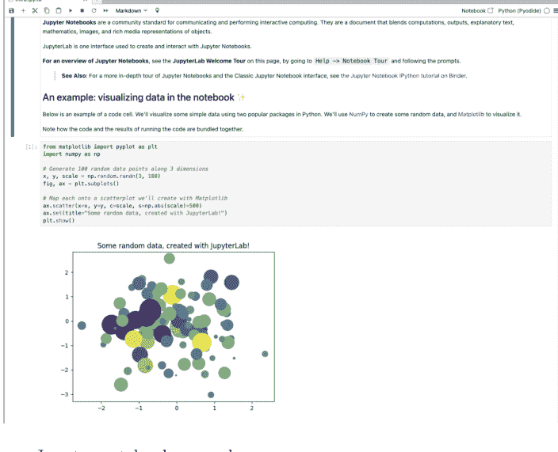
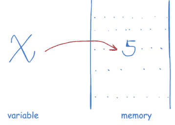
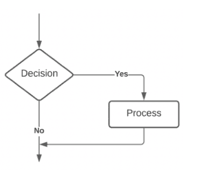
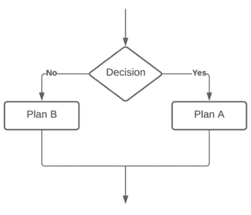
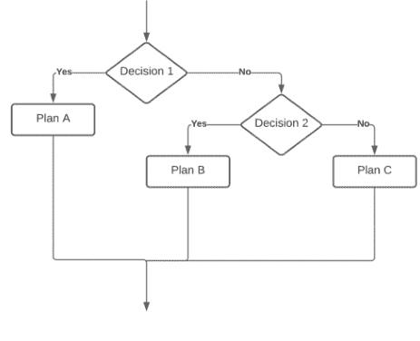

**Python 系列**

# 面向绝对初学者的 BiteSize Python

包含实践实验室、真实案例和生成式 AI 辅助


吴迪

Chapman & Hall 图书

CRC Press Taylor & Francis Group

# 面向绝对初学者的 BiteSize Python

作为 Python 入门读物，本书引导读者循序渐进地理解 Python 代码，阐释核心概念，将编程与现实生活实例相结合，编写 Python 程序，并完成案例研究。

尽管市面上已有大量关于此主题的书籍、网站和在线课程，但我们遵循 **BiteSize** 理念，将 Python 编程分解为一系列不超过 5 分钟的易消化课程。每节课都以清晰简短的主题介绍开篇，为你打下坚实基础，为深入学习做好准备。随后，你将看到演示所讨论概念的编码示例。这些示例简单实用，助你真正理解概念。接着，你将进行不同难度级别的练习任务，以检验知识掌握程度并增强信心。你还将通过案例研究解决现实世界的问题。书中包含提示，教你如何将生成式 AI 融入学习工具箱，用于获取反馈、进行练习、代码审查以及探索高级主题。推荐的 AI 提示词可帮助你识别改进领域、复习关键概念并跟踪学习进度。

本书专为没有任何编程经验的绝对初学者设计。非常适合日程繁忙或学习时间有限的个人。

## Chapman & Hall/CRC

## Python 系列

### 关于本系列

Python 已被公认为最受欢迎的编程语言，并在教育和工业界得到广泛应用。本系列丛书将为学生和专业人士提供广泛的 Python 相关书籍。系列中的书目将帮助用户在入门和高级水平上学习该语言，并探索其在数据科学、人工智能和机器学习等众多领域的应用。系列书目还可配合 Jupyter 笔记本使用。

### 使用 Python 进行统计与数据可视化

Jesús Rogel-Salazar

### 人文学者 Python 入门

William J.B. Mattingly

### Python 在科学计算与人工智能中的应用

Stephen Lynch

### 学习专业 Python 第一卷：基础篇

Usharani Bhimavarapu 和 Jude D. Hemanth

### 学习专业 Python 第二卷：进阶篇

Usharani Bhimavarapu 和 Jude D. Hemanth

### 从开源项目学习高级 Python

Rongpeng Li

### Python 数据科学基础

John Mark Shea

### Python 数据挖掘：理论、应用与案例研究

吴迪

### Python 简明入门

Stephen Lynch

### Python 入门：涵盖优化、图像与视频处理及机器学习应用

David Baez-Lopez 和 David Alfredo Báez Villegas

### 使用 Python 进行整洁金融

Christoph Frey, Christoph Scheuch, Stefan Voigt 和 Patrick Weiss

### Python 定量社会科学入门

Weiqi Zhang 和 Dmitry Zinoviev

### Python 数学编程

Julien Guillod

### 使用 Python 进行地理计算

Michael Dorman, Anita Graser, Jakub Nowosad 和 Robin Lovelace

### 面向绝对初学者的 BiteSize Python：包含实践实验室、真实案例和生成式 AI 辅助

吴迪

欲了解本系列更多信息，请访问：[https://www.routledge.com/Chapman--HallCRC-The-Python-Series/book-series/PYTH](https://www.routledge.com/Chapman--HallCRC-The-Python-Series/book-series/PYTH)

# 面向绝对初学者的 BiteSize Python

包含实践实验室、真实案例和生成式 AI 辅助

吴迪


CRC Press
Taylor & Francis Group
Boca Raton London New York

CRC Press 是
Taylor & Francis Group 的一个印记，一家 informa 企业
A CHAPMAN & HALL BOOK

封面设计图片：Shutterstock

MATLAB® 和 Simulink® 是 The MathWorks, Inc. 的商标，经许可使用。The MathWorks 不保证本书文本或练习的准确性。本书对 MATLAB® 或 Simulink® 软件或相关产品的使用或讨论不构成 The MathWorks 对特定教学方法或 MATLAB® 和 Simulink® 软件特定使用的认可或赞助。

第一版于 2026 年由 CRC Press 出版
地址：2385 NW Executive Center Drive, Suite 320, Boca Raton FL 33431

以及 CRC Press
地址：4 Park Square, Milton Park, Abingdon, Oxon, OX14 4RN

CRC Press 是 Taylor & Francis Group, LLC 的一个印记

© 2026 吴迪

我们已尽合理努力发布可靠的数据和信息，但作者和出版商无法对所有材料的有效性或其使用后果承担责任。作者和出版商已尽力追溯本出版物中所有复制材料的版权持有者，如果未获得以本形式出版的许可，我们向版权持有者致歉。如有任何版权材料未被确认，请来信告知，以便我们在未来的任何重印中予以更正。

除美国版权法允许的情况外，未经出版商书面许可，不得以任何形式（无论是电子、机械或其他方式，无论是现在已知或未来发明的，包括影印、缩微拍摄和录制）或任何信息存储或检索系统复制、转载、传播或利用本书的任何部分。

如需获得影印或以电子方式使用本作品材料的许可，请访问 www.copyright.com 或联系 Copyright Clearance Center, Inc. (CCC)，地址：222 Rosewood Drive, Danvers, MA 01923, 978-750-8400。对于 CCC 上未提供的作品，请联系 mpkbookspermissions@tandf.co.uk

商标声明：产品或公司名称可能是商标或注册商标，仅用于识别和说明，无意侵权。

ISBN: 978-1-032-86488-4 (精装)
ISBN: 978-1-032-86485-3 (平装)
ISBN: 978-1-003-52772-5 (电子书)

DOI: 10.1201/9781003527725

由 KnowledgeWorks Global Ltd. 使用 Nimbus Roman 字体排版。

献给我的妻子。


Taylor & Francis
Taylor & Francis Group
http://taylorandfrancis.com

## 目录

- 图列表 xvii
- 表列表 xix
- 前言 xxi
- 序言 xxiii
- 作者简介 xxvii

## 第一部分 Python 基础

### 第 1 章 Python 3 简介

- 1.1 什么是 Python？ 3
- 1.2 为什么选择 Python？ 4
- 1.3 脚本与交互式 Python 4
- 1.4 为什么选择交互式 Python？ 5
- 1.5 Jupyter 6
- 1.6 本地或云端 7
- 1.7 学习 Python 8

### 第 2 章 输入与输出 10

- 2.1 你好，世界！ 10
  - 2.1.1 演示 10
  - 2.1.2 练习 11
- 2.2 单引号或双引号 11
  - 2.2.1 解释 11
  - 2.2.2 演示 12
  - 2.2.3 练习 12
- 2.3 三引号 13
  - 2.3.1 解释 13
  - 2.3.2 练习 14
- 2.4 打印多个值 15
  - 2.4.1 演示 15
  - 2.4.2 练习 15
- 2.5 与生成式 AI 交互 15
- 2.6 获取输入 16
  - 2.6.1 演示 16
  - 2.6.2 练习 16
- 2.7 结合 print() 和 input() 17
  - 2.7.1 解释 17
  - 2.7.2 演示 17
  - 2.7.3 练习 17
- 2.8 与生成式 AI 交互 18

### 第 3 章 变量 19

- 3.1 什么是变量 19
  - 3.1.1 解释 19
  - 3.1.2 练习 20
- 3.2 命名规则 20
  - 3.2.1 解释 20
  - 3.2.2 练习 21
- 3.3 数据类型 21
  - 3.3.1 解释 21
  - 3.3.2 练习 22
- 3.4 数据类型转换 23
  - 3.4.1 解释 23
  - 3.4.2 演示 23
  - 3.4.3 练习 24
- 3.5 与生成式 AI 交互 25

### 第 4 章 运算 26

- 4.1 赋值运算 26
  - 4.1.1 解释 26
  - 4.1.2 练习 27
- 4.2 算术运算 27
  - 4.2.1 解释 27
  - 4.2.2 演示 28
  - 4.2.3 练习 29
- 4.3 关系运算 30
  - 4.3.1 解释 30
  - 4.3.2 练习 30
- 4.4 逻辑运算 31
  - 4.4.1 解释 31
  - 4.4.2 练习 32
- 4.5 与生成式 AI 交互 34

### 第 5 章 字符串 36

- 5.1 什么是 str？ 36
  - 5.1.1 解释 36
  - 5.1.2 思考 36
- 5.2 字符串创建 36
  - 5.2.1 演示 37
- 5.3 字符串访问 37
  - 5.3.1 演示 37
  - 5.3.2 练习 39
- 5.4 字符串切片 40
  - 5.4.1 演示 41
  - 5.4.2 练习 42
- 5.5 字符串连接 42
  - 5.5.1 演示 42
- 5.6 字符串格式化 43
  - 5.6.1 演示 43
  - 5.6.2 练习 45
- 5.7 实用函数 46
  - 5.7.1 演示 46
  - 5.7.2 练习 48
- 5.8 与生成式 AI 交互 51

### 第 6 章 Python 基础案例研究 52

- 6.1 简单结账 52
- 6.2 小费分割 53
- 6.3 复利计算 54

## 目录

## 第二部分 流程控制与函数

### 第7章 ■ 分支

- 7.1 可选分支
  - 7.1.1 演示
  - 7.1.2 练习
- 7.2 二选一分支
  - 7.2.1 演示
  - 7.2.2 练习
- 7.3 多分支
  - 7.3.1 演示
  - 7.3.2 练习
- 7.4 分支案例研究
  - 7.4.1 今天星期几？
  - 7.4.2 税务计算器
  - 7.4.3 简易计算器
  - 7.4.4 出租车费用计算器
- 7.5 与生成式AI交互

### 第8章 ■ 循环

- 8.1 基于条件的循环
  - 8.1.1 解释
  - 8.1.2 演示
  - 8.1.3 练习
- 8.2 基于计数的循环
  - 8.2.1 解释
  - 8.2.2 演示
  - 8.2.3 练习
- 8.3 魔法控制
  - 8.3.1 演示
  - 8.3.2 练习
- 8.4 循环案例研究
  - 8.4.1 质数
  - 8.4.2 简易成绩册
  - 8.4.3 华氏度转摄氏度转换器
  - 8.4.4 一个句子中有多少个E和e？
- 8.5 与生成式AI交互

### 第9章 ■ 函数

- 9.1 什么是函数？ 84
  - 9.1.1 解释 84
  - 9.1.2 示例：面包烤箱 85
  - 9.1.3 练习 85
- 9.2 函数的类型 86
  - 9.2.1 解释 86
- 9.3 定义函数 86
  - 9.3.1 演示 86
  - 9.3.2 练习 87
- 9.4 参数与实参 89
  - 9.4.1 解释 89
  - 9.4.2 演示 89
  - 9.4.3 练习 90
- 9.5 两个参数 92
  - 9.5.1 演示 93
  - 9.5.2 练习 93
- 9.6 如何传递实参 95
  - 9.6.1 演示 95
  - 9.6.2 练习 96
- 9.7 默认值 96
  - 9.7.1 演示 96
  - 9.7.2 练习 97
- 9.8 返回值 99
  - 9.8.1 解释 99
  - 9.8.2 演示 99
- 9.9 返回数值 100
  - 9.9.1 演示 100
  - 9.9.2 练习 100
- 9.10 返回字符串值 102
  - 9.10.1 演示 102
  - 9.10.2 练习 102
- 9.11 返回布尔值 102
  - 9.11.1 演示 103
  - 9.11.2 练习 103
- 9.12 返回多个值 104
  - 9.12.1 演示 104
  - 9.12.2 练习 104
- 9.13 与生成式AI交互 106

### 第10章 ■ 高级函数 107

- 10.1 嵌套函数 107
  - 10.1.1 解释 107
  - 10.1.2 演示 107
  - 10.1.3 练习 108
- 10.2 层级函数 110
  - 10.2.1 解释 110
  - 10.2.2 演示 110
- 10.3 与生成式AI交互 112
- 10.4 递归函数 112
  - 10.4.1 解释 112
  - 10.4.2 演示 113
  - 10.4.3 练习 113
- 10.5 与生成式AI交互 115

## 第三部分 数据结构

### 第11章 ■ 列表 119

- 11.1 什么是列表 119
- 11.2 创建列表 120
  - 11.2.1 演示 120
  - 11.2.2 练习 121
- 11.3 异构性 122
  - 11.3.1 演示 122
  - 11.3.2 练习 123
  - 11.3.3 测试你的理解 123
- 11.4 通过索引访问列表 124
  - 11.4.1 演示 124
  - 11.4.2 练习 125
- 11.5 通过迭代访问列表 126
  - 11.5.1 演示 126
  - 11.5.2 练习 127
- 11.6 列表操作 128
  - 11.6.1 演示 128
  - 11.6.2 练习 129
- 11.7 更多列表操作 130
  - 11.7.1 演示 130
  - 11.7.2 练习 131
- 11.8 列表切片 133
  - 11.8.1 演示 133
  - 11.8.2 练习 135
- 11.9 列表推导式 136
  - 11.9.1 演示 136
  - 11.9.2 练习 138
- 11.10 高级列表推导式 139
  - 11.10.1 演示 139
  - 11.10.2 练习 140
- 11.11 与生成式AI交互 142
- 11.12 探索更多列表知识 142

### 第12章 ■ 元组 143

- 12.1 什么是元组 143
  - 12.1.1 解释 143
- 12.2 创建元组 144
  - 12.2.1 演示 144
  - 12.2.2 练习 145
- 12.3 Python中的异构元组 146
  - 12.3.1 演示 146
  - 12.3.2 练习 147
- 12.4 通过索引访问元组元素 147
  - 12.4.1 演示 147
  - 12.4.2 练习 149
- 12.5 通过迭代访问元组元素 150
  - 12.5.1 演示 150
  - 12.5.2 练习 151
- 12.6 元组切片 152
  - 12.6.1 演示 152
  - 12.6.2 练习 153
- 12.7 元组推导式 154
  - 12.7.1 演示 154
  - 12.7.2 练习 155
- 12.8 与生成式AI交互 157
- 12.9 探索更多元组知识 157

### 第13章 ■ 集合 158

- 13.1 什么是集合 158
  - 13.1.1 解释 158
  - 13.1.2 练习 158
- 13.2 创建集合 159
  - 13.2.1 演示 159
  - 13.2.2 练习 160
- 13.3 集合中的元素 161
  - 13.3.1 演示 161
  - 13.3.2 练习 161
- 13.4 集合运算 162
  - 13.4.1 演示 162
  - 13.4.2 练习 164
- 13.5 集合方法 165
  - 13.5.1 演示 165
  - 13.5.2 练习 166
- 13.6 集合推导式 167
  - 13.6.1 演示 167
- 13.7 与生成式AI交互 168
- 13.8 探索更多集合知识 169

### 第14章 ■ 字典 170

- 14.1 什么是字典 170
  - 14.1.1 解释 170
  - 14.1.2 练习 171
- 14.2 创建字典 171
  - 14.2.1 演示 171
  - 14.2.2 练习 172
- 14.3 访问字典 173
  - 14.3.1 演示 173
  - 14.3.2 练习 174
- 14.4 字典方法 176
  - 14.4.1 演示 176
  - 14.4.2 练习 177
- 14.5 字典推导式 178
  - 14.5.1 演示 178
  - 14.5.2 练习 179
- 14.6 与生成式AI交互 180
- 14.7 探索更多字典知识 180

### 第15章 ■ 数据结构案例研究 181

- 15.1 热身 181
- 15.2 数据创建 182
- 15.3 使用列表 182
- 15.4 使用元组 184
- 15.5 使用集合 185
- 15.6 使用字典 185
- 15.7 此外 187
- 15.8 复杂度 187

## 第四部分 数据集合

### 第16章 ■ 命名元组 191

- 16.1 什么是命名元组 191
  - 16.1.1 解释 191
  - 16.1.2 演示 191
- 16.2 包管理 192
- 16.3 案例研究：汽车 193
- 16.4 与生成式AI交互 193
- 16.5 探索更多命名元组知识 194

### 第17章 ■ 默认字典 195

- 17.1 什么是默认字典 195
- 17.2 默认整数 197
  - 17.2.1 演示 197
  - 17.2.2 练习 197
- 17.3 默认列表 198
  - 17.3.1 演示 198
  - 17.3.2 练习 199
- 17.4 默认集合 199
  - 17.4.1 演示 199
  - 17.4.2 练习 200
- 17.5 案例研究：黑客马拉松 200
- 17.6 与生成式AI交互 202
- 17.7 探索更多默认字典知识 202

### 第18章 ■ 计数器 203

- 18.1 什么是计数器 203
- 18.2 关于计数器的更多信息 204
  - 18.2.1 解释 204
  - 18.2.2 演示 204
  - 18.2.3 练习 205
- 18.3 案例研究：罗密欧与朱丽叶 206
- 18.4 与生成式AI交互 207
- 18.5 探索更多计数器知识 207

接下来是什么？ 209

索引 211

## 图表列表

- 1.1 一个脚本Python示例。 4
- 1.2 一个交互式Python示例。 5
- 1.3 Jupyter notebook示例。 7
- 3.1 变量x引用5。 20
- 5.1 字符串非负索引。 38
- 5.2 字符串负索引。 38
- 5.3 步长为1的字符串切片。 40
- 5.4 步长为2的字符串切片。 41
- 7.1 可选分支流程图。 58
- 7.2 二选一分支流程图。 60
- 7.3 多分支流程图。 63
- 8.1 基于条件的循环流程图。 71
- 8.2 基于计数的循环流程图。 74
- 9.1 函数如同一个盒子。 85


Taylor & Francis
Taylor & Francis Group
http://taylorandfrancis.com

## 表格列表

- 3.1 基本Python数据类型比较。 24
- 4.1 逻辑运算and、or和not的真值表。 32
- 4.2 Python运算总结。 34
- 5.1 Python字符串方法总结。 50
- 11.1 Python列表总结。 141
- 12.1 Python元组总结。 156
- 13.1 Python集合总结。 168
- 14.1 Python字典总结。 179
- 15.1 Python数据结构总结。 181
- 15.2 Python数据结构的空间和时间复杂度比较。（列表、元组、集合、字典） 187
- 17.1 具有不同默认值的Python defaultdict总结。 202


Taylor & Francis
Taylor & Francis Group
http://taylorandfrancis.com

## 前言

### 为什么我们需要这本书

用这本书开启你进入激动人心的Python编程世界之旅吧！本书专为没有编程经验的初学者设计，以一种令人耳目一新的易懂方式介绍Python。

忘掉那些令人望而生畏的教科书和冗长的讲座吧，*《Python一口大小》*将学习过程分解为简短、易于管理的课程，每节课大约5-10分钟。无论你有多忙，或者难以长时间集中注意力，这种方法都能让你轻松地将学习Python融入日常生活。

你将通过引人入胜的课程、实践实验室和真实世界的示例，毫不费力地学习Python的基本概念。从掌握基本语法到编写自己的程序，这本书将赋予你成为有能力的Python程序员所需的技能和信心。

*《Python一口大小》*的独特之处在于它能适应你的学习风格。无论你喜欢动手实践、自我反思练习、复习解决方案，还是与生成式AI互动，这本书都能满足每个人的需求。

按照自己的节奏发现学习Python的乐趣，并在编程世界中解锁无限可能。有了这本书，开始你的赋能、效率和实用技能之旅，它将迅速将你从初学者转变为自信的Python程序员。

## 前言

### 本书的独特之处

尽管市面上已有许多关于此主题的书籍、网站和在线课程，但本书在多个方面独具特色：

-   **碎片化学习法**：将Python编程分解为每个不超过5分钟的易消化课程。
-   **初学者友好**：专为没有任何编程经验的绝对初学者设计。
-   **实践学习**：提供动手实践实验室和真实案例以巩固学习。
-   **高效省时**：非常适合日程繁忙或学习时间有限的个人。
-   **全面覆盖**：涵盖编写基础程序所必需的Python核心概念和技能。
-   **互动学习**：包含自我反思练习和答案解析，以增强理解和记忆。

### 具体目标

作为Python入门书籍，本书旨在引导读者循序渐进地理解Python代码、解释概念、将编程与现实生活实例相结合、编写Python程序并完成案例研究。本书的目标如下：

-   为完全初学者提供简单易懂的Python编程入门。
-   将学习过程分解为碎片化课程，以适应读者有限的时间和注意力。
-   帮助读者理解Python代码并培养编写自己程序的能力。
-   提供多种学习形式，包括概念概述、实践实验室和自我反思练习，以适应不同的学习风格。
-   展示许多有趣的案例研究，让读者扎实理解如何将知识应用于现实世界。

### 如何使用本书

本书旨在为您提供丰富而引人入胜的学习体验。我们的方法侧重于*碎片化*学习，通过将复杂主题分解为简单易懂的部分来化难为易：

-   每节课都以清晰简短的*主题介绍*开始。这为您奠定了坚实的基础，并为更深入的学习做好准备。
-   介绍之后，您将看到展示所讨论概念的*代码演示*。这些示例简单实用，帮助您真正理解概念。
-   介绍和演示之后，就该实践了！*实践*任务设有不同难度级别，因此您可以测试自己的知识并增强信心。请务必在查看答案之前尽力尝试！
-   为了帮助您更好地学习，我们建议使用*生成式AI*工具（如ChatGPT）获取反馈、进行练习、进行代码审查以及查找高级主题。这些提示可以帮助您发现需要改进的地方、复习主要思想并思考自己的进步。我们实际上在本书中采用了一些由AI创建的提示！生成式AI作为工具非常有用，但我们应明智地使用它。
-   应用Python创造不同！*案例研究*将所有小知识点结合起来，展示如何运用它们解决现实世界的问题。
-   大多数代码演示、实践任务和案例研究都配有*Jupyter Notebooks*。这种格式允许您查看、修改和运行代码，为您提供动手实践的体验，使学习更有趣。

我们相信本书将一步步引导您学习Python，并在现实生活中自信地运用它。无论您是编程新手还是只想提升Python技能，本书都将通过这些有趣的小*知识点*帮助您达成学习目标！

### 与AI互动

为了充分利用与ChatGPT等生成式AI工具的互动，请始终以以下提示开始您的对话：

> “你是Python编程专家。请扮演一位导师，帮助一位正在学习Python编程的学生。”

此提示为对话定下基调，并确保AI将提供量身定制的、有帮助且详细的指导。以下是一些用于有效互动的通用建议和提示：

-   你能解释一下[概念]是如何工作的吗？
-   [概念1]和[概念2]有什么区别？
-   你能提供一个执行[特定任务]的函数示例吗？
-   向我展示如何使用[特定结构或方法]来实现[目标]。
-   我不明白为什么[特定方法]不起作用。你能帮我排查一下吗？
-   我的代码：“[您的Python代码]”无法运行。哪里出错了？你能帮我修正吗？
-   审查我的代码：“[您的Python代码]”。你能改进我的代码使其更专业吗？
-   你能解释为什么[特定方面]是这样工作的吗？

在每个“与生成式AI互动”部分，我们也为特定主题准备了具体的建议和提示。我们希望您能将生成式AI作为增强和辅助学习的强大工具加以利用。

### 致谢

作者使用了多种生成式AI模型，包括ChatGPT (4o-mini)、Gemini (2.0)、Claude (3.5 Haiku)、Gemma (1.1:7b, 2:9b)、Llama (3.1:8b, 3.2:3b)和Apple Intelligence (Beta)，以改进语言、校对代码注释，并为“与生成式AI互动”部分构思一些想法。所有由生成式AI生成的文本都经过仔细审查和修订，以符合学术标准。

我还要感谢审稿人、编辑和出版商，使本书得以问世。

## 作者简介

吴迪博士是莱曼学院商学院金融、信息系统与经济学系的助理教授。他在纽约市立大学研究生中心获得计算机科学博士学位。吴博士的研究兴趣包括：1) RDF和语义网的时间扩展，2) 应用数据科学，3) 商业教育中的体验式学习与教学法。吴博士开发并教授的课程包括战略管理、数据库、商业统计、管理决策、编程语言（C++、Java和Python）、数据结构与算法、数据挖掘、大数据和机器学习。

# 第一部分

## Python基础

第一部分：Python基础介绍了Python的核心概念，这是一种以其简洁性和可读性而闻名的通用且广泛使用的编程语言。您将了解Python的优势，包括它为何成为许多开发者的首选语言。本节将解释基于脚本和交互式Python环境的区别，强调使用本地和基于云的Jupyter notebooks进行编码的好处。将涵盖关键的基础元素，如`print()`和`input()`函数，以及变量、操作和使用内置方法进行字符串操作。

学完本节后，您将能够：

-   理解Python作为编程语言的核心原则和优势。
-   区分基于脚本和交互式的Python环境，并有效使用Jupyter Notebooks。
-   使用`print()`和`input()`与用户交互并显示输出。
-   理解Python的变量和动态类型。
-   操作基本数据类型，包括`int`、`float`、`str`和`bool`。
-   使用变量执行操作，并使用Python的内置方法操作字符串。

# 第1章

## Python简介

欢迎来到Python的世界！您可能之前就听说过这门神奇的语言，也许是在学校作业、软件手册或同事发给您的代码片段中。您知道它对于不断变化的科技世界很重要。是的，您完全正确！即使您不需要每天都使用它，学习Python也将是一次独特的体验，也是对您时间的明智投资。它将教会您计算机如何思考和工作，程序和类是如何设计的，以及复杂的神经元是如何构建并连接以形成人工智能基础的。本章将回答一些关于Python的基本问题，比如它是什么、为什么如此流行、它是什么样子、在哪里开发和运行它、什么是Jupyter Notebook、在哪里编写代码等等。让我们开始吧！

### 1.1 什么是Python？

Python是一种高级、解释型的编程语言，以其易于学习和使用而闻名，因此成为初学者的热门选择。它由荷兰程序员Guido van Rossum创建，并于1991年首次发布。该语言以英国喜剧团体Monty Python's Flying Circus命名，而不是以蛇命名，尽管其标志是爬行动物！Guido只是觉得蛇的设计会成为一个很酷的标志。

多年来，Python经历了许多更新和改进。Python 2.0于2000年发布，引入了垃圾回收器和新的内存管理系统。长期以来，Python 2.x被广泛使用，但它有一些缺点，比如对Unicode的支持有限。目前，Python 2.x已不再受支持或维护，因此本书将重点介绍Python 3.x。Python 3.0于2008年发布，解决了Python 2.x的局限性并添加了许多新功能。

最新版本Python 3.13于2024年10月7日发布。Python 3.x完全兼容Unicode，提供更好的并行处理支持，并包含一系列用于数据分析、Web开发等任务的新模块和库。

## 1.2 为什么选择 Python？

Python 的流行源于其易用性、多功能性和强大的社区支持。

Python 以其简洁易读而闻名。它拥有少量的关键字和清晰的结构，使初学者易于学习和理解。其语法设计直观，让开发者能够专注于代码逻辑，而不是陷入复杂的语法细节。Python 还拥有众多库和框架，简化了数据分析、Web 开发等任务。

Python 是一种通用语言，这意味着它可以用于各种任务，包括 Web 开发、数据分析、人工智能（AI）、机器学习和自动化。其多功能性使其成为不同类型项目的热门选择，而其庞大的开发者社区提供了众多库和框架，几乎能帮助完成任何任务。

Python 拥有一个庞大且活跃的开发者社区，他们为各种任务创建库、框架和工具。这种强大的社区支持提供了丰富的学习和故障排除资源，使寻求帮助变得容易。Python 的社区驱动开发也确保了该语言不断演进以满足用户需求。

Python 可在多种操作系统上运行，如 Windows、macOS 和 Linux。它还是开源的，这意味着可以免费使用、分享和修改。这种开源特性吸引了大量开发者为 Python 的发展做出贡献，确保它始终保持高质量并持续改进。

## 1.3 脚本式与交互式 Python

使用 Python 时，你有两种主要的环境选择：脚本式 Python 和交互式 Python。脚本式 Python 涉及在文本编辑器或集成开发环境（IDE）中编写代码并将其作为脚本运行，而交互式 Python 允许你逐行执行代码并立即查看结果。

脚本式 Python 非常适合需要自动化的任务，例如数据处理、网络爬虫或系统管理。你编写一个脚本，保存它，然后根据需要运行它。脚本式 Python 非常适合需要重复执行或需要在后台运行的任务（图 1.1）。

```
print('Hello, world!') # 显示一条消息
```

图 1.1 一个脚本式 Python 示例。

另一方面，交互式 Python 非常适合数据科学、科学计算和探索性数据分析。使用交互式 Python，你可以逐行执行代码，查看结果，并相应地调整代码。这种迭代过程允许你实时探索数据、测试假设和可视化结果（[图 1.2](https://example.com)）。

```
演示

[ ] print('Hello, world!') # 显示一条消息

Hello, world!
```

图 1.2 一个交互式 Python 示例。

## 1.4 为什么选择交互式 Python？

交互式 Python 特别适合数据科学，原因如下：

- 它使你能够实时加载、操作和可视化数据。这让你能快速理解数据的结构和模式，识别缺失或错误的值，并进行探索性数据分析。
- 它允许你迭代地编写和测试机器学习模型。你可以尝试不同的算法，微调超参数，并实时评估模型性能，从而能够快速优化模型并获得更好的结果。
- 它提供了对各种统计库和工具的访问，如 Pandas、NumPy 和 Scikit-learn。你可以在交互式环境中执行统计分析、数据转换和特征工程，使理解和准备建模数据变得更容易。
- 它使你能够使用 Matplotlib、Seaborn 和 Plotly 等库创建交互式可视化和仪表板。这让你能够以清晰且引人注目的方式呈现你的发现，使利益相关者能够探索和理解你揭示的见解。
- 其交互性使你能够快速编写和测试代码，从而能够以快速迭代的方式调试代码。这减少了开发和完善数据科学项目所需的时间和精力。
- 其环境（如 Jupyter Notebook）支持代码、数据和结果的协作与共享。这促进了数据科学家、工程师和其他利益相关者之间的团队合作和知识共享。

## 1.5 Jupyter

在本书中，我们将使用 JupyterLab 和 Jupyter Notebooks 作为我们的交互式 Python 环境。Jupyter Notebooks 将解释、图像和富媒体、代码以及输出融合在一个文档中。它是数据科学、科学计算和教育的理想平台，被工业界、学术界和研究领域广泛使用。JupyterLab 是一个基于 Web 的用户界面，用于创建和操作 Jupyter Notebooks。

Jupyter Notebook 的交互式单元格允许你逐行执行代码，实时查看每个单元格的结果。这使你能够以迭代和动态的方式探索数据、测试假设和可视化结果。你可以用 Python、R、Julia 或其他语言编写代码，并在浏览器或远程服务器上执行。

Jupyter Notebooks 支持多种媒体，包括图像、视频、交互式可视化和方程式。你可以将这些媒体元素直接嵌入到你的笔记本中，轻松创建引人入胜的交互式文档。这对于数据可视化特别有用，你可以创建交互式图表，允许用户实时探索数据。

Jupyter Notebooks 支持实时协作和文档共享。你可以与他人共享笔记本，并实时在单个文档上共同工作。这促进了数据科学家、工程师和其他利益相关者之间的团队合作和知识共享。你还可以使用 Jupyter Notebook 内置的评论和讨论功能与协作者和利益相关者进行沟通。

Jupyter Notebooks 可以访问各种库和工具，包括流行的数据科学库，如 Pandas、NumPy 和 Scikit-learn。你还可以安装额外的库和工具，如 Matplotlib、Seaborn 和 Plotly，以扩展笔记本的功能。这使你能够执行广泛的数据科学任务，从数据清洗和可视化到机器学习和深度学习。

Jupyter Notebooks 提供了强大的安全性和可扩展性功能，使其适合在生产环境中使用。你可以使用密码、令牌或其他身份验证方法来保护你的笔记本，并扩展你的笔记本以处理大型数据集和高流量。这使你能够在各种环境中部署你的笔记本，从本地机器到基于云的服务器。

Jupyter Notebook 文件具有 `.ipynb` 扩展名，并包含一个表示笔记本内容的 JavaScript 对象表示法结构。这些文件可以在 Jupyter Notebook 中打开和编辑，也可以与他人共享和协作。`.ipynb` 文件格式允许创建灵活且动态的文档，可以包含文本、代码、方程式、图像和交互式可视化的混合。

Jupyter Notebooks 的一个关键特性是能够将 Markdown 文本、代码单元格和输出单元格组合在一个文档中。这使你能够创建一个叙述性文档，解释你的代码，展示代码的输出，并提供清晰简洁的结果说明。

1. Markdown 单元格允许你以简单易读的格式编写文本，使用 Markdown 语法来格式化标题、粗体文本、斜体和链接。你可以使用 Markdown 单元格提供解释、介绍和总结，以及为你的代码和输出添加上下文。
2. 代码单元格允许你用多种编程语言编写和执行代码，包括 Python、R、Julia 和 MATLAB。你可以使用代码单元格执行数据分析、机器学习和可视化，以及创建交互式图表。
3. 输出单元格显示代码的结果，包括文本、图像和交互式可视化。你可以使用输出单元格展示代码的输出，并创建总结你发现的报告和仪表板。

通过组合 Markdown、代码和输出单元格，你可以创建一个清晰简洁的叙述性文档，解释你的代码，展示代码的输出，并提供结果的总结。这对于数据科学和科学计算特别有用，你需要以清晰透明的方式记录你的方法、结果和结论（图 1.3）。



图 1.3 Jupyter notebook 示例。

## 1.6 本地或云端

在使用 Jupyter Notebooks 进行 Python 开发时，你有两种主要选择：本地安装或云服务。本地安装涉及在你自己的计算机上下载和安装 Jupyter Notebooks，让你拥有完全的控制权对环境的控制以及离线工作的能力。然而，这需要专业知识，并且设置起来可能很耗时。另一方面，像 Google Colaboratory (Google Colab)、Anaconda Online 等云服务提供了一种省心便捷的替代方案。使用云服务，你可以从任何地方访问 Jupyter Notebooks，无需安装或维护。你可以专注于编写代码和与他人协作，而云服务会处理技术细节。

Anaconda 本地捆绑包是一个独立的软件包，包含 Anaconda 发行版、Jupyter Notebooks 和其他流行的数据科学工具。通过将其安装在本地机器上，你可以完全控制环境并可以离线工作。这对于需要高度定制化、安全性和离线访问的用户来说是理想的选择。此外，本地安装可以提供更快的性能和响应速度，使其适合大规模数据处理和计算。然而，它需要专业知识来设置和维护，并且可能占用大量资源。

Google Colab 是一个流行的云服务，免费提供 Jupyter Notebooks，无需设置。你可以从任何地方访问它，并且它预装了许多流行的库，包括 TensorFlow 和 PyTorch。此外，Google Colab 提供实时协作、版本控制和轻松共享笔记本等功能。无论你是学生、研究人员还是专业人士，云服务都提供了一种便捷而强大的方式来使用 Jupyter Notebook 进行 Python 开发。

Anaconda Online 是另一个基于云的平台，为数据科学和机器学习提供托管环境。它提供与 Anaconda 本地捆绑包相同的工具和库，但无需安装或维护。这使得它非常适合那些想要快速开始数据科学项目、与他人协作或从任何地方访问其工作的人。Anaconda Online 还提供实时协作、版本控制和轻松共享笔记本等功能。

## 1.7 学习 Python

我们采用体验式学习教学法和“小口策略”，将一个困难的主题分解成有趣的部分。这种方法使学习者能够以动手实践、迭代和渐进的方式参与 Python 编程。通过使用这些方法，学习者可以更好地理解 Python，提高解决问题的能力，并建立成长型思维模式。

要有效地学习 Python，理解语法背后的逻辑至关重要。Python 的语法设计得直观而简洁，但掌握其基本原则对于编写高效且可读的代码至关重要。

练习是学习 Python 的关键。从简单的程序开始，逐步过渡到更复杂的案例研究，甚至是项目。你编写的代码越多，你对 Python 语法就会越熟悉，也就越能理解如何将其应用于现实世界的问题。

为了让学习 Python 更有趣且更相关，将你学到的概念与现实世界的例子联系起来。思考 Python 如何用于解决你自己的生活或你期望领域中的问题。通过将 Python 与现实场景联系起来，你会保持动力，并看到你所学知识的实用价值。

最后，利用生成式 AI 的力量来增强你的学习之旅。使用 AI 驱动的工具来生成针对你独特需求的解释、示例和练习。借助生成式 AI，你可以获得个性化的反馈，纠正你的错误，并加强对 Python 概念的理解。

# 第 2 章

## 输入和输出

现在，你对 Python 有了一个大致的了解。是时候编写你的第一个 Python 程序了。在本章中，你将学习如何使用 `print()` 函数在屏幕上显示消息，以及如何使用 `input()` 函数从用户那里获取信息。结合 `print()` 和 `input()` 使你能够编写可以与用户交互的程序！

你准备好了吗？让我们开始吧！

### 2.1 你好，世界！

#### 2.1.1 演示

```
print('Hello, world!') # display a message
```

Hello, world!

`print()` 函数是一个内置的 Python 函数，用于将文本输出到屏幕。它是 Python 中的一个基本函数，你将经常使用它来显示输出、调试代码以及向用户反馈信息。我们将在后面的章节中详细学习函数。

字符串 'Hello, world!' 是一对单引号 (') 括起来的字符序列。在 Python 中，字符串可以用单引号或双引号 ("") 括起来。字符串 'Hello, world!' 是一个字面字符串，意味着它是一个不会改变的固定字符序列。我们将在后面的章节中详细学习数据类型和字符串。

`print()` 函数的语法是 `print(value)`，其中 value 是你想要输出的文本或值。在这个例子中，值是字符串 'Hello, world!'。

`# display a message` 是一个行内注释。`#` 符号右边的所有内容都会被 Python 解释器忽略，允许你为代码添加注释和解释，而不会影响其功能。行内注释是为代码添加快速笔记和提醒的好方法，可以帮助使你的代码更具可读性和可理解性。

#### 2.1.2 练习

注意：在查看本书为练习任务提供的解决方案之前，请尽力自己完成任务。努力完成任务实际上会帮助你更好地理解概念。此外，请记住我们的解决方案并非唯一正确的。你的方法可能不同，但同样有效。

任务：将演示中 `print()` 的值更改为 'Hello, Python!' 并打印出来。

```
print('Hello, Python!')
```

Hello, Python!

任务：将演示中 `print()` 的值更改为 'Hello, {your name}!' 并打印出来。注意 {your name} 是一个占位符，你应该用你的名字替换它。例如，Neo。

```
print('Hello, Neo!')
```

Hello, Neo!

### 2.2 单引号还是双引号

#### 2.2.1 解释

在 Python 中，你可以使用单引号 (') 或双引号 (") 来定义字符串。这意味着 'Hello, world!' 和 "Hello, world!" 是等效的，并且会产生相同的输出。

Python 允许使用单引号和双引号，以便更容易定义包含引号的字符串。例如，如果你想定义一个包含单引号的字符串，你可以使用双引号："It's a beautiful day!"。同样，如果你想定义一个包含双引号的字符串，你可以使用单引号：'He said, "Hello, world!"'。

虽然 Python 允许使用单引号和双引号，但通常建议使用单引号来定义字符串。这是因为单引号在 Python 中更常用，并且使代码更具可读性。此外，单引号更不容易出错，因为在定义包含双引号的字符串时不需要转义。

转义允许你通过在特殊字符前加上反斜杠 (\) 来将它们包含在字符串中。这告诉 Python 将下一个字符视为字面字符，而不是其特殊含义。

#### 2.2.2 演示

```
# Same output as single quotations
print("Hello, world!")
```

Hello, world!

```
# Raise error because the string contains a single quotation
print('I'm fine.')
```

File "<ipython-input-1-c130f7fb8291>", line 2
    print('I'm fine.')
    ^
SyntaxError: unterminated string literal (detected at line 2)

```
# Escaping the quotation to avoid conflict
print('I\'m fine.')
```

I'm fine.

```
# Use double quotations to avoid conflict
print("I'm fine.")
```

I'm fine.

```
# Raise error because the string contains a double quotation
print("He said "No!"")
```

File "<ipython-input-8-d24e08d6fbf5>", line 2
    print("He said "No!"")
    ^
SyntaxError: invalid syntax. Perhaps you forgot a comma?

```
# Escaping the quotation to avoid conflict
print("He said \"No!\"")
```

He said "No!"

```
# Use single quotations to avoid conflict
print('He said "No!"')
```

He said "No!"

#### 2.2.3 练习

任务：使用双引号打印字符串 'Don't worry, be happy!'

```
print("Don't worry, be happy!")
```

Don't worry, be happy!

任务：使用转义打印字符串 'Don't worry, be happy!'

```
print('Don\'t worry, be happy!')
```

Don't worry, be happy!

## 2.3 三引号

### 2.3.1 解释

Python 也允许使用三引号（`"""` 或 `'''`）来定义多行字符串。三引号用于定义跨越多行的字符串，并且会保留换行符。当你需要定义一个包含多行文本的长字符串时，三引号非常有用。当你需要定义一个包含引号的字符串时，它们也很有用，因为你不需要对引号进行转义。

Python 也使用三引号（`"""` 或 `'''`）来定义多行注释。多行注释用于为你的代码添加文档说明，解释其功能。它们可以跨越多行，并且会被 Python 解释器忽略。要定义多行注释，你只需将文本用三引号括起来即可。

```python
# 与单引号和双引号输出相同
print('''Hello, world!''')
```

Hello, world!

```python
# 包含单引号或双引号的字符串也无需担心
print('''She said: "We're good!"''')
```

She said: "We're good!"

```python
# 多行字符串
print('''This is a
multiline
string
example''')
```

This is a
multiline
string
example

```python
'''This is a
multiline
string
comments'''
print('Hello, world!')
```

Hello, world!

### 2.3.2 练习

任务：使用一个 `print()` 打印下面的诗歌

This
is
a
poem

```python
print('''This
is
a
poem
''')
```

This
is
a
poem

任务：使用一个 `print()` 打印下面的段落

This is a multi-line
documentary. It consists
several sentences and
might be pages long.

```python
print('''This is a multi-line
documentary. It consists
several sentences and
might be pages long.
''')
```

This is a multi-line
documentary. It consists
several sentences and
might be pages long.

任务：使用一个 `print()` 打印下面的对话

"How are you?"
"I'm fine."
"It's a great day!"

```python
print('''"How are you?"
"I'm fine."
"It's a great day!"''')
```

"How are you?"
"I'm fine."
"It's a great day!"

## 2.4 打印多个值

### 2.4.1 演示

在 Python 中，`print()` 函数用于将文本或值输出到屏幕。但如果你想一次打印多个值呢？这就是逗号（`,`）的用武之地！当你在 `print()` 函数内部用逗号分隔值时，Python 会输出每个值，并用空格 `' '` 将它们隔开。这使得在单个语句中打印多个值变得非常容易。

```python
# 观察下面两个逗号的区别
print('Hello,', 'world!')
```

Hello, world!

在上面的例子中，第一个逗号在 `''` 内部，因此它是字符串的一部分；而第二个逗号用于分隔两个值。

### 2.4.2 练习

任务：使用 `print()` 打印出两个值 'Python' 和 '3.12'。

```python
print('Python', '3.12')
```

Python 3.12

任务：使用 `print()` 打印出四个值 'What'、'a'、'wonderful' 和 'world!'。

```python
print('What', 'a', 'wonderful', 'world!')
```

What a wonderful world!

## 2.5 与生成式 AI 互动

为了充分利用与 ChatGPT 等生成式 AI 工具的互动，请始终以以下提示词开始你的对话：

> “你是一位 Python 编程专家。请扮演一位导师，帮助一位正在学习 Python 编程的学生。”

这个提示词为对话定下了基调，并确保 AI 将提供量身定制的、有帮助且详细的指导。以下是一些用于有效互动的通用建议和提示词：

- 你能解释一下 [概念] 是如何工作的吗？
- [概念 1] 和 [概念 2] 之间有什么区别？
- 你能提供一个执行 [特定任务] 的函数示例吗？
- 向我展示如何使用 [特定结构或方法] 来实现 [目标]。
- 我不明白为什么 [特定方法] 不起作用。你能帮我排查一下吗？
- 我的代码：“[你的 Python 代码]”无法运行。哪里出错了？你能帮我修正吗？
- 审查我的代码：“[你的 Python 代码]”。你能改进我的代码，使其更专业吗？
- 你能解释一下为什么 [特定方面] 是这样工作的吗？

我们还为 **print** 准备了具体的建议和提示词。

- Python 中 **print()** 函数的目的是什么？
- **print()** 函数在 Python 中如何显示输出？
- 可以传递哪些类型的数据给 Python 中的 **print()** 函数？
- 展示如何使用 **print()** 函数打印一个简单的字符串。
- 演示如何在一行中使用空格分隔符打印多个变量。
- 如果 **print()** 没有显示预期的输出，你应该怎么做？
- 如何解决使用 **print()** 时打印值之间出现多余空格的问题？

我们希望你能利用生成式 AI 作为一个强大的工具，来增强和辅助你的学习。

## 2.6 获取输入

我们可以使用 **print()** 函数在屏幕上显示消息。但如果我们想获取用户给我们的消息呢？这就是 **input()** 函数的用武之地。让我们来看一个演示。

### 2.6.1 演示

```python
input('What is your name?') # 显示一个提示
```

What is your name?Neo

**input()** 函数是一个 Python 内置函数，它允许你的程序获取用户输入。其目的是从用户那里读取输入并将其作为字符串返回。

字符串 `'What is your name?'` 是 **input()** 函数接受的一个参数。该参数作为提示显示给用户。这个提示有助于引导用户输入预期的内容。

**input()** 函数的语法是 **input(value)**，其中 value 是你希望向用户显示的指令文本作为提示。在这个例子中，value 是字符串 `'What is your name?'`。

### 2.6.2 练习

任务：显示提示 'Where do you live?' 并从用户那里获取输入

```python
input('Where do you live?')
```

任务：显示提示 'How do you feel so far? Enter 1 for Good; 2 for very good: ' 并从用户那里获取输入

```python
input('How do you feel so far? Enter 1 for Good; 2 for very good.')
```

任务：显示提示 'Are you ready to learn more? Enter Yes or No: ' 并从用户那里获取输入

```python
input('Are you ready to learn more? Enter Yes or No.')
```

## 2.7 结合使用 print() 和 input()

### 2.7.1 解释

你可能已经注意到，当你使用 `input()` 函数时，用户输入的值会显示为带有单引号的字符串。这是因为 `input()` 函数总是返回一个字符串。即使用户输入的是一个数字，它也会作为字符串返回。

现在，让我们将 `input()` 函数与 `print()` 函数结合起来。由于 `input()` 函数返回的值是一个字符串，我们可以将其作为 `print()` 函数的参数来显示用户的输入。

### 2.7.2 演示

```python
print('Hello,', input('What is your name? '), '!')
```

What is your name? Neo
Hello, Neo !

```python
print('Today is', input('What weekday is today? '))
```

What weekday is today? Friday
Today is Friday

```python
print(input('What is your first name? '),
      input('What is your last name?'),
      'is awesome!')
```

What is your first name? Thomas
What is your last name?Anderson
Thomas Anderson is awesome!

### 2.7.3 练习

任务：显示提示 'What date is today? yyyymmdd: ' 以从用户获取值，然后将该值打印在屏幕上。

```python
print(input('What date is today? yyyymmdd: '))
```

What date is today? yyyymmdd: 20240501
20240501

任务：显示提示 'How old are you? ' 以从用户获取值，然后将该值打印在屏幕上。

```python
print(input('How old are you? '))
```

How old are you? 18
18

任务：显示提示 'Which number is your lucky number? ' 以从用户获取值，然后将该值和字符串 'is a magic number!' 打印在屏幕上。

```python
print(input('Which number is your lucky number? '), 'is a magic number!')
```

Which number is your lucky number? 9
9 is a magic number!

## 2.8 与生成式 AI 互动

以下是一些你可以与包括 ChatGPT 在内的生成式 AI 工具互动的问题和提示词。

- Python 中 `input()` 函数的目的是什么？
- `input()` 函数在 Python 中如何捕获用户输入？
- `input()` 函数默认返回什么数据类型？
- 如何使用 `input()` 函数向用户显示自定义消息提示？
- 如果用户在使用 `input()` 时输入了无效值会发生什么？
- 展示如何使用 `input()` 函数捕获用户的名字。
- 演示如何使用 `input()` 捕获并显示用户的年龄。
- 使用 `input()` 提示用户输入他们最喜欢的颜色，并根据他们的选择打印一条回复。
- 如果用户在使用 `input()` 时不小心按了回车而没有输入任何内容会发生什么？

# 第三章

## 变量

到目前为止，你觉得Python怎么样？你可以从用户那里获取信息并将其显示在屏幕上！Python没那么难，对吧？现在让我们添加一些功能，使其更加实用。在本章中，我们将学习变量的概念，包括如何定义和使用它们，以及Python中的动态类型。我们还将学习数据类型，以便我们可以使用内置的`int`、`float`、`str`和`bool`值来表示数据。准备好了吗？让我们开始吧！

## 3.1 什么是变量

### 3.1.1 解释

变量用于在程序中存储和引用值。没有变量，我们将不得不重复代码或硬编码值，这会使我们的程序不灵活且难以维护。变量允许我们存储一个值并多次使用它，使我们的代码更高效且更易于阅读。

在Python中，变量作为引用工作，这意味着它们指向内存中存储实际值的位置。这意味着当我们为变量赋一个新值时，我们是在更新引用以指向新值，而不是更改原始值。这种引用的概念是理解Python中变量工作方式的关键，它允许强大而灵活的编程。使用变量，我们可以编写更动态和交互式的程序，这些程序可以适应变化的条件和用户输入。例如：

```
x = 5
```

现在，我们可以在任何地方多次使用`x`，而`x`的值是5。如果我们需要更新值，只需为x赋一个新值，所有使用`x`的地方都会更新（图3.1）。



图3.1 变量x引用5。

### 3.1.2 练习

任务：思考在现实生活中，我们可能会使用什么样的引用。例如：

```
python
input('Where do you live?')
```

是的。当我们在对话中提到一个地方时，我们是在引用物理位置！你还有其他例子吗？

## 3.2 命名规则

### 3.2.1 解释

命名规则有两个层次。最低层次是遵循语法的硬性规则。你必须满足变量命名的语法规则；否则，你会得到错误。另一个层次是遵循惯例的软性规则。建议满足惯例规则，这样你就可以编写专业的程序。

语法规则是：

- 变量名必须以字母（a-z或A-Z）或下划线（_）开头。
- 变量名只能包含字母（a-z或A-Z）、数字（0-9）和下划线（_）。
- 变量名区分大小写（例如，name和Name被视为不同的变量）。
- 变量名不能是保留关键字（例如，if、else、while等）。

惯例规则是：

- 变量名应具有描述性，并指示变量的用途。
- 变量名应简洁，但不能太短以至于不清楚。
- 变量名应使用小写字母和下划线分隔单词（例如，first_name而不是FirstName）。
- 变量名应避免使用缩写或首字母缩写，除非它们被广泛认可（例如，id表示标识符）。
- 变量名不应以下划线（_）开头（即使语法规则允许），除非你理解这种形式的特殊用法。

通过遵循这些语法规则和惯例规则，你可以编写清晰、可读和可维护的代码，使其他人（和你自己）更容易理解你的变量代表什么。

### 3.2.2 练习

任务：在以下变量名中，用以下标记标记它们：

1. 错误（违反语法规则）
2. 不好（违反惯例规则）
3. 好（遵循所有规则）

```
# application_id: 好
# b: 不好
# Cat: 不好
# 4square: 错误
# five!: 错误
# six_dice: 好
# _seven_day: 不好
# eight_9: 不错误 -- 不好
# Ten_points: 不好
# llama3: 不好
# bubble_00o: 不好
# gj: 不好
```

## 3.3 数据类型

### 3.3.1 解释

在Python中，变量可以引用任何类型的值。内置数据类型包括：

- 整数 int：例如，1, 2, 3, -3
- 浮点数 float：例如，3.14, -0.5
- 字符串 str：例如，"hello", 'hello'
- 布尔值 bool：例如，True, False

在Python中，变量的数据类型由它引用的值的数据类型决定。这意味着变量的数据类型不是固定或预先声明的，而是从变量实时引用的值推断出来的。例如，如果你将一个整数值赋给一个变量，该变量将被视为整数类型；如果你随后将一个字符串值赋给该变量，该变量将被视为字符串类型，依此类推。这被称为动态类型，它允许编程的灵活性，因为如果给变量赋一个不同类型的值，它可以在运行时更改其数据类型。这与静态类型语言不同，在静态类型语言中，变量的数据类型是固定的。

### 3.3.2 练习

对于以下所有任务，使用`print()`和`type()`检查值是否正确分配以及数据类型是否正确。例如：`print('x:', x, type(x))`。注意`type()`将返回值或变量的数据类型。

任务：将x赋值为整数5。

```
# 将值5赋给变量x
x = 5

# 打印x的值，后跟其数据类型
print('x:', x, type(x))
```

x: 5 <class 'int'>

任务：将int_x赋值为x。

```
int_x = x
print('x:', x, type(x))
print('int_x:', int_x, type(int_x))
```

x: 5 <class 'int'>
int_x: 5 <class 'int'>

任务：将x赋值为浮点数5.0。

```
x = 5.0
print('x:', x, type(x))
```

x: 5.0 <class 'float'>

任务：将float_x赋值为x。

```
float_x = x
print('x:', x, type(x))
print('float_x:', float_x, type(float_x))
```

x: 5.0 <class 'float'>
float_x: 5.0 <class 'float'>

任务：将x赋值为字符串'5'。

```
x = '5'
print('x:', x, type(x))
```

x: 5 <class 'str'>

任务：将str1_x赋值为x。

```
str1_x = x
print('x:', x, type(x))
print('str1_x:', str1_x, type(str1_x))
```

x: 5 <class 'str'>
str1_x: 5 <class 'str'>

任务：将x赋值为字符串'5.0'。

```
x = '5.0'
print('x:', x, type(x))
```

x: 5.0 <class 'str'>

任务：将str2_x赋值为x。

```
str2_x = x
print('x:', x, type(x))
print('str2_x:', str2_x, type(str2_x))
```

x: 5.0 <class 'str'>
str2_x: 5.0 <class 'str'>

任务：使用print()和type()检查你到目前为止创建的所有变量x、int_x、float_x、str1_x、str2_x的值和数据类型。

```
print('x:', x, type(x))
print('int_x:', int_x, type(int_x))
print('float_x:', float_x, type(float_x))
print('str1_x:', str1_x, type(str1_x))
print('str2_x:', str2_x, type(str2_x))
```

x: 5.0 <class 'str'>
int_x: 5 <class 'int'>
float_x: 5.0 <class 'float'>
str1_x: 5 <class 'str'>
str2_x: 5.0 <class 'str'>

## 3.4 数据类型转换

### 3.4.1 解释

在Python中，你可以使用各种转换函数将值从一种数据类型转换为另一种数据类型。当你需要处理不同类型的值或需要确保值处于特定格式时，这很有用。

### 3.4.2 演示

```
x = 5 # x是一个整数
print(str(x), type(str(x)))
```

5 <class 'str'>

```
x = 5 # x是一个整数
print(float(x), type(float(x)))
```

5.0 <class 'float'>

```
x = 5.0 # x是一个浮点数
print(int(x), type(int(x)))
```

5 <class 'int'>

```
x = 5.5 # x是一个浮点数
print(int(x), type(int(x)))
```

5 <class 'int'>

```
x = '5' # x是一个字符串
print(int(x), type(int(x)))
```

5 <class 'int'>

```
x = '5.5' # x是一个字符串
print(float(x), type(float(x)))
```

5.5 <class 'float'>

在不同数据类型之间转换值时要小心。有时你可能会遇到错误，例如，尝试将字符串字面量（'a'）转换为浮点数或（'5.5'）转换为整数。有时你可能会有数据丢失，例如，尝试将'5.5'转换为整数，它返回向下取整的值（5）而不是实际值（6）。

让我们总结一下数据类型并在表3.1中进行比较。

表3.1 基本Python数据类型比较。

| | int | float | str | bool |
|---|---|---|---|---|
| 定义 | 整数 | 浮点数 | 字符序列 | 布尔值 |
| 示例 | 42 | 3.14 | "hello" | True, False |
| 构造函数 | int() | float() | str() | bool() |
| 可变性 | 不可变 | 不可变 | 不可变 | 不可变 |
| 应用 | 计数、索引 | 测量、计算、科学数据 | 文本、数据表示 | 条件、逻辑控制 |
| 优点 | 对离散值精确、高效 | 处理大范围和小数 | 丰富的字符串方法库、灵活 | 对于基于逻辑的代码简单直观 |
| 缺点 | 不能处理小数，可能溢出 | 对于非常大或非常小的数字精度有限 | 对于大字符串内存密集 | 值有限 |

### 3.4.3 练习

对于以下所有任务，使用print()和type()检查值是否正确分配，以及数据类型是否正确。例如print('x:', x, type(x))

任务：将字符串'0'转换为整数

```
x = int('0')
print('x:', x, type(x))
```

x: 0 <class 'int'>

## 3.5 与生成式AI互动

以下是一些你可以用来与生成式AI工具（包括ChatGPT）互动的问题和提示。

- Python中的变量是什么，它们如何用于存储数据？请提供使用不同数据类型（如`str`、`int`和`float`）的示例。
- Python中`str`、`int`和`float`数据类型之间有什么区别？
- 展示如何在Python中声明变量并为不同类型赋值。
- 创建练习，声明不同类型的变量（`str`、`int`、`float`）并使用`print()`显示它们的值。
- 设计一个练习，使用`int()`将包含数字的字符串转换为整数，并对其进行算术运算。
- 描述在使用`str()`、`int()`或`float()`转换数据类型时遇到的错误，并提问：“为什么会出现这个错误，将来如何避免？”

## 运算

我们已经学习了变量和数据类型，现在可以学习如何操作它们了！在Python中，运算允许我们操作和组合值以执行各种任务。运算主要分为四类：1) 赋值运算，它建立了我们在上一章中体验过的引用；2) 算术运算，它使我们能够对数字进行数学计算；3) 关系运算，它使我们能够进行比较并返回布尔值；最后是4) 逻辑运算，它使我们能够操作布尔值并获得复合条件。让我们开始吧！

### 4.1 赋值运算

#### 4.1.1 解释

在Python中，赋值运算是一个基本概念，它允许我们将一个值赋给一个变量。

Python中的赋值运算用等号（=）表示。它用于将表达式的值赋给一个变量。当我们给一个变量赋值时，我们复制的不是值本身，而是值的地址。这意味着该变量现在指向内存中存储该值的位置。

```
x = 5 # x 指向 5 的地址
print(x) # 输出 5
```

5

在这个例子中，值5存储在内存中，该值的地址被赋给变量x。所以，x现在指向内存中存储值5的位置。

当我们把一个变量的值赋给另一个变量时，我们是将第一个变量指向的地址赋给第二个变量。

```
y = x # y 指向 x 所指向的地址
print(y) # 输出 5
```

5

在这个例子中，x指向的地址（即内存中存储值5的位置）被赋给了y。所以，y现在与x指向相同的内存位置，也就是存储值5的地方。这意味着x和y现在都指向同一个值，即5。

如果我们通过给x赋一个不同的值来改变x的值，y不会改变。这是因为x和y是两个独立的变量，只是最初恰好指向内存中的同一个位置。当我们给x赋一个新值时，它会指向内存中的一个新位置，但y仍然指向原始的内存位置。

```
x = 6 # x 指向 6 的地址
print(y) # 仍然输出 5，因为 y 仍然指向 5
```

5

Python中的多重赋值允许我们在一条语句中为多个变量赋值。这是一种简洁且可读的方式，可以一次性为多个变量赋值。例如：

```
x, y = 5, 6
```

这等同于：

```
x = 5
y = 6
```

其工作原理如下：首先计算右侧的表达式（5和6）。然后，按照列出的顺序将值赋给左侧的变量（x和y）。

#### 4.1.2 练习

任务：使用两个`input()`函数从用户那里获取姓名和年龄，将姓名赋给`name`，将年龄转换为`int`并赋给`age`。打印一个字符串，格式为`{name} is {age} years old`。

```
name, age = input('What is your name: '), int(input('What is your age?'))
print(name, 'is', age, 'years old.')
```

What is your name: Neo
What is your age?18
Neo is 18 years old.

### 4.2 算术运算

#### 4.2.1 解释

Python中的算术运算用于执行数学计算。

以下是Python支持的基本算术运算：

- 加法：a + b，将两个数a和b相加。
- 减法：a - b，从数a中减去数b。
- 乘法：a * b，将两个数a和b相乘。
- 除法：a / b，将数a除以数b，并返回一个浮点数作为结果。
- 整除：a // b，将数a除以数b，并返回最大的整数结果作为`int`。
- 取模（余数）：a % b，返回数a除以数b的余数。
- 幂运算：a ** b，将数a提升到数b的幂次。

#### 4.2.2 演示

```
a = 5
b = 2

print(a + b)  # 输出: 7
print(a - b)  # 输出: 3
print(a * b)  # 输出: 10
print(a / b)  # 输出: 2.5
print(a // b) # 输出: 2
print(a % b)  # 输出: 1
print(a ** b) # 输出: 25
```

7
3
10
2.5
2
1
25

Python中算术运算的优先级决定了当表达式中有多个运算时，运算的求值顺序。以下是Python中算术运算的优先级，从高到低列出：

- 括号（( )）：首先求值。
- 幂运算（**）：其次求值。
- 乘法、除法和取模（*, /, //, %）：接下来求值，从左到右。
- 加法和减法（+, -）：最后求值，从左到右。

```
result = 2 + 3 * (4 - 1)
print(result)  # 输出: 11

result = (2 + 3) * 4
print(result)  # 输出: 20

result = 2 ** 3 * 4
print(result)  # 输出: 32

result = 10 / (2 ** 2)
print(result)  # 输出: 2.5

result = 10 / 2 * 3
print(result)  # 输出: 15

result = 10 * 2 + 3 % 4
print(result)  # 输出: 23

result = 2 + 3 - 4
print(result)  # 输出: 1

result = 10 - 2 + 3
print(result)  # 输出: 11
```

11
20
32
2.5
15.0
23
1
11

#### 4.2.3 练习

任务：计算以下算术运算，然后编写代码验证你的计算：

2 + 3 * 4
(2 + 3) * 4
10 / 2 + 3
10 + 2 / 3
3 ** 2 * 4
(3 ** 2) * 4
12 / 3 - 2
12 - 3 / 2
2 + 3 * (4 - 1)
(2 + 3) * (4 - 1)
10 / (2 + 3)
10 - (2 + 3)

```
print(2 + 3 * 4) # 2 + 3 * 4 = 2 + 12 = 14
print((2 + 3) * 4) # (2 + 3) * 4 = 5 * 4 = 20
print(10 / 2 + 3) # 10 / 2 + 3 = 5.0 + 3 = 8.0
print(10 + 2 / 3) # 10 + 2 / 3 = 10 + 0.67 = 10.67
print(3 ** 2 * 4) # 3 ** 2 * 4 = 9 * 4 = 36
print((3 ** 2) * 4) # (3 ** 2) * 4 = 9 * 4 = 36
print(12 / 3 - 2) # 12 / 3 - 2 = 4.0 - 2 = 2.0
print(12 - 3 / 2) # 12 - 3 / 2 = 12 - 1.5 = 10.5
print(2 + 3 * (4 - 1)) # 2 + 3 * (4 - 1) = 2 + 3 * 3 = 2 + 9 = 11
print((2 + 3) * (4 - 1)) # (2 + 3) * (4 - 1) = 5 * 3 = 15
print(10 / (2 + 3)) # 10 / (2 + 3) = 10 / 5 = 2.0
print(10 - (2 + 3)) # 10 - (2 + 3) = 10 - 5 = 5
```

14
20
8.0
10.666666666666666
36
36
2.0
10.5
11
15
2.0
5

### 4.3 关系运算

#### 4.3.1 解释

Python中的关系运算用于比较值并确定它们是否满足某些条件。

- 等于（==）：a == b，如果a等于b则返回True，否则返回False。例如：5 == 5返回True，而5 == 3返回False。
- 不等于（!=）：a != b，如果a不等于b则返回True，否则返回False。例如：5 != 3返回True，而5 != 5返回False。
- 大于（>）：a > b，如果a大于b则返回True，否则返回False。例如：5 > 3返回True，而3 > 5返回False。
- 小于（<）：a < b，如果a小于b则返回True，否则返回False。例如：3 < 5返回True，而5 < 3返回False。
- 大于或等于（>=）：a >= b，如果a大于或等于b则返回True，否则返回False。例如：5 >= 5返回True，而3 >= 5返回False。
- 小于或等于（<=）：a <= b，如果a小于或等于b则返回True，否则返回False。例如：3 <= 5返回True，而5 <= 3返回False。

#### 4.3.2 练习

任务：打印出运算符的比较输出。我们可以：

`print(x, 'operator', y, 'is', x operator y)`

其中x和y是操作数，operator是运算符。然后，将x赋值为2，y赋值为3，然后打印出以下各项的比较和结果：

1. x > y
2. x >= y
3. x == y
4. x <= y
5. x < y
6. x != y

x = 2
y = 3
print(x, '>', y, 'is', x > y)
print(x, '>=', y, 'is', x >= y)
print(x, '==', y, 'is', x == y)
print(x, '<=', y, 'is', x <= y)
print(x, '<', y, 'is', x < y)
print(x, '!=', y, 'is', x != y)

2 > 3 is False
2 >= 3 is False
2 == 3 is False
2 <= 3 is True
2 < 3 is True
2 != 3 is True

任务：要求用户输入两个整数，将它们转换为整数并赋值给 x 和 y，然后打印出以下比较运算的等式和结果：

1. x > y
2. x >= y
3. x == y
4. x <= y
5. x < y
6. x != y

```
x = int(input('Enter an integer: '))
y = int(input('Enter another integer: '))
print(x, '>', y, 'is', x > y)
print(x, '>=', y, 'is', x >= y)
print(x, '==', y, 'is', x == y)
print(x, '<=', y, 'is', x <= y)
print(x, '<', y, 'is', x < y)
print(x, '!=', y, 'is', x != y)
```

Enter an integer: 2
Enter another integer: 3
2 > 3 is False
2 >= 3 is False
2 == 3 is False
2 <= 3 is True
2 < 3 is True
2 != 3 is True

## 4.4 逻辑运算

### 4.4.1 解释

我们从关系运算中得到的结果 True 和 False，是数据类型 bool 仅有的两个值。Python 中的逻辑运算用于处理布尔值、组合条件语句以及评估表达式的真值。Python 中有三种逻辑运算：

- and（逻辑与）：a and b。
- or（逻辑或）：a or b。
- not（逻辑非）：not a。

我们可以通过查看表 4.1 所示的真值表来学习和熟悉逻辑运算的结果。

表 4.1 逻辑运算 and、or 和 not 的真值表。

| a | b | a and b | a or b | not a | not b |
|---|---|---|---|---|---|
| True | True | True | True | False | False |
| True | False | False | True | False | True |
| False | True | False | True | True | False |
| False | False | False | False | True | True |

### 4.4.2 实践

任务：让我们来验证逻辑运算符的真值表。我们可以使用以下语句：

print(x, 'operator', y, 'is', x operator y)

其中 x 和 y 是操作数，operator 是运算符。我们可以将 x 赋值为 True，y 赋值为 False，然后打印出以下比较运算及其结果：

1. x and x
2. x and y
3. y and x
4. y and y
5. x or x
6. x or y
7. y or x
8. y or y
9. not x
10. not y

```
x = True
y = False
print(x, 'and', x, 'is', x and x)
print(x, 'and', y, 'is', x and y)
print(y, 'and', x, 'is', y and x)
print(y, 'and', y, 'is', y and y)
print(x, 'or', x, 'is', x or x)
print(x, 'or', y, 'is', x or y)
print(y, 'or', x, 'is', y or x)
print(y, 'or', y, 'is', y or y)
print('not', x, 'is', not x)
print('not', y, 'is', not y)
```

True and True is True
True and False is False
False and True is False
False and False is False
True or True is True
True or False is True
False or True is True
False or False is False
not True is False
not False is True

Python 中逻辑运算的优先级如下：

- ()（最高优先级）。
- not。
- and。
- or（最低优先级）。

任务：评估以下表达式，并使用代码验证你的评估结果。
True and (True or False)
(True and False) or True
not (True and False)
not (False or True)
False and True or False and False or (False and True)

```
print(True and (True or False)) # True
print((True and False) or True) # True
print(not (True and False)) # True
print(not (False or True)) # False
print(False and True or False and False or (False and True)) # False
```

True
True
True
False
False

任务：根据定义，闰年是能被 4 整除的年份，但能被 100 整除而不能被 400 整除的年份除外。要求用户输入一个年份，并打印出它是否是闰年。一些测试用例如下：
输入：2000：True
输入：2100：False
输入：2024：True
输入：2023：False

```
year = int(input('Enter a year: '))
leap = year % 4 == 0 and year % 100 != 0 or year % 400 == 0
print(leap)
```

Enter a year: 2023
False

让我们在表 4.2 中总结、比较和对比这些运算。

表 4.2 Python 运算总结。

| 运算 | 运算符 | 操作数 | 描述 |
| :--- | :--- | :--- | :--- |
| 算术运算 | +, -, *, /, %, **, // | int, float | 执行基本算术运算：<br>• a + b（加法）<br>• a - b（减法）<br>• a * b（乘法）<br>• a / b（除法）<br>• a % b（取模）<br>• a ** b（幂运算）<br>• a // b（整除） |
| 关系运算 | ==, !=, >, <, >=, <= | 任何可比较的值 | 比较值并返回 True 或 False：<br>• a == b（等于）<br>• a != b（不等于）<br>• a > b（大于）<br>• a < b（小于）<br>• a >= b（大于或等于）<br>• a <= b（小于或等于） |
| 逻辑运算 | and, or, not | bool | 执行逻辑运算：<br>• a and b（两个条件都为真）<br>• a or b（任一条件为真）<br>• not a（条件取反） |
| 赋值运算 | =, +=, -=, *=, /=, %=, //=, **= | 变量 | 赋值或修改并赋值：<br>• a = b（赋值）<br>• a += b（加后赋值）<br>• a -= b（减后赋值）<br>• a *= b（乘后赋值）<br>• a /= b（除后赋值）<br>• a %= b（取模后赋值）<br>• a //= b（整除后赋值）<br>• a **= b（幂运算后赋值） |

## 4.5 与生成式 AI 交互

以下是一些你可以用来与生成式 AI 工具（包括 ChatGPT）交互的问题和提示。

- 演示基本的算术运算，如加法、减法和除法。
- 提供关系运算的例子，如 >、< 和 ==。
- 使用 and、or 和 not 来说明逻辑运算。
- 在单个语句中组合不同的运算以演示运算符优先级。
- 5 // 2 的结果是什么？它与 5 / 2 有何不同？
- 如果在语句中同时使用算术、关系和逻辑运算符会发生什么？
- 什么是增强赋值运算符，如 +=、-= 和 *=？
- 在 Python 中除以零会发生什么，如何处理？
- 用例子解释逻辑表达式中的短路求值。
- 如何避免混淆 = 和 ==？
- 错误地组合关系运算和逻辑运算可能会出现什么问题？
- 括号如何解决复杂表达式中的优先级问题？
- 如果比较不兼容的类型（如字符串和数字）会发生什么错误？

## 字符串

到目前为止感觉如何？你已经学到了很多，也练习了很多。不要停下！让我们学习一些更有趣的东西。记住，我们在第一个 Python 程序中使用了数据类型 **str** 在屏幕上显示字符串 'Hello, world!'。让我们进一步了解这种非常常见的数据类型，并探索其在 Python 中内置的强大功能。我们将学习如何创建、访问、切片、连接和格式化字符串，以及 **str** 的内置函数。

你兴奋吗？让我们开始吧！

### 5.1 什么是 str？

#### 5.1.1 解释

在 Python 中，**str**（字符串的缩写）是用引号括起来的字符序列，例如 "Hello, world!" 或 'Hello, world!'。字符串是 Python 中的基本数据类型，用于表示文本、单词或短语。它们很重要，因为它们允许我们存储和操作文本数据，这对于从简单文本处理到复杂自然语言处理任务的广泛应用至关重要。字符串也广泛用于 Web 开发、数据分析和机器学习，使其成为 Python 中的一个关键概念。

#### 5.1.2 思考

想想在你的现实生活中，哪些场景需要处理字符串，你希望它能实现哪些功能？

### 5.2 字符串创建

在 Python 中，有多种方法可以创建或初始化字符串对象。

#### 5.2.1 演示

你可以通过将字符序列用引号（单引号、双引号或三引号）括起来来创建字符串。

```
# 下面三个字符串是等价的
s1 = 'Hello, world!'
s2 = "Hello, world!"
s3 = '''Hello, world!'''
s1, s2, s3
```

('Hello, world!', 'Hello, world!', 'Hello, world!')

你可以使用 `str()` 函数从其他数据类型（如整数或浮点数）创建字符串。

```
# str() 是字符串的构造函数或初始化器
s4 = str(5)
s5 = str(6.0)
s6 = str(True)
s7 = str(False)
s4, s5, s6, s7
```

('5', '6.0', 'True', 'False')

你可以使用 `len()` 函数获取字符串的长度，即其中的字符数。

```
print(s1, len(s1))
print(s7, len(s7))
```

Hello, world! 13
False 5

### 5.3 字符串访问

你可以使用索引来访问字符串中的单个字符。在 Python 中，索引总是从 0 开始。对于字符串变量 `text`，第一个字符是 `text[0]`，最后一个字符是 `text[len(text)-1]`。如果你使用的索引大于 `len(text)-1`，将会得到一个错误。

#### 5.3.1 演示

例如（图 5.1）：

```
text = 'Python'
first_char = text[0]  # 访问第一个字符 'P'
print('First character:', first_char)
```

First character: P

```
last_char = text[len(text)-1]  # 访问最后一个字符 'n'
print('Last character:', last_char)
```

#### 5.3.2 练习

给定一个字符串 'Learning is fun!'，并练习下面的小任务。

```python
# 运行此单元格进行练习
text = 'Learning is fun!'
```

任务：打印 text 的长度

```python
print(len(text))
```

16

任务：使用非负索引打印 text 的第一个字符

```python
print(text[0])
```

L

任务：使用非负索引打印 text 的最后一个字符

```python
print(text[len(text)-1])
```

!

任务：使用非负索引打印 text 的第二个字符

```python
print(text[1])
```

e

任务：使用非负索引打印 text 的倒数第二个字符

```python
print(text[len(text)-2])
```

n

任务：使用负索引打印 text 的最后一个字符

```python
print(text[-1])
```

!

任务：使用负索引打印 text 的第一个字符

```python
print(text[-len(text)])
```

L

任务：使用负索引打印 text 的倒数第二个字符

```python
print(text[-2])
```

n

任务：使用负索引打印 text 的第二个字符

```python
print(text[-len(text)+1])
```

e

任务：尝试使用正索引引发字符串索引超出范围错误

```python
print(text[len(text)])
```

```
---------------------------------------------------------------------------
IndexError                                Traceback (most recent call last)
<ipython-input-11-94a4b90f352f> in <cell line: 1>()
----> 1 print(text[len(text)])

IndexError: string index out of range
```

任务：尝试使用负索引引发字符串索引超出范围错误

```python
print(text[-len(text)-1])
```

```
---------------------------------------------------------------------------
IndexError                                Traceback (most recent call last)
<ipython-input-12-a21546afe548> in <cell line: 1>()
----> 1 print(text[-len(text)-1])

IndexError: string index out of range
```

### 5.4 字符串切片

如果你想获取字符串的一部分，可以使用字符串切片。它使用 [start:stop:step] 符号代替索引，其中 start 表示开始切片的索引，stop 表示停止切片的索引（因此，该索引处的字符将不包含在子字符串中），step 表示切片中的步长值（默认为 1）（图 5.3，5.4）。

#### 5.4.1 演示

```python
text = 'Python is amazing'
print(len(text))
```

17

```python
sub = text[0:6]  # 提取 'Python'
print('Substring:', sub)
```

Substring: Python

```python
sub = text[10:17]  # 提取 'amazing'
print('Substring:', sub)
```

Substring: amazing

```python
sub = text[:6]  # 提取 'Python'
print('Substring:', sub)
```

Substring: Python

```python
sub = text[10:]  # 提取 'amazing'
print('Substring:', sub)
```

Substring: amazing

```python
sub = text[:]  # 提取全部内容
print('Substring:', sub)
```

Substring: Python is amazing

```python
sub = text[-7:]  # 提取 'amazing'
print('Substring:', sub)
```

Substring: amazing

```python
sub = text[:6:2]  # 提取 'Pto'
print('Substring:', sub)
```

Substring: Pto

```python
sub = text[10::2]  # 提取 'aaig'
print('Substring:', sub)
```

Substring: aaig

```python
sub = text[::5]  # 提取 'Pnan'
print('Substring:', sub)
```

Substring: Pnan

```python
sub = text[::-1]  # 提取 'gnizama si nohtyP'
print('Substring:', sub)
```

Substring: gnizama si nohtyP

#### 5.4.2 练习

给定一个字符串 'Learning is fun'，并练习下面的小任务。

```python
# 运行此单元格进行练习
text = 'Learning is fun'
```

任务：从 text 中切片出 Learning

```python
print(text[:8])
```

Learnin

任务：从 text 中切片出 fun

```python
print(text[-3:])
```

fun

任务：从 text 中切片出 is

```python
print(text[9:-4])
```

is

任务：从 text 中切片出索引为 0, 5, 10, ... 的字符

```python
print(text[::5])
```

Lis

任务：从索引 2 开始，到索引 10 结束，每隔一个字符从 text 中切片

```python
print(text[2:10:2])
```

ann

### 5.5 字符串连接

#### 5.5.1 演示

有多种方式可以将字符串连接在一起。

```python
# 使用 + 运算符
text = 'Hello' + ', world!'
print(text)
```

Hello, world!

```python
# 使用 += 运算符
text = 'Hello'
text += ', world!' # 等同于 text = text + ', world!'
print(text)
```

Hello, world!

字符串连接需要两个 **str** 对象作为操作数。与 C++ 和 Java 不同，Python 不会自动将其他数据类型转换为 **str** 进行连接。例如：

```python
# Python 不会自动将其他数据类型转换为 str
text = 18 + ' years old' # 将导致错误
print(text)
```

```
---------------------------------------------------------------------------
TypeError                                 Traceback (most recent call last)
<ipython-input-57-58e6c2aaf484> in <cell line: 3>()
      1 # Python 不会自动将其他数据类型转换为 str
      2 
----> 3 text = 18 + ' years old' # 将导致错误
      4 print(text)

TypeError: unsupported operand type(s) for +: 'int' and 'str'
```

```python
# Python 不会自动将其他数据类型转换为 str
text = str(18) + ' years old' # 连接前将 int 转换为 str
print(text)
```

18 years old

### 5.6 字符串格式化

如果你有很多子字符串，将它们连接在一起既不容易也不便于阅读。实际上，Python 提供了多种方式通过字符串格式化将多个子字符串组合在一起。字符串格式化是 Python 中一个强大的功能，允许你将值插入到字符串模板中。主要有两种方法：使用 **.format()** 方法和使用 **f-strings**。

#### 5.6.1 演示

你可以使用 **.format()** 来格式化字符串：

```python
# 将字符串 'Alice' 赋值给变量 name
name = 'Alice'

# 将值 30 赋值给变量 age
age = 30

# 使用 name 和 age 创建格式化字符串
formatted_str = 'Name: {}, Age: {}'.format(name, age)

# 打印格式化字符串
print(formatted_str)
```

Name: Alice, Age: 30

你也可以使用 f-strings (f'') 来格式化字符串：

```python
name = 'Bob'
age = 25
formatted_str = f'Name: {name}, Age: {age}'
print(formatted_str)
```

Name: Bob, Age: 25

当你将 input() 与部分输出结合使用时，这非常方便：

```python
name = input('What is your name? ')
print(f'Hello, {name}!')
```

What is your name? Neo
Hello, Neo!

你还可以控制输出字符串格式的细节：

```python
a = 3.1415926
print(f'Zero decimal points of a float: {a:.0f}')
print(f'Two decimal points of a float: {a:.2f}')
print(f'Four decimal points of a float: {a:.4f}')
```

Zero decimal points of a float: 3
Two decimal points of a float: 3.14
Four decimal points of a float: 3.1416

```python
b = 3
print(f'Make up length of 2 by adding extra zeroes: {b:02d}')
print(f'Make up length of 4 by adding extra zeroes: {b:04d}')
print(f'Make up length of 8 by adding extra zeroes: {b:08d}')
```

Make up length of 2 by adding extra zeroes: 03
Make up length of 4 by adding extra zeroes: 0003
Make up length of 8 by adding extra zeroes: 00000003

```python
c = 31415926
print(f'Print scientific notation of a number: {a:e}')
print(f'Print scientific notation of a number: {b:e}')
print(f'Print scientific notation of a number: {c:e}')
```

Print scientific notation of a number: 3.141593e+00
Print scientific notation of a number: 3.000000e+00
Print scientific notation of a number: 3.141593e+07

#### 5.6.2 练习

任务：使用 f-string 打印以下字符串：
我的名字是约翰，
我今年30岁，
我住在纽约。
其中约翰、30和纽约是你从用户那里获取的值。

```
print(f'''
我的名字是{input('你叫什么名字？ ')},
我今年{input('你多大了？ ')}岁，
我住在{input('你住在哪里？ ')}。
''')

你叫什么名字？ 约翰
你多大了？ 30
你住在哪里？ 纽约

我的名字是约翰，
我今年30岁，
我住在纽约。
```

任务：从用户那里获取一本书的价格，并使用 f-string 打印以下字符串：'这本书的价格是 ${price}'。

```
price = input('请输入这本书的价格： ')
print(f'这本书的价格是 ${price}')

请输入这本书的价格： 32.30
这本书的价格是 $32.30
```

任务：让 a 和 b 是你从用户那里获取的两个整数，使用 f-string 打印算术运算 +、-、*、/、//、% 和 ** 的结果。例如，如果用户输入 a = 1, b = 3，你将打印：

当 a = 1, b = 3 时：
1 + 3 = 4
1 - 3 = -2
1 * 3 = 3
1 / 3 = 0.3333333333333333
1 // 3 = 0
1 % 3 = 1
1 ** 3 = 1

```
a = 1
b = 3
print(f'''当 a = {a}, b = {b} 时：
{a} + {b} = {a+b}
{a} - {b} = {a-b}
{a} * {b} = {a*b}
{a} / {b} = {a/b}
{a} // {b} = {a//b}
{a} % {b} = {a%b}
{a} ** {b} = {a**b}
''')

当 a = 1, b = 3 时：
1 + 3 = 4
1 - 3 = -2
1 * 3 = 3
1 / 3 = 0.3333333333333333
1 // 3 = 0
1 % 3 = 1
1 ** 3 = 1
```

### 5.7 实用函数

作为最重要的数据类型之一，**字符串**有许多内置函数来支持其广泛的使用。我们将在这里简要介绍其中一些。

#### 5.7.1 演示

```
text = 'Python is versatile.'
```

大小写转换：

```
# 大写、小写和首字母大写
upper_text = text.upper()
lower_text = text.lower()
title_text = text.title()
print('text:', text)
print('upper_text:', upper_text)
print('lower_text:', lower_text)
print('title_text:', title_text)

text: Python is versatile.
upper_text: PYTHON IS VERSATILE.
lower_text: python is versatile.
title_text: Python Is Versatile.
```

检查字符串是否以特定子串开头或结尾：

```
# 检查字符串是否以特定子串开头或结尾
starts_with = text.startswith('Python')
print(f'{text} starts_with Python? is {starts_with}')
ends_with = text.endswith('.')
print(f'{text} end with .? is {ends_with}')

Python is versatile. starts_with Python? is True
Python is versatile. end with .? is True
```

```
token = 'python'
print(f'{text} starts_with {token}? is {text.startswith(token)}')

Python is versatile. starts_with python? is False
```

```
token = 'versatile'
print(f'{text} ends_with {token}? is {text.endswith(token)}')

Python is versatile. ends_with versatile? is False
```

替换子串：

```
# 替换子串
replaced_text = text.replace('versatile', 'powerful')
print('replaced_text:', replaced_text)

replaced_text: Python is powerful.
```

将字符串分割成列表：

```
# 将字符串分割成列表
split_text = text.split() # 默认分隔符是空格
print('split_text:', split_text)

split_text: ['Python', 'is', 'versatile.']
```

```
split_text = text.split('s')
print('split_text:', split_text)

split_text: ['Python i ', ' ver', 'atile.']
```

查找子串的位置：

```
# 查找子串的位置
position = text.find('i')
print(position)

7
```

```
position = text.find('i', 8)
print(position)

16
```

```
position = text.find('i', 17)
print(position)

-1
```

```
position = text.rfind('i')
print(position)

16
```

去除开头和结尾的空白字符：

```
# 去除开头的空白字符
stripped_text = '   whitespace   '.lstrip()
print(f'左去除后的文本: ---{stripped_text}---')

# 去除结尾的空白字符
stripped_text = '   whitespace   '.rstrip()
print(f'右去除后的文本: ---{stripped_text}---')

左去除后的文本: ---whitespace   ---
右去除后的文本: ---   whitespace---
```

```
# 去除开头和结尾的空白字符
stripped_text = '   whitespace   '.strip()
print(f'去除后的文本: ---{stripped_text}---')

去除后的文本: ---whitespace---
```

#### 5.7.2 练习

```
# 运行此单元格以进行后续任务
text = 'Everyday is a great day'
```

任务：将字符串 text 转换为大写并打印出来。

```
print(text.upper())

EVERYDAY IS A GREAT DAY
```

任务：将字符串 text 转换为小写并打印出来。

```
print(text.lower())

everyday is a great day
```

任务：将字符串 text 转换为首字母大写并打印出来。

```
print(text.title())

Everyday Is A Great Day
```

任务：检查字符串 text 是否以 'Everyday' 开头

```
print(text.startswith('Everyday'))

True
```

任务：检查字符串 text 是否以 'Each' 开头

```
print(text.startswith('Each'))

False
```

任务：检查字符串 text 是否以 'day' 结尾

```
print(text.endswith('day'))

True
```

任务：检查字符串 text 是否以 'day!' 结尾

```
print(text.endswith('day!'))

False
```

任务：将字符串 text 中的 'great' 替换为 'wonderful'

```
print(text.replace('great', 'wonderful'))

Everyday is a wonderful day
```

任务：分割字符串 text

```
print(text.split())

['Everyday', 'is', 'a', 'great', 'day']
```

任务：按 'e' 分割字符串 text

```
print(text.split('e'))

['Ev', 'ryday is a gr', 'at day']
```

任务：查找字符串 text 中 'day' 第一次出现的位置

```
print(text.find('day'))

5
```

任务：查找字符串 text 中 'day' 第二次出现的位置

```
print(text.find('day', 6))

20
```

任务：查找字符串 text 中 'day' 最后一次出现的位置

```
print(text.rfind('day'))

20
```

任务：去除 ' Everday is a wonderful day ' 的前导空格

```
print(' Everday is a wonderful day '.lstrip())

Everday is a wonderful day
```

任务：去除 ' Everday is a wonderful day ' 的尾随空格

```
print(' Everday is a wonderful day '.rstrip())

Everday is a wonderful day
```

任务：去除 ' Everday is a wonderful day ' 两端的空格

```
print(' Everday is a wonderful day '.strip())

Everday is a wonderful day
```

让我们在表 5.1 中总结常用的字符串操作。

表 5.1 Python 字符串方法总结。

| 方法 | 描述 | 示例 |
|---|---|---|
| str.upper() | 将所有字符转换为大写。 | "hello".upper() → "HELLO" |
| str.lower() | 将所有字符转换为小写。 | "HELLO".lower() → "hello" |
| str.capitalize() | 将字符串的第一个字符大写。 | "hello world".capitalize() → "Hello world" |
| str.title() | 将每个单词的第一个字母大写。 | "hello world".title() → "Hello World" |
| str.strip() | 去除开头和结尾的空白字符。 | " hello ".strip() → "hello" |
| str.replace(old, new) | 将子串的出现替换为另一个子串。 | "hello world".replace("world", "Python") → "hello Python" |
| str.split(sep) | 根据分隔符将字符串分割成列表。 | "a,b,c".split(",") → ["a", "b", "c"] |
| str.join(iterable) | 使用字符串作为分隔符连接可迭代对象的元素。 | ",".join(["a", "b", "c"]) → "a,b,c" |
| str.find(sub) | 返回子串的最低索引，如果未找到则返回 -1。 | "hello".find("e") → 1 |
| str.startswith(prefix) | 检查字符串是否以指定的前缀开头。 | "hello".startswith("he") → True |
| str.endswith(suffix) | 检查字符串是否以指定的后缀结尾。 | "hello".endswith("lo") → True |
| str.isdigit() | 检查所有字符是否都是数字。 | "123".isdigit() → True |
| str.isalpha() | 检查所有字符是否都是字母。 | "abc".isalpha() → True |
| str.count(sub) | 计算子串在字符串中出现的次数。 | "banana".count("a") → 3 |

### 5.8 与生成式AI交互

以下是一些你可以与生成式AI工具（包括ChatGPT）交互的问题和提示。

- 解释如何使用索引访问字符串。非负索引和负索引有什么区别？
- 解释 f-string 的目的及其在字符串格式化方面的优势。
- 使用 f-string 格式化包含变量的消息。
- 负索引如何用于切片？例如，`s[-3:-1]` 返回什么？
- 如果不转换数字就将其与字符串连接会发生什么？
- `replace()` 方法是如何工作的？请提供一个示例。
- 如何计算字符串中某个字符出现的次数？
- 如何使用切片来反转字符串？
- 创建一个程序，接受用户的全名并以相反的顺序显示（姓氏在前）。
- 编写一个脚本来计算给定字符串中元音的数量。
- 使用切片检查字符串是否是回文。
- 访问字符串元素时什么会导致 `IndexError`，如何避免它？
- 为什么即使索引超出范围，切片也不会抛出错误？
- 为什么修改字符串中的字符会导致错误，解决方法是什么？

# 第六章

## Python 基础案例研究

在本节中，我们学习了许多概念！从对 Python 的总体理解，到第一个 Python 程序；从内置数据类型到动态类型变量；从各种操作到对 **str** 的深入探索，你已经成功掌握了 Python 的基础！现在，让我们将刚学到的知识应用到一些实际案例中，看看 Python 如何帮助我们解决问题。这些案例旨在测试你对 Python 中输入输出、变量、操作和 **str** 的理解。

对于这些实际案例，你应该使用 **input()** 来获取用户输入的信息，并使用 **print()** 将信息打印在屏幕上。此时，我们可以假设用户会仔细遵循指示——他们会按照要求输入有效的输入。

你准备好了吗？让我们开始吧！

### 6.1 简单结账

*说明：* 你将为一家商店编写一个超级简单的结账系统。这家商店有一个有趣的规则：每位顾客在一次订单中只能购买一种产品（产品的数量不限）。

1.  询问用户输入产品的单价（应为浮点数）
2.  询问用户输入产品的数量（应为整数）
3.  我们有 6.25% 的销售税
4.  计算并显示本次订单的总金额（例如，59.25）
5.  询问用户输入支付的金额（例如，60）
6.  计算并显示找零（例如，0.75）

```python
# 提示用户输入价格并转换为浮点数
price = float(input('What is the price per unit of the product? '))

# 提示用户输入数量并转换为整数
quantity = int(input('What is the quantity of the product? '))

# 计算包含 6.25% 税的总金额
total = price * quantity * (1 + 0.0625)

# 打印总金额，格式化为 2 位小数
print(f'The total amount of this order with tax is ${total:.2f}')

# 提示用户输入支付金额并转换为浮点数
paid = float(input('What is the amount of bill paid? '))

# 计算应找零的金额
change = paid - total

# 打印找零金额，格式化为 2 位小数
print(f'The change is ${change:.2f}')
```

What is the price per unit of the product? 25.99
What is the quantity of the product? 12
The total amount of this order with tax is $331.37
What is the amount of bill paid? 350
The change is $18.63

### 6.2 小费分摊

*说明：* 你将编写一个超级简单的小费分摊系统。

1.  询问用户输入税前餐费总额（应为浮点数）
2.  询问用户输入分摊小费的人数（应为整数）
3.  我们有 6.25% 的销售税，小费比例为 18%
4.  计算并显示应付总额（包括税和小费）
5.  计算并显示每人应付金额。

```python
# 提示用户输入税前总额并转换为浮点数
total = float(input('What is the total amount of the meal before tax? '))

# 提示用户输入人数并转换为整数
num = int(input('How many people to split the tips? '))

tax = 0.0625  # 设置税率为 6.25%
tip = 0.18  # 设置小费比例为 18%

# 计算应付总额，包括税和小费
total_due = total * (1 + tax + tip)

# 计算每人应付金额
each_due = total_due / num

# 打印应付总额和每人应付金额
print(f'Total due is ${total_due:.2f}. Each due is ${each_due:.2f}')
```

What is the total amount of the meal before tax? 124
How many people to split the tips? 5
Total due is $154.07. Each due is $30.81

### 6.3 复利计算

*说明：* 你将编写一个超级简单的复利计算器。

1.  询问用户输入当前存款金额（应为浮点数）
2.  询问用户输入年数（应为整数）
3.  询问用户输入利率（应为浮点数，0.03 代表 3%）
4.  计算并显示这些年后的总金额

```python
# 提示用户输入当前存款并转换为浮点数
saving = float(input('What is the amount of saving right now? '))

# 提示用户输入年数并转换为整数
years = int(input('What is the number of years? '))

# 提示用户输入利率并转换为浮点数
rate = float(input('What is the interest rate per year? '))

# 计算给定年数后的总金额
total = saving * (1 + rate) ** years

# 打印给定年数后的总金额
print(f'The total amount after these years is: ${total:.2f}')
```

What is the amount of saving right now? 100000
What is the number of years? 10
What is the interest rate per year? 0.05
The total amount after these years is: $162889.46

# 第二部分

## 流程控制与函数

## 第二部分：流程控制与函数

本节涵盖 Python 如何处理流程控制，使你能够创建动态且响应迅速的程序。你将探索分支和重复的基础知识，这是允许你的代码做出决策并重复执行任务的核心机制。在这些基础知识之上，我们引入了函数，这是一种用于更高效管理代码流程的高级但必不可少的工具。你将学习如何定义无参数、单参数和多参数的函数，以及如何使用返回值从函数中获取结果。本节还介绍了函数如何调用其他函数，包括递归的概念，即函数调用自身来解决需要重复处理的问题。

在本节结束时，你将能够：

-   理解并应用分支和重复来实现 Python 中的基本流程控制。
-   定义和使用函数来组织和简化你的代码。
-   创建具有不同数量参数的函数以处理不同的输入场景。
-   利用返回值来获取和使用函数的结果。
-   理解函数中的默认值并使用关键字传递参数。
-   实现递归函数并理解它们如何通过重复来解决复杂问题。

# 第七章

## 分支

流程控制是编程中的一个基本概念，它允许你控制代码执行的顺序。在 Python 中，流程控制语句用于偏离程序的顺序流程。在顺序流程中，代码按编写顺序从上到下逐行执行。每条语句按顺序执行，程序遵循一条直接的线性路径。另一方面，流程控制语句允许你改变程序的顺序流程。它们使你能够根据条件分支到程序的不同部分（分支），重复某些语句或代码块（循环），甚至跳过某些语句或代码块（跳过）。

在 Python 中，主要的流程控制语句有：

-   **if-elif-else** 语句（分支）。
-   **for** 循环（重复）。
-   **while** 循环（重复）。
-   **break** 和 **continue** 语句（跳过）。
-   **try-except** 语句（错误处理）。

我们将在本章学习分支。你兴奋吗？让我们开始吧！

### 7.1 可选分支

可选分支（if）允许你仅在某个条件为真时执行一段代码（图 7.1）。



图 7.1 可选分支的流程图。

#### 7.1.1 演示

可选分支的一般语法是：

```python
if condition:
    statements
```

这里，关键字 if 启动分支子句。条件决定求值结果，产生一个布尔值，True 或 False。冒号 : 完成该子句。在下一行，两个空格 ' ' 的缩进表示该行内的语句被包含在 if 子句中。仅当条件求值为 True 时，才会执行这些语句。

```python
x = 5
```

```python
if x < 0:
    print('x is negative!')
```

在这个例子中，语句是打印字符串 'x is negative!'。然而，由于我们知道 x 是 5，而 5 < 0 求值为 False，所以不会打印任何内容。

让我们观察更多例子。

```python
if x > 10:
    print('x is more than 10!')
```

```python
if x % 2 == 0:
    print('x is even!')
```

```python
if x > 0:
    print('x is positive!')
```

x is positive!

```python
if x % 2 != 0:
    print('x is odd!')
```

x is odd!

#### 7.1.2 练习

任务：检查一个数字是否为偶数。你应该要求用户输入一个整数，如果它是偶数，就打印“它是偶数”；否则，不打印任何内容。提示：要测试一个数字是否为偶数，我们需要使用 `%2` 并检查余数是否为 0。如果余数是 0，那么这个数字就是偶数。

```python
n = int(input('Please enter an integer: '))
if n % 2 == 0:
    print('It is even')
```

Please enter an integer: 3

任务：检查一个数字是否为奇数。与上面的任务类似。但是，这次只有当输入的数字是奇数时，你才打印“它是奇数”。

```python
n = int(input('Please enter an integer: '))
if n % 2 != 0:
    print('It is odd')
```

Please enter an integer: 3
It is odd

任务：检查一个数字是否能被 6 整除。你应该要求用户输入一个整数，如果它能被 6 整除，就打印“它可以被 6 整除”。

```python
n = int(input('Please enter an integer: '))
if n % 6 == 0:
    print('It can be dividable by 6')
```

Please enter an integer: 23

任务：检查输入是否为“STOP”。要求用户输入一些单词，只有当用户输入“STOP”时，你才打印“再见”。

```python
word = input('Enter some word: ')
if word == 'STOP':
    print('Bye')
```

Enter some word: STOP
Bye

任务：要求用户输入一些单词，只有当用户输入“stop”的任何大小写组合时，例如“stop”、“Stop”、“STOP”等，你才打印“再见”。

```python
word = input('Enter some word: ').upper()
if word == 'STOP':
    print('Bye')
```

Enter some word: stop
Bye

任务：密码设置。要求用户输入两次密码，如果第二次输入与第一次匹配，就打印“你已设置完成”。

```python
password1 = input('Enter a new password:')
password2 = input('Enter the password again:')
if password1 == password2:
    print('You are all set')
```

Enter a new password:12
Enter the password again:12
You are all set

### 7.2 条件分支

条件分支允许你在条件为真时执行一段代码块，在条件为假时执行另一段代码块（图 7.2）。



#### 7.2.1 演示

条件分支的一般语法是：

```python
if condition:
    statements
else:
    statements
```

这里，关键字 `if` 启动分支子句，这与可选分支完全相同。条件分支有一个额外的部分，即关键字 `else` 和相关的子句。`else` 子句不需要条件，因为当 `if` 子句中的条件求值为 `False` 时，它默认执行。`else` 子句包含的语句共享相同的缩进。只有当条件求值为 `False` 时，才会执行这些语句。

```python
x = 5
```

```python
if x <= 0:
    print('x is non-positive!')
else:
    print('x is positive!')
```

x is positive!

```python
if x %2 == 0:
    print('x is even!')
else:
    print('x is odd!')
```

x is odd!

```python
if x == 2 or x == 3 or x == 5 or x == 7:
    print('x is a prime number.')
else:
    print('x is not a prime number.')
```

x is a prime number.

#### 7.2.2 练习

任务：检查天气是否适合徒步。你应该要求用户输入一个浮点数作为华氏温度。

- 如果温度在 [60, 80] 范围内，打印“完美”；
- 否则，打印“不太好”。

```python
temp = float(input('Please enter the temperature in Fahrenheit: '))
if temp < 60 or temp > 80:
    print('Not that good')
else:
    print('Perfect')
```

```python
temp = float(input('Please enter the temperature in Fahrenheit: '))
if temp >= 60 and temp <= 80:
    print('Perfect')
else:
    print('Not that good')
```

任务：检查用户是否感到快乐。你应该问用户“你现在快乐吗？”。

- 如果用户输入“是”，打印“太棒了！”；
- 否则，打印“我能怎么帮你？”。

```python
happy = input('Are you happy now? Yes or No:')
if happy == 'Yes':
    print('Fantastic!')
else:
    print('How can I help?')
```

Are you happy now? Yes or No:Yes
Fantastic!

任务：检查你的植物是否需要浇水。你应该要求用户输入一个整数，表示土壤的湿度水平（从 1：非常干；到 10：非常湿）。

- 如果水平低于 3，打印“是的，你现在应该给你的植物浇水了”；
- 否则，打印“不。等土壤更干一些”。

```python
level = int(input('''Enter the level of moisture of the soil
(from 1: super dry; to 10: super wet):'''))
if level < 3:
    print('Yes, you should water your plants now')
else:
    print('No. Wait for the soil to be dryer')
```

任务：检查学生是否完成了这个实验。

首先，问用户：“你关心你的学习成果吗？”

- 如果是，问用户“你完成这个实验了吗？”如果完成，打印“干得好！”。如果没有，打印“尽快完成！！！！！！”
- 如果否，则打印“只要你开心就好。”

```python
care = input('Do you care about your learning outcome? Yes or No:')
if care == 'Yes':
    finish = input('Have your finished this lab? ')
    if finish == 'Yes':
        print('Good job!')
    else:
        print('Get it done ASAP!!!!!!')
else:
    print('As long as you are happy.')
```

Do you care about your learning outcome? Yes or No:Yes
Have your finished this lab? No
Get it done ASAP!!!!!!

### 7.3 多重分支

多重分支允许你检查多个条件，并根据哪个条件为真来执行不同的代码块（图 7.3）。



图 7.3 多重分支的流程图。

#### 7.3.1 演示

多重分支的一般语法是：

```python
if condition1:
    statements
elif condition2:
    statements
else:
    statements
```

这里，关键字 `if` 启动一个分支子句，这与可选分支子句相同。关键字 `elif` 在 `condition1` 求值为 `False` 时启动另一个子句，并带有另一个条件 `condition2`。如果 `condition2` 求值为 `True`，则将执行 `elif` 包含的语句。否则，流程将移动到下一个 `elif` 子句或 `else` 子句。值得注意的是，`else` 子句是可选的，这意味着你不必在多重分支中总是包含一个 `else` 子句。

```python
x = 10
if x > 10:
    print('x is greater than 10')
elif x == 10:
    print('x is equal to 10')
else:
    print('x is less than 10')
```

x is equal to 10

```python
if x%2 == 0:
    print('x is divisible by 2')
elif x%3 == 0:
    print('x is divisible by 3')
```

x is divisible by 2

```python
if x%2 == 0:
    if x%3 == 0:
        print('x is divisible by 6')
    elif x%5 == 0:
        print('x is divisible by 10')
else:
    print('x is odd')
```

x is divisible by 10

```python
x = int(input('Please enter a point-based grade in 0-100:'))
if x >= 90:
    print('A')
elif x >= 80:
    print('B')
elif x >= 70:
    print('C')
elif x >= 60:
    print('D')
elif x >= 0:
    print('F')
```

Please enter a point-based grade in 0-100:-1

#### 7.3.2 练习

任务：检查一个数字是正数、负数还是 0。你应该要求用户输入一个数字，如果它大于 0，打印“它是正数”；如果它小于 0，打印“它是负数”；否则，打印“它是零”。

```python
n = float(input('Enter a number: '))
if n > 0:
    print('It is positive')
elif n < 0:
    print('It is negative')
else:
    print('It is zero')
```

Enter a number: 2
It is positive

任务：检查当前月份有多少天。你应该要求用户输入表示当前月份的数字，例如 1 代表一月；然后打印该月份的天数，例如如果用户输入 1，则打印 31。我们假设二月有 28 天。

```python
month = int(input('Enter the month: 1 - 12:'))
if (month == 1 or month == 3 or month == 5 or month == 7
    or month == 8 or month == 10 or month == 12):
    print(31)
elif month == 2:
    print(28)
else:
    print(30)
```

输入月份：1 - 12:2
28

任务：一个停车场有以下收费政策：

- 1. 前半小时：5元
- 2. 第二个半小时至2小时：15元
- 3. 超过2小时：每小时5元

要求用户输入停车时长（应为浮点数，例如1.6表示1.6小时），并计算停车费。注意，如果用户停车5.5小时，计算公式为：5（前半小时）+ 15（第二个半小时至2小时）+ 5 * (5.5 - 2)（超过2小时的部分）

```
hours = float(input('Enter the hours of parking as a float number:'))
if hours <= 0.5:
    fee = 5
elif hours <= 2:
    fee = 5 + 15
else:
    fee = 5 + 15 + 5 * (hours - 2)
print(fee)
```

输入停车时长（浮点数）：5.5
37.5

任务：编写一个程序，要求用户输入一个人的年龄。程序应显示一条消息，指示该人是婴儿、儿童、青少年、成年人还是老年人。以下是指导原则：

- 1. 如果该人1岁或以下，则为婴儿。
- 2. 如果该人年龄大于1岁但小于13岁，则为儿童。
- 3. 如果该人年龄至少13岁但小于20岁，则为青少年。
- 4. 如果该人年龄至少20岁但小于65岁，则为成年人。
- 5. 否则，该人为老年人。

```
age = int(input('Enter your age as an integer: '))
if age <= 1:
    print('You are an infant')
elif age < 13:
    print('You are a child')
elif age < 20:
    print('You are a teenager')
elif age < 65:
    print('You are an adult')
else:
    print('You are a senior citizen')
```

### 7.4 分支结构案例研究

这些案例研究旨在测试你对流程控制中分支结构的理解。我们将使用这些工具创建一些简单的程序。你将在以下章节中找到一些实际任务。此时，我们可以假设用户会仔细遵循指示——他们会按要求输入有效的输入。

#### 7.4.1 今天星期几？

编写一个程序，要求用户输入1到7之间的数字。程序应显示对应的星期几，其中：

- 1 = 星期一，
- 2 = 星期二，
- 3 = 星期三，
- 4 = 星期四，
- 5 = 星期五，
- 6 = 星期六，
- 7 = 星期日，以及
- 输入所有其他值 = 错误

```
day = input('What day is today? 1 - 7:')
if day == '1':
    print('Monday')
elif day == '2':
    print('Tuesday')
elif day == '3':
    print('Wednesday')
elif day == '4':
    print('Thursday')
elif day == '5':
    print('Friday')
elif day == '6':
    print('Saturday')
elif day == '7':
    print('Sunday')
else:
    print('ERROR')
```

今天星期几？1 - 7:4
星期四

#### 7.4.2 税务计算器

你将编写一个简单的税务计算器。

步骤1：要求用户输入年总收入。

步骤2：根据以下公式计算税款：

- 1. 不超过100,000美元，税率为1%
- 2. 不超过500,000美元，税率为5%
- 3. 超过500,000美元，则前500,000美元按5%征税，超过500,000美元的部分每美元征税2美分

步骤3：在屏幕上打印税款金额。

```
# 提示用户输入年总收入
income = float(input('What is the gross income of the year? '))

# 根据收入确定税款
if income <= 100000:
    # 对不超过100,000美元的收入适用1%的税率
    tax = income * 0.01
elif income <= 500000:
    # 对不超过500,000美元的收入适用5%的税率
    tax = income * 0.05
else:
    # 对前500,000美元适用5%的税率
    # 对超过500,000美元的部分适用2%的税率
    tax = 500000 * 0.05 + 0.02 * (income - 500000)

# 打印计算出的税款，格式化为2位小数
print(f'The tax is {tax:.2f}')
```

年总收入是多少？600000
税款为 27000.00

#### 7.4.3 一个简单的计算器

你将编写一个超级简单的计算器。
步骤1：要求用户输入第一个数字，将其存储在x中
步骤2：要求用户输入第二个数字，将其存储在y中
步骤3：要求用户输入运算符，将其存储在p中
步骤4：计算 x p y 的结果。
例如，如果用户输入了2、3和+，你应该在屏幕上打印 2.0 + 3.0 = 5.0

```
# 提示用户输入第一个数字并转换为浮点数
x = float(input('Enter the first number: '))

# 提示用户输入第二个数字并转换为浮点数
y = float(input('Enter the second number: '))

# 提示用户输入运算符（+、-、* 或 /）
operator = input('Please enter the operator (one of +, -, *, /): ')

# 根据输入的运算符执行操作
if operator == '+':
    # 如果运算符是 '+'，执行加法并打印结果
    print(x, operator, y, '=', x + y)
elif operator == '-':
    # 如果运算符是 '-'，执行减法并打印结果
    print(x, operator, y, '=', x - y)
elif operator == '*':
    # 如果运算符是 '*'，执行乘法并打印结果
    print(x, operator, y, '=', x * y)
elif operator == '/':
    # 如果运算符是 '/'，执行除法并打印结果
    # 检查除以零的情况
    if y != 0:
        print(x, operator, y, '=', x / y)
    else:
        print("Error: Division by zero is not allowed")
```

输入第一个数字：3
输入第二个数字：4
请输入运算符（+、-、* 或 /）之一：+
3.0 + 4.0 = 7.0

#### 7.4.4 出租车费用计算器

你将为出租车编写一个简单的费用计算器。

步骤1：要求司机输入总英里数，将其存储在miles中

步骤2：根据公式计算费用

- 如果 miles < 10，费用为5美元。
- 如果 10 <= miles < 20，费用为5美元加上超过10英里部分每英里1美元。
- 如果 miles > 20，费用为15美元加上超过20英里部分每英里1.5美元。

步骤3：打印费用。

```
# 提示用户输入总英里数并转换为浮点数
miles = float(input('Enter the total miles: '))

# 根据英里数确定费用
if miles < 10:
    # 英里数小于10，固定费用5美元
    fare = 5
elif miles < 20:
    # 英里数在10到20之间，5美元 + 每英里1美元
    fare = 5 + (miles - 10)
else:
    # 英里数大于等于20，15美元 + 每英里1.50美元
    fare = 15 + 1.5 * (miles - 20)

# 打印计算出的费用
print('The fare is:', fare)
```

输入总英里数：25
费用为：22.5

### 7.5 与生成式AI互动

以下是一些你可以与生成式AI工具（包括ChatGPT）互动的问题和提示。

- Python中的分支结构是什么，为什么它对控制程序流程很重要？
- 解释Python中可选分支（if）的工作原理。提供一个基本示例。
- 什么是替代分支（if-else），它与可选分支有何不同？
- 描述使用if-elif-else的多重分支及其用例。
- Python分支语句中缩进的重要性是什么？
- 展示如何在单个if语句中使用逻辑运算符组合多个条件。
- 编写一个使用嵌套if-else语句检查多个条件的示例。
- Python如何在if-elif-else结构中决定执行哪个代码块？
- 不使用逻辑运算符能否使用if-else语句？提供一个示例。
- 使用过多嵌套if语句有哪些潜在陷阱？如何避免它们？
- 如何处理分支逻辑需要评估涉及多个变量的复杂条件的情况？
- 编写一个使用if-else判断某年是否为闰年的程序。
- 创建一个菜单驱动程序，用户选择一个选项，程序执行相应的操作。
- 如何处理多个if语句冲突或重叠的情况？
- 如果if-elif-else结构没有覆盖所有可能的情况，应该怎么办？

## 循环

循环流程控制让我们可以重复执行一段代码。这是通过循环实现的，例如`for`循环和`while`循环。循环很重要，因为它节省了我们的时间和精力。我们不必一遍又一遍地编写相同的代码，而是可以使用循环来自动化任务。在现实生活中，循环对于处理数据集中的所有行、发送自动电子邮件或模拟多次掷骰子等事件非常有用。它使编码更高效，并有助于更快地解决问题。

让我们开始吧！

### 8.1 基于条件的循环

#### 8.1.1 解释

在Python中，基于条件的循环流程控制使用`while`循环来管理。`while`循环只要指定的条件保持为真，就会重复执行一段代码块。当你事先不知道循环应该运行多少次，但希望迭代持续到某个条件不再满足时，这种类型的循环是理想的。

以下是`while`循环的基本结构：

```
while condition:
    statements
```

这里，循环在每次迭代前检查这个`condition`。如果`condition`为`True`，循环内的代码块将执行。如果`condition`为`False`，循环停止，程序继续执行循环外的下一行代码。带缩进的`statements`是在`condition`为`True`时每次迭代运行的代码部分（图8.1）。

#### 8.1.2 演示

```python
# Initialize a counter variable i to 0
i = 0

# Start a while loop that continues as long as i is less than 5
while i < 5:  # loop will run at most 5 times
    # Print the current value of i and a message
    print(f'i is {i}, the condition {i}<5 is satisfied. Keep going!')

    # Increment i by 1 at the end of each loop iteration
    i += 1

# Print a message indicating the loop has finished executing
print('The loop has terminated.')
```

i is 0, the condition 0<5 is satisfied. Keep going!
i is 1, the condition 1<5 is satisfied. Keep going!
i is 2, the condition 2<5 is satisfied. Keep going!
i is 3, the condition 3<5 is satisfied. Keep going!
i is 4, the condition 4<5 is satisfied. Keep going!
The loop has terminated.

```python
# Initialize a flag variable to True, which will control the loop
flag = True

# Start a while loop that continues as long as the flag is True
while flag:
    # Print a message indicating the current state of the flag
    print(f'The condition is {flag}. Keep going!')

    # Ask the user to enter a number and convert it to float
    # Check if the entered number is greater than 10
    # If yes, flag becomes False, otherwise it stays True
    num = float(input('Enter a number larger than 10: '))
    flag = num > 10
```

```python
# If the number is not greater than 10, print an error message
if not flag:
    print('Error: Number is not larger than 10.')
```

The condition is True. Keep going!
Enter a number larger than 10: 11
The condition is True. Keep going!
Enter a number larger than 10: 12
The condition is True. Keep going!
Enter a number larger than 10: 10.01
The condition is True. Keep going!
Enter a number larger than 10: 10
Error: Number is not larger than 10.

#### 8.1.3 练习

任务：打印从-5到5的所有整数。

```python
count = -5
while count <= 5:
    print(count)
    count += 1
```

-5
-4
-3
-2
-1
0
1
2
3
4
5

任务：打印用户给定区间内的所有整数。要求用户输入两个整数，并打印它们之间（包括它们）的所有整数。

```python
low = int(input('Enter the lower bound of interval: '))
high = int(input('Enter the upper bound of interval: '))
count = low
while count <= high:
    print(count)
    count += 1
```

Enter the lower bound of interval: 2
Enter the upper bound of interval: 5
2
3
4
5

任务：数字翻倍。

1.  要求用户输入一个小的正数（0-10）
2.  将数字翻倍，打印出来，并重复，直到数字超过1,000,000

```python
n = int(input('Enter a small positive number (0-10): '))
while n <= 1000000:
    print(n)
    n *= 2 # n = n * 2
```

Enter a small positive number (0-10): 2
2
4
8
16
32
64
128
256
512
1024
2048
4096
8192
16384
32768
65536
131072
262144
524288

任务：持续索要糖果，直到输入'Done'。

1.  要求用户输入任意内容
2.  打印消息“谢谢！我得到了一颗糖果”
3.  重复步骤1和2，直到用户输入'Done'
4.  打印消息“谢谢！我够了”

```python
msg = input('Enter anything to continue, enter "Done" to stop: ')
while msg != 'Done':
    print('Thanks! I got a candy')
    msg = input('Enter anything to continue, enter "Done" to stop: ')
print('Thanks! I have enough')
```

Enter anything to continue, enter "Done" to stop: else
Thanks! I got a candy
Enter anything to continue, enter "Done" to stop: ok
Thanks! I got a candy
Enter anything to continue, enter "Done" to stop: Done
Thanks! I have enough

任务：密码设置

1.  要求用户输入一个新密码。
2.  要求用户再次输入密码。
3.  如果第二次输入与第一次匹配，打印“你已设置完成”；否则，重复此过程。

```python
password1 = input('Enter a new password:')
password2 = input('Enter the password again:')
while password1 != password2:
    password1 = input('Enter a new password:')
    password2 = input('Enter the password again:')
print('You are all set')
```

Enter a new password:12
Enter the password again:3
Enter a new password:12
Enter the password again:12
You are all set

### 8.2 基于计数的重复

#### 8.2.1 解释

在Python中，基于计数的重复流程控制使用`for`循环管理。`for`循环遍历一个序列（如列表、元组或范围），并对序列中的每个项目执行一段代码块。当你预先知道要迭代多少次时，它非常理想。

以下是`for`循环的基本结构：

```python
for item in sequence:
    statements
```

这里，`item`代表循环正在遍历的序列中的当前元素。`sequence`可以是任何可迭代对象，如列表、元组、字符串或`range`。循环将为序列中的每个元素迭代一次。带缩进的`statements`是在每次迭代时运行的代码部分（图8.2）。

#### 8.2.2 演示

```python
# Iterate over a list of numbers using a for loop
for i in [0, 1, 2, 3]:
    # Print the current number in the list
    print(i)
```

0
1
2
3

```python
for i in [0, 1, 2, 3]:
    print('Hello, world')
```

Hello, world
Hello, world
Hello, world
Hello, world

```python
for i in range(3):
    print(i, 'Hello, world!')
```

0 Hello, world!
1 Hello, world!
2 Hello, world!

```python
for i in range(5):
    print(i)
```

0
1
2
3
4

```python
for i in range(0, 5):
    print(i)
```

0
1
2
3
4

```python
for i in range(2, 5):
    print(i)
```

2
3
4

```python
for i in range(2, 5, 1):
    print(i)
```

2
3
4

```python
for i in range(2, 5, 2):
    print(i)
```

2
4

#### 8.2.3 练习

任务：打印20以内的所有偶数

```python
for i in range(21):
    if i % 2 == 0:
        print(i)
```

0
2
4
6
8
10
12
14
16
18
20

```python
for i in range(0, 21, 2):
    print(i)
```

0
2
4
6
8
10
12
14
16
18
20

任务：打印100以内所有能被5整除的数

```python
for i in range(101):
    if i % 5 == 0:
        print(i)
```

0
5
10
15
20
25
30
35
40
45
50
55
60
65
70
75
80
85
90
95
100

```python
for i in range(0, 101, 5):
    print(i)
```

0
5
10
15
20
25
30
35
40
45
50
55
60
65
70
75
80
85
90
95
100

任务：打印从-5到5的所有整数。

```python
for i in range(-5, 6):
    print(i)
```

-5
-4
-3
-2
-1
0
1
2
3
4
5

任务：打印用户给定区间内的所有整数。要求用户输入两个整数，并打印它们之间（包括它们）的所有整数。

```python
low = int(input('Enter the lower bound of the interval: '))
high = int(input('Enter the higher bound of the interval: '))
for i in range(low, high+1):
    print(i)
```

Enter the lower bound of the interval: 2
Enter the higher bound of the interval: 5
2
3
4
5

### 8.3 魔法控制

在Python中，**break**和**continue**是流程控制语句，允许你根据某些条件跳过或退出循环。**break**语句立即退出循环，停止进一步的迭代，而**continue**语句跳过当前迭代并移动到下一次迭代。

在**for**和**while**循环中，**break**可用于提前停止循环，**continue**可用于跳过该次循环体的剩余部分。

#### 8.3.1 演示

```python
# Initialize a win condition to False, which will control the loop
win = False

# Start a while loop that continues as long as win is False
while not win:
    # Set the magic number to 5
    magic = 5

    # Ask the user to guess an integer or quit
    x = input('Guess an integer in 0-10, "exit" to leave: ')

    # Check if the user wants to exit
    if x.upper() == 'EXIT':
        # Print a farewell message and break out of the loop
        print(f'Sorry to see you go!')
        break

    # Check if the user's guess is outside the valid range
    if int(x) < 0 or int(x) > 10:
        # Print a hint and continue to the next iteration
        print(f'You are still far! Do it again')
        continue

    # Check if the user's guess is not equal to the magic number
    elif int(x) != magic:
        # Print a hint and continue to the next iteration
```

#### 8.3.2 练习

任务：检查 `range(1, 20)` 中的每个整数，如果该数能被5整除，则跳过本次迭代并转向下一个数；否则，将其打印出来。

```python
for i in range(1, 20):
    if i % 5 == 0:
        continue
    print(i)
```

1
2
3
4
6
7
8
9
11
12
13
14
16
17
18
19

任务：检查 `range(1, 20)` 中的每个整数，如果该数能被5整除，则立即停止迭代；否则，将其打印出来。

```python
for i in range(1, 20):
    if i % 5 == 0:
        break
    print(i)
```

1
2
3

### 8.4 循环案例研究

这些案例研究旨在测试你对流程控制——循环的理解。我们将使用这些工具来创建一些简单的程序。准备好了吗？让我们开始吧！

你将在以下章节中找到一些实际任务。你应该使用 `input()` 让用户输入信息，并使用 `print()` 将信息打印在屏幕上。此时，我们可以假设用户会仔细遵循指示——他们会按照要求输入有效的信息。

#### 8.4.1 质数

1.  要求用户输入一个整数。
2.  找出并打印所有小于等于该整数的质数。

```python
# 要求用户输入一个整数
n = int(input('Enter an integer: '))

# 启动一个循环，从2迭代到n（包含n）
for i in range(2, n+1):
    # 假设i是质数
    prime = True

    # 检查i是否有除1和它本身以外的除数
    for j in range(2, i):
        # 如果i能被任何其他数整除，它就不是质数
        if i % j == 0:
            prime = False
            # 由于i不是质数，跳出内层循环
            break

    # 如果当前数字是质数，则打印它
    if prime:
        print(i)
```

Enter an integer: 20
2
3
5
7
11
13
17
19

#### 8.4.2 简单的成绩册

1.  要求用户输入班级的学生人数。
2.  要求用户输入每个学生的成绩（0-100分制）。
3.  计算并打印班级的平均分、最低分和最高分。

```python
# 要求用户输入学生人数
n = int(input('Enter the number of students: '))

# 初始化变量
total = 0  # 将总分初始化为0
min = 100  # 将最低分初始化为一个较高的值
max = 0  # 将最高分初始化为一个较低的值

# 启动一个循环，遍历每个学生
for i in range(n):
    # 要求用户输入当前学生的成绩
    grade = int(input('Enter the grade of the student: '))

    # 将当前成绩加到总分上
    total += grade

    # 如果当前成绩更低，则更新最低分
    if grade < min:
        min = grade

    # 如果当前成绩更高，则更新最高分
    if grade > max:
        max = grade

# 计算平均分并打印结果
print(f'Average: {total/n:.2f}. Min: {min}. Max: {max}')
```

Enter the number of students: 3
Enter the grade of the student: 100
Enter the grade of the student: 99
Enter the grade of the student: 90
Average: 96.33. Min: 90. Max: 100

#### 8.4.3 华氏度转摄氏度转换器

1.  要求用户输入华氏度数值（输入 "stop" 退出程序）
2.  根据公式 c = (f - 32) * 5 / 9 计算摄氏度
3.  打印摄氏度

```python
# 要求用户输入华氏温度或退出
f = input('Enter the Fahrenheit (enter "stop" to quit): ')

# 启动一个循环，直到用户输入 "stop" 才停止
while f != 'stop':
    # 将用户输入转换为浮点数
    f = float(f)

    # 将华氏温度转换为摄氏温度
    c = (f - 32) * 5 / 9

    # 打印结果，四舍五入到最接近的整数
    print(f'Celsius is {c:.0f}')

    # 要求用户输入另一个温度或退出
    f = input('Enter the Fahrenheit (enter "stop" to quit): ')
```

Enter the Fahrenheit (enter "stop" to quit): 32
Celsius is 0
Enter the Fahrenheit (enter "stop" to quit): 98
Celsius is 37
Enter the Fahrenheit (enter "stop" to quit): 24
Celsius is -4
Enter the Fahrenheit (enter "stop" to quit): stop

#### 8.4.4 一个句子中有多少个 E 和 e？

1.  要求用户输入一个句子
2.  统计句子中 'E' 的数量和 'e' 的数量
3.  打印结果

```python
# 要求用户输入一个句子
sentence = input('Enter a sentence: ')

# 初始化小写 'e' 和大写 'E' 的计数器
number_e = 0
number_E = 0

# 遍历句子中的每个字符
for c in sentence:
    # 如果字符是小写 'e'，则增加计数器
    if c == 'e':
        number_e += 1
    # 如果字符是大写 'E'，则增加计数器
    elif c == 'E':
        number_E += 1

# 打印 'e' 和 'E' 的总计数
print(f'Number of e: {number_e}. Number of E: {number_E}.')
```

Enter a sentence: Example Sentence with EeeeEEEEE
Number of e: 7. Number of E: 7.

### 8.5 与生成式AI互动

以下是一些你可以与生成式AI工具（包括ChatGPT）互动的问题和提示。

- **for** 循环是如何工作的？它可以迭代哪些类型的序列？
- 循环中 **break** 语句的目的是什么？请提供一个例子。
- 描述循环中 **continue** 语句的用法。
- 什么是无限循环？在使用 **while** 循环时如何防止它们？
- **for** 循环可以迭代字符串吗？如果可以，它会做什么？
- 当使用 **range()** 时，**for** 循环中的循环计数器是如何表现的？
- 你如何实现嵌套循环来处理多维数据（例如，列表的列表）？
- 如果一个循环无限运行，你需要调试它，你应该怎么做？
- 为什么 `break` 语句可能不会像预期那样退出循环？如何解决这个问题？
- 循环中无意跳过迭代的常见原因是什么？如何修复它们？
- 如何避免嵌套循环变得过于复杂或执行缓慢？

# 第9章

## 函数

让我们学习比分支和循环更强大的东西。想象一下，你想跳到另一个地方，做些事情，然后返回到你开始的地方？这感觉就像穿越多个宇宙，就像电影 *瞬息全宇宙* 中描绘的那样！你可以用函数来做到这一点！在本章中，我们将学习如何调用函数，然后如何定义各种函数，从基础到复杂的函数。你将解锁Python更多的力量。

准备好了吗？让我们开始吧！

### 9.1 什么是函数？

#### 9.1.1 解释

函数是Python中可重用代码的构建块。它们允许我们将相关代码分组到逻辑单元中，使我们的程序更有组织性、可读性和可维护性。将函数视为独立的食谱，可以用不同的输入多次执行，从而产生一致且高效的代码（图9.1）。

函数有几个目的：1）编写一次代码，并在程序中多次使用，2）将代码分成更小、更易于管理的块，使其更易于维护和调试，3）将代码组织成逻辑部分，使其他人（或你自己）更容易理解。

函数可以向程序的其余部分隐藏任务的实现细节，允许你专注于接口（输入/输出）而不是内部工作原理。函数减少了重复代码，使你的程序更易于维护，并最小化你需要编写和执行的代码量。你可以轻松地修改或扩展函数，而不会影响程序的其余部分。

#### 9.1.2 示例：面包烤面包机

假设你想烤一些面包。你不需要从头学习如何制造烤面包机；相反，你可以购买一台预先组装好的烤面包机，它接受面包（输入）作为参数，并产出烤好的面包（输出）。烤面包机的内部工作原理被抽象化了，使得任何人都能轻松使用。

同样，在Python中，函数的工作方式就像一个黑盒子。你将输入（参数）传递给函数，它会返回一个特定的输出或结果。你不需要知道函数内部是如何工作的；你只需要理解它的接口（输入/输出）。

当然，你可以设计自己的函数并提供其功能供其他人使用——这就是Python社区的运作方式。每个人贡献，每个人受益！

#### 9.1.3 练习

*任务：* 思考你生活中的一些例子，那些类似函数的事物，并将它们描述为输入-处理-输出（IPO）流程。

*任务：* 用IPO风格描述以下函数：

- print(value)
- input(prompt)
- str(value)
- int(value)
- range(5)
- range(2, 10, 3)

*任务：* 应用 help(function) 来获取关于该函数的更多信息，例如，help(print)

```python
help(print)

Help on built-in function print in module builtins:

print(...)
    print(value, ..., sep=' ', end='\n', file=sys.stdout, flush=False)

    Prints the values to a stream, or to sys.stdout by default.

Optional keyword arguments:
file:  a file-like object (stream); defaults to the current sys.stdout.
sep:   string inserted between values, default a space.
end:   string appended after the last value, default a newline.
flush: whether to forcibly flush the stream.
```

### 9.2 函数的类型

#### 9.2.1 解释

根据函数是否有返回值，我们将函数分为两类：

1.  无返回值的函数：没有返回值的函数仅仅是一个执行操作而不产生任何输出的过程。
2.  有返回值的函数：有返回值的函数能够将值传递给一个变量或另一个函数以进行进一步处理。

根据参数的数量，我们将函数分为三类：

1.  无参数的函数
2.  一个参数的函数
3.  两个或更多参数的函数

### 9.3 定义函数

让我们从简单的开始：没有参数的函数。

#### 9.3.1 演示

```python
def say_hello():
    print('Hello!')

say_hello()  # Output: Hello!
```

Hello!

这里，函数的定义以关键字 `def` 开始，后跟函数名 `say_hello`，以及一对括号 `()`。冒号 `:` 表示定义子句的结束，并引出实际的定义，即函数的语句，这些语句将像我们在分支和循环结构中学到的那样具有缩进。在这个例子中，该语句只是打印一个字符串。`say_hello()` 函数不需要任何输入，因为 `()` 中没有参数。当我们调用它时，它只是将问候语打印到控制台。

```python
def say_goodbye():
    for i in range(3):
        print(f'Goodbye, Py')

say_goodbye()  # Output: Goodbye, Py! three times
```

Goodbye, Py
Goodbye, Py
Goodbye, Py

这个例子定义了一个函数 `say_goodbye()`，它打印消息 'Goodbye, Py!' 3次。

```python
def empty():
    pass

empty()
```

这个例子定义了一个内容为空的函数 `empty()`。我们可以将此函数用作占位符，并在以后完善它。

#### 9.3.2 练习

任务：定义一个函数 `hello_world()`，打印 'hello world'。

```python
def hello_world():
    print('Hello, world')

hello_world()
```

Hello, world

任务：定义一个函数 `hello_world()`，打印 'hello world' 三次。

```python
def hello_world_3():
    for i in range(3):
        print('Hello, world')

hello_world_3()
```

Hello, world
Hello, world
Hello, world

任务：定义一个函数 `print1to10()`，打印整数 1, 2, ..., 10（提示：你可以使用 for 循环）。

```python
def print1to10():
    for i in range(1, 11):
        print(i)

print1to10()
```

1
2
3
4
5
6
7
8
9
10

任务：定义一个函数 `prime_in_100()`，打印100以内的质数（提示：你可以使用循环）。

```python
def prime_in_100():
    for i in range(2, 100):
        prime = True
        for j in range(2, i):
            if i % j == 0:
                prime = False
                break
        if prime:
            print(i)

prime_in_100()
```

2
3
5
7
11
13
17
19
23
29
31
37
41
43
47
53
59
61
67
71
73
79
83
89
97

任务：定义一个函数 `even_in_10()`，打印1到10之间的偶数。

```python
def even_in_10():
    for i in range(1, 11):
        if i % 2 == 0:
            print(i)

even_in_10()
```

2
4
6
8
10

任务：定义一个函数 `odd_in_10()`，打印1到10之间的奇数。

```python
def odd_in_10():
    for i in range(1, 11):
        if i % 2 != 0:
            print(i)

odd_in_10()
```

1
3
5
7
9

任务：定义一个函数 `print_welcome()`，打印 'Welcome, {你的名字}!'，其中你的名字从用户那里获取。

```python
def print_welcome():
    print(f'Welcome, {input("What is your name? ")}!')

print_welcome()
```

What is your name? Neo
Welcome, Neo!

### 9.4 参数与实参

#### 9.4.1 解释

在我们学习如何定义带有一个参数的函数之前，让我们先澄清参数和实参的概念。参数是在函数内部定义的一个变量，它在函数被调用时接收传递给它的值。可以把它想象成你的函数中一个接受值的输入槽。另一方面，实参是在函数被调用时提供给函数的实际值。它是填充那个输入槽或参数的东西。一个带有一个参数的函数执行一个操作，该操作可能使用也可能不使用调用时传递给它的输入值。

#### 9.4.2 演示

```python
def greet(name):
    print(f'Hello, {name}!')
greet('Alice')  # Output: Hello, Alice!
```

Hello, Alice!

这里，`name` 是在 `greet` 函数中定义的一个参数，而 'Alice' 是我们在调用函数时传递给函数的实参。你可以想象这个逐步执行的函数过程：

```python
greet('Alice')
# 查找 greet(name) 函数
# 找到 greet(name) 函数定义，跳转到那里
name = 'Alice'
print(f'Hello, Alice!')
# 返回到调用 greet('Alice') 的地方
```

从上面的逐步过程中可以看出，当你将一个实参传递给函数时，你实际上是将实参的值赋给了参数。这被称为按值传递。

```python
def double(x):
    x = x * 2
    print(f'x is {x}.') # output: 10

a = 5
double(a)
print(f'a is {a}')  # Output: 5
```

x is 10.
a is 5

在这个例子中，`a` 引用的是 5。当我们把 `a` 传递给函数 `double(x)` 时，实际上是将 5 传递给了 `x`，`x` 在函数内部被加倍。因此，我们得到 `x` 是 10，而 `a` 是 5。

#### 9.4.3 练习

任务：定义一个函数 `hello_name(name)`，打印 'hello, {name}'，其中 name 是一个参数。

```python
def hello_name(name):
    print('hello,', name)

hello_name('Di')
```

hello, Di

任务：定义一个函数 `hello_world_n(n)`，打印 'hello world' n 次，其中 n 是一个参数。

```python
def hello_world_n(n):
    for i in range(n):
        print('hello world')

hello_world_n(3)
```

hello world
hello world
hello world

任务：定义一个函数 `print_int_1_n(n)`，打印从 1 到 n 的整数（提示：你可以使用 for 循环），其中 n 是一个参数。

```python
def print_int_1_n(n):
    for i in range(n):
        print(i + 1)

print_int_1_n(10)
```

1
2
3
4
5
6
7
8
9
10

任务：定义一个函数 `print_prime_2_n(n)`，打印 [2, n] 区间内的所有质数（提示：你可以使用循环），其中 n 是一个参数。

```python
def print_prime_2_n(n):
    for i in range(2, n+1):
        prime = True
        for j in range(2, i):
            if i % j == 0:
                prime = False
                break
        if prime:
            print(i)

print_prime_1_n(10)
```

2
3
5
7

任务：定义一个函数 `even(n)`，打印给定的 n 是否为偶数，n 是一个参数。

```python
def even(n):
    if n % 2 == 0:
        print(n, 'is even')
    else:
        print(n, 'is not even')

even(1)
even(2)
```

1 is not even
2 is even

任务：定义一个函数 `abs(n)`，打印 n 的绝对值，n 是一个参数。

```python
def abs(n):
    if n < 0:
        n = -n
    print(n)
```

### 9.5 两个参数

拥有两个参数的函数与单参数函数一样直观。每个参数在函数中都有其特定的作用，使你能够执行更复杂的操作或计算。

一个拥有两个参数的函数在被调用时，接收的不是一个，而是两个参数。

#### 9.5.1 演示

```python
def rectangle_area(length, width):
    return length * width
print(rectangle_area(4.5, 6))  # Output: 27.0
```

27.0

```python
def sum(a, b):
    return a + b

print(sum(5, 10))  # Output: 15
```

15

```python
def average(a, b):
    return (a + b) / 2

print(average(20, 30))  # Output: 25.0
```

25.0

#### 9.5.2 练习

任务：定义一个函数 `print_message_n(message, n)`，该函数打印消息 n 次，其中 message 和 n 是参数。

```python
def print_message_n(message, n):
    for i in range(n):
        print(message)

print_message_n('Hello, world!', 3)
```

Hello, world!
Hello, world!
Hello, world!

任务：定义一个函数 `print_n_to_m(n, m)`，该函数打印从整数 n 到 m 的所有整数（提示：你可以使用 for 循环），其中 n 和 m 是参数，且 n < m。

挑战：你能编写一个程序 `print_n_to_m_challenge(n, m)`，使其不要求 n < m 吗？

```python
def print_n_to_m(n, m):
    for i in range(n, m+1):
        print(i)

print_n_to_m(2, 5)
```

2
3
4
5

```python
def print_n_to_m_challenge(n, m):
    if n <= m:
        for i in range(n, m+1):
            print(i)
    else:
        for i in range(n, m-1, -1):
            print(i)

print_n_to_m_challenge(2, 5)
print_n_to_m_challenge(5, 2)
```

2
3
4
5
5
4
3
2

任务：定义一个函数 `sum_n_to_m(n, m)`，该函数打印从整数 n 到 m 的总和，其中 n 和 m 是参数，且 n < m。

```python
def sum_n_to_m(n, m):
    sum = 0
    for i in range(n, m+1):
        sum += i
    print(sum)

sum_n_to_m(2, 5)
```

14

任务：定义一个函数 `and_operation(condition1, condition2)`，该函数打印 condition1 和 condition2 的逻辑与运算结果，其中 condition1 和 condition2 是参数。

```python
def and_operation(condition1, condition2):
    print(condition1 and condition2)

and_operation(True, True)
and_operation(True, False)
```

True
False

任务：定义一个函数 `n_divisible_m(n, m)`，该函数打印整数 n 是否能被整数 m 整除，其中 n 和 m 是参数。

```python
def n_divisible_m(n, m):
    if n % m == 0:
        print(n, 'is divisible by', m)
    else:
        print(n, 'is not divisible by', m)

n_divisible_m(3, 2)

n_divisible_m(4, 2)
```

3 is not divisible by 2
4 is divisible by 2

任务：定义一个函数 `min(x, y, z)`，该函数打印整数 x、y 和 z 中的最小值，其中 x、y 和 z 是参数。

```python
def min(x, y, z):
    min = x
    if y < min:
        min = y
    if z < min:
        min = z
    print(min)

min(1, 2, 3)
min(6, 5, 4)
```

1
4

任务：定义一个函数 `speed(distance, time)`，该函数以距离和时间作为输入，并打印速度（距离/时间）。

```python
def average_speed(distance, time):
    print(distance / time)

print(average_speed(10, 3))
```

### 9.6 如何传递参数

在 Python 中，当定义一个具有多个参数的函数时，有两种传递这些参数的方式：按位置传递和按关键字传递。让我们探讨一下每种方法的优缺点。

#### 9.6.1 演示

```python
def greet(name, age):
    print(f'Hello, {name}! You are {age} years old.')

greet('Neo', 18)  # Output: Hello, Neo! You are 18 years old.
```

Hello, Neo! You are 18 years old.

```python
greet(18, 'Neo') # It will print a meaningless message.
```

Hello, 18! You are Neo years old.

在上述示例中，我们按位置传递了参数，因此 'Neo' 被赋值给 name，18 被赋值给 age。这种方式易于使用。你不需要记住参数名称，只需按正确的顺序提供值即可。但是，如果你不小心交换了参数的位置，就会导致错误的行为。如果参数很多，这种方式可能会变得混乱，尤其是在调用函数时。那么，让我们尝试按关键字传递。

```python
greet(age=18, name='Neo')  # Output: Hello, Neo! You are 18 years old
```

Hello, Neo! You are 18 years old.

```python
greet(name='Neo', age=18)  # Output: Hello, Neo! You are 18 years old
```

Hello, Neo! You are 18 years old.

在上述两个示例中，我们按关键字传递了参数，因此 'Neo' 被明确地赋值给 `name`，18 被明确地赋值给 `age`。这样就不会再有混淆了。关键字参数通过清晰地指明正在设置哪个参数，使代码更具可读性。你可以按任何顺序传递关键字参数，因为它们是明确命名的。但是，在传递值时，你需要使用参数的确切名称。这种方式需要更多的精力来理解代码，尤其是对于具有许多参数的复杂函数。

总之，如果你处理的是少量且众所周知的函数参数，并且不介意使用基于位置的参数，那么就使用位置参数。对于更大或更复杂的函数签名，其中包含多个可选参数，则使用关键字参数。这种方法有助于减少错误并提高可读性。当我们使用 Python 进行数据科学时，这是更常见的情况。

#### 9.6.2 练习

任务：调用你在之前的练习中定义的函数，通过关键字传递参数，并体验其中的差异。

### 9.7 默认值

在 Python 中，你可以在定义函数参数时为其分配一个默认值。这使得在调用函数时更加灵活和方便。

#### 9.7.1 演示

```python
def greet(name, msg='Hi'):
    print(f'{msg}, {name}!')

greet('Neo')  # Output: Hi, Neo!
```

Hi, Neo!

在 `greet()` 函数定义中，我们为 `msg` 参数提供了默认值 'Hi'。这意味着，如果我们在调用函数时没有为 `msg` 传递任何值，它将采用默认值。请注意，具有默认值的参数必须放在没有默认值的参数之后；在这个例子中，`msg` 必须放在 `name` 之后，因为 `name` 没有默认值。

通过为某些参数分配默认值，你使它们成为可选的，这对于具有大量参数的函数尤其有用。在调用函数时，如果默认值适用，你可以跳过为可选参数传递值。使用默认值可以阐明这些参数的预期用途或使用方式。但是，重要的是要确保你没有通过创建多个可能的输入场景来产生重叠的功能。此外，请确保很好地记录可选参数的目的和预期行为，以便其他人（或你自己）理解它们在不同上下文中的作用。

```python
greet('Neo', 'Hello')  # Hello, Neo!
```

Hello, Neo!

```python
def print_numbers(end, start=0, step=1):
    while start < end:
        print(start)
        start += step
```

```python
print_numbers(5)
```

0
1
2
3
4

```python
print_numbers(start = 2, end = 5)
```

2
3
4

```python
print_numbers(start = 2, end = 5, step = 2)
```

2
4

现在我们可以更好地理解 `print()` 和 `range()` 了，因为它们定义了默认参数，在需要时提供了可选的自定义功能。

#### 9.7.2 练习

任务：定义一个名为 `sum_of_squares` 的函数，该函数接受两个数字 a 和 b 作为输入，并打印它们的平方和。如果未提供任一参数的值，则 a 应默认为 1，b 应默认为 2。

```python
# Define a function to calculate the sum of squares of two numbers
def sum_of_squares(a=1, b=2):
    # Print the sum of squares of a and b
    print(a ** 2 + b ** 2)

# Call the function with default arguments (a=1, b=2)
sum_of_squares()            # output: 5
```

### 9.8 返回值

带有返回值的函数是编程的重要组成部分，理解其工作原理对于编写高效代码至关重要。

#### 9.8.1 解释

什么是返回值？在 Python 中，当一个函数完成执行后，它可以将一个值返回给调用程序。这个返回的值被称为函数的返回值，简称返回。可以将返回值想象成你的函数在处理一些输入后给出的答案。调用者（调用函数的代码）接收这个值，并可以根据需要使用它。

带有返回值的函数是可重用的，因为它们封装了逻辑，使其易于集成到程序的其他部分。返回值通过允许函数执行特定任务，然后与程序的其他部分共享结果，帮助你更有效地组织代码。使用返回值可以让你编写更简洁的代码，因为函数调用的结果可以存储在变量中，从而减少重复。

在执行复杂计算时，返回值使你能够存储结果并在程序中进一步使用。返回值可用于操作数据结构，例如列表或字典。带有返回值的函数在处理条件语句（if-else 语句）时特别有用。

#### 9.8.2 演示

要定义一个返回值的函数，你只需在函数中包含 `return` 语句并指定期望的输出。以下是一个示例：

```python
def greet(name):
    return f'Hello, {name}!'
```

在这个例子中，`greet()` 函数接受一个参数（`name`）并返回一条问候消息。

```python
greet('Neo')
```

```python
print(greet('Neo'))
```

Hello, Neo!

### 9.9 返回数值

返回值可以是 `int` 和 `float`。

#### 9.9.1 演示

```python
int(5.5)
```

5

```python
float(5)
```

5.0

```python
def give_me_5():
    return 5

give_me_5()
```

5

```python
def give_me_float():
    return 5.0

give_me_float()
```

5.0

#### 9.9.2 练习

任务：定义一个函数 `abs(n)`，返回 `n` 的绝对值。

```python
def abs(n):
    if n < 0:
        n = -n
    return n

print(abs(-1))
print(abs(1))
```

1
1

任务：定义一个函数 `product(n, m)`，返回 `n` 和 `m` 的乘积。

```python
def product(n, m):
    return n * m

print(product(2, 5))
print(product(3, 2))
```

10
6

任务：定义一个函数 `power(n, m)`，返回 `n` 的 `m` 次幂的结果。

```python
def power(n, m):
    return n ** m

print(power(2, 3))
print(power(3, 2))
```

8
9

任务：定义一个函数 `average(x, y, z)`，返回三个数字 `x`、`y` 和 `z` 的平均值。

```python
def average(x, y, z):
    return (x + y + z) / 3

print(average(1, 2, 3))
print(average(6, 5, 4))
```

2.0
5.0

任务：定义一个函数 `min(x, y, z)`，返回三个数字 `x`、`y` 和 `z` 中的最小值。

```python
def min(x, y, z):
    min = x
    if y < min:
        min = y
    if z < min:
        min = z
    return min

print(min(1, 2, 3))
print(min(6, 5, 4))
```

1
4

任务：定义一个函数 `sum_n(n)`，返回从 1 到 `n` 的整数之和（提示：你可以使用 for 循环）。

```python
def sum_n(n):
    sum = 0
    for i in range(1, n+1):
        sum += i
    return sum

print(sum_n(10))
print(sum_n(100))
```

55
5050

### 9.10 返回字符串值

返回值可以是 `str`。

#### 9.10.1 演示

```python
str(5)
```

```python
def give_me_FIVE():
    return 'FIVE'

give_me_FIVE()
```

#### 9.10.2 练习

任务：定义一个函数 `welcome(name)`，返回 `'Welcome, {name}!'`。

```python
def welcome(name):
    return f'Welcome, {name}!'

print(welcome('Neo'))
print(welcome('Alice'))
```

Welcome, Neo!
Welcome, Alice!

任务：定义一个函数 `concatenate(msg1, msg2)`，将 `msg1` 和 `msg2` 连接在一起并返回。

```python
def concatenate(msg1, msg2):
    return msg1 + msg2

print(concatenate('hello, ', 'world!'))
```

hello, world!

### 9.11 返回布尔值

返回值可以是 `bool`。

#### 9.11.1 演示

```python
def give_me_True():
    return True

give_me_True()
```

True

#### 9.11.2 练习

任务：定义一个函数 `even(n)`，返回给定 `n` 是否为偶数的布尔值。

```python
def even(n):
    if n % 2 == 0:
        return True
    else:
        return False

print(even(1))
print(even(2))
```

False
True

任务：定义一个函数 `prime(n)`，返回给定 `n` 是否为质数的布尔值。

```python
def prime(n):
    for i in range(2, n):
        if n % i == 0:
            return False
    return True

print(prime(3))
print(prime(4))
```

True
False

任务：定义一个函数 `positive(n)`，返回给定 `n` 是否为正数（>0）的布尔值。

```python
def positive(n):
    return n > 0

print(positive(1))
print(positive(-1))
```

True
False

任务：定义一个函数 `divisible_6(n)`，返回给定 `n` 是否能被 6 整除的布尔值。

```python
def divisible_6(n):
    if n % 6 == 0:
        return True
    return False
```

### 9.12 返回多个值

返回值可以是多个具有不同数据类型的值。

#### 9.12.1 演示

```python
def get_profile():
    first = input('Enter your first name: ')
    last = input('Enter your last name: ')
    age = int(input('Enter your age: '))
    zip = input('Enter your zip code: ')
    return first, last, age, zip

print(get_profile())
```

Enter your first name: Thomas
Enter your last name: Anderson
Enter your age: 18
Enter your zip code: 09090
('Thomas', 'Anderson', 18, '09090')

#### 9.12.2 练习

任务：定义一个函数 `stats(x, y, z)`，返回给定三个数字 `x`、`y` 和 `z` 的最小值、最大值、平均值和总和。

```python
def stats(x, y, z):
    min = x
    max = x
    total = 0
    if y < min:
        min = y
    if y > max:
        max = y
    if z < min:
        min = z
    if z > max:
        max = z
    total = x + y + z
    return min, max, total/3, total

print(stats(1, 2, 3))
```

(1, 3, 2.0, 6)

挑战：定义一个函数 `stats()`，它：

1.  询问用户需要输入多少个数字。
2.  让用户输入这些数字。

### 9.13 与生成式AI互动

以下是一些你可以用来与生成式AI工具（包括ChatGPT）互动的问题和提示。

- Python中的函数是什么，它在编程中扮演什么角色？为什么使用函数是有益的？
- 为什么函数对于组织代码很重要？函数如何帮助提高代码的可读性和可维护性？
- 函数如何促进代码的可重用性？为什么编写一个函数比多次重复相同的代码更好？
- 提供一个函数如何通过减少冗余来简化程序的示例。展示一个代码块被多次使用的场景，以及将其转换为函数如何改进程序。
- 说明函数如何通过将复杂程序分解为更小、更易管理的部分，使其更易于理解。
- 设计一个练习，让你识别程序中可以通过使用函数来改进的部分。描述函数如何简化代码。
- 解释如何在Python中定义一个不接受参数的函数。这样的函数有什么用途？
- 讨论你可能想要使用无参数函数的场景。
- 展示如何使用无参数函数来执行重复性任务。
- 编写一个无参数函数来模拟掷骰子。
- 讨论调用函数时基于位置的参数和关键字参数之间的区别。为什么你可能选择其中一个而不是另一个？
- 描述函数中默认参数的使用。默认参数如何使你的函数更灵活？
- 解释如何在Python中定义一个返回值的函数。函数中`return`语句的重要性是什么？
- 讨论从函数返回不同数据类型在各种编程场景中的用处。
- 描述函数如何一次返回多个值。为什么从单个函数返回多个数据片段可能是有益的？
- 生成一个返回`str`的Python函数示例，例如一个接受姓名作为参数并返回问候消息的函数。
- 提供一个返回`int`或`float`的函数示例，例如一个计算并返回数字平方的函数。
- 创建一个返回`bool`的函数示例，例如一个检查给定数字是偶数还是奇数的函数。
- 说明一个返回多个值的函数，例如一个接受数字列表并返回列表总和与平均值的函数。

# 第10章

## 高级函数

我们已经学习了Python中函数的基础知识。然而，单个函数就像拼图的一小块，无法构成一幅完整的作品。我们需要许多函数，以专业的方式组织起来，来执行复杂的任务。在本章中，我们将学习如何以各种方式组织函数，包括嵌套、分层和递归结构，以充分探索函数所蕴含的创造潜力。

你准备好了吗？让我们开始吧！

### 10.1 嵌套函数

#### 10.1.1 解释

嵌套函数调用发生在当一个函数的输出立即被用作另一个函数的输入时。这允许编写简洁紧凑的代码，尤其是在执行一系列操作时。嵌套函数调用通过直接将输出传递给其他函数，减少了对中间变量的需求。它还有助于编写更简洁、更易读的代码，特别是对于逻辑上连续的操作。最后，它通过将操作链接在一行中来简化操作，使代码更易于跟踪。

#### 10.1.2 演示

```python
print(input('Enter your name: '))
```

Enter your name: Neo
Neo

这里，`input`函数提示用户输入他们的名字并返回它。返回的名字立即被传递给`print`函数，该函数将其显示在屏幕上。这是一个简单的例子，说明嵌套函数调用如何减少对额外变量的需求。

```python
result = abs(round(-4.567))
print(result)  # Output: 5
```

5

这里，**round**函数将数字-4.567四舍五入为-5。**abs**函数然后接受**round**的输出并返回其绝对值。嵌套调用将过程简化为一行，使代码更清晰。

```python
msg = '   hello, World!   '
cleaned_msg = msg.strip().capitalize().replace('world', 'there')
print(cleaned_msg)  # Output: 'Hello, there!'
```

Hello, there!

这里，**strip()**函数移除前导和尾随空格，**capitalize**然后将清理后字符串的首字母大写，**replace**将“world”替换为“there”。每个方法都作用于前一个方法的输出，展示了嵌套函数调用如何简化字符串操作。

```python
print(len(str(12345)))  # Output: 5
```

5

这里，**str**将数字12345转换为字符串，**len**然后计算字符串的长度。这是一个基本但强大的例子，说明内置函数如何被嵌套以一次性执行多个操作。

#### 10.1.3 练习

任务：计算器。

1. 定义一个函数**get_number()**，要求用户输入一个数字。
2. 定义一个函数**sum(x, y)**，计算两个数字x和y的和。
3. 定义一个函数**subtraction(x, y)**，计算两个数字x和y的差。
4. 定义一个函数**product(x, y)**，计算两个数字x和y的乘积。
5. 定义一个函数**divide(x, y)**，计算两个数字x和y的商。
6. 定义一个函数**arithmetic()**，通过调用上面定义的函数来打印两个数字的算术运算结果。

```python
def get_number():
    n = float(input('Please enter a number: '))
    return n

def sum(x, y):
    return x + y

def subtract(x, y):
    return x - y

def product(x, y):
    return x * y

def divide(x, y):
    return x / y

def arithmetic():
    x = get_number()
    y = get_number()
    print(f'x + y = {sum(x, y)}')
    print(f'x - y = {subtract(x, y)}')
    print(f'x * y = {product(x, y)}')
    print(f'x / y = {divide(x, y)}')

arithmetic()
```

Please enter a number: 2
Please enter a number: 3
2.0 + 3.0 = 5.0
2.0 - 3.0 = -1.0
2.0 * 3.0 = 6.0
2.0 / 3.0 = 0.6666666666666666

任务：统计。

1. 定义一个函数`get_number()`，要求用户输入一个数字。
2. 定义一个函数`min(x, y, z)`，计算三个数字x、y和z的最小值。
3. 定义一个函数`max(x, y, z)`，计算三个数字x、y和z的最大值。
4. 定义一个函数`total(x, y, z)`，计算三个数字x、y和z的总和。
5. 定义一个函数`avg(x, y, z)`，计算三个数字x、y和z的平均值。
6. 定义一个函数`stats(x, y, z)`，通过调用上面定义的函数来打印三个数字的统计信息。

```python
def get_number():
    n = float(input('Please enter a number: '))
    return n

def min(x, y, z):
    min_val = x
    if y < min_val:
        min_val = y
    if z < min_val:
        min_val = z
    return min_val

def max(x, y, z):
    max_val = x
    if y > max_val:
        max_val = y
    if z > max_val:
        max_val = z
    return max_val

def total(x, y, z):
    return x + y + z

def avg(x, y, z):
    return total(x, y, z) / 3

def stats(x, y, z):
    print(f'The min is {min(x, y, z):.2f}.')
    print(f'The max is {max(x, y, z):.2f}.')
    print(f'The mean is {avg(x, y, z):.2f}.')
    print(f'The total is {total(x, y, z):.2f}.')

x = get_number()
y = get_number()
z = get_number()
stats(x, y, z)
```

Please enter a number: 2
Please enter a number: 3
Please enter a number: 4
The min is 2.00.
The max is 4.00.
The mean is 3.00.
The total is 9.00.

3. 打印输入数字的统计信息。
4. 返回最小值、最大值、平均值和总和。

一次测试运行如下：

```
How many numbers you are going to enter? 3
Please enter the numbers you have 3 left: 2
Please enter the numbers you have 2 left: 3
Please enter the numbers you have 1 left: 4
Your entered three numbers 2.0 3.0 4.0
The min is 2.0.
The max is 4.0.
The mean is 3.0.
The total is 9.0.
```

```python
def stats():
    n = int(input('How many numbers you are going to enter? '))
    numbers = ''
    total = 0
    for i in range(n):
        number = float(input(f'Please enter the numbers, you have {n-i} left: '))
        if i == 0:
            min_val, max_val = number, number
        if number < min_val:
            min_val = number
        if number > max_val:
            max_val = number
        numbers += f'{number} '
        total += number
    print(f'''Your entered {n} numbers: {numbers}
The min is {min_val:.2f}.
The max is {max_val:.2f}.
The mean is {total/n:.2f}.
The total is {total:.2f}.
''')
    return min_val, max_val, total/n, total

print(stats())
```

```
How many numbers you are going to enter? 5
Please enter the numbers you have 5 left: 1.1
Please enter the numbers you have 4 left: 2.2
Please enter the numbers you have 3 left: 3.3
Please enter the numbers you have 2 left: -9
Please enter the numbers you have 1 left: 4.4
Your entered 5 numbers: 1.1 2.2 3.3 -9.0 4.4
The min is -9.00.
The max is 4.40.
The mean is 0.40.
The total is 2.00.
(-9.0, 4.4, 0.4, 2.0)
```

### 10.2 层级函数

#### 10.2.1 解释

在编程中，层级函数指的是将一个大任务分解成更小、更易于管理的子任务，每个子任务由一个独立的函数来处理。这种方法常用于提高代码的可读性、可维护性和模块化程度。通过将复杂任务划分为一个函数层级结构，每个函数可以专注于问题的特定部分，使整体逻辑更清晰、更易于管理。

#### 10.2.2 演示

以下程序将要求用户输入学生姓名和三门考试的成绩。然后，它将计算平均成绩、分配字母等级、显示结果，并允许在循环中处理多个学生。

```python
# 定义一个函数来计算三个成绩的平均值
def calculate_average(grade1, grade2, grade3):
    total = grade1 + grade2 + grade3
    return total / 3

# 定义一个函数，根据平均值分配字母等级
def assign_letter_grade(average):
    if average >= 90:
        return 'A'
    elif average >= 80:
        return 'B'
    elif average >= 70:
        return 'C'
    elif average >= 60:
        return 'D'
    else:
        return 'F'

# 定义一个函数来打印单个学生的结果
def print_results(name, average, grade):
    print(f'Student: {name}, Average: {average:.2f}, Grade: {grade}')

# 定义一个函数来处理单个学生的成绩
def process_single_student():
    # 要求用户输入学生姓名和成绩
    name = input('Enter the student\'s name: ')
    grade1 = float(input('Enter the grade for exam 1: '))
    grade2 = float(input('Enter the grade for exam 2: '))
    grade3 = float(input('Enter the grade for exam 3: '))

    # 计算平均成绩
    average = calculate_average(grade1, grade2, grade3)

    # 根据平均值分配字母等级
    letter_grade = assign_letter_grade(average)

    # 打印结果
    print_results(name, average, letter_grade)

# 定义一个函数来处理多个学生的成绩
def process_student_grades():
    while True:
        process_single_student()

        # 询问用户是否要处理另一个学生
        another = input('Enter another student? (yes/no): ')
        if another != 'yes':
            break

# 运行程序
process_student_grades()
```

Enter the student's name: Alice
Enter the grade for exam 1: 95
Enter the grade for exam 2: 99
Enter the grade for exam 3: 100
Student: Alice, Average: 98.00, Grade: A
Enter another student? (yes/no): yes
Enter the student's name: Bob
Enter the grade for exam 1: 80
Enter the grade for exam 2: 90
Enter the grade for exam 3: 100
Student: Bob, Average: 90.00, Grade: A
Enter another student? (yes/no): no

在这个例子中，`calculate_average(grade1, grade2, grade3)` 函数接受三个成绩作为输入，计算它们的总和，并返回平均值。`assign_letter_grade(average)` 函数接受平均成绩作为输入，并返回对应的字母等级（A、B、C、D 或 F）。`print_results(name, average, grade)` 函数打印学生的姓名、平均成绩和最终的字母等级。`process_single_student()` 函数提示用户输入学生姓名和三门考试的成绩。然后，它计算平均值，分配字母等级，并打印结果。主函数 `process_student_grades()` 在循环中运行，调用 `process_single_student()` 来处理每个学生。处理完一个学生后，它会询问用户是否要输入另一个学生的成绩。如果用户输入的不是 'yes'，循环将退出，程序结束。

### 10.3 与生成式AI交互

以下是一些你可以用来与生成式AI工具（包括ChatGPT）交互的问题和提示。

- 解释如何定义一个使用另一个函数返回值的函数。为什么这种方法在编程中有用？
- 讨论如何通过将一个函数的返回值作为另一个函数的输入来链接函数，从而使你的代码更具模块化和可维护性。
- 描述利用另一个函数的返回值可以简化复杂任务的场景，例如执行多次计算或分阶段处理数据。
- 举例说明一个函数返回布尔值（例如，检查一个数字是否为质数），而另一个函数使用这个值来决定是否将该数字添加到质数列表中的场景。
- 反思使用其他函数的返回值如何影响了你的编码过程。这种方法如何改进代码组织并减少冗余？与生成式AI进行对话。
- 向AI提交一段Python代码片段，其中你定义并使用了一个依赖于另一个函数返回值的函数，并询问“请对我的函数结构和效率提供个性化反馈。”
- 向AI描述你在处理依赖于其他函数返回值的函数时遇到的一个挑战，并询问“请解释如何解决这个问题并改进我的函数之间的交互。”

### 10.4 递归函数

#### 10.4.1 解释

递归是一种编程技术，其中函数调用自身来解决问题。该函数将问题分解成更小、更易于管理的子问题，每个子问题都由函数自身解决。递归可以简化那些天然适合递归模式的问题的代码，例如树遍历、排序算法或数学序列。一个递归函数应该包含两种情况：基本情况是递归停止的条件，用于防止无限递归；递归情况是函数中发生递归的部分，通常涉及函数使用更小或更简单的输入调用自身。

#### 10.4.2 演示

直接递归是指一个函数在其定义中直接调用自身。

```python
def factorial(n):
    if n == 0 or n == 1:
        return 1
    else:
        return n * factorial(n - 1)

print(factorial(5))  # 输出：120
```

120

间接递归是指一个函数通过另一个函数被间接调用，形成一个函数调用循环。

```python
def function_a(n):
    if n > 0:
        return function_b(n - 1)

def function_b(n):
    if n > 0:
        return function_a(n - 2)

print(function_a(5))  # 输出：None
```

None

#### 10.4.3 练习

任务：定义一个递归函数 `fib(n)` 来计算斐波那契数列，遵循 $fib(0) = 0$, $fib(1) = 1$, $fib(n) = fib(n-1) + fib(n-2)$。

```python
def fib(n):
    if n == 0 or n == 1:
        return n
    else:
        return fib(n - 1) + fib(n - 2)

fib(4)
```

3

任务：定义一个递归函数 `digits(n)` 来计算正整数 n 的位数。

```python
def digits(n):
    if n < 10:
        return 1
    else:
        return 1 + digits(n//10)

digits(2022)
```

4

任务：编写一个递归函数 is_palindrome(s)，检查给定的字符串 s 是否是回文（正向和反向读取相同）。

例如：

- '', 'a', 'ada', 'adda' 是回文；
- 'ab', 'abs' 不是回文。

我们可以假设输入字符串只包含 A 到 Z 和 a 到 z，没有其他特殊字符，它可能是空的，并且空字符串是回文。

```python
def palindrome(s):
    # 基本情况：如果字符串为空或只有一个字符
    # 它就是回文
    if len(s) <= 1:
        return True
    # 递归情况：检查第一个和最后一个字符是否相同
    # 并在子字符串上递归
    else:
        if s[0] == s[-1]:
            return palindrome(s[1:-1])
        else:
            return False

print(palindrome('ada'))
print(palindrome('adba'))
print(palindrome('adccda'))
```

True
False
True

任务：编写一个递归函数 count_ways(n)，返回爬上有 n 阶台阶的楼梯的方法数，每次可以爬 1 阶或 2 阶。

```python
def count_ways(n):
    # 基本情况：0 或 1 阶台阶有 1 种爬法
    if n == 0 or n == 1:
        return 1
    # 递归情况：爬 n-1 阶和 n-2 阶的方法数之和
    else:
        return count_ways(n - 1) + count_ways(n - 2)

# 测试函数
print(count_ways(4))  # 输出：5
```

### 10.5 与生成式AI交互

以下是一些你可以用来与生成式AI工具（包括ChatGPT）交互的问题和提示。

-   解释Python中的递归函数是什么。它与迭代函数有何不同？
-   讨论递归函数中基准情况和递归情况的概念。为什么基准情况对于防止无限递归至关重要？
-   描述一些递归比迭代更合适的常见场景。你为什么可能选择使用递归？
-   生成一个计算数字阶乘的简单递归函数示例。逐步解释该函数的工作原理。
-   提供一个计算第n个斐波那契数的递归函数示例。重点说明函数如何使用不同的参数调用自身。
-   展示一个反转字符串的递归函数。演示函数如何将问题分解为更小的子问题。
-   向AI提交一个你定义并使用递归函数的Python代码片段，并询问“请对我的递归的正确性、效率和清晰度提供个性化反馈。”
-   向AI描述你在使用递归时遇到的一个挑战，例如达到最大递归深度或陷入无限循环，并询问“请建议修复或优化我的递归函数的方法。”


Taylor & Francis
Taylor & Francis Group
http://taylorandfrancis.com

# III

数据结构

# 第三部分：数据结构

介绍了Python中数据结构的概念和重要性，它们对于高效存储和组织数据至关重要。你将探索Python的内置数据结构：列表、元组、集合和字典。本节涵盖如何创建每种结构、访问其元素，以及使用Python的内置方法执行各种操作。理解这些数据结构将使你能够在程序中更有效地处理和操作数据。

本部分的学习目标如下：

-   理解数据结构在编程中的作用和意义。
-   创建和使用列表来存储和操作有序的项目集合。
-   使用元组处理不可变的数据序列。
-   实现集合来管理无序的唯一元素集合。
-   利用字典存储键值对并高效地访问数据。

# 第11章

## 列表

数据结构对于在编程中有效组织和管理数据至关重要，而Python的列表是最广泛使用的结构之一。列表允许你存储一个有序的项目集合，这些项目可以是任何类型，并提供了强大的工具来访问、修改和遍历数据。在本章中，我们将学习什么是列表，如何创建、访问、切片和操作列表，以及使用列表推导式创建列表的Pythonic方式。你准备好了吗？让我们开始吧！

### 11.1 什么是列表

在Python中，列表是一种通用且动态的数据结构，允许存储和操作元素集合。与某些其他编程语言中的数组不同，Python列表可以容纳不同数据类型的元素，并且可以轻松修改和调整大小。列表是有序集合，这意味着元素添加的顺序会被保留，并且可以根据元素在列表中的位置来访问和操作它们。

Python列表的主要优势之一是其便利性和灵活性。列表提供了一种直接且直观的方式来组织和处理数据，使其适用于广泛的应用场景。此外，Python列表提供了对元素的高效随机访问，允许根据索引快速检索和修改单个项目。这种效率使得列表非常适合涉及在集合中任意位置访问和修改元素的任务。

Python列表的常见用例包括存储和处理顺序数据，例如数字、字符串或对象的列表。列表经常用于需要动态调整大小或重新排列数据的算法中，例如排序、搜索或过滤操作。它们也经常用于数据处理任务，其中遍历和操作数据集合的能力至关重要。总的来说，Python列表是管理和操作各种编程场景中数据的通用且不可或缺的工具。

### 11.2 创建列表

#### 11.2.1 演示

在Python中，有几种创建列表的方法，为不同的编程场景提供了灵活性和便利性。一种常见的方法是使用列表构造函数，它初始化一个空列表或转换另一个可迭代对象（如元组或字符串）为列表。

```
my_list_1 = list() # 创建一个空列表
print(my_list_1)
```

[]

```
my_list_2 = list('Hello, world') # 从字符串创建列表
print(my_list_2)
```

['H', 'e', 'l', 'l', 'o', ',', ' ', 'w', 'o', 'r', 'l', 'd']

在Python中创建列表的另一种方法是通过直接赋值，我们手动在方括号内指定列表的元素。

```
my_list_3 = [1, 3, 2, 4, 6] # 创建一个整数列表
print(my_list_3)
```

[1, 3, 2, 4, 6]

```
my_list_4 = ['Hello', 'world'] # 创建一个字符串列表
print(my_list_4)
```

['Hello', 'world']

```
my_list_5 = [1.5, 1.6, 1.8, 2.0] # 创建一个浮点数列表
print(my_list_5)
```

[1.5, 1.6, 1.8, 2.0]

在Python中，内置函数`len()`用于确定列表的长度或元素数量。当应用于列表时，`len()`返回一个整数，表示列表中包含的元素总数。此计数包括所有单个元素，无论其数据类型或复杂性如何，提供了一种快速评估列表长度的便捷方式。

```
print(my_list_1)
print(len(my_list_1)) # 输出 0
```

[]
0

```
print(my_list_2)
print(len(my_list_2)) # 输出 12
```

['H', 'e', 'l', 'l', 'o', ',', ' ', 'w', 'o', 'r', 'l', 'd']
12

```
print(my_list_3)
print(len(my_list_3)) # 输出 5
```

[1, 3, 2, 4, 6]
5

```
print(my_list_4)
print(len(my_list_4)) # 输出 2
```

['Hello', 'world']
2

```
print(my_list_5)
print(len(my_list_5)) # 输出 4
```

[1.5, 1.6, 1.8, 2.0]
4

#### 11.2.2 练习

任务：从字符串'List Constructor'创建一个列表list1。打印该列表及其长度。

```
list1 = list('List Constructor')
print(list1, len(list1))
```

['L', 'i', 's', 't', ' ', 'C', 'o', 'n', 's', 't', 'r', 'u', 'c', 't', 'o', 'r'] 16

任务：创建一个包含一些整数的列表list2。打印该列表及其长度。

```
list2 = [2, 5, 3, 4, 1]
print(list2, len(list2))
```

[2, 5, 3, 4, 1] 5

任务：创建一个包含一些浮点数的列表list3。打印该列表及其长度。

```
list3 = [2.1, 5.2, 3.3, 4.4, 1.5]
print(list2, len(list3))
```

[2, 5, 3, 4, 1] 5

任务：创建一个包含字符串的列表list4。打印该列表及其长度。

```
list4 = ['2', '5', '3', '4', '1']
print(list4, len(list4))
```

['2', '5', '3', '4', '1'] 5

### 11.3 异构性

#### 11.3.1 演示

Python列表是极其灵活的数据结构，可以在同一个列表中包含不同数据类型的元素。这种灵活性源于Python的动态类型系统，该系统允许变量保存任何数据类型的值，而无需显式声明。因此，Python列表可以无缝地容纳整数、浮点数、字符串、布尔值，甚至其他列表或复杂对象的混合。

这种能力在需要一起存储和操作异构数据的场景中尤其有利。例如，表示学生记录的列表可能包含诸如学生姓名（字符串）、年龄（整数）、平均绩点（浮点数）以及是否注册特定课程（布尔值）等元素。通过将这些不同的数据类型存储在单个列表中，Python简化了数据管理，并减少了对单独数据结构或复杂数据模型的需求。

此外，Python列表能够包含不同类型的值，这促进了代码的简洁性和可读性。开发人员可以将相关的数据元素组织到一个列表中，使其更容易作为一个整体单元进行访问和操作。这种灵活性符合Python的可读性和易用性哲学，允许程序员清晰、简洁地表达他们的意图，而不牺牲功能。

```
my_list_6 = [1, 'Hello', 1.5, [1.5, 1.6, 1.8, 2.0], my_list_4]
print(my_list_6)
```

[1, 'Hello', 1.5, [1.5, 1.6, 1.8, 2.0], ['Hello', 'world']]

```
student = ['David Wood', 18, 3.9, True]
print(student)
```

['David Wood', 18, 3.9, True]

请注意，`len()`计算列表中的元素数量。如果元素是另一个列表，它仍然被计为一个。`my_list_6`中的列表`[1.5, 1.6, 1.8, 2.0]`计为一个，`my_list_6`中的列表`['Hello', 'world']`也计为一个。

```
print(my_list_6)
print(len(my_list_6)) # 输出 5
```

[1, 'Hello', 1.5, [1.5, 1.6, 1.8, 2.0], ['Hello', 'world']]
5

```
print(student)
print(len(student)) # 输出 4
```

['David Wood', 18, 3.9, True]
4

#### 11.3.2 练习

任务：创建一个列表 `list5`，包含一些数字（整数和浮点数的组合）。打印该列表及其长度。

```python
list5 = [2.1, 5.2, 3, 4, 1]
print(list5, len(list5))
```

[2.1, 5.2, 3, 4, 1] 5

任务：创建一个列表 `list6`，包含你上面创建的所有列表。打印该列表及其长度。

```python
list6 = [list1, list2, list3, list4, list5]
print(list6, len(list6))
```

[['L', 'i', 's', 't', ' ', 'C', 'o', 'n', 's', 't', 'r', 'u', 'c', 't', 'o', 'r'], [2, 5, 3, 4, 1], [2.1, 5.2, 3.3, 4.4, 1.5], ['2', '5', '3', '4', '1'], [2.1, 5.2, 3, 4, 1]] 5

任务：创建一个列表 `list7`，包含以下值：

- 1. 客户名称（字符串）
- 2. 产品名称（字符串）
- 3. 产品价格（浮点数）
- 4. 产品数量（整数）
- 5. 付款状态（布尔值）。

打印该列表及其长度。

```python
list7 = ['Neo', 'iPhone', 999.99, 2, True]
print(list7, len(list7))
```

['Neo', 'iPhone', 999.99, 2, True] 5

#### 11.3.3 测试你的理解

任务：为什么 Python 的列表可以包含多种数据类型？向你自己（理想情况下，向别人）解释一下。

答案：Python 的动态类型系统通过将变量与对象的引用（而非对象本身）相关联，从而促进了异构列表的创建。在 Python 列表中，元素实际上是指向存储对象的内存位置的引用（或地址）。虽然列表中存储的引用可以是不同的数据类型，但它们最终指向的对象也可以有不同的数据类型。这种机制允许 Python 列表在同一个列表中无缝地容纳整数、浮点数、字符串、布尔值和其他数据类型的混合。因此，Python 列表的异构性源于 Python 动态类型系统的灵活性，该系统使得列表中的引用可以指向不同数据类型的对象，同时保持这些引用存储和访问方式的一致性。

### 11.4 通过索引访问列表

#### 11.4.1 演示

在 Python 中，访问列表中的元素是通过索引完成的，索引表示元素在列表中的位置。与 Java 和 C++ 等其他编程语言类似，Python 的索引从 0 开始，这意味着列表的第一个元素在索引 0 处，第二个元素在索引 1 处，依此类推。这种索引约定可能与 R 等从 1 开始索引的语言不同。需要注意的是，列表中最后一个元素的索引总是比列表长度小 1。例如，如果一个列表有五个元素，最后一个元素在索引 `len(list) - 1` 处。尝试访问大于 `len(list) - 1` 的索引将导致错误，因为它超出了列表的范围。

```python
# 定义一个水果列表
my_list = ['apple', 'banana', 'orange']
```

```python
# 访问列表的第一个元素
print(my_list[0])  # 输出：'apple'
```

apple

```python
# 访问列表的第三个元素
print(my_list[2])  # 输出：'orange'
```

orange

```python
# 访问列表的最后一个元素
print(my_list[len(my_list) - 1])  # 输出：'orange'
```

orange

```python
# 尝试访问大于 len(list) - 1 的索引
# 这将导致 IndexError
print(my_list[3])  # IndexError: list index out of range
```

```
IndexError                                Traceback (most recent call last)
<ipython-input-4-ccaedad31e7a> in <cell line: 3>()
      1 # 尝试访问大于 len(list) - 1 的索引
      2 # 这将导致 IndexError
----> 3 print(my_list[3])  # IndexError: list index out of range

IndexError: list index out of range
```

使用 `len()` 函数，我们可以轻松确定列表中最后一个元素的索引。通过将列表长度减去 1，我们得到最后一个元素的索引，从而可以直接使用 `-1` 来访问它。类似地，我们可以使用 `-2` 访问倒数第二个元素，`-3` 访问倒数第三个元素，依此类推。请注意，第一个元素的索引是 `-len()`，如果我们使用小于它的索引，将会得到错误。

这种负索引方案简化了从列表末尾访问元素的过程，并在处理列表操作或从右向左遍历时增强了 Python 代码的可读性。当处理未知或可变长度的列表时，此功能特别有用，因为它提供了一种方便的方式来访问相对于列表末尾的元素，而无需计算确切的索引。

```python
# 定义一个水果列表
fruits = ['apple', 'banana', 'orange', 'grape', 'kiwi']
```

```python
# 使用负索引访问列表的最后一个元素
print(fruits[-1])  # 输出：'kiwi'
```

kiwi

```python
# 使用负索引访问列表的倒数第二个元素
print(fruits[-2])  # 输出：'grape'
```

grape

```python
# 使用负索引访问列表的倒数第三个元素
print(fruits[-3])  # 输出：'orange'
```

orange

```python
# 使用负索引访问列表的第一个元素
print(fruits[-len(fruits)])  # 输出：'apple'
```

apple

```python
# 尝试访问超出负索引范围的索引
# 这将导致 IndexError
print(fruits[-6])  # IndexError: list index out of range
```

```
---------------------------------------------------------------------------
IndexError                                Traceback (most recent call last)
<ipython-input-28-d712c38661af> in <cell line: 3>()
      1 # 尝试访问超出负索引范围的索引
      2 # 这将导致 IndexError
----> 3 print(fruits[-6])  # IndexError: list index out of range

IndexError: list index out of range
```

#### 11.4.2 练习

```python
# 运行此单元格进行这些练习
list_practice = [1, 3, 5, 7, 9]
```

任务：使用非负索引打印 `list_practice` 中的第一个元素

```python
list_practice[0]
```

1

任务：使用非负索引打印 `list_practice` 中的第二个元素

```python
list_practice[1]
```

3

任务：使用非负索引打印 `list_practice` 中的第三个元素

```python
list_practice[2]
```

5

任务：使用非负索引打印 `list_practice` 中的最后一个元素

```python
list_practice[len(list_practice) - 1]
```

9

任务：使用负索引打印 `list_practice` 中的最后一个元素

```python
list_practice[-1]
```

9

任务：使用负索引打印 `list_practice` 中的第一个元素

```python
list_practice[-len(list_practice)]
```

1

任务：找到一个会导致错误的正索引

```python
list_practice[6]
```

```
---------------------------------------------------------------------------
IndexError                                Traceback (most recent call last)
<ipython-input-15-d410d82fc72c> in <cell line: 1>()
----> 1 list_practice[6]

IndexError: list index out of range
```

任务：找到一个会导致错误的负索引

```python
list_practice[-6]
```

```
---------------------------------------------------------------------------
IndexError                                Traceback (most recent call last)
<ipython-input-16-7946a41bc3f5> in <cell line: 1>()
----> 1 list_practice[-6]

IndexError: list index out of range
```

### 11.5 通过迭代访问列表

#### 11.5.1 演示

遍历 Python 列表可以对列表中的每个元素进行顺序处理。一种常见的迭代方法是使用索引单独访问元素，其中循环遍历列表的索引，并使用相应的索引访问每个元素。虽然这种方法可以直接访问单个元素，但它需要显式的索引管理，并且与直接遍历列表元素相比可能更冗长。另一方面，直接遍历列表元素消除了索引操作的需要，从而产生更清晰、更简洁的代码。

使用 `for` 循环直接遍历列表元素，通过抽象索引管理简化了迭代过程。这种方法因其可读性和简单性而在 Python 中通常更受青睐。通过直接遍历元素，循环会自动按顺序访问每个元素，无需手动跟踪或管理索引。这导致代码更简洁、更具表达力，增强了代码的可读性，并减少了因索引管理不当而导致错误的可能性。

```python
# 定义一个数字列表
numbers = [1, 2, 3, 4, 5]

# 使用基于索引的迭代进行遍历
for i in range(len(numbers)):
    print(numbers[i])  # 使用索引访问元素

# 使用直接迭代进行遍历
for num in numbers:
    print(num)  # 直接访问元素
```

1
2
3
4
5
1
2
3
4
5

在这些示例中，我们使用基于索引的迭代和直接迭代两种方法遍历列表 `numbers`。在基于索引的迭代中，我们使用 `for` 循环遍历列表的索引，并使用相应的索引访问每个元素。相比之下，直接迭代方法通过直接遍历列表元素简化了过程，消除了索引操作的需要。这导致代码更清晰、更简洁，增强了可读性并减少了潜在的错误。

#### 11.5.2 练习

```python
# 运行此单元格进行此练习
numbers = [1, 2, 2, 2, 3, 4, 4, 5]
```

任务：使用 `for` 循环迭代，将 `numbers` 中的每个元素打印在新行上。

```python
for i in numbers:
    print(i)
```

### 11.6 列表操作

#### 11.6.1 演示

Python 列表提供了多种内置函数，用于高效地操作和管理列表元素。其中最常用的函数之一是 **append()**，它将一个新元素添加到列表末尾，使列表大小增加一个。此函数在程序执行过程中，当新元素被生成或检索时，对于动态增长列表非常有用。相反，**remove()** 函数允许根据值从列表中移除特定元素，有效地将列表大小减少一个。此外，**insert()** 函数能够在列表中的指定位置插入一个新元素，从而实现对列表内容的针对性修改。

这些函数为向 Python 列表中添加、删除和插入元素提供了基本工具，便于在各种编程场景中进行动态数据管理。

```python
# 创建一个数字列表
my_list = [1, 2, 3, 4, 5]
```

```python
# 向列表末尾添加一个新元素
my_list.append(6)
print(my_list)  # 输出: [1, 2, 3, 4, 5, 6]
```

[1, 2, 3, 4, 5, 6]

```python
# 从列表中移除值为 3 的元素
my_list.remove(3)
print(my_list)  # 输出: [1, 2, 4, 5, 6]
```

[1, 2, 4, 5, 6]

```python
# 在索引 2 处插入值 10
my_list.insert(2, 10)
print(my_list)  # 输出: [1, 2, 10, 4, 5, 6]
```

[1, 2, 10, 4, 5, 6]

#### 11.6.2 练习

```python
# 定义一个水果列表并运行此练习
fruits = ['apple', 'banana', 'orange', 'grape', 'kiwi']
```

任务：使用 append() 函数将新水果 'pear' 添加到列表 fruits 的末尾。

```python
fruits.append('pear')
fruits
```

['apple', 'banana', 'orange', 'grape', 'kiwi', 'pear']

任务：使用 remove() 函数从列表 fruits 中移除水果 'banana'。

```python
fruits.remove('banana')
fruits
```

['apple', 'orange', 'grape', 'kiwi', 'pear']

任务：使用 insert() 函数将水果 'blueberry' 插入到列表 fruits 的索引 2 处。

```python
fruits.insert(2, 'blueberry')
fruits
```

['apple', 'orange', 'blueberry', 'grape', 'kiwi', 'pear']

### 11.7 列表的更多操作

#### 11.7.1 演示

除了基本的列表操作函数外，Python 列表还提供了其他几个有用的函数，用于更高级的操作。**extend()** 函数用于将另一个可迭代对象（如另一个列表）的元素追加到当前列表的末尾，从而有效地扩展其长度。当需要将多个列表合并为一个时，此函数特别方便。**reverse()** 函数反转列表中元素的顺序，提供了一种重新排列列表内容的便捷方式。最后，**sort()** 函数默认按升序对列表元素进行排序，便于轻松排序列表元素。这些函数为使用 Python 列表提供了额外的灵活性和功能，能够实现更复杂的列表操作。

```python
# 定义一个整数列表
my_list = [1, 2, 3, 4, 5]
```

```python
# 用另一个列表扩展当前列表
additional_list = [5, 6]
my_list.extend(additional_list)
print(my_list)
```

[1, 2, 3, 4, 5, 5, 6]

```python
# 反转列表中元素的顺序
my_list.reverse()
print(my_list)
```

[6, 5, 5, 4, 3, 2, 1]

```python
# 按升序对列表元素进行排序
my_list.sort()
print(my_list)
```

[1, 2, 3, 4, 5, 5, 6]

```python
# 按降序对列表元素进行排序
my_list.sort(reverse = True)
print(my_list)
```

[6, 5, 5, 4, 3, 2, 1]

此外，Python 列表还提供了诸如 **clear()** 之类的函数，用于从列表中移除所有元素，有效地将其重置为空状态。**del** 语句虽然不是函数，但具有类似的目的，允许根据索引删除列表元素或切片。这些函数和语句在列表操作中提供了灵活性，允许开发者在程序执行期间根据特定需求调整列表内容。

```python
# 删除索引 2 处的元素
my_list = [1, 2, 3, 4, 5]
del my_list[2]
print(my_list)  # 输出: [1, 2, 4, 5]
```

[1, 2, 4, 5]

```python
# 清空列表中的所有元素
my_list.clear()
print(my_list)  # 输出: []
```

[]

除了 Python 提供的列表操作函数外，还有其他技术可用于组合和排序列表。连接两个列表涉及将它们的元素组合成一个单一的列表。这可以使用 + 运算符来实现，该运算符将一个列表的元素与另一个列表的元素连接起来。当需要保持元素顺序时，这种方法简单有效。

此外，**sorted()** 函数提供了一种灵活的方式来对列表元素进行排序。与就地排序列表的 **sort()** 方法不同，**sorted()** 函数返回一个包含已排序元素的新列表，而原始列表保持不变。这提供了一种非破坏性的方式来获取列表的排序版本，使其在需要保留原始列表的场景中非常有用。

```python
# 连接两个列表
list1 = [1, 2, 3]
list2 = [4, 5, 6]
concatenated_list = list1 + list2
print(concatenated_list)  # 输出: [1, 2, 3, 4, 5, 6]
```

[1, 2, 3, 4, 5, 6]

```python
# sorted 函数
unsorted_list = [3, 1, 4, 2, 5]
sorted_list = sorted(unsorted_list)
print(sorted_list)  # 输出: [1, 2, 3, 4, 5]
print(unsorted_list)  # 输出: [3, 1, 4, 2, 5]
```

[1, 2, 3, 4, 5]
[3, 1, 4, 2, 5]

#### 11.7.2 练习

任务：使用 extend() 函数将新列表 ['pineapple', 'strawberry'] 扩展到列表 **fruits** 中。

```python
fruits.extend(['pineapple', 'strawberry'])
fruits
```

['apple', 'orange', 'blueberry', 'grape', 'kiwi', 'pear', 'pineapple', 'strawberry']

任务：使用 `reverse()` 函数反转列表 `fruits` 中元素的顺序。

```python
fruits.reverse()
fruits
```

['strawberry', 'pineapple', 'pear', 'kiwi', 'grape', 'blueberry', 'orange', 'apple']

任务：使用 `sort()` 函数按字母顺序对列表 `fruits` 中的元素进行排序。

```python
fruits.sort()
fruits
```

['apple', 'blueberry', 'grape', 'kiwi', 'orange', 'pear', 'pineapple', 'strawberry']

任务：使用 `del` 语句从列表 `fruits` 中删除索引 1 处的水果。

```python
del fruits[1]
fruits
```

['apple', 'grape', 'kiwi', 'orange', 'pear', 'pineapple', 'strawberry']

任务：将 `fruits` 列表与自身连接，并将结果存储在一个名为 `doubled_fruits` 的新列表中。打印加倍后的列表。

```python
double_fruits = fruits + fruits
double_fruits
```

['apple', 'grape', 'kiwi', 'orange', 'pear', 'pineapple', 'strawberry', 'apple', 'grape', 'kiwi', 'orange', 'pear', 'pineapple', 'strawberry']

任务：创建一个名为 **more_fruits** 的新列表，包含水果 'blackberry' 和 'melon'，然后将其与现有的 **fruits** 列表连接。打印连接后的列表。

```python
more_fruits = ['blackberry', 'melon']
fruits += more_fruits
fruits
```

['apple', 'grape', 'kiwi', 'orange', 'pear', 'pineapple', 'strawberry', 'blackberry', 'melon']

任务：使用 **sorted()** 函数按字母顺序对“fruits”列表进行排序。打印排序后的列表和原始列表。

```python
fruits_ordered = sorted(fruits)
fruits, fruits_ordered
```

(['apple', 'grape', 'kiwi', 'orange', 'pear', 'pineapple', 'strawberry', 'blackberry', 'melon'], ['apple', 'blackberry', 'grape', 'kiwi', 'melon', 'orange', 'pear', 'pineapple', 'strawberry'])

### 11.8 列表切片

#### 11.8.1 演示

Python 中的切片允许使用指定的索引范围从列表中提取元素子集。当使用非负索引时，切片涉及指定起始索引、结束索引（不包含）和可选的步长。切片的语法是 `list[start:end:step]`，其中 `start` 表示要包含的第一个元素的索引，`end` 表示要包含的最后一个元素之后的索引，`step` 决定连续索引之间的增量。如果这些参数中的任何一个如果省略，则使用默认值：`start` 默认为 0，`end` 默认为列表的长度，`step` 默认为 1。使用非负索引进行切片提供了一种灵活的方式来提取列表的连续部分，从而实现高效的数据操作和分析。

```
# 定义一个数字列表
numbers = [0, 1, 2, 3, 4, 5, 6, 7, 8, 9]
```

```
# 使用非负索引进行切片
print(numbers[2:7])    # 输出: [2, 3, 4, 5, 6]
```

[2, 3, 4, 5, 6]

```
print(numbers[:5])     # 输出: [0, 1, 2, 3, 4]
```

[0, 1, 2, 3, 4]

```
print(numbers[3:])     # 输出: [3, 4, 5, 6, 7, 8, 9]
```

[3, 4, 5, 6, 7, 8, 9]

```
print(numbers[::2])    # 输出: [0, 2, 4, 6, 8]
```

[0, 2, 4, 6, 8]

```
print(numbers[1:8:3])  # 输出: [1, 4, 7]
```

[1, 4, 7]

另一方面，使用负索引进行切片涉及指定相对于列表末尾的索引。负索引从列表的最后一个元素开始倒数，-1 代表最后一个元素，-2 代表倒数第二个元素，依此类推。使用负索引进行切片时，相同的语法（`list[start:end:step]`）适用，负索引表示从列表末尾开始的位置。使用负索引进行切片可以从列表末尾提取元素，方便地以逆序或其他非传统模式访问元素。

```
# 使用负索引进行切片
print(numbers[-5:])    # 输出: [5, 6, 7, 8, 9]
```

[5, 6, 7, 8, 9]

```
print(numbers[:-3])    # 输出: [0, 1, 2, 3, 4, 5, 6]
```

[0, 1, 2, 3, 4, 5, 6]

```
print(numbers[::-1])   # 输出: [9, 8, 7, 6, 5, 4, 3, 2, 1, 0]
```

[9, 8, 7, 6, 5, 4, 3, 2, 1, 0]

在切片中结合使用非负索引和负索引，为从 Python 列表中提取元素子集提供了一种强大、灵活且精确的机制。

```
# 定义一个字母列表
letters = ['a', 'b', 'c', 'd', 'e', 'f', 'g', 'h', 'i', 'j']
```

```
# 结合使用非负索引和负索引进行切片
print(letters[2:-3])    # 输出: ['c', 'd', 'e', 'f', 'g']
```

['c', 'd', 'e', 'f', 'g']

```
print(letters[-5:7])    # 输出: ['f', 'g']
```

['f', 'g']

```
print(letters[4:-2:2])  # 输出: ['e', 'g']
```

['e', 'g']

```
print(letters[-7:3])    # 输出: []
```

[]

```
print(letters[::3])     # 输出: ['a', 'd', 'g', 'j']
```

['a', 'd', 'g', 'j']

```
print(letters[-3::-1]) # 输出: ['h', 'g', 'f', 'e', 'd', 'c', 'b', 'a']
```

['h', 'g', 'f', 'e', 'd', 'c', 'b', 'a']

#### 11.8.2 练习

```
# 定义水果列表并运行此单元格以进行练习
fruits = ['apple', 'banana', 'kiwi', 'orange', 'pineapple']
```

任务：使用非负索引切片，从列表 **fruits** 中提取前三个水果。

```
fruits[:3]
```

['apple', 'banana', 'kiwi']

任务：使用负索引切片，从列表 **fruits** 中提取最后两个水果。

```
fruits[-2:]
```

['orange', 'pineapple']

任务：结合使用非负索引和负索引切片，从列表 **fruits** 中提取第一个之后和最后一个之前的中间水果。

```
fruits[1:-1]
```

['banana', 'kiwi', 'orange']

任务：从列表 **fruits** 中提取一个包含每隔一个水果的子列表。

```
fruits[::2]
```

['apple', 'kiwi', 'pineapple']

任务：使用非负索引切片，从列表 **fruits** 中提取一个包含第二个、第三个和第四个水果的子列表。

```
fruits[1:4]
```

['banana', 'kiwi', 'orange']

任务：使用负索引切片，反转列表 **fruits** 中元素的顺序。

```
fruits[::-1]
```

['pineapple', 'orange', 'kiwi', 'banana', 'apple']

任务：从列表 **fruits** 中提取一个子列表，包含从第二个水果开始的每隔一个水果。

```
fruits[1::3]
```

['banana', 'pineapple']

### 11.9 列表推导式

#### 11.9.1 演示

Python 中的列表推导式是一种简洁而优雅的方式，用于基于现有列表或其他可迭代对象创建列表。它允许在单行代码中创建列表，无需使用显式的循环结构，如 **for** 循环。列表推导式遵循类似于数学符号的简单语法，使其易于阅读和理解。列表推导式的基本结构由一个表达式后跟一个 **for** 子句组成，该子句指定对元素的迭代，可选地后跟额外的 **for** 或 **if** 子句，用于嵌套迭代或过滤。

通用语法是：

```
list_variable = [expression for item in iterable condition]
```

```
# 使用 for 循环生成平方数列表
squared_numbers = []
for num in range(6):
    squared_numbers.append(num)
print(squared_numbers)            # 输出: [0, 1, 2, 3, 4, 5]

# 使用列表推导式完成相同任务
squared_numbers_comprehension = [num for num in range(6)]
print(squared_numbers_comprehension)# 输出: [0, 1, 2, 3, 4, 5]
```

[0, 1, 2, 3, 4, 5]
[0, 1, 2, 3, 4, 5]

在列表推导式中，可选的 `if` 子句允许根据指定条件对原始可迭代对象中的元素进行条件过滤。此子句使开发者能够根据给定条件是否评估为 `True` 或 `False`，来包含或排除结果列表中的元素。列表推导式中 `if` 子句的语法遵循表达式 `if condition`，其中 `condition` 是决定元素是否应包含在结果列表中的布尔表达式。

```
# 原始数字列表
numbers = [1, 2, 3, 4, 5, 6, 7, 8, 9, 10]

# 使用 for 循环过滤偶数
even_numbers = []
for num in numbers:
    if num % 2 == 0:
        even_numbers.append(num)
print(even_numbers)  # 输出: [2, 4, 6, 8, 10]

# 使用列表推导式过滤偶数
even_numbers_comprehension = [num for num in numbers if num % 2 == 0]

print(even_numbers_comprehension)  # 输出: [2, 4, 6, 8, 10]
```

[2, 4, 6, 8, 10]
[2, 4, 6, 8, 10]

在列表推导式中，我们放入列表的最后一个元素是应用于原始可迭代对象每个元素的表达式或函数的结果。这允许我们在将元素添加到结果列表之前，对原始可迭代对象的元素进行转换或操作。指定为最后一个元素的表达式或函数可以是任何有效的 Python 表达式或函数，用于操作原始可迭代对象的元素。

```
# 原始数字列表
numbers = [1, 2, 3, 4, 5]

squared_numbers = []
for num in numbers:
    squared_numbers.append(num ** 2)
print(squared_numbers)  # 输出: [1, 4, 9, 16, 25]

# 使用列表推导式计算每个数字的平方
squared_numbers_comprehension = [num ** 2 for num in numbers]

print(squared_numbers_comprehension)  # 输出: [1, 4, 9, 16, 25]
```

[1, 4, 9, 16, 25]
[1, 4, 9, 16, 25]

#### 11.9.2 练习

```
# 定义列表并运行此单元格以进行练习
numbers1 = [1, 2, 3, 4, 5]
numbers2 = [6, 7, 8, 9, 10]
```

任务：生成一个名为 `power_of_2` 的列表，包含 `numbers1` 中对应数字的 2 次幂。

```
power_of_2 = [x**2 for x in numbers1]
power_of_2
```

[1, 4, 9, 16, 25]

任务：创建一个名为 `negative_numbers` 的列表，包含 `numbers2` 中数字的负数版本。

```
negative_numbers = [-x for x in numbers2]
negative_numbers
```

[-6, -7, -8, -9, -10]

任务：生成一个名为 `greater_than_7` 的列表，包含 `numbers1` 中大于 7 的数字。

```
greater_than_7 = [x for x in numbers1 if x > 7]
greater_than_7
```

[]

任务：创建一个名为 `even_squares` 的列表，包含 `numbers1` 中偶数的平方。

```
even_squares = [x**2 for x in numbers1 if x %2 == 0]
even_squares
```

[4, 16]

任务：生成一个名为 `divisible_by_3` 的列表，包含 `numbers2` 中能被 3 整除的数字。

```
divisible_by_3 = [x for x in numbers2 if x %3 == 0]
divisible_by_3
```

[6, 9]

任务：创建一个名为 `odd_multiples_of_3` 的列表，包含 `numbers2` 中奇数的 3 的倍数。

```
odd_multiples_of_3 = [x*3 for x in numbers2 if x %3 == 0]
odd_multiples_of_3
```

[18, 27]

### 11.10 高级列表推导式

#### 11.10.1 演示

列表推导式中的嵌套迭代允许创建具有多级迭代的列表，从而实现更复杂的数据操作和生成。这种高级技术涉及在列表推导式语法中使用嵌套的 `for` 循环，以同时遍历多个可迭代对象。每个嵌套的 `for` 循环对应一个迭代层级，最内层的循环遍历最内层可迭代对象的元素。嵌套迭代在处理嵌套数据结构（如列表的列表或元组的列表）时特别有用，这些结构中的元素是分层组织的。

```python
# 原始列表的列表（矩阵）
matrix = [[1, 2, 3], [4, 5, 6], [7, 8, 9]]

# 使用嵌套迭代展平矩阵
flattened_matrix = [num for sublist in matrix for num in sublist]

print(flattened_matrix)  # 输出: [1, 2, 3, 4, 5, 6, 7, 8, 9]
```

[1, 2, 3, 4, 5, 6, 7, 8, 9]

嵌套迭代也可以扩展用于查找多个列表中元素的所有组合。这种高级技术涉及在列表推导式语法中使用多个嵌套的 `for` 循环，每个循环对应一个代表列表的可迭代对象。通过同时遍历每个列表的每个元素，我们可以生成多个列表中元素的所有可能组合。这种方法在需要探索来自不同来源的元素所有可能组合的场景中特别有用，例如为各种任务或分析生成项目的排列或组合。嵌套迭代允许系统且高效地探索所有可能组合，使其成为解决 Python 编程中广泛组合问题的强大工具。

```python
# 两个数字列表
list1 = [1, 2, 3]
list2 = [3, 4, 5]

# 嵌套迭代以获取两个列表中元素的所有组合
combinations = [(i, j) for i in list1 for j in list2 if i != j]

print(combinations)
```

[(1, 3), (1, 4), (1, 5), (2, 3), (2, 4), (2, 5), (3, 4), (3, 5)]

```python
# 一个水果列表
fruits = ['apple', 'banana', 'orange']

# 嵌套迭代以获取同一列表中水果的所有组合
combinations = [(f1, f2) for f1 in fruits for f2 in fruits if f1 != f2]

print(combinations)
```

[('apple', 'banana'), ('apple', 'orange'), ('banana', 'apple'), ('banana', 'orange'), ('orange', 'apple'), ('orange', 'banana')]

Python 中的 `zip()` 函数是一个内置函数，允许同时遍历多个列表或可迭代对象。它接受多个可迭代对象作为输入，并返回一个迭代器，该迭代器生成包含每个输入可迭代对象元素的元组。这使得可以对来自不同可迭代对象的对应元素进行并行处理，便于执行诸如组合来自多个来源的数据或遍历多个列表等任务。

```python
# 两个列表：姓名和年龄
names = ['Alice', 'Bob', 'Charlie']
ages = [25, 30, 35]

# 在列表推导式中使用 zip() 组合元素
combined = [[name, age] for name, age in zip(names, ages)]

print(combined)  # 输出: [['Alice', 25], ['Bob', 30], ['Charlie', 35]]
```

[['Alice', 25], ['Bob', 30], ['Charlie', 35]]

#### 11.10.2 练习

```python
# 定义列表并运行此单元格进行练习
numbers1 = [1, 2, 3, 4, 5]
numbers2 = [6, 7, 8, 9, 10]
```

任务：创建一个名为 `sum_less_than_10` 的列表，其中包含一对数字，一个来自 `numbers1`，另一个来自 `numbers2`，且它们的和小于 10。

```python
sum_less_than_10 = [[a, b] for a in numbers1 for b in numbers2 if a+b < 10]
sum_less_than_10
```

[[1, 6], [1, 7], [1, 8], [2, 6], [2, 7], [3, 6]]

任务：创建一个名为 `sums` 的列表，其中包含 `numbers1` 和 `numbers2` 对应元素的和。

```python
sum = [a + b for a, b in zip(numbers1, numbers2)]
sum
```

[7, 9, 11, 13, 15]

任务：生成一个名为 `products` 的列表，其中包含 `numbers1` 和 `numbers2` 对应元素的乘积。

```python
products = [a * b for a, b in zip(numbers1, numbers2)]
products
```

[6, 14, 24, 36, 50]

任务：创建一个名为 `differences` 的列表，其中包含 `numbers1` 和 `numbers2` 对应元素的绝对差值。

```python
def abs(x):
    if x < 0:
        return -x

differences = [abs(a - b) for a, b in zip(numbers1, numbers2)]
differences
```

[5, 5, 5, 5, 5]

在此，让我们在表 11.1 中总结一下我们关于列表所学的内容。

表 11.1 Python 列表总结。

| 特性 | 语法 | 示例 |
| :--- | :--- | :--- |
| 创建 | [] 或 list() | my_list = [1, 2, 3]<br>my_list = list((1, 2, 3)) |
| 访问 | list[index] | my_list[0] 返回 1<br>my_list[-1] 返回 3 |
| 切片 | list[start:stop:step] | my_list = [1, 2, 3]<br>my_list[1:3] 返回 [2, 3]<br>my_list[::2] 返回 [1, 3] |
| 追加 | list.append(item) | my_list = [1, 2, 3]<br>my_list.append(4)<br>my_list ⇒ [1, 2, 3, 4] |
| 扩展 | list.extend(iterable) | my_list = [1, 2, 3]<br>my_list.extend([5, 6])<br>my_list ⇒ [1, 2, 3, 5, 6] |
| 插入 | list.insert(index, item) | my_list = [1, 2, 3]<br>my_list.insert(1, "a")<br>my_list ⇒ [1, "a", 2, 3] |
| 移除 | list.remove(item) | my_list = [1, 2, 3]<br>my_list.remove(2)<br>my_list ⇒ [1, 3] |
| 移除 | list.pop(index=-1) | my_list = [1, 2, 3]<br>my_list.pop(1) 返回 3<br>my_list ⇒ [1, 2] |
| 排序 | list.sort() | my_list = [3, 1, 2]<br>my_list.sort()<br>my_list ⇒ [1, 2, 3] |
| 反转 | list.reverse() | my_list.reverse()<br>my_list ⇒ [3, 2, 1] |
| 推导式 | [expression for item in iterable condition] | [x**2 for x in range(5)]<br>返回 [0, 1, 4, 9, 16] |

### 11.11 与生成式 AI 交互

以下是一些你可以与生成式 AI 工具（包括 ChatGPT）交互的问题和提示。

- 解释 Python 中列表是什么。为什么以及如何让一个列表包含不同类型的值？
- 讨论在 Python 中创建列表的不同方式。有哪些常用的方法或函数用于生成列表？
- 描述 Python 中列表切片的工作原理。如何使用切片来访问列表的特定部分？
- 生成一个在 Python 中创建至少包含五个元素的列表的示例。演示如何使用索引访问第一个、最后一个和中间的元素。
- 提供一个列表切片的示例，从现有列表中提取子列表。展示如何使用切片来反转列表。
- 说明如何通过添加、删除和修改元素来操作列表。
- 解释 Python 中列表推导式的概念。它如何提供一种更简洁的创建列表的方式？
- 提供一个列表推导式的示例，生成数字 1 到 10 的平方列表。解释与使用循环相比它是如何工作的。
- 创建一个列表推导式，从给定字符串中过滤掉所有元音字母，并将剩余字符存储在列表中。展示如何用一行代码完成此操作。
- 向 AI 提交一段 Python 代码片段，其中你定义、切片和操作一个列表，并询问“请对我的列表操作的效率和可读性提供个性化反馈。”
- 描述你在使用列表时遇到的一个挑战，例如在创建副本时意外修改了原始列表，并向 AI 询问“请给我关于如何避免常见陷阱的建议。”

### 11.12 探索更多关于列表的内容

最后，这里是 Python `list` 的官方文档：

- 列表简介：https://docs.python.org/3/library/stdtypes.html#list
- 更多关于列表：https://docs.python.org/3/tutorial/datastructures.html#more-on-lists

# 第 12 章

## 元组

你觉得 Python 中的列表怎么样？它是否强大且方便？在本章中，我们将学习一种类似的数据结构——元组。列表和元组都用于存储项目的有序集合，提供类似的功能，如索引和迭代。然而，关键的区别在于列表是可变的，允许更改其内容，而元组是不可变的，使其在存储固定数据或作为字典的键时更安全。当你需要优先考虑数据完整性和性能的轻量级、只读容器时，元组尤其有用。

你兴奋吗？让我们开始吧！

### 12.1 什么是元组

#### 12.1.1 解释

为什么我们需要元组？当你需要存储不应修改的对象集合时，元组很有用，例如数据库记录或几何坐标。当你需要从函数返回多个值时，元组也很有用。

现实生活中的例子：

- 坐标：元组可以表示地理坐标，例如 (43.6532, -79.3832)，这是加拿大多伦多的纬度和经度。
- 数据库记录：元组可以表示数据库中的单条记录，例如 (John, Smith, 25, New York)，这可能是一个人的名字、姓氏、年龄和城市。
- 产品信息：元组可以表示有关产品的信息，例如 (Apple, iPhone, 128GB, $799)，这可能是手机的品牌、型号、存储容量和价格。
- 时间和日期：元组可以表示时间和日期，例如 (2024, 3, 15, 14, 30, 0)，这可能是特定时刻的年、月、日、时、分、秒。

记住，元组是不可变的，这意味着一旦创建就无法更改，因此它们非常适合存储不应修改的数据。

### 12.2 创建元组

#### 12.2.1 演示

在 Python 中，有多种创建元组的方法，为不同的编程场景提供了灵活性和便利性。一种常见的方法是使用元组构造函数 `tuple()`，它可以初始化一个空元组，或者将另一个可迭代对象（如列表）转换为元组。

```python
my_tuple_1 = tuple() # 创建一个空元组
print(my_tuple_1)
```

()

```python
my_tuple_2 = tuple([1, 2, 3]) # 从列表创建一个元组
print(my_tuple_2)
```

(1, 2, 3)

```python
my_tuple_3 = tuple('Hello, world') # 从字符串创建一个元组
print(my_tuple_3)
```

('H', 'e', 'l', 'l', 'o', ',', ' ', 'w', 'o', 'r', 'l', 'd')

在 Python 中创建元组的另一种方法是直接赋值，即我们手动在括号 () 内指定元组的元素。

```python
my_tuple_4 = () # 创建一个空元组
print(my_tuple_4)
```

()

```python
my_tuple_5 = (1, ) # 注意逗号
print(my_tuple_5)
```

(1,)

```python
test = (1) # 注意逗号
print(test, type(test))
```

1 <class 'int'>

```python
my_tuple_6 = (1, 2, 3) # 创建一个元组
print(my_tuple_6)
```

(1, 2, 3)

```python
my_tuple_7 = tuple('Hello, world') # 创建一个元组
print(my_tuple_7)
```

('H', 'e', 'l', 'l', 'o', ',', ' ', 'w', 'o', 'r', 'l', 'd')

在 Python 中，内置函数 `len()` 用于确定元组的长度或元素数量。当应用于元组时，`len()` 返回一个整数，表示元组中包含的元素总数。此计数包括所有单个元素，无论其数据类型或复杂性如何，提供了一种快速评估元组长度的便捷方式。

```python
print(my_tuple_1)
print(len(my_tuple_1)) # 输出 0
```

()
0

```python
print(my_tuple_2)
print(len(my_tuple_2)) # 输出 3
```

(1, 2, 3)
3

```python
print(my_tuple_3)
print(len(my_tuple_3)) # 输出 12
```

('H', 'e', 'l', 'l', 'o', ',', ' ', 'w', 'o', 'r', 'l', 'd')
12

```python
print(my_tuple_4)
print(len(my_tuple_4)) # 输出 0
```

()
0

```python
print(my_tuple_5)
print(len(my_tuple_5)) # 输出 1
```

(1,)
1

```python
print(my_tuple_6)
print(len(my_tuple_6)) # 输出 3
```

(1, 2, 3)
3

#### 12.2.2 练习

任务：从字符串 'Tuple Constructor' 创建一个元组 tuple1。打印 tuple1 及其长度。

```python
tuple1 = tuple('Tuple Constructor')
tuple1, len(tuple1)
```

(('T', 'u', 'p', 'l', 'e', ' ', 'C', 'o', 'n', 's', 't', 'r', 'u', 'c', 't', 'o', 'r'), 17)

任务：创建一个包含整数 5, 7 的元组 tuple2。打印 tuple2 及其长度。

```python
tuple2 = tuple([5, 7])
tuple2, len(tuple2)
```

((5, 7), 2)

任务：创建一个包含浮点数 5.5, 5.2 和 5.0 的元组 tuple3。打印 tuple3 及其长度。

```python
tuple3 = tuple([5.5, 5.2, 5.0])
tuple3, len(tuple3)
```

((5.5, 5.2, 5.0), 3)

任务：创建一个包含字符串 'Apple' 和 'Pear' 的元组 tuple4。打印 tuple4 及其长度。

```python
tuple4 = ('Apple', 'Pear')
tuple4, len(tuple4)
```

(('Apple', 'Pear'), 2)

### 12.3 Python 中的异构元组

#### 12.3.1 演示

与列表类似，Python 中的元组可以包含不同数据类型的元素。这意味着一个元组可以包含字符串、整数、浮点数、布尔值和其他数据类型的混合。

```python
# 创建一个异构元组
my_tuple_7 = ('Apple', 5, 5.5, True)

# 显示元组
print(my_tuple_7)
```

('Apple', 5, 5.5, True)

```python
my_tuple_8 = [my_tuple_1, my_tuple_2, my_tuple_5, my_tuple_7, 4]
print(my_tuple_8)
```

[(), (1, 2, 3), (1,), ('Apple', 5, 5.5, True), 4]

注意：`len()` 计算元组中的元素数量。如果元素是另一个元组，它仍然被计为 1。

```python
print(my_tuple_7)
print(len(my_tuple_7)) # 输出 4
```

('Apple', 5, 5.5, True)
4

```python
print(my_tuple_8)
print(len(my_tuple_8)) # 输出 5
```

[(), (1, 2, 3), (1,), ('Apple', 5, 5.5, True), 4]
5

#### 12.3.2 练习

任务：创建一个包含一些数字（整数和浮点数的组合）的元组 tuple5。打印 tuple5 及其长度。

```python
tuple5 = (2.1, 5.2, 3, 4, 1)
print(tuple5, len(tuple5))
```

(2.1, 5.2, 3, 4, 1) 5

任务：创建一个包含以下值的元组 tuple6：

- 1. 客户名称 (str)
- 2. 产品名称 (str)
- 3. 产品价格 (float)
- 4. 产品数量 (int)
- 5. aid_status (bool)。

打印 tuple6 及其长度。

```python
tuple6 = ('Neo', 'iPhone', 999.99, 2, True)
print(tuple6, len(tuple6))
```

('Neo', 'iPhone', 999.99, 2, True) 5

### 12.4 通过索引访问元组中的元素

#### 12.4.1 演示

在 Python 中，访问元组中的元素与列表类似，使用索引，索引表示元素在元组中的位置。元组的第一个元素在索引 0 处，第二个元素在索引 1 处，依此类推。需要注意的是，元组中最后一个元素的索引总是比元组的长度小 1。例如，如果一个元组有 5 个元素，最后一个元素在索引 `len(tuple) - 1` 处。尝试访问大于 `len(tuple) - 1` 的索引将导致错误，因为它超出了元组的边界。

148 ■ BiteSize Python for Absolute Beginners

```python
# 定义一个水果元组
my_tuple_9 = ('apple', 'banana', 'orange')
print(my_tuple_9, len(my_tuple_9))
```

('apple', 'banana', 'orange') 3

```python
# 访问第一个元素
print(my_tuple_9[0])  # 输出：'apple'
```

apple

```python
# 访问第三个元素
print(my_tuple_9[2])  # 输出：'orange'
```

orange

```python
# 访问最后一个元素
print(my_tuple_9[len(my_tuple_9) - 1])  # 输出：'orange'
```

orange

```python
# 尝试访问大于 len(tuple) - 1 的索引
# 这将导致 IndexError
print(my_tuple_9[3])  # IndexError: tuple index out of range
```

```
---------------------------------------------------------------------------
IndexError                                Traceback (most recent call last)
<ipython-input-39-13a04768eac3> in <cell line: 3>()
      1 # Attempting to access an index larger than len(tuple) - 1
      2 # This will result in an IndexError
----> 3 print(my_tuple_9[3])  # IndexError: list index out of range

IndexError: tuple index out of range
```

与列表类似，元组也支持负索引。它提供了一种相对于元组末尾访问元素的便捷方式，无需计算确切的索引。

```python
# 使用负索引访问最后一个元素
print(my_tuple_9[-1])  # 输出：'orange'
```

orange

```python
# 使用负索引访问倒数第二个元素
print(my_tuple_9[-2])  # 输出：'banana'
```

banana

```python
# 使用负索引访问倒数第三个元素
print(my_tuple_9[-3])  # 输出：'apple'
```

apple

```python
# 尝试访问超出负索引范围的索引
# 这将导致 IndexError
print(my_tuple_9[-6])  # IndexError: tuple index out of range
```

IndexError Traceback (most recent call last)
<ipython-input-44-92ffb58201d5> in <cell line: 3>()
      1 # Attempting to access an index beyond the range of negative indices
      2 # This will result in an IndexError
----> 3 print(my_tuple_9[-6])  # IndexError: tuple index out of range

IndexError: tuple index out of range

#### 12.4.2 练习

```python
# 运行此单元格进行这些练习
tuple_practice = (2, 4, 6, 8, 10)
```

任务：使用非负索引打印 `tuple_practice` 中的第一个元素。

```python
tuple_practice[0]
```

2

任务：使用非负索引打印 `tuple_practice` 中的第二个元素。

```python
tuple_practice[1]
```

4

任务：使用非负索引打印 `tuple_practice` 中的第三个元素。

```python
tuple_practice[2]
```

6

任务：使用非负索引打印 `tuple_practice` 中的最后一个元素。

```python
tuple_practice[len(tuple_practice)-1]
```

10

任务：使用负索引打印 `tuple_practice` 中的最后一个元素。

```python
tuple_practice[-1]
```

10

任务：使用负索引打印 `tuple_practice` 中的第一个元素。

```python
tuple_practice[-len(tuple_practice)]
```

2

任务：找到一个会导致错误的正索引。

```python
tuple_practice[5]
```

150 ■ 面向绝对初学者的Python速成

```
IndexError Traceback (most recent call last)
<ipython-input-16-66ec6c0b5a7f> in <cell line: 1>()
----> 1 tuple_practice[5]

IndexError: tuple index out of range
```

任务：找到一个会导致错误的负索引。

```
tuple_practice[-6]
```

```
IndexError Traceback (most recent call last)
<ipython-input-17-b05be02acf7a> in <cell line: 1>()
----> 1 tuple_practice[-6]

IndexError: tuple index out of range
```

### 12.5 通过迭代访问元组中的元素

#### 12.5.1 演示

遍历Python元组可以按顺序处理元组中的每个元素。一种常见的迭代方法是使用索引单独访问元素，其中循环遍历元组的索引，并使用相应的索引访问每个元素。

使用`for`循环直接遍历元组的元素，通过抽象掉索引管理来简化迭代过程。这种方法因其可读性和简洁性，在Python中通常更受青睐。

```
# 定义一个数字元组
numbers = (1, 2, 3, 4, 5)

# 使用基于索引的迭代
for i in range(len(numbers)):
    print(numbers[i])  # 使用索引访问元素

# 使用直接迭代
for num in numbers:
    print(num)  # 直接访问元素
```

1
2
3
4
5
1
2
3
4
5

在这些示例中，我们使用基于索引的迭代和直接迭代两种方法遍历了元组`numbers`。在基于索引的迭代中，我们使用`for`循环遍历元组的索引，并使用相应的索引访问每个元素。相比之下，直接迭代方法通过直接遍历元组的元素简化了过程，消除了对索引操作的需求。这导致了更清晰、更简洁的代码，增强了可读性并减少了潜在错误。

#### 12.5.2 练习

```
# 运行此单元格进行此练习
numbers = (1, 2, 2, 3, 5)
```

任务：使用`for`循环迭代，将`numbers`中的每个元素打印在新行上。

```
for i in numbers:
    print(i)
```

1
2
2
3
5

任务：使用`for`循环迭代，计算`numbers`中的总和并打印总和。

```
total = 0
for i in numbers:
    total += i
print(total)
```

13

任务：使用`for`循环迭代，计算`numbers`中有多少个2并打印计数。

```
count_2 = 0
for i in numbers:
    if i == 2:
        count_2 += 1
print(count_2)
```

2

任务：使用`for`循环迭代，计算`numbers`中奇数的数量并打印计数。

```
count_odd = 0
for i in numbers:
    if i % 2 != 0:
        count_odd += 1
print(count_odd)
```

3

### 12.6 切片元组

#### 12.6.1 演示

与列表类似，Python中的元组切片允许使用指定的索引范围从元组中提取元素子集。使用非负索引时，切片涉及指定起始索引、结束索引（不包含）和可选的步长。切片的语法是`tuple[start:end:step]`，其中`start`表示要包含的第一个元素的索引，`end`表示要包含的最后一个元素之后的索引，`step`确定连续索引之间的增量。如果省略任何这些参数，则使用默认值：`start`默认为0，`end`默认为元组的长度，`step`默认为1。

```
# 定义一个数字元组
numbers = (0, 1, 2, 3, 4, 5, 6, 7, 8, 9)
```

```
# 使用非负索引切片
print(numbers[0:5])    # 输出: (0, 1, 2, 3, 4)
```

(0, 1, 2, 3, 4)

```
print(numbers[:5])     # 输出: (0, 1, 2, 3, 4)
```

(0, 1, 2, 3, 4)

```
print(numbers[3:11])   # 输出: (3, 4, 5, 6, 7, 8, 9)
```

(3, 4, 5, 6, 7, 8, 9)

```
print(numbers[3:])     # 输出: (3, 4, 5, 6, 7, 8, 9)
```

(3, 4, 5, 6, 7, 8, 9)

```
print(numbers[::2])    # 输出: (0, 2, 4, 6, 8)
```

(0, 2, 4, 6, 8)

```
print(numbers[3:8:3])  # 输出: (3, 6)
```

(3, 6)

我们也可以像处理列表一样使用负索引。

```
# 使用负索引切片
print(numbers[-5:])    # 输出: (5, 6, 7, 8, 9)
```

(5, 6, 7, 8, 9)

```
print(numbers[:-5])    # 输出: (0, 1, 2, 3, 4)
```

(0, 1, 2, 3, 4)

```
print(numbers[::-1])   # 输出: (9, 8, 7, 6, 5, 4, 3, 2, 1, 0)
```

(9, 8, 7, 6, 5, 4, 3, 2, 1, 0)

在切片中结合使用非负索引和负索引，为从Python列表中提取元素子集提供了一种灵活而精确的强大机制。

```
# 定义一个字母元组
letters = tuple('Python')
print(letters, len(letters))
```

('P', 'y', 't', 'h', 'o', 'n') 6

```
# 结合使用非负和负索引进行切片
print(letters[2:-2])    # 输出: ('t', 'h')
```

('t', 'h')

```
print(letters[-2:6])    # 输出: ('o', 'n')
```

('o', 'n')

```
print(letters[1:-1:2])  # 输出: ('y', 'h')
```

('y', 'h')

```
print(letters[-6:3])    # 输出: ('P', 'y', 't')
```

('P', 'y', 't')

```
print(letters[::2])     # 输出: ('P', 't', 'o')
```

('P', 't', 'o')

```
print(letters[1:-1])    # 输出: ('n', 'o', 'h', 't')
```

('n', 'o', 'h', 't')

#### 12.6.2 练习

```
# 定义学生并运行此练习
students = ('Alice', 'Bobby', 'Cathy', 'David', 'Ethan', 'Frank')
```

任务：使用非负索引切片，从元组**students**中提取前三个学生。

```
students[:3]
```

('Alice', 'Bobby', 'Cathy')

任务：使用非负索引切片，从元组**students**中提取后三个学生。

```
students[-3:]
```

('David', 'Ethan', 'Frank')

任务：使用非负索引切片，从元组**students**中提取中间两个学生。

```
students[2:-2]
```

('Cathy', 'David')

任务：使用非负索引切片，从元组**students**中每隔一个学生创建一个名为**team1**的新元组。

```
team1 = students[::2]
team1
```

('Alice', 'Cathy', 'Ethan')

任务：使用非负索引切片，从元组**students**中每隔三个学生创建一个名为**team2**的新元组。

```
team2 = students[::3]
team2
```

('Alice', 'David')

任务：使用负索引切片，反转元组**students**中元素的顺序。

```
students[::-1]
```

('Frank', 'Ethan', 'David', 'Cathy', 'Bobby', 'Alice')

### 12.7 元组推导式

#### 12.7.1 演示

元组推导式与列表推导式类似，提供了一种紧凑且可读的方式来使用表达式和可选的`for`循环生成元组。元组推导式的语法包含在圆括号`tuple()`中，而不是方括号`[]`中。

一般语法是：

```
tuple_variable = tuple(expression for item in iterable condition)
```

```
# 使用元组推导式生成一个平方数元组
squares_tuple = tuple(x ** 2 for x in range(1, 6))
print('平方数元组:', squares_tuple)
```

平方数元组: (1, 4, 9, 16, 25)

```
# 使用元组推导式从列表中过滤奇数
numbers = [1, 2, 3, 4, 5]
odd_numbers_tuple = tuple(x for x in numbers if x % 2 != 0)
print('奇数元组:', odd_numbers_tuple)
```

奇数元组: (1, 3, 5)

```
# 使用元组推导式创建一个元组的元组
nested_list = [(1, 2), (3, 4), (5, 6)]
```

```
flattened_tuple = tuple(item for t in nested_list for item in t)
print('元组的元组:', flattened_tuple)
```

元组的元组: (1, 2, 3, 4, 5, 6)

```
# 使用元组推导式创建一个字符串元组
words = ['apple', 'banana', 'cherry']
uppercase_tuple = tuple(word.upper() for word in words)
print('大写单词元组:', uppercase_tuple)
```

大写单词元组: ('APPLE', 'BANANA', 'CHERRY')

#### 12.7.2 练习

```
# 定义学生并运行此练习
students = ['Alice', 'Ann', 'Anny', 'Bob', 'Bobby', 'Bubbi']
```

任务：使用元组推导式，将students中的所有名字放入一个名为line1的元组中。

```
line1 = tuple(s for s in students)
line1
```

('Alice', 'Ann', 'Anny', 'Bob', 'Bobby', 'Bubbi')

任务：使用元组推导式，将students中所有以'A'开头的名字放入一个名为line2的元组中。

```
line2 = tuple(s for s in students if s[0] == 'A')
line2
```

('Alice', 'Ann', 'Anny')

任务：使用元组推导式，将students中所有以'y'结尾的名字放入一个名为line3的元组中。

```
line3 = tuple(s for s in students if s[-1] == 'y')
line3
```

('Anny', 'Bobby')

任务：使用元组推导式，将students中所有字母数少于四个的名字放入一个名为line4的元组中。

```
line4 = tuple(s for s in students if len(s) < 4)
line4
```

('Ann', 'Bob')

任务：使用元组推导式，将students中所有学生的配对放入一个名为pairs的元组中。

```
pairs = tuple((a, b) for a in students for b in students)
pairs
```

(('Alice', 'Alice'),
 ('Alice', 'Ann'),
 ('Alice', 'Anny'),

### 12.8 与生成式AI互动

以下是一些你可以用来与生成式AI工具（包括ChatGPT）互动的问题和提示。

-   解释Python中的元组是什么。它与列表有何不同，为什么你可能选择使用元组？
-   讨论元组中不可变性的概念。为什么元组一旦创建就不能修改？
-   描述元组如何用于从函数返回多个值或用于分组相关数据。
-   生成一个在Python中创建至少包含三个元素的元组的示例。演示如何使用索引访问单个元素。
-   提供一个元组解包的示例，即在一行代码中将元组的元素赋值给单独的变量。
-   说明元组如何在返回多个值的函数中使用，例如从除法运算中同时返回商和余数。
-   反思在哪些情况下使用元组比使用列表更合适。元组的不可变性如何有助于代码的安全性和可靠性？
-   考虑一个你使用元组存储数据的项目。元组的选择如何影响了代码的结构和功能？
-   提交一个你定义和使用元组的Python代码片段。接收关于元组用法以及你方法中任何潜在改进的个性化反馈。
-   描述你在使用元组时遇到的一个挑战，例如需要修改一个元组。请AI解释如何规避元组的不可变性，或者何时考虑使用不同的数据结构。

### 12.9 探索更多关于元组的知识

最后，这里是Python元组的官方文档：

-   元组简介：[https://docs.python.org/3/library/stdtypes.html#tuples](https://docs.python.org/3/library/stdtypes.html#tuples)
-   更多关于元组的内容：[https://docs.python.org/3/tutorial/datastructures.html#tuples-and-sequences](https://docs.python.org/3/tutorial/datastructures.html#tuples-and-sequences)

## 集合

现在我们已经学习了Python中的列表和元组。它们都是类似数组的数据结构。在本章中，我们将学习一种基于映射的数据结构——集合。集合是无序的，并且只包含唯一的元素，会自动消除重复项。与列表和元组不同，集合不支持索引或切片，但在并集、交集和差集等操作上表现出色。这使得集合成为管理那些以唯一性和成员测试为优先级的集合的理想选择，例如移除重复项或检查共同元素。你准备好了吗？让我们开始吧！

### 13.1 什么是集合

#### 13.1.1 解释

Python中的集合是一个无序的唯一元素集合。它通过将元素括在花括号 `{}` 内来定义（这与我们稍后将学习的字典相同）。集合是可变的，这意味着你可以向其中添加或删除元素，但它们不像列表或元组那样支持索引或切片。

集合在Python编程中提供了几个优势和用例。集合确保每个元素只出现一次，使其成为从集合中移除重复项的理想选择。集合提供了一种高效的方式来检查成员资格，即一个元素是否存在于集合中。集合支持数学集合操作，如并集、交集、差集和对称差集，这使得它们在涉及集合比较的任务中非常有用。

#### 13.1.2 练习

*任务：* 你能列出3个在现实生活中利用集合概念的应用吗？

### 13.2 创建集合

#### 13.2.1 演示

你可以像我们为列表和元组所做的那样，使用多种方式创建集合。第一种方法是使用 `set()` 构造函数并传递一个包含集合元素的可迭代对象。注意，如果可迭代对象中有重复值，重复项将被移除。

```python
# 使用 set() 构造函数创建一个空集合
my_set = set()
print('使用 set() 构造函数创建的集合', my_set)
```

使用 set() 构造函数创建的集合 set()

```python
# 使用 set() 构造函数和一个列表创建集合
my_list = [1, 2, 2, 3, 3]
my_set = set(my_list)
print('使用 set() 构造函数和列表创建的集合:', my_set)
```

使用 set() 构造函数和列表创建的集合: {1, 2, 3}

```python
# 使用 set() 构造函数和一个元组创建集合
my_tuple = (1, 2, 2, 3, 3)
my_set = set(my_tuple)
print('使用 set() 构造函数和元组创建的集合:', my_set)
```

使用 set() 构造函数和元组创建的集合: {1, 2, 3}

在Python中创建集合的另一种方法是直接赋值，使用花括号 `{}` 和元素。注意，由于集合和字典都使用 `{}`，如果你要创建一个空集合，必须使用 `set()`。不带元素的 `{}` 将创建一个字典，而不是集合。

```python
# 不带元素的 {} 是一个字典
example = {}
type(example)
```

dict

```python
# 使用花括号和唯一元素创建集合
my_set = {1, 2, 3}
print('使用花括号创建的集合:', my_set)
```

使用花括号创建的集合: {1, 2, 3}

```python
# 使用花括号和重复元素创建集合
my_set = {1, 2, 2, 3, 3}
print('使用花括号创建的集合:', my_set)
```

使用花括号创建的集合: {1, 2, 3}

在Python中，`len()` 函数用于确定集合（如列表、元组等）中的元素数量。当应用于集合时，它返回集合中存在的唯一元素的数量。len() 函数提供了一种获取集合大小的便捷方式，允许你根据集合中存在的元素数量执行各种操作和检查。

```python
# 创建一个集合
my_set = {1, 2, 3, 4, 5}

# 使用 len() 函数获取集合中的元素数量
set_length = len(my_set)

print('集合中的元素数量:', set_length)
```

集合中的元素数量: 5

```python
# 创建一个集合
my_set = {1, 2, 3, 0, 'a', 4, True}

# 使用 len() 函数获取集合中的元素数量
set_length = len(my_set)

print('集合中的元素数量:', set_length)
```

集合中的元素数量: 6

#### 13.2.2 练习

任务：从字符串 'Set Constructor' 创建一个集合 set1。打印该集合及其长度。

```python
set1 = set('Set Constructor')
print(set1, len(set1))
```

{'o', 'u', 'C', 'S', 'c', 'r', ' ', 't', 's', 'n', 'e'} 11

任务：从数字列表 [3, 0, 2, 1, 0, 2, 1] 创建一个集合 set2。打印该集合及其长度。

```python
set2 = set([3, 0, 2, 1, 0, 2, 1])
print(set2, len(set2))
```

{0, 1, 2, 3} 4

任务：从学生列表 ['Aaron', 'Ann', 'Aaron', 'Brian', 'Cathy', 'Ann', 'Brian'] 创建一个集合 set3。

```python
set3 = set(['Aaron', 'Ann', 'Aaron', 'Brian', 'Cathy', 'Ann', 'Brian'])
print(set3, len(set3))
```

{'Cathy', 'Brian', 'Ann', 'Aaron'} 4

### 13.3 集合中的元素

#### 13.3.1 演示

在 Python 中，集合是无序的唯一元素集合，这意味着它们不像列表或元组那样支持索引或切片。但是，你仍然可以使用不同的方法来访问集合中的元素。

```python
# 创建一个集合
my_set = {1, 2, 3, 4, 5}

# 使用 for 循环访问元素
for element in my_set:
    print(element)
```

```
1
2
3
4
5
```

```python
# 创建一个集合
my_set = {1, 2, 3, 4, 5}

# 检查元素是否存在于集合中
if 3 in my_set:
    print('元素 3 存在于集合中')
else:
    print('元素 3 不存在于集合中')
```

```
元素 3 存在于集合中
```

```python
# 创建一个集合
my_set = {1, 2, 3, 4, 5}

# 将集合转换为列表并通过索引访问元素
set_list = list(my_set)
print("第一个元素:", set_list[0])
print("第二个元素:", set_list[1])
```

```
第一个元素: 1
第二个元素: 2
```

#### 13.3.2 练习

任务：打印出 set1 中的所有元素。

```python
for s in set1:
    print(s)
```

```
o
u
c
S
c
r
t
s
n
e
```

任务：检查 5 是否在 **set2** 中。

```python
print(5 in set2)
```

```
False
```

任务：给定出席名单为 ['Aaron', 'Amed', 'Ann', 'Brian', 'David']，打印出他们是否在 **set3** 中。

```python
for a in ['Aaron', 'Amed', 'Ann', 'Brian', 'David']:
    if a in set3:
        print(f'{a} 在 set3 中。')
    else:
        print(f'{a} 不在 set3 中。')
```

```
Aaron 在 set3 中。
Amed 不在 set3 中。
Ann 在 set3 中。
Brian 在 set3 中。
David 不在 set3 中。
```

任务：将 **set3** 转换为列表 **list3**，并打印 **list3** 的第一个元素。

```python
list3 = list(set3)
print(list3[0])
```

```
Cathy
```

### 13.4 集合操作

#### 13.4.1 演示

Python 中的集合操作涉及可以对集合执行的各种数学运算。这些操作包括并集、交集、差集、对称差集和子集测试。

并集（| 或 union()）：两个集合 A 和 B 的并集包含来自两个集合的所有唯一元素。

```python
# 并集操作示例
set1 = {1, 2, 3}
set2 = {3, 4, 5}

# 使用 | 运算符
union_result = set1 | set2
print('使用 | 运算符的并集:', union_result)

# 使用 union() 方法
union_result = set1.union(set2)
print('使用 union() 方法的并集:', union_result)
```

```
使用 | 运算符的并集: {1, 2, 3, 4, 5}
使用 union() 方法的并集: {1, 2, 3, 4, 5}
```

交集（& 或 intersection()）：两个集合 A 和 B 的交集仅包含两个集合共有的元素。

```python
# 交集操作示例
set1 = {1, 2, 3}
set2 = {3, 4, 5}

# 使用 & 运算符
intersection_result = set1 & set2
print('使用 & 运算符的交集:', intersection_result)

# 使用 intersection() 方法
intersection_result = set1.intersection(set2)
print('使用 intersection() 方法的交集:', intersection_result)
```

```
使用 & 运算符的交集: {3}
使用 intersection() 方法的交集: {3}
```

差集（- 或 difference()）：两个集合 A 和 B 的差集包含在 A 中但不在 B 中的元素。请注意，差集操作是有方向的，A - B 可能与 B - A 不同。

```python
# 差集操作示例
set1 = {1, 2, 3}
set2 = {3, 4, 5}

# 使用 - 运算符
difference_result1 = set1 - set2
print('使用 - 运算符从 set1 中得到的差集:', difference_result1)

# 使用 difference() 方法
difference_result1 = set1.difference(set2)
print('使用 difference() 方法从 set1 中得到的差集:', difference_result1)

# 使用 - 运算符
difference_result2 = set2 - set1
print('使用 - 运算符从 set2 中得到的差集:', difference_result2)

# 使用 difference() 方法
difference_result2 = set2.difference(set1)
print('使用 difference() 方法从 set2 中得到的差集:', difference_result2)
```

```
使用 - 运算符从 set1 中得到的差集: {1, 2}
使用 difference() 方法从 set1 中得到的差集: {1, 2}
使用 - 运算符从 set2 中得到的差集: {4, 5}
使用 difference() 方法从 set2 中得到的差集: {4, 5}
```

子集和超集测试（<= 和 >=）：你可以使用 <= 和 >= 运算符分别测试一个集合是否是另一个集合的子集或超集。

```python
# 子集和超集测试示例
set1 = {1, 2, 3, 4}
set2 = {2, 3}

# 子集测试
if set2 <= set1:
    print('set2 是 set1 的子集')
else:
    print('set2 不是 set1 的子集')

# 超集测试
if set1 >= set2:
    print('set1 是 set2 的超集')
else:
    print('set1 不是 set2 的超集')
```

```
set2 是 set1 的子集
set1 是 set2 的超集
```

#### 13.4.2 练习

```python
# 运行此单元格以进行此练习
set1 = {'Apple', 'Banana', 'Cherry'}
set2 = {'Blueberry', 'Cherry', 'Raspberry', 'Blackberry'}
```

任务：创建 set1 和 set2 的并集为 set_union。打印 set_union 及其长度。

```python
set_union = set1 | set2
print(set_union, len(set_union))
```

```
{'Cherry', 'Apple', 'Blackberry', 'Blueberry', 'Banana', 'Raspberry'} 6
```

任务：创建 set1 和 set2 的交集为 set_intersect。打印 set_intersect 及其长度。

```python
set_intersect = set1 & set2
print(set_intersect, len(set_intersect))
```

```
{'Cherry'} 1
```

任务：创建从 set1 到 set2 的差集为 set1_2。打印 set1_2 及其长度。

```python
set1_2 = set1 - set2
print(set1_2, len(set1_2))
```

```
{'Banana', 'Apple'} 2
```

任务：创建从 set2 到 set1 的差集为 set2_1。打印 set2_1 及其长度。

```python
set2_1 = set2 - set1
print(set2_1, len(set2_1))
```

```
{'Blueberry', 'Blackberry', 'Raspberry'} 3
```

任务：检查 set_union 是否是 set1 的超集。

```python
print(set_union >= set1)
```

```
True
```

任务：检查 set_intersect 是否是 set2 的子集。

```python
print(set_intersect <= set2)
```

```
True
```

任务：检查 set2_1 是否是 set_intersect 的子集。

```python
print(set2_1 <= set_intersect)
```

```
False
```

任务：检查 set2_1 是否是 set_intersect 的超集。

```python
print(set1_2 >= set_intersect)
```

```
False
```

### 13.5 集合方法

#### 13.5.1 演示

集合方法提供了在 Python 中操作集合的便捷方式，允许你高效地添加、删除和更新元素。了解如何使用这些方法将帮助你在 Python 程序中有效地使用集合。

add()：如果元素尚不存在，则将其添加到集合中。

```python
my_set = {1, 2, 3}
my_set.add(4)
print(my_set)  # 输出: {1, 2, 3, 4}
```

```
{1, 2, 3, 4}
```

```python
# 如果你添加一个已经存在于集合中的元素，它将被忽略
my_set.add(4)
print(my_set)  # 输出: {1, 2, 3, 4}
```

```
{1, 2, 3, 4}
```

remove()：从集合中移除指定元素。如果元素不存在，则引发 KeyError。

```python
my_set = {1, 2, 3}
my_set.remove(2)
print(my_set)  # 输出: {1, 3}
```

```
{1, 3}
```

```python
# 如果你再次移除 2，将引发 KeyError
my_set.remove(2)
print(my_set)  # 输出: {1, 3}
```

```
KeyError Traceback (most recent call last)
<ipython-input-27-cbfac0215b21> in <cell line: 2>()
----> 2 my_set.remove(2)
      3 print(my_set)  # 输出: {1, 3}

KeyError: 2
```

discard()：如果元素存在，则从集合中移除指定元素。如果元素不存在，则不会引发任何错误。它作为更安全的 remove() 工作。

```python
my_set = {1, 2, 3}
my_set.discard(2)
print(my_set)  # 输出: {1, 3}
```

```
{1, 3}
```

```python
# 再次移除 2 不会引发 KeyError
my_set.discard(2)
print(my_set)  # 输出: {1, 3}
```

```
{1, 3}
```

update()：将另一个可迭代对象（例如，列表、集合）中的元素添加到集合中。

```python
my_set = {1, 2, 3}
my_set.update([4, 5, 6])
print(my_set)  # 输出: {1, 2, 3, 4, 5, 6}
```

```
{1, 2, 3, 4, 5, 6}
```

clear()：从集合中移除所有元素。

```python
my_set = {1, 2, 3}
my_set.clear()
print(my_set)  # 输出: set()
```

```
set()
```

#### 13.5.2 练习

```python
# 运行此单元格以进行此练习
set1 = {'Apple', 'Banana', 'Cherry'}
set2 = {'Blueberry', 'Cherry', 'Raspberry', 'Blackberry'}
```

任务：将 'Kiwi' 添加到 set1。打印 set1 及其长度。

```python
set1.add('Kiwi')
print(set1, len(set1))
```

```
{'Cherry', 'Banana', 'Kiwi', 'Apple'} 4
```

任务：从 set1 中移除 'Kiwi'。打印 set1 及其长度。

```python
set1.remove('Kiwi')
print(set1, len(set1))
```

```
{'Cherry', 'Banana', 'Apple'} 3
```

任务：使用 remove() 从 set1 中移除 'Pear'。打印 set1 及其长度。

```python
set1.remove('Pear')
print(set1, len(set1))
```

```
---------------------------------------------------------------------------
KeyError                                Traceback (most recent call last)
<ipython-input-60-aef58cd0dfda> in <cell line: 1>()
----> 1 set1.remove('Pear')
      2 print(set1, len(set1))

KeyError: 'Pear'
```

任务：使用 discard() 从 set1 中移除 'Pear'。打印 set1 及其长度。

```python
set1.discard('Pear')
print(set1, len(set1))
```

```
{'Cherry', 'Banana', 'Apple'} 3
```

任务：使用 set2 更新 set1。打印更新后的 set1 和 set2。

```python
set1.update(set2)
print(set1, len(set1))
print(set2, len(set2))
```

```
{'Blackberry', 'Banana', 'Raspberry', 'Cherry', 'Apple', 'Blueberry'} 6
{'Blueberry', 'Blackberry', 'Raspberry', 'Cherry'} 4
```

任务：清空 set2。打印 set2 及其长度。

```python
set2.clear()
print(set2, len(set2))
```

```
set() 0
```

### 13.6 集合推导式

#### 13.6.1 演示

Python 还支持集合推导式，它允许使用类似于列表和元组推导式的简洁高效语法来创建集合。集合推导式通过将表达式应用于可迭代对象中的每个项目来生成集合，并用花括号 {} 括起来。

通用语法是：

```python
set_variable = {expression for item in iterable condition}
```

### 13.6 集合推导式

```python
# 使用集合推导式生成平方数集合
squares_set = {x ** 2 for x in range(1, 6)}
print('Set of squares:', squares_set)
```

Set of squares: {1, 4, 9, 16, 25}

```python
# 使用集合推导式从列表中筛选奇数
numbers = [1, 2, 3, 3, 4, 5, 5]
odd_numbers_set = {x for x in numbers if x % 2 != 0}
print('Set of odd numbers:', odd_numbers_set) # 重复元素将被移除
```

Set of odd numbers: {1, 3, 5}

```python
# 使用集合推导式创建单词首字母集合
words = ['apple', 'banana', 'cherry']
first_characters_set = {word[0] for word in words}
print('Set of first characters:', first_characters_set)
```

Set of first characters: {'c', 'b', 'a'}

```python
# 使用集合推导式创建唯一整数集合
import random

unique_numbers = {random.randint(0, 10) for i in range(10)}
print('Set of random integers:', unique_numbers)
```

Set of random integers: {0, 2, 4, 6, 7, 8, 9, 10}

在此，让我们总结一下在表 13.1 中学到的关于集合的知识。

表 13.1 Python 集合总结。

| 特性 | 语法 | 示例 |
| :--- | :--- | :--- |
| 创建 | {} 或 set() | my_set = {1, 2, 3}<br>my_set = set([1, 2, 3]) |
| 访问 | 集合是无序的，不支持索引。 | for x in my_set |
| 添加 | set.add(item) | my_set.add(4)<br>my_set ⇒ {1, 2, 3, 4} |
| 更新 | set.update(iterable) | my_set.update([4, 5])<br>my_set ⇒ {1, 2, 3, 4, 5} |
| 移除 | set.remove(item)<br>set.discard(item) | my_set.remove(2)<br>my_set ⇒ {1, 3}<br>my_set.discard(10) 如果 10 不存在则不执行任何操作。 |
| 成员关系 | item in set | 2 in my_set 返回 True。 |

### 13.7 与生成式AI交互

以下是一些你可以与生成式AI工具（包括ChatGPT）交互的问题和提示。

- 解释什么是Python中的集合。它与列表和元组等其他数据结构有何不同？
- 讨论集合的特性，例如唯一性和无序元素。为什么这些特性很重要？
- 描述集合的常见用例，例如从列表中移除重复项或执行数学集合运算。
- 生成一个在Python中创建包含至少五个元素的集合的示例。演示如何使用 `add()` 和 `remove()` 等方法添加和移除元素。
- 提供一个使用集合运算（如并集、交集和差集）的示例。展示如何使用这些运算来比较两个集合。
- 说明如何将包含重复元素的列表转换为集合以移除重复项，然后再将其转换回列表。
- 反思在Python中使用集合的优势。存储唯一元素和执行快速成员检查的能力如何使你的程序受益？
- 考虑一个你使用集合处理数据的情况。集合的特性（如不可变性和唯一性）如何影响了你的方法？
- 提交一个你定义和操作集合的Python代码片段。接收关于你的集合操作有效性和效率的个性化反馈。
- 描述你在使用集合时遇到的一个挑战，例如尝试通过索引访问元素或处理无序元素。请AI建议替代方法或更好地利用集合的方式。

### 13.8 探索更多关于集合的知识

最后，这里是Python `set` 的官方文档：

- 集合简介：[https://docs.python.org/3/library/stdtypes.html#set](https://docs.python.org/3/library/stdtypes.html#set)
- 更多关于集合的内容：[https://docs.python.org/3/tutorial/datastructures.html#sets](https://docs.python.org/3/tutorial/datastructures.html#sets)

# 第14章

## 字典

虽然集合存储唯一、无序的元素，但Python字典允许你将每个元素与一个唯一的键关联起来，创建键值对。与集合不同，字典提供了一种使用键高效访问值的方法，这使得它们非常适合需要快速查找或数据关联的场景。这使得字典成为存储配置、计数出现次数或表示数据之间关系等任务的强大工具。你准备好了吗？让我们开始吧！

### 14.1 什么是字典

#### 14.1.1 解释

Python中的字典采用映射机制，将唯一的键与相应的值关联起来。与使用位置索引的列表或元组等序列不同，字典利用键来访问和检索值。这种映射机制使得在字典数据结构中能够高效地存储、检索和操作键值对。

在内部，Python中的字典使用哈希表来实现映射机制。哈希表为插入、检索和删除等操作提供常数时间的平均情况复杂度，这使得字典在存储和访问数据方面非常高效。哈希允许Python快速计算与给定键关联的内存位置，即使对于大型字典也能实现快速查找。

字典在Python编程中扮演着至关重要的角色，这得益于其多功能性和高效性。它们提供了一种使用有意义的键值对来组织和操作数据的便捷方式，允许直观的数据表示和访问。字典广泛应用于各种编程任务中，包括数据处理、配置管理、缓存等。

字典在许多现实场景中都有应用。字典常用于表示数据库记录，其中每个键对应一个字段名，关联的值表示该字段的值。字典用于存储软件应用程序的配置设置，其中键表示配置参数，值表示各自的值。字典作为高效的缓存机制，存储先前计算的结果，其中键表示输入参数，值表示相应的输出。字典被应用于语言翻译系统，其中键表示一种语言中的单词或短语，值表示它们在另一种语言中的翻译。字典用于在通讯录中存储联系信息，其中键表示姓名或联系人ID，值表示相应的联系详情。

#### 14.1.2 实践

任务：你能想到哪些字典的现实例子？

### 14.2 创建字典

#### 14.2.1 演示

在Python中，有几种创建字典的方法，为不同的编程场景提供了灵活性和便利性。让我们从使用 `dict()` 构造函数和键值对开始：

```python
# 使用 dict() 构造函数和键值对创建字典
my_dict = dict(name='Jane', age=25, city='Los Angeles')
print('Dictionary created using dict() constructor:', my_dict)
```

Dictionary created using dict() constructor:
{'name': 'Jane', 'age': 25, 'city': 'Los Angeles'}

```python
# 使用元组列表创建字典
my_list = [('name', 'Alice'), ('age', 35), ('city', 'Chicago')]
my_dict = dict(my_list)
print('Dictionary created using a list of tuples:', my_dict)
```

Dictionary created using a list of tuples:
{'name': 'Alice', 'age': 35, 'city': 'Chicago'}

另一种使用花括号 {} 和键值对的方法：

```python
# 使用花括号和键值对创建字典
my_dict = {'name': 'John', 'age': 30, 'city': 'New York'}
print("Dictionary created using curly braces:", my_dict)
```

Dictionary created using curly braces:
{'name': 'John', 'age': 30, 'city': 'New York'}

```python
# 使用花括号和键值对创建字典
my_dict = {'name': ['John', 'Alice', 'Jane'],
           'age': [30, 35, 25],
           'city': ['New York', 'Chicago', 'Los Angeles']}
print("Dictionary created using curly braces:", my_dict)
```

Dictionary created using curly braces: {
'name': ['John', 'Alice', 'Jane'],
'age': [30, 35, 25],
'city': ['New York', 'Chicago', 'Los Angeles']}

在Python中，内置函数 `len()` 用于确定字典的长度或键值对的数量。

```python
print(my_dict)
print(len(my_dict)) # 输出 3
```

{'name': 'John', 'age': 30, 'city': 'New York'}
3

#### 14.2.2 实践

任务：创建一个字典 `weekdays`，其中包含键为工作日 1, ... , 7，值为字符串 'Monday', ..., 'Sunday' 的键值对。打印该字典及其长度。

```python
weekdays = {1: 'Monday',
            2: 'Tuesday',
            3: 'Wednesday',
            4: 'Thursday',
            5: 'Friday',
            6: 'Saturday',
            7: 'Sunday'}
weekdays, len(weekdays)
```

({1: 'Monday',
 2: 'Tuesday',
 3: 'Wednesday',
 4: 'Thursday',
 5: 'Friday',
 6: 'Saturday',
 7: 'Sunday'},
 7)

任务：创建一个字典 `daysweek`，其中包含键为字符串 'Monday', ..., 'Sunday'，值为工作日 1, ... , 7 的键值对。打印该字典及其长度。

```python
daysweek = {'Monday': 1,
            'Tuesday': 2,
            'Wednesday': 3,
            'Thursday': 4,
            'Friday': 5,
            'Saturday': 6,
            'Sunday': 7}
daysweek, len(weekdays)
```

({'Monday': 1,
 'Tuesday': 2,
 'Wednesday': 3,
 'Thursday': 4,
 'Friday': 5,
 'Saturday': 6,
 'Sunday': 7},
 7)

### 14.3 访问字典

#### 14.3.1 演示

在Python中，你可以访问字典中的键、值或键值对。
你可以使用`keys()`方法或直接遍历字典来访问字典中的键。`keys()`方法返回一个包含字典键的视图对象。

```python
# 创建一个字典
my_dict = {'name': 'John', 'age': 30, 'city': 'New York'}

# 使用keys()方法访问键
keys = my_dict.keys()
print('Keys:', keys)

# 通过遍历字典访问键
for key in my_dict:
    print('Key:', key)
```

Keys: dict_keys(['name', 'age', 'city'])
Key: name
Key: age
Key: city

你可以使用`values()`方法或直接通过键来访问字典中的值。`values()`方法返回一个包含字典值的视图对象。

```python
# 使用values()方法访问值
values = my_dict.values()
print('Values:', values)

# 使用键访问值
for key in my_dict:
    print(f'Value for key {key}: {my_dict[key]}')
```

Values: dict_values(['John', 30, 'New York'])
Value for key name: John
Value for key age: 30
Value for key city: New York

你可以使用`items()`方法或直接遍历字典来访问字典中的项（键值对）。`items()`方法返回一个包含字典键值对元组的视图对象。

```python
# 使用items()方法访问项
items = my_dict.items()
print('Items:', items)

# 通过遍历字典访问项
for key, value in my_dict.items():
    print(f'({key}: {value})')
```

Items: dict_items([('name', 'John'), ('age', 30), ('city', 'New York')])
(name: John)
(age: 30)
(city: New York)

#### 14.3.2 练习

任务：遍历字典`weekdays`并打印每一对。

```python
for item in weekdays.items():
    print(item)
```

(1, 'Monday')
(2, 'Tuesday')
(3, 'Wednesday')
(4, 'Thursday')
(5, 'Friday')
(6, 'Saturday')
(7, 'Sunday')

任务：检查`weekdays`中与键`1`关联的值。

```python
weekdays[1]
```

```
{"type":"string"}
```

任务：遍历字典**daysweek**并打印每一对。

```python
for item in daysweek.items():
    print(item)
```

('Monday', 1)
('Tuesday', 2)
('Wednesday', 3)
('Thursday', 4)
('Friday', 5)
('Saturday', 6)
('Sunday', 7)

任务：检查**daysweek**中与键`'Monday'`关联的值。

```python
daysweek['Monday']
```

1

任务：遍历字典**country_GDP**并打印每一对。

```python
for item in country_GDP.items():
    print(item)
```

('United States', 25462700)
('China', 17963171)
('Germany', 4072192)
('Japan', 4231141)
('India', 3385090)

任务：检查**country_GDP**中与键`'United States'`关联的值。

```python
country_GDP['United States']
```

25462700

任务：打印**country_GDP**中所有GDP超过10万亿美元的国家。
注意：表中的单位是百万。

```python
for k, v in country_GDP.items():
    if v > 10000000:
        print(f'{k}:{v}')
```

United States:25462700
China:17963171

任务：打印**country_GDP_List**中所有国家的名称。

```python
country_GDP_List['Name']
```

['United States', 'China', 'Germany', 'Japan', 'India']

### 14.4 字典方法

#### 14.4.1 演示

在Python中，字典提供了多种操作键值对的方法，从而实现高效的数据管理和修改。这些方法便于在字典中添加、删除和更新元素，确保了灵活性和对不断变化的数据需求的适应性。

要向字典添加新的键值对，我们只需使用`dict[key] = value`赋值即可。

```python
# 创建一个字典
my_dict = {'name': 'John', 'age': 30, 'city': 'New York'}

# 添加一个新的键值对 'ID': '0001'
my_dict['ID'] = '0001'

my_dict
```

{'name': 'John', 'age': 30, 'city': 'New York', 'ID': '0001'}

请注意，如果字典中已存在该键。执行`dict[key] = value`赋值将使用新值替换与该键关联的旧值。

```python
my_dict['name'] = 'Neo'

my_dict
```

{'name': 'Neo', 'age': 30, 'city': 'New York', 'ID': '0001'}

我们也可以使用`update()`方法从另一个字典或可迭代对象向当前字典添加键值对。

```python
# 创建另一个字典
another_dict = {'email':'John@example.com', 'major': 'English'}

my_dict.update(another_dict)

my_dict
```

{'name': 'Neo',
 'age': 30,
 'city': 'New York',
 'ID': '0001',
 'email': 'John@example.com',
 'major': 'English'}

```python
# 创建一个元组列表
another_collection = [('phone', '123-456-7890'), ('fax', '098-765-4321')]

my_dict.update(another_collection)

my_dict
```

```
{'name': 'Neo',
 'age': 30,
 'city': 'New York',
 'ID': '0001',
 'email': 'John@example.com',
 'major': 'English',
 'phone': '123-456-7890',
 'fax': '098-765-4321'}
```

```python
# 删除一个键
del my_dict['fax']
my_dict
```

```
{'name': 'Neo',
 'age': 30,
 'city': 'New York',
 'ID': '0001',
 'email': 'John@example.com',
 'major': 'English',
 'phone': '123-456-7890'}
```

#### 14.4.2 练习

任务：修改`weekdays`，使字符串只有一两个字母，例如'M', 'Tu', 'W', 'Th', 'F', 'Sa', 'Su'。

```python
weekdays[1] = 'M'
weekdays[2] = 'Tu'
weekdays[3] = 'W'
weekdays[4] = 'Th'
weekdays[5] = 'F'
weekdays[6] = 'Sa'
weekdays[7] = 'Su'
weekdays
```

```
{1: 'M', 2: 'Tu', 3: 'W', 4: 'Th', 5: 'F', 6: 'Sa', 7: 'Su'}
```

任务：删除`daysweek`中的键'Saturday'和'Sunday'。

```python
del daysweek['Saturday']
del daysweek['Sunday']
daysweek
```

```
{'Monday': 1, 'Tuesday': 2, 'Wednesday': 3, 'Thursday': 4, 'Friday': 5}
```

任务：用第6-10名的国家更新`country_GDP`。数据来源：https://en.wikipedia.org/wiki/List_of_countries_by_GDP_(nominal)。

```python
more = {'United Kingdom': 3070668,
        'France': 2782905,
        'Brazil': 1920096,
        'Italy': 2010432,
        'Canada': 2139840}
country_GDP.update(more)
country_GDP
```

```
{'United States': 25462700,
 'China': 17963171,
 'Germany': 4072192,
 'Japan': 4231141,
 'India': 3385090,
 'United Kingdom': 3070668,
 'France': 2782905,
 'Brazil': 1920096,
 'Italy': 2010432,
 'Canada': 2139840}
```

任务：向`country_GDP_List`添加另一个键'Population'。该键的值是各国的人口。数据来源：https://en.wikipedia.org/wiki/List_of_countries_and_dependencies_by_population。

```python
country_GDP_List['Population'] = [335893238, 1409670000, 84607016,
                                  124000000, 1400744000]
country_GDP_List
```

```
{'Name': ['United States', 'China', 'Germany', 'Japan', 'India'],
 'GDP': [25462700, 17963171, 4072192, 4231141, 3385090],
 'Population': [335893238, 1409670000, 84607016, 124000000, 1400744000]}
```

### 14.5 字典推导式

#### 14.5.1 演示

字典推导式与列表和集合推导式类似，允许在Python中使用简洁高效的语法创建字典。字典推导式通过对可迭代对象中的每个元素应用一个表达式来生成字典，结果是包含在花括号{}中的键值对。

通用语法是：

```python
dict_variable = {key expression: value expression for item in iterable condition}
```

```python
# 使用字典推导式生成一个平方数字典
squares_dict = {x: x ** 2 for x in range(1, 6)}
print('Dictionary of squares:', squares_dict)
```

Dictionary of squares: {1: 1, 2: 4, 3: 9, 4: 16, 5: 25}

```python
# 使用字典推导式创建一个单词长度字典
words = ['apple', 'banana', 'cherry']
word_lengths_dict = {word: len(word) for word in words}
print('Dictionary of word lengths:', word_lengths_dict)
```

Dictionary of word lengths: {'apple': 5, 'banana': 6, 'cherry': 6}

```python
# 使用字典推导式将两个列表转换为一个字典
keys = ['a', 'b', 'c']
values = [1, 2, 3]
combined_dict = {keys[i]: values[i] for i in range(len(keys))}
print('Combined dictionary:', combined_dict)
```

#### 14.5.2 练习

任务：要求用户输入一个句子，创建一个字典 `word_length`，将句子中的每个单词映射到其长度。

```python
sentence = input('Please enter a sentence: ')

word_length = {word: len(word) for word in sentence.split()}
print('Dictionary mapping each word to its length:', word_length)
```

Please enter a sentence: Python is a useful language
Dictionary mapping each word to its length:
{'Python': 6, 'is': 2, 'a': 1, 'useful': 6, 'language': 8}

任务：要求用户输入一个句子，创建一个字典 `word_lengthy`，将句子中的每个单词映射到其长度，并忽略所有长度小于3的单词。

```python
sentence = input('Please enter a sentence: ')

word_lengthy = {word: len(word) for word in sentence.split() if len(word)>3}
print('Dictionary mapping each word to its length:', word_lengthy)
```

Please enter a sentence: Python is a useful language
Dictionary mapping each word to its length: {'Python': 6, 'useful': 6, 'language': 8}

现在，让我们在表14.1中总结一下我们关于集合所学的内容。

表14.1 Python字典总结。

| 特性 | 语法 | 示例 |
| :--- | :--- | :--- |
| 创建 | {} 或 dict() | my_dict = {"a": 1, "b": 2}<br>my_dict = dict(a=1, b=2) |
| 访问 | dict[key] | my_dict["a"] → 1<br>如果键不存在，会引发 KeyError。 |
| 添加 | dict[key] = value | my_dict["c"] = 3<br>my_dict ⇒ {"a": 1, "b": 2, "c": 3} |
| 删除 | dict.pop(key)<br>dict.popitem()<br>del dict[key] | my_dict.pop("a") 返回 1<br>my_dict ⇒ {"b": 2} |
| 成员关系 | key in dict | "a" in my_dict → True。 |
| 元素 | dict.keys()<br>dict.values()<br>dict.items() | my_dict.keys() → dict_keys(["a", "b"])<br>my_dict.values() → dict_values([1, 2])<br>my_dict.items() → dict_items([("a", 1), ("b", 2)]) |
| 合并 | dict.update(other) | my_dict.update("c": 3)<br>my_dict ⇒ {"a": 1, "b": 2, "c": 3} |

### 14.6 与生成式AI交互

以下是一些你可以用来与生成式AI工具（包括ChatGPT）交互的问题和提示。

- 解释Python中字典是什么。它与列表和集合等其他数据结构有何不同？
- 讨论字典中键值对的概念。为什么这种结构对于存储和访问数据很有用？
- 描述字典的常见用例，例如表示具有唯一标识符的数据或将键映射到相应的值。
- 生成一个在Python中创建字典的示例，其中至少包含三个键值对。演示如何使用键来访问值。
- 说明如何遍历字典，使用 `for` 循环同时访问键和值。
- 为我设计一个练习，创建一个表示联系人列表的字典，其中姓名作为键，电话号码作为值。让他们练习添加、更新和删除联系人。
- 为我创建一个任务，编写一个Python函数，该函数接受一个包含学生姓名和成绩的字典，并返回成绩最高的学生姓名。
- 为我开发一个练习，定义一个表示购物车的字典，其中商品作为键，数量作为值。让他们计算购物车中商品的总数量。

### 14.7 探索更多关于字典的内容

最后，这里是Python `dict` 的官方文档：

- 字典简介：[https://docs.python.org/3/library/stdtypes.html#mapping-types-dict](https://docs.python.org/3/library/stdtypes.html#mapping-types-dict)
- 更多关于字典的内容：[https://docs.python.org/3/tutorial/datastructures.html#dictionaries](https://docs.python.org/3/tutorial/datastructures.html#dictionaries)

# 第15章

## 数据结构案例研究

我们已经学习了Python的四种内置数据结构——列表、元组、集合和字典！让我们将它们应用于一个现实场景：管理和操作学生的成绩册。在这个案例研究中，我们将使用每种数据结构来解决不同的问题，例如存储学生信息、组织成绩、确保数据的唯一性以及高效地查找特定记录。通过比较和对比每种结构在此场景中的表现，我们可以更好地理解它们的优势和最佳用例。你准备好了吗？让我们开始吧！

### 15.1 热身

让我们首先在表15.1中回顾一下本节所学的内容。

表15.1 Python数据结构总结。

| 特性 | 列表 | 元组 | 集合 | 字典 |
| :--- | :--- | :--- | :--- | :--- |
| 构造函数 | `list()` | `tuple()` | `set()` | `dict()` |
| 访问 | 索引，迭代 | 索引，迭代 | 仅迭代 | 键，迭代 |
| 切片 | 索引 | 索引 | 无序 | 无序 |
| 不可变性 | 可变 | 不可变 | 可变 | 可变 |
| 方法 | `append()`, `extend()`, `pop()`, `remove()` | `count()`, `index()` | `add()`, `remove()`, `pop()` | `get()`, `pop()`, `items()`, `keys()`, `values()` |

### 15.2 数据创建

给你一个如下所示的数据集，表示为一个列表。你应该在以下任务中将它们组织成所需的数据结构。

```python
# Run following cells for this case study
import random

SIZE = 10 # All upper case variable means it is a constant
names = ['STU' + str(i) for i in range(100,100+SIZE)]
scores1 = [random.randint(60, 100) for i in range(SIZE)]
scores2 = [random.randint(60, 100) for i in range(SIZE) ]
```

### 15.3 使用列表

任务：创建一个成绩册 **gradebook** 作为列表，其中每个元素是一个列表，第一项是姓名（来自 **names** 数据），第二项是分数（来自 **scores1** 数据）。

```python
gradebook = []
for i in range(len(names)):
    gradebook.append([names[i], scores1[i]])
gradebook
```

[['STU100', 85],
 ['STU101', 66],
 ['STU102', 89],
 ['STU103', 87],
 ['STU104', 100],
 ['STU105', 98],
 ['STU106', 86],
 ['STU107', 93],
 ['STU108', 74],
 ['STU109', 66]]

```python
gradebook = [[name,score] for name,score in zip(names, scores1)]
gradebook
```

[['STU100', 85],
 ['STU101', 66],
 ['STU102', 89],
 ['STU103', 87],
 ['STU104', 100],
 ['STU105', 98],
 ['STU106', 86],
 ['STU107', 93],
 ['STU108', 74],
 ['STU109', 66]]

任务：创建成绩册的一个子集 **gb1**，其中包含成绩册的前5个元素。

```python
gb1 = gradebook[:5]
gb1
```

[['STU100', 85],
 ['STU101', 66],
 ['STU102', 89],
 ['STU103', 87],
 ['STU104', 100]]

任务：创建成绩册的一个子集 **gb2**，其中学生姓名总是以偶数结尾。

```python
gb2 = [v for v in gradebook if int(v[0][-1]) %2 == 0]
gb2
```

[['STU100', 85],
 ['STU102', 89],
 ['STU104', 100],
 ['STU106', 86],
 ['STU108', 74]]

任务：创建成绩册的一个子集 **gb3**，其中学生分数总是高于80。

```python
gb3 = [v for v in gradebook if v[1] > 80]
gb3
```

[['STU100', 85],
 ['STU102', 89],
 ['STU103', 87],
 ['STU104', 100],
 ['STU105', 98],
 ['STU106', 86],
 ['STU107', 93]]

任务：创建成绩册的一个子集 **gb4**，其中学生分数低于平均分。

```python
total = 0
for s in scores1:
    total += s
avg = total / len(scores1)
gb4 = [v for v in gradebook if v[1] < avg]
gb4
```

[['STU101', 66], ['STU108', 74], ['STU109', 66]]

任务：更新成绩册，将分数转换为字母等级：>=90为A，>=80为B，依此类推。

```python
def g2l(score):
    letters = ['F','F','F','F','F','F','D','C','B','A','A']
    return letters[score//10]

gradebook = [[v[0],g2l(v[1])] for v in gradebook]
gradebook
```

[['STU100', 'B'],
 ['STU101', 'D'],
 ['STU102', 'B'],
 ['STU103', 'B'],
 ['STU104', 'A'],
 ['STU105', 'A'],
 ['STU106', 'B'],
 ['STU107', 'A'],
 ['STU108', 'C'],
 ['STU109', 'D']]

### 15.4 使用元组

任务：创建一个成绩册作为列表，其中每个元素是一个元组，第一项是姓名（来自names数据），第二项是分数（来自scores1数据）。

```python
gradebook = [(name,score) for name,score in zip(names, scores1)]
gradebook
```

[('STU100', 85),
 ('STU101', 66),
 ('STU102', 89),
 ('STU103', 87),
 ('STU104', 100),
 ('STU105', 98),
 ('STU106', 86),
 ('STU107', 93),
 ('STU108', 74),
 ('STU109', 66)]

任务：遍历成绩册并打印出姓名以偶数结尾的学生。

```python
gb2 = [v for v in gradebook if int(v[0][-1]) %2 == 0]
gb2
```

[('STU100', 85),
 ('STU102', 89),
 ('STU104', 100),
 ('STU106', 86),
 ('STU108', 74)]

任务：更新成绩册，将分数转换为字母等级：>=90为A，>=80为B，依此类推。

```python
def g2l(score):
    letters = ['F','F','F','F','F','F','D','C','B','A', 'A']
    return letters[score//10]

gradebook = [(v[0],g2l(v[1])) for v in gradebook]
gradebook
```

[('STU100', 'B'),
 ('STU101', 'D'),

### 15.5 使用集合

任务：我们有 scores1 和 scores2。将它们转换为 set1 和 set2。

```python
set1 = set(scores1)
set1
```

{66, 74, 85, 86, 87, 89, 93, 98, 100}

```python
set2 = set(scores2)
set2
```

{60, 64, 67, 72, 73, 75, 91, 92, 97}

任务：打印 scores1 中的唯一分数和 scores2 中的唯一分数。

```python
print(set1, set2)
```

{66, 98, 100, 74, 85, 86, 87, 89, 93} {64, 97, 67, 72, 73, 75, 92, 91, 60}

任务：打印 set1 和 set2 的并集。

```python
print(set1.union(set2)) # same as set1 | set2
```

{64, 97, 66, 98, 100, 67, 72, 73, 74, 75, 60, 85, 86, 87, 89, 91, 92, 93}

任务：打印 set1 和 set2 的交集。

```python
print(set1.intersection(set2)) # same as set1 & set2
```

set()

任务：打印 set1 和 set2 的差集。

```python
print(set1.difference(set2)) # same as set1 - set2
```

{66, 98, 100, 74, 85, 86, 87, 89, 93}

### 15.6 使用字典

任务：创建一个字典 d1，其中 names 作为键，scores1 作为值。

```python
d1 = {name:score1 for name, score1 in zip(names, scores1)}
d1
```

{'STU100': 85,
 'STU101': 66,
 'STU102': 89,
 'STU103': 87,
 'STU104': 100,
 'STU105': 98,
 'STU106': 86,
 'STU107': 93,
 'STU108': 74,
 'STU109': 66}

任务：打印名为 'STU103' 的学生的分数。

```python
print(d1['STU103'])
```

87

任务：创建一个字典 d2，其中 names 作为键，scores2 作为值。

```python
d2 = {name:score2 for name, score2 in zip(names, scores2)}
d2
```

{'STU100': 75,
 'STU101': 60,
 'STU102': 72,
 'STU103': 92,
 'STU104': 97,
 'STU105': 64,
 'STU106': 73,
 'STU107': 67,
 'STU108': 91,
 'STU109': 97}

任务：打印分数为 88 的学生姓名。

```python
for name in d2:
    if d2[name] == 88:
        print(name)
```

任务：创建一个字典 d3，其中 names 作为键，一个分数列表作为值。该分数列表有两个元素：第一个来自 scores1，第二个来自 scores2。

```python
d3 = {name:[score1, score2]
      for name, score1, score2 in zip(names, scores1, scores2)}
d3
```

{'STU100': [85, 75],
 'STU101': [66, 60],
 'STU102': [89, 72],
 'STU103': [87, 92],
 'STU104': [100, 97],
 'STU105': [98, 64],
 'STU106': [86, 73],
 'STU107': [93, 67],
 'STU108': [74, 91],
 'STU109': [66, 97]}

任务：找出所有分数都至少为 90 分的学生群体。

```python
students_A = {s:[d3[s][0], d3[s][1]]
            for s in d3
            if d3[s][0] >=90 and d3[s][1] >=90}
students_A
```

{'STU104': [100, 97]}

### 15.7 此外

任务：你注意到我们在数据创建中使用的常量变量 SIZE 了吗？现在，你可以将该变量更改为 100、1000、10000 甚至更多，以观察当我们扩大数据规模时，数据结构在效率上的差异。享受探索的乐趣吧！

### 15.8 复杂度

我们根据数据结构的时间和空间复杂度来为特定场景选择数据结构，这代表了数据结构在扩展时的性能效率。对于那些对复杂度理论感兴趣的人，表 15.2 简要总结了数据结构典型操作的复杂度。虽然本书不会详细介绍复杂度，但网上有许多优秀的资源可供进一步探索。享受学习的乐趣吧！

表 15.2 Python 数据结构（列表、元组、集合、字典）的空间和时间复杂度比较。

| 操作 | 列表 | 元组 | 集合 | 字典 |
| :--- | :--- | :--- | :--- | :--- |
| 空间 | O(n) | O(n) | O(n) | O(n) |
| 添加 | O(1) (append) | 不适用 | O(1) | O(1) |
| 移除 | O(n)(按值) O(1)(按索引) | 不适用 | O(1) | O(1) |
| 插入 | O(n)(在索引处) | 不适用 | 不适用 | O(1) |
| 搜索 | O(n) | O(n) | O(1) | O(1) |
| 迭代 | O(n) | O(n) | O(n) | O(n) |
| 成员关系 | O(n) | O(n) | O(1) | O(1) |
| 连接 | O(n) | O(n) | 不适用 | O(n) |
| 复制 | O(n) (浅拷贝) | O(n) (浅拷贝) | O(n) (浅拷贝) | O(n) (浅拷贝) |
| 相等性 | O(n) | O(n) | O(n) | O(n) |

# IV

数据集合

第四部分：数据集合介绍了 Python 的 `collections` 模块，该模块提供了超越基本类型的高级数据结构，使数据操作更简单、更高效。在本节中，我们将探索 `collections` 模块中的三个基本工具：`namedtuple`，它为元组赋予有意义的名称；`defaultdict`，它简化了缺失键的处理；以及 `Counter`，它使计数任务变得轻松。这些结构增强了代码的可读性和功能性，帮助你更有效地解决问题。

学完本章后，你将能够：

- 理解 Python 中 `collections` 模块的目的和好处。
- 创建和使用命名元组，为你的数据增加清晰度和结构。
- 实现默认字典，以无错误地处理缺失键。
- 使用计数器来高效地计数和分析数据元素。
- 在实际场景中应用这些数据结构，以简化和优化你的代码。

## 命名元组

我们在前面的部分学习了**元组**，我们知道**元组**对于分组相关数据很有用，但它的元素只能通过位置访问，这会使代码可读性降低且更难维护。在本章中，我们将学习扩展数据结构**命名元组**，它通过允许你为每个元素分配有意义的名称，同时保留常规元组的不可变性和轻量级特性，从而解决了这一限制。这使得**命名元组**在提高代码清晰度和降低大型项目中错误风险方面特别有帮助，因为在这些项目中可读性至关重要。准备好了吗？让我们开始吧！

### 16.1 什么是命名元组

#### 16.1.1 解释

命名元组是 Python 内置**元组**数据类型的扩展。它们允许创建类似元组的对象，其中字段可以使用名称访问，而不仅仅是索引。这可以使代码更具可读性且更易于维护，尤其是在处理具有多个属性的数据集合时。

命名元组是 Python **collections** 模块的一部分，它们通常用于表示没有完整类开销的简单数据结构。当你想要元组的简洁性但又需要命名字段来提供清晰度时，它们是一个很好的工具。

#### 16.1.2 演示

让我们创建一个元组来表示二维空间中具有 x 和 y 坐标的数据点的位置。

```python
# 常规元组示例
position1_tuple = (10, 20)
position2_tuple = (-5, 30)

# 使用索引访问数据
print(f'Position 1: x={position1_tuple[0]}, y={position1_tuple[1]}')
print(f'Position 2: x={position2_tuple[0]}, y={position2_tuple[1]}')
```

Position 1: x=10, y=20
Position 2: x=-5, y=30

在常规元组中，你需要使用索引 0 表示 x，1 表示 y，这不太直观，并且在较大的程序中可能导致混淆。

让我们创建一个命名元组来表示数据点。

```python
from collections import namedtuple

# 定义命名元组 'Position'
Position = namedtuple('Position', ['x', 'y'])

# 创建命名元组的实例
position1 = Position(x=10, y=20)
position2 = Position(x=-5, y=30)

# 使用命名字段访问数据
print(f"Position 1: x={position1.x}, y={position1.y}")
print(f"Position 2: x={position2.x}, y={position2.y}")
```

Position 1: x=10, y=20
Position 2: x=-5, y=30

使用命名元组 Position，你可以使用描述性名称（position1.x, position1.y）访问 x 和 y，使代码更具可读性和自解释性。

### 16.2 包管理

让我们想象一个场景，你在一家物流公司工作，负责管理正在交付的包裹。每个包裹都有发件人、收件人和状态等属性。使用命名元组，我们可以清晰地标记每个属性，从而轻松访问任何包裹的信息。

```python
from collections import namedtuple

# 定义命名元组 'Package'
Package = namedtuple('Package', ['sender', 'receiver', 'status'])

# 创建命名元组的实例
package1 = Package(sender="Alice", receiver="Bob", status="Delivered")
package2 = Package(sender="Eve", receiver="Chris", status="In Transit")

# 通过字段名访问数据
print(f'Package1 sender: {package1.sender}, status: {package1.status}')
print(f'Package2 receiver: {package2.receiver}, status: {package2.status}')

# 通过索引访问数据（就像普通元组一样）
print(f'Package1: {package1[0]} to {package1[1]}, status: {package1[2]}')
print(f'Package2: {package2[0]} to {package2[1]}, status: {package2[2]}')
```

Package1 发件人：Alice，状态：已送达
Package2 收件人：Chris，状态：运输中
Package1：Alice 寄给 Bob，状态：已送达
Package2：Eve 寄给 Chris，状态：运输中

在此示例中，Package 是一个具名元组，包含字段 `sender`、`receiver` 和 `status`。package1 和 package2 是 Package 的实例。你可以通过字段名（如 `package1.sender`）或索引（如 `package1[0]`）来访问字段。

### 16.3 案例研究：汽车

*任务：* 定义一个具名元组来表示一辆汽车，包含字段：`make`、`model`、`year` 和 `color`。创建该具名元组的两个实例，并打印出每辆车的详细信息。

```python
from collections import namedtuple

# 定义 Car 具名元组
Car = namedtuple('Car', ['make', 'model', 'year', 'color'])

# 创建 Car 的实例
car1 = Car(make="Toyota", model="Corolla", year=2020, color="Blue")
car2 = Car(make="Honda", model="Civic", year=2019, color="Red")

# 打印汽车详情
print(f'Car 1: {car1.make} {car1.model}, {car1.year}, {car1.color}')
print(f'Car 2: {car2.make} {car2.model}, {car2.year}, {car2.color}')
```

Car 1: Toyota Corolla, 2020, Blue
Car 2: Honda Civic, 2019, Red

### 16.4 与生成式AI互动

以下是一些你可以用来与生成式AI工具（包括ChatGPT）就 `namedtuples` 进行互动的问题和提示：

- 为什么我应该使用 `namedtuple` 而不是字典或普通元组？
- 使用 `namedtuple` 有哪些优点和局限性？
- 如果我尝试访问 `namedtuple` 中不存在的字段会发生什么？
- 我可以向现有的 `namedtuple` 添加新字段吗？为什么可以或为什么不可以？
- 使用相等运算符比较 `namedtuple` 时，它的行为是怎样的？
- 如何使用 `_replace()` 来创建 `namedtuple` 的修改副本？
- 你能解释一下 `namedtuple` 中 `_fields` 和 `_asdict()` 的用途吗？
- 展示如何创建一个具有默认字段值的 `namedtuple`。
- 演示如何使用元组解包来解包一个 `namedtuple`。
- 我如何在数据分析流程中使用 `namedtuple`？
- 为什么当我尝试修改 `namedtuple` 中的字段时会收到错误？
- 如果我在 `namedtuple` 中看到 AttributeError，这意味着什么？
- 人们在使用 `namedtuple` 时常犯的错误有哪些？

### 16.5 探索更多关于具名元组的内容

最后，以下是 Python `namedtuple` 的官方文档：

- 具名元组简介：[https://docs.python.org/3/library/collections.html#collections.namedtuple](https://docs.python.org/3/library/collections.html#collections.namedtuple)

# 第17章
默认字典

字典非常适合存储键值对，但访问不存在的键会引发 `KeyError`。默认字典在此功能的基础上构建，通过自动为缺失的键分配默认值，消除了手动检查或初始化的需要。这使得默认字典在处理动态或不可预测的数据时特别有用，因为这些数据的键可能并不总是预先存在。在本章中，我们将探索 Python `collections` 模块中的 `defaultdict`。我们首先演示普通字典 `dict` 和默认字典 `defaultdict` 之间的区别，然后探索不同类型的 `defaultdict`，包括 `int`、`list` 和 `set`。

你准备好了吗？让我们开始吧！

### 17.1 什么是默认字典

当我们使用一个键来检索值，而该键不在字典中时，普通字典 `dict` 会引发错误。

```python
# 普通字典
my_dict = {'a': 1, 'b': 2}

# 访问存在的键
print(my_dict['a'])  # 输出：1

# 访问不存在的键将引发 KeyError
print(my_dict['c'])  # KeyError: 'c'
```

```
1
---------------------------------------------------------------------------
KeyError                                 Traceback (most recent call last)
<ipython-input-2-2e2cefa552f4> in <cell line: 8>()
      6 
      7 # 访问不存在的键将引发 KeyError
----> 8 print(my_dict['c'])  # KeyError: 'c'

KeyError: 'c'
```

当我们想要修改与某个键关联的值，而该键不在字典中时，普通字典 `dict` 会引发错误。

```python
# 将与 'b' 关联的值增加 1
my_dict['b'] += 1
print(my_dict['b'])

# 将与 'd' 关联的值增加 1
my_dict['d'] += 1
print(my_dict['d'])
```

```
5
---------------------------------------------------------------------------
KeyError                                  Traceback (most recent call last)
<ipython-input-5-4d2dcf7f0151> in <cell line: 6>()
      4 
      5 # 将与 'd' 关联的值增加 1
----> 6 my_dict['d'] += 1
      7 print(my_dict['d'])

KeyError: 'd'
```

为了避免这种情况，我们必须首先检查键是否在字典中。

```python
# 检查键后访问值
keys = ['a', 'c']
for key in keys:
    if key in my_dict:
        print(my_dict[key])
    else:
        print(f'{key} 不在字典中')
```

```
1
c 不在字典中
```

```python
# 检查键后操作值
keys = ['b', 'd']
for key in keys:
    if key in my_dict:
        my_dict[key] += 1
    else:
        my_dict[key] = 1
print(my_dict)
```

```
{'a': 1, 'b': 3, 'd': 1}
```

`defaultdict` 通过在访问不存在的键时自动分配默认值，简化了缺失键的处理。你不必检查键是否存在；相反，默认值会被自动返回并分配。

```python
from collections import defaultdict

# 默认类型为 int 的 defaultdict（缺失键的默认值为 0）
my_defaultdict = defaultdict(int)
my_defaultdict['a'] = 1
my_defaultdict['b'] = 2

print(my_defaultdict['a'])  # 输出：1
print(my_defaultdict['c'])  # 输出：0（默认值）
```

```
1
0
```

```python
my_defaultdict['b'] += 1
print(my_defaultdict['b']) # 输出：3（现有值 2 增加 1）

my_defaultdict['d'] += 1
print(my_defaultdict['d']) # 输出：1（默认值）
```

```
3
1
```

**dict** 和 **defaultdict** 的关键区别在于，**dict** 在访问缺失键时会引发错误，而 **defaultdict** 返回默认值并避免了手动检查的需要。

### 17.2 默认整数

#### 17.2.1 演示

就像我们上面的例子一样，当你希望值是数字时，例如在需要计算项目出现次数（例如，计算文本中的单词数）的情况下，`defaultdict(int)` 很有用，因为它用默认整数值（0）初始化缺失的键。

```python
from collections import defaultdict

# 定义默认值为 int 0 的 defaultdict
word_count = defaultdict(int)

# 示例文本
text = 'hello world python world'

# 计算单词出现次数
for word in text.split():
    word_count[word] += 1

# 显示单词频率
print(word_count)
```

```
defaultdict(<class 'int'>, {'hello': 1, 'world': 2, 'python': 1})
```

#### 17.2.2 练习

*任务：* 使用 **defaultdict** 来统计在线商店中客户下的订单数量。模拟不同客户的几个订单如下：

Alice：1 个订单；
Bob：2 个订单；
Charlie：3 个订单；
Alice：1 个订单；
Charlie：1 个订单。

打印每位客户的总订单数。

```python
from collections import defaultdict

# 创建一个默认值为 int 0 的 defaultdict
order_count = defaultdict(int)

# 模拟下单
order_count['Alice'] += 1
order_count['Bob'] += 2
order_count['Charlie'] += 3
order_count['Alice'] += 1
order_count['Charlie'] += 1

# 显示每位客户的总订单数
print('每位客户的总订单数：')
for customer, count in order_count.items():
    print(f'{customer}: {count} 个订单')
```

```
每位客户的总订单数：
Alice: 2 个订单
Bob: 2 个订单
Charlie: 4 个订单
```

### 17.3 默认列表

#### 17.3.1 演示

如果你需要为单个键收集多个值（例如，注册同一门课程的学生），`defaultdict(list)` 很有帮助，因为它用空列表初始化缺失的键。

```python
from collections import defaultdict

# 定义默认值为空列表的 defaultdict
students_by_course = defaultdict(list)

# 将学生添加到课程中
students_by_course['CS'].append('Alice')
students_by_course['CS'].append('Bob')
students_by_course['Stats'].append('Charlie')

# 显示按课程分组的学生
print(students_by_course)
```

```
defaultdict(<class 'list'>, {'CS': ['Alice', 'Bob'], 'Stats': ['Charlie']})
```

#### 17.3.2 练习

任务：根据城市对人员进行分组。添加以下人员及其城市：
Alice：纽约
Bob：纽约
Charlie：洛杉矶
Dave：芝加哥
Eve：洛杉矶

打印按城市分组的结果。

```python
from collections import defaultdict

# 创建一个以空列表为默认值的 defaultdict
people_by_city = defaultdict(list)

# 添加人员及其对应的城市
people_by_city['New York'].append('Alice')
people_by_city['New York'].append('Bob')
people_by_city['Los Angeles'].append('Charlie')
people_by_city['Chicago'].append('Dave')
people_by_city['Los Angeles'].append('Eve')

# 显示分组结果
print('People grouped by city:')
for city, people in people_by_city.items():
    print(f'{city}: {", ".join(people)}')
```

按城市分组的人员：
纽约：Alice, Bob
洛杉矶：Charlie, Eve
芝加哥：Dave

### 17.4 默认集合

#### 17.4.1 演示

在需要为每个键存储唯一值（例如，跟踪每个网页的独立访客）的情况下，`defaultdict(set)` 会自动为缺失的键提供一个空集合。

```python
from collections import defaultdict

# 定义以空集合为默认值的 defaultdict
unique_visitors = defaultdict(set)

# 记录独立访客
unique_visitors['homepage'].add('User1')
unique_visitors['homepage'].add('User2')
unique_visitors['contact'].add('User1')
unique_visitors['homepage'].add('User1')  # User1 不会被重复添加

# 显示独立访客
print(unique_visitors)
```

defaultdict(<class 'set'>, {'homepage': {'User2', 'User1'}, 'contact': {'User1'}})

#### 17.4.2 练习

任务：一家公司希望跟踪每个部门员工的技能。员工可能拥有多种技能，每项技能应归入其所属部门。创建一个按部门对员工技能进行分组的 defaultdict，然后显示结果。员工及其技能如下：

- 人力资源部：Alice（沟通，管理），Ann（招聘，管理）
- 信息技术部：Bob（Python，网络），Charlie（Python）
- 销售部：Eve（谈判，沟通），Davis（沟通，网络）

```python
from collections import defaultdict

# 定义以空集合为默认值的 defaultdict
department_skills = defaultdict(set)

# 模拟按部门添加员工及其技能
department_skills['HR'].add('Communication')
department_skills['HR'].add('Management')
department_skills['HR'].add('Recruitment')
department_skills['HR'].add('Management') # 重复项
department_skills['IT'].add('Python')
department_skills['IT'].add('Networking')
department_skills['IT'].add('Python')  # 重复项
department_skills['Sales'].add('Negotiation')
department_skills['Sales'].add('Communication')
department_skills['Sales'].add('Communication') # 重复项
department_skills['Sales'].add('Networking')

# 显示按部门分组的技能
print('Skills grouped by department:')
for department, skills in department_skills.items():
    print(f'{department}: {", ".join(skills)}')
```

按部门分组的技能：
人力资源部：Recruitment, Communication, Management
信息技术部：Networking, Python
销售部：Negotiation, Communication, Networking

### 17.5 案例研究：黑客马拉松

任务：你正在组织一场黑客马拉松，需要管理参与者、他们的项目以及他们赢得的奖项。使用 defaultdict 来收集和显示：

1.  按团队划分的参与者（使用 list）。
2.  每个团队赢得的总奖金（使用 int）。

问题设置：

-   有三个团队：“A队”、“B队”和“C队”。
-   参与者如下：
    -   A队：Alice, Bob
    -   B队：Charlie, Dave
    -   C队：Eve, Frank
-   赢得的奖项：
    -   A队：$500
    -   B队：$300
    -   C队：$1000

创建一个 Python 程序来：

1.  显示每个团队的参与者。
2.  计算并显示每个团队的总奖金。

```python
from collections import defaultdict

# 1. 按团队划分的参与者（使用 list 的 defaultdict）
teams = defaultdict(list)
teams['Team A'].extend(['Alice', 'Bob'])
teams['Team B'].extend(['Charlie', 'Dave'])
teams['Team C'].extend(['Eve', 'Frank'])

# 2. 按团队划分的总奖金（使用 int 的 defaultdict）
prizes = defaultdict(int)
prizes['Team A'] += 500
prizes['Team B'] += 300
prizes['Team C'] += 1000

# 显示团队参与者
print('Participants by team:')
for team, members in teams.items():
    print(f'{team}: {", ".join(members)}')

# 显示每个团队赢得的总奖金
print('\nTotal prize money by team:')
for team, prize in prizes.items():
    print(f'{team}: ${prize}')
```

按团队划分的参与者：
A队：Alice, Bob
B队：Charlie, Dave
C队：Eve, Frank

按团队划分的总奖金：
A队：$500
B队：$300
C队：$1000

让我们在表 17.1 中总结一下默认字典。

表 17.1 使用不同默认值的 Python defaultdict 总结。

| 特性 | 默认值为 list | 默认值为 int | 默认值为 str | 默认值为 set |
| :--- | :--- | :--- | :--- | :--- |
| 创建方式 | `defaultdict(list)` | `defaultdict(int)` | `defaultdict(str)` | `defaultdict(set)` |
| 默认值 | `[]` | `0` | `""` | `{}` |
| 默认行为 | 访问不存在的键时，初始化为空列表 | 访问不存在的键时，初始化为 0 | 访问不存在的键时，初始化为空字符串 | 访问不存在的键时，初始化为空集合 |
| 新键 | `my_dict["a"]` 返回 `[]` | `my_dict["a"]` 返回 `0` | `my_dict["a"]` 返回 `""` | `my_dict["a"]` 返回 `{}` |
| 用法 | `my_dict["a"].append(1)` 向列表添加 1 | `my_dict["a"] += 1` 将值增加 1 | `my_dict["a"] += "Hi"` 向字符串追加 'Hi' | `my_dict["a"].add(1)` 向集合添加 1 |

### 17.6 与生成式 AI 交互

以下是一些你可以与生成式 AI 工具（包括 ChatGPT）就 `defaultdict` 进行交互的问题和提示：

-   什么是 `defaultdict`，它与普通字典有何不同？
-   你能解释一下 `defaultdict` 如何处理缺失的键吗？
-   使用 `defaultdict` 有哪些限制或缺点？
-   创建一个 `defaultdict` 来计算列表中元素的出现次数。
-   创建一个 `defaultdict`，根据字符串列表中的首字母对单词进行分组。
-   如果我尝试访问 `defaultdict` 中一个缺失的键，会发生什么？
-   如果我给一个已经存在于 `defaultdict` 中的键赋值，会发生什么？
-   如何使用 `defaultdict` 来处理和汇总日志文件？
-   展示如何使用 `defaultdict` 实现一个单词频率计数器。
-   建议一种在数据聚合中使用 `defaultdict` 的方法。
-   为什么我打印 `defaultdict` 时会得到意外的值？
-   如何处理我不希望 `defaultdict` 为缺失键提供任何默认值的情况？
-   使用 `defaultdict` 时有哪些常见错误？

### 17.7 探索更多关于默认字典的内容

最后，这里是 Python `defaultdict` 的官方文档：

-   默认字典简介：[https://docs.python.org/3/library/collections.html#collections.defaultdict](https://docs.python.org/3/library/collections.html#collections.defaultdict)

# 第 18 章
计数器

字典可以高效地存储键值对，但管理缺失的键可能很麻烦。默认字典通过自动为缺失的键分配默认值来改进这一点。更进一步，计数器是一种专门设计用于计数任务的特殊字典类型。虽然默认字典简化了缺失键的处理，但计数器则简化了计数元素等任务，使其非常适合频率分析和类似操作。在本章中，我们将探索 Python `collections` 模块中的 Counter。我们将首先将其与普通字典和 defaultdict 进行比较，然后详细介绍 Counter，接着是实际演示和带解答的练习题。

你准备好了吗？让我们开始吧！

### 18.1 什么是计数器

让我们先用普通字典做一个水果计数练习。

```python
# 使用普通字典计算出现次数
fruit_count = {}
basket = ['apple', 'banana', 'apple', 'orange', 'banana', 'banana']

for fruit in basket:
    if fruit in fruit_count:
        fruit_count[fruit] += 1
    else:
        fruit_count[fruit] = 1

print(fruit_count)
```

{'apple': 2, 'banana': 3, 'orange': 1}

我们当然可以使用 `defaultdict(int)` 来省些力气。

```python
from collections import defaultdict

# 使用 defaultdict 计算出现次数
```

fruit_count = defaultdict(int)
basket = ['apple', 'banana', 'apple', 'orange', 'banana', 'banana']

for fruit in basket:
    fruit_count[fruit] += 1

print(fruit_count)

defaultdict(<class 'int'>, {'apple': 2, 'banana': 3, 'orange': 1})

`Counter` 更进一步，提供了一个易于使用的工具来统计可迭代对象中的元素。它无需循环即可自动统计元素的出现次数，使代码更简洁、编写更快。

```python
from collections import Counter

# 使用 Counter 统计出现次数
basket = ['apple', 'banana', 'apple', 'orange', 'banana', 'banana']
fruit_count = Counter(basket)

print(fruit_count)
```

Counter({'banana': 3, 'apple': 2, 'orange': 1})

### 18.2 关于 COUNTER 的更多信息

#### 18.2.1 解释

`Counter` 类是 `dict` 的一个子类，用于统计可哈希对象。它自动统计一个元素在可迭代对象中出现的次数。你可以直接从可迭代对象创建 `Counter`，也可以手动从字典创建。计数存储为字典的值，元素作为键。`Counter.most_common()` 返回一个按频率排序的最常见元素列表。

#### 18.2.2 演示

一家商店销售水果，我们想知道一天结束时每种水果卖出了多少。

```python
from collections import Counter

# 已售商品记录
items_sold = ['apple', 'banana', 'apple', 'orange', 'apple',
              'banana', 'banana', 'orange', 'apple']

# 使用 Counter 统计已售商品
item_count = Counter(items_sold)

# 显示每种商品的计数
print('已售商品计数:', item_count)

# 找出最畅销的商品
most_sold = item_count.most_common(1)

print('最畅销商品:', most_sold)

# 找出前2名畅销商品
top2_sold = item_count.most_common(2)
print('前2名畅销商品:', top2_sold)
```

已售商品计数: Counter({'apple': 4, 'banana': 3, 'orange': 2})
最畅销商品: [('apple', 4)]
前2名畅销商品: [('apple', 4), ('banana', 3)]

我们想统计给定句子中每个字母出现的次数。

```python
from collections import Counter

sentence = "Python is a powerful programming language"

# 使用 Counter 统计字母频率
letter_count = Counter(sentence.replace(' ', '').lower())

print("前5个字母计数:", letter_count.most_common(5))
```

前5个字母计数: [('a', 4), ('g', 4), ('p', 3), ('o', 3), ('n', 3)]

#### 18.2.3 练习

任务：给定一个来自书籍或段落的单词列表，如下所示：

paragraph = '''
Python is a high-level, general-purpose programming language. Its design philosophy emphasizes code readability with the use of indentation.

Python is dynamically typed and garbage-collected. It supports multiple programming paradigms, including structured (particularly procedural), object-oriented and functional programming. It is often described as a "batteries included" language due to its comprehensive standard library.

Guido van Rossum began working on Python in the late 1980s as a successor to the ABC programming language and first released it in 1991 as Python 0.9.0. Python 2.0 was released in 2000. Python 3.0, released in 2008, was a major revision not completely backward-compatible with earlier versions. Python 2.7.18, released in 2020, was the last release of Python 2.

Python consistently ranks as one of the most popular programming languages, and has gained widespread use in the machine learning community.
'''

统计每个单词出现的次数（忽略大小写）。打印出使用频率最高的前10个单词及其频率。

```python
from collections import Counter
# 定义段落
paragraph = '''
Python is a high-level, general-purpose programming language. Its design philosophy emphasizes code readability with the use of indentation.

Python is dynamically typed and garbage-collected. It supports multiple programming paradigms, including structured (particularly procedural), object-oriented and functional programming. It is often described as a "batteries included" language due to its comprehensive standard library.

Guido van Rossum began working on Python in the late 1980s as a successor to the ABC programming language and first released it in 1991 as Python 0.9.0. Python 2.0 was released in 2000. Python 3.0, released in 2008, was a major revision not completely backward-compatible with earlier versions. Python 2.7.18, released in 2020, was the last release of Python 2.

Python consistently ranks as one of the most popular programming languages, and has gained widespread use in the machine learning community.
'''

# 使用 Counter 统计单词频率
word_count = Counter(paragraph.lower().split())

for word, count in word_count.most_common(10):
    print(f'{word}: {count}')
```

python: 9
the: 6
in: 6
a: 4
programming: 4
and: 4
as: 4
released: 4
is: 3
of: 3

任务：给定一个数字列表，如下所示：

numbers = [1, 3, 2, 2, 3, 3, 4, 5, 1, 2, 2, 4, 1]

找出并打印出现频率最高的前3个数字。

```python
from collections import Counter

# 数字列表
numbers = [1, 3, 2, 2, 3, 3, 4, 5, 1, 2, 2, 4, 1]

# 使用 Counter 找出最常见的数字
number_count = Counter(numbers)

# 显示前3个最常见的数字
print("前3个最常见的数字:", number_count.most_common(3))
```

前3个最常见的数字: [(2, 4), (1, 3), (3, 3)]

### 18.3 案例研究：罗密欧与朱丽叶

任务：在本练习中，你将创建一个计数器，用于保存莎士比亚名作《罗密欧与朱丽叶》中最常用的单词及其出现次数。你需要找到包含完整剧本的文本文件，然后通过适当处理将其输入到一个列表中。之后，使用 `Counter` 快速总结其中的单词频率。

例如，你可以通过 https://shakespeare.mit.edu/romeo_juliet/full.html 找到它。
为节省篇幅，此处不提供该案例研究的解决方案。

### 18.4 与生成式AI互动

以下是一些你可以与生成式AI工具（包括ChatGPT）就 `Counter` 进行互动的问题和提示：

- Python中的Counter是什么？它与字典有何不同？
- Counter如何统计可迭代对象中的元素？
- Counter在Python中的主要用例是什么？
- 展示如何使用Counter统计列表中元素的频率。
- 展示如何从字符串创建Counter以统计字符出现次数。
- 展示如何使用来自另一个可迭代对象的附加数据更新Counter。
- 如果我访问Counter中不存在的键会发生什么？
- Counter中的`most_common()`方法是如何工作的？
- Counter在初始化时如何处理重复的键？
- 如何使用Counter合并来自多个数据源的计数？
- 展示如何使用Counter根据计数阈值过滤元素。
- 如何使用两个Counter对象之间的加法或减法等数学运算？
- Counter如何应用于社交媒体应用中以跟踪话题标签？
- 演示使用Counter分析调查结果，例如最常被选择的选项。
- Counter如何简化选举系统中的计票等任务？
- 为什么当我尝试在Counter中使用列表作为键时会得到TypeError？
- 如果我尝试用非整数值增加Counter的键会发生什么？
- 当负数在我的上下文中没有意义时，我该如何处理Counter中的负数计数？

### 18.5 探索更多关于 COUNTER 的内容

最后，这里是Python Counter的官方文档：

- Counter简介：https://docs.python.org/3/library/collections.html#collections.Counter


Taylor & Francis
Taylor & Francis Group
http://taylorandfrancis.com

## 下一步是什么？

恭喜！你已经掌握了Python的基础知识，全面理解了基本语法、流程控制、函数和内置数据结构。你不再是初学者了，你可以创建自己的Python程序来解决一些现实生活中的问题！这不是很酷吗？

庆祝之后，你可能想学习内置数据类型和数据结构是如何遵循面向对象编程逻辑定义的。你可能想探索高级数据结构，以便为特定场景以不同方式存储数据。你也可能对广泛用于数据操作的Python包感兴趣，包括Random、Math、NumPy和Pandas。最后，为了更好地理解数据和统计数据的交流，你可能想学习数据可视化包，如Matplotlib、Seaborn和Plotly。你可以在本系列的第二本书《*BiteSize Python for Intermediate Learners: With Practice Labs, Real World Examples, and ChatGPT*》中找到这些主题。

我期待在那里与你相遇，并再次继续我们的旅程。

# 索引

Anaconda, 8
参数, 89
算术运算, 26, 27
赋值运算, 26

碎片化策略, 8
bool, 19
break, 78

collections, 190
复杂度, 187
continue, 78
Counter, 190, 203

数据集合, 190
数据结构, 118, 119
数据类型, 19
数据可视化, 6
默认字典, 190, 195
默认值, 96
defaultdict, 190, 195
字典, 170
动态类型, 21

体验式学习, 8

f-strings, 43
float, 19
流程控制, 56, 57, 70
for循环, 70, 74
format(), 43
函数, 84, 86, 89, 92, 95, 96, 99
函数, 56

生成式人工智能, 9
Google colaboratory, 8

分层函数, 110

if, 57
if-elif-else, 62

if-else, 60
行内注释, 10
索引, 37
input(), 16
int, 19
交互式Python, 4
ipynb, 6

Jupyter Notebook, 2, 5–7
JupyterLab, 6

列表, 119
列表推导式, 136
逻辑运算, 26, 31
循环, 70

映射, 170
Markdown, 7
Matplotlib, 5
多行注释, 13

命名元组, 190, 191
namedtuple, 190, 191
负索引, 38
嵌套函数, 107
NumPy, 5, 6

运算, 26

Pandas, 5, 6
参数, 89
Plotly, 5
print(), 10
Python, 2, 3
Python 2, 3
Python 3, 3

递归, 112
引用, 19
关系运算, 26, 30
重复, 70

返回值, 99
Scikit-learn, 5, 6
脚本Python, 4
Seaborn, 5
集合, 158
空间复杂度, 187
静态类型, 21
str, 36

字符串, 2, 10, 11, 19, 36
字符串切片, 40
时间复杂度, 187
真值表, 32
元组, 143
变量, 19, 21
while循环, 70