PYTHON 系列

# 面向中级学习者的 BiteSize Python

包含实践实验室、真实案例与生成式 AI 辅助


吴迪

Chapman & Hall 图书

CRC Press Taylor & Francis Group

# 面向中级学习者的 BiteSize Python

本书是为中级学习者编写的 Python 入门指南。它允许读者循序渐进地巩固对 Python 代码的理解。尽管市面上已有大量关于此主题的书籍、网站和在线课程，但本书将 Python 编程分解为一系列易于消化的课程，每节时长不超过 5 分钟，遵循经过验证的 BiteSize 学习方法。

每节课都以清晰简洁的主题介绍开始，为读者奠定坚实的基础，并为更深入的学习做好准备。随后是进一步探讨所讨论概念的编码演示。本书提供不同难度级别的练习任务，读者可以测试自己的知识并增强信心。读者还将通过案例研究来解决现实世界的问题。书中提供了将生成式 AI 融入学习工具包的技巧，用于反馈、练习、代码审查和探索高级主题等目的。推荐的 AI 提示词可以帮助读者识别改进领域、复习关键概念并跟踪学习进度。

本书专为具备 Python 基础知识的中级学习者设计。它非常适合日程繁忙或学习时间有限的个人。

## Chapman & Hall/CRC
Python 系列

## 关于本系列

Python 已被公认为最受欢迎的编程语言，并在教育和工业界得到广泛应用。本系列丛书将为学生和专业人士提供广泛的 Python 相关书籍。系列中的书目将帮助用户在入门和高级水平上学习该语言，并探索其在数据科学、AI 和机器学习中的众多应用。系列书目还可补充 Jupyter notebooks。

**面向人文学者的 Python 入门**
*William J.B. Mattingly*

**面向科学计算与人工智能的 Python**
*Stephen Lynch*

**专业 Python 学习 第一卷：基础篇**
*Usharani Bhimavarapu and Jude D. Hemanth*

**专业 Python 学习 第二卷：进阶篇**
*Usharani Bhimavarapu and Jude D. Hemanth*

**从开源项目学习高级 Python**
*Rongpeng Li*

**Python 数据科学基础**
*John Mark Shea*

**Python 数据挖掘：理论、应用与案例研究**
*Di Wu*

*Python 简明入门*
*Stephen Lynch*

**Python 入门：涵盖优化、图像与视频处理及机器学习应用**
*David Baez-Lopez and David Alfredo Báez Villegas*

**Python 金融数据分析**
*Christoph Frey, Christoph Scheuch, Stefan Voigt and Patrick Weiss*

**Python 量化社会科学入门**
*Weiqi Zhang and Dmitry Zinoviev*

**Python 数学编程**
*Julien Guillod*

**Python 地理计算**
*Michael Dorman, Anita Graser, Jakub Nowosad and Robin Lovelace*

**面向绝对初学者的 BiteSize Python：包含实践实验室、真实案例与生成式 AI 辅助**
*Di Wu*

**Python 数据聚类：从理论到实现**
*Guojun Gan*

**面向数据科学的 Python 线性代数**
*John M. Shea*

**面向中级学习者的 BiteSize Python：包含实践实验室、真实案例与 ChatGPT**
*Di Wu*

欲了解本系列更多信息，请访问：[https://www.routledge.com/Chapman--HallCRC-The-Python-Series/book-series/PYTH](https://www.routledge.com/Chapman--HallCRC-The-Python-Series/book-series/PYTH)

# 面向中级学习者的 BiteSize Python

包含实践实验室、真实案例与生成式 AI 辅助

吴迪


CRC Press
Taylor & Francis Group
Boca Raton London New York

CRC Press 是
Taylor & Francis Group 的一个印记，一家 informa 企业
A CHAPMAN & HALL BOOK

封面设计图片：ShutterStock ID 1387214564

第一版于 2026 年由 CRC Press 出版
地址：2385 NW Executive Center Drive, Suite 320, Boca Raton FL 33431

以及 CRC Press
地址：4 Park Square, Milton Park, Abingdon, Oxon, OX14 4RN

*CRC Press 是 Taylor & Francis Group, LLC 的一个印记*

© 2026 Di Wu

我们已尽合理努力发布可靠的数据和信息，但作者和出版商无法对所有材料的有效性或其使用后果承担责任。作者和出版商已尝试追溯本出版物中所有复制材料的版权持有者，如果未获得以本形式出版的许可，我们向版权持有者致歉。如有任何版权材料未被确认，请来信告知，以便我们在任何未来的重印中予以更正。

除非美国版权法允许，否则本书的任何部分不得以任何形式（无论是电子、机械或其他方式，无论是目前已知或未来发明的，包括影印、缩微拍摄和录音）进行重印、复制、传输或利用，也不得用于任何信息存储或检索系统，除非获得出版商的书面许可。

如需获得复印或电子使用本作品材料的许可，请访问 [www.copyright.com](http://www.copyright.com) 或联系版权结算中心 (CCC)，地址：222 Rosewood Drive, Danvers, MA 01923, 978-750-8400。对于 CCC 上不可用的作品，请联系 [mpkbookspermissions@tandf.co.uk](mailto:mpkbookspermissions@tandf.co.uk)

有关产品安全问题和信息，请联系我们的欧盟代表 [GPSR@taylorandfrancis.com](mailto:GPSR@taylorandfrancis.com)。Taylor & Francis Verlag GmbH, Kaufingerstraße 24, 80331 München, Germany.

*商标声明*：产品或公司名称可能是商标或注册商标，仅用于识别和解释，无意侵权。

ISBN: 978-1-041-03684-5 (精装)
ISBN: 978-1-041-03682-1 (平装)
ISBN: 978-1-003-62486-8 (电子书)

DOI: [10.1201/9781003624868](https://doi.org/10.1201/9781003624868)

由 KnowledgeWorks Global Ltd. 使用 Latin Modern 字体排版。

献给我的父母。


Taylor & Francis
Taylor & Francis Group
http://taylorandfrancis.com

## 目录

- 图表列表 xvii
- 表格列表 xxiii
- 前言 xxv
- 序言 xxvii
- 作者简介 xxxi

# 第一部分 面向对象编程

## 第 1 章 ■ 面向对象编程简介 5

- 1.1 核心思想 5
  - 1.1.1 解释 5
  - 1.1.2 现实案例 6
  - 1.1.3 练习 6
- 1.2 创建一个类 7
  - 1.2.1 演示 7
  - 1.2.2 练习 9
- 1.3 四个核心方面 12
- 1.4 与生成式 AI 交互 13

## 第 2 章 ■ 继承 14

- 2.1 什么是继承？ 14
  - 2.1.1 演示 14
- 2.2 重新审视动物类 16
- 2.3 案例研究 17
- 2.4 与生成式 AI 交互 21

## 第 3 章 ■ 多态 22

- 3.1 什么是多态 22
  - 3.1.1 演示 22
- 3.2 重新审视家谱 23
- 3.3 重新审视动物 24
- 3.4 重新审视车辆 25
- 3.5 案例研究 26
- 3.6 与生成式 AI 交互 30

## 第 4 章 ■ 封装 31

- 4.1 封装简介 31
  - 4.1.1 演示 31
- 4.2 银行账户 34
- 4.3 学生成绩 35
- 4.4 汽车引擎 36
- 4.5 案例研究 37
- 4.6 与生成式 AI 交互 40

## 第 5 章 ■ 抽象 41

- 5.1 抽象简介 41
  - 5.1.1 演示 41
- 5.2 车辆 42
- 5.3 支付 44
- 5.4 案例研究 45
- 5.5 与生成式 AI 交互 47

## 第 6 章 ■ 文档 48

- 6.1 简介 48
  - 6.1.1 演示 48
- 6.2 书籍 50
- 6.3 与生成式 AI 交互 52

## 第 7 章 ■ 案例研究 53

- 7.1 IPHONE 53
  - 7.1.1 背景 53
  - 7.1.2 实现 53
  - 7.1.3 使用 55
- 7.2 员工 56
  - 7.2.1 背景 56
  - 7.2.2 实现 56
  - 7.2.3 使用 58
- 7.3 大学系统 58
  - 7.3.1 概述 58
  - 7.3.2 实现 59
  - 7.3.3 使用 60
- 7.4 车辆租赁系统 61
  - 7.4.1 概述 61
  - 7.4.2 实现 61
  - 7.4.3 使用 63
- 7.5 在线市场 63
  - 7.5.1 概述 63
  - 7.5.2 实现 64
  - 7.5.3 使用 67

# 第二部分 数据操作

## 第 8 章 ■ N 维数组 73

- 8.1 什么是 N 维数组 73
  - 8.1.1 解释 73
- 8.2 课程：比较 ndarray 与列表 74
  - 8.2.1 测试你的理解 74
- 8.3 性能比较 74
  - 8.3.1 演示 74
  - 8.3.2 解释 76
  - 8.3.3 练习 77
- 8.4 课程：创建 ndarray 77
  - 8.4.1 演示 77
  - 8.4.2 获取 ndarray 元数据 79
  - 8.4.3 练习 80
- 8.5 课程：访问一维 ndarray 82
  - 8.5.1 演示 82
  - 8.5.2 练习 83
- 8.6 课程：访问二维 ndarray 84
  - 8.6.1 演示 84
  - 8.6.2 练习 86

## 目录

- 8.7 课程：NDARRAY 操作 87
  - 8.7.1 演示 87
  - 8.7.2 练习 89
- 8.8 课程：NDARRAY 中的操作 91
  - 8.8.1 演示 91
  - 8.8.2 练习 93
- 8.9 与 GENAI 交互 94
- 8.10 探索更多 NDARRAY 95

## 第9章 NumPy

- 9.1 通用函数 96
  - 9.1.1 演示 96
  - 9.1.2 练习 99
- 9.2 统计方法 99
  - 9.2.1 演示 99
  - 9.2.2 练习 101
- 9.3 线性代数 102
  - 9.3.1 演示 102
  - 9.3.2 练习 104
- 9.4 随机生成 105
  - 9.4.1 演示 105
  - 9.4.2 练习 106
- 9.5 掩码 108
  - 9.5.1 演示 108
  - 9.5.2 练习 109
- 9.6 与 GENAI 交互 111
- 9.7 探索更多 NumPy 112

## 第10章 Series

- 10.1 什么是 Series 113
  - 10.1.1 解释 113
- 10.2 创建 Series 114
  - 10.2.1 演示 114
  - 10.2.2 练习 116
- 10.3 访问 Series 117
  - 10.3.1 演示 117
  - 10.3.2 练习 119
- 10.4 数学运算 122
  - 10.4.1 演示 122
  - 10.4.2 练习 125
- 10.5 与 GENAI 交互 127
- 10.6 探索更多 Series 128

## 第11章 DataFrame 129

- 11.1 什么是 DataFrame 129
  - 11.1.1 解释 129
  - 11.1.2 测试你的理解 130
- 11.2 创建 DataFrame 130
  - 11.2.1 演示 130
  - 11.2.2 练习 132
- 11.3 使用标签访问 DataFrame 中的元素 134
  - 11.3.1 演示 134
  - 11.3.2 练习 136
- 11.4 使用索引访问 DataFrame 中的元素 137
  - 11.4.1 演示 137
  - 11.4.2 练习 138
  - 11.4.3 测试你的理解 139
- 11.5 操作 DataFrame 中的行 140
  - 11.5.1 演示 140
  - 11.5.2 练习 141
- 11.6 操作 DataFrame 中的列 143
  - 11.6.1 演示 143
  - 11.6.2 练习 144
- 11.7 合并 DataFrame 145
  - 11.7.1 演示 145
  - 11.7.2 练习 147
- 11.8 连接 DataFrame 148
  - 11.8.1 演示 148
  - 11.8.2 练习 150
  - 11.8.3 进阶练习 151
  - 11.8.4 测试你的理解 152
- 11.9 与 GENAI 交互 153
- 11.10 探索更多 DataFrame 153

## 第12章 Pandas

- 12.1 什么是 Pandas
  - 12.1.1 导入 Pandas
  - 12.1.2 Pandas 的主要特性
  - 12.1.3 探索
- 12.2 实用功能
  - 12.2.1 演示
  - 12.2.2 练习
- 12.3 数值列的描述性统计
  - 12.3.1 演示
  - 12.3.2 练习
- 12.4 分类列的描述性统计
  - 12.4.1 演示
  - 12.4.2 练习
- 12.5 课程：GROUPBY() 和聚合
  - 12.5.1 演示
  - 12.5.2 练习
- 12.6 处理缺失数据
  - 12.6.1 演示
  - 12.6.2 练习
- 12.7 处理重复值
  - 12.7.1 演示
  - 12.7.2 练习
- 12.8 与 GENAI 交互
- 12.9 探索更多 Pandas

# 第三部分 数据可视化

## 第13章 Matplotlib（基础）

- 13.1 简介
  - 13.1.1 解释
- 13.2 简单绘图
  - 13.2.1 演示
  - 13.2.2 练习
- 13.3 标题和标签
  - 13.3.1 演示
  - 13.3.2 练习
- 13.4 图例 186
  - 13.4.1 演示 186
  - 13.4.2 练习 187
- 13.5 自定义 188
  - 13.5.1 演示 188
  - 13.5.2 练习 189
- 13.6 注释 190
  - 13.6.1 演示 190
- 13.7 子图 192
  - 13.7.1 演示 192
- 13.8 与 GENAI 交互 193

## 第14章 Matplotlib（进阶） 195

- 14.1 简介 195
- 14.2 折线图 195
  - 14.2.1 演示 195
  - 14.2.2 练习 196
- 14.3 柱状图 197
  - 14.3.1 演示 197
  - 14.3.2 练习 197
- 14.4 直方图 199
  - 14.4.1 演示 199
  - 14.4.2 练习 199
- 14.5 散点图 200
  - 14.5.1 演示 200
  - 14.5.2 练习 201
- 14.6 饼图 201
  - 14.6.1 演示 201
  - 14.6.2 练习 202
- 14.7 箱线图 203
  - 14.7.1 演示 203
  - 14.7.2 练习 204
- 14.8 热力图 204
  - 14.8.1 演示 204
  - 14.8.2 练习 205
- 14.9 再谈子图 207
  - 14.9.1 演示 207
  - 14.9.2 练习 208
- 14.10 与 GENAI 交互 211
- 14.11 探索更多 Matplotlib 211

## 第15章 Seaborn 212

- 15.1 简介 212
  - 15.1.1 解释 212
  - 15.1.2 主要类别 213
  - 15.1.3 入门 213
- 15.2 关系图 213
  - 15.2.1 演示 213
  - 15.2.2 练习 215
- 15.3 分布图 217
  - 15.3.1 演示 217
  - 15.3.2 练习 220
- 15.4 分类图 225
  - 15.4.1 演示 225
  - 15.4.2 练习 228
- 15.5 添加颜色 233
  - 15.5.1 演示 233
  - 15.5.2 练习 242
- 15.6 更多样式 246
  - 15.6.1 演示 246
  - 15.6.2 练习 248
- 15.7 分面网格 250
  - 15.7.1 演示 250
  - 15.7.2 练习 252
- 15.8 课程：LM PLOT 255
  - 15.8.1 演示 255
  - 15.8.2 练习 258
- 15.9 多图绘制 261
  - 15.9.1 演示 261
- 15.10 与 GENAI 交互 265
- 15.11 探索更多 Seaborn 266

## 第16章 Plotly 269

- 16.1 概述 269
- 16.2 设置 270
  - 16.2.1 Plotly Express 270
- 16.3 散点图 271
  - 16.3.1 演示 271
  - 16.3.2 练习 273
- 16.4 折线图 277
  - 16.4.1 演示 277
  - 16.4.2 练习 280
- 16.5 面积图 282
  - 16.5.1 演示 282
  - 16.5.2 练习 287
- 16.6 柱状图 289
  - 16.6.1 演示 289
  - 16.6.2 练习 292
- 16.7 时间线图 294
  - 16.7.1 演示 294
  - 16.7.2 练习 298
- 16.8 漏斗图 301
  - 16.8.1 演示 301
  - 16.8.2 练习 303
- 16.9 饼图 304
  - 16.9.1 演示 304
  - 16.9.2 练习 308
- 16.10 直方图 311
  - 16.10.1 演示 311
  - 16.10.2 练习 312
- 16.11 3D 散点图 317
  - 16.11.1 演示 317
- 16.12 3D 折线图 319
  - 16.12.1 演示 319
- 16.13 与 GENAI 交互 320
- 16.14 探索更多 Plotly 321

接下来是什么？ 323

索引 325

## 图表列表

- 13.1 一条表示数据的单线基本折线图。 182
- 13.2 比较两个变量 d1 和 d2 的折线图。 183
- 13.3 比较两个变量 d1 和 d3 的折线图。 184
- 13.4 带有描述数据的标题以及 x 轴和 y 轴标签的折线图。 185
- 13.5 比较 d1 和 d2 的折线图，带有标题和标签以提高清晰度。 185
- 13.6 比较 d1 和 d3 的折线图，带有标题和轴标签。 186
- 13.7 带有图例以区分数据系列的折线图。 187
- 13.8 d1 和 d2 的折线图，包括用于标识每条线的图例。 188
- 13.9 显示两条具有不同样式的自定义线的图。 189
- 13.10 显示变量 d1、d2 和 d3 的两条自定义线的图。 191
- 13.11 带有注释以突出显示线上特定点的折线图。 191
- 13.12 包含四个子图的图，每个子图都有自己的标题。 193
- 13.13 包含四个子图的图，每个子图都有自己的图例。 194
- 14.1 说明几天内温度变化的折线图。 196
- 14.2 显示数据趋势的简单折线图。 197
- 14.3 用不同高度的条形表示分类值的柱状图。 198
- 14.4 显示类别之间比较的基本柱状图。 198
- 14.5 显示数据分布的直方图。 199
- 14.6 显示随机整数分布的直方图。 200
- 14.7 显示数据点的基本散点图。 201
- 14.8 显示变量 x 和 y 之间关系的散点图。 202
- 14.9 用扇形表示每种水果的水果比例饼图。 203
- 14.10 显示不同智能手机公司市场份额的饼图。 203
- 14.11 显示数据分布的基本箱线图。 204
- 14.12 随机整数的基本箱线图。 205
- 14.13 用颜色强度可视化随机数据的热力图。 206
- 14.14 使用颜色渐变显示随机数据的热力图。 206
- 14.15 包含九个按网格排列的子图的图。 207
- 14.16 显示多条线的图，每条线代表不同的关系。 209
- 14.17 分为四个子图以比较数据的图。 209
- 15.1 显示总账单和小费金额之间相关性的散点图。 214
- 15.2 显示总账单和聚会规模之间关系的折线图。 215
- 15.3 显示总账单金额和一天中时间之间关系的散点图。 216
- 15.4 显示总账单金额如何随一天中时间变化的折线图。 216
- 15.5 显示总账单和星期几之间关系的散点图。 217
- 15.6 显示不同星期几总账单金额的折线图。 218
- 15.7 显示总账单金额分布的基本直方图。 218
- 15.8 具有更多分箱以获得更精细细节的总账单金额直方图。 219
- 15.9 显示总账单金额概率密度的 KDE 图。 220
- 15.10 总账单金额的经验累积分布函数（ECDF）图。 221
- 15.11 显示小费金额分布的直方图。 221
- 15.12 小费金额的核密度估计（KDE）图。 222
- 15.13 小费金额的经验累积分布函数（ECDF）图。 223
- 15.14 显示聚会规模分布的直方图。 223
- 15.15 小费金额的核密度估计（KDE）图。 224
- 15.16 小费金额的经验累积分布函数（ECDF）图。 224
- 15.17 显示不同日期总账单金额分布的条形图。 225
- 15.18 显示不同日期总账单金额分布的蜂群图，避免重叠。 226
- 15.19 显示每天总账单金额分布的箱线图。 227

## 图表列表

- 15.20 一个结合了箱线图和核密度估计图的小提琴图，用于展示每日总账单金额的分布。227
- 15.21 一个比较不同日期总账单金额的条形图。228
- 15.22 一个展示每日平均总账单金额的点图。229
- 15.23 一个展示小费金额随时间分布的条带图。230
- 15.24 一个按性别展示总账单金额分布的条带图。230
- 15.25 一个比较不同日期小费百分比的箱线图。231
- 15.26 一个展示吸烟者和非吸烟者总账单金额分布的小提琴图。232
- 15.27 一个比较不同性别小费金额的条形图。232
- 15.28 一个展示每日平均小费金额的点图。233
- 15.29 一个总账单和小费的散点图，颜色表示性别。234
- 15.30 一个总账单和用餐人数的折线图，颜色表示性别。235
- 15.31 一个小费金额的直方图，颜色区分不同类别。235
- 15.32 一个按分类变量分组的小费金额堆叠直方图。236
- 15.33 一个小费金额的核密度估计图，颜色表示不同类别。237
- 15.34 一个按分类变量分组的小费金额堆叠核密度估计图。237
- 15.35 一个总账单的经验累积分布函数图，颜色表示不同类别。238
- 15.36 一个按日期展示总账单的条带图，颜色区分不同类别。239
- 15.37 一个按日期展示小费的条带图，颜色区分不同类别。239
- 15.38 一个按时间展示总账单的箱线图，颜色区分不同类别。240
- 15.39 一个按时间展示小费的小提琴图，颜色区分不同类别。241
- 15.40 一个按时间展示小费的紧凑型小提琴图，颜色区分不同类别。241
- 15.41 一个按日期展示总账单的条形图，颜色区分不同类别。242
- 15.42 一个按日期展示小费的点图，颜色区分不同类别。243
- 15.43 一个小费和总账单的散点图，颜色区分不同类别。243
- 15.44 一个总账单的核密度估计图，颜色区分不同类别。244
- 15.45 一个小费的经验累积分布函数图，颜色区分不同类别。245
- 15.46 一个按日期展示总账单的小提琴图，颜色区分不同类别。245
- 15.47 一个按日期展示小费的条形图，颜色区分不同类别。246
- 15.48 一个按用餐人数展示总账单的点图，颜色区分不同类别。247
- 15.49 一个总账单和小费的散点图，同时使用样式和大小变化。248
- 15.50 一个总账单和用餐人数的折线图，使用不同的线型。248
- 15.51 一个总账单和小费的散点图，同时使用样式和大小变化。249
- 15.52 一个总账单和用餐人数的折线图，使用不同的线型。250
- 15.53 一个用餐人数和小费的散点图，使用样式和大小变化。251
- 15.54 一个按吸烟状态和时间分组数据点的散点图。252
- 15.55 一个按日期分离数据分布的直方图。253
- 15.56 一个按时间分组展示数据分布的箱线图。253
- 15.57 一个按日期和时间分面排列数据点的散点图。254
- 15.58 一个按性别分离数据的核密度估计图。254
- 15.59 一个按时间和吸烟状态分类数据的条形图。255
- 15.60 一个按吸烟状态和性别分组数据分布的小提琴图。256
- 15.61 一个按时间和日期分组数据分布的直方图。257
- 15.62 一个基础线性模型图。258
- 15.63 一个按性别用颜色区分不同类别的线性模型图。259
- 15.64 一个按吸烟状态分离数据的线性模型图。259
- 15.65 一个按吸烟状态和时间分面数据的线性模型图。260
- 15.66 一个简单的线性模型图。261
- 15.67 一个按性别用颜色区分不同类别的线性模型图。262
- 15.68 一个按时间分面数据的线性模型图。262
- 15.69 一个为不同类别设置多个分面的线性模型图。263
- 15.70 一个带有2阶多项式曲线的线性模型图。263
- 15.71 一个展示多个变量间关系的配对图，颜色表示性别。264
- 15.72 一个展示总账单和小费之间关系的联合图。265
- 15.73 一个带有回归线并按性别用颜色区分不同类别的配对图。266
- 15.74 一个展示总账单和小费之间关系的联合图。267
- 16.1 一个显示数据点的简单散点图。272
- 16.2 一个带有数据点大小和趋势线的散点图。273
- 16.3 一个使用颜色编码数据值的散点图。274
- 16.4 一个展示特征1和特征2之间关系的散点图。275
- 16.5 一个特征3和特征4的散点图，带有颜色编码。276
- 16.6 一个特征1和特征3的散点图，数据点大小有变化。276
- 16.7 一个特征1和特征2的散点图，同时使用颜色和大小。277
- 16.8 一个显示数据趋势的基础折线图。278
- 16.9 一个比较sales1和sales2随时间变化的多线图。279
- 16.10 一个比较产品A和产品B随时间变化的多线图。280
- 16.11 一个带有数据点标记的收入增长随时间变化的折线图。281
- 16.12 一个使用不同线型显示月度温度趋势的折线图。282
- 16.13 一个显示特征1随索引变化的折线图。283
- 16.14 一个特征2随索引变化的折线图，带有标记。284
- 16.15 一个比较特征1和特征3随索引变化的折线图。284
- 16.16 一个按类别分组的特征4随索引变化的折线图。285
- 16.17 一个显示数据在范围内大小的基础面积图。285
- 16.18 一个显示产品A和B随时间累积销售额的堆叠面积图。286
- 16.19 一个带有标记和线型变化的月度收入增长面积图。287
- 16.20 一个显示特征1随索引变化的面积图。288
- 16.21 一个特征2、3和4随索引变化的堆叠面积图。288
- 16.22 一个按类别分组显示特征3随索引变化的面积图。289
- 16.23 一个显示按产品划分销售额的基础条形图。290
- 16.24 一个比较按产品和年份划分销售额的分组条形图。291
- 16.25 一个显示按产品和年份划分销售额的堆叠条形图。292
- 16.26 一个显示按产品划分销售额的水平条形图。293
- 16.27 一个显示按产品划分销售额的简单条形图。294
- 16.28 一个显示按地区划分利润的条形图。295
- 16.29 一个显示按产品划分销售额的水平条形图。296
- 16.30 一个显示按地区划分销售额的堆叠条形图。296
- 16.31 一个项目的基础时间线图。297
- 16.32 一个按类型分类的项目时间线图。297
- 16.33 一个按团队分组的项目时间线图。298
- 16.34 一个事件的基础时间线图。300
- 16.35 一个按部门分类的事件基础时间线图。300
- 16.36 一个带有部门信息的事件时间线图。301
- 16.37 一个销售数据的基础漏斗图。302
- 16.38 一个显示按地区划分销售额的漏斗图。303
- 16.39 一个显示按地区划分销售额的漏斗图。304
- 16.40 一个销售的基础漏斗图。305
- 16.41 一个显示按销售人员划分销售额的漏斗图。305
- 16.42 一个显示销售比例的基础饼图。306
- 16.43 一个销售饼图，每个扇区使用自定义颜色。307
- 16.44 一个销售饼图，显示每个扇区的百分比。307
- 16.45 一个显示市场份额分布的饼图。308
- 16.46 一个市场份额饼图，使用自定义颜色。309
- 16.47 一个市场份额饼图，显示百分比。310
- 16.48 一个中心镂空的市场份额饼图。310
- 16.49 一个显示数据分布的基础直方图。311
- 16.50 一个使用30个分箱以更精细表示数据的基础直方图。312
- 16.51 一个按类别着色以显示分布差异的直方图。313
- 16.52 一个显示考试分数分布的直方图。314
- 16.53 一个使用20个分箱的考试分数直方图。315
- 16.54 一个按性别分组的考试分数直方图。315
- 16.55 一个考试分数的累积分布图。316
- 16.56 一个比较不同性别考试分数的叠加直方图。316
- 16.57 一个在三维空间中显示数据点的基础3D散点图。317
- 16.58 一个数据点根据映射着色的3D散点图。318
- 16.59 一个数据点根据映射调整大小和颜色的3D散点图。319
- 16.60 一个在三维空间中显示一条线的基础3D折线图。320
- 16.61 一个包含多条线的3D折线图，每条线代表不同的组或类别。321

## 表格列表

- 1.1 类、属性与实例示例 11
- 1.2 类定义中的重要函数 12
- 8.1 Python列表与NumPy ndarray的比较 75
- 8.2 为何NumPy ndarray性能优于Python列表 77
- 13.1 Matplotlib绘图自定义 190
- 14.1 Matplotlib绘图类型 210
- 15.1 Seaborn特定绘图类型总结 268
- 16.1 Matplotlib、Seaborn与Plotly比较 270
- 16.2 Plotly绘图类型总结 322

## 前言

### 为何我们需要这本书

开启你探索激动人心的Python编程世界之旅吧！本书基于第一册《*BiteSize Python for Absolute Beginners*》，作为*BiteSize Python*系列的第二册，专为具备Python基础知识的中级学习者设计，并以一种令人耳目一新的易懂方式介绍高级Python主题。

忘掉那些令人望而生畏的教科书和冗长的讲座吧，*BiteSize Python*将学习过程分解为简短、易于管理的课程，每课大约5到10分钟。无论你有多忙，或者难以长时间集中注意力，这种方法都能让你轻松地将Python学习融入日常生活。

你将通过引人入胜的课程、实践实验室和真实世界示例，毫不费力地掌握核心Python概念。从理解基本语法到编写自己的程序，本书将赋予你成为合格Python程序员所需的技能和信心。

*BiteSize Python*的独特之处在于它能适应你的学习风格。无论你喜欢动手实践、自我反思练习、复习解决方案，还是与生成式AI互动，本书都能满足每个人的需求。

按照自己的节奏探索学习Python的乐趣，解锁编程世界的无限可能。有了这本书，开启你通往赋能、高效和实用技能的旅程，它将迅速将你从初学者转变为自信的Python程序员。

### 序言

### 本书有何不同

尽管市面上有许多关于此主题的书籍、网站和在线课程，但我们的书在多个方面与众不同：

-   BiteSize方法：将Python编程分解为易于消化的、每节少于5分钟的课程。
-   初学者友好：专为没有任何编程经验的绝对初学者设计。
-   实践学习：提供动手实践实验室和真实世界示例以巩固学习。
-   节省时间：非常适合日程繁忙或学习时间有限的人士。
-   全面覆盖：涵盖编写基础程序所必需的Python核心概念和技能。
-   互动学习：包含自我反思练习和解决方案复习，以增强理解和记忆。

### 具体目标

作为Python入门，本书允许读者采取循序渐进的方式来理解Python代码、解释概念、将编程与现实生活示例联系起来、编写Python程序并完成案例研究。本书的目标如下：

-   为完全初学者提供简单易懂的Python编程入门。
-   将学习过程分解为小块课程，以适应读者有限的时间和注意力。
-   帮助读者理解Python代码并培养编写自己程序的能力。
-   提供多种学习形式，包括概念概述、实践实验室和自我反思练习，以适应不同的学习风格。
-   展示许多有趣的案例研究，让读者扎实理解如何将知识应用于我们的现实世界。

### 如何使用本书

本书旨在为你提供丰富而引人入胜的学习体验。我们的方法侧重于*BiteSize*学习，通过将复杂主题分解为简单易懂的部分来化难为易：

-   每节课都以清晰简短的*介绍*开始。这为你打下坚实的基础，并为更深入的学习做好准备。
-   介绍之后，你将看到展示所讨论思想的*编码演示*。这些示例简单实用，帮助你真正理解概念。
-   介绍和演示之后，就是实践的时候了！*实践*任务有不同的难度级别，因此你可以测试自己的知识并增强信心。在查看解决方案之前，请务必尽力尝试！
-   为了帮助你更好地学习，我们建议使用*生成式AI*工具（如ChatGPT）来获取反馈、进行练习、进行代码审查以及查找高级主题。这些提示可以帮助你发现需要改进的地方、复习主要思想并思考你的进展。我们实际上在本书中采用了一些由AI创建的提示！生成式AI作为工具很棒，但我们应该明智地使用它。
-   应用Python来创造不同！*案例研究*将所有小知识点结合起来，展示如何运用它们来解决现实世界的问题。
-   大多数编码演示、实践任务和案例研究都配有*Jupyter Notebooks*。这种格式允许你查看、修改和运行代码，为你提供动手体验，使学习更有趣。

我们相信本书将一步步引导你学习Python，并在现实生活中自信地使用它。无论你是编程新手，还是只想提升Python技能，本书都将通过这些有趣的小*知识块*帮助你达成学习目标！

### 与AI互动

为了充分利用与生成式AI工具（如ChatGPT）的互动，请始终以以下提示开始你的对话：

```
You are an expert in Python programming. Act as a tutor helping a student who is learning Python programming.
```

这个提示为对话定下基调，并确保AI将提供针对你学习量身定制的、有帮助且详细的指导。以下是一些用于有效互动的通用建议和提示：

-   你能解释[概念]是如何工作的吗？
-   [概念1]和[概念2]之间有什么区别？
-   你能提供一个执行[特定任务]的函数示例吗？
-   向我展示如何使用[特定结构或方法]来实现[目标]。
-   我不明白为什么[特定方法]不起作用。你能帮我排查一下吗？
-   我的代码：[你的Python代码]无法运行。哪里出错了？你能帮我修正吗？
-   审查我的代码：[你的Python代码]。你能改进我的代码使其更专业吗？
-   你能解释为什么[特定方面]是这样工作的吗？

在每个“与GenAI互动”部分，我们也为特定主题准备了具体的建议和提示。我们希望你能将生成式AI作为一个强大的工具，来增强和辅助你的学习。

### 致谢

作者使用了多种生成式AI模型，包括ChatGPT (4o-mini)、Gemini (2.0)、Claude (3.5 Haiku)、Gemma (1.1:7b, 2:9b)、Llama (3.1:8b, 3.2:3b)、Apple Intelligence (Beta) 和 DeepSeek (R1:671b)，以改进语言、校对代码注释，并为“与GenAI互动”部分构思一些想法。所有由生成式AI生成的文本都经过仔细审查和修订，以符合学术标准。

我还要感谢审稿人、编辑和出版商，使本书得以面世。

### 作者简介

Di Wu博士是莱曼学院商学院金融、信息系统与经济学系的助理教授。他在纽约市立大学研究生中心获得计算机科学博士学位。他的研究兴趣包括：(1) RDF和语义网的时间扩展，(2) 应用数据科学，以及 (3) 商业教育中的体验式学习与教学法。他开发并教授的课程包括战略管理、数据库、商业统计、管理决策、编程语言（C++、Java和Python）、数据结构与算法、数据挖掘、大数据和机器学习。

# 第一部分：面向对象编程

第一部分：面向对象编程介绍了一种强大的编程方法，它将代码组织成类和对象，以帮助更有效地管理和扩展复杂系统。在本节中，你将学习面向对象编程的核心概念，包括类和对象，它们分别作为代码的蓝图和实例。本节还将探讨面向对象编程的四个基本原则：继承、多态、抽象和封装，这些原则有助于创建灵活且可重用的代码。此外，你将学习如何编写清晰的类文档，使你的代码更易于阅读和使用。即使你不打算创建自己的包，理解面向对象编程在构建这些包中所起的关键作用，也将帮助你更有效地使用像 NumPy、Pandas 和 Matplotlib 这样的流行库。这些知识将使你能够自信地使用本书涵盖的工具。

在本节结束时，你将能够：

- 理解面向对象编程的基础概念，包括类和对象。
- 应用继承在类之间创建层次关系。
- 利用多态设计灵活且可互换的代码组件。
- 实现抽象和封装以隐藏复杂性并保护程序中的数据。
- 专业地记录类定义，以提高代码清晰度和用户效率。

# 第一章

## 面向对象编程简介

面向对象编程是一种以对象概念为中心的编程思想。这些对象是类的实例，可以将其视为创建单个实例的蓝图。面向对象编程强调将代码组织成可重用的模块化单元，使其更易于管理、维护和理解复杂的软件系统。你可能已经注意到，所有字符串都具有相同的基本功能，并且同一数据结构（如列表）的不同实例可以以相似的方式运行。在本章中，我们将详细学习面向对象编程的概念，包括四个方面：继承、多态、封装和抽象。我们还将学习如何准备清晰且专业的文档，以便其他人可以有效地使用我们定义的类。

你准备好了吗？让我们开始吧！

### 1.1 核心思想

#### 1.1.1 解释

面向对象编程的核心思想是关于类、对象及其关系。让我们在此总结一下：

- 类是创建对象的蓝图。它定义了一组属性和方法，这些属性和方法将被创建的对象（实例）所拥有。可以将类视为模板。
- 对象是类的实例。它是一个独立的实体，包含数据（属性、特性、字段）和操作这些数据的函数（方法）。
- 类定义了结构和行为（以属性和方法的形式），而对象是类的具体实例。可以从单个类创建多个对象，每个对象都有自己独特的属性值集合。

#### 1.1.2 现实生活中的例子

例如，一个 `Car` 类可能具有属性，这些属性是定义汽车的数据点，如 `make`（品牌）、`model`（型号）、`year`（年份）和 `color`（颜色）。`Car` 类可能具有函数，这些函数是汽车可以执行的动作，如 `start()`（启动）、`stop()`（停止）和 `drive()`（驾驶）。`Car` 的对象是单个汽车。每辆汽车（对象）将具有在 `Car` 类中定义的属性的特定值。例如，一个对象可能代表一辆红色的 2020 年丰田卡罗拉，而另一个对象可能代表一辆蓝色的 2019 年本田思域。

让我们看另一个例子。一个 `Employee` 类可能具有定义员工的属性，如 `name`（姓名）、`id`（工号）、`department`（部门）和 `salary`（薪水）。该类还可能具有员工可以执行的动作，如 `promote()`（晋升）、`transfer()`（调岗）和 `give_raise()`（加薪）。`Employee` 的对象是公司中的单个员工，每个员工（对象）将具有在 `Employee` 类中定义的属性的特定值。例如，一个对象可能代表 IT 部门的一位名叫 John Doe 的员工，而另一个对象可能代表人力资源部门的一位名叫 Jane Smith 的员工。

我们可能有一个 `Smartphone` 类，代表所有智能手机。`Smartphone` 类可能具有属性，如 `brand`（品牌）、`model`（型号）、`storage`（存储容量）、`color`（颜色）和 `price`（价格）。它可能具有智能手机可以执行的方法，如 `make_call()`（打电话）、`send_message()`（发短信）和 `apply_discount()`（应用折扣）。`Smartphone` 的对象代表每部智能手机，它具有在 `Smartphone` 类中定义的属性的特定值。例如，一个对象可能代表一部 256GB 存储容量的 iPhone 16，而另一个对象可能代表一部 512GB 存储容量的三星 Galaxy S23。

#### 1.1.3 练习

*任务：* 思考一个 `Student` 类及其对象。你能描述这个类可能具有的属性和方法，并编造一些这个类的对象吗？

*可能的答案：* `Student` 类应该具有定义学生的属性，如 `name`（姓名）、`student_id`（学号）、`major`（专业）、`gpa`（平均绩点）和 `year`（年级）。它应该具有学生可能执行的方法，如 `enroll_course()`（选课）、`update_gpa()`（更新绩点）和 `graduate()`（毕业）。`Student` 类的对象将具有在 `Student` 类中定义的属性的特定值。例如，一个对象可能代表计算机科学专业的学生 Alice，而另一个对象可能代表数学专业的学生 Bob。

*任务：* 思考一个 `Animal` 类及其对象。你能描述这个类可能具有的属性和方法，并编造一些这个类的对象吗？

*可能的答案：* `Animal` 类应该具有定义动物的属性，如 `species`（物种）、`name`（名字）、`age`（年龄）、`habitat`（栖息地）和 `diet`（饮食）。它应该具有动物可以执行的方法，如 `make_sound()`（发出声音）、`eat()`（进食）和 `move()`（移动）。`Animal` 类的对象将具有在 `Animal` 类中定义的属性的特定值。例如，一个对象可能代表一只名叫 Leo 的狮子，而另一个对象可能代表一只名叫 Ella 的大象。

### 1.2 创建一个类

#### 1.2.1 演示

在 Python 中，定义一个类以 `class` 关键字开始，后跟类名和一个冒号 `:`。类名应遵循有意义的名词这一惯例，并使用 PascalCase（每个单词首字母大写）编写。

在类内部，你可以定义属性和方法来描述其行为。属性是用于存储数据的变量。它们可以是实例属性（特定于每个对象）或类属性（在类的所有对象之间共享）。例如，类中的 `self.name` 存储特定于实例的信息。方法是定义类的对象可以执行的行为或动作的函数。方法通常使用 `self` 来访问实例属性或其他方法。

`self` 是对当前正在使用的类实例的引用。可以将 `self` 视为方法知道其正在与哪个对象一起工作的方式。总的来说，属性代表对象是什么，方法代表对象能做什么。这种结构允许你为对象创建可重用且组织良好的蓝图。

例如，我们可以定义一个 `Car` 类并添加属性和方法。`__init__()` 方法初始化汽车的属性：`make`（品牌）、`model`（型号）、`year`（年份）和 `color`（颜色）。`self` 指的是此方法正在创建的对象。

我们还定义了三个方法：`start()`（启动）、`stop()`（停止）和 `drive()`（驾驶），它们代表汽车可以执行的动作。`self` 指的是调用这些方法的对象。我们还定义了一个特殊方法：`__repr__()`。它返回一个表示该对象的 `str`。

```python
# 定义 Car 类
class Car:
    # 使用品牌、型号、年份和颜色初始化 Car 对象
    def __init__(self, make, model, year, color):
        self.make = make  # 赋值汽车的品牌
        self.model = model  # 赋值汽车的型号
        self.year = year  # 赋值汽车的年份
        self.color = color  # 赋值汽车的颜色

    # 启动汽车的方法
    def start(self):
        print(f'The {self.color} {self.make} {self.model} is starting.')

    # 停止汽车的方法
    def stop(self):
        print(f'The {self.color} {self.make} {self.model} is stopping.')

    # 驾驶汽车的方法
    def drive(self):
        print(f'The {self.color} {self.make} {self.model} is driving.')

    # 返回 Car 对象字符串表示的方法
    def __repr__(self):
        return f'I am a {self.color} {self.make} {self.model} car!'
```

## 8 ■ 面向中级学习者的Python精要

我们创建三个对象：`car1`、`car2` 和 `car3`，每个对象都具有特定的属性。

```python
# 创建对象（Car类的实例）
car1 = Car('Toyota', 'Corolla', 2020, 'red')

car1
```

我是一辆红色的丰田卡罗拉汽车！

```python
# 创建对象（Car类的实例）
car2 = Car('Honda', 'Civic', 2019, 'blue')

car2
```

我是一辆蓝色的本田思域汽车！

```python
# 创建对象（Car类的实例）
car3 = Car('Tesla', 'Model S', 2024, 'silver')

car3
```

我是一辆银色的特斯拉Model S汽车！

我们对 `car1` 调用 `start()` 方法，对 `car2` 调用 `drive()` 方法，对 `car3` 调用 `stop()` 方法，以此演示每个对象如何执行类中定义的操作。

```python
# 在对象上使用方法
car1.start()
car2.drive()
car3.stop()
```

红色的丰田卡罗拉正在启动。
蓝色的本田思域正在行驶。
银色的特斯拉Model S正在停止。

回想一下，我们之前讨论过 `Employee` 类的例子。这里，我们演示其类定义和对象创建。

```python
# 定义一个表示员工的类
class Employee:
    # 初始化一个Employee对象
    def __init__(self, name, employee_id, department, salary):
        self.name = name
        self.employee_id = employee_id
        self.department = department
        self.salary = salary

    # 晋升员工的方法
    def promote(self):
        print(f'{self.name} has been promoted.')

    # 将员工调至新部门的方法
    def transfer(self, new_department):
        self.department = new_department
        print(f'{self.name} has been transferred to {self.department}.')

    # 给员工加薪的方法
    def give_raise(self, amount):
        self.salary += amount
        print(f'New salary of {self.name} is ${self.salary}.')

# 创建两个Employee对象
employee1 = Employee('John Doe', 'E123', 'IT', 60000)
employee2 = Employee('Jane Smith', 'E124', 'HR', 55000)

# 在Employee对象上使用方法
employee1.promote()
employee2.transfer('Marketing')
employee1.give_raise(5000)
```

John Doe has been promoted.
Jane Smith has been transferred to Marketing.
New salary of John Doe is $65000.

回想我们之前讨论过的智能手机类。以下是定义该类和创建对象的演示。

```python
# 定义一个表示智能手机的类
class Smartphone:
    # 初始化一个Smartphone对象
    def __init__(self, brand, model, storage, color, price):
        self.brand = brand
        self.model = model
        self.storage = storage
        self.color = color
        self.price = price

    # 模拟在智能手机上拨打电话的方法
    def make_call(self, phone_number):
        print(f'{self.brand} {self.model} is calling {phone_number}.')

# 创建两个Smartphone对象
phone1 = Smartphone('Apple', 'iPhone 16', 256, 'black', 999)
phone2 = Smartphone('Samsung', 'Galaxy S23', 512, 'white', 849)

# 在Smartphone对象上使用make_call方法
phone1.make_call('123-456-7890')
phone2.make_call('987-654-3210')
```

Apple iPhone 16 is calling 123-456-7890.
Samsung Galaxy S23 is calling 987-654-3210.

#### 1.2.2 练习

任务：定义 `Student` 类并创建一些对象。回想一下，我们讨论过的 `Student` 类如下：

-   属性：这些是定义学生的数据点，例如姓名、学号、专业、GPA和年级。
-   方法：这些是学生可以执行的操作，例如 `enroll_course()`、`update_gpa()` 和 `graduate()`。

```python
# 定义一个表示学生的类
class Student:
    # 使用姓名、学号、专业、GPA和年级初始化一个Student对象
    def __init__(self, name, student_id, major, gpa, year):
        self.name = name
        self.student_id = student_id
        self.major = major
        self.gpa = gpa
        self.year = year

    # 学生选课的方法
    def enroll_course(self, course):
        print(f'{self.name} has enrolled in {course}.')

    # 更新学生GPA的方法
    def update_gpa(self, new_gpa):
        self.gpa = new_gpa
        print(f'{self.name}\'s new GPA is {self.gpa}.')

    # 检查学生是否满足毕业要求的方法
    def graduate(self):
        if self.year == 'Senior' and self.gpa >= 2.0:
            print(f'{self.name} has graduated!')
        else:
            print(f'{self.name} has not met the graduation requirements.')

# 创建两个Student对象
student1 = Student('Alice', 'S1001', 'Computer Science', 3.8, 'Junior')
student2 = Student('Bob', 'S1002', 'Mathematics', 3.4, 'Senior')

# 在Student对象上使用方法
student1.enroll_course('Data Structures')
student2.update_gpa(3.6)
student2.graduate()
```

Alice has enrolled in Data Structures.
Bob's new GPA is 3.6.
Bob has graduated!

任务：定义 `Animal` 类并创建一些对象。回想一下，我们讨论过的 `Animal` 类如下：

-   属性：这些是定义动物的数据点，例如 `species`、`name`、`age`、`habitat` 和 `diet`。
-   方法：这些是动物可以执行的操作，例如 `make_sound()`、`eat()` 和 `move()`。

```python
# 定义一个表示动物的类
class Animal:
    # 使用物种、名称、年龄、栖息地和饮食初始化一个Animal对象
    def __init__(self, species, name, age, habitat, diet):
        self.species = species
        self.name = name
        self.age = age
        self.habitat = habitat
        self.diet = diet

    # 模拟动物发声的方法
    def make_sound(self):
        print(f'{self.name} the {self.species} makes a sound.')

    # 模拟动物进食的方法
    def eat(self, food):
        print(f'{self.name} the {self.species} is eating {food}.')

    # 模拟动物移动的方法
    def move(self):
        print(f'{self.name} the {self.species} is moving.')

# 创建两个Animal对象
animal1 = Animal('Lion', 'Leo', 5, 'Savannah', 'Carnivore')
animal2 = Animal('Elephant', 'Ella', 10, 'Grasslands', 'Herbivore')

# 在Animal对象上使用方法
animal1.make_sound()
animal2.eat('grass')
animal1.move()
```

Leo the Lion makes a sound.
Ella the Elephant is eating grass.
Leo the Lion is moving.

我们在表1.1中总结了演示和练习中的示例。

### 表1.1 类、属性和实例示例

| 类 | 属性 | 实例 |
|---|---|---|
| Car | 制造商、型号、年份、颜色 | Toyota Corolla (2020, red), Honda Civic (2019, blue), Tesla Model S (2024, silver) |
| Employee | 姓名、员工ID、部门、薪水 | John Doe (IT, E123, $60,000), Jane Smith (HR, E124, $55,000) |
| Smartphone | 品牌、型号、存储容量、颜色、价格 | iPhone 16 (256GB, black), Galaxy S23 (512GB, white) |
| Student | 姓名、学号、专业、GPA、年级 | Alice (Computer Science, Junior, 3.8), Bob (Mathematics, Senior, 3.4) |
| Animal | 物种、名称、年龄、栖息地、饮食 | Leo (Lion, 5 years, Savannah, Carnivore), Ella (Elephant, 10 years, Grasslands, Herbivore) |

为了方便读者，我们在表1.2中总结了特殊函数及其用途和示例。

### 表1.2 类定义中的重要函数

| 函数 | 解释 | 示例 |
| :--- | :--- | :--- |
| `__init__` | 用给定的属性初始化对象。 | `__init__(self, make, model, year, color)` |
| `__repr__` | 返回对象的字符串表示，通常用于开发者。 | `__repr__(self)` |
| `__str__` | 返回对象的用户友好字符串表示。 | `__str__(self)` |
| `__eq__` | 比较两个对象是否相等。 | `__eq__(self, obj)` |
| `__lt__` | 比较一个对象是否小于另一个。 | `__lt__(self, obj)` |
| `__gt__` | 比较一个对象是否大于另一个。 | `__gt__(self, obj)` |
| 其他方法 | 定义对象可以执行的操作（例如，启动、驾驶、晋升）。 | `start(self)`, `give_raise(self, amount)`, `make_call(self, phone_number)` |

## 1.3 四个方面

面向对象编程是软件开发中的一个强大概念，有助于组织和构建代码。OOP有四个主要概念：继承、多态、封装和抽象：

-   继承允许一个新类（子类或派生类）继承现有类（父类或基类）的属性和方法。这促进了代码重用，并在类之间建立了自然的层次结构。我们将在第2章详细介绍继承。
-   多态允许将不同类的对象视为公共父类的对象。OOP中多态最常见的用法是，当使用父类引用来引用子类对象，并且方法调用在运行时解析。我们将在第3章详细介绍多态。
-   封装是将数据和操作数据的方法捆绑到单个单元或类中，并限制对对象某些组件的访问的实践。这意味着对象的内部状态对外部世界是隐藏的，并通过公共方法（getter和setter）控制访问。我们将在第4章详细介绍封装。
-   抽象是隐藏复杂实现细节，只显示对象基本特征的概念。它允许专注于对象的功能，而无需担心复杂的内部工作原理。我们将在第5章详细介绍抽象。

总之，封装保护数据，继承促进代码重用并建立类之间的关系，多态允许灵活性和动态

## 1.4 与生成式AI互动

为了充分利用与ChatGPT等生成式AI工具的互动，请始终以以下提示开始对话：

你是一位Python编程专家。请扮演一位导师，帮助一位正在学习Python编程的学生。

这个提示为对话定下了基调，并确保AI将提供量身定制的、有帮助且详细的指导。以下是一些用于有效互动的通用建议和提示：

- 你能解释一下[概念]是如何工作的吗？
- [概念1]和[概念2]之间有什么区别？
- 你能提供一个执行[特定任务]的函数示例吗？
- 向我展示如何使用[特定结构或方法]来实现[目标]。
- 我不明白为什么[特定方法]不起作用。你能帮我调试一下吗？
- 我的代码：[你的Python代码]无法运行。哪里出错了？
- 审查我的代码：[你的Python代码]。你能改进我的代码，使其更专业吗？
- 你能解释为什么[特定方面]是这样工作的吗？

我们还为通用概念、面向对象编程（OOP）准备了具体的建议和提示。

- 定义OOP及其与过程式编程的区别。
- 解释Python中的类和对象，重点说明它们的关系。
- 讨论OOP在组织和管理复杂代码方面的优势。
- 区分OOP中的类与对象。
- 探索一个类如何可以拥有多个独立的对象。
- 解释OOP的四个方面：继承、封装、多态和抽象。
- 使用OOP对现实世界的实体进行建模。
- 展示OOP在项目可扩展性中的作用。
- 解释OOP对模块化软件设计的贡献。
- 解决学习OOP时常见的挑战。
- 分析糟糕的OOP设计如何导致不必要的复杂性。
- 指导如何在Python中选择使用类还是函数。

# 第2章

## 继承

继承是面向对象编程中的一个基本概念，它允许子类（派生类）从超类（基类）继承属性和方法。继承通过允许子类拥有现有功能而无需重复代码，从而提高了代码的复用性，同时创建了一个有组织的层次结构，以逻辑方式组织类。继承的核心是*is-a*（是一个）关系，其中子类代表其父类的一个特化版本（例如，Dog类是更通用的Animal类的一个特定类型）。这种关系确保了设计的清晰性，促进了模块化，并使现实世界的分类与代码结构保持一致。准备好了吗？让我们开始吧！

## 2.1 什么是继承？

让我们阅读四个类A、B、C和D的定义，并观察子类如何从其超类继承属性和方法。

### 2.1.1 演示

```python
# 定义一个类A，以及A的两个子类B和C
class A:
    # 使用属性att1和att2初始化类A的一个对象
    def __init__(self, att1, att2):
        self.att1, self.att2 = att1, att2

    # 在类A中定义的方法act
    def act(self):
        print('The act defined in Class A')

# 定义A的子类B
class B(A):
    # 使用att1、att2和att3初始化类B的一个对象
    def __init__(self, att1, att2, att3):
        super().__init__(att1, att2)  # 调用类A的构造函数
        self.att3 = att3

# 定义A的子类C
class C(A):
    # 使用att1、att2和att4初始化类C的一个对象
    def __init__(self, att1, att2, att4):
        super().__init__(att1, att2)  # 调用类A的构造函数
        self.att4 = att4

# 定义C的子类D
class D(C):
    # 使用att1、att2、att4和att5初始化类D的一个对象
    def __init__(self, att1, att2, att4, att5):
        super().__init__(att1, att2, att4)  # 调用类C的构造函数
        self.att5 = att5
```

`__init__()`之前的`super()`最常用于构造函数中。这是一种方便的方式来调用在超类中定义的方法，而无需重复构造函数的定义。现在，让我们创建一些对象来测试定义的类。

```python
a = A('Class A', 'SuperClass')
print(a.att1, a.att2)
a.act()
```

```
Class A SuperClass
The act defined in Class A
```

```python
b = B('Class B', 'subclass', 'Bat')
print(b.att1, b.att2, b.att3)
b.act()
```

```
Class B subclass Bat
The act defined in Class A
```

```python
c = C('Class C', 'subclass', 'Cat')
print(c.att1, c.att2, c.att4)
c.act()
```

```
Class C subclass Cat
The act defined in Class A
```

请注意，尽管类B和类A都从它们的超类A继承了att1和att2，但att3仅属于类B，att4仅属于类C。从B类对象调用att4或从C类对象调用att3可能会导致错误。

```python
b.att4
```

```
---------------------------------------------------------------------------
AttributeError                            Traceback (most recent call last)
<ipython-input-11-6c8f52bf73ce> in <cell line: 1>()
----> 1 b.att4

AttributeError: 'B' object has no attribute 'att4'
```

```python
c.att3
```

```
---------------------------------------------------------------------------
AttributeError                            Traceback (most recent call last)
<ipython-input-12-de6a77231cb6> in <cell line: 1>()
----> 1 c.att3

AttributeError: 'C' object has no attribute 'att3'
```

```python
d = D('Class D', 'subsubclass', 'Camel', 'Desert')
print(d.att1, d.att2, d.att4, d.att5)
d.act()
```

```
Class D subsubclass Camel Desert
The act defined in Class A
```

请注意，d作为类D的一个对象，它继承了属性att1、att2和att4。它也不会拥有属性att3。此外，超类不会拥有在其子类中定义的属性。继承是从超类到子类发生的。

## 2.2 重温Animal类

让我们重温之前讨论过的Animal类，并定义它的一些子类。

```python
# 定义一个基类Animal
class Animal:
    # 使用name和species初始化一个Animal对象
    def __init__(self, name, species):
        self.name = name
        self.species = species

    # 模拟发出声音的方法
    def make_sound(self):
        print(f'This {self.species} {self.name} makes a sound.')

# 定义Animal的子类Dog
class Dog(Animal):
    # 使用name和breed初始化一个Dog对象
    def __init__(self, name, breed):
        super().__init__(name, 'Dog')  # 调用Animal的构造函数
        self.breed = breed

# 定义Animal的子类Cat
class Cat(Animal):
    # 使用name和breed初始化一个Cat对象
    def __init__(self, name, breed):
        super().__init__(name, 'Cat')  # 调用Animal的构造函数
        self.breed = breed

# 定义Cat的子类Shorthair
class Shorthair(Cat):
    # 使用name和age初始化一个Shorthair对象
    def __init__(self, name, age):
        super().__init__(name, 'Shorthair')  # 调用Cat的构造函数
        self.age = age
```

现在，我们可以实例化这些类的一些实例来观察继承。

```python
# 创建类的对象
animal1 = Animal('Abby', 'Animal')
animal1.make_sound()  # 输出：This Animal Abby makes a sound.

dog1 = Dog('Buddy', 'Golden Retriever')
dog1.make_sound()  # 输出：This Dog Buddy makes a sound.
print(dog1.breed)  # 输出：Golden Retriever

cat1 = Cat('Cathy', 'Shorthair')
cat1.make_sound()  # 输出：This Cat Cathy makes a sound.
print(cat1.breed)  # 输出：Shorthair

cat2 = Shorthair('Conner', '10')
cat2.make_sound()  # 输出：This Cat Conner makes a sound.
print(cat2.breed)  # 输出：Shorthair
print(cat2.age)     # 输出：10
```

```
This Animal Abby makes a sound.
This Dog Buddy makes a sound.
Golden Retriever
This Cat Cathy makes a sound.
Shorthair
This Cat Conner makes a sound.
Shorthair
10
```

请注意，从Dog类创建的所有实例的**species**都是Dog。这个默认值是由Dog类中的构造函数`def __init__(self, name, breed)`分配的。同样，从Cat类创建的所有实例的**species**都是Cat。这个默认值是由Cat类中的构造函数`def __init__(self, name, breed)`给出的。此外，从Cat类的所有子类创建的所有实例的**species**也默认为Cat。

## 2.3 案例研究

任务：给你一个**Person**类，其属性**name**和**age**如下：

```python
# 定义Person类
class Person:
    def __init__(self, name, age):
        self.name = name
        self.age = age
```

你的任务是：

1. 定义一个继承自**Person**的**Student**类。**Student**类应该有一个额外的属性**student_id**。
2. 创建一个**Person**对象**person**。
3. 创建一个**Student**对象**student**。
4. 打印**person**的**name**和**age**。
5. 打印**student**的**name**、**age**和**student_id**。

## 2.4 与生成式AI交互

以下是一些你可以用来与生成式AI工具（包括ChatGPT）交互的问题和提示。

-   定义面向对象编程（OOP）中的继承及其在Python中的实现。
-   解释继承在创建可重用、可维护代码中的作用。
-   描述父类与子类之间的关系。
-   分析继承的益处和潜在缺点。
-   创建一个父类并演示继承。
-   展示子类中的方法重写。
-   使用`super()`调用父类方法。
-   使用继承简化代码（例如，车辆建模）。
-   在多个类之间共享属性和方法。
-   解释当子类没有重写父类方法时会发生什么。
-   描述类层次结构中的`super()`函数。
-   探索子类添加独特方法和属性的能力。
-   区分扩展类和重写类。
-   解释Python中的多重继承及其潜在问题。
-   讨论Python如何处理多重继承中的方法冲突。
-   为电商平台设计一个类层次结构。
-   使用继承管理不同的数据类型。
-   应用继承来管理相似的业务流程。
-   识别常见的继承错误。
-   解释继承中的“是一个”关系。

# 第3章

## 多态

多态是面向对象编程（OOP）中的一个核心概念，它允许将不同类的对象视为公共超类的对象。它使得单一接口能够表示不同的类型，这在与继承结合使用时尤其强大。

简单来说，多态允许你在基类中定义方法，并让这些方法被子类重写以提供特定的行为。这为代码带来了灵活性和可扩展性，同一个方法可以根据调用它的对象表现出不同的行为。

你准备好了吗？让我们开始吧！

### 3.1 什么是多态

#### 3.1.1 演示

让我们定义一些类来演示所有`Animal`对象的通用动作`speak()`在子类`Cat`、`Lion`、`LionBaby`的具体对象中如何表现得不同。

```python
# Base class Animal
class Animal:
    # Method speak for the Animal class
    def speak(self):
        # Default behavior for speak method in Animal class
        print('Make some noise and I don\'t know what it sounds like...')

# Derived class Cat inheriting from Animal
class Cat(Animal):
    # Method speak overridden in Cat class
    def speak(self):
        # Specific behavior for speak method in Cat class
        print('Meo')

# Derived class Lion inheriting from Cat
```

## 3.2 重新审视家谱

让我们重新审视家谱示例，以理解多态性。

```python
# 定义祖父母类
class Grandparent:
    # 祖父母类的 speak 方法
    def speak(self):
        print('Grandparent says, "Back in my day..."')

# 定义继承自祖父母的父类
class Parent(Grandparent):
    # 在父类中重写的 speak 方法
    def speak(self):
        print('Parent says, "When I was your age..."')

# 定义继承自父类的子类
class Child(Parent):
    # 在子类中重写的 speak 方法
    def speak(self):
        print('Child says, "Can I have some money?"')

# 定义继承自子类的孙类
class Grandchild(Child):
    # 在孙类中重写的 speak 方法
    def speak(self):
        print('Grandchild says, "I love my Lego set!"')

# 创建每个类的实例
grandparent = Grandparent()
parent = Parent()
child = Child()
grandchild = Grandchild()

# 演示多态性
for person in (grandparent, parent, child, grandchild):
    person.speak()
```

Grandparent says, "Back in my day..."
Parent says, "When I was your age..."
Child says, "Can I have some money?"
Grandchild says, "I love my Lego set!"

在这个例子中，`Grandparent` 类有一个 `speak()` 方法。然后，`Parent` 类继承自 `Grandparent` 并重写了 `speak()`。接着，`Child` 类继承自 `Parent` 并重写了 `speak()`。最后，`Grandchild` 类继承自 `Child` 并重写了 `speak()`。这些类中的每一个都有其版本的 `speak()` 方法，展示了多态性。尽管该方法在不同类中具有相同的名称，但其行为取决于调用它的对象所属的类。特别是，每个类都重写了 `speak()` 方法，以提供特定于该代的信息。因此，当在不同对象（`grandparent`、`parent`、`child` 和 `grandchild`）上调用 `speak()` 方法时，每个对象都根据其自身的方法实现进行响应。

## 3.3 重新审视动物

让我们再次使用动物示例来演示多态性。

```python
# 定义动物类
class Animal:
    # 动物类的 sound 方法
    def sound(self):
        print('Some generic animal sound')

# 定义继承自动物的哺乳动物类
class Mammal(Animal):
    # 在哺乳动物类中重写的 sound 方法
    def sound(self):
        print('Mammal makes a sound')

# 定义继承自动物的鸟类
class Bird(Animal):
    # 在鸟类中重写的 sound 方法
    def sound(self):
        print('Bird chirps')

# 创建每个类的实例
animal = Animal()
mammal = Mammal()
bird = Bird()

# 演示多态性
for creature in (animal, mammal, bird):
    # 在每个对象上调用 sound 方法
    creature.sound()
```

Some generic animal sound
Mammal makes a sound
Bird chirps

在这个例子中，`Animal` 类有一个 `sound()` 方法。然后，`Mammal` 类继承自 `Animal` 并重写了 `sound()`，`Bird` 类也继承自 `Animal` 并重写了 `sound()`。

## 3.4 重新审视交通工具

让我们使用交通工具示例来演示多态性。

```python
# 定义交通工具类
class Vehicle:
    # 交通工具类的 start_engine 方法
    def start_engine(self):
        print('The vehicle engine starts')

# 定义继承自交通工具的汽车类
class Car(Vehicle):
    # 在汽车类中重写的 start_engine 方法
    def start_engine(self):
        print('The car engine starts with a roar')

# 定义继承自交通工具的卡车类
class Truck(Vehicle):
    # 在卡车类中重写的 start_engine 方法
    def start_engine(self):
        print('The truck engine starts with a rumble')

# 创建每个类的实例
vehicle = Vehicle()
car = Car()
truck = Truck()

# 演示多态性
for auto in (vehicle, car, truck):
    # 在每个对象上调用 start_engine 方法
    auto.start_engine()
```

The vehicle engine starts
The car engine starts with a roar
The truck engine starts with a rumble

在这个例子中，`Vehicle` 类定义了通用的 `start_engine()` 方法。`Car` 类继承自 `Vehicle` 并重写了 `start_engine()`，`Truck` 类也继承自 `Vehicle` 并重写了 `start_engine()`。

## 3.5 案例研究

多态性是面向对象编程中的一个强大概念，它增强了代码的灵活性和可重用性。通过允许将不同类型的对象视为公共超类的对象，多态性使得方法可以以更通用的方式编写。这里提供的练习题应有助于巩固你对多态性工作原理以及如何在 Python 中实现它的理解。

任务：给定一个基类 `Employee`，其方法 `get_pay()` 如下：

```python
# 定义 Employee 类
class Employee:
    def get_pay(self):
        return 'Generic employee pay'
```

你的任务是：

1.  创建子类 `FullTimeEmployee` 和 `PartTimeEmployee`，重写 `get_pay()` 方法。
2.  创建一个 `Employee` 对象。
3.  创建一个 `FullTimeEmployee` 对象。
4.  创建一个 `PartTimeEmployee` 对象。
5.  在每个对象上调用 `get_pay()` 方法并打印结果。

```python
# 定义 Employee 类
class Employee:
    # Employee 类的 get_pay 方法
    def get_pay(self):
        return 'Generic employee pay'

# 定义继承自 Employee 的 FullTimeEmployee 类
class FullTimeEmployee(Employee):
    # 在 FullTimeEmployee 类中重写的 get_pay 方法
    def get_pay(self):
        return 'Full-time employee pay'

# 定义继承自 Employee 的 PartTimeEmployee 类
class PartTimeEmployee(Employee):
    # 在 PartTimeEmployee 类中重写的 get_pay 方法
    def get_pay(self):
        return 'Part-time employee pay'

# 创建每个类的实例
employee = Employee()
full_time = FullTimeEmployee()
part_time = PartTimeEmployee()

# 演示多态性
for worker in (employee, full_time, part_time):
    # 在每个对象上调用 get_pay 方法
    print(worker.get_pay())
```

Generic employee pay
Full-time employee pay
Part-time employee pay

在这个解决方案中，`FullTimeEmployee` 和 `PartTimeEmployee` 重写了 `get_pay()` 方法以提供特定的薪资信息。因此，当在不同对象上调用 `get_pay()` 方法时，每个对象都返回其自身的方法实现。

任务：给定一个基类 `Shape`，其方法 `area()` 如下：

```python
import math

# 定义 Shape 类
class Shape:
    def area(self):
        return 'Undefined area'
```

你的任务是：

1.  创建子类 `Circle`、`Rectangle` 和 `Triangle`，重写 `area()` 方法以计算各自形状的面积。
2.  创建一个 `Shape` 对象。
3.  创建一个半径为 3 的 `Circle` 对象。
4.  创建一个宽度为 4、高度为 5 的 `Rectangle` 对象。
5.  创建一个底为 6、高为 7 的 `Triangle` 对象。
6.  在每个对象上调用 `area()` 方法并打印结果。

```python
import math

# 定义 Shape 类
class Shape:
    # Shape 类的 area 方法
    def area(self):
        return 'Undefined area'

# 定义继承自 Shape 的 Circle 类
class Circle(Shape):
    # Circle 类的构造函数
    def __init__(self, radius):
```

self.radius = radius

# 在 Circle 类中重写 area 方法
def area(self):
    return math.pi * self.radius ** 2

# 定义继承自 Shape 的 Rectangle 类
class Rectangle(Shape):
    # Rectangle 类的构造函数
    def __init__(self, width, height):
        self.width = width
        self.height = height

    # 在 Rectangle 类中重写 area 方法
    def area(self):
        return self.width * self.height

# 定义继承自 Shape 的 Triangle 类
class Triangle(Shape):
    # Triangle 类的构造函数
    def __init__(self, base, height):
        self.base = base
        self.height = height

    # 在 Triangle 类中重写 area 方法
    def area(self):
        return 0.5 * self.base * self.height

# 创建每个类的实例
shape = Shape()
circle = Circle(3)
rectangle = Rectangle(4, 5)
triangle = Triangle(6, 7)

# 演示多态
for shape_obj in (shape, circle, rectangle, triangle):
    # 在每个对象上调用 area 方法
    print(f'Area: {shape_obj.area()}')

Area: Undefined area
Area: 28.274333882308138
Area: 20
Area: 21.0

这是一个练习多态的经典示例。在此解决方案中，Circle、Rectangle 和 Triangle 重写了 `area()` 方法，以根据各自的特定公式计算面积。因此，当在不同对象上调用 `area()` 方法时，每个对象都会根据其特定形状返回正确的面积。

任务：给定一个基类 Appliance，其包含一个 `turn_on()` 方法，如下所示：

```
# 定义 Appliance 类
class Appliance:
    def turn_on(self):
        return 'Appliance is now on'
```

你的任务是：

1.  创建子类 WashingMachine、Refrigerator 和 Microwave，重写 `turn_on()` 方法。
2.  创建一个 Appliance 对象。
3.  创建一个 WashingMachine 对象。
4.  创建一个 Refrigerator 对象。
5.  创建一个 Microwave 对象。
6.  在每个对象上调用 `turn_on()` 方法并打印结果。

```
# 定义 Appliance 类
class Appliance:
    # Appliance 类的 turn_on 方法
    def turn_on(self):
        return 'Appliance is now on'

# 定义继承自 Appliance 的 WashingMachine 类
class WashingMachine(Appliance):
    # 在 WashingMachine 类中重写 turn_on 方法
    def turn_on(self):
        return 'Washing machine starts spinning'

# 定义继承自 Appliance 的 Refrigerator 类
class Refrigerator(Appliance):
    # 在 Refrigerator 类中重写 turn_on 方法
    def turn_on(self):
        return 'Refrigerator starts cooling'

# 定义继承自 Appliance 的 Microwave 类
class Microwave(Appliance):
    # 在 Microwave 类中重写 turn_on 方法
    def turn_on(self):
        return 'Microwave starts heating'

# 创建每个类的实例
appliance = Appliance()
washing_machine = WashingMachine()
refrigerator = Refrigerator()
microwave = Microwave()

# 演示多态
for appliance_obj in (appliance, washing_machine, refrigerator, microwave):
    # 在每个对象上调用 turn_on 方法
    print(appliance_obj.turn_on())
```

Appliance is now on
Washing machine starts spinning
Refrigerator starts cooling
Microwave starts heating

你喜欢这个案例研究吗？在解决方案中，超类 Appliance 定义了一个通用方法 `turn_on()`。子类 WashingMachine、Refrigerator 和 Microwave 继承了 Appliance 方法，并重写了 `turn_on()` 以提供每种电器的特定行为。当在不同对象上调用 `turn_on()` 方法时，每个对象执行其自己的方法版本。

## 3.6 与生成式AI交互

以下是一些你可以与生成式AI工具（包括ChatGPT）交互的问题和提示。

-   定义面向对象编程中的多态及其关键意义。
-   识别 Python 支持的多态类型。
-   解释为什么多态对代码灵活性至关重要。
-   演示父类和子类中的方法重写。
-   展示不同对象类型间使用公共方法的多态。
-   使用多态创建一个简化的形状管理示例。
-   说明 Python 内置函数（如 `len()`）中的多态。
-   演示使用 `+` 运算符对字符串和数字进行重载。
-   比较多态和继承。
-   定义多态方法。
-   探讨多态是否可以在没有继承的情况下存在。
-   讨论 Python 中的多态和接口。
-   设计一个多态支付处理系统。
-   识别并解决多态实现中的挑战。
-   确保 Python 多态中的类型安全。
-   解释方法重写中可能出现的意外行为。

# 封装

封装是面向对象编程的基本原则之一。封装涉及限制对对象某些组件的直接访问，这是防止数据意外干扰和误用的一种方式。简单来说，封装有助于将对象的内部状态隐藏起来，不对外界暴露，只暴露一个受控的接口。这可以通过使用访问修饰符（如受保护的 `_` 和私有的 `__`）来实现。

准备好了吗？让我们开始吧！

## 4.1 封装简介

### 4.1.1 演示

让我们定义一个类 E 来演示如何使用受保护的 `_` 和私有的 `__` 修饰符。

```
# 类 E 的定义
class E:
    def __init__(self):
        # 公有属性
        self.att1 = 1

        # 受保护属性（由单下划线表示）
        self._att2 = 2

        # 私有属性（由双下划线表示）
        self.__att3 = 3

# 创建类 E 的实例
e = E()

# 访问公有属性
print(e.att1)  # 输出: 1

# 访问受保护属性
print(e._att2)  # 输出: 2

# 尝试直接访问私有属性
print(e.__att3)  # 引发: AttributeError
```

```
1
2
---------------------------------------------------------------------------
AttributeError                            Traceback (most recent call last)
<ipython-input-3-619045af17e5> in <cell line: 18>()
     16 
     17 # 尝试直接访问私有属性（将引发 AttributeError）
---> 19 print(e.__att3)

AttributeError: 'E' object has no attribute '__att3'
```

在此演示中，`att1` 是一个公有属性，可以直接访问和修改，没有任何限制。`_att2` 是一个受保护属性，由单下划线表示。它可以直接访问，但设计上仅应在类或其子类内部访问。`__att3` 是一个私有属性，由双下划线表示。它不能在类外部直接访问。

为了提供对受保护和私有属性的访问，我们可以添加 getter 和 setter。Getter 和 setter 是用于控制对象属性访问的方法。它们将属性的内部表示隐藏起来，防止直接外部访问，允许你在设置或获取属性值之前添加验证，并且可以返回计算或转换后的值。Python 中的现代方法是使用属性装饰器，如 `@property` 和 `@<attribute>.setter`。让我们通过添加 getter 和 setter 方法来修改类 E。

```
# 类 E 的定义
class E:
    def __init__(self):
        # 公有属性
        self.att1 = 1

        # 受保护属性（由单下划线表示）
        self._att2 = 2

        # 私有属性（由双下划线表示）
        self.__att3 = 3

    # 受保护属性 _att2 的 getter 方法
    @property
    def att2(self):
        return self._att2

    # 受保护属性 _att2 的 setter 方法
    @att2.setter
    def att2(self, v):
        print(f'You are out of your mind! The original value {self._att2} will be changed to {v}')
        self._att2 = v

    # 私有属性 __att3 的 getter 方法
    @property
    def att3(self):
        print('I am a private attribute!')
        return self.__att3

    # 设置私有属性 __att3 的方法（提供受控访问）
    def set_att3(self, v):
        print(f'You are out of your mind! The original value {self.__att3} will be changed to {v}')
        self.__att3 = v

    # 私有属性 __att3 的 setter 方法
    @att3.setter
    def att3(self, v):
        print(f'You are out of your mind! The original value {self.__att3} will be changed to {v}')
        self.__att3 = v

# 创建类 E 的实例
e = E()

# 打印原始值
print('Original values')
print(e.att1)
print(e.att2)
print(e.att3)

# 更改值
print('We are changing the values')
e.att1 = 4
e.att2 = 5
e.att3 = 6

# 打印更改后的值
print(e.att1)
print(e.att2)
print(e.att3)
```

Original values
1
2
I am a private attribute!
3
We are changing the values
You are out of your mind! The original value 2 will be changed to 5
You are out of your mind! The original value 3 will be changed to 6
4
5
I am a private attribute!
6

在这个修改后的演示中，`@property` 和 `@att2.setter` 装饰器提供了受控的访问和修改。`@property`、`@att3.setter` 和 `set_att3()` 方法提供了受控的访问和修改，并在值更改时打印警告消息。

## 4.2 银行账户

让我们考虑一个银行账户的真实例子来理解封装。在银行账户中，你的余额不是任何人都能随意更改的。有严格的规则（方法）来管理如何存入或取出款项，并且余额被隐藏起来，无法直接访问。`__balance` 属性是私有的，不能从类外部直接访问。这是通过在属性名前加上双下划线（`__`）来强制执行的。`deposit()`、`withdraw()` 和 `get_balance()` 方法是公共的，提供了受控的访问来修改或查看余额。因此，`BankAccount` 对象的内部状态（`__balance`）受到保护，免受未经授权的更改，确保只有定义的方法才能修改它。

```python
# 定义 BankAccount 类
class BankAccount:
    def __init__(self, owner, balance=0):
        # 公共属性：owner
        self.owner = owner

        # 私有属性：balance（由双下划线表示）
        self.__balance = balance

    # 存款方法
    def deposit(self, amount):
        if amount > 0:
            self.__balance += amount
            print(f'{amount} deposited. New balance: {self.__balance}')
        else:
            print('Deposit amount must be positive')

    # 取款方法
    def withdraw(self, amount):
        if 0 < amount <= self.__balance:
            self.__balance -= amount
            print(f'{amount} withdrawn. New balance: {self.__balance}')
        else:
            print('Insufficient balance or invalid withdrawal amount')

    # 获取当前余额的方法
    def get_balance(self):
        return self.__balance

# 创建一个 BankAccount 对象
account = BankAccount('Alice', 1000)

# 访问公共属性
print(account.owner)  # 输出：Alice

# 尝试直接访问私有属性（引发 AttributeError）
# print(account.__balance)

# 使用公共方法与私有属性交互
account.deposit(500)  # 输出：500 deposited. New balance: 1500
account.withdraw(200)  # 输出：200 withdrawn. New balance: 1300

# 使用公共方法获取余额
print(f'Current balance: {account.get_balance()}')  # 输出：1300
```

Alice
500 deposited. New balance: 1500
200 withdrawn. New balance: 1300
Current balance: 1300

## 4.3 学生成绩

在这个例子中，我们将封装学生的成绩，以防止它们被直接修改。

```python
# 定义 Student 类
class Student:
    def __init__(self, name, grades=[]):
        # 公共属性：name
        self.name = name

        # 私有属性：grades（由双下划线表示）
        self.__grades = grades

    # 添加成绩的方法
    def add_grade(self, grade):
        if 0 <= grade <= 100:
            self.__grades.append(grade)
            print(f'Grade {grade} added.')
        else:
            print('Invalid grade')

    # 获取成绩的方法
    def get_grades(self):
        return self.__grades

    # 计算平均成绩的方法
    def get_average_grade(self):
        return sum(self.__grades) / len(self.__grades) if self.__grades else 0

# 创建一个 Student 对象
student = Student('John')

# 使用公共方法添加成绩
student.add_grade(85)
student.add_grade(92)

# 尝试直接访问私有属性（引发 AttributeError）
# print(student.__grades)

# 使用公共方法与私有属性交互
print(f'Grades: {student.get_grades()}')  # 输出：[85, 92]
print(f'Average Grade: {student.get_average_grade()}')  # 输出：88.5
```

Grade 85 added.
Grade 92 added.
Grades: [85, 92]
Average Grade: 88.5

## 4.4 汽车引擎

在这个例子中，我们将封装汽车引擎的状态，以确保它只能通过受控的方法启动或停止。

```python
# 定义 Car 类
class Car:
    def __init__(self, make, model):
        # 公共属性：make 和 model
        self.make = make
        self.model = model

        # 私有属性：engine_running（由双下划线表示）
        self.__engine_running = False

    # 启动引擎的方法
    def start_engine(self):
        if not self.__engine_running:
            self.__engine_running = True
            print(f'{self.make} {self.model} engine started.')
        else:
            print(f'{self.make} {self.model} engine is already running.')

    # 停止引擎的方法
    def stop_engine(self):
        if self.__engine_running:
            self.__engine_running = False
            print(f'{self.make} {self.model} engine stopped.')
        else:
            print(f'{self.make} {self.model} engine is not running.')

    # 检查引擎是否运行的方法
    def is_engine_running(self):
        return self.__engine_running

# 创建一个 Car 对象
car = Car('Toyota', 'Camry')

# 使用公共方法启动引擎
car.start_engine()  # 输出：Toyota Camry engine started.

# 检查引擎状态
print(f'Is engine running? {car.is_engine_running()}')  # 输出：True

# 使用公共方法停止引擎
car.stop_engine()  # 输出：Toyota Camry engine stopped.

# 尝试直接访问私有属性（引发 AttributeError）
# print(car.__engine_running)
```

Toyota Camry engine started.
Is engine running? True
Toyota Camry engine stopped.

## 4.5 案例研究

封装是面向对象编程的一个关键原则，它有助于保护对象的内部状态，并确保它只以受控的方式被修改。通过限制对对象属性的访问并提供公共方法与之交互，封装增强了安全性，减少了错误，并使代码更易于维护。

任务：创建一个 `Employee` 类，封装员工的工资。工资不应被直接访问，但可以通过方法更新或检索。

你的任务是：

1.  创建一个具有给定姓名和工资的 `Employee` 对象。
2.  提供加薪和检索当前工资的方法。
3.  防止直接访问工资属性。

```python
# 定义 Employee 类
class Employee:
    def __init__(self, name, salary):
        # 公共属性：name
        self.name = name

        # 私有属性：salary（由双下划线表示）
        self.__salary = salary

    # 加薪的方法
    def give_raise(self, amount):
        if amount > 0:
            self.__salary += amount
            print(f'{self.name} got a raise of {amount}. New salary: {self.__salary}')
        else:
            print('Raise amount must be positive')

    # 获取工资的方法
    def get_salary(self):
        return self.__salary

# 创建一个 Employee 对象
employee = Employee('Jane', 50000)

# 使用公共方法加薪
employee.give_raise(5000)  # 输出：Jane got a raise of 5000. New salary: 55000

# 尝试直接访问私有属性（引发 AttributeError）
# print(employee.__salary)

# 使用公共方法获取工资
print(f'Current salary: {employee.get_salary()}')  # 输出：55000
```

Jane got a raise of 5000. New salary: 55000
Current salary: 55000

在解决方案中，`__salary` 属性是私有的，不能直接访问。像 `give_raise()` 和 `get_salary()` 这样的方法提供了对该属性的受控访问。

任务：创建一个 `Book` 类，封装页数。页数不应被直接修改，但可以使用方法读取。此外，提供一个添加更多页数的方法。

你的任务是：

1.  创建一个具有标题和页数的 `Book` 对象。
2.  提供添加更多页数和检索当前页数的方法。
3.  防止直接修改页数属性。

```python
# 定义 Book 类
class Book:
    def __init__(self, title, pages):
        # 公共属性：title
        self.title = title

        # 私有属性：pages（由双下划线表示）
        self.__pages = pages

    # 添加页数的方法
    def add_pages(self, extra_pages):
        if extra_pages > 0:
            self.__pages += extra_pages
            print(f'{extra_pages} pages added. Total pages: {self.__pages}')
        else:
            print('Page count must be positive')

    # 获取页数的方法
    def get_pages(self):
        return self.__pages

# 创建一个 Book 对象
book = Book('Python Programming', 300)

# 使用公共方法添加页数
book.add_pages(50)  # 输出：50 pages added. Total pages: 350

# 尝试直接访问私有属性（引发 AttributeError）
```

# print(book.__pages)

# 使用公共方法获取页数
print(f'Number of pages: {book.get_pages()}')  # 输出：350

已添加50页。总页数：350
页数：350

在此解决方案中，`__pages` 属性是私有的，不能直接修改。像 `add_pages()` 和 `get_pages()` 这样的方法提供了对该属性的受控访问。

任务：创建一个 `Movie` 类，封装电影的评分。评分应仅通过方法更新，确保评分保持在有效范围（0到10）内。

你的任务是：

1.  创建一个具有标题和初始评分的 `Movie` 对象。
2.  提供更新评分和获取当前评分的方法。
3.  确保评分保持在有效范围内。

```python
# 定义 Movie 类
class Movie:
    def __init__(self, title, rating):
        # 公共属性：title
        self.title = title

        # 私有属性：rating（由双下划线表示）
        # 确保评分在 [0, 10] 范围内
        self.__rating = max(0, min(rating, 10))

    # 设置新评分的方法
    def set_rating(self, new_rating):
        if 0 <= new_rating <= 10:
            self.__rating = new_rating
            print(f'New rating for {self.title}: {self.__rating}')
        else:
            print('Rating must be between 0 and 10')

    # 获取当前评分的方法
    def get_rating(self):
        return self.__rating

# 创建一个 Movie 对象
movie = Movie('Inception', 9)

# 使用公共方法更新评分
movie.set_rating(10)  # 输出：New rating for Inception: 10

# 尝试直接访问私有属性（会引发 AttributeError）
# print(movie.__rating)
```

```python
# 使用公共方法获取评分
print(f'Current rating: {movie.get_rating()}')  # 输出：10
```

显然，`__rating` 属性是私有的，只能通过 `set_rating()` 方法修改，这确保了评分保持在0到10的范围内。

## 4.6 与生成式AI交互

以下是一些你可以与生成式AI工具（包括ChatGPT）交互的问题和提示。

-   定义面向对象编程中的封装及其核心重要性。
-   解释封装如何保护类中的数据完整性。
-   区分Python中的公共、受保护和私有属性。
-   描述getter和setter方法如何支持封装。
-   演示创建一个具有封装属性的类。
-   展示用于控制私有数据访问的getter和setter方法。
-   创建一个使用封装保护敏感信息的示例。
-   论证为什么类属性应该是私有或受保护的。
-   比较getter/setter方法与直接属性访问。
-   探索没有私有属性的封装。
-   识别在Python中绕过封装的风险。
-   解释封装如何促进类的重构和扩展。
-   分析Python中封装与灵活性之间的权衡。
-   演示如何通过封装防止意外的数据修改。
-   识别常见的封装实现错误。
-   讨论Python与其他语言相比的封装限制。
-   探索Python动态类型中的封装挑战。

# 抽象

抽象是面向对象编程（OOP）的另一个基本概念。它指的是隐藏对象的内部实现细节，只暴露必要功能的过程。它允许你将复杂逻辑分解为可管理、可理解的部分，定义派生类必须遵循的蓝图，并向类的用户隐藏不必要的细节。简单来说，抽象通过允许程序员关注对象做什么而不是如何做来帮助降低复杂性。

你准备好了吗？让我们开始吧！

## 5.1 抽象简介

### 5.1.1 演示

让我们创建一系列类：`Idea`、`G1`、`G2` 和 `G3`，来演示抽象的概念。

```python
# 导入抽象基类模块
import abc
from abc import ABC

# 使用继承自 'ABC' 类来定义一个抽象基类 'Idea'
class Idea(ABC):
    # 抽象方法 'done'，任何子类都必须实现
    @abc.abstractmethod
    def done(self):
        pass

# 类 'G1' 继承自 'Idea'，但没有实现 'done' 方法
class G1(Idea):
    def work(self):
        print("I'm working on it!")

# 类 'G2' 继承自 'G1'，重写了 'work' 方法
class G2(G1):
    def work(self):
        print("I'm still working on it!")

# 类 'G3' 继承自 'G2' 并实现了抽象的 'done' 方法
class G3(G2):
    # 'done' 方法的实现
    def done(self):
        print("I got it done!")

# G1 和 G2 的实例无法创建，因为它们是抽象的
# 尝试创建 G1 或 G2 的实例会引发错误

# 无法创建 g1
# g1 = G1()  # 取消注释会引发错误

# 无法创建 g2
# g2 = G2()  # 取消注释会引发错误

# G3 的实例可以创建，因为它实现了 'done' 方法
g3 = G3()
g3.work()  # 调用 G2 的 'work' 方法
g3.done()  # 调用 G3 的 'done' 方法
```

I'm still working on it!
I got it done!

在这个演示中，**ABC**（抽象基类）是一个帮助你创建抽象类的基类，而 **abstractmethod** 是一个用于声明抽象方法的装饰器。*Idea* 类是一个抽象类，它将 **done** 方法声明为抽象方法。*Idea* 的任何子类都必须实现 **done** 方法才能被实例化。*G1* 继承自 *Idea* 但没有实现 **done** 方法，使其成为抽象的且不可实例化。*G2* 继承自 *G1* 并重写了 **work** 方法。*G3* 继承自 *G2* 并实现了 **done** 方法，使其成为一个可以实例化的具体类。

因为 *G1* 和 *G2* 没有实现抽象的 **done** 方法，它们仍然是抽象类。*G1* 和 *G2* 的实例无法创建。只有 *G3* 可以被实例化，因为它提供了 **done** 的具体实现。

这个例子演示了Python面向对象编程中抽象基类、方法重写和继承的使用。

## 5.2 车辆

让我们用一个涉及车辆的经典例子来演示抽象。当你开车时，你不需要知道发动机如何工作，燃料如何转化为能量，或者制动系统内部如何运作。你只需要使用提供的接口：方向盘、油门、刹车踏板和换挡杆。复杂的操作被隐藏了，你只接触到驾驶汽车所需的基本功能。

```python
# 从 abc 模块导入 ABC 和 abstractmethod
from abc import ABC, abstractmethod

# 定义一个抽象基类 Vehicle
class Vehicle(ABC):
    # 抽象方法 start_engine，任何子类都必须实现
    @abstractmethod
    def start_engine(self):
        pass

    # 抽象方法 stop_engine，任何子类都必须实现
    @abstractmethod
    def stop_engine(self):
        pass

    # 具有默认实现的具体方法 honk
    def honk(self):
        print('Honking!')

# 定义一个继承自 Vehicle 的具体类 Car
class Car(Vehicle):
    # 实现 start_engine 抽象方法
    def start_engine(self):
        print('Car engine started.')

    # 实现 stop_engine 抽象方法
    def stop_engine(self):
        print('Car engine stopped.')

# 定义一个继承自 Vehicle 的具体类 Motorcycle
class Motorcycle(Vehicle):
    # 实现 start_engine 抽象方法
    def start_engine(self):
        print('Motorcycle engine started.')

    # 实现 stop_engine 抽象方法
    def stop_engine(self):
        print('Motorcycle engine stopped.')

# 实例化对象并使用抽象方法
my_car = Car()
my_car.start_engine()  # 输出：Car engine started.
my_car.honk()          # 输出：Honking!
my_car.stop_engine()   # 输出：Car engine stopped.

my_motorcycle = Motorcycle()
my_motorcycle.start_engine()  # 输出：Motorcycle engine started.
my_motorcycle.honk()          # 输出：Honking!
my_motorcycle.stop_engine()   # 输出：Motorcycle engine stopped.
```

Car engine started.
Honking!
Car engine stopped.
Motorcycle engine started.
Honking!
Motorcycle engine stopped.

摩托车引擎停止了。

在这个示例中，`Vehicle` 类是一个抽象类。它包含抽象方法（`start_engine()` 和 `stop_engine()`），这些是没有任何实现的方法。子类需要为这些方法提供具体的实现。这些方法使用 `@abstractmethod` 装饰器定义。它们作为子类的模板，确保某些方法被实现。`Vehicle` 类中的 `honk()` 方法是一个具有实现的具体方法。子类可以直接使用它，或者在需要时重写它。`Car` 和 `Motorcycle` 继承自 `Vehicle`。它们为抽象方法提供了具体的实现，因此它们是具体类。

## 5.3 支付

让我们考虑另一个经典示例，这是一个支付系统，其中需要处理不同类型的支付（如信用卡和 PayPal）。我们将使用抽象来为所有支付类型定义一个通用接口。

```python
# 从 abc 模块导入 ABC 和 abstractmethod
from abc import ABC, abstractmethod

# 定义一个抽象基类 Payment
class Payment(ABC):
    # 抽象方法必须由任何子类实现
    @abstractmethod
    def process_payment(self, amount):
        pass

# 定义一个继承自 Payment 的具体类 CreditCardPayment
class CreditCardPayment(Payment):
    # process_payment 抽象方法的实现
    def process_payment(self, amount):
        print(f'Processing credit card payment of {amount} dollars.')

# 定义一个继承自 Payment 的具体类 PayPalPayment
class PayPalPayment(Payment):
    # process_payment 抽象方法的实现
    def process_payment(self, amount):
        print(f'Processing PayPal payment of {amount} dollars.')

# 使用抽象接口
# 创建 CreditCardPayment 的实例并调用 process_payment
payment_method = CreditCardPayment()
payment_method.process_payment(100)

# 创建 PayPalPayment 的实例并调用 process_payment
payment_method = PayPalPayment()
payment_method.process_payment(150)
```

Processing credit card payment of 100 dollars.
Processing PayPal payment of 150 dollars.

## 5.4 案例研究

任务：还记得我们的 Animal 类吗？让我们创建一个抽象类 Animal，它为所有动物定义一个通用接口，包含一个抽象方法 make_sound()。创建具体子类 Dog 和 Bird 来实现 make_sound() 方法。

你的任务是：

- 1. 定义一个抽象类 Animal。
- 2. 在 Dog 和 Bird 子类中实现 make_sound() 方法。
- 3. 创建 Dog 和 Bird 的实例并调用它们的 make_sound() 方法。

```python
# 从 abc 模块导入 ABC 和 abstractmethod
from abc import ABC, abstractmethod

# 定义一个抽象基类 Animal
class Animal(ABC):
    # 抽象方法 make_sound，必须由任何子类实现
    @abstractmethod
    def make_sound(self):
        pass

# 定义一个继承自 Animal 的具体类 Dog
class Dog(Animal):
    # make_sound 抽象方法的实现
    def make_sound(self):
        print('Woof! Woof!')

# 定义一个继承自 Animal 的具体类 Bird
class Bird(Animal):
    # make_sound 抽象方法的实现
    def make_sound(self):
        print('Chirp! Chirp!')

# 使用抽象接口
# 创建 Dog 的实例并调用 make_sound
dog = Dog()
dog.make_sound()  # 输出: Woof! Woof!

# 创建 Bird 的实例并调用 make_sound
bird = Bird()
bird.make_sound()  # 输出: Chirp! Chirp!
```

Woof! Woof!
Chirp! Chirp!

在这个示例中，Animal 类定义了抽象方法 make_sound()，该方法必须由任何子类实现。Dog 和 Bird 类提供了 make_sound() 方法的具体实现。

任务：让我们重新审视 Shape 类。你应该创建一个抽象类 Shape，它为所有形状定义一个通用接口，包含一个抽象方法 area()。创建具体子类 Circle 和 Rectangle 来实现 area() 方法。

你的任务是：

- 1. 定义一个抽象类 `Shape`。
- 2. 在 `Circle` 和 `Rectangle` 子类中实现 `area()` 方法。
- 3. 创建 `Circle` 和 `Rectangle` 的实例并调用它们的 `area()` 方法。

```python
# 从 abc 模块导入 ABC、abstractmethod，并导入 math 模块
from abc import ABC, abstractmethod
import math

# 定义一个抽象基类 Shape
class Shape(ABC):
    # 抽象方法 area，必须由任何子类实现
    @abstractmethod
    def area(self):
        pass

# 定义一个继承自 Shape 的具体类 Circle
class Circle(Shape):
    # 构造函数，用于初始化半径
    def __init__(self, radius):
        self.radius = radius

    # area 抽象方法的实现
    def area(self):
        return math.pi * (self.radius ** 2)

# 定义一个继承自 Shape 的具体类 Rectangle
class Rectangle(Shape):
    # 构造函数，用于初始化宽度和高度
    def __init__(self, width, height):
        self.width = width
        self.height = height

    # area 抽象方法的实现
    def area(self):
        return self.width * self.height

# 使用抽象接口
# 创建 Circle 的实例并调用 area
circle = Circle(5)
print(f'Area of the circle: {circle.area()}')

# 创建 Rectangle 的实例并调用 area
rectangle = Rectangle(4, 6)
print(f'Area of the rectangle: {rectangle.area()}')
```

Area of the circle: 78.53981633974483
Area of the rectangle: 24

在这个解决方案中，`Shape` 类定义了抽象方法 `area()`，该方法必须由任何子类实现。`Circle` 和 `Rectangle` 类提供了 `area()` 方法的具体实现。

## 5.5 与生成式AI交互

以下是一些你可以与生成式AI工具（包括ChatGPT）交互的问题和提示。

- 定义面向对象编程中的抽象及其意义。
- 解释抽象如何简化复杂系统。
- 描述抽象与实现隐藏之间的关系。
- 展示一个实现抽象方法的具体类。
- 演示抽象如何简化类接口。
- 区分抽象与封装。
- 探索在没有继承的情况下使用抽象的可能性。
- 解释抽象在模块化设计中的作用。
- 讨论将高级设计与实现分离。
- 分析抽象与直接实现之间的权衡。
- 使用抽象设计一个用户认证系统。
- 使用抽象创建一个插件架构。
- 解决Python中使用抽象的常见挑战。
- 解释抽象类如何改善团队协作。
- 讨论未完整实现抽象方法的后果。
- 将抽象与其他面向对象原则集成。

# 文档

记录你的代码，尤其是在定义类时，对于确保其他开发者（以及未来的你）能够理解你的代码工作方式至关重要。适当的文档应该描述类的目的、其方法和属性。在Python中，这通常使用文档字符串完成，文档字符串是出现在类或函数定义之后的字符串字面量。我们在类定义中使用 `'''documentation'''` 来自动生成文档字符串，类似于javadoc。我们使用的文档字符串将反映在 `help()` 函数中。

你准备好了吗？让我们开始吧！

## 6.1 简介

### 6.1.1 演示

让我们比较两个类 NoDoc 和 Doc 的定义，并比较对它们应用 `help()` 函数的结果。

```python
class NoDoc():
    def __init__(self, att1):
        self.att1 = att1

    def method1(p1, p2, p3):
        return f'{p1} {p2} {p3} are something'
```

```python
help(NoDoc)
```

```
Help on class NoDoc in module __main__:

class NoDoc(builtins.object)
 |  NoDoc(att1)
 |
 |  Methods defined here:
 |
 |  __init__(self, att1)
 |      Initialize self.  See help(type(self)) for accurate signature.
 |
 |  method1(p1, p2, p3)
 |
 |  ----------------------------------------------------------------------
 |  Data descriptors defined here:
 |
 |  __dict__
 |      dictionary for instance variables (if defined)
 |
 |  __weakref__
 |      list of weak references to the object (if defined)
```

```python
class Doc():
    '''This is a class with documentation'''

    def __init__(self, att1):
        ''' The constructor takes value for att1

        keyargument:
        att1(str)   -- the name of the doc
        '''
        self.att1 = att1

    def method(p1, p2, p3):
        '''The method that combines three substrings together

        keyarguments:
        p1(str)  -- a substring
        p2(str)  -- a substring
        p3(str)  -- a substring

        return(str) -- the concatenated string
        '''
        return f'{p1} {p2} {p3} are something'
```

```python
help(Doc)
```

```
Help on class Doc in module __main__:

class Doc(builtins.object)
 |  Doc(att1)
 |
 |  This is a class with documentation
 |
 |  Methods defined here:
 |
 |  __init__(self, att1)
 |      The constructor takes value for att1
 |
 |      keyargument:
 |      att1(str)   -- the name of the doc
 |
 |  method(p1, p2, p3)
```

## 6.2 书籍类

让我们定义并记录一个简单的书籍类。

```python
# 定义一个表示书籍的Book类
class Book:
    '''
    一个表示书籍的类。

    属性
    ----------
    title : str
        书籍的标题。
    author : str
        书籍的作者。
    pages : int
        书籍的页数。
    '''

    # 构造函数，用标题、作者和页数初始化Book类
    def __init__(self, title, author, pages):
        '''
        用标题、作者和页数初始化Book类。

        参数
        ----------
        title : str
            书籍的标题。
        author : str
            书籍的作者。
        pages : int
            书籍的页数。
        '''
        self.title = title
        self.author = author
        self.pages = pages

    # 提供书籍简要描述的方法
    def description(self):
        '''
        提供书籍的简要描述。

        返回值
        -------
        str
            描述书籍的格式化字符串。
        '''
        return f'\'{self.title}\' by {self.author}, {self.pages} pages.'

    # 模拟阅读指定页数的方法
    def read_pages(self, num_pages):
        '''
        模拟阅读指定页数。

        参数
        ----------
        num_pages : int
            要阅读的页数。

        返回值
        -------
        str
            指示已阅读页数的消息。
        '''
        if num_pages > self.pages:
            return f'You can\'t read more than ({self.pages}) pages.'
        return f'You have read {num_pages} pages of \'{self.title}\'.'
```

在这个演示中，类文档字符串的第一部分简要描述了该类所代表的内容。

**属性**部分列出了类的属性并描述了它们，包括其类型和作用。`__init__`方法的文档字符串解释了如何初始化类，描述了创建类实例所需的参数。每个参数都列出了其类型和作用的简要说明。

此外，类中的每个方法都有自己的文档字符串。这些文档字符串简要描述了方法的功能。如果方法接受任何参数，它们会在**参数**部分列出其类型和描述。**返回值**部分描述了方法返回的内容，包括类型和简要说明。

## 6.3 与生成式AI交互

以下是一些你可以与生成式AI工具（包括ChatGPT）交互的问题和提示。

- 解释类定义中文档的重要性。
- 描述文档如何提高代码的可维护性。
- 强调一致文档风格的重要性。
- 使用文档字符串创建一个文档完善的Python类。
- 编写一个包含参数和返回类型细节的方法文档字符串。
- 演示类文档字符串中的属性文档。
- 比较文档字符串与内联注释。
- 解释文档字符串中使用示例的价值。
- 比较文档字符串风格和选择标准。
- 解释文档在理解类层次结构中的作用。
- 描述文档如何提高开源项目的可访问性。
- 解释文档在调试类方法中的作用。
- 演示可继承类的文档。
- 识别并防止常见的类文档错误。
- 确保文档随类的演进保持最新。
- 概述记录复杂方法的最佳实践。

# 案例研究

我们已经学习了面向对象编程概念的核心方面——封装、继承、多态和抽象。我们还学习了如何正确记录类定义。让我们通过一些案例研究，全面了解这些原则在现实场景中的应用。为了节省篇幅，读者应调用`help()`函数来观察已定义类的文档。

你兴奋吗？让我们开始吧！

## 7.1 IPHONE

### 7.1.1 背景

自从第一款iPhone问世以来，我们改变了日常生活的方式。让我们以iPhone为案例研究，向这项伟大的发明表示一点敬意。（别太当真，这是我编的）我们将iPhone家族分为三类：

- 初代：1个摄像头，1个传感器。
- 旧款：2个或更多摄像头（用户输入），2个传感器。
- 近期款：2个或更多摄像头（用户输入），2个或更多传感器（用户输入）。

### 7.1.2 实现

```python
import abc
from abc import ABC

# 所有iPhone的抽象基类
class iphone(ABC):
    '''所有iPhone的包装类'''

    def __init__(self, series, camera, sensor):
        '''所有iPhone的初始化器

        关键字参数:
        series (str) -- iPhone的系列名称
        camera (int) -- 摄像头数量
        sensor (int) -- 传感器数量
        '''
        self.family = 'iPhone'
        self.series = series
        self.camera = camera
        self.sensor = sensor

    # 由子类实现的抽象方法
    @abc.abstractmethod
    def __repr__(self):
        '''
        抽象方法
        '''
        pass

# 初代iPhone的具体子类
class OriginaliPhone(iphone):
    '''初代iPhone的类'''

    def __init__(self, series):
        '''初代iPhone的初始化器

        关键字参数:
        series (str) -- iPhone的系列名称
        # 摄像头数量为1
        # 传感器数量为1
        '''
        super().__init__(series, 1, 1)

    def __repr__(self):
        '''iPhone的字符串表示'''
        return f'''{self.family} family member,
        Series {self.series},
        with {self.camera} camera'''

# 旧款iPhone的具体子类
class OldiPhone(iphone):
    def __init__(self, series, camera):
        '''初代iPhone的初始化器

        关键字参数:
        series (str) -- iPhone的系列名称
        camera (int) -- 摄像头数量
        # 传感器数量为2
        '''
        super().__init__(series, camera, 2)

    def __repr__(self):
        '''iPhone的字符串表示'''
        return f'''{self.family} family member,
        Series {self.series},
        with {self.camera} cameras and {self.sensor} sensors'''

# 近期款iPhone的具体子类
class RecentiPhone(iphone):
    def __init__(self, series, camera, sensor):
        '''所有iPhone的初始化器

        关键字参数:
        series (str) -- iPhone的系列名称
        camera (int) -- 摄像头数量
        sensor (int) -- 传感器数量
        '''
        super().__init__(series, camera, sensor)

    def __repr__(self):
        '''iPhone的字符串表示'''
        return f'''{self.family} family member,
        Series {self.series},
        with {self.camera} cameras and {self.sensor} sensors'''

    # 近期款iPhone的附加方法
    def new_feature(self):
        '''iPhone的新功能'''
        print('I can report a car-crash!')
```

### 7.1.3 用法

```python
# 抛出TypeError
#i = iphone()

ori_iphone = OriginaliPhone('4s')
print(ori_iphone)

old_iphone = OldiPhone('10ProMax', 3)
print(old_iphone)

recent_iphone = RecentiPhone('14ProMax', 5, 5)
print(recent_iphone)

recent_iphone.new_feature()
```

```
iPhone family member,
        Series 4s,
        with 1 camera
iPhone family member,
        Series 10ProMax,
        with 3 cameras and 2 sensors
iPhone family member,
        Series 14ProMax,
        with 5 cameras and 5 sensors
I can report a car-crash!
```

## 7.2 员工

### 7.2.1 背景

一所大学为各种工作雇佣数百名学生，以便学生能获得经济支持和学习经验。为了管理该系统，你需要编写一个Python程序来管理记录。

你将创建五个类：
1.  Student, Student_Not_Working, Student_Working, Student_Working_FT, Student_Working_PT。
2.  Student 和 Student_Working 是抽象类。

### 7.2.2 实现

```python
# Importing libraries
import abc
from abc import ABC

# Defining student class
class Student(ABC):
    '''The abstract base class for all students'''

    def __init__(self, first_name, last_name, stu_ID):
        '''Create a student based on the first name, last name, and student ID

        Keyword arguments:
        first_name (str) -- the first name of the student
        last_name (str)  -- the last name of the student
        stu_ID (str)     -- the string ID of the student
        '''
        self.first_name = first_name
        self.last_name = last_name
        self.stu_ID = stu_ID

    def intro(self):
        '''Introduction of Student using argument in format function'''
        return f'My name is {self.first_name} {self.last_name} ({self.stu_ID}).'

    @abc.abstractmethod
    def pay(self):
        '''Abstract method to be implemented by subclasses'''
        pass

# Defining Student Not working class
class Student_Not_Working(Student):
    '''The class for students not working'''

    def pay(self):
        return f'Payment will be {0}'

# Defining Student working class
class Student_Working(Student):
    def __init__(self, first_name, last_name, stu_ID,
                 department, supervisor_full_name):
        '''The abstract class for students working'''

        super().__init__(first_name, last_name, stu_ID)

        if isinstance(department, str) and isinstance(supervisor_full_name, str):
            self.department = department
            self.supervisor_full_name = supervisor_full_name
        else:
            raise TypeError("Enter string as value")

    @abc.abstractmethod
    def pay(self):
        '''Abstract method to be implemented by subclasses'''
        pass

# Defining Student Working fulltime class
class Student_Working_FT(Student_Working):
    def __init__(self, first_name, last_name, stu_ID,
                 department, supervisor_full_name, annual_rate):
        '''Create a student working fulltime'''

        super().__init__(first_name, last_name, stu_ID,
                         department, supervisor_full_name)

        if isinstance(annual_rate, int):
            self.annual_rate = annual_rate
        else:
            raise TypeError("Enter integer as value")

    def pay(self):
        '''Calculate biweekly payment'''
        return f'Payment will be {(self.annual_rate/365)*14:.2f}'

# Defining student working part time class
class Student_Working_PT(Student_Working):
    '''The class for students working part time'''
    def __init__(self, first_name, last_name, stu_ID,
                 department, supervisor_full_name, hourly_rate):
        '''Create a student working part time'''

        super().__init__(first_name, last_name, stu_ID,
                         department, supervisor_full_name)

        if isinstance(hourly_rate, int):
            self.hourly_rate = hourly_rate
        else:
            raise TypeError("Enter integer as value")

    def pay(self):
        '''Calculate payment based on hours worked'''
        hours = int(input("Please Enter the hours worked: "))
        if isinstance(hours, int):
            return f'Payment will be {float(self.hourly_rate * hours):.2f}'
        else:
            raise TypeError("Enter integer as value")
```

### 7.2.3 用法

```python
# Establishing an instance of Student class should raise an error
#stu0 = Student('Abby', 'Bolt', '0000')

# Establishing an instance of Student_Not_Working class
stu1 = Student_Not_Working('Abby', 'Bolt', '0001')
print(stu1.intro())
print(stu1.pay())

# Establishing an instance of Student_Working class should raise an error
#stu2 = Student_Working('Abby', 'Bolt', '0002', 'CS', 'Alan')

# Establishing an instance of Student_Working_FT class
stu3 = Student_Working_FT('Abby', 'Bolt', '0003', 'CS', 'Alan Turing', 50000)
print(stu3.intro())
print(stu3.pay())

# Establishing an instance of Student_Working_PT class
stu4 = Student_Working_PT('Abby', 'Bolt', '0004', 'CS', 'Alan Turing', 20)
print(stu4.intro())
print(stu4.pay())
```

My name is Abby Bolt (0001).
Payment will be 0
My name is Abby Bolt (0003).
Payment will be 1917.81
My name is Abby Bolt (0004).
Please Enter the hours worked: 28
Payment will be 560.00

## 7.3 大学系统

### 7.3.1 概述

我们将设计一个大学系统，用于管理与大学相关的不同类型的人员：学生、教授和职员。该系统将展示这些角色如何共享共同的属性和行为，同时又具有独特的特征。该系统应保护每个人的个人信息（例如，社会安全号码），在不同角色（学生、教授、职员）之间共享`name`和`age`等共同属性，允许不同角色以不同方式实现`get_role()`方法，并提供一个通用的`Person`类，为所有角色定义共同的接口。

### 7.3.2 实现

```python
# Import ABC and abstractmethod from the abc module
from abc import ABC, abstractmethod

# Define an abstract class Person
class Person(ABC):
    """
    Abstract class representing a person at the university.

    Attributes
    ----------
    name : str
        The person's name.
    age : int
        The person's age.
    """

    # Constructor to initialize the Person class
    def __init__(self, name, age):
        self._name = name
        self._age = age
        self.__ssn = None  # Encapsulated attribute

    # Abstract method to return the role of the person
    @abstractmethod
    def get_role(self):
        """
        Abstract method to return the role of the person.
        """
        pass

    # Method to set the Social Security Number
    def set_ssn(self, ssn):
        """
        Sets the Social Security Number.

        Parameters
        ----------
        ssn : str
            The social security number.
        """
        self.__ssn = ssn

    # Method to get the Social Security Number
    def get_ssn(self):
        """
        Gets the Social Security Number.

        Returns
        -------
        str
            The social security number.
        """
        return f'SSN: {self.__ssn}'

# Define a concrete class Student inheriting from Person
class Student(Person):
    """
    Represents a student at the university.
    """

    # Constructor to initialize the Student class
    def __init__(self, name, age, major):
        super().__init__(name, age)
        self.major = major

    # Implementation of the get_role abstract method
    def get_role(self):
        return f'Student majoring in {self.major}'

# Define a concrete class Professor inheriting from Person
class Professor(Person):
    """
    Represents a professor at the university.
    """

    # Constructor to initialize the Professor class
    def __init__(self, name, age, department):
        super().__init__(name, age)
        self.department = department

    # Implementation of the get_role abstract method
    def get_role(self):
        return f'Professor in the {self.department} department'

# Define a concrete class Staff inheriting from Person
class Staff(Person):
    """
    Represents a staff member at the university.
    """

    # Constructor to initialize the Staff class
    def __init__(self, name, age, position):
        super().__init__(name, age)
        self.position = position

    # Implementation of the get_role abstract method
    def get_role(self):
        return f'Staff member working as {self.position}'
```

### 7.3.3 用法

```python
# Usage
john = Student('John Doe', 20, 'Computer Science')
john.set_ssn('123-45-6789')
print(john.get_role())  # Polymorphism
print(john.get_ssn())   # Encapsulation
```

## 7.4 车辆租赁系统

### 7.4.1 概述

我们可以设计一个车辆租赁系统，其中可以租赁不同类型的车辆（汽车、卡车、摩托车）。该系统将展示不同车辆如何共享通用功能，同时实现各自特定的行为。系统保护敏感的车辆数据（如发动机号），在不同车辆类型间共享`make`、`model`和`year`等通用属性，允许不同车辆类型以不同方式实现`rent()`方法，并提供一个通用的`Vehicle`类，为所有车辆定义通用接口。

### 7.4.2 实现

```python
# Import ABC and abstractmethod from the abc module
from abc import ABC, abstractmethod

# Define an abstract class Vehicle
class Vehicle(ABC):
    """
    Abstract class representing a vehicle.

    Attributes
    ----------
    make : str
        The vehicle's make.
    model : str
        The vehicle's model.
    year : int
        The vehicle's manufacturing year.
    """

    # Constructor to initialize the Vehicle class
    def __init__(self, make, model, year):
        self.make = make
        self.model = model
        self.year = year
        self.__engine_number = None  # Encapsulated attribute

    # Abstract method to rent the vehicle
    @abstractmethod
    def rent(self):
        """
        Abstract method to rent the vehicle.
        """
        pass

    # Method to set the engine number
    def set_engine_number(self, engine_number):
        """
        Sets the engine number.

        Parameters
        ----------
        engine_number : str
            The engine number.
        """
        self.__engine_number = engine_number

    # Method to get the engine number
    def get_engine_number(self):
        """
        Gets the engine number.

        Returns
        -------
        str
            The engine number.
        """
        return f'Engine Number: {self.__engine_number}'

# Define a concrete class Car inheriting from Vehicle
class Car(Vehicle):
    """
    Represents a car.
    """

    # Implementation of the rent abstract method
    def rent(self):
        return f'Renting a car: {self.make} {self.model}, {self.year}'

# Define a concrete class Truck inheriting from Vehicle
class Truck(Vehicle):
    """
    Represents a truck.
    """

    # Implementation of the rent abstract method
    def rent(self):
        return f'Renting a truck: {self.make} {self.model}, {self.year}'

# Define a concrete class Motorcycle inheriting from Vehicle
class Motorcycle(Vehicle):
    """
    Represents a motorcycle.
    """

    # Implementation of the rent abstract method
    def rent(self):
        return f'Renting a motorcycle: {self.make} {self.model}, {self.year}'
```

### 7.4.3 用法

```python
# Usage
toyota_car = Car('Toyota', 'Corolla', 2020)
toyota_car.set_engine_number('ENG12345')
print(toyota_car.rent())  # Polymorphism
print(toyota_car.get_engine_number())  # Encapsulation

ford_truck = Truck('Ford', 'F-150', 2019)
print(ford_truck.rent())  # Polymorphism

harley_motorcycle = Motorcycle('Harley-Davidson', 'Street 750', 2018)
print(harley_motorcycle.rent())  # Polymorphism
```

```
Renting a car: Toyota Corolla, 2020
Engine Number: ENG12345
Renting a truck: Ford F-150, 2019
Renting a motorcycle: Harley-Davidson Street 750, 2018
```

在此实现中，`Vehicle`类中的`__engine_number`属性是私有的，只能通过getter和setter方法进行访问或修改。`Car`、`Truck`和`Motorcycle`继承自`Vehicle`类，共享`make`、`model`和`year`等通用属性。每个子类（`Car`、`Truck`和`Motorcycle`）以不同方式实现`rent()`方法。`Vehicle`类是一个抽象类，为所有子类定义了通用接口（`rent()`）。

## 7.5 在线市场

### 7.5.1 概述

在线市场允许卖家列出商品，买家购买商品。不同类型的商品（如电子产品、服装和杂货）有其特定的属性和折扣政策。该系统管理商品列表、客户购物车和结账流程。市场系统保护敏感数据（如商品ID和用户ID），在不同商品类型和用户角色间共享通用功能，允许计算折扣等操作根据商品类型以不同方式执行，并提供通用的`Product`和`User`类，定义通用行为和属性。

### 7.5.2 实现

```python
from abc import ABC, abstractmethod

# Abstract base class representing a product in the marketplace
class Product(ABC):
    """
    Abstract class representing a product in the marketplace.

    Attributes
    ----------
    name : str
        The name of the product.
    price : float
        The price of the product.
    """

    def __init__(self, name, price):
        self.name = name
        self.price = price
        self.__product_id = None  # Encapsulated attribute

    # Method to set the product ID
    def set_product_id(self, product_id):
        self.__product_id = product_id

    # Method to get the product ID
    def get_product_id(self):
        return f'Product ID: {self.__product_id}'

    # Abstract method to calculate the discount
    @abstractmethod
    def calculate_discount(self):
        """
        Abstract method to calculate the discount.
        """
        pass

# Class representing an electronic product
class Electronics(Product):
    """
    Represents an electronic product.
    """

    def __init__(self, name, price, warranty_years):
        super().__init__(name, price)
        self.warranty_years = warranty_years

    # Implementation of the calculate_discount abstract method
    def calculate_discount(self):
        return self.price * 0.90  # 10% discount

# Class representing a clothing product
class Clothing(Product):
    """
    Represents a clothing product.
    """

    def __init__(self, name, price, size):
        super().__init__(name, price)
        self.size = size

    # Implementation of the calculate_discount abstract method
    def calculate_discount(self):
        return self.price * 0.80  # 20% discount

# Class representing a grocery item
class Grocery(Product):
    """
    Represents a grocery item.
    """

    def __init__(self, name, price, expiration_date):
        super().__init__(name, price)
        self.expiration_date = expiration_date

    # Implementation of the calculate_discount abstract method
    def calculate_discount(self):
        return self.price * 0.95  # 5% discount

# Abstract base class representing a user in the marketplace
class User(ABC):
    """
    Abstract class representing a user in the marketplace.

    Attributes
    ----------
    name : str
        The name of the user.
    """

    def __init__(self, name):
        self.name = name
        self._user_id = None  # Encapsulated attribute

    # Method to set the user ID
    def set_user_id(self, user_id):
        self._user_id = user_id

    # Method to get the user ID
    def get_user_id(self):
        return f'User ID: {self._user_id}'

    # Abstract method to purchase a product
    @abstractmethod
    def purchase(self, product):
        """
        Abstract method to purchase a product.
        """
        pass
```

### 7.5.3 使用方法

```python
# 卖家添加商品
seller = Seller('Alice')
laptop = Electronics('Laptop', 1200, 2)
jeans = Clothing('Jeans', 50, 'L')
apple = Grocery('Apple', 1, '2024-09-01')

seller.add_product(laptop)
seller.add_product(jeans)
seller.add_product(apple)

# 买家购买商品
buyer = Buyer('Bob')
buyer.set_user_id('B001')

print(buyer.purchase(laptop))  # 买家将笔记本电脑加入购物车
print(buyer.purchase(jeans))  # 买家将牛仔裤加入购物车

# 买家结账
print(buyer.checkout())  # 买家完成结账，折扣已应用
```

商品 Laptop 已加入购物车。
商品 Jeans 已加入购物车。
结账完成。总金额：$1120.00

在此实现中，`__product_id` 和 `_user_id` 是私有的，只能通过其 getter 方法访问。这确保了敏感数据的安全性。`Electronics`、`Clothing` 和 `Grocery` 类继承自抽象的 `Product` 类，共享通用的属性和方法。`Seller` 和 `Buyer` 类继承自抽象的 `User` 类，允许用户之间共享通用行为，同时仍能实现特定差异。`calculate_discount()` 方法在 `Product` 的每个子类中被重写。此方法根据产品类型计算折扣。例如，电子产品享受 10% 的折扣，服装享受 20% 的折扣，而杂货享受 5% 的折扣。`Product` 和 `User` 类都是抽象的，这意味着它们不能直接实例化。它们定义了其子类必须实现的接口。这种结构允许你对所有类型的产品和用户强制执行一致的行为。

# II

数据操作

第二部分：数据操作介绍了在 Python 中进行高效数据操作所必需的高级数据结构。本节重点介绍 NumPy 包提供的 ndarray，以及 Pandas 包中的 Series 和 DataFrame 结构。你将学习如何利用这些强大的工具来检索、操作和分析数据。通过实践，你将更深入地理解如何使用这些软件包将原始数据转化为可操作的见解，使它们在数据科学和分析中不可或缺。

在本节结束时，你将能够：

- 理解并使用 NumPy 中的 ndarray 结构进行高级数值运算。
- 使用 Pandas Series 高效处理一维带标签数据。
- 利用 Pandas DataFrame 管理和分析二维表格数据。
- 使用 NumPy 和 Pandas 检索和操作数据以进行有效的数据分析。
- 深入理解这些软件包如何为数据科学工作流程做出贡献。

# 第 8 章

## N 维数组

在 Python 中，像 `list` 和 `tuple` 这样的基本数据结构可以存储项目的集合，使它们类似于数组。这些结构很灵活，因为它们可以容纳混合数据类型，但它们并未针对数值或科学操作进行优化。Numpy 包提供的 `ndarray` 是处理大型数据集和数值计算的更高效替代方案。与列表或元组不同，ndarray 专门用于数值数据并支持多维数组，如矩阵。虽然列表和元组更通用，但 ndarray 以牺牲通用性换取效率，尤其是在对大量数据执行数学计算时。

你准备好了吗？让我们开始吧！

## 8.1 什么是 N 维数组

### 8.1.1 解释

在 Python 的 NumPy 包中，N 维数组通常称为 `ndarray`，是一种强大且灵活的结构，用于高效处理大型数据集和执行复杂数学运算。

NumPy N 维数组 (`ndarray`) 具有以下主要特性：

- **性能**：与 Python 列表相比，通常在数值操作上更快，尤其是对于大型数据集。
- **同质性**：ndarray 中的所有元素都是相同的数据类型，这允许高效的计算和内存使用。
- **索引/切片**：允许高级索引和切片，使得访问和操作子数组变得容易。
- **结构**：一个 ndarray 可以有多个维度（轴）。例如，二维数组就像一个有行和列的矩阵，而三维数组可以看作是矩阵的堆栈。
- **操作**：支持广泛的数学运算（例如，加法、乘法），这些运算针对性能进行了优化，并且可以逐元素应用。

## 8.2 课程：比较 NDARRAY 与 LIST

与 ndarray 相比，Python 列表在以下方面有所不同：

- **性能**：由于 Python 动态类型的开销和缺乏优化的数值操作，通常在数值任务上比 NumPy 数组慢。
- **同质性**：列表可以包含不同数据类型的元素，这可能导致计算效率低下，并且需要额外的处理来进行数学运算。
- **索引/切片**：支持基本的索引和切片，但缺乏 NumPy 数组的高级功能。
- **结构**：Python 列表是一维的项目集合。虽然列表可以包含嵌套列表（例如，列表的列表）来模拟多维数组，但这种方法对于数值计算来说不够直观且效率较低。
- **操作**：提供基本操作，但它们并未针对数学计算进行优化。列表缺乏对逐元素操作的内置支持。

### 8.2.1 测试你的理解

我们上面分别讨论了 ndarray 和 list。现在让我们从结构、操作、同质性、索引/切片和性能方面对它们进行并排比较。

一个可能的解决方案如表 8.1 所示。

## 8.3 性能比较

### 8.3.1 演示

为了比较 ndarray 和 list 之间的效率，我们使用 %timeit 函数。Python 中的 %timeit 函数是 IPython（通常在 Jupyter notebooks 中使用）提供的一个魔法命令，用于测量代码片段的执行时间。它用于基准测试和优化代码性能。%timeit 多次运行代码片段（在循环中），以提供统计上可靠的执行时间测量。它报告最佳平均时间，最大限度地减少随机波动和系统负载的影响。它返回每次执行的平均时间，并可以帮助识别代码中的性能瓶颈。

```python
[x**2 for x in range(10)]
```

[0, 1, 4, 9, 16, 25, 36, 49, 64, 81]

### 表 8.1 Python 列表与 NumPy ndarray 的比较

| 特性 | Python 列表 | NumPy ndarray |
| :--- | :--- | :--- |
| 性能 | 由于 Python 的动态类型和缺乏优化，数值运算速度较慢 | 针对速度进行了优化，尤其适用于大型数据集和数值计算 |
| 同质性 | 支持混合数据类型（例如，整数、字符串、对象） | 要求统一的数据类型以实现高效的内存使用和计算 |
| 索引/切片 | 基本的单元素访问和简单切片 | 高级的多维切片和布尔索引 |
| 结构 | 一维集合（嵌套列表模拟多维性） | 原生支持 N 维（例如，2D 矩阵、3D 张量） |
| 操作 | 仅限于基本操作（追加、删除等） | 逐元素数学运算（+、-、*、/）和线性代数函数 |
| 内存使用 | 存储类型信息的内存开销较高 | 由于固定的数据类型（例如，int32、float64），存储紧凑 |
| 广播 | 不支持（需要手动迭代） | 自动对齐不同形状的数组 |
| 功能 | 内置数学函数极少 | 丰富的数学/统计函数库 |
| 数据处理 | 更适合通用、异构数据 | 针对数值/科学同质数据进行了优化 |

```python
import numpy as np

np.arange(10) ** 2
```

```
array([ 0,  1,  4,  9, 16, 25, 36, 49, 64, 81])
```

```python
SIZE = 10
```

```python
%timeit -n 1000 [x**2 for x in range(SIZE)]
%timeit -n 1000 np.arange(SIZE) ** 2
```

```
4.38 µs ± 1.66 µs per loop (mean ± std. dev. of 7 runs, 1000 loops each)
1.56 µs ± 490 ns per loop (mean ± std. dev. of 7 runs, 1000 loops each)
```

76 ■ BiteSize Python for Intermediate Learners

```python
SIZE = 100
```

```python
%timeit -n 1000 [x**2 for x in range(SIZE)]
%timeit -n 1000 np.arange(SIZE) ** 2
```

```
28.8 µs ± 1.32 µs per loop (mean ± std. dev. of 7 runs, 1000 loops each)
1.55 µs ± 324 ns per loop (mean ± std. dev. of 7 runs, 1000 loops each)
```

```python
SIZE = 1000
```

```python
%timeit -n 1000 [x**2 for x in range(SIZE)]
%timeit -n 1000 np.arange(SIZE) ** 2
```

```
308 µs ± 8.04 µs per loop (mean ± std. dev. of 7 runs, 1000 loops each)
2.72 µs ± 343 ns per loop (mean ± std. dev. of 7 runs, 1000 loops each)
```

### 8.3.2 解释

NumPy 的 `ndarray` 之所以能比 Python 列表实现更高的效率，主要归功于以下几个关键因素：

1.  **数据类型**：`ndarray` 要求所有元素必须是相同的数据类型。这使得 NumPy 能够优化内存存储和处理速度，因为它确切知道每个元素占用多少空间以及如何高效地处理它。另一方面，`list` 可以包含不同类型的元素。这种灵活性是以性能为代价的，因为每个元素都需要额外的开销来管理，并且可能导致计算效率低下。
2.  **内存分配**：`ndarray` 将数据存储在连续的内存块中。这提高了缓存性能，并允许进行高效的向量化操作，即同时处理多个元素。另一方面，`list` 将数据存储在独立的对象中，并且可能分散在内存中，导致访问时间更长，处理效率更低。
3.  **向量化**：`ndarray` 支持向量化操作，即操作一次性应用于整个数组（或子数组），利用 C 或 Fortran 中的底层优化和高效计算。另一方面，Python 列表的操作通常在 Python 循环中执行，由于 Python 的解释性质和缺乏硬件加速，速度较慢。
4.  **广播**：NumPy 使用广播以内存高效的方式对不同形状的数组执行操作，而无需创建数组的中间副本。然而，Python 列表缺乏对广播的内置支持，使得类似的操作在手动实现时变得繁琐且效率低下。
5.  **预编译函数**：NumPy 的许多函数是用 C 或 Fortran 实现的，由于底层优化，这些函数比等效的 Python 代码快得多。但是，Python 列表中的操作是使用纯 Python 代码执行的，这通常比编译后的代码慢。

总而言之，NumPy 数组旨在最大化数值任务的计算效率和内存使用，而 Python 列表则更通用和灵活，但针对数值计算的优化较少。

### 表 8.2 为什么 NumPy ndarray 优于 Python 列表

| 特性 | Python 列表 | NumPy ndarray |
| :--- | :--- | :--- |
| 数据类型 | 混合类型（例如，数字、文本、对象）。就像一个杂乱的工具箱。 | 相同类型（例如，全是整数）。就像一个整理得井井有条的工具箱。 |
| 内存存储 | 数据分散在内存中。就像书放在不同的房间里，收集起来很慢。 | 数据存储在一个连续的块中。就像书放在同一个书架上，很容易拿到。 |
| 数学运算 | 需要缓慢的 Python 循环。就像一个一个地数苹果。 | 一次性对整个数组进行数学运算。就像把篮子里所有的苹果一起称重。 |
| 处理形状 | 没有内置规则来处理不匹配的大小。你需要手动调整。 | 自动调整大小（广播）。就像调整手套大小以适合所有手。 |
| 代码背后 | 在 Python 中运行（就像一个翻译员缓慢地转换指令）。 | 在预编译的 C/Fortran 中运行（就像一个母语者直接发出命令）。 |

以下是关于 NumPy 的 `ndarray` 为何优于 Python 的 `list` 的原因总结，见 [表 8.2](#)。

### 8.3.3 练习

*任务：* 更改前面演示中的变量 `SIZE`，并测试当 `SIZE` 为 10000 和 100000 时的性能。

```python
# Your code is here
```

## 8.4 课程：NDARRAY 创建

### 8.4.1 演示

NumPy 中的 `np.array()` 构造函数用于从现有数据创建一个新的 `ndarray`。`np.array()` 接受一个类似序列的输入（例如列表或元组）并将其转换为 NumPy 数组。例如，以下代码创建了一个包含元素 `[1, 2, 3, 4]` 的一维数组 `arr`：

```python
arr = np.array([1, 2, 3, 4])
arr
```

```
array([1, 2, 3, 4])
```

你可以通过传递嵌套序列来创建多维数组。例如，以下代码创建了一个形状为 (2, 3) 的二维数组 `matrix`：

```python
matrix = np.array([[1, 2, 3], [4, 5, 6]])
matrix
```

```
array([[1, 2, 3],
       [4, 5, 6]])
```

你可以使用 `dtype` 参数指定数组元素的数据类型。例如，以下代码创建了一个类型为 `float`、元素为 [1.0, 2.0, 3.0] 的数组：

```python
arr_float = np.array([1, 2, 3], dtype=float)
arr_float
```

```
array([1., 2., 3.])
```

NumPy 中的 `np.arange()` 函数用于创建在指定范围内具有规则间隔值的数组。它通常用于创建用于迭代或数学运算的数字序列。

基本语法是 `np.arange([start, ]stop, [step, ]dtype=None)`，其中：

- `start`（可选）：序列的起始值（包含）。如果未指定，默认为 0。
- `stop`：序列的结束值（不包含）。
- `step`（可选）：值之间的间隔。如果未指定，默认为 1。
- `dtype`（可选）：数组的所需数据类型。如果未指定，则从输入值推断。

`np.arange()` 是一个方便的函数，用于生成具有指定范围和步长的数组，在数值计算中创建序列和范围时非常有用。

使用默认起始值和步长的基本用法：

```python
arr = np.arange(5) # Output: array([0, 1, 2, 3, 4])
arr
```

```
array([0, 1, 2, 3, 4])
```

指定起始值、结束值和步长：

```python
arr = np.arange(2, 10, 2) # Output: array([2, 4, 6, 8])
arr
```

```
array([2, 4, 6, 8])
```

创建一个包含浮点数的数组：

```python
arr = np.arange(0.5, 3.0, 0.5) # Output: array([0.5, 1. , 1.5, 2. , 2.5])
arr
```

```
array([0.5, 1. , 1.5, 2. , 2.5])
```

`reshape()` 是将 ndarray 组织成任意形状的便捷方法：

```python
arr=np.arange(12).reshape(3, 4)
arr
```

```
array([[ 0,  1,  2,  3],
       [ 4,  5,  6,  7],
       [ 8,  9, 10, 11]])
```

```python
arr = arr.reshape(2, 6)
arr
```

```
array([[ 0,  1,  2,  3,  4,  5],
       [ 6,  7,  8,  9, 10, 11]])
```

```python
arr = arr.reshape(3, 2, 2)
arr
```

```
array([[[ 0,  1],
        [ 2,  3]],

       [[ 4,  5],
        [ 6,  7]],

       [[ 8,  9],
        [10, 11]]])
```

### 8.4.2 获取 ndarray 元数据

NumPy 提供了几个有用的属性和函数来获取关于 ndarray 的信息。以下是最常用的一些的简要概述：

- `type()`：返回 NumPy 数组对象本身的类型。
- `size`：返回数组中元素的总数。
- `ndim`：返回数组的维度（轴）数。
- `shape`：返回一个表示数组维度的元组。元组中的每个元素表示数组沿特定轴的大小。
- `dtype`：返回数组元素的数据类型。

这些属性和函数提供了关于 NumPy 数组的结构、类型和属性的基本细节，有助于有效地理解和操作数据。

```python
# Define a function for checking
def ndarr_info(arr):
    print(arr)
    print(f'''Object type: {type(arr)},
    Array size: {np.size(arr)},
    Array dimensions: {arr.ndim},
    Array shape: {arr.shape},
    Array data type: {arr.dtype}''')
```

```python
arr = np.array([1,2,3,4,5])
ndarr_info(arr)
```

```
[1 2 3 4 5]
```

对象类型：<class 'numpy.ndarray'>，
    数组大小：5，
    数组维度：1，
    数组形状：(5,)，
    数组数据类型：int64

```
arr = np.arange(0.1, 0.5, 0.1)
ndarr_info(arr)
```

[0.1 0.2 0.3 0.4]
对象类型：<class 'numpy.ndarray'>，
    数组大小：4，
    数组维度：1，
    数组形状：(4,)，
    数组数据类型：float64

```
arr = np.array([[[1],[2]],[[3],[4]],[[5],[6]]])
ndarr_info(arr)
```

[[[1]
  [2]]

 [[3]
  [4]]

 [[5]
  [6]]]
对象类型：<class 'numpy.ndarray'>，
    数组大小：6，
    数组维度：3，
    数组形状：(3, 2, 1)，
    数组数据类型：int64

### 8.4.3 练习

以下任务要求你创建几个 **ndarray** 对象。你可以使用函数 **ndarr_info()** 来检查 **ndarray** 对象。

- *任务：* 创建一个包含整数1到5的一维NumPy数组。

```
arr = np.array([1, 2, 3, 4, 5])
ndarr_info(arr)
```

[1 2 3 4 5]
对象类型：<class 'numpy.ndarray'>，
    数组大小：5，
    数组维度：1，
    数组形状：(5,)，
    数组数据类型：int64

- *任务：* 创建一个包含以下数据的二维NumPy数组：
[[1, 2, 3],
 [4, 5, 6]]

```
arr = np.array([[1, 2, 3], [4, 5, 6]])
ndarr_info(arr)
```

[[1 2 3]
 [4 5 6]]
对象类型：<class 'numpy.ndarray'>，
  数组大小：6，
  数组维度：2，
  数组形状：(2, 3)，
  数组数据类型：int64

- *任务：* 创建一个从10到14的整数一维数组，但数据类型为float。

```
arr = np.array([10, 11, 12, 13, 14], dtype=float)
ndarr_info(arr)
```

[10. 11. 12. 13. 14.]
对象类型：<class 'numpy.ndarray'>，
  数组大小：5，
  数组维度：1，
  数组形状：(5,)，
  数组数据类型：float64

- *任务：* 创建一个形状为(2, 2, 2)的三维NumPy数组，填充从1到8的值。

```
arr = np.array([[[1, 2], [3, 4]], [[5, 6], [7, 8]]])
ndarr_info(arr)
```

[[[1 2]
  [3 4]]

 [[5 6]
  [7 8]]]
对象类型：<class 'numpy.ndarray'>，
  数组大小：8，
  数组维度：3，
  数组形状：(2, 2, 2)，
  数组数据类型：int64

- *任务：* 使用np.arange()创建一个从5到15（不包括15）、步长为2的一维数组。

```
arr = np.arange(5, 15, 2)
ndarr_info(arr)
```

[ 5  7  9 11 13]
对象类型：<class 'numpy.ndarray'>，
  数组大小：5，
  数组维度：1，
  数组形状：(5,)，
  数组数据类型：int64

- *任务：* 使用np.arange()创建一个从0.5到2.0、步长为0.5的浮点数数组。

```
arr = np.arange(0.5, 2.0, 0.5)
ndarr_info(arr)
```

[0.5 1. 1.5]
对象类型：<class 'numpy.ndarray'>，
  数组大小：3，
  数组维度：1，
  数组形状：(3,)，
  数组数据类型：float64

- *任务：* 将以下嵌套列表转换为NumPy数组：

[[10, 20],
 [30, 40],
 [50, 60]]

```
arr = np.array([[10, 20], [30, 40], [50, 60]])
ndarr_info(arr)
```

[[10 20]
 [30 40]
 [50 60]]
对象类型：<class 'numpy.ndarray'>，
  数组大小：6，
  数组维度：2，
  数组形状：(3, 2)，
  数组数据类型：int64

- *任务：* 使用np.array()创建一个包含元素[3.5, 2.5, 1.5]的一维数组，并显式设置数据类型为int。

```
arr = np.array([3.5, 2.5, 1.5], dtype=int)
ndarr_info(arr)
```

[3 2 1]
对象类型：<class 'numpy.ndarray'>，
  数组大小：3，
  数组维度：1，
  数组形状：(3,)，
  数组数据类型：int64

- *任务：* 使用np.arange()创建一个包含从2, 4, 到20的10个偶数的一维数组，然后将其重塑为2x5的数组。

```
arr = np.arange(2, 21, 2).reshape(2, 5)
print(arr)
```

[[ 2  4  6  8 10]
 [12 14 16 18 20]]

## 8.5 课程：访问一维NDARRAY

### 8.5.1 演示

访问一维NumPy数组中的元素非常直接，类似于访问Python列表中的元素。总结如下：

- 单索引：`arr[index]` 返回指定位置的元素。
- 负索引：`arr[-index]` 从数组末尾访问元素。
- 切片：`arr[start:stop:step]` 检索一个子数组，可选参数包括起始、停止和步长。

访问单个元素：通过使用方括号[]中的索引，从数组中检索单个元素。

```
arr = np.array([10, 20, 30, 40, 50])
print(arr[2])  # 输出：30
```

30

负索引：使用负索引从数组末尾访问元素，通过负索引从数组末尾开始计数。

```
arr = np.array([10, 20, 30, 40, 50])
print(arr[-1])  # 输出：50（最后一个元素）
```

50

切片：通过使用冒号:指定起始、停止和步长，检索原始数组的子数组或切片。

```
arr = np.array([10, 20, 30, 40, 50])
print('arr:', arr)
print('arr[:3]:', arr[:3]) # 输出：[10 20 30]
print('arr[3:]:', arr[3:]) # 输出：[40 50]
print('arr[1:3]:', arr[1:3]) # 输出：[20 30]
print('arr[1:-1]:', arr[1:-1]) # 输出：[20 30 40]
```

arr: [10 20 30 40 50]
arr[:3]: [10 20 30]
arr[3:]: [40 50]
arr[1:3]: [20 30]
arr[1:-1]: [20 30 40]

带步长访问：通过在切片中使用步长参数来跳过元素，检索具有特定步长的元素。

```
arr = np.array([10, 20, 30, 40, 50])
print(arr[::2])  # 输出：[10 30 50]
print(arr[::-1]) # 输出：[50 40 30 20 10]
print(arr[1::2]) # 输出：[20 40]
print(arr[:-1:2]) # 输出：[10 30]
```

[10 30 50]
[50 40 30 20 10]
[20 40]
[10 30]

### 8.5.2 练习

- *任务：* 设`arr`为一个值在列表[1, 2, 3, 4, 5]中的NumPy数组。

```
arr = np.array([1, 2, 3, 4, 5])
arr
```

array([1, 2, 3, 4, 5])

- *任务：* 显示arr的第一个元素。

```
arr[0]
```

1

- *任务：* 显示arr的最后一个元素。

```
arr[-1]
```

5

- *任务：* 显示arr的前三个元素。

```
arr[:3]
```

array([1, 2, 3])

- *任务：* 显示arr的后三个元素。

```
arr[2:]
```

array([3, 4, 5])

- *任务：* 显示arr中索引为奇数（1, 3, 5, ...）的元素。

```
arr[1::2]
```

array([2, 4])

- *任务：* 显示arr中除最后一个元素外的所有元素。

```
arr[:-1]
```

array([1, 2, 3, 4])

- *任务：* 显示arr中元素的逆序。

```
arr[::-1]
```

array([5, 4, 3, 2, 1])

## 8.6 课程：访问二维NDARRAY

### 8.6.1 演示

这里我们有一个形状为(3, 3)、值从1到9的二维ndarray：

```
mda = np.array([
    [1, 2, 3],
    [4, 5, 6],
    [7, 8, 9]
])
```

我们可以通过直接使用行索引来检索一行。

```
row2 = mda[1]
row2, type(row2), row2.ndim
```

(array([4, 5, 6]), numpy.ndarray, 1)

检索行中的单元格可能需要两步：我们首先检索该行，然后从该行中检索单元格。

```
row3 = mda[2]
row3cell2 = row3[1]
row3cell2
```

8

我们可以通过将两步合并来节省精力：我们首先指定行索引，然后添加单元格索引，两个索引用逗号分隔，放在方括号内。

```
row3cell2 = mda[2,1]
row3cell2
```

8

我们可以通过切片检索所有行。类似于一维ndarray，我们需要在方括号内指定起始:结束:步长。

```
all_rows = mda[0:len(mda)]
all_rows
```

array([[1, 2, 3],
       [4, 5, 6],
       [7, 8, 9]])

```
all_rows = mda[:]
all_rows
```

array([[1, 2, 3],
       [4, 5, 6],
       [7, 8, 9]])

检索一列与检索一行不同。我们应该首先切片所有行，然后指定所有行的单元格索引，即我们想要的列。

```
col2 = mda[:,1]
col2
```

array([2, 5, 8])

列切片也不同，但与行切片类似。

```
cols2and3 = mda[:,1:]
cols2and3
```

array([[2, 3],
       [5, 6],
       [8, 9]])

```
cols2and3 = mda[:,-2:]
cols2and3
```

array([[2, 3],
       [5, 6],
       [8, 9]])

### 8.6.2 练习

- *任务：* 设X为一个形状为(3, 4)、填充从0到11的ndarray。

```
X = np.arange(12).reshape(3, 4)
X
```

array([[ 0,  1,  2,  3],
       [ 4,  5,  6,  7],
       [ 8,  9, 10, 11]])

- *任务：* 显示X的第一行。

```
X[0]
```

array([0, 1, 2, 3])

- *任务：* 显示X的第一列。

```
X[:,0]
```

array([0, 4, 8])

- *任务：* 显示X第一行的第一个元素。

```
X[0,0]
```

0

- *任务：* 显示X的最后一行。

```
X[-1]
```

array([ 8,  9, 10, 11])

- *任务：* 显示X的最后一列。

```
X[:,-1]
```

array([ 3,  7, 11])

- *任务：* 显示X最后一行的最后一个元素。

```
X[-1,-1]
```

11

- *任务：* 显示X除最后一行外的所有行。

```
X[:-1]
```

array([[0, 1, 2, 3],
       [4, 5, 6, 7]])

任务：显示 X 的所有列，除了最后一列。

```
X[:,:-1]
```

array([[ 0,  1,  2],
       [ 4,  5,  6],
       [ 8,  9, 10]])

任务：显示 X 的前两行的前两个元素。

```
X[:2,:2]
```

array([[0, 1],
       [4, 5]])

## 8.7 课程：NDARRAY 操作

### 8.7.1 演示

我们可以通过赋值来修改 ndarray 中单元格的值。

```
arr = np.array([1, 2, 3, 4])
print(arr)
arr[0] = 9
print(arr)
```

[1 2 3 4]
[9 2 3 4]

```
arr = np.array([1, 2, 3, 4]).reshape(2, 2)
print(arr)
arr[0, 0] = 9
print(arr)
```

[[1 2]
 [3 4]]
[[9 2]
 [3 4]]

我们也可以通过赋值来修改 ndarray 中某些单元格的值。

```
mda = np.array([
    [1, 2, 3],
    [4, 5, 6],
    [7, 8, 9]
])
print(mda)
print('-' * 20)

# 将第一行的所有元素设为 2
mda[0, :] = 2
print(mda)
```

[[1 2 3]
 [4 5 6]
 [7 8 9]]
-------------------
[[2 2 2]
 [4 5 6]
 [7 8 9]]

```
mda = np.array([
        [1, 2, 3],
        [4, 5, 6],
        [7, 8, 9]
    ])
print(mda)
print('-' * 20)

# 将第一行的所有元素加 2
mda[0, :] += 2
print(mda)
```

[[1 2 3]
 [4 5 6]
 [7 8 9]]
-------------------
[[3 4 5]
 [4 5 6]
 [7 8 9]]

```
mda = np.array([
        [1, 2, 3],
        [4, 5, 6],
        [7, 8, 9]
    ])
print(mda)
print('-' * 20)

# 将前两行的前两个元素加 2
mda[:2, :2] += 2
print(mda)
```

[[1 2 3]
 [4 5 6]
 [7 8 9]]
-------------------
[[3 4 3]
 [6 7 6]
 [7 8 9]]

```
mda = np.array([
        [1, 2, 3],
        [4, 5, 6],
        [7, 8, 9]
    ])
v = [10, 20, 30]

# 将一个行向量加到一行上
mda[0] += v
print(mda)
```

[[11 22 33]
 [ 4  5  6]
 [ 7  8  9]]

```
mda = np.array([
        [1, 2, 3],
        [4, 5, 6],
        [7, 8, 9]
    ])
v = [10, 20, 30]

# 将一个行向量加到一列上
mda[:,0] += v
print(mda)
```

[[11  2  3]
 [24  5  6]
 [37  8  9]]

```
mda = np.array([
        [1, 2, 3],
        [4, 5, 6],
        [7, 8, 9]
    ])
v = [10, 20, 30]

# 将一个行向量加到所有行上
mda[:] += v
print(mda)
```

[[11 22 33]
 [14 25 36]
 [17 28 39]]

总结，以下是我们可以用来操作 ndarray 的方法：

- 单个元素：arr[index] = new_value
- 多个元素：arr[start:stop] = new_values
- 二维数组中的行/列：arr[row_index] = new_values 或 arr[:, column_index] = new_values
- 将向量加到矩阵：matrix + vector（使用广播机制）

这些技术提供了一种灵活的方法来高效地修改和更新 ndarray 数据。

### 8.7.2 练习

任务：创建一个值为 [0, 2, 4, 6, 8] 的 ndarray arr。

```
arr = np.array([0, 2, 4, 6, 8])
arr
```

array([0, 2, 4, 6, 8])

任务：将 arr 的第三个元素更改为 100。

```
print(arr) # 输出：[0 2 4 6 8]
arr[2] = 100
print(arr) # 输出：[ 0 2 100 6 8]
```

[0 2 4 6 8]
[ 0 2 100 6 8]

任务：将 arr 中索引 2 到 4 的元素设置为 [10, 20, 30]。

```
print(arr) # 输出：[0 2 100 6 8]
arr[2:] = [10, 20, 30]
print(arr) # 输出：[ 0 2 10 20 30]
```

[ 0 2 100 6 8]
[ 0 2 10 20 30]

任务：创建一个值为 1 到 9、形状为 (3, 3) 的二维 ndarray arr。

```
arr = np.array([[1, 2, 3], [4, 5, 6], [7, 8, 9]])
print(arr)
```

[[1 2 3]
 [4 5 6]
 [7 8 9]]

任务：将 arr 的第二行更改为 [100, 200, 300]。

```
print(arr)
arr[1] = [100, 200, 300]
print(arr)
```

[[1 2 3]
 [4 5 6]
 [7 8 9]]
[[ 1 2 3]
 [100 200 300]
 [ 7 8 9]]

任务：将 arr 的最后一列设置为 [50, 60, 70]。

```
print(arr)
arr[:, 2] = [50, 60, 70]
print(arr)
```

[[ 1 2 3]
 [100 200 300]
 [ 7 8 9]]
[[ 1 2 50]
 [100 200 60]
 [ 7 8 70]]

任务：将以下向量 [10, 20, 30] 加到 arr 的每一行。

```
print(arr)
vector = np.array([10, 20, 30])
arr +=vector
print(arr)
```

[[  1   2  50]
 [100 200  60]
 [  7   8  70]]
[[ 11  22  80]
 [110 220  90]
 [ 17  28 100]]

任务：从 arr 的每个元素中减去 5。

```
print(arr)
arr -= 5
print(arr)
```

[[ 11  22  80]
 [110 220  90]
 [ 17  28 100]]
[[  6  17  75]
 [105 215  85]
 [ 12  23  95]]

任务：将 arr 的每个元素乘以 3。

```
print(arr)
arr *= 3
print(arr)
```

[[  6  17  75]
 [105 215  85]
 [ 12  23  95]]
[[ 18  51 225]
 [315 645 255]
 [ 36  69 285]]

## 8.8 课程：NDARRAY 中的操作

### 8.8.1 演示

NumPy ndarray 支持向量化操作，以实现对数组的高效计算。此特性支持逐元素操作，意味着操作是独立地对数组的每个元素执行的。NumPy 中的逐元素操作使用优化的 C 和 Fortran 库执行，这比 Python 循环或列表推导式快得多。向量化操作通过消除对显式循环的需求并使数学操作更具可读性来简化代码。NumPy 操作旨在高效处理大型数据集，利用底层优化来提高数值计算的性能。

加法（+）：将两个数组的对应元素相加，或将标量加到数组的每个元素上。

92 ■ BiteSize Python（中级学习者）

```
arr1 = np.array([1, 2, 3])
arr2 = np.array([4, 5, 6])
result = arr1 + arr2 # 输出：array([5, 7, 9])
result
```

array([5, 7, 9])

减法（-）：从一个数组的对应元素中减去另一个数组的元素，或从数组的每个元素中减去标量。

```
arr1 = np.array([10, 20, 30])
arr2 = np.array([1, 2, 3])
result = arr1 - arr2 # 输出：array([ 9, 18, 27])
result
```

array([ 9, 18, 27])

乘法（*）：将两个数组的对应元素相乘，或将数组的每个元素乘以标量。

```
arr1 = np.array([1, 2, 3])
arr2 = np.array([4, 5, 6])
result = arr1 * arr2 # 输出：array([ 4, 10, 18])
result
```

array([ 4, 10, 18])

除法（/）：将一个数组的对应元素除以另一个数组的元素，或将数组的每个元素除以标量。

```
arr1 = np.array([10, 20, 30])
arr2 = np.array([1, 2, 3])
result = arr1 / arr2 # 输出：array([10., 10., 10.])
result
```

array([10., 10., 10.])

总之，对列表的操作本质上不是逐元素的。例如，将两个列表相加会连接它们，而不是执行逐元素加法。要执行逐元素操作，你需要使用循环或列表推导式：

```
list1 = [1, 2, 3]
list2 = [4, 5, 6]
result = list1 + list2
result
```

[1, 2, 3, 4, 5, 6]

```
list1 = [1, 2, 3]
list2 = [4, 5, 6]
result = [x + y for x, y in zip(list1, list2)] # 输出：[5, 7, 9]
result
```

[5, 7, 9]

另一方面，NumPy ndarray 支持直接的逐元素操作。这意味着加法、减法、乘法和除法等操作会自动且高效地应用于数组的每个元素。由于内部优化和编译代码，这种向量化方法比使用循环快得多。

```
arr1 = np.array([1, 2, 3])
arr2 = np.array([4, 5, 6])
result = arr1 + arr2 # 输出：array([5, 7, 9])
result
```

array([5, 7, 9])

### 8.8.2 练习

任务：从列表 [1, 2, 3] 创建 ndarray arr1，从列表 [6, 5, 4] 创建 arr2。

```
arr1 = np.array([1, 2, 3])
arr2 = np.array([6, 5, 4])
arr1, arr2
```

(array([1, 2, 3]), array([6, 5, 4]))

任务：将 arr1 和 arr2 相加，并将结果保存到 arr3。

```
arr3 = arr1 + arr2
arr1, arr2, arr3
```

(array([1, 2, 3]), array([6, 5, 4]), array([7, 7, 7]))

任务：从 arr1 中减去 arr2，并将结果保存到 arr3。

```
arr3 = arr1 - arr2
arr1, arr2, arr3
```

(array([1, 2, 3]), array([6, 5, 4]), array([-5, -3, -1]))

任务：从 arr1 中减去 arr2，并将结果保存到 arr3。

```
arr3 = arr2 - arr1
arr1, arr2, arr3
```

(array([1, 2, 3]), array([6, 5, 4]), array([5, 3, 1]))

任务：将 arr1 与 arr2 相乘，并将结果保存到 arr3。

```
arr3 = arr1 * arr2
arr1, arr2, arr3
```

(array([1, 2, 3]), array([6, 5, 4]), array([ 6, 10, 12]))

任务：将 arr2 除以 arr1，并将结果保存到 arr3。

```
arr3 = arr2 / arr1
arr1, arr2, arr3
```

(array([1, 2, 3]),
array([6, 5, 4]),
array([6.        , 2.5       , 1.33333333]))

任务：将 arr1 除以 arr2，并将结果保存到 arr3。

```
arr3 = arr1 / arr2
arr1, arr2, arr3
```

(array([1, 2, 3]),
array([6, 5, 4]),
array([0.16666667, 0.4 , 0.75 ]))

任务：将 arr1 的每个元素提升到 3 次方，并将结果保存到 arr3。

```
arr3 = arr1 **3
arr1, arr3
```

(array([1, 2, 3]), array([ 1, 8, 27]))

任务：将 arr2 的每个元素提升到 2 次方，并将结果保存到 arr3。

```
arr3 = arr2 **2
arr2, arr3
```

(array([6, 5, 4]), array([36, 25, 16]))

任务：计算 arr1 中每个元素对 3 取模的结果，并将结果保存到 arr3。

```
arr3 = arr1 % 3
arr1, arr3
```

(array([1, 2, 3]), array([1, 2, 0]))

任务：将 arr2 中的每个元素与 5 进行比较，并将 >5 的结果保存到 arr3。

```
arr3 = arr2 > 5
arr2, arr3
```

(array([6, 5, 4]), array([ True, False, False]))

任务：检查 arr1 中的每个元素是否为偶数，并将结果保存到 arr3。

```
arr3 = arr1 % 2 == 0
arr1, arr3
```

(array([1, 2, 3]), array([False, True, False]))

## 8.9 与生成式 AI 交互

以下是一些你可以与生成式 AI 工具（包括 ChatGPT）交互的问题和提示。

- 定义 ndarray 及其与 Python 列表的区别。
- 解释 ndarray 在 NumPy 中的核心作用。
- 描述 ndarray 的高效数据存储。
- 强调 ndarray 的关键特性：形状、数据类型和步幅。
- 解释 NumPy 相对于 Python 循环的性能优势。
- 从 Python 列表创建一个 ndarray。

## 8.10 探索更多关于NDARRAY的知识

- 将ndarray重塑为二维或三维数组。
- 演示ndarray的切片和索引操作。
- 使用零、一或随机值生成ndarray。
- 对ndarray执行逐元素操作。
- 分析ndarray形状对数据结构的影响。
- 探索ndarray的元素类型约束。
- 比较ndarray和嵌套列表的多维处理方式。
- 解释NumPy的向量化优化。
- 区分ndarray的浅拷贝和深拷贝。
- 演示使用`np.view()`创建ndarray。
- 使用ndarray执行矩阵运算。
- 使用ndarray进行统计分析。
- 简化机器学习的数据准备过程。
- 识别并防止ndarray重塑错误。
- 处理ndarray维度不匹配的情况。
- 理解dtype对计算的影响。

最后，这是ndarray的官方文档：[https://numpy.org/doc/stable/reference/generated/numpy.ndarray.html](https://numpy.org/doc/stable/reference/generated/numpy.ndarray.html)

# NumPy

我们刚刚学习了**ndarray**数据结构，它是NumPy包的核心数据结构。虽然**ndarray**允许高效处理大型数据集和复杂计算，但NumPy更进一步，提供了广泛的功能，使其在数据处理中不可或缺。NumPy在数据科学、机器学习和工程等领域至关重要，因为它简化并加速了计算，使用户能够专注于解决问题，而不是编码性能。

在本章中，我们将探索用于快速逐元素操作的通用函数、用于数据理解和分析的统计方法、用于求解方程或操作矩阵的线性代数工具，以及用于模拟和建模的随机数生成。我们还将学习一个实用功能——掩码，它允许你根据条件过滤或修改数据，非常适合清理数据集或处理缺失值等任务。我们将一起学习NumPy如何将复杂的数值任务转化为简单、高效的操作。

你兴奋吗？让我们开始吧！

## 9.1 通用函数

### 9.1.1 演示

通用函数，通常称为ufuncs，是NumPy的核心功能，允许对数组进行高效的逐元素操作。这些函数旨在独立操作数组的每个元素，并以C语言实现以获得高性能。通用函数支持广播，这使得不同形状的数组之间可以进行操作。通用函数将函数应用于数组的每个元素，使其在数组计算中非常高效。通用函数支持广播，允许对不同形状的数组进行操作，而无需显式循环。以C语言实现，通用函数针对速度进行了优化，使数组操作比Python循环更快。最后，通用函数可以处理不同形状和维度的数组，前提是它们遵循广播规则。

加法（np.add()）：将两个数组的对应元素相加，或将标量加到数组的每个元素上。

```python
import numpy as np

arr1 = np.array([1, 2, 3])
arr2 = np.array([4, 5, 6])
result = np.add(arr1, arr2)
print(result)  # Output: [5 7 9]
```

[5 7 9]

减法（np.subtract()）：从一个数组的对应元素中减去另一个数组的对应元素，或从每个元素中减去标量。

```python
arr1 = np.array([10, 20, 30])
arr2 = np.array([1, 2, 3])
result = np.subtract(arr1, arr2)
print(result)  # Output: [ 9 18 27]
```

[ 9 18 27]

乘法（np.multiply()）：将两个数组的对应元素相乘，或将每个元素乘以标量。

```python
arr1 = np.array([2, 4, 6])
arr2 = np.array([1, 3, 5])
result = np.multiply(arr1, arr2)
print(result)  # Output: [ 2 12 30]
```

[ 2 12 30]

除法（np.divide()）：将一个数组的对应元素除以另一个数组的对应元素，或将每个元素除以标量。

```python
arr1 = np.array([100, 200, 300])
arr2 = np.array([10, 20, 30])
result = np.divide(arr1, arr2)
print(result)  # Output: [10. 10. 10.]
```

[10. 10. 10.]

正弦（np.sin()）：计算数组中每个元素的正弦值。

```python
arr = np.array([0, np.pi/2, np.pi])
result = np.sin(arr)
print(result)  # Output: [0. 1. 0.]
```

[0.0000000e+00 1.0000000e+00 1.2246468e-16]

余弦（np.cos()）：计算数组中每个元素的余弦值。

```python
arr = np.array([0, np.pi/2, np.pi])
result = np.cos(arr)
print(result)  # Output: [1. 0. -1.]
```

[ 1.000000e+00  6.123234e-17 -1.000000e+00]

正切（np.tan()）：计算数组中每个元素的正切值。

```python
arr = np.array([0, np.pi/4, np.pi/2])
result = np.tan(arr)
print(result)  # Output: [0.         1.         1.63312394e+16]
```

[0.00000000e+00 1.00000000e+00 1.63312394e+16]

自然对数（np.log()）：计算每个元素的自然对数（以e为底）。

```python
arr = np.array([1, np.e, np.e**2])
result = np.log(arr)
print(result)  # Output: [0. 1. 2.]
```

[0. 1. 2.]

指数（np.exp()）：计算每个元素的指数（e^x）。

```python
arr = np.array([0, 1, 2])
result = np.exp(arr)
print(result)  # Output: [1.         2.71828183 7.3890561 ]
```

[1.         2.71828183 7.3890561 ]

平方根（np.sqrt()）：计算每个元素的平方根。

```python
arr = np.array([1, 4, 9])
result = np.sqrt(arr)
print(result)  # Output: [1. 2. 3.]
```

[1. 2. 3.]

幂运算（np.power()）：将每个元素提升到指定的幂次。

```python
arr = np.array([2, 3, 4])
result = np.power(arr, 3)
print(result)  # Output: [ 8 27 64]
```

[ 8 27 64]

广播允许ufuncs对不同形状的数组进行操作。它会自动扩展较小的数组以匹配较大数组的形状。

```python
arr = np.array([[1, 2, 3], [4, 5, 6]])
scalar = 10
result = arr + scalar
print(result)
# Output:
# [[11 12 13]
#  [14 15 16]]
```

[[11 12 13]
 [14 15 16]]

### 9.1.2 练习

任务：创建两个NumPy数组，a的元素为[1, 2, 3, 4, 5]，b的元素为[10, 20, 30, 40, 50]。计算这两个数组的逐元素乘积。

```python
a = np.array([1, 2, 3, 4, 5])
b = np.array([10, 20, 30, 40, 50])
product = np.multiply(a, b)
print(product)
```

[ 10  40  90 160 250]

任务：创建一个2x3的NumPy数组A，元素为[[1, 2, 3], [4, 5, 6]]。使用广播将一个一维数组b（元素为[10, 20, 30]）加到A的每一行。

```python
A = np.array([[1, 2, 3], [4, 5, 6]])
b = np.array([10, 20, 30])
result = A + b
print(result)
```

[[11 22 33]
 [14 25 36]]

任务：创建一个NumPy数组x，元素为[-1, 0, 1, 2, 3]。对数组的每个元素应用np.exp（指数）函数。

```python
x = np.array([-1, 0, 1, 2, 3])
exp_result = np.exp(x)
print(exp_result)
```

[ 0.36787944  1.          2.71828183  7.3890561  20.08553692]

任务：创建一个NumPy数组angles，元素为[0, π/2, π, 3π/2, 2π]。使用np.sin函数计算数组中每个元素的正弦值。提示：你可以使用np.pi表示π。

```python
angles = np.array([0, np.pi/2, np.pi, 3*np.pi/2, 2*np.pi])
sine_values = np.sin(angles)
print(sine_values)
```

[ 0.0000000e+00  1.0000000e+00  1.2246468e-16 -1.0000000e+00
 -2.4492936e-16]

## 9.2 统计方法

### 9.2.1 演示

NumPy提供了一套全面的统计函数，用于分析和解释数据。这些函数允许你高效地计算基本的统计量，并轻松处理大型数据集。以下是对NumPy中一些最常用统计方法的详细介绍。

```python
# 创建一个虚拟ndarray
arr = np.array([1, 2, 2, 3, 3, 3]).reshape(3, 2)
arr
```

array([[1, 2],
       [2, 3],
       [3, 3]])

均值（np.mean()）：计算数组中所有元素的平均值，或沿指定轴计算平均值。

```python
mean = np.mean(arr)
mean
```

2.3333333333333335

```python
mean = np.mean(arr[0])
mean
```

1.5

中位数（np.median()）：计算数组元素的中位数，或沿指定轴计算中位数。中位数是数据排序后的中间值。

```python
median = np.median(arr)
median
```

2.5

```python
median = np.median(arr[0])
median
```

1.5

```python
median = np.median(arr[:,0])
median
```

2.0

```python
median = np.median(arr, axis = 1)
median
```

array([1.5, 2.5, 3. ])

```python
median = np.median(arr, axis = 0)
median
```

array([2., 3.])

标准差（np.std()）：计算数组元素的标准差，它衡量数据偏离均值的程度或离散程度。

```python
std_dev = np.std(arr)
print(std_dev)
```

0.7453559924999298

### 9.2.2 练习

任务：创建一个包含元素 [0, 1, 2, 3, 4, 5, 6, 7, 8, 9, 10] 的 NumPy 数组，并计算该数组的平均值。

```
arr = np.arange(11)
mean = np.mean(arr)
print(mean)
```

5.0

任务：生成一个包含 20 个介于 1 到 100 之间的随机整数的数组。计算该数组的中位数。

```
arr = np.random.randint(1, 101, 20)
median = np.median(arr)
print(median)
```

56.5

任务：构建一个包含元素 [4, 8, 15, 16, 23, 42] 的 NumPy 数组。计算该数组的标准差。

```
arr = np.array([4, 8, 15, 16, 23, 42])
std_dev = np.std(arr)
print(std_dev)
```

12.315302134607444

任务：创建一个包含 15 个介于 0 到 1 之间的随机浮点数的数组。计算该数组的方差。

```
arr = np.random.rand(15)
variance = np.var(arr)
print(variance)
```

0.07049010237451717

任务：生成一个包含 30 个介于 50 到 150 之间的随机整数的数组。计算该数组的第 25 百分位数。

```
arr = np.random.randint(50, 151, 30)
percentile_25 = np.percentile(arr, 25)
print(percentile_25)
```

80.5

任务：创建一个包含元素 [12, 15, 14, 10, 8, 9, 10, 11, 9, 12] 的 NumPy 数组。找出该数组的范围（最大值减最小值）。

```
arr = np.array([12, 15, 14, 10, 8, 9, 10, 11, 9, 12])
range_value = np.max(arr) - np.min(arr)
print(range_value)
```

7

## 9.3 线性代数

### 9.3.1 演示

线性代数是 NumPy 的一个基础方面，它为涉及向量、矩阵及其运算的数值计算提供了强大的工具。让我们通过详细的解释和示例，深入了解 NumPy 中线性代数的关键组件和函数。

在 NumPy 中，矩阵使用 **ndarray** 对象表示，它可以有 1 个或多个维度。

```
A = np.array([[1, 2], [3, 4]])
print('Matrix A:')
print(A)

# 创建一个向量（一维数组）
v = np.array([1, 2, 3])
print('Vector v:')
print(v)
```

Matrix A:
[[1 2]
 [3 4]]
Vector v:
[1 2 3]

矩阵加法和减法：

```
# 创建矩阵 B
B = np.array([[5, 6], [7, 8]])
print('Matrix B:')
print(B)

# 矩阵加法
C = A + B
print('Matrix C (A + B):')
print(C)
```

Matrix B:
[[5 6]
 [7 8]]
Matrix C (A + B):
[[ 6  8]
 [10 12]]

乘法（逐元素乘法和点积）：

```
# 逐元素乘法
D = A * B
print('Matrix D (Element-wise A * B):')
print(D)

# 点积（矩阵乘法）
E = np.dot(A, B)
print('Matrix E (Dot product A.dot(B)):')
print(E)
```

Matrix D (Element-wise A * B):
[[ 5 12]
 [21 32]]
Matrix E (Dot product A.dot(B)):
[[19 22]
 [43 50]]

矩阵的逆和转置：

```
# 计算矩阵的逆
A_inv = np.linalg.inv(A)
print('Inverse of Matrix A:')
print(A_inv)

# 计算矩阵的转置
A_transpose = A.T
print('Transpose of Matrix A:')
print(A_transpose)
```

Inverse of Matrix A:
[[-2.  1. ]
 [ 1.5 -0.5]]
Transpose of Matrix A:
[[1 3]
 [2 4]]

特征值和特征向量在许多数值计算中至关重要，例如主成分分析（PCA）和求解微分方程。

```
# 计算特征值和特征向量
eigenvalues, eigenvectors = np.linalg.eig(A)
print('Eigenvalues of Matrix A:')
print(eigenvalues)
print('Eigenvectors of Matrix A:')
print(eigenvectors)
```

Eigenvalues of Matrix A:
[-0.37228132  5.37228132]
Eigenvectors of Matrix A:
[[-0.82456484 -0.41597356]
 [ 0.56576746 -0.90937671]]

这些示例涵盖了 NumPy 中线性代数的基础方面，并展示了其在解决实际问题中的实用性。每个操作和函数在各种计算任务中都扮演着关键角色，使 NumPy 成为数值计算和数据分析的强大工具。

### 9.3.2 练习

给定以下三个矩阵，完成以下任务：

```
# 运行此单元格以进行练习

A = np.arange(6).reshape(2, 3)
B = np.arange(6, 12).reshape(2, 3)
C = np.arange(6, 12).reshape(3, 2)

A, B, C
```

(array([[0, 1, 2],
        [3, 4, 5]]),
 array([[ 6,  7,  8],
        [ 9, 10, 11]]),
 array([[ 6,  7],
        [ 8,  9],
        [10, 11]]))

任务：计算 A 和 B 的和。

```
result = A + B
result
```

array([[ 6,  8, 10],
       [12, 14, 16]])

任务：从 A 中减去 B。

```
result = A - B
result
```

array([[-6, -6, -6],
       [-6, -6, -6]])

任务：从 B 中减去 A。

```
result = B - A
result
```

array([[6, 6, 6],
       [6, 6, 6]])

任务：A 和 B 的逐元素乘法。

```
result = A * B
result
```

array([[ 0, 7, 16],
       [27, 40, 55]])

任务：计算 A 和 C 的点积（矩阵乘法）。

```
result = A.dot(C)
result
```

array([[ 28, 31],
       [100, 112]])

任务：计算 A 的转置与 B 的点积。

```
result = A.transpose().dot(B)
result
```

array([[27, 30, 33],
       [42, 47, 52],
       [57, 64, 71]])

任务：计算 A 与 B 的转置的点积。

```
result = A.dot(B.transpose())
result
```

array([[ 23, 32],
       [ 86, 122]])

## 9.4 随机数生成

### 9.4.1 演示

随机数生成是数据分析、模拟和机器学习的一个关键方面。NumPy 提供了一套强大的工具，用于生成随机数和执行随机采样。`numpy.random` 模块包含各种函数，用于从不同分布生成随机数、打乱数组以及设置随机种子以确保可重复性。

`numpy.random.seed()` 将随机数生成器初始化为已知状态，确保生成的随机数在多次运行中保持一致。这在课堂和演示中很常见。在实践中，我们不设置种子，因为我们希望追求随机性。

```
np.random.seed(42)  # 设置随机种子
random_numbers1 = np.random.rand(3)
np.random.seed(42)  # 重置随机种子
random_numbers2 = np.random.rand(3)

print(random_numbers1)  # 输出: [0.37454012 0.95071431 0.73199394]
print(random_numbers2)  # 输出: [0.37454012 0.95071431 0.73199394]
```

[0.37454012 0.95071431 0.73199394]
[0.37454012 0.95071431 0.73199394]

生成指定范围内的随机数，通常在 0 到 1 之间。

```
random_array = np.random.rand(2, 3)
print(random_array)
# 输出可能为：
# [[0.37454012 0.95071431 0.73199394]
#  [0.59865848 0.15601864 0.15599452]]
```

[[0.37454012 0.95071431 0.73199394]
 [0.59865848 0.15601864 0.15599452]]

```
random_array = np.random.uniform(2, 3, size = (2, 3))
print(random_array)
# 输出可能为：
# [[2.15601864 2.15599452 2.05808361]
#  [2.86617615 2.60111501 2.70807258]]
```

[[2.15601864 2.15599452 2.05808361]
 [2.86617615 2.60111501 2.70807258]]

生成遵循正态（高斯）分布的随机数，具有指定的均值和标准差。

```
normal_array = np.random.randn(2, 3)
print(normal_array)
# 输出可能为：
# [[ 0.49671415 -0.1382643  0.64768854]
#  [ 1.52302986 -0.23415337 -0.23413696]]
```

[[ 0.49671415 -0.1382643  0.64768854]
 [ 1.52302986 -0.23415337 -0.23413696]]

生成指定低值和高值之间的随机整数。

```
random_integers = np.random.randint(1, 10, size=(2, 3))
print(random_integers)
# 输出可能为：
# [[7 4 8]
#  [5 7 3]]
```

[[7 4 8]
 [5 7 3]]

### 9.4.2 练习

任务：使用 NumPy 的均匀分布函数生成一个包含五个介于 0 到 1 之间的随机浮点数的数组。

```
# 生成 5 个介于 0 到 1 之间的随机浮点数
random_floats = np.random.uniform(0, 1, 5)
print(random_floats)
# 输出: 包含 5 个介于 0 到 1 之间的随机浮点数的数组
```

## 9.5 掩码

### 9.5.1 演示

NumPy 中的掩码是一项强大的功能，它允许你根据条件对数组的特定子集执行操作。它使你能够高效地过滤和操作数据，而无需显式循环。这在处理和分析大型数据集时特别有用，因为你需要应用条件来选择或修改元素。

条件掩码涉及直接从数组元素应用条件来创建掩码。这使你可以根据特定标准过滤或修改元素。

```
mask = (array condition)
```

```
# 创建一个数组
arr = np.array([1, 2, 3, 4, 5, 6])

# 创建一个用于偶数的掩码
even_mask = arr % 2 == 0

print(even_mask)
# 输出: [False  True False  True False  True]

# 使用掩码选择偶数
even_numbers = arr[even_mask]
print(even_numbers)
# 输出: [2 4 6]
```

高级掩码涉及组合多个掩码或将掩码与其他 NumPy 函数结合使用，以进行复杂的数据操作。

```
# 创建一个数组
arr = np.array([10, 20, 30, 40, 50])

# 为不同条件创建掩码
mask1 = arr > 20
mask2 = arr < 50

# 使用逻辑运算组合掩码
combined_mask = mask1 & mask2

print(combined_mask)
# 输出: [False False  True  True False]

# 使用组合掩码过滤值
filtered_values = arr[combined_mask]
print(filtered_values)
# 输出: [30 40]
```

通过创建掩码来识别或替换 NaN（非数字）值，从而处理数组中的 NaN 值。

```
numpy.isnan(array)
```

```
# 创建一个包含 NaN 值的数组
arr = np.array([1, 2, np.nan, 4, np.nan])

# 创建一个用于 NaN 值的掩码
nan_mask = np.isnan(arr)

print(nan_mask)
# 输出: [False False  True False  True]
```

### 9.5.2 练习

任务：创建一个值范围从 -5 到 5 的 NumPy 数组。创建一个掩码，仅从此数组中选择正值。

```
# 创建数组
arr = np.arange(-5, 6)

# 创建用于正值的掩码
mask = arr > 0

# 选择正值
positive_values = arr[mask]
print(positive_values)  # 输出: [1 2 3 4 5]
```

任务：创建一个包含从 -10 到 10 的随机整数的 NumPy 数组。使用掩码将所有负值替换为零。

```
# 创建包含随机整数的数组
arr = np.random.randint(-10, 11, size=10)

# 创建用于负值的掩码
mask = arr < 0

# 将负值替换为零
arr[mask] = 0
print(arr)
```

任务：创建一个值从 1 到 20 的 NumPy 数组。创建一个掩码，选择 7 到 15（包含）之间的值。

```
# 创建数组
arr = np.arange(1, 21)

# 创建用于 7 到 15 之间值的掩码
mask = (arr >= 7) & (arr <= 15)

# 选择范围内的值
values_in_range = arr[mask]
print(values_in_range)  # 输出: [ 7  8  9 10 11 12 13 14 15]
```

任务：创建一个值从 1 到 9 的 3x3 NumPy 数组。创建一个掩码，选择大于 5 的值。

```
# 创建一个 3x3 数组
arr = np.arange(1, 10).reshape(3, 3)

# 创建用于大于 5 的值的掩码
mask = arr > 5

# 选择大于 5 的值
gt_5 = arr[mask]
print(gt_5)  # 输出: [6 7 8 9]
```

任务：创建一个包含以下值的 NumPy 数组：[1, 2, 3, 4, 5]。将所有出现的数字 3 替换为 0。

```
# 创建数组
arr = np.array([1, 2, 3, 4, 5])

# 创建用于值 3 的掩码
mask = arr == 3

# 将 3 替换为 0
arr[mask] = 0
print(arr)  # 输出: [1 2 0 4 5]
```

任务：创建一个值从 1 到 16 的 4x4 NumPy 数组。创建一个掩码，选择值为偶数的元素。

```
# 创建一个 4x4 数组
arr = np.arange(1, 17).reshape(4, 4)

# 创建用于偶数值的掩码
mask = arr % 2 == 0

# 选择偶数值
even_values = arr[mask]
print(even_values)  # 输出: [ 2  4  6  8 10 12 14 16]
```

任务：创建一个值从 1 到 20 的 NumPy 数组。创建一个掩码，选择大于 10 且为偶数的值。

```
# 创建数组
arr = np.arange(1, 21)

# 创建用于大于 10 且为偶数的值的掩码
mask = (arr > 10) & (arr % 2 == 0)

# 选择满足两个条件的值
filtered_values = arr[mask]
print(filtered_values)  # 输出: [12 14 16 18 20]
```

任务：创建一个值从 1 到 10 的一维 NumPy 数组。使用掩码将所有大于 5 的值增加 10。

```
# 创建数组
arr = np.arange(1, 11)

# 创建用于大于 5 的值的掩码
mask = arr > 5

# 将大于 5 的值增加 10
arr[mask] += 10
print(arr)  # 输出: [ 1  2  3  4  5 15 16 17 18 19]
```

## 9.6 与生成式 AI 交互

以下是一些你可以与生成式 AI 工具（包括 ChatGPT）交互的问题和提示。

- 描述 NumPy 在数值计算中的性能提升。
- 突出 NumPy 的关键特性：ndarray、广播、通用函数。
- 解释 NumPy 在数据科学和机器学习中的基础作用。
- 使用 `arange()` 和 `linspace()` 生成序列。
- 演示逐元素数组操作。
- 使用 NumPy 函数计算统计量。
- 解释 dtype 在 NumPy 数组中的作用。
- 探索多维数组处理。
- 讨论广播的实用性。
- 描述 NumPy 的随机数生成。
- 定义通用函数（ufuncs）及其计算优化。
- 解释 NumPy 的广播机制。
- 讨论用于大规模计算的向量化。
- 分析用于处理缺失数据的掩码数组。
- 解决线性代数问题。
- 执行数值积分和微分。
- 简化数据清洗和转换。
- 处理形状不匹配错误。
- 调试 NumPy 性能问题。
- 调查意外的 NumPy 操作结果。

## 9.7 探索更多 NumPy

绝对基础：[https://numpy.org/doc/stable/user/absolute_beginners.html](https://numpy.org/doc/stable/user/absolute_beginners.html)

官方文档：[https://numpy.org/doc/stable/user/index.html](https://numpy.org/doc/stable/user/index.html)

# 第10章

## Series

在Python中，`set`和`dict`是以独特、高效的方式存储数据的映射结构。`set`是唯一项的无序集合，而`dict`将键映射到值。这些结构使得使用键或值来搜索、更新或检索数据变得容易。基于这些概念，pandas包中的数据结构`Series`提供了类似的结构，但功能更强大。与字典类似，Series将标签映射到值，但它还包括通过位置（如列表或数组）访问数据的能力。这种索引系统，包括标签索引和位置索引，使得Series既灵活又强大。Series旨在处理结构化数据。它支持数值运算，能无缝处理缺失值，并与pandas DataFrames良好集成，用于高级数据操作。例如，Series可以表示数据集中的单个列，或带有标签条目的时间序列。Series之所以受欢迎，是因为它在简洁性和效率之间架起了桥梁，使其成为数据分析的必备工具。在本章中，我们将探讨标签索引和位置索引的工作原理，以及如何使用Series进行过滤、计算和高效组织数据。

你准备好了吗？让我们开始吧！

### 10.1 什么是Series

#### 10.1.1 解释

pandas中的`Series`是一个一维的类数组对象，可以容纳各种数据类型，如整数、浮点数、字符串和Python对象。它类似于电子表格或数据库表中的一列。

```python
import numpy as np
import pandas as pd
```

### 10.2 创建Series

#### 10.2.1 演示

你可以使用pandas中的`pd.Series()`函数创建Series。

```python
# 从ndarray创建Series
data = pd.Series(np.arange(5))
print(data)
```

```
0    0
1    1
2    2
3    3
4    4
dtype: int64
```

```python
# 从列表创建Series
data = pd.Series([0, 2, 4, 5, 6])
print(data)
```

```
0    0
1    2
2    4
3    5
4    6
dtype: int64
```

```python
# 从元组创建Series
data = pd.Series((0, 2, 4, 5, 6))
print(data)
```

```
0    0
1    2
2    4
3    5
4    6
dtype: int64
```

```python
# 从range创建Series
data = pd.Series(range(5))
print(data)
```

```
0    0
1    1
2    2
3    3
4    4
dtype: int64
```

索引是pandas中Series的一个关键方面。它有助于高效地识别和访问元素。Series中的每个元素都有一个称为索引的标识符。当你创建Series而未指定索引时，pandas会自动分配一个从0开始的整数索引。

你可以在创建Series时显式定义索引。这个索引可以是任何东西，比如字符串、日期，甚至是不同类型的混合。

```python
# 使用自定义索引创建Series
data = pd.Series([1, 2, 3, 4, 5],
                 index=['a', 'b', 'c', 'd', 'e'])
print(data)
```

```
a    1
b    2
c    3
d    4
e    5
dtype: int64
```

```python
# 使用自定义索引创建Series
num = [2, 3, 5, 7, 13]
data = pd.Series(num, index=num)
data
```

```
2     2
3     3
5     5
7     7
13    13
dtype: int64
```

你可以使用`rename()`方法或直接设置索引属性来修改现有Series的索引。

```python
data = data.rename({2: 'a', 3: 'b'})
data
```

```
a     2
b     3
5     5
7     7
13    13
dtype: int64
```

```python
data.index = ['x', 'y', 'z', 'w', 'v']
print(data)
```

```
x    2
y    3
z    5
w    7
v    13
dtype: int64
```

Series现在允许重复索引。

```python
data = pd.Series([1, 2, 3, 4, 5],
                 index = ['a', 'a', 'b', 'b', 'b'])
data
```

```
a    1
a    2
b    3
b    4
b    5
dtype: int64
```

#### 10.2.2 练习

任务：从列表`[1.0, 2, 3, 4, 5]`创建一个Series。

```python
data = pd.Series([1.0, 2, 3, 4, 5])
print(data)
```

```
0    1.0
1    2.0
2    3.0
3    4.0
4    5.0
dtype: float64
```

任务：从一个值从0到10的ndarray创建Series。

```python
data = pd.Series(np.arange(10))
print(data)
```

```
0    0
1    1
2    2
3    3
4    4
5    5
6    6
7    7
8    8
9    9
dtype: int64
```

任务：从元组`('a', 'c', 'd', 'b', 'g')`创建Series。

```python
data = pd.Series(('a', 'c', 'd', 'b', 'g'))
print(data)
```

```
0    a
1    c
2    d
3    b
4    g
dtype: object
```

任务：从列表`[10, 20, 30, 40, 50]`创建Series，索引为`['a', 'b', 'c', 'd', 'e']`。

```python
data = [10, 20, 30, 40, 50]
index = ['a', 'b', 'c', 'd', 'e']
s = pd.Series(data, index=index)
print(s)
```

```
a    10
b    20
c    30
d    40
e    50
dtype: int64
```

任务：将上面创建的Series的索引修改为`['w', 'x', 'y', 'z', 'u']`。

```python
s.index = ['w', 'x', 'y', 'z', 'u']
print(s)
```

```
w    10
x    20
y    30
z    40
u    50
dtype: int64
```

### 10.3 访问Series

#### 10.3.1 演示

访问Series中的元素非常直接，可以使用多种方法。在这里，我们将探讨通过位置、索引标签、切片和布尔索引来访问元素的各种技术。

你可以使用整数位置（类似于访问列表或NumPy数组中的元素）来访问Series中的元素。这是通过`iloc`属性完成的。

```python
data = [10, 20, 30, 40, 50]
s = pd.Series(data)

# 访问第一个元素（位置0）
print(s.iloc[0])  # 输出：10

# 访问最后一个元素（位置-1）
print(s.iloc[-1])  # 输出：50

# 访问一系列元素
print(s.iloc[1:4])  # 输出：
# 1    20
# 2    30
# 3    40
# dtype: int64
```

```
10
50
1    20
2    30
3    40
dtype: int64
```

你可以使用索引标签来访问元素。这是通过`loc`属性完成的，或者如果`Series`有显式索引，也可以直接使用方括号表示法。

```python
# 创建带有自定义索引的Series
data = [10, 20, 30, 40, 50]
index = ['a', 'b', 'c', 'd', 'e']
s = pd.Series(data, index=index)

# 使用索引标签访问元素
print(s['a'])  # 输出：10
print(s.loc['c'])  # 输出：30

# 使用索引标签访问一系列元素
print(s['b':'d'])  # 输出：
# b    20
# c    30
# d    40
# dtype: int64
```

```
10
30
b    20
c    30
d    40
dtype: int64
```

你可以通过传递位置或索引标签的`列表`来访问多个元素。

```python
# 通过位置访问多个元素
print(s.iloc[[0, 2, 4]])  # 输出：
# a    10
# c    30
# e    50
# dtype: int64

# 通过索引标签访问多个元素
print(s.loc[['a', 'c', 'e']])  # 输出：
# a    10
# c    30
# e    50
# dtype: int64
```

```
a    10
c    30
e    50
dtype: int64
a    10
c    30
e    50
dtype: int64
```

布尔索引允许你根据条件过滤元素。

```python
# 使用布尔索引过滤大于25的元素
filtered = s[s > 25]
print(filtered)  # 输出：
# c    30
# d    40
# e    50
# dtype: int64
```

```
c    30
d    40
e    50
dtype: int64
```

如果Series有重复索引，通过索引标签访问元素会返回所有匹配的元素。

```python
# 创建具有重复索引的Series
data = [10, 20, 30, 40, 50]
index = ['a', 'a', 'b', 'b', 'c']
s = pd.Series(data, index=index)

# 访问具有重复索引的元素
print(s['a'])  # 输出：
# a    10
# a    20
# dtype: int64

# 访问具有重复索引的子集
print(s.loc['b'])  # 输出：
# b    30
# b    40
# dtype: int64
```

```
a    10
a    20
dtype: int64
b    30
b    40
dtype: int64
```

`.at`和`.iat`方法分别通过标签和位置提供更快的单个元素访问。

```python
# 使用.at访问元素（基于标签）
print(s.at['c'])  # 输出：50

# 使用.iat访问元素（基于位置）
print(s.iat[2])  # 输出：30
```

```
50
30
```

#### 10.3.2 练习

```python
# 给定以下Series用于后续任务
data = ['Atlanta', 'Boston', 'Chicago', 'Dallas', 'El Paso']
index = ['a', 'b', 'c', 'd', 'e']
s = pd.Series(data, index=index)
```

任务：访问Series `s`的第一个元素。

```python
# 访问第一个元素
print(s.iloc[0])  # 输出：Atlanta
```

```
Atlanta
```

任务：访问Series `s`的最后一个元素。

```python
# 访问最后一个元素
print(s.iloc[-1])  # 输出：El Paso
```

```
El Paso
```

任务：访问Series `s`中索引为`'b'`的元素。

```python
# 访问索引为'b'的元素
print(s['b'])  # 输出：Boston
```

```
Boston
```

任务：获取Series `s`从位置1到3的切片。

```python
# 按位置切片Series
print(s.iloc[1:4])  # 输出：
# b    Boston
# c    Chicago
# d    Dallas
# dtype: object
```

```
b    Boston
c    Chicago
d    Dallas
dtype: object
```

任务：获取Series `s`从索引`'b'`到`'d'`的切片。

```python
# 按索引标签切片Series
print(s['b':'d'])  # 输出：
# b    Boston
# c    Chicago
# d    Dallas
# dtype: object
```

```
b    Boston
c    Chicago
d    Dallas
dtype: object
```

任务：访问Series `s`中位置0、2和4的元素。

```python
# 通过位置访问多个元素
print(s.iloc[[0, 2, 4]])  # 输出：
# a    Atlanta
# c    Chicago
# e    El Paso
# dtype: object
```

## 10.4 数学运算

### 10.4.1 演示

Pandas Series 支持广泛的数学运算，使其成为数据操作和分析的强大工具。这些运算可以逐元素应用，并且 pandas 会根据索引标签对齐 Series，从而便于数据处理。

你可以对 Series 执行基本的算术运算，如加法、减法、乘法和除法。

```python
s1 = pd.Series([1, 2, 3, 4, 5])
s2 = pd.Series([10, 20, 30, 40, 50])

# 加法
print(s1 + s2)  # 输出：
# 0    11
# 1    22
# 2    33
# 3    44
# 4    55
# dtype: int64

# 减法
print(s1 - s2)  # 输出：
# 0    -9
# 1    -18
# 2    -27
# 3    -36
# 4    -45
# dtype: int64

# 乘法
print(s1 * s2)  # 输出：
# 0     10
# 1     40
# 2     90
# 3    160
# 4    250
# dtype: int64

# 除法
print(s1 / s2)  # 输出：
# 0    0.1
# 1    0.1
# 2    0.1
# 3    0.1
# 4    0.1
# dtype: float64
```

Pandas Series 可以与 NumPy 函数无缝协作，从而进行复杂的数学运算。

```python
# 应用 NumPy 函数
print(np.sqrt(s1))  # 输出：
# 0    1.000000
# 1    1.414214
# 2    1.732051
# 3    2.000000
# 4    2.236068
# dtype: float64

print(np.exp(s1))   # 输出：
# 0      2.718282
# 1      7.389056
# 2     20.085537
# 3     54.598150
# 4    148.413159
# dtype: float64
```

Pandas 提供了各种聚合函数来计算汇总统计信息。

```python
# 求和
print(s1.sum())  # 输出：15

# 均值
print(s1.mean())  # 输出：3.0

# 标准差
print(s1.std())  # 输出：1.5811388300841898

# 最小值
print(s1.min())  # 输出：1

# 最大值
print(s1.max())  # 输出：5
```

Pandas 在运算过程中会根据索引标签对齐 Series，你可以使用 `fillna()` 等方法处理缺失数据。

```python
s3 = pd.Series([1, 2, 3], index=['a', 'b', 'c'])
s4 = pd.Series([4, 5, 6], index=['b', 'c', 'd'])

# 带对齐的加法
print(s3 + s4)  # 输出：
# a    NaN
# b    6.0
# c    8.0
# d    NaN
# dtype: float64

# 填充缺失值
print((s3 + s4).fillna(0))  # 输出：
# a    0.0
# b    6.0
# c    8.0
# d    0.0
# dtype: float64
```

你可以使用 `apply()` 方法将自定义函数应用于 Series。

```python
# 自定义函数：对每个元素求平方
def square(x):
    return x * x

print(s1.apply(square))  # 输出：
# 0     1
# 1     4
# 2     9
# 3    16
# 4    25
# dtype: int64
```

### 10.4.2 练习

```python
# 给定以下两个 Series，完成下列任务
s1 = pd.Series([1, 2, 3, 4, 5], index = ['a', 'b', 'c', 'd', 'e'])
s2 = pd.Series([10, 20, 30, 40, 50], index = ['e', 'd', 'c', 'b', 'a'])
```

任务：将 s1 和 s2 相加，并将结果保存到 result。

```python
result = s1 + s2
result
```

任务：从 s1 中减去 s2，并将结果保存到 result。

```python
result = s1 - s2
result
```

任务：将 s1 和 s2 相乘，并将结果保存到 result。

```python
result = s1 * s2
result
```

任务：将 s1 除以 s2，并将结果保存到 result。

```python
result = s1 / s2
result
```

任务：对 s1 应用 NumPy 的 sqrt 函数。

```python
result = np.sqrt(s1)
result
```

任务：计算 s1 的总和。

```python
# 计算 Series 的总和
result = s1.sum()
result
```

任务：计算 s1 的均值。

```python
# 计算 Series 的均值
result = s1.mean()
result
```

任务：计算 s1 的标准差。

```python
# 计算 Series 的标准差
result = s1.std()
result
```

任务：创建一个值为 [1, 2, None, 4, 5] 的 Series s3，并用 0 填充缺失值。

```python
# 创建一个包含缺失数据的 Series
s3 = pd.Series([1, 2, None, 4, 5])

# 用 0 填充缺失值
result = s3.fillna(0)
result
```

任务：创建两个 Series，s4 的值为 [1, 2, 3]，索引为 ['a', 'b', 'c']；s5 的值为 [4, 5, 6]，索引为 ['b', 'c', 'd']，并将它们相加。

```python
# 创建具有不同索引的 Series
s4 = pd.Series([1, 2, 3], index=['a', 'b', 'c'])
s5 = pd.Series([4, 5, 6], index=['b', 'c', 'd'])

# 将具有不同索引的 Series 相加
result = s4 + s5
result
```

任务：将上述 s4 和 s5 相加，并将缺失值填充为 0。

```python
# 将具有不同索引的 Series 相加
result = (s4 + s5).fillna(0)
result
```

## 10.5 与生成式 AI 交互

以下是一些你可以用来与生成式 AI 工具（包括 ChatGPT）交互的问题和提示。

- 什么是 Pandas Series？它与 Python 列表或 NumPy 数组有何不同？
- Series 的主要组成部分是什么，例如索引和值？
- Series 如何处理缺失数据？
- 为什么 **Series** 中的索引比常规 **list** 更强大？
- 从 Python **list** 和 NumPy 数组创建一个 **Series**。
- 使用基于位置和标签的索引访问 **Series** 中的元素。
- 对 **Series** 执行逐元素算术运算。
- 创建具有自定义索引的 **Series** 并通过索引访问元素。
- Pandas **Series** 中索引的作用是什么？
- **Series** 与 Python 字典有何不同？
- **Series** 可以有非唯一的索引吗？这会有什么影响？
- 如何在运算中对齐两个具有不同索引的 **Series**？
- **Series** 的 dtype 是什么，它如何影响运算？
- 为什么对于大型数据集，**Series** 比 Python **list** 更高效？
- 如何将 **Series** 转换为其他结构，如列表或字典？
- 如何将 **Series** 用于时间序列数据？
- 如何使用 **Series** 计算频率分布？
- 如何使用 **Series** 存储带标签的数据，例如产品价格或学生成绩？
- 如何使用 `fillna()` 或 `dropna()` 处理 **Series** 中的缺失数据？
- 当你使用不存在的标签访问 **Series** 时会发生什么？
- 如何重置或更改 **Series** 的索引？
- 使用 **Series** 时常见的性能问题有哪些，如何避免它们？

## 10.6 探索更多关于 Series 的内容

最后，这里是 pandas **Series** 的官方文档：[https://pandas.pydata.org/pandas-docs/stable/reference/api/pandas.Series.html](https://pandas.pydata.org/pandas-docs/stable/reference/api/pandas.Series.html)

# 第11章

## DataFrame

DataFrame 是 Python 的 pandas 库中一种强大的数据结构。DataFrame 是一个二维的带标签的数据结构，广泛用于数据操作和分析任务。它类似于电子表格或 SQL 表格，数据被组织成行和列。在本章中，我们将探讨 DataFrame 的基础知识，包括其创建、访问单个元素和数据子集、操作技术以及统计分析。

你准备好了吗？让我们开始吧！

## 11.1 什么是 DataFrame

### 11.1.1 解释

pandas 中的 DataFrame 是一个二维的带标签的数据结构，类似于表格或电子表格，数据被组织成行和列。每一列代表一个不同的变量或特征，而每一行对应一个特定的观测值或数据点。列和行都有标签，便于轻松识别和操作数据元素。使用 DataFrame 的主要优势之一是其在单一结构中处理异构数据类型的灵活性。这种多功能性使用户能够在同一个 DataFrame 对象中存储和分析各种类型的数据，包括数值型、分类型和文本型数据。

此外，DataFrame 提供了强大的数据操作和分析功能。用户可以轻松执行各种操作，例如过滤、排序、分组、合并和聚合数据。这使得 DataFrame 非常适合数据清洗、预处理、探索和转换等任务，这些是数据分析工作流程中的关键步骤。此外，pandas 为数据输入和输出操作提供了广泛的支持，允许用户从不同来源（如 CSV 文件、Excel 电子表格、SQL 数据库等）无缝导入数据，并导出处理后的数据以进行进一步分析或可视化。

**DataFrame** 的多功能性和易用性使其成为跨不同领域各种应用中的流行工具。数据科学家、分析师、研究人员以及金融、营销、医疗保健和学术等领域的专业人士利用 **DataFrame** 执行数据整理、探索性数据分析、统计建模、机器学习和报告等任务。无论是分析销售趋势、预测股票价格、预测客户行为，还是进行科学研究，**DataFrame** 都提供了一个灵活高效的数据管理和分析框架，使其成为现代数据分析工作流程中不可或缺的工具。

### 11.1.2 测试你的理解

1. pandas 中的 **DataFrame** 是什么？
   a) 一维带标签的数据结构
   b) 二维带标签的数据结构
   c) 多维带标签的数据结构
   d) 无标签的数据结构
   正确答案：b) 二维带标签的数据结构。因为 pandas 中的 **DataFrame** 是一个二维的带标签的数据结构，数据被组织成行和列，类似于表格或电子表格。

2. 以下哪些操作可以在 **DataFrame** 上执行？
   a) 数据清洗和预处理
   b) 探索性数据分析
   c) 统计建模和机器学习
   d) 以上所有
   正确答案：以上所有。pandas 中的 **DataFrame** 为各种数据分析任务提供了广泛的功能，包括数据清洗、预处理、探索性数据分析、统计建模、机器学习等。**DataFrame** 是一个多功能工具，支持跨不同领域和应用的各种操作。

## 11.2 创建 DataFrame

### 11.2.1 演示

在 pandas 中，有多种方法可以创建 **DataFrame**，允许用户高效地组织和分析来自不同来源的数据。一种常见的方法是从字典创建 **DataFrame**，其中每个键值对代表一个列名和相应的数据。这种方法提供了从存储在字典中的结构化数据构建 DataFrame 的灵活性，使其适用于各种数据操作任务。注意：由于 **DataFrame** 是 pandas 包的内置功能，在操作 DataFrame 之前，不要忘记导入 pandas 包。

```python
import pandas as pd

# Create a DataFrame from a dictionary
data = {'Name': ['Alice', 'Bob', 'Charlie'],
        'Age': [25, 30, 35],
        'City': ['New York', 'Los Angeles', 'Chicago']}
df_dict = pd.DataFrame(data)
print("DataFrame created from dictionary:")
print(df_dict)
```

从字典创建的 DataFrame：
       Name  Age         City
0    Alice   25     New York
1      Bob   30  Los Angeles
2  Charlie   35      Chicago

在这个 DataFrame 中：

1. Name 列代表个人的姓名。
2. Age 列代表个人的年龄。
3. City 列代表个人居住的城市。

例如，Alice 25岁，住在纽约；Bob 30岁，住在洛杉矶；Charlie 35岁，住在芝加哥。

另一种创建 DataFrame 的方法是使用 NumPy 数组。NumPy 是 Python 中一个强大的数值计算库，pandas 与 NumPy 无缝集成，可以从数组创建 DataFrame。这种方法特别适用于处理数值数据，因为 NumPy 数组为数值计算提供了高效的存储和操作。

```python
import numpy as np

# Create a DataFrame from a NumPy array
temperature_data = np.array([[25, 30, 20], [28, 32, 22], [23, 29, 19]])
df_temperature = pd.DataFrame(temperature_data,
                              columns=['Monday', 'Tuesday', 'Wednesday'],
                              index=['New York', 'Los Angeles', 'Chicago'])
print("DataFrame created from NumPy array:")
print(df_temperature)
```

从 NumPy 数组创建的 DataFrame：
              Monday  Tuesday  Wednesday
New York          25       30         20
Los Angeles       28       32         22
Chicago           23       29         19

在这个 DataFrame 中：

1. 每一行代表特定一天（星期一、星期二、星期三）记录的温度。
2. 每一列代表不同城市（纽约、洛杉矶、芝加哥）记录的温度。

例如，纽约星期一的温度是25摄氏度，洛杉矶星期二的温度是32摄氏度，依此类推。

此外，DataFrame 也可以从 pandas Series 对象构建，Series 是一维的带标签数组。通过组合多个 Series 对象，用户可以创建一个带有标签行和列的 DataFrame，为在 pandas 中组织和分析数据提供了一种便捷的方式。

```python
# Create a DataFrame from pandas Series objects
sales_q1 = pd.Series([1000, 1500, 1200], name='Q1',
                     index=['Product A', 'Product B', 'Product C'])
sales_q2 = pd.Series([1100, 1600, 1300], name='Q2',
                     index=['Product A', 'Product B', 'Product C'])
sales_q3 = pd.Series([1200, 1700, 1400], name='Q3',
                     index=['Product A', 'Product B', 'Product C'])
df_sales = pd.concat([sales_q1, sales_q2, sales_q3], axis=1)
print("DataFrame created from pandas Series:")
print(df_sales)
```

从 pandas Series 创建的 DataFrame：
          Q1    Q2    Q3
Product A  1000  1100  1200
Product B  1500  1600  1700
Product C  1200  1300  1400

在这个 DataFrame 中：

1. 每一行代表特定季度（Q1、Q2、Q3）的销售收入。
2. 每一列代表不同产品（产品A、产品B、产品C）产生的销售收入。

例如，产品A在Q1的销售收入是1000，在Q2是1100，在Q3是1200。

### 11.2.2 练习

任务：从一个字典创建一个 DataFrame，其中键代表国家，值代表其相应的人口。国家及其人口如下：

- 印度 1,428,627,663
- 中国 1,425,671,352
- 美国 339,996,563
- 印度尼西亚 277,534,122
- 巴基斯坦 240,485,658
- 尼日利亚 223,804,632
- 巴西 216,422,446
- 孟加拉国 172,954,319
- 俄罗斯 144,444,359
- 墨西哥 128,455,567

## 11.3 使用标签访问DataFrame中的元素

### 11.3.1 演示

要访问DataFrame中的元素，我们有多种方法可用，包括访问单行、多行、单列、多列、子数据框（选定的行和列）以及单个单元格。我们可以使用标签和索引来执行这些操作。

要使用标签访问元素，我们使用`.loc[]`索引器。我们可以指定行和列标签或索引，以从DataFrame中检索特定元素或数据子集。

```python
# 创建一个示例DataFrame
data = {'A': [1, 2, 3],
        'B': [4, 5, 6],
        'C': [7, 8, 9]}
df = pd.DataFrame(data, index=['X', 'Y', 'Z'])
```

```python
# 显示DataFrame
print(df)
```

```
   A  B  C
X  1  4  7
Y  2  5  8
Z  3  6  9
```

```python
# 使用标签访问单行
print('使用标签访问单行：')
print(df.loc['Y'])
```

```
使用标签访问单行：
A    2
B    5
C    8
Name: Y, dtype: int64
```

```python
# 使用标签访问多行
print('使用标签访问多行：')
print(df.loc[['X', 'Z']])
```

```
使用标签访问多行：
   A  B  C
X  1  4  7
Z  3  6  9
```

```python
# 使用标签访问单列
print('使用标签访问单列：')
print(df['B'])
```

```
使用标签访问单列：
X    4
Y    5
Z    6
Name: B, dtype: int64
```

```python
# 使用标签访问多列
print('使用标签访问多列：')
print(df[['A', 'C']])
```

```
使用标签访问多列：
   A  C
X  1  7
Y  2  8
Z  3  9
```

```python
# 使用标签访问子数据框（部分行和列）
print('使用标签访问子数据框：')
print(df.loc[['Y', 'Z'], ['B', 'C']])
```

```
使用标签访问子数据框：
   B  C
Y  5  8
Z  6  9
```

```python
# 使用标签访问单个单元格
print('使用标签访问单个单元格：')
print(df.loc['Y', 'B'])
```

```
使用标签访问单个单元格：
5
```

```python
# 使用标签访问单个单元格
print('使用标签访问单个单元格：')
print(df.at['Y', 'B'])
```

```
使用标签访问单个单元格：
5
```

### 11.3.2 练习

```python
# 让我们使用之前创建的数据框

# 为每个城市和工作日创建pandas Series对象
df = pd.DataFrame({'New York City':[18, 22, 12],
                   'Denver':[8, 2, -1],
                   'Seattle': [12, 13, 10]},
                  index = ['Monday', 'Tuesday', 'Wednesday'])
# 显示DataFrame
print(df)
```

```
            New York City  Denver  Seattle
Monday              18        8       12
Tuesday             22        2       13
Wednesday           12       -1       10
```

任务：访问纽约市星期二的温度。

```python
print(df.at['Tuesday', 'New York City'])
```

```
22
```

任务：访问丹佛星期一和星期三的温度。

```python
print(df.loc[['Monday', 'Wednesday'], 'Denver'])
```

```
Monday        8
Wednesday    -1
Name: Denver, dtype: int64
```

任务：访问西雅图星期三的温度。

```python
print(df.loc['Wednesday', 'Seattle'])
```

```
10
```

任务：访问星期一所有城市的温度。

```python
print(df.loc['Monday'])
```

```
New York City    18
Denver            8
Seattle          12
Name: Monday, dtype: int64
```

任务：访问纽约市的温度。

```python
print(df['New York City'])
```

```
Monday 18
Tuesday 22
Wednesday 12
Name: New York City, dtype: int64
```

任务：访问除纽约市以外的温度。

```python
print(df[['Denver', 'Seattle']])
```

```
           Denver  Seattle
Monday          8       12
Tuesday         2       13
Wednesday      -1       10
```

## 11.4 使用索引访问DataFrame中的元素

### 11.4.1 演示

要使用索引访问元素，我们使用`.iloc[]`索引器。通过这些索引器，我们可以指定行和列标签或索引，以从DataFrame中检索特定元素或数据子集。

```python
# 创建一个示例DataFrame
data = {'A': [1, 2, 3],
        'B': [4, 5, 6],
        'C': [7, 8, 9]}
df = pd.DataFrame(data, index=['X', 'Y', 'Z'])

# 使用索引访问单行
print('使用索引访问单行：')
print(df.iloc[1])
```

```
使用索引访问单行：
A 2
B 5
C 8
Name: Y, dtype: int64
```

```python
# 使用索引访问多行
print('使用索引访问多行：')
print(df.iloc[[0, 2]])
```

```
使用索引访问多行：
   A  B  C
X  1  4  7
Z  3  6  9
```

```python
# 使用索引访问单列
print('使用索引访问单列：')
print(df.iloc[:, 1])
```

```
使用索引访问单列：
X    4
Y    5
Z    6
Name: B, dtype: int64
```

```python
# 使用索引访问多列
print('使用索引访问多列：')
print(df.iloc[:, [0, 2]])
```

```
使用索引访问多列：
    A  C
X  1  7
Y  2  8
Z  3  9
```

```python
# 使用索引访问子数据框（部分行和列）
print('使用索引访问子数据框：')
print(df.iloc[[0, 2], [1, 2]])
```

```
使用索引访问子数据框：
    B  C
X  4  7
Z  6  9
```

```python
# 使用索引访问单个单元格
print('使用索引访问单个单元格：')
print(df.iloc[1, 1])
```

```
使用索引访问单个单元格：
5
```

```python
# 使用索引访问单个单元格
print('使用索引访问单个单元格：')
print(df.iat[1, 1])
```

```
使用索引访问单个单元格：
5
```

### 11.4.2 练习

```python
# 让我们使用之前创建的数据框

# 为每个城市和工作日创建pandas Series对象
df = pd.DataFrame({'New York City':[18, 22, 12],
                   'Denver':[8, 2, -1],
                   'Seattle': [12, 13, 10]},
                  index = ['Monday', 'Tuesday', 'Wednesday'])
# 显示DataFrame
print(df)
```

```
            New York City  Denver  Seattle
Monday              18        8       12
Tuesday             22        2       13
Wednesday           12       -1       10
```

### 11.4.3 检验你的理解

任务：比较通过标签和通过索引访问DataFrame中的元素。它们各自的优缺点是什么？

答案：访问DataFrame中的元素可以通过标签（使用`.loc[]`索引器）或通过索引（使用`.iloc[]`索引器）来完成。

通过标签访问：使用标签可以根据行和列的名称更直观地访问特定的行和列。标签可以是非数字的，并且可以表示有意义的标识符，使代码更具可读性。然而，与使用索引相比，通过标签访问元素可能更慢，尤其是在处理大型DataFrame时。此外，拼写错误或不正确的标签可能导致`KeyError`，使其更容易出错。

通过索引访问：通过索引访问元素通常比使用标签更快，尤其是在处理大型DataFrame时，因为它涉及基于整数的索引。使用索引可以清楚地表明元素在DataFrame中的位置。然而，索引是数字的，可能无法提供有意义的上下文，使代码不够直观。索引是顺序且固定的，因此DataFrame结构的更改（例如，重新排序行/列）可能会影响代码的可靠性。

总之，通过标签访问元素提供了直观性和灵活性，而通过索引访问则提供了更好的性能和明确性。选择哪种方法取决于DataFrame的大小、代码的可读性以及手头任务的具体要求等因素。

## 11.5 操作DataFrame中的行

### 11.5.1 演示

在DataFrame中添加、删除、更改标签以及修改行的值是数据操作中的常见操作。

要添加新行，可以使用`.loc[]`索引器并指定新的索引标签以及该行的数据。这允许灵活地添加具有自定义索引标签和相应值的行。

要删除行，可以使用`.drop()`方法并指定要删除的行的索引标签。此方法提供了一种从DataFrame中消除不需要的行的直接方法。

要更改行的标签，可以使用`.rename()`方法，该方法允许在保持数据不变的情况下重命名索引标签。此方法对于更新行标签以更好地反映数据或保持一致性非常有用。

最后，要修改行中特定单元格的值，可以直接使用索引标签和列名访问DataFrame，然后为所需的单元格分配新值。

```python
# 创建一个示例DataFrame
data = {'A': [1, 2, 3],
        'B': [4, 5, 6]}
df = pd.DataFrame(data, index=['X', 'Y', 'Z'])
print('原始dataframe:')
print(df)
```

原始dataframe:
   A  B
X  1  4
Y  2  5
Z  3  6

```python
# 添加新行
df.loc['W'] = [7, 8]
print('添加新行后:')
print(df)
```

添加新行后:
   A  B
X  1  4
Y  2  5
Z  3  6
W  7  8

```python
# 删除一行
df = df.drop('Y')
print('删除一行后:')
print(df)
```

删除一行后:
    A  B
X  1  4
Z  3  6
W  7  8

```python
# 就地删除一行
df.drop('X', inplace = True)
print('删除一行后:')
print(df)
```

删除一行后:
    A  B
Z  3  6
W  7  8

```python
# 更改行的标签
df = df.rename(index={'Z': 'Z_new'})
print('更改行的标签后:')
print(df)
```

更改行的标签后:
          A  B
Z_new  3  6
W      7  8

```python
# 更改单元格的值
df.at['X', 'A'] = 10
print('更改单元格的值后:')
print(df)
```

更改单元格的值后:
          A    B
Z_new  3.0  6.0
W      7.0  8.0
X     10.0  NaN

### 11.5.2 练习

```python
# 让我们使用之前创建的dataframe

# 为每个城市和工作日创建pandas Series对象
df = pd.DataFrame({'New York City':[18, 22, 12],
                   'Denver':[8, 2, -1],
                   'Seattle': [12, 13, 10]},
                  index = ['Monday', 'Tuesday', 'Wednesday'])
# 显示DataFrame
print(df)
```

        New York City  Denver  Seattle
Monday             18       8       12
Tuesday            22       2       13
Wednesday          12      -1       10

任务：添加一个新行Thursday，其温度分别为New York City、Denver和Seattle的[20, 15, 18]。

```python
df.loc['Thursday'] = [20, 15, 18]
print(df)
```

           New York City  Denver  Seattle
Monday                18       8       12
Tuesday               22       2       13
Wednesday             12      -1       10
Thursday              20      15       18

任务：从DataFrame中删除Tuesday这一行。

```python
df = df.drop('Tuesday')
print(df)
```

           New York City  Denver  Seattle
Monday                18       8       12
Wednesday             12      -1       10
Thursday              20      15       18

任务：将Wednesday这一行的索引标签更改为Wed，适用于所有城市。

```python
df = df.rename(index={'Wednesday': 'Wed'})
print(df)
```

           New York City  Denver  Seattle
Monday                18       8       12
Wed                   12      -1       10
Thursday              20      15       18

任务：将Monday的New York City温度修改为25。

```python
df.at['Monday', 'New York City'] = 25
print(df)
```

           New York City  Denver  Seattle
Monday                25       8       12
Wed                   12      -1       10
Thursday              20      15       18

任务：将Wed的Seattle温度修改为15。

```python
df.at['Wed', 'Seattle'] = 15
print(df)
```

           New York City  Denver  Seattle
Monday                25       8       12
Wed                   12      -1       15
Thursday              20      15       18

## 11.6 操作DataFrame中的列

### 11.6.1 演示

在DataFrame中添加、删除、更改标签以及修改列的值是数据操作中的基本操作。

要添加新列，可以直接将Series或列表分配给新的列标签，或使用`.insert()`方法在特定位置插入一列。

要删除列，可以使用`.drop()`方法并指定要删除的列标签，同时将`axis`参数设置为1。

要更改列的标签，可以直接使用`.rename()`方法为列分配新标签，指定当前列标签和新标签。

最后，要修改列中特定单元格的值，可以直接使用列名和索引标签访问DataFrame，然后为所需的单元格分配新值。

```python
# 创建一个示例DataFrame
data = {'A': [1, 2, 3],
        'B': [4, 5, 6],
        'C': [7, 8, 9]}
df = pd.DataFrame(data, index=['X', 'Y', 'Z'])
print('原始dataframe:')
print(df)
```

原始dataframe:
   A  B  C
X  1  4  7
Y  2  5  8
Z  3  6  9

```python
# 添加新列
df['D'] = [0, 0, 0]
print('添加新列后:')
print(df)
```

添加新列后:
   A  B  C  D
X  1  4  7  0
Y  2  5  8  0
Z  3  6  9  0

```python
# 删除一列
df = df.drop(columns=['B'])
print('删除B列后:')
print(df)
```

删除B列后:
   A  C  D
X  1  7  0
Y  2  8  0
Z  3  9  0

```python
# 删除一列
df = df.drop('D', axis = 1)
print('删除D列后:')
print(df)
```

删除D列后:
   A  C
X  1  7
Y  2  8
Z  3  9

```python
# 更改列的标签
df = df.rename(columns={'A': 'New_A'})
print('将A列重命名为New_A后:')
print(df)
```

将A列重命名为New_A后:
      New_A  C
X        1  7
Y        2  8
Z        3  9

```python
# 更改单元格的值
df.at['Z', 'New_A'] = 10
print('更改单元格的值后')
print(df)
```

更改单元格的值后
      New_A  C
X        1  7
Y        2  8
Z       10  9

### 11.6.2 练习

```python
# 让我们使用之前创建的dataframe

# 为每个城市和工作日创建pandas Series对象
df = pd.DataFrame({'New York City':[18, 22, 12],
                   'Denver':[8, 2, -1],
                   'Seattle': [12, 13, 10]},
                  index = ['Monday', 'Tuesday', 'Wednesday'])
# 显示DataFrame
print(df)
```

           New York City  Denver  Seattle
Monday                18       8       12
Tuesday               22       2       13
Wednesday             12      -1       10

任务：添加一个新列Chicago，其温度为[20, 18, 15]。

## 11.7 合并数据框

### 11.7.1 演示

按列合并数据框涉及根据其列中存在的公共键来组合它们。此操作类似于基于公共列在数据库中连接表。

不同的连接方法：

1.  **内连接**：此方法仅返回键在两个数据框中都存在的行。
2.  **外连接**：此方法返回两个数据框的所有行，并在键在两个数据框中都不存在的位置用 NaN 填充缺失值。
3.  **左连接**：此方法返回左数据框的所有行，并在键在右数据框中不存在的位置用 NaN 填充缺失值。
4.  **右连接**：此方法返回右数据框的所有行，并在键在左数据框中不存在的位置用 NaN 填充缺失值。

```python
# 示例数据框
df1 = pd.DataFrame({'Key': ['A', 'B', 'C'], 'Value1': [1, 2, 3]})
print('df1')
print(df1)
df2 = pd.DataFrame({'Key': ['B', 'C', 'D'], 'Value2': [4, 5, 6]})
print('\ndf2')
print(df2)
```

df1

| | Key | Value1 |
|---|---|---|
| 0 | A | 1 |
| 1 | B | 2 |
| 2 | C | 3 |

df2

| | Key | Value2 |
|---|---|---|
| 0 | B | 4 |
| 1 | C | 5 |
| 2 | D | 6 |

```python
# 内连接
inner_merged = pd.merge(df1, df2, on='Key', how='inner')
print('内连接:')
print(inner_merged)
```

内连接:

| | Key | Value1 | Value2 |
|---|---|---|---|
| 0 | B | 2 | 4 |
| 1 | C | 3 | 5 |

```python
# 外连接
outer_merged = pd.merge(df1, df2, on='Key', how='outer')
print('外连接:')
print(outer_merged)
```

外连接:

| | Key | Value1 | Value2 |
|---|---|---|---|
| 0 | A | 1.0 | NaN |
| 1 | B | 2.0 | 4.0 |
| 2 | C | 3.0 | 5.0 |
| 3 | D | NaN | 6.0 |

```python
# 左连接
left_merged = pd.merge(df1, df2, on='Key', how='left')
print('基于 df1 的左连接:')
print(left_merged)
```

基于 df1 的左连接:

| | Key | Value1 | Value2 |
|---|---|---|---|
| 0 | A | 1 | NaN |
| 1 | B | 2 | 4.0 |
| 2 | C | 3 | 5.0 |

```python
# 右连接
right_merged = pd.merge(df1, df2, on='Key', how='right')
print('基于 df2 的右连接:')
print(right_merged)
```

基于 df2 的右连接:

| | Key | Value1 | Value2 |
|---|---|---|---|
| 0 | B | 2.0 | 4 |
| 1 | C | 3.0 | 5 |
| 2 | D | NaN | 6 |

### 11.7.2 练习

```python
# 为一些城市和工作日创建 pandas Series 对象
df1 = pd.DataFrame({'Weekday': ['Monday', 'Tuesday', 'Wednesday'],
                    'New York City':[18, 22, 12],
                    'Denver':[8, 2, -1],
                    'Seattle': [12, 13, 10]})
# 显示数据框
print(df1)

# 为一些城市和工作日创建 pandas Series 对象
df2 = pd.DataFrame({'Weekday': ['Tuesday', 'Wednesday', 'Thursday'],
                    'Jersey City':[12, 5, 5],
                    'Boston': [13, 10, 5],
                    'Chicago': [18, 15, 5]})
# 显示数据框
print(df2)
```

| | Weekday | New York City | Denver | Seattle |
|---|---|---|---|---|
| 0 | Monday | 18 | 8 | 12 |
| 1 | Tuesday | 22 | 2 | 13 |
| 2 | Wednesday | 12 | -1 | 10 |

| | Weekday | Jersey City | Boston | Chicago |
|---|---|---|---|---|
| 0 | Tuesday | 12 | 13 | 18 |
| 1 | Wednesday | 5 | 10 | 15 |
| 2 | Thursday | 5 | 5 | 5 |

任务：在 Weekday 上执行内连接以合并 df1 和 df2。

```python
# 内连接
inner_merged = pd.merge(df1, df2, on = 'Weekday', how='inner')
print('\n内连接:')
print(inner_merged)
```

内连接:

| | Weekday | New York City | Denver | Seattle | Jersey City | Boston | Chicago |
|---|---|---|---|---|---|---|---|
| 0 | Tuesday | 22 | 2 | 13 | 12 | 13 | 18 |
| 1 | Wednesday | 12 | -1 | 10 | 5 | 10 | 15 |

任务：在 Weekday 上执行外连接以合并 df1 和 df2。

```python
# 外连接
outer_merged = pd.merge(df1, df2, on = 'Weekday', how='outer')
print('\n外连接:')
print(outer_merged)
```

外连接:

| | Weekday | New York City | Denver | Seattle | Jersey City | Boston | Chicago |
|---|---|---|---|---|---|---|---|
| 0 | Monday | 18.0 | 8.0 | 12.0 | NaN | NaN | NaN |
| 1 | Tuesday | 22.0 | 2.0 | 13.0 | 12.0 | 13.0 | 18.0 |
| 2 | Wednesday | 12.0 | -1.0 | 10.0 | 5.0 | 10.0 | 15.0 |
| 3 | Thursday | NaN | NaN | NaN | 5.0 | 5.0 | 5.0 |

任务：在 Weekday 上执行左连接以合并 df1 和 df2。

```python
# 左连接
left_merged = pd.merge(df1, df2, on = 'Weekday', how='left')
print('\n基于 df1 的左连接:')
print(left_merged)
```

基于 df1 的左连接:

| | Weekday | New York City | Denver | Seattle | Jersey City | Boston | Chicago |
|---|---|---|---|---|---|---|---|
| 0 | Monday | 18 | 8 | 12 | NaN | NaN | NaN |
| 1 | Tuesday | 22 | 2 | 13 | 12.0 | 13.0 | 18.0 |
| 2 | Wednesday | 12 | -1 | 10 | 5.0 | 10.0 | 15.0 |

任务：在 Weekday 上执行右连接以合并 df1 和 df2。

```python
# 右连接
right_merged = pd.merge(df1, df2, on = 'Weekday', how='right')
print('\n基于 df2 的右连接:')
print(right_merged)
```

基于 df2 的右连接:

| | Weekday | New York City | Denver | Seattle | Jersey City | Boston | Chicago |
|---|---|---|---|---|---|---|---|
| 0 | Tuesday | 22.0 | 2.0 | 13.0 | 12 | 13 | 18 |
| 1 | Wednesday | 12.0 | -1.0 | 10.0 | 5 | 10 | 15 |
| 2 | Thursday | NaN | NaN | NaN | 5 | 5 | 5 |

## 11.8 连接数据框

### 11.8.1 演示

pandas 中的连接是沿特定轴（行或列）组合数据框的方法。它允许你将数据框堆叠在一起以创建一个新的数据框。

不同的堆叠方式：

1.  **垂直堆叠（沿行）**：这涉及沿行轴将数据框一个接一个地堆叠。它通过使用 `concat()` 函数并设置 `axis=0` 来实现。
2.  **水平堆叠（沿列）**：这涉及沿列轴将数据框并排放置。它通过使用 `concat()` 函数并设置 `axis=1` 来实现。

```python
# 示例数据框
df1 = pd.DataFrame({'A': [1, 2, 3], 'B': [4, 5, 6]})
df2 = pd.DataFrame({'A': [7, 8, 9], 'B': [1, 2, 4]})
print(df1)
print(df2)
```

| | A | B |
|---|---|---|
| 0 | 1 | 4 |
| 1 | 2 | 5 |
| 2 | 3 | 6 |

| | A | B |
|---|---|---|
| 0 | 7 | 1 |
| 1 | 8 | 2 |
| 2 | 9 | 4 |

```python
# 垂直堆叠（沿行）
vertical_stacked = pd.concat([df1, df2], axis=0)
print('垂直堆叠:')
print(vertical_stacked)
```

垂直堆叠:

| | A | B |
|---|---|---|
| 0 | 1 | 4 |
| 1 | 2 | 5 |
| 2 | 3 | 6 |
| 0 | 7 | 1 |
| 1 | 8 | 2 |
| 2 | 9 | 4 |

```python
# 水平堆叠（沿列）
horizontal_stacked = pd.concat([df1, df2], axis=1)
print('水平堆叠:')
print(horizontal_stacked)
```

水平堆叠:

| | A | B | A | B |
|---|---|---|---|---|
| 0 | 1 | 4 | 7 | 1 |
| 1 | 2 | 5 | 8 | 2 |
| 2 | 3 | 6 | 9 | 4 |

### 11.8.2 练习

```python
# 为一些城市和工作日创建 pandas Series 对象
df1 = pd.DataFrame({'Weekday': ['Monday', 'Tuesday', 'Wednesday'],
                    'New York City':[18, 22, 12],
                    'Denver':[8, 2, -1]})
# 显示数据框
print(df1)

# 为一些城市和工作日创建 pandas Series 对象
df2 = pd.DataFrame({'Weekday': ['Tuesday', 'Wednesday', 'Thursday'],
                    'Jersey City':[12, 5, 5],
                    'Boston': [13, 10, 5]})
# 显示数据框
print(df2)
```

| | Weekday | New York City | Denver |
|---|---|---|---|
| 0 | Monday | 18 | 8 |
| 1 | Tuesday | 22 | 2 |
| 2 | Wednesday | 12 | -1 |

| | Weekday | Jersey City | Boston |
|---|---|---|---|
| 0 | Tuesday | 12 | 13 |
| 1 | Wednesday | 5 | 10 |
| 2 | Thursday | 5 | 5 |

任务：将 df1 和 df2 垂直堆叠。

```python
# 垂直堆叠（沿行）
vertical_stacked = pd.concat([df1, df2], axis=0)
print('垂直堆叠:')
print(vertical_stacked)
```

垂直堆叠:

| | Weekday | New York City | Denver | Jersey City | Boston |
|---|---|---|---|---|---|
| 0 | Monday | 18.0 | 8.0 | NaN | NaN |
| 1 | Tuesday | 22.0 | 2.0 | NaN | NaN |
| 2 | Wednesday | 12.0 | -1.0 | NaN | NaN |
| 0 | Tuesday | NaN | NaN | 12.0 | 13.0 |
| 1 | Wednesday | NaN | NaN | 5.0 | 10.0 |
| 2 | Thursday | NaN | NaN | 5.0 | 5.0 |

任务：将 df1 和 df2 水平堆叠。

```python
# 水平堆叠（沿列）
horizontal_stacked = pd.concat([df1, df2], axis=1)
print('\n水平堆叠:')
print(horizontal_stacked)
```

水平堆叠:

| | Weekday | New York City | Denver | Weekday | Jersey City | Boston |
|---|---|---|---|---|---|---|
| 0 | Monday | 18 | 8 | Tuesday | 12 | 13 |
| 1 | Tuesday | 22 | 2 | Wednesday | 5 | 10 |
| 2 | Wednesday | 12 | -1 | Thursday | 5 | 5 |

### 11.8.3 多加练习

任务：这些拼接操作有意义吗？你能修改 `df1` 和 `df2`，使它们能够有意义地垂直堆叠吗？

```python
# Create pandas Series objects for some cities and weekdays
df1 = pd.DataFrame({'Weekday': ['Monday', 'Tuesday', 'Wednesday'],
                    'New York City':[18, 22, 12],
                    'Denver':[8, 2, -1]})
# Display the DataFrame
print(df1)

# Create pandas Series objects for some cities and weekdays
df2 = pd.DataFrame({'Weekday': ['Thursday', 'Friday', 'Saturday'],
                    'New York City':[8, 2, 12],
                    'Denver':[3, 2, 10]})
# Display the DataFrame
print(df2)

# Vertical Stacking (Along Rows)
vertical_stacked = pd.concat([df1, df2], axis=0)
print('\nMeaningful Vertical Stacking:')
print(vertical_stacked)
```

```
  Weekday  New York City  Denver
0    Monday             18       8
1   Tuesday             22       2
2 Wednesday             12      -1
  Weekday  New York City  Denver
0  Thursday              8       3
1    Friday              2       2
2  Saturday             12      10

Meaningful Vertical Stacking:
  Weekday  New York City  Denver
0    Monday             18       8
1   Tuesday             22       2
2 Wednesday             12      -1
0  Thursday              8       3
1    Friday              2       2
2  Saturday             12      10
```

任务：你能修改 `df1` 和 `df2`，使它们能够有意义地水平堆叠吗？

```python
# Create pandas Series objects for some cities and weekdays
df1 = pd.DataFrame({'Weekday': ['Monday', 'Tuesday', 'Wednesday'],
                    'New York City':[18, 22, 12],
                    'Denver':[8, 2, -1]})
# Display the DataFrame
print(df1)

# Create pandas Series objects for some cities and weekdays
df2 = pd.DataFrame({'Boston':[8, 2, 12],
                    'Jersey City':[3, 2, 10]})
# Display the DataFrame
print(df2)

# Horizontal Stacking (Along Columns)
horizontal_stacked = pd.concat([df1, df2], axis=1)
print('\nMeaningful Horizontal Stacking:')
print(horizontal_stacked)
```

```
  Weekday  New York City  Denver
0    Monday             18       8
1   Tuesday             22       2
2 Wednesday             12      -1
  Boston  Jersey City
0      8            3
1      2            2
2     12           10

Meaningful Horizontal Stacking:
  Weekday  New York City  Denver  Boston  Jersey City
0    Monday             18       8       8            3
1   Tuesday             22       2       2            2
2 Wednesday             12      -1      12           10
```

### 11.8.4 检验你的理解

在 pandas 中，合并（merging）和拼接（concatenation）方法在组合多个 DataFrame 时有什么区别？

回答：合并和拼接都是 pandas 中用于组合多个 DataFrame 的技术，但它们的目的和行为不同。

合并用于基于列中存在的一或多个键来组合 DataFrame。它类似于 SQL 的连接操作，通常用于组合具有相关信息的数据集。拼接用于沿特定轴（通常是行或列）组合 DataFrame。它对于将 DataFrame 垂直或水平堆叠在一起非常有用。

合并 DataFrame 时，pandas 会根据列中的公共键对齐行。根据你指定的 `how` 参数，它可以执行不同类型的连接，例如内连接、外连接、左连接或右连接。拼接 DataFrame 只是将它们沿指定轴堆叠在一起。它不执行任何基于键的对齐，也不检查重复项或执行任何类型的数据对齐。

合并 DataFrame 的结果是一个新的 DataFrame，其中包含基于用于合并的键匹配指定条件的行。拼接 DataFrame 的结果是一个新的 DataFrame，其中包含来自原始 DataFrame 的组合行或列，具体取决于拼接的轴。

总之，合并用于基于公共键组合 DataFrame，而拼接用于沿特定轴堆叠 DataFrame，而不考虑键或基于值执行任何类型的对齐。

## 11.9 与生成式AI互动

以下是一些你可以与生成式AI工具（包括 ChatGPT）互动的问题和提示。

- Pandas 中的 DataFrame 是什么？它与 Series 有何不同？
- 为什么 DataFrame 被广泛用于数据分析？
- DataFrame 如何处理不同列中的不同数据类型？
- 从列表字典或 NumPy 数组创建一个 DataFrame。
- 使用标签或位置访问 DataFrame 中的行和列。
- 使用现有数据向 DataFrame 添加新列。
- 根据列中的条件过滤 DataFrame 中的行。
- 使用 `groupby()` 方法聚合 DataFrame 中的数据。
- Pandas 中 DataFrame 和 Series 的区别是什么？
- DataFrame 可以有重复的行索引或列标签吗？这有什么影响？
- DataFrame 中列和行的切片是如何工作的？
- 如何使用 `merge()` 或 `concat()` 合并或连接 DataFrame？
- 使用 `loc[]` 和 `iloc[]` 访问 DataFrame 元素有什么区别？
- 计算数据集中每个组的统计数据，例如每个区域的平均销售额。
- 使用数据透视表或 `melt()` 重塑 DataFrame。
- 如果你访问 DataFrame 中不存在的列或行会发生什么？
- 如何有效处理 DataFrame 中的缺失值或 NaN 值？
- 在处理多个 DataFrame 时，如何调试对齐问题？
- 操作 DataFrame 索引或使用分组操作时有哪些常见错误？

## 11.10 探索更多关于DataFrame的内容

最后，这里是 DataFrame 的官方文档：

- 用户指南：https://pandas.pydata.org/docs/reference/frame.html
- 更多关于 pandas：https://pandas.pydata.org/docs/reference/index.html

# Pandas

PANDAS 是一个为快速、灵活和富有表现力的数据结构而设计的 Python 包，使得处理关系型或标签化数据变得简单直观。它旨在成为 Python 中实用数据分析的基础工具，更广泛的目标是成为任何语言中最强大、最灵活的开源数据分析工具。Pandas 已经在实现这一目标上取得了重大进展。你准备好了吗？我们开始吧！

## 12.1 什么是Pandas

### 12.1.1 导入Pandas

```python
# import packages

import numpy as np
import pandas as pd
```

### 12.1.2 Pandas的关键特性

Pandas 非常适合处理各种类型的数据：

- 表格数据：类似于 SQL 表或 Excel 电子表格，具有异构类型的列。
- 时间序列数据：有序和无序的时间序列数据。
- 矩阵数据：具有行和列标签的同质或异质矩阵数据。
- 观测/统计数据：任何形式的数据，无论是否有标签。

Pandas 中的主要数据结构是：

- Series：一维数据。
- DataFrame：二维数据，类似于 R 的 `data.frame` 但更强大。

Pandas 建立在 NumPy 之上，并与科学计算环境中的许多其他第三方库良好集成。

### 12.1.3 探索

*任务：* 搜索并找出 pandas 的名字由来。

维基百科的解答：这个名字来源于术语“面板数据”（panel data），这是计量经济学中用于指代包含对相同个体在多个时间段进行观测的数据集的术语，同时也是对“Python 数据分析”（Python data analysis）这个短语的一种文字游戏。

## 12.2 有用的功能

### 12.2.1 演示

有许多有用的 `DataFrame` 函数可以极大地帮助数据探索和分析。其中，`info()` 提供了 `DataFrame` 的简明摘要，包括每列的数据类型和非空值的数量。这个函数对于理解 `DataFrame` 的结构和识别任何缺失值特别有用。

此外，`head()` 和 `tail()` 分别方便地用于快速检查 `DataFrame` 的前几行和后几行。这使用户能够一瞥数据并理解其格式，而无需显示整个 `DataFrame`，这对于大型数据集尤其有帮助。

```python
# Creating a dummy dataset
data = {
    'A': [1, 2, 3, 4, 5, 7, 9],
    'B': ['a', 'b', 'c', 'd', 'e', 'f', 'g'],
    'C': [10.5, 20.5, 30.5, 40.5, 50.5, 51, 51.5]
}
df = pd.DataFrame(data)
print('The DataFrame')
print(df)
```

```
The DataFrame
   A  B     C
0  1  a  10.5
1  2  b  20.5
2  3  c  30.5
3  4  d  40.5
4  5  e  50.5
5  7  f  51.0
6  9  g  51.5
```

```python
# Displaying summary information about the DataFrame
print('The structure of the DataFrame')
print(df.info())
```

```
The structure of the DataFrame
<class 'pandas.core.frame.DataFrame'>
```

### 12.2.2 练习

```python
# 创建一个虚拟数据集
data = {
    'Name': ['Alice', 'Bob', 'Charlie',
             'David', 'Emma', 'Harry', 'Ron'],
    'Age': [25, 30, 35, 40, 45, 42, 23],
    'City': ['New York', 'Los Angeles', 'Chicago',
             'Houston', 'Phoenix', 'London', 'Boston']
}

df = pd.DataFrame(data)
print(df)
```

```
      Name  Age         City
0    Alice   25     New York
1      Bob   30  Los Angeles
2  Charlie   35      Chicago
3    David   40      Houston
4    Emma   45      Phoenix
5    Harry   42       London
6      Ron   23       Boston
```

任务：显示 df 的信息。

```python
print(df.info())
```

```
<class 'pandas.core.frame.DataFrame'>
RangeIndex: 7 entries, 0 to 6
Data columns (total 3 columns):
 #   Column    Non-Null Count  Dtype 
---  ------    --------------  ----- 
 0   Name      7 non-null      object
 1   Age       7 non-null      int64 
 2   City      7 non-null      object
dtypes: int64(1), object(2)
memory usage: 296.0+ bytes
None
```

任务：显示 df 的前五行。

```python
print(df.head())
```

```
      Name  Age         City
0    Alice   25     New York
1      Bob   30  Los Angeles
2  Charlie   35      Chicago
3    David   40      Houston
4    Emma   45      Phoenix
```

任务：显示 df 的前两行。

```python
print(df.head(2))
```

```
    Name  Age         City
0  Alice   25     New York
1    Bob   30  Los Angeles
```

任务：显示 df 的最后五行。

```python
print(df.tail())
```

```
      Name  Age         City
2  Charlie   35      Chicago
3    David   40      Houston
4    Emma   45      Phoenix
5    Harry   42       London
6      Ron   23       Boston
```

任务：显示 df 的最后四行。

```python
print(df.tail(4))
```

```
    Name  Age         City
3  David   40      Houston
4   Emma   45      Phoenix
5  Harry   42       London
6    Ron   23       Boston
```

## 12.3 数值列的描述性统计

### 12.3.1 演示

让我们讨论数值列的描述性统计，重点关注集中趋势、离散程度、位置以及 `describe()` 方法。

集中趋势：

1.  均值：代表数据的平均值，通过将所有值求和并除以观测数量来计算。
2.  中位数：数据按升序排序后的中间值，表示将数据集的上半部分和下半部分分开的中心值。

```python
# 表示不同产品月度销售额的示例 DataFrame
sales_data = {
    'Product A': [55000, 62000, 48000, 51000, 59000],
    'Product B': [4800, 5100, 5900, 5500, 6200],
    'Product C': [12000, 55000, 151000, 5000, 480]
}

# 创建 DataFrame
sales_df = pd.DataFrame(sales_data,
                        index=['Jan', 'Feb', 'Mar', 'Apr', 'May'])

# 集中趋势
mean_sales = sales_df.mean()
median_sales = sales_df.median()

# 输出
print('集中趋势:')
print('平均销售额:')
print(mean_sales)
print('\n中位数销售额:')
print(median_sales)
```

```
集中趋势:
平均销售额:
Product A    55000.0
Product B     5500.0
Product C    44696.0
dtype: float64

中位数销售额:
Product A    55000.0
Product B     5500.0
Product C    12000.0
dtype: float64
```

离散程度：

1.  最小值和最大值：分别是数据中的最小值和最大值，提供了数据值范围的见解。
2.  极差：最大值和最小值之间的差值，表示数据的分布或离散程度。
3.  标准差：衡量数据点围绕均值的离散程度，提供了数据集变异性的见解。
4.  方差：与均值差的平方的平均值，提供了另一种衡量数据离散程度的方法。

```python
# 离散程度
min_sales = sales_df.min()
max_sales = sales_df.max()
range_sales = max_sales - min_sales
std_dev_sales = sales_df.std()
variance_sales = sales_df.var()

# 输出
print('离散程度:')
print('最小销售额:')
print(min_sales)
print('\n最大销售额:')
print(max_sales)
print('\n销售额极差:')
print(range_sales)
print('\n销售额标准差:')
print(std_dev_sales)
print('\n销售额方差:')
print(variance_sales)
```

```
离散程度:
最小销售额:
Product A    48000
Product B     4800
Product C      480
dtype: int64

最大销售额:
Product A    62000
Product B     6200
Product C   151000
dtype: int64

销售额极差:
Product A    14000
Product B     1400
Product C   150520
dtype: int64

销售额标准差:
Product A    5700.877125
Product B     570.087713
Product C   63258.533654
dtype: float64

销售额方差:
Product A    3.250000e+07
Product B    3.250000e+05
Product C    4.001642e+09
dtype: float64
```

位置：

1.  百分位数：低于某个百分比数据点的值，提供了数据集分布的见解。
2.  四分位数：将数据集分成四个相等部分的值，每个部分包含 25% 的数据，表示数据集的分布情况。

**describe()** 方法：

1.  describe()：一个生成描述性统计的方法，总结数据集的集中趋势、离散程度和形状，包括计数、均值、标准差、最小值、最大值和百分位数。

```python
# 位置
percentiles_sales = sales_df.quantile([0.01, 0.1, 0.4, 0.99])
quartiles_sales = sales_df.quantile([0.25, 0.5, 0.75])

# 输出
print('位置:')
print('销售额百分位数: 1%, 10%, 40%, 99%')
print(percentiles_sales)
print('销售额四分位数: Q1, Q2, Q3')
print(quartiles_sales)

# Describe 方法
description_sales = sales_df.describe()
print('\n销售额 DataFrame 的 Describe 方法:')
print(description_sales)
```

```
位置:
销售额百分位数: 1%, 10%, 40%, 99%
         Product A  Product B  Product C
0.01      48120.0     4812.0      660.8
0.10      49200.0     4920.0     2288.0
0.40      53400.0     5340.0     9200.0
0.99      61880.0     6188.0   147160.0
销售额四分位数: Q1, Q2, Q3
         Product A  Product B  Product C
0.25      51000.0     5100.0     5000.0
0.50      55000.0     5500.0    12000.0
0.75      59000.0     5900.0    55000.0

销售额 DataFrame 的 Describe 方法:
         Product A     Product B     Product C
count      5.000000      5.000000      5.000000
mean   55000.000000   5500.000000  44696.000000
std     5700.877125    570.087713  63258.533654
min    48000.000000   4800.000000    480.000000
25%    51000.000000   5100.000000   5000.000000
50%    55000.000000   5500.000000  12000.000000
75%    59000.000000   5900.000000  55000.000000
max    62000.000000   6200.000000 151000.000000
```

### 12.3.2 练习

```python
# 创建一个虚拟数据集
data = {
    'ID': [1, 2, 3, 4, 5],
    'Age': [25, 30, 35, 40, 45],
    'Height (cm)': [170, 175, 180, 185, 190],
    'Weight (kg)': [65, 70, 75, 80, 85]
}
df = pd.DataFrame(data)
print(df)
```

```
   ID  Age  Height (cm)  Weight (kg)
0   1   25          170           65
1   2   30          175           70
2   3   35          180           75
3   4   40          185           80
4   5   45          190           85
```

任务：计算平均年龄。

```python
mean_age = df['Age'].mean()
print('平均年龄:', mean_age)
```

```
平均年龄: 35.0
```

任务：计算身高中位数。

## 12.4 分类列的描述性统计

### 12.4.1 演示

`DataFrame`分类列的描述性统计提供了对数据集中分类值分布的洞察。分析分类数据的三种常用方法是`value_counts()`、`unique()`和`nunique()`。以下是每种方法的简要说明：

`value_counts()`：此方法返回一个`Series`，其中包含分类列中唯一值的计数。它有助于识别列中每个唯一值的频率，从而提供对分类数据分布的洞察。

`unique()`：`unique()`方法返回分类列中存在的唯一值的数组。它对于快速识别列中的不同类别非常有用。

`nunique()`：此方法返回分类列中唯一值的数量。它提供了存在的不同类别的计数，便于轻松确定分类变量的基数。

```python
# 示例 DataFrame，表示按学科划分的学生成绩
grades_data = {
    'StudentID': [1, 2, 3, 4, 5, 6],
    'Subject': ['Math', 'Science', 'Math',
                'English', 'Science', 'English'],
    'Grade': ['A', 'B', 'B', 'C', 'A', 'B']
}

# 创建 DataFrame
grades_df = pd.DataFrame(grades_data)
```

```python
# 统计每个唯一值的出现次数
print('Value Counts:')
print(grades_df['Subject'].value_counts())
print(grades_df['Grade'].value_counts())
```

Value Counts:
Math       2
Science    2
English    2
Name: Subject, dtype: int64
B    3
A    2
C    1
Name: Grade, dtype: int64

```python
# 显示唯一值
print('Unique Values:')
print('Subject:', grades_df['Subject'].unique())
print('Grade:', grades_df['Grade'].unique())
```

Unique Values:
Subject: ['Math' 'Science' 'English']
Grade: ['A' 'B' 'C']

```python
# 统计唯一值的数量
print('Number of Unique Values:')
print('Subject:', grades_df['Subject'].nunique())
print('Grade:', grades_df['Grade'].nunique())
```

Number of Unique Values:
Subject: 3
Grade: 3

### 12.4.2 练习

```python
# 创建一个虚拟数据集
data = {
    'ID': [1, 2, 3, 4, 5],
    'Gender': ['Male', 'Female', 'Male', 'Female', 'Male'],
    'Education': ['College', 'College', 'College',
                  'Graduate', 'Graduate'],
    'Marital Status': ['Single', 'Married', 'Married',
                       'Single', 'Divorced']
}
df = pd.DataFrame(data)
print(df)
```

ID  Gender Education Marital Status
0 1 Male College Single
1 2 Female College Married
2 3 Male College Married
3 4 Female Graduate Single
4 5 Male Graduate Divorced

任务：统计每种性别的数量。

```python
gender_counts = df['Gender'].value_counts()
print('Gender Counts:')
print(gender_counts)
```

Gender Counts:
Male 3
Female 2
Name: Gender, dtype: int64

任务：获取唯一的教育水平。

```python
unique_education = df['Education'].unique()
print('Unique Education Levels:')
print(unique_education)
```

Unique Education Levels:
['College' 'Graduate']

任务：统计每种婚姻状况的频率。

```python
marital_counts = df['Marital Status'].value_counts()
print('Marital Status Counts:')
print(marital_counts)
```

Marital Status Counts:
Single 2
Married 2
Divorced 1
Name: Marital Status, dtype: int64

## 12.5 课程：GROUPBY() 与聚合

### 12.5.1 演示

聚合方法，例如 pandas 中的 groupby()，对于根据特定标准汇总和分析数据至关重要。以下是一些常见聚合方法的介绍：

GroupBy：groupby() 方法根据指定的标准将 DataFrame 分割成组。它允许你独立地对这些组执行操作，或聚合每个组内的数据。

聚合函数：Pandas 提供了各种聚合函数，如 sum、mean、median、count、min 和 max。这些函数计算 DataFrame 中每个组的汇总统计信息。

自定义聚合：你可以定义自定义聚合函数，以在每个组内执行专门的计算。这为根据独特需求汇总数据提供了灵活性。

```python
# 让我们创建一个虚拟 DataFrame
data = {
    'Group': ['A', 'A', 'B', 'B', 'B', 'C', 'C', 'C', 'C'],
    'Value1': [10, 20, 30, 40, 50, 60, 70, 80, 90],
    'Value2': [1, 2, 3, 4, 5, 6, 7, 8, 9]
}

df = pd.DataFrame(data)

print('Dummy DataFrame:')
print(df)
```

Dummy DataFrame:
Group  Value1  Value2
0     A      10       1
1     A      20       2
2     B      30       3
3     B      40       4
4     B      50       5
5     C      60       6
6     C      70       7
7     C      80       8
8     C      90       9

```python
# 按 'Group' 列分组
grouped = df.groupby('Group')

# 计算每个组的平均值
print('Mean:')
print(grouped.mean())
```

Mean:
        Value1  Value2
Group
A          15.0     1.5
B          40.0     4.0
C          75.0     7.5

```python
# 计算每个组的总和
print('Sum:')
print(grouped.sum())
```

Sum:
        Value1  Value2
Group
A           30       3
B          120      12
C          300      30

```python
# 计算每个组的最小值
print('Minimum:')
print(grouped.min())
```

Minimum:
        Value1  Value2
Group
A           10       1
B           30       3
C           60       6

```python
# 计算每个组的最大值
print('Maximum:')
print(grouped.max())
```

Maximum:
        Value1  Value2
Group
A           20       2
B           50       5
C           90       9

```python
# 统计每个组的行数
print('Count:')
print(grouped.size())
```

Count:
Group
A    2
B    3
C    4
dtype: int64

```python
# 计算每个组的中位数
print('Median:')
print(grouped.median())
```

Median:
        Value1  Value2
Group
A          15.0     1.5
B          40.0     4.0
C          75.0     7.5

### 12.5.2 练习

```python
# 创建一个虚拟数据集
data = {
    'City': ['New York', 'Los Angeles', 'Chicago',
             'New York', 'Los Angeles', 'Chicago'],
    'Temperature': [70, 75, 68, 72, 77, 70],
    'Humidity': [50, 55, 60, 52, 57, 62],
    'Wind_Speed': [5, 7, 3, 6, 8, 4]
}

df = pd.DataFrame(data)
print(df)
```

City Temperature Humidity Wind_Speed
0 New York 70 50 5
1 Los Angeles 75 55 7
2 Chicago 68 60 3
3 New York 72 52 6
4 Los Angeles 77 57 8
5 Chicago 70 62 4

任务：按城市分组并计算平均温度。

```python
avg_temp = df.groupby('City')['Temperature'].mean()
print('Average Temperature by City:\n', avg_temp)
```

Average Temperature by City:
City
Chicago 69.0
Los Angeles 76.0
New York 71.0
Name: Temperature, dtype: float64

任务：按城市分组并计算最大湿度。

```python
max_humidity = df.groupby('City')['Humidity'].max()
print('Maximum Humidity by City:\n', max_humidity)
```

Maximum Humidity by City:
City
Chicago 62
Los Angeles 57
New York 52
Name: Humidity, dtype: int64

任务：按城市分组并计算最小风速。

```python
min_wind_speed = df.groupby('City')['Wind_Speed'].min()
print('Minimum Wind Speed by City:\n', min_wind_speed)
```

Minimum Wind Speed by City:
City
Chicago 3
Los Angeles 7
New York 5
Name: Wind_Speed, dtype: int64

## 12.6 处理缺失数据

### 12.6.1 演示

你可以使用 `isna()` 或 `isnull()` 来检测缺失值，它们是等效的。

```python
import pandas as pd
import numpy as np
data = {
    'A': [1, 2, np.nan, 4],
    'B': [np.nan, 2, 3, 4],
    'C': [1, np.nan, np.nan, 4]
}
```

### 12.6.2 练习

给定一个包含缺失值的DataFrame如下，完成以下任务。

```python
# 运行此单元格以进行本练习
data = {
    'Atlanta': [47, 48, np.nan, 52],
    'Boston': [np.nan, 32, 31, 37],
    'Chicago': [43, np.nan, np.nan, 45],
    'Dallas': [56, 53, 58, 65]
}

df = pd.DataFrame(data)
print(df)
```

```
   Atlanta  Boston  Chicago  Dallas
0     47.0     NaN     43.0      56
1     48.0    32.0      NaN      53
2      NaN    31.0      NaN      58
3     52.0    37.0     45.0      65
```

任务：给定包含一些缺失值的DataFrame df，将所有缺失值填充为零。

```python
# 用零填充缺失值
df_filled_zero = df.fillna(0)
print(df_filled_zero)
```

```
   Atlanta  Boston  Chicago  Dallas
0     47.0     0.0     43.0      56
1     48.0    32.0      0.0      53
2      0.0    31.0      0.0      58
3     52.0    37.0     45.0      65
```

任务：给定包含一些缺失值的DataFrame df，将所有缺失值填充为各自列的均值。

```python
# 用每列的均值填充缺失值
df_filled_mean = df.fillna(df.mean())
print(df_filled_mean)
```

```
   Atlanta      Boston  Chicago  Dallas
0     47.0  33.333333     43.0      56
1     48.0  32.000000     44.0      53
2     49.0  31.000000     44.0      58
3     52.0  37.000000     45.0      65
```

任务：给定包含一些缺失值的DataFrame df，将所有缺失值填充为各自列的中位数。

```python
# 用每列的中位数填充缺失值
df_filled_median = df.fillna(df.median())
print(df_filled_median)
```

```
   Atlanta  Boston  Chicago  Dallas
0     47.0    32.0     43.0      56
1     48.0    32.0     44.0      53
2     48.0    31.0     44.0      58
3     52.0    37.0     45.0      65
```

任务：给定包含一些缺失值的DataFrame df，删除所有包含任何缺失值的行。

```python
# 删除包含任何缺失值的行
df_dropped_rows = df.dropna()
print(df_dropped_rows)
```

```
   Atlanta  Boston  Chicago  Dallas
3     52.0    37.0     45.0      65
```

任务：给定包含一些缺失值的DataFrame df，删除所有包含任何缺失值的列。

```python
# 删除包含任何缺失值的列
df_dropped_columns = df.dropna(axis=1)
print(df_dropped_columns)
```

```
   Dallas
0      56
1      53
2      58
3      65
```

## 12.7 处理重复值

在数据预处理中，管理重复值是确保数据质量的关键步骤。pandas提供了多种方法来检测、筛选和删除重复值。

### 12.7.1 演示

你可以使用`duplicated()`方法检测DataFrame中的重复行。此方法返回一个布尔序列，指示每一行是否为重复项。

```python
data = {
    'A': [1, 2, 2, 2, 4],
    'B': [1, 2, 2, 2, 4],
    'C': [1, 2, 2, 3, 4]
}
df = pd.DataFrame(data)
print(df)
```

```
   A  B  C
0  1  1  1
1  2  2  2
2  2  2  2
3  2  2  3
4  4  4  4
```

```python
# 检测重复项
duplicates = df.duplicated()
print(duplicates)
```

```
0    False
1    False
2     True
3    False
4    False
dtype: bool
```

默认情况下，`duplicated()`会考虑所有列。你可以使用`subset`参数指定要检查重复项的列子集。

```python
# 基于列'A'检测重复项
duplicates_A = df.duplicated(subset='A')
print(duplicates_A)
```

```
0    False
1    False
2     True
3     True
4    False
dtype: bool
```

```python
# 基于列'C'检测重复项
duplicates_C = df.duplicated(subset='C')
print(duplicates_C)
```

```
0    False
1    False
2     True
3    False
4    False
dtype: bool
```

要筛选出重复行，你可以将`duplicated()`方法与布尔索引结合使用。`~`符号是`not`运算符，用于翻转布尔值。

```python
# 筛选出重复行
unique_rows = df[~df.duplicated()]
print(unique_rows)
```

```
   A  B  C
0  1  1  1
1  2  2  2
3  2  2  3
4  4  4  4
```

```python
# 基于列'A'筛选出重复行
unique_rows_A = df[-df.duplicated(subset='A')]
print(unique_rows_A)
```

```
   A  B  C
0  1  1  1
1  2  2  2
4  4  4  4
```

`drop_duplicates()`方法从DataFrame中删除重复行。默认情况下，它保留每个重复行的第一次出现，并删除其余的。

```python
# 删除重复行
df_unique = df.drop_duplicates()
print(df_unique)
```

```
   A  B  C
0  1  1  1
1  2  2  2
3  2  2  3
4  4  4  4
```

你也可以使用`subset`参数指定在识别重复项时要考虑哪些列。

```python
# 基于列'A'删除重复项
df_unique_A = df.drop_duplicates(subset='A')
print(df_unique_A)
```

```
   A  B  C
0  1  1  1
1  2  2  2
4  4  4  4
```

要保留每个重复行的最后一次出现而不是第一次，请将`keep`参数设置为'last'。

```python
# 删除重复项并保留最后一次出现
df_unique_last = df.drop_duplicates(keep='last')
print(df_unique_last)
```

```
   A  B  C
0  1  1  1
2  2  2  2
3  2  2  3
4  4  4  4
```

此外，你可以通过将`inplace`参数设置为`True`来就地删除重复项，而无需创建新的DataFrame。

```python
# 就地删除重复项
df.drop_duplicates(inplace=True)
print(df)
```

```
   A  B  C
0  1  1  1
1  2  2  2
3  2  2  3
4  4  4  4
```

### 12.7.2 练习

给定一个包含重复值的DataFrame如下，完成以下任务。

```python
# 运行此单元格以进行本练习

data = {
    'Mon': [47, 48, 48, 52, 52],
    'Tue': [32, 32, 31, 37, 37],
    'Wed': [43, 42, 42, 45, 45],
    'Thu': [56, 53, 58, 65, 65],
    'Fri': [56, 53, 58, 65, 65]
}
index = ['Atlanta', 'Boston', 'Chicago', 'Dallas', 'dallas']
df = pd.DataFrame(data, index=index)
print(df)
```

```
          Mon  Tue  Wed  Thu  Fri
Atlanta    47   32   43   56   56
Boston     48   32   42   53   53
Chicago    48   31   42   58   58
Dallas     52   37   45   65   65
dallas     52   37   45   65   65
```

任务：给定DataFrame df，检测哪些行是重复的。

```python
# 检测重复行
duplicates = df.duplicated()
print(duplicates)
```

```
Atlanta    False
Boston     False
Chicago    False
Dallas     False
dallas      True
dtype: bool
```

任务：给定DataFrame df，删除所有重复行，仅保留第一次出现的行。

```python
# 删除重复行
df_unique = df.drop_duplicates()
print(df_unique)
```

```
          Mon  Tue  Wed  Thu  Fri
Atlanta    47   32   43   56   56
Boston     48   32   42   53   53
Chicago    48   31   42   58   58
Dallas     52   37   45   65   65
```

任务：给定DataFrame df，删除所有重复行，仅保留最后一次出现的行。

```python
# 删除重复行
df_unique = df.drop_duplicates(keep='last')
print(df_unique)
```

```
          Mon  Tue  Wed  Thu  Fri
Atlanta    47   32   43   56   56
Boston     48   32   42   53   53
Chicago    48   31   42   58   58
dallas     52   37   45   65   65
```

任务：给定DataFrame df，基于Mon列删除重复行。

```python
# 基于列'Mon'删除重复行
df_unique_Mon = df.drop_duplicates(subset='Mon')
print(df_unique_Mon)
```

```
          Mon  Tue  Wed  Thu  Fri
Atlanta    47   32   43   56   56
Boston     48   32   42   53   53
Dallas     52   37   45   65   65
```

任务：给定DataFrame df，基于Fri列删除重复行。

```python
# 基于列'Fri'删除重复行
df_unique_Fri = df.drop_duplicates(subset='Fri')
print(df_unique_Fri)
```

```
          Mon  Tue  Wed  Thu  Fri
Atlanta    47   32   43   56   56
Boston     48   32   42   53   53
Chicago    48   31   42   58   58
Dallas     52   37   45   65   65
```

## 12.8 与生成式AI交互

以下是一些你可以与生成式AI工具（包括ChatGPT）交互的问题和提示。

-   什么是Pandas，为什么它是Python中流行的数据分析库？
-   Pandas如何简化处理结构化数据的过程？
-   Pandas在数据操作和分析中的主要用例是什么？
-   为什么Pandas被认为是数据科学工作流程中必不可少的？
-   根据条件筛选DataFrame中的行。
-   创建一个小的DataFrame并按特定列排序。
-   Pandas中索引的重要性是什么？
-   Pandas能否有效处理时间序列数据？如果可以，如何处理？
-   在哪些场景下使用Pandas可能不是最佳选择？
-   Pandas如何与NumPy和Matplotlib等其他库集成？
-   在使用Pandas处理DataFrame时，如何优化性能？
-   讨论Pandas如何处理分类数据及其好处。
-   使用Pandas对真实世界的数据集进行探索性数据分析。
-   使用Pandas方法合并或连接多个DataFrame。

## 12.9 探索更多 Pandas 功能

最后，以下是 pandas 的官方文档：

- 10 分钟入门 pandas：https://pandas.pydata.org/pandas-docs/stable/user_guide/10min.html
- 实用技巧手册：https://pandas.pydata.org/pandas-docs/stable/user_guide/cookbook.html#cookbook
- 用户指南：https://pandas.pydata.org/pandas-docs/stable/user_guide/index.html

# 第三部分

## 数据可视化

第三部分：数据可视化聚焦于 Python 中用于创建富有洞察力的数据可视化图表的强大工具。你将探索三个核心包：Matplotlib、Seaborn 和 Plotly，它们各自提供了独特的数据可视化功能。本部分涵盖多种图表类型，包括散点图、折线图、面积图、条形图、直方图和饼图，并重点讲解如何有效运用颜色、大小和形状来区分不同的数据点。此外，你还将学习如何使用 Plotly 创建交互式可视化图表，从而实现更动态的数据探索。通过掌握这些工具，你将能够以既信息丰富又视觉吸引人的方式呈现数据。

学完本部分后，你将能够：

- 使用 Matplotlib 创建各种静态图表，以有效可视化数据。
- 利用 Seaborn 进行更高级和专业的可视化。
- 理解并应用颜色、大小和形状来增强图表中的数据区分度。
- 使用 Plotly 开发交互式数据可视化，以实现更引人入胜的数据探索。
- 选择适当的可视化技术和工具，以最佳方式呈现不同类型的数据。

# 第 13 章

## Matplotlib（基础）

数据可视化对于有效传递信息至关重要，它能使复杂数据更易于理解。Matplotlib 是一个广泛使用的 Python 库，提供了一种简单直观的方式来创建可视化图表。你将学习 Matplotlib 的基础知识，从创建一个简单的图表到根据特定需求进行自定义。你将学习如何绘制数据点、调整标签和标题，以及修改视觉元素以增强清晰度。最后，你将为使用 Matplotlib 更有效地呈现数据打下坚实的基础。准备好了吗？让我们开始吧！

## 13.1 简介

### 13.1.1 说明

Matplotlib 是 Python 中一个功能强大且广泛使用的绘图库，旨在创建静态、动画和交互式可视化图表。它是数据科学家和分析师的基础工具，使他们能够将复杂的数据集转换为易于理解的图形和图表。Matplotlib 的重要性在于其多功能性和易用性；只需几行代码，它就能生成各种图表，包括折线图、条形图、直方图、散点图等。这使得它对于探索性数据分析和有效呈现研究结果至关重要。其优点包括提供广泛的自定义选项、对图表美学的精细控制，以及与 NumPy 和 pandas 等其他库的集成。然而，它也有一些缺点，例如由于其庞大的函数库，初学者的学习曲线较陡峭，有时对于复杂可视化的语法也略显繁琐。尽管存在这些缺点，Matplotlib 仍然是 Python 数据可视化生态系统中的基石，因其稳健性和全面的功能而备受推崇。

要在 Python 中使用 Matplotlib 包，用户需要导入 `pyplot` 模块。传统做法是使用别名 `plt` 以简化和方便。这可以通过在脚本开头包含以下行来实现：`import matplotlib.pyplot as plt`。这种做法在数据科学社区中被广泛采用，确保你的代码符合常见惯例，并易于他人理解。

```python
import matplotlib.pyplot as plt
```

## 13.2 简单图表

### 13.2.1 演示

让我们从创建一个简单的折线图（图 13.1）开始，以熟悉 Matplotlib。

**语法：** plt.plot(x, y)

- x：x 轴的数据。
- y：y 轴的数据。

```python
# 示例数据
x = [1, 2, 3, 4]
y = [1, 4, 9, 16]

# 绘制数据
plt.plot(x, y)

# 显示图表
plt.show()
```

### 13.2.2 练习

我们使用以下虚拟数据集进行练习：

```python
# 运行此单元格以进行所有练习
import numpy as np

d1 = np.linspace(0, 1, 10)
d2 = d1 ** 2
d3 = d1 ** 0.5
```

任务：为 d1 与 d2 创建一个简单的图表（图 13.2）。

```python
plt.plot(d1, d2)
```

任务：为 d1 与 d3 创建一个图表（图 13.3）。

```python
plt.plot(d1, d3)
```

## 13.3 标题和标签

我们之前创建的图表不错，但过于简单。它们缺少关键信息，例如 x 轴和 y 轴的标签是什么，标题是什么等等。让我们添加一些修饰。

### 13.3.1 演示

添加标题和标签有助于理解图表所代表的内容以及轴的值。它使图表更具信息性且更易于阅读（图 13.4）。

语法：

- plt.title('Title')：为图表添加标题。
- plt.xlabel('Label')：为 x 轴添加标签。
- plt.ylabel('Label')：为 y 轴添加标签。

```python
# 示例数据
x = [1, 2, 3, 4]
y = [1, 4, 9, 16]

# 绘制数据
plt.plot(x, y)

# 添加标题和标签
plt.title('Simple Line Plot')
plt.xlabel('X-axis')
plt.ylabel('Y-axis')

# 显示图表
plt.show()
```

### 13.3.2 练习

任务：绘制 d1 与 d2，标题设为 'Square'，x 轴标签设为 'x'，y 轴标签设为 'x square'（图 13.5）。

```python
# 绘制 d1 与 d2
plt.plot(d1, d2)

# 为图表添加标题
plt.title('Square')

# 为 x 轴添加标签
plt.xlabel('x')

# 为 y 轴添加标签
plt.ylabel('x square')

# 显示图表
plt.show()
```

任务：绘制 d1 与 d3，标题设为 'Square Root'，x 轴标签设为 'x'，y 轴标签设为 'x sqrt'（图 13.6）。

```python
# 绘制 d1 与 d3
plt.plot(d1, d3)

# 为图表添加标题
plt.title('Square Root')

# 为 x 轴添加标签
plt.xlabel('x')

# 为 y 轴添加标签
plt.ylabel('x sqrt')

# 显示图表
plt.show()
```

## 13.4 图例

### 13.4.1 演示

图例有助于识别图表中的不同数据系列，尤其是在同时绘制多条线或多个数据集时（图 13.7）。

语法：

- plt.plot(x, y, label='Label')：为图表添加标签。
- plt.legend()：在图表上显示图例。

```python
# 示例数据
x = [1, 2, 3, 4]
y1 = [1, 4, 9, 16]
y2 = [1, 2, 3, 4]

# 绘制数据
plt.plot(x, y1, label='Square')
```

### 13.4.2 练习

任务：绘制 d1 与 d2 的关系图，图例标签为“平方”。绘制 d1 与 d3 的关系图，图例标签为“平方根”。将 x 轴标签设为“x”。将标题设为“平方 vs 平方根”。创建图例（图 13.8）。

```python
plt.plot(d1, d2, label='Square')
plt.plot(d1, d3, label='Square Root')
plt.xlabel('x')
plt.title('Square VS SQRT')
plt.legend()
plt.show()
```

图 13.8 d1 和 d2 的折线图，包含用于标识每条线的图例。

## 13.5 自定义

### 13.5.1 演示

自定义绘图涉及更改颜色、线型和标记，以使绘图在视觉上更具吸引力且更易于区分（图 13.9）。

语法：

- plt.plot(x, y, color='颜色', linestyle='样式', marker='标记', label='标签')：自定义折线图。

```python
# 示例数据
x = [1, 2, 3, 4]
y1 = [1, 4, 9, 16]
y2 = [1, 2, 3, 4]

# 使用自定义设置绘制数据
plt.plot(x, y1, color='g', linestyle='--', marker='o', label='Square')
plt.plot(x, y2, color='b', linestyle='-', marker='x', label='Linear')

# 添加标题、标签、图例和网格
plt.title('Customized Line Plot')
plt.xlabel('X-axis')
plt.ylabel('Y-axis')
plt.legend()
plt.grid(True)

# 显示绘图
plt.show()
```

图 13.9 一个显示两条具有不同样式的自定义线条的绘图。

使用 Matplotlib 有多种方式来自定义你的绘图。我们在表 13.1 中总结了一些关于颜色、线型、标记和标记大小的常见设置。

### 13.5.2 练习

任务：创建一个数据可视化（图 13.10），要求：

- 绘制 d1 与 d2 的关系图，颜色为“r”，线型为“:”，标记为“d”，图例标签为“平方”。
- 绘制 d1 与 d3 的关系图，颜色为“b”，线型为“-”，标记为“h”，图例标签为“平方根”。
- 将 x 轴标签设为“x”。
- 将标题设为“平方 vs 平方根”。
- 创建网格。
- 创建图例。

```python
plt.plot(d1, d2, color='r', linestyle=':', marker='d', label='Square')
plt.plot(d1, d3, color='b', linestyle='-', marker='h', label='SQRT')
plt.xlabel('x')
plt.title('Square VS SQRT')
plt.grid()
plt.legend()
plt.show()
```

图 13.10 一个显示变量 d1、d2 和 d3 的两条自定义线条的绘图。

### 表 13.1 Matplotlib 绘图自定义

| 类别 | 代码 | 说明 |
| :--- | :--- | :--- |
| 颜色 | color='r' | 红色 |
| 颜色 | color='g' | 绿色 |
| 颜色 | color='b' | 蓝色 |
| 颜色 | color='k' | 黑色 |
| 颜色 | color='y' | 黄色 |
| 颜色 | color='m' | 品红色 |
| 颜色 | color='c' | 青色 |
| 颜色 | color='#1f77b4' | 自定义颜色的十六进制代码 |
| 线型 | linestyle='-' | 实线 |
| 线型 | linestyle='--' | 虚线 |
| 线型 | linestyle='-.' | 点划线 |
| 线型 | linestyle=':' | 点线 |
| 标记 | marker='o' | 圆形标记 |
| 标记 | marker='s' | 方形标记 |
| 标记 | marker='x' | X 标记 |
| 标记 | marker='*' | 星形标记 |
| 标记 | marker='d' | 菱形标记 |
| 标记 | marker='v' | 倒三角形标记 |
| 标记 | marker='p' | 五边形标记 |
| 标记 | marker='h' | 六边形标记 |
| 标记大小 | markersize=5 | 小标记 |
| 标记大小 | markersize=10 | 中等标记 |
| 标记大小 | markersize=15 | 大标记 |

## 13.6 标注

### 13.6.1 演示

标注对于突出显示特定数据点或向绘图添加额外信息非常有用（图 13.11）。

语法：

- plt.annotate('文本', xy=(x, y), xytext=(x_text, y_text), arrowprops=dict())：添加一个带有指向指定数据点的箭头的标注。

```python
# 示例数据
x = [1, 2, 3, 4, 5, 6]
y = [1, 4, 9, 16, 15, 12]

# 绘制数据
plt.plot(x, y)

# 添加标题、标签和标注
plt.title('Annotated Plot')
plt.xlabel('X-axis')
plt.ylabel('Y-axis')
plt.annotate('Highest point', xy=(4, 16), xytext=(2, 15.5),
             arrowprops=dict(facecolor='black', shrink=0.05))

# 显示绘图
plt.show()
```

图 13.11 一个带有标注的折线图，该标注突出了线上的一个特定点。

## 13.7 子图

### 13.7.1 演示

创建子图允许你在单个图形中显示多个绘图，这对于比较不同的数据集或可视化非常有用（图 13.12）。

语法：`fig, axs = plt.subplots(nrows, ncols)`

- nrows：子图的行数。
- ncols：子图的列数。

```python
# 示例数据
x = np.linspace(0, 1, 10)
y1 = x*2
y2 = x**2
y3 = x**3
y4 = np.sqrt(x)

# 创建子图
fig, axs = plt.subplots(2, 2)

# 绘制数据
axs[0,0].plot(x, y1, color='g', linestyle='--', marker='o')
axs[0,0].set_title('Square')

axs[0,1].plot(x, y2, color='b', linestyle='-', marker='x')
axs[0,1].set_title('Linear')

axs[1,0].plot(x, y3, color='r', linestyle='-', marker='D')
axs[1,0].set_title('Cube')

axs[1,1].plot(x, y4, color='y', linestyle='-', marker='d')
axs[1,1].set_title('Sqrt')

# 显示绘图
plt.tight_layout(pad=0.4, w_pad=0.5, h_pad=1.0)
plt.show()
```

图 13.12 一个包含四个子图的绘图，每个子图都有自己的标题。

还有另一种使用 `plt.subplot(nrows, ncols, index)` 创建子图的方法（图 13.13）。

语法：`plt.subplot(nrows, ncols, index)`

- nrows：子图的行数。
- ncols：子图的列数。
- index：你当前正在处理的子图的位置。

使用 `plt.subplot(nrows, ncols, index)` 提供了一种灵活的方式来管理单个图形中的多个绘图。你指定子图的总行数和列数，索引表示当前子图的位置。此方法对于创建更复杂的绘图网格布局非常有用。

```python
plt.subplot(2, 2, 1)
plt.plot(x, y1, color='g', linestyle=':', marker='o', label='Linear')
plt.legend()
plt.subplot(2, 2, 2)
plt.plot(x, y2, color='b', linestyle=':', marker='x', label='Square')
plt.legend()
plt.subplot(2, 2, 3)
plt.plot(x, y3, color='r', linestyle=':', marker='D', label='Cube')
plt.legend()
plt.subplot(2, 2, 4)
plt.plot(x, y4, color='y', linestyle=':', marker='d', label='Sqrt')
plt.legend()
plt.show()
```

图 13.13 一个包含四个子图的绘图，每个子图都有自己的图例。

## 13.8 与生成式 AI 交互

以下是一些你可以与生成式 AI 工具（包括 ChatGPT）交互的问题和提示。

- 为什么 Matplotlib 在 Python 数据可视化中被广泛使用？
- 标签、标题、图例和网格的目的是什么？
- 子图如何帮助在单个图形中组织多个可视化？
- 绘图中图例的目的是什么，以及如何在 Matplotlib 中添加图例？
- 有哪些方法可以控制图例的位置和样式？
- 如何结合使用线型和标记使绘图更具信息性？
- 添加标注时常见的错误是什么，以及如何避免？

# 第 14 章

## Matplotlib（高级）

在 Matplotlib 基础知识的基础上，我们将学习各种高级绘图，以更好地可视化不同类型的数据。我们将探索条形图、直方图、散点图、饼图、箱线图、热力图等，学习如何自定义每种图表以突出关键见解。此外，我们将讨论如何为不同的数据集选择合适的图表，帮助你清晰有效地呈现信息。在本章结束时，你将掌握创建多样化可视化并自信地做出数据驱动决策的技能。准备好了吗？让我们开始吧！

## 14.1 简介

Matplotlib 是一个用于在 Python 中创建静态、动画和交互式可视化的综合库。它特别擅长生成看起来像 MATLAB 输出的绘图。本教程使用各种虚拟数据集介绍 Matplotlib 中可用的不同类型的绘图，并解释它们的用途。

```python
import matplotlib.pyplot as plt
import numpy as np
```

## 14.2 折线图

### 14.2.1 演示

折线图对于显示数据随时间或区间的趋势非常有用。它通过一系列由直线段连接的数据点来显示信息。

**语法：** `plt.plot(x, y, options)`

下面的折线图（图 14.1）显示了五天内的温度变化。添加标题和标签有助于理解坐标轴代表什么。

### 14.2.2 练习

任务：创建一个简单的折线图（图14.2），其中x值为[1, 2, 3, 4, 5]，y值为[1, 9, 4, 6, 15]。

```python
x = [1, 2, 3, 4, 5]
y = [1, 9, 4, 6, 15]

plt.plot(x, y)
plt.title('Simple Line Plot')
plt.xlabel('X values')
plt.ylabel('Y values')
plt.show()
```

图14.2 一个显示数据趋势的简单折线图。

## 14.3 柱状图

### 14.3.1 演示

柱状图对于比较不同类别的数量非常有用。

**语法：** plt.bar(x, height, options)

下面的柱状图（图14.3）比较了四个类别的值。不同的颜色增强了柱子之间的视觉区分度。

```python
# 虚拟数据
categories = ['A', 'B', 'C', 'D']
values = [5, 7, 3, 8]

# 创建柱状图
plt.bar(categories, values, color=['r', 'g', 'b', 'c'])

# 添加标题和标签
plt.title('Category Values')
plt.xlabel('Category')
plt.ylabel('Values')

# 显示图表
plt.show()
```

图14.3 一个用不同高度的柱子表示类别值的柱状图。

### 14.3.2 练习

*任务：* 创建一个柱状图（图14.4），类别为['A', 'B', 'C', 'D']，值为[4, 7, 1, 8]。

```python
categories = ['A', 'B', 'C', 'D']
values = [4, 7, 1, 8]

plt.bar(categories, values, color='blue')
plt.title('Bar Plot')
plt.xlabel('Categories')
plt.ylabel('Values')
plt.show()
```

图14.4 一个显示类别间比较的基本柱状图。

## 14.4 直方图

### 14.4.1 演示

直方图用于表示数据集的分布，方法是将数据划分为若干个区间（bin），并计算每个区间内的观测数量。

**语法：** plt.hist(x, bins, options)

下面的直方图（图14.5）显示了数据值的分布。区间有助于理解每个值范围的频率。

```python
# 虚拟数据
data = [1, 3, 2, 4, 3, 2, 4, 4, 2, 4, 2, 2, 5, 2, 5]

# 创建直方图
plt.hist(data, bins=5, edgecolor='black')

# 添加标题和标签
plt.title('Data Distribution')
plt.xlabel('Value')
plt.ylabel('Frequency')

# 显示图表
plt.show()
```

图14.5 一个显示数据分布的直方图。

### 14.4.2 练习

*任务：* 创建一个直方图（图14.6），使用100个在[0, 100]范围内的随机整数，并设置5个区间。

```python
data = np.random.randint(0, 100, 100)

plt.hist(data, bins=5)
plt.title('Histogram')
plt.xlabel('Data values')
plt.ylabel('Frequency')
plt.show()
```

图14.6 一个显示随机整数分布的直方图。

## 14.5 散点图

### 14.5.1 演示

散点图对于显示两个变量之间的关系非常有用。

**语法：** plt.scatter(x, y, options)

下面的散点图（图14.7）显示了x和y变量之间的关系。每个点代表一对值。

```python
# 虚拟数据
x = [5, 7, 8, 7, 2, 17, 2, 9, 4, 11]
y = [99, 86, 87, 88, 100, 86, 103, 87, 94, 78]

# 创建散点图
plt.scatter(x, y, color='g')

# 添加标题和标签
plt.title('Scatter Plot of X vs Y')
plt.xlabel('X')
plt.ylabel('Y')

# 显示图表
plt.show()
```

图14.7 一个显示数据点的基本散点图。

### 14.5.2 练习

任务：创建一个散点图（图14.8），其中x值为[1, 2, 3, 4, 5]，y值为[2, 3, 5, 7, 11]。

```python
x = [1, 2, 3, 4, 5]
y = [2, 3, 5, 7, 11]

plt.scatter(x, y, color='red')
plt.title('Scatter Plot')
plt.xlabel('X values')
plt.ylabel('Y values')
plt.show()
```

图14.8 一个显示变量x和y之间关系的散点图。

## 14.6 饼图

### 14.6.1 演示

饼图对于显示不同类别的比例非常有用。

**语法：** plt.pie(data, options)

下面的饼图（图14.9）显示了数据集中不同水果的比例。`autopct`参数显示了每个类别的百分比。

```python
# 虚拟数据
labels = ['Apple', 'Banana', 'Cherry', 'Date']
sizes = [15, 30, 45, 10]

# 创建饼图
plt.pie(sizes, labels=labels, colors=['r', 'y', 'c', 'm'])

# 添加标题
plt.title('Fruit Proportions')

# 显示图表
plt.show()
```

图14.9 一个用扇形表示每种水果的饼图，说明了水果的比例。

### 14.6.2 练习

任务：创建一个饼图（图14.10），标签为['Apple', 'Samsung', 'Google', 'Others']，代表智能手机行业及其市场份额[30, 28, 22, 20]。

```python
labels = ['Apple', 'Samsung', 'Google', 'Others']
sizes = [30, 28, 22, 20]

plt.pie(sizes, labels=labels)
plt.title('Pie Chart')
plt.show()
```

图14.10 一个显示不同智能手机公司市场份额的饼图。

## 14.7 箱线图

### 14.7.1 演示

箱线图对于通过四分位数可视化数据集的分布非常有用。

**语法：** plt.boxplot(data, options)

下面的箱线图（图14.11）可视化了数据集的离散程度和偏度。它突出了中位数、四分位数和潜在的异常值。

```python
# 虚拟数据
data = [1, 2, 2, 3, 4, 6, 6, 7, 8, 9, 10]

# 创建箱线图
plt.boxplot(data)

# 添加标题和标签
plt.title('Box Plot of Data')
plt.xlabel('Data')
plt.ylabel('Value')

# 显示图表
plt.show()
```

图14.11 一个显示数据分布的基本箱线图。

### 14.7.2 练习

任务：为100个在[0, 1]范围内的随机浮点数创建一个箱线图（图14.12）。

```python
data = np.random.rand(100)

plt.boxplot(data)
plt.title('Box Plot')
plt.ylabel('Values')
plt.show()
```

图14.12 一个用于随机整数的基本箱线图。

## 14.8 热力图

### 14.8.1 演示

热力图对于可视化矩阵类数据非常有用。

**语法：** plt.imshow(data, options)

下面的热力图（图14.13）以矩阵格式表示随机数据值。不同的颜色代表不同的数据范围。

```python
import numpy as np

# 虚拟数据
matrix = np.random.rand(10,10)

# 创建热力图
plt.imshow(matrix, cmap='viridis')

# 添加标题
plt.title('Heatmap of Random Data')

# 显示图表
plt.show()
```

图14.13 一个用颜色强度可视化随机数据的热力图。

### 14.8.2 练习

任务：为一个4x4的随机值矩阵创建一个热力图（图14.14）。

```python
data = np.random.rand(4, 4)

plt.imshow(data)
plt.title('Heatmap')
plt.colorbar()
plt.show()
```

图14.14 一个使用颜色渐变显示随机数据的热力图。

## 14.9 再谈子图

### 14.9.1 演示

我们已经学习了子图，它使我们能够将多个图表放在一起。让我们重新审视它，并将各种类型的图表组织在一起，制作一个仪表板（图14.15）。

```python
# 创建两个虚拟数据集
x = sorted(np.random.rand(100))
y = x + np.random.rand(100)
z = x + np.random.randn(100)

# 创建子图
fig, axs = plt.subplots(3, 3)
axs[0,0].hist(x, bins=10)
axs[0,0].set_title('x')

axs[0,1].scatter(x, y)
axs[0,1].set_title('x vs y')

axs[0,2].scatter(x, z)
axs[0,2].set_title('x vs z')
```

图14.15 一个包含九个按网格排列的子图的图表。

### 14.9.2 练习

任务：在单个图形中创建多线图（图14.16），x值为[1, 2, 3, 4, 5]，两组y值分别为[2, 3, 5, 4, -1]和[4, 2, 8, 9, 5]。

```python
x = [1, 2, 3, 4, 5]
y1 = [2, 3, 5, 4, -1]
y2 = [4, 2, 8, 9, 5]

plt.plot(x, y1, label='y1')
plt.plot(x, y2, label='y2')
plt.title('Multiple Line Plots')
plt.xlabel('X values')
plt.ylabel('Y values')
plt.legend()
plt.show()
```

任务：在单个图形中创建多线图（图14.17），x值为[1, 2, 3, 4, 5]，两组y值分别为[2, 3, 5, 4, -1]（标签为year2020）和[4, 2, 8, 9, 5]（标签为year2024），类别为['Agent1', 'Agent2', 'Agent3', 'Agent4', 'Agent5']。创建一个2x2的多子图，包含：

1.  一个折线图，x值为x，y1和y2值为y，绘制在同一图中。
2.  一个散点图，绘制y1和y2。
3.  一个条形图，绘制y1和category。
4.  一个条形图，绘制y2和category。

```python
x = [1, 2, 3, 4, 5]
y1 = [2, 3, 5, 4, -1]
y2 = [4, 2, 8, 9, 5]
category = ['Agent1', 'Agent2', 'Agent3', 'Agent4', 'Agent5']

fig, axs = plt.subplots(2, 2)

axs[0, 0].plot(x, y1, label='year2020')
axs[0, 0].plot(x, y2, label='year2024')
axs[0, 0].set_title('Yearly Comparison')
axs[0, 0].legend()

axs[0, 1].scatter(y1, y2)
axs[0, 1].set_title('Agent Comparison')

axs[1, 0].bar(category, y1, color='blue')
axs[1, 0].set_title('Year 2020 Agents')

axs[1, 1].bar(category, y2, color='Green')
axs[1, 1].set_title('Year 2024 Agents')

plt.tight_layout(pad=0.4, w_pad=0.5, h_pad=1.0)
plt.show()
```

图14.16 一个显示多条线的图表，每条线代表不同的关系。

图14.17 一个被划分为四个子图的图表，用于比较数据。

我们在表14.1中总结了不同类型的图表。

**表14.1 Matplotlib 图表类型**

| 图表类型 | 基本语法 | 应用场景 |
| :--- | :--- | :--- |
| 折线图 | plt.plot(x, y) | 显示随时间变化的趋势或变化。适用于连续数据。示例：追踪一个月内每日的温度变化。 |
| 条形图 | plt.bar(x, y) | 比较类别或组。适用于分类数据。示例：比较不同产品类别的销售额。 |
| 水平条形图 | plt.barh(x, y) | 水平比较类别，适用于标签较长的情况。示例：可视化国家名称较长的国家人口。 |
| 直方图 | plt.hist(data) | 显示数据集的分布。适用于频率分析。示例：分析学生考试成绩的分布。 |
| 散点图 | plt.scatter(x, y) | 显示两个变量之间的关系。示例：研究学习时间与考试成绩之间的关系。 |
| 饼图 | plt.pie(data) | 表示整体的比例。最适合百分比分布。示例：显示智能手机品牌的市场份额。 |
| 箱线图 | plt.boxplot(data) | 显示数据分布，突出中位数和异常值。示例：比较各部门的月薪。 |
| 热力图 | plt.imshow(data) | 可视化矩阵类数据，通常用于相关性或强度图。示例：表示多个经济指标之间的相关性。 |

## 14.10 与生成式AI交互

以下是一些你可以用来与生成式AI工具（包括ChatGPT）交互的问题和提示。

- Matplotlib中有哪些不同类型的图表，每种图表应在何时使用？
- 提供一个直方图的例子，用于显示考试成绩的分布。
- 条形图和直方图有什么区别？
- 如何自定义散点图中点的大小和颜色？
- 你能为饼图的每个扇区添加标签吗？如果可以，如何添加？
- 箱线图能揭示数据集的哪些中位数和变异性信息？
- 如何确定直方图中使用的分箱数量？
- 如何创建分组条形图来比较多个类别的数据？
- 讨论如何使用子图在单个图形中显示多种类型的图表（例如，散点图和折线图）。
- 如何使用堆叠条形图来可视化累积数据？
- 如何自定义饼图的角度、颜色和分离属性？
- 为什么箱线图可能不显示异常值，以及如何启用它们？

## 14.11 探索更多Matplotlib

最后，这里是Matplotlib的官方文档：

- 快速入门指南：https://matplotlib.org/stable/users/explain/quick_start.html
- 图表类型：https://matplotlib.org/stable/plot_types/index
- 用户指南：https://matplotlib.org/stable/users/index

# 第15章

## Seaborn

我们将通过探索Seaborn来继续数据可视化之旅。Seaborn是一个建立在Matplotlib之上的强大库，它简化了创建美观且信息丰富的图表的过程。我们将学习如何生成不同类型的可视化，包括关系图、分布图和分类图，从而更容易地发现数据中的模式。此外，我们还将学习如何使用颜色、样式、分面网格和LMplot创建高级图表，并探索如何创建多个图表以获得更丰富的数据洞察。准备好了吗？让我们开始吧！

## 15.1 简介

### 15.1.1 解释

Seaborn是一个基于Matplotlib的Python数据可视化库。它提供了一个高级接口，用于绘制吸引人且信息丰富的统计图形。它特别适合可视化来自pandas DataFrame和数据数组的数据，使其成为数据分析和探索的宝贵工具。

Seaborn流行的原因有很多。它的高级接口使得只需几行代码就能轻松创建复杂的可视化。它内置了多种主题和调色板，使你的图表看起来更具美感。Seaborn与pandas DataFrame无缝协作，使得可视化存储在这些结构中的数据变得容易。Seaborn的许多函数可以自动估计和绘制线性回归模型、KDE图等。

虽然Seaborn功能强大且易于使用，但它建立在Matplotlib之上，后者在图表自定义方面提供了更多的灵活性和控制。尽管Seaborn简化了数据可视化的许多方面，但要理解其所有功能和参数可能需要一些时间。对于非常大的数据集，由于其更高级的接口和额外的功能，Seaborn可能比Matplotlib慢。

总之，Seaborn是一个出色的工具，可以用最少的努力创建吸引人且信息丰富的统计可视化。它与Pandas和Matplotlib的集成使其成为任何数据科学家工具包的强大补充。在本教程中，我们将探索Seaborn的更多功能和能力，包括各种图表类型、自定义选项和高级功能。

### 15.1.2 主要类别

Seaborn将图表分为三个主要的通用类型：

1.  关系图：用于理解两个或多个变量之间的关系。
2.  分布图：用于可视化数据集的分布。
3.  分类图：用于可视化分类数据与其他变量之间的关系。

### 15.1.3 入门

与Matplotlib类似，我们需要导入Seaborn包才能使用它。按照惯例，我们使用`import seaborn as sns`为Seaborn指定别名`sns`。在本演示中，我们将使用Seaborn内置的数据集`tips`。

```python
# 加载包
import seaborn as sns
import matplotlib.pyplot as plt
import pandas as pd

# 加载本教程的tips数据集
tips = sns.load_dataset('tips')
```

```python
tips.info()
```

```
<class 'pandas.core.frame.DataFrame'>
RangeIndex: 244 entries, 0 to 243
Data columns (total 7 columns):
 #   Column            Non-Null Count  Dtype  
---  ------            --------------  -----  
 0   total_bill        244 non-null    float64
 1   tip               244 non-null    float64
 2   sex               244 non-null    category
 3   smoker            244 non-null    category
 4   day               244 non-null    category
 5   time              244 non-null    category
 6   size              244 non-null    int64  
dtypes: category(4), float64(2), int64(1)
memory usage: 7.4 KB
```

## 15.2 关系图

### 15.2.1 演示

统计分析涉及探索数据集中变量如何相互作用，以及这些相互作用如何受其他变量的影响。可视化在其中扮演着至关重要的角色

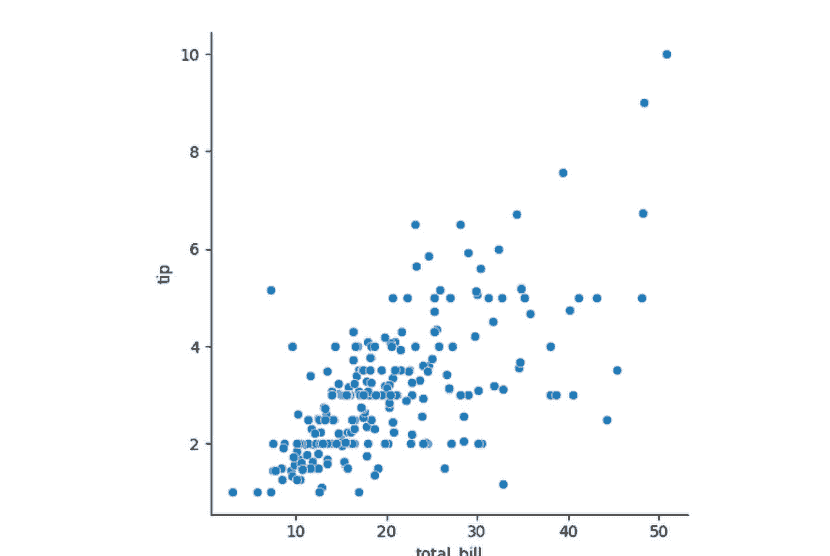

图 15.1  一个散点图，显示了总账单金额与小费金额之间的相关性。

在这个过程中，它之所以有用，是因为它允许人眼检测出表明变量间关系的趋势和模式。

函数 **relplot()** 在图形级别运行，用于通过两种主要类型的图表来可视化统计关系：散点图和折线图。

散点图（`kind='scatter'`）：散点图是 **relplot()** 的默认图表类型。它显示两个数值变量之间的关系（图 15.1）。

```
# 创建一个散点图
sns.relplot(data=tips, x='total_bill', y='tip', kind='scatter')

# 显示图表
plt.show()
```

折线图（`kind='line'`）：折线图用于显示两个数值变量之间的关系，数据点由线连接。它对于可视化随时间或有序类别变化的趋势非常有用。

如果对于 x 变量的同一个值有多个测量值，seaborn 中的默认行为是通过绘制均值以及均值周围 95% 的置信区间来聚合每个 x 值处的多个测量值（图 15.2）。

```
# 创建一个折线图
sns.relplot(data=tips, x='size', y='total_bill', kind='line')
```

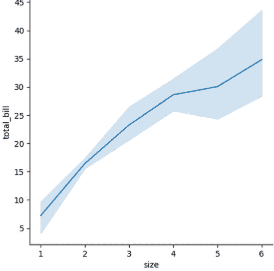

图 15.2 一个折线图，显示了总账单金额与用餐人数之间的关系。

```
# 显示图表
plt.show()
```

### 15.2.2 练习

任务：为 'time' 和 'total_bill' 创建一个散点关系图（图 15.3）。

```
# 创建一个散点图
sns.relplot(data=tips, x='time', y='total_bill')

# 显示图表
plt.show()
```

任务：为 'time' 和 'total_bill' 创建一个折线关系图（图 15.4）。

```
# 创建一个折线图
sns.relplot(data=tips, x='time', y='total_bill', kind='line')

# 显示图表
plt.show()
```

任务：为 'day' 和 'total_bill' 创建一个散点关系图（图 15.5）。

```
# 创建一个散点图
sns.relplot(data=tips, x='day', y='total_bill')
```

216 ■ BiteSize Python for Intermediate Learners

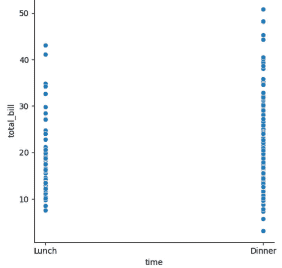

图 15.3 一个散点图，显示了总账单金额与一天中时间的关系。

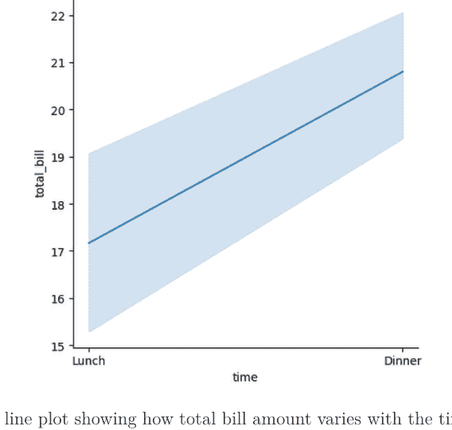

图 15.4 一个折线图，显示了总账单金额如何随一天中的时间变化。

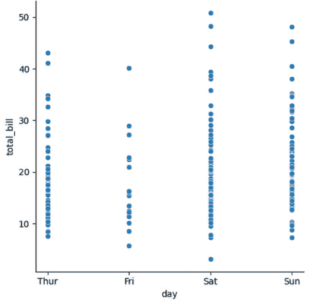

图 15.5 一个散点图，显示了总账单金额与星期几之间的关系。

```
# 显示图表
plt.show()
```

任务：为 'day' 和 'total_bill' 创建一个折线关系图（图 15.6）。

```
# 创建一个折线图
sns.relplot(data=tips, x='day', y='total_bill', kind='line')

# 显示图表
plt.show()
```

## 15.3 分布图

### 15.3.1 演示

Seaborn 中的 `displot()` 函数用于可视化数据集的分布。
直方图（`kind='hist'`）：直方图通过将数据划分为多个区间（bin）并计算每个区间内的观测数量来显示数据集的分布。下面的直方图（图 15.7）显示了 'tips' 数据集中总账单金额的分布。

```
# 创建一个直方图
sns.displot(tips, x='total_bill', kind='hist')
```

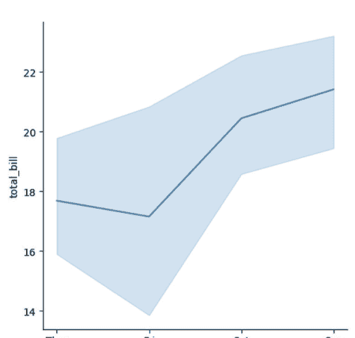

图 15.6 一个折线图，显示了不同星期几的总账单金额。

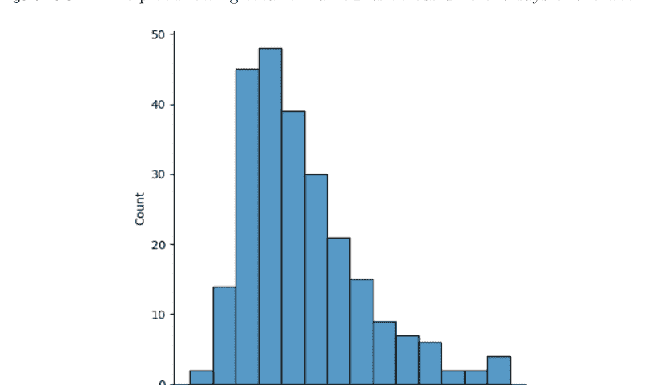

图 15.7 一个基础直方图，显示了总账单金额的分布。

```
# 显示图表
plt.show()
```

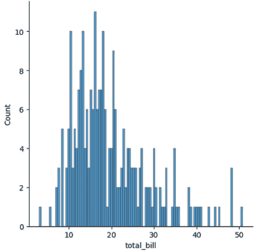

图 15.8 一个总账单金额的直方图，使用了更多的区间以获得更精细的细节。

我们可以通过使用 `bins` 关键字来改变区间的数量，从而修改分布的粒度（图 15.8）。

```
# 创建一个有100个区间的直方图
sns.displot(tips, x='total_bill', kind='hist', bins = 100)

# 显示图表
plt.show()
```

核密度估计图（`kind='kde'`）：核密度估计（KDE）图是直方图的平滑版本，它估计数据的概率密度函数。下面的 KDE 图（图 15.9）显示了 'tips' 数据集中总账单金额的平滑分布。

```
# 创建一个KDE图
sns.displot(tips, x='total_bill', kind='kde')

# 显示图表
plt.show()
```

经验累积分布函数图（`kind='ecdf'`）：ECDF 图显示小于或等于特定值的观测比例，提供了数据分布的累积视图。下面的 ECDF 图（图 15.10）显示了 'tips' 数据集中总账单金额的累积分布。

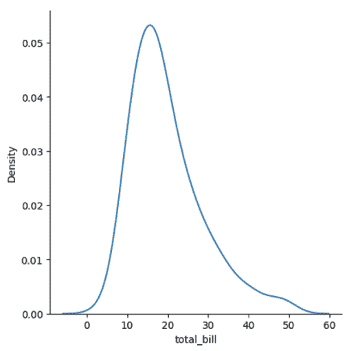

图 15.9 一个KDE图，显示了总账单金额的概率密度。

```
# 创建一个ECDF图
sns.displot(tips, x='total_bill', kind='ecdf')

# 显示图表
plt.show()
```

### 15.3.2 练习

以下是一些编码问题，帮助你练习在 'tips' 数据集上使用 Seaborn 的 `displot()` 函数。这些问题将使用数据集的不同属性来创建各种类型的分布图。

任务：创建一个直方图（图 15.11）来可视化 'tips' 数据集中小费金额的分布。

```
# 创建小费金额的直方图
sns.displot(tips, x='tip', kind='hist')

# 显示图表
plt.show()
```

任务：创建一个 KDE 图（图 15.12）来可视化小费金额的分布。

```
# 创建小费的KDE图
sns.displot(tips, x='tip', kind='kde')

# 显示图表
plt.show()
```

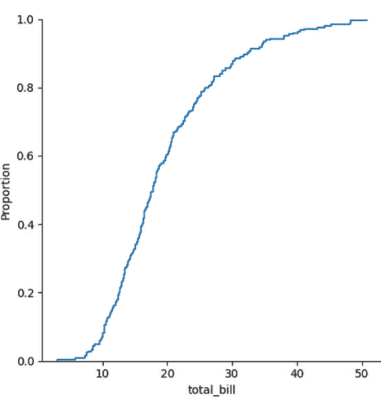

图 15.10 一个总账单金额的经验累积分布函数（ECDF）图。

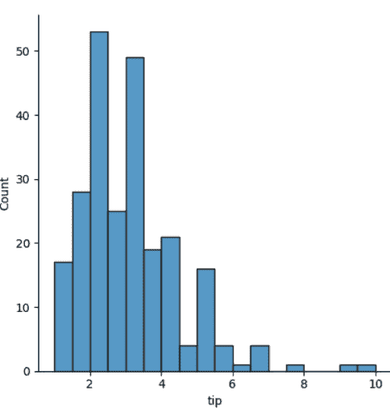

图 15.11 一个直方图，显示了小费金额的分布。

任务：创建一个 ECDF 图（图 15.13）来可视化小费金额。

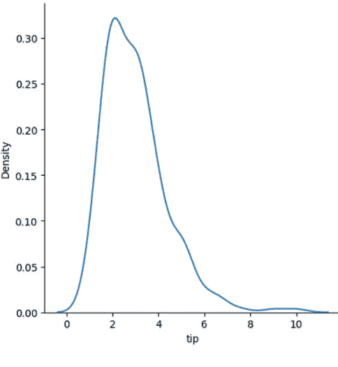

图 15.12 一个小费金额的核密度估计（KDE）图。

```
# 创建小费百分比的ECDF图
sns.displot(tips, x='tip', kind='ecdf')

# 显示图表
plt.show()
```

任务：创建一个直方图（图 15.14）来可视化用餐人数的分布。

```
# 创建用餐人数的直方图
sns.displot(tips, x='size', kind='hist')

# 显示图表
plt.show()
```

任务：创建一个 KDE 图（图 15.15）来可视化用餐人数的分布。

```
# 创建用餐人数的KDE图
sns.displot(tips, x='size', kind='kde')

# 显示图表
plt.show()
```

任务：创建一个 ECDF 图（图 15.16）来可视化用餐人数的分布。

```
# 创建用餐人数的ECDF图
sns.displot(tips, x='size', kind='ecdf')
```

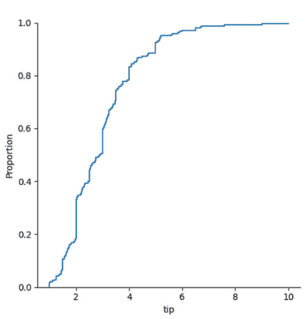

图 15.13 一个小费金额的经验累积分布函数（ECDF）图。

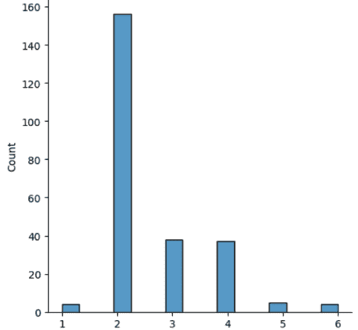

图 15.14 一个直方图，显示了用餐人数的分布。

```
# 显示图表
plt.show()
```

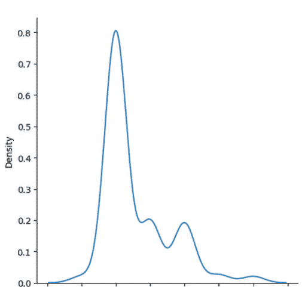

图 15.15 一个小费金额的核密度估计（KDE）图。

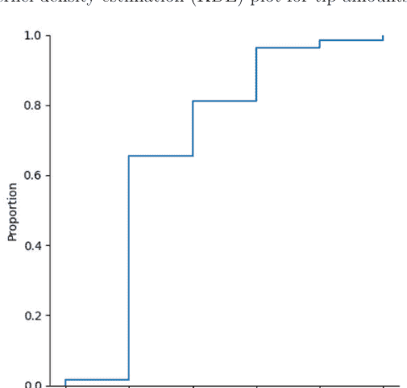

图 15.16 一个小费金额的经验累积分布函数（ECDF）图。

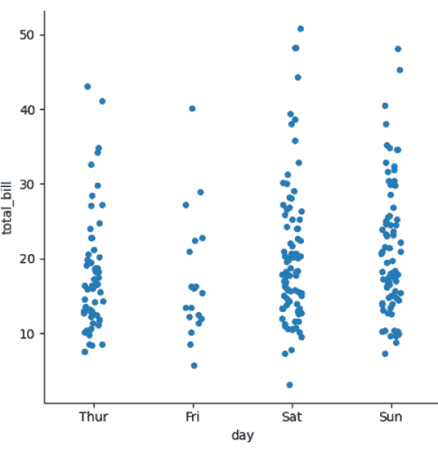

图 15.17 一个条形图，显示了不同星期几的总账单金额分布。

## 15.4 分类图

### 15.4.1 演示

Seaborn 中的 `catplot()` 函数用于可视化分类数据与其他变量之间的关系。通过使用 `kind` 参数，你可以创建条形图、小提琴图、箱线图、点图等，以探索分类变量与数据集中其他数据之间的关系。'tips' 数据集为练习这些技术提供了一个绝佳的起点。

条形图（`kind='strip'`）：条形图沿一个轴显示单个数据点，这对于可视化类别内数据点的分布非常有用。下面的条形图（图 15.17）显示了每个星期几的总账单金额分布。

```
# 创建一个条形图
sns.catplot(data=tips, x='day', y='total_bill', kind='strip')

# 显示图表
plt.show()
```

蜂群图（`kind='swarm'`）：蜂群图类似于条形图，但它会调整数据点的位置以防止它们重叠，从而提供更清晰的分布视图。下面的蜂群图（图 15.18）显示了每个星期几的总账单金额分布，且数据点没有重叠。

### 15.4.2 练习

以下是一些编码练习，旨在帮助你练习使用 Seaborn 中的 `catplot()` 函数，并结合 'tips' 数据集进行操作。这些练习侧重于不同的属性，并使用 `kind` 参数来创建各种类型的分类图。

任务：创建一个条形图（图 15.23），展示不同时间段（'time'）的 'tip' 列的分布情况。

```
# 按时间段创建小费的条形图
sns.catplot(data=tips, x='time', y='tip', kind='strip')

# 显示图表
plt.show()
```

任务：创建一个蜂群图（图 15.24），展示不同性别（'sex'）的 'total_bill' 列的分布情况。

```
# 按性别创建总账单的蜂群图
sns.catplot(data=tips, x='sex', y='total_bill', kind='swarm')

# 显示图表
plt.show()
```

任务：计算数据集中每个条目的小费百分比，并创建一个箱线图（图 15.25）来可视化不同星期几（'day'）的小费百分比分布。

```
# 计算小费百分比
tips['tip_percentage'] = tips['tip'] / tips['total_bill'] * 100

# 按星期几创建小费百分比的箱线图
sns.catplot(data=tips, x='day', y='tip_percentage', kind='box')

# 显示图表
plt.show()
```

任务：创建一个小提琴图（图 15.26），以可视化吸烟者和非吸烟者（'smoker'）的 'total_bill' 列的分布情况。

```
# 按吸烟状态创建总账单的小提琴图
sns.catplot(data=tips, x='smoker', y='total_bill', kind='violin')

# 显示图表
plt.show()
```

任务：创建一个柱状图（图 15.27），以可视化不同性别（'sex'）的平均 'tip' 金额，并用误差棒表示标准误差。

```
# 按性别创建平均小费的柱状图
sns.catplot(data=tips, x='sex', y='tip', kind='bar')

# 显示图表
plt.show()
```

任务：创建一个点图（图 15.28），以可视化不同星期几（'day'）的平均 'tip' 金额，并用线条表示标准误差。

```
# 按星期几创建平均小费的点图
sns.catplot(data=tips, x='day', y='tip', kind='point')

# 显示图表
plt.show()
```

## 15.5 添加颜色

### 15.5.1 演示

Seaborn 中的 **hue** 参数通过颜色区分来添加一个分类维度，从而增强可视化效果。使用 **hue**，你可以创建信息更丰富、视觉上更具吸引力的可视化图表，帮助你从数据中发现更深层次的见解。本节将演示如何在 `relplot()`、`displot()` 和 `catplot()` 函数中，结合 'tips' 数据集，将 **hue** 参数与各种类型的图表一起使用。提供的示例展示了如何将 **hue** 与各种图表结合使用，以增强你的数据分析。

在 `relplot()` 中使用 **hue**：`relplot()` 函数可以创建散点图和折线图。在下面的散点图（图 15.29）中，数据点根据顾客的性别进行着色，从而可以比较男性和女性在总账单与小费金额之间的关系。

```
# 创建带有 hue 的散点图
sns.relplot(data=tips, x='total_bill', y='tip', hue='sex', kind='scatter')

# 显示图表
plt.show()
```

在下面的折线图（图 15.30）中，线条根据顾客的性别进行着色，显示了男性和女性的总账单金额随聚会规模变化的趋势。

```
# 创建带有 hue 的折线图
sns.relplot(data=tips, x='size', y='total_bill', hue='sex', kind='line')

# 显示图表
plt.show()
```

在 `displot()` 中使用 **hue**：`displot()` 函数可以创建直方图、KDE 图和 ECDF 图。在下面的直方图（图 15.31）中，条形根据顾客的性别进行着色，提供了男性和女性之间小费金额分布的比较。

```
# 创建带有 hue 的直方图
sns.displot(data=tips, x='tip', hue='sex', kind='hist')

# 显示图表
plt.show()
```

为避免条形重叠，你可以使用 `multiple` 参数来创建堆叠直方图（图 15.32）。

```
# 创建带有 hue 和堆叠的直方图
sns.displot(data=tips, x='tip', hue='sex', kind='hist', multiple='stack')

# 显示图表
plt.show()
```

在下面的 KDE 图（图 15.33）中，小费金额的分布根据顾客是否吸烟进行着色，从而可以比较吸烟者和非吸烟者之间的小费分布。

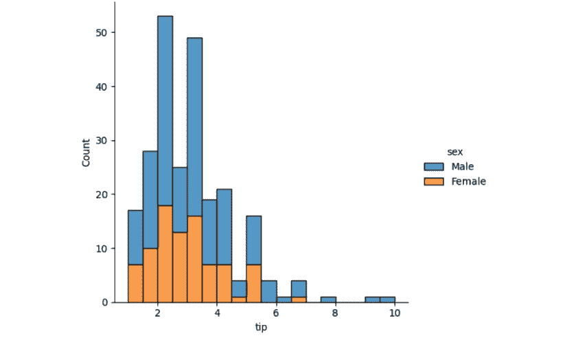

图 15.32 按分类变量分组的小费金额堆叠直方图。

```python
# 创建带有色调的 KDE 图
sns.displot(data=tips, x='tip', hue='smoker', kind='kde')

# 显示图表
plt.show()
```

为避免条形重叠，你可以使用 `multiple` 参数来创建堆叠的 KDE 图（图 15.34）。

```python
# 创建带有色调和堆叠的 KDE 图
sns.displot(data=tips, x='tip', hue='smoker', kind='kde', multiple='stack')

# 显示图表
plt.show()
```

在下面的 ECDF 图（图 15.35）中，线条根据星期几着色，提供了不同日期总账单分布的累积视图。

```python
# 创建带有色调的 ECDF 图
sns.displot(data=tips, x='total_bill', hue='day', kind='ecdf')

# 显示图表
plt.show()
```

`catplot()` 函数可以创建条形散点图、蜂群图、箱线图、小提琴图、条形图和点图。在下面的条形散点图（图 15.36）中，数据点根据顾客是否吸烟进行着色，显示了不同日期总账单金额的分布。

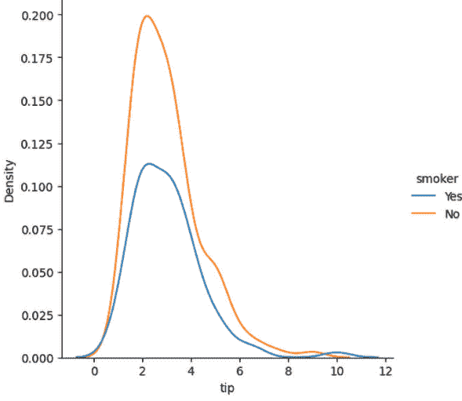

图 15.33 小费金额的核密度估计（KDE）图，颜色表示类别。

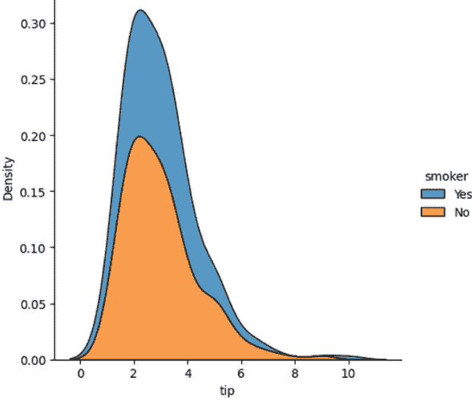

图 15.34 按分类变量分组的小费金额堆叠 KDE 图。

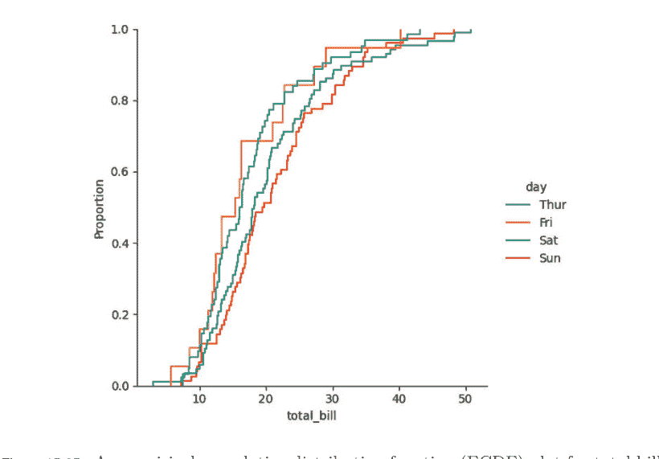

图 15.35 总账单的经验累积分布函数（ECDF）图，颜色表示类别。

```python
# 创建带有色调的条形散点图
sns.catplot(data=tips, x='day', y='total_bill', hue='smoker', kind='strip')

# 显示图表
plt.show()
```

在下面的蜂群图（图 15.37）中，数据点根据顾客的性别着色，可视化了不同日期小费的分布。

```python
# 创建带有色调的蜂群图
sns.catplot(data=tips, x='day', y='tip', hue='sex', kind='swarm')

# 显示图表
plt.show()
```

在下面的箱线图（图 15.38）中，箱子根据顾客的性别着色，比较了男性和女性午餐和晚餐的总账单金额分布。

```python
# 创建带有色调的箱线图
sns.catplot(data=tips, x='time', y='total_bill', hue='sex', kind='box')

# 显示图表
plt.show()
```

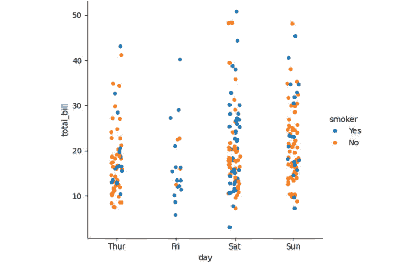

图 15.36 按日期显示的总账单条形散点图，颜色区分不同类别。

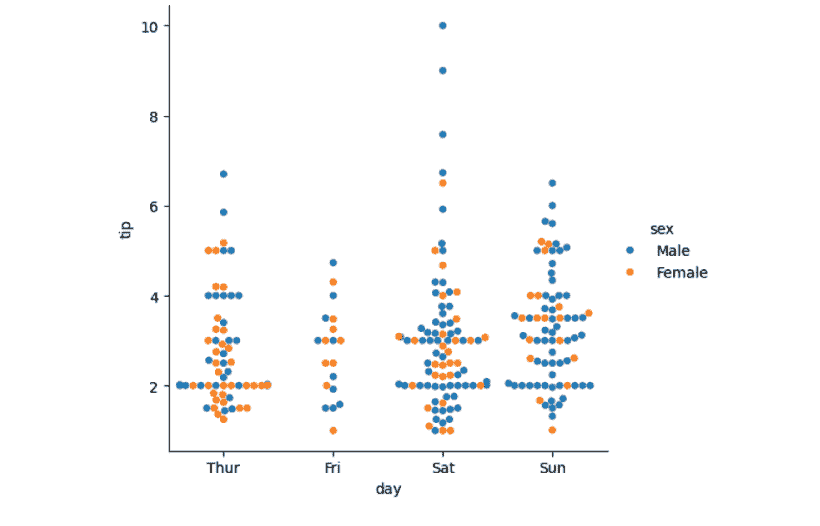

图 15.37 按日期显示的小费条形散点图，颜色区分不同类别。

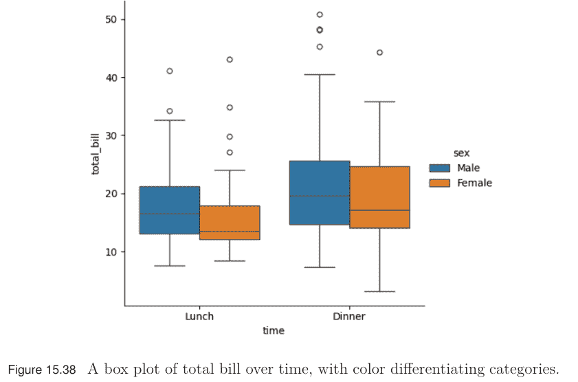

图 15.38 按时间显示的总账单箱线图，颜色区分不同类别。

在下面的小提琴图（图 15.39）中，分布根据顾客的性别着色，显示了男性和女性午餐和晚餐的小费密度。

```python
# 创建带有色调的小提琴图
sns.catplot(data=tips, x='time', y='tip', hue='sex', kind='violin')

# 显示图表
plt.show()
```

标准的小提琴图是对称的。如果你想只保留一半的小提琴以节省空间，可以利用 split 参数创建一个紧凑的小提琴图（图 15.40）。

```python
# 创建带有色调的小提琴图，并将 split 设置为 True
sns.catplot(data=tips, x='time', y='tip',
            hue='sex', kind='violin', split=True)

# 显示图表
plt.show()
```

在下面的条形图（图 15.41）中，条形根据顾客的性别着色，比较了不同日期男性和女性的平均总账单金额。

```python
# 创建带有色调的条形图
sns.catplot(data=tips, x='day', y='total_bill', hue='sex', kind='bar')

# 显示图表
plt.show()
```

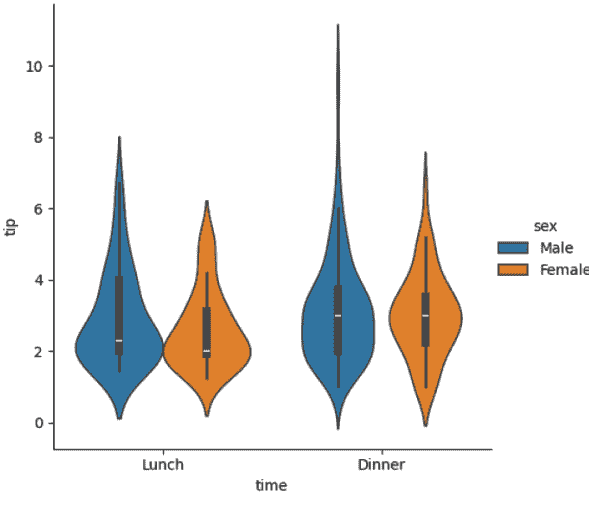

图 15.39 按时间显示的小费小提琴图，颜色区分不同类别。

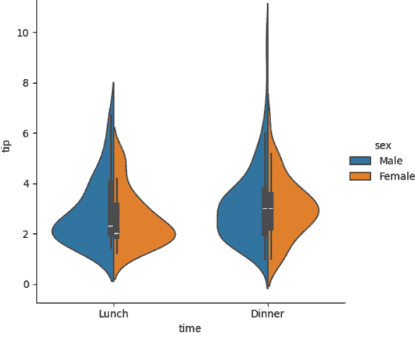

图 15.40 按时间显示的小费紧凑小提琴图，颜色区分不同类别。

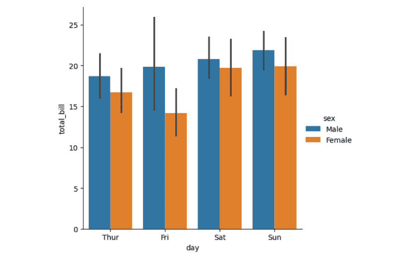

图 15.41 按日期显示的总账单条形图，颜色区分不同类别。

在下面的点图（图 15.42）中，点和线根据顾客是否吸烟进行着色，可视化了吸烟者和非吸烟者在不同日期的平均小费金额。

```python
# 创建带有色调的点图
sns.catplot(data=tips, x='day', y='tip', hue='smoker', kind='point')

# 显示图表
plt.show()
```

### 15.5.2 练习

以下是一些练习题，帮助你理解和应用 Seaborn 中的 hue 参数。我们将使用 'tips' 数据集中之前演示未使用的不同属性。

任务：创建一个散点图（图 15.43）来可视化 'total_bill' 和 'tip' 之间的关系，点的颜色基于 'day' 属性。

```python
# 创建基于 day 的带有色调的散点图
sns.relplot(data=tips, x='total_bill', y='tip', hue='day', kind='scatter')

# 显示图表
plt.show()
```

任务：创建一个 KDE 图（图 15.44）来可视化 'total_bill' 的分布，线条的颜色基于 'time' 属性。

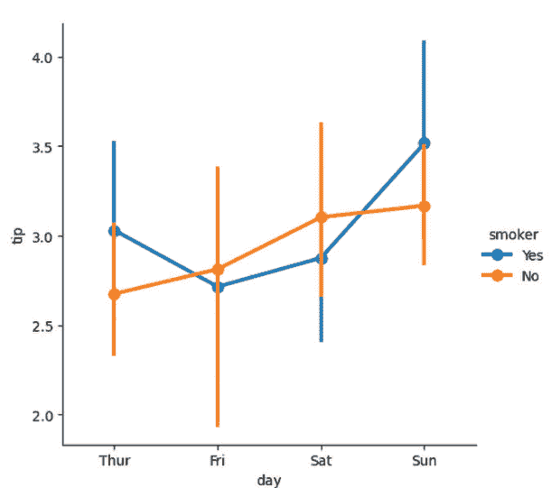

图 15.42 按日期显示的小费点图，颜色区分不同类别。

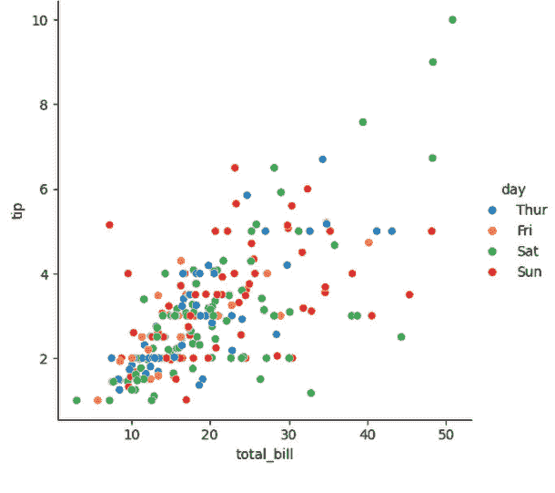

图 15.43 小费和总账单的散点图，颜色区分不同类别。

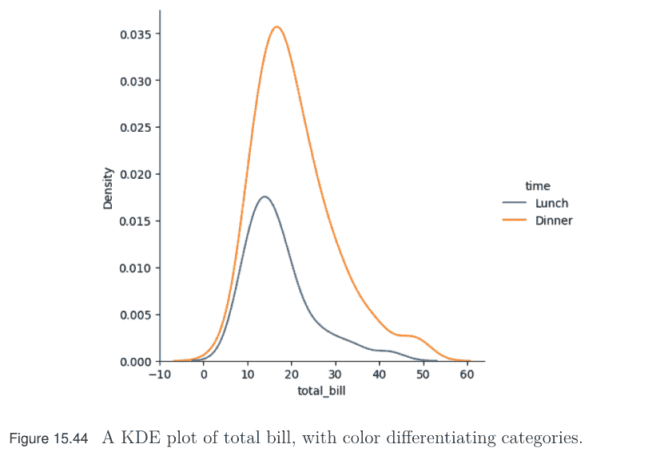

图 15.44 总账单的 KDE 图，颜色区分不同类别。

```python
# 创建基于 time 的带有色调的 KDE 图
sns.displot(data=tips, x='total_bill', hue='time', kind='kde')

# 显示图表
plt.show()
```

任务：创建一个 ECDF 图（图 15.45）来可视化 'tip' 的累积分布，线条的颜色基于 'sex' 属性。

```python
# 创建基于 sex 的带有色调的 ECDF 图
sns.displot(data=tips, x='tip', hue='sex', kind='ecdf')

# 显示图表
plt.show()
```

任务：创建一个小提琴图（图 15.46）来可视化 'total_bill' 的分布，各部分的颜色基于 'smoker' 属性。

```python
# 创建基于吸烟者状态的带有色调的小提琴图
sns.catplot(data=tips, x='day', y='total_bill',
            hue='smoker', kind='violin')

# 显示图表
plt.show()
```

任务：创建一个条形图（图 15.47）来可视化每天的平均 'tip' 金额，条形的颜色基于 'time' 属性。

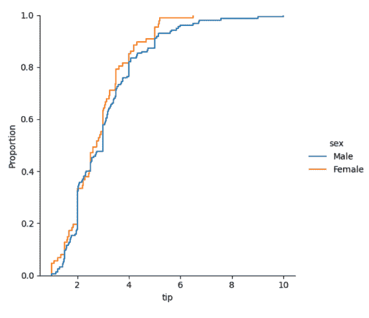

图 15.45 小费的 ECDF 图，颜色区分不同类别。

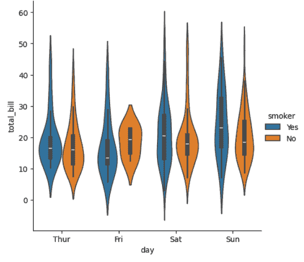

图 15.46 按日期显示的总账单小提琴图，颜色区分不同类别。

```python
# 创建基于 time 的带有色调的条形图
sns.catplot(data=tips, x='day', y='tip', hue='time', kind='bar')

# 显示图表
plt.show()
```

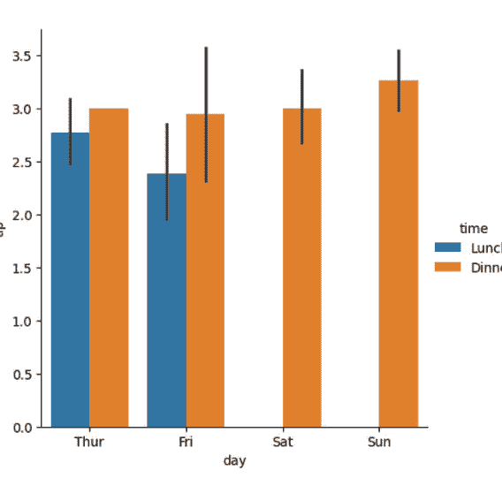

图 15.47 按日期显示的小费条形图，颜色区分不同类别。

任务：创建一个点图（图 15.48）来可视化每个聚会规模的平均 'total_bill' 金额，点的颜色基于 'smoker' 属性。

```python
# 创建基于吸烟者状态的带有色调的点图
sns.catplot(data=tips, x='size', y='total_bill',
            hue='smoker', kind='point')

# 显示图表
plt.show()
```

## 15.6 更多样式

### 15.6.1 演示

在 Seaborn 中，**style** 和 **size** 参数通过使用不同的标记样式和大小来区分数据点，为你的可视化增添了更多维度。这有助于使你的图表更具信息性且更易于解读。

在下面的散点图（图 15.49）中：

- hue='smoker'：根据顾客是否吸烟为数据点着色。
- style='sex'：根据顾客的性别，使用不同的标记样式来区分数据点。

### 15.6.2 练习

以下是一些练习题，旨在帮助你理解并应用 Seaborn 中的 `style` 和 `size` 参数，使用 'tips' 数据集。

任务：创建一个散点图（图 15.51），以可视化 `total_bill` 和 `tip` 之间的关系，根据一天中的 `time` 使用不同的标记样式，并根据星期几改变标记大小。

```
# 创建带有样式和大小的散点图
sns.relplot(data=tips, x='total_bill', y='tip',
            hue='time', style='time',
            size='day', kind='scatter')

# 显示图表
plt.show()
```

任务：创建一个折线图（图 15.52），以可视化聚会 `size` 和 `total_bill` 之间的关系，根据 `smoker` 状态使用不同的线型。

```
# 创建带有样式的折线图
sns.relplot(data=tips, x='size', y='total_bill',
            hue='smoker', style='smoker',
            kind='line', markers=True, dashes=True)

# 显示图表
plt.show()
```

任务：创建一个散点图（图 15.53），以可视化 `tip` 和聚会 `size` 之间的关系，根据 `sex` 使用不同的标记样式，并根据 `total_bill` 改变标记大小。

```
# 创建带有样式和大小的散点图
sns.relplot(data=tips, x='tip', y='size',
            hue='sex', style='sex',
            size='total_bill', kind='scatter')

# 显示图表
plt.show()
```

## 15.7 分面网格

### 15.7.1 演示

分面网格是 Seaborn 中一个强大的功能，它允许你根据一个或多个分类变量的值创建多个子图。这有助于通过将数据分解为更小、更易于管理的图表来可视化复杂数据集，从而更容易识别数据子集中的模式和关系。

在 Seaborn 中，可以使用 `FacetGrid` 类或更高级的函数（如 `relplot()`、`catplot()` 和 `displot()`）来创建分面网格。

`relplot()` 函数可以创建带有分面网格的散点图和折线图。我们将演示一个基于 `smoker` 和 `time` 进行分面的散点图。

在以下散点图（图 15.54）中：

- `col='smoker'`：为吸烟者和非吸烟者创建单独的列。
- `row='time'`：为午餐和晚餐创建单独的行。
- `hue='sex'`：根据顾客性别为数据点着色。

```
# 创建基于吸烟者和时间的分面散点图
sns.relplot(data=tips, x='total_bill', y='tip',
            col='smoker', row='time',
            hue='sex', kind='scatter')

# 显示图表
plt.show()
```

`displot()` 函数可以创建带有分面网格的直方图、KDE 图和 ECDF 图。我们将演示一个基于吸烟者进行分面的直方图。

在以下直方图（图 15.55）中：

- `col='smoker'`：为吸烟者和非吸烟者创建单独的列。
- `kde=True`：在直方图上方添加 KDE 图。

```
# 创建基于日期的分面直方图
sns.displot(data=tips, x='total_bill', col='smoker', kde=True)

# 显示图表
plt.show()
```

`catplot()` 函数可以创建带有分面网格的各种类型的分类图。我们将演示一个基于时间进行分面的箱线图。在以下箱线图（图 15.56）中：

- `col='time'`：为午餐和晚餐创建单独的列。
- `x='day'`：显示每周每天的 total_bill 分布。
- `kind='box'`：指定图表类型为箱线图。

```
# 创建基于时间的分面箱线图
sns.catplot(data=tips, x='day', y='total_bill', col='time', kind='box')

# 显示图表
plt.show()
```

### 15.7.2 练习

以下是一些练习题，旨在帮助你理解并应用 Seaborn 中的分面网格，使用 'tips' 数据集。这些问题使用了演示中未使用的不同属性。

任务：创建一个散点图（图 15.57），以可视化 total_bill 和 tip 之间的关系，为每周的每一天使用单独的分面，并通过时间区分数据点。

```
# 创建基于日期和时间的分面散点图
sns.relplot(data=tips, x='total_bill', y='tip',
            col='day', hue='time', kind='scatter')

# 显示图表
plt.show()
```

任务：创建一个 KDE 图（图 15.58），以可视化 total_bill 的分布，为每个性别使用单独的分面，并为每个子集添加 KDE 图。

```
# 创建基于性别的分面KDE图
sns.displot(data=tips, x='total_bill', col='sex', kind='kde', fill=True)

# 显示图表
plt.show()
```

任务：创建一个条形图（图 15.59），以可视化每天的平均 total_bill，为时间使用单独的分面，并通过吸烟者状态区分条形。

```
# 创建基于时间和吸烟者状态的分面条形图
sns.catplot(data=tips, x='day', y='total_bill',
            col='time', hue='smoker', kind='bar')

# 显示图表
plt.show()
```

任务：创建一个小提琴图（图 15.60），以可视化每天 tip 的分布，为吸烟者状态和性别使用单独的分面。

```
# 创建基于吸烟者状态和性别的分面小提琴图
sns.catplot(data=tips, x='day', y='tip',
            col='smoker', row='sex', kind='violin')

# 显示图表
plt.show()
```

任务：创建一个直方图（图 15.61），以可视化 tip 的分布，为时间使用单独的分面，并通过日期区分条形。

```
# 创建基于时间和日期的分面直方图
sns.displot(data=tips, x='tip', col='time', hue='day', multiple='stack')

# 显示图表
plt.show()
```

## 15.8 课程：LMPLOT

### 15.8.1 演示

lmplot 是 Seaborn 中一个强大的函数，专门用于可视化变量之间的线性关系。它结合了散点图和回归线图的功能，提供了一种简单直观的方式来探索和理解数据中的关系。lmplot 函数对于执行线性回归分析和可视化结果特别有用。

lmplot 的主要特点：

- **带有回归线的散点图**：显示数据点并拟合线性回归模型，绘制回归线。
- **分面图**：轻松地根据数据的子集创建多个图表。

### 15.8.2 实践

Seaborn 中的 `lmplot` 函数用于创建线性回归图。它允许你可视化两个变量之间的线性关系，同时包含置信区间和各种自定义选项。以下是一些实践问题，帮助你使用 'tips' 数据集和不同属性来理解和应用 `lmplot`。

任务：创建一个线性回归图（图 15.66），以可视化 `size` 和 `tip` 之间的关系。

```
# 创建一个简单的线性回归图
sns.lmplot(data=tips, x='size', y='tip')
```

任务：创建一个线性回归图（图 15.67），以可视化 size 和 tip 之间的关系，并按性别区分数据点。

```
# 创建一个基于性别的线性回归图
sns.lmplot(data=tips, x='size', y='tip', hue='sex')

# 显示图表
plt.show()
```

任务：创建一个线性回归图（图 15.68），以可视化 size 和 tip 之间的关系，并为一天中的每个时间段使用单独的分面。

```
# 创建一个基于时间的线性回归图
sns.lmplot(data=tips, x='size', y='tip', col='time')

# 显示图表
plt.show()
```

任务：创建一个线性回归图（图 15.69），以可视化 size 和 tip 之间的关系，为一周的每一天使用单独的分面，并按吸烟者状态区分数据点。

```
# 创建一个具有多个分面的线性回归图
sns.lmplot(data=tips, x='size', y='tip', col='day', hue='smoker')

# 显示图表
plt.show()
```

任务：创建一个线性回归图（图 15.70），以可视化 **size** 和 **tip** 之间的关系，并拟合二阶多项式回归。

```
# 创建一个多项式阶数为2的线性回归图
sns.lmplot(data=tips, x='size', y='tip', order=2)

# 显示图表
plt.show()
```

## 15.9 多图

### 15.9.1 演示

Seaborn 中的多图是可视化数据集中多个变量之间关系的强大工具。它们有助于全面识别模式、相关性和分布。在本节中，我们将介绍两个关键的多图函数：`pairplot` 和 `jointplot`。

`pairplot` 函数创建一个图表网格，其中数据集中的每个变量都与其他变量进行绘图。它有助于可视化成对关系以及每个变量的分布（图 15.71）。

```
# 创建一个基于 'sex' 属性的 pairplot
sns.pairplot(tips, hue='sex')
```

`jointplot` 函数创建一个带有边际直方图或密度图的双变量图。它有助于可视化两个变量之间的关系，以及它们各自的分布（图 15.72）。

```
# 创建一个用于 'total_bill' 和 'tip' 之间关系的 jointplot
sns.jointplot(x='total_bill', y='tip', data=tips, kind='scatter')

# 显示图表
plt.show()
```

我们可以在 pairplot 中使用 hue 进行颜色区分（图 15.73）：

```
# 创建一个带有回归线且基于 'sex' 的 pairplot
sns.pairplot(tips, hue='sex', kind='reg')

# 显示图表
plt.show()
```

我们可以使用 kind='kde' 创建 KDE jointplot（图 15.74）：

```
# 使用 KDE 显示 'total_bill' 和 'tip' 之间的关系
sns.jointplot(x='total_bill', y='tip', data=tips, kind='kde')

# 显示图表
plt.show()
```

虽然我们可以使用通用绘图中的 `kind` 参数创建各种图表，但也可以直接创建特定图表并对其进行不同的控制。我们在 [表 15.1](Table 15.1) 中总结了这些特定图表。

## 15.10 与生成式AI交互

以下是一些你可以与生成式AI工具（包括 ChatGPT）交互的问题和提示。

- 为什么 Seaborn 被认为是一个高级数据可视化库？
- Seaborn 中常用哪些类型的图表，它们的用途是什么？
- 如何使用 `darkgrid` 或 `whitegrid` 等主题自定义 Seaborn 图表？
- Matplotlib 图表和 Seaborn 图表的主要区别是什么？
- 如何在 Seaborn 中使用 `hue` 参数为图表添加一个维度？
- Seaborn 图表是否可以使用 Matplotlib 进一步自定义？如果可以，如何操作？
- 如何调整 Seaborn 中的调色板以获得更好的视觉效果？
- 如何使用 Seaborn 为你的可视化添加置信区间？
- 展示如何使用 Seaborn 识别数值数据中的异常值。
- 如果 Seaborn 图表看起来难以解释，你应该怎么做？

## 15.11 探索更多 SeABORN

以下是你可能参考的有用文档：

- 概述：https://seaborn.pydata.org/tutorial/function_overview.html
- 统计关系：https://seaborn.pydata.org/tutorial/relational.html
- 数据分布：https://seaborn.pydata.org/tutorial/distributions.html
- 分类数据：https://seaborn.pydata.org/tutorial/categorical.html
- 估计回归拟合：https://seaborn.pydata.org/tutorial/regression.html
- 完整 API：https://seaborn.pydata.org/api.html

# 第16章

## Plotly

在本章中，我们将借助Plotly这个动态库，将数据可视化技能提升到新的高度，它能够创建交互式可视化。在已掌握Matplotlib和Seaborn知识的基础上，我们将探索Plotly如何轻松创建引人入胜的图表，允许用户进行缩放、平移、悬停和点击以获取更深入的见解。我们将涵盖多种图表类型，从折线图和柱状图到更高级的可视化，如3D图。准备好了吗？让我们开始吧！

## 16.1 概述

Plotly是一个强大的Python库，用于创建交互式可视化。与Matplotlib和Seaborn生成的静态可视化不同，Plotly生成的交互式图表可以嵌入到Web应用程序中或在Jupyter笔记本中显示。这种交互性使其成为数据探索和展示的绝佳选择，允许用户缩放、悬停和点击以揭示数据的更多细节。

Plotly以其交互式可视化而闻名，非常适合仪表板、报告和探索性数据分析。Plotly提供了一个高级接口来创建复杂的图表，类似于Seaborn，但具有额外的交互功能。Plotly支持广泛的图表类型，从基本的折线图和柱状图到更高级的可视化，如3D曲面图。Plotly图表基于JavaScript，使其易于嵌入到Web应用程序中。如果需要，它们也可以导出为静态图像。Plotly允许对图表进行广泛的自定义，从而创建高度定制的可视化。

如果你正在构建需要用户交互的仪表板或报告，Plotly是首选库。Plotly的交互功能使其非常适合EDA，允许用户深入数据点并发现隐藏的模式。当你需要将图表嵌入到Web应用程序中时，Plotly基于JavaScript的图表也非常适合无缝集成。

我们在表16.1中对我们学习过的三个包进行了简要比较。

270 ■ BiteSize Python for Intermediate Learners

表16.1 Matplotlib、Seaborn和Plotly的比较

| 特性 | Matplotlib | Seaborn | Plotly |
| :--- | :--- | :--- | :--- |
| 交互性 | 静态 | 静态 | 交互式 |
| 易用性 | 低级API，需要更多代码 | 高级API，更容易创建复杂图表 | 带有交互功能的高级API |
| 自定义性 | 广泛 | 广泛，构建在Matplotlib之上 | 广泛，具有额外的Web集成 |
| 图表范围 | 广泛 | 广泛，专注于统计图表 | 非常广泛，包括3D和地图图表 |
| 性能 | 适合中小型数据集 | 适合中小型数据集 | 可以交互式处理大型数据集 |
| 最适合 | 详细自定义、出版级图表 | 快速且美观的统计可视化 | 交互式仪表板、数据探索 |

## 16.2 设置

Plotly的核心绘图模块是`plotly.graph_objects`，它提供了一个用于构建复杂图表的低级API。然而，在本章中，我们将使用`plotly.express`，这是一个高级模块，可以轻松地用最少的代码创建简单但强大的可视化。

### 16.2.1 Plotly Express

Plotly Express通常导入为`px`，是Plotly库中的一个模块，它简化了通过单个函数调用创建完整图形的过程。由于其易用性和高效性，它是生成大多数标准图表的推荐起点。

Plotly Express包含超过30个用于各种类型图表的函数，具有一致且易于学习的API。这种一致性允许用户在数据探索期间快速切换不同类型的可视化，例如散点图、柱状图、直方图和旭日图。

Plotly Express API的主要特点包括：

- **统一接口**：通过将`plotly.express`导入为`px`，用户可以访问所有绘图函数、内置演示数据集和颜色比例尺。每个函数生成一个`Figure`对象，可以进一步自定义。
- **智能默认值与灵活性**：函数推断合理的默认值，但允许完全自定义。
- **多功能输入格式**：函数接受各种数据格式，包括列表、字典、DataFrame、numpy数组、xarray和GeoPandas GeoDataFrame。
- **自动配置**：Plotly Express根据输入数据自动配置轨迹、布局、轴标签、图例和悬停标签。
- **样式和颜色控制**：API支持通过默认模板进行样式设置，并提供对分类变量的详细控制。
- **高级功能**：包括分面、边际图、趋势线、动画以及用于大型散点图的自动WebGL渲染。

```python
import pandas as pd
import numpy as np
import plotly.express as px
```

## 16.3 散点图

### 16.3.1 演示

散点图通过在二维图上显示数据点来可视化两个连续变量之间的关系。Plotly创建交互式图表，允许你将鼠标悬停在数据点上、放大并以动态方式探索数据。由于交互功能无法在印刷格式中捕获，我们在本书中包含了图表的静态截图。为了充分体验Plotly的功能，我们鼓励你运行提供的代码并亲身体验交互功能，这将使你更深入地理解数据和该包的潜力。

让我们从一个简单的散点图（图16.1）开始，展示两个变量之间的关系。我们将使用一个小型样本数据集进行演示。此示例创建了一个散点图，显示体重如何随身高变化。x轴代表身高，y轴代表体重。title参数设置图表的标题。

```python
# Sample data
data = {
    'Height': [150, 160, 170, 180, 190],
    'Weight': [50, 60, 70, 80, 90]
}

# Creating a basic scatter plot
fig = px.scatter(data, x='Height', y='Weight', title='Height vs. Weight')

# Display the plot
fig.show()
```

现在，我们将添加更多自定义，例如设置标记的大小并添加趋势线以更清晰地可视化关系。这里，size参数根据值列表调整标记大小，trendline参数向散点图添加线性趋势线（图16.2）。这有助于理解身高和体重之间的总体趋势。

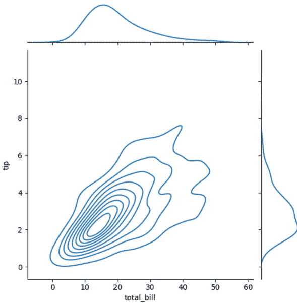

图15.74 一个联合图，说明了总账单和小费之间的关系。

表15.1 Seaborn特定图表类型总结

| 类型 | 基本语法 | 场景 |
| :--- | :--- | :--- |
| 散点图 | sns.scatterplot() | 显示两个变量之间的关系。示例：分析广告预算与销售额之间的关系。 |
| 折线图 | sns.lineplot() | 可视化随时间变化的趋势或变化。示例：跟踪一年中的月度收入。 |
| 柱状图 | sns.barplot() | 比较具有聚合值的分类数据。示例：比较不同产品类别的平均客户评分。 |
| 计数图 | sns.countplot() | 计算分类数据的出现次数。示例：统计每个部门的员工数量。 |
| 直方图 | sns.histplot() | 显示数据集的分布。示例：可视化班级考试成绩的分布。 |
| 核密度估计图 | sns.kdeplot() | 估计连续变量的概率密度。示例：了解人口中的收入分布。 |
| 箱线图 | sns.boxplot() | 显示分布并突出显示异常值。示例：比较不同职位的薪水。 |
| 小提琴图 | sns.violinplot() | 结合箱线图和核密度估计图来显示分布和概率。示例：分析不同年龄组的身高分布。 |
| 热力图 | sns.heatmap() | 可视化相关性或类似矩阵的数据。示例：检查不同财务指标之间的相关性。 |
| 线性回归图 | sns.lmplot() | 拟合并可视化线性回归模型。示例：建模学习时间与考试成绩之间的关系。 |

## 身高与体重

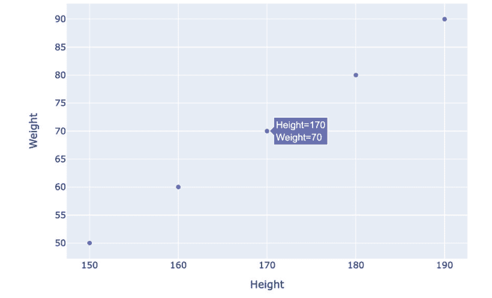

图 16.1 一个简单的散点图，显示数据点。

```python
# Sample data
data = {
    'Height': [150, 160, 170, 180, 190],
    'Weight': [50, 60, 70, 80, 90]
}

# Creating a scatter plot with customizations
fig = px.scatter(data, x='Height', y='Weight',
                 title='Height vs. Weight with Trendline',
                 size=[10, 20, 30, 40, 50],  # Adjusting marker size
                 trendline='ols')  # Adding a trendline

# Display the plot
fig.show()
```

让我们使用颜色来编码第三个变量，以便更容易地可视化数据中的模式或分组。在这个例子中，`color`参数用于根据性别区分数据点（图 16.3）。这使我们能够看到男性和女性在体重和身高分布上的差异。

```python
# Sample data
data = {
    'Height': [150, 160, 170, 180, 190],
    'Weight': [50, 60, 70, 80, 90],
    'Gender': ['Male', 'Female', 'Male', 'Female', 'Male']
}
```

## 带有趋势线的身高与体重

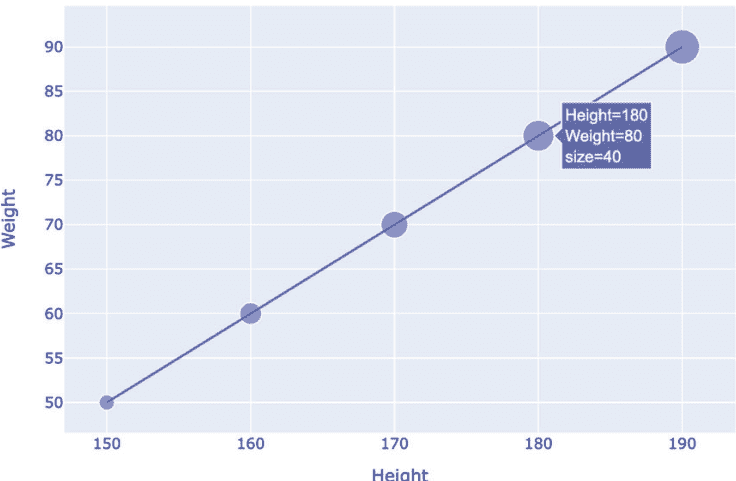

图 16.2 一个散点图，显示了数据点大小和趋势线。

```python
# Creating a scatter plot with color encoding
fig = px.scatter(data, x='Height', y='Weight',
                 color='Gender',  # Adding color based on gender
                 title='Height vs. Weight by Gender')

# Display the plot
fig.show()
```

### 16.3.2 练习

我们将创建一个包含随机数据的虚拟DataFrame `df_dummy`。该数据集有四个数值特征（`feature_1`到`feature_4`）和一个分类特征`category`。

```python
# Set seed for reproducibility
np.random.seed(42)

# Create a dummy dataset
v = np.random.rand(150)
df_dummy = pd.DataFrame({
    'feature_1': v,
    'feature_2': v + np.random.rand(150),
    'feature_3': v**2 + np.random.rand(150),
    'feature_4': v * 7,
    'category': np.random.choice(['A', 'B', 'C'], 150)
})

df_dummy.info()
```

```
<class 'pandas.core.frame.DataFrame'>
RangeIndex: 150 entries, 0 to 149
Data columns (total 5 columns):
 #   Column      Non-Null Count  Dtype  
---  ------      --------------  -----  
 0   feature_1   150 non-null    float64
 1   feature_2   150 non-null    float64
 2   feature_3   150 non-null    float64
 3   feature_4   150 non-null    float64
 4   category    150 non-null    object 
dtypes: float64(4), object(1)
memory usage: 6.0+ KB
```

任务：创建一个散点图（图 16.4）来可视化`feature_1`和`feature_2`之间的关系。

```python
# Create scatter plot
fig = px.scatter(df_dummy, x='feature_1', y='feature_2',
                 title='Feature 1 vs. Feature 2')

fig.show()
```

## 特征 1 与 特征 2

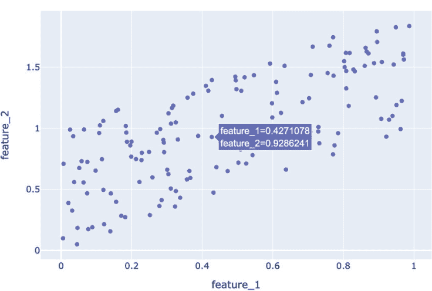

图 16.4 一个散点图，显示了特征 1 和特征 2 之间的关系。

任务：创建一个散点图（图 16.5）来可视化`feature_3`和`feature_4`之间的关系，使用`category`作为色调来区分点。

```python
# Create scatter plot with category as hue
fig = px.scatter(df_dummy, x='feature_3', y='feature_4',
                 color='category',
                 title='Feature 3 vs. Feature 4 by Category')

fig.show()
```

任务：创建一个散点图（图 16.6）来可视化`feature_1`和`feature_3`之间的关系。使用点的大小来表示`feature_4`。较大的点代表`feature_4`的较高值。

```python
# Create scatter plot with size proportional to feature 4
fig = px.scatter(df_dummy, x='feature_1', y='feature_3',
                 size='feature_4',
                 title='Feature 1 vs. Feature 3 with Feature 4 as Size')

fig.show()
```

任务：对于上一个任务，使用`category`作为色调，按类别区分点（图 16.7）。

## 按类别划分的特征 3 与 特征 4

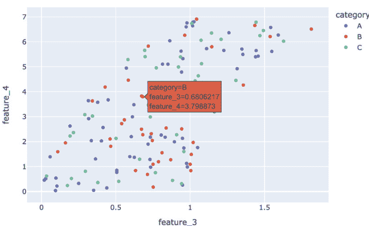

图 16.5 特征 3 和特征 4 的散点图，带有颜色编码。

## 特征 1 与 特征 3（特征 4 作为大小）

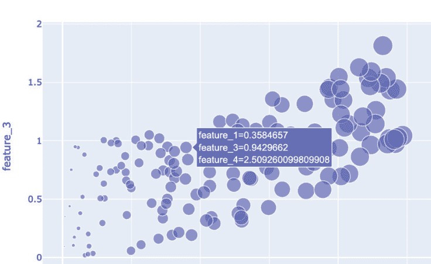

图 16.6 特征 1 和特征 3 的散点图，数据点大小有变化。

## 特征 1 与 特征 2（特征 4 作为大小）

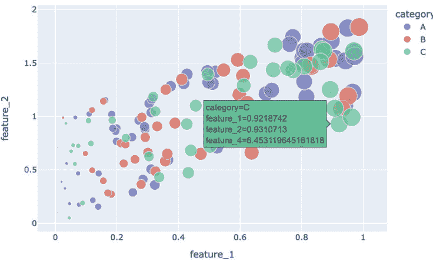

图 16.7 特征 1 和特征 2 的散点图，同时使用了颜色和大小。

```python
# Create scatter plot with size proportional to feature 4
fig = px.scatter(df_dummy, x='feature_1', y='feature_2',
                 size='feature_4', color='category',
                 title='Feature 1 vs. Feature 2 with Feature 4 as Size')

fig.show()
```

## 16.4 折线图

### 16.4.1 演示

折线图是可视化趋势或随时间变化的好方法。让我们从一个简单的折线图（图 16.8）开始，它显示了销售额在五年期间的增长情况。x轴代表年份，y轴代表销售额。`title`参数用于设置图表的标题。

```python
# Sample data
data = {
    'Year': [2016, 2017, 2018, 2019, 2020],
    'Sales': [100, 120, 230, 250, 200]
}

# Creating a basic line plot
fig = px.line(data, x='Year', y='Sales', title='Sales Over Time')
```

## 销售额随时间变化

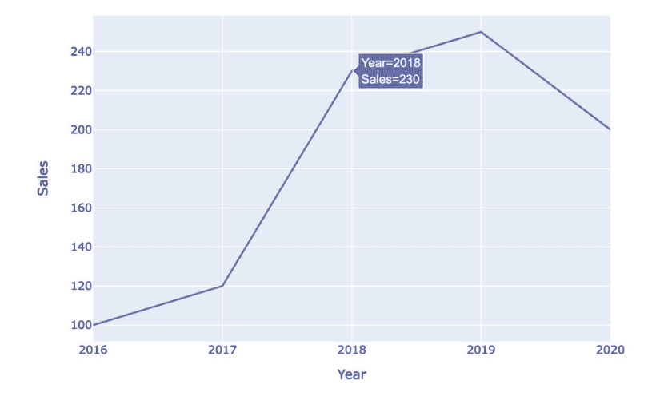

图 16.8 一个基本的折线图，显示数据趋势。

```python
# Display the plot
fig.show()
```

你可以在同一个图表中添加多条线来比较多个趋势（图 16.9）。

```python
# Sample data
data = {
    'Year': [2016, 2017, 2018, 2019, 2020],
    'Sales1': [100, 120, 230, 250, 200],
    'Sales2': [90, 140, 190, 140, 290],
}

# Creating a multi-line plot
fig = px.line(data, x='Year', y=['Sales1', 'Sales2'],
              title='Sales1 and Sales 2 Over Time')

# Display the plot
fig.show()
```

或者，如果你有分类属性，你可以创建一个多线图（图 16.10）来比较两种不同产品随时间变化的销售额。在这个例子中，我们使用`color`参数来区分两种产品，产品A和产品B。这创建了一个多线图，其中每个产品的销售额由不同的线表示，便于比较。

## 销售额1和销售额2随时间变化

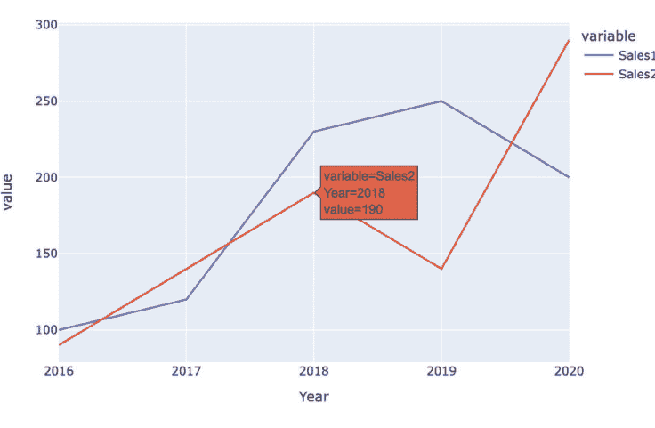

图 16.9 一个多线图，比较销售额1和销售额2随时间的变化。

```python
# Sample data
data = {
    'Year': [2016, 2017, 2018, 2019, 2020, 2016, 2017, 2018, 2019, 2020],
    'Sales': [100, 120, 230, 250, 200, 190, 240, 90, 190, 190],
    'Product': ['A', 'A', 'A', 'A', 'A', 'B', 'B', 'B', 'B', 'B']
}

# Creating a multi-line plot
fig = px.line(data, x='Year', y='Sales', color='Product',
              title='Sales of Product A and Product B Over Time')

# Display the plot
fig.show()
```

你还可以在每个数据点上添加标记，使图表更具信息性。这个例子（图 16.11）在折线图上添加了标记，使单个数据点更容易看到。**markers=True**参数用于添加这些标记。当你想突出显示每个点的确切值时，这特别有用。

```python
# Sample data
data = {
    'Year': [2016, 2017, 2018, 2019, 2020],
    'Revenue': [90, 140, 190, 140, 290]
}

# Creating a line plot with markers
fig = px.line(data, x='Year', y='Revenue',
              title='Revenue Growth Over Time',
              markers=True)  # Adding markers to each data point

# Display the plot
fig.show()
```

## 产品A和产品B的销售额随时间变化

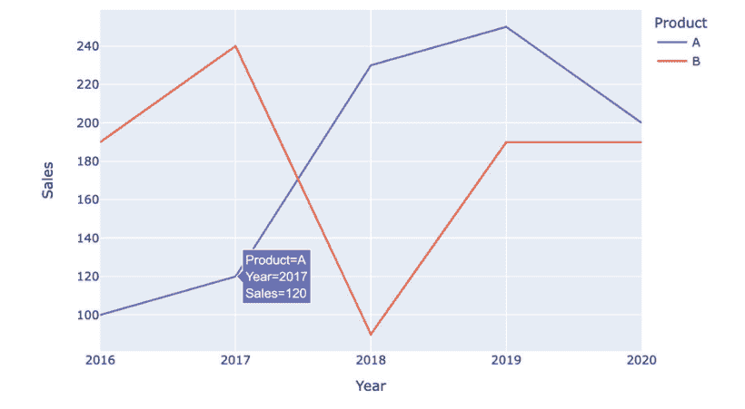

图 16.10 一个多线图，比较产品A和产品B的销售额随时间的变化。

我们还可以通过调整虚线模式来自定义线条样式。在这个例子中（图 16.12），`line_dash_sequence`参数用于自定义线条样式。线条以虚线模式显示，这在多线图中区分不同类型的趋势时很有用。

```python
# Sample data
data = {
    'Month': ['January', 'February', 'March', 'April', 'May'],
    'Temperature': [30, 22, 35, 27, 40]
}

# Creating a line plot with a customized line style
fig = px.line(data, x='Month', y='Temperature',
              title='Monthly Temperature Trend',
              line_dash_sequence=['dash'])  # Customizing line style

# Display the plot
fig.show()
```

### 16.4.2 练习

我们将继续使用`df_dummy`数据集来完成这些任务。

## 随时间变化的收入增长

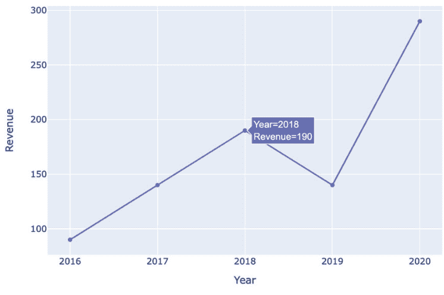

图 16.11 一条显示随时间变化的收入增长的折线图，其中标记表示数据点。

任务：创建一个折线图（图 16.13），以可视化 `feature_1` 如何随索引（行号）变化。

```
# 创建 feature_1 随索引变化的折线图
fig = px.line(df_dummy, y='feature_1', title='Feature 1 over Index')

fig.show()
```

任务：创建一个折线图（图 16.14），以可视化 `feature_2` 如何随索引变化。在线条上添加标记。

```
# 创建带有标记的 feature_2 随索引变化的折线图
fig = px.line(df_dummy, y='feature_2',
              title='Feature 2 over Index with Markers', markers=True)

fig.show()
```

任务：创建一个折线图（图 16.15），在同一图表中比较 `feature_1` 和 `feature_3`。

```
# 创建比较 feature_1 和 feature_3 的折线图
fig = px.line(df_dummy, y=['feature_1', 'feature_3'],
              title='Comparison of Feature 1 and Feature 3 over Index')
```

## 月度温度趋势

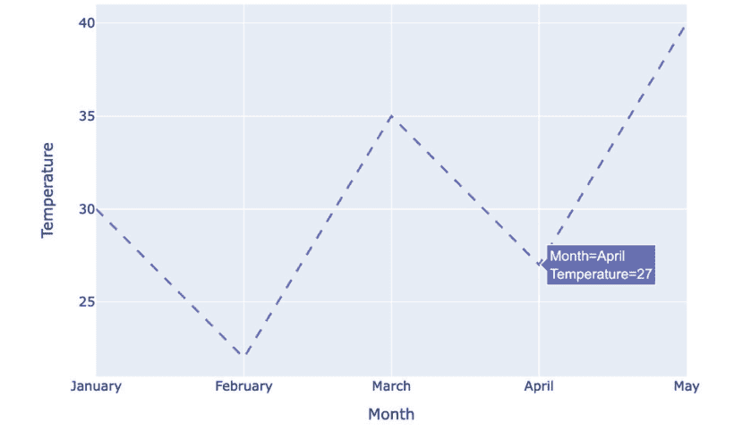

图 16.12 一条显示月度温度趋势的折线图，使用了不同的线条样式。

```
fig.show()
```

任务：创建一个折线图（图 16.16），以可视化 `feature_4` 如何随索引为每个类别变化。使用类别列通过颜色来区分线条。

```
# 创建每个类别的 feature_4 折线图
fig = px.line(df_dummy, y='feature_4', color='category',
              title='Feature 4 over Index by Category')
fig.show()
```

## 16.5 面积图

### 16.5.1 演示

面积图对于可视化累积数据或显示随时间变化的部分与整体关系非常有用。它们类似于折线图，但线条下方的区域被填充。

让我们从一个简单的面积图（图 16.17）开始，它显示了销售额在五年期间的累积情况。x 轴代表年份，y 轴代表累积销售额。线条下方的区域被填充，使得随时间变化的总销售额一目了然。

## Feature 1 随索引变化

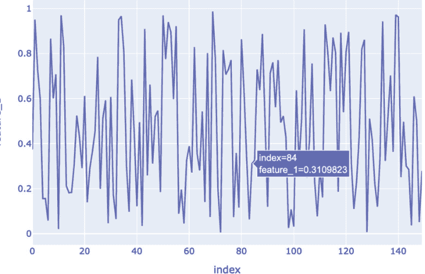

图 16.13 一条显示 feature 1 随索引变化的折线图。

```
# 示例数据
data = {
    'Year': [2016, 2017, 2018, 2019, 2020],
    'Sales': [100, 120, 230, 250, 200]
}

# 创建一个基础面积图
fig = px.area(data, x='Year', y='Sales',
              title='Cumulative Sales Over Time')

# 显示图表
fig.show()
```

接下来，让我们创建一个堆叠面积图（图 16.18），以可视化两种不同产品随时间变化的累积销售额。在这个堆叠面积图中，产品 A 和产品 B 的销售额被一起可视化。颜色参数用于区分两种产品，每个产品的面积堆叠在另一个产品的上方。这可以清晰地比较每个产品对总销售额的贡献。

```
# 示例数据
data = {
    'Year': [2016, 2017, 2018, 2019, 2020] * 2,
    'Sales': [100, 120, 230, 250, 200, 90, 140, 190, 240, 290],
    'Product': ['Product A'] * 5 + ['Product B'] * 5
}
```

## Feature 2 随索引变化（带标记）

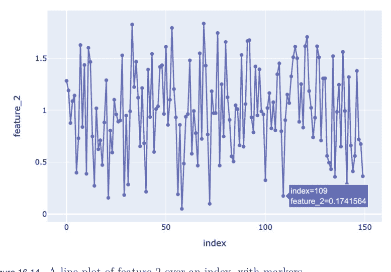

图 16.14 一条 feature 2 随索引变化的折线图，带有标记。

## Feature 1 和 Feature 3 随索引变化的比较

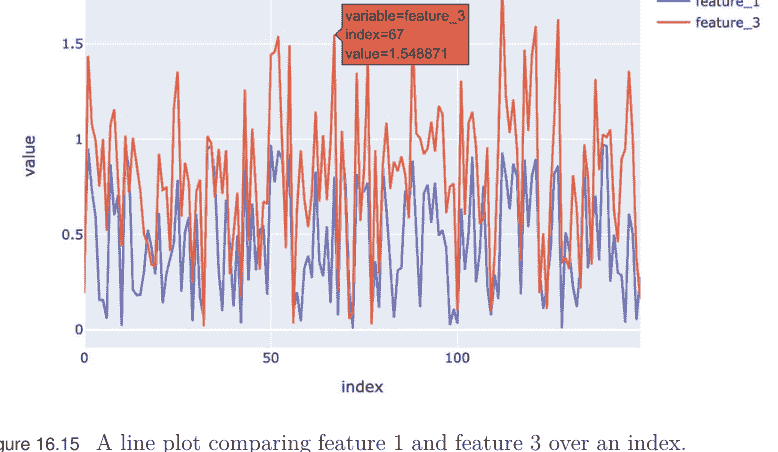

图 16.15 一条比较 feature 1 和 feature 3 随索引变化的折线图。

## Feature 4 按类别随索引变化

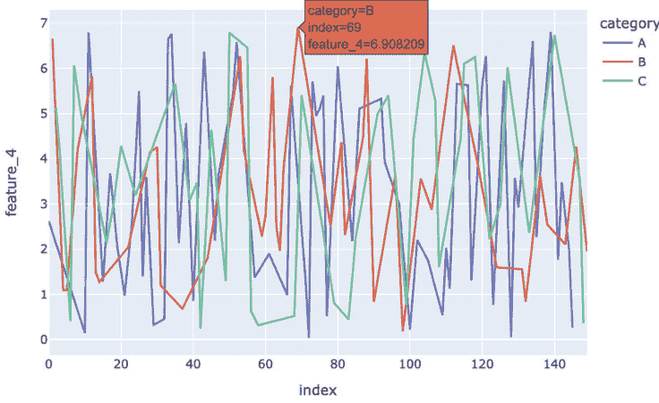

图 16.16 一条 feature 4 随索引变化的折线图，按类别分组。

## 累积销售额随时间变化

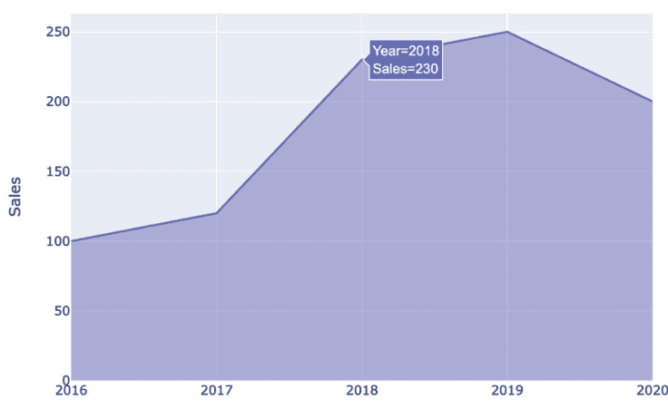

图 16.17 一个基础面积图，显示数据在某个范围内的大小。

## 产品 A 和产品 B 的累积销售额随时间变化

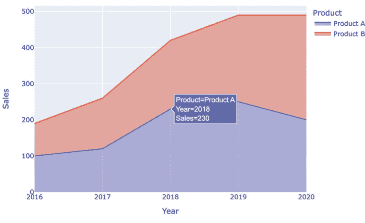

图 16.18 一个堆叠面积图，显示产品 A 和 B 的累积销售额随时间变化。

```
# 创建一个堆叠面积图
fig = px.area(data, x='Year', y='Sales', color='Product',
              title='Cumulative Sales of Product A and B Over Time')

# 显示图表
fig.show()
```

在这个例子中，我们将添加标记以使图表更具信息性。在这个面积图（图 16.19）中，使用 `markers=True` 参数为每个数据点添加了标记。这使得更容易同时看到单个数据点和收入增长随时间变化的趋势。

```
# 示例数据
data = {
    'Month': ['January', 'February', 'March', 'April', 'May'],
    'Revenue': [100, 120, 230, 250, 200]
}

# 创建一个带有标记和自定义线条样式的面积图
fig = px.area(data, x='Month', y='Revenue',
              title='Monthly Revenue Growth',
              markers=True)  # 为每个数据点添加标记

# 显示图表
fig.show()
```

## 月度收入增长

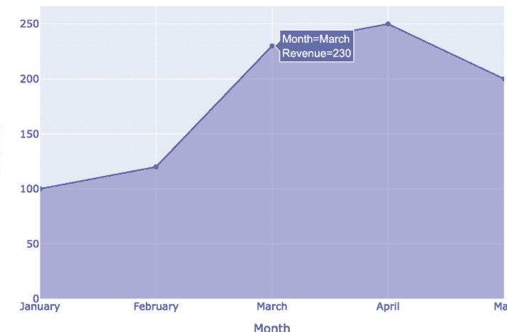

图 16.19 一个带有标记和线条样式变化的月度收入增长面积图。

### 16.5.2 练习

我们将继续使用 `df_dummy` 数据集来完成这些任务。

任务：创建一个面积图（图 16.20），以可视化 `feature_1` 如何随索引变化。

```
# 创建 feature_1 随索引变化的面积图
fig = px.area(df_dummy, y='feature_1',
              title='Area Plot of Feature 1 over Index')

fig.show()
```

任务：创建一个面积图（图 16.21），在同一图表中显示 `feature_2`、`feature_3` 和 `feature_4`。

```
# 创建 feature_2 的面积图，并叠加 feature_3 和 feature_4
fig = px.area(df_dummy, y=['feature_2', 'feature_3', 'feature_4'],
              title='Area Plot of Feature 2, 3, 4 over Index')

fig.show()
```

任务：创建一个面积图（图 16.22），以可视化 `feature_3` 随索引变化，使用 `category` 作为颜色来区分不同的区域。

## Feature 1 随索引变化的面积图

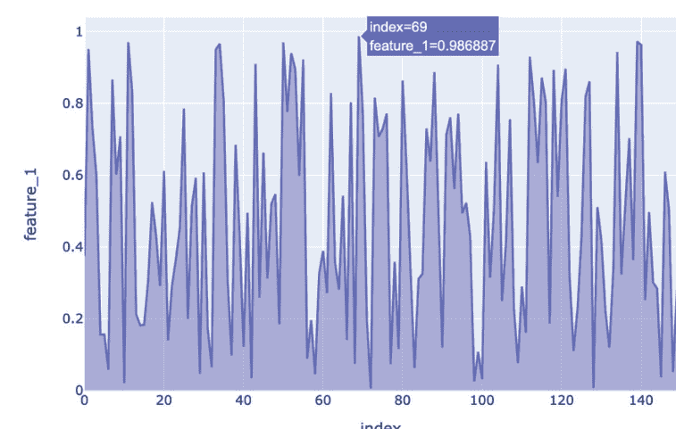

图 16.20 一个显示 feature 1 随索引变化的面积图。

## Feature 2, 3, 4 随索引变化的面积图

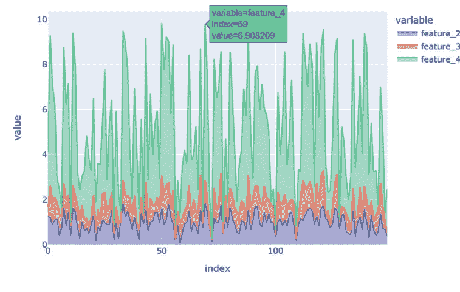

图 16.21 一个 feature 2, 3 和 4 随索引变化的堆叠面积图。

## Feature 3 按类别随索引变化的面积图

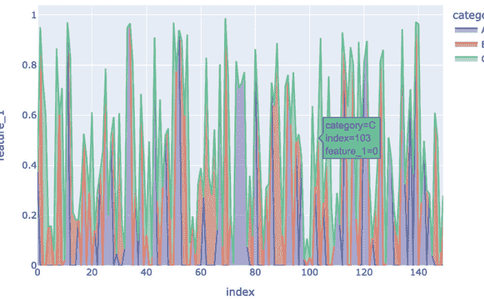

图 16.22 一个显示 feature 3 随索引变化的面积图，按类别分组。

```
# 创建按类别划分的 feature_3 面积图
fig = px.area(df_dummy, x=df_dummy.index, y='feature_1',
              color='category',
              title='Area Plot of Feature 3 over Index by Category')

fig.show()
```

## 16.6 条形图

### 16.6.1 演示

条形图非常适合比较不同类别的数量。

让我们从一个简单的条形图（图 16.23）开始，比较四种不同产品的销售额。x 轴代表产品名称，y 轴代表销售额。每个条形的高度对应于每个产品的销售额。

```
# 示例数据
data = {
    'Product': ['Product A', 'Product B', 'Product C', 'Product D'],
    'Sales': [100, 230, 190, 250]
}

# 创建一个基础条形图
fig = px.bar(data, x='Product', y='Sales', title='Sales by Product')
```

## 按产品划分的销售额

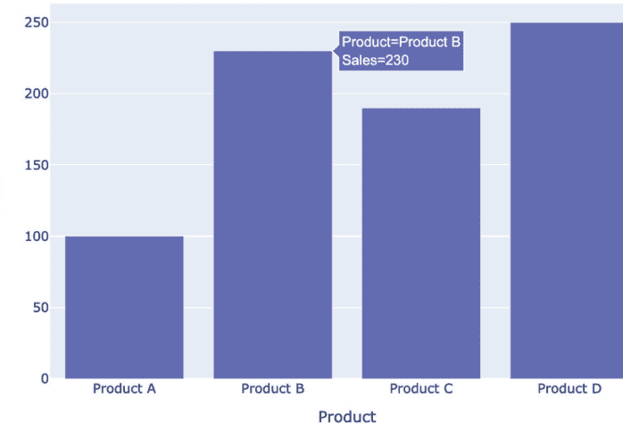

图 16.23 一个显示按产品划分销售额的基础条形图。

```
# 显示图表
fig.show()
```

接下来，让我们创建一个分组条形图（图 16.24）。在这个分组条形图中，每个产品的销售额显示了两个不同年份（2019 和 2020）的数据。颜色参数用于区分年份，`barmode='group'` 选项将每个年份的条形并排放置在每个产品类别内。这可以轻松比较每个产品在不同年份之间的销售额。

```
# 示例数据
data = {
    'Product': ['Product A', 'Product A', 'Product B', 'Product B',
                'Product C', 'Product C', 'Product D', 'Product D'],
    'Year': ['2019', '2020', '2019', '2020',
             '2019', '2020', '2019', '2020'],
    'Sales': [100, 120, 150, 140, 190, 200, 250, 230]
}

# 创建一个分组条形图
fig = px.bar(data, x='Product', y='Sales', color='Year',
             barmode='group', title='Sales by Product and Year')

# 显示图表
fig.show()
```

## 按产品和年份划分的销售额

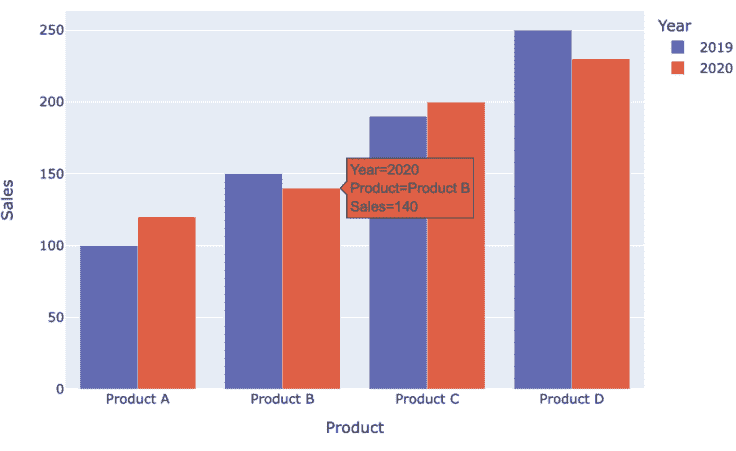

图 16.24 一个分组条形图，比较了按产品和年份划分的销售额。

现在，让我们创建一个堆叠条形图（图 16.25），以可视化每个产品类别内各年份的累计销售贡献。在这个堆叠条形图中，每个产品类别内各年份的销售额数据是堆叠在一起的。使用 `barmode='stack'` 选项来创建这种效果。这种可视化有助于查看每个产品的累计销售额，以及每年对总销售额的贡献。

```python
# Sample data
data = {
    'Product': ['Product A', 'Product A', 'Product B', 'Product B',
                'Product C', 'Product C', 'Product D', 'Product D'],
    'Year': ['2019', '2020', '2019', '2020',
             '2019', '2020', '2019', '2020'],
    'Sales': [100, 120, 150, 140, 190, 200, 250, 230]
}

# Creating a stacked bar plot
fig = px.bar(data, x='Product', y='Sales', color='Year',
             barmode='stack', title='Stacked Sales by Product and Year')

# Display the plot
fig.show()
```

条形图也可以水平显示，这在处理长类别名称或您偏好不同方向时很有用。这个示例（图 16.26）展示了一个水平条形图，其中 x 轴代表销售额数据，y 轴代表产品。水平条形图有助于提高可读性，特别是当类别标签较长时。

## 按产品和年份划分的堆叠销售额

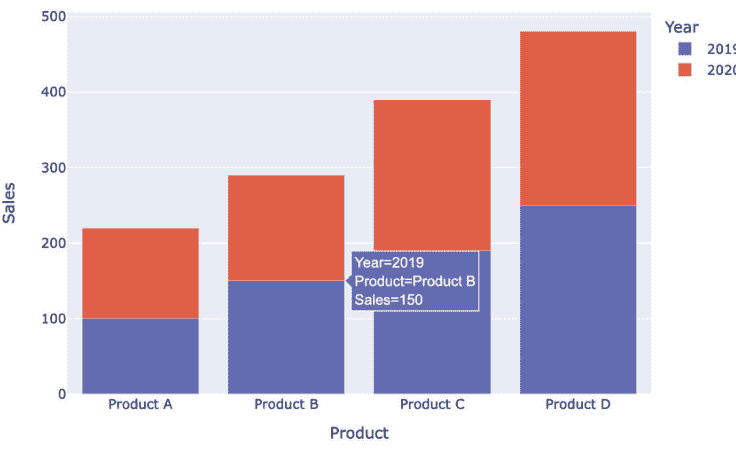

图 16.25 一个堆叠条形图，显示按产品和年份划分的销售额。

```python
# Sample data
data = {
    'Product': ['Product A', 'Product B', 'Product C', 'Product D'],
    'Sales': [100, 120, 150, 140]
}

# Creating a horizontal bar plot
fig = px.bar(data, x='Sales', y='Product',
             title='Sales by Product (Horizontal)')

# Display the plot
fig.show()
```

### 16.6.2 练习

让我们为这个练习创建另一个虚拟数据集。

```python
# Define the data
data = {
    'product': ['Product A', 'Product B', 'Product C', 'Product A',
                'Product D', 'Product B', 'Product B', 'Product C',
                'Product B', 'Product A'],
    'sales': [1500, 2300, 1200, 3400, 2900, 4100, 3200, 1800, 2700, 2200],
    'profit': [400, 800, 300, 1200, 900, 1400, 1100, 500, 700, 600],
    'region': ['North', 'South', 'East', 'West', 'North',
               'South', 'East', 'West', 'North', 'South']
}
```

## 按产品划分的销售额（水平）

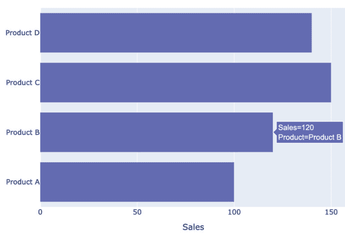

图 16.26 一个水平条形图，显示按产品划分的销售额。

```python
# Create the DataFrame
df_simple = pd.DataFrame(data)
df_simple.head()
```

任务：创建一个条形图（图 16.27）以可视化每个产品的销售额。

```python
# Create a simple bar plot of sales by product
fig = px.bar(df_simple, x='product', y='sales', title='Sales by Product')

fig.show()
```

任务：创建一个条形图（图 16.28）以可视化每个区域的利润。

```python
# Create a bar plot of profit by region
fig = px.bar(df_simple, x='region', y='profit', title='Profit by Region')

fig.show()
```

任务：创建一个水平条形图（图 16.29）以可视化每个产品的销售额。

```python
# Create a horizontal bar plot of sales by product
fig = px.bar(df_simple, x='sales', y='product',
            orientation='h', title='Sales by Product (Horizontal)')

fig.show()
```

## 按产品划分的销售额

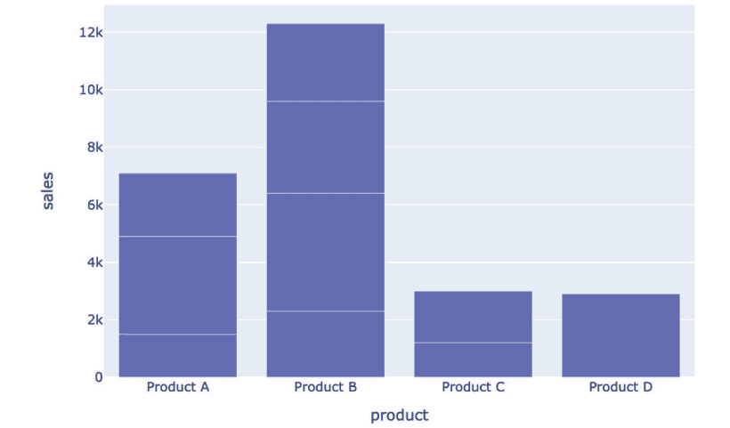

图 16.27 一个简单的条形图，显示按产品划分的销售额。

任务：创建一个堆叠条形图（图 16.30）以可视化每个区域的销售额，并按产品进行颜色区分。

```python
# Create a stacked bar plot of sales by region
fig = px.bar(df_simple, x='region', y='sales',
             color='product', title='Sales by Region')

fig.show()
```

## 16.7 时间线图

### 16.7.1 演示

时间线图是可视化随时间发生的事件或活动的好方法。

让我们从一个简单的时间线图（图 16.31）开始，它显示了不同项目的持续时间。这个基本的时间线图可视化了三个不同项目的持续时间。x 轴代表时间线，y 轴代表项目。每个条形显示了一个项目从开始日期到结束日期的持续时间。

```python
# Sample data
data = {
    'Project': ['Project A', 'Project B', 'Project C'],
    'Start': ['2023-01-01', '2023-02-01', '2023-03-01'],
    'Finish': ['2023-02-01', '2023-03-15', '2023-04-30']
}

# Creating a basic timeline plot
fig = px.timeline(data, x_start='Start', x_end='Finish',
                  y='Project', title='Project Timeline')

# Display the plot
fig.show()
```

## 按区域划分的利润

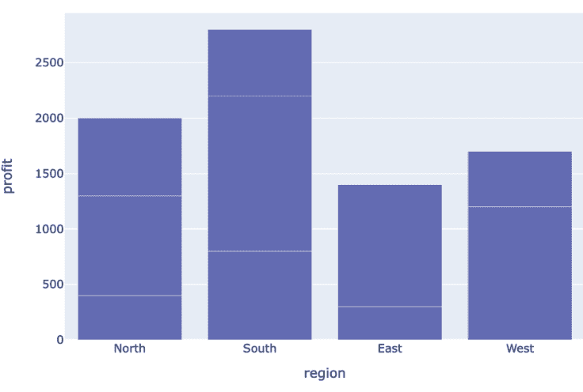

图 16.28 一个条形图，显示按区域划分的利润。

现在，让我们为时间线图添加颜色，以区分项目类别。在这个时间线图（图 16.32）中，项目被分为不同的组（例如，开发、研究、市场）。`color` 参数用于为每个类别分配不同的颜色，使得更容易识别哪个项目属于哪个类别。

```python
# Sample data
data = {
    'Project': ['Project A', 'Project B', 'Project C', 'Project D'],
    'Category': ['Research', 'Research', 'Development', 'Marketing'],
    'Start': ['2023-01-01', '2023-02-01', '2023-03-01', '2023-04-01'],
    'Finish': ['2023-02-01', '2023-03-15', '2023-04-30', '2023-05-30']
}

# Creating a timeline plot with colors
fig = px.timeline(data, x_start='Start', x_end='Finish', y='Project',
                  color='Category', title='Project Timeline by Category')

# Display the plot
fig.show()
```

## 按产品划分的销售额（水平）

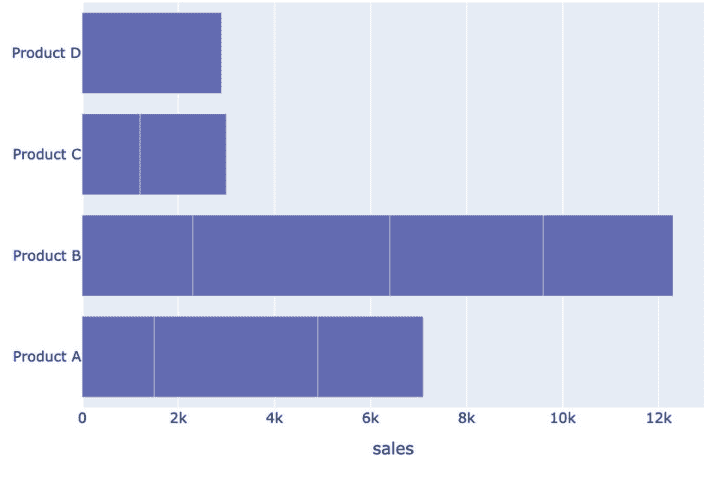

图 16.29 一个水平条形图，显示按产品划分的销售额。

## 按区域划分的销售额

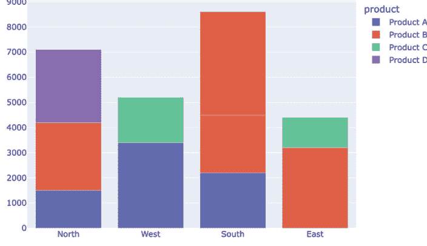

图 16.30 一个堆叠条形图，显示按区域划分的销售额。

## 项目时间线

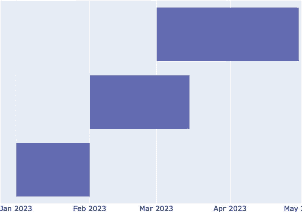

图 16.31 一个基本的项目时间线图。

## 按类别划分的项目时间线

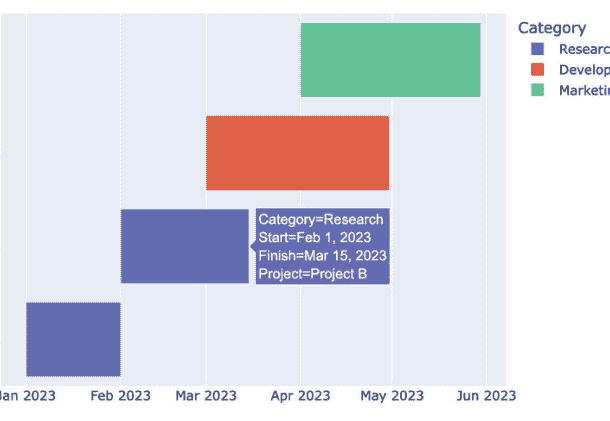

图 16.32 一个按类型分类的项目时间线图。

## 按团队分组的任务时间线

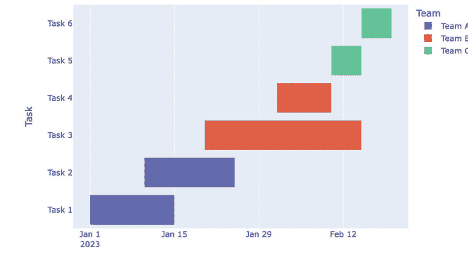

图 16.33 一个按团队分组的项目时间线图。

在这个示例（图 16.33）中，我们将创建一个按不同团队分组任务的时间线图。在这个时间线图中，任务按不同的团队（例如，团队 A、团队 B、团队 C）分组。`color` 参数通过颜色区分团队，使得很容易看出哪些任务属于哪个团队。

```python
# Sample data
data = {
    'Task': ['Task 1', 'Task 2', 'Task 3', 'Task 4', 'Task 5', 'Task 6'],
    'Team': ['Team A', 'Team A', 'Team B', 'Team B', 'Team C', 'Team C'],
    'Start': ['2023-01-01', '2023-01-10', '2023-01-20',
              '2023-02-01', '2023-02-10', '2023-02-20'],
    'Finish': ['2023-01-15', '2023-01-25', '2023-02-15',
               '2023-02-10', '2023-02-15', '2023-02-15']
}

# Creating a timeline plot grouped by teams
fig = px.timeline(data, x_start='Start', x_end='Finish', y='Task',
                  color='Team', title='Task Timeline Grouped by Teams')

# Display the plot
fig.show()
```

### 16.7.2 练习

为了练习时间线图，我们可以创建一个简单的虚拟数据集，表示随时间发生的事件或任务。这个 DataFrame `df_timeline` 有 10 行，代表不同的项目、它们的开始和结束日期、持续时间以及负责部门。

```python
# Define the data
data = {
    'event': ['Project A', 'Project B', 'Project C', 'Project D',
              'Project E', 'Project F', 'Project G', 'Project H',
              'Project I', 'Project J'],
    'start_date': ['2024-01-01', '2024-02-01', '2024-03-15',
                   '2024-04-01', '2024-05-10', '2024-06-20',
                   '2024-07-15', '2024-08-01', '2024-09-10',
                   '2024-10-01'],
    'end_date': ['2024-01-15', '2024-03-01', '2024-04-10',
                 '2024-04-20', '2024-06-01', '2024-07-05',
                 '2024-08-01', '2024-09-01', '2024-10-01',
                 '2024-11-01'],
    'department': ['HR', 'Finance', 'Marketing', 'IT', 'HR',
                   'Finance', 'Marketing', 'IT', 'HR', 'Finance']
}

# Create the DataFrame
df_timeline = pd.DataFrame(data)
df_timeline.head()
```

任务：创建一个基本的时间线图（图 16.34），显示每个事件的开始和结束日期。

```python
# Create a basic timeline plot
fig = px.timeline(df_timeline, x_start='start_date', x_end='end_date',
                  y='event', title='Timeline of Events')

fig.show()
```

任务：创建一个时间线图（图 16.35），其中事件按部门进行颜色编码。

```python
# Create a timeline plot with color by department
fig = px.timeline(df_timeline, x_start='start_date', x_end='end_date',
                  y='event', color='department',
                  title='Timeline of Events by Department')

fig.show()
```

任务：创建一个时间线图（图 16.36），其中悬停信息包含部门信息。

```python
# Create a timeline plot with department in hover information
fig = px.timeline(df_timeline, x_start='start_date', x_end='end_date',
                  y='event', hover_data=['department'],
                  title='Timeline of Events with Department Info')

fig.show()
```

## 事件时间线

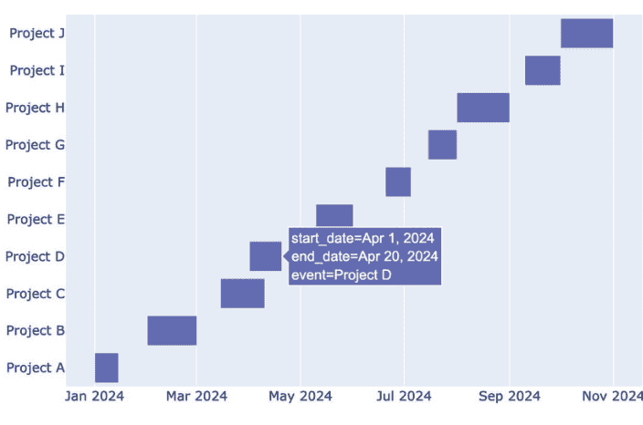

图 16.34 一个基本的事件时间线图。

## 按部门划分的事件时间线

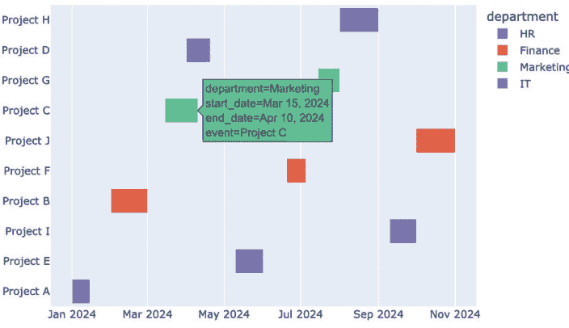

图 16.35 一个按部门分类的基本事件时间线图。

## 包含部门信息的事件时间线

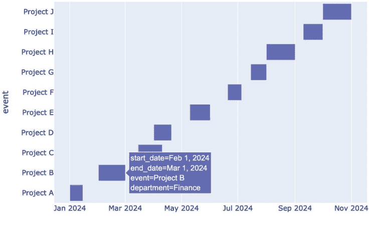

图 16.36 一个包含部门信息的事件时间线图。

## 16.8 漏斗图

### 16.8.1 演示

漏斗图对于可视化数据在流程中经过不同阶段时的逐步减少非常有用。

让我们从一个简单的漏斗图开始，它代表了销售漏斗的各个阶段（图 16.37）。这个漏斗图可视化了销售漏斗每个阶段的实体数量（例如，潜在客户）。x 轴代表实体数量，而 y 轴代表各个阶段。

```python
# Sample data
data = {
    'Stage': ['Prospects', 'Leads', 'Opportunities',
              'Proposals', 'Closed Deals'],
    'Count': [1000, 500, 400, 200, 50]
}

# Creating a basic funnel chart
fig = px.funnel(data, x='Count', y='Stage', title='Sales Funnel')

# Display the plot
fig.show()
```

现在，我们通过按类别对数据进行分组，为漏斗图添加另一个维度。在这个漏斗图中，数据按区域（本例中为“北美”）分组（图 16.38）。`color` 参数用于区分不同的类别，这对于比较不同区域、产品或细分市场的表现非常有用。

```python
# Sample data
data = {
    'Stage': ['Prospects', 'Leads', 'Opportunities',
              'Proposals', 'Closed Deals'],
    'Count': [1000, 750, 500, 300, 100],
    'Region': ['North America'] * 5
}

# Creating a funnel chart with categories
fig = px.funnel(data, x='Count', y='Stage',
                color='Region', title='Sales Funnel by Region')

# Display the plot
fig.show()
```

在这个例子中，我们将创建一个包含多个区域数据的漏斗图，以比较它们的表现（图 16.39）。这个漏斗图显示了“北美”、“欧洲”和“拉丁美洲”的销售漏斗数据。该图表允许你比较漏斗在不同区域的进展情况，显示每个阶段实体数量的差异。

```python
# Sample data
data = {
    'Stage': ['Prospects', 'Leads', 'Opportunities',
              'Proposals', 'Closed Deals']*3,
    'Count': [1000, 750, 500, 300, 100,
              1200, 900, 600, 350, 150,
              900, 800, 400, 200, 10],
    'Region': ['North America']*5 + ['Europe']*5 + ['Latin America']*5
}

# Creating a funnel chart with multiple regions
fig = px.funnel(data, x='Count', y='Stage',
                color='Region', title='Sales Funnel by Region')

# Display the plot
fig.show()
```

## 销售漏斗

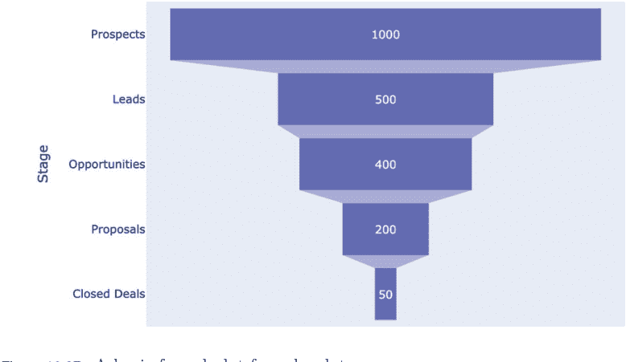

图 16.37 一个基本的销售数据漏斗图。

## 按区域划分的销售漏斗

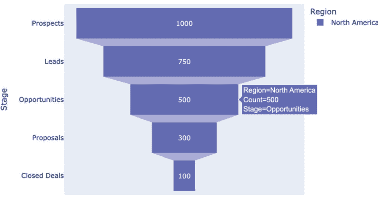

图 16.38 一个显示按区域划分销售情况的漏斗图。

## 按区域划分的销售漏斗

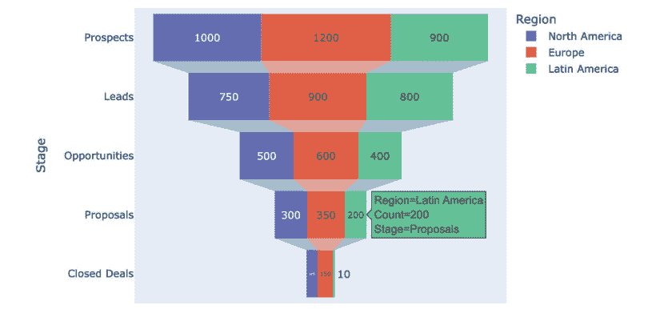

图 16.39 一个显示按区域划分销售情况的漏斗图。

### 16.8.2 练习

为了练习使用 Plotly 绘制漏斗图，我们可以创建一个代表销售或转化漏斗的虚拟数据集。这个 DataFrame `df_funnel` 有四行，代表漏斗中的不同阶段以及每个阶段的潜在客户数量。

```python
# Define the data
data = {
    'stage': ['Awareness', 'Interest', 'Consideration', 'Purchase']*2,
    'leads': [1000, 600, 300, 150, 2000, 1800, 800, 200],
    'agent': ['Tom'] * 4 + ['Ron'] * 4
}

# Create the DataFrame
df_funnel = pd.DataFrame(data)
df_funnel.head()
```

任务：创建一个漏斗图（图 16.40）来可视化漏斗每个阶段的潜在客户数量。

```python
# Create a basic funnel plot
fig = px.funnel(df_funnel, x='leads', y='stage',
                title='Basic Sales Funnel')

fig.show()
```

任务：创建一个漏斗图（图 16.41）来可视化漏斗每个阶段的潜在客户数量，并按“agent”区分颜色。

```python
# Create a colored funnel plot
fig = px.funnel(df_funnel, x='leads', y='stage',
                color='agent', title='Basic Sales Funnel')

fig.show()
```

## 基本销售漏斗

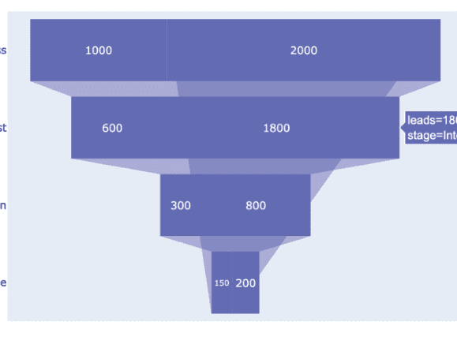

图 16.40 一个基本的销售漏斗图。

## 基本销售漏斗

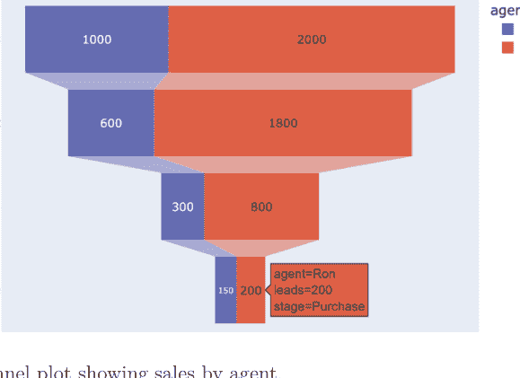

图 16.41 一个显示按代理划分销售情况的漏斗图。

## 16.9 饼图

### 16.9.1 演示

饼图是一种圆形统计图表，它被分成若干扇区以说明百分比。

让我们从创建一个基本的饼图开始，以可视化销售比例（图 16.42）。

```python
# Data for the pie chart
data = {
    'stage': ['Awareness', 'Interest', 'Consideration', 'Purchase'],
    'leads': [1000, 600, 300, 150]
}
```

## 基本销售饼图

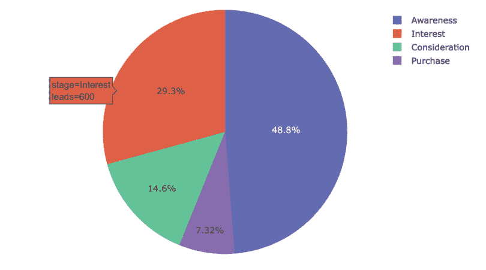

图 16.42 一个显示销售比例的基本饼图。

```python
df_pie = pd.DataFrame(data)

# Create a basic pie chart
fig = px.pie(df_pie, names='stage', values='leads',
             title='Basic Sales Pie Chart')

fig.show()
```

现在，让我们为饼图添加自定义颜色（图 16.43）。

```python
# Custom colors for the pie chart
custom_colors = ['lightblue', 'lightgreen', 'lightcoral', 'lightpink']

# Create a pie chart with custom colors
fig = px.pie(df_pie, names='stage', values='leads',
             title='Sales Pie with Custom Colors',
             color_discrete_sequence=custom_colors)

fig.show()
```

现在，让我们显示销售百分比并在中心添加一个孔（图 16.44）。

```python
# Create a pie chart showing percentages
fig = px.pie(df_pie, names='stage', values='leads',
             title='Sales Pie with Percentage Display',
             labels={'leads': 'Percentage'},
             hole=0.4)

# Update the trace to show percentages
fig.update_traces(textinfo='percent+label')

fig.show()
```

## 带自定义颜色的销售饼图

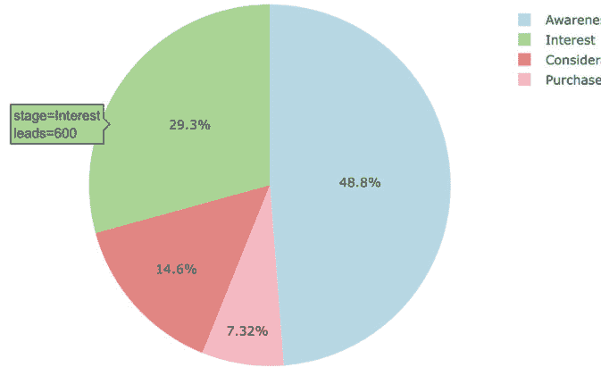

图 16.43 一个销售饼图，每个扇区都有自定义颜色。

## 带百分比显示的销售饼图

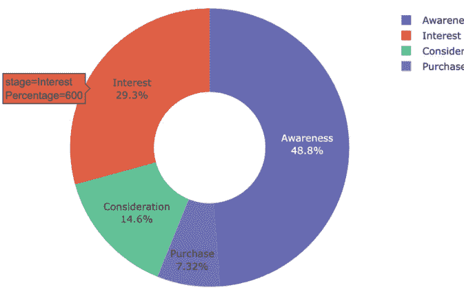

图 16.44 一个销售饼图，显示每个扇区的百分比。

## 公司市场份额

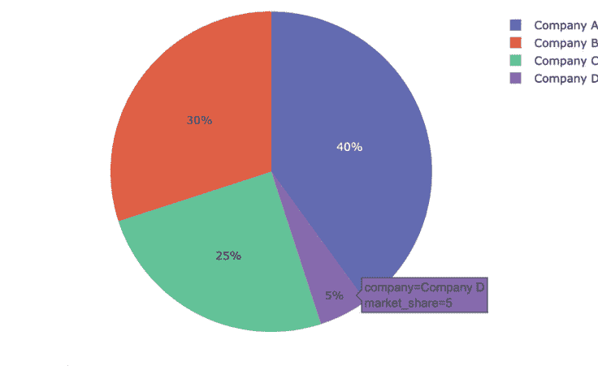

图 16.45 一个显示市场份额分布的饼图。

### 16.9.2 练习

让我们创建一个用于练习饼图的虚拟数据集。

```python
# Dummy dataset
data = {
    'company': ['Company A', 'Company B', 'Company C', 'Company D'],
    'market_share': [40, 30, 25, 5]
}

df_market = pd.DataFrame(data)
df_market
```

任务：使用以下代表不同公司市场份额的虚拟数据集，创建一个基本的饼图（图 16.45）。

```python
# Create the basic pie plot
fig = px.pie(df_market, names='company', values='market_share',
             title='Market Share of Companies')

fig.show()
```

任务：使用上面的数据集创建一个饼图（图 16.46），为每个公司分配自定义颜色。`custom_colors = ['gold', 'lightblue', 'lightgreen', 'lightcoral']`

```python
# Custom colors for the pie chart
custom_colors = ['gold', 'lightblue', 'lightgreen', 'lightcoral']

# Create the pie plot with custom colors
fig = px.pie(df_market, names='company', values='market_share',
             title='Market Share with Custom Colors',
             color_discrete_sequence=custom_colors)
fig.show()
```

## 带自定义颜色的市场份额

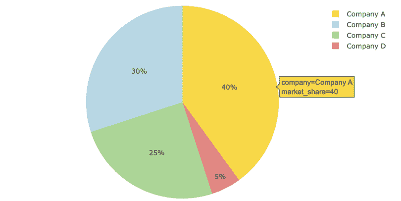

图 16.46 一个市场份额饼图，带有自定义颜色。

任务：使用上面的数据集创建一个饼图（图 16.47），显示每个公司占总市场份额的百分比。

```python
# Create the pie plot showing percentages
fig = px.pie(df_market, names='company', values='market_share',
             title='Market Share by Percentage')

# Update the trace to show percentages
fig.update_traces(textinfo='percent+label')

fig.show()
```

任务：使用上面的数据集创建一个环形图（图 16.48），中心有一个孔。

```python
# Create the donut chart
fig = px.pie(df_market, names='company',
             values='market_share',
             title='Market Share Donut Chart', hole=0.4)

fig.show()
```

## 按百分比划分的市场份额

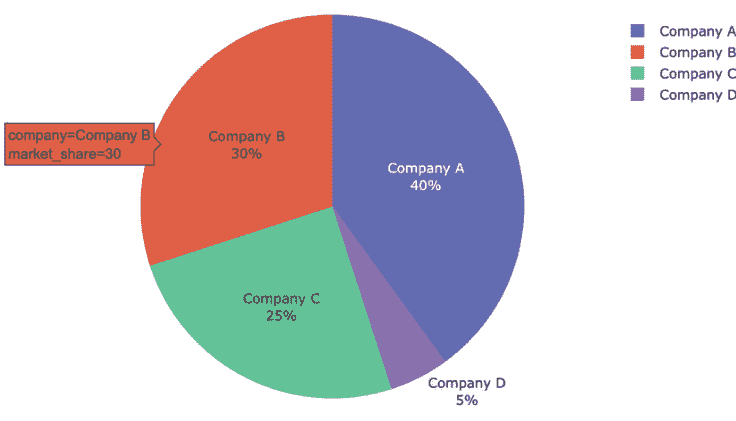

图 16.47 一个显示百分比的市场份额饼图。

## 市场份额环形图

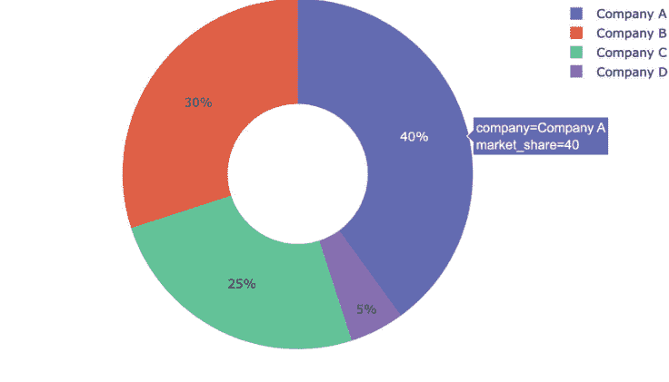

图 16.48 一个中心镂空的市场份额饼图。

## 基本数值直方图

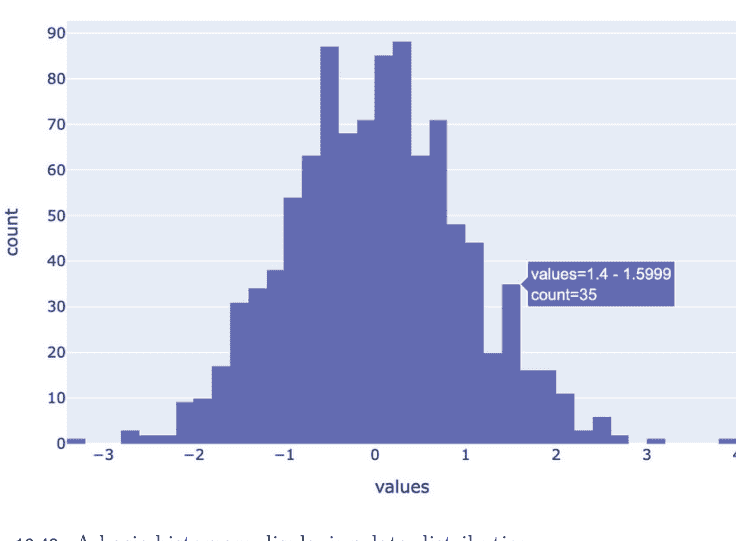

图 16.49 一个显示数据分布的基本直方图。

## 16.10 直方图

### 16.10.1 演示

直方图对于可视化数据集的分布非常有用。让我们从创建一个直方图开始，以可视化一个数值变量的分布（图 16.49）。此示例创建了一个正态分布数据集的直方图。`x` 参数指定了要绘制在 x 轴上的变量，直方图显示了每个区间内数据点的频率。

```python
# Creating a dummy dataset
np.random.seed(42)
data = {'values': np.random.normal(0, 1, 1000)}

df_hist = pd.DataFrame(data)

# Create a basic histogram
fig = px.histogram(df_hist, x='values', title='Basic Histogram of Values')
fig.show()
```

让我们自定义区间数量，以更好地控制分布的粒度（图 16.50）。在此示例中，我们指定 `nbins=30` 来调整分布可视化的粒度。

## 包含 30 个区间的直方图

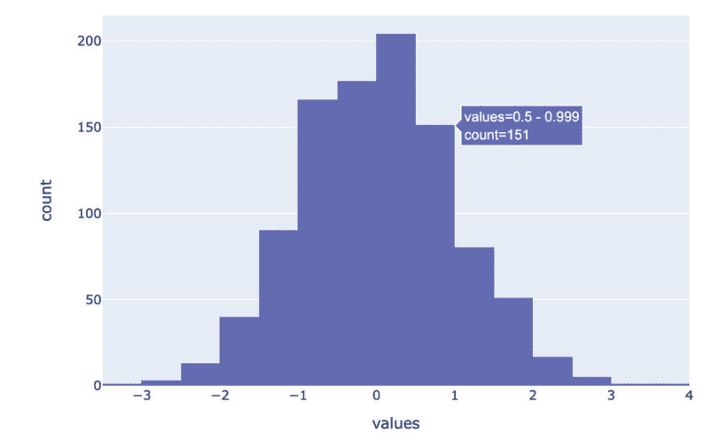

图 16.50 一个包含 30 个区间的基本直方图，用于更精细的数据表示。

```python
# Create a histogram with 30 bins
fig = px.histogram(df_hist, x='values', nbins=30,
                   title='Histogram with 30 Bins')
fig.show()
```

让我们创建一个直方图，其中条形根据分类变量进行着色（图 16.51）。在此示例中，我们向数据集添加了一个分类变量 `category`。直方图根据此分类进行着色，使我们能够看到两个类别之间的分布差异。

```python
# Adding a categorical variable
df_hist['category'] = np.random.choice(['Category A', 'Category B'], size=1000)

# Create a histogram colored by category
fig = px.histogram(df_hist, x='values', color='category',
                   title='Histogram Colored by Category')
fig.show()
```

### 16.10.2 练习

让我们为此练习创建另一个虚拟数据集。

```python
# Creating a dummy dataset
np.random.seed(0)
data = {
    'test_scores': np.random.normal(75, 10, 500)
}

df_scores = pd.DataFrame(data)
```

## 按类别着色的直方图

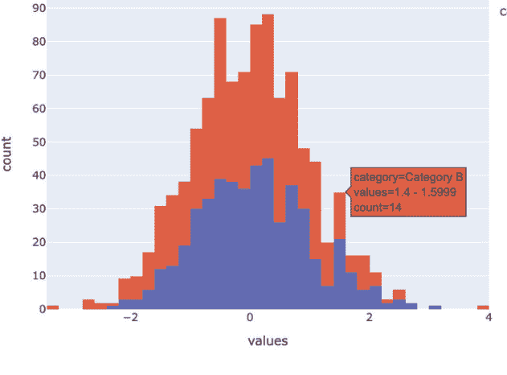

图 16.51 一个按类别着色的直方图，用于显示分布差异。

任务：创建一个直方图（图 16.52），以可视化一个代表 500 名学生考试成绩的数据集的分布。分数呈正态分布。

```python
# Create the histogram
fig = px.histogram(df_scores, x='test_scores',
                   title='Distribution of Test Scores')
fig.show()
```

任务：从相同的考试成绩数据集创建一个直方图（图 16.53），但这次使用 20 个区间，以便更好地观察分布。

```python
# Create the histogram with 20 bins
fig = px.histogram(df_scores, x='test_scores', nbins=20,
                   title='Test Scores Histogram with 20 Bins')
fig.show()
```

任务：向考试成绩数据集添加一个“gender”列，其中每个学生被随机分配为“Male”或“Female”。然后，创建一个直方图（图 16.54），显示考试成绩的分布，条形按性别着色。

```python
# Add a 'gender' column
df_scores['gender'] = np.random.choice(['Male', 'Female'], size=500)

# Create the histogram colored by gender
fig = px.histogram(df_scores, x='test_scores', color='gender',
                   title='Test Scores Histogram by Gender')
fig.show()
```

## 考试成绩分布

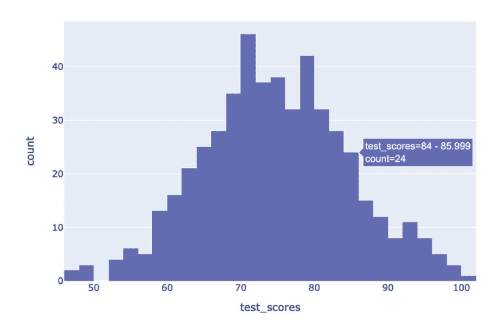

图 16.52 一个显示考试成绩分布的直方图。

任务：创建一个直方图（图 16.55），显示考试成绩的累积分布。

```python
# Create the cumulative histogram
fig = px.histogram(df_scores, x='test_scores',
                   cumulative=True,
                   title='Cumulative Distribution of Test Scores')
fig.show()
```

任务：使用相同的数据集，创建两个独立的直方图：一个用于“Male”学生，一个用于“Female”学生。将它们叠加在同一图表上（图 16.56）以比较分布。

```python
# Create overlaid histograms for male and female students
fig = px.histogram(df_scores, x='test_scores', color='gender',
                   barmode='overlay',
                   title='Overlaid Histograms of Test Scores by Gender')
fig.show()
```

## 包含 20 个区间的考试成绩直方图

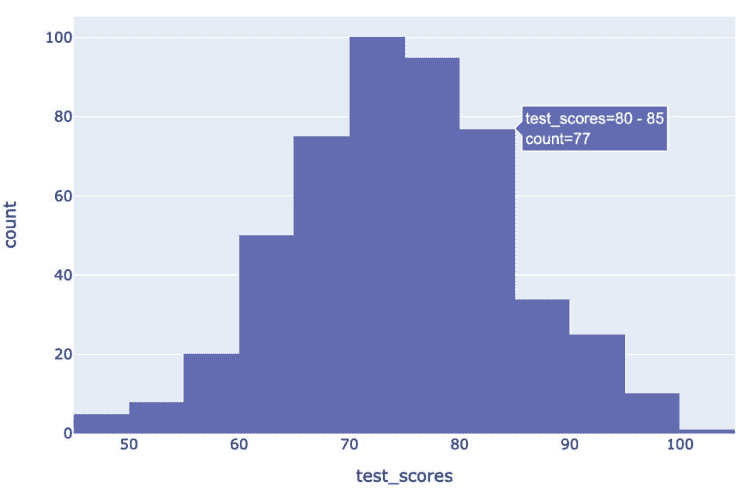

图 16.53 一个包含 20 个区间的考试成绩直方图。

## 按性别划分的考试成绩直方图

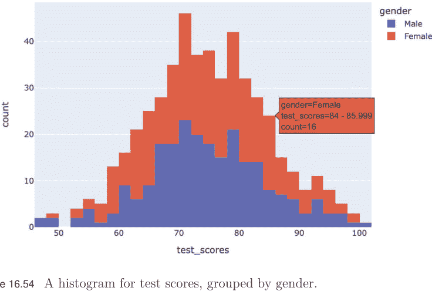

图 16.54 一个按性别分组的考试成绩直方图。

## 考试成绩的累积分布

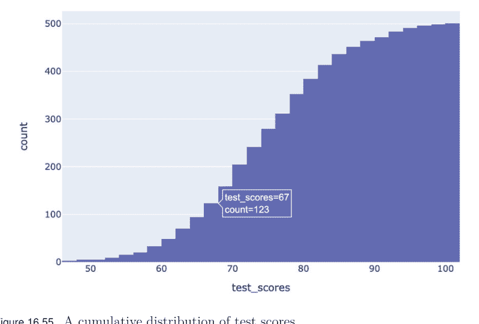

图 16.55 考试成绩的累积分布。

## 按性别叠加的考试成绩直方图

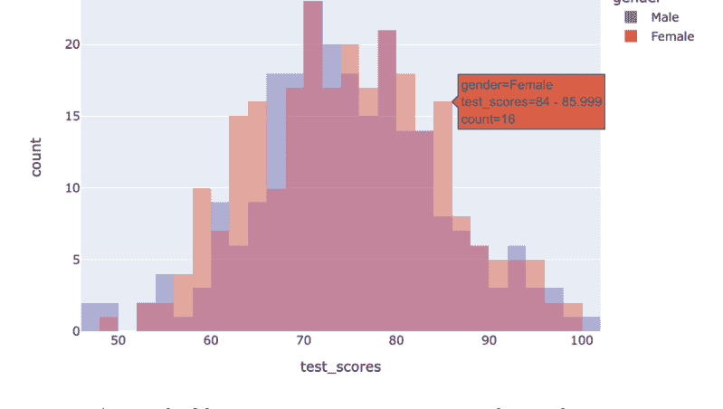

图 16.56 一个叠加的直方图，用于按性别比较考试成绩。

## 基本 3D 散点图

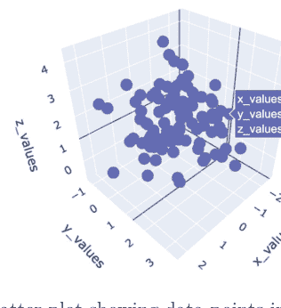

图 16.57 一个显示三维数据点的基本 3D 散点图。

## 16.11 3D 散点图

### 16.11.1 演示

3D 散点图对于可视化数据集中三个变量之间的关系非常有用。

让我们使用一个包含三个数值变量的虚拟数据集创建一个基本的 3D 散点图（图 16.57）。这个基本的 3D 散点图显示了虚拟数据集中三个变量（`x_values`、`y_values` 和 `z_values`）之间的关系。使用 `px.scatter_3d` 函数来创建图表。

```python
# Creating a dummy dataset
np.random.seed(0)
data = {
    'x_values': np.random.normal(0, 1, 100),
    'y_values': np.random.normal(1, 1, 100),
    'z_values': np.random.normal(2, 1, 100)
}

df_3d = pd.DataFrame(data)

# Create a basic 3D scatter plot
fig = px.scatter_3d(df_3d, x='x_values', y='y_values', z='z_values',
                    title='Basic 3D Scatter Plot')
fig.show()
```

让我们创建另一个 3D 散点图，其中点的颜色基于第四个变量（图 16.58）。在此示例中，向数据集添加了一个分类变量 `color_variable`。3D 散点图中的点根据此变量着色，使您能够看到数据是如何分组的。

## 带颜色映射的 3D 散点图

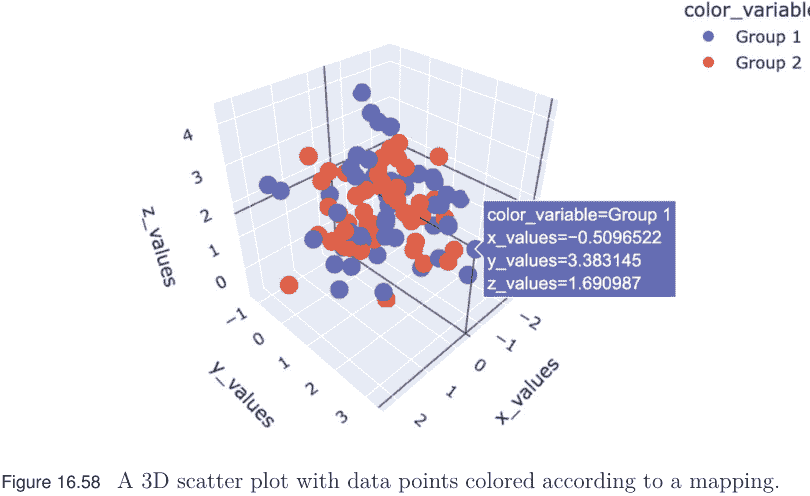

图 16.58 一个数据点根据映射着色的 3D 散点图。

```python
# Adding a fourth variable for color mapping
df_3d['color_variable'] = np.random.choice(['Group 1', 'Group 2'],
                                            size=100)

# Create a 3D scatter plot with color mapping
fig = px.scatter_3d(df_3d, x='x_values', y='y_values', z='z_values',
                    color='color_variable',
                    title='3D Scatter Plot with Color Mapping')
fig.show()
```

让我们创建一个 3D 散点图，其中点的大小代表一个数值变量（图 16.59）。此示例引入了一个数值变量 **size_variable**，它控制 3D 散点图中点的大小。较大的值会产生更大的点，从而更容易识别与此变量相关的趋势。

```python
# Adding a variable for size mapping
df_3d['size_variable'] = np.random.uniform(5, 50, size=100)

# Create a 3D scatter plot with size mapping
fig = px.scatter_3d(df_3d, x='x_values', y='y_values', z='z_values',
                    size='size_variable', color='color_variable',
                    title='3D Scatter Plot with Size Mapping')
fig.show()
```

## 带大小映射的 3D 散点图

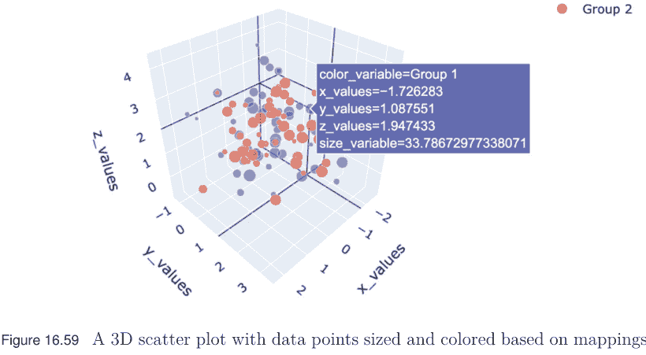

图 16.59 一个数据点根据映射调整大小和颜色的 3D 散点图。

## 16.12 3D 折线图

### 16.12.1 演示

Plotly 中的 3D 折线图是可视化三个变量在序列或时间上关系的强大方式。它们对于显示三维空间中的趋势特别有用。您可以使用颜色或分组等额外变量来表示三维数据，使您的图表更具信息量和视觉吸引力。

让我们使用一个包含三个数值变量的虚拟数据集创建一个基本的 3D 折线图（图 16.60）。这个基本的 3D 折线图显示了虚拟数据集中三个变量（`x_values`、`y_values` 和 `z_values`）之间的关系。数据代表一个螺旋轨迹，其中 `z_values` 线性增加，而 `x_values` 和 `y_values` 呈正弦振荡。

```python
# Creating a dummy dataset
np.random.seed(42)
t = np.linspace(0, 10, 100)
data = {
    'x_values': np.sin(t),
    'y_values': np.cos(t),
    'z_values': t
}

df_line_3d = pd.DataFrame(data)
```

## 基础三维线图

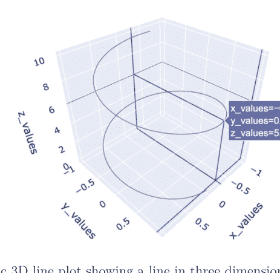

图 16.60 一个展示三维空间中线条的基础三维线图。

```python
# Create a basic 3D line plot
fig = px.line_3d(df_line_3d, x='x_values', y='y_values', z='z_values',
                title='Basic 3D Line Plot')
fig.show()
```

让我们创建另一个包含多条线的三维线图，每条线代表一个不同的组或类别（图 16.61）。此示例引入了一个分类变量 `group`，每条线代表一个不同的组。三维线图现在显示了两条轨迹，每组一条，这有助于比较不同类别之间的模式。

```python
# Creating a dataset with multiple lines
df_line_3d['group'] = np.random.choice(['Group 1', 'Group 2'], size=100)

# Create a 3D line plot with multiple lines
fig = px.line_3d(df_line_3d, x='x_values', y='y_values', z='z_values',
                color='group',
                title='3D Line Plot with Multiple Lines')
fig.show()
```

我们在表 16.2 中总结了使用 Plotly 绘制的图表。

## 16.13 与生成式AI互动

以下是一些你可以用来与生成式AI工具（包括 ChatGPT）互动的问题和提示。

-   为什么 Plotly 更适合创建交互式可视化？
-   使用 Plotly 进行基于网页或演示文稿的可视化有哪些优势？
-   说明如何在 Plotly 图表中添加下拉菜单以在不同视图之间切换。
-   如何在 Plotly 中创建子图并控制其布局和大小？
-   解释如何使用 Plotly 的动画功能创建动态可视化。
-   如何链接多个 Plotly 图表以实现交互，例如缩放或筛选？
-   讨论如何在 Plotly 的悬停工具提示中使用自定义数据。
-   创建一个结合多个图表的 Plotly 仪表板来可视化销售数据。
-   演示如何使用 Plotly 的树状图进行分层数据可视化。
-   为什么 Plotly 图表可能无法在 Jupyter Notebook 中正确渲染，以及如何修复？

## 16.14 探索更多关于 PlotLY 的内容

以下是 Plotly 的 Python 文档：[https://plotly.com/python/](https://plotly.com/python/)

## 多线三维线图

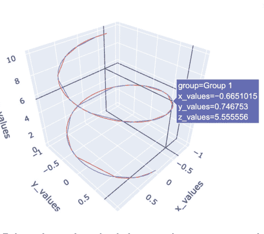

图 16.61 一个包含多条线的三维线图，每条线代表一个不同的组或类别。

### 表 16.2 Plotly 图表类型总结

| 类型 | 基本语法 | 场景 |
|---|---|---|
| 散点图 | `px.scatter()` | 显示两个变量之间的关系。示例：分析销售额与营销支出。 |
| 折线图 | `px.line()` | 可视化随时间变化的趋势或变化。示例：跟踪每日温度变化。 |
| 面积图 | `px.area()` | 突出折线图下方的面积以显示数量。示例：可视化随时间变化的累计销售额。 |
| 柱状图 | `px.bar()` | 比较分类数据。示例：比较不同产品类别的月度收入。 |
| 时间线图 | `px.timeline()` | 在时间线上可视化事件。示例：项目管理以跟踪任务持续时间。 |
| 漏斗图 | `px.funnel()` | 显示流程中的阶段和每个阶段的流失。示例：可视化从潜在客户到转化的销售管道。 |
| 饼图 | `px.pie()` | 显示整体中的比例。示例：按产品类型可视化市场份额。 |
| 直方图 | `px.histogram()` | 显示单个变量的分布。示例：分析客户年龄的分布。 |
| 三维散点图 | `px.scatter_3d()` | 可视化三个变量之间的关系。示例：绘制包含纬度、经度和海拔的地理数据。 |
| 三维线图 | `px.line_3d()` | 在三维空间中跟踪移动或趋势。示例：可视化随时间变化的飞行路径和高度变化。 |

## 下一步是什么？

恭喜！你已经成为一名 Python 大师！你现在对面向对象编程、NumPy 和 Pandas 中的高级数据结构，以及 Matplotlib、Seaborn 和 Plotly 等数据可视化工具有了扎实的理解。这是一项巨大的成就！你现在能够使用 Python 进行基本的数据分析。

庆祝之后，你可能想了解更多关于数据科学流程以及每个步骤中使用的工具。例如，如何进行数据整理？这包括数据收集、操作、理解、预处理和存储。此外，如何进行数据分析？这包括分类、回归、聚类、主成分分析、关联规则挖掘、异常值检测等等。我们有一本书，*《Python数据挖掘：理论、应用与案例研究》*，将通过理论、应用和真实案例研究的详尽解释来指导你学习每个主题。我们希望你能不断成长，在数据科学领域变得更加精通！

我很高兴能在那里与你相遇，并继续我们的旅程。


Taylor & Francis
Taylor & Francis Group
http://taylorandfrancis.com

## 索引

-   三维线图, 319
-   三维散点图, 317
-   抽象, 12
-   注释, 190
-   面积图, 282
-   柱状图, 197, 227, 289
-   箱线图, 203, 226
-   分类图, 225
-   类, 5
-   颜色, 188
-   数据可视化, 179
-   DataFrame, 129
-   分布图, 217
-   ECDF图, 219
-   逐元素操作, 91
-   封装, 12
-   分面, 250
-   漏斗图, 301
-   热力图, 204
-   直方图, 199, 217, 311
-   hue, 233
-   iloc[], 117, 137
-   继承, 12
-   KDE图, 219
-   标签, 183
-   图例, 186
-   折线图, 195, 214, 277
-   线型, 188
-   Lmplot, 255
-   loc[], 134
-   标记, 188
-   掩码, 108
-   Matplotlib, 181
-   矩阵, 102
-   多子图, 261
-   ndarray, 73
-   NumPy, 73, 96
-   对象, 5
-   面向对象编程, 5
-   OOP, 5
-   Pandas, 113, 129, 154
-   饼图, 201, 304
-   Plotly, 269
-   Plotly express, 270
-   点图, 228
-   多态, 12
-   随机, 105
-   随机种子, 105
-   关系图, 214
-   散点图, 200, 214, 271
-   Seaborn, 212
-   Series, 113
-   条形图, 225
-   子图, 192, 207
-   时间线图, 294
-   标题, 183
-   ufuncs, 96
-   通用函数, 96
-   向量化, 91