# Linux 内核

初学者指南

ASHRIT RAM ANALA

# PYTHON 精粹

10 个项目，超过 50 个示例，信息丰富的图表，尽在一处

# 目录

- [标题页](#)
- [前言](#)
- [第 01 章：入门](#)
- [第 02 章：创建你的第一个 Python 程序](#)
- [第 03 章：注释](#)
- [第 04 章：基础](#)
- [第 05 章：算术运算与运算符优先级](#)
- [第 06 章：字符串详解](#)
- [第 07 章：输入与输出](#)
- [第 08 章：数据类型转换](#)
- [第 09 章：库](#)
- [第 10 章：标准库](#)
- [第 11 章：关键字](#)
- [第 12 章：错误](#)
- [第 13 章：ASCII](#)
- [第 14 章：列表与列表方法](#)
- [第 15 章：字典与字典方法](#)
- [第 16 章：If、Else 和 Else If 语句](#)
- [第 17 章：循环](#)
- [第 18 章：函数](#)
- [第 19 章：Try-Except](#)
- [第 20 章：项目提示](#)
- [关于作者](#)
- [参考文献](#)

# 前言

无论你是初学者还是经验丰富的程序员，Python 都是一门值得学习的优秀语言。它不仅易于理解、编码相对简单，而且在许多领域都有应用，例如人工智能和网站开发，这些领域在未来展现出巨大的潜力。

加粗的词语表示重要的概念，斜体部分则是代码片段。

本书涵盖了初学者甚至有一定编程经验的人所需的所有重要概念，但它绝不是理解 Python 全貌的唯一途径。你将学习所有基础知识和许多复杂的概念，这些将为你的 Python 之旅奠定基础，并使你更轻松地深入探索 Python。但正如所说，它并非唯一的途径。

# 第 01 章：入门

## 背景

在我们准备编码之前，让我们先了解一些基础知识。我们人类有多种交流语言，如英语、西班牙语、法语等等，而要与计算机交流，我们也需要一种语言。计算机无法理解英语或任何其他语言，但它能够将这些语言翻译成它能理解的语言：二进制。

二进制由 1 和 0 组成。每个 1 和 0 被称为一个**比特**。像 101 这样的二进制数可以转换为数字 5。你可能已经发现，用这种方式交流对我们来说相当困难，因此**编程语言**应运而生。编程语言允许我们以更易理解的格式输入内容，计算机则可以使用**编译器**将我们输入的内容转换为二进制，以便计算机能够理解。如今有许多编程语言可供选择，每种语言都有其独特的优势。1991 年，Python 诞生了。现在，我们已经准备好开始编码了。

嗯，还不完全。我们还没有确定在哪里输入代码。我们不能简单地打开一个 Google 文档就开始编码，所以我向你介绍……**集成开发环境**，简称 **IDE**。

这就是我们将输入代码的地方。IDE 具有许多不同的功能，例如**编辑器**（你输入代码的地方）、**编译器**（程序翻译器）、**调试器**（帮助你查找错误），以及更多你将在探索过程中逐渐熟悉的功能。

IDE 不仅仅是一个输入代码的地方。使用 IDE 的好处在于它是为开发者设计的，使编码变得更加容易和便捷。

以下是程序工作流程的概览图：

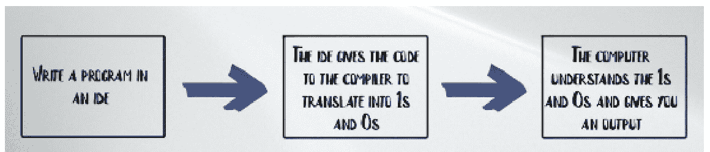

IDE 只是我们编写代码的地方，它本身并不包含语言。我们需要下载并安装语言，以便 IDE 在我们创建新的 Python 文件时能够在你的设备上识别它。

现在我们真的准备好了。

## 下载 Python

**如果你已经下载并安装了 Python，并且 IDE 也已准备就绪，请直接跳到第 2 章。**

在新的浏览器标签页中访问 **python.org**，将鼠标悬停在“downloads”标签上，直到出现一个扩展菜单，显示当前版本的 Python：

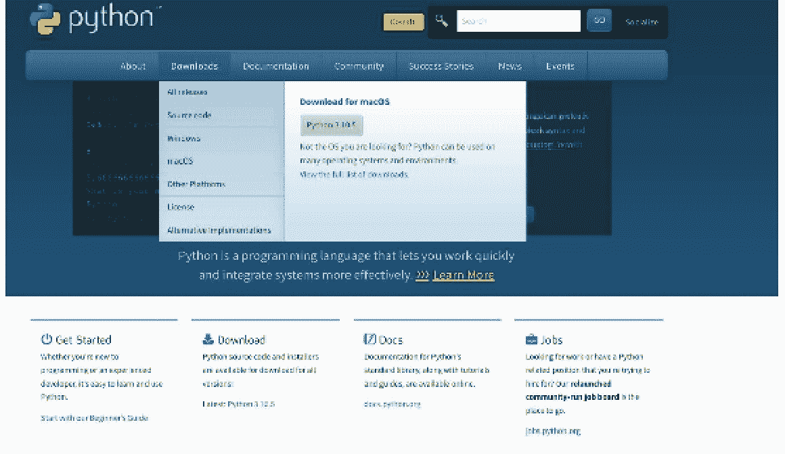

点击按钮下载适用于你操作系统的 Python（我使用的是 Mac，因此 Mac 下载选项会自动显示。如果你的操作系统是 Windows，那么 Windows 选项应该在那里）。

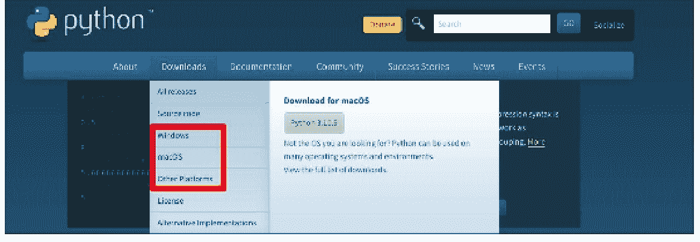

Mac 和 Windows 的安装过程略有不同，因此我将分别介绍：

## Mac 安装

Mac 的安装过程相当简单。你只需点击你想要下载的版本，然后打开文件：

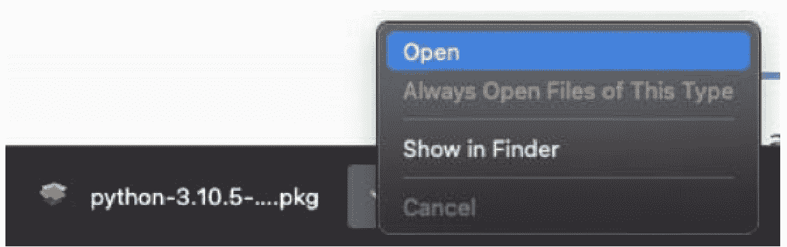

完成此操作后，应该会弹出一个安装程序：

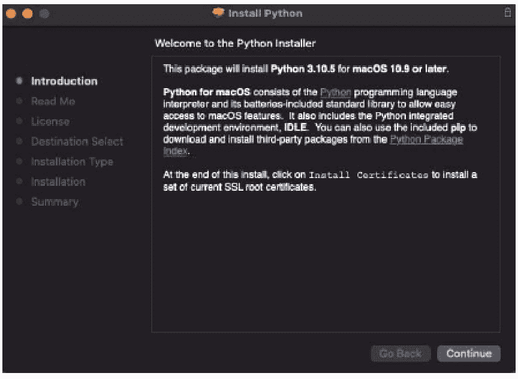

按照安装过程的步骤操作，直到你看到这个屏幕：

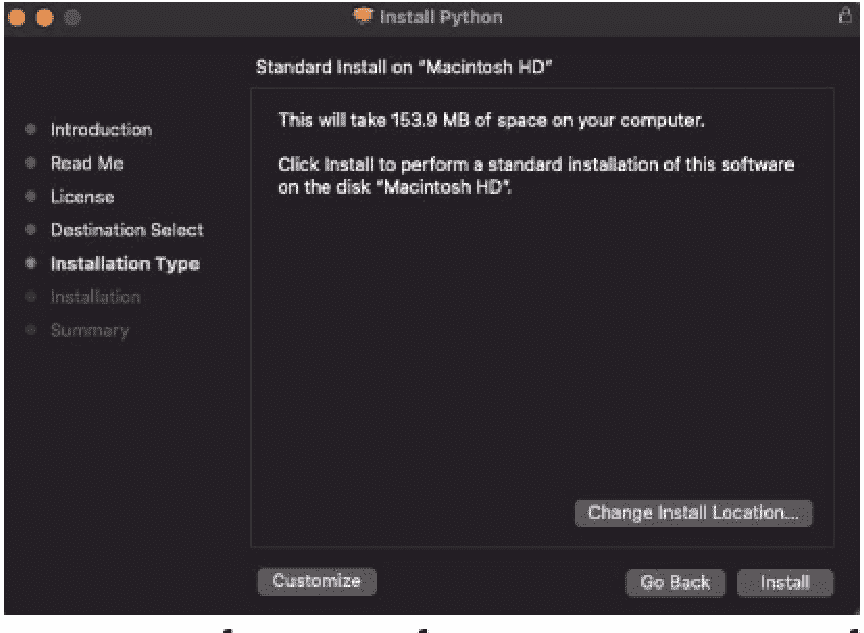

在这里，你可以更改 Python 的安装位置。如果你认为一切正常，那么请继续点击安装。你可能需要输入计算机密码，但一旦输入，可能需要一两分钟才能完全安装。之后，你应该会看到这个屏幕：

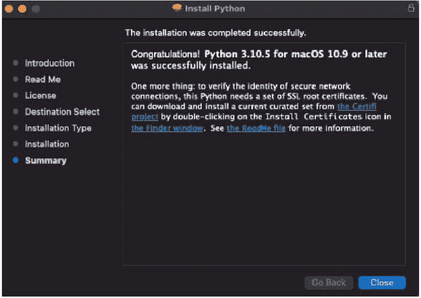

现在你完成了！Python 已完全安装，可以在你的 Mac 上开始编码了。

## Windows 安装

Windows 安装过程会多次询问你是否允许程序对你的设备进行更改，你可以点击允许。

下载你想要的 Python 版本后，屏幕底部应该会弹出以下内容：


Python 以**可执行文件**（.exe）的形式下载，因此要安装 Python，你需要**执行**它：

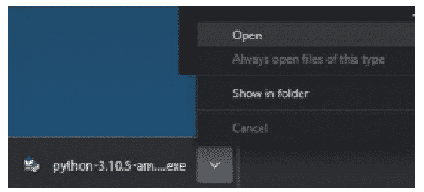

打开 Python 后，按照步骤操作，直到你看到这个屏幕：

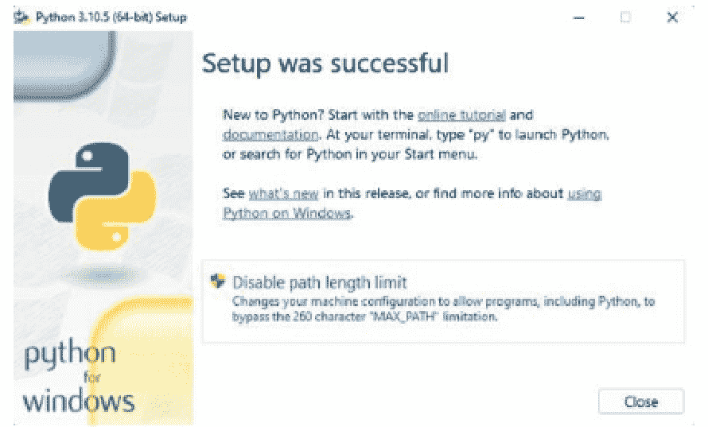

现在 Python 已安装，让我们开始你的 Python 之旅吧！

## IDE

有许多不同的 IDE 可以用于 Python，例如 PyCharm、Anaconda 等，因此请查看所有选项并决定哪一个最适合你。在本书中，我将使用 Visual Studio Code 来编写 Python 代码，但无论你使用什么工具，语言本身都是一样的。

在我们开始编码之前，你必须首先了解编辑器的布局。你将编写代码的区域称为编辑器，它应该看起来像这样：


目前这里内容不多，但一旦我们开始编码，这个编辑器将被 Python 填满！

显示结果的区域是终端：

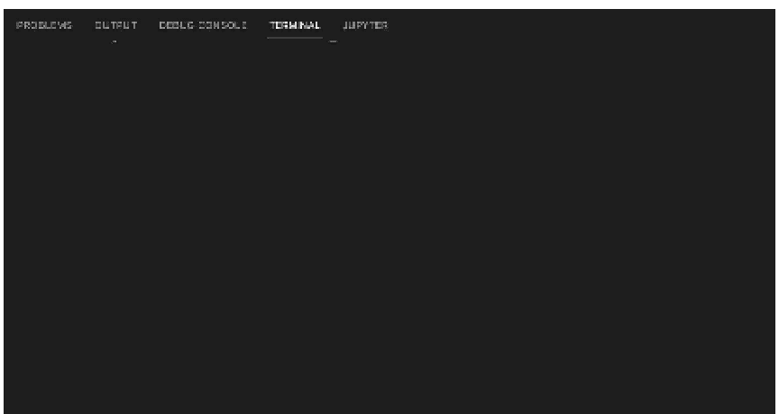

在编辑器的顶部，你可能会看到许多标签页，其中大部分你现在可以忽略，但你需要关注的主要标签页是那些标有 *Run* 的标签，因为它们用于运行程序。如果某个标签页没有明确命名为 *Run*，你可能需要查看几个标签页：

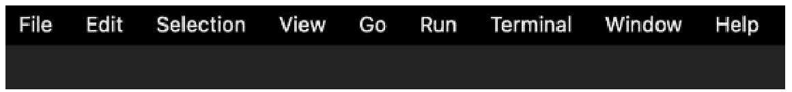

# 第 02 章：创建你的第一个 Python 程序

现在一切准备就绪，打开你的编辑器并新建一个文件。将其命名为“Hello_World.py”。请注意，所有 Python 程序都以 **.py** 结尾，以表示它们是 Python 项目。为了充分利用本书，请务必亲自尝试**本书**中的每个示例。你可能认为自己已经理解了乍一看似乎很简单，但当你尝试时，可能会发现自己遇到了问题。这样做能让你充分理解每个问题和解决方案。创建一个文件夹，将我们完成的所有Python项目/练习保存在其中。这样，当你需要回忆如何做某事时，可以随时回顾。

你的第一个程序将是一个“Hello World!”项目，你将在终端中打印出“Hello World!”这几个字。

这引入了我们第一个Python内置命令：**print()**

**print**命令的**语法**（规则的专业术语）是，括号内的所有文本必须用‘单引号’或“双引号”括起来，Python才能识别它。

同样，当我们在文本编辑器中输入*print("Hello World!")*时，运行程序后，终端中应该会显示：

```
Hello World!
```

太棒了！你已经完成了一个让你接触Python的项目。

# 第三章：注释

Python中的**注释**是解释和理解代码的非常有用的工具。注释只是一条语句，可用于解释代码段并说明其用途。

注释可以这样写：

```python
# This is a comment
```

当你以井号（#）开始新行时，Python就知道你在写注释。注释**对你的代码没有任何影响**，它们只是供你（程序员）阅读的语句，以帮助你或他人理解代码。

程序会忽略所有注释，所以尽情注释吧！

# 第四章：基础

现在是时候学习Python中的数据类型了。这可能不是最令人兴奋的部分，但它至关重要。

### 字符串

你上一个项目中的“Hello World!”被称为**字符串**。字符串本质上是所有文本输入，必须始终用‘单引号’或“双引号”括起来。字符串可以是单词，如“*Hello*”，甚至是数字，如“5”。任何用引号括起来的东西都会变成字符串。

### 整数

像10、15、-17和39这样的整数被称为**int**，即整数的缩写。你可以对它们执行数学运算，如加法、减法和乘法。我们不能对字符串执行数学运算。在前面的例子中，我们通过用双引号将数字5括起来，使其变成了字符串，这意味着我们也不能对它执行数学运算。

### 浮点数

像10.1、23.5和-9.54这样的数字被称为**浮点数**。它们代表小数，与整数类似，可以对它们执行数学运算。

### 布尔值

最后一个主要的数据类型是**布尔值**，它表示***True***或***False***语句。

### 变量

**变量**是任何编程语言的重要组成部分，我们使用它们将数据存储在计算机中以备后用。例如，我们可以说*price* = 10，或者*name* = “John”。*price*和*name*都是变量。变量可以存储任何东西，字符串、整数、布尔值或浮点数。

当我们说*price* = 10和*name* = "John"时，这被称为变量的**初始化**，即我们为其赋值。

将变量赋值想象成将值放入一个盒子中：

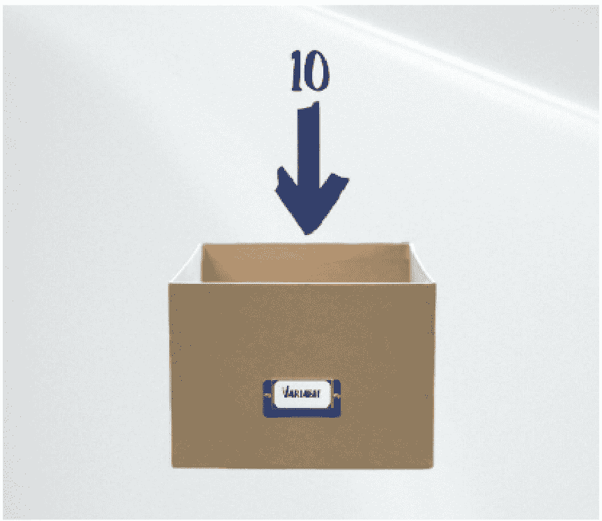

变量的一个有趣特性是，它们可以用来打印，而无需输入所有内容。以之前的“Hello World!”程序为例。我们不必说*print("Hello World!")*，而可以这样说：

```python
Text = "Hello World!"

print(Text)
```

这与之前的结果完全相同。

Python是**区分大小写的**（大小写很重要！），因此在输入时请确保所有内容完全相同。如果我们在上一个例子中打印变量*Text*时改变了大小写，我们会得到这个错误：

```
NameError: name 'text' is not defined. Did you mean: 'Text'?
```

另一件需要注意的事情是，如果我们有类似这样的代码：

```
Value = 10

Value = 20

print(Value)
```

输出是什么？Python的工作方式是从上到下执行，因此存储在value中的数据将是**最后更新的版本**，所以我们的结果将是20。

使用与之前相同的例子，将盒子想象成一次只能容纳一个物品的东西：


使用变量的另一个酷炫功能是，如果你的变量是一个数字，我们可以通过这样说来递增它：

```
Value = 10

Value = Value + 1

print(Value)
```

从数学的角度来看，这可能令人困惑，一个数字怎么能等于那个数字加一呢？嗯，在编程中，这所做的只是将变量的值**重新赋值**为比它大一的值，所以*Value = Value + 1*将变量*Value*从10重新赋值为11：


另一种写法是使用快捷方式+=：

```
Value = 10

Value += 1

print(Value)
```

这会打印出相同的结果：

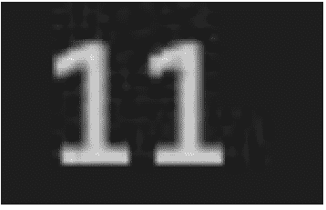

如果这有点难以想象，这里有一张使用之前图表的图片：


# 第五章：算术运算和运算符优先级

我相信我们都听说过加法（+）、减法（-）、乘法（*）和除法（/）等运算符，但在Python中还有更多运算符，它们的表示方式与现实世界中的对应物略有不同，如下一页所示。

在学校里，你学到的是先算括号，然后是指数，接着是乘法和除法，最后是加法和减法，Python的工作方式类似。在Python中，我们总是先计算括号，然后是指数，接着是乘法和除法，最后是加法和减法，但还有更多更复杂的运算符。

与其通过文字解释每一个，不如用视觉表示可能更好。下面是一个表格，按优先级顺序显示了你将来会用到的所有运算符。请注意下面的运算符列表，我将在接下来的示例和项目中使用其中一些。如果你看到我使用了一个你以前没见过的运算符，请回到这里查看，你应该能看到我使用了什么。我在这个表格中汇编了大多数运算符，所以你可能会看到一些你从未听说过或见过的运算符。随着你深入本书的后续章节，这些运算符会变得越来越清晰，所以请继续阅读！

### 算术运算符

| 运算符 | 名称 | 示例 |
| :--- | :--- | :--- |
| + | 加法 | x + y (2 + 3 = 5) |
| - | 减法 | x - y (3 - 2 = 1) |
| * | 乘法 | x * y (2 * 3 = 6) |
| / | 除法 | x / y (2 / 4 = 0.5) |
| ** | 指数 | x ** y (2 ** 3 = 8) |
| % | 取模 | x % y (4 % 2 = 0) **4除以2的余数** |
| // | 整除 | x // y (3 // 2 = 1) **3 / 2 是 1.5，但整除会将其向下舍入到最接近的整数，即1** |

### 赋值运算符

| 运算符 | 示例 | 说明 |
| :--- | :--- | :--- |
| = | x = y | 将y赋值给x |
| += | x += y | 等同于 x = x + y。将x的值增加y。例如 x = 4, x += 3。**这使得x等于7** |
| -= | x -= y | 等同于 x = x - y。将x的值减少y |
| *= | x *= y | 等同于 x = x * y。将x的值重新赋值为 x * y。例如 x = 4, x *= 3。**这使得x等于12** |
| /= | x /= y | 等同于 x = x / y。将x的值重新赋值为 x / y |
| **= | x **= y | 等同于 x = x ** y。将x的值重新赋值为 x ** y |
| %= | x %= y | 等同于 x = x % y。将x的值重新赋值为 x % y |
| //= | x //= y | 等同于 x = x // y。将x的值重新赋值为 x // y |

### 比较运算符

| 运算符 | 名称 | 示例 |
| :--- | :--- | :--- |
| == | 等于 | x == y。**检查x是否等于y。不会将x赋值给y** |
| != | 不等于 | x != y。**检查x是否不等于y** |
| > | 大于 | x > y。**检查x是否大于y** |
| < | 小于 | x < y。**检查x是否小于y** |
| >= | 大于或等于 | x >= y。**检查x是否大于或等于y** |
| <= | 小于或等于 | x <= y。**检查x是否小于或等于y** |

### 逻辑运算符

| 运算符 | 定义 | 示例 |
| --- | --- | --- |
| and | 当两个条件都为真时，结果为真 | x > y **且** x > z |
| or | 当其中一个条件为真时，结果为真 | x > y **或** x > z |
| not | 反转结果，真变为假，反之亦然。 | not ( x > y and x > z) **如果 x > y and x > z 返回真，not 会使其变为假** |

### 身份运算符

| 运算符 | 定义 | 示例 |
| --- | --- | --- |
| is | 如果两个变量相同，则结果为真 | x is y **如果 x 与 y 相同，这将返回真** |
| is not | 如果两个变量不相同，则结果为真 | x is not y **如果 x 与 y 不相同，这将返回真** |

### 成员运算符

| 运算符 | 定义 | 示例 |
| :--- | :--- | :--- |
| in | 如果一个值包含在对象中，则结果为真 | x in y **如果 y 是一个包含元素 [1, 2, 3, 4] 的列表，且 x 等于 3，则上述语句结果为真** |
| not in | 如果一个值不包含在对象中，则结果为真 | x not in y **如果 y 是一个包含元素 [1, 2, 3, 4] 的列表，且 x 等于 5，则上述语句结果为真** |

# 第六章：关于字符串的一切

字符串看似简单，但其用途无穷无尽。

## 多行字符串

字符串可以通过简单地在后面添加另一个引号来跨越多行：

```
亲爱的学校管理部门，

我们希望减少家庭作业。

此致，

学生们。
```

这将像你输入的那样，将所有内容作为一个大块打印出来。

## 空字符串

空字符串顾名思义，就是初始化时没有任何内容的字符串。它们看起来像这样：

```python
Empty = ""
```

这可能看起来没用，空字符串能做什么？嗯，在正确的情况下，它们非常有用。

假设我们想编写一个程序来检查字符串中是否有元音字母，然后创建一个只包含元音字母的新字符串。我们稍后会介绍如何实际操作，但假设我们有一个可以给出所有元音字母的程序。现在我们把它们放在哪里呢？这就是空字符串派上用场的地方。如果我们初始化一个变量为空字符串，我们就可以在过程中将元音字母添加到空字符串中（你很快就会学到如何做到这一点！），瞧，就这样完成了。有用吧？编写这类程序的概念将在接下来的章节中介绍，但一旦你继续阅读并理解了如何操作，随时可以回到这里自己编写代码。

再次使用盒子的例子，上面的问题可以这样表示：

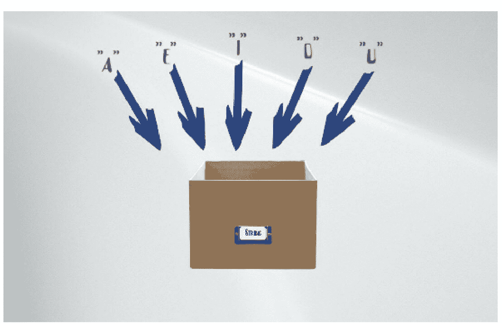

## 字符串索引

索引是编程中最重要的工具之一，我们很快会进一步探讨，但现在，我们可以使用索引来引用字符串的特定部分。

**索引**指的是字符串中的每个字符，每个字符都有自己的索引。索引从 0 开始，一直到字符串的末尾（例如，字符串 “Hello” 的索引 0 是字符 “H”，索引 4 是 “o”。字符串的最后一个索引总是比字符串长度小 1，因为索引从 0 开始）。

我们可以通过以下方式编写代码：

```python
String = "How are you?"
print(String[0])
```

这将打印索引 0 的字符，即 “H”。

要打印最后一个索引，我们可以这样写：

```python
String = "How are you?"
print(String[11])
```

*记住空格也算！*

另一种方法是使用负数来实现：

```python
String = "How are you?"
print(String[-1])
```

这将给你最后一个索引，即 “?”。当我们不知道字符串长度时，这非常有用。

类似地，如果我们说：

```python
String = "How are you?"
print(String[-12])
```

这将给你 “H”。

## 字符串切片

字符串切片的设置如下：

我们输入字符串名称，后跟方括号，就像平常一样，但然后我们在方括号中遵循以下语法：

```python
String[start : stop : step]
```

本质上，这是通过指定我们从哪个索引开始和结束来打印字符串的特定部分。如果我们使用 String[0:]，我们将得到整个字符串：


（将字段留空将默认为字符串的末尾）

我们可以根据索引进行分割，所以 *String[2:-2]* 将给我们从第 3 个字符（索引 2）到倒数第 3 个字符的所有内容：


至于最后一个参数，步长，这是我们跳过多少个字母。将其留空意味着我们打印起始和结束范围内的每个字母，但如果我们将其更改为 3，那么这将使我们从起始索引开始，打印该索引处的字符，跳过 3 个索引，打印该索引处的字符，依此类推，直到我们达到结束索引。

如果步长使我们超过了结束索引，那么打印的最后一个索引将是步长超过结束索引之前的那个索引。

假设我们使用与之前相同的示例，但将步长设置为 3：


如你所见，步长打印了每第三个字符，但当它到达字符串末尾前 2 个字符时，它无法再打印任何内容，因此它打印了字符串结束前的最后一个索引。

## 连接

我们也可以将变量添加到字符串中，但其格式有点不同：

```python
string = "I'm good"

print("Hello, how are you " + string)
```

这的结果将是：

```
Hello, how are you I'm good
```

如你所见，要将一个字符串添加到另一个字符串，我们需要添加一个加号，然后是变量的名称。这种字符串的组合称为**连接**。但是请注意，你只能将字符串与字符串连接，所以如果你有类似这样的代码：

```python
num = 7

print("I like donuts so much, I have " + num)
```

这可能不会立即在代码中产生错误，但当你运行代码时，你会得到：

```
print("I like donuts so much, I have " + num)
TypeError: can only concatenate str (not "int") to str
```

这个错误只是意味着你不能将字符串与任何其他数据类型连接，它必须是字符串与字符串连接。

我们不需要将字符串赋值给变量才能连接它，我们也可以简单地在两个字符串之间放置一个加号并打印，这将完美运行。

## 特殊字符

Python 中的特殊字符总是以反斜杠开头，表示后面的字母是一个特殊字符。有许多特殊字符，但大多数你很少使用和看到。一些常见的特殊字符是 \n、\' 和 \"。

\n 只是一个换行命令，如果你将其放在字符串的末尾，它将在其后创建一个新行，因此下一个打印的行将与上一个打印的行之间有一个空格：

```python
print("Wow, this is cool \n")
print("Am i on a new line?")
```

结果将如下所示：

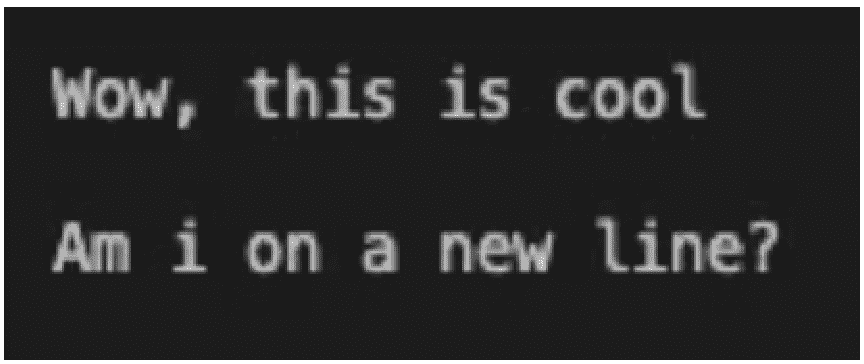

其余命令的格式与 \n 命令完全相同，只是有一些细微的调整。

\' 和 \" 命令非常相似，当你需要在字符串中包含引号时非常有用。例如，如果你想引用苏格拉底并打印引言 “Wonder is the beginning of wisdom”，你可以尝试将其放入字符串中：

```python
print("""Wonder is the beginning of wisdom" - Socrates")
```

但如你所见，这会产生错误，因为我们在实际引言中使用了双引号，所以 Python 认为你正在结束字符串。

为了解决这个问题，我们可以简单地使用 \" 命令：

```python
print("\"Wonder is the beginning of wisdom\" - Socrates")
```

通过这样做，我们能够在终端中获得这个美妙的苏格拉底引言：

```
"Wonder is the beginning of wisdom" - Socrates
```

\' 命令与 \" 命令的格式完全相同，我们只需要将 “ 替换为 ‘：

```python
print("\'Wonder is the beginning of wisdom\' - Socrates")
```

现在在终端中，我们得到这个结果：

```
'Wonder is the beginning of wisdom' - Socrates
```

下面是一些不同特殊字符的列表，以防你想记下来以备将来使用：

| 特殊字符 | 用途 |
|---|---|
| \n | 换行符 |
| \t | 水平制表符 |
| \r | 回车符 |
| \b | 退格符 |
| \f | 换页符 |
| \' | 单引号 |
| " | 双引号 |
| \ | 反斜杠 |
| \v | 垂直制表符 |

# 第七章：输入与输出

当你在谷歌中输入内容时，这被称为**输入**，我们可以在Python中使用**input()**来实现相同的功能。

你将通过在终端中输入来提供数据。无论你在终端中输入什么，它都是一个字符串。即使你输入数字10，它也会被转换为字符串，因此它看起来会像这样：“10”

让我们开始一个新项目，在这个项目中，你将在终端中输入你的名字，你的代码将通过重复你的名字来回应你。首先，让我们从用户输入开始：

```
input("What is your name?: ")
```

如上所示，我们可以为用户提供一个提示，告诉他们在终端中输入什么。提示必须是用单引号或双引号括起来的字符串。

现在我们已经写下了输入，我们必须编写代码来回应你。

当我们尝试这个时，我们很快遇到了如何将你的名字从终端传回程序的问题，但这可以通过使用变量来解决。如果我们为输入命令分配一个变量，该变量将保存用户输入。

```
Name = input("What is your name?: ")
```

现在你的输入已经存储好了，我们可以打印它了！

```
Name = input("What is your name?: ")
print(Name)
```

好了，你现在知道如何接收和使用来自程序的输入了。

如果我们想让程序说“Hello”然后加上我们的名字，我们必须添加一个小的补充：

```
Name = input("What is your name?: ")
print("Hello" + Name)
```

如字符串章节所示，这将打印“Hello”然后是你的名字。

# 第八章：数据类型转换

这是一个测试你到目前为止Python知识的谜题：

```
Number = input("Pick a number: ")

Half = Number / 2

print(Half)
```

如果你说输入总是一个字符串，而字符串不能用于数学运算，那么你是正确的！

这就引出了一个问题，我们如何从用户那里获取输入并对它们进行数学运算？

这就是**数据类型转换**的用武之地。字符串、整数、布尔值和浮点数都是不同的**数据类型**，你可以通过说出类型的名称，然后将要转换的内容括在括号中来在它们之间进行转换。

*字符串 <=> 整数/浮点数*

例如，我们只需使用**int()**就可以解决之前的问题：

```
Number = input("Pick a number: ")

Half = int(Number) / 2

print(Half)
```

这将使*Number*成为一个真正的整数，从而允许它被2除。

但是，请注意，*Number*必须是一个实际的数字，转换才不会产生错误。你不能将像“ten”或“cat”这样的字符串转换为整数，因为它们没有整数版本，但*int("12")*将返回数字12。

只要字符串具有浮点表示，浮点转换也是相同的。浮点转换的命令是**float()**，所以*float("12")*将返回12.0。

同样，反向操作也可以，我们可以将整数或浮点数转换为字符串，没有任何限制（任何东西都可以是字符串）。需要注意的是，当将某些内容转换为字符串时，命令是**str()**，而不是**string()**

### *整数 <=> 浮点数*

将整数转换为浮点数时，它只是在末尾添加一个额外的.0，所以*float(20)*是20.0。

同样，反向操作也可以，*int(20.0)*将得到20。

### *布尔值 <=> 任何类型*

对于布尔值，我们也可以转换它们，只是工作方式有点不同。*True*布尔值对应于1，而*False*布尔值对应于0。

这意味着如果我们执行*int(True)*，我们得到1，如果我们执行*int(False)*，我们得到0。它们的浮点表示只是在每个末尾添加一个.0。

布尔转换使用**bool()**命令，所以执行**bool(1)**或**bool(0)**分别得到True和False。字符串转换与普通转换相同，*str(True)*得到字符串“True”，*str(False)*得到“False”。

# 第九章：库

让我们暂时从数据类型和输入中抽离出来，谈谈**库**。我们指的不是实际的物理图书馆，而是非常相似的东西，只是以数字形式存在。

用更熟悉的术语来说，编程中的库可以看作是一个书架，上面放着许多不同的书。每本书代表该库中可用的不同命令。

例如，Python中的*math*库可以找到某个东西的绝对值，可以找到一个数的阶乘，以及许多更复杂的数学运算，而你甚至不需要编写所有这些代码，你所要做的就是使用称为**方法**的小命令来执行它们。

库就像Python的一个外部部分，与你的程序分开：

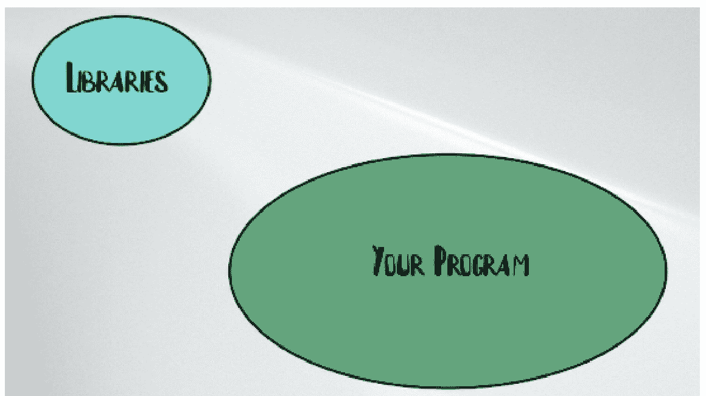

为了能够访问库，我们需要使用一个称为**import**的命令：

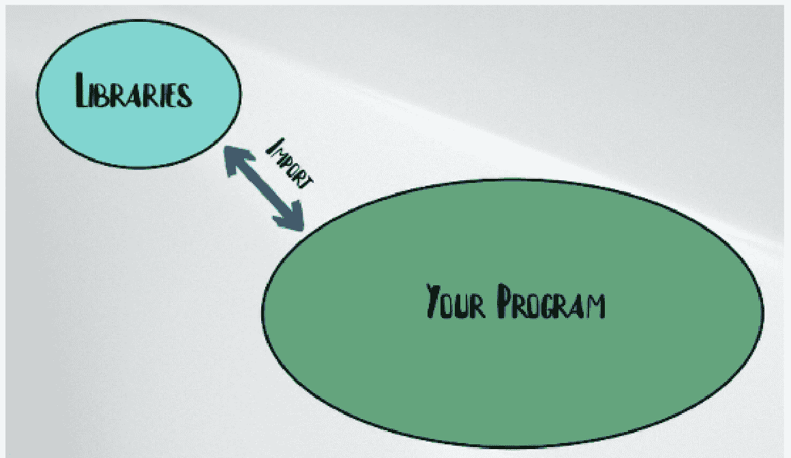

如果我们想导入math库，在程序开始时，我们会说*import math*。就这么简单！

确保所有你想使用的库都在程序的开始，因为如果你在开始使用库中的方法之后才导入它，Python将无法使用它（记住Python是从上到下读取的）。

这是一个我们刚刚讨论的math库的例子：

```
import math

x = math.factorial(7)

print(x)
```

如你所见，导入这些库并不太难。

要使用这些方法，你所要做的就是输入库的名称，后跟一个点和你想使用的方法类型，如我们分配给变量*x*的*math.factorial(7)*所示。

这个程序将打印7*6*5*4*3*2*1的结果，即5040。

### As

如果库的名称太长而难以输入（相信我，有些库输入起来会变得非常烦人），你可以使用**as**和import命令一起将库的名称缩短为你选择的任何名称：

```
import math as m

x = m.factorial(7)

print(x)
```

如你所见，一切正常。

如果你尝试一下，你会看到我们得到了相同的结果5040。

我们将使用的两个常见的Python库是*Math*库和*Random*库，但你可以随意搜索任何其他库，看看Python提供了什么。

# 第十章：标准库

如前一章所述，方法是可以在库中找到的各种命令，但还有许多其他方法是内置在Python中的，你不需要导入任何东西。

这被称为**标准库**，我们已经接触过其中的许多方法和函数，比如*print()*。

使用之前的同一个例子，这样思考标准库：

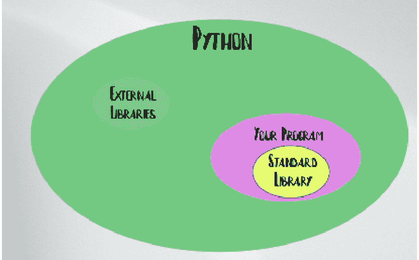

标准库始终对你的程序可用。

标准库中还有许多其他方法和函数可以操作字符串、整数和其他数据类型，我们稍后会看到，比如列表和字典。

下一页列出了几个标准库方法。

### 内置函数

| 函数 | 描述 |
| --- | --- |
| abs() | 返回一个数字的绝对值 |
| bin() | 将整数转换为以“0b”为前缀的二进制字符串 |
| bool() | 返回一个布尔值，如True或False |
| chr() | 使用ASCII表返回数字的字符串表示 |
| dict() | 创建一个字典 |
| float() | 将对象转换为浮点数 |
| hex() | 将整数转换为以“0x”为前缀的十六进制字符串 |
| input() | 从用户那里接收输入 |
| int() | 将对象转换为整数 |
| len() | 返回对象的长度 |
| list() | 创建一个列表 |
| max() | 返回可迭代对象中的最大项 |
| min() | 返回可迭代对象中的最小项 |
| next() | 检索可迭代对象中的下一项 |
| oct() | 将整数转换为以“0o”为前缀的八进制字符串 |
| ord() | 使用ASCII返回字符的数值表示 |

| 函数 | 描述 |
| --- | --- |
| pow() | 返回 x 的 y 次幂。如果提供了第三个参数，则计算 x 的 y 次幂对 z 取模的结果 |
| print() | 打印输入内容 |
| range() | 创建一个指定范围内的数字集合。（例如：range(1, 20) 将打印数字 1-19。range 函数的最后一个值不包含在内） |
| round() | 返回一个四舍五入到指定位数的数字 |
| sorted() | 从可迭代对象中的元素创建一个新的排序列表 |
| str() | 将对象转换为字符串 |
| sum() | 对可迭代对象中的所有项求和 |
| type() | 返回对象的类型（字符串、整数、布尔值等） |

### 内置常量

| 常量 | 描述 |
| --- | --- |
| True | 布尔真值 |
| False | 布尔假值 |
| None | 一个用于表示值缺失的对象。可以赋值给变量 |

是的……Python 中的内置常量不多，但关键字却相当多！

# 第 11 章：关键字

关键字是 Python 中保留用于特殊目的的特殊词汇。这些词不能用于任何其他目的。

这意味着你不能使用与关键字同名的变量名。这会导致一些错误和混淆，因为该关键字被用于其创建目的之外的用途。

在之前的图表基础上补充：

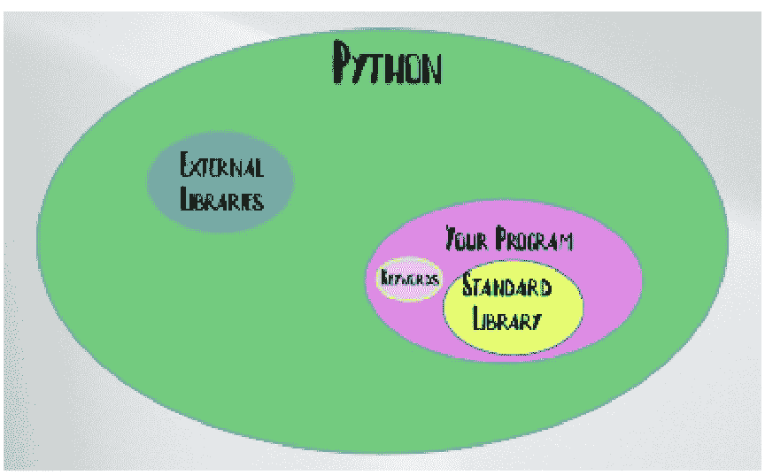

关键字，就像标准库一样，在你的程序中随时可用，无需执行任何特殊操作来访问它们。它们只是在等待你使用！

Python 中有许多关键字，因此下一页列出了最常见的关键字及其定义：

## 关键字

| 关键字 | 描述 |
|---|---|
| and | 逻辑运算符。如果两个条件都为真，则返回 True |
| as | 为库创建别名 |
| break | 跳出循环 |
| continue | 继续循环的下一次迭代 |
| def | 定义一个函数 |
| elif | 用于条件语句。当需要多个 if 条件时使用 |
| else | 用于条件语句。当所有其他条件都失败时使用 |
| except | 与异常一起使用。异常发生时的条件 |
| finally | 与异常一起使用。无论发生什么都会执行的代码块 |
| for | 创建一个 for 循环 |
| from | 导入库的特定部分 |
| if | 用于条件语句。创建一个条件 |
| import | 导入库 |
| is | 测试两个变量是否相等 |
| in | 检查值是否存在于对象中 |
| True | 布尔值 |
| False | 布尔值 |
| None | 表示空值 |

| 关键字 | 描述 |
|---|---|
| not | 逻辑运算符。反转条件语句的结果 |
| or | 逻辑运算符。如果其中一个条件为真，则返回 True |
| raise | 引发异常 |
| return | 退出函数并返回一个值 |
| try | 创建一个 try-except 语句来检查错误 |
| while | 创建一个 while 循环 |

# 第 12 章：错误

在阅读本书的过程中，你肯定遇到过一些错误，其中大多数可能不太容易理解。

在这里，我将讨论一些最常见的错误以及你应该如何解决它们。

## 语法错误

你最可能遇到的第一个也是最常见的错误是**语法错误**，这意味着你的代码的某些部分不符合 Python 的规则。

错误的好处在于它们会准确地告诉你哪里出错了，这样你就可以修复它。这里有一个例子：

```
txt = "Hello" print(txt)
```

如果我们有这个程序，我们的输出将是：

```
txt = "Hello" print(txt)
SyntaxError: invalid syntax
```

正如你可能注意到的，print 语句与变量在同一行，这不是正确的 Python 代码。因此，我们的 IDE 告诉我们犯了一个错误，并在我们出错的地方加了下划线，以便我们可以修复它。

## 名称错误

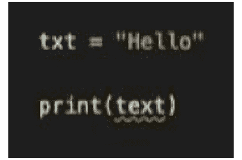

这里的错误是我们输入了 *text* 而不是 *txt*，所以这给 Python 发出了红色警报：

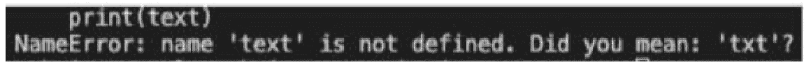

**名称错误**发生在某个东西的名称不匹配时，无论是变量名还是 Python 命令的名称。IDE 不仅会告诉我们哪里出错了，还会告诉我们我们可能想表达什么！当然，这因 IDE 而异，但错误信息应该大致相同。

## 缩进错误

*阅读第 16 章后再回到这个错误*

正如你所看到的，Python 是一种基于缩进的语言，如果这是你的第一门语言，这可能看起来并不奇怪，但许多其他语言使用 {花括号} 来表示代码包含在某个东西中。

为了简单和可读性，Python 使用缩进，然而，这有时会令人困惑。

如果你有这样的代码：

```
x = 10

if x < 20:
    print("x is less than 20")

else:
    print("x is not greater than 20")
```

它将产生这个错误：

```
print("x is not greater than 20")
^
IndentationError: expected an indented block after 'else' statement
```

这个**缩进错误**发生是因为 print 语句没有缩进，以表明它是 else 语句执行的结果。

这种错误的一个更棘手的形式是这样的：

```
x = 10

if x < 20:
    print("x is less than 20")
    print("What's wrong?")
```

这将导致相同的错误，但解释有点不同：

```
print("What's wrong?")
^
IndentationError: unindent does not match any outer indentation level
```

你可能想知道哪里出错了，但如果你仔细观察，你会发现第二个 print 语句的缩进不足以与前一个语句对齐，从而导致错误。

## 类型错误

当你尝试对无法执行该操作的数据类型执行操作时，就会发生这种情况。有很多情况可能发生这种情况，但下面列出了一些：

```
str = "Python has too many rules."

str[13] = 'r'

print(str)
```

这段代码的结果是：

```
str[13] = 'r'
TypeError: 'str' object does not support item assignment
```

这可能一开始看起来令人困惑，但一旦你意识到字符串是**不可变数据类型**，它就变得清晰了。这意味着一旦它们被创建，就不能被更改。因此，用另一个字符替换一个字符会导致**类型错误**。如果你想这样做，你只需要：

```
python
str = "Python has too many rules."
print(str[:13] + "r" + str[14:])
```

本质上，这做的是打印所有字符直到你要添加的字符，添加该字符，然后使用字符串切片打印字符串的其余部分。

这种错误的另一个例子是：

```
python
dogcount = 12
print("I want " + dogcount + "dogs")
```

这将导致：

```

print("I want " + dogcount + "dogs")
TypeError: can only concatenate str (not "int") to str
```

正如你所看到的，这是因为字符串只能与字符串连接，所以我们不能将整数与字符串组合。一个简单的解决方法是将变量 *dogcount* 转换为字符串，然后连接它们。

## 索引错误

***阅读第 14 章和第 17 章后再回到这个错误***

当你尝试引用字符串、列表等中超出范围的内容时，就会发生此错误。这里有一个例子：

```
mylist = [12, 14, 1, 2, 16, 72]
print(mylist[10])
```

我们得到：

```
print(mylist[10])
IndexError: list index out of range
```

我们尝试引用列表范围之外的内容。

此列表的最大索引为 5，因此索引 10 不存在，从而导致此错误。此错误也可能发生在字符串以及任何其他你可以引用其中内容的数据类型上。

我想分享的一个例子是循环：

```
mylist = [12, 14, 1, 2, 16, 72]

for i in range(0, 6):
    print(mylist[i])
```

在这里，我们可以看到我们最终会打印 *mylist[6]*，它不存在，因此我们将收到**索引错误**，即索引超出范围。

## 值错误

## ValueError

当尝试将一种数据类型转换为另一种，但结果无效时，就会发生 **ValueError**：

```python
str = "this isn't working"
print(int(str))
```

我们无法将该字符串转换为整数，因为它不包含数字，因此我们会收到以下错误：

```
print(int(str))
ValueError: invalid literal for int() with base 10: "this isn't working"
```

## KeyboardInterrupt

这是一个非常独特的错误，它并非由代码本身的问题引起。当程序在输出终端运行时，你按下 Control + C，就会发生此错误。

这会立即停止程序并退出。这在后续学习循环时尤其有用，因为循环如果没有适当的条件和检查，可能会无限运行。通过按下 Control + C，我们可以轻松快速地停止永不停止的程序。

我们也可以出于任何原因按下 Control + C 来结束普通程序：

```python
value = input("What is your number: ")
print(int(value) * 5)
```

当我们运行此程序并在输出终端按下 Control + C 时，会得到：

```
value = input("What is your number: ")
KeyboardInterrupt
```

# 第13章：ASCII

计算机使用许多数据库进行通信，例如 UTF-8 或 Unicode，但我们将重点关注的是 **美国信息交换标准代码**，简称 **ASCII**。ASCII 表如下所示：

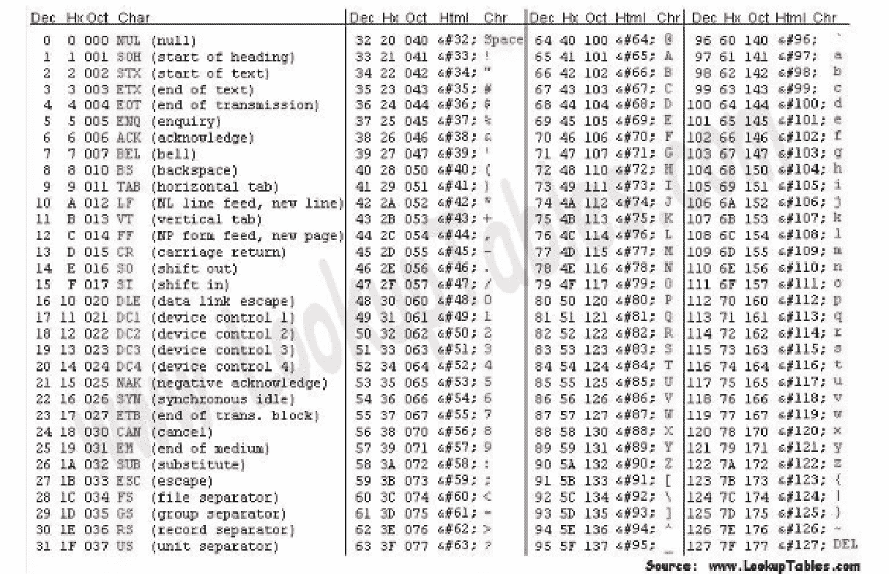

此列表显示了大多数符号到数字的转换，以便计算机能够理解和共享它们。

当然，它并不包含所有内容，还有更多数据库涵盖了更广泛的字符范围。然而，在日常编码中，ASCII 包含了你可能需要的一切。

Python 有一个用于 ASCII 的库，称为 *string* 库。从中，我们可以使用许多不同的 <u>方法</u> 来处理 ASCII：

### string.ascii_lowercase

它的作用是，当赋值给一个变量时，它会打印所有小写的 ASCII 字母：

```python
import string

var = string.ascii_lowercase

print(var)
```

这将打印：

```
abcdefghijklmnopqrstuvwxyz
```

### string.ascii_uppercase

类似地，这将打印所有大写的 ASCII 字母：

```python
import string

var = string.ascii_uppercase

print(var)
```

结果是：

```
ABCDEFGHIJKLMNOPQRSTUVWXYZ
```

### string.ascii_letters

这将打印大写和小写字母：

```python
import string

var = string.ascii_letters

print(var)
```

终端输出为：

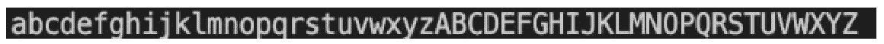

### string.digits

这将打印 ASCII 数据库中的所有数字，即 0-9：

```python
import string

var = string.digits

print(var)
```


这些是最常用的命令，但如果你输入 `string.`，你应该会看到一个包含所有可用内容的下拉列表。

**现在介绍一些函数：**

我将只讨论 string 库中的 2 个函数，但你可以自由探索它提供的更多功能。我将讨论的两个是我见过最常用的。

### ord()

ord() 函数接受任何字符并将其转换为其数字 ASCII 形式：

```python
import string

print(ord("$"))
```

如你所见，我们只是导入了 *string* 库，并对字符串 "$" 使用了 *ord()* 方法。当我们打印它时，得到：

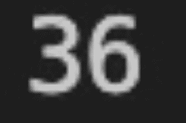

我们得到了 36，如果你对照本章开头的表格，你会看到这确实与美元符号的十进制表示一致。

请记住，ord() 方法只能接受字符串作为输入，因此即使你想找到数字 9 的 ASCII 值，也需要将其作为字符串输入：

```python
import string
print(ord("9"))
```

当我们运行这个时，我们发现数字 9 的 ASCII 表示是：


### chr()

chr() 函数与 ord 方法相反；它接受任何数字并使用 ASCII 表将其转换为其字符形式：

```python
import string

print(chr(36))
```

这将返回美元符号 "$"

# 第14章：列表和列表方法

你肯定听说过列表，但在 Python 中，列表的结构略有不同。不过，它们的基本前提是相同的。列表用方括号括起来，用于包含多个元素。列表中的每个元素用逗号分隔，如下所示：

```python
["a", "b", "c", "d", "e"]
```

列表中的第一个元素是第 0 个元素，因此如果我们有一个名为 *List1* 的列表，它总共有 5 个元素，那么第一个元素是 *List1[0]*，最后一个元素是 *List1[4]*

### 列表方法

在你的 IDE 中，如果你创建一个列表，比如名为 *List1*，然后输入 *List1* 后跟一个点，你应该会看到几个可以对列表执行的不同方法，比如添加或删除项目，以及所有方法的说明。如果你没有看到这个，那么我们在下面的整洁表格中编译了最常用的列表方法及其用途：

| 方法 | 描述 |
|---|---|
| append() | 将元素添加到列表末尾 |
| clear() | 从列表中移除所有元素 |
| copy() | 复制列表并返回其副本 |
| count() | 计算列表中元素的数量并返回该数字 |
| extend() | 将一个列表的所有元素添加到现有列表的末尾 |
| index() | 返回具有指定值的第一个元素的索引 |
| insert() | 在特定索引处添加一个元素 |
| pop() | 移除特定索引处的元素 |
| remove() | 移除找到的第一个具有指定值的元素 |
| reverse() | 反转列表的顺序 |
| sort() | 对列表进行排序 |

### 空列表

空列表就像空字符串一样，它只是一个没有任何内容的列表：

```python
mylist = []
```

就像空字符串一样，当我们需要编辑当前列表并将新值添加到新列表时，这些列表非常有用。我们可以使用上面表格中所示的 **.append()** 方法来做到这一点。

### 二维列表

二维列表是列表中的列表。这也称为嵌套列表，起初可能难以想象，但一个例子应该会有所帮助：

```python
my2dlist = [[2,4,5], [20,21,22], [40,41,42,43,44,45,46], [12]]
```

如你所见，我们有一个列表，但该列表中的每个元素都是另一个列表！

就像普通列表一样，我们可以通过简单地输入 *my2dlist[]* 并在方括号中输入我们想要的索引来访问外部列表中的元素：

```python
my2dlist = [[2,4,5], [20,21,22], [40,41,42,43,44,45,46], [12]]

print(my2dlist[1])
```

我们得到的结果是：

```
[20, 21, 22]
```

但是，我们如何访问列表内部列表的元素呢？（这有点绕口）

嗯，我们所要做的就是添加另一个方括号，并在其中输入我们想要访问的元素的索引，如下所示：

```python
my2dlist = [[2,4,5], [20,21,22], [40,41,42,43,44,45,46], [12]]

print(my2dlist[1][2])
```

因此，我们将得到的结果是：

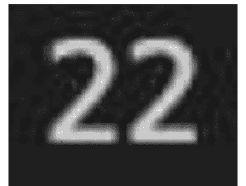

这就引出了一个问题：这有什么用？好吧，让我们设想一个场景，假设你是一家杂货店的老板。

每位顾客购买 10 件商品。如果我们有 3 位顾客，那么我们可以简单地创建 3 个列表，每个顾客一个，并将他们购买的商品放在每个列表中。

但是，如果你有 1,000 位顾客呢？10,000 位？我们无法创建那么多列表，但这就是二维列表的用武之地。使用二维列表，我们可以将每位顾客购买的商品放在一个列表中，然后将所有这些列表放在另一个列表中，每个内部列表的索引位置对应相应的顾客。

以下是用 3 位顾客展示的视觉示例，以显示区别：

```python
#单列表

customer1 = ["cherries", "chicken", "bread"]
customer2 = ["grapes", "peaches", "lettuce", "candy"]
customer3 = ["Noodles", "tomatoes"]

#VS

#二维列表

customersitens = [["cherries", "chicken", "bread"], ["grapes", "peaches", "lettuce", "candy"], ["Noodles", "tomatoes"]]
```

二维列表在这种情况下更容易创建，并且更有用。

# 第15章：字典与字典方法

你可能会困惑字典与编程有什么关系，但这完全合理，一旦理解了它们，你会发现字典非常有用。

字典以键值对的形式存在。就像字母A是字母表的第一个字母一样，一个键值对可以是 *A : 1*，其中A是键，1是值。字典将许多这样的键值对作为元素组合在一个由花括号包围的集合中。每个元素之间用逗号分隔，如下所示：

```
MyDictionary = {"A":1, "B":2, "C":3, "D":4}
```

### 字典方法

字典的一个用途是通过键来检索值。对于这样的键值对，我们可以使用字典的 **.get()** 方法来根据键查找值：

```
MyDictionary.get("A")
```

结果将是1。

如果我们输入一个字典中不存在的键，那么我们可以为.get()方法提供一个默认值：

```
MyDictionary.get("E", "You forgot some of the alphabet...")
```

由于"E"不是字典中的一个键，它将打印"You forgot some of the alphabet"。

下面列出了更多字典方法，但你也可以通过输入字典名称后跟一个点来获取所有可用方法的列表：

| 方法 | 描述 |
|---|---|
| clear() | 从字典中移除所有元素 |
| copy() | 返回字典的一个副本 |
| fromkeys() | 返回一个具有指定键和值的字典 |
| get() | 返回指定键的值 |
| keys() | 返回一个包含字典键的列表 |
| pop() | 移除指定键的元素 |
| popitem() | 移除最后插入的键值对 |
| setdefault() | 返回指定键的值，但如果该键不存在，则插入该键和值作为参数 |
| update() | 用指定的键值对更新字典 |
| values() | 返回字典中所有键值对的列表 |

### 空字典

是的，我知道，这有点重复，但我向你保证，这是最后一个。空字典就像空字符串和空列表一样，是一个没有任何内容的字典。

我们可以使用 *update()* 方法添加键值对：

```
mydict = {"A" : 1, "B" : 2, "C" : 3, "D" : 4}

mydict.update({"E" : 1})

print(mydict)
```

如你所见，我们只需输入一个键值对，它就会将其添加到字典中：

```
{'A': 1, 'B': 2, 'C': 3, 'D': 4, 'E': 1}
```

### 应用

你可能想知道这有什么用，好吧，这里有一个场景。假设你经营一家日历公司，需要跟踪数百万人的生日。

在这么多人中查找一个人的生日可能很棘手，但如果所有名字都在字典中，那么你只需使用.get()方法，输入名字，瞬间就能得到日期。是不是很巧妙！

# 第16章：IF、ELSE和ELSE IF语句

### If和Else

像if或else这样的语句被称为**条件语句**，因为其中涉及一个条件：

如果约翰喜欢冰淇淋，就给他冰淇淋。否则，就给他糖果。

在Python中，工作原理相同，唯一不同的是格式。

在Python中，if和else语句通常像这样格式化：

```
x = 7

if x > 10:
    print("x is greater than 10")

else:
    print("x is not greater than 10")
```

注意，我们没有为else子句放置语句，因为它与if语句相关联。

else意味着与if语句相反的情况，所以在我们的例子中，这意味着else代表x不大于10的情况。

你可能注意到的另一件事是缩进。缩进仅仅意味着代码位于另一个语句内部，并且只有在该语句为*True*时才会执行。缩进告诉程序，这段代码是某个其他部分的一部分并包含在其中，比如条件语句，但也包括循环或函数等，我们稍后会讲到。

因此，*if*语句可以被评估为*True*或*False*。

如果它是*True*，我们将能够执行*if*语句内部的代码，然后跳过*else*语句；但如果它不是*True*，那么我们将跳过*if*语句，转到*if*语句之后的下一行。

### ==?

一个需要记住的运算符是**比较运算符，==**。这可能看起来很奇怪，为什么我们需要一个双等号符号？

嗯，它有一个非常有用的用途，你将在编码过程中大量使用它。普通的=是一个**赋值运算符**，我们可以给某物赋值。现在，让我们创建一个if语句，如果为真，我们将打印“wow”：

```
x = 10

if x / 2 == 5:
    print("wow")
```

如你所见，等号下面有红色下划线，因为我们本应在那里使用比较运算符。

通过说 $x / 2 = 5$，我们是在将值 $x / 2$ 赋给5，而不是检查它是否等于5。因此，我们需要使用比较运算符==。一个经验法则是，只在给变量赋值时使用普通的=，而在其他所有地方都使用==。

### Else If

Else if语句（写作*elif*）用于当我们有多个条件需要检查，但我们只想在前一个条件失败时才进入下一个条件的情况。

例如，如果我们有一个变量*age*，那么我们可以这样写：

```
age = int(input ("What is your age?:"))

if age < 18:
    print ("Minor")

elif age >= 18 and age < 40:
    print( "Adult")

elif age >= 40 and age < 60:
    print("Middle Aged")

else:
    print("Elderly")
```

如你所见，我们只在前一个语句失败时才进入下一个语句。例如，如果*age*是16，我们将通过第一个条件，直接打印"Minor"，而不会执行其余代码，因为我们没有失败。一旦通过了其中一个条件，其余的条件将被忽略，我们继续执行程序。

思考*if*、*elif*和*else*命令的一个好方法是使用树状图：

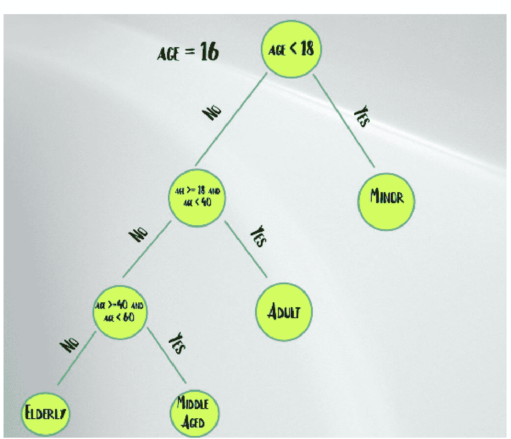

使用*elif*语句而不是多个*if*语句的好处在于，即使前一个条件满足，其他*if*语句仍然会被执行。

一种思考方式是，*elif*语句都检查是否满足其中一个条件并相应地做出响应，而多个*if*语句都是独立的，无论是否满足都会被检查。

### And、Or和Not

现在让我们稍微复杂一点。

我相信你们都知道**and**、**or**和**not**这些词的意思，在编程的上下文中，它们非常相似。

*And*意味着两个条件都必须为*True*，整个语句才为*True*。

*Or*意味着其中一个条件必须为*True*，语句才为*True*。

*Not*会反转条件的结果（*True* => *False*，*False* => *True*）。

让我们看一些例子来消除任何疑虑。使用之前的例子：

```
x = 7

if x > 10 and x > 5:
    print("wow!")
else:
    print("uh oh")
```

这里，我们看到我们满足了*if*语句的第二个条件，但不满足第一个条件，所以整个语句为*False*。然后我们将进入*else*语句。

现在轮到*Or*了：

```
x = 7

if x > 10 or x > 5:
    print("wow!")

else:
    print("uh oh")
```

这里我们的结果不同，$x$可能不满足第一个条件，但这是一个*or*运算符，意味着只要其中一个为*True*，整个语句就为*True*。7大于5，所以我们将打印"wow!"。

最后是*Not*：

```
x = 7

if not(x > 10) :
    print("wow!")

else:
    print("uh oh")
```

我们看到7不大于10，所以第一个条件不满足，但我们前面有一个*not*，这意味着*False*变成了*True*。

由于if语句被评估为*True*，我们执行其内部的代码并打印“wow!”。

### 嵌套If和Else语句

这本质上意味着在一个条件语句内部包含另一个条件语句。

当我们必须检查一个条件，并且只有在该条件满足时才能检查另一个条件时，这些语句非常有用。

这里有一个例子：

# 第17章：循环

循环！循环通过自动重复执行任务指定次数，让我们的生活更轻松。

### While 循环

一种循环类型被称为 **While 循环**。*while* 循环通过 *True* 和 *False* 语句工作。只要给定的条件在下一次运行时仍为 *True*，它就会持续执行命令。每次循环执行称为一次 **迭代**。

例如，如果我们有类似这样的代码：

```
x = 1

while x<10:
    print(x)
    x = x + 1

print ("Done")
```

如果我们逐步分析这个程序，会看到我们首先将 *x* 初始化为 1，然后有一个 while 循环，它会一直运行直到 *x* 大于或等于 10。

在 while 循环内部，我们打印分配给 *x* 的值，并将 *x* 递增 1。一旦 *x* 为 10，循环结束，我们打印“Done”。

注意“Done”不在循环内部，因为它没有缩进。这是因为我们只想在循环结束后打印一次“Done”，所以如果把它放在循环内部，“Done”会在每次迭代时都被打印。

因此，这个程序的结果是：

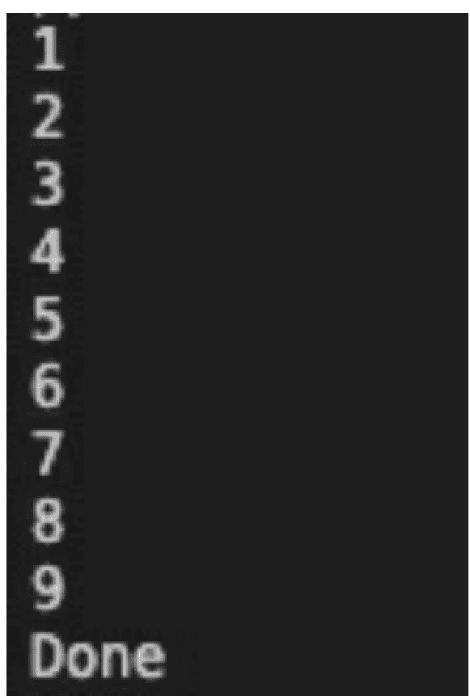

最后需要意识到的是，我们需要 $x = x + 1$ 这个条件，因为没有它，$x$ 将始终为 1，而 1 始终小于 10。

### 无限 While 循环

这看起来可能没用，为什么要有永远无法结束的循环呢？

然而，这在几乎所有使用循环的场景中都非常有用，因为更多时候，我们永远不知道可能需要循环多少次。

例如，如果你正在设计一个游戏，想要有一个结束屏幕显示“*再玩一次？*”，如果用户选择“是”，循环再次运行，如果选择“否”，游戏结束。我们不知道应该循环多少次，因为用户可能在玩 1 轮或 50 轮后就结束了。

因此，我介绍 **while True** 循环。

*while True* 循环会永远继续，没有任何条件能让它停止。它只能通过 **break** 语句停止。

通过在循环内部放置 break 语句，它会立即结束循环，语句之后的所有代码都不会执行。还有一个 **continue** 语句，它会强制程序回到循环顶部，程序不会执行 continue 语句之后的任何内容。

为了说明这些语句在哪里有用，让我们使用之前的场景。如果我们想制作一个游戏，让用户决定是否再玩一次，如果用户说“否”，break 语句可以派上用场；如果用户说“是”，continue 语句可以派上用场，所以我们可以这样做：

```
while True:
    print("Wow Python Wow")
    answer = input("Play Again? (Y/N)")
    if answer == "N":
        break
    elif answer == "Y":
        continue
```

创建无限循环的另一种方法是使用布尔值。

我们可以将一个变量初始化为布尔值 *True*，只要该变量的求值结果为 *True*，我们就继续循环：

```
condition = True
while condition == True:
    print("Wow Python Wow")
    answer = input("Play Again? (Y/N)")
    if answer == "N":
        condition = False
    elif answer == "Y":
        continue
```

这与 *while True* 循环具有相同的功能，只是在这里，我们只有在变量 *condition* 为 *True* 时才继续循环，并且不需要 break 语句。

因此，如果用户拒绝再玩，我们只需将 condition 的值更改为 *False*，当我们再次循环时，程序结束，因为变量 *condition* 不是 *True*。

如果用户决定继续玩，*condition* 保持不变，我们再次循环。

### For 循环

另一种循环类型是 **for 循环**，它类似于 while 循环。

*for* 循环仍然循环，但它与 *while* 循环的不同之处在于它遍历对象。例如，*for* 循环可以遍历字符串并打印字符串中的每个元素，或者可以遍历数字列表。

对于这两种情况，工作方式是：选择对象中的第一个元素，执行 *for* 循环中的代码，然后循环回到顶部，选择下一个元素，依此类推。这个过程持续进行，直到没有更多元素可供选择。

*for* 循环的一般格式是有一个临时变量，该变量被分配给对象中的每个元素，以便随后在 *for* 循环中使用。

它的唯一目的是遍历数据集。

如果之前的解释有点混乱，这里有一个例子：

```
MyList = [2,4,7,12,13,6,5,16,7,16,2]

divcount = 0

for i in MyList:
    if i % 3 != 0:
        divcount = divcount + 1

print("There are " + str(divcount) + " numbers in this list that are not divisible by three")
```

这里的目标是找出列表中不能被三整除的数字的数量，为此，我们首先获取列表，然后创建一个变量 *divcount* 来跟踪不能被三整除的数字的数量。然后我们创建一个 *for* 循环来遍历列表并检查列表中的每个元素是否能被三整除，如果不能，我们将 *divcount* 变量增加一，并在程序结束时打印最终计数。

在继续之前，让我们澄清一下关于前面程序的一些混淆点。我们在 for 循环中使用了变量 *i* 作为临时变量来存储列表中的每个元素。每次循环迭代时，*i* 都会被重新分配给列表中的下一个元素。

*i* 是制作循环时常用的变量，但任何其他你选择的变量名也可以使用。

最重要的是要记住，它在程序中的唯一目的是作为一个变量，在遍历列表时被重新分配给列表中的项目。

### 嵌套循环

嵌套 *for* 循环起初是一个难以理解的概念，但一旦你掌握了它们，它们在各种情况下都非常有用。

它们有用性的一个例子是，当我们有一个二维列表，我们不仅想遍历该列表，还想遍历列表中包含的列表元素。

在这里，我们会这样做：

```
my2dlist = [[2,1,13,1023], [6,1,27,1], [10,12], [1,16,1,54,39], [18,1]]

for i in my2dlist:
    for j in i:
        if j == 1:
            print("1 is here!")
```

如你所见，外层循环遍历每个元素并将其分配给 *i*。内层循环然后遍历列表元素 *i* 以查找数字 1 是否存在。

运行后，我们得到结果：

```
1 is here!
1 is here!
1 is here!
1 is here!
1 is here!
1 is here!
```

我们可以得出结论，这个二维列表中总共有 6 个 1。

嵌套循环也可以用于普通列表，而不仅仅是二维列表。

如果我们想将一个元素与列表中的每个其他元素进行比较，我们会有一个外层循环遍历元素，然后有一个内层循环遍历所有其他元素以便进行比较。

我们还可以有嵌套的 *while* 循环和 *for* 循环在 *while* 循环内，反之亦然，但你必须确保 while 循环被正确处理，并且有一个 break 语句可以访问，否则循环将永远不会结束。

---

value = 14

if value % 2 == 0:
    if value % 6 == 0:
        print("multiple of 2 and 6!")

我们检查值是否为偶数的条件，只有当它是偶数时，我们才检查它是否是 6 的倍数的条件。这是一个嵌套的 *if* 语句。

我们还可以在 else 语句中有 if 语句，逻辑与之前相同。假设我们在程序中添加另一个子句：

```
value = 20

if value % 2 == 0:
    if value % 6 == 0:
        print("multiple of 2 and 6!")
else:
    if value % 5 == 0:
        print("multiple of 5 and odd!")
    else:
        print(":(")
```

在这里，我们说的是，如果我们发现我们的值不满足第一个条件，意味着它不是偶数而是奇数，我们才会检查它是否能被 5 整除。如果它也不能被 5 整除，那么我们只打印一个悲伤的表情 :(

# 第18章：函数

函数

现在你已经理解了如何编写代码，接下来是组织代码的部分。不过别跑开，这不像打扫房间那样枯燥，组织代码实际上可以相当有趣，而且从长远来看还能节省你的时间！

函数似乎是一个新概念，但我们从本书开始就一直在使用它们。

函数本质上是一块可以通过一条命令“调用”或执行的代码，这意味着我们只需编写一次，之后每当需要再次使用该代码块时，就可以调用它。这里有一个例子：

```
def myfunc():
    a = 12
    b = 20
    return a+b

myfunc()
```

如你所见，我们使用 *def* 关键字创建了函数，然后写了函数名，后跟括号和冒号。

接着我们在函数内部编写了一些代码来对两个数字求和，并在最后写了 **return** a + b。

**Return** 是一个新关键字，出现在函数的末尾。

return 关键字的目的是**存储**函数输出的最终值，并让程序返回到调用函数时中断的地方。return 语句不会打印任何内容。

下面是一个图示，向你展示 return 和 call 语句是如何工作的：

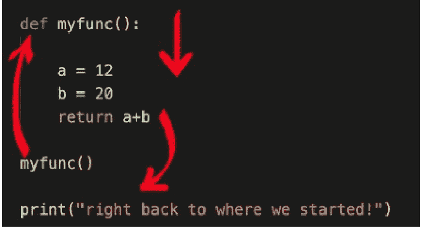

为了确保你理解这个图示，这里有一个解释。

这个程序不是从函数开始的，Python 实际上会忽略所有这些代码，因为函数还没有被调用。

程序从调用语句 *myfunc()* 开始。然后它回到函数，执行函数，接着 return 语句将程序带回 print 语句处中断的地方。

## 参数

我们一直在使用函数，如果你回顾一下，你会注意到它们通常在括号里有一些东西，无论是文本还是数字。这些被称为**参数**。

参数就像函数的输入，我们输入参数，函数使用这些作为输入来执行其内部的代码。

例如，如果我们回顾之前的程序：

```
def myfunc(a, b):
    return a+b

print(myfunc(12, 20))
```

现在，我们在括号内放置了两个参数 a 和 b，表示函数需要传入这两个参数才能执行。

然后我们可以调用函数并输入我们喜欢的任何数字。这些输入被称为**实参**。实参是传递给函数的输入，参数是函数接收的变量占位符。

然而，它们不仅限于数字。它们可以是列表、字符串、布尔值以及你能想到的任何其他最适合你函数的数据类型。任何东西都可以传递给函数以满足你的编程需求。

参数的好处在于，如果我们想在不使用参数的情况下添加不同的数字集，我们就需要每次都更改函数内部的代码，这在这里可能看起来不是什么麻烦，但在需要大量输入计算的程序中，它会变得相当繁琐。

通过使用参数，我们所要做的就是在调用语句中更改一次实参的值，然后这些新值就会被传入，这样我们就不需要对实际函数做任何更改。

## 输入作为实参

我们之前已经使用过用户的输入作为程序中的值，对于函数来说，这也没有什么不同。

如果我们想在函数中使用输入，我们所要做的就是将这些输入设置为函数的实参，如下所示：

```
def myfunc(a, b):
    return a+b

value1 = int(input("select a number: "))
value2 = int(input("select a number: "))
print(myfunc(value1, value2))
```

如你所见，我们只是创建了变量来接收输入，将输入从字符串转换为整数，然后使用这些变量作为实参。

你可能还注意到的另一件事是，变量的名称与函数中参数的名称不同。这看起来可能是个错误，但这是完全没问题的。

输入实参的变量名不必与函数接收的参数名相同。

我们必须在函数内部使用正确的参数名（函数接收的 *a* 和 *b*），但在函数外部，我们可以传入任何变量名作为输入。

函数接收分配给我们创建的变量的值，并将其重新分配给它定义的参数名。

在我们的例子中，*value1* 中包含的值被分配给 *a*，*value2* 中包含的值被分配给 *b*。

你可能还注意到函数的设置与我们正常的代码不同，比如我们在函数之后的调用语句中给函数输入，而不是像往常一样在代码开头。这是因为，如你所知，Python 是自上而下运行的，所以我们不能在函数之前放置调用语句，因为 Python 还没有看到该函数，所以它会给你一个 NameError。

这就是为什么调用语句必须在函数定义之后。

至于输入变量的初始化，它们可以放在函数之前，然后在函数定义之后的调用语句中使用，但是，最好将不在函数中的代码部分放在一起，以避免混淆。

# 第19章：TRY-EXCEPT

我相信我们都能说，之前的错误信息并不完全是我们所说的愉快的阅读体验，有时，错误并没有确切地告诉你程序中出了什么问题，就退出了，没有给你自己处理错误的机会。

## Try, Except

为了解决这个问题，我们有 **try-except** 语句。try-except 语句用于错误处理，如下所示：

```
try:
    txt = "hello"
    print(text)
except:
    print("An error happened, oops")
```

这会打印：

```
An error happened, oops
```

try except 的格式是通过一个 **try** 语句来放置代码，然后是一个 **except** 语句，如果发生错误，程序不会立即退出，程序员有机会通过在发生错误时有一个完全独立的代码段，或者简单地告诉用户他们哪里出错了来处理错误。

## Try, Except...两次？

我们也可以对特定错误使用 *except* 语句：

```
try:
    txt = "hello"
    print(txt)
except NameError:
    print("A variable is not defined")
```

在这里，我们指定了 *except* 语句可以检查的错误类型，然后如果发生该错误，就打印我们的自定义错误消息：

```
A variable is not defined
```

但如果我们得到的错误与预期的不同呢？在这种情况下，我们实际上可以有 2 个 *except* 语句：

```
try:
    txt = "hello"
    print(text)
except SyntaxError:
    print("You did not follow the rules of Python")
except:
    print("Something else went wrong")
```

这里的另一个 *except* 语句是为了以防引发的错误不是 SyntaxError。

在这种情况下，错误实际上是 NameError，所以程序会引发 NameError，检查 except 语句是否提到了 NameError，如果没有，它就会进入第二个 *except* 语句：

```
Something else went wrong
```

## Else

如果一切正常，我们可以放置一个 *else* 语句：

```
try:
    txt = "hello"
    print(txt)
except NameError:
    print("A variable is not defined")
else:
    print("All good!")
```

由于这个程序没有错误，没有引发错误，变量 *txt* 和 else 语句被打印：

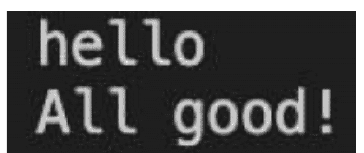

## Finally

一旦 try-except 语句完成，我们可以放置 **finally** 代码块，无论发生什么都会执行。它可以通知我们 try-except 已经完成：

```
try:
    txt = "hello"
    print(txt)
except NameError:
    print("A variable is not defined")
else:
    print("All good!")
finally:
    print("The try-except is done!")
```

这将打印变量 *txt*，因为程序没有错误。它会跳过第一个 *except* 语句，执行 *else* 语句，并执行 *finally* 语句：

```
hello
All good!
The try-except is done!
```

最后需要注意的是，try-except 语句不会停止程序，它们只是让程序在 except 语句中继续执行。

Try-Except 块可能看起来没有必要，我们完全可以直接阅读错误信息，但它们是防止程序崩溃的好方法，让我们能够自己处理错误。

## Raise

**raise** 命令实际上可以让我们主动引发一个错误。我们为什么会想这样做呢？嗯，当用户输入了不允许的内容时，我们可以引发一个错误并告诉用户他们不能输入该内容：

```
txt = 17

if type(txt) != str:
    raise TypeError("Only strings are allowed")
```

我们这里所做的就是指出用户输入了一个整数，而他们只能输入字符串，因此我们引发了一个带有自定义消息的 TypeError，解释了他们做错了什么：

```
TypeError: Only strings are allowed
```

我们也可以根据 *raise* 命令想要实现的目标，简单地使用 *raise Exception* 或任何其他错误类型来代替 TypeError。

请注意，*raise* 语句会立即结束程序，它不像 try-except 语句那样让程序继续运行。

# 第20章：项目提示

1.  一个星座计算器，根据你的出生月份和日期，程序将打印出星座
2.  一个字符串反转程序，给定用户输入，程序可以反转输入（hello -> olleh）。（试着思考一下你能多高效地解决这个问题，它可以用**两行代码**完成！）
3.  一个邮箱解析器，给定一个有效的邮箱，程序可以获取邮箱的用户名和域名（例如：coding@gmail.com 的结果将是：用户名：coding，域名：gmail.com）
4.  接收一个数字列表，遍历列表直到找到一个奇数。将该数字变为偶数，并保持所有偶数不变。我们称之为“偶数化器”
5.  创建一个密码检查器，你需要输入一个密码，程序需要满足以下条件才会接受它：
    - 长度必须至少为8个字符
    - 必须包含至少1个数字
    - 必须包含至少1个字母
    - 必须包含至少1个大写字母
    - 必须包含一个特殊字符（@、$、%等）
6.  使用数学运算以及 if、else 和 elif 语句来检测一个年份是否是闰年
7.  经典的石头剪刀布游戏，我们都知道怎么玩。
8.  使用用户输入创建一个猜数字游戏。计算机在用户输入的范围内随机选择一个数字，你需要猜出这个数字。当你猜对时，游戏结束。如果你想增加挑战，可以尝试设置猜测次数限制，甚至可以根据所选数字和用户猜测设置提示，比如用户猜的数字是高了还是低了！
9.  创建一个程序，接收一个输入，并通过将每个字符在字母表中移动X个字符来创建一个新字符串。移动的字符数必须由用户输入。
10. 创建一个斐波那契数列生成器，用户可以输入他们想要的斐波那契数字的数量，程序输出正确数量的斐波那契数字列表

## 关于作者

**Ashrit Ram Anala**

Ashrit Ram Anala 在5年多前对计算机科学产生了兴趣，从那时起，他在 Python、Java、Javascript、HTML 和 CSS 等多种语言中获得了编程经验。他希望与年轻学生分享他的知识，让他们也能拥有自己的火花。

## 参考资料

Python 内置函数。 (n.d.). https://www.w3schools.com/python/python_ref_functions.asp

Python 字典方法。 (n.d.). https://www.w3schools.com/python/python_ref_dictionary.asp

Python 转义字符。 (n.d.). https://www.w3schools.com/python/gloss_python_escape_characters.asp

Python 关键字。 (n.d.). https://www.w3schools.com/python/python_ref_keywords.asp

*Python 列表/数组方法*。 (n.d.). https://www.w3schools.com/python/python_ref_list.asp

*Python 运算符*。 (n.d.). https://www.w3schools.com/python/python_operators.asp

*ASCII 表*。 (n.d.). https://www.asciitable.com

