# 使用Python构建聊天机器人

运用自然语言处理与机器学习

Sumit Raj

## 目录

- [书名页](Title Page)
- [使用Python构建聊天机器人](Building Chatbots with Python)
- [本书适合谁阅读](Who This Book Is For)
- [如何阅读本书？](How Do I Approach This Book?)
- [你将从本书中学到什么？](What Will You Learn in This Book?)
- [聊天机器人的普及度](Popularity of Chatbots Usage)
- [Python之禅及其与聊天机器人的关联？](The Zen of Python and Why It Applies to Chatbots?)
- [对聊天机器人的需求](The Need for Chatbots)
- [受聊天机器人影响的行业](Industries Impacted by Chatbots)
- [聊天机器人简史](Brief Timeline of Chatbots)
- [我能用聊天机器人解决哪些问题？](What Kind of Problems Can I Solve Using Chatbots?)
- [一个问答机器人](A QnA Bot)
- 聊天机器人入门
- 聊天机器人中的决策树
- 最佳聊天机器人/机器人框架
- 聊天机器人的组件与术语
- 为什么构建聊天机器人需要了解自然语言处理？
- 什么是spaCy？
- spaCy的特性
- 构建聊天机器人的NLP基础方法
- 聊天机器人NLP知识要点
- 总结
- Dialogflow简介
- 入门指南
- 构建一个订餐聊天机器人
- [在Web上部署Dialogflow聊天机器人](Deploying Dialogflow Chatbot on the Web)
- [将Dialogflow聊天机器人集成到Facebook Messenger](Integrate Dialogflow Chatbot on Facebook Messenger)
- [实现功能](Fulfillment)
- [总结](Summary)
- [什么是Rasa NLU？](What Is Rasa NLU?)
- [从零开始训练和构建聊天机器人](Training and Building a Chatbot From Scratch)
- [使用Rasa Core进行对话管理](Dialog Management Using Rasa Core)
- [编写聊天机器人的自定义动作](Writing Custom Actions of the Chatbot)
- [为训练机器人准备数据](Data Preparation for Training the Bot)
- [测试机器人](Testing the Bot)
- [总结](Summary)
- [第一步](First Steps)
- [Rasa的凭证管理](Rasa’s Credential Management)
- [在Facebook上部署聊天机器人](Deploying the Chatbot on Facebook)
- [在Slack上部署聊天机器人](Deploying the Chatbot on Slack)
- [自行部署聊天机器人](Deploying the Chatbot on Your Own)
- [总结](Summary)

# 使用Python构建聊天机器人

运用自然语言处理与机器学习

Sumit Raj

Apress®

# **使用Python构建聊天机器人**

Sumit Raj

印度，卡纳塔克邦，班加罗尔

版权所有 © 2019 Sumit Raj

本作品受版权保护。无论涉及材料的全部还是部分，出版商保留所有权利，特别是翻译、重印、插图复用、朗诵、广播、以缩微胶片或任何其他物理方式复制，以及信息存储和检索、电子改编、计算机软件，或通过目前已知或未来开发的类似或不同方法进行传输的权利。

本书中可能出现商标名称、标识和图像。我们并非在每次出现商标名称、标识或图像时都使用商标符号，而是仅以编辑方式使用这些名称、标识和图像，以利于商标所有者，无意侵犯商标权。

本出版物中使用商品名称、商标、服务标志和类似术语，即使未明确标识，也不应被视为对其是否受专有权利约束的意见表达。

尽管本书中的建议和信息在出版时被认为是真实和准确的，但作者、编辑或出版商均不对可能存在的任何错误或遗漏承担任何法律责任。出版商对本文所含材料不作任何明示或暗示的保证。

Apress Media LLC 总经理：Welmoed Spahr
组稿编辑：Nikhil Karkal
开发编辑：Matthew Moodie
协调编辑：Divya Modi

我谨将本书及为实现这一成就所付出的所有努力，献给我今年离世的哥哥 Nikhil Raj。我无法想象，若他能看到弟弟的书在今天出版，该会有多么自豪。

我要感谢我的父母 Dinanath Prasad 和 Shobha Gupta，我的兄弟姐妹、亲戚，以及所有在我撰写本书期间始终支持和鼓励我、并原谅我有时缺席的挚友们。

## 目录

关于作者
关于技术审校者 xiii

# 第一章：备受喜爱的聊天机器人

- 聊天机器人的普及度........................................2
- Python之禅及其与聊天机器人的关联？........................................3
- 对聊天机器人的需求 ........................................ 5
- 商业视角........................................5
- 开发者视角 ........................................ 10
- 受聊天机器人影响的行业 ........................................ 12
- 聊天机器人简史 ........................................13
  - 1950 ........................................13
  - 1966........................................14
  - 1972........................................14
  - 1981........................................14
  - 1985........................................14
  - 1992........................................14
  - 1995........................................14
  - 1996........................................15
  - 2001........................................15
  - 2006........................................15
  - 2010........................................15
  - 2012........................................15
  - 2014........................................15
  - 2015........................................16
  - 2016........................................16
  - 2017........................................16
- 我能用聊天机器人解决哪些问题？........................................16
  - 该问题能否通过简单的问答或来回通信解决？........................................17
  - 是否存在需要分析或获取数据的高度重复性问题？........................................17
  - 你的机器人任务能否被自动化和固定？........................................18
- 一个问答机器人........................................18
- 聊天机器人入门........................................20
- 聊天机器人中的决策树........................................20
  - 在聊天机器人中使用决策树................................................21
  - 决策树如何提供帮助？................................................21
- 最佳聊天机器人/机器人框架............................................25
- 聊天机器人的组件与术语....................................26
  - 意图................................................27
  - 实体................................................27
  - 话语 ................................................27
  - 训练机器人 ................................................28
  - 置信度得分 ................................................ 28

# 第二章：聊天机器人的自然语言处理

- 为什么构建聊天机器人需要了解自然语言处理？ ......... 29
- 什么是spaCy？................................................31
  - spaCy的基准测试结果................................................31
  - spaCy提供了什么？........................................ 32
  - spaCy的特性 ............................................32
  - 安装与先决条件 ............................................33
  - 什么是SpaCy模型？ ............................................34
- 构建聊天机器人的NLP基础方法........................................ 37
  - 词性标注........................................37
  - 词干提取与词形还原........................................42
  - 命名实体识别........................................44
  - 停用词........................................47
  - 依存句法分析 ........................................ 49
  - 名词短语........................................54
  - 查找相似性........................................55
- 聊天机器人NLP知识要点........................................58
  - 分词........................................59
  - 正则表达式........................................60
- 总结 ........................................ 61

## 第三章：轻松构建聊天机器人

Dialogflow 简介 63

入门指南 65

构建一个点餐聊天机器人 65

确定范围 65

列出意图 66

列出实体 66

构建一个点餐聊天机器人 66

Dialogflow 入门 67

创建意图时的注意事项 71

创建意图并添加用户表达 72

为意图添加默认回复 72

菜品描述意图及其所属实体 73

理解并回复用户 77

在网页上部署 Dialogflow 聊天机器人 82

将 Dialogflow 聊天机器人集成到 Facebook Messenger 86

设置 Facebook 86

创建 Facebook 应用 87

设置 Dialogflow 控制台 88

配置 Webhooks 90

测试 Messenger 机器人 91

实现功能 96

启用 Webhook 98

检查响应 101

总结 103

## 第四章：艰难地构建聊天机器人

什么是 Rasa NLU？ 106

为什么应该使用 Rasa NLU？ 106

直接深入 Rasa NLU 107

从零开始训练和构建聊天机器人 109

构建一个星座运势机器人 109

星座运势机器人与用户之间的对话脚本 110

为聊天机器人准备数据 111

训练聊天机器人模型 116

从模型进行预测 119

使用 Rasa Core 进行对话管理 121

深入了解 Rasa Core 和对话系统 122

理解 Rasa 概念 125

为聊天机器人创建领域文件 127

编写聊天机器人的自定义动作 130

为训练机器人准备数据 133

创建故事数据 134

交互式学习 136

将对话导出为故事 150

测试机器人 152

测试用例 1 152

测试用例 2 153

总结 153

## 第五章：部署你的

初步步骤 155

Rasa 的凭证管理 155

在 Facebook 上部署聊天机器人 157

在 Heroku 上创建应用 157

在本地系统上设置 Heroku 158

在 Facebook 上创建并设置应用 158

在 Heroku 上创建和部署 Rasa 动作服务器应用 161

创建 Rasa 聊天机器人 API 应用 163

为 Facebook Messenger 聊天机器人创建独立脚本 164

验证我们在 Heroku 上的对话管理应用部署 167

将 Webhook 与 Facebook 集成 167

部署后验证：Facebook 聊天机器人 169

在 Slack 上部署聊天机器人 171

为 Slack 聊天机器人创建独立脚本 171

编辑你的 Procfile 175

将 Slack 机器人最终部署到 Heroku 175

订阅 Slack 事件 175

订阅机器人事件 176

部署后验证：Slack 机器人 177

在你自己的平台上部署聊天机器人 178

为你自己的聊天机器人渠道编写脚本 179

编写 Procfile 并部署到网络 181

验证你的聊天机器人 API 181

创建聊天机器人用户界面 183

总结 187

## 关于作者

**Sumit Raj** 从骨子里是个技术爱好者，热爱编码和构建应用程序。他是一位 Python 专家，对机器学习和自然语言处理有着浓厚的兴趣。他坚信编写能直接影响公司收入的代码的理念。

Sumit 曾在多个领域工作，如个人财务管理、房地产、电子商务和收入分析，构建了多个可扩展的应用程序。他帮助过多家初创公司进行产品的初始设计和架构，这些产品后来获得了投资者和政府的资助。他在高流量互联网/企业应用中使用的尖端技术方面拥有丰富经验，涉及可扩展性、性能调优、优化和成本降低。

他一直在全球范围内指导学生/开发者学习 Python 编程。他通过各种线上和线下平台及渠道，指导了超过 1000 名学生和专业人士学习编程语言、数据科学，并提供职业咨询。Sumit 喜欢参加技术聚会、会议和研讨会。他从不错过参加黑客马拉松的机会。他对构建应用和解决问题的热爱为他赢得了多项奖项和荣誉。他经常受邀在印度顶尖教育机构发表演讲。他也是 PyLadies 聚会小组的演讲者，这是一个由 Python 软件基金会（PSF）前主任之一领导的女性 Python 编程社区。

在空闲时间，他喜欢在自己的博客上写作，并在 Quora 上回答关于计算机编程、聊天机器人、Python/Django、职业建议和 Web 开发的问题，总浏览量超过 100 万。欢迎在他的 Quora 个人资料上提问。

目前，Sumit 在印度班加罗尔的 GeoSpark R&D 担任高级解决方案架构师，负责构建一个用于位置跟踪的开发者平台。

## 关于技术审校者

**Nitin Solanki** 在自然语言处理、机器学习和人工智能聊天机器人开发方面拥有丰富的经验。他曾在医疗保健、电子商务、教育和律师事务所等多个领域开发 AI 聊天机器人。他拥有使用 NLP 库、数据挖掘、数据清洗、特征工程、数据分析和可视化以及机器学习算法的经验。Nitin 喜欢让事情变得简单和自动化。在业余时间，他的脑海里会不断涌现出赚钱的点子。因此，他通过探索技术和编写代码来保持思维活跃。

## 致谢

本书是我职业生涯中最为真诚努力的成果。无数个不眠之夜都投入到了本书的完成中。我将终生感激我的父亲和母亲，因为他们成就了今天的我。我要感谢我的兄弟Nitish和姐妹Prity，他们总是在那里，无需言说便能分享高度的理解与情感。

没有出色的Apress团队，这份致谢就无法完成，包括Nikhil和Divya，他们从本书的收购到出版一直对我非常耐心和支持。他们是最佳的合作伙伴。特别感谢Matt为我这第一本书提供的所有指导，以及在每一步中持续提供的反馈以改进本书。非常感谢Nitin对本书进行技术审阅并提出修改建议。

## 引言

本书的编写极为用心，旨在使书中的教学内容非常务实且以结果为导向。构建聊天机器人不仅仅是完成一个教程或遵循几个步骤——它本身就是一项技能。本书绝不会用大量的文字和流程让你感到枯燥；相反，它采用边做边学的方法。你一定至少使用过一个聊天机器人来完成生活中的某件事。无论你是否是程序员，一旦你通读本书，你将发现聊天机器人的构建模块，所有的谜团都将被揭开。从外部看，构建聊天机器人似乎很困难，但本书会让你觉得非常容易。我们的大脑并非设计来直接处理复杂概念；相反，我们是逐步学习的。当你阅读本书时，从第一章到最后一章，你会发现事情是如何清晰地推进的。虽然你可以直接跳到任何章节，但我强烈建议你从第一章开始，因为它必将增强你的思考。

本书就像一部网络剧，完成一章后你将无法抗拒下一章的吸引力。在通读本书后，你与任何聊天机器人的互动都会在你脑海中形成一幅画面，展示该聊天机器人是如何在内部设计和构建的。

## 本书适合谁

本书将是学习聊天机器人相关概念以及如何构建它们的绝佳资源。以下人群会发现本书有用：

- 希望将知识或职业扩展到聊天机器人开发领域的Python Web开发者
- 希望通过实践经验获得新技能集，以展示成果并在人群中脱颖而出的学生和有抱负的程序员
- 希望学习如何从零开始构建聊天机器人的自然语言爱好者
- 拥有绝佳创意但缺乏足够技术可行性信息来着手制作聊天机器人的新兴企业家
- 计划聊天机器人相关项目的产品/工程经理

## 我该如何阅读本书？

请记住，本书的写法与其他书籍不同。本书的编写考虑到，一旦你读完本书，你就能自己构建聊天机器人或教别人如何构建聊天机器人。在像阅读其他书籍一样阅读本书之前，请记住以下几点：

- 本书涵盖了构建聊天机器人所需的几乎所有内容，而非仅仅介绍现有内容。
- 本书旨在让你花更多时间在系统上实践，将本书放在身边。确保你执行每个代码片段并尝试编写代码；不要复制粘贴。
- 确保你按照书中出现的步骤进行；如果有什么不理解，不要担心。你将在本章后面了解到相关内容。
- 使用本书提供的源代码和Jupyter Notebook作为参考。

## 你将在本书中学到什么？

**第1章：备受喜爱的聊天机器人** 在本章中，你将从商业和开发者的角度了解与聊天机器人相关的内容。本章为动手实践聊天机器人概念并将其转化为代码定下基调。希望在本章结束时，你将有理由为自己或公司构建一个聊天机器人。

**第2章：聊天机器人的自然语言处理** 在本章中，你将学习当聊天机器人需要自然语言处理时，应使用哪些工具和方法。本章不仅教你NLP中的方法，还通过现实生活的例子和编码示例进行演示。本章还讨论了为什么聊天机器人可能需要特定的NLP方法。请注意，NLP本身就是一项需要掌握的技能。

**第3章：轻松构建聊天机器人** 在本章中，你将学习如何使用Dialogflow等工具以简单易行的方式构建聊天机器人。如果你是非程序员，你一定会喜欢它，因为它几乎不需要编程技能。

**第4章：艰难构建聊天机器人** 在本章中，你将学习人们想要的那种构建聊天机器人的方式。标题说是艰难的方式，但一旦你完成了前一章，你会想要更多，因为本章将教你如何从零开始内部构建聊天机器人，以及如何使用机器学习算法训练聊天机器人。

**第5章：部署你的聊天机器人** 本章纯粹是为了给你的聊天机器人应用最后的推动。当你经历了轻松和艰难的构建聊天机器人的方式后，你肯定不想将其独享。你将学习如何使用Facebook和Slack向世界展示你的聊天机器人，最后将其集成到你自己的网站上。

## 第1章：备受喜爱的聊天机器人

当你开始构建聊天机器人时，理解聊天机器人的功能和外观非常重要。

你一定听说过Siri、IBM Watson、Google Allo等。这些机器人试图解决的基本问题是成为中介，帮助用户提高生产力。它们通过让用户少担心如何检索信息以及获取特定数据可能需要的输入格式来实现这一点。随着机器人处理用户数据输入并从中获得更多洞察，它们往往会变得越来越智能。聊天机器人之所以成功，是因为它们能准确提供你想要的东西。

当你不得不在不同的网站上每次都输入相同的姓名、电子邮件ID、地址和邮政编码时，这是否会让你感到恼火或沮丧？想象一个单一的机器人来完成你的任务——比如从不同的供应商订购食物、从各种电子商务公司在线购物，或者预订航班或火车票——而你不必每次都提供相同的电子邮件ID、收货地址或支付信息。

机器人已经具备了解这些信息的能力，并且足够智能，当你用你自己的语言或计算机科学中所谓的自然语言向它提问时，它能检索到所需的内容。

聊天机器人的开发比几年前容易得多，但聊天机器人在几十年前就已经存在了；然而，在过去几年中，聊天机器人的受欢迎程度呈指数级增长。

如果你是技术人员或对Web应用程序或移动应用程序的工作原理有所了解，那么你一定听说过API这个术语。你今天需要的任何类型的数据都可以通过不同服务提供商和机构提供的API形式来获取。如果你正在寻找天气信息、预订票务、订购食物、获取航班信息、将一种语言转换为另一种语言，或者在Facebook或Twitter上发帖，所有这些都可以使用API来完成。这些API被基于Web或移动的应用程序用来执行这些任务。聊天机器人也可以使用这些API，根据我们的请求来实现相同的任务。

聊天机器人之所以在在线完成任务方面比传统方法更具优势，是因为你可以借助聊天机器人完成多项任务。它不仅仅是一个聊天机器人，更像是你的虚拟个人助理。你可以想象一下，既能通过它在booking.com上预订酒店房间，又能预订酒店附近餐厅的餐桌，而这一切都可以通过你的聊天机器人来完成。聊天机器人满足了多功能的需求，从而节省了大量的时间和金钱。

在本书中，我们将学习如何使用机器人构建自然的对话体验，以及如何教会机器人理解我们的自然语言，并让它通过单一界面为我们执行任务。

机器人本质上不过是一台足够智能的机器，它能理解你的请求，然后以其他软件系统能够理解的方式组织你的请求，从而获取你需要的数据。

### 聊天机器人的普及

聊天机器人就像近期的任何事物一样变得流行起来。让我们看看图1-1，它描绘了聊天机器人的兴起，同时也试着理解为什么对构建聊天机器人的需求如此巨大。


脑海中浮现的简单答案是，它不是复杂的软件，任何人都可以使用。当我们构建软件时，我们针对的是将要使用它的受众，但当它被其他人使用时，就会变得困难且无法使用。当我们构建聊天机器人时，我们考虑到它将被所有年龄段的人使用。这种情况只发生在聊天机器人身上，软件试图表现得像一个“笨人”（但它很智能），让用户保持自我。在所有其他软件中，你会发现你应该了解一些术语，或者逐渐了解如何最佳地使用它，但聊天机器人并非如此。如果你知道如何与人交谈，使用聊天机器人就不会有任何问题。

对聊天机器人的需求持续增长。然而，目前还没有太多研究从实证角度试图找出使用聊天机器人的动机。在最近的一项研究中，一份在线问卷调查了来自美国的16至55岁的聊天机器人用户，要求他们描述在日常生活中使用聊天机器人的需求。调查揭示，“生产力”是使用聊天机器人的主要动机因素。

### Python之禅及其为何适用于聊天机器人？

我记得Python之禅，其中说“简洁优于复杂”，这在软件的许多地方都适用。

Python之禅是20条软件原则的集合，影响了Python编程语言的设计。

> ——Tim Peters

想知道Python之禅吗？试试下面的步骤。

如果你的电脑上已经安装了Python。只需进入你的Python解释器并**导入**

```
Python 2.7.15 (default, May 1 2018, 16:44:08)
[GCC 4.2.1 Compatible Apple LLVM 9.1.0 (clang-902.0.39.1)] on darwin Type "help", "copyright", "credits" or "license" for more information.
>>> import this
The Zen of Python, by Tim Peters
Beautiful is better than ugly. Explicit is better than implicit.
Simple is better than complex.
Complex is better than complicated.
Flat is better than nested.
Sparse is better than dense.
Readability counts.
Special cases aren't special enough to break the rules.
Although practicality beats purity.
Errors should never pass silently.
Unless explicitly silenced.
In the face of ambiguity, refuse the temptation to guess.
There should be one—and preferably only one—obvious way to do it.
Although that way may not be obvious at first unless you're Dutch. Now is
better than never. Although never is often better than *right* now.
If the implementation is hard to explain, it's a bad idea.
If the implementation is easy to explain, it may be a good idea.
Namespaces are one honking great idea—let's do more of those!
```

你可能无法理解上面所有与聊天机器人相关的要点，但你肯定能理解其中大部分。

好了，回到我们的主题，我记得从Orkut背景转向Facebook用户界面时，一开始很难上手。如果你从未使用过Orkut，你可能无法理解，但试着想想你生活中开始使用某个新软件或应用程序，却很难掌握它的情况。也许是从Windows切换到MacOS/Linux，反之亦然？当你使用一个新应用程序时，你需要学习一些东西，需要时间来适应并了解它的功能和工作方式。有时，即使使用了多年，你才会发现应用程序的某些功能。如果你使用的是MacOS，试试Shift + Option + 音量加/减，看看会发生什么。如果你之前不知道这个功能，它是否让你感到惊讶？请告诉我。

在聊天机器人的情况下，用户与服务器或后端系统之间的通信非常简单。就像使用消息应用程序与其他人交谈一样。

你只需输入你想要的，机器人应该能够给你你想要的东西，或者指导你如何获得它。换句话说，它应该通过提供链接或文档将你指向正确的信息。现在，机器人甚至能够从文章和文档中挖掘信息并提供给用户。

像Google、Facebook、IBM这样的公司，以及像Amazon Lex、wit.ai、api.ai、luis.ai、IBM Watson、Amazon Echo等机器学习服务在人工智能方面取得的重大进展，导致了此类机器人的非凡增长和需求。

### 聊天机器人的必要性

现在，我们将从两个不同的角度——商业立场和开发者的视角——来探讨在这个信息创建和检索快速发展的时代，聊天机器人的需求和必要性。因此，如果你是产品经理、销售经理，或来自营销或任何直接推动业务的相关领域，那么你不应该跳过聊天机器人的商业视角。它将让你清楚地看到，当今企业需要采用这项技术来推动更多收入。

### 商业视角

我们将探讨聊天机器人的商业视角。对于企业来说，拥有一个聊天机器人或将大量工作迁移到由聊天机器人来完成，这是否有益？

企业将聊天机器人视为这一代人的营销工具之一的时代已经到来。

- **可访问性：** 它们易于访问。消费者可以打开网站，开始提问或开始解决他们的查询，而无需拨打一个号码并遵循IVR中“按1选择此项，按2选择彼项”的繁琐方式。他们只需提供一组基本信息就能快速切入正题。
- **效率：** 客户可以坐在办公室的办公桌前，或坐在客厅的沙发上观看比赛，同时获取他们的信用卡申请状态、查找他们的食品订单状态，或就任何问题提出投诉。

如果你让客户变得高效和富有成效，他们就会开始喜欢你。机器人正是这样做的，并有助于促进业务。

- **可用性：** 聊天机器人全天候24小时可用。它们永远不会像人类员工那样向你请假或感到疲倦。每次执行相同或新任务时，它们都保持相同的效率和性能。当某些客服电话号码说“请在上午9:00至下午6:00之间致电我们”，仅仅是为了获取一条信息时，你一定会感到沮丧。你的机器人永远不会这样说。
- **可扩展性：** 一个机器人 => 100万员工。你看到了吗？是的，如果你的机器人能够满足客户的需求，它可以轻松地同时处理数十万的客户查询，而毫不费力。你不需要让客户排队等待，直到客服代表有空。
- **成本：** 不用说，它为企业节省了大量成本。谁不喜欢省钱呢？当机器人替你做到这一点时，你没有理由不喜欢它们。
- **洞察力：** 你的销售代表可能无法记住用户的行为并为你提供关于消费者行为模式的独家洞察，但你的机器人可以使用最新的机器学习和数据科学技术来做到这一点。

### 聊天机器人带来收入

聊天机器人已被证明能成功为企业带来更多收入。与竞争对手相比，那些从一开始就采用聊天机器人支持或创建新聊天机器人来处理客户咨询的企业在市场上表现良好。

根据stanfy.com上的一篇博客文章，在推出其Facebook聊天机器人后的头两个月，1-800-Flowers.com报告称，其Messenger订单中超过70%来自新客户。这些新客户通常也比该公司的典型购物者更年轻，因为他们已经熟悉Facebook Messenger应用程序。这显著增加了他们的年收入。

聊天机器人最大的附加价值之一是利用它们来生成潜在客户。你可以直接在潜在客户注意力所在的地方（即时通讯工具）接触他们，并向他们展示你的最新产品、服务或商品。当客户想要购买产品/服务时，他/她可以在聊天机器人内完成购买，包括支付流程。像1-800flowers.com、eBay和Fynd这样的机器人已经证明了这一点。

> ——朱利安·布兰彻，Recast.AI联合创始人

在ChatbotsLife创始人Stefan Kojouharov的一篇文章中，他提到了不同公司如何通过聊天机器人赚取比没有聊天机器人时更多的钱。他说：

电子商务领域已经开始以多种方式使用聊天机器人，这些方式正在迅速增加他们的利润。让我们看看早期的成功案例：

- **1–800-Flowers：** 报告称其超过70%的Messenger订单来自新客户！
- **Sephora：** 通过其Facebook Messenger聊天机器人，将他们的化妆预约增加了11%。
- **Nitro Café：** 通过其Messenger聊天机器人将销售额提高了20%，该机器人旨在实现轻松订购、直接支付和即时双向通信。
- **Sun's Soccer：** 在特定足球赛事报道期间，聊天机器人将其近50%的用户引回其网站；在其最佳时期，43%的聊天机器人订阅者点击了链接。
- **Asos：** 使用Messenger聊天机器人将订单增加了300%，获得了250%的投资回报率，同时触达的人数增加了3.5倍。

图1-2试图让你了解为什么聊天机器人与收入之间存在直接关联。让我们看看图1-2，对此有个大致了解。


### 聊天机器人使用概览

我们将尝试探讨由于其可用性和提供的效率，聊天机器人对消费者来说是多么有用。在这个火热的IT时代，每个人都希望在所有事情上都快速，而使用聊天机器人使你的工作每天都更轻松、更快速。它以一种不重复显而易见事情的方式进行个性化；这让我们重新思考软件的传统使用方式。图1-3提供了一个插图，应该能让你对聊天机器人的使用有个大致了解。

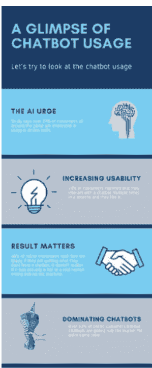

### 客户偏爱聊天机器人

在现代，聊天机器人不仅仅是软件。聊天机器人就像我们的个人助理，理解我们，并且可以进行微配置。它们记住我们的喜好和厌恶，并且从不因忘记我们已经教过它们的事情而让我们失望，这就是为什么每个人都喜欢聊天机器人。下次你遇到一个人或你的客户时，别忘了问问他们是喜欢传统软件还是新的尖端聊天机器人。让我们看看图1-4，了解为什么客户相比其他用于人机交互的软件系统更偏爱聊天机器人。

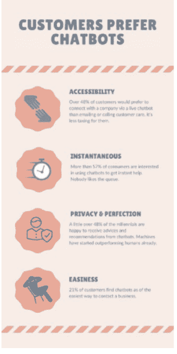

在本章的下一节中，我们将讨论为什么聊天机器人是新兴开发者的下一个大趋势。无论你是新手、中级开发者还是经验丰富的中小企业开发者，你都必须了解在构建聊天机器人时开发者可以使用什么。

### 开发者的视角

你是否曾因必须更新电脑、手机或任何其他你可能正在使用的应用程序的操作系统以使用新功能而感到痛苦？如果每次使用新功能都不需要更新应用程序呢？或者，与其拥有多个应用程序，不如拥有一个单一的应用程序来完成目前由多个应用程序完成的大部分事情？

对开发者来说，构建机器人很有趣。这就像教你的孩子走路、说话、举止和做事。你喜欢让它变得更智能、更自给自足。从开发者的角度来看，聊天机器人是一个非常重要的主题，需要了解。

### 功能发布和错误修复

许多功能可以轻松地添加到聊天机器人中，而无需让你的用户更新你的聊天机器人应用程序。如果你发布的应用程序版本存在一些错误，你必须修复它并再次发布到AppStore进行审批，这可能会很麻烦，最重要的是，用户最终还是需要更新应用程序。如果他们不更新，那么客户会继续抱怨这个问题，导致每个人的生产力损失。在聊天机器人中，一切都是基于API的，所以你只需在后端修复问题，将更改部署到生产环境，然后——哇哦——问题就为你的用户解决了，无需任何担忧。你也节省了大量处理用户报告错误的时间。

想象一下，你构建了一个用于查找餐厅的机器人，后来你想添加搜索酒店、航班等功能。用户可以轻松地请求此类信息，而你的后端聊天机器人系统将处理一切。

假设你正在构建一个Facebook Messenger聊天机器人；你可以直接从后端控制几乎所有内容，包括用户在其应用程序中看到的界面。在Facebook Messenger机器人中，你可以选择让用户点击按钮说是/否，还是只输入简单的文本。

### 市场需求

2016年，全球54%的开发者首次开发聊天机器人。市场对构建适用于公司的简单聊天机器人有巨大需求，他们正在寻找能为他们构建聊天机器人的开发者。一旦你完成了本书的第3章，我敢打赌你可以轻松地开始向公司销售你的服务。你也可以通过为你的专业领域引入聊天机器人来创办自己的初创公司。能够端到端地构建聊天机器人是一项新技能，这就是为什么聊天机器人开发者的平均市场薪酬也非常可观。

对聊天机器人不断增长的需求可以从像Facebook这样的开发者平台上开发的聊天机器人数量中看出。Facebook在Messenger平台上拥有100,000个每月活跃机器人，并且还在增长。你会惊讶地知道，Messenger在2015年4月拥有6亿用户，到2016年6月增长到9亿，2016年7月达到10亿，2017年4月达到12亿。

### 学习曲线

无论你是前端/后端背景，还是对编程知之甚少，在构建或学习构建聊天机器人的过程中，都有巨大的可能性去学习新事物。在这个过程中，你将学到很多东西。例如，你会更多地了解人机交互（HCI），它涉及计算机技术的设计和使用，专注于人与计算机之间的界面。你将学习如何构建或使用API或网络服务，使用第三方API，如Google API、Twitter API、Uber API等。你将有巨大的机会学习自然语言处理、机器学习、消费者行为以及许多其他技术和非技术性的东西。

### 受聊天机器人影响的行业

让我们快速看看哪些行业将从聊天机器人中受益最多。Mindbowser与*Chatbots Journal*合作进行的一项研究收集了来自300多名参与者的数据，这些参与者来自广泛的行业，包括在线零售、航空、物流、供应链、电子商务、酒店业、教育、技术、制造以及市场营销和广告。如果我们看一下图1-5中的图表，很明显，电子商务、保险、医疗保健和零售是受益于聊天机器人最多的行业。这些行业严重依赖客户服务团队以节省时间的高效响应能力。鉴于聊天机器人擅长这一点，很明显它将很快在这些行业中崭露头角。

### 聊天机器人的简要时间线

让我们回顾一下聊天机器人发展历程的简要时间线。了解聊天机器人的技术起源及其演变过程非常重要。

聊天机器人近年来确实日益普及，但其背后的努力是基于数十年的技术积累。回顾聊天机器人的历史，你一定会惊叹于我们自起步以来所取得的巨大进步。

#### 1950年

艾伦·图灵提出了图灵测试。这是一项测试机器是否能表现出与人类相当或无法区分的智能行为的测试。

第一个聊天机器人Eliza由约瑟夫·维森鲍姆创建，旨在充当治疗师。它通过使用“模式匹配”和替换方法来模拟对话，给用户造成机器人能够理解的错觉。

#### 1972年

Parry是由精神病学家和斯坦福大学科学家肯尼斯·科尔比编写的一个计算机程序，它模拟了偏执型精神分裂症患者的行为。

#### 1981年

Jabberwocky聊天机器人由英国程序员罗洛·卡彭特创建。它始于1981年，并于1997年在互联网上发布。

这个聊天机器人的目标是“以有趣、娱乐和幽默的方式模拟自然的人类对话。”

#### 1985年

无线机器人玩具Tomy Chatbot会重复其磁带上录制的任何信息。

#### 1992年

Dr. Sbaitso是由Creative Labs为MS-DOS创建的聊天机器人，它以数字化的声音“与用户交谈”，仿佛自己是一位心理学家。用户反复的辱骂和错误的输入会导致Dr. Sbaitso在重置自身之前出现“奇偶校验错误”而“崩溃”。

#### 1995年

A.L.I.C.E（人工智能语言互联网计算机实体）由诺贝尔奖得主理查德·华莱士开发。

#### 1996年

Hex由杰森·哈钦斯开发，基于Eliza，并于1996年获得勒布纳奖。

#### 2001年

Smarterchild是由ActiveBuddy开发的智能机器人，广泛分布在全球即时消息和短信网络中。最初的实现迅速扩展，可即时访问新闻、天气、股票信息、电影放映时间、黄页列表和详细的体育数据，以及各种工具（个人助理、计算器、翻译器等）。

#### 2006年

Watson的想法源于一次餐桌谈话；它被设计用来参加电视节目《危险边缘》。在第一次尝试中，它只能答对约15%的问题，但后来Watson能够定期击败人类参赛者。

#### 2010年

Siri作为iPhone应用推出，随后被整合为iOS的一部分。Siri是SRI国际人工智能中心的衍生产品。其语音识别引擎由Nuance Communications提供，Siri使用先进的机器学习技术来运行。

#### 2012年

谷歌推出了Google Now聊天机器人。它的原始代号是“Majel”，以《星际迷航》系列中计算机系统的配音演员、吉恩·罗登贝瑞的妻子玛杰·巴雷特命名；它也曾被代号为“助手”。

#### 2014年

亚马逊发布了Alexa。“Alexa”这个词中的“X”是一个硬辅音，因此可以被更精确地识别。这是亚马逊选择这个名字的主要原因。

#### 2015年

Cortana是由微软创建的虚拟助手。Cortana可以设置提醒、识别自然语音，并使用来自必应搜索引擎的信息回答问题。它的名字来源于《光环》电子游戏系列中的一个虚构人工智能角色。

#### 2016年

2016年4月，Facebook宣布了Messenger的机器人平台，包括用于构建与用户交互的聊天机器人的API。后续的增强功能包括机器人能够参与群组对话、预览屏幕，以及通过Messenger的相机功能实现二维码扫描，将用户直接引导至机器人。

2016年5月，谷歌在其开发者大会上发布了其亚马逊Echo的竞品——支持语音的机器人Google Home。它使用户能够通过语音命令与各种服务进行交互。

#### 2017年

Woebot是一个自动对话代理，帮助你监控情绪、了解自己，并让你感觉更好。Woebot结合了自然语言处理技术、心理学专业知识（认知行为疗法）、出色的写作和幽默感来治疗抑郁症。

### 我可以使用聊天机器人解决哪些问题？

当你不知道机器人的范围或不想将其限制为仅回答查询时，这个问题就变得具有挑战性。

请务必记住，聊天机器人的能力是有限的。我们总是感觉在与一个非常智能的类人事物交谈，但特定的机器人是经过设计和训练，只能以特定方式运行并解决特定问题。它不能做所有事情，至少目前如此。未来无疑是光明的。

因此，我们回到这个问题：确定你的问题陈述是否真的适合，并且你可以围绕它构建一个机器人。

如果对以下三个问题的回答都是“是”，那么你就可以开始了。

#### 该问题能否通过简单的问答或来回沟通来解决？

在解决任何对你来说非常新的问题时，不要试图逞英雄，这一点非常重要。你应该始终致力于将问题范围保持在有限范围内。先构建基本功能，然后在此基础上添加。不要试图在第一版就使其变得复杂。这在软件开发中行不通。

想象一下马克·扎克伯格一开始就大声思考并花时间构建Facebook的所有功能。标记朋友、点赞按钮、喜欢用户评论、更好的消息传递、直播视频、评论的反应等等——即使在Facebook获得超过100万注册用户时，这些功能也不存在。如果他一开始就先构建这些功能然后再发布平台，他真的会成功吗？

因此，我们应始终尝试只创建当前需要的功能，而不必过度设计。

现在，回到第一个问题，“该问题能否通过简单的问答或来回沟通来解决？”

只要你将范围保持在有限，你的回答就会是“是”。我们绝不是在限制自己解决复杂问题，而是肯定在限制自己一次性解决一个复杂问题。

> “你必须让每一个细节都完美。并且你必须将细节的数量限制在只有那些重要的细节。”
> ——杰克·多西

#### 它是否具有需要分析或获取数据的高度重复性问题？

这个问题很重要，因为无论是从商业角度还是开发者的角度来看，聊天机器人所做的和被设计来做的，就是让使用它的人更高效、更有生产力。你是如何做到的？通过消除用户自己做重复性事情的需要。

聊天机器人当然更有能力自动化一些高度重复性的工作，但你总会发现大多数聊天机器人主要试图解决相同的问题——无论是通过监督学习（即“通过监督学习”）还是自我教学（即“通过非监督学习”）。

#### 你的机器人任务能否被自动化和固定？

除非你只是为了学习目的而构建聊天机器人，否则你应该确保你试图解决的问题可以被自动化。机器已经开始学习并自己做事，但这仍处于非常初级的阶段。你现在认为无法自动化的事情，可能在几年内就能实现自动化。

#### 一个问答机器人

构建聊天机器人的一个好问题陈述示例可以是问答机器人。想象一个经过训练能够理解各种用户问题的机器人，这些问题的答案已经可以在网站的常见问题解答页面上找到。

如果你回头尝试找到上述三个问题的答案，答案将是“是”。

参见图1-6，你将看到一个常见问题解答机器人正在做什么。

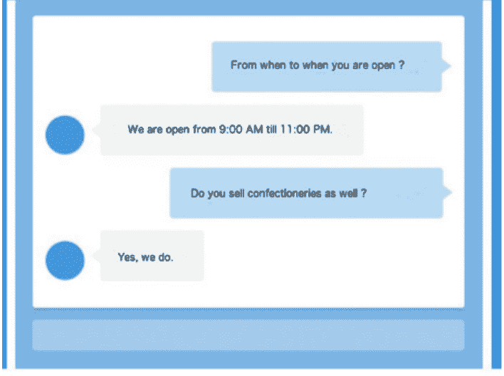

**图1-6.** *常见问题解答聊天机器人示例*

这些不过是特定商店的客户可能会打电话询问，或试图通过访问网站并浏览页面来寻找答案的非常重复性的问题。

试想一下，当你拥有这样一个聊天机器人，它能在几秒钟内像人类一样回答你的问题，甚至能做更多超出你想象的事情。这仅仅是聊天机器人能力的一小部分。

现在，让我们尝试分析一下问答机器人场景下的上述三个问题及其答案。

-   该问题能否通过简单的问答或来回沟通来解决？

    是的，常见问题解答（FAQ）不过是简单的常见问题及其相关答案。可能存在基于上下文的FAQ，但除非你正在使用聊天机器人解决多领域问题，否则你不会遇到这个问题。可能会出现两个或更多问题看起来相似的情况，但你总是可以设计机器人在有疑问时向用户反问一个问题。

-   它是否具有需要分析或获取数据的高度重复性问题？

    是的，FAQ要求我们从数据库中获取数据，并在网站上一次性或可能动态地显示出来。但用户必须逐一浏览所有问题才能找到他/她正在寻找的问题，然后查看其答案。在消费者实际得到他/她的答案之前，需要在用户界面上进行大量梳理……或者可能根本找不到。为什么不让我们的机器人为我们做这件事呢？

-   你的机器人的任务是否可以自动化和固定化？

    是的，一个FAQ机器人需要获取问题、分析问题、从数据库中检索信息，然后将其返回给用户。这里没有什么是不能通过编码完成的。而且，这个过程基本上是固定的，不会实时改变。

### 从聊天机器人开始

在构建聊天机器人之前，应该遵循三个步骤。我们将在这里简要讨论每一个步骤。

思考你希望聊天机器人能够处理的所有场景或任务，并收集所有相关的、以不同形式提出的、可以用来完成这些任务的问题。你希望聊天机器人完成的每一个任务都将定义一个意图。你列出的每个问题或意图都可以用多种方式表示。这取决于用户如何表达它。

例如：Alexa，关灯。Alexa，你能关灯吗？你能关灯吗？用户可能会使用这些句子中的任何一个来指示机器人关灯。所有这些都具有相同的意图/任务——关灯，但它们的提问方式不同。

在你识别出用户的意图后，编写所有逻辑以将用户保持在你选择的流程中。

例如，假设你正在构建一个用于预约医生的机器人。那么你要求用户提供电话号码、姓名和专科，然后你显示可用时段并进行预约。

在这种情况下，你可以期望用户知道这些细节，而不是试图在机器人本身中容纳所有内容，例如耳部问题的专科医生称为耳鼻喉科（ENT）。然而，这样做并不是什么大事。所以，这又回到了根据你构建应用程序的时间和资源来决定机器人的范围。

### 聊天机器人中的决策树

如果你了解决策树，那非常好，因为在设计聊天机器人流程时你会经常需要这些知识。但如果你不了解决策树，那么只需谷歌搜索一下就能帮助你学习这个在计算机科学中广泛使用的简单概念。

### 在聊天机器人中使用决策树

在聊天机器人的背景下，决策树简单地帮助我们找到用户问题的准确答案。

> 决策树是一种决策支持工具，它使用树状图或模型来表示决策及其可能的后果，包括机会事件结果、资源成本和效用。它是显示仅包含条件控制语句的算法的一种方式。
> ——维基百科

构建聊天机器人时最困难的部分是跟踪if...else代码块。需要做出的决策越多，代码中出现if...else的频率就越高。但同时，这些代码块又是编码复杂对话流程所必需的。如果问题很复杂，在现实生活中需要大量的if...else，那么代码也需要以同样的方式进行调整。

#### 决策树如何提供帮助？

决策树易于编写和理解，但它们是针对所讨论问题的解决方案的强大表示。它们继承了一种独特的能力，帮助我们理解很多事情。

-   有助于全面了解当前问题。查看决策树，我们可以轻松理解缺少什么或需要修改什么。
-   有助于更快地调试。决策树就像一本简短的圣经，或者说，是软件需求规格说明文档的可视化表示，开发人员、产品经理或领导层可以参考它来解释预期行为或在需要时进行任何更改。
-   人工智能尚未达到可以通过大量数据训练并以100%准确率执行的阶段。它仍然需要通过编写业务逻辑和规则来进行大量的人工引导。在让机器学习并执行变得有点困难的地方，决策树都能提供帮助。

让我们举一个简单的例子，尝试理解它如何帮助构建聊天机器人。看一个聊天机器人的示例图，它从询问用户是寻找T恤还是牛仔裤开始，然后根据输入，图表流程通过询问更多问题进一步提供与产品相关的选项。你不需要创建一个完整的决策树，但在开始构建聊天机器人之前，你绝对应该在每个步骤定义好问题流程。

假设你正在构建一个类似的聊天机器人，帮助人们在线购买服装。你要做的第一件事是制作一个类似的决策树或流程图，以帮助你的聊天机器人在正确的时间提出适当的问题。这对于设定每个步骤的范围以及在该阶段需要做什么是非常必要的。当你实际编写第一个聊天机器人代码时，你将需要状态图或简单的流程图。记住，在创建像图1-7这样的图表时不要过于严格；尽可能保持简单，然后再添加扩展功能。这样做的好处是开发时间会减少，之后功能将是松散耦合的，并且作为组件开始变得有意义。就像在示例中，在创建基本功能之后，你还可以添加颜色选择、价格范围、评分和折扣选项。

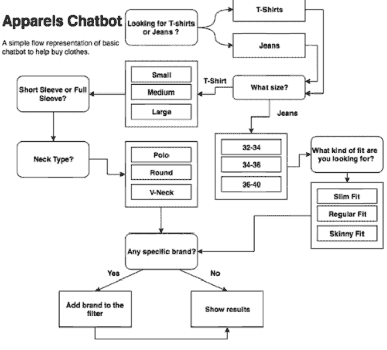

*图1-7. 一个用于在线购买服装的服装聊天机器人的简单表示*

根据你的需求，你绝对可以向前一个用例添加更多内容。但你必须确保不要让自己和用户都感到过于复杂。

决策树不仅可以帮助你将用户保持在流程中，而且是识别下一个意图（可能以客户问题的形式出现）的一种非常有效的方式。

因此，你的机器人将按照你构建的决策树提出一系列问题。每个节点通过聊天机器人意图缩小客户的目标范围。

假设你正在为一家金融机构——比如一家银行——创建一个聊天机器人，它可以在身份验证后根据你的请求进行转账。在这种情况下，你的机器人可能首先想要验证账户详情，并要求用户确认金额，然后机器人可能会要求验证目标账户名称、账户号码、账户类型等。

除非你已验证用户的账户余额是否大于请求金额，否则你不能或不想调用OTP（一次性密码）API。

这发生在我们所有人身上，也发生在客户身上。当他们的问题没有得到正确回答时，他们会感到沮丧。为你的聊天机器人使用决策树肯定会比不使用它们为用户提供更好的体验。

很多时候你会发现以编程方式解决某些意图存在问题。所以，底线是，*如果你无法以编程方式解决某个问题，那就通过设计来解决它。*

看图1-8，机器人正在尝试进行健康测验，并想知道抗生素是否对所有疾病都有效。

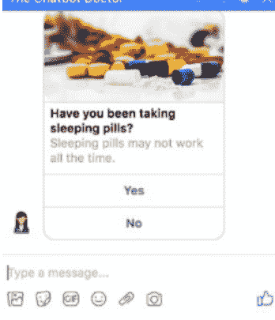

***图1-8. 通过设计解决用例的示例***

由于预期答案是布尔值（真/假），因此只需为用户提供两个按钮供其点击，而不是让他们输入并等待纠正错误。

这是通过设计来解决问题，而不是编写大量代码来处理意外的用户输入。在构建聊天机器人的过程中，你会遇到许多场景，只需提供按钮，就能快速了解用户的意图。理解这些场景并提供按钮，既方便你自己，也方便那些在明显可选答案情况下无需输入的用户。

### 最佳聊天机器人/机器人框架

- [https://woebot.io/](https://woebot.io/)
  - 可以追踪你的情绪
  - 帮助你感觉更好
  - 通过观察你的情绪模式提供洞察
  - 教你如何保持积极和高能量

- [https://qnamaker.ai/](https://qnamaker.ai/)
  - 基于常见问题解答、URL和结构化文档，在几分钟内构建、训练和发布一个简单的问答机器人。
  - 使用熟悉的聊天界面测试和完善回复。

- [https://dialogflow.com/](https://dialogflow.com/)
  - 前身为api.ai，在聊天机器人爱好者中广受欢迎。
  - 通过构建由AI驱动的引人入胜的语音和文本对话界面，为用户提供与你的产品互动的新方式。
  - 在Google Assistant、Amazon Alexa、Facebook Messenger和其他流行的平台和设备上与用户连接。
  - 分析和理解用户意图，帮助你以最有用的方式回应。

- https://core.rasa.ai
  - 一个用于构建对话软件的框架
  - 你可以在Python代码中实现你的机器人可以执行的操作。
  - 你的机器人的逻辑不是基于一堆if...else语句，而是基于在示例对话上训练的概率模型。

- [https://wit.ai](https://wit.ai)
  - Wit.ai使开发人员能够轻松构建可以与之对话或发送文本的应用程序和设备。
  - 在推出21个月内被Facebook收购，wit.ai团队为Facebook内部的自有NLP引擎做出贡献。
  - 你可以使用wit.ai构建聊天机器人、家庭自动化等。
  - Wit.ai的工作方式类似于Dialogflow，但功能不如Dialogflow丰富。人们最初使用wit.ai，因为它是免费的而Dialogflow不是，但后来Dialogflow也变得免费了。

- [https://www.luis.ai/](https://www.luis.ai/)
  - 一项基于机器学习的服务，用于将自然语言集成到应用程序、机器人和物联网设备中。
  - 快速创建企业就绪的自定义模型，这些模型会持续改进。

- [http://botkit.ai](http://botkit.ai)
  - 可视化对话构建器
  - 内置统计和指标
  - 可以轻松与Facebook、Microsoft、IBM Watson、Slack、Telegram等集成。

### 聊天机器人的组成部分和使用的术语

聊天机器人系统的组成部分非常少。在本节中，我们将简要讨论你将在后续章节中遇到的聊天机器人的组成部分。

在深入研究之前，对任何系统有基本的理论理解总是有帮助的。在本节之后，你应该对使用Python构建聊天机器人时使用的技术术语有一个大致的了解。这些术语将在我们实际开始构建聊天机器人的后续章节中频繁使用。

#### 意图

当用户与聊天机器人交互时，他使用聊天机器人的意图是什么/他在询问什么？

例如，当用户对聊天机器人说“预订电影票”时，我们作为人类可以理解用户想要预订电影票。这就是机器人的意图。它可以被命名为意图。

另一个例子是当用户说“我想点餐”或“你能帮我点餐吗？”这些可以被命名为意图。同样，你可以根据需要定义任意数量的意图。

#### 实体

意图有关于意图的元数据，称为实体。在“预订电影票”的例子中，预订票可以是一个意图，而实体是票的类型，它也可能是其他东西，比如航班、音乐会等。

你可以为整个意图标记通用实体。实体可以表示数量、计数或体积。意图也可以有多个实体。

例如：给我订一双8码的鞋。这里可能有两个实体：

类别：鞋
尺码：8

### 话语

话语不过是你的用户可能表现出的同一问题/意图的不同形式。

- 还记得我们讨论过的关灯意图吗？那是一个用户如何为同一意图使用不同话语的例子。
- 建议每个意图有最佳的10个话语，最少5个，但这不是限制。

### 训练机器人

训练本质上意味着构建一个模型，该模型将从现有的已定义意图/实体和话语集合中学习，如何对新的话语进行分类并提供置信度分数。

当我们使用话语训练系统时，这被称为监督学习。我们很快将学习更多关于实际操作的内容。

### 置信度分数

每次你试图找出一个话语可能属于哪个意图时，你的模型都会给出一个置信度分数。这个分数告诉你，你的机器学习模型在识别用户意图方面有多自信。

这就是我们想在“聊天机器人简介”第一章中涵盖的全部内容。你应该从商业角度和技术角度对聊天机器人有一个大致的了解。我们回顾了聊天机器人所属的历史。聊天机器人的发展程度相当令人着迷。

我们了解了聊天机器人是如何随着时间演变的，以及为什么聊天机器人对于企业在激烈竞争中成长是必不可少的。我们了解了不同的聊天机器人框架，并通过示例了解了聊天机器人使用的术语。我们将在后续章节中使用它们。你现在应该处于一个阶段，知道你想构建什么样的聊天机器人，以及它构建后会如何表现。

完成你所有的写作和决策树（如果需要的话），在我们下一章学习自然语言理解的基础知识后，我们就可以快速开始构建我们的聊天机器人了。

即使你脑子里什么都没有，也不要担心。我们将在接下来的章节中，利用所学的所有概念，一步一步地构建一个很酷的聊天机器人。

下一章见。

# 第2章

## 聊天机器人的自然语言处理

本章旨在让你开始使用Python进行自然语言处理（NLP），这是构建聊天机器人所需的。你将学习使用一个名为spaCy的优秀开源库的NLP基本方法和技术。如果你是Python生态系统的新手或中级用户，那么不用担心，因为你将完成学习聊天机器人NLP所需的每一步。本章不仅教你NLP中的方法，还通过实际例子并用编码示例进行演示。我们还将讨论为什么聊天机器人可能需要特定的NLP方法。请注意，NLP本身就是一项技能。

我们将仔细研究POS标记、词干提取、实体检测、停用词、依存句法分析、名词块以及寻找词语之间的相似性。所有这些方法在你构建用例的聊天机器人时都会非常有帮助。

本章涵盖的NLP方法还有很多。根据你构建的聊天机器人的需求，你可以尝试学习它们。我们将在本章结束时学习使用的SpaCy库将为你提供足够的知识，了解如何扩展你的NLP知识库及其理解。那么，让我们开始吧，首先在下一节中尝试理解聊天机器人的NLP。

### 为什么我需要了解自然语言处理才能构建聊天机器人？

要理解这个问题的答案，我们首先需要了解自然语言处理（NLP）。

**自然语言处理（NLP）**是人工智能的一个领域，使计算机能够分析和理解人类语言。

29

© Sumit Raj 2019

S. Raj, *Building Chatbots with*

现在，要执行自然语言处理（NLP），或者说自然语言理解（NLU），我们有许多方法，接下来将进行讨论。你听到一个新术语**自然语言理解**了吗？

简单来说，NLU是NLP这个更大图景的一个子集，就像机器学习、深度学习、NLP和数据挖掘是人工智能（AI）这个更大图景的子集一样，AI是任何能执行智能操作的计算机程序的总称。

> 一个经验法则是，使用NLU这个术语来表达机器理解人类提供的自然语言形式的能力。

现在，回到是否真的需要了解NLP才能构建聊天机器人这个问题——答案是既是也不是。感到困惑？你没听错，并不是说如果你不了解NLP的方法和技术就完全无法构建聊天机器人，但你的范围会受到一定限制。你将无法在扩展应用的同时保持代码的整洁。NLP为你的聊天机器人插上了翅膀，让它在不能仅仅行走和奔跑时能够飞翔。

对于普通人来说，聊天机器人不过是与另一端的某种智能机器进行交流的方式。这种机器可以是基于语音的，也可以是基于文本的，用户将用自己的语言提供输入，在计算机科学中通常称为自然语言。

我们知道，没有一个能神奇地让一切正常工作的黑盒。应该明白，AI中没有任何东西是“人工”的；它实际上是伟大的人们编写的机器学习和深度学习算法在后台运行。机器尚未达到能够像人类一样思考并拥有自身智能的阶段。当今的AI系统——它们的行为方式和表现——是我们训练它们的结果。

因此，要理解用户无论使用何种语言或何种输入形式（文本、语音、图像等）的自然语言，我们必须编写算法并使用NLP技术。NLP被认为是聊天机器人的大脑，它处理原始数据，进行数据清洗，清理数据，然后准备采取适当的行动。

NLP本身是一个庞大的主题，需要时间和毅力才能完全掌握，但有一些方法是聊天机器人开发者必须了解的，我们将在本章中学习。

### 什么是spaCy？

spaCy是一个用于高级NLP的开源软件库，由Matthew Honnibal使用Python和Cython编写。它提供了直观的API来访问其通过深度学习模型训练的方法。

spaCy提供了世界上最快的句法解析器。直接引用spaCy的文档，他们有一些令人惊叹的基准测试结果，如下所示。

### spaCy的基准测试结果

2015年的两篇同行评审论文证实，spaCy提供了世界上最快的句法解析器，其准确率与最佳可用系统相差在1%以内。少数更准确的系统则慢20倍或更多。让我们尝试查看图2-1，该图展示了spaCy基于其速度和准确率与其他库相比的基准测试结果。

| 系统 | 年份 | 语言 | 准确率 | 速度 (WPS) |
|---|---|---|---|---|
| **spaCy v2.x** | 2017 | Python / Cython | **92.6** | n/a ❓ |
| **spaCy v1.x** | 2015 | Python / Cython | 91.8 | 13,963 |
| ClearNLP | 2015 | Java | 91.7 | 10,271 |
| CoreNLP | 2015 | Java | 89.6 | 8,602 |
| MATE | 2015 | Java | 92.5 | 550 |
| Turbo | 2015 | C++ | 92.4 | 349 |

### 图2-1. spaCy基准测试结果

spaCy还为多种语言（如英语、德语、西班牙语、葡萄牙语、法语、意大利语、荷兰语和多语言NER）提供了统计神经网络模型。它还为各种其他语言提供分词功能。此表显示了Choi等人进行的速度基准测试，因此将spaCy v2.x在不同硬件上进行基准测试进行比较是不公平的。这就是为什么你看不到spaCy v2.x的速度列值的原因。

### spaCy提供了什么？

spaCy声称提供三个主要的东西，这些都非常有用。让我们尝试了解这些，并理解为什么应该了解和使用spaCy作为进行NLP的首选模块。

#### 世界上最快的库

spaCy在提取大规模信息方面表现极其出色。它是在Cython库的帮助下，从零开始编写的，极其注重内存效率。

#### 完成任务

spaCy的设计理念是“完成任务”。它帮助我们实现现实世界的NLP场景。清晰的文档为开发者和计算语言学爱好者节省了大量时间，使他们更有效率。它易于安装，就像任何其他Python包一样。

#### 深度学习

spaCy是开源社区中可用于为深度学习算法处理文本的最佳库之一。它与TensorFlow、PyTorch、scikit-learn、Gensim以及Python的其他相关技术无缝协作。深度学习开发者可以轻松地为一系列NLP/NLU问题构建语言学上复杂的统计模型。

### spaCy的特性

没有其他NLP库提供如此广泛的API来完成几乎所有事情，而这正是spaCy所做的。这个库最棒的地方在于它不断发展，变得越来越好。让我们根据其官方网站上提到的内容，一窥spaCy的特性：

- 非破坏性分词
- 命名实体识别
- 支持28+种语言
- 8种语言的13个统计模型
- 预训练词向量
- 易于与深度学习集成
- 词性标注
- 有标签的依存句法分析
- 基于语法的句子分割
- 内置的语法和NER可视化工具
- 便捷的字符串到哈希映射
- 导出到numpy数据数组
- 高效的二进制序列化
- 易于模型打包和部署
- 一流的速度
- 稳健、严格评估的准确性

现在，让我们深入了解这个用于Python NLP的优秀模块：spaCy。

### 安装和先决条件

在我们真正深入研究spaCy和代码片段之前，请确保你的操作系统上安装了Python。如果没有，请参考[1]。

你可以使用任何你熟悉的Python版本。如今大多数系统都预装了默认的Python 2.7.x版本。我们将在本章中使用Python 3。因此，如果你想使用Python 3，请通过从...下载来在你的操作系统上安装Python 3。如果你已经安装了Python 2，也可以使用它；可能需要也可能不需要进行少量的代码更改。

我们将通过pip [2]安装spaCy。

我们将使用虚拟环境[3]并将spaCy安装到用户目录中。

如果你使用的是macOS/OSX/Linux，请按照以下步骤操作：

步骤1：python3 -m pip install -U virtualenv

步骤2：virtualenv venv -p /usr/local/bin/python3 #确保使用你自己的操作系统路径指向python 3可执行文件。

步骤3：source venv/bin/activate

步骤4：pip3 install -U spacy #我们将使用spaCy版本2.0.11。

最后一步可能需要时间，请耐心等待。

如果你使用的是Windows，只需将步骤3更改为

```
venv\Scripts\activate
```

现在，我们将在步骤3中激活的虚拟环境中安装*Jupyter Notebook*。使用*Jupyter Notebook*比标准Python解释器更容易且更高效。我们将在接下来的章节中在Jupyter Notebook中执行所有代码片段。

要安装Jupyter Notebook，请运行以下pip命令：

```
pip3 install jupyter
```

此命令将在你的系统中安装Jupyter Notebook。

此时，你应该已经在虚拟环境中安装了spaCy和Jupyter Notebook。让我们验证是否所有内容都已成功安装。

转到你的命令行界面，输入以下内容，你应该会看到一个服务器启动并在默认浏览器中打开一个url。

```
$ jupyter notebook
```

默认url是...。它应该看起来像图2-2。

如图2-2所示，单击“New”，然后选择Python 3。

它将在你当前的浏览器中打开一个新标签页，并为你创建一个新的notebook，你可以在其中尝试Python代码。

你可以执行任何Python代码、导入库、绘制图表和编写markdown单元格。

### 什么是 SpaCy 模型？

SpaCy 模型与其他任何机器学习或深度学习模型一样。模型是算法的产物，或者说是使用机器学习算法对训练数据进行处理后创建的对象。spaCy 拥有许多这样的模型，我们可以像安装任何其他 Python 包一样，通过下载将其直接放入我们的程序中。

现在，我们将把 spaCy 模型作为 Python 包来安装。

为此，我们将利用笔记本的魔法命令，在笔记本中运行以下命令。通过在 shell 命令前加上 `!`（感叹号运算符），我们也可以在 Jupyter Notebooks 中运行 shell 命令。让我们看看它的样子。

```
!python3 -m spacy download en
```

在使用 Jupyter Notebook 下载 **Python** 的 spaCy 模型时，你可能会遇到权限问题。请转到你的终端并运行以下命令：

```
sudo python3 -m spacy download en
```

参考图 2-4。

如图 2-4 所示，spaCy 会尝试下载一些核心文件，并将它们作为 Python 包进行安装。

请注意！`!`（感叹号运算符）仅在 Jupyter Notebook 中有效。要直接从终端安装 spaCy 模型，你需要移除 `!`（感叹号运算符）；

否则将导致错误。

- [1] https://www.python.org/downloads/
- [2] https://packaging.python.org/tutorials/installing-packages/#installing-from-pypi
- [3] http://docs.python-guide.org/en/latest/dev/virtualenvs/

### 构建聊天机器人的 NLP 基础方法

要想成为某个领域的专家并高效、有效地完成工作，精通基础知识至关重要。要构建聊天机器人，我们需要了解 NLP 的基础方法。这些方法帮助我们将输入分解成块并理解其含义。在下一节中，我们将学习一些最常用的 NLP 方法，这些方法不仅有助于你精通 NLP，还能帮助你构建出色的聊天机器人。我们越能更好地、更高效地处理输入文本，就越能更好地响应用户。

### 词性标注

词性标注是一个过程，在这个过程中，你阅读一些文本，并为每个单词或词元分配词性，例如名词、动词、形容词等。

当你想要识别给定句子中的某个实体时，词性标注变得极其重要。第一步是进行词性标注，看看我们的文本包含什么。

让我们通过一些真实的词性标注示例来实践一下。

#### 示例 1：

```
nlp = spacy.load('en') #Loads the spacy en model into a python object
doc = nlp(u'I am learning how to build chatbots') #Creates a doc object
for token in doc:
    print(token.text, token.pos_) #prints the text and POS
```

输出：

```
('I', 'PRON')
('am', 'VERB')
('learning', 'VERB')
('how', 'ADV')
('to', 'PART')
('build', 'VERB')
('chatbots', 'NOUN')
```

#### 示例 2：

```
doc = nlp(u'I am going to London next week for a meeting.')
for token in doc:
    print(token.text, token.pos_)
```

输出：

```
('I', 'PRON')
('am', 'VERB')
('going', 'VERB')
('to', 'ADP')
('London', 'PROPN')
('next', 'ADJ')
('week', 'NOUN')
('for', 'ADP')
('a', 'DET')
('meeting', 'NOUN')
('.', 'PUNCT')
```

如我们所见，当我们打印从方法 **nlp** 返回的 **Doc** 对象（一个用于访问注释的容器）中的词元时，我们得到了句子中每个单词的词性标注。

这些标签是属于单词的属性，它们决定了单词在语法正确的句子中的使用方式。我们可以将这些标签用作信息过滤等任务中的单词特征。

让我们尝试另一个例子，探索来自 **Doc** 对象的词元的不同属性。

#### 示例 3：

```
doc = nlp(u'Google release "Move Mirror" AI experiment that matches your pose from 80,000 images')
for token in doc:
    print(token.text, token.lemma_, token.pos_, token.tag_, token.dep_, token.shape_, token.is_alpha, token.is_stop)
```

#### 示例 4：

```
doc = nlp(u'I am learning how to build chatbots')
for token in doc:
    print(token.text, token.lemma_, token.pos_, token.tag_, token.dep_, token.shape_, token.is_alpha, token.is_stop)
```

请参考下表，了解我们在代码中打印的每个属性的含义。

| 属性 | 描述 |
| :--- | :--- |
| TEXT | 正在处理的实际文本或单词 |
| lemma | 正在处理的单词的词根形式 |
| pos | 单词的词性 |
| tag | 它们表达词性（例如，动词）和一些形态信息（例如，动词是过去时）。 |
| dep | 句法依赖关系（即词元之间的关系） |
| shape | 单词的形状（例如，大小写、标点、数字格式） |
| alpha | 该词元是否为字母字符？ |
| stop | 该单词是否为停用词或停用词表的一部分？ |

你可以参考下表，了解词元对象的每个词性属性值的含义。此列表详细介绍了 spaCy 模型分配的词性标签。

那么，为什么聊天机器人需要词性标注？

答案：为了降低理解无法训练或训练置信度较低的文本的复杂性。通过使用词性标注，我们可以识别文本输入的部分，并仅对这些部分进行字符串匹配。例如，如果你想查找句子中是否存在某个地点，那么词性标注会将地点词标记为名词，这样你就可以从标记列表中取出所有名词，并查看它是否是你预设列表中的地点之一。

### 词干提取与词形还原

词干提取是将屈折变化的单词还原为其词干、基本形式的过程。词干提取算法将单词 “saying” 还原为词根 “say”，而 “presumably” 则变为 presum。如你所见，这可能并不总是 100% 正确。

**词形还原**与词干提取密切相关，但词形还原是基于单词的预期含义确定其词元（lemma）的算法过程。

例如，在英语中，动词 “to walk” 可能以 “walk”、“walked”、“walks” 或 “walking” 的形式出现。基本形式 “walk”，即人们可能在词典中查找的形式，被称为该单词的 *词元*。spaCy 没有内置的词干提取器，因为词形还原被认为更准确、更有效。

词干提取与词形还原的区别

- **词干提取**以一种粗糙的、启发式的方式完成工作，它截断单词的末尾，假设剩下的部分就是我们实际要找的单词，但这通常包括去除派生词缀。

### 词形还原

**词形还原**试图通过使用词汇表和单词的形态分析来更优雅地完成这项工作。它尽力只移除单词的屈折词尾，并返回单词的字典形式，即词元。

尽管很少有库同时提供词干提取和词形还原的方法，但使用词形还原来正确获取词根始终是最佳实践。

让我们通过一些例子来探索词形还原：

#### 示例 1：

```python
from spacy.lemmatizer import Lemmatizer
from spacy.lang.en import LEMMA_INDEX, LEMMA_EXC, LEMMA_RULES

lemmatizer = Lemmatizer(LEMMA_INDEX, LEMMA_EXC, LEMMA_RULES)
lemmatizer('chuckles', 'NOUN') # 2nd param is token's part-of-speech tag
```

**输出：**

```
[u'chuckle']
```

#### 示例 2：

```python
lemmatizer('blazing', 'VERB')
```

**输出：**

```
[u'blaze']
```

#### 示例 3：

```python
lemmatizer('fastest', 'ADJ')
```

**输出：**

```
[u'fast']
```

如果你想看看词干提取器和词形还原器之间的比较，那么你需要安装 Python 最流行的库之一：自然语言工具包（NLTK）。spaCy 最近才流行起来，但正是 NLTK 让每一位 NLP 爱好者投身于 NLP 及其技术的海洋。

查看以下示例，我们尝试使用 NLTK 提供的两种词干提取技术。首先，我们尝试使用 PorterStemmer 获取单词 "fastest" 的词干，然后使用 SnowBallStemmer。两者给出相同的结果——即 "fastest"——但当我们使用 spaCy 的方法进行词形还原时，它给出 "fast" 作为 "fastest" 的词干，这更有意义且正确。

```python
from nltk.stem.porter import *
from nltk.stem.snowball import SnowballStemmer

porter_stemmer = PorterStemmer()
snowball_stemmer = SnowballStemmer("english")
```

在尝试运行此代码之前，请确保使用 pip3 安装 nltk 包。

既然你已经非常清楚词干提取或词形还原在 NLP 中的作用，你应该能够理解，每当你遇到需要单词根形式的情况时，就需要在那里进行词形还原。例如，它常用于构建搜索引擎。你一定很好奇，即使搜索文本表述不完整，Google 是如何在搜索结果中给出你想要的文章的。

这就是词形还原发挥作用的地方。想象一下，你用文本 *will the next season of Game of Thrones be* 进行搜索。

现在，假设搜索引擎进行简单的文档词频匹配来给你搜索结果。在这种情况下，上述查询可能无法匹配标题为 *of Thrones next season release date* 的文章。

如果在将输入与文档匹配之前，我们对原始问题进行词形还原，那么我们可能会得到更好的结果。

我们将在接下来的部分中尝试验证这个理论。

### 命名实体识别

**命名实体识别**也被称为**实体识别**或**实体**，是一个在给定文本中查找和分类[命名实体](https://example.com)并将其归入预定义类别的过程。

NER 任务在很大程度上依赖于用于训练 NE 提取算法的知识库，因此它可能有效也可能无效，具体取决于其训练所用的数据集。

spaCy 附带了一个非常快速的实体识别模型，能够从给定文档中识别实体短语。实体可以是不同类型，例如人物、地点、组织、日期、数字等。这些实体可以通过 **doc** 对象的 **.ents** 属性访问。

让我们借助 spaCy 强大的 NER 标注能力，通过一些示例来尝试查找命名实体。

#### 示例 1：

```python
my_string = u"Google has its headquarters in Mountain View, California having revenue amounted to 109.65 billion US dollars"
doc = nlp(my_string)

for ent in doc.ents:
    print(ent.text, ent.label_)
```

**输出：**

```
('Google', 'ORG')
('Mountain View', 'GPE')
('California', 'GPE')
('109.65 billion US dollars', 'MONEY')
```

我们可以看到 spaCy 模型多么巧妙且自动地轻松识别出单词 **Google** 是一个 **ORG**，**California** 是一个 **GPE** 实体，并且在给定的句子中我们谈论的是 **109.65 billion US dollars**，这实际上是关于金钱的。

让我们尝试探索更多示例。

#### 示例 2：

```python
my_string = u"Mark Zuckerberg born May 14, 1984 in New York is an American technology entrepreneur and philanthropist best known for co-founding and leading Facebook as its chairman and CEO."
doc = nlp(my_string)

for ent in doc.ents:
    print(ent.text, ent.label_)
```

**输出：**

```
('Mark Zuckerberg', 'PERSON')
('May 14, 1984', 'DATE')
('New York', 'GPE')
('American', 'NORP')
('Facebook', 'ORG')
```

#### 示例 3：

```python
my_string = u"I usually wake up at 9:00 AM. 90% of my daytime goes in learning new things."
doc = nlp(my_string)

for ent in doc.ents:
    print(ent.text, ent.label_)
```

**输出：**

```
('9:00 AM', 'TIME')
('90%', 'PERCENT')
```

如你所见，实体提取器可以轻松地从给定字符串中提取时间信息。同时，正如你所看到的，实体提取器不仅尝试识别数字，还识别精确的百分比值。

根据 spaCy 的文档，在 [OntoNotes](https://en.wikipedia.org/wiki/OntoNotes) 语料库上训练的模型支持以下实体类型。

| 类型 | 描述 |
| :--- | :--- |
| PERSON | 人物，包括虚构人物 |
| NORP | 国籍或宗教或政治团体 |
| FAC | 机场、高速公路、桥梁等 |
| ORG | 公司、机构、组织等 |
| GPE | 城市、州 |
| LOC | 非 GPE 位置、山脉、水体 |
| PRODUCT | 物品、车辆、食品等（非服务） |
| EVENT | 命名的飓风、战役、战争、体育赛事等 |
| WORK_OF_ART | 书籍、歌曲等的标题 |
| LAW | 被制定为法律的命名文件 |
| LANGUAGE | 任何命名的语言 |
| DATE | 绝对或相对日期或时间段 |
| TIME | 小于一天的时间 |
| PERCENT | 百分比，包括“%” |
| MONEY | 货币价值，包括单位 |
| QUANTITY | 测量值，如重量或距离 |
| ORDINAL | “第一”、“第二”等 |
| CARDINAL | 不属于其他类型的数字 |

每当我们打算构建一个对话代理或简单的聊天机器人时，我们心中总有一个领域。例如，我们希望聊天机器人能够预约医生、点餐、支付账单、填写银行申请表、电子商务等。聊天机器人也可能解决这些问题的组合。通过找出问题中的实体，可以大致了解问题提出的上下文。

让我们通过两个具有相似单词但含义不同的句子示例来理解这一点。

```python
my_string1 = u"Imagine Dragons are the best band."
my_string2 = u"Imagine dragons come and take over the city."

doc1 = nlp(my_string1)
doc2 = nlp(my_string2)

for ent in doc1.ents:
    print(ent.text, ent.label_)
```

上述对 **doc1** 对象的 **for** 循环*输出*：

```
('Imagine Dragons', 'ORG')
```

很棒，不是吗？当你意识到实体识别器在字符串中没有识别出任何实体时，事情会变得更加有趣。运行以下代码，**doc2** 不会产生任何输出。

```python
for ent in doc2.ents:
    print(ent.text, ent.label_)
```

现在，想象一下你在一个实际环境中要提取上述两个字符串的上下文。你会怎么做？借助*实体*，人们可以轻松地弄清楚陈述的上下文，并智能地推进对话。

### 停用词

停用词是像 *a*、*to* 和 *also* 这样的词，我们有时希望在进一步处理之前将它们从文档中过滤掉。停用词通常具有很少的词汇内容，并且不包含太多意义。

以下是 25 个在 Reuters-RCV1 中常见的语义上非选择性的停用词列表。

- a an and are as at be by for from has he in is it its of on that the to was were will with

让我们进入一些代码，尝试理解事情是如何运作的。

要查看 spaCy 中定义为停用词的所有单词，你可以运行以下代码行：

```python
from spacy.lang.en.stop_words import STOP_WORDS
print(STOP_WORDS)
```

你应该会看到类似这样的内容：

```
set(['all', 'six', 'just', 'less', 'being', 'indeed', 'over', 'move',
'anyway', 'fifty', 'four', 'not', 'own', 'through', 'using', 'go', 'only', 'its',
'before', 'one', 'whose', 'how',
................................................
................................................
```

### 依存句法分析

依存句法分析是 spaCy 中更优美且强大的功能之一，它既快速又准确。该解析器还可用于句子边界检测，并允许你遍历基础名词短语，或称为“块”。

spaCy 的这一功能为你提供了一个解析树，解释了单词或短语之间的父子关系，且独立于单词出现的顺序。

让我们举个例子，假设你需要解析以下句子：

*帮我预订从班加罗尔到果阿的航班*

#### 示例 1：

```python
doc = nlp(u'Book me a flight from Bangalore to Goa')
blr, goa = doc[5], doc[7]

list(blr.ancestors)
```

输出：

```
[from, flight, Book]
```

上述输出告诉我们，用户希望预订从班加罗尔出发的航班。让我们尝试列出 **goa.ancestors** 对象的祖先：

```python
list(goa.ancestors)
```

输出：

```
[to, flight, Book]
```

这个输出告诉我们，用户希望预订前往果阿的航班。

#### 依存句法分析中的“祖先”是什么？

祖先是该词的句法后代中最右侧的标记。就像上面的例子中，对象 **blr** 的祖先是 *from*、*flight* 和 *Book*。

请记住，你始终可以使用 **ancestors** 属性列出 **doc** 对象项的祖先。

```python
list(doc[4].ancestors) #doc[4]==flight
```

上述代码将输出：

```
[flight, Book]
```

要以编程方式检查一个 **doc** 对象项是否是另一个 *doc* 对象项的祖先，我们可以这样做：

```python
doc[3].is_ancestor(doc[5])
```

上述代码返回 **True**，因为 **doc[3]**（即 flight）是 **doc[5]**（即 Bangalore）的祖先。你可以尝试更多这样的例子，以更好地理解依存句法分析和祖先的概念。

如果我们尝试思考一个在构建聊天机器人时可能实际遇到的真实场景，我们可能会遇到这样的句子：

> 我想预订一辆去酒店的出租车和一张餐厅的桌子。

在这个句子中，了解请求了哪些*任务*以及它们的目标是什么（即*用户是想预订去酒店的出租车，还是餐厅的桌子*）非常重要。

让我们尝试使用以下代码来做到这一点：

#### 示例 1：

```python
doc = nlp(u'Book a table at the restaurant and the taxi to the hotel')
tasks = doc[2], doc[8] #(table, taxi)

tasks_target = doc[5], doc[11] #(restaurant, hotel)

for task in tasks_target:
    for tok in task.ancestors:
        if tok in tasks:
            print("Booking of {} belongs to {}".format(tok, task))
            break
```

输出：

```
Booking of table belongs to restaurant
Booking of taxi belongs to hotel
```

#### 依存句法分析中的“子节点”是什么？

子节点是该标记的直接句法依赖项。我们可以像使用 **ancestors** 一样，使用 **children** 属性查看一个词的子节点。

```python
list(doc[3].children)
```

将输出

```
[a, from, to]
```

#### 依存句法分析的交互式可视化

第一次理解完整的依存句法分析概念非常困难。spaCy 提供了一种极其简单且交互式的方式来理解其依存句法分析。spaCy v2.0+ 有一个可视化模块，我们可以将一个 **Doc** 或 **Doc** 对象列表传递给 displaCy，并调用 displaCy 的 **serve** 方法来运行 Web 服务器。

图 2-5 展示了依存句法分析的交互式可视化效果。

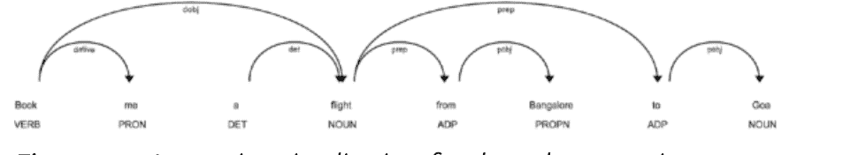

你也可以生成图 2-5 中的依存句法分析可视化。要创建这样的可视化，请运行以下代码，然后在浏览器中访问 **http://localhost:5000**。

让我们尝试对我们示例中的任务及其目标进行可视化。

```python
from spacy import displacy

doc = nlp(u'Book a table at the restaurant and the taxi to the hotel')
displacy.serve(doc, style='dep')
```

运行此代码将产生类似图 2-6 的输出。如果你得到类似的结果，请转到浏览器的另一个标签页并输入 **http://localhost:5000**。

我们得到了代码中该字符串的依存句法分析可视化（如图 2-7 所示）。

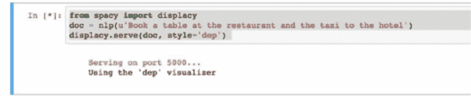


让我们再举一个依存句法分析的例子，假设用户询问以下句子：

*柏林有哪些地方可以参观，吕贝克有哪些地方可以住宿？*

我们将首先创建如下对象：

```python
doc = nlp(u"What are some places to visit in Berlin and stay in Lubeck")
```

现在，我们获取讨论的地点和用户想要的操作：

```python
places = [doc[7], doc[11]] #[Berlin, Lubeck]
actions = [doc[5], doc[9]] #[visit, stay]
```

由于你已经了解了词性标注和实体提取，你可以轻松地自动获取地点和操作。

现在我们有了地点，让我们遍历每个地点的祖先，并检查是否有任何祖先出现在操作列表中。在操作列表中找到的第一个父节点应该是该地点对应的操作。

```python
for place in places:
    for tok in place.ancestors:
        if tok in actions:
            print("User is referring {} to {}".format(place, tok))
            break
```

输出：

```
User is referring: Berlin to visit
User is referring: Lubeck to stay
```

正如我们在这些例子中看到的，依存句法分析使得理解用户所指的内容变得相当容易。我们看到，在处理两个不同任务的情况下，我们也能相当好地推断出用户的期望，并据此制定下一步的响应。

#### 依存句法分析在聊天机器人中有什么用？

依存句法分析是从头构建聊天机器人时最重要的部分之一。当你想要理解用户输入给聊天机器人的文本含义时，它变得更加重要。可能存在你尚未训练聊天机器人，但又不想失去客户或像愚蠢机器一样回复的情况。

在这些情况下，依存句法分析确实有助于找到关系，并进一步解释用户可能在询问什么。

如果我们列出依存句法分析有助于解决的问题，可能包括：

- 它有助于找到语法正确的句子中单词之间的关系。
- 它可用于句子边界检测。
- 它对于找出用户是否同时谈论多个上下文非常有用。

你一定在想，如果机器人用户说的句子语法不正确，或者在输入时使用了短信缩写怎么办？正如第 1 章所讨论的，你必须对这些情况保持警惕，并使用 NLP 技术相应地处理它们。

你需要编写自己的自定义 NLP 来理解用户或聊天机器人的上下文，并据此识别用户可能犯的语法错误。

总而言之，你必须准备好应对用户输入垃圾值或语法错误句子的场景。你无法一次性处理所有此类场景，但你可以通过添加自定义NLP代码或通过设计限制用户输入来不断改进你的聊天机器人。

### 名词短语

名词短语或NP-分块基本上是“基础名词短语”。我们可以说它们是以名词为中心的扁平短语。你可以将名词短语理解为一个名词加上描述该名词的词语。

让我们尝试举一个例子来更好地理解它。

#### 示例 1：

```python
doc = nlp(u"Boston Dynamics is gearing up to produce thousands of robot dogs")

list(doc.noun_chunks)
```

#### 输出：

```
[Boston Dynamics, thousands, robot dogs]
```

虽然从给定句子中提取名词短语很有帮助，但spaCy也提供了其他有用的属性。让我们尝试探索其中一些。

#### 示例 2：

```python
doc = nlp(u"Deep learning cracks the code of messenger RNAs and protein-coding potential")

for chunk in doc.noun_chunks:
    print(chunk.text, chunk.root.text, chunk.root.dep_, chunk.root.head.text)
```

输出：

正如我们从这个表格中看到的，我们得到了名词短语及其属性。下表将帮助你理解每一列。

| 列 | 含义 |
| :--- | :--- |
| **Chunk** | 原始名词短语 |
| **Root** | 将名词短语与剩余解析树连接起来的原始词 |
| **Root relation** | 将根节点与其中心词连接起来的关系 |
| **Root head** | 根节点的中心词 |

### 查找相似度

查找两个词之间的相似度是你在处理NLP时最常遇到的用例之一。有时，判断两个词是否相似变得相当重要。在构建聊天机器人时，你经常会遇到这样的情况：你不仅需要找到外观相似的词，还需要了解两个词在逻辑上的关联程度。

spaCy使用高质量的词向量，通过*GloVe算法*（全局词向量表示）来查找两个词之间的相似度。

GloVe是一种无监督学习算法，用于获取词的向量表示。GloVe算法使用从语料库中聚合的全局词-词共现统计信息来训练模型。

让我们尝试使用token的*vector*属性来查看spaCy向量中的实际值。

```python
doc = nlp(u'How are you doing today?')
for token in doc:
    print(token.text, token.vector[:5])
```

**输出：**

```
(u'How', array([-0.29742685, 0.73939574, -0.04001453, 0.44034013, 2.8967502], dtype=float32))
(u'are', array([-0.23435134, -1.6145049, 1.0197453, 0.9928169, 0.28227055], dtype=float32))
(u'you', array([0.10252178, -3.564711, 2.4822793, 4.2824993, 3.590245], dtype=float32))
(u'doing', array([-0.6240922, -2.0210216, -0.91014993, 2.7051923, 4.189252], dtype=float32))
(u'today', array([3.5409122, -0.62185854, 2.6274266, 2.0504875, 0.20191991], dtype=float32))
(u'?', array([2.8914998, -0.25079122, 3.3764176, 1.6942682, 1.9849057], dtype=float32))
```

看到这个输出，它并没有太多意义。从应用的角度来看，最重要的是不同词的向量有多相似——也就是说，词本身的含义。

为了在spaCy中查找两个词之间的相似度，我们可以这样做。

#### 示例 1：

```python
hello_doc = nlp(u"hello")
hi_doc = nlp(u"hi")
hella_doc = nlp(u"hella")

print(hello_doc.similarity(hi_doc))
print(hello_doc.similarity(hella_doc))
```

#### 输出：

```
0.7879069442766685
0.4193425861242359
```

如果你看*hello*这个词，它与*hi*这个词更相关、更相似，尽管*hello*和*hella*之间只差一个字符。

让我们再举一个句子的例子，学习spaCy如何进行相似度比较。还记得我们之前章节中的《权力的游戏》例子吗？我们将尝试一下，看看相似度。

#### 代码：

```python
GoT_str1 = nlp(u"When will next season of Game of Thrones be releasing?")
GoT_str2 = nlp(u"Game of Thrones next season release date?")
GoT_str1.similarity(GoT_str2)
```

#### 输出：

```
0.785019122782813
```

正如我们在这个例子中看到的，两个句子之间的相似度约为79%，这足以说明两个句子非常相似，事实也确实如此。这可以帮助我们在构建聊天机器人时节省大量编写自定义代码的时间。因此，我们得出一个事实：spaCy使用词向量为我们提供了两个词之间有意义的相似度，而不仅仅是看它们的拼写或字母。

我们将举一个非常简单的例子，尝试查找词之间的相似度。

```python
example_doc = nlp(u"car truck google")

for t1 in example_doc:
    for t2 in example_doc:
        similarity_perc = int(t1.similarity(t2) * 100)
        print("Word {} is {}% similar to word {}".format(t1.text, similarity_perc, t2.text))
```

#### 输出：

```
Word car is 100% similar to word car
Word car is 71% similar to word truck
Word car is 24% similar to word google
Word truck is 71% similar to word car
Word truck is 100% similar to word truck
Word truck is 36% similar to word google
Word google is 24% similar to word car
Word google is 36% similar to word truck
Word google is 100% similar to word google
```

当我们打算构建任何高度依赖NLP实现的应用程序时，查找词或句子之间的相似度变得相当重要。如果你曾经使用过StackOverFlow，每当我们尝试提出一个新问题时，它都会尝试列出平台上已经提出的类似问题。这是查找两组句子之间相似度可能有所帮助的最佳示例之一。spaCy基于已训练模型查找两个词之间相似度的置信度，完全取决于所采用的一般假设。

在构建聊天机器人时，查找相似度在以下情况下非常方便：

- 构建推荐型聊天机器人时
- 去重时
- 构建拼写检查器时

我们学到的这些东西在构建聊天机器人时非常重要，这样我们才知道如何解析用户输入，以便在编写代码中的业务逻辑时它们是有意义的。

### 聊天机器人NLP中值得了解的知识

在本节中，我们将学习一些有趣的话题，当你计划编写自己的自定义NLP方法来处理某些场景时，这些话题会经常派上用场。请务必通读它们，因为当你最不期望的时候，它们可能最需要。我们将简要讨论分词以及在聊天机器人场景中使用正则表达式。

### 分词

分词是NLP中一个简单但基本的概念，我们将文本分割成有意义的片段。spaCy首先对文本进行分词（即，将其分割成单词，然后是标点符号和其他内容）。你可能会想到一个问题：为什么我不能直接使用Python语言内置的*split*方法来进行分词？Python的split方法只是一个根据分隔符将句子分割成标记的原始方法。它不考虑任何意义，而分词则试图保留意义。

让我们尝试一些代码，看看分词是如何工作的。

#### 示例 1：

```python
doc = nlp(u'Brexit is the impending withdrawal of the U.K. from the European Union.')

for token in doc:
    print(token.text)
```

#### 输出：

```
Brexit
is
the
impending
withdrawal
of
the
U.K.
from
the
European
Union
.
```

如果你看上面的输出，U.K.在分词过程后作为一个单独的词出现，这是有道理的，因为U.K.是一个国家名称，将其拆分是错误的。即使这样，如果你对spaCy的分词结果不满意，那么你可以使用它的**add_special_case**方法在完全依赖spaCy的分词方法之前添加你自己的规则。

### 正则表达式

你一定已经知道正则表达式及其用法。本书假设你通常熟悉正则表达式。在本节中，我们只是快速浏览一些例子，看看正则表达式在构建聊天机器人时如何有益和有用。

文本分析和处理本身就是一个大课题。有时词语以一种使机器难以理解并进行训练的方式组合在一起。

正则表达式可以作为机器学习模型的一些后备方案。它具有模式匹配的能力，可以确保我们处理的数据是正确或错误的。第1章“聊天机器人历史”部分讨论的大多数早期聊天机器人都严重依赖模式匹配。

让我们看下面两个非常容易理解的例子。我们将尝试使用正则表达式从两个句子中提取信息。

帮我预订从机场站到香港站的地铁。
帮我预订从香港机场到亚洲国际博览馆的出租车。

以下是代码：

## 轻松构建聊天机器人

编写“轻松构建聊天机器人”这一章时，我们考虑到有时你并不想从头开始构建所有内容，而只是想快速完成任务。本章不要求你进行大量编码，但仍能让你对如何轻松构建聊天机器人并将其公开发布有一个清晰的认识。

本章对于学习构建聊天机器人之所以如此重要，是因为软件世界发展太快，难以完全适应。有时我们需要非常快速地构建应用程序，于是会寻找开源库中可用的工具来快速构建应用，而无需重新发明轮子。有时我们的编码能力不足以从头构建所有内容。即使我们想从头构建应用，也可能因为学习曲线对新手来说过于陡峭而无法实现。

本章将帮助你快速构建聊天机器人，并将其公开供全世界使用。

我们将尝试使用一个曾名为Api.ai的工具，现在它被称为Dialogflow。

### Dialogflow简介

Dialogflow通过构建引人入胜的语音和文本对话界面（如语音应用和聊天机器人），为用户提供了与产品交互的新方法。

Dialogflow由AI驱动。它帮助你与用户在网站、移动应用、Google Assistant、Amazon Alexa、Facebook Messenger以及其他流行平台和设备上建立连接。

下图来自Dialogflow，展示了他们如何处理用户请求。

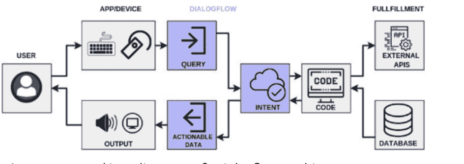

以下是处理过程：

- 用户与输入设备对话。
- 用户查询进入Dialogflow引擎。
- Dialogflow尝试识别意图。
- 根据意图，执行操作并从数据库返回数据。
- 响应返回给意图。
- 响应被转换为可操作的数据。
- 用户的信息请求被返回给输出设备。

Dialogflow中有一个代理的概念，最好将其描述为自然语言理解模块。这些模块可以包含在你的应用、产品或服务中，并将用户的自然请求转换为可操作的数据。当用户输入与代理中的某个意图匹配时，这种转换就会发生。

代理也可以被设计为以特定方式管理对话流程。这可以通过上下文、意图优先级、槽填充、职责以及通过webhook的履行来实现。

### 入门

了解我们到目前为止所学的内容是重要且必要的，因为开源中的免费工具和包并不总是有助于构建一个功能齐全的聊天机器人应用。

很多时候，你可能会遇到这样的情况：你想自己构建所有内容，以便对应用有更多控制权。我们将在下一章学习这些内容，并同时运用之前学到的NLP技术。

本章主要关于创建一个作为概念验证的聊天机器人，并使其准备好供全世界使用，即使你只有最少的编程经验或没有编程经验。

### 构建一个点餐聊天机器人

我们将借助Dialogflow为一家特定餐厅创建一个聊天机器人。我们将其命名为OnlineEats产品。你可以选择任何其他你想要构建聊天机器人的用例。在本章中，我们将构建一个点餐聊天机器人。

### 确定范围

让我们确定这个聊天机器人的范围——即它能做什么以及能做到什么程度。

- 它应该能够动态地向用户问好。
- 它应该能够理解菜单项及其请求的数量。
- 聊天机器人应该能够代表用户下单。
- 在用户询问时，提供订单状态。

### 列出意图

这里我们列出希望聊天机器人训练的意图，以便在用户询问时能够理解这些意图。

#### 意图

- 默认欢迎意图：当用户向聊天机器人发送消息时
- 下单意图：当用户要求机器人点餐时
- 商品描述意图：当用户说明他们想要的商品和数量时
- 订单状态：当用户想了解其订单状态时
- 订单ID：机器人需要理解用户的订单ID以进行跟踪。
- 用户感谢：当用户感谢机器人时

### 列出实体

我们将尝试在这里列出所有意图的所有可能实体。在本章后面，我们将看到它们为适用的意图进行定义。

#### 实体

- food_items：用户想点什么食物？
- quantities：用户愿意订购的食物数量是多少？
- order_id：用户下单的订单ID

### 构建点餐聊天机器人

让我们也设定一下对聊天机器人的期望，即我们应该能看到它完成的最基本的事情。为此，让我们创建一个聊天机器人和用户之间的对话脚本。这有助于我们坚持计划，完成一个基本可用的聊天机器人，假设用户以友好且正确的方式进行对话。

聊天机器人和用户对话脚本：

**用户：** 你好

**OnlineEatsBot：** 你好，欢迎！有什么可以帮您？

**用户：** 我想点中餐。

**OnlineEatsBot：** 好的，您今天想点什么？

**用户：** 一份鸡肉饺子和两份春卷。

**OnlineEatsBot：** 好的。您的最终金额是XYZ，您的订单已下：1份鸡肉饺子和2份春卷。

**用户：** 我还没收到我的订单。我的食物在哪里？

**OnlineEatsBot：** 能请您提供一下订单ID吗？

**用户：** 123456

**OnlineEatsBot：** 订单ID：123456的订单状态。送货员已在您所在区域，您的食物大约5分钟后送达。

**用户：** 谢谢。

**OnlineEatsBot：** 非常感谢您的配合。

### 总结

此时，您应该对为什么在开始构建聊天机器人之前需要了解NLP有了清晰的认识。在本章中，我们学习了Python中的spaCy模块、其特性以及如何安装它。我们深入探讨了NLP的各种方法，这些方法在构建聊天机器人时被广泛使用。我们学习了词性标注、词干提取与词元化的区别、实体识别、名词短语分块以及查找词组之间的相似性。

我们执行了所有这些概念的代码，并通过实践而不仅仅是阅读来学习了所有这些内容，这正是本书所强调的。我们还复习了分词和正则表达式的基础知识。我们已经准备好在下一章使用一个名为Dialogflow的免费工具来构建我们的聊天机器人。我们将在下一章学习如何训练我们的聊天机器人来理解和提取用户提供的信息。

```python
sentence1 = "Book me a metro from Airport Station to Hong Kong Station."
sentence2 = "Book me a cab to Hong Kong Airport from AsiaWorld-Expo."

import re

from_to = re.compile('.* from (.*) to (.*)')
to_from = re.compile('.* to (.*) from (.*)')

from_to_match = from_to.match(sentence2)
to_from_match = to_from.match(sentence2)

if from_to_match and from_to_match.groups():
    _from = from_to_match.groups()[0]
    _to = from_to_match.groups()[1]
    print("from_to pattern matched correctly. Printing values\n")
    print("From: {}, To: {}".format(_from, _to))
elif to_from_match and to_from_match.groups():
    _to = to_from_match.groups()[0]
    _from = to_from_match.groups()[1]
    print("to_from pattern matched correctly. Printing values\n")
    print("From: {}, To: {}".format(_from, _to))
```

输出：

```
to_from pattern matched correctly. Printing values
From: AsiaWorld-Expo., To: Hong Kong Airport
```

尝试将**sentence2**改为**sentence1**，看看代码是否能很好地识别模式。鉴于当今机器学习的强大能力，正则表达式和模式匹配已经退居次要地位，但请确保你对此有所了解，因为它可能随时需要用于从单词、句子或文本文档中解析特定细节。

既然我们已经编写了一个用于构建聊天机器人的基础脚本，现在我们将深入探讨 Dialogflow。

### Dialogflow 入门

让我们按照以下步骤在 Dialogflow 中创建一个账户，然后创建一个代理。（代理不过是聊天机器人的另一个名称。）

在并登录账户。
创建一个代理。

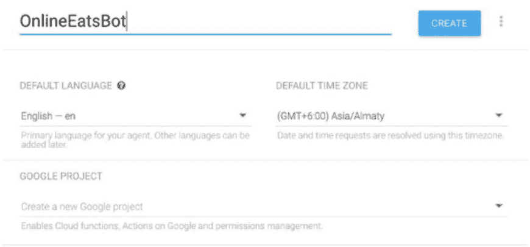

**图 3-2.** *在 Dialogflow 中创建新代理*

输入详细信息，例如代理名称、时区、默认语言，以及您想要选择或创建的新 Google 项目。

创建意图。

如果您看到图 3-3，您会发现我们已经有两个现成的意图。

- **默认回退意图：** 当用户输入未被任何常规意图或已启用的内置闲聊匹配时，会触发回退意图。创建新代理时，会自动创建一个默认回退意图。您可以根据需要修改或删除它。
- **默认欢迎意图：** 我们可以扩展这个欢迎意图以用于我们自己的聊天机器人。您应该添加一些您自己的用户表达式和默认回复。

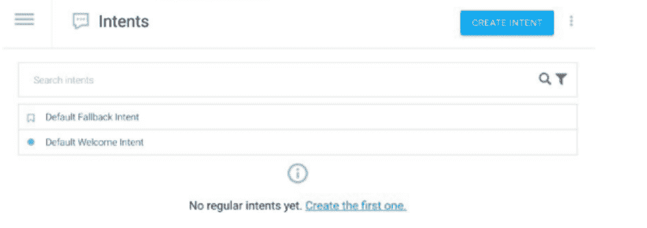

**图 3-3.** *在 Dialogflow 中创建意图*

在创建我们自己的意图之前，让我们先按照以下步骤在默认欢迎意图中添加一些话语并使其准备就绪：

- 点击默认欢迎意图。
- 在训练短语中添加您自己的用户表达式。
- 点击 **保存**。

当我们点击保存时，后台的机器学习模型会运行并训练我们提供的数据（即用户表达式）。训练数据意味着让机器根据我们提供的数据理解这是什么类型的意图，并能够在给它任何新数据时进行预测。例如，如果我们看图 3-4，其中我们定义了五个机器已经知道属于“欢迎意图”的用户表达式，如果用户说“你好”，而这个表达式在任何地方都没有定义呢？机器仍然会将“你好”归类为**默认欢迎**，因为训练中使用的特征和机器用于欢迎意图的特征在新的用户表达式中是相似的。

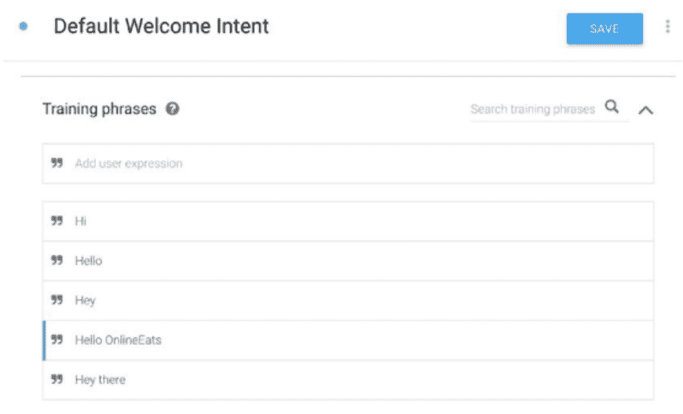

**图 3-4.** *在 Dialogflow 中定义默认欢迎或问候意图*

让我们尝试看看欢迎意图是否对我们有效。使用 Dialogflow，我们可以在仪表板中直接完成此操作。参见图 3-5。

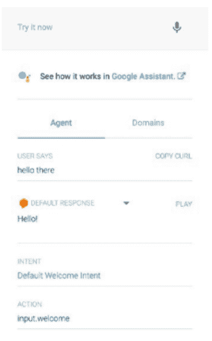

**图 3-5.** *在 Dialogflow 中测试欢迎意图*

### 创建意图时需要记住的要点

让我们看看在 Dialogflow 上创建意图时需要了解的一些重要点。

- Dialogflow 的意图还具有为每个意图设置默认回复的功能。默认回复是每次识别到该意图时返回给用户的回复。在我们的例子中，当用户说“你好”时，我们会从机器人那里得到“你好！”作为回复。
- 如果您愿意，可以添加更多回复或删除现有回复，拥有多个回复会使机器人看起来更真实，这样它就不会每次都用相同的回复回复，让与机器人交谈的用户感觉更人性化。
- Dialogflow 中的意图还具有标记为对话结束的能力。换句话说，您可以让机器人假设用户将不再参与对话，机器人可以根据此信息执行必要的操作来结束对话。

### 创建意图并添加话语

既然我们已经创建了欢迎意图，让我们创建一个名为 **order** 的意图

以下是我输入的用户表达式：

- 我想要食物
- 我想尽快点餐
- 你能帮我点餐吗？请帮我点餐
- 我想点中餐 我想点餐
- 你能帮我点餐吗？你能帮我点餐吗？
- 我想点餐
- 我想点泰餐
- 我想点中餐

现在，我们已经构建了意图来识别上述用户表达式或相关的用户表达式。现在，是时候使用意图的 *默认回复* 向用户添加回复了。

### 为意图添加默认回复

我们将添加三个可能的回复，一旦遇到 **place_order_intent**，这些回复将返回给用户。

当然，您今天想点什么？当然，您今天想吃什么？

当然，我会尽力帮助您。您今天想吃什么？

现在，下一步是等待用户输入他想要的物品并解析这些物品。

现在我们将创建一个新的意图，告诉我们用户实际打算点什么（即食物项目）。

我们创建一个名为 **items_description** 的新意图

首先，我们添加标准的用户表达式。

> 一个鸡肉饺子和两个春卷。

当我们添加用户表达式时，我们可以选择我们想要指定为意图实体的特定单词。这可以是数量、日期或时间、位置等，这些是预定义的，但我们可以通过在弹出框后点击右下角的“创建新”按钮来创建我们自己的实体。

突出显示话语中您想要将其选定为实体的单词。之后，它会打开弹出框来创建我们自己的实体。

在这个例子中，我们应该能够以一种易读的格式解析数据，以便我们可以使用任何编程语言来使用它。JSON 格式是当今跨平台应用程序中我们可以拥有的最佳格式。Dialogflow 默认以 JSON 格式返回数据，可以解析成如下代码所示的样子。始终建议将您的数据保持尽可能小；不要通过提供太多数据使 API 响应不堪重负。请记住，所有这些在大规模应用时都会产生成本。

```json
{
    "food_items": {
        "chicken dumpling": 1,
        "Spring rolls": 2
    }
}
```

### 物品描述意图和所属实体

我们可以选择 One 和 Two 并将它们定义为 @sys.number，这不过是数据类型。我们将创建一个名为 **food_items_entity** 的新实体来识别食物项目。

如果您看图 3-6，您会发现我们有一个名为 **food_items_** 的实体，但当我们选择单词时，我们将参数命名为 **food_items_ entity1**，对于食物数量（这是一个数字）也是如此，我们将第一个和第二个参数分别命名为 **quantity1** 和 **quantity2**。

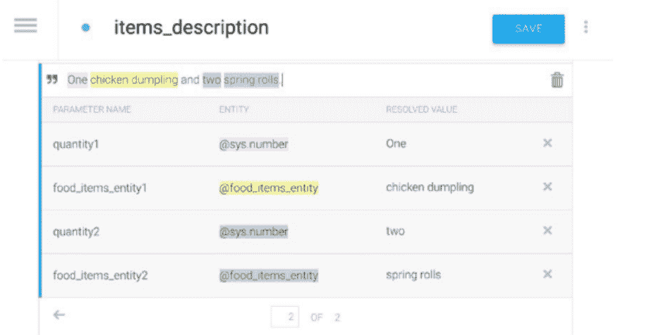

**图 3-6.** *物品描述意图*

我们在这里定义的内容将帮助我们理解在触发意图后将获得的 JSON 响应。我们应该拥有所有这些值才能继续进行聊天机器人流程。

因此，选择整个单词或单词组合，然后点击“创建”。将出现一个新屏幕来创建实体；只需输入这个新实体的名称并保存。

现在，回到我们的 **items_description** 意图，您应该会看到类似图 3-6 的内容。

继续在训练短语中添加更多用户表达式，并在其中定义实体。

到目前为止，我们已经添加了四个话语，它们看起来是这样的。我们将添加尽可能多的话语，以便我们的代理在意图分类方面的准确性更高。

Dialogflow 还有一个功能可以共享代理的训练数据。本书中使用的训练数据可以通过 Apress 网站访问，[https://github.com/Apress/building-](https://github.com/Apress/building-)。正如您在图 3-7 中看到的，我们尝试在我们的 Dialogflow 代理的物品描述意图中添加更多示例。

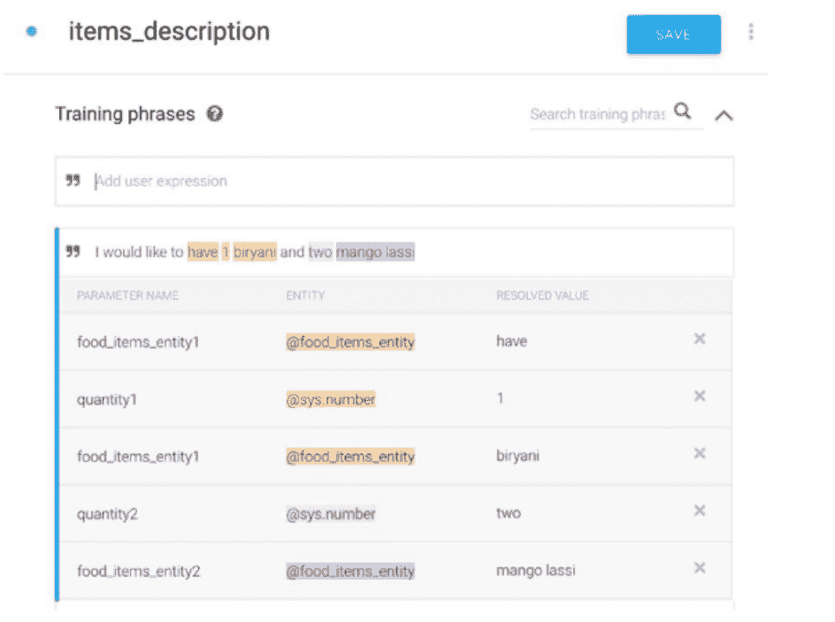

**图 3-7.** *在物品描述意图中添加更多话语*

现在，在这一点上，一旦我们保存了意图，并且我们的代理已经完成了模型的训练。如果我们在右侧输入以下句子，我们应该能够看到以下 JSON 响应：

一个鸡肉饺子和两个春卷

来自意图的响应：

```json
{
```

### 理解并向用户回复

现在，对话的下一步是让机器人向用户回复，表明订单已被理解，并附上任何新信息。新信息可能是生成的订单号、订单金额或预计送达时间。这些信息将在你的服务器端填充，你可以将其组织到机器人的回复中，再返回给用户。

现在，让我们尝试在我们的案例中添加订单金额；为此，我们可以使用 Dialogflow 的**默认回复**功能，并将其添加到该意图中。目前我们先硬编码金额，因为这个金额会根据食物项目、数量或餐厅的不同而变化。在本章后面，我们将讨论如何通过调用 API 来使其动态化。

这里有趣的是，我们可以访问从意图中获取的参数（即食物项目及其数量）。回复可以包含**对参数的引用**。我们稍后会理解这一点。

如果某个参数存在于参数表中，我们可以在“文本回复”字段中使用以下格式来引用其值：$parameter_name。

我们可以在默认回复中使用这些参数，以便机器人向用户确认订单。

添加 *您的最终金额是 XYZ，您的订单已下，数量为 $quantity1 的 $food_items_entity1 和数量为 $quantity2 的 $food_items_entity2*”作为回复。

**注意，如果我们的意图无法解析食物项目或其数量，我们需要提供一个不同的默认回复，要求解释机器人无法理解的内容或至少进行确认。我们已经在“向意图添加默认回复”一节中学习了如何向意图添加默认回复。**

### 订单状态意图

现在，让我们创建 order_status 意图，用户可能在订单下达后试图询问订单状态。

图 3-8 提供了一些我们为订单状态意图添加的训练短语，我们将该意图命名为 **order_status**。

##### 训练短语

- 添加用户表达
- 告诉我我的食物在哪里？
- 你能帮我查一下我的食物订单状态吗？
- 我的食物订单状态是什么？
- 你能告诉我我的食物在哪里吗？
- 我的食物在哪里？
- 你好，我什么时候能收到我的食物订单？
- 我还没收到我的订单。
- 我的订单在哪里？

图 3-8. 创建订单状态意图

现在，让我们尝试一些随机的订单状态询问话语，看看我们的代理是否足够智能来识别意图。

我尝试了，*收到我的食物*，瞧——我的代理完全正确地识别出这是一个 **order_status** 意图。

查看图 3-9 中 JSON 中的 *resolvedQuery* 及其 intentName。

### JSON

```json
{
  "id": "e68790f6-3d9c-4398-a7b1-5b1f6a3d0f1b",
  "timestamp": "2018-04-01T21:45:20.386Z",
  "lang": "en",
  "result": {
    "source": "agent",
    "resolvedQuery": "Haven't received my food yet",
    "action": "",
    "actionIncomplete": false,
    "parameters": {},
    "contexts": [],
    "metadata": {
      "intentId": "a76ae537-b648-4e81-a03d-eca7bc84b136",
      "webhookUsed": "false",
      "webhookForSlotFillingUsed": "false",
      "intentName": "order_status"
    },
    "fulfillment": {
      "speech": "",
      "messages": [
        {
```

*图 查询解析后来自 Dialogflow 的 JSON 响应*

### 用户订单ID意图

现在，下一步是向用户询问订单ID，所以让我们将此意图的默认回复设置为询问以下问题。

*你能告诉我你的订单ID吗？*

现在，用户将提供他们的订单ID，我们的任务是识别它并再次给出回复。

为此，我们需要创建另一个意图来识别用户何时在谈论订单ID。

请注意，我们创建的意图彼此之间基本是独立的。

在这种情况下，我们知道用户将提供订单ID，并且很可能是正确的。如果错误，你总是可以回到用户那里再次询问。

我们还应该注意，在某些情况下，order_id 和电话号码可能都是整数。在这种情况下，我们需要进行一些验证，比如订单ID或电话号码的位数。此外，根据前一个问题的上下文，你可以判断用户是在提供 order_id 还是电话号码。正如第1章所讨论的，我们总是可以使用决策树来更好地管理聊天机器人的流程。我们还可以通过编程方式跟踪，在 **order_status** 意图之后我们询问订单ID，用户将发送某个订单ID（某个数字），这在代码中比创建一个全新的意图更容易解析。

在这个例子中，我们将创建 user_order_id 意图，因为目前没有冲突。现在，我们创建一个名为 **user_order_id** 的新意图。

图 3-10 显示了我们的 **user_order_id** 意图的样子。

#### user_order_id

##### 训练短语

- 添加用户表达
- 662286
- 785648
- 是的，订单号 001901
- 为什么不是订单ID 001212
- 当然，我的订单ID是 394820
- 订单ID：545454
- 订单ID 453455
- 我的订单ID是 123456

图 3-10. 在我们的代理中定义用户订单ID意图

我测试了几个表达式，它都能很好地将它们正确分类为 **user_order_id** 意图。始终使用 Dialogflow 控制台进行测试，以查看你的意图是否按预期工作。

现在，让我们将 **user_order_id** 意图的默认回复设置为机器人的以下回复：

> 订单ID：$order_id 的订单状态。配送员已在您所在区域，您的食物大约5分钟后送达。

我们再次使用从 **user_order_id** 意图解析的参数来准备给用户的回复。

### 用户感谢意图

接下来，用户可能会表示感谢，如果不是其他事情的话，所以我们创建一个名为 **user_thanks** 的新意图，以识别用户说谢谢的不同方式。这很重要，因为一旦用户以某种方式说了*谢谢*，我们的机器人应该以同样的方式回复。

我们不应该仅仅期望用户在配送状态默认回复后说谢谢并盲目回复，而应该尝试使用自定义意图来识别它。

图 3-11 显示了我们的 **user_thanks** 意图的样子。

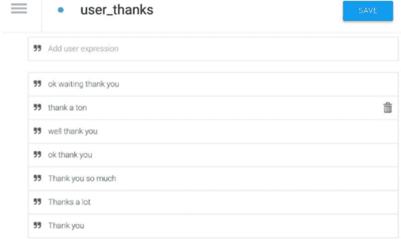

**图 3-11.** *定义用户说谢谢时的意图*

现在，是时候使用默认回复功能向用户说谢谢，并将此意图标记为对话的结束。

让我们添加一些文本，比如 *非常感谢您的配合*”作为我们的默认回复。我们可以添加更多这样的回复，使机器人看起来更真实（见图 3-12）。

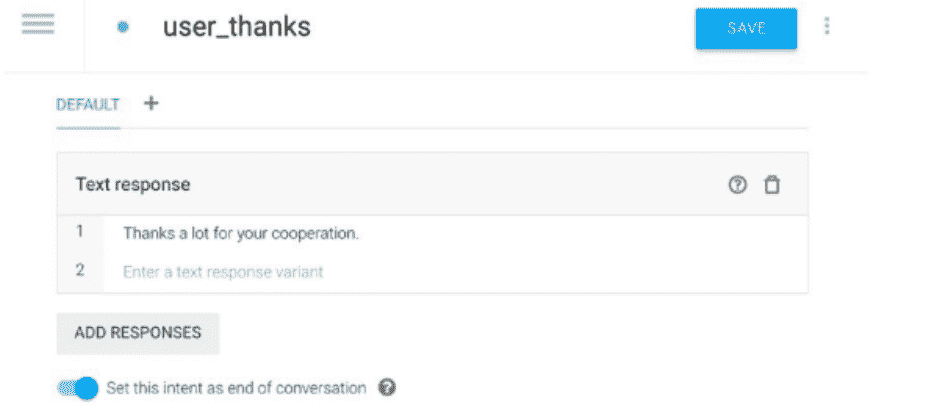

**图 3-12.** *在代理中为用户意图添加回复*

查看图 3-12，我们看到我们已将此意图启用为对话结束。

如果我们尝试将我们的机器人与 Google Assistant 集成，那么启用此选项意味着在意图完成时关闭 Google Assistant 的麦克风。

至此，我们已经创建了机器人，按照初始设计和脚本构建并训练了它。现在，是时候将其部署到网络上，看看效果如何了。

### 在网络上部署 Dialogflow 聊天机器人

在本部分中，我们将把机器人与 Facebook Messenger、Twitter、Slack 等各种平台集成，并测试它们是否正常工作。还有更多平台可以轻松集成此机器人。

目前，我们将使用 Web Demo 和 Facebook Messenger 来测试我们的机器人。

让我们转到 Dialogflow 账户中的集成页面，并启用 **Web Demo**。您将看到一个类似图 3-13 的弹出窗口。点击弹出窗口中的链接。

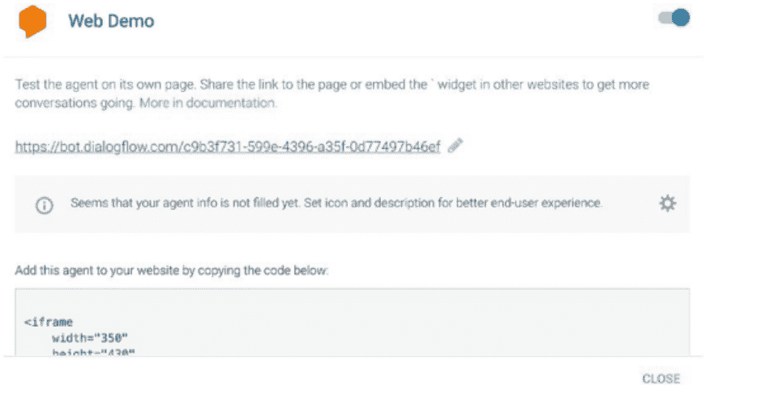

**图 3-13.** *Dialogflow 的网络演示链接*

您将看到类似图 3-14.1 到 3-14.4 的内容。我用我们编写的对话测试了我的机器人，它运行得非常出色。

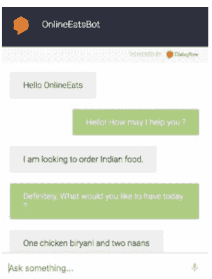

图 3-14.1. OnlineEatsBot 演示对话界面 I

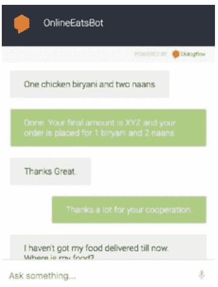

图 3-14.2. OnlineEatsBot 演示对话界面 II

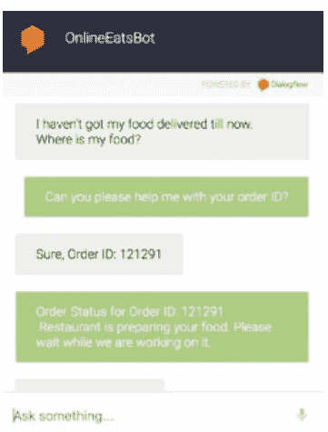

图 3-14.3. OnlineEatsBot 演示对话界面 III

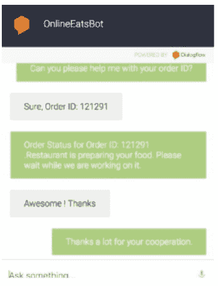

图 3-14.4. OnlineEatsBot 演示对话界面 IV

除此之外，我们还可以使用弹出窗口中找到的 iframe 代码将此机器人嵌入到我们自己的网站中。

在此处与我的 **OnlineEatsBot** 交谈：

[https://bot.dialogflow.com/c9b3f731-599e-4396-a35f-0d77497b46ef](https://bot.dialogflow.com/c9b3f731-599e-4396-a35f-0d77497b46ef)

也与您的朋友和家人分享您自己的机器人，看看他们如何以合理的方式与机器人互动。如果您的聊天机器人没有按预期工作，请尝试修复它。

### 在 Facebook Messenger 上集成 Dialogflow 聊天机器人

在本节中，我们将尝试将相同的聊天机器人集成到 Facebook Messenger，以便 Facebook 平台上的用户也可以使用它，而无需访问我们的网站。

让我们回到 Dialogflow 仪表板中的集成页面，启用 Facebook Messenger 图标，然后点击它，这应该会弹出一个与之前类似的窗口。

在这里，我们需要前往 Facebook，注册一个应用程序，并获取所需的令牌。

- 验证令牌（任何字符串，仅供您自己使用）
- 页面访问令牌（输入在 Facebook 开发者控制台中生成的令牌）

Dialogflow 的 Facebook 集成非常有用，可以轻松创建基于 Dialogflow 技术的、具有自然语言理解能力的 Facebook Messenger 机器人。

### 设置 Facebook

为了使我们的机器人在 Facebook 上以相同的方式工作，我们需要执行以下操作：

创建一个 [Facebook 账户（如果您还没有）](https://www.facebook.com/)
创建一个 Facebook 页面，您可以将机器人添加到该页面。

当用户访问您的 Facebook 页面并发送消息时，
他们将直接与您的机器人对话。

### 创建 Facebook 应用程序

以下是创建应用程序的步骤：

登录 [Facebook 开发者](https://www.facebook.com/developer)
点击右上角的 **My Apps**。
点击 **Add a New App**，输入名称和联系电子邮件地址。
点击 **Create App ID**，如下图 3-15 所示。

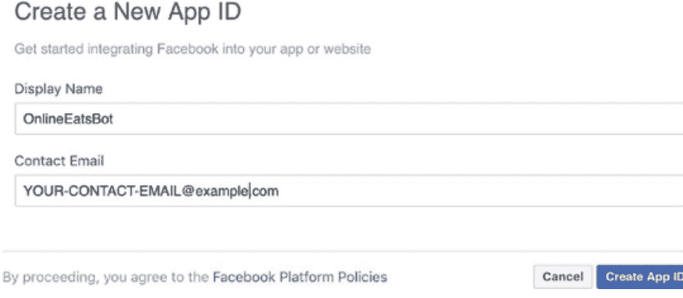

在下一页，点击 **Messenger** 选项的 **Set Up** 按钮。
在 **Token Generation** 部分，让我们选择我们希望机器人连接的 Facebook 页面（参见图 3-16）。

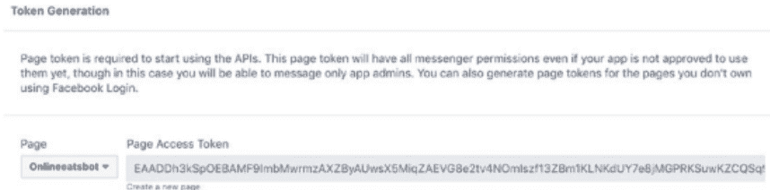

**图 3-16.** 通过为机器人选择您的 Facebook 页面来生成令牌

这将生成一个 **Page Access Token**。请妥善保管此令牌，因为我们需要在 Dialogflow 中输入它。

### 设置 Dialogflow 控制台

以下是步骤：

在 Dialogflow 控制台的左侧菜单中点击 **Integrations** 选项，如果尚未启用，请开启 **Facebook Messenger**。在打开的弹出窗口中，输入以下信息，如图 3-17 设置和集成 Dialogflow 与 Facebook Messenger 所示：

- **Verify Token：** 这可以是您想要的任何字符串，仅供您自己使用
- **Page Access Token：** 输入在 Facebook 开发者控制台中生成的令牌

点击 **Start** 按钮。

### Facebook Messenger

为 Facebook Messenger 创建并训练一个对话机器人。

在您设计并测试了 Dialogflow 代理后，您可以启动您的 Messenger 机器人

1. 获取您的 Facebook 页面访问令牌并将其插入下面的字段。
2. 创建您自己的验证令牌（可以是任何字符串）。
3. 点击下面的 'START'。
4. 使用回调 URL 和验证令牌在 Facebook Messenger Webhook 设置中创建一个事件。

更多内容请参阅文档。

| 回调 URL | https://bots.dialogflow.com/facebook/c9b3f731-599e-4396-a35f-0d77497b46ef/webhook |
| 验证令牌 | 在此输入您自己的令牌 |
| 页面访问令牌 | EAADDh3kSpOEBAMvXKtPFjLqxNJgZAje4QqyNbBEpSAVTSqemikwTDeTl0pvmNt9rZAKMDuQ |

图 3-17. 设置和集成 Dialogflow 与 Facebook Messenger

您应该会收到一条消息，内容为“Bot was started.”。这意味着我们准备就绪了。

您一定想知道回调 URL、验证令牌和页面访问令牌是什么。让我们试着理解一下。

### 回调 URL

回调 URL 无非是一个公开可访问的 URL，Facebook 将向该 URL 发送来自您 Facebook 页面的任何实时请求。

假设您正尝试在 **OnlineEats** 上支付餐费，然后被重定向到银行的支付页面。现在，**OnlineEats** 必须向银行提供一个回调 URL，以便在支付完成后将用户重定向到该 URL。

这里 Facebook 不会进行任何重定向，而是会获取用户在页面聊天框中发送的所有消息，并将其 POST 到 webhook 或回调 URL。

现在，一旦我们在服务器上收到消息，我们就会进行意图分类和实体解析，然后制定您想要回复用户的内容。

### 验证令牌

验证令牌是在订阅被验证时发送到您端点的任意字符串。需要它的原因是确保我们的服务器知道该请求是由 Facebook 发出的，并且与我们刚刚配置的订阅相关。

假设其他人知道了您的 webhook 并冒充 Facebook 发送消息，那么 *verify_token* 就会派上用场，您将验证来源是否正确。基于此令牌，您也可以处理来自多个来源的 POST 请求，因为不同的来源会定义不同的令牌，但回调 URL 是相同的。

### 访问令牌

Facebook API 需要页面访问令牌来管理 Facebook 页面。它们对于每个页面、管理员和应用程序都是唯一的，并且有到期时间。

> 注意 请妥善保管回调 URL 和验证令牌，以便现在配置 webhook。

### 配置 Webhooks

要配置我们机器人的 webhook，让我们回到 Facebook 开发者控制台：

当您点击仪表板时，点击 **Add a product** 部分下 webhooks 的 **Setup** 按钮。如果您尚未订阅 webhook，那么您将看到一个选项，内容为“subscribe to this object”。点击此选项会弹出一个新窗口，输入以下信息：

- **Callback** 这是 Facebook Messenger 集成页面上提供的 URL。
- **Verify** 这是您创建的令牌。

转到 Messenger ▶ Settings ▶ Setup Webhooks。您将看到一个类似图 3-18 的弹出窗口。添加您的回调 URL 并验证令牌。

### 新页面订阅

回调 URL

https://bots.dialogflow.com/facebook/c9b3f731-599e-4396-a35f-0d77497b46ef/webhook

验证令牌

dialogflow_verify_token

订阅字段

- [x] messages
- [x] messaging_postbacks
- [ ] messaging_optins
- [ ] message_deliveries
- [ ] message_reads
- [ ] messaging_payments
- [ ] messaging_pre_checkouts
- [ ] messaging_checkout_updates
- [ ] messaging_account_linking
- [ ] messaging_referrals
- [ ] message_echoes
- [ ] messaging_game_plays
- [ ] standby
- [ ] messaging_handovers
- [ ] messaging_policy_enforcement

了解更多

取消

验证并保存

图 3-18. 在 Facebook 中为 Dialogflow 机器人设置 webhooks

请在**订阅字段**下勾选**messages**和**messaging_postbacks**选项。你可以根据自己的用例选择任何需要的选项。
点击**验证并保存**按钮。可参考图3-18。

你将返回设置页面，此时**Webhooks**状态应显示为“完成”。请确保选择一个可以订阅页面事件的页面。

### 测试 Messenger 机器人

为了使我们的机器人可供测试，我们需要将应用公开：

- 在 Facebook 开发者控制台的左侧菜单中，点击**应用审核**。
- 点击**将 APP 名称>公开？**下方的开关。如果出现**无效的隐私政策网址**提示，请前往对话框中的基本设置链接，如果尚未设置，请暂时为隐私政策网址填写任意网址，然后点击保存更改。现在，返回**应用审核**页面，再次尝试将应用切换为公开。
- 系统将提示你为应用选择一个类别。
- 从列表中选择**教育**。你可以自由选择最适合你机器人的类别。
- 如图3-19所示，点击**确认**按钮，将你的 Facebook 应用公开。

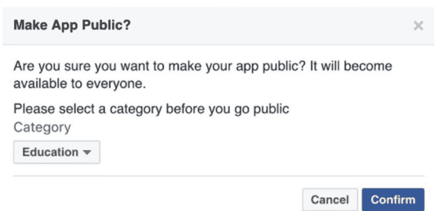

**图3-19.** *将你的 Facebook 应用公开*

我们还需要为页面创建一个用户名。这是用户在使用我们的机器人时将与之聊天的用户名。要设置用户名，请点击页面“关于”部分下的**创建页面 @用户名**链接，如图3-20所示。这有助于使用一个简短的名称与他人分享你的页面或机器人。

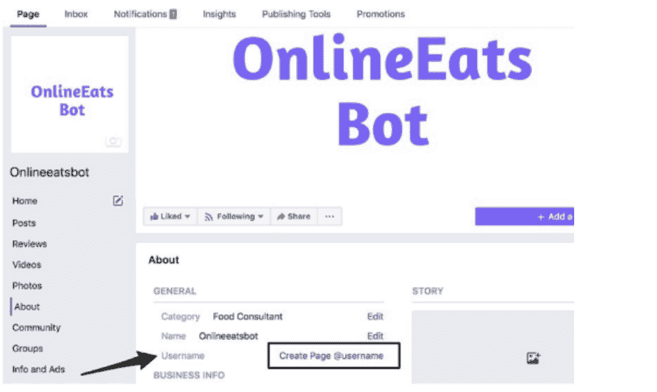

图3-20. 创建你的 Facebook 机器人页面用户名

让我们在 Facebook Messenger 上测试与我们在 Dialogflow 网站上测试过的相同流程。你应该能够通过参考图3-21.1到图3-21.4来了解我的 Facebook Messenger 机器人的响应方式。


图3-21.1. Facebook Messenger OnlineEatsBot 演示屏幕 1

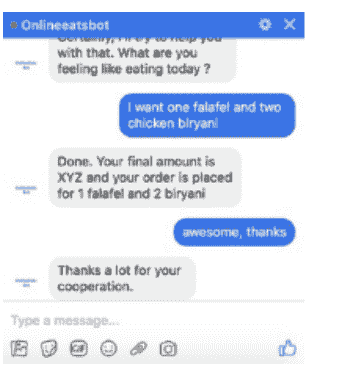

图3-21.2. Facebook Messenger OnlineEatsBot 演示屏幕 II

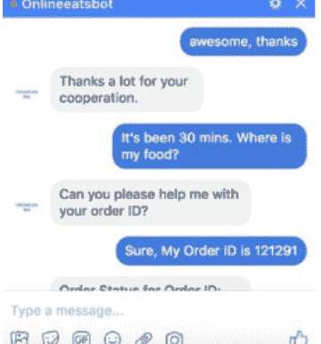

图3-21.3. Facebook Messenger OnlineEatsBot 演示屏幕 III

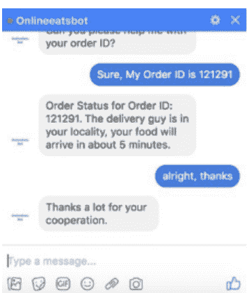

图3-21.4. Facebook Messenger OnlineEatsBot 演示屏幕 IV

好了，各位，这就是我们构建机器人的方式。

第4章将会更加有趣。在第4章中，我们将尝试在不依赖 Dialogflow API 或控制台的情况下实现相同的功能。

当你能完全掌控自己拥有的一切时，总是件好事，不是吗？

注意：你可以前往你的账户设置，直接导出或导入其他代理。你可以下载 zip 文件。你可以使用此 zip 文件将其导入 Dialogflow，并试玩我们在本章构建的聊天机器人。

你一定在想，如果我想实时下单，并使用供应商/餐厅的 API 查找订单状态，然后相应地回复用户，该怎么办？这可以是任何你想进行的 API 调用——实时检索数据并组织机器人的回复。在结束本章并为下一章做准备之前，是时候了解如何做到这一点了。

让我们学习一下 Dialogflow 中一个叫做 fulfillment 的东西。

### Fulfillment

为了获取用户请求的一些实时信息，我们需要开发一些 API 或使用现有的 API。为了使用 Dialogflow 实现这一点，我们需要设置一个 webhook，这需要部署一个服务并调用一个 API。

我们不会深入探讨构建 API 和如何部署的细节，但如果你曾经尝试使用过任何 Google 或 Facebook API，你至少应该熟悉如何调用它们。

我构建了一个基于 Flask 的小型 API，并将其部署到 Heroku。我将使用它进行 fulfillment，它只需在 URL 中接收任何 order_id 并返回一个随机的 order_status。如果你不熟悉 Heroku，不用担心，你可以在本地系统上运行提供的代码并进行测试。在接下来的章节中，我们将使用 Heroku 部署许多应用程序，你可以在那里学习相关知识。

在代码中，你可以阅读如何解析 order_identity、intentName 等。在此处查找代码：**flask_onlineeats_demo.zip**

请求 URL：[https://radiant-bayou-76095.herokuapp.com/onlineeatsbot/](https://radiant-bayou-76095.herokuapp.com/onlineeatsbot/)

[api/v1.0/order_status/](api/v1.0/order_status/)

因此，在 Dialogflow 中，Fulfillment 会将意图的 JSON 响应 POST 到此 URL，你需要解析它以获取相关的实体及其值，并执行特定操作。

你也可以尝试在 Heroku 上部署示例 Flask 应用代码，并在你的机器人中拥有自己的端点用于 fulfillment。

现在，Dialogflow 将为启用了 webhook 调用的意图，将其 JSON 响应 POST 到我们的端点。它包含解析 **order_id** 实体并基于此采取行动的代码。目前，该代码仅从列表中返回一个随机选择的状态。

要测试 API 是否正常工作，请转到 POSTMAN 并使用图3-22中的示例数据进行测试。如果你在本地运行 Flask 应用，请使用本地 URL。

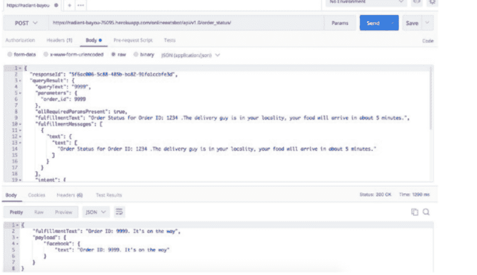

**图3-22.** 在 POSTMAN 中测试部署在 Heroku 上的 fulfillment API

### 启用 WEBHOOK

那么，让我们前往 Dialogflow 中的 fulfillment 页面，尝试启用 webhook（见图3-23）。

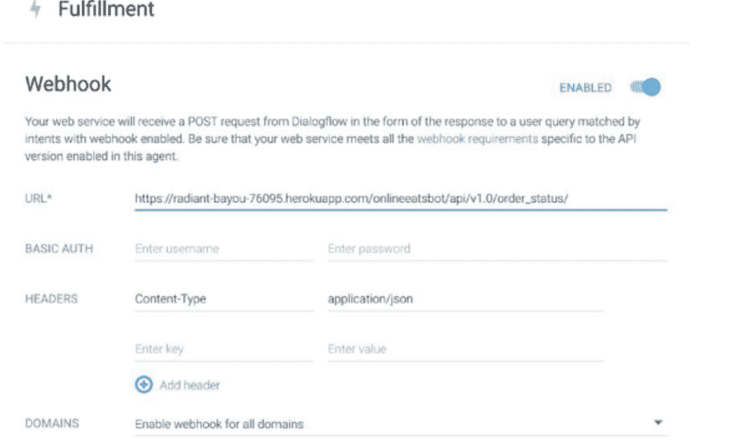

图3-23. 在 Dialogflow 中为 fulfillment 设置 webhook

确保你已为 **user_order_id** 意图启用了 webhook 调用（见图3-24）。

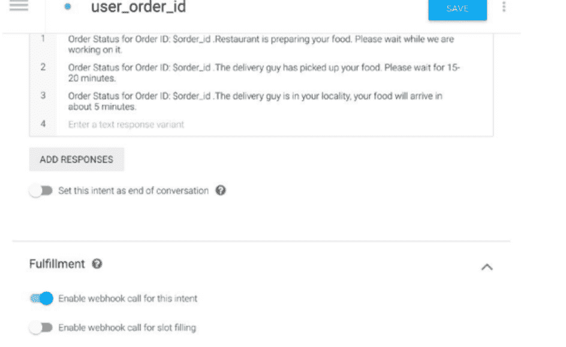

*图3-24. 为特定意图启用 webhook 调用*

Dialogflow 将向你的 webhook URL POST 一个 JSON 主体，其内容将如图3-25所示。

### JSON

```json
{
  "responseId": "6e48703b-0259-4d6c-81a1-c6e6b2da0d07",
  "queryResult": {
    "queryText": "Order ID is 234",
    "parameters": {
      "order_id": 234
    },
    "allRequiredParamsPresent": true,
    "fulfillmentText": "Order ID: 234.0. Restaurant preparing the food",
    "fulfillmentMessages": [
      {
        "text": {
          "text": [
            "Order ID: 234.0. Restaurant preparing the food"
          ]
        }
      }
    ],
    "webhookPayload": {
      "facebook": {
        "text": "Order ID: 234.0. Restaurant preparing the food"
      }
    },
    "intent": {
      "name": "projects/helloa-fdfca/agent/intents/9a39f983-74e8-487c-bb67-a22b728fc3d2",
      "displayName": "user_order_id"
    },
    "intentDetectionConfidence": 0.97,
    "diagnosticInfo": {
      "webhook_latency_ms": 200
    },
    "languageCode": "en"
  },
  "webhookStatus": {
    "message": "Webhook execution successful"
  }
}
```

图3-25. 从 Dialogflow 发送到我们 webhook 端点的传入 JSON 数据

### 检查响应

每当 Dialogflow 将意图的 JSON 响应（如图3-25所示）POST 到你的 Web 服务时，它都期望你的 Web 服务以图3-26所示的格式进行响应。

```json
{
  "fulfillmentText": "This is a text response",
  "fulfillmentMessages": [
    {
      "card": {
        "title": "card title",
        "subtitle": "card text",
        "imageUri": "https://assistant.google.com/static/images/molecule/Molecule-Formation-stop.png",
        "buttons": [
          {
            "text": "button text",
            "postback": "https://assistant.google.com/"
          }
        ]
      }
    }
  ],
  "source": "example.com",
  "payload": {
    "google": {
      "expectUserResponse": true,
      "richResponse": {
        "items": [
          {
            "simpleResponse": {
              "textToSpeech": "this is a simple response"
            }
          }
        ]
      }
    },
    "facebook": {
      "text": "Hello, Facebook!"
    },
    "slack": {
      "text": "This is a text response for Slack."
    }
  },
  "outputContexts": [
    {
      "name": "projects/${PROJECT_ID}/agent/sessions/${SESSION_ID}/contexts/context name",
      "lifespanCount": 5,
      "parameters": {
        "param": "param value"
      }
    }
  ],
  "followupEventInput": {
    "name": "event name",
    "languageCode": "en-US",
    "parameters": {
      "param": "param value"
    }
  }
}
```

图3-26. Dialogflow 期望从 webhook URL 获得的响应

如果你认为你的 API 响应必须与图 3-26 的格式完全一致，那么请放心——事实并非如此。你的意图不会抛出错误，因为 JSON 主体中的所有键都是可选的。

以下是我的 API 响应的外观和完美工作方式：

```json
{
  "fulfillmentText": "Order ID: 9999. It's on the way",
  "payload": {
    "facebook": {
      "text": "Order ID: 9999. It's on the way"
    }
  }
}
```

当我再次尝试调用同一个 API 时，我得到了不同的订单状态文本，但格式与 Dialogflow 引擎预期的相同。

```json
{
  "fulfillmentText": "Order ID: 9999. Rider has picked up your food, please wait for another 10-15 minutes",
  "payload": {
    "facebook": {
      "text": "Order ID: 9999. Rider has picked up your food, please wait for another 10-15 minutes"
    }
  }
}
```

**fulfillmentText** 是代理向用户回复内容的关键。

现在，尝试使用公共 URL 或在 Dialogflow 代理本身中测试机器人，以查看来自 API 的响应，而不是我们之前添加的默认静态响应。

这就是我们如何使用 Dialogflow 的 fulfillment 功能将外部 API 或我们自己的 API 集成到聊天机器人中，使事情变得动态和实时。

### 总结

在本章中，我们学习了 Dialogflow 以及如何使用 Dialogflow 构建聊天机器人。我们学习了定义意图及其相应的实体。我们构建了一个简单的食物订购聊天机器人，它能理解用户订购食物的意图，也能理解用户要求的食物项目以及数量。我们还增强了我们的聊天机器人，让用户可以询问他们的订单状态，获取他们的订单 ID，并根据不同的订单状态制定响应。

我们还学习了 Dialogflow 中的 fulfillment，我们从我们自己的 API 中拉取订单状态，并根据该状态向用户给出响应。我们学习了为我们的聊天机器人创建一个网络演示，还将我们的机器人与 Messenger 集成。此时，你应该对聊天机器人的端到端工作原理有了一个大致的了解。

在下一章中，我们将尝试构建聊天机器人的更困难的方式。是的，你没听错。我们将摆脱对 Dialogflow 等工具的依赖，完全以编程方式自己构建一切。让我们为下一章做好准备，因为当你从零开始构建一切时，那将更加有趣。这就像训练和驯服你自己的聊天机器人。

下一章见。

## 第 4 章

## 以困难的方式构建聊天机器人

“以困难的方式构建聊天机器人”学习起来并不太难。这是构建聊天机器人以完全控制你自己的聊天机器人的困难方式。如果你想自己构建一切，那么你就选择了困难的道路。困难的道路在经历时很艰难，但回顾时却美丽而清晰。

> 这是一条通往伟大高度的崎岖之路。

——卢修斯·阿奈乌斯·塞内卡

如果你精通 Python 并且对如何设置包等有一点了解，你学习本章不会有任何问题。如果你是一名开发者，这对你来说应该很容易。如果你是一名经理或非技术人员，你仍然可以按照每个部分中提到的步骤一步一步地完成并完成任务。我强烈建议每个人都完成本章，以便你学习构建聊天机器人的核心知识。

本章不仅教你从零开始构建聊天机器人，还向你展示核心机器学习（ML）如何借助 Rasa NLU 与自然语言处理（NLP）协同工作。正如本书第一章所述，在构建聊天机器人时，拥有决策树总是好的。在本章中，我们几乎不会使用任何规则，但 ML 尚未达到 100% 可靠的阶段。因此，这个决定完全基于你的用例，以及你是否想在 ML 模型之外应用一些业务逻辑。有时，你的 ML 模型可能运行得非常好，以至于你根本不需要任何启发式方法。但根据我的经验，当你开始销售或商业化你的聊天机器人时，你必须小心一点。没有功能总比有一个没有意义的功能要好。

我们将使用一个名为 Rasa NLU 的开源库来学习如何从零开始构建聊天机器人，而不使用任何云服务，如 Dialogflow、Watson、wit.ai 等。请记住，Rasa NLU 是一个非常复杂的库，具有许多功能。我们只将触及对我们构建聊天机器人重要的概念和功能。

### 什么是 Rasa NLU？

Rasa NLU 是一个用于聊天机器人中意图分类和实体提取的 NLP 库。它帮助你构建和编写聊天机器人的自定义 NLP。

本章我们将介绍 Rasa 的两个部分。

- **Rasa NLU：** 使用 Rasa NLU，我们将学习为我们的聊天机器人准备训练数据、编写配置文件、选择管道和训练模型。最后，我们将使用我们的模型预测文本的意图。我们还将学习如何使用 Rasa NLU 解析实体。
- **Rasa Core：** 在第二部分中，我们将学习训练 **Rasa Core** 对话管理模型，以准备向用户返回响应。当你的聊天机器人中有多种意图及其后续问题或响应时，这一部分变得非常重要。与其在我们的决策树中编写大量条件，并在大型企业级应用程序中花费数小时进行调试，不如教模型创建响应。看到我们训练有素的模型在这方面表现如何将会很有趣。我们不能只是以文本形式向用户吐出任何东西；它必须有意义。

### 为什么我应该使用 Rasa NLU？

Rasa NLU 不仅仅是一个具有一堆方法来完成某些事情的库。它具有构建几乎任何你能想象到的聊天机器人的能力。Rasa 为你带来了训练机器理解文本含义的神奇能力，而不是你编写规则来理解它。

让我们看看以下几点，了解为什么我们应该使用 Rasa NLU：

- Rasa NLU 是一个积极维护的项目，并且有一个良好的社区来支持它。
- 如果我们不想与第三方共享用户的敏感数据，我们必须使用像 Rasa NLU 这样的开源工具从零开始构建聊天机器人。这样所有数据都保留在我们自己的服务器上并进行处理。
- 依赖第三方服务来训练你的数据并找到用户话语的意图将需要你调用可能并不总是可靠的 API。如果他们的服务器宕机了，你的聊天机器人应用程序会怎样？
- 使用 Rasa NLU 构建聊天机器人将让你完全掌控你的聊天机器人。你可以用你想要的数据以你想要的方式训练、调整和优化它。使用 Rasa NLU，我们可以尝试哪种 ML 算法最适合我们的数据集，而不是依赖于固定的算法。

### 直接深入 Rasa NLU

在本节中，我们将直接进入实践部分，尝试安装 Rasa 堆栈，并开始通过训练我们的数据来构建我们的 ML 模型。我们将使用一些更酷的开源库来让我们的生活更轻松。

### 安装 Rasa

要安装 Rasa，请运行以下 pip 命令，我们在前面的章节中尝试过该命令来安装 spaCy。请注意，我们将使用 Rasa 版本 0.13.2。

```
pip install rasa-nlu==0.13.2
```

Rasa NLU 有多个组件用于分类意图和识别实体。Rasa 的不同组件有自己的一组依赖项。

当我们训练模型时，Rasa NLU 会检查所有必需的依赖项是否已安装。如果你想安装完全使用 Rasa 库所需的全部要求，你可以执行以下步骤：

```
git clone https://github.com/RasaHQ/rasa_nlu.git #Clone the repo
cd rasa_nlu #Get into the rasa directory
```

```
pip install -r alt_requirements/requirements_full.txt #Install full requirements
```

第一步可能需要一些时间。请像地球一样耐心等待它完成。

### 在 Rasa 中决定管道

管道不过是一组用于训练模型的算法。Rasa NLU 有两个广泛使用的管道，称为 **spacy_sklearn** 和 让我们了解一下这两个。

#### spacy_sklearn

- *spacy_sklearn* 管道利用来自 GloVe 算法或 Facebook AI 团队开发的名为 fastText 的算法的预训练词向量。

#### tensorflow_embedding

- *spacy_sklearn* 在某些场景下表现非常出色，例如，假设你有一句用户语句：“波士顿的天气怎么样？”当我们用相同的语句示例训练模型后，再让它预测“伦敦的天气怎么样？”的意图时，我们的模型现在足够智能，能够识别出“波士顿”和“伦敦”这两个词是相似的，并且它们属于相同的意图。

- 这个管道在数据集较小时非常有用。

- *tensorflow_embedding* 管道不像 spacy_sklearn 那样使用任何预训练的词向量，而是根据我们自己提供的数据集进行调整。

- *tensorflow_embedding* 管道的一个优点是，我们的词向量将完全符合我们的领域需求。

- 为了通过一个例子解释 *tensorflow_embedding* 的工作原理：在英语中，“play”这个词可能与“一项运动”或“一种娱乐或休闲活动”密切相关，而与“an act”这个词看起来非常不同。但在戏剧领域，“play”和“an act”是密切相关的，其中“play”指的是“剧作家创作的一种文学形式”。因此，非常有必要告诉我们的模型要学习特定领域的知识，而不是因为某些预训练模型而感到困惑。

### 从零开始训练和构建聊天机器人

如果你已经阅读了本书的第3章，你一定对我们使用 Dialogflow 构建的“食物订购聊天机器人”很熟悉。你一定了解意图、实体以及聊天机器人如何向最终用户做出响应。

同样，在本章中，我们将以一个聊天机器人的用例为例，从零开始构建它。你不一定非要使用相同的例子。请随意寻找你自己的用例，按照本章的步骤操作，并在本章结束时构建你自己的聊天机器人。

我们将构建一个星座运势机器人，它能理解用户查询并告诉他们当天的星座运势。那么，让我们开始吧。

### 构建星座运势机器人

在这个使用开源库 Rasa NLU 完全自主构建聊天机器人的示例中，我们将构建一个星座运势机器人。让我们确定这个聊天机器人的范围，看看它能做什么以及可以做什么。

- 星座运势机器人应该能够理解问候语并回复问候。
- 机器人应该能够理解用户是否在询问星座运势。
- 如果用户没有提供星座，机器人应该能够询问用户的星座。
- 如果用户不知道自己的星座，机器人应该询问用户的出生日期（DOB）并为其查找。
- 机器人应该能够订阅/取消订阅用户以获取每日星座运势。
- 机器人应该从现有的响应中学习，以形成新的响应。
- 机器人应该能够处理用户的拼写错误。

我们的机器人在这里要做的事情相当简单。可能的意图包括：

- 问候意图：用户以问候语开始
- 获取星座运势意图：用户询问星座运势
- 用户星座意图：用户告知星座
- 用户出生日期意图：用户告知其出生日期
- 订阅意图：用户请求订阅

根据你设计机器人和编写代码的方式，你可能不需要所有上述意图，或者你可能需要定义一些额外的意图来涵盖我们希望机器人完成的所有用例。随着本章的深入，我们将尝试构建一个能完成基本任务——提供星座运势的机器人；之后作为练习的一部分，我们可以为其添加更多用例。

好吧，这基本上就是我们到目前为止所做的全部工作，即基于机器人和用户之间简单的可能对话来识别可能的意图。

### 星座运势机器人与用户之间的对话脚本

让我们创建一个聊天机器人和用户之间可能的对话脚本。正如第一章所述，编写对话脚本就像在构建软件之前准备软件需求文档。它以后可能会改变，但能让你对最终聊天机器人应用中将发生什么有一个整体的了解。

以下是我们用户与机器人之间的对话示例：

**用户：** 你好

**星座运势机器人：** 你好！希望你一切顺利。

**用户：** 我想知道我的星座运势。

**星座运势机器人：** 当然，可以告诉我你的星座吗？

**用户：** 摩羯座

**星座运势机器人：** 抱歉，你是说摩羯座吗？

**用户：** 是的。

**星座运势机器人：** 好的，这是你今天的星座运势。你今天可能会感到情绪高涨、积极乐观。与那些感觉不太满意的人分享这份能量。你的态度可能会对朋友、伴侣、配偶和孩子产生深远的影响。邻居和远亲甚至可能在你没有意识到的情况下就感受到了你的精神。如果有人受伤或生气，请给予鼓励。一切最终都会好起来的。

**星座运势机器人：** 你想订阅每日更新吗？如果想，只需说“订阅”。

**用户：** 是的，请订阅。

**星座运势机器人：** 太好了，你现在已订阅。祝你有美好的一天。

这个对话只是为了让我们对聊天机器人的对话流程有一个大致的了解。我们可能会也可能不会根据我们的需求改变对话的流程。

我们可以让聊天机器人模型本身经过训练来准备有效的响应，而不是编写一堆 if...else 语句。

### 为聊天机器人准备数据

Rasa NLU 有多种方式在我们的自定义数据上定义意图及其实体。它支持 Markdown 格式的数据、单个 JSON 文件或包含多个文件的目录。

我们将首先讨论最困难但高度可扩展的方法。手动创建 JSON 文件很困难，但通过编程方式创建则非常容易且可扩展。

### 以 JSON 格式为模型创建数据

Rasa NLU 期望的数据 JSON 格式有一个顶级对象，其中包含多个键，而我们将要处理的最重要的一个是 **common_examples**。以下是我们 JSON 数据将呈现的骨架形式：

```json
{
  "rasa_nlu_data": {
    "common_examples": [],
    "regex_features": [],
    "entity_synonyms": []
  }
}
```

我们 JSON 数据中的 **common_examples** 键是用于训练模型的核心位置。我们将在 **common_examples** 数组中添加所有的训练示例。

**regex_features** 是一个工具，用于帮助意图分类器识别实体或意图，并提高意图分类的准确性。

让我们开始编写 JSON 文件。我们将其命名为 **data.json**。

创建一个名为 `data` 的文件夹。将当前工作目录更改为 `horoscope_bot`。启动 Jupyter Notebook（`jupyter notebook`）。创建一个名为 `data` 的新文件夹。点击 data 文件夹，然后在 Jupyter Notebook 的“New”菜单下选择“Text File”。

点击创建的文件的名称，将其更改为 **data.json**，然后为你的聊天机器人编写意图。

对于步骤5和6，请随意使用你喜欢的编辑器，如 Sublime、Notepad++、PyCharm 等来处理 JSON 文件。

以下是我的 **data.json** 文件在 **data** 文件夹下的内容：

```json
{
  "rasa_nlu_data": {
    "common_examples": [
      {
        "text": "Hello",
        "intent": "greeting",
        "entities": []
      },
      {
        "text": "I want to know my Horoscope",
        "intent": "get_horoscope",
        "entities": []
      },
      {
        "text": "Can you please tell me my horoscope?",
        "intent": "get_horoscope",
        "entities": []
      },
      {
        "text": "Please subscribe me",
        "intent": "subscription"
      }
    ],
    "regex_features": [],
    "entity_synonyms": []
  }
}
```

嗯，正如你所看到的，手动准备这个看起来非常笨拙。你一定还记得我们在 Dialogflow 中那个简单易用的方法。那么，让我们来看一个很酷且有趣的工具，它用于创建 Rasa 期望格式的训练数据。它由 Polgár András 创建，对于检查和修改我们之前准备的数据也相当有用。如果你正在做一个需要手动创建数据的小项目，这个工具可以节省大量时间。在构建任何完全由数据驱动的应用程序时，可视化数据总是一个好主意。所以，只需保存我们之前创建的**data.json**文件，直到我们使用更好的方法扩展数据收集。

### 可视化与修改Rasa的JSON数据格式

在本节中，我们将使用一个名为Rasa NLU trainer的工具来可视化我们的数据（即我们目前创建的数据）。这个工具也有助于我们标注数据。如果你还记得第3章中介绍Dialogflow界面时，定义实体、它们的名称和类型是多么容易。我们将使用一个开源工具做同样的事情。

Rasa NLU trainer是一个非常棒且方便的工具，可以直接在浏览器中编辑我们的训练数据。处理JSON数据很棘手，也容易出错。有了这个方便的工具，我们可以轻松地向训练数据添加更多示例或编辑现有的示例。它节省了大量手动标注数据的时间。rasa-nlu-trainer是一个基于javascript的工具，所以我们需要安装node.js才能在我们的系统上运行这个工具。完成这个过程不需要超过5分钟。让我们按照以下步骤进行设置：

访问 [https://www.npmjs.com/get-npm](https://www.npmjs.com/get-npm) 并下载node.js。按照网站上的指导在你的系统上安装该软件包。安装完成后，打开系统上的一个新终端/命令行界面，输入“npm”以查看它是否正常工作。

我安装的是LTS版本8.11.4。安装完成后，运行以下命令来安装rasa-nlu-trainer：

```
sudo npm i -g rasa-nlu-trainer
```

成功安装此命令后，你将看到类似以下的日志：

```
[fsevents] Success: "/usr/local/lib/node_modules/rasa-nlu-trainer/node_modules/fsevents/lib/binding/Release/node-v57-darwin-x64/fse.node" already installed

Pass—update-binary to reinstall or—build-from-source to recompile

npm WARN slick-carousel@1.8.1 requires a peer of jquery@>=1.8.0 but none is installed. You must install peer dependencies yourself.

+ rasa-nlu-trainer@0.2.7 added 492 packages in 10.14s
```

即使你的消息看起来不像这样，只要没有抛出任何错误，就不用担心。我们很快就会知道我们的rasa-nlu-trainer是否成功安装并运行良好。

让我们在终端中转到我们之前创建的数据文件夹，并运行以下命令：

```
rasa-nlu-trainer
```

输入此命令将在端口55703上启动一个本地服务器，并在默认浏览器中打开它。它看起来会像图4-1。

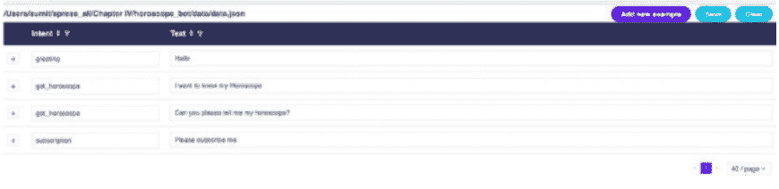

如你所见，我们现有的所有data.json数据都被这个出色的工具提取出来供我们删除或编辑，我们也可以从这里添加新的示例，它会持续扩展data.json文件。

我建议你为你的意图添加更多数据，以更好地训练模型。如果你试图构建本章中解释的同一个聊天机器人，你可以从出版商提供的源代码压缩包或仓库中获取这个data.json。

就像我们在第3章中使用Dialogflow在话语中选择实体来定义它们一样，我们可以使用这个工具做同样的事情，并为我们的实体命名以便后续解析。因此，点击示例的切换按钮，选择文本，并通过给出名称来添加一个实体。

我在每个定义的意图中添加了五到六个话语示例。我们添加的示例越多，对模型的训练就越好，提供的准确性也越高。

如果你现在查看data.json文件，它会自动添加更多示例。所以，继续验证你的data.json文件，看看你是否从**rasa-nlu-trainer** UI中添加了所有示例。

你还会在data.json文件中注意到，你可能使用rasa-nlu-trainer UI定义的实体被捕获在**common_examples**列表中，具有**start**和**end**键，这告诉模型特定实体值在示例中从哪里开始以及在哪里结束。

相同的字典对象也描述了实体的值和我们定义的实体名称。对于我们的示例，它看起来如下：

```
{
    "text": "19-01",
    "intent": "dob_intent",
    "entities": [
        {
            "start": 0,
            "end": 2,
            "value": "19",
            "entity": "DD"
        },
        {
            "start": 3,
            "end": 5,
            "value": "01",
            "entity": "MM"
        }
    ]
}
```

### 训练聊天机器人模型

在本节中，我们将使用我们准备的数据来训练一个模型。正如我们使用Jupyter Notebook进行文件创建和管理一样，我们将创建一个新的.ipynb文件，并开始编写Python代码，通过选择本章前面讨论的管道之一来训练我们的模型。

### 创建配置文件

让我们再次使用Jupyter以与之前相同的方式创建一个JSON文件，并将其命名为config.json。让我们将其放在我们的数据文件夹之外（即，在我们的项目目录horoscope_bot中）。

添加以下配置：

```
{
    "pipeline": "tensorflow_embedding",
    "path": "./models/nlu",
    "data": "./data/data.json"
}
```

如你所见，我们的config.json文件中有一些重要的配置参数。让我们试着理解它们。

-   Pipeline将指定将使用哪些特征提取器或特征提取器来处理文本消息并提取必要信息。在我们的例子中，我们使用tensorflow_embedding。
-   path本质上是我们训练后保存模型的目录。我们将把模型保存在/models/nlu文件夹中。
-   data是我们需要指定的路径；它基本上是我们的训练数据所在的位置。

既然我们完成了config.json文件，让我们继续编写一些Python代码来训练我们的机器学习模型。

#### YAML配置

你也可以使用.yml文件作为配置文件，如下所示。你可以在github仓库中获取示例config.yml文件。

-   示例1：

```
language: "en"
pipeline: "tensorflow_embedding"
```

-   示例2：

```
language: "en"
pipeline:
    - name: "nlp_spacy"
    - name: "tokenizer_spacy"
    - name: "intent_entity_featurizer_regex"
    - name: "intent_featurizer_spacy"
    - name: "ner_crf"
    - name: "ner_synonyms"
    - name: "intent_classifier_sklearn"
```

所有传入的消息都根据定义的组件序列进行处理。定义的组件按顺序一个接一个地运行，因此被称为处理管道。不同的组件用于不同的目的，例如实体提取、意图分类、预处理等。

这种格式的好处在于，我们可以清晰地指定Rasa预定义的管道。

### 编写Python代码来训练模型和进行预测

让我们打开一个新的.ipynb文件，开始编写代码。我们将ipynb命名为rasa-nlu.ipynb。确保你已经为所使用的Python版本成功安装了**rasa-nlu==0.13.2**。

以下是我们使用data.json和config.json在Python中训练模型的代码，使用*tensorflow_embedding*管道。

```python
from rasa_nlu.training_data import load_data
from rasa_nlu.model import Trainer
from rasa_nlu import config
from rasa_nlu.model import Interpreter

def train_horoscopebot(data_json, config_file, model_dir):
    training_data = load_data(data_json)
    trainer = Trainer(config.load(config_file))
    trainer.train(training_data)
    model_directory = trainer.persist(model_dir, fixed_model_name='horoscopebot')
    return model_directory

def predict_intent(text):
    interpreter = Interpreter.load('./models/nlu/default/horoscopebot')
    return interpreter.parse(text)
```

在代码的第一部分，我们从rasa_nlu包中导入所有必要的库。然后我们定义了两个方法，分别名为*train_horoscopebot*和*predict_intent*，其中第一个方法根据给定的数据、config_file和model_directory（存储模型的位置）训练模型，而predict_intent方法使用rasa_nlu中的**Interpreter**模型加载预训练的模型文件，并使用户能够预测任何新的文本示例。

### 训练模型

我们运行以下代码片段，使用相应的参数调用我们的train_horoscopebot方法：

```python
train_horoscopebot('./data/data.json', 'config.json', './models/nlu')
```

在我们的rasa-nlu.ipynb中运行此代码后，我们将得到如下输出：

```
Epochs: 300/300 [00:01<00:00, 175.6git/s, loss=0.075, acc=1.000]
```

训练聊天机器人模型的代码将创建 models 文件夹，你可以通过 Jupyter 或文件资源管理器/访达应用查看。它会在我们提供的模型目录目标位置创建一系列索引、元数据和 pickle 文件。

### 从模型进行预测

让我们通过传递一段文本来调用该方法，看看我们训练好的模型表现如何。

```
predict_intent("I am looking for my horoscope for today. I am wondering if you can tell me that.")
```

该方法本身会打印输出。对于上述文本，我的输出如下所示：

```
INFO:tensorflow:Restoring parameters from ./models/nlu/default/horoscopebot/intent_classifier_tensorflow_embedding.ckpt

{

"intent": {

"name": "get_horoscope", "confidence": 0.9636583924293518

},

"entities": [], "intent_ranking": [

{

"name": "get_horoscope",

"confidence": 0.9636583924293518

},

{

"name": "dob_intent",

"confidence": 0.03462183475494385

},

{

"name": "greeting",

"confidence": 0

},

{

"name": "subscription",

"confidence": 0

}

],

"text": "I am looking for my horoscope for today. I am wondering if you can tell me that."

}
```

哇！是不是很神奇？我们的模型以 96% 的置信度预测了这段文本。你可以在提供的 ipynb 文件中看到，我们的模型在预测其他意图方面也表现良好。这就是 tensorflow 和整个机器学习的力量。更不用说，`rasa_nlu` 库让这一切变得如此简单易行。所以，现在是时候让你回顾一下了，如果你还记得本书的第 3 章，那么你一定记得每当我们添加一个新示例时，Dialogflow 都会重新训练模型。它实际上在幕后做的和我们刚刚做的是一样的。我们当时无法更改模型或调整任何参数，但现在我们可以完全控制地完成所有这些操作。

既然我们已经成功地使用 tensorflow 构建并训练了一个模型，并且也对其进行了测试，我们将继续讨论下一个主题：对话管理。我建议你测试你的机器人可能面临的所有场景，以便了解你的模型在哪些方面表现不佳，并据此添加更多数据或在需要时调整参数。

另外，请记住，只有在训练数据发生变化时才需要重新训练模型。如果训练数据没有变化，我们可以加载现有的训练模型，继续对新示例进行预测。

### 使用 Rasa Core 进行对话管理

在本节中，我们将通过为 Rasa Core 对话管理训练另一个模型来亲自动手实践。请记住，此时我们已经有一个可以预测文本意图的模型，我们可以编写一些 Python 代码来制定回复，并且可以回复客户。但是，如果我们想为我们的机器人添加更多意图呢？在具有大量功能的大型应用程序中，这是否可扩展？答案是否定的。这时，Rasa Core 的对话管理就派上用场了。

如果你曾经尝试在任何平台上使用任何机器人，你一定见过它在某些情况下失败。是的，我们都经历过这种情况，而且今天依然存在，因为当今的机器人在管理对话上下文或遵循对话流程方面做得非常糟糕。借助 Rasa Core 基于机器学习的对话框架，我们可以轻松解决这个问题。

Rasa Core 在企业级应用中久经考验，被成千上万的开发者使用，因为它已准备好投入生产、易于使用和扩展，最重要的是，它是开源的。

### 深入了解 Rasa Core 和对话系统

在我们真正开始编写 Rasa Core 对话管理模型的代码之前，理解其来源和原因非常重要。

我们将尝试理解迄今为止我们构建聊天机器人的方法，以及这将如何永远改变。

让我们举个例子：

如果我们想构建一个简单的聊天机器人来帮助用户预订飞机/巴士/电影/火车票，最简单的方法是创建一个状态机或决策树，编写一堆 if...else 语句，然后就完成了。这可以工作，但无法扩展。如果客户最初对某些东西有良好的体验，他们会想更多地使用它。通过一些启发式方法，我们可以让聊天机器人显得很智能，但不会持续太久。当代码的控制流从 try 块转到 except 块时，我们就开始挠头了。

图 4-2 简单展示了构建此聊天机器人的状态机可能的样子。

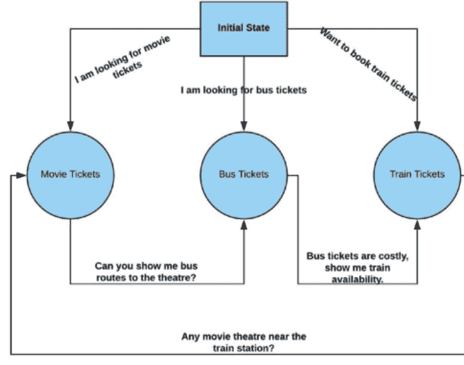

**图 4-2.** *用于订票聊天机器人的状态图表示*

如果我们看我们的状态图，它可能适用于用户寻找电影、巴士或火车票，或者在询问电影票后想预订巴士票的正常对话。如果用户同时询问巴士和电影票怎么办？你可能会说，我们可以在已经嵌套的代码中再添加一些 if...else 语句来处理。如果你是一个优秀的开发者，编写状态机的输入输出或扩展决策树不会花你太多时间。但是想想当这些条件开始呈指数级增长，你必须不断添加案例来处理它们，并且它们开始相互干扰的情况。

我们的大脑以一种学习和再学习的方式工作。如果一个孩子不知道火会对他们做什么，他们会去摸它，但当它伤害到他们时，他们就不会再做了。他们强化了一个事实：火是有害的。在奖励的情况下，它的运作方式类似——当你做某事并得到回报时，你会将做某事带来奖励或更好奖励的事实联系起来，然后你打算再次这样做。这在机器学习中被称为强化学习，机器通过执行动作并理解结果来学习在特定情况下的行为。强化学习有时不是最佳方法，例如在数据不足以学习、数据质量不佳无法学习奖励场景等情况下。

图 4-3 是一个图表，帮助你理解 Rasa Core 如何很好地融入 Rasa 技术栈，以及它与我们迄今为止一直在学习的 Rasa NLU 的角色。

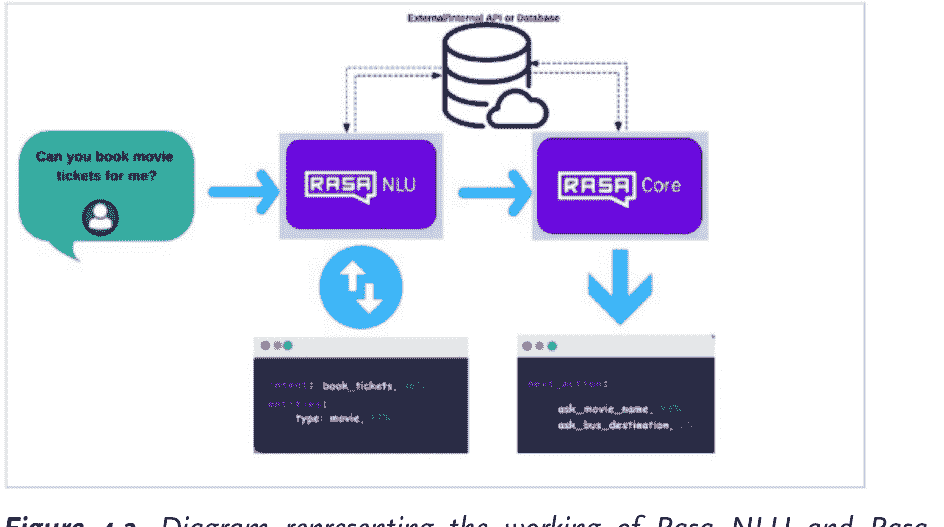

**图 4-3.** *展示 Rasa NLU 和 Rasa Core 工作原理的图表*

通过 Rasa Core，我们可以指定我们的机器人应该说或做的所有事情。这些被称为动作。一个动作可能是向用户打招呼，或者查询数据库，或者可能是使用某个网络服务或 API 检索一些信息。

Rasa Core 提供了训练我们的概率模型的功能，以根据用户或用户的历史对话预测应该采取什么行动。想象一下，如果没有机器学习模型，编写数百个用例来确定应该发送或执行什么响应或行动。简单来说，Rasa Core 为你解决了这个问题。

让我们看看我们在第 3 章构建 OnlineEatsBot 时建立的用户与机器人对话的并排对比。

用户 **OnlineEatsBot**

hello onlineeats hello! how may i help you?

i am looking to order food sure, What would you like to order today? one chicken burger done. your final amount is $3.99

thank you thanks a lot

这个对话非常简单，即使我们确实使用了一个训练好的模型来识别其中的意图和实体，也可以不用任何机器学习模型来完成。

现在，你脑海中会出现一个有趣的问题：“如果我想让我的机器人能够更改订单怎么办？如果我想让我的机器人能够移除或增加食物项目的数量怎么办？”所以，正如讨论的那样，添加更多的用例、更多的复杂性、更多的意图及其话语、更多的 if...else 代码来处理边缘情况，但是当你为一个业务构建聊天机器人时，你必须扩展它以通过它产生更多收入。所有软件系统都这样做，那些不做的就无法生存。底线是，我们不能一直更改和部署代码。

因此，与其在所有情况发生时处理它们并重复这样做，我们可以借助 Rasa 技术栈，采用机器学习的途径来解决这个问题，它将根据用户的上下文和对话状态告诉我们机器人下一步应该做什么。由于模型基于先前对话数据的上下文自行学习，机器人更容易保持对话更自然、更用户友好，而不是从四到五个固定句子中随机选择。

Rasa 建议数据量很少或没有数据的用户使用交互式学习。我们将在本章稍后部分更详细地了解**交互式学习**。

在我们真正开始使用 Rasa Stack 来编写聊天机器人的核心部分之前，首先需要理解几个概念。

### 理解 Rasa 概念

在完全尝试在代码中使用它们之前，理解一些与 Rasa 相关的特定概念非常重要。在本节中，我们将学习 Rasa NLU 的一些重要且非常有用的概念。请确保你完全理解这些概念，因为我们将使用它们来构建第一个使用 Rasa 域文件格式的内部聊天机器人。如果我们不理解这些概念的含义，那么下一步将会很困难。

### Action（动作）

顾名思义，这是一个可以采取的特定动作。根据 Rasa 文档，它指的是*为响应对话而采取的动作*。

例如，如果用户询问今天的星座运势，我们的机器人可以执行“GetTodaysHoroscope”动作。让我们看看一个“GetTodaysHoroscope”动作以代码形式会是什么样子。

```python
from rasa_core.actions import Action
from rasa_core.events import SlotSet

class ActionGetTodaysHoroscope(Action):
    def name(self):
        return "get_todays_horoscope"

    def run(self, dispatcher, tracker, domain):
        # type: (Dispatcher, DialogueStateTracker, Domain) -> List[Event]
        user_horoscope_sign = tracker.get_slot('horoscope_sign')
        """Write your logic to get today's horoscope details
        for the given Horoscope sign based on some API calls or retrieval from the database"""
        return [SlotSet("horoscope_sign", user_horoscope_sign)]
```

**name** 方法返回动作的名称，我们将在域文件中将其作为自定义方法名来引用。

**run** 方法执行完成动作的主要工作——即核心业务逻辑就在这里。如你所见，它接受三个参数：*dispatcher*、*tracker* 和 *domain*。

让我们逐一理解这些参数：

- **dispatcher**：调度器用于向我们的用户发送消息。我们可以使用 **dispatcher.utter_message()** 来实现这一点。
- **tracker**：当前用户的状态跟踪器。我们可以使用 **tracker.get_slot(slot_name)** 来访问槽值，要获取最近的用户消息，我们可以使用 **tracker.latest_message**。
- **domain**：机器人的域。我们将在本章稍后更详细地讨论域。

> **注意：** run 方法返回一个事件实例列表。

### SLOTS（槽）

槽是使机器人能够像人类一样工作的关键。槽就像一个存储空间，可以存储用户提供的信息，也可以使用从数据库或 API 预先获取的信息。

不同的用例有不同的槽类型：

例如，在我们想要构建一个星座机器人的用例中，我们可能希望将用户提供的 **horoscope_sign** 的槽类型设置为文本。

根据你想要使用的槽类型，Rasa 提供了一些预定义的槽类型。

除了文本，Rasa 还有以下槽类型：

- **Boolean** ⇒ 用于真/假值
- **Categorical** ⇒ 用于需要从多个值中选择一个的情况
- **Float** ⇒ 用于连续值
- **List** ⇒ 用于值列表
- **Featurized** ⇒ 用于不影响对话的内部值存储

### Templates（模板）

模板这个词你一生中至少听过一次，无论是寻找发送电子邮件的模板、准备文档的模板、构建作品集网站的模板，还是遵循流程的模板。

Rasa 中的模板用于话语。话语模板包含一组预设文本，当某个动作被触发时发送给用户。通过将动作名称与话语名称相同，或者通过带有自定义代码的动作，我们可以将格式化的消息通过模板发送给用户。

域文件中模板的一个简单表示可能如下所示：

```yaml
templates:
  utter_greet:
    - "hello {name} can be filled by a slot of same name or by custom code"
  utter_goodbye:
    - "goodbye"
    - "take care multiple templates allow the bot to randomly pick from them"
  utter_default:
    - "Sorry, I didn't get that."
```

现在，我们已经了解了动作、槽和模板这三个概念，并且我们已经从第 3 章的学习中知道了意图和实体是什么，我们现在准备好深入研究 Rasa 并开始为我们的第一个聊天机器人编写代码。

### 为聊天机器人创建域文件

使用 Rasa Stack 构建聊天机器人时，首要任务是创建一个域文件。

> 根据 Rasa 的文档，“域定义了你的机器人运行的环境。它指定了机器人应该知道的意图、实体、槽和动作。可选地，它还可以包含机器人可以说的话的模板。”

现在，你明白为什么我们之前需要通过理解 Rasa 核心概念来为这种情况做准备了。

让我们用 YAML 定义创建一个 DefaultDomain 文件。Rasa 使用 .yml 文件来定义域格式。

最初 YAML 据说是 **Yet Another Markup Language**（又一种标记语言），描述了它作为标记语言的用途，但后来改为理解为 YAML Ain't Markup Language（YAML 不是标记语言），这是一个递归首字母缩略词，以区别其作为数据导向而非文档标记语言的目的。

现在，让我们回到我们的 rasa-nlu Jupyter Notebook 目录并开始创建文件。请注意，我们可以使用命令行将所有代码写在单独的文件中，并使用编辑器进行编辑。我发现 Jupyter Notebook 更具交互性，并且更容易浏览文件。无论你习惯使用什么，都可以使用，但了解 Jupyter Notebook 提供的大多数功能是很好的。

转到主 horoscope_bot 目录并创建一个文件，我们称之为 **horoscope_domain.yml**。

以下是我们机器人的 **horoscope_domain.yml** 的内容：

```yaml
slots:
  horoscope_sign:
    type: text
  DD:
    type: text
  MM:
    type: text
  subscribe:
    type: bool

intents:
  - greeting
  - get_horoscope
  - subscription
  - dob_intent

entities:
  - horoscope_sign
  - DD
  - MM
  - subscribe
  - dob_intent

templates:
  utter_greet:
    - 'Hello! How are you doing today?'
  utter_ask_horoscope_sign:
    - 'What is your horoscope sign?'
  utter_ask_dob:
    - 'What is your DOB in DD-MM format?'
  utter_subscribe:
    - 'Do you want to subscribe for daily updates?'

actions:
  - utter_greet
  - utter_ask_horoscope_sign
  - utter_ask_dob
  - utter_subscribe
  - get_todays_horoscope
  - subscribe_user
```

如你所见，域文件由五个重要部分组成：**intents**（意图）、**entities**（实体）、**slots**（槽）、**templates**（模板）和 **actions**（动作），这些我们之前已经讨论过。

请注意，对于每个模板，都有一个 utterAction 定义，例如 **utter_greet**，并且我们必须在模板部分定义一个同名的模板。

如我们在示例中所见，主要定义了五个动作，其中前三个动作只是向用户说出模板文本，但最后两个动作要求我们从数据库中检索数据或调用 API 获取当天的星座运势并返回给用户。

在 **subscribe_user** 动作的情况下，我们也需要执行一个操作，将当前用户添加到数据库的订阅列表中。这些用户定义的动作称为自定义动作。要拥有这样的自定义动作，我们需要编写当这些动作被触发时机器人应该做什么。

在下一节中，我们将学习如何编写自定义动作。

### 编写聊天机器人的自定义动作

我们知道，每当一个 **UtterAction** 被触发时，我们的机器人将用为该动作在模板中定义的话语文本进行响应。但是当某个自定义动作被触发时会发生什么？在本节中，我们将编写 Python 代码来创建自定义动作，我们可以用它们来调用 API 或者几乎任何你可以用 Python 做的事情。

让我们在项目目录中创建一个新文件，称为 **actions.py**（即在我们的例子中是在 **horoscope_bot** 文件夹内）。

```python
from __future__ import absolute_import
from __future__ import division
from __future__ import print_function
from __future__ import unicode_literals

import requests

from rasa_core_sdk import Action
from rasa_core_sdk.events import SlotSet
```

class GetTodaysHoroscope(Action):

    def name(self):
        return "get_todays_horoscope"

    def run(self, dispatcher, tracker, domain):
        # type: (Dispatcher, DialogueStateTracker, Domain) -> List[Event]
        user_horoscope_sign = tracker.get_slot('horoscope_sign')

        base_url = "http://horoscope-api.herokuapp.com/horoscope/{day}/{sign}"
        url = base_url.format(**{'day': "today", 'sign': user_horoscope_sign})

        # http://horoscope-api.herokuapp.com/horoscope/today/capricorn
        res = requests.get(url)

        todays_horoscope = res.json()['horoscope']

        response = "Your today's horoscope:\n{}".format(todays_horoscope)

        dispatcher.utter_message(response)

        return [SlotSet("horoscope_sign", user_horoscope_sign)]

正如我们所见，在我们的名为 GetTodaysHoroscope 的 action 中有两个方法。第一个方法 **name** 只是返回该 action 的名称。另一个方法是 **run**，正如之前讨论的，它是通过执行我们编写的业务逻辑来实际完成任务的方法。

在我们的方法中，我们利用了一个开源 API，其代码托管在 GitHub 上。该 API 的 URL 如下所示：

[http://horoscope-api.herokuapp.com/horoscope/today/capricorn](http://horoscope-api.herokuapp.com/horoscope/today/capricorn)

它返回的数据格式为 JSON：

```json
{
    "date": "2018-08-29",
    "horoscope": "You will be overpowered with nostalgia and may long to get in touch with old pals. And as Ganesha says, chances are that you may take a liking to your ex-lover, while simultaneously strengthening your social standing. All in all, the day will be a productive one.",
    "sunsign": "capricorn"
}
```

正如你在 **run** 方法中看到的，我们将 API 的响应转换为 Python JSON 对象，然后从 JSON 中访问 ‘horoscope’ 键以获取实际的星座运势。从 JSON 中获取实际的星座运势后，我们使用 **dispatcher** 对象及其方法 utter_message 来构建响应并将其发送回用户。

最后，我们使用 **SlotSet** 方法设置槽位。SlotSet 就像是保存你从用户响应中提取出的变量，以便你可以在对话流程中的任何时间在代码中使用它们。

**注意：使用上述 API，我们可以通过提供星座符号来获取今日的星座运势。你可以自由使用自己的 API 或数据库。你只需要将 API 调用替换为你想要使用的其他数据源。**

就像我们在 **actions.py** 文件中添加了 **GetTodaysHoroscope** action 一样，我们也将添加 **SubscribeUser** action。我们不会使用任何数据库来存储用户的订阅偏好，但当你为真实用户构建聊天机器人时，你可能需要拥有 user_ids，以便在数据库中将其与他们的订阅关联起来。

以下是 SubscribeUser action 的样子：

```python
class SubscribeUser(Action):
    def name(self):
        return "subscribe_user"

    def run(self, dispatcher, tracker, domain):
        # type: (Dispatcher, DialogueStateTracker, Domain) -> List[Event]
        subscribe = tracker.get_slot('subscribe')

        if subscribe == "True":
            response = "You're successfully subscribed"
        if subscribe == "False":
            response = "You're successfully unsubscribed"

        dispatcher.utter_message(response)

        return [SlotSet("subscribe", subscribe)]
```

这样，我们可以根据需要编写任意数量的自定义 action。

下一步是数据。Rasa 的对话管理模型是在用户和聊天机器人之间的实际对话上进行训练的。这里的关键点是，这些对话必须转换为故事格式。

故事无非是用户和聊天机器人之间的实际对话，其中用户输入被转换为意图和实体，而聊天机器人的响应则被视为聊天机器人在需要时应触发的 action。

下表给出了用户和聊天机器人之间真实对话如何作为故事呈现的一个示例。

场景 I

| 用户 | HoroscopeBot |
|---|---|
| hello there! | utter_greet |
| i want to know my horoscope for today | utter_ask_horoscope_sign |
| My sign is Capricorn | actions.gettodayshoroscope |
| Can you subscribe me for updates? | actions.subscribeuser |

场景 II

| 用户 | HoroscopeBot |
|---|---|
| hello there! | utter_greet |
| i want to know my horoscope for today | utter_ask_horoscope_sign |
| i don't know my sign | utter_ask_dob |
| 12-12 | actions.gettodayshoroscope |

我们尚未在代码中涵盖用户不知道其星座符号但知道其出生日期的场景。这里，我们的代码需要进行一些修改，以便在未找到 horoscope_sign 值时获取 DATE 和 MONTH 实体。

我们可以使用 DD-MM 值来检查星座符号，然后显式调用 GetTodaysHoroscope 方法，或者以这种方式训练模型。

### 为训练机器人准备数据

在进行任何机器学习之前，拥有高质量的数据总是很重要的。为了训练我们的聊天机器人，我们也需要数据；用户和聊天机器人之间的对话就是我们需要用来训练模型的数据。有时在网上找到符合我们自身需求的免费数据集是很困难的。

我们应该花必要的时间来收集数据。我们可以请朋友和家人提供一些示例对话文本，展示他们将如何与你正在构建的这类机器人进行交互。有些人会为此创建示例应用并众包数据。因此，数据越好，模型越好，聊天机器人的响应也就越好。

当涉及到准备数据时，Rasa 不遗余力，提供了一个名为 **interactive** 的酷炫功能。它帮助你轻松生成故事数据，并且随着我们不断添加故事数据，它还会训练对话管理模型。你可以称之为实时机器学习训练。因此，随着我们不断添加故事数据，我们可以了解我们的模型是否产生正确的输出。最重要的是，我们可以看到当添加新故事时，模型是在改进还是在退化。在大多数情况下，它会变得更好，因为我们某种程度上是在进行强化学习，我们告诉机器学习模型去忘记并重新学习——这与人类所做的非常相似。

### 创建故事数据

我们知道，故事数据只是用户和聊天机器人之间对话的一种方式，展示对话如何导向一个逻辑终点。一般来说，所有聊天机器人都是为了帮助用户完成一组预定义的事情而设计的；故事只是代表了这些事情是如何完成的。

我们将尝试按照 Rasa 期望的格式准备一些简单的对话。这些对话将是无状态的——也就是说，它们不依赖于之前的对话。我们将使用我们手工制作的无状态故事进行交互式学习。

我们将花几分钟时间手工整理一些我们已知的故事，以便我们熟悉故事数据是如何创建的。

让我们首先在我们的 **data** 文件夹中创建一个名为 **stories.md** 的文件。

```markdown
### story_001

* greeting
    - utter_greet
* get_horoscope
    - utter_ask_horoscope_sign
* get_horoscope{"horoscope_sign": "Capricorn"}
    - slot{"horoscope_sign": "Aries"}
    - get_todays_horoscope
    - utter_subscribe

### story_002

* greeting
    - utter_greet
* get_horoscope{"horoscope_sign": "Capricorn"}
    - slot{"horoscope_sign": "Cancer"}
    - get_todays_horoscope
    - utter_subscribe
* subscription
    - slot{"subscribe": "True"}
    - subscribe_user

### Horoscope query with horoscope_sign

* greeting
    - utter_greet
* get_horoscope
    - utter_ask_horoscope_sign
* get_horoscope{"horoscope_sign": "capricorn"}
    - slot{"horoscope_sign": "capricorn"}
    - get_todays_horoscope
    - slot{"horoscope_sign": "capricorn"}
    - utter_subscribe
* subscription{"subscribe": "True"}
    - slot{"subscribe": "True"}
    - subscribe_user
    - slot{"subscribe": true}

### Horoscope with sign provided

* greeting
```

### 当用户直接请求订阅时

+   * 问候

+   - utter_greet

+   * subscription{"subscribe": "True"}

+   - slot{"subscribe": "True"}

+   - subscribe_user

+   - slot{"subscribe": true}

如果你盯着这些故事看几分钟，它们会向你坦白其含义；理解发生的事情应该不难。前两个故事的主要区别在于，第一个故事中用户没有提及他的星座，机器人应该询问星座，然后继续讲述故事。

在第二个故事中，用户自己说出星座，然后以订阅对话结束故事。我们添加了更多故事以涵盖更多用例。请随时在同一文件中添加你自己的故事。

所以，基本上故事就是 Markdown 文件，我们可以按照前面展示的 Markdown 格式编写所需数量的故事。手动完成这项任务似乎有点困难。因此，我们将尝试学习如何使用 Rasa 自身的**交互式学习**工具来生成更多类似的故事。

让我们开始吧。

### 交互式学习

到目前为止，我们一直在零散地讨论交互式学习，但现在是时候实际编写一些代码并付诸实践了。交互式学习是 Rasa 最酷的功能之一，它让机器学习部分变得有趣且简单。它分为两部分：第一部分，我们使用各种策略通过初始数据集训练模型；第二部分，我们以交互方式测试模型、纠正它并重新训练它。

### 训练聊天机器人代理模型

让我们在主项目目录中创建一个名为 **train_initialize.py** 的新文件。**train_initialize.py** 的内容如下所示：

```python
from future import absolute_import
from future import division
from future import print_function
from future import unicode_literals

from rasa_core import utils
from rasa_core.agent import Agent
from rasa_core.policies.keras_policy import KerasPolicy
from rasa_core.policies.memoization import MemoizationPolicy
from rasa_core.policies.sklearn_policy import SklearnPolicy

if __name__ == '__main__':
    utils.configure_colored_logging(loglevel="DEBUG")
    training_data_file = './data/stories.md'
    model_path = './models/dialogue'
    agent = Agent("horoscope_domain.yml",
                  policies=[MemoizationPolicy(), KerasPolicy()])
    training_data = agent.load_data(training_data_file)
    agent.train(
        training_data,
        augmentation_factor=50,
        epochs=500,
        batch_size=10,
        validation_split=0.2
    )
    agent.persist(model_path)
```

这就是我们在 **train_initialize.py** 文件中编写的代码。现在，在进入下一个代码文件之前，让我们先尝试理解其中的要点。

首先，我们从 future 模块导入一些方法。Python 中的 future 语句有特殊用途，它们会改变 Python 模块的解析方式，并改变现有方法的行为方式。

#### 好奇心强？在你的 Python 解释器中尝试以下代码

```python
from future import braces
```

从 rasa_core 模块导入 **utils** 方法以配置日志记录。从 agent 模块导入 agent 类以创建代理对象。KerasPolicy、MemorizationPolicy 将作为策略参数传递给 agent 类。**configure_colored_logging**：在 utils.py 中定义的实用方法，使用 Python 的 coloredlogs 包进行彩色日志记录。

**Agent**：Rasa 定义的一个类，提供了一个接口来利用最重要的 Rasa Core 功能，例如训练、处理消息、加载对话模型、获取下一个动作以及处理通道。

**load_data**：从给定路径加载训练数据。
**train**：使用提供的文件中的数据训练给定的策略/策略集成。
**training_data**：由 **load_data** 方法返回的对象。这实际上就是我们的训练数据文件。
**augmentation_factor**：告诉 Rasa 根据我们的初始故事集应该创建多少个虚拟故事。10 倍因子是训练数据生成器增强轮次的经验值。
**epochs**：1 个 epoch 是在整个训练数据集上完成的一个完整训练周期。训练数据的前向和后向传递的总次数。
**batch_size**：告诉你每次传递中使用的训练样本数量。100 个样本，**batch_size** 为 10，需要 10 个 epoch 才能遍历整个数据集。
**validation_split**：用于验证模型无偏准确率的数据百分比。
**persist**：此方法用于将代理对象持久化到给定目录中以供重用。

此时，你应该已经非常清楚每个方法的作用以及代码内部发生了什么。

在运行脚本之前，请确保在执行此脚本之前已安装 rasa_core 库。

你可以使用以下命令安装 rasa_core：

```
pip install rasa_core==0.11.1
```

如果你正在按照本书中的聊天机器人示例操作，请确保只安装上述版本，因为 Rasa 可能不向后兼容。他们正在快速推出更新、更优化的方法。

### 最新的 RASA_CORE

你也可以从 GitHub 仓库安装 rasa_core 的最新版本。你只需执行以下命令集，这将在安装前直接从 GitHub 获取最新代码。

```
git clone https://github.com/RasaHQ/rasa_core.git
cd rasa_core
pip install -r requirements.txt
pip install -e .
```

让我们尝试运行此代码文件，根据给定的参数训练我们的模型。

```
$python train_initialize.py
```

你也可以使用 Jupyter 的魔术命令从 Jupyter Notebook 本身运行此脚本，如下所示：

```
!python train_initialize.py #如果你为 Python3 安装了 rasa，请使用 python3
```

在我们这样小的数据集上训练模型大约需要 25 到 30 秒。我在策略列表中添加了 **SklearnPolicy**，以及 MemorizationPolicy 和 KerasPolicy 来训练我的模型。不同的策略各有优势。阅读更多关于它们的内容，以了解哪种策略可能更适合你的用例；对于我的数据集，SklearnPolicy 有时似乎比 KerasPolicy 表现更好。

脚本执行完毕后，你应该会看到一些成功消息，如下所示：

```
2018-08-30 04:24:31 Done fitting keras policy model
2018-08-30 04:24:31 Creating states and action examples from collected trackers (by MaxHistoryTrackerFeaturizer)... Processed trackers: 96/96 [00:00<00:00, 898.31it/s, # actions=75]
2018-08-30 04:24:31 Created 75 action examples.
2018-08-30 04:24:31 Done fitting sklearn policy model
2018-08-30 04:24:31 Model directory models/nlu exists and contains old model files. All files will be overwritten.
2018-08-30 04:24:31 Persisted model to '/Users/sumit/apress_all/Chapter IV/horoscope_bot/models/nlu'
```

你还会发现根据模型名称创建了几个文件夹。确保它们位于你在脚本中给出的 model_path 中。以下是我在我 model_path 文件夹内看到的文件夹/文件。

- policy_0_MemoizationPolicy
- policy_1_KerasPolicy
- policy_2_SklearnPolicy
- domain.json
- domain.yml
- Policy_metadata.json

如果你已验证模型已成功完成执行并将模型持久化到本地系统，那么我们就可以进入交互式训练的下一步了。

### 通过强化进行实时训练

在本节中，我们将编写更多代码来训练我们的对话模型，并在它给出错误输出时重新训练它。

因此，当我们的机器人做错事时，我们立即介入，通过告诉模型什么是正确的，让它知道其预测是错误的。无需停止，模型会重新训练自己，一旦我们完成，用户和机器人之间的交互就会被捕获到一个文件中，并添加到我们现有的训练数据中。它更像是一个在每一步都提供反馈的系统，而不是等待最后的单一奖励。

下一步是创建一个名为 **endpoints.yml** 的新文件，内容如下。我们将在 Python 代码文件 **train_online.py** 中使用此文件。通过此配置，我们可以将 Rasa 方法公开为 HTTP API。

```yaml
action_endpoint:
  url: http://localhost:5055/webhook
#nlg:
#  url: http://localhost:5056/nlg
```

core_endpoint:

url: http://localhost:5005

现在，让我们为在线/交互式训练目的创建 **train_online.py**。

```python
from future import absolute_import
from future import division
from future import print_function
from future import unicode_literals

import logging

from rasa_core import utils, train
from rasa_core.training import online
from rasa_core.interpreter import NaturalLanguageInterpreter

logger = logging.getLogger(__name__)

def train_agent(interpreter):
    return train.train_dialog_model(
        domain_file="horoscope_domain.yml",
        stories_file="data/stories.md",
        output_path="models/dialog",
        nlu_model_path=interpreter,
        endpoints="endpoints.yml",
        max_history=2,
        kwargs={
            "batch_size": 50,
            "epochs": 200,
            "max_training_samples": 300
        }
    )

if __name__ == '__main__':
    utils.configure_colored_logging(loglevel="DEBUG")
    nlu_model_path = "./models/nlu/default/horoscopebot"
    interpreter = NaturalLanguageInterpreter.create(nlu_model_path)
    agent = train_agent(interpreter)
    online.serve_agent(agent)
```

**max_history** 是模型需要跟踪的状态数量。

在我们继续运行最终脚本之前，我们应该了解并准备好一个叫做 rasa-nlu-sdk 的东西。

### rasa-nlu-sdk

Rasa NLU 技术栈附带了 rasa-nlu-sdk，这是一个用于为 Rasa Core 开发自定义动作的 Python SDK。就我们的聊天机器人示例而言，我们需要定义一些自定义动作，比如调用 API 获取今日星座运势，或者可能执行数据库写操作将用户添加到订阅列表。

好消息是他们为此提供了一个单独的库，我们可以使用 pip 来安装它。让我们使用以下命令进行安装：

```
pip install rasa-core-sdk==0.11.0
```

现在，我们需要转到终端的另一个标签页或一个全新的命令行，并在我们的项目目录（即 **actions.py** 文件所在的位置）中执行以下命令：**python -m rasa_core_sdk.endpoint --actions actions**

```
INFO:main:Starting action endpoint server...
INFO:rasa_core_sdk.executor:Registered function for 'get_todays_horoscope'.
INFO:rasa_core_sdk.executor:Registered function for 'subscribe_user'.
INFO:main:Action endpoint is up and running on ('0.0.0.0', 5055)
```

此命令将启动一个动作服务器，该服务器将监听模型预测的任何自定义动作。一旦触发任何动作，它将执行该动作并根据相应方法给出响应。

动作服务器端点的默认端口是本地主机上的 5055。如果你想更改它，可以在命令行中添加 `--port` 参数。

一个快速的问题浮现在脑海中：为什么？为什么我需要一个单独的服务器来做这个？

为什么我们不能使用普通的 Python？是的，我们可以使用普通的 Python，但假设你需要用任何其他语言开发所需的动作，或者你已经有一些动作作为 API 暴露出来了。现在，你只需要转到我们已经创建的 **endpoints.yml**，并使用它来指定你的动作服务器应该从哪里使用，以及你的 core_endpoint 服务器应该在哪里。在生产系统中，两者可以是完全不同的服务器，拥有完全不同的 URL。

现在，当我们运行下一个脚本（其中提到了我们的 endpoints.yml 文件）时，Rasa 将读取该文件并获取我们的 action_server 的配置，该服务器已经根据我们之前的配置启动并运行。

```
action_endpoint:
  url: http://localhost:5055/webhook
```

让我们在一个全新的命令行终端中运行 **train_online.py**。

```
$python3 train_online.py
```

在对话模型成功训练后，我们将收到类似这样的消息：

```
2018-08-30 07:09:37 Done fitting keras policy model
2018-08-30 07:09:37 Model directory models/nlu exists and contains old model files. All files will be overwritten.
2018-08-30 07:09:37 Persisted model to '/Users/sumit/apress_all/Chapter IV/horoscope_bot/models/nlu'
2018-08-30 07:09:37 Rasa Core server is up and running on http://localhost:5005
```

机器人已加载。输入一条消息并按回车键（使用 '/stop' 退出）。

```
127.0.0.1 - - [2018-08-30 07:09:37] "GET /domain HTTP/1.1" 200 996 0.001847
```

现在，你可以开始与刚刚诞生的机器人交谈了。从这里开始，如何训练它完全取决于你。每当它响应不好或出乎意料的内容时，你都可以纠正它。

让我们试试看它是否会改进。

我输入“Hi”作为第一条消息，机器人返回以下内容：

```
------------------------------------------------------------
Chat history:

bot did: action_listen
user said: hi

whose intent is: {'confidence': 0.8472929307505297, 'name': 'greeting'}
```

我们当前的槽位：DD: None, MM: None, horoscope_sign: None, subscribe: None

-----

机器人由于该意图想要执行 [utter_greet]。这正确吗？

- 是
- 不，意图正确但动作错误
- 意图错误

将当前对话导出为故事并退出

### 将对话导出为故事

机器人执行：action_listen 用户说：hi

其意图为：{'confidence': 0.8472929307505297, 'name': 'greeting'} 机器人执行：utter_greet

我们当前的槽位：DD: None, MM: None, horoscope_sign: None, subscribe: None

机器人想要执行 [action_listen]。这正确吗？

是的。
不，动作错误。

将当前对话导出为故事并退出

就这样，我们的机器人至少正确地问候了用户。如果你看到上述响应，你实际上可以检查我们的机器人做了什么；在我们训练它时，它会跟踪所有这些信息。

**机器人执行：utter_greet**

现在，机器人说下一步是等待并倾听用户将要说什么（即，等待用户输入）。这正确吗？是的，这正确，所以我们再次按下 1，机器人会给用户一个提示。

我输入，“我今天的星座运势是什么？”

**聊天记录：**

**机器人执行：action_listen 用户说：hi**

**其意图为：{'confidence': 0.8472929307505297, 'name': 'greeting'}**

**机器人执行：utter_greet 机器人执行：action_listen**

**用户说：what's my horoscope for today?**

**其意图为：{'confidence': 0.8902154738608781, 'name': 'get_horoscope'}**

我们当前的槽位：DD: None, MM: None, horoscope_sign: None, subscribe: None

由于该意图，机器人想要执行 [utter_ask_horoscope_sign]。这正确吗？

- 是的
- 不，意图正确但动作错误
- 意图错误

将当前对话导出为故事并退出

现在，机器人非常正确地识别出意图为“get_horoscope”，准确率为89%，这相当不错。机器人还说它想要 **utter_ask_horoscope_sign**，这再次正确，因为用户尚未提及任何星座，槽位仍然是 None，如图所示。

我们再次按下 1。

聊天记录：

**机器人执行：action_listen 用户说：hi**

**其意图为：{'confidence': 0.8472929307505297, 'name': 'greeting'} 机器人执行：utter_greet**

**机器人执行：action_listen**

**用户说：what's my horoscope for today?**

**其意图为：{'confidence': 0.8902154738608781, 'name': 'get_horoscope'}**

**机器人执行：utter_ask_horoscope_sign**

我们当前的槽位：DD: None, MM: None, horoscope_sign: None, subscribe: None

机器人想要执行 [action_listen]。这正确吗？

是的。
不，动作错误。

将当前对话导出为故事并退出

现在，机器人询问是否该等待用户输入。是的，用户需要提供星座。

我们再次按下 1，并在提示时输入“Capricorn”作为输入。

聊天记录：

机器人执行：action_listen 用户说：hi

其意图为：{'confidence': 0.8472929307505297, 'name': 'greeting'} 机器人执行：utter_greet

机器人执行：action_listen

用户说：what's my horoscope for today?

其意图为：{'confidence': 0.8902154738608781, 'name': 'get_horoscope'}

机器人执行：utter_ask_horoscope_sign 机器人执行：action_listen

用户说：Capricorn

其意图为：{'confidence': 0.8456705103362621, 'name': 'get_horoscope'}

horoscope_sign: capricorn

我们当前的槽位：DD: None, MM: None, horoscope_sign: capricorn, subscribe: None

由于该意图，机器人想要执行 [get_todays_horoscope]。这正确吗？

- 是的
- 不，意图正确但动作错误
- 意图错误

将当前对话导出为故事并退出

现在，我们可以看到，horoscope_sign 槽位已自动设置为

下一步是教机器人调用 **get_todays_horoscope** 并调用 **get_todays_horoscope** 动作。到此时，我们的槽位已经为我们在 horoscope_domain.yml 中定义的 *horoscope_sign* 变量设置好了，所以如果再次调用此动作，聊天机器人应该返回当天的实际星座运势。让我们试试。

我输入了“Capricorn”。

机器人访问动作服务器的端点，并将结果返回给用户，正如我们在自定义动作中定义的那样。

**你今天的星座运势：**

从失败到成功的旅程由乐观驱动。甘尼萨说，你今天会非常乐观——对你的工作、未来以及一切能引领你成功的事物。你在处理日常工作时也会非常谨慎，并会抓住每一个能让你更接近目标的机会。决心和好运是你实现梦想所需的一切；你今天两者兼备。

这似乎很公平，因为我错过了完成本章的截止日期，现在是早上6点，我还没睡。尽我所能，让你花在这本书上的钱物有所值。

好了，让我们回来看看我们的机器人接下来想做什么。

**机器人想要执行 [action_listen]。这正确吗？**

**是的。**
**不，动作错误。**

**将当前对话导出为故事并退出**

也许我们不想让机器人在播报完今日星座运势后立即倾听。我们希望机器人按照我们的对话脚本以及我们创建的故事，要求用户订阅更新。

所以，我会按下 2，它会说

**机器人的下一个动作是什么？**

+   3 utter_greet 0.00
4 utter_ask_horoscope_sign 0.00
5 utter_ask_dob 0.00
6 utter_subscribe 0.00
7 get_todays_horoscope 0.00
8 subscribe_user 0.00

由于我们希望用户订阅，我们应该按下 6，这样机器人就会询问用户是否想订阅每日更新。

机器人回复，“你想订阅每日更新吗？”现在机器人说：

**机器人想要执行 [get_todays_horoscope]。这正确吗？**

**是的。**
**不，动作错误。**

**将当前对话导出为故事并退出**

这里的动作不正确，所以我们按下 2 并训练机器人在此处倾听用户的动作。

# 机器人的下一个动作是什么？

+   0 action_listen 0.21
1 action_restart 0.01
2 action_default_fallback 0.01
3 utter_greet 0.21
4 utter_ask_horoscope_sign 0.51
5 utter_ask_dob 0.01
6 utter_subscribe 0.02
7 get_todays_horoscope 0.78
8

当机器人等待知道正确的下一步时，我们按下 0。机器人现在将在我们的交互式学习过程中等待用户输入。

用户在这里说，“请订阅我”，我们的机器人以80%的置信度成功识别出这是一个订阅意图，并且，根据我们在 data.json 中的训练数据，它很容易理解用户是在要求订阅而不是取消订阅。换句话说，它将订阅槽位设置为 True，你可以在这里看到：

```
用户说：Please subscribe me

其意图为：{'confidence': 0.795172441763619, 'name': 'subscription'}

subscribe: True

我们当前的槽位：DD: None, MM: None, horoscope_sign: capricorn, subscribe: True
```

现在，我们的机器人已经理解了意图并解析了其中的实体，是时候回复用户说，“他已成功订阅”，然后——我们收到了来自机器人的消息：

你已成功订阅

就这样！你可以成功地自己构建内部聊天机器人。作为练习的一部分，我建议你添加我们为 HoroscopeBot 讨论的所有用例，并看看它是否有效。在我们目前所做的一切都运行良好时，尝试添加更多用例和更多功能。

你可以在对话完成后在这里添加更多机器人的告别语，比如，“再见，祝你有美好的一天。”我强烈相信你应该能够做到这一点。确保你这样做，并让我们知道你的进展如何。

现在，最后一步是将所有这些学习反馈给用户，这样我们就不必再次教授相同的故事，机器人可以尝试从现有故事和更多即将到来的故事中学习。

### 将对话导出为故事

现在交互式学习部分的下一步是按下 0，将我们当前的对话导出为故事并退出。

我们按下 `o` 键，机器人会提示类似这样的内容：

**要导出到的文件（如果文件已存在，将追加故事）[stories.md]：**

只需输入我们的 **stories.md** 文件名，如果你使用了其他名称，请确保提供正确的文件名。

然后 Rasa 会为我们完成繁重的工作，并再次自动生成一个 stories.md 文件，如下所示：

```
### Generated Story 3797421409943253925

* greeting

- utter_greet

* I want to know my horoscope

- utter_ask_horoscope_sign

* get_horoscope

### Generated Story 7304374603374920907

* greeting

- utter_greet

* what is my todays horoscope?

- utter_ask_horoscope_sign

* Cancer

### Generated Story -6877464862083507836

* greeting

- utter_greet

* get_horoscope

- utter_ask_horoscope_sign

* get_horoscope{"horoscope_sign": "capricorn"}

- slot{"horoscope_sign": "capricorn"}

- get_todays_horoscope

- slot{"horoscope_sign": "capricorn"}

- utter_subscribe

* subscription{"subscribe": "True"}

- slot{"subscribe": "True"}

- subscribe_user

- slot{"subscribe": true}
```

你可以在使用上述文件训练模型时更改故事文件的来源，也可以将新生成的故事复制粘贴到我们原始的 stories.md 文件中。目前，我将把这些故事复制粘贴到我们原始的 stories.md 文件中。请确保在再次测试或进行交互式学习之前重新运行你的模型。

### 测试机器人

测试机器人是我们交互式学习过程的一部分。我们最初会持续检查为机器人设想的所有可能场景，并据此进行训练。我对星座机器人测试了一些其他场景并进行了相应训练。以下是其中一个与本章前面我们所做的略有不同的场景。

#### 测试用例 1

让我们运行第一个测试：

**用户：** 你好！

**星座机器人：** 你好！我能为你做些什么？

**用户：** 今天摩羯座的运势如何？

**星座机器人：** 你今天的运势：

从失败到成功的旅程由乐观驱动。Ganesha 说，你今天会非常乐观——对你的工作、未来以及一切能引领你走向成功的事物。你在处理日常工作时也会非常谨慎，并会抓住每一个能让你离目标更近一步的机会。实现梦想所需的只是决心和好运；你今天两者兼备。

**星座机器人：** 你想订阅每日更新吗？

**用户：** 请帮我订阅。

**星座机器人：** 你已成功订阅。

正如你在这个用户与聊天机器人的对话中所看到的，我们测试了机器人是否能处理用户在询问当天运势时自己提供星座符号的场景。机器人在这种情况下表现良好，最终会询问订阅，并根据用户的回复采取适当的行动。

你应该对机器人的对话进行健全性测试，以确定正常流程是否正常工作。

我还测试了我们在 stories.md 文件中提到的当用户直接要求订阅时的故事，它也运行良好。

#### 测试用例 2

现在是第二个：

**用户：** 嗨

**星座机器人：** 你好！我能为你做些什么？

**用户：** 请帮我订阅每日更新。

**星座机器人：** 你已成功订阅。

我还会添加一些新的故事，以便机器人能够完美运行。

但目前我们已经有一个功能齐全的机器人。在 GitHub 上的代码第二版中，你还会发现机器人能够纠正星座符号的拼写错误、根据用户的出生日期检索星座符号、说告别语等。我强烈建议你查看代码了解其工作原理并提供反馈。但在此之前，请思考一下它将如何实现以及更改将出现在哪里。我们在本章中故意没有提及其他用例的代码，这样在你专注于学习行业技巧时，内容就不会显得杂乱。

你可以从我们的 GitHub 仓库下载最新的 Python 代码和 Jupyter Notebooks，并尝试安装正确的包来运行它。你会发现代码中处理了比本章讨论的更多用例。

### 总结

在本章中，我们学习了 Rasa-NLU 以及为什么 Rasa-NLU 优于市场上任何其他开源工具。我们学习了如何通过在管道配置中使用 tensorflow、sklearn 和 keras 来配置管道。

我们学习了如何在本地系统上从零开始创建一切，而不依赖任何要求你使用其 API 的服务，如 Dialogflow、wit.ai 等。

我们还学习了如何创建故事、如何训练 NLU 模型和对话模型，以及如何使用 Rasa Core 通过使用最酷的功能——交互式学习来训练并构建一个机器人。我们还大致了解了如何轻松创建训练数据，并借助 rasa-nlu-trainer 等开源工具轻松进行标注。我希望这一章对你来说比其他任何一章都更具互动性。如果你还没有成就感，那么请为下一章做好准备，在那里我们将真正将其部署给我们的受众，并向世界展示机器人的能力。我们将学习如何将本章的聊天机器人集成到 Facebook 和 Slack 等各种平台，使用我们自己的 Web 服务器。

在下一章我们将其部署上线之前，请持续训练你的机器人。下一章见。

# 第 5 章

## 部署你的聊天机器人

在本章中，我们将学习如何将聊天机器人部署到 Web 上。有多种方式和渠道可以将聊天机器人的 Web 应用程序部署或暴露给外部世界。例如，我们可以将带有 NLU 和对话模型的星座机器人暴露在 Facebook 和 Slack 上，因为它们已经为你提供了用户界面。你可能还希望拥有一个完全在你自己的服务器上运行的 Web 应用程序。在本章结束时，我们还将探索如何使用我们自己的用户界面在我们自己的服务器上部署聊天机器人。

### 初步步骤

第一步是为你在第 4 章中构建的现有聊天机器人创建一个副本，并制作一个新的副本，以便你有一个备份。由于我们将通过添加一些新代码进行一些更改，让我们将两个项目分开。

因此，我创建了一个名为的新文件夹，并将我的 **horoscope_bot** 文件夹粘贴到其中。现在，我所有的模型文件、数据集和代码文件都已复制，我可以直接用于部署。

### Rasa 的凭证管理

Rasa 提供了一种在一处管理所有凭证的方法。你可能有一个单一的模型，但你可能希望将其部署到 Facebook、Slack、Telegram 等各种其他平台上。所有这些第三方平台在连接时都需要一些凭证。这些凭证存储在一个名为的 YAML 文件中。

让我们在我们的项目目录 **horoscope_bot** 文件夹中创建一个名为 **credentials.yml** 的文件，并在其中添加我们的 Facebook 凭证。如果你不知道如何获取，现在只需创建文件，在本章的下一节中你可以找到获取 Facebook 凭证的步骤。

**credentials.yml** 的内容将如下所示：

```
facebook:

verify: "horoscope-bot"

secret: "bfe5a34a8903e745e32asd18"

page-access-token:
"HPaCAbJJ1JmQ7qDedQKdjEAAAbO4ijKr7H9nx4rEBAAuFk4Q3gPQcNTowtD"
```

这些是虚拟凭证；令牌或密钥的长度以及字符类型可能因你的 Facebook 应用程序而异。

如果你正在处理一个大型项目，需要将聊天机器人集成到各种平台上，并且希望使项目更易于维护，那么最好使用。如果你是一家企业，试图构建一个在 Facebook、Slack、Twitter、Telegram 或你自己的网站等各种平台上以相同方式工作的机器人，我强烈建议你维护一个 **credentials.yml**。在这种情况下，管理密钥和密钥会变得更容易。

管理应用级密钥的一个好方法是将密钥存储为环境变量，并编写代码从操作系统环境本身读取密钥值或任何其他敏感信息。请记住，将任何类型的密钥保存在代码中绝不是一个好主意。

你也可以在服务器上创建一个点（.）env文件，并从该文件中读取密钥，该文件不会在代码仓库的任何地方被跟踪。

为了简单起见，我们将在用于部署的独立脚本中使用访问密钥和密钥。我们将使其易于理解，以便你首先能够构建机器人，然后你可以尝试扩展它，最重要的是，你可以考虑安全级别问题。

如果你需要将机器人部署到多个平台，并希望使用credentials.yml来维护不同的凭证，那么你可以通过传递一个额外的参数来使用它。例如，要在运行rasa core时使用上述名为**credentials.yml**的凭证文件，你可以使用以下命令。

```
python -m rasa_core.run -d models/dialogue -u models/nlu/current
—port 5002—credentials credentials.yml
```

了解这一点对于更大的企业级聊天机器人开发很有好处，但正如所讨论的，在接下来的示例中，我们将直接在脚本中使用凭证。

### 在Facebook上部署聊天机器人

在本节中，我们首先将使用Heroku在云端部署我们的聊天机器人。Heroku是一个平台即服务（PaaS），它使开发人员能够完全在云端构建、运行和操作应用程序。Heroku的好处是，我们可以轻松地让我们的应用在https上运行，而无需太多麻烦。在学习和测试我们的聊天机器人时，我们不需要去购买SSL证书。需要https的原因是，像Facebook这样的一些平台不允许开发人员使用非https URL作为回调URL。

我们将一步一步地遵循一系列步骤，成功地将我们的聊天机器人作为Web服务部署在云端。一旦我们成功完成，将其与Slack、Telegram等不同平台集成将变得容易得多。那么，让我们开始吧。

### 在Heroku上创建应用

让我们开始吧：

在Heroku上注册，创建一个应用，并将其命名为something-actions，因为这将是我们的actions服务器应用。查看图5-1中的截图，你可以在其中为你的actions服务器提供一个唯一的名称，该名称应该在Heroku上可用。一旦该名称看起来可用，你可以点击“Create app”按钮来创建actions服务器应用。

如果你的名称不可用，请随意使用任何你想要的名称，但始终尝试给出有意义的名称。

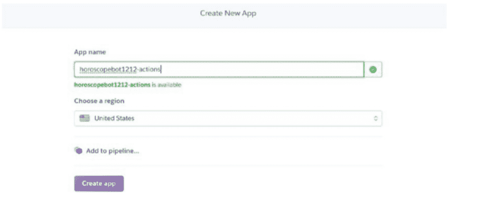

**图5-1.** *在Heroku上创建名为horoscopebot1212-actions的action服务器应用*

### 在本地系统上设置HEROKU

在你的本地操作系统上安装Heroku CLI。参考此链接：[https://](https://)

如果你使用的是macOS，请使用以下命令：

```
brew install heroku/brew/heroku
```

### 在Facebook上创建和设置应用

为了能够在Facebook上部署我们的聊天机器人，我们首先需要拥有Facebook应用的凭证。为了获取Facebook凭证，我们需要设置一个Facebook应用和一个页面，就像我们在第3章中所做的那样。

转到[https://developers.facebook.com/](https://developers.facebook.com/)，如果你还没有应用，请创建一个。我们为OnlineEatsBot创建了一个；现在我们将为HoroscopeBot创建一个。输入详细信息，然后点击“Create App ID”。查看图5-2，了解如何输入机器人的显示名称和你的联系电子邮件。

#### 创建新的App ID

开始将Facebook集成到你的应用或网站中

显示名称

Horoscope_Bot

联系电子邮件

sumit786raj@gmail.com

继续即表示你同意Facebook平台政策

取消

创建App ID

**图5-2.** *在Facebook开发者平台上创建应用*

一旦你的应用创建完成，转到“设置”下的“基本”，然后点击“App Secret”下的“显示”按钮。这是你的参考图5-3，了解你将在哪里获得**fb_secret**密钥。

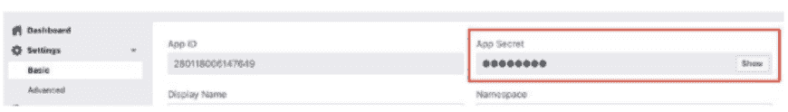

图5-3. 从Facebook应用获取App Secret

转到应用的仪表板，向下滚动到“添加产品”。点击“添加产品”，然后添加Messenger（点击“设置”）。查看图5-4。

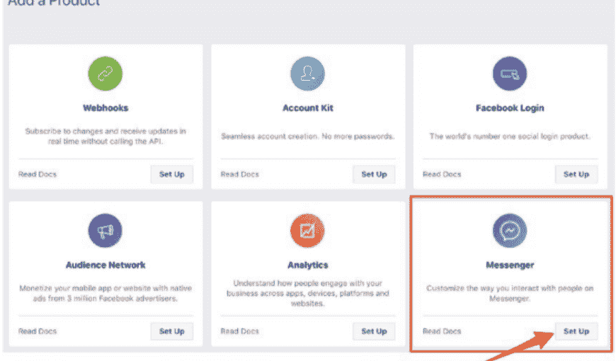

图5-4. 将Messenger作为产品添加到Facebook应用

在Messenger的设置下，当你向下滚动到“令牌生成”部分时，你将获得一个链接来为你的应用创建一个新页面。如果你还没有页面，请创建一个或从“选择页面”下拉菜单中选择一个页面。“页面访问令牌”就是你的**fb_access_token**。参考图5-5。

你可以转到以下链接为你的机器人项目创建一个全新的页面：[https://www.facebook.com/pages/creation/](https://www.facebook.com/pages/creation/)

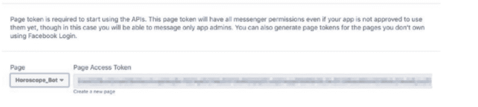

**图5-5.** 为Facebook Messenger应用生成令牌

在“令牌生成”部分之后，在“Webhooks”下，点击“设置Webhooks”。参考图5-6。


**图5-6.** 设置Facebook Webhooks

接下来，选择一个验证令牌，我们稍后需要使用它。验证令牌可以是任何随机字符串。这将是你的查看图5-7，了解在facebook应用中添加验证令牌的位置。现在，将回调URL部分保持空白。不要关闭浏览器；只需保留它——我们将再次回到这里。

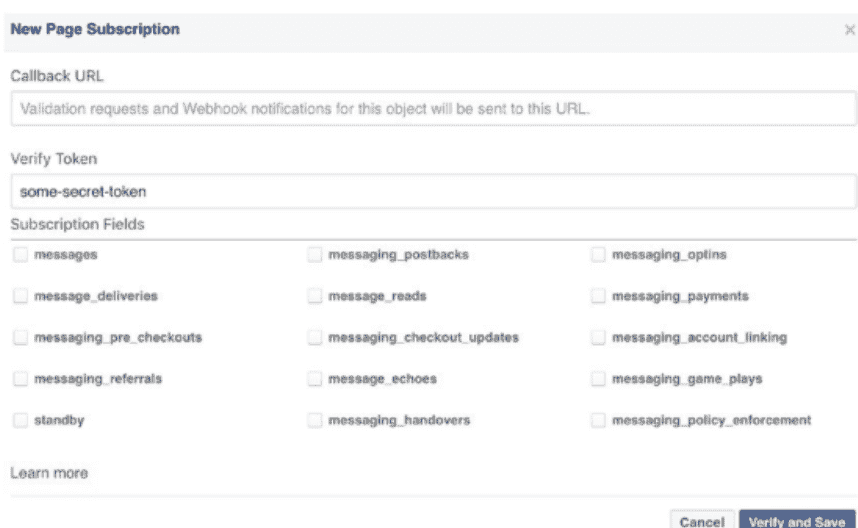

*图5-7. 在Facebook webhook设置中添加验证令牌*

请准备好**fb_verify**、**fb_secret**和**fb_access_token**，以便将你的机器人连接到Facebook。

### 在Heroku上创建和部署Rasa Actions服务器应用

在这一步中，我们将使用我们的actions Heroku应用作为Rasa action的服务器。我们需要有两个不同的应用程序，因为我们无法在单个Heroku应用中运行两个Web应用程序。转到命令行，并按照指示从项目目录执行以下命令集。

创建一个名为actions_app的新文件夹**并**进入该目录：

```
mkdir actions_app cd actions_app
```

将你的actions.py从主项目目录复制到actions_app目录。

创建一个包含以下内容的requirements.txt文件。**requirements.txt**将告诉Heroku应用安装带有其版本的包。

```
rasa-core-sdk==0.11.0 requests==2.18.4
```

创建一个名为Procfile的文件，内容如下。Procfile是Heroku理解如何启动应用程序的文件。

```
web: python -m rasa_core_sdk.endpoint—actions actions
—port $PORT
```

a) 运行以下命令集：

```
$ heroku login

$ git init

$ heroku git:remote -a

$ heroku buildpacks:set heroku/python

$ heroku config:set PORT=5055
```

```
$ git add .
```

```
$ git commit -am "deploy my bot"
```

```
$ git push heroku master
```

执行最后一个命令后，Heroku将根据requirements.txt文件安装我们需要的所有包。如果你的应用成功部署，你应该会收到类似以下的日志：

```
remote:
remote:-----> 发现进程类型 remote: Procfile声明类型 -> web remote:
remote:-----> 压缩中... remote: 完成: 48.3M remote:-----> 启动中... remote: 已发布 v4
remote: https://horoscopebot1212-actions.herokuapp.com/ 已部署到Heroku
remote:
remote: 验证部署... 完成。

To https://git.heroku.com/horoscopebot1212-actions.git

*   [新分支] master -> master
```

此时，我们将验证我们的应用是否响应公共请求。为此，让我们访问附加了“webhook”的应用URL。

我的应用URL是[https://horoscopebot1212-actions.herokuapp.com/](https://horoscopebot1212-actions.herokuapp.com/)，所以我将去检查我的action服务器是否响应。

我访问这个URL，正如预期的那样，它返回说方法不允许，如图5-8所示，这完全正常，意味着应用根据用户请求正确响应。

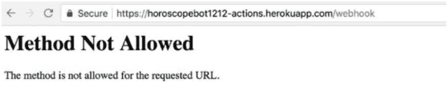

### 创建 Rasa 聊天机器人 API 应用

在这一步中，我们将遵循一些与刚才类似的步骤和命令，但这次我们将创建一个新的应用，它将作为我们对话管理的主应用。那么，让我们开始吧。首先回到主项目目录（即在 horoscope_bot 中），创建一个文件名，并向其中添加以下内容：

```
web: python -m spacy download en && python facebook.py
```

### 为 Facebook Messenger 聊天机器人创建独立脚本

在同一个项目目录中创建一个名为 **facebook.py** 的文件。Python 文件的内容应如下所示：

```
from rasa_core.channels.facebook import FacebookInput
from rasa_core.agent import Agent
from rasa_core.interpreter import RasaNLUInterpreter
import os
from rasa_core.utils import EndpointConfig

# load your trained agent
interpreter = RasaNLUInterpreter("models/nlu/default/horoscopebot/")
MODEL_PATH = "models/dialog"

action_endpoint = EndpointConfig(url="https://horoscopebot1212-actions.herokuapp.com/webhook")

agent = Agent.load(MODEL_PATH, interpreter=interpreter)
input_channel = FacebookInput(
    fb_verify="YOUR_FB_VERIFY_TOKEN",
    # you need tell facebook this token, to confirm your URL
    fb_secret="YOUR_FB_SECRET",  # your app secret
    fb_access_token="YOUR_FB_ACCESS_TOKEN"
    # token for the page you subscribed to
)

# set serve_forever=False if you want to keep the server running
s = agent.handle_channels([input_channel], int(os.environ.get('PORT', 5004)), serve_forever=True)
```

请确保将此代码中的 **fb_secret** 和 **fb_access_token** 变量值替换为我们第 3 步中保存的值。

创建一个新的 requirements.txt 文件，并添加此项目所需的所有包及其版本。我的 requirements.txt 如下所示；对于你的项目，要求可能不同，但如果你遵循本章中相同的机器人示例，这些要求应该没问题。

```
rasa-core==0.11.1
rasa-core-sdk==0.11.0
rasa-nlu==0.13.2
gunicorn==19.9.0
requests==2.18.4
spacy==2.0.11
sklearn-crfsuite==0.3.6
```

以便在服务器中安装我们的包。

现在，让我们像之前一样在 Heroku 中再次创建一个新应用。转到你的 Heroku 仪表板并创建一个新应用，如图 5-9 所示。

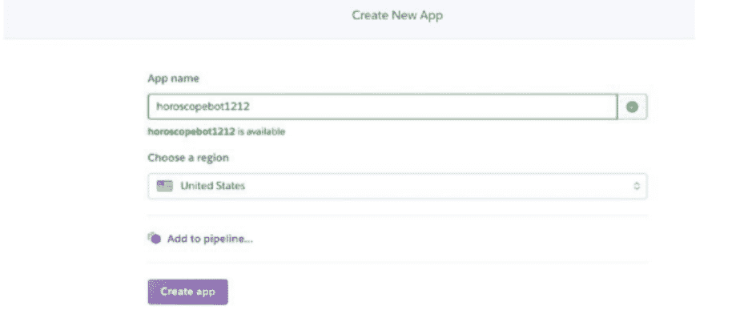

创建应用后，你现在可以转到项目根目录，并在项目文件夹的命令行中运行以下命令集：

```
$ git init
$ heroku git:remote -a
$ heroku buildpacks:set heroku/python
$ heroku config:set PORT=5004
$ git add .
$ git commit -am "deploy my bot"
$ git push heroku master
```

如果在部署后出现运行时错误，它可能看起来像下面这样

ValueError: You may be trying to read with Python 3 a joblib pickle generated with Python 2. This feature is not supported by joblib.

这主要发生在你使用 Python 2.x 版本时。Heroku 默认使用 Python 3.x 版本。因此，如果你想使用 Python 2.x，你需要执行以下步骤来解决上述错误。将 Python 3.6 更改为 Python-2.7.15。为此。

在你的项目根应用目录下创建一个文件 runtime.txt。打开 runtime.txt 并添加以下行 python-2.7.15，然后保存它。Heroku 将仅使用上述 Python 版本来构建你的项目。

一旦成功部署完成，你将看到 Heroku 给出的一个 url，说明应用已部署到。

```
remote: Compressing source files... done.
remote: Building source:
remote:
remote:------> Python app detected
remote:------> Installing requirements with pip
remote:
remote:------> Discovering process types
remote: Procfile declares types -> web
remote:
remote:------> Compressing...
remote: Done: 254M
remote:------> Launching...
remote: Released v17
remote: https://horoscopebot1212.herokuapp.com/ deployed to Heroku
remote:
remote: Verifying deploy... done.

To https://git.heroku.com/horoscopebot1212.git
cd3eb1b..coeo81d master -> master
```

这次部署将花费一些时间，所以请尽可能保持耐心——你即将见证奇迹。如果你没有收到任何错误消息，那么你已成功将聊天机器人部署到云端的 Heroku，使其能够与 Facebook Messenger 协同工作。

让我们验证它是否有效。

### 验证我们的对话管理应用在 Heroku 上的部署

为了验证我们的对话管理应用是否成功部署在 Heroku 上，我们将执行以下步骤。

获取 Heroku 给出的 url 并在其后附加此端点：

/webhooks/facebook/webhook?hub.verify_token=YOUR_FB_VERIFY_TOKEN

确保使用你在 Facebook webhook 设置中使用的正确验证令牌。我完整的 url 如下所示：[https://horoscopebot1212.herokuapp.com/webhooks/facebook/webhook?hub.verify_token=my-secret-verify-token](https://horoscopebot1212.herokuapp.com/webhooks/facebook/webhook?hub.verify_token=my-secret-verify-token)

转到浏览器并粘贴整个 url，如果你的 hub.verify_token 正确，它应该会返回你的 hub.challenge 值。你完整的 url 将如下所示：[https://horoscopebot1212.herokuapp.com/webhooks/facebook/webhook?hub.verify_token=YOUR_FB_VERIFY_TOKEN&hub.challenge=CHALLENGE](https://horoscopebot1212.herokuapp.com/webhooks/facebook/webhook?hub.verify_token=YOUR_FB_VERIFY_TOKEN&hub.challenge=CHALLENGE) 如果你在浏览器中收到消息 **successfully_verified**，那么你的应用已成功部署并正在运行。

### 将 Webhook 与 Facebook 集成

现在让我们回到 Facebook 应用配置。我们将回到第 3 步中我们离开的地方，并添加我们的回调 URL。确保选中订阅字段中的 **messages**。参考图 5-10。

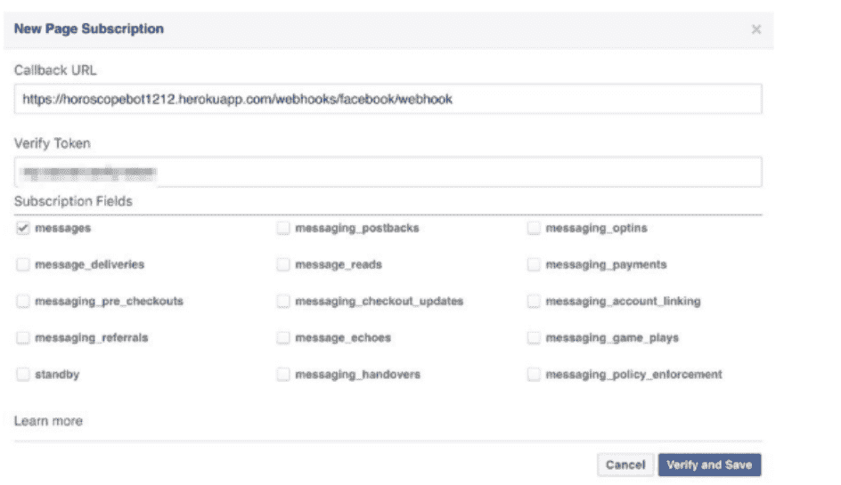

**图 5-10.** *Facebook Messenger webhook 配置*

点击“验证并保存”。Facebook 将使用上述 url 匹配验证令牌，这意味着服务器，或者说我们的应用只会响应具有正确验证令牌的请求。一旦验证令牌匹配，我们应用的 webhook 订阅将被激活。

接下来，在页面的 Webhooks 部分下，选择一个页面，你可以将你的 webhook 订阅到该页面的事件。点击订阅（见图 5-11）。


**图 5-11.** *将 webhook 订阅到 Facebook 页面事件*

全部完成！是时候在 Facebook 上测试我们的星座机器人了。

### 部署后验证：Facebook 聊天机器人

在正常的软件开发场景中，人们构建软件，测试它，然后部署并进行 PDV（部署后验证）。我们也将做类似的事情，并在成功部署到 Facebook Messenger 后对我们的聊天机器人进行 PDV。这很重要，因为正如你所了解的，聊天机器人有一部分需要连接到动作服务器来响应用户的一些意图请求。

PDV 就像一次健全性测试，以查看应用的整体健康状况是否良好。如果你正在构建一个使用 10 到 15 个不同供应商 API 的机器人，那么检查所有机器人调用动作服务器并使用 API 将数据返回给用户的场景是必须的。

所以，转到你的 messenger 应用或电脑浏览器中的 Facebook，搜索你的机器人开始交谈。

图 5-12.1 到 5-12.3 展示了我的星座机器人做了什么以及告诉了我什么。

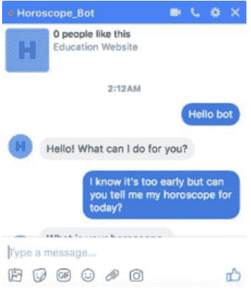

图 5-12.1. Horoscope_Bot Facebook


图 5-12.2. Horoscope_Bot Facebook


图 5-12.3. Horoscope_Bot Facebook

瞧！我们第一个内部构建的聊天机器人应用已部署到网络上，并且可以通过 Facebook Messenger 平台访问。所以，去吧，与你的家人、朋友、同事以及全世界分享它。

### 在 Slack 上部署聊天机器人

在本节中，我们将把聊天机器人部署到 Slack。Slack 是一款在开发者和企业中广受欢迎的团队协作工具。如果你不常使用社交媒体，那么可能需要借助 Slack 的界面来与你的聊天机器人对话。那么，让我们开始构建我们的第一个内部 Slack 聊天机器人吧。

为了将我们的星座聊天机器人部署到 Slack，我们将编写一个独立的脚本，就像我们在 Facebook 案例中所做的那样。

### 为 Slack 聊天机器人创建独立脚本

在你的项目目录中创建一个名为 **slack.py** 的新文件。文件 **slack.py** 的内容将如下所示：

```python
from rasa_core.channels.slack import SlackInput
from rasa_core.agent import Agent
from rasa_core.interpreter import RasaNLUInterpreter
import os
from rasa_core.utils import EndpointConfig

# load your trained agent
interpreter = RasaNLUInterpreter("models/nlu/default/horoscopebot/")
MODEL_PATH = "models/dialogue"

action_endpoint = EndpointConfig(url="https://horoscopebot1212-actions.herokuapp.com/webhook")

agent = Agent.load(MODEL_PATH, interpreter=interpreter, action_endpoint=action_endpoint)

input_channel = SlackInput(
    slack_token="YOUR_SLACK_TOKEN",  # this is the `bot_user_o_auth_access_token`
    slack_channel="YOUR_SLACK_CHANNEL"  # the name of your channel to which the bot posts (optional)
)

# set serve_forever=False if you want to keep the server running
s = agent.handle_channels([input_channel], int(os.environ.get('PORT')), serve_forever=True)
```

**facebook.py** 和 **slack.py** 之间的主要区别在于我们创建的 **input_channel** 对象。Rasa 提供了多种内置渠道，如 Facebook、Slack、Mattermost、Telegram、Twilio、RocketChat 和 Microsoft Bot Framework，我们可以直接使用它们轻松地将同一个机器人部署到各种渠道。

如你所见，我们需要在脚本中添加 **slack_token** 和 **slack_channel**。就像我们不得不在 Facebook 的开发者平台上创建一个 Facebook 应用一样，我们也需要在 Slack 上创建一个应用。

让我们一步一步来操作：

访问此网址 [https://api.slack.com/slack-apps](https://api.slack.com/slack-apps) 并点击“Create App”按钮。参考图 5-13。

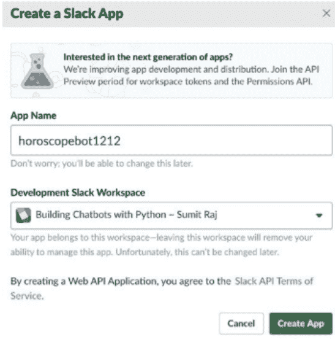

**图 5-13.** *在 Slack 中创建应用程序*

下一步是创建一个机器人用户。要创建机器人用户，请点击“Add features and functionality”下的 **Bots**。在新页面中，你将看到一个“Add a Bot User”的选项。查看图 5-14 了解如何添加详细信息并添加机器人用户。

### 机器人用户

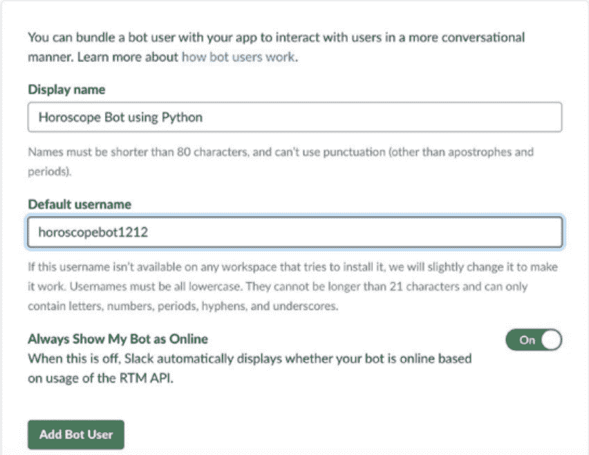

**图 5-14.** *为你的 Slack 机器人命名*

根据你正在构建的聊天机器人填写详细信息。显示名称可以是任何你喜欢的；默认用户名必须是唯一的；你可以保持原样。切换最后一个选项“always show my bot as online”是为了始终将机器人显示为在线用户。这就是聊天机器人的意义所在——人类不可能 24/7 都在线，但聊天机器人可以，所以我们开启这个功能。确保你点击了保存更改。

返回“Basic Information”标签页。点击“Install your app to your workspace”。应用将要求确认身份。请像授权任何其他应用一样授权它。查看图 5-15 了解授权界面的样子。

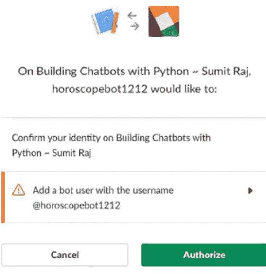

**图 5-15.** *授权你的 Slack 应用*

你会在“Add features and functionality”下找到带有绿色对勾的 Bots and Permissions 标签页，这意味着我们的机器人和应用已良好集成。这表明我们目前进展顺利。

转到你的 OAuth & Permissions 部分，复制 **Bot User OAuth Access Token**。将复制的令牌粘贴到我们的 Python 脚本中。随意给一个频道名称。如果你想让机器人发布到某个频道，可以给出一个频道名称。我使用了 @slackbot。如果你不设置 **slack_channel** 关键字参数，消息将被发送回发送它们的用户。

### 编辑你的 Procfile

在这一步中，我们不会创建任何新的 Procfile，因为我们使用的是相同的代码库。我们将把现有的 Procfile 更改为以下内容，以使其适用于我们的 Slack 机器人。因此，我们只需将脚本文件的名称从 **facebook.py** 更改为 **slack.py**，以便 Heroku 使用给定的文件来启动应用程序。

```
web: python -m spacy download en && python slack.py
```

### 最终将 Slack 机器人部署到 Heroku

为了最终将我们的新 Slack 机器人部署到 Heroku，我们将从命令行运行一组类似的 Heroku 命令来部署我们的应用程序。

```
$ git init
$ heroku git:remote -a
$ git add .
$ git commit -am "deploy my bot"
$ git push heroku master
```

### 订阅 Slack 事件

现在，点击标签页并通过切换屏幕上的按钮来激活事件订阅功能。输入 Heroku 应用的 Slack webhook url。

如果你的应用已使用修改后的 Procfile 正确部署在 Heroku 上，你的 Slack webhook url 将是 **app_url** + `/webhooks/slack/webhook`，如下所示：

https://horoscopebot1212.herokuapp.com/webhooks/slack/webhook

在 Slack 向上述 URL 发送带有 challenge 参数的 HTTP POST 请求后，你会看到一个已验证的勾选标记，并且我们的端点必须用 challenge 值进行响应。这与我们在构建 Facebook 聊天机器人密钥令牌时讨论的内容类似。查看图 5-16 了解更多。

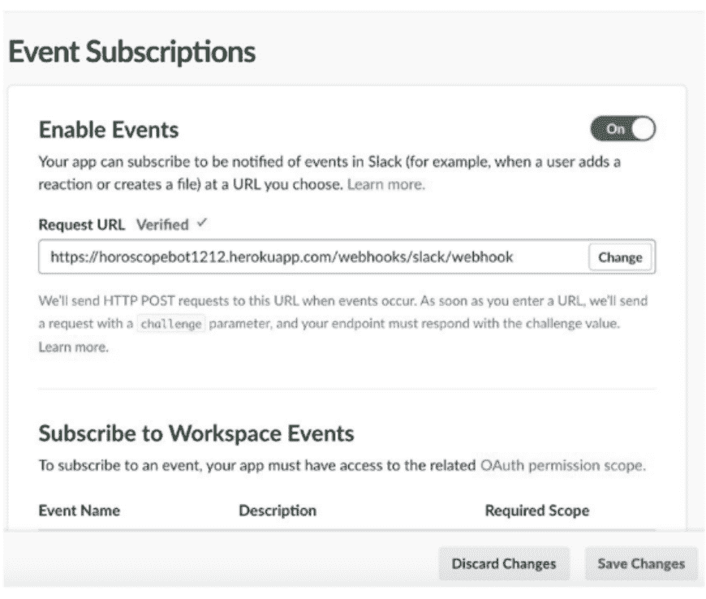

**图 5-16.** *为你的机器人激活事件订阅*

### 订阅机器人事件

在这一步中，我们只需向下滚动事件订阅页面，转到“Subscribe to Bot Events”部分，然后点击“Add Bot User Event”。参考图 5-17 了解导航位置。

### 订阅机器人事件

机器人用户可以订阅与其所属频道和对话相关的事件。

| 事件名称 | 描述 |
|---|---|
| app_mention | 仅订阅提及你的应用或机器人的消息事件 |
| message.im | 在直接消息频道中发布了一条消息 |

**图 5-17.** *订阅机器人事件*

订阅机器人事件无非是声明机器人需要回复的事件。我们这里只演示两种场景：第一种，当有人提及机器人名称时（即 @botname）；第二种，当有人直接向机器人发送消息时（即直接消息）。

现在，点击保存更改，你就完成了。是时候像我们在上一节中为 Facebook 所做的那样测试我们的 Slack 聊天机器人了。

### 部署后验证：Slack 机器人

让我们转到用于创建应用的工作区，在左侧的 Apps 下，你会找到你的机器人。试着与它交谈，看看它是否表现良好。我的机器人能很好地告诉我今天的星座运势，值得一读。如果你还没有走到这一步，请查看图 5-18，看看我的 Slack 机器人是如何响应的。

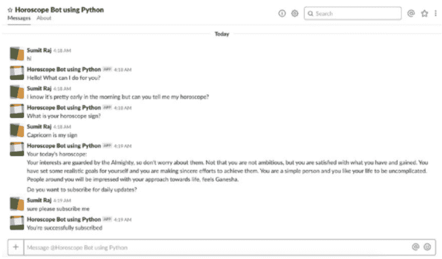

**图 5-18.** *测试 Slack 聊天机器人*

好了，伙计们，我们的 Slack 机器人就完成了。在下一节中，我们将把机器人部署到我们自己的 UI 上。构建你自己的 UI 可能需要一些前端技能，但别担心——我们对此已有计划。

### 自行部署聊天机器人

这个标题听起来很酷，不是吗？到目前为止，我们一直在使用 Facebook 或 Slack（或者我们本可以使用 Telegram 等）在 Web 上部署我们的聊天机器人，但现在是时候完全依靠我们自己来部署一切了——我们自己的服务器、我们自己的数据，以及使用我们自己的用户界面配置的模型。如果你是一个组织或新兴企业家，你可能在 Facebook、Twitter 或 Slack 上有你的机器人想法，但你总会希望它也能在你自己的网站上运行，这样随着用户群的增长，你的品牌价值也会不断提升。

在本节中，我们将利用迄今为止所有的努力，最终构建一个功能齐全、独立于任何第三方 API 调用或工具（如 Dialogflow、wit.ai、Watson 等）的聊天机器人。你将拥有完全的控制权，可以随心所欲地调整你的聊天机器人，最重要的是，可以轻松地将其扩展到数百万人。

那么，我们开始吧。

第一步是确保我们在前面章节中部署的两个应用已经启动并运行。你已经知道如何进行基本的健全性检查。要使用你的聊天机器人模型在任何平台上，你始终需要你的对话管理器应用和动作应用处于运行状态。

现在，在我们之前创建 `facebook.py` 和 `slack.py` 的同一个项目目录中，我们将创建一个名为 `myown_chatbot.py` 的新文件。之前创建的脚本，如 **facebook.py** 和 **slack.py**，是独立的脚本，我们创建它们是为了能够通过命令告诉 Heroku 运行哪个脚本来启动应用程序。现在，我们将创建自己的脚本，该脚本将通过 REST API 暴露用户与聊天机器人之间的请求/响应。

部署你自己的聊天机器人分为两部分。在第一部分，我们将编写一个脚本来创建一个自定义通道并将其部署为 REST API。在第二部分，我们需要自己的用户界面，因为到目前为止，我们一直使用 Facebook 和 Slack 的聊天屏幕进行对话。

### 为你的聊天机器人通道编写脚本

这个脚本与我们迄今为止所学和所写的类似，但它需要我们覆盖 `rasa_core` 的一些现有方法，以便我们可以定义自己的 API 认证规则。我在下面的代码中进行了基本的字符串检查以进行令牌验证。这不建议用于生产级系统，因此如果你正在为大型系统构建聊天机器人，请务必仔细编写该部分。

创建一个名为 `myown_chatbot.py` 的新文件，并将以下内容添加到其中：

```python
import os

from rasa_core.channels.rasa_chat import RasaChatInput
from rasa_core.agent import Agent

from rasa_core.interpreter import RasaNLUInterpreter
from rasa_core.utils import EndpointConfig

# load your trained agent
interpreter = RasaNLUInterpreter("models/nlu/default/horoscopebot/")
MODEL_PATH = "models/dialogue"

action_endpoint = EndpointConfig(url="https://horoscopebot1212-actions.herokuapp.com/webhook")

agent = Agent.load(MODEL_PATH, interpreter=interpreter,
                   action_endpoint=action_endpoint)

class MyNewInput(RasaChatInput):
    @classmethod
    def name(cls):
        return "rasa"

    def _check_token(self, token):
        if token == 'mysecret':
            return {'username': 1234}
        else:
            print("Failed to check token: {}.".format(token))
            return None

input_channel = MyNewInput(url='https://horoscopebot1212.herokuapp.com')  # set serve_forever=False if you want to keep the server running

s = agent.handle_channels([input_channel], int(os.environ.get('PORT', 5005)), serve_forever=True)
```

这里有几个要点需要注意：

- `rasa_core` 中的 `_check_token` 方法基本上如下所示，它会进行 API 调用以获取用户对象。这主要完成用户级别的认证工作。在前面覆盖的方法中，我们保持简单以使其工作并理解其用法。

```python
def _check_token(self, token):
    url = "{}/users/me".format(self.base_url)
    headers = {"Authorization": token}

    logger.debug("Requesting user information from auth server {}.".format(url))

    result = requests.get(url, headers=headers, timeout=DEFAULT_REQUEST_TIMEOUT)

    if result.status_code == 200:
        return result.json()

    logger.info("Failed to check token: {}. Content: {}".format(token, result.data))
    return None
```

- 使用 Rasa 自己的 `_check_token` 方法可能需要你编写一个 API 或 Web 服务，该服务接受请求并以指定方式返回响应。
- 确保将动作服务器端点更改为你自己的 URL。
- 请记住，代码中的 `mysecret` 字符串将用于后续进行 API 调用。

### 编写 Procfile 并部署到 Web

到目前为止，你一定已经非常熟悉为 Heroku 部署创建 Procfile。我们将再次使用现有的 Procfile 并在其中进行修改，以将我们基于 API 的聊天机器人部署到 Web。你可以在备份现有 Procfile 后，随意创建一个新的 Procfile。

以下是我的 Procfile 内容：

```
web: python -m spacy download en && python myown_chatbot.py
```

完成后，只需执行我们在部署 Facebook Messenger 和 Slack Bot 时已经学过的下一组命令。

```
$ git init
$ heroku git:remote -a <your-app-name>
$ git add .
$ git commit -am "deploy my bot"
$ git push heroku master
```

执行最后一个命令后，你将从 Heroku 获得一些与部署版本、对应用所做的更改等相关的日志。

### 验证你的聊天机器人 API

在获得部署成功的消息后，让我们测试一下我们的聊天机器人 API 是否正常工作。为了快速进行健全性测试，请访问以下 URL：

https://horoscopebot1212.herokuapp.com/webhooks/rasa/

在浏览器中打开此 URL 应该会给你一个类似以下的响应。如果它给你一个 "ok" 状态，那么你就没问题了——放松一下，坐下来，调试吧。

```json
{"status":"ok"}
```

有时，仅此验证可能还不够，因此让我们通过实际测试来检查聊天机器人是否能够识别意图并基于此给出响应。

我将使用 POSTMAN 工具（POSTMAN 是一个非常好的基于 GUI 的 API 测试工具）。你可以使用任何你习惯的工具。我们只是要测试聊天机器人应该理解和响应的其中一个意图。我测试了问候意图，它运行得非常顺利。机器人返回了预期的响应，如图 5-19 所示。

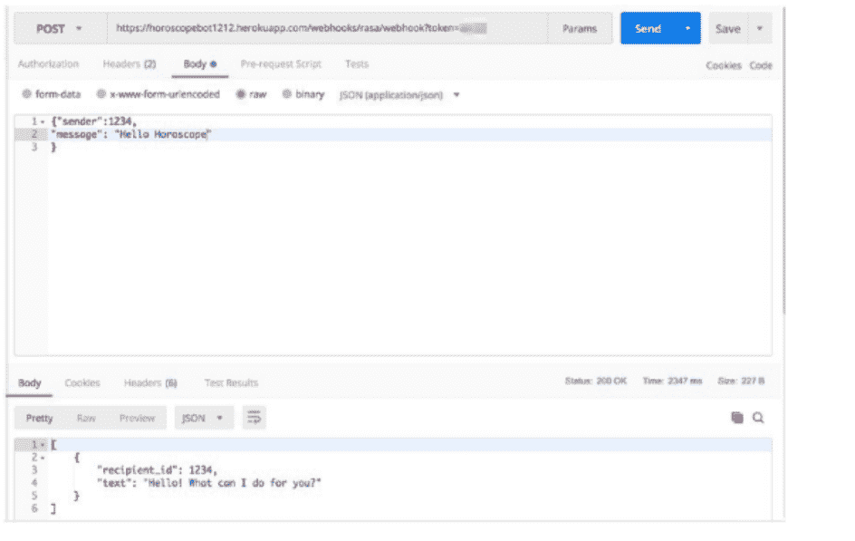

### 创建聊天机器人用户界面

正如我们在第二步中讨论的，我们需要自己的用户界面，为聊天机器人和用户之间的对话提供一个用户友好的场所。如果你是前端开发人员，或者团队中有前端开发人员，你可以轻松地将我们到目前为止构建的聊天机器人 API 提供给他们，前端团队应该能够轻松地将其与他们的聊天机器人用户界面集成。他们可以利用常规的 HTTP 调用来使用这些 API。Websockets 是实现聊天机器人的更好方式，但这不在本书的解释范围内。

如果你不熟悉 HTML/CSS/Javascript 等前端技术，那么我确实推荐 *Pro HTML5 with CSS, JavaScript, and Multimedia* (Apress, 2017)。

为了方便我们的读者——或者我应该说学习者——我们创建了聊天机器人和用户对话所需的基本用户界面。你可以在 github 或 Apress 的网站上找到完整的可运行代码。我将告诉你使其为你的机器人工作所需的配置。

一旦你下载了本章的代码，你会在名为 `chapter-5` 的主文件夹中找到 `chatbot-ui` 文件夹。进入此文件夹，然后进入 assets -> js -> script.js 文件。

将以下 javascript 代码行更改为你自己的端点 URL。如果你的应用名称不同，那么下面的 URL 在你的情况下会有所不同。在 javascript 代码中使用你自己的 URL 和令牌，如下所示。

```javascript
var baseUrl = "https://horoscopebot1212.herokuapp.com/webhooks/rasa/webhook?token=YOUR-SECRET";
```

保存文件并在浏览器中打开 **index.html** 文件，你就可以轻松看到一个准备就绪的聊天机器人用户界面。但是，从本地提供的简单 HTML 进行 API 调用会引发 CORS 问题。因此，为了避免这种情况，我们将稍微修改我们现有的 **myown_chatbot.py**，以便从我们的 Heroku 应用本身提供 HTML。

将你的 **myown_chatbot.py** 更改为以下内容，然后我们将讨论所做的更改。

```python
import os

from rasa_core.channels.rasa_chat import RasaChatInput
from rasa_core.channels.channel import CollectingOutputChannel, UserMessage
from rasa_core.agent import Agent

from rasa_core.interpreter import RasaNLUInterpreter
from rasa_core.utils import EndpointConfig
from rasa_core import utils

from flask import render_template, Blueprint, jsonify, request

# load your trained agent
interpreter = RasaNLUInterpreter("models/nlu/default/horoscopebot/")
MODEL_PATH = "models/dialogue"

action_endpoint = EndpointConfig(url="https://horoscopebot1212-actions.herokuapp.com/webhook")

agent = Agent.load(MODEL_PATH, interpreter=interpreter,
                   action_endpoint=action_endpoint)

class MyNewInput(RasaChatInput):
    @classmethod
    def name(cls):
        return "rasa"

    def _check_token(self, token):
        if token == 'secret':
            return {'username': 1234}
        else:
            print("Failed to check token: {}".format(token))
            return None

    def blueprint(self, on_new_message):
```

templates_folder = os.path.join(os.path.dirname(os.path.abspath(file)), 'myown_chatbot')

custom_webhook = Blueprint('custom_webhook', name, template_folder=templates_folder)

@custom_webhook.route("/", methods=['GET'])
def health():
    return jsonify({"status": "ok"})

@custom_webhook.route("/chat", methods=['GET'])
def chat():
    return render_template('index.html')

@custom_webhook.route("/webhook", methods=['POST'])
def receive():
    sender_id = self._extract_sender(request)
    text = self._extract_message(request)

    should_use_stream = utils.bool_arg("stream", default=False)

    if should_use_stream:
        return Response(
            self.stream_response(on_new_message, text, sender_id),
            content_type='text/event-stream')
    else:
        collector = CollectingOutputChannel()
        on_new_message(UserMessage(text, collector, sender_id))
        return jsonify(collector.messages)

return custom_webhook

input_channel = MyNewInput(url='https://horoscopebot1212.herokuapp.com') # 如果你希望服务器持续运行，请设置 serve_forever=False

s = agent.handle_channels([input_channel], int(os.environ.get('PORT', 5004)), serve_forever=True)

以下是我们所做的更改：

-   重写类中现有的 **name** 和 **blueprint** 方法，这使我们能够创建自己的端点，并自由定义其行为。
-   我们创建了一个新的端点 `/chat`，并提供 `index.html` 文件，这正是聊天机器人的用户界面。因此，这将成为我们聊天机器人的主页链接。
-   我们必须导入一些必要的类和方法，例如 **utils** 和 **UserMessage**，以使功能正常运行。

保存文件，并使用以下命令将更改重新部署到我们的 Heroku 应用：

```
$ git add .
$ git commit -am "deploy my bot"
$ git push heroku master
```

一旦部署成功——瞧！我们的机器人已准备好与全世界分享，它通过两个 Heroku 应用协同工作：一个用于对话管理，另一个用于执行操作。

在浏览器中打开以下网址，我们应该能看到自定义的聊天机器人界面：

https://horoscopebot1212.herokuapp.com/webhooks/rasa/chat

图 5-20.1 和 5-20.2 展示了我自己的聊天机器人在对话过程中的样子。

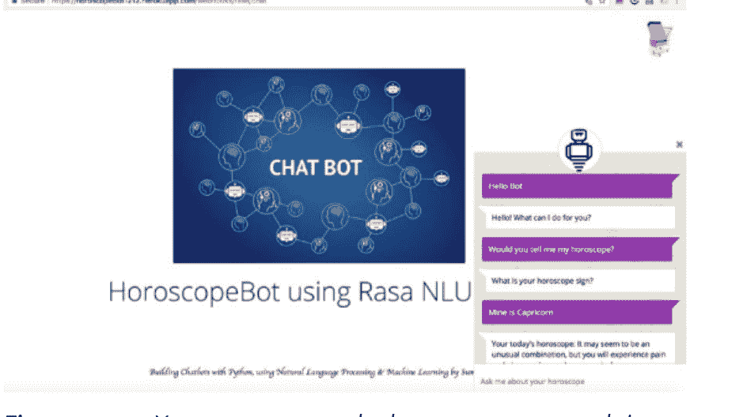

**图 5-20.1.** 你自己网站上的自定义聊天机器人

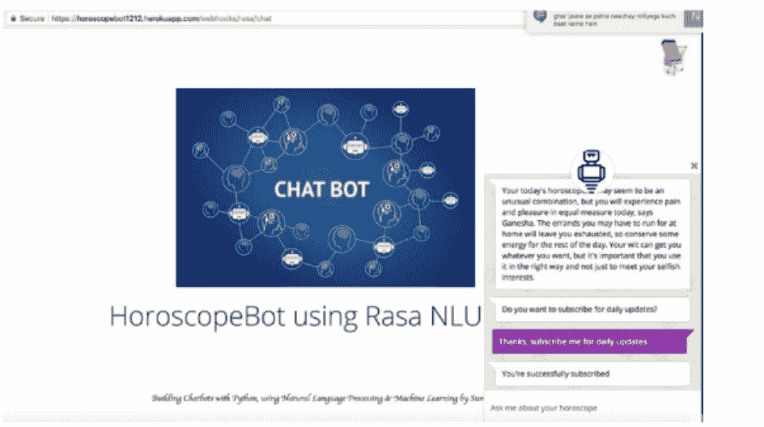

**图 5-20.2.** *你自己网站上的自定义聊天机器人*

利用 Heroku 的自定义域名功能，可以轻松地将同一个应用指向你自己网站的域名，比如当你觉得你的聊天机器人已经足够完善，可以面向全世界开放以用于盈利或非盈利目的时，就可以这样做。

好了，各位，这就是全部内容！这就是如何使用 Python 结合自然语言处理和机器学习来构建聊天机器人。我希望本章连同前面的章节对你有所帮助，你能够学习到构建和学习聊天机器人的实践方法。

### 总结

在本章中，我们学习了如何使用 Heroku 将我们自己的应用部署到我们自己的服务器上。我们学习了如何使用 Facebook 的开发者平台将我们的聊天机器人与 Facebook 集成。我们还学习了为 Slack 应用创建一个自定义聊天机器人并进行了测试。最后，正如在第三章末尾所承诺的，我们摆脱了对任何社交媒体平台的依赖，创建了自己的用户界面，将其部署在 Heroku 上并进行了测试。我们看到它运行得非常出色——在训练过程中它就能工作。既然我们已经有了一个基本模型并使其运行起来，现在你可以处理聊天机器人运行不佳的情况。判断问题是与数据或训练相关，还是与操作服务器或自定义代码处理相关。一旦找到根本原因，修复它，重新部署，并检查聊天机器人是否有所改进。我们通过从小处着手来构建大型软件。

我期待收到你的消息，并很好奇你在读完本书后构建了什么样的聊天机器人。如果你在任何概念、代码执行或部署方面遇到困难，我随时乐意提供帮助。

谢谢，干杯。

## 索引

### A

-   自动化和固定机器人，18

### B

-   商业视角，聊天机器人
    -   可访问性，5
    -   可用性，6
    -   成本，6
    -   客户偏好聊天机器人，9–10
    -   效率，5
    -   聊天机器人使用概览，8–9
    -   洞察力，6
    -   收入，6–8
    -   可扩展性，6

### C

-   聊天机器人，1
    -   API，1，181–182
    -   自动化和固定，18
    -   来回通信，17
    -   构建，20
    -   商业视角（商业视角，聊天机器人）
    -   置信度分数，28
    -   自定义，网站，186–187
    -   决策树，20–24
    -   开发者视角
        -   功能发布和错误修复，11
        -   学习曲线，12
        -   市场需求，11
    -   开发，1
    -   实体，27，66
    -   常见问题解答，18–19
    -   食品订购（食品订购聊天机器人）
    -   框架，25–26
    -   历史，13–16
    -   行业，12–13
    -   意图，27，66
    -   myown_chatbot.py 文件，179–180，183–185
    -   自然语言处理（NLP）
    -   流行度，2–3
    -   问题陈述，16
    -   Procfile，181
    -   重复性问题，17
    -   范围，65
    -   第三方 API，178
    -   传统方法，2
    -   训练，28
    -   用户界面，183
    -   话语，27
    -   Python 之禅，3–5

© Sumit Raj 2019
S. Raj, *Building Chatbots with* [https://doi.org/10.1007/978-1-4842-4096-0](https://doi.org/10.1007/978-1-4842-4096-0)
189

-   自定义操作
    -   对话，132
    -   GetTodaysHoroscope 操作，131
    -   name 方法，131
    -   run 方法，131
    -   SlotSet 方法，131
    -   UtterAction，130
-   客户偏好聊天机器人，9–10

### D, E

-   数据准备，将机器人对话作为故事导出，150，152
-   交互式学习，133，136
    -   聊天机器人代理模型，136–140
    -   rasa-nlu-sdk，142–150
    -   通过强化进行实时训练，140–142
    -   故事数据，134，136
-   决策树
    -   服装聊天机器人，表示，22–23
    -   描述，21
    -   金融机构，23
    -   功能齐全，22
    -   健康测验，24
    -   意图，24
    -   OTP API，24
    -   表示，21
-   依存句法分析
    -   祖先节点，50–51
    -   子节点，51
    -   交互式可视化，51–53
    -   父子关系，49
    -   用法，53–54
-   Dialogflow 聊天机器人，63
    -   架构，64
    -   在网络上部署，82–85
    -   Facebook Messenger，集成
        -   访问令牌，89
        -   回调 URL，89
        -   创建应用，87–88
        -   设置，86
        -   测试机器人，91，93–95
        -   验证令牌，89
        -   Webhook 配置，90–91
    -   食品订购聊天机器人（食品订购聊天机器人）
    -   意图 fulfillment
        -   检查响应，101–102
        -   POST 和 JSON 响应，96
        -   测试，97。
        -   启用 webhook，98–100
    -   NLU 模块，64

### F

-   Facebook 应用
    -   操作服务器应用，Heroku，157
    -   添加产品，159
    -   App Secret，158–159
    -   创建，158
    -   部署，166
    -   对话管理，165
    -   Heroku，对话管理部署，167
    -   Horoscope_Bot，169–170
    -   安装 Heroku CLI，158
    -   Messenger，令牌生成，159–160
    -   Python 文件，164
    -   requirements.txt 文件，164
    -   根目录，165–166
    -   Webhook 配置，167–168
    -   Webhook 设置，160–161

### G

-   聊天机器人使用概览，8–9
-   GloVe 算法，56

### H

-   星座机器人，109–110
    -   用户与机器人的对话脚本，110–111
    -   测试，152–153
-   Horoscope_Bot Facebook，169–170

### I, J, K, L, M

-   行业，12–13

### N, O

-   命名实体识别（NER），44–47
-   自然语言处理（NLP），29
    -   黑盒，30
    -   定义，29
    -   依存句法分析（依存句法分析）
    -   寻找相似性，55–58
    -   智能机器，30
    -   NER，44–47。
    -   NLU，30
    -   名词短语，54–55
    -   词性标注，37–41
    -   正则表达式，60–61
    -   SpaCy，29，31–36
    -   词干提取和词形还原，42–44
    -   停用词，47–49
    -   分词，59
-   自然语言理解（NLU）模块，30，64
-   名词短语，54–55

### P

-   词性标注，37–41
-   流行度，2–3
-   部署后验证（PDV），169–170

### Q

问答机器人，18–19

### R

Rasa action 服务器，Heroku 应用命令，161–162

验证，163

webhook，163

Rasa 聊天机器人 API，163

Rasa Core，106

对话管理动作，125–126

### Rasa Core

领域文件，创建，127–129

与 Rasa NLU 配合使用，123–124

Rasa 技术栈，125

槽位，126

状态机，122–123

模板，127

rasa_core，版本，139

Rasa NLU，106

安装，107

管道，108–109

使用，107

Rasa 的凭证管理，155–156

正则表达式，60–61

### S

Scratch，从配置文件创建聊天机器人，117–118

对话脚本，110–111

数据用于

JSON 格式，112–113

Rasa NLU 训练器，114–116

星座机器人，109–110

predict_intent 方法，119，121

Python 代码，118–119

train_horoscopebot 方法，119

Slack

授权，173–174

机器人用户，172–173

创建应用，172

默认用户名，173

部署，Heroku，175

事件订阅，175–176

OAuth 与权限，174

Procfile，175

slack.py 文件，171

slack_token 和 slack_channel，172

订阅机器人事件，176–177

测试，177–178

SpaCy，29

基准测试结果，31

深度学习，32

定义，31

文档，32

下载，36

最快的库，32

功能，32–33

安装

Jupyter Notebook，34–35

Python 3，33

验证，35

Python 包，35–36

停用词，47–49

### T, U, V, W, X, Y

分词，59

### Z

Python 之禅，3–5