# 使用 tkinter 和 Python 构建现代图形用户界面

轻松构建用户友好的图形用户界面应用程序

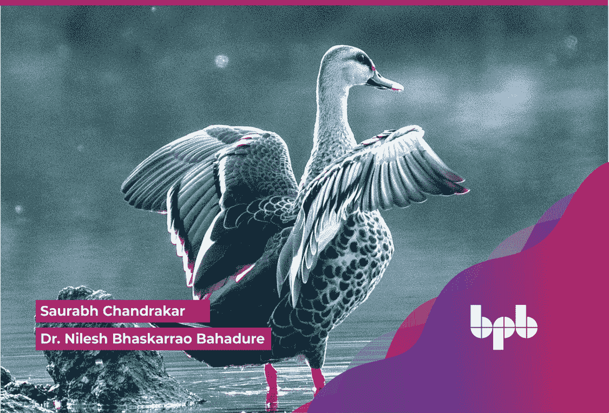

Saurabh Chandrakar

Dr. Nilesh Bhaskarrao Bahadure

# 使用 tkinter 和 Python 构建现代图形用户界面

轻松构建用户友好的图形用户界面应用程序

Saurabh Chandrakar
Dr. Nilesh Bhaskarrao Bahadure


www.bpbonline.com

版权所有 © 2023 BPB Online

*保留所有权利。* 未经出版商事先书面许可，不得以任何形式或任何方式复制、存储在检索系统中或传播本书的任何部分，除非在评论文章或评论中嵌入简短引用。

在编写本书时，我们已尽一切努力确保所提供信息的准确性。然而，本书所含信息是按“原样”出售的，不附带任何明示或暗示的保证。作者、BPB Online 及其经销商和分销商均不对因本书直接或间接造成的任何损害或声称造成的损害负责。

BPB Online 已尽力通过适当使用大写字母提供本书中提及的所有公司和产品的商标信息。然而，BPB Online 无法保证此信息的准确性。

首次出版：2023年

由 BPB Online 出版
WeWork
119 Marylebone Road
London NW1 5PU

**英国 | 阿联酋 | 印度 | 新加坡**

ISBN 978-93-55518-569

www.bpbonline.com

# 献给

我的父母
**Dr Surendra Kumar Chandrakar**
和
**Smt. Bhuneshwari Chandrakar**
兄弟 **Shri Pranav Chandrakar**
献给我的妻子 **Priyanka Chandrakar**
以及我可爱的儿子 **Yathartha Chandrakar**
- Saurabh Chandrakar

我的父母
**Smt. Kamal B. Bahadure**
和
**已故 Bhaskarrao M. Bahadure**
献给我的岳父母
**Smt. Saroj R. Lokhande** 和 **Shri. Ravikant A. Lokhande**
以及我的妻子 **Shilpa N. Bahadure**
以及美丽的女儿们 **Nishita** 和 **Mrunmayee**
以及我所有的亲爱的学生们。
- Dr. Nilesh Bhaskarrao Bahadure

# 关于作者

- **Saurabh Chandrakar** 是印度海得拉巴巴拉特重型电气有限公司（BHEL）的研发工程师（副经理）。他是 BHEL 海得拉巴运营部门最佳执行奖的获得者。最近，他因其“电力变压器冗余复合监测系统”项目而被授予著名的 BHEL 卓越奖（Anusandhan 类别）。他拥有 20 项已授予的版权和 1 项专利。此外，他还提交了 6 项专利申请。此外，他在知名出版机构出版了 3 本书，例如 BPB New Delhi（《使用 Python 的编程技术》）、Scitech Publications Chennai（《使用 matlab 的编程技术》）和 IK International publishers（《微控制器与嵌入式系统设计》）。他还推出了 1 门 BPB 视频课程，题为“首次玩转基础、高级 Python 概念以及不同 Python 认证考试的完整指南，尽在一本指南中。”

- **Nilesh Bhaskarrao Bahadure** 于 2000 年获得印度布巴内斯瓦尔 KIIT 认可大学电子工程学士学位，2005 年获得数字电子工程硕士学位，2017 年获得电子学博士学位。他目前是印度马哈拉施特拉邦浦那辛格国际（认可大学）辛格技术学院（SIT）那格浦尔分校计算机科学与工程系的副教授。他拥有超过 20 年的经验。Bahadure 博士是 IE(I)、IETE、ISTE、ISCA、SESI、ISRS 和 IAENG 等专业组织的终身会员。他在知名国际期刊和会议上发表了 40 多篇文章，并出版了 5 本书。他是许多索引期刊的审稿人，例如 IEEE Access、IET、Springer、Elsevier、Wiley 等。他的研究兴趣在于传感器技术、物联网和生物医学图像处理领域。

# 关于审稿人

**Dr. Prasenjeet Damodar Patil** 在印度桑利的 Walchand 工程学院获得电子与通信工程硕士学位，并在印度桑加德格巴巴阿姆拉瓦蒂大学获得电子与通信工程博士学位。他拥有 14 年以上的教学经验。目前，他在印度马哈拉施特拉邦浦那 M.I.T A.D.T 大学计算学院担任副教授。他在知名期刊上发表了 15 篇以上论文。他的研究兴趣包括计算电磁学在集成光学、物联网和数字图像处理中的应用。

# 致谢

首先，我要感谢大家选择本书。本书是为初学者读者编写的。首先，我借此机会向我的导师 Nilesh Bahadure 教授致以问候和感谢，感谢他激励我，并始终就与 Python 相关的主题充分传达他的专业知识。我非常感谢能成为他的门生。我感谢他对我的信任，始终支持我并推动我取得更多成就。他总是提醒我“千里之行，始于足下”这句话。

感谢我的父母 Dr. Surendra Kumar Chandrakar 和 Smt. Bhuneshwari Chandrakar，我的兄弟 Shri Pranav Chandrakar，我亲爱的妻子 Mrs. Priyanka Chandrakar，我可爱的儿子 Yathartha Chandrakar，以及我所有的朋友们，这些年来他们一直激励着我并给予我信心。最后但同样重要的是，我要向 BPB Publications 的工作人员表示诚挚的感谢，感谢他们的贡献和见解，使本书的部分内容得以实现。

- Saurabh Chandrakar

我荣幸地感谢浦那辛格国际大学校长 Dr. S. B. Mujumdar，以及比莱 Beekay Industries 和 BIT Trust 主席 Shri. Vijay Kumar Gupta，感谢他的鼓励和支持。我要感谢我的导师们：印度布巴内斯瓦尔 KIIT 认可大学电子工程学院院长 Dr. Arun Kumar Ray，以及苏拉特 SVNIT 主任 Dr. Anupam Shukla。我要感谢辛格协会首席主任 Dr. Vidya Yeravdekar，浦那辛格国际大学副校长 Dr. Rajani R. Gupte，浦那辛格国际大学工程学院院长 Dr. Ketan Kotecha，以及那格浦尔 SIT 主任 Dr. Mukesh M. Raghuwanshi，感谢他们在本书编写过程中给予的建议和鼓励。

我还要感谢 SGU Kolhapur 航空工程系主任 Dr. Sanjeev Khandal，我的好友、MIT ADT 大学浦那分校副教授 Dr. Prasenjeet D. Patil，以及我在那格浦尔辛格技术学院的同事们，感谢他们在整个项目中提供的宝贵建议和大量鼓励。

我感谢印度泰米尔纳德邦坦贾武尔 SASTRA 大学高级助理教授 Prof. Dr. N. Raju，感谢他在写作过程中的支持、协助以及宝贵的建议。

我还要感谢 BIT Durg 高级副教授 Dr. Ravi M. Potdar 和 BIT Raipur 副教授 Dr. Md. Khwaja Mohiddin，感谢他们在整个项目中提供的宝贵建议和大量鼓励。编写一本精美、平衡且内容丰富的书籍并非一两天或一个月的工作；它需要大量的时间、耐心以及数小时的辛勤工作。非常感谢我的家人、父母、妻子、孩子和亲友们，感谢他们的亲切支持。没有他们以及他们的信任和支持，编写这本经典著作将只是一个梦想。我也要感谢我的学生们，他们一直与我在一起，提出问题并寻找解决方案。任何工作的完美都不是一蹴而就的。它需要大量的努力、时间和辛勤工作，有时还需要适当的指导。

我荣幸地感谢 SSGMCE Shegaon 电子与电信工程系教授 Prof. (Dr.) Ram Dhekekar，以及 UGC Staff College Nagpur 主任 Dr. C. G. Dethe。最后但同样重要的是，我要向“BPB Publications”的工作人员表示特别的感谢，感谢他们的见解和对本书润色的贡献。

最重要的是，我要感谢象头神，感谢我能够投入到本书编写中的所有工作。如果不是上帝对宇宙的奇妙创造，我不会像现在这样充满热情。

> “因为，自从造天地以来，神的永能和神性是明明可知的，虽是眼不能见，但借着所造之物就可以晓得，叫人无可推诿。”

- Dr. Nilesh Bhaskarrao Bahadure

## 前言

本书旨在向几乎没有编程经验的读者介绍Python图形用户界面（GUI）。GUI应用程序可以使用任何编程语言创建，例如VB.Net、C#.Net等。在本书中，我们将学习如何使用Python的tkinter库创建GUI应用程序。我们将为读者提供必要的基础知识和技能，以便开始编写代码，用Python语言创建任何桌面GUI应用程序。通过掌握Python的tkinter库，读者将能够应用此技术解决现实世界的问题，并根据自身需求创建各种有用的应用程序。

本书第一部分涵盖基本的tkinter GUI概念，接着介绍用于创建不同tkinter GUI部件的内置变量类。然后，我们将深入了解不同部件，即按钮、输入、显示、容器、项目以及用户交互部件。最后，在本书的后半部分，我们将探讨在tkinter中处理文件选择、获取部件以及跟踪信息。

本书涵盖广泛的主题，从不同部件的基本定义到各种已解决的示例以及解释详尽的代码。总体而言，本书为初学者奠定了坚实的基础，帮助他们开启使用tkinter库进行Python GUI培训的旅程。

本书分为**11章**。各章描述如下。

**第1章：tkinter简介** – 将涵盖创建父窗口的基本GUI示例，包括通过调整宽度或高度来最大化窗口大小。还将介绍Python tkinter GUI的每个标准属性，即尺寸、颜色、字体、光标等。将通过示例介绍tkinter几何管理器的概念。最后，我们将学习如何访问和设置从tkinter变量类派生的预定义变量子类，即StringVar、IntVar、DoubleVar和BooleanVar。

**第2章：Python tkinter GUI部件的内置变量类** – 将涵盖使用类和对象概念创建简单GUI窗口应用程序的概念。

**第3章：深入了解tkinter中的按钮部件** – 专注于处理最常用的GUI部件之一，即tkinter按钮部件的概念。我们将通过多个示例和不同方法（包括lambda表达式）查看将事件绑定到上述部件。接下来，我们将看到复选按钮部件，它将为用户提供选择多个选项的功能。用户还将看到在上述部件中获取图像的不同选项。然后，我们将学习如何使用tkinter单选按钮部件。用户将看到不同的示例，其中将从预定义的选项集中恰好选择一个。最后但同样重要的是，我们将探讨tkinter选项菜单部件，用户将了解如何创建弹出菜单和按钮部件，以便从选项列表中选择单个选项。

**第4章：深入了解tkinter中的输入部件** – 专注于使用tkinter输入框部件创建简单GUI应用程序的概念，以非常清晰的方式解释各种选项，并附有不同的已解决示例。此外，输入框部件中的验证概念也得到了非常清晰的解释。接下来，我们将看到滚动条部件，用户将了解在不同部件（如列表框、输入框和文本框）中垂直或水平方向的滚动功能。另一个是tkinter微调框部件，其中将向用户输入值的范围，用户可以从中选择一个。接下来，我们将研究如何通过使用tkinter滑块部件为任何Python应用程序实现图形滑块。然后是tkinter文本框部件的概念，用户可以在其中插入多个文本字段。最后，我们将处理tkinter组合框部件及其应用。

**第5章：深入了解tkinter中的显示部件** – 专注于使用tkinter标签部件创建简单GUI应用程序的概念，该部件描述了在窗口表单上显示文本或图像的方式。我们还将学习使用tkinter消息部件向用户显示未编辑的提示文本消息。此外，我们将通过使用tkinter消息框部件，研究Python应用程序中的多个消息框，如信息、警告、错误等。

**第6章：深入了解tkinter中的容器部件** – 专注于tkinter框架部件的概念，用户可以在其中安排不同部件的位置、提供填充、用作其他部件的几何管理器等。我们将研究框架部件的变体，即tkinter标签框架，它是复杂窗口布局的容器。用户将能够看到框架功能以及标签显示。此外，我们将通过使用tkinter笔记本部件来查看创建选项卡式部件。在这里，用户可以通过单击选项卡选择不同的内容页面。将探讨tkinter窗格窗口部件的重要性，其中将看到包含水平或垂直堆叠子部件的多个示例。最后，我们将研究tkinter顶层部件，其中解释了创建和显示顶层窗口的概念。

**第7章：深入了解tkinter中的项目部件** – 专注于tkinter列表框部件，用户可以在其中显示不同类型的项目列表，并可以从列表中选择多个项目。将看到不同的选择模式示例以及附加到上述部件的滚动条。

**第8章：深入了解tkinter用户交互部件** – 侧重于用户使用tkinter菜单部件创建不同的菜单，如弹出菜单、顶层菜单和下拉菜单。用户可以创建不同的应用程序，如记事本、写字板、任何管理软件等。此外，我们将探讨与菜单部件关联的下拉菜单部件，称为tkinter菜单按钮部件，当用户单击上述菜单按钮时，它可以显示选项。用户可以借助上述菜单按钮添加复选按钮或单选按钮。最后，我们将学习使用tkinter画布部件绘制不同图形（如线条、矩形等）的概念。

**第9章：在tkinter中处理文件选择** – 将处理文件选择，包括使用多个示例通过各种Python示例打开文件、保存文件等的不同对话框。

**第10章：在tkinter中获取部件信息和跟踪** – 专注于使用各种Python示例获取部件信息和不同的跟踪方法，即trace_add、trace_remove、trace_info等。

**第11章：使用sqlite3数据库的tkinter GUI库中的用户登录项目** – 将涵盖使用tkinter库创建的应用程序，以及与sqlite3数据库的交互。

## 代码包和彩色图片

请按照以下链接下载本书的*代码包*和*彩色图片*：

https://rebrand.ly/dq4ctt8

本书的代码包也托管在GitHub上，地址为 https://github.com/bpbpublications/Building-Modern-GUIs-with-tkinter-and-Python。如果代码有更新，将在现有的GitHub仓库中更新。

我们拥有丰富的书籍和视频目录，代码包可在 https://github.com/bpbpublications 获取。请查看！

## 勘误

我们在BPB Publications为自己的工作感到无比自豪，并遵循最佳实践以确保内容的准确性，为订阅者提供沉浸式的阅读体验。我们的读者是我们的镜子，我们利用他们的反馈来反思并改进出版过程中可能出现的任何人为错误。为了让我们保持质量并帮助我们联系到可能因任何不可预见的错误而遇到困难的任何读者，请写信给我们：

errata@bpbonline.com

BPB Publications大家庭非常感谢您的支持、建议和反馈。

> 您知道吗？BPB提供每本出版书籍的电子书版本，提供PDF和ePub文件？您可以在www.bpbonline.com升级到电子书版本，作为印刷书客户，您有权享受电子书副本的折扣。请联系我们：**business@bpbonline.com** 了解更多信息。

在 **www.bpbonline.com**，您还可以阅读一系列免费技术文章，注册各种免费新闻通讯，并获得BPB书籍和电子书的独家折扣和优惠。

## 盗版

如果您在互联网上以任何形式发现我们作品的非法副本，我们将不胜感激，如果您能提供其位置地址或网站名称。请通过 **business@bpbonline.com** 与我们联系，并附上该材料的链接。

## 如果您有兴趣成为作者

如果您在某个主题上拥有专业知识，并且有兴趣撰写或参与一本书的创作，请访问 **www.bpbonline.com**。我们已与数千名开发者和技术专业人士合作，就像您一样，帮助他们与全球技术社区分享他们的见解。您可以提交通用申请，申请我们正在招募作者的特定热门话题，或提交您自己的想法。

## 评论

请留下评论。一旦您阅读并使用了本书，为何不在您购买它的网站上留下评论呢？潜在的读者就可以看到并利用您的公正意见来做出购买决策。我们 BPB 可以了解您对我们产品的看法，我们的作者也可以看到您对他们书籍的反馈。谢谢！

有关 BPB 的更多信息，请访问 **www.bpbonline.com**。

## 加入我们书籍的 Discord 空间

加入书籍的 Discord 工作区，获取最新更新、优惠、全球科技动态、新书发布以及与作者的交流会：
https://discord.bpbonline.com


## 目录

- 1. tkinter 简介
    - 简介
    - 结构
    - 目标
    - tkinter 入门
    - 基本的 Python GUI 程序
    - Python tkinter GUI 的一些标准属性
        - 尺寸
            - borderwidth
            - highlightthickness
            - padX, padY
            - wraplength
            - height
            - underline
            - width
        - 颜色
            - activebackground
            - background
            - activeforeground
            - foreground
            - disabledforeground
            - highlightbackground
            - selectbackground
            - selectforeground
        - 字体
            - 通过创建字体对象
            - 通过使用元组
        - 锚点
            - 当 anchor = N 时放置控件位置
            - 当 anchor = S 时放置控件位置
            - 当 anchor = E 时放置控件位置
            - 当 anchor = W 时放置控件位置
            - 当 anchor = NE 时放置控件位置
            - 当 anchor = NW 时放置控件位置
            - 当 anchor = SE 时放置控件位置
            - 当 anchor = SW 时放置控件位置
            - 当 anchor = CENTER 时放置控件位置
        - 浮雕样式
        - 位图
        - 光标
    - Python tkinter 几何管理
        - pack()
        - grid()
        - place()
        - tkinter 中的几何方法
    - 结论
    - 要点回顾
    - 问题

- 2. Python tkinter GUI 控件的内置变量类
    - 简介
    - 结构
    - 目标
    - 内置变量类
        - StringVar()
        - BooleanVar()
        - IntVar()
        - DoubleVar()
    - 使用类和对象创建 GUI
    - 结论
    - 要点回顾
    - 问题

## 3. 深入了解 tkinter 中的按钮控件

- 引言
- 结构
- 目标
- tkinter 按钮控件
  - 事件与绑定
    - 事件类型
- tkinter 复选按钮控件
- tkinter 单选按钮控件
- tkinter 选项菜单控件
- 结论
- 要点回顾
- 问题

## 4. 深入了解 tkinter 中的输入控件

- 引言
- 结构
- 目标
- tkinter 输入框控件
  - 输入框控件中的验证
- tkinter 滚动条控件
  - 附加到列表框的滚动条
  - 附加到文本框的滚动条
  - 附加到画布的滚动条
  - 附加到输入框的滚动条
- tkinter 微调框控件
- tkinter 滑块控件
- tkinter 文本框控件
- tkinter 组合框控件
- 结论
- 要点回顾
- 问题

## 5. 深入了解 tkinter 中的显示控件

- 引言
- 结构
- 目标
- tkinter 标签控件
- tkinter 消息控件
- tkinter 消息框控件
  - showinfo()
  - showwarning()
  - showerror()
  - askquestion()
  - askokcancel()
  - askyesno()
  - askretrycancel()
- 结论
- 要点回顾
- 问题

## 6. 深入了解 tkinter 中的容器控件

- 引言
- 结构
- 目标
- tkinter 框架控件
- tkinter 标签框架控件
- tkinter 选项卡/笔记本控件
- tkinter 窗格控件
- tkinter 顶层窗口控件
- 结论
- 要点回顾
- 问题

## 7. 深入了解 tkinter 中的项目控件

- 引言
- 结构
- 目标
- tkinter 列表框控件
- 结论
- 要点回顾
- 问题

## 8. 深入了解 tkinter 用户交互控件

- 引言
- 结构
- 目标
- tkinter 菜单控件
- tkinter 菜单按钮控件
- tkinter 画布控件
- 结论
- 要点回顾
- 问题

## 9. 在 tkinter 中处理文件选择

- 引言
- 结构
- 目标
- 在 tkinter 中处理文件选择
- 结论
- 要点回顾
- 问题

## 10. 在 tkinter 中获取控件信息与跟踪

- 引言
- 结构
- 目标
- 获取控件信息
- tkinter 中的跟踪
  - trace_add()
  - trace_remove()
  - trace_info()
- 结论
- 要点回顾
- 问题

## 11. 使用 sqlite3 数据库的 tkinter GUI 库用户登录项目

- 引言
- 结构
- 目标
- 与 sqlite3 数据库的 GUI 交互
- 显示 GUI 应用程序
- 结论
- 要点回顾
- 问题

## 索引

# 第 1 章
# tkinter
## 引言

## 引言

我们在之前的《Python for Everyone》一书中，学习了 Python 中面向过程或面向对象的概念。然而，这些概念将作为我们下一阶段学习不可或缺的“调味料”，即与**图形用户界面（GUI）**相关的学习。在日常生活中，我们被 GUI 应用程序所包围。每当我们使用手机/桌面应用程序并访问任何应用或软件时，我们首先关注的是如何访问这些应用或软件。手机或计算机系统上的任何应用程序都由硬件组成，并由操作系统控制。高级语言将运行在操作系统之上，Python 也不例外。因此，在本章中，我们将学习 Python 中的 tkinter 库。

### 结构

在本章中，我们将讨论以下主题：

- tkinter 简介
- 基本的 Python GUI 程序
- Python tkinter GUI 的一些标准属性
  - 颜色
  - 字体
  - 锚点
  - 浮雕样式
  - 位图
  - 光标
- Python tkinter 几何布局管理器

### 目标

在本章结束时，读者将学习如何使用 tkinter 库创建基本的 Python GUI 程序。此外，我们还将通过示例探索 Python tkinter GUI 的一些标准属性，如尺寸、颜色或字体及其各种选项。了解如何使用锚点属性，通过常量列表相对于参考点定位文本非常重要。此外，我们将了解如何使用浮雕属性为控件外部提供 3D 模拟效果。我们还将通过示例学习位图和光标属性。最后，在本章结束时，我们将学习使用内置的布局几何管理器，即 pack、grid 和 place 来访问 tkinter 控件。

## tkinter 简介

每当我们用 Python 编写任何程序来控制硬件时，Python 都会在操作系统的帮助下显示输出。然而，如果我们希望借助 GUI 创建可执行文件，那么仅仅拥有硬件和操作系统是不够的。Python 需要来自多个资源的服务，其中一个让许多 Python 程序员感兴趣的资源是 Tcl/Tk。**Tcl** 代表 **Tool Command Language**，它是一种拥有自己解释器的脚本语言。另一方面，Tk 是一个用于构建 GUI 的工具包。需要注意的一个重要点是，Tcl/Tk 不是 Python，我们不能使用 Python 来控制和访问 Tcl/Tk 的服务。因此，引入了另一个包，称为 *tkinter*，它是 Python 和 Tcl/Tk 之间的中介。tkinter 将允许我们使用 Python 的语法来使用 Tcl/Tk 的服务。作为 Python 代码开发者，我们将不会直接与 Tcl/Tk 打交道。Python 到 Tk GUI 工具包的绑定将由 tkinter 完成。tkinter 将使一切看起来都像一个对象。我们可以创建 GUI，知道我们可以将窗口视为一个对象，将放置在窗口上的标签视为一个对象，依此类推。应用程序可以从面向对象编程范式的角度来构建。我们需要确保的是，我们编写代码的方式允许我们访问 tkinter，如下面的 *图 1.1* 所示：

## 基础 Python GUI 程序

因此，当 Python 与 tkinter 结合时，可以轻松快速地创建 GUI 应用程序。虽然 Python 提供了多种开发 GUI 的选项，如 PyQt、Kivy、Jython、WxPython 和 pyGUI；但 tkinter 是最常用的。在本书中，我们将只专注于使用 tkinter 创建 GUI。就像导入任何其他模块一样，tkinter 可以在 Python 代码中以相同的方式导入：

```python
import tkinter
```

这将导入 **tkinter** 模块。

在 Python 3.x 中，模块名称是 **tkinter**，而在 Python 2.x 中，它是 Tkinter。

更常见的是，我们可以使用：

```python
from tkinter import *
```

这里的 '*' 符号表示所有内容，因为 Python 现在可以通过将所有控件（如按钮、标签、菜单等）视为对象来构建图形用户界面。这就像导入 **tkinter** 子模块。

然而，在创建 Python GUI 应用程序时，用户需要了解一些重要的方法，它们如下：

-   **Tk(screenName=None, baseName=None, className='Tk', useTk=1)**
    tkinter 提供此方法以创建主窗口。对于任何应用程序，可以使用以下代码创建主窗口：
    ```python
    import tkinter
    myroot = tkinter.Tk()
    ```
    这里，**Tk** 类在没有参数的情况下被实例化。**myroot** 是主窗口对象名称。此方法将允许创建一个空白的父窗口，顶部带有关闭、最大化和最小化按钮。

-   **mainloop()**
    当我们的应用程序准备好运行时，tkinter 提供此方法。此方法是一个无限循环，用于运行应用程序。它将等待事件发生，只要窗口未关闭，事件就会被处理。

让我们看一个创建窗口的基础 Python 程序：

```python
from tkinter import *

myroot = Tk() # 创建 Tk 类的一个对象
# 如果想执行图形编码，我们首先应该知道如何创建一个窗口。
# 但输出窗口现在不会显示
myroot.mainloop()
```

**输出：**
输出可以在 *图 1.2* 中看到：

*图 1.2：Chap1_Example1.py 的输出*

> **注意：前面的代码包含在程序名称：Chap1_Example1.py 中**

在前面的代码中，我们导入了 tkinter 子模块并创建了一个父控件，它通常是应用程序的主窗口。创建了一个空白的父窗口，顶部带有关闭、最大化和最小化按钮。只要窗口未关闭，就会调用一个无限循环来运行应用程序。

窗口关闭的那一刻，**myroot.mainloop()** 之后的语句将被执行，如下面的 *图 1.3* 所示：

*图 1.3：运行代码时的输出*

点击 'X' 标记关闭窗口的那一刻，我们将得到如 *图 1.4* 所示的输出：

*图 1.4：点击 'X' 标记后执行 print 语句*

在前面的示例中，我们可以使用高度和宽度属性在水平和垂直方向上最大化窗口。但是，我们可以限制窗口在任何方向上的扩展。
假设我们只想最大化宽度。那么，代码如下：

```python
from tkinter import *

myroot = Tk()
myroot.resizable(width = True, height = False) # 宽度可以最大化
myroot.mainloop()
```

输出：

输出可以在 *图 1.5* 中看到：

*图 1.5：Chap1_Example2.py 的输出*

> 注意：前面的代码包含在程序名称：Chap1_Example2.py 中

假设，我们只想最大化高度。那么代码如下：

```python
from tkinter import *

myroot = Tk()

myroot.resizable(width = False, height = True) # 高度可以最大化

myroot.mainloop()
```

输出：

输出可以在 *图 1.6* 中看到：

*图 1.6：Chap1_Example3.py 的输出*

注意：前面的代码包含在程序名称：Chap1_Example3.py 中

现在，需要既不最大化高度也不最大化宽度。那么将使用以下代码：

```python
from tkinter import *

myroot = Tk()
myroot.resizable(width = False, height = False) # 宽度和高度都不能最大化
myroot.mainloop()
```

输出：

输出可以在图 1.7 中看到：

*图 1.7：Chap1_Example4.py 的输出*

注意：前面的代码包含在程序名称：Chap1_Example4.py 中

需要观察的一个重要点是，当我们在任一方向上最大化窗口时，最大化按钮是启用的。而在这种情况下，最大化按钮是禁用的。

## Python tkinter GUI 的一些标准属性

现在，我们将看到如何指定一些标准属性，例如大小、颜色或字体。只需观察提到的标准属性。我们将在处理控件时看到它们的用法。

### 尺寸

每当我们设置一个整数维度时，它被假定为以像素为单位。长度由 tkinter 表示为整数像素数。常用选项列表讨论如下。

### 边框宽度

此选项将为控件提供 3D 外观。它也可以表示为 **bd**：

```python
from tkinter import *

myroot = Tk()

myl1 = Label(myroot, text = 'Label1',bd = 8,relief = 'groove')
myl1.pack()
myroot.mainloop()
```

**输出：**
输出可以在 *图 1.8* 中看到：

*图 1.8：Chap1_Example5.py 的输出*

> 注意：前面的代码包含在程序名称：Chap1_Example5.py 中

### 高亮厚度

此选项表示控件获得焦点时高亮矩形的宽度。参考以下代码：

```python
from tkinter import *

myroot = Tk()

myb1 = Button(myroot, text = '没有高亮厚度')
myb1.grid(row = 0, column = 1)

myb2 = Button(myroot, text = '有高亮厚度',
              highlightthickness=10,
              )
myb2.grid(row = 1, column = 1, padx = 10, pady = 10)

myroot.mainloop()
```

**输出：**

输出可以在 *图 1.9* 中看到：

*图 1.9：Chap1_Example6.py 的输出*

> **注意：** 前面的代码包含在程序名称：Chap1_Example6.py 中

### padX, padY

此选项将提供控件从其布局管理器请求的额外空间，超出最小值，用于在 x 和 y 方向上显示控件内容。我们可以在前面的示例中看到，我们使用了 x 和 y 方向的填充以获得更好的外观和显示。

### 换行长度

此选项将为执行自动换行的控件提供最大行长度。参考以下代码：

```python
from tkinter import *
myroot = Tk()
myl1 = Label(myroot, text = 'Python',wraplength = 2)
myl1.pack()
myl2 = Label(myroot, text = 'awesome',wraplength = 0)
myl2.pack()
myroot.mainloop()
```

输出：
输出可以在 *图 1.10* 中看到：

*图 1.10：Chap1_Example7.py 的输出*

> 注意：前面的代码包含在程序名称：Chap1_Example7.py 中

### 高度

此选项将根据需要设置控件的所需高度。它必须大于 1。

### 下划线

此选项表示控件文本中要加下划线的字符索引。第 1 个字符将是 0，第 2 个字符将是 1，依此类推。

### 宽度

此选项将根据需要设置控件的所需宽度，如下所示：

```python
from tkinter import *

myroot = Tk()
myl1 = Label(myroot, text = 'Python',width = 20, height = 2, underline = 2, font = ('Calibri',15))
myl1.pack()
myroot.mainloop()
```

**输出：**

输出可以在 *图 1.11* 中看到：

*图 1.11：Chap1_Example8.py 的输出*

> **注意：** 前面的代码包含在程序名称：Chap1_Example8.py 中

在上面的代码中，我们将宽度设置为 20，高度设置为 2，并为第 3 个字符 't' 添加了下划线。

### 颜色

颜色可以在 tkinter 中使用十六进制数字或标准名称表示。例如，#ff0000 代表红色，或者可以使用 color = 'Red' 表示。可用的不同颜色选项讨论如下。

### 活动背景

此选项将设置控件处于活动状态时的背景颜色。

### 背景

此选项将设置控件的背景颜色，也可以表示为 **bg**，如下：

### activeforeground

此选项将设置控件处于活动状态时的前景色。

### foreground

此选项将设置控件的前景色，也可以表示为 **fg**。

```python
from tkinter import *
myroot = Tk()
myb1 = Button(myroot, activeforeground = "#ff0000", fg = '#0000ff', text = 'python')
myb1.pack()
myroot.mainloop()
```

**初始输出：**
输出结果如*图 1.14*所示：

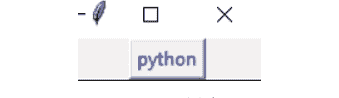

*图 1.14：初始输出*

**按钮被点击时的输出：**
输出结果如*图 1.15*所示：

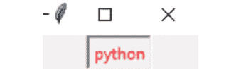

*图 1.15：Chap1_Example10.py 的输出*

> **注意：上述代码包含在程序名称：Chap1_Example10.py 中**

运行上述代码后，初始时按钮的前景色为蓝色，当它被点击时，即按钮处于活动状态时，前景色会变为红色。

### disabledforeground

此选项将设置控件被禁用时的前景色，如下所示：

```python
from tkinter import *
myroot = Tk()
myb1 = Button(myroot, state = 'disabled', text = 'python', disabledforeground = 'Magenta')
myb1.pack()
myroot.mainloop()
```

输出：

输出结果如*图 1.16*所示：

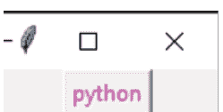

*图 1.16：Chap1_Example11.py 的输出*

> **注意：上述代码包含在程序名称：Chap1_Example11.py 中**

在上述代码中，按钮被禁用，且按钮被禁用时的前景色为品红色。

### highlightbackground

当控件没有焦点时，此选项将设置高亮显示的颜色。

### highlightcolor

当控件获得焦点时，此选项将设置高亮区域的前景色，如下所示：

```python
from tkinter import *
myroot = Tk()
mye1 = Entry(myroot, bg='LightGreen', highlightthickness=10, highlightbackground="red", highlightcolor = 'Yellow')
mye1.pack(padx=5, pady=5)
mye2 = Entry(myroot)
mye2.pack()
mye2.focus()
myroot.mainloop()
```

**当输入框没有焦点时的输出：**

输出结果如*图 1.17*所示：

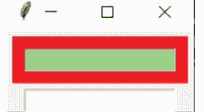

*图 1.17：初始输出*

当输入框获得焦点时的输出：

输出结果如*图 1.18*所示：

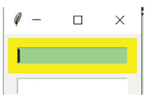

*图 1.18：Chap1_Example12.py 的输出*

> **注意：上述代码包含在程序名称：Chap1_Example12.py 中**

在上述示例中，当输入框没有焦点时，焦点高亮的颜色为红色；当输入框获得焦点时，焦点高亮的颜色为黄色。

### selectbackground

此选项将设置控件中被选中项目的背景色。

### selectforeground

此选项将设置控件中被选中项目的前景色，如下所示：

```python
from tkinter import *

myroot = Tk()
str1 = StringVar()
myel = Entry(myroot,selectbackground= 'Green',selectforeground= 'Red', textvariable = str1)
myel.pack()
str1.set('python')

myroot.mainloop()
```

输出：

输出结果如*图 1.19*所示：

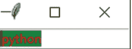

*图 1.19：Chap1_Example13.py 的输出*

注意：上述代码包含在程序名称：Chap1_Example13.py 中

从上述代码中，我们可以观察到，当文本 'python' 被选中时，其背景高亮为绿色，前景高亮为红色。

### 字体

我们可以通过创建字体对象或使用元组来访问 tkinter 中的字体。

#### 通过创建字体对象

假设我们有一段文本。我们可以为文本添加下划线、更改大小、指定字体家族、添加删除线等。

要创建字体对象，首先，我们需要导入 **tkinter.font** 模块并使用 **Font** 类构造函数：

```python
from tkinter.font import Font
myobj_font = Font(options,...)
```

选项如下：

- **family**：此选项以字符串形式表示字体家族的名称。
- **size**：此选项表示以磅为单位的字体高度整数。
- **weight**：此选项表示 'bold'（粗体）和 'normal'（正常）。
- **slant**：此选项表示 'italic'（斜体）和 'unslanted'（非斜体）。
- **underline**：此选项表示文本是否需要下划线。1 表示下划线文本，0 表示正常。
- **overstrike**：此选项表示文本是否需要删除线。1 表示删除线文本，0 表示正常。

参考以下代码：

```python
from tkinter import * # 导入模块
from tkinter.font import Font
myroot = Tk() # 创建窗口并初始化解释器

myfont1 = Font(family = 'Calibri',size=12, weight = 'bold', slant='italic', underline = 1, overstrike = 1) # 1 表示我们需要下划线
myl1 = Label(myroot, text = 'Python', font = myfont1)
myl1.pack() # 用于显示标签

myroot.mainloop() # 显示窗口，直到我们按下关闭按钮
```

输出：

输出结果如*图 1.20*所示：

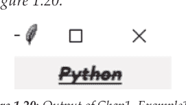

> 注意：上述代码包含在程序名称：Chap1_Example14.py 中

我们也可以查看我们可以根据需求访问的字体家族，如下所示：

```python
from tkinter import * # 导入模块
from tkinter import font
myroot = Tk() # 创建窗口并初始化解释器

myfont_list = list(font.families())
for loop in myfont_list:
    print(loop,end = ',')

myroot.mainloop() # 显示窗口，直到我们按下关闭按钮
```

输出：

输出如下：

```
System,8514oem,Fixedsys,Terminal,Modern,Roman,Script,Courier,MS Serif,MS Sans Serif,Small Fonts,TeamViewer15,Marlett,Arial,Arabic Transparent,Arial Baltic,Arial CE,Arial CYR,Arial Greek,Arial TUR,Arial Black,Bahnschrift Light,Bahnschrift SemiLight,Bahnschrift,Bahnschrift SemiBold,Bahnschrift Light SemiCondensed,Bahnschrift SemiLight SemiConde,Bahnschrift SemiCondensed,Bahnschrift SemiBold SemiConden,Bahnschrift Light Condensed, Bahnschrift SemiLight Condensed,Bahnschrift Condensed,Bahnschrift SemiBold Condensed,Calibri,Calibri Light,Cambria,Cambria Math,Candara,Candara Light, Comic Sans MS,Consolas,Constantia,Corbel,Corbel Light,Courier New,Courier New Baltic,Courier New CE,Courier New CYR,Courier New Greek,Courier New TUR, Ebrima,Franklin Gothic Medium, Gabriola, Gadugi, Georgia,Impact,Ink Free, Javanese Text,Leelawadee UI,Leelawadee UI Semilight,Lucida Console,Lucida Sans Unicode,Malgun Gothic,@Malgun Gothic,Malgun Gothic Semilight,@Malgun Gothic Semilight,Microsoft Himalaya,Microsoft JhengHei,@Microsoft JhengHei,Microsoft JhengHei UI,@Microsoft JhengHei UI,Microsoft JhengHei Light,@Microsoft JhengHei Light,Microsoft JhengHei UI Light,@Microsoft JhengHei UI Light,Microsoft New Tai Lue,Microsoft PhagsPa,Microsoft Sans Serif,Microsoft Tai Le,Microsoft YaHei,@Microsoft YaHei,Microsoft YaHei UI,@Microsoft YaHei UI,Microsoft YaHei Light,@Microsoft YaHei Light,Microsoft YaHei UI Light,@Microsoft YaHei UI Light,Microsoft Yi Baiti,MingLiU-ExtB,@MingLiU-ExtB,PMingLiU-ExtB,@PMingLiU-ExtB,MingLiU_HKSCS-ExtB,@MingLiU_HKSCS-ExtB,Mongolian Baiti,MS Gothic,@MS Gothic,MS UI Gothic,@MS UI Gothic,MS PGothic,@MS PGothic,MV Boli,Myanmar Text,Nirmala UI,Nirmala UI Semilight,Palatino Linotype,Segoe MDL2 Assets,Segoe Print,Segoe Script,Segoe UI,Segoe UI Black,Segoe UI Emoji,Segoe UI Historic,Segoe UI Light,Segoe UI Semibold,Segoe UI Semilight,Segoe UI Symbol,SimSun,@SimSun,NSimSun,@NSimSun,SimSun-ExtB,@SimSun-ExtB,Sitka Small,Sitka Text,Sitka Subheading,Sitka Heading,Sitka Display,Sitka Banner,Sylfaen,Symbol,Tahoma,Times New Roman,Times New Roman Baltic,Times New Roman CE,Times New Roman CYR,Times New Roman Greek,Times New Roman TUR,Trebuchet MS,Verdana,Webdings,Wingdings,Yu Gothic,@Yu Gothic,Yu Gothic UI,@Yu Gothic UI,Yu Gothic UI Semibold,@Yu Gothic UI Semibold,Yu Gothic Light,@Yu Gothic Light,Yu Gothic UI Light,@Yu Gothic UI Light,Yu Gothic Medium,@Yu Gothic Medium,Yu Gothic UI Semilight,@Yu Gothic UI Semilight,HoloLens MDL2 Assets,HP Simplified,HP Simplified Light,MT Extra,Century,Wingdings 2,Wingdings 3,Arial Unicode MS,@Arial Unicode MS,Nina,Segoe Condensed,Buxton Sketch,Segoe Marker,SketchFlow Print,DengXian,@DengXian,Microsoft MHei,@Microsoft MHei,Microsoft NeoGothic,@Microsoft NeoGothic,Segoe WP Black,Segoe WP,Segoe WP Semibold,Segoe WP Light,Segoe WP SemiLight, DigifaceWide, Acaderef, AIGDT, AmdtSymbols, GENISO,AMGDT,BankGothic Lt BT,BankGothic Md BT,CityBlueprint,CommercialPi BT,CommercialScript BT,CountryBlueprint,Dutch801 Rm BT,Dutch801 XBd BT,EuroRoman,ISOCTEUR,ISOCTEUR,Monospac821 BT,PanRoman,Romanic,RomanS,SansSerif,Stylus BT,SuperFrench,Swis721 BT,Swis721 BdOul BT,Swis721 Cn BT,Swis721 BdCnOul BT,Swis721 BlkCn BT,Swis721 LtCn BT,Swis721 Ex BT,Swis721 BlkEx BT,Swis721 LtEx BT,Swis721 Blk BT,Swis721 BlkOul BT,Swis721 Lt BT,TechnicBold,TechnicLite,Technic,UniversalMath1 BT,Vineta CP,ISOCT2,ISOCT3,ISOCT,ItalicC,ItalicT,Italic,Monotxt,Proxy 1,Proxy 2,Proxy 3,Proxy 4,Proxy 5,Proxy 6,Proxy 7,Proxy 8,Proxy 9,RomanC,RomanD,RomanT,ScriptC,ScriptS,Simplex,Syastro,Syemap,Symath,Symeteo,Symusic,Txt,
```

注意：上述代码包含在程序名称：Chap1_Example15.py 中

#### 使用元组

元组中的第一个元素是字体族，第二个元素是以磅为单位的大小，其后可选地跟一个包含一个或多个样式修饰符的字符串，例如粗体、斜体、删除线和下划线。请参考以下代码：

```python
from tkinter import * # importing module
from tkinter.font import Font
myroot = Tk() # window creation and initialize the interpreter

myl1 = Label(myroot, text = 'Python', font = ("Calibri", "18", "normal italic overstrike underline"))
myl1.pack() # for displaying the label

myroot.mainloop()
```

**输出：**
输出结果可参见*图 1.21*：

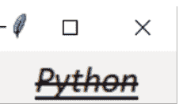

*图 1.21：Chap1_Example16.py 的输出*

> **注意：** 上述代码包含在程序名称：Chap1_Example16.py 中

### 锚点

如果需要将文本相对于参考点进行定位，那么我们应该使用锚点。

用于锚点属性的可能常量列表如下：

N, S, E, W, NE, NW, SE, SW, CENTER

这里，N 代表北，S 代表南，E 代表东，W 代表西。

请参考*图 1.22*：

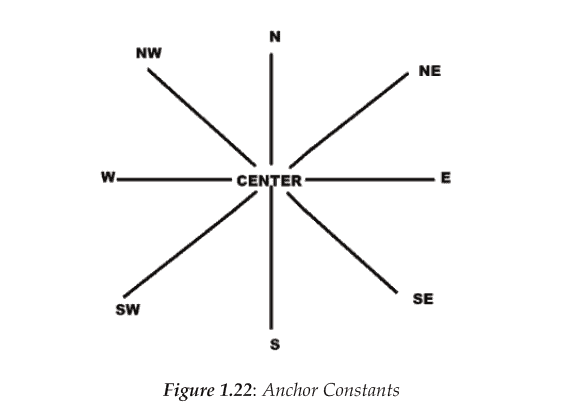

无论何时，当我们在一个较大的框架内创建一个小部件并使用 `anchor = SW` 选项时，该部件将被放置在框架的左下角。如果我们使用 `anchor = S`，那么该部件将沿底部边缘居中。

#### 当 anchor = N 时放置部件的位置

请参考以下代码：

```python
from tkinter import *

myroot = Tk()
myroot.geometry('200x200')
myl1 = Label(myroot, text = 'Python',anchor = N, font = ("Calibri", "18", "bold italic underline"),
            bd = 1, relief = 'sunken', width = 10,height = 5 )
myl1.pack()
myroot.mainloop()
```

**输出：**

输出结果可参见*图 1.23*：

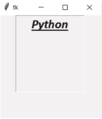

*图 1.23：当锚点位置为 N 时 Chap1_Example17.py 的输出*

> 注意：上述代码包含在程序名称：Chap1_Example17.py 中

> 注意：从图 1.24 到图 1.31，代码将保持不变，只是锚点位置的选项会发生变化。

#### 当 anchor = S 时放置部件的位置

请参考图 1.24：

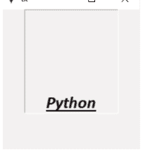

*图 1.24：当锚点位置为 S 时的输出*

#### 当 anchor = E 时放置部件的位置

请参考图 1.25：

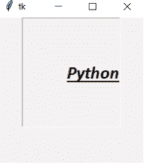

*图 1.25：当锚点位置为 E 时的输出*

#### 当 anchor = W 时放置部件的位置

请参考*图 1.26*：

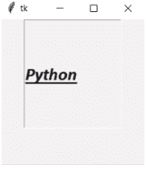

*图 1.26：当锚点位置为 W 时的输出*

#### 当 anchor = NE 时放置部件的位置

请参考*图 1.27*：

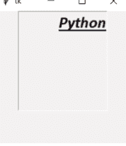

*图 1.27：当锚点位置为 NE 时的输出*

#### 当 anchor = NW 时放置部件的位置

请参考*图 1.28*：

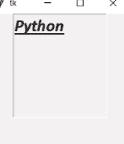

*图 1.28：当锚点位置为 NW 时的输出*

#### 当 anchor = SE 时放置部件的位置

请参考*图 1.29*：

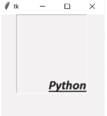

*图 1.29：当锚点位置为 SE 时的输出*

#### 当 anchor = SW 时放置部件的位置

请参考*图 1.30*：

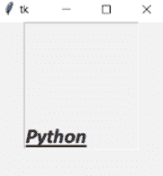

*图 1.30：当锚点位置为 SW 时的输出*

#### 当 anchor = CENTER 时放置部件的位置

请参考*图 1.31*：

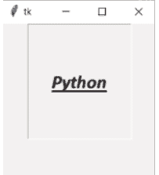

*图 1.31：当锚点位置为 CENTER 时的输出*

### 浮雕样式

每当我们希望在部件外部模拟三维效果时，我们就会使用部件的浮雕样式。浮雕属性可以使用以下可能的常量列表：flat、raised、groove、sunken 和 ridge。请参考以下代码：

```python
from tkinter import *

myroot = Tk()
myroot.geometry('200x200')
myb1 = Button(myroot, text = 'PYTHON', font = ('Calibri',12), relief = FLAT, bd = 4)
myb1.pack()
myb2 = Button(myroot, text = 'PYTHON', font = ('Calibri',12), relief = RAISED, bd = 4)
myb2.pack()
myb3 = Button(myroot, text = 'PYTHON', font = ('Calibri',12), relief = 'groove', bd = 4)
myb3.pack()
myb4 = Button(myroot, text = 'PYTHON', font = ('Calibri',12), relief = 'sunken', bd = 4)
myb4.pack()
myb5 = Button(myroot, text = 'PYTHON', font = ('Calibri',12), relief = RIDGE, bd = 4)
myb5.pack()
myroot.mainloop()
```

输出：

请参考*图 1.32*：

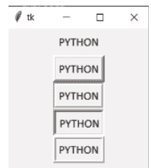

*图 1.32：Chap1_Example18.py 的输出*

注意：上述代码包含在程序名称：Chap1_Example18.py 中

### 位图

此属性用于显示位图，可用的位图有 'error'、'gray12'、'gray25'、'gray50'、'gray75'、'info'、'hourglass'、'warning'、'question' 和 'questhead'。请参考以下代码：

```python
from tkinter import *

myroot = Tk()
myroot.geometry('200x300')
myb1 = Button(myroot, text = 'PYTHON', relief = 'sunken', bitmap = 'error',bd = 2)
myb1.pack()
myb2 = Button(myroot, text = 'PYTHON', relief = 'sunken', bitmap = 'gray12',bd = 2)
myb2.pack()
myb3 = Button(myroot, text = 'PYTHON', relief = 'sunken', bitmap = 'gray25',bd = 2)
myb3.pack()
myb4 = Button(myroot, text = 'PYTHON', relief = 'sunken', bitmap = 'gray50',bd = 2)
myb4.pack()
myb5 = Button(myroot, text = 'PYTHON', relief = 'sunken', bitmap = 'gray75',bd = 2)
myb5.pack()
myb6 = Button(myroot, text = 'PYTHON', relief = 'sunken', bitmap = 'info',bd = 2)
myb6.pack()
myb7 = Button(myroot, text = 'PYTHON', relief = 'sunken', bitmap = 'hourglass',bd = 2)
myb7.pack()
myb8 = Button(myroot, text = 'PYTHON', relief = 'sunken', bitmap = 'warning',bd = 2)
myb8.pack()
myb9 = Button(myroot, text = 'PYTHON', relief = 'sunken', bitmap = 'question',bd = 2)
myb9.pack()
myb10 = Button(myroot, text = 'PYTHON', relief = 'sunken', bitmap = 'questhead',bd = 2)
myb10.pack()
myroot.mainloop()
```

输出：
请参考*图 1.33*：

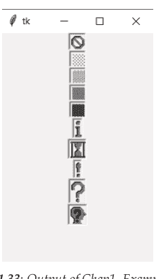

*图 1.33：Chap1_Example19.py 的输出*

> 注意：上述代码包含在程序名称：Chap1_Example19.py 中

### 光标

每当需要根据需求显示不同的鼠标光标时（其确切图形可能因操作系统而异），可以使用光标属性。其中一些有用的光标有 'arrow'、'clock'、'cross'、'circle'、'heart'、'mouse'、'plus'、'star'、'spider'、'sizing'、'shuttle'、'target'、'tcross'、'trek'、'watch' 等。请参考以下代码：

```python
from tkinter import *

myroot = Tk()
myroot.geometry('200x300')
myb4 = Button(myroot, text = 'PYTHON', relief = 'raised', cursor = 'circle',bd = 2)
myb4.pack()
myb5 = Button(myroot, text = 'PYTHON', relief = 'raised', cursor = 'clock',bd = 2)
myb5.pack()
myb6 = Button(myroot, text = 'PYTHON', relief = 'raised', cursor = 'cross',bd = 2)
myb6.pack()
myb7 = Button(myroot, text = 'PYTHON', relief = 'raised', cursor = 'plus',bd = 2)
myb7.pack()
myb8 = Button(myroot, text = 'PYTHON', relief = 'raised', cursor = 'tcross',bd = 2)
myb8.pack()
myb9 = Button(myroot, text = 'PYTHON', relief = 'raised', cursor = 'star',bd = 2)
myb9.pack()
myb10 = Button(myroot, text = 'PYTHON', relief = 'raised', cursor = 'spider',bd = 2)
myb10.pack()
myb11 = Button(myroot, text = 'PYTHON', relief = 'raised', cursor = 'watch',bd = 2)
myb11.pack()
myroot.mainloop()
```

输出：

请参考*图 1.34*：

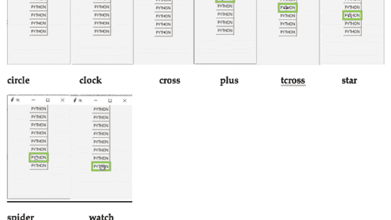

*图 1.34：Chap1_Example20.py 的输出*

注意：上述代码包含在程序名称：Chap1_Example20.py 中

## Python tkinter 几何管理

tkinter 中的所有部件都可以访问几何管理方法。为了在父窗口中组织部件，需要访问 tkinter 提供的部件几何配置。这将有助于管理部件在屏幕上的显示。几何管理器类讨论如下。

### pack()

与其他两个几何管理器相比，它是最易于使用的之一。在将部件放置到父部件之前，几何管理器会将部件组织成块。每当有简单的应用需求时，例如将多个部件上下排列或并排放置，我们可以使用上述几何管理器。与其他两个几何管理器相比，它的选项有限。

语法是

```python
widget.pack(options,...)
```

选项如下：

- **fill**：此选项决定部件是否可以增加或增长大小。默认情况下，它是 NONE。如果我们想垂直填充，则是 Y。如果水平填充，则是 X。如果需要水平和垂直都填充，则是 BOTH。
- **expand**：当设置为 true 或 1 时，此选项将扩展部件以填充任何空间。当窗口调整大小时，部件将扩展。
- **side**：此选项将决定部件的对齐方式，即部件靠父部件的哪一侧打包。默认情况下，它是 TOP。其他选项是 BOTTOM、LEFT 或 RIGHT。

其他选项包括 anchor、内部填充（ipadx, ipady）或外部填充（padx, pady），它们的默认值均为 0。请参考以下代码：

```python
from tkinter import *

myroot = Tk()
myroot.geometry('300x300')
myb1 = Button(myroot, text = 'P', fg = 'Red', bg = 'LightGreen')
myb1.pack(fill = NONE)
myb2 = Button(myroot, text = 'Y', fg = 'Red', bg = 'LightGreen')
```

myb2.pack(fill = X, padx = 10, pady = 10)
myb3 = Button(myroot, text = 'T', fg = 'Red', bg = 'LightGreen')
myb3.pack(side = LEFT, fill = Y, padx = 10, pady = 10)
myb3 = Button(myroot, text = 'H', fg = 'Red', bg = 'LightGreen')
myb3.pack(side = TOP, fill = X, padx = 10, pady = 10)
myb4 = Button(myroot, text = 'O', fg = 'Red', bg = 'LightGreen')
myb4.pack(side = BOTTOM, fill = X, padx = 10, pady = 10)
myb5 = Button(myroot, text = 'N', fg = 'Red', bg = 'LightGreen')
myb5.pack(side = RIGHT, fill = BOTH, expand = 1, padx = 10, pady = 10)

myroot.mainloop()
```

**输出：**

输出结果可见于*图 1.35*：

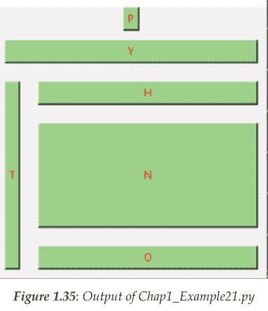

*图 1.35：Chap1_Example21.py 的输出*

> 注意：以上代码包含在程序名称：Chap1_Example21.py 中

### grid()

此几何管理器会将控件组织成一个二维表格，即在父控件中形成若干行和列。想象中的行与列的交叉点是一个单元格，表格中的每个单元格都可以容纳一个控件。

其语法为

```
widget.grid(options,...)
```

各选项如下：

- **column**：此选项将使用一个由给定列标识的单元格，其默认值为最左侧的列，数值为 0。
- **columnspan**：此选项将指示控件所占据的列数；其默认值为 1。
- **padx**：此选项将在控件边框外部水平方向添加内边距。
- **pady**：此选项将在控件边框外部垂直方向添加内边距。
- **ipadx**：此选项将在控件边框内部水平方向添加内边距。
- **ipady**：此选项将在控件边框内部垂直方向添加内边距。
- **row**：此选项将使用一个由给定行标识的单元格，其默认值为第一行，数值为 0。
- **rowspan**：此选项将指示控件所占据的行数，其默认值为 1。
- **sticky**：当单元格大于控件时，需要指定控件粘附于单元格的哪些边和角。它可以是 0 个或多个罗盘方向的字符串连接：N、E、S、W、NE、NW、SE、SW 和 0。当 sticky = "" 时，控件在单元格中居中；当为 NESW 时，控件将占据整个单元格区域。

请观察以下代码：

```
from tkinter import *
myroot = Tk()

mybtn_col = Button(myroot, text="It is Column No. 4")
mybtn_col.grid(row = 0, column=4)

mybtn_colspan = Button(myroot, text="The colspan is of 4")
mybtn_colspan.grid(row = 1,columnspan=4)

mybtn_paddingx = Button(myroot, text="padx of 5 from outside wid-get border")
mybtn_paddingx.grid(row = 2,padx=5)

mybtn_paddingy = Button(myroot, text="pady of 5 from outside wid-get border")
mybtn_paddingy.grid(row = 3,pady=5)

mybtn_ipaddingx = Button(myroot, text="ipadx of 5 from inside wid-get border")
mybtn_ipaddingx.grid(row = 4,ipadx=5)

mybtn_ipaddingy = Button(myroot, text="ipady of 15 from inside wid-get border")
mybtn_ipaddingy.grid(row = 5,ipady=15)

mybtn_row = Button(myroot, text="It is Row No. 7")
mybtn_row.grid(row=7)

mybtn_rowspan = Button(myroot, text="It is Rowspan of 3")
mybtn_rowspan.grid(row = 8,rowspan=3)

mybtn_sticky = Button(myroot, text="Hey ! I am at North-West")
mybtn_sticky.grid(sticky=NW)

myroot.mainloop()
```

输出：

输出结果可见于*图 1.36*：

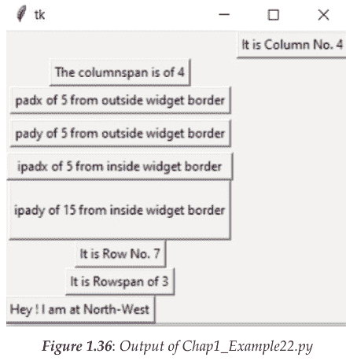

*图 1.36：Chap1_Example22.py 的输出*

> 注意：以上代码包含在程序名称：Chap1_Example22.py 中

> 注意：不建议在同一个主窗口中混合使用 grid() 和 pack()。

### place()

它比其他两种几何管理器更简单。此几何管理器会将控件组织在父控件中的特定位置。它被放置在父控件中的某个特定位置。它可以与 **pack()** 以及 **grid()** 方法一起使用。

其语法为

```
widget.place(options,...)
```

各选项为：

- **anchor**：此选项将指示控件锚定的位置，具有罗盘方向：N、S、E、W、NE、NW、SE 或 SW，这些方向与父控件的边和角相关。默认罗盘方向为 NW。
- **bordermode**：此选项将指示控件边框部分是否包含在坐标系中。默认值为 INSIDE，另一个值为 OUTSIDE。
- **relheight**：此选项将指定高度为 0.0 到 1.0 之间的浮点数，这是父控件高度的一个分数，即控件的高度与父控件的高度成比例。
- **relwidth**：此选项将指定宽度为 0.0 到 1.0 之间的浮点数，这是父控件宽度的一个分数，即控件的宽度与父控件的宽度成比例。
- **height**：此选项将以像素为单位指定控件高度。
- **width**：此选项将以像素为单位指定控件宽度。
- **relx**：此选项将指定水平偏移量为 0.0 到 1.0 之间的浮点数，这是父控件宽度的一个分数，即控件将相对于其父控件按 x 比例放置。
- **rely**：此选项将指定垂直偏移量为 0.0 到 1.0 之间的浮点数，这是父控件高度的一个分数，即控件将相对于其父控件按 y 比例放置。
- **x**：此选项将以像素为单位指定水平偏移量。
- **y**：此选项将以像素为单位指定垂直偏移量。

> **注意**：在上述几何管理器中，调用时至少需要 2 个选项。

请观察以下示例：

```
from tkinter import *
myroot = Tk()
myroot.geometry("600x600")

mybtn_height = Button(myroot, text="60px high")
mybtn_height.place(height=60, x=300, y=300)

mybtn_width = Button(myroot, text="70px wide")
mybtn_width.place(width=70, x=400, y=400)

mybtn_relheight = Button(myroot, text="relheight of 0.7")
mybtn_relheight.place(relheight=0.7)

mybtn_relwidth= Button(myroot, text="relwidth of 0.4")
mybtn_relwidth.place(relwidth=0.4)

mybtn_relx=Button(myroot, text="relx of 0.5")
mybtn_relx.place(relx=0.5)

mybtn_rely=Button(myroot, text="rely of 0.8")
mybtn_rely.place(rely=0.8)

mybtn_x=Button(myroot, text="X = 500px")
mybtn_x.place(x=500)

mybtn_y=Button(myroot, text="Y = 520")
mybtn_y.place(y=520)

myroot.mainloop()
```

**输出：**
输出结果可见于*图 1.37*：

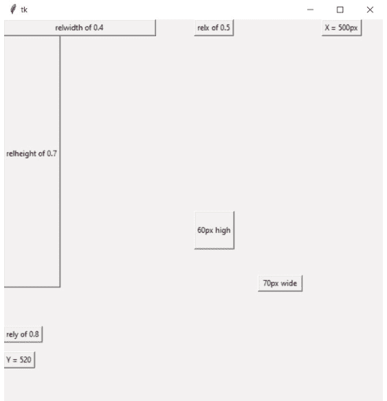

注意：以上代码包含在程序名称：Chap1_Example23.py 中

## tkinter 中的几何方法

当需要设置 tkinter 窗口尺寸以及设置主窗口位置时，tkinter 提供了一个几何方法，如下所示：

```
from tkinter import *

# creating blank tkinter window
myroot = Tk()

myroot.geometry('300x150')

mybtn = Button(myroot, text = 'Python')
mybtn.pack(side = TOP, padx = 5, pady = 5)

myroot.mainloop()
```

输出：
输出结果可见于图 1.38：

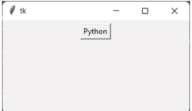

注意：以上代码包含在程序名称：Chap1_Example24.py 中

当我们运行上述代码时，会创建一个固定几何尺寸为 '300x150' 的 tkinter 窗口。此外，tkinter 窗口大小可以更改，但屏幕位置将保持不变。
如果我们需要更改位置怎么办？我们可以通过对代码进行一些小调整来实现，如下所示：

```
from tkinter import *

# creating blank tkinter window
myroot = Tk()

myroot.geometry('300x150+400+400')

mybtn = Button(myroot, text = 'Python')
mybtn.pack(side = TOP, padx = 5, pady = 5)

myroot.mainloop()
```

**输出：**

输出结果可见于*图 1.39*：

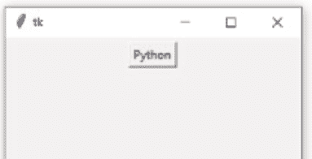

*图 1.39：Chap1_Example25.py 的输出*

> **注意：以上代码包含在程序名称：Chap1_Example25.py 中**

现在，当我们运行上述代码时，位置和大小都会改变。我们可以看到 tkinter 窗口出现在不同的位置（在 X 和 Y 轴上各偏移了 400）。

需要注意的一个重要点是，变量参数必须采用 (variable1)x(variable2) 的形式，否则将引发错误。

## 结论

在本章中，我们首先学习了使用 tkinter 库创建基本的 GUI Python 程序。然后我们看到了 Python tkinter GUI 的标准属性，如尺寸、颜色或字体，以及各种选项和示例。我们学习了如何使用锚点属性将带有常量列表的文本相对于参考点进行定位。我们还看到了一个关于浮雕属性的示例，该属性在控件外部带来三维模拟效果。位图和光标属性也通过一个清晰明了的示例进行了探讨。最后，在本章末尾，我们学习了如何使用内置的布局几何管理器（即 pack、grid 和 place）及其语法和各种选项来访问 tkinter 控件。

## 需要记住的要点

-   首先导入 tkinter 库，以便使用该库创建 GUI 应用程序。
-   设置为整数的尺寸默认为像素。
-   tkinter 中的颜色可以用十六进制数字或标准名称表示。
-   tkinter 中的字体可以通过字体对象或元组来访问。
-   文本相对于参考点的位置可以使用锚点属性来设置。
-   控件外部的三维模拟效果可以使用浮雕样式来实现。
-   使用绝对定位来定位控件可以使用 place 几何管理器。
-   水平和垂直位置的控件使用 pack 几何管理器来组织。
-   二维网格中的控件可以使用 grid 几何管理器来定位。

## 问题

1.  简要说明使用 tkinter 包进行 GUI 设计。
2.  绘制并解释 Python 的应用层级。
3.  编写一个基本的 Python GUI 程序并解释其结构。
4.  解释 Python tkinter GUI 的五个标准属性。
5.  详细解释 tkinter 中颜色的表示方式，并解释五种可用的颜色表示选项。
6.  解释如何在 Python 的 tkinter 库中访问字体。
7.  绘制并解释 Python 中的锚点常量。
8.  要在控件外部获得三维模拟效果，应使用什么控件样式？请详细解释。
9.  简要说明以下内容：
    a. 位图
    b. 光标
10. 解释 Python tkinter 几何管理器及其类。

## 加入我们的书籍 Discord 空间

加入书籍的 Discord 工作区，获取最新更新、优惠、全球科技动态、新书发布以及与作者的交流会：
https://discord.bpbonline.com


# 第 2 章
Python tkinter GUI 控件的内置变量类

### 简介

本章将介绍 Python tkinter GUI 控件的内置变量类，并演示如何使用类和对象的概念创建一个简单的 GUI Windows 应用程序。

我们还将学习如何访问和设置从 tkinter 变量子类派生的预定义变量，即 StringVar、IntVar、DoubleVar 和 BooleanVar。

### 结构

在本章中，我们将讨论以下主题：

-   内置变量类
-   StringVar()
-   BooleanVar()
-   IntVar()
-   DoubleVar()
-   使用类和对象创建 GUI

### 目标

在本章结束时，读者将学习如何使用变量类（如 **StringVar()**、**BooleanVar()**、**IntVar()** 和 **DoubleVar()**）来存储与 tkinter 中控件相关的数据，分别用于存储字符串、布尔值、整数和浮点值。最后，我们将看到 Tkinter 的类和对象的重要性，它们可用于创建 GUI，从而提高代码的组织性、可维护性和可重用性，同时也提供了灵活性并有助于降低代码的复杂性。

## 内置变量类

各种控件都需要一个变量。每当用户在 **Entry** 控件或 **Text** 控件中输入一些文本时，就需要一个字符串变量来跟踪输入的文本。如果有一个复选框控件，则需要一个布尔变量来跟踪用户是否已勾选。如果用户需要在 **Spinbox** 或 **Slider** 控件中输入某个值，则需要一个整数变量来跟踪该值。tkinter 中有一个 Variable 类，它响应控件特定变量的变化。从 tkinter 变量类派生的常用预定义变量是 **StringVar**、**BooleanVar**、**IntVar** 和 **DoubleVar**。我们可以将一个变量与多个控件关联，以便多个控件可以显示相同的信息。此外，当值发生变化时，可以绑定要调用的函数。**get()** 和 **set()** 等方法将用于检索和设置这些变量的值。

### StringVar()

此变量将保存一个字符串，默认值为空字符串，如下所示：

```python
from tkinter import *

myroot = Tk() # 创建 Tk 类的对象 -- 窗口对象
# 如果想进行图形编码，我们首先应该知道如何创建一个窗口。
# 但输出窗口现在不会显示

myroot.geometry('200x200') # 但可以调整为任何像素大小，直到我们使用 root.resizeable
myroot.resizable(0,0) # 窗口大小固定。不能变大或变小。

mystr = StringVar() # S1
print(type(mystr)) # S2
my_entry = Entry(myroot, font = ('Calibri',12),textvariable = mystr)
my_entry.pack()

def myshow():
    mydata = mystr.get() # S3
    print(mydata)
    mystr.set('') # S4

my_btn = Button(myroot, font = ('Calibri',12), text = 'Get Data!',command = myshow)
my_btn.pack()

myroot.mainloop()
```

**初始输出和写入文本时的输出：**
输出可以在 *图 2.1* 中看到：

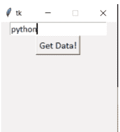

*图 2.1：初始输出*

**点击 Get Data! 按钮时的输出：**
输出可以在 *图 2.2* 中看到：

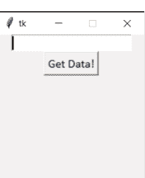

*图 2.2：Chap2_Example1.py 的输出*

注意：前面的代码包含在程序名称：Chap2_Example1.py 中

当程序停止或点击 'x' 时的输出：

输出如下：

```
<class 'tkinter.StringVar'>
python
```

在前面的代码中，我们在父控件中创建了两个控件：Entry 和 Button，并演示了 tkinter **StringVar()** 类型的用法。

在 S1 中，创建了一个 **StringVar()** 类型的实例，并将其分配给 Python 变量 **mystr**。

在 S2 中，类型是 <class 'tkinter.StringVar'>。

然后我们在 **Entry** 控件中写入一些文本，并点击按钮 Get Data！

在 S3 中，我们使用变量 **mystr** 获取值，将其保存到名为 **mydata** 的新变量中，然后显示其值。

在 S4 中，我们使用变量 **mystr** 在 **StringVar()** 上调用 **set()** 方法，并将其设置为空字符串 ""。

一个需要观察的重要点是，我们使用了 **textvariable** 选项，因为它会将一个 **tkinter** 变量与输入框内容关联起来。当我们详细处理控件时，我们将学习其他相关选项。

### BooleanVar()

此变量将保存一个布尔值，True 返回 1，False 返回 0，如下所示：

```python
from tkinter import *

myroot = Tk()
myroot.geometry('200x100')

num1 = BooleanVar()
mystr = StringVar()
def mydatainsertion():
    if num1.get() == True:
        mystr.set('It is set to True')
    else:
        mystr.set('It is set to False')

myc1 = Checkbutton(myroot, variable = num1, font = ('Calibri',12), text = 'Python', command = mydatainsertion)
myc1.pack()

mye1 = Entry(myroot, width = 20, textvariable = mystr)
mye1.pack()

myroot.mainloop()
```

当复选框被选中时的输出：
输出可以在图 2.3 中看到：

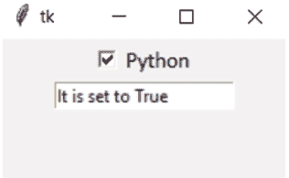

图 2.3：输出

当复选框未被选中时的输出：
参考图 2.4：

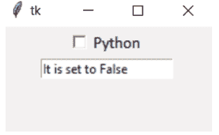

图 2.4：Chap2_Example2.py 的输出

> 注意：前面的代码包含在程序名称：Chap2_Example2.py 中

在前面的代码中，当用户勾选时，输出将返回 True。否则，取消勾选时，将返回 False。

### IntVar()

此变量将保存一个整数，默认值为 0，如下所示。如果输入的值是分数，该值将被截断为整数。

```python
from tkinter import *
myroot = Tk()
myroot.geometry('200x200')
myroot.resizable(0,0)

myint = IntVar()
myint1 = IntVar()
myint2 = IntVar()

my_entry = Entry(myroot, font = ('Calibri',12),textvariable = myint)
my_entry.pack()

my_entry1 = Entry(myroot, font = ('Calibri',12),textvariable = myint1)
my_entry1.pack()

def mydisplay():
    mydata1 = myint.get()
    mydata2 = myint1.get()
    mydata3 = mydata1 * mydata2
    myint2.set(mydata3)

my_btn = Button(myroot, font = ('Calibri',12), text = 'Multiply',command = mydisplay)
my_btn.pack()
my_entry2 = Entry(myroot, font = ('Calibri',12),textvariable = myint2)
my_entry2.pack()
my_entry2.configure(state = 'readonly')

myroot.mainloop()
```

未输入数据时的输出：
请参考*图 2.5*：

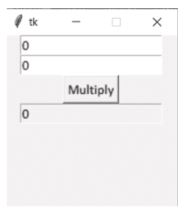

*图 2.5：输出*

输入数据时的输出：
请参考*图 2.6*：

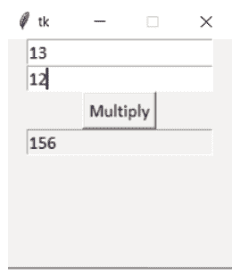

*图 2.6：Chap2_Example3.py 的输出*

> 注意：前面的代码包含在程序名称：Chap2_Example3.py 中

### DoubleVar()

此变量将保存一个浮点数，默认值为 0.0，如下所示：

```python
from tkinter import *

myroot = Tk()
myroot.geometry('200x200')
myroot.resizable(0,0)

myint = DoubleVar()
myint1 = DoubleVar()
myint2 = DoubleVar()

my_entry = Entry(myroot, font = ('Calibri',12),textvariable = myint)
my_entry.pack()

my_entry1 = Entry(myroot, font = ('Calibri',12),textvariable = myint1)
my_entry1.pack()

def mydisplay():
    mydata1 = myint.get()
    mydata2 = myint1.get()
    mydata3 = mydata1 - mydata2
    myint2.set(mydata3)

my_btn = Button(myroot, font = ('Calibri',12), text = 'Difference',command = mydisplay)
my_btn.pack()
my_entry2 = Entry(myroot, font = ('Calibri',12),textvariable = myint2)
my_entry2.pack()
my_entry2.configure(state = 'readonly')

myroot.mainloop()
```

未输入数据时的输出：
请参考图 2.7：

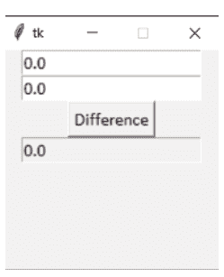

图 2.7：输出

输入数据时的输出：
请参考图 2.8：

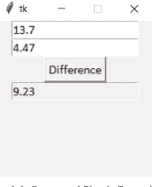

图 2.8：Chap2_Example4.py 的输出

> 注意：前面的代码包含在程序名称：Chap2_Example4.py 中

然而，在前面的代码以及之前关于 **IntVar()** 变量类的代码中，我们只输入了数字。但是，用户可能在 **Entry** 小部件中输入任何内容。因此，我们需要提供一些检查，以便用户可以验证 **Entry** 小部件是否仅包含数值。我们将在学习小部件时了解这一点。目前，只需观察变量的概念即可。

## 使用类和对象创建 GUI

正如我们目前所看到的，使用 **tkinter** 只需几行代码就可以轻松创建一个基本的 GUI。然而，当程序变得复杂时，将逻辑与每个部分分离就变得相当困难。我们需要使代码结构清晰、组织有序。请看以下代码：

```python
from tkinter import *
from tkinter import messagebox
myroot = Tk()

def mydisplay():
    messagebox.showinfo('Message',"Python")

mybtn = Button(myroot, text="Display",command=mydisplay)
mybtn.pack(padx=20, pady=30)
myroot.mainloop()
```

输出：
请参考*图 2.9*：

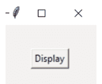

*图 2.9：输出*

**点击显示按钮后的输出：**
请参考*图 2.10*：

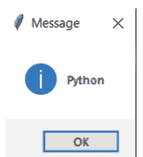

*图 2.10：Chap2_Example5.py 的输出*

> 注意：前面的代码包含在程序名称：Chap2_Example5.py 中

在前面的代码中，创建了一个包含 **Button** 小部件的主窗口。当点击 **显示** 按钮时，会显示一条消息“Python”。按钮小部件在水平轴上设置了 20px 的内边距，在垂直轴上设置了 30px 的内边距。执行前面的代码后，我们可以验证它按预期工作。我们可以看到所有变量都在全局命名空间中定义。然而，当添加更多小部件时，推理各部分用途就变得越来越困难。这类问题可以通过基本的面向对象编程技术来解决。

现在，我们将定义一个类来封装我们的全局变量：

```python
from tkinter import *
from tkinter import messagebox

class MyBtn(Tk):
    def __init__(self): # constructor
        super().__init__() # for calling the constructor of superclass
        self.mybtn = Button(self, text="Display", command=self.mydisplay)
        self.mybtn.pack(padx=20, pady=30)

    def mydisplay(self):
        messagebox.showinfo('Message',"Python")

if __name__ == "__main__":
    myroot = MyBtn() # making an object of MyBtn class
    myroot.mainloop()
```

**输出：**
请参考*图 2.11*：

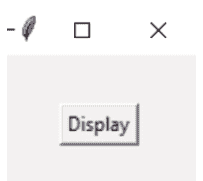

*图 2.11：输出*

点击显示按钮后的输出将是：
请参考*图 2.12*：

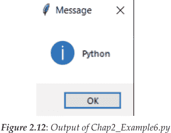

*图 2.12：Chap2_Example6.py 的输出*

> **注意：前面的代码包含在程序名称：Chap2_Example6.py 中**

在前面的代码中，我们将 **MyBtn** 类定义为 **Tk** 的子类。为了正确初始化基类，使用内置的 **super()** 函数调用了 **Tk** 类的 **\_\_init\_\_()** 方法。我们通过 self 变量拥有对 **MyBtn** 实例的引用，因此 Button 小部件被添加为我们类的一个属性。Button 的实例化与点击时执行的回调函数是分离的。在可执行的 Python 脚本中，使用 **if \_\_name\_\_ == "\_\_main\_\_"** 是一种常见做法，它是任何程序的入口点。为了显示主窗口本身，我们在 **if \_\_name\_\_ == "\_\_main\_\_"** 块内调用了 mainloop 方法。因此，通过注意类和对象的用法，我们可以创建任何大型的 Python 代码来构建 GUI 应用程序。

在 tkinter 中使用类和对象创建 GUI 的优点如下：

- **封装：** 通过使用类，我们可以将 GUI 的功能封装在单个类中，从而简化代码的组织和维护。此外，它还降低了代码的复杂性并防止命名冲突。
- **可重用性：** 通过定义类和对象，我们可以构建可重用的代码，这些代码可以在其他应用程序或应用程序的其他部分中使用。
- **模块化：** 类和对象通过使划分 GUI 的不同元素（如设计和功能）变得更加容易，从而促进代码模块化。
- **继承：** 通过继承创建的子类将继承父类的属性和函数。在构建具有略微不同功能的类似 GUI 元素时，这可以节省时间和精力。
- **灵活性：** 类和对象使我们能够调整和更新 GUI，因为它们允许我们在不影响程序其他部分的情况下进行代码更改。
- **代码组织：** 使用类和对象有助于我们更清晰地组织代码，使其易于理解。当问题出现时，它也可能使代码调试变得更加简单。

## 结论

在本章中，我们学习了在 tkinter 中与小部件相关的不同数据存储方法，这些方法使用变量类，如 **StringVar()**、**BooleanVar()**、**IntVar()** 和 **DoubleVar()**，分别用于存储字符串、布尔值、整数和浮点值，并附有 Python 代码。

我们已经看到了两种显示应用程序的方法：一种使用 Tkinter 的类和对象创建 GUI，另一种不使用。最后，我们可以说，使用类和对象创建 GUI 的方法有助于提高代码的组织性、可维护性、可重用性，并有助于降低代码的复杂性。

## 要点回顾

- 为了存储和操作字符串值，以及表示文本或小部件的值（如 Entry 和 label），我们可以使用 **StringVar()** 变量。
- 为了存储布尔值，以及表示 Checkbuttons 或 radiobuttons 的状态，我们可以使用 **BooleanVar()** 变量。
- 为了存储整数值，以及表示小部件的值（如 Spinbox 或 Scale），我们可以使用 **IntVar()** 变量。
- 为了存储浮点值，以及表示小部件的值（如 Spinbox 或 Scale），我们可以使用 **DoubleVar()** 变量。
- 在 tkinter 中使用类和对象创建 GUI 应用程序提供了许多优点，例如封装、可重用性、模块化、继承、灵活性和代码组织。

## 问题

1. 详细解释 Python tkinter GUI 小部件的内置变量类。
2. 解释在 Python 中设计 GUI 时使用内置变量类的方法。

3.  用一个合适的例子解释 **StringVar()** 在 Python 中的用法。
4.  在 Python 的 GUI 中，哪个变量用于返回 1 表示 True，0 表示 False？请详细解释。
5.  用一个合适的例子详细解释 **IntVar()**。
6.  用一个合适的例子详细解释 **DoubleVar()**。
7.  编写一个使用类和对象创建 GUI 的简短代码。它的优点是什么？

## 加入我们的书籍 Discord 空间

加入书籍的 Discord 工作区，获取最新更新、优惠、全球科技动态、新书发布以及与作者的交流会：
https://discord.bpbonline.com


## 第三章
深入了解 tkinter 中的按钮部件

### 简介

一个标准的**图形用户界面 (GUI)** 元素，即任何 GUI 程序的基本构建块，被称为部件。到目前为止，我们已经观察到，一个顶层根窗口对象包含不同的小窗口对象，这些对象是我们开发的 GUI 应用程序的一部分。我们将所有部件放在顶层窗口中。我们可以有多个顶层窗口，但只能有一个根窗口。现在，我们将从 tkinter 中与按钮相关的不同部件开始，逐一介绍不同的部件。

### 结构

在本章中，我们将讨论以下主题：

- tkinter 按钮部件
- tkinter 复选按钮部件
- tkinter 单选按钮部件
- tkinter 选项菜单部件

### 目标

在本章结束时，读者将了解最常用的 GUI 部件之一，即 tkinter 按钮部件。我们将通过多个示例和不同的方法（包括 lambda 表达式）来查看事件与上述部件的绑定。接下来，我们将研究复选按钮部件，它将为用户提供选择多个选项的功能。用户还将查看在此部件中获取图像的不同选项。然后，我们将了解如何使用 tkinter 单选按钮部件。用户将看到各种示例，其中将从预定义的选项集中恰好选择一个。最后但同样重要的是，我们将探索 tkinter 选项菜单部件，用户将了解如何为从选项列表中选择单个选项创建弹出菜单和按钮部件。

## tkinter 按钮部件

tkinter Python 中最常用的 GUI 部件之一是按钮部件。当点击时，可以将一个方法或函数与此部件关联。可以根据需要设置或重置不同的选项。此部件通常用于与用户交互。

语法如下：

```
mybtn1= Button(myroot , options...)
```

其中，

**myroot** 是父窗口。

一些可以作为键值对使用并用逗号分隔的选项列表包括 activebackground、activeforeground、bg、bd、command、fg、font、height、highlightcolor、justify、image、padx、pady、state、relief、width、wraplength 和 underline。我们已经看到了大多数选项，但一些未讨论的选项如下：

- **command**：此选项将在按钮被点击时调用函数或方法。因此，通过使用 command 选项，我们为按钮添加了功能。
- **justify**：此选项将定义多行文本彼此之间的对齐方式。默认值为 CENTER，其他值为 LEFT 或 RIGHT。

参考以下代码：

```
from tkinter import *
from tkinter import messagebox

class MyJustify(Tk):
    def __init__(self):
        super().__init__()
        self.title('Jusify in Button')

        def mycenterjustify():
            messagebox.showinfo('Justify','Justify CENTER')

        def myleftjustify():
            messagebox.showinfo('Justify','Justify LEFT')

        def myrightjustify():
            messagebox.showinfo('Justify','Justify RIGHT')

        # default justify is CENTER
        mybtn1= Button(self, text = 'JUSTIFY\nCENTER\nCENTER CENTER',bd = 3, relief = 'groove',
                       font = ('Helvetica',10), width = 20, height = 3, command = mycenterjustify)
        mybtn1.pack(pady= 10, side = BOTTOM)

        mybtn2= Button(self, text = 'JUSTIFY\nLEFT\nLEFT LEFT',bd = 3, relief = 'groove',
                       font = ('Helvetica',10), justify = LEFT, width = 20, height = 3, command = myleftjustify)
        mybtn2.pack(pady= 10, side = RIGHT)

        mybtn3= Button(self, text = 'JUSTIFY\nRIGHT\nRIGHT RIGHT',bd = 2,font = ('Helvetica',10),
                       justify = RIGHT, width = 20, height = 3, command = myrightjustify)
        mybtn3.pack(side = TOP)

if __name__ == "__main__":
    myroot = MyJustify()
    myroot.geometry('350x350')
    myroot.mainloop()
```

## 输出：

输出可以在 *图 3.1* 中看到：

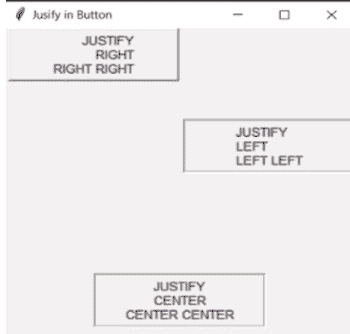

*图 3.1：输出*

## 点击 JUSTIFY LEFT 按钮时的输出：

参考 *图 3.2*：

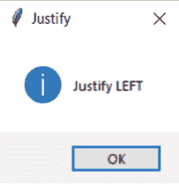

*图 3.2：输出*

## 点击 JUSTIFY RIGHT 按钮时的输出：

参考 *图 3.3*：

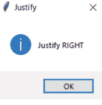

*图 3.3：输出*

## 点击 JUSTIFY CENTER 按钮时的输出：

参考 *图 3.4*：

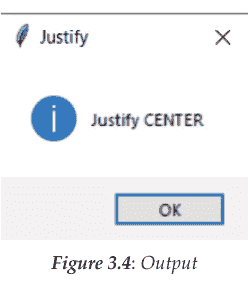

注意：前面的代码包含在程序名称中：Chap3_Example1.py

现在让我们回顾一下各种选项：
**image**：此选项将设置要显示在按钮上的图像，而不是文本。
**state**：此选项默认为 NORMAL。当此选项设置为 DISABLED 时，按钮将变得无响应并会变灰。

注意：用户可以根据需要在其活动目录中使用 'Add-icon.png' 或任何其他图标文件。这里，我们添加了 'Add-icon.png' 文件作为参考。

参考以下代码：

```
from tkinter import *

class MyBtnImage(Frame):
    def __init__(self, root = None):
        Frame.__init__(self, root)
        self.root = root
        self.myphoto = PhotoImage(file = 'Add-icon.png')
        def myclick():
            self.mybtn1['state'] = DISABLED
        self.mybtn1 = Button(self.root,image = self.myphoto, command = myclick)
        self.mybtn1.pack(padx = 10, pady = 10)

if __name__ == "__main__":
    myroot = Tk()
    myobj = MyBtnImage(myroot)
    myroot.title('Image using Button')
    myroot.geometry('400x100')
    myroot.mainloop()
```

输出：
参考 *图 3.5*：

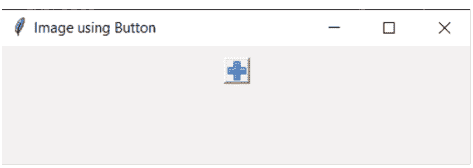

*图 3.5：输出*

**点击按钮时的输出：**
参考 *图 3.6*：

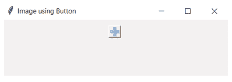

*图 3.6：输出*

> **注意：前面的代码包含在程序名称中：Chap3_Example2.py**

在上面的代码中，我们向按钮添加了一个带有 '+' 符号的图像，当点击时，按钮变为禁用状态。

需要注意的一个重要点是，当按钮上同时给出了文本和图像时，屏幕上只会显示图像，因为文本会被图像覆盖。但是，如果我们想在按钮上同时显示文本和图像呢？在这种情况下，我们将使用按钮部件中的 *compound* 选项。假设我们希望图像出现在按钮的底部。在这种情况下，compound = BOTTOM。

类似地，当 compound = LEFT 时，图像将出现在按钮部件的左侧；当 compound = RIGHT 时，图像将出现在按钮部件的右侧；当 compound = TOP 时，图像将出现在按钮部件的顶部。

让我们查看代码以更好地理解：

```
from tkinter import *

class MyBtnTextWithImage(Frame):
    def __init__(self, root = None):
        Frame.__init__(self, root)
        self.root = root
        self.myphoto = PhotoImage(file = 'Add-icon.png')
        self.mybtn1 = Button(self.root,image = self.myphoto, text = 'Hello', compound = LEFT)
        self.mybtn1.pack(padx = 10, pady = 10)
        self.mybtn2 = Button(self.root,image = self.myphoto, text = 'Hello', compound = RIGHT)
        self.mybtn2.pack(padx = 10, pady = 10)
        self.mybtn3 = Button(self.root,image = self.myphoto, text = 'Hello', compound = TOP)
        self.mybtn3.pack(padx = 10, pady = 10)
        self.mybtn4 = Button(self.root,image = self.myphoto, text = 'Hello', compound = BOTTOM)
        self.mybtn4.pack(padx = 10, pady = 10)

if __name__ == "__main__":
    myroot = Tk()
    myobj = MyBtnTextWithImage(myroot)
    myroot.title('Image using Button')
    myroot.geometry('400x200')
    myroot.mainloop()
```

输出：

参考 *图 3.7*：

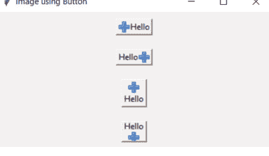

*图 3.7：Chap3_Example3.py 的输出*

注意：前面的代码包含在程序名称：Chap3_Example3.py 中。

现在，在进入下一个控件之前，我们将讨论事件和绑定。

## 事件和绑定

在目前的所有示例中，我们已经看到，除非我们按下父控件的“X”标记，否则 tkinter 代码大部分时间都花在事件循环（mainloop 方法）内部。我们可以看到诸如鼠标点击、focusin、focusout、按键事件等事件。为了将事件与函数绑定，使用了 **bind()** 函数，该函数包含在所有控件中，其语法如下：

```
widget.bind(event,handler, add = '')
```

这里，可以使用 bind 方法将事件附加绑定到控件。
第一个参数 event 是一个代表字符串，必须采用以下格式：

- **<修饰符-类型-详情>**：这里，修饰符和详情部分是可选的，唯一必需的部分是类型部分，它表示要监听的事件类型。我们将逐一讨论每个部分。
- **事件修饰符**：它们可以改变事件处理程序被激活的条件，是创建事件绑定的可选组件。我们应该注意，大多数事件处理程序是特定于平台的，并非在所有平台上都能工作。
- **Shift**：在事件发生时，需要按下 Shift 键。
- **Control**：在事件发生时，需要按下 Control 键。
- **Alt**：在事件发生时，需要按下 Alt 键。
- **Lock**：当事件发生时，需要激活大写锁定键。
- **Double**：事件将快速连续发生两次，例如双击。
- **Triple**：事件将快速连续发生三次。
- **Quadruple**：事件将快速连续发生四次。

### 事件类型

tkinter 中的不同事件类型如下：

- **ButtonPress 或 Button**：当鼠标按钮被点击时，将生成或激活一个事件。事件 <Button-1> 定义鼠标左键，事件 <Button-2> 定义中键，事件 <Button-3> 定义鼠标右键，事件 <Button-4> 定义在支持滚轮的鼠标上向上滚动，事件 <Button-5> 定义在支持滚轮的鼠标上向下滚动。
- **ButtonRelease**：当鼠标按钮被释放时，将生成或激活一个事件。事件 <ButtonRelease-1>、<ButtonRelease-2> 和 <ButtonRelease-3> 将分别指定鼠标左键、中键或右键。
- **Keypress 或 Key**：当键盘按钮被按下时，将生成或激活一个事件。
- **KeyRelease**：当键盘按钮被释放时，将生成或激活一个事件。
- **Motion**：当鼠标光标在控件上移动时，将生成或激活一个事件。事件 <B1-Motion>、<B2-Motion> 和 <B3-Motion> 将分别指定鼠标左键、中键或右键。鼠标指针的当前位置将提供在传递给回调函数的事件对象的 x 和 y 成员中，即 event.x, event.y。
- **Enter**：当鼠标光标进入控件时，将生成或激活一个事件。
- **Leave**：当鼠标光标离开控件时，将生成或激活一个事件。
- **FocusIn**：当控件获得输入焦点时，将生成或激活一个事件。
- **FocusOut**：当控件失去输入焦点时，将生成或激活一个事件。
- **Configure**：当控件配置发生更改时，例如用户调整了宽度、高度或边框宽度等，将生成或激活一个事件。
- **Mousewheel**：当鼠标滚轮滚动时，将生成或激活一个事件。
- **事件详情**：这是一个可选部分，将作为鼠标按钮或键盘上的某个特定键被按下。
- **对于键盘事件**：键盘事件详情被捕获，使得键盘上按下的每个键将由键符号或键字母本身表示。在使用 Key、KeyPress 或 KeyRelease 时，会给出特定键的 ASCII 值以触发事件。
- **对于鼠标事件**：鼠标事件详情被捕获，使得从 1 到 5 的数字详情将代表我们希望处理触发的特定鼠标按钮。

第二个参数是处理程序，表示事件发生时要调用的函数名称（回调函数）。它接受一个事件参数。

鼠标事件的属性如下：

- **x 和 y**：它将返回事件（如按钮点击）发生时鼠标位置的 x 和 y 坐标（以像素为单位）。
- **x_root 和 y_root**：它与 x 和 y 类似，但相对于屏幕左上角。
- **num**：它返回鼠标按钮编号。

键盘事件的属性是：

- **char**：仅用于键盘事件，按下字符的字符串形式。
- **keysym**：仅用于键盘事件，按下键的符号。
- **keycode**：仅用于键盘事件，按下键的代码。

作为事件处理程序，包含的函数将被传递一个事件对象，该对象将描述事件并包含有关触发事件的详细信息。因此，需要在函数中包含一个参数，该参数将被分配给此对象。

第三个参数可以是 None，用于替换之前的绑定（如果存在），或者使用 '+' 来保留旧的绑定并添加新的回调。

现在，如果我们想将事件绑定到控件实例，则称为*实例级绑定*。

有时需要将事件绑定到整个应用程序，这称为***应用程序级绑定***，其中相同的绑定在所有窗口和应用程序控件中使用，只要任何一个应用程序窗口处于焦点状态。应用程序级绑定的语法是：

```
widget.bind_all(event, callback)
```

例如：

```
myroot.bind_all('<F1>', show_help)
```

这里，如果我们按下 *F1* 键，那么 **show_help** 回调将始终触发，无论焦点在哪个控件上，只要应用程序处于活动焦点状态。

另一种是*类级绑定*，其中事件可以在特定类级别绑定。类级绑定的语法是：

```
widget.bind_class(classname, event, callback)
```

例如，

```
mye1.bind_class('<Entry>', '<Control-C>', copy)
```

这里，所有 Entry 控件将绑定到 <Control-C> 事件，该事件将调用名为 'copy (event)' 的方法。

我们将看到一些与按钮、事件和绑定相关的示例，以更好地理解这些概念。

```
from tkinter import * # importing module
class MyLeftRightMouseClick(Tk):
    def __init__(self):
        super().__init__()
        self.title('Button Left and Right click')

        def mycall(event):
            print('Left Clicked')

        def mycallme(event):
            print('Right Clicked')

        self.myb1 = Button(self, text = 'LeftClick', font = ('Calibri',15))
        self.myb1.bind('<Button-1>', mycall) # Left click
        self.myb1.pack(pady = 10) # for displaying the button

        self.myb2 = Button(self, text = 'RightClick', font = ('Calibri',15))
        self.myb2.bind('<Button-3>', mycallme) # Right click
        self.myb2.pack(pady = 10) # for displaying the button

if __name__ == "__main__":
    myroot = MyLeftRightMouseClick()
    myroot.geometry('350x150')
    myroot.mainloop() # display window until we press the close button
```

初始输出：
参考 *图 3.8*：

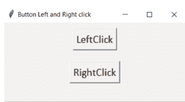

*图 3.8：输出*

**使用鼠标左侧点击 LeftClick 按钮时的输出：**
参考 *图 3.9*：

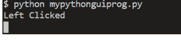

*图 3.9：输出*

**在点击鼠标左侧后，使用鼠标右侧点击 RightClick 按钮时的输出：**
参考 *图 3.10*：

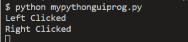

*图 3.10：输出*

> **注意：前面的代码包含在程序名称：Chap3_Example4.py 中**

在此代码中，我们将按钮控件绑定到事件 `<Button-1>`，该事件对应于鼠标左键点击。每当此事件发生时，将调用方法 **mycall**，该方法将传递一个对象实例作为其参数。方法 *mycall(event)* 将接受由事件生成的事件对象作为其参数。因此，当在 LeftClick 按钮上点击鼠标左键时，将显示“Left Clicked”消息。

我们将按钮控件绑定到事件 **`<Button-3>`**，该事件对应于鼠标的右键点击。每当此事件发生时，将调用方法 **mycallme**，该方法将传递一个对象实例作为其参数。方法 *mycallme(event)* 将接受由事件生成的事件对象作为其参数。因此，当在 RightClick 按钮上点击鼠标右键时，将显示“Right点击消息将会显示。
我们可以通过事件处理在命令提示符中显示一些消息：

```python
from tkinter import *

myroot = Tk() # 创建Tk类的对象 -- 窗口对象

myroot.geometry('370x100') # 但只要使用myroot.resizable，就可以调整为任意像素大小
myroot.resizable(0,0) # 窗口大小固定。不能变大或变小。
myroot.title('通过命令提示符进行事件处理')

def mydisplay():
    print("Clicked !!!")

mytk_button1 = Button(myroot, text = 'Login',font = ('Calibri',15),fg = 'Blue',command = mydisplay)
mytk_button1.pack()

myroot.mainloop()
```

**初始输出：**
请参考*图 3.11*：

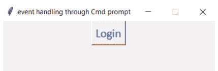

*图 3.11：输出*

**点击按钮后，消息显示在命令提示符上的输出**
请参考*图 3.12*：


*图 3.12：输出*

注意：前面的代码包含在程序名称：Chap3_Example5.py中

我们可以使用 **config()** 方法来更改背景颜色。因此，我们将研究通过 **config** 方法进行事件处理。

```python
from tkinter import *

myroot = Tk() # 创建Tk类的对象 -- 窗口对象

myroot.geometry('300x300') # 但只要使用root.resizeable，就可以调整为任意像素大小
myroot.resizable(0,0) # 窗口大小固定。不能变大或变小。

def myshow1():
    myroot.configure(background = 'LightBlue')

mytk_button1 = Button(myroot, text = 'Change Background color',font = ('Calibri',15),fg = 'Blue')
mytk_button1.config(command = myshow1)
mytk_button1.pack()

myroot.mainloop()
```

**初始输出：**

请参考*图 3.13*：


*图 3.13：输出*

点击按钮后，消息显示在命令提示符上的输出：

请参考*图 3.14*：


*图 3.14：输出*

> 注意：前面的代码包含在程序名称：Chap3_Example6.py中

现在，我们将查看使用bind方法进行事件处理：

```python
from tkinter import *

myroot = Tk() # 创建Tk类的对象 -- 窗口对象

myroot.geometry('200x200') # 但只要使用myroot.resizable，就可以调整为任意像素大小
myroot.resizable(0,0) # 窗口大小固定。不能变大或变小。

def myshow1(e):
    myroot.configure(background = 'LightBlue')

def myshow2(e):
    myroot.configure(background = 'LightGreen')

def myshow3(e):
    myroot.configure(background = 'LightPink')

mytk_btn1 = Button(myroot, text = 'Background color',font = ('Calibri',15),fg = 'Blue')
mytk_btn1.bind('<Button-1>',myshow1) # 鼠标左键
mytk_btn1.bind('<Button-2>',myshow2) # 鼠标滚轮键
mytk_btn1.bind('<Button-3>',myshow3) # 鼠标右键
mytk_btn1.pack()

myroot.mainloop()
```

初始输出：
请参考*图 3.15*：


这里，
A) 点击鼠标左键时的输出。
B) 点击鼠标滚轮键时的输出。
C) 点击鼠标右键时的输出。

> 注意：前面的代码包含在程序名称：Chap3_Example7.py中

现在，我们将看到使用lambda表达式进行事件处理。Python中的lambda表达式是编写匿名函数的工具。它无需正式的函数定义，就能让你创建简短的内联函数。lambda表达式可以有一个表达式，但可以有任意数量的参数。

lambda表达式相对于传统方法的优势如下：

- **简洁性：** 通过允许用户使用lambda表达式在单行中编写函数，代码变得更短、更易于阅读。
- **可读性：** 通过将相关功能分组，lambda表达式可用于内联创建微小、简单的函数，从而提高用户代码的可读性。
- **避免函数定义：** 使用lambda表达式消除了单独声明函数的需要，当用户只需要一个函数一次且不想用许多定义使代码混乱时，这很有优势。
- **函数作为参数：** 处理集合时，lambda表达式可以作为高阶函数（如 `map()`、`filter()` 和 `reduce()`）的参数提供。这使得代码更简洁、更具表现力。

我们将使用lambda表达式查看上一个示例的输出：

```python
from tkinter import *

myroot = Tk() # 创建Tk类的对象 -- 窗口对象

myroot.geometry('200x200') # 但只要使用root.resizeable，就可以调整为任意像素大小
myroot.resizable(0,0) # 窗口大小固定。不能变大或变小。

#使用lambda表达式
myshow1 = lambda e: myroot.configure(background = 'LightBlue')
myshow2 = lambda e: myroot.configure(background = 'LightGreen')
myshow3 = lambda e: myroot.configure(background = 'LightPink')

mytk_btn1 = Button(myroot, text = 'Background color',font = ('Calibri',15),fg = 'Blue')
mytk_btn1.bind('<Button-1>',myshow1) # 鼠标左键
mytk_btn1.bind('<Button-2>',myshow2) # 鼠标滚轮键
mytk_btn1.bind('<Button-3>',myshow3) # 鼠标右键
mytk_btn1.pack()

myroot.mainloop()
```

**注意：前面的代码包含在程序名称：Chap3_Example8.py中**

输出将与前一个相同。我们使用了lambda表达式而不是函数。

我们甚至可以将lambda表达式与 **bind()** 方法一起使用：

```python
from tkinter import *

myroot = Tk() # 创建Tk类的对象 -- 窗口对象

myroot.geometry('200x200') # 但只要使用root.resizeable，就可以调整为任意像素大小
myroot.resizable(0,0) # 窗口大小固定。不能变大或变小。

mytk_btn1 = Button(myroot, text = 'Background color',font = ('Calibri',15),fg = 'Blue')
mytk_btn1.bind('<Button-1>',lambda e: myroot.configure(background = 'LightBlue')) # 鼠标左键
mytk_btn1.bind('<Button-2>',lambda e: myroot.configure(background = 'LightGreen')) # 鼠标滚轮键
mytk_btn1.bind('<Button-3>',lambda e: myroot.configure(background = 'LightPink')) # 鼠标右键
mytk_btn1.pack()

myroot.mainloop()
```

**注意：前面的代码包含在程序名称：Chap3_Example9.py中**

输出仍然相同。

现在，假设我们想要相同的输出，但是是在鼠标双击时。在这种情况下，我们需要做一个小的修改，即使用 **<Double-1>** 代替 **<Button-1>**，依此类推，如下所示：

```python
from tkinter import *

myroot = Tk() # 创建Tk类的对象 -- 窗口对象

myroot.geometry('200x200') # 但只要使用root.resizeable，就可以调整为任意像素大小
myroot.resizable(0,0) # 窗口大小固定。不能变大或变小。

mytk_btn1 = Button(myroot, text = 'Background color',font = ('Calibri',15),fg = 'Blue')
mytk_btn1.bind('<Double-1>',lambda e: myroot.configure(background = 'LightBlue')) # 双击鼠标左键
mytk_btn1.bind('<Double-2>',lambda e: myroot.configure(background = 'LightGreen')) # 双击鼠标滚轮键
mytk_btn1.bind('<Double-3>',lambda e: myroot.configure(background = 'LightPink')) # 双击鼠标右键
mytk_btn1.pack()

myroot.mainloop()
```

**注意：前面的代码包含在程序名称：Chap3_Example10.py中**

这里，我们将得到相同的预期结果，但是是在鼠标双击时。当双击鼠标左键时，我们将得到 **LightBlue** 颜色。当双击鼠标滚轮键时，我们将得到 **LightGreen** 颜色，当双击鼠标右键时，我们将得到 **LightPink** 颜色。

我们甚至可以通过在按钮小部件上使用Enter和Leave事件来更改背景颜色，如下所示：

```python
from tkinter import *

myroot = Tk() # 创建Tk类的对象 -- 窗口对象

myroot.geometry('200x200') # 但只要使用root.resizeable，就可以调整为任意像素大小
myroot.resizable(0,0) # 窗口大小固定。不能变大或变小。
```

mytk_btn1 = Button(myroot, text='背景颜色', font=('Calibri', 15), fg='Blue')
mytk_btn1.bind('<Enter>', lambda e: myroot.configure(background='LightBlue'))
mytk_btn1.bind('<Leave>', lambda e: myroot.configure(background='LightGreen'))
mytk_btn1.pack()

myroot.mainloop()
```

当鼠标指针进入按钮部件时的输出：
请参考 *图 3.16*：


*图 3.16：输出*

当鼠标指针离开按钮部件时的输出：
请参考 *图 3.17*：


*图 3.17：输出*

> 注意：以上代码包含在程序名称：Chap3_Example11.py 中

在上述代码中，当鼠标指针进入按钮部件时，窗口的背景颜色将变为浅蓝色；当鼠标指针离开按钮部件时，窗口的背景颜色将变为浅绿色。
现在，我们将看到按下字母键时的事件处理：

```
from tkinter import *

myroot = Tk() # 创建 Tk 类的对象 -- 窗口对象

myroot.geometry('200x200') # 但可以调整为任意像素大小，只要我们使用 root.resizeable
myroot.resizable(0,0) # 窗口大小固定。不能变大或变小。

myroot.bind('<Key-a>', lambda e: myroot.configure(background='LightBlue')) # 按下 'a' 键时
myroot.bind('<Key-b>', lambda e: myroot.configure(background='LightGreen')) # 按下 'b' 键时
myroot.bind('<Key-c>', lambda e: myroot.configure(background='LightPink')) # 按下 'c' 键时

myroot.mainloop()
```

输出：
请参考 *图 3.18*：


*图 3.18：输出*

这里，

- A) 按下 Key-a 时，窗口颜色变为浅蓝色。
- B) 按下 Key-b 时，窗口颜色变为浅绿色。
- C) 按下 Key-c 时，窗口颜色变为浅粉色。

> 注意：以上代码包含在程序名称：Chap3_Example12.py 中

我们也可以通过按下特殊键（如 *F1*、*F2*、*F3*、*Delete* 等）来执行事件处理：

```
from tkinter import *

myroot = Tk() # 创建 Tk 类的对象 -- 窗口对象

myroot.geometry('200x200') # 但可以调整为任意像素大小，只要我们使用 root.resizeable
myroot.resizable(0,0) # 窗口大小固定。不能变大或变小。

myroot.bind('<F1>', lambda e: myroot.configure(background='LightBlue')) # 在笔记本电脑上按 Fn+F1 键时
myroot.bind('<F2>', lambda e: myroot.configure(background='LightGreen')) # 在笔记本电脑上按 Fn+F2 键时
myroot.bind('<F3>', lambda e: myroot.configure(background='LightPink')) # 在笔记本电脑上按 Fn+F3 键时
myroot.bind('<Delete>', lambda e: myroot.configure(background='LightYellow')) # 按下 Delete 键时

myroot.mainloop()
```

## 输出：

请参考 *图 3.19*：


这里，

- A) 按下 Key-F1 时，窗口颜色变为浅蓝色。
- B) 按下 Key-F2 时，窗口颜色变为浅绿色。
- C) 按下 Key-F3 时，窗口颜色变为浅粉色。
- D) 按下 *Delete* 键时，窗口颜色变为浅黄色。

> 注意：以上代码包含在程序名称：Chap3_Example13.py 中

事件处理也可以通过使用数字键来执行，如下所示：

```
from tkinter import *

myroot = Tk() # 创建 Tk 类的对象 -- 窗口对象

myroot.geometry('200x200') # 但可以调整为任意像素大小，只要我们使用 root.resizeable
myroot.resizable(0,0) # 窗口大小固定。不能变大或变小。

myroot.bind('1', lambda e: myroot.configure(background='LightBlue')) # 在笔记本电脑上按 1 键时
myroot.bind('2', lambda e: myroot.configure(background='LightGreen')) # 在笔记本电脑上按 2 键时
myroot.bind('3', lambda e: myroot.configure(background='LightPink')) # 在笔记本电脑上按 3 键时

myroot.mainloop()
```

输出：

请参考 *图 3.20*：


*图 3.20：输出*

这里，
- A) 按下 1 时，窗口颜色变为浅蓝色。
- B) 按下 2 时，窗口颜色变为浅绿色。
- C) 按下 3 时，窗口颜色变为浅粉色。

注意：以上代码包含在程序名称：Chap3_Example14.py 中

我们也可以通过按下 *Shift*、*Alt* 和 *Ctrl* 来执行事件处理：

```
from tkinter import *

myroot = Tk() # 创建 Tk 类的对象 -- 窗口对象

myroot.geometry('200x200') # 但可以调整为任意像素大小，只要我们使用 root.resizeable
myroot.resizable(0,0) # 窗口大小固定。不能变大或变小。

myroot.bind('<Shift-Up>', lambda e: myroot.configure(background='LightBlue')) # 按下 Shift-Up 键时
myroot.bind('<Shift-Down>', lambda e: myroot.configure(background='LightGreen')) # 按下 Shift-Down 键时
myroot.bind('<Shift-Left>', lambda e: myroot.configure(background='LightPink')) # 按下 Shift-Left 键时
myroot.bind('<Shift-Right>', lambda e: myroot.configure(background='LightYellow')) # 按下 Shift-Right 键时

myroot.bind('<Alt-Up>', lambda e: myroot.configure(background='LightBlue')) # 按下 Alt-Up 键时
myroot.bind('<Alt-Down>', lambda e: myroot.configure(background='LightGreen')) # 按下 Alt-Down 键时
myroot.bind('<Alt-Left>', lambda e: myroot.configure(background='LightPink')) # 按下 Alt-Left 键时
myroot.bind('<Alt-Right>', lambda e: myroot.configure(background='LightYellow')) # 按下 Alt-Right 键时

myroot.bind('<Control-Up>', lambda e: myroot.configure(background='LightBlue')) # 按下 Control-Up 键时
myroot.bind('<Control-Down>', lambda e: myroot.configure(background='LightGreen')) # 按下 Control-Down 键时
myroot.bind('<Control-Left>', lambda e: myroot.configure(background='LightPink')) # 按下 Control-Left 键时
myroot.bind('<Control-Right>', lambda e: myroot.configure(background='LightYellow')) # 按下 Control-Right 键时

myroot.mainloop()
```

输出：

请参考 *图 3.21*：


这里，

- A) 按下 *Shift*、*Alt* 或 *Ctrl* 与向上方向键时，窗口颜色变为浅蓝色。
- B) 按下 *Shift*、*Alt* 或 *Ctrl* 与向下方向键时，窗口颜色变为浅绿色。
- C) 按下 *Shift*、*Alt* 或 *Ctrl* 与向左方向键时，窗口颜色变为浅粉色。
- D) 按下 *Shift*、*Alt* 或 *Ctrl* 与向右方向键时，窗口颜色变为浅黄色。

> 注意：以上代码包含在程序名称：Chap3_Example15.py 中

我们也可以通过按下和释放按钮来执行事件处理：

```
from tkinter import *

myroot = Tk() # 创建 Tk 类的对象 -- 窗口对象

myroot.geometry('200x200') # 但可以调整为任意像素大小，只要我们使用 root.resizeable
myroot.resizable(0,0) # 窗口大小固定。不能变大或变小。

mybutton1 = Button(myroot, text='点击我!!!', font=('Arial', 12))
mybutton1.bind('<Button>', lambda e: myroot.configure(background='LightBlue')) # 鼠标按下按钮时
mybutton1.bind('<ButtonRelease>', lambda e: myroot.configure(background='Red')) # 鼠标释放按钮时
mybutton1.pack()

myroot.mainloop()
```

**输出：**

请参考 *图 3.22*：


*图 3.22：输出*

这里，
- A) 按下并按住按钮时的输出。
- B) 释放按钮时的输出。

注意：以上代码包含在程序名称：Chap3_Example16.py 中

在上述代码中，如果按下按钮，窗口颜色将变为浅蓝色；释放时，颜色将变为红色。

我们也可以使用单个函数生成相同的输出：

```
from tkinter import *

myroot = Tk() # 创建 Tk 类的对象 -- 窗口对象

myroot.geometry('200x200') # 但可以调整为任意像素大小，只要我们使用 root.resizeable
myroot.resizable(0,0) # 窗口大小固定。不能变大或变小。

num = 1
def mydisplay(e):
    global num
    num = num + 1
    if num%2 == 0:
        myroot.configure(background='LightBlue')
    else:
        myroot.configure(background='Red')

mybutton1 = Button(myroot, text='点击我!!!', font=('Arial', 12))
mybutton1.bind('<Button>', mydisplay) # 鼠标按下按钮时
mybutton1.bind('<ButtonRelease>', mydisplay) # 鼠标释放按钮时
mybutton1.pack()

myroot.mainloop()
```

注意：以上代码包含在程序名称：Chap3_Example17.py 中

在上述代码中，我们使用了单个函数和全局变量的概念来改变窗口的背景颜色。

## tkinter 复选按钮控件

此控件允许用户通过点击对应每个选项的按钮来选择多个选项。因此，用户可以一次选择多个选项。通过选中/取消选中菜单来做出是/否的选择。

语法如下：

```
mychk1= Checkbutton(myroot , options...)
```

其中，

**myroot** 是父窗口。

可以作为键值对使用并用逗号分隔的选项列表包括：activeforeground、activebackground、background、bd、bitmap、cursor、command、disableforeground、fg、font、height、image、highlightcolor、justify、onvalue、offvalue、padx、pady、selectcolor、selectimage、text、state、underline、variable、width 和 wraplength。

我们已经了解了大部分选项，但一些未讨论的选项如下：

- **command**：当用户更改**复选按钮**状态时，此选项将关联一个函数。
- **onvalue**：当复选按钮处于选中或设置状态时，此选项将关联的复选按钮控制变量默认值设为 1。通过将 onvalue 设置为该值，可以为选中状态提供一个替代值。
- **offvalue**：当复选按钮处于未选中或清除状态时，此选项将关联的复选按钮控制变量默认值设为 0。通过将 offvalue 设置为该值，可以为未选中状态提供一个替代值。
- **text**：此选项将在复选按钮旁边显示文本。可以使用 '\n' 显示多行文本。
- **variable**：此选项将跟踪复选框的当前状态。它是一个 **IntVar** 变量，其中 0 表示关闭，1 表示设置，并且当按下按钮控件时，它将在 offvalue 和 onvalue 之间切换。

参考以下代码：

```
from tkinter import *
from tkinter.ttk import *

myroot = Tk()
myroot.geometry('300x150')
myroot.title('CheckButton widget')

def myget():
    if i2.get() == 'check':
        s1.set('Checked')
    else:
        s1.set('UnChecked')

i2 = StringVar()
myc2 = Checkbutton(myroot, text = 'Check/Uncheck', variable = i2, offvalue = 'uncheck', onvalue = 'check', command = myget)
myc2.pack()

s1 = StringVar()
mye1 = Entry(myroot, font = ('Calibri',12), textvariable= s1)
mye1.pack(pady = 10)

myroot.mainloop()
```

输出：
参考 *图 3.23*：


*图 3.23：输出*

> **注意：前面的代码包含在程序名称：Chap3_Example18.py 中**

在接下来的代码中，当用户点击**复选按钮**时，文本 "checked" 将被写入 Entry 控件，因为其选中状态的值是 "checked"。当用户取消选中**复选按钮**时，文本 **UnChecked** 将被写入 Entry 控件，因为其未选中状态的值是 "unchecked"。

**selectcolor：** 此选项将设置控件被选中时复选按钮的颜色。默认为 'Red' 颜色。如果 indicator 为 True，则颜色应用于指示器。在 Windows 上，无论选择状态如何，它都用作指示器的背景。当 indicator 设置为 False 时，无论何时被选中，颜色都用作整个控件的背景色。

参考以下代码：

```
from tkinter import *
myroot = Tk()
def selectcolor_indicatoronTrue():
    mychk1['selectcolor'] = 'Green'

def selectcolor_indicatoronFalse():
    mychk2['selectcolor'] = 'Blue'

mychk1 = Checkbutton(myroot, text = 'CheckButton', command = selectcolor_indicatoronTrue, indicatoron = True)
mychk1.place(x = 50, y = 50)
mychk2 = Checkbutton(myroot, text = 'CheckButton', command = selectcolor_indicatoronFalse, indicatoron = False)
mychk2.place(x = 50, y = 100)
myroot.mainloop()
```

**输出：**

参考 *图 3.24*：


*图 3.24：输出*

其中，

A) 当两个复选按钮都被点击时。
B) 当两个复选按钮都被取消选中时。

> 注意：前面的代码包含在程序名称：Chap3_Example19.py 中

**image：** 此选项允许你获取在控件中显示的图像。
**selectimage：** 此选项允许为复选按钮设置图像。
参考以下代码：

```
from tkinter import *
myroot = Tk()

myon_image = PhotoImage(width=50, height=25)
myoff_image = PhotoImage(width=50, height=25)
myon_image.put(("Light-Green",), to=(0, 0, 24,24)) # It will put row formatted colors to image starting from position TO
myoff_image.put(("Red",), to=(25, 0, 49, 24))

myval1 = IntVar(value=0)
myval2 = IntVar(value=1)
cb1 = Checkbutton(myroot, image=myoff_image, selectimage=myon_image, indicatoron=False,
                  onvalue=1, offvalue=0, variable=myval1)
cb2 = Checkbutton(myroot, image=myoff_image, selectimage=myon_image, indicatoron=False,
                  onvalue=1, offvalue=0, variable=myval2)

cb1.pack(padx=10, pady=10)
cb2.pack(padx=10, pady=10)

myroot.mainloop()
```

**输出：**

参考 *图 3.25*：


*图 3.25：Chap3_Example20.py 的默认输出*

在此代码中，我们为未选中状态设置了 image 选项，为选中状态设置了 selectimage 选项。还有一个名为 indicator 的选项，我们将其设置为 False，以不显示 tkinter 的默认指示器。

我们可以更改每个复选按钮的状态，如 *图 3.26* 所示：


*图 3.26：Chap3_Example20.py 状态更改后的输出*

> **注意：前面的代码包含在程序名称：Chap3_Example20.py 中**

**state：** 当此选项设置为 DISABLED 时，将使控件无响应。默认状态为 NORMAL。

参考以下代码：

```
from tkinter import *
myroot = Tk()
myroot.geometry('300x300')
def myselected():
    mychk1.config(state=NORMAL)

def mydisabled():
    mychk1.config(state=DISABLED)

mybtn1 = Button(myroot, text = 'Normal', command = myselected)
mybtn1.place(x = 50, y = 50)
mybtn2 = Button(myroot, text = 'Disabled', command = mydisabled)
mybtn2.place(x = 50, y = 100)

mychk1 = Checkbutton(myroot, text = 'CheckButton')
mychk1.place(x = 100, y = 150)

myroot.mainloop()
```

参考 *图 3.27*：


其中，
A) 点击 **Disabled** 按钮时的输出
B) 点击 **Normal** 按钮时的输出

> 注意：前面的代码包含在程序名称：Chap3_Example21.py 中

在给定的代码中，我们可以看到当复选按钮的状态为 DISABLED 时，复选按钮变得无响应。当点击 Normal 按钮时，它会恢复到 state = NORMAL。

我们将看到一个使用其最多选项的**复选按钮**示例：

```
from tkinter import *

myroot = Tk()
myroot.geometry('300x150')
myroot.title('CheckButton widget')

mynum1 = IntVar()
mynum2 = IntVar()
mys1 = StringVar()

def mydatainsertion():

    if mynum1.get() == 1 and mynum2.get() == 0:# reading status of checkbutton
        mys1.set("Python")# setting the value to the Entry widget

    if mynum1.get() == 0 and mynum2.get() == 1:
        mys1.set("C#.Net")

    if mynum1.get() == 1 and mynum2.get() == 1:
        mys1.set("I love to study both")

    if mynum1.get() == 0 and mynum2.get() == 0:
        mys1.set("I hate to study both")

myc1 = Checkbutton(myroot, variable = mynum1, font = ('Calibri',12), text = 'Python', command = mydatainsertion)
myc1.pack()

myc2 = Checkbutton(myroot,variable = mynum2, font = ('Calibri',12), text = 'C#.Net', command = mydatainsertion)
myc2.pack()

mye1 = Entry(myroot, font = ('Calibri',15), textvariable = mys1)
mye1.pack()

myroot.mainloop()
```

输出：

参考 *图 3.28*：


*图 3.28：输出*

> **注意：前面的代码包含在程序名称：Chap3_Example22.py 中**

在给定的代码中，我们将变量 **mynum1** 和 **mynum2** 链接到**复选按钮**，因为这些值将用于读取和写入复选按钮的状态。我们正在读取复选按钮的状态（通过与变量关联的值）并设置复选按钮的值。

与此控件相关的一些常用方法包括：

- **select**：此方法将设置值为 onvalue，因为它将设置复选按钮。

- **取消选中**：此方法会将值设置为 offvalue，因为它会取消选中复选按钮。
- **闪烁**：此方法允许复选按钮在正常颜色和激活颜色之间闪烁。
- **调用**：如果用户点击复选按钮以更改状态，此方法将调用关联的命令。
- **切换**：此方法将在不同的复选按钮之间切换。

让我们看一个例子，以便更好地理解这些方法：

```python
from tkinter import *
myroot = Tk()
myroot.geometry('300x250')
def myselected():
    mychk1.select()

def mydeselect():
    mychk1.deselect()

def mytoggle():
    mychk1.toggle()

def myinvoke():
    myl1 = Label(myroot, text = 'CheckStat')
    myl1.place(x = 20, y = 150)

mybtn1 = Button(myroot, text = 'Select', command = myselected)
mybtn1.place(x = 50, y = 50)
mybtn2 = Button(myroot, text = 'Deselect', command = mydeselect)
mybtn2.place(x = 50, y = 100)
mybtn3 = Button(myroot, text = 'Toggle', command = mytoggle)
mybtn3.place(x = 150, y = 50)
mybtn4 = Button(myroot, text = 'Invoke', command = myinvoke) # will call the command associated with the button initially on run
mybtn4.place(x = 150, y = 100)
mybtn4.invoke()

mychk1 = Checkbutton(myroot, text = 'CheckButton')
mychk1.place(x = 100, y = 150)

myroot.mainloop()
```

输出：
参考*图 3.29*：


这里，
A) 当点击“选择”按钮时
B) 当点击“取消选中”按钮时。
C) 当通过点击“切换”按钮来切换值时。

> 注意：前面的代码包含在程序名称：Chap3_Example23.py 中

我们可以看到，点击“选择/取消选中”按钮时，复选按钮的状态通过使用 select/deselect 方法进行修改，而通过使用 toggle 方法进行切换。

## tkinter Radiobutton 小部件

此小部件将为用户提供多个选项，用户可以选择其中任何一个。多行文本或图像可以显示在单选按钮上。

语法是：

```python
myr1= Radiobutton(myroot, options...)
```

其中，

**myroot** 是父窗口。一些可以作为键值对使用并用逗号分隔的选项列表包括 anchor、activebackground、activeforeground、bg、bitmap、command、bd、font、cursor、height、fg、highlightbackground、image、selectimage、highlightcolor、justify、padx、pady、selectcolor、state、text、textvariable、value、relief、underline、variable、width 和 wrapline。

我们已经看到了大多数选项，但一些未讨论的选项如下：

- **command**：每当用户更改单选按钮状态时，此选项将与一个函数关联。
- **value**：当用户打开每个单选按钮时，其值将被分配给控制变量。当控制变量是 IntVar 时，组中的每个单选按钮将提供一个不同的整数值选项。当控制变量是 StringVar 时，组中的每个单选按钮将提供一个不同的字符串值选项。
- **image**：此选项允许在小部件中显示图像而不是文本。
- **selectimage**：当单选按钮被选中时，此选项将在其上显示图像。
- **selectcolor**：此选项将设置单选按钮选中时的颜色。默认颜色是红色。
- **state**：当此选项设置为 DISABLED 时，将使小部件无响应。默认状态是 NORMAL。
- **text**：此选项将在单选按钮旁边显示文本。可以使用 '\n' 显示多行文本。
- **textvariable**：此选项允许我们随时更新消息文本，它是 String 类型。
- **variable**：此选项显示控制变量，该变量跟踪用户选择并监视单选按钮状态。
- **indicatoron**：当将此选项的 indicator 设置为 0 时，可以允许单选按钮在框中显示完整文本。

让我们通过一些示例来看看这些选项的用法：

```python
from tkinter import * # importing module

myroot = Tk() # window creation and initialize the interpreter
myroot.geometry('200x200')

COLOR1 = 'LightGreen'
COLOR2 = 'LightBlue'

def mydisplay():
    if myi1.get() == 1:
        myroot.configure(bg = COLOR1)
    elif myi1.get() == 2:
        myroot.configure(bg = COLOR2)

myi1 = IntVar()
myr1 = Radiobutton(myroot, text = COLOR1, value = 1, variable = myi1)
myr1.pack()

myr2 = Radiobutton(myroot, text = COLOR2, value = 2, variable = myi1)
myr2.pack()

mybtn = Button(myroot, text = 'Background_Click', command = mydisplay)
mybtn.pack()

myroot.mainloop() # display window until we press the close button
```

输出：

参考*图 3.30*：


这里，

A) 当选择 RadiouButton1 LightGreen 并点击按钮时。

B) 当选择 RadiouButton2 LightBlue 并点击按钮时。

> **注意：前面的代码包含在程序名称：Chap3_Example24.py 中**

在此代码中，我们将颜色名称分配给全局变量（COLOR1、COLOR2）。回调函数 **mydisplay** 将根据用户选择更改主窗体的背景颜色。我们创建了一个 **IntVar** 变量。只创建了一个变量供所有 2 个单选按钮使用。如果我们选择任何一个单选按钮，那么另一个单选按钮将被取消选择。我们创建了 2 个单选按钮并将它们分配给主窗体。然后将该变量传递给回调函数使用，该函数将创建窗口背景颜色的更改。因此，当选择 LightGreen 单选按钮时，主窗体的背景颜色将是 LightGreen。当选择 LightBlue 单选按钮时，主窗体的背景颜色将是 LightBlue。

我们可以通过在创建单选按钮时使用 command 选项并移除按钮小部件来显示相同的输出，如下所示：

```python
from tkinter import * # importing module

myroot = Tk() # window creation and initialize the interpreter
myroot.geometry('200x200')
COLOR1 = 'LightGreen'
COLOR2 = 'LightBlue'

def mydisplay():
    if myi1.get() == 1:
        myroot.configure(bg = COLOR1)
    elif myi1.get() == 2:
        myroot.configure(bg = COLOR2)

myi1 = IntVar()
myr1 = Radiobutton(myroot, text = COLOR1, value = 1, variable = myi1, command = mydisplay)

myr2 = Radiobutton(myroot, text = COLOR2, value = 2, variable = myi1, command = mydisplay)
myr2.pack()

myroot.mainloop() # display window until we press the close button
```

输出：

参考*图 3.31*：


*图 3.31：输出*

这里，
A) 当选择 RadiouButton1 LightGreen 时。
B) 当选择 RadiouButton2 LightBlue 时。

> 注意：前面的代码包含在程序名称：Chap3_Example25.py 中

我们可以为单选按钮显示图像，如下所示：

```python
from tkinter import *
myroot = Tk()

myon_image = PhotoImage(width=50, height=25)
myoff_image = PhotoImage(width=50, height=25)
myon_image.put(("LightGreen",), to=(0, 0, 24,24)) # It will put row formatted colors to image starting from position TO
myoff_image.put(("Red",), to=(0, 0, 24, 24))

myrbvar = IntVar(value=1)
myrb1 = Radiobutton(myroot, variable=myrbvar, value=0, bd=0,
                    text="RadioButton1", compound="left", indicatoron=False,
                    image=myoff_image, selectimage=myon_image)
myrb2 = Radiobutton(myroot, variable=myrbvar, value=1, bd=0,
                    text="RadioButton2", compound="left", indicatoron=False,
                    image=myoff_image, selectimage=myon_image)

myrb1.pack(padx=10, pady=10)
myrb2.pack(padx=10, pady=10)

myroot.mainloop()
```

输出：

参考*图 3.32*：


*图 3.32：输出*

> **注意：前面的代码包含在程序名称：Chap3_Example26.py 中**

在给定的代码中，我们可以看到图像正在单选按钮中显示。我们的图像已用于选择器，使用了单选按钮属性 image 和 selectimage，它们与 compound、borderwidth 和 indicatoron 结合使用。

当 indicatoron 设置为 0 时，我们可以显示框中带有完整文本的单选按钮。参考以下代码：

```python
from tkinter import *
myroot = Tk()

myrb1 = Radiobutton(myroot, value=0, text="RadioButton1", bg = 'lightGreen', indicatoron=False,)
myrb2 = Radiobutton(myroot, value=1,text="RadioButton2",bg = 'lightGreen',  indicatoron=False)

myrb1.pack(padx=10, pady=10)
myrb2.pack(padx=10, pady=10)

myroot.mainloop()
```

## 输出：

请参考*图 3.33*：


*图 3.33：Chap3_Example27.py 的输出*

> **注意：前面的代码包含在程序名称：Chap3_Example27.py 中**

我们可以看到，我们已将这些单选按钮框的背景设置为浅绿色，选中的按钮呈凹陷状态且背景为白色。

我们还可以设置单选按钮被选中时的颜色，如下所示：

```python
from tkinter import *
myroot = Tk()
def selectcolor_indicatortrue():
    mychk1['selectcolor'] = 'LightGreen'

def selectcolor_indicatortrue():
    mychk2['selectcolor'] = 'Blue'

mychk1 = Radiobutton(myroot, text = 'RadioButton1', command = selectcolor_indicatortrue, indicatoron = True, value = 1)
mychk1.place(x = 50, y = 50)
mychk2 = Radiobutton(myroot, text = 'RadioButton2', command = selectcolor_indicatortrue, indicatoron = False, value = 2)
mychk2.place(x = 50, y = 100)
myroot.mainloop()
```

## 输出：

请参考图 3.34：


图 3.34：输出

> 注意：前面的代码包含在程序名称：Chap3_Example28.py 中

在此代码中，我们可以看到，当选择 RadioButton1 时，其颜色变为浅绿色；当选择 RadioButton2 时，其颜色变为蓝色。

与此控件相关的一些常用方法包括：

- **select**：此方法将设置/选中单选按钮。
- **deselect**：此方法将取消选中/关闭单选按钮。
- **flash**：此方法将使单选按钮在正常颜色和活动颜色之间闪烁数次。
- **invoke**：此方法将在单选按钮状态更改时调用强制操作。

我们将看到一些与这些方法相关的示例：

```python
from tkinter import *
myroot = Tk()

def myselect():
    mychk2.select()
    mychk2['selectcolor'] = 'LightGreen'

def mydeselect():
    mychk2.deselect()
    mychk2['bg'] = 'Red'

mychk1 = Radiobutton(myroot, text = 'RadioButton1', indicatoron = True, value = 2)
mychk1.place(x = 50)
mychk1.invoke()

mychk2 = Radiobutton(myroot, text = 'RadioButton2', indicatoron = False, value = 1)
mychk2.place(x = 50, y = 50)

mybtn1 = Button(myroot, text = 'Select', command = myselect)
mybtn1.place(x = 50, y = 100)

mybtn2 = Button(myroot, text = 'Deselect', command = mydeselect)
mybtn2.place(x = 50, y = 150)

myroot.mainloop()
```

初始输出 RadioButton1 被调用：

请参考*图 3.35*：


*图 3.35：输出*

请参考*图 3.36*：

点击**选择**按钮时的输出

点击**取消选择**按钮时的输出。


*图 3.36：输出*

> **注意：前面的代码包含在程序名称：Chap3_Example29.py 中**

在上面的代码中，运行 GUI 代码时，Radiobutton1 默认被激活。当点击选择按钮时，RadioButton2 被选中，RadioButton1 被取消选中。当点击取消选择按钮时，RadioButton2 被取消选中，RadioButton1 被选中，如下所示。

## tkinter OptionMenu 控件

此控件创建一个弹出菜单和按钮，用户可以一次从选项列表中选择一个选项。

我们必须传入 **tkinter** 变量以从选项菜单中获取当前选定的值：

```python
from tkinter import *

myroot = Tk()

myroot.title("Fruit Selection")
myroot.geometry('300x200')

# Tkinter variable is created
myvar = StringVar()
myvar.set("Litchi")

# Create an option menu by passing the variable and option list
myselection = OptionMenu(myroot, myvar, "Mango", "Apple", "Litchi", "Banana") # variable bound to option menu
myselection.pack()

# Create button with command
def mydisplay():
    print("The chosen value :", myvar.get())

mybtn_show = Button(myroot, text="Myshow", command=mydisplay)
mybtn_show.pack(pady = 30, side = LEFT, anchor = N)

myroot.mainloop()
```

输出：

请参考*图 3.37*：


*图 3.37：Chap3_Example30.py 的输出*

> 注意：前面的代码包含在程序名称：Chap3_Example30.py 中

在此代码中，创建了一个 **tkinter** 变量，该变量绑定到 OptionMenu，它将从 OptionMenu 读取当前选定的选项并设置菜单的当前值。这里，‘Litchi’ 被设置为当前值 (A)。创建了一个 OptionMenu 控件，第一个参数是父控件，其余参数是选项。用户可以通过点击按钮选择任何值，此时将显示一个弹出菜单 (B)。我们选择了 Apple，文本显示在按钮上 (C)。创建了一个 ‘Myshow’ 按钮，带有一个命令，每当用户点击它时，就会从 OptionMenu 中获取选定的值并显示在控制台上。

我们可以通过从选项列表创建 OptionMenu 来生成相同的输出，如下所示：

```python
from tkinter import *

myroot = Tk()

myroot.title("Fruit Selection")
myroot.geometry('300x150')

# List is created
myoptions = ['Litchi', "Mango", "Apple", "Banana"]

# Tkinter variable is created
myvar = StringVar(myroot)
myvar.set(myoptions[0])

# Create an option menu by passing the variable and option list
myselection = OptionMenu(myroot, myvar, *myoptions) # variable bound to option menu
myselection.pack()

# Create button with command
def mydisplay():
    print("The chosen value :", myvar.get())

mybtn_show = Button(myroot, text="Myshow", command=mydisplay)
mybtn_show.pack(pady = 30, side = LEFT, anchor = N)

myroot.mainloop()
```

注意：前面的代码包含在程序名称：Chap3_Example31.py 中

## 结论

在本章中，我们学习了四个重要的 tkinter 控件，通过多个示例了解了它们最常用的选项。我们看到了多个用户交互示例，突出了它们的应用。我们了解了事件如何与函数绑定及其重要参数。通过示例解释了使用包括 lambda 表达式在内的多种不同方法将事件绑定到这些控件。实例级别、应用程序级别和类级别的绑定都得到了很好的探讨。此外，主窗口的背景颜色根据鼠标进入、鼠标离开、函数按下、按键事件等进行了更改。最重要的是，我们需要知道何时根据我们的需求使用这四个控件。

## 要记住的要点

- tkinter 中的 Button 控件是创建 tkinter GUI 应用程序最常用的控件。
- Checkbutton 控件为用户提供了选择多个选项的功能。
- Radiobutton 控件为用户提供了从预定义选项集中恰好选择一个选项的功能。
- Option-Menu 控件允许用户显示如何创建弹出菜单和按钮控件，以便从选项列表中单独选择一个选项。
- 将事件绑定到控件实例称为实例绑定。将事件绑定到整个应用程序称为应用程序级别绑定。将事件绑定到特定类级别称为类级别绑定。

## 问题

1. 解释 tkinter Button 控件的用法。
2. 哪个控件用于与用户交互，请详细解释。
3. 简要说明事件和绑定。
4. 解释 Tkinter 中不同的事件类型。
5. 解释 tkinter Check button 控件的用法。
6. 如何选择多个选项，并解释用于此目的的控件。
7. 解释 tkinter Radiobutton 控件的用法。
8. 解释 tkinter OptionMenu 控件的用法。
9. 哪个控件用于创建弹出菜单和按钮，用户可以一次从选项列表中选择一个选项？请详细解释并举例说明。

## 加入我们的书籍 Discord 空间

加入书籍的 Discord 工作区，获取最新更新、优惠、全球科技动态、新书发布以及与作者的交流会：
https://discord.bponline.com


## 第四章
深入了解 tkinter 中的输入部件

### 简介

在 tkinter 中，用户可以使用输入部件（即 GUI 组件）向程序输入数据。输入部件有多种不同类型，包括文本框、复选框、单选按钮和下拉菜单。通过使用库提供的合适类和方法，可以将这些部件添加到 tkinter 的 GUI 窗口中。引入后，可以通过设置默认值、应用验证标准或限制输入量来定制输入部件，以满足应用程序的需求。它们还可以与程序逻辑连接，以便当用户与它们交互时，会更新变量或触发事件。总的来说，输入部件提供了一种直接且易于理解的方式来与软件交互和输入数据，它们是大多数 GUI 程序的关键组成部分。

### 结构

在本章中，我们将讨论以下主题：

- tkinter Entry 部件
- tkinter Scrollbar 部件
- tkinter Spinbox 部件
- tkinter Scale 部件
- tkinter Text 部件
- tkinter Combobox 部件

### 目标

在本章中，读者将首先学习如何以非常简洁的方式，使用 tkinter Entry 部件创建一个简单的 GUI 应用程序，其中包含各种选项和解释，随后是不同的示例。接着，也会解释 Entry 部件中的验证概念。然后，我们将了解 Scrollbar 部件，用户将研究在 List Box、Entry 和 Text 等不同部件中垂直或水平方向的滚动功能。另一个是 tkinter Spinbox 部件，它将向用户提供一个输入值范围，用户可以从中选择一个。接下来，我们将探索如何使用 tkinter Scale 部件为任何 Python 应用程序实现图形滑块，然后是 tkinter Text 部件的概念，用户可以在其中插入多个文本字段。最后，我们将讨论 tkinter Combobox 部件及其应用。

## tkinter Entry 部件

一个接受用户单行文本字符串的部件。可以在此部件中输入或显示单行文本。它通常带有一个标签，因为如果不提及标签，用户就不清楚应该输入什么。允许添加多个输入字段。

语法如下：

```
my11= Entry(myroot , options...)
```

其中，

- **myroot** 是父窗口。
- 可以用作键值对并用逗号分隔的部分选项列表包括 bg、command、bd、cursor、exportselection、font、highlightcolor、justify、fg、relief、selectborderwidth、selectbackground、selectforeground、state、show、textvariable、xscrollcommand 和 width。

我们已经看到了大部分选项，现在将讨论那些我们尚未讨论的选项：

- **command**：每次 **Entry** 部件状态改变时，都需要执行的操作。
- **exportselection**：每当在 **Entry** 部件内选择文本时，如果 exportselection 设置为 0，则会限制自动导出到剪贴板。
- **selectborderwidth**：此选项将用于所选文本周围的边框宽度，默认为 1 像素。
- **state**：当此选项设置为 DISABLED 时，将使 **Entry** 部件无响应并失去控制。默认状态为 NORMAL。
- **show**：当需要在 **Entry** 部件中显示某种特殊字符时，此特殊字符将替代实际文本位置。我们都知道，每当尝试登录任何账户时，密码总是使用特殊字符星号 '*'。
- **textvariable**：当需要从 **Entry** 部件检索当前文本时，此选项设置为 **StringVar** 类实例。
- **xscrollcommand**：当我们输入的文本超过部件实际宽度时，此选项允许我们将水平滚动条链接到 **Entry** 部件。

此示例展示了 **Entry** 部件中 state 和 **textvariable** 选项的用法，如下所示：

```python
from tkinter import *

class MySTATE:
    def __init__(self, myroot):
        self.myvar = StringVar()
        self.myvar.set('python')

        self.myl1 = Label(myroot, text = 'Normal state')
        self.myl1.grid(row = 0, column = 0)

        self.myl2 = Label(myroot, text = 'Disabled state')
        self.myl2.grid(row = 1, column = 0, pady = 10)

        self.myl3 = Label(myroot, text = 'Readonly state')
        self.myl3.grid(row = 2, column = 0, pady = 10)

        self.mye1 = Entry(myroot, textvariable=self.myvar, width=15, state = 'normal')
        self.mye1.grid(row = 0, column = 1, padx = 10)

        self.mye2 = Entry(myroot, textvariable=self.myvar, width=15, state = 'disabled')
        self.mye2.grid(row = 1, column = 1, padx = 10)
        self.mye3 = Entry(myroot, textvariable=self.myvar, width=15, state = 'readonly')
        self.mye3.grid(row = 2, column = 1, padx = 10)

if __name__ == "__main__":
    myroot = Tk()
    myobj = MySTATE(myroot)
    myroot.mainloop()
```

**输出：**
输出结果可在 *图 4.1* 中查看：


*图 4.1：输出*

> **注意：** 前面的代码包含在程序名：Chap4_Example1.py 中

在上面的代码中，我们在父部件中创建了 3 个 **Entry** 部件，每个部件的状态分别为 normal、disabled 和 read only。我们可以看到，当 **Entry** 部件处于正常状态时，它可以接受用户的输入，并且可以根据需要进行更改。当 **Entry** 部件处于禁用或只读状态时，意味着用户无法更改它。

现在，我们将使用 entry 部件查看 **show** 和 **selectborderwidth** 选项的用法，如下所示：

```python
from tkinter import *

class MyLogin:
    def __init__(self, myroot):
        self.myl1 = Label(myroot, text = 'Username')
        self.myl1.grid(row = 0, column = 0)

        self.myl2 = Label(myroot, text = 'Password')
        self.myl2.grid(row = 1, column = 0, pady = 10)

        self.mye1 = Entry(myroot, width=15, selectborderwidth = 3)
        self.mye1.grid(row = 0, column = 1, padx = 10)
        self.mye2 = Entry(myroot, width=15,show= '*')
        self.mye2.grid(row = 1, column = 1, padx = 10)

        def mydisplay():
            print("The username is: " + self.mye1.get())
            print("The password is: " +self.mye2.get())

        self.mybtn = Button(myroot, text = 'Login', command = mydisplay, font = ('Calibri',12))
        self.mybtn.grid(row = 2, columnspan = 3)

if __name__ == "__main__":
    myroot = Tk()
    myobj = MyLogin(myroot)
    myroot.title('Login Page')
    myroot.geometry('200x120')
    myroot.mainloop()
```

## 输出：

输出结果可在 *图 4.2* 中查看：


*图 4.2：输出*

注意：前面的代码包含在程序名：Chap4_Example2.py 中

点击登录按钮后的输出：

The username is: alliumsepa

The password is: hello123

在上面的代码中，我们通过将其设置为 '*' 来使用星号书写密码。当我们输入非常机密的数据时，会使用此选项。此外，当 Entry 部件内书写的文本被选中时，selectborderwidth 设置为 3。如果我们移除 selectborderwidth 选项（默认值为 1），则观察图 4.3 所示的输出：


图 4.3：移除 selectborderwidth 选项后的输出

现在，我们将查看此部件最常用的方法，如下所示：

- **delete( first, last=None )**：此方法将删除 entry 部件内指定的字符，从索引处的字符开始，直到但不包括 last 位置的字符。

```python
from tkinter import *

class MydeleteExample(Tk):
    def __init__(self):
        super().__init__()
        self.title('MyDelete Example')
        self.mye1= Entry(self,font = ('Arial',12),width = 30, bd = 5)
        self.mye1.pack(side = LEFT)

        self.button1 = Button(self, text="Delete the text", command=lambda: mydelete(self,self.mye1))
        self.button1.pack(pady = 32)
```

def mydelete(self, myentry):
    myentry.delete(first=0, last=15)

if __name__ == "__main__":
    myroot = MydeleteExample()
    myroot.geometry('400x100')
    myroot.mainloop()

**输出：**
输出结果如*图 4.4*所示：


*图 4.4：输出*

点击**删除文本**按钮后的输出结果如*图 4.5*所示：


*图 4.5：点击删除文本按钮后的输出*

> **注意：以上代码包含在程序名称：Chap4_Example3.py 中**

从上面的代码可以看出，按下**删除文本**按钮时，Entry 小部件中从索引 0 到索引 14 的字符将被删除。

- **get()：** 此方法将返回 **Entry** 小部件内当前写入的文本作为字符串。
- **icursor(index)：** 此方法将更改插入光标的位置。需要指定字符的索引，光标将放置在该字符之前。
- **insert(index, mstr)**：此方法将在指定索引处的字符之前插入指定的字符串 **mstr**。

```python
from tkinter import *

class MyCursorPosition(Tk):
    def __init__(self):
        super().__init__()
        self.title('MyCursorPosition Example')
        self.mye1 = Entry(self, font=('Arial', 12), width=20, bd=5)
        self.mye1.pack(side=LEFT)
        self.mye1.focus()
        self.mye1.insert(0, 'Demonstration')
        self.mye1.icursor(0)

        self.button1 = Button(self, text="Position the cursor", command=lambda: myposition(self, self.mye1))
        self.button1.pack(pady=32)

    def myposition(self, myentry):
        myentry.icursor(3)

if __name__ == "__main__":
    myroot = MyCursorPosition()
    myroot.geometry('400x100')
    myroot.mainloop()
```

**输出：**

输出结果如*图 4.6*所示：


*图 4.6：输出*

点击**定位光标**按钮后的输出结果如图 4.7 所示：


*图 4.7：点击定位光标按钮后的输出*

> **注意：** 以上代码包含在程序名称：Chap4_Example4.py 中

在上面的代码中，指定的字符串 'Demonstration' 被插入到给定索引 0 处的字符之前。默认情况下，光标位于索引 0 处，当点击**定位光标**按钮时，光标将放置在字符索引位置 3 之前。

- **index(index)：** 此方法将把写入指定索引处的光标放置在字符的左侧。
- **select_adjust(index)：** 此方法将包含指定索引处存在的字符选择。

```python
from tkinter import *

class MyIndex_Select_adjust(Tk):
    def __init__(self):
        super().__init__()
        self.title('MyIndex and Select_adjust Example')
        self.mye1 = Entry(self, font=('Arial', 12), width=20, bd=5)
        self.mye1.pack(side=LEFT)
        self.mye1.focus()
        self.mye1.insert(0, 'Demonstration')
        self.mye1.icursor(0)

        self.button1 = Button(self, text="Index", command=lambda: myindex(self, self.mye1))
        self.button1.pack(pady=12)

        self.mybtn2 = Button(self, text="select_adjust", command=lambda: myselect_adjust(self, self.mye1))
        self.mybtn2.pack(pady=10)

    def myindex(self, myentry):
        myentry.icursor(self.mye1.index(6))

    def myselect_adjust(self, myentry):
        myentry.select_adjust(5)

if __name__ == "__main__":
    myroot = MyIndex_Select_adjust()
    myroot.geometry('400x100')
    myroot.mainloop()
```

运行时的默认输出：
输出结果如*图 4.8*所示：


*图 4.8：输出*

点击 **Index** 按钮后的输出结果如*图 4.9*所示：


*图 4.9：点击 Index 按钮后的输出*

点击 **select_adjust** 按钮后的输出结果如*图 4.10*所示：


*图 4.10：点击 select_adjust 按钮后的输出*

注意：以上代码包含在程序名称：Chap4_Example5.py 中

在上面的示例中，我们可以看到，当点击 **Index** 按钮时，光标被放置在指定索引 6 处写入的字符的左侧。当点击 **select_adjust** 按钮时，它将允许选择指定索引处以蓝色高亮显示的字符。

- **select_from(index)**：此方法将设置索引位置以锚定字符索引选择。
- **select_clear()**：此方法将清除选择（如果已进行选择），否则无效。
- **select_range(start, end)**：此方法将选择 **Entry** 小部件中指定范围内的文本，即从起始索引开始选择文本，直到但不包括结束索引位置的字符。
- **select_to(index)**：此方法将选择从锚定位置（即从开头）到指定索引的所有字符，但不包括给定索引位置的字符。
- **select_present()：** 如果 Entry 小部件中有一些文本被选中，则此方法返回 True，否则返回 False。

```python
from tkinter import *

class MySelectMethods(Tk):
    def __init__(self):
        super().__init__()
        self.title('MyIndex and Select_adjust Example')
        self.mye1 = Entry(self, font=('Arial', 12), width=20, bd=5)
        self.mye1.pack(side=LEFT)
        self.mye1.focus()
        self.mye1.insert(0, 'Demonstration')
        self.mye1.icursor(0)
        self.mye1.select_clear()

        self.button1 = Button(self, text="select_to", command=lambda: myselect_to(self, self.mye1))
        self.button1.pack(pady=5)

        self.mybtn2 = Button(self, text="select_from", command=lambda: myselect_from(self, self.mye1))
        self.mybtn2.pack(pady=5)

        self.mybtn3 = Button(self, text="select_range", command=lambda: myselect_range(self, self.mye1))
        self.mybtn3.pack(pady=5)

        self.mybtn4 = Button(self, text="select_clear", command=lambda: myselect_clear(self, self.mye1))
        self.mybtn4.pack(pady=5)

        self.mybtn5 = Button(self, text="select_present", command=lambda: myselect_present(self, self.mye1))
        self.mybtn5.pack(pady=5)

    def myselect_to(self, myentry):
        myentry.select_to(4)

    def myselect_from(self, myentry):
        myentry.select_from(1)

    def myselect_range(self, myentry):
        myentry.select_range(6, 9)

    def myselect_clear(self, myentry):
        myentry.select_clear()

    def myselect_present(self, myentry):
        print(myentry.select_present())

if __name__ == "__main__":
    myroot = MySelectMethods()
    myroot.geometry('400x200')
    myroot.mainloop()
```

运行时的默认输出：

输出结果如*图 4.11*所示：


*图 4.11：输出*

点击 **select_to** 按钮后的输出结果如*图 4.12*所示：


*图 4.12：点击 select_to 按钮后的输出*

从上面的代码可以看出，当点击 **select_to** 按钮时，从锚定位置（即从开头 0）到指定索引 4 的所有字符将被选中，但不包括给定索引位置的字符，即直到索引 3。

点击 select_range 按钮后的输出：

参见*图 4.13*：


*图 4.13：点击 select_range 按钮后的输出*

我们可以看到，当点击 **select_range** 按钮时，从索引位置 6 到索引位置 8 的字符被选中。这就是为什么我们可以看到字符 'tra' 以蓝色高亮显示。

首先点击 **select_from** 按钮，然后点击 **select_to** 按钮后的输出结果，可在下面的*图 4.14*中看到：


*图 4.14：点击 select_from 按钮后的输出*

当首先点击 **select_from** 按钮时，锚定索引位置被设置为索引 1 选择的字符。现在，当我们再次点击 **select_to** 按钮时，索引位置以及从锚定位置（即 1）到索引位置 3 的文本将被选中，如下图所示。

点击 **select_present** 按钮时的输出：
请参考 *图 4.15*：


```
$ python mypythonguiprog.py
True
```

*图 4.15：点击 select_present 按钮时的输出*

当点击 **select_present** 按钮时，由于 **Entry** 控件中存在选中内容，因此返回 True。
点击 **select_clear** 按钮时的输出如 *图 4.16* 所示：


*图 4.16：点击 select_clear 按钮时的输出*

> **注意：** 上述代码包含在程序名：Chap4_Example6.py 中

当点击 **select_clear** 按钮时，选中内容被清除，但不会删除内容，如图所示。
现在，如果我们点击 **select_present** 按钮，将返回 *False*。

- **xview_scroll(number, what)**：此方法将水平滚动 **Entry** 控件。第一个参数 number 必须是 UNITS 或 PAGES，其中滚动可以按字符宽度或按 **Entry** 控件大小的块进行。当 number 为正数时，从左向右滚动；为负数时，从右向左滚动。
- **xview(index)**：此方法将链接 **Entry** 控件中的水平滚动条，如图所示：

```
from tkinter import *

class MyScrollbarEntry(Tk):
    def __init__(self):
        super().__init__()
        mysobj_scroll = Scrollbar(self,orient = 'horizontal')
        mye1 = Entry(self,xscrollcommand = mysobj_scroll.set, font = ('Calibri',12))
        mye1.focus()
        mye1.pack(side= 'bottom', fill = X)
        mysobj_scroll.pack(fill = X)
        mysobj_scroll.config(command = mye1.xview)

        mye1.insert(0, 'We should follow social distancing when we are going outside from our home. It is mandatory to follow.')

if __name__ == "__main__":
    myroot = MyScrollbarEntry()
    myroot.geometry('400x200')
    myroot.mainloop()
```

**输出：**

输出如 *图 4.17* 所示：


注意：上述代码包含在程序名：Chap4_Example7.py 中

在此代码中，我们将一个水平滚动条链接到 **Entry** 控件。我们可以看到 **Entry** 控件顶部有一个滚动条。

### Entry 控件中的验证

在某些情况下，需要检查 **Entry** 控件中输入的文本，以确保其符合某些规则。对 **Entry** 控件进行此类验证可以按如下方式进行：

- 定义一个回调函数，该函数将检查 Entry 中的文本，如果有效则返回 True，否则返回 False。如果回调返回 False，文本将保持不变。
- 接下来是注册回调函数。返回一个字符串，该字符串将用于调用该函数。
- 然后，通过调用回调函数来验证 **Entry** 控件中的输入。使用的选项描述如下。

**validate**：此选项用于指定何时调用回调函数来验证输入。validate 命令的值为：

- **none**：如果验证设置为 None，则不进行任何验证。这是默认模式。
- **focus**：如果验证设置为 focus，则在 **Entry** 控件获得焦点和失去焦点时，**validatecommand** 会被调用两次。
- **focusin**：当控件获得焦点时，调用 **validatecommand**。
- **focusout**：当控件失去焦点时，调用 **validatecommand**。
- **key**：每当键盘输入更改控件内容时，调用 **validatecommand**。
- **all**：在所有上述情况下，都会调用 **validatecommand**。

**validatecommand**：此选项用于指定回调函数，即我们的回调函数希望接收哪些参数。回调函数需要知道 **Entry** 控件中出现了什么文本，但此回调函数不会被直接调用，而是通过在前面步骤中传递和注册的变量来调用。还通过替换码向回调函数提供大量信息，如下所示：

- **%d**：此替换码是发生在控件上的操作类型，0 表示尝试删除，1 表示尝试插入，-1 表示焦点、强制或 textvariable 验证。
- **%i**：每当插入或删除任何文本时，此替换码将是删除或插入的起始索引。如果回调是由于 focusin、focusout 或 textvariable 更改引起的，则为 -1。
- **%P**：如果更改被允许，此替换码将是控件将具有的值。
- **%s**：此替换码表示编辑前 **Entry** 控件中的当前文本。
- **%S**：此替换码表示正在插入或删除的文本。
- **%v**：此替换码表示当前设置的验证类型。
- **%V**：此替换码表示触发回调的验证类型，如 focusin、focusout、key、forced 或 textvariable。
- **%w**：此替换码表示控件的名称。

让我们看一个例子。

需要记住的是，在上面的例子中，我们使用了类。因此，我们将使用方法而不是函数。相同的代码可以在不使用类的情况下复制。因此，我们将使用术语“函数”。请参考以下代码：

```
from tkinter import *

class MyValidate(Tk):
    def __init__(self):
        super().__init__()
        self.myl0 = Label(self, text= 'Enter the number:', fg='Magenta', font = ('Arial',12))
        self.myl0.place(x = 10, y = 30)

        self.mye1 = Entry(self, font = ('Helvetica',12))
        self.mye1.place(x = 150, y = 30)

        self.myl1 = Label(self, text= '', fg='Red')
        self.myl1.place(x = 70, y = 50)

        self.myreg = self.register(self.mycallback) # V1
        self.invalidcmd = self.register(self.myinvalid_name) # V2
        self.mye1.config(validate ="key",  validatecommand =(self.myreg, '%P'), invalidcommand = (self.invalidcmd, '%S'))  # V3

def mycallback(self, myinp):
    if myinp.isdigit():# C1
        print(myinp)
        self.myl1.config(text='')
        return True

    elif myinp is "": # C2
        print(myinp)
        self.myl1.config(text='')
        return True

    else: # C3
        print(myinp)
        return False

def myinvalid_name(self, myCh):
    self.myl1.config(text=(f'Invalid character {myCh} \n name can only have numbers'), font = ('Verdana',10))

if __name__ == "__main__":
    myroot = MyValidate()
    myroot.geometry('300x100')
    myroot.mainloop()
```

输出：

请参考 *图 4.18*：


*图 4.18：输出*

> 注意：上述代码包含在程序名：Chap4_Example8.py 中

控制台输出：

```
1
12
123
123f
123g
12
1
```

在上面的代码中，我们创建了 2 个标签和 1 个 Entry 控件，并将它们定位在父控件中。在 V1 中，返回一个字符串，该字符串将被分配给变量 **myreg**，该位置将调用 **mycallback** 方法。

在 V2 中，返回一个字符串，该字符串将被分配给变量 **invalidcmd**，并将调用 **myinvalid_name** 方法。

在 V3 中，我们使用了 validate、**validatecommand** 和 **invalidcommand** 选项。validate 中的 key 选项将指定每当键盘输入更改 **Entry** 控件选项时都会发生验证。validate 命令将指定 **mycallback** 方法，并通过传递变量 **myreg** 来调用。**invalidcommand** 是可选的，将指定 **myinvalid_name** 方法，并通过传递变量 **invalidcmd** 来调用。当我们输入字母时，如果 **validatecommand** 返回 False，则会调用 **myinvalid_name** 方法。

在 C1 中，当我们从键盘输入任何数字时，**mycallback** 方法返回 True，因为其值在 Entry 控件中是允许的。

在 C2 中，可以使用退格键擦除数字。

在 C3 中，当用户从键盘输入字母且其值在 **Entry** 控件中不允许时，**mycallback** 方法返回 False。

无论从键盘输入数字或字母的任何插入或删除，输入都会显示在控制台上。数字可以添加，也可以擦除。

相同的代码可以在不使用任何类的情况下编写。因此，在这里我们可以使用术语“函数”而不是“方法”。

```
from tkinter import *

myroot = Tk()
myroot.geometry('300x100')
```

## tkinter 滚动条控件

此控件将为各种控件（如 ListBox、Canvas、Entry 和 Text）添加滚动功能。垂直滚动条可在 ListBox、Canvas 和 Text 控件中实现，而水平滚动条则可在 Entry 控件中实现。内容可以垂直或水平滚动。

其语法为：

```
mysc1= Scrollbar(myroot, options...)
```

其中，

- **myroot** 是父窗口。
- 可以作为键值对使用并用逗号分隔的部分选项列表包括：bg、bd、activebackground、cursor、command、elementborderwidth、highlightcolor、highlightbackground、highlightthickness、orient、jump、repeatdelay、repeatinterval、width、takefocus 和 troughcolor。

我们已经了解了大部分选项，但一些未讨论的选项如下：

- **command**：此选项将在用户移动滚动条时与一个函数关联。
- **elementborderwidth**：此选项将指定箭头头/光标点和滑块周围的边框宽度。**elementborderwidth** 的默认值为 -1，可根据需要设置。
- **orient**：此选项将允许设置滚动条的方向，可设置为 HORIZONTAL 或 VERTICAL。
- **jump**：此选项将控制滚动跳转行为。默认值为 0，此时每次微小的滑块拖动都会导致命令回调被调用。当设置为 1 时，回调不会被调用，直到用户释放鼠标按钮。
- **repeatdelay**：此选项的默认持续时间为 300 毫秒，它将允许控制在滑块开始在该方向重复移动之前，按钮 1 在凹槽中被按住的持续时间。
- **repeatinterval**：此选项用于设置滑块重复间隔，其默认值为 100 毫秒。
- **takefocus**：此选项将允许通过滚动条控件切换焦点。当不需要时，我们可以将此选项设置为 0。
- **troughcolor**：此选项将允许设置凹槽颜色。

此控件中使用的方法如下：

- **get**：此方法将表示当前滚动条位置，并返回数字 a 和 b，其中 a 表示水平或垂直滚动条的滑块顶部或左边缘，b 表示滑块底部或右边缘。
- **set(first, last)**：此方法将允许将滚动条连接到其他控件。控件的 **xscrollcommand** 或 **yscrollcommand** 将被设置为滚动条的 set 方法。
- **pack**：此方法将设置滑块对齐方式。

现在，我们将看到一些滚动条与其他控件结合使用的示例。

### 附属于 Listbox 的滚动条

参考以下代码：

```python
from tkinter import *

class Scrollbar_ListBox(Tk):
    def __init__(self):
        super().__init__()

        self.mysclbar = Scrollbar(self)# scrollbar creation and attaching to the main window
        self.mysclbar.pack(side=RIGHT, fill="y") # scrollbar added to the window right side

        self.mylstbox = Listbox(self)# listbox creation and attaching to the main window
        self.mylstbox.config(yscrollcommand=self.mysclbar.set) # scrollbar attached to the listbox . for vertical scroll used yscrollcommand

        for loop in range(50): # insert elements from 0 to 49 in the listbox
            self.mylstbox.insert(END, str(loop))

        self.mylstbox.pack(side="left", fill=BOTH) # listbox added to the window left side
        self.mysclbar.config(command=self.mylstbox.yview) # for need of vertical view settings scrollbar command option to listbox.yview method

if __name__ == '__main__':
    myroot = Scrollbar_ListBox() # creating an instance of Scrollbar_Listbox
    myroot.mainloop() # infinite loop to run the application
```

输出：
输出可以在以下 *图 4.19* 中看到：


*图 4.19：输出*

> 注意：前面的代码包含在程序名称：Chap4_Example9.py 中

### 附属于 Text 的滚动条

参考以下代码：

```python
from tkinter import *

class Scrollbar_Text(Tk):
    def __init__(self):
        super().__init__()

        self.mysclbar = Scrollbar(self)# scrollbar creation and attaching to the main window
        self.mysclbar.pack(side=RIGHT, fill=Y) # scrollbar added to the window right side

        self.sclhbar = Scrollbar(self,orient = HORIZONTAL)
        self.sclhbar.pack(side = BOTTOM,fill = X)

        self.mytxt = Text(self,
                         width = 600,
                         height = 600,
                         yscrollcommand=self.mysclbar.set,
                         xscrollcommand=self.sclhbar.set,
                         wrap = NONE) # creation of textbox and both horizontal and vertical scrollbars are attached to the textbox

        self.mytxt.pack(expand = 0, fill=BOTH)

        # horizontal elements
        for loop in range(26): # insert elements from 0 to 49 in the text
            self.mytxt.insert(END, str(loop) + '\t')
        # vertical elements
        for loop in range(50): # insert elements from 0 to 49 in the text
            self.mytxt.insert(END, str(loop) + '\n')

        self.sclhbar.config(command=self.mytxt.xview)# for need of horizontal view settings scrollbar command option to textbox.xview method
        self.mysclbar.config(command=self.mytxt.yview) # for need of vertical view settings scrollbar command option to textbox.yview method

if __name__ == '__main__':
    myroot = Scrollbar_Text() # creating an instance of Scrollbar_Text
    myroot.geometry('300x300')
    myroot.mainloop() # infinite loop to run the application
```

输出：

输出可以在以下 *图 4.20* 中看到：


*图 4.20：输出*

> 注意：前面的代码包含在程序名称：Chap4_Example10.py 中

### 附属于 Canvas 的滚动条

输出可以在以下 *图 4.21* 中看到：

```python
from tkinter import *

class Scrollbar_Canvas(Tk):
    def __init__(self):
        super().__init__()

        mycanvas = Canvas(self, width=150, height=50)
        mycanvas.create_oval(20, 20, 80, 80, fill="red")
        mycanvas.create_oval(200, 200, 280, 280, fill="blue")
        mycanvas.grid(row=0, column=0)

        myscroll_x = Scrollbar(self, orient="horizontal", command=mycanvas.xview)
        myscroll_x.grid(row=1, column=0, sticky=EW)
        myscroll_y = Scrollbar(self, command=mycanvas.yview)
        myscroll_y.grid(row=0, column=1, sticky=NS)

        mycanvas.configure(scrollregion=mycanvas.bbox("all")) # will return the rectangular coordinates fitting the whole canvas content. Here the position of 2 corners of a rectangle is described which is a scroll region. It is a 4 valued tuple.

if __name__ == '__main__':
    myroot = Scrollbar_Canvas() # creating an instance of Scrollbar_Canvas
    myroot.geometry('200x150')
    myroot.mainloop() # infinite loop to run the application
```

**输出：**

输出可以在以下 *图 4.21* 中看到：


*图 4.21：输出*

> 注意：前面的代码包含在程序名称：Chap4_Example11.py 中

### 附属于 Entry 的滚动条

参考以下代码：

```python
from tkinter import *

class Scrollbar_Entry(Tk):
    def __init__(self):
        super().__init__()
```

## tkinter Spinbox 控件

此控件允许用户从某个固定值范围中进行选择。它是 **Entry** 控件的替代方案，为用户提供值范围，用户可从中选择。它指定允许的值，这些值可以是范围或元组。

语法如下：

```
mysp1= Spinbox(myroot, options...)
```

其中

- **myroot** 是父窗口。
- 可用作键值对并以逗号分隔的部分选项列表包括：bg、bd、activebackground、cursor、command、disabledbackground、disabledforeground、font、fg、format、from_、relief、justify、repeatdelay、state、repeatinterval、textvariable、to、values、validate、validatecommand、wrap、width 和 xscrollcommand。

我们已经了解了大部分选项，但一些未讨论的选项如下：

- **command**：此选项将在滚动条移动时调用函数或方法。因此，通过使用 command 选项，我们为上述控件添加了功能。
- **format**：此选项将用于格式化字符串，没有默认值。
- **from_**：此选项显示最小限制值，该值将显示控件的起始范围。
- **repeatdelay**：此选项将控制按钮自动重复，以毫秒为单位给出。
- **repeatinterval**：此选项类似于 **repeatdelay**，以毫秒为单位给出。
- **textvariable**：此选项没有默认值，是一个控制变量，将控制控件行为文本。
- **to**：此选项显示控件的最大限制值。
- **validate**：此选项将表示验证模式，其默认值为 None。
- **validatecommand**：此选项将表示验证回调，没有默认值。
- **wrap**：此选项将包装上述控件的向上和向下按钮。
- **xscrollcommand**：此选项将设置为上述控件的 **set()** 方法，用于水平滚动控件。

上述控件中一些常用的方法如下：

- **delete(startindex [,endindex])**：此方法将删除指定范围内的字符。
- **get(startindex [,endindex])**：此方法将获取指定范围内的字符。
- **identify(x,y)**：此方法将识别指定范围内的控件元素。
- **index(index)**：此方法将获取给定索引的绝对值。
- **insert(index [,string]...)**：此方法将在指定索引处插入字符串。
- **selection_clear()**：此方法将清除选择。
- **selection_get()**：此方法将返回选中的文本，如果没有选择则引发异常。

我们将通过一些示例来更好地理解。

让我们创建一个 Spinbox：

```
from tkinter import *

myroot = Tk()
myroot.geometry('250x100')
myroot.title('SpinBox')

# creation of spinbox
mys1 = Spinbox(font = ('Calibri',15), from_ = 10, to = 20)
mys1.pack()

myroot.mainloop()
```

**输出：**

输出可在下面的 *图 4.23* 中看到：


*图 4.23：输出*

注意：前面的代码包含在程序名称：Chap4_Example13.py 中

在上面的代码中，我们创建了一个最小值为 10、最大值为 20 的 Spinbox。

除了使用范围，我们还可以指定一组值，如下所示：

```
from tkinter import *

myroot = Tk()
myroot.geometry('250x100')
myroot.title('SpinBox')

# creation of spinbox
mys1 = Spinbox(font = ('Calibri',15),  values = (10,35,49,40),  bd = 10, relief = RAISED)
mys1.pack(pady = 10)

myroot.mainloop()
```

**输出：**

输出可在下面的图 4.24 中看到：


注意：前面的代码包含在程序名称：Chap4_Example14.py 中

我们还可以向 Spinbox 显示字符串值，并在 Spinbox 移动时执行回调函数，如下所示：

```
from tkinter import *

myroot = Tk()
myroot.geometry('300x300')

# stringvar variable
a1 = StringVar()

# mydisplay function
def mydisplay():
    myroot.configure(bg = a1.get())

# creation of spinbox
mys1 = Spinbox(font = ('Calibri',15), command = mydisplay, values = ['Red','Green','Blue','Violet','Indigo','Magenta','Yellow'], textvariable = a1)
mys1.pack()

myroot.mainloop()
```

**输出：**

参考 *图 4.25*：


*图 4.25：输出*

> 注意：前面的代码包含在程序名称：Chap4_Example15.py 中

在上面的代码中，我们向 Spinbox 显示了字符串值，并在滚动条移动时更改父窗口的背景颜色。

我们还可以禁用点击输入，如下所示：

```
from tkinter import *

myroot = Tk()
myroot.geometry('250x100')
myroot.title('SpinBox')

# creation of spinbox
mys1 = Spinbox(font = ('Calibri',15), values = (10,35,49,40,50,60),state = 'readonly')
mys1.pack(pady = 10)

myroot.mainloop()
```

**输出：**

参考 *图 4.26*：


*图 4.26：输出*

> 注意：前面的代码包含在程序名称：Chap4_Example16.py 中

## tkinter Scale 控件

此控件允许您通过提供图形滑块对象并移动滑块来从一系列数字中进行选择。在这里，我们可以设置最小值和最大值。

语法如下：

```
myscl1= Scale(myroot, options...)
```

其中，

- **myroot** 是父窗口。
- 可用作键值对并以逗号分隔的部分选项列表包括：bg、bd、activebackground、command、digits、cursor、font、fg、highlightbackground、highlightcolor、from_、length、label、orient、repeatdelay、resolution、relief、showvalue、sliderlength、state、tickinterval、takefocus、to、variable、troughcolor 和 width。

我们已经了解了大部分选项，但一些未讨论的选项如下：

- **digits**：此选项将通过控制变量读取当前值，并用于指定要在刻度范围上显示的位数。
- **from_**：此选项将指定刻度范围的起点。
- **to**：此选项将指定刻度范围的终点。
- **label**：此选项将显示刻度的文本标签，该标签在左上角和右上角垂直显示，在最左侧和最右侧水平显示。
- **orient**：此选项的默认方向是水平，可以根据刻度类型设置为水平或垂直。
- **repeatdelay**：此选项将定义在滑块开始在该方向上重复移动之前，按钮1在凹槽中保持的持续时间，默认值为 300 毫秒。
- **resolution**：此选项允许指定对刻度值可能进行的最小更改。如果设置为 resolution = 1 且 from_ = -2 且 to = 2，则刻度将有 5 个可能的值：-2、-1、0、+1 和 +2。
- **showvalue**：此选项将在滑块旁以文本形式显示当前值。可以通过将其设置为 0 来抑制显示。
- **sliderlength**：此选项将指定刻度长度，默认值为 30 像素。
- **state**：此选项将表示 DISABLED 或 ACTIVE 刻度状态。
- **tickinterval**：此选项将按设定间隔显示刻度值。
- **takefocus**：此选项将允许通过刻度控件进行聚焦循环。
- **variable**：此选项显示用于监控刻度状态的控制变量。
- **troughcolor**：此选项显示凹槽的颜色。

上述控件中的一些方法如下：

- **get()**：此方法将返回当前刻度值。

- **set(value)**：此方法将设置刻度值。
- **cords(value = None)**：此方法将返回与给定刻度值对应的屏幕坐标。

我们将通过一些示例来了解上述控件的工作原理：

```python
from tkinter import *

myroot = Tk()

# 创建一个浮点变量值容器
myv1 = DoubleVar()

# 创建水平滑块
mys1 = Scale(myroot, from_=0, to=100, orient=HORIZONTAL, length=200, width=10,
            sliderlength=50, label='myscale',
            variable=myv1) # 默认长度 = 100, 宽度 = 15, 滑块长度 = 30
# 将刻度值设置为 45
mys1.set(45)
mys1.pack()

def mydisplay():
    # 获取值
    print(myv1.get())
    # 返回与给定刻度值对应的坐标
    print(mys1.coords(value=myv1.get()))

# 创建按钮控件
mybtn1 = Button(myroot, text="GetValue", command=mydisplay, bg='LightBlue')
mybtn1.pack(pady=10)

myroot.title('MyScalewidget')
myroot.geometry("300x200+120+120")
myroot.mainloop()
```

输出：

参考 *图 4.27*：


*图 4.27：输出*

点击 **GetValue** 按钮后的输出，可在下面的 *图 4.28* 中看到：


```
$ python mypythonguiprog.py
71.0
(134, 45)
```

*图 4.28：输出*

> **注意：** 上述代码包含在程序名称：Chap4_Example17.py 中

在上面的代码中，我们创建了一个水平方向的刻度控件，默认值为 45。我们可以移动滑块，当点击 GetValue 按钮时，将显示刻度值输出以及与给定刻度值对应的坐标。

我们也可以垂直显示刻度方向，如下所示：

```python
from tkinter import *

myroot = Tk()

# 创建一个浮点变量值容器
myv1 = DoubleVar()

# 创建水平滑块
mys1 = Scale(myroot, from_=0, to=100, orient=VERTICAL, length=200, width=10,
            sliderlength=50, label='MyScale Widget',
            variable=myv1) # 默认长度 = 100, 宽度 = 15, 滑块长度 = 30
# 将刻度值设置为 35
mys1.set(35)
mys1.pack()

def mydisplay():
    # 显示值
    myl1.config(text='The scale value is: ' + str(myv1.get()), font=('Verdana',12))

# 创建按钮控件
mybtn1 = Button(myroot, text="GetValue", command=mydisplay, bg='LightBlue')
mybtn1.pack(pady=10)

# 创建标签控件
myl1 = Label(myroot)
myl1.pack(pady=10)

myroot.title('MyScalewidget')
myroot.geometry("300x300+120+120")
myroot.mainloop()
```

默认输出：

默认选项可在 *图 4.29* 中看到：


*图 4.29：默认选项*

点击 **GetValue** 按钮后的输出，可在 *图 4.30* 中看到：


*图 4.30：输出*

> 注意：上述代码包含在程序名称：Chap4_Example18.py 中

我们可以通过添加 **troughcolor** 选项将凹槽颜色更改为任何颜色（此处为红色），如下所示：

```python
mys1 = Scale(myroot, from_=0, to=100, orient=VERTICAL, length=200, width=10,
            sliderlength=50, label='MyScale Widget',
            variable=myv1, troughcolor='Red')
```

参考图 4.31：


图 4.31：输出

我们可以更改分辨率，即移动滑块时可能的最小变化，并可以按设定的间隔提供刻度值，如下所示：

```python
from tkinter import *

myroot = Tk()

# 创建一个浮点变量值容器
myv1 = DoubleVar()

# 创建水平滑块
mys1 = Scale(myroot, from_=0, to=100, orient='horizontal', length=200, width=10, sliderlength=50, label='My Scale Widget', troughcolor='Red', resolution=10, tickinterval=10)

# 将刻度值设置为 45
mys1.set(50)
mys1.pack()

myroot.title('MyScalewidget')
myroot.geometry("300x100+120+120")
myroot.mainloop()
```

输出：

参考 *图 4.32*：


*图 4.32：输出*

> 注意：上述代码包含在程序名称：Chap4_Example19.py 中

如果我们设置 repeatedly = 1000，那么按钮1将在凹槽中被按住 1 秒，然后滑块才开始在该方向上重复移动。

## tkinter Text 控件

此控件允许使用多行文本的选项。对于单行，我们将使用 **Entry** 控件，对于多行，我们将使用 Text，其中我们可以使用标记和制表符等优雅结构来定位不同的文本区域。

语法是

```python
mytxt1 = Text(myroot, options...)
```

其中，

- **myroot** 是父窗口。
- 可以作为键值对使用并用逗号分隔的一些选项列表包括 bd、bg、cursor、exportselection、fg、font、height、highlightbackground、highlightcolor、highlightthickness、insertborderwidth、insertbackground、insertontime、insertofftime、insertwidth、padx、pady、relief、selectborderwidth、selectbackground、spacing1、spacing2、spacing3、tabs、state、xscrollcommand、yscrollcommand 和 wrap。

我们已经看到了大多数选项，但一些未讨论的选项如下：

- **exportselection**：此选项将在窗口管理器中导出文本控件内选定的文本。如果设置为 0，则将被抑制。
- **insertborderwidth**：此选项将指定插入光标周围的 3-D 边框大小。默认值为 0。
- **insertbackground**：此选项将指定插入光标颜色，其默认值为黑色。
- **insertontime**：此选项将指定插入光标在其闪烁周期内开启的时间，其默认值为 600 毫秒。
- **insertofftime**：此选项将指定插入光标在其闪烁周期内关闭的时间，其默认值为 300 毫秒。
- **insertwidth**：此选项将指定插入光标宽度，其默认值为 2 像素。
- **selectborderwidth**：此选项将设置边框宽度，该宽度决定了单击鼠标并拖动鼠标时所选文本周围的边框厚度。
- **spacing1**：此选项将指定在每行文本上方放置的垂直空间量。其默认值为 0。
- **spacing2**：此选项将指定当逻辑行换行时，在显示的文本行之间添加的额外垂直空间量。其默认值为 0。
- **spacing3**：此选项将指定在每行文本之间添加多少额外的垂直空间。
- **tabs**：此选项将控制制表符的使用以定位文本。
- **state**：此选项将表示控件的 DISABLED 或 NORMAL 状态。
- **wrap**：此选项将把较宽的行换行成多行。当设置为 CHAR 时，将在任何字符变得太宽时换行。当设置为 WORD 时，将在最后一个单词适合可用空间后换行。
- **xscrollcommand**：当此选项设置为水平滚动条的 **set()** 方法时，**Text** 控件变为水平可滚动。
- **yscrollcommand**：当此选项设置为垂直滚动条的 **set()** 方法时，**Text** 控件变为垂直可滚动。

上述控件中一些常用的方法如下：

- **delete(startindex[,endindex])**：此方法将删除给定指定范围内的字符。
- **get(startindex[,endindex])**：此方法将获取给定指定范围内的字符。
- **index(index)**：此方法将返回给定指定索引的绝对索引。
- **insert(index, string)**：此方法将在给定指定索引处插入一个字符串。
- **see(index)**：如果给定索引处指定的文本被显示，此方法将返回 True；否则返回 False。
- **index(mark)**：此方法将获取指定标记的索引。
- **mark_gravity(mark, gravity)**：此方法将获取标记的重力。
- **mark_names()**：此方法将获取给定标记的重力。
- **mark_set(mark, index)**：此方法将指定给定标记的新位置。
- **mark_unset(mark)**：此方法将从上述控件中移除提供的标记。
- **tag_add(tagname, startindex, endindex)**：此方法将标记指定范围内的字符串。
- **tag_config()**：此方法将配置标记属性。
- **tag_delete(tagname)**：此方法将删除给定的标记。
- **tag_remove(tagname, startindex, endindex)**：此方法将移除指定范围内的标记。

我们将看到一些 **Text** 控件的示例。让我们首先创建一个 **Text** 控件的基本示例，如下所示：

```python
from tkinter import * # 导入模块

myroot = Tk() # 创建窗口并初始化解释器
myroot.geometry('400x250')
myroot.title('Textwidget')

# 创建文本控件
mytext = Text(myroot, width=18, height=10, font=('Calibri',12), wrap=WORD, padx=10, pady=10, bd=4, selectbackground='Green', selectforeground='Red')
mytext.pack()

myroot.mainloop() # 显示窗口直到我们按下关闭按钮
```

请参考下图 4.33：


图 4.33：输出

> 注意：前面的代码包含在程序名称：Chap4_Example20.py 中

在上面的代码中，我们通过指定一些宽度和高度创建了一个 **Text** 控件。我们输入了一些文本，并提供了选中时的背景和前景色。

**Text** 控件有不同的索引，用于指向控件中的某些文本位置，这些索引包括 **line.column**、**line.end**、**insert**、**current**、**end**、**selection**、用户自定义标签以及窗口坐标（'x', 'y'）。

我们可以从头到尾读取 **Text** 控件的全部内容，如下所示：

```
from tkinter import * # importing module
from tkinter import messagebox

myroot = Tk() # window creation and initialize the interpreter
myroot.geometry('400x250')
myroot.title('Textwidget')

# creation of text widget
mytext = Text(myroot, width = 18, height = 10, font = ('Calibri',12), wrap = WORD, padx = 10, pady = 10, bd = 4, selectbackground = 'Green', selectforeground = 'Red')
mytext.pack()

#inserting text in the text widget
mytext.insert('1.0', 'Hey Beginners! Welcome for the learning of python text widget. \n This is another line')

# callback function
def myget():
    messagebox.showinfo('Text widget contents are: ',mytext.get('1.0', 'end'))  # we are reading the entire contents of the text widget and displaying

# creation of button widget
mybtn1 = Button(myroot, text = 'Read', command = myget)
mybtn1.pack()

myroot.mainloop() # display window until we press the close button
```

输出：

请参考 *图 4.34*：


*图 4.34：输出*

点击 **Read** 按钮后的输出，可以在下面的 *图 4.35* 中看到：


*图 4.35：输出*

> **注意：** 前面的代码包含在程序名称：Chap4_Example21.py 中

在同一个示例中，我们可以通过修改回调函数内的代码来获取第一行的内容，如下所示：

```
# callback function
def myget():
    messagebox.showinfo('First line contents in the text widget are: ', mytext.get('1.0', '1.end')) # we are reading the contents of first line only
```

点击 **Read** 按钮后的输出，可以在 *图 4.36* 中看到：


*图 4.36：点击 Read 按钮时的输出*

我们也可以通过在代码中添加以下几行，在文本控件的第三行插入文本：

```
# inserting text in the third line
mytext.insert('1.0 + 2 lines', '\nThis is 3rd line')
```

输出：

请参考 *图 4.37*：


我们可以按照以下方式在文本控件中删除单个字符和整行：

```
from tkinter import * # importing module
from tkinter import messagebox

myroot = Tk() # window creation and initialize the interpreter
myroot.geometry('400x350')
myroot.title('Textwidget')

# creation of text widget
mytext = Text(myroot, width = 18, height = 10, font = ('Calibri',12), wrap = WORD, padx = 10, pady = 10, bd = 4, selectbackground = 'Green', selectforeground = 'Red')
mytext.pack()

#inserting text in the text widget
mytext.insert('1.0', 'Hey Beginners! Welcome for the learning of python text widget. \n This is another line')

# inserting text in the third line
mytext.insert('1.0 + 2 lines', '\nThis is 3rd line')

# callback function
def myget():
    messagebox.showinfo('First line contents in the text widget are: ',mytext.get('1.0', '1.end')) # we are reading the contents of first line only

# creation of button widget
mybtn1 = Button(myroot, text = 'Read', command = myget)
mybtn1.pack()

def mydelete():
    mytext.delete('1.0')

# creation of Delete button for single character widget
mybtn2 = Button(myroot, text = 'DeleteSingleCharacter', command = mydelete)
mybtn2.pack(pady = 10)

def mydelete_entireline():
    mytext.delete('1.0','1.0 lineend')

# creation of Delete button for entire line widget
mybtn2 = Button(myroot, text = 'DeleteEntireLine', command = mydelete_entireline)
mybtn2.pack(pady = 10)

myroot.mainloop() # display window until we press the close button
```

输出：

请参考 *图 4.38*：


*图 4.38：输出*

点击 **DeleteSingleCharacter** 按钮后的输出，可以在 *图 4.39* 中看到：


*图 4.39：点击 DeleteSingleCharacter 按钮时的输出*

点击 **DeleteEntireLine** 按钮后的输出，可以在 *图 4.40* 中看到：


*图 4.40：点击 DeleteEntireLine 按钮时的输出（这将删除第一行）*

> **注意：** 前面的代码包含在程序名称：Chap4_Example22.py 中

我们可以用一些新文本替换 **Text** 控件中的文本。这里，我们通过添加以下行，用新文本替换整个第一行，如下所示：

```
mytext.replace('1.0','1.0 lineend', 'This is first line')
```

输出：

替换前的输出可以在下面的 *图 4.41* 中看到：


*图 4.41*：替换第一行前的输出

替换后的输出可以在下面的 *图 4.42* 中看到：


*图 4.42*：替换第一行后的输出

我们可以使用 **state** 选项来禁用 **Text** 控件的状态：

```
mytext.config(state = 'disabled')
```

请参考 *图 4.43*：


*图 4.43：禁用 Text 控件状态时的输出*

即使我们尝试按下任何删除按钮，**Text** 控件中的文本也不会被删除。因此，要执行任何操作，我们需要将状态恢复为正常。

```
mytext.config(state = 'normal')
```

现在，我们将了解如何使用标签和标记来识别和命名文本的各个部分。标签用于描述字符的范围集合，而标记则指定文本控件中两个字符之间的特定位置。我们将使用 *标签* 和 *标记* 来更改文本部分的 *字体* 和 *颜色* 等属性，并控制插入和删除文本的位置。

现在，要向 **Text** 控件添加标签，我们可以使用 **tag_add** 方法，如下所示：

```
from tkinter import * # importing module

myroot = Tk() # window creation and initialize the interpreter
myroot.geometry('300x300')
myroot.title('Textwidget')

mytext = Text(myroot, width = 18, height = 10, font = ('Calibri',12), wrap = WORD, padx = 10, pady = 10, bd = 4, selectbackground = 'Green', selectforeground = 'Red')
mytext.pack()

mytext.insert('1.0', 'This is 1st line')
mytext.insert('1.0 + 1 line', '\nThis is 2nd line')
mytext.insert('1.0 + 2 lines', '\nThis is 3rd line')

# 1st par: Name of the tag which will be created as a string
# 2nd par: start
# 3rd par: end
mytext.tag_add('mytag1','1.0','1.0 wordend')

# Now, we can configure properties about the tag using tag_configure
mytext.tag_configure('mytag1', background = 'Pink')

myroot.mainloop()
```

**输出：**

请参考 *图 4.44*：


*图 4.44：输出*

> **注意：** 前面的代码包含在程序名称：Chap4_Example23.py 中

因此，从上面的代码中我们可以看到单词 *This* 被高亮显示，它是第一行的第一个单词。

我们可以通过在代码中的 **tag_configure()** 方法之后添加以下行来找出标签中包含的字符：

```
print(mytext.tag_ranges('mytag1'))
```

输出：

请参考下面的 *图 4.45*：

```
(<textindex object: '1.0'>, <textindex object: '1.4'>)
```

*图 4.45*：搜索标签中包含字符的输出

这里，**tag_ranges()** 将返回标签所覆盖部分的起始和结束位置。

我们可以从指定范围中移除标签。只需在 **tag_ranges()** 方法之后添加以下几行代码。

```
mytext.tag_remove('mytag1', '1.2','1.4')
print(mytext.tag_ranges('mytag1'))
```

输出：

请参考 *图 4.46*：


```
(<textindex object: '1.0'>, <textindex object: '1.4'>)
(<textindex object: '1.0'>, <textindex object: '1.2'>)
[]
```

*图 4.46*：从指定范围移除标签的输出

我们可以使用 **replace()** 方法将标签用作索引。只需添加以下几行代码：

```
mytext.replace('mytag1.first','mytag1.last', 'Hereit ')
mytext.tag_add('mytag1','1.0','1.0 lineend')
mytext.tag_configure('mytag1', background = 'Blue')
```

请参考以下*图 4.47*：


*图 4.47：使用 replace 方法后的输出*

我们可以通过以下代码行删除一个标签。

```python
mytext.tag_delete('mytag1')
```

至此，我们已经讨论了标签，现在我们将讨论**标记**。要获取上述控件中存在的标记列表，我们将使用以下代码行：

```python
from tkinter import * # importing module

myroot = Tk() # window creation and initialize the interpreter
myroot.geometry('300x300')
myroot.title('Textwidget')

# creation of text widget
mytext = Text(myroot, width = 18, height = 10, font = ('Calibri',12), wrap = WORD, padx = 10, pady = 10, bd = 4, selectbackground = 'Green', selectforeground = 'Red')
mytext.pack()

mytext.insert('1.0', 'This is 1st line')
mytext.insert('1.0 + 1 line', '\nThis is 2nd line')
mytext.insert('1.0 + 2 lines', '\nThis is 3rd line')

print(mytext.mark_names()) # by default there are 2 marks that tk automatically keeps track of.

myroot.mainloop()
```

输出：

请参考*图 4.48*：

```
$ python mypythonguiprog.py
('insert', 'current')
```

*图 4.48：输出*

> **注意：前面的代码包含在程序名称：Chap4_Example24.py 中**

我们可以看到有 2 个自动跟踪的文本标记，分别是 `insert` 和 `current`。第一个标记 `insert` 是插入光标的当前位置，另一个 `current` 标记是自动跟踪的标记，它将指定当前位于鼠标下方的索引。

现在，我们将看到如何将自动跟踪的 `insert` 标记用作 `insert` 方法的索引，如下所示：

```python
from tkinter import * # importing module

myroot = Tk() # window creation and initialize the interpreter
myroot.geometry('300x330')
myroot.title('Textwidget')

# creation of text widget
mytext = Text(myroot, width = 15, height = 10, font = ('Calibri',12), wrap = WORD, padx = 10, pady = 10, bd = 4, selectbackground = 'Green', selectforeground = 'Red')
mytext.pack()

mytext.insert('1.0', 'This is 1st line')
mytext.insert('1.0 + 1 line', '\nThis is 2nd line')

def myinsert_mark():
    mytext.insert('insert','@') # will insert '@' at the position of the insert marker

mybtn2 = Button(myroot, text = 'InsertMark', command = myinsert_mark)
mybtn2.pack(pady = 10)

myroot.mainloop()
```

输出：

请参考*图 4.49*：


*图 4.49：输出*

我们可以看到光标位于该行之前。

当点击插入标记按钮时，输出如以下*图 4.50*所示：


*图 4.50：输出*

> 注意：前面的代码包含在程序名称：Chap4_Example25.py 中

当点击 **InsertMark** 按钮时，'@' 符号被插入到光标位置所在处。

我们还可以使用 **mark_set()** 方法创建和修改标记的位置。我们可以在 **tkinter** 文本控件中标记文本，如下所示：

```python
from tkinter import *

myroot=Tk()

def myclick():
    mytext.insert('insert',"<>")
    mytext.mark_names() # all the mark names are returned
    mytext.mark_set('insert',END) # a new position is informed of the given mark
    mytext.mark_gravity('insert',RIGHT) # changing the gravity of mark to right
mybtn1=Button(myroot,text="Myclick",command=myclick)
mybtn1.pack()

mytext=Text(myroot , width = 55, height = 10)
mytext.pack()

myroot.mainloop()
```

**输出：**
输出如以下*图 4.51*所示：


*图 4.51：输出*

> **注意：前面的代码包含在程序名称：Chap4_Example26.py 中**

我们最初点击了 **Myclick** 按钮 4 次，并输入了文本 **hellothere**。然后，我们再次点击按钮 3 次，并将光标放置在文本 **hellothere** 之后的位置。现在，当再次点击 **Myclick** 按钮时，'<'>' 将被插入到文本控件中，并且光标将放置在其后，如*图 4.52*所示：


*图 4.52：在文本 hellothere 之后第 4 次按下 Myclick 按钮时的输出显示*

但是，如果我们注释掉以下三行：

```python
def myclick():
    mytext.insert('insert',"<>")
    # mytext.mark_names() # all the mark names are returned
    # mytext.mark_set('insert',END) # a new position is informed of the given mark
    # mytext.mark_gravity('insert',RIGHT) # changing the gravity of mark to right
```

如果我们现在运行相同的程序并进入相同的输出位置，我们将得到以下*图 4.53*：


*图 4.53：输出显示*

现在，如果我们再次点击 **Myclick** 按钮，请查看光标的位置，如*图 4.54*所示：


*图 4.54：注释掉 3 行并按下 Myclick 按钮后的输出显示*

我们还可以在文本控件中插入图像，如下所示：

```python
from tkinter import *

myroot=Tk()

def myclick():
    mytext.insert('insert',"<>")

mybtn1=Button(myroot,text="Myclick",command=myclick)
mybtn1.pack()

mytext=Text(myroot, width = 55, height = 25)
mytext.pack()

def insertimage():
    mytext.image_create('insert',image = myimage1)

myimage1 = PhotoImage(file = 'butterfly1.gif')
mybtn2=Button(myroot,text="CreateImage",command = insertimage)
mybtn2.pack(pady = 10)

myroot.mainloop()
```

输出：

请参考*图 4.55*：


*图 4.55：输出*

> **注意：前面的代码包含在程序名称：Chap4_Example27.py 中**

我们已经在本章前面看到了如何将滚动条与 **Text** 控件一起使用。因此，我们这里不再讨论。

## tkinter 组合框控件

此控件是下拉菜单和 **Entry** 控件的组合。在这里，用户可以看到一个带有向下箭头的常规文本输入区域。当用户点击箭头时，会出现一个下拉菜单，显示所有选项，如果点击其中一个选项，它将替换当前输入的内容。

语法如下：

```python
mycmb1= Combobox(myroot, options...)
```

其中，

- **myroot** 是父窗口。
- 可以用作键值对并用逗号分隔的一些选项列表包括：cursor、exportselection、height、justify、style、postcommand、takefocus、validate、validatecommand、textvariable、width、values 和 xscrollcommand。

我们已经看到了大多数选项，但一些未讨论的选项如下：

- **exportselection**：每当在输入控件中选择文本时，如果 `exportselection` 设置为 0，则会限制自动导出到剪贴板。
- **postcommand**：当用户点击向下箭头时，此选项可以设置为任何函数。
- **values**：此选项将选项指定为字符串序列，这些字符串将出现在下拉菜单中。

上述控件中使用的一些方法如下：

- **current([index])**：此方法在传递元素索引作为参数时，将选择 `values` 选项中的一个元素。如果未提供参数，则返回的值将是 `values` 列表中当前输入文本的索引。
- **set(value)**：此方法可以将控件中的当前文本设置为 `value`。

让我们看一个例子以便更好地理解：

```python
from tkinter import * # importing module
from tkinter.ttk import Combobox

myroot = Tk() # window creation and initialize the interpreter
myroot.geometry('300x200')
myroot.title('Comboboxcreation')

# creating a list of values
myl2 = list(range(1,25))

#combobox object creation
mycombo = Combobox(myroot, values = myl2 , width = 15) # , height = 2 : only 2 items
mycombo.pack(padx = 50, pady = 10)

myroot.mainloop() # display window until we press the close button
```

输出：

输出如以下图 4.56 所示：


图 4.56：输出

> 注意：前面的代码包含在程序名称：Chap4_Example28.py 中

在此代码中，我们将一个整数列表传递给 **combobox** 对象的 `values` 选项。用户可以从可用的下拉菜单中选择任何值。用户点击任何选项后，该选项将出现在 **Entry** 控件中，如图 4.57 所示：


图 4.57：从组合框控件中选择任何特定值时的输出显示

我们还可以在 **combobox** 对象的 `values` 选项中添加字符串列表，如下所示：

```python
from tkinter import * # importing module
from tkinter.ttk import Combobox

myroot = Tk() # window creation and initialize the interpreter
myroot.geometry('300x200')
```

## 结论

本章讨论了多种 tkinter 控件，包括 Entry、Scrollbar、Spinbox、Scale、Text 和 Combobox。本章提供了详尽的解释、示例以及使用这些控件构建简单 GUI 应用程序的替代方案。Entry 控件中的验证概念、Scrollbar 控件的滚动功能、Spinbox 控件从范围内选择值的能力、Scale 控件中图形滑块的实现、Text 控件中插入多行文本字段的功能，以及 Combobox 控件的使用及其应用，都得到了清晰而全面的阐述。

## 要点回顾

- Entry 控件可用于收集用户输入，可通过各种控件（如宽度、字体和验证）进行自定义，并可用于创建简单的数据输入应用程序；可以通过 **get()** 方法获取输入内容。
- Scrollbar 控件用于为超出其可见尺寸的控件提供滚动功能。它兼容多种控件，包括 Listbox、Text、Canvas 等。我们可以将滚动条设置为垂直或水平方向。滚动条应使用 **command** 选项附加到需要滚动的控件上。
- 使用 **Text** 控件，我们可以显示和编辑多行文本。我们可以通过各种选项（如颜色、字体、换行等）进行自定义。它可用于构建文本编辑器或文档查看器等应用程序。可以使用 **get()** 方法从控件中获取文本。
- **SpinBox** 控件用于从固定值范围中选择一个值。我们可以通过各种选项（如颜色、字体、范围等）进行自定义。它可用于创建简单的数据选择应用程序。可以使用 **get()** 方法获取所选值。
- **Scale** 控件通过提供图形滑块对象并移动滑块，用于从数字范围中选择值。我们可以通过各种选项（如颜色、字体等）进行自定义。它可用于创建需要在特定范围内选择值的应用程序。可以使用 **get()** 方法获取所选值。
- 下拉菜单和 **Entry** 控件的组合就是 **Combobox** 控件。我们可以通过各种选项（如颜色、字体、值等）进行自定义。它可用于创建需要用户从选项列表中选择一个选项的应用程序。可以使用 **get()** 方法获取所选选项。

## 问题

1.  详细解释 tkinter 的 Entry 组件。
2.  哪个组件用于接收用户输入的单行文本字符串？请结合具体示例详细解释。
3.  如何对 Entry 组件进行验证？请详细说明过程。
4.  解释 tkinter 的 Scrollbar 组件及其语法。
5.  解释 tkinter 的 Spinbox 组件及其在 GUI 设计中的用途。
6.  用户如何选择一个固定范围的值？请详细解释用于此目的的组件。
7.  哪个组件可以作为 Entry 组件的替代品？请给出合理的解释。
8.  解释 tkinter 的 Scale 组件及其语法。
9.  哪个组件允许用户通过图形滑块对象在数字范围内选择，并通过滑块移动？请结合合理的解释和示例说明此组件。
10. 详细解释 tkinter 的 Text 组件。
11. 结合示例程序，详细解释 tkinter 的 Combobox 组件。

## 加入我们的书籍 Discord 空间

加入书籍的 Discord 工作区，获取最新更新、优惠、全球科技动态、新书发布以及与作者的交流会：

**https://discord.bponline.com**


## 第五章
深入了解 tkinter 中的显示组件

### 简介

为了创建高效且易于使用的 Python **图形用户界面 (GUI)**，必须学习 Tkinter 中的 Label、Message 和 MessageBox 组件。这些组件是创建有效且用户友好的 GUI 所必需的，它们使我们能够向用户显示文本、图像和对话框。我们可以使用 Label 和 Message 组件，以清晰、有组织的方式向用户提供数据。例如，我们可以使用 Label 组件显示用户名，或使用 Message 组件显示项目列表。我们必须使用 MessageBox 组件来处理应用程序中的错误。我们能够向用户请求输入，例如是否继续或取消操作，并向他们显示错误警告。这些组件提供了多种自定义选项，包括更改文本、图片、对话框大小、颜色和字体的能力。为了使应用程序的用户界面独特且与众不同，自定义至关重要。

### 结构

在本章中，我们将讨论以下主题：

- tkinter Label 组件
- tkinter Message 组件
- tkinter MessageBox 组件

### 目标

在本章结束时，读者将学习如何使用 tkinter Label 组件创建一个简单的 GUI 应用程序，该组件展示了在窗口表单上显示文本或图像的方法。我们还将通过 tkinter Message 组件，查看向用户显示未经编辑的提示文本消息。此外，我们将通过使用 tkinter MessageBox 组件，研究 Python 应用程序中的多种消息框，例如信息、警告、错误等。

## tkinter Label 组件

它是一个标准的 tkinter 组件，可以在屏幕上显示文本或图像。文本可以带下划线，可以使用单一字体显示，并且文本可以跨越多行。它使用双缓冲技术，因此内容可以随时更新而不会出现任何闪烁。在此组件中，可以显示一行或多行文本，用户无法修改这些文本。

语法如下：

```
myl1= Label(myroot, options...)
```

其中，

- **myroot** 是父窗口。
- 可以作为键值对使用并用逗号分隔的部分选项列表包括：anchor（are 和 anchor 之间的空格）、bg、bitmap、bd、cursor、font、height、fg、justify、image、padx、pady、text、textvariable、relief、width、wraplength、underline。

我们已经看到了大多数选项，但一些未讨论的选项如下：

- **text**：此选项将在标签上显示文本。'\n' 将强制换行。因此，可以在标签中显示一行或多行文本。当使用 image 或 bitmap 选项时，此选项将被忽略。
- **textvariable**：此选项将一个 tkinter 变量（通常是 StringVar）与标签关联。如果变量发生更改，标签文本将随之更新。
- **image**：此选项将在标签中显示图像，其值应为 BitmapImage 或 PhotoImage。此选项优先于 bitmap 和 text 选项。
- **justify**：此选项定义多行文本彼此之间的对齐方式。默认为 CENTER，其他选项为 LEFT 或 RIGHT。

让我们在父窗口中创建一个基本的标签组件：

```
from tkinter import *

myroot = Tk() # 创建 Tk 类的对象 -- 窗口对象

myroot.maxsize(300,300) # 窗口的最大尺寸 - 它可以更小，但最大只能到 300
myroot.resizable(0,0) # 窗口大小固定。不能变大或变小。
mytk_label = Label(myroot,text = 'Python\nis\nawesome', font = ('Calibri',15),bg = 'Yellow',fg = 'Black',
                   width = '15', height = '3')
mytk_label.pack()

myroot.mainloop()
```

**输出：**
输出结果如 *图 5.1* 所示：


*图 5.1：输出*

> **注意：** 上述代码包含在程序名称：Chap5_Example1.py 中

在上面的代码中，我们将窗口对象传递给 Label 构造函数并设置了 text 属性，该属性在显示时成为文本标签。其他选项如 font、bg、fg、width 和 height 分别用于定义字体颜色、大小、所需宽度和高度，并使用 pack 几何管理器在块中组织标签组件。这里，我们在标签中显示了多行文本。

我们可以使用 *borderwidth* 和 *relief* 选项来设置标签边框的外观，如下所示：

```
from tkinter import *

myroot = Tk()

myl1_label = Label(myroot,text = 'Hey! I', bd = 2, relief = 'solid',font = ('Calibri',15))
myl1_label.pack()

myl2_label = Label(myroot,text = 'love', bd = 5, relief = 'sunken',font = ('Calibri',15), padx = 10,pady = 10)
myl2_label.pack(padx = 10, pady = 10)

myl3_label = Label(myroot,text = 'python', bd = 5, relief = 'raised',font = ('Calibri',15), padx = 10,pady = 10)
myl3_label.pack(padx = 10, pady = 10)

myl4_label = Label(myroot,text = 'to', bd = 5, relief = 'groove',font = ('Calibri',15), padx = 10,pady = 10)
myl4_label.pack(padx = 10, pady = 10)

myl5_label = Label(myroot,text = 'read', bd = 5, relief = 'groove',font = ('Calibri',15), padx = 10,pady = 10)
myl5_label.pack(padx = 10, pady = 10)

myroot.mainloop()
```

**输出：**

输出结果如 *图 5.2* 所示：


注意：上述代码包含在程序名称：Chap5_Example2.py 中

我们可以在标签组件内定位文本，如下所示：

```
from tkinter import *

class MyLabelPosition(Tk):
    def __init__(self):
        super().__init__()
        self.title('在标签内定位文本')
        self.myl2= Label(self, text = 'Hello\nThere' ,bd = 4, relief = 'groove', font = 'Times 32', width = 10, height = 4, anchor = SW)
        self.myl2.pack()

if __name__ == "__main__":
    myroot = MyLabelPosition()
    myroot.mainloop()
```

**输出：**

输出结果如 *图 5.3* 所示：


*图 5.3：输出*

注意：上述代码包含在程序名称：Chap5_Example3.py 中

在上面的例子中，我们将标签组件内的文本定位在西南方向。

现在，我们将看到如何在标签文本周围填充空间：

```
from tkinter import *

class MyPadSpace(Tk):
    def __init__(self):
        super().__init__()
        self.title('在文本周围填充空间')
        myl1 = Label(self, text = 'Python')
        myl1.pack()
        myl2= Label(self, text = 'Stay\nSafe',bd = 4, relief = 'groove',font = ('Verdana',12))
        myl2.pack()
        myl3 = Label(self, text = 'Python')
        myl3.pack()
        myl4= Label(self,text = 'Stay\nSafe',bd = 4, relief = 'groove',font = ('Verdana',12),padx = 20)
        myl4.pack()
        myl5 = Label(self, text = 'Python')
        myl5.pack()
        myl6= Label(self,text = 'Stay\nSafe',bd = 4, relief = 'groove',font = ('Verdana',12),pady = 10)
        myl6.pack()
        myl7 = Label(self, text = 'Python')
        myl7.pack()
        myl8= Label(self,text = 'Stay\nSafe',bd = 4, relief = 'groove',font = ('Verdana',12),padx = 10, pady = 10)
        myl8.pack()

if __name__ == "__main__":
    myroot = MyPadSpace()
    myroot.geometry('350x300')
    myroot.mainloop()
```

**输出：**

输出结果如 *图 5.4* 所示：

## 5.4 输出

> 注意：前面的代码在程序名：Chap5_Example4.py中介绍。

现在，我们将看到如何在标签中对齐文本：

```python
from tkinter import *

class MyJustify(Tk):
    def __init__(self):
        super().__init__()
        self.title('Jusify in label')
        myl1 = Label(self, text = 'Python')
        myl1.pack()
        myl2= Label(self, text = 'Hello\nThere There\nThere There There',bd = 2, relief = 'solid',font = ('Helvetica',10))
        # 默认对齐方式是居中
        myl2.pack()
        myl3 = Label(self, text = 'Python')
        myl3.pack()
        myl4= Label(self,text = 'Hello\nThere There\nThere There There',bd = 2, relief = 'solid',font = ('Helvetica',10),
                   justify = LEFT)
        myl4.pack()
        myl5= Label(self,text = 'Hello\nThere There\nThere There There',bd = 2, relief = 'solid',font = ('Helvetica',10),
                justify = RIGHT)
        myl5.pack()

if __name__ == "__main__":
    myroot = MyJustify()
    myroot.geometry('350x300')
    myroot.mainloop()
```

输出：
输出可以在*图5.5*中看到：


*图5.5：输出*

> **注意：前面的代码在程序名：Chap5_Example5.py中介绍。**

此外，我们可以在标签中同时锚定和对齐文本，如下所示：

```python
from tkinter import *

class MyAnchorJustify(Tk):
    def __init__(self):
        super().__init__()
        self.title('Anchor and Jusify in label')
        myl1 = Label(self, text = 'Anchor and Justify in Right')
        myl1.pack()
        myl2= Label(self,
            text = 'Stay\nSafe Safe\nSafe Safe Safe',bd = 2, relief = 'solid',font = ('Times New Roman',12),
            width = 20,height = 4,anchor = NE, justify = RIGHT)
        myl2.pack()
        myl3 = Label(self, text = 'Anchor and Justify in Left')
        myl3.pack()
        myl4= Label(self,text = 'Stay\nSafe Safe\nSafe Safe Safe', bd = 2, relief = 'solid',
            font = ('Times New Roman',12),width = 20,height = 4,anchor = NE,justify = LEFT)
        myl4.pack()

if __name__ == "__main__":
    myroot = MyAnchorJustify()
    myroot.geometry('350x300')
    myroot.mainloop()
```

**输出：**

输出可以在*图5.6*中看到：


*图5.6：输出*

> 注意：前面的代码在程序名：Chap5_Example6.py中介绍。

此外，我们可以访问**tkinter**标签的选项：

```python
from tkinter import *

class MyAcessOption(Tk):
    def __init__(self):
        super().__init__()
        self.title('Access options of a tkinter label')
        myl2= Label(self,text = 'Stay\nSafe From\nFrom Corona Virus', bd = 2, bg = 'LightGreen', relief = 'solid',
                   font = ('Arial',14),width = 20,height = 4,anchor = NW,justify = LEFT)
        myl2.pack()
        print(myl2["text"])
        print("--------")
        print(myl2["bd"])
        print(myl2["bg"])
        print(myl2["font"])
        print(myl2["width"])
        print(myl2["height"])
        print(myl2["anchor"])
        print(myl2["justify"])

if __name__ == "__main__":
    myroot = MyAcessOption()
    myroot.geometry('350x150')
    myroot.mainloop()
```

**输出：**

输出可以在*图5.7*中看到：


*图5.7：输出*

以下是控制台的输出：

```
Stay
Safe From
From Corona Virus
--------
2
LightGreen
Arial 14
20
4
nw
left
```

> 注意：前面的代码在程序名：Chap5_Example7.py中介绍。

因此，我们可以通过使用键值对来访问与标签关联的选项。
现在，就像我们可以访问标签的选项一样，也提供了动态更改标签选项的功能，如下所示：

```python
from tkinter import *

class MyAcessChangeOption(Tk):
    def __init__(self):
        super().__init__()
        self.title('Access and Change options of a tkinter label')
        myl2= Label(self,text = 'Stay\nSafe From\nFrom Corona Virus', bd = 2, bg = 'LightGreen', fg = 'Yellow',
                    relief = 'solid',
                    font = ('Arial',14),width = 20,height = 4,anchor = NW,justify = LEFT)
        myl2.pack()
        myl2["bg"] = 'LightBlue' # 我们正在将背景色更改为浅蓝色
        myl2["fg"] = 'Red'# 我们正在将前景色更改为红色

if __name__ == "__main__":
    myroot = MyAcessChangeOption()
    myroot.geometry('450x130')
    myroot.mainloop()
```

## 输出：

输出可以在*图5.8*中看到：


*图5.8：输出*

> 注意：前面的代码在程序名：Chap5_Example8.py中介绍。

我们还可以显示标签的默认值（键值），无论是否提及，如下所示：

```python
from tkinter import *

class MyAcessChangeOption(Tk):
    def __init__(self):
        super().__init__()
        self.title('Displaying key values of a tkinter label')
        myl2= Label(self,text = 'Python', bd = 2, bg = 'LightBlue',relief = 'solid',font = ('Verdana',12),
                   width = 12,height = 4,anchor = SE,justify = RIGHT)
        myl2.pack()

        for loop in myl2.keys():
            print(loop,':',myl2[loop]) # 如果未提及，将显示默认值。

if __name__ == "__main__":
    myroot = MyAcessChangeOption()
    myroot.geometry('450x130')
    myroot.mainloop()
```

## 输出：

输出可以在*图5.9*中看到：


图5.9：Chap5_Example9.py在GUI中的输出

以下是控制台的输出：

```
activebackground : SystemButtonFace
activeforeground : SystemButtonText
anchor : se
background : LightBlue
bd : 2
bg : LightBlue
bitmap :
borderwidth : 2
compound : none
cursor :
disabledforeground : SystemDisabledText
fg : SystemButtonText
font : Verdana 12
foreground : SystemButtonText
height : 4
highlightbackground : SystemButtonFace
highlightcolor : SystemWindowFrame
highlightthickness : 0
image :
justify : right
padx : 1
pady : 1
relief : solid
state : normal
takefocus : 0
text : Python
textvariable :
underline : -1
width : 12
wraplength : 0
```

> 注意：前面的代码在程序名：Chap5_Example9.py中介绍。

因此，我们可以看到所有的键方法值都将在控制台中显示。如果未提及，则将显示默认值。

我们可以使用**textvariable**选项，因为它会将一个**tkinter**变量与标签小部件关联起来，也就是说，我们可以对tkinter标签小部件使用**StringVar()**和**textvariable**，如下所示：

```python
from tkinter import *

class MyStringVartext(Tk):
    def __init__(self):
        super().__init__()
        self.myval1 = StringVar()
        self.title('StringVar() and textvariable a tkinter label')
        self.myl2= Label(self,font = 'Helvetica',textvariable= self.myval1,relief = 'groove')
        self.myl2.pack()
        self.myval1.set('python is awesome')

if __name__ == "__main__":
    myroot = MyStringVartext()
    myroot.geometry('400x130')
    myroot.mainloop()
```

## 输出：

输出可以在*图5.10*中看到：


*图5.10：输出*

注意：前面的代码在程序名：Chap5_Example10.py中介绍。

我们已经讨论了如何使用**StringVar()**和**textvariable**。这个例子只是回顾如何使用它。

我们可以使用键值对方法或使用**set()**方法来设置标签的文本，如下所示：

```python
from tkinter import *

class MyStringVar_key_text(Tk):
    def __init__(self):
        super().__init__()
        self.myval1 = StringVar()
        self.title('StringVar() and textvariable a tkinter label')
        self.myl2= Label(self,font = 'Helvetica',textvariable= self.myval1,relief = 'groove')
        self.myl2.pack()
        self.myl3= Label(self,font = ('Arial',12),text= 'Hello',relief = 'groove')
        self.myl3.pack(padx = 10, pady = 10)
        self.myl3['text'] = 'Key/value pair approach of setting text'
        self.myval1.set('using textvariable set')

if __name__ == "__main__":
    myroot = MyStringVar_key_text()
    myroot.geometry('400x100')
    myroot.mainloop()
```

输出：

输出可以在*图5.11*中看到：


*图5.11：输出*

注意：前面的代码包含在程序名称：Chap5_Example11.py中

在上面的例子中，我们可以看到如何使用 **StringVar()** 和键值对方法来更改标签的文本。

我们可以使用标签来显示图像，如下所示：

```python
from tkinter import *

class MyImage(Frame):
    def __init__(self, root = None):
        Frame.__init__(self, root)
        self.root = root
        self.myphoto = PhotoImage(file = 'butterfly1.gif')
        self.myll = Label(self.root,image = self.myphoto)
        self.myll.pack(padx = 10, pady = 10)

if __name__ == "__main__":
    myroot = Tk()
    myobj = MyImage(myroot)
    myroot.title('Image using label')
    myroot.geometry('300x300')
    myroot.mainloop()
```

**输出：**

输出结果可以在 *图 5.12* 中看到：


注意：前面的代码包含在程序名称：Chap5_Example12.py中

## tkinter Message 小部件

此小部件将向用户显示无法编辑的文本消息。它包含多行，并且只能以单一字体显示。

语法如下：

```python
mymsg1= Message(myroot, options...)
```

其中，

- **myroot** 是父窗口。
- 可以用作键值对并用逗号分隔的部分选项列表包括：bg、bd、bitmap、cursor、anchor、fg、font、width、height、image、justify、padx、pady、relief、text、textvariable、underline、wraplength 和 width。

我们已经看到并学习了所有这些选项。让我们直接看例子：

```python
from tkinter import *

myroot = Tk()
mystr = StringVar()

# 创建 message 小部件对象
mymsg1 = Message( myroot, textvariable=mystr, relief=RAISED, font = ('Calibri',12), fg = 'Red', bg = 'LightGreen' )

mystr.set("This is a string message")
mymsg1.pack()
myroot.mainloop()
```

输出：

输出结果可以在 *图 5.13* 中看到：


图 5.13：输出

注意：前面的代码包含在程序名称：Chap5_Example13.py中

我们也可以使用 text 选项来显示消息，如下所示：

```python
from tkinter import *

myroot = Tk()

mytxt = 'Stay Safe from Corona Virus. Follow social distanc-\ning Please.:)'

# 创建 message 小部件对象
mymsg1 = Message( myroot, text=mytxt, relief=RAISED, font = ('Cal-\nibri',12), fg = 'Red', bg = 'LightGreen')

mymsg1.pack()
myroot.mainloop()
```

输出：

输出结果可以在图 5.14 中看到：


注意：前面的代码包含在程序名称：Chap5_Example14.py中

现在，我们将看到如何在 Python tkinter GUI 应用程序中使用标签小部件实现状态栏。

标签小部件将在 GUI 底部显示一个窄条，用于指示一些额外信息，例如文件字数或一些相关信息，这些信息将在与用户交互时增加一些额外价值。tkinter 中没有专用的状态栏小部件，但一个配置适当的标签小部件可以在 GUI 应用程序中充当状态栏。请参考以下内容：

```python
from tkinter import *

myroot = Tk()
myroot.geometry('350x200')
myroot.title("StatusBarExample")

mystatusbar = Label(myroot, text="It is a statusbar example...", bd=1, relief=SUNKEN, anchor=W) # 其中 bd: 边框大小，relief: 标签外观，anchor: 标签内文本对齐方式

mystatusbar.pack(side=BOTTOM, fill=X) # 位于 GUI 底部，如果窗口调整大小，则覆盖整个窗口宽度

myroot.mainloop()
```

输出：
输出结果可以在 *图 5.15* 中看到：


*图 5.15：输出*

> 注意：前面的代码包含在程序名称：Chap5_Example15.py中

## tkinter MessageBox 小部件

此小部件将在 Python 应用程序中显示消息框。根据应用程序需求，相关消息会通过各种函数显示。

语法如下：

```python
messagebox.function_name(title, message [, options])
```

其中，

- **function_name**：这是相应消息框的函数名称。
- **title**：此参数可用于在标题框中显示自定义字符串。
- **message**：此参数可用于在消息框上显示自定义字符串作为消息。
- **options**：使用的选项是 default 和 parent。default 选项将指定消息框中的默认按钮类型，如 ABORT、RETRY 或 IGNORE。parent 选项将指定在其上显示消息框的窗口。

现在，我们将看到用于显示相应消息框的不同函数。

### showinfo()

使用此 **messagebox** 时，将向用户显示相关信息，如下所示：

```python
from tkinter import *
from tkinter import messagebox

myroot = Tk()
myroot.geometry("300x150")
myroot.title('Showinfo example')

def mydisplay():
    messagebox.showinfo("Showinfoexample","This is a basic showinfo example")

mybtn1 = Button(myroot, text = 'ClickShowInfo', command = mydisplay)
mybtn1.pack()
myroot.mainloop()
```

输出：

输出结果可以在 *图 5.16* 中看到：


> 注意：前面的代码包含在程序名称：Chap5_Example16.py中

在此代码中，**Showinfoexample** 是框中的标题，当点击 **ClickShowInfo** 按钮时，显示的信息是“**This is a basic showinfo example**”。因此，使用上述函数描绘了简单信息。

### showwarning()

此函数将向用户显示警告消息，如下所示：

```python
from tkinter import *
from tkinter import messagebox

myroot = Tk()
myroot.geometry("300x150")
myroot.title('Warningmessage')

def mydisplay():
    messagebox.showwarning("ShowWarningexample","This is a basic warning message example")

mybtn1 = Button(myroot, text = 'ClickWarningMsg', command = mydisplay)
mybtn1.pack()
myroot.mainloop()
```

**输出：**
输出结果可以在 *图 5.17* 中看到：


> 注意：前面的代码包含在程序名称：Chap5_Example17.py中

在此代码中，我们使用 **showwarning()** 函数显示了一个消息框。**ShowWarningexample** 是标题，当点击 **ClickWarningMsg** 按钮时，显示的警告信息是“This is a basic warning message example”。

### showerror()

使用此函数时，将向用户显示错误消息，如下所示：

```python
from tkinter import *
from tkinter import messagebox

myroot = Tk()
myroot.geometry("300x150")
myroot.title('Errormessage')

def mydisplay():
    messagebox.showerror("Showerrorexample","This is a basic error message example")

mybtn1 = Button(myroot, text = 'ClickErrorMsg', command = mydisplay)
mybtn1.pack()
myroot.mainloop()
```

**输出：**
输出结果可以在 *图 5.18* 中看到：


> **注意：** 前面的代码包含在程序名称：Chap5_Example18.py中

在此代码中，我们使用 **showerror()** 函数显示了一个消息框。**Showerrorexample** 是标题，当点击 **ClickErrorMsg** 按钮时，显示的错误信息是“This is a basic error message example”。

### askquestion()

此函数可用于显示用户自定义的确认性问题。这些问题可用于验证或获取用户确认。接受的答案将是“是”或“否”。

```python
from tkinter import *
from tkinter import messagebox

myroot = Tk()
myroot.geometry("300x150")
myroot.title('AskQuestion')

def mydisplay():
    ans = messagebox.askquestion("AskQuestion example","Do you want to continue")
    if ans == 'yes':
        messagebox.showinfo('Message','You have chosen Yes')
    else:
        messagebox.showinfo('Message','You have chosen No')

mybtn1 = Button(myroot, text = 'ClickAskMsg', command = mydisplay)
mybtn1.pack()
myroot.mainloop()
```

点击 ClickAskMsg 按钮时的输出：
输出结果可以在 *图 5.19* 中看到：


点击“是”按钮时的输出：
输出结果可见于*图 5.20*：


*图 5.20：点击“是”按钮时的输出*

点击“否”按钮时的输出：
输出结果可见于*图 5.21*：


*图 5.21：点击“否”按钮时的输出*

> 注意：前面的代码包含在程序名称：Chap5_Example19.py 中

### askokcancel()

此函数在使用时，将确认用户对应用程序活动的响应。此处，响应选项为“确定”和“取消”。请参考以下内容：

```python
from tkinter import *
from tkinter import messagebox

myroot = Tk()
myroot.geometry("300x150")
myroot.title('AskOkCancel')

def mydisplay():
    messagebox.askokcancel("AskOkCancel example","Redirecting to www.abc.com")

mybtn1 = Button(myroot, text = 'ClickOkCancelMsg', command = mydisplay)
mybtn1.pack()
myroot.mainloop()
```

点击 ClickOkCancelMsg 按钮时的输出：
输出结果可见于*图 5.22*：


> 注意：前面的代码包含在程序名称：Chap5_Example20.py 中

### askyesno()

此函数在使用时，将向用户提出一些可以用“是”或“否”来回答的问题。此处，响应选项为“是”和“否”。请参考以下内容：

```python
from tkinter import *
from tkinter import messagebox

myroot = Tk()
myroot.geometry("300x150")
myroot.title('AskYesNo')

def mydisplay():
    messagebox.askyesno("AskYesNo example","Will you do it")

mybtn1 = Button(myroot, text = 'ClickYesNoMsg', command = mydisplay)
mybtn1.pack()
myroot.mainloop()
```

点击 ClickYesNoMsg 按钮时的输出：
输出结果可见于*图 5.23*：


> 注意：前面的代码包含在程序名称：Chap5_Example21.py 中

### askretrycancel()

此函数在使用时，将询问用户是否要再次执行特定任务。
此处，响应选项为“重试”和“取消”。请参考以下内容：

```python
from tkinter import *
from tkinter import messagebox

myroot = Tk()
myroot.geometry("300x150")
myroot.title('AskRetryCancel')

def mydisplay():
    messagebox.askretrycancel("AskRetryCancel example","Will you do it")

mybtn1 = Button(myroot, text = 'ClickRetryCancelMsg', command = mydisplay)
mybtn1.pack()
myroot.mainloop()
```

点击 ClickRetryCancelMsg 按钮时的输出：
输出结果可见于*图 5.24*：


*图 5.24：输出结果*

> 注意：前面的代码包含在程序名称：Chap5_Example22.py 中

## 总结

在本章中，我们学习了如何使用 tkinter Label 小部件创建一个简单的 GUI 应用程序，该小部件展示了在窗口表单上显示文本或图像的方法。通过使用 tkinter Label 小部件，我们了解了如何定位其文本、如何在文本周围添加填充空间、如何调整文本对齐方式、如何同时锚定和调整文本对齐、如何使用键值对访问小部件选项、如何动态更改标签选项、如何显示默认值以及如何通过示例在小部件中显示图像。

此外，我们还探索了如何使用代码将此标签小部件用作状态栏。我们使用了 text 选项来显示消息，以演示 tkinter Message 小部件。进一步，我们查看了使用此 tkinter Message 小部件向用户显示未编辑的提示文本消息。最后，我们通过使用 tkinter MessageBox 小部件，研究了 Python 应用程序中的多种消息框，例如信息、警告、错误、问题、确定/取消、是/否等。

## 要点回顾

- 使用标签小部件，我们可以在窗口中显示文本或图像。Label 小部件的文本、字体、前景色和边框是其一些关键属性。
- 使用消息小部件在窗口中显示文本时，文本可以自动换行。Message 小部件的文本、字体、前景色、背景色和边框是其一些关键属性。
- 使用 MessageBox 小部件可以显示带有可选按钮和消息的消息框。messagebox 最常用于向用户提供警报或确认消息。消息框的 type 参数可用于指定可用的按钮。
- 其他小部件，如照片、按钮和其他标签，可以包含在 Label 小部件内。
- MessageBox 小部件提供了多种消息框类型，每种类型都有独特的功能和返回结果，包括 showinfo、showwarning、showerror、askquestion、askokcancel 和 askyesno。
- MessageBox 小部件返回的值指示了用户按下的按钮。为了确定用户的选择，可以将该值与预定义的常量进行比较，例如 *yes*、*no*、*ok*、*cancel*、*yesno* 等。

## 问题

1. 详细解释 tkinter Label 小部件。
2. 解释用于在屏幕上显示文本或图像的 tkinter 小部件。
3. 编写一个程序，在屏幕上显示“Python is Awesome”。
4. 详细解释 Message 小部件的用法。
5. 哪个小部件用于向用户显示不可编辑的文本消息？请举例说明。
6. 编写一个程序，使用 Message 小部件显示“This is a text”。
7. 解释 tkinter MessageBox 小部件及其语法。
8. 解释 tkinter MessageBox 小部件的任意三个函数及其用途。
9. 简要说明以下内容：
   a. showerror()
   b. askquestion()
   c. askokcancel()
   d. askyesno()

## 加入我们的书籍 Discord 空间

加入书籍的 Discord 工作区，获取最新更新、优惠、全球科技动态、新书发布以及与作者的交流会：

https://discord.bpbonline.com


# 第 6 章
深入了解 tkinter 中的容器小部件

## 引言

Python tkinter 中对容器小部件的需求源于它们在**图形用户界面 (GUI)** 应用程序中管理和组织其他小部件布局的能力。通过利用容器小部件，我们可以将相关的小部件分组，并以对用户有意义的方式进行排列。以下是在 tkinter 中使用容器小部件的一些优点：

- 我们可以使用容器小部件（如 tkinter Frame 和 tkinter PanedWindow）来管理子小部件的定位和布局，这使得设计逻辑清晰且视觉上吸引人的 GUI 变得更加简单。
- 容器小部件用于组织你的代码，这将使代码更易于阅读和维护。通过将相关小部件分组并将其定义为一个单一实体，可以使代码更简单。
- 容器小部件帮助我们根据小部件的预期用途对其进行逻辑分组。例如，我们可以使用 tkinter LabelFrame 将一组与特定选项相关的单选按钮分组在一起。
- 使用容器小部件可以对 GUI 进行缩放和调整大小。tkinter **PanedWindow** 小部件可用于将 GUI 划分为可调整大小的窗格。tkinter Notebook 小部件用于提供选项卡式界面。

让我们来看看 tkinter 中不同的容器小部件。

### 结构

在本章中，我们将讨论以下主题：

- tkinter Frame 小部件
- tkinter LabelFrame 小部件
- tkinter 选项卡/Notebook 小部件
- tkinter PanedWindow 小部件
- tkinter Toplevel 小部件

### 目标

学习完本章后，用户将了解 tkinter Frame 小部件，其中可以安排不同小部件的位置、提供填充、用作其他小部件的几何管理器等。我们将研究 Frame 小部件的变体，即 tkinter LabelFrame，它是复杂窗口布局的容器。用户将能够看到带有标签显示的框架功能。此外，我们将查看如何借助 Notebook 小部件创建选项卡式小部件。在这里，用户可以通过点击选项卡来选择不同的内容页面。我们将探讨 tkinter PanedWindow 小部件的重要性，其中将看到多个包含水平或垂直堆叠子小部件的示例。最后，我们将研究 tkinter Toplevel 小部件，其中解释了创建和显示顶层窗口的概念。

## tkinter Frame 小部件

此小部件是一个容器小部件，负责安排小部件的位置。它用作其他小部件的几何管理器，但每个框架只能有一个，并且是屏幕上的一个矩形区域。其他小部件使用 **Frame** 小部件分组到复杂的布局中。如果我们需要在小部件之间提供填充，则可以使用此小部件来实现。每当我们实现复合小部件时，**Frame** 类可以作为基类。每个窗口可以有多个框架。

语法如下：

```python
myfr1= Frame(myroot, options...)
```

其中，**myroot** 是父窗口。

一些可以作为键值对使用并用逗号分隔的选项列表包括：bg、bd、height、cursor、highlightthickness、highlightcolor、highlightbackground、width 和 relief。

我们已经讨论了所有已知的选项。现在让我们直接看示例：

```python
from tkinter import*

myroot=Tk()
myroot.geometry("300x300")

myframe1=Frame(myroot, width=150, height=150, bg="Red")
myframe1.grid(row=0, column=0)

myframe2=Frame(myroot, width=150, height=150, bg="Green")
myframe2.grid(row=1, column=0)

myframe3=Frame(myroot, width=150, height=150, bg="Blue")
myframe3.grid(row=0, column=1)

myframe4=Frame(myroot, width=150, height=150, bg="Cyan")
myframe4.grid(row=1, column=1)

myroot.mainloop()
```

**输出：**

输出结果可见于*图 6.1*：


*图 6.1：输出*

注意：前面的代码包含在程序名：Chap6_Example1.py 中

在此代码中，我们在一个窗口中创建了多个框架，这里是4个。**grid()** 方法将把 tkinter 框架按行和列对齐。创建了不同的 Frame 对象，即 myframe1、myframe2、myframe3 和 myframe4。每个框架的宽度和高度被设置，背景颜色选项将为框架提供必要的背景色。

现在，我们将查看如何在父部件上的单个框架中排列标签、**Entry** 和 **button** 小部件：

```python
from tkinter import*

myroot=Tk()
myroot.geometry("220x100")

myframe1=Frame(myroot)
myl1 = Label(myframe1, text = 'Name')
myl1.grid(row = 0, column = 0)
myl2 = Label(myframe1, text = 'Age')
myl2.grid(row = 1, column = 0)
myl3 = Label(myframe1, text = 'PhoneNumber')
myl3.grid(row = 2, column = 0)

mye1 = Entry(myframe1)
mye1.grid(row = 0, column = 1)
mye2 = Entry(myframe1)
mye2.grid(row = 1, column = 1)
mye3 = Entry(myframe1)
mye3.grid(row = 2, column = 1)

mybtn = Button(myframe1, text = 'View')
mybtn.grid(row = 3, columnspan  = 2)
myframe1.grid(row=0, column=0)

myroot.mainloop()
```

**输出：**

输出结果可见于*图 6.2*：


*图 6.2：输出*

> 注意：前面的代码包含在程序名：Chap6_Example2.py 中

在此代码中，只有一个框架和不同的小部件，即标签、Entry 和按钮。这些小部件在框架中的位置已被定位。

我们也可以创建另一个框架并将其放置在父部件上，如下所示：

```python
from tkinter import*

myroot=Tk()
myroot.geometry("430x100")

# myframe1 with row = 0, column = 0
myframe1=Frame(myroot)
myframe1.grid(row=0, column=0)

myl1 = Label(myframe1, text = 'Name')
myl1.grid(row = 0, column = 0)
myl2 = Label(myframe1, text = 'Age')
myl2.grid(row = 1, column = 0)
myl3 = Label(myframe1, text = 'PhoneNumber')
myl3.grid(row = 2, column = 0)

mye1 = Entry(myframe1)
mye1.grid(row = 0, column = 1)
mye2 = Entry(myframe1)
mye2.grid(row = 1, column = 1)
mye3 = Entry(myframe1)
mye3.grid(row = 2, column = 1)

mybtn = Button(myframe1, text = 'View')
mybtn.grid(row = 3, columnspan  = 2)

# mysideframe1 with row = 0, column = 1
mysideframe1=Frame(myroot)
mysideframe1.grid(row=0, column=1, padx = 20)

myl1 = Label(mysideframe1, text = 'Sex')
myl1.grid(row = 0, column = 0)
myl2 = Label(mysideframe1, text = 'City')
myl2.grid(row = 1, column = 0)
myl3 = Label(mysideframe1, text = 'Address')
myl3.grid(row = 2, column = 0)

mye1 = Entry(mysideframe1)
mye1.grid(row = 0, column = 1)
mye2 = Entry(mysideframe1)
mye2.grid(row = 1, column = 1)
mye3 = Entry(mysideframe1)
mye3.grid(row = 2, column = 1)

mybtn = Button(mysideframe1, text = 'Display')
mybtn.grid(row = 3, columnspan  = 2)

myroot.mainloop()
```

**输出：**

输出结果可见于*图 6.3*：


*图 6.3：输出*

> 注意：前面的代码包含在程序名：Chap6_Example3.py 中

在此代码中，我们创建了2个框架，一个在 row=0, column = 0，另一个在 row = 0, column = 1。所有不同的小部件都根据需要放置在这些框架内。

## tkinter LabelFrame 小部件

此小部件将充当容器，用于分组多个相互关联的小部件，并在其子部件周围绘制边框。可以为上述小部件显示标题。它是 **Frame** 小部件的一个变体，具有所有框架功能。

语法如下：

```python
mylf1= LabelFrame(myroot, options...)
```

其中，

- **myroot** 是父窗口。
- 一些可以作为键值对使用并用逗号分隔的选项列表包括：bg、bd、font、cursor、height、highlightbackground、highlightcolor、highlightthickness、labelAnchor、padx、pady、relief、text、width、container、labelwidget 和 colormap。

我们已经看到了大部分选项，但一些未讨论的选项如下：

- **labelanchor**：此选项将表示小部件内确切的文本位置。默认值为 NW。
- **container**：当设置为 True 时，此选项将使 **LabelFrame** 成为容器小部件。默认值为 False。
- **labelwidget**：此选项允许用户选择用于标签的小部件。当未指定值时，框架使用文本作为标签。
- **colormap**：此选项将指定用于上述小部件的颜色映射表（这意味着将使用256种颜色来形成图形）。

我们将看一些示例以更好地理解：

```python
from tkinter import *

class MyLabelFrame(Tk):
    def __init__(self):
        super().__init__()

        # labelframe is defined and the text is assigned to be displayed by the frame.
        self.mylf1 = LabelFrame(self, text="Welcome to Label and ButtonFrame ", font = ('Calibri',12), bg = 'LightBlue')
        self.mylf1.pack(fill="both", expand="yes")

        #Label is defined and created
        self.myl1 = Label(self.mylf1, text="I am Label", bg = 'Magenta')
        self.myl1.pack(side = TOP)

        #Button is defined and created
        self.mybtn1 = Button(self.mylf1, text="I am Button", bg = 'Violet')
        self.mybtn1.pack(side = LEFT)

        # labelframe is defined and the text is assigned to be displayed by the frame.
        self.mylf2 = LabelFrame(self, text="Welcome to CheckButton and Radiobutton Frame", font = ('Calibri',12), bg = 'LightGreen')
        self.mylf2.pack(fill="both", expand="yes")

        #Checkbutton is defined and created
        self.mychk1 = Checkbutton(self.mylf2, text="I am CheckButton", bg = 'Pink')
        self.mychk1.pack(side = RIGHT)

        #RadioButton is defined and created
        self.myr1 = Radiobutton(self.mylf2, text="I am RadioButton", bg = 'Brown')
        self.myr1.pack(side = BOTTOM)

if __name__ == '__main__':
    myroot = MyLabelFrame() # creating an instance of MyLabelFrame
    myroot.geometry('400x150')
    myroot.mainloop() # infinite loop to run the application
```

**输出：**

输出结果可见于*图 6.4*：


*图 6.4：输出*

> 注意：前面的代码包含在程序名：Chap6_Example4.py 中

我们可以将用于标签的文本放置在任何锚点位置，如下所示：

```python
from tkinter import *

class MyLabelFrame(Tk):
    def __init__(self):
        super().__init__()

        # labelframe is defined and the text is assigned to be displayed by the frame.
        self.mylf1 = LabelFrame(self, text="I am LabelFrame", font = ('Calibri',12),
                               bg = 'LightBlue', labelanchor = E)
        self.mylf1.pack(fill="both", expand="yes")

        #Label is defined and created
        self.myl1 = Label(self.mylf1, text="I am Label", bg = 'Magenta')
        self.myl1.pack(side = LEFT)

if __name__ == '__main__':
    myroot = MyLabelFrame() # creating an instance of Scrollbar_Entry
    myroot.geometry('400x150')
    myroot.mainloop() # infinite loop to run the application
```

**输出：**

输出结果可见于*图 6.5*：


*图 6.5：输出*

> **注意：** 前面的代码包含在**程序名：Chap6_Example5.py** 中

在前面的代码中，标签上的文本被锚定到东方（East）。

因此，我们可以说 **LabelFrame** 是标签和框架的组合，其中包含更多的标签属性。

## tkinter Tabbed/Notebook 小部件

选项卡小部件是通过使用 **ttk** 模块的 Notebook 小部件创建的。可以使用 Tkinter 中 **ttk** 模块提供的改进范围的小部件和样式来制作外观现代的**图形用户界面**（GUI）。术语“Themed Tkinter”指的是一种 tkinter 小部件样式，它比标准的 tkinter 小部件更统一、更美观。由于底层的 tkinter 框架构建在 **ttk** 模块之上，用户仍然可以将流行的 tkinter 方法和属性与 **ttk** 小部件一起使用。通过这样做，用户可以利用 **ttk** 提供的额外功能和美学选择，同时保持与以前 tkinter 代码的兼容性。

与常规的 tkinter 小部件相比，**ttk** 小部件提供了多种优势，包括：

- 在 X11 中渲染抗锯齿字体。
- 窗口的透明度（仅限 X11；需要合成窗口管理器）。
- 负责小部件外观的代码与负责其行为的代码之间的分离。

此 **ttk** notebook 小部件将管理窗口集合，并一次显示一个。子窗口将与一个选项卡关联。用户一次可以选择一个选项卡来查看窗口内容。

语法如下：

```
mytabcontrol= Notebook(myroot, options...)
```

其中，

- **myroot** 是父窗口。
- 可以作为键值对使用并用逗号分隔的部分选项列表包括 padding、compound、sticky、underline 和 text。

我们已经介绍了大部分选项，但还有一些未讨论的选项如下：

- **compound**：此选项将为标签页提供同时显示的图像和文本。它可以接受三个值之一：none（无）、left（图像显示在文本左侧）或 right（图像显示在文本右侧）。
- **padding**：此选项将在面板内容的所有四个边添加额外的空间。

我们将看一些示例：

```
from tkinter import *
from tkinter import ttk

myroot = Tk()
myroot.title("Demo Tab Widget")
mytabcontrol = ttk.Notebook(myroot) # L1

mytab1 = ttk.Frame(mytabcontrol) # L2
mytab2 = ttk.Frame(mytabcontrol)

mytabcontrol.add(mytab1, text ='MyTab1') # L3
mytabcontrol.add(mytab2, text ='MyTab2')

mytabcontrol.pack(expand = 1, fill ="both")    # L4

ttk.Label(mytab1, text ="Welcome to Tab1", font = ('Helvetica',12)).grid(column = 0,row = 0, padx = 50, pady = 50) # L5
ttk.Label(mytab2, text ="I hope u now understood the tab concept now", font = ('Times New Roman',12)).grid(column = 0, row = 0, padx = 50, pady = 50)

myroot.mainloop()
```

输出：

输出可以在 *图 6.6* 中看到：


*图 6.6：输出*

> 注意：前面的代码包含在程序名称：Chap6_Example6.py 中

在此代码中，我们首先导入了 tkinter **ttk** 模块，其中包含 Notebook 小部件，然后创建了一个父窗口。我们为父窗口设置了标题。

在 L1 中，我们创建了一个标签页控件。

在 L2 中，我们使用 Frame 创建了标签页，Frame 充当容器并将对标签页小部件进行分组。

在 L3 中，我们添加了标签页，其中 mytab1 和 mytab2 是 **tabcontrol** 的子小部件，上述方法存在于 **tk.ttk.Notebook** 类中。因此，它将向 **Notebook** 小部件添加新的标签页。

在 L4 中，小部件在放置到父小部件之前将以块的形式组织，并使用了不同的选项，如 fill 和 expand。

在 L5 中，我们创建了标签小部件，用于在屏幕上显示文本，其位置在父窗口上指定。

## tkinter PanedWindow 小部件

此小部件是一个容器小部件，可以包含任意数量的子小部件（窗格），并且可以垂直或水平排列。每个子窗格都可以通过使用鼠标移动称为 **sashes** 的分隔线来调整大小。每当需要在 Python 应用程序中实现不同的布局时，我们可以使用此小部件。

语法如下：

```
mypw1= PanedWindow(myroot, options...)
```

其中，

- **myroot** 是父窗口。
- 可以作为键值对使用并用逗号分隔的部分选项列表包括 bg、bd、borderwidth、cursor、handlepad、height、handlesize、relief、orient、sashcursor、sashrelief、width、sashwidth 和 showhandle。

我们已经介绍了大部分选项，但还有一些未讨论的选项如下：

- **handlepad**：此选项表示手柄与窗格末端之间的距离，默认大小为 8 像素。如果方向为水平，则是手柄与窗格顶部之间的距离。
- **handlesize**：此选项表示手柄的大小，默认大小为 8 像素。
- **orient**：此选项允许将子窗口放置在框架中的不同位置。如果设置为水平，子窗口将并排放置。如果设置为垂直，则子窗口将从上到下放置。
- **sashpad**：此选项允许在每个窗格周围进行填充。
- **sashrelief**：此选项表示每个窗格周围的边框类型。其默认值为 FLAT。
- **sashwidth**：此选项指定窗格的宽度，其默认值为 2 像素。
- **showhandle**：当设置为 True 时，此选项将显示手柄。其默认值为 False。

此小部件中一些常用的方法如下：

- **add(child, options)**：此方法将向窗格窗口添加一个子窗口。
- **get(startindex [,endindex])**：此方法将获取指定范围内的文本。
- **config(options)**：此方法允许在指定选项内配置小部件。如果未给出选项，则返回一个包含所有选项值的字典。

我们将看一些示例：

```
from tkinter import *

#main window creation
myroot = Tk()

#window size
myroot.geometry('300x300')

# 1st paned window object
mypw1 = PanedWindow(myroot)

#expand option for widgets to expand and fill for letting widgets adjust itself
mypw1.pack(fill = BOTH, expand = 1)

# entry widget creation
mye1 = Entry(mypw1, bd = 5, relief = 'groove', font = ('Calibri',12), bg = 'LightBlue')

# will add entry widget to the panedwindow
mypw1.add(mye1)

# 2nd paned window object
mypw2 = PanedWindow(mypw1, orient = VERTICAL)

#adding 2nd paned window to the 1st paned window
mypw1.add(mypw2)

# spinbox object creation
mye2 = Spinbox(mypw2, from_ = 10, to = 20, font = ('Calibri',12), bg = 'LightPink')

# another entry widget creation
mye3 = Entry(mypw2, bg = 'LightGreen',font = ('Calibri',12) )

#setting the value to 3
mye3.insert(0,3)

# to show sash
mypw1.configure(sashrelief = RAISED)

# subtract function
def subtract():
    num1 = int(mye2.get()) # getting value of spinbox
    num2 = int(mye3.get()) # getting value of entry
    mydata = str(num1-num2)
    mye1.insert(1,mydata)

# adding spinbox to the 2nd paned window
mypw2.add(mye2)

# adding entry to the 2nd paned window
mypw2.add(mye3)

# creation of button widget
mybtn = Button(mypw2, text = "Subtract", command = subtract)

# adding button to the 2nd paned window
mypw2.add(mybtn)

# infinite loop
myroot.mainloop()
```

**输出：**

输出可以在 *图 6.7* 中看到：


*图 6.7：输出*

注意：前面的代码包含在程序名称：Chap6_Example7.py 中

在此代码中，我们创建了 2 个窗格窗口，一个使用默认方向 HORIZONTAL，另一个使用方向 VERTICAL。第二个窗格窗口被添加到第一个窗格。第一个窗格包含一个 Entry 小部件，第二个窗格包含 1 个 Spinbox 小部件和 1 个 Entry 小部件，随后是一个按钮小部件，该按钮将计算两个数字的减法并将结果插入到第一个窗格的 Entry 小部件中。因此，在这里我们创建了一个三窗格小部件。

我们还可以增加分隔线宽度 sash，如下所示：

```
from tkinter import *

#main window creation
myroot = Tk()

#window size
myroot.geometry('300x300')

#paned window object
mypw1 = PanedWindow(myroot,orient = 'vertical')

#expand option for widgets to expand and fill for letting widgets adjust itself
mypw1.pack(fill = BOTH, expand = 1)

# Checkbutton object
mychk = Checkbutton(mypw1, text ="I am checkbutton")
mychk.pack(side = TOP)

# Adding Checkbutton to panedwindow
mypw1.add(mychk)

# Radiobutton object
myr1 = Radiobutton(mypw1, text ="I am radiobutton")
myr1.pack(side = TOP)

# Adding Radiobutton to panedwindow
mypw1.add(myr1)

# button object
mybtn1 = Button(mypw1, text ="I am button")
mybtn1.pack(side = TOP)

# Adding button to panedwindow
mypw1.add(mybtn1)

# Tkinter string variable
mystr = StringVar()

# entry widget
mye1 = Entry(mypw1, textvariable = mystr, font =('arial', 15, 'bold'))
mye1.pack()

# will focus on entry widget particularly
mye1.focus_force()

mystr.set('              PanedWindow')

# Will show sash
mypw1.configure(sashrelief = RAISED, sashwidth = 5)

# adding entry widget to the paned window
mypw1.add(mye1)

# infinite loop
myroot.mainloop()
```

## 输出：

输出可以在 *图 6.8* 中看到：


*图 6.8：输出*

> 注意：前面的代码包含在程序名称：Chap6_Example8.py 中

我们还可以通过使用 **sashpad** 选项来增加每个窗格周围的填充，如下所示：

```
# Will show sash
mypw1.configure(sashrelief = RAISED, sashwidth = 5, sashpad = 5)
```

只需观察差异，如 *图 6.9* 所示：


*图 6.9：增加填充后的输出*

## tkinter Toplevel 组件

此组件类似于 Frame，但总是包含在一个新窗口中，该窗口会先创建然后显示顶层窗口。这些窗口将由窗口管理器直接管理。此组件上方可能有也可能没有父窗口。当我们需要在新窗口中查看一组组件，或者需要显示一些额外信息等时，就需要使用此组件。

语法如下：

```
mytoplevel1= Toplevel(options...)
```

一些可以作为键值对使用并用逗号分隔的选项列表包括 bg、bd、cursor、font、class_、fg、height、relief 和 width。

我们已经见过大部分选项，但一些未讨论的选项如下：

- **class_**：在此选项中，当我们选择文本组件内的文本时，文本管理器中选中的文本将被导出。如果设置为 0，则避免此选项的行为。

与此组件相关的一些方法如下：

- **deiconify()**：此方法用于显示窗口。
- **iconify()**：此方法将把顶层窗口转换为图标，但不会销毁它。
- **frame()**：此方法将显示一个系统相关的窗口标识符。
- **group(window)**：此方法将一个窗口添加到指定的窗口组。
- **state()**：此方法将获取当前窗口状态，可能是 normal、iconic、zoomed 和 withdrawn。
- **protocol(name, function)**：此方法将指定一个函数，该函数将为特定协议调用。
- **transient([window])**：当没有参数时，此方法将窗口转换为给定主窗口的临时窗口。
- **withdraw()**：此方法将从屏幕上移除窗口，但不会销毁它。
- **maxsize(width, height)**：此方法将定义窗口的最大尺寸。
- **minsize(width, height)**：此方法将定义窗口的最小尺寸。
- **resizable(width, height)**：此方法将帮助控制窗口调整大小，并检查是否可以调整大小。
- **positionfrom(who)**：此方法将定义位置控制器。
- **sizefrom(who)**：此方法将定义大小控制器。
- **title(string)**：此方法将定义窗口标题。

让我们看一个此组件的基本示例：

```
from tkinter import *

myroot = Tk()
myroot.geometry("250x250")

def mynavigate():
    # 用于创建新窗口的顶层对象
    mytopobj = Toplevel(myroot)
    mytopobj.geometry('250x250')
    # 获取窗口标题
    mytopobj.title('NewWindow')
    # 无限运行的主循环
    mytopobj.mainloop()

# 用于在按钮点击时打开新窗口的按钮对象
mybtn1 = Button(myroot, text = "Mynavigate", command = mynavigate)
# 定位按钮
mybtn1.place(x=100,y=100)

# 无限运行的主循环
myroot.mainloop()
```

输出：

输出可以在 *图 6.10* 中看到：


*图 6.10：输出*

> 注意：前面的代码包含在程序名称：Chap6_Example9.py 中

在此代码中，点击 **Mynavigate** 按钮后，会打开一个新的顶层窗口，该窗口具有主窗口应具备的所有属性。

需要注意的一个重要点是，当创建空窗口时，其大小为 200x200 像素。

我们可以在一个窗口之上创建多个顶层窗口，如下所示：

```
from tkinter import *

myroot = Tk()
myroot.geometry("250x250")

def mynavigate():
    # 用于创建新窗口的顶层对象
    mytopobj1 = Toplevel(myroot)
    mytopobj1.geometry('250x250')
    # 获取窗口标题
    mytopobj1.title('MyToplevel1')

    myl1 = Label(mytopobj1, text = 'This is a toplevel1 window')
    myl1.pack(pady = 10)

    mybtn1 = Button(mytopobj1, text = 'MyToplevel2 window', command = func_mytoplevel2)
    mybtn1.pack(pady = 10)

    mybtn2 = Button(mytopobj1, text = 'Exit', command = mytopobj1.destroy)
    mybtn2.pack(pady = 10)

    # 无限运行的主循环
    mytopobj1.mainloop()

def func_mytoplevel2():
    # 用于创建新窗口的顶层对象
    mytopobj2 = Toplevel(myroot)
    mytopobj2.geometry('250x250')
    # 获取窗口标题
    mytopobj2.title('MyToplevel2')

    myl1 = Label(mytopobj2, text = 'This is a toplevel2 window')
    myl1.pack(pady = 10)

    mybtn2 = Button(mytopobj2, text = 'Exit2', command = mytopobj2.destroy)
    mybtn2.pack(pady = 10)

    # 无限运行的主循环
    mytopobj2.mainloop()

# 用于在按钮点击时打开新窗口的按钮对象
mybtn1 = Button(myroot, text = "MyToplevel1", command = mynavigate)
# 定位按钮
mybtn1.place(x=100,y=100)

# 无限运行的主循环
myroot.mainloop()
```

输出：

输出可以在 *图 6.11* 中看到：


*图 6.11：输出*

> **注意：前面的代码包含在程序名称：Chap6_Example10.py 中**

在此代码中，我们尝试在一个窗口之上创建多个顶层窗口。当在主窗口（A）上点击 MyToplevel1 按钮时，会创建一个标题为 MyToplevel1 window 的新 toplevel1 窗口（B）。它包含一个 MyToplevel2 window 按钮和一个 Exit 按钮。

点击 MyToplevel2 window 按钮后，用户将导航到下一个 MyToplevel2 窗口。但是，当点击 **Exit** 按钮时，MyToplevel1 窗口将被关闭。类似地，点击 **Exit2** 按钮时，MyToplevel2 窗口将被关闭。**请注意，我们已经为您定位了 GUI 表单以便更好地理解。当您运行程序时，您只需要观察输出将如何呈现。**

我们可以使用 `lift()` 方法来改变顺序，从而控制窗口如何相互堆叠：

```
from tkinter import *

myroot = Tk()
myroot.geometry("300x300")
myroot.title('Main window')
mytopobj = Toplevel(myroot)
mytopobj.title('New window')

mytopobj.geometry("300x300")
myroot.lift(mytopobj)

# 无限运行的主循环
myroot.mainloop()
```

输出：

输出可以在 *图 6.12* 中看到：


*图 6.12：输出*

> **注意：前面的代码包含在程序名称：Chap6_Example11.py 中**

我们可以看到焦点首先在主窗口上，它位于新窗口的前面，即位置被提升了。**请自行运行代码并观察输出。接下来显示的 GUI 位置是为了您更好地理解。**

我们可以通过使用 state 方法更改状态来控制窗口是否可见。默认状态是 normal。我们可以通过将其状态设置为 zoom 来使窗口最大化。

```
from tkinter import *

myroot = Tk()
myroot.geometry("300x300")
myroot.title('Main window')
mytopobj = Toplevel(myroot)

mytopobj.title('New window')

mytopobj.geometry("300x300")
mytopobj.lift(myroot)
mytopobj.state('zoomed')

# 无限运行的主循环
myroot.mainloop()
```

输出：

输出可以在 *图 6.13* 中看到：


*图 6.13：输出*

> **注意：前面的代码包含在程序名称：Chap6_Example12.py 中**

新窗口已扩展，其几何尺寸以适应整个屏幕。主窗口屏幕将隐藏在上述表单后面。

我们可以通过将其状态设置为 withdrawn 来隐藏窗口，如下所示：

```
mytopobj.state('withdrawn')
```

参考 *图 6.14*：


*图 6.14：隐藏窗口后的视图*

我们只能看到主窗口，因为新窗口已从任务栏中隐藏。
如果我们想最小化窗口以便可以从任务栏访问它，我们可以使用 iconic 状态，如下所示：

`mytopobj.state('iconic')`

参考 *图 6.15*：


*图 6.15：最小化窗口后的视图*

有一些快捷方法可以在 iconic 和 normal 状态之间切换。我们可以使用 `iconify()` 方法在任务栏中获得相同的输出。代码如下：

from tkinter import *

myroot = Tk()
myroot.geometry("300x300")
myroot.title('主窗口')
mytopobj = Toplevel(myroot)

mytopobj.title('新窗口')

mytopobj.geometry("300x300")
mytopobj.lift(myroot)
mytopobj.iconify()

# 无限运行的主循环
myroot.mainloop()

注意：前面的代码包含在程序名称：Chap6_Example12_2.py 中

它将通过使用 **deiconify()** 方法恢复到正常状态，如下所示：

from tkinter import *

myroot = Tk()
myroot.geometry("300x300")
myroot.title('主窗口')
mytopobj = Toplevel(myroot)

mytopobj.title('新窗口')

mytopobj.geometry("400x300+50+100")
mytopobj.lift(myroot)
mytopobj.deiconify()

# 无限运行的主循环
myroot.mainloop()

我们将获得正常的输出，如图 6.16 所示：


图 6.16：输出

> 注意：前面的代码包含在程序名称：Chap6_Example13.py 中

这里，我们没有定位输出，但得到了期望的结果，因为我们将窗口从左上角向右移动了 50 像素，从屏幕左上角向下移动了 100 像素。

我们可以使用 **maxsize** 和 **minsize** 方法来限制窗口大小，如下所示：

from tkinter import *

myroot = Tk()
myroot.geometry("300x300")
myroot.title('主窗口')
mytopobj = Toplevel(myroot)

mytopobj.title('新窗口')

mytopobj.geometry("400x400+50+100")
mytopobj.lift(myroot)
mytopobj.maxsize(400,400)
mytopobj.minsize(200,200)

# 无限运行的主循环
myroot.mainloop()

## 调整为最小窗口时的输出：

参考 *图 6.17*：


*图 6.17：输出*

## 调整为最大窗口时的输出：

参考 *图 6.18*：


*图 6.18：输出*

> 注意：前面的代码包含在程序名称：Chap6_Example14.py 中

注意：这里，我们调整了窗口窗体的大小和位置，以便您更好地理解。

如果我们使用 destroy 方法，那么所有子窗口也将被删除。因此，在 myroot 窗口上使用 destroy 方法，新窗口将被删除。但是，当我们在新窗口上使用 destroy 方法时，只有该窗口将被删除。然而，主窗口将保持不变。

## 结论

在本章中，我们学习了如何在 Frame 小部件中设置不同小部件的位置，以及填充的设置。然后我们研究了 Frame 小部件的变体，即 tkinter LabelFrame，用户可以看到框架特性以及标签显示。接着，我们看到了如何借助 tkinter Notebook 小部件创建选项卡式小部件，读者可以创建多个选项卡，这些选项卡可以附加可点击的按钮。tkinter PanedWindow 小部件的重要性得到了充分探讨，它包含水平或垂直堆叠的子小部件。最后，我们研究了 tkinter Toplevel 小部件，对创建和显示顶级窗口的概念进行了清晰明了的解释。

## 需要记住的要点

- 使用框架来组装相关的小部件。这样可以使代码组织得更好，更易于阅读。
- 使用标签为框架添加标签。这样可以使代码更具可读性和可理解性。
- 使用笔记本创建选项卡式用户界面。这可能是在有限区域内安排大量信息的好方法。
- 可调整大小的窗格可以通过窗格窗口创建。这可能是开发可适应不同屏幕尺寸布局的好方法。
- 要创建新窗口，请使用 tkinter Toplevel 小部件。使用此方法创建对话框、消息框和其他类型的窗口。

## 问题

1. 详细解释 tkinter Frame 小部件。
2. 哪个小部件用于安排小部件的位置？请结合合适的例子详细解释。
3. 编写一个程序，使用 tkinter Frame 小部件创建一个包含年龄、姓名和性别的输入面板。
4. 哪个小部件用于将多个相互关联的小部件分组，并在其子小部件周围绘制边框？请结合合适的程序解释。
5. 解释 tkinter LabelFrame 小部件及其语法。
6. 解释 tkinter 选项卡/笔记本小部件及其语法。
7. 详细解释 tkinter PanedWindow 小部件。
8. 哪个小部件是一个容器小部件，包含任意数量的子小部件（窗格），并且可以垂直或水平排列？请结合合适的程序解释。
9. 解释 tkinter Toplevel 小部件的语法及其在 GUI 应用程序构建中的用法。
10. 哪个小部件类似于 Frame 小部件，并且总是包含在一个新窗口中，它将首先创建然后显示顶级窗口。

## 加入我们的书籍 Discord 空间

加入书籍的 Discord 工作区，获取最新更新、优惠、全球科技动态、新书发布以及与作者的交流会：
https://discord.bponline.com


# 第 7 章
深入了解 tkinter 中的项目小部件

### 简介

有时，需要允许用户从列表中选择一个或多个项目。我们可能需要一个用于创建菜单的应用程序，该程序要么允许用户选择不同的选项，要么需要显示项目列表，或者根据名称、日期、爱好等过滤和排序项目列表。我们确实需要 tkinter Listbox 小部件，因为它易于使用、功能强大，并且可以根据我们的需求进行定制。

### 结构

在本章中，我们将讨论以下主题：

- tkinter Listbox 小部件

### 目标

通过本章的学习，读者将了解 tkinter Listbox 小部件，用户可以在其中显示不同类型的项目列表，并且可以从列表中选择多个项目。我们将查看不同的选择模式示例以及附加到此小部件的滚动条。

## tkinter Listbox 小部件

此小部件将向用户显示项目列表。Listbox 中只能放置文本项目，并且文本项目将使用相同的字体和颜色。用户可以根据配置选择列表中的一个或多个项目。

语法如下：

```
mylb1= Listbox(myroot, options...)
```

其中，

- **myroot** 是父窗口。
- 可以用作键值对并用逗号分隔的一些选项列表包括 bd、bg、cursor、font、height、fg、highlightcolor、highlightthickness、selectbackground、relief、selectmode、xscrollcommand、yscrollcommand 和 width。

我们已经看到了大多数选项，但一些未讨论的选项如下：

- **highlightthickness**：此选项将表示焦点高亮的厚度。
- **selectmode**：此选项将指定可以从列表中选择的项目数量，并且可以设置为不同的模式，例如：
    - **SINGLE**：在此模式下，我们只能选择一行，并且不能拖动鼠标。当我们单击 button1 时，该行将被选中。
    - **BROWSE**：这是默认模式，用户只能从列表框中选择一行。如果单击一个项目并将鼠标拖动到另一行，则选中的项目将跟随鼠标。
    - **EXTENDED**：在此模式下，可以通过单击第一行并将其拖动到最后一行来一次选择相邻的一组行。
    - **MULTIPLE**：在此模式下，可以一次选择任意数量的行。如果单击任何行，无论其是否被选中，都将切换其状态。
- **xscrollcommand**：此选项将列表框小部件链接到水平滚动条，以便用户可以水平滚动列表框。
- **yscrollcommand**：此选项将列表框小部件链接到垂直滚动条，以便用户可以垂直滚动列表框。

一些有用的方法如下：

- **activate(index)**：此方法将选择由给定索引指定的行。

### curselection()
此方法在未选中任何内容时将返回一个空元组。否则，它将返回一个包含所选元素行号的元组，行号从0开始计数。

### delete(first, last=None)
此方法将删除索引在 [first, last] 范围内的行。

### get(first, last=None)
此方法将返回一个元组，其中包含索引在 [first, last] 范围内的行的文本。

### index(i)
此方法将指定索引处的行置于控件的顶部。

### insert(index, *elements)
此方法允许在控件中指定索引的行之前插入一行或多行。如果要向控件末尾添加新行，请使用 END 作为第一个参数。

### nearest(y)
此方法将返回控件中距离 y 坐标最近的行索引。

### size()
此方法将返回控件中存在的行数。

### see(index)
此方法将调整控件的位置，使索引引用的行可见。

### xview()
此方法将使控件可水平滚动。

### xview_moveto(fraction)
此方法将使控件按控件中最长行宽度的比例进行水平滚动。

### xview_scroll(number, what)
此方法将使控件按指定的字符数进行水平滚动。参数可以使用 UNITS 或 PAGES 来按字符或按页（控件宽度）滚动。

### yview()
此方法将使控件可垂直滚动。

### yview_moveto(fraction)
此方法将使控件按控件中最长行宽度的比例进行垂直滚动。

### yview_scroll(number, what)
此方法将使控件按指定的字符数进行垂直滚动。

我们将通过一些示例来更清晰地了解上述控件的用法。让我们看看如何使用以下代码创建一个简单的列表框：

```python
from tkinter import * # importing module

myroot = Tk() # window creation and initialize the interpreter
myroot.geometry('350x350')
myroot.title('My ListBox')

def myget():
    mylinenumber = mylb1.curselection() # getting the line number
    for loop in mylinenumber:
        print(loop, ':', mylb1.get(loop)) # getting the item of that line number

# creation of listbox with specified width and height
mylb1 = Listbox(myroot, width = 30, height = 15, bg = 'LightGreen', font = ('Verdana',12)) # default width = 20 no. of characters in one line and height = 10 (no. of lines)
# insertion of one or more lines into the listbox specified by index
mylb1.insert(1,'Hindi')
mylb1.insert(2,'English')
mylb1.insert(3,'Telugu')

mybtn = Button(myroot, text = 'Line number display', command = myget)
mybtn.pack()

myroot.mainloop() # display window until we press the close button
```

点击按钮时的输出：


```
$ python mypythonguiprog.py
0 : Hindi
```

图 7.1：输出

注意：前面的代码包含在程序名称：Chap7_Example1.py 中

类似地，当选择英语和泰卢固语，并点击行号显示时，我们将得到以下输出：

```
$ python mypythonguiprog.py
1 : English
2 : Telugu
```

图 7.2：输出

在上面的代码中，默认选择模式是 BROWSE。列表框中有3个项目，当被选中时，将显示图7.2所示的输出。

现在，我们将看看列表框中的 selectmode：

```python
from tkinter import * # importing module

myroot = Tk() # window creation and initialize the interpreter
myroot.geometry('350x350')
myroot.title('My ListBox BROWSE MODE')

# creation of listbox with specified width and height
mylb1 = Listbox(myroot, width = 30, height = 15, font = ('Verdana',12), selectmode = BROWSE) # default width = 20 no. of characters in one line and height = 10 (no. of lines)
# insertion of one or more lines into the listbox specified by index
mylb1.insert(1,'Hindi')
mylb1.insert(2,'English')
mylb1.insert(3,'Telugu')
mylb1.insert(4,'Tamil')
mylb1.pack()

myroot.mainloop() # display window until we press the close button
```

# 输出：

输出如*图 7.3*所示：


*图 7.3：输出*

> **注意：前面的代码包含在程序名称：Chap7_Example2.py 中**

只需按下左键或按钮1，然后拖动鼠标，我们可以看到选择将跟随鼠标。

在同一个示例中，如果我们将选择模式更改为 SINGLE，那么我们只能选择一行，并且不能拖动鼠标。请参阅*图 7.4*：


*图 7.4：selectmode 为 SINGLE 时的输出*

如果我们将 selectmode 更改为 MULTIPLE，那么我们可以一次选择任意数量的行。如果点击任何一行，无论是否被选中，它都将被切换。请参阅下图 7.5：


图 7.5：selectmode 为 MULTIPLE 时的输出

如果我们将 selectmode 更改为 EXTENDED，那么通过点击第一行并拖动到最后一行，可以一次选择相邻的行，如图 7.6 所示：


图 7.6：selectmode 为 EXTENDED 时的输出

我们可以从列表中删除活动项目，如下所示：

```python
from tkinter import * # importing module

myroot = Tk() # window creation and initialize the interpreter
myroot.geometry('350x350')
myroot.title('My ListBox delete')

# creation of listbox with specified width and height
mylb1 = Listbox(myroot, width = 30, height = 15, font = ('Verdana',12)) # default width = 20 no. of characters in one line and height = 10 (no. of lines)
# insertion of one or more lines into the listbox specified by index
mylb1.insert(1,'Hindi')
mylb1.insert(2,'English')
mylb1.insert(3,'Telugu')
mylb1.insert(4,'Tamil')
mylb1.pack()

mybtn1 = Button(myroot, text = 'Mydelete', command = lambda mylb1=mylb1: mylb1.delete(ANCHOR))
mybtn1.pack()

def mysize():
    print(mylb1.size())

# the item selected will be deleted from the listbox
mybtn2 = Button(myroot, text = 'Mysize', command = mysize )
mybtn2.pack()

myroot.mainloop() # display window until we press the close button
```

**删除前的输出：**

当点击 **Mysize** 按钮时，列表框中的行数为4，如*图 7.7*所示：


图 7.7：输出

> 注意：前面的代码包含在程序名称：Chap7_Example3.py 中

在图 7.7 中，我们从列表框中选择了 Tamil 项目，并将其删除。现在列表框中的行数为3，如下图 7.8 所示：


图 7.8：删除后的输出

我们还可以在列表框中显示垂直和水平滚动条，如下所示：

```python
from tkinter import *

class Scrollbar_Listbox(Tk):
    def __init__(self):
        super().__init__()
        self.title('V AND H SCROLLBARS')

        self.mysclbar = Scrollbar(self)# scrollbar creation and attaching to the main window
        self.mysclbar.pack(side=RIGHT, fill=Y) # scrollbar added to the window right side

        self.sclhbar = Scrollbar(self,orient = HORIZONTAL)
        self.sclhbar.pack(side = BOTTOM,fill = X)

        self.mylistbox = Listbox(self,
                                height = 600,
                                yscrollcommand=self.mysclbar.set,
                                xscrollcommand=self.sclhbar.set) # creation of listbox and both horizontal and vertical scrollbars are attached to the listbox

        self.mylistbox.pack(expand = 0, fill=BOTH)

        # horizontal elements
        for loop in range(26): # insert elements from 0 to 25 in the listbox
            self.mylistbox.insert(END, 'The element is starting from line number ' + str(loop) + ' and when multiplied by 10 is: ' + str(loop*10))
        # vertical elements
        for loop in range(50): # insert elements from 0 to 49 in the listbox
            self.mylistbox.insert(END, str(loop) + '\n')

        self.sclhbar.config(command=self.mylistbox.xview)# for need of horizontal view settings scrollbar command option to listbox.xview method
        self.mysclbar.config(command=self.mylistbox.yview) # for need of vertical view settings scrollbar command option to listbox.yview method
```

if __name__ == '__main__':
    myroot = Scrollbar_Listbox() # 创建 Scrollbar_Listbox 的一个实例
    myroot.geometry('300x500')
    myroot.mainloop() # 用于运行应用程序的无限循环

输出：

请参考下图 *图 7.9*：


*图 7.9：输出*

> 注意：前面的代码包含在程序名称：Chap7_Example4.py 中

## 结论

在本章中，我们学习了 tkinter Listbox 小部件，我们展示了不同类型的项目列表，并了解了如何从列表中选择多个项目。我们还通过示例演示了将选择模式从 BROWSE 更改为 SINGLE、MULTIPLE 和 EXTENDED 的不同示例。最后，我们看到了一个为上述小部件同时添加垂直和水平滚动条的示例。

## 要点回顾

- 我们可以使用 `tk.ListBox()` 构造函数创建 Listbox 小部件。
- tkinter Listbox 小部件的外观和行为可以根据存在的选项数量进行自定义。
- 根据应用程序需求，可以使用此 tkinter Listbox 小部件显示项目列表，并允许用户选择一个或多个项目。
- 我们可以使用此 tkinter Listbox 小部件过滤或排序列表中的项目。
- 用户可以根据应用程序需求选择不同的选择模式，例如 SINGLE、EXTENDED 或 MULTIPLE。
- 根据应用程序需求，可以触发不同的事件，例如 <Button-1>、<Double-Button-1>、<Double-Button-1>、<Double-Button-1> 和 <Double-Button-1>。

## 问题

1. 详细解释 tkinter Listbox 小部件。
2. 哪个小部件会向用户显示项目列表？请详细解释。
3. 编写一个程序，为以下城市创建一个列表条目：
    a. 那格浦尔
    b. 浦那
    c. 海得拉巴
    d. 孟买
4. 哪个小部件用于根据配置为用户提供从列表中选择一个或多个项目的选项？请详细解释。
5. 简要介绍 tkinter 中的项目小部件。

## 加入我们的书籍 Discord 空间

加入书籍的 Discord 工作区，获取最新更新、优惠、全球科技动态、新书发布以及与作者的交流会：

https://discord.bponline.com


# 第 8 章
深入了解 tkinter 用户交互小部件

### 简介

在本章中，我们将赋予用户设计直观且视觉上吸引人的**图形用户界面 (GUI)** 的能力。通过使用 tkinter Menu、Menubutton 和 Canvas 等小部件，我们可以构建用户友好的 GUI，为用户提供与应用程序进行有意义交互的方法。在 GUI 中，菜单是使用 Menu 小部件制作的。菜单的使用可以让用户访问多个命令或选项。当点击带有 Menubutton 小部件的按钮时，会显示一个菜单。用户可以经常使用 Menubutton 来访问额外的命令或设置。用户可以在由 Canvas 小部件创建的画布上绘制或与事物交互。交互式视觉效果和视频游戏经常使用 Canvas 小部件制作。

### 结构

在本章中，我们将讨论以下主题：

- tkinter Menu 小部件
- tkinter Menubutton 小部件
- tkinter Canvas 小部件

### 目标

阅读本章后，读者将学习如何借助 tkinter Menu 小部件创建不同的菜单，例如弹出菜单、顶层菜单和下拉菜单。用户还可以创建不同的应用程序，例如记事本、写字板、任何管理软件等。此外，我们将处理与 Menu 小部件相关联的下拉菜单小部件，称为 tkinter Menubutton 小部件，当用户点击 Menubutton 时，它可以显示选项。最后，我们将借助 tkinter Canvas 小部件了解绘制不同图形（如线条、矩形等）的概念。

## tkinter Menu 小部件

此小部件是显示在父窗口标题栏下方的顶层菜单。它在应用程序中提供诸如文件、编辑、退出等选项。

语法如下：

```
mymenu1= Menu(myroot, options...)
```

其中，

- **myroot** 是父窗口。
- 可以用作键值对并用逗号分隔的一些选项列表包括 bg、bd、activeborderwidth、activebackground、activeforeground、disabledforeground、cursor、font、fg、relief、postcommand、image、selectcolor、tearoff 和 title。

我们已经看到了大多数选项，但一些未讨论的选项如下：

- **activeborderwidth**：此选项将指定小部件在鼠标下时的边框宽度。
- **disabledforeground**：此选项将指定状态为禁用时的前景色。
- **postcommand**：当鼠标悬停在小部件上时，此选项可以设置为任何函数。
- **tearoff**：此选项将菜单从主窗口分离，创建浮动菜单，并且是菜单开始的位置。设置为 1 时，会在顶部创建带有虚线的菜单，点击时，菜单会从父窗口分离并变为浮动状态。设置为 0 时，菜单将限制在主窗口内。
- **selectcolor**：此选项将显示选中时的单选按钮或复选按钮颜色。
- **title**：如果设置为该字符串，此选项将更改 GUI 应用程序的窗口标题。

此小部件中使用的一些方法是：

- **add_command(options)**：此方法将向主菜单添加菜单项。
- **add_checkbutton(options)**：此方法将向菜单添加一个复选按钮。
- **add_radiobutton(options)**：此方法将向菜单添加一个单选按钮。
- **add_separator(options)**：此方法将向菜单添加一条分隔线。
- **add_cascade(options)**：此方法将通过将给定菜单与父菜单关联，在父菜单上创建一个子级菜单，其中菜单项将一个接一个地对齐。
- **add(type, options)**：此方法将向菜单添加特定类型（必须是 cascade、checkbutton、command、radiobutton 或 separator）的菜单项。
- **delete (startindex, endindex)**：此方法将删除从起始索引到结束索引的菜单项。
- **entryconfig (index, options)**：此方法将根据索引修改菜单项并更改其选项。
- **index(item)**：此方法将返回指定菜单项的索引。
- **insert_separator(index)**：此方法将在指定索引处插入一个分隔符。
- **invoke(index)**：此方法将请求我们想要在指定索引处的菜单项。
- **type(index)**：此方法将返回我们想要在指定索引处的选择类型，可以是 radiobutton、checkbutton、tearoff、command、cascade 或 separator。

现在，我们将看一些例子以便更好地理解：

```
from tkinter import *

myroot = Tk()
```

```
# 当点击 Welcome! 菜单项时将被调用
def mygreet():
    print("Welcome!")

# 创建一个顶层菜单
mymenu = Menu(myroot)
# 菜单项将被添加到主菜单
mymenu.add_command(label="Welcome!", command=mygreet)
mymenu.add_command(label="Quit!", command=myroot.quit)  # 将关闭 GUI 应用程序

# 显示菜单
myroot.config(menu=mymenu)

myroot.mainloop()
```

**输出：**

*图 8.1* 显示了默认输出：


*图 8.1：默认输出*

图 8.2 展示了点击欢迎按钮时的输出：


图 8.2：点击欢迎按钮时的输出

**注意：前面的代码包含在程序名称：Chap8_Example1.py 中**

在此代码中，我们创建了一个菜单栏，并创建了 Welcome! 和 Quit! 项。菜单使用 `config()` 方法附加到窗口。点击 *Welcome!* 菜单项时，将显示 *Welcome!* 消息。点击 *Quit!* 菜单项时，GUI 应用程序将关闭。

现在，我们将看一个例子，其中我们将向菜单栏添加诸如文件和编辑菜单，并为这些菜单分配一些项目：

```
python
from tkinter import * # 导入模块

myroot = Tk() # 创建窗口并初始化解释器

# 创建主菜单
mymainmenu = Menu(myroot)
myroot.config(menu = mymainmenu) # 需要将上述菜单附加到根窗口

# 创建文件菜单 -- 对应于主菜单的子级菜单
myfilemenu = Menu(mymainmenu, tearoff=0) # 通过设置 tearoff = 0 移除虚线
mymainmenu.add_cascade(label = 'MyFile', menu = myfilemenu)

# 创建函数以显示 MyNew Project 菜单
def myfunc1():
    print('MyNew Project Menu')

# 创建函数以显示 MySave 菜单
```

def myfunc3():
    print('MySave 菜单')

# 创建函数以退出 GUI 应用程序
def myfunc4():
    print('退出')
    myroot.quit()
    exit()

# 添加到文件菜单
myfilemenu.add_command(label='MyNew Project', command=myfunc1)  # 将我们创建的函数 myfunc1 绑定到上述菜单项
myfilemenu.add_command(label='MySave', command=myfunc3)  # 将我们创建的函数 myfunc3 绑定到上述菜单项
myfilemenu.add_separator()  # 在 MySave 和 MyExit 之间添加分隔符
myfilemenu.add_command(label='MyExit', command=myfunc4)  # 将我们创建的函数 myfunc4 绑定到上述菜单项

# 创建编辑菜单——对应于主菜单的子级菜单
myeditmenu = Menu(mymainmenu)
mymainmenu.add_cascade(label='MyEdit', menu=myeditmenu)

# 创建函数以显示 MyUndo 菜单
def myfunc2():
    print('MyUndo 菜单')

# 创建函数以显示 MyCut 菜单
def myfunc5():
    print('MyCut 菜单')

# 创建函数以显示 MyCopy 菜单
def myfunc6():
    print('MyCopy 菜单')

# 创建函数以显示 MyRedo 菜单
def myfunc7():
    print('MyRedo 菜单')

# 添加到编辑菜单
myeditmenu.add_command(label='MyCut', command=myfunc5)  # 将我们创建的函数 myfunc5 绑定到上述菜单项
myeditmenu.add_command(label='MyCopy', command=myfunc6)  # 将我们创建的函数 myfunc6 绑定到上述菜单项
myeditmenu.add_command(label='MyUndo', command=myfunc2)  # 将我们创建的函数 myfunc2 绑定到上述菜单项
myeditmenu.add_command(label='MyRedo', command=myfunc7)  # 将我们创建的函数 myfunc7 绑定到上述菜单项

myroot.mainloop()  # 显示窗口，直到我们按下关闭按钮

# 输出：

图 8.3 显示了文件菜单显示时的输出：


图 8.3：文件菜单显示时的输出

图 8.4 显示了编辑菜单显示时的输出：


图 8.4：编辑菜单显示时的输出

图 8.5 显示了点击文件和编辑菜单的每个项目时的输出：


图 8.5：点击文件和编辑菜单的每个项目时的输出

**注意：前面的代码包含在程序名称：Chap8_Example2.py 中**

我们可以向菜单中添加**单选按钮**和**复选按钮**，并在选中时指定颜色，如下所示：

```python
from tkinter import *  # 导入模块

myroot = Tk()  # 创建窗口并初始化解释器

# 创建变量
mytxt_color = StringVar(myroot)
mytxt_color.set("black")

myshow = IntVar(myroot)

# 创建主菜单
mymenuBar = Menu(myroot)

mymenu1 = Menu(myroot)  # L1

# 创建子菜单
mysubmenu = Menu(myroot)
mysubmenu.add_radiobutton(label="Radio 1", variable=mytxt_color,
                          value="black", selectcolor='Red')
mysubmenu.add_radiobutton(label="Radio 2", variable=mytxt_color,
                          value="green", selectcolor='Red')

mysubmenu1 = Menu(myroot)
mysubmenu1.add_checkbutton(label="Check 1", variable=myshow, selectcolor='Green')

mymenuBar.add_cascade(label="MyMenu", menu=mymenu1)
mymenu1.add_cascade(label="带有单选按钮的子菜单", menu=mysubmenu)
mymenu1.add_separator()
mymenu1.add_cascade(label="带有复选按钮的子菜单", menu=mysubmenu1)

myroot.config(menu=mymenuBar)  # 将菜单显示到窗口

myroot.mainloop()
```

输出：

图 8.6 显示了默认输出：


图 8.6：默认输出

图 8.7 显示了展开带有单选按钮的子菜单时的输出。Radio 1 被选中：


图 8.7：展开带有单选按钮的子菜单时的输出。Radio 1 被选中

图 8.8 显示了选中 **Radio 2** 时的输出：


*图 8.8：选中 Radio 2 时的输出*

图 8.9 显示了展开带有复选按钮的子菜单时的输出：


*图 8.9：展开带有复选按钮的子菜单时的输出*

图 8.10 显示了选中 **Check 1** 时的输出：


*图 8.10：选中 Check 1 时的输出*

**注意：前面的代码包含在程序名称：Chap8_Example3.py 中**

在此代码中，我们可以看到我们创建了一个名为 **Mymenu** 的菜单栏，其中包含 2 个子菜单（*图 8.6*）。第一个子菜单将包含单选按钮菜单项 Radio1 和 Radio2，第二个子菜单将包含复选按钮 **Check1** 菜单项（*图 8.9*）。

我们可以看到，当一个单选按钮被选中时（*图 8.7*），另一个单选按钮将被取消选中，反之亦然（*图 8.8*）。复选按钮的选中颜色为红色。设置一个变量来存储哪个选项被切换，并为每个按钮设置一个值。默认情况下，我们将其设置为 'black'。

此外，当点击 Check1 时，它将被选中（*图 8.10*）。复选按钮的选中颜色为绿色。指定一个变量来保存当前的选中状态。

现在，假设我们点击菜单中给定的部分，如 *图 8.11* 中红色矩形区域所示：


*图 8.11：分离虚线时的输出*

它将把菜单从主窗口中分离出来，从而创建浮动菜单。当设置为 1 时，会在顶部创建带有虚线的菜单，点击时，菜单将变为浮动状态，因为它会从父窗口中撕离。参考图 8.12：


因此，在代码中的 L1 处，我们将设置为 0，以将菜单限制在主窗口内：

```python
mymenu1 = Menu(myroot, tearoff=0)  # L1
```

现在，我们将看不到虚线分隔线，并且将被限制在主窗口内，如图 8.13 所示：


我们还可以使用 **entryconfig()** 方法更改菜单中项目的标签，如下所示：

```python
from tkinter import *

myroot = Tk()
mymenu_bar = Menu(myroot)

def myselected(menu):
    menu.entryconfig(1, label="已选中！")

myedit_menu = Menu(mymenu_bar, tearoff=0)
myedit_menu.add_command(label="Demo1", command=lambda: myselected(myedit_menu))
mymenu_bar.add_cascade(label="编辑", menu=myedit_menu)

myroot.config(menu=mymenu_bar)
myroot.mainloop()
```

**输出：**

*图 8.14* 显示了点击 **Demo1** 按钮之前的输出：


*图 8.14：点击 Demo1 按钮之前的输出*

图 8.15 显示了点击 Demo1 按钮之后的输出：


图 8.15：点击 Demo1 按钮之后的输出

**注意：前面的代码包含在程序名称：Chap8_Example4.py 中**

我们可以通过将特定类型的菜单项作为字符串添加到菜单中来添加它。它可以是使用关键字参数 `itemType` 的关键字参数，也可以是位置参数。

```python
from tkinter import *

myroot = Tk()
mymenu_bar = Menu(myroot)

myedit_menu = Menu(mymenu_bar, tearoff=0)  # L2
myedit_menu.add_command(label="剪切")
myedit_menu.add("command", label="复制", command=lambda: print("复制"))
myedit_menu.add("command", label="粘贴", command=lambda: print("粘贴"))
# 使用
myedit_menu.add(itemType="command", label="退出", command=lambda: myroot.quit())  # 使用 itemType
mymenu_bar.add_cascade(label="编辑", menu=myedit_menu)

myroot.config(menu=mymenu_bar)
myroot.mainloop()
```

**输出：**

*图 8.16* 显示了点击 **粘贴** 菜单项时的输出。如我们所见，**粘贴** 显示在控制台上：


*图 8.16：点击粘贴菜单项时的输出；粘贴显示在控制台上*

*图 8.17* 显示了点击 **复制** 菜单项时的输出。如我们所见，**复制** 显示在控制台上：


*图 8.17：点击复制菜单项时的输出；复制显示在控制台上*

注意：前面的代码包含在程序名称：Chap8_Example5.py 中。

当点击 **Exit** 菜单项时，GUI 应用程序将退出。

在同一示例的 L2 位置，我们可以为小部件在鼠标悬停时指定 `activeborderwidth` 的值，如下所示：

```
myedit_menu = Menu(mymenu_bar, tearoff=0, activeborderwidth = 5) # L2
```

因此，只需观察鼠标悬停在小部件上时蓝色高亮显示的差异。请参考 *图 8.18*：


*图 8.18：activeborderwidth 设置为值 5 时的输出*

## tkinter Menubutton 小部件

此小部件是一个下拉菜单部分，始终向用户显示。它为用户提供了一个从不同选项中进行选择的选项。它与菜单相关联，当用户点击时可以显示其选项。

语法如下：

```
mymb1= Menubutton(myroot, options...)
```

其中，

- **myroot** 是父窗口。
- 可以用作键值对并用逗号分隔的一些选项列表包括 bg、bd、bitmap、activebackground、activeforeground、anchor、direction、cursor、disabledforeground、height、fg、highlightcolor、justify、image、menu、padx、pady、relief、text、state、textvariable、underline、wraplength 和 width。

我们已经看到了大多数选项，但一些未讨论的选项如下：

- **direction**：此选项将指定菜单相对于按钮显示的方向。可以是 ABOVE、LEFT 或 RIGHT，菜单将分别显示在按钮的上方、左侧或右侧。
- **highlightcolor**：此选项将在点击 tkinter Menubutton 小部件时显示颜色。
- **image**：此选项将设置 tkinter Menubutton 小部件上显示的图像。
- **menu**：此选项将显示与 menubutton 关联的菜单。
- **text**：此选项将在 menubutton 上显示文本。
- **textvariable**：此选项允许通过在运行时将字符串类型的控制变量设置为文本变量来控制上述小部件的文本。

请参考以下代码：

```
from tkinter import *

myroot = Tk()

myroot.geometry('200x200')

# 创建一个指定了选项的菜单按钮
gamelist = Menubutton(myroot, text='Games', justify=CENTER, relief = 'groove')

# 创建下拉菜单，当用户点击菜单按钮时将变得可见
mygames = Menu(gamelist)
gamelist.config(menu=mygames)

# 将向添加命令到下拉菜单
mygames.add_command(label='Cricket')
mygames.add_command(label='Football')
mygames.add_command(label='Badminton')

gamelist.pack()

myroot.mainloop()
```

## 点击 Games 按钮时的输出：

输出可以在 *图 8.19* 中看到：


**注意：** 前面的代码包含在程序名称：Chap8_Example6.py 中。

我们可以向 menubutton 添加一个复选按钮，如下所示：

```
from tkinter import *

myroot = Tk()
myroot.geometry("300x150")

# 创建 menubutton
menubutton = Menubutton(myroot, text = "My Hobby", relief = FLAT)
menubutton.grid()

# 创建下拉菜单
menubutton.menu = Menu(menubutton, tearoff = 0)
menubutton["menu"]=menubutton.menu

# 创建复选按钮
menubutton.menu.add_checkbutton(label="Reading Books",variable=IntVar())
menubutton.menu.add_checkbutton(label = "Playing Outdoor games", variable = IntVar())
menubutton.pack()

myroot.mainloop()
```

**当两个爱好都被选中时的输出：**

输出可以在 *图 8.20* 中看到：


*图 8.20：输出*

**注意：** 前面的代码包含在程序名称：Chap8_Example7.py 中。

在这里，我们可以选择两个爱好。但是，我们可以使用单选按钮强制用户选择任何一个爱好，如下所示：

```
from tkinter import *

myroot = Tk()
myroot.geometry("300x150")

# 创建 menubutton
menubutton = Menubutton(myroot, text = "My Hobby", relief = FLAT)
menubutton.grid()

# 创建下拉菜单
menubutton.menu = Menu(menubutton, tearoff = 0)
menubutton["menu"]=menubutton.menu

# 创建单选按钮，点击时颜色将变为绿色
myval1 = IntVar()
menubutton.menu.add_radiobutton(label = "Reading Books", value = 1, variable=myval1, selectcolor = 'green')
menubutton.menu.add_radiobutton(label = "Playing Outdoor games", value = 2, variable = myval1, selectcolor = 'green')
menubutton.pack()

myroot.mainloop()
```

**输出：**
输出可以在 *图 8.21* 中看到：


*图 8.21：输出*

**注意：** 前面的代码包含在程序名称：Chap8_Example8.py 中。

## tkinter Canvas 小部件

此小部件将允许在 Python 应用程序中绘制结构化图形，如线条、矩形、圆形、多边形等。它可以渲染图形或图表，是构建 GUI 应用程序的强大工具。

语法如下：

```
mycv1= Canvas(myroot, options...)
```

其中，

- **myroot** 是父窗口。
- 可以用作键值对并用逗号分隔的一些选项列表包括 bg、bd、confine、cursor、height、relief、highlightcolor、scrollregion、width、xscrollincrement、yscrollincrement、xscrollcommand 和 yscrollcommand。

我们已经看到了大多数选项，但一些未讨论的选项如下：

- **confine**：当此方法设置为 true 时，将使画布在滚动区域外不可滚动。
- **scrollregion**：此方法指定为元组 (N, S, E 或 W)，表示包含画布区域的坐标。其中，N 表示顶部，S 表示底部，E 表示右侧，W 表示左侧。
- **xscrollincrement**：此选项用于设置水平方向的滚动维度。设置某个正值，滚动限制将以设置值的倍数增加。如果此选项的值小于或等于零，则水平滚动不受限制。
- **yscrollincrement**：此方法类似于 **xscrollincrement**，但控制垂直移动。
- **xscrollcommand**：如果画布可滚动，此方法应为水平滚动条的 .set() 方法。
- **yscrollcommand**：如果画布可滚动，此方法应为垂直滚动条的 .set() 方法。

上述小部件支持的项目包括线条、矩形、图像、椭圆和多边形。我们将看到使用 tkinter Canvas 小部件绘制这些项目的用法，如下所示：

```
from tkinter import * # 导入模块

myroot = Tk() # 创建窗口并初始化解释器
myroot.geometry('400x400')
myroot.title('Linecreation')

# 创建画布小部件 . 绘制一个矩形区域
myc1 = Canvas(myroot, width = 350, height = 350, bg = 'LightBlue') # L1

myc1.pack()

# 绘制两条线
myline = myc1.create_line(0,0,300,150) # L2 (x1,y1,x2,y2)
mygreen_line = myc1.create_line(300,150,0,300, fill = 'Green') # L3(x1,y1,x2,y2)

myroot.mainloop() # 显示窗口直到我们按下关闭按钮
```

## 输出：

输出可以在 *图 8.22* 中看到：


*图 8.22：输出*

**注意：** 前面的代码包含在程序名称：Chap8_Example9.py 中。

在 L1 中，我们创建了一个画布小部件，第一个参数是父窗口，第二个和第三个参数是宽度和高度，最后一个参数是背景颜色。该小部件可以通过提供其他小部件进行自定义。使用 **create_line()** 方法绘制了两条直线 L2 和 L3。像素以 (x,y) 对的形式存在，并从画布的左上角引用，并获得了预期的输出。

我们可以使用 **itemconfigure()** 方法更改线条的颜色，如下所示：

```
myc1.itemconfigure(myline, fill = 'Red') # 更改 myline 对象的颜色
```

请参考 *图 8.23*：


*图 8.23：将线条颜色从左上角更改为红色后的输出*

我们可以使用 **coords()** 方法获取与线条对象关联的坐标，如下所示：

```
print(myc1.coords(myline))
```

请参考 *图 8.24*：


*图 8.24：显示与线条对象关联的坐标的输出*

我们也可以使用 **coords()** 方法更改线条的坐标。只需添加以下行并注释掉之前的命令，如下所示：

```
# print(myc1.coords(myline))
myc1.coords(myline, 0,0,175,175,350,0)
```

请参考*图 8.25*：


*图 8.25：使用 cords 方法显示坐标变化的输出*

这里，我们创建了 3 对坐标。

我们也可以使线条平滑。只需添加以下代码行，如图所示：

```python
myc1.itemconfigure(myline, smooth = True)
```

请参考*图 8.26*：


*图 8.26：显示线条平滑的输出*

这里，画布将绘制多条线段，以创建线条的平滑外观。

我们可以通过配置 **splinesteps** 选项来控制它使用多少条线段来尝试表示这条线。因此，在代码中添加以下行：

```python
myc1.itemconfigure(myline, splinesteps = 6)
```

请参考*图 8.27*：


*图 8.27：配置 splinesteps 选项后的输出*

因此，这将使用 6 个步骤来尝试平滑线条。

我们可以通过添加以下代码行来删除线条对象：

```python
myc1.delete(myline)
```

请参考*图 8.28*：


*图 8.28：删除线条对象后的输出*

现在，我们将了解如何使用画布小部件创建弧线：

```python
from tkinter import * # importing module

myroot = Tk() # window creation and initialize the interpreter
myroot.geometry('300x300')
myroot.title('arccreation')

# canvas widget creation
myc1 = Canvas(myroot, width = 300, height = 300, bg = 'LightBlue')
myc1.pack()

# arc creations
myc1.create_arc(50,50,150,150)
myc1.create_arc(120,120,200,200, extent = 120)

#fill: arc interior filled with Red color
myc1.create_arc(180,180,250,250, extent = 120, style = CHORD, fill = 'Red')

# start angle par: start location in degrees whose default is 0 deg
# extent angle par: from the start location the no. of degrees to extend
# the arc whose default is 90 deg

# style par: arc style to draw could be pieslice(default), chord and arc
myc1.create_arc(180,250,270,270, start = 50, extent = 120, style = ARC)

myroot.mainloop() # display window until we press the close button
```

**输出：**

请参考*图 8.29*：


*图 8.29：输出*

**注意：前面的代码包含在程序名称：Chap8_Example10.py 中**

我们可以使用 Canvas 创建图像项，如图所示：

```python
from tkinter import * # importing module

myroot = Tk() # window creation and initialize the interpreter
myroot.geometry('360x360')
myroot.title('ImageCanvas')

myc1 = Canvas(myroot, width = 360, height = 360, bg = 'LightBlue')
myc1.pack()

myphoto = PhotoImage(file = 'butterfly1.gif')
myc1.create_image(0,0,image = myphoto, anchor = NW)

myroot.mainloop() # display window until we press the close button
```

**输出：**

请参考*图 8.30*：


*图 8.30：Chap8_Example11.py 的输出*

**注意：前面的代码包含在程序名称：Chap8_Example11.py 中**

在上面的代码中，我们创建了一个画布，第一个参数是父窗口，其他选项包括高度、宽度和背景色。tkinter 包中可用的 photoimage 将帮助我们将图像作为项目放置在其上。图像名称位置在 Photoimage 中引用，并放置在画布上。

我们可以使用 Canvas 创建矩形，如图所示：

```python
from tkinter import * # importing module

myroot = Tk() # window creation and initialize the interpreter
myroot.geometry('300x300')
myroot.title('rectanglecreation')

#canvas creation
myc1 = Canvas(myroot, width = 300, height = 300, bg = 'LightBlue')
myc1.pack()

# rectangle creation
myrect = myc1.create_rectangle(100,100,300,300, fill = 'Red', outline = 'Blue')

myroot.mainloop() # display window until we press the close button
```

**输出：**

请参考*图 8.31*：


*图 8.31：Chap8_Example12.py 的输出*

注意：前面的代码包含在程序名称：Chap8_Example12.py 中

在上面的代码中，最初我们创建了一个画布，第一个参数是父窗口，其他选项是高度、宽度和背景色。然后我们使用两对坐标创建了一个矩形，同时还提到了其他选项，如填充和轮廓。

我们也可以在给定的坐标处创建椭圆或圆。这两对坐标取自椭圆外接矩形的左上角和右下角，如图所示：

```python
from tkinter import * # importing module

myroot = Tk() # window creation and initialize the interpreter
myroot.geometry('350x350')
myroot.title('circlecreation')

# canvas object creation
myc1 = Canvas(myroot, width = 350, height = 350, bg = 'LightBlue')
myc1.pack()

# rectangle object creation
myrect = myc1.create_rectangle(100,100,350,350, fill = 'Red', outline = 'Red')

#oval object creation
myc1.create_oval(100,100,350,350, fill = 'Yellow', outline = 'Yellow')

myroot.mainloop() # display window until we press the close button
```

输出：

请参考*图 8.32*：


*图 8.32：输出*

**注意：前面的代码包含在程序名称：Chap8_Example13.py 中**

我们可以创建多边形，但它应该至少有 3 个顶点，如图所示：

```python
from tkinter import *

class CreatePolygon(Frame):
    def __init__(self, myroot=None):
        # myroot object is initialised
        super().__init__(myroot) # Calling Frame.__init__(myroot)
        self.myroot = myroot # Update the myroot object after Frame()
        makes necessary changes to it

    def mycreateCanvas(self, mycanvas_width, mycanvas_height):
        # Creating  canvas object
        mycanvas = Canvas(self.myroot, bg="LightBlue", width=mycanvas_width, height=mycanvas_height)

        return mycanvas

    def mycreate_polygon(self, mycanvas):
        mypoints = [100,200,200,100,250,350,100,200]
        mycanvas.create_polygon(mypoints,fill = 'Yellow', outline = 'Red', width = 2) # polygon creation
        return mycanvas

# Create our myroot object to the Application
myroot = Tk()
myroot.title('polygoncreation')

# Creating create_polygon object
myobj = CreatePolygon(myroot=myroot)
mycanvas = myobj.mycreateCanvas(400, 400)
mycanvas = myobj.mycreate_polygon(mycanvas)

# The items are packed into the canvas
mycanvas.pack()
# Start the mainloop
myobj.mainloop()
```

**输出：**

请参考*图 8.33*：


*图 8.33：输出*

注意：前面的代码包含在程序名称：Chap8_Example14.py 中

我们也可以在 Canvas 中写入文本，如图所示：

```python
from tkinter import * # importing module

myroot = Tk() # window creation and initialize the interpreter
myroot.geometry('300x200')
myroot.title('Textwriting')

# canvas object creation
myc1 = Canvas(myroot, width = 300, height = 200, bg = 'LightBlue')
# create text
myc1.create_text(10, 100, anchor=W, font="Helvetica",
                 text="Hey! I am writing text in Canvas")
myc1.pack()

myroot.mainloop() # display window until we press the close button
```

输出：

请参考*图 8.34*：


*图 8.34：输出*

**注意：** 前面的代码包含在程序名称：Chap8_Example15.py 中

## 结论

在本章中，我们学习了如何借助 tkinter Menu 小部件创建弹出式、顶层和下拉式菜单。我们还看到了向菜单添加单选按钮和复选按钮的示例。我们深入探讨了 tearoff 选项、**entryconfig()** 方法、使用键 itemType 或位置参数添加特定类型的项目。我们还查看了一个与菜单关联并提供给用户从不同选项中选择的小部件，即 tkinter Meubutton 小部件。我们还看到了向此 menubutton 小部件添加单选和复选按钮的示例。最后，我们借助 tkinter Canvas 小部件探索了绘制不同图形（如线条、矩形、弧线、多边形、文本）以及创建图像项1的概念。

## 要点回顾

-   菜单可以使用 tkinter menu 小部件创建。通过菜单的嵌套创建分层菜单结构。用户可以通过菜单访问额外的命令或选项。
-   显示下拉菜单的按钮是通过使用 tkinter menubutton 小部件创建的。它与菜单关联，当用户点击时可以显示其选项。用户可以通过 menubutton 小部件访问额外的命令或选项。

## 第9章
在tkinter中处理文件选择

### 简介

在GUI应用程序中，处理文件选择是tkinter中经常需要的功能，因为我们必须让用户选择一个文件进行处理或显示。例如，我们可以允许用户选择一个图像文件在图像查看器应用程序中显示，或者选择一个文本文件在文本编辑器应用程序中加载和编辑。

为了协助管理文件选择对话框，tkinter提供了`filedialog`模块。这可以使我们在应用程序中实现此功能变得简单得多。`filedialog`模块中用于选择、保存文件和目录的方法会返回所选文件或目录的路径。通过使用`filedialog`模块，我们可以确保我们的应用程序是跨平台兼容的，并且用户可以使用典型的文件选择对话框来选择文件。这可以提高应用程序的可用性和外观。

### 结构

在本章中，我们将讨论以下主题：

- 在tkinter中处理文件选择
    - askdirectory
    - askopenfile
    - askopenfilename
    - askopenfilenames
    - asksaveasfile
    - asksaveasfilename

### 目标

阅读本章后，读者将了解如何使用不同的对话框处理文件选择，例如打开文件、保存文件等，并借助多个使用各种Python应用程序创建的示例。

## 在tkinter中处理文件选择

我们经常会遇到打开文件、保存文件、打开目录等操作的需求。在这种情况下，tkinter提供了一个包含小型文件浏览器的对话框，称为文件对话框，它是`filedialog`模块的一部分。有一组不同的函数可以创建文件对话框。每个函数接受的常见参数有：

- **title**：此参数将指定对话框窗口的标题。
- **parent**：此参数将指定可选的父级控件。
- **initialdir**：此参数将指定文件浏览器应开始的目录。
- **filetypes**：此参数将指定一个元组列表，每个元组包含一个标签和匹配模式，用于过滤应用程序支持的可见文件。

一些函数接受额外的选项，例如：

- **initialfile**：这是一个默认要选择的文件路径。
- **defaultextension**：这是一个文件扩展名字符串，如果用户没有输入，它会自动附加到文件名后面。

一些函数返回一个文件对象，该对象接受一个模式参数，用于指定文件打开模式。

现在，我们将逐一讨论每个函数。

**askdirectory：** 此函数将返回目录路径作为字符串，并且只显示目录。

```python
from tkinter import *
from tkinter.filedialog import askdirectory

myroot = Tk()
myroot.title('Askdirectory')
myroot.geometry('300x100')

def mydisplay():
    myroot.directory = askdirectory()

mybtn1 = Button(myroot, text = 'MyDirectoryOpen', command = mydisplay)
mybtn1.pack(pady = 10)
myroot.mainloop()
```

**输出：**

*图9.1* 显示了默认输出：


*图9.1：默认输出*

图9.2显示了点击**MyDirectoryOpen**按钮后的输出：


*图9.2：点击MyDirectoryOpen按钮后的输出*

**注意：** 上述代码包含在程序名称：Chap9_Example1.py中

**askopenfile：** 此函数将返回一个文件句柄对象，并且只允许选择现有文件。

```python
from tkinter import *
from tkinter.filedialog import askopenfile

myroot = Tk()
myroot.title('AskOpenFile')
myroot.geometry('300x100')

def myopen_file():
    myfile = askopenfile(mode='r', filetypes=[('All Python Files', '*.py')])
    if myfile is not None:
        content = myfile.read() # read all the file contents
        print(myfile.name) # display the file name

mybtn1 = Button(myroot, text = 'MyAskOpenFile', command = myopen_file)
mybtn1.pack(pady = 10)
myroot.mainloop()
```

输出：

图9.3显示了默认输出：


图9.4显示了点击**MyAskOpenFile**按钮后的输出：


**注意：** 上述代码包含在程序名称：Chap9_Example2.py中

选择任何.py文件后的输出，并显示该文件名：

E:/GUI_Python/prog5_functionbindtobutton.py

**askopenfilename：** 此函数将返回文件路径作为字符串，并且只允许选择现有文件。

```python
from tkinter import *
from tkinter.filedialog import askopenfilename

myroot = Tk()
myroot.title('AskOpenFileName')
myroot.geometry('300x100')

def myopen_file():
    myfile = askopenfilename()
    print(myfile) # display the file name

mybtn1 = Button(myroot, text = 'MyAskOpenFileName', command = myopen_file)
mybtn1.pack(pady = 10)
myroot.mainloop()
```

输出：

图9.5显示了默认输出：


图9.5：默认输出

图9.6显示了点击**MyAskOpenFileName**按钮后的输出：


*图9.6：点击MyAskOpenFileName按钮后的输出*

**注意：** 上述代码包含在程序名称：Chap9_Example3.py中

**选择任何.py文件后的输出，并显示该文件名：**

**E:/GUI_Python/prg3_fittingwidgets.py**

在上面的代码中，我们创建了一个打开文件对话框，要求输入文件名并返回所选对话框的名称。

**askopenfilenames：** 此函数将返回文件路径作为字符串列表，并且允许多选。

```python
from tkinter import *
from tkinter.filedialog import askopenfilenames

myroot = Tk()
myroot.title('AskOpenFileNames')
myroot.geometry('300x100')

def myopen_files():
    myfile_list=[]
    myfiles = askopenfilenames(initialdir="E:\GUI_Python", title="Select Python files")
    for file in myfiles:
        myfile_list.append(file)
    print(myfile_list)

mybtn1 = Button(myroot, text = 'MyAskOpenFileNames', command = myopen_files)
mybtn1.pack(pady = 10)
myroot.mainloop()
```

输出：

图9.7显示了默认输出：


图9.7：Chap9_Example4.py的默认输出

图9.8显示了点击**MyAskOpenFileName**按钮后的输出：


图9.8：点击MyAskOpenFileNames按钮后的输出

注意：前面的代码包含在程序名称：Chap9_Example4.py中。

当选择任何`.py`文件时的输出，并显示该文件名。

```
['E:/GUI_Python/mypythonguiprog.py', 'E:/GUI_Python/p2Framedemo.py', 'E:/GUI_Python/prg3_fittingwidgets.py', 'E:/GUI_Python/prg3_fittingwidgets.spec', 'E:/GUI_Python/prog4_gridlayout.py']
```

在上面的代码中，我们创建了一个打开文件对话框，用于请求文件名并返回所选对话框的名称。

**asksaveasfile**：此函数将返回一个文件句柄对象，它允许创建新文件，并提示确认现有文件。

```
from tkinter import *
from tkinter.filedialog import asksaveasfile

myroot = Tk()
myroot.title('AskSaveasFile')
myroot.geometry('350x150')

def saveas():
    mytxt = mye1.get()
    myfiles = [('All Files', '*.*'),
               ('Python Files', '*.py'),
               ('Text Document', '*.txt')]
    myfile1 = asksaveasfile(filetypes = myfiles, defaultextension = myfiles)
    myfile1.write(mytxt)

mye1 = Entry(myroot, font=('Verdana',12))
mye1.place(x=10,y=10,width=200,height=100)

mybtn1 = Button(myroot,text='SaveasFile',font=('Courier',10),
                width=10,bd=10, command =saveas)
mybtn1.place(x=220,y=110)

myroot.mainloop()
```

输出：

图9.9显示了默认输出：


图9.9：默认输出

图9.10显示了点击**SaveasFile**按钮后的输出：


图9.10：点击SaveasFile按钮后的输出

我们可以看到上面的文件夹中没有**.txt**文件。当点击**Save**按钮时，文件将被保存为**demo1.txt**到上述文件夹中，如图9.11所示：


图9.11：保存为demo1.txt文件后的输出

文件夹内的内容如图9.12所示：


图9.12：显示demo1.txt文件内容的输出

**注意：前面的代码包含在程序名称：Chap9_Example5.py中**

**asksaveasfilename**：此函数将返回文件路径作为字符串，它允许创建新文件，并提示确认现有文件。

```
from tkinter import *

from tkinter import messagebox

from tkinter.filedialog import asksaveasfilename

myroot = Tk()

myroot.title('AskSaveasFileName')

myroot.geometry('350x150')

def saveas():
    mytxt = mye1.get()
    myfiles = [('All Files', '*.*'),
               ('Python Files', '*.py'),
               ('Text Document', '*.txt')]
    myfile1 = asksaveasfilename(filetypes = myfiles, defaultextension = myfiles, confirmoverwrite = False)
    fname = myfile1
    if fname != '':
        try:
            myfile1 = open(fname, "a+")
            myfile1.write('\n' +str(mytxt))
            myfile1.close()
            messagebox.showinfo('Data Writing!', 'Data has been appended')
        except:
            print('There is no such file')

mye1 = Entry(myroot, font=('Verdana',12))
mye1.place(x=10,y=10,width=200,height=100)
mybtn1 = Button(myroot,text='SaveasFileName',font=('Courier',10), width=14,bd=10, command =saveas)
mybtn1.place(x=210,y=110)

myroot.mainloop()
```

输出：

图9.13显示了默认输出：


图9.13：默认输出

图9.14显示了点击**SaveasFileName**按钮后的输出：


图9.14：点击SaveasFileName按钮后的输出

点击**Save**按钮后，将弹出*图9.15*所示的消息：


图9.15：点击Save按钮后的输出显示

这里，我们正在追加已创建的文本文件。因此，**demo1.txt**文件内的数据如*图9.16*所示：


*图9.16：在demo1.txt文件内追加新添加文本的内容显示*

如果文件不存在，将创建新的文本文件，例如`demo2.txt`，如*图9.17*所示：


*图9.17：创建新文件demo2.txt时的输出显示*

上述文件内的数据如*图9.18*所示：


*图9.18：描述demo2.txt文件内容的输出*

**注意：前面的代码包含在程序名称：Chap9_Example6.py中**

我们还可以提供一个用于颜色选择的对话框，如下所示：

```
from tkinter import *
from tkinter.colorchooser import *

def myclickme():
    (my_rgb, mycolor) = askcolor(title = 'Please choose your color') # tuple will be returned
    print(my_rgb)
    print(mycolor)
    myroot.configure(background=mycolor)

myroot = Tk()
myroot.title('ColorPicker')
mybtn1 = Button(myroot, text="Choose Color",command=myclickme)
mybtn1.pack()

myroot.geometry("300x300")

myroot.mainloop()
```

## 输出：

图9.19显示了默认输出：


图9.20显示了点击**Choose Color**按钮后的输出：


图9.21显示了按下OK按钮后背景颜色更改的输出显示：


**图9.21：** *按下OK按钮后背景颜色更改的输出显示*

**控制台输出：**

参考*图9.22*：


**图9.22：** *控制台输出*

**注意：** 前面的代码包含在程序名称：Chap9_Example7.py中

因此，我们可以说，点击**OK**按钮后，会返回一个元组，该元组包含RGB格式和十六进制格式的颜色值。此外，我们使用返回的颜色值更改了框架的背景颜色。

## 结论

在本章中，我们了解到tkinter对文件选择的处理是一个相当直接的过程。要打开、保存和浏览文件，我们可以利用tkinter **filedialog**模块提供的许多函数。**askopenfilename()**和**asksaveasfilename()**函数是两个最常用的函数。使用这些函数，用户可以从计算机中选择一个文件并选择该文件的路径。

**filedialog**模块还提供了其他可用于过滤文件、获取文件信息以及创建自定义文件对话框的函数。最后，我们探讨了用户颜色选择对话框的提示显示。

## 要记住的要点

- **filedialog**模块用于打开、保存和过滤文件。此外，使用此模块，我们可以获取文件信息并创建自定义文件对话框。
- **askopenfilename()**函数允许用户选择要打开的文件。
- **asksaveasfilename()**函数允许用户选择要保存的文件。
- **askdirectory()**函数将返回目录路径作为字符串，并且只显示目录。
- **askopenfile()**函数将返回一个文件句柄对象，并且只允许选择现有文件。
- **askopenfilenames()**函数将返回文件路径作为字符串列表，并且允许多选。
- **asksaveasfile**将返回一个文件句柄对象，并且允许创建新文件，并提示确认现有文件。

## 问题

1. 在Tkinter中，打开和保存文件的过程是如何执行的？请解释。
2. 在Tkinter中，如何访问文件对话框窗口？请详细解释。
3. 简要说明以下内容：
   a. Askdirectory
   b. Askopenfile
   c. Askopenfilename
   d. Askopenfilenames
   e. Asksaveasfile
   f. asksaveasfilename
4. 哪个部件用于提供打开、关闭和保存文件的访问权限？请详细解释该部件。

## 第10章
在tkinter中获取控件信息与追踪

### 简介

在Python应用程序中，经常需要了解控件信息和追踪。控件的尺寸、位置和状态是我们首先可以了解的细节。利用这些信息，可以改变控件的显示方式或对其进行控制。此外，它使我们能够追踪控件发生的变化，例如当其文本或状态被修改时。这些信息可用于更新其他控件或执行其他操作。更重要的是，可以通过追踪功能，根据控件的当前值或状态来自定义其行为。因此，在本章中，我们将学习如何获取控件信息，并探索使用tkinter库的各种追踪方法。

### 结构

在本章中，我们将讨论以下主题：

- 获取控件信息
- tkinter中的追踪

### 目标

通过本章的学习，读者将通过多个示例了解如何获取控件信息。我们还将介绍不同的追踪方法，例如 `trace add`、`trace remove`、`trace info` 等。

## 获取控件信息

有一组 **winfo_methods** 可以访问控件信息。一些有用的方法如下：

- **winfo_width()**：此方法将返回控件的宽度。
- **winfo_height()**：此方法将返回控件的高度。

参考以下代码：

```
from tkinter import *

myroot = Tk()

mycanvas = Canvas(myroot, width= 300 ,height = 350)

print("Before packing width is: " + str(mycanvas.winfo_width()))

print("Before packing height is: " + str(mycanvas.winfo_height()))

mycanvas.pack()

mycanvas.update()

print("After packing and updating width is: " + str(mycanvas.winfo_width()))

print("After packing and updating height is: " + str(mycanvas.winfo_height()))
```

**输出：**

Before packing width is: 1

Before packing height is: 1

After packing width is: 304

After packing height is: 354

注意：上述代码包含在程序名称：Chap10_Example1.py中

- **winfo_children()**：此方法将返回子控件的列表。

```
from tkinter import *

myroot = Tk()
myroot.geometry('300x160')

mye1 = Entry(myroot)
mye1.pack(pady = 10)

mybtn1 = Button(myroot, text = 'Button')
mybtn1.pack(pady = 10)

myl1 = Label(myroot, text = 'Label')
myl1.pack(pady = 10)

# we are iterating on each child widget of the parent window and disabling them
for loop in myroot.winfo_children():
    loop.config(state='disable')

myroot.mainloop()
```

输出：

输出结果如图10.1所示：


图10.1：输出

注意：上述代码包含在程序名称：Chap10_Example2.py中

- **winfo_geometry()**：此方法将返回控件的大小和位置。

```
from tkinter import *

myroot = Tk()

myroot.geometry('300x160+150+300')

myroot.update()

print(myroot.winfo_geometry())

myroot.mainloop()
```

控制台输出：

300x160+150+300

输出窗口在显示器屏幕上的位置

其中300是宽度，160是高度，(150是x轴偏移量，300是y轴偏移量)

参考图10.2：


注意：上述代码包含在程序名称：Chap10_Example3.py中

- **winfo_ismapped()**：此方法将确定控件是否已被映射，即是否已通过 **pack()** 和 **grid()** 添加到布局中。

```
from tkinter import *

myroot = Tk()

def myforget(widget):
    widget.forget()
    print(f"Is {widget['text']} mapped after calling forget method ? = ",
          bool(widget.winfo_ismapped()))

def myretrieve(widget):
    widget.pack()
    # will check if the widget exists or not
    print(f"Is {widget['text']} mapped after widget retrieval ? = ",
          bool(widget.winfo_exists()))

mybtn1 = Button(myroot, text = "IamButton1", bg = 'LightBlue')
mybtn1.pack(pady = 10)

# Making widget invisible
mybtn2 = Button(myroot, text="Button2", command=lambda : myforget(mybtn1),
                bg = 'LightGreen')
mybtn2.pack(pady = 10)

# Retrieving the widget
mybtn3 = Button(myroot, text = "Button3", command = lambda :
                myretrieve(mybtn1), bg = 'LightPink')
mybtn3.pack(pady = 10)

myroot.geometry('300x200')

myroot.mainloop()
```

**输出：**

参考 *图10.3*：


*图10.3：Chap10_Example4.py的默认输出*

参考 *图10.4*：


*图10.4：点击Button2时的输出*

参考 *图10.5*：

```
$ python mypythonguiprog.py
Is IamButton1 mapped after calling forget method ? =  False
```

*图10.5：点击Button2时控制台的输出*

参考 *图10.6*：


*图10.6：点击Button3时的输出*

参考 *图10.7*：

```
$ python mypythonguiprog.py
Is IamButton1 mapped after calling forget method ? =  False
Is IamButton1 mapped after widget retrieval ? =  True
```

*图10.7：点击Button3时控制台的输出*

**注意：上述代码包含在程序名称：Chap10_Example4.py中**

- **winfo_x()**：此方法将获取控件左上角的x坐标。
- **winfo_y()**：此方法将获取控件左上角的y坐标。

参考以下代码：

```
from tkinter import *

myroot = Tk()

def myx_y_func():
    print(mybtn2.winfo_x())
    print(mybtn2.winfo_y())

mybtn2 = Button(myroot, text = "Button", command = myx_y_func, bg = 'LightGreen')
mybtn2.pack(pady = 10)

myroot.geometry('300x100')
myroot.mainloop()
```

点击按钮时的输出：

参考 *图10.8*：


*图10.8：输出*

**注意：上述代码包含在程序名称：Chap10_Example5.py中**

## tkinter中的追踪

为了在Python中跟踪变量，tkinter通过向变量附加一个“观察者”回调来创建变量包装器。变量类，如 **BooleanVar**、**StringVar**、**DoubleVar**、**IntVar** 分别用于布尔值、字符串、双精度浮点数和整数值，可以注册到一个观察者，每当变量值被访问时，该观察者就会被触发。除非显式删除，否则观察者将保持活动状态。与观察者关联的回调函数接受3个参数，如下所示：

- 访问模式
- 如果是数组，则为tkinter变量索引，否则为空字符串。
- tkinter变量名称。

现在让我们研究各种追踪方法。

### trace_add()

此方法将替代 **trace_variable()** 方法。它将向一个名称添加一个观察者，并在值被访问时返回回调函数名称。

语法如下：

```
trace_add(self, mode, callback_name)
```

其中，

- **mode** 参数可以是 'array'、'read'、'write'、'unset' 之一，或者是此类字符串的列表或元组。
- **callback_name** 参数是要在tkinter变量上注册的回调函数名称。

### trace_remove()

此方法将替代 **trace_vdelete()** 方法。它将注销一个观察者，并且最初通过 **trace_add()** 方法注册观察者时，它将返回回调名称。

语法如下：

```
trace_remove(self, mode, callback_name)
```

其中，

- **mode** 参数可以是 'array'、'read'、'write'、'unset' 之一，或者是此类字符串的列表或元组。
- **callback_name** 参数是要在tkinter变量上注册的回调函数名称。

### trace_info()

此方法将替代 **trace_vinfo()** 和trace方法，该方法返回一个回调名称，用于查找要删除的回调名称。这里的参数是tkinter变量本身。

语法如下：

```
trace_info(self)
```

参考以下代码：

```
from tkinter import *
```

```python
myroot = Tk()
myroot.title('Trace_add')
myroot.geometry('300x200')

my_value = StringVar()

mybtn1 = Button(myroot, textvariable = my_value, bg = 'LightBlue')
mybtn1.pack(padx = 10, pady = 10)

mye1 = Entry(myroot, textvariable = my_value, bg = 'LightGreen')
mye1.pack(padx = 10, pady = 10)

# 定义回调函数（观察者）
def my_associatedcallback(var, indx, mode):
    print("Traced variable {}: ".format(my_value.get()))

# 注册观察者
my_value.trace_add('write', my_associatedcallback)

myroot.mainloop()
```

**初始输出：**
请参考*图 10.9*：


*图 10.9：Chap10_Example6.py 的默认输出*

请参考*图 10.10*：


**图 10.10：** *在 Entry 小部件中输入数据时的输出*

请参考*图 10.11*：


**图 10.11：** *用户输入文本时控制台的输出*

**注意：** 上述代码包含在程序名称：Chap10_Example6.py 中

在上述代码中，每当小部件文本发生变化时，回调函数就会被触发，并返回一个字符串“Traced Variable”，也就是说，当输入小部件中的文本被写入的那一刻，按钮小部件中的文本也会同时被写入。

## 结论

在本章中，我们了解到理解 tkinter 的小部件信息和跟踪信息对于创建良好的图形用户界面至关重要。我们可以访问小部件信息以了解更多关于小部件的内容，包括其大小、位置和状态。可以使用这些信息来以不同方式显示小部件或对其进行控制。我们可以使用跟踪信息来跟踪小部件的变化，例如当其文本被更改或其状态被修改时。可以使用这些信息来更新其他小部件或执行其他操作。最后，我们探讨了不同的跟踪方法，即 **trace_add()**、**trace_remove()** 和 **trace_info()**。

## 需要记住的要点

- 我们可以访问小部件信息以获取有关小部件的信息，包括其大小、位置和状态。
- **winfo_width()** 和 **winfo_height()** 方法可用于获取小部件的宽度和高度，随后可用于调整小部件的大小。
- 我们可以使用跟踪信息来跟踪小部件的变化，例如当其文本被更改或其状态被修改时。
- 小部件信息可用于更改小部件的显示方式或控制方式。
- 我们可以使用跟踪信息来更新其他小部件或执行其他任务。
- 要获取小部件信息，请使用 **winfo_** 方法。
- **trace()** 方法可用于跟踪对小部件所做的更改。
- 可以使用 **trace_add()** 方法向小部件添加跟踪回调，并且可以使用 **trace_info()** 方法获取有关连接到小部件的跟踪回调的信息。
- 要移除跟踪回调，请使用 **trace_remove()** 方法。

## 问题

1. 我们如何在 tkinter 中获取小部件信息？请详细解释。
2. tkinter 中的跟踪是什么意思？请详细解释。
3. 解释 tkinter GUI 应用程序中使用的跟踪方法。
4. 解释以下内容：
   a. trace_add()
   b. trace_remove()
   c. trace_info()
5. tkinter GUI 如何与 Sqlite3 数据库交互？请详细解释整个过程。

# 第 11 章

## 使用 sqlite3 数据库的 tkinter GUI 库中的 UserLogin 项目

### 简介

在本章中，我们将通过创建一个使用 sqlite3 数据库的 UserLogin 项目来了解一个**图形用户界面**（GUI）应用程序。代码将与所需的输出一起解释。我们还将学习如何使用 GUI 与 sqlite3 数据库进行交互。

### 结构

在本章中，我们将讨论以下主题：

- GUI 与 sqlite3 数据库的交互
- 显示 GUI 应用程序

### 目标

在本章结束时，读者将了解 GUI 与 sqlite3 数据库的交互。我们将学习如何将任何 GUI 程序与 sqlite3 数据库连接起来，这里我们使用 tkinter 库创建一个小型 GUI 应用程序。我们将看到与 sqlite3 数据库交互的不同步骤，从导入模块、连接到数据库、创建游标对象开始，然后执行查询、提交更改，最后关闭连接。

### GUI 与 sqlite3 数据库的交互

要使用 GUI 与 sqlite3 数据库进行交互，我们将遵循以下步骤：

1. 我们将在 Python 程序中使用 **import** 语句：
   ```python
   import sqlite3
   ```
2. 下一步是连接到数据库。我们将通过传递文件名来使用 **sqlite3.connect()** 函数以打开或创建它。
   ```python
   mydb = sqlite3.connect('demo.db')
   ```
3. 连接完成后，我们可以创建一个游标对象，然后调用 **execute()** 方法来执行 SQL 命令：
   ```python
   mycr = mydb.cursor()
   ```
4. 然后创建一个表，使用：
   ```python
   mycr.execute('create table login(UNAME text, UPASS text)')
   ```
5. 提交更改，即保存更改：
   ```python
   mydb.commit()
   ```
6. 关闭连接：
   ```python
   mydb.close()
   ```

如果我们关闭数据库连接而没有调用 commit，更改将会丢失。

### 显示 GUI 应用程序

现在让我们看一个 Python 代码，该代码使用 tkinter 库显示一个带有 sqlite3 数据库连接的 UserLogin 项目 GUI 应用程序。您将一瞥带有 sqlite3 数据库连接的 GUI 代码。练习以下代码并按照指示的步骤操作：

```python
from tkinter import *

import sqlite3

from tkinter import messagebox

from tkinter import ttk

myroot = Tk()
myroot.geometry('600x400')
myroot.resizable(0,0)
myroot.title('Home Page')
myframe55 = None
```

```python
def myscreen():
    myntb = ttk.Notebook()
    def mydemo(a1):
        print(myntb.index('current')) # 获取标签页位置
        if myntb.index('current') == 5:
            myhome()

    myntb.bind('<<NotebookTabChanged>>', mydemo)
    myntb.place(x=0,y=0,width = 600, height = 400)
    bginsertion(myntb)
    myshowall(myntb)
    mysearch(myntb)
    myupdate(myntb)
    mydelete(myntb)
    mylogout(myntb)
```

```python
def bginsertion(ntb):
    myf4 = Frame(bg = 'LightBlue')
    ntb.add(myf4,text='MyInsert')

    m = StringVar()
    n = StringVar()
    o = StringVar()
    p = StringVar()
    q = StringVar()

    myl1 = Label(myf4, font = ('Calibri',15),text = 'Enter Roll No.', bg = 'LightBlue', fg = 'Red')
    myl1.place(x=150,y=50)
    mye1 = Entry(myf4, font = ('Calibri',15), textvariable = m)
    mye1.place(x = 300, y = 50, width = 100)

    myl2 = Label(myf4, font = ('Calibri',15),text = 'Enter Name', bg = 'LightBlue', fg = 'Red')
    myl2.place(x=150,y=100)
    mye2 = Entry(myf4, font = ('Calibri',15), textvariable = n)
    mye2.place(x = 300, y = 100, width = 100)

    myl3 = Label(myf4, font = ('Calibri',15),text = 'Enter Phy.', bg = 'LightBlue', fg = 'Red')
    myl3.place(x=150,y=150)
    mye3 = Entry(myf4, font = ('Calibri',15), textvariable = o)
    mye3.place(x = 300, y = 150, width = 100)

    myl4 = Label(myf4, font = ('Calibri',15),text = 'Enter Chem.', bg = 'LightBlue', fg = 'Red')
    myl4.place(x=150,y=200)
    mye4 = Entry(myf4, font = ('Calibri',15), textvariable = p)
    mye4.place(x = 300, y = 200, width = 100)

    myl5 = Label(myf4, font = ('Calibri',15),text = 'Enter Maths.', bg = 'LightBlue', fg = 'Red')
    myl5.place(x=150,y=250)
    mye5 = Entry(myf4, font = ('Calibri',15), textvariable = q)
    mye5.place(x = 300, y = 250, width = 100)

    def mydatainsertion():
        mydb = sqlite3.connect('mydemo.db')
        my_cursor = mydb.cursor()
        my_cursor.execute("insert into ins values('"+m.get()+"','"+n.get()+"','"+o.get()+"','"+p.get()+"','"+q.get()+"')")
        mydb.commit()
        mydb.close()
        messagebox.showinfo('Title','Data Inserted')
        m.set('')
        n.set('')
        o.set('')
        p.set('')
        q.set('')
        myshowalldata(myframe55)

    mybtn = Button(myf4, font = ('Calibri',15),text = 'Insert Data', bg = 'LightBlue', fg = 'Red', command = mydatainsertion)
    mybtn.place(x = 250, y = 300, width = 100, height = 30)
```

```python
def myshowall(ntb):
    myf5 = Frame(bg = 'LightBlue')
    ntb.add(myf5,text='MyShowAll')
    global myframe55
    myframe55 = myf5
    myshowalldata(myf5)
```

def myshowalldata(myf5):
    # 用于删除和添加
    for loop in myf5.winfo_children(): # 返回所有控件的列表
        loop.destroy()

    myu1 = Label(myf5, font = ('Arial',12), text = '学号',bg = 'LightBlue', fg = 'Red')
    myu1.place(x=0,y=0, width = 120)

    myu2 = Label(myf5, font = ('Arial',12), text = '姓名',bg = 'LightBlue', fg = 'Red')
    myu2.place(x=120,y=0, width = 120)

    myu3 = Label(myf5, font = ('Arial',12), text = '物理',bg = 'LightBlue', fg = 'Red')
    myu3.place(x=240,y=0, width = 120)

    myu4 = Label(myf5, font = ('Arial',12), text = '化学',bg = 'LightBlue', fg = 'Red')
    myu4.place(x=360,y=0, width = 120)

    myu5 = Label(myf5, font = ('Arial',12), text = '数学',bg = 'LightBlue', fg = 'Red')
    myu5.place(x=480,y=0, width = 120)

    db = sqlite3.connect('mydemo.db')
    cr = db.cursor()
    r = cr.execute("select * from ins ")
    x = 50
    y = 60

    for loop in r:
        Label(myf5,text = loop[0], font = ('Arial',12),bg = 'LightBlue',
              fg = 'Red').place(x=x,y=y)
        x += 120
        Label(myf5,text = loop[1], font = ('Arial',12),bg = 'LightBlue',
              fg = 'Red').place(x=x,y=y)
        x += 120
        Label(myf5,text = loop[2], font = ('Arial',12),bg = 'LightBlue',
              fg = 'Red').place(x=x,y=y)
        x += 120
        Label(myf5,text = loop[3], font = ('Arial',12),bg = 'LightBlue',
              fg = 'Red').place(x=x,y=y)
        x += 120
        Label(myf5,text = loop[4], font = ('Arial',12),bg = 'LightBlue',
              fg = 'Red').place(x=x,y=y)
        y += 60
        x = 50

def mysearch(ntb):
    myf6 = Frame(bg = 'LightBlue')
    ntb.add(myf6,text='我的搜索')
    s1 = StringVar()
    myu1 = Label(myf6, font = ('Arial',12), text = '学号',bg =
                 'LightBlue', fg = 'Red')
    myu1.place(x=100,y=50, width = 120)
    mye1 = Entry(myf6, font = ('Calibri',15), textvariable = s1)
    mye1.place(x = 200, y = 50, width = 100)

    def searched():
        db = sqlite3.connect('mydemo.db')
        cr = db.cursor()
        r = cr.execute("select * from ins where URNO ='"+s1.get()+"'")
        for loop in r:
            myl1 = Label(myf6, text = "姓名是：", font = ('Calibri',15), bg = 'LightBlue', fg = 'Red')
            myl1.place(x=200,y=100)

            myl2 = Label(myf6, text = loop[1], font = ('Calibri',15), bg = 'LightBlue', fg = 'Red')
            myl2.place(x=350,y=100)

            myl1 = Label(myf6, text = "物理：", font = ('Calibri',15), bg = 'LightBlue', fg = 'Red')
            myl1.place(x=200,y=150)

            myl2 = Label(myf6, text = loop[2], font = ('Calibri',15), bg = 'LightBlue', fg = 'Red')
            myl2.place(x=350,y=150)

            myl1 = Label(myf6, text = "化学：", font = ('Calibri',15), bg = 'LightBlue', fg = 'Red')
            myl1.place(x=200,y=200)

            myl2 = Label(myf6, text = loop[3], font = ('Calibri',15), bg = 'LightBlue', fg = 'Red')
            myl2.place(x=350,y=200)

            myl1 = Label(myf6, text = "数学：", font = ('Calibri',15),
            bg = 'LightBlue', fg = 'Red')

            myl1.place(x=200,y=250)

            myl2 = Label(myf6, text = loop[4], font = ('Calibri',15), bg
            = 'LightBlue', fg = 'Red')

            myl2.place(x=350,y=250)

            break
        else:
            messagebox.showinfo('标题','学号不存在')

            myl11 = Label(myf6, text = "", font = ('Calibri',15), bg =
            'LightBlue', fg = 'Red')

            myl11.place(x=200,y=100,width=300)

            myl12 = Label(myf6, text = "", font = ('Calibri',15), bg =
            'LightBlue', fg = 'Red')

            myl12.place(x=350,y=100,width=300)

            myl13 = Label(myf6, text = "", font = ('Calibri',15), bg =
            'LightBlue', fg = 'Red')

            myl13.place(x=200,y=150,width=300)

            myl14 = Label(myf6, text = "", font = ('Calibri',15), bg =
            'LightBlue', fg = 'Red')

            myl14.place(x=350,y=150,width=300)

            myl15 = Label(myf6, text = "", font = ('Calibri',15), bg =
            'LightBlue', fg = 'Red')

            myl15.place(x=200,y=200,width=300)

            myl16 = Label(myf6, text = "", font = ('Calibri',15), bg = 'LightBlue', fg = 'Red')
            myl16.place(x=350,y=200,width=300)

            myl17 = Label(myf6, text = "", font = ('Calibri',15), bg = 'LightBlue', fg = 'Red')
            myl17.place(x=200,y=250,width=300)

            myl18 = Label(myf6, text = "", font = ('Calibri',15), bg = 'LightBlue', fg = 'Red')
            myl18.place(x=350,y=250)

        db.commit()
        db.close()

    mybtn = Button(myf6, text = '搜索', font = ('Calibri',15), command = searched)
    mybtn.place(x=320,y=50, width = 100,height = 30)

def myupdate(ntb):
    myf7 = Frame(bg = 'LightBlue')
    ntb.add(myf7,text='我的更新')

    s2 = StringVar()

    myu1 = Label(myf7, font = ('Arial',12), text = '学号',bg = 'LightBlue', fg = 'Red')
    myu1.place(x=100,y=50, width = 120)

    mye1 = Entry(myf7, font = ('Calibri',15), textvariable = s2)
    mye1.place(x = 200, y = 50, width = 100)

    def updated():
        db = sqlite3.connect('mydemo.db')
        cr = db.cursor()
        r = cr.execute("select * from ins where URNO ='"+s2.get()+"'")
        for loop in r:
            s3 = StringVar()
            s4 = StringVar()
            s5 = StringVar()
            s6 = StringVar()

            myl1 = Label(myf7, text = "姓名是：", font = ('Calibri',15), bg = 'LightBlue', fg = 'Red')
            myl1.place(x=200,y=100)

            myl2 = Entry(myf7, font = ('Calibri',15), bg = 'LightBlue', fg = 'Red', textvariable = s3)
            myl2.insert(0,loop[1])
            myl2.place(x=350,y=100)

            myl1 = Label(myf7, text = "物理：", font = ('Calibri',15), bg = 'LightBlue', fg = 'Red')
            myl1.place(x=200,y=150)

            myl2 = Entry(myf7, font = ('Calibri',15), bg = 'LightBlue', fg = 'Red', textvariable = s4)
            myl2.insert(0,loop[2])
            myl2.place(x=350,y=150)

            myl1 = Label(myf7, text = "化学：", font = ('Calibri',15),
            bg = 'LightBlue', fg = 'Red')

            myl1.place(x=200,y=200)

            myl2 = Entry(myf7, font = ('Calibri',15), bg = 'LightBlue',
            fg = 'Red', textvariable = s5)

            myl2.insert(0,loop[3])

            myl2.place(x=350,y=200)

            myl1 = Label(myf7, text = "数学：", font = ('Calibri',15),
            bg = 'LightBlue', fg = 'Red')

            myl1.place(x=200,y=250)

            myl2 = Entry(myf7, font = ('Calibri',15), bg = 'LightBlue',
            fg = 'Red', textvariable = s6)

            myl2.insert(0,loop[4])

            myl2.place(x=350,y=250)

            def updatedata2():
                mydb = sqlite3.connect('mydemo.db')
                my_cursor = mydb.cursor()
                my_cursor.execute("update ins set UNAME = '"+s3.
                get()+"',UPHY ='"+s4.get()+"',UCHE ='"+s5.
                get()+"',UMATHS ='"+s6.get()+"' WHERE URNO ='"+s2.
                get()+"' ")
                mydb.commit()
                mydb.close()
                messagebox.showinfo('标题','数据已更新')
                s3.set('')
                s4.set('')
                s5.set('')
                s6.set('')
                myshowalldata(myframe55)

            mybtn = Button(myf7, text = '更新', font = ('Calibri',15),
            command = updatedata2)

            mybtn.place(x=250,y=325, width = 100,height = 30)

            break
        else:
            messagebox.showinfo('标题','学号不存在')
            myl11 = Label(myf7, text = "", font = ('Calibri',15), bg =
            'LightBlue', fg = 'Red')
            myl11.place(x=200,y=100,width=300)

            myl12 = Label(myf7, text = "", font = ('Calibri',15), bg =
            'LightBlue', fg = 'Red')
            myl12.place(x=350,y=100,width=300)

            myl13 = Label(myf7, text = "", font = ('Calibri',15), bg =
            'LightBlue', fg = 'Red')
            myl13.place(x=200,y=150,width=300)

            myl14 = Label(myf7, text = "", font = ('Calibri',15), bg =
            'LightBlue', fg = 'Red')
            myl14.place(x=350,y=150,width=300)

            myl15 = Label(myf7, text = "", font = ('Calibri',15), bg =
            'LightBlue', fg = 'Red')
            myl15.place(x=200,y=200,width=300)

            myl16 = Label(myf7, text = "", font = ('Calibri',15), bg = 'LightBlue', fg = 'Red')
            myl16.place(x=350,y=200,width=300)

            myl17 = Label(myf7, text = "", font = ('Calibri',15), bg = 'LightBlue', fg = 'Red')
            myl17.place(x=200,y=250,width=300)

            myl18 = Label(myf7, text = "", font = ('Calibri',15), bg = 'LightBlue', fg = 'Red')
            myl18.place(x=350,y=250)

        db.commit()
        db.close()

    mybtn = Button(myf7, text = '检索', font = ('Calibri',15), command = updated)
    mybtn.place(x=320,y=50, width = 100,height = 30)

def mydelete(ntb):
    myf8 = Frame(bg = 'LightBlue')
    ntb.add(myf8,text='我的删除')

    s1 = StringVar()

    myu1 = Label(myf8, font = ('Arial',12), text = '学号',bg = 'LightBlue', fg = 'Red')
    myu1.place(x=100,y=50, width = 120)

    mye1 = Entry(myf8, font = ('Calibri',15), textvariable = s1)
    mye1.place(x = 200, y = 50, width = 100)

def mydeletion():
    db = sqlite3.connect('mydemo.db')

    cr = db.cursor()
    r = cr.execute("delete from ins where URNO ='"+s1.get()+"' ")
    messagebox.showinfo('Title','数据已删除')
    db.commit()
    db.close()
    myshowalldata(myframe55)
    s1.set('')

mybtn = Button(myf8, text = '删除', font = ('Calibri',15), command = mydeletion)
mybtn.place(x=320,y=50, width = 100,height = 30)

def mylogout(ntb):
    myf9 = Frame(bg = 'LightBlue')
    ntb.add(myf9,text='我的登出')

def mylogin():
    myf2 = Frame(bg = 'LightBlue')
    myf2.place(x=0,y=0, width = 600, height = 400)

    d = StringVar()
    e = StringVar()

    myl1 = Label(myf2, text = '输入姓名：', bg = 'LightBlue', fg = 'Red')
    myl1.place(x=200,y=100)
    mye1 = Entry(myf2, font = ('Calibri',15), textvariable = d)
    mye1.place(x = 300, y =100, width = 100, height = 20)

    myl2 = Label(myf2, text = '输入密码：', bg = 'LightBlue', fg = 'Red')
    myl2.place(x=200,y=150)
    mye2 = Entry(myf2, font = ('Calibri',15), textvariable = e)
    mye2.place(x = 300, y =150, width = 100, height = 20)

    def login1():
        db = sqlite3.connect('mydemo.db')
        cr = db.cursor()
        r = cr.execute("select * from regis where UNAME ='"+d.get()+"' AND UPASS ='"+e.get()+"' ")
        for loop in r:
            myscreen()
            break
        else:
            messagebox.showinfo('Title','用户名和密码无效')
        db.commit()
        db.close()

    mybtn = Button(myf2, text = '登录', font = ('Calibri',15), command = login1)
    mybtn.place(x=250,y=200, width = 100,height = 30)

    mybtn1 = Button(myf2, text = '主页', font = ('Calibri',15), command = myhome)
    mybtn1.place(x=20,y=350, width = 100,height = 30)

    mybtn2 = Button(myf2, text = '注册', font = ('Calibri',15),
        command = myregis)

    mybtn2.place(x=480,y=350, width = 120,height = 30)

def myregis():
    myf2 = Frame(bg = 'LightBlue')
    myf2.place(x=0,y=0, width = 600, height = 400)

    a = StringVar()
    b = StringVar()
    c = StringVar()

    myl1 = Label(myf2, text = '输入姓名：', bg = 'LightBlue', fg = 'Red')
    myl1.place(x=200,y=100)
    mye1 = Entry(myf2, font = ('Calibri',15), textvariable = a)
    mye1.place(x = 300, y =100, width = 100, height = 20)

    myl2 = Label(myf2, text = '输入密码：', bg = 'LightBlue', fg = 'Red')
    myl2.place(x=200,y=150)
    mye2 = Entry(myf2, font = ('Calibri',15), textvariable = b)
    mye2.place(x = 300, y =150, width = 100, height = 20)

    myl3 = Label(myf2, text = '输入CN：', bg = 'LightBlue', fg = 'Red')
    myl3.place(x=200,y=200)
    mye3 = Entry(myf2, font = ('Calibri',15), textvariable = c)
    mye3.place(x = 300, y =200, width = 100, height = 20)

    def registring():
        mydb = sqlite3.connect('mydemo.db')
        my_cursor = mydb.cursor()
        my_cursor.execute("insert into regis values('"+a.get()+"','"+b.get()+"','"+c.get()+"')")
        mydb.commit()
        mydb.close()
        messagebox.showinfo('Title','用户已注册')
        a.set('')
        b.set('')
        c.set('')

    mybtn = Button(myf2, text = '注册', font = ('Calibri',15), command = registring)
    mybtn.place(x=250,y=250, width = 120,height = 30)

    mybtn1 = Button(myf2, text = '主页', font = ('Calibri',15), command = myhome)
    mybtn1.place(x=20,y=350, width = 100,height = 30)

    mybtn2 = Button(myf2, text = '登录', font = ('Calibri',15), command = mylogin)
    mybtn2.place(x=480,y=350, width = 120,height = 30)

def myhome():
    myf1 = Frame(bg = 'LightBlue')
    myf1.place(x=0,y=0, width = 600, height = 400)

    myb1 = Button(myf1, text = '登录', command = mylogin)
    myb1.place(x=220,y=100,width = 100, height = 30)

    myb2 = Button(myf1, text = '注册', command = myregis)
    myb2.place(x=330,y=100,width = 100, height = 30)

myhome()

myroot.mainloop()

注意：前面的代码包含在（程序名称：Chap11_Example1.py）中

然后按照以下步骤操作：

1.  **Sqlite3 数据库结构**：Sqlite3 数据库结构可以在下面的 *图 11.1* 中看到：


*图 11.1：sqlite3 数据库结构*

2.  **Sqlite3 浏览数据**：Sqlite3 浏览数据可以在下面的 *图 11.2* 中看到：


*图 11.2：sqlite3 浏览数据*

3.  **程序开始运行时的输出**：输出可以在图 11.3 中看到：


*图 11.3：程序开始运行时的输出*

4.  **点击登录按钮时的输出**：点击登录按钮时的输出，可以在 *图 11.4* 中看到：


*图 11.4：点击登录按钮时的输出*

5.  点击 **主页** 按钮后，用户将导航到包含 **登录** 和 **注册** 按钮的 **主页**。

6.  系统要求用户输入用户名和密码，然后点击 **登录** 按钮，如 *图 11.5* 所示：


*图 11.5：在登录页面插入数据*

7.  在 **MyInsert** 选项卡表单中，用户可以插入数据，如 *图 11.6* 所示：


*图 11.6：插入数据*

8.  在 *图 11.7* 中，我们可以看到数据库已更新：


*图 11.7：数据库已更新*

9.  点击 **MyShowAll** 选项卡后，将显示 *图 11.8* 中所示的表单：


*图 11.8：聚焦 MyShowAll 选项卡时显示的表单*

10. 点击 **MySearch** 选项卡后，我们输入 **学号** 来查看数据，如 *图 11.9* 所示：


*图 11.9：在 MySearch 选项卡中输入学号以查看数据*

11. 点击 **MyUpdate** 选项卡后，将显示 *图 11.10* 中所示的表单：


*图 11.10：聚焦 MyUpdate 选项卡时显示的表单*

12. 点击 **更新** 按钮后，数据库数据将更新，如 *图 11.11* 所示：


*图 11.11：更新后的数据库*

13. 点击 **MyDelete** 选项卡后，将显示 *图 11.12* 中所示的表单：


*图 11.12：聚焦 MyDelete 选项卡时显示的表单*

14. 用户可以通过点击 **删除** 按钮来删除数据，如 *图 11.13* 所示：


*图 11.13：删除按钮*

15. 数据库现在看起来如 *图 11.14* 所示：


*图 11.14：更新后的数据库*

16. 点击 **MyLogOut** 选项卡后，用户将导航到包含 **登录** 和 **注册** 按钮的主页。

17. 点击 **注册** 按钮后，用户将导航到 *图 11.15* 中所示的表单，用户可以在其中注册登录：


*图 11.15：用于注册登录的表单*

18. 点击 **注册** 按钮后，一个新用户将被注册到数据库中，用户可以登录，如 *图 11.16* 所示：


*图 11.16：用户已注册*

19. 更新后的数据库看起来如 *图 11.17* 所示：


*图 11.17：注册后更新的数据库*

20. 点击 **登录** 页面后，新用户可以登录。

## 结论

在本章中，我们学习了如何通过使用 tkinter 库创建一个小型 GUI 应用程序，将任何 GUI 程序与 sqlite3 数据库连接起来。我们探索了与 sqlite3 数据库交互的不同步骤，从最初导入模块，然后连接到数据库，创建游标对象，接着执行查询并提交更改，最后关闭连接。我们通过创建登录表单、注册表单、主页、根据需要创建的各种选项卡等，逐步了解了如何将我们的 GUI 应用程序与 sqlite3 数据库进行交互。

## 要点回顾

-   **导入所需的库**：要连接到 SQLite3 数据库，除了 tkinter 库外，我们还需要导入 sqlite3 库。
-   **建立数据库连接**：要连接到 sqlite3 数据库，请使用 `sqlite3.connect()` 函数。此函数的参数是数据库文件的名称。
-   **创建游标**：建立连接后，使用连接对象的 `cursor()` 方法生成游标。执行 SQL 命令和从数据库获取数据都使用此游标。
-   **制作 GUI 组件**：使用 tkinter 小部件（如 Label、Entry、Button 等）创建与数据库通信的 GUI。

# 使用 tkinter 和 Python 构建现代图形用户界面

### 描述

您是否希望使用 Python 创建令人惊艳的图形用户界面（GUI）？无需再寻觅。本综合指南将带您深入探索 tkinter——Python 标准 GUI 库的强大功能。

本综合指南深入探讨了 Python tkinter 库的强大功能。本书涵盖了各类 GUI 小部件，包括按钮、输入框、显示控件、容器和项目小部件。它将指导您如何创建交互性强且视觉吸引力十足的用户界面，处理文件选择，收集小部件信息，以及跟踪变化。此外，本书还包含一个实践项目，指导您使用 tkinter 和 sqlite3 数据库创建一个用户登录系统。无论您是初学者还是经验丰富的开发者，本书都将助您轻松构建专业且直观的 GUI 应用程序。

读完本书，您将掌握使用 tkinter Python 库创建现代用户界面的知识和技能。

### 关键特性

- 探索使用标签、文本框、图像和按钮等显示小部件有效呈现信息的艺术。
- 深入探讨高级主题，如处理图像、画布绘图、数据库交互以及处理多个窗口。
- 培养构建专业且用户友好的 GUI 应用程序的技能，无论您的经验水平如何。

### 您将学到什么

- 深入理解 tkinter 中 GUI 小部件的各类类别。
- 学习如何创建能够响应用户输入并执行操作的动态交互式按钮。
- 探索 tkinter 中不同的布局管理选项。
- 了解如何使用 tkinter 库创建对话框和消息框。
- 学习如何使用跟踪机制来监控和响应 GUI 应用程序中的变化。

### 本书适合谁

本书适合广泛的人群，包括文凭、本科和研究生阶段的工程与科学学生。它也适用于编程和软件专业人士，以及在 CBSE 或州立委员会学习的 8 至 12 年级学生。此外，GUI 和 .Net 工程师也能从本书内容中获益。


BPB PUBLICATIONS
www.bpbonline.com


---

- 使用游标对象执行查询。要将更改提交到数据库，请使用 `commit()` 方法。
- **关闭数据库连接**：要关闭数据库连接，请使用连接对象的 `close()` 方法。
- **测试您的程序**：确保彻底测试您的应用程序，以确保其按预期运行并优雅地处理错误。

## 问题

1. 解释将 GUI 应用程序连接到 sqlite3 数据库的步骤。
2. 创建一个 Python 代码，使得使用 tkinter 库创建的 GUI 应用程序能够与 sqlite3 数据库交互。然后尝试将您的 GUI 应用程序与任何其他数据库（如 mysql）连接。

## 索引

### A

- 锚点 19, 20
  - 常量 20-23
- 应用程序级绑定 62
- askdirectory 函数 285
- askokcancel() 198, 199
- askopenfile 函数 286, 287
- askopenfilename 函数 288
- askopenfilenames 函数 289, 290
- askquestion() 197, 198
- askretrycancel() 200, 201
- asksaveasfile 函数 291, 292
- asksaveasfilename 函数 293
- askyesno() 199, 200
- BooleanVar() 42, 43

### B

- 基本 Python GUI 程序 4-7
- 位图 25, 26

### C

- 类
  - 用于 GUI 创建 47-50
- 颜色
  - activebackground 11
  - activeforeground 12
  - background 11, 12
  - disabledforeground 13, 14
  - foreground 12, 13
  - highlightbackground 14, 15
  - selectbackground 15
  - selectforeground 15, 16
- 光标 26, 27

### D

- 尺寸 8
  - borderwidth 8
  - height 10
  - highlightthickness 8, 9
  - padX 9
  - padY 9
  - underline 10
  - width 11
  - wraplength 10
- DoubleVar() 45-47

### E

- 事件类型，tkinter
  - ButtonPress 或 Button 60
  - ButtonRelease 61
  - Configure 61
  - Enter 61
  - 事件详情 61
  - FocusIn 61
  - FocusOut 61
  - 键盘事件 61
  - Keypress 或 Key 61
  - KeyRelease 61
  - Leave 61
  - Motion 61
  - 鼠标事件 61
  - Mousewheel 61

### F

- 文件选择
  - 在 tkinter 中处理 284-299
- 字体 16
  - 创建字体对象 16, 17
  - 使用元组 19

### G

- 图形用户界面 (GUI) 1
  - 元素 53

### I

- 内置变量类 39, 40
  - BooleanVar() 42, 43
  - DoubleVar() 45-47
  - IntVar() 44, 45
  - StringVar() 40-42
- 实例级绑定 62
- IntVar() 44, 45

### K

- 键盘事件 62

### L

- lambda 表达式
  - 优点 69

### M

- 鼠标事件 62
- mycall(event) 方法 64
- mycallme(event) 方法 64

### O

- 对象
  - 用于 GUI 创建 47-50

### P

- Python tkinter 几何管理 28
  - geometry 方法 35, 36
  - grid() 29-32
  - pack() 28, 29
  - place() 32-34
- Python tkinter GUI
  - 标准属性 8

### R

- 浮雕样式 24

### S

- showerror() 196
- showinfo() 194, 195
- showwarning() 195
- sqlite3 浏览数据 331
- sqlite3 数据库
  - GUI 交互 314
- sqlite3 数据库结构 331
- 标准属性，Python tkinter GUI
  - 锚点 19
  - 颜色 11
  - 尺寸 8
  - 字体 16
- StringVar() 40-42

### T

- Tcl/Tk 2
- tkinter 2, 3
  - 文件选择，处理 284-299
- tkinter Button 小部件 54-59
  - command 选项 54
  - 事件绑定 60
  - 事件 60, 61
  - 示例 63-80
  - 示例 268-281
  - 选项 268
- tkinter Checkbutton 小部件 81-88
  - command 选项 81
  - deselect 方法 89
  - 示例 89, 90
  - flash 方法 89
  - invoke 方法 89
  - offvalue 选项 81
  - onvalue 选项 81
  - 选项 81
  - select 方法 88
  - text 选项 81
  - toggle 方法 89
  - variable 选项 81
- tkinter Combobox 小部件 164
  - 示例 165-172
  - 方法 165
  - 选项 165
- tkinter Entry 小部件 106-120
  - command 选项 106
  - delete() 方法 110
  - exportselection 选项 107
  - get() 方法 111
  - icursor(index) 方法 111
  - index(index) 方法 113
  - insert(index, string) 方法 112
  - 选项 106
  - select_adjust(index) 方法 113
  - show 选项 107
  - showwarning() 195
  - state 选项 107
  - textvariable 选项 107
  - validatecommand 选项 121
  - validate 选项 121
  - 验证 121-124
  - xscrollcommand 选项 107
  - xview(index) 方法 120
  - xview_scroll(number, what) 方法 120
- tkinter Frame 小部件 204-208
- tkinter LabelFrame 小部件 209
  - 示例 209-212
  - 选项 209
- tkinter Label 小部件 176
  - 创建 177-190
  - 选项 176
- tkinter Listbox 小部件 236
  - 示例 237-245
  - 方法 236, 237
  - 选项 236
- tkinter Menubutton 小部件 263
  - 示例 264-267
  - 选项 264
- tkinter Menu 小部件 248
  - 示例 249-263
  - 方法 249
  - 选项 248
- tkinter MessageBox 小部件 193, 194
  - askokcancel() 198, 199
- tkinter Message 小部件 191
  - 选项 191-193
- tkinter OptionMenu 小部件 100-102
- tkinter PanedWindow 小部件 214, 215
  - 示例 216-220
  - 方法 215, 216
  - 选项 215
- tkinter Radiobutton 小部件 91
  - command 选项 91
  - deselect 方法 98
  - 示例 92-100
  - image 选项 91
  - indicatoron 选项 92
  - invoke 方法 98
  - 选项 91, 92
  - selectcolor 选项 91
  - selectimage 选项 91
  - select 方法 98
  - state 选项 91
  - text 选项 91
  - textvariable 选项 91
  - value 选项 91
  - variable 选项 92
- tkinter Scale 小部件 138
  - 示例 140-145
  - 方法 139
  - 选项 139
- tkinter Scrollbar 小部件 125
  - orient 选项 126
  - pack 方法 127
  - repeatdelay 选项 126
  - repeatinterval 选项 126
  - 滚动条，附加到 Canvas 130, 131
  - 滚动条，附加到 Entry 131, 132
  - 滚动条，附加到 Listbox 127, 128
  - 滚动条，附加到 Text 128, 130
  - set(first, last) 方法 127
  - takefocus 选项 126
  - troughcolor 选项 127
- tkinter Spinbox 小部件 132
  - command 选项 133
  - delete(startindex [,endindex]) 方法 134
  - 示例 134-138
  - format 选项 133
  - from_option 133
  - get(startindex [,endindex]) 方法 134
  - identify(x,y) 方法 134
  - index(index) 方法 134
  - insert(index [,string]...) 方法 134
  - 选项 133
  - repeatdelay 选项 133
  - repeatinterval 选项 133
  - selection_clear() 方法 134
  - selection_get() 方法 134
  - textvariable 选项 133
  - to 选项 133
  - validatecommand 选项 133
  - validate 选项 133
  - wrap 选项 133
  - xscrollcommand 选项 133
- tkinter Tabbed/Notebook 小部件 212
  - 示例 213, 214
  - 选项 213
- tkinter Text 小部件 145
  - 示例 147-164
  - 方法 146, 147
  - 选项 145, 146
- tkinter Toplevel 小部件 221
  - 示例 222-232
  - 方法 221, 222
  - 选项 221
- 工具命令语言 (Tcl) 2
- 跟踪，在 tkinter 中 308
  - trace_add() 309
  - trace_info() 309-311
  - trace_remove() 309

### W

- 小部件信息
  - 获取 302-308