# C++ 与 Python 技巧与窍门

掌握内行技能

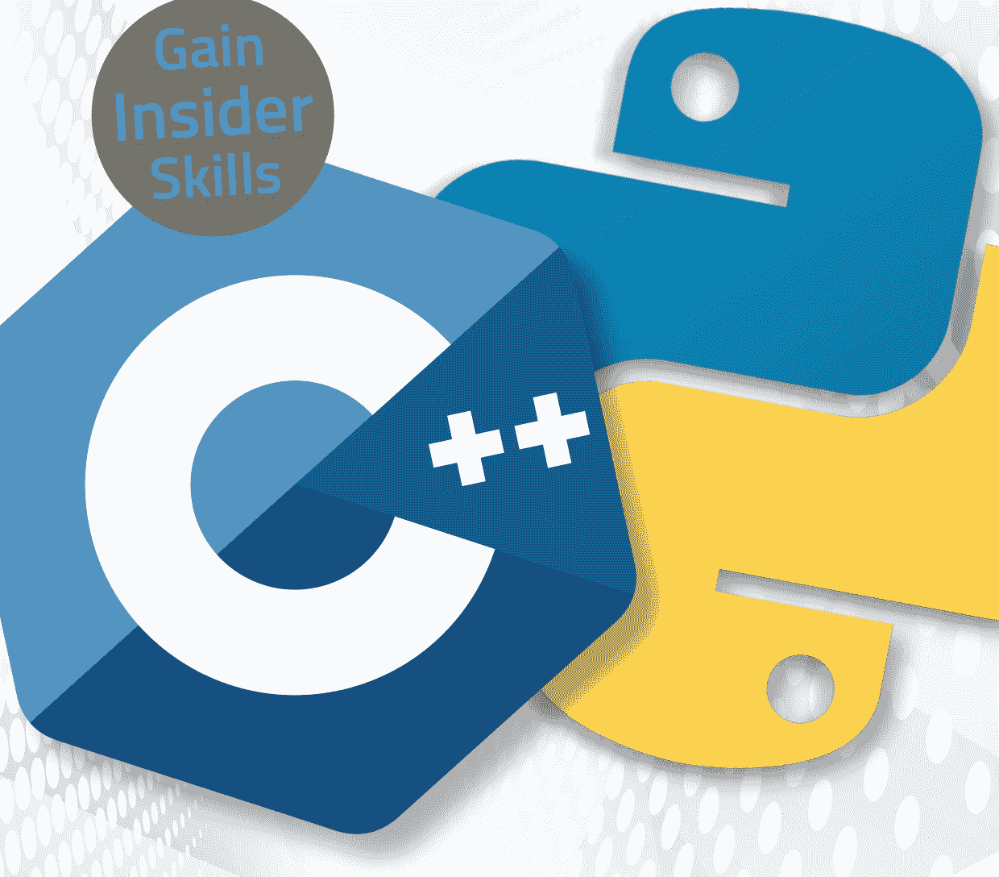

- 进阶秘诀与修复
- 高级指南与技巧
- 重新发现你的设备

# 探索更多我们的指南...


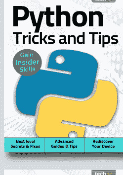


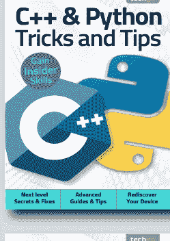


# C++ 与 Python 技巧与窍门

欢迎回来... 在完成了我们专为初学者打造的数字指南后，我们已经教会了你掌握新设备、软件或爱好基础知识所需的一切。但这仅仅是个开始！

提升技能是所有消费技术用户的目标，我们由资深行业专家组成的团队将助你实现这一目标。在这套内容丰富的系列丛书中，我们将更深入地探讨如何充分利用最新的消费电子产品、软件、爱好和潮流！我们将一步步引导你使用那些你可能曾望而却步的技术的高级功能。让我们的专家指南帮助你构建对技术的理解，并获得从自信用户进阶为经验丰富的专家的技能。

翻页之后，我们的旅程将继续，我们将在每个阶段陪伴你，提供建议、信息，并最终激励你走得更远。

# 目录


## 6 处理数据

- 8 列表
- 10 元组
- 12 字典
- 14 分割与连接字符串
- 16 格式化字符串
- 18 日期与时间
- 20 打开文件
- 22 写入文件
- 24 异常
- 26 Python 图形

## 54 循环与决策

- 56 While 循环
- 58 For 循环
- 60 Do... While 循环
- 62 If 语句
- 64 If... Else 语句

## 28 使用模块

- 30 日历模块
- 32 操作系统模块
- 34 随机模块
- 36 Tkinter 模块
- 38 Pygame 模块
- 42 创建你自己的模块

## 66 处理代码

- 68 常见编码错误
- 70 Python 初学者错误
- 72 C++ 初学者错误
- 74 下一步去哪里？

## 44 C++ 输入/输出

- 46 用户交互
- 48 字符字面量
- 50 定义常量
- 52 文件输入/输出


# 目录

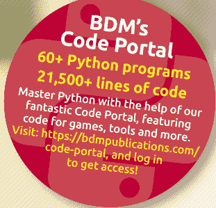

> "...我们选取了两种最强大且用途最广的编程语言——Python 和 C++，并将它们分解成易于理解的教程和指南，帮助你学习它们的工作原理，以及如何让它们为你所用..."

Python 与 C++ 技巧与窍门
第5版
ISBN: 978-1-912847-54-9
出版方：Papercut Limited
数字发行方：
Readly AB, Zinio, Magzter, Cafeyn, PocketMags

© 2021 Papercut Limited 版权所有。未经出版商明确书面许可，不得以任何形式复制本出版物的任何部分，不得将其存储在检索系统中，也不得将其集成到任何其他出版物、数据库或商业程序中。在任何情况下，未经出版商书面许可，不得以任何形式转售、出借或用于贸易。虽然我们以所提供信息的质量为荣，但 Papercut Limited 保留不对本出版物文本中发现的任何错误或不准确之处负责的权利。由于科技行业的性质，出版商无法保证所有应用程序和软件都能在每个版本的设备上运行。购买者应自行负责确定本书及其内容是否适合其任何用途。封面上复制的任何应用程序图像仅用于设计目的，并不代表内容。我们建议所有潜在买家在购买前查看列表以确认实际内容。本文中的所有编辑观点均为评论者个人观点，不代表出版商或其任何附属公司。因此，出版商对编辑观点和内容不承担任何责任。这是一份独立出版物，因此不一定反映所含应用程序或产品的制作方的观点或意见。本出版物100%非官方。承认相关公司的所有版权、商标和注册商标。相关图形图像经品牌和产品许可复制。本出版物中包含的其他图像经 Shutterstock 许可复制。价格、国际可用性、评级、标题和内容如有更改，恕不另行通知。所有信息在出版时均正确。部分内容可能已在其他卷或标题中出版过。

Papercut Limited
在英格兰和威尔士注册，编号 4308513

@bdmpubs

BDM Publications

www.bdmpublications.com

www.bdmpublications.com

5


# 处理数据

数据就是一切。有了它，你可以根据自己的需求显示、控制、添加、删除、创建和操作 Python。在接下来的页面中，我们将探讨如何创建列表、元组、字典和多维列表；以及如何使用它们来打造有趣且实用的程序。

然后，你可以学习如何使用日期和时间函数、向系统中的文件写入数据，甚至创建图形用户界面，将你的编码技能提升到新的水平，并应用于新的项目想法。

# 列表

列表是你在 Python 中会遇到的最常见的数据结构类型之一。列表就是项目的集合，或者如果你愿意，也可以称为数据，可以作为一个整体访问，也可以单独访问。

## 使用列表

列表在 Python 中非常方便。列表可以包含字符串、整数和变量。你甚至可以在列表中包含函数，以及列表中的列表。

**步骤 1** 列表是一系列称为项目的值的序列。你创建列表的名称，后跟等号，然后是方括号，项目之间用逗号分隔；注意字符串使用引号：

`numbers = [1, 4, 7, 21, 98, 156]`
`mythical_creatures = ["Unicorn", "Balrog", "Vampire", "Dragon", "Minotaur"]`

**步骤 2** 定义列表后，你可以通过引用其名称后跟一个数字来调用每个项目。列表的第一个项目条目从 0 开始，然后是 1、2、3，依此类推。

例如：

`numbers`

调用列表的全部内容。

`numbers[3]`

调用列表中从零开始的第三个项目（本例中为 21）。

**步骤 3** 你也可以通过在项目编号前使用减号 [-1] 来访问或索引列表中的最后一个项目，或使用 [-2] 访问倒数第二个项目，依此类推。尝试引用列表中不存在的项目，例如 [10]，将返回错误：

`numbers[-1]`
`mythical_creatures[-4]`

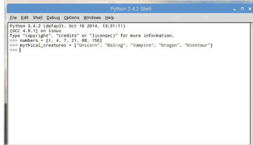

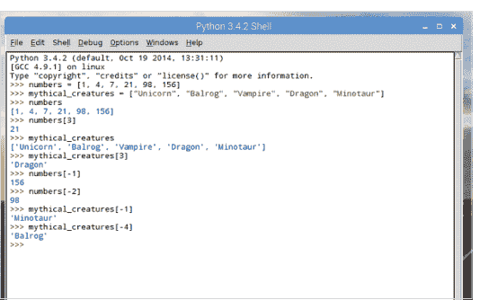

**步骤 4** 切片类似于索引，但你可以通过用冒号分隔项目编号来检索列表中的多个项目。例如：

`numbers[1:3]`

将输出 4 和 7，即项目编号 1 和 2。请注意，返回的值不包括第二个索引位置（因为 numbers[1:3] 会返回 4、7 和 21）。

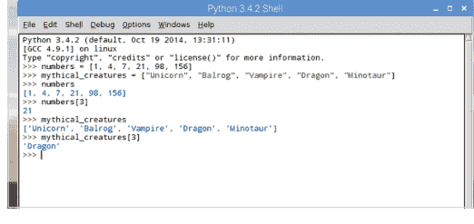

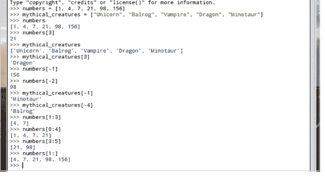

### 第5步

你可以更新现有列表中的项目，删除项目，甚至可以将列表连接在一起。例如，要连接两个列表，你可以使用：

```
everything = numbers + mythical_creatures
```

然后使用以下命令查看合并后的列表：

```
everything
```

### 第8步

你可以通过在Shell中输入 `dir(list)` 来查看列表可以执行哪些操作。输出的是可用的函数，例如，`insert` 和 `pop` 用于在特定位置添加和删除项目。要在索引4处插入数字62：

```
numbers.insert(4, 62)
```

要删除它：

```
numbers.pop(4)
```

### 第6步

可以通过输入以下命令向列表添加项目：

```
numbers = numbers + [201]
```

或者对于字符串：

```
mythical_creatures = mythical_creatures + ["Griffin"]
```

或者使用 `append` 函数：

```
mythical_creatures.append("Nessie")
numbers.append(278)
```

### 第9步

你还可以使用 `list` 函数将字符串分解为其组成部分。例如：

```
list("David")
```

将名字David分解为 'D', 'a', 'v', 'i', 'd'。然后可以将其传递给一个新列表：

```
name = list("David Hayward")
name
age = [44]
user = name + age
user
```

### 第7步

删除项目有两种方式。第一种是通过项目编号：

```
del numbers[7]
```

或者，通过项目名称：

```
mythical_creatures.remove("Nessie")
```

### 第10步

基于此，你可以创建一个程序，将某人的姓名和年龄存储为一个列表：

```
name = input("What's your name? ")
lname = list(name)
age = int(input("How old are you: "))
lage = [age]

user = lname + lage
```

合并后的姓名和年龄列表称为 `user`，可以通过在Shell中输入 `user` 来调用。尝试一下，看看你能做什么。

## 元组

元组与列表非常相似。然而，列表可以被更新、删除或以某种方式更改，而元组则保持不变。这被称为不可变，它们非常适合存储固定的数据项。

### 不可变的元组

拥有元组的原因取决于程序的用途。通常，元组是为特殊事物保留的，但它们也用于例如冒险游戏中存储非玩家角色名称。

第1步 元组的创建方式与列表相同，但在此情况下使用圆括号而不是方括号。例如：
```
months = ("January", "February", "March", "April", "May", "June")
months
```

第3步 你可以将分组的元组创建为包含多组数据的列表。例如，这里有一个名为NPC（非玩家角色）的元组，包含冒险游戏中角色名称和他们的战斗评级：
```
NPC = [("Conan", 100), ("Belit", 80), ("Valeria", 95)]
```

第2步 与列表一样，命名元组中的项目可以根据其在数据范围中的位置进行索引，即：
```
months[0]
months[5]
```
但是，任何尝试删除或添加到元组的操作都会导致Shell中出现错误。

第4步 这些数据项中的每一个都可以通过在Shell中输入 `NPC` 作为整体访问；或者可以根据其位置进行索引 `NPC[0]`。你还可以索引NPC列表中的单个元组：
```
NPC[0][1]
```
将显示100。

## 元组

第5步 值得注意的是，当引用列表中的多个元组时，索引与常规略有不同。你可能期望角色Valeria的95战斗评级是 `NPC[4][5]`，但事实并非如此。实际上是：
```
NPC[2][1]
```

第8步 现在将元组解包到两个对应的变量中：
```
(name, combat_rating) = NPC
```
你现在可以通过输入 `name` 和 `combat_rating` 来检查值。

第6步 这当然意味着索引遵循如下：
```
0 1, 1
0, 0 2
0, 1 2, 0
1 2, 1
1, 0
```
可以想象，当你需要处理大量元组数据时，这会变得有点混乱。

第9步 请记住，与列表一样，你也可以使用负数索引元组，负数从数据列表的末尾开始倒数。对于我们的示例，使用包含多个数据项的元组，你可以通过以下方式引用Valeria角色：
```
NPC[2][-0]
```

第7步 然而，元组使用一种称为解包的特性，其中存储在元组中的数据项被分配给变量。首先创建一个包含两个项目（名称和战斗评级）的元组：
```
NPC = ("Conan", 100)
```

第10步 你可以使用 `max` 和 `min` 函数来查找由数字组成的元组的最高值和最低值。例如：
```
numbers = (10.3, 23, 45.2, 109.3, 6.1, 56.7, 99)
```
数字可以是整数和浮点数。要输出最高值和最低值，使用：
```
print(max(numbers))
print(min(numbers))
```

## 字典

列表非常有用，但Python中的字典是迄今为止处理数据项更技术性的方式。一开始可能难以掌握，但你很快就能将它们应用到自己的代码中。

### 键值对

字典就像一个列表，但每个数据项都是一对，这些被称为键和值。键部分必须是唯一的，可以是数字或字符串，而值可以是任何你喜欢的数据项。

**第1步** 假设你想在Python中创建一个电话簿。你会创建字典名称，并在花括号中输入数据，用冒号 `Key:Value` 分隔键和值。例如：
```
phonebook = {"Emma": 1234, "Daniel": 3456, "Hannah": 6789}
```

**第3步** 与列表和元组一样，你可以通过给字典一个名称来检查其内容：在本例中是 `phonebook`。这将以类似于列表的方式显示你输入的数据项，你现在无疑已经熟悉了。

**第2步** 与大多数列表、元组等一样，字符串需要用引号（单引号或双引号）括起来，而整数可以不加引号。请记住，值可以是字符串或整数，你只需要将相关的一个用引号括起来：
```
phonebook2 = {"David": "0987 654 321"}
```

**第4步** 使用字典的好处是你可以输入键来索引值。使用前面步骤中的电话簿示例，你可以输入：
```
phonebook["Emma"]
phonebook["Hannah"]
```

## 字典

第5步 向字典添加内容也很容易。你可以通过添加新的键和值项来包含新的数据项条目，例如：

```
phonebook["David"] = "0987 654 321"
phonebook
```

第8步 接下来，你需要定义用户输入和变量：一个用于人的姓名，另一个用于他们的电话号码（让我们保持简单，避免冗长的Python代码）：

```
name = input("Enter name: ")
number = int(input("Enter phone number: "))
```

第6步 你还可以通过发出 `del` 命令后跟项目的键来从字典中删除项目；值也会被删除，因为两者作为一对数据项工作：

```
del phonebook["David"]
```

第9步 注意，我们将数字保留为整数而不是字符串，即使值可以是整数或字符串。现在你需要将用户输入的变量添加到新创建的空白字典中。使用与第5步相同的过程，你可以输入：

```
phonebook[name] = number
```

第7步 更进一步，如何创建一段代码来询问用户字典的键和值项？创建一个新的编辑器实例，并从编码一个新的空白字典开始：

```
phonebook = {}
```

第10步 现在，当你保存并执行代码时，Python将询问姓名和号码。然后它会将这些条目插入到电话簿字典中，你可以通过在Shell中输入以下内容进行测试：

```
phonebook
phonebook["David"]
```

如果号码需要包含空格，你需要将其设为字符串，因此请删除输入中的 `int` 部分。

## 字符串的分割与合并

在处理 Python 中的数据时，尤其是来自用户输入的数据，你无疑会遇到长字符串。在 Python 编程中，一个有用的技能是能够分割这些长字符串以提高可读性。

## 字符串理论

你已经了解了一些列表函数，使用了 `.insert`、`.remove` 和 `.pop`，但也有可以应用于字符串的函数。

**步骤 1** 字符串函数库中的主要工具是 `.split()`。借助它，你可以根据括号内的参数来分割一个字符串数据。例如，这里有一个包含三个项目的字符串，每个项目之间用空格分隔：
text="Daniel Hannah Emma"

**步骤 2** 现在让我们将字符串转换为列表并相应地分割内容：
names=text.split(" ")
然后输入新列表的名称 `names` 来查看这三个项目。

**步骤 3** 注意 `text.split` 部分有括号、引号，然后是一个空格，接着是闭合引号和括号。这个空格是分隔符，表示每个列表项条目之间用空格分隔。同样，CSV（逗号分隔值）内容使用逗号，所以你会使用：
text="January,February,March,April,May,June"
months=text.split(",")
months

**步骤 4** 你之前已经见过如何使用一个名字将字符串分割成单个字母的列表：
name=list("David")
name
返回的值是 'D', 'a', 'v', 'i', 'd'。虽然在普通情况下这看起来可能没什么用，但它对于创建拼写游戏等场景可能很方便。

**步骤 5** `.split` 函数的反向操作是 `.join`，它将字符串中的独立项目组合在一起，形成一个单词或仅仅是项目的组合，具体取决于你编写的程序。例如：
alphabet="".join(["a", "b", "c", "d", "e"])
alphabet
这将在 Shell 中显示 'abcde'。

**步骤 6** 因此，你可以将 `.join` 应用于你在步骤 4 中创建的已分割的名字，再次组合字母以形成名字：
name="".join(name)
name
我们已经将字符串重新组合在一起，并保留了名为 `name` 的列表，将其传递给 `.join` 函数。

**步骤 7** 使用 `.join` 函数的一个好例子是当你有一个想要组合成句子的单词列表时：
list=["Conan", "raised", "his", "mighty", "sword", "and", "struck", "the", "demon"]
text=" ".join(list)
text
注意 `.join` 函数前引号之间的空格（在步骤 6 的 join 中没有空格）。

**步骤 8** 与 `.split` 函数一样，分隔符不必是空格，也可以是逗号、句号、连字符或任何你喜欢的符号：
colours=["Red", "Green", "Blue"]
col=", ".join(colours)
col

**步骤 9** 你可以对字符串应用一些有趣的函数，例如 `.capitalize` 和 `.title`。例如：
title="conan the cimmerian"
title.capitalize()
title.title()

**步骤 10** 你还可以对字符串使用逻辑运算符，使用 'in' 和 'not in' 函数。这些函数使你能够检查字符串是否包含（或不包含）一系列字符：
message="Have a nice day"
"nice" in message
"bad" not in message
"day" not in message
"night" in message

## 字符串格式化

当你处理数据、创建列表、字典和对象时，你可能经常想要打印出结果。将字符串与数据合并很容易，尤其是在 Python 3 中，因为早期版本的 Python 往往会使事情复杂化。

## 字符串格式化

自 Python 3 以来，字符串格式化变得更加简洁，使用 `.format` 函数结合花括号。与之前的版本相比，这是一种更合乎逻辑、更规范的方法。

**步骤 1** Python 中的基本格式化是使用花括号将每个变量调用到字符串中：

```
name="Conan"
print("The barbarian hero of the Hyborian Age is: {}".format(name))
```

**步骤 2** 记住用两组括号关闭 print 函数，因为你将变量放在一组括号中，而 print 函数放在另一组括号中。你可以在单个 print 函数中包含多个字符串格式化实例：

```
name="Conan"
place="Cimmeria"
print("{} hailed from the North, in a cold land known as {}".format(name, place))
```

**步骤 3** 你当然也可以将整数包含进来：

```
number=10000
print("{} of {} was a skilled mercenary, and thief too. He once stole {} gold from a merchant.".format(name, place, number))
```

**步骤 4** 应用字符串格式化的方法有很多，有些非常简单，正如我们在这里展示的；有些则可能复杂得多。这完全取决于你希望从程序中获得什么。一个经常参考字符串格式化的好地方是 Python 文档网页，网址是 www.docs.python.org/3.1/library/string.html。在这里，你会找到大量的帮助。

**步骤 5** 有趣的是，你可以使用字符串格式化函数引用一个列表。你需要在列表名称前放置一个星号：

```
numbers=1, 3, 45, 567546, 3425346345
print("Some numbers: {}, {}, {}, {}, {}".format(*numbers))
```

**步骤 6** 与列表中的索引一样，使用字符串格式化调用列表也适用同样的规则。你可以根据每个项目的位置（从 0 到存在的数量）对其进行索引：

```
numbers=1, 4, 7, 9
print("More numbers: {3}, {0}, {2}, {1}.".format(*numbers))
```

**步骤 7** 正如你可能猜测的那样，你可以在单个列表中混合字符串和整数，以便在 `.format` 函数中调用：

```
characters=["Conan", "Belit", "Valeria", 19, 27, 20]
print ("{0} is {3} years old. Whereas {1} is {4} years old.".format(*characters))
```

**步骤 8** 你也可以用同样的方式打印出用户输入的内容：

```
name=input("What's your name? ")
print("Hello {}.".format(name))
```

**步骤 9** 你可以扩展这个简单的代码示例，以显示用户输入名字的首字母：

```
name=input("What's your name? ")
print("Hello {}.".format(name))
lname=list(name)
print("The first letter of your name is a {0}".format(*lname))
```

**步骤 10** 你还可以调用一对列表，并在同一个 print 函数中单独引用它们。回顾步骤 7 的代码，你可以用以下方式修改它：

```
names=["Conan", "Belit", "Valeria"]
ages=[25, 21, 22]

创建两个列表。现在你可以调用每个列表和单个项目：
print("{0[0]} is {1[0]} years old. Whereas {0[1]} is {1[1]} years old.".format(names, ages))
```

## 日期和时间

处理数据时，能够访问时间通常很方便。例如，你可能想为条目添加时间戳，或者查看用户登录系统的时间以及登录了多长时间。幸运的是，借助 Time 模块，获取日期和时间很容易。

## 时间领主

time 模块包含帮助你检索当前系统时间、从字符串读取日期、格式化时间和日期等许多功能的函数。

**步骤 1** 首先你需要导入 time 模块。它是 Python 3 的内置模块，所以你不需要进入命令提示符并使用 pip 安装它。一旦导入，你就可以用一个简单的命令调用当前时间和日期：

```python
import time
time.asctime()
```

**步骤 2** time 函数被分成九个元组，这些元组被划分为索引项，就像任何其他元组一样，并在下面的屏幕截图中显示。

**步骤 3** 你可以通过输入以下内容查看时间呈现的结构：

```python
time.localtime()
```

输出显示为：`time.struct_time(tm_year=2017, tm_mon=9, tm_mday=7, tm_hour=9, tm_min=6, tm_sec=13, tm_wday=3, tm_yday=250, tm_isdst=0)`；显然这取决于你当前的时间，而不是上面显示的时间。

**步骤 4** time 模块中内置了众多函数。其中最常见的是 `strftime()`。借助它，你能够呈现广泛的参数，因为它将时间元组转换为字符串。例如，要显示当前是星期几，你可以使用：

```python
time.strftime('%A')
```

| 索引 | 字段 | 值 |
|---|---|---|
| 0 | 4位年份 | 2016 |
| 1 | 月份 | 1 到 12 |
| 2 | 日期 | 1 到 31 |
| 3 | 小时 | 0 到 23 |
| 4 | 分钟 | 0 到 59 |
| 5 | 秒 | 0 到 61（60 或 61 是闰秒） |
| 6 | 星期几 | 0 到 6（0 是星期一） |
| 7 | 一年中的第几天 | 1 到 366（儒略日） |
| 8 | 夏令时 | -1, 0, 1, -1 表示库决定夏令时 |

## 日期与时间

步骤 5 这自然意味着你可以将各种功能整合到自己的代码中，例如：

```
time.strftime("%a")
time.strftime("%B")
time.strftime("%b")
time.strftime("%H")
time.strftime("%H%M")
```

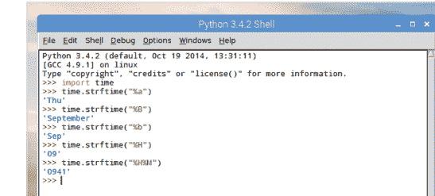

步骤 6 注意最后两个条目，使用了 `%H` 和 `%H%M`，如你所见，它们分别代表小时和分钟。正如最后一个条目所示，将它们输入为 `%H%M` 并不能在 Shell 中正确显示时间。你可以通过以下方式轻松修正：

```
time.strftime("%H:%M")
```

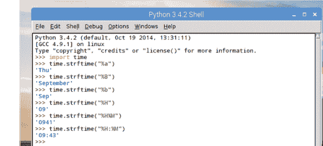

步骤 7 这意味着你将能够显示当前时间或某个事件发生的时间，例如用户输入其姓名的时间。在编辑器中尝试此代码：

```
import time
name=input("Enter login name: ")
print("Welcome", name, "\d")
print("User:", name, "logged in at", time.strftime("%H:%M"))
```

尝试进一步扩展它，以包含日期、月份、年份等。

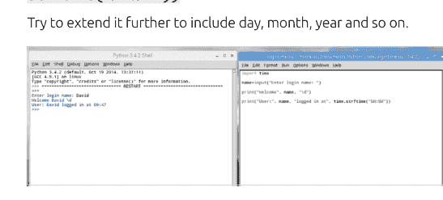

步骤 8 你在上一节的末尾看到，在计算圆周率到用户所需小数位数的代码中，你可以为 Python 中的特定事件计时。获取上面的代码并稍作修改，加入：

```
start_time=time.time()
```

然后是：

```
endtime=time.time()-start_time
```

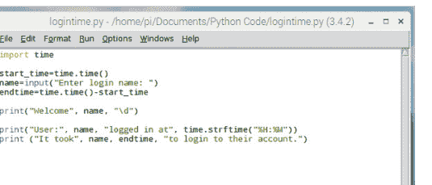

步骤 9 输出将类似于下面的截图。计时器函数需要放在输入语句的两侧，因为那是创建变量 `name` 的时候，具体取决于用户登录花了多长时间。然后，时间长度将作为 `endtime` 变量显示在代码的最后一行。

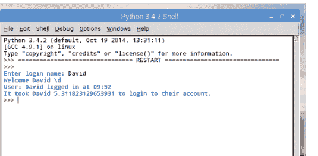

步骤 10 使用 `time` 模块可以做很多事情；其中一些也相当复杂，例如显示自 1970 年 1 月 1 日以来的秒数。如果你想进一步深入研究 `time` 模块，可以在 Shell 中输入：`help(time)` 来显示当前 Python 版本中 `time` 模块的帮助文件。

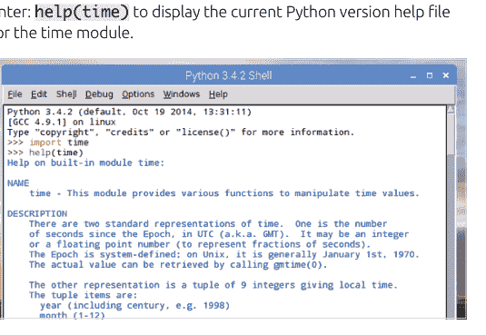

## 打开文件

在 Python 中，你可以在程序中读取文本文件和二进制文件。你也可以写入文件，这是我们接下来要探讨的内容。读写文件使你能够输出和存储程序中的数据。

### 打开、读取和写入

在 Python 中，你创建一个文件对象，类似于创建一个变量，只是使用 `open()` 函数传入文件。文件通常分为文本文件或二进制文件。

**步骤 1** 首先，在系统的文本编辑器中输入一些文本。最好使用文本编辑器，而不是文字处理器，因为文字处理器包含背景格式和其他元素。在我们的示例中，我们有罗伯特·E·霍华德的诗《西米里安人》。你需要将文件保存为 `poem.txt`。

**步骤 2** 你使用 `open()` 函数将文件作为对象传递给一个变量。你可以随意命名文件对象，但你需要告诉 Python 你正在打开的文本文件的名称和位置：

```
python
poem=open("/home/pi/Documents/Poem.txt")
```

**步骤 3** 如果你现在在 Shell 中输入 `poem`，你将获得一些关于你刚刚请求打开的文本文件的信息。现在你可以使用 `poem` 变量来读取文件内容：

```
python
poem.read()
```

请注意，文本中的 `/n` 条目代表一个新行，就像你之前使用过的那样。

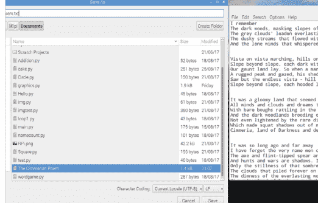

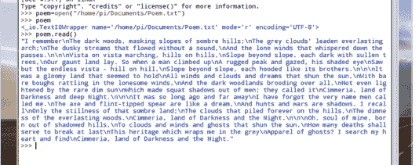

**步骤 4** 如果你第二次输入 `poem.read()`，你会注意到文本已从文件中移除。你需要再次输入：`poem=open("/home/pi/Documents/Poem.txt")` 来重新创建文件对象。然而，这次请输入：

```
python
print(poem.read())
```

这次，`/n` 条目被移除，取而代之的是换行符和可读的文本。

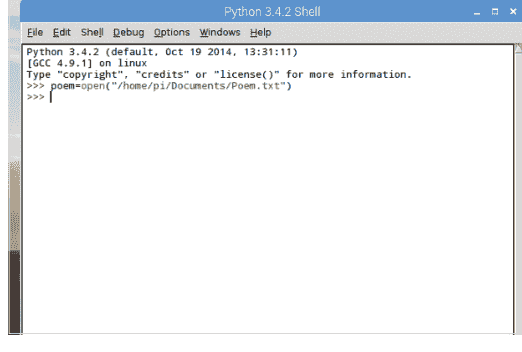

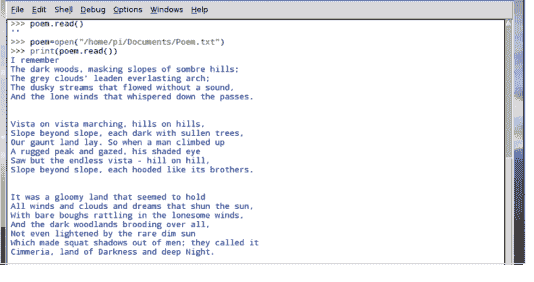

步骤 5 就像列表、元组、字典等一样，你能够索引文本的单个字符。例如：

```
poem.read(5)
```

显示前五个字符，而再次输入：

```
poem.read(5)
```

将显示接下来的五个字符。输入 `(1)` 将一次显示一个字符。

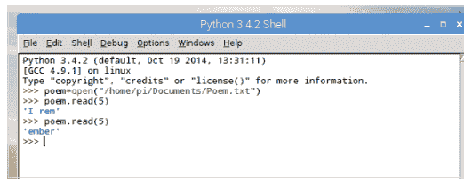

步骤 6 类似地，你可以使用 `readline()` 函数一次显示一行文本。例如：

```
poem=open("/home/pi/Documents/Poem.txt")
poem.readline()
```

将显示文本的第一行，使用：

```
poem.readline()
```

再次显示下一行文本。

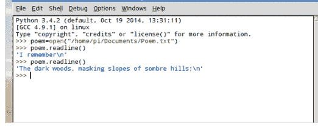

步骤 7 你可能已经猜到，你可以将 `readline()` 函数传递给一个变量，从而允许你在需要时再次调用它：

```
poem=open("/home/pi/Documents/Poem.txt")
line=poem.readline()
line
```

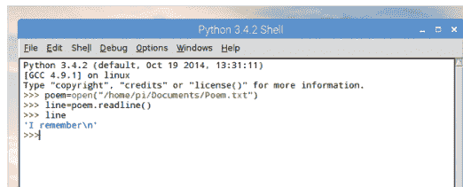

步骤 8 进一步扩展，你可以使用 `readlines()` 来获取文本的所有行并将它们存储为多个列表。然后可以将这些列表存储为一个变量：

```
poem=open("/home/pi/Documents/Poem.txt")
lines=poem.readlines()
lines[0]
lines[1]
lines[2]
```

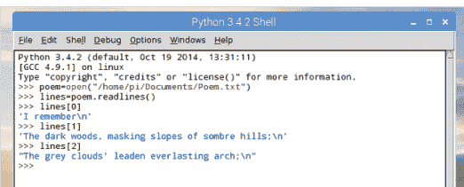

步骤 9 你也可以使用 `for` 语句将文本行读回给我们：

```
for lines in lines:
    print(lines)
```

由于这是 Python，还有其他方法可以产生相同的输出：

```
poem=open("/home/pi/Documents/Poem.txt")
for lines in poem:
    print(lines)
```

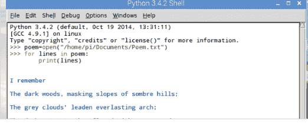

步骤 10 让我们想象一下，你想像旧的点阵打印机那样一次打印一个字符。你可以将 `time` 模块与你在这里学到的内容结合起来。试试这个：

```
import time
poem=open("/home/pi/Documents/Poem.txt")
lines=poem.read()
for lines in lines:
    print(lines, end="")
    time.sleep(.15)
```

输出看起来很有趣，并且很容易整合到你自己的代码中。

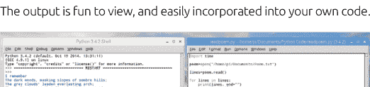

## 写入文件

在 Python 中读取外部文件的能力当然很方便，但写入文件则更好。使用 `write()` 函数，你可以将程序的结果输出到一个文件，然后你可以使用 `read()` 将其读回 Python。

### 写入和关闭

`write()` 函数比 `read()` 稍微复杂一些。除了文件名，你还必须包含一个访问模式，该模式决定相关文件是处于读取模式还是写入模式。

**步骤 1** 首先打开 IDLE 并输入以下内容：
`t=open("/home/pi/Documents/text.txt", "w")`
将目标路径从 `/home/pi/Documents` 更改为你自己的系统路径。此代码将使用变量 ‘t’ 以写入模式创建一个名为 `text.txt` 的文本文件。如果该位置没有同名文件，它将创建一个。如果已经存在，它将覆盖它，所以要小心。

**步骤 2** 现在你可以使用 `write()` 函数写入文本文件。这与 `read()` 相反，是写入行而不是读取行。试试这个：
`t.write("You awake in a small, square room. A single table stands to one side, there is a locked door in front of you.")`
注意数字 109。它代表你输入的字符数。

**步骤 3** 然而，实际的文本文件仍然是空白的（你可以通过打开它来检查）。这是因为你已经将文本行写入了文件对象，但尚未将其提交到文件本身。`write()` 函数的一部分是你需要将更改提交到文件；你可以通过输入以下内容来完成：
`t.close()`

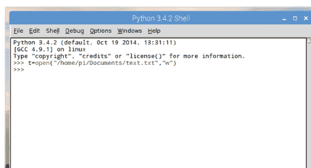

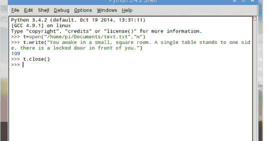

**步骤 4** 如果你现在用文本编辑器打开文本文件，你可以看到你创建的行已被写入文件。这为我们提供了一些有趣可能性的基础：也许是创建你自己的日志文件，甚至是冒险游戏的开始。

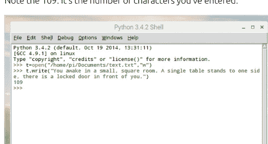

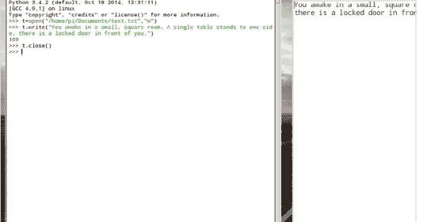

## 写入文件

步骤5 要扩展此代码，你可以使用 'a'（访问或追加模式）重新打开文件。这将在原始行末尾添加任何文本，而不是擦除文件并创建新文件。例如：

```
t=open("/home/pi/Documents/text.txt","a")
t.write("\n")
t.write(" You stand and survey your surroundings. On top of the table is some meat, and a cup of water.\n")
```

步骤6 你可以逐行扩展文本，每行以换行符（\n）结束。完成后，使用 t.close() 结束代码，并在文本编辑器中打开文件查看结果：

```
t.write("The door is made of solid oak with iron strips. It's bolted from the outside, locking you in. You are a prisoner!.\n")
t.close()
```

步骤7 使用 open() 函数时，需要考虑各种类型的文件访问方式。每种方式取决于文件的访问方式，甚至取决于光标的位置。例如，r+ 以读写模式打开文件，并将光标置于文件开头。

步骤8 你可以将 Python 中创建的变量传递给文件。也许你想将圆周率的值写入文件。你可以从 math 模块调用圆周率，创建一个新文件，并将圆周率的输出传递到新文件中：

```
import math
print("Value of Pi is: ",math.pi)
print("\nWriting to a file now...")
```

步骤9 现在让我们创建一个名为 pi 的变量，并为其赋值圆周率：

```
pi=math.pi
```

你还需要创建一个新文件来写入圆周率：

```
t=open("/home/pi/Documents/pi.txt","w")
```

请记住将文件位置更改为适合你特定系统设置的路径。

步骤10 最后，你可以使用字符串格式化来调用变量并将其写入文件，然后提交更改并关闭文件：

```
t.write("Value of Pi is: {}".format(pi))
t.close()
```

从结果中你可以看到，你可以将任何变量传递给文件。

## 异常

在编码时，你自然会遇到一些超出你控制范围的问题。假设你要求用户除以两个数字，而他们试图除以零。这将产生错误并中断你的代码。

### 异常对象

Python 包含异常对象来处理代码中意外的错误，而不是停止代码的流程。你可以通过创建可能发生异常的条件来对抗错误。

步骤1 你可以通过简单地尝试将一个数字除以零来创建异常错误。这将返回 ZeroDivisionError: Division by zero 消息，如截图所示。ZeroDivisionError 部分是异常类，这样的类有很多。

步骤2 当 Python 遇到代码中固有的错误时，大多数异常会自动引发。但是，你可以创建自己的异常，旨在包含潜在错误并对其做出反应，而不是让代码失败。

步骤3 你可以使用 raise exception 函数在 Python 中创建我们自己的错误处理代码。假设你的代码让你在宇宙中穿梭，但穿梭过多会导致曲速核心破裂。为了防止游戏因曲速核心超新星爆发而退出，你可以创建一个自定义异常：

```
raise Exception("warp core breach")
```

步骤4 要捕获代码中的任何错误，你可以将潜在错误封装在 try: 块中。此块由 try、except、else 组成，代码放在 try: 中，然后如果有异常则执行某些操作，否则执行其他操作。

步骤5 例如，使用除以零的错误。你可以创建一个异常，让代码能够处理错误，而不会因为问题导致 Python 退出：

```
try:
    a=int(input("Enter the first number: "))
    b=int(input("Enter the second number: "))
    print(a/b)
except ZeroDivisionError:
    print("You have tried to divide by zero!")
else:
    print("You didn't divide by zero. Well done!")
```

步骤6 你可以使用异常来处理各种有用的任务。使用我们之前教程中的一个例子，假设你想打开一个文件并写入内容：

```
try:
    txt = open("/home/pi/Documents/textfile.txt", "r")
    txt.write("This is a test. Normal service will shortly resume!")
except IOError:
    print ("Error: unable to write the file. Check permissions")
else:
    print ("Content written to file successfully. Have a nice day.")
    txt.close()
```

步骤7 显然，这不会起作用，因为文件 textfile.txt 是以只读方式打开的（"r" 部分）。因此，在这种情况下，你创建了一个使用 IOError 类的异常来通知用户权限不正确，而不是让 Python 告诉你你做错了什么。

步骤8 自然，你可以通过将 "r" 只读实例更改为 "w" 来快速解决问题。正如你已经知道的，这将创建文件、写入内容，然后将更改提交到文件。最终结果将报告不同的情况，在这种情况下，是代码的成功执行。

步骤9 你也可以使用 finally: 块，它的工作方式类似，但不能与 else 一起使用。使用我们步骤6中的例子：

```
try:
    txt = open("/home/pi/Documents/textfile.txt", "r")
    try:
        txt.write("This is a test. Normal service will shortly resume!")
    finally:
        print ("Content written to file successfully. Have a nice day.")
        txt.close()
except IOError:
    print ("Error: unable to write the file. Check permissions")
```

步骤10 和以前一样，由于你使用了 "r" 只读权限，会发生错误。如果你将其更改为 "w"，那么代码将执行而不会在 IDLE Shell 中显示错误。不用说，第一次正确编写异常代码可能很棘手。但通过练习，你会掌握它的。

## Python 图形

虽然在屏幕上处理文本，无论是游戏还是程序，都很棒，但有时一点图形表示也不会错。Python 3 有多种包含图形的方式，而且它们的功能强大得令人惊讶。

### 图形化

你可以绘制简单的图形、线条、正方形等，或者你可以使用众多可用的 Python 模块之一来呈现一些壮观的效果。

**步骤1** 开始学习 Python 图形的最佳图形模块之一是 Turtle。顾名思义，Turtle 模块基于许多学校使用的海龟机器人，这些机器人可以被编程在地板上的大张纸上绘制东西。可以使用以下命令导入 Turtle 模块：`import turtle`。

**步骤2** 让我们从绘制一个简单的圆开始。新建一个文件，然后输入以下代码：

```
import turtle
turtle.circle(50)
turtle.getscreen()._root.mainloop()
```

像往常一样，按 F5 保存代码并执行它。现在将打开一个新窗口，“Turtle” 将绘制一个圆。

**步骤3** 命令 `turtle.circle(50)` 是在屏幕上绘制圆的部分，其中 50 是大小。你可以随意调整大小，增加到 100、150 甚至更大；你可以通过输入：`turtle.circle(50, 180)` 来绘制圆弧，其中大小是 50，但你告诉 Python 只绘制圆的 180°。

**步骤4** 圆代码的最后一部分告诉 Python 保持绘制发生的窗口打开，以便用户可以点击关闭它。现在，让我们画一个正方形：

```
import turtle
print("Drawing a square...")
for t in range(4):
    turtle.forward(100)
    turtle.left(90)
turtle.getscreen()._root.mainloop()
```

你可以看到我们插入了一个循环来绘制正方形的边。

## Python 图形绘制

步骤 5 你可以在绘制正方形的代码中添加一行新代码来添加一些颜色：
```python
turtle.color("Red")
```
然后，你甚至可以通过输入以下代码将角色更改为一只真正的海龟：
```python
turtle.shape("turtle")
```
你也可以使用命令 `turtle.begin_fill()` 和 `turtle.end_fill()` 来用选定的颜色填充正方形；本例中是红色轮廓，黄色填充。

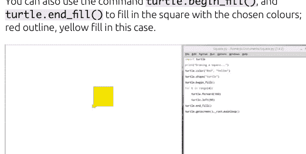

步骤 6 你可以看到，Turtle 模块可以绘制出一些相当不错的图形，并且随着你开始掌握其工作方式，它会变得稍微复杂一些。输入这个示例：
```python
from turtle import *
color('red', 'yellow')
begin_fill()
while True:
    forward(200)
    left(170)
    if abs(pos()) < 1:
        break
end_fill()
done()
```
这是一种不同的方法，但非常有效。

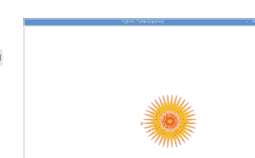

步骤 7 另一种显示图形的方法是使用 Pygame 模块。Pygame 有多种方式可以帮助你将图形输出到屏幕，但现在让我们看看如何显示一个预定义的图像。首先，打开浏览器并找到一张图片，然后将其保存到你保存 Python 代码的文件夹中。

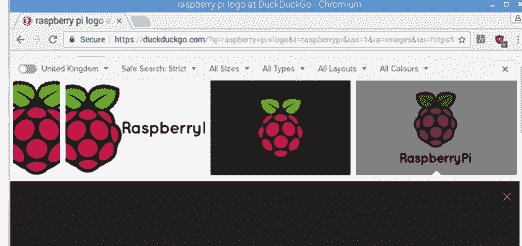

步骤 8 现在，让我们通过导入 pygame 模块来获取代码：
```python
import pygame
pygame.init()
img = pygame.image.load("RPi.png")
white = (255, 255, 255)
w = 900
h = 450
screen = pygame.display.set_mode((w, h))
screen.fill((white))
screen.fill((white))
screen.blit(img,(0,0))
pygame.display.flip()
while True:
    for event in pygame.event.get():
        if event.type == pygame.QUIT:
            pygame.quit()
```

步骤 9 在上一步中，你导入了 pygame，初始化了 pygame 引擎，并要求它导入我们保存的树莓派 logo 图像（保存为 RPi.png）。接下来，你定义了显示图像的窗口背景颜色，并根据实际图像尺寸设置了窗口大小。最后，你有一个循环来关闭窗口。
```python
w = 900
h = 450
screen = pygame.display.set_mode((w, h))
screen.fill((white))
screen.fill((white))
screen.blit(img,(0,0))
pygame.display.flip()
while True:
    for event in pygame.event.get():
        if event.type == pygame.QUIT:
            pygame.quit()
```

步骤 10 按 F5 保存并执行代码，你的图像将显示在一个新窗口中。尝试调整颜色、大小等，并花时间查阅 pygame 模块中的众多函数。

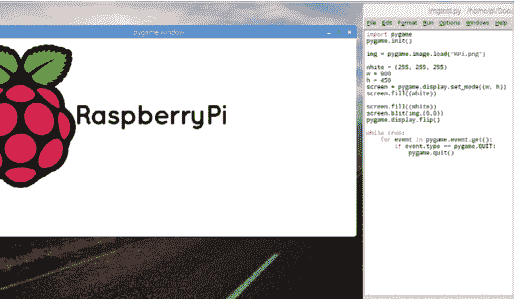


## 使用模块

Python 模块就是一个由 Python 创建的源文件，其中包含类、函数和全局变量所需的代码。你可以绑定和引用模块来扩展功能，甚至创建更出色的 Python 程序。

想知道如何改进这些模块，为你的代码增添一些额外的东西吗？那么请继续阅读，了解如何使用它们来打造精彩的代码。

## 日历模块

除了 time 模块，calendar 模块在代码中执行时可以产生一些有趣的结果。它远不止像 time 模块那样简单地显示日期，你实际上可以调用一个类似挂历的显示方式。

### 处理日期

calendar 模块内置于 Python 3 中。但是，如果由于某种原因它没有安装，你可以使用 `pip install calendar`（以 Windows 管理员身份）或 `sudo pip install calendar`（适用于 Linux 和 macOS）来添加它。

**步骤 1** 启动 Python 3 并输入：`import calendar` 来调用该模块及其固有函数。一旦加载到内存中，首先输入：

```python
sep=calendar.TextCalendar(calendar.SUNDAY)
sep.prmonth(2017, 9)
```

**步骤 2** 你可以看到 2017 年 9 月的日期以挂历形式显示。当然，你可以将第二行中的 2017, 9 部分更改为任何你想要的年份和月份，例如生日（1973, 6）。第一行将 TextCalendar 配置为从星期日开始其周；如果你愿意，也可以选择星期一。

**步骤 3** calendar 模块中有许多函数在你编写自己的代码时可能会感兴趣。例如，你可以显示两个特定年份之间的闰年数量：

```python
leaps=calendar.leapdays(1900, 2018)
print(leaps)
```

结果是 29，从 1904 年开始计算。

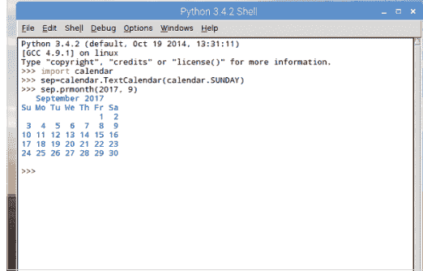

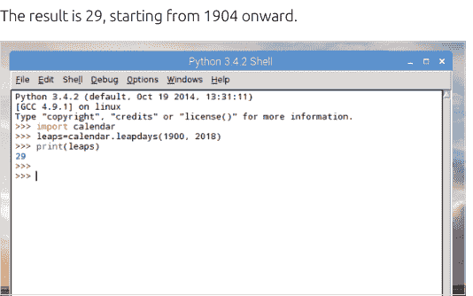

**步骤 4** 你甚至可以将那个特定的例子改造成一段可运行的、用户交互式的 Python 代码：

```python
import calendar
print(">>>>>>>>>>闰年计算器<<<<<<<<<<\n")
y1=int(input("请输入第一个年份: "))
y2=int(input("请输入第二个年份: "))
leaps=calendar.leapdays(y1, y2)
print("在", y1, "年和", y2, "年之间的闰年数量是:", leaps)
```

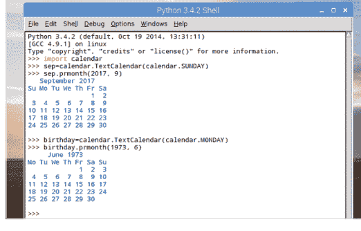

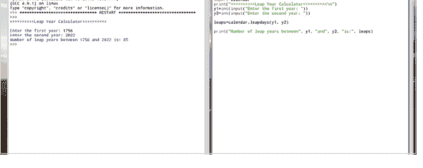

步骤 5 你还可以创建一个程序来显示给定年份中的所有日期、星期和月份：

```python
import calendar
year=int(input("请输入要显示的年份: "))
print(calendar.prcal(year))
```

我们相信你会同意，这是一段非常方便的代码。

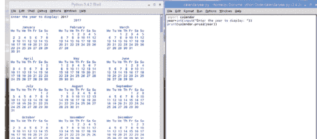

步骤 6 有趣的是，我们也可以通过使用一个简单的 for 循环来列出一个月中的天数：

```python
import calendar
cal=calendar.TextCalendar(calendar.SUNDAY)
for i in cal.itermonthdays(2018, 6):
    print(i)
```

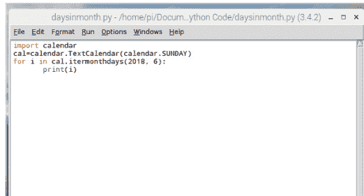

步骤 7 你可以看到代码在开头产生了一些零，这是由于起始星期日（本例中）以及与上个月重叠的日期造成的。因此，日期的计数将从 2018 年 6 月 1 日星期五开始，总计 30 天，输出正确显示了这一点。

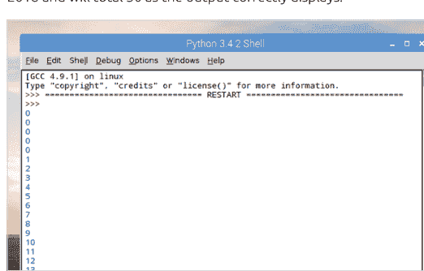

步骤 8 你还可以打印单独的月份或星期名称：

```python
import calendar
for name in calendar.month_name:
    print(name)

import calendar
for name in calendar.day_name:
    print(name)
```

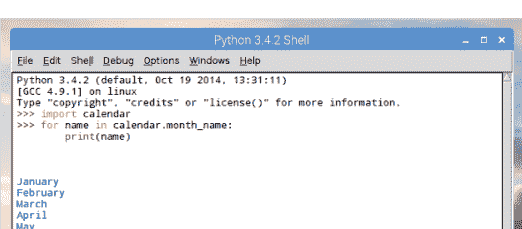

步骤 9 calendar 模块还允许我们将函数写成 HTML 格式，以便你可以在网站上显示它。让我们从创建一个新文件开始：

```python
import calendar
cal=open("/home/pi/Documents/cal.html", "w")
c=calendar.HTMLCalendar(calendar.SUNDAY)
cal.write(c.formatmonth(2018, 1))
cal.close()
```

这段代码将创建一个名为 cal 的 HTML 文件，用浏览器打开它，它将显示 2018 年 1 月的日历。

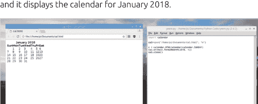

步骤 10 当然，你可以修改它，将给定年份显示为网页日历：

```python
import calendar
year=int(input("请输入要显示为网页的年份: "))
cal=open("/home/pi/Documents/cal.html", "w")
cal.write(calendar.HTMLCalendar(calendar.MONDAY).formatyear(year))
cal.close()
```

这段代码会向用户询问一个年份，然后创建必要的网页。记得更改你的文件目标路径。

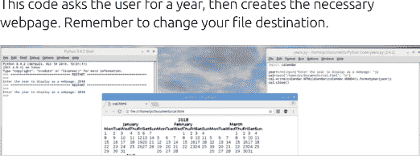

## OS 模块

OS 模块允许你直接与操作系统中的内置命令进行交互。命令因你运行的操作系统而异，因为有些命令适用于 Windows，而其他命令则适用于 Linux 和 macOS。

### 进入系统

OS 模块的主要功能之一是能够列出、移动、创建、删除以及以其他方式与系统上存储的文件进行交互，这使其成为备份代码的完美模块。

你可以从一些简单的函数开始使用 OS 模块，看看它如何与 Python 运行的操作系统环境交互。如果你使用的是 Linux 或树莓派，可以尝试这个：

```python
import os
home=os.getcwd()
print(home)
```

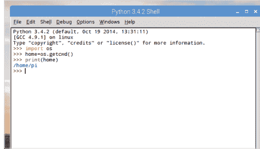

Windows 的输出不同，因为那是由系统确定的 Python 当前工作目录；正如你可能猜测的那样，`os.getcwd()` 函数是要求 Python 检索当前工作目录。Linux 用户将看到与树莓派类似的内容，macOS 用户也是如此。

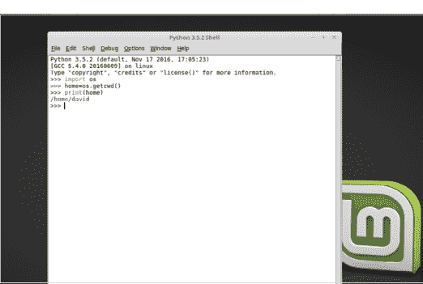

打印变量 home 返回的结果是系统上当前用户的主文件夹。在我们的示例中是 /home/pi；它会因你登录的用户名和使用的操作系统而异。例如，Windows 10 将输出：C:\Program Files (x86)\Python36-32。

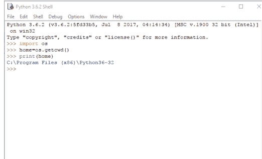

OS 模块的另一个有趣之处在于它能够启动安装在主机系统中的程序。例如，如果你想从 Python 程序中启动 Chromium 浏览器，可以使用以下命令：

```python
import os
browser=os.system("/usr/bin/chromium-browser")
```

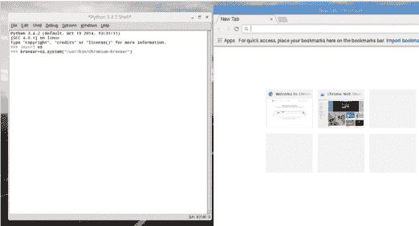

## OS 模块

步骤 5 `os.system()` 函数允许与外部程序交互；你甚至可以使用此方法调用之前的 Python 程序。显然，你需要知道完整的路径和程序文件名才能成功运行。不过，你可以使用以下代码：

```python
import os
os.system('start chrome "https://www.youtube.com/feed/music"')
```

步骤 6 在步骤 5 的示例中，我们使用了 Windows 系统，以展示 OS 模块在所有平台上大致相同的工作方式。在那个例子中，我们打开了 YouTube 的音乐订阅页面，因此也可以打开特定页面：

```python
import os
os.system('chromium-browser "http://bdmpublications.com/"')
```

步骤 7 请注意上一步示例中单引号和双引号的使用。单引号包裹整个命令并启动 Chromium，而双引号用于打开指定页面。你甚至可以使用变量在同一浏览器中调用多个标签页：

```python
import os
a=('chromium-browser "http://bdmpublications.com/"')
b=('chromium-browser "http://www.google.co.uk"')
os.system(a + b)
```

步骤 8 操作目录（或文件夹）的能力是 OS 模块最出色的功能之一。例如，要创建一个新目录，你可以使用：

```python
import os
os.mkdir("NEW")
```

这将在当前工作目录中创建一个新目录，其名称根据 `mkdir` 函数中的对象命名。

步骤 9 你也可以通过输入以下命令重命名任何已创建的目录：

```python
import os
os.rename("NEW", "OLD")
```

要删除它们：

```python
import os
os.rmdir("OLD")
```

步骤 10 与 OS 模块配合使用的另一个模块是 `shutil`。你可以将 `shutil` 模块与 OS 和 time 模块结合使用，创建一个带时间戳的备份目录，并将文件复制到其中：

```python
import os, shutil, time
root_src_dir = r'/home/pi/Documents'
root_dst_dir = '/home/pi/backup/' + time.asctime()

for src_dir, dirs, files in os.walk(root_src_dir):
    dst_dir = src_dir.replace(root_src_dir, root_dst_dir, 1)
    if not os.path.exists(dst_dir):
        os.makedirs(dst_dir)
    for file_ in files:
        src_file = os.path.join(src_dir, file_)
        dst_file = os.path.join(dst_dir, file_)
        if os.path.exists(dst_file):
            os.remove(dst_file)
        shutil.copy(src_file, dst_dir)

print(">>>>>>>>>>>备份完成<<<<<<<<<<")
```

## Random 模块

`random` 模块是你在 Python 编程生涯中可能会经常遇到的一个模块；顾名思义，它旨在生成随机数或字母。然而，它并非完全随机，但对于大多数需求来说已经足够。

### 随机数

`random` 模块包含众多函数，应用这些函数可以创建一些有趣且非常有用的 Python 程序。

步骤 1 与其他模块一样，你需要先导入 `random`，然后才能使用本教程中我们将要介绍的任何函数。让我们从简单地打印一个 1 到 5 之间的随机数开始：

```python
import random
print(random.randint(0,5))
```

步骤 2 在我们的示例中，返回了数字四。然而，再输入几次 `print` 函数，它将显示从给定数字集合（零到五）中得出的不同整数值。总体效果虽然是伪随机的，但对于普通程序员在代码中使用来说已经足够了。

步骤 3 对于更大的数字集合，包括浮点值，你可以使用乘号来扩展范围：

```python
import random
print(random.random() *100)
```

将显示一个介于 0 和 100 之间的浮点数，大约有十五位小数。

步骤 4 然而，`random` 模块并非仅用于数字。你可以使用它从列表中随机选择一个条目，而列表可以包含任何内容：

```python
import random
random.choice(["Conan", "Valeria", "Belit"])
```

这将随机显示我们冒险家中的一个名字，这是文本冒险游戏的一个绝佳补充。

步骤 5 你可以通过让 `random.choice()` 从一个混合变量列表中进行选择，来扩展前面的示例。例如：

```python
import random
lst=["David", 44, "BDM Publications", 3245.23,
"Pi", True, 3.14, "Python"]
rnd=random.choice(lst)
print(rnd)
```

步骤 6 有趣的是，你还可以使用 `random` 模块中的一个函数来打乱列表中的项目，从而为等式增添更多随机性：

```python
random.shuffle(lst)
print(lst)
```

这样，你可以在显示列表中的随机项目之前不断打乱列表。

步骤 7 使用 `shuffle`，你可以创建一个完全随机的数字列表。例如，在给定范围内：

```python
import random
lst=[[i] for i in range(20)]
random.shuffle(lst)
print(lst)
```

不断打乱列表，每次都可以从 0 到 20 中获得不同的项目选择。

步骤 8 你还可以使用 `start, stop, step` 循环，从给定范围中按步长选择一个随机数：

```python
import random
for i in range(10):
    print(random.randrange(0, 200, 7))
```

结果会有所不同，但你能大致了解它的工作原理。

步骤 9 让我们使用一段示例代码，它模拟抛硬币一万次，并统计正面或反面朝上的次数：

```python
import random
output={"Heads":0, "Tails":0}
coin=list(output.keys())

for i in range(10000):
    output[random.choice(coin)]+=1

print("Heads:", output["Heads"])
print("Tails:", output["Tails"])
```

步骤 10 这里有一段有趣的代码。使用一个包含 46.6 万个单词的文本文件，你可以从中随机提取用户指定数量的单词（文本文件可在以下网址找到：www.github.com/dwyl/english-words）：

```python
import random

print(">>>>>>>>>>>随机单词查找器<<<<<<<<<<")
print("\n使用一个 466K 的英文单词文本文件，我可以随机挑选任何单词。\n")

wds=int(input("\n我应该选择多少个单词？ "))

with open("/home/pi/Downloads/words.txt", "rt") as f:
    words = f.readlines()
    words = [w.rstrip() for w in words]

print("-----------------------")

for w in random.sample(words, wds):
    print(w)

print("-----------------------")
```

## Tkinter 模块

虽然从命令行甚至 Shell 中运行代码完全没问题，但 Python 的能力远不止于此。Tkinter 模块使程序员能够设置图形用户界面与用户交互，而且它功能强大得令人惊讶。

### 获取 GUI

Tkinter 易于使用，但你可以用它做更多事情。让我们从了解它的工作原理并编写一些代码开始。不久你就会发现这个模块究竟有多强大。

**步骤 1** Tkinter 通常内置于 Python 3 中。但是，如果输入 `import tkinter` 时它不可用，那么你需要从命令提示符使用 `pip install tkinter` 进行安装。我们可以开始以不同于以前的方式导入模块，以节省输入时间，并通过导入其所有内容：

```python
import tkinter as tk
from tkinter import *
```

**步骤 2** 不建议使用星号从模块导入所有内容，但通常不会造成任何危害。让我们从创建一个基本的 GUI 窗口开始，输入：

```python
wind=Tk()
```

这将创建一个小型、基本的窗口。此时除了点击角落的 X 关闭窗口外，没有太多其他可做的。

**步骤 3** 理想的方法是在代码中添加 `mainloop()` 来控制 Tkinter 事件循环，但我们很快会讲到这一点。你刚刚创建了一个 Tkinter 小部件，我们还可以尝试更多其他小部件：

```python
btn=Button()
btn.pack()
btn["text"]="Hello everyone!"
```

第一行专注于新创建的窗口。点击回到 Shell 并继续输入其他行。

**步骤 4** 你可以将上述内容组合到一个新文件中：

```python
import tkinter as tk
from tkinter import *
btn=Button()
btn.pack()
btn["text"]="Hello everyone!"
```

然后添加一些按钮交互：

```python
def click():
    print("You just clicked me!")
btn["command"]=click
```

## Tkinter 模块

**步骤 5** 保存并执行步骤 4 中的代码，一个包含“大家好！”的窗口将会出现。如果你点击“大家好！”按钮，Shell 将会输出文本“你刚刚点击了我！”。这很简单，但展示了用几行代码能实现什么。

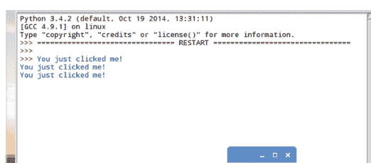

**步骤 6** 你也可以在 Tkinter 窗口中同时显示文本和图像。但是，仅支持 GIF、PGM 或 PPM 格式。因此，在使用代码前，请找到一张图像并进行转换。以下是使用 BDM Publishing 标志的示例：

```python
from tkinter import *

root = Tk()
logo = PhotoImage(file="/home/pi/Downloads/BDM_logo.gif")
w1 = Label(root, root.title("BDM Publications"), image=logo).pack(side="right")
content = """ From its humble beginnings in 2004, the BDM brand quickly grew from a single publication produced by a team of just two to one of the biggest names in global bookazine publishing, for two simple reasons. Our passion and commitment to deliver the very best product each and every volume. While the company has grown with a portfolio of over 250 publications delivered by our international staff, the foundation that it has been built upon remains the same, which is why we believe BDM isn't just the first choice it's the only choice for the smart consumer. """
w2 = Label(root,
    justify=LEFT,
    padx = 10,
    text=content).pack(side="left")
root.mainloop()
```

**步骤 7** 之前的代码相当冗长，主要是因为 `content` 变量包含了公司网站上 BDM “关于我们”页面的一部分内容。你显然可以根据需要更改内容、`root.title` 和图像。

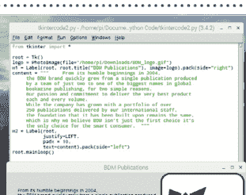

**步骤 8** 你也可以创建单选按钮。试试看：

```python
from tkinter import *

root = Tk()

v = IntVar()

Label(root, root.title("Options"), text="""Choose a preferred language:""",
    justify = LEFT, padx = 20).pack()
Radiobutton(root,
    text="Python",
    padx = 20,
    variable=v,
    value=1).pack(anchor=W)
Radiobutton(root,
    text="C++",
    padx = 20,
    variable=v,
    value=2).pack(anchor=W)

mainloop()
```

**步骤 9** 你还可以创建复选框，带有按钮并将输出显示到 Shell：

```python
from tkinter import *
root = Tk()

def var_states():
    print("Warrior: %d,\nMage: %d" % (var1.get(), var2.get()))

Label(root, root.title("Adventure Game"),
    text=">>>>>>>>>Your adventure role<<<<<<<<<<").grid(row=0, sticky=N)
var1 = IntVar()
Checkbutton(root, text="Warrior", variable=var1).grid(row=1, sticky=W)
var2 = IntVar()
Checkbutton(root, text="Mage", variable=var2).grid(row=2, sticky=W)
Button(root, text='Quit', command=root.destroy).grid(row=3, sticky=W, pady=4)
Button(root, text='Show', command=var_states).grid(row=3, sticky=E, pady=4)

mainloop()
```

**步骤 10** 步骤 9 中的代码在 Tkinter 中引入了一些新的几何布局元素。注意 `sticky=N`、`E` 和 `W` 参数。这些参数描述了复选框和按钮的位置（北、东、南和西）。`row` 参数将它们放置在不同的行上。动手试试看你能得到什么结果。

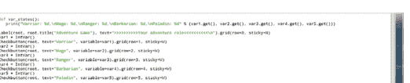

## Pygame 模块

我们已经简要了解了 Pygame 模块，但它还有更多内容需要探索。Pygame 的开发是为了帮助 Python 程序员创建图形化或基于文本的游戏。

## PYGAMING

Pygame 并非 Python 的内置模块，但使用树莓派的用户已经安装了它。其他用户需要使用命令提示符执行：`pip install pygame`。

**步骤 1** 自然，在能够使用 Pygame 模块之前，你需要先将它们加载到内存中。完成后，Pygame 要求用户在使用任何函数之前对其进行初始化：

```python
import pygame
pygame.init()
```

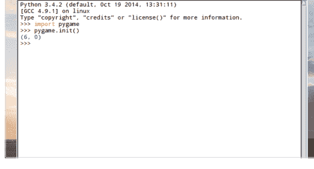

**步骤 3** 遗憾的是，如果不关闭 Python IDLE Shell，就无法关闭新创建的 Pygame 窗口，这不太实用。因此，你需要在编辑器中（新建 > 文件）工作，并创建一个 True/False 的 while 循环：

```python
import pygame
from pygame.locals import *
pygame.init()

gamewindow=pygame.display.set_mode((800,600))
pygame.display.set_caption("Adventure Game")

running=True

while running:
    for event in pygame.event.get():
        if event.type==QUIT:
            running=False
            pygame.quit()
```

**步骤 2** 让我们创建一个简单的游戏就绪窗口，并为其命名：

```python
gamewindow=pygame.display.set_mode((800,600))
pygame.display.set_caption("Adventure Game")
```

你可以看到，输入第一行代码后，你需要点击回 IDLE Shell 继续输入代码；此外，你可以将窗口标题更改为任何你喜欢的名称。


## Pygame 模块

**步骤 4** 如果 Pygame 窗口仍然无法关闭，别担心，这只是 IDLE（使用 Tkinter 编写）和 Pygame 模块之间的差异。如果你通过命令行运行代码，它会正常关闭。


**步骤 5** 现在你将稍微调整一下代码，将主要的 Pygame 代码放在一个 while 循环中运行；这样更整洁，也更容易理解。我们下载了一个图形文件使用，并且需要为 pygame 设置一些参数：

```python
import pygame
pygame.init()

running=True

while running:
    gamewindow=pygame.display.set_mode((800,600))
    pygame.display.set_caption("Adventure Game")
    black=(0,0,0)
    white=(255,255,255)
    img=pygame.image.load("/home/pi/Downloads/sprite1.png")

    def sprite(x,y):
        gamewindow.blit(img, (x,y))

    x=(800*0.45)
    y=(600*0.8)

    gamewindow.fill(white)
    sprite(x,y)
    pygame.display.update()

    for event in pygame.event.get():
        if event.type==pygame.QUIT:
            running=False
```


**步骤 6** 让我们快速回顾一下代码的更改。我们定义了两种颜色，黑色和白色，以及它们各自的 RGB 颜色值。接下来，我们加载了名为 `sprite1.png` 的下载图像，并将其分配给变量 `img`；同时定义了一个 `sprite` 函数，`Blit` 函数将允许我们最终移动图像。

```python
import pygame
from pygame.locals import *
pygame.init()

running=True

while running:
    gamewindow=pygame.display.set_mode((800,600))
    pygame.display.set_caption("Adventure Game")
    black=(0,0,0)
    white=(255,255,255)
    img=pygame.image.load("/home/pi/Downloads/sprite1.png")

    def sprite(x,y):
        gamewindow.blit(img, (x,y))

    x=(800*0.45)
    y=(600*0.8)

    gamewindow.fill(white)
    sprite(x,y)
    pygame.display.update()

    for event in pygame.event.get():
        if event.type==QUIT:
            running=False
            pygame.quit()
```

## 使用模块

**步骤 7** 现在我们可以再次调整代码，这次在 while 循环中包含一个移动选项，并添加在屏幕上移动精灵所需的变量：

```python
import pygame
from pygame.locals import *
pygame.init()

running=True

gamewindow=pygame.display.set_mode((800,600))
pygame.display.set_caption("Adventure Game")
black=(0,0,0)
white=(255,255,255)
img=pygame.image.load("/home/pi/Downloads/sprite1.png")

def sprite(x,y):
    gamewindow.blit(img, (x,y))

x=(800*0.45)
y=(600*0.8)

xchange=0
imgspeed=0

while running:
    for event in pygame.event.get():
        if event.type==QUIT:
            running=False

    if event.type == pygame.KEYDOWN:
        if event.key==pygame.K_LEFT:
            xchange=-5
        elif event.key==pygame.K_RIGHT:
            xchange=5
    if event.type==pygame.KEYUP:
        if event.key==pygame.K_LEFT or event.key==pygame.K_RIGHT:
            xchange=0

    x += xchange

    gamewindow.fill(white)
    sprite(x,y)
    pygame.display.update()

pygame.quit()
```


**步骤 8** 复制代码并运行，使用键盘上的左右箭头键，你可以将你的精灵在屏幕底部移动。现在，看起来你正在制作一个经典的街机 2D 卷轴游戏。

```python
import pygame
from pygame.locals import *
pygame.init()

running=True

gamewindow=pygame.display.set_mode((800,600))
pygame.display.set_caption("Adventure Game")
black=(0,0,0)
white=(255,255,255)
img=pygame.image.load("/home/pi/Downloads/sprite1.png")

def sprite(x,y):
    gamewindow.blit(img, (x,y))

x=(800*0.45)
y=(600*0.8)

xchange=0
imgspeed=0

while running:
    for event in pygame.event.get():
        if event.type==QUIT:
            running=False

    if event.type == pygame.KEYDOWN:
        if event.key==pygame.K_LEFT:
            xchange=-5
        elif event.key==pygame.K_RIGHT:
            xchange=5
    if event.type==pygame.KEYUP:
        if event.key==pygame.K_LEFT or event.key==pygame.K_RIGHT:
            xchange=0

    x += xchange

    gamewindow.fill(white)
    sprite(x,y)
    pygame.display.update()

pygame.quit()
```

## Pygame 模块

第 9 步 现在你可以实现一些新增功能，并利用之前教程中的代码。新元素是 `subprocess` 模块，其中一个函数允许我们从另一个脚本内启动第二个 Python 脚本；我们将创建一个名为 `pygametxt.py` 的新文件：

```python
import pygame
import time
import subprocess
pygame.init()
screen = pygame.display.set_mode((800, 250))
clock = pygame.time.Clock()

font = pygame.font.Font(None, 25)

pygame.time.set_timer(pygame.USEREVENT, 200)

def text_generator(text):
    tmp = ''
    for letter in text:
        tmp += letter
        if letter != ' ':
            yield tmp

class DynamicText(object):
    def __init__(self, font, text, pos, autoreset=False):
        self.done = False
        self.font = font
        self.text = text
        self._gen = text_generator(self.text)
        self.pos = pos
        self.autoreset = autoreset
        self.update()

    def reset(self):
        self._gen = text_generator(self.text)
        self.done = False
        self.update()

    def update(self):
        if not self.done:
            try: self.rendered = self.font.render(next(self._gen), True, (0, 128, 0))
            except StopIteration:
                self.done = True
                time.sleep(10)
                subprocess.Popen("python3 /home/pi/Documents/Python\ Code/pygame1.py 1", shell=True)

    def draw(self, screen):
        screen.blit(self.rendered, self.pos)

text=("A long time ago, a barbarian strode from the frozen north. Sword in hand...")

message = DynamicText(font, text, (65, 120), autoreset=True)

while True:
    for event in pygame.event.get():
        if event.type == pygame.QUIT: break
        if event.type == pygame.USEREVENT: message.update()
    else:
        screen.fill(pygame.color.Color('black'))
        message.draw(screen)
        pygame.display.flip()
        clock.tick(60)
        continue
    break

pygame.quit()
```


第 10 步 当你运行这段代码时，它会显示一个又长又窄的 Pygame 窗口，介绍文字会向右滚动。暂停十秒后，它会启动主游戏 Python 脚本，你可以在其中移动战士精灵。总体效果相当不错，但总有改进的空间。


## 创建你自己的模块

如果将大型程序分解成更小的部分，并将需要的部分作为模块导入，管理起来会容易得多。学习构建自己的模块也有助于理解它们的工作原理。

### 构建模块

模块是包含代码的 Python 文件，使用 `.py` 扩展名保存。然后使用我们熟悉的 `import` 命令将它们导入 Python。

**第 1 步** 让我们从创建一组基本的数学函数开始。将一个数字乘以二、三，求平方或将一个数字提升到一个指数（幂）。在 IDLE 中创建一个新文件并输入：

```python
def timestwo(x):
    return x * 2

def timesthree(x):
    return x * 3

def square(x):
    return x * x

def power(x,y):
    return x ** y
```


**第 2 步** 在上述代码下方，输入调用代码的函数：

```python
print (timestwo(2))
print (timesthree(3))
print (square(4))
print (power(5,3))
```

将程序保存为 `basic_math.py` 并执行以获取结果。

**第 3 步** 现在你要将函数定义从程序中取出，放入一个单独的文件中。高亮显示函数定义并选择“编辑” > “剪切”。选择“文件” > “新建文件”，并在新窗口中使用“编辑” > “粘贴”。你现在有两个独立的文件，一个包含函数定义，另一个包含函数调用。


**第 4 步** 如果你现在尝试再次执行 `basic_math.py` 代码，将显示错误“NameError: name 'timestwo' is not defined”。这是因为代码不再能访问函数定义。

```
Traceback (most recent call last):
  File "/home/pi/Documents/Python Code/basic_math.py", line 3, in <module>
    print (timestwo(2))
NameError: name 'timestwo' is not defined
>>> |
```


**第 5 步** 返回到包含函数定义的新创建窗口，然后单击“文件” > “另存为”。将其命名为 **minimath.py** 并将其保存在与原始 **basic_math.py** 程序相同的位置。现在关闭 `minimath.py` 窗口，使 `basic_math.py` 窗口保持打开状态。


第 6 步 回到 `basic_math.py` 窗口：在代码顶部输入：

```python
from minimath import *
```

这将把函数定义作为模块导入。按 F5 保存并执行程序以查看其运行效果。


第 7 步 你现在可以进一步使用代码，使程序更高级一些，充分利用新创建的模块。包含一些用户交互。首先创建一个用户可以选择的基本菜单：

```python
print("Select operation.\n")
print("1.Times by two")
print("2.Times by Three")
print("3.Square")
print("4.Power of")

choice = input("\nEnter choice (1/2/3/4):")
```


第 8 步 现在我们可以添加用户输入，以获取代码将要处理的数字：

```python
num1 = int(input("\nEnter number: "))
```

这将把用户输入的数字保存为变量 `num1`。

第 9 步 最后，你现在可以创建一系列 `if` 语句来确定如何处理该数字，并利用新创建的函数定义：

```python
if choice == '1':
    print(timestwo(num1))

elif choice == '2':
    print(timesthree(num1))

elif choice == '3':
    print(square(num1))

elif choice == '4':
    num2 = int(input("Enter second number: "))
    print(power(num1, num2))
else:
    print("Invalid input")
```

第 10 步 请注意，对于最后一个可用选项“Power of”，我们添加了第二个变量 `num2`。这将第二个数字传递给名为 `power` 的函数定义。保存并执行程序以查看其运行效果。


## C++ 输入/输出

当你编写代码，要求用户输入，然后使用该输入生成用户可以看到的内容时，会有一种满足感。即使只是询问某人的名字并显示个性化的欢迎信息，这也是一个巨大的飞跃。

用户交互、字符字面量、定义常量以及文件输入和输出都将在接下来的页面中介绍。所有这些都有助于你更好地理解 C++ 程序的工作原理。

## 用户交互

没有什么比创建一个能响应你的程序更令人满意的了。这种基本的用户交互是任何语言教学中最常见的方面之一，通过它，你能做的远不止简单地按名字问候用户。

### 你好，戴夫

你已经在我们的代码中使用了 `cout`，即标准输出流。现在你将使用 `cin`，即标准输入流，来提示用户响应。

第 1 步 你希望用户输入到程序中的任何内容都需要存储在系统内存中的某个地方，以便检索和使用。因此，任何输入都必须首先声明为一个变量，以便用户可以使用它。首先创建一个带有头文件的空白 C++ 文件。

第 2 步 变量的数据类型也必须与你希望从用户那里获得的输入类型相匹配。例如，要询问用户的年龄，你可以像这样使用整数：

```cpp
#include <iostream>
using namespace std;

int main ()
{
    int age;
    cout << "what is your age: ";
    cin >> age;

    cout <<"\nYou are " << age << " years old.\n";
}
```

第 3 步 `cin` 命令的工作方式与 `cout` 命令相反。在第一个 `cout` 行中，你正在向屏幕输出“what is your age”，如尖括号所示。`cin` 使用相反方向的尖括号，表示输入。输入被放入整数 `age` 中，并在第二个 `cout` 命令中调用。构建并运行代码。


第 4 步 如果你要问一个问题，你需要将输入存储为字符串；要询问用户的名字，你可以使用：

```cpp
#include <iostream>
using namespace std;

int main ()
{
    string name;
    cout << "what is your name: ";
    cin >> name;

    cout << "\nHello, " << name << ". I hope you’re well today?\n";
}
```


## 用户交互

步骤 5 其工作原理与之前的代码相同。用户的输入（他们的名字）被存储在一个字符串中，因为它包含多个字符，并在第二个 `cout` 行中被检索。只要变量 'name' 不改变，你就可以在代码中的任何地方调用它。


步骤 8 虽然 `cin` 在大多数输入任务中表现良好，但它确实有一个局限性。`cin` 总是将空格视为终止符，因此它被设计用于单个单词而非多个单词。然而，`getline` 以 `cin` 作为第一个参数，变量作为第二个参数：

```cpp
#include <iostream>
using namespace std;

int main ()
{
    string mystr;
    cout << "Enter a sentence: \n";
    getline(cin, mystr);
    cout << "Your sentence is: " << mystr.size() << " characters long.\n";
}
```

步骤 6 你可以将输入请求链接起来，但请确保你有一个有效的变量来存储输入。假设你希望用户输入两个整数：

```cpp
#include <iostream>
using namespace std;

int main ()
{
    int num1, num2;
    cout << "Enter two whole numbers: ";
    cin >> num1 >> num2;
    cout << "you entered " << num1 << " and " << num2 << "\n";
}
```


步骤 9 构建并执行代码，然后输入一个包含空格的句子。完成后，代码会读取字符数。如果你移除 `getline` 行并用 `cin >> mystr` 替换它，然后再次尝试，结果显示的是到第一个空格为止的字符数。


步骤 7 同样，一旦你将输入的数据存储在变量中，就可以对其进行操作。例如，要求用户输入两个数字并对它们进行一些数学运算：

```cpp
#include <iostream>
using namespace std;

int main ()
{
    float num1, num2;
    cout << "Enter two numbers: \n";
    cin >> num1 >> num2;
    cout << num1 << " + " << num2 << " is: " << num1 + num2 << "\n";
}
```

步骤 10 `getline` 通常是新 C++ 程序员忘记包含的命令。当你无法弄清楚代码为什么不工作时，终止的空白符会很烦人。简而言之，最好在将来使用 `getline(cin, variable)`：

```cpp
#include <iostream>
using namespace std;

int main ()
{
    string name;
    cout << "Enter your full name: \n";
    getline(cin, name);
    cout << "\nHello, " << name << "\n";
}
```


## 字符字面量

在 C++ 中，字面量是一个一旦定义就在整个代码中保持不变的对象或变量。然而，字符字面量由反斜杠定义，例如你一直在 `cout` 语句末尾使用的 `\n`，它表示换行。

## 转义序列

当在 `cout` 语句之类的东西中使用时，字符字面量也称为转义序列码。它们允许你插入引号、警报、换行符等等。

步骤 1 创建一个新的 C++ 文件并输入相关的头文件：

```cpp
#include <iostream>
using namespace std;

int main ()
{

}
```


步骤 3 如果你想在 `cout` 语句中插入引号，你必须使用反斜杠，因为它已经使用了引号：

```cpp
#include <iostream>
using namespace std;

int main ()
{
    cout << "Hello, user. This is how to use \"quotes\".";
}
```


步骤 2 你已经体验过 `\n` 字符字面量在调用它的任何地方放置换行符。这行代码：`cout << "Hello\n" << "I'm a C++\n" << "Program!\n";` 输出三行文本，每行都在上一个 `\n` 之后开始。


步骤 4 甚至有一个字符字面量可以触发警报。在 Windows 10 中，当你使用 `\a` 时，它是通知声音。尝试这段代码，并调高音量。

```cpp
#include <iostream>
using namespace std;

int main ()
{
    cout << "ALARM! \a";
}
```


## 便捷图表

有众多的字符字面量或转义序列码可供选择。因此，我们认为为你提供一个便捷图表会很好，以便在你需要插入代码时使用。

| 转义序列码 | 字符 |
|---|---|
| \\ | 反斜杠 |
| \' | 单引号 |
| \" | 双引号（引号） |
| \? | 问号 |
| \a | 警报/警报声 |
| \b | 退格 |
| \f | 换页 |
| \n | 换行 |
| \r | 回车 |
| \t | 水平制表符 |
| \v | 垂直制表符 |
| \0 | 空字符 |
| \uxxxx | Unicode (UTF-8) |
| \Uxxxxxxxx | Unicode (UTF-16) |

## UNICODE 字符 (UTF-8)

Unicode 字符是跨所有平台的标准符号或字符。例如，版权符号可以通过键盘输入 Unicode 代码，然后按 ALT+X 来输入。对于版权符号，输入：00A9 Alt+X。在 C++ 代码中，你会输入：

```cpp
#include <iostream>
using namespace std;

int main ()
{
    cout << "\u00A9";
}
```


## UNICODE 字符表

完整的可用 Unicode 字符列表可以在 **www.unicode-table.com/en/** 找到。将鼠标悬停在字符上以查看其在 C++ 中输入的唯一代码。


## 定义常量

常量是代码中的固定值。它们可以是任何基本数据类型，但顾名思义，它们的值在整个代码中保持不变。在 C++ 中定义常量有两种不同的方式：`#define` 预处理器和 `const`。

## #DEFINE

预处理器是给编译器的指令，要求在编译代码之前预处理信息。`#include` 是一个预处理器，`#define` 也是。

步骤 1 你可以使用 `#define` 预处理器来定义代码中你想要的任何常量。首先创建一个新的 C++ 文件，并包含通常的头文件：

```cpp
#include <iostream>
using namespace std;

int main ()
{
}
```


步骤 3 注意定义常量时使用大写字母，将所有常量定义为大写字母被认为是良好的编程实践。这里，赋值是 50、40 和 60，所以让我们调用它们：

```cpp
#include <iostream>
using namespace std;

#define LENGTH 50
#define WIDTH 40
#define HEIGHT 60

int main ()
{
    cout << "Length is: " << LENGTH << "\n";
    cout << "Width is: " << WIDTH << "\n";
    cout << "Height is: " << HEIGHT << "\n";
}
```

步骤 2 现在假设你的代码有三个不同的常量：长度、宽度和高度。你可以用以下方式定义它们：

```cpp
#include <iostream>
using namespace std;
#define LENGTH 50
#define WIDTH 40
#define HEIGHT 60

int main ()
{
}
```


步骤 4 构建并运行代码。正如预期的那样，它显示了创建的每个常量的值。值得注意的是，使用 `#define` 关键字定义常量时不需要分号。


## 定义常量

步骤 5 你也可以将其他元素定义为常量。例如，与其在 `cout` 语句中使用 `\n` 表示换行，不如在代码开头定义它：

```cpp
#include <iostream>
using namespace std;

#define LENGTH 50
#define WIDTH 40
#define HEIGHT 60
#define NEWLINE '\n'

int main()
{
    cout << "Length is: " << LENGTH << NEWLINE;
    cout << "Width is: " << WIDTH << NEWLINE;
    cout << "Height is: " << HEIGHT << NEWLINE;
}
```


步骤 6 代码在构建和执行后，与之前完全相同，使用新的常量 `NEWLINE` 在 `cout` 语句中插入换行符。顺便说一句，创建换行常量不是一个好主意，除非你让它比 `\n` 甚至 `endl` 命令更小。


步骤 7 定义常量是在代码开头初始化基础值的好方法。你可以定义你的游戏有三条命，甚至定义 PI 的值，而无需调用 C++ 数学库：

```cpp
#include <iostream>
using namespace std;

#define PI 3.14159

int main()
{
    cout << "The value of Pi is: " << PI << endl;
}
```


步骤 8 定义常量的另一种方法是使用 `const` 关键字。将 `const` 与数据类型、变量和值一起使用：`const type variable = value`。以 Pi 为例：

```cpp
#include <iostream>
using namespace std;

int main()
{
    const double PI = 3.14159;
    cout << "The value of Pi is: " << PI << endl;
}
```


步骤 9 因为你在 `main` 代码块中使用 `const`，所以你需要用分号结束这一行。你可以使用其中任何一种，只要名称和值不冲突，但值得一提的是 `#define` 不需要内存，所以如果你在内存有限的情况下编码，`#define` 是你最好的选择。


步骤 10 `const` 的工作方式与 `#define` 大致相同。你可以创建静态整数甚至换行符：

```cpp
#include <iostream>
using namespace std;

int main()
{
    const int LENGTH = 50;
    const int WIDTH = 40;
    const char NEWLINE = '\n';
    int area;
    area = LENGTH * WIDTH;
    cout << "Area is: " << area << NEWLINE;
}
```


## 文件输入/输出

标准iostream库为C++程序员提供了`cin`和`cout`的输入输出功能。然而，要能够从文件中读取和写入数据，你需要使用另一个名为`fstream`的C++库。

## FSTREAMS

`fstream`库中有两个主要的数据类型，用于打开文件、从中读取数据和向其写入数据，它们是`ofstream`和`ifstream`。以下是它们的工作原理。

**步骤1** 首要任务是创建一个新的C++文件，并像往常一样包含必要的头文件，同时需要包含新的`fstream`头文件：

```
#include <iostream>
#include <fstream>
using namespace std;

int main ()
{

}
```

**步骤2** 首先，询问用户的名字，并将该信息写入文件。你需要一个通常的字符串来存储名字，以及`getline`来接受用户的输入。

```
#include <iostream>
#include <fstream>
using namespace std;

int main ()
{
    string name;
    ofstream newfile;
    newfile.open("name.txt");
    cout << "Enter your name: " << endl;
    getline(cin, name);
    newfile << name << endl;
    newfile.close();
}
```

**步骤3** 我们在步骤2的截图中添加了注释以帮助你理解这个过程。你创建了一个名为`name`的字符串来存储用户输入的名字。你还创建了一个名为`name.txt`的文本文件（通过`ofstream newfile`和`newfile.open`行），询问用户的名字并存储它，然后将数据写入文件。


**步骤4** 要读取文件内容并将其输出到屏幕，你需要稍有不同的操作。首先，你需要创建一个字符串变量来存储文件内容（逐行），然后打开文件，使用`getline`逐行读取文件，并将这些行输出到屏幕。最后，关闭文件。

```
string line;
ifstream newfile ("name.txt");
cout << "Contents of the file: " << endl;
getline(newfile, line);
cout << line << endl;
newfile.close();
```


**步骤5** 上面的代码非常适合打开只有一两行的文件，但如果有多行呢？这里我们打开了一个包含罗伯特·E·霍华德的诗《西米里亚》的文本文件：

```
string line;
ifstream newfile ("c:\\users\\david\\Documents\\Cimmeria.txt");
cout << "Cimmeria, by Robert E Howard: \n" << endl;
while (getline(newfile, line))
    cout << line << endl;
newfile.close();
```


**步骤6** 你无疑已经看到我们包含了一个`while`循环，我们将在几页后介绍它。这意味着只要文本文件中有行可读，C++就会逐行读取。一旦所有行都被读取，输出就会显示在屏幕上，文件也会被关闭。


**步骤7** 你还可以看到文本文件`Cimmeria.txt`的位置与C++程序不在同一个文件夹中。当我们创建第一个`name.txt`文件时，它被写入到代码所在的同一文件夹中；这是默认行为。要指定另一个文件夹，你需要使用双反斜杠，如字符字面量/转义序列代码所示。

```
string line;
ifstream newfile ("c:\\users\\david\\Documents\\Cimmeria.txt");
cout << "Cimmeria, by Robert E Howard: \n" << endl;
```

**步骤8** 正如你可能预期的那样，你可以将几乎任何你喜欢的内容写入文件，以便在记事本中读取或通过C++代码在控制台中读取：

```
string name;
int age;
ofstream newfile;
newfile.open("name.txt");
cout << "Enter your name: " << endl;
getline(cin, name);
newfile << name << endl;
cout << "\nHow old are you: " << endl;
cin >> age;
newfile << age << endl;
newfile.close();
```


**步骤9** 步骤8的代码再次有所不同，但仅在添加年龄整数方面。注意我们使用了`cin >> age`，而不是之前的`getline(cin, variable)`。这样做的原因是`getline`函数处理字符串，而不是整数；因此，当你使用字符串以外的数据类型时，请使用标准的`cin`。


**步骤10** 这里有一个练习：看看你能否创建代码将几个不同的元素写入文本文件。你可以包含用户的名字、年龄、电话号码等。甚至可以是圆周率的值和各种数学元素。这都是很好的练习。


## 循环与决策


循环和重复是任何编程语言中最重要的因素之一。良好地使用循环可以创建一个完全按照你意愿执行的程序，并在没有问题或错误的情况下交付预期的结果。

如果代码中没有循环和决策事件，你的程序将永远无法为用户提供任何选择。正是这种对选择的理解提升了你作为程序员的技能，并能编写出更好的代码。

## While 循环

`while`循环的功能是在某个条件保持为真时，重复执行一条语句或一组语句。当`while`循环开始时，它通过测试循环条件及其内部的语句来初始化自身，然后执行循环的其余部分。

### 真还是假？

`while`循环是C++代码循环中最流行的形式之一。它们在条件为真时重复运行循环中包含的代码。一旦条件被证明为假，代码将正常继续执行。

**步骤1** 清除你目前所做的所有操作，并创建一个新的C++文件。目前不需要任何额外的头文件，因此像往常一样添加标准头文件：

```
#include <iostream>
using namespace std;

int main ()
{
}
```


**步骤2** 创建一个简单的`while`循环。输入下面的代码，构建并运行（我们在截图中添加了注释）：

```
{
    int num = 1;

    while (num < 30 )
    {
        cout << "Number: " << num << endl;
        num = num +1;
    }

    return 0;
}
```


**步骤3** 首先你需要创建一个条件，所以使用一个名为`num`的变量并给它赋值1。现在创建`while`循环，声明只要`num`小于30，循环就为真。在循环内部，显示`num`的值并加1，直到它大于30。


**步骤4** 我们在这里引入了一些新元素。首先是`while`循环的开始和结束花括号。这是因为我们的循环是一个复合语句，即一组语句；还要注意，`while`语句后面没有分号。你现在还有`return 0`，这是一种干净且首选的结束代码的方式。

```
{
    int num = 1; // 创建条件

    while (num < 30 ) // 当num小于30时，条件保持为真
    {
        cout << "Number: " << num << endl; // 显示num的当前值
        num = num +1; // 将num的值加1
    }

    return 0; // 正确地结束代码并完成程序
}
```

**步骤5** 如果你不需要看到`num`不断增长的值，你可以省略复合的`while`语句，而是直接让`num`自增直到达到30，然后显示该值：

```
{
    int num = 1;

    while (num < 30 )
        num++;
    cout << "Number: " << num << endl;

    return 0;
}
```

**步骤6** 重要的是要记住不要在`while`语句末尾添加分号。为什么？嗯，如你所知，分号代表C++代码行的结束。如果你在`while`语句末尾放置一个分号，你的循环将永久卡住，直到你关闭程序。

**步骤7** 在我们的例子中，如果我们执行代码，`num`的值将是1，由`int`语句设置。当代码遇到`while`语句时，它读取到条件“1小于30”为真，因此循环。分号结束了这一行，所以循环重复；但它永远不会给`num`加1，因为它不会继续执行复合语句。


**步骤8** 你可以操作`while`语句，根据循环中的代码显示不同的结果。例如，要逐词阅读诗歌《西米里亚》，你可以输入：

```
#include <iostream>
#include <fstream>
using namespace std;

int main()
{
    string word;
    ifstream newfile ("C:\\users\\david\\Documents\\Cimmeria.txt");

    cout << "Cimmeria, by Robert E Howard: \n" << endl;

    while (newfile >> word)
    {
        cout << word << endl;
    }

    return 0;
}
```

**步骤9** 你可以进一步扩展代码，使诗歌的每个单词每秒出现一次。为此，你需要引入一个新的库`<windows.h>`。这是一个仅限Windows的库，在其中你可以使用`Sleep()`函数：


```
#include <iostream>
#include <fstream>
#include <windows.h>
using namespace std;

int main()
{
    string word;
    ifstream newfile ("C:\\users\\david\\Documents\\Cimmeria.txt");

    cout << "Cimmeria, by Robert E Howard: \n" << endl;

    while (newfile >> word)
    {
        cout << word << endl;
        Sleep(1000);
    }

    return 0;
}
```

**步骤10** `Sleep()`以毫秒为单位工作，所以`Sleep(1000)`是一秒，`Sleep(10000)`是十秒，以此类推。结合`sleep`函数（以及它需要的头文件）和`while`循环，你可以设计出一些有趣的倒计时代码。

```
#include <iostream>
#include <windows.h>
using namespace std;

int main()
{
    int a = 10;
    while (a != 0)
    {
        cout << a << endl;
        a = a - 1;
        Sleep(1000);
    }

    cout << "\nBlast Off!" << endl;

    return 0;
}
```

## For 循环

在某些方面，`for` 循环的工作方式与 `while` 循环非常相似，尽管其结构不同。`for` 循环分为三个阶段：初始化器、条件和增量步骤。一旦设置完成，循环会重复执行，直到条件变为假。

## 循环详解

`for` 循环的初始化阶段只执行一次，它为循环设定了起始点。循环会评估条件以判断其为真或假，然后执行增量操作。接着，循环会重复执行第二和第三阶段。

步骤 1 创建一个新的 C++ 文件，并包含标准头文件：

```
#include <iostream>
using namespace std;

int main ()
{

}
```


步骤 2 从简单开始，创建一个从 1 计数到 30 的 `for` 循环，并在每次增量时将值显示到屏幕上：

```
{
    //For Loop Begins
    for( int num = 1; num < 30; num = num +1 )
    {
        cout << "Number: " << num << endl;
    }

    return 0;
}
```

步骤 3 分析 `for` 循环的过程：首先创建一个名为 `num` 的整数并赋值为 1。接下来，设置条件，在本例中是 `num` 小于 30。最后一步是创建增量；这里是将 `num` 的值加 1。

```
{
    //For Loop Begins
    for( int num = 1; num < 30; num = num +1 )
```

步骤 4 循环之后，你在花括号（大括号）中创建了一个复合语句，用于显示整数 `num` 的当前值。每次 `for` 循环重复自身（即循环的第二和第三阶段）时，它都会加 1，直到条件 `<30` 为假。然后循环结束，代码继续执行，并以 `return 0` 干净地结束。

```
{
    //For Loop Begins
    for( int num = 1; num < 30; num = num +1 )
    {
        cout << "Number: " << num << endl;
    }

    return 0;
}
```

步骤 5 在 C++ 中，`for` 循环是一个相当整洁的包，所有内容都包含在自己的括号内，而循环外的其他元素则显示在下方。如果你想创建一个 10 秒倒计时，可以使用：

```
#include <iostream>
#include <windows.h>
using namespace std;

int main ()
{
    //For Loop Begins
    for( int a = 10; a != 0; a = a -1 )
    {
        cout << a << endl;
        Sleep(1000);
    }

    cout << "\nBlast Off!" << endl;

    return 0;
}
```

步骤 6 对于倒计时代码，别忘了包含 `windows.h` 库，以便使用 `Sleep` 命令。构建并运行代码；在命令控制台中，你可以看到数字从 10 到 1 以一秒为间隔倒计时，直到达到零并显示 "Blast Off!"。


步骤 7 当然，你可以在 `for` 循环中包含更多内容，包括一些用户输入：

```
cpp
int i, n, fact = 1;
cout << "Enter a whole number: ";
cin >> n;
for (i = 1; i <= n; ++i) {
    fact *= i;
}
cout<< "\nFactorial of "<< n <<" = "<< fact << endl;
return 0;
```


步骤 8 步骤 7 中的代码在构建并运行后，会要求输入一个数字，然后通过 `for` 循环显示该数字的阶乘。用户的数字存储在整数 `n` 中，随后是整数 `i`，用于检查条件是否为真或假，每次加 1 并与用户的数字 `n` 进行比较。


步骤 9 这是一个 `for` 循环显示用户输入数字的乘法表示例。对学生来说很方便：

```
cpp
{
    int n;
    cout << "Enter a number to view its times table: ";
    cin >> n;
    for (int i = 1; i <= 12; ++i) {
        cout << n << " x " << i << " = " << n * i << endl;
    }
    return 0;
}
```

步骤 10 整数 `i` 的值可以从 12 扩展到你想要的任何数字，在此过程中显示一个非常大的乘法表（或一个小的）。当然，`for` 循环中的数据类型不必是整数；只要它是有效的，它就能工作。

```
cpp
for ( float i = 0.00; i < 1.00; i += 0.01)
{
    cout << i << endl;
}
return 0;
```

## Do... While 循环

`do... while` 循环与 `for` 甚至 `while` 循环略有不同。`for` 和 `while` 都在循环开始时（或者如果你愿意，可以说在循环顶部）设置和检查条件的状态。然而，`do... while` 循环类似于 `while` 循环，但它在循环底部检查条件。

## Do 循环

`do... while` 循环的好处是它保证至少运行一次。其结构是：`do`，后跟语句，`while` 条件为真。这就是它的工作原理。

步骤 1 从一个新的、空白的 C++ 文件开始，并输入标准头文件：

```
#include <iostream>
using namespace std;

int main ()
{

}
```


步骤 2 从一个简单的数字计数开始：

```
{
    int num = 1;

    do
    {
        cout << "Number: " << num << endl;
        num = num + 1;
    }
    while (num < 30 );

    return 0;
}
```

步骤 3 现在，来看看 `do... while` 循环的结构。首先，你创建一个名为 `num` 的整数，值为 1。现在 `do... while` 循环开始。循环体内的代码至少执行一次，然后检查条件是真还是假。

```
// Create integer with the value of 1
int num = 1;

// Do... While loops begins
do
{
    cout << "Number: " << num << endl; // Display the current value of num
    num = num + 1; // Adds 1 to the value of num

}
while (num < 30 ); // Tests the condition of num (true or false)
```

步骤 4 如果条件为真，则执行循环。这会持续到条件为假。当条件被判定为假时，循环终止，代码继续执行。这意味着你可以创建一个循环，让代码持续运行，直到用户输入某个特定字符。


步骤 5 如果你想要代码累加用户输入的数字，直到用户输入零：

```
{
    float number, sum = 0.0;
    cout << "**** Program to execute a Do... While loop continuously ****" << endl;
    cout << "\nEnter 0 to stop and display the sum of all the numbers entered\n" << endl;
    cout << "\n---------------------------------------------------\n" << endl;

    do {
        cout<<"\nPlease enter a number: ";
        cin>>number;
        sum += number;
    }
    while(number != 0.0);

    cout<<"Total sum of all numbers: "<<sum;

    return 0;
}
```


步骤 6 步骤 5 中的代码工作原理如下：分配了两个浮点变量 `number` 和 `sum`，初始值均为 0.0。有一组简短的用户说明，然后 `do... while` 循环开始。

```
{
    float number, sum = 0.0;
    cout << "**** Program to execute a Do... While loop continuously ****" << endl;
    cout << "\nEnter 0 to stop and display the sum of all the numbers entered\n" << endl;
    cout << "\n---------------------------------------------------\n" << endl;
```

步骤 7 在此实例中，`do... while` 循环要求用户输入一个数字，你将其赋值给浮点变量 `number`。计算步骤使用第二个浮点变量 `sum`，每次用户输入新值时，它都会加上 `number` 的值。

```
do {
    cout << "\nPlease enter a number: ";
    cin >> number;
    sum += number;
```

步骤 8 最后，`while` 语句检查变量 `number` 的条件。如果用户输入了零，则循环终止；否则，它将无限期地继续。当用户最终输入零时，将显示 `sum` 的值，即所有用户输入的总和。然后循环和程序结束。


步骤 9 使用之前使用的倒计时和 "Blast Off!" 代码，`do... while` 循环看起来像这样：

```
{
    int a = 10;
    do
    {
        cout << a << endl;
        a = a - 1;
    }
    while ( a != 0);

    cout << "\nBlast Off!" << endl;

    return 0;
}
```


步骤 10 使用 `do... while` 循环的主要优势在于它是一个退出条件循环；而 `while` 循环是一个入口控制循环。因此，如果你的代码需要一个至少执行一次的循环（例如，检查游戏中的生命数），那么 `do... while` 循环是完美的选择。


## If 语句

决策语句 `if` 可能是任何编程语言中使用最广泛的语句之一，无论是 C++、Python、BASIC 还是其他语言。它代表了代码中的一个分支点：如果某个条件为真，则执行此操作；如果为假，则执行彼操作。

## IF ONLY

`if` 语句在其内部使用一个布尔表达式。如果布尔表达式为真，则执行语句内的代码。否则，将执行语句之后的代码。

步骤 1 首先，像往常一样创建一个新的 C++ 文件并输入相关的标准头文件：

```
#include <iostream>
using namespace std;
int main ()
{
}
```

步骤 2 使用基于数字的条件时，`if` 的作用最容易解释：

```
{
    int num = 1;
    if ( num < 30 )
    {
        cout << "The number is less than 30." << endl;
    }
    cout << "Value of number is: " << num << endl;
    return 0;
}
```

步骤 3 这里发生了什么？首先，创建了一个名为 `num` 的整数，并赋值为 1。接下来是 `if` 语句，在本例中，我们指示代码：如果 `num` 的值（即条件）小于 30，则执行花括号内的代码。

```
int num = 1; // 创建一个名为 num 的整数，值为 1
if ( num < 30 ) // 如果 num 的值小于 30...
{
    cout << "The number is less than 30." << endl; // 则显示此输出
}
```

步骤 4 第二个 `cout` 语句显示 `num` 的当前值，然后程序安全终止。如果你将 `num` 的初始值从 1 改为 31，就能很容易地看出 `if` 语句是如何工作的。

```
#include <iostream>
using namespace std;
int main ()
{
    int num = 31; // 更改 num 的值
    if ( num < 30 ) // 如果 num 的值小于 30...
    {
```

步骤 5 当你将值更改为任何大于 30 的数，然后构建并运行代码时，你会看到唯一输出到屏幕的行是第二个 `cout` 语句，它显示了 `num` 的当前值。这是因为初始的 `if` 语句为假，因此它忽略了花括号内的代码。

步骤 6 你可以在 `do... while` 循环中包含一个 `if` 语句。例如：

```
{
    float temp;
    do
    {
        cout << "\nEnter the temperature (or -10000 to exit): " << endl;
        cin >> temp;
        if (temp <= 0 )
        {
            cout << "\nBrrrr, it's really cold!" << endl;
        }
        if (temp > 0 )
        {
            cout << "\nAt least it's not freezing!" << endl;
        }
    }
    while ( temp != -10000 );
    cout << "\nGood bye\n" << endl;
    return 0;
}
```

步骤 7 步骤 6 中的代码虽然简单但很有效。首先我们创建了一个名为 `temp` 的浮点数，然后是一个 `do... while` 循环，它要求用户输入当前温度。

```
{
    float temp;
    do
    {
        cout << "\nEnter the temperature (or -10000 to exit): " << endl;
        cin >> temp;
```

步骤 8 第一个 `if` 语句检查用户输入的值是否小于或等于零。如果是，则输出 'Brrrr, it's really cold!'。否则，如果输入大于零，代码输出 'At least it's not freezing!'。

```
do
{
    cout << "\nEnter the temperature (or -10000 to exit): " << endl;
    cin >> temp;
    if (temp <= 0 )
    {
        cout << "\nBrrrr, it's really cold!" << endl;
    }
    if (temp > 0 )
    {
        cout << "\nAt least it's not freezing!" << endl;
    }
}
```

步骤 9 最后，如果用户输入值 -10000（这不可能是真实的温度，因此是一个不切实际的值），`do... while` 循环将终止，并在屏幕上显示友好的 'Good bye'。

```
{
    float temp;
    do
    {
        cout << "\nEnter the temperature (or -10000 to exit): " << endl;
        cin >> temp;
        if (temp <= 0 )
        {
            cout << "\nBrrrr, it's really cold!" << endl;
        }
        if (temp > 0 )
        {
            cout << "\nAt least it's not freezing!" << endl;
        }
    }
    while ( temp != -10000 );
    cout << "\nGood bye\n" << endl;
    return 0;
}
```

步骤 10 如果使用得当，`if` 语句非常强大。只需记住，如果条件为真，则执行花括号内的代码。否则，它将继续执行后续代码。尝试使用 `if` 和循环的组合，看看你还能想出什么。

## If... Else 语句

在代码中使用 `if` 语句有一个好得多的方法，那就是 `if... else`。`if... else` 的工作方式与标准 `if` 语句非常相似。如果布尔表达式为真，则执行花括号内的代码。否则，将执行下一组花括号内的代码。

## IF YES, ELSE NO

在 `if... else` 语句中，根据结果可以执行两段代码中的一段。一旦你习惯了它的结构，就很容易想象出来。

步骤 1 从一个新的 C++ 文件和标准头文件开始：

```
#include <iostream>
using namespace std;
int main ()
{
}
```

步骤 2 让我们扩展上一页 If 语句中的代码：

```
{
    int num = 1;
    if ( num < 30 )
    {
        cout << "The number is less than 30!" << endl;
    }
    else
    {
        cout << "The number is greater than 30!" << endl;
    }
    return 0;
}
```

步骤 3 代码的第一行创建了名为 `num` 的整数并赋值为 1。`if` 语句检查 `num` 的值是否小于三十，如果是，则向控制台输出 "The number is less than 30!"。

```
if ( num < 30 )
{
    cout << "The number is less than 30!" << endl;
}
```

步骤 4 `if` 的配套语句 `else` 检查数字是否大于 30，如果是，则向控制台显示 "The number is greater than 30!"；最后，代码满意地终止。

```
cout << "The number is less than 30!" << endl;
else
{
    cout << "The number is greater than 30!" << endl;
}
```

步骤 5 你可以更改代码中 `num` 的值，或者通过要求用户输入一个值来改进代码：

```
{
    int num;
    cout << "Enter a number: ";
    cin >> num;
    if ( num < 30 )
    {
        cout << "The number is less than 30!" << endl;
    }
    else
    {
        cout << "The number is greater than 30!" << endl;
    }
    return 0;
}
```

步骤 6 代码的工作方式如预期一样，但如果你想在用户输入数字 30 时显示一些内容呢？试试这个：

```
{
    int num;

    cout << "Enter a number: ";
    cin >> num;

    if ( num < 30 )
    {
        cout << "The number is less than 30!" << endl;
    }
    else if ( num > 30 )
    {
        cout << "The number is greater than 30!" << endl;
    }
    else if ( num == 30 )
    {
        cout << "The number is exactly 30!" << endl;
    }

    return 0;
}
```

步骤 7 代码中的新增部分是所谓的嵌套 `if... else` 语句。这允许你检查多个条件。在本例中，如果用户输入一个小于 30、大于 30 或正好是 30 的数字，会向他们呈现不同的结果。

步骤 8 你可以更进一步，创建一个双人数字猜谜游戏。首先创建变量：

```
int num, guess, tries = 0;

cout << "****** Two-player number guessing game ****" << endl;
cout << "\nPlayer One, enter a number for Player Two to guess: " << endl;
cin >> num;
cout << string(50, '\n');
```

步骤 9 `cout << string(50, '\n')` 这一行会清屏，这样玩家二就看不到输入的数字了。现在你可以创建一个 `do... while` 循环，并结合 `if... else`：

```
do
{
    cout << "\nPlayer Two, enter your guess: ";
    cin >> guess;
    tries++;
    if (guess > num)
    {
        cout << "\nToo High!\n" << endl;
    }
    else if (guess < num)
    {
        cout << "\nToo Low!\n" << endl;
    }
    else if (guess == num)
    {
        cout << "Well done! You got it in " << tries << " guesses!" << endl;
    }
} while (guess != num);

return 0;
```

步骤 10 找第二个玩家，然后构建并运行代码。玩家一输入要猜的数字，然后玩家二可以进行任意多次猜测，直到猜对数字。想让它更难吗？也许可以使用小数。

## 处理代码

至此，你应该已经掌握了使用 Python 和 C++ 编程的基本构建模块。你可以创建代码、存储数据、向用户提问、提供选择，并重复执行函数直到条件为真并产生正确的输出。那么接下来呢？

本节最后将探讨 Python 和 C++ 初学者常犯的一些编码错误，以及你可以转向何处继续你的编程之旅。

## 常见编码错误

当你开始接触新事物时，不可避免地会犯错，这纯粹是由于经验不足，而这些错误本身就是很好的老师。然而，即使是专家偶尔也会出错。关键在于，要尽可能从中学习。

### X=MISTAKE, PRINT Y

程序员需要注意的陷阱有很多，多到无法在此一一列举。能够识别错误并修复它，是你开始进入更高级领域的标志。

### 小块学习

如果能像《黑客帝国》里的尼奥那样学习就好了。只需请求，你的操作员将其加载到你的记忆中，你立刻就掌握了关于该主题的一切。遗憾的是，我们做不到。第一个主要陷阱就是有人试图学得太多、太快。所以，将编码分解成小块，慢慢来。

### 简单变量

为变量赋予有意义的命名是消除常见编码错误的必备条件。使用字母表中的字母作为变量名是可以的，但当代码指出变量 `x` 出现问题时会发生什么？将变量命名为 `lives`、`money`、`player1` 等并不太难。

```
var points = 1023;
var lives = 3;
var totalTime = 45;
write("Points: "+points);
write("Lives: "+lives);
write("Total Time: "+totalTime+" secs");
write("---------------------------");
var totalScore = 0;
write("Your total Score is: "+totalScore);
```

### //注释

使用注释。这是一个简单的概念，但为你的代码添加注释在下次查看时能节省很多问题。插入注释行可以帮助你快速筛选出导致问题的代码部分；在需要回顾旧代码时也很有用。

```
orig += 2;
target += 2;
--n;
}
#endif
if (n == 0)
return;

//
// Loop unrolling. Here be dragons.
//

// (n & (~3)) is the greatest multiple of 4
// In the while loop ahead, orig will move ov
// increments (4 elements of 2 bytes).
// end marks our barrier for not falling out
char const * const end = orig + 2 * (n &

// See if we’re aligned for writting in
#if ACE_SIZEOF_LONG == 8 && \
!((defined( __amd64__ ) || defined( __x
```

### 提前规划

虽然某天早上醒来决定编写一个经典的文本冒险游戏很棒，但如果没有一个好的计划，这并不总是可行的。小段代码可以不用太多思考和规划就能编写，但更长、更深入的代码需要一个好的工作计划来遵循，并帮助排除错误。

### 用户错误

用户输入通常是代码中的一个致命错误。例如，当用户应该输入年龄数字时，他们却输入了字母。通常，用户可以在输入框中输入大量内容，导致某些内部缓冲区溢出，从而使代码崩溃。注意那些用户输入，并清楚地说明需要他们提供什么。

```
Enter an integer number
aswdfdsf
You have entered wrong input
s
You have entered wrong input
f"£"f£f"
You have entered wrong input
sdfsdf213213123
You have entered wrong input
123234234234234234
You have entered wrong input
12
the number is: 12

Process returned 0 (0x0)   execution time : 21.495 s
Press any key to continue.
```

### 备份

始终备份你的工作，并为所做的任何更改准备一个二级备份。当出现问题时，如果有良好的备份可以恢复，错误就可以得到纠正。从上次中断的地方继续，比从头开始要容易得多。

### 重新发明轮子

你很容易花费数天时间试图弄明白一段代码以实现特定结果，这既令人沮丧又常常浪费时间。虽然自己解决问题同样有成就感，但通常相同的代码在互联网上某处已经存在。不要试图重新发明轮子，先看看是否有人已经做过了。

### 数据安全

如果你正在编写处理用户名和密码或其他敏感数据的代码，请确保数据不是明文存储的。在将数据输入到可能被他人查看的传输或存储例程之前，学习如何创建一个函数来加密敏感数据。

### 寻求帮助！

寻求帮助是我们大多数人都曾挣扎过的事情。我们询问的人会嘲笑我们吗？我是在浪费大家的时间吗？默默忍受是一个常见的错误。然而，只要你以正确的方式提问，遵守任何论坛规则并保持礼貌，那么你的问题就并不愚蠢。

### 数学

如果你的代码进行多次计算，你需要确保背后的数学逻辑是正确的。有成千上万的实例表明，程序基于糟糕的数学编码提供了不正确的数据，这可能会根据代码的设定产生灾难性的后果。简而言之，仔细检查你的代码方程式。

```
set terminal x11
set output
rmax = 5
nmax = 100

complex (x, y) = x * {1, 0} + y * {0, 1}
mandel (x, y, z, n) = (abs (z) > rmax || n == 100)? n: mandel (x, y, z * z + complex (x, y), n + 1)

set xrange [-0.5:0.5]
set yrange [-0.5:0.5]
set logscale z
set isosample 200
set samples 200
set isosample 200
set hidden3d
set size square
set view 0,0
a= #0F
b= #0F
splot mandel(-a/100,-b/100,complex(x,y),0) notitle
```

## Python 初学者错误

Python 是一门相对容易上手的语言，为初学者提供了充足的空间来找到自己的编程节奏。然而，与任何其他编程语言一样，很容易犯一些常见的错误，导致你的代码无法运行。

### DEF BEGINNER(MISTAKES=10)

以下是大多数初学者发现自己常犯的十个常见 Python 编程错误。能够识别这些错误将为你未来节省很多麻烦。

### 版本

为了增加大多数初学者在接触编程时已经面临的困惑，Python 有两个可用的活跃版本供下载和使用。有 Python 2.7.x 版本和 Python 3.6.x 版本。3.6.x 版本是最新的，也是我们推荐开始使用的版本。但是，2.7.x 版本的代码并不总是与 3.6.x 版本兼容，反之亦然。

### 缩进、制表符和空格

Python 在显示其代码时使用精确的缩进。缩进意味着该部分的代码是前一个语句的一部分，而不是与代码的另一部分相关联。使用四个空格来创建缩进，而不是 Tab 键。

```python
MOVESPEED = 11
MOVE = 1
SHOOT = 15

# set up counting
score = 0

# set up font
font = pygame.font.SysFont('calibri', 50)

def makeplayer():
    player = pygame.Rect(370, 635, 60, 25)
    return player

def makeinvaders(invaders):
    y = 0
    for i in invaders:
        x = 0
        for j in range(11):
            invader = pygame.Rect(75+x, 75+y, 50, 20)
            invaders.add(invader)
            x += 60
        y += 45
    return invaders

def makewalls(walls):
    wall1 = pygame.Rect(60, 520, 120, 30)
    wall2 = pygame.Rect(246, 520, 120, 30)
    wall3 = pygame.Rect(432, 520, 120, 30)
    wall4 = pygame.Rect(618, 520, 120, 30)
```

### 互联网

每个程序员都曾在某个时候上网复制一些代码插入到自己的例程中。使用他人的代码没有错，但你需要在盲目地在自己的计算机上运行它之前，了解代码的工作原理和作用。

### 注释

我们再次提到注释。这是编程中一个极其重要的因素，即使你是唯一会查看代码的人，你也需要添加注释来说明发生了什么。这个函数是你失去一条生命的地方吗？写个注释，帮助你或任何其他人了解发生了什么。

```python
# set up pygame
pygame.init()
mainClock = pygame.time.Clock()

# set up the window
width = 800
height = 700
screen = pygame.display.set_mode((width, height), 0, 32)
pygame.display.set_caption('caption')

# set up movement variables
moveLeft = False
moveRight = False
moveUp = False
moveDown = False

# set up direction variables
DOWNLEFT = 1
DOWNRIGHT = 3
```

## 计数循环

请记住，在 Python 中，循环不会计算你指定范围中的最后一个数字。因此，如果你想让循环从 1 计数到 10，你需要使用：

```
n = list(range(1, 11))
```

这将返回 1 到 10。


## 大小写敏感

Python 是一种大小写敏感的编程语言，因此你需要检查你赋值的任何变量。例如，`Lives=10` 是一个与 `lives=10` 不同的变量，在代码中调用错误的变量可能会导致意外的结果。


## 括号

每个人都会忘记在语句末尾添加那个本应添加的额外括号。Python 依赖于程序中闭括号和开括号的数量相等，因此代码中的任何错误都可能是由于你忘记计算括号造成的；包括方括号。

```
def print_game_status(self):
    print (board[len(self.missed_letters)])
    print ('Word: ' + self.hide_word())
    print ('Letters Missed: ',)
    for letter in self.missed_letters:
        print (letter,)
    print ()
    print ('Letters Guessed: ',)
    for letter in self.guessed_letters:
        print (letter,)
    print ()
```

## 冒号

初学者常常忘记在结构语句的末尾添加冒号，例如：

```
class Hangman:
def guess(self, letter):
```

等等。冒号用于分隔代码，并创建后续代码所属的缩进。

```
class Hangman:
    def __init__(self, word):
        self.word = word
        self.missed_letters = []
        self.guessed_letters = []

    def guess(self, letter):
        if letter in self.word and letter not in self.guessed_letters:
            self.guessed_letters.append(letter)
        elif letter not in self.word and letter not in self.missed_letters:
            self.missed_letters.append(letter)
        else:
            return False
        return True

    def hangman_over(self):
        return self.hangman_won() or (len(self.missed_letters) == 6)

    def hangman_won(self):
        if '_' not in self.hide_word():
            return True
        return False

    def hide_word(self):
        rtn = ''
        for letter in self.word:
            if letter not in self.guessed_letters:
                rtn += '_'
            else:
                rtn += letter
        return rtn
```

## 运算符

使用错误的运算符也是一个常见的错误。例如，当你在两个值之间执行比较时，你需要使用相等运算符（双等号，`==`）。使用单个等号（`=`）是一个赋值运算符，它将一个值赋给一个变量（例如，`lives=10`）。

```
1 b = 5
2 c = 10
3 d = 10
4 b == c #false because 5 is not equal to 10
5 c == d #true because 10 is equal to 10
```

## 操作系统

为多个平台编写代码是困难的，特别是当你开始利用操作系统的外部命令时。例如，如果你的代码要求清除屏幕，那么对于 Windows，你会使用 `cls`。而对于 Linux，你需要使用 `clear`。你需要通过捕获错误并发出替代命令来解决这个问题。

```
# Code to detect error for using a different OS
run=1
while(run==1):
    try:
        os.system('clear')
    except OSError:
        os.system('cls')
    print('\n>>>>>>>>>Python 3 File Manager<<<<<<<<<<\n')
```

## C++ 初学者错误

C++ 开发者可能会遇到许多陷阱，尤其是因为这是一门更复杂且通常难以掌握的语言。初学者需要一步一步地学习 C++，并在继续之前消化他们所学的内容。

## VOID(C++, MISTAKES)

诚然，犯下我们在这几页中概述的错误的不仅仅是 C++ 初学者，即使是经验丰富的程序员也难免会在这里或那里出现一些小问题。以下是一些需要尽量避免的常见问题。

## 未声明的标识符

一个常见的 C++ 错误，老实说也是大多数编程语言的常见错误，就是当你试图输出一个不存在的变量时。在屏幕上显示 x 的值是可以的，但如果你一开始就没有告诉编译器 x 的值是多少，那就不行了。

## STD 命名空间

初学者在整个代码中引用标准库是很常见的，但如果你在语句中漏掉了 `std::` 部分，你的代码在编译时就会出错。你可以通过添加以下内容来解决这个问题：


```
using namespace std;
```

放在 `#include` 部分下面，然后就可以简单地使用 `cout`、`cin` 等等。

```
#include <iostream>
using namespace std;

int main()
{
    int a, b, c, d;
    a=10;
    b=20;
    c=30;
    d=40;

    cout << a, b, c, d;
}
```

## 分号

请记住，C++ 程序的每一行都必须以分号结尾。如果没有，编译器就会将缺少分号的那一行与下一个分号所在的行视为同一行。这会在编译时产生各种各样的问题，所以不要忘记那些分号。

## GCC 或 G++

如果你在 Linux 中编译，那么你无疑会遇到 `gcc` 和 `g++`。简而言之，`gcc` 是 Gnu 编译器集合（或以前称为 Gnu C 编译器），而 `g++` 是编译器的 Gnu ++（C++ 版本）。如果你编译的是 C++，那么你需要使用 `g++`，因为使用错误的编译器驱动程序会导致问题。

```
#include <iostream>

int main()
{
    int a, b, c, d;
    a=10;
    b=20;
    c=30;
    d=40;

    std::cout << a, b, c, d;
}
```


## 注释（再次强调）

确实，从不在代码中添加任何注释的错误又出现了。正如我们之前所抱怨的，整个代码中缺乏可读的标识符，使得无论是对你自己还是对其他人来说，回顾代码如何工作都变得非常困难。多使用注释。

```
#include <iostream>
#include <vector>
#include <algorithm>
using namespace std;

int main()
{
    vector<double> v;

    double d;
    while(cin>>d) v.push_back(d);  // read elements
    if (!cin.eof()) {              // check if input failed
        cerr << "format error\n";
        return 1;                  // error return
    }

    cout << "read " << v.size() << " elements\n";

    reverse(v.begin(),v.end());
    cout << "elements in reverse order:\n";
    for (int i = 0; i<v.size(); ++i) cout << v[i] << '\n';

    return 0;                      // success return
}
```

## 引号

缺少引号是每个级别的用户都可能犯的常见错误。请记住，引号需要包裹字符串以及任何将要输出到屏幕或文件中的内容。大多数编译器错误都是由于代码中缺少引号造成的。


## 多余的分号

虽然在每一行 C++ 代码的末尾都需要一个分号，但这条规则也有一些例外。分号需要放在每个完整语句的末尾，但有些代码行不是完整的语句。例如：

- #include
- if 语句
- switch 语句

如果听起来令人困惑，别担心，编译器会告诉你哪里出错了。

```
// Program to print positive number entered by the user
// If user enters negative number, it is skipped

#include <iostream>
using namespace std;

int main()
{
    int number;
    cout << "Enter an integer: ";
    cin >> number;

    // checks if the number is positive
    if ( number > 0)
    {
        cout << "You entered a positive integer: " << number << endl;
    }

    cout << "This statement is always executed.";
    return 0;
}
```

## 花括号过多

花括号，或称大括号，是代码块周围的开始和结束标记。因此，对于每一个 `{`，你必须有一个 `}`。在编写代码时，很容易包含或遗漏其中一个对应的括号；通常是在文本编辑器中编写时，因为 IDE 会为你添加它们。

```
#include <iostream>
using namespace std;

int main()
{
    int x;
    string mystring = "This is a string!\n";
    cout << "What's the value of x? ";
    cin >> x;
    cout << x;
    {
        cout << "\n\n";
        cout << mystring;
    }
}
```

## 初始化变量

在 C++ 中，变量默认不会初始化为零。这意味着如果你创建一个名为 x 的变量，那么它可能被赋予一个从 0 到 18,446,744,073,709,551,616 的随机数，这很难在方程中使用。创建变量时，首先给它赋值为零：`x=0`。

```
#include <iostream>
using namespace std;

int main()
{
    int x;
    x=0;

    cout << x;
}
```

## A.OUT

在 Linux 中编译时的一个常见错误是忘记在编译后为你的 C++ 代码命名。当你从终端编译时，你会输入：

```
g++ code.cpp
```

这会编译文件 `code.cpp` 中的代码，并创建一个可以通过 `./a.out` 执行的 `a.out` 文件。但是，如果你在 `a.out` 中已经有代码，那么它会被覆盖。使用：

```
g++ code.cpp -o nameofprogram
```


## 下一步去哪里？

编程和大多数学科一样，是一个持续学习的过程。你可能不再将自己视为初学者，但你仍然需要测试你的代码，学习新的技巧和诀窍来提高效率，甚至可以拓展学习另一种编程语言。

## #INCLUDE<持续学习>

你能做些什么来提升技能、学习新的编程实践、实验并展示你的代码，甚至开始利用你目前的经验去帮助他人？

## TWITTER

Twitter 并非全是喷子和对立者，在那些广为人知的恶毒言论中，也有一些真诚的人非常愿意分享他们的编程知识。我们建议你找几个能产生共鸣的人并关注他们。他们经常发布关于常见编程问题的绝佳技巧、诀窍和解决方案。

## 开源项目

寻找你感兴趣的开源项目，并主动贡献代码以保持其活力和更新。有数百万个项目可供选择，所以联系几个项目，看看他们在哪里需要帮助。这可能只是一个小小的代码更新，但对程序员来说，这是一项高尚的事业。


## 继续编程

如果你已经相当熟练地掌握了 Python，那么可以将注意力转向 C++ 甚至 C#。继续保持你的 Python 技能，但学习一门新的编程语言能让大脑保持活跃，并让你了解另一个社区以及他们不同的做事方式。

## 分享技能

在编程和开发知识网站上更加活跃，例如 StackExchange。如果你有能力开始帮助他人，不仅会让你感觉非常好，而且通过与其他成员互动，你也能学到很多东西。

```cpp
#pragma once

#define EXPAND_ME __FILE__ ": " __LINE__

constexpr auto pi = 314LLu;
thread_local decltype(pi) rage = 0b10;

[[deprecated("abc")]] char16_t *f() noexcept { return nullptr; }

template <typename T> struct Foo {
    static_assert(std::is_floating_point<T>::value,
                  "Foo<T>: T must be floating point");
};

struct A final : Foo {
    A() = default;
    [[noreturn]] virtual void foo() override;
};

template <typename T> concept bool EqualityComparable = requires(T a,
{ a == b } -> bool;
```


## 进军移动领域

移动市场是测试你编程技能并展示你创建的任何游戏或应用的好地方。如果你的应用程序很好，那么谁知道呢，它可能会成为应用商店中下一个伟大的产品。无论如何，这是一个很好的学习经验，值得考虑。

## 作品集

如果你学习编程是为了将来从事开发工作，那么值得开始建立一个在线代码作品集。查看招聘信息，了解他们需要什么技能，然后学习并使用这些技能编写一些东西，并将其添加到作品集中。在申请时，附上作品集的链接。


## 在线学习

在线课程是提升编程技能的好例子，即使你从初学者水平重新开始。通常，在线课程遵循严格的编码规范，所以如果你是自学的，那么看看其他开发者如何组织他们的代码，以及什么是可接受的，可能是值得的。

## 教授编程

你会教书吗？如果你的编程技能非常出色，可以考虑联系学院或大学，看看他们是否需要编程语言教师，也许是兼职或夜校课程。如果不教书，可以考虑创建你自己的 YouTube 编程教学频道。


## 分享代码

开始分享吧，即使你认为你的代码不是很好。你收到的批评、建议和评论可以帮助你解决代码中的任何问题，并将它们全部添加到你的检查清单中。或者，你的代码可能非常出色，但除非你分享它，否则你不会知道。

## 硬件项目

参与硬件项目是与他人分享你的代码并向其他贡献者学习的好资源。许多开发板都有针对程序员的招聘信息，可以申请参与硬件项目，使用独特的代码来充分发挥所设计硬件的性能。


恭喜，我们已经完成了你最新的技术探索之旅。在我们技术专家团队的帮助下，你已经能够回答所有问题，增强信心，并最终解决你遇到的任何问题。你现在可以自豪地宣称，你正在从瞬息万变的消费技术和软件世界中，充分利用你最新选择的产品。

那么下一步是什么？你想开始一项新的爱好吗？你打算升级到新设备吗？或者只是想学习一项新技能？无论你的计划是什么，我们都在这里帮助你。只需查看我们广泛的《初学者指南》系列，我们相信你会找到你想要的东西。与我们同行的这段旅程可能已经结束，但这并不意味着你的旅程已经结束。每一次新的硬件或软件更新都会带来新的功能和挑战，当然你已经知道我们在这里提供帮助。所以我们期待很快再次见到你。


## 发现更多我们的指南...


## 从初学者到专家，掌握你的技术

要继续学习更多关于你的技术，请访问我们的网站：www.bdmpublications.com

## 免费技术指南


## 我们技术指南的独家优惠

- 印刷版和数字版
- 包含最新的更新内容
- 分步教程和指南
- 由 BDM 专家创建

立即查看我们最新的图书！


## 另有特别优惠和额外内容

注册我们的月度通讯，获取来自 BDM 的最新更新、优惠和新闻。我们在这里帮助你掌握你的技术！