# 编程入门指南

# C++ 与 Python 初学者教程

- 通俗易懂的技巧与建议
- 循序渐进的教程
- 清晰的全彩图解指南

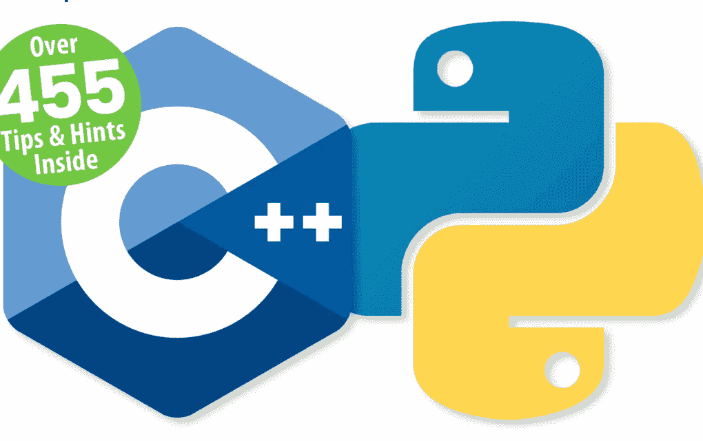

# 想要精通编程吗？

那就不要错过我们**全新**的编程与代码杂志，现已在 Readly 上线！

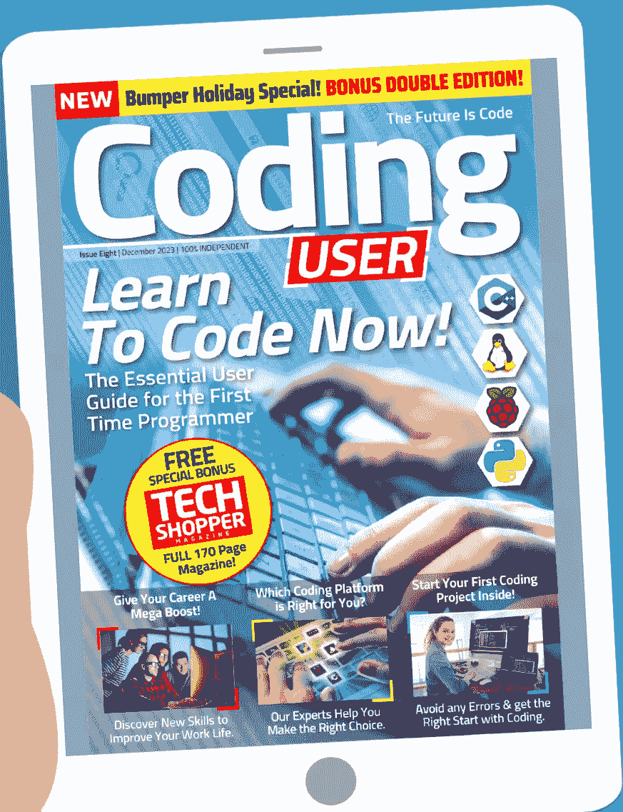

点击我们的便捷链接立即阅读：[https://bit.ly/3OcL1zx](https://bit.ly/3OcL1zx)

# C++ 与 Python 初学者教程


《C++ 与 Python 初学者编程指南》是您作为编程新手，想要学习入门所需一切知识的首选也是唯一选择。这本独立指南充满了实用的指南和图文并茂的分步教程，使用简单易懂的英语编写。在这本新用户指南中，您将清晰地学习到编写自己的精彩应用程序所需的一切知识。有了这本非官方操作手册在手，您在学习、探索和提升编程技能的过程中，将没有解决不了的问题，没有得不到解答的疑问。


Papercut

www.pclpublications.com

# 目录


# 6 你好，Python

- 8 为什么选择 Python？
- 10 你需要的设备
- 12 认识 Python
- 14 如何在 Windows 上设置 Python
- 16 如何在 Mac 上设置 Python
- 18 如何在 Linux 上设置 Python

# 20 Python 入门

- 22 第一次启动 Python
- 24 你的第一行代码
- 26 保存并执行你的代码
- 28 从命令行执行代码
- 30 数字与表达式
- 32 使用注释
- 34 使用变量
- 36 用户输入
- 38 创建函数
- 40 条件与循环
- 42 Python 模块

# 58 C++ 基础

- 60 你的第一个 C++ 程序
- 62 C++ 程序结构
- 64 编译与执行
- 66 使用注释
- 68 变量
- 70 数据类型
- 72 字符串
- 74 C++ 数学运算

# 44 你好，C++

- 46 为什么选择 C++？
- 48 所需设备
- 50 如何在 Windows 上设置 C++
- 52 如何在 Mac 上设置 C++
- 54 如何在 Linux 上设置 C++
- 56 其他可安装的 C++ IDE

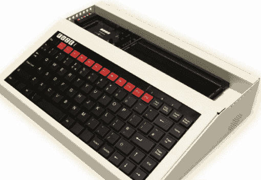

# 免费代码下载！

50 个完整程序
超过 20,000 行代码！

访问：www.pclpublications.com/exclusives
请注意：下载需要注册


> "...技术无处不在，一切都通过编程连接在一起。你的电视、微波炉、车载娱乐系统以及互联网本身，都依赖于良好的编程才能按照你想要的方式工作..."


# 你好，Python


# 你好，Python

有许多不同的编程语言可供学习和使用。有些复杂且功能极其强大，有些则非常基础，用作操作系统的辅助工具。Python 介于两者之间，兼具易用性和强大的功能，允许用户创建小型工具、一系列优秀的游戏以及高性能的计算任务。

然而，Python 的意义远不止是另一种编程语言。它背后有一个充满活力的社区，分享知识、代码和项目创意；以及为未来版本修复错误。正是得益于这个社区，这门语言得以成长和繁荣，现在轮到你投身其中，学习如何用 Python 编程了。

本书的前半部分帮助你开始使用最新版本的 Python，并指导你如何使用该语言一些最常见和有趣的功能。不久之后，你将能够编写自己的实用系统工具、文字冒险游戏，甚至控制一个角色在屏幕上移动。

# 为什么选择 Python？

现代计算机有许多不同的编程语言可供选择，一些较旧的 8 位和 16 位计算机也有可用的语言。其中一些语言是为科学工作设计的，另一些则用于移动平台等。那么，为什么在众多语言中选择 Python 呢？

## PYTHON 的力量

自从最早的家用计算机问世以来，爱好者、用户和专业人士就一直工作到深夜，埋头于一堆过热的电路中，试图创造出类似魔法的东西。

这些编程先驱们开辟了新的领域，编写了让字母 'A' 在屏幕上滚动的小程序。对于习惯了超高清图形和开放世界多人在线游戏的一代人来说，这可能听起来并不那么令人兴奋。然而，四十多年前，这却是极其耀眼的成就。

无论你使用的是 Android 设备、iOS 设备、PC、Mac、Linux、智能电视、游戏机、MP3 播放器、内置 GPS 设备的汽车、机顶盒，还是成千上万其他联网和“智能”设备，它们背后都是编程。

自然，这些卧室里的程序员帮助奠定了我们今天使用的每一项数字技术的基础。有些人后来成为顶级软件公司的首席开发人员，而另一些人则将可用硬件推向极限，创立了不断给我们带来惊喜的数十亿英镑的游戏帝国。

所有上述数字设备都需要指令来告诉它们该做什么，并允许与之交互。这些指令构成了设备的编程核心，而这个核心可以使用多种编程语言来构建。

当今使用的语言因情况、平台、设备用途以及设备如何与环境或用户交互而异。操作系统，如 Windows、macOS 等，通常是 C++、C#、汇编语言和某种基于可视化的语言的组合。游戏通常使用 C++，而网页可以使用多种可用语言，如 HTML、Java、Python 等。

更通用的编程用于创建程序、应用程序、软件，或者无论你想怎么称呼它们。它们广泛应用于所有硬件平台，几乎适用于所有可以想象的应用程序。有些运行速度比其他语言快，有些比其他语言更容易学习和使用。Python 就是这样一种通用语言。

Python 被称为高级语言，因为它使用各种数组、变量、对象、算术、子程序、循环和无数其他交互方式与硬件和操作系统“对话”。虽然它不像可以直接处理内存地址、调用栈和寄存器的低级语言那样精简，但它的优势在于普遍可访问且易于学习。

Python 创建于二十六年前，已经发展成为学习计算机编程的理想入门语言。它非常适合爱好者、学生、教师，以及那些只需要在自己或外部硬件与计算机本身之间创建独特交互的人。

Python 可以免费下载、安装和使用，适用于 Linux、Windows、macOS、MS-DOS、OS/2、BeOS、IBM i 系列机器，甚至 RISC OS。它被评为世界五大编程语言之一，并且持续发展，领先于硬件和互联网的发展曲线。

所以回答这个问题：为什么选择 Python？简单来说，它是免费的、易于学习、功能异常强大、被普遍接受、高效，并且是极佳的学习和教育工具。

```java
//file: Invoke.java
import java.lang.reflect.*;

class Invoke {
    public static void main( string [] args ) {
        try {
            Class c = Class.forName( args[0] );
            Method m = c.getMethod( args[1], new Class [] { } );
            Object ret = m.invoke( null, null );
            System.out.println(
                "Invoked static method: " + args[1]
                + " of class: " + args[0]
                + " with no args\nResults: " + ret );
        } catch ( ClassNotFoundException e ) {
            // Class.forName( ) can't find the class
        } catch ( NoSuchMethodException e2 ) {
            // that method doesn't exist
        } catch ( IllegalAccessException e3 ) {
            // we don't have permission to invoke that method
        } catch ( InvocationTargetException e4 ) {
            // an exception occured while invoking that method
            System.out.println(
                "Method threw an: " + e4.
                getTargetException( ) );
        }
    }
}
```

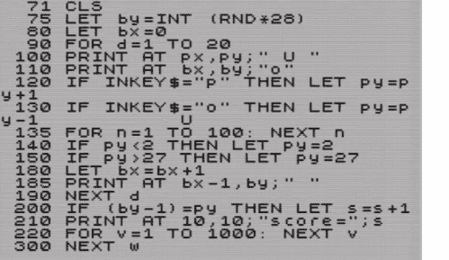

BASIC 曾经是早期 8 位家用计算机用户学习的入门语言。


Java 是一种强大的语言，用于网页、机顶盒、电视甚至汽车。

```python
print(HANGMAN[0])
attempts = len(HANGMAN) - 1

while (attempts != 0 and "-" in word_guessed):
    print(("\nYou have {} attempts remaining").format(attempts))
    joined_word = "".join(word_guessed)
    print(joined_word)

    try:
        player_guess = str(input("\nPlease select a letter between A-Z" + "\n> "))
    except: # check valid input
        print("That is not valid input. Please try again.")
        continue
    else:
        if not player_guess.isalpha(): # check the input is a letter. Also checks a
            print("That is not a letter. Please try again.")
            continue
        elif len(player_guess) > 1: # check the input is only one letter
            print("That is more than one letter. Please try again.")
            continue
        elif player_guess in guessed_letters: # check it letter hasn't been guessed
            print("You have already guessed that letter. Please try again.")
            continue
        else:
            pass

    guessed_letters.append(player_guess)

    for letter in range(len(chosen_word)):
        if player_guess == chosen_word[letter]:
            word_guessed[letter] = player_guess # replace all letters in the chosen

if player_guess not in chosen_word:
```

Python 是对 BASIC 的一种更现代的诠释，它易于学习，是理想的初学者编程语言。

# 你需要的设备

学习 Python 所需的硬件和初始资金投入非常少。你不需要一台性能超强的计算机，所需的任何软件都是免费可用的。

## 我们使用的工具

值得庆幸的是，Python 是一种多平台编程语言，适用于 Windows、macOS、Linux、Raspberry Pi 等系统。如果你拥有其中任何一种系统，就可以轻松开始使用 Python。


## 计算机

显然，你需要一台计算机来学习 Python 编程和测试代码。你可以使用 Windows（从 XP 版本开始）系统，无论是 32 位还是 64 位处理器，也可以使用 Apple Mac 或安装了 Linux 的 PC。

## 集成开发环境（IDE）

IDE（集成开发环境）用于输入和执行 Python 代码。它使你能够检查程序代码和代码中的值，并提供高级功能。有许多不同的 IDE 可供选择，因此请找到适合你并能提供最佳效果的 IDE。

## Python 软件

macOS 和 Linux 系统已经预装了 Python 作为操作系统的一部分，Raspberry Pi 也是如此。但是，你需要确保运行的是最新版本的 Python。Windows 用户需要下载并安装 Python，我们稍后会介绍。

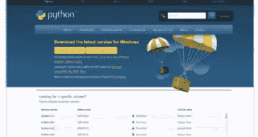

## 文本编辑器

虽然文本编辑器是输入代码的理想环境，但它并非绝对必需品。你可以直接从 IDLE 输入和执行代码，但文本编辑器（如 Sublime Text 或 Notepad++）在输入代码时提供更多高级功能和颜色编码。

## 互联网访问

Python 是一个不断发展的环境，因此新版本通常会引入新概念或更改现有命令和代码结构，使其成为更高效的语言。访问互联网可以让你保持最新状态，在遇到困难时提供帮助，并访问 Python 海量的模块。

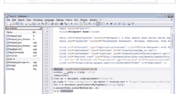

## 时间和耐心

尽管其他书籍可能让你相信，但你不会在 24 小时内成为一名程序员。学习 Python 编程需要时间和耐心。你有时可能会遇到困难，有时代码会像流水一样顺畅。要明白你正在学习全新的东西，你最终会成功的。

## Raspberry Pi

为什么使用 Raspberry Pi？Raspberry Pi 是一台微型计算机，购买价格非常便宜，但为用户提供了极佳的学习平台。其主要操作系统 Raspbian 预装了最新的 Python 以及许多模块和附加组件。

## Raspberry Pi

Raspberry Pi 5 是最新版本，采用了更强大的 CPU、更多内存、Wi-Fi 和蓝牙支持。你可以花大约 59 英镑购买一台 Pi 5，或者根据你感兴趣的 Pi 型号，作为套件的一部分购买。

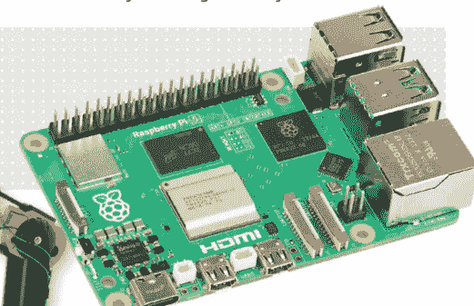

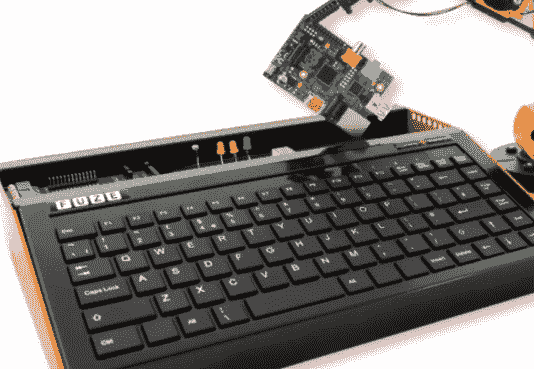

## FUZE 项目

FUZE 是一个基于最新 Raspberry Pi 型号构建的学习环境。你可以购买带有电子套件甚至机械臂的工作站，供你组装和编程。你可以在 www.fuze.co.uk 上找到更多关于 FUZE 的信息。

## 书籍

我们通过 www.pclpublications.com 提供几本优秀的编程书籍。我们的 Pi 书籍涵盖了如何购买你的第一台 Raspberry Pi、设置和使用它；还有一些很棒的分步项目示例和指南，帮助你充分利用 Raspberry Pi。

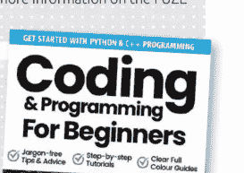

## Raspbian

Raspberry Pi 的主要操作系统是一个基于 Debian 的 Linux 发行版，它在一个易于使用的软件包中提供了你需要的一切。它针对 Pi 进行了优化，是硬件和软件项目、Python 编程甚至作为桌面计算机的理想平台。

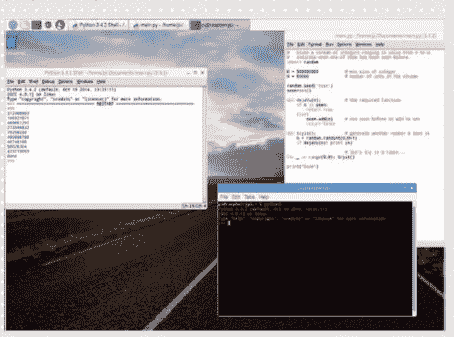

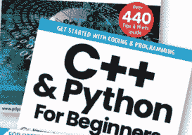

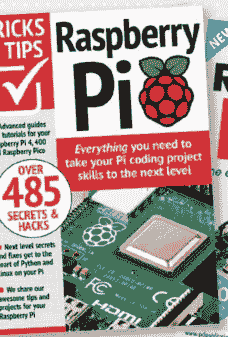

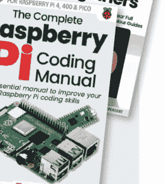

# 认识 Python

Python 是有史以来最伟大的计算机编程语言。它使你能够以一种简洁易懂的语言，充分利用计算机的强大功能。

## 什么是编程？

在尝试学习编程语言之前，了解什么是编程语言会有所帮助，Python 也不例外。让我们看看 Python 是如何诞生的，以及它与其他语言的关系。

PYTHON
编程语言是计算机遵循的一系列指令。这些指令可以像显示你的名字或播放音乐文件一样简单，也可以像构建整个虚拟世界一样复杂。Python 是一种编程语言，由荷兰 Centrum Wiskunde & Informatica（CWI）的 Guido van Rossum 在 1980 年代末构思，作为 ABC 语言的后继者。
Guido van Rossum，Python 之父。

## 编程食谱

程序就像计算机的食谱。一个烤蛋糕的食谱可能是这样的：
将 100 克自发粉放入碗中。
向碗中加入 100 克黄油。
加入 100 毫升牛奶。
烘烤半小时。

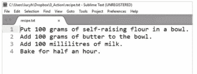

## 代码

就像食谱一样，程序由你按顺序遵循的指令组成。一个描述蛋糕的程序可能这样运行：

```
bowl = []
flour = 100
butter = 50
milk = 100
bowl.append([flour,butter,milk])
cake.cook(bowl)
```

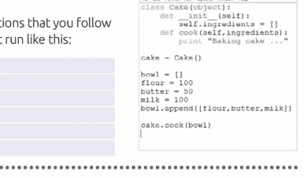

## 程序命令

你可能不理解一些 Python 命令，比如 `bowl.append` 和 `cake.cook(bowl)`。第一个是列表，第二个是对象；我们将在本书中介绍这两者。主要需要知道的是，Python 中的命令易于阅读。一旦你了解了命令的功能，就很容易弄清楚程序是如何工作的。

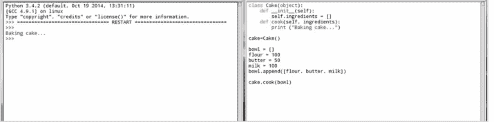


## 高级语言

易于阅读的计算机语言被称为“高级”语言。这是因为它们远离硬件（也称为“金属”）运行。像汇编语言这样“贴近金属”的语言被称为“低级”语言。低级语言的命令读起来有点像这样：`msg db ,0xa len equ $ - msg`。

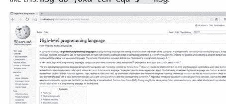

## Python 之禅

Python 让你能够以人类可以理解的语言访问计算机的所有强大功能。这一切背后是一种称为“Python 之禅”的理念。这是一组 20 条软件原则，影响着该语言的设计。原则包括“优美优于丑陋”和“简洁优于复杂”。在 Python 中输入 `import this`，它将显示所有原则。

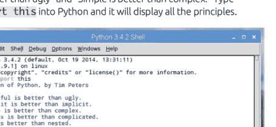

## Python 3 与 Python 2

在典型的计算场景中，Python 因为存在两个活跃版本的语言而变得有些复杂：Python 2 和 Python 3。

## Python 的世界

当你访问 Python 下载页面时，你会注意到有两个可用按钮：一个用于 Python 3.6.2，另一个用于 Python 2.7.13；这是撰写本文时的正确版本（请记住 Python 经常更新，因此你可能会看到不同的版本号）。

## Python 3.X

2008 年，Python 3 带来了几项新的和增强的功能。这些功能提供了更稳定、更有效和更高效的编程环境，但遗憾的是，这些新功能大多（如果不是全部）与 Python 2 的脚本、模块和教程不兼容。虽然起初并不流行，但 Python 3 后来已成为 Python 编程的前沿。

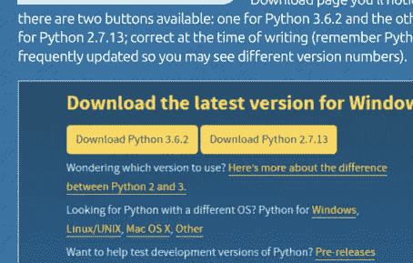

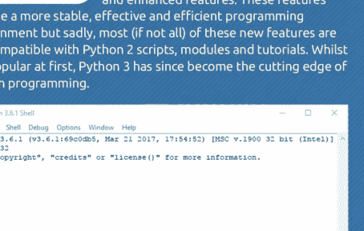

## Python 2.X

那么为什么有两个版本呢？嗯，Python 2 最初于 2000 年推出，此后采用了相当多的模块、脚本、用户、教程等。多年来，Python 2 迅速成为初学者和专家编程的首选语言之一，这使其成为极其宝贵的资源。

## 3.X 胜出

Python 3 日益增长的受欢迎程度意味着，现在开始学习使用新功能进行开发并逐步淘汰旧版本是明智的。许多开发公司，如 SpaceX 和 NASA，都使用 Python 3 来编写重要的代码片段。

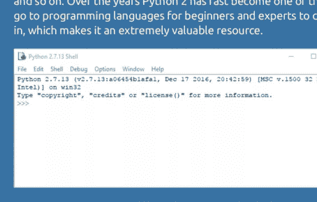

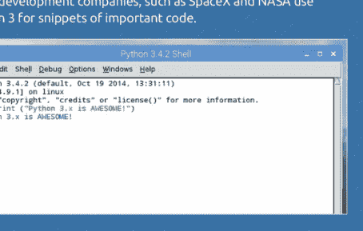

# 如何在 Windows 中设置 Python

Windows 用户可以通过 Python 官方下载页面轻松安装最新版本的 Python。尽管大多数经验丰富的 Python 开发者可能不会选择 Windows 作为构建代码的平台，但它仍然是初学者的理想起点。

## 安装 Python 3.X

Microsoft Windows 默认并未预装 Python，因此你需要手动安装。幸运的是，这个过程非常简单。

**步骤 1** 首先，打开你的网页浏览器，访问 **www.python.org/downloads/**。找到 Python 3.x.x 的下载链接按钮（在我们的示例中是 Python 3.6.2，但如前所述，你可能会看到更新的 3.x 版本）。

**步骤 2** 点击 3.x 版本的下载按钮，并将文件保存到你的“下载”文件夹。文件下载完成后，双击可执行文件，Python 安装向导将启动。在这里你有两个选择：立即安装和自定义安装。我们建议选择自定义安装链接。

**步骤 3** 选择自定义选项允许你指定某些参数，虽然你可能保持默认设置，但养成这个习惯是好的，因为有时（幸运的是 Python 安装程序不会）安装程序可能会包含不需要的附加功能。在第一个可用的屏幕上，确保所有复选框都被勾选，然后点击下一步按钮。

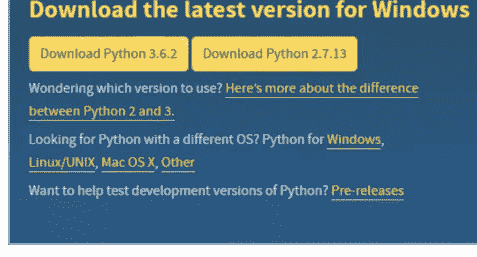

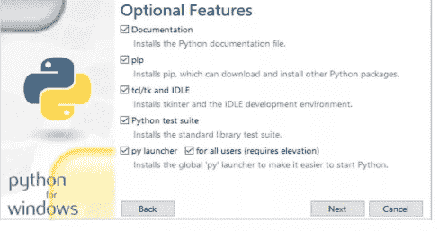

**步骤 4** 下一页选项包括一些对 Python 有用的附加功能。确保勾选“将文件与 Python 关联”、“创建快捷方式”、“将 Python 添加到环境变量”、“预编译标准库”和“为所有用户安装”选项。这些选项将使后续使用 Python 更加方便。准备好继续后，点击安装。

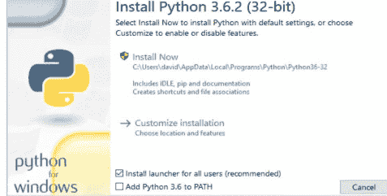

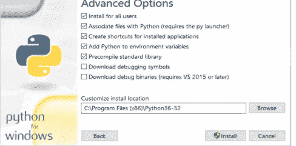

**步骤 5** 你可能需要通过 Windows 身份验证通知来确认安装。只需点击“是”，Python 将开始安装。安装完成后，最终的 Python 向导页面将允许你查看最新的发行说明，并跟随一些在线教程。

**步骤 6** 然而，在关闭安装向导窗口之前，最好点击“禁用路径长度限制”旁边的链接。这将允许 Python 绕过 Windows 的 260 字符限制，使你能够执行存储在深层文件夹结构中的 Python 程序。同样，点击“是”以验证该过程；然后你可以关闭安装窗口。

**步骤 7** Windows 10 用户现在可以在“开始”按钮的“最近添加”部分找到已安装的 Python 3.x。第一个链接“Python 3.6 (32-bit)”点击后将启动 Python 的命令行版本（稍后会详细介绍）。要打开 IDLE，请在 Windows 开始菜单中输入 IDLE。

**步骤 8** 点击“IDLE (Python 3.6 32-bit)”链接将启动 Python Shell，在这里你可以开始你的 Python 编程之旅。如果你的版本更新，不用担心，只要它是 Python 3.x，我们的代码就能在你的 Python 3 界面中运行。

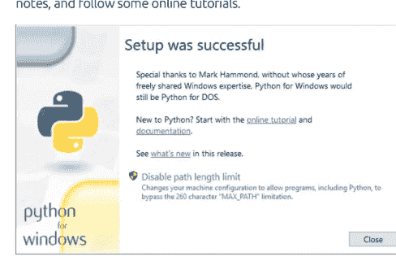

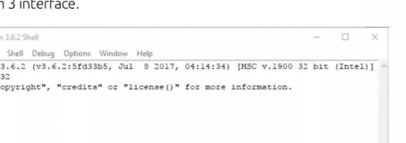

**步骤 9** 如果你现在再次点击 Windows 开始按钮，这次输入：CMD，你将看到命令提示符链接。点击它进入 Windows 命令行环境。要在命令行中进入 Python，你需要输入：python 并按回车键。

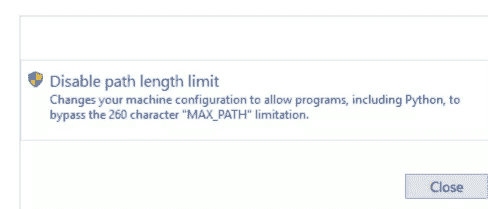

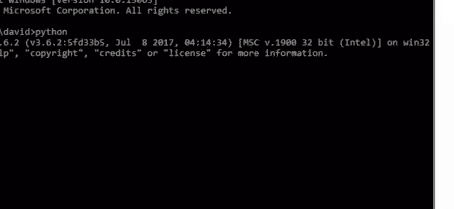

**步骤 10** Python 的命令行版本与你在步骤 8 中打开的 Shell 工作方式非常相似；注意三个向左的箭头（>>>）。虽然它是一个完全可用的环境，但用户友好性不高，所以暂时离开命令行。输入：exit() 以退出并关闭命令提示符窗口。

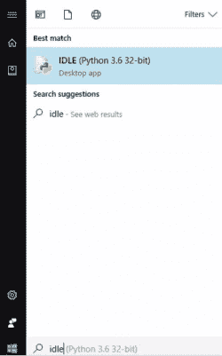

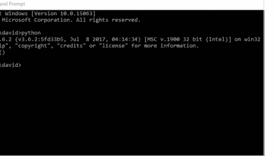

# 如何在 Mac 上设置 Python

如果你使用的是 Apple Mac，那么设置 Python 非常简单。事实上，系统已经安装了一个版本的 Python。但是，你应该确保运行的是最新版本。

## 安装 Python

Apple 的操作系统自带 Python，因此你不需要单独安装。然而，Apple 并不经常更新 Python，你可能运行的是一个较旧的版本。因此，最好先检查并更新。

**步骤 1** 通过点击“前往”>“实用工具”，然后双击“终端”图标，打开一个新的终端窗口。现在输入：`python --version`。你应该会看到“Python 2.5.1”甚至更新的版本，如果 Apple 更新了操作系统和 Python 安装。无论哪种方式，最好检查最新版本。

**步骤 2** 打开 Safari 并前往 **www.python.org/downloads**。就像前面页面的 Windows 设置过程一样，你可以看到两个黄色的下载按钮：一个用于 Python 3.6.2，另一个用于 Python 2.7.13。请注意，由于 Python 的频繁发布，版本号可能有所不同。

**步骤 3** 点击最新的 Python 3.x 版本，在我们的示例中是 Python 3.6.2 的下载按钮。这将自动下载最新版本的 Python，并根据你的 Mac 配置，它会自动启动安装向导。

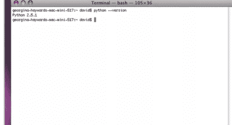

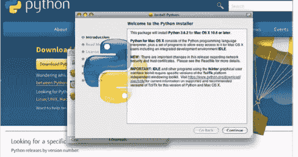

**步骤 4** Python 安装向导打开后，点击“继续”按钮开始安装。值得花点时间阅读“重要信息”部分，以防它提到了适用于你的 macOS 版本的内容。准备好后，再次点击“继续”。

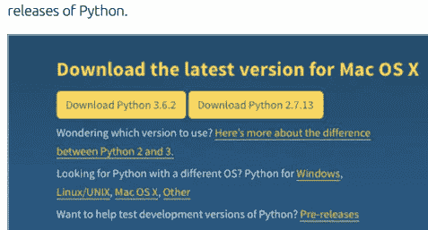

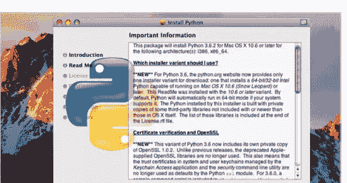

**步骤 5** 下一部分详细说明了软件许可协议，虽然对大多数人来说可能不太有趣，但值得一读。准备好后，再次点击“继续”按钮。

**步骤 6** 最后，你将看到 Python 将占用系统空间的大小以及一个“安装”按钮，你需要点击它来开始将 Python 3.x 实际安装到你的 Mac 上。你可能需要输入密码来验证安装过程。

**步骤 7** 安装不应该花费太长时间；我们在本节中使用的较旧的 Mac Mini 比现代的 Mac 机器稍慢，但只用了大约三十秒就显示了“安装成功”提示。

**步骤 8** Python 安装向导中没有太多其他事情可做，所以你可以点击“关闭”按钮。如果你现在回到终端会话并重新输入命令：`python3 --version`，你可以看到新版本现在已列出。要进入 Python 的命令行版本，你需要输入：`python3`。要退出，输入：`exit()`。

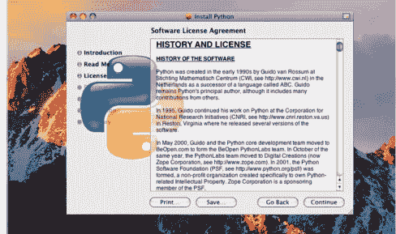

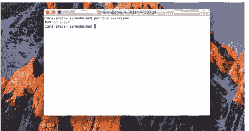

**步骤 9** 你需要在 Finder 中搜索 Python IDLE；找到后，点击它启动，它应该看起来与前面页面显示的 Windows IDLE 版本相似。唯一的区别是 Mac 检测到的运行硬件平台。

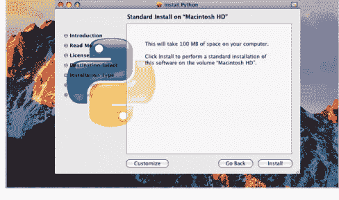

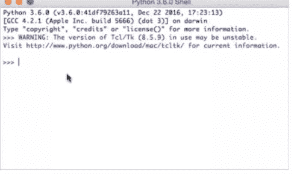

**步骤 10** 较旧的 Mac 版本可能无法很好地运行较新版本的 Python，在这种情况下，你需要回退到之前的 Python 3.x 构建版本；只要你使用的是 Python 3.x，本书中的代码就能为你工作。

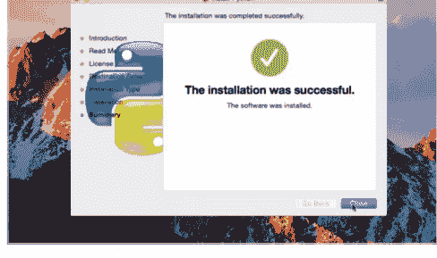

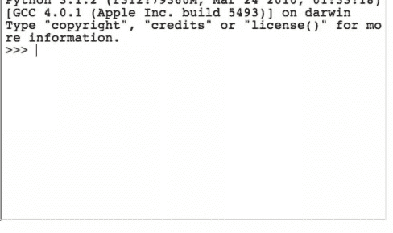

## 如何在 Linux 中设置 Python

大多数 Linux 发行版已经安装了 Python 2.x，但因为我们打算使用 Python 3.x，所以我们需要先做一些工作来获取它。幸运的是，这并不太困难。

## PYTHON PENGUIN

Linux 是一个如此通用的操作系统，以至于很难确定一种固定的方法来做某件事。不同的发行版以不同的方式安装软件，因此在本教程中，我们将坚持使用 Linux Mint 18.1。

**步骤 1** 首先，你需要确定你的 Linux 系统中当前安装的 Python 版本；如前所述，本节我们将使用 Linux Mint 18.1。与 macOS 类似，通过按 Ctrl+Alt+T 进入终端。

**步骤 2** 接下来，在终端屏幕中输入：`python --version`。你应该会在显示中看到与 Python 2.x 版本相关的输出。在我们的特定情况下是 Python 2.7.12。

**步骤 3** 一些 Linux 发行版会在系统更新时自动将 Python 安装更新到最新版本。要检查，首先使用以下命令进行系统更新和升级：

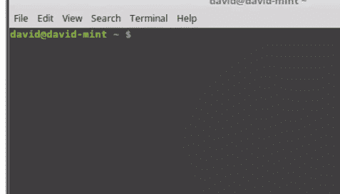

```bash
sudo apt-get update && sudo apt-get upgrade
```

输入你的密码，让系统进行任何更新。

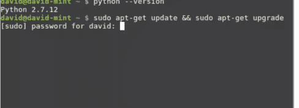

**步骤 4** 更新和升级完成后，你可能需要回答“Y”以授权任何升级，输入：`python3 --version` 查看 Python 3.x 是否已更新甚至已安装。以 Linux Mint 为例，我们拥有的版本是 Python 3.5.2，这完全满足我们的需求。

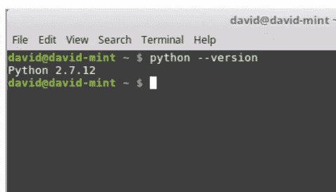

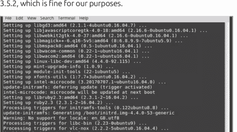

## 如何在 Linux 中设置 Python

**步骤 5** 然而，如果你想要最新版本，即撰写本文时 Python 官网上的 3.6.2 版本，你需要从源代码构建 Python。首先在终端中输入以下命令：

```
sudo apt-get install build-essential checkinstall
sudo apt-get install libreadline-gplv2-dev libncursesw5-dev libssl-dev libsqlite3-dev tk-dev libgdbm-dev libc6-dev libbz2-dev
```

**步骤 6** 打开你的 Linux 网页浏览器，访问 Python 下载页面：www.python.org/downloads。点击 "Download Python 3.6.2"（或你查看时的任何版本）以下载源代码文件 Python-3.6.2.tar.xz。

**步骤 7** 在终端中，通过输入以下命令进入下载文件夹：`cd Downloads/`。然后使用以下命令解压下载的 Python 源代码：`tar -xvf Python-3.6.2.tar.xz`。现在使用 `cd Python-3.6.2/` 进入新解压的文件夹。

**步骤 8** 在 Python 文件夹内，输入：

```
./configure
sudo make altinstall
```

这可能需要一些时间，具体取决于你的计算机速度。完成后，输入：`python3.6 --version` 以检查安装的最新版本。

**步骤 9** 对于图形界面 IDLE，你需要在终端中输入以下命令：

```
sudo apt-get install idle3
```

然后可以使用命令 `idle3` 启动 IDLE。请注意，IDLE 运行的版本与你从源代码安装的版本不同。

**步骤 10** 你还需要 PIP（Pip Installs Packages），这是一个帮助你安装更多模块和扩展的工具。

输入：`sudo apt-get install python3-pip`

然后 PIP 就安装好了；使用以下命令检查最新更新：

```
pip3 install --upgrade pip
```

完成后，关闭终端，Python 3.x 将通过你的发行版菜单中的 "Programming" 部分提供。

## Python 入门

Python 入门起初可能看起来有点令人生畏，但该语言的设计初衷就是简单。像大多数事情一样，你需要慢慢开始，学习如何获得结果以及如何从代码中获得你想要的东西。

在本节中，我们将介绍变量、数字和表达式、用户输入、条件和循环；以及你在使用 Python 期间可能遇到的错误类型。

## 首次启动 Python

我们将使用树莓派作为我们的 Python 3 硬件平台。最新版本的 Raspbian 预装了 Python 3，确切地说是 3.4.2 版本，因此只要你有一个版本 3 的 Shell，我们所有的代码都能运行。

### 启动 Python

我们不会详细介绍如何启动和运行树莓派，因为已经有很多关于该主题的材料。但是，一旦你准备好，启动你的 Pi 并准备编码。

**步骤 1** 加载 Raspbian 桌面后，点击 "Menu" 按钮，然后选择 Programming > Python 3 (IDLE)。这将打开 Python 3 Shell。Windows 和 Mac 用户可以从 Windows "Start" 按钮菜单和 Finder 中找到 Python 3 IDLE Shell。

**步骤 2** Shell 是你可以输入代码并查看你编程到 Python 中的代码的响应和输出的地方。这是一个沙盒环境，你可以在其中尝试一些简单的代码和流程。

**步骤 3** 例如，在 Shell 中输入：`2+2` 按下 Enter 后，下一行显示答案：`4`。基本上，Python 接收了 "代码" 并产生了相关的输出。

**步骤 4** Python Shell 的行为非常像计算器，因为代码基本上是一系列与系统的数学交互。整数，即无限的整数序列，可以轻松地进行加、减、乘等运算。

**步骤 5** 虽然这很有趣，但并不特别令人兴奋。相反，试试这个：
`print("Hello everyone!")`
就像我们在本书 "安装文本编辑器" 部分在 Sublime 中输入的代码一样。

**步骤 6** 这有点像样了，因为你刚刚产生了你的第一段代码。Print 命令相当不言自明，它打印内容。Python 3 需要括号和引号才能将内容输出到屏幕，在本例中是 "Hello everyone!" 部分。

```
>>> print("Hello everyone!")
Hello everyone!
>>> |
```

**步骤 7** 你可能已经注意到 Python IDLE 中的颜色编码。这些颜色代表 Python 代码的不同元素。它们是：
黑色 – 数据和变量
绿色 – 字符串
紫色 – 函数
橙色 – 命令
蓝色 – 用户函数
深红色 – 注释
浅红色 – 错误消息

| 颜色 | 用途 | 示例 |
|---|---|---|
| 黑色 | 数据和变量 | 23.6 area |
| 绿色 | 字符串 | "Hello World" |
| 紫色 | 函数 | len() print() |
| 橙色 | 命令 | if for else |
| 蓝色 | 用户函数 | get_area() |
| 深红色 | 注释 | #Remember VAT |
| 浅红色 | 错误消息 | SyntaxError: |

**步骤 8** Python IDLE 是一个可配置的环境。如果你不喜欢颜色的显示方式，你总是可以通过 Options > Configure IDLE 并点击 Highlighting 选项卡来更改它们。但是，我们不建议这样做，因为这样你就不会看到与我们截图相同的内容了。

**步骤 9** 就像大多数可用的程序一样，无论操作系统如何，都有许多快捷键可用。我们这里没有空间全部列出，但在 Options > Configure IDLE 下的 Keys 选项卡中，你可以看到当前绑定的列表。

**步骤 10** Python IDLE 是一个强大的接口，它实际上是使用可用的 GUI 工具包之一用 Python 编写的。如果你想了解 Shell 的许多细节，我们建议你花点时间查看 www.docs.python.org/3/library/idle.html，其中详细介绍了 IDLE 的许多功能。

# 你的第一段代码

本质上，你已经用上一个教程中的 `print("Hello everyone!")` 函数编写了你的第一段代码。然而，让我们扩展一下，看看如何输入你的代码并尝试一些其他的 Python 示例。

### 玩转 Python

对于大多数语言，无论是计算机语言还是人类语言，关键都在于记住并正确应用合适的词语。你并非生来就知道这些词语，所以你需要学习它们。

**步骤 1** 如果你关闭了 Python 3 IDLE，请在你喜欢的任何操作系统版本中重新打开它。在 Shell 中，输入熟悉的以下内容：
`print("Hello")`

**步骤 2** 正如预期的那样，单词 Hello 以蓝色文本出现在 Shell 中，表示来自字符串的输出。这相当直接，不需要太多解释。现在试试：
`print("2+2")`

**步骤 3** 你可以看到，输出的不是数字 4，而是你要求打印到屏幕上的 2+2。引号定义了输出到 IDLE Shell 的内容；要打印 2+2 的总和，你需要去掉引号：
`print(2+2)`

**步骤 4** 你可以继续这样做，将 2+2、464+2343 等打印到 Shell。一种更简单的方法是使用变量，这是我们稍后将更深入介绍的内容。现在，输入：
`a=2`
`b=2`

# 你的第一段代码

步骤 5 你在这里做的是为字母 a 和 b 赋予了两个值：2 和 2。它们现在是变量，只要数值保持不变，Python 就可以随时调用它们来进行输出、加法、减法、除法等操作。试试看：

```
print(a)
print(b)
```

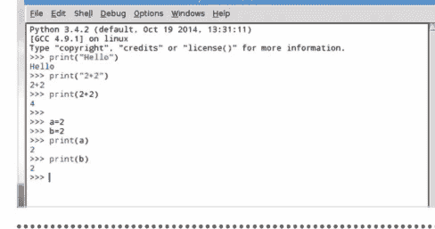

步骤 6 上一步的输出分别显示了 a 和 b 的当前值，因为你要求它们分别打印。如果你想将它们相加，可以使用以下代码：

```
print(a+b)
```

这段代码只是获取 a 和 b 的值，将它们相加并输出结果。

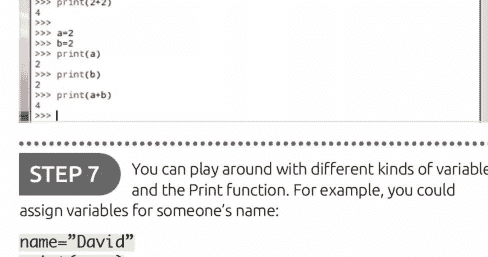

步骤 7 你可以尝试不同类型的变量和 Print 函数。例如，你可以为某人的名字赋值变量：

```
name="David"
print(name)
```

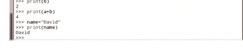

步骤 8 现在让我们添加一个姓氏：

```
surname="Hayward"
print(surname)
```

你现在有两个变量，分别包含一个名字和一个姓氏，你可以独立地打印它们。

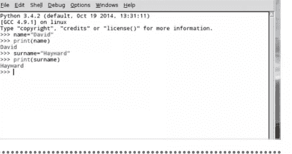

步骤 9 如果我们像之前一样使用 + 符号，名字在 Shell 中的输出将不会正确显示。试试看：

```
print(name+surname)
```

你需要在两者之间加一个空格，将它们定义为两个独立的值，而不是可以进行数学运算的东西。


步骤 10 在 Python 3 中，你可以使用逗号在两个变量之间添加空格：

```
print(name, surname)
```

或者，你可以自己添加空格：

```
print(name+" "+surname)
```

如你所见，使用逗号要简洁得多。恭喜，你刚刚迈出了进入广阔 Python 世界的第一步。


# 保存和执行你的代码

虽然在 IDLE Shell 中处理小代码片段完全没问题，但它并非为输入较长的程序清单而设计。在本节中，你将被介绍 IDLE 编辑器，从现在起你将在这里工作。

## 编辑代码

你最终会达到一个点，必须从在 Shell 中输入单行代码转向使用 IDLE 编辑器。IDLE 编辑器将允许你保存和执行你的 Python 代码。

**步骤 1** 首先，打开 Python IDLE Shell，当它启动后，点击 File > New File。这将打开一个名为 Untitled 的新窗口。这就是 Python IDLE 编辑器，你可以在其中输入创建未来程序所需的代码。

**步骤 2** IDLE 编辑器本质上是一个具有 Python 特性、颜色编码等功能的简单文本编辑器；与 Sublime 非常相似。你像在 Shell 中一样输入代码，所以以之前的教程为例，输入：

`print("Hello everyone!")`

**步骤 3** 你可以看到 IDLE 编辑器中与 Shell 中相同的颜色编码，这使你能够更好地理解代码的运行情况。但是，要执行代码，你需要先保存它。按 F5，你会打开一个 Save...Check 对话框。


**步骤 4** 点击 Save 对话框中的 OK 按钮，并选择一个保存所有 Python 代码的目的地。目的地可以是一个名为 Python 的专用文件夹，或者你可以随意存放。但请记住保持驱动器整洁，以便将来使用。


步骤 5 为你的代码输入一个名称，例如 'print hello'，然后点击 Save 按钮。一旦 Python 代码被保存，它就会被执行，输出结果将显示在 IDLE Shell 中。在这个例子中，是 'Hello everyone!' 这几个词。


步骤 6 这就是你将进行的绝大多数 Python 代码的操作方式。将其输入编辑器，按 F5，保存代码，然后在 Shell 中查看输出。有时情况会有所不同，这取决于你是否请求了一个单独的窗口，但本质上这就是这个过程。除非另有说明，这将是我们贯穿本书使用的过程。


步骤 7 如果你打开保存的 Python 代码的文件位置，你会看到它以 .py 扩展名结尾。这是默认的 Python 文件名。你创建的任何代码都将是 whatever.py，从众多互联网 Python 资源站点下载的任何代码也将是 .py。只需确保代码是为 Python 3 编写的。


步骤 8 让我们扩展代码，并输入上一教程中的几个示例：

```
python
a=2
b=2
name="David"
surname="Hayward"
print(name, surname)
print (a+b)
```

如果你现在按 F5，你会被要求再次保存文件，因为它已被修改。


步骤 9 如果你点击 OK 按钮，文件将被新的代码条目覆盖并执行，输出结果在 Shell 中。对于这几行代码来说这不是问题，但如果你要编辑一个较大的文件，覆盖可能会成为一个问题。相反，请在编辑器中使用 File > Save As 来创建备份。


步骤 10 现在创建一个新文件。关闭编辑器，并打开一个新实例（从 Shell 中选择 File > New File）。输入以下内容并将其保存为 hello.py：

```
python
a="Python"
b="is"
c="cool!"
print(a, b, c)
```

你将在下一个教程中使用此代码。


# 从命令行执行代码

虽然我们在本书中一直使用 GUI IDLE，但值得了解一下 Python 的命令行处理。我们已经知道有一个命令行版本的 Python，但它也用于执行代码。

## 命令代码

使用我们在上一教程中创建的代码，即我们命名为 hello.py 的那个，让我们看看如何在命令行级别运行在 GUI 中创建的代码。

**步骤 1** 在 Linux 中，Python 有两种通过命令行执行代码的可能方式。一种方式是使用 Python 2，而另一种使用 Python 3 库等。但首先，进入你操作系统上的命令行或终端。

**步骤 2** 和之前一样，我们使用的是树莓派；Windows 用户需要单击“开始”按钮并搜索 CMD，然后单击搜索返回的“命令行”；macOS 用户可以通过单击“前往” > “实用工具” > “终端”来访问他们的命令行。


**步骤 3** 现在你在命令行中，我们可以启动 Python。对于 Python 3，你需要输入命令 `python3` 并按 Enter。这将使你进入命令行版本的 Shell，带有熟悉的三个向右箭头作为光标（>>>）。


**步骤 4** 从这里你可以输入之前看过的代码，例如：

```
python
a=2
print(a)
```

你可以看到它的工作方式完全相同。


步骤 5 现在输入：exit() 以离开命令行 Python 会话并返回到命令提示符。进入你保存上一教程代码的文件夹，并列出其中可用的文件；你应该能看到 hello.py 文件。


步骤 6 在与你要运行的代码相同的文件夹中，在命令行中输入以下内容：

```
python3 hello.py
```

这将执行我们创建的代码，提醒你一下，代码是：

```
a="Python"
b="is"
c="cool!"
print(a, b, c)
```


步骤 7 自然，由于这是 Python 3 代码，使用了 Python 3 独有的语法和布局，它只有在你使用 python3 命令时才有效。如果你愿意，可以尝试使用 Python 2 运行相同的代码，输入：

```
python hello.py
```


步骤 8 从 Python 2 命令行运行 Python 3 代码的结果是显而易见的。虽然它没有以任何方式报错，但由于 Python 3 处理 Print 命令的方式与 Python 2 不同，结果并非我们所期望的。暂时使用 Sublime，打开 hello.py 文件。


步骤 9 由于 Sublime Text 不适用于树莓派，你将暂时离开树莓派，并使用 Sublime 作为示例，说明你不一定需要使用 Python IDLE。打开 hello.py 文件，将其修改为包含以下内容：

```
name=input("What is your name? ")
print("Hello,", name)
```


步骤 10 保存 hello.py 文件并返回到命令行。现在使用以下命令执行新保存的代码：

```
python3 hello.py
```

结果将是原始的 Python is cool! 语句，以及添加的 input 命令，该命令会询问你的名字，并在命令窗口中显示它。


## 数字与表达式

我们已经用 Python 见识了一些基础的数学表达式，比如简单的加法。现在让我们扩展一下，看看 Python 作为计算器有多么强大。你可以在 IDLE Shell 或编辑器中操作，随你喜欢。

## 全是数学，伙计

利用 Python 的数学运算能力，你可以得到一些非常令人印象深刻的结果；和大多数（如果不是所有）编程语言一样，数学是代码背后的驱动力。

**步骤 1** 打开 Python 3 的图形界面版本，如前所述，你可以使用 Shell 或编辑器。目前，我们将使用 Shell 来活动一下我们的数学肌肉，我们相信这是位于大脑后部的一个小腺体（或者不是）。


**步骤 2** 在 Shell 中输入以下内容：

2+2
54356+34553245
99867344*27344484221

你可以看到 Python 可以处理相当大的数字。


**步骤 3** 你可以使用所有常见的数学运算：除法、乘法、括号等等。练习几个，例如：

1/2
6/2
2+2*3
(1+2)+(3*4)


**步骤 4** 你无疑已经注意到，除法会产生一个十进制数。在 Python 中，这些被称为浮点数，或浮点运算。但是，如果你需要一个整数而不是十进制答案，那么你可以使用双斜杠：

1//2
6//2

等等。


**步骤 5** 你也可以使用一个运算来查看除法后剩下的余数。例如：
10/3
将显示 3.333333333，这当然是 3.3 循环。如果你现在输入：
10%3
这将显示 1，这是 10 除以 3 后剩下的余数。


**步骤 6** 接下来是幂运算符，或者如果你想专业一点，叫乘方。要计算某物的幂，你可以使用键盘上的双乘号或双星号：
2**3
10**10
本质上，它是 2x2x2，但我们相信你已经知道数学运算符背后的基础知识。这就是你在 Python 中计算它的方式。


**步骤 7** 数字和表达式不止于此。Python 有许多内置函数来计算数字集合、绝对值、复数以及大量的数学表达式和勾股定理绕口令。例如，要将一个数字转换为二进制，请使用：
bin(3)


**步骤 8** 这将显示为 '0b11'，将整数转换为二进制并在前面添加前缀 0b。如果你想移除 0b 前缀，那么你可以使用：
format(3, 'b')
Format 命令将一个值（数字 3）转换为由格式规范（'b' 部分）控制的格式化表示。


**步骤 9** 布尔表达式是一个逻辑语句，它要么为真，要么为假。我们可以用它们来比较数据并测试它是否等于、小于或大于。在一个新文件中试试这个：
a = 6
b = 7
print(1, a == 6)
print(2, a == 7)
print(3, a == 6 and b == 7)
print(4, a == 7 and b == 7)
print(5, not a == 7 and b == 7)
print(6, a == 7 or b == 7)
print(7, a == 7 or b == 6)
print(8, not (a == 7 and b == 6))
print(9, not a == 7 and b == 6)


**步骤 10** 执行步骤 9 中的代码，你可以看到一系列 True 或 False 语句，这取决于两个定义值 6 和 7 的结果。这是你所学内容的延伸，也是编程的重要组成部分。


## 使用注释

编写代码时，代码的流程、每个变量的作用、整个程序如何运行等等，都在你的脑海中。另一个程序员可以逐行跟踪代码，但随着时间的推移，它可能会变得难以阅读。

## #注释！

程序员使用一种方法来保持代码的可读性，即对某些部分进行注释。例如，如果使用了一个变量，程序员会注释它应该做什么。这只是良好的实践。

**步骤 1** 首先创建一个新的 IDLE 编辑器实例（文件 > 新建文件），并创建一个简单的变量和打印命令：

a=10
print("The value of A is,", a)

保存文件并执行代码。

**步骤 2** 运行代码将在 IDLE Shell 窗口中返回一行：The value of A is, 10，这正是我们所期望的。现在，添加一些你通常在代码中看到的注释类型：

# Set the start value of A to 10
a=10
# Print the current value of A
print("The value of A is,", a)

**步骤 3** 重新保存代码并执行它。你可以看到 IDLE Shell 中的输出仍然和以前一样，尽管添加了额外的行。简单地说，井号（#）表示程序员可以插入的一行文本，用于告知他们和其他人发生了什么，而用户不会意识到。


**步骤 4** 让我们假设我们创建的变量 A 是游戏中的生命数。每次玩家死亡，该值就减少 1。程序员可以插入一个类似这样的例程：

a=a-1
print("You've just lost a life!")
print("You now have", a, "lives left!")


**步骤 5** 虽然我们知道变量 A 是生命数，并且玩家刚刚失去了一条命，但一个随意的查看者或检查代码的人可能不知道。想象一下，代码有两万行，而不是只有我们的七行。你就能看出注释有多方便。


**步骤 6** 本质上，带有注释的新代码可能如下所示：

```python
# Set the start value of A to 10
a=10
# Print the current value of A
print("The value of A is, ", a)
# Player lost a life!
a=a-1
# Inform player, and display current value of A (lives)
print("You've just lost a life!")
print("You now have", a, "lives left!")
```


**步骤 7** 你可以以不同的方式使用注释。例如，块注释是详细说明代码中发生情况的大段文本，例如告诉代码阅读者你计划使用哪些变量：

```python
# This is the best game ever, and has been developed by a crack squad of Python experts
# who haven't slept or washed in weeks. Despite being very smelly, the code at least
# works really well.
```


**步骤 8** 行内注释是跟在代码段后面的注释。以我们上面的例子为例，我们不是将代码插入在单独的行上，而是可以使用：

```python
a=10 # Set the start value of A to 10
print("The value of A is, ", a) # Print the current value of A
a=a-1 # Player lost a life!
print("You've just lost a life!")
print("You now have", a, "lives left!") # Inform player, and display current value of A (lives)
```


**步骤 9** 注释，即井号，也可以用来注释掉你不想在程序中执行的代码部分。例如，如果你想移除第一个打印语句，你会使用：

```python
# print("The value of A is, ", a)
```


**步骤 10** 你也可以使用三个单引号来注释掉块注释或多行注释部分。将它们放在要注释区域的前后，它们就会生效：

```python
'''
This is the best game ever, and has been developed by a crack squad of Python experts who haven't slept or washed in weeks. Despite being very smelly, the code at least works really well.
'''
```


## 使用变量

我们已经在 Python 代码中见过一些变量的例子，但回顾一下它们的操作方式以及 Python 如何创建变量并为其赋值总是值得的。

## 各种变量

在本教程中，你将使用 Python 3 IDLE Shell。如果尚未打开，请打开 Python 3 或关闭之前的 IDLE Shell 以清除任何旧代码。

步骤 1 在某些编程语言中，你需要使用美元符号来表示字符串，即由多个字符组成的变量，例如一个人的名字。在 Python 中则没有必要。例如，在 Shell 中输入：`name="David Hayward"`（或使用你自己的名字，除非你也叫 David Hayward）。

步骤 2 你可以通过发出 `type()` 命令来检查正在使用的变量类型，将变量名放在括号内。在我们的例子中，这将是：`type(name)`。添加一个新的字符串变量：`title="Descended from Vikings"`。

步骤 3 你之前已经看到，变量可以使用变量名之间的加号进行连接。在我们的例子中，我们可以使用：`print(name + ": " + title)`。引号之间的中间部分允许我们添加一个冒号和一个空格，因为变量连接时没有空格，所以我们需要手动添加它们。

步骤 4 你也可以将变量组合到另一个变量中。例如，要将 name 和 title 变量组合成一个新变量，我们使用：

`character=name + ": " + title`

然后输出新变量的内容：

`print(character)`

数字存储为不同的变量：

`age=44`
`type(age)`

我们知道，这些是整数。

步骤 5 然而，你不能像处理一组相似变量那样，在同一个命令中组合字符串和整数类型的变量。你需要将其中一个转换为另一个，反之亦然。当你尝试同时组合两者时，你会收到错误消息：

```
print(name + age)
```

步骤 6 这是一个称为类型转换的过程。Python 代码是：

```
print(character + " is " + str(age) + " years old.")
```

或者你可以使用：

```
print(character, "is", age, "years old.")
```

再次注意，在最后一个例子中，你不需要在引号中的单词之间添加空格，因为逗号将每个参数单独传递给 print。

步骤 7 类型转换的另一个例子是当你从用户那里请求输入时，例如姓名。例如，输入：

```
age = input("How old are you? ")
```

从 input 命令存储的所有数据都作为字符串变量存储。

步骤 8 当你想处理用户输入的数字时，这会带来一点问题，因为 age + 10 由于是字符串变量和整数而无法工作。相反，你需要输入：

```
int(age) + 10
```

这将把 age 字符串类型转换为可以使用的整数。

步骤 9 在处理浮点数运算时，类型转换的使用也很重要；记住：带有小数点的数字。例如，输入：

```
shirt=19.99
```

现在输入 `type(shirt)`，你会看到 Python 将该数字分配为 'float'，因为该值包含小数点。

步骤 10 当组合整数和浮点数时，Python 通常将整数转换为浮点数，但如果反过来应用，值得记住的是 Python 不会返回确切的值。将浮点数转换为整数时，Python 总是向下舍入到最接近的整数，称为截断；在我们的例子中，19.99 变成了 19。

## 用户输入

我们从之前的几个例子中看到了一些基本的用户与代码的交互，所以现在是专注于如何从用户那里获取信息，然后存储和展示它的好时机。

## 用户友好

你希望从用户那里获得的输入类型在很大程度上取决于你正在编写的程序类型。例如，游戏可能会询问角色的名称，而数据库可以询问个人详细信息。

步骤 1 如果尚未打开，请打开 Python 3 IDLE Shell，并在编辑器中开始一个新文件。让我们从一些非常简单的东西开始，输入：
```
print("Hello")
firstname=input("What is your first name? ")
print("Thanks.")
surname=input("And what is your surname? ")
```

步骤 2 保存并执行代码，正如你无疑已经预料到的那样，在 IDLE Shell 中，程序将询问你的名字，将其存储为变量 firstname，然后是你的姓氏；也存储在其自己的变量（surname）中。

步骤 3 现在我们已经将用户的姓名存储在几个变量中，我们可以随时调用它们：
```
print("Welcome", firstname, surname, ". I hope you're well today.")
```

步骤 4 运行代码，你会看到一个小问题，姓氏后面的句点后面跟着一个空格。为了消除这一点，我们可以在代码中添加一个加号而不是逗号：
```
print("Welcome", firstname, surname+". I hope you're well today.")
```

步骤 5 你并不总是需要在 input 命令中包含带引号的文本。例如，你可以询问用户他们的名字，并在下面一行输入：
```
print("Hello. What's your name?")
name=input()
```

步骤 6 上一步的代码通常被认为比在 input 命令中包含大量文本更整洁一些，但这不是一成不变的规则，所以在这些情况下随你喜欢。扩展代码，试试这个：
```
print("Halt! Who goes there?")
name=input()
```

步骤 7 这也许是文字冒险游戏的一个好的开始？现在你可以扩展它，并使用用户的原始输入来稍微充实游戏：
```
if name=="David":
    print("Welcome, good sir. You may pass.")
else:
    print("I know you not. Prepare for battle!")
```

步骤 8 你在这里创建的是一个条件，我们很快就会讲到。简而言之，我们使用用户的输入并将其与一个条件进行衡量。因此，如果用户输入 David 作为他们的名字，守卫将允许他们不受阻碍地通过。否则，如果他们输入 David 以外的名字，守卫将挑战他们战斗。

步骤 9 正如你之前学到的，用户的任何输入都是自动作为字符串，所以你需要应用类型转换将其转换为其他类型。这为 input 命令带来了一些有趣的补充。例如：
```
# 计算速率和距离的代码
print("Input a rate and a distance")
rate = float(input("Rate: "))
```

步骤 10 为了完成速率和距离代码，我们可以添加：
```
distance = float(input("Distance: "))
print("Time:", (distance / rate))
```
保存并执行代码，输入一些数字。使用 `float(input)` 元素，我们告诉 Python 输入的任何内容都是浮点数而不是字符串。

## 创建函数

既然你已经掌握了变量和用户输入的使用，下一步就是处理函数。你已经使用过一些函数，例如 print 命令，但 Python 允许你定义自己的函数。

## 有趣的函数

函数是你输入到 Python 中以执行某些操作的命令。它是一小段自包含的代码，接收数据，对其进行处理，然后返回结果。

步骤 1 函数处理的不仅仅是数据。它们可以在 Python 中执行各种有用的操作，例如对数据进行排序、将项目从一种格式更改为另一种格式以及检查项目的长度或类型。基本上，函数是一个短词，后面跟着括号。例如，`len()`、`list()` 或 `type()`。

步骤 2 函数接收数据（通常是一个变量），根据函数编程的功能对其进行处理，并返回最终值。被处理的数据放在括号内，所以如果你想知道单词 antidisestablishmentarianism 中有多少个字母，你可以输入：`len("antidisestablishmentarianism")`，数字 28 将会返回。

步骤 3 你可以以类似的方式通过函数传递变量。假设你想知道一个人姓氏中的字母数量，你可以使用以下代码（为此示例进入文本编辑器）：

```
name=input("Enter your surname: ")
count=len(name)
print("Your surname has", count, "letters in it.")
```

按 F5 并保存代码以执行它。

步骤 4 Python 内置了数十个函数，由于篇幅有限，这里无法一一介绍。但是，要查看 Python 3 可用的内置函数列表，请访问 www.docs.python.org/3/library/functions.html。这些是预定义的函数，但由于用户创建了更多函数，它们并不是唯一可用的函数。

## 创建函数

第五步 可以通过模块为Python添加额外功能。Python拥有大量可用模块，能够覆盖众多编程任务。它们添加了函数，并可根据需要随时导入。例如，要使用高级数学函数，请输入：

```
import math
```

输入后，你就可以访问所有数学模块函数了。

第六步 要使用模块中的函数，请输入模块名称，后跟一个句点，然后是函数名称。例如，使用数学模块（因为你刚刚将其导入Python），你可以利用平方根函数。为此，请输入：

```
math.sqrt(16)
```

你可以看到代码的格式是 `模块.函数(数据)`。

## 创建函数

你可以导入许多由其他Python程序员创建的不同函数，未来你肯定会遇到一些优秀的例子；你也可以使用 `def` 命令创建自己的函数。

第一步 选择“文件” > “新建文件”进入编辑器，让我们创建一个名为 `Hello` 的函数，用于向用户问好。输入：

```
def Hello():
    print ("Hello")

Hello()
```

按 F5 保存并运行脚本。你可以在 Shell 中看到 `Hello`，输入 `Hello()` 它会返回这个新函数。

第二步 现在让我们扩展函数以接受一个变量，例如用户名。将你的脚本编辑为：

```
def Hello(name):
    print ("Hello", name)

Hello("David")
```

现在它将接受变量 `name`，否则它会打印 "Hello David"。在 Shell 中，输入：`name=("Bob")`，然后：`Hello(name)`。你的函数现在可以传递变量了。

第三步 要进一步修改，删除 `Hello("David")` 这一行（脚本的最后一行），然后按 Ctrl+S 保存新脚本。关闭编辑器并创建一个新文件（“文件” > “新建文件”）。输入以下内容：

```
from Hello import Hello

Hello("David")
```

按 F5 保存并执行代码。

第四步 你刚刚做的是从保存的 `Hello.py` 程序中导入 `Hello` 函数，然后用它向 David 问好。这就是模块和函数的工作方式：你导入模块，然后使用函数。试试这个，并修改它以获得额外加分：

```
def add(a, b):
    result = a + b
    return result
```

## 条件与循环

条件和循环使程序变得有趣；它们可以很简单，也可以相当复杂。你如何使用它们很大程度上取决于程序试图实现什么；它们可以是游戏中剩余的生命数，或者只是显示一个倒计时。

## 真值条件

从简单的条件开始，可以使学习编程成为一种更愉快的体验。那么，让我们从检查某事是否为真（TRUE）开始，如果不是，则执行其他操作。

第一步 让我们创建一个新的Python程序，它将要求用户输入一个单词，然后检查它是否是一个四字母单词。从“文件” > “新建文件”开始，并从输入变量开始：

```
word=input("Please enter a four-letter word: ")
```

第二步 现在我们可以创建一个新变量，然后使用 `len` 函数并将 `word` 变量传递给它，以获取用户刚刚输入的字母总数：

```
word=input("Please enter a four-letter word: ")
word_length=len(word)
```

第三步 现在你可以使用 `if` 语句检查 `word_length` 变量是否等于四，如果符合规则，则打印友好的确认信息：

```
word=input("Please enter a four-letter word: ")
word_length=len(word)
if word_length == 4:
    print (word, "is a four-letter word. Well done.")
```

双等号（`==`）表示检查某物是否等于另一物。

第四步 `IF` 末尾的冒号告诉Python，如果此语句为真，则执行冒号后所有缩进的内容。接下来，将光标移回编辑器开头：

```
word=input("Please enter a four-letter word: ")
word_length=len(word)
if word_length == 4:
    print (word, "is a four-letter word. Well done.")
else:
    print (word, "is not a four-letter word.")
```

第五步 按 F5 保存代码并执行它。首先在 Shell 中输入一个四字母单词，你应该会收到返回的消息，表明该单词是四个字母。现在再次按 F5 重新运行程序，但这次输入一个五字母单词。Shell 将显示它不是一个四字母单词。

第六步 现在扩展代码以包含另一个条件。最终，它可能变得相当复杂。我们添加了一个针对三字母单词的条件：

```
word=input("Please enter a four-letter word: ")
word_length=len(word)
if word_length == 4:
    print (word, "is a four-letter word. Well done.")
elif word_length == 3:
    print (word, "is a three-letter word. Try again.")
else:
    print (word, "is not a four-letter word.")
```

## 循环

循环看起来与条件非常相似，但它们在操作上有些不同。循环将多次运行同一代码块，通常由条件支持。

第一步 让我们从一个简单的 `While` 语句开始。像 `IF` 一样，它将检查某事是否为真，然后运行缩进的代码：

```
x = 1
while x < 10:
    print (x)
    x = x + 1
```

第二步 `if` 和 `while` 的区别在于，当 `while` 到达缩进代码的末尾时，它会返回并检查语句是否仍然为真。在我们的例子中，`x` 小于 10。每次循环时，它都会打印 `x` 的当前值，然后将该值加一。当 `x` 最终等于 10 时，它停止。

第三步 `For` 循环是另一个例子。`For` 用于遍历一系列数据，通常是存储在方括号内的变量列表。例如：

```
words=["Cat", "Dog", "Unicorn"]
for word in words:
    print (word)
```

第四步 `For` 循环也可以通过使用 `range` 函数用于倒计时示例：

```
for x in range (1, 10):
    print (x)
```

这里不需要 `x=x+1` 部分，因为 `range` 函数在第一个和最后一个数字之间创建了一个列表。

## Python 模块

我们之前提到过模块（数学模块），但由于模块是充分利用Python的重要组成部分，值得花更多时间来介绍它们。在此示例中，我们使用的是 Windows 版本的 Python 3。

## 掌握模块

将模块视为导入到你的Python代码中以增强和扩展其功能的扩展。有无数的模块可用，正如我们所看到的，你甚至可以制作自己的模块。

**第一步** 虽然很好，但Python内置的功能是有限的。然而，模块的使用使我们能够制作更复杂的程序。如你所知，模块是导入的Python脚本，例如 `import math`。

**第二步** 一些模块，尤其是在树莓派上，默认包含在内，数学模块就是一个主要例子。遗憾的是，其他模块并不总是可用。在非树莓派平台上的一个好例子是 `pygame` 模块，它包含许多帮助创建游戏的函数。尝试：`import pygame`。

**第三步** 结果是在 IDLE Shell 中出现错误，因为 `pygame` 模块未被识别或未安装在Python中。要安装模块，我们可以使用 PIP（Pip Installs Packages）。关闭 IDLE Shell 并进入命令提示符或终端会话。在提升的管理员命令提示符下，输入：`pip install pygame`。

**第四步** PIP 安装需要提升的权限，因为它会在不同位置安装组件。Windows 用户可以通过“开始”按钮搜索 CMD，右键单击结果，然后单击“以管理员身份运行”。Linux 和 Mac 用户可以使用 `sudo` 命令，例如 `sudo pip install package`。

## Python 模块

**步骤 5** 关闭命令提示符或终端，然后重新启动 IDLE Shell。现在当你输入：`import pygame` 时，该模块将毫无问题地导入到代码中。你会发现，大多数从互联网下载或复制的代码都会包含一个模块，其中大部分是独特的，这些通常是执行错误的来源，因为它们缺失了。

**步骤 6** 模块包含了在你自己的代码中实现特定结果所需的额外代码，正如我们之前实验过的那样。例如：

`import random`

引入了来自随机数生成器模块的代码。然后你可以使用这个模块来创建类似这样的东西：

`for i in range(10):`
`    print(random.randint(1, 25))`

**步骤 7** 这段代码在保存并执行后，将显示十个从 1 到 25 的随机数。你可以尝试修改代码以显示更多或更少的数字，以及从更大或更小的范围中选取。例如：

`import random`

`for i in range(25):`
`    print(random.randint(1, 100))`

**步骤 8** 你的代码中可以导入多个模块。为了扩展我们的示例，使用：

```
import random
import math

for i in range(5):
    print(random.randint(1, 25))

print(math.pi)
```

**步骤 9** 结果是一串随机数，后面跟着使用 `print(math.pi)` 函数从 math 模块中提取的圆周率值。你也可以使用 `from` 和 `import` 命令从模块中引入特定的函数，例如：

`from random import randint`

`for i in range(5):`
`    print(randint(1, 25))`

**步骤 10** 这有助于创建一种更精简的编程方法。你也可以使用 `import module*`，这将导入命名模块中定义的所有内容。然而，这通常被视为浪费资源，但它仍然有效。最后，模块可以作为别名导入：

`import math as m`

`print(m.pi)`

当然，添加注释有助于告诉其他人代码的功能。

## 向 C++ 问好

C++ 是一种高级编程语言，广泛应用于众多技术领域。从你喜爱的移动应用、主机和 PC 游戏，到整个操作系统，所有这些都是使用 C++ 以及一系列软件开发工具包和自定义库开发的。

C++ 是你日常使用的大部分技术背后的驱动力，这使得它成为一门复杂且功能异常强大的语言，需要深入掌握。在本节中，我们将探讨如何在你的计算机上安装 C++ IDE 和编译器。

## 为什么选择 C++？

C++ 是当今最受欢迎的编程语言之一。最初被称为“带类的 C”，该语言在 1983 年更名为 C++。它是原始 C 语言的扩展，是一个通用的面向对象编程环境。

## 一切皆 C

由于该语言的复杂性、强大的功能和高性能，C++ 常被用于开发游戏、程序、设备驱动程序，甚至整个操作系统。

C++ 的历史可以追溯到 1979 年，即家庭计算黄金时代的开端。C++，或者更准确地说是“带类的 C”，是丹麦计算机科学家 Bjarne Stroustrup 在攻读博士学位时的创意。Stroustrup 的计划是扩展自七十年代初以来被广泛使用的原始 C 语言。

C++ 在 80 年代的开发者中很受欢迎，因为它是一个更容易掌握的环境，更重要的是，它与原始 C 语言 99% 兼容。这意味着它可以用于主流计算实验室和无法访问大型机和大型计算数据中心的普通用户之外的领域。

C++ 在数字世界的影响是巨大的。许多程序、应用程序、游戏甚至操作系统都是用 C++ 编写的。例如，Adobe 的所有主要应用程序，如 Photoshop、InDesign 等，都是用 C++ 开发的。你会发现你用来上网的浏览器是用 C++ 编写的，Windows 10、Microsoft Office 以及 Google 搜索引擎的核心也是如此。Apple 的 macOS 主要用 C++ 编写（根据功能混合了一些其他语言），而 NASA、SpaceX 甚至 CERN 等机构也使用 C++ 进行各种应用程序、程序、控制和无数其他计算任务。

C++ 代码比 Python 代码快得多。

```
#include<iostream>
using namespace std;
void main()
{char ch;
cout<<"Enter a charater to check it is vowel or not";
cin>>ch;
switch(ch)
{
case 'a': case 'A':
cout<<ch<<" is a Vowel";
break;
case 'e': case 'E':
cout<<ch<<" is a Vowel";
break;
case 'i': case 'I':
cout<<ch<<" is a Vowel";
break;
case 'o': case 'O':
cout<<ch<<" is a Vowel";
break;
case 'u': case 'U':
cout<<ch<<" is a Vowel";
break;
```

Microsoft 的 Visual Studio 是一个学习 C++ 的绝佳免费环境。

C++ 也极其高效，整体性能出色，并且是核心 C 语言的更易上手的扩展。这种相对于 Python、BASIC 等其他语言的更高性能，使其成为现代计算的理想开发环境，因此上述公司广泛使用它。

虽然 Python 是一门很好的编程语言，但 C++ 将开发者带入了一个更广阔的编码世界。通过掌握 C++，你可以发现自己为 Microsoft、Apple 等公司开发代码。通常，C++ 开发者的薪资高于某些其他语言的程序员，并且由于其多功能性，C++ 程序员可以在不同的工作和公司之间转换，而无需重新学习任何特定的东西。然而，Python 是一门更容易入门的语言。如果你是编程新手，我们建议你从 Python 开始，花一些时间掌握编程结构，以及通过编程解决问题的多种方式和手段。一旦你能轻松地启动计算机，并且能单手写出一个 Python 程序，那么就可以转向 C++ 了。当然，没有什么能阻止你直接跳入 C++；如果你觉得能胜任这项任务，那就去做吧。

确实，你正在使用的操作系统就是用 C++ 编写的。

使用 C++ 和使用 Python 一样简单，你只需要一套合适的工具来用 C++ 与计算机通信，就可以开始你的旅程了。C++ IDE 是免费的，即使是 Microsoft 功能极其强大的 Visual Studio 也可以免费下载和使用。你可以从任何操作系统开始学习 C++，无论是 macOS、Linux、Windows 甚至是移动平台。

就像 Python 一样，要回答为什么选择 C++ 的问题，答案是因为它快速、高效，并且由你经常使用的大多数应用程序开发。它是尖端技术，是一门值得掌握的绝佳语言。

## 所需设备

你不需要投入大量资金来学习 C++，也不需要一个完整的计算实验室供你使用。只要你有一台相当现代的计算机，其他一切都是免费可用的。

## C++ 设置

大多数（如果不是全部）操作系统都在其代码中包含 C++，因此无论你当前使用什么操作系统，你都可以学习用 C++ 编程。

## 计算机

除非你想在纸上手写 C++ 代码（这是许多老程序员过去常做的事），否则计算机是绝对必需的组件。PC 用户可以使用任何较新的 Linux 发行版或 Windows 操作系统，Mac 用户可以使用最新的 macOS。

## IDE

与 Python 一样，IDE 用于输入和执行你的 C++ 代码。许多 IDE 附带扩展和插件，有助于使其工作得更好，或增加额外的功能级别。通常，IDE 会根据所使用的核心操作系统提供增强功能，例如针对 Windows 10 进行了优化。

## 编译器

编译器是一种将 C++ 语言转换为二进制代码的程序，以便计算机能够理解。虽然一些 IDE 内置了编译器，但其他 IDE 则没有。Code::Blocks 是我们最喜欢的 IDE，它附带了一个 C++ 编译器作为软件包的一部分。稍后会详细介绍。

## 文本编辑器

一些程序员更喜欢使用文本编辑器来组装他们的 C++ 代码，然后再通过编译器运行。本质上，你可以使用任何文本编辑器来编写代码，只需将其保存为 .cpp 扩展名即可。然而，Notepad++ 是目前最好的代码文本编辑器之一。

## 互联网访问

虽然完全可以在未连接互联网的计算机上学习编码，但这极其困难。你需要安装相关软件，保持其更新，安装任何额外的组件或扩展，并在编码时寻求帮助。所有这些都需要访问互联网。

## 时间和耐心

是的，与 Python 一样，你需要投入大量时间来学习如何用 C++ 编程。遗憾的是，除非你是天才，否则这不会在一夜之间发生，甚至一周内也不行。一个优秀的 C++ 程序员花费了多年时间磨练他们的技能，所以要有耐心，从小处着手，持续学习。

## 操作系统特定需求

C++ 可以在任何操作系统上运行，但将所有必要的组件整合在一起可能会让新手感到困惑。以下是一些针对 C++ 的操作系统特定说明。

## LINUX

Linux 用户很幸运，他们的操作系统已经内置了编译器和文本编辑器。任何文本编辑器都可以用来编写 C++ 代码，当文件保存为 .cpp 扩展名后，使用 g++ 进行编译。


## WINDOWS

我们之前提到过，一个不错的 IDE 是微软的 Visual Studio。然而，一个更好的 IDE 和编译器是 Code::Blocks，它每年会定期更新两次发布新版本。或者，Windows 用户可以在 Notepad++ 中输入代码，然后使用 Code::Blocks 所用的 MinGW 进行编译。


## RASPBERRY PI

树莓派的操作系统是 Raspbian，它基于 Linux。因此，你可以像在其他任何 Linux 发行版中一样，使用文本编辑器编写代码，然后用 g++ 进行编译。


## MAC

Mac 用户需要下载并安装 Xcode 才能原生编译他们的 C++ 代码。macOS 的其他选择包括 Netbeans、Eclipse 或 Code::Blocks。注意：由于缺乏 Mac 开发者，最新的 Code::Blocks 版本不适用于 Mac。


## 如何在 Windows 上设置 C++

Windows 用户在使用 C++ 编程时有丰富的选择。有许多 IDE 和编译器可用，包括微软的 Visual Studio。然而，在我们看来，最适合初学者的 C++ IDE 是 Code::Blocks。

### CODE::BLOCKS

Code::Blocks 是一个免费的 C++、C 和 Fortran IDE，功能丰富且易于通过插件扩展。它易于使用，自带编译器，并且背后有一个活跃的社区。

**步骤 1** 首先访问 Code::Blocks 下载网站：www.codeblocks.org/downloads。在那里，点击“下载二进制发布版”链接，跳转到适用于 Windows 的最新可下载版本。

**步骤 2** 你可以看到有几个 Windows 版本可用。你需要下载的是当前版本号以“mingw-setup.exe”结尾的那个。撰写本文时，该版本为：codeblocks-17.12mingw-setup.exe。区别在于 mingw-setup 版本包含了来自 TDM-GCC（一个编译器套件）的 C++ 编译器和调试器。

**步骤 3** 找到文件后，点击该行末尾的 Sourceforge.net 链接，会出现一个下载通知窗口；点击“保存文件”开始下载并将可执行文件保存到你的电脑。找到下载好的 Code::Blocks 安装程序，双击开始安装。按照屏幕上的说明进行安装。


**步骤 4** 同意许可条款后，会有几种安装选项可供选择。你可以选择较小的安装，跳过一些组件，但我们建议你默认选择“完整”选项。


**步骤 5** 接下来选择 Code::Blocks 文件的安装位置。这由你决定，但默认位置通常足够，除非你有特殊要求。点击“下一步”后，安装开始；完成后会弹出一个通知，询问你是否要立即启动 Code::Blocks，点击“是”。


**步骤 6** Code::Blocks 首次加载时，会自动检测你系统上可能已安装的任何 C++ 编译器。如果你没有安装任何编译器，点击第一个检测到的选项“GNU GCC Compiler”，然后点击“默认”按钮将其设置为系统的 C++ 编译器。准备好继续后，点击“确定”。


**步骤 7** 程序启动时会出现另一条消息，告知你 Code::Blocks 目前不是 C++ 文件的默认应用程序。你有几个选项：保持原样或允许 Code::Blocks 关联所有 C++ 文件类型。同样，我们建议你选择最后一个选项，将 Code::Blocks 与所有支持的文件类型关联。


**步骤 8** 在开始使用 Code::Blocks 之前，值得解释一下为什么需要额外的编译器。首先，编译器是一个独立的程序，它读取你的 C++ 代码并根据最新的可接受编程标准进行检查；这就是为什么你需要最新可用的编译器。目前是 C++17，C++20 正在进行中。


**步骤 9** 本质上，计算机只处理和理解二进制码，即 1 和 0，或称为机器语言。用二进制编程对人类来说效率不高。例如，在 C++ 中将“Hello World!”输出到屏幕，用二进制表示如下：

```
01100011 01101111 01110101 01110100 00100000
00111100 00111100 00100000 00100010 01101000
01100101 01101100 01101100 01101111 00100000
01010111 01101111 01110010 01101100 01100100
00100001 00100010 00111011
```


**步骤 10** 因此，编译器将你输入的 C++ 代码翻译成机器语言。要执行 C++ 代码，IDE 会“构建”代码，检查错误，然后将其传递给编译器以检查标准化并将其转换为计算机可以处理的 1 和 0。仔细想想，这确实相当巧妙。


## 如何在 Mac 上设置 C++

要在 Mac 上开始 C++ 编程，你首先需要安装苹果的 Xcode。这是一个免费的、功能齐全的 IDE，旨在创建原生的 Apple 应用程序。然而，你也可以用它相对轻松地创建 C++ 代码。

### XCODE

苹果的 Xcode 主要设计用于让用户使用 Swift 或 Objective-C 为 macOS、iOS、tvOS 和 watchOS 应用程序开发应用，但你也可以用它来编写 C++ 代码。

- **步骤 1：** 首先打开 Mac 上的 App Store，苹果菜单 > App Store。在搜索框中输入“Xcode”并按回车键。App Store 窗口中会显示许多建议，但你需要点击第一个选项“Xcode”。

- **步骤 2：** 花点时间浏览一下应用程序的信息，包括兼容性，以确保你拥有正确版本的 macOS。Xcode 需要 macOS 10.12.6 或更高版本才能安装和运行。

- **步骤 3：** 准备好后，点击“获取”按钮，该按钮会变成“安装 App”。输入你的 Apple ID，Xcode 就会开始下载和安装。这可能需要一些时间，具体取决于你的互联网连接速度。


- **步骤 4：** 安装完成后，点击“打开”按钮启动 Xcode。点击“同意”许可条款，并输入你的密码以允许 Xcode 对系统进行更改。完成后，Xcode 开始安装附加组件。


**步骤 5** 现在所有组件（包括附加组件）都已安装完毕，Xcode 启动，显示版本号以及三个选项和你最近处理过的任何项目；但如果是全新安装，这里会是空白的。


**步骤 6** 首先点击“创建新的 Xcode 项目”；这会打开一个模板窗口，让你选择为哪个平台开发代码。点击“macOS”标签页，然后点击“命令行工具”选项。点击“下一步”继续。


**步骤 7** 填写各个字段，但确保底部的“语言”选项设置为 C++；只需从下拉列表中选择它。填写完字段并确保选择了 C++ 作为语言后，点击“下一步”按钮继续。


**步骤 8** 下一步询问在哪里为所有未来的代码创建 Git 仓库。在你的 Mac 上选择一个位置，或一个网络位置，然后点击“创建”按钮。完成所有这些后，你就可以开始编码了。左侧窗格详细列出了你正在编写的 C++ 程序中使用的文件。点击列表中的 main.cpp 文件。


**步骤 9** 你可以看到 Xcode 已经自动为你完成了一个基本的 Hello World 程序。虽然目前可能意义不大，但随着你的深入学习，你会发现更多内容，这只是 Xcode 利用了 Mac 上可用的资源。


**步骤 10** 当你想运行代码时，点击“产品” > “运行”。你可能会被要求在 Mac 上启用开发者模式；这是为了授权 Xcode 执行功能而无需每次会话都输入密码。程序执行后，输出会显示在 Xcode 窗口的底部。


# 如何在 Linux 中设置 C++ 环境

Linux 是一个出色的 C++ 编程环境。大多数 Linux 发行版已经预装了必要的组件，例如编译器，而且文本编辑器非常适合输入代码，包括语法高亮；此外，还有大量额外的软件可供你使用。

## LINUX++

如果你不熟悉 Linux，我们建议你查看 BDM Publications 系列中的一本 Linux 书籍。如果你有树莓派，下面使用的命令同样适用，本示例中我们使用的是 Linux Mint。

**步骤 1** 第一步是确保 Linux 已为你的 C++ 代码做好准备，因此请检查系统和软件是否为最新版本。打开终端并输入：**sudo apt-get update && sudo apt-get upgrade**。然后按回车键并输入你的密码。这些命令会更新整个系统和所有已安装的软件。

**步骤 2** 大多数 Linux 发行版都预装了开始编写 C++ 所需的所有必要组件；不过，值得检查一下是否所有组件都已就绪。仍在终端中，输入：**sudo apt-get install build-essential** 并按回车键。如果你已有正确的组件，则不会安装任何内容；如果缺少某些组件，该命令会将其安装。

**步骤 3** 令人惊讶的是，就是这样。一切都已准备就绪，你可以开始编码了。以下是如何启动并运行你的第一个 C++ 程序。在 Linux Mint 中，主要的文本编辑器是 Xed，你可以通过点击菜单并在搜索栏中输入 Xed 来启动它。点击右侧面板中的“文本编辑器”按钮将其打开。

**步骤 4** 在 Xed 或你可能使用的任何其他文本编辑器中，输入构成你的 C++ Hello World 程序的代码行。它与 Mac 生成的代码略有不同：

```cpp
#include <iostream>
int main()
{
    //My first C++ program
    std::cout << "Hello World!\n";
}
```

**步骤 5** 输入代码后，点击“文件” > “另存为”，选择一个文件夹来保存你的程序。将文件命名为 helloworld.cpp（可以是任何名称，只要扩展名为 .cpp 即可）。点击“保存”继续。

**步骤 6** 首先要注意的是，Xed 已自动将其识别为 C++ 文件，因为文件扩展名现在设置为 .cpp。代码中存在语法高亮，如果你打开文件管理器，还可以看到该文件的图标上标有 C++。

**步骤 7** 代码保存后，再次进入终端。你需要导航到刚刚保存的 C++ 文件的位置。我们的示例在“文档”文件夹中，因此我们可以通过输入：**cd Documents** 来导航到该位置。请记住，Linux 终端区分大小写，因此必须正确输入任何大写字母。

**步骤 8** 在执行 C++ 文件之前，你需要先编译它。在 Linux 中，通常使用 g++，一个开源的 C++ 编译器；由于你现在与 C++ 文件位于同一文件夹中，请在终端中输入：**g++ helloworld.cpp** 并按回车键。

**步骤 9** 代码由 g++ 编译需要一点时间，但只要代码中没有错误，你就会返回到命令提示符。代码的编译创建了一个新文件。如果你在终端中输入：ls，你可以看到在你的 C++ 文件旁边有一个 a.out 文件。

**步骤 10** a.out 文件是编译后的 C++ 代码。要运行代码，请输入：**./a.out** 并按回车键。屏幕上会出现“Hello World!”字样。然而，a.out 这个名字不太友好。要在编译后将其重命名，你可以使用以下命令重新编译：**g++ helloworld.cpp -o helloworld**。这将创建一个名为 helloworld 的输出文件，可以通过以下命令运行：**./helloworld**。

# 其他可安装的 C++ IDE

如果你想尝试不同的方式来处理你的 C++ 代码，那么有很多选择可供你使用。Windows 是 C++ IDE 最多的平台，但 Mac 和 Linux 用户也有许多选择。

## 开发 C++

以下是十款值得研究的优秀 C++ IDE。你可以安装其中一个或全部，但请找到最适合你的那一个。

**ECLIPSE** Eclipse 是一款非常流行的 C++ IDE，为程序员提供了丰富的功能。它拥有出色、简洁的界面，易于使用，并且适用于 Windows、Linux 和 Mac。请访问 **www.eclipse.org/downloads/** 下载最新版本。如果遇到困难，请点击“需要帮助”链接获取更多信息。

**CODELITE** CodeLite 是一款免费且开源的 IDE，定期更新，适用于 Windows、Linux 和 macOS。它轻量、简单且功能极其强大。你可以在 **www.codelite.org/** 找到更多信息以及如何下载和安装。

**GNAT** GNAT Programming Studio (GPS) 是一款强大且直观的 IDE，支持测试、调试和代码分析。社区版是免费的，而专业版则需要付费；不过，社区版适用于 Windows、Mac、Linux 甚至树莓派。你可以在 **www.adacore.com/download** 找到它。

**NETBEANS** 另一个受欢迎的选择是 NetBeans。这是另一款出色的 IDE，功能丰富且使用愉快。NetBeans IDE 包含基于项目的 C++ 模板，使你能够使用动态和静态库构建应用程序。在 **www.netbeans.org/features/cpp/index.html** 了解更多信息。

**VISUAL STUDIO** 微软的 Visual Studio 是一款庞大的 C++ IDE，允许你为 Windows、Android、iOS 和 Web 创建应用程序。社区版可以免费下载和安装，但其他版本提供免费试用期。访问 www.visualstudio.com/ 查看它能为你做什么。

**ANJUTA** Anjuta DevStudio 是一款仅适用于 Linux 的 IDE，具有一些通常在付费软件开发工作室中才能找到的高级功能。它包含图形界面设计器、源代码编辑器、应用程序向导、交互式调试器等等。访问 www.anjuta.org/ 了解更多信息。

**QT CREATOR** 这款跨平台 IDE 旨在为桌面和移动环境创建 C++ 应用程序。它附带一个代码编辑器以及用于测试和调试的集成工具，还可以部署到你选择的平台。它不是免费的，但在购买前提供试用期：www.qt.io/qt-features-libraries-apis-tools-and-ide/。

**MONODEVELOP** 这款出色的 IDE 允许开发者为所有主要平台上的桌面和 Web 应用程序编写 C++ 代码。它拥有一个高级文本编辑器、集成调试器和一个可配置的工作台，以帮助你创建代码。它适用于 Windows、Mac 和 Linux，并且可以免费下载和使用：www.monodevelop.com/。

**DEV C++** Bloodshed Dev C++，尽管名字花哨，但是一款较旧的 IDE，仅适用于 Windows 系统。然而，许多用户称赞其简洁的界面以及简单直接的编码和编译方式。尽管已经有一段时间没有太多更新，但如果你想要一些不同的东西，它绝对值得考虑：www.bloodshed.net/devcpp.html。

**ULTIMATE++** Ultimate++ 是一款跨平台 C++ IDE，通过智能且积极地使用 C++ 来实现代码的快速开发。对于新手来说，它是一个复杂的 IDE，但在其复杂性背后隐藏着一种会让开发者为之倾倒的美感。在 www.ultimatepp.org/index.html 了解更多信息。

## C++ 基础

在本节中，你将开始理解 C++ 代码的结构，以及如何编译和执行这些代码。这些是 C++ 的基础知识，教你诸如使用注释、变量、数据类型、字符串以及如何使用 C++ 数学运算等基本内容。

它们是 C++ 程序的构建块。借助它们，你可以构建自己的代码，向屏幕输出内容，并存储和检索数据。

## 你的第一个 C++ 程序

你可能之前已经按照 Mac 和 Linux 的示例操作过，但从现在起，你将完全在 Windows 和 Code::Blocks 环境中工作。让我们从编写你的第一个 C++ 程序开始，迈出进入更广阔编程世界的第一小步。

### HELLO, WORLD!

在编程中，传统上第一个输入的代码是向屏幕输出 'Hello, World!' 这几个字。有趣的是，这可以追溯到 1968 年，使用一种名为 BCPL 的语言。

步骤 1 如前所述，本书后续的 C++ 代码将全部使用 Windows 10 和最新版本的 Code::Blocks。首先启动 Code::Blocks。打开后，点击 File > New > Empty File，或按键盘上的 Ctrl+Shift+N。

步骤 2 现在你可以看到一个空白屏幕，标签页显示为 *Untitled1，主 Code::Blocks 窗口左上角显示数字一。首先点击主窗口，使光标位于数字一旁边，然后输入：
#include <iostream>

步骤 3 目前它看起来没什么特别，甚至更让人摸不着头脑，但我们稍后会解释。现在点击 File > Save File As。在你的硬盘上创建或找到一个合适的位置，在 File Name 框中，将其命名为 helloworld.cpp。点击 Save as type 框并选择 C/C++ files。点击 Save 按钮。

步骤 4 你可以看到 Code::Blocks 现在改变了颜色编码，识别出该文件现在是 C++ 代码。这意味着可以从 Code::Blocks 仓库中自动选择代码。删除 #include <iostream> 这一行并重新输入。你可以看到自动选择框出现了。

步骤 5 命令的自动选择非常方便，可以避免潜在的输入错误。按 Return 键转到第 3 行，然后输入：
int main()
注意：括号之间没有空格。

步骤 6 在 int main() 下面的下一行，输入一个花括号：
{
这可以通过按 Shift 键和英国英语键盘布局上 P 键右边的键来完成。

步骤 7 注意 Code::Blocks 已经在下面几行自动创建了一个对应的闭合花括号，将这对括号连接起来，并且有轻微的缩进。这是由于 C++ 的结构决定的，这里是输入代码核心部分的地方。现在输入：
//My first C++ program

步骤 8 再次注意颜色编码的变化。在上一步的行尾按 Return 键，然后输入：
std::cout << "Hello, world!\n";

步骤 9 和之前一样，Code::Blocks 会自动补全你正在输入的代码，包括在你输入第一个引号时自动放置闭合引号。不要忘记行尾的分号；这是 C++ 程序中最重要的元素之一，我们将在下一节告诉你原因。现在，将光标向下移动到闭合花括号处，按 Return 键。

步骤 10 这就是你目前需要做的全部。它可能看起来并不特别惊人，但 C++ 最好分小块吸收。目前不要执行代码，因为你需要先了解 C++ 程序的结构；然后你就可以构建和运行代码了。现在，点击 Save，那个单独的软盘图标。

## C++ 程序的结构

C++ 有非常明确的结构和做事方式。遗漏任何东西，哪怕是一个小小的分号，你的整个程序都将无法编译和执行。许多专业程序员都曾因结构松散而栽跟头。

### #INCLUDE <C++ 结构>

学习编程基础，你开始理解程序的结构。不同语言的命令可能不同，但你将开始看到代码是如何工作的。

C++ 由丹麦学生 Bjarne Stroustrup 于 1979 年发明，作为他博士论文的一部分。最初 C++ 被称为 C with Classes，它为当时已经流行的 C 编程语言添加了特性，同时通过新的结构使其成为更用户友好的环境。

### #INCLUDE

C++ 程序的结构相当精确。每个 C++ 代码都以一个指令开始：**#include <>**。该指令指示预处理器包含一段标准 C++ 代码。例如：**#include <iostream>** 包含 iostream 头文件以支持输入/输出操作。

```
1  #include <iostream>
2
3
4
5
6
```

Bjarne Stroustrup，C++ 的发明者。

### INT MAIN()

**int main()** 启动一个函数的声明，该函数是一组名为 'main' 的代码语句。所有 C++ 代码都从 main 函数开始，无论它在代码中的实际位置如何。

```
1  #include <iostream>
2
3  int main()
4
5
6
```

### 花括号

开括号（花括号）可能是你以前没有遇到过的，特别是如果你习惯使用 Python。开括号表示主函数的开始，并包含属于该函数的所有代码。

```
1  #include <iostream>
2
3  int main()
4  {
5
6  }
```

### 注释

以双斜杠开头的行是注释。这意味着它们不会在代码中执行，并且会被编译器忽略。注释旨在帮助你，或者查看你代码的其他程序员，解释正在发生什么。有两种类型的注释：/* 用于多行注释，// 用于单行注释。

### <<

这里使用的两个尖括号是插入运算符。这意味着尖括号后面的所有内容都将被插入到 std::cout 语句中。在本例中，它们是 'Hello, world' 这几个字，当你编译和执行代码时，它们将显示在屏幕上。

### STD

虽然 **std** 代表完全不同的东西，但在 C++ 中它表示 Standard（标准）。它是 C++ 标准命名空间的一部分，涵盖了许多不同的语句和命令。你可以省略代码中的 std:: 部分，但必须在开头声明：using namespace std; 不能两者都用。例如：

```
#include <iostream>
using namespace std;
```

### 输出

接下来，"Hello, world!" 部分是我们希望在代码执行时出现在屏幕上的内容。你可以输入任何你喜欢的内容，只要它在引号内。括号不是必需的，但有些编译器坚持要求使用它们。\n 部分表示要插入一个新行。

```
//My first C++ program
cout << "Hello, world!\n"
```

### COUT

在这个例子中，我们使用 cout，它是标准命名空间的一部分，因此它出现在那里，因为你要求 C++ 从该特定命名空间使用它。Cout 意思是 Character OUTput（字符输出），它向屏幕显示或打印某些内容。如果我们省略 std::，则必须在代码开头声明它，如前所述。

### ; 和 }

最后，你可以看到函数代码块内的行（注释除外）都以分号结尾。这标志着语句的结束，C++ 中的所有语句都必须在末尾有一个分号，否则编译器将无法构建代码。最后一行有闭合花括号，表示主函数的结束。

## 编译与执行

你已经创建了第一个 C++ 程序，现在也理解了其结构背后的基础知识。让我们实际动手，编译并执行（或者如果你喜欢，也可以叫运行）这个程序，看看效果如何。

## 来自 C++ 的问候

从 Code::Blocks 编译和执行 C++ 代码非常简单；只需点击一个图标并查看结果即可。以下是具体步骤。

步骤 1 打开 Code::Blocks（如果尚未打开），并加载你之前保存的 Hello World 代码。确保没有可见的错误，例如 `std::cout` 行末尾缺少分号。

步骤 2 如果你的代码看起来与我们截图中的类似，那么请查看屏幕顶部的菜单栏。在最顶部的菜单中，你可以看到一组图标：一个黄色齿轮、一个绿色播放按钮以及一个齿轮/播放按钮组合。这些分别是构建、运行、构建并运行功能。

步骤 3 首先点击构建图标（黄色齿轮）。此时，你的代码已经通过 Code::Blocks 编译器运行并检查了任何错误。你可以通过查看底部窗口窗格来查看构建结果。任何关于代码质量的消息都会显示在这里。


步骤 4 现在点击运行图标（绿色播放按钮）。屏幕上会出现一个命令行框，显示文字：Hello, world!，后面是执行代码所花费的时间，并提示你按任意键继续。干得好，你刚刚编译并执行了你的第一个 C++ 程序。


步骤 5 在命令行框中按任意键将其关闭，返回到 Code::Blocks。让我们稍微修改一下代码。在 `#include` 行下方，输入：

```
using namespace std;
```

然后，删除 `cout` 行中的 `std::` 部分；如下所示：

```
cout << "Hello, world\n";
```


步骤 6 为了将新的更改应用到代码中，你需要重新编译、构建并再次运行它。不过，这次你可以直接点击构建/运行图标（组合的黄色齿轮和绿色播放按钮）。


步骤 7 正如我们在前面几页提到的，如果你已经在代码开头声明了 `using namespace std;`，那么就不需要 `std::cout`。我们本可以一开始就轻松点击构建/运行图标，但了解一下可用的选项是值得的。你还可以看到，通过构建和运行，文件已被保存。


步骤 8 在代码中故意制造一个错误。从 `cout` 行中删除分号，使其变为：

```
cout << "Hello, world!\n"
```


步骤 9 现在再次点击构建并运行图标以将更改应用到代码中。这次 Code::Blocks 拒绝执行代码，因为你引入了错误。在屏幕底部的日志窗格中，你会被告知错误信息，在本例中是：Expected ';' before '}' token，表示缺少分号。


步骤 10 替换分号，并在 `cout` 行下方，为你的代码输入一个新行：

```
cout << "And greetings from C++!\n";
```

`\n` 只是在最后一行输出文本下方添加一个新行。构建并运行代码，展示你的成果。


## 使用注释

虽然注释对于构成游戏、应用程序甚至整个操作系统的众多代码行来说似乎是一个次要元素，但实际上它们可能是最重要的因素之一。

## 注释的重要性

代码中的注释基本上是人类可读的描述，详细说明了代码在特定点正在做什么。它们听起来可能不是特别重要，但没有注释的代码是编程中许多令人沮丧的领域之一，无论你是专业人士还是刚刚开始。

简而言之，所有代码都应该以有效描述一行、一个部分或单个元素目的的方式进行注释。你应该养成尽可能多地添加注释的习惯，想象一个对编程一无所知的人可以拿起你的代码，仅通过阅读你的注释就能理解它要做什么。

在专业环境中，注释对于代码的成功以及最终公司的成功至关重要。在一个组织中，许多程序员与工程师、其他开发人员、硬件分析师等组成团队工作。如果你是为公司编写定制软件的团队的一员，那么当出现问题，需要其他团队成员接手并追踪以定位问题时，你的注释有助于节省大量时间。

设身处地为那些负责找出程序问题的人着想。该程序有超过 80 万行代码，分布在几个不同的模块中。你很快就会理解，从原始程序员那里获得一些帮助（以良好注释的形式）是多么必要。


最好的注释总是简洁的，并将代码逻辑地联系起来，详细说明当程序执行到这一行或部分时会发生什么。你不需要对每一行都进行注释。像 `if x==0` 这样的语句不需要你注释说“如果 x 等于零，那么做某事”；这对读者来说是显而易见的。然而，如果 x 等于零会极大地改变用户对程序的体验，例如，他们用完了生命，那么这肯定需要注释。

即使代码是你自己的，你也应该像要公开与他人分享一样编写注释。这样，当你再次回到那段代码时，总能理解你做了什么，或者哪里出错了，或者什么效果很好。

注释是良好的实践，一旦你理解了如何在需要的地方添加注释，你很快就会做得像第二天性一样自然。

```
DEFB 26h, 30h, 32h, 26h, 30h, 32h, 0, 0, 32h, 72h, 73h, 32h, 72h, 73h, 32h
DEFB 60h, 61h, 32h, 4Ch, 4Dh, 32h, 4Ch, 99h, 32h, 4Ch, 4Dh, 32h, 4Ch, 4Dh, 4Dh
DEFB 32h, 4Ch, 99h, 32h, 5Bh, 5Ch, 32h, 56h, 57h, 32h, 33h, 0Dh, 32h, 33h, 33h
DEFB 32h, 33h, 33h, 32h, 33h, 33h, 32h, 33h, 33h, 32h, 33h, 33h, 32h, 66h, 64h
DEFB 66h, 67h, 32h, 72h, 73h, 64h, 4Ch, 4Dh, 32h, 32h, 66h, 67h, 64h
DEFB 19h, 80h, 0, 19h, 80h, 81h, 32h, 80h, 0CBh, 0FFh
;
TSS8C:
DEFB 80h, 72h, 66h, 60h, 56h, 66h, 56h, 56h, 51h, 60h, 51h, 51h, 56h, 66h
DEFB 56h, 56h, 80h, 72h, 66h, 60h, 56h, 66h, 56h, 56h, 51h, 60h, 51h, 51h
DEFB 56h, 56h, 56h, 56h, 80h, 72h, 66h, 60h, 56h, 66h, 56h, 56h, 51h, 60h
DEFB 51h, 51h, 56h, 56h, 56h, 56h, 56h, 56h, 56h, 56h, 56h, 56h, 56h, 56h
DEFB 56h, 66h, 80h, 66h, 56h, 56h, 56h, 56h, 56h
;
; 游戏重新开始点
;
START: XOR A
LD (SHEET),A
LD (KEMP),A
LD (DEMO),A
LD (8845B),A
LD (88458),A
LD A,2 ;初始生命数
LD (NOMEN),A
LD HL,2448
SET 0,(HL)
LD HL,SCREEN
LD DE,SCREEN+1
LD BC,7FFh
LD (HL),0
LDIR
LD HL,0A000h ;标题屏幕位图
LD DE,SCREEN
LD BC,4096
LDIR
LD HL,SCREEN + 800h + 1*32 + 29
LD DE,HANDAT+64
LD BC,64
CALL COPYFIX
LD HL,0FC00h ;最后一个房间的属性
LD DE,ATTR ;(上三分之一)
LD BC,256
LDIR
LD HL,09E00h ;标题屏幕的属性
LD BC,512 ;(下三分之二)
LDIR
LD BC,31
LD DE
XOR A
R8621: IN E,(C)
OR E
DJNZ R8621 ;$-03
AND 20h
JR Z,R862F ;$+07
LD A,1
LD (KEMP),A
R862F: LD IY,T846E
CALL C92DC
JR NZ,L8684
XOR A
LD (EUGHGT),A
```

## C++ 注释

在 C++ 中注释涉及使用双斜杠 `//`，或者一个斜杠和一个星号 `/*`。你已经看过一些简单的例子，但这就是它们的工作方式。

步骤 1 以 Hello World 代码为例，你可以轻松地使用双斜杠对代码的不同部分进行注释：

```
//My first C++ program
cout << "Hello, world!\n";
```


步骤 2 然而，你也可以在代码行的末尾添加注释，以更好地描述正在发生的事情：

```
cout << "Hello, world!\n"; //This line outputs the words 'Hello, world!'. The \n denotes a new line.
```

请注意，你不需要在注释末尾加分号。这是因为它是代码中被编译器忽略的一行。


步骤 3 你可以使用斜杠和星号注释掉多行：

```
/* This comment can
    cover several lines
    without the need to add more slashes */
```

只需记住用相反的星号和斜杠结束块注释。


步骤 4 注释时要小心，尤其是块注释。很容易忘记添加结束的星号和斜杠，从而导致注释块内的任何代码失效。


步骤 5 显然，如果你尝试构建并执行代码，它会出错，抱怨缺少一个花括号 `}` 来结束代码块。如果你犯了几次这样的错误，那么回去修正可能会很耗时。幸运的是，Code::Blocks 中的颜色编码有助于区分注释和代码。


步骤 6 如果你使用块注释，在 C++ 中，一个好习惯是在注释块的每一新行前添加一个星号。这也有助于你记住在继续编写代码之前关闭注释块：

```
/* This comment can
 * cover several lines
 * without the need to add more slashes */
```


## 变量

在使用 C++ 与 Python 时，变量略有不同。在 Python 中，你可以简单地声明 'a' 等于 10，变量就被赋值了。然而，在 C++ 中，变量必须先声明其类型才能使用。

## 变量的声明

你可以通过在代码中使用语句来声明一个 C++ 变量。你可以声明几种不同类型的变量。以下是具体操作方法。

步骤 1 打开一个新的空白 C++ 文件，并输入通常的代码头：

```
#include <iostream>
using namespace std;

int main()
{
}
```

步骤 2 从简单开始，创建两个变量 a 和 b，一个值为 10，另一个为 5。你可以使用数据类型 `int` 来声明这些变量。在花括号内，输入：

```
int a;
int b;

a = 10;
b = 5;
```

步骤 3 你可以构建并运行代码，但它除了将值 10 和 5 存储到整数 a 和 b 中之外，不会做太多事情。要输出变量的内容，请添加：

```
cout << a;
cout << "\n";
cout << b;
```

`cout << "\n";` 部分只是在 10 和 5 的输出之间放置一个新行。

步骤 4 自然，你可以声明一个新变量，称之为 `result`，并输出一些简单的算术运算：

```
int result;
result = a + b;
cout << result;
```

按照截图将上述代码插入到代码中。

步骤 5 你可以在声明变量时立即为其赋值。你输入的代码可以像这样：

```
int a = 10;
int b = 5;
int result = a + b;
cout << result;
```

步骤 6 C++ 特有的是，你也可以使用以下方式在声明变量时立即为其赋值：

```
int a (10);
int b (5);
```

然后，从 C++ 2011 标准开始，使用花括号：

```
int result {a+b};
```

步骤 7 你可以创建全局变量，即在任何函数外部声明并在整个代码中的任何函数中使用的变量。到目前为止，你使用的都是局部变量：在函数内部使用的变量。例如：

```
#include <iostream>
using namespace std;
int StartLives = 3;
int main ()
{
    startLives = StartLives - 1;
    cout << StartLives;
}
```

步骤 8 上一步创建了变量 `StartLives`，这是一个全局变量。例如，在游戏中，玩家的生命值会根据他们的表现好坏而增减。当玩家重新开始游戏时，`StartLives` 会恢复到其默认状态：3。这里我们分配了 3 条生命，然后减去 1，剩下 2 条生命。

步骤 9 现代 C++ 编译器比大多数程序员所认为的要智能得多。虽然你可以为变量声明多种数据类型，但实际上你可以使用 `auto` 功能：

```
#include <iostream>
using namespace std;
auto pi = 3.141593;
int main()
{
    double area, radius = 1.5;
    area = pi * radius * radius;
    cout << area;
}
```

步骤 10 这里有几个新元素：首先，除非你转到“设置 > 编译器”并勾选标有“让 G++ 遵循 C++11 ISO C++ 语言标准 [-std=c++11]”的框，否则 `auto` 不会起作用。然后，新的数据类型 `double`，表示双精度浮点值。启用 C++11，然后构建并运行代码。结果应该是 7.06858。

## 数据类型

正如我们所看到的，变量存储程序员稍后可以调用并在需要时操作的信息。变量只是保留的内存位置，用于存储程序员根据所用数据类型分配的值。

## 数据的值

C++ 中程序员可以使用许多不同的数据类型，例如整数、浮点数、布尔值、字符等。普遍认为有七种基本数据类型，通常称为原始内置类型；但是，如果代码中需要，你可以创建自己的数据类型。

七种基本数据类型是：

| 类型 | 命令 |
|---|---|
| 整数 | `Integer` |
| 浮点数 | `float` |
| 字符 | `char` |
| 布尔值 | `bool` |
| 双精度浮点数 | `double` |
| 宽字符 | `wchar_t` |
| 无值 | `void` |

这些基本类型也可以使用以下修饰符进行扩展：Long、Short、Signed 和 Unsigned。基本上，这意味着修饰符可以扩展每种数据类型的最小和最大范围值。例如，`int` 数据类型的默认值范围是 -2147483648 到 2147483647，这是一个相当大的值，你同意吧。

现在，如果你使用其中一个修饰符，范围会改变：

- 无符号整数 = 0 到 4294967295
- 有符号整数 = -2147483648 到 2147483647
- 短整数 = -32768 到 32767
- 无符号短整数 = 0 到 65,535
- 有符号短整数 = -32768 到 32767
- 长整数 = -2147483647 到 2147483647
- 有符号长整数 = -2147483647 到 2147483647
- 无符号长整数 = 0 到 4294967295

自然，你可以不使用修饰符而直接使用基本类型，因为每种数据类型都提供了足够的范围。然而，尽可能使用修饰符被认为是良好的 C++ 编程实践。

但是，使用修饰符时存在一些问题。`double` 表示双精度浮点值，你可以用于极其精确的数字，但这些数字仅精确到小数点后第十五位。在 C++ 中使用 `cout` 函数显示此类数字时也存在问题，因为 `cout` 默认只输出前五位小数。你可以通过添加 `cout.precision()` 函数并在括号内添加一个值来解决这个问题，但即便如此，你仍然受到 `double` 数据类型精度的限制。例如，尝试这段代码：

```
#include <iostream>
using namespace std;
double PI = 3.141592653589793238463;

int main()
{
    cout << PI;
}
```

构建并运行代码，如你所见，输出仅为 3.14159，这代表了 `cout` 在此示例中的局限性。

你可以修改代码，包括前面提到的 `cout.precision` 函数，以获得更高的精度。使用以下代码将精度提高到 22 位小数：

```
#include <iostream>
using namespace std;
double PI = 3.141592653589793238463;

int main()
{
    cout.precision(22);
    cout << PI;
}
```

这主要是由于编译器中的二进制转换以及 IEEE 754 双精度标准占用 64 位数据，其中 52 位用于有效数字（浮点数中的有效数字），大约 3.5 位用于存储 0 到 9 的值。如果你将 53 除以 3.5，你会得到 15.142857 循环，即 15 位精度。

老实说，如果你正在创建需要精确到超过十五位小数的代码，那么你不会使用 C++，你会使用某种科学专用语言，并以 C++ 作为两种语言之间的连接纽带。

你可以使用一个名为 `typedef` 的类似别名的系统来创建自己的数据类型。例如：

```
#include <iostream>
using namespace std;
typedef int metres;

int main()
{
    metres distance;
    distance = 15;
    cout << "distance in metres is: " << distance;
}
```

这段代码执行时创建了一个名为 `metres` 的新 `int` 数据类型。然后，在主代码块中，有一个名为 `distance` 的新变量，它是一个整数；所以你基本上是在告诉编译器 `int` 还有另一个名字。我们将值 15 赋给 `distance` 并显示输出：distance in metres is 15。

一开始可能听起来有点令人困惑，但你使用 C++ 并创建自己的代码越多，它就变得越容易。

## 字符串

字符串是表示并保存字符序列的对象。例如，你可以在代码中设置一个通用问候语‘Welcome’，并将其作为字符串赋值，以便在程序中任意位置调用。

## 字符串理论

创建字符串有多种方式，这些方式历史上都源自最初的C语言，并且至今仍被C++支持。

**步骤 1** 要创建字符串，你需要使用 `char` 函数。打开一个新的C++文件，并以通常的头文件开始：

```
#include <iostream>
using namespace std;

int main ()
{
}
```

**步骤 2** 容易将字符串与数组混淆。这是一个数组，可以用空字符终止：

```
#include <iostream>
using namespace std;

int main ()
{
    char greet[8] = {'W', 'e', 'l', 'c', 'o', 'm', 'e', '\0'};
    cout << greet << "\n";
}
```

**步骤 3** 构建并运行代码，屏幕上会出现‘Welcome’。虽然这完全没问题，但它不是一个字符串。字符串是一个类，它定义了可以表示为字符流的对象，并且不需要像数组那样终止。因此，代码可以表示为：

```
#include <iostream>
using namespace std;

int main ()
{
    char greet[] = "Welcome";
    cout << greet << "\n";
}
```

**步骤 4** 在C++中，还有一个 `string` 函数，其工作方式大致相同。再次使用问候语代码，你可以输入：

```
#include <iostream>
using namespace std;

int main ()
{
    string greet = "Welcome";
    cout << greet << "\n";
}
```

**步骤 5** 使用 `string` 函数还可以应用许多不同的操作。例如，要获取字符串的长度，你可以使用：

```
#include <iostream>
using namespace std;

int main ()
{
    string greet = "Welcome";
    cout << "The length of the string is: ";
    cout << greet.size() << "\n";
}
```

**步骤 6** 你可以看到我们使用了 `greet.size()` 来输出字符串内容的长度，即字符的数量。当然，如果你将字符串命名为 `greet` 以外的其他名称，那么你需要更改命令以反映这一点。格式始终是 `字符串名.操作`。构建并运行代码以查看结果。

**步骤 7** 你当然可以将字符串相加，或者更准确地说，将它们组合成更长的字符串：

```
#include <iostream>
using namespace std;

int main ()
{
    string greet1 = "Hello";
    string greet2 = ", world!";
    string greet3 = greet1 + greet2;

    cout << greet3 << "\n";
}
```

**步骤 8** 正如你可能预期的那样，你可以混合使用整数并存储与字符串相关的内容。在这个例子中，我们创建了 `int length`，它存储 `string.size()` 的结果并将其输出给用户：

```
#include <iostream>
using namespace std;

int main ()
{
    int length;
    string greet1 = "Hello";
    string greet2 = ", world!";
    string greet3 = greet1 + greet2;

    length = greet3.size();

    cout << "The length of the combined strings is: " << length << "\n";
}
```

**步骤 9** 使用 `string` 函数提供的可用操作，你可以操作字符串的内容。例如，要从字符串中删除字符，你可以使用：

```
#include <iostream>
using namespace std;

int main ()
{
    string strg ("Here is a long sentence in a string.");
    cout << strg << '\n';

    strg.erase (10,5);
    cout << strg << '\n';

    strg.erase (strg.begin()+8);
    cout << strg << '\n';

    strg.erase (strg.begin()+9, strg.end()-9);
    cout << strg << '\n';
}
```

**步骤 10** 值得花些时间尝试不同的数字，这些数字代表字符串中的字符位置。有时，能否正确操作可能有些碰运气，因此熟能生巧。查看截图以了解代码的运行结果。

## C++ 数学

编程本质上是数学性的，正如你可能预期的那样，它提供了大量内置的、相当复杂的数学功能。C++ 为那些在代码中实现数学模型的人提供了很多东西。它可以极其复杂，也可以相对简单。

## C++ = MC²

基本的数学符号在 C++ 中的应用与在大多数其他编程语言中相同。然而，通过使用 C++ 数学库，你还可以计算平方根、幂、三角函数等等。

**步骤 1** C++ 的数学运算遵循与学校教授的相同模式，即乘法和除法优先于加法和减法。不过，你可以改变这一点。现在，创建一个新文件并输入：

```
#include <iostream>
using namespace std;

int main ()
{
    float numbers = 100;

    numbers = numbers + 10; // This adds 10 to the initial 100
    cout << numbers << "\n";

    numbers = numbers - 10; // This subtracts 10 from the new 110
    cout << numbers << "\n";
}
```

**步骤 2** 虽然简单，但它确实能让旧的数学思维活跃起来。注意我们使用了 `float` 作为 `numbers` 变量的类型。虽然你可以愉快地使用整数，但如果你突然开始使用小数，你将需要更改为 `float` 或 `double`，具体取决于所需的精度。运行代码并查看结果。

**步骤 3** 乘法和除法可以这样应用：

```
#include <iostream>
using namespace std;

int main ()
{
    float numbers = 100;

    numbers = numbers * 10; // This multiplies 100 by 10
    cout << numbers << "\n";

    numbers = numbers / 10; // And this divides 1000 by 10
    cout << numbers << "\n";
}
```

**步骤 4** 再次执行这段简单的代码并查看结果。虽然不是特别有趣，但这是进入 C++ 数学的开始。我们在这里使用了 `float`，所以你可以尝试修改代码，进行小数乘法，以及除法、加法和减法。

**步骤 5** 当你调用 C++ 数学库时，有趣的数学内容就来了。在这个头文件中，有数十个数学函数以及更多操作。从计算余弦到带两个参数的反正切，再到 PI 的值，应有尽有。你可以通过以下方式调用该头文件：

```
#include <iostream>
#include <cmath>
using namespace std;

int main ()
{
}
```

**步骤 6** 首先获取一个数的平方根：

```
#include <iostream>
#include <cmath>
using namespace std;

int main ()
{
    float number = 134;
    cout << "The square root of " << number << " is: " << sqrt(number) << "\n";
}
```

**步骤 7** 这里我们创建了一个新的 `float` 变量 `number`，并使用 `sqrt(number)` 函数来显示 134（变量 `number` 的值）的平方根。构建并运行代码，你的答案是 11.5758。

**步骤 8** 计算数的幂可以这样做：

```
#include <iostream>
#include <cmath>
using namespace std;

int main ()
{
    float number = 12;
    cout << number << " to the power of 2 is " << pow(number, 2) << "\n";
    cout << number << " to the power of 3 is " << pow(number, 3) << "\n";
    cout << number << " to the power of .08 is " << pow(number, 0.8) << "\n";
}
```

**步骤 9** 这里我们创建了一个值为 12 的 `float` 变量 `number`，而 `pow(变量, 幂)` 就是进行计算的地方。当然，你也可以不使用变量来计算幂和平方根。例如，`pow(12, 2)` 输出的值与代码中第一行 `cout` 的值相同。

**步骤 10** Pi 的值也存储在 `cmath` 头文件库中。可以通过 `M_PI` 函数调用它。在代码中输入 `cout << M_PI;`，你会得到 3.14159；或者你可以用它来计算：

```
#include <iostream>
#include <cmath>
using namespace std;

int main ()
{
    double area, radius = 1.5;
    area = M_PI * radius * radius;
    cout << area << "\n";
}
```

## 延伸阅读

现在你已经掌握了基础知识，可以在我们的进阶指南中提升并学习更多核心技能……


现已上线


www.pclpublications.com

## 初学者专区

技术指南现已登陆 Readly


如需查看完整书目列表，请访问：www.pclpublications.com

## 全场技术手册立省25%！

使用 Papercut 即享优惠


你不仅可以学习新技能、精通科技产品，现在还能享受所有编程与消费科技类数字及印刷指南手册**75折优惠**！

结账时只需使用以下专属优惠码：

NYHF23CN

www.pclpublications.com

C++ & Python 初学者指南
17 - ISBN: 978-1-912847-12-9
出版方：Papercut Limited
数字发行：Readly AB - www.readly.com
版权所有。未经出版方明确书面许可，不得以任何形式复制本出版物任何部分，不得将其存储于检索系统或整合至其他出版物、数据库或商业程序中。在任何情况下，未经出版方书面许可，不得将本出版物及其内容置于任何文件共享或检索系统，亦不得以任何方式销售、复制或交易。尽管我们致力于提供高质量信息，但 Papercut Limited 保留不承担本出版物文本中任何错误或不准确之处责任的权利。鉴于科技行业特性，出版方无法保证所有应用和软件能在每个设备版本上运行。购买者需自行判断本书及其内容是否适合其特定用途。封面上复制的应用图像仅用于设计目的，不代表实际内容。我们不发布赞助社论或付费社论内容。本书所有社论观点均为评论员个人意见，不代表出版方或其任何关联公司。因此出版方对社论观点和内容不承担责任。本出版物为非官方版本，内容不一定反映所含应用或产品制作方的观点或意见。本出版物100%为非官方版本。相关公司的所有版权、商标和注册商标均已确认。相关图形图像经品牌和产品方授权转载。本出版物内含的其他图像经 Shutterstock 许可转载。价格、国际供应情况、评级、标题和内容可能变更。所有信息在出版时均为准确。部分内容可能已在其他卷册或标题中出版过。

Papercut Limited
英格兰与威尔士注册号：04308513
广告合作 – 如需最新媒体资料包，请联系：
Brad France - brad@papercutltd.co.uk
网站 - www.pclpublications.com
国际授权 – Papercut Limited 拥有众多优质出版物，均可在全球范围内进行授权。
更多信息请电邮：james@papercutltd.co.uk