BEN FORTA & SHMUEL FORTA

# 代码船长

```python
secretCode=input("CODE:")
print("Kaboom!")
```

```python
for enemy in enemies:
    battle=enemy.fight()
```

```python
while (potion>0):
    invincibility=True
    flight=True
```

```python
bossLevel=[0x53,0x2e,0x4c,0x45,0x45]
```

```python
if dt.now() > detonationTime:
```

```python
print("Pow!")
```

```python
if enemy.defeated():
    level+=1
```

用Python释放你的编程超能力

BEN FORTA & SHMUEL FORTA

# 代码船长

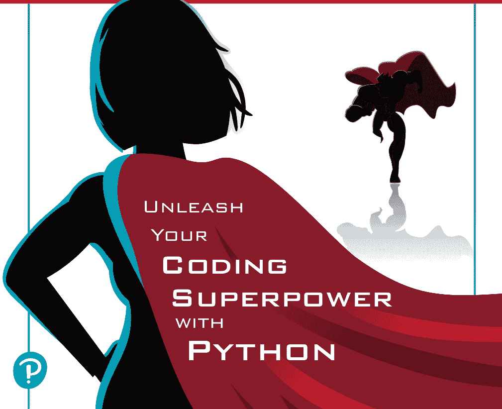

用Python释放你的编程超能力

制造商和销售商用于区分其产品的许多名称都声称是商标。在本书中出现这些名称时，如果出版商意识到存在商标声明，这些名称将以首字母大写或全部大写的形式印刷。

作者和出版商在准备本书时已尽心尽力，但不对任何类型的明示或暗示保证承担责任，也不对错误或遗漏负责。对于因使用本书所含信息或程序而引起的或与之相关的附带或间接损害，不承担任何责任。

有关批量购买本书的信息，或有关特殊销售机会（可能包括电子版本；定制封面设计；以及针对您的业务、培训目标、营销重点或品牌利益的特定内容），请通过 corpsales@pearsoned.com 或 (800) 382-3419 联系我们的企业销售部门。

有关政府销售咨询，请联系 governmentsales@pearsoned.com。

有关美国以外的销售问题，请联系 intlcs@pearson.com。

访问我们的网站：informit.com/

美国国会图书馆控制号：2021947621

版权 © 2022 Pearson Education, Inc.

保留所有权利。本出版物受版权保护，未经出版商事先许可，不得以任何形式或任何方式（电子、机械、影印、录音或类似方式）进行任何禁止的复制、存储在检索系统中或传输。有关权限、请求表以及 Pearson Education 全球权利与权限部门内适当联系人的信息，请访问 www.pearsoned.com/permissions/。

ISBN-13: 978-0-13-765357-7
ISBN-10: 0-13-765357-3

ScoutAutomatedPrintCode

**主编**
Mark Taub

**策划编辑**
Kim Spenceley

**开发编辑**
Chris Zahn

**执行编辑**
Sandra Schroeder

**高级项目编辑**
Lori Lyons

**封面设计师**
Chuti Prasertsith

**排版**
Kim Scott, Bumpy Design

**文字编辑**
Kitty Wilson

**制作经理**
Aswini Kumar/
Codemantra

**索引编制**
Timothy Wright

**校对**
Donna E. Mulder

## Pearson 对多元化、公平和包容的承诺

Pearson 致力于创建无偏见的内容，反映所有学习者的多样性。我们拥抱多元化的多个维度，包括但不限于种族、民族、性别、社会经济地位、能力、年龄、性取向以及宗教或政治信仰。

教育是推动世界公平与变革的强大力量。它有潜力提供改善生活和促进经济流动的机会。当我们与作者合作为每种产品和服务创建内容时，我们承认我们有责任展示包容性并融入多元化学术，以便每个人都能通过学习实现其潜力。作为全球领先的教育公司，我们有责任帮助推动变革，并履行我们的使命，帮助更多人创造更好的生活和更美好的世界。

我们的目标是为以下世界做出有目的的贡献：

-   每个人都有公平的终身学习机会，通过学习取得成功。
-   我们的教育产品和服务具有包容性，代表了学习者的丰富多样性。
-   我们的教育内容准确反映了我们所服务学习者的历史和经验。
-   我们的教育内容能引发与学习者的更深层次讨论，并激励他们扩展自己的学习（和世界观）。

虽然我们努力呈现无偏见的内容，但我们希望您就本 Pearson 产品的任何疑虑或需求与我们联系，以便我们进行调查和解决。

-   如有关于任何潜在偏见的疑虑，请通过 https://www.pearson.com/report-bias.html 联系我们。

## 内容概览

引言 . .............................................................................. xv

## 第一部分 乐趣与游戏

-   第1章  入门. ..................................................... 3
-   第2章  疯狂填词 . ............................................................. 21
-   第3章  掷骰子 . ......................................................... 35
-   第4章  计算日期 . ................................................. 51
-   第5章  石头剪刀布. ............................................. 69
-   第6章  密码 . ......................................................... 79
-   第7章  猜数字 . ............................................... 105
-   第8章  成为程序员 . .............................................. 121
-   第9章  吊死鬼游戏. ............................................................. 137
-   第10章  继续前进. ......................................................... 149

## 第二部分 冒险之旅

-   第11章  函数之趣 . .............................................. 163
-   第12章  探索. ........................................................... 177
-   第13章  清理时间 . .................................................... 193
-   第14章  减少、重用、回收、重构 . ................... 203
-   第15章  携带（并使用）物品. ............................... 223
-   第16章  保持优雅. ............................................... 241
-   第17章  为你的世界着色 . ............................................... 257
-   第18章  继续前进. ......................................................... 265

## 第三部分 环游世界

-   第19章  疯狂驾驶 . ...................................................... 285
-   第20章  图像化可能性. ............................... 301
-   第21章  我们喜欢移动它 . ........................................... 319
-   第22章  碰撞、撞击、爆炸 . ........................................... 329
-   第23章  最后的润色 . . . . . . . . . . . . . . . . . . . . . . 337
-   第24章  继续前进. ......................................................... 353
-   第25章  重新审视调试、测试和修复 . . . . . . . . . . . . . . . . . . . . . . . . . . . . . . . . . . . . . . . . . . . . . . . . . . . . . . . . . . . . . . . . . . . . . . . . . . . . . . . . . . . . . . . . . . . . . . . . . . . . . . . . . . . . . . . . . . . . . . . . . . . . . . . . . . . . . . . . . . . . . . . . . . . . . . . . . . . . . . . . . . . . . . . . . . . . . . . . . . . . . . . . . . . . . . . . . . . . . . . . . . . . . . . . . . . . . . . . . . . . . . . . . . . . . . . . . . . . . . . . . . . . . . . . . . . . . . . . . . . . . . . . . . . . . . . . . . . . . . . . . . . . . . . . . . . . . . . . . . . . . . . . . . . . . . . . . . . . . . . . . . . . . . . . . . . . . . . . . . . . . . . . . . . . . . . . . . . . . . . . . . . . . . . . . . . . . . . . . . . . . . . . . . . . . . . . . . . . . . . . . . . . . . . . . . . . . . . . . . . . . . . . . . . . . . . . . . . . . . . . . . . . . . . . . . . . . . . . . . . . . . . . . . . . . . . . . . . . . . . . . . . . . . . . . . . . . . . . . . . . . . . . . . . . . . . . . . . . . . . . . . . . . . . . . . . . . . . . . . . . . . . . . . . . . . . . . . . . . . . . . . . . . . . . . . . . . . . . . . . . . . . . . . . . . . . . . . . . . . . . . . . . . . . . . . . . . . . . . . . . . . . . . . . . . . . . . . . . . . . . . . . . . . . . . . . . . . . . . . . . . . . . . . . . . . . . . . . . . . . . . . . . . . . . . . . . . . . . . . . . . . . . . . . . . . . . . . . . . . . . . . . . . . . . . . . . . . . . . . . . . . . . . . . . . . . . . . . . . . . . . . . . . . . . . . . . . . . . . . . . . . . . . . . . . . . . . . . . . . . . . . . . . . . . . . . . . . . . . . . . . . . . . . . . . . . . . . . . . . . . . . . . . . . . . . . . . . . . . . . . . . . . . . . . . . . . . . . . . . . . . . . . . . . . . . . . . . . . . . . . . . . . . . . . . . . . . . . . . . . . . . . . . . . . . . . . . . . . . . . . . . . . . . . . . . . . . . . . . . . . . . . . . . . . . . . . . . . . . . . . . . . . . . . . . . . . . . . . . . . . . . . . . . . . . . . . . . . . . . . . . . . . . . . . . . . . . . . . . . . . . . . . . . . . . . . . . . . . . . . . . . . . . . . . . . . . . . . . . . . . . . . . . . . . . . . . . . . . . . . . . . . . . . . . . . . . . . . . . . . . . . . . . . . . . . . . . . . . . . . . . . . . . . . . . . . . . . . . . . . . . . . . . . . . . . . . . . . . . . . . . . . . . . . . . . . . . . . . . . . . . . . . . . . . . . . . . . . . . . . . . . . . . . . . . . . . . . . . . . . . . . . . . . . . . . . . . . . . . . . . . . . . . . . . . . . . . . . . . . . . . . . . . . . . . . . . . . . . . . . . . . . . . . . . . . . . . . . . . . . . . . . . . . . . . . . . . . . . . . . . . . . . . . . . . . . . . . . . . . . . . . . . . . . . . . . . . . . . . . . . . . . . . . . . . . . . . . . . . . . . . . . . . . . . . . . . . . . . . . . . . . . . . . . . . . . . . . . . . . . . . . . . . . . . . . . . . . . . . . . . . . . . . . . . . . . . . . . . . . . . . . . . . . . . . . . . . . . . . . . . . . . . . . . . . . . . . . . . . . . . . . . . . . . . . . . . . . . . . . . . . . . . . . . . . . . . . . . . . . . . . . . . . . . . . . . . . . . . . . . . . . . . . . . . . . . . . . . . . . . . . . . . . . . . . . . . . . . . . . . . . . . . . . . . . . . . . . . . . . . . . . . . . . . . . . . . . . . . . . . . . . . . . . . . . . . . . . . . . . . . . . . . . . . . . . . . . . . . . . . . . . . . . . . . . . . . . . . . . . . . . . . . . . . . . . . . . . . . . . . . . . . . . . . . . . . . . . . . . . . . . . . . . . . . . . . . . . . . . . . . . . . . . . . . . . . . . . . . . . . . . . . . . . . . . . . . . . . . . . . . . . . . . . . . . . . . . . . . . . . . . . . . . . . . . . . . . . . . . . . . . . . . . . . . . . . . . . . . . . . . . . . . . . . . . . . . . . . . . . . . . . . . . . . . . . . . . . . . . . . . . . . . . . . . . . . . . . . . . . . . . . . . . . . . . . . . . . . . . . . . . . . . . . . . . . . . . . . . . . . . . . . . . . . . . . . . . . . . . . . . . . . . . . . . . . . . . . . . . . . . . . . . . . . . . . . . . . . . . . . . . . . . . . . . . . . . . . . . . . . . . . . . . . . . . . . . . . . . . . . . . . . . . . . . . . . . . . . . . . . . . . . . . . . . . . . . . . . . . . . . . . . . . . . . . . . . . . . . . . . . . . . . . . . . . . . . . . . . . . . . . . . . . . . . . . . . . . . . . . . . . . . . . . . . . . . . . . . . . . . . . . . . . . . . . . . . . . . . . . . . . . . . . . . . . . . . . . . . . . . . . . . . . . . . . . . . . . . . . . . . . . . . . . . . . . . . . . . . . . . . . . . . . . . . . . . . . . . . . . . . . . . . . . . . . . . . . . . . . . . . . . . . . . . . . . . . . . . . . . . . . . . . . . . . . . . . . . . . . . . . . . . . . . . . . . . . . . . . . . . . . . . . . . . . . . . . . . . . . . . . . . . . . . . . . . . . . . . . . . . . . . . . . . . . . . . . . . . . . . . . . . . . . . . . . . . . . . . . . . . . . . . . . . . . . . . . . . . . . . . . . . . . . . . . . . . . . . . . . . . . . . . . . . . . . . . . . . . . . . . . . . . . . . . . . . . . . . . . . . . . . . . . . . . . . . . . . . . . . . . . . . . . . . . . . . . . . . . . . . . . . . . . . . . . . . . . . . . . . . . . . . . . . . . . . . . . . . . . . . . . . . . . . . . . . . . . . . . . . . . . . . . . . . . . . . . . . . . . . . . . . . . . . . . . . . . . . . . . . . . . . . . . . . . . . . . . . . . . . . . . . . . . . . . . . . . . . . . . . . . . . . . . . . . . . . . . . . . . . . . . . . . . . . . . . . . . . . . . . . . . . . . . . . . . . . . . . . . . . . . . . . . . . . . . . . . . . . . . . . . . . . . . . . . . . . . . . . . . . . . . . . . . . . . . . . . . . . . . . . . . . . . . . . . . . . . . . . . . . . . . . . . . . . . . . . . . . . . . . . . . . . . . . . . . . . . . . . . . . . . . . . . . . . . . . . . . . . . . . . . . . . . . . . . . . . . . . . . . . . . . . . . . . . . . . . . . . . . . . . . . . . . . . . . . . . . . . . . . . . . . . . . . . . . . . . . . . . . . . . . . . . . . . . . . . . . . . . . . . . . . . . . . . . . . . . . . . . . . . . . . . . . . . . . . . . . . . . . . . . . . . . . . . . . . . . . . . . . . . . . . . . . . . . . . . . . . . . . . . . . . . . . . . . . . . . . . . . . . . . . . . . . . . . . . . . . . . . . . . . . . . . . . . . . . . . . . . . . . . . . . . . . . . . . . . . . . . . . . . . . . . . . . . . . . . . . . . . . . . . . . . . . . . . . . . . . . . . . . . . . . . . . . . . . . . . . . . . . . . . . . . . . . . . . . . . . . . . . . . . . . . . . . . . . . . . . . . . . . . . . . . . . . . . . . . . . . . . . . . . . . . . . . . . . . . . . . . . . . . . . . . . . . . . . . . . . . . . . . . . . . . . . . . . . . . . . . . . . . . . . . . . . . . . . . . . . . . . . . . . . . . . . . . . . . . . . . . . . . . . . . . . . . . . . . . . . . . . . . . . . . . . . . . . . . . . . . . . . . . . . . . . . . . . . . . . . . . . . . . . . . . . . . . . . . . . . . . . . . . . . . . . . . . . . . . . . . . . . . . . . . . . . . . . . . . . . . . . . . . . . . . . . . . . . . . . . . . . . . . . . . . . . . . . . . . . . . . . . . . . . . . . . . . . . . . . . . . . . . . . . . . . . . . . . . . . . . . . . . . . . . . . . . . . . . . . . . . . . . . . . . . . . . . . . . . . . . . . . . . . . . . . . . . . . . . . . . . . . . . . . . . . . . . . . . . . . . . . . . . . . . . . . . . . . . . . . . . . . . . . . . . . . . . . . . . . . . . . . . . . . . . . . . . . . . . . . . . . . . . . . . . . . . . . . . . . . . . . . . . . . . . . . . . . . . . . . . . . . . . . . . . . . . . . . . . . . . . . . . . . . . . . . . . . . . . . . . . . . . . . . . . . . . . . . . . . . . . . . . . . . . . . . . . . . . . . . . . . . . . . . . . . . . . . . . . . . . . . . . . . . . . . . . . . . . . . . . . . . . . . . . . . . . . . . . . . . . . . . . . . . . . . . . . . . . . . . . . . . . . . . . . . . . . . . . . . . . . . . . . . . . . . . . . . . . . . . . . . . . . . . . . . . . . . . . . . . . . . . . . . . . . . . . . . . . . . . . . . . . . . . . . . . . . . . . . . . . . . . . . . . . . . . . . . . . . . . . . . . . . . . . . . . . . . . . . . . . . . . . . . . . . . . . . . . . . . . . . . . . . . . . . . . . . . . . . . . . . . . . . . . . . . . . . . . . . . . . . . . . . . . . . . . . . . . . . . . . . . . . . . . . . . . . . . . . . . . . . . . . . . . . . . . . . . . . . . . . . . . . . . . . . . . . . . . . . . . . . . . . . . . . . . . . . . . . . . . . . . . . . . . . . . . . . . . . . . . . . . . . . . . . . . . . . . . . . . . . . . . . . . . . . . . . . . . . . . . . . . . . . . . . . . . . . . . . . . . . . . . . . . . . . . . . . . . . . . . . . . . . . . . . . . . . . . . . . . . . . . . . . . . . . . . . . . . . . . . . . . . . . . . . . . . . . . . . . . . . . . . . . . . . . . . . . . . . . . . . . . . . . . . . . . . . . . . . . . . . . . . . . . . . . . . . . . . . . . . . . . . . . . . . . . . . . . . . . . . . . . . . . . . . . . . . . . . . . . . . . . . . . . . . . . . . . . . . . . . . . . . . . . . . . . . . . . . . . . . . . . . . . . . . . . . . . . . . . . . . . . . . . . . . . . . . . . . . . . . . . . . . . . . . . . . . . . . . . . . . . . . . . . . . . . . . . . . . . . . . . . . . . . . . . . . . . . . . . . . . . . . . . . . . . . . . . . . . . . . . . . . . . . . . . . . . . . . . . . . . . . . . . . . . . . . . . . . . . . . . . . . . . . . . . . . . . . . . . . . . . . . . . . . . . . . . . . . . . . . . . . . . . . . . . . . . . . . . . . . . . . . . . . . . . . . . . . . . . . . . . . . . . . . . . . . . . . . . . . . . . . . . . . . . . . . . . . . . . . . . . . . . . . . . . . . . . . . . . . . . . . . . . . . . . . . . . . . . . . . . . . . . . . . . . . . . . . . . . . . . . . . . . . . . . . . . . . . . . . . . . . . . . . . . . . . . . . . . . . . . . . . . . . . . . . . . . . . . . . . . . . . . . . . . . . . . . . . . . . . . . . . . . . . . . . . . . . . . . . . . . . . . . . . . . . . . . . . . . . . . . . . . . . . . . . . . . . . . . . . . . . . . . . . . . . . . . . . . . . . . . . . . . . . . . . . . . . . . . . . . . . . . . . . . . . . . . . . . . . . . . . . . . . . . . . . . . . . . . . . . . . . . . . . . . . . . . . . . . . . . . . . . . . . . . . . . . . . . . . . . . . . . . . . . . . . . . . . . . . . . . . . . . . . . . . . . . . . . . . . . . . . . . . . . . . . . . . . . . . . . . . . . . . . . . . . . . . . . . . . . . . . . . . . . . . . . . . . . . . . . . . . . . . . . . . . . . . . . . . . . . . . . . . . . . . . . . . . . . . . . . . . . . . . . . . . . . . . . . . . . . . . . . . . . . . . . . . . . . . . . . . . . . . . . . . . . . . . . . . . . . . . . . . . . . . . . . . . . . . . . . . . . . . . . . . . . . . . . . . . . . . . . . . . . . . . . . . . . . . . . . . . . . . . . . . . . . . . . . . . . . . . . . . . . . . . . . . . . . . . . . . . . . . . . . . . . . . . . . . . . . . . . . . . . . . . . . . . . . . . . . . . . . . . . . . . . . . . . . . . . . . . . . . . . . . . . . . . . . . . . . . . . . . . . . . . . . . . . . . . . . . . . . . . . . . . . . . . . . . . . . . . . . . . . . . . . . . . . . . . . . . . . . . . . . . . . . . . . . . . . . . . . . . . . . . . . . . . . . . . . . . . . . . . . . . . . . . . . . . . . . . . . . . . . . . . . . . . . . . . . . . . . . . . . . . . . . . . . . . . . . . . . . . . . . . . . . . . . . . . . . . . . . . . . . . . . . . . . . . . . . . . . . . . . . . . . . . . . . . . . . . . . . . . . . . . . . . . . . . . . . . . . . . . . . . . . . . . . . . . . . . . . . . . . . . . . . . . . . . . . . . . . . . . . . . . . . . . . . . . . . . . . . . . . . . . . . . . . . . . . . . . . . . . . . . . . . . . . . . . . . . . . . . . . . . . . . . . . . . . . . . . . . . . . . . . . . . . . . . . . . . . . . . . . . . . . . . . . . . . . . . . . . . . . . . . . . . . . . . . . . . . . . . . . . . . . . . . . . . . . . . . . . . . . . . . . . . . . . . . . . . . . . . . . . . . . . . . . . . . . . . . . . . . . . . . . . . . . . . . . . . . . . . . . . . . . . . . . . . . . . . . . . . . . . . . . . . . . . . . . . . . . . . . . . . . . . . . . . . . . . . . . . . . . . . . . . . . . . . . . . . . . . . . . . . . . . . . . . . . . . . . . . . . . . . . . . . . . . . . . . . . . . . . . . . . . . . . . . . . . . . . . . . . . . . . . . . . . . . . . . . . . . . . . . . . . . . . . . . . . . . . . . . . . . . . . . . . . . . . . . . . . . . . . . . . . . . . . . . . . . . . . . . . . . . . . . . . . . . . . . . . . . . . . . . . . . . . . . . . . . . . . . . . . . . . . . . . . . . . . . . . . . . . . . . . . . . . . . . . . . . . . . . . . . . . . . . . . . . . . . . . . . . . . . . . . . . . . . . . . . . . . . . . . . . . . . . . . . . . . . . . . . . . . . . . . . . . . . . . . . . . . . . . . . . . . . . . . . . . . . . . . . . . . . . . . . . . . . . . . . . . . . . . . . . . . . . . . . . . . . . . . . . . . . . . . . . . . . . . . . . . . . . . . . . . . . . . . . . . . . . . . . . . . . . . . . . . . . . . . . . . . . . . . . . . . . . . . . . . . . . . . . . . . . . . . . . . . . . . . . . . . . . . . . . . . . . . . . . . . . . . . . . . . . . . . . . . . . . . . . . . . . . . . . . . . . . . . . . . . . . . . . . . . . . . . . . . . . . . . . . . . . . . . . . . . . . . . . . . . . . . . . . . . . . . . . . . . . . . . . . . . . . . . . . . . . . . . . . . . . . . . . . . . . . . . . . . . . . . . . . . . . . . . . . . . . . . . . . . . . . . . . . . . . . . . . . . . . . . . . . . . . . . . . . . . . . . . . . . . . . . . . . . . . . . . . . . . . . . . . . . . . . . . . . . . . . . . . . . . . . . . . . . . . . . . . . . . . . . . . . . . . . . . . . . . . . . . . . . . . . . . . . . . . . . . . . . . . . . . . . . . . . . . . . . . . . . . . . . . . . . . . . . . . . . . . . . . . . . . . . . . . . . . . . . . . . . . . . . . . . . . . . . . . . . . . . . . . . . . . . . . . . . . . . . . . . . . . . . . . . . . . . . . . . . . . . . . . . . . . . . . . . . . . . . . . . . . . . . . . . . . . . . . . . . . . . . . . . . . . . . . . . . . . . . . . . . . . . . . . . . . . . . . . . . . . . . . . . . . . . . . . . . . . . . . . . . . . . . . . . . . . . . . . . . . . . . . . . . . . . . . . . . . . . . . . . . . . . . . . . . . . . . . . . . . . . . . . . . . . . . . . . . . . . . . . . . . . . . . . . . . . . . . . . . . . . . . . . . . . . . . . . . . . . . . . . . . . . . . . . . . . . . . . . . . . . . . . . . . . . . . . . . . . . . . . . . . . . . . . . . . . . . . . . . . . . . . . . . . . . . . . . . . . . . . . . . . . . . . . . . . . . . . . . . . . . . . . . . . . . . . . . . . . . . . . . . . . . . . . . . . . . . . . . . . . . . . . . . . . . . . . . . . . . . . . . . . . . . . . . . . . . . . . . . . . . . . . . . . . . . . . . . . . . . . . . . . . . . . . . . . . . . . . . . . . . . . . . . . . . . . . . . . . . . . . . . . . . . . . . . . . . . . . . . . . . . . . . . . . . . . . . . . . . . . . . . . . . . . . . . . . . . . . . . . . . . . . . . . . . . . . . . . . . . . . . . . . . . . . . . . . . . . . . . . . . . . . . . . . . . . . . . . . . . . . . . . . . . . . . . . . . . . . . . . . . . . . . . . . . . . . . . . . . . . . . . . . . . . . . . . . . . . . . . . . . . . . . . . . . . . . . . . . . . . . . . . . . . . . . . . . . . . . . . . . . . . . . . . . . . . . . . . . . . . . . . . . . . . . . . . . . . . . . . . . . . . . . . . . . . . . . . . . . . . . . . . . . . . . . . . . . . . . . . . . . . . . . . . . . . . . . . . . . . . . . . . . . . . . . . . . . . . . . . . . . . . . . . . . . . . . . . . . . . . . . . . . . . . . . . . . . . . . . . . . . . . . . . . . . . . . . . . . . . . . . . . . . . . . . . . . . . . . . . . . . . . . . . . . . . . . . . . . . . . . . . . . . . . . . . . . . . . . . . . . . . . . . . . . . . . . . . . . . . . . . . . . . . . . . . . . . . . . . . . . . . . . . . . . . . . . . . . . . . . . . . . . . . . . . . . . . . . . . . . . . . . . . . . . . . . . . . . . . . . . . . . . . . . . . . . . . . . . . . . . . . . . . . . . . . . . . . . . . . . . . . . . . . . . . . . . . . . . . . . . . . . . . . . . . . . . . . . . . . . . . . . . . . . . . . . . . . . . . . . . . . . . . . . . . . . . . . . . . . . . . . . . . . . . . . . . . . . . . . . . . . . . . . . . . . . . . . . . . . . . . . . . . . . . . . . . . . . . . . . . . . . . . . . . . . . . . . . . . . . . . . . . . . . . . . . . . . . . . . . . . . . . . . . . . . . . . . . . . . . . . . . . . . . . . . . . . . . . . . . . . . . . . . . . . . . . . . . . . . . . . . . . . . . . . . . . . . . . . . . . . . . . . . . . . . . . . . . . . . . . . . . . . . . . . . . . . . . . . . . . . . . . . . . . . . . . . . . . . . . . . . . . . . . . . . . . . . . . . . . . . . . . . . . . . . . . . . . . . . . . . . . . . . . . . . . . . . . . . . . . . . . . . . . . . . . . . . . . . . . . . . . . . . . . . . . . . . . . . . . . . . . . . . . . . . . . . . . . . . . . . . . . . . . . . . . . . . . . . . . . . . . . . . . . . . . . . . . . . . . . . . . . . . . . . . . . . . . . . . . . . . . . . . . . . . . . . . . . . . . . . . . . . . . . . . . . . . . . . . . . . . . . . . . . . . . . . . . . . . . . . . . . . . . . . . . . . . . . . . . . . . . . . . . . . . . . . . . . . . . . . . . . . . . . . . . . . . . . . . . . . . . . . . . . . . . . . . . . . . . . . . . . . . . . . . . . . . . . . . . . . . . . . . . . . . . . . . . . . . . . . . . . . . . . . . . . . . . . . . . . . . . . . . . . . . . . . . . . . . . . . . . . . . . . . . . . . . . . . . . . . . . . . . . . . . . . . . . . . . . . . . . . . . . . . . . . . . . . . . . . . . . . . . . . . . . . . . . . . . . . . . . . . . . . . . . . . . . . . . . . . . . . . . . . . . . . . . . . . . . . . . . . . . . . . . . . . . . . . . . . . . . . . . . . . . . . . . . . . . . . . . . . . . . . . . . . . . . . . . . . . . . . . . . . . . . . . . . . . . . . . . . . . . . . . . . . . . . . . . . . . . . . . . . . . . . . . . . . . . . . . . . . . . . . . . . . . . . . . . . . . . . . . . . . . . . . . . . . . . . . . . . . . . . . . . . . . . . . . . . . . . . . . . . . . . . . . . . . . . . . . . . . . . . . . . . . . . . . . . . . . . . . . . . . . . . . . . . . . . . . . . . . . . . . . . . . . . . . . . . . . . . . . . . . . . . . . . . . . . . . . . . . . . . . . . . . . . . . . . . . . . . . . . . . . . . . . . . . . . . . . . . . . . . . . . . . . . . . . . . . . . . . . . . . . . . . . . . . . . . . . . . . . . . . . . . . . . . . . . . . . . . . . . . . . . . . . . . . . . . . . . . . . . . . . . . . . . . . . . . . . . . . . . . . . . . . . . . . . . . . . . . . . . . . . . . . . . . . . . . . . . . . . . . . . . . . . . . . . . . . . . . . . . . . . . . . . . . . . . . . . . . . . . . . . . . . . . . . . . . . . . . . . . . . . . . . . . . . . . . . . . . . . . . . . . . . . . . . . . . . . . . . . . . . . . . . . . . . . . . . . . . . . . . . . . . . . . . . . . . . . . . . . . . . . . . . . . . . . . . . . . . . . . . . . . . . . . . . . . . . . . . . . . . . . . . . . . . . . . . . . . . . . . . . . . . . . . . . . . . . . . . . . . . . . . . . . . . . . . . . . . . . . . . . . . . . . . . . . . . . . . . . . . . . . . . . . . . . . . . . . . . . . . . . . . . . . . . . . . . . . . . . . . . . . . . . . . . . . . . . . . . . . . . . . . . . . . . . . . . . . . . . . . . . . . . . . . . . . . . . . . . . . . . . . . . . . . . . . . . . . . . . . . . . . . . . . . . . . . . . . . . . . . . . . . . . . . . . . . . . . . . . . . . . . . . . . . . . . . . . . . . . . . . . . . . . . . . . . . . . . . . . . . . . . . . . . . . . . . . . . . . . . . . . . . . . . . . . . . . . . . . . . . . . . . . . . . . . . . . . . . . . . . . . . . . . . . . . . . . . . . . . . . . . . . . . . . . . . . . . . . . . . . . . . . . . . . . . . . . . . . . . . . . . . . . . . . . . . . . . . . . . . . . . . . . . . . . . . . . . . . . . . . . . . . . . . . . . . . . . . . . . . . . . . . . . . . . . . . . . . . . . . . . . . . . . . . . . . . . . . . . . . . . . . . . . . . . . . . . . . . . . . . . . . . . . . . . . . . . . . . . . . . . . . . . . . . . . . . . . . . . . . . . . . . . . . . . . . . . . . . . . . . . . . . . . . . . . . . . . . . . . . . . . . . . . . . . . . . . . . . . . . . . . . . . . . . . . . . . . . . . . . . . . . . . . . . . . . . . . . . . . . . . . . . . . . . . . . . . . . . . . . . . . . . . . . . . . . . . . . . . . . . . . . . . . . . . . . . . . . . . . . . . . . . . . . . . . . . . . . . . . . . . . . . . . . . . . . . . . . . . . . . . . . . . . . . . . . . . . . . . . . . . . . . . . . . . . . . . . . . . . . . . . . . . . . . . . . . . . . . . . . . . . . . . . . . . . . . . . . . . . . . . . . . . . . . . . . . . . . . . . . . . . . . . . . . . . . . . . . . . . . . . . . . . . . . . . . . . . . . . . . . . . . . . . . . . . . . . . . . . . . . . . . . . . . . . . . . . . . . . . . . . . . . . . . . . . . . . . . . . . . . . . . . . . . . . . . . . . . . . . . . . . . . . . . . . . . . . . . . . . . . . . . . . . . . . . . . . . . . . . . . . . . . . . . . . . . . . . . . . . . . . . . . . . . . . . . . . . . . . . . . . . . . . . . . . . . . . . . . . . . . . . . . . . . . . . . . . . . . . . . . . . . . . . . . . . . . . . . . . . . . . . . . . . . . . . . . . . . . . . . . . . . . . . . . . . . . . . . . . . . . . . . . . . . . . . . . . . . . . . . . . . . . . . . . . . . . . . . . . . . . . . . . . . . . . . . . . . . . . . . . . . . . . . . . . . . . . . . . . . . . . . . . . . . . . . . . . . . . . . . . . . . . . . . . . . . . . . . . . . . . . . . . . . . . . . . . . . . . . . . . . . . . . . . . . . . . . . . . . . . . . . . . . . . . . . . . . . . . . . . . . . . . . . . . . . . . . . . . . . . . . . . . . . . . . . . . . . . . . . . . . . . . . . . . . . . . . . . . . . . . . . . . . . . . . . . . . . . . . . . . . . . . . . . . . . . . . . . . . . . . . . . . . . . . . . . . . . . . . . . . . . . . . . . . . . . . . . . . . . . . . . . . . . . . . . . . . . . . . . . . . . . . . . . . . . . . . . . . . . . . . . . . . . . . . . . . . . . . . . . . . . . . . . . . . . . . . . . . . . . . . . . . . . . . . . . . . . . . . . . . . . . . . . . . . . . . . . . . . . . . . . . . . . . . . . . . . . . . . . . . . . . . . . . . . . . . . . . . . . . . . . . . . . . . . . . . . . . . . . . . . . . . . . . . . . . . . . . . . . . . . . . . . . . . . . . . . . . . . . . . . . . . . . . . . . . . . . . . . . . . . . . . . . . . . . . . . . . . . . . . . . . . . . . . . . . . . . . . . . . . . . . . . . . . . . . . . . . . . . . . . . . . . . . . . . . . . . . . . . . . . . . . . . . . . . . . . . . . . . . . . . . . . . . . . . . . . . . . . . . . . . . . . . . . . . . . . . . . . . . . . . . . . . . . . . . . . . . . . . . . . . . . . . . . . . . . . . . . . . . . . . . . . . . . . . . . . . . . . . . . . . . . . . . . . . . . . . . . . . . . . . . . . . . . . . . . . . . . . . . . . . . . . . . . . . . . . . . . . . . . . . . . . . . . . . . . . . . . . . . . . . . . . . . . . . . . . . . . . . . . . . . . . . . . . . . . . . . . . . . . . . . . . . . . . . . . . . . . . . . . . . . . . . . . . . . . . . . . . . . . . . . . . . . . . . . . . . . . . . . . . . . . . . . . . . . . . . . . . . . . . . . . . . . . . . . . . . . . . . . . . . . . . . . . . . . . . . . . . . . . . . . . . . . . . . . . . . . . . . . . . . . . . . . . . . . . . . . . . . . . . . . . . . . . . . . . . . . . . . . . . . . . . . . . . . . . . . . . . . . . . . . . . . . . . . . . . . . . . . . . . . . . . . . . . . . . . . . . . . . . . . . . . . . . . . . . . . . . . . . . . . . . . . . . . . . . . . . . . . . . . . . . . . . . . . . . . . . . . . . . . . . . . . . . . . . . . . . . . . . . . . . . . . . . . . . . . . . . . . . . . . . . . . . . . . . . . . . . . . . . . . . . . . . . . . . . . . . . . . . . . . . . . . . . . . . . . . . . . . . . . . . . . . . . . . . . . . . . . . . . . . . . . . . . . . . . . . . . . . . . . . . . . . . . . . . . . . . . . . . . . . . . . . . . . . . . . . . . . . . . . . . . . . . . . . . . . . . . . . . . . . . . . . . . . . . . . . . . . . . . . . . . . . . . . . . . . . . . . . . . . . . . . . . . . . . . . . . . . . . . . . . . . . . . . . . . . . . . . . . . . . . . . . . . . . . . . . . . . . . . . . . . . . . . . . . . . . . . . . . . . . . . . . . . . . . . . . . . . . . . . . . . . . . . . . . . . . . . . . . . . . . . . . . . . . . . . . . . . . . . . . . . . . . . . . . . . . . . . . . . . . . . . . . . . . . . . . . . . . . . . . . . . . . . . . . . . . . . . . . . . . . . . . . . . . . . . . . . . . . . . . . . . . . . . . . . . . . . . . . . . . . . . . . . . . . . . . . . . . . . . . . . . . . . . . . . . . . . . . . . . . . . . . . . . . . . . . . . . . . . . . . . . . . . . . . . . . . . . . . . . . . . . . . . . . . . . . . . . . . . . . . . . . . . . . . . . . . . . . . . . . . . . . . . . . . . . . . . . . . . . . . . . . . . . . . . . . . . . . . . . . . . . . . . . . . . . . . . . . . . . . . . . . . . . . . . . . . . . . . . . . . . . . . . . . . . . . . . . . . . . . . . . . . . . . . . . . . . . . . . . . . . . . . . . . . . . . . . . . . . . . . . . . . . . . . . . . . . . . . . . . . . . . . . . . . . . . . . . . . . . . . . . . . . . . . . . . . . . . . . . . . . . . . . . . . . . . . . . . . . . . . . . . . . . . . . . . . . . . . . . . . . . . . . . . . . . . . . . . . . . . . . . . . . . . . . . . . . . . . . . . . . . . . . . . . . . . . . . . . . . . . . . . . . . . . . . . . . . . . . . . . . . . . . . . . . . . . . . . . . . . . . . . . . . . . . . . . . . . . . . . . . . . . . . . . . . . . . . . . . . . . . . . . . . . . . . . . . . . . . . . . . . . . . . . . . . . . . . . . . . . . . . . . . . . . . . . . . . . . . . . . . . . . . . . . . . . . . . . . . . . . . . . . . . . . . . . . . . . . . . . . . . . . . . . . . . . . . . . . . . . . . . . . . . . . . . . . . . . . . . . . . . . . . . . . . . . . . . . . . . . . . . . . . . . . . . . . . . . . . . . . . . . . . . . . . . . . . . . . . . . . . . . . . . . . . . . . . . . . . . . . . . . . . . . . . . . . . . . . . . . . . . . . . . . . . . . . . . . . . . . . . . . . . . . . . . . . . . . . . . . . . . . . . . . . . . . . . . . . . . . . . . . . . . . . . . . . . . . . . . . . . . . . . . . . . . . . . . . . . . . . . . . . . . . . . . . . . . . . . . . . . . . . . . . . . . . . . . . . . . . . . . . . . . . . . . . . . . . . . . . . . . . . . . . . . . . . . . . . . . . . . . . . . . . . . . . . . . . . . . . . . . . . . . . . . . . . . . . . . . . . . . . . . . . . . . . . . . . . . . . . . . . . . . . . . . . . . . . . . . . . . . . . . . . . . . . . . . . . . . . . . . . . . . . . . . . . . . . . . . . . . . . . . . . . . . . . . . . . . . . . . . . . . . . . . . . . . . . . . . . . . . . . . . . . . . . . . . . . . . . . . . . . . . . . . . . . . . . . . . . . . . . . . . . . . . . . . . . . . . . . . . . . . . . . . . . . . . . . . . . . . . . . . . . . . . . . . . . . . . . . . . . . . . . . . . . . . . . . . . . . . . . . . . . . . . . . . . . . . . . . . . . . . . . . . . . . . . . . . . . . . . . . . . . . . . . . . . . . . . . . . . . . . . . . . . . . . . . . . . . . . . . . . . . . . . . . . . . . . . . . . . . . . . . . . . . . . . . . . . . . . . . . . . . . . . . . . . . . . . . . . . . . . . . . . . . . . . . . . . . . . . . . . . . . . . . . . . . . . . . . . . . . . . . . . . . . . . . . . . . . . . . . . . . . . . . . . . . . . . . . . . . . . . . . . . . . . . . . . . . . . . . . . . . . . . . . . . . . . . . . . . . . . . . . . . . . . . . . . . . . . . . . . . . . . . . . . . . . . . . . . . . . . . . . . . . . . . . . . . . . . . . . . . . . . . . . . . . . . . . . . . . . . . . . . . . . . . . . . . . . . . . . . . . . . . . . . . . . . . . . . . . . . . . . . . . . . . . . . . . . . . . . . . . . . . . . . . . . . . . . . . . . . . . . . . . . . . . . . . . . . . . . . . . . . . . . . . . . . . . . . . . . . . . . . . . . . . . . . . . . . . . . . . . . . . . . . . . . . . . . . . . . . . . . . . . . . . . . . . . . . . . . . . . . . . . . . . . . . . . . . . . . . . . . . . . . . . . . . . . . . . . . . . . . . . . . . . . . . . . . . . . . . . . . . . . . . . . . . . . . . . . . . . . . . . . . . . . . . . . . . . . . . . . . . . . . . . . . . . . . . . . . . . . . . . . . . . . . . . . . . . . . . . . . . . . . . . . . . . . . . . . . . . . . . . . . . . . . . . . . . . . . . . . . . . . . . . . . . . . . . . . . . . . . . . . . . . . . . . . . . . . . . . . . . . . . . . . . . . . . . . . . . . . . . . . . . . . . . . . . . . . . . . . . . . . . . . . . . . . . . . . . . . . . . . . . . . . . . . . . . . . . . . . . . . . . . . . . . . . . . . . . . . . . . . . . . . . . . . . . . . . . . . . . . . . . . . . . . . . . . . . . . . . . . . . . . . . . . . . . . . . . . . . . . . . . . . . . . . . . . . . . . . . . . . . . . . . . . . . . . . . . . . . . . . . . . . . . . . . . . . . . . . . . . . . . . . . . . . . . . . . . . . . . . . . . . . . . . . . . . . . . . . . . . . . . . . . . . . . . . . . . . . . . . . . . . . . . . . . . . . . . . . . . . . . . . . . . . . . . . . . . . . . . . . . . . . . . . . . . . . . . . . . . . . . . . . . . . . . . . . . . . . . . . . . . . . . . . . . . . . . . . . . . . . . . . . . . . . . . . . . . . . . . . . . . . . . . . . . . . . . . . . . . . . . . . . . . . . . . . . . . . . . . . . . . . . . . . . . . . . . . . . . . . . . . . . . . . . . . . . . . . . . . . . . . . . . . . . . . . . . . . . . . . . . . . . . . . . . . . . . . . . . . . . . . . . . . . . . . . . . . . . . . . . . . . . . . . . . . . . . . . . . . . . . . . . . . . . . . . . . . . . . . . . . . . . . . . . . . . . . . . . . . . . . . . . . . . . . . . . . . . . . . . . . . . . . . . . . . . . . . . . . . . . . . . . . . . . . . . . . . . . . . . . . . . . . . . . . . . . . . . . . . . . . . . . . . . . . . . . . . . . . . . . . . . . . . . . . . . . . . . . . . . . . . . . . . . . . . . . . . . . . . . . . . . . . . . . . . . . . . . . . . . . . . . . . . . . . . . . . . . . . . . . . . . . . . . . . . . . . . . . . . . . . . . . . . . . . . . . . . . . . . . . . . . . . . . . . . . . . . . . . . . . . . . . . . . . . . . . . . . . . . . . . . . . . . . . . . . . . . . . . . . . . . . . . . . . . . . . . . . . . . . . . . . . . . . . . . . . . . . . . . . . . . . . . . . . . . . . . . . . . . . . . . . . . . . . . . . . . . . . . . . . . . . . . . . . . . . . . . . . . . . . . . . . . . . . . . . . . . . . . . . . . . . . . . . . . . . . . . . . . . . . . . . . . . . . . . . . . . . . . . . . . . . . . . . . . . . . . . . . . . . . . . . . . . . . . . . . . . . . . . . . . . . . . . . . . . . . . . . . . . . . . . . . . . . . . . . . . . . . . . . . . . . . . . . . . . . . . . . . . . . . . . . . . . . . . . . . . . . . . . . . . . . . . . . . . . . . . . . . . . . . . . . . . . . . . . . . . . . . . . . . . . . . . . . . . . . . . . . . . . . . . . . . . . . . . . . . . . . . . . . . . . . . . . . . . . . . . . . . . . . . . . . . . . . . . . . . . . . . . . . . . . . . . . . . . . . . . . . . . . . . . . . . . . . . . . . . . . . . . . . . . . . . . . . . . . . . . . . . . . . . . . . . . . . . . . . . . . . . . . . . . . . . . . . . . . . . . . . . . . . . . . . . . . . . . . . . . . . . . . . . . . . . . . . . . . . . . . . . . . . . . . . . . . . . . . . . . . . . . . . . . . . . . . . . . . . . . . . . . . . . . . . . . . . . . . . . . . . . . . . . . . . . . . . . . . . . . . . . . . . . . . . . . . . . . . . . . . . . . . . . . . . . . . . . . . . . . . . . . . . . . . . . . . . . . . . . . . . . . . . . . . . . . . . . . . . . . . . . . . . . . . . . . . . . . . . . . . . . . . . . . . . . . . . . . . . . . . . . . . . . . . . . . . . . . . . . . . . . . . . . . . . . . . . . . . . . . . . . . . . . . . . . . . . . . . . . . . . . . . . . . . . . . . . . . . . . . . . . . . . . . . . . . . . . . . . . . . . . . . . . . . . . . . . . . . . . . . . . . . . . . . . . . . . . . . . . . . . . . . . . . . . . . . . . . . . . . . . . . . . . . . . . . . . . . . . . . . . . . . . . . . . . . . . . . . . . . . . . . . . . . . . . . . . . . . . . . . . . . . . . . . . . . . . . . . . . . . . . . . . . . . . . . . . . . . . . . . . . . . . . . . . . . . . . . . . . . . . . . . . . . . . . . . . . . . . . . . . . . . . . . . . . . . . . . . . . . . . . . . . . . . . . . . . . . . . . . . . . . . . . . . . . . . . . . . . . . . . . . . . . . . . . . . . . . . . . . . . . . . . . . . . . . . . . . . . . . . . . . . . . . . . . . . . . . . . . . . . . . . . . . . . . . . . . . . . . . . . . . . . . . . . . . . . . . . . . . . . . . . . . . . . . . . . . . . . . . . . . . . . . . . . . . . . . . . . . . . . . . . . . . . . . . . . . . . . . . . . . . . . . . . . . . . . . . . . . . . . . . . . . . . . . . . . . . . . . . . . . . . . . . . . . . . . . . . . . . . . . . . . . . . . . . . . . . . . . . . . . . . . . . . . . . . . . . . . . . . . . . . . . . . . . . . . . . . . . . . . . . . . . . . . . . . . . . . . . . . . . . . . . . . . . . . . . . . . . . . . . . . . . . . . . . . . . . . . . . . . . . . . . . . . . . . . . . . . . . . . . . . . . . . . . . . . . . . . . . . . . . . . . . . . . . . . . . . . . . . . . . . . . . . . . . . . . . . . . . . . . . . . . . . . . . . . . . . . . . . . . . . . . . . . . . . . . . . . . . . . . . . . . . . . . . . . . . . . . . . . . . . . . . . . . . . . . . . . . . . . . . . . . . . . . . . . . . . . . . . . . . . . . . . . . . . . . . . . . . . . . . . . . . . . . . . . . . . . . . . . . . . . . . . . . . . . . . . . . . . . . . . . . . . . . . . . . . . . . . . . . . . . . . . . . . . . . . . . . . . . . . . . . . . . . . . . . . . . . . . . . . . . . . . . . . . . . . . . . . . . . . . . . . . . . . . . . . . . . . . . . . . . . . . . . . . . . . . . . . . . . . . . . . . . . . . . . . . . . . . . . . . . . . . . . . . . . . . . . . . . . . . . . . . . . . . . . . . . . . . . . . . . . . . . . . . . . . . . . . . . . . . . . . . . . . . . . . . . . . . . . . . . . . . . . . . . . . . . . . . . . . . . . . . . . . . . . . . . . . . . . . . . . . . . . . . . . . . . . . . . . . . . . . . . . . . . . . . . . . . . . . . . . . . . . . . . . . . . . . . . . . . . . . . . . . . . . . . . . . . . . . . . . . . . . . . . . . . . . . . . . . . . . . . . . . . . . . . . . . . . . . . . . . . . . . . . . . . . . . . . . . . . . . . . . . . . . . . . . . . . . . . . . . . . . . . . . . . . . . . . . . . . . . . . . . . . . . . . . . . . . . . . . . . . . . . . . . . . . . . . . . . . . . . . . . . . . . . . . . . . . . . . . . . . . . . . . . . . . . . . . . . . . . . . . . . . . . . . . . . . . . . . . . . . . . . . . . . . . . . . . . . . . . . . . . . . . . . . . . . . . . . . . . . . . . . . . . . . . . . . . . . . . . . . . . . . . . . . . . . . . . . . . . . . . . . . . . . . . . . . . . . . . . . . . . . . . . . . . . . . . . . . . . . . . . . . . . . . . . . . . . . . . . . . . . . . . . . . . . . . . . . . . . . . . . . . . . . . . . . . . . . . . . . . . . . . . . . . . . . . . . . . . . . . . . . . . . . . . . . . . . . . . . . . . . . . . . . . . . . . . . . . . . . . . . . . . . . . . . . . . . . . . . . . . . . . . . . . . . . . . . . . . . . . . . . . . . . . . . . . . . . . . . . . . . . . . . . . . . . . . . . . . . . . . . . . . . . . . . . . . . . . . . . . . . . . . . . . . . . . . . . . . . . . . . . . . . . . . . . . . . . . . . . . . . . . . . . . . . . . . . . . . . . . . . . . . . . . . . . . . . . . . . . . . . . . . . . . . . . . . . . . . . . . . . . . . . . . . . . . . . . . . . . . . . . . . . . . . . . . . . . . . . . . . . . . . . . . . . . . . . . . . . . . . . . . . . . . . . . . . . . . . . . . . . . . . . . . . . . . . . . . . . . . . . . . . . . . . . . . . . . . . . . . . . . . . . . . . . . . . . . . . . . . . . . . . . . . . . . . . . . . . . . . . . . . . . . . . . . . . . . . . . . . . . . . . . . . . . . . . . . . . . . . . . . . . . . . . . . . . . . . . . . . . . . . . . . . . . . . . . . . . . . . . . . . . . . . . . . . . . . . . . . . . . . . . . . . . . . . . . . . . . . . . . . . . . . . . . . . . . . . . . . . . . . . . . . . . . . . . . . . . . . . . . . . . . . . . . . . . . . . . . . . . . . . . . . . . . . . . . . . . . . . . . . . . . . . . . . . . . . . . . . . . . . . . . . . . . . . . . . . . . . . . . . . . . . . . . . . . . . . . . . . . . . . . . . . . . . . . . . . . . . . . . . . . . . . . . . . . . . . . . . . . . . . . . . . . . . . . . . . . . . . . . . . . . . . . . . . . . . . . . . . . . . . . . . . . . . . . . . . . . . . . . . . . . . . . . . . . . . . . . . . . . . . . . . . . . . . . . . . . . . . . . . . . . . . . . . . . . . . . . . . . . . . . . . . . . . . . . . . . . . . . . . . . . . . . . . . . . . . . . . . . . . . . . . . . . . . . . . . . . . . . . . . . . . . . . . . . . . . . . . . . . . . . . . . . . . . . . . . . . . . . . . . . . . . . . . . . . . . . . . . . . . . . . . . . . . . . . . . . . . . . . . . . . . . . . . . . . . . . . . . . . . . . . . . . . . . . . . . . . . . . . . . . . . . . . . . . . . . . . . . . . . . . . . . . . . . . . . . . . . . . . . . . . . . . . . . . . . . . . . . . . . . . . . . . . . . . . . . . . . . . . . . . . . . . . . . . . . . . . . . . . . . . . . . . . . . . . . . . . . . . . . . . . . . . . . . . . . . . . . . . . . . . . . . . . . . . . . . . . . . . . . . . . . . . . . . . . . . . . . . . . . . . . . . . . . . . . . . . . . . . . . . . . . . . . . . . . . . . . . . . . . . . . . . . . . . . . . . . . . . . . . . . . . . . . . . . . . . . . . . . . . . . . . . . . . . . . . . . . . . . . . . . . . . . . . . . . . . . . . . . . . . . . . . . . . . . . . . . . . . . . . . . . . . . . . . . . . . . . . . . . . . . . . . . . . . . . . . . . . . . . . . . . . . . . . . . . . . . . . . . . . . . . . . . . . . . . . . . . . . . . . . . . . . . . . . . . . . . . . . . . . . . . . . . . . . . . . . . . . . . . . . . . . . . . . . . . . . . . . . . . . . . . . . . . . . . . . . . . . . . . . . . . . . . . . . . . . . . . . . . . . . . . . . . . . . . . . . . . . . . . . . . . . . . . . . . . . . . . . . . . . . . . . . . . . . . . . . . . . . . . . . . . . . . . . . . . . . . . . . . . . . . . . . . . . . . . . . . . . . . . . . . . . . . . . . . . . . . . . . . . . . . . . . . . . . . . . . . . . . . . . . . . . . . . . . . . . . . . . . . . . . . . . . . . . . . . . . . . . . . . . . . . . . . . . . . . . . . . . . . . . . . . . . . . . . . . . . . . . . . . . . . . . . . . . . . . . . . . . . . . . . . . . . . . . . . . . . . . . . . . . . . . . . . . . . . . . . . . . . . . . . . . . . . . . . . . . . . . . . . . . . . . . . . . . . . . . . . . . . . . . . . . . . . . . . . . . . . . . . . . . . . . . . . . . . . . . . . . . . . . . . . . . . . . . . . . . . . . . . . . . . . . . . . . . . . . . . . . . . . . . . . . . . . . . . . . . . . . . . . . . . . . . . . . . . . . . . . . . . . . . . . . . . . . . . . . . . . . . . . . . . . . . . . . . . . . . . . . . . . . . . . . . . . . . . . . . . . . . . . . . . . . . . . . . . . . . . . . . . . . . . . . . . . . . . . . . . . . . . . . . . . . . . . . . . . . . . . . . . . . . . . . . . . . . . . . . . . . . . . . . . . . . . . . . . . . . . . . . . . . . . . . . . . . . . . . . . . . . . . . . . . . . . . . . . . . . . . . . . . . . . . . . . . . . . . . . . . . . . . . . . . . . . . . . . . . . . . . . . . . . . . . . . . . . . . . . . . . . . . . . . . . . . . . . . . . . . . . . . . . . . . . . . . . . . . . . . . . . . . . . . . . . . . . . . . . . . . . . . . . . . . . . . . . . . . . . . . . . . . . . . . . . . . . . . . . . . . . . . . . . . . . . . . . . . . . . . . . . . . . . . . . . . . . . . . . . . . . . . . . . . . . . . . . . . . . . . . . . . . . . . . . . . . . . . . . . . . . . . . . . . . . . . . . . . . . . . . . . . . . . . . . . . . . . . . . . . . . . . . . . . . . . . . . . . . . . . . . . . . . . . . . . . . . . . . . . . . . . . . . . . . . . . . . . . . . . . . . . . . . . . . . . . . . . . . . . . . . . . . . . . . . . . . . . . . . . . . . . . . . . . . . . . . . . . . . . . . . . . . . . . . . . . . . . . . . . . . . . . . . . . . . . . . . . . . . . . . . . . . . . . . . . . . . . . . . . . . . . . . . . . . . . . . . . . . . . . . . . . . . . . . . . . . . . . . . . . . . . . . . . . . . . . . . . . . . . . . . . . . . . . . . . . . . . . . . . . . . . . . . . . . . . . . . . . . . . . . . . . . . . . . . . . . . . . . . . . . . . . . . . . . . . . . . . . . . . . . . . . . . . . . . . . . . . . . . . . . . . . . . . . . . . . . . . . . . . . . . . . . . . . . . . . . . . . . . . . . . . . . . . . . . . . . . . . . . . . . . . . . . . . . . . . . . . . . . . . . . . . . . . . . . . . . . . . . . . . . . . . . . . . . . . . . . . . . . . . . . . . . . . . . . . . . . . . . . . . . . . . . . . . . . . . . . . . . . . . . . . . . . . . . . . . . . . . . . . . . . . . . . . . . . . . . . . . . . . . . . . . . . . . . . . . . . . . . . . . . . . . . . . . . . . . . . . . . . . . . . . . . . . . . . . . . . . . . . . . . . . . . . . . . . . . . . . . . . . . . . . . . . . . . . . . . . . . . . . . . . . . . . . . . . . . . . . . . . . . . . . . . . . . . . . . . . . . . . . . . . . . . . . . . . . . . . . . . . . . . . . . . . . . . . . . . . . . . . . . . . . . . . . . . . . . . . . . . . . . . . . . . . . . . . . . . . . . . . . . . . . . . . . . . . . . . . . . . . . . . . . . . . . . . . . . . . . . . . . . . . . . . . . . . . . . . . . . . . . . . . . . . . . . . . . . . . . . . . . . . . . . . . . . . . . . . . . . . . . . . . . . . . . . . . . . . . . . . . . . . . . . . . . . . . . . . . . . . . . . . . . . . . . . . . . . . . . . . . . . . . . . . . . . . . . . . . . . . . . . . . . . . . . . . . . . . . . . . . . . . . . . . . . . . . . . . . . . . . . . . . . . . . . . . . . . . . . . . . . . . . . . . . . . . . . . . . . . . . . . . . . . . . . . . . . . . . . . . . . . . . . . . . . . . . . . . . . . . . . . . . . . . . . . . . . . . . . . . . . . . . . . . . . . . . . . . . . . . . . . . . . . . . . . . . . . . . . . . . . . . . . . . . . . . . . . . . . . . . . . . . . . . . . . . . . . . . . . . . . . . . . . . . . . . . . . . . . . . . . . . . . . . . . . . . . . . . . . . . . . . . . . . . . . . . . . . . . . . . . . . . . . . . . . . . . . . . . . . . . . . . . . . . . . . . . . . . . . . . . . . . . . . . . . . . . . . . . . . . . . . . . . . . . . . . . . . . . . . . . . . . . . . . . . . . . . . . . . . . . . . . . . . . . . . . . . . . . . . . . . . . . . . . . . . . . . . . . . . . . . . . . . . . . . . . . . . . . . . . . . . . . . . . . . . . . . . . . . . . . . . . . . . . . . . . . . . . . . . . . . . . . . . . . . . . . . . . . . . . . . . . . . . . . . . . . . . . . . . . . . . . . . . . . . . . . . . . . . . . . . . . . . . . . . . . . . . . . . . . . . . . . . . . . . . . . . . . . . . . . . . . . . . . . . . . . . . . . . . . . . . . . . . . . . . . . . . . . . . . . . . . . . . . . . . . . . . . . . . . . . . . . . . . . . . . . . . . . . . . . . . . . . . . . . . . . . . . . . . . . . . . . . . . . . . . . . . . . . . . . . . . . . . . . . . . . . . . . . . . . . . . . . . . . . . . . . . . . . . . . . . . . . . . . . . . . . . . . . . . . . . . . . . . . . . . . . . . . . . . . . . . . . . . . . . . . . . . . . . . . . . . . . . . . . . . . . . . . . . . . . . . . . . . . . . . . . . . . . . . . . . . . . . . . . . . . . . . . . . . . . . . . . . . . . . . . . . . . . . . . . . . . . . . . . . . . . . . . . . . . . . . . . . . . . . . . . . . . . . . . . . . . . . . . . . . . . . . . . . . . . . . . . . . . . . . . . . . . . . . . . . . . . . . . . . . . . . . . . . . . . . . . . . . . . . . . . . . . . . . . . . . . . . . . . . . . . . . . . . . . . . . . . . . . . . . . . . . . . . . . . . . . . . . . . . . . . . . . . . . . . . . . . . . . . . . . . . . . . . . . . . . . . . . . . . . . . . . . . . . . . . . . . . . . . . . . . . . . . . . . . . . . . . . . . . . . . . . . . . . . . . . . . . . . . . . . . . . . . . . . . . . . . . . . . . . . . . . . . . . . . . . . . . . . . . . . . . . . . . . . . . . . . . . . . . . . . . . . . . . . . . . . . . . . . . . . . . . . . . . . . . . . . . . . . . . . . . . . . . . . . . . . . . . . . . . . . . . . . . . . . . . . . . . . . . . . . . . . . . . . . . . . . . . . . . . . . . . . . . . . . . . . . . . . . . . . . . . . . . . . . . . . . . . . . . . . . . . . . . . . . . . . . . . . . . . . . . . . . . . . . . . . . . . . . . . . . . . . . . . . . . . . . . . . . . . . . . . . . . . . . . . . . . . . . . . . . . . . . . . . . . . . . . . . . . . . . . . . . . . . . . . . . . . . . . . . . . . . . . . . . . . . . . . . . . . . . . . . . . . . . . . . . . . . . . . . . . . . . . . . . . . . . . . . . . . . . . . . . . . . . . . . . . . . . . . . . . . . . . . . . . . . . . . . . . . . . . . . . . . . . . . . . . . . . . . . . . . . . . . . . . . . . . . . . . . . . . . . . . . . . . . . . . . . . . . . . . . . . . . . . . . . . . . . . . . . . . . . . . . . . . . . . . . . . . . . . . . . . . . . . . . . . . . . . . . . . . . . . . . . . . . . . . . . . . . . . . . . . . . . . . . . . . . . . . . . . . . . . . . . . . . . . . . . . . . . . . . . . . . . . . . . . . . . . . . . . . . . . . . . . . . . . . . . . . . . . . . . . . . . . . . . . . . . . . . . . . . . . . . . . . . . . . . . . . . . . . . . . . . . . . . . . . . . . . . . . . . . . . . . . . . . . . . . . . . . . . . . . . . . . . . . . . . . . . . . . . . . . . . . . . . . . . . . . . . . . . . . . . . . . . . . . . . . . . . . . . . . . . . . . . . . . . . . . . . . . . . . . . . . . . . . . . . . . . . . . . . . . . . . . . . . . . . . . . . . . . . . . . . . . . . . . . . . . . . . . . . . . . . . . . . . . . . . . . . . . . . . . . . . . . . . . . . . . . . . . . . . . . . . . . . . . . . . . . . . . . . . . . . . . . . . . . . . . . . . . . . . . . . . . . . . . . . . . . . . . . . . . . . . . . . . . . . . . . . . . . . . . . . . . . . . . . . . . . . . . . . . . . . . . . . . . . . . . . . . . . . . . . . . . . . . . . . . . . . . . . . . . . . . . . . . . . . . . . . . . . . . . . . . . . . . . . . . . . . . . . . . . . . . . . . . . . . . . . . . . . . . . . . . . . . . . . . . . . . . . . . . . . . . . . . . . . . . . . . . . . . . . . . . . . . . . . . . . . . . . . . . . . . . . . . . . . . . . . . . . . . . . . . . . . . . . . . . . . . . . . . . . . . . . . . . . . . . . . . . . . . . . . . . . . . . . . . . . . . . . . . . . . . . . . . . . . . . . . . . . . . . . . . . . . . . . . . . . . . . . . . . . . . . . . . . . . . . . . . . . . . . . . . . . . . . . . . . . . . . . . . . . . . . . . . . . . . . . . . . . . . . . . . . . . . . . . . . . . . . . . . . . . . . . . . . . . . . . . . . . . . . . . . . . . . . . . . . . . . . . . . . . . . . . . . . . . . . . . . . . . . . . . . . . . . . . . . . . . . . . . . . . . . . . . . . . . . . . . . . . . . . . . . . . . . . . . . . . . . . . . . . . . . . . . . . . . . . . . . . . . . . . . . . . . . . . . . . . . . . . . . . . . . . . . . . . . . . . . . . . . . . . . . . . . . . . . . . . . . . . . . . . . . . . . . . . . . . . . . . . . . . . . . . . . . . . . . . . . . . . . . . . . . . . . . . . . . . . . . . . . . . . . . . . . . . . . . . . . . . . . . . . . . . . . . . . . . . . . . . . . . . . . . . . . . . . . . . . . . . . . . . . . . . . . . . . . . . . . . . . . . . . . . . . . . . . . . . . . . . . . . . . . . . . . . . . . . . . . . . . . . . . . . . . . . . . . . . . . . . . . . . . . . . . . . . . . . . . . . . . . . . . . . . . . . . . . . . . . . . . . . . . . . . . . . . . . . . . . . . . . . . . . . . . . . . . . . . . . . . . . . . . . . . . . . . . . . . . . . . . . . . . . . . . . . . . . . . . . . . . . . . . . . . . . . . . . . . . . . . . . . . . . . . . . . . . . . . . . . . . . . . . . . . . . . . . . . . . . . . . . . . . . . . . . . . . . . . . . . . . . . . . . . . . . . . . . . . . . . . . . . . . . . . . . . . . . . . . . . . . . . . . . . . . . . . . . . . . . . . . . . . . . . . . . . . . . . . . . . . . . . . . . . . . . . . . . . . . . . . . . . . . . . . . . . . . . . . . . . . . . . . . . . . . . . . . . . . . . . . . . . . . . . . . . . . . . . . . . . . . . . . . . . . . . . . . . . . . . . . . . . . . . . . . . . . . . . . . . . . . . . . . . . . . . . . . . . . . . . . . . . . . . . . . . . . . . . . . . . . . . . . . . . . . . . . . . . . . . . . . . . . . . . . . . . . . . . . . . . . . . . . . . . . . . . . . . . . . . . . . . . . . . . . . . . . . . . . . . . . . . . . . . . . . . . . . . . . . . . . . . . . . . . . . . . . . . . . . . . . . . . . . . . . . . . . . . . . . . . . . . . . . . . . . . . . . . . . . . . . . . . . . . . . . . . . . . . . . . . . . . . . . . . . . . . . . . . . . . . . . . . . . . . . . . . . . . . . . . . . . . . . . . . . . . . . . . . . . . . . . . . . . . . . . . . . . . . . . . . . . . . . . . . . . . . . . . . . . . . . . . . . . . . . . . . . . . . . . . . . . . . . . . . . . . . . . . . . . . . . . . . . . . . . . . . . . . . . . . . . . . . . . . . . . . . . . . . . . . . . . . . . . . . . . . . . . . . . . . . . . . . . . . . . . . . . . . . . . . . . . . . . . . . . . . . . . . . . . . . . . . . . . . . . . . . . . . . . . . . . . . . . . . . . . . . . . . . . . . . . . . . . . . . . . . . . . . . . . . . . . . . . . . . . . . . . . . . . . . . . . . . . . . . . . . . . . . . . . . . . . . . . . . . . . . . . . . . . . . . . . . . . . . . . . . . . . . . . . . . . . . . . . . . . . . . . . . . . . . . . . . . . . . . . . . . . . . . . . . . . . . . . . . . . . . . . . . . . . . . . . . . . . . . . . . . . . . . . . . . . . . . . . . . . . . . . . . . . . . . . . . . . . . . . . . . . . . . . . . . . . . . . . . . . . . . . . . . . . . . . . . . . . . . . . . . . . . . . . . . . . . . . . . . . . . . . . . . . . . . . . . . . . . . . . . . . . . . . . . . . . . . . . . . . . . . . . . . . . . . . . . . . . . . . . . . . . . . . . . . . . . . . . . . . . . . . . . . . . . . . . . . . . . . . . . . . . . . . . . . . . . . . . . . . . . . . . . . . . . . . . . . . . . . . . . . . . . . . . . . . . . . . . . . . . . . . . . . . . . . . . . . . . . . . . . . . . . . . . . . . . . . . . . . . . . . . . . . . . . . . . . . . . . . . . . . . . . . . . . . . . . . . . . . . . . . . . . . . . . . . . . . . . . . . . . . . . . . . . . . . . . . . . . . . . . . . . . . . . . . . . . . . . . . . . . . . . . . . . . . . . . . . . . . . . . . . . . . . . . . . . . . . . . . . . . . . . . . . . . . . . . . . . . . . . . . . . . . . . . . . . . . . . . . . . . . . . . . . . . . . . . . . . . . . . . . . . . . . . . . . . . . . . . . . . . . . . . . . . . . . . . . . . . . . . . . . . . . . . . . . . . . . . . . . . . . . . . . . . . . . . . . . . . . . . . . . . . . . . . . . . . . . . . . . . . . . . . . . . . . . . . . . . . . . . . . . . . . . . . . . . . . . . . . . . . . . . . . . . . . . . . . . . . . . . . . . . . . . . . . . . . . . . . . . . . . . . . . . . . . . . . . . . . . . . . . . . . . . . . . . . . . . . . . . . . . . . . . . . . . . . . . . . . . . . . . . . . . . . . . . . . . . . . . . . . . . . . . . . . . . . . . . . . . . . . . . . . . . . . . . . . . . . . . . . . . . . . . . . . . . . . . . . . . . . . . . . . . . . . . . . . . . . . . . . . . . . . . . . . . . . . . . . . . . . . . . . . . . . . . . . . . . . . . . . . . . . . . . . . . . . . . . . . . . . . . . . . . . . . . . . . . . . . . . . . . . . . . . . . . . . . . . . . . . . . . . . . . . . . . . . . . . . . . . . . . . . . . . . . . . . . . . . . . . . . . . . . . . . . . . . . . . . . . . . . . . . . . . . . . . . . . . . . . . . . . . . . . . . . . . . . . . . . . . . . . . . . . . . . . . . . . . . . . . . . . . . . . . . . . . . . . . . . . . . . . . . . . . . . . . . . . . . . . . . . . . . . . . . . . . . . . . . . . . . . . . . . . . . . . . . . . . . . . . . . . . . . . . . . . . . . . . . . . . . . . . . . . . . . . . . . . . . . . . . . . . . . . . . . . . . . . . . . . . . . . . . . . . . . . . . . . . . . . . . . . . . . . . . . . . . . . . . . . . . . . . . . . . . . . . . . . . . . . . . . . . . . . . . . . . . . . . . . . . . . . . . . . . . . . . . . . . . . . . . . . . . . . . . . . . . . . . . . . . . . . . . . . . . . . . . . . . . . . . . . . . . . . . . . . . . . . . . . . . . . . . . . . . . . . . . . . . . . . . . . . . . . . . . . . . . . . . . . . . . . . . . . . . . . . . . . . . . . . . . . . . . . . . . . . . . . . . . . . . . . . . . . . . . . . . . . . . . . . . . . . . . . . . . . . . . . . . . . . . . . . . . . . . . . . . . . . . . . . . . . . . . . . . . . . . . . . . . . . . . . . . . . . . . . . . . . . . . . . . . . . . . . . . . . . . . . . . . . . . . . . . . . . . . . . . . . . . . . . . . . . . . . . . . . . . . . . . . . . . . . . . . . . . . . . . . . . . . . . . . . . . . . . . . . . . . . . . . . . . . . . . . . . . . . . . . . . . . . . . . . . . . . . . . . . . . . . . . . . . . . . . . . . . . . . . . . . . . . . . . . . . . . . . . . . . . . . . . . . . . . . . . . . . . . . . . . . . . . . . . . . . . . . . . . . . . . . . . . . . . . . . . . . . . . . . . . . . . . . . . . . . . . . . . . . . . . . . . . . . . . . . . . . . . . . . . . . . . . . . . . . . . . . . . . . . . . . . . . . . . . . . . . . . . . . . . . . . . . . . . . . . . . . . . . . . . . . . . . . . . . . . . . . . . . . . . . . . . . . . . . . . . . . . . . . . . . . . . . . . . . . . . . . . . . . . . . . . . . . . . . . . . . . . . . . . . . . . . . . . . . . . . . . . . . . . . . . . . . . . . . . . . . . . . . . . . . . . . . . . . . . . . . . . . . . . . . . . . . . . . . . . . . . . . . . . . . . . . . . . . . . . . . . . . . . . . . . . . . . . . . . . . . . . . . . . . . . . . . . . . . . . . . . . . . . . . . . . . . . . . . . . . . . . . . . . . . . . . . . . . . . . . . . . . . . . . . . . . . . . . . . . . . . . . . . . . . . . . . . . . . . . . . . . . . . . . . . . . . . . . . . . . . . . . . . . . . . . . . . . . . . . . . . . . . . . . . . . . . . . . . . . . . . . . . . . . . . . . . . . . . . . . . . . . . . . . . . . . . . . . . . . . . . . . . . . . . . . . . . . . . . . . . . . . . . . . . . . . . . . . . . . . . . . . . . . . . . . . . . . . . . . . . . . . . . . . . . . . . . . . . . . . . . . . . . . . . . . . . . . . . . . . . . . . . . . . . . . . . . . . . . . . . . . . . . . . . . . . . . . . . . . . . . . . . . . . . . . . . . . . . . . . . . . . . . . . . . . . . . . . . . . . . . . . . . . . . . . . . . . . . . . . . . . . . . . . . . . . . . . . . . . . . . . . . . . . . . . . . . . . . . . . . . . . . . . . . . . . . . . . . . . . . . . . . . . . . . . . . . . . . . . . . . . . . . . . . . . . . . . . . . . . . . . . . . . . . . . . . . . . . . . . . . . . . . . . . . . . . . . . . . . . . . . . . . . . . . . . . . . . . . . . . . . . . . . . . . . . . . . . . . . . . . . . . . . . . . . . . . . . . . . . . . . . . . . . . . . . . . . . . . . . . . . . . . . . . . . . . . . . . . . . . . . . . . . . . . . . . . . . . . . . . . . . . . . . . . . . . . . . . . . . . . . . . . . . . . . . . . . . . . . . . . . . . . . . . . . . . . . . . . . . . . . . . . . . . . . . . . . . . . . . . . . . . . . . . . . . . . . . . . . . . . . . . . . . . . . . . . . . . . . . . . . . . . . . . . . . . . . . . . . . . . . . . . . . . . . . . . . . . . . . . . . . . . . . . . . . . . . . . . . . . . . . . . . . . . . . . . . . . . . . . . . . . . . . . . . . . . . . . . . . . . . . . . . . . . . . . . . . . . . . . . . . . . . . . . . . . . . . . . . . . . . . . . . . . . . . . . . . . . . . . . . . . . . . . . . . . . . . . . . . . . . . . . . . . . . . . . . . . . . . . . . . . . . . . . . . . . . . . . . . . . . . . . . . . . . . . . . . . . . . . . . . . . . . . . . . . . . . . . . . . . . . . . . . . . . . . . . . . . . . . . . . . . . . . . . . . . . . . . . . . . . . . . . . . . . . . . . . . . . . . . . . . . . . . . . . . . . . . . . . . . . . . . . . . . . . . . . . . . . . . . . . . . . . . . . . . . . . . . . . . . . . . . . . . . . . . . . . . . . . . . . . . . . . . . . . . . . . . . . . . . . . . . . . . . . . . . . . . . . . . . . . . . . . . . . . . . . . . . . . . . . . . . . . . . . . . . . . . . . . . . . . . . . . . . . . . . . . . . . . . . . . . . . . . . . . . . . . . . . . . . . . . . . . . . . . . . . . . . . . . . . . . . . . . . . . . . . . . . . . . . . . . . . . . . . . . . . . . . . . . . . . . . . . . . . . . . . . . . . . . . . . . . . . . . . . . . . . . . . . . . . . . . . . . . . . . . . . . . . . . . . . . . . . . . . . . . . . . . . . . . . . . . . . . . . . . . . . . . . . . . . . . . . . . . . . . . . . . . . . . . . . . . . . . . . . . . . . . . . . . . . . . . . . . . . . . . . . . . . . . . . . . . . . . . . . . . . . . . . . . . . . . . . . . . . . . . . . . . . . . . . . . . . . . . . . . . . . . . . . . . . . . . . . . . . . . . . . . . . . . . . . . . . . . . . . . . . . . . . . . . . . . . . . . . . . . . . . . . . . . . . . . . . . . . . . . . . . . . . . . . . . . . . . . . . . . . . . . . . . . . . . . . . . . . . . . . . . . . . . . . . . . . . . . . . . . . . . . . . . . . . . . . . . . . . . . . . . . . . . . . . . . . . . . . . . . . . . . . . . . . . . . . . . . . . . . . . . . . . . . . . . . . . . . . . . . . . . . . . . . . . . . . . . . . . . . . . . . . . . . . . . . . . . . . . . . . . . . . . . . . . . . . . . . . . . . . . . . . . . . . . . . . . . . . . . . . . . . . . . . . . . . . . . . . . . . . . . . . . . . . . . . . . . . . . . . . . . . . . . . . . . . . . . . . . . . . . . . . . . . . . . . . . . . . . . . . . . . . . . . . . . . . . . . . . . . . . . . . . . . . . . . . . . . . . . . . . . . . . . . . . . . . . . . . . . . . . . . . . . . . . . . . . . . . . . . . . . . . . . . . . . . . . . . . . . . . . . . . . . . . . . . . . . . . . . . . . . . . . . . . . . . . . . . . . . . . . . . . . . . . . . . . . . . . . . . . . . . . . . . . . . . . . . . . . . . . . . . . . . . . . . . . . . . . . . . . . . . . . . . . . . . . . . . . . . . . . . . . . . . . . . . . . . . . . . . . . . . . . . . . . . . . . . . . . . . . . . . . . . . . . . . . . . . . . . . . . . . . . . . . . . . . . . . . . . . . . . . . . . . . . . . . . . . . . . . . . . . . . . . . . . . . . . . . . . . . . . . . . . . . . . . . . . . . . . . . . . . . . . . . . . . . . . . . . . . . . . . . . . . . . . . . . . . . . . . . . . . . . . . . . . . . . . . . . . . . . . . . . . . . . . . . . . . . . . . . . . . . . . . . . . . . . . . . . . . . . . . . . . . . . . . . . . . . . . . . . . . . . . . . . . . . . . . . . . . . . . . . . . . . . . . . . . . . . . . . . . . . . . . . . . . . . . . . . . . . . . . . . . . . . . . . . . . . . . . . . . . . . . . . . . . . . . . . . . . . . . . . . . . . . . . . . . . . . . . . . . . . . . . . . . . . . . . . . . . . . . . . . . . . . . . . . . . . . . . . . . . . . . . . . . . . . . . . . . . . . . . . . . . . . . . . . . . . . . . . . . . . . . . . . . . . . . . . . . . . . . . . . . . . . . . . . . . . . . . . . . . . . . . . . . . . . . . . . . . . . . . . . . . . . . . . . . . . . . . . . . . . . . . . . . . . . . . . . . . . . . . . . . . . . . . . . . . . . . . . . . . . . . . . . . . . . . . . . . . . . . . . . . . . . . . . . . . . . . . . . . . . . . . . . . . . . . . . . . . . . . . . . . . . . . . . . . . . . . . . . . . . . . . . . . . . . . . . . . . . . . . . . . . . . . . . . . . . . . . . . . . . . . . . . . . . . . . . . . . . . . . . . . . . . . . . . . . . . . . . . . . . . . . . . . . . . . . . . . . . . . . . . . . . . . . . . . . . . . . . . . . . . . . . . . . . . . . . . . . . . . . . . . . . . . . . . . . . . . . . . . . . . . . . . . . . . . . . . . . . . . . . . . . . . . . . . . . . . . . . . . . . . . . . . . . . . . . . . . . . . . . . . . . . . . . . . . . . . . . . . . . . . . . . . . . . . . . . . . . . . . . . . . . . . . . . . . . . . . . . . . . . . . . . . . . . . . . . . . . . . . . . . . . . . . . . . . . . . . . . . . . . . . . . . . . . . . . . . . . . . . . . . . . . . . . . . . . . . . . . . . . . . . . . . . . . . . . . . . . . . . . . . . . . . . . . . . . . . . . . . . . . . . . . . . . . . . . . . . . . . . . . . . . . . . . . . . . . . . . . . . . . . . . . . . . . . . . . . . . . . . . . . . . . . . . . . . . . . . . . . . . . . . . . . . . . . . . . . . . . . . . . . . . . . . . . . . . . . . . . . . . . . . . . . . . . . . . . . . . . . . . . . . . . . . . . . . . . . . . . . . . . . . . . . . . . . . . . . . . . . . . . . . . . . . . . . . . . . . . . . . . . . . . . . . . . . . . . . . . . . . . . . . . . . . . . . . . . . . . . . . . . . . . . . . . . . . . . . . . . . . . . . . . . . . . . . . . . . . . . . . . . . . . . . . . . . . . . . . . . . . . . . . . . . . . . . . . . . . . . . . . . . . . . . . . . . . . . . . . . . . . . . . . . . . . . . . . . . . . . . . . . . . . . . . . . . . . . . . . . . . . . . . . . . . . . . . . . . . . . . . . . . . . . . . . . . . . . . . . . . . . . . . . . . . . . . . . . . . . . . . . . . . . . . . . . . . . . . . . . . . . . . . . . . . . . . . . . . . . . . . . . . . . . . . . . . . . . . . . . . . . . . . . . . . . . . . . . . . . . . . . . . . . . . . . . . . . . . . . . . . . . . . . . . . . . . . . . . . . . . . . . . . . . . . . . . . . . . . . . . . . . . . . . . . . . . . . . . . . . . . . . . . . . . . . . . . . . . . . . . . . . . . . . . . . . . . . . . . . . . . . . . . . . . . . . . . . . . . . . . . . . . . . . . . . . . . . . . . . . . . . . . . . . . . . . . . . . . . . . . . . . . . . . . . . . . . . . . . . . . . . . . . . . . . . . . . . . . . . . . . . . . . . . . . . . . . . . . . . . . . . . . . . . . . . . . . . . . . . . . . . . . . . . . . . . . . . . . . . . . . . . . . . . . . . . . . . . . . . . . . . . . . . . . . . . . . . . . . . . . . . . . . . . . . . . . . . . . . . . . . . . . . . . . . . . . . . . . . . . . . . . . . . . . . . . . . . . . . . . . . . . . . . . . . . . . . . . . . . . . . . . . . . . . . . . . . . . . . . . . . . . . . . . . . . . . . . . . . . . . . . . . . . . . . . . . . . . . . . . . . . . . . . . . . . . . . . . . . . . . . . . . . . . . . . . . . . . . . . . . . . . . . . . . . . . . . . . . . . . . . . . . . . . . . . . . . . . . . . . . . . . . . . . . . . . . . . . . . . . . . . . . . . . . . . . . . . . . . . . . . . . . . . . . . . . . . . . . . . . . . . . . . . . . . . . . . . . . . . . . . . . . . . . . . . . . . . . . . . . . . . . . . . . . . . . . . . . . . . . . . . . . . . . . . . . . . . . . . . . . . . . . . . . . . . . . . . . . . . . . . . . . . . . . . . . . . . . . . . . . . . . . . . . . . . . . . . . . . . . . . . . . . . . . . . . . . . . . . . . . . . . . . . . . . . . . . . . . . . . . . . . . . . . . . . . . . . . . . . . . . . . . . . . . . . . . . . . . . . . . . . . . . . . . . . . . . . . . . . . . . . . . . . . . . . . . . . . . . . . . . . . . . . . . . . . . . . . . . . . . . . . . . . . . . . . . . . . . . . . . . . . . . . . . . . . . . . . . . . . . . . . . . . . . . . . . . . . . . . . . . . . . . . . . . . . . . . . . . . . . . . . . . . . . . . . . . . . . . . . . . . . . . . . . . . . . . . . . . . . . . . . . . . . . . . . . . . . . . . . . . . . . . . . . . . . . . . . . . . . . . . . . . . . . . . . . . . . . . . . . . . . . . . . . . . . . . . . . . . . . . . . . . . . . . . . . . . . . . . . . . . . . . . . . . . . . . . . . . . . . . . . . . . . . . . . . . . . . . . . . . . . . . . . . . . . . . . . . . . . . . . . . . . . . . . . . . . . . . . . . . . . . . . . . . . . . . . . . . . . . . . . . . . . . . . . . . . . . . . . . . . . . . . . . . . . . . . . . . . . . . . . . . . . . . . . . . . . . . . . . . . . . . . . . . . . . . . . . . . . . . . . . . . . . . . . . . . . . . . . . . . . . . . . . . . . . . . . . . . . . . . . . . . . . . . . . . . . . . . . . . . . . . . . . . . . . . . . . . . . . . . . . . . . . . . . . . . . . . . . . . . . . . . . . . . . . . . . . . . . . . . . . . . . . . . . . . . . . . . . . . . . . . . . . . . . . . . . . . . . . . . . . . . . . . . . . . . . . . . . . . . . . . . . . . . . . . . . . . . . . . . . . . . . . . . . . . . . . . . . . . . . . . . . . . . . . . . . . . . . . . . . . . . . . . . . . . . . . . . . . . . . . . . . . . . . . . . . . . . . . . . . . . . . . . . . . . . . . . . . . . . . . . . . . . . . . . . . . . . . . . . . . . . . . . . . . . . . . . . . . . . . . . . . . . . . . . . . . . . . . . . . . . . . . . . . . . . . . . . . . . . . . . . . . . . . . . . . . . . . . . . . . . . . . . . . . . . . . . . . . . . . . . . . . . . . . . . . . . . . . . . . . . . . . . . . . . . . . . . . . . . . . . . . . . . . . . . . . . . . . . . . . . . . . . . . . . . . . . . . . . . . . . . . . . . . . . . . . . . . . . . . . . . . . . . . . . . . . . . . . . . . . . . . . . . . . . . . . . . . . . . . . . . . . . . . . . . . . . . . . . . . . . . . . . . . . . . . . . . . . . . . . . . . . . . . . . . . . . . . . . . . . . . . . . . . . . . . . . . . . . . . . . . . . . . . . . . . . . . . . . . . . . . . . . . . . . . . . . . . . . . . . . . . . . . . . . . . . . . . . . . . . . . . . . . . . . . . . . . . . . . . . . . . . . . . . . . . . . . . . . . . . . . . . . . . . . . . . . . . . . . . . . . . . . . . . . . . . . . . . . . . . . . . . . . . . . . . . . . . . . . . . . . . . . . . . . . . . . . . . . . . . . . . . . . . . . . . . . . . . . . . . . . . . . . . . . . . . . . . . . . . . . . . . . . . . . . . . . . . . . . . . . . . . . . . . . . . . . . . . . . . . . . . . . . . . . . . . . . . . . . . . . . . . . . . . . . . . . . . . . . . . . . . . . . . . . . . . . . . . . . . . . . . . . . . . . . . . . . . . . . . . . . . . . . . . . . . . . . . . . . . . . . . . . . . . . . . . . . . . . . . . . . . . . . . . . . . . . . . . . . . . . . . . . . . . . . . . . . . . . . . . . . . . . . . . . . . . . . . . . . . . . . . . . . . . . . . . . . . . . . . . . . . . . . . . . . . . . . . . . . . . . . . . . . . . . . . . . . . . . . . . . . . . . . . . . . . . . . . . . . . . . . . . . . . . . . . . . . . . . . . . . . . . . . . . . . . . . . . . . . . . . . . . . . . . . . . . . . . . . . . . . . . . . . . . . . . . . . . . . . . . . . . . . . . . . . . . . . . . . . . . . . . . . . . . . . . . . . . . . . . . . . . . . . . . . . . . . . . . . . . . . . . . . . . . . . . . . . . . . . . . . . . . . . . . . . . . . . . . . . . . . . . . . . . . . . . . . . . . . . . . . . . . . . . . . . . . . . . . . . . . . . . . . . . . . . . . . . .

## 目录

引言 ................................................................................................ xv

## 第一部分：趣味盎然

引言 ................................................................................................ xv

## 代码船长：用Python释放你的编程超能力

### 第四章 计算日期
处理日期
datetime库
使用datetime类
做出决策
if语句
其他情况？
再探if语句
测试其他选项
使用in
战胜数学家
- 处理数字输入
- 综合运用
- 另一种解决方案
总结

### 第五章 石头剪刀布
更多字符串
游戏时间
- 处理用户输入
- 游戏代码
- 最后调整
总结

### 第六章 密码
列表
- 创建列表
- 访问列表项
- 修改列表项
- 添加和删除项目
- 查找项目
- 排序
循环往复
- 遍历项目
- 遍历数字
- 嵌套循环
破解密码
加密字符
取模运算
加密代码

## 内容概览

### 第七章 猜数字

# 代码队长：用 Python 释放你的编程超能力

- 传递参数
- 返回值
- 总结

## 第 12 章 探索

## 目录概览

## 第16章 保持优雅

- 玩家系统
- 创建玩家类
  - 创建类
  - 定义属性
  - 创建方法
  - 初始化类
- 使用我们的新类
- 总结

## 第17章 为你的世界着色

- 安装第三方库
- 使用Colorama
  - 导入和初始化库
  - 为输出着色
- 总结

## 第18章 继续前进

- 生命值与生命
- 购买物品
- 随机事件
- 与敌人战斗

## 第三部分：极速狂飙

## 第19章 疯狂车手

- 介绍Pygame
- 准备游戏
  - 游戏概念
  - 安装Pygame
  - 创建工作文件夹
  - 获取图像
- 开始使用
- 初始化Pygame
- 显示内容
  - 游戏循环
- 总结

## 代码船长：用Python释放你的编程超能力

- 第20章 想象无限可能
  - 文件与文件夹
  - 设置背景
  - 放置车辆
  - 总结
- 第21章 我们喜欢动起来
  - 移动敌人
  - 移动玩家
  - 总结
- 第22章 碰撞、巨响、爆炸
  - 你撞车了，游戏结束
  - 追踪分数
  - 增加难度
  - 总结
- 第23章 最后的润色
  - 重新审视游戏结束
  - 暂停
  - 多样的敌人
  - 冰块
  - 总结
- 第24章 继续前进
  - 启动画面
  - 分数与最高分
  - 油渍
  - 多个敌人
  - 然后...
  - 总结
- 接下来做什么？
  - Python还有更多可能
  - 网页开发
  - 移动应用开发
  - 游戏开发
  - 然后...
- 索引
- 第25章 再谈修改、测试与调试（仅限在线）

## 注册你的书

在InformIT网站上注册你的*代码船长*副本，以便在更新和/或更正发布时方便地获取。要开始注册过程，请访问 informit.com/register 并登录或创建一个帐户。输入产品ISBN **9780137653577** 并点击提交。在“已注册产品”选项卡上查找此产品旁边的“访问额外内容”链接，并按照该链接访问任何可用的额外材料。如果您希望收到有关新版本和更新的独家优惠通知，请勾选框以接收我们的电子邮件。

## 致谢

本·福塔

很难相信我已经写作和出版了25年！培生是我1996年第一本书的出版商，从那时起，我们合作创作和出版了超过40本书。我们一起教育和激励了全世界的开发者（以及未来的开发者）。回顾四分之一个世纪，我真心感谢你们这些年的奉献和支持。这本书是我为年轻人写的第一本书，因此特别感谢你们信任我们的愿景，并给予我们作者自由和灵活性，按照我们认为合适的方式创作这本书。

特别感谢金·斯宾塞利从概念到实现引领这本书，以及克里斯·扎恩（再次）提供他的开发专业知识。

过去几年，我很荣幸在密歇根州南菲尔德的法伯希伯来日校领导一个机器人课程。当新冠疫情对教学造成严重破坏时，我们转向在线课程，我利用这个机会通过教授Python来提高学生的编码技能。那些学生是我的小白鼠，那些课程是这本书的推动力。所以，感谢FHDS给我机会激励你的学生，也感谢学生们帮助我学习如何最好地教导你们。

感谢我们的儿子伊莱，一位超级有才华的设计师和崭露头角的建筑师，为本书创作了图像资源。

最后，感谢我们的儿子什穆埃尔，一位杰出的工程师、充满热情的教育家，以及我在这本书上的合作者。我大约一半的书都是与合著者合作完成的，老实说，我更喜欢完全独自写作。这次合作是个例外。什穆埃尔的经验帮助塑造了这本书，他的见解在每一页都能感受到，与他合作一直是快乐和自豪的源泉。谢谢你！

## 什穆埃尔·福塔

写这本书对我来说是一次激动人心且令人谦卑的经历。我很荣幸有机会与世界分享我过去五年一直在教给七八年级学生的内容。

我想特别感谢培生。他们对我们写作过程的信任使我们能够在不妥协我们愿景的情况下创作这本书。特别感谢金·斯宾塞利和克里斯·扎恩，没有他们，这本书就不会被撰写、编辑或出版。

我还要感谢我的妻子，哈娜·米娜，为了……嗯……一切。感谢你总体上容忍我（这本身就是一个壮举）；我知道写这本书占用了我大量的时间，但你总是在我身边。没有你的支持（以及你对这本书的建议），我不知道我会在哪里。感谢你做你自己。

特别感谢我的家人：妈妈、我的兄弟姐妹和我的姻亲，感谢你们帮助我并支持我度过一切，也感谢你们给予我创作这本书的鼓励和力量。

最后，特别（虽然这个词甚至不足以表达）感谢我的父亲和合著者。在我10岁之前，爸爸让我开始用Visual Basic编程。我最美好的一些记忆是我和爸爸挤在我用的旧笔记本电脑前，爸爸耐心地引导我找到代码中的错误（一个‘=’而不是‘==’）。我记得我跑下楼给爸爸看我的猜数字游戏、我用下拉菜单制作的低效计算器，以及后来我的第一个图形游戏（一个俯视视角的太空射击游戏）时纯粹的喜悦。小什穆埃尔从他的创作中流露出的无拘无束的兴奋，只有爸爸对我的作品的骄傲和爱才能与之匹敌。爸爸的热情、鼓励和无与伦比的支持是我热爱编程的原因。我现在遇到了许多有各种技能的有才华的程序员，但很少有人真正像爸爸或我那样热爱编程。而我对编程的热爱是我爸爸与我分享的。我无法充分感谢你与我合作这本书，但更重要的是，感谢你将我养育成今天的我，并与我分享你对编程的热爱。

## 关于作者

**本·福特**首先是一位教育家，从青少年时期（那是很多个世纪前的事了）就开始以各种形式从事教学工作。他是Adobe教育计划高级副总裁，在科技领域拥有超过三十年的产品开发、技术支持、培训和产品营销经验。本是四十多本书的获奖作者，其中一些已被翻译成16种语言，许多已成为大学教科书。通过他的书籍、讲座、课程和视频，本已向超过一百万人教授了编程技能。本与妻子玛西和孩子们居住在密歇根州的奥克帕克。欢迎通过ben@forta.com给他发送电子邮件，并邀请您在线访问http://forta.com/。

**什穆埃尔·福特**是一位工程师、程序员、创客、修补匠和教师。他是通用汽车的软件开发人员，拥有多年的编程经验，包括编写和教授代码。他教授中学生Python编程已有五年多。什穆埃尔拥有密歇根大学生物医学工程硕士学位，并在IEEE上发表过研究论文。什穆埃尔与妻子查娜·米娜居住在密歇根州的奥克帕克。他很乐意通过电子邮件shmuel@forta.com回复任何问题或评论。

## 引言

我们需要你用低沉的声音说话，尽可能低沉。实际上，低沉而响亮的耳语效果会很好。并且要慢慢说。明白了吗？好的，请阅读下一段：

*传说中有一些拥有惊人力量的人。他们散布在全球各地，被赋予了赋予无生命之物以生命的能力。他们用各种语言发出指令，能够驾驭远近的机器，让它们服从自己的意愿。这些人既令人敬畏又充满力量，因为他们是……程序员！*

<ahem> 抱歉！

好吧，我们可能有点得意忘形了。但是，程序员确实既令人敬畏又充满力量。我们应该知道；我们是程序员，我们认为自己相当令人敬畏和充满力量（如果我们这么说的话）。事实是，对我们大多数人来说，我们最接近成为甘道夫、布鲁斯·韦恩、卢克·天行者、艾莎女王、托尼·斯塔克、神奇女侠或死侍的方式，就是掌握编程并培养指挥机器服从我们意愿的能力。

是的，我们知道这相当令人兴奋。但说实话，这就是编程的本质。这意味着超能力是相当容易获得的。

在本书中，我们将帮助你磨练这些技能。你将学习编程。但更重要的是，你将学习如何成为一名程序员。

但首先，为什么？为什么要学习编程？如果你四处询问或在线搜索，你会发现这个问题的各种答案。

最常见的答案是编程很重要，因为它是一项面向未来的技能。这意味着如果你会编程，将来找到一份好工作会更容易。虽然这种说法可能有些道理，但老实说，我们认为这不是学习编程的最佳理由。为什么？

## 代码队长：用Python释放你的编程超能力

首先，并非每个人都需要从事程序员的工作。这就像每个人都成为医生，或者每个人都成为厨师，或者每个人都成为教师，或者每个人都成为飞行员，或者每个人都成为在管道中穿梭拯救公主的水管工……你明白我的意思。为了正常运作，社会需要许多不同的人做许多不同的事情。抱歉，人类确实不需要80亿程序员。

此外，科技领域（包括编程）变化非常快。程序员现在所做的与10年前所做的不同，而10年后他们所做的将更加不同。因此，你今天所学的并不是你将来作为程序员要做的。最优秀的程序员从不停止学习、进化或发展技能。你将在本书中学到的基础知识将保持相关性和实用性，但具体细节会变化，而且变化频繁。在编程领域，没有一劳永逸；投入时间和精力假设如此将是一个错误。

但最重要的是，如果你主要从未来职业的角度对编程感兴趣，它会感觉像是工作而不是乐趣。如果它不有趣，你就不会享受它；你不太可能坚持下去，你肯定不会有动力真正全力以赴。那将是一种遗憾，因为编程确实非常有趣。

这并不是说编程领域没有好工作。有，而且未来几十年都会有。但未来的职业不应该成为成为程序员的唯一理由。

那么，你为什么要学习编程？每个人都应该这样做吗？我们相信每个人都应该学习编程，即使他们没有打算从事编程职业。我们相信这一点，就像我们相信每个人都应该绘画和素描，每个人都应该演奏乐器，每个人都应该烹饪，每个人都应该拍照和拍摄视频等等。所有这些都是创造性努力，这意味着它们是实际创造东西的方式，而创造东西是极其有益和令人满足的。当然，花几个小时在手机上查看别人创造的东西很有趣；但这与创造别人消费和使用的东西所带来的快乐和满足感相比，根本不算什么。

而且，除此之外，当你学习编程时，你培养的各种宝贵的技能和特质远不止编程本身。这些包括规划、解决问题、沟通、逻辑、同理心、注重细节、耐心、韧性、坚持和创造力。

哦，回到工作和职业——事实证明，这些技能（尤其是创造力和创造性解决问题的能力）是目前最需要的技能之一。所以，是的，编程确实会帮助你的未来职业，即使你不成为程序员。

很好，所以你应该学习编程。但从哪里开始呢？根据我们的经验，太多的书籍、视频和课程过于关注编程的机制——比如语法和如何使用特定语言元素的精确细节。它们沉迷于特定项目的微小细节。这一切感觉很像是在被说教，而不是被鼓励去尝试和玩耍。这很无聊。就像真的会耗尽热情、摧毁灵魂、令人打哈欠的无聊。这有点像花几个小时学习字典单词和语法，然后通过复制别人的写作来使用它们，却没有机会找到自己的词汇和声音。这很疯狂，对吧？然而，大多数人最初接触编程就是这样。

我们教授编程已经很多年了。事实上，我们已经帮助超过一百万人成为程序员，包括很多和你年龄相仿的年轻人。我们知道如何帮助你发展这些技能——我们用教自己编程的同样方式来做这件事。它快速、有趣、以结果为导向，并且有效。

这就是我们写这本书的原因，帮助你学习编程；更重要的是，发现你的编程超能力，将你变成一名程序员。

## 本书内容

在本书中，我们不仅教你如何编程；很多书都这样做。有些甚至做得相当好。

不，仅仅学习编程是不够的。相反，我们将帮助你学习如何像程序员一样思考，像程序员一样分析问题，像程序员一样规划，像程序员一样逐步迭代，像程序员一样设计优雅的解决方案……事实上，当我们完成时，我们将把你变成<鼓声>一名程序员！

为此，本书与你可能读过的其他书有很大不同。我们构建它是为了帮助你快速成为程序员，同时也能享受乐趣。

我们将本书分为三个相互关联的部分。以下是整个工作原理。

## 第一部分：充满乐趣和游戏

在本节中，我们涵盖了一些基础知识（以及一些不太基础的内容）。当你完成本节时，你将学习每个主要的编程概念，并拥有编写几乎任何应用程序所需的知识。

本节由10章组成：

- 第1章将帮助你开始并运行，包括帮助你安装所需的软件并使其准备就绪。
- 在第2章到第7章中，你将创建小型游戏和其他程序，很多很多。每章将介绍新的编程概念，你将在新项目中立即使用它们。在每一章中，你都有机会调整、修补并使代码成为你自己的。
- 然后事情会变得更复杂一些，你将从第8章开始创建一个更复杂的游戏，并在第9章完成它。
- 在第10章中，我们将以各种想法结束本节，供你自己尝试。

我们设计这些章节是为了让它们相互关联；你在一章中发展的技能将帮助你在后续章节中。但我们也设计这些章节简短而专注，因此你大部分时间将在每章中编写小型独立程序。

你需要花时间完成本节。尝试每个课程和示例，自己动手，修补、调整、玩耍。对我们提供的代码进行更改，看看程序会发生什么变化。你不会破坏它，因为你总是可以撤销它！你在这里学到的东西是你最常用的，无论是在学习本书的过程中还是在任何未来的项目中。

## 第二部分：冒险之旅

不再是儿童泳池，你现在进入了深水区。在本节中，你将创建一个更大（更有趣）的游戏。我们将从慢速开始，并逐步增加功能。什么样的游戏？一个很酷的复古风格文本冒险游戏，它会给家人和朋友留下深刻印象，而且你可以让它变得足够复杂，让硬核玩家都为之哭泣。

本节包含8章：

-   第11章带你入门。
-   你将从第12章开始创建游戏，并持续添加功能和复杂性，直至第17章。
-   第18章将提供各种创意，助你持续改进游戏。

与第一部分不同，在本节中，我们希望你开启自己的冒险，讲述自己的故事，编写自己的游戏。我们会帮助你入门，并展示你所需的所有技巧。你可以自由使用我们的代码。我们甚至会告诉你如何下载其他故事起点，但之后，我们将把舞台交给你，去创造你自己的杰作。

## 第三部分：上路吧

与第二部分类似，本节是一个更大的游戏，你将逐步构建它。这次是一个图形化游戏，包含图像、移动、用户交互、分数等功能。

本节包含6章：

-   第19章带你开始使用游戏引擎（并解释其真正含义）。
-   你将在第20至23章构建一个完整可运行的游戏。我们甚至会提供你可以使用的图形资源（是的，我们就是这么贴心）。
-   第24章以大量有趣的创意收尾，供你添加到游戏中。

在本节中，我们还会减少需要你复制的代码量（因为读到这里时，你已经是个专业人士了）。取而代之的是，我们会告诉你如何修改和更新代码，使其按你的意愿运行。

哦，还有一件事。我们应该提一下第25章，“重新审视调试、测试和排错”。没错，我们太爱你们了，所以额外赠送了一章。你可以在本书的网页上找到它。使用本引言末尾的链接或二维码即可访问。

## 注意这些

在阅读本书时，你会遇到一些方框和图标。它们的含义如下：

> **新术语**
> **标题** 我们不仅会教你编程，还会教你像真正的程序员一样说话。每当我们使用一个新词或短语时，我们都会在一个类似这样的方框中进行解释。

> **提示**
> **标题** 程序员喜欢节省时间。当你看到带有此符号的方框时，你就知道它包含捷径、节省时间的点子，或者只是我们认为能让编程更轻松的内容。

> **旁注**
> 我们包含了许多有用的笔记（以及一些不太有用但仍然有趣的）。你会在类似这样的方框中看到它们。

> **挑战**
> 当你看到这个方框时，你就知道我们将给你布置额外的任务。不，不是家庭作业；我们说的是有趣的额外任务。正如我们之前解释的，在本书中，你不会通过阅读来学习编程，而是通过实践来学习。我们将帮助你创建许多程序，有些简单，有些更复杂。其中许多程序后面都会有挑战——供你尝试和自行解决的额外内容。别担心，如果你卡住了，可以使用我们的在线提示和解决方案。

最后，请留意贯穿全书的二维码（像这个）。它们会带你到包含有用链接、可下载代码、挑战解决方案等内容的网页。


## 获取帮助

在阅读本书的过程中，你偶尔会需要一些帮助。当这种情况发生时，你需要这样做：

-   首先，访问本书网页 https://forta.com/books/0137653573 或扫描此二维码。我们为你发布了许多提示、解决方案等。


-   你也可以像大多数程序员那样，用谷歌搜索。输入非常具体的问题（例如，包含确切的语言问题），你就能找到答案。

-   你随时可以联系我们。你可以在 https://forta.com/ 和本书前言中找到联系信息。

那么，欢迎，翻页，让我们开始吧！

**Ben & Shmuel**

## 图片来源

| 图片 | 来源 |
|---|---|
| 封面 | HelloSSTK/Shutterstock（女超级英雄）<br>Maxim Maksutov/Shutterstock（男超级英雄） |
| 新术语、提示、旁注和挑战笔记图标 | Viktoria Kurpas/Shutterstock |
| 部分页面图片 | Bonezboyz/Shutterstock |
| 章节开头图片 | November_Seventeen/Shutterstock（女超级英雄）<br>Maxim Maksutov/Shutterstock（男超级英雄） |
| Python 截图 | © 2001–2021. Python Software Foundation |
| FIG01-01 | 计算机微处理器截图：Tudor Voinea/Shutterstock |
| FIG01-02 | VS Code 屏幕截图 © Microsoft 2020 |
| FIG01-03 | 扩展面板、已安装部分截图 © Microsoft 2020 |
| FIG01-04 | Windows 图标截图 © Microsoft 2020 |
| FIG01-05 | 查找新建文件夹图标截图 © Microsoft 2020 |
| FIG01-06 | 点击新建文件夹图标截图 © Microsoft 2020 |
| FIG01-07 | 定位 Finder 截图 © 2020 Apple, Inc. |
| FIG01-08 | 前往菜单截图 © 2020 Apple, Inc. |
| FIG01-09 | 新建文件夹截图 © Apple, Inc. |
| FIG01-10 | 新创建文件夹截图 © 2020 Apple, Inc. |
| FIG01-11 | VS Code 窗口截图 © Microsoft 2020 |
| FIG01-12 | 未打开文件夹显示截图 © Microsoft 2020 |
| FIG01-13 | 打开文件夹截图 © Microsoft 2020 |
| FIG12-01 | VS Code 资源管理器面板中的 PYTHON 部分截图 © Microsoft 2020 |
| FIG20-01 | 文件夹结构截图 © Microsoft 2020 |

## 第一部分

## 全是乐趣与游戏

-   第1章 入门
-   第2章 疯狂填词
-   第3章 掷骰子
-   第4章 计算日期
-   第5章 石头剪刀布
-   第6章 秘密代码
-   第7章 猜数字
-   第8章 成为程序员
-   第9章 吊人游戏
-   第10章 继续前进


此页有意留白


## 第1章
入门

你好，欢迎。我们热爱编程，我们相信，当你读完本书时，你也会爱上它。我们将帮助你以我们学习的方式学习编程——通过实践。没有冗长的讲座，没有阅读大量说明，也没有拖沓的解释。在每一章中，你都会动手实践，并在实践中学习。

除了这一章，抱歉。:-( 在你开始发展你的编程超能力之前，理解编程到底是什么非常重要，所以我们只花几分钟来回顾一下。然后，我们将帮助你安装开始所需的软件。但是，在那之后，就全是实践了。保证。

## 理解计算机编程

让我们先花几分钟时间理解计算机编程到底是什么，为此我们需要谈谈计算机。

## 什么是计算机？

你见过计算机，它们基本上都是相同的；它们有屏幕、键盘、鼠标或触摸板，有些还能像笔记本一样对折。对吗？不，错了！事实是，你见过和用过的大多数计算机看起来根本不像那样。真的。

例如，你的游戏机都是计算机。智能手机、智能手表和智能电视也是。（实际上，任何名称中带有“智能”的东西几乎都可以肯定是计算机。）那些能显示谁在门口的视频门铃？那些是计算机。扫地机器人、花哨的触摸屏恒温器和汽车中的显示控制台也都是计算机。无人机是带螺旋桨的计算机，特斯拉汽车是带座椅和轮子的计算机。美国宇航局送往火星的那些酷炫的探测车是计算机。银行里你可以用来从账户取款的自动取款机？那些是计算机，你当地杂货店的自助结账机也是。你明白了。外面有许许多多的计算机，而且大多数看起来完全不像我们通常所说的计算机。

那么，是什么让所有这些设备成为计算机呢？它们都是计算机，因为它们内部都有一个*微处理器*，一个作为设备大脑的计算机芯片。微处理器控制设备所做的一切。显示器、电机、输入设备、传感器、扬声器等等都由一个或多个微处理器控制。


那么，既然你已经了解了计算机是什么，来回答这些问题：计算机聪明吗？你的游戏主机真的聪明吗？你的智能手机或平板电脑呢？你怎么看？

嗯，很抱歉带来这个坏消息，但答案是不，一点也不。计算机并不聪明。事实上，恰恰相反，尽管它们中有些名字里带有“智能”这个词，计算机实际上相当笨拙且无用。

为什么计算机不聪明？因为无论它们多么强大，它们自己并不知道如何做任何事情。它们无法在屏幕上显示视频，无法响应鼠标点击或操纵杆控制，无法连接到互联网，无法理解你输入的内容，无法玩你喜欢的游戏或让你进行视频会议。计算机本身根本做不了任何有用的事情……所以，是的，不太聪明。

但计算机确实能做各种奇妙的事情，那么它们是怎么知道如何做的呢？它们能做这些事情是因为有人教了计算机如何去做。有人给了计算机非常具体的指令，教它们如何做我们期望我们喜爱的设备能做的所有事情。而这些指令确实相当聪明。

但真正的智慧属于那些实际创建指令的人。那么是谁呢？谁来教我们周围所有的计算机如何做有趣且有用的事情？这就是计算机程序员的工作，而计算机编程正是如此——教计算机如何做事。

## 我们如何与计算机交谈？

当你和朋友交谈时，他们能理解你在说什么（嗯，希望如此）。他们能理解你的原因是你在使用同一种语言交流，一种你们都理解的语言。这显然很重要。如果你和一个只懂另一种语言的人交谈，你们就无法真正交流。

> **名字里有什么？**
> *计算机程序员*也被称为*编码员*、*软件工程师*、*应用开发者*和*软件开发者*。头衔很多，但它们实际上都意味着同一件事。

## 代码船长：用Python释放你的编程超能力

与计算机交流也大同小异。如果你要给计算机指令，你需要用计算机能理解的语言来提供这些指令。你将使用一种计算机编程语言，与口语类似，编程语言也有词汇和使用规则。

有非常非常多的计算机语言。有些有非常特定的用途，有些则更通用。而且大多数程序员会学习和使用多种语言；这样他们就能为任何特定情况选择最佳语言。如果学习多种语言的想法听起来很可怕，别担心，我们有一些好消息要告诉你：

- 具体的语言细节，你使用的词汇以及如何使用它们（程序员称之为*语法*）因语言而异。但与口语不同，计算机编程语言往往词汇和规则很少，所以你会很快掌握它们。

> **新术语**
> **语法** 在口语中，*语法*一词指的是将单词和短语组合成结构正确的句子的规则。在编程语言中，*语法*一词的用法类似：它指的是语言元素应如何使用的规则。

- 此外，几乎所有编程语言都做相同的基本事情（我们将在本书中涵盖所有这些内容）。这意味着一旦你掌握了一种编程语言，学习下一种就会容易得多。

- 你永远不需要记住一种编程语言。如果你需要提醒如何在特定语言中执行特定任务，就做专业程序员做的事：用谷歌搜索。

- 口语和编程语言之间有一个重要的区别，那就是听众。当你给朋友发消息时，你可以拼错单词（别这样），省略标点符号（也别这样），甚至发送不完整的句子（呃，不，请别这样），你的朋友仍然会理解你。计算机则不那么宽容（不聪明，记得吗？），如果你漏掉了一个 `.` 或一个 `}`，它们会生气，不知道你想让它们做什么。这可能是初学编码者感到沮丧的最大单一原因。那么为什么我们在这份好消息列表中指出这一点呢？因为编辑器（你用来编写代码的工具……稍后会详细介绍）非常擅长捕捉这些拼写错误，这会让事情变得不那么令人沮丧。

现在你知道了什么是编程语言，以及它们为什么与口语相似，我们要告诉你一个秘密；嗯，实际上是两个秘密。我们要确切地告诉你什么是计算机编程以及程序员做什么：

- 想象一下，你懂你口语中的每一个单词。你正着倒着研究你的字典，掌握了每一个单词，包括发音和定义。这会让你成为畅销书作家吗？知道所有单词是否意味着你能写出下一部大片的剧本？当然不是。知道单词是一回事。知道如何通过创造性地将它们组合成无限的组合来使用这些单词，嗯，这显然非常不同。计算机语言也大同小异。知道语法很容易（尤其是计算机语言的词汇比口语少得多）。使一个经验丰富的程序员变得熟练的是知道如何使用这些语言元素巧妙地解决问题，而这正是我们将要帮助你学习的。这是一项需要时间和实践的技能。

- 再想想口语。用文字分享想法有唯一正确的方式吗？不，当然没有。如果是那样的话，所有的电影和书籍都会是一样的，那太可怕了！语言是一种工具，作者可以用这个工具来打造各种美妙而独特的体验。使用编程语言也大同小异。编写代码或解决任何特定问题没有唯一正确的方式。相反，有多少编码员就有多少种解决方案。我们将在本书中向你展示许多技术和解决方案，你可以自由地在自己的编码中使用它们。但是，随着时间的推移，你会找到自己创造性的解决问题的方法，就像专业编码员一样，因为编码就是关于创造性地解决问题。

## 什么是Python？

所有这些把我们带到了Python，也就是 <请在这里制造鼓声效果> ... 一种编程语言。

是的，Python是一种语言，它被用来向计算机提供指令。Python不是一种新的编程语言，它实际上已经存在了大约30年。但它非常受欢迎，甚至驱动着你最喜欢的一些网站和应用程序。为什么Python如此受欢迎？

- Python真的很容易使用，没有复杂的工具或设置，只需写几行代码就可以开始了。真的！事实上，你将在完成本章之前就写出能运行的代码！

- Python的创建者非常努力地创建了一种语法非常易于阅读的语言。阅读Python代码很像阅读英语。大多数其他编程语言读起来要复杂得多。（相信我们。）

- 我们之前提到的那些语法规则，那些让大多数初学编码者感到沮丧的规则？Python的语法是所有编程语言中最简单的之一，我们都喜欢更少的规则，对吧？

- 易于使用和规则不那么严格固然很好，但真正让Python如此有趣的是它提供的所有库。我们将在本书后面讨论库，但现在，你需要知道的是，库是其他程序员为你编写的代码集合；只需下载并使用它们。因此，可能很复杂的任务（例如，在应用程序中嵌入谷歌地图和路线，或在游戏中检测汽车何时撞到障碍物）就变得简单得多。你不必从头开始——你可以站在其他聪明的编码员慷慨分享的基础上。

所以我们将一起学习Python。但是，正如我们之前解释的，我们将学习的是在所有语言中都有用的概念和技术。当你读完本书后，你将能够将你辛苦获得的知识和专业知识应用到你决定使用的任何语言中。

**Python 与其他语言**
正如我们之前提到的，不同的语言有不同的用途。Python 非常适合通用目的，它也驱动着各种各样的网站。但是，你不会用它来构建移动应用程序，因为其他语言更适合这项任务。话虽如此，你在学习 Python 时掌握的技巧，如果你决定分别使用 Java 或 Swift 来创建 Android 或 iOS 应用程序，这些技巧将绝对相关且有用。

## 环境设置

好了，说得够多了。让我们开始设置环境，以便你可以开始编码。为此，你需要两样东西：Python 语言和一个编辑器。是的，我们知道步骤相当多，但你只需要做一次。保证。

> **提示**
**注意二维码** 下面提到的所有链接和下载都可以在本书的网页上找到，网址是 https://forta.com/books/0137653573/ （或者直接扫描右侧的二维码）。你会在整本书中看到二维码，扫描它们可以获取下载、提示等更多信息。

## 安装 Python

大多数计算机没有预装 Python 语言，所以你需要做的第一件事是安装 Python（可以免费下载）。操作如下：

1.  打开你的网络浏览器，访问 https://python.org。
2.  点击屏幕顶部的 **Downloads** 链接。

**使用 Chromebook？**
如果你使用的是 Chromebook，你仍然可以使用 Python，但安装步骤会稍微复杂一些。你可以扫描这个二维码，在本书的网页上找到详细信息。

3.  你会看到一个下载 Python 的选项。Windows 和 Mac OSX 有不同的安装程序，下载屏幕应该会自动显示正确的版本（如果没有，请点击手动选择）。
    下载最新版本的 Python（在本书编写时是 3.9 系列）。
4.  下载完成后，双击下载的文件运行安装程序。你应该能够直接点击所有默认选项，安装程序会自动完成安装。

> **提示**
**使用 Windows？** 在安装过程中，你可能会看到一个复选框，上面写着类似 **Add Python to PATH** 的内容。如果看到这个，请务必勾选这个框；这将使你以后的操作更方便。

安装完成后，你的计算机上应该已经安装好 Python，可以使用了。但是，在我们开始编码之前，还需要两个步骤。

## 安装和配置 Visual Studio Code

如果你想写文档，你需要像 Google Docs 或 Microsoft Word 这样的编辑器。如果你想制作视频，你需要一个工具来捕获和编辑视频。对吧？编码也是一样——要编写代码，你需要一个 *编辑器*，这是一个用于编写和编辑代码的应用程序。

市面上有很多编辑器，它们允许你创建和打开文件、输入代码并保存文件。这并不十分令人兴奋，所以大多数程序员使用功能更强大的特殊编辑器。这些特殊的编辑器被称为 IDE（*集成开发环境* 的缩写）。IDE 是一种编辑器，因为它允许你打开、编辑和保存文件，但它还能做其他非常有用的事情。它可以突出显示代码中的错误（虽然你不会犯任何错误），它会给代码着色使其更易读，等等。所以，是的，你需要一个 IDE。

Python 自带一个名为 IDLE 的内置 IDE，它还可以，勉强能用。它能工作，但有更好的选择。我们非常喜欢的一个叫做 Microsoft Visual Studio Code（简称 VS Code）。这是我们使用的，我们也推荐你使用。

**Visual Studio Code**
VS Code 是 Microsoft Visual Studio 的小兄弟，后者是一个付费的 IDE。如果你碰巧可以使用完整版的 Visual Studio，你可以自由地使用它来代替 VS Code。

**使用 Chromebook？**
如果你使用的是 Chromebook，只有当你的 Chromebook 支持 Linux 时，你才能使用 VS Code。有关如何检查 Linux 支持以及如何在 Chromebook 上安装 VS Code 的详细信息，请扫描这个二维码访问本书的网页。


我们为什么喜欢 VS Code？原因很多。它速度快。它提供大量的内置帮助和语法支持。它支持各种语言，包括 Python。哦，而且它是免费的。谢谢你，微软！

要安装 VS Code，请按照以下步骤操作：

1.  打开你的网络浏览器，访问 https://code.visualstudio.com/。
2.  点击蓝色的 **Download** 按钮。和之前一样，Windows 和 macOS 有不同的安装程序，下载屏幕应该会自动显示正确的版本。（如果没有，请点击 **Download** 按钮旁边的向下箭头手动选择。）
3.  下载最新版本的 VS Code（它可能叫做 "Stable Build"）。
4.  下载完成后，双击下载的文件运行安装程序。
5.  如果提示你勾选一个写着 **Edit with Code** 的复选框，请勾选它。除此之外，你应该可以保留所有默认选项。
6.  安装程序完成后，确保 **Launch Visual Studio Code** 已被勾选，然后点击 **Finish**。安装程序将关闭，VS Code 将启动。

我们快完成了。记住，VS Code 支持各种语言。我们将把它与 Python 一起使用，所以我们需要做的最后一件事就是让 VS Code 知道这一点。一旦 VS Code 知道我们将使用 Python，它可能会安装额外的软件，以便我们拥有所需的所有 Python 支持。

## CAPTAIN CODE：用 Python 释放你的编程超能力

当 VS Code 启动时，它会显示一个欢迎屏幕，其中包含指向教程、文件等的链接。在 VS Code 屏幕的左上角，你会看到这些图标：


你会经常使用这些图标，但现在我们关心的是最下面的那个。点击它。这将显示扩展面板。什么是扩展？它们是可以安装到 VS Code 中的额外软件。实际上，这就是 VS Code 能够支持如此多不同语言的原因。每次你需要对一种新语言的支持时，你只需安装正确的扩展，就可以开始了。扩展面板看起来会像这样：

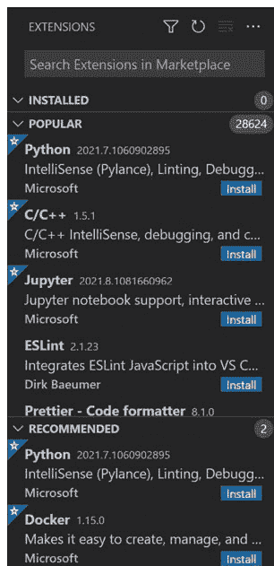

扩展面板顶部是一个名为 INSTALLED 的部分。它旁边可能有一个 0，因为还没有安装任何扩展。

如果 INSTALLED 旁边的数字不是 0，并且你在 INSTALLED 部分看到了 Python，那么 Python 扩展已经安装了。你真幸运！

如果 Python 扩展尚未安装（很可能没有），那么你需要安装它。这非常容易。在 POPULAR 部分，你会看到 **Python** 被列出。（Python 确实非常流行。）只需点击 Python 右侧的蓝色 Install 链接，你就会看到它被安装。Python 现在将被列在 INSTALLED 部分，VS Code 可能会显示一个新的 Python 欢迎页面。

## 创建工作文件夹

程序员将他们的代码组织在文件夹中。他们通常有一个主文件夹用于存放所有项目，并在其中为每个特定项目或应用程序创建子文件夹。所以，我们现在就这样做。

## Windows 用户

Windows 用户有一个 Documents 文件夹，所有工作都存储在那里。这也是存储代码的好地方。请按照以下步骤操作：

1.  点击 **Windows** 按钮（通常在屏幕左下角）。

    你应该会看到一系列图标出现，像这样（尽管图标可能看起来略有不同，具体取决于你使用的 Windows 版本）：


顶部的图标（看起来像一张折角的纸）是 Documents 图标。将鼠标悬停在上面，它会显示 **Documents**，这样你就知道找对了。

14 CAPTAIN CODE：用 Python 释放你的编程超能力

> **使用 Chromebook？**
Chromebook 特定的说明可以通过扫描这个二维码在本书的网页上找到。


2.  点击 **Documents** 图标。这将在 Windows 文件资源管理器中打开 Documents 文件夹。
3.  在窗口顶部找到 **New Folder** 图标。它应该看起来像这样：
4.  点击 **New Folder** 图标创建一个新文件夹。你会看到一个带有默认名称的新文件夹被创建：
5.  将文件夹的名称更改为 **Python**，然后按 **Enter** 保存新文件夹。


就这样，你已经创建了一个新文件夹。干得好！

## Mac 用户

Mac 用户有一个 Documents 文件夹，所有工作都存储在那里。这也是存储代码的好地方。请按照以下步骤操作：

1.  找到 **Finder**（通常在屏幕底部）：


2. 在“前往”菜单中，选择**文稿**以打开文稿文件夹：


3. 现在文稿文件夹已打开，你可以创建新文件夹了。从“文件”菜单中，选择**新建文件夹**：


一个新文件夹就创建好了：

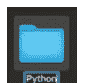

4. 将新文件夹命名为**Python**，然后按**回车键**保存。

就这样，你已经创建了一个新文件夹。干得漂亮！

## 编写你的第一个 Python 程序

我们将编写一个非常简单的程序，只是为了确保一切都能正常工作。为此，我们需要创建一个工作文件夹，然后编写一些代码。

## 选择你的工作文件夹

如你所知，程序员将代码组织在文件夹中，这就是你刚刚创建一个文件夹的原因。现在我们需要告诉 VS Code 使用你的新工作文件夹：

1. 让我们回到 VS Code 窗口左上角的按钮：


最上面的按钮用于打开和关闭资源管理器面板，你可以在那里看到所有文件。点击该按钮以显示资源管理器（如果尚未打开）。

由于你还没有告诉 VS Code 你的工作文件夹在哪里，你会看到如下所示的“未打开文件夹”显示：


2. 点击**打开文件夹**按钮，你会看到你熟悉的（Windows 或 Mac）文件夹屏幕。

3. 导航到你刚刚创建的 **Python** 文件夹，然后点击**选择文件夹**按钮。

现在你将拥有一个打开的空文件夹：

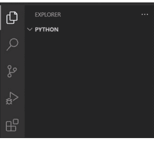

VS Code 现在有了一个工作文件夹，我们可以开始编码了。

## 编码时间到！

现在让我们创建一个文件并编写一些代码。记住创建新文件的步骤，你将会反复进行此操作（从下一章开始）：

1. 将鼠标移到左侧资源管理器中的 PYTHON 框上。看到单词 PYTHON 右边的四个图标了吗？第一个图标用于创建新文件。点击它，并将你的文件命名为 **Hello.py**。（.py 扩展名非常重要。你创建的每个 Python 文件都必须有 .py 扩展名。）
2. 按**回车键**，文件将被保存。你已经知道资源管理器面板在哪里了。IDE 屏幕上你需要了解的下一部分是最重要的部分；它是右上角的大框，那就是编辑器，你在那里输入代码。你新创建的文件也应该自动打开，准备让你开始编码。如果没有，请在资源管理器面板中双击它以打开。
3. 现在开始编码，在屏幕的编辑器部分，完全按照此处所示输入以下内容：

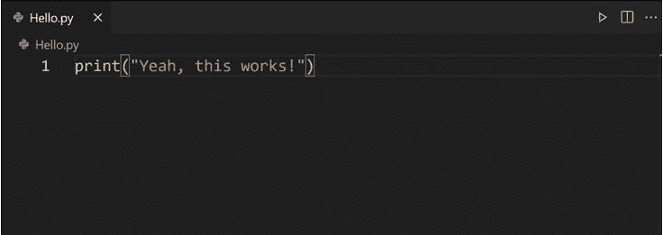

我们暂时不用担心代码本身。相反，请注意文件名显示在编辑器上方。当你打开很多文件时，这一点非常重要——这是你区分它们的方式。

4. 最后需要关注的重要事项是代码上方、右上角的绿色箭头。那是用来运行你的代码的。（如果你将鼠标悬停在绿色箭头上，屏幕会显示*在终端中运行 Python 文件*。你可以将鼠标悬停在 VS Code 中的任何位置，以查看按钮的功能。）

> **IDE 太棒了！**
注意 VS Code 如何自动为你的代码着色，这使你的代码更具可读性。VS Code 还会指出任何错误。例如，如果你删除第二个引号，你会看到这个（可以随意尝试，但完成后请把引号放回去）：


红色意味着有问题！文件名变红以让你知道文件中有错误，VS Code 在代码中添加一条红色波浪线来向你展示错误的位置。看，IDE 太棒了！

**执行代码**
你可能会听到程序员谈论*执行*代码。这不是什么坏事；没人会伤害代码。*执行*是*运行*的另一个词，所以如果你执行代码，就是运行它。呼！

5. 点击绿色的**运行**按钮，Python 将运行你的代码。那么当你运行代码时，在哪里可以看到结果呢？在编辑器窗口正下方的终端窗口。你告诉 Python 打印（这意味着显示）一些文本，它就在终端窗口中这样做了，像这样：

```
Yeah, this works!
```

如果这段文本显示在终端窗口中，那就意味着 Python 已安装并正常工作，VS Code 已安装并可以与你的 Python 安装通信，并且你已准备好编码。恭喜！

## 总结

在本章中，你学习了什么是编程，程序员做什么，以及 Python 是什么。你安装了 Python 和 Visual Studio Code（并简要了解了后者），并编写了你的第一个出色（好吧，也许没那么出色）的程序。我们现在准备好真正深入地用 Python 编码了。

# 第 2 章

## 疯狂填词

既然你已经准备好了，我们将深入进行一些真正的编码。在本章中，我们将从一个重要的主题开始，一个你将在编写的每个程序中都会用到的主题：变量。为此，你还将学习函数并创建一个简单的游戏。准备好了吗？

## 理解函数

在编程语言中，*函数*是执行特定任务的代码片段。你实际上已经见过一个函数了：你在第 1 章末尾使用的 `print()` 函数。而且，正如你所看到的，`print()` 就是做这个的，它打印（或显示）文本。

在 Python 中，就像在大多数其他编程语言中一样，函数通过引用其名称后跟括号来使用。当程序员使用函数时，他们说他们正在*调用*该函数。

在第 1 章中，你调用了 `print()` 函数，像这样：

```
print("Yeah, this works!")
```

你告诉 `print()` 打印的那段文本被称为*参数*，参数总是放在 ( 和 ) 之间。程序员将此称为*传递*参数。

一个函数接受多少个参数？嗯，这取决于函数。有些函数不接受参数，而有些函数接受一个或多个参数，在这种情况下，这些参数将在调用函数时被*传递*。无论是否有参数，你总是需要括号。

让我们快速看看如何向函数传递多个参数。在 VS Code 中创建一个新文件。你已经有一个名为 `Hello.py` 的文件，所以将新文件命名为 `Hello2.py`。

现在文件 `Hello2.py` 已打开，在其中输入此代码：

```
print("Yeah, this works!", "It really does!")
```

> **你自己的函数**
目前我们将使用 Python 内置的函数。在后面的章节中，你将学习如何创建自己的函数。

> **友好的提醒，仅此一次**
需要提醒如何创建文件吗？在 VS Code 中，将鼠标悬停在资源管理器面板上，然后你可以点击文件名上方的新建文件图标。然后你只需输入文件名，它就会打开供你编辑。你也可以使用“文件”菜单并选择“新建文件”，尽管如果你以这种方式创建新文件，你需要在保存文件时为其命名。两种方式都可以。只需记住这些步骤，因为你将创建大量大量文件。将来，我们只会告诉你“创建一个名为 Hello2.py 的文件”，你就会知道该怎么做。

完成后，保存文件（通过选择“文件”菜单并点击“保存”），并运行它（通过点击右侧代码上方的绿色箭头）。你将在下方的终端窗口中看到显示的结果。

看看你刚刚使用的 `print()` 语句。这次它有两个参数，`print()` 在终端窗口中显示了两者。是的，这不是一个很有用的例子。我们知道，你本可以只输入这个来获得相同的结果：

```
print("Yeah, this works! It really does!")
```

我们让你尝试带引号和逗号的方式，是为了向你展示一些重要的东西。当你向函数传递多个参数时，必须用逗号分隔每个参数。如果只有一个参数，则不需要逗号，但对于两个或多个参数，请确保每个参数之间都有逗号。

所以，总结一下，要使用一个函数，你*调用*它，并在需要时*传递参数*；如果你传递多个参数，请确保用逗号分隔每个参数。

## 使用变量

好了，解决了这个问题，让我们进入正题：变量。这些非常重要，所以我们将一直关注它们直到本章结束。

想象一下，你正坐在书桌前，处理一个项目。你正在处理大量信息，因此你有整齐标记的存储容器，以便你可以将需要记住的东西放进去。任何时候你需要获取容器的内容，你只需查看名称，就可以访问其中存储的任何内容。

这是一个简单的类比，它恰好解释了变量的工作原理：你为变量命名并存入信息，之后随时可以取出这些信息。

## 创建变量

让我们来试试。创建一个名为 Hello3.py 的新文件。（你已经不需要被提醒如何操作了，你已经是专业人士了。）

然后输入以下代码（在引号中输入你自己的名字，而不是我的）：

```
firstName = "Shmuel"
```

这段代码创建了一个名为 firstName 的变量，并将你指定的名字存储在其中。

## 使用变量

如何使用你刚刚创建的变量？你只需通过名字来引用它。在创建变量的那行代码之后，添加以下这行：

```
print(firstName)
```

现在保存你的代码并运行它。你会在下方的终端窗口中看到你的名字被打印出来。

现在让我们让它变得更有趣一点。更新你的代码，使其看起来像这样（同样，使用你自己的名字，而不是我的），然后保存并运行代码：

```
firstName="Shmuel"

print("Hello, my name is", firstName, "and I'm a coder!")
```

好的，这里有几个重要的事情需要注意。

看看你向 `print()` 传递了多少个参数。有三个。第一个和最后一个参数包含你输入的文本。中间一个是变量 firstName，但 Python 并不是打印 firstName 这个名字，而是打印存储在 firstName 变量中的信息。

**使用空白字符**
你会注意到我们在创建变量的那行和带有 `print()` 的那行之间添加了一个额外的空行。这个额外的空格被称为 *空白字符*，它可以使你的代码更具可读性。实际上，`print()` 函数中每个逗号后面的空格也是空白字符。所有的空白字符都是可选的，并且会被 Python 忽略，但它使代码更容易阅读。

另外，注意代码的着色。正如我们在第 1 章中提到的，VS Code 会自动为你的代码着色。实际上，代码只是文本，它本身并没有颜色。但彩色的代码非常有用。首先，颜色使代码更容易阅读。但更重要的是，因为所有函数都是一种颜色，文本是另一种颜色，变量又是另一种颜色，所以当颜色不对时，你会很快发现错误。

## 一些重要的变量规则

在我们继续之前，关于 Python 中的变量，你需要知道几条重要的规则：

- 变量名可以包含字母和数字，但不能以数字开头。所以 `pet1` 可以用作变量名，但 `1pet` 不行。
- 变量名中不能有空格。如果你想在变量名中使用多个单词，可以使用混合大小写（就像我们这里用的 `firstName`）或者使用下划线（例如 `first_name`）。
- 最重要的规则要记住：变量名是区分大小写的。这是什么意思？这意味着如果你创建了一个名为 `firstName` 的变量，你不能用 `firstname` 来引用它；它们不是同一个变量，因为一个有大写字母而另一个没有。如果你愿意，可以试试；修改 `print()` 语句，让它引用 `firstname` 而不是 `firstName`。VS Code 会意识到你犯了一个错误，并在 `firstname` 下面画一条波浪线：

```
Hello3.py 1
Hello3.py > ...
1 firstName="Shmuel"
2
3 print("Hello, my name is", firstname, "and I'm a coder!")
```

如果你将鼠标悬停在 firstname 上，VS Code 会告诉你 "firstname" 未定义，这意味着你尝试使用一个不存在的变量。

除了这些规则，你可以自由地以任何你喜欢的方式命名你的变量。而且，通常来说，描述性的名称更受欢迎。所以 firstName 是一个很好的变量名，因为这个名字清楚地表明了它的用途。fn？这是一个描述性差得多的名字。它可能意味着 "免费玉米片"、"堡垒之夜"、"友好的邻居"... 确实非常令人困惑。使用清晰、描述性的名称是熟练开发者的标志之一（而你总是想看起来很专业，对吧？）。

## 变量，更多变量，甚至更多变量

看看这段代码？你认为它是做什么的？

```
firstName="Shmuel"
firstName="Ben"

print("Hello, my name is", firstName, "and I'm a coder!")
```

> **变量名区分大小写**
因为变量名是区分大小写的，所以你实际上可以创建多个仅大小写不同的变量。例如，你可以这样做：

FirstName="Shmuel"

firstname="Ben"

建议：不要这样做。让你的变量名清晰且独特。这样做可以防止你花费数小时试图弄清楚为什么某些东西不工作。

实际上，你为什么不试试呢？修改你的 Hello3.py 代码，让 firstName 被设置两次。

保存你的代码并运行它。显示了什么？它做了你期望的事情吗？

第一行 `firstName="Shmuel"` 创建了一个名为 firstName 的变量，并将名字 Shmuel 存入其中。第二行 `firstName="Ben"` 并没有创建一个变量，也没有将 "Ben" 添加到现有变量中。相反，它覆盖了第一个值，用 "Ben" 替换了 "Shmuel"。

好的，最后一个例子。我们将这个文件命名为 Hello4.py（同样，使用你自己的名字，而不是我的）：

```
firstName = "Shmuel"
lastName = "Forta"
fullName = firstName + " " + lastName

print("Hello, my name is", fullName, "and I'm a coder!")
```

保存代码并运行它。这里发生了什么？

Python 一次处理一行代码。所以它做的第一件事是创建一个名为 firstName 的变量并在其中存储一个值。下一行告诉 Python 创建一个名为 lastName 的变量，一个值也被存储在该变量中。

> **提示**
**“另存为”可以节省你的时间** 这里有一个有用的提示。文件 Hello4.py 基本上是 Hello3.py 的一些修改版。你可以创建一个新文件并像之前那样输入代码。或者，当你打开 Hello3.py 时，使用“文件”菜单并选择“另存为”来创建一个名为 Hello4.py 的副本，然后编辑它。

**一个变量可以存储多少个值？**
如你所见，变量一次存储一个值。存储第二个值？那会替换第一个值。一次一个值。但是，实际上有特殊类型的变量可以存储多个值。你将在未来的章节中使用它们。

第三行很有趣。它创建了一个名为 fullName 的新变量并在其中存储了一个值。这个值是什么？它由三部分组成，全部使用 + 号连接在一起。它使用 firstName，添加一个空格（这就是 " " 的含义），然后添加 lastName。所以如果 firstName 是 "Shmuel"，lastName 是 "Forta"，那么 fullName 就是 "Shmuel Forta"。这就是用作 `print()` 中第二个参数的内容。

> **新术语**
**连接** 像这样将变量连接在一起称为连接。当你想听起来非常聪明时，这是一个很好的词。

## 获取用户输入

你已经精通使用 `print()`，现在让我们介绍一个新函数。顾名思义，`input()` 用于要求用户输入一些内容。

创建一个名为 Hello5.py 的新文件，并输入以下代码：

```
name=input("What is your name? ")
print("Hello", name, "nice to meet you!")
```

保存文件并运行它。

你的代码将在终端窗口中运行。它将显示 **What is your name?** 并等待你在终端窗口中输入响应。当你输入响应并按回车键时，`print()` 函数将按名字问候你。

如你所见，`input()` 接受要显示的文本，就像 `print()` 一样。但 `input()` 还做了另一件事：它从用户那里获取输入。记住 Python 是逐行运行你的代码的。当它遇到 `input()` 时，它会停止处理，等待用户输入一些内容，然后继续。用户在提示符处输入的任何内容都会提供给你使用。这被称为 *返回一个值*，而 `input()` *返回* 的值可以保存到一个变量中，就像我们这里所做的那样。这样，变量名就包含了用户在终端窗口中输入的任何内容。

## 变量在哪里？

看看这行代码：

```
input("What is your name? ")
```

你认为它有什么问题？嗯，这段代码实际上是有效的。运行它，它会提示输入。但这个 `input()` 会提示用户输入一些内容，但不会实际保存到任何地方——这可能不是预期的目的。这就是为什么我们使用 `name=input()`，因为它告诉 Python 将 `input()` 返回的任何内容保存到 name 中。

另一方面，`print()` 不返回任何东西，所以没有理由将其赋值给一个变量。

> **提示**
**注意点击位置** 在响应 `input()` 提示时，请确保在输入之前先点击终端窗口。否则，你的光标可能在编辑器窗口中，在这种情况下，你可能会意外地编辑你的代码。

## 挑战 2.1

成为代码队长的唯一方法就是编写代码。你编写的代码越多，你就会成为越好的编码者。我们将一起学习的课程和示例是一个很好的起点，但你真的也需要编写自己的代码。因此，在整本书中，你将看到像这样的挑战部分。这些部分将根据我们已经一起学习的课程，建议你尝试一些事情，但我们不会给你提供解决方案；这些都由你自己完成。别担心：我们确保每个挑战都是基于你已经学过的内容可以完成的。

那么，这是你的第一个挑战。Hello4.py 创建了两个变量 firstName 和 lastName，然后将它们组合成一个新变量，名为 fullName。修改该代码，使其要求用户提供名字和姓氏，而不是使用硬编码的值。这里有一个提示：你只需要修改前两行代码，使每一行都使用 `input()` 函数。你能解决这个问题吗？

## 玩文字填空游戏

如果你从未玩过文字填空游戏，它是一种根据提供的词语改变故事内容的游戏。你会被提示输入词语（一个动词、一个名词、一个形容词等等），这些词语会被插入故事中，以有趣（或不那么有趣）的方式改变故事。

## 编写你的故事

让我们来试试看。我们将从一个简单的故事开始，使用我们熟悉的 `print()` 函数来显示。你可以使用我们的故事，也可以自己编一个。实际上，别用我们的了。你很有创造力，所以自己编一个故事吧。

创建一个名为 `Story.py` 的新文件，并使用 `print()` 函数输入你的故事，像这样：

```
print("I have a pet iguana named Spike.")
print("He is long, green, and lazy.")
print("Spike eats leaves, flowers, and fruit.")
print("His favorite toy is a small yellow ball.")
```

保存文件并运行它。你会在终端窗口中看到显示的文本。

## 添加变量

现在让我们让事情变得更有趣一些。我们将用一个变量替换故事中的一个词，像这样：

```
animal="iguana"

print("I have a pet", animal, "named Spike.")
print("He is long, green, and lazy.")
print("Spike eats leaves, flowers, and fruit.")
print("His favorite toy is a small yellow ball.")
```

> **文字填空游戏®**
这是我们自己对文字填空游戏的演绎。真正的文字填空游戏®是企鹅兰登书屋有限责任公司的注册商标。

如你所见，我们更改了第一个 `print()`。它不再显示动物的类型，而是使用一个变量并显示该变量的值。

保存并运行你的代码。输出应该与之前相同。

是的，我们知道这还不那么令人兴奋。但别急，我们继续。现在我们将把大量文本更改为使用变量而不是硬编码的词语。在我们的示例故事中，我们更改了其中的11个，像这样：

```
animal="iguana"
name="Spike"
adjective1="long"
color1="green"
adjective2="lazy"
noun1="leaves"
noun2="flowers"
noun3="fruit"
adjective3="small"
color2="yellow"
noun4="ball"

print("I have a pet", animal,"named", name, ".")
print("He is", adjective1, ",", color1, ", and", adjective2, ".")
print(name, "eats", noun1, ",", noun2, ", and", noun3, ".")
print("His favorite toy is a", adjective3, color2, noun4, ".")
```

进行你的更改并保存代码。

运行代码，它看起来应该和之前完全一样。

一个值得注意的有趣之处是，变量名在故事中被使用了两次。一旦你创建了一个变量，你可以根据需要多次使用它。

> **注意引号和逗号**
注意你的引号和逗号。你需要在文本周围使用引号，但不要在变量名周围使用。并且确保用逗号分隔所有参数。这就是颜色编码非常有用的地方：如果颜色不对，那么你可能搞错了引号或逗号。

## 获取用户输入

既然你的故事使用了变量，将其更改为显示用户提供的文本就很容易了。只需将每个变量更改为使用 `input()`，就像我们在本章前面所做的那样。以下是我们的示例：

```
print("Hello, please answer the following prompts.")
print()
animal=input("Enter an animal: ")
name=input("Enter a name: ")
adjective1=input("Enter an adjective: ")
color1=input("Enter a color: ")
adjective2=input("Enter an adjective: ")
noun1=input("Enter a noun: ")
noun2=input("Enter a noun: ")
noun3=input("Enter a noun: ")
adjective3=input("Enter an adjective: ")
color2=input("Enter a color: ")
noun4=input("Enter a noun: ")

print("Thank you. Here is your story.")
print()
print("I have a pet", animal,"named", name, ".")
print("He is", adjective1, ",", color1, ", and", adjective2, ".")
print(name, "eats", noun1, ",", noun2, ", and", noun3, ".")
print("His favorite toy is a", adjective3, color2, noun4, ".")
```

你会注意到我们在顶部添加了一个 `print()` 来提供一些说明。我们还使用了几个空的 `print()` 函数。这些添加了空行，使输出更具可读性。

保存代码并运行它。系统会提示你输入所有内容，然后代码将生成一个故事。每次运行代码时，都会根据提供的输入生成一个新的故事。

测试完代码后，让朋友或家人也试试。他们会对你编程技巧印象深刻。

## 挑战 2.2

准备好迎接下一个挑战了吗？

让你的文字填空游戏更有趣，提示输入至少15个不同的词语。然后个性化它。在开始时，当你提供说明时，询问用户的名字，然后在说明中使用它，以创造更个性化的体验。


## 总结

在本章中，你学习了关于变量的所有知识以及如何使用它们。你还掌握了两个函数：显示文本的 `print()` 和提示输入文本的 `input()`。然后你将它们组合在一起，创建了一个功能齐全的应用程序。恭喜，你现在是一名真正的程序员了！

此页有意留白


# 第 3 章

# 掷骰子

既然你知道了如何使用函数和变量，我们将通过引入库和大量的随机性来让事情变得更有趣。

## 使用库

我们在第1章中简要提到了库。你可以将库视为代码的集合——通常是函数（比如你已经使用过的 `print()` 和 `input()` 函数）。库很容易使用。你只需告诉 Python 你需要哪个库，就可以使用其中的函数。就这么简单。是的，别人做了艰苦的工作，而你只需使用它。不错，对吧？

Python 自带了许多库。有一个叫做 `datetime` 的库，它提供了各种处理日期的函数。`math` 用于数学运算。还有用于处理计算机文件、访问互联网网站、处理加密等等的库。而且库可以包含不止函数，正如你将看到的。

如果 Python 没有你需要的库，它们可能在网上存在供你下载和使用。我们将在本书的第三部分探讨如何使用第三方库（即来自其他人的库，而不是 Python 自带的库）。

## random 库

我们要看的第一个库叫做 `random`，顾名思义，它用于为你的代码添加随机性。想在1到100之间随机选一个数字吗？`random` 可以帮忙。创建一个游戏，需要敌人随机出现并具有随机的生命值？你也用 `random` 来实现。即使是像模拟抛硬币这样简单的事情，也可以通过使用 `random` 来实现。

好的，那么你如何告诉 Python 你想使用哪个库呢？你使用 `import` 语句。让我们试试看。创建一个名为 `Random1.py` 的新文件，并输入以下内容：

```
import random
```

> **了解 PyPI**
Python 库的官方仓库叫做 PyPI，它是超过30万库的家园！

关于随机的真相
这里是关于计算机和随机性的真相：计算机不能做随机的事情。它们就是不能。人类可以，但计算机喜欢有条不紊地遵循指令，它们不知道如何做没有意义或没有特定顺序的事情。所以，它们实际上不能做任何随机的事情。当计算机似乎在做随机的事情时，它们实际上依赖于复杂的算法和不断变化的因素（如当前日期和时间）来模拟随机性。如果这听起来很复杂，嗯，确实有点。这就是为什么我们喜欢像 random 这样的库。你只需使用库的函数，让库内部的代码为你完成所有艰苦的工作。

这段代码告诉 Python 导入 random 库。保存代码并运行它。

发生了什么？什么也没发生？看起来可能什么也没发生，但确实发生了一件大事。记住，Python 逐行运行你的代码。当它遇到带有 import 语句的那一行时，它会找到 random 库并将其引入你的代码，准备供你使用。然后你没有使用它。但这没关系。现在你就要用了。

## 生成随机数

更新你的代码，添加两行，如下所示：

```
import random

num=random.randrange(1, 11)
print("Random number is", num)
```

保存文件并运行它。然后再运行一次。再运行一次。运行几次。

发生了什么？每次运行程序时，都会显示一个随机数。

让我们看看代码，了解它在做什么。你知道第一行是做什么的：`import random` 导入 random 库。你也知道最后一行是做什么的：它打印一些文本和随机数。

**代码船长：** 用Python释放你的编程超能力

> **将导入语句置于顶部**
通常来说，应将导入语句放在代码的最顶端，并且集中放置。这样便于查看你导入了哪些内容。

那么我们来关注中间这行代码。它调用了一个名为`randrange()`的函数，你传入两个数字作为参数来定义范围，它会在这两个数字之间生成一个随机数。生成的任何数字都会保存在变量`num`中。

这段代码与我们之前使用`input()`的方式类似：根据需要传入参数，返回的任何内容都会保存到变量中。但这次有一个重要的区别。

看看代码。函数并非仅通过`randrange()`这个名称来调用。相反，库名也被包含在内。`random.randrange()`告诉Python使用`random`库中的`randrange()`函数。这一点很重要。如果省略库名，Python将不知道去哪里找到`randrange()`。

如果你想验证，可以试试看。移除`random.`，保存并运行代码。你会看到VS Code在`randrange()`下方画了一条波浪线，如果将鼠标悬停在上面，它会显示“`randrange`未定义”。所以，请记住库名是必需的。

## 选择随机项

现在你知道如何生成随机数了。但如果你想做其他事情，比如抛硬币呢？在这种情况下，你希望随机返回正面或反面，而不是数字，所以`randrange()`无法帮助你。但别担心；你可以通过使用`random`库中的另一个函数来实现这一点。

> **注意范围**
`randrange(1, 11)`返回1到10之间的随机数。为什么是10？第二个参数是11，意味着小于11。这有点令人困惑，因为第一个参数（1）包含在范围内，但第二个参数（11）不包含。这意味着如果你想得到3到8之间的数字，你应该使用`randrange(3, 9)`。好消息是，这种行为与其他Python函数一致，所以你会习惯的。

创建一个名为`Random2.py`的新文件，并输入以下内容：

```python
import random

choices="HT"
coinToss=random.choice(choices)
print("It's", coinToss)
```

保存文件并运行它。每次运行代码时，你都会在终端窗口中看到显示“It's H”（代表正面）或“It's T”（代表反面）。

那么这段代码在做什么呢？你知道第一行和最后一行的作用。

代码`choices="HT"`创建了一个名为`choices`的变量，并将文本“HT”存储在其中。

下一行随机选择H（代表正面）或T（代表反面）。它通过使用`choice()`函数来实现这一点，这是`random`库中的另一个函数。与接受数字范围作为参数的`randrange()`不同，`choice()`接受一个包含选项列表的单个参数。这里我们传入了`choices`变量，它包含“HT”，所以`choice()`将返回其中一个选项：H或T。

很简单，对吧？

那么，如果你想显示“Heads”或“Tails”而不是“H”或“T”呢？你不能直接将文本“Heads”和“Tails”作为选项传入，像这样：

```python
choices="HeadsTails"
coinToss=random.choice(choices)
```

> **另一种选择**
我们本可以不使用`choices`变量来编写相同的代码。怎么做？直接将“HT”传递给`choice()`，像这样：

`coinToss=random.choice("HT")`

在这个例子中，最终结果是一样的。

为什么？因为`choice()`会将其视为10个选项：字母H、字母e、字母a，等等。你最终可能得到返回值i，这不是你想要的。

有几种方法可以做到这一点。我们将向你展示一种选项，使用一种特殊类型的变量。

你会从第2章回忆起，变量包含值。我们当时提到过，有特殊的变量可以包含多个值。我们将在后面的课程中广泛使用这些变量，但现在，以下是我们如何使用这些特殊变量来解决正面或反面挑战的方法。

只需对你的代码做一个改动。编辑这一行：

```python
choices="HT"
```

使其看起来像这样：

```python
choices=["Heads", "Tails"]
```

保存代码并运行它。现在输出将是“It's Heads”或“It's Tails”。

那么，当你改变那一行代码时会发生什么？[ 和 ] 字符在Python中用于创建一个列表。列表正如其名：一个项目列表。[10, 20, 33] 会创建一个包含三个项目的列表：三个指定的数字。类似地，["ant", "bat", "cat", "dog", "eel"] 会创建一个包含五种动物的列表。

我们将在未来的章节中使用很多列表，但现在只需知道列表存储多个项目，每个项目由逗号分隔。

好的，现在回到我们的代码。choices=["Heads", "Tails"] 创建了一个包含两个项目的列表：文本“Heads”和文本“Tails”。在这种情况下，我们不必更改任何其他代码，因为`random.choice()`函数非常智能。传入一些文本，它知道你想要从该文本中随机获取一个字符。但传入一个列表，它就知道你想要从列表中随机获取一个项目。

完美！

## 挑战 3.1

好的，这个稍微难一点，但你能做到，我保证！看到那个包含五种动物的列表了吗？编写代码创建两个列表，一个包含动物，像这样：

```python
animals=["ant", "bat", "cat", "dog", "eel"]
```

你可以使用自己的动物列表，并且可以超过五种（越多越好）。

然后创建一个类似的形容词列表，比如大的、绿色的、难闻的、可爱的等等。（同样，越多越好。而且你的两个列表是否包含相同数量的项目并不重要。）

然后随机选择一个形容词和一个动物，并将每个保存到一个变量中。（你需要两个变量：一个用于你的动物，一个用于你的形容词。）然后使用`print()`输出选择，使输出类似于“I have a cute eel”。每次运行应用程序，你都会得到不同的组合。

## “3”不是3

在我们继续之前，有一个重要的话题需要讨论。你注意到我们输入变量名和值的方式有什么不同吗？提醒一下：这些都是你已经使用过的代码片段：

```python
lastName = "Forta"
fullName = firstName + " " + lastName
name=input("What is your name? ")
num=random.randrange(1, 11)
choices=["Heads","Tails"]
```

如你所见，有时我们在值周围加上双引号，有时则不加。我们为什么要这样做？

**代码船长：** 用Python释放你的编程超能力

原因在于你需要引号来标记一段文本（程序员称之为*字符串*）。数字不需要引号。Python知道1和11是数字，它们不可能是其他东西。但*lastName*呢？它可能是文本，也可能是变量名（甚至是函数名），这需要程序员来指定它是什么。对于“Heads”也是如此，当然，它可能是一个字符串，但也可能是其他东西。计算机不喜欢歧义。事情需要明确说明。所以，当你使用文本并希望它被视为纯文本时，你必须用双引号将其包围。

所以，总结一下：

- 变量周围从不加引号。
- 数字周围从不加引号。
- 字符串周围总是需要引号。

好的，那么让事情变得有趣一点。“3”是数字还是字符串？你能将它乘以5吗？

嗯，对我们人类来说这很简单。是的，“3”是一个数字，如果你将它乘以5，你会得到15。但Python不知道“3”是一个数字；它看到引号就假设它是一个字符串。

那么，如果你告诉Python将“3”乘以5会发生什么？这听起来会很疯狂，我们知道，但你会得到“33333”！它会乘以*字符串*（本质上是添加5个副本），而不是*字符串中的数字*。真的！

> **字符串需要引号**
如果你忘记在字符串周围使用引号，Python会假设你指的是一个变量，并会显示一条错误消息，告诉你该变量不存在。

> **测试“3”与3**
想自己试试吗？在Python中，*（星号）是乘法符号。你可以创建一个文件，然后`print(3 * 5)`，再`print("3" * 5)`，看看输出的区别。你会看到“3” * 5 会连接五个字符串“3”的副本。

## Python 让变量变得简单

在大多数语言中，创建变量时必须告诉计算机你想要的数据类型。Python 在这方面很友好：它会根据你提供的值自动推断数据类型。

## 你可以在数据类型之间转换

在未来的课程中，你将学习如何将数据从一种数据类型转换为另一种，例如，将字符串“3”转换为数字3。

现在你已经接触了*数据类型*。什么是数据类型？它就是变量可以存储的信息类型。数据类型有很多，但最常用的两种是字符串和数字。`num=11` 创建了一个名为 `num` 的变量，其数据类型为数字。`lastName = "Forta"` 创建了一个名为 `lastName` 的变量，其数据类型为字符串。

那么，“3”和3是一样的吗？答案是否定的。前者是字符串，后者是数字，尽管它们看起来一样，但数据类型不同。

## 为你的代码添加注释

在进入本章最后一个示例之前，我们还有一个重要主题需要介绍。

到目前为止，你编写的代码都非常简单——只有几行。但随着你学习本书中的课程，你将编写数十行甚至数百行的代码。为了让代码更易于阅读和理解，程序员会在代码中添加注释。

如何添加注释？像这样（这是一个我们之前见过的例子，但这次添加了注释）：

```
# Import needed libraries
import random

# Define the choices
choices=["Heads","Tails"]
```

```
# Pick a random choice
coinToss=random.choice(choices)

# And display it
print("It's", coinToss)
```

在Python中，注释以 # 符号开头。VS Code 会用特定的颜色显示注释，使其非常容易识别。

重要的是要理解，Python 会完全忽略注释。当 Python 看到 # 时，它会忽略其后的所有内容。注释是给你，程序员看的，而不是给 Python 看的。

注释可能看起来是在浪费时间。但请相信我们：它真的很重要，优秀的程序员会给所有代码添加注释。为什么？

- 注释将帮助你阅读自己的代码。
- 注释将提醒你做了什么以及为什么这样做。
- 注释帮助他人理解你的代码功能。
- 注释使其他程序员更容易理解和处理你的代码。
- 注释可以解释任何假设或依赖关系，即你的代码运行所需的东西。

注释还有另一个重要用途：它们可以用来隐藏代码。例如，之前你对代码进行了修改，将 choices="HT" 改为 choices=["Heads", "Tails"]。这是一个相当简单的编辑，但想象一下如果是一个更复杂的修改。你可能想在测试新版本时保留旧版本。看看这段代码：

```
# Import needed libraries
import random

# Define the choices
# choices="HT"
choices=["Heads","Tails"]
```

```
# Pick a random choice
coinToss=random.choice(choices)

# And display it
print("It's", coinToss)
```

注意，原始行 choices="HT" 仍然在文件中。它没有被删除或编辑，而是在前面加了一个 #。这将该行变成了注释，因此会被 Python 忽略。想回到之前的版本吗？从该行移除 # 符号，并将其放在下一行前面；这样，第二个 choices 行就变成了注释。

程序员将此称为*注释掉*代码，这是在修改或测试代码时非常宝贵的技术。

> **新术语**
> **注释掉** 使用注释来临时隐藏代码，防止其被执行。

好的，从现在开始，我们所有的代码都将添加注释。

## 一个骰子，两个骰子

让我们看最后一个示例，回顾一下我们到目前为止学到的所有内容。实际上，让我们做两个示例。

你以前掷过骰子；很多游戏都需要它们。骰子很酷，但电脑骰子更有趣。所以我们将创建两个程序：一个掷一个骰子，另一个掷两个。

这是 Dice1.py 的代码：

```
# Imports
import random

# Roll and print
print("You rolled a", random.randrange(1, 7))
```

这个程序非常简单，而且都是你以前见过的代码。保存并运行代码。你会看到一个1到6之间的数字（记住，7不会包含在范围内）。

这里唯一真正的区别是，`random.randrange()` 返回的数字没有保存到变量中。相反，它直接作为参数传递给 `print()`。

当你需要掷一个骰子时，随时运行这个程序。

## 你需要一个变量吗？

这段代码：

```
import random

print("You rolled a", random.randrange(1, 7))
```

和这段代码有什么区别？

```
import random

num = random.randrange(1, 7)
print("You rolled a", num)
```

在功能上，这两者没有区别。两者都生成一个随机数，然后显示它。

第一个版本直接在 `print()` 语句中生成随机数。返回值（`randrange()` 生成的数字）作为参数传递给 `print()`。

第二个版本生成一个随机数并将其保存到名为 `num` 的变量中。是这个变量作为参数传递给 `print()`。

最终打印的结果是相同的。区别在于变量。仅此而已。

那么应该使用哪个版本呢？在这种情况下，一个版本相对于另一个版本没有优势。只有当这个随机数需要用于其他目的时，比如另一个 `print()` 或某些计算中，这种区别才重要。那时你肯定需要将生成的数字保存到变量中，以便可以重用它。

但是当你需要掷两个骰子时怎么办？你可以运行程序两次，然后自己把数字加起来。但是，不，那不是我们程序员会做的。我们会编写另一个程序来掷两个骰子。

这是 Dice2.py 的代码：

```
# Imports
import random

# Roll both dice
die1=random.randrange(1, 7)
die2=random.randrange(1, 7)

# Display total and individual dies
print("You rolled", die1, "and", die2, "- that's", die1+die2)
```

运行代码，你会看到两个骰子的值以及它们的总和。

对于像你这样的 `print()` 和 `random` 专家来说，这段代码应该是不言自明的。它创建了两个变量，每个变量包含一个掷出的骰子的值。`print()` 语句只是显示这些值，然后执行：

```
die1+die2
```

这是一个简单的数学运算：`die1` 和 `die2` 相加，打印出来的是它们的和。是的，Python 可以即时进行数学运算。

> **+ 运算符**
>
> + 是做什么的？嗯，这取决于数据类型。在我们的掷骰子代码中，`die1` 和 `die2` 都是数字数据类型的变量。因为它们是数字，所以当你使用 `die1+die2` 时，Python 知道你想将它们相加。
>
> 但如果变量是字符串，而你使用了 + 运算符，Python 会将它们连接起来（因为对字符串进行数学加法没有意义）。
>
> Python 在这方面很聪明：它试图弄清楚我们程序员想要做什么，并为我们做到这一点。

这似乎是一个回顾 Python 中可用的数学运算符的好地方：

| 运算符 | 描述 |
| :--- | :--- |
| + | 加法运算符，所以 `print(5+5)` 将显示 10。 |
| - | 减法运算符。`print(12-7)` 将显示 5。 |
| * | 你在这个章节前面见过这个：它是乘法运算符，`print(10*3)` 将显示 30。 |
| / | 除法运算符。`print(10/3)` 将显示 3.333（实际上会有更多的3）。 |
| // | 这也是一个除法运算符，但它只返回整数部分，不返回余数。`print(10//3)` 将显示 3。 |
| % | 取模运算符，用于获取除法的余数，所以 `print(10%3)` 将显示 1。 |

显然，这些运算符可以在各种代码和函数中使用。这里用作示例的 `print()` 语句是为了帮助你尝试这些运算符，如果你愿意的话。

那么，为什么我们在 Dice2.py 中使用变量来存储骰子值，而在 Dice1.py 中没有呢？嗯，说实话，我们本可以在两个程序中都使用变量。但只有当一个值需要被多次使用时，才需要变量。在 Dice1.py 中，该值只使用了一次——在显示时——所以可以使用变量，但并非真正必要。在 Dice2.py 中，骰子值被使用了两次——一次在显示时，一次在求和得到总数时——因此需要将掷骰子的结果保存到变量中。

## 挑战 3.2

我们使用的大多数骰子有6面，但有些游戏使用更多面的骰子。实际上，古希腊人和古罗马人使用的是十二面体形状的骰子，有12面！所以，以防你遇到古希腊人或古罗马人，编写一个掷12面骰子的代码。

## 总结

哇，这一章你学到了很多！你学会了如何使用库，特别是 `random` 库及其两个函数。你了解了数据类型。你还学会了如何为代码添加注释。接下来，我们将学习如何让代码做出决策。

## 第四章

## 计算日期

你现在知道了如何使用变量、函数和库。接下来是你需要的最重要的编码工具之一：教计算机如何做出决策。

## 处理日期

正如你所见，Python 会逐行处理你的代码，一次一行。它从程序顶部开始，对于每一行非注释的代码，它都会执行你告诉它要做的事情。

这相当无聊。如果每个程序都是逐行执行的，那么每个程序每次运行时都会做完全相同的事情。想象一个网站，每次你访问时都以相同的顺序显示相同的内容。或者一个游戏，只允许你做一件事，然后再做一件事，再做一件事，顺序总是相同。或者一个聊天应用，只允许你输入同一条消息发送。明白我们的意思了吗？无聊！

显然，任何有用的程序都必须能够在许多不同的序列中做许多不同的事情。这意味着你作为程序员，需要一种方法来告诉计算机如何做出决策。

这就引出了至关重要的 `if` 语句，它是本章（以及下一章）的重点。

### datetime 库

数学家们喜欢用一个巧妙的把戏来给人留下深刻印象：他们问某人的生日，然后在几秒钟内告诉他们出生那天是星期几。当他们这样做时，他们不是在猜测（如果他们猜，从统计学上讲，他们只有七分之一的几率猜对，那根本不会给人留下印象）。他们使用在脑海中快速进行的数学计算来得出结果。

我们可以像数学家一样学习如何做到这一点。但是，不，我们是程序员。我们可以用我们的编程技巧给人留下深刻印象，让计算机为我们计算出来。

为此，让我们看看另一个内置的 Python 库，`datetime` 库。顾名思义，这个库让你可以对日期做各种各样的事情。什么样的事情呢？

-   获取当前日期
-   计算未来和过去的日期详情（比如它们是星期几）
-   计算两个日期之间的差异（当你必须考虑不同的月份长度和闰年时，这实际上相当棘手）

哦，它对时间也能做所有同样的事情。

### datetime 库

我们选择 `datetime` 库作为下一个库示例的部分原因是它非常有用。此外，它与我们上一个使用的库 `random` 的工作方式略有不同，体验许多不同的库是件好事。

创建一个名为 `Date1.py` 的新文件。以下是需要输入的代码：

```python
# Imports
import datetime

# Get today's date
today=datetime.datetime.now()

# Print it
print("It is", today)
```

保存并运行程序，它将显示当前日期和时间，包括毫秒（我们知道这非常有用）。

你知道 `import` 和 `print()` 行的作用，所以让我们专注于中间那行，它看起来确实有点奇怪。

代码 `today=datetime.datetime.now()` 获取今天的日期并将其保存到名为 `today` 的变量中。`now()` 显然是返回当前日期和时间的函数。与你迄今为止使用的函数不同，这个函数不需要任何参数。括号仍然是必需的。每次调用函数时，你都必须提供括号，但你可以让它们为空，不带参数，即在 `(` 和 `)` 之间什么都不放。

但是 `datetime.datetime` 是怎么回事？为什么我们不能像在第 3 章中使用 `random` 库函数那样直接使用 `datetime.now()` 呢？

**函数与变量**

请记住，当函数被执行时，它们后面总是跟着括号。变量后面不跟括号。

第一个 `datetime` 确实是库名。它与代码第一行中引用的库匹配：`import datetime`。

第二个 `datetime` 不是库或函数。它实际上是一个叫做 *类* 的东西。我们将在本书的第二部分详细研究类，届时你将创建自己的类。现在，你只需要知道类是程序员组织代码的一种方式，以便函数和信息片段可以存储在一个地方。类中有你可以调用的函数，就像任何其他函数一样。

> **新术语**
> **方法** 类中的函数称为 *方法*。但它们仍然是函数，就像你迄今为止见过的函数一样。

`datetime` 库中有一个名为 `datetime` 的类。（是的，我们同意：如果它们不叫同一个名字会更简单！）所以，`datetime` 是导入的库，而 `datetime.datetime` 指的是 `datetime` 库中的 `datetime` 类。呼！

然后 `now()` 是（在 `datetime` 中）返回今天日期和时间的函数，然后将其保存在 `today` 变量中。

> **type() 函数**
> 在第 3 章中，我们提到了数据类型。那么，你刚刚创建的 `today` 变量的类型是什么？它不是字符串或数字类型。该类型实际上是一个 `datetime` 类。

如果你想知道变量的类型，可以使用 Python 的 `type()` 函数。`type()` 所做的就是查看变量，以便通过返回值告诉你它是什么。`type(3)` 将返回 `int`（代表整数），因为 3 是一个数字。`type("3")` 将返回 `str`（代表字符串）。而 `type(today)`（你上面创建的变量）将返回 `type datetime.datetime`。

我们将在未来的章节中更详细地研究类型（和 `type()` 函数）。

## 使用 datetime 类

在本章的第一个例子中，我们只是打印了 `today` 变量中的内容。但因为 `today` 是一个类，它实际上包含了许多你可以使用的数据和函数。

让我们尝试另一个例子。创建一个名为 `Date2.py` 的文件，这是代码：

```python
# Imports
import datetime

# Get today's date
today=datetime.datetime.now()

# Print today's year, month, and day
print("The year is", today.year)
print("The month is", today.month)
print("The day is", today.day)
```

保存并运行代码，它将显示当前的年、月、日，每项各占一行。

`today.year` 意味着 `today` 类中的年份值。`month` 和 `day` 也是如此。

正如你所见，`today` 包含大量信息。之前我们打印了整个 `today` 变量（没有指定其中的任何特定项），像这样：

```python
print("It is", today)
```

这里 Python 帮了我们一个忙，以默认的可读格式显示了所有内容。但不建议这样做，通常，你最好显示你需要的每个项目，以便更好地控制输出。

> **方法与属性**
> 为什么 `year`、`month` 和 `day` 后面没有 `()`？因为它们不是函数（嗯，方法）。它们是你可以使用的数据片段，有点像类内部的变量。这些实际上被称为 *属性*。我们将在第二部分研究属性（和方法）。

引用属性时不需要使用括号；使用方法（再次强调，函数）时需要使用括号。我们很快就会看到一个例子，当我们使用 `weekday()`（这是一个方法）时。

## 挑战 4.1

修改 `Date2.py` 以同时显示当前时间。你需要的属性叫做 `hour` 和 `minute`。

## 做出决策

既然你知道了如何使用日期，让我们回到我们的主要话题，`if` 语句，并使用它们来帮助你的计算机做出决策。

## if 语句

我们知道你希望把每一个醒着的时刻都用来编码。但你还有其他责任，比如学校的事情。对吧？那么，让我们写一个程序，找出今天是星期几，然后为不同的日子显示有用的信息。显然，这将需要计算机做出决策。它不能只是逐行打印东西；它必须根据星期几做不同的事情。

创建一个名为 `Date3.py` 的新文件并输入以下内容：

```python
# Imports
import datetime

# Get today's date
today=datetime.datetime.now()

# Display the right message for different days of week
if today.weekday() == 6:
    print("It's the weekend, no school today!")
    print("We can code all day long!")
```

保存并运行代码。会发生什么？嗯，如果你碰巧在星期日运行这个程序，你会看到一条消息显示（两个 `print()` 语句）。但如果是一周中的任何其他日子，你将什么也看不到。

这里的魔法在于这一行：

```
if today.weekday() == 6:
```

`if` 用于创建一个条件，它位于单词 `if` 之后、冒号（即 `:` 符号）之前。`today.weekday()` 方法返回星期几，0 代表星期一，1 代表星期二，以此类推。这个条件很简单：它告诉 Python 调用 `today` 内部的 `weekday()` 方法，然后将其返回值与数字 6（代表星期日）进行比较。所以这句话的意思是 *如果今天是星期日*。

请特别注意 `weekday()` 和 `6` 之间是什么。那是两个等号，不是一个。`==` 表示检查两个事物是否相等。它与 `=` 不同，`=` 是将值保存到变量中，正如我们之前所见。

传递给 `if` 语句的条件必须是一个能解析为 `True` 或 `False` 的表达式。在这里，如果今天确实是星期日，那么条件就是 `True`。如果不是，那么就是 `False`。

> **Python 的奇特星期**
> Python 的星期从星期一开始。是的，星期一是一周的第一天，星期日是最后一天。

而且，就像几乎所有的编程语言一样，Python 从 0 开始计数。例如，如果你有一个项目列表，它们的编号是 0、1、2，以此类推。第一个项目位于位置 0，而不是 1。

将这两点结合起来，这意味着 0 是星期一，1 是星期二，以此类推。这意味着 5 是星期六，6 是星期日。

> **= 与 ==**
> `=` 和 `==` 并不相同，许多程序员花费数小时试图找出他们的代码为何出错，结果发现他们在本该使用 `==` 的地方使用了 `=`，反之亦然。所以，为了超级无敌清晰：
>
> * `=` 是赋值运算符，它赋值一个值，意思是将 `=` 右侧的任何内容保存到左侧的变量中。代码 `x = 3` 创建一个名为 `x` 的变量并在其中存储数字 3。
> * `==` 是相等比较运算符，意思是用于比较两个事物。代码 `x == 3` 检查变量 `x` 的值是否为 3。
>
> 不要混淆它们！

## 小心缩进

注意你的缩进。如果之前的代码看起来像这样：

```
if today.weekday() == 6:
    print("It's the weekend, no school today!")
print("We can code all day long!")
```

那么第一个 `print()` 会在今天是星期日时执行，但第二个 `print()` 语句会在一周的每一天都打印。为什么？因为第二个 `print()` 不在 `if` 语句内部，它只是一行普通的 Python 代码，总是会运行。

Python 如何知道当条件为 `True` 时你想运行哪些代码？它会查找 `if` 语句下缩进的任何代码，所有缩进的代码都会被处理。当 Python 遇到一行没有缩进的代码时，它就知道 `if` 语句的处理已经结束了。

## 还有什么？

我们现在有了在星期日打印消息的代码。如果今天不是星期日，Python 什么也不打印。让我们现在来修复它。这是更新后的代码，在底部添加了两行：

```
# Imports
import datetime

# Get today's date
today=datetime.datetime.now()

# Display the right message for different days of week
if today.weekday() == 6:
    print("It's the weekend, no school today!")
    print("We can code all day long!")
else:
    print("It's a school day.")
```

保存并运行代码。现在它会在星期日显示前两个 `print()` 语句，在其他任何一天显示最后一个。

`else` 用于定义当 `if` 语句为 `False`（在我们的例子中，不是星期日）时应该运行的代码。`else` 不需要条件；它只是 `else:`（后面跟着冒号）。然后，当 `if` 条件为 `False` 时，接下来缩进的任何内容都将被执行。

## 重新审视 if

我们的 `if` 语句有一个问题。它只检查 `weekday()` 是否返回 6（星期日）。那星期六（应该是 5）呢？

让我们重写 `if` 语句来同时测试星期六或星期日。这是更新后的代码；只有一行改变了，即 `if` 语句：

```
# Imports
import datetime

# Get today's date
today=datetime.datetime.now()

# Display the right message for different days of week
if today.weekday() == 5 or today.weekday() == 6:
    print("It's the weekend, no school today!")
    print("We can code all day long!")
else:
    print("It's a school day.")
```

保存并运行代码。

那么，这里改变了什么？修改后的 `if` 语句有一个包含两部分的条件，因为它检查两件事：`weekday()` 返回 5（星期六）或 `weekday()` 返回 6（星期日）。`or` 意味着两个测试中必须有一个为 `True`，`if` 语句才为 `True`（并且其下方缩进的代码才会被执行）。现在，正确的消息（前两个 `print()` 语句）会在星期六和星期日都显示。

当向 `if` 语句提供多个测试时，你总是使用 `and` 或 `or` 来连接它们。有什么区别？让我们看一些条件的例子（我们将使用英语而不是代码）：

**代码船长：用 Python 释放你的编程超能力**

| 条件 | 何时为真？ |
|---|---|
| 如果午餐是披萨且甜点是冰淇淋 | 仅当午餐确实是披萨且甜点确实是冰淇淋时。条件的两个部分都必须为真，整个条件才为真。如果午餐不是披萨，那么甜点是否是冰淇淋都无所谓；无论如何，条件都是假的。*and* 意味着只有当条件的每个部分都为真时，整个条件才为真。要么全有，要么全无。 |
| 如果是星期日或学校放假 | 这里条件使用 *or* 而不是 *and* 来连接两部分。所以两部分中任一部分为真，整个条件就为真。如果是星期日但学校没放假，那么条件为真。同样，如果学校放假但不是星期日，条件也为真。如果恰好是星期日同时学校放假呢？那也会使条件为真。使用 *or* 时，如果任何单个部分为真，或者所有部分都为真，那么条件就为真。*or* 条件只有在所有部分都为假时才为假。 |
| 如果是星期一或星期二或星期三 | 这个条件有三个部分，每个部分之间用 *or* 连接。如果今天是星期一，或者是星期二，或者是星期三，这个条件就为真。如果三个部分中任何一个为真，那么整个条件就为真。 |

我们的代码使用了两个测试，每个测试都检查相等性（意思是右侧和左侧彼此相等）。以下是你能执行的测试的总结：

| 运算符 | 描述 |
|---|---|
| `==` | 测试相等性，如你上面所见。 |
| `!=` | 测试不相等性，意思是两者不相同，与 `==` 完全相反。 |
| `>` | 测试大于。如果左侧值大于右侧值，则为真。 |
| `<` | 测试小于。如果左侧值小于右侧值，则为真。 |
| `>=` | 测试大于或等于。如果左侧值大于右侧值或等于右侧值，则为真。 |
| `<=` | 测试小于或等于。如果左侧值小于右侧值或等于右侧值，则为真。 |

### 不要混淆 **and** 和 **or**

显然，在我们的例子中 `and` 没有意义，因为永远不会有一天既是星期六（5）又是星期日（6）。如果你在这里使用 `and`，像这样：

```
if today.weekday() == 5 and today.weekday() == 6:
```

这个语句将始终评估为 `False`，因为没有一天可以同时是星期六和星期日。这就是为什么我们在这里使用 `or`。我们将在本章后面大量使用 `and`。

还有其他你可以执行的测试，我们马上就会看到一个。但这个表格中的测试是你最常用的。

## 测试其他选项

所以，`if` 测试一个条件，如果测试为 `True`，那么 `if` 下方缩进的代码将被执行。`else` 提供当 `if` 语句为 `False`（不是 `True`）时执行的代码。

如果你想测试其他条件呢？例如，我们的代码为星期六和星期日显示一条消息，为其他所有日子显示另一条消息。如果你只想为星期五显示一条特殊消息呢？为此，你可以使用 `elif`（是 else if 的缩写）。

这是一个例子。这是我们的相同代码，在 `if` 块和 `else` 块之间添加了两行：

```
# Imports
import datetime

# Get today's date
today=datetime.datetime.now()

# Display the right message for different days of week
if today.weekday() == 5 or today.weekday() == 6:
    # Display this on Saturday and Sunday
    print("It's the weekend, no school today!")
    print("We can code all day long!")
```

## 代码船长：用Python释放你的编程超能力

```python
elif today.weekday() == 4:
    # 星期五显示此信息
    print("今天是星期五，明天我们有大把时间编程！")
else:
    # 其他日子显示此信息
    print("今天是上学日。")
```

保存代码并运行。现在它会在周六和周日显示一条信息，周五显示另一条，其他日子显示第三条。

那么这里发生了什么变化呢？首先，增加了一些注释，让代码更清晰。

但重要的变化是添加了`elif`行：

```python
elif today.weekday() == 4:
```

这行是另一个`if`语句，但因为它是`elif`，所以只有在第一个`if`为`False`时才会被调用。代码测试`weekday()`是否返回4，即星期五。如果测试为`True`，那么`elif`下方缩进的代码就会执行。

`if`、`elif`、`else`...让我们回顾一下：

- 如果你正在编写代码来测试某些条件，总是从`if`语句开始。
- 如果你想添加额外的测试，可以使用`elif`。`elif`总是可选的，所以你可以没有`elif`，也可以有很多个`elif`——实际上，需要多少个都可以。
- 如果你想在`if`或`elif`测试都不为`True`时执行某些代码，那么就使用`else`。`else`是可选的；它实际上从来不是必需的。`else`没有条件，它就是`else`，仅此而已。如果你确实使用了`else`，那么你只能有一个，并且它必须是序列中的最后一个语句。

## 使用 in

在继续之前，我们想向你展示另一种测试多个值的方法。让我们再看一下第一个`if`语句：

```python
if today.weekday() == 5 or today.weekday() == 6:
```

如你所知，这个`if`语句测试两个条件，只要其中一个为`True`，整个`if`语句就为`True`。

这里有两个测试，而且都是将值与同一个东西进行比较。我们首先检查`today.weekday()`是否为5，然后检查`today.weekday()`是否为6。由于两个测试都是将值与`today.weekday()`进行比较，我们可以用另一种方式编写`if`语句。

看看这个`if`语句：

```python
if today.weekday() in [5,6]:
```

你在第3章见过`[ ]`的用法；它创建一个项目列表。这里我们创建了一个包含两个值5和6的列表。Python允许我们使用一个叫做`in`的特殊测试，如果我们要找的值在列表中的任何位置，它就返回`True`。所以，如果`today.weekday()`是5或6，那么它就在列表中，测试将返回`True`。如果`today.weekday()`是任何其他值，它就不在列表中，`if`语句将返回`False`。

很巧妙，对吧？如果你想试试这个，只需用这个修改后的`if`语句替换你代码中的那个。

所以，有两种方法可以完成相同的任务。你可以使用`in`或`or`运算符中的任何一种技术。这实际上是一个个人偏好的问题。

## 击败数学家

你现在学会了编写一个程序所需的所有知识，这个程序将询问用户的生日，然后告诉他们出生那天是星期几。至于原始速度？你每次都会击败数学家！

## 处理数字输入

但是，在我们继续之前，还有一件事我们应该指出。看看这段代码：

```python
year = input("你是哪一年出生的？ ")
```

你知道这是做什么的。它询问用户一些输入，然后将其保存到名为`year`的变量中。

但是，这里有个问题。正如我们在第3章看到的，字符串和数字不是一回事。`input()`总是返回一个字符串。如果用户输入2011作为年份，`year`变量将是字符串"2011"，但我们需要它是数字2011（因为`datetime`需要数字，而不是字符串）。

我们将在后面的章节中花更多时间研究数据类型以及如何在它们之间转换。现在，只需要知道有一个很棒的函数叫做`int()`。你传递给它一个包含数字的字符串，它返回那个数字作为实际的数字。所以，这段代码：

```python
year="2011"
```

将字符串"2011"存储到`year`中，但这段代码：

```python
year=int("2011")
```

将数字2011存储到`year`中（字符串"2011"被转换为数字）。

## 整合起来

现在，让我们编写我们的程序。创建一个名为`Birthday.py`的文件。以下是代码：

```python
# 导入
import datetime

## 获取用户输入
year = input("你是哪一年出生的？ ")
year = int(year)
month = input("你是哪个月出生的？ ")
month = int(month)
day = input("你是哪一天出生的？ ")
day = int(day)

# 构建日期对象
bday = datetime.datetime(year, month, day)

# 显示结果
if bday.weekday() == 6:
    print("你出生在星期日")
elif bday.weekday() == 0:
    print("你出生在星期一")
elif bday.weekday() == 1:
    print("你出生在星期二")
elif bday.weekday() == 2:
    print("你出生在星期三")
elif bday.weekday() == 3:
    print("你出生在星期四")
elif bday.weekday() == 4:
    print("你出生在星期五")
elif bday.weekday() == 5:
    print("你出生在星期六")
```

保存并运行程序。它会提示你输入年、月、日，然后告诉你出生那天是星期几。

那么，这是如何工作的呢？

我们需要`datetime`库，所以我们从`import datetime`开始。

然后我们询问用户输入年、月、日。看看这两行：

```python
year = input("你是哪一年出生的？ ")
year = int(year)
```

第一行是一个`input()`，它会提示输入年份，并将用户输入的内容作为字符串保存在变量`year`中。

第二行然后使用`int()`将该字符串年份值转换为数字，并将其保存到同一个变量中（用数字年份覆盖字符串年份）。

实际上，我们可以将这两行合并为一行，像这样：

```python
year = int(input("你是哪一年出生的？ "))
```

这里`int()`包围了整个`input()`函数，因此它转换`input()`返回的任何内容并将其保存到变量中。最终结果与这两个函数独立执行时相同。

现在我们有了年、月、日，我们需要用它们来创建一个Python日期。之前你看到这段代码创建了一个包含今天日期的Python日期：

```python
today=datetime.datetime.now()
```

我们如何使用我们的变量创建日期？我们不是使用`now()`，而是将年、月、日的值传递给`datetime`，像这样：

```python
bday = datetime.datetime(year, month, day)
```

这样，`bday`就包含了我们的Python日期，可以使用了。

然后是`if`和`elif`语句，它们与你之前看到的非常相似：

```python
if bday.weekday() == 6:
    print("你出生在星期日")
elif bday.weekday() == 0:
    print("你出生在星期一")
elif bday.weekday() == 1:
    print("你出生在星期二")
```

我们检查星期日，然后是星期一，然后是星期二，依此类推。所以首先是一个`if`语句（检查星期日），然后是一系列`elif`语句（用于所有其他日子）。我们不会在这里重复所有内容，因为它们应该是不言自明的。

> **那么 else 呢？**
> 这个`if`块中没有`else`？为什么？嗯，只有七种可能的星期几选项。这就是`weekday()`能返回的全部，没有别的。我们在`if`和`elif`语句中处理了所有七种情况。我们本可以包含一个`else`，但它永远不会被执行，所以何必麻烦呢？

记住，`else`总是可选的。

## 替代方案

最后一点想法：在我们的代码中，我们有七个`print()`语句，每个`if`和`elif`下面一个。如果你只想要一个`print()`语句（这样你就不会一遍又一遍地重复相同的显示文本），你可以这样做（这将替换代码中当前的`if`块）：

```python
# 计算星期几
if bday.weekday() == 6:
    dow="星期日"
elif bday.weekday() == 0:
    dow="星期一"
elif bday.weekday() == 1:
    dow="星期二"
elif bday.weekday() == 2:
    dow="星期三"
elif bday.weekday() == 3:
    dow="星期四"
elif bday.weekday() == 4:
    dow="星期五"
elif bday.weekday() == 5:
    dow="星期六"

# 显示结果
print("你出生在", dow)
```

编写代码总有多种方式。在这个版本中，`if`语句不显示任何内容。相反，它们每个都将一天存储在一个名为`dow`（代表day of week）的变量中。然后这个`dow`变量在单个`print()`语句中使用。结果相同，只是组织代码的方式略有不同。

## 总结

在本章中，你学习了任何编程语言中最重要的部分之一。`if`语句用于做出决策，我们将在下一章继续探讨`if`。

## 第五章

## 石头剪刀布

在第四章中，你学习了如何使用 `if` 语句来创建条件。这是一个非常重要的主题，所以我们打算再用一章来深入探讨它，这次我们将创建一个石头剪刀布游戏。

## 更多字符串

在过去的几章中，我们已经使用了大量字符串。提醒一下，字符串就是文本块。像这样的代码现在应该非常熟悉了：

```
name="Ben"
print(name)
```

在这个例子中，`name` 是一个变量；具体来说，它是一个字符串。

但是，既然你已经了解了类（比如上一章中的 `datetime` 类），我们要告诉你一个秘密：那个 `name` 字符串实际上也是一个类；它是一个 `str` 类。如果你运行这样的代码：

```
name="Ben"
print(type(name))
```

你会看到变量 `name` 的类型是 `str`（这就是 Python 对字符串类的称呼）。

而且，正如你所知，类有你可以使用的方法。

这里有一些有趣的东西你可以尝试：打开一个新文件，我们称之为 `StringTest.py`，然后输入以下内容（使用你自己的名字，而不是我的……除非你的名字碰巧是 Ben，那真是个好名字，就用它吧）：

```
name="Ben"
name=name
print(name)
```

是的，中间那行代码相当没用：它只是将 `name` 设置为它当前的值。

但试试这个。在最后一个 `name` 后面加上一个 `.`（句点），然后等一会儿。你会看到 VS Code 弹出一个像这样的显示：

`name` 是一个字符串，实际上是一个 `str` 类，对吧？当你输入句点时，VS Code 会贴心地向你展示所有可用的方法（记住，方法就是函数）。当你选择任何方法时，你会在右侧看到帮助信息，告诉你它的作用。

让我们试几个。将中间那行改成这样：

```
python
name=name.upper()
```

保存并运行代码。你会看到 `name` 中的值已被转换为大写。这就是 `upper()` 方法的作用。还有一个 `lower()` 方法，可以将文本转换为小写。还有一个非常有用的方法叫做 `strip()`，它可以移除（剥离）文本前后任何多余的字符。

如果你想将文本转换为大写并同时去除所有多余的空格，你可以同时使用这两个函数：

```
python
name=" Ben "
name=name.upper()
name=name.strip()
print(name)
```

这里，`name` 初始值为 ` Ben `（文本前后各有一个空格）。下一行将其转换为 `BEN`（仍然带有那些空格）。再下一行移除了空格。

> **提示**
> **去除空白** 实际上有三种不同的方法可以去除（移除）多余的文本。`rstrip()` 从字符串的右侧（即文本末尾）去除多余文本。`lstrip()` 从字符串的左侧（即字符串开头）去除文本。`strip()` 基本上是 `rstrip()` 和 `lstrip()` 的组合，它会移除字符串两端的空格。

实际上，Python 允许你将这些函数堆叠使用。看看这段代码，功能相同，但两个方法都在一行中：

```
name=" Ben "
name=name.upper().strip()
print(name)
```

我们将在我们的游戏中使用这些方法。

## 游戏时间

既然你知道了如何使用 `if` 语句，让我们来创建我们的石头剪刀布游戏。这通常是一种两人玩的手势游戏，每个玩家同时用伸出的手做出三种形状之一。石头赢剪刀，剪刀赢布，布赢石头。我们将创建这个游戏的电脑版本，你和电脑都将从三者中选择一个，然后看看谁赢（或者是否平局）。

## 处理用户输入

这次我们要稍微改变一下做法。我们不会创建多个程序，而是创建一个程序，并利用你迄今为止学到的所有知识，逐步为其添加功能。

创建一个名为 `rps.py` 的新文件（`rps` 代表石头剪刀布，显而易见！）。从这段代码开始：

```
# 导入
import random

# 电脑选择一个
cChoice = random.choice("RPS")

# 获取用户选择
print("石头、剪刀还是布？")
uChoice=input("输入 R, P, S: ")

## 测试一下
print("你:", uChoice)
print("电脑:", cChoice)
```

保存代码并运行它。它会提示你输入 R、P 或 S，然后显示用户的选择和电脑的选择。

代码首先导入 `random` 库，就像我们在第三章中做的那样。接下来，它使用 `choice()` 方法从三个选项 R、P 或 S 中随机选择一个，同样，就像我们在第三章中做的那样。

然后它使用 `input()` 函数要求用户输入 R、P 或 S。

此时，你有了电脑的选择（随机挑选的）和用户的选择。

最后几行（从 `# 测试一下` 注释到结尾）是临时的。它们让我们在继续之前测试代码。一旦我们知道前几行工作正常，我们就可以删除测试代码。

> **像专业人士一样做：边工作边测试**
> 在工作过程中逐步测试你的代码是一个非常好的主意。当你需要处理的代码较少时，更容易发现问题。一旦你知道某一部分工作正常，你就可以继续下一部分。所有专业程序员都是这样做的。

你试过了吗？它工作正常吗？用户需要输入三个字母中的一个，我们将在 `if` 语句中使用它。代码要求输入 R、P 或 S。如果用户输入小写的 `s` 或在字母后加了空格怎么办？那会搞乱 `if` 语句。

你知道如何修复这个问题。在 `input()` 那行之后添加这一行：

```
uChoice=uChoice.upper().strip()
```

或者，因为 Python 允许你将方法堆叠使用，你也可以直接将 `input()` 那行改成这样：

```
uChoice=input("输入 R, P, S: ").upper().strip()
```

最终结果是一样的：`uChoice` 将包含没有多余空白的大写文本。

再次测试代码：输入大写或小写文本，并添加一些空格，以确保代码按预期工作。当你满意后，你可以删除测试代码（从 `# 测试一下` 到结尾）。

## 游戏代码

现在你可以使用 `if` 语句来看看谁赢了游戏。将这段代码添加到文件底部：

```
# 比较选择
if cChoice == uChoice:
    print("平局！")
elif uChoice == "R" and cChoice == "P":
    print("你出石头，电脑出布。你输了。")
elif uChoice == "P" and cChoice == "R":
    print("你出布，电脑出石头。你赢了。")
elif uChoice == "R" and cChoice == "S":
    print("你出石头，电脑出剪刀。你赢了。")
elif uChoice == "S" and cChoice == "R":
    print("你出剪刀，电脑出石头。你输了。")
elif uChoice == "P" and cChoice == "S":
    print("你出布，电脑出剪刀。你输了。")
elif uChoice == "S" and cChoice == "P":
    print("你出剪刀，电脑出布。你赢了。")
else:
    print("不太会听指令啊，嗯？")
```

保存代码并运行它。每次你玩的时候，你做出一个选择，这个选择将与电脑的选择进行比较，显示结果会告诉你谁赢了或者是否平局。

这段代码对你来说应该很容易理解，但让我们稍微回顾一下。

第一个 `if` 语句检查用户的选择（变量 `uChoice`）和电脑的选择（`cChoice`）是否相同。如果是，那就是平局。

然后是六个 `elif` 语句，每个都检查所有可能的选择组合。注意这次我们在条件中使用了 `and`，而不是 `or`，因为每个 `elif` 都必须测试两个选择是否匹配。

最后，底部有一个 `else`。只有当所有 `if` 或 `elif` 测试都为 `False` 时，才会执行到这里。唯一可能发生这种情况的方式是用户没有输入 R、P 或 S，所以消息反映了这一点。

这就是这个游戏！

> **用户从不遵守说明**
> 我们的代码要求用户输入 R、P 或 S，我们在 `if` 语句中添加了一个 `else`，只有当用户输入了 R、P 或 S 以外的内容时才会执行。

这通常是个好主意。用户往往不擅长遵守指示。你，作为程序员，应该始终假设你的用户不会遵守说明，预料到这一点，并编写能够预见和处理这种情况的代码。这样，你的代码就不会因为用户错误而崩溃。

## 最后一招

游戏完成了。每次你玩，都有同等的机会赢、输或平局。嗯……

环顾四周，确保这部分没人看着。说真的。我们即将对代码使出超级反派的手段。准备好了吗？好的。作为程序员，你对应用拥有完全的控制权，而且，虽然我们绝不赞成这种行为，但你可以利用这种控制权给自己一个优势。

让我们从个性化游戏开始。在 `import` 行之后、电脑选择之前添加这段代码：

```python
# Ask the user for their name
name=input("What is your name?: ")
```

现在更新输入之前的那一行来个性化它，像这样：

```python
print("Hello", name, "let's play Rock, Paper, or Scissors")
```

现在当你运行游戏时，它会询问用户的名字并问候他们。

个性化游戏真是太友好、太贴心了。或者，是吗？

既然代码知道了用户是谁，它就可以<咳咳>根据用户输入的内容*调整*电脑的选择。;-)

在用户 `input()` 行之后、`# Compare choices` 之前添加这段代码（你需要在那里使用你自己的名字，而不是我的）：

```python
# TOP SECRET CODE
if name == "Ben":
    if uChoice == "R":
        cChoice = "S"
    elif uChoice == "P":
        cChoice = "R"
    elif uChoice == "S":
        cChoice = "P"
```

保存代码并运行它。现在胜算完全掌握在你手中。如果你玩（输入你的名字），你每次都会赢。其他人呢？他们得到的是同样的三分之一概率。

那么，我们添加的代码实际上做了什么？它从一个 if 语句开始，检查你是谁。如果输入了你的名字（这就是存储在变量 name 中的内容），Python 就会运行缩进的代码。如果没有，它就会跳过所有缩进的代码。

缩进的代码很有趣。它是另一个 if 语句，但这个 if 语句是缩进的，所以它位于第一个 if 语句的内部。这是一个 if 语句嵌套在另一个 if 语句里面，程序员称之为*嵌套 if 语句*。if 和 elif 语句查看用户输入了什么（uChoice），然后……嗯，我们称之为调整，对吧？……它调整了电脑的选择（cChoice），这样电脑总是会输，而你总是会赢。程序仍然会随机选择，我们只是用一个能帮助你赢的选择覆盖了它。

用这段代码和家人或朋友试试。他们会惊讶于你的好运。

> **新术语**
> **嵌套** 当一个 if 语句位于另一个 if 语句内部时，我们称之为*嵌套*（有点像俄罗斯套娃）。在未来的章节中，你会看到其他可以嵌套的命令。

## 挑战 5.1

你不会希望其他同名的人获得同样的优势。你如何修改这段代码，让它更私密一些？你可以要求名字必须以特定方式输入（比如全部小写），或者在末尾加一两个空格。想出一个选项并修改 if 语句来检查它。

## 总结

if 语句非常重要，你不太可能写出任何不使用它们的代码。因此，在本章中，我们看了许多使用 if 语句进行不同测试和条件的示例。这引出了我们的下一个主题：循环。

# 第 6 章

## 秘密代码

既然你已经掌握了 if 语句，就只剩下一个主要主题要学习了。因此，在本章中，我们将开始探索循环。

## 列表

循环超级重要。不同类型的循环以及如何正确使用它们，是接下来几章的重点。

但是，在我们研究循环之前，让我们花点时间回顾一种特殊的变量类型：列表。我们之前已经简要地向你展示过列表。在第 3 章中，你使用了这段代码：

```python
choices=["Heads","Tails"]
```

正如我们当时解释的，变量通常存储单个值。列表是一种特殊类型的变量，可以存储多个值（以及 0 个值）。

上面的代码来自第 3 章，它创建了一个名为 choices 的列表，其中包含两个项目：字符串 Heads 和字符串 Tails。

### 创建列表

那么，如何在 Python 中创建列表呢？嗯，正如你已经看到的，你可以简单地创建一个变量来创建列表。是什么让它成为一个列表？如果你存储在变量中的值用 [ 和 ]（方括号）括起来，那么你就创建了一个列表。

所以这行代码将创建一个空列表：

```python
animals=[]
```

animals 是一个列表变量，但它是空的。

这行代码创建了一个包含五个项目的列表：

```python
animals=["ant","bat","cat","dog","eel"]
```

> **列表可以包含各种东西**
> 你在第 3 章创建的列表是一个字符串列表。为了简单起见，我们在这里使用的示例都将是字符串列表。但值得注意的是，Python 中的列表功能强大且灵活。它们可以存储各种东西——数字、日期，甚至是列表。（是的，你可以创建一个列表的列表，我们将在本书的第二部分这样做。）

列表项必须全部包含在方括号内，并且必须用逗号分隔。

让我们试试看。创建一个名为 List1.py 的文件并输入这段代码：

```python
# Create a list
animals=[]
# How many items in it?
print(len(animals), "animals in list")
```

保存并运行代码。你会在终端窗口中看到文本 0 animals in list。

这段代码做了什么？animals=[] 创建了一个空列表。print() 语句显示列表中有多少个项目。为此，它使用了 len() 函数。len() 返回传递给它的任何项目的长度，比如列表中的项目数量。所以 len(animals) 返回列表 animals 中的项目数量。因为列表是空的，所以它返回 0。

更新你的代码，使其看起来像这样（你可以使用你自己的动物列表，不一定是我们的）：

```python
# Create a list
animals=["ant", "bear", "cat", "dog", "elephant"]
# How many items in it?
print(len(animals), "animals in list")
```

保存并运行这个更新后的代码。输出将告诉你列表包含五种动物。

> **len() 函数**
> 这里我们使用 len() 来找出列表中有多少个项目。但 len() 不仅限于列表。它也可以返回其他东西的长度。len() 的一个常见用途是获取字符串的长度。例如，len("hello") 将返回 5。

> **len() 与索引值**
> 不要将 len() 返回的值与索引值混淆。正如你回忆的，Python 从 0 开始计数，所以一个包含五个元素的列表，其项目的索引将从 0 到 4。但 len() 将返回 5。

### 初始化列表

与 Python 中的所有数据类型一样，列表实际上是一个名为——你猜对了——list 的类。当你使用这样的代码时：

```python
animals=[]
```

Python 内部正在创建一个列表并用没有值来初始化它。它通过使用一个名为 init() 的方法来做到这一点。这意味着你自己也可以做同样的事情。创建空列表的那行代码可以这样写：

```python
animals=list()
```

这两行代码做的事情完全一样。

### 访问列表项

列表旨在存储，嗯，列表，比如我们的动物列表。要使列表有用，你需要能够访问存储在其中的项目。为此，你再次使用方括号，指定你想要的项目编号。

让我们试试看。创建文件 List2.py。这是代码：

```python
# Create a list
animals = ["ant","bat","cat","dog","eel"]
# Display a list item
print(animals[1])
```

保存并运行代码。显示的是哪种动物？列表中项目的位置称为索引。在 print() 函数中，我们指定了索引 1，也就是 bat。为什么？因为，如你所知，Python 总是从 0 开始计数，所以 ant 在位置 0，bat 在位置 1。

> **新术语**
> **索引** 项目（例如在列表中）的位置就是它的索引。

### 一些较少使用的索引

如果你想从列表中返回一系列项目，你可以提供一个范围的起始值和结束值，用冒号（: 字符）分隔。看看这个例子：

```python
print(animals[2:4])
```

这将打印 cat，它是索引 2（因为 Python 从 0 开始计数），以及 dog，它在索引 3。通常，结束范围数字不包括在内，2:4 意味着从 2 开始，在 4 之前停止。

如果你想从列表末尾开始计数，你可以使用 -（减号），像这样：

```python
print(animals[-1])
```

这将显示什么？-1 表示列表中的最后一项，-2 是倒数第二项，依此类推。因此，这段代码将显示 eel。

尝试使用不同的索引值更新和运行代码。然后尝试使用一个过高的索引（如果你使用相同的示例，比如 5）。Python 不会喜欢这样，它会告诉你 list index out of range，这意味着你提供的索引无效。

### 更改列表项

你已经看到可以通过索引引用列表中的特定项目。我们用它来从列表中获取项目，但相同的语法也可以用来更新列表中的项目。

创建一个名为 List3.py 的文件。这是代码：

```python
# Create a list
animals = ["ant", "bat", "cat", "dog", "eel"]
# Display the list
print(animals)
# Update item 2
animals[2] = "cow"
# Display the list
print(animals)
```

保存并运行代码。它将显示一个动物列表，然后再次显示该列表，但其中的猫被替换成了牛。这行代码：

```
animals[2] = "cow"
```

将牛保存到动物列表的第三个位置（同样，从0开始计数，所以2是第三项）。它不是添加一个项目，而是覆盖现有值。再见，猫；你好，牛！

## 添加和删除项目

到目前为止，我们使用的所有列表都是用一组值创建和初始化的。但如果你需要动态添加或删除值呢？

让我们先看看如何添加项目。这是 List4.py 的代码：

```
# 创建一个列表
animals = ["ant","bat","cat","dog","eel"]
# 列表有多大？
print(len(animals), "animals in list")
# 添加一个项目
animals.append("fox")
# 现在列表有多大？
print(len(animals), "animals in list")
```

保存并运行代码。它将报告列表中有五种动物，然后是六种动物。

为什么？动物列表确实以五种动物开始，因此 print() 语句中的 len() 返回 5。

但接下来是这行代码：

```
animals.append("fox")
```

append() 函数将一个项目添加到列表的末尾。所以下一个 print() 语句说有六种动物，因为 len() 将返回六。

## 将列表添加到列表

如果你想将多个项目附加到列表中，可以多次调用 append() 函数。或者你可以使用 extend() 将一个列表添加到另一个列表，像这样：

```
list2=["goat", "hippopotamus", "iguana"]
animals.extend(list2)
```

这段代码创建了第二个列表（称为 list2），然后使用 extend() 函数将 list2 中的所有项目附加到 animals 的末尾。

你经常会发现不止一种方法可以完成一项任务，作为编码者，你可以选择最适合你的选项。

如何从列表中删除项目？有两个函数可以做到这一点。如果你知道要删除的确切索引，可以使用 pop() 函数，像这样：

```
animals.pop(5)
```

如果你想按值删除项目，可以这样做：

```
animals.remove("fox")
```

## 查找项目

如果你想检查一个值是否在列表中，有几种方法可以做到。

如果你只想知道列表是否包含某个值，而不关心它在列表中的确切位置，那么你可以使用一个简单的 if 语句。

创建文件 List5.py，包含以下代码：

```
# 创建一个列表
animals = ["ant", "bat", "cat", "dog", "eel", "fox"]
# "goat" 在列表中吗？
if "goat" in animals:
    # 是的，它在
    print("Yes, goat is in the list.")
else:
    # 不，它不在
    print("Nope, no goat, sorry.")
```

保存并运行文件。将显示文本 Nope, no goat, sorry.。将 "goat" 添加到动物列表中（在第2行），然后再次运行代码，这次它将显示 Yes, goat is in the list。

你在前面的章节中看到了很多 if 语句。这里的 if 使用了一个 in 子句，正如其名所示，如果左边的值可以在列表中的任何位置找到，则返回 True，否则返回 False。

如果你想确切知道一个项目在列表中的位置，可以使用 index() 函数。将代码更新如下（唯一的更改在第6行，第一个 print() 语句中）：

```
# 创建一个列表
animals = ["ant","bat","cat","dog","eel","fox"]
# "goat" 在列表中吗？
if "goat" in animals:
    # 是的，它在
    print("Yes, goat is item", animals.index("goat"))
else:
    # 不，它不在
    print("Nope, no goat, sorry.")
```

保存并运行代码。如果动物列表中没有山羊，它的行为将与之前完全相同。但如果动物列表中有山羊，显示将告诉你它在列表中的位置，因为 animals.index("goat") 返回山羊的索引。

## 排序

列表没有任何特定的顺序。它们按照添加的方式存储和显示项目。

我们在本章中使用的所有列表都是按字母顺序排序的。它们不必如此。我们这样做是因为它使你更容易阅读和编写代码。

但如果你确实希望列表有序呢？想象你有如下代码：

```
# 创建一个列表
animals = ["iguana", "dog", "bat", "eel", "goat", "ant", "cat"]
```

这个列表绝对不是按字母顺序排列的。如果需要它有序呢？

当然，这不是一个很好的例子，因为你本可以按字母顺序输入动物，对吧？确实如此。但如果列表不是*硬编码*的，而是用户输入动物，然后你需要在他们完成后对列表进行排序呢？

> **新术语**
> **硬编码** 当值（数字、文本、日期、各种东西）被直接输入到实际代码中时，我们说它们是*硬编码*的。而且，一般来说，硬编码任何东西都是不好的。

创建文件 List6.py；这是代码（可以随意添加比我们这里更多的动物；越多越好）：

```
# 创建一个列表
animals = ["iguana", "dog", "bat", "eel", "goat", "ant", "cat"]
## 显示列表
print(animals)
# 对列表排序
animals.sort()
## 显示列表
print(animals)
```

保存并运行代码。你将看到完整的动物列表显示两次：第一次是它们被放入列表的顺序，然后是按字母顺序排列。

代码中的神奇之处在于这一行：

```
animals.sort()
```

sort() 是一个函数，它正是做这件事，对列表进行排序。默认情况下，它按字母顺序排序，但你也可以让它按相反的顺序排序，如果需要的话还有更多。

有趣的东西，对吧？那么，这一切与循环有什么关系呢？

## 你只能对相同类型进行排序

正如你所看到的，你可以对字符串列表进行排序。你也可以对数字列表进行排序，像这样：

```
[98, 1, 65, 43, 1]
```

但你不能对包含混合数据类型的列表进行排序。例如，如果你尝试对这个进行排序：

```
[98, "car", 1, 65, "plane", 43, 1, "boat"]
```

Python 将不知道如何排序，因此会显示错误消息。

## 列表函数会更改实际列表

你注意到列表函数有什么有趣和不同之处吗？它们的行为与我们之前使用的函数不完全一样。为什么？看看这段代码：

```
name="Shmuel"
name.upper()
```

这段代码做什么？它创建一个名为 name 的变量，然后创建它的大写版本。对吗？是的，但 upper() 返回 name 的大写副本，并没有实际更改 name。你可以自己测试一下。尝试上面的代码，然后打印 name，你会发现 name 没有被转换。如果你确实想将 name 转换为大写，你需要将 upper() 返回的任何内容保存到 name 中，覆盖它，像这样：

```
name="Shmuel"
name=name.upper()
```

列表函数不是这样工作的。例如，animals.append() 实际上向 animals 添加了一个值。

这是一个需要记住的重要区别。

## 其他好东西

正如你之前看到的，len() 会告诉你列表中有多少个项目。如果你想知道有多少个特定项目，可以使用 count() 函数。例如，要找出有多少个项目等于 cow，你可以使用 animals.count("cow")，它会告诉你有多少个项目等于 cow。

如果你需要制作列表的副本，可以使用 copy()。要将一个项目插入到列表的中间（将所有后续项目向下移动一个位置），可以使用 insert()。

我们将在未来的章节中看到这些函数的例子。

## 循环

到目前为止，你已经了解到 Python 逐行执行代码。它从文件顶部开始，忽略注释，并按顺序处理每一行。在第4章中，我们介绍了 if 语句，它有效地允许在处理中包含或排除代码行。

但如果你想一遍又一遍地重复一段代码呢？也许你正在编写一个游戏，你需要允许移动，直到遇到障碍物。或者你的用户可以一遍又一遍地自拍和发送消息，直到聊天会话关闭。或者也许它就像一个简单的计算器应用程序，允许用户一遍又一遍地输入数字，直到他们点击计算按钮。

所有这些例子都有一个共同点：它们允许相同的功能被一遍又一遍地使用，直到过程完成。

编码这些操作需要使用循环，Python 支持两种类型的循环：

- 你可以循环遍历一组定义好的选项。这可能是从1循环到10，或者循环遍历一组上传的图像，或者循环遍历你正在读取的文件的行。在这种类型的循环中，迭代次数（这意味着循环循环多少次）是有限的。你正在循环遍历一组选项，一旦到达最后一个选项，循环就会结束。我们将在本章中重点讨论这种类型的循环。

你也可以循环直到某个条件发生变化。例如，在游戏中允许用户移动直到角色死亡，只要条件（角色仍然存活）为真，循环就会重复；当条件不为真时（再见了，角色），循环结束。或者允许用户自拍直到点击发送按钮，只要条件（用户尚未点击发送）为真，循环就允许使用摄像头并拍照；一旦点击发送，条件变为假，循环结束。在这种类型的循环中，迭代次数是未知的；循环会一直持续，直到条件改变。我们将在下一章探讨这种循环。

## 遍历列表项

让我们从最简单的循环开始，遍历一个列表中的项目：

```
animals=["ant","bat","cat","dog","eel"]
```

你知道这是什么：这是一个名为 `animals` 的列表，包含五个项目。

在本章前面，我们看到了如何访问单个列表项。但如果你想遍历列表以逐个打印每个项目呢？瞧！循环来帮忙了！

创建一个名为 `Loop1.py` 的新文件，并输入以下内容：

```
# 动物列表
animals=["ant","bat","cat","dog","eel"]

# 遍历列表
for animal in animals:
    # 每次循环迭代显示一个
    print(animal)
```

保存并运行此代码。你应该会看到如下输出：

```
ant
bat
cat
dog
eel
```

你知道第一行代码的作用，所以让我们看看循环代码。这一行：

```
for animal in animals:
```

告诉 Python 遍历 animals，并在每次迭代中将下一个项目放入名为 animal 的变量中。注意这里现在使用了两个变量：animal 和 animals。animals 是我们创建的列表，但 animal 是什么？我们没有显式创建 animal 变量；for 循环代码为我们创建了它，并且循环在每次迭代时自动更改 animal 的值。我们通过指定 for animal 告诉 for 循环如何命名该变量。（我们可以将变量命名为任何名称，但 animal 似乎是一个不错的选择，用于保存动物列表中的一个动物。）

> **新术语**
**迭代** 循环的每个周期称为一次 *迭代*。你可能还会听到程序员说 *代码迭代*，意思是它循环。

就像 if 语句一样，循环以冒号（: 字符）结束，然后循环下方缩进的内容就是每次迭代调用的内容。

那么，在我们的示例中，print() 语句被调用了多少次？五次——因为 animals 列表中有五个项目。尝试添加一个或几个项目，然后再次运行代码。缩进的代码将始终为列表中的每个项目调用一次。

就像 if 语句一样，你需要注意缩进。搞错了，循环将无法按预期工作。例如，如果循环代码如下所示：

```
# 遍历列表
for animal in animals:
    # 每次循环迭代显示一个
    print("Here is the next animal:")
print(animal)
```

输出将如下所示：

```
Here is the next animal:
Here is the next animal:
Here is the next animal:
Here is the next animal:
Here is the next animal:
eel
```

为什么？缩进的 `print()` 语句将在每次迭代中调用一次，所以是五次。但最后一个 `print()` 语句没有缩进（程序员会说它 *在循环之外*），因此它在循环处理完成之前不会被处理。因此，最后一个 `print()` 只被调用一次，而变量 `animal` 此时将包含最后放入其中的值（列表中的最后一个项目）。

> **最小列表大小**
使用列表时，最少的循环迭代次数是多少？答案是 0。如果列表为空，则缩进的代码将永远不会被调用。

为什么你会想要一个空列表？你将在未来的章节中看到一个例子。

## 遍历数字

接下来让我们看看遍历数字。这与我们刚刚看到的列表循环类似，但我们不是遍历列表，而是指定一组数字并遍历它们。

创建文件 `Loop2.py`。代码如下：

```
# 从 1 循环到 10
for i in range(1, 11):
    # 在每次循环迭代中显示 i
    print(i)
```

保存并运行代码，你将在终端窗口中看到数字 1 到 10，每行一个。

range() 指定数字范围，就像第 3 章中的 randrange() 一样，结束数字不包含在内，所以 range(1, 11) 表示从 1 开始，在到达 11 之前停止。

for i 创建一个名为 i 的变量，在循环内部，i 包含范围中的下一个项目。在第一次迭代中 i 将是 1，然后是 2，然后是 3，依此类推。

尝试更改范围值，然后运行你的代码。尝试几次。

### 挑战 6.1

range() 接受一个可选的第三个参数——步长。如果你指定 range(1, 11, 2)，循环计数器每次将增加 2，因此循环将运行 5 次而不是 10 次（对于 1、3、5、7 和 9）。尝试创建一个显示数字 10、20、30，一直到 100 的循环。


## 嵌套循环

现在让事情变得更有趣。在第 4 章末尾，我们向你展示了嵌套 if 语句，即一个 if 语句在另一个 if 语句内部。你也可以对循环做同样的事情。

让我们尝试一个例子，它会唤起你对学校最早岁月的美好回忆。还记得学习乘法表吗？很有趣，对吧？你可能花了一段时间才记住所有 12 x 12 的乘法，但 Python 只需三行代码就能为你做到！

> **嵌套再嵌套...**
你可以在循环内嵌套循环，在 if 语句内嵌套 if 语句，在 if 语句内嵌套循环，在循环内嵌套 if 语句，并且你可以在嵌套中再嵌套。然而，在某些时候，嵌套太深会使代码非常难以阅读和维护。


创建一个名为 `Loop3.py` 的文件并输入此代码：

```
# 从 1 循环到 12
for i in range(1, 13):
    # 在外部循环的每次迭代中从 1 循环到 12
    for j in range(1, 13):
        # 打印两个循环值并相乘
        print(i, "x", j, "=", i*j)
```

保存并运行代码。你将看到 144 行输出飞速闪过，从 1 x 1 = 1 一直到 12 x 12 = 144。

好的，那么这段代码是如何工作的？我们这里有两个循环，为了清晰起见，我们称它们为 *外层循环* 和 *内层循环*。

外层循环使用 range(1, 13)，因此其下方缩进的所有内容将被调用 12 次，每次变量 i 将包含当前外层循环迭代号（首先是 1，然后是 2，依此类推）。

内层循环也使用 range(1, 13)，因此其下方缩进的所有内容也将被调用 12 次，每次变量 j 将包含当前内层循环迭代号。

那么 print() 语句被调用了多少次？外层循环使内层循环执行 12 次。而每次内层循环执行时，它都会执行 print() 语句 12 次。因此 print() 总共执行了 144（12 乘以 12）次。

print() 语句本身非常简单：

```
print(i, "x", j, "=", i*j)
```

第一次运行时，i 将是 1，j 将是 1，所以这实际上是：

```
print(1, "x", 1, "=", 1*1)
```

print() 实时进行计算，并将显示 1 x 1 = 1。

下一次，i 将是 1，j 将是 2，因此输出将是 1 x 2 = 2。这将持续直到 j 为 12，显示的文本为 1 x 12 = 12。

然后内层循环将完成，外层循环将第二次重新启动内层循环；这次，i 将是 2。因此在下一次迭代中，它将显示 2 x 1 = 1，依此类推，直到 i 为 12 且 j 为 12，输出为 12 x 12 = 144。

而所有这些只需三行代码。（是的，我们知道上面有六行，但其中三行是注释。Python 忽略它们，所以我们也可以忽略！）

## 破解代码

既然你知道如何使用循环，让我们创建程序来加密和解密文本。是的，我们将创建两个程序。第一个将要求用户提供一些文本，并显示该文本的加密版本。另一个将要求用户提供加密文本，然后解密并显示原始文本。只要加密和解密使用相同的密钥（稍后会详细介绍），一切都会正常工作。

所以，如果你收到这段文本：

```
Fphjsp#jw!hxrm%
```

你可以解密它，它会说……嗯，不行，不能告诉你，抱歉！你很快就会知道了……

好的，一个警告。以下代码可能看起来很复杂。但不要惊慌：它使用的是你已经学过的东西。准备好了吗？

> **编码与加密**
从技术上讲，我们在这里所做的并不是真正的加密。真正的加密代码对于我们这里的需求来说有点过于复杂，所以我们使用一种称为 *编码* 的过程，它用秘密字符替换文本中的字符。我们将使用一个密钥使其更难解码。

如果你想用 Python 执行真正的加密，这是非常可行的，而且有很多优秀的库可以帮助你做到这一点。

## 字符加密

将字符替换为其加密版本需要进行一些数学运算。数学？你说什么？字母又不是数字，怎么能对它们进行数学运算呢？

嗯，事实上，在你的计算机内部，字母确实是数字。每个字母和字符都有一个内部编号。你通常不会关心这些；对我们来说，字母 A 就是 A，b 就是 b，3 就是 3。但在你的计算机内部，显示为 A 的字母是字符编号 65，b 是 98，数字 3 的字符是 51。每个字符都有自己的编号；所以 a 和 A 有不同的编号，因为它们是不同的字符。

是的，这听起来很奇怪，但暂时接受它吧。每个字符都有一个编号（称为 ASCII 字符码），可以用来引用它。

> **提示**
> **使用测试文件** 每个程序员都有几十个测试文件（通常命名为 test42.py 或类似的名字）。有时程序员会有整个测试文件夹（是的，通常命名为 test）。测试文件是尝试和试验的好地方。

在 Python 中，你可以使用 `ord()` 函数获取任何字符的 ASCII 码。运行这段代码。（你有测试 Python 文件，对吧？它们非常适合这个）：

```
print(ord('A'))
```

它将显示 65，即 A 的 ASCII 码。将 A 改为 B，它将显示 66。以此类推。

> **ASCII 字符码**
> ASCII（发音为“ASS-key”！）代表美国信息交换标准代码。它是一种用于电子通信的字符编码标准，早于互联网和所有现代设备。

由于 `ord()` 返回一个数字，你可以对它进行数学运算。虽然下一个示例不是特别有用，但这段代码：

```
print(ord('A') + 1)
```

将显示 66：`ord('A')` 返回 65，程序加 1，你得到 66。

那么，如何将这个数字转换回字符呢？`ord()` 函数的反函数是 `chr()` 函数。这段代码：

```
print(chr(65))
```

将显示字母 A。

所以，如果你想给 A 加 1 得到 B，你可以这样做：

```
print(chr(ord('A')+1))
```

这是做什么的？从内向外读最容易理解。`ord('A')` 返回 65，正如你之前看到的。加 1，总和是 66。这个和 66 被传递给 `chr()`，它返回 B。

我们可以使用这种技术来加密你的文本。要加密文本 HELLO，我们只需要知道每个字符的 ASCII 值要加（或减）多少。如果我们加 10，那么 HELLO 就加密为 ROV VY（H 变成 R，E 变成 O，等等）。从 ROV VY 的每个字母中减去 10，你就得到解密后的 HELLO。

## 取模运算

在我们刚刚看到的例子中，10 是神奇的数字——加密密钥。它是我们用来改变每个字母的东西。

但使用像这样的简单数字进行加密不是很安全。用户可以尝试 1，然后 2，然后 3，最终猜出你的代码。为了更安全，你会想使用不同的密钥。

例如，如果密钥是 314159 呢？要加密 HELLO，我们会对 H 使用 3，对 E 使用 1，对第一个 L 使用 4，对第二个 L 使用 1，对 O 使用 5。所以 HELLO 变成了 KFPMT。猜测这个要困难得多，因为每个字母使用了不同的密钥。

98 **代码船长**：用 Python 释放你的编程超能力

> **更长的密钥更好**
> 这种类型的加密可以通过寻找模式和重复来破解。短密钥会导致大量重复，而较长的密钥则重复较少，因此你的密钥越长，你的对手就越难解密你的秘密计划。你已被警告！

但如果你的文本比密钥长呢？假设你要加密文本 Hello World。密钥有 6 位数字，我们需要 11 位数字（因为空格值也有一个 ASCII 值）。怎么办？

答案是重用密钥。如果密钥有 6 位数字长，我们对前 6 个要加密的字母使用这 6 位数字。然后我们重新开始：对于第 7 个字母，我们使用密钥中的第一位数字，对于第 8 个字母使用第二位，并根据需要不断重用密钥。

我们如何确定使用哪位数字？我们使用除法并查看余数。对于第 8 个字符（我们需要密钥中的第二个数字），我们只需将字符索引（8，因为这是第 8 个字符）除以密钥长度（6），余数是 2。在第 3 章中，我们介绍了取模运算符（`%`），它用于查找余数。它的用法如下：

```
print(8%6)
```

这里 8 除以 6，余数是 2。

使用取模，我们总是可以将字符位置（第 8 个字符是 8，第 42 个是 42，等等）除以密钥长度，余数将指向要使用的有效密钥数字。

## 加密代码

好的，这是文件 Encrypt.py 的代码：

```
# 可用字符的 ASCII 范围 - 超出此范围的任何内容都可能引发错误
asciiMin = 32   # 代表空格字符 - " "
asciiMax = 126  # 代表波浪号字符 - "~"

# 密钥
key = 314159    # 绝密！这是加密密钥！
key = str(key)  # 转换为字符串，以便访问各个数字

# 获取输入消息
message = input("Enter message to be encrypted: ")

# 初始化加密消息变量
messEncr = ""

# 循环遍历消息
for index in range(0, len(message)):
    # 获取此字符的 ASCII 值
    char = ord(message[index])
    # 此字符是否超出范围？
    if char < asciiMin or char > asciiMax:
        # 是的，不安全加密，保持原样
        messEncr += message[index]
    else:
        # 安全加密此字符
        # 根据密钥加密并移动值
        ascNum = ord(message[index]) + int(key[index % len(key)])
        # 如果移动超出范围，则循环回到范围的开头
        if ascNum > asciiMax:
            ascNum -= (asciiMax - asciiMin)
        # 转换为字符并添加到输出
        messEncr = messEncr + chr(ascNum)

# 显示结果
print("Encrypted message:", messEncr)
```

保存并运行此代码。它会要求你输入要加密的消息，然后显示加密后的消息。它不解密；我们接下来会讲到。

那么这是如何工作的呢？

## 代码船长：用 Python 释放你的编程超能力

并非所有 ASCII 字符都能很好地打印，因此为了安全起见，你定义要使用的字符范围，如下所示：

```
asciiMin = 32   # 代表空格字符 - " "
asciiMax = 126  # 代表波浪号字符 - "~"
```

接下来是密钥：

```
# 密钥
key = 314159    # 绝密！这是加密密钥！
key = str(key)  # 转换为字符串，以便访问各个数字
```

`key` 是数字加密密钥。这个有六位数字，不过你的可以更长或更短。这里的关键（嘿嘿，双关语，抱歉）是你必须拥有相同的密钥才能加密和解密文本。

我们需要单独使用密钥中的每个数字。记得吗？这就是我们如何用不同的密钥数字加密每个字符。为此，我们将密钥转换为字符串，所以 314159 变成 "314159"，因为从字符串中获取字符非常容易。这很像从列表中获取它们。还记得那些吗？

接下来，代码使用 `input()` 函数要求输入要加密的文本。你对这个非常熟悉。

然后使用这段代码：

```
messEncr = ""
```

这创建了一个名为 `messEncr`（代表 *message encrypted*）的空字符串变量。代码将一次加密一个字符，加密时，加密后的字符将被添加到此变量中。

> **str() 和 int()**
> `str()` 是你在第 4 章看到的 `int()` 函数的反函数。`int()` 将字符串转换为数字，`str()` 将数字转换回字符串。我们将在第 7 章更详细地介绍 `int()`。

现在我们循环遍历消息：

```
for index in range(0, len(message)):
```

这里我们使用一个 for 循环，从 0 循环到文本的长度。循环如何知道文本有多长？我们可以再次使用 `len()` 函数。如果文本有 10 个字符长，`len()` 返回 10，所以循环的范围将是 `range(0, 10)`，意味着从 0 循环到 9，这正是我们需要的。在每次迭代中，变量 `index` 将包含迭代次数：第一次是 0，第二次是 1，依此类推。

在 for 语句下缩进的代码将对每个要加密的字符执行一次。在每次循环开始时，我们需要获取正在处理的字母的 ASCII 值，如下所示：

```
char = ord(message[index])
```

`message[index]` 让我们访问单个字符。`index` 在第一次循环时为 0，所以在第一次迭代中，`message[index]` 将返回第一个字符。在下一次迭代中，它将返回第二个。`ord()` 获取数字的 ASCII 码，该码保存到变量 `char` 中。

下一个 if 语句检查此字符的 ASCII 码是否在安全范围内。如果不是，我们不编码它。如果是，执行此代码：

```
ascNum = char + int(key[index % len(key)])
```

这段代码执行实际的加密。`index` 是当前字符编号（由 for 循环设置）。`index % len(key)` 将索引除以密钥长度，给我们一个余数，这是要使用的密钥数字。它被添加到 `char`（当前 ASCII 码）中，结果保存在 `ascNum` 中。所以，例如，如果循环当前在索引 9，密钥有六位数字，`index % len(key)` 将变成 `9 % 6`，返回 3（余数），并将使用密钥的索引 3。

然后编码字符被附加到 `messEncr`，如下所示：

```
messEncr = messEncr + chr(ascNum)
```

`chr(ascNum)` 将新计算出的编码字符转换为字符串，并将其附加到 `messEncr` 中。（请记住，字符串相加会进行拼接。）

正如我们之前提到的，某些 ASCII 字符无法打印，因此我们需要确保排除这些字符。此代码检查以确保编码字符在安全范围内，如果不在，则将其调整为更安全的值：

```
if ascNum > asciiMax:
    ascNum -= (asciiMax - asciiMin)
```

最后，使用 `print()` 来显示加密后的文本。

就是这样。输入文本，程序将使用密钥中的数字对其进行加密。如果你给某人发送消息，他们需要匹配的密钥才能读取。你可以为不同的人使用不同的密钥（这样他们就无法读取彼此的消息）。

## 解密代码

很好。但如何解密加密消息呢？过程实际上完全相同。事实上，它非常相似，以至于你可以使用同一个 `Encrypt.py` 文件，只需稍作修改。

> **提示**
> **使用“另存为”** 如果你使用 VS Code 的“另存为”选项（在“文件”菜单中）将 `Encrypt.py` 保存为 `Decrypt.py`，你将得到两个完全相同的文件。试试看！

点击 `Decrypt.py`，我们将进行一些修改。首先，更改 `input()` 以使提示正确：

```
message = input("Enter message to be decrypted: ")
```

接下来，找到执行实际加密的行，它看起来像这样：

```
ascNum = char + int(key[index % len(key)])
```

回想一下，加密时我们加上一个密钥数字。解密时，我们只需要减去相同的数字。因此，将代码更改为：

```
ascNum = char - int(key[index % len(key)])
```

`+` 被改为 `-`。

接下来，查看你刚刚编辑的行下方的 `if` 语句。它检查我们是否超出了允许的范围，并在需要时减去变化量。我们需要反转它，使其看起来像这样：

```
if ascNum < asciiMin:
    ascNum += (asciiMax - asciiMin)
```

在 `if` 语句中，`>` 被改为 `<`，在赋值语句中，`-=` 变为 `+=`。现在，如果解码过程产生了一个低于范围的数字，我们就可以修复它。

一些注释可能会出错，最好也一并修正。

就是这样！现在你可以加密和解密消息了，只要双方拥有相同的密钥。这一切都由一些简单的 `for` 循环实现。

哦，使用密钥 `314159`，你能够解密我们在本章前面展示的加密文本吗？

## 挑战 6.2

正如你所看到的，`Encrypt.py` 和 `Decrypt.py` 几乎完全相同。实际上，它们本应是同一个程序。我们只是将它们分开以使代码更简单一些。

但是，你可以改进这一点。创建一个既能加密又能解密的程序。它需要提示用户选择操作——类似这样：

```
action = input("Encrypt or decrypt? Enter E or D: ")
```

然后，在你的代码中，你可以使用 `if` 语句根据 `action` 是 `E` 还是 `D` 来选择加密或解密版本的代码。

## 总结

在本章中，你学习了如何使用 `for` 循环遍历一组已知的项目。在下一章中，我们将探讨条件循环（以及如何结合使用这两种循环类型）。

# 第 7 章

# 猜数字

在第 6 章中，我们学习了 `for` 循环。在本章中，我们将学习条件循环，并使用它来构建一个猜数字游戏。

## 条件循环

你现在知道如何使用 `for` 循环了。提醒一下，它们用于遍历有限的选项集。

条件循环基于一个条件进行循环。它们是更强大、更灵活的循环类型，也往往是你最常用的一种。

让我们从一个简单（且无用）的例子开始。创建文件 `Loop4.py` 并输入以下内容：

```
# 获取一些输入
userInput=input("Say something, say STOP to stop: ").upper().strip()

# 循环直到用户说 STOP
while userInput != "STOP":
    userInput=input("Say something, say STOP to stop: ").upper().strip()
```

保存文件并运行它。你将在终端窗口中被提示输入一些文本。然后你会再次被提示输入。然后再次。你会一直被提示，直到你输入 `STOP`。

第一行代码是一个 `input()`，就像你之前见过的那样。就像我们在第 4 章中看到的，它使用 `.upper().strip()` 将用户输入转换为大写并去除任何多余的空白。

然后是这一行：

```
while userInput != "STOP":
```

`while` 创建一个循环。但与 `for` 循环不同，`while` 接受一个条件（就像我们在第 4 章中传递给 `if` 语句的条件一样）。这个条件检查 `userInput` 变量以确保它不等于 `STOP`（`!=` 表示不等于，是 `==` 的反义）。

就像 `if` 和 `for` 一样，`while` 语句以冒号结尾，其下方缩进的代码将被反复调用，直到循环结束。这里缩进的代码再次请求用户输入。

那么 `while` 循环何时结束？当用户输入 `STOP` 时。此时 `while` 条件将为 `False`（因为 `userInput` 将不再不等于 `STOP`）。

### while **条件**

在第 4 章中，你学习了 `if` 语句中使用的不同条件和运算符。所有这些都适用于 `while` 条件。

那么，问题来了，`while` 循环内部的缩进代码最少会运行多少次？答案是 0 次。如果用户在第一个 `input()` 后立即输入 `STOP`，`while` 条件将永远不会为 `True`——甚至一次都不会——缩进的代码将永远不会运行。

> **提示**
> **if 和 while** 这是另一种看待它的方式。`if` 语句和 `while` 语句非常相似，因为它们都接受条件，如果条件为 `True`，则执行下方缩进的代码。区别在于，当条件为 `True` 时，`if` 语句执行其代码一次，而 `while` 语句则反复执行缩进的代码（直到条件不再为 `True`）。

我们指出这一点是因为，虽然这个例子可以工作，但它会让大多数专业程序员感到不安（甚至恶心）。为什么？程序员讨厌重复的代码，而这里的两个 `input()` 行是完全且完全相同的。为什么这不好？嗯，在这里问题不大，但在更大、更复杂的程序中，它们不同步的风险非常高。在某个时候，你会对其中一个进行更改，而忘记更改另一个。这会给未来带来麻烦。

所以让我们用只有一个 `input()` 行的方式重写这段代码。我们该怎么做？像这样：

```
# 初始化输入变量
userInput=""

# 循环直到用户说 STOP
while userInput != "STOP":
    userInput=input("Say something, say STOP to stop: ").upper().strip()
```

### **初始化所有变量**

编码最佳实践建议所有变量都应使用一些默认值进行初始化。字符串可以为空，数字可以设置为 0，由你选择。这样做可以防止你期望变量包含某些内容而它们实际没有的情况。

保存并运行代码。它的行为应该与之前完全相同。

那么这是如何工作的呢？诀窍在于强制 `while` 循环始终至少运行一次。代码首先初始化（这是一个花哨的说法，意思是*从一个初始值开始*）`userInput` 变量为空字符串（这就是 `""`）。事实上，我们可以将 `userInput` 初始化为除 `STOP` 之外的任何值，但空字符串既简洁又干净。通过这样做，`while` 循环总是至少运行一次，因为第一次 `userInput` 不等于 `STOP` 时，它等于空字符串。好多了！

> **新术语**
> **初始化** *初始化* 意味着将默认初始值放入变量中。

让我们创建另一个示例，将你对列表的知识与 `while` 循环结合起来。这是文件 `Loop5.py` 的代码：

```
# 创建空的 animals 数组
animals = []

# 用于输入的变量
userInput = " "

# 给用户指示
print("I can sort animals for you.")
print("Enter your animals, one at a time.")
print("When you are done just press Enter.")

# 循环直到获得空字符串
while userInput != "":
```

## 获取输入

```python
userInput=input("Enter an animal, leave empty to end: ").strip()
# Make sure it is not empty
if len(userInput) > 0:
    # It's not empty, add it
    animals.append(userInput)

# Sort data
animals.sort()

# Display the list
print(animals)
```

保存并运行代码。它将显示欢迎文本，然后提示输入一种动物。接着会提示输入另一种动物，再一种。它会持续这样做，直到你按回车键而不输入任何文本。然后程序将按字母顺序显示你输入的所有动物。

这段代码应该相当不言自明。但我们会重点介绍几行特别值得注意的代码。

代码以一个空的 `animals` 列表开始，创建方式如下：

```python
animals = []
```

接下来我们创建并初始化 `userInput` 变量：

```python
userInput = " "
```

这次它没有被初始化为空字符串（`""`）。相反，我们在其中放了一个空格（`" "`）。为什么？你会记得我们初始化变量是为了强制后续的 `while` 循环运行。`while` 循环是做什么的？

**下载代码**
提醒一下，如果你不想输入所有代码，可以使用此二维码从书籍网页获取副本。


```python
while userInput != "":
```

这个 `while` 循环会持续循环，直到 `userInput` 为空，因为那时我们知道用户已经完成了动物的输入。如果我们把 `userInput` 初始化为 `""`，那么 `while` 循环将永远不会运行——一次都不会——因为条件永远无法为真。通过将 `userInput` 初始化为一个与循环检查值不同的值，我们可以避免这个问题。

然后是熟悉的 `input()`。无需解释。

接着是这段代码：

```python
# Make sure it is not empty
if len(userInput) > 0:
    # It's not empty, add it
    animals.append(userInput)
```

我们想使用 `append()` 函数将用户输入的任何内容添加到 `animals` 中。但我们需要确保不添加空输入（当用户只按回车键时会发生这种情况）。为了消除空字符串，我们使用一个 `if` 语句，通过 `len()` 函数检查用户输入的长度。如果长度大于 0，用户一定输入了内容，就将其添加。否则，就不添加任何内容。

接下来，代码对列表进行排序：

```python
# Sort data
animals.sort()
```

最后，显示列表。

> **无限循环**
> 当循环直到条件改变时，你需要小心。如果代码编写不当，你可能会陷入条件永远不变的情况，代码将永远运行。这被称为*无限循环*，是可能导致程序挂起或崩溃的错误之一。借用我们一位非常亲密的朋友的话说：“能力越大，责任越大。”

## 挑战 7.1

这次给你双重挑战。

首先，看看最后的 `print()` 语句。它显示了排序后的列表，但输出看起来不太好。所以，将该输出改为使用 `for` 循环，每行打印一个排序后的动物。

其次，确保用户不会输入列表中已有的动物。怎么做？如果需要提醒如何检查项目是否在列表中，请回顾第 6 章。然后修改 `if` 语句，使其除了检查输入的长度外，还检查确保该项目不在列表中。你的条件将有两个部分，你需要使用 `and` 来连接它们。

## 游戏时间

既然你已经了解了所有关于循环的知识，让我们创建一个猜数字游戏。计算机将想一个数字（嗯，从技术上讲，它会生成一个随机数），然后要求用户猜测。每次用户猜测时，计算机都会告诉他们猜对了，还是太高或太低。当他们最终猜中数字时，计算机将告诉他们猜了多少次。

## 基础游戏

创建一个名为 `NumGuess.py` 的新文件。以下是代码：

```python
# Guess the number between a specified range.
# User is told if the number guess is too high or too low.
# Game tells the user how many guesses were needed

# Imports
import random

# Define variables
userInput = ""  # This holds the user's input
userGuess = 0   # This holds the user's input as a number

# Generate random number
randNum = random.randrange(1, 101)

# Instructions for user
print("I am thinking of a number between 1 and 100")
print("Can you guess the number?")

# Loop until the user has guessed it
while randNum != userGuess:
    # Get user guess
    userInput=input("Your guess: ").strip()
    # Make sure the user typed a valid number
    if not userInput.isnumeric():
        # Input was not a number
        print(userInput, "is not a valid number!")
    else:
        # Input was a number, good to proceed
        # Convert the input text to a number
        userGuess=int(userInput)
        # Check the number
        if userGuess < randNum:
            print("Too low. Try again.")
        elif userGuess > randNum:
            print("Too high. Try again.")
        else:
            print("You got it!")

# Goodbye message
print("Thanks for playing!")
```

保存并运行程序。你将被提示猜测一个 1 到 100 之间的数字，每次你猜测，都会得到反馈，直到你猜中正确的数字。

这里有很多代码，所以我们来分析一下。

顶部是一个注释块，解释了代码。然后是我们的 `random` 库。

接下来是这段代码：

```python
# Define variables
userInput = ""  # This holds the user's input
userGuess = 0   # This holds the user's input as a number
```

这创建并初始化了两个变量：`userInput` 将用于包含用户输入的任何内容，`userGuess` 将包含他们猜测的数字。为什么我们需要两个？我们稍后会回到这个问题。

接下来，程序生成一个随机数并将其存储在 `randNum` 中。然后是几条带有用户说明的 `print()` 语句。到目前为止一切顺利。这些都是你以前见过的代码。

然后是我们循环，这是主要的游戏代码。它将一遍又一遍地运行，直到用户猜对为止。`while` 条件简单定义如下：

```python
# Loop until the user has guessed it
while randNum != userGuess:
```

这意味着只要 `userGuess` 和 `randNum` 不匹配，循环就会持续循环。游戏在数字匹配之前不会结束。

我们将 `userGuess` 初始化为 0，将 `randNum` 初始化为 1 到 100 之间的数字，因此 `while` 循环将始终执行其下方缩进的代码。

> **重新审视注释**
> 如你所见，代码中的注释可以与代码本身在同一行。Python 将处理该行的代码部分，并忽略 # 符号之后的所有内容。

接下来是 `input()` 提示，你以前见过。

一旦我们从用户那里获得输入，我们想确保他们确实输入了一个数字。为什么这很重要？首先，我们应该始终给用户有用的反馈，如果他们输入错误，我们应该告诉他们。但更重要的是，我们需要能够在代码后面比较数字，如果我们比较数字和字符串，代码会中断。

所以，我们包含以下内容：

```python
# Make sure the user typed a valid number
if not userInput.isnumeric():
    # Input was not a number
    print(userInput, "is not a valid number!")
```

还记得那些字符串类方法 `upper()` 和 `strip()` 吗？`isnumeric()` 是另一个字符串方法。如果字符串全是数字，它返回 `True`，否则返回 `False`。

那个 `not` 是干什么的？`if userInput.isnumeric()` 会检查字符串是否是数字，而 `not` 将其反转，检查 `userInput` 是否*不是*数字。`if not userInput.isnumeric()` 检查用户是否没有输入数字，缩进的 `print()` 会告诉他们这一点。

然后是 `else` 语句。只有在用户输入有效数字时，`else` 下方缩进的任何代码才会执行。

然后我们有这段代码：

```python
# Convert the input text to a number
userGuess=int(userInput)
```

这是做什么的？还记得我们在第 3 章简要讨论过数据类型吗？当时我们解释了变量可以有类型。我们还向你展示了一个包含数字的字符串（如 "3"）不是数字类型，它不能真正用于数学计算或操作。

这对我们来说是个问题。`input()` 总是将用户输入的内容作为字符串返回。即使用户输入一个数字，`userInput` 也将是一个包含该数字的字符串。而我们需要一个数字。

## not 取反

下面的代码是做什么的？

```
if userInput.isnumeric():
```

这段代码检查 `isnumeric()` 是否返回 True。它实际上是以下代码的简写：

```
if userInput.isnumeric() == True:
```

如果你没有在 `if` 语句中指定比较对象，它会默认与 True 进行比较。

`not` 会将条件变为完全相反的状态。程序员说它*取反*了条件。所以通过添加 `not`：

```
if not userInput.isnumeric():
```

代码会检查 `isnumeric()` 是否返回 False。

话虽如此，编写一行代码的方式总是不止一种。这段代码也可以这样写：

```
if userInput.isnumeric() == False:
```

两种写法的效果完全相同。

那么该怎么做呢？我们需要将字符串转换为数字。

你在第 4 章简要见过 `int()` 函数。提醒一下，`int()` 将字符串数据类型转换为数值数据类型；你将一个字符串作为参数传递给它，它会返回一个数字。这里的代码 `userGuess=int(userInput)` 告诉 Python 查看 `userInput` 字符串，获取其中的数字，将其转换为数字，并保存到 `userGuess` 中。这样，`userInput` 仍然是字符串——它完全没有改变——而 `userGuess` 是字符串中的那个数字。所以如果 `userInput` 是 "3"，`userGuess` 将是 3，这正是我们需要的。

顺便说一下，对一个实际上不是数字的字符串使用 `int()` 会抛出一个难看的错误。我们通过之前的输入验证避免了这一点。

接下来是一组 if、elif 和 else 语句：

```
# Check the number
if userGuess < randNum:
    print("Too low. Try again.")
elif userGuess > randNum:
    print("Too high. Try again.")
else:
    print("You got it!")
```

第一条语句检查 userGuess 是否小于我们想要的数字。第二条检查它是否大于。至于 else，如果猜测既不大于也不小于目标数字，那么它一定是正确的。对吧？对。

我们知道这代码很多，但你应该都能理解（尤其是大部分都是你之前见过的代码）。

请随意运行几次程序，以确保它正常工作。

## 整合起来

这运行得很好。但我们可以做一些改进。

首先，我们需要一种方式来告诉用户他们猜了多少次。

另外，像我们之前那样将范围（1 和 100）直接写在代码里是个非常糟糕的主意。为什么？正如我们之前指出的，代码应该写得让你不会无意中破坏东西。如果你需要将范围更改为 10 和 50 或 1 和 1000，你需要更改多个地方。而你很可能会犯错。我们做了什么？那是硬编码，我们在第 6 章告诉过你，也是程序员试图避免的事情。

所以，这是代码的更新版本：

```
# Guess the number between a specified range.
# User is told if the number guess is too high or too low.
# Game tells the user how many guesses were needed

# Imports
import random

# Define variables
guesses = 0     # To keep track of how many guesses
numMin = 1      # Start of number range
numMax = 100    # End of number range
userInput = ""  # This holds the user's input
userGuess = 0   # This holds the user's input as a number

# Generate random number
randNum = random.randrange(numMin, numMax+1)

# Instructions for user
print("I am thinking of a number between", numMin, "and", numMax)
print("Can you guess the number?")

# Loop until the user has guessed it
while randNum != userGuess:
    # Get user guess
    userInput=input("Your guess: ").strip()
    # Make sure the user typed a valid number
    if not userInput.isnumeric():
        # Input was not a number
        print(userInput, "is not a valid number!")
    else:
        # Input was a number, good to proceed
        # Increment guess counter
        guesses=guesses+1
        # Convert the input text to a number
        userGuess=int(userInput)
        # Check the number
        if userGuess < numMin or userGuess > numMax:
            print(userGuess, "is not between", numMin, "and", numMax)
        elif userGuess < randNum:
            print("Too low. Try again.")
        elif userGuess > randNum:
            print("Too high. Try again.")
else:
    print("You got it in", guesses, "tries")

# Goodbye message
print("Thanks for playing!")
```

大部分代码是相同的，所以我们只强调变化的部分。

在顶部，我们创建了三个新变量：

```
guesses = 0    # To keep track of how many guesses
numMin = 1      # Start of number range
numMax = 100    # End of number range
```

第一行创建了一个变量，用于记录用户猜了多少次。我们暂时将其初始化为 0，每次用户猜测时我们会加 1。

接下来的两行定义了两个新变量，它们是我们游戏所需的数字范围：numMin 是最小值（范围的起点），numMax 是最大值（范围的终点）。如果你想改变游戏，你只需要更改这些数字，下面的所有代码（生成数字、给出指令）都会正确。

怎么做到的？因为数字生成代码已经改成了这样：

```
# Generate random number
randNum = random.randrange(numMin, numMax+1)
```

numMin 设置范围起点，numMax+1 设置范围终点。你会记得 randrange() 不包括终点数字，所以如果 numMax 是 100，最大的随机生成数字将是 99，而不是 100。通过加 1，我们将范围终点设为 101，这样 100 就被包括在内了。

带有指令的 print() 语句也使用了 numMin 和 numMax；这样它们总是反映正确的指令。

主循环内部有这段代码：

```
# Increment guess counter
guesses=guesses+1
```

## 递增变量

这段代码将 guesses 增加 1。它通过用当前值 + 1 覆盖变量来实现：

```
guesses=guesses+1
```

这是另一种实现相同功能的方式：

```
guesses+=1
```

我们知道第二个例子看起来有点奇怪。这是一个快捷方式，告诉 Python guesses 要自我更新 1。

这两行代码做的是同一件事。

而且你可以对不止加法使用这种快捷方式。-=5 减去 5，*=3 乘以 3，你明白的。

一些程序员更喜欢第二种格式，因为它更短，不重复变量名，并且打字错误的地方更少（正如我们所说，程序员讨厌重复）。

这会将 guesses 递增（增加其值）1。如果 guesses 是 0，那么在这行代码之后，它将是 1。然后下次，它将是 2，依此类推。这就是我们跟踪用户猜了多少次的方式。

我们还添加了一个新的 if 语句，检查用户是否输入了超出范围的数字（例如，大于 100）：

```
if userGuess < numMin or userGuess > numMax:
    print(userGuess, "is not between", numMin, "and", numMax)
```

这会检查 userGuess 是否太低（小于 numMin）或太高（大于 numMax），如果是，它会用正确的数字给用户指令。

> **提示**
> **不要硬编码值** 看到这些变量有多有用了吗？这正是我们不硬编码值的原因。我们可以设置一次变量，而无需更改游戏中的任何其他代码。它就是能工作。

最后，我们更新了 `You got it!` 的 `print()` 语句如下：

```
print("You got it in", guesses, "tries")
```

`guesses` 存储了猜测的次数，`print()` 显示该数字。

## 挑战 7.2

这个有点难，但你能做到。你能提供更多的反馈吗？与其总是显示 `Too low` 或 `Too high`，如果他们猜得接近，你能显示 `Too low` 或 `Too high`，如果他们猜得离谱，显示 `Much too high` 和 `Much too low` 吗？想想看。

## 总结

在本章中，我们在前一章的基础上，学习了基于条件的循环。在接下来的两章中，我们将运用你迄今为止学到的所有知识来构建一个更复杂的应用程序。

## 第八章

## 成为一名程序员

你现在已经掌握了三个最重要的编程概念：变量、条件处理和循环。在本章（以及接下来的两章）中，我们将回顾所有这些概念，并在规划一个更复杂的应用程序时，重点关注编码技术和最佳实践。通过这样做，我们将帮助你从仅仅编写代码片段过渡到真正成为一名程序员。

## 程序员如何编码

你现在知道如何使用变量，如何使用 `if` 语句编写决策逻辑，以及如何使用 `for` 和 `while` 创建循环代码。你已经学到了很多。而且，说实话，你已经学到了最重要的编程概念。是的，全部。如果你就此止步（请不要！），你将学到编写任何你想要的程序所需的一切。这不是开玩笑。我们是认真的。利用你已经学到的知识，几乎可以编写任何你需要的应用程序。

那么还有什么需要学习的呢？嗯，还有很多。在未来的章节中，我们将探讨用户自定义函数、变量作用域、类、字典、额外的库等等。所有这些概念都将帮助你编写更清晰、更有条理、可重用且更高效的代码。所以你会想要学习所有这些。但是，老实说，它们都是额外的。基础，也就是你迄今为止学到的东西，才是驱动真正编码的核心。

因此，本章我们将通过构建一个更复杂、更精密的程序来回顾我们迄今为止所学的内容。这些东西很重要，你练习得越多，就越好。

正如我们在第一章中指出的，任何人都可以学习一门编程语言。真正熟练的程序员之所以出色，在于他们如何使用这门语言。我们想帮助你开始像程序员一样思考，因此我们将使用在这里创建的应用程序来向你介绍程序员*如何*工作。我们将从两个特定的概念开始。

### 制定计划

我们到目前为止编写的程序都相当简单。即使是猜数字游戏（最终大约有 50 行代码）也是一个相当简单的程序。真正的程序通常有数千行，甚至数十万行（或数百万行）代码。

> ### 真正的程序可能非常庞大
> *Minecraft* 大约有 150,000 行代码。经典游戏 *Doom* 有 193,000 行代码。像 *Overwatch*、*Fortnite* 和 *Call of Duty* 这样的现代游戏通常有 1,500,000 到 5,000,000 行代码。Android 操作系统（为全球大多数智能手机提供支持）大约有 15,000,000 行代码。Windows（可能正在你的计算机上运行）大约有 50,000,000 行代码。是的，真正的程序可能非常庞大！

**体验设计**

有一个相对较新且令人兴奋的领域叫做体验设计。从事体验设计师工作的人专注于使用应用程序时的整体用户体验。他们思考用户旅程（用户如何在应用中移动）、屏幕之间的流程等等。这也是规划的重要组成部分。毕竟，你不会希望投入时间和精力构建一个应用程序，结果却发现因为用户体验糟糕而没人使用。

编写较小的应用程序时，很容易直接开始：打开 VS Code，写一些代码，然后边做边弄清楚。对吗？

错！你现在可以侥幸这样做，但随着你的应用程序变得越来越复杂，这就行不通了。

这样想：如果你要建造一栋房子，你绝不会在没有计划的情况下开始。对吧？你需要提前知道房子有多大，有哪些房间，它们的用途是什么，它们如何连接等等。

编码也差不多。你需要一个计划。你需要知道应用程序做什么，用户的期望是什么，你的屏幕应该是什么样子，完整的用户体验是什么——所有这些以及更多。

规划没有对错之分。有些开发者打开文档写笔记。有些在白板上画出规划图。有各种各样的应用程序用于规划功能和需求。你具体如何规划并不那么重要。*真正*重要的是确实有一个计划。

### 从小处着手

回到我们建造房子的类比。当你开始建造你的梦想之家时，你不会获取粘土从头开始制作砖块。也不会获取木头开始制作门窗。你肯定也不会用单独的零件和组件来制作锁和电灯开关。相反，你会采购并运来现成的材料到建筑工地并安装它们（如果需要，可能会进行修改）。瓷砖、屋顶瓦片、电线、管道、电器等等也是如此。房子的最终建造是复杂而艰苦的工作，但通过使用大量现成的、可用的、经过验证和信赖的物品，它变得简单了。

同样，编码也大同小异。你需要开始寻找那些可以独立创建的部分（意味着在你的主应用程序之外）。

为什么？有几个好处：

- 当你的代码是庞大应用程序的一部分时，测试它真的很难。仅仅运行程序直到到达你的代码片段所在的位置就可能很耗时。如果存在依赖关系（用户输入、菜单选择等），那就更难了。专业的程序员会尝试独立编写整个代码段。这样，他们就可以在主应用程序之外进行实验、测试、迭代、完善。
- 这种编码方式也非常适合重用。当你开始构建较小的代码块时，你会发现它们也可以在其他程序中使用。这节省了时间，因为你不必总是从头开始。而且这也节省了时间，因为从已知被使用和测试过的代码开始总是更好的。
- 但最重要的是，解决许多小问题和挑战比解决巨大、可怕的问题要容易得多。

因此，这就是我们的起点：从小处着手。

### 游戏组件

在本章和下一章中，我们将创建一个猜单词游戏。你知道猜单词游戏，对吧？通常是用纸和笔玩的。一个人选一个单词，并画出标记表示这个单词有多少个字母。另一个人猜字母并试图猜出这个单词。每次猜错都会画出绞刑架的一部分。当玩家正确猜出单词或错误尝试次数过多时，游戏结束。

游戏的大部分是输入和检查字母——这些我们以前做过。

但游戏中有几个部分是不同的，应该仔细规划。让我们看几个：

- 玩家需要一次猜一个字母。正如我们所看到的，`input()` 接受用户的文本输入，但它不限制文本；用户可以输入任何他们想要的内容。我们需要一种方法来处理用户输入过多文本（超过单个字母）的不可避免的情况。
- 游戏需要记住用户的猜测，以便它可以确定显示什么以及玩家是否获胜。列表（我们在第六章中讨论过）可能是处理猜测的一个非常好的方法。我们应该规划出最终游戏中需要的所有步骤。
- 说到列表……正如你所看到的，它们默认情况下显示得并不好。所以我们需要找到一种方法来正确显示用户的猜测。
- 最棘手的挑战是需要显示带掩码的单词。这是什么意思？假设单词是 apple，到目前为止的猜测是 a 和 e。游戏需要显示类似 a___e 的内容，以便玩家知道哪些字母是正确的，以及还有多少字母需要猜测。我们显然需要隐藏尚未猜出的字母，因此我们用掩码字符遮盖它们。这里的掩码字符是下划线，但它可以是任何东西（a***e 也是一个有用的掩码）。

这些都是我们的应用程序需要的功能；没有它们，游戏将无法运行。它们可以（并且应该）在引入完整应用程序之前编写和测试。

再次强调，想法是在隔离环境中解决这些编码挑战。实验、尝试、编码、单元测试、调整……然后在完整应用程序中使用这些代码。

> **新术语**
> **单元测试** 当专业的程序员编写单个组件时，他们通常也会编写代码来测试这些组件。如果他们将来更新了组件，他们也会更新测试代码。这个测试代码永远不会成为最终使用该组件的任何应用程序的一部分。它只是为了在隔离环境中测试组件。程序员称这种实践为*单元测试*。

### 限制用户输入

让我们从用户输入挑战开始。你以前见过这样的代码：

```python
currGuess = input("Guess a letter: ")
```

这段代码会提示用户输入，并将值保存到一个变量中，这里命名为 `currGuess`（代表 *当前猜测*）。

指令要求输入一个字母，仅一个。但如果用户输入了多个字母怎么办？`input()` 不会限制或约束输入；它只接受文本。那么，我们该怎么办呢？

处理这个问题的方法有很多。我们可以完全拒绝输入，并告诉用户重试。或者，我们可以只使用第一个字符，忽略任何多余的字符。还有其他选项。

作为程序员，你可以决定你的程序如何工作。对于这个游戏，我们选择接受第一个字母并忽略任何额外字母的方案。所以，如果用户输入 HE，我们将接受 H 并忽略 E。

我们如何实现这一点呢？

创建一个测试文件，让我们用一些代码来实验。我们将从一个简单的 `input()` 开始：

```
# 获取猜测
currGuess = input("Guess a letter: ").strip().lower()

# 显示它
print(currGuess)
```

测试这段代码。系统会提示你输入文本，然后显示出来。很简单。

这个 `input()` 使用了两个函数。`strip()` 函数（你在第5章用过）会移除任何多余的空白字符。`lower()` 将输入转换为小写（因为让所有文本使用相同的大小写会使代码更简单）。

到目前为止，一切顺利。但我们如何确保输入仅限于单个字符呢？为此，我们需要确切知道用户输入了多少个字符，为此我们可以使用 `len()` 函数。在第6章，我们使用 `len()` 来计算列表中的项目数量。但是，正如那里提到的，你也可以使用 `len()` 来获取字符串的长度。这正好满足我们的需求。

这个 if 语句检查字符串长度是否大于1个字符：

```
if len(currGuess) > 1:
```

很简单。但然后呢？如果 if 语句为真，我们如何处理这种情况？

在第6章，你看到可以使用 [ ] 符号通过索引访问列表中的特定项目。例如，下面这行代码返回名为 animals 的列表中的第三个项目（计数从0开始，你知道的）：

```
animals[2]
```

我们可以对字符串使用相同的语法。看看这段代码：

```
text="Coding"
text[2]
```

这创建了一个名为 text 的变量，包含字符串 "Coding"。那么 `text[2]` 返回什么？字符串中的第三个字母——字母 d。

这意味着 [0] 将给我们字符串的第一个字符。完美！我们可以使用这种语法来限制输入。以下是更新后的代码：

```
# 获取猜测
currGuess = input("Guess a letter: ").strip().lower()

# 确保只有一个字符
if len(currGuess) > 1:
    currGuess = currGuess[0]

# 显示它
print(currGuess)
```

保存并测试代码。

if 语句检查 `currGuess` 是否比应有的长度更长。如果是，`currGuess`（用户输入的整个字符串）将被更新为 `currGuess[0]`（仅第一个字符）。当 `print()` 执行时，`currGuess` 将包含一个单独的小写字符，这正是我们需要的。

很好。我们将在最终游戏中使用这个代码片段。

## 存储用户猜测

用户在游戏过程中进行猜测。游戏需要记住这些猜测，以便在每一轮中，它可以显示猜测、更新掩码，并检查用户是否获胜。

存储逐渐增加的项目集合的好方法是什么？列表（我们在第6章详细研究过）非常适合这个。我们需要从一个空列表开始，像这样：

```
guessedLetters = [] # 用于存储猜测的列表
```

然后我们可以使用 `append()` 在猜测时添加字母。

为了单独测试这段代码，我们可以模拟输入。创建一个测试程序来实现这一点。创建一个空列表，提示输入一些字母，将每个字母添加到列表中，然后显示结果。你可以硬编码要添加的字母，像这样：

```
guessedLetters.append("a")
guessedLetters.append("e")
guessedLetters.append("i")
guessedLetters.append("o")
guessedLetters.append("u")
```

或者你可以创建几个 `input()` 语句来询问字母。或者你可以循环提示输入几个字母，像这样：

```
for i in range (0, 5):
    # 获取猜测
    currGuess = input("Guess a letter: ").strip().lower()
    # 添加到列表
    guessedLetters.append(currGuess)
```

### 多种测试方法

如你所见，测试代码的方法有很多。你可以硬编码值，手动添加 `input()` 语句，创建临时循环来模拟用户输入，等等。如何测试取决于你。关键是实际测试，方法越多越好。

这里的代码循环五次，每次提示输入一个字母，然后将其添加到 `guessedLetters`。

你怎么知道字母被正确添加到列表中？你可以使用 `print()`。顺便说一下，让我们对列表进行排序（使用 `sort()`，正如你在第6章看到的），因为我们在完成的游戏中也需要这样做。以下是最终代码：

```
guessedLetters = [] # 用于存储猜测的列表

for i in range (0, 5):
    # 获取猜测
    currGuess = input("Guess a letter: ").strip().lower()
    # 添加到列表
    guessedLetters.append(currGuess)

# 对列表排序
guessedLetters.sort()

# 显示它
print(guessedLetters)
```

保存并测试代码。一旦你验证它有效，你就知道它可以在完整应用中使用了。

## 显示列表

这就引出了显示列表的问题。如果你在测试中添加了 A、E、I、O 和 U，然后打印列表，你的输出将如下所示：

```
['a', 'e', 'i', 'o', 'u']
```

这是正确的列表，但看起来不太美观。那么，我们如何改进呢？

在第6章，你学习了如何遍历列表，所以你可以这样打印你的列表：

```
# 显示它
for letter in guessedLetters:
    print(letter)
```

这会起作用。输出中不会有引号、逗号和括号。相反，每个字母将显示在自己的行上（因为循环每次迭代时，每个字母都由自己的 `print()` 显示）。但这也不是我们想要的。

为了在一行上显示所有字母，我们需要对所有字母使用单个 `print()` 语句。这让我们回到了字符串连接，我们在第3章首次研究过。正如你回忆的，你可以像这样向字符串添加文本：

```
youTried=""
youTried += letter
```

`youTried` 将显示用户尝试过的所有字母。它从一个空字符串开始。`youTried += letter` 将变量 `letter` 中存储的任何内容添加到 `youTried`。

这意味着我们可以这样做：

```
guessedLetters = [] # 用于存储猜测的列表

if len(guessedLetters) > 0:
    # 有内容，从一个空字符串开始
    youTried=""
    # 添加每个猜测的字母
    for letter in guessedLetters:
        youTried += letter
    # 显示它们
    print("You tried:", youTried)
```

保存并运行此测试代码。它将不显示任何内容。为什么？因为 `guessedLetters` 是空的，那里的 if 语句检查 `len(guessedLetters)` 是否大于 0（意味着用户实际上已经做了一些猜测）。

向 `guessedLetters` 添加一些字母。你可以在初始化时完成，或者使用 `append()`——由你选择。确保 `print()` 显示一行文本，像这样：

```
aeiou
```

当你知道代码有效时，我们将进入下一个组件。

## 掩码字符

这最后一个组件比你已经处理过的组件稍微复杂一些。我们在本章前面解释了掩码要求。对单词中的字母进行掩码需要什么？为了实现这一点，我们需要三样东西：

- 正在使用的单词
- 到目前为止所有已猜测字母的列表
- 你想用于掩码的字符

在实际游戏中，你会有代码选择一个随机的游戏单词。（你知道怎么做。）而猜测字母的列表将由用户通过每次 `input()` 提供。

为了独立于游戏编写我们的掩码代码，我们将再次模拟它，假装我们拥有这些信息。

创建一个测试文件并输入此代码：

```
gameWord = "apocalypse"
guessedLetters = ['a', 'e']
maskChar = "_"
```

这段代码只是创建了三个变量。`gameWord` 是硬编码的（你现在知道这不应该做……除了在测试中）。`guessedLetters` 是一个包含两个项目的列表，因为现在我们假装用户猜测了一个 a 和一个 e（玩 Hangman 时从元音开始很常见）。`maskChar` 是我们将用于掩码的字符。同样，在实际应用中，这些会以不同的方式创建，但为了编写和测试我们的代码，这些就足够了。

现在将这段代码添加到你的程序中：

```python
# Start with an empty string
displayWord = ""
# Loop through word
for letter in gameWord:
    # Has this letter been guessed?
    if letter in guessedLetters:
        # This one has been guessed so add it
        displayWord += letter
    else:
        # This one has not been guessed so mask it
        displayWord += maskChar

# Display results word
print("Original word:", gameWord)
print("Masked word:  ", displayWord)
```

这段代码创建了一个名为 `displayWord` 的变量，用于存放遮蔽后的单词。然后它使用了一个 `for` 循环，就像我们在第6章看到的那样：

```python
for letter in gameWord:
```

这段代码会逐个遍历 `gameWord` 中的字母。对于每个字母，它都会调用一个 `if` 语句：

```python
if letter in guessedLetters:
```

这个 `if` 语句检查该字母是否在 `guessedLetters` 列表中，这意味着它已经被猜过了。如果已经被猜过，我们希望显示它并将其添加到 `displayWord` 中。如果没有，我们需要隐藏它，因此添加的是遮蔽字符。

底部的两个 `print()` 语句是测试代码。它们不会成为最终组件的一部分，但它们会告诉我们代码是否正常工作。第一个打印游戏单词（在真实游戏中你显然不希望打印这个，因为那会破坏游戏），第二个打印单词被遮蔽后的样子。

在这个例子中，我们测试用的 `gameWord` 是 `apocalypse`。已经猜过的字母是 `a` 和 `e`，这两个字母都在单词 `apocalypse` 中。所以当你运行代码时，它应该显示：

```
Original word: apocalypse
Masked word:   a___a____e
```

保存代码并运行它。输出将如下所示：

```
Original word: apocalypse
Masked word:
```

哎呀！出问题了。

但这正是我们单独编写和测试代码的原因。为了找出问题所在，我们需要知道循环和 `if` 语句内部发生了什么。为此，我们可以在代码中添加 `print()` 语句来向我们展示正在发生的事情。这里我们添加了四个 `print()` 语句：

```python
5  # Start with an empty string
6  displayWord = ""
7  # Loop through word
8  for letter in gameWord:
9      print(letter)
10     # Has this letter been guessed?
11     if letter in guessedLetters:
12         print("This one is guessed")
13         # This one has been guessed so add it
14         displayWord += letter
15     else:
16         print("This one is not guessed")
17         # This one has not been guessed so mask it
18         displayWord += maskChar
19 print("displayWord is", displayWord)
```

保存并运行代码。你会看到大量的打印输出飞速闪过。这些输出清楚地表明 `if` 语句正在工作，因为它正确地识别了哪些字母已经被猜过，哪些还没有。

输出还显示 `displayWord` 从未改变。这告诉我们问题出在更新 `displayWord` 的代码上。那段代码是什么？有两行代码更新了 `displayWord`：

```python
displayWord += letter
```

和

```python
displayWord += maskChar
```

呃，我们的代码里有个 bug！这两行代码有问题。从技术上讲，它们是有效的代码；它们确实在向 `displayWord` 添加字母或遮蔽字符。但结果从未被保存，`displayWord` 也从未被更新。为什么？我们犯了一个非常非常小的拼写错误：那两个 `+` 号应该是 `+=`。

> **新术语**

**Bug** 当代码无法正常工作时，程序员会说它有一个 *bug*。如果代码有很多 bug，他们甚至可能称它为 *buggy*。寻找 bug 被称为 *debugging*。有时寻找 bug 的程序员会使用一种叫做 *debugger* 的工具来帮助他们调试。

通过将 `+` 替换为 `+=` 来更新这两行代码。你也可以删除我们刚刚添加的所有测试 `print()` 语句。

然后再次测试代码。这一次，遮蔽后的输出应该是正确的。

但是，为了安全起见，进一步测试它。向 `guessedLetters` 列表中添加更多字母。尝试使用一个空列表，像这样：

```python
guessedLetters = []
```

然后尝试一个不同的 `gameWord`。测试你能想到的所有不同组合。当你确信一切都很好时，你就会自信地知道这段遮蔽代码已经准备好被包含在你的最终应用程序中了。

但我们可能可以做一个改进。当用户没有进行任何猜测时会发生什么？`guessedLetters` 将是一个空列表，对吧？代码将遍历 `gameWord` 中的每个字母，并检查每个字母是否在空列表中，显然不在，因为列表中没有任何东西。

如果 `guessedLetters` 为空，遮蔽代码可以工作，但那个循环和 `if` 语句测试完全是不必要的。最终结果总是一个完全遮蔽的 `displayWord`。对吧？

所以，当游戏刚开始且没有已猜字母时，让我们跳过整个 `for` 循环，直接创建一个完全遮蔽的 `displayWord`。这是更简洁的代码（程序员总是希望代码尽可能简洁、紧凑）。

我们可以简单地做到这一点。回到第3章，你学过 `3 * 5` 和 `"3" * 5` 是不一样的。前者返回 15（将 3 乘以 5），后者返回 `"33333"`（将字符串 `"3"` 重复五次）。那时我们不想创建重复字符串，但现在我们想。

这里有一些测试代码：

```python
maskChar = "_"
gameWord = "hello"
displayWord = maskChar * 5

print(displayWord)
```

保存并测试它。它将显示 `displayWord`，其中包含五个下划线字符。

`maskChar` 指定用作遮蔽的字符；这里是下划线，但你可以将其更改为任何你喜欢的字符（但最好不要使用实际的字母，这很明显！）。

`gameWord` 是 `hello`，它有五个字母长，所以我们使用 `maskChar * 5` 来创建一个该长度的遮蔽字符串。

这可以工作，但并非所有游戏单词都是五个字母长。遮蔽后的 `displayWord` 需要与 `gameWord` 的长度相同。对吧？没问题，我们可以使用 `len()` 来获取 `gameWord` 的长度。这是更新后的代码：

```python
maskChar = "_"
gameWord = "hello"
displayWord = maskChar * len(gameWord)

print(displayWord)
```

**使用输出进行调试**
这里我们使用临时的 `print()` 语句来调试代码。这些语句让我们能够窥视代码内部，看看它在做什么。这是一种非常流行的调试形式，自程序员开始编程以来就一直被使用。前面提到的调试工具是另一种方法，它允许程序员在程序执行时查看单行代码和变量值。

测试代码。尝试将 `gameWord` 更改为不同长度的单词。你也可以尝试不同的遮蔽字符。在将其插入最终应用程序之前，确保代码正常工作。

## 总结

在本章中，我们规划了游戏机制并单元测试了特定组件。在下一章中，我们将构建这个游戏。

## 第9章

## 猜单词游戏

在第8章中，我们规划了我们的猜单词游戏。现在让我们按照计划创建这个游戏。

## 游戏时间

我们现在理解了我们的猜单词游戏将如何工作。我们已经规划并测试了各个代码片段。现在我们可以将它们组合在一起。

创建一个名为 `Hangman.py` 的新文件。以下是代码（是的，这个比较长，接近100行代码）：

> **提示**
**你不必全部输入** 这是很多代码要输入。如果你想输入，那就去做吧。但如果你不想，可以使用这个二维码在书籍网站上找到代码。然后你可以直接复制粘贴到 VS Code 中的 `Hangman.py` 文件里。

```python
# Imports
import random

# Variables
maxLives = 7        # Maximum allowed tries
maskChar = "_"      # Mask character
livesUsed = 0       # Try counter
guessedLetters = [] # List to store guesses

#Game words
gameWords = ["anvil", "boutique", "cookie", "fluff",
            "jazz", "pneumonia", "sleigh", "society",
            "topaz", "tsunami", "yummy", "zombie"]

# Pick the word for the game
gameWord = random.choice(gameWords)

# Start the display with a fully masked word
displayWord = maskChar * len(gameWord)

# Actual game starts here
# Loop until guessed word correctly or out of lives
```

## 第9章 猜单词游戏 139

```python
while gameWord != displayWord and livesUsed < maxLives:

    # 首先显示带掩码的单词
    print(displayWord)

    # 接下来我们需要显示已经猜过的字母
    # 列表显示效果不佳，所以我们创建一个字符串
    # 有猜过的字母吗？
    if len(guessedLetters) > 0:
        # 有，从一个空字符串开始
        youTried=""
        # 添加每个猜过的字母
        for letter in guessedLetters:
            youTried += letter
        # 显示它们
        print("你尝试过:", youTried)

    # 显示剩余生命值
    print (maxLives-livesUsed, "次尝试机会剩余")

    # 稍作空行以提高可读性
    print()

    # 获取猜测
    currGuess = input("猜一个字母 ").lower()
    # 确保只有一个字符
    if len(currGuess) > 1:
        currGuess = currGuess[0]

    # 不允许重复猜测
    if currGuess in guessedLetters:
        print("你已经猜过", currGuess)
    else:
        # 这是一个新的猜测，保存到猜过的字母列表
        guessedLetters.append(currGuess)
        # 并对列表排序
        guessedLetters.sort()

    # 更新掩码
    # 从一个空字符串开始
    displayWord = ""
    # 遍历单词
    for letter in gameWord:
        # 根据需要添加字母或掩码
        # 这个字母被猜过吗？
        if letter in guessedLetters:
            # 这个被猜过，所以添加它
            displayWord += letter
        else:
            # 这个没被猜过，所以用掩码遮盖
            displayWord += maskChar

    # 猜对了吗？
    if currGuess in gameWord:
        # 猜对了
        print ("正确")
    else:
        # 猜错了
        print ("不对")
        # 消耗一次生命值
        livesUsed += 1

    # 稍作空行以提高可读性
    print()

# 游戏结束，显示结果
if displayWord == gameWord:
    # 如果赢了
    print ("你赢了,", gameWord, "是正确的！")
else:
    # 如果输了
    print ("你输了，答案是:", gameWord)
```

是的，代码量很大。我们提醒过你。

保存代码并尝试运行。你会看到掩码显示显示了单词中有多少个字母。你会被告知还剩多少次尝试机会。你将能够猜测字母，并且每次猜测都会被告知是对是错。

玩几次游戏。看看赢了会发生什么，输了又会发生什么。

## 那么它是如何工作的呢？

一旦你对游戏的功能有了感觉，我们将更仔细地查看代码。幸运的是，你已经见过其中的大部分了。但让我们一起梳理主要部分。

它首先导入random库：

```python
# 导入
import random
```

接下来它创建了一堆变量：

```python
# 变量
maxLives = 7        # 允许的最大尝试次数
maskChar = "_"       # 掩码字符
livesUsed = 0       # 尝试计数器
guessedLetters = [] # 存储猜测的列表
```

`maxLives` 存储游戏结束前的生命值（错误猜测次数）。你已经知道 `maskChar` 是什么了。`livesUsed` 跟踪玩家进行了多少次错误猜测，我们将其初始化为0。`guessedLetters` 是存储用户猜测的列表。

> **提示**
> **使用注释解释变量** 这里我们在每个变量旁边都添加了注释。这是一件好事，因为当你（或其他人）将来需要重新查看代码时，它会让事情变得容易得多。

**代码船长：** 用Python释放你的编程超能力

> **新术语**
> **语法** 在口语中，*语法* 一词指的是单词和短语如何组合成结构良好的句子的规则。在编程语言中，**语法** 一词的用法类似：它指的是语言元素应如何使用的规则。

接下来是计算机可以挑选的单词。我们从十几个较难的单词开始，如这里所示，你可以根据需要添加或更改此列表：

```python
#游戏单词
gameWords = ["anvil", "boutique", "cookie", "fluff",
            "jazz", "pneumonia", "sleigh", "society",
            "topaz", "tsunami", "yummy", "zombie"]
```

然后程序随机选择其中一个单词，并将其保存在名为 `gameWord` 的变量中。同样，你知道这是如何工作的：

```python
# 为游戏选择单词
gameWord = random.choice(gameWords)
```

正如我们在上一章计划的那样，代码记住了正在使用的单词的两个版本。`gameWord` 存储实际单词，`displayWord` 存储显示的版本（根据需要进行掩码处理）。

> **多行列表**
> 到目前为止创建的所有列表都在单行上。这里的 `gameWords` 列表分布在多行上，这使其更易于阅读。Python允许这样做，因为它不使用换行符来标记列表的开始和结束；如你所知，它使用 `[` 和 `]`。只要每个列表项都用逗号分隔，并且所有项都包含在 `[` 和 `]` 中，列表就能正常工作。

> **爵士乐很难**
> 你知道单词 jazz 被认为是猜单词游戏中最难的单词吗？嗯，它是的，这就是为什么我们把它包含在我们的列表中。<此处应有邪恶的笑声>

掩码单词显然需要在游戏过程中随着用户的猜测而更新。在没有任何猜测之前，整个单词都被掩码了，像这样，使用我们在第8章创建的优化代码：

```python
# 以完全掩码的单词开始显示
displayWord = maskChar * len(gameWord)
```

代码 `maskChar * len(gameWord)` 创建了一个掩码字符字符串，其长度与游戏单词完全相同，正如我们之前计划的那样。

然后实际游戏通过定义这个循环开始：

```python
while gameWord != displayWord and livesUsed < maxLives:
```

这个 `while` 循环保证只要两个条件为真，游戏就会继续进行：单词尚未被猜出，并且还有剩余生命值。我们使用 `and` 连接条件部分，因此一旦任一条件变为假（单词被成功猜出或没有剩余生命值），循环就会结束。

在缩进的代码内部，程序首先使用我们之前编写（并修复）的代码对显示进行掩码处理。

在每次循环迭代中，我们做的第一件事是显示掩码单词。第一次运行时它将是完全掩码的，并随着用户做出正确猜测而逐渐取消掩码：

```python
# 首先显示带掩码的单词
print(displayWord)
```

玩家需要知道已经做出了哪些猜测。这个 `if` 语句检查是否有任何猜测：

```python
if len(guessedLetters) > 0:
```

如果有，它们将被连接并显示，完全按照我们计划和测试的那样。

接下来，我们通过简单的减法告诉玩家还剩多少生命值：

```python
# 显示剩余生命值
print (maxLives-livesUsed, "次尝试机会剩余")
```

然后程序提示用户进行猜测，并将输入限制为一个字符。

接下来，我们需要检查用户是否之前猜过这个字母。我们可以用这个 `if` 语句来做到这一点：

```python
if currGuess in guessedLetters:
```

如果玩家之前做过这个猜测，程序会告诉他们。如果没有，猜测将被添加到 `guessedLetters` 列表中，并且列表将按照我们计划的进行排序：

```python
# 这是一个新的猜测，保存到猜过的字母列表
guessedLetters.append(currGuess)
# 并对列表排序
guessedLetters.sort()
```

现在我们在 `guessedLetters` 中有了一个新字母，掩码的 `displayWord` 必须更新。我们在第8章彻底测试了这段代码，所以我们知道它是有效的。

主游戏循环以这段代码结束：

```python
# 猜对了吗？
if currGuess in gameWord:
    # 猜对了
    print ("正确")
else:
    # 猜错了
    print ("不对")
    # 消耗一次生命值
    livesUsed += 1
```

这段代码使用 `if` 语句检查猜测的字母是否在 `gameWord` 中。如果是，它打印 "正确"。如果不是，它打印 "不对" 并使用代码 `livesUsed += 1` 来增加已用生命值计数器。为什么我们需要这样做？因为 `while` 循环依赖于该计数器来知道玩家何时用完生命值——从而游戏结束。

## 内联 if 语句

正如你所知，程序员喜欢简洁紧凑的代码——越简洁、越精确越好。

考虑到这一点，我们可以对代码进行一项优化。看看这段代码：

```
for letter in gameWord:
    # 这个字母被猜过了吗？
    if letter in guessedLetters:
        # 这个字母被猜过了，所以添加它
        displayWord += letter
    else:
        # 这个字母没被猜过，所以用掩码字符替换
        displayWord += maskChar
```

如你所知，这段代码遍历 `gameWord` 中的每个字母，在每次迭代中，一个 if 语句检查该字母是否已在 `guessedLetters` 列表中。根据该 if 语句的结果，将字母或掩码字符添加到 `displayWord` 中。

现在看看下一行代码。它做的事情与 if 语句完全相同——但全部在一行内完成：

```
# 根据需要添加字母或掩码
displayWord += letter if letter in guessedLetters else maskChar
```

这段代码可以这样理解：*向 `displayWord` 添加一些东西。我们添加什么？如果字母不在 `guessedLetters` 中，就添加该字母；否则，添加 `maskChar`。*

最终结果与原始代码相同。这个版本只是用一行内联代码替换了四行 if 语句，这就是为什么它被称为 *内联 if 语句*。如果你愿意，可以随意使用这个版本。

但有一点建议：如果你想使用这样的内联 if 语句，请先使用常规的多行 if 语句测试你的代码。一旦你知道它能正常工作，就可以将其缩短。这样做会使测试代码更容易。

程序以这段代码结束：

```
# 游戏结束，显示结果
if displayWord == gameWord:
    # 如果赢了
    print ("You win,", gameWord, "is correct!")
else:
    # 如果输了
    print ("You lose, the answer was:", gameWord)
```

这段代码在 while 循环之外，所以它只会在游戏结束时执行。

一旦程序执行到这段代码，用户要么赢了，要么输了。我们怎么知道是哪种情况？if 语句只是比较 `displayWord` 和 `gameWord`。如果 `displayWord` 中的任何字母仍然被掩码覆盖，那么 `displayWord` 和 `gameWord` 将不匹配，并显示 "You lose" 消息。如果 `displayWord` 和 `gameWord` 匹配（这意味着没有字母被掩码覆盖），那么用户就赢了，并显示 "You win" 消息。

呼。代码真多。一次性编写和测试所有这些代码会非常复杂。但我们有一个计划，我们将任务分解成更小的步骤，并首先编写和测试关键组件。这样，游戏第一次就能完美运行。这就是程序员编码的方式！

## 挑战 9.1

转念一想，我们在这段代码中对用户输入的处理很糟糕。为什么？如果用户输入了太多字符，我们选择使用第一个字符并忽略其余部分。这行得通。但如果用户根本没有输入任何字符呢？这是我们没有计划到的情况！哎呀！

别担心，这就是为什么程序员会编写应用程序的第 2 版（或 1.1 版，你懂的）。所以，更新代码以捕获所有无效的输入长度（太长或太短）。你可以使用 while 循环来实现，像这样：

```
currGuess = ""
while len(currGuess) != 1:
```

## 挑战 9.2

这个很有趣。在当前游戏中，我们显示剩余的生命值，像这样：

```
# 显示剩余生命值
print (maxLives-livesUsed, "tries left")
```

你能替换那段代码，实际显示一个绞刑架图片吗？你可以使用简单的字符如 | 和 / 来绘制一个。例如，这段代码会在游戏开始时打印图片，此时还没有错误的猜测：

```
print(" |--------")
print(" | /      |")
print(" |/       |")
print(" |")
print(" |")
print(" |")
print(" |")
print(" |")
print(" |")
print("---")
```

从这个开始，为每次错误的猜测创建所需的图片。

你需要一个 if 语句来决定显示哪张图片。

还有，这里有一个提示。如果你仔细规划你的 `print()` 和 if 语句，你可以做到这一点，而无需为每个剩余生命值创建不同的图片。你可以有一张图片，并根据剩余生命值更改每行显示的内容。

哦，注意反斜杠字符（\ 字符）。这是 Python 中的一个特殊字符。如果你确实想显示 \ 作为绞刑架的一部分，你需要输入 \\（你输入两个反斜杠，但 Python 只会显示一个）。

## 转义字符

如果你想在字符串中添加一个制表符，你可以使用 `\t`，Python 会知道你想要一个制表符，像这样：

```
# 使用制表符打印
print("Hello\tcoders!")
```

这将显示带有制表符的文本，像这样：

```
Hello    coders!
```

这是另一个你可以使用的特殊字符。`\n` 插入换行符：

```
# 在两行上打印
print("Hello\ncoders!")
```

输出将如下所示。

```
Hello
coders!
```

你也可以使用此技术在字符串中插入单引号（使用 `\'`）和双引号（使用 `\"`）字符。

这些都称为 *转义字符*，并且都以反斜杠开头。

你看到问题了吗？`\` 用于创建 Python 转义字符。那么，你如何才能显示一个反斜杠呢？

答案是使用一个特殊的反斜杠转义字符，那就是我们之前提到的 `\\`。

## 总结

在本章中，我们实现了第 8 章中计划的所有代码，并构建了一个更复杂的应用程序。更重要的是，我们了解了程序员如何规划和构建应用程序。在下一章中，你将有机会更多地尝试所有这些内容。


# 第 10 章

## 继续前进

我们将在本章给你一个休息，没有新主题或代码。相反，我们将为你提供一些应用程序想法供你尝试。（嘿，我们说的是“休息”，不是“度假”！）

## 生日倒计时

我们都喜欢自己的生日（直到成年……然后就不那么喜欢了）。让我们编写一个程序来计算距离你下一个生日还有多少天。

我们不会给你代码。相反，我们将帮助你理解问题。我们会给你一些提示和指导。

### 程序要求

我们总是从明确定义程序需要做什么开始。这个程序要求很少，但让我们还是列出来：

- 你需要当前日期。
- 你还需要即将到来的生日日期。

很简单。

## 程序流程

接下来，我们定义程序流程，即它做什么以及按什么顺序做。这个很简单：

- 获取生日（不是出生日期，你需要下一个生日的日期）。
- 你还需要今天的日期。
- 然后你可以使用简单的数学计算这两个日期之间的天数。

> **不要作弊，但是……**
> 编写这个程序（或本章中的任何程序）没有唯一正确的方法。你应该创建自己的解决方案。
>
> 但是，如果你需要帮助或想看看解决每个问题的一种方法，你可以使用这个二维码在本书网站上找到我们的解决方案。


## 一些提示

正如你所记得的，如果你要使用日期，你需要导入 `datetime`。

如何获取今天的日期？我们在第 3 章做过：

```
today=datetime.datetime.now()
```

在这个例子中，`today` 现在是一个 `datetime` 类型的变量。

那么如何创建你自己的带有你自己的日期的 `datetime` 变量呢？你可以这样做：

```
piday=datetime.datetime(2022, 3, 14)
```

你将年、月、日作为参数传递给 `datetime`，它将为你创建变量。

你可以使用 `print(piday)` 来验证它是否有效。

我们应该指出，这里我们硬编码了日期。如果你提示用户输入年、月、日，你将传递带有这些值的变量，像这样：

```
birthday=datetime.datetime(yy, mm, dd)
```

至于数学计算，计算日期之间的差异？Python 使这变得超级简单。假设你有两个变量，`today`（包含今天的日期）和 `birthday`（包含你的下一个生日），你可以使用简单的数学计算它们之间的天数，像这样：

```
daysUntilBirthday = birthday - today
```

> **初始化日期**
> 当你创建一个 `datetime` 变量时，你传递年、月、日，正如你在这里看到的。这些值是必需的。一个日期显然没有年、月、日就不是一个有效的日期。
>
> 如果你需要处理时间，你也可以选择性地传递小时、分钟和秒。如果你不传递时间值，那么小时、分钟和秒都将为 0（表示午夜）。

## 挑战 10.1

想让这个更有趣一点吗？向用户询问年份、月份和日期（或硬编码这些值）会使计算更简单。但事实上，你只需要月份和日期，因为你可以自己推算出年份：如果生日还没到，就是今年；如果已经过了，就是明年。

所以，更新代码以提示输入月份和日期，并通过计算得出年份。

## 小费计算器

在你最喜欢的餐厅享受优质服务值得给小费。计算小费金额涉及一点数学运算。因为有些人讨厌数学（他们有什么毛病？），一些餐厅会在账单上印上小费金额。但那是简单的方法，而简单是懦夫的做法，不适合像我们这样的程序员。

所以，你的下一个应用程序将根据账单金额和小费百分比来计算小费金额。

## 程序需求

像往常一样，我们从需求开始：

-   显然，你需要账单金额。
-   你还需要小费百分比。你想将其硬编码为 15%、18% 还是 20%？或者你想询问用户他们想给多少小费？两种方式都可以，但要提前决定。

这真的就是我们所需要的全部了。剩下的就是简单的数学运算。

## 程序流程

至于程序流程：

-   你需要的第一样东西是账单金额。你还需要确保用户输入的是一个有效的数字（否则计算会变得很糟糕）。
-   如果需要，提示输入小费百分比。
-   一旦你有了这些金额，你就可以进行计算了。你实际上可以直接在 `print()` 语句中完成，但为了确保数字正确，你可能想将它们保存到变量中。
-   最后，打印所有信息。

## 一些提示（双关语）

你会想要增量式地构建这个程序。首先，使用硬编码在变量中的值进行测试，像这样：

```
billAmount = 53.76
tipPercent = 18.5
```

你还需要进行计算并将结果保存到变量中，像这样：

```
tipAmount = billAmount / 100 * tipPercent
total = billAmount + tipAmount
```

打印这些值以确保数学计算正确。

然后添加 `print()` 语句来显示结果。你可能想显示账单金额、小费金额和总额。

一旦你知道它工作正常，就添加你的 `input()` 语句来设置 `billAmount` 和 `tipPercent`。并确保用户确实输入了数字。这至少需要使用 `if` 语句，可能还需要循环（如果你想持续提示直到用户输入有效的数值）。

## 挑战 10.2

想让它更有趣吗？这里有一些想法：

-   让用户评价服务，并根据回复为他们选择小费金额。你可以为普通服务使用 15%，为优质服务使用 20%（或更多），为糟糕的服务使用 10%（或更少——甚至可能是 0%）。
-   另一个增强功能是帮助用户分摊账单。询问他们有多少用餐者，然后告诉用户每人需要支付多少。

## 密码生成器

你需要密码。大量的密码。而且，不，`password123` 不是一个安全的密码。你的名字也不是一个安全的密码。你宠物的名字、你的生日，或者任何带有连续数字的东西都不是。

你具有超强的安全意识，总是使用非常安全的密码，比如 `4E@:3x&12)PLsx`。对吧？很好！但创建所有这些独特的密码是一件很麻烦的事。所以，像任何优秀的程序员一样，你将编写一个程序来为你生成密码。

## 程序需求

同样，让我们首先明确定义程序需要做什么：

-   用户应该能够指定长度。
-   密码应该使用什么类型的字符？所有密码都有字母。用户应该能够指定他们是否想要大写和小写字母吗？或者你应该假设你总是使用任何大小写的字母？两种选择都可以，但要在规划时决定。
-   你应该询问用户他们的密码中是否需要数字。
-   你还应该询问他们是否需要特殊字符（如 `&` 和 `^`）。

## 世界上最糟糕（也是最常用）的密码

你知道最常用的密码是什么吗？不幸的是，它们是：

-   `123456`（这个被使用了超过 25,000,000 次！）
-   `123456789`
-   `qwerty`
-   `password`
-   `1234567`

哎呀！

## 程序流程

现在让我们定义程序流程：

-   首先显示欢迎文本和任何说明。
-   通过一系列问题提示用户，以确切了解他们想要什么类型的密码（长度和字符类型）。
-   从一个空字符串开始作为密码。
-   循环所需的密码长度次数，每次生成一个随机字母（或数字或符号）并将其添加到密码字符串中。
-   完成后，向用户显示他们新生成的密码。

很简单，对吧？这些都是你以前做过的事情。

## 一些提示

你知道如何从字符串中随机选择一个字母。你已经做过很多次了，像这样：

```
letter=random.choice("ABCDEFGHIJKLMNOPQRSTUVWXYZ")
```

嗯，这里有一个非常有用的捷径。Python 附带了一个名为 `string` 的库。它包含你在处理字符串时会发现有用的东西。它还定义了常量（很像变量，但它们不能改变；它们是只读的），你可以使用它们。

**新术语**

**常量** *常量* 是一个永远不能被程序更改的值（不像变量，正如你所看到的，可以根据需要更改）。一些常量，比如这里使用的，是 Python 内置的。如果需要，你也可以创建自己的常量。

例如，尝试这段代码（使用一个测试文件）：

```
import string
print(string.ascii_uppercase)
```

这段代码导入了 `string` 库（就像我们导入 `random` 和 `datetime` 一样）。然后它打印 `string.ascii_uppercase`。那是什么？`ascii_uppercase` 是 `string` 库中的一个常量，包含从 A 到 Z 的所有大写字符。

另一个常量是 `ascii_letters`，它包含从 A 到 Z 的所有大小写字母。要随机选择并显示一个字母，你可以使用这个：

```
import string
import random

letter=random.choice(string.ascii_letters)

print(letter)
```

还有哪些其他常量？在 VS Code 中，输入 `string.` 并稍等片刻，你会看到一个弹出窗口列出了所有常量：

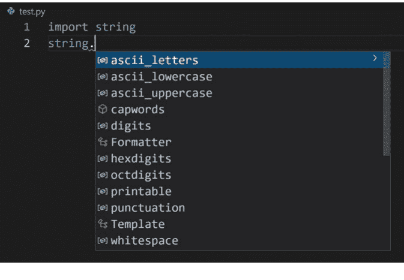

一些有用的常量是：

| 常量 | 描述 |
| :--- | :--- |
| `ascii_letters` | 从 A 到 Z 的所有字母，包括大小写。`ascii_letters` 实际上是 `ascii_lowercase` 和 `ascii_uppercase` 的连接。 |
| `ascii_lowercase` | 从 a 到 z 的所有小写字母。 |
| `ascii_uppercase` | 从 A 到 Z 的所有大写字母。 |
| `digits` | 从 0 到 9 的所有数字。 |
| `punctuation` | 所有标点符号：`!"#$%&'()*+,-./:;<=>?@[\]^_`{|}~` |

你不必使用这些常量，但 Python 提供了它们，所以如果它们能提供帮助，为什么不呢？

至于增量地向字符串添加字母，你以前见过，但提醒一下：

```
myString = "abc"
myString += "def"
print(myString)
```

你可以使用 `+=` 来添加到字符串。在这个例子中，字符串开始是 `abc`，然后 `def` 被添加进去。

`print()` 会显示什么？`abcdef`

## 挑战 10.3

好的，提醒一下，这个有点棘手。但是，我们对你有信心。

你见过给你密码规则的网站吗？他们会说类似这样的话：“密码长度必须至少为 8 个字符，并且至少包含 1 个数字和 1 个特殊字符。”

所以，假设用户说，是的，我希望我的密码包含大写字母、小写字母、数字和特殊字符。很简单，你随机选择字符并构建一个密码。对吧？

嗯，如果你从所有选项中随机选择字符，无法保证你会得到一个数字或一个特殊字符。实际上，你可能甚至得不到字母。你最终可能只有数字或特殊字符。

理想情况下，如果用户说他们想要数字，你会确保至少有一个数字。特殊字符也是一样。

那么，你如何修改代码来做到这一点呢？

**想看看我们的解决方案吗？**
提醒一下，如果你想查看我们针对这三个挑战的解决方案，请扫描此二维码访问书籍网页。


## 总结

如果你想成为一名优秀的程序员，你需要不断地编码、编码、再编码。没有捷径可走。你写的代码越多，你就会变得越好。因此，在本章中，我们为你提供了三个可以自己构建的应用程序。这些程序并非设计得超级困难，并且都可以使用你迄今为止所学的知识来编写。

至此，你已经完成了本书的第一部分。恭喜！在第二部分和第三部分，我们将改变我们的做法。不再是编写大量小程序，而是每一节都构建一个完整且更全面的程序。准备好了吗？

# 第二部分

# 冒险之旅

- 第11章 变得函数化
- 第12章 探索
- 第13章 清理时间
- 第14章 减少、重用、回收、重构
- 第15章 携带（并使用）物品
- 第16章 保持优雅
- 第17章 为你的世界着色
- 第18章 继续前进


# 第11章

## 变得函数化

欢迎来到第二部分。在本节中，你将构建一个复古风格的文字冒险游戏。在此过程中，你将学习许多创建强大应用程序的新技术。但首先，我们需要回顾一下函数，这次你将学习如何编写自己的函数。

## 函数回顾

你知道什么是函数。你已经见过并使用过很多函数：`input()`、`print()`、`int()`、`now()`、`upper()`、`choice()` 等等。

提醒一下，一个函数由三部分组成：

| 部分 | 描述 | 是否必需 | 示例 |
| :--- | :--- | :--- | :--- |
| 名称 | 唯一的函数名 | 是 | 例如 `print()`。名称是你在想要使用函数时调用它的方式。函数名后面必须始终跟有括号。这是必需的。 |
| 参数 | 传递给函数的一个或多个值 | 否 | 如果你写 `print("Hello", firstName)`，那么 `print()` 被传递了两个参数：一个包含文本 Hello 的字符串和一个名为 `firstName` 的变量。并非所有函数都接受参数；正如你所见，`print()` 和 `input()` 接受参数，但 `upper()` 和 `now()` 不接受。 |
| 返回值 | 返回给调用该函数的任何对象的值 | 否 | 你多次使用过的一个例子是 `input()`，它提示用户输入内容，然后将用户输入的内容返回给你。`firstName=input("What is your name?")` 提示输入一个值，该值被返回并保存到一个变量中（这里是 `firstName`）。有些函数返回结果；其他函数（如 `print()`）则不返回。 |

记住这一点。我们将经常引用函数名、参数和返回值，所以不要混淆它们。

> **方法就是函数**
正如你在第4章学到的，类中的函数被称为*方法*。所以，从技术上讲，`now()` 不是一个函数，而是 `datetime` 类中的一个方法。但是，方法确实是函数，所以为了简单起见，我们这里只称它们为函数。请记住，创建函数的规则和最佳实践也适用于方法。

**参数和返回值**
这是另一种看待它的方式。参数进入函数，返回值从函数出来。你作为参数传递的任何内容都会进入函数进行处理。函数在执行完毕后发送回你的代码的内容就是返回值。

参数进入，返回值出来。

**使用 Python 编写 Python**
Python 附带的大多数库本身也是用 Python 编写的。几乎每个第三方 Python 库也是用 Python 编写的。

但也有例外，正如你将在本书第三部分看到的那样。

## 编写你自己的函数

到目前为止，我们使用的所有函数都是 Python 自带的。有些总是可用，有些则需要你导入库，正如你所见。但它们都是 Python 的一部分，随时可供你使用。

就像几乎每一种编程语言一样，Python 允许你创建自己的*用户定义函数*。而且你是用 Python 编写的！是的，你使用 Python 函数来创建 Python 函数！

> **新术语**
**用户定义函数** *用户定义函数*（或 UDF）正是如此：一个由用户（你，程序员）定义的函数。

### 创建函数

那么，你如何创建自己的函数呢？让我们从一个简单（且相当无用）的例子开始。创建一个名为 Func1.py 的新文件，并输入以下内容：

```
def sayHello():
    print("Hello")

sayHello()
```

保存并运行代码。它将显示 Hello。是的，我们告诉过你这是一个相当无用的程序。但等等，它很快就会变得更好——我保证。

那么，这段代码做了什么？让我们从底部开始，从这行代码开始：

```
sayHello()
```

这调用了一个名为 sayHello() 的函数。就像调用 print() 或 input() 一样，要调用一个函数，你只需指定其名称，后跟括号。

但 Python 中没有 sayHello() 函数。那么当调用函数 sayHello() 时，执行的是什么代码？答案是，一个名为 sayHello() 的新函数正在同一个文件内部被创建，就像这样：

```
def sayHello():
    print("Hello")
```

在 Python 中，你使用语句 def（代表 *define*）后跟函数名来定义一个函数。这里的名称是 sayHello。

名称后面是括号，函数参数就在那里定义。这里的括号是空的，因为这个函数没有参数。即使你的函数不接受参数，你也必须在名称后指定括号。

就像 if 和 while 语句一样，定义函数的行以冒号（: 字符）结尾。并且就像 if 和 while 一样，构成函数本身的代码在函数定义语句下缩进。

> ### def 不会执行
需要注意的是，定义函数与执行函数是不同的。如果你的代码看起来像这样：

```python
def sayHello():
    print("Hello")
```

那么当你执行它时，什么都不会显示。为什么？因为你只是定义了函数，但从未执行它。如果你想使用你定义的函数（你应该是想的，否则为什么要写它？），那么你必须执行它。

### 函数必须在使用前定义

在我们的简单例子中，我们使用 def 定义了 sayHello() 函数，然后调用了 sayHello()。如果 sayHello() 调用在 def 之前会发生什么？如果你愿意，可以修改代码来尝试一下。你会看到一条错误消息：

'sayHello' is not defined

这仅仅意味着 Python 看到了你的 sayHello() 调用，但不知道该如何处理它。为什么？记住，Python 是从顶部开始逐行处理你的代码的。如果在函数 sayHello() 定义之前调用了 sayHello()，它将完全不知道 sayHello() 是什么。

所以，在 Python 中，函数必须在使用前定义。

顺便说一句，这也是为什么你总是将 import 语句放在代码顶部的原因。当你导入一个库时，Python 会看到其中的所有函数，本质上是在 import 语句所在的位置即时定义了它们。import 之后的任何代码都可以使用导入的函数。

## 传递参数

我们的 sayHello() 函数不接受任何参数（也不返回任何值）。这就是它相当无用的原因。

所以让我们创建一个更有趣的例子。看看这段代码：

```
multiply(12, 8)
```

没有名为 multiply() 的 Python 函数，所以你还不能运行这段代码。这段代码应该做的是允许你将任意两个数字传递给一个名为 multiply() 的函数。该函数将执行此操作：它将你传递给它的两个数字相乘，并且还会显示乘法和结果。

与不接受任何参数的 sayHello() 不同，multiply() 显然需要接受两个参数——要相乘的两个数字。

那么，`multiply()` 函数会是什么样子呢？以下是文件 `Func2.py` 的代码：

```python
# Function to multiply and print two numbers
def multiply(n1, n2):
    print(n1, "x", n2, "=", n1*n2)

# Test the function
multiply(12, 8)
```

保存并运行代码。它将显示 `12 x 8 = 96`（除非你使用了不同的数字，你显然可以自由这样做……实际上，试试用不同的数字运行代码吧）。

这个函数定义略有不同：

```python
def multiply(n1, n2):
```

这创建了一个名为 `multiply` 的函数，并告诉 Python `multiply()` 将接受两个参数。它是如何做到的？通过在括号内列出所需的参数。代码 `(n1, n2)` 告诉 Python 接受两个参数，并创建两个名为 `n1` 和 `n2` 的变量来包含作为参数传递的任何值。

在我们的测试代码中，我们将 `12` 和 `8` 作为参数传递给了 `multiply()`。Python 将第一个参数（值 `12`）放入第一个变量（名为 `n1`），将第二个参数（`8`）放入第二个命名变量（即 `n2`）。

在 `multiply()` 函数内部，我们可以像使用任何其他变量一样使用这些变量。因此，这行代码：

```python
print(n1, "x", n2, "=", n1*n2)
```

会打印出传递的两个参数及其乘积。由于我们传递了 `12` 和 `8`，这变成了 `print(12, "x", 8, "=", 12*8)`，正如你之前所见。

> **参数名称**
> 命名参数的规则与你在第 2 章看到的命名变量的规则相同。

### 参数默认是必需的

如果你尝试不带任何参数调用 `multiply()` 会发生什么？或者，如果你传递一个参数——或三个呢？

如果你没有传递正确数量的参数，Python 将会抛出一个错误（就像你向内置函数传递错误参数时一样）。这是因为 `multiply()` 中定义的两个参数是必需的。

话虽如此，创建可选参数是可能的。我们将在未来的章节中看到这方面的例子。

理解如何传递（和使用）参数非常重要，所以让我们尝试另一个例子。以下是 `Func3.py` 的代码（将最后一行中的名字 `Ben` 替换为你自己的名字）：

```python
# Function to display text within a border
def displayWelcome(txt):
    borderChar = "*"                    # Border character
    print(borderChar * (len(txt) + 4))  # Top line
    print(borderChar, txt, borderChar)  # Middle line
    print(borderChar * (len(txt) + 4))  # Bottom line

# Test it
displayWelcome("Welcome, O Great Coder Ben!")
```

保存并运行代码。它将显示类似这样的内容：

```
***************************
* Welcome, O Great Coder Ben! *
***************************
```

那么这是如何工作的呢？我们定义了一个名为 `displayWelcome()` 的函数，它接受一个参数，我们称之为 `txt`。

当函数被调用时，整个字符串（双引号之间的所有内容）被传递给 `displayWelcome` 并存储在变量 `txt` 中。

`displayWelcome()` 函数本身相当简单。它首先创建一个名为 `borderChar` 的变量，其中包含我们想要用于文本周围边框的字符。我们使用了星号，但你可以将其更改为任何你想要的字符。

## CAPTAIN CODE：用 Python 释放你的编码超能力

第一个 `print()` 语句打印顶部边框。顶行需要打印多少个边框字符？嗯，答案是这取决于具体情况。所有三行必须完全相同长度，而长度取决于传递的文本有多长。中间行显示被边框和空格包围的文本。如果文本是 `Shmuel`（6 个字符长），中间行将是 `* Shmuel *`（10 个字符长）。这意味着所有行都必须比传递的文本正好多 4 个字符。因此，为了显示正确数量的边框字符，我们可以这样做：

```python
print(borderChar * (len(txt) + 4))
```

`len(txt)` 返回传递文本的长度。`(len(txt) + 4)` 返回传递文本的长度加 4。正如你之前所见，将一个字符乘以一个数字会返回一个重复字符的字符串。如果文本是 `Shmuel`，这个 `print()` 语句将返回 `**********`（10 个边框字符）。

下一个 `print()` 语句显示中间行，它由边框字符、空格、文本、空格和边框字符组成，正如我们刚才解释的那样。

最后一个 `print()` 语句是底部边框，与顶部边框相同。

> ### 参数是局部的
> 在 `displayWelcome()` 函数内部有一个名为 `txt` 的变量。这是由函数创建的，它包含参数值——因此传递给函数的任何内容都将存储在 `txt` 中。
>
> 这个变量很特殊，因为它只存在于 `displayWelcome()` 函数内部。这种类型的变量称为*局部*变量，它对于创建它的函数是局部的。
>
> 这意味着什么？尝试在代码的最底部添加一个 `print(txt)`。你会看到一条错误消息，说 `txt` 未定义。这是因为在 `displayWelcome()` 外部，变量 `txt` 确实未定义；它在函数开始时创建，在函数执行完毕时销毁。
>
> 如果再次调用该函数，将创建一个新的局部 `txt` 变量（可能具有不同的值），并存在直到函数执行完毕。
>
> Python 会自动完成所有这些操作：在需要时创建变量，在完成时销毁它。

## 返回值

现在你知道如何创建函数以及如何传递参数了。我们需要看的最后一件事是如何从函数返回值。

函数可以返回值。想想你是如何使用 `input()` 的。它与用户交互，然后返回用户输入的内容作为结果。`upper()` 返回字符串的大写版本。`now()` 返回今天的日期和时间。

你自己的函数也经常需要能够返回值，你可以使用（命名非常方便的）`return` 语句来做到这一点。

让我们看一个例子——而且是一个非常有用的例子。你知道这段代码是做什么的，对吧？

```python
num=input("Enter a number: ")
```

这段代码要求用户“输入一个数字：”，然后将他们输入的任何内容存储到名为 `num` 的变量中。

所以，如果用户输入了 `abc`（这绝对不是一个数字），它将被保存到变量 `num` 中。这可不好。

所以，这是一个更好的代码版本：

```python
num=inputNumber("Enter a number: ")
```

这个版本调用了一个名为 `inputNumber()` 的函数，而不是 `input()`。与 `input()` 接受任何文本不同，`inputNumber()` 很聪明，它确保用户确实输入了一个数字。很酷，对吧？

嗯，如果 `inputNumber()` 函数确实存在的话，那会很酷。但是，唉，它并不存在。

但是，有一个解决方案。我们可以自己创建这个函数。以下是 `Func4.py` 的代码：

```python
# Numeric input function
def inputNumber(prompt):
    # Input variable
    inp = ""
    # Loop until variable is a valid number
    while not inp.isnumeric():
        # Prompt for input
        inp = input(prompt).strip()
    # Return the number
    return int(inp)

# Get a number
num=inputNumber("Enter a number: ")
# Display it
print(num)
```

保存并运行代码。它会提示你输入一个数字，然后显示该数字。如果你不输入数字，它会一直要求你“输入一个数字”，直到你实际输入一个数字为止。

代码的最后两行相当简单。`inputNumber()` 的工作方式与 `input()` 类似。它接受一个提示并返回一个值。这里，该值被保存到一个名为 `num` 的变量中，然后被打印出来。

真正的魔法在于 `inputNumber()` 函数本身。我们首先定义它：

```python
# Numeric input function
def inputNumber(prompt):
```

就像 `input()` 一样，`inputNumber()` 接受一个提示——显示给用户的文本——并且提示作为参数传递。

接下来，代码定义了一个变量来存储用户输入：

```python
# Input variable
inp = ""
```

然后是在循环内的实际提示：

```python
# Loop until variable is a valid number
while not inp.isnumeric():
    # Prompt for input
    inp = input(prompt).strip()
```

这是你之前见过的代码。它使用了一个 `while` 循环，其条件确保循环会持续进行，直到 `inp` 是一个数字。

实际的 `input()` 与我们整本书中使用的相同。`input()` 作为提示显示什么文本？就是传递给 `inputNumber()` 的参数。`prompt` 是一个透传变量：你将其传递给我们的用户自定义函数 `inputNumber()`，该函数再将其传递给内置函数 `input()`。

> **新术语**
**透传** 透传是指传递给一个函数的变量，该函数只是原封不动地将其传递下去。

循环不会结束，直到用户输入一个数字，这与我们之前看到的 `while` 语句类似。

然后是最后一行代码：

```
# 返回数字
return int(inp)
```

`return` 指定了从函数返回的值。`return inp` 会将用户输入作为字符串返回。这里我们使用 `int(inp)` 将输入的数字字符串转换为实际的数字并返回。

完美！

现在，值得注意的是，如果你的程序需要数字输入，你本可以将所有这些代码直接放在需要的地方（有点像我们之前做的那样）。但是创建一个函数来完成这个任务更可取。为什么？

- 首先，它使你的代码更整洁。用 `inputNumeric()` 替换 `input()`，它就能工作，没有任何杂乱。
- 像这样的函数可以被干净地隔离。它们内部的任何变量都是局部的。由于函数有自己的作用域，因此没有覆盖同名变量的风险。这样的代码更安全，减少了意外破坏东西的可能性。
- 像这样的函数促进了重用。编写一次函数，测试它，然后在任何地方使用它。这节省了时间。

但更重要的是，像这样的函数更容易维护。如果你必须修复一个错误，或者需要添加一个功能，你只需更改函数本身，所有使用该函数的代码都会从更改中受益。

> **新术语**
**作用域** 之前我们提到过，传递给函数的参数会创建局部变量，这意味着变量仅存在于函数本身内部。

事实是，这不仅适用于参数；对于所有变量也是如此。我们在 `inputNumber()` 中创建的 `inp` 变量仅在该函数执行时存在——之前和之后都不存在。

这被称为*作用域*，即变量的可见性。具有局部作用域的变量只能在其所属的函数内部看到。是的，还有其他作用域，我们将在未来的章节中看到。

## 挑战 11.1

超级英雄经常需要长途旅行，根据他们去的地方，他们需要以英里或公里为单位测量这些距离。创建两个函数：

- `miles2km()` 接受以英里为单位的距离，并返回以公里为单位的距离。
- `km2miles()` 则相反，接受以公里为单位的距离，并返回以英里为单位的距离。

每个函数都可以用两行代码编写。第一行是定义函数和参数的 `def`，第二行执行计算并返回结果。

为了节省你的时间，1 英里等于 1.6 公里，1 公里等于 0.6 英里（为简单起见，已四舍五入）。

## 总结

在本章中，你学习了如何创建自己的函数，以及如何传递参数和返回结果。在接下来的几乎每一章中，你都将创建函数。

# 第 12 章
## 探索

既然你知道了如何创建自己的函数，我们就准备好开始制作我们的游戏了。

从现在开始，我们将采取一些不同的做法。在第一部分中，你创建了许多小程序，每个都是一个单独的 `.py` 文件。这是一个很好的入门方式，但你现在是专业人士了，是时候像专业人士一样工作了。在本书的这一部分（以及第三部分），你将创建一个单一的应用程序——一个更大、更全面的应用程序。这个应用程序将由许多文件组成，我们将逐章逐步添加功能。

那么，我们要创建什么呢？在这一节中，你将构建一个基本的复古风格文字冒险游戏。

### 游戏概念

既然你知道了如何创建函数以及如何接受参数和返回值，让我们开始制作我们的游戏吧。

大多数现代游戏都具有令人惊叹的图形和动画、音效、视频序列以及使用控制器、触摸和动作的复杂交互。情况并非总是如此。最早的计算机游戏都是文本的：你用文本输入你想做什么，计算机用文本回应。

你将在本书的第三部分制作基于图形的游戏。在这一节中，我们将完全复古，创建一个基于文本的冒险游戏。

我们自己的游戏发生在太空中的某个地方。它始于玩家被困并试图理解他们所在的地方。我们将从一个非常简单的游戏结构开始，并在接下来的章节中添加功能和复杂性。

> 文字冒险游戏
第一个文字冒险游戏叫做 *Colossal Cave Adventure*，它早在 1976 年就创建了（大约在互联网被发明的同时）。游戏完全是文本的，开始于：

YOU ARE STANDING AT THE END OF A ROAD BEFORE A SMALL BRICK BUILDING. AROUND YOU IS A FOREST. A SMALL STREAM FLOWS OUT OF THE BUILDING AND DOWN A GULLY.

然后玩家会输入他们想做的事情——例如，`look` 或 `go east`——游戏会用更多的文本回应。玩家需要找到物品、解决谜题等等才能获胜。

一年后，Infocom 发布了 Zork（灵感来自 Colossal Cave Adventure）。Zork 是第一个商业化的（即销售的）文字游戏，它非常受欢迎，以至于成为了一个包含 10 个标题的系列。是的，续集并不是什么新鲜事！Infocom 继续创建了数十款文字冒险游戏，包括 *The Hitchhiker’s Guide to the Galaxy*（我们作者碰巧非常喜欢）。

当计算机被赋予显示图形和图像的能力时，文字冒险游戏就不再流行了。但它们仍然非常有趣，而且创建起来更有趣。

**我们让你入门**
我们应该指出，我们将一起创建的游戏将非常简单；玩家可以在几分钟内完成它。但是，通过使用你将在本节中学到的技巧（并通过完成挑战），你将拥有完成这个游戏所需的所有工具和技能——或者创建你自己的游戏。实际上，我们将以关于下一步方向的想法来结束本书的这一部分，这样你就可以真正将你的游戏提升到一个新的水平。

**故事起点**
如果你正在为你的游戏想一个好的故事点子，请扫描此二维码访问本书网页。我们创建了一些（故意不完整的）故事起点，你可以将其作为，嗯，一个起点。

> **提示**
**编写你自己的游戏** 我们真的希望你编写自己的游戏，而不仅仅是复制我们的。如果它有帮助，请随意使用我们的作为起点。但是，如果你疯狂地发明自己的故事情节，这将变得更有用（也更有趣）。

文字冒险游戏通常是一系列地点。每个地点都有一个描述和玩家可以做的事情。

所以，首先，我们需要一种显示地点的方法，以及一种提示用户他们想做什么的方法。幸运的是，我们知道如何做到这两点。对吧？

## 游戏结构

我们不会立即开始编码。在我们这样做之前，让我们看看游戏将如何构建。

我们游戏的基础将是函数。每个地点都是一个函数。目前我们的函数只是显示文本，但我们很快就会添加功能（明白了吗？）。

当游戏开始时，我们将使用函数 `doWelcome()` 显示欢迎消息：

```
# 欢迎玩家
def doWelcome():
    # 显示文本
    print("Welcome adventurer!")
    print("You wake in a daze, recalling nothing useful.")
    print("Stumbling you reach for the door, it opens in anticipation.")
    print("You step outside. Nothing is familiar.")
    print("The landscape is dusty, vast, tinged red, barren.")
    print("You notice that you are wearing a spacesuit. Huh?")
```

如你所见，它有很多 `print()` 语句。很简单。当你的代码调用 `doWelcome()` 时，所有这些 `print()` 语句都会执行，文本将被显示。

实际的游戏玩法从一个名为 `doStart()` 的函数开始，它看起来像这样：

```
# 地点：开始
def doStart():
    # 显示文本
    print("You look around. Red dust, a pile of boulders, more dust.")
    print("There's an odd octagon shaped structure in front of you.")
    print("You hear beeping nearby. It stopped. No, it didn't.")
```

同样，这是一个非常简单的函数（目前），没有参数，也没有返回值。代码只是使用非常熟悉的 `print()` 函数显示文本。

这是另一个例子，展示了如果玩家决定逃跑会发生什么：

```
# 玩家逃跑
def doRun():
    # 显示文本
    print("You run, for a moment.")
```

print("然后你开始漂浮。向下，向下，向下。")
print("你掉进了一个深渊，从此再无人见过你。")
print("不太勇敢，是吧？")

同样，这是一个简单的函数，只包含`print()`语句。

你需要创建一系列这样的函数——每个游戏地点一个。你可以随意命名这些函数。我们为了保持条理，都以`do`开头，但你可以使用任何你喜欢的命名约定。

> **提示**
> **不要重复使用函数名** 不要为多个函数使用相同的名称。这实际上是允许的，所以如果你这样做，Python不会显示错误信息。但会发生的情况是第二个函数会覆盖第一个函数——这可能不是你想要的。所以，请确保所有函数名都是唯一的。

## 提示选项

游戏中的地点都是函数……很多很多函数。你的代码将执行一个函数，该函数显示文本，然后提示玩家下一步想做什么。一旦玩家做出选择，你将执行另一个函数，该函数显示文本，然后提示用户进行操作。如此循环。

这意味着我们需要显示选项并提示用户做出选择。

提示用户选择选项非常简单。你现在已经是这方面的专家了。我们可以使用一个带有`input()`的`while`循环。例如，在游戏开始时，用户有几个选择。他们可以选择`P`来查看巨石堆，`S`去往那个建筑，`B`走向哔哔声，或者`R`逃跑。我们可以这样做：

```
# 提示用户操作
choice=" "
while not choice in "PSBR":
    print("你可以：")
    print("P = 检查巨石堆")
    print("S = 去往建筑")
    print("B = 走向哔哔声")
    print("R = 逃跑！")
    choice=input("你想做什么？[P/S/B/R]")
```

这段代码与你之前见过的代码非常相似。它初始化一个名为`choice`的变量。然后使用一个`while`循环来显示选项，并且只接受有效的选择。条件检查`choice`是否在允许的选项中（这里是P、S、B或R）。

很简单。但一旦做出了选择，我们该如何处理`choice`呢？

## 处理选项

上面的`while`循环只有在用户做出有效选择后才会结束。一旦做出选择，我们只需要调用正确的函数，像这样：

```
# 执行操作
if choice == 'P':
    doBoulders()
elif choice == 'S':
    doStructure()
elif choice == 'B':
    doBeeping()
elif choice == 'R':
    doRun()
```

这里我们有一系列`if`和`elif`语句。根据做出的选择，我们将用户引导到正确的函数。

所以，完整的`doStart()`函数看起来会像这样：

```
# 地点：起点
def doStart():
    # 显示文本
    print("你环顾四周。红色的尘土，一堆巨石，更多的尘土。")
    print("你面前有一个奇怪的八角形建筑。")
    print("你听到附近有哔哔声。它停了。不，它没停。")
    # 提示用户操作
    choice=" "
    while not choice in "PSBR":
        print("你可以：")
        print("P = 检查巨石堆")
        print("S = 去往建筑")
        print("B = 走向哔哔声")
        print("R = 逃跑！")
        choice=input("你想做什么？[P/S/B/R]").strip().upper()
    # 执行操作
    if choice == 'P':
        doBoulders()
    elif choice == 'S':
        doStructure()
    elif choice == 'B':
        doBeeping()
    elif choice == 'R':
        doRun()
```

显示文本，展示可用选项，提示输入，然后进入下一个函数。就这么简单。

## 创建工作文件夹

与我们迄今为止创建的所有代码不同，这个文字冒险游戏将由许多文件组成。为了将它们整齐地组织在一起，我们将为这个项目创建一个新文件夹。

将鼠标悬停在VS Code的资源管理器面板上。将鼠标悬停在**PYTHON**部分，你会在顶部看到这个工具栏：


从左数第二个图标是**新建文件夹**图标。点击它，系统会提示你输入文件夹名称。输入`Adventure`并按**Enter**键，为游戏创建一个新文件夹。

184 **CAPTAIN CODE**：用Python释放你的编程超能力

> **更多代码在线**
> 如前所述，你不必输入所有这些代码。你只需扫描这个二维码，就可以在线找到这个以及其他入门代码。

当你创建新的代码文件时，请确保你首先在资源管理器面板中点击了新文件夹。这样，你创建的文件就会在正确的文件夹中。

> **提示**
> **多个工作文件夹** 你可能想要创建不止一个工作文件夹。这样，你可以有一个用于我们提供的示例代码（我们将一起处理），另一个用于你自己的游戏。

## 游戏时间

好的，现在你已经理解了游戏结构并有了一个工作文件夹，让我们开始编码吧。游戏中的第一个文件将被命名为`Main.py`（它放在你新建的`Adventure`文件夹中）。以下是代码：

```
#####################################
# 太空冒险
# by Ben & Shmuel
#####################################

# 欢迎玩家
def doWelcome():
    # 显示文本
    print("欢迎你，冒险者！")
    print("你迷迷糊糊地醒来，想不起任何有用的事情。")
    print("你跌跌撞撞地走向门，门仿佛预知般地打开了。")
    print("你走了出去。一切都很陌生。")
    print("景色满是尘土，广阔无垠，泛着红色，荒芜一片。")
    print("你注意到自己穿着太空服。嗯？")

# 地点：起点
def doStart():
    # 显示文本
    print("你环顾四周。红色的尘土，一堆巨石，更多的尘土。")
    print("你面前有一个奇怪的八角形建筑。")
    print("你听到附近有哔哔声。它停了。不，它没停。")
    # 提示用户操作
    choice=" "
    while not choice in "PSBR":
        print("你可以：")
        print("P = 检查巨石堆")
        print("S = 去往建筑")
        print("B = 走向哔哔声")
        print("R = 逃跑！")
        choice=input("你想做什么？[P/S/B/R]").strip().upper()
    # 执行操作
    if choice == 'P':
        doBoulders()
    elif choice == 'S':
        doStructure()
    elif choice == 'B':
        doBeeping()
    elif choice == 'R':
        doRun()

# 地点：巨石堆
def doBoulders():
    # 显示文本
    print("认真的吗？它们就是巨石。")
    print("巨大、沉重、无聊的巨石。")
    # 返回起点
    doStart()

# 地点：建筑
def doStructure():
    # 显示文本
    print("你检查了这个奇怪的建筑。")
    print("诡异的、非地球的声音似乎从里面传来。")
    print("你看不到门或窗户。")
    print("嗯，那个轮廓可能是一扇门，祝你好运能打开它。")
    print("还有那个哔哔声。它是从哪里传来的？")
    # 提示用户操作
    choice=" "
    while not choice in "SDBR":
        print("你可以：")
        print("S = 返回起点")
        print("D = 打开门")
        print("B = 走向哔哔声")
        print("R = 逃跑！")
        choice=input("你想做什么？[S/D/B/R]").strip().upper()
    # 执行操作
    if choice == 'S':
        doStart()
    elif choice == 'D':
        doStructureDoor()
    elif choice == 'B':
        doBeeping()
    elif choice == 'R':
        doRun()

# 地点：建筑门口
def doStructureDoor():
    # 显示文本
    print("门似乎是锁着的。")
    print("你看到一个小圆孔。那是钥匙孔吗？")
    print("你把手伸向它，它闪了一下蓝光然后关上了！")
    print("嗯，这没按计划进行。")
    # 提示用户操作
    choice=" "
    while not choice in "SR":
        print("你可以：")
        print("S = 返回建筑")
        print("R = 逃跑！")
        choice=input("你想做什么？[S/R]").strip().upper()
    # 执行操作
    if choice == 'S':
        doStructure()
    elif choice == 'R':
        doRun()

# 地点：探索哔哔声
def doBeeping():
    pass

# 玩家逃跑
def doRun():
    # 显示文本
    print("你跑了一会儿。")
    print("然后你开始漂浮。向下，向下，向下。")
    print("你掉进了一个深渊，从此再无人见过你。")
    print("不太勇敢，是吧？")
    # 死亡，游戏结束
    gameOver()

# 游戏结束
def gameOver():
    print("游戏结束！")

# 实际游戏从这里开始
# 显示欢迎信息
doWelcome()
# 游戏起始地点
doStart()
```

这里有很多代码，但大部分应该是不言自明的。

代码首先定义了许多函数。`doWelcome()`、`doStart()`、`doStructure()` 等都是游戏中的位置。如前所述，每个位置都是一个独立的函数。`doWelcome()` 通过一系列 `print()` 函数来介绍游戏。`doStart()` 是游戏的起始位置；它显示文本，提示用户做出选择，然后将用户引导到相应的函数。

定义函数并不会执行它们。当你使用 `def` 时，你是在创建并命名一个新函数以备将来使用。但 Python 在你实际调用该函数之前，不会对这个新函数做任何事情。这就是为什么代码以如下方式结束：

```python
# Actual game starts here
# Display welcome
doWelcome()
# Game start location
doStart()
```

一旦所有函数都定义完毕，`doWelcome()` 调用 `doWelcome()` 函数来欢迎用户，而 `doStart()` 则开始实际的游戏流程。

哦，这里有一个新语句我们应该提一下。看看这段代码：

```python
# Explore beeping
def doBeeping():
    pass
```

`pass` 是做什么的？Python 不喜欢空函数。如果你用 `def` 创建了一个函数，那么它下面必须有一些缩进的内容。如果你没有任何缩进内容，Python 会显示错误消息。`pass` 呢，它确实什么都不做。它是一个占位符。你可以把它放在代码中，这样 Python 就不会显示错误消息，直到你准备好实际编写函数代码为止。因此，`pass` 在你工作时非常有用（但在你完成的代码中则毫无用处）。

## 测试一下

如果你运行 `Main.py`，你会在终端窗口中看到：

```
Welcome adventurer!
You wake in a daze, recalling nothing useful.
Stumbling you reach for the door, it opens in anticipation.
You step outside. Nothing is familiar.
The landscape is dusty, vast, tinged red, barren.
You notice that you are wearing a spacesuit. Huh?
You look around. Red dust, a pile of boulders, more dust.
There's an odd octagon shaped structure in front of you.
You hear beeping nearby. It stopped. No, it didn't.
You can:
P = Examine boulder pile
S = Go to the structure
B = Walk towards the beeping
R = Run!
What do you want to do? [P/S/B/R]
```

代码执行了 `doWelcome()`，显示了欢迎信息，然后执行了 `doStart()`，显示了起始位置和提示。

如果你选择 `S` 去那个结构，函数 `doStructure()` 就会被执行，并显示：

```
What do you want to do? [P/S/B/R]s
You examine the odd structure.
Eerily unearthly sounds seem to be coming from inside.
You see no doors or windows.
Well, that outline might be a door, good luck opening it.
And that beeping. Where is it coming from?
You can:
S = Back to start
D = Open the door
B = Walk towards the beeping
R = Run!
What do you want to do? [S/D/B/R]
```

以此类推。

有一个值得注意的函数是 `doBoulder()`。这将在未来成为一个重要的位置（玩家可以在这里找到一把钥匙，嘘！），但目前它只显示文本，没有选项。那么，如果没有选项可选，游戏如何继续呢？看看代码：

```python
# Location: Boulders
def doBoulders():
    # Display text
    print("Seriously? They are boulders.")
    print("Big, heavy, boring boulders.")
    # Go back to start
    doStart()
```

`doBoulder()` 显示文本，然后立即通过执行 `doStart()` 将玩家送回起始位置。这暂时就足够了。我们很快就会为 `doBoulder()` 添加功能。

> **提示**
> **你可以停止执行** 测试时，你不必运行整个程序。你可以随时停止执行。方法是点击终端窗口右侧的垃圾桶图标。这会终止终端会话，从而停止你的程序运行。然后，当你准备好时，可以再次开始执行。

**你可以为输出添加空格**
当你运行游戏时，你会看到很多文本都挤在一起。你可以通过在输出中添加空行来使内容更清晰。要这样做，只需添加一个空的 `print()` 函数，像这样：

```python
print()
```

额外的空格会使文本更易读。

哦，在第 17 章，我们将添加颜色，这将使内容更加易读。

## 挑战 12.1

第一部分的挑战都是可选的——算是锦上添花。现在情况不同了。你会想要完成所有挑战，因为你将在后续章节中基于它们进行构建。

好的，我们需要你在这个挑战上花些时间。你在这里创建的作品将成为本书第二部分结束前你所有其他工作的基础。

所以，在进入第 13 章之前，你需要规划你的游戏。我们指的是规划，而不是编码。至少现在还不是。你可以基于我们的游戏或使用我们的故事开头来设计。（但说实话，我们更希望你能想出自己的点子。）确保你至少有 10 个位置——越多越好。并且要有允许玩家从一个位置移动到另一个位置的路径。

思考一下流程。并非每个位置总是可用的。用户可能需要先去一个位置才能到达另一个位置。你可能想画一张地图。（是的，画……老派的方式，用铅笔或钢笔在纸上画。我们确实说过我们要复古。）

一旦你有了计划，就开始编写你的位置函数。确保每个函数都可以被访问到，并且每个函数都有选项。让用户绕来绕去是完全可以的。

然后测试你的代码。尝试每个选项。在位置之间移动。验证一切是否按预期工作。

## 总结

在本章中，你运用了函数知识来创建一个基于文本的冒险游戏的基本结构。游戏目前功能不多：它只是让玩家四处走动。我们将在本书的剩余部分为其添加功能。

# 第 13 章

## 清理时间

在第 12 章，你创建了基于文本的冒险游戏的雏形。虽然非常不完整，但玩家可以启动你的游戏并通过选择来移动。代码可以运行，但你可能已经看到了改进的方法。这个持续改进的过程就是本章和下一章的主题。

## 优化你的代码

正如我们之前讨论的，在开始编码之前，你需要规划你的应用程序。规划至关重要，规划得越多，实际编写代码就越容易。但是，即使有最好的规划，一旦你开始编码，你不可避免地会发现改进代码的方法。

有哪些类型的改进？比如：

- 可以将处理逻辑移到其他地方，使你的代码更清晰、更简洁
- 移除重复的代码
- 识别可以从主代码中分离出来的功能，以便重用
- 为简化或性能而改进特定的处理

这些只是几种改进类型，还有很多其他类型。

随着时间的推移和经验的积累，程序员会学会一开始就写出更好的代码。但事实是，即使是最有经验的程序员也在不断寻找改进代码的方法。

现在，让我们来看一个我们提到的第一种改进类型的例子：将代码移到其他地方，使一切更清晰、更简单。

`Main.py` 是我们游戏的主文件。如你所见，它由许多函数组成。但这些函数是由什么组成的呢？让我们从 `doWelcome()` 函数开始看几个例子：

```python
# Welcome the player
def doWelcome():
    # Display text
    print("Welcome adventurer!")
    print("You wake in a daze, recalling nothing useful.")
    print("Stumbling you reach for the door, it opens in anticipation.")
    print("You step outside. Nothing is familiar.")
    print("The landscape is dusty, vast, tinged red, barren.")
    print("You notice that you are wearing a spacesuit. Huh?")
```

你注意到这个函数的什么特点了吗？它全是 `print()` 语句，对吧？大量的文本。

让我们看看 `doStart()` 函数的一部分：

```python
# Location: Start
def doStart():
    # Display text
    print("You look around. Red dust, a pile of boulders, more dust.")
    print("There's an odd octagon shaped structure in front of you.")
    print("You hear beeping nearby. It stopped. No, it didn't.")
```

也有很多 `print()` 语句和文本。`doRun()` 也是如此：

```python
# Player ran
def doRun():
    # Display text
    print("You run, for a moment.")
    print("And then you are floating. Down down down.")
    print("You've fallen into a chasm, never to be seen again.")
    print("Not very brave, are you?")
```

实际上，如果你查看 `Main.py` 中的所有代码，你可能会发现由 `print()` 函数显示的文本占了很大一部分。

将所有这些文本直接放在核心代码中是个问题吗？考虑以下几点：

- 故事文本分散在各处，难以维护。如果文本分散在各处，保持拼写一致以及确保统一的语气和风格将具有挑战性。
- 修改更加困难。重命名角色、调整描述和形容词等等……如果你需要在多个地方进行这些操作，你不可避免地会遗漏一些。
- 想象一下，你的程序非常受欢迎，你决定将其发布为其他语言版本。翻译分散在不同位置的小段文本是很困难的。

## 字符串外部化

字符串外部化是代码优化的重要组成部分，原因如前所述。如何实现呢？方法有很多，但一个简单的选择是将所有文本移至另一个文件，并创建一个函数，在需要时返回所需的文本。

## 创建字符串文件

让我们从 `doWelcome()` 函数开始，将文本外部化：

```
# 欢迎玩家
def doWelcome():
    # 显示文本
    print("Welcome adventurer!")
    print("You wake in a daze, recalling nothing useful.")
    print("Stumbling you reach for the door, it opens in anticipation.")
    print("You step outside. Nothing is familiar.")
    print("The landscape is dusty, vast, tinged red, barren.")
    print("You notice that you are wearing a spacesuit. Huh?")
```

我们可以将其转换为类似这样：

```
# 欢迎玩家
def doWelcome():
    # 显示文本
    print(functionThatGetsTheString())
```

显然，这个 `doWelcome()` 函数目前无法执行；它调用了一个不存在的函数。但从概念上讲，这就是事情运作的方式。我们可以用一个 `print()` 语句调用一个函数，并打印该函数返回的任何内容，而不是使用大量包含硬编码文本的 `print()` 语句。

顺便说一句，当程序员思考想法时，他们经常使用这样的伪代码——开发期间为自己编写的假代码。他们称之为 *伪代码*。

> **新术语**
> **伪代码** *伪代码* 是假代码。它不是计算机能理解的实际代码，而是供人类在思考代码时阅读和理解的文本。

创建一个新文件（在 Adventure 文件夹中），命名为 `Strings.py`。代码如下：

```
###############################################
# Strings.py
# 外部化字符串
###############################################

def get(id):
    if id == "Welcome":
        return ("Welcome adventurer!\n"
                "You wake in a daze, recalling nothing useful.\n"
                "Stumbling, you reach for the door, it opens in "
                "anticipation.\nYou step outside. Nothing is "
                "familiar.\nThe landscape is dusty, vast, tinged "
                "red, barren.\nYou notice that you are wearing "
                "a spacesuit. Huh?")
    elif id == "Start":
        return ("You look around. Red dust, a pile of boulders, "
                "more dust.\nThere's an odd octagon shaped "
                "structure in front of you.\nYou hear beeping "
                "nearby. It stopped. No, it didn't.")
    elif id == "Boulders":
        return ("Seriously? They are boulders.\n"
                "Big, heavy, boring boulders.")
    elif id == "Structure":
        return ("You examine the odd structure.\n"
                "Eerily unearthly sounds seem to be coming from "
                "inside.\nYou see no doors or windows.\nWell, that "
                "outline might be a door, good luck opening it.\n"
                "And that beeping. Where is it coming from?")
    elif id == "StructureDoor":
        return ("The door appears to be locked.\nYou see a small "
                "circular hole. Is that the keyhole?")
    elif id == "StructureDoorNoKey":
        return ("You move your hand towards it, it flashes blue "
                "and closes!\nWell, that didn't work as planned.")
    elif id == "Run":
        return ("You run, for a moment.\n"
                "And then you are floating. Down down down.\n"
                "You've fallen into a chasm, never to be seen "
                "again.\nNot very brave, are you?")
    elif id == "GameOver":
        return "Game over!"
    else:
        return ""
```

这个文件中只有一个函数，定义如下：

```
def get(id):
```

函数 `get()` 接受一个标识符（一个名为 `id` 的变量）。因此，当调用 `get()` 时，必须向其传递一个 `id`。

其余代码是一个大的 `if elif else` 语句。它首先检查：

```
if id == "Welcome":
```

如果向 `get()` 传递了 `Welcome`，那么该条件将为 `True`，其下方缩进的代码将被执行。那段代码做什么？它只是返回一段文本：

```
return ("Welcome adventurer!\n"
        "You wake in a daze, recalling nothing useful.\n"
        "Stumbling, you reach for the door, it opens in anticipation.\n"
        "You step outside. Nothing is familiar.\n"
        "The landscape is dusty, vast, tinged red, barren.\n"
        "You notice that you are wearing a spacesuit. Huh?")
```

其余的 `elif` 语句做同样的事情：检查 `id` 并返回文本。

最后的 `else` 语句只是为了安全起见：

```
else:
    return ""
```

如果向 `get()` 传递了无效的 `id`，函数将返回一个空字符串。

`get()` 不显示文本——其中没有 `print()`——而只是将其返回给你的代码。由你的代码决定如何处理这些文本，如果需要，代码确实可以打印它。

如果使用 `get("Welcome")` 调用该函数，它将返回欢迎消息。任何其他需要的字符串也是如此。想测试它是否工作吗？在 `Strings.py` 的底部添加以下内容：

```
print(get("Welcome"))
```

> **多行文本**
> 关于多行文本的两点说明。
>
> 首先，长文本块可以跨多行。只需在每行文本周围加上引号。Python 会将文本视为一个长文本块。
>
> 其次，注意一些文本中间的 `\n`。这是一个换行符（我们之前提到过）。它强制在终端输出中换行。

如果你运行代码，与 `Welcome` 相关的测试将被打印出来。如何实现？`get("Welcome")` 返回文本，而 `print()`，...嗯，它打印。

你可以尝试其他 `id` 以确保它正常工作。测试完成后，删除测试用的 `print()`。

每次游戏中需要新的文本块时，都可以向此函数添加一个部分。每个部分都有一个唯一的 `id`。使用该 `id` 调用 `get()`，就会返回正确的文本。

哦，注意 `return` 语句。大多数函数在末尾只有一个 `return` 语句。这里我们为每个字符串都有一个 `return`，每个 `return` 都会停止函数处理并返回结果。这样，我们就不必将文本保存到变量中然后再返回它。但是，在 `if` 语句中，你确实可以将文本保存到变量中并返回它。两种方式都可以。

## 使用外部化字符串

那么，我们如何使用这个新的 `Strings` 文件和 `get()` 函数呢？我们将其作为库导入。是的，我们的 `Strings.py` 文件是一个 Python 库。

在 `Main.py` 的顶部添加以下内容：

```
# 导入
import Strings
```

> **注意库命名**
> 我们将文件命名为 `Strings.py`，因此库名为 `Strings`。如你所知，Python 有一个名为 `String` 的内置库。如果我们把文件命名为 `String.py`，就会覆盖内置库，但 `Strings.py` 是安全的。

**字符串存储**
这里我们将显示字符串从核心代码移入一个大的 `if` 语句中。这对于几十个甚至几百个字符串都有效。对于更大的应用程序，程序员永远不会这样做。他们会将文本存储在某种数据库中，并根据需要检索字符串。

使用数据库在概念上类似于使用 Python 文件。字符串被外部化并根据需要检索。你可以根据具体需求选择存储选项。

要使用 `get()` 函数，我们用函数调用替换硬编码的文本。让我们从 `doWelcome()` 开始。删除所有 `print()` 语句，并用以下代码替换它们：

```
# 欢迎玩家
def doWelcome():
    # 显示文本
    print(Strings.get("Welcome"))
```

`Strings.get()` 是我们 `Strings.py` 中的 `get()` 函数。由于这是 `doWelcome()` 函数，我们使用 `Strings.get("Welcome")`，它告诉 `get()` 返回 "Welcome" 文本，正如你之前看到的。该文本被传递给 `print()`。

`doWelcome()` 现在只有一行代码。如你所见，这更加简洁和紧凑。

**挑战 13.1**
将应用程序中的所有字符串外部化。至少，外部化显示文本。如果愿意，你甚至可以外部化选项提示和任何其他显示的文本。

## 总结

在本章中，我们介绍了字符串外部化作为清理代码的一种方式。我们的应用程序现在由两个文件组成，在下一章中，我们将添加第三个文件，同时介绍另一个非常重要的优化。

## 第14章

## 减少、重用、回收、重构

在第13章中，我们暂停了游戏编码，转而清理代码。本章我们将继续这项工作。

## 理解重构

在第13章，我们讨论了持续寻找改进代码的方法。毕竟，代码永远不会真正完成。它总能被进一步优化和精炼——这就是为什么程序员会定期花时间*重构*他们的代码。重构是改进代码功能的过程。当你重构代码时，你改变的是它的工作方式，而不是它所做的事情。

> **新术语**

**重构** *重构*是改进代码功能的过程。当你重构代码时，你改变的是它的工作方式，而不是它所做的事情。

重构的关键在于，它不是关于添加功能或进行任何功能性的更改。当你重构时，你不是在改变代码*做什么*，而是在改变它*如何做*。一次性进行大量更改从来都不是个好主意；这会增加出错的可能性，并且很难找出具体是哪里出了问题。当你重构代码时，你的应用程序将执行与之前完全相同的功能，这意味着你可以轻松验证一切仍然正常工作。

重构听起来可能很复杂，但是——惊喜！——你已经开始重构你的代码了。我们的字符串外部化练习就是一个重构的例子。到第13章结束时，代码在功能上与第12章结束时的代码完全相同。我们没有改变代码的功能，而是通过重组和改进它来改变它的工作方式。这正是重构的全部意义所在。

所以，让我们继续重构。是的，这意味着当我们完成本章时，代码在功能上仍将与第12章和第13章中的代码完全相同。功能相同，但经过了重新设计——或者更准确地说，是重构。

我们之前讨论过识别和消除重复代码。正如我们所指出的，重复代码从来都不是个好主意。在编写代码时，你不可避免地会发现有些代码片段是重复的，无论是完全相同还是略有不同。消除这些重复是重构代码的重要组成部分。

## 识别重构机会

关于具体重构什么，并没有固定的规则。如何以及在哪里优化代码取决于你，程序员。但让我们一起看一个例子。

你现在有了一个简单可用的文本冒险游戏。你创建了一系列地点，玩家可以在其中移动。

看看你的代码。你看到任何看起来重复的部分吗？有一个非常明显的例子。在每个地点，我们都需要做以下事情：

1.  向玩家显示一系列选项。
2.  提示他们想要做什么。
3.  确保他们做出有效的选择，如果他们没有，则返回到步骤2。

虽然每个地点的具体选项不同，但流程是相同的。比较这两个例子（来自我们第11章的代码……你自己的故事可能有不同的选项）。

这是我们的doStart()函数：

```python
# Location: Start
def doStart():
    # Display text
    print(Strings.get("Start"))
    # Prompt for user action
    choice=" "
    while not choice in "PSBR":
        print("You can:")
        print("P = Examine boulder pile")
        print("S = Go to the structure")
        print("B = Walk towards the beeping")
        print("R = Run!")
        choice=input("What do you want to do? [P/S/B/R]").strip().upper()
    # Perform action
    if choice == 'P':
        doBoulders()
    elif choice == 'S':
        doStructure()
    elif choice == 'B':
        doBeeping()
    elif choice == 'R':
        doRun()
```

这段代码使用我们的Strings.get()函数来显示文本，然后显示选项并提示用户做出选择。

这是我们的doStructure()函数的一个片段：

```python
def doStructure():
    # Display text
    print(Strings.get("Structure"))
    # Prompt for user action
    choice=" "
    while not choice in "SDBR":
        print("You can:")
        print("S = Back to start")
        print("D = Open the door")
        print("B = Walk towards the beeping")
        print("R = Run!")
        choice=input("What do you want to do? [S/D/B/R]").strip().upper()
```

比较两个# Prompt for user action部分中的代码。显然，它们并非100%相同；选项不同，但流程完全相同。对吧？

它们打印选项，每行一个。它们在while循环中提示input()。如果你有10个、15个或更多函数，那么你就会有非常相似的代码被一遍又一遍地重复。这是重构的明显候选对象。

## 创建用户选择组件

我们需要一遍又一遍地显示选项并提示用户选择。这需要被重构。

我们可以轻松地创建一个函数来提示用户选择一个操作。实际上，我们可以重用代码，做一些像这样简单的事情：

```python
def startChoice():
    choice=" "
    while not choice in "PSBR":
        print("You can:")
        print("P = Examine boulder pile")
        print("S = Go to the structure")
        print("B = Walk towards the beeping")
        print("R = Run!")
        choice=input("What do you want to do? [P/S/B/R]")
    return choice
```

这创建了一个名为startChoice()的函数。它包含从我们的doStart()函数复制的代码。它显示选项，提示input()，并确保输入有效。唯一的区别是最后一行`return choice`，它返回用户决定的操作。

使用这个函数，我们可以将我们的doStart()函数更改为如下所示：

```python
# Location: Start
def doStart():
    # Display text
    print(Strings.get("Start"))
    # Get user choice
    choice=startChoice()
    # Perform action
    if choice == 'P':
        doBoulders()
    elif choice == 'S':
        doStructure()
    elif choice == 'B':
        doBeeping()
    elif choice == 'R':
        doRun()
```

这个版本的doStart()简洁多了。它显示文本，获取选择，然后根据该选择执行操作。所有的提示和输入代码都已从主函数中移出，并被一行清晰简洁的代码所取代：

```python
choice=startChoice()
```

但这真的更好吗？是的，代码更干净了，但startChoice()函数只对doStart()有用。由于每个地点函数都有不同的选项，我们需要为每个函数创建一个不同的函数——而且几乎都一样。啊啊啊！重复！我们正试图消除代码重复！

事实是，这个概念是有道理的。将选择代码从地点函数中移出是个好主意，但这绝对不是正确的实现方式。

## 设计可重用组件

我们如何改进这一点？我们可以创建一个通用函数：一个不硬编码特定选项的函数，一个可以显示各种选项的函数。

让我们把新函数叫做getUserChoice()。你将可用选项作为参数传递给getUserChoice()。然后它可以显示你传递的任何选项，获取一个属于这些选项之一的选择，并返回它。这将给你隔离选择代码的好处，而不需要大量的函数。完美！

你知道如何向函数传递参数；我们在第11章做过。那么，一个通用的getUserChoice()函数定义可能是什么样子的？

我们可以尝试这样：

```python
def getUserChoice(letter, prompt):
```

这个函数将接受一个字母和要显示的文本——例如，getUserChoice("R", "Run!")。函数可以按传递的方式显示字母和提示。

但这只在地点只有一个选项时有效。如果另一个地点有2个选项怎么办？嗯，我们可以添加更多参数，像这样：

```python
def getUserChoice(letter1, prompt1, letter2, prompt2):
```

很好，这处理了2个选项。但如果其他地点有3个、5个甚至12个选项呢？而且，对于只需要1个选项的地点呢？如果传递的参数太少，函数会抛出错误。

我们需要一种更好、更灵活的方式来传递参数。有什么想法吗？

也许我们可以使用一个可以存储我们所需数量（或多或少）选项的变量。有想到什么吗？

一个可以存储*列表*值的变量？<轻推> <眨眼>

你知道它是什么，对吧？是的，列表。我们可以使用列表！

我们可以这样定义函数：

```python
def getUserChoice(options):
```

然后以列表形式传递选项，像这样：

```python
options=["E", "Explore", "R", "Run!"]
getUserChoice(options)
```

这样，你可以根据需要传递任意多的选项，每个选项在列表中添加两个项目。然后代码可以遍历该列表。在函数代码内，options[0]将是第一个允许的字母，options[1]将是其对应的提示；options[2]将是下一个允许的字母，options[3]将是其对应的提示；依此类推。

这实际上是一个非常好的解决方案。但是，我们可以让它更好一点。

回到第6章，我们探讨了列表，并顺便提到你可以创建列表的列表。是的，一个包含列表的列表。

解释列表的列表最好的方法是看一个例子。创建一个名为List7.py的文件。（你可能想把它放在你的主Python代码文件夹中，因为它不是冒险游戏的一部分。）这是代码：

# 创建一个列表的列表
options = [["P","检查巨石堆"],
           ["S","前往建筑"],
           ["B","走向哔哔声"],
           ["R","快跑！"]]

# 一些测试打印
print(options)
print(len(options))
print(len(options[0]))
print(options[0])
print(options[1])
print(options[1][0])
print(options[1][1])

> **提示**
> **列表中的换行** 像这里这样的长列表，可以跨多行书写，这样会更容易阅读。只需确保每行以逗号结尾。

我们知道这个列表看起来很奇怪。我们稍后会解释。现在，保存并运行它，你会看到类似这样的输出：

```
[['P', '检查巨石堆'], ['S', '前往建筑'], ['B', '走向哔哔声'], ['R', '快跑！']]
4
2
['P', '检查巨石堆']
['S', '前往建筑']
S
前往建筑
PS C:\Users\ben\Documents\Python> 
```

这里有很多内容需要消化，所以我们来看看代码。

好的，那么这段代码在做什么？

```
print(options)
```

这很简单：它显示整个列表。

这显示了什么？

```
print(len(options))
```

options 是一个包含4个项目的列表，所以 len(options) 返回4，因此代码打印4。

正如你所记得的，列表放在方括号内，所以 [1,2,3] 将是一个包含三个项目的列表。这段代码也创建了一个包含三个项目的列表。这是第一个：

```
["P", "检查巨石堆"]
```

这四个项目用逗号分隔：

```
options = [["P", "检查巨石堆"],
          ["S", "前往建筑"],
          ["B", "走向哔哔声"],
          ["R", "快跑！"]]
```

但这里的项目是<鼓声>列表！是的，每个项目是另一个包含两个项目的列表，所以每个项目都包含在方括号内。

我们知道它看起来有点奇怪，这就是为什么我们将其分成多行以使其更易于阅读。列表以两个方括号开始和结束。为什么？第一个 [ 创建外部列表。第二个 [ 创建第一个内部列表。结尾处相同：第二个 ] 关闭外部列表，它前面的 ] 关闭最后一个内部列表。

这些箭头有助于解释：

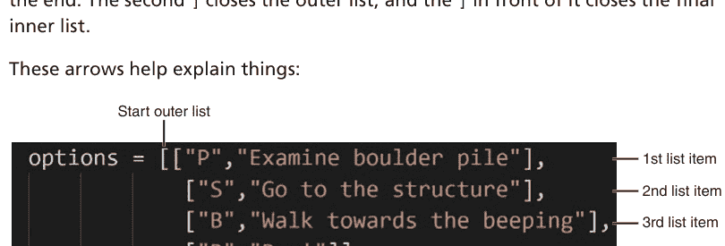

那么，如何访问单个列表项呢？

212 **代码队长**：用Python释放你的编码超能力

> **len() 和列表的列表**
> 我们示例中的列表有多长？len(options) 将返回4，因为 options 中有四个项目。是的，这些项目是列表；每个列表只是一个项目。len(options[0]) 将返回2，因为列表 options[0]（以及列表 options[1] 和列表 options[2]）包含两个项目——字母和提示文本。

> **列表的列表的列表的...**
> 你已经见过列表，也见过列表的列表。而且，是的，你可以创建列表的列表的列表。甚至更多！

在某些语言中，列表的列表被称为*二维数组*，列表的列表的列表被称为*三维数组*。你甚至可以超越我们的空间世界，进入超过三维的维度！

你知道你使用 [索引] 表示法来访问列表项。options[0] 返回列表中的第一个项目，对吧？所以这里它返回 options 中的第一个项目，即 ["P", "检查巨石堆"]。类似地，options[1] 返回第二个项目，即列表 ["S", "前往建筑"]。这可以在 print() 语句中看到。

那么，如果 options[1] 指的是整个第二个列表，我们如何访问该列表中的单个项目呢？像这样：

```
print(options[1][0])
print(options[1][1])
```

第一个 print() 显示 S，因为它是项目1中的项目0。options[1] 表示 options 中的项目1，options[1][0] 表示 options 中项目1内的项目0。第二个 print() 显示项目1内的项目1，即前往建筑。

这是一种有趣且强大的使用列表的方式，但语法一开始可能很棘手。在 List7.py 中尝试代码，更改打印的内容，并尝试不同的选项，以感受如何使用 [索引][索引] 语法。

使用列表的列表是向我们的 getUserChoice() 函数传递选项的好方法。这种格式将使添加选项变得容易（每个选项都是一个包含两个项目的列表——字母和提示）。它可以处理任意数量的选项。而且它也会使实际的 UDF 代码非常简洁。

另外，额外的好处：如你所知，你可以使用 append() 函数向列表添加项目。这有什么用呢？想象一个场景，你的游戏有三个选项。但是，如果用户有一个物品——也许是一把他们找到的钥匙——那么就有第四个选项来解锁一扇门。你可以创建基本的选项列表，然后使用一个 if 语句来检查用户是否有钥匙，如果有，就使用 append() 来添加解锁门的选项。不错，对吧？

## 创建用户选项函数

好的，那么让我们创建 getUserChoice() 函数。我们知道它将接受一个参数（格式为列表的列表的选项），并返回用户选择的任何内容。

这个函数可能在这个游戏之外也有用途，所以让我们把它放在自己的文件中。创建一个新文件（在你的 Adventure 文件夹中），命名为 Utils.py。我们将使用这个文件来存放各种实用函数，从 getUserChoice() 开始。

这是代码：

```
#####################################
# Utils.py
# 实用函数
#####################################

# getUserChoice()
# 显示选项列表，提示输入一个选项，并返回它
# 传递一个格式为 [["字母","显示文本"]] 的列表的列表
# 示例：[["A","选项 A"],["B","选项 B"],["C","选项 C"]]
# 返回选中的字母
def getUserChoice(options):
    # 创建一个变量来保存有效输入
    validInputs=""
    # 遍历选项
    for opt in options:
        # 将这个添加到有效字母列表
        validInputs+=opt[0]
        # 并显示它
        print(opt[0], "-", opt[1])
```

```
# 创建提示
prompt="你想做什么？ [" + validInputs + "]: "
# 初始化变量
choice=""
done=False
# 主循环
while not done:
    # 获取一个大写字符
    choice=input(prompt).strip().upper()
    # 如果用户输入了超过1个字符
    if len(choice) > 1:
        # 只使用第一个
        choice=choice[0]
    # 我们有1个有效输入吗？
    if len(choice) == 1 and choice in validInputs:
        # 我们有，退出这里！
        done = True
# 返回选中的选项
return choice
```

你无法直接测试这段代码。嗯，实际上，你可以。如果你保存代码并运行它，什么也不会发生。

嗯，这不完全正确。确实发生了一些事情。当代码运行时，它定义了一个函数。但仅此而已。函数被定义了，但从未实际执行。没有代码执行？那么就没有输出。

> #####
> Utils.py 顶部的那行 # 符号是干什么的？如你所知，# 开始一个注释；# 之后的任何内容都会被 Python 忽略。所以文件顶部的整个块是一个大注释。它是干什么的？程序员喜欢在文件开头添加关于文件是什么、做什么、谁写的等信息。注释上下方的井号行只是为了使注释突出显示。

要测试该函数，请在函数下方添加一些测试代码——像这样：

```
choices = [["A", "选项 A"],
          ["B", "选项 B"],
          ["X", "选项 X"],
          ["3", "还有一个数字选项，只是因为"]]

choice = getUserChoice(choices)
print(choice)
```

现在，如果你保存并测试代码，它将显示选项，提示输入，然后显示用户选择的内容。

那么，我们的 getUserChoice() 函数做什么？

它以几行注释开始，解释函数是什么，传递什么，以及返回什么。

函数定义很简单。它接受一个参数：

```
def getUserChoice(options):
```

函数需要将用户输入限制为仅有效选项。但什么是有效选项？这取决于传递给函数的内容。这意味着检查有效选项的代码不能硬编码。相反，我们需要构建一组有效选项来验证用户输入。我们从一个空变量开始，像这样：

```
# 创建一个变量来保存有效输入
validInputs=""
```

然后我们用 for 循环遍历所有选项：

```
# 遍历选项
for opt in options:
```

在每次迭代中，opt 将包含一个选项——一个包含两个项目的列表；opt[0] 将包含字母，opt[1] 将包含文本提示。

循环中的代码对每个选项执行两项操作：

```
# Add this one to the valid letters list
validInputs+=opt[0]
```

这行代码将字母添加到 `validInputs` 中。该变量最初是空的。使用上面的测试代码，第一次迭代时它会是 "A"，第二次是 "AB"，然后是 "ABX"，接着是 "ABX3"。这些，且只有这些，是所有允许的输入，我们将在函数后面使用这个变量。

然后代码显示该选项：

```
# And display it
print(opt[0], "-", opt[1])
```

测试代码中的第一个项目（第一次循环迭代）是列表 ["A", "Option A"]。在列表中，项目 [0] 是 "A"，项目 [1] 是 "Option A"。所以这将打印 A - Option A。

一旦选项显示完毕，我们使用 `input()` 提示用户进行选择。我们希望 `input()` 提示显示可用的选项，这些选项现在存储在变量 `validInputs` 中，因此我们创建如下提示：

```
# Create the prompt
prompt="What do you want to do? [" + validInputs + "]: "
```

在我们的例子中，这将创建一个名为 `prompt` 的变量，内容为 What do you want to do? [ABX3]:。

接下来，我们初始化几个变量：

```
# Initialize variables
choice=""
done=False
```

`choice` 将存储用户的选择。`done` 是一个布尔值，它只能是 True 或 False，我们现在将标志设置为 False；当用户选择完成后，我们将把它设置为 True。

接下来是一个带有 `input()` 代码的 while 循环，就像你之前多次见过的那样：

```
# Main loop
while not done:
```

我们将 done 初始化为 False，这个 while 循环将一直运行，直到 done 变为 True。

顺便说一句，这行代码也可以这样写：

```
# Main loop
while done == False:
```

最终结果是一样的。但 `while not done` 感觉更简洁，对吧？

在 while 循环内部，我们这样做：

```
# Get a single upper case character
choice=input(prompt).strip().upper()
# If the user entered more than 1 character
if len(choice) > 1:
    # Just use the first
    choice=choice[0]
# Do we have 1 valid input?
if len(choice) == 1 and choice in validInputs:
    # We do, outa here!
    done = True
```

代码首先使用 `input()` 获取一个选择，然后去除多余的空格并将其转换为大写。

然后它检查以确保用户只输入了一个字母。如果超过一个，那么 `choice=choice[0]` 会用第一个字符替换用户的选择，有效地忽略了用户不应该输入的字符。

最后，代码通过检查 `choice` 的长度来确保用户输入了内容，然后检查 `choice` 是否在 `validInputs` 中。如果长度正确且 `choice` 在 `validInputs` 中，代码将 `done` 设置为 True，这将强制 while 停止循环。

一旦用户做出有效选择，函数简单地返回 `choice`：

```
# Return the selected option
return choice
```

用不同的选项测试你的新函数。向列表中添加项目，编辑和删除一些，测试各种组合以确保它正常工作。

当你完成所有测试后，删除你在函数下方添加的测试代码。

## 更新你的代码

现在你有了一个新的 Utils 文件，其中包含一个出色的 `getUserChoice()` 函数，我们如何在冒险游戏中使用它呢？

代码现在位于三个文件中：Main.py 是主游戏，Strings.py 处理外部化的字符串，Utils.py 包含 `getUserChoice()`。为了让 Main.py 中的代码使用 Utils.py 中的函数，我们需要将 Utils.py 导入到 Main.py 中，就像我们导入 Strings.py 一样。所以现在你 Main.py 顶部的导入语句应该如下所示：

```
# Imports
import Strings
import Utils
```

> **合并导入语句**
Python 允许你在一行中导入多个库。所以代码：

```python
import Strings
import Utils
```

可以简化为：

```python
import Strings, Utils
```

最终结果是一样的，所以使用你喜欢的任何语法。

现在你可以修改你的函数以使用新的 `getUserChoice()` 函数。这是更新后的 `doStart()` 函数版本：

```
# Location: Start
def doStart():
    # Display text
    print(Strings.get("Start"))
    # What can the player do?
    choices = [
        ["P", "Examine pile of boulders"],
        ["S", "Go to the structure"],
        ["B", "Walk towards the beeping"],
        ["R", "Run!"]
    ]
    # Prompt for user action
    choice = Utils.getUserChoice(choices)
    # Perform action
    if choice == 'P':
        doBoulders()
    elif choice == 'S':
        doStructure()
    elif choice == 'B':
        doBeeping()
    elif choice == 'R':
        doRun()
```

保存并运行你的代码。它在功能上与之前相同。（记住，我们在这里进行重构。）那么改变了什么？

我们有一个名为 `choices` 的变量，它是一个列表的列表，定义了玩家可用的所有可能选择：

```
choices = [
    ["P", "Examine pile of boulders"],
    ["S", "Go to the structure"],
    ["B", "Walk towards the beeping"],
    ["R", "Run!"]
]
```

然后我们使用新的 `getUserChoice()` 函数来实际获取选择：

```
# Prompt for user action
choice=Utils.getUserChoice(choices)
```

由于 `getUserChoice()` 在 Utils 库中，我们通过 `Utils.getUserChoice()` 调用它。choices 列表（列表的列表）作为参数传递。函数返回用户的选择，该选择被保存到 `choice` 变量中。

`doStart()` 中的其余代码与之前相同。

那么，我们通过这一切实现了什么？

- 实际的游戏代码更清晰了，因为用户输入循环已被移除。
- 我们现在有了一个清晰灵活的方式来处理游戏过程中变化的选项。
- 用户选择输入现在是一个外部函数——一个将在我们需要提示用户选择选项的任何地方使用的函数。如果我们想改变其工作方式（添加颜色、创建按钮、任何事情），我们只需更新那一个函数，其每个使用实例也将被更新。实际上，你可以试试这个。看看 `getUserChoice()` 函数。它包含代码 `print(opt[0], "-", opt[1])`，用于显示每个选项。将那个连字符改为等号、冒号或其他任何东西。一个小改动，每一个菜单选项都会更新。完美！


## 挑战 14.1

你知道这次的挑战是什么：重构你的游戏。更新游戏中的每一个位置函数以使用新的 `getUserChoice()` 函数。

## 挑战 14.2

回到第 11 章，你创建了一个很棒的 `inputNumber()` 函数。这在你的游戏中会很有用，所以把它复制到 Utils.py 中。

## 挑战 14.3

你知道还有什么可以成为一个很棒的函数吗？你经常需要要求用户做出是或否的选择。比如“你想捡起武器吗？”或者“你放弃吗？”或者“你需要帮助吗？”

你可以在代码中使用一个 while 循环，并使用 `input()` 从用户那里获取 Y 或 N。但是，不。你也可以使用 `getUserChoice()`。但这有点复杂。

所以，在 Utils.py 中创建一个名为 `inputYesNo()` 的新函数。你可以这样调用它：

```
pickUpGun=inputYesNo("Do you want to pick up the gun?")
```

`inputYesNo()` 将显示传递的文本，提示用户，并返回一个结果。

你可以使用 `inputNumber()` 作为这个函数的起点。

## 总结

重构就是关于逐步和持续地改进你的代码。在本章和上一章中，我们探讨了几种方法：识别可以重构以供重用的代码，以及外部化字符串。我们的应用程序现在由多个文件组成，我们将在接下来的章节中添加更多文件，以引入额外的功能。

此页有意留白


# 第 15 章

## 携带（和使用）物品

在第 13 章和第 14 章中，我们暂停了游戏的编码，转而清理我们的代码。我们将在本章继续这样做，这次专注于如何携带和使用物品。

## 规划物品系统

每款冒险游戏都要求玩家获取并使用物品。也许你需要收集金币来从商店购买物品。你收集的金币是物品，你购买的任何东西也是物品。或者，你可能遇到一扇锁着的门，只有当你找到特定物品——一把钥匙时，它才会打开。物品可以是地图、食物、药水、武器，凡是你能想到的都可以。

例如，在你的游戏中，建筑有一扇门。它目前还打不开。尝试打开门，你会看到：

```
What do you want to do? [SDBR]: d
The door appears to be locked.
You see a small circular hole. Is that the keyhole?
You move your hand towards it, it flashes blue and closes!
Well, that didn’t work as planned.
```

游戏实际上并没有告诉玩家要去找钥匙。这是不言而喻的，他们需要这样做才能继续。

处理物品要求你的代码有一种在游戏过程中存储和访问它们的方法。这就是物品系统的职责。

问题是如何存储这些信息？你可以创建一堆变量：

```
# Inventory
coins = 0
sonicKey = False
jetPack = False
food = 100
```

这样，当玩家获得更多金币时，你只需将它们添加到 `coins` 变量中。如果他们找到了钥匙或喷气背包，你就将这些标志设置为 `True`。食物从 100 开始，会随时间消耗（因此你从 `food` 变量中减去），除非用户找到更多（在这种情况下你向变量中添加）。

这可能行得通，但处理大量单独的变量并不理想。你无法轻松地遍历它们全部，保存和恢复会很繁琐，而且你总是有意外覆盖变量的风险。

好吧，那么使用列表怎么样？

```
# Inventory
inv = [0, False, False, 100]
```

这样，你可以通过 `inv[0]` 引用金币，通过 `inv[1]` 引用钥匙。

嗯，不行，这行不通。通过引用错误的项目来犯错太容易了。列表非常适合相同类型事物的集合（例如动物，正如我们在本书第一部分中看到的那样）。列表不太适合不同类型相关项目的集合。

那么，该怎么办？

## 创建字典

事实证明，Python 有另一种数据类型正是为此目的而设计的。字典类似于列表，因为它们可以存储不同类型的多个值，但与列表不同的是，它们是使用名称存储的。

让我们看一个例子。创建一个名为 `Dict1.py` 的文件（你可能希望将其放在主 Python 文件夹中，而不是冒险文件夹中）。代码如下：

```
pet = {
    "animal":"Iguana",
    "name":"Iggy",
    "food":"Veggies",
    "mealsPerDay":1
}
```

如果你运行代码，它不会显示任何内容。所以在运行之前请稍等片刻。

这段代码创建了一个名为 `pet` 的变量。你会注意到 `pet` 在花括号（`{` 和 `}` 字符）内包含多个值。这些花括号告诉 Python 这是一个字典。

> **{} 或 []**
不要将方括号与花括号混淆。`pet = []` 创建一个列表，而 `pet = {}` 创建一个字典。

哦，`pets = [{}, {}]` 创建了一个字典列表！

字典中的每个项目都定义为一个键值对。键是项目的名称，它始终是一个用引号括起来的字符串。值可以是任何值；它可以是字符串和数字，正如我们在这里使用的那样，但也可能是列表、字典等等。

这个宠物字典包含四个项目。你可以通过将此代码添加到 Dict1.py 来验证这一点：

```
print(len(pet))
```

保存并运行代码，它将打印 4，即 `len(pet)` 返回的值。

如果你想访问字典中的特定项目，必须通过其键来引用它。例如：

```
pet = {
    "animal":"Iguana",
    "name":"Iggy",
    "food":"Veggies",
    "mealsPerDay":1
}

print(pet["name"], "the", pet["animal"])
print("eats", pet["mealsPerDay"], "times a day")
```

保存并运行此更新后的代码。它显示什么？

`pet["animal"]` 意味着获取键 "animal" 的值，即 Iguana。
`pet["name"]` 意味着获取键 "name" 的值，即 Iggy。依此类推。

因此代码将显示：

```
Iggy the Iguana
eats 1 times a day
```

## 使用字典

如你所见，字典非常适合将不同但相关的信息分组。

## update() 方法

你可以通过直接赋新值来更新字典项目，像这样：

```
pet["mealsPerDay"] = 2
```

此外，你也可以使用 `update()` 函数来完成此操作：

```
pet.update({"mealsPerDay": 2})
```

为什么在简单赋值有效时还要使用 `update()`？`update()` 可用于一次更新多个键值对。

更新字典文件很容易。这是文件 Dict2.py 的代码：

```
pet = {
    "animal": "Iguana",
    "name": "Iggy",
    "food": "Veggies",
    "mealsPerDay": 1
}

pet["mealsPerDay"] = 2

print(pet["name"], "eats", pet["mealsPerDay"], "meals")
```

此代码创建了与之前相同的字典，但随后更新了 `mealsPerDay` 项目。运行此代码，它将显示：Iggy eats 2 meals。

你可能会发现其他一些有用的字典函数：

| 函数 | 描述 |
| --- | --- |
| clear() | 从字典中移除所有项目。 |
| copy() | 制作字典的副本。 |
| keys() | 返回所有字典键的列表。 |
| values() | 返回所有字典值的列表。 |

## 字典列表

创建一个名为 Dict3.py 的新文件。代码如下：

```
pets = [
    {
        "animal":"Iguana",
        "name":"Iggy",
        "food":"Veggies",
        "mealsPerDay":1
    },
    {
        "animal":"Goldfish",
        "name":"Goldy",
        "food":"Flakes",
        "mealsPerDay":3
    }
]

for pet in pets:
    print(pet["animal"], "-", pet["name"])
```

保存并运行代码。它将显示：

```
Iguana - Iggy
Goldfish - Goldy
```

这段代码中的 `pets` 是什么？它显然是一个列表，因为它使用方括号定义。但列表中是什么？两个项目，每个都是使用花括号定义的字典。

`for` 循环遍历列表 `pets`，在每次迭代中，它创建一个名为 `pet` 的字典变量，然后显示其值。

## 物品系统

好的，现在你知道如何使用字典了。而且，是的，它们非常适合我们的物品系统。我们可以这样创建一个物品系统：

```
inv = {
    "StructureKey": False,
    "Coins": 0
}
```

这样，例如，我们可以检查 `inv["StructureKey"]` 来查看玩家是否拥有钥匙并做出相应响应。当用户找到钥匙时，我们只需要设置 `inv["StructureKey"] = True`。

这行得通，但我们可以通过提供*包装函数*来稍微改进一下。

> **新术语**
**包装函数** *包装函数*是一个其目的只是调用其他代码的函数。它包装了代码，因此得名。

这是什么意思？看这段代码片段：

```
inv = {
    "StructureKey": False,
    "Coins": 0
}

def takeStructureKey():
    inv["StructureKey"] = True

def hasStructureKey():
    return inv["StructureKey"]
```

此代码创建了 `inv` 字典和两个辅助函数。当玩家找到钥匙时，你只需调用 `takeStructureKey()` 将其添加到物品系统中；这样做会将 `StructureKey` 的值设置为 `True`。你可以在任何时候使用 `hasStructureKey()` 来仅在用户拥有钥匙时执行代码，像这样：

```
if hasStructureKey():
```

`hasStructureKey()` 返回 `True` 或 `False`，这使得它在像这样的 `if` 语句中非常有用。

这些包装函数完全是可选的。毕竟，你总是可以直接访问字典项目。但是，包装器可以使代码更易于使用和阅读。

## 创建物品系统

好的，让我们创建我们的物品系统。我们现在实际上只需要钥匙，但也会添加金币的代码，以便为将来使用做好准备。

在 Adventure 文件夹中，创建一个名为 Inventory.py 的新文件。代码如下：

```
#####################################
# Inventory.py
# Inventory system
#####################################

inv = {
    "StructureKey": False,
    "Coins": 0
}

# Add key to inventory
def takeStructureKey():
    inv["StructureKey"] = True

# Remove key from inventory
def dropStructureKey():
    inv["StructureKey"] = False
```

## 玩家有钥匙吗？
```python
def hasStructureKey():
    return inv["StructureKey"]

# 将硬币添加到库存
def takeCoins(coins):
    inv["Coins"] += coins

# 从库存中移除硬币
def dropCoins(coins):
    inv["Coins"] -= coins

# 玩家有多少硬币？
def numCoins():
    return inv["Coins"]
```

代码首先定义了库存字典，一个名为 `inv` 的变量。它包含两个项目：`StructureKey` 用于跟踪玩家是否拥有钥匙（我们将其初始化为 `False`），而 `coins` 则跟踪玩家拥有的硬币数量（初始化为 `0`）。

然后是包装函数。对于每个物品，通常可以做三件事：获取物品、丢弃物品以及检查物品状态。因此，每个物品需要三个包装函数，你有两个物品，所以总共有六个包装函数。

对于库存中为真或假的物品（比如你的钥匙），你需要一个获取物品的函数（将标志设置为 `True`），一个丢弃物品的函数（将标志设置为 `False`），以及一种检查玩家是否拥有该物品的方法（只需返回标志）。

> **最常见的库存类型**
> 你的库存显然不仅限于布尔值和整数物品，但这些往往是最常用的类型。这就是为什么我们在这个例子中选择了这两个物品。这样，你就可以将这段代码作为未来任何物品和包装函数的基础。

对于玩家可以多次累积的库存物品（比如你的硬币），你需要一个获取物品的函数（它会增加数值）和一个丢弃物品的函数（减少数值），以及一种返回库存中数量的方法。

当你的游戏需要额外的物品时，你只需向字典中添加一个键值对，然后创建包装函数即可。

## 接入库存系统

现在你有了一个库存系统，让我们把它添加到我们的代码中。怎么做？再导入一次。修改你的 `Main.py`，使导入部分如下所示：

```python
# 导入
import Strings
import Utils
import Inventory as inv
```

最后一个导入需要解释一下。

如你所知，当你在库中执行函数时，需要提供完全限定的函数名，如下所示：

```python
Inventory.takeStructureKey()
```

`Inventory` 是文件的一个好名字，但反复输入这个词很长。所以我们怎么做呢？我们给它一个别名：

```python
import Inventory as inv
```

这告诉 Python 导入 `Inventory` 库，但使用更短的名称 `inv` 来引用它，如下所示：

```python
inv.takeStructureKey()
```

好多了！

## 使用库存系统

我们需要一些更多的字符串，所以把它们添加到 `Strings.py` 中的 `get()` 函数里。

我们已经有了关于结构门和尝试用没有钥匙开门的消息。现在我们需要一条玩家尝试用钥匙开门的消息。这是你需要添加的 `elif`：

```python
elif id == "StructureDoorKey":
    return ("你看着你手中的钥匙。\n"
            "它闪烁着蓝光，钥匙孔也是。")
```

那么，玩家如何找到钥匙呢？嗯，先保密，但它会藏在巨石之间。添加这个 `elif`：

```python
elif id == "BouldersKey":
    return ("你仔细看。那是一道蓝光吗？\n"
            "你伸手到巨石之间，发现了……\n"
            "看起来像一把钥匙，它偶尔会闪烁蓝光。")
```

现在我们需要让玩家找到钥匙。目前，这很简单：只需走到巨石那里，它就会在那里。我们将在下一章中增加跟踪进度的能力，让这变得更难。现在，这是更新后的 `doBoulder()` 函数：

```python
# 位置：巨石
def doBoulders():
    # 玩家有钥匙吗？
    if not inv.hasStructureKey():
        # 没有，显示文本
        print(Strings.get("BouldersKey"))
        # 将钥匙添加到库存
        inv.takeStructureKey()
    else:
        # 有，显示常规的巨石消息
        print(Strings.get("Boulders"))
    # 返回起点
    doStart()
```

这个更新后的函数现在首先使用 `inv.hasStructureKey()` 包装函数来查看玩家是否有钥匙。如果没有，它会显示新消息，告诉玩家他们找到了钥匙。然后它使用以下代码将钥匙添加到库存中：

```python
# 将钥匙添加到库存
inv.takeStructureKey()
```

如果用户已经有钥匙（意味着他们第二次回到巨石处），则会显示旧的巨石文本。

好的，现在玩家可以找到钥匙了。接下来，我们需要更改结构门的代码。以前，如果玩家走到门前，他们会看到一条需要钥匙的消息——仅此而已。现在代码需要根据玩家是否有钥匙做出不同的响应。这是更新后的 `doStructureDoor()` 函数：

```python
# 位置：结构门
def doStructureDoor():
    # 显示文本
    print(Strings.get("StructureDoor"))
    if inv.hasStructureKey():
        print(Strings.get("StructureDoorKey"))
    else:
        print(Strings.get("StructureDoorNoKey"))
    # 玩家能做什么？
    choices = [
        ["S", "返回结构"],
        ["R", "跑！"]
    ]
    # 用户有钥匙吗？
    if inv.hasStructureKey():
        # 有，将解锁添加到选项中
        choices.insert(0, ["U","解锁门"])
    # 提示用户操作
    choice = Utils.getUserChoice(choices)
```

```python
# 执行操作
if choice == 'S':
    doStructure()
elif choice == 'R':
    doRun()
elif choice == 'U':
    doEnterStructure()
```

好的，这很有趣。代码首先显示基本的门消息。然后检查玩家是否有钥匙，并使用以下代码在有钥匙时显示一条消息，在没有钥匙时显示另一条：

```python
# 显示文本
print(Strings.get("StructureDoor"))
if inv.hasStructureKey():
    print(Strings.get("StructureDoorKey"))
else:
    print(Strings.get("StructureDoorNoKey"))
```

然后是用户选项，和以前一样。但如果玩家有钥匙，代码现在会添加一个选项：

```python
# 玩家能做什么？
choices = [
    ["S", "返回结构"],
    ["R", "跑！"]
]
# 用户有钥匙吗？
if inv.hasStructureKey():
    # 有，将解锁添加到选项中
    choices.insert(0, ["U","解锁门"])
```

`choices` 以与之前相同的两个选项开始。如果玩家有钥匙，它会向选项列表中添加一个项目。`解锁门` 选项很重要；我们希望它是列表中的第一个项目。因此，我们不是使用 `append()` 来添加 `["U", "解锁门"]`，而是使用 `insert()` 将其放在位置 `0`（使其成为第一个选项）。

最后，添加了这段代码来响应门被解锁：

```python
elif choice == 'U':
    doEnterStructure()
```

显然，要运行这段代码，你需要一个 `doEnterStructure()` 函数，但你明白这个意思。

现在你看到了我们的 `getUserChoice()` 函数的价值和威力。能够根据库存或其他标准动态更改选项对于使游戏具有动态性至关重要。

好的，保存代码并测试它。游戏像以前一样开始：

```
你走到外面。一切都很陌生。
景色尘土飞扬，广阔，略带红色，荒芜。
你注意到你穿着太空服。嗯？
你环顾四周。红色的灰尘，一堆巨石，更多的灰尘。
你面前有一个奇怪的八角形结构。
你听到附近有哔哔声。它停了。不，它没停。
P - 检查巨石堆
S - 去结构处
B - 走向哔哔声
R - 跑！
I - 库存
你想做什么？[PSBRI]：[]
```

输入 `S` 去结构处，然后输入 `D` 开门：

```
门似乎是锁着的。
你看到一个小圆孔。那是钥匙孔吗？
你把手伸向它，它闪烁着蓝光然后关上了！
嗯，这没有按计划进行。
S - 返回结构
R - 跑！
你想做什么？[SR]：[]
```

玩家没有钥匙，所以门没有打开。

输入 `S` 返回结构，再次输入 `S` 返回起点，然后输入 `P` 查看巨石堆：

```
你仔细看。那是一道蓝光吗？
你伸手到巨石之间，发现了……
看起来像一把钥匙，它偶尔会闪烁蓝光。
你环顾四周。红色的灰尘，一堆巨石，更多的灰尘。
你面前有一个奇怪的八角形结构。
你听到附近有哔哔声。它停了。不，它没停。
P - 检查巨石堆
S - 去结构处
B - 走向哔哔声
R - 跑！
I - 库存
```

玩家现在有钥匙了。而且，是的，这太容易了。我们很快就会改变这一点。

输入 `S` 返回结构，然后输入 `D` 再次尝试开门：

```
门似乎是锁着的。
你看到一个小圆孔。那是钥匙孔吗？
你看着你手中的钥匙。
它闪烁着蓝光，钥匙孔也是。
U - 解锁门
S - 返回结构
R - 跑！
你想做什么？[USR]：
```

这一次，代码的响应不同了，因为钥匙在库存里。很好！

哦。再次回到巨石那里，你会看到：

```
认真的吗？它们是巨石。
巨大、沉重、无聊的巨石。
```

我们现在有了一个功能正常的库存系统，游戏可以根据库存内容做出不同的响应。

## 显示物品清单

关于物品清单还有一点：大多数游戏都提供查看当前持有物品的方式。这很容易实现。将以下函数添加到 `Inventory.py` 文件的末尾：

```python
# Display inventory
def display():
    print("*** Inventory ***")
    print("You have", numCoins(), "coins")
    if hasStructureKey():
        print("You have a key that flashes blue")
    print("*****************")
```

这段代码非常简单。它定义了一个名为 `display()` 的函数，用于打印当前物品清单的内容。请注意，它使用的是包装函数，而不是直接访问 `inv` 字典的条目。这是首选的方式。为什么呢？想象一下，你可能需要以特定格式显示金币，或者需要进行任何计算（例如，食物或能量的临时乘数）。始终以相同的方式访问条目，可以确保你始终执行所需的代码。

那么，我们如何显示物品清单呢？只需调用 `display()` 函数即可。例如，如果你在 `doStart()` 的选项中添加了这一行：

```python
["I", "Inventory"]
```

然后你可以在处理逻辑中添加以下代码：

```python
elif choice == "I":
    inv.display()
    doStart()
```

这样，如果用户选择 I，你就会显示物品清单，然后重新显示 `doStart()` 的选项。

是的，`doStart()` 调用了 `doStart()`。这是允许的，这被称为递归。

**新术语**
**递归** *递归* 是指代码调用自身——例如，一个名为 `doStart()` 的函数调用 `doStart()`。递归是允许的，并且在正确使用时，功能非常强大。

## 挑战 15.1

你现在拥有了定义完整物品清单系统所需的一切。找出你的游戏中将使用额外物品的地方。将它们添加到物品清单中，并创建相应的包装函数。

## 总结

在本章中，你学习了如何使用 Python 的字典来存储相关项目。你使用了一个字典和包装函数来创建了一个物品清单系统。并且你已经了解了如何在你的游戏中使用物品清单。

# 第 16 章

## 保持优雅

你现在有了一个功能正常的物品清单系统，允许玩家获取、携带和使用物品。并且你的游戏可以根据物品清单进行调整。你需要的下一件事是一个玩家管理系统。为了创建这个系统，我们将向你介绍类，这是本章的重点。

## 玩家系统

在第 15 章中，你使用字典创建了一个物品清单系统。我们用它来隐藏玩家需要找到才能开门的钥匙。

但是，说实话，我们隐藏钥匙的方式相当糟糕。玩家可以直接走到巨石那里——看！——钥匙就在那里。在真正的游戏中，你通常会创建某种谜题，必须解决后才能发现钥匙；你可能需要先找到另一件物品，比如铲子，或者让钥匙在按顺序执行一系列步骤后才出现，或者通过游戏内交易获得。

在我们的游戏中，我们将让钥匙在多次访问巨石后才可被发现。为此，我们需要一种方法来跟踪访问次数，这就是玩家系统发挥作用的地方（双关语！）。

玩家系统跟踪玩家的动作、状态等等。哪些类型的东西？访问过的地点、剩余的生命值、消耗的能量、游戏时间、累积的分数等等。这些不是你可以拾取和使用的物品，所以它们不属于物品清单系统，但它们确实需要被跟踪，因此需要一个玩家系统。

为了创建我们的玩家系统，我们将向你介绍一种新的 Python 对象类型：类。事实上，你已经使用过类了。例如：

```python
name="Shmuel"
```

变量 `name` 是一个 `str` 类型的类（Python 的字符串类）。如果你要显示变量的类型，像这样：

```python
print(type(name))
```

你会看到显示 `<class 'str'>`。

当你使用像 `upper()` 这样的函数时：

```python
name=name.upper()
```

你实际上是在调用 `str` 类中一个名为 `upper()` 的方法。

所以，是的，你已经使用了非常多的类。但你还没有创建过自己的类。还没有。

### 类还是字典？

我们使用 Python 字典作为物品清单系统，并使用 Python 类作为玩家系统。为什么？嗯，事实是，我们本可以对两个系统都使用类或字典。但我们希望你知道如何同时使用字典和类，所以我们让你各使用一种。在你自己的代码中，你可以自由使用任何你喜欢的方式。

哦，顺便说一下，字典实际上也是类！是的，字典是一个类，类型为 `dict`。

## 创建玩家类

那么，类到底是什么？在编程中，类是一个对象，就像变量是对象一样。但类之所以特殊，是因为它们能做的事情。我们将在本书的第三部分使用大量的类。现在，关于类，我们需要你理解的重要一点是，它们可以同时包含数据和函数。

这是什么意思？嗯，想想我们创建的列表和字典。它们包含什么？数据，仅仅是数据。它们是可以包含变量的变量。字典和列表不能包含函数，只能包含数据。

另一方面，类可以包含数据（称为属性）和函数（称为方法）。例如，我们刚才提到的 `str` 类包含数据（存储在变量中的文本）和方法（如 `upper()` 函数）。

这很重要，因为通过存储数据和访问这些数据的函数，类非常适合编写高度可重用的自包含代码。

类还有很多内容，我们将在第三部分看到（你将大量使用它们）。但是，有了这个基本的介绍，让我们继续创建我们的玩家类。

## 创建类

我们将在自己的文件中创建类。因此，在你的 `Adventure` 文件夹中创建一个名为 `Player.py` 的新文件。以下是你需要的代码：

```python
###############################################
# Player.py
# player class
###############################################

# Define player class
class player:
    pass
```

如果你想，可以保存并执行代码，但你不会看到任何输出。这段代码只是使用 `class` 关键字，后跟类名和冒号来创建一个类。

类代码需要缩进在这个类语句下面（就像 `if`、`while` 和 `def` 一样）。你的类中目前没有任何内容，所以我们放了一个 `pass` 语句，这样 Python 就不会抛出错误消息。

现在你有了一个类，让我们让它做一些有用的事情。

## 定义属性

正如我们之前解释的，类可以存储数据，类中的数据称为 *属性*（或 *特性*）。

> **新术语**
> **属性** 类中的数据是属性。这在几乎每种编程语言中都是如此。但 Python 也使用术语 *属性* 来指代类中的所有数据，包括属性，以及关于类的其他信息。也就是说，在本书中，如果你看到 *属性*，就把它想成属性。

如何创建属性？属性是变量，所以你创建它们就像创建任何其他变量一样。以下是更新后的代码：

```python
#####################################
# Player.py
# player class
#####################################

# Define player class
class player:
    # Properties
    name = "Adventurer"
    livesLeft = 3
    boulderVisits = 0
```

我们移除了 `pass` 语句，因为不再需要它了，并且我们添加了三个属性。

`name` 存储玩家的名称，这样你就可以个性化游戏中的消息，我们用默认值 "Adventurer" 初始化了它。

我们还创建了一个属性来跟踪玩家剩余的生命值，并将其初始化为 3。

最后，我们需要用来隐藏钥匙的属性是 `boulderVisits`，我们将其初始化为 0。（每次玩家访问巨石时，这个属性都会递增。）

> **提示**
> **始终初始化属性** 你应该始终用默认值初始化属性。这样，即使你没有在代码中显式设置属性值，代码也能始终正常工作。

保存你的更改。

如果你想测试这个类，可以在它下面添加如下代码：

```python
p=player()
print(p.livesLeft)
```

这段代码是做什么的？

第一行创建了一个名为 `p` 的变量，它是 `player` 类的一个实例。请注意，我们在类名后面加了括号。事实上，`p=player` 也可以工作，但你通常会希望包含这些括号，以便在需要时可以选择向类传递参数。

## 新术语

**实例** 当创建一个类类型的变量时，我们说我们创建了该类的一个*实例*。创建实例的过程称为*实例化*。所以，你实际上并没有创建一个类变量；你*实例化*了一个类的*实例*。

是的，我们正在帮你学会说程序员的行话。

第二行显示了 `p` 类中 `livesLeft` 属性的值。

那么这段代码会显示什么？3，`livesLeft` 的值。

测试其他属性。完成后，请从文件中删除你的测试代码。

需要注意的是，当你创建一个类时，你实际上是在创建一种新类型的变量。如果你使用 `print(type(p))`，你会看到 `p` 是一个类型为 `class player` 的变量。而你创建的类与任何 Python 内置类一样，都是一个类——并且可以以相同的方式使用。

**属性可以是任何类型**

我们在类中创建了简单的文本和数字属性。但是，属性可以像需要的那样简单或复杂，可以是列表、字典，甚至是其他类。

**显示所有类属性**

如果你想获取类中所有属性的列表，可以使用 `dir()` 函数。如果你的类实例名为 `p`，你可以使用 `dir(p)` 来获取属性列表。并且因为 `dir()` 返回一个列表，你可以使用 `for` 循环来遍历每个属性。这里有一个例子：

```python
p=player()
for att in dir(p):
    print (att, getattr(p, att))
```

`for` 循环遍历 `dir()` 返回的列表，并为列表中的每个属性创建一个名为 `att` 的变量。然后 `print()` 打印属性名称，并使用 `getattr()` 函数获取属性值。

请注意，这段代码不仅会显示类属性；它还会显示所有类属性（包括许多内置属性）。

## 创建方法

现在我们的类有了所需的属性，让我们来创建方法。以下是需要添加到你的类中的代码：

```python
# Get name property
def getName(self):
    return self.name

# Get number of lives left
def getLivesLeft(self):
    return self.livesLeft

# Player died
def died(self):
    if self.livesLeft > 0:
        self.livesLeft-=1

# Is player alive
def isAlive(self):
    return True if self.livesLeft > 0 else False

# Get number of times boulders were visited
def getBoulderVisits(self):
    return self.boulderVisits

# Player visited the boulders
def visitBoulder(self):
    self.boulderVisits += 1
```

这段代码大部分应该是不言自明的。就像你创建函数一样，`def` 用于定义方法（正如你回忆的那样，方法就是函数）。

这些函数的不同之处在于参数 `self`。这是什么？当你在类中创建方法时，这些方法需要能够访问类本身。`self` 只是对类实例的引用，通过传递 `self`，你的方法就可以访问类属性。

所以，要获取玩家名称，我们使用这个方法：

```python
# Get name property
def getName(self):
    return self.name
```

`getName()` 方法接收一个类实例的引用，并使用它来返回 `self.name`，即当前类（`self`）中的 `name` 属性。

如果这听起来有点奇怪，嗯，是的，确实有点。我们知道。但是，接受它吧。确保 `self` 是任何类方法的第一个参数，你就能顺利进行。

让我们看另一个例子：

```python
# Get number of lives left
def getLivesLeft(self):
    return self.livesLeft
```

这个很简单：`getLivesLeft()` 返回 `livesLeft` 属性，这样你就可以知道你的玩家还剩多少生命。

方法变得更有趣的地方在于它们不仅仅返回属性。看看这个例子：

```python
# Is player alive
def isAlive(self):
    return True if self.livesLeft > 0 else False
```

你的代码可以通过简单地检查玩家还剩多少生命来判断他们是否存活。但是，与其在所有地方都进行那个 `if` 计算，我们创建了一个名为 `isAlive()` 的方法，你的代码可以调用它。如果还有生命（`livesLeft > 0`），它返回 `True`，如果没有生命（意味着玩家已死亡），则返回 `False`。这样，你可以在你的游戏中使用这样的代码：

```python
if p.isAlive():
```

> **不一定是 Self**
实际上，你可以将类方法的第一个参数命名为任何你喜欢的名字。Python 程序员已经采用 `self` 作为标准名称，所以你会在大多数 Python 代码中看到它。但如果你想使用另一个名字，尽管用吧。

## 内联 if 语句

你注意到 `isAlive()` 方法中的 `return` 语句有什么不同吗？那是一个内联 `if` 语句——一个在单行代码中包含 `else` 的 `if` 语句。从技术上讲，这被称为三元条件运算符。（是的，这就是为什么我们称它为内联 `if` 语句。）

这段代码：

```python
return True if self.livesLeft > 0 else False
```

在功能上等同于这段代码：

```python
if self.livesLeft > 0:
    return True
else:
    return False
```

两种语法都可以。我们使用内联 `if` 是因为它简洁得多，而且看起来专业得多（而我们喜欢看起来非常专业）。

不错，对吧？

哦，有一件重要的事情要注意：`isAlive()` 方法定义为 `def isAlive(self):`，带有 `self` 参数。在我们刚刚看的 `if` 语句中，我们调用 `isAlive()` 时没有传递任何参数。那么，那个 `self` 怎么办？嗯，事实证明你不必担心它。Python 会为你处理那个；你只需调用方法（如果需要，传递参数），但在调用类方法时忽略 `self` 参数。

仅仅返回属性的方法很棒。但类变得超级有用的地方在于，你可以创建超级有用的方法，它们执行任何需要的处理来返回超级有用的结果。

回到我们的巨石和我们需要隐藏钥匙并最终使其可被发现的方法。首先是这个方法：

```python
# Player visited the boulders
def visitBoulder(self):
    self.boulderVisits += 1
```

每次玩家访问巨石位置时，我们都会调用这个 `visitBoulder()` 方法。它所做的只是增加 `boulderVisits` 属性，这样我们就可以跟踪该位置被访问了多少次。

要获取访问次数，我们的代码可以调用这个方法：

```python
# Get number of times boulders were visited
def getBoulderVisits(self):
    return self.boulderVisits
```

这个方法不言自明（我们希望如此！）。

## 初始化类

在我们继续使用类之前，还有一个额外的主题需要讨论。

在实例化类时，有时需要执行一些默认代码。这通常是为了初始化属性，我们这里不需要这样做（因为我们在类定义内部通过简单赋值完成了）。但也有其他原因这样做。

当你创建一个类时，你可以定义一个构造函数——一个将自动执行的方法。

> **新术语**
**构造函数** 构造函数是类中的一个方法，在类被实例化时自动调用。

我们实际上不需要在你的类中使用构造函数，但你需要知道构造函数是什么以及它们长什么样，所以这里有一个：

```python
# Initialize class and properties
def __init__(self):
    self.name = "Adventurer"
    self.livesLeft = 3
    self.boulderVisits = 0
```

在 Python 中，构造函数总是命名为 `__init__`（在 `init` 这个词前后各有两个下划线字符）。如果存在一个具有该名称的方法，Python 就会执行它。很简单。

在这个代码片段中，我们演示了如何使用构造函数来初始化属性。但是，正如已经指出的，我们不需要这样做，因为我们已经初始化了它们。

如果你想将这段代码添加到你的类中，你可以。由你决定。

## 使用我们的新类

我们现在有了一个用于玩家系统的类。所以让我们把它插入到游戏中，并更新巨石和寻找钥匙的代码。

我们需要做的第一件事是导入新的 Player 文件。所以，像这样更新你的导入语句：

```python
# Imports
import Strings
import Utils
import Inventory as inv
import Player
```

接下来，我们需要创建我们新类的一个实例。将这段代码添加到 Main.py 的顶部。你可以把它放在导入语句之后：

```python
# Create player object
p = Player.player()
```

玩家类在 Player 库中，所以我们将其引用为 `Player.player()`。

现在当你运行游戏时，代码将立即实例化玩家类，我们可以在代码中使用这个新实例（命名为 `p`）。

哦，我们的游戏还需要一块文本。我们有玩家查看巨石时显示的文本，也有他们找到钥匙时显示的文本。让我们再添加一块文本，将在第二次及后续访问时显示。将其添加到 Strings.py 中的 `get()` 函数：

## 第16章

### 更新 doBoulders() 函数

```python
elif id == "Boulders2":
    return ("What's with you and boulders?\n"
            "They are still big, heavy, boring boulders.")
```

很好。现在我们要做的就是更新 doBoulder() 函数。以下是更新后的代码：

```python
# Location: Boulders
def doBoulders():
    # Track this visit
    p.visitBoulder()
    # Display text
    if p.getBoulderVisits() == 1:
        print(Strings.get("Boulders"))
    elif p.getBoulderVisits() == 3:
        print(Strings.get("BouldersKey"))
        inv.takeStructureKey()
    else:
        print(Strings.get("Boulders2"))
    # Go back to start
    doStart()
```

让我们回顾一下这个更新后的函数。我们需要知道玩家访问巨石堆的次数，所以代码首先执行这个：

```python
# Track this visit
p.visitBoulder()
```

如你所知，玩家类中的 visitBoulder() 方法只是将 boulderVisits 属性加一。因此，用户第一次去巨石堆时，计数会增加到1，第二次会增加到2，依此类推。

然后是一个 if 语句。如果这是第一次访问，则显示 Boulders 消息。如果这是第二次访问，则 else 将显示 Boulders2 消息。如果这是第三次访问，则 elif 将显示 BouldersKey 消息，并使用以下代码将钥匙添加到库存中：

```python
inv.takeStructureKey()
```

如果用户再次访问，else 将显示 Boulders2 消息。

这样应该就可以了！好的，我们来测试一下。

游戏开始。输入 I 显示库存。库存中什么都没有：

```
*** Inventory ***
You have 0 coins
****************
```

输入 P 查看巨石堆：

```
Seriously? They are boulders.
Big, heavy, boring boulders.
You look around. Red dust, a pile of boulders, more dust.
There's an odd octagon shaped structure in front of you.
You hear beeping nearby. It stopped. No, it didn't.
P - Examine pile of boulders
S - Go to the structure
B - Walk towards the beeping
R - Run!
I - Inventory
What do you want to do? [PSBRI]: 
```

显示了第一条巨石消息。这里没有提示。玩家能弄明白吗？

输入 P 再次前往巨石堆：

```
What do you want to do? [PSBRI]: p
What's with you and boulders?
They are still big, heavy, boring boulders.
You look around. Red dust, a pile of boulders, more dust.
There's an odd octagon shaped structure in front of you.
You hear beeping nearby. It stopped. No, it didn't.
P - Examine pile of boulders
S - Go to the structure
B - Walk towards the beeping
R - Run!
I - Inventory
What do you want to do? [PSBRI]: 
```

这次，显示了第二条巨石消息。这是一个微妙的提示。如果玩家注意到了，他们会发现文本略有变化，暗示着返回访问时会发生不同的事情。

输入 P 第三次前往巨石堆：

```
You look closer. Was that a blue flash?
You reach between the boulders and find ...
It looks like a key, it occasionally flashes blue.
You look around. Red dust, a pile of boulders, more dust.
There's an odd octagon shaped structure in front of you.
You hear beeping nearby. It stopped. No, it didn't.
P - Examine pile of boulders
S - Go to the structure
B - Walk towards the beeping
R - Run!
I - Inventory
What do you want to do? [PSBRI]:
```

太棒了！玩家找到了钥匙。输入 I 检查库存：

```
*** Inventory ***
You have 0 coins
You have a key that flashes blue
****************
```

成功了！玩家找到了钥匙，并且它在库存中，完全按计划进行。

如果玩家回到巨石堆会发生什么？

```
What do you want to do? [PSBRI]: p
What's with you and boulders?
They are still big, heavy, boring boulders.
You look around. Red dust, a pile of boulders, more dust.
There's an odd octagon shaped structure in front of you.
You hear beeping nearby. It stopped. No, it didn't.
P - Examine pile of boulders
S - Go to the structure
B - Walk towards the beeping
R - Run!
I - Inventory
What do you want to do? [PSBRI]:
```

所有未来的访问都将显示第二条巨石消息。

现在玩家可以前往结构体并解锁门了。

### 挑战 16.1

我们的玩家类有一个 name 属性，你可以用它来个性化游戏。更新你的 doWelcome() 函数，询问玩家的名字并将其保存到玩家类中。你可以做像 p.name=input() 这样简单的事情，也可以在 player 中创建一个 setName() 方法。两种方式都可以。

然后在你的代码中使用 p.getName() 来显示个性化的消息。

哦，你可能还想个性化 Strings.py 中 get() 返回的文本。一个简单的方法是将 p.getName() 作为第二个参数传递给 get() 方法，并在构造要显示的文本时使用它。


### 挑战 16.2

当玩家奔跑时，他们会死亡（方法 doRun()）。修改代码，使他们在奔跑时失去一条生命。（提示：我们有一个类方法正是做这个的。）然后在 if 语句中使用 isAlive()。如果玩家还活着，将他们送到 doStart() 继续游戏；否则，使用 gameOver()。


## 总结

在本章中，你学习了如何创建和使用类。你为游戏的玩家系统创建了一个类，并通过将这个新系统与第15章创建的库存系统相结合，引入了新的功能。

## 第17章

## 为你的世界着色

你现在有了一个功能游戏的雏形。但它看起来很无聊。只有普通的黑白文本。真没劲！在本章中，我们将向你展示如何安装和使用第三方 Python 库，并使用其中一个为我们的游戏增添一抹色彩。

### 安装第三方库

我们在第3章就提到过第三方库。Python 自带各种内置库，你已经使用过很多了。第三方库是由 Python 开发者创建的，你可以像使用内置库一样使用它们。

当然，在使用库之前，你需要安装它们。为了给游戏输出添加颜色，我们将使用一个流行的第三方 Python 库，叫做 Colorama。事实上，你可以通过在输出中添加像 ESC [ 31 m 这样的代码来为输出添加颜色。（顺便说一下，那是红色文本。）但是，通过使用 Colorama，你实际上可以使用有意义的文本（比如单词 RED），这要容易得多。

那么如何在 Python 中安装库呢？当你在第1章安装 Python 时，也安装了一系列工具和实用程序。其中一个叫做 PIP，它的作用是安装（以及更新和删除）第三方库。

你可以在终端窗口（通常是显示应用程序输出的地方）中直接使用 PIP。是的，当你的代码没有运行时，你可以在该窗口中输入终端命令。要安装 Colorama，命令是：

- **Windows 用户：** `pip install colorama`
- **Mac 和 Chromebook 用户：** `pip3 install colorama`

执行命令后，你会看到：

```
Collecting colorama
  Using cached colorama-0.4.4-py2.py3-none-any.whl (16 kB)
Installing collected packages: colorama
Successfully installed colorama-0.4.4
```

> **PIP**
> PIP 是一个首字母缩写词，代表 Pip Installs Packages 或 Pip Installs Python。而且，是的，第一个词就是首字母缩写词 PIP！这就是程序员的幽默。
> 另外，有些人认为 PIP 代表 preferred installer program。但我们更喜欢另一个首字母缩写。

如果你看到不同的版本号，不用担心。随着库开发者进行更改和更新，版本会改变。关键是最后一行。只要它显示 Successfully installed，你就可以继续了。

### 使用 Colorama

要在终端窗口中为文本着色，你需要在输出中嵌入特殊代码（称为*转义序列*）。Colorama 让你使用英文颜色名称，而不是处理晦涩的代码，它会将这些名称转换为必要的代码。

因此，要显示红色文本，你可以这样做：

```python
print(colorama.Fore.RED+"Hello, this is in red")
```

很简单。

### 导入和初始化库

在使用 Colorama 之前，我们需要导入该库。你知道怎么做：

```python
import colorama
```

colorama 是一个很长的名字。你可以用别名来缩短它，就像我们在第15章对 Inventory 文件所做的那样：

```python
import colorama as col
```

这样，你可以将上面的代码缩短为：

```python
print(col.Fore.RED+"Hello, this is in red")
```

这些都是你以前见过的语法。

但还有一种你尚未见过的 `import` 用法。看看这个导入语句：

```python
from colorama import Fore
```

这个导入方式略有不同。它只导入了 colorama 库的 Fore 部分，让我们无需完整限定名称即可访问 Fore。这是什么意思呢？我们可以这样做：

```
print(Fore.RED+"Hello, this is in red")
```

现在代码更短了！

你可以使用任何你喜欢的语法。我们将使用这个新方式，以便让你习惯它。

我们需要的 colorama 库的两个部分是 init（用于初始化库）和 Fore（包含前景色代码）。因此，你更新后的导入代码块应该如下所示：

```
# Imports
import Strings
import Utils
import Inventory as inv
import Player
from colorama import init, Fore
```

在使用 Colorama 之前，我们需要做的最后一件事是初始化它。将此代码添加到你的 Main.py 顶部（在玩家类实例化之前或之后均可）：

```
# Initialize colorama
init()
```

测试你的应用程序以确保没有出错。你暂时还不会看到任何颜色，但一切应该与之前完全一样。如果确实如此，那么一切正常，我们可以继续为你的输出添加颜色了。

## 为你的输出着色

在终端窗口中，你的颜色选择相当有限。基本上，你可以使用 BLACK、RED、GREEN、YELLOW、BLUE、MAGENTA、CYAN 和 WHITE 作为文本颜色。

前景色指的是文本本身的颜色。Colorama 也支持背景色（因此你可以有黄底红字等），但为了简化，我们这里只使用前景色。你需要为文本的不同部分选择不同的颜色。

我们决定使用 GREEN 作为主要游戏文本，YELLOW 作为菜单（因为它们需要明亮清晰），RED 用于出错时，CYAN 用于物品栏。

要使用这些颜色，我们只需在 print() 函数中添加正确的代码。例如，这是更新后的 doWelcome() 函数：

```
# Welcome the player
def doWelcome():
    # Display text
    print(Fore.GREEN+Strings.get("Welcome"))
```

唯一的变化是在显示文本前添加了 Fore.GREEN。这就是你需要做的全部。

当玩家尝试开门时，我们将以标准的 GREEN 显示提示，除非出现错误（你无法打开门，抱歉），此时我们用 RED 显示文本。以下是 doStructureDoor() 函数的一个片段：

```
# Location: Structure door
def doStructureDoor():
    # Display text
    print(Fore.GREEN+Strings.get("StructureDoor"))
    if inv.hasStructureKey():
        print(Fore.GREEN+Strings.get("StructureDoorKey"))
    else:
        print(Fore.RED+Strings.get("StructureDoorNoKey"))
```

如你所见，这一切都非常简单。

## 自定义输出函数

与其将颜色指令散落在各处，你可能想创建自己的实用函数（将它们放在 Utils.py 中）。你可以创建一个名为 printGreen() 的函数，这样任何传递给它的文本都会以 Fore.GREEN 前缀打印，以此类推。

或者你可以创建像 printMessage()、printErrorMessage()、printMenuText() 等函数，并在其中使用你想要的颜色。

这样做没有对错之分。这完全取决于你作为程序员如何组织你的代码。

看到你拥有多大的掌控力了吗？

事情变得不那么简单的地方在于为菜单或物品栏显示着色。为什么？打开 Inventory.py 并尝试添加 Fore.CYAN。VS Code 会像这里显示的那样给 Fore 加下划线：

```
# Display inventory
def display():
    print(Fore.CYAN+"**** Inventory ***")
    print(Fore.CYAN+"You have", numCoins(), "coins")
    if hasStructureKey():
        print(Fore.CYAN+"You have a key that flashes blue")
    print(Fore.CYAN+"*****************")
```

为什么会这样？因为 Main.py 中的代码知道 Colorama，但 Inventory.py 中的代码不知道。你也需要在这个文件中添加导入。

将此添加到 Inventory.py 的顶部：

```
# Imports
from colorama import Fore
```

我们不需要再次初始化 Colorama，所以这次只需要 Fore。有了这个改变，事情就能正常工作了。

哦，如果你想在那些 print() 语句中为选项着色，你需要对 Utils.py 做同样的事情。

保存你的代码并运行游戏。根据使用的颜色，你应该会看到类似这样的输出：

```
*** Inventory ***
You have 0 coins
*****************
You look around. Red dust, a pile of boulders, more dust.
There's an odd octagon shaped structure in front of you.
You hear beeping nearby. It stopped. No, it didn't.
P - Examine pile of boulders
S - Go to the structure
B - Walk towards the beeping
R - Run!
I - Inventory
What do you want to do? [PSBRI]: s
You examine the odd structure.
Eerily unearthly sounds seem to be coming from inside.
You see no doors or windows.
Well, that outline might be a door, good luck opening it.
And that beeping. Where is it coming from?
S - Back to start
D - Open the door
B - Walk towards the beeping
R - Run!
What do you want to do? [SDBR]: d
The door appears to be locked.
You see a small circular hole. Is that the keyhole?
You move your hand towards it, it flashes blue and closes!
Well, that didn't work as planned.
S - Back to structure
R - Run!
What do you want to do? [SR]: 
```

这看起来好多了。你可以根据需要使用或多或少的颜色。只需记住：

- 选择有意义的颜色。我们的意思是不要用绿色表示错误或警告。
- 保持颜色使用的一致性，所有菜单用一种颜色，所有消息用另一种颜色，等等。这有助于引导玩家，因为颜色能帮助他们识别所看到的内容。
- 为了产生更大的效果，你也可以使用背景色。如果你想这样做，你需要在导入行中添加 Back，然后你就可以做像 Back.WHITE+Fore.RED 这样的事情。
- 记住颜色是“粘性”的。这是什么意思？如果你在 print() 中没有设置颜色，那么你上次设置的颜色将被使用。设置颜色基本上就是打开它，并且它会保持为活动颜色，直到你更改它。所以如果某些内容没有按预期着色，你可能没有确切提供颜色，而是使用了之前选择的颜色。这也适用于设置背景色。
- 你还需要在应用程序运行结束时将颜色设置回去。如果不这样做，最后使用的颜色将保持为终端文本颜色。因此，在 gameOver() 函数中，你可能应该在完成后将颜色设置回 Fore.WHITE。

> 提示
**你可以自动重置** 如果你不希望颜色被记住，请将你的 init() 更改为 init(autoreset=True)。这样，颜色将仅应用于当前的 print()。

## 挑战 17.1

既然你知道如何为输出着色，那就去为整个游戏着色吧。

## 总结

在本章中，你学习了如何安装和使用第三方 Python 库。你使用了有趣的 Colorama 库来为你的游戏输出着色。


# 第 18 章

## 继续前进

你现在有了一个功能（尽管有限）的基于文本的冒险游戏。使用库和函数、列表和字典以及类，你拥有构建一个完整而全面的游戏所需的一切。在本章中，我们将给你一些关于下一步方向的想法和帮助你实现目标的指引。

## 生命值与生命

许多游戏会追踪玩家的生命。当玩家*死亡*时，他们会失去一条生命并继续游戏。当没有生命剩余时，游戏结束。我们的 `player` 类有用于使用生命的属性和方法，你可以在你的游戏中使用它们。

较新的游戏还会追踪玩家的生命值，并且通常将其与追踪生命结合起来。你如何在你的游戏中做到这一点？

首先，你需要用几个属性更新 `player` 类。这是我们更新后的类的样子：

```
# Properties
name = "Adventurer"
livesLeft = 3
boulderVisits = 0
maxHealth = 100
health = maxHealth
```

你会看到添加了两个属性：`maxHealth` 和 `health`。

`maxHealth` 存储玩家在任何时候可以拥有的最大生命值。我们需要这个值进行各种计算，与其在各处硬编码这个值，我们只在一个属性中设置一次，其他代码可以引用它。这样，如果我们需要更改这个值，我们只需在一个地方更改一次。这里 `maxHealth` 是 100，但你可以根据游戏需要将其更改为任何值。

`health` 存储当前玩家的生命值。游戏开始时，玩家需要满血，所以 `health` 变量被初始化为 `maxHealth`。当然，如果你的游戏运作方式不同——也许玩家以半血开始，需要找到物品来增加生命值——你可以根据需要更改初始化。

现在我们需要处理生命和生命值的方法。我们将从添加和移除生命的方法开始。

如果你的游戏允许玩家增加生命（也许是通过找到物品、使用药水、购买心等），你需要一种方式来更新玩家系统以获取此信息。这个 `addLives()` 方法被添加到 `player` 类中：

## 添加生命
```python
def addLife(self, lives=1):
    # 增加生命值
    self.livesLeft += lives
    # 并恢复生命值
    self.health = self.maxHealth
```

执行时，`addLife()` 函数会做两件事。第一行代码增加 `livesLeft` 属性的值，实际上就是给玩家增加一条生命。许多游戏在玩家获得额外生命时也会恢复其生命值，函数中的第二行代码就是将玩家的生命值恢复到 `maxHealth`。如果你不希望发生这种情况，只需删除第二行代码即可。

由于这个函数是类中的一个方法，第一个参数总是 `self`（正如我们在第16章讨论的那样）。

但看看第二个参数。它看起来有什么不同吗？`lives=1` 是什么意思？那个 `=1` 为参数 `lives` 提供了一个默认值（这实际上使得 `lives` 参数成为可选的）。

在我们的游戏中，我们只需要一次增加一条生命，所以我们可以简单地这样编写 `addLife()`：

```python
def addLife(self):
    self.livesLeft += 1
    self.health = self.maxHealth
```

调用 `addLife()`，它会将 `livesLeft` 增加 1（这就是 `+= 1` 的作用）。很简单。

但如果将来某个时候，我们需要代码允许用户一次增加多条生命呢？我们就需要另一个函数，该函数接受要增加的生命数量作为参数。类似这样：

```python
def addLives(self, lives):
    self.livesLeft += lives
    self.health = self.maxHealth
```

确实，我们现在可能不需要这个功能，但将来某个时候可能需要，那样我们就会有两个非常相似的函数。

## 编写灵活的方法

这个 `addLife()` 函数是你应该如何编写所有方法的一个好例子。尽可能地，为未来的需求和功能做好规划，让你的代码尽可能灵活。这将使你的代码更具可重用性和未来适应性。这可以应用于任何函数，而不仅仅是类中的方法。

预见到可能的未来需求，我们创建了一个支持两种用例的单一 `addLife()` 函数。它是如何做到的呢？通过接受一个可选参数——一个具有默认值的参数，如果没有传递显式的参数值，则使用该默认值。因此，如果你的代码这样调用该方法：

```python
p.addLife()
```

没有为 `lives` 传递值，那么 Python 将使用默认值 1 作为该参数的值。但如果代码这样写：

```python
p.addLife(3)
```

那么传递的值 3 将被使用。

我们可能永远不需要一次增加多条生命的能力。但是，几乎不需要额外的代码，我们就可以支持这种用例，并且我们也没有增加函数调用的复杂性（`p.addLife()` 完美运行）。那么，为什么不这样做呢？

现在我们需要一个减少生命的方法：

```python
# 失去生命
def loseLife(self, lives=1):
    # 减少生命值
    self.livesLeft -= lives
    # 确保不低于0
    if self.livesLeft < 0:
        # 低于0了，所以设置为0
        self.livesLeft = 0
    # 如果没有生命了
    if self.livesLeft == 0:
        # 生命值也为0
        self.health = 0
    # 如果还有生命
    elif self.livesLeft >= 1:
        # 将生命值重置为满值
        self.health = self.maxHealth
```

`loseLife()` 看起来更复杂，但其实不然。

和 `addLife()` 函数一样，它接受一个可选的生命数量参数，默认值为 1。

它做的第一件事是减少 `livesLeft` 属性的值。但是，与增加生命不同，当我们减少生命时，我们希望确保不会意外地使其低于 0。这段代码解决了这个问题：

```python
# 确保不低于0
if self.livesLeft < 0:
    # 低于0了，所以设置为0
    self.livesLeft = 0
```

现在，如果 `livesLeft` 低于 0，它会被设置回 0。这样玩家就不会有负数生命了！呼！

其余的代码根据需要设置生命值。每次玩家开始使用一条新生命时，生命值都会重置为 `maxHealth`。但如果没有剩余生命，那么我们将生命值设置为 0。

我们现在可以根据需要添加和删除生命。接下来，我们需要对生命值做同样的事情。让我们从一个获取当前生命值的方法开始：

```python
# 获取生命值
def getHealth(self):
    return self.health
```

`getHealth()` 是一个简单的函数：它只是返回 `health` 属性的当前值。

那么，接下来是增加和减少生命值。以下是两个新方法：

```python
# 增加生命值
def addHealth(self, health):
    self.health += health
    # 确保不超过maxHealth
    if self.health > self.maxHealth:
        # 超过了，重置为最大值
        self.health = self.maxHealth

# 减少生命值
def loseHealth(self, health):
    self.health -= health
    # 确保不低于0
    if self.health < 0:
        # 失去一条生命
        self.loseLife()
```

`addHealth()` 接受一个参数，告诉函数要增加多少生命值。然后它使用 `self.health += health` 将传递的生命值添加到 `health` 属性中。然后一个 `if` 语句确保生命值不超过 `maxHealth`（例如，如果生命值是 75，而用户执行了增加 50 的操作，就可能发生这种情况）。如果生命值大于 `maxHealth`，它会被重置为 `maxHealth`。

`loseHealth()` 做相反的事情：它从 `health` 属性中减去。如果这样做导致生命值低于 0，那么函数会调用 `loseLife()`（正如你之前看到的，它处理减少 `livesLeft` 并根据需要设置生命值）。

有了这些属性和方法，你就拥有了在游戏中支持生命和生命值所需的一切。那么接下来你应该做什么？

- 修改你的游戏代码，为玩家提供增加和失去生命的方式。
- 你还需要使用和获得生命值的方法。
- 你之前添加了显示物品清单内容的方法，你可能也想用同样的方式显示生命和生命值状态。
- 如果你真的想提高复杂程度，你可以显示一个生命值计量条。你需要编写一个函数，该函数接受计量条的最大值和当前值——这是显示进度条所需的两样东西。你甚至可以给计量条着色：如果当前值是计量条最大值的 50% 或更多，则为绿色；如果在 25% 到 50% 之间，则为黄色；如果小于 25%，则为红色。

**注意变量名**
`addHealth()` 和 `loseHealth()` 函数是*如何不*编写代码的好例子。是的，它们能工作，但将参数命名为与属性相同的名字会带来麻烦。如果属性名为 `health`，那么使用除 `health` 之外的任何名称作为参数名会更安全。

## 购买物品

购买物品是一个流行且常见的游戏功能。有些物品可能是必需的（意味着没有获得它们就无法完成游戏），有些可能是可选的（它们改善游戏体验，但不是完成游戏所必需的）。允许玩家购买物品是为游戏增加多样性的好方法。通过购买不同的物品，玩家可以影响游戏玩法。

我们在物品清单系统中添加了对金币的支持。但我们从未添加任何使用金币的方法。

那么，你如何在代码中支持购物呢？你需要做几件事：

- 玩家需要一种获得金币的方式。你可以在他们解决谜题时给他们金币。或者敌人在被击败时可以掉落金币。你可以在各个地点隐藏金币，并在玩家找到时将其添加到他们的物品清单中。（如果你这样做，你需要决定如果玩家再次访问该地点会发生什么。他们是获得更多金币，还是一次性交易？）
- 你需要决定商店是始终可用，还是只在特定的游戏地点可用。
- 你需要一种显示可购买物品列表的方法。
- 最后，当玩家购买物品时，你需要从物品清单中移除那些金币，并添加他们购买的物品。

实现这些任务没有单一的方法，但我们将向你展示一种创建可购买物品列表并将其显示给玩家的方法。

这是 `Items.py` 的代码：

```python
##################################################
# 物品
# 可能被购买的物品
##################################################

items = [
    {
        "id": "health",
        "description": "生命值恢复药水。",
        "key": "H",
        "cost": 100
    },
    {
        "id": "blaster",
        "description": "激光枪。",
        "key": "B",
        "cost": 250
    },
    {
        "id": "grenades",
        "description": "3个太空手榴弹。",
        "key": "G",
        "cost": 300
    },
    {
        "id": "shield",
        "description": "使敌人伤害减半的护盾。",
        "key": "S",
        "cost": 500
    },
    {
        "id": "life",
        "description": "额外的生命。",
        "key": "L",
        "cost": 1000
    },
]
```

在创建可购买物品列表时，你需要考虑这些信息将如何使用。你需要检查玩家是否有足够的钱购买物品，因此需要获取物品价格。你需要物品的清晰描述。等等。

为此，你创建了一个字典列表。字典中的每个条目都是一个可购买的物品。如果需要在游戏中添加更多物品，只需向此字典添加条目即可。然后编写支持函数。下面是一个示例，用于获取可购买的物品：

```
# Get available items
# Return in format used by getUserChoice()
def getItems():
    # Variable for result
    result = []
    # Loop through items
    for item in items:
        # Create empty list
        i=[]
        # Add key
        i.append(item["key"])
        # Add description + cost
        i.append(item["description"]+" ("+str(item["cost"])+")")
        # Add this item to the result
        result.append(i)
    # Return it
    return result
```

`getItems()`是一个有趣的函数。正如你在第14章中回忆的那样，`getUserChoice()`函数期望选择以列表的列表形式传递。你的可购买物品列表是一个字典列表。因此，`getItems()`遍历物品并创建`getUserChoice()`期望的列表的列表。它是如何做到的呢？

该函数首先创建一个空列表来存储结果，如下所示：

```
result = []
```

然后使用`for`循环遍历物品。每次循环时，它会创建另一个临时列表变量来存储当前物品，如下所示：

```
# Create empty list
i=[]
```

然后需要向此列表添加两个项目。第一个是菜单字母（玩家输入以选择菜单选项），第二个是菜单文本。添加第一个项目的方法如下：

```
# Add key
i.append(item["key"])
```

`append()`函数向列表添加一个项目，这里它添加当前物品的`key`值。

菜单文本由描述和价格组成，如下所示：

```
# Add description + cost
i.append(item["description"]+" ("+str(item["cost"])+")")
```

同样，`append()`将其添加到临时列表中。完成后，列表（对于第一个物品）将如下所示：`['H', 'Health restoration potion. (100)']`，这正是我们需要的。

然后将此物品添加到结果中：

```
# Add this item to the result
result.append(i)
```

对每个物品重复此过程，然后返回完整的结果。

现在可以使用现有的菜单函数显示物品列表，可能如下所示：

```
# Display shopping list menu
choice=Utils.getUserChoice(Items.getItems())
```

很巧妙，对吧？

如果你计划实现物品和购物功能，以下是一些需要考虑的事项：

-   为玩家提供获取金币的方式。（我们将在接下来的内容中展示一个想法。）
-   决定玩家如何显示商店和物品。
-   可能将购物放在循环中，以便玩家可以持续购买物品直到完成。
-   你可能希望限制购物仅显示玩家负担得起的物品。你可以修改`getItems()`以接受玩家拥有的金币数量，然后在构建物品列表的循环中，使用`if`语句检查价格，仅添加玩家负担得起的物品。
-   购买的一些物品需要添加到库存中。如果玩家购买生命值或生命次数，你需要调用相应的`player()`方法。

## 随机事件

你可能希望游戏是线性的，这意味着每次玩游戏时事情都按特定顺序发生。或者你可能希望在游戏中引入可变性，使得每次玩游戏时情况略有不同。实现游戏玩法没有绝对的对错之分。作为程序员，你可以决定游戏的功能。

如果你确实想引入可变性，可以使用随机事件。你知道如何使用`random`库；我们在第3章中一起学习过。你可以在任何需要引入随机事件的地方使用`random`。例如，以下代码会在地面上找到100枚金币并将其添加到库存中：

```
# 100 coins show up 1 in 4 times
if random.randrange(1, 5) == 1:
    # Tell player
    print("You see 100 coins on the ground.")
    print("You pick them up.")
    # Add to inventory
    inv.takeCoins(100)
```

此代码大约每四次运行一次会找到金币。为什么？因为`random.randrange(1, 5)`返回1到4之间的随机数（不包括5，正如你回忆的那样）。这意味着大约四分之一的时间代码会返回1，四分之一的时间返回2，依此类推。`if`语句检查`randrange()`是否返回1，大约每四次运行一次会返回1，如果是，则找到并拾取金币。因此，此函数运行时，用户有四分之一的时间会获得金币。希望是三分之一的时间？只需将范围更改为1到4即可。

如果你经常这样做，可能需要编写一个函数来确定是否应该发生随机事件。查看此函数（可以添加到`Utils.py`中）：

```
# Should a random event occur?
# Pass it a frequency, 2=1 out 2, 3=1 out of 3, etc.)
def randomEvent(freq):
    return True if random.randrange(0, freq)==0 else False
```

`randomEvent()`接受一个参数，该参数告诉函数事件发生的频率。传递4，它将四分之一的时间返回`True`，其他三次返回`False`。传递2，它将一半的时间返回`True`，一半的时间返回`False`。逻辑与前面的示例相同，但这次它被放入用户定义的函数中。

通过使用此函数，你实际上并没有比直接在应用程序中使用`randrange()`减少代码量。但使用这样的用户定义函数仍然是一个好主意。首先，它使你的代码更整洁。此外，它允许你轻松更改随机性的工作方式；只需更改一个函数，而不是许多单独的代码片段。

那么如何使用该函数呢？如下所示：

```
# 100 coins show up 1 in 4 times
if Utils.randomEvent(4):
    # Tell player
    print("You see 100 coins on the ground.")
    print("You pick them up.")
    # Add to inventory
    inv.takeCoins(100)
```

如你所见，结果相同，但代码更整洁。`Utils.randomEvent(4)`大约四分之一的时间返回`True`，当这种情况发生时，执行`if`下的代码，玩家获得金币。

如果你愿意，可以添加更多随机性。查看此示例：

```
# 1-100 coins show up 1 in 4 times
if Utils.randomEvent(4):
    # Pick a random number of coins
    coins=random.randrange(1, 101)
    # Tell player
    print("You see", coins, "coins on the ground.")
    print("You pick them up.")
    # Add to inventory
    inv.takeCoins(coins)
```

现在有四分之一的机会找到随机数量的金币（在1到100之间）。随机性是使游戏更有趣的好方法。

## 与敌人战斗

与敌人战斗是另一个常见的游戏功能。不幸的是，这个功能实现起来有点棘手。话虽如此，我们会给你一些指导来帮助你入门。

与物品一样，敌人也有属性。因此你需要一个`Enemies.py`文件，可能如下所示：

```
#####################################
# Enemies
# Defines enemies, supporting functions
#####################################

# List of enemies
# Each needs a short name, a description,
# strength (higher number = need to do more damage to kill),
# and defense (lower number = easier to hit)
```

```
enemies = [
    {
        "id": "slug",
        "description": "Space slug",
        "strength": 10,
        "damageMin": 1,
        "damageMax": 3,
        "defense": 2
    },
    {
        "id": "eel",
        "description": "Radioactive eel",
        "strength": 50,
        "damageMin": 10,
        "damageMax": 15,
        "defense": 1
    },
    {
        "id": "alien",
        "description": "Green tentacled alien",
        "strength": 25,
        "damageMin": 5,
        "damageMax": 10,
        "defense": 3
    }
]
```

此代码定义并组织敌人。每个敌人有一个`id`和一个`description`，然后是描述敌人能力和行为的数据。`strength`是玩家必须造成多少伤害才能杀死敌人。`damageMin`和`damageMax`是敌人可以对玩家造成的伤害值范围。（我们想要一个范围，这样每次敌人攻击时，实际造成的伤害将是该范围内的随机值，但你可以轻松将其更改为固定伤害值。）`defense`是敌人躲避玩家攻击的能力；`"defense":3`表示敌人有三分之一的机会躲避攻击。

你明白了吧。你不必使用这些特定的设置，可以根据需要将任何设置设为固定值或范围。关键是所有敌人数据都需要清晰地定义和组织。

然后，你的代码可以通过使用 `id` 键来获取特定的敌人。或者，如果你想要一个随机的敌人，你可以这样做：

```
# Get a random enemy
def getRandomEnemy():
    # Return a random enemy
    return random.choice(enemies)
```

话虽如此，这只是简单的部分。更棘手的部分是实际的战斗机制。有很多种方法可以实现，一种流行的方式是回合制战斗，有点像《宝可梦》的战斗。要实现这一点：

- 一方先行动（如果你愿意，可以随机决定），然后双方轮流发起攻击。
- 你可以允许用户根据他们库存中的物品选择使用哪种武器进行攻击。不同的武器会造成不同的伤害，有些可能是一次性武器（使用后就会从库存中消失）。
- 你可能希望允许玩家在战斗中使用药水或以某种方式恢复生命值。
- 根据使用的武器、造成的伤害范围以及闪避能力，最终一方会获胜。如果敌人的生命值降至 0，则玩家获胜。如果玩家的生命值（或生命数）耗尽，则敌人获胜。
- 战斗结束后会发生什么？这由你决定。击败敌人可能是玩家旅程的一部分，允许用户继续前进（基本上就是走过敌人）。或者敌人可能会掉落物品供用户拾取并放入库存。或者，嗯，你是程序员，所以你来决定！

正如我们所说，这部分比较棘手。并非所有游戏都需要与敌人战斗。如果你的游戏需要，你会希望花时间仔细规划。

## 保存和恢复

有些游戏允许玩家保存进度，然后在以后恢复。当游戏太长，玩家无法一次性完成时，你可能会这样做。或者玩家可能想在尝试新事物（比如与敌人战斗）之前保存进度，这样如果他们失败了，就可以恢复到之前的状态。

只要你的游戏数据组织得当（例如，使用字典和类，而不是分散在各处的变量），你会发现 Python 让这变得相当容易。而神奇之处在于一个名为 `pickle` 的 Python 库。

保存和恢复是如何工作的？要保存你的游戏，你需要做以下几件事：

1. 创建一个包含你需要保存的所有数据的单一变量。
2. 数据保存在计算机上的文件中，所以选择一个文件名来使用。
3. 使用 `pickle` 将数据序列化并保存到文件中。

恢复你的游戏是相反的过程：

1. 从保存的文件中读取数据。
2. 使用 `pickle` 反序列化它。
3. 将数据保存回正确的变量中。

> **新术语**
> **序列化** 在 Python 中，*序列化*数据意味着将一个内部的 Python 对象（变量、列表、类、字典等）转换成可以存储的字节字符串。*反序列化*则相反：将字节字符串转换回 Python 对象。

> **Pickle？真的吗？**
> 是的，你用来保存和恢复数据的 Python 库就是 pickle。这个名字听起来可能有点好笑，但实际上有一个很好的（或者至少是合理的）原因。当你腌制黄瓜或洋葱等食物时，你所做的就是保存它们。Python 的 pickle 库也用于保存（从而保存）数据。

好的，让我们看看这是如何工作的。看看这段代码：

```
# Imports
from os import path
import pickle

# Data file
saveDataFile = "savedGame.p"
```

第一个导入是用于访问计算机上文件的库。你需要它来实际保存和读取保存的文件。第二行导入了 `pickle` 库。然后你创建一个名为 `saveDataFile` 的变量，它包含将实际保存游戏数据的文件名。

至于保存数据，看看这段代码：

```
# Create a data object to store both data sets.
db = {
    "inv":inv,
    "player":player
}

# Save it
pickle.dump(db, open(saveDataFile, "wb"))
```

当你保存游戏数据时，你希望所有数据都在一个大的变量中。这里我们创建一个名为 `db`（代表数据库）的字典，在其中我们保存了 `inv` 和 `player` 变量（假设这些是我们正在使用的名称）。

下一行代码实际保存了数据。`pickle.dump()` 接收要保存的数据（`db` 变量）和要保存到的已打开文件。`"wb"` 参数告诉 `dump()` 写入二进制数据（而不是简单的文本数据）。就这么简单。游戏数据保存成功！

要恢复游戏数据，我们只需做相反的操作：

```
# Now read back saved file
if path.isfile(saveDataFile):
    db = pickle.load(open(saveDataFile, "rb"))
    inv = db["inv"]
    player = db["player"]
```

这段代码首先使用 `path.isfile()` 来验证保存的游戏文件是否存在。如果存在，它使用 `pickle.load()` 读取并反序列化数据，然后将恢复的数据放回原始的 `inv` 和 `player` 变量中。这里我们使用了 `"rb"` 参数，它告诉 `load()` 读取二进制数据。

正如你所看到的，在 Python 中保存和恢复数据真的很容易。我们是认真的。我们在其他编程语言中也做过这个，大多数语言无法仅用几行代码就完成。

如果你确实想支持保存和恢复，这里有一些需要注意的事项：

- 我们在这里所做的——将所有要保存的对象复制到一个单一的保存变量中——是保存数据最干净、最简单的方法。你不会想保存和恢复大量的变量。相信我们这一点。
- 你保存的变量应该包含将游戏恢复到特定状态所需的一切。
- 决定你是想要一个单一的保存文件还是多个文件。单个文件更容易处理，但只能让你恢复到游戏过程中的特定点。多个保存文件可以让玩家根据需要恢复，但你需要一种方式让他们选择恢复哪个。
- 你可能想在游戏启动时检查是否有任何保存的游戏。如果检测到保存的游戏，询问用户是否要恢复它。

## 总结

在本章中，我们介绍了很多想法和技术，你可以用它们真正将你的文字冒险游戏提升到一个新的水平。在第三部分，我们将使用这些技能来处理基于图形的游戏。

# 第三部分

# 环绕飞驰

- 第 19 章 疯狂司机
- 第 20 章 想象可能性
- 第 21 章 我们喜欢动起来
- 第 22 章 撞击、巨响、爆炸
- 第 23 章 最后的润色
- 第 24 章 继续前进


此页有意留白


# 第 19 章

# 疯狂司机

在第二部分中，你创建了一个文字冒险游戏，并在此过程中学习了许多技能和技术。在本节中，我们将提升一个档次，创建一个图形游戏。就像我们做文字冒险游戏一样，我们将从基础开始，并在每一章中添加功能。

## 介绍 Pygame

编写图形游戏可能很复杂。与简单的打印文本的文字游戏不同，图形游戏需要管理屏幕上的图像、移动、对象之间的交互、键盘或鼠标输入、音频等等——而且所有这些都是并发的（意味着很多事情同时发生）。你不能只使用 `input()` 然后等待。在你等待的时候，事情——很多事情——也在发生。是的，这很多（这就是为什么我们先介绍文字游戏）。

好消息是，大多数游戏开发人员不是从零开始的。相反，他们在经过验证的、可靠的游戏引擎之上构建他们的游戏。这使他们能够更多地关注他们的游戏，而更少地关注照明、动画、移动、物理等所需的底层细节。

Pygame 是为 Python 开发人员编写的游戏引擎。它功能强大、易于使用且免费（作为开源发布）。所有这些都使其非常适合我们的游戏。

> **新术语**
> **开源** *开源*软件是指设计为公开可用的代码；任何人都可以查看、修改和使用它——免费。这背后还有更多内容；有不同的开源许可证允许不同的用途。但目前，开源意味着你可以免费使用它来创建你的游戏。

## 准备游戏

在我们开始编码之前，让我们回顾一下我们将要创建的游戏并做好准备。

### 游戏概念

《疯狂司机》是一个简单的赛车游戏。你正驾驶着一辆汽车行驶在繁忙的道路上。但是，你开错了方向——直接开进了迎面而来的车流中！你这个疯狂的司机！（现实生活中千万别这么做，废话！）

## 关于 Pygame 的更多信息

Pygame 已经存在了大约 20 年，被用来创建了成千上万的游戏。Pygame 是为与 Python 配合使用而设计的，但与大多数其他 Python 库不同，它并非完全用 Python 编写。为了提高性能，部分代码是用 C 和汇编语言编写的，其运行速度可以比 Python 快 100 倍以上。

与许多大型项目（如 Pygame）一样，它建立在另一个流行且强大的库之上，称为 SDL（Simple DirectMedia Layer 的缩写），它提供了对音频、键盘、鼠标、游戏手柄、GPU 等的访问。SDL 本身也被包括 Valve Software 在内的游戏界巨头所使用。

所有这些都说明 Pygame 功能强大且值得信赖。虽然我们将构建一个相当简单的游戏，但 Pygame 也可以用来构建非常复杂的游戏。实际上，一些不太复杂的游戏（包括几年前风靡一时的《Flappy Bird》）也是用它制作的。

如果你想了解更多关于 Pygame 的信息，请访问 pygame.org，在那里你还可以找到许多展示该库功能的优秀示例。

这是一个俯视视角游戏（也称为自上而下的视角游戏）。这意味着游戏看起来就像你从上方俯视它一样，就像这样：

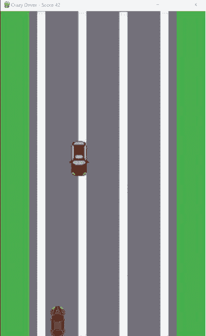

目标很简单：你位于屏幕底部，需要避免撞上向你驶来的汽车。你可以左右移动，仅此而已。

每次成功避开一辆车，你就会得到一分。哦，每次成功避开一辆车，游戏速度也会稍微加快一点。

## 安装 Pygame

Pygame 不包含在 Python 中，因此你需要安装它。为此，你需要执行与第 17 章安装 Colorama 时完全相同的操作：

- **Windows 用户：** `pip install pygame`
- **Mac 和 Chromebook 用户：** `pip3 install pygame`

```
Collecting pygame
  Using cached pygame-2.0.1-cp39-cp39-win_amd64.whl (5.2 MB)
Installing collected packages: pygame
Successfully installed pygame-2.0.1
```

和之前一样，如果你看到不同的版本号甚至不同的文本，不用担心。只需关注最后一行。只要它显示 Successfully installed，你就可以继续了。

## 创建工作文件夹

为我们的游戏创建一个新的工作文件夹。将鼠标悬停在 VS Code 资源管理器面板上。将鼠标悬停在 **PYTHON** 部分以显示工具栏。单击 **New Folder** 图标（左起第二个）。输入文件夹名称（CrazyDriver 就可以）并按 **Enter**。你现在有了一个新文件夹，它就是你的主游戏文件夹（也称为 *应用程序根文件夹*）。

图形游戏通常需要支持文件。至少，你需要图像文件，可能还需要音频文件、音乐文件等。通常，这些文件不应全部存储在与代码相同的文件夹中。相反，你应该为每种类型创建一个单独的子文件夹。我们的游戏使用图形图像，因此请在新文件夹内创建一个名为 Images 的文件夹。（在 VS Code 中，文件夹在包含文件之前可能看起来很奇怪。如果出现这种情况，请不要担心。）

你现在有了一个主游戏文件夹和一个用于存储游戏图像文件的子文件夹。创建新的代码文件时，请确保首先在资源管理器面板中单击正确的文件夹。你的代码需要放在主游戏文件夹中（而不是 Images 子文件夹中）。

## 获取图像

图形游戏使用图形。（这很明显，对吧？）至少，你需要汽车和背景的图形——通常是 PNG 文件。

图像不是在 Pygame 中创建的。你需要使用 Photoshop 等工具来创建它们。我们很乐意让你创建自己的图形，但为了帮助你入门，我们创建了一些你可以使用的图形。你可以从书籍网页下载它们，或扫描此二维码。


下载图像 ZIP 文件后，你需要从中提取图像。通常可以通过在计算机的文件浏览器中双击该文件来完成。将图像从 ZIP 文件复制到你刚刚创建的 Images 文件夹中。如果你选择创建自己的图像，它们也应该放在 Images 文件夹中。

## 开始

我们将逐步构建游戏。这意味着你将能够运行它来测试代码和更改，但暂时还不能玩。我们将从定义游戏空间开始。

> **可下载代码**
> 你将在本书的这一部分的每一章中更新和完善游戏代码文件（你即将创建的）。代码量不大，所以如果你愿意，可以手动输入。或者你可以通过扫描此二维码从书籍网页下载代码。为了方便你，我们已经发布了每一章结束时的代码样子。

## 初始化 Pygame

在你的游戏根文件夹中创建一个新文件。由于这是主游戏文件，请将其命名为 Main.py（或者实际上任何你喜欢的名字）。以下是代码：

```
# Imports
import pygame

# Game colors
BLACK = (0, 0, 0)
WHITE = (255, 255, 255)
RED   = (255, 0, 0)

# Main game starts here
# Initialize Pygame
pygame.init()

# Initialize frame manager
clock = pygame.time.Clock()
# Set frame rate
clock.tick(60)

# Set caption bar
pygame.display.set_caption("Crazy Driver")
```

如果你保存并运行这段代码，看起来好像什么都没发生。别惊慌！目前，这就是预期的结果。

让我们回顾一下代码。我们首先导入 Pygame 库。很简单。

接下来，我们为游戏中需要的几种颜色定义变量。颜色指定为以逗号分隔的 RGB 值，像这样：

```
# Game colors
BLACK = (0, 0, 0)
WHITE = (255, 255, 255)
RED   = (255, 0, 0)
```

### 全大写

你会注意到我们定义的颜色变量是大写的——例如，BLACK 而不是 black 或 Black。如你所知，Python 区分大小写，因此如果你创建了一个名为 BLACK 的变量，你必须完全按照这种方式引用它。那么，为什么我们要用全大写来创建这些变量呢？Python 程序员采用这种约定来表示不应更改的变量。由于我们的颜色永远不应更改，因此我们使用了这种命名约定。

我们经常使用混合大小写作为变量名，例如 lightGreen。如果变量是全大写的，它将使单词难以分隔，例如 LIGHTGREEN。因此，程序员经常使用下划线 (_) 来分隔单词，例如 LIGHT_GREEN。

### RGB 值

计算机屏幕上的颜色是通过混合不同量的红、绿、蓝光创建的。是的，当你的屏幕显示黄色时，它实际上显示的是大量的红色和绿色，没有蓝色。真的！

因为所有颜色都是使用红、绿、蓝的组合创建的，所以颜色值称为 RGB 值（R 代表红色，G 代表绿色，B 代表蓝色），它由三个数字组成，指定每种颜色的量。每种颜色的量是一个介于 0（完全没有该颜色）和 255（全是该颜色）之间的数字。

这意味着 255, 0, 0 将显示红色；R 值为 255（全强度），G 和 B 为 0（完全没有光）。品红色（或紫色）将是 255, 0, 255：全红和全蓝，没有绿色。黑色是 0, 0, 0：三种颜色都没有光。白色是 255, 255, 255：三种颜色都是全强度。

也可以使用部分值。这意味着有超过 1600 万（即 256 的 3 次方）种可能的颜色组合。

提供给代码（包括 Python）以及图形和插图软件的颜色都使用这样的 RGB 值。

接下来是实际的库初始化。在使用 Pygame 之前，必须初始化它（就像我们在第 17 章使用的 Colorama 库一样）。这通过一行代码完成：

```
# Initialize Pygame
pygame.init()
```

### 元组

看看三个颜色变量的代码。它们对你来说看起来不同吗？再看看。它们看起来有点像我们已经多次使用过的列表——但又不完全是。列表是这样定义的：

```
RED = [255, 0, 0]
```

值用逗号分隔，两边用方括号括起来。对吧？

这里我们使用了圆括号：

```
RED = (255, 0, 0)
```

RED 看起来像一个列表，但它显然不是。那么，它是什么？

它实际上是一个 *元组*，另一种与列表非常相似的 Python 类型，但有一个很大的不同。与列表不同，元组永远不能被更改。你不能添加项目，不能编辑项目，不能进行任何更改。

这使得元组对于永远不应更改的变量（如我们的颜色）非常有用。

图形游戏屏幕需要不断更新——每秒多次。屏幕更新的速率称为 *帧率*。

> **新术语**
> **帧率** 当我们看屏幕时，也许是在看电影或玩电子游戏，看起来图像一直在变化。事实并非如此。屏幕每秒更新多次——比人眼能轻易注意到的更快。这创造了持续变化的错觉。

屏幕每秒更新多次。更新速度以 *每秒帧数*（或 FPS）衡量，该值称为 *帧率*。

更高的帧率使视频变化看起来更流畅、更逼真，但它们也使用更多的处理能力。

管理帧率需要跟踪时间，因此我们创建一个时钟对象来完成这项工作，为游戏提供一种跟踪帧更新时间的方式：

```
# 初始化帧管理器
clock = pygame.time.Clock()
```

时钟定义在 Pygame 的 time 库中，因此我们使用完全限定名 `pygame.time.Clock()` 来实例化时钟对象。

现在我们有了时钟对象，可以用它来设置游戏帧率，如下所示：

```
# 设置帧率
clock.tick(60)
```

`clock.tick(60)` 告诉 Pygame 每秒最多更新显示 60 次（即每秒 60 帧）。

代码最后做的是更新标题栏，即游戏区域顶部的栏条。（你可以在本章前面的游戏画面顶部看到它。）代码如下：

```
# 设置标题栏
pygame.display.set_caption("Crazy Driver")
```

Pygame 的显示库用于管理屏幕上显示的所有内容。这里我们使用 `set_caption()` 方法将标题文本设置为 "Crazy Driver"。稍后我们会添加代码，让标题持续更新以显示当前游戏得分。

这就是代码的全部功能，所以如果你运行它，它不会做太多事情。

接下来我们需要告诉 Pygame 游戏窗口的大小，因此在代码底部添加以下内容：

```
# 初始化游戏屏幕
screen = pygame.display.set_mode((500, 800))
```

在 Pygame 中创建的游戏可以以不同模式运行，包括全屏或窗口模式。这行代码告诉 Pygame 我们的游戏在窗口中运行，并将窗口大小设置为 500 像素宽、800 像素高。`set_mode()` 方法返回游戏区域，我们将其保存到名为 `screen` 的变量中。

现在，如果你保存并运行代码，你会看到一个黑色方框（正好 500 像素宽、800 像素高）在屏幕上短暂闪烁。

我们正在取得进展！

## 显示内容

我们现在有了一个游戏区域（称为 *surface*）可供使用。游戏中发生的所有事情——显示项目、移动它们等等——都发生在游戏表面上。

> **新术语**
> **Surface** *surface* 是一个对象，表示屏幕上显示图像、文本等内容的区域。你将项目放置在表面上，然后 Pygame 就可以显示它们。

让我们更新游戏区域。通过我们创建的 `screen` 变量访问表面。我们可以用纯色填充背景。在本例中，我们将使用 `fill()` 方法将其设为白色。在文件底部添加以下内容：

```
# 设置背景颜色
screen.fill(WHITE)
```

> **像素**
> 像素（*picture element* 的缩写，*pix* = 图像，*el* = 元素）是屏幕上可以显示的最小项目。每个像素都是一个完全为单一 RGB 颜色的小点。较大的图像或视频实际上是由大量像素组成的。当像素非常小且数量众多时，你不会注意到单个像素点，只会看到组合后的图像。

这就是为什么 1080 图像看起来比 720 图像更好。1080 在与 720 图像相同的空间内拥有更多像素，单个像素更小且不那么明显。4K 的像素远多于 1080，这就是为什么 4K 图像看起来更平滑。

顾名思义，`fill()` 用一种颜色填充屏幕，这里我们传递了之前定义的 `WHITE` 颜色。注意 `WHITE` 之所以有效是因为我们创建了它。如果你现在尝试使用 `BLUE`，你会得到一个错误，因为我们还没有定义 `BLUE`。

保存并运行代码。嗯，这没起作用。方框在屏幕上短暂闪烁，但它仍然是黑色的。我们的 `fill(WHITE)` 怎么了？

嗯，关于游戏引擎，这里有一个重要的知识点——这对所有游戏引擎都适用，而不仅仅是 Pygame：图形游戏通常会频繁更新显示，而且经常需要同时进行大量更改。更新显示需要时间，因此游戏引擎通常会记住所有需要进行的更改，但直到你告诉它们执行时才会实际执行。这对你来说是一个额外的步骤，但它使得游戏运行更快、响应更灵敏。

这就是这里发生的情况。我们告诉 Pygame 使用 `fill(WHITE)` 设置背景颜色，Pygame 将其内部更改列表更新为该颜色更改。但我们从未告诉 Pygame 更新显示，所以，嗯，它没有更新。

我们如何更新显示？在 `fill()` 方法下方添加以下内容：

```
# 更新屏幕
pygame.display.update()
```

保存并测试代码。这次，屏幕上闪烁的方框将是白色的。

`display.update()` 正如你所期望的那样：它用任何待处理的更改更新显示。

## 游戏循环

我们的游戏（是的，我们知道现在称它为游戏有点牵强）启动后立即退出。这是因为，正如你所记得的，Python 逐行执行你的代码，一旦处理完最后一行代码，应用程序就会终止。

为了保持游戏运行（直到游戏结束），我们需要一个循环，就像我们在前面章节中多次使用的循环一样。整个游戏都在循环内部。当循环结束时，游戏就完成了。

那么，循环里放什么？在我们的游戏中，我们需要代码让玩家左右移动，迎面而来的汽车需要出现并向玩家移动，我们需要跟踪分数并调整游戏速度等等。所有这些都放在游戏循环中。

让我们添加一个简单的游戏循环。你可以将其添加到 Main.py 的底部：

```
## 主游戏循环
while True:
    # 检查事件
    for event in pygame.event.get():
        # 玩家退出了吗？
        if event.type == pygame.QUIT:
            # 退出 pygame
            pygame.quit()
            sys.exit()

    # 更新屏幕
    pygame.display.update()
```

保存更改并运行游戏。这次，游戏屏幕将显示（白色背景），方框将保留在屏幕上，直到你手动关闭它（通过点击屏幕顶部的关闭图标或点击游戏窗口上的 X）。

那么这段代码做什么呢？它从一个看起来奇怪的循环开始：

```
## 主游戏循环
while True:
```

这是一个 while 循环，类似于我们之前使用的循环，但这个循环的条件是 `True`。在每次循环迭代中，Python 会检查条件是否为 `True`，而它总是 `True`。这使得它成为一个无限循环。通常这不是好事，但它对我们有用，因为它保持游戏运行。

接下来是一个 for 循环，它检查是否有任何事件发生需要我们在游戏中响应。什么是事件？它们可能是按下的键或点击的鼠标按钮。如果这些事件发生，你的代码需要相应地响应。我们现在唯一需要响应的事件是 `QUIT` 事件，这意味着玩家关闭了游戏窗口。

`pygame.event.get()` 返回需要响应的事件列表（如果有的事），然后传递给 for 循环，该循环遍历这些事件，如下所示：

```
for event in pygame.event.get():
```

在 for 循环内，一个名为 `event` 的变量将包含要响应的事件的详细信息。我们需要检查 `QUIT` 事件，因此我们使用这个 if 语句：

```
# 玩家退出了吗？
if event.type == pygame.QUIT:
```

如果玩家确实退出了，那么我们需要关闭 Pygame 并关闭它运行所在的计算机窗口。这就是这两行代码的作用：

```
# 退出 pygame
pygame.quit()
sys.exit()
```

第二行代码使用 `sys` 库，该库包含用于处理 Python 运行环境的方法。要使用它，你需要在代码顶部添加一个导入：

```
import sys
```

最后，游戏循环中的最后一行代码应该始终是显示更新，如下所示：

```
# 更新屏幕
pygame.display.update()
```

我们的游戏循环没有更新任何内容，所以 `update()` 方法实际上不会做任何事情。但是，作为一般规则，你总是希望在每次游戏循环迭代结束时更新显示，因此我们在这里添加它以备将来使用。

在结束本章之前，再做一点调整。为了更容易看清发生了什么，以下是完整的 Main.py：

```
# 导入
import sys
import pygame
from pygame.locals import *

# 游戏颜色
BLACK = (0, 0, 0)
WHITE = (255, 255, 255)
RED   = (255, 0, 0)

# 主游戏从这里开始
## 初始化 Pygame
pygame.init()

# 初始化帧管理器
clock = pygame.time.Clock()
# 设置帧率
clock.tick(60)

# 设置标题栏
pygame.display.set_caption("Crazy Driver")

# 初始化游戏屏幕
screen = pygame.display.set_mode((500, 800))

# 设置背景颜色
screen.fill(WHITE)

# 更新屏幕
pygame.display.update()
```

## 主游戏循环

```python
while True:
    # Check for events
    for event in pygame.event.get():
        # Did the player quit?
        if event.type == QUIT:
            # Quit pygame
            pygame.quit()
            sys.exit()

    # Update screen
    pygame.display.update()
```

那么这里有什么变化呢？有两点。

如你所知，程序员喜欢简洁、紧凑的代码，并总是寻找简化编写内容的方法。使用 Pygame 时，你会发现自己反复引用像 `pygame.QUIT` 这样的事件。如果能直接引用 `QUIT`，而无需指定库作为前缀，代码会更整洁。上面的代码在 `if` 语句中就是这样使用 `QUIT` 的：

```python
if event.type == QUIT:
```

`QUIT` 是在 pygame 库中定义的一个局部变量。那么，我们如何在不指定 pygame 库名的情况下使用 `QUIT` 呢？答案是，我们可以将 pygame 中的变量直接导入到我们的代码中。看看文件顶部的导入语句：

```python
# Imports
import sys
import pygame
from pygame.locals import *
```

前两条导入语句你非常熟悉。第三条是新的。它告诉 Python 从 pygame 导入所有局部变量（这就是 `locals` 的含义），使它们在我们的代码中可用，就像它们是我们自己的局部变量一样。很巧妙，对吧？现在我们可以像引用局部变量一样引用 `QUIT` 了。

## 挑战 19.1

尝试更改传递给 `set_mode()` 的窗口大小。让它变大、变小、变宽……你明白这个意思。

我们定义了三种颜色。尝试将 `fill()` 改为使用 `RED` 而不是 `WHITE`。然后创建你自己的颜色变量并使用它们。记住，对于每个 RGB 值，你可以使用 0 到 255 之间的任何值。在尝试颜色时，你可能只想使用 0 和 255。（这仍然给你 8 种组合可以尝试。）

## 总结

在本章中，你了解了 Pygame 是什么并安装了它。你还创建了基本的游戏结构，现在已准备好在下一章中显示图形。


## 第 20 章

## 想象可能性

既然你已经设置好了基本的 Pygame 应用程序，是时候让它看起来像一个游戏了。在本章中，我们将在游戏表面上放置图像，并学习如何处理文件和文件夹。

## 文件和文件夹

我们目前的《疯狂司机》游戏由一个名为 `Main.py` 的单一文件组成，其中包含 Python 代码。但这种情况即将改变。真正的游戏由许多文件组成，并非所有文件都是代码。你至少会有图像文件，可能还有视频、音乐和其他文件。而且你不会希望所有这些文件都在同一个文件夹中。那样会变得杂乱无章，难以管理。

我们的游戏目前只使用图像（在第 19 章中，我们指导你将它们保存在 `Images` 文件夹中）。如果你有视频文件、音频片段、音乐文件等，你可能也会希望将它们保存在各自适当命名的文件夹中。一个更完整的游戏可能有一个类似这样的文件夹结构：


然而，挑战在于你的代码需要知道在需要时去哪里找到这些文件。而且你不想硬编码文件路径。为什么？因为根据使用的操作系统和应用程序运行所在的文件夹，文件和文件夹的确切路径可能会改变。在你计算机上有效的方法在别人的计算机上可能无效。

> **新术语**
> **路径** 你计算机上的文件存储在文件夹中。而文件夹可以位于其他文件夹内部。考虑到文件夹后，文件的确切位置称为 *路径*。

解决方案是什么？动态构建到文件夹的路径。当游戏启动时，它会检查其运行位置，然后为必要文件夹的路径创建变量。你的代码使用这些变量来访问文件。这只多了几行代码，但它使你的应用程序更安全、更 *可移植*。

> **新术语**
> **可移植** 当代码以确保其能在不同计算机、设备或操作系统上安全执行的方式编写时，就称其为 *可移植*。可移植性是一件好事，程序员总是尝试编写尽可能可移植的代码。

我们如何获取正在运行的代码的路径？Python 让这变得非常简单。创建一个测试文件并输入以下代码：

```python
print(__file__)
```

保存并运行代码。你将在终端窗口中看到正在执行的文件的完整路径。

这是如何工作的？`__file__` 是一个特殊的内置变量，包含当前正在执行的代码的完整名称——这正是我们需要的。注意这个变量：单词 `file` 前后各有两个下划线。

现在我们有了代码的路径。接下来，我们需要提取仅文件夹名称部分，因为它将告诉我们代码文件位于哪个文件夹中。那个文件夹就是我们的游戏根文件夹。要从完全限定的路径中提取文件夹（也称为目录），请将代码更改为如下所示：

```python
import os
print(__file__)
print(os.path.dirname(__file__))
```

保存并运行代码。这次，你将在输出中看到两行：首先是代码的完整路径，然后是代码目录。

> **提示**
> **像专业人士一样工作** 库，无论是内置的还是像 Pygame 这样的第三方库，往往包含许多模块和许多方法。你不需要记住它们。输入部分名称，VS Code 会帮助你找到所需内容。如果这不起作用，就像专业人士那样，用谷歌搜索。如果你搜索“Python get file path”，你会看到与我们这里使用的代码非常相似的代码，以及其他解决方案。

`os` 库包含用于处理操作系统（包括文件）的函数。`os.path.dirname()` 接受一个路径并仅提取文件夹部分，这正是我们需要的。

有了这个，我们可以轻松地为游戏路径创建变量。以下是更新后的代码：

```python
import os

# Build game paths
GAME_ROOT_FOLDER=os.path.dirname(__file__)
IMAGE_FOLDER=os.path.join(GAME_ROOT_FOLDER, "Images")

print("Game root:    ", GAME_ROOT_FOLDER)
print("Image folder:", IMAGE_FOLDER)
```

保存并运行此代码。它将打印两行输出，报告游戏根目录和图像文件夹。

代码非常简单。第一个路径变量是这样创建的：

```python
GAME_ROOT_FOLDER=os.path.dirname(__file__)
```

这简单地将提取的文件夹路径保存到变量 `GAME_ROOT_FOLDER` 中。

下一行保存图像文件夹的路径，该文件夹位于游戏根目录内。为此，它使用了一个名为 `os.path.join()` 的函数，如下所示：

```python
IMAGE_FOLDER=os.path.join(GAME_ROOT_FOLDER, "Images")
```

`join()` 函数用于以一种对所有计算机操作系统都安全的方式添加到路径中。此代码创建一个名为 `IMAGE_FOLDER` 的变量，该变量使用 `GAME_ROOT_FOLDER` 动态构建，并将 `Images` 文件夹添加到其中。（我们之前创建了这个文件夹，所以知道它存在。）而且我们不必担心斜杠或反斜杠字符（你在文件路径中需要它们）；`join()` 会为我们处理这些。

我们将使用此代码来访问我们即将放置在表面上的图像。

### 挑战 20.1

我们现在只使用图像，因此只有一个 `Images` 文件夹。但为未来做好规划是好的。假设你有 `Sound` 和 `Videos` 文件夹，并为每个文件夹创建变量。你应该能够用一行代码创建每个变量。

## 设置背景

在上一章中，我们创建了一个游戏窗口并将背景设置为白色。现在让我们更新代码以显示道路图像作为背景。道路图像在 `Images` 文件夹中，并恰当地命名为 `Road.png`。完成后，你的游戏屏幕将如下所示：

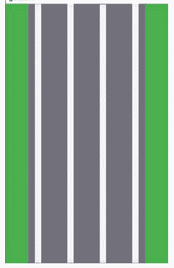

这看起来比白色背景好多了！

以下是更新后的 `Main.py`：

```python
# Imports
import sys, os
import pygame
from pygame.locals import *

# Game colors
BLACK = (0, 0, 0)
WHITE = (255, 255, 255)
RED   = (255, 0, 0)

# Build game paths
GAME_ROOT_FOLDER=os.path.dirname(__file__)
IMAGE_FOLDER=os.path.join(GAME_ROOT_FOLDER, "Images")

# Main game starts here
# Initialize Pygame
pygame.init()

# Initialize frame manager
clock = pygame.time.Clock()

# Set frame rate
clock.tick(60)

# Set caption bar
pygame.display.set_caption("Crazy Driver")

# Load images
IMG_ROAD = pygame.image.load(os.path.join(IMAGE_FOLDER, "Road.png"))

# Initialize game screen
screen = pygame.display.set_mode(IMG_ROAD.get_size())

# Main game loop
while True:
```

# 放置背景
screen.blit(IMG_ROAD, (0,0))

# 检查事件
for event in pygame.event.get():
    # 玩家是否退出？
    if event.type == QUIT:
        # 退出pygame
        pygame.quit()
        sys.exit()

# 更新屏幕
pygame.display.update()

保存并运行代码。这次，游戏窗口会显示道路背景，直到你关闭窗口。

那么，发生了什么变化？让我们逐步分析代码。

我们对导入部分做了一处修改：

```
# 导入
import sys, os
import pygame
from pygame.locals import *
```

正如你刚才看到的，`os` 是我们用来处理文件路径的，所以我们需要导入它。

> **合并导入语句**
如前所述，我们可以将每个导入放在单独的行中，像这样：

```python
import sys
import os
```

Python 也允许你合并这些行，就像我们在代码中做的那样，像这样：

```python
import sys, os
```

最终结果是一样的，所以你可以使用你喜欢的格式。

接下来是游戏颜色定义，和之前一样。

然后我们创建了两个文件夹变量，如前所述。`GAME_ROOT_FOLDER` 存储我们游戏的计算机路径，`IMAGE_FOLDER` 存储游戏图像文件的路径。

之后是 Pygame 初始化、帧管理器和帧率，以及标题栏文本，这些都没有改变，所以不需要解释。

然后是这段代码：

```
# 加载图像
IMG_ROAD = pygame.image.load(os.path.join(IMAGE_FOLDER, "Road.png"))
```

要在 Pygame 中使用图像，需要将其加载到一个变量中并放置在一个表面上。这里我们想加载道路图像；它是 Images 文件夹中的 Road.png 文件。像之前一样，我们使用 `os.path.join()` 来安全（且可移植地）创建我们需要的文件路径。然后 `pygame.image.load()` 检索指定的图像并将其绘制到名为 `IMG_ROAD` 的表面上。

需要注意的是，加载图像并不会实际显示它。要显示图像，我们需要将这个新表面复制到我们的主游戏表面，然后更新显示。我们稍后会讲到这一点。

接下来，我们像之前一样初始化游戏屏幕。但这里有一个重要的改变。之前我们给 `set_mode()` 一个精确的硬编码屏幕尺寸（500像素乘800像素）。现在不是了。看看这行修改后的代码：

```
# 初始化游戏屏幕
screen = pygame.display.set_mode(IMG_ROAD.get_size())
```

我们之前将 Road.png 加载到了 `IMG_ROAD` 表面。`IMG_ROAD` 知道关于图像的所有信息，包括它的大小。所以，我们不是硬编码尺寸（硬编码 = 不好，对吧？），而是使用 `IMG_ROAD.get_size()`。这样，游戏窗口的大小将匹配道路背景图像的大小（巧合的是，它正好是500像素乘800像素）。如果我们使用不同尺寸的图像，窗口会相应地调整。

还有一个超级重要的改变。我们移除了使背景变白的代码，并在游戏循环中添加了这段代码来代替：

```
# 放置背景
screen.blit(IMG_ROAD, (0,0))
```

这行代码就是将道路图像放到游戏屏幕上的关键。记住，我们现在有两个表面：主游戏表面（我们称之为 `screen`）和背景图像表面（我们称之为 `IMG_ROAD`）。`blit()` 函数复制一个传递的表面并将其复制到另一个表面。这里它将 `IMG_ROAD` 复制到 `screen` 上。

`blit()` 接受两个参数：被复制的图像和复制到的位置。为什么需要第二个参数？表面是二维的。把它们想象成正方形（或矩形）。当你将图像复制到表面上时，你需要告诉表面将图像放置在哪里，通过使用 x,y 坐标——一对数字，标识目标表面上的一个位置。0, 0 指的是屏幕的左上角，这正是我们希望背景放置的位置，以便它填满整个屏幕。

> **新术语**
> **x,y 坐标** x,y 坐标（也称为 x,y 轴）标记平面上的一个位置。x 数字是从左边开始的水平位置，y 数字是从顶部开始的垂直位置。而且，正如你所料，在 Python 中这些值从 0 开始。这意味着位置 0, 0 是左上角，100, 50 将是距离左边 100 像素，距离顶部 50 像素，依此类推。

> **新术语**
> **Blit** Blit 是个奇怪的词，对吧？它实际上代表 *块传输*，这正是当你执行 blit 操作时实际发生的事情：你复制（传输）一块信息从一个位置到另一个位置。

## 放置汽车

现在你已经放置了背景图像，让我们将两辆汽车添加到屏幕上：玩家汽车和迎面而来的汽车（我们称之为 *敌人*）。汽车还不会移动。我们将在下一章添加那个功能。现在我们只放置它们，就像我们放置背景一样。

这是 Main.py 的更新代码：

```
# 导入
import sys, os, random
import pygame
from pygame.locals import *

# 游戏颜色
BLACK = (0, 0, 0)
WHITE = (255, 255, 255)
RED   = (255, 0, 0)

# 构建游戏路径
GAME_ROOT_FOLDER=os.path.dirname(__file__)
IMAGE_FOLDER=os.path.join(GAME_ROOT_FOLDER, "Images")

# 主游戏从这里开始
## 初始化 Pygame
pygame.init()

# 初始化帧管理器
clock = pygame.time.Clock()

# 设置帧率
clock.tick(60)

# 设置标题栏
pygame.display.set_caption("疯狂司机")

# 加载图像
IMG_ROAD = pygame.image.load(os.path.join(IMAGE_FOLDER, "Road.png"))
IMG_PLAYER = pygame.image.load(os.path.join(IMAGE_FOLDER,
    "Player.png"))
IMG_ENEMY = pygame.image.load(os.path.join(IMAGE_FOLDER,
    "Enemy.png"))

# 初始化游戏屏幕
screen = pygame.display.set_mode(IMG_ROAD.get_size())

# 创建游戏对象
# 计算玩家初始位置
h=IMG_ROAD.get_width()//2
v=IMG_ROAD.get_height() - (IMG_PLAYER.get_height()//2)
# 创建玩家精灵
player = pygame.sprite.Sprite()
player.image = IMG_PLAYER
player.surf = pygame.Surface(IMG_PLAYER.get_size())
player.rect = player.surf.get_rect(center = (h, v))

# 敌人
# 计算敌人初始位置
hl=IMG_ENEMY.get_width()//2
hr=IMG_ROAD.get_width()-(IMG_ENEMY.get_width()//2)
h=random.randrange(hl, hr)
v=0
# 创建敌人精灵
enemy = pygame.sprite.Sprite()
enemy.image = IMG_ENEMY
enemy.surf = pygame.Surface(IMG_ENEMY.get_size())
enemy.rect = enemy.surf.get_rect(center = (h, v))

## 主游戏循环
while True:
    # 放置背景
    screen.blit(IMG_ROAD, (0,0))

    # 将玩家放置在屏幕上
    screen.blit(player.image, player.rect)

    # 将敌人放置在屏幕上
    screen.blit(enemy.image, enemy.rect)

    # 检查事件
    for event in pygame.event.get():
        # 玩家是否退出？
        if event.type == QUIT:
            # 退出pygame
            pygame.quit()
            sys.exit()

    # 更新屏幕
    pygame.display.update()
```

保存并运行代码。你会看到两辆汽车被放置在屏幕上。玩家汽车将居中在底部，敌人汽车将位于顶部的某个随机位置。你的显示将看起来像这样，并且每次运行时，敌人汽车应该在不同的位置：

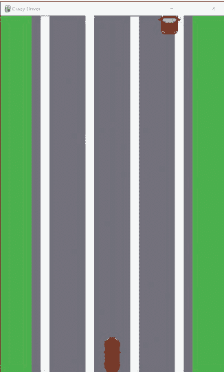

游戏开始成形了。让我们看看代码中发生了什么变化。

我们在 `import` 语句中添加了我们最喜欢的 `random` 库。我们需要它来随机放置敌人汽车。

我们更新了加载图像的代码，以加载我们需要的两辆汽车：

```
# 加载图像
IMG_ROAD = pygame.image.load(os.path.join(IMAGE_FOLDER, "Road.png"))
IMG_PLAYER = pygame.image.load(os.path.join(IMAGE_FOLDER,
    "Player.png"))
IMG_ENEMY = pygame.image.load(os.path.join(IMAGE_FOLDER,
    "Enemy.png"))
```

就像我们之前对 `IMG_ROAD` 所做的那样，`IMG_PLAYER` 加载 Player.png 汽车，`IMG_ENEMY` 加载 Enemy.png 汽车。现在我们有三张图像加载到表面上并准备使用。

然后是新的东西。我们创建了 *精灵*，一种可以放置在表面上、移动、旋转、移除等的图像对象。

> **新术语**
> **精灵** 在计算机图形学中，*精灵* 是一种放置在较大图像上的二维图像。精灵可以显示或隐藏、移动、旋转以及以各种方式变换。精灵是在游戏、动画电影等中创建动画和移动错觉的关键。

因为我们的汽车需要移动，所以我们把它们做成精灵。这是玩家汽车精灵的代码：

```
# 计算玩家初始位置
h=IMG_ROAD.get_width()//2
v=IMG_ROAD.get_height() - (IMG_PLAYER.get_height()//2)
# 创建玩家精灵
player = pygame.sprite.Sprite()
player.image = IMG_PLAYER
player.surf = pygame.Surface(IMG_PLAYER.get_size())
player.rect = player.surf.get_rect(center = (h, v))
```

这看起来比实际更复杂，所以让我们一起过一遍。

当精灵被放置在表面上时，我们需要精确定义它们要被放置的位置。我们希望玩家汽车居中在屏幕底部，因此，我们将通过计算精灵的中心点来定位它们（不同于之前将背景放置在精确固定位置的方式）。确定中心点需要进行一些数学计算，这正是前两行代码的作用：

- 水平位置恰好是道路宽度的一半（如你所知，道路宽度就是游戏屏幕的尺寸）。我们将 `IMG_ROAD.get_width()//2` 保存到名为 `h`（代表水平）的变量中。
- 垂直位置稍微复杂一些。如果我们直接使用道路的高度，玩家车辆的中心点就会位于屏幕底部，这样只会显示玩家车辆的上半部分（中心点以上的部分）。为了将整个玩家车辆完整地显示在屏幕底部，我们通过代码 `IMG_ROAD.get_height() - (IMG_PLAYER.get_height()//2)` 从屏幕高度中减去车辆高度的一半。这被保存到变量 `v`（代表垂直）中。

这张图片有助于解释玩家车辆的定位：

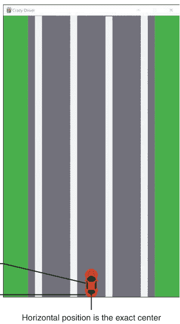

现在我们有了两个变量，它们分别包含了玩家精灵的水平和垂直中心位置。

然后代码创建了精灵，并将变量命名为 `player`，同时将精灵图像设置为 `IMG_PLAYER`（我们刚刚加载的玩家车辆图像）。注意这看起来像是在初始化一个类，因为——惊喜！——`Sprite()` 确实是一个类！

精灵对象需要知道图像的大小。我们没有硬编码数值，而是使用 `get_size()` 来获取实际的图像尺寸（就像我们之前根据背景图像尺寸设置游戏屏幕尺寸一样）。

最后，我们定义了用于容纳精灵的矩形。这用于将精灵放置在游戏表面的正确位置，使用我们刚刚计算出的两个位置变量。

放置敌方车辆的方式类似：

```python
# Calculate initial enemy position
h1 = IMG_ENEMY.get_width() // 2
hr = IMG_ROAD.get_width() - (IMG_ENEMY.get_width() // 2)
h = random.randrange(h1, hr)
v = 0

# Create enemy sprite
enemy = pygame.sprite.Sprite()
enemy.image = IMG_ENEMY
enemy.surf = pygame.Surface(IMG_ENEMY.get_size())
enemy.rect = enemy.surf.get_rect(center=(h, v))
```

同样，我们首先计算精灵的位置。这同样涉及一些数学计算：

- 实际上，垂直位置不需要数学计算。我们希望敌人从屏幕顶部开始，只显示车辆的一半。（当它驶向玩家时，完整的车辆将会出现。）变量 `v` 是垂直位置，所以我们设置 `v=0`。
- 水平位置则更有趣一些。与我们希望居中的玩家精灵不同，敌人精灵需要放置在随机的水平位置。如你所知，选择随机数需要我们提供一个值范围的最小值和最大值。因此，我们计算最左侧允许的位置（作为范围的最小值）并将其保存到变量 `h1`（代表水平左侧），以及最右侧的位置（作为范围的最大值）并将其保存到变量 `hr`（代表水平右侧）。然后我们使用 `randrange()` 在 `h1` 和 `hr` 之间选择一个随机数，并将其保存到 `h`。

这张图有助于解释这一点：

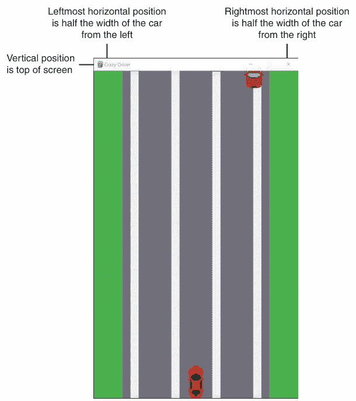

其余代码与玩家精灵代码相同，只是使用了敌人图像而不是玩家图像。

现在我们有了两个可以使用的精灵。

### 都可以内联

我们计算了精灵的位置并将结果保存到变量中。然后我们将这些变量传递给 `get_rect()` 来定位精灵。我们创建的变量只在紧接其后的代码行中被 `get_rect()` 使用。因此，我们本可以直接在 `get_rect()` 内部进行计算，而不创建变量。事实上，大多数开发者都会这样做，如果你查看网上的代码示例和教程，通常也会看到这种做法。我们将计算过程分离出来并将结果保存到变量中，是为了让代码更容易解释和理解。你可以像我们这里一样做，也可以将计算直接内联。最终结果是一样的，所以这取决于你。

另一个变化是在游戏循环本身：

```python
# Place player on screen
screen.blit(player.image, player.rect)

# Place enemy on screen
screen.blit(enemy.image, enemy.rect)
```

就像我们处理道路图像一样，玩家和敌方车辆被绘制到屏幕上，使用精灵矩形作为位置。

现在我们已经在屏幕上放置了三个图像。在下一章中，我们将让它们动起来。

### 挑战 20.2

我们为你提供了三种不同的敌方车辆。我们实际上会在后面的章节中使用所有三种，但现在你可以尝试一下。修改代码，使放置在屏幕顶部的敌方车辆是 Enemy2 或 Enemy3。

## 总结

在本章中，你学习了如何在 Pygame 中加载图像以及如何将它们放置在屏幕上进行显示。接下来，让它们动起来！

# 第 21 章

## 我们喜欢动起来

我们的游戏开始看起来像，嗯，一个游戏了。唯一的问题是车辆只是坐在那里，完全没有移动。在本章中，我们将改变这一点。

## 移动敌人

现在我们有了一个带有道路背景的游戏屏幕，以及一辆出现在屏幕顶部随机位置的敌方车辆。现在我们将让敌人移动起来。

如你所知，敌人正朝你驶来（方向正确——而你是那个开错方向的人！）。要让敌人移动，我们只需要将精灵沿屏幕向下移动。

敌人移动的速度有多快？这取决于你。如果它一次移动 1 像素，它会移动得非常慢；如果它一次移动 100 像素，它会移动得非常快。我们将从让它一次移动 5 像素开始，稍后随着游戏的进行，我们会让它移动得更快。

打开 Main.py 并在文件顶部附近添加这段代码，颜色定义之前或之后都是一个不错的位置：

```python
# Game variables
moveSpeed = 5
```

这段代码创建了一个名为 `moveSpeed` 的变量，并将其初始化为 5（我们将移动的像素数）。我们将在移动精灵时使用这个变量。

哦，这个变量确实是可变的。我们很快会添加代码来改变游戏中的玩法，所以这次我们没有使用大写字母作为名称。

现在进入有趣的部分。转到游戏循环，找到将敌人绘制到屏幕上的代码。在那行代码之后，添加这段代码：

```python
# Move enemy downwards
enemy.rect.move_ip(0, moveSpeed)
```

`move_ip()` 用于移动精灵。它接受两个参数。第一个是水平移动的像素数；我们不想改变水平位置，所以这个值是 0。第二个是垂直移动的像素数。我们传递 `moveSpeed`（我们初始化为 5），所以敌人将沿屏幕向下移动 5 像素。

保存并运行代码。你会看到敌人从顶部的随机位置开始，然后沿屏幕向下驶向玩家。然后……哦不！……它直接驶出了屏幕！

## 上、下、左、右

我们正在沿一个方向移动精灵，传递了垂直值但没有传递水平值。我们可以同时传递两个值，这将使精灵沿对角线移动。我们也可以传递负值：第一个值为 -5 将向左移动 5 像素，第二个值为 -5 将向上移动 5 像素。

为什么会发生这种情况？`move_ip()` 按照代码设定，持续将敌人移动 5 像素。它不关心精灵是否可见。敌人持续移动，最终移出了可见区域。

应该发生的是，当敌人到达屏幕底部时，我们将它移回顶部。这样，看起来就像一辆车经过了我们，而一辆新车正朝我们驶来。为此，我们需要在每次移动敌人时检查它的位置，看它是否已经到达屏幕底部。

我们可以用一个简单的 `if` 语句来实现这一点。在 `move_ip()` 行之后添加这段代码：

```python
# Check didn't go off edge of screen
if (enemy.rect.bottom > IMG_ROAD.get_height()):
    # At bottom, so move back to top
    enemy.rect.top = 0
```

保存并运行代码。敌方车辆沿屏幕向下行驶，当它到达底部时，它会移回顶部。

这是如何工作的？你会记得精灵周围有矩形，Pygame 用它们来跟踪精灵的位置。每次我们调用 `move_ip()` 时，Pygame 都会更新矩形，因此 `enemy.rect` 始终包含敌人精灵的精确位置。`enemy.rect.bottom` 包含敌人精灵底部的精确位置。`if` 语句只是检查敌人的底部是否大于道路的高度。如果是，那么我们已经移出了屏幕，然后代码将 `enemy.rect.top` 设置为 0，这会将它移回屏幕顶部。

很酷，对吧？

唯一的问题是，当敌人重新出现在屏幕顶部时，它与之前的水平位置相同。为什么？因为我们只改变了垂直位置，而没有改变水平位置。

让我们来改变这一点。我们曾使用数学和`randrange()`为敌人选择一个初始的随机水平位置。每次我们将敌人放回顶部时，都可以完全重复这个操作。移除将敌人移动到屏幕顶部的代码，并替换为以下代码：

```
# Calculate new random location
h1=IMG_ENEMY.get_width()//2
hr=IMG_ROAD.get_width()-(IMG_ENEMY.get_width()//2)
h=random.randrange(h1, hr)
v=0
# And place it
enemy.rect.center = (h, v)
```

这与我们最初放置敌人精灵的代码相同。它计算了范围的最小值和最大值，使用`randrange()`选择一个水平位置，并将垂直位置设置为0。（记住，0是屏幕的顶部吗？）

保存并运行代码。现在敌人的车会驶向屏幕底部，然后一个新的敌人将从随机位置出现。

如果敌人撞上你的玩家车会怎样？目前什么都不会发生。事实上，你甚至还无法移动躲避！我们接下来会修复这个问题。

> **重复代码？**
我们知道你在想什么。我们一直在强调程序员讨厌重复代码，而我们刚刚却重复了计算敌人位置的代码。

哦，真惭愧！

嗯，事实是这是临时代码。我们将在未来的章节中添加对多个敌人图像的支持时替换它。由于这本质上是一次性代码，我们选择了偷懒的方式，是的，重复了代码。

但这真的是个例外。我们是认真的。作为一条规则，不要有重复代码！

## 移动玩家

敌人精灵是自动移动的。在每一帧刷新时，它向下移动5个像素。

玩家精灵不能自动移动。它只在玩家指示时才移动。玩家将如何操作？我们的游戏将使用键盘上的左右方向键；按左键向左移动，按右键向右移动。这显然需要我们检查这些键盘按键是否被按下。而且，Pygame再次让这变得非常简单。

在你的游戏循环中，找到绘制玩家精灵的代码行。在该行代码之后添加以下内容：

```
# Get keys pressed
keys = pygame.key.get_pressed()
# Check for LEFT key
if keys[K_LEFT]:
    # Move left
    player.rect.move_ip(-moveSpeed, 0)
# Check for RIGHT key
if keys[K_RIGHT]:
    # Move right
    player.rect.move_ip(moveSpeed, 0)
```

`key.get_pressed()`返回一个所有可用按键的列表，如果按键被按下则为`True`，否则为`False`。我们将返回的列表保存在一个名为`keys`的变量中，然后可以检查它。如果`keys[K_LEFT]`为`True`，那么我们就知道左方向键被按下了，依此类推。

> **各种按键选项**
如你所见，`key.get_pressed()`返回一个所有可能被按下的按键列表，每个按键都设置为`True`或`False`。在我们的游戏中，我们只关心左右方向键。但其他游戏可能想要测试按键组合（如Ctrl+A，或同时按下左方向键和上方向键），这可以通过检查返回列表中的多个值轻松实现。

如果玩家按下左或右方向键，我们该怎么做？我们使用`move_ip()`函数来移动玩家精灵，就像我们移动敌人精灵一样：

- 如果按下了右方向键，我们执行`player.rect.move_ip(moveSpeed, 0)`，这会将玩家向右移动5个像素（垂直方向移动0个像素）。
- 如果按下了左方向键，我们移动`-moveSpeed`，这会将玩家向左移动5个像素（但不垂直移动）。注意那里的负号：`moveSpeed`是5，所以`-moveSpeed`是-5，正如我们之前解释的那样。

保存更改并运行游戏。你现在可以左右移动你的玩家了。

而且你可以把他们移出屏幕！这和我们之前遇到的敌人移动过远的问题是一样的。

那么，该怎么办呢？对于敌人，我们将精灵移回屏幕顶部。但这对玩家精灵没有意义。那会做什么？将玩家精灵移回中心？不！你可以像吃豆人那样做：从屏幕一侧出去，然后在另一侧重新出现。

但是，对我们来说，更好的选择是首先不让玩家精灵移动过远。

更新检查左方向键的`if`语句如下：

```
if keys[K_LEFT] and player.rect.left > 0:
```

现在`if`语句检查左方向键是否被按下，并确定玩家矩形的左侧是否大于0。如果`left`是0，那么玩家已经完全在左侧，无法再向左移动。

右方向键呢？也更改那个`if`语句：

```
if keys[K_RIGHT] and player.rect.right < IMG_ROAD.get_width():
```

这段代码检查玩家矩形的右侧，确保它没有超出道路的宽度（即游戏屏幕的宽度）。

这样更好了：玩家不再会从屏幕边缘掉出去。但我们还没有完全完成。作为程序员，我们需要预见代码将如何使用，并为每种情况做好计划。这里有一个可能尚未发生但迟早会发生的情况。

当玩家按下左或右方向键时，我们将玩家精灵移动5个像素。并且我们确保玩家不会移动到屏幕外太远。对吧？但如果当前水平位置是像素3呢？当玩家按下左方向键时，我们的代码会检查位置是否小于0，由于它不小于0，它会允许精灵移动。它会移动到哪里？像素3左边5个像素是-2，这意味着汽车的一部分会超出屏幕边缘。这不太理想。

有几种方法可以解决这个问题。我们可以更改代码来检查还剩多少像素可以移动，并在需要时使用小于5的数字。或者，我们可以直接移动玩家精灵，如果移动得太远，就把它推回去。

让我们选择后者。以下是更新后的玩家精灵移动代码：

```
# Get keys pressed
keys = pygame.key.get_pressed()
# Check for LEFT key
if keys[K_LEFT] and player.rect.left > 0:
    # Move left
    player.rect.move_ip(-moveSpeed, 0)
    # Make sure we didn't go too far left
    if player.rect.left < 0:
        # Too far, fix it
        player.rect.left = 0
# Check for RIGHT key
if keys[K_RIGHT] and player.rect.right < IMG_ROAD.get_width():
    # Move right
    player.rect.move_ip(moveSpeed, 0)
    # Make sure we didn't go too far right
    if player.rect.right > IMG_ROAD.get_width():
        # Too far, fix it
        player.rect.right = IMG_ROAD.get_width()
```

让我们一起梳理一下。

我们首先使用`key.get_pressed()`检查左或右方向键是否被按下。

如果左方向键被按下且我们没有太靠左，`move_ip()`会将玩家精灵向左移动5个像素。这是我们之前用过的相同代码。改变的是接下来的部分。一个`if`语句检查玩家矩形的左边缘是否小于0，这意味着我们移动得太远了。如果发生这种情况，我们设置`player.rect.left = 0`，这会将玩家精灵精确地放在左边缘。

然后代码对右方向键做同样的事情。如果玩家精灵的右边缘大于道路宽度，那么我们就移动得太远了。如果发生这种情况，我们设置`player.rect.right = IMG_ROAD.get_width()`，这会将精灵对齐到它能到达的最右侧。

好多了。现在我们的汽车都能移动了，而且它们不会出现在不该出现的地方。

尽管撞上迎面而来的汽车时什么都不会发生。我们接下来会修复这个问题。

### 进行大量小改动

在我们的代码中，我们移动玩家精灵，然后在允许它移动太远时修正位置。

那么，问题来了：这真的是个好选择吗？如果他们的车稍微移出屏幕然后又被推回来，玩家不会觉得奇怪吗？

答案是……不！完全不会。事实上，玩家根本不会察觉。

你可以对显示进行任意数量的更改——更改颜色、添加或删除精灵、移动物品、做任何你想做的事——而玩家在这些更改发生时看不到其中任何变化。

为什么？如前所述，Pygame实际上直到你调用`pygame.display.update()`才会更新显示。这意味着你可以移动精灵、调整它们、做任何你需要做的事情，而玩家不会知道。他们只有在你希望他们看到的时候才会看到你所做的更改。

这就是为什么我们将`pygame.display.update()`放在游戏循环的最底部。相当聪明，对吧？

## 挑战 21.1

游戏速度由 `moveSpeed` 变量控制。它指定了敌人每次应前进的像素数，以及玩家精灵每次按下左或右箭头键时移动的像素数。

尝试更改 `moveSpeed` 的值。你可以尝试更小的数字和更大的数字。感受一下更改此值如何影响游戏玩法。


## 挑战 21.2

我们使用了左右键来移动玩家精灵。你不必使用这些键；你可以选择自己的键。例如，许多游戏使用 A 和 S 键。更新代码以使用这些键。你需要检查 `K_a` 和 `K_s`。

或者允许使用两组键，让玩家使用左箭头或 A 键向左移动，使用右箭头或 S 键向右移动。这里有一个提示：你可以通过在 `if` 语句中使用 `or` 来轻松实现这一点。如果你这样做，请注意使用括号正确分组条件，因为你将同时使用 `and` 和 `or`。


## 总结

你现在有了会移动的汽车。不错。它们甚至可以一直移动直到应该碰撞——但它们没有。它们有点像互相穿过了。尽管这种幽灵般的效果很酷，但我们需要正确处理碰撞。幸运的是，处理碰撞是下一章的主题。

# 第 22 章

## 碰撞、撞击、爆炸

你现在有了一个可玩的游戏——嗯，可玩是指一个你永远无法赢或输的游戏。所以，是的，也许不那么可玩。在本章中，我们将修复这个问题，我们还将添加分数跟踪和逐步增加的游戏难度。

## 你撞车了，游戏结束

敌人向你驶来（或者说是你向他们驶去？嗯。）。你左右移动以避开它们。这就是目前的情况。

如果你撞上了迎面而来的车辆会发生什么？目前什么都不会发生，但应该发生的是游戏结束。这意味着我们需要能够*检测碰撞*，并在碰撞发生时做出响应。

> **碰撞检测**

在我们的游戏中，碰撞就是字面意义上的碰撞。但*碰撞检测*并非此意。在游戏引擎中，*碰撞检测*是确定对象边界是否重叠的过程。这很重要。如果你的游戏允许你投掷炸弹，那么你需要知道炸弹是否击中了目标，即使游戏引擎根本不知道炸弹是什么。如果玩家接近一扇门，游戏引擎需要让你执行某些操作，即使它不知道门是什么。跳起来撞到蘑菇或扔出精灵球也是如此。从游戏引擎的角度来看，执行的实际动作并不重要。重要的是物品彼此接触（炸弹和目标、角色和蘑菇等）。游戏引擎的碰撞检测系统负责知道物品何时彼此接触，它通过检查对象边界是否重叠来实现这一点。例如，如果角色的边界与蘑菇的边界有任何重叠，那么就发生了*碰撞*，游戏引擎会通知你，以便你可以根据游戏做出适当响应（这会因某种原因使你的高度加倍）。

Pygame 使事情变得简单。它对所有精灵使用矩形，当矩形的任何部分重叠时，就会发生碰撞。其他游戏引擎支持更复杂的碰撞检测选项，也可以处理不规则形状。

我们需要对代码进行两处更改。让我们从碰撞发生时将执行的代码开始。我们将创建一个名为 `GameOver()` 的用户定义函数。目前它只是退出游戏；我们稍后会添加更多功能。

以下是代码，你可以将其添加到你的 `Main.py` 中（请记住，用户定义函数必须在使用前定义，因此放置该函数的一个好位置是在游戏变量初始化之后，但在主游戏代码之前）：

```python
# Game over function
def GameOver():
    # Quit Pygame
    pygame.quit()
    sys.exit()
```

这段代码非常简单。事实上，你以前见过类似的代码。回到第 19 章，我们在主游戏循环中添加了代码以允许玩家退出游戏。那段代码只是退出 Pygame 并退出操作系统环境。这段代码做的正是这件事。调用 `GameOver()`，游戏就会退出。

那么我们如何调用 `GameOver()` 呢？我们需要添加碰撞检测。而这可是超级复杂的东西。才不是呢！

在你的游戏循环中添加这段代码。它可以放在游戏循环中的任何位置，但理想情况下应该放在所有精灵移动之后。因此，一个好位置是在检查 `QUIT` 事件的代码之前或之后。以下是代码：

```python
# Check for collisions
if pygame.sprite.collide_rect(player, enemy):
    # Crash! Game over
    GameOver()
```

保存并测试游戏。避开迎面而来的汽车，游戏将继续进行。但一旦你发生碰撞，游戏就结束了。

这里的奥秘在于 `collide_rect()` 函数。你只需向它传递两个对象，它就会比较由它们边界定义的矩形。如果矩形以任何方式重叠，该函数将返回 `True`。否则，它将返回 `False`。

这里我们向 `collide_rect()` 传递了我们的两个精灵 `player` 和 `enemy`。只要你避开迎面而来的汽车，两个精灵就不会重叠，因此不会发生碰撞，函数返回 `False`。但如果你（或者应该是当你？）撞车了，精灵就会重叠，函数将返回 `True`。当这种情况发生时，`GameOver()` 函数被调用，游戏退出。

这比你预期的要容易，对吧？这就是游戏引擎的美妙之处：一旦你掌握了基础知识，它们就会为你处理所有困难的事情。

我们将在下一章让我们的 `GameOver()` 函数变得更有趣。

## 跟踪分数

目前在《疯狂司机》游戏中，你可以避开迎面而来的车辆，直到你撞车。为了让事情更有趣，我们应该添加计分，这样你每成功避开一个敌人就能得一分。我们需要对代码进行三处更改：

- 我们需要一种跟踪分数的方法。
- 每次避开一辆车后，分数必须更新。
- 我们需要一种显示分数的方法。

让我们逐一解决这些问题。

跟踪分数很容易：我们只需要一个变量，根据需要递增。我们已经有一个游戏变量了，现在我们添加第二个。以下是更新后的游戏变量部分：

```python
# Game variables
moveSpeed = 5
score = 0
```

很简单。

那么我们如何在游戏过程中增加分数呢？每次避开一辆车，分数都需要增加。或者换句话说，当一辆迎面而来的车到达屏幕底部时，它就被避开了——分数需要增加。

听起来很熟悉吗？我们已经有当车到达屏幕底部时执行的代码。我们的游戏循环包含这个 `if` 语句：

```python
# Check didn't go off edge of screen
if (enemy.rect.bottom > IMG_ROAD.get_height()):
```

该 `if` 语句下的代码处理敌人精灵的位置。我们可以使用相同的 `if` 语句来更新分数。将此代码添加到 `if` 语句的底部：

```python
# Update the score
score += 1
```

现在每次敌人到达屏幕底部时，它会移动到顶部，并且 `score` 变量将增加 1。（提醒一下，`score += 1` 是 `score = score + 1` 的快捷方式。）

我们需要做的最后一件事是显示分数。回到我们开始构建游戏时，我们设置了标题栏，如下所示：

```python
# Set caption bar
pygame.display.set_caption("Crazy Driver")
```

标题栏可以根据需要随时更新，因此我们可以用它来显示分数。将此代码添加到你的游戏循环中。你可能想把它放在循环的最顶部，在精灵代码之前（因为标题不受屏幕更新的影响）：

```python
# Update caption with score
pygame.display.set_caption("Crazy Driver - Score " + str(score))
```

这段代码在每次游戏循环中更新游戏标题。`str(score)` 将 `score` 转换为字符串，正如你之前所见，我们用它来构建标题文本。在避开任何汽车之前，标题将是 `Crazy Driver - Score 0`，并且标题会随着分数的变化而更新。

保存并试玩一下。你的屏幕应该看起来像这样，分数显示在标题栏中：

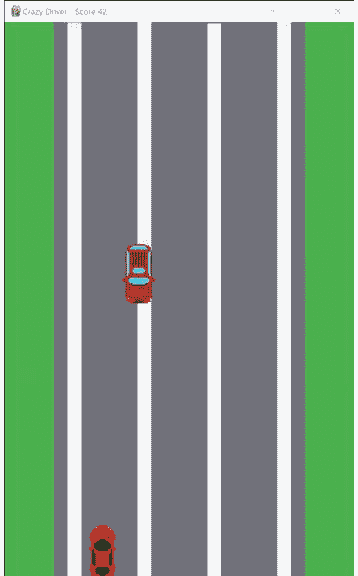

## 增加难度

我们的游戏太简单了。为了让它更具挑战性，我们将逐渐增加游戏速度，这样每次避开一辆车，游戏就会变得更快一点。

你会喜欢这个操作是多么简单。

游戏速度由一个名为 `moveSpeed` 的变量控制。我们将其初始化为 5，因此，当游戏开始时，汽车每次向你移动 5 个像素。同样，`player` 精灵每次向左或向右移动 5 个像素。

要让游戏变快，我们只需要改变那个 `moveSpeed` 变量。由于我们希望每次避免碰撞时都这样做，我们可以使用与刚刚用来增加分数相同的 `if` 语句。

添加这段代码（你可以把它放在分数增加代码的后面）：

```
# Increase the speed
moveSpeed += 1
```

保存并运行游戏。你会看到每次你避开一辆车，速度都会加快。

这是如何工作的？`moveSpeed` 被初始化为 5，但一旦你避开一辆车，`moveSpeed` 就会增加到 6，这意味着迎面而来的汽车现在每次前进 6 个像素。然后它们每次前进 7 个像素，依此类推。

你会发现游戏速度提升得很快，在某个时刻，它会变得太快以至于无法看清。这可以吗？当然，如果那是你想要的。但你可能想设置一个上限——一个游戏不会超过的最大速度。如果你想这样做，请在游戏变量部分再添加一个变量：

```
maxSpeed = 10
```

然后，将增加速度的代码改为仅在 `moveSpeed` 小于 `maxSpeed` 时才增加，如下所示：

```
# Increase the speed
if moveSpeed < maxSpeed:
    moveSpeed += 1
```

这样就行了。

> **硬编码万岁**
> 这是一个完美的例子，说明了为什么你不应该硬编码值。在上一章中，当我们添加精灵移动时，我们本可以在 `move_ip()` 函数调用中硬编码 5。事实是，游戏本来也能运行得很好——也就是说，直到你想让游戏逐渐变快为止。使用硬编码的值是无法做到这一点的。通过为游戏速度创建一个变量，即使当时并不真正需要，我们也为轻松更改和添加功能做好了准备。

**让它成为你的**
随意更改其中的任何内容。你可以让分数每次增加 0.5，这样它上升得更慢。或者你可以通过使用 `moveSpeed *= 1.1` 来更新分数，使其呈指数增长（这会将分数乘以 1.1，因此开始时增长较慢，随着游戏进展增长较快）。你也可以将 `maxSpeed` 设置为你想要的任何值，或者完全不设置 `maxSpeed`。只需注意，如果速度变得太快，以至于跳跃的像素大于玩家汽车的高度，它可能永远不会碰撞，因为汽车永远不会真正接触。

这是你的游戏，所以让它成为你自己的。

## 挑战 22.1

游戏玩得越久，速度就越快（因此也越难）。但计分方式保持不变：每避开一辆车得 1 分。你能改变这一点，使得一旦游戏速度翻倍，玩家每避开一辆车就能得到 2 分吗？

## 总结

我们现在有了一个真正可玩的游戏。你可以避开汽车，分数（和速度）会增加。如果你撞车了，游戏结束。在下一章中，我们将为我们的杰作添加一些最后的润色。


# 第 23 章

## 最后的润色

我们的疯狂司机游戏功能齐全。对于大约 100 行代码来说，这已经很不错了！在本章中，我们将添加一些最后的润色——一些能让游戏焕发光彩的小细节。

## 重新审视游戏结束

当我们的游戏结束时，它就这样结束了：没有显示，没有消息，什么都没有。你甚至无法查看你的分数。让我们改变这一点。我们创建了一个 `GameOver()` 函数，在游戏结束时被调用。目前，它只是进行清理，如下所示：

```
# Game over function
def GameOver():
    # Quit Pygame
    pygame.quit()
    sys.exit()
```

我们将更新这个函数，使其在游戏结束前显示一条文本消息几秒钟，如下所示：


暂停几秒钟需要我们使用 `time` 库，其中包含一个用于暂停的 `sleep()` 函数。因此，请将 `time` 添加到你的导入语句中：

```
# Imports
import sys, os, random, time
import pygame
from pygame.locals import *
```

在 Pygame 中显示文本比使用我们熟知和喜爱的 `print()` 函数要复杂一些。任何放置在图形屏幕上的内容都需要转换成可以 blit 的图形。

你需要明确选择字体和大小。我们将使用变量来设置字体细节（不要硬编码！）。因此，请将这两行添加到代码的变量声明中：

```
textFonts = ['comicsansms', 'arial']
textSize = 48
```

`textFonts` 是我们想要用来显示文本的字体列表。Pygame 允许你使用计算机上安装的任何字体，我们将使用 Comic Sans，因为它是一个如此糟糕的字体，以至于它非常适合疯狂司机游戏。

但是，如果有人在没有安装 `comicsansms` 的计算机上玩我们的游戏会发生什么？为了解决这种可能性，我们指定了额外的字体，包括那些几乎总是存在的字体，比如安全（但无聊）的 `arial`。Pygame 将按指定的顺序尝试字体，因此它会优先使用 `comicsansms`，如果已安装则使用它。但是，如果 `comicsansms` 不可用，Pygame 将回退到 `arial`。

`textSize` 是我们想要的字体大小。废话少说！

好了，现在来看我们更新后的 `GameOver()` 函数。代码如下：

```
# GameOver function
# Displays message and cleans things up
def GameOver():
    # Game Over text creation
    fontGameOver = pygame.font.SysFont(textFonts, textSize)
    textGameOver = fontGameOver.render("Game Over!", True, RED)
    rectGameOver = textGameOver.get_rect()
    rectGameOver.center = (IMG_ROAD.get_width()//2,
                           IMG_ROAD.get_height()//2)
    # Black screen with game over text
    screen.fill(BLACK)
    screen.blit(textGameOver, rectGameOver)
    # Update the display
    pygame.display.update()
    # Destroy objects
    player.kill()
    enemy.kill()
    # Pause
    time.sleep(5)
    # Quit pygame
    pygame.quit()
    sys.exit()
```

你可以保存代码并试玩游戏。当你撞车时，你会看到一个黑色的屏幕，上面有一条鲜红色的“Game Over!”消息。

让我们看看代码。

我们首先创建一个字体对象（命名为 `fontGameOver`），并传递字体名称和大小变量。

然后使用 `render()` 方法在新表面上绘制文本，我们将其命名为 `textGameOver`。`render()` 接受要绘制的文本、一个我们设置为 `True` 以平滑字体线条的*抗锯齿*标志，以及文本颜色，我们将其设置为 `RED`（使用我们很久以前创建的颜色变量）。`render()` 还可以接受可选的文本背景颜色，但我们跳过了它，因为无论如何我们都会用背景颜色填充整个窗口。

> **新术语**
> **抗锯齿** 当使用像素绘制线条（包括构成文本的线条）时，边缘可能看起来参差不齐。*抗锯齿*是一种用于平滑这些边缘的技术。

接下来，我们获取对象的矩形并设置大小，就像我们对所有图像和精灵对象所做的那样。我们需要这样做，因为我们将要 blit 它，就像汽车和背景一样。

然后，使用 `fill()` 将背景涂成黑色，就像我们在第 19 章中所做的那样，并将文本对象 blit 到显示上。我们的朋友 `display.update()` 然后更新屏幕以显示我们的背景和文本。

接下来，我们进行一些清理，销毁我们创建的玩家和敌人精灵。

### 销毁对象

Python 在清理方面做得非常好。如果你创建对象而不删除它们，Python 会为你做这件事。但程序员通常喜欢控制对象何时创建和销毁，这就是为什么我们在这里明确清理了我们的精灵。

我们希望“Game Over!”文本显示 5 秒钟，因此我们使用 `sleep()` 函数暂停，如下所示：

```
# Pause
time.sleep(5)
```

最后，我们退出 Pygame。

## 暂停

有些游戏允许玩家暂停并喘口气。我们如何在我们的游戏中做到这一点？如果我们把 `moveSpeed` 设为 0，那么什么都不会移动，实际上就暂停了游戏。

这有点棘手的地方在于，如果你要把 `moveSpeed` 设为 0，你需要记住暂停前的速度是多少，以便在游戏恢复后将其设置回去。

让我们试试看。我们使用左右箭头键来控制玩家，我们将添加对按空格键的支持。当空格键被按下时，游戏将暂停。释放它，游戏将恢复。

创建一个名为 `paused` 的游戏变量，并将其初始化为 `False`，我们将用它来跟踪游戏是否暂停：

```
paused = False
```

现在我们需要修改游戏循环。我们需要响应用户按下空格键以停止所有移动，并且在暂停期间，我们还将忽略左右箭头键。（我们不希望玩家能够在迎面而来的汽车暂停时通过移动来作弊。）

我们需要对处理按键的代码进行一些修改，以下是更新后的代码：

```python
# Get keys pressed
keys = pygame.key.get_pressed()

# Are we paused?
if paused:
    # Check for SPACE
    if not keys[K_SPACE]:
        # Turn off pause
        # Set speed back to what it was
        moveSpeed = tempSpeed
        # Turn off flag
        paused = False
else:
    # Check for LEFT key
    if keys[K_LEFT] and player.rect.left > 0:
        # Move left
        player.rect.move_ip(-moveSpeed, 0)
        # Make sure we didn't go too far left
        if player.rect.left < 0:
            # Too far, fix it
            player.rect.left = 0
    # Check for RIGHT key
    if keys[K_RIGHT] and player.rect.right < IMG_ROAD.get_width():
        # Move right
        player.rect.move_ip(moveSpeed, 0)
        # Make sure we didn't go too far right
        if player.rect.right > IMG_ROAD.get_width():
            # Too far, fix it
            player.rect.right = IMG_ROAD.get_width()
    # Check for SPACE key
    if keys[K_SPACE]:
        # Turn on pause
        # Save speed
        tempSpeed = moveSpeed
        # Set speed to 0
        moveSpeed = 0
        # Turn on flag
        paused = True
```

保存并运行此代码。你现在可以按空格键暂停游戏，松开后继续游戏。

代码首先检查游戏是否已暂停。如果 `paused` 为 `True`，那么代码只响应空格键（`K_SPACE` 键）。当 `keys[K_SPACE]` 变为 `False` 时，我们知道空格键不再被按下，因此 `moveSpeed` 会恢复，并且 `paused` 被设置为 `False`。

如果游戏未暂停，则处理照常进行。代码检查左右箭头键是否被按下，并相应地移动玩家。它还会检查空格键是否被按下。如果按下，当前的 `moveSpeed` 会保存到一个临时变量中，以便稍后恢复，并且 `paused` 被设置为 `True`。

这就是实现暂停功能的一种方式。

## 挑战 23.1

我们创建了一个 `paused` 变量来跟踪游戏是否暂停：如果是则为 `True`，否则为 `False`。这有必要吗？实际上，没有必要。还有另一种方法可以知道我们是否暂停：只需查看 `moveSpeed`，它只会在游戏暂停时为 0。修改代码以移除 `paused` 变量，并使用现有的 `moveSpeed` 变量来暂停（和取消暂停）游戏。

## 变化的敌人

让我们再做一个更复杂的增强。（但你现在已经是专业人士了，所以没什么好担心的。）

目前游戏中只有一个敌人，它到达屏幕底部后会在顶部重新出现。这可以工作，但总是同一个敌人图像。如果随机使用不同的敌人图像，会有趣得多。

如果不同的敌人大小不同，嗯，那会使游戏更有趣，因为这会影响障碍物的规避和碰撞。

是的，多个不同的敌人载体会更好，这就是为什么我们为你提供了三个供你使用。

修改我们的代码以支持多个敌人并不难。都是我们以前做过的事情。但需要修改相当多的代码才能实现这一点。我们将在这里介绍关键的更改，你也可以随时下载代码。

游戏现在有一个敌人精灵，它在游戏循环之前创建，确保它始终可用。我们将修改代码，根据需要创建和移除敌人精灵。所以，我们需要的第一件事是跟踪我们拥有哪个敌人（如果有的话）。将此添加到你的游戏变量列表中：

```python
eNum = -1
```

`eNum` 是活动的敌人编号，第一个敌人是 0，第二个是 1，依此类推。由于 0 或更高可能是有效的敌人编号，我们使用 -1 表示没有敌人（因为 -1 永远不可能是有效的敌人编号）。

接下来，我们需要加载我们的敌人图像。我们目前只加载一个，像这样：

```python
IMG_ENEMY = pygame.image.load(os.path.join(IMAGE_FOLDER, "Enemy.png"))
```

删除这行代码。听起来很吓人，我们知道。但是，是的，我们是认真的：删除它。或者注释掉它。

### 提示

**注释掉代码** 与其删除一行代码，不如通过在它前面加上 `#` 字符来注释掉它，像这样：

```python
#IMG_ENEMY = pygame.image.load(os.path.join(IMAGE_FOLDER, "Enemy.png"))
```

这样，如果需要，你可以轻松地将这行代码加回来。当你完成测试后，你可以删除不需要的代码。

`IMG_ENEMY` 是一个简单的变量，可以加载和存储单个图像。这不再适用，因为我们需要加载多个图像，所以我们将用一个列表替换该变量。

以下是替换它的代码：

```python
IMG_ENEMIES = []
IMG_ENEMIES.append(pygame.image.load(os.path.join(IMAGE_FOLDER,
    "Enemy.png")))
IMG_ENEMIES.append(pygame.image.load(os.path.join(IMAGE_FOLDER,
    "Enemy2.png")))
IMG_ENEMIES.append(pygame.image.load(os.path.join(IMAGE_FOLDER,
    "Enemy3.png")))
```

我们用一个我们巧妙地命名为 `IMG_ENEMIES` 的列表替换了 `IMG_ENEMY`。列表开始时是空的，像这样：

```python
IMG_ENEMIES = []
```

然后我们使用 `append()` 方法添加三个图像中的每一个，正如我们在第 6 章中讨论的那样。

到目前为止，一切顺利。

现在，我们需要勇敢一点……并删除更多代码。

在主游戏循环之前，我们创建了玩家和敌人精灵。对吧？敌人位置和精灵代码如下所示：

```python
# Enemy
# Calculate initial enemy position
h1 = IMG_ENEMY.get_width() // 2
hr = IMG_ROAD.get_width() - (IMG_ENEMY.get_width() // 2)
h = random.randrange(h1, hr)
v = 0
# Create enemy sprite
enemy = pygame.sprite.Sprite()
enemy.image = IMG_ENEMY
enemy.surf = pygame.Surface(IMG_ENEMY.get_size())
enemy.rect = enemy.surf.get_rect(center=(h, v))
```

删除这整块代码。我们不再需要它了，因为我们将在游戏循环内部根据需要创建精灵。

让我们接下来做这个。在你的游戏循环内部添加这段代码。你可以把它放在你绘制玩家精灵之后：

```python
# Make sure we have an enemy
if eNum == -1:
    # Get a random enemy
    eNum = random.randrange(0, len(IMG_ENEMIES))
    # Calculate initial enemy position
    hl = IMG_ENEMIES[eNum].get_width() // 2
    hr = IMG_ROAD.get_width() - (IMG_ENEMIES[eNum].get_width() // 2)
    h = random.randrange(hl, hr)
    v = 0
    # Create enemy sprite
    enemy = pygame.sprite.Sprite()
    enemy.image = IMG_ENEMIES[eNum]
    enemy.surf = pygame.Surface(IMG_ENEMIES[eNum].get_size())
    enemy.rect = enemy.surf.get_rect(center=(h, v))
```

我们只在没有敌人时才创建新敌人。这段代码使用 `if` 语句检查我们是否有敌人。如果 `eNum` 是 -1，那么我们没有敌人，需要一个。

如果没有敌人，我们需要随机选择一个，像这样：

```python
# Get a random enemy
eNum = random.randrange(0, len(IMG_ENEMIES))
```

这段代码使用非常熟悉的 `randrange()` 函数返回一个介于 0 和 `len(IMG_ENEMIES)` 之间的数字，我们将其保存到 `eNum` 变量中。由于 `IMG_ENEMIES` 中有三个敌人，`eNum` 将是 0、1 或 2。（这就是为什么我们使用 -1 来表示没有敌人。）

其余的代码与之前完全相同，但有一个重要的更改。我们用 `IMG_ENEMIES[eNum]` 替换了 `IMG_ENEMY`，因为我们访问的是列表项而不是简单变量。逻辑都是一样的，但这样，我们将使用随机选择的敌人。

随机生成的敌人仍然命名为 `enemy`。这确保了其余代码（包括移动敌人和提供碰撞检测的代码）仍然有效。这些都不需要更改。

但我们确实需要进行最后一次代码更改。当敌人精灵到达屏幕底部时会发生什么？之前，我们将它移回顶部，在一个新的随机位置。我们需要更改这一点，以便生成新的敌人。

找到以这个 `if` 语句开头的代码：

```python
if (enemy.rect.bottom > IMG_ROAD.get_height()):
```

我们将删除所有用于移动敌人精灵的代码。相反，代码将如下所示：

```python
# Check didn't go off edge of screen
if (enemy.rect.bottom > IMG_ROAD.get_height()):
    # Kill enemy object
    enemy.kill()
    # No enemy
    eNum = -1
    # Increment the score
    score += 1
    # Increase the speed
    moveSpeed += 1
    # Increase the speed
    if moveSpeed < maxSpeed:
        moveSpeed += 1
```

当敌人到达屏幕底部时，我们不再费心移动它，而是直接销毁该对象，像这样：

```python
# Kill enemy object
enemy.kill()
```

然后我们将 `eNum` 重置为 -1：

```python
# No enemy
eNum = -1
```

## 标志与变量

我们的代码需要知道是否存在敌人。我们创建了一个名为 `eNum`（代表敌人编号）的变量来跟踪这个信息：-1 表示没有敌人，其他任何值则表示我们正在使用的敌人的索引。

那么，这样做有必要吗？我们难道不能使用一个布尔标志，在有敌人时设为 `True`，没有敌人时设为 `False` 吗？那样代码不是更简单吗？

是的，我们确实可以这样做，代码也会更简单。但程序员需要预见下一步要做什么。而我们即将添加的下一个增强功能，确实需要我们不仅知道是否有敌人，还要知道具体是哪个敌人。因此，考虑到未来的需求，我们选择使用数值变量而非布尔变量。

事情就是这样。在下一个游戏循环中，代码会看到 `eNum` 是 -1，然后它会使用我们上面已经创建的代码生成一个新的随机敌人精灵。

哦，我们也如承诺的那样，移除了重复的敌人代码！

## 挑战 23.2

你能在游戏中添加额外的载具吗？你可以创建自己的 PNG 文件，或者尝试在网上找一些。将图片保存到 Images 文件夹，然后将它们添加到 `IMG_ENEMIES` 中。

## 冰块

你现在可以显示各种各样的敌人了。撞上任何一个，游戏就结束。这意味着玩家需要时刻避开迎面而来的物体。

但我们可以通过引入具有不同功能的物体来让事情变得更有趣，包括玩家可能想要撞击的物体。例如，想象一下如果道路上随机出现冰块，就像这样：

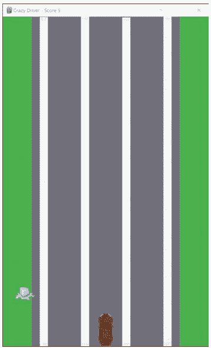

是的，这很傻，但我们喜欢在游戏里搞点傻事。所以，冰块出现了。撞上它们，游戏速度会减慢回到初始速度（然后又会开始加速）。玩家肯定会想要撞冰块，因为这样做可以让他们玩得更久。

有了我们为支持多个敌人而编写的代码，添加冰块功能就相当简单了。

让我们把冰块添加到敌人图片列表中：

```python
IMG_ENEMIES.append(pygame.image.load(os.path.join(IMAGE_FOLDER, "IceCube.png")))
```

现在加载了四张图片。如果你现在运行游戏，冰块就会出现在屏幕上。撞上它们会结束游戏。为什么？因为我们的碰撞检测不区分敌人类型。撞上任何敌人都会游戏结束。

让我们改变这一点。但首先，在顶部定义游戏变量的地方，我们有这段代码：

```python
moveSpeed = 5
```

将这段代码改为如下所示：

```python
startSpeed = 5
moveSpeed = startSpeed
```

`moveSpeed` 会随着游戏进程而改变。撞上冰块会将 `moveSpeed` 重置回原始起始速度，所以我们需要保存这个值，就像这里做的那样。

我们还需要一处代码修改。找到如下所示的碰撞检测代码：

```python
# Check for collisions
if pygame.sprite.collide_rect(player, enemy):
    # Crash! Game over
    GameOver()
```

这段代码简单地说，如果有任何碰撞，就运行 `GameOver()` 函数。我们现在需要对冰块进行不同的处理。所以更新代码，使其看起来像这样：

```python
# Check for collisions
if eNum >= 0 and pygame.sprite.collide_rect(player, enemy):
    # Is it enemy 3?
    if eNum == 3:
        # It's the ice cube, reset the speed
        moveSpeed = startSpeed
    else:
        # Crash! Game over
        GameOver()
```

现在，代码仅在存在活跃敌人（即 `eNum` 大于或等于 0）时才检查碰撞。如果发生碰撞，代码会检查玩家撞上了哪个敌人。如果是敌人 3（我们列表中的第 4 个敌人，你知道 Python 从 0 开始计数），那么它就是冰块，游戏速度会重置回起始速度。如果是任何其他敌人，那么游戏结束。

保存并运行此代码。你会看到游戏像以前一样运行，每避开一辆载具速度就会增加。如果你撞上冰块，游戏速度会减慢回原始速度；如果你避开了冰块，则没有任何变化。

## 总结

在本章中，我们添加了许多花哨的功能来提升游戏体验。我们添加了“游戏结束！”屏幕，让玩家可以选择暂停游戏，并引入了随机敌人和不同的敌人类型。在下一章中，我们将为你提供一些其他想法供你尝试。

# 第 24 章

## 继续前进

你已经创建了一个有趣且功能齐全的游戏。恭喜！但是，程序员从不满足于自己的作品，总是在寻找酷炫的新功能来添加。在本章中，我们将提出一些作为下一步的想法，并给你一些提示或指引来帮助你开始。

## 启动画面

让我们从一个简单的开始。现在，“疯狂司机”游戏直接运行并开始。它没有介绍，没有警告，没有“点击开始”。它只是运行（因为我们就是这样编码的）。大多数游戏都以启动画面开始，显示游戏名称，可能还有说明（比如告诉玩家使用哪些按键）以及创作者的名字（顺便说一句，那就是你）。

那么，你如何创建启动画面呢？嗯，你可以使用 `GameOver()` 代码作为起点。将其复制到一个 `GameStart()` 函数中，并在主游戏循环之前调用该函数。你可以使用相同的黑色背景或任何其他颜色。或者，你可以使用道路图像作为背景。

你需要决定启动画面如何消失以及游戏如何开始。是像“游戏结束！”屏幕那样的定时暂停吗？还是用户应该按下一个键或点击一个按钮来开始游戏？两种选择都可以，由你决定使用哪种。

## 分数与最高分

“游戏结束！”屏幕只显示“游戏结束！”。这不太有趣。至少，它还应该显示玩家的分数，也许像这样：

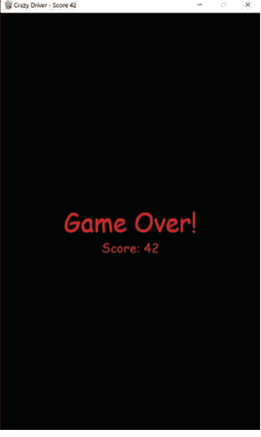

有一个问题：Pygame 无法显示带换行符的文本，所以要创建这样的显示，你需要第二组对象：另一个 `SysFont`，另一个 `render()`，另一个矩形，等等。然后你将新的文本绘制上去。

为了简化，你实际上可以复制游戏结束代码块并更改对象名称（例如 `fontGameOver2`、`textGameOver2` 等）。这将使结束屏幕更有趣（也更有用）。（只需确保你使用不同的位置值，否则你的第二行文本会绘制在第一行上面。）

但如果你真的想提升你的游戏（双关语，意为“提升游戏水平”），你还可以显示最高分，像这样：

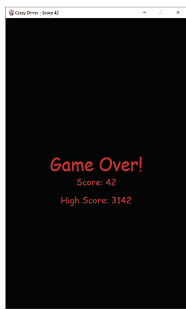

这样做需要以下工作流程：

1.  玩家玩游戏。
2.  当游戏结束时，检查是否已经保存了最高分。
3.  如果没有保存最高分，那么当前游戏的分数就是最高分。
4.  如果有保存的最高分，从保存文件中读取它，并与当前游戏分数进行比较。如果当前分数大于保存的最高分，那么当前游戏分数就成为新的最高分。
5.  在屏幕上显示最高分。
6.  将最高分保存到保存文件中，以便下次游戏使用。

显示最高分与显示当前分数非常相似。你需要新的字体和文本对象，你可以用它们将文本绘制到屏幕上。

如何读取和保存最高分文件？请参考第 18 章的“保存与恢复”部分。

## 油渍

在第 23 章中，你添加了冰块敌人。撞上它，游戏速度会减慢。

现在添加一个油渍敌人。我们给了你一张名为 `Oil.png` 的图片。它在你的 Images 文件夹中，看起来像这样：

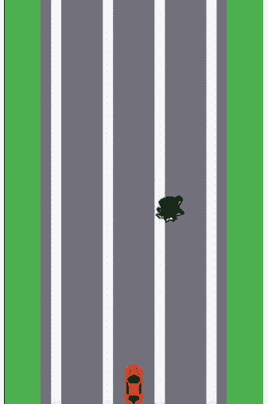

要使用它：

-   添加一行代码，将 `Oil.png` 追加到敌人列表中。如果你把它加在最后（在冰块之后），它将是第 4 项。
-   在你的碰撞检测代码中，检查 `eNum == 4`（意味着玩家撞上了油渍）并做点恶作剧。

至于撞上油渍会做什么，这由你决定。这里有一些想法：

-   你可以随机将玩家向左或向右移动几个像素。你甚至可以随机化他们移动的距离。
-   你可以让左右方向键在几秒钟内失效。
-   你可以反转方向键，让左键向右走，右键向左走。
-   你可以让整个屏幕变黑几秒钟，就像油溅到了挡风玻璃上。

嘿，我们说要做点恶作剧可不是开玩笑的！

哦，还有一件事。现在我们的代码让玩家每避开一个敌人就得一分。当我们只有汽车敌人时，这很有道理。但现在我们有了冰块和油渍；避开这些应该给玩家加分（并提高速度）吗？也许吧。或者也许不。你是程序员，这由你决定。如果你只想在敌人是汽车时才改变分数和速度，你需要在碰撞检测中添加一个 `if` 语句和必要的代码来实现这一点。

## 多个敌人

我们的游戏一次只显示一个敌人。如果你想真正提高游戏难度，可以一次显示多个敌人，在不同时间出现并随机分布在道路上。躲避这些敌人会困难得多。

这绝对是一个更复杂的增强功能，所以这里有一些说明和提示：

-   你需要决定新敌人出现的频率。是随机的吗？每隔几秒？还是每次分数增加 5 分时添加一个敌人（所以分数到 5 分之前是 1 个敌人，到 10 分之前是 2 个，到 15 分之前是 3 个，以此类推）？

看看我们是如何创建和销毁敌人对象的（一旦我们修改了代码以支持多个图像文件）。你可以使用相同的技术按需创建敌人。

你可以操作单个精灵，但那很麻烦。更好的选择是使用精灵组。你可以这样创建一个组：

```
enemies = pygame.sprite.Group()
```

然后，每当你生成新的敌人时，你可以将它们添加到组中，像这样：

```
enemies.add(enemy)
```

你可以一次性绘制整个组。你也可以销毁一个组来销毁所有成员。

要移动所有组成员，你需要使用一个 for 循环来移动每个成员，像这样：

```
for enemy in enemies:
```

精灵组还可以简化碰撞检测。你不必单独检查每个精灵，而是可以使用 `spritecollideany()` 函数，它会检查组中是否有任何精灵发生了碰撞。

正如我们指出的，这个增强功能肯定更复杂一些。但凭借你目前所学，这是完全可行的。

## 然后呢...

你现在有了一个有趣游戏的框架——一个有大量空间供你发挥创意的游戏。所以，去创造吧！想想你还可以添加哪些功能。这里有一些想法：

- 在道路上放置物体（也许是蘑菇？），可以暂时改变玩家汽车的大小。更大的车更容易撞上迎面而来的车辆；更小的车则更不容易撞上。
- 来个无敌药水怎么样？撞上它，碰撞在几秒钟内不会杀死你。
- 或者来个临时护盾，可以偏转迎面而来的车辆？当你的护盾开启时，迎面而来的车辆会被推到一边，这样它们就不会撞到你。
- 增加火力。撞上正确的物体，你就能击退迎面而来的车辆。也许这样做还能获得更多分数。
- 你可以允许玩家前后移动以获得更大的控制权。你可以将其作为核心游戏的一部分，或者仅在达到特定分数时解锁，或者在击中特定物品时暂时可用。
- 另一个想法可以是一个跳跃按钮，让你能跳过敌方车辆。你需要决定如何展示这一点，是改变汽车图像还是将其放大以模拟靠近“镜头”。

这么多想法，都非常可行，而且都会让你的游戏独一无二。

## 总结

在本章中，我们介绍了一些能真正将我们的《疯狂司机》游戏提升到新水平的想法。并且我们为你留下了许多关于下一步方向的想法。

## 下一步是什么？

**恭喜，你是一名程序员了！**

你已经一路读到了我们书的结尾，并在此过程中掌握了关键的编码技能，这些技能将继续为你服务。我们希望你觉得这段经历引人入胜且充满乐趣。

但是，正如我们在开始这段旅程时告诉你的那样，程序员永远不会真正完成——总有更多的东西要学（尤其是随着技术的不断发展）。

所以，在我们说再见之前，我们想分享一些关于接下来学习什么和做什么的想法和建议。

开始吧。

## Python 还有很多东西要学

你在本书中学到了很多 Python。正如你所发现的，Python 是一门有趣且直观的语言。Python 让入门变得简单，但不要被这种简单所迷惑。Python 功能极其强大，这就是为什么它是世界上最常用的语言之一。

所以我们希望你坚持下去，进一步深入 Python：

- 我们接触了一些类，但还不够。如果有一个领域我们希望你真正加倍努力，那就是：类。实际上，一个很棒的项目是使用类而不是一长段代码来重写《疯狂司机》游戏。这样做，你实际上会发现自己写了更多的代码，而不是更少。但当你完成后，你会发现你可以用更少的努力添加功能和复杂性。为了帮助你入门，我们已经发布了一个基于类的游戏版本供你从书籍页面下载。
- 我们没有涉及的一个主题是处理数据和外部数据文件。这类项目往往不那么有趣和游戏化，这就是我们没有包含它们的原因。但数据科学家的需求很大，而 Python 是处理数据的真正流行方式之一。你可以在网上搜索项目创意。寻找涉及 XML 文件、JSON 和任何大型数据集的数据项目。网上有很多这样的项目，也有很多很好的例子可以参考。

## Web 开发

网站和 Web 应用是有趣的项目，但由于构建它们需要使用多种不同的语言和技术，它们也带来了有趣的挑战。那么，构建网站涉及什么？

- 网页是使用 HTML 创建的，HTML 是一种语言；但它不是编程语言（所以没有 if 语句，没有循环，没有变量）。相反，它是一种标记语言，用于布局网页的元素。HTML 由你的 Web 浏览器（想想 Chrome、Safari、Edge、Firefox 等）读取，这就是它们知道要显示什么的方式。好消息是 HTML 非常容易学习。坏消息是 HTML 本身做不了太多事情。
- 你还需要 CSS（层叠样式表），这是用于设计和格式化网页及元素的语言。
- 与 HTML 和 CSS 不同，JavaScript 确实是一种编程语言。它几乎和 Web 一样古老，因为没有它，Web 会是一个非常无聊的地方。JavaScript 在 Web 浏览器中运行，它为页面添加了交互性。如果你在网页上将鼠标悬停在某个项目上并发生了某些事情，那就是 JavaScript 使其实现的。JavaScript 是一种编程语言，它并不太难学，尤其是你往往会用它编写许多小代码块，而不是完整的应用程序。关键在于，和 HTML 一样，JavaScript 在浏览器中运行。要让你的网站或应用做更复杂的事情，其中一部分需要在服务器或云端运行。因此：
- 几乎每个 Web 应用都有一个服务器后端。这是将整个应用粘合在一起的胶水，它往往是任何 Web 应用中最大的部分。用什么语言编写 Web 应用的后端？你会很高兴地知道，Python 是一个不错且流行的选择。Python 本身并没有任何特定于 Web 的库或技术，但有社区创建的第三方库可以使用。一个非常流行的库叫做 Flask，它使得生成网页和响应它们变得容易。除了 Python，你还可以使用 Java、PHP、.NET 等来编写网站后端。
- 大多数网站需要存储和访问数据（登录信息、要购买的物品、用户资料、游戏分数等等）。这类数据存储在数据库中，用于处理数据库的语言称为 SQL。幸运的是，SQL 是一门容易学习的语言（尽管掌握它可能需要时间）。

> **提示**
> **学习 SQL** 如果你想学习 SQL，我们有一本推荐给你的书。这是最畅销的 SQL 书籍，由我们自己的 Ben 撰写。你可以在 https://forta.com/books/0135182794/ 找到它。

## 移动应用开发

Python 真正不太适合的一件事是移动应用开发。对于这些，你会想使用其他语言：

- 要为 iOS 编写应用（意味着它们将在 iPhone 和 iPad 上运行），你会想使用一种叫做 Swift 的语言。这是一门相当新的语言；它易于学习和使用，开发者非常喜欢它。iOS 应用也可以用 Objective C 编写（它是 C 的一种变体，C 是最强大的语言之一，但更难学习和掌握）。
- Android 应用是用 Java 编写的，Java 是最常用的编程语言之一。Java 也有许多其他用途（通常用于服务器端和后端代码），它是 Android 开发的首选语言。

和 Web 应用一样，你的移动应用可能也需要后端。我们为网站提到的选项同样适用于移动应用。

## 游戏开发

我们在第三部分使用 Pygame 创建了一个图形游戏。Pygame 有趣、易用且功能相当强大。但它不是一个完整的游戏引擎。如果你真的想编写游戏，可以看看 Unity，这是目前使用最广泛的游戏引擎和平台。使用 Unity，你可以为所有主要操作系统、移动设备和游戏平台（包括 Nintendo Switch、Sony PlayStation 和 Microsoft Xbox）编写游戏。

Unity 游戏是用 C# 编写的，C# 是一种基于 C（和 C++）的编程语言。哦，既然你已经熟悉了 Visual Studio Code，你会很高兴地知道 Unity 开发是使用 Visual Studio（VS Code 的大哥）完成的，所以这个 IDE 你会很熟悉。

## 然后...

当你完成所有这些之后，请访问书籍网页 **https://forta.com/books/0137653573** 或扫描此二维码。我们已在上面为你发布了额外的链接和想法。


> **提示**
> **第25章** 想要获取额外的第25章内容吗？你可以在网上找到它。只需使用上面的链接或二维码。

至此，感谢你加入我们的这段旅程。我们迫不及待想看到你的创作！

**Ben & Shmuel**

此页有意留白

## 索引

符号
- + (加法) 运算符, 47-48
- = (赋值) 运算符, 57
- == (相等比较) 运算符, 57
- // (整除) 运算符, 48
- / (除法) 运算符, 48
- % (取模) 运算符, 48, 97-98
- # (井号), 注释, 214, 344
- - (减法) 运算符, 48
- * (乘法) 运算符, 42, 48

A
- 抗锯齿, 340
- append() 函数, 213, 274
- 参数, 164, 165
  - 逗号与, 31
  - 命名, 168
  - 传递, 22-23
  - range() 函数, 93
  - self, 247-248
  - 用户定义函数与, 167-170
  - 变量与, 170
- 数组, 212
- ASCII 码, 96
- 赋值运算符 (=), 57
- 星号 (*), 42
- 属性, 244. *另见* 类

B
- 反斜杠 (\), 147, 148
- 与敌人战斗, 277-279. *另见* 游戏; 基于文本的冒险游戏
- 生日倒计时
  - datetime 变量, 151
  - 程序流程, 150
  - 需求, 150
- blit() 函数, 309
- 错误, 134

C
- *使命召唤*, 122
- 调用函数, 23, 53
- 大小写敏感
  - 颜色变量与, 291
  - 变量与, 25, 26
- choice() 方法, 73
- 选择, 随机项目, 38-39
- Chromebook, 9, 11
- 类, 54, 242
  - 创建, 243-244
  - datetime, 55, 66
  - 字典与, 243
  - 初始化, 250-251
  - 实例化, 246
  - 玩家管理系统与, 251-255
  - 属性, 244-246
  - 可重用性, 243
  - str, 70, 71
  - 测试, 245-246
- 代码(编写), 124
- 为输出着色, 260-264
- 注释, 43-45, 141, 344
- 调试, 134, 136
- 重复, 107, 322
- 执行, 19
- 缩进, 58, 77
- 开源, 286
- 优化, 194-195
- 规划与, 122-123
- 伪代码, 197
- 递归, 238-239
- 重构, 204-206, 221
- 重用, 174
- 字符串外部化, 196-201
- 测试, 73, 129
- 单元测试, 125
- 更新, 218-220
- 空白字符, 25
  - 去除, 72
- collide_rect() 函数, 331
- 碰撞检测, 330-331, 350-351
- 冒号 (:), 57
- Colorama, 导入和初始化库, 259-260
- 巨洞冒险, 178
- 合并, 导入语句, 218, 307
- 逗号, 31
- 注释, 43-45, 141
  - # (井号), 214, 344
- 计算机, 5, 42. *另见* 编程语言
  - 与计算机通信, 6
  - 微处理器, 4
  - 随机性与, 37
- 连接, 28, 42, 47, 130
- 条件循环, 106-110, 115
  - 缩进与, 106-107
- 条件, 57
  - if 语句, 59, 60-61
  - 测试条件, 59-62
- 常量, 156, 157
- 构造函数, 250-251
- 转换, 字符串为数字, 65-66, 115
- 疯狂司机. *另见* Pygame
  - 添加多个敌人, 357-358
  - 碰撞检测, 330-331, 350-351
  - 动态访问游戏文件, 302-305
  - 帧率, 293
  - 游戏区域, 294
  - 游戏概念, 286-288
  - 游戏循环, 295-299
  - 游戏结束! 屏幕, 338-341
  - 添加最高分, 354-356
  - 添加冰块, 348-351
  - 增加难度, 334-336
  - 初始化 Pygame, 290-294
  - 移动敌人, 320-322
  - 移动玩家, 323-326
  - 获取图像, 289
  - 油渍, 356-357
  - 暂停, 341-343
  - 放置汽车, 310-317
  - 设置背景, 305-309
  - 启动画面, 354
  - 精灵, 313-317
  - 跟踪分数, 332-334
  - 更新显示, 295
  - 变化敌人, 343-348
  - 工作文件夹, 288-289
- 创建
  - 类, 243-244
  - 库存系统, 230-232
  - 列表, 80-82
  - 方法, 247-250
  - 新 Python 文件, 17
  - 用户选择组件, 207-208
  - 变量, 24
- CSS (层叠样式表), 363
- 花括号 ({}), 225

D
- 数据文件, 362
- 数据类型, 43
- datetime
  - 类, 55, 66
  - 库, 52-54
  - 变量, 151
- 调试, 134, 136
- 决策. *另见* 循环
  - elif 语句, 66
  - else 语句, 58-59, 75
  - if 语句, 56-58, 65, 66, 67, 73
    - 条件, 57, 59
    - 缩进与, 58
    - 多重测试与, 59-61
    - 嵌套, 77
    - in 运算符, 62-63
  - 测试条件, 59-62
- 解密消息, 102-103. *另见* 加密/解密
- def 语句, 166, 167, 247. *另见* 用户定义函数
- 骰子
  - 12面, 48
  - 掷骰子, 45-46, 47
- 字典, 225, 273
  - 类与, 243
  - 函数与, 227
  - 库存系统, 229-230, 233-237
    - 创建, 230-232
    - 显示, 238
  - 键值对, 226
  - 列表, 228
  - 更新, 227
- dir() 函数, 246
- display() 函数, 238
- 显示, 类属性, 246
- 重复代码, 107, 322

E
- 编辑器, 7. *另见* IDE (集成开发环境)
- elif 语句, 66, 116
- else 语句, 58-59, 75
- 编码, 95
- 加密/解密, 95, 96, 99-102
  - ASCII 码, 96
  - 密钥, 97-98
  - 取模运算符, 97-98
- 相等比较运算符 (==), 57
- 错误, 在 VS Code 中, 18
- 转义字符, 148
- 执行代码, 19
- 体验设计, 123
- extend() 函数, 85
- 外部化. *另见* 重构, 字符串, 196-201

F
- 文件. *另见* 代码(编写); 游戏
  - 动态访问, 302-305
  - 创建, 17
  - 数据, 362
  - 命名, 26-27
  - 路径, 302
  - 保存, 27
  - 测试, 96
- fill() 方法, 295
- 文件夹. *另见* 工作文件夹
  - 创建
    - 适用于 Mac 用户, 14-15
    - 适用于 Windows 用户, 13-14
- for 循环, 90-91. *另见* 循环
  - 疯狂司机, 297
  - 迭代, 91
  - 遍历项目, 90-92
  - 遍历数字, 92-93
  - 嵌套, 93-95
- 帧率, 292-293
- 函数, 27, 164. *另见* 类; 方法; 变量
  - append(), 213
  - append() 函数, 274
  - 参数, 22-23, 165
  - blit(), 309
  - 调用, 23, 53
  - collide_rect(), 331
  - 字典, 227
  - dir(), 246
  - display(), 238
  - extend(), 85
  - get(), 199, 201, 233
  - getUserChoice(), 213-217, 236
  - input(), 28, 38, 65, 102, 126
    - 数字输入与, 63-64
  - inputYesNo(), 221
  - int(), 64, 66
  - join(), 305
  - len(), 81, 89, 110, 126, 212
  - 列表, 88
  - 方法与, 54
  - move_ip(), 324
  - now(), 53, 54
  - ord(), 97, 101
  - pop(), 85
  - print(), 28, 30, 31, 32, 46, 47, 55, 81, 84, 132-133
  - randrange(), 38, 46, 346
  - range(), 93
  - 递归, 238-239
  - render(), 340
  - 返回值, 28
  - 可重用, 208-212
  - sleep(), 338
  - str(), 100
  - type(), 54
  - 用户输入, 28-29
  - 用户定义, 165-167
    - def 语句, 166-167
    - 传递参数, 167-170, 209
    - 返回值, 171-174
  - 变量, 24, 25, 30, 46, 53
    - 命名, 26
    - 规则, 25-26
  - 包装器, 229-230, 234

G
- 游戏, 224. *另见* Pygame
  - 巨洞冒险, 178
  - 疯狂司机
    - 添加多个敌人, 357-358
    - 碰撞检测, 330-331, 350-351
    - 显示最高分, 354-356
    - 帧率, 293
    - 游戏区域, 294
    - 游戏概念, 286-288
    - 游戏循环, 295-299
    - 游戏结束! 屏幕, 338-341
    - 添加冰块, 348-351
    - 增加难度, 334-336
    - 初始化 Pygame, 290-294
    - 移动敌人, 320-322
    - 移动玩家, 323-326
    - 获取图像, 289
    - 油渍, 356-357
    - 暂停, 341-343
    - 放置汽车, 310-317
    - 设置背景, 305-309
    - 启动画面, 354
    - 精灵, 313-317
    - 跟踪分数, 332-334
    - 更新显示, 295
    - 变化敌人, 343-348
    - 工作文件夹, 288-289
  - 开发, 364
  - 动态访问文件, 302-305
  - 文件与, 302
  - 文件夹结构, 302
  - 图形
    - 抗锯齿, 340
    - 帧率, 292-293
    - 像素, 294
    - 精灵, 313-317
    - 更新显示, 295
  - 猜单词, 124, 125, 138-141
    - 显示列表, 129-131
    - 显示剩余生命, 147
    - 循环, 143-145
    - 遮盖字符, 131-136, 143
    - 限制用户输入, 125-128
    - 存储用户猜测, 128-129
  - 库存系统, 233-237, 242-243
    - 创建, 230-232
    - 显示, 238
    - 规划, 224-225
    - 包装器函数, 229-230
  - 疯狂填词, 30-33
  - 猜数字, 111-120
  - 玩家管理系统, 242-243
  - Pygame 与, 286, 287
  - 启动画面, 354
  - 表面, 294
  - 基于文本的冒险, 178, 184-188
    - addHealth() 函数, 270-271
    - addLife() 函数, 267-269
    - 与敌人战斗, 277-279
    - 创建, 180-181
    - getHealth() 函数, 269-270
    - 生命值属性, 266
    - loseHealth() 函数, 270-271
    - 最大生命值属性, 266
    - 处理选项, 182-183
    - 提示选项, 181-182

## H

猜词游戏，124，125，138-141
- 显示列表，129-131
- 显示剩余生命值，147
- 循环，143-145
- 字符遮蔽，131-136，143
- 限制用户输入，125-128
- 存储用户猜测，128-129

硬编码值，335

## I

IDE（集成开发环境），VS Code，9
- 错误，18
- 安装，10-13

if 语句，56-58，65，66，67，127，132
- 条件，57，59，60，61，115
- elif 和，62
- 在猜词游戏中，145-146
- 缩进和，58
- 内联，145，249
- 多重测试和，59-61
- 嵌套，77
- in 运算符，62-63
- 石头、剪刀、布游戏，74，75
- while 语句和，107

import 语句，合并，218，307

## J-K-L

JavaScript，363
join() 函数，305
len() 函数，81，89，110，126，212
库，36
- colorama，259-260
- 合并，218
- datetime，52-54
- Flask，363
- 命名，200
- os，304
- pickle，280-281
- random，36-37，73，141
- SDL，287
- string，155
- 第三方，安装，258-259

列表，40，41，80，125，212
- 访问，82-83
- 添加和删除项目，84-85
- 更改列表项，83-84
- 创建，80-82
- 字典列表，228
- 显示，129-131
- 查找项目，85-86
- 初始化，82
- 列表的列表，213
- 遍历项目，90-92
- 多行，142
- 排序，86-88
- 存储用户猜测，128-129
- 语法，81
- 元组和，292

lower() 方法，71

## M

Mac 用户，创建工作文件夹，14-15
Mad Libs，30，31，33
- 用户输入，32
- 变量，30-31

字符遮蔽，125，143
方法，54，164
- append()，345
- choice()，73
- 构造函数，250-251
- 创建，247-250
- fill()，295
- lower()，71
- 属性和，55

微处理器，4
Microsoft Visual Studio Code。参见 VS Code
*Minecraft*，122
移动应用开发，364
取模运算符，97-98
- 加密和，48

move_ip() 函数，324
多行
- 列表，142
- 文本，200

for 循环，101
循环，89，90。另见 if 语句
- 条件，106-110
- 疯狂司机和，295-299
- for，101
- 在猜词游戏中，143-145
- 缩进和，91-92
- 迭代，91，94
- 列表和，90-92
- 嵌套，93-95
- 数字和，92-93
- while 语句，106-107，108，109，110，113，143，146

## N

命名
- 参数，168
- 文件，27
- 库，200
- 变量，26

嵌套 if 语句，77
嵌套循环，93-95
now() 函数，53，54
数字
- ASCII 码，96
- 遍历，92-93

## O

开源软件，286
in 运算符，62-63
运算符，48，60
- 加法，47-48
- 赋值，57
- 除法，48
- 相等比较，57
- in，62-63
- 取模，48，97-98
- 乘法，48
- 减法，48
- 三元条件，249

优化代码，194-195
ord() 函数，97，101
os 库，304
*守望先锋*，122

## P

括号，调用函数，53
传递参数，22-23
透传变量，173
密码生成器，156
- 程序流程，155
- 需求，154

路径，动态访问游戏文件，302-305
pickle 库，280-281
像素，294
纯文本，42
玩家管理系统，242-243
- 类和，251-255

pop() 函数，85
井号 (#)，214
print() 函数，28，29，30，31，32，46，47，55，66，81，84，132-133
编程语言，5，364。另见代码（编程）；IDE（集成开发环境）；Python
- C#，364
- 编辑器，7
- JavaScript，363
- Python，9
    - 创建新文件，17
    - 安装，9-10
    - 运行代码，19
    - 语法，8
- 口语和，6-7
- 语法，6，7

程序。另见游戏
- 生日倒计时
    - 程序流程，150
    - 需求，150
- 密码生成器，156
    - 程序流程，155
    - 需求，154
- 小费计算器
    - 程序流程，153
    - 需求，152

属性，244-246。另见变量
- 显示，246
- 初始化，245
- 方法和，55

伪代码，197
Pygame，286，287
- 显示文本，339-341
- 初始化，290
- 安装，288
- 更新显示，326
- 处理图像，308-309

Python。另见；类；函数；方法；VS Code，9
- 类，datetime，55
- 注释，43-45
- 创建新文件，17
- 创建工作文件夹
    - Mac 用户，14-15
    - Windows 用户，13-14
- 函数，27
    - 参数，22-23
    - 调用，23
    - now()，53
    - 返回值，28
    - type()，54
    - 用户输入，28-29
    - 变量，24，25-26
- if 语句，条件，57
- 安装，9-10
- 库，36
    - datetime，52-54
    - 安装，258-259
    - string，155
- 列表，40，41
    - 访问，82-83
    - 添加和删除项目，84-85
    - 更改列表项，83-84
    - 创建，80-82
    - 查找项目，85-86
    - 初始化，82
    - 遍历项目，90-92
    - 排序，86-88
- 运行代码，19
- 序列化/反序列化数据，280
- 语法，8
- 变量，43
- 编写第一个程序，15
    - 选择工作文件夹，16-17

## Q–R

二维码，9
引号，31，42

随机项目
- 选择，38-39
- 数字
    - 生成，37-38，46
    - 猜数字游戏，111-120

randrange() 函数，38，46，346
range() 函数，93
递归，238，239
重构，204-206，221
render() 函数，340
恢复游戏，280-282
限制用户输入，125-128
返回值，28
可重用性
- 类和，243
- 创建用户选择组件，207-208
- 函数和，208-212
- getUserChoice() 函数，213-217

RGB（红、绿、蓝）值，291
石头、剪刀、布，72-74，75，76
掷骰子，47
- 12面，48

## S

保存文件，27
保存游戏，280-282
作用域，174
SDL（Simple DirectMedia Layer）库，287
序列化/反序列化数据，280
sleep() 函数，338
排序，列表，86-88
启动画面，354
口语，编程语言和，6-7
精灵，313-317
- 清理，340-341
- 移动，320-322，323-326

SQL，363
存储，224
- 字典，225
- 字符串，201

str() 函数，100
string 库，155
字符串，42，70，71
- 添加到，158
- 大小写和，71
- 转换为数字，65-66，115
- 加密和，100-102
- 外部化，196-201
- 数字和，64
- 存储，201
- 空白，去除，72

Stringtest.py，70
strip() 方法，71
去除空白，72
表面，294
语法，6，7，142
- [ ] 表示法，127
- 冒号，57
- 逗号，31
- 缩进和，58
- 列表，81
- Python，8
- 引号，31，42

## T

三元条件运算符，249
测试文件，96
测试
- 类，245-246
- 代码，73
- 条件，59-62
- getUserChoice() 函数，215-217
- 文本冒险游戏，189-190
- 单元，125

文本
- 外部化，196
- 多行，200

文本冒险游戏，178，179，184-188
- 与敌人战斗，277-279
- 巨洞冒险，178
- 创建，180-181
- 生命值和生命
    - addHealth() 函数，270-271
    - addLife() 函数，267-269
    - getHealth() 函数，269-270

索引 375

- health 属性，266
- loseHealth() 函数，270-271
- maxhealth 属性，266
- 处理选项，182-183
- 提示输入选项，181-182
- 随机事件，275-277
- 保存与恢复，280-282
- 购买物品，271-275
- 测试，189
- 工作文件夹，183-184
- Zork，178
- 安装第三方库，258-259
- 三维数组，212
- 小费计算器
  - 程序流程，153
  - 需求，152
- 元组，292
- 二维数组，212
- type() 函数，54

- 变量，23-24, 30, 39, 40, 42, 43, 46
  - __file__，303
  - 大小写敏感，26, 291
  - 拼接，28
  - 创建，24
  - 数据类型，43
  - datetime，151
  - 函数与变量，53
  - 导入，299
  - 递增，119
  - 初始化，108
  - 实例化，246
  - 列表，80
    - 访问，82-83
    - 添加与移除项目，84-85
    - 更改列表项目，83-84
    - 创建，80-82
    - 查找项目，85-86
    - 循环遍历项目，90-92
    - 排序，86-88
  - Mad Libs，30-31
  - moveSpeed，334-335
  - 命名，26
  - passthrough，173
  - QUIT，299
  - 规则，25-26
  - 作用域，174
  - 用户自定义函数与变量，170
  - 值，27, 41-42, 119
  - 空白字符，25
- VS Code。另见 Colorama
  - 颜色，25
  - 注释，45
  - 创建工作文件夹，13-15, 183-184
  - 错误，18
  - 扩展面板，12-13
  - 安装，10-13
  - 终端窗口，19, 258-259
  - 为输出着色，260-264

## U

- 单元测试，125。另见测试
- Unity，364
- update() 方法，227
- 更新
  - 代码，218-220
  - 字典，227
- upper() 方法，71
- 创建用户选择组件，207-208
- 用户输入，28-29, 146
  - Mad Libs，32
  - 限制输入，125-128
- 用户自定义函数，165-167
  - def 语句，166-167
  - 传递参数，167-170
  - 返回值，171-174

## V

- 值
  - 常量，156
  - 常量，157
  - 硬编码，335
  - RGB（红、绿、蓝），291
  - 用户自定义函数与值，171-174

## W

- Web 开发，362-363
- while 循环，106-107, 108, 109, 110, 113, 143, 146。另见条件循环
  - Crazy Driver，296-297
  - if 语句与 while 循环，107
- 空白字符，25, 72
- Windows，122
  - 创建工作文件夹，13-14
  - 安装 Python，9
- 工作文件夹
  - 创建，183-184
    - Mac 用户，14-15
    - Windows 用户，13-14
  - 选择，16-17
- 包装函数，229-230, 234
- 编写你的第一个程序，15
  - 选择你的工作文件夹，15

## X-Y-Z

- x,y 坐标，309
- *Zork*，178

# IT专业人士的视频培训

- **快速学习**
  仅需数小时即可掌握一项新技术。视频培训能在更短时间内教授更多内容，且材料通常更易于吸收和记忆。
- **观看与学习**
  讲师演示概念，让你看到技术的实际应用。
- **自我测试**
  我们的完整视频课程提供贯穿始终的自评测验。
- **便捷**
  大多数视频支持流媒体播放，并可选择下载课程以供离线观看。

了解更多，浏览我们的商店，并观看免费示例课程，请访问 [informit.com/video](http://informit.com/video)

使用折扣码 **VIDBOB**，视频课程可享标价5折优惠*

*折扣码 VIDBOB 可在 informit.com 上购买符合条件的图书时，享受标价50%的折扣。符合条件的图书包括大多数完整课程视频、图书+电子书捆绑包、图书/电子书+视频捆绑包、单个视频课程、Rough Cuts、Safari Books Online、不可折扣图书、与我们零售合作伙伴联合促销的图书，以及任何作为每日电子书特惠或每周视频特惠的图书均不符合折扣条件。折扣不可与其他优惠叠加使用，亦不可兑换现金。优惠内容可能随时更改。

# 在 informit.com/register 注册您的产品

获取额外福利，并在下次购买时**节省35%**

- 自动获得一张下次购买可享35%折扣的优惠券，有效期30天。请在您的 InformIT 购物车或账户页面的“管理代码”部分查找您的优惠码。
- 下载可用的产品更新。
- 访问额外资料（如有提供）。*
- 勾选方框以接收我们的消息，并获取新版本及相关产品的独家优惠。

> *注册福利因产品而异。福利将列在您账户页面的“已注册产品”下。

# InformIT.com——值得信赖的技术学习资源

InformIT 是培生集团（全球领先的教育公司）旗下信息技术品牌的在线家园。在 InformIT.com，您可以：

- 购买我们的图书、电子书、软件和视频培训
- 利用我们的特别优惠和促销活动（informit.com/promotions）
- 注册特别优惠和内容通讯（informit.com/newsletters）
- 访问数千个免费章节和视频课程

# 与 InformIT 联系——访问 informit.com/community

Addison-Wesley • Adobe Press • Cisco Press • Microsoft Press • Pearson IT Certification • Que • Sams • Peachpit Press