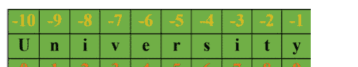
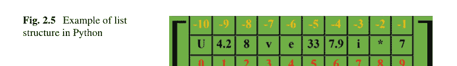
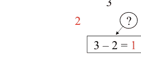
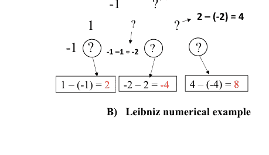

哈比卜·伊扎德哈
拉希德·贝扎迪杜斯特

# Python中的挑战性编程：问题解决视角

哈比卜·伊扎德哈
计算机科学系
大不里士大学
伊朗，大不里士

拉希德·贝扎迪杜斯特
计算机科学系
大不里士大学
伊朗，大不里士

ISBN 978-3-031-39998-5 ISBN 978-3-031-39999-2 (电子书)
https://doi.org/10.1007/978-3-031-39999-2

© 编者（如适用）和作者，根据与Springer Nature Switzerland AG的独家许可协议，2024年出版

本作品受版权保护。所有权利均由出版商独家和完全授权，无论涉及材料的全部还是部分，特别是翻译、重印、插图重用、朗诵、广播、在微缩胶片或任何其他物理方式上复制，以及信息存储和检索、电子改编、计算机软件，或通过目前已知或未来开发的类似或不同方法进行传输的权利。
在本出版物中使用通用描述性名称、注册名称、商标、服务标志等，即使没有具体声明，也并不意味着这些名称不受相关保护性法律法规的约束，因此可以自由使用。
出版商、作者和编辑有理由相信，本书中的建议和信息在出版之日是真实和准确的。无论是出版商还是作者或编辑，对于本文所含材料或可能存在的任何错误或遗漏，均不提供任何明示或暗示的保证。出版商对已出版地图中的管辖权主张和机构隶属关系保持中立。

本Springer印记由注册公司Springer Nature Switzerland AG出版
注册公司地址为：Gewerbestrasse 11, 6330 Cham, Switzerland

本产品中的纸张可回收利用。

## 前言

编程是一个迷人的领域，需要创造力、解决问题的能力和好奇心。Python是一种流行且用途广泛的编程语言，广泛应用于从数据科学和机器学习到Web开发和科学计算的各个领域。Python简洁的语法、庞大的库生态系统和动态特性使其成为解决复杂问题的理想语言。编程迫使个人进行逻辑和精确的思考，因为达到输出的过程必须被准确地表述。因此，为程序员提供解决挑战性问题能力的书籍至关重要。另一方面，书籍也是提高人类思维和推理能力以解决日常生活和工作中问题的必要工具。创造性思维和逻辑推理对于解决问题至关重要，本书旨在实现两个总体目标：（1）通过研究和编程挑战性问题来提高思维和推理能力；（2）通过呈现挑战性问题并逐步解决它们来增强Python编程技能。本书适用于那些希望将Python技能提升到更高水平并解决挑战性编程问题的人。从编程的角度来看，本书对具有初级、中级和高级Python编程技能的个人以及任何希望精通编程语言以解决复杂问题的人都有益处。本书从基础开始教授Python基础知识，包含大量示例，以及带有Python代码、算法和注释的挑战性问题。我们通过呈现和解决来自不同领域的90个挑战性问题，努力实现这两个目标。每章专注于一种特定类型的挑战，以增加读者进一步跟进挑战性问题的兴趣。本书分为八章，从第1章学习Python编程语言的基础开始，接着在第2章介绍编程挑战性问题所需的Python基础知识。后续章节专注于特定类型的挑战，例如第3章的基于数学的挑战，第4章的基于数字的挑战，第5章的基于字符串的挑战，第6章的基于游戏的挑战，第7章的基于计数的挑战，以及第8章的杂项挑战。本书的受众包括从零基础到高级水平的所有领域的学生，以及教师和有兴趣提高Python编程技能的个人。此外，本书对计划参加编程竞赛的学生也很有用。学习完本书介绍的主题后，学习者将能够用Python编写挑战性问题的代码。

伊朗，大不里士

哈比卜·伊扎德哈
拉希德·贝扎迪杜斯特

# 目录

- 1 引言
  - 1.1 为什么选择Python？
  - 1.2 不依赖库
  - 1.3 通过挑战性问题提升编程技能和创造性思维
  - 1.4 前提条件
  - 1.5 目标读者
- 2 Python基础
  - 2.1 如何运行Python程序
  - 2.2 Python中的数据类型
    - 2.2.1 布尔类型
    - 2.2.2 整数类型
    - 2.2.3 十进制类型
    - 2.2.4 字符串类型
  - 2.3 数据结构
  - 2.4 列表
    - 2.4.1 列表内置函数
    - 2.4.2 列表构造函数
  - 2.5 数组
    - 2.5.1 排序
  - 2.6 矩阵
    - 2.6.1 更改列表元素
  - 2.7 集合
    - 2.7.1 集合内置函数
    - 2.7.2 集合构造函数
  - 2.8 字典
    - 2.8.1 嵌套字典
    - 2.8.2 字典内置函数
    - 2.8.3 字典构造函数
  - 2.9 元组
    - 2.9.1 嵌套元组
    - 2.9.2 元组内置函数
    - 2.9.3 元组构造函数
    - 2.9.4 范围类型
  - 2.10 语句
  - 2.11 条件
  - 2.12 循环
    - 2.12.1 For循环
    - 2.12.2 推导式
  - 2.13 函数
    - 2.13.1 变量作用域
    - 2.13.2 Lambda函数
    - 2.13.3 控制流处理
  - 2.14 模块
  - 2.15 生成器
  - 2.16 递归
- 3 数学
  - 3.1 约瑟夫斯问题
  - 3.2 在网格路径中到达一个点
  - 3.3 布鲁塞尔选择问题
  - 3.4 逆向考拉兹猜想
  - 3.5 计数可能的角点
  - 3.6 最近的S边形
  - 3.7 寻找支点位置
  - 3.8 计数球体金字塔块
  - 3.9 硬币分组
  - 3.10 三重中位数的中位数
  - 3.11 最小的七零数
  - 3.12 后缀表达式求值
  - 3.13 保加利亚单人纸牌游戏中的稳定状态
  - 3.14 计算曼哈顿天际线中的矩形塔
  - 3.15 将矩形切割成正方形
  - 3.16 消除角点
  - 3.17 莱布尼茨三角形
  - 3.18 考拉兹距离
  - 3.19 两个平方数之和
  - 3.20 有三个夏季
  - 3.21 完美幂
  - 3.22 月球乘法
  - 3.23 雷卡曼序列的第n项
  - 3.24 范·埃克序列
  - 3.25 非连续斐波那契数
  - 3.26 斐波那契词

# 目录

ix

- 3.27 寻找最远点线 ........................ 136
- 3.28 是否为平衡离心机 ........................... 139

## 4 数字

- 4.1 独眼数 .................................... 144
- 4.2 是否为多米诺骨牌循环 .......................... 145
- 4.3 提取递增数字 ........................... 146
- 4.4 展开整数区间 ............................ 148
- 4.5 合并整数区间 .......................... 150
- 4.6 左手骰子 ................................... 151
- 4.7 重复数字的奖励 ........................... 153
- 4.8 最近的首个较小数字 ........................ 156
- 4.9 前K个较小数字中的首个 ........................ 158
- 4.10 Calkin Wilf序列的第n项 ............................ 159
- 4.11 反转递增子数组 ......................... 162
- 4.12 最小整数幂 ............................. 163
- 4.13 图的排序循环 ........................... 165
- 4.14 获取平衡三进制系统中的数字 ........ 167
- 4.15 是否严格递增 ............................... 169
- 4.16 优先级排序 ................................... 171
- 4.17 排序正数，保留负数 ................... 173
- 4.18 数字优先，字符其次 .................... 175
- 4.19 日期排序 ...................................... 177
- 4.20 按字母顺序和长度排序 ............ 178
- 4.21 按数字位数排序 ............................. 180

## 5 字符串

- 5.1 煎饼式文本重排 ........................ 183
- 5.2 反转元音字母文本 ........................... 185
- 5.3 从文本语料库生成单词形状 ....................... 186
- 5.4 从文本语料库生成单词高度 ...................... 187
- 5.5 颜色组合 ................................... 191
- 5.6 麦卡洛克第二机器 ............................ 194
- 5.7 钱珀瑙恩词 ................................... 195
- 5.8 将多个字符串合并为一个新字符串 ............ 197
- 5.9 解密给定单词 ......................... 200
- 5.10 自动更正单词 ................................. 201
- 5.11 西班牙语动词正确形式 ....................... 203
- 5.12 后续字母 ................................. 207
- 5.13 从文本语料库中获取可能的单词 .................. 209

## 6 游戏

- 6.1 纸牌游戏的赢家 ............................... 213
- 6.2 桥牌游戏中的牌型 .......................... 218
- 6.3 合约桥牌游戏 ............................... 219
- 6.4 相同牌型分布 ....................... 222
- 6.5 数字回合计数器 ................................................ 224
- 6.6 糖果分享中的稳定状态达成 ................................ 226
- 6.7 奥韦雷游戏 ........................................................ 228
- 6.8 棋盘上的安全方格 .......................................... 230
- 6.9 不受主教威胁的安全方格 ................................ 231
- 6.10 达到骑士跳跃 ................................................ 233
- 6.11 捕获最多棋子 .......................................... 235
- 6.12 与友方棋子安全的车 .............................................. 240
- 6.13 Crag游戏的最高分 .......................................... 242
- 6.14 多次投掷下的最优Crag分数 ................................ 244

## 7 计数

- 7.1 计算进位次数 .......................................... 249
- 7.2 计算动物的吼叫次数 ............................................ 251
- 7.3 计算礼貌数的连续和数量 ...................... 254
- 7.4 计算每个数字的出现次数 .................................... 255
- 7.5 计算最大层数 .............................................. 257
- 7.6 计算支配数 ............................................ 258
- 7.7 从整数中计算三元组 .................................. 260
- 7.8 计算相交圆盘 ............................................ 261

## 8 杂项问题

- 8.1 洗牌物品 ...................................................... 265
- 8.2 计算较小面值硬币 .............................................. 267
- 8.3 最多保留n个高频物品 ........................................ 269
- 8.4 青蛙的碰撞时间 .............................................. 270
- 8.5 在Wythoff数组中定位 .......................................... 274
- 8.6 Fractran解释器 .................................................. 277

# 关于作者

**哈比卜·伊扎德哈博士**是伊朗大不里士大学计算机科学系的副教授。在成为学者之前，他曾在工业界担任软件工程师十年。他的研究兴趣包括算法与图论、软件工程和生物信息学。最近，他一直致力于开发和应用深度学习来解决各种问题，涉及生物医学图像、语音识别、文本理解和生成模型。他参与了多个研究项目，在国际会议、研讨会和期刊上发表了多篇研究论文，并撰写了五本书，包括Springer出版的*《源代码模块化：理论与技术》*和Elsevier出版的*《生物信息学中的深度学习》*。

**拉希德·贝扎迪杜斯特**是伊朗大不里士大学计算机科学专业的博士候选人。他目前正在攻读计算机科学博士学位，专攻人工智能和自然语言处理。拉希德对编程充满热情，并享受解决具有挑战性的问题。他通过多年的学习、实践和教学获得了这些技能。他在大不里士大学教授过多门计算机科学课程，包括挑战性编程、微处理器和数据结构。

# 第1章
引言

本章讨论本书的目标、应用和必要性。

## 1.1 为什么选择Python？

Python是一种高级编程语言，与其他编程语言相比，语法简单。此外，Python是一种通用、跨平台、多范式、面向对象的语言，支持动态数据类型。Python易于理解，即使是对编程有基本了解的人也能快速学习Python。这种简单性的主要原因是Python编程语言的语句类似于英语，使学习过程变得直接明了。Python拥有交互式编码环境，使得在学习过程中使用该语言和测试命令执行变得容易。跨平台是Python的一个重要优势，因为它可以在各种操作系统上使用，如Mac、Windows、Linux，甚至iOS和Android。Python最显著的优势之一是它为大多数工作领域提供了广泛的库。事实上，库提供了许多现成的代码片段，程序员可以在工作中使用。例如，要将Python连接到数据库，无需通过编码指定数据库连接的所有细节。相反，要连接数据库，只需调用库的名称即可。所有这些特性使Python成为一门优秀的学习语言。此外，Python在现实世界中有许多应用，如Web开发、游戏开发、数据科学和人工智能。除了简单性和多功能性，Python因其活跃且支持性的社区而成为开发者的热门选择。作为一门开源语言，Python拥有庞大的开发者社区，他们为其成长和发展做出贡献。这个社区提供了丰富的资源，包括文档、论坛和教程，使新学习者更容易入门，也使经验丰富的开发者更容易找到问题的解决方案。此外，这个社区通过新的包、库和框架不断更新和改进Python，确保该语言在不断变化的技术环境中保持相关性和时效性。这个支持性和动态的社区是Python成为优秀学习语言的另一个原因。

## 1.2 不依赖库

大多数已出版的Python书籍通常要么涵盖语言的基本语法和示例，要么专注于用于解决问题的包。然而，使用库和简单的练习来理解Python的结构，往往不足以提供开发者解决复杂问题所需的技能。

我们认为，对于处理复杂程序的专业程序员来说，这种方法是不够的。因此，本书采取了不同的方法，讨论不依赖库的问题（尽管在某些程序中使用了标准库），并通过详细的逐步算法、提示、示例和带注释的代码来呈现解决方案。这种方法旨在为程序员提供解决更复杂问题所需的技能，从而提高他们的整体编程能力。

## 1.3 通过挑战性问题提升编程技能和创造性思维

解决挑战性问题是提高编程技能和培养创造性思维的有效方法。程序员必须首先识别问题，设计解决方案，然后将其转化为算法，最后在特定的编程语言中实现。通过解决困难的问题，程序员学习如何系统地处理复杂问题，并提高他们的编程技能。本书旨在通过呈现90个逐步编码的挑战来增强程序员的思考和推理能力，并加深他们对Python语言的理解。这些挑战被分为数学、数字、字符串、游戏、计数和杂项等章节。每章包含一组带有示例、提示和Python代码解决方案的挑战。每章的挑战数量如下：(1) 数学—28，(2) 数字—21，(3) 字符串—13，(4) 游戏—14，(5) 计数—8，(6) 杂项—6。

## 1.4 前置条件

除了关于挑战性问题的章节外，本书还包含一个关于Python基础的独立章节，以简化所呈现挑战的编程过程。本章提供了示例和说明，教授理解Python基础和应对挑战所需的一切知识。因此，学习本书没有前置条件。

## 1.5 目标读者

本书呈现并解决了90个挑战，这些挑战可以使广泛的人群受益，包括计算机科学与工程专业的学生，以及任何想要掌握Python语言的人。所呈现的问题涵盖多个领域，使其适合广泛的人群。此外，无论使用何种编程语言，本书都能增强思考和推理能力。它可以作为大学或学校教授Python的宝贵资源。此外，软件开发者以及参加ACM或其他竞赛的参与者也可以从本书中受益，以提高他们的编程技能。

# 第2章
Python基础

本章概述了本书所需的Python基本概念和知识。它包括安装和运行简单Python程序的说明，涵盖了变量的概念以及布尔、整数、浮点数、字符串和range序列类型等基本数据类型。本章还讨论了数据结构，如列表、数组、矩阵、字典和集合，以及各种类型的if语句并附有示例。它涵盖了循环语句，包括for和while循环，以及嵌套循环，并为每种类型提供了示例。最后，本章提供了创建内置函数、用户定义函数、lambda函数、模块和生成器的示例。请注意，本章并未涵盖Python的所有语句和模块。

## 2.1 如何运行Python程序

本书使用Python 3.9版本和Windows 10操作系统。集成开发环境（IDE）是一种为程序员提供有用功能的编程环境，例如编辑器、调试器和代码补全。使用IDE可以简化Python编码。有几种流行的IDE可供选择，包括Pycharm、Jupyter和Spyder。IDE的选择取决于个人偏好，因为大多数IDE都使用Python解释器，它们的区别主要在于外观和功能。在本书中，使用Spyder IDE进行Python编程，这需要安装Anaconda。Anaconda是一个开源发行版，使Windows、Linux和其他操作系统的用户能够使用Python和R编程语言进行编码。安装Anaconda是一个简单的过程，就像任何其他软件一样，只需要几次简单的点击。图2.1描述了如何安装Anaconda。一旦在Windows 10上安装了Anaconda，可以通过在Windows搜索栏中搜索“Spyder”直到显示Spyder图标来访问Spyder。点击图标将打开Spyder环境，如图2.2所示。

需要注意的是，如本章前面所述，Spyder需要安装Anaconda。

图2.3描述了指定每个块功能的Spyder环境，此外，可以使用F5键来运行编写的代码。

图2.2 打开Spyder

图2.3 Spyder环境

## 2.2 Python中的数据类型

在讨论Python支持的数据类型之前，理解对象和变量的概念很重要。Python是一种面向对象的编程语言，这意味着Python中的一切都是对象。面向对象使程序员能够通过定义具有独特属性的各种对象来执行任务。

在Python中，变量本质上是一个充当对象指针的词。当一个对象被赋值给一个变量时，变量会自动创建，不需要事先定义。在Python中编写变量时，必须遵循某些规则，例如命名约定和避免使用保留关键字。

1.  Python中的变量必须遵循特定的命名约定。它应该以字母或下划线开头，后面可以跟字母、数字和下划线的任意组合。例如，'_sel'或'tryj'是有效的变量名。
2.  Python是一种区分大小写的语言。这意味着具有不同大小写的变量，例如'Tryj'和'tryj'，被视为不同的，不能互换使用。
3.  Python中的某些词，称为保留字或关键字，在语言中具有特殊含义，不能用作变量名。这些词是为特定目的保留的，不能重新用于其他目的。请参阅表2.1了解Python保留字列表。

与静态类型语言（变量类型在编译时确定）不同，在Python中，变量的类型是在运行时根据分配给它的值确定的。这意味着不需要在使用变量之前显式声明其类型，因为解释器会根据它持有的值推断类型。这一特性使Python成为一种高度灵活和动态的语言，允许快速开发。

表2.1 Python编程语言中的关键字

| False | None | True | and | as |
|---|---|---|---|---|
| assert | break | class | continue | def |
| del | elif | else | except | finally |
| for | from | global | if | import |
| in | is | lambda | nonlocal | not |
| or | pass | raise | return | try |
| while | with | yield | | |

### 2.2.1 布尔类型

在现实世界中，有许多对象只能以两种不同的状态存在。例如，电子设备可以打开或关闭，个人可以同意或不同意特定立场，或者一个概念可以有两个对立的状态。在Python中，'True'关键字表示状态为真，而'False'关键字表示状态为假。实际上，'True'等同于数值1，而'False'等同于0。

### 2.2.2 整数类型

在实践中，整数是现实应用中最常用的数字类型。它们广泛用于计算奇数和偶数、统计货币价值以及类似任务。例如，以下代码显示了两个整数值的加法：

```
1  x=2+3
2  print(x)
3  # Output: 5
```

关于提供的代码，有几点需要注意。首先，在第1行，定义了一个名为x的变量并为其分配了一个整数值。其次，在第2行，使用print(x)语句显示存储在变量x中的值。第三，第3行是注释。在Python中，注释用于在源代码中添加注释，以提高其可读性。Python中的注释用符号#表示。值得注意的是，在Python中不需要为变量x进行显式声明。这是由于Python的动态类型特性，允许在不事先指定类型的情况下定义变量。

接下来提供一些示例。使用符号%计算两个数的余数，如下所示：

```
1  x=2%3
2  print(x)
3  # Output: 2
```

使用符号*计算两个数的乘法，如下所示：

```
1  x=2*3
2  print(x)
3  # Output: 6
```

使用符号/计算两个数的除法，如下所示：

```
1  x=1/2
2  print(x)
3  # Output: 0.5
```

使用符号//计算两个数的除法，如果结果是小数，则取其向下取整值，如下所示：

```
1 x=1//2
2 print(x)
3 # Output: 0
```

使用符号**计算两个数的幂，如下所示：

```
1 x=2**3
2 print(x)
3 # Output: 8
```

使用符号−计算两个数的减法，如下所示：

```
1 x=2−3
2 print(x)
3 # Output: −1
```

接下来，将描述整数上的比较运算符。对于以下示例，结果为'True'或'False'。对于变量'a'和'b'，如果*a*小于*b*，则*a < b*导致真状态，如下所示：

```
1 a=4
2 b=8
3 z=a<b
4 print(z)
5 # Output: True
```

对于变量'a'和'b'，如果*a*大于*b*，则*a > b*导致真状态，如下所示：

```
1 a=4
2 b=8
3 z=a>b
4 print(z)
5 # Output: False
```

对于变量'a'和'b'，如果*a*小于或等于*b*，则*a <= b*导致真状态，如下所示：

```
1 a=4
2 b=8
3 z=b<=a
4 print(z)
5 # Output: False
```

对于变量'a'和'b'，如果*a*大于或等于*b*，则*a >= b*导致真状态，如下所示：

```
1 a=4
2 b=8
```

### 2.2.3 十进制类型

十进制数是 Python 中一种重要的数据类型，在日常生活中应用广泛。它们常用于科学计算，以及涉及重量、长度、时间和金融交易的计算。当精度至关重要时，十进制数尤其有用。例如，在 Python 中，两个十进制数的乘法可以使用运算符 `*` 来执行，如下所示：

```
x=1.2*3.6
print(x)
# Output: 4.32
#################
x=0.2*4
print(x)
# Output: 0.8
```

> **注意**
> 注意：所有适用于整数的运算符都可以用于 Python 中的十进制数。

### 2.2.4 字符串类型

在 Python 中，字符串是一种用于表示文本的基本数据类型。它们可以包含 Python 支持的任何字符，并且可以使用单引号、双引号或三引号编写。单引号和双引号的使用是可互换的，唯一的区别在于，在单引号字符串中可以包含双引号，反之亦然。而三引号则允许创建跨越多行的字符串。以下示例展示了 Python 中字符串的使用方法。

```
x='Learning'
y=''learning''
z='''
Learning
'''
W='''
Learning
'''
```

#### 2.2.4.1 字符串是可迭代和可索引的

在 Python 中，可迭代对象是指任何可以使用循环结构（如 `for` 循环）进行遍历的对象。除了字符串，Python 中的其他可迭代对象还包括列表、集合、元组、字典等。

> **注意**
> 注意：与字符串、列表、集合和其他可迭代对象不同，整数和十进制类型在 Python 中是不可迭代的。如果尝试在 Python 中遍历整数或十进制数，Python 解释器将引发 `TypeError`。

字符串对象可以被索引，这意味着可以使用字符串中的位置来访问和操作其中的单个字符。索引是 Python 中寻址可迭代对象内元素的常用方法，通常使用数字或基于字符串的索引。需要注意的是，在 Python 中，可迭代对象中任何元素的索引都是从零开始的，这意味着第一个元素的索引为 0，第二个元素的索引为 1，依此类推。Python 中的索引过程如图 2.4 所示。该图显示了字符串 'university' 及其对应的索引位置，分别用红色和橙色突出显示。红色数字代表直接索引，其中每个字符的位置从左到右索引，从 0 开始。橙色数字代表反向索引，其中每个字符的位置从右到左索引，从 -1 开始。在 Python 中，索引使用 *objectname[n]* 的形式，其中 *objectname* 是指向可迭代对象的变量，*n* 是正整数、负整数或字符串。对于字符串对象，*n* 是正整数或负整数。以下示例展示了 Python 中字符串的索引方式。

图 2.4 Python 中字符串对象的索引



```
x='University'
c=x[1]
print(c)
# output: n
c=x[-2]
print(c)
# t
'''
```

除了索引表示法，Python 还提供了一种强大的方法来寻址可迭代对象中的一个或多个元素，称为切片。在 Python 中，切片表示法写作 *objectname[n1 : n2 : s]*，其中 *objectname* 是指向可迭代对象的变量，*n1* 和 *n2* 是表示切片起始和结束索引的正整数或负整数，*s* 表示可迭代对象索引之间的间隔。以下示例展示了 Python 中字符串的切片方式。

```
x='University'
c=x[1:3]
print(c)
# output: ni
c=x[2:7]
print(c)
# output: ivers
c=x[0:7]
print(c)
# output: Univers
c=x[:7]
print(c)
# output: Univers
c=x[4:]
print(c)
# output: ersity
'''
# 未指定起始和结束地址，
# 因此考虑整个字符串对象。
c=x[::]
print(c)
# output: University
c=x[::2]
print(c)
# output: Uiest
# 反转字符串
c=x[::-1]
print(c)
# ytisrevinU
'''
```

在上面的示例中，可以看到，如果未指定起始地址，则从零索引开始切片；如果未指定结束地址，则切片到最后一个索引。此外，如果未指定起始和结束地址，则考虑整个字符串。在上面的示例中，`x[:: 2]` 从零索引到最后一个索引进行切片，只选择位于偶数索引的元素。另外，要在 Python 中反转字符串，可以使用切片表示法 `x[::- 1]`。此表示法从最后一个索引（-1）开始，以步长 1 向第一个索引（0）移动，提取整个字符串，从而有效地反转原始字符串的顺序。

> **注意**
> 注意：Python 中所有可迭代对象的索引和切片方式都是相同的。

接下来，将通过一些示例来描述字符串中常见的操作。在所有字符串示例中，*stringobject* 是指向字符串对象的变量。对于变量 s1 和 s2，使用运算符 `+` 连接 s1 和 s2，如下所示：

```
s1='learning'
s2='data'
s3=s1+s2
print(s3)
# Output: learningdata
# 定义一个只包含空格的字符串
s0=' '
s3=s1+s0+s2
print(s3)
# Output: learning data
```

运算符 `*` 可用于将给定的字符串对象重复多次。重复字符串的语法为 *stringobject * n*，其中 stringobject 是指向字符串对象的变量，n 是一个正整数，表示重复字符串的次数。以下示例说明了如何在字符串中使用运算符 `*`。

```
s1='learning'
s2=s1*3
# Output: learninglearninglearning
```

使用 `\n`，可以在字符串中生成换行符，如下所示：

```
s1='#lea234rning\nscience'
print(s1)
# Output: #lea234rning
# science
```

在上面的示例中，可以看到，可以编写 Python 编码支持的任何内容，并生成换行符。使用 `\t`，可以在字符串中生成制表符，如下所示：

```
s1='#lea234rning\tscience'
print(s1)
# Output: #lea234rning    science
```

#### 2.2.4.2 字符串内置函数

> **注意**
> 注意：函数是一段执行特定任务的代码块，可以在程序中多次调用和执行。函数是编程中的一个基本概念，允许创建模块化、可重用的代码，便于维护和更新。

> **注意**
> 注意：Python 中的内置函数是预定义的函数，是 Python 语言的一部分，只需引用其名称即可执行。这些函数是 Python 标准库的一部分，为常见的编程任务提供了广泛的功能，例如处理字符串、列表和其他数据类型。

> **注意**
> 注意：参数（argument）是在函数被调用和执行时传递给函数的任何数据。这种数据可以采取多种形式，例如整数、字符串、列表、元组、字典或其他对象。另一方面，形参（parameter）是在函数中定义的变量，用于接收和处理传递给函数的参数。在Python中调用函数时，可以根据需要向函数传递一个或多个参数，然后这些参数由函数的形参接收并相应地进行处理。

字符串对象有一些内置函数，下面将描述一些最常见的函数及其示例。

#### 2.2.4.3 计数（Count）

*stringobject.count(g, s, e)*（三个参数）计算 *g* 出现的次数，其中 *stringobject* 是指向字符串对象的变量，*g* 是一个字符串对象，*s* 决定从哪个索引开始计数，*e* 决定计数持续到哪个索引；*s* 和 *e* 是可选的，意味着它们可以不使用。以下示例展示了如何使用 *count* 函数。

```
1  s='#1ea234rni ' 'ng\nscience '
2  c=s.count('i')
3  print(c)
4  # 输出: 2
5  c=s.count('i',10)
6  print(c)
7  # 输出: 1
8  c=s.count('i',20)
9  print(c)
10  # 输出: 0
11  c=s.count('i',2022)
12  print(c)
13  # 输出: 0
```

在上面的例子中，可以看到，如果未指定 *s* 和 *e*，则从零索引直到最后一个索引进行计数。如果 *g* 未出现在 *stringobject* 中，或者 *s* 和 *e* 超出了 *stringobject* 的范围（例如 *s.count('i',2022)*，因为 *s* 的长度是21），则内置函数 *count* 返回零。

> **注意**
> 注意：如果未指定起始和结束索引，则考虑对象的所有索引。

#### 2.2.4.4 开头匹配（Startswith）

*startswith* 函数接受三个参数 *g*、*s* 和 *e*，如果 *stringobject* 以 *g* 开头，则返回 True，否则返回 False，其使用格式为 *stringobject.startswith(g, s, e)*。以下示例展示了如何使用 *startswith* 函数。

```
1  s='learnscience'
2  c=s.startswith('l',)
3  print(c)
4  # 输出: True
5  c=s.startswith('w',)
6  print(c)
7  # 输出: False
```

#### 2.2.4.5 结尾匹配（Endswith）

*endswith* 函数接受三个参数 *g*、*s* 和 *e*，如果 *stringobject* 以 *g* 结尾，则返回 True，否则返回 False，其使用格式为 *stringobject.endswith(g, s, e)*。以下示例展示了如何使用 *endswith* 函数。

```
1  s='learnscience'
2  c=s.endswith('e',)
3  print(c)
4  # 输出: True
5  c=s.endswith('w',)
6  print(c)
7  # 输出: False
```

#### 2.2.4.6 查找（Find）

*find* 函数接受三个参数 *g*、*s* 和 *e*，如果 *stringobject* 中找到 *g*，则返回其在 *stringobject* 中的索引，否则返回 -1，其使用格式为 *stringobject.find(g, s, e)*。以下示例展示了如何使用 *find* 函数。

```
1  s='learnscience'
2  c=s.find('t')
3  print(c)
4  # 输出: -1
5  c=s.find('i')
6  print(c)
7  # 输出: 7
8  c=s.find('rn')
9  print(c)
10  # 输出: 3
```

#### 2.2.4.7 索引（Index）

*index* 函数接受三个参数 *g*、*s* 和 *e*，如果 *stringobject* 中找到 *g*，则返回其在 *stringobject* 中的索引，否则引发 ValueError，其使用格式为 *stringobject.index(g, s, e)*。以下示例展示了如何使用 *index* 函数。

```
1  s='learnscience'
2  c=s.index('i')
3  print(c)
4  # 输出: 7
5  s='learnscience'
6  c=s.index('m')
7  print(c)
8  # 输出: ValueError: substring not found
```

> **注意**
> 注意：内置函数 *find* 和 *index* 之间的唯一区别是，如果未找到字符串，*find* 返回 -1，而 *index* 会引发错误。

#### 2.2.4.8 编码（Encoding）

*encoding* 函数接受两个可选参数 *encoding* 和 *errors*，并将 *stringobject* 转换为编码序列。使用 *encoding* 参数指定编码类型，*errors* 决定当字符无法编码时，应该用什么来替代该字符。默认情况下，编码格式是 UTF-8，但可以更改为其他格式。要使用 *encode*，使用 *stringobject.encode()*。以下示例展示了如何使用 *encode* 函数。

```
1  s='LearnScience'
2  c=s.encode()
3  print(c)
4  # b 表示它是一个字节字符串
5  # 输出: b'LearnScience'
6  # 如果一个字符无法编码，它将被忽略。
7  c=s.encode(encoding='ascii',errors='ignore')
8  print(c)
9  # 输出: b'LearnScience'
10  '''如果一个字符无法编码，
11  它将引发一个 ValueError。
12  '''
13  c=s.encode(encoding='ascii',errors='strict')
14  print(c)
15  # 输出: b'LearnScience'
```

#### 2.2.4.9 替换（Replace）

此函数将给定的字符串替换为另一个给定的字符串。*replace* 接受两个字符串参数 *nw* 和 *pr*，以及一个可选参数 *n*，*stringobject.replace(pr, nw, n)* 表示 *nw* 被 *pr* 替换的次数，默认情况下所有等于 *pr* 的字符串都会被替换。以下示例展示了如何使用 *replace* 函数。

```
1  s='LearnScience'
2  c=s.replace('n', '*')
3  print(c)
4  # 输出: Lear*Scie*ce
5  s='LearnScience'
6  c=s.replace('n', '*', 1)
7  print(c)
8  # 输出: Lear*Science
```

> **注意**
> 注意：*replace* 函数不会改变原始字符串。

#### 2.2.4.10 去除（Strip）

使用 *strip*，可以在字符串的开头或结尾移除任何指定的对象。要使用它，使用 *stringobject.strip(chars)*，其中 *chars* 是一个可选参数，可以是任何字符串，默认情况下，*chars* 是空格。以下示例展示了如何使用 *strip* 函数。

```
1  s='''as as as    Univer sitY   as s as as'''
2  r=s.strip('as')
3  print(r)
4  # 输出: as as    Univer sitY   as s as
5  s='''       Univer sitY   '''
6  r=s.strip('as')
7  print(r)
8  # 输出: Univer sitY
9  s='''       Univer sitY'''
10  r=s.strip('as')
11  print(r)
12  # 输出: Univer sitY
```

#### 2.2.4.11 连接（Join）

使用 *join*，可以将一个任意字符串对象添加到可迭代对象（如字符串和列表）的每个元素。要使用它，使用 *stringobject.join()*。以下示例展示了如何使用 *join* 函数。

```
1  s1='learning'
2  s2='**'
3  r=s2.join(s1)
4  print(r)
5  # 输出: l**e**a**r**n**i**n**g
6  s1='learning'
7  r=''' '''.join(s1)
8  print(r)
9  # 输出: l e a r n i n g
10  s1='learning'
11  r='''$b'''.join(s1)
12  print(r)
13  # 输出: l$be$ba$br$bn$bi$bn$bg
```

#### 2.2.4.12 分割（Split）

使用 *split*，可以将带有分隔符的字符串分割成一个列表。使用 *stringobject.split(sep, m)* 进行分割，其中 *sep* 和 *m* 是可选的，*sep* 是一个字符串，*stringobject* 基于 *sep* 进行分割，*m* 决定必须进行多少次分割。以下示例展示了如何使用 *split* 函数。默认情况下，*sep* 是空格，*m* 是最大分割次数。

```
1  s1='''learning computer science'''
2  r=s1.split()
3  print(r)
4  # 输出: ['learning', 'computer', 'science']
5  s1='''learning computer science'''
6  r=s1.split('n')
7  print(r)
8  # 输出: ['lear', 'i', 'g computer scie', 'ce']
9  s1='''learning computer science'''
10  r=s1.split('n',1)
11  print(r)
12  # 输出: ['lear', 'ing computer science']
```

接下来，将描述一些不向其传递参数的字符串对象函数。

#### 2.2.4.13 首字母大写（Capitalize）

它将给定字符串的第一个字符（元素）大写。以下示例展示了如何使用 *capitalize* 函数。

```
1  s='bulGarian'
2  r=s.capitalize()
3  print(r)
4  # 输出: BulGarian
5  s='Global'
6  r=s.capitalize()
7  print(r)
8  # 输出: Global
```

#### 2.2.4.14 大小写互换（Swapcase）

使用 *swapcase*，如果给定字符串的第一个字符是小写，则将其大写；如果给定字符串的第一个字符是大写，则将其小写。以下示例展示了如何使用 *swapcase* 函数。

```
1  s='bulGarian'
2  r=s.swapcase()
3  print(r)
4  # 输出: BulGarian
5  s='Global'
6  r=s.swapcase()
7  print(r)
8  # 输出: global
```

#### 2.2.4.15 是否为字母数字（Isalnum）

使用 *isalnum*，如果给定字符串的字符是字母、数字或两者兼有，则返回 True，否则返回 False。以下示例展示了如何使用 *isalnum* 函数。

```
1  s='bulGarian'
2  r=s.isalnum()
3  print(r)
4  # 输出: True
5  s='#Global'
6  r=s.isalnum()
7  print(r)
8  # 输出: False
9  s='#Global2023'
10  r=s.isalnum()
11  print(r)
12  # 输出: True
```

#### 2.2.4.16 是否为数字（Isnumeric）

使用 *isnumeric*，如果给定字符串的字符是数字，则返回 True，否则返回 False。以下示例展示了如何使用 *isnumeric* 函数。

```
1  s=' '
2  r=s.isnumeric()
3  print(r)
4  s='202220232024'
5  r=s.isnumeric()
6  print(r)
7  # 输出: True
8  s='bulGarian'
9  r=s.isnumeric()
10  print(r)
11  # 输出: False
12  s='#Global'
13  r=s.isnumeric()
14  print(r)
15  # 输出: False
16  s='#Global2023'
17  r=s.isnumeric()
18  print(r)
19  # 输出: False
```

#### 2.2.4.17 Isalpha

使用 *isalpha*，如果给定字符串的字符都是字母，则返回 True，否则返回 False。以下示例展示了 *isalpha* 函数的用法。

```
1  s='bulGarian'
2  r=s.isalpha()
3  print(r)
4  #Output: True
5  s='#Global'
6  r=s.isalpha()
7  print(r)
8  #Output: False
9  s='#Global2023'
10  r=s.isalpha()
11  print(r)
12  #Output: False
```

#### 2.2.4.18 Islower

使用 *islower*，如果给定字符串的字符都是小写，则返回 True，否则返回 False。以下示例展示了 *islower* 函数的用法。

```
1  s='bulgarian'
2  r=s.islower()
3  print(r)
4  #Output: True
5  s='#global'
6  r=s.islower()
7  print(r)
8  #Output: False
9  s='#Global2023'
10  r=s.islower()
11  print(r)
12  #Output: False
```

#### 2.2.4.19 Isupper

使用 *isupper*，如果给定字符串的字符都是大写，则返回 True，否则返回 False。以下示例展示了 *isupper* 函数的用法。

```
1  s='bulGarian'
2  r=s.isupper()
3  print(r)
4  #Output: False
5  s='#global'
6  r=s.isupper()
7  print(r)
8  #Output: False
9  s='GLOBAL'
10  r=s.isupper()
11  print(r)
12  #Output: True
```

#### 2.2.4.20 Isspace

使用 isspace，如果给定字符串的字符都是空格，则返回 True，否则返回 False。以下示例展示了 isspace 函数的用法。

```
1  s='   '
2  r=s.isspace()
3  print(r)
4  #Output: True
5  s='#global'
6  r=s.isspace()
7  print(r)
8  #Output: False
9  s='world'
10  r=s.isspace()
11  print(r)
12  #Output: False
```

#### 2.2.4.21 Upper

使用 upper，给定字符串的字符将被转换为大写。以下示例展示了 upper 函数的用法。

```
1  s='world'
2  r=s.upper()
3  print(r)
4  #Output: WORLD
5  s='UniversitY'
6  r=s.upper()
7  print(r)
8  #Output: UNIVERSITY
```

#### 2.2.4.22 Lower

使用 *lower*，给定字符串的字符将被转换为小写。以下示例展示了 *lower* 函数的用法。

```
1  s='''worLD'''
2  r=s.lower()
3  print(r)
4  #Output: world
5  s='UniversitY '
6  r=s.lower()
7  print(r)
8  #Output: university
9  s='PYTHON'
10  r=s.lower()
11  print(r)
12  #Output: python
```

#### 2.2.4.23 类型转换

将对象从一种数据类型转换为另一种数据类型的过程称为类型转换。Python 提供了内置函数用于在不同数据类型之间进行转换，例如整数类型用 *int* 表示，小数用 *float* 表示，字符串用 *str* 表示。此外，可以使用 *type(objectname)* 获取 Python 中任何对象的类型名称。以下示例展示了 *type* 函数的用法。

```
1  s='''worLD'''
2  r=type(s)
3  print(r)
4  #Output: <class 'str'>
5  s='123'
6  r=type(s)
7  print(r)
8  #Output: <class 'str'>
9  s=4
10  r=type(s)
11  print(r)
12  #Output: <class 'int'>
13  s=8.
14  r=type(s)
15  print(r)
16  #Output: <class 'float'>
17  s=2/4
18  r=type(s)
19  print(r)
20  #Output: <class 'float'>
```

要将值转换为另一种类型，可以使用 *int(value)*、*float(value)* 或 *str(value)*，其中 *value* 是指定的对象。请看以下示例，了解转换是如何进行的。

```
1  c0='4.2'
2  print(type(c0))
3  # Output: <class 'str'>
4  # 将字符串转换为浮点类型
5  c1=float(c0)
6  print(type(c1))
7  # Output: <class 'float'>
8  c0=4
9  print(type(c0))
10  # Output: <class 'int'>
11  # 将整数转换为浮点类型
12  c1=float(c0)
13  print(type(c1))
14  # Output: <class 'float'>
15  c0=4.2
16  print(type(c0))
17  # Output: <class 'float'>
18  # 将浮点数转换为整数类型
19  c1=int(c0)
20  print(type(c1))
21  # Output: <class 'int'>
22  c0='Country'
23  '''
24  将字符串字面量转换为整数或浮点数时会引发错误
25  '''
26  c1=int(c0)
27  print(type(c1))
28  '''
29  Output: ValueError: invalid literal
30  for int() with base 10: 'Country'
31  '''
32  c1=float(c0)
33  print(type(c1))
34  '''
35  Output: ValueError: could not
36  convert string to float: 'Country'
37  '''
38  c0=80
39  c1=81.9
40  c2=str(c0)
41  c3=str(c1)
42  print(type(c2))
43  print(type(c3))
44  # Output: <class 'str'>
45  # Output: <class 'str'>
```

## 2.3 数据结构

数据是计算机科学中最重要的实体之一。数据结构用于高效地组织、存储和检索数据。数据结构的选择决定了存储数据的格式和组织方式，并影响数据在内存中的存储方式。在接下来的章节中，我们将介绍 Python 中一些常见的数据结构，包括列表、数组、矩阵、集合和字典，以及它们的使用示例。

## 2.4 列表

链表是一种数据结构，其中每个元素都链接到下一个元素，或者链接到下一个和上一个元素，并且内存中的元素不一定连续存储。在 Python 中，列表数据结构被广泛使用，可用于实现其他数据结构，如矩阵和数组。Python 中的列表用于存储一系列元素，这些元素可以是 Python 支持的任何数据类型。列表在 Python 中具有以下重要特性：

- 1. 存储重复元素
  存储重复元素没有限制。
- 2. 存储异构元素
  可以在列表中存储字符串、整数和字符串等元素。
- 3. 可排序
  列表可以排序。例如，按从低到高排序，或按字母顺序排序。
- 4. 可更改
  列表是可变数据结构，这意味着它们的内容可以在创建后进行修改。一旦数据存储在列表中，就可以根据需要多次更改。
- 5. 可迭代
  列表是一个可迭代对象，可以被索引。

在 Python 中，列表使用方括号 [] 创建，列表元素在括号内用逗号分隔。以下示例描述了列表的使用方法。



```
1  lst=[2,3.1,'−']
2  print(lst)
3  # Output: [2, 3.1, −]
4  print(type(lst))
5  # Output: <class 'list'>
```

在上面的示例中，*lst* 是一个指向列表对象的变量，该列表包含元素 2、3.1、‘−’。图 2.5 描绘了 Python 中列表结构的一个示例。与字符串类似，列表是一个对象且可迭代，因此可以直接和反向索引。图 2.5 中，红色数字是正向索引，橙色数字是反向索引，可以看到列表中存储了不同的数据类型。

### 2.4.1 列表内置函数

Python 中的列表对象提供了许多用于处理列表的内置函数，包括用于插入、删除、计数、索引等的函数。以下是一些这些函数的使用示例。在所有示例中，*lst* 是指向列表对象的变量，*obj* 是任何对象，*iterobj* 是可迭代对象。

#### 2.4.1.1 Append

使用 *append*，每次将一个对象插入到列表的末尾。要使用它，使用 *lst.append(obj)*。以下示例展示了 *append* 函数的用法。

```
1  lst=[2,3.1,'−']
2  lst.append(77)
3  print(lst)
4  # Output: [2,3.1,'−',77]
5  lst0=[101,102,9]
6  lst.append(lst0)
7  print(lst)
8  # Output: [2, 3.1,'−',77 [101, 102, 9]]
9  lst.append(9.9)
10  print(lst)
11  # Output: [2, 3.1, '-', 77 [101, 102, 9], 9.9]
```

#### 2.4.1.2 Extend

使用 *extend*，每次将一个可迭代对象插入到列表的末尾。要使用它，使用 *lst.extend(iterobj)*。根据这个定义，整数对象和浮点数不能与 *extend* 函数一起使用。作为解决方案，浮点数和整数对象必须转换为字符串类型，然后才能与 *extend* 函数一起使用。以下示例展示了 *extend* 函数的用法。

```
1  s='learning'
2  lst=[]
3  lst.extend(s)
4  # Output: ['l', 'e', 'a', 'r', 'n', 'i', 'n', 'g']
5  s='learning'
```

在 Python 中，如果使用 extend 函数插入字符串，每个字符都会被插入到一个索引中。要使用 extend 函数将字符串插入到列表的索引中，必须按如下方式分割字符串：

```
1  s='learning'
2  lst=[]
3  lst.extend(s.split())
4  # Output: ['learning']
```

其他示例如下：

```
1  lst0=['theta']
2  lst=[]
3  r='learning'
4  lst.extend(lst0)
5  lst.extend(r)
6  print(lst)
7  # Output: ['theta', 'l', 'e', 'a', 'r', 'n', 'i', 'n', 'g']
```

Python 中的 extend() 函数用于将可迭代对象的元素添加到列表的末尾。但是，如果将不可迭代对象（如整数或浮点数）传递给 extend() 函数，Python 将引发 TypeError，因为该对象无法被迭代。

```
1  lst=[]
2  lst.extend(9)
3  # Output: TypeError: 'int' object is not iterable
4  lst=[]
5  lst.extend(9.87)
6  # Output: TypeError: 'float' object is not iterable
```

在上述示例中，Python 抛出错误，因为 `int` 和 `float` 不可迭代。请看以下其他示例。

```
lst=[]
lst.extend([9])
# 输出: [9]
lst.append([9])
# 输出: [[9]]
```

#### 2.4.1.3 插入

如果必须将对象插入到特定位置，则必须使用 *insert* 函数。使用时，采用 *lst.insert(ind, obj)* 的形式，其中 *ind* 是一个整数，用于指定对象必须插入的索引。以下示例展示了如何使用 *insert* 函数。

```
lst=[1,8,9,'8',7,6]
lst.insert(-2,'objj')
print(lst)
# 输出: [1, 8, 9, '8', 'objj', 7, 6]
lst=[1,8,9,'8',7,6]
lst.insert(1,'data')
print(lst)
# 输出: [1, 'data', 8, 9, '8', 'objj', 7, 6]
lst.insert(4,7)
print(lst)
# 输出: [1, 'data', 8, 9, 7, '8', 'objj', 7, 6]
```

再举一个例子，考虑代码 2.1。当在位置或索引零处插入对象时，新对象被插入到索引零处，而旧对象则被移动到索引或位置一。

```
代码 2.1 将对象逆序插入列表的 Python 代码
current_sublist=[]
current_sublist.insert(0,5)
current_sublist.insert(0,7)
current_sublist.insert(0,220)
'''
输出为：

[220, 7, 5]
'''
```

如果要在同一索引处插入对象，则之前的对象应向后移动一个位置。

> **注意**
> 注意：`append`、`extend` 和 `insert` 用于将数据放入列表，其中 `append` 和 `extend` 函数每次都将数据放到列表末尾，`append` 作用于对象，而 `extend` 作用于可迭代对象。`insert` 函数用于将对象放入指定索引。

#### 2.4.1.4 计数

此函数用于计算给定对象出现的次数，如果找到该对象，则返回其出现次数，否则返回零。使用 `lst.count(obj)`。以下示例展示了如何使用 `count` 函数。

```
lst=[1, 'data', 8, 9, 7, '8', 'objj', 7, 6]
c=lst.count(7)
print(c)
# 输出: 2
c=lst.count('x')
print(c)
# 输出: 0
```

#### 2.4.1.5 索引

`index` 函数接受三个参数 `obj`、`s` 和 `e`，如果在 `lst` 中找到 `obj`，则返回其在 `lst` 中的索引，否则引发 ValueError。使用格式为 `lst.index(obj, s, e)`，其中 `s` 是起始地址，`e` 是查找索引的结束地址。以下示例展示了如何使用 `index` 函数。

```
lst=[1, 'data', 8, 9, 7, 8, 7, 6]
c=lst.index(8)
print(c)
# 输出: 2
c=lst.index(8,3,6)
print(c)
# 输出: 5
```

#### 2.4.1.6 清空

要清空列表对象的所有内容，使用 `clear` 函数。`clear` 函数不接受任何参数。以下示例展示了如何使用 `clear` 函数。

```
lst=[1, 'data', 8, 9, 7, '8', 7, 6]
lst.clear()
print(lst)
# 输出: []
```

还有另一种清空列表对象的方法。

```
lst=[1, 'data', 8, 9, 7, '8', 7, 6]
lst=[]
print(lst)
# 输出: []
```

#### 2.4.1.7 移除

要移除特定对象，使用 *remove* 函数。使用时，采用 *lst.remove(obj)* 的形式。如果对象不在 *lst* 中，则会引发错误。以下示例展示了如何使用 *remove* 函数。

```
lst=[1, 'data', 8, 9, 7, '8', 7, 6]
lst.remove(8)
print(lst)
# 输出: [1, 'data', 8, 9, 7, '8', 7]
lst.remove(76)
print(lst)
# 输出: ValueError: list.remove(x): x not in list
```

#### 2.4.1.8 弹出

要移除特定对象，使用 *pop* 函数。使用时，采用 *lst.pop(ind)* 的形式，其中 *ind* 是一个可选参数，用于指定要移除对象的索引。*pop* 的默认值等于最后一项的索引，如果输入的索引不在 *lst* 的索引范围内，则会引发错误。以下示例展示了如何使用 *pop* 函数。

```
lst=[1, 'data', 8, 9, 7, '8', 7, 6]
lst.pop(8)
# 输出: IndexError: pop index out of range
lst=[1, 'data', 8, 9, 7, '8', 7, 6]
lst.pop(3)
print(lst)
# 输出: [1, 'data', 8, 7, '8', 7, 6]
```

> **注意**
> 注意：`remove` 和 `pop` 用于从列表中删除对象，其中 `remove` 根据对象本身删除对象，而 `pop` 根据索引删除对象。`clear()` 函数是列表对象的内置方法，用于从列表中移除所有元素，使其变为空列表。

#### 2.4.1.9 反转

要反转列表中的对象，使用 *reverse* 函数。*reverse* 函数不接受任何参数。以下示例展示了如何使用 *reverse* 函数。

```
lst=[1, 'data', 8, 9, 7, '8', 7, 6]
lst.reverse()
# 输出: [6, 7, '8', 7, 9, 8, 'data', 1]
```

#### 2.4.1.10 复制

考虑以下示例。

```
lst1=[1, 'learn', 8, 9, 7, '8', 7, 6]
lst2=lst1
lst1.remove('learn')
print(lst1)
# 输出: [1, 8, 9, 7, '8', 7, 6]
print(lst2)
# 输出: [1, 8, 9, 7, '8', 7, 6]
```

在上述示例中，可以看到对 *lst1* 的任何更改也会应用到 *lst2*。实际上，通过赋值并不会创建独立的副本。为此，使用 *copy* 函数，它没有参数。以下示例展示了如何使用 *copy* 函数。

```
lst1=[1, 'learn', 8, 9, 7, '8', 7, 6]
lst2=lst1.copy()
lst1.remove('learn')
print(lst1)
# 输出: [1, 8, 9, 7, '8', 7, 6]
print(lst2)
# 输出: [1, 'learn', 8, 9, 7, '8', 7, 6]
```

#### 2.4.1.11 嵌套列表

嵌套列表是列表的列表；或者一个或多个列表位于另一个列表中。以下示例创建了一个嵌套列表。

```
nlst=[
[5.69,8,4.6],
['x','a',0.88],
[66, 7.7, '8']]
```

所有内置函数都可以应用于嵌套列表。请看以下示例。

```
nlst=[
[5.69,8,4.6],
['x','a',0.88],
[66, 7.7, '8']]
# ind=nlst.index([66, 7.7, '8'])
# 输出: 2
```

在嵌套列表中，位于其他列表中的所有列表都有自己的索引。嵌套越深，访问嵌套列表元素所需的索引就越多。请看以下示例。

```
nlst=[
[5,8,4],
['x','a',0.88,'r'],
[66, 7.7,[10,9,8],4] ]
# 访问第一个列表及其第二个元素
val=nlst[1]
print(val)
# 输出: ['x', 'a', 0.88, 'r']
val=nlst[0][1]
print(val)
# 输出: 8
val=nlst[2][3]
print(val)
# 输出: [10, 9, 8]
val=nlst[2][2][1]
print(val)
# 输出: 9
```

在上述示例中，可以看到要访问嵌套列表，必须使用多个索引。具体来说，要访问位于上述嵌套列表中 [66, 7.7, [10, 9, 8], 4] 内的元素 9，使用了 [2][2][1]，其中 [2] 指向 [66, 7.7, [10, 9, 8], 4]，[2][2] 指向 [10, 9, 8]，而 [2][2][1] 指向 9。

### 2.4.2 列表构造函数

*list()* 函数接受一个可选的可迭代对象作为输入，并将其转换为列表对象。使用时，采用 *list(iterobj)* 的形式。简单来说，*iterobj* 的每个元素都被放置在列表的一个索引中。请看以下示例。所有为使用 [] 创建的列表提供的内置函数都可以应用于列表构造函数。

```
lst=list('learning')
print(lst)
# 输出: ['l', 'e', 'a', 'r', 'n', 'i', 'n', 'g']
lst=list('1234')
print(lst)
# 输出: ['1', '2', '3', '4']
```

## 2.5 数组

数组由相同类型的数据组成，其元素可以通过索引访问。数组中的元素在内存中顺序存储，这与列表不同，这意味着访问数组中的元素更快。在 Python 中，没有专门的命令来使用数组，而是使用列表。换句话说，由于数组中的数据必须是相同类型，因此列表中只使用相同类型的数据。在这方面，所有为列表提供的内置函数都可以应用于数组。请看以下示例。

```
# 创建一个大小为 6 的整数数组
arr=[1,4,5,7,9]
# 访问一个元素
print(arr[0])
# 输出: 1
# 创建一个大小为 6 的字符串数组
arr=['v','c','g','n']
d=arr[0]+arr[2]
print(d)
# 输出: vg
```

### 2.5.1 排序

排序是列表的内置函数，但排序只能应用于相同类型的数据，因此它适用于数组。通过 `sort(reverse, key)` 函数，可以按升序或降序对元素进行排序。在排序函数中，`reverse` 和 `key` 是可选参数，其中 `reverse` 是一个二进制值，如果为 `False`，则按升序排序，否则（`True`）按降序排序，默认情况下 `reverse` 等于 `False`。`key` 参数决定了排序标准。以下示例展示了如何使用排序函数。

```
arr=[3,86,5,7,2,9]
# 按升序排序
arr.sort()
print(arr)
# 输出: [2, 3, 5, 7, 9, 86]
arr.sort(reverse=True)
print(arr)
# 输出: [86, 9, 7, 5, 3, 2]
arr=arr.sort(reverse=True)
print(arr)
# 输出: None
```

如果将排序结果赋值给一个变量，则返回 `None`，其中 `None` 表示没有值，其类型为 `NoneType`。

## 2.6 矩阵

矩阵是一种二维数据结构，数据按行和列组织。矩阵中的每个元素通过其行和列索引来标识。在 Python 中，矩阵通常使用嵌套列表实现，其中每个内部列表代表矩阵的一行。要成为有效的矩阵，嵌套列表的每一行必须包含相同数量的元素，并且元素应具有相同的数据类型。在这方面，所有内置函数都可以应用于矩阵。要访问矩阵的元素，使用 `mat[x][y]`，其中 `mat` 是一个矩阵，`[x]` 用于访问矩阵的行，`[y]` 用于访问矩阵的列。以下示例展示了如何使用矩阵。

```
# 创建一个 3 * 4 的整数矩阵，
# 它有 3 行，4 列。
# 第一行: [5,8,4,6]，
# 对于第一行，列 0、1、2 和 3 分别是
# 5、8、4、6。
# 第二行: [88,4,32,41]，对于第二行，
# 列 0、1、2 和 3 分别是
# 88、4、32、41。
# 第三行: [66, 3,19,4]，对于第三行，
# 列 0、1、2 和 3 分别是
# 66、3、19、4。
mat=[
[5,8,4,6],
[88,4,32,41],
[66, 3,19,4] ]

# 创建一个 2 * 3 的字符串矩阵
mat=[
['d','f','g'],
['t','g','m'] ]
# 创建一个 2 * 3 的浮点数类型矩阵
mat=[
[5.8,4.6,1.0],
[8.8, 3,29.25] ]
```

以下示例是对矩阵的操作。

```
mat=[
[5.8,4.6,2.9],
[8.8, 3,29.25] ]
c=mat[1]
print(c)
# 输出: [8.8, 3,29.25]
c=mat[1][2]+mat[1][0]
print(c)
# 输出: 38.05
# 所有内置函数也可以应用于矩阵。
c=mat[0].count(mat[0][1])
print(c)
# 输出: 1
```

### 2.6.1 更改列表元素

在列表中，项目可以被更改。

```
arr=[3,4,9,6,0,330]
arr[0]=81
arr[4]=23
print(arr)
# 输出: [81, 4, 9, 6, 23, 330]
```

## 2.7 集合

集合对象是 Python 中的一种内置数据结构，表示唯一元素的集合。类似于列表或元组，集合可以包含不同数据类型的元素，并且元素不按任何特定顺序存储。Python 中集合的一些关键特性包括：

- 1. 不可索引
  与列表对象不同，集合对象不能通过索引访问。
- 2. 不可更改
  集合的元素可以添加或移除，但不能更改为另一个值。
- 3. 集合不能有重复元素。集合用于数学，从实际角度来看，集合用于执行数学运算和移除重复元素。要在 Python 中创建集合，使用开括号‘{’和闭括号‘}’并为其赋初始值，或者使用 `set()`。

以下示例展示了如何使用集合对象。在所有示例中，`se` 是一个集合对象，`iterobj` 是一个可迭代对象。

```
se={3,4,7,6,0,9,3,7}
print(se)
# 输出: {0, 3, 4, 6, 7, 9}
se={7,6,'learn','a','b','a'}
print(se)
# 输出: {'learn', 6, 7, 'b', 'a'}
```

请注意，使用 `{}` 创建的是字典，而不是集合。

### 2.7.1 集合内置函数

Python 中的集合对象有一些内置函数，将在下文描述。

#### 2.7.1.1 添加

使用 `add` 函数，可以向集合中添加一个元素。要使用它，使用 `se.add(elem)`，其中 `elem` 不能是列表对象或集合对象。以下示例展示了如何在集合中使用 `add` 函数。

```
se={3,4,7,6,0,9,3,7}
se.add(21)
# 输出: {0, 3, 4, 21, 6, 7, 9}
se.add(43.4)
print(se)
# 输出: {0, 3, 4, 21, 6, 7, 9, 43.4}
se.add('eta')
print(se)
# 输出: {0, 3, 4, 6, 7, 9, 'eta', 21, 43.4}
s1={79, 'you'}
se.add(s1)
# 输出: TypeError: unhashable type: 'set'
lst=['nba', 40, '79']
se.add(lst)
# 输出: TypeError: unhashable type: 'list'
```

#### 2.7.1.2 更新

要包含一个列表或集合，使用 `se.update(iterobj)`。以下示例展示了如何在集合中使用 `update` 函数。

```
se={0, 3, 4, 21, 6, 7, 9}
s1={79, 'you'}
se.update(s1)
print(se)
# 输出: {0, 3, 4, 6, 7, 9, 79, 21, 'you'}
lst=['nba', 40, '79']
se.update(lst)
print(se)
'''
输出: {0, 3, 4, 6, 7, 'nba', 9, 40, '79', 79, 21, 'you'}
'''
```

#### 2.7.1.3 清空

要清空一个集合，使用 `se.clear()`。没有参数传递给 `clear` 函数。以下示例展示了如何在集合中使用 `clear` 函数。

```
se={0, 3, 4, 21, 6, 7, 9}
se.clear()
print(se)
# 输出: set()
```

#### 2.7.1.4 并集

使用 `union`，可以获取一个集合与一个可迭代对象的并集。要使用它，使用 `se.union(iterobj)`。以下示例展示了如何在集合中使用 `union` 函数。

```
lst=[600,700]
stri='abcd'
se0={0, 3, 4, 21, 6, 7, 9}
se1={89,890}
# se0 与 se1 的并集
se=se0.union(se1)
# 输出: {0, 3, 4, 6, 7, 9, 21, 89, 890}
# se1 与 se0 的并集
se=se1.union(se0)
print(se)
# 输出: {0, 3, 4, 6, 7, 9, 21, 89, 890}
# 集合与列表对象的并集
se=se0.union(lst)
print(se)
# 输出: {0, 3, 4, 6, 7, 9, 21, 600, 700}
# 集合与字符串对象的并集
se=se0.union(stri)
print(se)
# 输出: {0, 'a', 3, 4, 6, 7, 9, 'b', 21, 'd', 'c'}
```

#### 2.7.1.5 交集

使用 `intersection`，可以获取一个集合与一个可迭代对象的交集。要使用它，使用 `se.intersection(iterobj)`。以下示例展示了如何在集合中使用 `intersection` 函数。

```
lst=[600,700]
stri='abcd'
se0={0, 3, 4, 21, 6, 7, 9, 600, 'c'}
se1={89,890}
# se0 与 se1 的交集
se=se0.intersection(se1)
print(se)
# 输出: set()
# se1 与 se0 的交集
se1={89,890,21}
se=se1.intersection(se0)
print(se)
# 输出: {21}
# 集合与列表对象的交集
se=se0.intersection(lst)
print(se)
# 输出: {600}
# 集合与字符串对象的交集
se=se0.intersection(stri)
print(se)
# 输出: {'c'}
```

#### 2.7.1.6 交集更新

使用 `intersection_update`，可以获取一个集合与多个可迭代对象的交集，并且与 `intersection` 不同，不会创建一个新集合，而是将更改应用于同一个集合。以下示例展示了如何在集合中使用 `intersection_update` 函数。

```
lst=[600,700]
stri='abcd'
se0={0, 3, 4, 21, 6, 7, 9, 600, 'c'}
se1={89,890,4,21}
se2={16,166,21}
# se0 与 se1 和 se2 的交集
se0.intersection_update(se1,se2)
print(se0)
# 输出: {21}
se0.intersection_update(se1,se2,lst)
print(se0)
# 输出: set()
```

#### 2.7.1.7 丢弃

使用 `discard`，可以丢弃集合中的一个元素，如果该元素不存在，则不会引发错误。要使用它，使用 `se.discard(elem)`。以下示例展示了如何在集合中使用 `discard` 函数。

```
se={0, 3, 4, 21, 6, 7, 9,600, 'c'}
se.discard(4)
print(se)
# 输出: {0, 3, 6, 7, 9, 'c', 21, 600}
# 'qr' 不存在于 se 中，但不会引发错误。
se.discard('qr')
print(se)
# 输出: {0, 3, 6, 7, 9, 'c', 21, 600}
```

#### 2.7.1.8 移除

使用 `remove`，可以移除集合中的一个元素，如果该元素不存在，则会引发错误。要使用它，使用 `se.remove(elem)`。以下示例展示了如何在集合中使用 `remove` 函数。

```
se={0, 3, 4, 21, 6, 7, 9, 600, 'c'}
se.remove(4)
print(se)
# 输出: {0, 3, 6, 7, 9, 'c', 21, 600}
# 'qr' 不存在于 se 中，因此会引发错误。
se.remove('qr')
print(se)
# 输出: KeyError: 'qr'
```

#### 2.7.1.9 弹出

使用 `pop`，可以随机移除集合中的一个元素并返回被移除的项目。没有参数传递给 `pop` 函数。以下示例展示了如何在集合中使用 `pop` 函数。

```
se={0, 3, 4, 21, 6, 7, 9, 600, 'c'}
d=se.pop()
print(d)
# 输出: 0
```

#### 2.7.1.10 差集

使用 *se.difference(iterobj)*，将返回属于 *se* 但不在 *iterobj* 中的元素。

```
se0 = {0, 3, 4, 21, 6, 7, 9}
se1 = {7, 8, 3, 19, 4, 'word'}
ls1 = [7, 8, 3, 19, 4, 'word']
se = se0.difference(ls1)
print(se)
# 输出: {0, 21, 6, 9}
se = se1.difference(se0)
print(se)
# 输出: {8, 19, 'word'}
```

请注意，差集也可以使用 — 运算符，但它仅适用于集合，不适用于任何可迭代对象。请看以下示例。

```
se0 = {0, 3, 4, 21, 6, 7, 9}
se1 = {7, 8, 3, 19, 4, 'word'}
ls1 = [7, 8, 3, 19, 4, 'word']
se = se0 — se1
print(se)
# 输出: {0, 9, 21, 6}
se = se1 — se0
print(se)
# 输出: {8, 19, 'word'}
se = se0 — lst
print(se)
'''
输出: TypeError: unsupported operand
type(s) for -: 'set' and 'list'
'''
```

#### 2.7.1.11 复制

请看以下示例。

```
se1 = {1, 'learn', 8, 9, 7, '8', 7, 6}
se2 = se1
se1.discard('learn')
print(se1)
# 输出: {1, '8', 6, 7, 8, 9}
print(se2)
# 输出: {1, '8', 6, 7, 8, 9}
```

在上面的例子中，可以看到对 *se1* 的任何更改也会应用到 *se2*。实际上，通过赋值并不会创建一个独立的副本（就像列表一样）。为此，可以使用没有参数的 *copy* 函数。以下示例说明了如何使用 *copy* 函数。

```
se1 = {1, 'learn', 8, 9, 7, '8', 7, 6}
se2 = se1.copy()
se1.discard('learn')
print(se1)
# 输出: {1, '8', 6, 7, 8, 9}
print(se2)
# 输出: {1, '8', 6, 7, 8, 9, 'learn'}
```

#### 2.7.1.12 子集判断

使用 *se.issubset(iterobj)*，可以检查 *se* 的所有元素是否都在 *iterobj* 中，如果是则返回 *True*，否则返回 *False*。

```
lst = [1, 'learn', 8, 9, 7, '8', 7, 6]
se2 = {8, 7, 9}
se3 = se2.issubset(lst)
print(se3)
# 输出: True
se1 = {1, 'learn', 8, 9, 7, '8', 7, 6}
se3 = se2.issubset(se1)
print(se3)
# 输出: True
se2 = {8, 7, 9, 11}
se3 = se2.issubset(lst)
print(se3)
# 输出: False
```

### 2.7.2 集合构造函数

*set()* 函数接受一个可选的可迭代对象作为输入，并将其转换为集合对象。要使用它，可以使用 *set(iterobj)*。简单来说，就是将 *iterobj* 的每个元素放置到集合的一个位置中。请看以下示例。所有对使用 {}（带初始值）创建的集合可用的内置函数，同样适用于集合构造函数。

```
# 移除列表中的重复元素
lst = set(['country', 17, 'x', 17])
print(lst)
# 输出: {'country', 17, 'x'}
# 移除字符串中的重复字符
lst = set('learning')
print(lst)
# 输出: {'n', 'i', 'r', 'e', 'l', 'a', 'g'}
lst = set('country')
print(lst)
# 输出: {'n', 'c', 'u', 'r', 't', 'o', 'y'}
lst = set(['country', 17])
print(lst)
# 输出: {'country', 17}
```

## 2.8 字典

字典对象是 Python 中的另一种数据结构，它可以存储不同类型的数据。当需要使用带有属性的数据对时，即所谓的键值对，字典就派上用场了。例如，假设有一组单词，目标是获取它们在任意文本中的出现频率。字典是完成此任务的最佳数据结构，其中键是单词，值是频率。字典具有以下特点。

- 1. 可索引
  可以通过键来访问元素，而不是通过索引。
- 2. 可修改
  字典的元素可以被更改为其他值。
- 3. 不可重复
  字典不能有重复的元素，与集合一样。
- 4. 可嵌套
  字典可以像列表一样进行嵌套。

在 Python 中创建字典，可以使用开括号 ‘{’ 和闭括号 ‘}’，或者使用 *dict()*。以下示例说明了如何在 Python 中使用字典。

```
# 定义一个空字典
d = {}
print(type(d))
# 输出: <class 'dict'>
d = {'x': 4, 1: '9', 'p': 'o', 'x': 7, 'x': 8}
print(d)
# 注意重复的键会被移除。
# 输出: {'x': 8, 1: '9', 'p': 'o'}
```

字典中的索引操作如下所示。

```
d = {'argentina': 1, 'france': 2, 'Croatia': 3, 'morocco': 4}
print(d['argentina'])
# 输出: 1
print(d['morocco'])
# 输出: 4
```

可以看到，在字典中进行索引时，不是将整数放入括号，而是放入一个键。要向字典中插入元素，使用 dicname[key] = obj，其中 dicname 是指向字典对象的变量，key 是属于 dicname 的键，obj 是一个 Python 对象。以下示例说明了如何在字典中插入元素。

```
dic = {'argentina': 1, 'france': 2}
dic['crotia'] = 3
dic['morocco'] = 4
print(dic)
# 输出: {'argentina': 1, 'france': 2, 'crotia': 3}
```

此外，上述方法也可用于更改字典中的键，如下所示：

```
dic = {'argentina': 1, 'france': 2, 'crotia': 3}
dic['crotia'] = 2
dic['france'] = 1
print(dic)
# 输出: {'argentina': 1, 'france': 1, 'crotia': 2}
```

### 2.8.1 嵌套字典

嵌套字典包含其他字典。字典可以如下进行嵌套：

```
dic = {'d': {'argentina': 1, 'Croatia': 3}, 'x': 7, 'm2': 'no'}
print(dic['d'])
# 输出: {'argentina': 1, 'Croatia': 3}
```

嵌套层次越深，访问嵌套字典元素所需的索引就越多。例如，要访问 'Croatia' 和 'argentina'，分别需要使用两个和三个索引。

```
di = {'d': {'argentina': {'cup': 1}, 'Croatia': 3}, 'x': 7}
c = di['d']['Croatia']
print(c)
# 输出: 3
c = di['d']['argentina']['cup']
print(c)
# 输出: 1
```

### 2.8.2 字典内置函数

Python 中的字典对象有一些内置函数，下面将通过一些示例进行描述。在所有示例中，*dic* 是一个字典对象，*iterobj* 是一个可迭代对象，*obj* 是一个 Python 对象。

#### 2.8.2.1 Fromkeys

使用 *fromkeys*，可以将一个特定对象赋值给可迭代对象的每个元素。要使用它，可以使用 *dic.fromkeys(iterobj, obj)*。以下示例说明了如何使用 *fromkeys*。

```
d = dict()
s = 'are'
c = d.fromkeys(s, 12)
print(c)
# 输出: {'a': 12, 'r': 12, 'e': 12}
c = d.fromkeys(s, ['c'])
print(c)
# 输出: {'a': ['c'], 'r': ['c'], 'e': ['c']}
```

#### 2.8.2.2 Get

*get* 函数接受两个参数：*key* 和 *obj*（可选参数）。如果键不存在，则返回 *None*；如果指定了可选参数 *obj* 且未找到 *key*，则返回 *obj*。要使用它，可以使用 *dic.get(key, obj)*。以下示例说明了如何使用 *get*。

```
'''brazil 不在 dic 字典中，
因此返回 {89:'p'}。'''
dic = d = {'argentina': 1, 'france': 2}
c = d.get('brazil', {89: 'p'})
print(c)
# 输出: {89: 'p'}
'''france 存在于 dic 字典中，
因此返回其值。'''
dic = d = {'argentina': 1, 'france': 2}
c = d.get('france', 8)
print(c)
# 输出: 2
dic = d = {'argentina': 1, 'france': 2}
c = d.get('france')
print(c)
# 输出: 2
```

#### 2.8.2.3 Update

*update* 函数接受一个可迭代对象，该对象是键值对，用于添加到现有字典中。更新操作会应用到当前字典，而不会创建一个新字典。以下示例说明了如何使用 *update*。

```
dic = {'argentina': 1, 'france': 2}
dic.update(c=[98])
print(dic)
# 输出: {'argentina': 1, 'france': 2, 'c': [98]}
```

#### 2.8.2.4 Clear

要清空字典，使用 *dic.clear()*。*clear* 函数不接受任何参数。以下示例说明了如何使用 *clear*。

```
dic = d = {'argentina': 1, 'france': 2}
d.clear()
print(d)
# 输出: {}
print(type(d))
# 输出: <class 'dict'>
```

#### 2.8.2.5 Items

要获取字典中的所有键和值，使用 *items* 函数。要使用它，可以使用 *dic.items()*。*items* 函数不接受任何参数。默认情况下，*items* 返回的对象不可见，因此为了使其可见，可以将其转换为字符串、列表、集合或字典构造函数。*items* 函数不接受任何参数。以下示例说明了如何使用 *items*。

```
dic = {'argentina': 1, 'france': 2}
d = dict(dic.items())
print(d)
# 输出: {'argentina': 1, 'france': 2}
dic = d = {'argentina': 1, 'france': 2}
d = list(dic.items())
print(d)
# 输出: [('argentina', 1), ('france', 2)]
d = set(dic.items())
print(d)
# 输出: {('france', 2), ('argentina', 1)}
d = str(dic.items())
print(d)
# 输出: dict_items([('argentina', 1), ('france', 2)])
```

#### 2.8.2.6 值

要获取字典中的所有值，需使用 *values* 函数，使用方式为 *dic.values()*。*values* 函数不接收任何参数。默认情况下，*values* 函数返回的值不可见，因此要使其可见，可以将其转换为字符串、列表或集合。*values* 函数不接收任何参数。以下示例展示了如何使用 *values*。

```
1 dic={'argentina': 1, 'france': 2}
2 d=list(dic.values())
3 print(d)
4 # 输出: [1, 2]
```

#### 2.8.2.7 键

使用 *keys* 函数可以返回字典的键，使用方式为 *dic.keys()*。*keys* 函数不接收任何参数。由于 *keys* 函数返回的键默认不可见，因此要使其可见，可以将其转换为字符串、列表或集合。*keys* 函数不接收任何参数。以下示例展示了如何使用 *keys*。

```
1 dic={'argentina': 1, 'france': 2}
2 d=list(dic.keys())
3 print(d)
4 # 输出: ['argentina', 'france']
```

#### 2.8.2.8 弹出

*pop* 函数接受 *key* 参数和可选参数 *obj*，用于返回 *key* 对应的值。如果键不存在，则会引发错误；如果指定了可选参数 *obj* 且未找到 *key*，则返回 *obj*。使用方式为 *dic.pop(key, obj)*。以下示例展示了如何使用 *pop*。

```
1 dic={'argentina': 1, 'france': 2}
2 d=dic.pop('iee',8)
3 print(d)
4 # 输出: 8
5 d=dic.pop('france')
6 print(d,dic)
7 # # 输出: 2 {'argentina': 1}
```

#### 2.8.2.9 弹出项

使用 *popitem* 可以移除字典中的最后一项，并返回其键和值。如果字典为空，则会引发错误。使用方式为 *dic.popitem()*。以下示例展示了如何使用 *popitem*。*popitem* 函数不接收任何参数。

```
1  dic={'argentina': 1, 'france': 2, 'Crotia':3}
2  d=dic.popitem()
3  print(d)
4  # 输出: ('Crotia', 3)
5  print(dic)
6  # 移除最后一项后的字典
7  # 输出: {'argentina': 1, 'france': 2}
```

### 2.8.3 字典构造函数

要创建字典，可以使用 *dict()*。字典构造函数接受一个可选的可迭代对象，该可迭代对象必须是键值对。请看以下示例。所有对使用 {} 创建的字典可用的内置函数，同样适用于字典构造函数。

```
1  # 定义一个空字典
2  d=dict({})
3  print(type(d))
4  d=dict(argentina=1,france=2,Croatia=3)
5  # 输出: {'argentina': 1, 'france': 2, 'Croatia': 3}
6  d=dict([('argentina', 1), ('france', 2)], Croatia=3)
7  d=dict(argentina=1,france=2,Croatia=3)
8  # 输出: {'argentina': 1, 'france': 2, 'Croatia': 3}
9  d=dict([('argentina', 1), ('france', 2)])
10  print(d)
11  # 输出: {'argentina': 1, 'france': 2}
```

## 2.9 元组

在这种数据结构中，可以存储不同的数据类型，并且可以像列表一样进行索引，但它们是不可变的。换句话说，一旦元组被创建，就不能通过添加或删除等方式进行更改。字典具有以下特性。

- 1. 可索引
  可以通过索引访问元素。
- 2. 不可更改
  元组的元素不能被更改或删除，也不能插入任何元素。
- 3. 可重复
  元组可以像列表一样包含重复的元素。
- 4. 可嵌套
  元组可以像列表一样进行嵌套。

在 Python 中创建元组，可以使用左括号 ( 和右括号 )，或者使用 *tuple()*。

> **注意**
> 注意：由于元组是不可变的，因此无需复制它，只需进行赋值即可。

以下示例展示了如何在 Python 中使用字典。

```
1  # 定义一个空元组
2  t=()
3  print(type(t))
4  # 输出: <class 'tuple'>
5  t=('x', 4, 1, '9', 'p', 'o', 'x', 9, 7, 'x', 8)
6  print(t)
7  # 注意重复的键被保留了。
8  # 输出: ('x', 4, 1, '9', 'p', 'o', 'x', 9, 7, 'x', 8)
```

元组可以在没有括号的情况下创建，只需用逗号分隔元素即可。请看以下示例。

```
1  t='argentina', 1, 'france', 2, 'Croatia', 3, 'morocco', 4
2  print(t)
3  '''
4  输出: ('argentina', 1, 'france', 2,
5  'Croatia', 3, 'morocco', 4)
6  '''
```

元组中的索引操作如下所示。

```
1  t=('argentina', 1, 'france', 2, 'Croatia', 3, 'morocco', 4)
2  print(t[0])
3  # 输出: argentina
4  print(t[3])
5  # 输出: 2
```

### 2.9.1 嵌套元组

嵌套元组包含其他元组。元组越多，访问对象所需的索引就越多。

```
1  # 定义一个嵌套元组
2  t=('argentina', 1, 'france',('gold','silver',(2,4)))
3  # 访问嵌套元组的元素
4  ind=t[3][2][1]
5  print(ind)
6  # 输出: 4
```

在上面的示例中，索引 t[3][2][1] 用于访问元组对象 t 中的一个元素，其中 [3] 指向 ('gold', 'silver', (2, 4))，[2] 指向 (2, 4)，[1] 指向 4。

### 2.9.2 元组内置函数

Python 中的元组对象有一些内置函数，将通过一些示例进行描述。在所有示例中，tup 是一个元组对象，iterobj 是一个可迭代对象，obj 是一个 Python 对象。

#### 2.9.2.1 计数

此函数用于计算给定对象出现的次数。如果找到该对象，则返回其出现次数，否则返回零。使用方式为 tup.count(obj)。以下示例展示了如何使用 count 函数。

```
1  t=('argentina', 1, 'france',[99],1)
2  y=t.count(1)
3  # 输出: 2
```

#### 2.9.2.2 索引

使用索引，使用方式为 t.up.index(obj)。

### 2.9.3 元组构造函数

使用元组，可以将可迭代对象转换为元组，使用方式为 tuple(iterobj)。请看以下示例。

```
1  t=tuple('abcs=d')
2  print(t)
3  # 输出: ('a', 'b', 'c', 's', '=', 'd')
4  t=tuple('abcs=d')
5  print(t)
6  # 输出: ('a', 'b', 'c', 's', '=', 'd')
7  t=tuple([7,6,3,0])
8  print(t)
9  # 输出: (7, 6, 3, 0)
10 t=tuple({'x':1, 'y':2})
11 print(t)
12 # 输出: ('x', 'y')
13 t=tuple({'x', 'y'})
14 print(t)
15 # 输出: ('y', 'x')
```

### 2.9.4 范围类型

范围类型创建一个整数序列，通常用于在 for 循环中进行迭代。范围类型接受整数 *start* 参数，以及可选的整数参数 *stop* 和 *step*，其中 *start* 指定范围开始的数字，*stop* 指定范围结束的数字，*step* 指示数字出现的间隔。如果未指定可选参数，则范围从零开始，长度范围等于 *start* − 1（因为索引从零开始）。默认情况下，范围对象中的数字不可见，要使其可见，必须将其转换为列表、元组或集合。以下示例展示了如何在 Python 中使用 *range*。

```
1  x=range(10)
2  print(type(x))
3  # 输出: <class 'range'>
```

```
1  '''
2  以递增方式将范围对象转换为列表
3  '''
4  x=list(range(10))
5  print(x)
6  # 输出: [0, 1, 2, 3, 4, 5, 6, 7, 8, 9]
7  # 将范围对象转换为集合
8  x=set(range(10))
9  print(x)
10 # 输出: {0, 1, 2, 3, 4, 5, 6, 7, 8, 9}
11 # 将范围对象转换为元组
```

```
12  x=tuple(range(10))
13  print(x)
14  # 输出: (0, 1, 2, 3, 4, 5, 6, 7, 8, 9)
```

在上面的示例中，未指定 *stop* 和 *step*，因此范围从零开始到 10 – 1。请看其他示例，以在范围对象中包含 *stop* 和 *step*。

```
1  '''
2  创建一个范围内的数字范围
3  10 到 16，以递增方式
4  x=list(range(10,17))
5  print(x)
6  # 输出: [10, 11, 12, 13, 14, 15, 16]
7  # 范围 10 到 16，步长为 2 的数字范围
8  x=list(range(10,17,2))
9  print(x)
10  # 输出: [10, 12, 14, 16]
11  # 范围 10 到 16，步长为 3 的数字范围
12  x=list(range(10,17,3))
13  print(x)
14  # 输出: [10, 13, 16]
```

此外，range 函数可以以递减方式生成整数，如下所示。

```
1  # 创建一个范围 17 到 11 的数字范围
2  x=list(range(17,10,-1))
3  print(x)
4  # 输出: [17, 16, 15, 14, 13, 12, 11]
5  # 创建一个范围 17 到 11 的数字范围
6  x=list(range(17,10,-2))
7  print(x)
8  # 输出: [17, 15, 13, 11]
```

## 2.10 语句

Python 中行的概念可以从两个方面来理解：物理行指的是在 Python 脚本或程序中编写的可见代码行。这些行通常由换行符分隔，在文本编辑器或集成开发环境（IDE）中查看代码时可以看到。另一方面，逻辑行是解释器对语句的解释。一个逻辑行可以由一个或多个物理行组成。

Python 中的语句是由解释器执行的指令。简单语句通常写在单个物理行或逻辑行上，但多个如果简单语句用分号（;）分隔，可以写在一行。但通常不建议将多个语句写在一行，因为这会使代码难以阅读和维护。请看以下示例。

```
'''
'a=10' 是一个物理行和逻辑行
这是一个简单语句
'''
a=10
'''
'b=13; a=34' 是一个物理行和两个逻辑行
这是一个简单语句
'''
b=13; a=34
```

前面章节讨论的所有语句都是简单语句，它们按顺序执行。然而，在 Python 中，代码行的缩进用于定义代码块，而不是像其他一些编程语言那样使用花括号或其他符号。Python 中的代码块是通过缩进来定义的。一个代码块中的所有语句必须相对于头部缩进相同数量的空格。这与 C++ 等使用花括号定义代码块的语言形成对比。Python 中的另一个重要概念是复合语句，它由几个影响程序执行的简单语句组成。复合语句通常以一个头部开始，该头部由一个关键字后跟一个表达式组成，并以冒号（:）结束。头部后面的语句缩进相同数量的空格，并被视为代码块的一部分。

Python 中复合语句的一些示例包括用于条件分支的 if 语句、用于迭代值序列的 while 和 for 循环，以及用于定义函数的 def 关键字。

```
# 简单语句
lst=[1, 'learn', 8, 9, 7, '8', 7, 6]
# 简单语句
se2={8,7,9}
# 简单语句
se3=se2.issubset(lst)
# 简单语句
print(se3)
```

在上面的示例中，可以看到所有语句都是简单的，并且具有相同的缩进量。下面的示例说明了如何编写复合语句。

```
'''
头部由 if 关键字和表达式 20>18 组成，
并以 :（冒号）结束
'''
if 20 > 18 :
    '''
    可以看到相对于头部
    有一些缩进
    '''
    x=0
    x=x+1
    print(''greater'')
    '''
    头部之后的所有语句
    具有相同的缩进量
    '''
```

```
x=0
n=20
'''
头部由 while 关键字
和表达式 x <=n 组成，
并以 :（冒号）结束
'''
while x <=n:
    x=x+1
    print(n)
    '''
    头部之后的所有语句
    具有相同的缩进量
    '''
```

```
'''
头部由 for 关键字
和一个可迭代对象组成，
并以 :（冒号）结束
'''
lst=[2,5,7,9,3]
for i in lst:
    x=0
    print(i)
'''
头部之后的所有语句
具有相同的缩进量
'''
```

## 2.11 条件

在程序中，通常需要在某些条件下执行一些语句。在编程语言中，*if* 结构用于进行一些条件判断。以下描述说明了 'if' 结构的使用方法。首先，检查第一个 'if' 头部，如果条件为 True，则 Python 解释器执行语句；如果第一个 'if' 不满足，则考虑第二个 'elif'（意思是 else if），如果第一个 'elif' 不满足，则考虑第二个 'elif'。这个过程会重复，直到所有 'elif' 都被检查，如果没有 'elif' 满足，则执行 'else' 头部中的语句。在 Python 中，'if' 结构是一个复合语句，其中 'if'、'elif'、'else' 是头部，它们下面的语句相对于头部有一些缩进，并且必须具有相同的缩进量。注意 'elif' 和 'else' 是可选的。

```
'''
if 条件 :
    语句 1
    语句 2
    语句 n
elif 条件:
    语句 1
    语句 2
    语句 n
.
.
.
elif 条件:
    语句 1
    语句 2
    语句 n
else:
    语句 1
    语句 2
    语句 n
'''
```

接下来，给出一些 Python 中 'if' 结构的示例。

```
'''
从三个给定数字中确定最大值
'''
x=431
y=238
z=437
maximum = 0
if x > y and x > z: # 头部
    maximum = x
elif y > x and y > z: # 头部
    maximum =y
elif z > x and z > y: # 头部
    maximum = z
print('''最大数字是 ', maximum''')
# 输出: 最大数字是 437
```

在下面的代码中，提供了一个带有 'if' 结构的简单类型检查器。

```
# 类型检查器
x='learn'
if type(x)==int: # 头部
    print('''类型是整数''')
elif type(x)==float: # 头部
    print('''类型是浮点数''')
else: # 头部
    print('''''类型是字符串''''')
# 输出: 类型是字符串
```

此外，'if' 结构可以嵌套。请看以下示例：

```
x='learn'
if type(x)==int:
    print('''类型是整数''')
elif type(x)==float:
    print('''类型是浮点数''')
else:
    if x=='learning':
        print('''你的字符串以 ing 结尾''')
    elif x=='learn':
        print('''匹配成功''')
        # 输出: 匹配成功
```

## 2.12 循环

当需要重复执行一段代码以达到特定目的时，就会使用循环。Python 中主要有两种循环类型：while 循环和 for 循环。在 Python 中，'for' 是一个复合语句，因此头部之后的所有语句相对于 'for' 的头部具有相同的缩进量。

### 2.12.1 For

以下说明描述了 Python 中 'for' 循环的结构。

```
'''
'in' 是一个关键字，用于检查
一个对象是否存在于序列中
（range、list、string 等）'''
'''
# 序列可以是 range、list、set、dict、string 等。
for 变量 in 序列: # 头部
    语句 1
    语句 2
    .
    .
    .
    语句 n
'''
```

以下示例接受一个数字列表并确定它们是奇数还是偶数。

```
x=[1,5,8,9,109]
for i in x:
    if i %2==0:
        print('''数字'''+ str(i)+''' 是偶数''')
    else:
        print('''数字'''+ str(i)+''' 是奇数''')
'''
数字 1 是奇数
数字 5 是奇数
数字 8 是偶数
数字 9 是奇数
数字 109 是奇数
'''
```

在 'for' 循环中，变量部分的变量数量可以多于一个，前提是可迭代对象中每个索引处的对象数量与变量数量相同。请看以下示例了解其工作原理。

```
for i,j in ([(1,9),(8,9),(7,6),(7,6)]):
    print(i,j)
    '''
    输出:
    1 9
    8 9
    7 6
    7 6
    '''
```

```
for i,j,k in ([(1,9,'c'),(8,9,'s'),(7,6,'d')]):
    print(i,j,k)
    输出:
    1 9 c
    8 9 s
    7 6 d
    '''
```

还有一个使用 for 循环和字典的示例。

```
dic={'cs':10,'ds':13,'phd':4,'ms':10}
for i,j in dic.items():
    print(i,j)
    '''
    输出:
    cs 10
    ds 13
    phd 4
    ms 10
    '''
```

此外，'for' 循环可以嵌套，下一个示例展示了如何使用嵌套循环创建一个矩阵。

```
# 创建一个 5 * 6 的矩阵，用零填充
mat = []
for i in range(5):
    row = []
    for j in range(6):
        row.append(0)
    mat.append(row)
print(mat)
'''
输出:
[[0, 0, 0, 0, 0, 0],
[0, 0, 0, 0, 0, 0],
[0, 0, 0, 0, 0, 0],
[0, 0, 0, 0, 0, 0],
[0, 0, 0, 0, 0, 0]]
'''
```

### 2.12.2 推导式

Python 中的推导式在时间上更快，代码更短，用于创建数据序列。以下示例是在列表中创建数据序列的一种方式。

```
lst=[]
for x in range(6):
    lst.append(x)
print(lst)
# 输出: [0, 1, 2, 3, 4, 5]
```

以下代码是使用列表推导式创建数据序列的示例。可以看到代码比上面的代码更短，实际上也更快。

```
# 列表推导式
lst=[x for x in range(6)]
print(lst)
# 输出: [0, 1, 2, 3, 4, 5]
```

此外，使用列表推导式可以进行许多不同的操作。

```
# 列表推导式
lst=[x+1 for x in range(2)]
print(lst)
# 输出: [1, 2]
lst=[x-1 for x in range(4)]
print(lst)
# 输出: [-1, 0, 1, 2]
lst=[x**2 for x in range(6)]
print(lst)
```

## 2.12 循环

```python
# 输出: [0, 1, 4, 9, 16, 25]
lst = [x*3 for x in range(3)]
print(lst)
# 输出: [0, 3, 6]
```

推导式概念同样适用于字典和集合。请看以下示例。

```python
# 集合推导式
u = {x**2 for x in range(7)}
print(u)
# 输出: {0, 1, 4, 36, 9, 16, 25}

# 字典推导式
u = {x: x-1 for x in range(7)}
print(u)
# 输出: {0: -1, 1: 0, 2: 1, 3: 2, 4: 3, 5: 4, 6: 5}

# 字典推导式
u = {'value ' + str(x): x*1.5 for x in range(7)}
print(u)
# 输出: {'value 0': 0.0, 'value 1': 1.5, 'value 2': 3.0}
```

`while` 循环用于迭代次数未知的情况。实际上，`while` 循环在每次迭代时都会检查其条件是否满足。在 Python 中，`while` 是一个复合语句，因此其后的所有语句相对于 `while` 头部具有相同的缩进量。以下注释描述了 Python 中 `while` 循环的结构。

```python
'''
while 表达式: # 头部
    语句 1
    语句 2
    .
    .
    .
    语句 n
'''
```

请看以下示例。

```python
# 将 n 复制到 x
x = 0
n = 20
while x < n:
    x = x + 1
print(x)
# 输出: 20
```

另一个示例是将给定数字按升序排序。

```python
unsorted_list = [8, 7, 5, 9]
for indexi in range(1, len(unsorted_list)):
    currentkey = unsorted_list[indexi]
    prevind = indexi - 1
    while prevind > -1 and currentkey < unsorted_list[prevind]:
        unsorted_list[prevind + 1] = unsorted_list[prevind]
        prevind = prevind - 1
    unsorted_list[prevind + 1] = currentkey
print(unsorted_list)
```

## 2.13 函数

函数是执行特定任务并通常返回结果的代码块。函数主要有两种类型：内置函数和用户定义函数。内置函数是预定义的函数，只需引用即可执行，而用户定义函数由用户定义和执行。有许多内置函数可用，研究所有这些函数超出了本研究的范围。然而，我们将在下面用示例描述其中一些。在下面的示例中，*iterobj* 是一个可迭代对象。使用 *max(iterobj)* 获取给定数字的最大值。

```python
t = [4, 7, 9, 3]
# 从列表中获取最大值
m = max(t)
print(m)
# 输出: 9

# 从集合中获取最大值
t = {4, 7, 9, 3}
m = max(t)
print(m)
# 输出: 9

# 从元组中获取最大值
t = (4, 7, 9, 3)
m = max(t)
print(m)
# 输出: 9
```

使用 *sum(iterobj)* 获取给定数字的总和。

```python
t = [4, 7, 9, 3]
# 从列表中求和
s = sum(t)
print(s)
# 输出: 23

# 从集合中求和
t = {4, 7, 9, 3}
s = sum(t)
print(s)
# 输出: 23

# 从元组中求和
t = (4, 7, 9, 3)
s = sum(t)
print(s)
# 输出: 23
```

使用 *abs(n)*（n 是一个数字）接收一个值作为参数并返回其绝对值。

```python
t = abs(-81)
print(t)
# 输出: 81

t = abs(-4.1)
print(t)
# 输出: 4.1

t = abs(6)
print(t)
# 输出: 6
```

`enumerate` 函数用于在遍历可迭代对象的同时跟踪元素及其索引。要使用它，使用 *enumerate(iterobj, start)*，其中 *iterobj* 是一个可迭代对象，*start* 指定起始索引（默认为零）。默认情况下，`enumerate` 对象中的对象不可见。但是，你可以将其转换为元组、列表、集合或字典以使对象可见。

```python
l1 = ['x', 1, 9, 'cs']
t1 = ('x', 1, 9, 'cs')

# 将列表转换为可枚举对象，
# 并转换为列表以使其可见。
enum = list(enumerate(l1))
print(enum)
# 输出: [(0, 'x'), (1, 1), (2, 9), (3, 'cs')]

# 索引从 14 开始
enum = set(enumerate(l1, 14))
print(enum)
# 输出: {(17, 'cs'), (16, 9), (15, 1), (14, 'x')}

# 索引从 4 开始
enum = tuple(enumerate(l1, 4))
print(enum)
# 输出: ((4, 'x'), (5, 1), (6, 9), (7, 'cs'))

# 索引从 4 开始
enum = dict(enumerate(l1, 4))
print(enum)
# 输出: {4: 'x', 5: 1, 6: 9, 7: 'cs'}

# 将元组转换为可枚举对象
enum = list(enumerate(t1))
print(enum)
# 输出: [(0, 'x'), (1, 1), (2, 9), (3, 'cs')]
```

使用 *len(seq)* 函数，输入一个序列并返回其长度。以下示例说明了如何使用 *len* 函数。

```python
r = [1, 4, 9, 8, 5]
t = len(r)
print(t)
# 输出: 5

s = {1, 4, 7, 2}
print(len(s))
# 输出: 4

st = 'ComputerScience'
print(len(st))
# 输出: 15

print(len(2))
# 输出: TypeError: object of type 'int' has no len()

print(len(8.5))
# 输出: TypeError: object of type 'float' has no len()
```

在上面的示例中，可以看到输入一个或多个参数，并返回一个结果。`enumerate` 函数在 `for` 循环中被广泛使用。以下示例说明了其用法。

```python
# 输出: 同时考虑索引和对象
s = 'cs ds'
for j in enumerate(s):
    print(j)
    '''
    输出:
    (0, 'c')
    (1, 's')
    (2, ' ')
    (3, 'd')
    (4, 's')
    '''

# 索引从 2 开始
s = 'cs'
for j in enumerate(s, 2):
    print(j)
    '''
    # 输出:
    (2, 'c')
    (3, 's')
    '''
```

要在 `for` 循环中分别获取对象和索引，可以使用两个变量，如下所示。

```python
s = 'cs'
for i, j in enumerate(s, 2):
    print(i, j)
    '''
    # 输出:
    2 c
    3 s
    '''
```

上面的内置函数是由其他人编写的，但 Python 用户自己可以创建称为用户定义函数的函数。以下注释描述了如何定义用户定义函数。在 Python 中，用户定义函数是复合语句，这意味着在定义头部之后，其后的所有语句具有相同的缩进量。

```python
'''
def 是一个关键字，
FunctionName 是用户选择的名称，
parameter 用于从参数导入数据，
return 是函数内部计算的结果。
'''

'''
# 头部
def FuncName(parameter1, parameter2, ..., parametern):
    语句 1
    语句 2
    .
    .
    .
    语句 n
    return 结果
'''
```

在 Python 中，如果没有向函数传递参数，则使用其默认参数，否则使用传递的参数。请看以下示例。

```python
# 参数是 operator, operand1, operand2
def SimpleCalc(operator='+', operand1=20, operand2=16):
    if operator == '+':
        res = operand1 + operand2
    elif operator == '*':
        res = operand1 * operand2
    elif operator == '-':
        res = operand1 - operand2
    elif operator == '/':
        res = operand1 / operand2
    return res

# 未传递参数。
t = SimpleCalc()
print(t)
# 输出: 36
```

在上面的示例中，尽管没有向 *SimpleCalc* 函数传递参数，但它具有用值初始化的参数。因此，不会引发错误。如果向 *SimpleCalc* 传递了参数，则忽略默认参数，如下所示。

```python
# 参数是 operator, operand1, operand2
def SimpleCalc(operator='+', operand1=20, operand2=16):
    if operator == '+':
        res = operand1 + operand2
    elif operator == '*':
        res = operand1 * operand2
    elif operator == '-':
        res = operand1 - operand2
    elif operator == '/':
        res = operand1 / operand2
    return res

# 将参数 '*', 12, 2 传递给 SimpleCalc
t = SimpleCalc('*', 12, 2)
print(t)
# 输出: 24
```

### 2.13.1 变量作用域

指向字符串、集合、列表、对象等对象的变量，其作用域可以是局部的或全局的。局部变量仅在函数内使用，而全局变量可在整个程序中使用。例如，以下代码将引发错误，因为 *r* 是一个局部变量，只能在函数内使用。

```python
def add(a, v):
    c = a + v
    r = 4
    r = r * v
    return c
```

### 2.13.2 Lambda 函数

Lambda 函数是在 Python 中定义函数的一种简单方式。它通常被称为匿名函数，因为它没有名称。当需要一个小型、简单的函数，且无需使用 `def` 关键字定义单独函数时，Lambda 函数非常有用。Lambda 函数可以接受任意数量的参数，但只能计算一个表达式。Lambda 函数的语法是 `lambda arguments: expression`。参数之间用逗号分隔，当调用 Lambda 函数时，表达式会被计算并返回。与常规函数不同，Lambda 函数中无需使用 `return` 关键字，因为它会自动返回表达式的结果。以下注释描述了 Python 中 'lambda' 的结构。

```
'''
# arg 表示参数
lambda: arg1, arg2, argn: expression
'''
```

请看以下示例。

```
t=lambda a,b: a+b
r=t(5,9)
print(r)
# 14
```

```
t=lambda a,b: a*b
r=t(5,9)
print(r)
# 45
```

### 2.13.3 控制流处理

在某些情况下，需要处理不需要的对象或错误等不期望的情况。在这种情况下，可以考虑不同的处理方式，例如退出循环或忽略错误。当满足特定条件时，可以使用 `break` 关键字退出循环。当需要在某个点之后停止遍历循环时，这很有用。`continue` 关键字可用于跳过循环的某次迭代并继续下一次迭代。当需要跳过循环中的某些项时，这很有用。`pass` 关键字用于不执行任何操作，通常在需要留空函数或代码块时用作占位符。`try` 和 `except` 语句用于捕获和处理 Python 中的异常。当 `try` 块中发生错误时，将执行相应 `except` 块中的代码来处理错误并防止程序崩溃。

> **注意**
> 注意：*break* 和 *continue* 仅在循环中使用时才有效。

要了解它们的工作原理，请看以下示例。

#### 2.13.3.1 Continue

在下面的示例中，使用 *continue* 关键字，如果数字是偶数，则忽略它，并继续循环直到结束。

```
lst=[5,6,2,3,0,13,4]
lst0=[]
for i in lst:
    if i%2==0:
        continue
    lst0.append(i)
print(lst0)
# 输出: [5, 3, 13]
```

#### 2.13.3.2 Break

在下面的示例中，使用 *break* 关键字，如果找到偶数，则终止循环，即找到 6 时，循环终止。

```
lst=[5,6,2,3,0,13,4]
lst0=[]
for i in lst:
    if i%2==0:
        break
    lst0.append(i)
print(lst0)
# 输出: [5]
```

使用 *pass* 关键字，则不执行任何操作，如下所示。

```
lst=[5,6,2,3,0,13,4]
lst0=[]
for i in lst:
    if i%2==0:
        pass
    lst0.append(i)
print(lst0)
# 输出: [5, 6, 2, 3, 0, 13, 4]
```

#### 2.13.3.3 Try Except

运行程序时，可能会发生阻止程序运行的错误。在 Python 中，可以使用 *try* 和 *except* 结构来处理错误。它是一个复合语句，这意味着标题后的所有语句具有相同的缩进量。以下注释描述了 *try* 和 *except* 的工作原理。

```
'''
try: # 标题
    语句 1
    语句 2
    .
    .
    .
    语句 n
except ExceptionName 1: # 标题
    语句 1
    语句 2
    .
    .
    .
    语句 n
except ExceptionName 2: # 标题
    语句 1
    语句 2
    .
    .
    .
    语句 n
except ExceptionName 3: # 标题
    语句 1
    语句 2
    .
    .
    .
    语句 n
'''
```

在 Python 中，错误可能由多种原因引起，包括值、类型、索引等。因此，有不同的异常来处理每种错误。考虑以下示例以了解其工作原理。

```
'''
在 try-except 块中，每条语句都可以
写在 try 块中，并且除非引发异常，
否则将被执行。
'''
a=10
b=21
try:
    c=a+b+'b'
    print(c)
# 如果发生值错误，
# 将通过打印发出警报
except ValueError:
    print('''值错误''')
# 如果发生索引错误，
# 则不执行任何操作
except IndexError:
    pass
# 如果引发零除错误，
# 将采取适当的操作
# 来处理错误
except ZeroDivisionError:
    print('''零错误''')
# 如果发生类型错误，
# 它将打印 a 和 b
except TypeError:
    print(a,b)
```

指定 *ExceptionName* 是可选的，如果没有 *ExceptionName*，则一个 *except* 处理所有类型的错误。

```
lst=[1,4,7,9,8]
try:
    c=lst[8]
    print(c)
except:
    pass
```

在上面的示例中，发生了索引错误，但仅使用 *except* 即可处理。实际上，当只需要处理错误时，通常使用不指定异常名称的 *except*。

## 2.14 模块

模块是包含一组预定义函数的代码集合，可以通过导入来使用。要导入模块，使用 `import` 关键字，后跟模块名称，即 `import libname`，其中 `import` 是关键字，`libname` 是库名称。例如，可以使用 `import math` 导入 math 模块。一旦导入模块，就可以使用点表示法访问模块中定义的函数和变量。例如，可以使用 `math.sqrt(4)` 访问 math 模块中的 `sqrt()` 函数。

以下示例说明了如何导入库。math 库用于导入数学函数。

```
import math
# 计算余弦
t=math.cos(2.8)
print(t)
# 输出: -0.9422223406686581
# 计算以 2 为底的对数
t0=math.log2(43)
print(t0)
# 输出: 5.426264754702098
# 计算以 10 为底的对数
t1=math.log10(43)
print(t1)
# 输出: 1.6334684555795864
# 计算阶乘
t2=math.factorial(5)
print(t2)
# 输出: 120
'''
math 库中还有其他函数，
这里只描述了其中一些。
'''
```

random 库用于为对象生成随机值。

```
import random
'''
生成范围 (a,b) 内的随机数：
a 和 b 是整数
'''
c=random.randint(3,6)
print(c)
# 输出: 4
print(c)
# 输出: 6
# 打乱列表
lst=[3,9,7]
random.shuffle(lst)
print(lst)
# [7, 9, 3]
'''
random 库中还有其他函数，
这里只描述了其中一些。
'''
```

## 2.15 生成器

Python 中的生成器是返回迭代器而不是生成值的函数。当处理大量数据时，它们非常有用，因为它们允许仅将必要的数据部分加载到内存中，而不是加载

## 2.16 递归

在计算机科学中，递归是一种技术，其中函数反复调用自身，直到满足某个条件（基本情况）。递归的重要性在于它能够高效地解决那些可以分解为更小、相似子问题的复杂问题。以下代码使用递归计算一个数的阶乘。

```
#使用递归计算数字n的阶乘
def factorial(n):
    # 检查n是否等于0（基本情况）
    if n==0:
        # 返回1作为0的阶乘
        return 1
    #如果n不等于0，
    #则递归计算阶乘
    else:
        # 将n乘以n-1的阶乘
        return n * factorial(n-1)
```

此外，以下代码使用递归计算第 *n* 个斐波那契数。

```
'''
使用递归计算第n个斐波那契数
'''
def fibonacci(n):
    '''
    检查n是否小于
    或等于1（基本情况）
    '''
    if n <= 1:
        # 返回n作为斐波那契数
        return n
    '''
    如果n大于1，则递归
    计算斐波那契数
    '''
    else:
        # 将前两个斐波那契数相加
        return fibonacci(n-1) + fibonacci(n-2)
```

# 第3章 数学

本章涉及28个数学问题，这些问题通过一系列示例进行阐述，并随后用Python实现。这些问题的编号列表如下：

1.  计算约瑟夫问题中的执行顺序
2.  在网格路径中到达点(0,0)
3.  为布鲁塞尔选择问题生成排序整数列表：
4.  寻找考拉兹猜想的逆
5.  计算可能的角落数量
6.  整数n的最近s边形数
7.  寻找物理砝码的支点位置
8.  计算构建球体金字塔所需的方块总数
9.  根据某些条件对相同硬币进行分组
10. 计算三重中位数的中位数
11. 最小的七零数
12. 将数学表达式从后缀表示法转换为中缀表示法并求值
13. 在保加利亚单人纸牌游戏中达到稳定状态
14. 计算曼哈顿天际线中矩形塔的面积
15. 将矩形切割成正方形
16. 消除二维网格中的角落
17. 计算莱布尼茨三角形的最后一行
18. 基于考拉兹距离达到目标
19. 使两个平方数的和等于n
20. 三个数的和等于目标数
21. 寻找完美幂
22. 整数的月球乘法
23. 雷卡曼序列的第n项
24. 范·埃克序列的第$n$项
25. 基于齐肯多夫定理生成非连续斐波那契和
26. 寻找第$k$个斐波那契词
27. 在二维网格中寻找包含最多点的直线
28. 检查离心机是否平衡。

## 3.1 约瑟夫问题

约瑟夫问题是计算机科学中的一个理论问题。该问题涉及一群人站成一圈，等待处决。第一个人被处决后，跳过一定数量的人，再处决另一个人。这种处决过程围绕圆圈继续，直到只剩下一个人。已被处决的人不包括在移除过程中，最后站着的人不会自杀。目标是开发一个函数，给定$n$和$k$的值，返回这些人被处决的顺序。这里，$n$代表总人数，$k$代表跳过的人数。需要注意的是，$k$可以小于、等于甚至大于$n$。

例如，考虑图3.1，其中有五个人围成一圈。如果$k = 2$且$n = 5$，输出期望的执行顺序。设$ex$为一个数组，用于存储要处决的人。由于$k = 2$，两步后找到$x_2$，$x_2$被移除且不包括在圆圈中；$ex = [2]$。在每一步中，$k$必须增加2，所以$2 + 2$，$k = 4$，$x_4$被移除且不包括在圆圈中；$ex = [2, 4]$。再次增加$k$，找到$x_1$，并将其移除；$ex = [2, 4, 1]$。注意，索引被重置，因为这是一个圆圈，所以在上一步中，$k = 1$。现在在剩余的人中，有$x_3$和$x_5$，且$k = 1$。$K$增加2，所以找到$x_5$，并将其移除，因此$ex = [2, 4, 1, 5]$。最后，$x_3$被处决，执行顺序为$ex = [2, 4, 1, 5, 3]$。对于某些输入，期望的输出如表3.1所示。

表3.1 约瑟夫问题某些输入的期望输出

| n, k | 期望输出 |
|---|---|
| 6, 2 | [2, 4, 6, 3, 1, 5] |
| 5, 2 | [2, 4, 1, 5, 3] |
| 8, 8 | [8, 1, 3, 6, 5, 2, 7, 4] |
| 3, 9 | [3, 1, 2] |
| 4, 3 | [3, 2, 4, 1] |

### 算法

它接受两个参数：n，圆圈中的人数，以及k，在消除下一个人之前要跳过的人数。它创建一个列表m，包含从1到n的数字，代表圆圈中的人。然后算法反复从圆圈中消除第k个人，直到只剩下一个人，并返回一个列表，记录人们被消除的顺序。它使用取模运算符来确保索引i在到达列表末尾时能环绕到列表开头。算法步骤详细概述如下：

1.  接受两个值$n$和$k$。
2.  创建一个名为$m$的列表，包含从1到n的所有数字。
3.  创建一个名为$ans$的空列表，用于存储输出。
4.  将变量$i$设置为0。
5.  创建一个while循环，该循环将持续到列表‘m’变为空。
6.  在while循环内，利用公式3.1，通过将$k$加到$i$上并减去1来更新$i$。然后对$m$的长度取模，以确保$i$保持在列表的边界内。
7.  对$m$列表使用pop方法，移除索引$i$处的元素，并将其附加到$ans$列表。
8.  返回$ans$列表作为函数的输出。

代码3.1展示了约瑟夫问题的Python代码。

> $(i + k - 1) \mod m$

### 代码3.1 约瑟夫问题的Python代码

```
def josephus(n, k):
    """
    创建一个包含从1到n的数字的列表，
    代表圆圈中的人。
    """
    m = list(range(1, n + 1))

    """
    创建一个空列表，用于存储
    人们被消除的顺序。
    """
    ans = []

    """
    初始化一个变量i，用于跟踪
    列表中的当前位置。
    """
    i = 0

    """
    循环直到圆圈中
    没有人剩下。
    """
    while m:
        # 计算要消除的人的索引。
        i = (i + k - 1) % len(m)

        """
        从列表中弹出该人，
        并将其添加到消除顺序中。
        """
        ans.append(m.pop(i))

    # 返回消除顺序。
    return ans
```

约瑟夫函数的操作如下：它生成一个列表m，包含从1到n的所有数字。创建一个空列表ans，用于存储被处决的人。变量i被实例化为0，表示起始索引。进入一个while循环，该循环持续到所有人都被处决。在循环内，函数通过将k – 1加到当前索引i上并取

## 3.2 在网格路径中到达一个点

设点 (x,y) 位于由自然数对组成的网格中，目标是到达点 (0,0)。在每个点，移动方向必须是向左或向下。编写一个函数，计算在不超过禁忌列表中坐标的情况下，所能经过的最高状态数。输入参数为坐标 *x* 和 *y*，以及禁忌点列表 *tabu*。对于某些输入，预期输出如表 3.2 所示。

### 算法

算法如下：

1.  接收行数、列数和禁忌列表。
2.  创建一个大小为 (行数+1) × (列数+1) 的二维数组 `paths`。
3.  将 `paths[0][0]` 初始化为 1。
4.  对于所有从 1 到行数的 `i`，如果 `(i, 0)` 不在禁忌列表中，则将 `paths[i][0]` 设置为 `paths[i−1][0]`。
5.  对于所有从 1 到列数的 `j`，如果 `(0, j)` 不在禁忌列表中，则将 `paths[0][j]` 设置为 `paths[0][j−1]`。
6.  对于所有从 1 到行数的 `i` 和所有从 1 到列数的 `j`，如果 `(i, j)` 不在禁忌列表中，则将 `paths[i][j]` 设置为 `paths[i−1][j] + paths[i][j−1]`。
7.  返回 `paths[行数][列数]`。

表 3.2 网格路径问题的某些输入对应的预期输出

| x, y, tabu | 预期输出 |
| :--- | :--- |
| 3, 2, [] | 10 |
| 1, 6, [(7, 1), (4, 4)] | 7 |
| 8, 8, [(9, 10), (1, 4)] | 11220 |
| 7, 5, [6,8] | 792 |

代码 3.2 展示了网格路径问题的 Python 代码。

```
代码 3.2 网格路径问题的 Python 代码
1 def lattice_paths(row, col, tabu):
2     '''创建一个大小为 (row+1) x (col+1) 的二维数组
3     并将所有值初始化为零
4     '''
5     paths = [[0] * (col+1) for _ in range(row+1)]
6
7     '''将左上角单元格的值设置为 1，
8     因为只有一种方式可以到达它
9     '''
10    paths[0][0] = 1
11
12    '''填充表格的第一列，
13    跳过任何在 'tabu' 列表中的单元格 '''
14    for i in range(1, row+1):
15        if (i, 0) not in tabu:
16            paths[i][0] = paths[i-1][0]
17
18    '''填充表格的第一行，
19    跳过任何在 'tabu' 列表中的单元格
20    '''
21    for j in range(1, col+1):
22        if (0, j) not in tabu:
23            paths[0][j] = paths[0][j-1]
24
25    # 填充表格的其余部分
26    for i in range(1, row+1):
27        for j in range(1, col+1):
28            # 跳过任何在 'tabu' 列表中的单元格
29            if (i, j) not in tabu:
30                '''每个非边界单元格的值
31                是其上方单元格的值
32                与其左侧单元格的值之和。'''
33                paths[i][j] = paths[i-1][j] + paths[i][j-1]
34
35    return paths[row][col]
```

## 3.3 布鲁塞尔选择问题

在这个挑战中，必须为布鲁塞尔选择问题创建一个函数。该函数接受正整数 `n`、`mink` 和 `maxk` 作为输入参数，并生成一个排序后的列表，包含所有满足以下条件的正整数 `n`：存在一个子集 `m`，其值可以是 `2 * m` 或 `m / 2`。生成的列表需要按升序排列，同时确保子集 `m` 在 `mink` 和 `maxk` 的范围内。对于某些输入，预期输出如表 3.3 所示。

表 3.3 布鲁塞尔选择问题的某些输入对应的预期输出

| n, mink, maxk | 预期输出 |
| :--- | :--- |
| 10, 2, 5 | [5, 20] |
| 9, 1, 4 | 18 |
| 47, 1, 1 | [27, 87, 414] |
| 100, 84, 99 | [] |

### 算法

通常，该算法通过对输入数字 `n` 的各位数字执行特定操作来创建一个数字列表。所述操作包括根据子集代表的是偶数还是奇数，将其除以 2 或乘以 2。随后，将得到的数字列表按升序排序。算法步骤详细概述如下：

1.  算法接收三个参数：`n`、`mink` 和 `maxk`。
2.  初始化一个名为 `result` 的空列表。
3.  使用列表推导式将输入整数 `n` 转换为其各位数字的列表，并保存到变量 `digits`。
4.  遍历 `k`，范围从 `mink` 到 `maxk+1`。
5.  对于每个 `k` 值，遍历 `i`，范围从 0 到 `len(digits)-k+1`。
6.  提取从索引 `i` 到 `i+k-1` 的数字子列表，将其转换为整数并保存到变量 `digit`。
7.  检查 `digit` 是否为偶数。如果是，计算 `digit` 的一半并保存到变量 `half_digit`。
8.  创建一个名为 `new_digits` 的新列表，它由 `digits` 的前 `i` 个元素、`half_digit` 的各位数字以及 `digits` 的剩余元素组成。
9.  将 `new_digits` 转换为整数并保存到变量 `new_num`。
10. 将 `new_num` 追加到列表 `result`。
11. 创建一个名为 `nd` 的新整数，它是 `digit` 的两倍。
12. 创建一个名为 `new_digits` 的新列表，它由 `digits` 的前 `i` 个元素、`new_digit` 的各位数字以及 `digits` 的剩余元素组成。
13. 将 `new_digits` 转换为整数并保存到变量 `new_num`。
14. 将 `new_num` 追加到列表 `result`。
15. 使用插入排序算法对列表 `result` 进行升序排序。
16. 返回排序后的列表 `result`。

代码 3.3 展示了布鲁塞尔选择问题的 Python 代码。

```
代码 3.3 布鲁塞尔选择问题的 Python 代码
1 def insertion_sort(arr):
2     for i in range(1, len(arr)):
3         k = arr[i]
4         j = i - 1
5         while j >= 0 and k < arr[j]:
6             arr[j + 1] = arr[j]
7             j -= 1
8         arr[j + 1] = k
9     return arr
10
11 def brussels_choice_problem(n, min_k, max_k):
12     res = []
13     digits = [int(d) for d in str(n)]
14     for k in range(min_k, max_k+1):
15         for i in range(len(digits)-k+1):
16             d = int(''.join(str(d)
17                     for d in digits[i:i+k]))
18             if d % 2 == 0:
19                 hd = d // 2
20                 new_digits = digits[:i] + \
21                 [int(d) for d in str(hd)] + digits[i+k:]
22                 new_num = int(''.join(str(d)
23                         for d in new_digits))
24                 res.append(new_num)
25             nd = d * 2
26             new_digits = digits[:i] + \
27             [int(d) for d in str(nd)] + digits[i+k:]
28             new_num = int(''.join(str(d)
29                             for d in new_digits))
30             res.append(new_num)
31     res = insertion_sort(res)
32     return res
```

## 3.4 逆考拉兹猜想

考拉兹猜想是一个数学命题，它断言任何小于 2^68 的整数，只要满足公式 3.2 中指定的两个条件，最终都会在有限步骤内达到数字 1。该猜想涉及序列，可以表述如下：从一个自然数 `n` 开始，然后根据公式 3.2 为每个数字生成两个数字。对所有后续数字重复此过程，直到序列以 1 结束。

你在这个挑战中的任务是编写一个函数来计算考拉兹猜想的逆运算。如果计算结果无效（即非整数），你的函数应返回 `None`。考拉兹猜想的逆运算是将偶数乘以 2，将奇数减去 1 后除以 3。形式上，考拉兹猜想由公式 3.2 表示，而其逆运算由公式 3.3 表示。对于某些输入，预期输出如表 3.4 所示。例如，如果给定的字符串是 *shape = ududddd*，计算考拉兹猜想的逆运算。第一步，访问 *d*，根据公式 3.3，执行乘法，所以 *x = x × 2*。下一步，连续访问三个 *d*，*x* 更新如下：*x = 2 → 2 × 2 = 4*，*x = 4 → 4 × 2 = 8*，*x = 8 → 8 × 2 = 16*。下一步，访问 *u*，根据公式 3.3，执行除法，所以 *x = 16 → (16 − 1)/3 = 5*，再次访问一个 *d*，*x = 5 → 5 × 2 = 10*。最后，访问一个 *u*，所以 *x = 10 → (10 − 1)/3 = 3*。因此，*shape = ududddd* 的考拉兹猜想逆运算结果是 3。要检查得到的逆运算是否正确，给定字符串在考拉兹猜想逆运算中的形状必须等于其在考拉兹猜想中的形状。为此，根据公式 3.2，当 *x* 未达到 1 时，遍历字符串以获取形状。从上一步，*x = 3*，设 *t* 为空字符串；因此，*num = x*，*(num mod 2) = 1*，所以 *num = (3 × num + 1) → num = (3 × 3 + 1)*，且 *t = u*。再次，*num = 10*，*10 mod 2 = 0*，所以 *10/2 = 5*，且 *t = ud*。下一步，*num = 5*，仍不等于 1，所以 *num mod 2 = 1*，且 *num = 5 × 3 + 1 = 16*，且 *t = udu*。其余步骤如下：*num = 16 mod 2 = 0 → num = num/2 = 8 → t = udud*，*num = 8 mod 2 = 0 → num = num/2 = 4 → t = ududd*，*num = 4 mod 2 = 0 → num = num/2 = 2 → t = ududdd*，*num = 2 mod 2 = 0 → num = num/2 = 1 → t = ududddd*。现在，*num* 等于 1，因此检查过程结束，即给定字符串在考拉兹猜想逆运算和考拉兹猜想中的形状是否相等。至此，*t* 等于 *shape*，这意味着得到的考拉兹猜想逆运算是正确的。

表 3.4 逆考拉兹猜想的某些输入对应的预期输出

| 形状 | 预期输出 |
| :--- | :--- |
| 'dd' | 4 |
| 'uudduuudd' | None |
| 'udududududdddduddddd' | 15 |
| 'uduuudddudduu' | None |

$$x = \begin{cases} x/2 & \text{if } x\%2 == 0 \\ 3x + 1 & \text{if } x\%2 == 1 \end{cases}$$

$$(3.2)$$

$$x = \begin{cases} 2x & \text{if } x\%2 == 0 \\ (x - 1)/3 & \text{if } x\%2 == 1 \end{cases}$$

$$(3.3)$$

### 算法

解决此问题的算法是利用考拉兹猜想的逆运算，将仅由‘u’和‘d’字符组成的输入字符串转换为一个数值。首先，算法将x初始化为1.0，并从右到左依次处理输入字符串中的每个字符。如果当前字符是‘d’，算法将x加倍。相反，如果字符是‘u’，则根据考拉兹猜想的逆运算减少x。如果x的前一个值不是整数，算法返回None。随后，当所有字符处理完毕后，算法验证x既不等于零也不为空。最后，算法通过对生成的数字应用考拉兹猜想来计算预期结果，并将其与原始输入字符串进行比较。如果两者匹配，算法将计算出的数字作为整数返回。否则，返回None。考拉兹猜想的Python代码如代码3.4所示。

```
Code 3.4 Python code for inversing collatz conjecture
1 def check_if_integer(number):
2     '''
3     Check if a number is an integer by
4     checking the remainder when divided by 1
5     '''
6     if number % 1 == 0:
7         return True
8     else:
9         return False
10
11 def pop_last_item(input_list):
12     # Get and remove the last item from the input list
13     list_length = len(input_list)
14     last_item = input_list[list_length-1]
15     del input_list[list_length-1]
16     return last_item
17
18 def Inverse_collatz_conjecture(shape):
19     '''
20     Convert the input to a list of
21     characters and initialize x to 1.0
22     '''
23     shape_list = list(shape)
24     x = 1.0
25
26     # Iterate over each character in the input list
27     while shape_list:
28         item = pop_last_item(shape_list)
29         if item == 'd':
30             '''Double the value of x if the current item
31             is 'd'
32             '''
33             x *= 2
34         elif item == 'u':
35             '''Decrease the value of x according to the
36             inverse of Collatz conjecture if the current
37             item is 'u'
38             '''
39             prev = (x - 1) / 3
40             is_integer = check_if_integer(prev)
41
42             '''Check if the previous value is an integer,
43             if so update x
44             '''
45             if is_integer:
46                 x = prev
47             else:
48                 # If the value is not an integer, return None
49                 return None
50
51     # Check for zero or empty input
52     if x == 0 or not shape:
53         return None
54
55     true_answer = ''
56     num = x
57
58     '''
59     Calculate the correct answer
60     using the Collatz conjecture
61     '''
62     while num != 1:
63         if num % 2 == 0:
64             true_answer += 'd'
65             num /= 2
66         elif num % 2 == 1:
67             true_answer += 'u'
68             num = 3 * num + 1
69
70     # Compare the calculated and expected answers
71     if true_answer == shape:
72         return int(x)
73     else:
74         return None
```

## 3.5 计数可能的拐角

在二维整数网格上，一个拐角被定义为三个点，形式为 (x, y)、(x, y + h) 和 (x + h, y)，其中 h 是大于0的某个值。这些点构成一个木匠的直角尺或一个指向西南方向的V形，其中点 (x, y) 作为顶点，(x, y + h) 和 (x + h, y) 定义其等长的轴对齐翼。编写一个函数，输入是一个按x坐标排序的点列表（x坐标相同时按y坐标排序），返回可能的拐角数量。对于某些输入，预期输出如表3.5所示。

### 算法

计算可能拐角的算法是在点列表中找到所有形成如问题陈述中所述的木匠直角尺或V形的三点组合。算法步骤详细概述如下：

- 1. 初始化一个名为 *counter* 的变量为零。
- 2. 使用嵌套循环遍历点列表中的每个点。
- 3. 对于每个点，检查是否存在另一个具有更大x坐标且相同y坐标的点。
- 4. 如果存在这样的点，检查形成拐角所需的第三个点（根据问题中提供的定义）是否也存在于点列表中。
- 5. 如果第三个点存在，则将计数器变量增加1。
- 6. 返回 *counter* 的最终值。

计算可能拐角的Python代码如代码3.5所示。

```
Code 3.5 Python code for counting corners
1 def counting_possible_corners(points):
2     counter = 0
3     for x, y in points:
4         for x2, y2 in points:
5             if x2 > x and y2 == y and \
6                 (x + y2 - y, y + x2 - x) in points:
7                     counter += 1
8     return counter
```

表3.5 计数可能拐角的某些输入的预期输出

| 点 | 预期输出 |
|---|---|
| [(1, 1), (3, 5), (5, 2)] | 4 |
| [(0, 4), (0, 16), (2, 2), (2, 5), (5, 2), (9, 13)] | 1 |
| [(1, 3), (1, 7), (5, 3), (5, 5), (7, 3)] | 15 |

表3.6 寻找最近S边形数的某些输入的预期输出

| n, 边数 | 预期输出 |
|---|---|
| 7, 8 | 8 |
| 1, 19 | 1 |
| 15, 18 | 18 |
| 87, 36 | 105 |

## 3.6 最近的S边形数

设 $s > 2$ 是一个正整数，定义了无限的s边形数序列，其中第i个元素由公式3.4表示。编写一个函数，输入为边数 $s$ 和一个正整数 $n$，返回最接近 $n$ 的s边形整数。如果存在两个s边形数，则必须返回较小的那个。对于某些输入，预期输出如表3.6所示。

$$\frac{((s - 2) \times i^2) - ((s - 4) \times i)}{2}$$

### 算法

为了找到最接近给定数字‘n’且具有指定边数‘sides’的多边形数。该算法遵循一个三步过程。首先，它通过使用公式3.4计算特定索引的多边形数。其次，它利用二分查找来确定对应于最接近‘n’的多边形数的中间索引。最后，计算通过二分查找获得的中间索引周围的三个索引处的多边形数与‘n’之间的距离，并返回最接近‘n’的多边形数。
寻找最近多边形数的Python代码如代码3.6所示。

```
Code 3.6 Python code for finding nearest s-gonal number
1  def nearest_polygonal_number(n, sides):
2      # Calculating polygonal numbers
3      def calculate_polygonal_number(index):
4          return ((sides - 2) *
5          index ** 2 - (sides - 4) * index) // 2
6
7      # Determine upper bound for binary search
8      upper_bound = 1
9      while calculate_polygonal_number(upper_bound) <= n:
10         upper_bound *= 2
11
12     # Perform binary search to find middle index
13     lower_bound, upper_bound = 0, upper_bound
14     while lower_bound < upper_bound:
15         middle_index = (lower_bound + upper_bound) // 2
16         if calculate_polygonal_number(middle_index) < n:
17             lower_bound = middle_index + 1
18         else:
19             upper_bound = middle_index
20
21     '''
22     In Python, inf is a floating-point
23     value representing positive
24     infinity. It is a special
25     floating-point value that represents
26     a number greater than any other finite
27     value, including other floating-point
28     values and integers.
29     '''
30     closest_distance = float('inf')
31     '''
32     Calculate distances and find
33     nearest polygonal number
34     '''
35     nearest_polygonal = None
36     for i in [-1, 0, 1]:
37         polygonal = \
38             calculate_polygonal_number(lower_bound + i)
39         distance = abs(polygonal - n)
40         if distance < closest_distance:
41             closest_distance = distance
42             nearest_polygonal = polygonal
43
44     # Return the nearest polygonal number
45     return nearest_polygonal
```

## 3.7 寻找支点位置

术语‘支点’指的是一个权重列表中的平衡点，其左侧的总权重等于右侧的总权重。此挑战要求在一个非空的数值列表中识别一个可以作为支点并平衡两侧权重的位置。根据物理学原理，当作用在木板两侧的力相等时，木板达到平衡状态。

## 3.7 寻找支点位置

表 3.7 寻找支点位置问题中，特定输入的预期输出

| 权重 | 预期输出 |
| :--- | :--- |
| [6, 6, 9] | -1 |
| [43, 51, 35, 4] | 1 |
| [19, 25, 5, 42, 38, 8, 34, 16, 14, 8, 47, 42, 4, 20, 23] | 7 |
| [7, 24, 3, 38] | 2 |

支撑力相等。为了实现这个目标，你必须创建一个函数，该函数接受一个数字列表作为输入，并返回平衡权重的支点位置作为输出。在不存在这样的位置的情况下，函数应返回 -1。

### 算法

为了在非空的数值列表中定位支点位置，使其两侧的权重平衡。该算法接收一个数字列表作为输入，遍历列表中的每个索引，确定每个索引点两侧的累积权重，并输出支点保持平衡（即左侧权重之和等于右侧权重之和）的索引。如果不存在这样的位置，算法返回 -1。
以下是算法涉及的详细步骤：

1.  接收一个名为“权重”的数字列表。
2.  使用 `for` 循环和 `range` 函数遍历输入列表的索引。
3.  对于循环中的每个索引 `i`，通过遍历支点左侧的元素（定义为索引 `i` 之前的元素）并将它们乘以与该点的距离（即 `i-j`）来计算左侧权重之和。同时，通过遍历支点右侧的元素（定义为索引 `i` 之后的元素）并将它们乘以与该点的距离（即 `j-i`）来确定右侧权重之和。
4.  如果左右权重之和相等（即支点平衡），则返回当前索引 `i` 作为支点位置。
5.  如果不存在这样的位置，则返回 -1。

通过遵循上述步骤，算法可以定位输入列表中平衡权重的支点位置。对于某些输入，预期输出如表 3.7 所示。
寻找支点位置的 Python 代码如代码 3.7 所示。

```
代码 3.7 寻找支点位置的 Python 代码
1 def find_fulcrum_position(weights):
2     for i in range(len(weights)):
3         left_weight_sum = sum(weights[j] * (i-j)
4         for j in range(i))
5         right_weight_sum = sum(weights[j] * (j-i)
6         for j in range(i+1, len(weights)))
7         if left_weight_sum == right_weight_sum:
8             return i
9     return -1
```

## 3.8 计数球体金字塔方块

在这个挑战中，有一个用球体构建的金字塔。金字塔顶层有 $n$ 行和 $m$ 列球体，每一层都比前一层多一行和一列球体。你需要编写一个函数，该函数接受维度 $n$ 和 $m$ 以及高度 $h$ 作为输入，并计算构建这样一个金字塔所需的总方块数。对于某些输入，预期输出如表 3.8 所示。

### 算法

为了计算所需的球体总数，该算法使用一组公式，这些公式考虑了金字塔每一层的行数和列数，以及金字塔的高度。以下是算法涉及的详细步骤：

1.  从输入高度 `h` 中减去 1。最底层被计为第一层，最顶层被计为第 (h + 1) 层。然而，代码中使用的公式假设最底层是第 0 层，最顶层是第 h 层。因此，为了使高度 `h` 与所使用的公式一致，我们需要从输入高度 `h` 中减去 1（即 `h + 1 - 1` 或 `h`）。
2.  使用以下公式计算所需的总方块数：$a = m * n * (h + 1)$

表 3.8 球体金字塔问题中，特定输入的预期输出

| n, m, h | 预期输出 |
|---|---|
| 4, 2, 2 | 23 |
| 28, 30, 3 | 2699 |
| 3, 3, 3 | 50 |
| 2, 7, 9 | 654 |

3.  使用以下公式添加金字塔每一层所需的额外方块：$a+ = (m + n) * (h * (h + 1)//2)$。这计算了前 h 个三角形数的和，乘以 $m$ 和 $n$ 的和。
4.  最后，使用以下公式添加创建金字塔每一层所需的额外方块：$a+ = (h * (h + 1) * (2 * h + 1))//6$。
5.  返回 $a$ 的最终值。这计算了前 h 个平方数的和，除以 6。

计算构建金字塔所需球体总数的 Python 代码如代码 3.8 所示。

**代码 3.8** 计数金字塔中球体数量的 Python 代码

```
1  def Counting_sphere_pyramid_blocks(n, m, h):
2      h -= 1
3      '''
4      计算构建底面尺寸为
5      n 乘 m、高度为 h 的金字塔
6      所需总方块数的公式。
7      '''
8
9      a = m * n * (h + 1)
10     a += (m + n) * (h * (h + 1) // 2)
11     a += (h * (h + 1) * (2 * h + 1)) // 6
12     return a
```

## 3.9 硬币分组

在这个挑战中，给定一个由 n 个相同硬币组成的数组，需要将其分成 g 组，其中 g 是一个大于或等于 1 的正整数。如果在形成完整组后还有剩余硬币，则数组中剩余的硬币将被搁置并保留。为了计算形成每组所需的硬币数，我们使用公式 Eq. 3.5。我们重复这个分组过程，直到所有硬币都被用完。

你的任务是编写一个函数，该函数接受三个输入参数：$n$（硬币总数）、$g$（组数）和 $c$（一个常数），并返回一个数组，其中包含每个分组步骤中剩余的硬币数。如果 $n$ 为 0，函数必须返回一个空列表。例如，令 $n = 10$，$g = 3$，$c = 2$。以下转换显示了每个分组步骤中剩余的硬币：10, 3, 2 $\rightarrow$ 1; 6, 3, 2 $\rightarrow$ 0; 4, 3, 2 $\rightarrow$ 1; 2, 3, 2 $\rightarrow$ 2; 0, 3, 2。因此，[1, 0, 1, 2] 表示 $n = 10$，$g = 3$，$c = 2$ 时每一步的剩余硬币。在第一次转换中，1 是由 (10 mod 3 = 1) 得到的。在第二次转换中，6 是由 10//3 * 2 = 6 得到的，而 3 和 2 在整个过程中保持不变。对于某些输入，预期输出如表 3.9 所示。

$n // g * c$

### 算法

该算法使用递归将硬币分组，直到无法再形成更多组。以下是算法涉及的详细步骤：

1.  检查输入参数 $n$ 是否等于零。如果是，则返回一个空列表，因为没有可用的硬币进行分割。
2.  通过计算 $n$ 除以 $g$ 的余数来计算无法构成完整组的硬币数。将此值存储在名为 *remain* 的变量中。

表 3.9 硬币分组问题中，特定输入的预期输出

| n, g, c | 预期输出 |
|---|---|
| 255, 128, 70 | [127, 70] |
| 301, 10, 1 | [1, 0, 3] |
| 49, 49, 2 | [0, 2] |
| 10, 2, 1 | [0, 1, 0, 1] |

3.  通过将完整组的数量 (n//g) 乘以每组的大小 (c) 来计算形成所有完整组所需的硬币总数。将此值保存在名为 *coins_needed* 的变量中。
4.  使用输入参数 *coins_needed*、*g* 和 *c* 递归调用函数，直到没有剩余的硬币可以分组。
5.  返回一个数组，其中包含每个分组步骤中剩余的硬币数。

硬币分组的 Python 代码如代码 3.9 所示。

```
代码 3.9 硬币分组的 Python 代码
1  def Grouping_Coins(n, g, c):
2      if n == 0:
3          return []
4      # 无法形成完整组的硬币数
5      remain = n % g
6
7      '''
8      (1) n //g:
9      表示可以形成的硬币组数。
10     (2) n //g * c:
11     表示形成这些组所需的硬币数。
12     '''
13     coins_needed = (n // g) * c
14     remaining_coins = Grouping_Coins(coins_needed, g, c)
15     return [remain] + remaining_coins
```

## 3.10 三重中位数的中位数

这个挑战要求反复寻找一个正整数列表的中位数，直到最多只剩下三个数字。具体来说，对于每组三个数字，必须计算它们的中位数，并将其用作下一次迭代的输入。这个过程持续进行，直到最多剩下三个数字，并将它们的中位数作为最终结果返回。
你需要编写一个 Python 函数，该函数接受一个正整数列表作为输入，并返回最后剩余数字的中位数。对于某些输入，预期输出如表 3.10 所示。

### 算法

为了确定中位数的中位数，该算法被用于迭代计算指定正整数列表中包含三个元素的子列表的中位数，直到只剩下三个数字。该过程涉及将输入列表

表 3.10 针对特定输入寻找中位数的中位数的预期输出

| 项目 | 预期输出 |
|---|---|
| [909, 4, 4, 7, 9, 12, 77, 45] | 9 |
| [1, 4, 90, 65, 3, 2] | 4 |
| [22, 40, 65, 80, 93, 21] | 80 |
| [100, 9, 12, 20, 3] | 5 |

分成三个一组，计算它们的中位数，并将其附加到中位数列表中。然后，函数使用中位数列表递归调用自身，直到剩余项不超过三个。当剩余项最多为三个时，函数将它们按升序排序，并返回中间值作为最终的中位数。

1.  获取输入列表的长度。
2.  如果输入列表的长度等于1，则返回该项作为中位数。
3.  否则，创建一个名为‘medians’的空列表来存储中位数。
4.  使用for循环和步长为3的range函数，将输入列表拆分为每个包含三个项目的子列表。将每个子列表按升序排序，并获取中间项作为中位数。
5.  将每个中位数附加到‘medians’列表中。
6.  递归调用上述步骤，直到剩余项不超过三个。
7.  当剩余项最多为三个时，将它们按升序排序，并获取中间项作为最终中位数。
8.  返回最终中位数作为输出。

寻找中位数的中位数（三元数）的Python代码如代码3.10所示。

### 代码 3.10 寻找三元数中位数的Python代码

```python
def insertion_sort(arr):
    for i in range(1, len(arr)):
        key = arr[i]
        j = i - 1
        while j >= 0 and key < arr[j]:
            arr[j + 1] = arr[j]
            j -= 1
        arr[j + 1] = key
    return arr

def median_of_medians(items):
    # 获取列表的长度
    n = len(items)

    '''
        如果列表中只有一个项目，
        则返回该项目作为中位数
    '''
    if n == 1:
        return items[0]
    else:
        # 创建一个空列表来存储中位数
        medians = []

        '''
        将列表拆分为每个包含三个项目的子列表，
        对它们进行排序，并获取中间项作为中位数
        '''
        for i in range(0, n, 3):
            sublist = items[i:i+3]
            if len(sublist) < 3:
                median = sublist[len(sublist)//2]
            else:
                sorted_sublist = insertion_sort(sublist)
                median = sorted_sublist[1]
            medians.append(median)

        '''
        使用中位数列表递归调用函数，
        直到剩余项不超过三个
        '''
        if len(medians) > 3:
            return median_of_medians(medians)
        else:
            '''
            如果剩余项为三个或更少，
            则对它们进行排序并获取中间项作为最终中位数
            '''
            sorted_items = insertion_sort(medians)
            return sorted_items[len(sorted_items)//2]
```

## 3.11 最小七零数

在西方文化中，数字七具有重要意义，通常被视为好运的象征。相比之下，数字零通常被认为是不吉利的。然而，当这两个数字组合形成诸如7777777777777777或77700的序列时，被称为‘七零’。一个显著的定理证明，对于任何正整数n，都存在无限多个能被n整除的七零形式的整数。此挑战的目标是为给定的正整数找出第一个七零数。需要注意的是，对于正整数，全为七零并非期望的结果；相反，目标是找到第一个七零数（即最小的）。表3.11展示了一些该函数输入和输出的示例。

表 3.11 针对特定输入寻找最小七零数的预期输出

| n | 预期输出 |
|---|---|
| 25 | 700 |
| 49 | 777777 |
| 1023 | 7777777777777777777777777777 |
| 104 | 777777000 |

### 算法

为了确定由全为7或7和0组合而成的、对于给定正整数的最小整数，采用了一种算法，该算法涉及迭代增加10的幂次，直到发现一个仅由7（例如777777）或7和0（例如777777000）组成的、能被‘n’整除的数。初始搜索范围从1到10。
在每次迭代中，将7加到前一个余数与对应10的幂次的乘积上。如果一个余数出现多次，这表明七零是一个数字序列，它构成了一个以7开头、以0结尾的n的倍数。如果达到余数为0，则找到了一个以数字7开头的n的倍数。
如果在当前搜索范围内未找到解决方案，算法将扩大搜索范围并继续迭代。以下是算法涉及的详细步骤：

1.  创建一个名为*remainder_positions*的字典，以跟踪每次迭代中的余数及其位置。最初，*current_remainder*设置为0。
2.  *digits_min*和*digits_max*的初始值分别设置为1和10。这些值代表寻找第一个七零数（即n的倍数）的搜索空间，*num_digits*从*digits_min*指向*digits_max*。
3.  接下来，启动一个while循环，该循环运行直到找到n的七零倍数。
4.  在while循环内，从*digits_min*开始到*digits_max*结束，迭代*num_digits*的值。
5.  对于*num_digits*的每个值，使用公式(*current_remainder* * 10 + 7)%n计算下一个余数。
6.  如果当前余数等于零，则返回一个由序列7组成的整数。
7.  如果当前余数之前出现过，则利用前一个块与当前块组合形成一个以7开头、以0结尾的n的倍数。为此，在remainder_positions字典中找到current_remainder上次出现的位置i，并返回一个由序列7后跟0组成的整数，使用'7' * (num_digits - i) + '0' * i。
8.  如果当前余数之前未出现过，则将其添加到remainder_positions字典中，并记录其位置num_digits。
9.  一旦当前搜索空间内的所有迭代完成，通过将digits_min设置为digits_max，并将digits_max乘以10来增加搜索空间。
10.  重复步骤4-9，直到找到n的七零倍数。如果未找到七零数，迭代将无限期继续。

寻找最小七零数的Python代码如代码3.11所示。

### 代码 3.11 七零数的Python代码

```python
def Smallest_Seven_Zero(n):
    # 跟踪余数及其位置
    remainder_positions = {}
    current_remainder = 0

    # 设置搜索空间的初始值
    digits_min = 1
    digits_max = 10

    '''
    迭代增加10的幂次，
    直到找到n的倍数
    '''
    while True:
        for num_digits in range(digits_min, digits_max):
            current_remainder = (current_remainder*10 + 7) % n
            if current_remainder == 0:
                return int('7'*num_digits)
            elif current_remainder in remainder_positions:
                # 将前一个块与当前块组合
                i = remainder_positions[current_remainder]
                return int('7'*(num_digits-i) + '0'*i)
            else:
                remainder_positions[current_remainder] = num_digits

        # 如果需要，增加搜索空间
```

## 3.12 后缀表达式求值

本任务的目标是将后缀表示法编写的数学表达式转换为中缀表示法，并随后对其进行求值。中缀表示法是指运算符写在操作数对之间的数学表达式，例如 a + b。另一方面，后缀表示法是指运算符写在操作数之后的数学表达式，例如 ab+。例如，给定列表为 [2, 7, '+', 3, '*']，其等效的中缀表达式为 (2 + 7) * 3，结果为 27。此函数必须返回数值结果，而非等效的中缀表达式。对于某些输入，预期输出如表 3.12 所示。

### 算法

为了求值给定后缀表达式的中缀形式，采用以下步骤的算法：

- 1. 遍历给定后缀表达式中的每个元素。
- 2. 如果元素是整数，则将其追加到存储列表中。
- 3. 如果元素是运算符（+、-、*、/），则从存储列表中弹出最近的两个元素（操作数）。
- 4. 然后对这两个操作数执行相应的运算（+、-、*、/），并将结果存储在变量 `result` 中，然后将 `result` 追加到存储列表中。
- 5. 重复步骤 3-4，直到后缀表达式中的所有元素都被处理完毕。
- 6. 最后，通过从存储列表中弹出最后一个元素来返回求值结果。

计算后缀转中缀并求值结果的 Python 代码如代码 3.12 所示。

表 3.12 某些输入求值后缀中缀的预期输出

| 后缀表达式 | 预期输出 |
| --- | --- |
| [5, 6, '+', 7, '*'] | 77 |
| [3, 7, 9, '*', '+'] | 66 |
| [3, 7, 9, '/', '+'] | 3 |
| [8, 2, '+'] | 10 |

代码 3.12 计算后缀转中缀结果的 Python 代码

```python
def pop_last_item(input_list):
    # Get and remove the last item from the input list
    list_length = len(input_list)
    last_item = input_list[list_length-1]
    del input_list[list_length-1]
    return last_item

def postfix_evaluate(Postfix):
    '''
    Create an empty list to
    store operands and results
    '''
    Storage = []

    '''
    Iterate through each item
    in the postfix expression
    '''
    for item in Postfix:
        '''
        If the item is an integer,
        append it to the storage list
        '''
        if isinstance(item, int):
            Storage.append(item)
        else:
            '''
            If the item is an operator,
            pop two most recent items from the storage list
            '''
            Number0, Number1 = pop_last_item(Storage), pop_last_item(Storage)
            '''
            Perform the corresponding operation on
            the two numbers depending on the operator
            '''
            if item == '-':
                result = Number1 - Number0
            elif item == '+':
                result = Number1 + Number0
            elif item == '*':
                result = Number1 * Number0
            elif item == '/':
                result = Number1 // Number0 if Number0 != 0 else 0
            Storage.append(result)

    return pop_last_item(Storage)
```

## 3.13 保加利亚纸牌游戏的稳定状态

在本挑战中，给定一个由正整数组成的 n 张牌的列表。目标是生成一个与原始列表不同的新数字列表，直到达到稳定状态。当列表的元素与其前一个列表相同，但排列可能不同时，即达到稳定状态。有两条规则如下：(1) 给定数字列表的总和必须等于一个三角形数。三角形数的公式在公式 3.6 中给出。(2) 在每一步中创建一个新列表时，从所有数字中减去 1，并将列表的最后一个元素设置为前一个列表的长度。如果减法结果为零，则将其移除。重复此过程，直到达到稳定状态。因此，该问题要求找到一个同时满足两个条件的列表。这个过程被称为保加利亚纸牌游戏。例如，如果给定的数字列表为 [3] 且 k = 2，计算达到稳定状态所需的步数。首先，必须检查三角形数是否等于给定列表的总和。为此，k × (k + 1)/2 → 2 × (2 + 1)/2 = 3，所以 3 = 3。以下步骤表示达到稳定状态的过程：[3] → [2, 1] → [1, 2, 0] → [1, 2]。由于 [2, 1] 和 [1, 2] 的元素相同，尽管排列不同，但它达到了稳定状态。因此，经过一步后，它达到了稳定状态。编写一个函数，输入为一个由 n 个正整数组成的列表和一个三角形数，返回达到稳定状态所需的步数。该函数在保加利亚纸牌游戏问题上的一些输入输出示例如表 3.13 所示。

$$\frac{k \times (k + 1)}{2}$$ (3.6)

在此挑战中，确定是否达到稳定状态至关重要。一种可能的技术涉及对当前列表进行排序，并将其与前一个列表进行比较。如果两个列表相同，则表明已达到稳定状态。然而，尽管这种方法看似简单，但可能非常复杂。

为了确定状态（是否稳定），采用了两种算法：`is_stable_state` 和 `Stable State Bulgarian Solitaire`。

`Stable_State_in_Bulgarian_Solitaire` 算法的步骤如下：

- 1. 它接受两个参数：`points`（一个正整数列表）和 `k`（一个整数）。初始化一个名为 `number_of_moves` 的变量为 0。
- 2. 使用公式 `k * (k + 1)//2` 计算输入列表中点的总和，并将其存储在名为 `equation` 的变量中。
- 3. 调用 `is_stable_state` 算法，该算法接受两个参数：points（一个正整数列表）和 `k`（一个整数）。
- 4. 检查 points 列表的总和是否等于 equation。如果不相等，则返回零以指示输入列表无效。循环直到达到稳定状态：
    - 从 points 列表中的每个元素减去 1。
    - 移除 points 列表中的任何零值。
    - 将当前 points 列表的长度追加到 points 列表的末尾。
    - 将 `number_of_moves` 增加 1。
    - 使用 `is_stable_state` 算法检查当前状态是否稳定。
- 5. 返回 `number_of_moves` 的最终值。

`is_stable_state` 算法的步骤如下：

- 1. 它接受两个参数：`points`（一个正整数列表）和 `k`（一个整数）。
- 2. 在函数内部创建一个名为 `count` 的数组，包含 `k + 1` 个零。
- 3. 遍历 points 列表中的每个值 `p`，如果 `p` 小于或等于 `k`，则递增 count 中对应的元素。
- 4. 遍历从 1 到 `k` 的每个整数 `i`，并检查 `count[i]` 是否等于 1。如果不等于，则返回 False，表示状态不稳定。
- 5. 如果循环完成而没有返回 False，则返回 True，表示状态稳定。

计算保加利亚纸牌游戏稳定状态的 Python 代码如代码 3.13 所示。

表 3.13 某些输入确定保加利亚纸牌游戏稳定状态的预期输出

| 点数, k | 预期输出 |
|---|---|
| [3], 2 | 1 |
| [3, 7, 8, 14], 4 | 0 |
| [10, 10, 10, 10, 10, 5], 10 | 74 |
| [3000, 2050], 100 | 0 |

代码 3.13 计算保加利亚纸牌游戏的 Python 代码

```python
def Stable_State_in_Bulgarian_Solitaire(points, k):
    # Initialize the number of moves to zero
    number_of_moves = 0

    '''
    Equation for calculating the
    sum of points
    '''
    equation = k * (k + 1) // 2
```

def is_stable_state(points, k):
    """
    为了跟踪点列表中1到k之间每个整数的出现频率，
    我们使用一个名为'count'的计数数组。如果任何
    整数出现多次或完全未出现，则稳定状态尚未达到，
    因此函数返回False。反之，如果1到k之间的每个整数
    恰好出现一次，则函数返回True，表明已达到稳定状态。
    """
    count = [0] * (k+1)
    for p in points:
        if p <= k:
            count[p] += 1
    for i in range(1, k+1):
        if count[i] != 1:
            return False
    return True

'''
检查输入点是否满足
保加利亚纸牌游戏的条件
'''
if sum(points) == equation:
    # 循环直到达到稳定状态
    while is_stable_state(points, k) != True:
        # 将每堆的大小减少1
        for i in range(len(points)):
            points[i] -= 1

        points_Length = len(points)
        # 移除大小为零的堆
        points = [p for p in points if p > 0]

        '''
        添加一个大小等于
        被移除堆总和的新堆
        '''
        points.append(points_Length)

        # 增加移动次数
        number_of_moves += 1

    # 返回总移动次数
    return number_of_moves

## 3.14 计算曼哈顿天际线中的矩形塔楼

有一组矩形塔楼，表示为 $(s, e, h)$，其中 $s$、$e$ 和 $h$ 分别是x坐标上的起点、终点和高度。编写一个Python函数，输入为元组 $(s, e, h)$，输出为矩形塔楼的面积。注意，塔楼的公共区域不应被重复计算。对于某些输入，预期输出如表3.14所示。

### 算法

为了计算给定塔楼的面积，采用了两种算法：'divide' 和 'Manhattan_Skyline'。算法 'divide' 的步骤如下：

1. 它接受两个参数，$start$ 和 $end$。如果 $start$ 等于 $end$，则返回一个包含两个元素的列表：$[towers[start][0], towers[start][2]]$ 和 $[towers[start][1], 0]$。
2. 否则，计算 $start$ 和 $end$ 之间的中点，并递归调用塔楼列表的左半部分和右半部分。使用以下步骤将左半部分和右半部分的结果合并到一个新列表中：
   - 计算中间位置
   - 初始化一个名为'merged'的空列表，以及两个变量 $i$ 和 $j$ 为0。
   - 将 $h1$ 和 $h2$ 变量设置为None。
   - 通过迭代 len(left) + len(right) 的范围，遍历合并列表中的每个元素。
   - 如果 $i$ 大于或等于左列表的长度，则将包含 [right[j][0], right[j][1] if h1 is None else max(h1, right[j][1])] 的列表追加到merged，将 $j$ 增加1，并继续循环。
   - 如果 $j$ 大于或等于右列表的长度，则将包含 [left[i][0], left[i][1] if h2 is None else max(h2, left[i][1])] 的列表追加到merged，将 $i$ 增加1，并继续循环。
   - 如果索引 $i$ 处左元素的x坐标小于或等于索引 $j$ 处右元素的x坐标，则将包含 [left[i][0], left[i][1] if h2 is None else max(h2, left[i][1])] 的列表追加到merged，将 $h1$ 设置为索引 $i$ 处左元素的y坐标，并将 $i$ 增加1。
   - 否则，将 [right[j][0], right[j][1] if h1 is None else max(h1, right[j][1])] 追加到merged，将 $h2$ 设置为索引 $j$ 处右元素的y坐标，并将 $j$ 增加1。
3. 返回合并后的列表。

算法 'Manhattan_Skyline' 的步骤如下：

1. 它接受 $towers$ 作为输入。
2. 使用 'divide' 计算天际线所围成的面积。
3. 返回计算出的面积。

计算矩形塔楼面积的Python代码如代码3.14所示。

**代码3.14** 计算矩形塔楼有效面积的Python代码

```python
def rectangular_towers_in_manhattan_skyline(towers):
    ''' divide_and_conquer 计算给定范围塔楼的天际线 '''
    def divide_and_conquer(start, end):
        '''
        如果范围内只有一个塔楼，
        返回它的两个角点
        '''
        if start == end:
            return [[towers[start][0],
                    towers[start][2]],
                    [towers[start][1], 0]]

        '''
        将范围分成两半，
        递归计算每一半的天际线
        '''
        mid = (start + end) // 2
        left = divide_and_conquer(start, mid)
        right = divide_and_conquer(mid+1, end)

        '''
        使用类似归并排序的方法
        合并两条天际线
        '''
        merged = []
        i, j = 0, 0
        # 左右塔楼的高度
        h1, h2 = None, None

        for x in range(len(left) + len(right)):

            if i >= len(left):
                merged.append([right[j][0], right[j][1]
                if h1 is None else max(h1, right[j][1])])
                j += 1

            elif j >= len(right):
                merged.append([left[i][0], left[i][1]
                if h2 is None else max(h2, left[i][1])])
                i += 1
                '''
                如果左侧天际线的下一个元素在
                右侧天际线的下一个元素的左边，
                则追加左侧元素并更新其高度
                '''

            elif left[i][0] <= right[j][0]:
                merged.append([left[i][0], left[i][1]
                if h2 is None else max(h2, left[i][1])])
                h1 = left[i][1]
                i += 1
                '''如果右侧天际线的下一个元素在
                左侧天际线的下一个元素的左边，
                则追加右侧元素并更新其高度
                '''
            else:
                merged.append([right[j][0], right[j][1]
                if h1 is None else max(h1, right[j][1])])
                h2 = right[j][1]
                j += 1

        # 返回合并后的天际线
        return merged

    # 获取塔楼列表的长度
    n = len(towers)

    # 计算整个塔楼范围的天际线
    result = divide_and_conquer(0, n - 1)

    '''
    使用梯形法则计算
    天际线所围成的面积
    '''
    area = sum((result[i+1][0]-result[i][0]) *
               result[i][1] for i in range(len(result)-1))

    # 返回计算出的面积
    return area
```

表3.14 计算曼哈顿天际线中矩形塔楼的某些输入的预期输出

| 塔楼 | 预期输出 |
| :--- | :--- |
| [(2, 6, 98), (1, 0, 9)] | 383 |
| [(3, 7, 1)] | 4 |
| [(-8, 6, 3), (6, 14, 11), (0, 4, -5)] | 130 |
| [(2, 550, 222), (1, 0, 4)] | 121652 |

## 3.15 将矩形切割成正方形

一个元组 (a, b) 分别表示矩形的长度和宽度。在这个挑战中，编写一个Python函数，接受一个元组 (a, b) 作为输入，并返回将矩形转换为正方形所需的最小步骤数。
预期的输入和相应的输出如表3.15所示。

### 算法

解决这个问题的最佳方法是使用递归函数。该算法的目标是确定将给定矩形区域分割成等大小正方形所需的最小切割次数。为此，算法首先检查给定的矩形是否已经是正方形。如果是这种情况，则不需要切割。

表3.15 将矩形切割成正方形的某些输入的预期输出

| a, b | 预期输出 |
|---|---|
| (7, 7) | 0 |
| (17, 10) | 6 |
| (5, 3) | 3 |
| (7, 9) | 5 |

当矩形是正方形时，算法返回0。然而，如果矩形不是正方形，算法会递归地将其分割成更小的矩形，直到它们都变成正方形。在此过程中，使用记忆化来存储先前计算的结果，避免冗余计算。一旦所有矩形都转换为正方形，算法会比较通过水平和垂直切割最终正方形所得到的结果。然后，它选择切割次数最少的解决方案作为最优解，记忆化该结果并返回。

1.  输入为'a'（长度）和'b'（宽度）。
2.  创建一个名为'memo'的字典来存储值。
3.  检查'a'和'b'是否相等。如果相等，返回0，因为没有需要切割的正方形。
4.  检查'a'或'b'是否等于1。如果是，返回'a'和'b'中的最大值减1，因为这种情况下只能有一个正方形。
5.  通过创建一个元组('a', 'b')作为键来检查该键是否存在于memo字典中。如果存在，返回相应的值。
6.  将answer初始化为('a' - 1) * 'b'。
7.  循环变量'i'，从1到'a' // 2 + 1。
8.  计算answer与('a' - 'i', 'b', memo)加上('i', 'b', memo)再加上1之间的最小值。
9.  循环变量'i'，从1到'b' // 2 + 1。
10. 计算answer与('a', 'b' - 'i', memo)加上('a', 'i', memo)再加上1之间的最小值。
11. 将键值对添加到memo字典中。
12. 返回answer。

计算达到正方形所需最小状态数的Python代码如代码3.15所示。

```
Code 3.15 Python code for computing the minimum number of states wanted to reach a square
1 def RectToSquares(a, b, memo={}):
2     '''
3     Check if the given rectangles
4     are already squares
5     '''
6     if a == b:
7         return 0
8
9     if a == 1 or b == 1:
10        return (max(a, b) - 1)
11
12    key = (a, b)
13    '''Check if we have already computed
14    the answer for this input
15    '''
16    if key in memo:
17        return memo[key]
18
19    '''
20    Initialize the answer as the
21    maximum possible value
22
23    Represents the maximum possible
24    number of cuts required to cut
25    the rectangle into squares.
26    '''
27    answer = (a - 1) * b
28
29    # Cutting the rectangle horizontally
30    for i in range(1, a // 2 + 1):
31        '''
32        We recursively compute the
33        minimum number of cuts
34        required for the two smaller rectangles
35        '''
36        # formed by the horizontal cut
37        horizontal_cut = RectToSquares(a - i, b, memo)
38        vertical_cut = RectToSquares(i, b, memo)
39        # Add 1 to account for the initial cut
40        total_cuts = horizontal_cut + vertical_cut + 1
41        # Update the answer if we find a better solution
42        answer = min(answer, total_cuts)
43
44    # Cutting the rectangle vertically
45    for i in range(1, b // 2 + 1):
46        '''
47        Recursively compute the minimum
48        number of cuts required for
49        the two smaller rectangles
50        '''
51        # formed by the vertical cut
52        horizontal_cut = RectToSquares(a, i, memo)
53        vertical_cut = RectToSquares(a, b - i, memo)
54        # Add 1 to account for the initial cut
55        total_cuts = horizontal_cut + vertical_cut + 1
56        # Update the answer if we find a better solution
57        answer = min(answer, total_cuts)
58
59    # Memoize the answer
60    memo[key] = answer
61    return answer
```

## 3.16 消除拐角

对于二维整数网格上给定的一组点，“拐角”指的是三个点，其形式恰好为$(x, y)$、$(x, y + h)$和$(x + h, y)$，其中$h > 0$，分别代表拐角的尖端和两个翼。给定一个按x坐标排序的点列表（x坐标相同时按y坐标排序），此函数应返回需要从列表中移除的最小点数，以消除所有拐角。预期的输入和相应的输出见表3.16。

表3.16 消除拐角的某些输入的预期输出

| 点 | 预期输出 |
| :--- | :--- |
| [(3, 3), (3, 8), (8, 3)] | 1 |
| [(0, 1), (4, 5), (3, 2)] | 0 |
| [(5, 0), (1, 3), (1, 4), (2, 0), (2, 2), (2, 3), (4, 0), (4, 0)] | 2 |

### 算法

为了消除给定点列表中由三个点形成的所有拐角，同时最小化移除的拐角数量，该算法首先使用嵌套循环识别输入列表中三个点可能形成的所有拐角。然后，它利用带记忆化的递归来确定必须移除的最小拐角数，以消除列表中的所有拐角。计算消除所有拐角所需最小点数的Python代码如代码3.16所示。

```
Code 3.16 Python code for counting the minimum number of points to eliminate all corners
1   '''
2   Recursively remove the minimum number of corners
3   '''
4   def MinCornerRemover(corners, memo):
5       '''
6       Base case: if the list of corners is empty,
7       no removals are needed
8       '''
9       if len(corners) == 0:
10          return 0
11
12      '''
13      Check if the current list of corners
14      has been processed before
15      '''
16      key = tuple(corners)
17      if key in memo:
18          return memo[key]
19
20      removals = len(corners)
21
22      '''
23      Initialize a set to keep track of points
24      that have already been processed
25      '''
26      points_set = set()
27      # Loop through each corner in the list
28      for corner in corners:
29          '''
30          Loop through each point
31          in the current corner
32          '''
33          for point in corner:
34              '''
35              If the point has not been processed
36              yet, add it to the set
37              '''
38              if point not in points_set:
39                  points_set.add(point)
40                  '''
41                  Compute the remaining corners
42                  by excluding the current point
43                  '''
44                  remaining_corners = [c for c in corners if point not in c]
45                  '''
46                  Recursively compute the minimum number
47                  of removals for the remaining corners
48                  '''
49                  '''
50                  and add 1 to account for the
51                  current point being removed
52                  '''
53                  removals = min(1 + MinCornerRemover(remaining_corners, memo), removals)
54
55      '''
56      Memoize the result for the
57      current list of corners
58      '''
59      memo[key] = removals
60      # Return the minimum number of removals
61      return removals
62
63  '''
64  Eliminating all corners from
65  the given list of points
66  '''
67  # It takes list of tuples representing points as input
68  def cut_corners(points):
69      # Initialize an empty list to store the corners
70      corners = []
71      # Loop through each point in the list
72      for i in range(len(points)):
73          x = points[i][0]
74          y = points[i][1]
75          '''
76          Check if there is another point
77          with the same y-coordinate
78          '''
79          # that is to the right of the current point
80          for j in range(i+1, len(points)):
81              if points[j][1] == y:
82                  h = points[j][0] - x
83                  '''Check if there is a point h units
84                  above the current point
85                  '''
86                  '''and to the right of the other
87                  point with the same y-coordinate
88                  '''
89                  if h > 0 and (x, y+h) in points:
90                      '''
91                      Append the tuple representing the
92                      corner to the list of corners
93                      '''
94                      corners.append(((x, y), (x+h, y), (x, y+h)))
95
96      '''
97      Initialize an empty dictionary to
98      store previously computed results
99      '''
100     memo = {}
101     '''
102     Call the function to recursively remove
103     the minimum number of corners using memoization
104     '''
105     return MinCornerRemover(corners, memo)
```

## 3.17 莱布尼茨三角

在帕斯卡三角中，每个数等于其正上方两个数之和，而在莱布尼茨三角中，每个数等于其下方两个数之和。需要编写一个函数，以最左行的值作为输入，并返回所需位置的最后一行的对应值。某些输入的预期输出见表3.17。例如，图3.2展示了两个莱布尼茨三角的数值示例。第一个示例（A）的输入是2和3，位置是range(2)。range函数中的数字从0开始，因此位置0和1分别返回2和1。

表3.17 莱布尼茨三角某些输入的预期输出

| LeftMost_Values,Positions | 预期输出 |
| :--- | :--- |
| [1, 2, 3], range(3) | [3, -1, 0] |
| [4, 7, 9, 3], range(4) | [3, 6, -8, 7] |
| [88, 90, 1, 0, 9], range(4) | [9, -9, 10, 78] |
| [20, 95], range(2) | [95, -75] |

## 3.17 莱布尼茨三角

图 3.2 莱布尼茨三角的两个数值示例

头部位置 期望结果
[3, 2] 范围 (2) [2, 1]



A) 莱布尼茨数值示例

头部位置 期望结果
[1, -1, 1, -1] 范围 (4) [-1, 2, -4, 8]



B) 莱布尼茨数值示例

### 算法

为了解决给定的任务，我们采用了一个包含以下步骤的算法：

1.  它接受两个输入：*LeftMost_Rows*，一个表示莱布尼茨三角最左列数值的列表，以及 *positions*，一个表示我们希望在该三角最后一行中查找其值的位置的整数列表。
2.  初始化一个空列表，用于存储每个所需位置的结果。
3.  初始化一个字典，用于存储算法计算过程中产生的中间值。
4.  使用提供的最左列数值计算三角形第一列的值。
5.  将这些值以其对应的索引作为键存储在备忘录表中。
6.  使用前一行的值计算三角形中剩余的值。
7.  三角形中的每个值计算为当前行两个底部值之和与其正上方前一行值之间的差。
8.  将这些值以其对应的索引作为键存储在备忘录表中。
9.  从备忘录表中检索三角形最后一行中所需的值，并将它们附加到结果列表中。
10. 返回结果列表。

莱布尼茨三角的 Python 代码如代码 3.17 所示。

```
Code 3.17 Python code for Leibniz's triangle
1  '''
2  This function takes two arguments:
3  a list of values representing
4  the leftmost row of a Leibniz triangle
5  and a list of integers representing
6  positions in the last row of the same triangle
7  for which we want to find the values.
8  '''
9  def Leibniz_triangle(LeftMost_Rows, positions):
10      '''
11      Initialize an empty list to store
12      the result for each position
13      '''
14      result = []
15      '''
16      Initialize a dictionary to store intermediate
17      values computed during the algorithm
18      '''
19      memo = {}
20
21      '''
22      Compute the values in the first column of the
23      triangle using the provided leftmost row values.
24      '''
25      for i in range(len(LeftMost_Rows)):
26          memo[(i, 0)] = LeftMost_Rows[i]
27
28      '''
29      Compute the remaining values in the triangle
30      using the values from the previous row.
31      '''
32      for i in range(1, len(LeftMost_Rows)):
33          for j in range(1, i+1):
34              '''
35              Each value in the triangle is computed
36              as the difference between the sum
37              of the two bottom values
38              '''
39              value = memo[(i-1, j-1)] - memo[(i, j-1)]
40              memo[(i, j)] = value
41
42      '''
43      Retrieve the desired values in the
44      last row of the triangle
45      from the memoization table and
46      append them to the result list.
47      '''
48      for i in positions:
49          result.append(memo[(len(LeftMost_Rows)-1, i)])
50
51      # Return the list of results.
52      return result
```

## 3.18 考拉兹距离

在这个挑战中，给定一个正整数 $n$，目标是通过应用 $3 * n + 1$ 和 $n // 2$ 来达到某些正整数，其中公式取自考拉兹猜想。假设有两个数字 $start$ 和 $goal$，它们各有 $h$ 层，每层包含一些正整数，第一层用 $start$ 数字初始化。所有正整数在每一层中具有相同的距离。它从 $start$ 数字开始，通过 $3 * n + 1$ 和 $n // 2$ 各生成一次每层中的数字，直到达到 $goal$ 数字。例如，考虑以下示例。设 $start = 10$ 且 $goal = 20$，在每一步中，它生成一些具有相同距离的正整数，直到达到 $start$ 数字。由于第一层用 $start$ 初始化，因此考虑 10。

- 第 1 层：对 10 应用一次 $3 * n + 1$，对 10 应用一次 $n // 2$。$(3n + 1) = (3 * 10 + 1) = 31$，$(n // 2) = (10 // 2) = 5$
- 第 2 层：对 31 和 5 应用一次 $3 * n + 1$，对 31 和 5 应用一次 $n // 2$。$(3 * 31 + 1) = 94$，$16$，$(3 * 5 + 1) = 16$，$(31 // 2) = 15$，$(5 // 2) = 2$。
- 第 3 层：283, 47, 46, 7, 49, 8, 1
- 第 4 层：850, 141, 142, 23, 139, 22, 3, 148, 24, 25, 4, 0
- 第 5 层：2551, 425, 424, 70, 71, 11, 69, 67, 10, 74, 73, 12, 75, 13,...
- 第 6 层：7654, 1275, 1276, 212, 1273, 211, 35, 34, 31, 37, 6, 40,...
- 第 7 层：22963, 3827, 3826, 637, 3829, **20**,...

可以看出，在第 7 层，它找到了 $goal$ 数字 **20**。编写一个函数，输入为 $start$ 和 $goal$，返回访问到 $goal$ 数字的层号。对于某些输入，预期输出如表 3.18 所示。

表 3.18 考拉兹距离特定输入的预期输出

| 起点, 终点 | 预期输出 |
|---|---|
| 20, 321 | 9 |
| 22, 15 | 8 |
| 4, 7 | 2 |
| 10, 20 | 2 |

### 算法

为了实现所述挑战的目标数字，采用了基于广度优先搜索（BFS）的技术。BFS 算法在探索下一层之前，会遍历特定层级的所有节点。在这个例子中，应用考拉兹猜想公式生成的每一层都表示一个探索层级。算法从代表第一层的 start_num 开始探索，并通过应用相同的公式生成后续层。算法涉及以下步骤：

1.  它接受 *start_num* 和 *goal_num*（正整数）。
2.  初始化变量 *num_layers* 和 *curr_layer*，其中 *num_layers* = 0，*curr_layer* 是一个仅包含起始数字的集合，即 *start_num*。
3.  当 *goal_num* 不在 *curr_layer* 中时，执行以下操作：
    - 创建一个名为 *next_layer* 的空集合（因为我们不需要重复的数字）。
    - 对于 *curr_layer* 中的每个数字，计算以下值：
        - *num* // 2。
        - 3 * *num* + 1。
    - 将它们添加到 *next_layer*。
    - 将 *curr_layer* 更新为等于 *next_layer*。
    - 将 *num_layers* 增加 1。
4.  当在 *curr_layer* 中找到 *goal_num* 时，返回 *num_layers*。

计算考拉兹距离的 Python 代码如代码 3.18 所示。

```
Code 3.18 Python code for computing collatz distance
1 def get_collatz_distance(start_num, goal_num):
2     """
3     Takes a start number and a goal number
4     and generates all layers of positive
5     integers between them using the Collatz
6     sequence to find the shortest path from
7     start_num to goal_num.
8     """
9     # initialize the layer counter
10    num_layers = 0
11     '''
12     initialize the current layer as a
13     set containing only the start_num
14     '''
15     curr_layer = {start_num}
16     '''
17     keep looping until goal_num
18     is in the current layer
19     '''
20     while goal_num not in curr_layer:
21         '''
22         initialize the next layer
23         as an empty set
24         '''
25         next_layer = set()
26
27         for num in curr_layer:
28             '''generate the next numbers in
29             the Collatz sequence for each number
30             in the current layer
31             '''
32             next_layer.update([
33                 num // 2,
34                 3 * num + 1
35             ])
36         '''
37         set the current layer to be the
38         newly generated layer
39         '''
40         curr_layer = next_layer
41         '''
42         increment the layer counter
43         '''
44         num_layers += 1
45     '''
46     return the number of layers
47     it took to reach goal_num
48     '''
49     return num_layers
```

## 3.19 两数平方和

在这个挑战中，你将获得一个正整数‘n’，你的任务是计算两个数的平方，使其和等于‘n’。例如，如果‘n’等于145，答案将是(12,1)。如果有多个答案，应选择最大数最大的那个答案。例如，当‘n’等于50时，有两个可能的答案：(7,1)和(5,5)。由于7大于5，答案应为(7,1)。你需要编写一个函数，该函数接受一个正整数‘n’作为输入，并返回两个数，它们的平方和等于‘n’。如果没有这样的数，函数应返回‘None’。一些测试用例的预期输入和输出如表3.19所示。

表3.19 两数平方和问题的某些输入的预期输出

| n | 预期输出 |
|---|---|
| 50 | (7,1) |
| 145 | (12, 1) |
| 1480 | (38, 6) |
| 540 | None |

### 算法

该算法首先为第一个底数设置一个最大值，然后检查第二个底数的所有候选值来找到底数。如果第二个底数的候选值导致一对底数满足条件，则函数返回这对底数。以下提供了算法步骤的概述。

1.  它接受一个正整数 n。
2.  计算第一个底数的最大值为 n 的一半的平方根。
3.  创建一个从 1 到第一个底数最大值的第二个底数的候选值集合。
4.  遍历第二个底数的候选值。
5.  对于第二个底数的每个候选值，计算 n 与第二个底数的平方之间的差值。
6.  计算差值的平方根。
7.  检查根的平方是否等于差值。
8.  如果是，则返回平方和为 n 的一对底数。
9.  如果不存在这样的对，则返回 None。

计算两数平方和的 Python 代码如代码 3.19 所示。

```
Code 3.19 Python code for computing the sum of two squares
1 def get_squares_summing_to_n(n):
2     """
3     This function returns a tuple of two
4     integers whose squares sum up to `n`.
5     """
6     # The maximum value of first base
7     max_first_base = int((n/2)**0.5)
8     # Set of candidate values for the second base
9     '''
10    the second base cannot be less than the first base,
11    so 1 + max_first_base
12    '''
13    candidates = set(range(1, 1 + max_first_base))
14    # Loop through the candidate values of second base
15    for second_base in candidates:
16        '''
17        Calculate the difference between n
18        and square of second base
19        '''
20        difference = n - second_base**2
21        # Calculate the square root of the difference
22        root = int(difference ** 0.5)
23        '''
24        Check if square of the root
25        equals the difference
26        '''
27        if root ** 2 == difference:
28            '''
29            Return the pair of bases
30            whose squares sum up to `n`
31            '''
32            return (root, second_base)
33    # If no such pair exists, return None
34    return None
```

## 3.20 三数之和

在这个挑战中，必须评估一个已排序的正整数列表，以确定是否存在三个数，它们的和恰好等于给定的目标数。需要编写一个函数，该函数接受一个已排序的正整数列表作为输入，如果找到三个数的和与目标数匹配，则返回 true，否则返回 false。某些输入的预期输出如表 3.20 所示。

表 3.20 三数之和问题的某些输入的预期输出

| ListNumbers, goal | 预期输出 |
| :--- | :--- |
| [3, 5, 6, 8, 9, 21], 14 | True |
| [2, 4, 8, 16, 32], 16 | False |
| [550, 600, 2000, 3000, 4000], 900 | False |
| [1, 2, 16, 79, 80, 340], 83 | True |

### 算法

有一种解决方案使用三个嵌套的 for 循环来遍历所有数字，并将它们的和与目标数进行比较。虽然这种方法简单，但时间复杂度很高。为了完成概述的任务，使用了一种包含以下步骤的算法。

1.  它接受一个已排序的数字列表和一个目标数作为输入。
2.  检查输入列表的长度是否小于 3。如果是，则返回 False。
3.  逐一遍历已排序的列表。
4.  对于列表中的每个数字，通过从目标数中减去当前数字来计算新的目标数。
5.  在下一步中，该算法利用两数之和算法来得到答案。两数之和算法接受一个数字列表和一个目标数作为输入，如果列表中任意两个数字的和等于目标数，则返回 True。否则，返回 False。
6.  两数之和算法包含以下步骤：
    a. 检查输入列表的长度是否小于 2。如果是，则返回 False。
    b. 初始化两个指针，一个在列表的开头，另一个在列表的末尾。
    c. 当起始指针小于结束指针时：
        1. 计算起始指针和结束指针当前位置上两个数字的和。
        2. 如果和等于目标数，则返回 True。
        3. 如果和小于目标数，则递增起始指针以移动到更大的数字。
        4. 如果和大于目标数，则递减结束指针以移动到更小的数字。
    d. 如果没有找到匹配项，则返回 False。
7.  如果存在这样的一对，则返回 True。
8.  如果对于列表中的任何数字都没有找到匹配项，则返回 False。

计算三数之和的 Python 代码如代码 3.20 所示。

```
Code 3.20 Python code for computing three-summers
1 def has_two_sum(numbers, target):
2     '''
3     If the length of the list
4     is less than 2, it is not
5     possible to find two numbers
6     that add up to target
7     '''
8     if len(numbers) < 2:
9         return False
10
11     '''Initialize pointers at the
12     start and end of the list
13     '''
14     start = 0
15     end = len(numbers) - 1
16
17     '''Keep moving the pointers until
18     they meet in the middle
19     '''
20     while start < end:
21         two_sum = numbers[start] + numbers[end]
22
23         '''If the sum of the two numbers
24         equals target, we have found a match
25         '''
26         if two_sum == target:
27             return True
28
29         '''If the sum is less than target,
30         increment the start pointer to
31         move to a larger number
32         '''
33         elif two_sum < target:
34             start += 1
35
36         # If the sum is greater than target,
37         #decrement the end pointer to move
38         #to a smaller number
39         else:
40             end -= 1
41
42     '''If no match was found,
43     return False
44     '''
45     return False
46
47 '''
48 The main function that checks
49 if there exist three numbers in
50 a sorted list that add up
51 to a target number
52 '''
53 def has_three_summers(numbers_list, goal):
54     '''If the length of the list is
55     less than 3, it is not possible
56     to find three numbers that
57     add up to the target
58     '''
59     if len(numbers_list) < 3:
60         return False
61
62     # Iterate through the list one by one
63     for i in range(len(numbers_list)):
64         '''Get the current number
65         from the list
66         '''
67         x = numbers_list[i]
68         '''Compute the new goal
69         by subtracting
70         '''
71         new_goal = goal - x
72
73         '''
74         Check if there exist two numbers
75         in the remaining list that add
76         up to the new target
77         '''
78         if has_two_sum(numbers_list[i+1:], new_goal):
79             return True
80
81     '''
82     If no match was found,
83     return False
84     '''
85     return False
```

## 3.21 完全幂

一个正整数 $n$ 被认为是完全幂，如果它可以表示为 $base^{power}$ 的形式，其中 $base$ 和 $power$ 都是大于 1 的整数。编写一个函数，该函数接受一个正整数 $n$ 作为输入，如果找到 $base^{power} = n$，则返回 true，否则返回 false。例如，对于 $n = 64$，存在 $base = 2$ 和 $power = 6$，$2^6 = 64$。对于某些输入，预期输出如表 3.21 所示。

表 3.21 判断一个数是否为完全幂的某些输入的预期输出

| n | 预期输出 |
|---|---|
| 2 | False |
| 27 | True |
| 729 | True |
| 1369 | True |

### 算法

为了确定一个正整数 $n$ 是否是完全幂，使用了一种执行二分查找来寻找完全幂的底数的算法。该算法从将幂设置为 2 开始，并持续循环，直到找到一个完全幂或确定不存在小于或等于 $n$ 的完全幂。该算法包含以下步骤。

1.  它接受一个正整数 $n$。
2.  将 $power$ 设置为 2。
3.  循环，直到 True：
4.  如果 $2^{*power} > n$，返回 False。
5.  将 $low$ 设置为 2，$high$ 设置为 $n$。
6.  当 $low$ 小于或等于 $high$ 时：
    1.  将 $mid$ 设置为 $(low + high)$ 除以 2 的整数商。
    2.  将 $guess$ 设置为 $mid$ 的 $power$ 次幂。
    3.  如果 $guess$ 等于 $n$，返回 True。
    4.  否则，如果 $guess$ 小于 $n$，将 low 设置为 $mid + 1$。
    5.  否则，将 $high$ 设置为 $mid - 1$。
7.  如果 $base^{power}$ 等于 n，返回 True
8.  将 power 增加 1

检查正整数是否为完全幂的 Python 代码如代码 3.21 所示。

### 代码 3.21 检查正整数完美幂的 Python 代码

```python
def perfect_power(n):
    """
    In Python, ** is used for the power operator
    """
    power = 2

    while True:
        if 2 ** power > n:
            return False

        # Find largest power using binary search approach
        low = 2
        high = n
        while low <= high:
            mid = (low + high) // 2
            guess = mid ** power

            if guess == n:
                return True
            elif guess < n:
                low = mid + 1
            else:
                high = mid - 1

        # Increment power
        power += 1
```

## 3.22 月球乘法

在月球乘法问题中，两个数的乘法等于它们的最小值，而它们的和等于它们的最大值。例如，2 + 7 = 7 + 2 = 7，2 × 7 = 7 × 2 = 2，因为月球运算具有交换律。编写一个函数，接受两个 n 位整数 a 和 b 作为输入，并返回它们的月球乘积作为输出。与普通加法一样，加法的单位元是零，而对于任何自然数 n，9 是单位元，其中 2 × 9 = 2，7 × 9 = 7，9 × 63 = 63。考虑以下示例。令 a = 10 和 b = 21，逐位进行乘法运算。

- (1 × 10) → 1 × 0 = 0 → (1 × 1 = 1) → 10
- (2 × 10) → 2 × 0 = 0 → (2 × 1 = 1) → 10。
- + 10/10 = 110。

表 3.22 月球乘法某些输入的预期输出

| a, b | 预期输出 |
| :--- | :--- |
| 10, 21 | 110 |
| 170, 76 | 1760 |
| 45, 96 | 455 |
| 8, 7 | 7 |

月球乘法问题的一些输入和预期输出示例如表 3.22 所示。

### 算法

该问题的算法直接且简单。在一步中，它执行两个数之间的乘法，然后考虑进位将乘得的数相加。月球乘法的 Python 代码如代码 3.22 所示。

```python
Code 3.22 Python code for lunar multiplication
def multiply_by_lunar(a, b):
    '''
    A function to add two
    numbers in lunar addition
    '''
    def add_in_lunar(x, y):
        # Convert x and y to strings, reverse them
        '''
        Because the calculation from
        least significant digit is specified.
        '''
        x_reversed = rev(x)
        y_reversed = rev(y)

        # Initialize sum as an empty string
        sum_reversed = ''

        '''Calculate maximum length of numbers
        and perform addition
        '''
        max_len = max(len(x_reversed), len(y_reversed))

        i = 0
        while i < max_len:
            '''Perform lunar addition of digits at
            same positions in reversed strings
            '''
            sum_reversed += max(x_reversed[i:i+1], y_reversed[i:i+1])
            i += 1

        '''
        Reverse the result and convert it back
        to integer before returning
        '''
        return int(sum_reversed[::-1])

    # Convert a and b to strings, reverse them
    '''
    addition on digits at corresponding positions
    starting from the least significant digit.
    '''
    a_reversed = rev(a)
    b_reversed = rev(b)

    # Initialize numbers array and answer variable
    numbers = []
    answer = 0

    i = 0
    j = 0
    d = ''
    while i < len(b_reversed):
        if j < len(a_reversed):
            '''
            Append minimum digit of a and b at
            current positions in reversed strings
            '''
            d += min(a_reversed[j], b_reversed[i])
            j += 1
        else:
            '''If we reach end of a, append
            remaining digits of b to d
            '''
            numbers.append('0' * i + d)
            i += 1
            j = 0
            d = ''

    if d:
        # Append remaining digits of d to numbers
        numbers.append('0' * i + d)

    '''Add numbers of each step using
    the add_in_lunar function
    '''
    for num in numbers:
        answer = add_in_lunar(answer, num[::-1])

    return answer


# A function to reverse a number
def rev(x):
    x_reversed=''
    for i in range(len(str(x)) - 1, -1, -1):
        x_reversed += str(x)[i]
    return x_reversed
```

## 3.23 雷克曼序列的第 n 项

在计算机科学领域，雷克曼序列是一种表现出递推关系的序列，其中新元素的计算依赖于前面的元素。为了说明，为了推导雷克曼序列的第 n 项（其中 n = 1），采取以下步骤：应注意，该序列的元素由公式 3.7 中提供的递归公式确定。第零项 a₀ 始终等于零。要计算 a₁，我们发现 0 − 1 = −1 < 0，因此拒绝第二个条件并继续第三个条件，这给出 a₁ = 0 + 1。编写一个函数，接受一个正整数 n 作为输入，并返回雷克曼序列的第 n 项。

> $$x = \begin{cases} 0 & \text{if } n == 0 \\ a_{n-1} - 1 & \text{if } a_{n-1} - 1 > 0 \text{ and the number is not already in sequence} \\ a_{n-1} + n & \text{else} \end{cases}$$
> (3.7)

对于某些输入，预期输出如表 3.23 所示。

表 3.23 寻找雷克曼序列第 $n$ 项的某些输入的预期输出

| n | 预期输出 |
|---|---|
| 17 | 25 |
| 83 | 72 |
| 919 | 756 |
| 632 | 308 |

### 算法

要找到第 $n$ 项，该算法用第一个元素初始化序列，并用一个集合来跟踪已使用的元素。然后，它遍历剩余的元素直到 'n'，对于每个元素，它使用公式 3.7 计算下一个元素。如果下一个元素为负数或已使用，它使用替代公式计算下一个元素。然后将下一个元素添加到序列中，并在集合中标记为已使用。最后，算法返回序列的第 $n$ 个元素。计算雷克曼序列第 $n$ 项的 Python 代码如代码 3.23 所示。

```python
Code 3.23 Python code for computing the $n$-th term of the recaman sequence

def Nth_term_of_recaman_sequence(n):
    '''
    Returns the nth item in the Recamán sequence
    '''
    # Initialize the sequence with the first element
    seq = [0]
    # Initialize a set to keep track of used elements
    seen = {0}
    # Iterate over the remaining elements up to n
    for i in range(1, n+1):
        # Get the previous element of the sequence
        prev = seq[-1]
        '''Calculate the next element
        using the following formula
        '''
        next = prev - i
        '''
        If the next element is negative
        or already used, the alternative formula
        '''
        if next < 0 or next in seen:
            next = prev + i
        # Add the next element to the sequence
        seq.append(next)
        # Mark the next element as used in the set
        seen.add(next)
        # Return the nth element of the sequence
        return seq[-1]
```

## 3.24 范·艾克序列

考虑一个由正整数组成的序列 $S$。$S$ 的第一项是 0，在当前零之前有零吗？没有，所以序列是 0, 0。同样，对于最后一个数（第二个零），会问这个问题：在第二个零之前有零吗？有，所以序列是 0, 0, 1。同样，对于最后一个数（一），会问这个问题：在一之前有“一”吗？没有，所以序列是 0, 0, 1, 0。同样，对于最后一个数（0），会问这个问题：在零之前有“零”吗？有，所以序列是 0, 0, 1, 0, 2，依此类推。简单来说，它会计算到达第一个被问数字的步数，从序列的尾部开始寻找被问的数字，如果看到它，就停止计数。这个流行的序列就是范·艾克序列。它是一个整数序列，并且是基于递归的。它是递归的，因为下一项是根据前几项计算的。在这个挑战中，任务是计算并返回范·艾克序列的第 $n$ 项。编写一个函数，输入一个正整数 $n$，并返回范·艾克序列的第 $n$ 项。对于某些输入，预期输出如表 3.24 所示。

### 算法

确定范·艾克序列第 $n$ 项的算法如下：

1. 用第一项（即 0）初始化序列。
2. 创建一个空字典来存储序列中每个值的索引。
3. 对于从 0 到 $n - 1$ 的每个索引 i

表 3.24 寻找范·艾克序列第 $n$ 项的某些输入的预期输出

| n | 预期输出 |
|---|---|
| 258 | 3 |
| 25 | 4 |
| 2 | 1 |
| 2089 | 0 |

## 3.24 Van Eck 序列

1.  获取序列中的前一个值，即 `sequence[i]`。
2.  通过在字典中查找，检查该前一个值是否之前出现过。
3.  如果出现过，则计算当前索引与字典中为该前一个值存储的前一个索引之间的差值。
4.  将该差值追加到序列中。
5.  如果该前一个值之前未出现过，则将 0 追加到序列中。
6.  使用当前索引 `i` 更新字典中该前一个值的记录。

4.  返回序列的第 $n$ 项，即 $sequence[n - 1]$。

计算 Van Eck 序列第 $n$ 项的 Python 代码如代码 3.24 所示。

**代码 3.24** 计算 Van Eck 序列第 $n$ 项的 Python 代码

```python
"""
Returns the nth term
in the Van Eck sequence.
"""
def find_nth_term_in_van_eck_sequence(n):
    '''
    Initialize the sequence
    with the first term
    '''
    sequence = [0]
    '''
    Create a dictionary to store
    the index of each value in the sequence
    '''
    value_to_latest_index = {}
    for i in range(n):
        # Check if the previous value has occurred before
        previous_value = sequence[i]
        if previous_value in value_to_latest_index:
            '''
            If it has, calculate the difference between
            the current index and the previous index
            '''
            difference = i - value_to_latest_index[previous_value]
            # Add the difference to the sequence
            sequence.append(difference)
        else:
            # If it hasn't, add 0 to the sequence
            sequence.append(0)
        '''
        Update the index of the current
        value in the dictionary
        '''
        value_to_latest_index[previous_value] = i
    # Return the last value in the sequence
    return sequence[-1]
```

## 3.25 非连续斐波那契数

根据齐肯多夫定理，任何任意正整数都可以唯一地表示为若干个不同的非连续斐波那契数之和。编写一个函数，以正整数 $n$ 作为输入，并返回一个非连续斐波那契数列表，这些数的和为 $n$。该列表必须按降序排列。某些输入的预期输出如表 3.25 所示。

表 3.25 查找非连续斐波那契数的某些输入的预期输出

| n | 预期输出 |
|---|---|
| 53 | [34, 13, 5, 1] |
| 25 | [21, 3, 1] |
| 31 | [21, 8, 2] |
| 3009 | [2584, 377, 34, 13, 1] |

### 算法

该算法涉及使用斐波那契数列生成一个数字序列，使用插入排序算法将生成的序列按降序排序，并从排序后的序列中选择满足特定条件的特定元素。以下步骤说明了算法的工作原理。

1.  接收正整数 $n$。
2.  初始化变量 `previous_fibonacci_number` 为 0，`current_fibonacci_number` 为 1，`fibonacci_numbers` 为包含 `previous_fibonacci_number` 和 `current_fibonacci_number` 的列表，`selected_fibonacci_numbers` 为空列表，以及 `current_sum` 为 `previous_fibonacci_number` 和 `current_fibonacci_number` 的和。
3.  使用 while 循环生成斐波那契数，直到达到 $n$，步骤如下：
    1.  将 `current_sum` 追加到 `fibonacci_numbers`。
    2.  将 `previous_fibonacci_number` 更新为 `current_fibonacci_number`。
    3.  将 `current_fibonacci_number` 更新为 `current_fibonacci_number + previous_fibonacci_number`。
    4.  将 `current_sum` 更新为 `previous_fibonacci_number` 和 `current_fibonacci_number` 的和。
    5.  继续循环，直到 `current_sum` 大于 $n$。
4.  将 `fibonacci_numbers` 按降序排序。
5.  使用 for 循环选择和为 $n$ 的非连续斐波那契数，步骤如下：
    1.  初始化变量 `sum_of_fibonacci_numbers` 为 0。
    2.  对于 `fibonacci_numbers` 中的每个数字，执行以下操作：
        1.  如果 `sum_of_fibonacci_numbers + number` 小于或等于 $n$，则将 `number` 追加到 `selected_fibonacci_numbers`，并将 `sum_of_fibonacci_numbers` 更新为 `sum_of_fibonacci_numbers + number`。
        2.  如果 `sum_of_fibonacci_numbers` 等于 $n$，则返回 `selected_fibonacci_numbers`。

斐波那契数求和的 Python 代码如代码 3.25 所示。

**代码 3.25** 斐波那契数求和的 Python 代码

```python
def sort_desc(arr):
    for i in range(1, len(arr)):
        curr = arr[i]
        j = i - 1
        while j >= 0 and curr > arr[j]:
            arr[j + 1] = arr[j]
            j -= 1
        arr[j + 1] = curr
    return arr

def get_non_consecutive_fibonacci_numbers_summing_to_n(n):
    prev = 0
    curr = 1
    fib_nums = [prev, curr]
    selected_fib_nums = []
    curr_sum = prev + curr

    while curr_sum <= n:
        fib_nums.append(curr_sum)
        prev, curr = curr, curr + prev
        curr_sum = prev + curr

    fib_nums = sort_desc(fib_nums)

    sum_of_fib_nums = 0
    for num in fib_nums:
        if sum_of_fib_nums + num <= n:
            selected_fib_nums.append(num)
            sum_of_fib_nums += num
            if sum_of_fib_nums == n:
                return selected_fib_nums
```

## 3.26 斐波那契词

斐波那契词是一个类似于普通斐波那契数列的序列，不同之处在于它考虑的是前两项的连接，而不是它们的和。该序列的第一项是 0，第二项是 01（作为字符串）。每一后续项都是通过连接前两项得到的。例如，第三项是通过连接第一项和第二项得到的，结果为 010。类似地，第四项是通过连接第二项和第三项得到的，结果为 01001，依此类推。本挑战要求编写一个函数，该函数接受一个输入整数 $k$，并返回斐波那契词的第 $k$ 个字符，其中该序列是一个由字符 0 和 1 组成的字符串。该函数必须能够处理所需的输入，并提供如表 3.26 所示的预期输出。

### 算法

解决此挑战的一个直接方法是生成序列直到其第 $k$ 个位置，并提取该元素。然而，这种方法会导致时间和空间复杂度增加。为了找到第 $k$ 个字符，使用了公式 3.8 和 3.9，其中 $\phi$ 表示黄金数。

$$\phi = \frac{1 + \sqrt{5}}{2}$$

$$\lfloor (k + 2) * \phi / (1 + (\phi * 2)) \rfloor - (k + 1) * \phi / (1 + (\phi * 2))$$

表 3.26 查找斐波那契词第 $k$ 项的某些输入的预期输出

| k | 预期输出 |
|---|---|
| 65 | 0 |
| 170 | 0 |
| 98 | 1 |
| 2022 | 1 |

斐波那契词的 Python 代码如代码 3.26 所示。

**代码 3.26** 斐波那契词的 Python 代码

```python
import decimal
def sqrt(num):
    decimal.getcontext().prec = 165
    return decimal.Decimal(num).sqrt()
def floor(x):
    return int(x - 1) if x < 0 else int(x)
def fibonacci_word(k):
    # Taking the fifth root
    root_5 = sqrt(5)

    # Calculating the golden number
    phi = (1 + root_5) / 2
    x = floor((k + 2) * phi / (1 + (phi * 2)))
    y = floor((k + 1) * phi / (1 + (phi * 2)))
    # Returning the kth character
    return x - y
```

## 3.27 寻找最多点共线

二维整数网格上的一个点由 x 和 y 坐标的二元组表示，例如 (2,5) 和 (10,3)。当平面上存在两个不同的点时，它们定义了一条恰好通过这两点的直线。然而，这条唯一的直线在两个方向上无限延伸，并与同一平面上的无限多个其他点相交，尽管从第一性原理证明这一命题可能具有挑战性。编写一个函数，该函数以网格上的点列表作为输入，并返回具有给定列表中最多点的直线。此函数不应返回直线本身，而只计算所考虑直线上的点数。对于某些输入，预期输出如表 3.27 所示。

表 3.27 在二维整数网格上寻找最多点共线的某些输入的预期输出

| k | 预期输出 |
|---|---|
| [(4, 4), (6, 6), (3, 2), (1, 4)] | 2 |
| [(14, 4), (0, 0), (1, 2), (3, 0)] | 2 |
| [(3, 15), (1, 4), (2, 6), (8, 7), (3, 8)] | 3 |

### 算法

该算法以一个二维整数网格点列表作为输入，并返回通过这些点的直线上点的最大数量。算法首先检查输入列表的长度是否小于3，如果是，则返回列表的长度。否则，它遍历列表中每一对不同的点，计算通过这些点的直线的斜率，并使用字典记录每个斜率的出现频率。它还记录重复点的数量。最后，通过将当前最大点数与重复点数相加，并与之前的最大值进行比较，返回直线上的最大点数。用于计算最多点直线的Python代码如代码3.27所示。

```
Code 3.27 Python code for line with most points
1 def calculate_gcd(a, b):
2     '''
3     Compute the greatest common
4     divisor of two integers a and b
5     '''
6     while b != 0:
7         a, b = b, a % b
8     return a
9
10 def count_points_on_line(points):
11     n = len(points)
12     '''
13     If there are less than three points,
14     they always form a line.
15     '''
16     if n < 3:
17         return n
18
19     max_points_on_line = 0
20     i = 0
21     '''
22     Iterate through each point
23     in the list of points
24     '''
25     while i < n:
26         '''
27         Create a dictionary to keep track
28         of slopes and their frequency
29         '''
30         slope_count = {}
31         num_duplicates = 1
32         cur_max_points_on_line = 0
33         j = i+1
34         # Compare with other points to calculate the slope
35         while j < n:
36             if points[i] == points[j]:
37                 num_duplicates += 1
38             else:
39                 dx = points[j][0] - points[i][0]
40                 dy = points[j][1] - points[i][1]
41                 if dx == 0:
42                     slope = float('inf')
43                 else:
44                     gcd = calculate_gcd(dy, dx)
45                     slope = (dy//gcd, dx//gcd)
46
47                 '''
48                 Add the slope to the dictionary
49                 or increment its frequency
50                 '''
51                 slope_count[slope] = slope_count.get(slope, 0) + 1
52
53                 '''
54                 Update the maximum number of points
55                 on a line with the current slope
56                 '''
57                 cur_max_points_on_line = max(cur_max_points_on_line,
58                 slope_count[slope])
59
60             j += 1
61
62         '''
63         Update the overall maximum number of points
64         on a line considering current point
65         '''
66         max_points_on_line = max(max_points_on_line,
67         cur_max_points_on_line + num_duplicates)
68         i += 1
69
70     return max_points_on_line
```

## 3.28 离心机是否平衡

科学家使用离心机来测试试管，但必须在离心机中平衡试管，以避免因高速旋转而破坏其性能或造成严重损坏。平衡可以通过将试管放置成彼此相对或形成规则图案的方式来实现。例如，在图3.3中，A部分显示了一个有六个不同孔的离心机，而B部分显示了四个试管放置在其中四个孔中。如B部分所示，试管是平衡的，左右两侧的两个试管彼此相对。对于某些输入值，预期输出列于表3.28。

本挑战的目标是根据给定的$n$和$k$值，判断给定情况是否平衡。需要一个函数，其输入为孔数和试管数（分别代表$n$和$k$），如果情况平衡则返回true，否则返回false。

### 算法

给定$n$和$k$，第一步是确定$n$的质因数，并将它们存储在列表$L$中。随后，需要验证是否可以使用$L$中的质因数得到$n - k$和$k$。例如，考虑$n = 6$且$k = 3$的情况。$n$的质因数列表为$[2, 3]$。由于$k$和$n - k$都可以用$L$中的质因数表示。具体来说，$k = 3$包含在$L$中，$n - k = 6 - 3 = 3$也存在于$L$中，这表明$n = 6$且$k = 3$的情况是平衡的。另一个例子涉及$n = 15$且$k = 8$的值，其质因数列表为$[5, 3]$。虽然可以通过将5和3相加得到$k$，但无法使用列表中的数字得到$n - k$（即7）。因此，函数返回false。

为了解决这个问题，正在考虑两种算法。第一种算法用于确定$n$的质因数，而第二种算法用于验证是否可以使用从第一种算法获得的质因数创建$n$和$n - k$。

表3.28 判断离心机是否平衡的某些输入的预期输出

| n, k | 预期输出 |
|---|---|
| 76, 19 | True |
| 23, 3 | False |
| 113, 18 | False |
| 60, 2 | True |

## 寻找质因数

创建一个空列表来存储质因数。第一个质数是2。只要$n$大于1，就将$n$除以2。如果余数为零且该数字尚未添加到已考虑的列表中，则将其添加到列表中。在每一步中，$n$用商更新。如果$n$不再能被2整除，则考虑下一个质数，并重复此过程直到$n < 1$。

它接受一个正整数'n'作为输入，并返回'n'的质因数列表。该算法的逐步解释如下。

1. 初始化一个名为'primes'的空列表来存储质因数。
2. 初始化一个变量'i'为2，这是第一个质数。
3. 使用while循环检查数字'n'是否大于1。
4. 在循环内部，检查'n'是否能被'i'整除。如果'n'能被'i'整除，则意味着'i'是'n'的一个因数。
5. 如果'i'是'n'的质因数且尚未在'primes'列表中，则将其添加到列表中。
6. 然后将'n'除以'i'，以便我们可以继续检查'i'是否是剩余'n'值的质因数。
7. 如果'i'不是'n'的质因数，则将'i'增加1，循环继续到下一次迭代。
8. 循环持续直到'n'小于或等于1。
9. 最后，包含'n'所有质因数的'primes'列表作为算法的输出返回。

## 硬币找零

硬币找零算法用于确定给定数字是否可以表示为指定列表中值的组合。该算法以一个数字和一个数组作为输入，并检查是否可以使用给定列表的元素组成该数字。解决这个问题的思路是使用动态规划。具体来说，算法创建一个包含$n + 1$个元素的列表，并将其初始化为零，除了第一个元素（$ways[0]$）设置为1。这表示使用列表中不使用任何硬币组成总额为0有一种方式。该数组的第i个元素等于数字$i$可以用数组中的数字组成的次数。因此，数组的最后一个元素表示数字$n$可以用数组元素组成的方式数量。用于平衡离心机的Python代码如代码3.28所示。

```
Code 3.28 Python code for balanced centrifuge
1 def is_balanced_centrifuge(n, k):
2     def get_primes(n):
3         """
4         Returns a list of prime factors
5         for the given number.
6         """
7         primes = []
8         i = 2
9         # Iterate over all possible factors of the number
10        while n > 1:
11            if n % i == 0:
12                # Add factor to the list of primes
13                if i not in primes:
14                    primes.append(i)
15                '''Divide the number by the factor
16                to get the next factor
17                '''
18                n /= i
19            else:
20                '''
21                If it is not a divisor,
22                try the next number
23                '''
24                i += 1
25        return primes
26
27    def can_build_number(arr, n):
28        """
29        Determines whether a number can be made
30        with the elements of a given list.
31        """
32        '''
33        Create a list of ways to make
34        each number up to the target number
35        '''
36        ways = [0] * (n + 1)
```

# 第4章
数字

本章讨论了21个基于数字的问题。这些挑战通过一些示例进行解释，然后用Python编程实现。问题列表如下：

- 1. 检查一个数字是否为独眼数
- 2. 检查数字列表中是否存在多米诺骨牌循环
- 3. 从给定字符串中提取递增数字
- 4. 扩展整数区间
- 5. 折叠整数区间
- 6. 检查骰子是左手性还是右手性
- 7. 重复数字的奖励
- 8. 最近的前一个较小数字
- 9. 前k个较小数字的第一个前驱对象
- 10. 寻找卡金-威尔夫序列的第n项
- 11. 反转递增子数组
- 12. 最小整数幂
- 13. 图的循环排序
- 14. 获取平衡三进制系统中的数字
- 15. 是否严格递增
- 16. 优先级排序
- 17. 排序正数，保留负数
- 18. 先排序数字，再排序字符
- 19. 排序日期
- 20. 按字母顺序和长度排序
- 21. 按数字位数排序。

## 4.1 独眼数

如果一个非负整数满足以下条件，则被称为独眼数：数字位数为奇数，中间数字（也称为“眼睛”）为零，且所有其他数字均非零。为了验证输入的非负整数是否为独眼数，需要开发一个Python函数。该函数应接受一个非负整数作为输入，并检查其是否满足上述条件。如果输入整数是独眼数，函数应返回True；否则，应返回False（某些输入的预期输出请参见表4.1）。

检查一个数字是否为独眼数的算法遵循以下步骤：

- 1. 接受一个整数 $n$ 作为输入。
- 2. 将整数 $n$ 转换为数字字符串，并存储在变量 `digits` 中。
- 3. 检查 `digits` 的长度是否为偶数。如果是，则返回False，因为独眼数的位数是奇数。
- 4. 通过将 `digits` 的长度除以2（使用整数除法 `//`）来找到 `digits` 的中间索引，并将其存储在变量 `middle_number` 中。
- 5. 检查 `digits` 中索引 `middle_number` 处的数字是否等于0。如果不是，则返回False，因为独眼数的中间必须是0。
- 6. 计算 `digits` 中零的个数，并将结果存储在变量 `count` 中。如果 `count` 大于1，则返回False，因为独眼数只能有一个0。否则，返回True，因为输入 $n$ 满足独眼数的所有条件。

独眼数的Python代码如代码4.1所示。

```
Code 4.1 Python code for cyclop number problem
def cyclop_number(n):
    digits = str(n)
    if len(digits) % 2 == 0:
        return False

    middle_number = len(digits) // 2
    if digits[middle_number] != '0':
        return False

    count = digits.count('0')
    if count > 1:
        return False

    return True
```

表4.1 检查数字是否为独眼数的某些输入的预期输出

| n | 预期输出 |
|---|---|
| 11000 | True |
| 709 | True |
| 11318 | False |
| 6022 | False |

## 4.2 是否为多米诺骨牌循环

一个多米诺骨牌可以用一个二元组 (x, y) 表示，其中 x 和 y 是正整数。此挑战的目标是从给定的骨牌集合中识别出一个多米诺骨牌循环。例如，[(5, 2), (2, 3), (3, 4), (4, 5)] 存在一个多米诺骨牌循环。第一张骨牌 (5, 2) 与 (2, 3) 连接；2 → 2。骨牌 (2, 3) 与 (3, 4) 连接；3 → 3，其他连接为：4 → 4, 5 → 5。编写一个函数，输入是一个多米诺骨牌列表，如果存在多米诺骨牌循环则返回true，否则返回false。某些输入的预期输出如表4.2所示。

### 算法

该算法必须在每一步检查两个比较的二元组的 y 和 x 是否不相等。如果不相等，则必须返回False；否则，必须返回True。确定多米诺骨牌循环的Python代码如代码4.2所示。

```
Code 4.2 Python code for determining the domino cycle
def Is_a_domino_cycle(tiles):
    index = 0
    while index < len(tiles):
        # The comparing condition
        if tiles[index][0] != tiles[(index-1)%len(tiles)][1]:
            '''
            If the condition is not met only once,
            false is returned.
            '''
            return False
        index += 1
    return True
```

表4.2 检查是否存在多米诺骨牌循环的某些输入的预期输出

| 骨牌 | 预期输出 |
|---|---|
| [(5, 2), (2, 3), (3, 4), (4, 5)] | True |
| [(3, 4), (4, 2), (2, 3), (3, 1), (4, 2)] | False |
| [(3, 4), (4, 2), (2, 3), (3, 1), (4, 2), (2, 4), (6, 3), (3, 2)] | False |
| [(6, 4), (4, 5), (5, 6)] | True |

## 4.3 提取递增数字

在此挑战中，给定一个数字字符串，并保证数字为0, 1, 2, 3, 4, 5, 6, 7, 8, 9，任务是找出递增的数字。例如，考虑457990，其递增数字为4, 5, 7, 9 和 90。编写一个函数，输入是一个包含数字的字符串，返回递增数字的列表。某些输入的预期输出如表4.3所示。

### 算法

该算法分两个块检查递增数字。首先，定义一个空字符串 *concatnumbers*，并设置 *b* = 1。如果 *b* = 1，则进入第一个块；如果 *b* = 0，则进入第二个块。对于给定字符串的每个数字，在第一个块中，通过线性搜索，如果下一个数字大于前一个数字且 *b* = 1，则将下一个数字追加到数组 *storage* 中，并更新前一个数字。在第二个块中，如果第一个块中的比较不满足，则设置 *b* = 0，并将当前数字与其下一个数字进行连接，放入 *concatnumbers*。如果 *concatnumbers* 大于前一个数字，则将其存储到 *storage* 中，并清空 *concatnumbers*。只要下一个数字的连接小于或等于前一个数字，就继续对下一个数字进行连接。当 *b* = 0 时，它永远无法进入第一个块，因为不再有单个数字大于前一个数字，进入第一个块没有意义。提取递增数字的Python代码如代码4.3所示。

表4.3 提取递增数字的某些输入的预期输出

| 数字 | 预期输出 |
|---|---|
| '457990' | [4, 5, 7, 9, 90] |
| '1' | [1] |
| '13900456' | [1, 3, 9, 45] |
| '27811700' | [2, 7, 8, 11, 70] |

代码4.3 提取递增数字的Python代码

```
def extract_increasing_digits(digits):
    number=[]
    concatnumbers=''
    for x in str(digits):
        number.append(int(x))
    # Previous number
    prev= number[0]
    storage=[]
    # If there is just one digit
    storage=[number[0]]
    number=number[1:]
    b=1
    for next_ in number:
        '''
        This block extracts the increasing digits
        that are single
        such as 2,3,4
        '''
        if next_ > prev and b==1:
            storage.append(next_)
            prev=next_
        else:
            '''
            This block extracts the increasing digits
            that have more than one digit
            such as 90, 990, 9990
            '''
            b=0
            concatnumbers +=str(next_)
            if int(concatnumbers)>prev:
                storage.append(int(concatnumbers))
                prev=int(concatnumbers)
                '''
                Makes empty concatnumbers until forms
                another number with the digits
                more than previous one
                '''
                concatnumbers=''
    return storage
```

## 4.4 展开整数区间

一段连续的正整数可以表示为一个字符串，该字符串包含首尾两个值，并用短横线（-）分隔。例如，‘1,17-21,43,44’是一个有效的区间。当前的任务是将这个区间展开为一个单独的数字列表。为此，你需要编写一个函数，该函数接受一个数字字符串作为输入，并返回一个逗号分隔的数字列表。需要注意的是，输入字符串中的数字保证是按升序排列的。预期的输入和相应的输出如表4.4所示。

### 算法

首先，算法必须用‘,’分割字符串。下一步，它必须将单个数字与区间分开。单个数字存储在一个列表中，并使用for循环遍历区间的起始和结束值，每次将包含在范围内的数字存储在一个列表中。以下是算法涉及的详细步骤：

1.  它接受字符串 *intervals* 作为输入。
2.  检查 *intervals* 是否为空。如果是，返回一个空列表。
3.  创建一个名为 *result* 的空列表，用于存储展开后的整数。
4.  使用逗号作为分隔符将输入字符串分割成单独的区间，并将它们存储在一个名为 *intervals_list* 的列表中。
5.  对于 *intervals_list* 中的每个区间，检查它是否只包含一个数字（即，没有短横线‘-’）。如果是，使用int()将该数字转换为整数，并将其附加到 *result* 列表中。
6.  如果区间包含一个数字范围（即，有短横线‘-’），则用短横线分割该区间，并使用int()将范围的 *start* 和 *end* 转换为整数。
7.  使用range()函数生成 *start* 和 *end* 之间的所有数字，并使用extend()方法将它们添加到结果列表中。
8.  一旦处理完所有区间，返回包含所有展开整数的最终 *result* 列表。

表4.4 展开整数区间某些输入的预期输出

| 区间 | 预期输出 |
| :--- | :--- |
| ‘1, 7 – 16, 120 – 124, 568’ | [1, 7, 8, 9, 10, 11, 12, 13, 14, 15, 16, 120, 121, 122, 123, 124, 568] |
| ‘2 – 10’ | [2, 3, 4, 5, 6, 7, 8, 9, 10] |
| ‘2, 3 – 5, 19’ | [2, 3, 4, 5, 19] |
| 17 | [17] |

展开区间的Python代码如代码4.4所示。

```python
代码4.4 展开整数区间的Python代码
def Expanding_Integer_Intervals(intervals):
    '''
    If there are no given numbers,
    then returns an empty list
    '''
    if intervals == '':
        return []
    '''
    create an empty list to store
    the expanded integers
    '''
    result = []
    '''
    split the input string
    into individual intervals
    '''
    intervals_list = intervals.split(',')

    for interval in intervals_list:
        '''
        Check if the interval
        only contains one number
        '''
        if '-' not in interval:
            '''
            convert it to an integer
            and add to the result list
            '''
            result.append(int(interval))

        else:
            # If the interval contains a range of numbers
            # extract the start and end of the range
            start_end = interval.split('-')
            start = int(start_end[0])
            end = int(start_end[1])
            '''
            generate all numbers between start and
            end, and add to result list
            '''
            '''
            range(x,y)---range(x,y-1),
            so (x,y+1) to consider the last item
            '''
            result.extend(range(start, end+1))
    '''
    Return the final list containing
    all the expanded integers
    '''
    return result
```

## 4.5 合并整数区间

此函数是前一个问题的逆操作。编写一个函数，该函数接受一个数字列表作为输入，并返回一个由数字和区间（形式为‘first-last’）组成的字符串，这些数字和区间用逗号分隔。对于某些输入，预期的输出如表4.5所示。

### 算法

解决此挑战的算法是基于规则的。实际上，它遍历一个整数列表，并识别连续整数的范围。

1.  它接受一个正整数列表作为输入。
2.  初始化两个名为‘start’和‘end’的变量，初始值为None。
3.  对于输入整数列表‘items’中的每个整数‘item’，执行以下操作：
    a. 如果‘start’为None，则将‘start’和‘end’都设置为‘item’。
    b. 如果‘item’等于‘end + 1’，则将‘end’更新为‘item’。
    c. 如果‘item’与前一个‘end’不相邻，则将当前范围添加到‘ranges’中，其中如果‘start’等于‘end’，则将‘str(start)’附加到‘ranges’列表。
    d. 否则，将‘str(start)’ + ‘–’ + ‘str(end)’附加到‘ranges’列表。
    e. 然后，通过将‘start’和‘end’都设置为‘item’来开始一个新范围。
4. 如果 `start` 不为None，则使用与上一步相同的逻辑将最终范围添加到 `ranges`。
5. 用逗号连接范围并返回结果字符串。

表4.5 合并整数区间某些输入的预期输出

| 项目 | 预期输出 |
| :--- | :--- |
| [1, 7, 8, 9, 10, 11, 12, 13, 14, 15, 16, 120, 121, 122, 123, 124, 568] | ‘1, 7 – 16, 120 – 124, 568’ |
| [2, 3, 4, 5, 6, 7, 8, 9, 10] | 2 – 10 |
| [2, 3, 4, 5, 19] | ‘2 – 5, 19’ |
| [17] | 17 |

合并数字的Python代码如代码4.5所示。

```python
代码4.5 合并数字的Python代码
def collapse_integer_intervals(items):
    ranges = []
    start = end = None

    for item in items:
        if start is None:
            # Start a new range
            start = end = item
        elif item == end + 1:
            # Expand the current range
            end = item
        else:
            # Add the current range to the list
            if start == end:
                ranges.append(str(start))
            else:
                ranges.append(str(start) + '-' + str(end))

            # Start a new range
            start = end = item

    # Add the final range to the list
    if start is not None:
        if start == end:
            ranges.append(str(start))
        else:
            ranges.append(str(start) + '-' + str(end))

    # Join the ranges with commas
    return ",".join(ranges)
```

## 4.6 左撇子骰子

考虑一个骰子，它有六个面，点数从一到六，它有八个角，每个角有三个可见的数字。从左边或右边看，骰子有不同的视角。例如，考虑图4.1，部分b，从左撇子（顺时针）方向每次读取。第一次，读取1, 2, 3；1之后的下一个数字是2，所以考虑从2开始读取，即2, 3, 1；2之后的下一个数字是3，所以考虑从3开始读取，即3, 1, 2。因此，对于角1, 2, 3，左撇子视角有三种排列：1, 2, 3；2, 3, 1；和3, 1, 2。左撇子有八个不同的角，每个角有三个数字，所以8 * 3 = 24。同样，右撇子也是如此。左撇子和右撇子总共有24+24= 48种排列。编写一个Python函数，该函数接受一个角作为输入，并确定它是左撇子还是右撇子；如果是左撇子，返回true，否则返回false。对于某些输入，预期的输出如表4.6所示。

图4.1 右撇子和左撇子示例

(a) 右撇子

(b) 左撇子

表4.6 确定骰子是否为左撇子的某些输入的预期输出

| n | 预期输出 |
|---|---|
| (4, 2, 1) | True |
| (6, 3, 2) | True |
| (6, 5, 4) | False |

### 算法

左撇子的排列数量很少，只需找到24个左撇子角，如果输入与考虑的角匹配，则返回true，否则返回false。

用于判断左手骰子或右手骰子的Python代码如代码4.6所示。

```
Code 4.6 Python code for determining the left-handed or right-handed
1 def is_left_handed_dice(pips):
2     Left_Handed = [(1, 2, 3), (3, 1, 2), (2, 3, 1),
3                     (1, 4, 2), (2, 1, 4), (6, 3, 2),
4                     (4, 2, 1), (5, 6, 4), (4, 5, 6), (6, 4, 5),
5                     (3, 6, 5), (5, 3, 6),
6                     (6, 5, 3), (5, 4, 1), (1, 5, 4), (4, 1, 5),
7                     (2, 4, 6), (6, 2, 4),
8                     (4, 6, 2), (1, 3, 5), (5, 1, 3), (3, 5, 1),
9                     (2, 6, 3), (3, 2, 6)]
10
11    if pips in Left_Handed:
12        return True
13    else:
14        return False
```

## 4.7 重复数字的加分

假设一个人走在街上，遇到了两辆出租车。一辆的编号是1729，另一辆是6666。显然，由于数字序列的重复，编号6666更容易被记住。人类大脑倾向于更快地回忆起具有重复序列的数字。例如，人们往往比记住像10:23这样没有重复序列的时间更快地记住像12:12这样的时间。这个挑战旨在引起对具有重复数字的序列的关注。根据序列中重复数字的数量分配分数。如果序列有两个重复数字，分数为1。如果有三个重复数字，分数为10。如果有四个重复数字，分数为100，以此类推。此外，如果序列以重复数字结尾，分数将加倍。例如，12333是一个具有重复数字的数字，其最低位数字以重复数字结尾。评分标准由公式4.1表示。

$$score = \begin{cases} 10^{(k-2)} & \text{if there is any repeated sequence} \\ 2 \times 10^{(k-2)} & \text{if the lowest number is in repeated sequence} \end{cases}$$ (4.1)

编写一个函数，输入一个正整数$n$，如果遇到重复序列，则每次为其计分$10^{(k-2)}$，或者如果$n$以重复序列结尾，则计分$2 \times 10^{(k-2)}$。对于某些输入，预期输出如表4.7所示。

表4.7 为重复数字加分的某些输入的预期输出

| n | 预期输出 |
|---|---|
| 1233 | 2 |
| 1569 | 0 |
| 17777 | 200 |
| 588885515555 | 301 |

### 算法

该算法接受整数$n$，并遍历输入数字中的每个数字，检查当前数字是否与前一个数字相同。如果相同，算法会增加重复数字的计数器。如果不同，算法会对到目前为止的重复数字计数进行评分，并为新数字重置计数器。最后，算法对数字末尾剩余的重复数字进行评分。该算法包含以下步骤。

1.  接受一个整数$n$。
2.  将一个名为$score$的变量初始化为零。
3.  将一个名为$count$的变量初始化为1。
4.  将一个名为$prev\_digit$的变量初始化为None。
5.  将整数$n$转换为字符串，并遍历字符串中的每个数字：
    a. 如果当前数字与前一个数字（$prev\_digit$）相同，则增加count变量。
    b. 如果当前数字与前一个数字不同：
    c. 如果$count$大于1，则将$10^{(count-2)}$加到$score$变量。这根据到目前为止的重复数字数量给出一个分数。
    d. 将$count$变量重置为1，以处理新数字。
    e. 将$prev\_digit$设置为当前数字，以便进行下一次迭代。
6.  如果最后的数字是重复的，则将$2 \times 10^{(count-2)}$加到$score$变量。这为最后的重复数字提供了一个加分。
7.  返回$score$。

为重复正整数分配加分的Python代码如代码4.7所示。

```
Code 4.7 Python code for assigning bonus to repeated positive integers
1 def duplicate_digit_score(n):
2     score = 0
3     # initialize previous digit to None
4     count = 1
5     prev_digit = None
6
7     '''
8     iterate over each digit
9     in n
10     '''
11     for digit in str(n):
12         '''
13         check if the current digit is
14         the same as the previous digit
15         '''
16         if prev_digit == digit:
17             # increment the count of repeated digits
18             count += 1
19         else:
20             '''
21             if the previous digit was also repeated,
22             score the count
23             '''
24             if count > 1:
25                 # score  the count of repeated digits
26                 score += 10 ** (count - 2)
27                 # reset the count for the new digit
28                 count = 1
29         '''
30         update the previous digit
31         for the next iteration
32         '''
33         prev_digit = digit
34
35     '''
36     score any remaining repeated digits
37     at the end of the number
38     '''
39     if count > 1:
40         '''
41         double the score for the
42         last repeated digit
43         '''
44         score += 2 * 10 ** (count - 2)
45     return score
```

表4.8 查找最近较小数字的某些输入的预期输出

| 数组 | 预期输出 |
| :--- | :--- |
| [8,6,16,1921,17] | [6, 6, 6, 16, 16] |
| [2,3,4,871] | [2, 2, 3, 4] |
| [1,77,7,770,700,11] | [1, 1, 1, 7, 11, 7] |
| [6,8,9,888,1401,1402] | [6, 6, 8, 9, 888, 1401] |

## 4.8 最近的首个较小数字

假设有一个由正整数填充的数组。在这个挑战中，对于每个数字，目标是找到数组中第一个较小的数字，如果没有较小的数字，则该数字保持不变。例如，考虑*数组* = [2, 77, 13, 1]。第一个数字是2，在2的左边没有数字，所以考虑右边部分。在右边，1是最小的，所以[2, 77, 13, 1] → [1]。下一个数字是77。在2的左边有2，在右边部分1是最小的，但2是第一个最小的，所以[2, 77, 13, 1] → [1, 2]。下一个数字是13，第一个最小的数字是1，[2, 77, 13, 1] → [1, 2, 1]。下一个数字是1，没有比1更小的数字，当前元素1被视为结果，所以[1, 2, 1, 1]。编写一个函数，输入一个由整数填充的数组，返回一个数字数组，其中数组中的每个元素是输入数组中对应元素的最近较小数字。对于某些输入，预期输出如表4.8所示。

### 算法

该算法使用嵌套循环遍历输入数组中的每个元素及其周围的元素。该算法通过将元素与其左右相邻元素进行比较，为输入数组中的每个元素找到最近的较小元素。如果左侧或右侧元素小于当前元素，则考虑这两个元素中较小的一个。它还通过将左侧或右侧元素设置为当前元素本身来处理当前元素没有左侧或右侧元素的情况。计算最近首个较小数字的Python代码如代码4.8所示。

```
Code 4.8 Python code for computing the nearest first smaller number
1 def Nearest_first_smaller_number(array):
2     n = len(array)
3     nearest_smaller = []
4 
5     # Iterate over each element in the input array
6     for x, current_element in enumerate(array):
7 
8         '''
9           Iterate over a range of indices to the
10           left and right of the current element
11           '''
12           for y in range(1, n):
13
14               '''
15               Get the element to the left of the
16               current element (or set it to the
17               current element if there is no left element)
18               '''
19               if x >= y :
20                   left = array[x - y]
21
22               else:
23                   left=current_element
24
25               '''
26               Get the element to the right of the
27               current element (or set it to the
28               current element if there is no right element)
29               '''
30
31               if x + y < n:
32                   right = array[x + y]
33               else:
34                   current_element
35
36               '''
37               If either the left or right element
38               is smaller than the current element,
39               append the smallest of the two elements
40               to the nearest_smaller list
41               '''
42               if left < current_element or right < current_element:
43                   nearest_smaller.append(left if left < right else right)
44                   break
45
46               '''
47               If none of the elements to the left
48               or right of the current element are
49               smaller, append the current element
50               itself to the nearest_smaller list
51               '''
```

## 4.9 第一个前面有K个更小数字的元素

在这个挑战中，给定一个对象列表，任务是识别并返回前面至少有k个更小对象的对象。如果这样的项不存在，函数将返回`None`。例如，考虑*items* = [2, 1, 9, 14]，且*k* = 2。哪个数字前面至少有k个更小的数字？由于9前面有1和2，所以9是答案。如果*items* = [4, 2, 1, 9, 14]且*k* = 2，答案仍然是9，因为要求的是至少满足条件的第一个。对于第二个例子，考虑['cobol', 'ruby', 'c++', 'python', 'c', 'php']，且*k* = 2。哪个字符串前面至少有k个更小的数字？首先，取每个字符串的长度。然后进行与前一个例子相同的操作。第二个例子的答案是'python'，因为它的长度是6，且前面有'c++'、'cobol'和'ruby'。对于某些输入，预期输出如表4.9所示。

表4.9 查找前面有k个更小数字的对象的某些输入的预期输出

| Items,k | 预期输出 |
| :--- | :--- |
| [4,2, 1, 9, 14],k=3 | 9 |
| [2,3,4,871], k=4 | None |
| [700,3,900,400,1100],k=2 | 900 |
| ['cobol','ruby','c++','python','c','php'],k=2 | 'python' |

### 算法

该算法遍历items列表中的每个项，并检查其前面是否有至少k个更小的项。为此，算法创建一个子列表，包含当前项之前所有比它小的项。这是通过列表推导式完成的。子列表创建后，将其长度与k进行比较。如果长度大于或等于k，算法返回当前项作为原始列表中第一个前面有至少k个更小项的项。如果不存在这样的项，算法返回`None`。计算第一个前面有更小数字的数字的Python代码如代码4.9所示。

### 代码4.9 计算第一个前面有更小数字的数字的Python代码

```python
def first_preceded_by_k_smaller_number(items, k=1):
    """
    Loop through each item in the list
    'items' along with its index.
    """
    for i, current_number in enumerate(items):
        """
        Create a list of all items before the current
        item that are smaller than it.
        """
        smaller_numbers = [n for n in items[:i] if n < current_number]

        """
        If there are at least 'k' smaller items before
        the current item, return the current item.
        """
        if len(smaller_numbers) >= k:
            return current_number

    """
    If there is no item that satisfies
    the condition, return None.
    """
    return None
```

## 4.10 Calkin-Wilf序列的第*n*项

Calkin-Wilf树是一棵根二叉树，其顶点与正有理数一一对应。树的根对应数字1，对于任何有理数a/b，其左子节点对应数字a/(a+b)，右子节点对应数字(a+b)/b。每个有理数在树中恰好出现一次。当对Calkin-Wilf树进行层序遍历时，会生成一个有理数序列，称为Calkin-Wilf序列。我们希望定义一个函数，该函数接受一个正整数n作为输入，并返回Calkin-Wilf序列的第*n*项，这是一个有理数。例如，考虑以下例子。如果*n* = 10，输出是$\frac{3}{3+2}$。得到答案的过程描述如下。$\frac{1}{1}$, $\frac{1}{1+1}$, $\frac{1+1}{1}$, $\frac{1}{1+1}$, $\frac{2+1}{2}$, $\frac{2}{2+1}$, $\frac{2+1}{1}$, $\frac{1}{1+3}$, $\frac{1+3}{3}$, $\frac{3}{3+2}$。对于某些输入，预期输出如表4.10所示。

表4.10 查找calkin-wilf序列中第$n$项的某些输入的预期输出

| n | 预期输出 |
|---|---|
| 11 | 5/2 |
| 2022 | 32/45 |
| 1993 | 59/43 |
| 24 | 2/7 |
| 10 | 3/5 |

### 算法

使用广度优先搜索（BFS），这是一种图遍历算法，用于生成Calkin-Wilf序列直到第$n$项。队列数据结构用于存储序列表示的二叉树的节点。算法通过计算当前节点的左子节点和右子节点并将它们添加到队列中来生成序列中的每一项。最后，返回序列的第$n$项。以下项目说明了算法的逐步过程。

1.  接受一个正整数$n$。
2.  将$n$减1。
3.  初始化一个空队列'queue'。
4.  将根节点(1, 1)添加到'queue'。
5.  重复以下步骤$n$次：
    a. 使用出队函数从'queue'中出队下一个节点，并将其分子和分母分别赋值给$parent\_num$和$parent\_denom$。
    b. 通过设置其分子为$parent\_num$，分母为$parent\_num + parent\_denom$来计算当前节点的左子节点。
    c. 通过设置其分子为$parent\_num + parent\_denom$，分母为$parent\_denom$来计算当前节点的右子节点。
    d. 使用入队函数将左子节点和右子节点添加到'queue'。
6. 使用出队函数从'queue'中出队最终节点，并将其分子和分母分别赋值给$final\_num$和$final\_denom$。
7. 如果最终节点的分母是1，则返回最终节点的分子作为整数。

计算并返回calkin Wilf序列第$n$项分数的Python代码如代码4.10所示。

### 代码4.10 计算并返回calkin wilf序列第$n$项分数的Python代码

```python
def nth_term_calkin_wilf(n):
    # A function to check if queue is empty
    def is_empty(q):
        return len(q) == 0

    # A function to add an item to the queue
    def enqueue(q, item):
        q.append(item)
        return q

    # A function to remove an item from the queue
    def dequeue(q):
        if not is_empty(q):
            return q.pop(0)

    """
    Initialize queue with the root node
    (1/1) and decrement n by 1
    """
    n -= 1
    queue = []
    queue = enqueue(queue, (1, 1))

    """
    Generate the Calkin-Wilf sequence
    up to the nth term using BFS
    """
    for _ in range(n):
        # Dequeue the next node from the queue
        parent_num, parent_denom = dequeue(queue)
        """
        Compute the left and right
        children of the current node
        """
        left_child_num = parent_num
        left_child_denom = parent_num + parent_denom
        right_child_num = parent_num + parent_denom
        right_child_denom = parent_denom
        """
        Enqueue the left and right
        children of the current node
        """
        queue = enqueue(queue, (left_child_num, left_child_denom))
        queue = enqueue(queue, (right_child_num, right_child_denom))

    # Dequeue the final node from the queue
    final_num, final_denom = dequeue(queue)

    # Return the nth term of the Calkin-Wilf sequence
    if final_denom == 1:
        return final_num
    else:
        return str(final_num) + '/' + str(final_denom)
```

## 4.11 反转递增子数组

在这个挑战中，给定一个正整数数组，任务是找到递增子数组的反转。每个子列表必须严格递增。例如，对于输入[5, 7, 220, 33, 2, 6, 8, 1, 45]，输出递增子数组的反转：子数组是：[5, 7, 220]、[33]、[2, 6, 8]、[1, 45]，下一步，子列表被反转：[220, 7, 5]、[33]、[8, 6]、[45, 1]。反转后的子数组按原始顺序合并。因此，[5, 7, 220, 33, 2, 6, 8, 1, 45] → [220, 7, 5, 33, 8, 6, 2, 45, 1]。对于某些输入，预期输出如表4.11所示。

表4.11 反转递增子数组的某些输入的预期输出

| 数组 | 预期输出 |
|---|---|
| [6, 3, 2] | [6, 3, 2] |
| [5, 7, 220, 33, 2, 6, 8, 1, 45] | [220, 7, 5, 33, 8, 6, 2, 45, 1] |
| [1,5,7,9,90,13,11,23] | [90, 9, 7, 5, 1, 13, 23, 11] |
| [44,33,57,36,38,900] | [44, 57, 33, 900, 38, 36] |

### 算法

该算法使用双指针技术，其中指针'i'用于指向子列表的开始，指针'j'用于找到递增子列表的结束。找到递增子数组后，程序使用切片和反转来反转子列表元素，然后将它们附加到最终结果列表中。最后，它为下一个子数组设置新的起始索引'i'。然后指针'i'递增到下一个子列表，并重复该过程直到到达列表末尾。反转递增子列表的Python代码如代码4.11所示。

### 代码4.11 反转递增子列表的Python代码

```python
def reverse_ascending_subarrays(List_Numbers):
    """
    create an empty list to store
    the ascending sublists
    """
```

ascending_subarray = []
# 将起始索引设置为0
i = 0
# 遍历列表
while i < len(List_Numbers):
    # 将j设置为当前索引
    j = i
    # 检查是否存在升序
    while j < len(List_Numbers) - 1 and List_Numbers[j] < List_Numbers[j+1]:
        j += 1
    '''
    反转子列表并将其添加到结果列表中
    '''
    ascending_subarray.extend(List_Numbers[i:j+1][::-1])
    # 设置下一个子数组的起始索引
    i = j + 1
return ascending_subarray

## 4.12 最小整数幂

大的整数幂会使计算在时间和内存方面都变得复杂。本挑战的目标是找到最小的正整数‘x’和‘y’，使得 $a^x$ 和 $b^y$ 在彼此的某个容差范围内。在此上下文中，‘容差’指定了‘a’和‘b’的两个整数幂之间可接受的最大差值。编写一个函数，以‘a’、‘b’和‘容差’作为输入，并返回最小的正整数‘x’和‘y’。对于某些输入，预期输出如表4.12所示。

表4.12 查找最小整数幂的某些输入的预期输出

| a, b, 容差 | 预期输出 |
| :--- | :--- |
| 12,16,10 | (19, 17) |
| 32,40,99 | (248, 233) |
| 43,33,73 | (66, 71) |

### 算法

为了解决这个挑战，我们采用了一种贪心方法。该算法尝试找到满足容差的最小正整数对x和y。它通过迭代地增加x和y的值，同时使用重复乘法增加a和b的幂，直到幂之间的差值小于或等于给定的容差来实现。这种方法可能并不总是保证最优解，但它以相当高效的方式找到了一个相当好的解。

1.  它接受整数 $a$ 和 $b$。
2.  将 $x$ 和 $y$ 设置为1。
3.  将 $a\_pow$ 和 $b\_pow$ 分别设置为 $a$ 和 $b$。
4.  进入一个无限循环：
    a. 如果 $a\_pow$ 大于 $b\_pow$，检查容差是否小于或等于 $b\_pow$ 除以 $a\_pow$ 和 $b\_pow$ 之差。
    b. 如果是，返回 $x$ 和 $y$。
    c. 否则，将 $y$ 加1，并将 $b\_pow$ 乘以 $b$。
    d. 如果 $a\_pow$ 小于 $b\_pow$，检查容差是否小于或等于 $a\_pow$ 除以 $b\_pow$ 和 $a\_pow$ 之差。
    e. 如果是，返回 $x$ 和 $y$。
    f. 否则，将 $x$ 加1，并将 $a\_pow$ 乘以 $a$。如果 $a\_pow$ 和 $b\_pow$ 相等，返回 $x$ 和 $y$。

计算并返回最小整数幂的Python代码如代码4.12所示。

```
Code 4.12 Python code to compute and return the smallest powers
def smallest_integer_powers(a, b, tolerance=100):
    x, y = 1, 1
    a_pow, b_pow = a, b

    while True:
        if a_pow > b_pow:
            if tolerance <= b_pow / (a_pow - b_pow):
                return x, y
            y += 1
            b_pow *= b
        elif a_pow < b_pow:
            if tolerance <= a_pow / (b_pow - a_pow):
                return x, y
            x += 1
            a_pow *= a
        else:
            return x, y
```

## 4.13 图的循环排序

循环是起点和终点相同的路径。考虑一个给定的数组 $G$，其中填充了正整数。$G$ 中的每个数字都是图的一个顶点。在本挑战中，任务是找到循环 $G$ 并按某种顺序对它们进行排序。例如，令 $G = [2, 4, 6, 5, 3, 1, 0]$ 作为输入，找到循环，使得在每个循环中，最大的数字是循环中的第一个顶点，并且位置或索引在最大数字位置之后的顶点被插入到最大数字位置之后，而位置在最大数字位置之前的顶点被插入到最大数字位置及其之后顶点的位置之后；之后，所有循环必须按升序排序。$G$ 的第一个顶点是2，索引2处的数字是多少？由于Python中的索引从零开始，所以该数字是6。下一步，索引6处的数字是多少？该数字是0。下一步，索引0处的数字是多少？该数字是0，因此找到了一个循环，$2 \rightarrow 6 \rightarrow 0 \rightarrow 2$。在此步骤中，插入了第一个循环，$C = [[2, 6, 0]]$。第一个未访问的顶点是4，因此它被视为循环的第一个顶点。下一步，索引4处的数字是多少？该数字是3。下一步，索引3处的数字是多少？该数字是5。下一步，索引5处的数字是多少？该数字是1。下一步，索引1处的数字是多少？该数字是4。因此，找到了一个循环，$4 \rightarrow 3 \rightarrow 5 \rightarrow 1 \rightarrow 4$。在此步骤中，插入了第二个循环，$C = [[2, 6, 0], [4, 3, 5, 1]]$。$G$ 中没有剩余的顶点，因此需要执行排序过程。对于 $[2, 6, 0]$，最大的数字（顶点）是6，所以 $[2, 6, 0] \rightarrow [6]$，0在6之后，所以 $[6] \rightarrow [6, 0]$，而2在6之前，所以 $[6, 0] \rightarrow [6, 0, 2]$。更新后的循环是 $C = [[6, 0, 2], [4, 3, 5, 1]]$。对于第二个循环 $[4, 3, 5, 1]$，最大的数字是5，所以 $[4, 3, 5, 1] \rightarrow [5]$。索引5之后的下一个是1，所以1被插入到5之后，而索引5之前的元素是4和3，所以4和3分别被追加到5和1之后。因此循环是 $C = [[6, 0, 2], [5, 1, 4, 3]]$。下一步，循环按升序排序，所以 $C = [[6, 0, 2], [5, 1, 4, 3]] \rightarrow C = [[5, 1, 4, 3], [6, 0, 2]]$。最后一步，嵌套数组被展平；$C = [5, 1, 4, 3, 6, 0, 2]$。编写一个函数，以数组 $G$ 作为输入，并返回排序后的循环。对于某些输入，预期输出如表4.13所示。

| G | 预期输出 |
|---|---|
| [1,2,4,5,3,0] | [5, 0, 1, 2, 4, 3] |
| [1,2,3,4,0] | [4, 0, 1, 2, 3] |
| [4,3,7,0,1,5,2,6] | [4, 1, 3, 0, 5, 7, 6, 2] |
| [1,3,5,0,2,4] | [3, 0, 1, 5, 4, 2] |

### 算法

该算法基于两种技术的组合：基于深度优先搜索（DFS）和排序。DFS用于检测有向图中的所有循环。算法‘findCycles’实现了一个基于DFS的算法来检测输入图中的循环。该算法仅访问图中的每个顶点一次，并探索每个顶点的所有出边，直到找到一个循环。一旦找到一个循环，它就被添加到循环列表中，算法继续处理下一个未访问的顶点。算法‘sort’根据特定标准对输入循环列表中的每个循环进行排序。在这种情况下，标准是将循环中的最高元素放在第一位，然后按顺序追加剩余元素。一旦所有循环都被排序，它们就被展平为一个单一列表。最后，排序并展平的循环列表作为输出返回。查找和排序给定图的循环的Python代码如代码4.13所示。

```
Code 4.13 Python code to find and sort the cycles of a given graph
def insertion_sort(arr):
    '''
    使用插入排序算法对数组进行排序
    '''
    for i in range(1, len(arr)):
        key = arr[i]
        j = i - 1
        while j >= 0 and key < arr[j]:
            arr[j + 1] = arr[j]
            j -= 1
        arr[j + 1] = key
    return arr
def Sorting_Cycles(graph):
    # 在有向图中查找所有循环

    flat_cycles = []
    cycles = []

    '''
    基于DFS的算法来检测循环
    '''
    def find_cycles(g):
        visited = set()
        for vertex in g:
            if vertex in visited:
                continue
            start = vertex
```

## 4.14 获取平衡三进制数

我们知道，在任何基数 $r$ 中，数字的范围是从 0 到 $r - 1$。设 $n = 2201$，并将其转换为十进制。$2 \times 3^0 + 2 \times 3^1 + 0 + 1 \times 3^3 = 35$。这里执行的计算是从三进制转换到十进制的常规方法。还有另一种从三进制转换到十进制的方法。考虑以下例子，$-1 \times 3^0 + 0 + 1 \times 3^2 + 1 \times 3^3 = 35$。第二种方法就是所谓的平衡三进制。平衡三进制是一种数字系统，其系数（数字）由 0、1 和 $-1$ 组成，而在第一种方法中，系数由 0、1 和 2 组成。在这个挑战中，任务是找到平衡三进制中的系数。编写一个函数，输入一个正整数 $n$，并返回平衡三进制系数的数组，使得这些系数与其位置的乘积之和等于 $n$。注意，返回的数组必须按降序排列，并且对于每个元素，考虑其绝对值。对于某些输入，预期输出如表 4.14 所示。

表 4.14 获取平衡三进制系数的某些输入的预期输出

| n | 预期输出 |
|---|---|
| 25 | [27, -3, 1] |
| 28 | [27, 1] |
| 88 | [81, 9, -3, 1] |
| 1400 | [2187, -729, -81, 27, -3, -1] |

### 算法

该算法以一个正整数 $n$ 作为输入。为了获得系数，算法计算 $n$ 除以 3 的余数，记为 *余数*。然后，它考虑 $(n + 1)/3$ 的整数部分，并再次计算 *余数*。这个过程重复进行，直到 $n$ 不等于 0。下一步，设 $p$ 为每个系数对应的位置。对于 *余数* 中的每个元素 $i$，算法检查 $i$ 是否等于 1。如果 $i$ 等于 1，算法计算 1 乘以 3 的 $p$ 次幂。如果 $i$ 等于 $-1$，算法计算 $-1$ 乘以 3 的 $p$ 次幂。如果 $i$ 等于 0，则不执行任何计算。平衡三进制的 Python 代码如代码 4.14 所示。

```
Code 4.14 Python code for balanced ternary
1 def Obtaining_Numbers_in_Balanced_Ternary_System(n):
2     remainders = ""
3     while n!=0:
4         # Obtaining the remainder part
5         '''
6         The Coefficients are 0, 1 and -1,
7         but -1 is two characters: one for - and another
8         for 1. Hence, 2 instead of -1 is considered
9         '''
10        remainders = remainders+"012"[n % 3]
11        '''
12        [n % 3] generates a digit 0 or 1 or 2,
13         and returns the corresponding character "012".
14         i.e.
15         "012"[1]  → 1
16         "012"[0]  → 0
17         "012"[2]  → 2
18         ...
19         # Obtaining the integer part
20         n = ((n+1)//3)
21     Coefficients = remainders
22     Storage_Array = []
23     ...
24     Multiply each coefficient to
25     its corresponding position
26     ...
27     ...
28     0 is not considered, as multiplying it
29     with its position leads to zero
30     ...
31     for i in range(len(Coefficients)-1,-1,-1):
32         ...
33         The for loop in descending order
34         is considered because from the
35         largest position to the
36         smallest are considered.
37         ...
38         if Coefficients[i] == '1':
39             Storage_Array.append(3**i)
40             ...
41         2 is not recognized in the balanced ternary
42         if i is 2, so instead of 2, -1 is considered.
43         ...
44         elif Coefficients[i] == '2':
45             Storage_Array.append(-1*(3**i))
46     return Storage_Array
```

## 4.15 是否严格递增

这个挑战的目标是检查给定列表中的元素是否按严格递增顺序排列。需要注意的是，包含重复数字的列表不能被视为严格递增。在实现解决方案时，请记住以下几点：

- 问题的输入将始终是一个数字列表。
- 只有一个元素的列表，无论是正数还是负数，都被视为递增顺序。
- 在严格递增的列表中，不能有任何重复的数字。

对于一组预定义的输入，预期输出如表 4.15 所示。

表 4.15 检查数字列表是否严格递增的某些输入的预期输出

| 项目 | 预期输出 |
| :--- | :--- |
| [-6] | True |
| [1,2,4,7,1890] | True |
| [-3,-2,15,16,2000] | True |
| [-3,-2,159,18,915] | False |

### 算法

本问题中实现的算法涉及输入列表中的每个数字与其前一个数字进行比较。如果发现任何数字小于或等于其前面的数字，算法将返回 false，表示该列表不是严格递增的。相反，如果所有数字都严格大于其前驱数字，算法将返回 true，表示该列表确实是严格递增的。严格递增问题的 Python 代码如代码 4.15 所示。

```
Code 4.15 Python code for the strictly ascending problem
1 def Is_Strictly_Ascending(items):
2     '''
3     Simply check each number to previous number
4     '''
5     '''
6     Considering the first number
7     as previous number
8     '''
9     previous=items[0]
10    templist=[]
11    for num in items:
12        # If the condition was met, return false
13        if num < previous:
14            return False
15        # If the condition was met, return false
16        if num in templist:
17            return False
18        #updating the previous number
19        previous=num
20      '''
21      If item is in templist,
22      there is duplicate
23      number and false is returned
24      '''
25      templist.append(num)
26      return True
```

## 4.16 优先级排序

在这个挑战中，你被给定一个列表和一个集合，两者都包含正整数和负整数。你的任务是创建一个函数，以这两个数据结构作为输入，并返回一个排序后的列表，其中集合中的元素具有优先级。具体来说，该函数应首先识别同时存在于列表和集合中的元素，并将它们按升序附加到一个新列表中。然后，它应将列表中剩余的元素附加到同一个列表中，并将最终列表按升序排序。编写一个函数，输入一个列表和一个集合，并返回一个排序后的列表，使得集合元素具有优先级。对于某些输入，预期输出如表 4.16 所示。

表 4.16 进行优先级排序的某些输入的预期输出

| 列表，集合 | 预期输出 |
| --- | --- |
| [5, 2,7, 3, 2, 1,29], {2, 7} | [2, 2, 7, 1, 3, 5, 29] |
| [1,4,8,9,13,11,17], {11, 12} | [11, 1, 4, 8, 9, 13, 17] |
| [4,5,7,13,290], {3, 4, 1, 8} | [4, 5, 7, 13, 290] |
| [4,-2,5,7,13,-8,9,8], {2, 4, 1, 8} | [-8, 4, -2, 5, 7, 8, 9, 13] |

### 算法

该算法首先识别输入列表中的最小元素，并检查它是否存在于集合中。如果存在，算法会将最小元素按其在输入列表中出现的次数附加到输出列表中，从输入列表中移除所有最小元素的出现，并从集合中移除最小元素以避免重复。这个过程对集合中的所有元素重复进行，这确保了输出列表根据集合元素设定的优先级进行排序。在处理完集合中的所有元素后，输入列表中剩余的任何元素都会附加到输出列表中，最终列表按升序排序。

输入列表已排序并附加到输出列表中。优先级排序的Python代码如代码4.16所示。

```
Code 4.16  Python code for priority sort
1  def priority_sort(list, set):
2      '''
3      Sorts the input list in a specific
4      way based on the elements in the set.
5      If the list is empty, returns an empty list.
6      '''
7  
8      # If the list is empty, return an empty list.
9      if not list:
10          return list
11  
12      # Create an empty list to store the sorted elements.
13      sorted_list = []
14  
15      '''Create a range object that goes
16      from 0 to the length of the set.
17      '''
18      iterate_count = range(len(set))
19  
20      # Loop through the range object.
21      for i in iterate_count:
22          '''Check if the minimum element in
23          the set is also in the input list.
24          '''
25          if min(set) in list:
26              '''
27              If it is, loop through the input list
28              and append the minimum element to sorted_list
29              '''
30              # as many times as it appears in input list.
31              for k in range(list.count(min(set))):
32                  sorted_list.append(min(set))
33              '''Remove all occurrences of the minimum
34              element from the input list.
35              '''
36              list.remove(min(set))
37              '''
38              Remove the minimum element from
39              the set to avoid duplicates.
40              '''
41              set.remove(min(set))
42          else:
43              '''
44              If the minimum element
45              is not in the input list,
46              simply remove it from the set.
47              '''
48              set.remove(min(set))
49  
50      '''Create a range object that goes from 0
51      to the length of the input list.
52      '''
53      iterate_count = range(len(list))
54  
55      # Loop through the range object.
56      for i in iterate_count:
57          # Find the minimum element in the input list.
58          min_elem = min(list)
59          # Append the minimum element to sorted_list.
60          sorted_list.append(min_elem)
61          # Remove the minimum element from the input list.
62          list.remove(min_elem)
63  
64      # Return the sorted list.
65      return sorted_list
```

## 4.17 排序正数，保留负数

在这个挑战中，任务是对正整数进行排序，同时保持负整数的顺序。编写一个函数，输入一个包含正数和负数的数组，返回一个长度相同的数组，其中正数已排序，而负数的顺序保持不变。对于某些输入，预期输出如表4.17所示。

### 算法

使用冒泡排序对输入数组中的正数进行升序排序，同时将负数保持在原始位置。使用字典来跟踪负数在从数组中移除之前的索引和值。正数排序后，使用存储在字典中的索引将负数插回其原始位置。对正数进行排序并保留负数的Python代码如代码4.17所示。

表4.17 对某些输入进行排序正数同时保留负数的预期输出

| 数组 | 预期输出 |
| :--- | :--- |
| [79,7,-3,-4,6,-1] | [6, 7, -3, -4, 79, -1] |
| [451,419,-1001,2,3,-2] | [2, 3, -1001, 419, 451, -2] |
| [-39,-456,0,-7,-3,-599] | [-39,-456,0,-7,-3,-599] |
| [] | [] |

```
Code 4.17 Python code to sort positives numbers and keep negatives
1 def sort_positives_keep_negatives(array):
2     # Sorting by bubble sort
3     def bubblesort(array : list):
4         for i in range(len(array)):
5             flag = True
6             # Iterate over array
7             for j in range(len(array) - i - 1):
8                 '''
9                 Compare two adjacent numbers
10                 and swap if needed
11                 '''
12                 if array[j] > array[j + 1]:
13                     array[j], array[j + 1] = array[j + 1], array[j]
14                     flag = False
15             if flag:
16                 return array
17     # For keeping the negative items
18     neg = {}
19     for i in range(len(array)):
20         # if current item is negative
21         if array[i] < 0:
22             '''
23             add index:value into
24             negatives dictionary
25             '''
26             neg[i] = array[i]
27     # Temporarily remove negative items
28     array = [i for i in array if i >= 0]
29     # Sorting using bubblesort algorithm
30     array=bubblesort(array)
31     # Iterate over dictionary
32     for i, v in neg.items():
33         '''
34         Insert negative numbers
35         in the corresponding index
36         '''
37         array.insert(i, v)
38     return array
```

## 4.18 数字优先，字符其次

在这个挑战中，在保持给定嵌套列表结构的同时，必须对嵌套列表进行排序，使得数字和字符分别排序。数字和字符都必须按升序排序。编写一个函数，输入一个由数字和字符组成的嵌套列表，返回一个具有相同列表大小的嵌套列表，其中数字和字符分别排序。对于某些输入，预期输出如表4.18所示。

### 算法

该算法首先将嵌套列表展平为单个列表，然后分离数字和字符，使用冒泡排序对它们进行排序，最后将它们合并回具有原始嵌套列表结构的已排序列表中。对数字和字符分别排序的Python代码如代码4.18所示。

表4.18 对某些输入进行数字优先、字符其次排序的预期输出

| 嵌套列表 | 预期输出 |
|---|---|
| [[0, 0, 0.5, 1], [3], [5, 5, 'X', 'Y'], ['Z', 'a'], ['b', 'er', 'f'], ['p', 's']] | [[0, 0, 0.5, 1], [3], [5, 5, 'X', 'Y'], ['Z', 'a'], ['b', 'er', 'f'], ['p', 's']] |
| [[2,74,3,0,0.5],[4,7,'a','b','e',99]] | [[0, 0.5, 2, 3, 4], [7, 74, 99, 'a', 'b', 'e']] |
| [[419,419,'t','r','pol'],['x','y',88,'r']] | [[88, 419, 419, 'pol', 'r'], ['r', 't', 'x', 'y']] |
| [[2,3,'u'],['w',100,4,5],['r','d','t',1]] | [[1, 2, 3], [4, 5, 100, 'd'], ['r', 't', 'u', 'w']] |

```
Code 4.18 Python code to sort numbers first and characters second
1 def number_then_character(NestedList):
2     # Sorting by bubble sort
3     def bubblesort(lst):
4         for i in range(len(lst)):
5             flag = True
6             # iterate over list
7             for j in range(len(lst) - i - 1):
8                 if lst[j] > lst[j + 1]:
9                     '''
10                     Compare two adjacent items
11                     and swap if needed
12                     '''
13                     lst[j], lst[j + 1]= lst[j +1], lst[j]
14                     flag = False
15             if flag:
16                 # If no swap operation, so list is sorted
17                 return lst
18     # Flatten the list
19     flattedlist = [i for lst in NestedList for i in lst]
20     # Store the size of each list
21     sizes = []
22     # Iterate over collection and save sizes
23     for lst in NestedList:
24         sizes.append(len(lst))
25     # numbers : Extract numbers (int/float)
26     numbers = [n for n in flattedlist if isinstance(n, (int, float))]
27     # characters: Extract characters
28     characters = [str(l) for l in flattedlist if str(l).isalpha()]
29     # Sort seperated numbers
30     numbers=bubblesort(numbers)
31     # Sort seperated chars
32     characters=bubblesort(characters)
33     # Merge two sorted array
34     flattedlist = numbers + characters
35     # For storing final result
36     sortedlist = []
37     for s in sizes:
38         # Create an array with size s
39         sortedlist.append(flattedlist[:s])
40         '''
41         Update flattedlist, as the previous items
42         are inserted into a list'''
43         flattedlist = flattedlist[s:]
44     return sortedlist
```

## 4.19 日期排序

这个挑战旨在将给定日期（格式为 $MM : HH YYYY - MM - DD$）按升序或降序排序。排序使用的优先级标准是年、月、日、小时和分钟。编写一个函数，输入日期时间列表（作为字符串）和排序类型，返回排序后的日期时间列表。对于某些输入，预期输出如表4.19所示。

### 算法

它将给定格式字符串的日期时间转换为日期时间对象，并使用冒泡排序算法进行排序，排序后，日期时间对象被转换为字符串对象。对日期进行排序的Python代码如代码4.19所示。

表4.19 对某些输入进行日期排序的预期输出

| 时间，排序类型 | 预期输出 |
| --- | --- |
| ['09-02-2001_10:03', '10-02-2000_18:29', '01-01-1999_00:55'],'ASC' | ['01-01-1999_00:55', '10-02-2000_18:29', '09-02-2001_10:03'] |
| ['01-04-2004_10:03', '10-02-2006_03:29', '01-01-2022_00:55'],'ASC' | ['01-04-2004_10:03', '10-02-2006_03:29', '01-01-2022_00:55'] |
| ['01-04-2004_10:03', '10-02-2006_03:29', '01-01-2022_00:55'],'DSC' | ['01-01-2022_00:55', '10-02-2006_03:29', '01-04-2004_10:03'] |
| ['09-02-2001_10:03', '10-02-2000_18:29', '01-01-1999_00:55'],'DSC' | ['09-02-2001_10:03', '10-02-2000_18:29', '01-01-1999_00:55'] |

```
Code 4.19 Python code to sort dates
1 import datetime
2 def bubble_sort(arr):
3     for i in range(len(arr) - 1):
4         for j in range(0, (len(arr) - i) - 1):
5             if arr[j] > arr[j + 1]:
6                 # Swap if it is needed
7                 arr[j], arr[j + 1] = arr[j + 1], arr[j]
8     return arr
9 def sort_dates(times, sort_types):
10    time_objects = []
11    sorted_dates=[]
12    # Iterate through items
13    wanted_date='%d-%m-%Y_%H%M'
14    for t in times:
15        time_objects.append(
16            datetime.datetime.strptime(t, wanted_date)
17        )
18    # Sort using bubble sort
19    sorted_dates = bubble_sort(time_objects)
20    # If sort type is descending
21    if sort_types == 'DSC':
22        sorted_dates = sorted_dates[::-1]
23    # Convert back to string
24    result = []
25    for d in sorted_dates:
26        result.append(d.strftime(wanted_date))
27    return result
```

## 4.20 按字母顺序和长度排序

本挑战旨在对给定字符串进行排序并返回排序后的字符串，要求首先按字母顺序排序，然后按长度排序。编写一个函数，该函数以字符串作为输入，并分别按字母顺序和长度返回排序后的字符串。对于某些输入，预期输出如表4.20所示。

表4.20 按字母顺序和长度排序的某些输入的预期输出

| 句子 | 预期输出 |
| :--- | :--- |
| 'Year of the Tiger, is it fog' | 'Tiger, Year fog the it of is' |
| 'Python is one of the most used languages' | 'languages Python most used the one of is' |
| 'FIFA World Cup Qatar' | 'Qatar World FIFA Cup' |
| 'for if while def range else set' | 'range while else def set for if' |

### 算法

该算法以句子作为输入，将其拆分为单词，使用冒泡排序算法按字母顺序对它们进行排序，然后再次根据它们的长度进行排序。这是通过遍历已排序的单词列表，并将每个单词的长度与前面单词的长度进行比较来完成的。如果一个单词比前面的单词长，则交换它们。最后，将排序后的单词连接成一个字符串并返回。

按字母顺序和长度对给定字符串进行排序的Python代码如代码4.20所示。

代码4.20 按字母顺序和长度对给定字符串进行排序的Python代码

```python
def bubble_sort(arr):
    for i in range(len(arr) - 1):
        for j in range(0, (len(arr) - i) - 1):
            if arr[j] > arr[j + 1]:
                # Swap if it is needed
                arr[j], arr[j + 1] = arr[j + 1], arr[j]
    return arr

def sorted_by_alphabetical_and_length(sentence):
    words = sentence.split()
    # Sorting in alphabetical order
    words = bubble_sort(words)
    for word in range(0, len(words)):
        for i in range(0, word):
            # Swap if the condition was met
            if len(words[word]) > len(words[i]):
                temp = words[i]
                words[i] = words[word]
                words[word] = temp

    '''
    Each sorted word is added to sorted_sentence
    (convert the list to string)
    '''
    sorted_sentence = ""
    for item in range(0, len(words)):
        sorted_sentence += words[item] + ' '
    return sorted_sentence
```

## 4.21 按数字位数排序

在标准数值比较中，101大于9。然而，在按数字位数排序的上下文中，9的值高于101。本挑战的目标是根据数字的位数对给定数字进行排序。例如，考虑一个数组 $array = [81181972, 8111972]$，并令 $a = 81181972$，$b = 8111972$。比较从最高位数字开始，在本例中是9。两个数字都有一个9，因此比较下一位数字8。$a$中有两个8，而$b$中有一个，因此$a$被视为较大的数字。比较以这种方式继续：如果$a$和$b$中有相等的数字，则检查下一位数字，直到比较达到零。编写一个函数，该函数以正整数数组作为输入，并按数字位数返回排序后的数组。对于某些输入，预期输出如表4.21所示。

### 算法

“分而治之”策略是一种问题解决技术，涉及将复杂问题分解为更小、更易于管理的子问题，并单独解决每个子问题。归并排序算法基于“分而治之”策略。在归并排序的情况下，算法重复地将给定列表分成多个子列表，直到每个子列表只有一个项目。然后将这些子列表合并在一起形成一个排序列表。算法首先递归地将输入数组分成两半，直到达到单个元素或空数组的基本情况（归并排序）。然后，它根据数字的位数确定两个元素中哪个应该在排序顺序中排在前面。最后，两个排序的子数组按排序顺序合并回一起。按数字位数对数字进行排序的Python代码如代码4.21所示。

代码4.21 按数字位数对数字进行排序的Python代码

```python
def sort_by_digit_count(arr):
    """
    Sorts an array of positive integers
    by the count of their digits.
    """
    # Applying the algorithm of merge sort
    if len(arr) > 1:
        # Finding the mid of the array
        mid = len(arr) // 2

        # Dividing the array elements into 2 halves
        L = arr[:mid]
        R = arr[mid:]

        # Sorting the first half
        L = sort_by_digit_count(L)

        # Sorting the second half
        R = sort_by_digit_count(R)

        # Merge the two sorted halves
        i, j, k = 0, 0, 0
        while i < len(L) and j < len(R):
            if max_(L[i], R[j]) == R[j]:
                arr[k] = L[i]
                i += 1
            else:
                arr[k] = R[j]
                j += 1
            k += 1

        '''Checking if any element was
        left in the first half
        '''
        while i < len(L):
            arr[k] = L[i]
            i += 1
            k += 1

        '''Checking if any element was
        left in the second half
        '''
        while j < len(R):
            arr[k] = R[j]
            j += 1
            k += 1

    return arr

def max_(a, b):
    """
    It takes two positive integers a and b,
    and returns the one whose highest
    digit occurs more times. In case of
    a tie, returns the larger number.
    """
    a, b = str(a), str(b)
    for i in range(9, -1, -1):
        if a.count(str(i)) > b.count(str(i)):
            return int(a)
        elif a.count(str(i)) < b.count(str(i)):
            return int(b)
    return max(int(a), int(b))
```

表4.21 按数字位数排序的某些输入的预期输出

| 数组 | 预期输出 |
|---|---|
| [81181972,9,123198776,23,456,1] | [1, 23, 456, 9, 123198776, 81181972] |
| [1,2,3,11,9,77,66,87,111] | [1, 11, 111, 2, 3, 66, 77, 87, 9] |
| [39,456,0,7,3,599] | [0, 3, 456, 7, 39, 599] |
| [] | [] |

# 第5章
字符串

本章讨论了13个基于字符串的问题。这些挑战通过一些示例进行解释，然后用Python编程。问题如下所列：

- 1. 对文本执行煎饼式打乱
- 2. 反转给定文本的元音字母
- 3. 从文本语料库中获取单词形状
- 4. 从文本语料库中获取单词高度
- 5. 根据给定规则合并相邻颜色
- 6. 麦卡洛克第二台机器
- 7. 钱珀瑙恩单词
- 8. 根据某些规则将给定字符串合并为一个新字符串
- 9. 解乱给定的单词
- 10. 自动更正单词
- 11. 西班牙语中正确的动词形式
- 12. 后续字母
- 13. 从文本语料库中获取可能的单词。

## 5.1 对文本执行煎饼式打乱

煎饼式打乱问题旨在按顺序2, 3, . . . , *n*反转给定文本 *t* 的字符，其中 *n* 是 *t* 的长度。例如，t = ‘python’，打乱它的步骤是：考虑从第二个字符开始的第一次反转（y），‘python’ → ‘ypthon’，从第三个字符（t）开始的另一次反转 ‘ypthon’ → ‘tpython’ → ‘hypton’ → ‘otpyhn’，第n个字符 ‘otpyhn’ → ‘nhypto’。编写一个函数，该函数以字符串作为输入并对其应用煎饼式打乱。对于某些输入，预期输出如表5.1所示。

## 5.1 煎饼翻转

表 5.1 特定输入的煎饼翻转预期输出

| t | 预期输出 |
| :--- | :--- |
| 'python' | 'nhypot' |
| 'Deep Learning has revolutionized Pattern Recognition' | '.otnoe rta eiolvrshgire eDepLann a eouinzdPtenRcgiin' |
| 'Challenging Programming' | 'gimroPginlaChlegn rgamn' |
| 'x = 2x + 1(9 * 56y)' | ')6 * (+2x = x195y' |

### 算法

该算法以一个字符串作为输入，并返回一个新字符串，该字符串是原始字符串的混乱版本。它遍历字符串的每个索引，并反转原始字符串中到该索引为止的子字符串，然后将反转后的子字符串与原始字符串的其余部分（即索引之后的子字符串）合并，以创建一个新字符串。该算法对字符串的每个索引重复此过程，并返回最终的混乱字符串。在给定文本中应用煎饼翻转的 Python 代码如代码 5.1 所示。

```
代码 5.1 在给定文本中应用煎饼翻转的 Python 代码
1  # 一个使用 for 循环反转字符串的函数
2  def reverse_string(s):
3      reversed_s = ''
4      # 反向遍历 s 的索引
5      for i in range(len(s)-1, -1, -1):
6          '''
7          将当前索引处的字符
8          追加到 reversed_s
9          '''
10         reversed_s += s[i]
11     # 返回完全反转的字符串
12     return reversed_s
13
14 # 定义 pancake_scramble 函数
15 def pancake_scramble_into_texts(t):
16     for i in range(len(t)):
17         # 反转到索引 i 的子字符串
18         Reversed_String = reverse_string(t[:i+1])
19         # 切片字符串的其余部分
20         Orginal_String = t[i+1:]
21         # 合并反转和原始子字符串
22         t = Reversed_String + Orginal_String
23     # 返回完全混乱的字符串
24     return t
```

## 5.2 文本中的元音反转

表 5.2 特定输入的元音反转预期输出

| t | 预期输出 |
| :--- | :--- |
| 'Other' | 'Ethor' |
| 'Deep Learning has revolutionized Pattern Recognition' | 'Doip Liorneng hes ravelitoinuzod Pettarn Ricagneteen' |
| 'Challenging Programming' | 'Chillangong Prigremmang' |
| 'x = 2x + 1(9 * 56y)' | ')6 * (+2x = x195y' |

在此挑战中，提供一个文本，并生成一个新文本，其中元音被反转。此外，如果原始文本中特定索引处的字符是大写的，则新字符串中对应的字符也将是大写的。例如，如果给定文本是 $s = Other$，则生成的新字符串是 $o = Ethor$，其元音被反转。在此问题中，考虑的元音是 'aeiouAEIOU'。对于某些输入，预期输出如表 5.2 所示。

### 算法

为了反转字符串中的元音，该算法遍历输入字符串的字符，并对相关的元音字符索引进行额外的遍历。具体来说，算法首先使用列表推导式从输入字符串中提取所有元音字符及其索引，该推导式通过检查字符是否属于元音集合来进行过滤。然后，它以相反的顺序遍历这些索引，并将反转后的元音收集到一个列表中。最后，程序遍历输入字符串中的原始元音位置，并用相应的反转元音替换它们，同时保留每个元音字符在其各自位置的大写格式。在给定文本中反转元音的 Python 代码如代码 5.2 所示。

```
代码 5.2 反转给定文本元音的 Python 代码
1 def reverse_vowels_into_texts(s):
2     # 元音集合
3     vowels = set("aeiouAEIOU")
4     chars = list(s)
5     vowel_indices = \
6     [i for i in range(len(chars)) if chars[i] in vowels]
7
8     # 提取所有元音及其索引
9     reversed_vowels = []
10    for i in range(len(vowel_indices)-1, -1, -1):
11        reversed_vowels.append(chars[vowel_indices[i]])
12
13     '''
14     用反转后的元音替换
15     原始元音位置
16     '''
17     j=0
18     for i in vowel_indices:
19         if chars[i].isupper():
20             chars[i] = reversed_vowels[j].upper()
21         else:
22             chars[i] = reversed_vowels[j].lower()
23         j+=1
24
25     return ''.join(chars)
```

## 5.3 文本语料库中的单词形状

表 5.3 特定输入的单词形状预期输出

| 单词，形状 | 预期输出 |
| :--- | :--- |
| ['congeed', 'outfeed', 'strold', 'mail', 'stopped'], [1, -1, -1, -1, 0, -1] | ['congeed', 'outfeed', 'strold'] |
| ['eeten', 'good', 'aare', 'oozes', 'sstor'], [0, 1, -1, 1] | ['eeten', 'oozes', 'sstor'] |

给定长度为 $m$ 的单词 $w$ 的形状是一个列表 $l$，由 $m - 1$ 个 $+1$、$-1$ 和 $0$ 组成。整数如何追加到 $l$ 中取决于字母顺序。顺序是 $'a' < 'b' < 'c' < 'd' < 'e' < 'f' < 'g' < 'h' < 'i' < 'j' < 'k' < 'l' < 'm' < 'n' < 'o' < 'p' < 'q' < 'r' < 's' < 't' < 'u' < 'v' < 'w' < 'x' < 'y' < 'z'$。对于每一对字母 $\alpha$ 和 $\beta$，如果 $\alpha < \beta$，则 $shape = 1$；如果 $\alpha > \beta$，则 $shape = -1$；如果 $\alpha = \beta$，则 $shape = 0$。例如，如果给定的 $word = optimum$，它的形状是什么？得到形状的步骤是：$o < p$，所以 $shape = [1] \rightarrow p < t$，所以 $shape = [1, 1] \rightarrow t > i$，所以 $shape = [1, 1, -1] \rightarrow i < m$，所以 $shape = [1, 1, -1, 1] \rightarrow m < u$，所以 $shape = [1, 1, -1, 1, 1] \rightarrow u > m$，所以 $shape = [1, 1, -1, 1, 1, -1]$。在此挑战中，必须找到所有形状等于给定形状的单词。编写一个函数，输入是一个单词列表（文本语料库）和一个形状，返回形状与给定形状完全相同的单词列表。对于某些输入，预期输出如表 5.3 所示。

### 算法

该算法应用一组规则来确定单词的形状，基于其字符的字母顺序，并使用此形状来过滤单词列表。这些规则使用 if-else 语句实现。计算并返回所有与给定形状相等的形状的 Python 代码如代码 5.3 所示。

```
代码 5.3 计算并返回所有与给定形状相等的形状的 Python 代码
1 def Word_Shape_from_a_Text_Corpus(words, shape):
2     output = []
3     # 遍历单词列表
4     for i in words:
5         '''
6         只考虑那些
7         与给定形状匹配的单词
8         '''
9         if len(i) == len(shape)+1:
10             if word_shape(i) == shape:
11                 output.append(i)
12     return output
13 def word_shape(word):
14     # 创建一个数组
15     shape = ([None] * (len(word) - 1))
16     for i in range((len(shape))):
17         '''
18         ord 函数接受一个字符并
19         返回一个整数（Unicode），从而
20         考虑字母顺序。
21         '''
22         '''
23         使用基于规则的标准
24         确定给定单词的形状
25         '''
26         a = ord(word[i])
27         b = ord(word[i+1])
28         if (a<b):
29             shape[i] = 1
30         elif (a==b):
31             shape[i] = 0
32         elif (a>b):
33             shape[i] = -1
34     return shape
```

## 5.4 文本语料库中的单词高度

单词的长度指的是它包含的字符数，而单词的高度则表示可以从它派生出的有意义子词的数量。一个没有固有意义的单词高度为零，而一个有意义且不能拆分为两个有意义子词的单词高度为一。

表 5.4 特定输入的单词高度预期输出

| 单词，单词 | 预期输出 |
| :--- | :--- |
| 'A text corpus', wjobnv | 0 |
| 'A text corpus', chukker | 1 |

对于可以分解为子词的单词，其高度等于其子词的最高高度加一。例如，单词 'roqm' 没有固有意义，因此高度为零。另一方面，单词 'chukker' 不能拆分为两个有意义的子词，所以它的高度为一。最后，对于像 'enterprise' 这样的单词，我们可以递归地将其分解为子词，直到达到无意义的单词，其高度由其子词的最大高度决定。编写一个函数，输入是一个单词列表（用 *words* 表示）和一个单词（用 *word* 表示），返回该单词的高度，其中 *word* 为了查找其子词会在 *words* 中搜索。对于某些输入，预期输出如表 5.4 所示。

需要注意的是，单词的高度是基于文本语料库中的单词确定的。

### 算法

该算法通过将单词拆分为更小的部分，递归计算这些部分的高度，并组合这些部分的高度来获得原始单词的高度，从而递归计算单词的高度。使用记忆化来避免冗余计算并提高性能。算法步骤详细概述如下：

1.  它接受三个输入：'words'，文本语料库中的单词列表；'word'，需要计算其高度的单词；以及 'memo'，一个可选的字典，用于记忆先前计算的高度。
2.  如果未提供 'memo'，则创建一个空字典用于记忆化。
3.  如果当前单词的高度已经计算并存储在 'memo' 中，则返回记忆化的值。
4.  使用二分搜索算法在单词列表中搜索给定的单词。如果找到该单词，则返回该单词在列表中的索引；否则返回 −1。
5.  如果单词不在单词列表中，则其高度为 0，返回 0，并终止算法。
6.  创建一个列表 'validList'，用于存储将单词拆分为两部分的所有可能方式，并检查两部分是否都存在于单词列表中。
7.  一个循环遍历单词中所有可能的拆分位置，从位置 1 到单词长度 −1。对于每个拆分位置，提取单词的左部分和右部分。
8.  如果左部分和右部分都在 'words' 列表中找到，则将它们添加到 'validList' 中。
9.  如果没有找到有效的拆分，则单词的高度为 1，返回 1。

## 10. 创建一个列表 `hs`，用于存储所有有效分割的高度。
11. 对于每个有效分割 (ls, rs)，递归计算左右两部分的高度。如果某部分的高度已经计算过并存储在 `memo` 中，则使用记忆化的值；否则，递归调用以计算高度。将两部分的高度相加，并加上 1（表示原始单词有意义），得到当前分割的高度。
12. 将所有有效分割的最大高度存储在当前单词的 `memo` 中，并返回该值。

计算单词高度的 Python 代码如代码 5.4 所示。

```
代码 5.4 计算单词高度的 Python 代码
1  '''
2  此函数实现二分查找，
3  用于在有序列表中搜索一个值
4  '''
5  '''
6  二分查找是一种流行的算法，用于
7  搜索有序的元素列表。
8  '''
9  '''
10 它通过反复将搜索区间
11  一分为二来工作，直到找到目标值或
12 搜索区间变为空。
13 '''
14 def binary_search(lst, x):
15     left = 0
16     right = len(lst) - 1
17
18     while left <= right:
19         mid = (left + right) // 2
20         if lst[mid] < x:
21             left = mid + 1
22         else:
23             right = mid - 1
24
25     return left
26
27 '''
28 此函数通过递归计算
29 其子词的高度，来计算给定单词
30 在单词列表中的高度
31 '''
32 def Word_Height_From_a_Text_Corpus(words, word, memo=None):
33
```

```
# 如果 memo 不存在，则创建一个空字典
if memo is None:
    memo = {}

'''
检查当前单词的高度是否已经
计算并存储在 memo 中
'''
if word in memo:
    return memo[word]

'''
使用二分查找在单词列表中
搜索一个单词
'''
def Search(l, x):
    i = binary_search(l, x)
    return i if i != len(l) and l[i] == x else -1

'''
如果单词不在单词列表中，
其高度为 0
'''
if Search(words, word) == -1:
    return 0

validList = []
'''
找出将单词分成两部分的所有可能方式，
并检查两部分是否都在单词列表中
'''
for s in range(1, len(word)):
    ls = word[0:s]
    rs = word[s:]

    if Search(words, ls) != -1 and Search(words, rs) != -1:
        validList.append((ls, rs))

'''
如果没有找到有效分割，
则单词的高度为 1
'''
if not validList:
```

```
80         return 1
81 
82     hs = []
83     '''
84     递归计算每个有效分割的高度，
85     并取最大值
86     '''
87     for (ls, rs) in validList:
88         left = memo.get(ls, None) or \
89             Word_Height_From_a_Text_Corpus(words, ls, memo)
90         right = memo.get(rs, None) or \
91             Word_Height_From_a_Text_Corpus(words, rs, memo)
92         hs.append(max(left, right) + 1)
93 
94     '''
95     在返回之前，将当前单词的计算高度
96     存储在 memo 中
97     '''
98     memo[word] = max(hs)
99     return max(hs)
```

## 5.5 颜色组合

在这个挑战中，给定三种颜色 *黄色*、*红色* 和 *蓝色*，其规则如下：(1) 如果两个相似的颜色相加，输出等于该相似颜色；(2) 如果两个不同的颜色相加，输出为第三种颜色。例如，如果给定的字符串是 *s = 'rybyr'*，那么确定输出。从最左边的索引开始，考虑索引 0 和 0 + 1 的配对，*r* 和 *y* 得到 *b*，*b* 被插入数组 *A*；下一对是 1 和 1 + 1，*y* 和 *b* 得到 *r*，*r* 被插入数组 *A*；下一对是 2 和 2 + 1，*b* 和 *y* 得到 *r*，*r* 被插入数组 *A*；下一对是 3 和 3 + 1，*y* 和 *r* 得到 *b*，*b* 被插入数组 *A*，*A = brrb*。从最左边的索引开始，考虑索引 0 和 0 + 1 的配对，*b* 和 *r* 得到 *y*，*y* 被插入数组 *B*；下一对是 1 和 1 + 1，*r* 和 *r* 得到 *r*，*r* 被插入数组 *B*；下一对是 2 和 2 + 1，*r* 和 *b* 得到 *y*，*y* 被插入数组 *B*；*B = yry*。从最左边的索引开始，考虑索引 0 和 0 + 1 的配对，*y* 和 *r* 得到 *b*，*b* 被插入数组 *C*；下一对是 1 和 1 + 1，*y* 和 *r* 得到 *b*，*b* 被插入数组 *C*，*C = bb*。从最左边的索引开始，考虑索引 0 和 0 + 1 的配对，*b* 和 *b* 得到 *b*，*b* 被插入数组 *D*。*D* 的长度为 1，且 *D* 中的唯一值即为返回值，因此答案是 *b*。编写一个函数，输入一个由颜色组成的字符串，返回颜色组合后的一种颜色。对于某些输入，预期输出如表 5.5 所示。

192 5 字符串

表 5.5 某些输入组合相邻颜色的预期输出

| 颜色 | 预期输出 |
|---|---|
| 'rybyr' | 'b' |
| 'rrrryybby' | 'y' |
| 'rby' | 'b' |
| 'bbbryrybrrbyr' | 'y' |

### 算法

它接受一个 *颜色* 列表作为输入，并返回单一颜色。它通过反复组合相邻的颜色对，直到只剩一种颜色来实现。具体来说，它将输入的颜色列表分成更小的颜色列表，然后独立组合每一对。最终的颜色作为函数的输出返回。为了避免反复重新计算相同的组合，该函数将先前组合的结果存储在字典中，以便在需要时再次使用。查找组合后相邻颜色最终颜色的 Python 代码如代码 5.5 所示。

代码 5.5 查找组合后颜色最终颜色的 Python 代码

```
1 def combine(a,b):
2     # 创建一个字典来查找要返回的值。
3     ColorFinder = {"b":{"y":"r", "r":"y"},
4                    "y":{"b":"r", "r":"b"},
5                    "r":{"b":"y", "y":"b"}}
6     '''如果颜色相同，
7     则返回其中一个。否则，
8     使用字典查找合适的颜色。
8     '''
10    if (a==b):
11        return a
12    else:
13        return ColorFinder[a][b]
14 '''
15 此函数接受一个颜色列表作为输入，
16 根据一组规则组合相邻颜色，
17 并返回单一颜色。
18 '''
19 def combine_adjacent_colors(colors):
20    '''
21    创建一个字典来存储先前调用 combine() 的结果。
22    键是颜色对的元组，
23    值是组合后的颜色。
```

```
'''
cache = {}

'''
持续循环，直到列表中只剩一种颜色。
'''
while len(colors) > 1:
    '''
    创建一个新列表来存储组合相邻颜色的结果。
    '''
    TemparrayColors = ([None] * (len(colors) - 1))

    '''
    遍历输入列表中的相邻颜色对。
    '''
    for i in range(len(TemparrayColors)):
        '''
        检查当前颜色对的结果是否已在缓存中。
        '''
        if (colors[i], colors[i+1]) in cache:
            # 如果是，使用缓存的结果。
            TemparrayColors[i] = \
            cache[(colors[i], colors[i+1])]
        else:
            '''
            如果不是，调用 combine() 函数
            获取结果，将其存储在缓存中，
            并使用它。
            '''
            result = combine(colors[i], colors[i+1])
            cache[(colors[i], colors[i+1])] = result
            TemparrayColors[i] = result

    '''
    用组合后颜色的新列表替换输入列表。
    '''
    colors = TemparrayColors
# 返回最终颜色。
return colors[0]
```

5.5 颜色组合

193

表 5.6 某些输入重写数字的预期输出

| X | 预期输出 |
|---|---|
| '2999' | '999' |
| '329' | '929' |
| '101' | None |
| '322097845' | '209784522097845' |

## 5.6 麦卡洛克第二机器

在这个挑战中，考虑一个深奥编程语言的例子，以提升你的 Python 编程技能。深奥编程语言，也称为 esolang，是一种旨在测试复杂和非常规想法的编程语言。这些语言并非用于实际用途，而是用于娱乐或消遣。麦卡洛克字符串重写系统使用数字 0 到 9，并对这些数字应用特定规则。在此上下文中，X 数组表示值范围从 0 到 n − 1 的字符串，而 Y 数组由 X 计算得出，包含值范围从 1 到 n − 1。

1. 如果 X[0] = 2，Y 是数组 X 的其余部分，需要返回。
2. 如果 X[0] = 3，Y + 2 Y。
3. 如果 X[0] = 4，Y [:: − 1]。
4. 如果 X[0] = 5，Y + Y。

编写一个函数，输入字符串 X，并根据上述规则返回重写后的字符串。对于某些输入，预期输出如表 5.6 所示。

### 算法

使用一种算法根据特定规则重写给定字符串。该算法接受输入字符串 X，并根据其第一个数字选择相应的规则应用于数字。然后递归重复此过程，直到字符串中没有更多数字或遇到规则未涵盖的数字。重写给定字符串的 Python 代码如代码 5.6 所示。

代码 5.6 重写给定字符串的 Python 代码

```
1  # 一个移除第一个数字的函数
2  def remove_first_digit(X):
3      return X[1:]
4  
5  '''
6  一个切片字符串并在
7  中间插入 '2' 的函数
8  '''
```

def slice_and_append_2(X):
    return mcculloch(X[1:]) + '2' + mcculloch(X[1:])

# 一个用于反转字符串的函数
def reverse(X):
    return mcculloch(X[1:])[::-1]

# 一个用于加倍切片的函数
def double(X):
    return mcculloch(X[1:]) + mcculloch(X[1:])

def mcculloch(X):
    '''
    一个将首位数字映射到
    对应函数的字典
    '''
    functions = {
        '2': remove_first_digit,
        '3': slice_and_append_2,
        '4': reverse,
        '5': double,
    }
    # 如果 X 的首位数字在字典中
    if X[0] in functions:
        '''
        以 X 的剩余数字作为输入
        调用对应的函数
        '''
        return functions[X[0]](X)

## 5.7 坎珀努恩词

坎珀努恩词是一个不包含逗号分隔符的长字符串。它由一个从1开始、每次增加1的数字序列组成。本挑战的目标是返回给定索引对应的数字。需要注意的是，由于时间和空间限制，无法使用常规方法（如 *list.index*）解决此问题。为应对这一挑战，应编写一个函数，该函数接收一个正整数 *n* 作为输入，代表所需的索引或位置，并返回对应的数字。例如，在序列‘1, 2, 3, 4, 5, 6, 7, 8, 9, 10, ...’的第七位数字中，是数字8。表5.7展示了一些输入的预期输出。

表5.7 坎珀努恩词某些输入的预期输出

| X | 预期输出 |
|---|---|
| 12**214 | '9' |
| 7 | '8' |
| 717897987691852588770047 | '2' |
| 311111198765431001 | '1' |

为解决此挑战，需考虑每个序列中的数字位数，如下表所示。

| 序列 | 范围 | 数字个数 | 每个序列的数字位数 |
|---|---|---|---|
| 1 | 1–9 | 9 | 9 |
| 2 | 10–99 | 90 | 180 |
| 3 | 100–999 | 900 | 2700 |
| 4 | 1000–9999 | 9000 | 36,000 |

### 算法

1.  接收一个输入参数：$n$（我们想要的第 $n$ 位数字）。
2.  将变量‘d’（位数）、‘p_i’（已通过的索引）、‘p_n’（已通过的数字）和‘w’（数字个数）分别初始化为0和9。
3.  当‘n’大于或等于‘p_i + w * (d + 1)’时，将‘d’加1，将‘p_i’更新为‘p_i + w * (d + 1)’，将‘p_n’更新为‘p_n + w’，并将‘w’更新为‘w * 10’。
4.  计算索引‘p’为‘(n – p_i) // (d + 1)’。
5.  计算目标数字为‘p_n + p + 1’。
6.  将目标数字转换为字符串，并找到索引‘(n – p_i) % (d + 1)’处的字符。
7.  将第n位数字作为算法结果返回。

坎珀努恩词的Python代码如代码5.7所示。

代码5.7 坎珀努恩词的Python代码

```python
def Champemowne_Word(n):
    d = 0
    p_i = 0
    p_n = 0
    w = 9

    while n >= p_i + w * (d + 1):
        p_i += w * (d + 1)
        p_n += w
        d += 1
        # 考虑另一个序列
        w *= 10

    p = (n - p_i) // (d + 1)

    '''
    将其转换为字符串并获取
    我们想要的数字的索引
    '''

    num = str(p_n + p + 1)
    return num[(n - p_i) % (d + 1)]
```

## 5.8 将字符串组合成一个新字符串

设 $v = \{aeiou\}$ 为元音字母集合，$X$ 和 $Y$ 分别为第一个和第二个单词。如果 $x$ 中至少存在一个 $i \in v$，则 $X$ 有一组元音；但如果 $i + 1, i + 2, i + 3, i + 4$ 存在于 $x$ 中，也视为一组元音。例如，*pythonist* 有两组元音，而单词 *keep* 有一组元音。本挑战旨在根据给定的两个字符串生成一个新字符串。生成新字符串的规则如下：

1.  如果 $X$ 中只有一组元音，则保留元音前的所有字符，并将其与 $Y$ 连接，同时移除 $Y$ 中第一个元音前的所有辅音。例如，如果给定字符串为 $X = \text{`go'}$ 和 $Y = \text{`meaning'}$，则输出为 $\text{`geaning'}$。
2.  如果 $X$ 中有多于一组元音，则保留第二组元音前的所有字符，并将其与 $Y$ 连接，同时移除 $Y$ 中第一个元音前的所有辅音。例如，如果给定字符串为 $X = \text{`python'}$ 和 $Y = \text{`visual'}$，则输出为 $\text{`pythisual'}$。

编写一个函数，该函数以两个字符串 $X$ 和 $Y$ 作为输入，并根据上述规则通过组合 $X$ 和 $Y$ 返回一个新字符串。表5.8展示了一些输入的预期输出。

### 算法

该算法接收两个输入字符串 $first\_word$ 和 $second\_word$，并将它们组合成一个字符串。组合通过选择每个输入字符串的适当部分来完成。算法的第一步是识别每个输入字符串中的连续元音。这是通过遍历字符串中的每个字符并检查其是否为元音来完成的。如果字符是元音，算法会检查前一个字符是否也是元音。如果是，则将当前元音的索引添加到前一个连续元音子列表中。否则，为当前元音创建一个新的子列表。一旦识别出每个输入字符串的连续元音组，算法将确定在组合字符串中保留输入字符串的哪些部分。如果第一个输入字符串不包含连续元音，则保留整个字符串。如果第一个输入字符串只包含一组连续元音，则算法保留第一个输入字符串中第一个元音之前的所有内容。否则，算法保留第一个输入字符串中倒数第二组连续元音之前的所有内容。在组合字符串中保留的第二个输入字符串的部分始终从第二个输入字符串的第一个元音开始。最后，算法组合两个输入字符串的选定部分并返回结果字符串。将字符串组合成一个新字符串的Python代码如代码5.8所示。

表5.8 组合字符串某些输入的预期输出

| 第一个，第二个 | 预期输出 |
| :--- | :--- |
| 'go', 'meaning' | 'geaning' |
| 'python', 'visual' | 'pythvisual' |
| 'elliot', 'bill' | 'ill' |
| 'ross', 'jules' | 'rules' |

代码5.8 将字符串组合成一个新字符串的Python代码

```python
def combine_strings_into_one(first_word, second_word):
    vowels = 'aeiou'

    '''
    从第一个单词中提取连续元音
    '''
    first_vowel_groups = []
    for i in range(len(first_word)):
        if first_word[i] in vowels:
            '''
            如果前一个字符也是元音，
            将索引添加到前一个子列表
            '''
            if i > 0 and first_word[i-1] in vowels:
                first_vowel_groups[-1].append(i)
            '''
            否则，为当前元音
            创建一个新的子列表
            '''
            else:
                first_vowel_groups.append([i])

    '''
    从第二个单词中提取连续元音
    '''
    second_vowel_groups = []
    for i in range(len(second_word)):
        if second_word[i] in vowels:
            '''
            如果前一个字符也是元音，
            将索引添加到前一个子列表
            '''
            if i > 0 and second_word[i-1] in vowels:
                second_vowel_groups[-1].append(i)
            '''
            否则，为当前元音
            创建一个新的子列表
            '''
            else:
                second_vowel_groups.append([i])

    # 确定要保留的第一个单词的部分
    '''
    如果第一个单词中没有连续元音，
    则保留整个单词
    '''
    if len(first_vowel_groups) == 0:
        fw_segment = first_word
    '''
    如果只有一组连续元音，
    则保留第一个单词中第一个元音之前的所有内容
    '''
    elif len(first_vowel_groups) == 1:
        fw_segment = first_word[:first_vowel_groups[0][0]]
    '''
    否则，保留第一个单词中
    倒数第二组连续元音之前的所有内容
    '''
    else:
        fw_segment = first_word[:first_vowel_groups[-2][0]]
```

## 5.9 解密给定单词

只要单词的首尾字母保持不变且单词长度不变，英语单词可以任意打乱而不影响其可读性。本挑战的目标是解密一个给定的单词，并从提供的列表中识别出相似的单词。编写一个函数，该函数接受一个字符串 `word` 和一个单词列表 `words` 作为输入，并返回 `words` 中满足以下条件的单词列表：(1) 该单词与 `word` 长度相同，且首尾字母与 `word` 的首尾字母相同。(2) 排序后的顺序相同。对于某些输入，预期输出如表 5.9 所示。

算法

假设我们给定一个字符串 `word` 和一个单词列表 `words`。要解密 `word`，我们执行以下步骤：

1.  创建一个空数组 `res` 来存储相似的单词。
2.  使用线性搜索遍历 `words` 中的每个单词 `w`。
3.  对于每个单词 `w`，检查其长度是否与 `word` 相同，以及其首尾字母是否与 `word` 的首尾字母相同。
4.  如果前一步骤的检查成功，则检查其首尾字母是否与 `word` 的字母相同。
5.  如果步骤 3 和 4 的检查成功，则将 `w` 添加到 `res` 数组中。
6.  对 `words` 中的所有单词重复步骤 3-5。
7.  返回包含相似单词的 `res` 数组。

表 5.9 解密给定单词的某些输入的预期输出

| 单词列表, word | 预期输出 |
|---|---|
| [‘pycorn’, ‘pipline’, ‘python’, ‘ceo’, ‘we’], ‘pohytn’ | [‘python’] |
| [‘camerier’, ‘academic’, ‘company’, ‘creamier’], ‘ceamierr’ | [‘camerier’, ‘creamier’] |

解密给定单词的 Python 代码如代码 5.9 所示。

```
Code 5.9 Python code to unscramble a given word
1 def bubble_sort(arr):
2     for i in range(len(arr) - 1):
3         for j in range(0, (len(arr) - i) - 1):
4             if arr[j] > arr[j + 1]:
5                 # Swap if it is needed
6                 arr[j], arr[j + 1] = arr[j + 1], arr[j]
7     return arr
8 def Unscrambling_the_given_words(words, word):
9     res = []
10    for w in words:
11        '''
12        By using the continue statement, the
13        current w is skipped and the next one is considered.
14        '''
15        if len(w) != len(word):
16            continue
17        elif w[0] != word[0] or w[-1] != word[-1]:
18            continue
19        # You can employ any sorting algorithm
20        if bubble_sort(list(word)) == bubble_sort(list(w)):
21            res.append(w)
22    return res
```

## 5.10 自动更正单词

要自动更正单词，可以使用多种方法。最广泛使用的技术之一是键盘距离。这种方法涉及根据字母在键盘上的接近程度，用最接近目标单词的字母替换一个单词。例如，如果目标单词是 `car`，但输入的单词是 `csr`，那么键盘上与 `s` 相邻的字母 `a` 应该替换 `s`，因此 `csr` → `car`。本挑战要求计算给定单词与列表中其他单词之间的所有键盘距离，然后用具有最小键盘距离的单词替换给定单词。编写一个函数，该函数接受一个字符串 *word*、一个单词列表 *words* 作为输入，并对于 *words* 中的每个 *w*，返回与 *word* 距离最小的 *w*。对于某些输入，预期输出如表 5.10 所示。

算法

假设我们给定一个字符串 `word` 和一个单词列表，记为 `words`。对于 `words` 中的每个单词 `w`，算法检查 `w` 和 `word` 是否具有相同的长度。

表 5.10 自动更正给定单词的某些输入的预期输出

| 单词列表, word | 预期输出 |
| :--- | :--- |
| ['pycorn', 'pipline', 'python', 'ceo', 'we'], 'pohytn' | 'python' |
| ['camerier', 'academic', 'company', 'creamier'], 'ceamierr' | 'creamier' |

如果它们长度相同，算法计算 `w` 和 `word` 中每对字符之间的 *QWERTY* 键盘距离，将距离存储在数组 *storage* 中，并计算距离之和。然后将该和赋值给 `w`。对 `words` 中的所有单词重复此过程。最后，算法返回 `words` 中与给定 `word` 距离最小的单词。自动更正给定单词的 Python 代码如代码 5.10 所示。

```
Code 5.10 Python code to auto-correct a given word
1 def keyword_distance():
2     # The order of letters in each line of usual keywords
3     top = {c: (0, i) for (i, c) in enumerate("qwertyuiop")}
4     mid = {c: (1, i) for (i, c) in enumerate("asdfghjkl")}
5     bot = {c: (2, i) for (i, c) in enumerate("zxcvbnm")}
6     # To update the dictionary with more than one argument
7     keys = dict(top, **mid, **bot)
8     dist = dict()
9     lows = "abcdefghijklmnopqrstuvwxyz"
10    # Computing the distance
11    for cc1 in lows:
12        for cc2 in lows:
13            (r1, c1) = keys[cc1]
14            (r2, c2) = keys[cc2]
15            dist[(cc1, cc2)] = \
16                (abs(r2 - r1) + abs(c2 - c1)) ** 2
17    return dist
18 dist=keyword_distance()
19 # calls keyword_distance
20 '''
21 By using this function, there is no need
22 to compute the distance among all pairs each time.
23 '''
24 def ds(c1, c2):
25     return dist[(c1, c2)]
26 def autocorrect_word(words, word):
27     '''
28     Extract words that has same
29     length with given word
30     '''
31     '''
32     strip: Removes the leading spaces
33     '''
34     '''
35     dict.fromkeys: Assigns a value to each
36     object in the sequence
37     '''
38     dists = dict.fromkeys(
39         [x.strip() for x in words if len(x) == len(word)], 0)
40     for w in dists.keys():
41         '''
42         Store difference of current
43         word and given word
44         '''
45         storage=[]
46         for i in range(len(word)):
47             storage.append(ds(w[i], word[i]))
48         dists[w] = sum(storage)
49     return min(dists, key=dists.get)
```

## 5.11 纠正西班牙语动词形式

在本挑战中，任务是找到西班牙语中动词的正确形式。编写一个函数，该函数接受动词、主语和时态作为输入，并返回西班牙语中动词的正确形式。对于某些输入，预期输出如表 5.11 所示。

算法

西班牙语中有 3 种类型的规则动词。因此，考虑三种条件，并为每种条件指定三个 if 条件来指定其时态类型。为了考虑时态和动词的类型，创建了一个 Python 字典。字典中的键表示主语，值表示要添加到给定动词的值。简单来说，如果找到主语，则将值添加到给定单词。查找西班牙语中动词正确形式的 Python 代码如代码 5.11 所示。

表 5.11 查找西班牙语中正确动词形式的某些输入的预期输出

| 动词, 主语, 时态 | 预期输出 |
| :--- | :--- |
| 'ganar', 'ustedes', 'pretérito' | 'ganaron' |
| 'escribir', 'ellos', 'imperfecto' | 'escribían' |
| 'tomar', 'nosotros', 'futuro' | 'tomaremos' |

```
Code 5.11 Python code to find the correct form of a verb in the Spanish language
1  def Correct_verb_form_in_Spanish(verb, subject, tense):
2      '''
3      A dictionary to store the letters
4      that will be added to the verb.
5      The key in di are subjects, and
6      values are objects that are to
7      be added to the verbs
8      '''
9      di = {}
10     # The first regular verbs
11     if verb[-2::] == 'ar':
12         # if the tense is present
13         if tense == 'presente':
14             di ={'yo': 'o', 'tú': 'as',
15             'él': 'a', 'ella':
16             'a', 'usted': 'a',
17             'nosotros': 'amos',
18             'nosotras': 'amos',
19             'vosotros': 'áis',
20             'vosotras': 'áis',
21             'ellos': 'an',
22             'ellas': 'an',
23             'ustedes': 'an'
24             }
25
26         elif tense == 'pretérito':
27             di = {'yo': 'é', 'tú': 'aste',
28             'él': 'ó', 'ella': 'ó',
29             'usted': 'ó',
30             'nosotros': 'amos',
31             'nosotras': 'amos',
32             'vosotros': 'asteis',
33             'vosotras': 'asteis',
34             'ellos': 'aron',
35             'ellas': 'aron',
36             'ustedes': 'aron'
37             }
38         elif tense == 'imperfecto':
39             di = {'yo': 'aba', 'tú': 'abas',
```

## 5.11 西班牙语动词正确形式 205

```python
40            'él': 'aba', 'ella': 'aba',
41            'usted': 'aba',
42            'nosotros': 'ábamos',
43            'nosotras': 'ábamos',
44            'vosotros': 'abais',
45            'vosotras': 'abais',
46            'ellos': 'aban',
47            'ellas': 'aban',
48            'ustedes': 'aban'
49        }
50        '''
51        对第二类规则动词重复上述策略
52        '''
53    elif verb[-2::] == 'er':
54        if tense == 'presente':
55            di = {'yo': 'o', 'tú': 'es',
56                'él': 'e', 'ella': 'e',
57                'usted': 'e',
58                'nosotros': 'emos',
59                'nosotras': 'emos',
60                'vosotros': 'éis',
61                'vosotras': 'éis',
62                'ellos': 'en',
63                'ellas': 'en', 'ustedes': 'en'
64            }
65        elif tense == 'pretérito':
66            di = {'yo': 'í', 'tú': 'iste',
67                'él': 'ió', 'ella': 'ió',
68                'usted': 'ió',
69                'nosotros': 'imos',
70                'nosotras': 'imos',
71                'vosotros': 'isteis',
72                'vosotras': 'isteis',
73                'ellos': 'ieron',
74                'ellas': 'ieron',
75                'ustedes': 'ieron'
76            }
77        elif tense == 'imperfecto':
78            di = {'yo': 'ía', 'tú': 'ías',
79                'él': 'ía', 'ella': 'ía',
80                'usted': 'ía',
81                'nosotros': 'íamos',
82                'nosotras': 'íamos',
83                'vosotros': 'íais',
84                'vosotras': 'íais',
85                'ellos': 'ían',
86                'ellas': 'ían',
87                'ustedes': 'ían'
88            }
89        '''
90        对第三类规则动词重复上述策略
91        '''
92    elif verb[-2:] == 'ir':
93        if tense == 'presente':
94            di = {'yo': 'o', 'tú': 'es',
95                'él': 'e', 'ella': 'e', 'usted': 'e',
96                'nosotros': 'imos',
97                'nosotras': 'imos',
98                'vosotros': 'ís',
99               'vosotras': 'ís',
100               'ellos': 'en',
101               'ellas': 'en', 'ustedes': 'en'
102           }
103       elif tense == 'pretérito':
104           di = {'yo': 'í', 'tú': 'iste',
105               'él': 'ió', 'ella': 'ió',
106               'usted': 'ió',
107               'nosotros': 'imos',
108               'nosotras': 'imos',
109               'vosotros': 'isteis',
110               'vosotras': 'isteis',
111               'ellos': 'ieron', 'ellas': 'ieron',
112               'ustedes': 'ieron'
113           }
114       elif tense == 'imperfecto':
115           di = {'yo': 'ía', 'tú': 'ías',
116               'él': 'ía', 'ella': 'ía',
117               'usted': 'ía',
118               'nosotros': 'íamos',
119               'nosotras': 'íamos',
120               'vosotros': 'íais',
121               'vosotras': 'íais',
122               'ellos': 'ían',
123               'ellas': 'ían',
124               'ustedes': 'ían'
125           }
126       '''
127       如果时态是将来时，动词的类型无关紧要
128       '''
129   if tense == 'futuro':
130       di = {'yo': 'é', 'tú': 'ás',
131             'él': 'á', 'ella': 'á',
132             'usted': 'á',
133             'nosotros': 'emos',
134             'nosotras': 'emos',
135             'vosotros': 'éis',
136             'vosotras': 'éis',
137             'ellos': 'án', 'ellas': 'án',
138             'ustedes': 'án'
139           }
140       '''
141       如果时态是将来时，那么
142       动词的最后两个字母不会被移除。
143       '''
144       return verb + di[subject]
145   '''
146   如果时态不是将来时，那么
147   动词的最后两个字母会被移除。
148   '''
149   return verb[:len(verb) - 2:] + di[subject]
```

## 5.12 后续字母

子串是顺序与原始字符串相同的字符串，而后续字符串是指字母顺序不一定与原始字符串相同的字符串。例如，'tho' 是 python 的子串，而 theano 是 python 的后续字符串。编写一个函数，输入为字母列表 `letter` 和单词列表 `words`，返回所有包含该后续字母的单词。对于某些输入，预期输出如表 5.12 所示。

表 5.12 查找具有相同后续字母的单词的某些输入的预期输出

| 单词，字母 | 预期输出 |
| --- | --- |
| ['suits', 'refluxed', 'trip', 'refluxing', 'retroflux'], reflux | ['refluxed', 'refluxing', 'retroflux'] |
| ['vasomotor', 'bathythermogram', 'benzhydroxamic', 'dialer'], byoam | ['bathythermogram', 'benzhydroxamic'] |

### 算法

该算法使用嵌套循环和字符串操作的组合来查找具有相同后续字母的单词。算法遍历输入列表中的每个单词，并检查该单词的长度是否至少与我们要查找的字母序列一样长。如果是，则将该单词转换为字符列表，并使用另一个循环检查我们要查找的每个字母是否存在于该单词中。如果所有字母都在该单词中找到，则将该单词添加到匹配单词列表中。最后，算法返回匹配单词列表。查找所有具有后续字母的单词的 Python 代码如代码 5.12 所示。

**代码 5.12** 查找所有具有后续字母的单词的 Python 代码

```python
1  def subsequent_letters(words, letters):
2      '''获取我们要查找的字母序列的长度
3      '''
4      len_let = len(letters)
5      '''
6      初始化一个空列表
7      用于存储匹配的单词
8      '''
9      ST = []
10
11     # 遍历输入列表中的每个单词
12     for term in words:
13         '''
14         检查该单词的长度是否至少与
15         我们要查找的字母序列一样长
16         '''
17         if len(term) >= len(letters):
18             # 将该单词转换为字符列表
19             indterm = list(term)
20             '''
21             初始化一个计数器和索引
22             用于跟踪我们已找到的字母
23             '''
24             counter = 0
25             CurrentIndex = -1
26
27             '''
28             遍历我们要查找的每个字母
29             '''
30             for let in letters:
31                 '''
32                 检查该字母是否在单词的
33                 剩余字符中
34                 '''
35                 if let in indterm[CurrentIndex+1:]:
36                     '''
37                     如果找到该字母，
38                     更新索引和计数器
39                     '''
40                     indexlet = indterm.index(let, CurrentIndex+1)
41                     CurrentIndex = indexlet
42                     counter += 1
43
44                     '''
45                     如果我们已找到所有字母，
46                     将该单词添加到列表中
47                     并跳出循环
48                     '''
49                     if counter == len_let:
50                         ST.append(term)
51                         break
52
53     # 返回匹配单词的列表
54     return ST
```

## 5.13 从文本语料库中提取可能的单词

在这个挑战中，对于给定的字符串模式，必须找到所有包含该模式的单词。例如，如果给定的模式是 $p = * * *b * ls$，那么 'jumbals' 和 'verbals' 就是包含该模式字母的单词。编写一个函数，输入为字符串模式，返回所有包含该模式的单词。对于某些输入，预期输出如表 5.13 所示。

表 5.13 从文本语料库中提取可能单词的某些输入的预期输出

| 单词，模式 | 预期输出 |
| :--- | :--- |
| ['pepsi', 'fissury', 'dark', 'missary', 'missort'], '*iss*r*' | ['fissury', 'missary', 'missort'] |
| ['havened', 'car', 'hoveled', 'people', 'hovered'], 'h*ve*ed' | ['havened', 'hoveled', 'hovered'] |

### 算法

设 *words* 为给定的单词列表，*pattern* 为包含字母的字符串。对于 *words* 中的每个 *word*，它对 *word* 和 *pattern* 的所有字母进行编码。它检查 *pattern* 中的所有字母是否都在 *word* 中，并且它们的编码是否相同，如果相同，则将 *word* 存储到数组 *result* 中，其中 *result* 是所有包含 *pattern* 的单词。
查找所有具有给定字符串模式的单词的 Python 代码如代码 5.13 所示。

**代码 5.13** 查找所有具有给定字符串模式的单词的 Python 代码

```python
1  def encode(word, pattern):
2      '''
3      在 Python 中，* 的编码是 42
4      '''
5      encoding_pattern = list(pattern.encode())
6      encoding_word = list(word.encode())
7      pattern_filter = [x for x in encoding_pattern if x != 42]
8      encoded_word = []
9      '''
10     只要单词中的字母在模式中即可。
11     其余字母是什么并不重要。
12     '''
13     for int_ in encoding_word:
14         if int_ in pattern_filter:
15             encoded_word.append(int_)
16         else:
17             encoded_word.append(42)
18     return encoding_pattern, encoded_word
19
20 def possible_words(words, pattern):
21     '''
22     对模式和每个单词进行编码，
23     如果它们的编码相等，则认为
23     该单词是一个可能的单词。
24     '''
25     result = []
26     pattern_encoding = encode('', pattern)[0]
27     for word in words:
28         '''
29         为了避免检查所有单词，
30         如果任意两个单词长度相同，
31         则对它们进行编码。
32         '''
33         if len(word) == len(pattern):
```

## 5.13 从文本语料库中可能的单词

```python
36    word_encoding = encode(word, pattern)[1]
37    if word_encoding == pattern_encoding:
38        result.append(word)
39    return result
```

# 第6章
游戏


本章讨论了14个基于游戏的问题，这些问题将通过示例进行解释，并随后用Python编程实现。问题如下：

- 1. 确定使玩家赢得游戏的牌
- 2. 桥牌游戏中的牌型
- 3. 获取定约桥牌游戏中的缩写
- 4. 纸牌游戏中相同的牌型分布
- 5. 给定排列中的轮数
- 6. 在糖果分享中达到稳定状态
- 7. 非洲奥韦棋游戏
- 8. 棋盘上安全格子的车（国际象棋）数量
- 9. 不受主教威胁的安全格子数量
- 10. 达到骑士跳跃
- 11. 在棋盘上捕获最多的棋子
- 12. 棋盘上己方棋子的安全格子数量
- 13. Crag得分
- 14. 多次投掷下的最佳Crag得分。

## 6.1 纸牌游戏中的赢家

在玩纸牌游戏时，有一种游戏有四名玩家，每人持有一张形式为（点数，花色）的牌，其中花色是牌的一个类别。如果游戏中包含王牌，那么王牌是集合 $c$ 中的一个元素，$c = \{\text{梅花}, \text{黑桃}, \text{红桃}, \text{方块}\}$。点数的顺序是 $\text{A} > \text{K} > \text{Q} > \text{J} > 10 > 9 > 8 > 7 > 6 > 5 > 4 > 3 > 2 > 1$。通过一些技巧，可以赢得游戏。技巧的规则如下：

- 1. 如果给出了王牌，则选择点数最高的第一张王牌，其玩家赢得游戏。

表6.1 确定纸牌游戏赢家的特定输入的预期输出

| 牌，王牌 | 预期输出 |
|---|---|
| [('three', 'clubs'), ('king', 'spades'), ('queen', 'clubs'), ('jack', 'hearts')], queen | ('queen', 'clubs') |
| [('four', 'diamonds'), ('ace', 'clubs'), ('four', 'spades'), ('king', 'clubs')], None | ('four', 'diamonds') |
| [('eight', 'hearts'), ('three', 'diamonds'), ('nine', 'spades'), ('queen', 'hearts')], None | ('queen', 'hearts') |

- 2. 如果没有给出王牌，则选择点数最高的第一张牌，其玩家赢得游戏。

例如，如果 cards=[('three', 'clubs'), ('king', 'spades'), ('queen', 'clubs'), ('jack', 'hearts')]，且 trump = queen，则持有牌 ('queen', 'clubs') 的第一位玩家获胜。尽管 ('three', 'clubs') 是第一张牌，但 ('queen', 'clubs') 的点数更高。在另一个例子中，如果 cards=[('four', 'diamonds'), ('ace', 'clubs'), ('four', 'spades'), ('king', 'clubs')]，且 trump = None，则持有牌 ('four', 'diamonds') 的第一位玩家获胜。对于某些输入，预期输出如表6.1所示。

编写一个函数，输入是一个牌列表，返回使玩家赢得游戏的牌。

### 算法

对于黑桃、红桃、方块和梅花的每种花色，程序存储它们各自的点数，并使用冒泡排序算法根据一组规则进行排序。在后续步骤中，程序根据以下标准选择点数最高的牌：如果输入中给出了王牌，则选择点数最高的第一张王牌。如果输入中没有给出王牌，则选择点数最高的第一张牌。查找并返回使玩家赢得游戏的牌的Python代码如代码6.1所示。

代码6.1 查找并返回使玩家赢得游戏的牌的Python代码

```python
1  def bubble_sort(arr):
2      for i in range(len(arr) - 1):
3          for j in range(0, (len(arr) - i) - 1):
4              if arr[j] > arr[j + 1]:
5                  # Swap if it is needed
6                  arr[j], arr[j + 1] = arr[j + 1], arr[j]
7      return arr
8  def Winner_in_Card_Game(cards, trump=None):
9      names =[x[1] for x in cards]
10     '''
11     The arrays are defined for
12     storing the ranks if the trumps.
13     '''
14     spades = []
15     hearts = []
16     diamonds = []
17     clubs = []
18     '''
19     dicnames is defined for finding
20     the ranks via their numerical ranks
21     '''
22     dicnames = {1: 'one', 2: 'two', 3: 'three', 4: 'four', 5:
23     'five', 6: 'six', 7: 'seven',
24     8: 'eight', 9: 'nine', 10: 'ten', 50: 'ace',
25     40: 'king', 30: 'queen', 20: 'jack'}
26     for item in cards:
27         if item[1] == 'spades':
28             if item[0] == 'ace':
29                 spades.append(50)
30             elif item[0] == 'king':
31                 spades.append(40)
32             elif item[0] == 'queen':
33                 spades.append(30)
34             elif item[0] == 'jack':
35                 spades.append(20)
36             elif item[0] == 'one':
37                 spades.append(1)
38             elif item[0] == 'two':
39                 spades.append(2)
40             elif item[0] == 'three':
41                 spades.append(3)
42             elif item[0] == 'four':
43                 spades.append(4)
44             elif item[0] == 'five':
45                 spades.append(5)
46             elif item[0] == 'six':
47                 spades.append(6)
48             elif item[0] == 'seven':
49                 spades.append(7)
50             elif item[0] == 'eight':
51                 spades.append(8)
52             elif item[0] == 'nine':
53                 spades.append(9)
54             elif item[0] == 'ten':
55                 spades.append(10)
56         elif item[1] == 'hearts':
57             if item[0] == 'ace':
58                 hearts.append(50)
59             elif item[0] == 'king':
60                 hearts.append(40)
61             elif item[0] == 'queen':
62                 hearts.append(30)
63             elif item[0] == 'jack':
64                 hearts.append(20)
65             elif item[0] == 'one':
66                 hearts.append(1)
67             elif item[0] == 'two':
68                 hearts.append(2)
69             elif item[0] == 'three':
70                 hearts.append(3)
71             elif item[0] == 'four':
72                 hearts.append(4)
73             elif item[0] == 'five':
74                 hearts.append(5)
75             elif item[0] == 'six':
76                 hearts.append(6)
77             elif item[0] == 'seven':
78                 hearts.append(7)
79             elif item[0] == 'eight':
80                 hearts.append(8)
81             elif item[0] == 'nine':
82                 hearts.append(9)
83             elif item[0] == 'ten':
84                 hearts.append(10)
85         elif item[1] == 'diamonds':
86             if item[0] == 'ace':
87                 diamonds.append(50)
88             elif item[0] == 'king':
89                 diamonds.append(40)
90             elif item[0] == 'queen':
91                 diamonds.append(30)
92             elif item[0] == 'jack':
93                 diamonds.append(20)
94             elif item[0] == 'one':
95                 diamonds.append(1)
96             elif item[0] == 'two':
97                 diamonds.append(2)
98             elif item[0] == 'three':
99                 diamonds.append(3)
100            elif item[0] == 'four':
101                diamonds.append(4)
102            elif item[0] == 'five':
103                diamonds.append(5)
104            elif item[0] == 'six':
105                diamonds.append(6)
106            elif item[0] == 'seven':
107                diamonds.append(7)
108            elif item[0] == 'eight':
109                diamonds.append(8)
110            elif item[0] == 'nine':
111                diamonds.append(9)
112            elif item[0] == 'ten':
113                diamonds.append(10)
114        elif item[1] == 'clubs':
115            if item[0] == 'ace':
116                clubs.append(50)
117            elif item[0] == 'king':
118                clubs.append(40)
119            elif item[0] == 'queen':
120                clubs.append(30)
121            elif item[0] == 'jack':
122                clubs.append(20)
123            elif item[0] == 'one':
124                clubs.append(1)
125            elif item[0] == 'two':
126                clubs.append(2)
127            elif item[0] == 'three':
128                clubs.append(3)
129            elif item[0] == 'four':
130                clubs.append(4)
131            elif item[0] == 'five':
132                clubs.append(5)
133            elif item[0] == 'six':
134                clubs.append(6)
135            elif item[0] == 'seven':
136                clubs.append(7)
137            elif item[0] == 'eight':
138                clubs.append(8)
139            elif item[0] == 'nine':
140                clubs.append(9)
141            elif item[0] == 'ten':
142                clubs.append(10)
143     bubble_sort(spades)
144     bubble_sort(hearts)
```

## 6.2 桥牌游戏中的手牌牌型

在桥牌游戏中，每位玩家持有十三张牌。在本挑战中，需要返回每张牌的出现次数，其中牌的顺序为 {`spades`, `hearts`, `diamonds`, `clubs`}。编写一个函数，输入为十三张牌，按顺序 {`spades`, `hearts`, `diamonds`, `clubs`} 返回每种花色牌的出现次数。对于一组输入，预期输出如表6.2所示。

表6.2 桥牌游戏手牌牌型特定输入的预期输出

| 牌 | 预期输出 |
| :--- | :--- |
| [('jack', 'diamonds'), ('jack', 'hearts'), ('seven', 'clubs'), ('five', 'clubs'), ('ace', 'diamonds'), ('three', 'clubs'), ('four', 'spades'), ('three', 'spades'), ('eight', 'spades'), ('ace', 'hearts'), ('five', 'diamonds'), ('two', 'clubs'), ('queen', 'diamonds')] | [3, 2, 4, 4] |

### 算法

要确定桥牌游戏中一手牌的牌型，需要遍历提供的牌，并计算集合c中对象的数量，其中c代表四种花色：黑桃、红桃、方块和梅花。完成此任务并返回手牌牌型的Python代码如代码6.2所示。

代码6.2 查找并返回桥牌游戏手牌牌型的Python代码

```python
def Hand_Shape_in_Bridge_Game(hand):
    cards = []
    countinglist = []
    for idx, shapes in hand:
        # shapes is the card names
        cards.append(shapes)
    spades = cards.count('spades')
    hearts = cards.count('hearts')
    diamonds = cards.count('diamonds')
    clubs = cards.count('clubs')
    countinglist=[spades, hearts, diamonds, clubs]
    return countinglist
```

## 6.3 定约桥牌游戏

在定约桥牌游戏中，每位玩家被发一手十三张牌。这些牌的等级可以缩写，以创建更具视觉吸引力的显示。目标是为每个等级找到合适的缩写，牌的顺序始终是黑桃、红桃、方块和梅花。缩写如下：'A'代表Ace，'K'代表King，'Q'代表Queen，'J'代表Jack，'x'代表所有其他等级。要完成此任务，必须编写一个函数，输入为十三张牌的列表，按'AQKJ'的顺序返回缩写形式。'x'可以放置在缩写顺序中的任何位置，如果某种花色为空，则在相应位置放置'-'。对于一组输入，预期输出如表6.3所示。

表6.3 定约桥牌游戏手牌牌型特定输入的预期输出

| 牌 | 预期输出 |
| :--- | :--- |
| [('three', 'clubs'), ('ten', 'spades'), ('jack', 'hearts'), ('five', 'hearts'), ('jack', 'clubs'), ('two', 'diamonds'), ('eight', 'hearts'), ('eight', 'clubs'), ('three', 'spades'), ('ace', 'hearts'), ('jack', 'spades'), ('king', 'diamonds'), ('six', 'hearts')] | 'JxxAJxxxKxJxx' |

### 算法

该算法首先将每种花色中牌的等级编码为数值，其中'ace'被赋予最低值（0），'x'被赋予最高值（4）。然后，算法使用冒泡排序算法，根据编码的等级对每种花色中的牌进行升序排序。最后，算法将编码值替换为相应的牌名，例如'A'代表'ace'，'K'代表'king'，等等，并将每种花色的排序后的牌作为字符串返回。查找并返回定约桥牌游戏中缩写的Python代码如代码6.3所示。

代码6.3 查找并返回定约桥牌游戏中缩写的Python代码

```python
def bubble_sort(arr):
    for i in range(len(arr) - 1):
        for j in range(0, (len(arr) - i) - 1):
            if arr[j] > arr[j + 1]:
                # Swap if it is needed
                arr[j], arr[j + 1] = arr[j + 1], arr[j]
    return arr

def contract_bridge_game(hand):
    spades = []
    hearts = []
    diamonds = []
    clubs = []
    '''
    It encodes the ranks for being
    sortable in the next steps.
    '''
    for item in hand:
        if item[1] == 'spades':
            if item[0] == 'ace':
                spades.append('0')
            elif item[0] == 'king':
                spades.append('1')
            elif item[0] == 'queen':
                spades.append('2')
            elif item[0] == 'jack':
                spades.append('3')
            else:
                spades.append('4')
        elif item[1] == 'hearts':
            if item[0] == 'ace':
                hearts.append('0')
            elif item[0] == 'king':
                hearts.append('1')
            elif item[0] == 'queen':
                hearts.append('2')
            elif item[0] == 'jack':
                hearts.append('3')
            else:
                hearts.append('4')
        elif item[1] == 'diamonds':
            if item[0] == 'ace':
                diamonds.append('0')
            elif item[0] == 'king':
                diamonds.append('1')
            elif item[0] == 'queen':
                diamonds.append('2')
            elif item[0] == 'jack':
                diamonds.append('3')
            else:
                diamonds.append('4')
        elif item[1] == 'clubs':
            if item[0] == 'ace':
                clubs.append('0')
            elif item[0] == 'king':
                clubs.append('1')
            elif item[0] == 'queen':
                clubs.append('2')
            elif item[0] == 'jack':
                clubs.append('3')
            else:
                clubs.append('4')
    # specifying the absents
    if len(spades) == 0:
        spades.append('-')
    if len(hearts) == 0:
        hearts.append('-')
    if len(diamonds) == 0:
        diamonds.append('-')
    if len(clubs) == 0:
        clubs.append('-')
    bubble_sort(spades)
    bubble_sort(hearts)
    bubble_sort(diamonds)
    bubble_sort(clubs)
    # replacing the encodes with the wanted names
    output = ''.join(spades)+''' '''+\
    ''''''.join(hearts)+''' ''' +\
    ''''''.join(diamonds)+\
    ''' '''+''''''.join(clubs)
    output = output.replace('0', 'A')\
    .replace('1', 'K').replace(
    '2', 'Q').replace('3', 'J')\
    .replace('4', 'x')
    return output
```

## 6.4 相同牌型分布

在本挑战中，具有不同排列的两手牌可以被视为相同。例如，[6, 3, 2, 2] 和 [2, 3, 6, 2] 具有相同的牌型。编写一个函数，输入为一手牌的列表，返回包含相同牌型的元组列表，其中元组按降序排序，元组列表按升序排序。对于一组输入，预期输出如表6.4所示。

### 算法

通过使用线性搜索，将找到的花色枚举并插入到数组中，并对考虑的数组应用所需的排序。查找并返回包含相同分布的牌型的Python代码如代码6.4所示。

代码6.4 查找并返回包含相同分布的牌型的Python代码

```python
def insertion_sort_descending(arr):
    for i in range(1, len(arr)):
        key = arr[i]
        j = i - 1
        while j >= 0 and key > arr[j]:
            arr[j + 1] = arr[j]
            j -= 1
        arr[j + 1] = key
```

## 6.4 相同手牌分布

表 6.4 相同手牌分布下特定输入的预期输出

| 牌组，王牌 | 预期输出 |
| :--- | :--- |
| [('two', 'hearts'), ('nine', 'spades'), ('two', 'clubs'), ('eight', 'diamonds'), ('queen', 'diamonds'), ('ace', 'clubs'), ('six', 'diamonds'), ('queen', 'hearts'), ('three', 'hearts'), ('queen', 'clubs'), ('ten', 'spades'), ('nine', 'clubs'), ('six', 'spades')], [('five', 'diamonds'), ('jack', 'hearts'), ('three', 'spades'), ('king', 'clubs'), ('two', 'spades'), ('king', 'spades'), ('jack', 'spades'), ('jack', 'diamonds'), ('seven', 'clubs'), ('nine', 'hearts'), ('two', 'hearts'), ('king', 'hearts'), ('eight', 'hearts')], [('queen', 'clubs'), ('jack', 'clubs'), ('two', 'diamonds'), ('nine', 'spades'), ('six', 'clubs'), ('ace', 'clubs'), ('ten', 'diamonds'), ('nine', 'diamonds'), ('three', 'clubs'), ('five', 'hearts'), ('eight', 'spades'), ('six', 'spades'), ('eight', 'hearts')], [('seven', 'spades'), ('ten', 'spades'), ('two', 'hearts'), ('two', 'clubs'), ('jack', 'spades'), ('five', 'spades'), ('queen', 'clubs'), ('king', 'hearts'), ('king', 'clubs'), ('seven', 'diamonds'), ('eight', 'clubs'), ('queen', 'spades'), ('four', 'spades')] | [((4, 3, 3, 3), 1), ((5, 3, 3, 2), 1), ((5, 4, 2, 2), 1), ((6, 4, 2, 1), 1)] |

```python
9    return arr
10 def bubble_sort(arr):
11     for i in range(len(arr) - 1):
12         for j in range(0, (len(arr) - i) - 1):
13             if arr[j] > arr[j + 1]:
14                 # Swap if it is needed
15                 arr[j], arr[j + 1] = arr[j + 1], arr[j]
16     return arr
17 def hand_shape_distribution(hands):
18     arr = []
19     arr1 = []
20     for i in range(len(hands)):
21         hand_list = [0, 0, 0, 0]
22         # Counting the number of occurrences
23         for j in hands[i]:
24             if j[1] == 'spades':
25                 hand_list[0] += 1
26             elif j[1] == 'hearts':
27                 hand_list[1] += 1
28             elif j[1] == 'diamonds':
29                 hand_list[2] += 1
30             elif j[1] == 'clubs':
31                 hand_list[3] += 1
32         hand_list = insertion_sort_descending(hand_list)
33         arr.append(hand_list)
34     for i in arr:
35         arr1.append([i, arr.count(i)])
36     # To remove the hands that have not the same shape
37     temp_list = []
38     for i in arr1:
39         if i not in temp_list:
40             temp_list.append(i)
41     arr1 = temp_list
42     # Converting to tuple
43     for j in range(len(arr1)):
44         arr1[j][0] = tuple(arr1[j][0])
45         arr1[j] = tuple(arr1[j])
46     # Sorting in ascending order
47     arr1 = bubble_sort(arr1)
48     return arr1
```

## 6.5 数字轮次计数器

在这个挑战中，你会得到一个数字数组，它可能是已排序的，也可能是未排序的。该数组由 0 到 $n - 1$ 的一个排列中的数字填充。此挑战的目标是计算按升序收集数字所需的轮次。在第一轮中，数字按升序考虑。在后续轮次中，考虑前几轮中未考虑过的数字，同样按升序。此过程重复进行，直到所有数字都按升序被访问过。例如，让我们考虑给定的列表 $l = [0, 4, 3, 5, 2, 1]$。在第一轮中，0 和 1 是升序的；在第二轮中，只有 2 是升序的；在第三轮中，3 是升序的；在第四轮中，4 和 5 是升序的。因此，列表 $L$ 需要四轮。编写一个函数，输入是 0 到 $n - 1$ 的数字排列，返回轮次数。对于某些输入，预期输出如表 6.5 所示。

### 算法

为了解决这个挑战，使用了逆排列的方法。设 $perm$ 为给定的数组，$inverseperm$ 是一个与 $perm$ 大小相等的数组，初始填充为零，*inverseperm* 用于反转给定的排列。对于 *perm* 中的每个 *i*，语句 *inverseperm[perm[i]] = i* 反转排列。为了计算轮次数，定义了 *rounds*。最初，*rounds* 设置为 1，因为总存在一个数字序列是升序的，该序列的基数至少为 1。设 *n* 为 *inverseperm* 的基数，对于 *k* = 1 到 *n*，如果 *inverseperm[k] < inverseperm[k - 1]*，那么 *k* 在 *k - 1* 的左侧，*rounds* 必须加一。计算并返回数字按升序收集的轮次数的 Python 代码如代码 6.5 所示。

表 6.5 数组中计数轮次的特定输入的预期输出

| 排列 | 预期输出 |
|---|---|
| [0, 1, 5, 4, 2, 3] | 3 |
| [0, 1, 2, 4, 3, 5] | 2 |
| [4, 11, 2, 8, 6, 9, 5, 3, 0, 10, 1, 12, 7] | 6 |
| [0, 1, 4, 3, 2] | 3 |

**代码 6.5** 计算按升序收集数字所需轮次数的 Python 代码

```python
1  def Number_round_counter(perm):
2      '''
3      perm is an array that consisted
4      of numbers from 0 to n-1
5      '''
6      # To store the number of rounds
7      rounds = 1
8      '''
9      Create an array with the
10     size the of perm array
11     '''
12     inverse_perm = [0] * len(perm)
13     for i in range(len(perm)):
14         '''
15         Inversing the the perm array
16         '''
17         inverse_perm[perm[i]] = i
18     for k in range(1, len(inverse_perm)):
19         '''
20         In the inverse_perm array,
21         if each element is smaller than
22         its previous element,
23         it means that this number is on
24         the left side of its previous
25         number in the perm list, as a result,
26         the round variable must be incremented by one.
27         '''
28         if inverse_perm[k] < inverse_perm[k - 1]:
29             rounds += 1
30     return rounds
```

## 6.6 糖果分享中达到稳定状态

一群孩子围坐在一张圆桌旁，面前放着糖果。糖果彼此无法区分。为了同步孩子们，他们的老师摇铃。当铃声响起时，每个拥有至少两颗糖果的孩子必须向左边的孩子送一颗糖果，向右边的孩子送一颗糖果。只有一颗或零颗糖果的孩子不需要采取任何行动。鸽巢原理的应用表明，当糖果数量多于孩子数量时，程序将永远不会终止。编写一个函数，以糖果的初始分布作为输入，返回达到稳定状态所需的步数。稳定状态是指无法再向右或向左传递任何糖果的状态。某些输入的预期输出如表 6.6 所示。

### 算法

它递归地将一组规则应用于输入的‘candies’列表，直到达到稳定状态，即没有孩子拥有超过一颗糖果。在每次迭代中，算法识别一个拥有超过两颗糖果的孩子，并向其每个相邻的孩子（即左边的孩子和右边的孩子）传递一颗糖果。此过程重复进行，直到所有孩子最多拥有一颗糖果，此时算法终止并返回达到稳定状态所经历的状态数。算法步骤详细概述如下：

1.  它接受两个参数：‘candies’：一个整数列表，表示每个孩子拥有的糖果数量。‘states’（可选）：一个整数，表示程序达到稳定状态的状态数（默认为 0）。
2.  检查是否达到基本情况。如果孩子数量为 0 或 1，且糖果数等于孩子总数，则返回状态数。
3.  为当前轮次创建‘candies’列表的副本。
4.  遍历‘candies’列表中的每个孩子。
5.  检查当前孩子是否至少有两颗糖果。如果是，则从当前孩子那里移除两颗糖果，并给每个相邻的孩子一颗糖果（即左边的孩子和右边的孩子）。
6.  使用更新后的‘candies’列表和递增的‘states’递归执行上述步骤。
7.  当达到基本情况时，返回‘states’的最终值。

返回糖果分享问题中达到稳定状态所需状态数的 Python 代码如代码 6.6 所示。

表 6.6 糖果分享中达到稳定状态的特定输入的预期输出

| 糖果 | 预期输出 |
| :--- | :--- |
| [0, 0, 0, 3] | 1 |
| [2, 0, 0, 1] | 2 |
| [2, 0, 0, 0, 0, 0, 4, 0, 1] | 8 |
| [0, 4, 0, 0, 0, 3, 0, 1, 0, 0] | 4 |

**代码 6.6** 返回糖果分享问题中达到稳定状态所需状态数的 Python 代码

```python
1 def candy_share(candies, states=0):
2     """
3     For returning the number of
4     states that the program
5     have reached a stable state.
6     """
7     # Base case: all children have at most 1 candy
8     if candies.count(0) + candies.count(1) == len(candies):
9         return states
10
11     # A copy of candies list for any round
12     previous_state = candies.copy()
13
14     """
15     To apply the laws
16     of the game for every child
17     """
18     for i in range(len(candies)):
19         """
20         Only a child who has more
21         than two candies in each round
22         must transfer its candies to left
23         and right
24         """
25         if previous_state[i] >= 2:
26             # Remove candies of the child
27             candies[i] -= 2
28
29             # Transfer them to left and right
30             candies[(i - 1) % len(candies)] += 1
```

## 6.7 奥韦尔棋

奥韦尔棋是一种非洲棋盘游戏，有许多变体，其中流行的一种是曼卡拉。在这个游戏中，有一个两行的棋盘，每行有一些洞（称为“房子”），玩家执行“播种”操作，并可以“捕获”种子，这些种子位于洞中。在这个挑战中，有一个大小为2n的棋盘，其中前n个代表第一个玩家的房子，后n个代表对手的房子。种子被播种后，需要被拾起，被捕获的房子有两颗或三颗种子。例如，如果输入是 board= [0, 2, 1, 2]，且 house = 1，输出一个数组，显示拾起种子后的变化。第一阶段是播种，播种从位置 house + 1 开始，持续到 board[house] 中的值，board 中 house 位置（索引）的值变为零，因此 board =[0, 0, 1, 2]。在第二个位置，播下一颗种子，所以 board= [0, 0, 2, 2]，下一步，在第三个位置播下一颗种子，所以 board= [0, 0, 2, 3]。第二个和第三个位置被捕获，因为它们有两颗或三颗种子。因此输出是 [0, 0, 0, 0]。编写一个函数，输入一个 board，返回一个数组，显示拾起种子后的变化。对于某些输入，预期输出如表 6.7 所示。

### 算法

该算法使用一个 while 循环和一个 for 循环来遍历奥韦尔棋盘，将种子播种到房子中，并在适用时捕获对手的种子。

1.  它接受 board：一个表示奥韦尔棋盘当前状态的列表，以及 house：一个整数，表示玩家想要开始播种种子的房子的索引。
2.  通过将棋盘列表的长度减去 1 来确定棋盘的最后一个索引，记为 *last_index*。
3.  将所选房子中的种子数量存储在一个名为 *seeds_to_sow* 的变量中。
4.  将当前索引（*current_index*）设置为所选房子加 1。
5.  将所选房子中的种子数量设置为 0。
6.  当 *seeds_to_sow* 大于 0 时，执行以下操作：
    a. 如果当前索引超过最后一个索引，则返回到第一个索引。
    b. 如果当前索引等于 house，则跳过起始房子。
    c. 向当前房子添加一颗种子。
    d. 将要播种的种子数量减少一。
    e. 通过将当前索引加 1 移动到下一个房子。
7.  从接收种子的最后一个房子开始，向后遍历对手的房子，朝向对手的储藏室。
8.  对于对手的每个房子，执行以下操作：
    i. 如果房子有 2 或 3 颗种子，则捕获它们并将房子中的种子数量设置为 0。
    ii. 如果对手的房子有超过 3 颗种子，则停止捕获。
9.  返回更新后的 *board* 列表。

用于返回在非洲奥韦尔棋中拾起种子后变化的数组的 Python 代码如代码 6.7 所示。

```python
# Code 6.7 Python code to returns an array that shows the changes after picking up the seed in African oware game
def oware_game(board, house):
    # Determine the last index of the board
    last_index = len(board) - 1
    # Store number of seeds in the selected house
    seeds_to_sow = board[house]
    # Set the current index to the selected house
    current_index = house + 1
    # Set number of seeds in the selected house to 0
    board[house] = 0
    # Distribute the seeds to the adjacent houses
    while seeds_to_sow > 0:
        '''
        If the current index goes
        beyond the last index,
        go back to the first index
        '''
        if current_index > last_index:
            current_index = 0
        # Skip the starting house
        if current_index == house:
            current_index += 1
        # Add one seed to the current house
        board[current_index] += 1
        # Reduce the number of seeds to sow by one
        seeds_to_sow -= 1
        # Move to the next house
        current_index += 1

    # Capture opponent's seeds if applicable
    end_index = current_index - 1
    if end_index >= len(board) / 2:
        for i in range(end_index, len(board) // 2 - 1, -1):
            '''
            If the opponent's house has 2 or 3 seeds,
            capture them and set the number of seeds
            in the house to 0
            '''
            if board[i] in (2, 3):
                board[i] = 0
                '''
                Stop capturing if the opponent's house
                has more than 3 seeds
                '''
            else:
                break

    # Return the updated board
    return board
```

表 6.7 非洲奥韦尔棋某些输入的预期输出

| Board,house | Expected output |
|---|---|
| [2, 1, 2,0],1 | [2, 1, 2,0] |
| [1,4,5,6],1 | [2, 0, 7, 7] |
| [7,7,7,68,0,1,0],3 | [18, 18, 18, 0, 12, 13, 11] |
| [2, 0, 7, 7],1 | [2, 0, 8, 7] |

## 6.8 国际象棋棋盘上的安全格

车是国际象棋游戏中的一个棋子，每个车由一个二元组（行，列）表示，其中行和列从 0 到 n − 1 编号。车有能力侵入 n × n 棋盘上的整行或整列。这个挑战的目标是识别棋盘上没有两个车可以攻击到的安全格集合。编写一个函数，输入 rooks 作为元组列表，以及棋盘的大小，返回安全格的数量。对于某些输入，预期输出如表 6.8 所示。

表 6.8 计算国际象棋棋盘上安全格的某些输入的预期输出

| n,rooks | Expected output |
|---|---|
| 10,[(2,3),(4,4)] | 64 |
| 91,[(1,1),(4,4), (3, 5), (0, 7)] | 7569 |
| 20,[(1,0),(3,6), (11, 5), (1, 2)] | 272 |
| 7,[(0,2),(3,9), (3, 4)] | 20 |

### 算法

令 *rooks* 为给定的车列表，*n* 为棋盘的大小。对于 *rooks* 中的每个 *i*，它将 *i[0]* 存储到数组 *Unsaferow* 中，并将 *i[1]* 存储到数组 *Unsafecol* 中。下一步，它通过 *safedrow = n - len(set(Unsafer))* 和 *safecol = n - len(set(Unsafecol))* 分别获得安全的行和安全的列。最后一步，通过 *safedrow * safecol* 获得安全格的数量。

用于返回国际象棋棋盘上安全格数量的 Python 代码如代码 6.8 所示。

```python
# Code 6.8 Python code for returning the number of safe squares in a chessboard
def Safe_Squares_Rooks_of_Chessboard(n, rooks):
    Unsafe_squares_in_rows = []
    Unsafe_squares_in_columns = []
    for i in rooks:
        Unsafe_squares_in_rows.append(i[0])
        Unsafe_squares_in_columns.append(i[1])
    # to remove duplicated numbers, set is applied
    safed_rows = n - len(set(Unsafe_squares_in_rows))
    # to remove duplicated numbers, set is applied
    safed_columns = n - len(set(Unsafe_squares_in_columns))
    # Obtaining the safed_squares
    safe = safed_rows * safed_columns
    return safe
```

## 6.9 未受象威胁的安全格

有一个 *n × n* 的棋盘，上面有一些象棋棋子，其中行和列从零到 *n − 1* 编号。象棋棋子只能沿对角线移动。象可以威胁棋盘上的格子。编写一个函数，输入 bishops 作为元组列表，以及棋盘的大小，返回未被任何象威胁的格子数量。对于某些输入，预期输出如表 6.9 所示。

表 6.9 计算未受象威胁的安全格的某些输入的预期输出

| n,bishops | Expected output |
|---|---|
| 10,[(2,3),(4,4)] | 68 |
| 91,[(1,1),(4,4), (3, 5), (0, 7)] | 8002 |
| 20,[(1,0),(3,6), (11, 5), (1, 2)] | 307 |
| 7,[(0,2),(3,9), (3, 4)] | 29 |

### 算法

该算法接受棋盘大小 'n' 和棋盘上象的列表 'bishops' 作为输入。它计算棋盘上的安全格数量，即未被象占据或被同一对角线上的象威胁的格子数量。该算法首先初始化一个变量 'safe_squares' 为 0，用于计算安全格的数量。然后创建两个集合 'diagonal1' 和 'diagonal2' 来存储棋盘每条对角线上被占据的格子。

对于棋盘上的每个象，该算法计算被该象威胁的两条对角线上格子的索引，并将它们添加到相应的集合 'diagonal1' 和 'diagonal2' 中。最后，该算法遍历棋盘上的所有格子，并检查每个格子是否被占据或被同一对角线上的象威胁。如果一个格子未被占据或威胁，该算法将安全格计数加 1。该算法返回安全格计数作为输出。用于返回带有象的棋盘上安全格数量的 Python 代码如代码 6.9 所示。

```python
# Code 6.9 Python code for returning the number of safe squares in a chessboard with bishops
def Safe_Squares_not_Threaten_with_Bishops(n, bishops):
    safe_squares = 0

    # Store sets of occupied squares on each diagonal
    # stores occupied squares on diagonal 1
    diagonal1 = set()
    # stores occupied squares on diagonal 2
    diagonal2 = set()

    # Iterate over bishops and update diagonal sets
    for bishop in bishops:
        # add square to diagonal 1
        diagonal1.add(bishop[0] + bishop[1])
```

## 6.10 骑士跳跃可达性

表 6.10 特定输入下骑士跳跃可达性的预期输出

| 骑士坐标, 起点, 终点 | 预期输出 |
| :--- | :--- |
| (2,1,7),(3,5,9),(8,11,13) | False |
| (3,4,2),(3,5,9),(1,7,9) | False |
| (2, 1), (12, 10),(11, 12) | True |
| (10, 5, 1), (20, 11, 16), (10, 12, 11) | True |

国际象棋游戏通常在二维平面上进行，但可以扩展到 $k$ 维空间。在这个游戏中，骑士由马的头部和颈部表示。在二维棋盘上，骑士可以移动到其八个相邻方格中的任何一个；而在 $k$ 维棋盘上，它还可以移动到其他维度的方格。本挑战的目标是根据给定的起始和结束坐标，判断骑士能否到达棋盘上的指定位置。坐标由负整数或非负整数的元组表示。例如，给定骑士的初始位置为 (2, 1, 7)，起始和结束坐标分别为 (3, 5, 9) 和 (8, 11, 13)，挑战在于判断骑士能否到达目的地。

计算方法是：将起点元组中的每个值减去终点元组中的对应值，并对每个结果取绝对值。例如，$|3 - 8|$、$|5 - 11|$ 和 $|9 - 13|$ 的减法结果分别为 (5, 6, 4)。骑士的给定位置必须与减法结果完全相等。因此，由于 (2, 1, 7) 不等于 (5, 6, 4)，所以从给定的起点和终点位置出发，(2, 1, 7) 是不可达的。需要注意的是，如果 $c$ 是减法结果，$c$ 必须按降序排序。编写一个函数，输入为骑士坐标、起点坐标和终点坐标，如果骑士可以从起点坐标到达终点坐标则返回 True，否则返回 False。部分输入的预期输出如表 6.10 所示。

### 算法

1.  接收三个参数：*knight*（骑士坐标）、*start*（起点）和 *end*（终点）。如果骑士可以从起点位置移动到棋盘上的终点位置，则返回 True，否则返回 False。
2.  初始化一个名为 *list_numbers* 的空列表。
3.  遍历起点位置的每个元素，计算起点和终点位置对应元素之间的绝对差值。
4.  然后将此差值追加到 *list_numbers* 中。
5.  使用 *bubble_sort*（冒泡排序）将 *list_numbers* 按降序排序。
6.  遍历 *knight* 列表的每个元素。如果 *knight* 的任何元素不在 *list_numbers* 中，则意味着骑士无法到达目标位置。在这种情况下，函数返回 False。
7.  如果 *knight* 的所有元素都存在于 *list_numbers* 中，则意味着骑士可以到达目标位置。在这种情况下，函数返回 True。

用于判断骑士棋是否可以从给定的起点和终点坐标到达的 Python 代码如代码 6.10 所示。

**代码 6.10** 判断骑士棋是否可以从给定的起点和终点坐标到达的 Python 代码

```python
'''
perform bubble sort on an input array
and return a reversed sorted array
'''
def bubble_sort(arr):
    n = len(arr)
    for i in range(n - 1):
        for j in range(0, n - i - 1):
            if arr[j] < arr[j + 1]:
                '''
                Swap the two elements if
                they are in the wrong order
                '''
                arr[j], arr[j + 1] = arr[j + 1], arr[j]
    return arr

'''
To determine whether a knight can reach
a given position on a k-dimensional chessboard
'''
def reaching_knight_jump(knight, start, end):
    '''
    # Initialize an empty list to hold the
    differences between start and end positions
    '''
    list_numbers = []
    for i in range(len(start)):
        '''
        # Compute the absolute difference
        between each element of start and end
        and append to list_numbers
        '''
        list_numbers.append(abs(start[i] - end[i]))
    # Sort the list of differences in descending order
    list_numbers = bubble_sort(list_numbers)
    for num in knight:
        '''
        If any element of `knight` is not
        in `list_numbers`,
        the knight cannot reach
        the target position
        '''
        if num not in list_numbers:
            return False
    '''
    Otherwise, return `True`, indicating that
    the knight can reach the target position
    '''
    return True
```

## 6.11 捕获最多棋子

在一个 $n \times n$ 的黑白相间棋盘上，存在一种称为跳棋游戏的变体。这个游戏包含一个坐标为 $(x, y)$ 的王棋以及对手所有棋子的位置。每位玩家在轮到自己时可以移动己方的一个棋子一格，但棋子必须始终停留在白色方格上并向前移动。如果两个不同颜色的棋子在对角线上相邻，并且对手棋子的后方为空，则玩家可以跳过对手的棋子并将其捕获。如果一个玩家有机会捕获对手的棋子，他们必须这样做；如果在一个序列中有多个棋子可以被捕获，玩家必须在一次移动中捕获所有这些棋子。失去所有棋子的玩家输掉游戏。在本挑战中，目标是使用位于坐标 $(x, y)$ 的王棋，在一次移动中捕获最大数量的对手棋子。王棋只能沿 $(1, 1)$、$(1, -1)$、$(-1, 1)$ 和 $(-1, -1)$ 方向移动，并且如果对手棋子位于一格之外且其后方有空位，则可以捕获它。编写一个函数，输入为棋盘的维度、王棋的坐标以及对手棋子的坐标，返回一次移动中最多能捕获的棋子数量。部分输入的预期输出如表 6.11 所示。

表 6.11 特定输入下计算最多跳棋捕获数的预期输出

| n, x, y, pieces | 预期输出 |
| --- | --- |
| 5,1,3, set([(2,4), (2,3),(2,2),(1,2),(3,3),(1,3)]) | 1 |
| 8,0,4,set([(2,1), (3,1), (1,3),(4,1), (1,4)]) | 2 |
| 10,4,7,set([(2,1), (9,1),(2,1), (6,5)]) | 0 |

### 算法

该算法接收棋盘大小 ‘n’、王棋的起始坐标 ‘x’ 和 ‘y’、对手棋子的位置 ‘pieces’ 以及已移除的棋子数量 ‘removed’ 作为输入。使用基于广度优先搜索（BFS）的算法来探索棋盘当前状态下所有可能的移动。它初始化一个名为 ‘visited’ 的集合，用于跟踪广度优先搜索期间已访问过的状态，以及一个包含起始状态的 *队列*。它还将当前最大值初始化为已移除的跳棋数量。然后算法进入一个 while 循环，从 *队列* 中出队下一个状态。它将当前最大值更新为当前最大值和该状态中已移除跳棋数量的最大值。对于每个可能的对角线跳跃方向，算法计算跳跃后的新位置以及被跳过的跳棋的位置。如果新位置在棋盘外，或者新位置上已经有跳棋，或者被跳过的位置没有跳棋，则算法跳过此方向。如果算法找到一个移除了跳棋的新状态，它会创建一个不包含被跳过跳棋的新棋子集合，并检查该状态是否已被访问过。如果没有，算法将新状态添加到已访问集合和 *队列* 中。算法继续进行广度优先搜索，直到 *队列* 为空，并返回当前已移除跳棋的最大数量。用于在一次移动中捕获最多棋子的 Python 代码如代码 6.11 所示。

## 6.11 捕获最多棋子

代码 6.11 用于在一步中捕获最多棋子的 Python 代码

```python
'''
此函数将一个项目添加到队列末尾
'''
def enqueue(queue, item):
    queue.append(item)

'''
此函数移除并返回队列中的第一个项目
'''
def dequeue(queue):
    return queue.pop(0)

'''
此函数检查队列是否为空
'''
def is_empty(queue):
    return len(queue) == 0

'''
此函数查找在 n x n 棋盘上，位于 (x, y) 位置的单个棋子
在给定集合 'pieces' 中其他棋子的位置
以及已移除棋子数量 'removed' 的情况下，
可以捕获的最大棋子数。
'''
def Capturing_Max_Checkers(n, x, y, pieces, removed=0):
    '''
    我们使用一个名为 'visited' 的集合来跟踪状态
    '''
    visited = set()
    '''
    我们从一个包含起始状态的队列开始搜索
    '''
    queue = [(x, y, pieces, removed)]
    '''
    我们将当前最大值初始化为已移除的棋子数
    '''
    current_max = removed

    '''
    当队列不为空时，我们继续进行广度优先搜索
    '''
    while not is_empty(queue):
        '''
        我们从队列中取出下一个状态
        '''
        x, y, pieces, removed = dequeue(queue)
        '''
        我们将当前最大值更新为当前最大值与
        此状态中已移除棋子数的最大值
        '''
        current_max = max(current_max, removed)

        # 对于每个可能的对角线跳跃方向
        for dx, dy in [(1, 1), (-1, 1), (1, -1), (-1, -1)]:
            '''
            我们计算跳跃后的新位置
            以及被跳过棋子的位置
            '''
            new_x, new_y = x + 2*dx, y + 2*dy
            jump_x, jump_y = x + dx, y + dy

            '''
            如果新位置在棋盘外，
            我们跳过此方向
            '''
            if not (0 <= new_x < n and 0 <= new_y < n):
                continue

            '''
            如果新位置已经有棋子，
            我们跳过此方向
            '''
            if (new_x, new_y) in pieces:
                continue

            '''
            如果被跳过的位置没有棋子，
            我们跳过此方向
            '''
            if (jump_x, jump_y) not in pieces:
                continue

            '''
            我们创建一个新的棋子集合，
            其中移除了被跳过的棋子
            '''
            new_pieces = pieces.copy()
            new_pieces.remove((jump_x, jump_y))

            '''
            如果我们之前已经访问过此状态，
            我们跳过它
            '''
            if (new_x, new_y, tuple(new_pieces)) in visited:
                continue

            '''
            将新状态添加到
            visited 集合和队列中
            '''
            visited.add((new_x, new_y, tuple(new_pieces)))
            enqueue(queue, (new_x, new_y, new_pieces, removed+1))

    '''
    返回当前已移除棋子的最大数量
    '''
    return current_max
```

## 6.12 与友方棋子安全的车

国际象棋是每个人都熟悉的运动，或者至少听说过。然而，你是否曾思考过，如果棋盘上只有车棋子，游戏会如何进行？考虑一个 $n \times n$ 的棋盘，上面放置了一些车棋子，其中一些属于友方玩家，另一些属于敌方。车棋子可以水平或垂直移动，棋盘范围从方格 $(0, 0)$ 到 $(n - 1, n - 1)$。此挑战的目标是确定棋盘上对友方车来说安全的方格数量。对于某些输入，预期输出如表 6.12 所示。

### 算法

它接受三个输入：一个整数 n 表示方形棋盘的大小，一个元组列表 $friend\_rooks$ 表示棋盘上友方车的位置，以及一个元组列表 $enemy\_rooks$ 表示敌方车的位置。它返回一个整数，表示棋盘上安全方格的数量。第一步，创建一个大小为 $n \times n$ 的棋盘，所有方格初始化为零以表示它们是空的。然后将友方棋子放置在棋盘上，用值 1 表示，而敌方棋子用 $-1$ 表示。下一步，通过检查每个方格在左、右、上、下方向的相邻方格来检查其安全性。如果一个方格在所有这些方向上都是安全的，意味着它不包含敌方棋子，或者包含友方棋子，或者它是空的，那么它就被认为是安全方格。每遇到一个安全方格，计数器变量 $Safesquares$ 就增加一。最后，在最后一步，函数返回 $Safesquares$，它表示棋盘上对友方棋子来说安全的方格数量。

返回友方车安全方格数量的 Python 代码如代码 6.12 所示。

**表 6.12** 确定棋盘上友方车安全方格数量的某些输入的预期输出

| n, friends, enemies | 预期输出 |
| :--- | :--- |
| 22, [(11, 7), (2, 4), (15, 7)], [(10, 20), (18, 12)] | 397 |
| 9, [(5,5)], [(2,5), (1,3)] | 52 |
| 4, [(2,2)], [(2,1)] | 10 |
| 7, [(2,2)], [(2,1), [6,4], [6,3]] | 22 |

代码 6.12 返回友方车安全方格数量的 Python 代码

```python
def Safe_rooks_with_friends(n, friend_rooks, enemy_rooks):
    # 初始化棋盘
    chess = [[0] * n for _ in range(n)]
    # 将车放置在棋盘上
    for x, y in friend_rooks + enemy_rooks:
        value = 1 if (x, y) in friend_rooks else -1
        chess[x][y] = value

    # 计算安全方格
    safe_squares = 0
    for i in range(n):
        for j in range(n):
            if chess[i][j] != 0:
                continue # 跳过被占用的方格

            # 检查方格是否安全
            is_safe = True
            for k in range(j - 1, -1, -1): # 检查左边
                if chess[i][k] == -1:
                    is_safe = False
                    break
                elif chess[i][k] == 1:
                    break
            for k in range(j + 1, n): # 检查右边
                if chess[i][k] == -1:
                    is_safe = False
                    break
                elif chess[i][k] == 1:
                    break
            for k in range(i + 1, n): # 检查下边
                if chess[k][j] == -1:
                    is_safe = False
                    break
                elif chess[k][j] == 1:
                    break
            for k in range(i - 1, -1, -1): # 检查上边
                if chess[k][j] == -1:
                    is_safe = False
                    break
                elif chess[k][j] == 1:
                    break

            if is_safe:
                # 方格是安全的
                safe_squares += 1
    return safe_squares
```

## 6.13 Crag 游戏中的最高分

Crag 分数指的是一种骰子游戏，玩家在轮到自己时同时掷三个骰子以获得分数。此挑战的目标是确定并返回三个给定骰子可能的最高分。此挑战指定的规则如下表所示。如果获得的分数与下表中的任何类别都不对应，则应返回出现频率最高的数字之和作为分数。编写一个函数，以前三次投掷的结果作为输入，并返回可能的最高分。

| 类别 | 描述 | 分数 | 示例 |
|---|---|---|---|
| Crag | 任意一对骰子之和为 13 | 50 | [骰子图片] |
| Thirteen | 任意组合之和为 13 | 26 | [骰子图片] |
| Three-Of-A-Kind | 任意三个相同面值的骰子 | 25 | [骰子图片] |
| Low Straight | 1-2-3 | 20 | [骰子图片] |
| High Straight | 4-5-6 | 20 | [骰子图片] |
| Odd Straight | 1-3-5 | 20 | [骰子图片] |
| Even Straight | 2-4-6 | 20 | [骰子图片] |

对于某些输入，预期输出如表 6.13 所示。

**表 6.13** 确定 Crag 游戏中最高分的某些输入的预期输出

| 骰子 | 预期输出 |
|---|---|
| [3,2,1] | 20 |
| [4,4,4] | 25 |
| [6,6,6] | 25 |
| [1,3,6] | 6 |

## 6.13 Crag Score 中的最高分

算法

它首先创建两个大小均为6的数组：`index` 和 `Sum_of_each_Number`。`index` 数组用于记录骰子列表中每个可能数字出现的次数，而 `Sum_of_each_Number` 数组则根据其索引存储骰子列表中每个数字的总和。然后，它遍历骰子列表的前三个项目，并相应地更新 `index` 和 `Sum_of_each_Number` 数组。接下来，它使用一系列 if-else 语句来检查骰子列表中与特定计分规则相对应的各种数字组合。如果找到匹配项，则相应地更新分数。如果没有找到匹配条件，则返回骰子列表中出现次数最多的数字之和。返回 Crag 骰子游戏中可能的最高分的 Python 代码如代码 6.13 所示。

代码 6.13 返回 Crag 骰子游戏中可能的最高分的 Python 代码

```python
def Highest_Score_in_Crag_Score(dice):
    '''
    Defining an array with size 6,
    as each dice is consisted of six numbers.
    '''
    index = [0]*6
    # Sum of each number in its index
    Sum_of_each_Number = [0]*6
    Score = 0
    for item in range(3):
        index[dice[item]–1] = index[dice[item]–1]+1
        Sum_of_each_Number[dice[item] –1] = \
            Sum_of_each_Number[dice[item]–1]+dice[item]
        '''
        According to the defined rules, the following
        if and else are defined.
        '''
        # Crag
        if (index[0] == 1 and index[5] == 2) \
        or (index[2] == 1 and index[4] == 2) or \
        (index[4] == 1 and index[3] == 2):
            Score = 50
        # Three-Of-A-Kind
        elif (index[0] == 3 \
        or index[1] == 3 or index[2] == 3 or
        index[3] == 3 or index[4] == 3 \
        or index[5] == 3):
            Score = 25
        # Thirteen
        elif ((index[2] == 1 and index[3] == 1 \
        and index[5] == 1) or
        (index[1] == 1 and index[4] == 1 \
        and index[5] == 1)):
            Score = 26
        #246
        elif index[1] == 1 and \
        index[3] == 1 and index[5] == 1:
            Score = 20
        #456
        elif index[3] == 1 and \
        index[4] == 1 and index[5] == 1:
            Score = 20
        #123
        elif index[0] == 1 and \
        index[1] == 1 and index[2] == 1:
            Score = 20
        #135
        elif index[0] == 1 and \
        index[2] == 1 and index[4] == 1:
            Score = 20
        else:
            for i in range(6):
                '''
                If score is less than its number
                in a position, so Score is equal
                to the number, because it is
                greater than Score
                '''
                if Score < Sum_of_each_Number[i]:
                    Score = Sum_of_each_Number[i]
    return Score
```

## 6.14 多次投掷下的最优 Crag 分数

这个挑战与前一个类似，不同之处在于它不是单次投掷，而是多次投掷，每次投掷是三个骰子的结果，并且有一个约束条件：一个类别不能被重复使用超过一次。编写一个函数，输入为多次投掷的结果，返回可能的最高分，否则返回零。对于某些输入，预期输出如表 6.14 所示。

表 6.14 在多次投掷下获得最优 Crag 分数的某些输入的预期输出

| 投掷结果 | 预期输出 |
|---|---|
| [(3, 3,3), (2, 5, 5), (1, 5, 6), (2,3,3)] | 47 |
| [(1,4,6), (2, 3, 5), (1, 5, 1)] | 14 |
| [(1,1,1), (4,3,6)] | 51 |

### 算法

该算法与 Crag 骰子游戏相同，但存在显著差异。它以多次投掷作为输入。该算法的第一步是生成给定投掷的所有可能组合。接下来，它遍历每个组合，并根据一组规则检查组合中的每个“骰子”以确定其分数。规则在上一节中已提供。*category_is_used* 列表用于跟踪哪些规则已被应用于当前组合。如果某个规则已被应用，则不能再次用于同一组合。每个“骰子”的分数基于其满足的规则来确定。如果一个骰子不满足任何规则，则其分数为其值的总和（出现次数最多的那个）。组合的总分是各分数的总和。最后，它返回所有组合中的最高分。返回最优 Crag 骰子游戏中可能的最高分的 Python 代码如代码 6.14 所示。

代码 6.14 返回最优 Crag 骰子游戏中可能的最高分的 Python 代码

```python
'''
This function generates all
possible combinations of n rolls
'''
def generate_combinations(rolls, n):
    if n == 0:
        return [[]]
    else:
        combinations = []
        for i in range(len(rolls)):
            sub_combinations = \
                generate_combinations(rolls, n-1)
            for combination in sub_combinations:
                if i not in combination:
                    combinations.append([i]+combination)
        return combinations

'''
This function calculates the optimal
crag score given a list of rolls
'''
def Optimal_Crag_Score_with_Multiple_Rolls(rolls):
    posibilities = generate_combinations(rolls, len(rolls))
    unique_posibilities = []
    for roll in posibilities:
        if set(roll) == {i for i in range(len(rolls))}:
            unique_posibilities.append(roll)
    result = []

    category_is_used = [False] * 13
    for posibility in unique_posibilities:
        category_is_used = [False] * 13
        temp_roll = [rolls[i] for i in posibility]
        points = []
        for dice in temp_roll:
            # as it is the permutation of six numbers
            index = [0] * 6
            Sum_of_each_Number = [0] * 6
            Desired_Score = 0
            for item in range(3):
                index[dice[item] - 1]= \
                    dice.count(dice[item])
                Sum_of_each_Number[dice[item] - 1] = \
                    dice.count(dice[item]) * dice[item]
            '''
            # Check if the dice qualifies for any of the
            # categories and assign the appropriate score
            '''
            #Crag
            if ((index[0] == 1 and index[5] == 2) or
                (index[2] == 1 and index[4] == 2) or (
                index[4] == 1 and index[3] == 2)) \
                and not category_is_used[0]:
                Desired_Score = 50
                category_is_used[0] = True
            #Three-Of-A-Kind
            elif ((index[2] == 1 and index[3] == 1
                and index[5] == 1) or (
                index[1] == 1 and index[4] == 1
                and index[5] == 1)) \
                and not category_is_used[1]:
                Desired_Score = 26
                category_is_used[1] = True
            # Thirteen
            elif (index[0] == 3 or index[1] == 3 or
            index[2] == 3 or index[3] == 3 or
            index[4] == 3 or index[5] == 3) \
            and not category_is_used[2]:
                Desired_Score = 25
                category_is_used[2] = True
            #246
            elif (index[1] == 1 and index[3] == 1
            and index[5] == 1) \
            and not category_is_used[3]:
                Desired_Score = 20
                category_is_used[3] = True
            #456
            elif (index[3] == 1 and index[4] == 1
            and index[5] == 1) and not \
                category_is_used[4]:
                Desired_Score = 20
                category_is_used[4] = True
            #123
            elif (index[0] == 1 and index[1] == 1
            and index[2] == 1) and not \
                category_is_used[5]:
                Desired_Score = 20
                category_is_used[5] = True
            #135
            elif (index[0] == 1 and index[2] == 1
            and index[4] == 1) and not \
                category_is_used[6]:
                Desired_Score = 20
                category_is_used[6] = True

            else:
                temp_index = 0
                for i in range(6):
                    if Desired_Score \
                    < Sum_of_each_Number[i] \
                    and not category_is_used[6+i]:
                        temp_index = i
                        Desired_Score = \
                            Sum_of_each_Number[i]
                category_is_used[6+temp_index]=True
            points.append(Desired_Score)
        result.append(sum(points))
    try:
        return max(result)
    except:
        return 0
```

# 第7章
计数

本章讨论了8个基于计数的问题。这些挑战通过一些示例进行解释，然后用Python编程实现。问题列表如下：

1.  计算两个给定数字相加时的进位次数
2.  计算发出咆哮的动物数量
3.  计算一个礼貌数的连续夏季数
4.  统计每个数字的出现次数并大声读出
5.  计算二维平面上的最大层数
6.  正整数中的三驾马车计数器
7.  计算相交的圆盘数量

## 7.1 计算进位次数

当两个或多个数字相加时，如果相加的结果超过了系统能表示的最大数字，就会发生进位。这个挑战要求计算两个数字相加时发生的进位次数。为此，你需要编写一个函数，该函数接受两个正整数‘a’和‘b’作为输入，并返回进位次数。对于某些输入，预期输出如表7.1所示。

### 算法
这里使用了两种算法来计算进位次数。第一种算法内部调用了一个递归算法（`get_digit_sum_recursive`）。该递归算法计算给定数字a、b和a + b的各位数字之和。实际上，它通过整数除法（`n//10`）反复移除数字的最后一位并将其加到总和中，直到没有更多数字为止。递归算法包含以下步骤。

表7.1 计算进位次数的某些输入的预期输出

| a, b | 预期输出 |
| :--- | :--- |
| 434, 289 | 2 |
| 2, 8 | 1 |
| 3, 3 | 50 |
| 8856, 5936 | 3 |

1.  从一个正整数‘number’开始。
2.  如果‘number’小于10，则返回‘number’。
3.  否则，通过将‘number’对10取模得到最后一位数字，并将‘number’除以10得到剩余数字，分别计算最后一位数字与剩余数字之和。
4.  递归调用以执行上述步骤。
5.  返回递归调用的结果。

第一种算法包含以下步骤。

1.  它接受两个正整数‘num1’和‘num2’。
2.  使用‘get_digit_sum_recursive’计算‘num1’的各位数字之和，并将其存储在变量‘digit_sum_num1’中。
3.  使用‘get_digit_sum_recursive’计算‘num2’的各位数字之和，并将其存储在变量‘digit_sum_num2’中。
4.  使用‘get_digit_sum_recursive’函数计算‘num1 + num2’的各位数字之和，并将其存储在变量‘digit_sum_num1_num2’中。
5.  计算总进位次数为‘(digit_sum_num1 + digit_sum_num2 - digit_sum_num1_num2) // 9’。
6.  返回总进位次数。

用于返回和计算进位次数的Python代码如代码7.1所示。

```
Code 7.1 Python code for returning and counting the number of carries
'''
computing the sum of digits of a
given number using recursion
'''
def get_digit_sum_recursive(number):
    # If the number has only one digit
    if number < 10:
        # Return that digit
        return number
    else:
        '''
        Otherwise, add the last digit to
        the sum of the remaining digits
        '''
        return number % 10 + \
            get_digit_sum_recursive(number // 10)

'''
Counting the number of carries that
occur when adding two numbers
'''
def count_carries(num1, num2):
    # Compute the sum of digits of num1
    digit_sum_num1 = get_digit_sum_recursive(num1)
    # Compute the sum of digits of num2
    digit_sum_num2 = get_digit_sum_recursive(num2)
    # Compute the sum of digits of num1+num2
    digit_sum_num1_num2 = get_digit_sum_recursive(num1 + num2)
    '''
    The total number of carries is equal to this
    '''
    return (digit_sum_num1 + digit_sum_num2
            - digit_sum_num1_num2) // 9
```

## 7.2 计算动物的咆哮

有些动物看到`cat`和`dog`时面朝左，看到`tac`和`god`时面朝右。如果它们在右侧或左侧看到的狗严格多于猫，那么这些动物就在咆哮。例如，如果给定的猫和狗是 $cd=[`god`, `cat`, `cat`, `tac`, `tac`, `dog`, `cat`, `god`]$，计算咆哮的动物数量。在 $cd$ 中，`cat`和`tac`被着色，表示那里狗比猫多。编写一个函数，输入是一个动物列表，返回咆哮的动物数量。对于某些输入，预期输出如表7.2所示。

表7.2 计算动物咆哮的某些输入的预期输出

| 动物 | 预期输出 |
| :--- | :--- |
| ['tac', 'tac', 'tac', 'god', 'tac', 'dog', 'dog'] | 4 |
| ['tac', 'dog', 'dog', 'god', 'tac', 'dog', 'tac'] | 2 |
| ['tac', 'dog', 'dog', 'god', 'tac'] | 1 |
| ['tac', 'tac', 'dog', 'cat', 'tac'] | 0 |

### 算法

它遍历给定的‘animals’列表中的每个动物，并检查它是猫、狗、tac还是god。该算法包含以下步骤。

1.  它接受列表 *animals* 作为输入。
2.  初始化一个变量 *num_growlers* 来跟踪迄今为止看到的咆哮者数量。
3.  初始化一个变量 *current_animal_index* 为零，以跟踪当前正在检查的动物。
4.  当还有动物需要检查时（即 *current_animal_index* 小于动物列表的长度）：
    a. 如果当前动物是猫或狗，则计算在它之前列表中看到的猫和狗的数量。如果狗的数量多于猫，则增加 *num_growlers*。
    b. 如果当前动物是tac或god，则计算在它之后列表中看到的猫和狗的数量。如果狗的数量多于猫，则增加 *num_growlers*。
    c. 继续检查列表中的下一个动物。
5.  返回找到的咆哮者总数。

用于返回和计算咆哮动物数量的Python代码如代码7.2所示。

```
Code 7.2 Python code for returning and counting the number of animals are growling
def Count_the_Growl_of_Animals(animals):
    # initialize the number of growlers to zero
    num_growlers = 0
    # initialize the index of the current animal to zero
    current_animal_index = 0
    # while there are still animals left to check
    while current_animal_index < len(animals):
        # if the current animal is a cat or a dog
        if animals[current_animal_index] in ["cat","dog"]:
            '''
            initialize the number of cats seen
            so far to zero
            '''
            num_cats = 0
            '''
            initialize the number of dogs seen
            so far to zero
            '''
            num_dogs = 0
            '''
            start checking animals
            before the current one
            '''
            previous_animal_index = current_animal_index - 1

            '''
            count the number of cats and dogs
            seen before the current animal
            '''
            while previous_animal_index >= 0:
                if animals[previous_animal_index]=="cat" \
                or animals[previous_animal_index]=="tac":
                    num_cats += 1
                elif animals[previous_animal_index]=="dog" \
                or animals[previous_animal_index]=="god":
                    num_dogs += 1
                previous_animal_index -= 1
            '''
            if there are more dogs than cats seen before
            the current animal,
            add it to the count of growlers
            '''
            if num_dogs > num_cats:
                num_growlers += 1
        # if the current animal is a tac or a god
        elif animals[current_animal_index] in ["tac","god"]:
            '''
            initialize the number of cats seen
            so far to zero
            '''
            num_cats = 0
            '''
            initialize the number of dogs seen
            so far to zero
            '''
            num_dogs = 0
            '''
            start checking animals
            after the current one
            '''
            next_animal_index = current_animal_index + 1

            '''
            count the number of cats and dogs
            seen after the current animal
            '''
            while next_animal_index < len(animals):
                if animals[next_animal_index]=="cat" \
                or animals[next_animal_index]=="tac":
                    num_cats += 1
                elif animals[next_animal_index]=="dog" \
                or animals[next_animal_index]=="god":
                    num_dogs += 1
                next_animal_index += 1
            '''
            if there are more dogs than cats seen after
            the current animal,
            add it to the count of growlers
            '''
            if num_dogs > num_cats:
                num_growlers += 1
        # move on to the next animal in the list
        current_animal_index += 1
    # return the total number of growlers found
    return num_growlers
```

在当前动物之后看到的
'''
while next_animal_index < len(animals):
    if animals[next_animal_index]=="cat" \
        or animals[next_animal_index]=="tac":
            num_cats += 1
    elif animals[next_animal_index]=="dog"\
        or animals[next_animal_index]=="god":
            num_dogs += 1
    next_animal_index += 1

'''
如果当前动物之后看到的狗的数量多于猫的数量，
则将其计入咆哮者的数量
'''
if num_dogs > num_cats:
    num_growlers += 1
# 移动到下一个动物
current_animal_index += 1
# 返回找到的咆哮者总数
return num_growlers
```

## 7.3 计算礼貌数的连续和数量

在数论领域，一个可以表示为两个或更多连续数字之和的正整数被称为**礼貌数**。另一方面，一个不能以这种方式表示的正整数则被归类为**不礼貌数**。需要注意的是，不礼貌数和礼貌数都被视为自然数。本挑战旨在计算一个数字可以表示为连续正整数之和的方式数量。例如，42的连续正整数有 (a) 3 + 4 + 5 + 6 + 7 + 8 + 9, (b) 9 + 10 + 11 + 12, (c) 13 + 14 + 15, 和 (d) 42；对于3，连续正整数是 2 + 1 和 3。编写一个函数，输入一个正整数 n，返回该数字可以表示为连续正整数之和的方式数量。对于某些输入，预期输出如表 7.3 所示。

表 7.3 计算连续和数量的某些输入的预期输出

| n | 预期输出 |
|---|---|
| 3 | 2 |
| 96000 | 8 |
| 2 | 1 |
| 42 | 4 |

### 算法

该算法将计算 'n' 的奇数除数的数量，这等同于 'n' 可以表示为连续正整数之和的方式数量。

1.  输入一个正整数 'n'。
2.  初始化一个名为 'NumberofPolites' 的变量为 0。
3.  使用一个循环遍历从 '1' 到 'n+1' 的范围。
4.  对于循环中的每个整数 'i'：
    a. 检查 'n' 是否能被 'i' 整除，并且 'i' 是否为奇数。
    b. 如果两个条件都满足，则将 'NumberofPolites' 变量加 1。
5.  返回 'NumberofPolites' 作为输出。

用于返回和计算连续和数量的 Python 代码如代码 7.3 所示。

```
代码 7.3 用于返回和计算连续和数量的 Python 代码
1 def count_consecutive_summers(n):
2     NumberofPolites = 0
3     for i in range(1, n + 1):
4         if n % i == 0 and i % 2 == 1:
5             NumberofPolites += 1
6     return NumberofPolites
```

for 循环遍历从 1 到 n+1 的所有整数。if 语句检查当前整数 'i' 是否是 n 的除数，以及它是否为奇数。如果两个条件都满足，则计数器变量 *NumberofPolites* 加 1。因此，在循环结束时，存储在 *NumberofPolites* 中的值代表了 *n* 的奇数除数的总数。

## 7.4 计算每个数字的出现次数

有一个只包含 '0123456789' 数字的字符串。目标是大声读出每个重复多次的数字。例如，如果给定字符串是 '222274444499966'，输出是 '4217543926'。从左到右，它表示两个4，一个7，五个4，三个9，和两个6被重复。编写一个函数，输入一个数字字符串，并按照指示大声读出。对于某些输入，预期输出如表 7.4 所示。

表 7.4 计算每个数字出现次数的某些输入的预期输出

| 数字 | 预期输出 |
| :--- | :--- |
| '7779981' | '37291811' |
| '1333334' | '115314' |
| '2115131114' | '12211511133114' |
| '37291811' | '13171219111821' |

### 算法

它接受一个数字列表作为输入，并遍历它，使用一个名为 count 的变量来维护连续相同数字的计数。当遇到不同的数字时，它将计数和数字附加到一个名为 'orders' 的列表中，并将计数重置为 1。最后，它返回 'orders' 列表中元素的字符串表示。

用于大声读出每个数字的 Python 代码如代码 7.4 所示。

### 代码 7.4 用于大声读出每个数字的 Python 代码

```
python
1 def Count_occurrence_of_each_digit(digits):
2     orders = []
3     count = 1
4     previous_digit = digits[0]
5 
6     '''
7     遍历数字并
8     计算每个数字的出现次数
9     '''
10    for current_digit in digits[1:]:
11        if current_digit == previous_digit:
12            count += 1
13        else:
14            '''
15            将前一个数字的计数
16            和数字本身附加到结果
17            '''
18            orders.append(str(count))
19            orders.append(previous_digit)
20            count = 1
21            previous_digit = current_digit
22 
23    '''
24    将最后一个数字的计数
25    和数字本身附加到结果
26    '''
27    orders.append(str(count))
28    orders.append(previous_digit)
29    return ''.join(orders)
```

表 7.5 计算最大层数的某些输入的预期输出

| 点 | 预期输出 |
| :--- | :--- |
| [(7,1), (6, 9)] | 1 |
| [(11,4), (1, 1), (11,1)] | 2 |
| [(1, 5), (3, 10), (2, 1), (9, 2)] | 2 |
| [(796,1024), (11, 13), (19,221), (700,3)] | 3 |

## 7.5 计算最大层数

在二维平面上，如果 $x_1 > x_2$ 且 $y_1 > y_2$，则点 $(x_1, y_1)$ 支配点 $(x_2, y_2)$。如果一个点不被所有点支配，则该点被认为是**极大点**，在二维平面上可以有任意数量的点每次形成一个**极大层**。本挑战旨在计算极大层的数量。例如，如果给定输入是 $points = [(1, 5), (3, 10), (2, 1), (9, 2)]$，计算极大层的数量。从左到右遍历输入，$(1, 5)$ 不是极大点，因为它被 $(3, 10)$ 支配，3 大于 1 且 10 大于 5。从左到右考虑的下一个点是 $(3, 10)$，它是一个极大点，因为对于 $(1, 5)$ 和 $(3, 10)$，1 不大于 3，5 不大于 10；对于 $(2, 1)$ 和 $(3, 10)$，2 不大于 3，1 不大于 10；对于 $(9, 2)$ 和 $(3, 10)$，9 大于 3，但 2 不大于 10。下一个考虑的点是 $(2, 1)$，它不是极大点，因为它被 $(3, 10)$ 支配；而 $(9, 2)$ 是一个极大点，因为它像 $(3, 10)$ 一样不被任何点支配。因此，对于 $points = [(1, 5), (3, 10), (2, 1), (9, 2)]$，有两个极大层，一个是 $(10, 3)$，另一个是 $(9, 2)$。编写一个函数，输入一个点列表，返回极大层的数量。对于某些输入，预期输出如表 7.5 所示。

### 算法

设 $points$ 为给定输入，$layerCounter$ 用于枚举极大层。它遍历列表中的点，并检查每个点是否是极大点（即，没有其他点的 x 和 y 坐标都更大）。如果一个点是极大点，则将其添加到极大点列表中。一旦所有极大点都被识别出来，函数将 $layerCounter$ 加 1，并从原始列表中移除这些极大点。循环继续，直到列表中没有剩余的点，最后返回层计数。用于计算极大层数量的 Python 代码如代码 7.5 所示。

```
代码 7.5 用于计算极大层数量的 Python 代码
1 def count_maximal_layers_in_points(points_list):
2     # 初始化层计数器为 0
3     layer_count = 0
4
5     # 循环直到 points_list 变为空
6     while points_list:
7         # 找到列表中所有极大点
8         maximal_points = []
9         for point in points_list:
10            is_maximal = True
11            for other_point in points_list:
12                if other_point[0] > point[0] \
13                and other_point[1] > point[1]:
14                    is_maximal = False
15                    break
16            if is_maximal:
17                maximal_points.append(point)
18
19        '''
20        如果存在任何极大点，
21        则将 layer_count 加 1
22        '''
23        if maximal_points:
24            layer_count += 1
25
26        '''
27        从原始列表中移除
28        所有极大点
29        '''
30        for point in maximal_points:
31            points_list.remove(point)
32
33    # 返回极大层的数量
34    return layer_count
```

## 7.6 计算支配数

在一个项目列表中，如果一个元素右侧的数字都小于该元素，则该元素被认为是**支配数**。本挑战的任务是找到给定列表中的支配数数量。根据这个定义，列表的最后一个元素始终是支配数。例如，考虑给定列表 *items* = [-492, 124, 113, -38, -28, -15]。我们可以看到元素 124 是一个支配数，因为它大于 113、-38、-28 和 -15。元素 113 也是一个支配数，因为它大于 -38、-28 和 -15。最后，-15 是列表的最后一个元素，因此它也是一个支配数。因此，这个列表中的支配数数量是三个。如果输入是一个空列表，则必须返回零。对于某些输入，预期输出如表 7.6 所示。

## 7.6 计算支配数

表 7.6 计算支配数时，特定输入的预期输出

| items | 预期输出 |
| :--- | :--- |
| [-492, 124, 113, -38, -28, -15] | 3 |
| [77, 1, 2, -4, 13, 7, 9, 1] | 4 |
| [13, 7, 9, 1, 77, 1, 2, -4] | 3 |
| [77, 1, 2, -4, 13, 77, 7, 9, 1] | 3 |

### 算法

1.  接收一个整数列表。
2.  检查输入列表是否为空。如果为空，则返回 0。
3.  初始化一个变量 *max_num* 为负无穷大，以及一个变量 *dominator_count* 为 0。
4.  遍历反转后的 items 列表。
5.  对于列表中的每个数字，检查它是否大于 *max_num*。
6.  如果是，则将 *max_num* 更新为当前数字，并将 *dominator_count* 加一。
7.  遍历完整个列表后，返回 *dominator_count*。

计算支配数的 Python 代码如代码 7.6 所示。

```python
# Code 7.6 Python code to count the number of dominator numbers
# Reverse the input
def reverse_list(lst):
    '''
    create an empty list to
    store the reversed elements
    '''
    reversed_lst = []
    '''iterate over the indices of
    the list in reverse order
    '''
    for i in range(len(lst)-1, -1, -1):
        reversed_lst.append(lst[i])
    # return the reversed list
    return reversed_lst

"""
Counts the number of dominators
in a list of integers.
"""
def Counting_Dominator_Numbers(items):
    # if the list is empty, return 0
    if not items:
        return 0
    '''
    In Python, -inf represents negative infinity.
    '''
    max_num = float('-inf')
    # Initialize the dominator count to 0
    dominator_count = 0
    # iterate over the reversed list of items
    for num in reverse_list(items):
        '''
        if the current number is greater than
        the maximum number seen so far
        '''
        if num > max_num:
            # update the maximum number
            max_num = num
            # increment the dominator count
            dominator_count += 1
    # return the dominator count
    return dominator_count
```

## 7.7 从整数列表中计算三元组

设 *items* 是一个数字列表，其中位置 *i < j < k* 构成一个三元组，如果满足 *items[i] == items[j] == items[k]* 且 *j - i == k - j*。例如，如果给定输入 *items = [42, 9, 42, 42, 42, 103]*，计算三元组的数量。在第 0 位、第 2 位和第 4 位，分别是 42、42 和 42，其中 2 - 0 = 4 - 2，所以 2 = 2。在上一步中，找到了一个三元组，另一个三元组在第 2 位、第 3 位和第 4 位，因为 3 - 2 = 4 - 3，所以 1 = 1。因此找到了两个三元组。编写一个函数，输入为一个正负整数列表，返回三元组的数量。表 7.7 展示了某些输入的预期输出。

表 7.7 计算三元组时，特定输入的预期输出

| Items | 预期输出 |
| :--- | :--- |
| [42, 9, 42, 42, 42, 103] | 2 |
| [-8, -8, 109, -8, -8, -8, -36] | 2 |
| [21, -41, 21, 76, 21, -71, 21, 17, 17, 17, 17, 17, 47] | 4 |
| [77, 1, 2, -4, 13, 77, 7, 9, 1] | 0 |

### 算法

设 *TroikaCounter* 用于枚举三元组的数量，*items* 是给定的数字。为了满足条件 $j - i == k - j$，利用条件 $items[i] == items[j] == items[2 * j - i]$，对于每个 $i$ 在 0 到 $|items|$ 的范围内，以及每个 $j$ 在 $i + 1$ 到 $|items|$ 的范围内，如果条件 $items[i] == items[j] == items[2 * j - i]$ 成立（$2 * j - i$ 确定了第三个位置），则 *TroikaCounter* 加一。现在，*TroikaCounter* 就是三元组的数量。计算三元组数量的 Python 代码如代码 7.7 所示。

```python
# Code 7.7 Python code to count the number of troikas
def TroikaCounter(items):
    TroikaCounter = 0
    for i in range(len(items)):
        for j in range(i + 1, len(items)):
            k = 2*j - i
            if k > (len(items)-1):
                pass
            else:
                if items[i] == items[j] == items[k]:
                    TroikaCounter += 1
    return TroikaCounter
```

## 7.8 计算相交的圆盘

在二维平面上，存在圆盘 $(x1, y1, r1)$ 和 $(x2, y2, r2)$，其中 $(x, y)$ 是圆心，$r$ 是半径。如果满足勾股不等式 $(x2 - x1) **2 + (y2 - y1) **2 <= (r1 + r2) **2$，则两个圆盘 $(x1, y1, r1)$ 和 $(x2, y2, r2)$ 相交。Python 中的幂运算用 ** 表示。需要注意的是，该公式仅适用于整数。在这个挑战中，给定一个列表，其中包含圆盘的圆心坐标和半径，任务是编写一个函数，返回至少在一个点相交的圆盘对。表 7.8 展示了某些输入的预期输出。

表 7.8 计算相交圆盘时，特定输入的预期输出

| Disks | 预期输出 |
| :--- | :--- |
| [(1, 1, 9), (1, 0, 9)] | 1 |
| [(4,7,11), (11, 2, 8), (1, 1, 1)] | 2 |
| [(1, 1, 3), (6, 0, 3), (6, 5, 3), (0, 6, 3)] | 3 |
| [(34, 9, 67)] | 0 |

### 算法

为了解决这个挑战，使用了扫描线算法。扫描线算法是计算几何中常用的一种技术，用于解决与几何对象排列和相交相关的各种问题。通过扫描一条线或平面穿过一组对象，它能够高效地检测相交、重叠和其他几何属性。圆的比较次数为 $\frac{n \times n-1}{2}$，它比较所有圆，从而增加了比较次数和执行时间。为了减少比较次数，特别是当两个圆距离较远时，使用了扫描线算法，它用于计算活跃空间。在活跃空间中，圆的相交更为频繁。每个圆盘在垂直于 x 轴的线进入空间 $(x - r)$ 时进入活跃空间，并在垂直线离开 $(r + x)$ 时退出活跃空间。计算重叠圆盘数量的 Python 代码如代码 7.8 所示。

```python
def Counting_Intersected_Disks(disks):
    # Sort disks
    active_disks = sorted([(x - r, x + r, x, y, r)
                           for x, y, r in disks])

    # Initialize count of overlapping disks to zero
    count = 0

    '''
    Iterate over pairs of disks
    and count overlapping disks
    '''
    for i in range(len(active_disks) - 1):
        # Start with the next disk after i
        j = i + 1

        # Check if j intersects with i
        while j < len(active_disks) \
            and active_disks[j][0] <= active_disks[i][1]:
            '''Calculate the distance between
            the centers of i and j
            '''
            dx = active_disks[i][2]- active_disks[j][2]
            dy = active_disks[i][3]- active_disks[j][3]
            r_sum =active_disks[i][4]+ active_disks[j][4]

            # Check if i and j overlap
            if dx ** 2 + dy ** 2 <= r_sum ** 2:
                count += 1
            # Move to the next disk
            j += 1

    # Return the count of overlapping disks
    return count
```

# 第 8 章 杂项问题

本章讨论六个杂项问题。这些挑战通过示例进行说明，随后使用 Python 编程语言实现。问题列举如下：

1.  对项目执行完美的交错洗牌
2.  将零钱兑换成硬币面额数组
3.  仅保留频率最多为 n 的项目
4.  两只青蛙在同一方格碰撞时
5.  在 Wythoff 数组中定位
6.  解释 Fractran 程序。

## 8.1 交错洗牌项目

这个挑战涉及一个具有偶数个元素的项目列表，目标是对项目执行完美的交错洗牌。在完美的交错洗牌中，列表被分成两个相等的两半，洗牌通过从每一半交替取一个元素来执行。有两种类型的完美交错洗牌：外洗牌，其中首先取第一半的第一个元素，然后是第二半的第一个元素，依此类推，直到所有项目都被洗牌；以及内洗牌，其中首先取第二半的第一个元素，然后是第一半的第一个元素，依此类推，直到所有项目都被洗牌。例如，如果给定项目 *items* = [19, 456, 3, 4, 5, 6, 64, 11]，使用外洗牌顺序对 *items* 进行洗牌。首先，将 *items* 分成两个相同大小的两半，所以 *p1* = [19, 456, 3, 4] 和 *p2* = [5, 6, 64, 11]，并定义 *st* 来存储输出。这是输出在存储中的插入顺序，*st* = [19] → *st* = [19, 5] → *st* = [19, 5, 456] → *st* = [19, 5, 456, 6] → *st* = [19, 5, 456, 6, 3] → *st* = [19, 5, 456, 6, 3, 64] → *st* = [19, 5, 456, 6, 3, 64, 4] → *st* = [19, 5, 456, 6, 3, 64, 4, 11]。所以，[19, 5, 456, 6, 3, 64, 4, 11] 是洗牌后的列表。对于上面使用内洗牌顺序的例子，项目的洗牌列表是 *st* = [5, 19, 6, 456, 64, 3, 11, 4]。得到答案的过程是 *st* = [5] → *st* =

## 8.1 完美洗牌

表 8.1 针对特定输入进行完美洗牌的预期输出

| 项目，输出 | 预期输出 |
| :--- | :--- |
| [19, 456, 3, 4, 5, 6, 64, 11], True | [19, 5, 456, 6, 3, 64, 4, 11] |
| [19, 456, 3, 4, 5, 6, 64, 11], False | [5, 19, 6, 456, 64, 3, 11, 4] |
| [0, 7, 89, 654, 5, 0, 1, 7] | [0, 5, 7, 0, 89, 1, 654, 7] |

[5, 19] → st = [5, 19, 6] → st = [5, 19, 6, 456] → st = [5, 19, 6, 456, 64] → st = [5, 19, 6, 456, 64, 3] → st = [5, 19, 6, 456, 64, 3, 11] → st = [5, 19, 6, 456, 64, 3, 11, 4]。编写一个函数，输入一个项目列表和一个布尔变量，返回洗牌后的项目列表，作为外洗牌或内洗牌。对于某些输入，预期输出如表 8.1 所示。

### 算法

令 *items* 为给定项目的列表，*storage* 用于存储输出，*outin* 为布尔值，其中如果 *outin* 为 *True*，表示外洗牌，否则为内洗牌。前半部分存储在 *part1* 中，后半部分存储在 *part2* 中。*litems*¹ 除以二，存储在 *half* 中，对于 *w* 在 |*halves*| 中，如果 *outin* 等于 *True*，则将 *part1*[*w*] 存储到 *storage* 中，然后将 *part2*[*w*] 存储到 *storage* 中，否则将 *part2*[*w*] 存储到 *storage* 中，然后将 *part1*[*w*] 存储到 *storage* 中。现在，*storage* 就是洗牌后的项目列表。

在项目列表中进行完美洗牌的 Python 代码如代码 8.1 所示。

```
Code 8.1 Python code to make a perfect riffle
1 def perfect_riffle(items, outin=True):
2     '''
3     out=True: out-shuffle
4     out=False: in-shuffle
5     '''
6     # to store the outputs
7     storage=[]
8     # Splitting into two same-sized halves
9     halves=int(len(items)/2)
10    totallength=int(len(items))
11    # part1 is the first half
12    part1=items[0:halves]
13    # part2 is the second half
14    part2=items[halves:totallength]
15    for w in range(halves):
16        # Making out-shuffle
17        if outin==True:
18            storage.append(part1[w])
19            storage.append(part2[w])
20        # Making in-shuffle
21        else:
22            storage.append(part2[w])
23            storage.append(part1[w])
24    return storage
```

> ¹ 项目的长度。

存在一种更高效的方法，可以减少内存使用量。在项目列表中进行完美洗牌的 Python 代码如代码 8.2 所示。

```
Code 8.2 Python code to make a perfect riffle
1 def perfect_riffle(items, outin=True):
2     """
3     out=True: out-shuffle
4     out=False: in-shuffle
5     """
6     # Calculate the number of cards in each half
7     n = len(items) // 2
8     # Split the deck into two halves
9     half1 = items[:n]
10    half2 = items[n:]
11    # Iterate over one of the halves
12    for i in range(n):
13        # Perform an out-shuffle
14        if outin:
15            items[2*i] = half1[i]
16            items[2*i+1] = half2[i]
17        # Perform an in-shuffle
18        else:
19            items[2*i] = half2[i]
20            items[2*i+1] = half1[i]
21    return items
```

## 8.2 计算零钱

给定一个正整数金额和一个按降序排列的硬币面值数组，目标是将钱兑换成零钱，使得它们的总价值恰好等于该金额。可以保证数组中的最后一个硬币面值为 1。例如，如果金额是 583，硬币面值是 [142, 73, 45, 17, 13, 7, 1]，那么金额 583 必须转换为 [142, 142, 142, 142, 13, 1, 1]。编写一个函数，输入一个正整数金额和一个硬币面值数组，返回一个硬币面值数组，其总价值恰好等于输入金额。对于某些输入，预期输出如表 8.2 所示。

表 8.2 针对特定输入计算零钱的预期输出

| 金额，硬币 | 预期输出 |
|---|---|
| 583, [142, 73, 45, 17, 13, 7, 1] | [142, 142, 142, 142, 13, 1, 1] |
| 26, [142, 45, 7, 1] | [7, 7, 7, 1, 1, 1, 1, 1] |
| 174, [94, 73, 17, 13, 7, 4, 3, 1] | [94, 73, 7] |
| 1, [142, 3, 1] | [1] |

### 算法

1. 令 *amount* 为给定金额，*coins* 为硬币列表。
2. 初始化一个名为 'smallercoins' 的空列表，用于存储组成该金额的零钱。
3. 对于 'coins' 列表中的每个硬币，重复步骤 4-6：
4. 检查剩余 'amount' 是否大于或等于当前 'coin'。
5. 如果剩余 'amount' 大于或等于当前 'coin'，则从 'amount' 中减去 'coin'，并将其添加到 'smallercoins' 列表中。
6. 如果剩余 'amount' 小于当前 'coin'，则继续处理 'coins' 列表中的下一个硬币。
7. 一旦检查完所有硬币，返回包含组成该金额的零钱的 'smallercoins' 列表。

将钱兑换成零钱的 Python 代码如代码 8.3 所示。

```
Code 8.3 Python code to change the monies into the smaller coins
1 def calculate_smaller_coins(amount, coins):
2     # Create an empty list to store the smaller coins
3     smallercoins = []
4     # Loop through each coin in the list of coins
5     for coin in coins:
6         '''Keep subtracting the coin value from the
7         amount until it becomes less than the coin value
8         '''
9         while amount >= coin:
10             '''
11             Add the coin value to the
12             list of smaller coins
13             '''
14             smallercoins.append(coin)
15             # Subtract the coin value from the amount
16             amount -= coin
17     # Return the list of smaller coins
18     return smallercoins
```

## 8.3 最多保留 n 个高频项

表 8.3 针对特定输入获取频率最多为 n 的项目的预期输出

| 项目，n | 预期输出 |
| :--- | :--- |
| [4, 4, 4, 4, 4, 4], 4 | [4, 4, 4, 4] |
| [4, 5, 1000, 1, 2, 3], 5 | [4, 5, 1000, 1, 2, 3] |
| [0, 0, 0, 0, 2, 0, 0, 0, 0], 5 | [0, 0, 0, 0, 2, 0] |
| [1001, 'python', 1003, 'world', 1001, 1001] | [1001, 'python', 1003, 'world', 1001] |

有一个任意长度的项目列表，旨在生成一个项目列表，该列表仅保留频率小于或等于 $n$ 的项目，其中新列表中的位置与原始列表相同。例如，考虑如果 $i = [\text{'Python'}, 4, 99, \text{'R'}, 4, \text{'43'}, 123, 80, 99, \text{'Python'}, 4]$ 是给定项目，$n = 2$，那么 $j = [\text{'Python'}, 4, 99, \text{'R'}, 4, \text{'43'}, 123, 80, 99, \text{'Python'}]$ 就是新列表，它只保留频率小于或等于 $n$ 的项目。在列表 $i$ 中，除了重复三次的 4 之外，所有项目都存储在列表 $j$ 中，并且由于 $n = 2$，所以最后一个 4 被跳过，因为 4 重复了三次。编写一个函数，输入一个正整数 $n$ 和一个项目列表，返回一个频率最多为 $n$ 且列表中顺序保持不变的项目列表。如果 $n = 0$，函数应返回一个空列表。对于某些输入，预期输出如表 8.3 所示。

### 算法

它以 $items\_list$ 和 $max\_frequency$ 作为输入，并初始化一个空列表 $top\_frequency\_items$ 来存储频率小于或等于 $max\_frequency$ 的项目。然后，它创建一个空字典，键为列表中的项目，并将其值初始化为 0。它通过遍历列表并增加字典中相应键的值来计算列表中每个项目的频率。然后，它通过遍历字典并设置值为 $max\_frequency$（如果超过）来确保每个项目的频率不大于给定的 $max\_frequency$，并将结果字典存储在 $top\_frequency\_dict$ 中。然后，它遍历 $items\_list$，如果项目在 $top\_frequency\_dict$ 中的频率大于 0，则将其添加到 $top\_frequency\_items$ 列表中，并在字典中将其频率减 1。遍历完 $items\_list$ 中的所有项目后，返回 $top\_frequency\_items$ 作为输出。Python 代码生成一个新列表，其中每个项目最多重复 $n$ 次，如代码 8.4 所示。

```
Code 8.4 Python code to generate a new list that each item is repeated with a maximum of $n$
1 def calculate_item_frequency(items_list, max_frequency):
2     """
3     This function calculates the frequency of each
4     item in the given list and returns a dictionary
```

以项目为键，其频率为值。同时确保每个项目的频率不超过给定的最大频率。
'''
frequency_dict = dict.fromkeys(items_list, 0)
for item in items_list:
    frequency_dict[item] += 1
for key in frequency_dict:
    if frequency_dict[key] > max_frequency:
        frequency_dict[key] = max_frequency
return frequency_dict

def items_below_max_frequency(items_list, max_frequency=1):
    '''
    此函数保留频率不超过给定最大频率的项目。
    '''
    if max_frequency == 0:
        return []
    top_frequency_dict = calculate_item_frequency(items_list, max_frequency)
    top_frequency_items = []
    for item in items_list:
        if top_frequency_dict[item] > 0:
            top_frequency_items.append(item)
            top_frequency_dict[item] -= 1
    return top_frequency_items

## 8.4 青蛙的碰撞时间

有两只青蛙，每只青蛙都有一个起点和一个运动向量，用一个四元组表示为 (sx, sy, dx, dy)，其中 (sx, sy) 表示从零开始的起点，(dx, dy) 表示每次后续跳跃的恒定运动方向向量。总体而言，每只青蛙表示如下：Frog1(sx1, sy1, dx1, dy1) Frog2(sx1, sy1, dx1, dy1)。本挑战旨在获得两只青蛙跳到同一方格的时间。编写一个函数，输入为每只青蛙的四元组和两只青蛙跳到同一方格的时间，如果两只青蛙从未在同一时间跳入同一方格，则返回 None。对于某些输入，预期输出如表 8.4 所示。

表 8.4 寻找青蛙碰撞时间的某些输入的预期输出

| Frog1, frog2 | 预期输出 |
|---|---|
| (562, -276, -10, 5), (49, -333, -1, 6) | 57 |
| (-3525, -877, 4, 1), (-4405, 2643, 5, -3) | 880 |
| (2726, -3200, -6, 7), (-2290, 2272, 5, -5) | 456 |
| (1591, -1442, -10, 9), (-329, -962, 2, 6) | 160 |

### 算法

它接受两个参数 frog1 和 frog2，代表两只青蛙的位置和方向向量。根据青蛙的方向，算法应用某些 if 规则来确定两只青蛙将发生碰撞的时间。

### 代码 8.5 计算并返回给定青蛙碰撞时间的 Python 代码

```
def Collision_time_of_frogs(frog1,frog2):
    '''
    根据 Frog1(sx1,sy1, dx1, dy1) 和
    Frog2(sx1, sy1, dx1, dy1)，填充位置。
    '''
    sx1=frog1[0]
    sx2=frog2[0]
    sy1=frog1[1]
    sy2=frog2[1]
    dx1=frog1[2]
    dx2=frog2[2]
    dy1=frog1[3]
    dy2=frog2[3]

    tx=0
    ty=0
    '''
    1:
    如果恒定方向向量等于
    (dx1==dx2==0 and dy1==dy2==0)，这意味着
    它根本不移动：

    如果条件：如果两只青蛙的起始位置
    相同，我们的输出将等于 0，即在时间 0，
    这两只青蛙站在同一个方格。

    否则条件：如果两只青蛙的起始位置
    不同，输出将为 None。
    '''
    if dx1==dx2==0 and dy1==dy2==0:
        if sx1==sx2 and sy1==sy2:
            t=0
            return t
        else:
            t=None
            return t

    '''
    2:
    第一个 if 条件：如果恒定方向向量在 y 轴上，
    且 (dx1==dx2==0)，则进行 y 位置的计算：

    第二个 if 条件：如果 ty 是非小数且 ty 是正数，
    则返回 ty。

    否则条件：如果上述条件不满足，则返回 None。
    '''
    if dx1==dx2==0:
        ty=(sy2-sy1)/(dy1-dy2)
        if int(ty)==ty and ty>0 :
            t=int(ty)
        else:
            t=None
            return t

    '''
    3:
    第一个 if 条件：如果恒定方向向量在 x 轴上，
    且 (dy1==dy2==0)，则进行 x 位置的计算：

    第二个 if 条件：如果 tx 是非小数且 tx 是正数，
    则返回 tx。

    否则条件：如果上述条件不满足，则返回 None。
    '''
    if dy1==dy2==0:
        tx=(sx2-sx1)/(dx1-dx2)
        if int(tx)==tx and tx>0:
            t=int(tx)
        else:
            t=None
            return t

    '''
    4:
    如果 dx1!=dx2 为真（它们不相等）：
    1: 如果 dy1!=dy2，则计算 tx 和 ty。
    1.2: 如果 tx 等于 ty 且它们的值是非小数
    并且大于 0，则返回 tx，否则返回 None。
    2: 如果 dy1==dy2，则计算 tx。
    2.1: 如果 tx 是非小数且 tx 是正数，
    则返回 tx，否则返回 None。
    '''
    if dx1!=dx2:
        if dy1!=dy2:
            tx=(sx2-sx1)/(dx1-dx2)
            ty=(sy2-sy1)/(dy1-dy2)
            if tx==ty and int(tx)==tx and tx>0 :
                t=int(tx)
            else:
                t=None
                return t
        elif dy1==dy2:
            tx=(sx2-sx1)/(dx1-dx2)
            if int(tx)==tx and tx>0 and sy1==sy2:
                t=int(tx)
            else:
                t=None
                return t

    '''
    5:
    如果 dx1==dx2（它们相等）
    1: 如果 dy1!=dy2，则计算 ty。
    1.1: 如果 ty 是非小数且 ty 是正数，
    则返回 tx，否则返回 None。
    2: 如果 dy1==dy2，则返回 None。
    '''
    if dx1==dx2:
        if dy1!=dy2:
            ty=(sy2-sy1)/(dy1-dy2)
            if int(ty)==ty and ty>0 and sx1==sx2:
                t=int(ty)
            else:
                t=None
                return t
        elif dy1==dy2:
            t=None
            return t
    return t
```

## 8.5 在 Wythoff 数组中的定位

Wythoff 数组是一个无限的二维网格，其特征是第一行与斐波那契数列 (1, 2, 3, 5, . . .) 相同。该数组可以定义如下：令 $pr$ 表示前一行，$cr$ 表示当前行，$a$ 和 $b$ 分别表示 $pr$ 的第一个和第二个元素。下一行（不包括第一行）的第一个元素被确定为未出现在任何先前行中的最小数字，记为 $c$。下一行的第二个元素基于以下两个条件确定：
(1) 如果 $c - a = 2$，则第二个元素的值为 $b + 3$。(2) 如果 $c - a \neq 2$，则第二个元素的值为 $b + 5$。

> $$x = \begin{cases} b + 3 \text{ if } c - a == 2 \text{ (等于 2)} \\ b + 5 \text{ if } c - a != 2 \text{ (不等于 2)} \end{cases}$$

当前两个元素确定后，与斐波那契数列相同，下一个元素等于前两个数字的和。例如，令 $x1$、$x2$ 和 $x3$ 表示 Wythoff 数组的第一、第二和第三行。
$x1 = 1, 2, 3, 5, 8, 13, 21, 34, 55, 89,$
$x2 = 4, 7, 11, 18, 29, 47, 76, 123, 199,$
$x3 = 6, 10, 16, 26, 42, 68, 110, 178, 288.$

根据前面的行，$x2$ 的第一个元素是 4，这是未出现在 $x1$ 中的最小数字。为了确定 $x2$ 的第二个元素，我们使用 $x1$ 中的 $a = 1$ 和 $b = 2$，以及 $x2$ 中的 $c = 4$。我们计算 $c - a$，等于 $4 - 1 = 3$。由于 $3 \neq 2$，我们使用公式 $b + 5$，得到 7 作为 $x2$ 第二个元素的值。获得 $x2$ 的前两个元素后，我们可以使用斐波那契数列继续该序列。例如，第三个位置是通过将前两个位置的 7 和 4 相加得到的，结果为 11。使用类似的方法，我们可以从 $x2$ 获得 $x3$。本挑战的目标是找到给定数字 $n$ 的位置（索引），表示为二元组 (行, 列)。为此，我们需要编写一个函数，该函数接受一个正整数 $n$ 作为输入，并将其位置作为二元组 (行, 列) 返回。对于某些输入，预期输出如表 8.5 所示。

表 8.5 在 Wythoff 数组中查找位置的某些输入的预期输出

| n | 预期输出 |
|---|---|
| 1042 | (8, 8) |
| 13 | (0, 5) |
| 127 | (48, 0) |
| 20022 | (4726, 1) |

### 算法

令 n 为给定输入。算法首先初始化变量和集合。然后，它迭代允许的最大列数 (n + 1)，并根据前一行的较小和较大数字生成当前行中的两个数字。选择较小的数字作为起点，算法迭代直到找到未访问的数字。根据公式 8.1 中提供的规则计算下一个数字。然后算法检查目标数字是否在当前行中，如果找到则返回位置。如果未找到，算法将两个新数字添加到已访问数字的集合中，检查行的其余部分是否有目标数字，并移动到下一行。此过程重复，直到达到最大列数。返回 Wythoff 数组中位置 n 的 Python 代码如代码 8.6 所示。

### 代码 8.6 返回 Wythoff 数组中位置 n 的 Python 代码

```
def Positioning_in_Wythoff_Array(n):
    # 初始化变量和集合
    visited_numbers = set([])
    current_row = 0
    smaller_number, larger_number = -1, -1

    '''
    迭代允许的最大列数
    '''
    for _ in range(n+1):

        if len(visited_numbers) == 0:
            previous_number, last_number = 1, 2
        else:
```

选择较小的数字
作为起始点
'''
current_number = smaller_number

# 迭代直到找到未访问的数字
while True:
    if current_number not in visited_numbers:

        # 计算行中的下一个数字
        if current_number - smaller_number == 2:
            next_number = larger_number + 3
        else:
            next_number = larger_number + 5

        '''
        返回下一行的
        两个数字
        '''

        previous_number, last_number = current_number, next_number
        break

    '''
    递增当前数字
    并重试
    '''
    current_number += 1

'''
更新下一次迭代的
变量
'''
smaller_number, larger_number = previous_number, last_number

'''
检查目标数字是否
在当前行中
'''
if n == previous_number:
    return (current_row, 0)
elif n == last_number:
    return (current_row, 1)

'''
将两个新数字添加到
已访问数字的集合中
'''
visited_numbers.add(previous_number)
visited_numbers.add(last_number)

'''
检查行的其余部分
以查找目标数字
'''
column_number = 2
while last_number <= n:
    new_number = previous_number + last_number

    '''
    检查目标数字是否
    在此列中
    '''
    if new_number == n:
        return (current_row, column_number)

    # 更新下一次迭代的变量
    previous_number = last_number
    last_number = new_number
    visited_numbers.add(new_number)
    column_number += 1

# 移至下一行
current_row += 1

## 8.6 Fractran 解释器

Fractran 是一种使用分数来定义其深奥程序的编程语言。此挑战的目标是为 Fractran 提供一个解释器。要解释给定的程序，一个整数 'n' 会乘以给定状态下的分数，直到产生一个整数，这标志着程序的结束。最初，状态等于 'n'，在后续步骤中，它会被更新。例如，假设我们给定一个整数 'n' 为 3，一个由分数 [(7, 3), (12, 7)] 组成的程序，以及一个设置为 4 的迭代次数 'itera'。在这种情况下，任务是解释该程序。首先，需要定义一个指针 $i$，其中至少 $i = 0$，最多 $i = |itera| - 1$，并且从 $\frac{7}{3}$ 开始，7 乘以 3，21 除以 3，结果 7 存储在 $temp = 7$ 中，并且 $temp$ 存储到数组 $R$ 中。下一步，由于 $temp$ 是一个整数，$state$ 被更新并等于 7，并且从 $program$ 的开头重新开始乘法运算，因为在上一步中找到了一个整数。因此，$i$ 递增 1，$i$ 从零更新为一。从 $\frac{7}{3}$ 开始，$temp = 7 \times 7/3 = 16.33$，所以 temp 是一个分数，考虑 $program$ 中的下一个分数 (12, 7)，从 $\frac{12}{7}$ 开始，$temp = 12 \times 7/7 = 12$。现在，$temp$ 是一个整数，所以 $temp$ 存储在 $R$ 中。再次从 $program$ 的开头开始乘法运算，并且 $state = 12$，因此，$i$ 递增 1，$i$ 从一更新为二。从 $\frac{7}{3}$ 开始，$temp = 7 \times 12/3 = 28$，所以 temp 是一个整数，存储到 $R$ 中，并且 $state = 28$，$i = 3$。从 $program$ 的开头开始乘法运算，其中从 $\frac{7}{3}$ 开始，$temp = 7 \times 28/3 = 65.33$。所以，temp 是一个分数，考虑 $program$ 中的 (12, 7)，从 $\frac{12}{7}$ 开始，$temp = 12 \times 28/7 = 48$。现在 $i = |itera| - 1$，这意味着所有迭代都已完成，$R$ 就是解释的结果。编写一个函数，输入一个正整数 $n$ 和一个分数数组，以及迭代次数，输出 Fractran 程序生成的整数数组。对于某些输入，预期输出如表 8.6 所示。

表 8.6 解释 Fractran 程序的某些输入的预期输出

| n, program, itera | 预期输出 |
| :--- | :--- |
| 6, [(228, 131), (327, 158), (161, 394), (77, 425)], 4 | [6] |
| 2, [(345, 162), (108, 125), (90, 45), (293, 277)], 5 | [2, 4, 8, 16, 32, 64] |
| 10, [(1, 145), (7, 349), (156, 24)], 65 | [10, 65] |

### 算法

解释 Fractran 程序的算法使用分数来生成一个数字序列。给定一个初始数字和一组分数，该算法将初始数字依次乘以每个分数，然后检查结果是否可以简化为整数。如果可以，该整数将被添加到序列中，并成为下一次迭代的新输入数字。该过程持续进行，直到达到一定数量的迭代，或者直到无法再生成整数。详细来说，该算法有以下步骤：

1.  它接收三个参数：$n$、$program$ 和 $itera$，其中 $n$ 是起始初始值，$program$ 是一个表示为元组（分子，分母）的分数列表，$itera$ 是运行程序的迭代次数。
2.  然后，它初始化一个名为 $result$ 的列表，初始值为 $n$，并将分子和分母分别设置为 $n$ 和 1。
3.  接下来，它运行一个循环 *itera* 次，在该循环内，它运行另一个循环来遍历程序列表中的每个分数。
4.  对于每个分数，该算法将分子乘以分数的第一个数字，将分母乘以分数的第二个数字。
5.  然后，它使用 gcd 计算所得分子和分母的最大公约数 (GCD)，并通过将两者除以 GCD 来约简分子和分母（GCD 用于简化分数）。
6.  如果结果分母等于 1，该算法将分子添加到 *result* 列表中（它被访问为一个整数），将分子和分母更新为约简后的值，并跳出内层循环。
7.  在外层循环运行指定次数后，该算法返回生成的值列表。

解释 Fractran 程序的 Python 代码如代码 8.7 所示。

## 代码 8.7 解释 Fractran 程序的 Python 代码

```
'''
此函数计算两个数字的
最大公约数 (GCD)
'''
'''它接受两个参数 a 和 b，
并返回它们的 GCD。
'''
def gcd(a, b):
    if b == 0:
        return a
    else:
        return gcd(b, a % b)


'''它接受三个参数：n -
初始值，program - 一个分数列表，
以及 itera - 要运行的迭代次数。
'''
def Fractran_Interpreter(n, program, itera):
    # 用初始值初始化列表
    result = [n]
    numerator = n
    denominator = 1
    for i in range(itera):
        for j in range(len(program)):
            '''
            # 将分子乘以分数的
            第一个数字
            '''
            temp_num = program[j][0] * numerator
            '''
            # 将分母乘以分数的
            第二个数字
            '''
            temp_denom = program[j][1] * denominator
            '''
            # 计算分子和分母的
            GCD
            '''
            div = gcd(temp_num, temp_denom)
            '''
            # 通过除以 GCD
            约简分子
            '''
            temp_num //= div
            '''
            # 通过除以 GCD
            约简分母
            '''
            temp_denom //= div
            '''
            # 如果分母为 1，将
            分子添加到结果中，并
            更新分子和分母
            '''
            if temp_denom == 1:
                result.append(temp_num)
                numerator = temp_num
                denominator = temp_denom
                '''一旦找到一个可以应用的分数，
                就停止检查分数
                '''
                break
    '''
    # 返回程序生成的
    值列表
    '''
    return result
```