# 经典力学

基于 Mathematica 和 Python 示例的计算方法

第二版

Christopher W. Kulp 与 Vasilis Pagonis

**《经典力学：基于 Mathematica 和 Python 示例的计算方法》** 为经典力学提供了一本独特、现代的入门教材，重点在于计算方法。除了清晰、全面地涵盖关键主题外，本教材还整合了计算方面的指导和讲解。

这本全新更新和修订的第二版包含两个新的附录，指导读者学习 Python 和 Mathematica 语言。第二版中所有例题都同时包含 Python 和 Mathematica 代码。新的章末问题探索了计算方法在经典力学问题中的应用。

本书充满教学智慧，在每章正文中都包含了解析和计算的例题。这些例题不仅教授读者解析方法，还教授如何使用计算机代数系统和计算机编程来解决经典力学问题。章末问题让学生能够磨练他们使用或不使用计算机解决问题的技能。本书介绍的方法随后可被学生用于解决物理学内外其他领域的问题。

它是物理、数学和工程专业本科生学习经典力学的理想教材。

## 主要特点：

-   为读者呈现经典力学的“全景”，以及计算在解决物理问题中的重要性
-   大量使用解析和计算方法的例题，并解释了为何以及如何使用特定技术
-   在线资源包含特定的示例代码，帮助学生学习计算方法并编写自己的算法

> *解答手册可通过 Routledge 教师中心获取，书中所有示例代码可通过支持材料标签页以及本书的 GitHub 页面获取：[https://github.com/vpagonis/Classical_Mechanics_2nd_Edition](https://github.com/vpagonis/Classical_Mechanics_2nd_Edition)*

**Christopher W. Kulp** 于 2004 年获得威廉与玛丽学院物理学博士学位，目前是莱康明学院的物理学教授，在那里教授各级物理学课程。Kulp 博士的研究兴趣集中在非线性动力学和复杂系统领域。他在同行评审期刊和会议论文集中发表了 20 多篇论文，并撰写了两章书籍内容。他的论文中有 10 多篇有本科生作为合著者。他的大部分工作集中在区分时间序列数据中的混沌和随机行为。他目前的研究兴趣集中在使用机器学习分析时间序列和建模复杂系统。

**Vasilis Pagonis** 是马里兰州麦克丹尼尔学院的荣休物理学教授，在那里从事本科教学和研究工作长达 36 年。他目前是国际期刊《辐射测量》的高级副编辑。他的研究兴趣领域是发光剂量学，以及热释光和光释光（TL 和 OSL）的应用。他教授过经典力学和量子力学、模拟和数字电子学以及数学物理等课程，以及众多普通科学课程。Pagonis 博士的简历列出了在国际期刊上发表的 200 多篇同行评审论文。他是 Kulp 博士合著的教材《使用 Python 的数学方法》（CRC，2024）的合著者。他还合著了五本发光剂量学领域的研究生水平书籍。

Taylor & Francis
Taylor & Francis Group
http://taylorandfrancis.com

# 经典力学

基于 Mathematica 和 Python 示例的计算方法

第二版

Christopher W. Kulp 与 Vasilis Pagonis

设计封面图片：© Shutterstock

第二版于 2026 年由 CRC Press 出版
地址：2385 NW Executive Center Drive, Suite 320, Boca Raton FL 33431

以及由 CRC Press 出版
地址：4 Park Square, Milton Park, Abingdon, Oxon, OX14 4RN

*CRC Press 是 Taylor & Francis Group, LLC 的一个印记*

© 2026 Christopher Kulp 和 Vasilis Pagonis

第一版由 CRC Press 于 2021 年出版
第二版由 CRC Press 于 2026 年出版

我们已尽合理努力发布可靠的数据和信息，但作者和出版商无法对所有材料的有效性或其使用后果承担责任。作者和出版商已尝试追溯本出版物中所有复制材料的版权所有者，如果未获得以这种形式出版的许可，我们向版权所有者致歉。如果任何版权材料未被确认，请写信告知我们，以便我们在任何未来的重印中予以更正。

除非美国版权法允许，否则本书的任何部分不得以任何形式（无论是电子、机械或其他方式，无论是现在已知或未来发明的，包括影印、缩微胶片和录音）进行转载、复制、传播或利用，也不得用于任何信息存储或检索系统，除非获得出版商的书面许可。

要获得影印或以电子方式使用本作品材料的许可，请访问 www.copyright.com 或联系版权结算中心（CCC），地址：222 Rosewood Drive, Danvers, MA 01923, 978-750-8400。对于在 CCC 上不可用的作品，请联系 mpkbookspermissions@tandf.co.uk

*商标声明：* 产品或公司名称可能是商标或注册商标，仅用于识别和解释，无意侵权。

*美国国会图书馆编目出版数据*
名称：Kulp, Christopher W., 作者。 | Pagonis, Vasilis, 作者。
题名：经典力学：基于 Python 和 Mathematica 示例的计算方法 / Christopher Kulp 和 Vasilis Pagonis。
描述：第二版。 | Boca Raton, FL : CRC Press, 2026。 | 包含参考文献和索引。 |
标识符：LCCN 2025005960 | ISBN 9781032594750 (精装) | ISBN 9781032590516 (平装) | ISBN 9781003454854 (电子书)
主题：LCSH：力学--数学。 | 力学--数据处理。 | Python (计算机程序语言) | Mathematica (计算机文件)
分类：LCC QC127 .K85 2025 | DDC 531.0285/53--dc23/eng/20250220
LC 记录可在 https://lccn.loc.gov/2025005960 获取

ISBN: 978-1-032-59475-0 (精装)
ISBN: 978-1-032-59051-6 (平装)
ISBN: 978-1-003-45485-4 (电子书)

DOI: 10.1201/9781003454854

由 KnowledgeWorks Global Ltd. 使用 LM Roman 排版。

*出版商注：* 本书由作者提供的照相原稿编制而成。

# 献词

Chris 将本书献给他的妻子 Gail、母亲 Linda 和已故的父亲 Chester；没有他们的支持，这本书是不可能完成的。

Vasilis 将本书献给他的妻子 Mary Jo Boylan 以及他在麦克丹尼尔学院的学生们。

Taylor & Francis
Taylor & Francis Group
http://taylorandfrancis.com

# 目录

第二版前言 .....................................................................................xiii

**第 1 章** 运动与计算基础 ........................................................................................ 1
1.1 经典力学基础 .................................................................................... 1
1.2 运动的基本描述量 ....................................................................................... 2
1.2.1 位置与位移 ................................................................................ 2
1.2.2 速度 ............................................................................................................ 6
1.2.3 加速度 ..................................................................................................... 6
1.2.4 质量 ................................................................................................................ 9
1.2.5 力 ................................................................................................................ 9
1.3 牛顿运动定律 ........................................................................................... 10
1.3.1 牛顿第一定律 ........................................................................................... 10
1.3.2 牛顿第二定律 ...................................................................................... 11
1.3.3 牛顿第三定律 .......................................................................................... 13
1.4 参考系 ..................................................................................................... 14
1.5 物理学中的计算 ............................................................................................ 16
1.5.1 计算在物理学中的应用 ................................................................... 16
1.5.2 符号计算 ................................................................................... 17
1.5.3 使用 Python 和 Mathematica 的数值计算..... 19
1.5.4 一些注意事项 ............................................................................................... 23
1.6 章节总结 ..................................................................................................... 24
1.7 章末问题 .......................................................................................... 25

**第 2 章** 一维单粒子运动 ........................................................................................ 29
2.1 运动方程 ................................................................................................ 29
2.2 常微分方程 ................................................................................. 30
2.3 恒力 ....................................................................................................... 32
2.4 时变力 ............................................................................................ 38
2.5 空气阻力与速度相关力 ........................................................... 42
2.6 位置相关力 ....................................................................................... 50
2.7 求解常微分方程的欧拉数值方法 ........................................................... 53
2.8 Mathematica 和 Python 中的数值常微分方程求解器................................................. 57
2.9 使用数值积分函数计算积分......... 59
2.10 数值积分的辛普森法则 ............................................ 61
2.11 章节总结 ..................................................................................................... 63
2.12 章末问题 .......................................................................................... 64

**第 3 章** 二维和三维运动.............................................................. 73
3.1 笛卡尔坐标系中的位置、速度和加速度 73
3.2 矢量积........................................................................................................ 82
3.2.1 点积 .................................................................................................... 82
3.2.2 叉积 .................................................................................................. 85
3.3 非笛卡尔坐标系中的位置、速度和加速度
系统...................................................................................................................... 91

# 目录

- 3.3.1 极坐标 91
- 3.3.2 柱坐标中的位置、速度和加速度 98
- 3.3.3 球坐标中的位置、速度和加速度 100
- 3.4 梯度、散度和旋度 102
- 3.4.1 梯度 102
- 3.4.2 散度 114
- 3.4.3 旋度 116
- 3.4.4 使用 del 算子的二阶导数 118
- 3.5 章节总结 119
- 3.6 章末习题 121

## 第4章 动量、角动量与多粒子系统 129

- 4.1 动量守恒与牛顿第三定律 129
- 4.2 火箭 134
- 4.3 质心 136
- 4.4 多粒子系统的动量 144
- 4.5 单个粒子的角动量 146
- 4.6 多个粒子的角动量 147
- 4.7 章节总结 152
- 4.8 章末习题 153

## 第5章 能量 159

- 5.1 一维系统中的功与能 159
- 5.2 势能与平衡点 163
- 5.3 功与线积分 173
- 5.4 功-动能定理再探 180
- 5.5 保守力与势能 180
- 5.6 能量与多粒子系统 186
- 5.7 章节总结 188
- 5.8 章末习题 189

## 第6章 谐振动 195

- 6.1 微分方程 195
- 6.2 简谐振子 196
- 6.2.1 简谐振子的运动方程 196
- 6.2.2 简谐运动中的势能与动能 201
- 6.2.3 作为谐振子示例的单摆 202
- 6.3 单摆的数值解 204
- 6.4 阻尼谐振子 206
- 6.4.1 过阻尼、欠阻尼与临界阻尼振荡的比较 209
- 6.5 阻尼谐运动中的能量 213
- 6.6 受迫谐振子 214
- 6.7 受迫振荡的能量共振与品质因子 223
- 6.8 电路 227
- 6.9 叠加原理与傅里叶级数 229
- 6.9.1 叠加原理 230
- 6.9.2 傅里叶级数 231
- 6.9.3 叠加原理与傅里叶级数示例 235
- 6.10 相空间 237
- 6.11 章节总结 241
- 6.12 章末习题 242

## 第7章 变分法 251

- 7.1 学习变分法的动机 251
- 7.2 两点间的最短距离——建立变分法 252
- 7.3 欧拉方程的第一种形式 253
- 7.4 欧拉方程的第二种形式 258
- 7.5 使用变分法求解的一些问题示例 259
- 7.5.1 最速降线问题 259
- 7.5.2 测地线 264
- 7.5.3 最小旋转曲面 266
- 7.6 多个因变量 270
- 7.7 章节总结 272
- 7.8 章末习题 273

## 第8章 拉格朗日与哈密顿动力学 277

- 8.1 拉格朗日量简介 277
- 8.2 广义坐标与自由度 279
- 8.3 哈密顿原理 281
- 8.4 拉格朗日动力学示例 282
- 8.5 约束力与带未定乘子的拉格朗日方程 297
- 8.6 守恒定理与拉格朗日量 302
- 8.6.1 动量守恒 302
- 8.6.2 能量守恒 304
- 8.7 哈密顿动力学 306
- 8.8 对哈密顿量的进一步探讨 312
- 8.9 章节总结 316
- 8.10 章末习题 317

## 第9章 中心力与行星运动 323

- 9.1 中心力 323
- 9.1.1 中心力与能量守恒 324
- 9.1.2 中心力与角动量守恒 325
- 9.2 两体问题 325
- 9.3 两体问题的运动方程 329
- 9.4 行星运动与开普勒第一定律 338
- 9.5 中心力场中的轨道 339
- 9.6 开普勒行星运动定律 342
- 9.6.1 开普勒第一定律 342
- 9.6.2 开普勒第二定律 350
- 9.6.3 开普勒第三定律 352
- 9.7 平面圆限制性三体问题 356
- 9.8 章节总结 362
- 9.9 章末习题 363

# 目录

## 第10章 非惯性参考系中的运动

- 10.1 在非旋转加速参考系中的运动
- 10.2 角速度作为矢量
- 10.3 旋转坐标系中矢量的时间导数
- 10.4 旋转参考系中的牛顿第二定律
  - 10.4.1 离心力
  - 10.4.2 科里奥利力
- 10.5 傅科摆
- 10.6 非惯性系中的抛体运动
- 10.7 本章小结
- 10.8 章末习题

## 第11章 刚体运动

- 11.1 粒子绕固定轴的转动
- 11.2 粒子系转动性质回顾
  - 11.2.1 质心
  - 11.2.2 粒子系的动量
  - 11.2.3 粒子系的角动量
  - 11.2.4 粒子系的功与动能
- 11.3 转动惯量张量
- 11.4 动能与惯量张量
- 11.5 不同坐标系中的惯量张量——平行轴定理
- 11.6 转动主轴
- 11.7 一端固定且受弱力矩作用的对称陀螺的进动
- 11.8 三维空间中的刚体运动与欧拉方程
- 11.9 无力矩对称陀螺
- 11.10 本章小结
- 11.11 章末习题

## 第12章 耦合振动

- 12.1 两质量三弹簧系统的耦合振动
  - 12.1.1 运动方程
  - 12.1.2 运动方程的数值解
  - 12.1.3 等质量与相同弹簧：简正模
  - 12.1.4 一般情况：简正模的线性组合
- 12.2 两质量三弹簧系统的简正模分析
  - 12.2.1 等质量与相同弹簧——解析解
  - 12.2.2 将两质量三弹簧系统作为特征值问题求解
- 12.3 双摆
  - 12.3.1 拉格朗日量与运动方程——数值解
  - 12.3.2 等质量与等摆长——解析解
  - 12.3.3 双摆作为特征向量/特征值问题
- 12.4 小振动与简正坐标的一般理论
  - 12.4.1 平衡位置附近小振动的拉格朗日量
  - 12.4.2 平衡点附近小振动的运动方程
  - 12.4.3 简正坐标
- 12.5 本章小结
- 12.6 章末习题

## 第13章 非线性系统

- 13.1 线性系统与非线性系统
- 13.2 阻尼谐振子再探
- 13.3 不动点与相图
  - 13.3.1 简单平面摆再探
  - 13.3.2 双势阱再探
  - 13.3.3 阻尼双势阱
  - 13.3.4 不动点的分岔
- 13.4 极限环
  - 13.4.1 杜芬方程
  - 13.4.2 极限环与倍周期分岔
- 13.5 混沌
  - 13.5.1 混沌与初始条件
  - 13.5.2 李雅普诺夫指数
- 13.6 关于非线性系统的最后一点说明
- 13.7 本章小结
- 13.8 章末习题

## 附录A Python入门

- A.1 Python中的数据类型与变量
- A.2 Python中的序列
  - A.2.1 列表
  - A.2.2 范围序列与列表推导式
  - A.2.3 元组序列
  - A.2.4 序列上的函数
- A.3 函数、for循环与条件语句
- A.4 导入Python库与包
- A.5 NumPy库
  - A.5.1 创建NumPy数组
  - A.5.2 数组函数、属性与方法
  - A.5.3 NumPy数组的算术运算
  - A.5.4 NumPy数组的索引与切片
- A.6 matplotlib模块
  - A.6.1 使用matplotlib绘制二维图
  - A.6.2 使用matplotlib绘制三维图
- A.7 使用SymPy进行符号计算
- A.8 Python中的Lambdify()与diff()函数
- A.9 Python中的积分方法概述
- A.10 SymPy中的Dsolve()命令
- A.11 数值积分：SciPy中的odeint()命令
- A.12 SymPy中的矢量表示

## 附录 B Mathematica 简介

- B.1 Mathematica 中的变量
- B.2 Mathematica 中的列表
- B.3 函数、循环和条件语句
- B.4 Mathematica 中的向量和矩阵
- B.5 在 Mathematica 中创建绘图
- B.6 Mathematica 中的基本符号计算
- B.7 Mathematica 中积分和微分方程的数值解

参考文献

索引

## 第二版前言

我们相信，计算应当在科学教育中占据核心地位。编程是科学家和工程师的一项核心技能，应与传统的物理教学并行传授。正是本着这一精神，我们编写了这本教材，将经典力学教学与编程融为一体。在我们的方法中，计算机编程和计算机代数系统被视为解决问题的又一工具。

## 第二版新增内容

自四年前《经典力学》第一版出版以来，我们收到了使用该书的学生和教师的大量宝贵反馈。这本大幅扩充的第二版，旨在尽可能多地回应他们的建议和意见。

得益于读者的所有建议，我们对第一版进行了重大改进和扩充：

- 编码示例的数量从 98 个扩展到 139 个已解示例，所有示例的代码现在都同时提供 *Python* 和 *Mathematica* 两种版本。
- 示例问题继续包含解析解和计算解的混合。在许多情况下，我们扩展了示例问题的讨论，增加了关于如何使用每种语言的额外指导。
- 现在全书都强调使用符号 Python (SymPy) 的符号功能来求解微分方程。
- 我们添加了新的章末习题，并删除了一些旧习题。
- 现在用计算机图标清晰地标识需要计算机求解的问题。
- 我们显著改进了教师解答手册，现在包含 *Python* 和 *Mathematica* 的代码。
- 新增了两个附录，向读者介绍 Python 和 Mathematica。这是几位教师要求的资源，以便学生在学习本书时能方便地查阅这些参考资料。
- 本教材的所有代码现在都可以免费下载。Python 代码以 Jupyter notebooks 形式提供，因此可以轻松下载并运行，例如在 Google Colab 上。Python 和 Mathematica notebooks 都可以在本书的 GitHub 网站上找到：[https://github.com/vpagonis/Classical_Mechanics_2nd_Edition](https://github.com/vpagonis/Classical_Mechanics_2nd_Edition)
- 为了保持本书合理的篇幅，我们删除了关于数值技术（如求解常微分方程的四阶龙格-库塔法）的讨论。对这些数值技术工作原理感兴趣的读者可以参考许多现有的优秀书籍。

## 为什么选择 Python 和 Mathematica？

物理学家需要许多不同的计算工具来解决问题。Python 是一种功能强大、易于使用的语言，已成为科学领域的主流工具。

我们还包含了 Mathematica，因为它是一个世界一流的计算机代数系统。与 Python 一样，它易于学习，但 Mathematica 通常能比 Python 更好地处理复杂的代数运算。此外，由于其丰富的命令集，Mathematica 通常比 Python 需要更少的代码行数。通过提供多种工具，我们希望学生能够为解决特定问题选择最佳工具。

本书的先修课程是两学期的入门物理和两学期的微积分。本教材中的代码倾向于清晰性而非效率。经验丰富的程序员当然会找到更高效的方法来解决本书中的各种示例问题。然而，我们认为，为了清晰起见多写几行代码，而不是试图将多行合并成更优雅的算法，对学生来说更有益。用自己开发的算法解决问题对学生来说是一项有益的练习，我们强烈推荐这样做。

## 致学生

本书的目标之一是教你如何使用计算工具来解决经典力学以及一般物理问题。这是一项重要的可转移技能，无论你未来的职业道路如何，都非常有用。

编程将改变你思考问题的方式，因为编写程序要求你进行过程化思考。这无疑会提高你在其他物理和数学课程中的问题解决能力。不要犹豫在网上寻求帮助。像 stackexchange.com 这样的网站和生成式 AI 将成为你最好的朋友。然而，重要的是要记住，在线发布的代码或由生成式 AI 生成的代码可能包含错误。调试这些错误是一次宝贵的学习经历。随着你解决更多的编程问题，你将学习到一项宝贵的技能，这将在你作为科学家的发展过程中以多种方式为你服务！

## 致教师

我们编写本书的动机之一是更好地为学生毕业后从事各种各样的职业做好准备。我们发现，毕业后，我们的学生越来越多地从事计算是关键要素的职业。在大学期间，我们的学生通常至少会选修一门计算机科学课程。然而，我们发现他们并不总是能将所学的编程技能与解决物理问题联系起来。部分原因是传统物理课程仍然侧重于封闭形式的解，当使用计算时，通常侧重于使用计算机代数系统来执行复杂的积分，偶尔加入微分方程的数值解作为补充。

## 致谢

我们感谢 CRC Press 的 Danny Kielty 与我们合作，大幅增加了本书的篇幅，以容纳本教材的重要补充内容。

Chris Kulp 和 Vasilis Pagonis
2025 年 1 月

# 1 运动与计算基础

那么，你已经决定——或者被要求——学习经典力学这门学科。但是，什么是*经典力学*？是修理旧车吗？不，但了解经典力学将帮助你理解你的汽车是如何工作的！要理解*经典力学*这个术语，让我们先理解*经典物理学*这个术语。经典物理学是不涉及量子理论或相对论的物理学领域。*力学*是物理学的一个分支，研究力对物体的作用，特别是涉及运动的情况。因此，经典力学涉及研究那些无需使用量子理论就能很好描述的物体所受的力，且其运动是非相对论性的（即，不需要相对论来正确建模运动的情况）。换句话说，经典力学就是你日常世界的物理学！理解经典力学将帮助你了解如何建造过山车、旋转木马和飞机。我们对经典力学的了解也使我们能够预测彗星和被踢出的足球等物体的运动。你日常互动的世界通常就是经典力学的世界。

起初，经典力学可能看起来像是一门陈旧的学科，你需要学习它才能接触到像量子力学这样“有趣的东西”。虽然经典力学是物理学中较古老的领域之一，但它绝不是陈旧的！事实上，经典系统中有很多引人入胜的当前研究。例如，在[第 13 章](https://example.com)中，我们将探索非线性系统领域，这些系统不仅出现在物理学中，也出现在许多自然科学和社会科学中，我们将展示包括*混沌*在内的有趣行为类型。

在本章中，我们将介绍经典力学中运动的基本描述符，即粒子的位置、速度和加速度，并展示 Mathematica 和 Python 如何表示这些矢量量。接下来描述质量和力的概念以及牛顿运动定律，并对参考系进行一般性描述。本章最后介绍计算物理学中使用的两项重要技术，即一维常微分方程 (ODE) 的符号解和数值解。此类 ODE 的详细求解将在后续章节中介绍。

## 1.1 经典力学基础

经典力学在许多物理问题中占据核心地位，这是很常见的，因为它所解决的问题至关重要。

> > **经典力学的“基本问题”**
>
> 给定作用在物体上的力及其初始状态，该物体的运动结果是什么？

在本章的其余部分，我们将为经典力学奠定重要的基础，从下一节开始，我们将探讨经典力学的基本假设。

当思考任何一门科学学科时，首先要问这个领域的基本基础是什么？有时，这些基础是假设。对于经典力学，我们可以从空间和时间开始：

- *空间*作为物理过程发生的背景。与广义相对论理论不同，空间对物理系统的行为没有影响。
- *时间*对所有观察者以相同的速率流逝（不同于狭义和广义相对论理论）。

经典力学解决的问题是，在给定作用于物体的力的情况下，预测物体的运动。目前，我们将物体视为质点。使用质点的优点是它们没有大小，也没有内部动力学。此外，质点不会旋转也不会变形，这进一步简化了它们的动力学。事实证明，将物体视为质点可以很好地近似描述平动运动。在后面的章节中，我们将研究刚体和转动动力学的物理，届时我们将不再局限于使用质点。

## 1.2 运动的基本描述量

为了描述质点的平动运动，我们需要三个量，我们称之为运动的基本描述量：*位置*、*速度*和*加速度*。对于转动运动，我们将需要三个额外的量：*角位置*、*角速度*和*角加速度*，我们将在本书后面再讨论这些。

### 1.2.1 位置与位移

质点的位置是质点相对于原点的位置，以米为单位测量。米被定义为光在1/299,792,458秒内传播的距离。请注意，秒是在1967年国际计量委员会第13次会议上定义的。在那次会议上通过了以下定义：“秒是铯-133原子基态的两个超精细能级之间跃迁对应的辐射的9,192,631,770个周期的持续时间。”

质点的位置通常用矢量来描述，其分量由质点沿三个垂直轴到原点的距离组成。例如，在笛卡尔坐标系中，质点的位置可以用以下方式描述：

```
r = x i + y j + z k
```

其中 i、j 和 k 分别是沿 x、y 和 z 轴的笛卡尔单位矢量。式(1.2.1)中的变量 x、y 和 z 给出了质点沿每个轴到原点的距离，称为矢量的*分量*。还要注意，在式(1.2.1)中，每个分量都是时间的函数：r = r(t)，x = x(t)，y = y(t)，z = z(t)。在本书中，矢量用粗体表示。在第3章中，我们将更详细地讨论矢量量。

式(1.2.1)中的矢量告诉我们，为了到达质点的位置 r，需要沿 x 轴（由 i 表示）移动距离 x，然后转向沿 y 轴（由 j 表示）移动距离 y，然后再转向沿 z 轴（由 k 表示）移动距离 z。本书使用的符号是，帽子（^ 符号）表示*单位矢量*，即长度为1的矢量。因此，我们可以将 r 视为三个矢量的和：x i、y j 和 z k，每个矢量表示沿其中一个轴从原点出发的*位移*。

质点的位移，$\Delta \mathbf{r} = \mathbf{r} - \mathbf{r}_0$，是质点从位置 $\mathbf{r}_0$ 到位置 $\mathbf{r}$ 的位置变化。位移通过逐分量减去两个矢量 $\mathbf{r}_0$ 和 $\mathbf{r}$ 得到，

$$\Delta \mathbf{r} = \mathbf{r} - \mathbf{r}_0 = (x - x_0)\hat{\mathbf{i}} + (y - y_0)\hat{\mathbf{j}} + (z - z_0)\hat{\mathbf{k}} \quad (1.2.2)$$

矢量量包含关于大小（量）和方向的信息。在这种情况下，矢量 $\Delta \mathbf{r}$ 告诉我们质点移动了多远（大小）以及朝哪个方向。示例1.1展示了如何使用 Python 和 Mathematica 在笛卡尔坐标系中图形化地表示位置矢量。

> **示例 1.1：在 Python 和 Mathematica 中矢量的图形表示**
考虑矢量 $\mathbf{r} = \hat{\mathbf{i}} + \hat{\mathbf{j}} + \hat{\mathbf{k}}$。在 Python 和 Mathematica 中的三维笛卡尔坐标系中绘制此矢量。

**Python 代码**
在代码的第一行，我们导入 `matplotlib.pyplot` 库并使用别名 `plt` 在代码的其余部分引用它。接下来的两行使用命令 `plt.figure()` 和 `add_subplot(projection='3d')` 来设置三维绘图。
我们将要绘制的矢量 $\mathbf{r}$ 的坐标值定义为 `Ax=Ay=Az=1`，并使用 `quiver` 命令绘制矢量 $\mathbf{r}, \hat{\mathbf{i}}, \hat{\mathbf{j}}, \hat{\mathbf{k}}$ 的箭头。例如，要绘制单位矢量 $\hat{\mathbf{i}}$，我们使用命令 `ax.quiver(0,0,0,1,0,0)` 来绘制从原点 (0,0,0) 到点 (1,0,0) 的箭头。
命令 `ax.set_xlabel` 和 `ax.set_xlim` 设置 x 轴的标签和范围。命令 `ax.text` 在箭头尖端附近放置适当的文本。
最终绘图如图 1.1a 所示。

```python
import matplotlib.pyplot as plt

fig = plt.figure()
ax = fig.add_subplot(projection='3d')   # set up 3D plot

# plot  vector from (0,0,0) to (1,1,1) using quiver()
ax.quiver(0,0,0,1,1,1,color='k',length=1,arrow_length_ratio=.1)

# plot unit vectors i, j, k
ax.quiver(0,0,0,1,0,0,color='r',length=1,arrow_length_ratio=.2)
ax.quiver(0,0,0,0,1,0,color='b',length=1,arrow_length_ratio=.2)
ax.quiver(0,0,0,0,0,1,color='g',length=1,arrow_length_ratio=.2)

ax.set_xlabel('X')    # label,set limits on x,y,z axes
ax.set_ylabel('Y')
ax.set_zlabel('Z')
ax.set_xlim(0,1.2);
ax.set_ylim(0,1.2);
ax.set_zlim(0,1.2);

ax.text(1,1,1.1,'A',color='black')   # add text A for vector
ax.text(1,0.1,0,'i',color='black')   # add text for vector i
ax.text(0.05,1,0,'j',color='black')  # add text for vector j
ax.text(0,0,1.1,'k',color='black')   # add text for vector k
plt.show()
```

**Mathematica 代码**
我们使用命令 `Graphics3D` 和 `Arrow` 为矢量 $\mathbf{r}, \hat{\mathbf{i}}, \hat{\mathbf{j}}, \hat{\mathbf{k}}$ 创建四个独立的三维绘图。这四个绘图使用 `Show` 命令组合在一起。注意每个绘图后的分号，这会抑制每次的图形输出。例如，要创建矢量 $\mathbf{r}$，我们绘制从原点 $(0,0,0)$ 到点 $(1,1,1)$ 的箭头。每个箭头旁边的文本以其自己的颜色和较大的字体大小 22 显示，例如使用选项 `Red,22`。最终绘图如 [图 1.1b](Figure 1.1b) 所示。

```mathematica
gr1 = Graphics3D[{Arrow[{{0, 0, 0}, {1, 1, 1}}],
    Text[Style["A", 22], {.9, .9, 1}]}];
gr2 = Graphics3D[{Arrow[{{0, 0, 0}, {1, 0, 0}}],
    Text[Style["i", Red, 22], {.9, 0.1, 0}]}];
gr3 = Graphics3D[{Arrow[{{0, 0, 0}, {0, 1, 0}}],
    Text[Style["j", Green, 22], {0.1, .9, 0.05}]}];
gr4 = Graphics3D[{Arrow[{{0, 0, 0}, {0, 0, 1}}],
    Text[Style["k", Blue, 22], {0.05, 0.05, .9}]}];
Show[{gr1, gr2, gr3, gr4}]
```

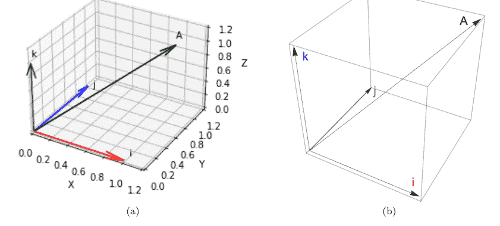

图 1.1：示例 1.1 中矢量 $\mathbf{r} = \hat{\mathbf{i}} + \hat{\mathbf{j}} + \hat{\mathbf{k}}$ 和单位矢量 $\hat{\mathbf{i}}$, $\hat{\mathbf{j}}$, $\hat{\mathbf{k}}$ 的绘图，使用 (a) Python 和 (b) Mathematica。

你可能还会看到单位矢量以 $\hat{\mathbf{x}}$, $\hat{\mathbf{y}}$, 和 $\hat{\mathbf{z}}$ 的形式出现，有时用于明确表示在笛卡尔坐标系中工作。此外，偶尔使用更通用的矢量符号会更容易，其中 $r_1$, $r_2$, 和 $r_3$ 代替分量 $x$, $y$, 和 $z$，单位矢量 $\hat{\mathbf{e}}_1$, $\hat{\mathbf{e}}_2$, 和 $\hat{\mathbf{e}}_3$ 代替 $\hat{\mathbf{i}}$, $\hat{\mathbf{j}}$, 和 $\hat{\mathbf{k}}$。这种通用符号允许更紧凑的矢量书写方法：

$$\mathbf{r} = r_1 \hat{\mathbf{e}}_1 + r_2 \hat{\mathbf{e}}_2 + r_3 \hat{\mathbf{e}}_3 = \sum_{i=1}^3 r_i \hat{\mathbf{e}}_i \qquad (1.2.3)$$

还有其他坐标系，我们将在本书后面探讨。每个坐标系都有自己的分量和单位矢量；然而，位置和位移的基本思想将是相同的。

## 1.2.2 速度

质点的速度 **v** 是质点的位移（位置变化）与单位时间的比值，以米每秒（m/s）为单位进行测量。瞬时速度通过计算位置矢量的时间导数得到：

$$\mathbf{v} = \frac{d\mathbf{r}}{dt} = \lim_{\Delta t \to 0} \frac{\Delta \mathbf{r}}{\Delta t} \quad (1.2.4)$$

其中 $\Delta \mathbf{r} = \mathbf{r}(t + \Delta t) - \mathbf{r}(t)$。我们在物理学中通常遇到的所有矢量都是可微的，极限将存在。此外，(1.2.4) 中的导数将表现得像你以前遇到过的导数。因此，我们可以使用标准的导数规则：

$$\frac{d}{dt} (\mathbf{r}_1 + \mathbf{r}_2) = \frac{d\mathbf{r}_1}{dt} + \frac{d\mathbf{r}_2}{dt} \quad (1.2.5)$$
$$\frac{d}{dt} (c\mathbf{r}) = \mathbf{r} \frac{dc}{dt} + c \frac{d\mathbf{r}}{dt} \quad (1.2.6)$$

其中 $c$ 是时间的标量函数。(1.2.5) 和 (1.2.6) 中的规则允许我们将导数分配到每个矢量分量。此外，如果单位矢量是常数，就像在笛卡尔坐标系中那样（但在其他坐标系中不是！），那么我们可以使用 (1.2.5) 来计算速度：

$$\mathbf{v} = \frac{d\mathbf{r}}{dt} \quad (1.2.7)$$
$$= \frac{d}{dt} (x\hat{\mathbf{i}} + y\hat{\mathbf{j}} + z\hat{\mathbf{k}}) \quad (1.2.8)$$
$$= \frac{dx}{dt}\hat{\mathbf{i}} + \frac{dy}{dt}\hat{\mathbf{j}} + \frac{dz}{dt}\hat{\mathbf{k}} \quad (1.2.9)$$

或者：$\mathbf{v} = v_x\hat{\mathbf{i}} + v_y\hat{\mathbf{j}} + v_z\hat{\mathbf{k}}$，其中 $v_x = dx/dt$，依此类推。注意 (1.2.9) 中只有三项（而不是六项），因为笛卡尔单位矢量是常数。质点的*速率*是其速度矢量的大小。我们将在第 3 章讨论如何计算矢量属性。

最后，我们可以通过使用点来表示对时间的微分（即 $\dot{x} = dx/dt$）来进一步简化符号。因此：

$$\mathbf{v} = \dot{\mathbf{r}} = \dot{x}\hat{\mathbf{i}} + \dot{y}\hat{\mathbf{j}} + \dot{z}\hat{\mathbf{k}} \quad (1.2.10)$$

我们将在接下来的章节中发现点符号非常有用。

## 1.2.3 加速度

加速度 **a** 是速度与单位时间的变化率，以米每二次方秒（m/s²）为单位进行测量。物体的加速度计算方式与速度类似：

$$\mathbf{a} = \frac{d\mathbf{v}}{dt} \quad (1.2.11)$$
$$= \frac{d}{dt} (v_x\hat{\mathbf{i}} + v_y\hat{\mathbf{j}} + v_z\hat{\mathbf{k}}) \quad (1.2.12)$$
$$= \frac{dv_x}{dt}\hat{\mathbf{i}} + \frac{dv_y}{dt}\hat{\mathbf{j}} + \frac{dv_z}{dt}\hat{\mathbf{k}} \quad (1.2.13)$$
$$= \dot{v}_x\hat{\mathbf{i}} + \dot{v}_y\hat{\mathbf{j}} + \dot{v}_z\hat{\mathbf{k}} \quad (1.2.14)$$

与速度一样，可以改写为 $\mathbf{a} = a_x \hat{\mathbf{i}} + a_y \hat{\mathbf{j}} + a_z \hat{\mathbf{k}}$。加速度也是位置矢量的二阶导数，使用点符号我们可以写成：

$$\mathbf{a} = \frac{d^2\mathbf{r}}{dt^2} \quad (1.2.15)$$
$$= \ddot{x}\hat{\mathbf{i}} + \ddot{y}\hat{\mathbf{j}} + \ddot{z}\hat{\mathbf{k}} \quad (1.2.16)$$

正如我们将在后续章节中看到的，加速度在经典力学中非常重要。本书讨论的大部分内容都是关于如何建立加速度的方程，然后通过积分得到系统的运动。所有位置、速度和加速度的测量都是相对于进行测量的参考系（原点和坐标轴的选择）。我们将在第 1.5 节回到参考系这个重要概念。

示例 1.2 演示了当已知位置矢量 $\mathbf{r}$ 时，如何获得速度和加速度矢量 $\mathbf{v}$ 和 $\mathbf{a}$。

> **示例 1.2：计算时间相关矢量的导数**
> 质量为 $m$ 的质点在时间 $t$ 的位置由 $\mathbf{r} = a t \hat{\mathbf{i}} + b \sin(a t) \hat{\mathbf{j}} + c t^2 \hat{\mathbf{k}}$ 给出，其中 $a, b, c$ 是常数。通过解析方法和符号代数方法计算质点在时间 $t$ 的速度 $\mathbf{v}$ 和加速度 $\mathbf{a}$。

**解答**
质点的速度 $\mathbf{v}$ 由位置的时间导数得到：
$$\mathbf{v} = \frac{d\mathbf{r}}{dt} = \frac{dx}{dt}\hat{\mathbf{i}} + \frac{dy}{dt}\hat{\mathbf{j}} + \frac{dz}{dt}\hat{\mathbf{k}}$$
$$\mathbf{v} = b a \cos(a t) \hat{\mathbf{j}} + 2 c t \hat{\mathbf{k}}$$

质点的加速度 $\mathbf{a}$ 由速度的时间导数得到：
$$\mathbf{a} = \frac{d\mathbf{v}}{dt} = \frac{dv_x}{dt}\hat{\mathbf{i}} + \frac{dv_y}{dt}\hat{\mathbf{j}} + \frac{dv_z}{dt}\hat{\mathbf{k}}$$
$$\mathbf{a} = -b a^2 \sin(a t) \hat{\mathbf{j}} + 2 c \hat{\mathbf{k}}$$

**Python 代码**
在任何 Python 代码的开头，我们必须指定符号。在这个例子中，我们使用 `symbols` 命令将 `a,b,c,t` 定义为实变量。

在下一行中，我们从符号 Python (SymPy) 库中导入库命令 `CoordSys3D`。这个命令允许我们在笛卡尔系统中描述矢量。

这里我们定义了一个坐标系 `R = CoordSys3D('R')`，其中笛卡尔坐标 $(x, y, z)$ 在内部表示为符号 `R.x`, `R.y`, `R.z`。相应的单位矢量 $\hat{\mathbf{i}}, \hat{\mathbf{j}}, \hat{\mathbf{k}}$ 由 `R.i`, `R.j`, `R.k` 表示。注意选择字母 `R` 没有什么特别之处，也可以选择任何其他字母。

矢量 $\mathbf{r} = a t \hat{\mathbf{i}} + b \sin(a t) \hat{\mathbf{j}} + t^2 \hat{\mathbf{k}}$ 在这个坐标系中符号表示为 `r = a*R.i + b*sin(a*t)*R.j + c*t**2*R.k`。我们使用命令 `diff(r,t)` 计算这个矢量 `r` 的时间导数。类似地，加速度通过使用命令 `diff(v,t)` 对 `v` 求时间导数来计算。

```python
from sympy.vector import CoordSys3D
from sympy import symbols, diff, sin

print('-'*28,'CODE OUTPUT','-'*29,'\n')

# define symbols
a, b, c, t = symbols('a, b, c, t  ', real=True)

R = CoordSys3D('R')    # define coordinate system R with
                        # unit vectors R.i, R.j, R.k

# define position vector r
r = a*R.i + b*sin(a*t)*R.j +c*t**2*R.k

v = diff(r,t)           # find v=dr/dt
print('velocity v = ', v)

a = diff(v,t)           # find a=dv/dt
print('\nacceleration a = ', a)

-------------------------------- CODE OUTPUT ---------------------------------
velocity v =  (a*b*cos(a*t))*R.j + 2*c*t*R.k

acceleration a =  (-a**2*b*sin(a*t))*R.j + 2*c*R.k
```

Python 程序的输出包含在 CODE OUTPUT 字样下方。你会注意到本书中许多 Python 代码中都有 `print('-'*28,'CODE OUTPUT','-'*29)` 这一行，它用于将代码与代码生成的输出分开。

### Mathematica 代码

代码中的第一行 `Clear["`*"]` 清除 Mathematica 中所有先前定义的变量，你会在本书的许多代码中看到这个命令。位置 `r` 被定义为 Mathematica 列表，其时间导数使用命令 `D[r,t]` 计算。类似地，加速度通过对速度参数 `v` 使用 `D[v,t]` 求导来计算。
`Print` 命令用于以易于阅读的方式输出代码的结果。

```mathematica
Clear["` * "]

r = {a, b * Sin[a * t], c * t^2};
v = D[r, t];
acc = D[v, t];

Print["Position = ", r]
Print["Velocity = ", v]
Print["Acceleration = ", acc]

Position = {a, b Sin[a t], c t^2}
Velocity = {0, a b Cos[a t], 2 c t}
Acceleration = {0, -a^2 b Sin[a t], 2 c}
```

运动的基本描述符只是提供了一种描述物体如何运动的方法。如果我们想理解物体为何如此运动，那么我们需要理解质量和力的概念。

## 1.2.4 质量

物体的质量是物体*惯性*的量度，即物体抵抗加速度的强度。例如，装满的购物车比空的购物车更难加速。回想一下你的入门物理课程，质量是一个标量量，因为为了描述质量，只需要一个大小。

为了比较物体的质量，可以使用天平。为了定量地讨论质量，拥有一个标准质量来与其他所有质量进行比较是有帮助的。其他物理量，如米和秒，是基于基本常数的。如前所述，米基于光速，秒分别基于铯-133原子的基态超精细分裂频率。千克的定义最近发生了变化，以便基于一个基本常数。

截至 2019 年 5 月，千克通过将普朗克常数设定为 $6.62607015 \times 10^{-34} \text{ kg m}^2\text{s}^{-1}$ 而被重新定义。

无论千克如何定义，你可能想知道为什么我们可以使用天平来比较质量。我们可以使用天平，因为根据*弱等效原理*，重量与质量成正比，该原理指出*引力质量*等于*惯性质量*。引力质量是决定物体之间引力的质量，而惯性质量决定在给定力作用下物体的加速度。在撰写本文时，实验表明这两种质量在 $10^{12}$ 分之一的范围内是等效的，并且计划进行更精确测试的未来实验。

## 1.2.5 力

与质量一样，力的概念是我们直观熟悉的。力是特定方向上的推或拉。你向前推购物车以使其向你希望的方向移动。然而，如果有人在购物车移动时走到你的购物车前面，你会向后拉小车使其停止。根据我们的日常经验，我们知道力会导致运动，并且一个物体可能同时受到多个力的作用。例如，如果你在健身房举重，那么你正在施加一个力来举起哑铃。如果你松开哑铃，它会掉落，这表明重力也作用在哑铃上。因此，我们看到，为了理解物体的运动，我们需要了解作用在该物体上的所有力。在考虑所有力时，我们需要知道每个力的大小（或量值）和方向。与位移、速度和加速度类似，力是一个矢量量。

力的单位是牛顿（缩写为 N），1 N 是使 1 kg 质量产生 1 m/s² 加速度所需的总力。根据日常经验，我们知道力和加速度之间存在直接的线性关系。例如，4 N 的合力将使 1 kg 的物体产生 4 m/s² 的加速度。当然，加速度是由力的矢量和引起的。当你拿着手机时，你施加了一个向上的力，与向下的重力相匹配；因此，这两个力大小相等但方向相反，所以它们的合力为零。因此，手机不会加速。

我们现在已经阐述了描述和解释物体运动所需的所有工具。接下来，我们将讨论经典力学的核心主题——牛顿运动定律，它将解释力和质量在决定物体运动中的作用。

## 1.3 牛顿运动定律

艾萨克·牛顿（1642–1727）创立了微积分并奠定了经典力学的基础。牛顿的著作《*自然哲学的数学原理*》于 1687 年出版，被认为是现代科学史上最重要的著作之一。在《原理》中，牛顿阐述了他的三大运动定律。牛顿运动定律是至关重要的工具，它们不仅让我们能够解释物体为何如此运动，还为我们提供了预测物体运动的方法。在经典力学中，牛顿定律的重要性怎么强调都不为过；它们值得牢记。当你在本书中解决问题时，问问自己牛顿定律是如何参与每个问题的设定和解答的。在本节中，我们将详细讨论这三条定律中的每一条。

### 1.3.1 牛顿第一定律

牛顿第一运动定律通常被学生用这句话来记忆：“运动的物体保持运动，静止的物体保持静止，除非受到不平衡力的作用。”这种表述的问题在于，“运动”是什么意思？运动是指位置、速度、加速度还是其他东西？物理定律的正确表述对于深入理解定律内容至关重要。定律的表述应使用恰当的物理学术语，不是为了混淆，而是为了清晰！

> **牛顿第一定律**

如果作用在粒子上的合力等于零，则粒子的速度保持不变。

让我们仔细看看第一定律的内容。第一定律指出，如果力的矢量和（合力）为零，则粒子的速度保持不变。“合力”这个术语很重要，因为可能有力作用在粒子上，但如果所有这些力的总和为零，那么粒子的速度就不会改变。第一定律有时被称为惯性定律，因为它指出，如果没有合力作用在物体上，物体将以恒定速度永远运动下去。惯性，简单来说，就是物体抵抗加速度的性质。因此，粒子的惯性将确保粒子继续以恒定速度沿直线运动或保持静止（零速度），直到它受到一个会改变其速度、方向或两者兼有的力。

我们知道加速度是速度的变化，因此，第一定律指出，需要一个非零的合力才能产生加速度。

最后，第一定律为“*平衡*”一词提供了定义。如果粒子的加速度等于零，则该粒子处于平衡状态。因此，平衡的一个条件是作用在粒子上的合力必须为零。我们稍后会看到，在研究转动动力学时，我们还需要合力矩为零作为平衡的附加条件。

### 1.3.2 牛顿第二定律

牛顿第二运动定律用于求解粒子的*运动方程*，这些方程给出了粒子在任何时刻的位置、速度或加速度。在本书中，我们将使用牛顿第二定律作为数学描述粒子运动的核心工具。

> **牛顿第二定律**

粒子线性动量 **p** 的时间变化率等于作用在该粒子上的合力 **F**：

$$\mathbf{F} = \dot{\mathbf{p}}$$ (1.3.1)

其中，质量为 $m$、速度为 **v** 的粒子的线性动量定义为：

> **单个粒子的线性动量**

$$\mathbf{p} = m\mathbf{v}$$ (1.3.2)

方程 (1.3.1) 可能不是你习惯看到的牛顿第二定律的形式。如果我们考虑一个质量 $m$ 恒定的系统，例如一个受到非零合力的单个粒子，那么我们有：

$$\mathbf{F} = \frac{d\mathbf{p}}{dt} = \frac{d}{dt}(m\mathbf{v})$$ (1.3.3)

$$\mathbf{F} = m\mathbf{a}$$ (1.3.4)

我们就得到了更熟悉的第二定律形式。然而，在研究质量 $m$ 随时间变化的物体的运动时，例如火箭的情况，就需要使用 (1.3.1) 中给出的第二定律形式来推导物体的运动方程。

尽管在本书中，出于计算目的，我们最常使用牛顿第二定律的形式 $\mathbf{F} = m\mathbf{a}$，但我们发现以以下形式思考第二定律很有帮助：

$$\mathbf{a} = \frac{\mathbf{F}}{m}$$ (1.3.5)

我们发现这种形式在理解牛顿第二定律背后的概念时更有用。方程 (1.3.5) 告诉我们：

- *加速度的方向与合力的方向相同。* $\mathbf{F}$ 前面没有负号来表示相反方向的加速度，也没有对矢量 $\mathbf{F}$ 进行任何数学变换来旋转它。
- *加速度的大小与合力的大小成正比。* 换句话说，大小较大的合力比大小较小的合力产生更大的加速度。从数学上看，这是因为 $\mathbf{F}$ 出现在方程 (1.3.5) 右边分数的分子中，并且可以将该方程理解为：$|\mathbf{a}| = |\mathbf{F}|/m$。
- *质量“抵抗”加速度。* 质量 $m$ 出现在方程 (1.3.5) 右边分数的分母中。与具有相同分子的小分母相比，大的分母会导致整体分数值更小（即 $1/4 < 1/2$）。换句话说，在相同的给定力作用下，质量较大的物体经历的加速度较小，而质量较小的物体经历的加速度较大。

以上所有三个要点都包含在一个简单的方程 (1.3.5) 中！这就是物理学家喜欢用数学作为描述宇宙语言的原因之一。一个简单的方程可以表达很多内容。作为一名物理学家，你应该学会像我们上面那样“阅读方程”。

注意第一定律和第二定律之间的一致性。如果 $\mathbf{F} = 0$，即作用在粒子上的合力为零，那么 $\mathbf{a} = 0$，粒子的速度不会改变，正如第一定律所述。同样，我们可以将牛顿第一定律重新表述为：“如果没有任何外部合力作用在粒子上，则粒子的动量保持不变。”

正如我们提到的，第二定律将用于产生描述粒子运动的微分方程。作为一个简单的例子，我们将考虑一个在恒定力作用下沿一维（沿直线）运动的粒子，其中 $\mathbf{a} = \ddot{x}\mathbf{\hat{i}}$ 且 $\mathbf{F} = F\mathbf{\hat{i}}$。回想一下，$x$ 上方的点表示对时间的二阶导数。我们可以使用 (1.3.5) 写出：

$$\ddot{x} = F/m = a$$ (1.3.6)

方程 (1.3.6) 表明，解 $x(t)$ 是一个函数，其二阶导数等于常数 $a$。二阶微分方程 (1.3.6) 类似于一个代数问题，只不过不是要求一个数，而是要求一个函数。微分方程是物理学家用来描述粒子运动的数学语言。我们将以封闭形式（解析地）和数值形式求解它们。为了激发你的兴趣，如果 $a$ 是常数，方程 (1.3.6) 的解是：

$$x(t) = x_0 + v_0t + \frac{1}{2}at^2$$ (1.3.7)

其中 $x_0 = x(0)$ 和 $v_0 = v(0)$ 分别是初始位置和初始速度。你可以自己验证一下，对方程 (1.3.7) 求两次导数，并证明在 $a$ 为常数的情况下它满足方程 (1.3.6)。在第 2 章中，我们将逐步推导方程 (1.3.7) 以及其他微分方程的解。

最后，我们可以回到弱等效原理。假设一个粒子位于地球表面附近，并且只受到重力（重量 $W$）的作用：

$$F = W$$
$$m_{\mathrm{i}} a = m_{\mathrm{g}} g \qquad (1.3.8)$$

其中 $m_{\mathrm{i}}$ 和 $m_{\mathrm{g}}$ 分别是惯性质量和引力质量。这里我们省略了矢量符号，假设“向下”为正方向，并用 $g$ 表示重力加速度（$9.8 \mathrm{~m/s}^2$）。此方程中的惯性质量 $m_{\mathrm{i}}$ 就是牛顿第二定律中的 $m$，即“抵抗”加速度的质量，被定义为惯性质量。质量 $m_{\mathrm{g}}$ 是受重力影响的质量，被定义为引力质量。正如本章前面所讨论的，弱等效原理指出 $m_{\mathrm{i}} = m_{\mathrm{g}}$，因此质量项相消，从而对于地球表面附近自由下落的物体，有 $a = g$。如果弱等效原理不成立，那么物体的质量将会影响其重力加速度。到目前为止，即使在最灵敏的实验中，物理学家也未能检测到物体的重力加速度存在任何质量依赖性（在实验误差之外）。

### 1.3.3 牛顿第三定律

牛顿第三定律是讨论两个粒子之间相互作用本质的陈述。为了阐述牛顿第三定律，我们需要考虑两个通过相互施加力而发生作用的物体。让我们定义 $\mathbf{F}_{12}$ 为物体2作用于物体1的力，$\mathbf{F}_{21}$ 为物体1作用于物体2的力。牛顿第三定律表述如下：

> **牛顿第三定律**

如果物体2对物体1施加一个力 $\mathbf{F}_{12}$，那么物体1对物体2施加一个力 $\mathbf{F}_{21}$，使得：

$$\mathbf{F}_{21} = -\mathbf{F}_{12} \qquad (1.3.9)$$

注意，(1.3.9) 中的负号和没有标量倍数表明，物体2作用于物体1的力与物体1作用于物体2的力大小相等（由没有标量倍数表示，如果存在标量倍数，它会改变大小），但方向相反（由负号表示）。本书中我们将研究的许多相互作用力都是*中心力*。中心力是沿着连接两个相互作用物体质心的直线作用的力，例如重力和静电力，并且遵循牛顿第三定律。速度依赖力不是中心力，牛顿第三定律可能不适用。一个例子是两个运动电荷之间的力；洛伦兹力是速度依赖的，并且两个带电粒子之间的磁力矢量不在同一条直线上，因此合力不遵循牛顿第三定律。

让我们将 (1.3.9) 进一步推导：
$$\mathbf{F}_{21} = -\mathbf{F}_{12} \qquad (1.3.10)$$
$$m_1 \mathbf{a}_1 = m_2 (-\mathbf{a}_2) \qquad (1.3.11)$$

毫不奇怪，我们看到每个物体的加速度方向相反。如果我们继续处理 (1.3.11)，我们发现：
$$\frac{m_1}{m_2} = -\frac{a_2}{a_1} \qquad (1.3.12)$$

其中我们取了加速度矢量的大小。注意，加速度的比值与质量的比值成反比。换句话说，如果 $m_1 > m_2$，那么 $a_1 < a_2$，以便 (1.3.12) 的右边是一个大于1的分数。举个例子，考虑蚊子撞击行驶中汽车挡风玻璃的经典场景。让蚊子为物体2，汽车为物体1。显然，汽车的质量大于蚊子，$m_1 > m_2$，根据 (1.3.12)，蚊子的加速度大于汽车的加速度，$a_2 > a_1$。这对蚊子来说真是糟糕的一天。解释 (1.3.12) 的另一种方式是，一个物体不可能在没有另一个物体向相反方向加速的情况下加速。

接下来，我们需要讨论经典力学的另一个重要基本概念：参考系。一旦我们对参考系有了基本的理解，我们就完成了经典力学基础的铺垫，就可以开始做一些物理了！

## 1.4 参考系

所有运动的基本描述都是相对于一个参考系来测量的。参考系是原点（空间和时间）的选择，以及一组用于进行所有测量的坐标轴。例如，如果你在朋友驾驶的以60英里/小时匀速行驶的汽车里拿着手机，那么你会观察到你的手机是静止的。然而，路边的旁观者会观察到你的手机以60英里/小时的速度移动。谁是对的？两者都对，因为速度的测量取决于参考系。在这种情况下，你的参考系随汽车一起运动，而旁观者的参考系静止在路边（忽略地球的运动）。通过选择合适的参考系，你或许可以简化特定的物理问题，在这种情况下，是将移动的手机视为静止的。另一个例子，在入门物理中，你无疑处理过涉及斜面的问题。众所周知，选择一个轴平行于斜面可以大大简化问题的受力分析图。其他参考系的改变可能只是改变 $t = 0$ 的时间点。

关于我们第一个例子，需要提到的另一个重要点是，这两个参考系以恒定速度相对运动。这将使在每个参考系中测量的加速度相同。考虑下面的例子，如图1.2所示，有两个参考系 $S$ 和 $S'$，其中 $S'$ 相对于 $S$ 以速度 $u = \dot{d}$ 运动，$d(t)$ 是两个参考系在时间 $t$ 时的距离。注意，在这种情况下，带撇的变量表示它们所属的参考系，而不是微分。在每个参考系中，一个观察者正在测量黑点的位置。$S$ 中的观察者测量黑点位于 $x_S$。同样，$S'$ 中的观察者测量黑点位于 $x_{S'}$。

现在假设每个参考系中的观察者想要相互传达黑点的运动。为了简单起见，我们只考虑沿 $x$ 方向的运动。两个参考系之间的坐标变换：

$$x_S = x_{S'} + d \qquad (1.4.1)$$

允许两个参考系一致地描述各自参考系中的运动。首先，我们将考虑 $S'$ 相对于 $S$ 以恒定速度运动的情况，换句话说，$u = \dot{d}$ 是常数。对 (1.4.1) 关于时间求导将给出坐标系之间速度的变换：

$$\dot{x}_S = \dot{x}_{S'} + u \qquad (1.4.2)$$
$$v_S = v_{S'} + u \qquad (1.4.3)$$

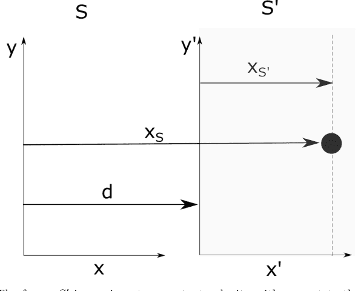

其中 $v_S$ 是在 $S$ 中测量的速度。
因此，如果每个参考系中的观察者想要确定他们是否一致地测量了粒子的速度，那么他们可以将各自测量的速度代入 (1.4.3) 以检查对方的结果。接下来，我们计算加速度变换：

$$\ddot{x}_S = \ddot{x}_{S'} + \dot{u}$$
$$a_S = a_{S'}$$

其中我们使用了 $u$（参考系之间的相对速度）是常数这一事实。注意 (1.4.5) 表明在两个参考系中测量的加速度是相同的，因此 (1.4.5) 也告诉我们，在每个参考系中测量的粒子所受的力是相同的，因此牛顿定律在每个参考系中以其典型形式成立。换句话说，如果我们在每个参考系中测量粒子的加速度，我们会发现测量的加速度可以通过考虑作用在粒子上的所有力来解释。参考系 $S'$ 被称为*惯性参考系*，因为它以恒定速度运动。牛顿第二定律在惯性参考系中成立。

现在让我们将其与 $S'$ 相对于 $S$ 加速的情况进行对比。在这种情况下，(1.4.3) 不变，而 (1.4.5) 变为：

$$a_S = a_{S'} + \dot{u}$$

并且 $\dot{u} \neq 0$。现在两个测量的加速度不相同，因此在每个参考系中测量的力也不同。特别是，在非惯性参考系中，粒子的加速度不能通过求和作用在粒子上的所有力来解释。例如，在某些涉及旋转的嘉年华游乐设施上，你会体验到一种明显的向外力，这种力并非由游乐设施本身作用于你的任何力引起。这是一个*非惯性参考系*的例子，其中牛顿定律不再以其标准形式成立，因为在 $S$ 中测量到的加速度在 $S'$ 中并不明显。

正如我们将在后续章节中看到的，我们可以修改牛顿定律以处理非惯性参考系的情况。这类修改涉及将加速度 $\dot{u}$ 视为由*惯性力*产生，这种力并非源于物理相互作用，而是由于参考系加速所致。虽然地球表面通常近似为一个惯性参考系，但地球确实在自转并绕太阳公转；因此，一个“固定”在地球表面的参考系的速度并非恒定。在某些情况下，需要考虑“固定”参考系的非惯性特性。这类情况包括长距离运动，如导弹轨迹以及风和水流的运动。

## 1.5 物理学中的计算

本书的一个重要部分是包含计算以解决问题。当我们在本书中说“计算”时，我们指的是使用计算机来解决物理和数学问题，无论是解析的还是数值的。物理学家以多种方式使用计算机来解决问题。除了提供经典力学方面的指导外，本书还将指导你如何使用计算机来解决物理问题。

开始阅读本书并不需要广泛的编码经验。事实上，我们将主要依赖已经是软件包一部分的命令。话虽如此，你将在过程中掌握所需的编码。在本节中，我们将提供计算在物理学中如何使用及其重要性的动机。编码已成为物理学家的一项基本技能。我们相信，所有学生在获得物理学本科学位之前都应该有编码经验。希望在你读完本书时，你将对经典力学以及如何使用计算机解决物理问题都有透彻的理解。把它看作是一个买一送一的优惠吧！

### 1.5.1 计算在物理学中的应用

为了理解计算在物理学中如何使用，我们将演示一些问题的解析解（也称为“手算”）和计算解。此时，理解问题中的所有物理知识并不重要，也不需要理解用于解决问题的计算方法；我们将在本书后面详细介绍这些主题。从本节中获得的重要收获是理解计算如何使用以及为什么重要。

让我们从一个可以“手算”的简单物理问题开始。

> **示例 1.3：求解一个简单的微分方程**

考虑一个以恒定加速度 $a$ 沿直线运动的粒子。如果在时间 $t = 0$ 时粒子的速度为 $v_0$，求粒子速度作为时间函数的公式。

**解：**

我们从 (1.2.11) 知道，加速度是速度对时间的一阶导数：

$$\frac{dv}{dt} = a \quad (1.5.1)$$

接下来，我们分离变量并对等式两边积分。将分离变量视为乘以 $dt$，以便将所有 $v$ 放在一边，所有 $t$ 放在另一边。分离变量后，(1.5.1) 变为：

$$\int_{v_0}^{v(t)} dv' = \int_0^t adt' \quad (1.5.2)$$

其中我们匹配了两边的上下限。注意右边的下限是 $t = 0$，左边的下限是 $t = 0$ 时的 $v$ 值，上限类似。此外，我们在积分变量上加了撇号，以区分它们与积分限。最后我们进行积分，注意 $a$ 是常数：

$$v(t) = v_0 + at \quad (1.5.3)$$

结果表明速度是时间的线性函数，正如恒定加速度运动所预期的那样。

示例 1.3 是一个“手算”问题的例子，这意味着我们能够在没有计算机辅助的情况下执行必要的数学操作来求解微分方程 (1.5.1)。方程 (1.5.3) 被称为微分方程 (1.5.1) 的“闭式”解，因为它给出了由函数和数学运算组成的具体解。什么被认为是“闭式”在某种程度上是任意的，因为例如，无限和形式的解可能不被认为是“闭式”。

正如你将在本书中看到的，解决物理问题通常涉及寻找微分方程的解。其中一些方程没有闭式解，而另一些则很难找到。在这些情况下，计算会非常有帮助。就本书而言，我们考虑两种形式的计算：

- *符号计算*：涉及使用计算机帮助寻找微分方程、积分、特征值等的闭式解。你输入想要解的方程或积分，计算机程序返回闭式解。回想一下导数和积分表；符号计算是这些的更复杂版本。
- *数值计算*：提供代表解的数值列表。例如，(1.5.1) 的数值解可以看作是一个有两列 $t$ 和 $v(t)$ 的值表，其中每行包含一个特定时间 $t$ 和时间 $t$ 时的 $v$ 值。数值解通常最好表示为有序对（有时是三元组，取决于所解决问题的维度）的图形。

在接下来的两个小节中，我们将通过使用 Python 和 Mathematica 求解示例 1.3 来演示符号计算和数值计算。

### 1.5.2 符号计算

在本节中，我们提供一个符号计算的例子，我们使用 Python 和 Mathematica 来符号求解示例 1.3。由于这是本书中此类的第一个例子，我们提供了代码中发生情况的详细解释。

在 Python 中，我们使用符号 Python (SymPy) 命令 `dsolve` 来获得微分方程的符号通解。该命令通常有三个参数：我们试图求解的微分方程、为其求解微分方程的函数以及问题的初始条件。让我们看看 Python 代码的细节。

#### 示例 1.3 的 Python 代码

求解示例 1.3 中微分方程 $dv/dt = a$ 的 Python 代码如下所示。

第一行告诉 Python 从符号 Python (SymPy) 库中导入几个命令。库由经验丰富的程序员编写，它们包含可被任何导入该库的代码使用的函数。在这种情况下，SymPy 库包含像 **dsolve** 这样的函数，用于以闭式求解微分方程。

所有符号都需要在 Python 中指定。我们使用 **Symbol('t', real=True, positive=True)** 来表示 $t$ 是一个实数正变量。类似地，**symbols** 用于表示 $a, v0$ 是实数变量。我们使用 **Function** 命令向 Python 表示 $v[t]$ 是一个函数。

微分方程的通解是通过 SymPy 命令 **dsolve** 获得的，其参数是微分方程、为其求解微分方程的函数以及问题的初始条件。在这个例子中，该命令的结构是
`dsolve(diff(v(t),t)-a,v(t),ics=initconds)`。
注意在 Python 中，微分方程的写法是右边等于零，在这个例子中 **diff(v(t),t)-a** 表示方程 $dv/dt = a$，并且只输入微分方程的左边。这里 $v(t)$ 是所需的解，**ics=initconds** 指定了问题的初始条件。这些条件在行 **initconds = {v(0):v0}** 中指定，表示给定的初始条件 $v(0) = v_0$。

```python
from sympy import Symbol, symbols, Function, dsolve, diff

print('-'*28,'CODE OUTPUT','-'*29,'\n')

# define symbols and the function v
v = Function('v')
t = Symbol('t', real=True, positive=True)
a, v0 = symbols('a, v0', real=True)

# initial conditions for the ODE
initconds = {v(0):v0}

# use dsolve to obtain solution of ODE  dv/dt=a
solution = dsolve(diff(v(t),t)-a,v(t),ics=initconds).rhs

print('The solution is  v(t) = ',solution)

----------------------------- CODE OUTPUT -----------------------------
The solution is  v(t) =  a*t + v0
```

在 Mathematica 中，我们使用命令 **DSolve** 来获得微分方程的符号通解。该命令通常有三个参数：我们试图求解的微分方程连同问题的初始条件、为其求解微分方程的函数以及解中的自变量。让我们看看 Mathematica 代码的细节。

## 示例 1.3 的 Mathematica 代码

求解示例 1.3 中微分方程 $dv/dt = a$ 的 Mathematica 代码如下所示。该解是通过 `DSolve` 命令获得的：

`solution=DSolve[{v'[t] == a, v[0] == v0}, v, t];`

请注意，微分方程*及其*初始条件作为命令的第一个参数出现（在花括号内）。同时请注意双等号 `==` 的使用，这与方程中的单等号 `=` 不同。在许多编程语言中，单等号用于变量赋值，而双等号用于逻辑等价。

该代码将 `DSolve` 生成的解存储在变量 `solution` 中（注意此处使用了单等号）。`DSolve` 中的第二个参数 `v` 告诉 Mathematica 我们正在求解的函数是 $v$，第三个参数则将 `t` 识别为自变量。

代码行 `speed=v[t]/.solution[[1]]` 通过使用替换规则 `/.solution`，从微分方程的解中选取所需的部分。

代码中的 `Print` 行输出解。正如预期的那样，Mathematica 的解与我们在示例 1.1 和 Python 代码中推导出的解相同。

另外请注意，Mathematica 会自动识别 `v0`、`t` 为需要处理的符号。此外，Mathematica 语法 `v[t]` 允许 Mathematica 自动识别 `v` 是时间 `t` 的函数。这比 Python 的情况简单得多，在 Python 中我们必须仔细定义代码中使用的所有符号。

```
Clear["`*`"]

solution = DSolve[{v'[t]==a, v[0]==v0}, v, t];

speed = v[t]/.solution[[1]];

Print["The solution of the ODE is v[t] = ", speed]

The solution of the ODE is v[t] = at + v0
```

在示例 1.3 中，我们看到 Mathematica 解决此问题所需的代码比 Python 短得多。这是因为 Mathematica 的设计部分是为了符号操作。像 Mathematica 这样的计算机代数系统（CAS）在执行符号计算时非常方便且易于使用。其缺点在于它是专有的，并且比其他选项昂贵得多。

接下来，我们将看一个数值计算的例子，并在该背景下比较这两种语言。

## 1.5.3 使用 Python 和 Mathematica 进行数值计算

在本节中，我们使用 Python 和 Mathematica *数值地*求解示例 1.3。

在 Python 中，我们使用 SymPy 命令 `odeint` 来获得微分方程的数值通解。该命令通常有三个参数：我们试图求解的微分方程、微分方程所求解的函数，以及问题的初始条件。

在示例 1.4 中，我们求解简单的微分方程 $dv/dt = a$，并详细查看 `odeint` 命令。

## 示例 1.4：简单微分方程的数值解

使用 $a = 9.8 \text{ m/s}^2$ 和初始速度 $v(0) = v_0 = 1 \text{ m/s}$，求解并绘制示例 1.3 中微分方程的数值解：

$$\frac{dv}{dt} = a \quad (1.5.4)$$

### Python 代码

我们导入三个库：NumPy、SciPy 和图形库 Matplotlib。从 SciPy 库中，我们只导入函数 `odeint`，该函数用于数值求解微分方程 (1.5.4)。导入库后，我们为初始条件变量 `v0` 和加速度 `a` 赋予数值。

为了数值求解微分方程，我们在 Python 中创建了一个新函数，我们称之为 `velderiv(v, t)`，其中包含我们正在求解的微分方程。在 Python 中，函数定义使用命令 `def` 完成。函数的参数是 `v` 和 `t`，它们包含在函数名后的括号中。

接下来的几行包含函数的实际计算。请注意，我们包含了一个局部变量 `dvdt`，它仅存在于函数内部，并且等于 `v` 的一阶导数。函数的最后一行是 `return dvdt`，它返回变量 `dvdt` 的值。另请注意，Python 函数的内容总是缩进的。

我们还需要告诉 Python 我们将为哪些 `t` 值计算 $v(t)$。在这种情况下，`times` 是一个数组，包含列表 $[t_0, t_1, \dots, t_{30}] = [0, 0.1, \dots, 3.0]$，因此我们将求解 $v(0), v(0.1), \dots, v(3.0)$。接下来，我们使用从 `scipy.integrate` 库导入的命令 `odeint` 来求解微分方程。本例中的 `odeint` 命令是：

```
velocity = odeint(velderiv, v0, times).
```

该命令有三个参数：微分方程（作为用户定义的函数 `velderiv`）、初始值（`v0`）和时间列表 `times`。结果是一个我们称之为 `velocity` 的数组，它包含值 $[v_0, v_1, \dots]$，其中 $v_i = v(t_i)$。程序中的最后一组代码设置 `v` 对 `t` 的图形，$v(t)$ 的绘图如图 1.3 所示。

```
import numpy as np
from scipy.integrate import odeint
import matplotlib.pyplot as plt

# initial condition v(0)=1, and acceleration a =9.8 m/s^2
v0 = 1
a = 9.8

# define function velderiv to be called by odeint
def velderiv(v,t):
    dvdt = a
    return dvdt

# times at which to evaluate the numerical solution
times = np.linspace(0,3,30)

# solve the ODE with initial v(0)=v0
velocity = odeint(velderiv,v0,times)

# plot v(t) and label the axes
plt.plot(times,velocity)
plt.ylabel('v(t), m/s')
plt.xlabel('Time, s')
plt.show()
```

## 示例 1.4 的 Mathematica 代码

使用 `Clear` 命令清除所有先前分配的变量后，我们使用 `SetOptions` 命令设置图形输出的选项。你将在本书的大多数 Mathematica 代码中看到这种类型的行。

接下来，我们指定加速度 `a` 的值，并在以下行中数值求解微分方程：

`NDSolve[{v'[t]==a,v[0]==1},v,{t,0,3}];`

请注意，我们在 Mathematica 命令 `NDSolve` *内部*定义了初始值 `v[0]`。

另请注意，`NDSolve` 的参数与 `DSolve` 的参数相似，即参数的顺序是：要解的方程和初始值、我们正在求解的函数（`v`），以及自变量 `t` 的标识。然而，这次我们需要指定 `v` 被求解的 `t` 值范围。数值解是一个包含 `t` 和 `v(t)` 列的值表，因此我们需要告诉计算机何时开始寻找解（`t = 0`）以及何时停止（`t = 3`），最后一个参数是 `{t,0,3}`。

代码的最后一行生成解的图形。正如预期的那样，该图形是一条直线，y 轴截距为 1.0，斜率为 9.8。代码最后一行中 `{t,0,3}` 之后的所有内容都是格式化命令，仅影响图形的视觉外观。

```
Clear["` * "]

SetOptions[Plot, Frame->True, BaseStyle->{FontSize->16},
PlotRange->All];

a = 9.8;

solution = NDSolve[{v'[t]==a, v[0]==1}, v, {t, 0, 3}];
speed = v[t]/.solution[[1]];

Plot[speed, {t, 0, 3}, FrameLabel->{"time, s", "v(t) m/s"}]
```

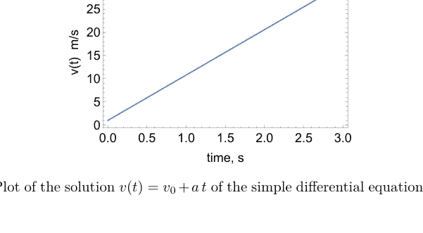

图 1.3：示例 1.4 中简单微分方程的解 $v(t) = v_0 + a t$ 的绘图。

同样，Python 代码比 Mathematica 代码长。这是否意味着 Mathematica 比 Python 更好？答案取决于你试图做什么。如果你对快速开发和实现感兴趣，那么 Mathematica 可能对你来说是一个非常有用的工具。然而，正如我们之前提到的，Mathematica 是专有的，并且比 Python 更昂贵。Mathematica 的专有性质意味着你无法访问源代码，如果你想确切知道命令在做什么，这可能是个问题。Python 是开源软件，所以如果你想了解“底层发生了什么”，你可以找到答案。Python 的开源性质在进行研究时很有价值，当你想确定意外结果是由于代码中的错误还是由于新的科学发现时，这一点尤为重要。话虽如此，Mathematica 是一种独立的语言，你可以用它编写自己的程序。最后，Python 是免费的，你的预算可能会决定你的选择。在研究自己的研究问题时，本书的作者通常会同时使用这两种程序，为手头的特定工作选择最合适的工具。

应该指出的是，有时微分方程的封闭形式解不存在或难以找到。在这些情况下，我们依赖数值解来提供所需的信息。你可能认为数值解的价值有限，但正如我们将在本书中看到的，使用数值方法可以发现很多东西。解（也称为数值解）。在第13章中，我们将研究非线性振荡器，并学习如何从数值解中获取大量信息。

很容易在完成本科物理教育后产生一种错觉，认为所有物理问题都有解析解。这种结论源于本科学生在教育过程中所解决的问题类型。事实是，物理学家在课堂之外研究的大多数问题都需要数值解。支配现实世界系统的微分方程通常很复杂，无法用解析形式求解。在这些情况下，数值解可能是获得对问题任何洞察的唯一途径。具备强大计算能力的物理学家将能够很好地应对各种问题，不仅在经典力学领域，而且在物理学或工程学的任何领域。

此外，物理学家发现自己经常在传统物理学子领域之外的各种问题上工作。物理学家最终常常涉足金融、经济学、生物学、气候科学和材料科学等领域的问题，仅举几例。当今的物理学家参与建模经济、疾病传播和社会网络。这类问题让物理学家能够将其技能，包括强大的计算和建模能力，应用于有趣的问题。我们希望本书不仅能让你在物理学方面做好充分准备，还能为你发展强大的计算能力奠定基础，这样无论你的职业生涯走向何方，你都能应对物理学内外那些令人兴奋的问题。

## 1.5.4 一些警告

我们将以一些警告来结束本节。首先，拥有计算工具来解决问题并不意味着你不需要知道如何手动进行数学运算！这有几个原因。第一个原因是计算机算法可能并且确实会给出错误的答案。计算算法在过去几十年中有了显著改进，它们给出错误答案的情况不像计算早期那么常见。然而，你需要能够在看到错误答案时识别出来。识别错误答案仍然需要熟练的数学能力。此外，对计算机代数系统的输出进行额外的代数运算以使其结果更方便或更具洞察力，这并不少见。我们将在本书中看到一些例子，其中计算机代数系统的输出在技术上是正确的，但与我们“手动”获得的结果相比，在描述情况的物理方面不那么有用。

其次，计算机提供的解决方案没有上下文。你通过做数学学到的技巧和批判性思维将训练你如何理解和解释计算机生成的解决方案，以便你能将解决方案置于适当的上下文中。例如，你的解决方案是否有适当的极限？解决方案是否符合已知的物理定律？解释计算机生成的解决方案仍然需要精通数学和物理的人（至少目前是这样……）。特别是，当一个人精通数学时，符号算法应被视为帮助人们专注于物理的工具，而不会被大量数学所困扰。从某种意义上说，你应该将符号算法视为类似于计算器。只有在“手动”学习算术之后，才应该开始使用计算器。同样，精通代数、三角学和微积分应该是广泛使用符号算法的前提。

第三，谁编程计算机来解决数学问题？是那些知道如何解决数学问题的人。因此，我们需要能够做数学的人，以确保我们未来会有新一代的算法来协助我们。

最后的警告来自本书中介绍的算法的性质。作者并不声称其中包含的代码是解决本书中问题的最有效方法。我们倾向于编写侧重于教学而非效率的代码。我们鼓励你重写其中包含的程序，看看你是否能改进它们并使其更高效。通过摆弄这些代码，你将更好地理解算法和编程的一般知识。祝你玩得开心！

## 1.6 章节总结

> 运动使用运动的*基本描述符*——位移、速度和加速度来描述。在笛卡尔坐标系中，粒子的位置、速度和加速度为：

$$\mathbf{r} = x\hat{\mathbf{i}} + y\hat{\mathbf{j}} + z\hat{\mathbf{k}}$$ (1.6.1)
$$\mathbf{v} = \dot{x}\hat{\mathbf{i}} + \dot{y}\hat{\mathbf{j}} + \dot{z}\hat{\mathbf{k}}$$ (1.6.2)
$$\mathbf{a} = \ddot{x}\hat{\mathbf{i}} + \ddot{y}\hat{\mathbf{j}} + \ddot{z}\hat{\mathbf{k}}$$ (1.6.3)

其中 $\hat{\mathbf{i}}$、$\hat{\mathbf{j}}$ 和 $\hat{\mathbf{k}}$ 是单位向量。

在描述物体的运动时，另外两个量变得重要：物体的质量和作用在物体上的合外力。物体的惯性质量是其惯性的度量，而物体的引力质量是决定作用在其上的引力的质量。然而，弱等效原理指出惯性质量和引力质量相等。

物体运动的改变是由作用在物体上的非零合外力引起的。牛顿运动定律描述了力如何改变物体的运动。

牛顿第一定律：如果作用在物体上的合外力为零，则粒子的速度保持不变。

牛顿第二定律：粒子动量的时间变化率 $dp/dt$ 等于作用在粒子上的合外力 $\mathbf{F}$：

$$\mathbf{F} = dp/dt = \dot{\mathbf{p}}$$ (1.6.4)

牛顿第三定律：如果物体2对物体1施加力 $\mathbf{F}_{12}$，则物体1对物体2施加力 $\mathbf{F}_{21}$，使得：

$$\mathbf{F}_{21} = -\mathbf{F}_{12}$$ (1.6.5)

所有测量都是相对于参考系进行的。参考系是原点（空间 $x$ 和时间 $t$）的选择，以及一组相对于其进行所有测量的坐标轴。

当牛顿定律成立，并且在 $S'$ 中测量的力与在 $S$ 中测量的力相同时，两个参考系 $S$、$S'$ 被称为惯性参考系。

当牛顿定律在其标准形式下不再成立，因为在 $S$ 中测量到的加速度在 $S'$ 中不明显时，两个参考系 $S$、$S'$ 被称为非惯性参考系。

计算是物理学家的重要工具。在本书中，我们将专注于两种类型的计算：符号计算和数值计算。符号计算涉及使用计算机来帮助找到微分方程、积分、特征值等的解析解。数值计算，或称“数值解”，提供了一组代表微分方程、积分、特征值等解的数值。

## 1.7 章末问题

符号 🖥 表示需要某种计算机辅助的问题，形式可以是图形、数值计算或符号求值。

### 第1.2节：经典力学基础

1. 🖥 一个质量为 $m = 0.50$ kg 的粒子的位置可以用向量函数描述：
$$\mathbf{r} = 3at\hat{\mathbf{i}} - 2bt^2\hat{\mathbf{j}} + 7ct^{-2}\hat{\mathbf{k}}$$
其中 $a, b, c$ 是常数。

    a. 系数 $a, b, c$ 的国际单位制单位分别是什么？假设时间 $t$ 以秒为单位测量，位置以米为单位测量。

    b. 在 $t = 3$ 秒且 $a = b = c = 1$ 时，分别通过解析方法和使用 Mathematica 和/或 Python 的符号计算功能，计算粒子的速度和作用在其上的力。

2. 🖥 考虑位置向量 $\mathbf{r} = 3t\hat{\boldsymbol{\rho}}$，其中 $\hat{\boldsymbol{\rho}} = \cos\phi\hat{\mathbf{i}} + \sin\phi\hat{\mathbf{j}}$，且 $\phi = \phi(t)$ 是时间 $t$ 的标量函数。分别通过解析方法和使用计算机代数系统计算粒子的速度和加速度。

3. 🖥 一个粒子的位置由 $\mathbf{r}(t) = R\cos(\omega t)\hat{\mathbf{i}} + R\sin(\omega t)\hat{\mathbf{j}} + (\omega t)\hat{\mathbf{k}}$ 给出，其中 $R$ 和 $\omega$ 是常数。对于数值 $R = \omega = 1$ 和时间 $t = 0$ 到 $t = 10$ s，在三维笛卡尔坐标系中描述并绘制该粒子的路径。粒子的速度和加速度作为时间的函数是什么？

4. 🖥 考虑向量 $\mathbf{A} = \hat{\mathbf{i}} + 2\hat{\mathbf{j}} + 2\hat{\mathbf{k}}$ 和 $\mathbf{B} = \hat{\mathbf{i}} + \hat{\mathbf{j}} + \hat{\mathbf{k}}$。使用 Python 和/或 Mathematica 在三维笛卡尔坐标系中绘制这两个向量及其和 $\mathbf{A} + \mathbf{B}$。

5. 🖥 考虑向量 $\mathbf{A} = \hat{\mathbf{i}} + 2\hat{\mathbf{j}}$ 和 $\mathbf{B} = \hat{\mathbf{i}} + \hat{\mathbf{j}}$。使用 Python 和/或 Mathematica 在二维笛卡尔坐标系中绘制这两个向量及其和 $\mathbf{A} + \mathbf{B}$。

### 第1.3节：牛顿运动定律

6. 考虑牛顿运动定律的以下应用：

    a. 使用牛顿第三定律，解释为什么枪在开火时会后坐。解释为什么枪的后坐速度小于子弹的速度。

    b. 考虑一个弱等效原理不成立的宇宙。牛顿万有引力定律会如何改变？

    c. 使用牛顿定律，解释如果太阳突然消失，地球的轨迹会发生什么变化。

7. 考虑以下四种情况。定性描述质量为 $m$ 的粒子在经历以下每种力时的速度和加速度（作为时间的函数）：

    a. 一个从静止开始位于距原点 $x = A$ 处的粒子受到力 $F = -kx$，其中 $x$ 是位置坐标，表示从位于原点的平衡位置（$F_{\text{Net}} = 0$）的位移，$k$ 是正常数。

b. 一个从原点静止开始的粒子受到力 $\mathbf{F} = \frac{c}{t^2+a^2} \hat{\mathbf{i}}$，其中 $t$ 是时间，$c$ 和 $a$ 是正常数。

c. 一个从原点开始、以初速度 $v_0$ 沿正 $x$ 方向运动的粒子受到力 $\mathbf{F} = -bv\hat{\mathbf{i}}$，其中 $v$ 是速度，$b$ 是正常数。

d. 一个从地球表面上方高度 $H$ 处由静止释放的物体受到力 $\mathbf{F} = (mg - bv)\hat{\mathbf{j}}$，其中 $g$ 是重力加速度，$b$ 是常数，$v$ 是速度。假设正 $y$ 方向指向地球表面。

### 第1.4节 参考系

8. 考虑一个静止的参考系 $S$，以及另一个参考系 $S'$，其原点相对于 $S$ 的原点位于位置 $\mathbf{r}_0 = ct^2 \hat{\mathbf{i}}$，其中 $c$ 是正常数。一个质量为 $m$ 的粒子在 $S'$ 中的位置由矢量函数 $\mathbf{r}' = bt^3 \hat{\mathbf{i}}$ 描述，其中 $b$ 是正常数。

a. 计算在每个参考系中测量的粒子加速度。

b. 计算在每个参考系中测量的粒子受力。为什么这两个力不同？

9. 考虑一个静止的参考系 $S$，以及另一个参考系 $S'$，其原点相对于 $S$ 的原点位于位置 $\mathbf{r}_0 = at\hat{\mathbf{i}} + bt\hat{\mathbf{j}}$，其中 $a$ 和 $b$ 是正常数，$t$ 表示时间。计算在 $S$ 中测量的粒子速度，该粒子在 $S'$ 中的位置由 $\mathbf{r}'(t) = -ct^2 \hat{\mathbf{i}}$ 描述，其中 $c$ 是正常数。

10. 考虑一个静止的参考系 $S$，以及另一个参考系 $S'$，其原点相对于 $S$ 的原点位于位置 $\mathbf{r}_0 = 3t^2 \hat{\mathbf{i}} - 5t^3 \hat{\mathbf{j}}$，$t$ 表示时间。一个粒子在 $S'$ 中的位置由矢量函数 $\mathbf{r}'(t) = -t^2 \hat{\mathbf{i}} + 3t^2 \hat{\mathbf{j}}$ 描述。如果粒子的质量为 $m$，求在每个参考系中测量的力。

11. 考虑一个静止的参考系 $S$，以及另一个参考系 $S'$，其原点相对于 $S$ 的原点位于位置 $\mathbf{r}_0$。在每个参考系中测量的粒子动量 $\mathbf{p} = m\mathbf{v}$ 是否相同？证明如果 $S$ 和 $S'$ 是惯性系，那么在 $S'$ 中测量的粒子受力与在 $S$ 中测量的相同。换句话说，$\mathbf{F}' = d\mathbf{p}'/dt = d\mathbf{p}/dt = \mathbf{F}$，其中 $\mathbf{p}$ ($\mathbf{p}'$) 是质量为 $m$ 的粒子在 $S$ ($S'$) 中的动量。角动量 $\boldsymbol{\ell} = \mathbf{r} \times \mathbf{p}$ 在每个参考系中是否相同？力矩 $\mathbf{N} = \mathbf{r} \times \mathbf{F}$ 呢？

12. 在狭义相对论理论中，我们需要修改两个参考系之间的变换方程。设 $S$ 为静止系，$S'$ 为相对于 $S$ 以速度 $v$ 运动的参考系。假设 $S'$ 沿 $x$ 方向运动，换句话说，$S'$ 平行于 $S$ 的 $x$ 轴运动。狭义相对论理论指出，在 $S$ 和 $S'$ 中进行的测量通过以下公式相关联：

$$x' = \gamma(x - vt)$$
$$y' = y$$
$$z' = z$$
$$t' = \gamma \left(t - \frac{vx}{c^2}\right)$$

其中 $\gamma = \sqrt{1 - v^2/c^2}$，$c$ 是光速。

a. 考虑在 $S$ 中的两个事件发生在时间 $t = 0$ 时的两个位置 $x = 0$ 和 $x = a$。求在 $S'$ 中测量的这两个事件的时间。注意，在 $S$ 中同时发生的事件在 $S'$ 中并不同时。在 $S'$ 中哪个事件先被观测到？

b. 证明时空间隔 $(\Delta s)^2 = c^2 t^2 - x^2 - y^2 - z^2$ 在 $S'$ 系中保持不变，即 $(\Delta s)^2 = (\Delta s')^2 = c^2 (t')^2 - (x')^2 - (y')^2 - (z')^2$。请用解析方法和计算机代数系统（CAS）完成此部分问题。

### 第1.5节 物理学中的计算

13. 使用 Python 和/或 Mathematica 解析地和数值地求解以下微分方程：
$$\frac{df}{dx} = 5 \sin x - 4e^{-x}$$
初始条件为 $f(0) = 0$。绘制 $x$ 从 $0$ 到 $3$，步长为 $0.1$ 的解图。

14. 将值 $5$ 和 $6$ 分别赋给变量 $a$ 和 $b$。然后使用 Python 和/或 Mathematica 计算以下表达式，结果保留两位小数：
a. $(a + b) \sin(0.25\pi)$
b. $a b e^3 / (\sinh a)$
c. $\sqrt{7} a^b / (a + b i)$，其中 $i = \sqrt{-1}$

15. 定义一个数组 $x$（有时称为列表），包含从 $0$ 到 $2\pi$，步长为 $0.01$ 的数字。定义三个变量 $m, k, x$ 的函数 $f(x, m, k) = e^{-mx} \cos(2\pi kx)$。绘制 $k = 1$ 和 $m = 0.5$ 时的函数 $f(x, m, k)$。为坐标轴添加标签，并为曲线选择非默认的颜色和绘图符号。将生成的图形保存为 .jpg 或 .png 文件。

16. 在同一张图上绘制 $f(x) = x^2$ 和 $g(x) = x$，范围 $x = 0$ 到 $x = 10$。每个函数在图中应有自己的颜色、标签和绘图符号。

17. 条件语句是帮助计算机处理意外情况的重要工具。它们采用“if-then-else”的形式。条件语句允许计算机根据条件是否为真来执行不同的操作。换句话说，如果条件为真，则执行一件事；如果不是（else），则执行不同的事情。例如，如果变量 $x$ 小于 $5$，则将值 $1$ 赋给变量 $a$；否则，将值 $0$ 赋给 $a$。编写一段代码，为变量 $x$ 赋值，然后如果 $x < 5$ 则打印“x is less than 5”，如果 $x \geq 5$ 则打印“x is greater than or equal to 5”。

18. 使用第17题中描述的条件 if 语句，定义分段函数
$$f(x) = \begin{cases} 0 & x < 5 \\ x^2 & x \geq 5 \end{cases}$$
计算 $x = 0.5$ 和 $x = 2$ 时的 $f(x)$，并绘制 $x$ 从 $0$ 到 $3$ 的 $f(x)$ 图。

19. 计算机非常擅长一遍又一遍地重复任务，这个过程称为*循环*。循环的基本类型是 **for** 循环、**do** 循环和 **while** 循环。使用这三种循环中的任何一种，计算 6!（阶乘）并显示结果。

20. 斐波那契数列 $x_n$ 由递归序列 $x_n = x_{n-1} + x_{n-2}$ 定义，初始值为 1,1。计算斐波那契数列的前 17 个值。你可能想使用 **for** 循环，也可能想使用 Python 中的 **append()** 函数或 Mathematica 中的 **Append** 将结果保存到数组中，以便向数组添加值。

21. 使用符号计算以及 Python 中的 **solve** 命令和 Mathematica 中的 **Roots** 命令，求解以下关于 $x$ 的方程。注意，某些解会得到复数根。

- a. $7x + 5 = 0$
- b. $x^2 - 5x + 2 = 0$
- c. $x^3 + 7x - 5 = 3$

22. 使用符号计算以及 Python 中的 **solve** 命令和 Mathematica 中的 **Solve** 命令，求解以下关于 $(x, y)$ 的方程组：

$$2x - 5y = 7$$
$$x + y = 2$$

23. 数值求解以下耦合微分方程组：

$$\frac{dx}{dt} = 0.6x - 1.2xy$$
$$\frac{dy}{dt} = xy - y$$

初始条件为 $x(0) = 40$ 和 $y(0) = 7$。绘制 $x$ 随时间变化的图、$y$ 随时间变化的图以及 $y$ 随 $x$ 变化的图。

# 2 一维单粒子运动

在本章中，我们将研究一维运动，即沿直线的运动。仔细研究一维运动将为理解更高维度中更一般的运动奠定有用的基础。在本章中，我们将给出几个在一维中求解牛顿第二定律 $F = ma$ 的例子。我们将考虑几种类型的力：恒力以及依赖于时间 $F(t)$、速度 $F(v)$ 和位置 $F(x)$ 的力。此外，我们将讨论并演示如何使用计算机代数系统和数值方法，利用计算机求解常微分方程（ODEs）。最后，我们讨论可用于数值计算单变量函数定积分的各种方法。

## 2.1 运动方程

为了开始我们对一维运动的研究，我们首先需要对所研究物体的运动做一些假设。本章的一个基本假设是，所研究的物体是一个质点。为了在数学上描述质点在力作用下的运动，我们需要找到质点的*运动方程*。质点的运动方程是描述其位置、速度和加速度作为时间函数的方程。运动方程可以是代数方程的形式，也可以是微分方程的形式。

正如我们将看到的，质点的运动方程可以通过将牛顿第二定律作为微分方程来求解。在本章中，我们将专注于一维运动，其中力矢量和质点的位移沿同一直线（但不一定在同一方向）。由于给定问题中的所有矢量都沿同一直线，我们在所有方程中省略矢量符号。两个量之间的负号将表示沿同一直线相反方向的矢量。

一维牛顿第二定律为：

$$F = ma \quad (2.1.1)$$

回想一下，加速度是速度 $v$ 对时间的一阶导数，也是位移 $x$ 对时间的二阶导数。为了求解运动方程，我们将把 (2.1.1) 视为一个微分方程，通过以下方式重写 (2.1.1)：

$$F = m \frac{d^2x}{dt^2} \quad (2.1.2)$$
$$F = m \frac{dv}{dt} \quad (2.1.3)$$
$$F = mv \frac{dv}{dx} \quad (2.1.4)$$

注意，上述每个方程都是一个微分方程，一旦指定了作用在粒子上的合力 $F$，就可以求解。上述每个方程都产生

## 2.1 运动方程

不同的运动方程：(2.1.2) 可用于求解 $x(t)$，(2.1.3) 用于求解 $v(t)$，(2.1.4) 用于求解 $v(x)$。方程 (2.1.4) 来自链式法则，当力依赖于粒子的位置 $x$ 时使用：

$$m\frac{dv}{dt} = m\frac{dv}{dx}\frac{dx}{dt} = mv\frac{dv}{dx} \quad (2.1.5)$$

在本章的其余部分，我们将针对几种不同的情况求解 (2.1.1)，包括力为常数 ($F = F_0$)、时间依赖 ($F = F(t)$)、速度依赖 ($F = F(v)$) 和位置依赖 ($F = F(x)$) 的情况。然而，在求解 (2.1.1) 之前，我们将对微分方程的一般性质做一些说明。

## 2.2 常微分方程

简而言之，常微分方程 (ODE) 是一个包含函数导数的方程。例如，

$$\frac{dx}{dt} = 7 \quad (2.2.1)$$

是一个微分方程，它表示该微分方程的解 $x(t)$ 是一个一阶导数等于 7 的函数。当然，我们知道 $x(t) = 7t$ 是一个有效的解。然而，由于我们可以在 $x(t)$ 上加上一个常数而仍然得到 ODE 的解，因此存在无限多个其他解。因此，所谓的通解是 $x(t) = 7t + c$，其中 $c$ 是一个常数。这个微分方程足够简单，可以求解。然而，大多数 ODE 并不那么简单，而且许多根本无法求解。在讨论如何求解 ODE 之前，让我们先指出关于我们示例的几点。

1. 方程 (2.2.1) 被称为*一阶 ODE*，因为方程中的最高阶导数是一阶导数。一般来说，$n$ 阶 ODE 是最高阶导数为 $n$ 阶导数的 ODE。
2. 常导数意味着 $x$ 仅是变量 $t$ 的函数，$t$ 是微分变量。
3. (2.2.1) 通解中任意常数的数量等于 ODE 的阶数。

为了求解 (2.2.1)，我们需要分离方程的变量。通俗地说，这意味着将所有包含 $x$ 的项放在方程的一边，所有常数或依赖于 $t$ 的项放在另一边。这个过程称为*分离变量*，通过将导数视为分数并将 (2.2.1) 两边乘以 $dt$ 来执行：

$$dx = 7dt \quad (2.2.2)$$
$$\int dx = \int 7dt \quad (2.2.3)$$
$$x = 7t + c \quad (2.2.4)$$

为了求解 (2.2.1)，我们在分离变量后进行了积分。请注意，两个积分都会产生积分常数，但由于两者都是常数，我们可以将它们合并为一个任意常数。你可以通过计算 $7t + c$ 的导数来验证解，以检查它是否满足 (2.2.1)。

对于二阶 ODE 的情况会怎样？二阶 ODE 在物理学中很常见。有许多技术可以求解它们，但我们只演示一种。考虑 ODE：

$$\frac{d^2x}{dt^2} = 7 \qquad (2.2.5)$$

分离变量在这里没有意义，因为我们通常不对 $d^2x$ 这样的项进行积分。然而，我们可以定义一个新变量 $v$，使得 $v = dx/dt$。那么 (2.2.5) 变为：

$$\frac{dv}{dt} = 7 \qquad (2.2.6)$$

我们知道其解为 $v(t) = 7t + c_1$，其中 $c_1$ 是积分常数。然而，我们想要的是 $x(t)$，所以我们使用 $v = dx/dt$：

$$\frac{dx}{dt} = 7t + c_1 \qquad (2.2.7)$$
$$\int dx = \int (7t + c_1) dt \qquad (2.2.8)$$
$$x(t) = 3.5t^2 + c_1t + c_2 \qquad (2.2.9)$$

其中 $c_2$ 是通过对 (2.2.8) 进行积分得到的积分常数。因此，我们在解中得到了一个额外的积分常数，为二阶 ODE (2.2.5) 的解提供了两个任意常数。粗略地说，我们看到 $n$ 阶 ODE 解中的任意常数数量等于 $n$，因为我们需要进行 $n$ 次积分来求解方程，而每次积分都会产生一个任意常数。

接下来，我们回到 (2.2.1)。假设 (2.2.1) 是我们想要用来寻找粒子位置随时间变化的方程。无限多个解没有帮助。哪个解描述了粒子实际走过的路径？为了指定 ODE 的*特解*，我们需要包含*初始条件*，即函数在特定时间（通常在 $t = 0$）的值。假设我们知道在 $t = 0$ 时，粒子处于位置 $x(0) = 3$。那么我们可以通过将初始条件代入通解来求解任意常数：

$$x(0) = (7)(0) + c = 3 \qquad (2.2.10)$$

得到 $c = 3$。我们的特解就是 $x(t) = 7t + 3$。不同的初始条件会给出不同的特解。

现在假设我们想找到 (2.2.5) 的一个特解；在这种情况下，一个初始条件将不够，因为它会遗漏一个任意常数。因此，我们需要在特定时间（通常是 $t = 0$）同时指定 $x(t)$ 和 $dx/dt$。假设 $x(0) = 3$ 且 $v(0) = 1$，其中 $v = dx/dt$。那么我们有：

$$x(0) = 3.5(0)^2 + c_1(0) + c_2 = 3 \qquad (2.2.11)$$
$$v(0) = 7(0) + c_1 = 1 \qquad (2.2.12)$$

其中 (2.2.12) 是通解在 $t = 0$ 处的导数。结果是 $c_1 = 1$ 和 $c_2 = 3$，特解为 $x(t) = 3.5t^2 + t + 3$。

总之，为了求解 $n$ 阶 ODE 的特解，我们需要 $n$ 个初始条件。此外，我们也可以通过知道 $x$ 在两个不同时间的值来指定 $x$，而不是知道 $x$ 及其一阶导数的初始值。在经典力学中，最常见的是知道位置和速度的初始条件。

然而，在其他领域，如电磁学和热力学，通常更常见的是知道一个函数（例如温度）在两个不同位置的值。在这种情况下，我们有一个所谓的*边值问题*，提供积分常数的条件称为*边界条件*。

ODE 还有许多其他性质，如线性叠加，我们将在本书中根据需要进行探讨。目前，我们对 ODE 已经有足够的了解可以开始了。让我们回到物理学。

## 2.3 恒力

考虑一个恒定的合外力 $F = F_0$ 作用于一个质量为 $m$、被约束沿直线运动的粒子的情况。在这种情况下，牛顿第二定律 (2.1.1) 给出：

$$\frac{dv}{dt} = \frac{F_0}{m} = a \quad (2.3.1)$$

其中 $a$ 是常数，因为 $F_0$ 是常数。你可能从例 1.1 中回忆起 (2.3.1)。方程 (2.3.1) 是一阶微分方程的一个例子。我们可以通过分离变量然后对所得方程进行积分来求解。分离变量的第一步是将方程两边乘以 $dt$：

$$dv = a dt \quad (2.3.2)$$

积分后得到：

$$v(t) = \int a \, dt = at + c_1 \quad (2.3.3)$$

其中 $c_1$ 是积分常数。常数 $c_1$ 可以使用初始条件 $v(t_0) = v_0$ 来找到，其中 $v_0$ 是初始时间 $t_0$ 的初始速度。当 $t_0 = 0$ 时，(2.3.3) 给出 $v(0) = c_1$ 或 $c_1 = v_0$。因此，微分方程 (2.3.1) 的解是：

$$v(t) = v_0 + at \quad (2.3.4)$$

在继续之前，我们应该提到，有一种替代方法可以找到 (2.3.3)，即在积分 (2.3.2) 时显式地插入初始和最终条件：

$$\int_{v_0}^{v(t)} dv' = \int_{t_0}^{t} a dt' \quad (2.3.5)$$
$$v(t) - v_0 = a(t - t_0) \quad (2.3.6)$$

其中我们引入了积分变量的撇号，以区分它们与积分限。请注意，(2.3.5) 左边的下限对应于 $t = t_0$ 时 $v(t)$ 的值，即 (2.3.5) 右边的下限，上限也类似。方程两边的积分限匹配非常重要。

接下来，我们可以通过写出 $v = dx/dt$ 来得到 $x(t)$ 的方程：

$$\frac{dx}{dt} = at + v_0 \quad (2.3.7)$$

分离变量，我们得到：

$$\int_{x_0}^{x(t)} dx' = \int_{t_0}^{t} (at' + v_0) dt' \quad (2.3.8)$$

注意所有与时间相关的项和常数项都位于方程的同一侧。在此背景下，分离变量总是涉及乘法和除法，从不涉及加法和减法。选择 $t_0 = 0$ 并进行积分，得到：

$$x(t) = \frac{1}{2}at^2 + v_0t + x_0 \quad (2.3.9)$$

方程 (2.3.4) 和 (2.3.9) 是你需要知道的唯一方程，用于求解在恒定合力作用下做一维运动的粒子的位置和速度。

最后，如果我们想要 $v(x)$，可以求解 (2.1.4)：

$$v \frac{dv}{dx} = \frac{F_0}{m} \quad (2.3.10)$$
$$v dv = a dx \quad (2.3.11)$$
$$\int_{v_0}^v v' dv' = a \int_{x_0}^x dx' \quad (2.3.12)$$
$$v^2 - v_0^2 = 2a(x - x_0) \quad (2.3.13)$$

其中在 (2.3.11) 中使用了 $a = F_0/m$。我们也可以通过消去方程 (2.3.4) 和 (2.3.9) 之间的 $t$ 来得到这个结果。下面的方框总结了所有恒定力方程，有时称为*运动学方程*。这些是你应该记住的方程。

> **恒定加速度 $a$ 的运动学方程**

$$v(t) = v_0 + at \quad (2.3.14)$$
$$x(t) = x_0 + v_0t + \frac{1}{2}at^2 \quad (2.3.15)$$
$$v(x)^2 = v_0^2 + 2a(x - x_0) \quad (2.3.16)$$

对于地球表面附近自由下落的粒子，我们使用 $a = -g = -9.8 \text{ m/s}^2$（假设“向下”为负方向），其中 $g$ 是重力加速度。运动学方程变为：

$$v(t) = v_0 - gt \quad (2.3.17)$$
$$y(t) = y_0 + v_0t - \frac{1}{2}gt^2 \quad (2.3.18)$$
$$v^2(y) = v_0^2 - 2g(y - y_0) \quad (2.3.19)$$

我们使用 $y$ 作为位置变量，这在描述垂直运动时很常见。注意，这些方程与运动学方程并无不同，只是运动学方程中 $a$ 取特定值的情况。我们现在来看一些系统加速度恒定的著名例子。

> **例 2.1：阿特伍德机**

阿特伍德机由两个质量 $m_1, m_2$ 组成，它们通过一根无质量、不可伸长的绳子连接，绳子悬挂在一个无质量、无摩擦的滑轮上，如图 2.1 所示。

假设 $m_2 > m_1$。求质量的加速度 $a$ 和绳子的张力。

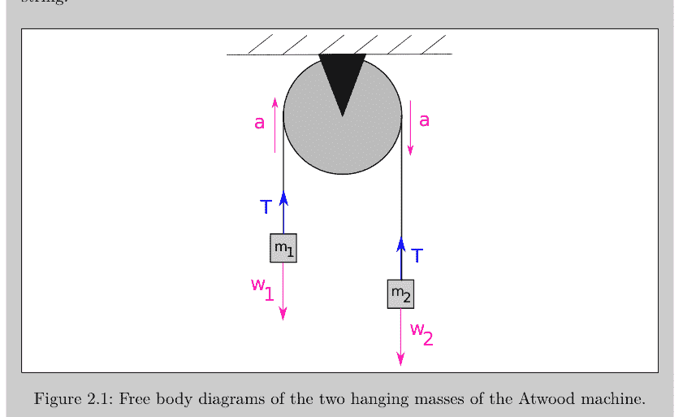

图 2.1：阿特伍德机两个悬挂质量的受力图。

**解：**

我们可以通过受力分析推导出加速度的方程。我们必须考虑的唯一力是：张力（$T$）和两个质量的重量（$W_1 = m_1g$ 和 $W_2 = m_2g$）。作用在每个质量上的张力将是相同的，因为张力在整个绳子中是恒定的。由于绳子不可伸长，每个质量的加速度大小也将相同，尽管它们的方向相反。

为了找到加速度，我们需要考虑影响每个单独质量的力。首先，我们需要定义一个参考系。在这种情况下，我们将选择 $+y$ 向下，以便较重的质量 $m_2$ 沿正方向运动。牛顿第二定律可以用来推导方程组：

$$\begin{cases} m_1g - T = -m_1a \\ m_2g - T = m_2a \end{cases} \quad (2.3.20)$$

其中 (2.3.20) 中上（下）方程的右侧是作用在 $m_1$（$m_2$）上的合力。$m_1$ 的向上运动通过在描述影响 $m_1$ 的力的方程右侧包含一个负号而变得明确。

我们可以通过相减方程来消除 $T$，从而求解方程组 (2.3.20)。我们也可以使用计算机代数系统（见下文）。

无论哪种方式，结果都是

$$a = g\frac{m_2 - m_1}{m_1 + m_2} \quad T = \left(\frac{2m_1m_2}{m_1 + m_2}\right)g \quad (2.3.21)$$

一旦找到 $a$，我们就可以使用 (2.3.15) 和 (2.3.14) 找到质量的位置 $x(t)$ 和速度 $v(t)$。注意，对于 $m_1$ 的位置和速度，我们需要在运动学方程中插入 $-a$。

我们可以检查这些结果是否具有物理意义，以及单位是否正确。如果两个质量相等 $m_1 = m_2$，这些方程给出 $a = 0$ 和 $T = m_1g = m_2g$。这个结果具有物理意义，因为相等的质量意味着系统是静止的（$a = 0$），并且张力 $T$ 将等于任一质量的重量。

此外，分数 $(m_2-m_1)/(m_1+m_2)$ 是无量纲的，因此 (2.3.21) 中 $a$ 的单位与 $g$ 的单位相同。分数 $(2m_1m_2)/(m_1+m_2)$ 的单位是 $kg$，因此 $T$ 的单位是 $kg\ m/s^2$ 或牛顿。

**Python 代码**

我们使用 **solve** 命令求解方程组，该命令要求待求解的方程右侧为零。定义必要的符号后，我们将 (2.3.20) 存储到变量 eq_1 和 eq_2 中，并使用 **solve** 命令，该命令输出一个 Python 字典。我们可以通过在变量名 soln 后使用方括号来识别每个解，其中包含解。

```
from sympy import symbols, solve

print('-'*28,'CODE OUTPUT','-'*29,'\n')

m1, m2, a, g, T = symbols('m1,m2,a,g,T')

eq_1 = m1*g - T + m1*a        # define equations to solve
eq_2 = m2*g - T - m2*a

soln = solve((eq_1,eq_2),(a,T)) #solution to system of equations

print('a = ', soln[a])
print('T = ', soln[T])

----------------------------- CODE OUTPUT -----------------------------
a =  (-g*m1 + g*m2)/(m1 + m2)
T =  2*g*m1*m2/(m1 + m2)
```

**Mathematica 代码**

我们将方程 (2.3.20) 定义为变量 eq1 和 eq2。注意使用 == 来表示方程的相等性。接下来，我们使用 **Solve** 命令，它有两个参数：要解的方程和要求解的变量。注意结果是一个替换规则列表 /., Mathematica 可以将其用于进一步计算。

```
eq1 = m1 * g - T == - m1 * a;

eq2 = m2 * g - T == m2 * a;

Solve[{eq1, eq2}, {a, T}]

{{a -> -(g m1 - g m2)/(m1 + m2), T -> (2 g m1 m2)/(m1 + m2)}}
```

### 例 2.2：斜面上的运动

图 2.2 所示的阴影框质量为 $m$，放置在倾角为 $\theta$ 的斜面上。质量与平面之间的摩擦系数为 $\mu$。如果质量从静止释放，求位置 $x(t)$、速度 $v(t)$ 和加速度 $a$。

**解：**

我们将使用此类问题中常用的标准斜面参考系；因此我们定义 $+x$ 沿斜面向下。摩擦力写为 $f = \mu N$，其中 $N$ 是质量与斜面之间的法向力。我们将通过解析方法以及使用 Python 和 Mathematica 的符号功能来获得质量的位置和速度作为时间的函数。

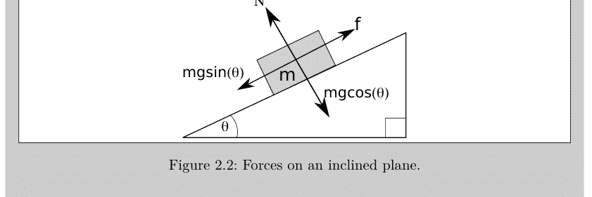

这里的法向力表示平面对物体施加的力（反之亦然）。法向力 $N$ 的大小可以从受力图（如图 2.2 所示）计算得出，为 $N = mg \cos \theta$，其中 $g$ 是重力加速度，$\theta$ 是从水平面测量的斜面角度。重量 $W = mg$ 沿平面方向的分量再次从力图中找到为 $F = mg \sin \theta$。

沿 x 轴（沿斜面向下方向）的总力为：

$$F_{total} = ma = mg \sin \theta - f = mg \sin \theta - \mu mg \cos \theta \quad (2.3.22)$$

除以质量 $m$，我们得到恒定加速度：

$$a = g \sin \theta - \mu g \cos \theta \quad (2.3.23)$$

然后可以将此加速度用于 (2.3.15) 和 (2.3.14) 以得到 $x(t)$ 和 $v(t)$：

$$v(t) = v_0 + (g \sin \theta - \mu g \cos \theta) t \quad (2.3.24)$$

$$x(t) = x_0 + v_0t + \frac{1}{2}(g\sin\theta - \mu g\cos\theta)t^2 \quad (2.3.25)$$

### Python 代码

在代码中，我们使用 **dsolve** 求解牛顿定律的形式：

$$\frac{d^2x}{dt^2} = a = g\sin\theta - \mu g\cos\theta$$

初始条件为 x(0)=x0 和 x'(0)=v0。我们首先使用 **symbols** 命令将参数 $g, \theta, \mu, x0, v0, t$ 定义为 **g, theta, mu, x0, v0, t**。参数 **x** 使用 SymPy 中的 **Function** 命令定义为一个函数。

参数 **initconds** 存储初始条件。注意 **dsolve** 现在包含第三个参数 **ics=initconds**，它告诉 SymPy 使用给定的初始条件获得微分方程的解。常微分方程的解存储在变量 **solnx** 中，我们使用方法 **.rhs** 选择解的右侧。

速度 $v(t) = dx/dt$ 使用 **diff(solnx,t)** 作为时间导数进行计算。

```
from sympy import symbols, dsolve, Function, diff, sin, cos
import matplotlib.pyplot as plt
import numpy as np

print('-'*28,'CODE OUTPUT','-'*29,'\n')

g, theta, mu, x0, v0, t = symbols('g, theta, mu, x0, v0, t',real=True)
x = Function('x')                    # define position function x

a = g*sin(theta)-mu*g*cos(theta)     # define acceleration a

# initial conditions x(0)=x0 and v(0)=v0
initconds = {x(0):x0, diff(x(t),t).subs(t, 0): v0}

# use dsolve to solve the ODE x''(t)=a
solnx = dsolve(diff(x(t),t,t)-a,x(t), ics=initconds).rhs

solv = diff(solnx,t)                 # evaluate v = dx/dt
print(' x(t) = ', solnx)             # print x(t)

print('\nv(t) = ',solv)               # print v(t)

------------------------------------ CODE OUTPUT ------------------------------------
x(t) =  g*t**2*(-mu*cos(theta) + sin(theta))/2 + t*v0 + x0

v(t) =  g*t*(-mu*cos(theta) + sin(theta)) + v0
```

### Mathematica 代码

Mathematica 命令 `DSolve` 用于求解微分方程
$$\frac{d^2x}{dt^2} = a = g \sin \theta - \mu g \cos \theta \quad (2.3.26)$$
在 `DSolve` 中，第一个参数是包含常微分方程和初始条件的列表，位置 $x(t)$ 的结果存储在变量 `posx` 中。速度 $v = dx/dt$ 使用导数命令 `D[posx, t]` 计算。

```
a = g * Sin[\theta] - \mu * g * Cos[\theta];
soln = DSolve[{x''[t] == a, x[0] == x0, x'[0] == v0}, x[t], t];
posx = x[t] /. soln[[1]];
Print["The position x(t)=", posx]
The position x(t)=\frac{1}{2} (2 t v0 + 2 x0 - g t^2 \mu Cos[\theta] + g t^2 Sin[\theta])
Print["The speed v(t)=", D[posx, t]]
The speed v(t)=\frac{1}{2} (2 v0 - 2 g t \mu Cos[\theta] + 2 g t Sin[\theta])
```

## 2.4 与时间相关的力

现在考虑一个质点被约束沿直线运动，并受到一个与时间相关的合外力 $F(t)$ 的情况。与时间相关的力出现在多种应用中，一个常见的例子是当正弦外部力作用于系统时。在合外力 $F = F(t)$ 的情况下，牛顿第二定律 (2.1.1) 给出：
$$\frac{dv}{dt} = \frac{F(t)}{m} \quad (2.4.1)$$
通过分离变量并从 $t' = t_0$ 积分到 $t$，我们得到：
$$v(t) - v(t=0) = \frac{1}{m} \int_{t'=t_0}^{t} F(t') dt' \quad (2.4.2)$$
利用初始条件 $v(t=0) = v_0$：

$$v(t) = v_0 + \frac{1}{m} \int_{t'=0}^{t} F(t') dt' \quad (2.4.3)$$

一旦我们知道 $v(t)$，就可以通过积分 $v = dx/dt$ 并利用初始条件 $x(t_0) = x_0$ 来求得 $x(t)$：

$$x(t) - x_0 = \int_{t'=0}^{t} v(t') dt' \quad (2.4.4)$$

在下一个例子中，我们将演示如何找到一个受到与时间相关的力作用的质点的运动方程。我们将分别通过手算以及使用 Python 和 Mathematica 来获得解。

### 示例 2.3：一个递减的力，$F(t)$

作用在质量 $m = 1$ kg 上的力随时间递减，遵循 $F(t) = c/(t^2 + b^2)$，其中 $t$ 是经过的时间，常数 $c$ 和 $b$ 的单位使得 $F$ 以牛顿为单位。求位置 $x(t)$ 和速度 $v(t)$，初始条件为 $x(0) = x_0 = 0$ 和 $v(0) = v_0 = 0$，常数 $c = 1$ N.s$^2$，$b = 1$ s。

**解：**

这是一个与时间相关的力 $F = F(t)$ 的情况，因此我们可以使用 (2.4.3) 并令 $v_0 = 0$：

$$v(t) = v_0 + \frac{1}{m} \int_{t'=0}^{t} F(t') \, dt' = \frac{1}{m} \int_{t'=0}^{t} \frac{c}{t^2 + b^2} \, dt \quad (2.4.5)$$

该积分通过变量替换 $t = b \tan \theta$ 求解，得到：

$$v(t) = \frac{c}{mb} \tan^{-1} \left( \frac{t}{b} \right) \quad (2.4.6)$$

(2.4.6) 式合理吗？为了验证，我们考虑当 $t \to \infty$ 时会发生什么？在 $t \to \infty$ 的极限下，$F \to 0$，我们预期 $v$ 会趋于常数。在我们这个 $b = 1$ s 的特定情况下，当 $t \to \infty$ 时，$\tan^{-1}(t) \to \pi/2$，因此，我们的解 $v(t)$ 符合我们对速度趋近于常数的预期。接下来，我们使用 (2.4.4) 并令 $x_0 = 0$ 来求 $x(t)$：

$$x(t) - x_0 = \int_{t'=0}^{t} v(t') \, dt' \quad (2.4.7)$$
$$= \frac{c}{mb} \int_{t'=0}^{t} \tan^{-1} \left( \frac{t'}{b} \right) \, dt' \quad (2.4.8)$$
$$= \frac{c}{mb} \left[ t \tan^{-1} \left( \frac{t}{b} \right) + \frac{b}{2} \ln \left( \frac{b^2}{t^2 + b^2} \right) \right] \quad (2.4.9)$$

其中我们使用了分部积分法。

在这种情况下，当 $t \to \infty$ 时，我们知道 $v \to$ 常数，因此我们预期 $x(t)$ 会持续增长，正如图 2.3 所示，这正是我们的解所展示的！图 2.3 是使用 Mathematica 创建的。

请注意，解中对数和反正切函数的参数必须是无量纲的。确实如此，因为从给定的力方程 $F(t) = c/(t^2 + b^2)$ 可以看出，常数 $b$ 具有时间单位（秒）。检查问题的解，并确保各项的单位正确，总是一个好习惯。

### Python 代码

在代码中，我们使用 `dsolve` 来求解常微分方程，并使用 `ics` 选项指定其初始条件。我们使用 `textwrap` 库，以便输出能适应本书的页面。请注意，`textwrap.fill` 的参数必须是字符串。因此使用了 `str(solnx), 70)`，数字 70 指定输出应限制在每行 70 个空格。

为了绘制 SymPy 的符号结果，我们使用 `lambdify` 来获取位置和速度变量 `position` 和 `velocity` 的 NumPy 数组。Python 方法 `.subs` 用于替换参数 `c,m,x0,b` 的数值。另请注意，Python 在输出中不会合并对数函数。

```
from sympy import symbols, dsolve, Function, diff, simplify, lambdify
import textwrap
import numpy as np
import matplotlib.pyplot as plt
print('-'*28,'CODE OUTPUT','-'*29,'\n')

m, c, b, t, x0 = symbols('m, c, b, t, x0',real=True)
x = Function('x')

initconds = {x(0):x0, diff(x(t),t).subs(t, 0): 0}
solnx = dsolve(m*diff(x(t),t,t)-c/(t**2+b**2),x(t), \n    ics=initconds).rhs

solv = diff(solnx,t)                    # v = dx/dt
print(' x(t) = ', textwrap.fill(str(solnx),70))  # print x(t)
print('\nv(t) = ',simplify(solv))          # print v(t)

xt = solnx.subs({c:1,m:1,x0:0,b:1})    # substitute values of constants
vt = solv.subs({c:1,m:1,x0:0,b:1})      # substitute values of constants

position = lambdify(t,xt,'numpy')
velocity = lambdify(t, vt,'numpy')
times = np.linspace(0,10,20)            # times t=0-10

fig, ax = plt.subplots(nrows=1,ncols=2) # use 2 subplots for x(t),v(t)
ax[0].plot(times, position(times))
ax[0].set_xlabel('time')
ax[0].set_ylabel('position')
ax[1].plot(times, velocity(times))
ax[1].set_xlabel('time')
ax[1].set_ylabel('velocity')
fig.tight_layout()

----------------------------- CODE OUTPUT -----------------------------
x(t) =  -c*log(b**2 + t**2)/(2*m) + (c*log(b**2) + 2*m*x0)/(2*m) +
c*t*atan(t/b)/(b*m)

v(t) =  c*atan(t/b)/(b*m)
```

### Mathematica 代码

Mathematica 命令 `DSolve` 用于求解微分方程，

$$m\frac{d^2x}{dt^2} = \frac{c}{t^2 + b^2} \quad (2.4.10)$$

这段代码与示例 2.2 中的 Mathematica 代码非常相似。图形命令 `GraphicsGrid` 用于创建 $x(t)$ 和 $v(t)$ 的两个并排图。

```
SetOptions[Plot, Frame->True, BaseStyle->{FontSize->16}, PlotRange->All];

ODEsolution = DSolve[{m * x''[t]==c/(t^2 + b^2), x[0]==0, x'[0]==0}, x[t], t]

$$\left\{\left\{x[t] \to \frac{c\left(2 t \operatorname{ArcTan}\left[\frac{t}{b}\right]+b \operatorname{Log}\left[b^2\right]-b \operatorname{Log}\left[b^2+t^2\right]\right)}{2 b m}\right\}\right\}$$

position = x[t]/.ODEsolution[[1]]

$$\frac{c\left(2 t \operatorname{ArcTan}\left[\frac{t}{b}\right]+b \operatorname{Log}\left[b^2\right]-b \operatorname{Log}\left[b^2+t^2\right]\right)}{2 b m}$$

velocity = D[position, t]//FullSimplify

$$\frac{c \operatorname{ArcTan}\left[\frac{t}{b}\right]}{b m}$$

c = 1; m = 1; b = 1;

GraphicsGrid[

{{Plot[position, {t, 0, 10}, FrameLabel->{"time, s", "x, m"}],

Plot[velocity, {t, 0, 10}, FrameLabel->{"time, s", "v, m/s"}]}}]
```

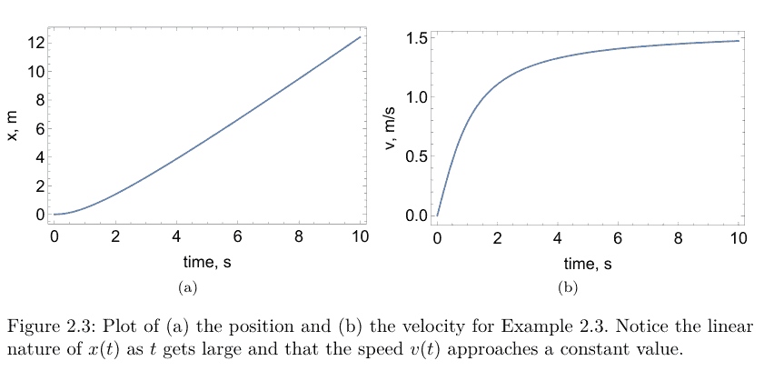

## 2.5 空气阻力与速度相关的力

回想一下，在研究自由落体运动时，空气阻力通常被忽略。空气阻力的大小取决于物体在空气中运动的速度。因此，空气阻力是一种与速度相关的力。在这里，我们将学习如何在描述质点运动时处理空气阻力。然而，需要注意的是，尽管我们以空气阻力作为与速度相关的力的例子，但我们的大部分讨论将适用于任何与速度相关的力。

当谈论一个在空气中运动的物体时，通常会描述两种力：阻力和升力。*阻力*是空气阻力的一个分量，其方向与物体的速度（运动方向）相反。*升力*是垂直于物体运动方向的空气阻力分量。在本节中，我们将考虑升力可以忽略不计的情况。我们还将只考虑非旋转的物体。一个在空气中运动的旋转物体会经历*马格努斯效应*，即物体的旋转运动使得一侧的空气流速比另一侧更快。由此产生的物体两侧的压力差导致物体偏离其飞行路径。这就是棒球投手能够投出曲线球的原因。网上有许多有趣的视频演示了马格努斯效应。

一般来说，本章研究的阻力在数学形式上为，

$$\mathbf{f} = -f(v)\hat{\mathbf{v}} \quad (2.5.1)$$

其中单位向量 $\hat{\mathbf{v}} = \mathbf{v}/v$ 沿着物体速度（或运动）的方向，负号明确表示阻力的方向与速度方向相反。阻力的大小 $f(v)$ 是速度的函数，通常具有以下形式，

$$f(v) = bv + cv^2 \quad (2.5.2)$$

因此，它在 $v$ 中既有线性分量也有二次分量。对于空气中的球体，常数 $b$ 和 $c$ 的值为（Taylor, [1]）：

$$b = 1.6 \times 10^{-4}D \quad \text{N}\cdot\text{s/m}$$
$$c = 0.25D^2 \quad \text{N}\cdot\text{s}^2/\text{m}^2 \quad (2.5.3)$$

其中 $D$ 是球体的直径，单位为米。幸运的是，通常不需要同时包含空气阻力的线性和二次项。为了确定在给定情况下哪个项（线性或二次）更重要，可以计算比值：

$$\gamma = \frac{cv^2}{bv} = \frac{0.25D^2v^2}{1.6 \times 10^{-4}Dv} = 1.6 \times 10^3 Dv \quad (2.5.4)$$

注意 $v$ 的单位应为米每秒，$D$ 的单位为米。如果 $\gamma \gg 1$，则二次项占主导地位，线性项可以忽略。如果 $\gamma \ll 1$，则线性项占主导地位，二次项可以忽略。然而，如果 $\gamma \approx 1$，则线性和二次项都需要包含。因此，对于直径为 0.22 m 的足球，当速度大约大于 0.003 m/s（或 3 mm/s）时，二次项占主导地位，而在较低速度下，线性项占主导地位。如果足球的速度接近 3 mm/s，则阻力公式中需要同时包含线性和二次项。

为了获得位置和速度作为时间函数的方程，我们将考虑 $F(v)$ 的一般形式。牛顿第二定律 (2.1.1) 给出：

$$\frac{dv}{dt} = \frac{F(v)}{m} \quad (2.5.5)$$

重新整理上述方程可得：

$$dt = m \frac{dv}{F(v)} \quad (2.5.6)$$

对时间从 $t' = t_0$ 到 $t$ 进行积分，并利用初始条件 $v(t_0) = v_0$，我们得到：

$$t - t_0 = m \int_{v'=v_0}^{v} \frac{dv'}{F(v')} \quad (2.5.7)$$

通过求解方程 (2.5.7)，我们可以找到速度关于时间的函数 $v(t)$。一旦知道 $v(t)$，我们可以再次利用方程 (2.4.4) 并结合初始条件 $x(t_0) = x_0$ 进行积分，从而求得 $x(t)$。寻找 $v(x)$ 的过程类似。牛顿第二定律给出：

$$mv \frac{dv}{dx} = F(v) \quad (2.5.8)$$

整理后，我们得到：

$$x - x_0 = m \int_{v'=v_0}^{v} \frac{v' dv'}{F(v')} \quad (2.5.9)$$

接下来，我们将展示一些涉及速度相关力的例子。

### 示例 2.4：空气阻力与速度成线性关系

作用在质量为 $m$ 的物体上的阻力 $F(v)$ 与速度 $v$ 成线性关系，即 $F(v) = -bv$。在初始条件 $v(0) = v_0$ 和 $x(0) = x_0$ 下，求 $x(t)$ 和 $v(t)$。使用 $x_0 = 0$，$v_0 = 1$，质量 $m = 1$ 和 $b = 1$（所有物理量均为国际单位制）绘制解的图像。

**解：**

我们使用方程 (2.5.7)，令 $t_0 = 0$ 来求 $x(t)$：

$$t = m \int_{v'=v_0}^{v} \frac{dv'}{F(v')} = -\frac{m}{b} \int_{v'=v_0}^{v} \frac{dv'}{v'} = -\frac{m}{b} \ln \left( \frac{v}{v_0} \right) \quad (2.5.10)$$

解出 $v(t)$，我们得到：

$$v(t) = v_0 e^{-\frac{bt}{m}} \quad (2.5.11)$$

这个结果在物理上是合理的：随着时间 $t$ 增加，指数函数 $\exp(-bt/m)$ 的值减小，速度 $v(t)$ 也随之减小，直到在很长时间后趋近于零。

我们还从方程 (2.4.4) 求得 $x(t)$：

$$x(t) - x_0 = \int_{t'=t_0}^{t} v(t') dt' = \int_{t'=t_0}^{t} v_0 e^{-\frac{b t'}{m}} dt' \quad (2.5.12)$$

$$x(t) = x_0 + \frac{m v_0}{b} \left( 1 - e^{-\frac{bt}{m}} \right) \quad (2.5.13)$$

随着时间 $t$ 增加，$x(t)$ 中的第二项 $1 - \exp(-bt/m)$ 增大并趋近于 1，因此在很长时间后，$x(t)$ 达到恒定值 $x_0 + m v_0/b$，此时运动停止（$v \to 0$）。

### Python 代码

我们使用 `xsoln.limit(t,oo)` 方法来求变量 `solnx`（代表 $x(t)$）当 $t \to \infty$ 时的极限。SymPy 中的无穷大符号是 `oo`。如上所述，这些极限是 $v(t) \to 0$ 和 $x(t) \to x_0 + m v_0/b$，当 $t \to \infty$ 时。

```python
from sympy import symbols, dsolve, Function, diff, simplify, oo
print('-'*28,'CODE OUTPUT','-'*29,'\n')

t, x0, v0 = symbols(' t, x0, v0')
m, b = symbols('m, b', positive=True)
x = Function('x')

inits = {x(0):x0, diff(x(t),t).subs(t, 0): v0}
solnx = dsolve(m*diff(x(t),t,t)+b*diff(x(t),t),x(t),ics=inits).rhs

print(' x(t) = ', simplify(solnx))    # print x(t)
solnv = diff(solnx,t)                 # v = dx/dt

print('\nv(t) = ',simplify(solnv))     # print v(t)
print('The limit of v(t) at large time t = ',solnv.limit(t,oo))
print('The limit of x(t) at large time t = ',solnx.limit(t,oo))

------------------------------------ CODE OUTPUT ------------------------------------
x(t) =  x0 + m*v0/b - m*v0*exp(-b*t/m)/b

v(t) =  v0*exp(-b*t/m)
The limit of v(t) at large time t =  0
The limit of x(t) at large time t =  (b*x0 + m*v0)/b
```

### Mathematica 代码

`Collect` 命令将涉及花括号（`Collect` 的第二个参数）中对象相同幂次的项汇集在一起。它是简化代数项和识别系数的有用命令。
我们使用 Mathematica 的 `Limit` 命令，在假设 $b > 0$ 和 $m > 0$ 的条件下，求函数 `velocity` 和 `position` 当 $t \to \infty$ 时的极限。

```mathematica
ODEsolution = DSolve[{mx''[t] == -bx'[t], x[0] == xo, x'[0] == vo}, x[t], t];

position = Collect[x[t]/.ODEsolution[[1]], {v0, m}]

$$\frac{e^{-\frac{b t}{m}} m \left(-\text{vo}+e^{\frac{b t}{m}} \text{vo}\right)}{b} + \text{xo}$$

limitx = Assuming[b > 0 && m > 0, Limit[position, t->Infinity]];
Print["The limit of x(t) as t->Infinity = ", limitx]

The limit of x(t) as t->Infinity = $$\frac{m \text{vo}}{b} + \text{xo}$$

velocity = D[position, t]

$$\text{vo} - e^{-\frac{b t}{m}} \left(-\text{vo}+e^{\frac{b t}{m}} \text{vo}\right)$$

limitv = Assuming[b > 0 && m > 0, Limit[velocity, t->Infinity]];
Print["The limit of v(t) as t->\infty = ", limitv]

The limit of v(t) as t->Infinity = 0

vo = 1; xo = 0; m = 1; b = 1;

GraphicsGrid[{{Plot[position, {t, 0, 10}, FrameLabel -> {"time", "x"}],
Plot[velocity, {t, 0, 10}, FrameLabel -> {"time", "v"}]}}]
```

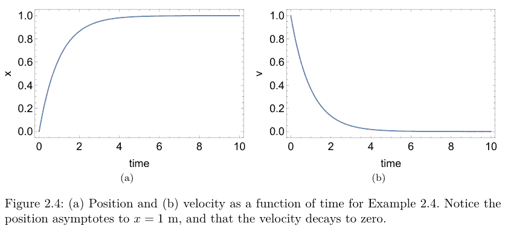

图 2.4：示例 2.4 中 (a) 位置和 (b) 速度关于时间的函数。注意位置渐近于 $x = 1$ m，而速度衰减至零。

### 示例 2.5：重力作用下的空气阻力

考虑地球表面附近下落物体的情况。假设此时阻力是线性的。那么作用在下落物体上的合力与速度 $v$ 的关系为：

$$F(v) = -bv + mg \quad (2.5.14)$$

其中我们定义 $+y$ 方向为竖直向下，因此物体的运动方向为正方向。在初始条件 $v(0) = v_0$ 和 $y(0) = y_0$ 下，求位移 $y(t)$ 和速度 $v(t)$。

**解：**

从物理角度来看，我们预期质量最初会加速，速度 $v(t)$ 会因重力而增加。随着速度 $v$ 增加，空气阻力 $-bv$ 也会增加，直到它与重力大小相等、方向相反，即直到 $F = -bv + mg = 0$。当这种情况发生时，质量达到了等于以下值的*终端速度*：

$$v_t = \frac{mg}{b} \quad (2.5.15)$$

为了得到 $v(t)$，我们使用方程 (2.5.7)，令 $t_0 = 0$：

$$t = m \int_{v'=v_0}^{v} \frac{dv'}{-bv' + mg} = -\frac{m}{b} \ln \left( \frac{\frac{mg}{b} - v}{\frac{mg}{b} - v_0} \right) \quad (2.5.16)$$

注意，在进行积分之前，我们已从积分分母中提取了常数 $b$。解出 $v(t)$，我们得到：

$$v(t) = \frac{mg}{b} + \left( v_0 - \frac{mg}{b} \right) e^{-\frac{bt}{m}} \quad (2.5.17)$$

我们还从方程 (2.4.4) 求得 $y(t)$：

$$y(t) - y_0 = \int_{t'=t_0}^{t} v(t') dt' = \int_{t'=t_0}^{t} \left[ \frac{mg}{b} + \left( v_0 - \frac{mg}{b} \right) e^{-\frac{bt'}{m}} \right] dt' \quad (2.5.18)$$

积分后得到：

$$y(t) = y_0 + \frac{mg}{b}t + \left( \frac{m^2g}{b^2} - \frac{mv_0}{b} \right) \left( e^{-\frac{bt}{m}} - 1 \right) \quad (2.5.19)$$

当 $t \to \infty$ 时，我们可以在方程 (2.5.17) 中令 $e^{-\frac{bt}{m}} \to 0$，从而得到如上所述的*终端速度*：$v_t = mg/b$。

因此，我们的解与预期的物理现象相符。物体下落时，其速度因重力而增加。然而，在某个时刻，物体运动得足够快，使得阻力等于物体的重力。此时，物体所受的合力为零，速度达到一个恒定值，称为终端速度 $v_t$，并在下落过程中保持该速度。

图 2.5 显示了示例 2.5 中求得的 $x(t)$ 和 $v(t)$ 的图像。参数的数值为 $b = 0.2$，$m = 1$，$x(0) = 0$，$v(0) = 0$，$g = 9.8$（均为国际单位制）。注意，当物体长时间下落时，其速度趋近于一个恒定值。

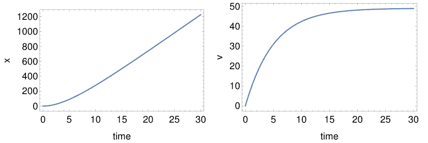

图 2.5：示例 2.5 中 (a) $x(t)$ 和 (b) $v(t)$ 的图像。该图显示了在达到终端速度（$v = m g/b = 49$ m/s）后，$x(t)$ 呈线性增长。有关生成此图的代码，请参阅本书网站。

### 示例 2.6：空气阻力与 $v^2$ 成正比

对于下落物体，更现实的阻力是与速度 $v$ 的平方成正比的力，即 $F(v) = -cv^2 + mg$。在初始条件 $v(0) = 0$ 和 $x(0) = 0$ 下，求 $x(t)$ 和 $v(t)$。

**解：**

在这种情况下，通过令 $F = -cv_t^2 + mg = 0$ 来求终端速度 $v_t$：

$$v_t = \sqrt{\frac{mg}{c}}$$

接下来，我们使用方程 (2.5.7)，通过从初始速度 $v_0$ 到最终速度 $v$ 进行积分来求 $v(t)$：

$$t = m \int_0^v \frac{dv'}{-cv'^2 + mg} = \frac{m}{c} \int_0^v \frac{dv'}{v_t^2 - v'^2}$$

我们通过分解被积函数来重写此方程，以避免在 Python 的对数函数中出现虚数。然而，这个问题在 Mathematica 代码中不存在。

$$t = \frac{m}{2v_t c} \int_0^v \left( \frac{1}{v_t + v'} + \frac{1}{v_t - v'} \right) dv'$$

$$t = \frac{m}{2v_t c} \ln \left( \frac{v_t - v}{v_t + v} \right)$$

经过一些直接的代数运算，这可以简化为：

$$t = \frac{m}{cv_t} \tanh^{-1} \left( \frac{v}{v_t} \right)$$

我们现在可以很容易地解出这个关于 $v$ 的方程，得到速度：

$$v(t) = v_t \tanh \left[ \frac{cv_t}{m} t \right]$$

我们同样可以从 (2.4.4) 式求得 $x(t)$：

$$x(t) - x_0 = \int_0^t v(t') dt' = \int_0^t v_t \tanh \left[ \frac{c v_t}{m} t' \right] dt' \quad (2.5.24)$$

$$x(t) - x_0 = \int_0^t v_t \frac{\sinh \left[ \frac{c v_t}{m} t' \right]}{\cosh \left[ \frac{c v_t}{m} t' \right]} dt' = \frac{m}{c} \ln \left( \cosh \left( \frac{c v_t}{m} t \right) \right) \quad (2.5.25)$$

令 $x_0 = 0$，可得：

$$x(t) = \frac{m}{c} \ln \left( \cosh \left( \frac{c v_t}{m} t \right) \right) \quad (2.5.26)$$

### Python 代码

在 `symbols` 命令中使用 `real=True, positive=True` 选项将 SymPy 中的参数定义为正数后，我们使用 `integrate` 来计算 (2.5.22) 式中的积分，以获得时间 $t$ 的表达式。SymPy 为 $t$ 生成的答案是复数形式，并包含几个对数项。我们使用 `logcombine` 函数并设置 `force=True` 选项来合并这些项，以确保无论参数符号如何都能进行合并。我们使用 `solve` 来获得速度 $v(t)$，其结果与 (2.5.23) 式中的解析解一致。最后，使用 `integrate` 来获得位置 $x(t)$。

```python
from sympy import symbols, integrate, logcombine, solve, cosh, sinh, log
print('-'*28, 'CODE OUTPUT', '-'*29, '\n')

v, vf, vt, t1, m, c, t = symbols('v, vf, vt, t1, m, c, t', \
    real=True, positive=True)

# evaluate integral after factoring
integral = integrate(1/(v-vt), (v,0,vf)) - integrate(1/(v+vt), (v,0,vf))

# combine logarithmic terms from integration
result = logcombine(integral, force=True)*(m/c)/(2*vt)
print('t = ', result)

v = solve(t+result, vf)[0]    # invert equation to find speed v(t)
print('v(t) = ', v)

# integrate to find x(t)
x = integrate(vt*sinh(c*t*vt/m)/cosh(c*t*vt/m), (t,0,t1))
print('x(t) = ', x)

----------------------------- CODE OUTPUT -----------------------------
t =  m*log(-(vf - vt)/(vf + vt))/(2*c*vt)
v(t) =  vt*tanh(c*t*vt/m)
x(t) =  m*log(cosh(c*t1*vt/m))/c
```

### Mathematica 代码

我们使用 `Integrate` 命令来执行积分。在进行积分时，你可能并不总是考虑变量的符号。例如，你知道终端速度是正的。然而，Mathematica 并不作这样的假设。为了执行积分并得到上述解析结果，我们需要告诉 Mathematica，最终速度（代码中的 vf）和终端速度（代码中的 vt）都是正数，并且 $vf < vt$。从物理上讲，这是假设：$m, g, k, t, v > 0$，并且 $mg > kv^2$（即空气阻力不能超过重量 $W = mg$）。符号 `&&` 代表逻辑运算符 AND。这些假设在代码的 `Assuming` 命令中提供。因此，通过将 `Integrate` 命令放在 `Assuming` 命令内部，我们是在告诉 Mathematica 在列出的假设下进行积分。

图 2.6 中绘图的参数数值为 $c = 0.2$，$m = 1$，$x(0) = 0$，$v(0) = 0$，$g = 9.8$（均为国际单位制）。

```mathematica
SetOptions[Plot, Frame->True, BaseStyle->{FontSize->16}, PlotRange->All];

integral = Assuming[vt > 0&&vf > 0&&vf < vt,
    Integrate[1/(vt^2 - v^2), {v, 0, vf}]]

ArcTanh[vf/vt]/vt

Assuming[vt > 0&&t > 0&&m > 0&&c > 0, Solve[integral * m/c==t, vf]];
velocity = First[vf/.%];
Print["The velocity v[t]=" , velocity]

The velocity v[t]=vt Tanh[(c t vt)/m]

position = Assuming[m > 0&&c > 0&&vt > 0&&tf > t,
    Integrate[velocity, {t, 0, tf}]];
Print["The position x[t]=" , position]

The position x[t]=(m Log[Cosh[(c tf vt)/m]])/c

c = 0.2; m = 1; g = 9.8; vt = Sqrt[m * g/c];
Print["Terminal velocity=" , vt, " m/s"]
GraphicsGrid[{{Plot[position, {tf, 0, 5}, FrameLabel->{"time, s", "x, m"}],
    Plot[velocity, {t, 0, 5}, FrameLabel->{"time, s", "v, m/s"}]}}]

Terminal velocity=7.0 m/s
```

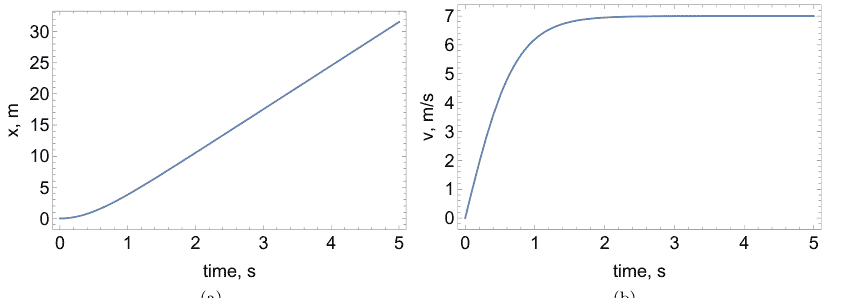

图 2.6：示例 2.6 的 (a) 位置-时间图和 (b) 速度-时间图。注意，在 $t \simeq 2$ 秒后，位移随时间线性增加，速度趋近于 7 m/s 的恒定值。

图 2.7 展示了在存在线性空气阻力 $F(v) = -bv + mg$ 和二次空气阻力 $F(v) = -cv^2 + mg$ 两种情况下，下落物体速度的比较，其中 $m = 1.0$ kg，$b = 0.2$ Ns/m，$c = 0.2$ Ns$^2$/m。$y$ 轴上的速度已通过除以相应的终端速度进行了归一化处理。注意，二次空气阻力（虚线）使物体在明显更短的时间内达到终端速度，而线性空气阻力（实线）则需要更长时间。这并不奇怪；对于给定的速度 $v$，二次阻力的大小将高于线性阻力。

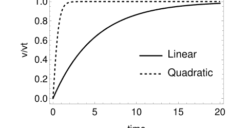

图 2.7：存在线性和二次空气阻力时下落物体速度的比较。两条曲线已通过将速度除以终端速度进行了缩放，因此当 $t \to \infty$ 时，两个图产生相同的结果。用于生成此图的代码可在本书网站上找到。

## 2.6 位置相关的力

在力是位置函数 $F = F(x)$ 的情况下，我们可以使用牛顿第二定律的形式：

$$F(x) = mv \frac{dv}{dx}$$

通过分离变量 $v$ 和 $x$，并利用初始条件 $t = 0$ 时 $x = x_0$ 和 $v = v_0$，我们得到：

$$\int_{x_0}^x F(x') \, dx' = \int_{v_0}^v m v' \, dv' = \frac{1}{2} m v^2 - \frac{1}{2} m v_0^2 \quad (2.6.2)$$

求解速度 $v(x)$ 作为位置 $x$ 的函数：

$$v(x) = \frac{2}{m} \sqrt{\int_{x_0}^x F(x') \, dx' + \frac{1}{2} m v_0^2} \quad (2.6.3)$$

通过代入 $v = dx/dt$，分离变量，并利用初始条件 $t = t_0$ 时 $x = x_0$ 进行积分，我们得到位置 $x$ 与时间 $t$ 之间的关系：

$$t - t_0 = \frac{m}{2} \int_{x_0}^x \left[ \frac{dx'}{\sqrt{\int_{x_0}^x F(x') \, dx + \frac{1}{2} m v_0^2}} \right] \quad (2.6.4)$$

在对方程 (2.6.4) 进行积分后，人们会尝试反转此公式以求得 $x(t)$，但这并非总是容易或可能做到的。在这种情况下，人们通常依赖于计算机方法。

下一个例子将涉及整个经典力学中最重要的问题之一：简谐运动（SHM）。事实上，我们将用一整章来讨论它！正如我们将在第 6 章看到的，SHM 是用于小振幅振荡的常见模型。尽管 SHM 通常被认为是“弹簧上的质量”，但它也是其他小振幅振荡的有用模型，包括摆、小振幅水波和扬声器——仅举几例。除了介绍 SHM，下一个例子还包括一个使用 Python 以封闭形式求解二阶微分方程的演示。

**示例 2.7：简谐运动**

一个质量为 $m$ 的物体受到一个位置相关的力 $F = F(x) = -kx$ 的作用，该力与物体距离平衡位置（位于 $x = 0$）的距离 $x$ 成正比。$F$ 的数学形式当然是著名的弹簧胡克定律。在初始条件 $t = 0$ 时 $v(0) = 0$ 和 $x(0) = x_0 \neq 0$ 下，求 $x(t)$ 和 $v(t)$。

**解：**

在这种情况下，(2.6.3) 式在 $v_0 = 0$ 时变为：

$$v = \frac{2}{m} \sqrt{-\int_{x_0}^x k x' \, dx' + \frac{1}{2} m v_0^2} = \frac{2}{m} \sqrt{\frac{1}{2} k (x_0^2 - x^2)} \quad (2.6.5)$$

这给出了速度 $v(x)$ 作为位置 $x$ 的函数。接下来，我们将使用 (2.6.4) 式来求 $x(t)$：

$$t = \int_{x_0}^x \frac{dx'}{\sqrt{\frac{k}{m}(x_0^2 - x'^2)}} = \sqrt{\frac{m}{k}} \sin^{-1} \left( \frac{x}{x_0} \right) \Bigg|_{x_0}^x = \sqrt{\frac{m}{k}} \left[ \sin^{-1} \left( \frac{x}{x_0} \right) - \frac{\pi}{2} \right] \quad (2.6.6)$$

或者经过一些整理：

$$x(t) = x_0 \sin\left(\sqrt{\frac{k}{m}}t + \frac{\pi}{2}\right) = x_0 \cos\left(\sqrt{\frac{k}{m}}t\right) \quad (2.6.7)$$

结果是质量围绕平衡位置 $x_0$ 振荡。因此我们发现振荡器的固有频率 $\omega$ 为 $\omega = \sqrt{\frac{k}{m}}$。

### Python 代码

在代码中，我们使用了 SymPy 库中的 `dsolve` 命令。
导入必要的命令后，我们指定变量 `m`、`k`、`t` 是实数且为正数。命令 `D` 用于代替 `diff`（参见 `import` 命令），表示 `x` 对时间的导数（参数中的两个 `t` 表示二阶导数）。参数 `init` 包含了运动的初始条件。
如果我们没有指定 $m$ 和 $k$ 是实数且为正数，而只是将它们定义为符号，Python 仍然会求解微分方程，但会产生双曲余弦函数（`cosh`）而不是余弦函数。重要的是要记住，对 CAS 算法提供的结果进行额外的代数运算以获得有用的结果，这并不罕见。这是另一个不要忘记你的数学技能，不要完全依赖计算机的原因！

```python
from sympy import diff as D
from sympy import symbols, Function, dsolve

print('-'*28,'CODE OUTPUT','-'*29,'\n')

x = Function('x')
t, x0, v0 = symbols('t, x0, v0',real=True)
k, m = symbols('k, m',real=True, positive=True)

# initial conditions
init = {x(0):x0,D(x(t),t).subs(t,0):v0}

#use dsolve to find solution of ODE
soln = dsolve(m*D(x(t),t,t) + k*x(t), simplify=True, ics=init).rhs

# substitute v(0)=0 using .subs
print('The solution is x(t) = ', soln.subs(v0,0))

----------------------------- CODE OUTPUT -----------------------------
The solution is x(t) =  x0*cos(sqrt(k)*t/sqrt(m))
```

### Mathematica 代码

使用 `DSolve`，我们可以找到位置作为时间的函数。请注意，为了分离出解，我们必须引用变量 `soln`。

soln = DSolve[{m * x''[t] == - k * x[t], x[0] == x0, x'[0] == 0}, x, t];

position = x[t] /. soln[[1]];
Print["x(t)=", position]

x(t)=x0 Cos [\frac{\sqrt{k} t}{\sqrt{m}}]

并非所有微分方程都能轻易地求得解析解，有些甚至完全无法求得解析解。在无法获得解析解的情况下，我们可以使用数值方法来求解微分方程。在下一节中，我们将讨论一种求解常微分方程的简单数值方法。

## 2.7 数值求解常微分方程的欧拉法

通常，由牛顿第二定律推导出的微分方程无法求得解析解。正如我们将在第13章看到的，当力与位置和/或速度呈非线性关系时，这一点尤其明显。然而，目前我们将探讨当常微分方程无法求得解析解时，用于求解它的数值方法。

为简单起见，让我们考虑一阶常微分方程

$$\frac{dx}{dt} = f(x)$$ (2.7.1)

求解(2.7.1)的解析方法涉及找到一个代数函数 $x(t)$，其导数为 $f(x)$。当无法（或不易）找到这样的解析解时，我们可以依赖数值方法来获得解。在这种情况下，我们找到一组值 $\{x_0, x_1, \dots, x_{n-1}\}$，它们对应于时间集合 $\{t_0, t_1, \dots, t_{n-1}\}$，使得 $x_i = x(t_i)$，其中 $t_i = i dt$，$i = 0, 1, \dots, (n-1)$。变量 $dt$ 称为*步长*，将在下文讨论。虽然我们不会得到解析解，但数值方法提供了关于解的有用信息，并且其结果可以绘图。

在实践中，你通常会使用数值常微分方程求解器，如Python的`odeint`和Mathematica的`NDSolve`。这些将在下一节以及本书的两个附录中讨论，其底层算法可能相当复杂。然而，许多常微分方程求解器与一种称为欧拉法的简单数值方法有相似之处，该方法通常在教科书中介绍。在这种方法中，导数使用牛顿的导数定义（不含极限）重写为

$$\frac{dx}{dt} = \frac{x(t + dt) - x(t)}{dt}$$ (2.7.2)

如果选择的步长 $dt$ 足够小，(2.7.2)可以很好地近似导数 $dx/dt$。然后我们可以使用(2.7.2)将(2.7.1)重写为

$$x(t + dt) = x(t) + f(x(t))dt$$ (2.7.3)

最后，将 $x(t + dt)$ 重写为 $x_i$

$$x_i = x_{i-1} + f(x_{i-1})dt$$ (2.7.4)

如果我们知道 $x(t_0) = x_0$，那么我们可以使用(2.7.4)来找到任何时间 $t_i = i dt$（即步长 $dt$ 的整数倍）的 $x(t)$。

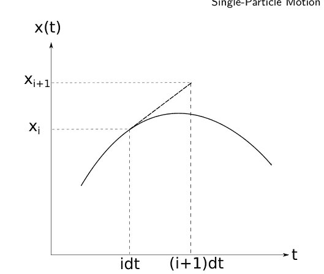

图 2.8：真实解（曲线）的斜率 $f(x_i)$（对角虚线）用于通过欧拉法近似 $x_{i+1}$。注意 $x_{i+1}$ 的值与真实解在时间 $(i + 1)dt$ 处的值之间的差异。

我们可以通过引入新变量 $v = dx/dt$ 将欧拉法扩展到二阶常微分方程。常微分方程

$$\frac{d^2x}{dt^2} = f(x, v) \qquad (2.7.5)$$

然后可以重写为耦合的一阶系统

$$\left. \begin{aligned} \frac{dx}{dt} &= v \ \frac{dv}{dt} &= f(x, v) \end{aligned} \right\} \qquad (2.7.6)$$

使用欧拉法，我们可以将(2.7.6)重写为

$$\left. \begin{aligned} x_i &= x_{i-1} + v_{i-1} dt \ v_i &= v_{i-1} + f(x_{i-1}, v_{i-1}) dt \end{aligned} \right\} \qquad (2.7.7)$$

步长 $dt$ 必须足够小，欧拉法才能提供良好的解。欧拉法通过使用解 $x_i$ 在时间 $idt$ 处的斜率 $f(x_i)$ 来线性近似 $x_{i+1}$（即解在时间 $(i + 1)dt$ 处的值）。如果步长太大，那么斜率可能无法很好地近似 $x_{i+1}$，因为真实解 $x(t)$ 可能在时间间隔 $dt$ 内发生显著变化。图 2.8 显示了一个 $x_{i+1}$ 近似效果不佳的例子。注意在图 2.8 中，当 $dt$ 较小时，斜率（对角虚线）对解 $x(t)$（曲线）给出了合理的近似。然而，对于较大的 $dt$ 值，斜率外推的值与 $x(t)$ 之间的差异会增加。选择过小的步长会累积计算每个欧拉步时产生的舍入误差。$dt$ 的最佳选择介于这两个极端之间。

欧拉法在实践中并不常用。我们在此介绍它只是为了向读者展示数值常微分方程求解器的基本概念。相反，通常使用更复杂的算法，例如具有自适应步长的四阶龙格-库塔法。

在示例 2.8 中，我们使用 Python 来演示欧拉法。在这个例子中，我们还演示了 **for** 循环的使用。

> **示例 2.8：欧拉法**

一个质量 $m = 3.0$ kg 的物体从 20 米高处静止释放。如果粒子遇到阻力 $F_d = -cv^3$，其中 $c = 2.0$ Ns$^3$/m$^3$，使用欧拉法求粒子下落第一秒内球的位置和速度随时间变化的函数。

**解：**

使用一个正位移垂直向下的坐标系，与粒子运动方程对应的常微分方程为

$$m \frac{d^2x}{dt^2} = mg - cv^3 \quad (2.7.8)$$

使用 $v = dx/dt$，我们可以使用欧拉法重写该常微分方程

$$\begin{cases} x_i = x_{i-1} + v_{i-1}dt \ v_i = v_{i-1} + \left(g - \frac{c}{m}v_{i-1}^3\right)dt \end{cases} \quad (2.7.9)$$

**Python 代码**

欧拉法的 Python 代码如下。我们首先定义必要的参数。回想一下，`np.arange` 创建一个值列表，该列表从第一个参数开始，但在第二个参数之前一步（第三个参数）结束。因此，我们使用 `t_max + dt` 来确保时间列表在 $t = 1$ 结束。注意，在定义必要的参数之后，使用了一个 `for` 循环来计算欧拉法的每次迭代。与 `np.arange` 类似，`for` 在其第二个参数之前一步结束。因此，我们需要使用 `num_steps + 1` 作为第二个参数，以确保 `x` 和 `v` 在整个时间范围内都被计算。$x$ 和 $v$ 的图可以在 [图 2.9](Figure 2.9) 中找到。

```python
import matplotlib.pyplot as plt
import numpy as np

dt, t_max = 0.05, 1    #步长，最大时间
num_steps = int(t_max/dt) #欧拉步数
m, g, c = 3.0, 9.8, 2.0  #参数和系数

times = np.arange(0,t_max + dt,dt) # x(t), v(t) 的时间

def f(v):            #定义加速度函数
    return (g - c/m*v**3)

x = np.zeros(num_steps+1) #定义 x,v 数组
v = np.zeros(num_steps+1)
x[0], v[0] = 0 ,0     # 初始条件

for i in range(1,num_steps+1):
    x[i] = x[i-1] + v[i-1] * dt
    v[i] = v[i-1] + f(v[i-1]) * dt

fig, ax = plt.subplots(nrows=1, ncols=2)
ax[0].plot(times,x)
ax[0].set_xlabel("time, s")
ax[0].set_ylabel("x(t), m")
ax[0].set_title('(a)');
ax[1].plot(times,v)
ax[1].set_xlabel("time, s")
ax[1].set_ylabel("v(t), m/s")
ax[1].set_title('(b)');
fig.tight_layout()
plt.show()
```

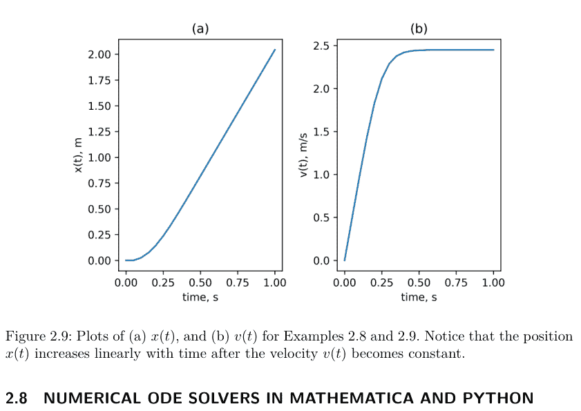

图 2.9：示例 2.8 和 2.9 的 (a) $x(t)$ 和 (b) $v(t)$ 的图。注意，在速度 $v(t)$ 变为常数后，位置 $x(t)$ 随时间线性增加。

## 2.8 MATHEMATICA 和 PYTHON 中的数值常微分方程求解器

在本节中，我们介绍 Python 和 Mathematica 两个主要的内置算法，用于数值求解常微分方程。具体来说，我们给出了使用 Python 的 `odeint` 命令和 Mathematica 的 `NDSolve` 命令的示例。这些命令的算法比上一节使用的欧拉法更复杂；然而，大多数数值算法使用步长迭代计算值。换句话说，它们根据过去在空间或时间上分离的值来估计当前值。

在示例 2.9 中，我们使用 Mathematica 和 Python 中的数值常微分方程求解器重复示例 2.8 的问题。

> **示例 2.9：使用 Mathematica 和 Python 数值求解常微分方程**

一个 3.0 kg 的粒子从 20 米高处静止释放。粒子遇到阻力 $F_d = -c v^3$，其中 $c = 2.0 \text{ Ns}^3/\text{m}^3$。使用 Mathematica 的 `NDSolve` 命令和 Python 的 `odeint` 命令，求粒子下落第一秒内球的位置和速度随时间变化的函数。

**Python 代码**

要在本例中使用 `odeint()`，我们需要将 $F_d = m g - c v^3$ 重写为两个一阶常微分方程的系统，类似于示例 2.8 中的欧拉法：

$$
\begin{cases}
\frac{dx}{dt} = v \n\frac{dv}{dt} = g - \frac{c}{m} v^3
\end{cases}
\tag{2.8.1}
$$

在代码中，我们定义了一个函数 `deriv(y, time)`，其参数是一个向量 `y` 和时间变量 `time`。在我们的例子中，向量 `y` 的第一个分量 `y[0]` 代表位置 $x$，第二个分量 $y[1]$ 是速度 $v = dx/dt$。函数 `deriv` 计算并返回一个分量为 $(v, dv/dt)$ 的向量。函数 `odeint(deriv, yinit, t)` 使用三个参数调用。第一个参数是函数 `deriv`，它包含待求解的一阶常微分方程的信息；第二个参数是初始条件向量 `yinit`；第三个参数是时间变量 $t$。代码行 `t = np.linspace(0, 1, 20)` 定义了将要积分的时间区间，在此例中为 $t = 0$ 到 $t = 1$ 秒之间。变量 `yinit = (0,0)` 定义了初始条件 $x(0) = 0$ 米，以及 $v(0) = 0$ 米/秒。请注意，`odeint` 的结果是一个矩阵，其中第一行 `soln[:,0]` 是位置 $x(t)$，第二行 `soln[:,1]` 是速度 $v$。这些行在代码末尾的绘图命令中使用，结果如图 2.9 所示。

```
from scipy.integrate import odeint
import numpy as np
import matplotlib.pyplot as plt

m, g, c = 3.0, 9.8, 2.0   #parameters and coefficients

#define function that returns coupled ODEs
def deriv(y, time):
    return (y[1], g - c/m*y[1]**3)

t = np.linspace(0,1,20)      # time values
yinit = (0,0)                #initial conditions

soln = odeint(deriv, yinit, t)  #solve the system of ODEs using odeint

fig, ax = plt.subplots(nrows=1, ncols=2)
ax[0].plot(t,soln[:,0])    #plot position x(t)
ax[0].set_xlabel("time, s")
ax[0].set_ylabel("x(t), m")
ax[0].set_title('(a)');
ax[1].plot(t,soln[:,1])    #plot speed v(t)
ax[1].set_xlabel("time, s")
ax[1].set_ylabel("v(t), m/s")
ax[1].set_title('(b)');
fig.tight_layout()
plt.show()
```

### Mathematica 代码

命令 `NDSolve` 用于求解常微分方程
$$m \frac{d^2x}{dt^2} = mg - cv^3$$
我们将 `NDSolve` 找到的解存储在变量 `soln` 中。`NDSolve` 的第一个参数是一个列表，其中包含该常微分方程（注意使用 `==` 号而非 `=`），并且还包含初始条件。在 Mathematica 中，撇号用于表示导数。`NDSolve` 的第二个参数是要求解的函数，本例中为 x(t)。第三个也是最后一个参数是时间范围。
在此示例中，我们让 Mathematica 自动调整积分条件以确保解收敛。然而，如果需要，可以使用 Mathematica 帮助文件中列出的 `NDSolve` 选项来指定积分步数和积分步长。
在创建绘图时，请注意我们使用了“替换”命令 /., 以指定 x[t] 和 x'[t] 使用存储在 soln 中的 `NDSolve` 结果来求得。

```
SetOptions[Plot, Frame->True, Axes->False, BaseStyle->{FontSize->16}];

m = 3.0; g = 9.8; c = 2.0;
tMax = 1.0;

soln = NDSolve[{m * x''[t] == m * g - c * x'[t]^3, x[0] == 0, x'[0] == 0}, x,
  {t, 0, tMax}];

GraphicsGrid[{{Plot[x[t]/.soln, {t, 0, tMax}, FrameLabel->{"time", "position"}],
  Plot[x'[t]/.soln, {t, 0, tMax}, FrameLabel->{"time", "position"}]}}]
```

## 2.9 使用数值积分函数计算积分

在本节中，我们演示两个常用于数值计算积分的命令。它们是 Python 的 `quad` 和 Mathematica 的 `NIntegrate` 命令。

### 示例 2.10：积分的数值计算
一个从原点静止开始的粒子，经历如下形式的加速度
$$a(t) = a_0 \sin^2(\omega t + \phi)$$ (2.9.1)
其中 $a_0 = 0.3 \text{ m/s}^2$，$\omega = 1.5 \text{ rad/s}$，$\phi = \pi/3$ 弧度。使用 Python 的 `quad` 和 Mathematica 的 `NIntegrate` 命令求粒子在 $t = 3.0$ 秒时的速度。
解：
要解决这个问题，我们需要使用公式 (2.4.3)：
$$v(t) - v(0) = \int_0^t a(t') dt'$$ (2.9.2)
利用 $v(0) = 0$，我们得到：
$$v(3) = \int_0^3 a_0 \sin^2(\omega t + \phi) dt$$ (2.9.3)
尽管这个积分可以解析求解，但我们将使用 `quad` 和 `NIntegrate` 来求解它。

### Python 代码

来自 SciPy 的 integrate 库的命令 `quad` 用于积分的数值计算。首先使用 `lambda` 命令将待积分函数 F 定义为一个 lambda 函数。当函数在代码中只需要短期使用时，Lambda 函数非常有用。`quad` 命令有三个参数：待积分的函数、积分下限和积分上限。输出是一个元组。元组的第一个参数是积分值，第二个参数是积分过程的估计绝对误差。

```
from scipy.integrate import quad
import numpy as np

print('-'*28,'CODE OUTPUT','-'*29,'\n')

a0, omega, phi = 0.3, 1.5, np.pi/3

F = lambda t: a0*np.sin(omega * t + phi)**2

integral = quad(F,0,3)

print('The integral = ', integral[0])
print('The absolute error =', integral[1])

-------------------------------- CODE OUTPUT --------------------------------
The integral =  0.5430573299677108
The absolute error = 1.974040231812555e-14
```

### Mathematica 代码

在 Mathematica 中，定义必要参数后，使用 `NIntegrate` 来计算定积分。

```
a0 = 0.3; \omega = 1.5; \phi = \pi/3;

NIntegrate[a0 * Sin[\omega * t + \phi]^2, {t, 0, 3}]

0.543057
```

## 2.10 用于数值计算积分的辛普森法则

在本节中，我们将展示如何使用一种称为辛普森法则的简单方法来数值计算积分。考虑以下积分

$$\int_{x_0}^{x_N} f(x')dx' \quad (2.10.1)$$

其中 $f(x)$ 是单变量函数，$x_0$ 和 $x_N$ 是常数积分限。回顾一下，积分衡量的是函数 $f(x)$ 与 $x$ 轴之间的面积。

在微积分入门中，*梯形法则* 用梯形的面积来近似 $f(x)$ 下的面积，该梯形的四个角是 $x$ 轴上的积分限以及函数在这些限处的值。

$$\int_{x_0}^{x_N} f(x')dx \approx \frac{x_N - x_0}{2} [f(x_N) - f(x_0)] \quad (2.10.2)$$

*辛普森法则* 通过将积分区域分成两个步长，在三个点 $x_0$、$x_1$ 和 $x_N$ 处对函数 $f(x)$ 进行采样（这些点等间距，间距为 $h$），来估计积分值。辛普森法则的公式为：

$$\int_{x_0}^{x_N} f(x')dx' \approx \frac{h}{3} [f(x_0) + 4f(x_1) + f(x_N)] \quad (2.10.3)$$

然而，梯形法则和辛普森法则对于实际计算通常都不够精确。我们可以通过将积分区间分成更多步长（每步间距为 $h$）来改进辛普森法则。其结果称为扩展辛普森法则

$$\int_{x_1}^{x_N} f(x')dx' = \frac{h}{3} (f_1 + 4f_2 + 2f_3 + 4f_4 + \cdots + 2f_{N-2} + 4f_{N-1} + f_N) + O\left(\frac{1}{N^4}\right) \quad (2.10.4)$$

其中 $f_i = f(x_i)$，$x_i = x_1 + ih$，$h = (x_N - x_0)/N$，$N$ 是步数。

在示例 2.11 中，我们将展示如何在 Python 中实现扩展辛普森法则，因为这是使用条件语句的一个好例子。

> **示例 2.11：扩展辛普森法则**
使用扩展辛普森法则重复示例 2.10，参数值相同。

### Python 代码
在代码中，我们使用扩展辛普森法则计算积分，同时也使用 SymPy 进行精确求解。定义力函数 F 后，我们计算积分。扩展辛普森法则中使用的系数取决于公式 (2.10.4) 右侧各项的索引。当 $i$ 为偶数时，$f_i$ 的系数为 4；当 $i$ 为奇数时，系数为 2，但 $i = 1$ 和 $i = N$ 除外。为了处理这些依赖关系，我们使用了 **if** 和 **elif** 条件语句。**if** 语句测试一个条件是否为真，如果为真，则执行缩进的代码行。
第一个 **if** 语句测试 $i = 1$ 或 $i = N$ 是否成立。如果成立，则将项 $hF(x)/3$ 加到总和中。请注意，变量 **extended** 包含公式 (2.10.4) 右侧各项的总和，命令 += 会将值加到变量 extended 上并覆盖它。如果 $i \neq 1$ 或 $N$，则评估下一个条件语句。
下一个条件语句是 **elif**，即 else-if，它通过计算 i 模 2 来测试 $i$ 是否为偶数。在 Python 中，% 符号用于模运算。**elif** 语句在第一个 **if** 语句之后提供了一个额外的条件测试，当条件有多种可能结果时（本例中 $i$ 可以是偶数、奇数、1 或 $N$），它非常有用。最后，如果以上条件语句都不返回 True，那么 $i$ 必须是奇数。**else** 条件语句告诉 Python 在没有其他先前条件为真时执行什么；在本例中，将项 $\frac{4}{3}hF(x)$ 加到总和中。

```
import numpy as np
from sympy import integrate, pi, sin, symbols
t = symbols('t')

print('-'*28,'CODE OUTPUT','-'*29,'\n')

a0, omega, phi = 0.3, 1.5, np.pi/3

a, b = 0, 3  #lower and upper limit of integration

def F(t):
    return a0*np.sin(omega*t + phi)**2

N = 1000     #number of steps

extended = 0 #parameter stores the result of integration

h = (b-a)/(N-1) #need N steps starting at an index of 0

for i in range(0,N):
    x = a + i*h
    if i==0 or i==(N-1):
        extended += h*F(x)/3.0
    elif i%2 == 0:
        extended += 2.0*h*F(x)/3.0
    else:
        extended += 4.0*h*F(x)/3.0

#exact answer obtained using integrate in SymPy
exact = integrate(a0*sin(omega*t + phi)**2,(t,0,3))

print('The extended Simpson result = ', extended)
print('The exact result = ',exact.subs({t:3}))

------------------------------------ CODE OUTPUT ------------------------------------
The extended Simpson result =  0.5429213205860004
The exact result =  0.543057329967711
```

## 2.11 章节总结

牛顿第二定律给出了质点的运动方程。该运动方程是一个微分方程，可以写成三种形式：

$$F = m \frac{d^2x}{dt^2} = m \frac{dv}{dt} = mv \frac{dv}{dx}$$

$F = m \frac{dv}{dt}$ 是一个一阶常微分方程，因为最高阶导数是一阶导数。

$F = m \frac{d^2x}{dt^2}$ 是一个二阶常微分方程，因为最高阶导数是二阶导数。

常微分方程通解中任意常数的个数等于该微分方程的阶数。

分离变量法是通过将导数视为分数来执行的，并将包含因变量（例如 $x(t)$）的项分离到一边，将包含自变量的项分离到另一边。

当加速度 $a = \text{常数}$ 时，牛顿第二定律给出运动学方程：

$$v(t) = v_0 + at \quad x(t) = x_0 + v_0t + \frac{1}{2}at^2 \quad v(x)^2 = v_0^2 + 2a(x - x_0)$$

当力仅为时间的函数 $F(t)$ 时，牛顿第二定律可以通过以下方式积分：

$$v(t) = v_0 + \frac{1}{m} \int_{t'=0}^{t} F(t') dt'$$

当力仅为速度的函数 $F(v)$ 时，牛顿第二定律可以通过以下方式积分：

$$t - t_0 = m \int_{v'=0}^{v} \frac{dv'}{F(v')}$$

空气阻力 $f(v)$ 的大小通常包含 $v$ 的线性和二次分量：

$$f(v) = bv + cv^2$$

我们通过令空气阻力等于物体的重量来求得下落物体的终端速度，即 $f(v) = bv + cv^2 = mg$。

当力仅为位置的函数 $F(x)$ 时，我们可以对以下形式的牛顿第二定律进行积分：

$$F(x) = ma = mv \frac{dv}{dx}$$

以得到函数 $v(x)$。然后再次对 $v(x) = dx/dt$ 方程进行积分，以得到位置 $x(t)$。

力学中的一个重要系统是描述胡克定律的弹簧振子系统：

$$F(x) = m \frac{d^2x}{dt^2} = -kx$$

在 $t = 0$ 时给定初始条件 $v(0) = 0$ 和 $x(0) = x_0$，该方程的解 $x(t)$ 和 $v(t)$ 为：

$$x(t) = x_0 \cos\left(\sqrt{\frac{k}{m}}t\right) \quad v(t) = dx/dt = -\omega x_0 \sin\left(\sqrt{\frac{k}{m}}t\right)$$

质量围绕平衡位置 $x_0$ 以振荡器的固有频率 $\omega$ 振荡：

$$\omega = \sqrt{\frac{k}{m}}$$

*欧拉法*是一种简单的数值技术，用于积分微分方程，它使用函数的导数来近似微分方程解的未来值。

## 2.12 章末习题

符号 🖥️ 表示需要计算机辅助的问题，形式可以是图形、数值计算或符号求值。

### 第 2.2 节：常微分方程

1.  🖥️ 放射性材料样本中的粒子数 $N(t)$ 随时间变化如下：

    $$\frac{dN}{dt} = -\lambda N \quad (2.12.1)$$

    其中 $\lambda > 0$。在 $N(0) = N_0$ 的情况下，手动求解此微分方程。绘制 $N(t)$ 随时间变化的函数图像，针对不同的 $\lambda$ 值和不同的 $N_0$ 值。$\lambda$ 的大小如何影响解？如果改变 $N_0$，解会发生什么变化？

2.  在第 6 章中，我们将看到以下微分方程：

    $$\frac{d^2x}{dt^2} = -\omega^2 x \quad (2.12.2)$$

    其中 $x(t)$ 是质点位置随时间变化的函数。求解二阶微分方程的一种方法是使用试探解。在这种情况下，该方程表明函数 $x(t)$ 的二阶导数等于其自身乘以一个负常数。哪些函数具有这种行为？正弦和余弦函数当然可以，但指数解 $x(t) = Ae^{\lambda t}$ 也可以。将指数函数作为试探解代入微分方程。为了使 $Ae^{\lambda t}$ 成为该微分方程的解，$\lambda$ 需要取什么值？

3.  考虑线性微分方程 $\ddot{x} + \dot{x} + x = f_1(t) + f_2(t)$，其中 $f_1$ 和 $f_2$ 是时间的光滑连续可微函数。在这种情况下，该常微分方程被称为非齐次微分方程，因为方程中存在明确依赖于自变量 $t$ 的项。假设你已知两个函数：$x_1(t)$ 是方程 $\ddot{x}_1 + \dot{x}_1 + x_1 = f_1(t)$ 的解，$x_2(t)$ 是方程 $\ddot{x}_2 + \dot{x}_2 + x_2 = f_2(t)$ 的解。证明 $\ddot{x} + \dot{x} + x = f_1(t) + f_2(t)$ 的解是 $x(t) = x_1(t) + x_2(t)$。将此证明推广到求解常微分方程：$\ddot{x} + \dot{x} + x = \sum_{i=1}^N f_i(t)$，其中你已知所有 $x_i(t)$，每个 $x_i(t)$ 都满足 $\ddot{x}_i + \dot{x}_i + x_i = f_i(t)$。

4.  证明第 3 题的结果对*任何*线性非齐次常微分方程都成立。

5.  考虑非齐次常微分方程 $\ddot{x} + \dot{x} + x = f(t)$，其中 $f(t)$ 是光滑连续可微函数。如果 $f(t) = 0$，则该常微分方程被称为齐次微分方程。利用第 3 题的结果，证明非齐次微分方程的解为 $x(t) = x_c(t) + x_p(t)$，其中 $x_c(t)$ 称为补解（在 $f(t) = 0$ 时求得），$x_p(t)$ 称为特解，是非齐次常微分方程 $\ddot{x} + \dot{x} + x = f(t)$ 的一个解。对*任何*线性非齐次常微分方程重复此过程。

6.  使用 Mathematica 的 `DSolve` 或 Python 的 `dsolve`，求解微分方程

    $$\frac{df}{dx} = 3\sin x - 4e^{-2x} \quad (2.12.3)$$

    初始条件为 $f(0) = 0$。绘制 $x = 0$ 到 $x = 3$ 的解。

7.  Victor 将一个质量为 $m$ 的冰球以初速度 $v_0$ 沿一个长斜坡向上滑动。斜坡与水平面的夹角为 $\theta$，动摩擦系数为 $\mu$。求冰球在停止前沿斜坡向上滑行的距离。求冰球的位置和速度随时间变化的函数。

8.  一架在高度 $H$ 飞行的飞机需要向一个小村庄的中心空投物资。飞机以水平速度 $v_0$ 飞行。忽略空气阻力，飞行员应在村庄中心前方多远距离空投物资，才能使物资落在村庄中心？

9.  一个质量为 $m$ 的球以速度 $v_0$ 被抛上一个斜面。斜面与水平面的夹角为 $\theta$，球被抛出的方向与水平方向成 $\phi$ 角。忽略空气阻力，

    a. 证明球的射程为
    $$R = \frac{2v_0^2 \sin(\phi - \theta) \cos \phi}{g \cos^2 \theta}$$

    b. 证明当 $\phi = \frac{\pi}{4} + \frac{\theta}{2}$ 时，射程最大。

10. 考虑图 2.10 所示的双阿特伍德机。用 $g$、$M$ 和 $m_2$ 表示质量 $m_1$ 的加速度。忽略摩擦，并假设滑轮无质量，绳子无质量且不可伸长。

    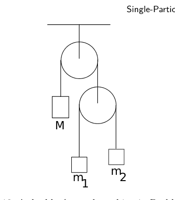

### 第 2.4 节：与时间相关的力

11. 一个质量为 $m$ 的质点从位置 $x_0$ 以速度 $v_0$ 开始运动，并受到以下力的作用（假设所有常数 $a$、$b$、$A$ 和 $\omega$ 均为正）。分别用解析方法和计算机代数系统（CAS）求 $x(t)$ 和/或 $v(t)$。

    a. $F = a + bt$
    b. $F = A\cos(\omega t)$
    c. $F = ate^{-bt}$

12. 一个 1.0 kg 的质点受到力 $F = -ae^{-\beta t}$ 的作用，其中 $a = 0.5$ N，$\beta = 0.25$ s$^{-1}$，负号表示该力与质点的速度方向相反。如果质点的初始位置和速度为 $x_0 = 0$ m 和 $v_0 = 10$ m/s，求质点的位置和速度随时间变化的函数。分别用解析方法和计算机代数系统（CAS）求解。

13. Lilly 重复了 Victor 的实验（来自第 7 题），但她的斜坡从水平开始，并以 $\omega$ rad/s 的速率增加其倾角。当斜坡与水平面的夹角达到 $\pi/3$ 弧度时，Lilly 的冰球沿斜坡移动了多远？冰球与斜坡之间的摩擦系数为 $\mu$。结果用 $\omega$、$v_0$、$\mu$ 和 $g$ 表示。

### 第 2.5 节：空气阻力与速度相关的力

14. 求一个直径为 0.25 米、质量为 $m$ 的球体在受到线性和二次空气阻力以及重力作用下的终端速度，即 $F(v) = bv + cv^2 - mg$。使用数值方法，求并绘制质点从高度 $y_0 = H$ 处由静止释放后，其位置和速度随时间变化的函数。绘图时，使用第 2.5 节中系数 $b$ 和 $c$ 的公式，并设 $m = 1$ kg，$H = 100$ m。

15. 一个质量为 $m$ 的物体受到力 $F(v) = -cv^2$ 的作用。$c$ 的国际单位制单位是什么？如果质点从原点以初始速度 $v(0) = v_0$ 开始运动，求质点的位置和速度随时间变化的函数。使用计算机代数系统（CAS）验证你的结果。

## 章末习题

16. 一个球以10 m/s的初速度向上抛出。球的质量为 $m = 0.10$ kg，所受阻力 $F = -bv$ 与球的速度成线性关系，其中 $b = 0.2$：
    a. $b$ 的国际单位制单位是什么？
    b. 球能上升多高？将你的答案与无空气阻力情况下的答案进行比较。

17. 在例2.4中，我们看到在存在线性空气阻力的情况下，下落粒子的位置和速度为：
    $$x(t) = x_0 + \frac{m v_0}{b} \left(1 - e^{-\frac{b t}{m}}\right) \quad (2.12.4)$$
    $$v(t) = v_0 e^{-\frac{b t}{m}} \quad (2.12.5)$$
    通过取 $t \to 0$ 和 $t \to \infty$ 的极限，讨论这些方程对于在重力和线性阻力作用下下落的粒子的位置和速度是否有意义。

18. 一个物体以初速度 $v_0$ 竖直向上抛出。
    a. 求在没有空气阻力的情况下，物体到达最高点所需的时间。
    b. 如果存在线性空气阻力 $F = -bv$，物体达到最大高度需要多少时间？
    c. 如果是二次空气阻力 $F = -bv^2$ 的情况呢？使用质量 $m = 1$ kg，球的初速度 $v_0 = 10$ m/s，以及两种阻力系数 $b = 0.2$（国际单位制）。

19. 使用计算机代数系统重复本章的例2.5。该例中的力由 $F(v) = -bv + mg$ 给出。求 $y(t)$ 和 $v(t)$，并绘制 $m = 1.0$ kg、$b = 0.2$ Ns/m、$x_0 = 0$ m 和 $v_0 = 0$ m/s 时的解。使用CAS，取 $t \to \infty$ 时 $v(t)$ 的极限。你可能需要做些额外工作来处理CAS提供的解，使其看起来像例2.5中找到的结果。这并不罕见，人们应该预料到需要对计算机生成的解进行一些代数操作，以便将其转换为更易读的形式。这也是人们不应放弃代数技能而完全依赖计算机的另一个原因！

20. 伊芙琳重复了维克多在第7题中的实验。然而，这一次，伊芙琳使用的斜坡对冰球施加的力是 $F(v) = -cv^2$，而不是通常的摩擦力 $\mu N$。如果冰球沿斜坡向上的初速度为 $v_0$，冰球能沿斜坡向上运动多远？冰球达到最大高度需要多少时间？

21. 考虑一艘质量为 $m$ 的船在水中行驶，受到阻力 $F(v) = -ae^{bv}$。船从原点出发，速度为 $v_0$。
    a. 分别用解析方法和CAS求船的速度随时间变化的函数。
    b. 求船瞬时停止的时间。

22. 考虑一个直径为0.5 mm的球形雨滴，在 $t = 0$ 时以1.0 m/s的速度在空气中下落。
    a. 作用在雨滴上的主要空气阻力形式是线性的还是二次的？
    b. 求描述雨滴运动的方程，并计算雨滴的终极速度。

23. 一个质量为 $m$、初速度为 $v_0$ 的物体在水平面上滑动。该物体受到阻力 $F(v) = -cv^{3/2}$。如果物体从原点开始运动，物体运动的最大距离是多少？

24. 莎拉质量为55 kg，从一架飞行在3 km高度的飞机上跳伞。
    a. 如果降落伞未能打开且忽略空气阻力，她下落需要多长时间？
    b. 如果降落伞打开，她下落需要多长时间？假设降落伞立即打开，并且莎拉带着打开的降落伞所受的阻力由下式描述：
    $$f = -\frac{1}{2}c_d\rho Av^2 \quad (2.12.6)$$
    其中降落伞面积 $A=46 \text{ m}^2$，阻力系数 $c_d = 1.5$。空气密度 $\rho = 1.22 \text{ kg/m}^3$。

25. 考虑一个质量为1 kg的下落物体，受到空气阻力 $F(v) = -c|v|v$，其中 $c = 0.5 \text{ Ns}^2/\text{m}^2$。
    a. 假设下落物体从静止开始，使用计算机计算物体下落1 km所需的时间。
    b. 下落物体的速度是否会变得恒定？换句话说，对于这个力，是否存在终极速度？

### 第2.6节：位置相关的力

26. 一个质量为 $m$ 的粒子具有速度 $v(x) = ax^{-n}$。求作用在粒子上的力。如果在 $t = 0$ 时，粒子处于位置 $x_0$ 并以速度 $v_0$ 运动，求粒子的位置和速度随时间变化的函数。

27. 求一个质量为 $m$ 的粒子从原点静止开始，在力 $F = a + bx$ 作用下的速度 $v(x)$ 和位置 $x(t)$，其中 $a, b$ 是具有适当国际单位制单位的常数。为简化起见，使用数值 $a = 2$、$b = 2$ 和质量 $m = 2$。

28. 计算重力加速度作为物体在地球表面上方高度 $y$ 的函数。绘制从 $y = 0$ 到25 km的结果。*提示：* 使用牛顿万有引力定律：
    $$F_g = -\frac{Gm_1m_2}{r^2} \quad (2.12.7)$$
    其中 $G = 6.67 \times 10^{-11} \text{ Nm}^2/\text{kg}^2$ 是万有引力常数，$m_1$ 和 $m_2$ 是相互作用物体的质量，$r$ 是 $m_1$ 和 $m_2$ 中心之间的距离。假设下落物体是一个质点，并忽略空气阻力。

29. 如第28题所发现的，下落物体的加速度随高度变化。结果表明，加速度的变化规律为：
    $$g = \frac{9.8 \text{ m/s}^2}{\left(1 + \frac{y}{R_e}\right)^2}$$
    其中 $R_e = 6.37 \times 10^6$ m 是地球半径，$y$ 是物体在地球表面上方的高度，$g$ 的单位是 m/s$^2$。计算一个质量 $m = 1$ kg、直径 $D = 1$ m 的物体从25 km高度下落并落到地球表面所需的时间，假设存在二次空气阻力。物体的最终速度是多少？你需要一台计算机来解决这个问题。

30. 一个质量为 $m$ 的粒子受到力 $F = cvx$，其中 $c > 0$，$x$ 和 $v$ 分别是位置和速度。如果在 $t = 0$ 时，粒子以速度 $v = v_0$ 经过原点，求粒子的位置随时间变化的函数。

### 第2.7节：数值方法

31. 使用欧拉法，求解第1题中的常微分方程，其中 $N_0 = 10^5$ 个粒子，$\lambda = 0.1$ s$^{-1}$，时间范围 $0 \le t \le 10$ 秒。在同一张图上绘制欧拉解和精确解析解 $N = N_0 \exp(-\lambda t)$。函数 $N(t)$ 应呈指数衰减。选择足够小的 $dt$ 值，以获得正确的函数形式。

32. 一个质量为 $m = 0.2$ kg 的粒子以 $v_0 = 10$ m/s 的速度水平运动，此时受到阻力 $F = -0.2v^2$（力的单位是N）。手动求解 $v(t)$。使用欧拉法，数值求解 $v(t)$ 并绘图。使用足够小的 $dt$ 值以获得正确结果。

33. 考虑常微分方程
    $$\frac{d^2x}{dt^2} = -\omega^2 x$$
    使用变量 $v = dx/dt$，将该常微分方程重写为一阶常微分方程组。使用 $\omega = 1$ rad/s 和欧拉法，在初始条件 $x(0) = 1.0$ m 和 $v(0) = 0$ m/s 下，求解时间范围 $0 \le t \le 30$ s 的耦合常微分方程组。使用 $dt = 0.01$ s。

34. 考虑第33题。使用更大的 $dt$ 值重复该问题。当 $dt$ 变得太大时，解会发生什么变化？绘制不同 $dt$ 值的结果。

35. 欧拉-克罗默法为振荡系统产生稳定的解。考虑一个牛顿第二定律形式的常微分方程
    $$\frac{d^2x}{dt^2} = a$$
    其中 $a$ 是加速度（不一定恒定），我们设质量 $m = 1$（国际单位制）。使用变量 $v = dx/dt$，(2.12.10) 可以使用欧拉-克罗默法重写为
    $$\begin{cases} v_{n+1} = v_n + a_n dt \\ x_{n+1} = x_n + v_{n+1} dt \end{cases}$$

注意公式 (2.12.11) 第二行中 $v$ 的下标。使用 Python 编写一个算法，该算法采用欧拉-克罗默方法求解方程 (2.12.10)，其初始条件和参数值与第 33 题相同。

36. 考虑一个质量为 $m$ 的粒子，受到合力 $F = -b \sin x$ 的作用。在 $t = 0$ 时，粒子从静止开始运动。使用 Python 或 Mathematica，通过数值微分方程求解器（如 `odeint` 或 `NDSolve`）求出粒子的位置 $x(t)$。讨论当 $x(0) = \pi/6$、$x(0) = \pi/2$ 和 $x(0) = 7\pi/8$ 时粒子的运动情况。设定 $m=b=1$（国际单位制）。

37. 考虑一个质量为 $m$ 的粒子，受到线性恢复力 $F(x) = -k x$、二次阻力 $F(v) = -c v^2$ 以及正弦外部驱动力 $F(t) = A \cos(\omega t)$ 的作用，其中 $k = 3$ N/m，$c = 0.5$ Ns$^2$/m，$\omega = 1.0$ rad/s，$m = 1$ kg，$A = 2.0$ N。写出由此产生的运动方程的常微分方程（ODE）。如果粒子的初始位置和速度为 $x(0) = 0$ m 和 $v(0) = 0$ m/s，使用数值微分方程求解器（如 `odeint` 或 `NDSolve`）求出粒子的位置和速度作为时间的函数。描述粒子的运动。

38. 中点法是另一种数值积分函数的方法。假设函数 $f(x)$ 定义在区间 $[a, b]$ 上。我们使用点 $x_i = a + i\Delta x$（其中 $x_N = b$）将区间细分为长度相等的子区间 $\Delta x = (b - a) / N$。然后可以将积分近似为

$$\int_a^b f(x)dx = \sum_{i=1}^N f\left(\frac{x_{i+1} - x_i}{2}\right) \Delta x \qquad (2.12.12)$$

编写一个程序，使用中点法求解示例 2.10，其中我们计算了积分

$$v(3) = \int_0^3 a_0 \sin^2(\omega t + \phi) dt \qquad (2.12.13)$$

其中 $a_0 = 0.3$ m/s$^2$，$\omega = 1.5$ rad/s，$\phi = \pi/3$ 弧度。将中点法的结果与扩展辛普森法则（使用相同的步长）以及使用 SciPy 的 `quad` 库的结果进行比较。

39. 粒子的速度（国际单位制）可以用函数描述

$$v(t) = 2.0e^{-\lambda t} \cos(\omega t)$$

其中 $\lambda = 0.001$ s$^{-1}$，$\omega = 1.0$ rad/s。假设粒子从原点开始运动。

- a. 解析地和使用计算机代数系统（CAS）计算粒子的位置 $x(t)$。
- b. 使用你选择的数值积分技术，求出粒子在时间 $t = 2.0$ 秒时的位置。

40. 力 $F$ 的冲量 $J$ 定义为

$$J = \Delta p = \int_{t_0}^t F(t') dt \qquad (2.12.14)$$

一个质量为 $m = 1.0 \text{ kg}$ 的粒子受到力 $F(t) = c / (t^3 + b^3)$ 的作用，其中 $b = 1.0 \text{ s}$，$c = 2.0 \text{ Ns}^3$。使用你选择的数值积分技术，求出粒子在时间 $t = 2.5$ 秒时的动量。假设粒子在时间 $t_0 = 0$ 时静止。

# 3 二维和三维运动

在上一章中，我们通过使用标量位置参数 $x$ 在一维中研究了粒子运动的运动学和动力学方面。在本章中，我们将首先使用笛卡尔坐标 $(x, y, z)$ 描述粒子在二维和三维中的运动。描述二维和三维运动需要使用向量。在回顾向量的基本性质并引入点积和叉积之后，我们将介绍向量导数。向量导数对于计算速度和加速度向量是必要的。然后，我们描述极坐标、柱坐标和球坐标，并演示如何在这些坐标系中描述粒子的位置、速度和加速度。最后，我们以物理学各领域常用的一些特殊向量导数结束本章，例如梯度、散度和旋度。

## 3.1 笛卡尔坐标系中的位置、速度和加速度

为了描述粒子在二维和三维中的运动，我们需要使用向量。在本节中，我们将回顾向量的主要性质，并将其应用于描述三维中粒子的位置、速度和加速度。在第 1 章中，我们使用笛卡尔坐标介绍了位置、速度和加速度的概念。在本节中，我们将扩展该讨论。对笛卡尔坐标中运动基本描述量的扩展讨论将为我们描述其他坐标系中的这些量做好准备。

三维空间中的一个点 $P_1$ 可以用从原点 $(0, 0, 0)$ 到点 $P_1$ 的向量 $\mathbf{A}$ 表示，如图 3.1 所示。这样的向量 $\mathbf{A}$ 沿 $x$、$y$ 和 $z$ 轴有三个分量，可以写成 $\mathbf{A} = [A_x, A_y, A_z]$ 的形式，或笛卡尔坐标形式：

$$\mathbf{A} = A_x \hat{\mathbf{i}} + A_y \hat{\mathbf{j}} + A_z \hat{\mathbf{k}} \quad (3.1.1)$$

其中 $\hat{\mathbf{i}}$、$\hat{\mathbf{j}}$、$\hat{\mathbf{k}}$ 分别是沿 $x$、$y$ 和 $z$ 轴的单位向量。

向量 $\mathbf{A}$ 的大小 $A$ 由勾股定理求得：

$$A = |\mathbf{A}| = \sqrt{A_x^2 + A_y^2 + A_z^2} \quad (3.1.2)$$

向量的大小通常被认为是其长度，并对应于从向量测量的量。例如，假设 $\mathbf{A}$ 表示位于点 $\mathbf{A} = 3 \ m \hat{\mathbf{i}} + 4 \ m \hat{\mathbf{j}}$ 的粒子的位置。$\mathbf{A}$ 的大小为 $|\mathbf{A}| = 5 \ m$，表示粒子与原点之间的距离。

了解向量指向的方向通常很有用。对于像 $\mathbf{A} = 3\hat{\mathbf{i}}$ 这样沿 $x$ 轴指向的简单向量，这很容易找到。然而，其他像 $\mathbf{A} = a\hat{\mathbf{i}} + b\hat{\mathbf{j}}$ 这样的向量不沿 $x$ 轴或 $y$ 轴。在这种情况下，我们需要一个与向量 $\mathbf{A}$ 方向相同但长度为 1 的*单位向量*。我们可以通过将 $\mathbf{A}$ 除以其大小来获得任何向量 $\mathbf{A}$ 方向上的单位向量 $\hat{\mathbf{A}}$：

$$\hat{\mathbf{A}} = \frac{\mathbf{A}}{|\mathbf{A}|} = \frac{\mathbf{A}}{\sqrt{A_x^2 + A_y^2 + A_z^2}} \quad (3.1.3)$$

### 示例 3.1：求单位向量。

求沿向量 **a**=[1, 3, -1] 方向的单位向量。

**解：**
我们将向量写为 **a** = $a_x\hat{\mathbf{i}} + a_y\hat{\mathbf{j}} + a_z\hat{\mathbf{k}} = 1\hat{\mathbf{i}} + 3\hat{\mathbf{j}} - 1\hat{\mathbf{k}}$。为了求单位向量，将向量除以其大小：

$$\hat{\mathbf{a}} = \frac{\mathbf{a}}{\sqrt{a_x^2 + a_y^2 + a_z^2}} = \frac{1\hat{\mathbf{i}} + 3\hat{\mathbf{j}} - 1\hat{\mathbf{k}}}{\sqrt{1^2 + 3^2 + 1^2}} = \frac{1}{\sqrt{11}}\hat{\mathbf{i}} + \frac{3}{\sqrt{11}}\hat{\mathbf{j}} - \frac{1}{\sqrt{11}}\hat{\mathbf{k}}$$

### Python 代码

正如我们在[第 1 章](Chapter 1)中看到的，Python 中的向量可以使用从 `sympy.vector` 库导入的 `CoordSys3D` 命令来描述。在这个库中，我们定义一个坐标系 `C= CoordSys3D('C')`，其中笛卡尔坐标 $(x, y, z)$ 在内部表示为 `C.x`、`C.y`、`C.z`。相应的单位向量 $\hat{\mathbf{i}}$、$\hat{\mathbf{j}}$、$\hat{\mathbf{k}}$ 由 `C.i`、`C.j`、`C.k` 表示。选择字母 `C` 没有什么特别之处；也可以选择任何其他字母。
向量 **a**=[1, 3, -1] 表示为 `a = 1*C.i +3* C.j - C.k`，我们使用 `a.normalize` 方法来求单位向量 $\hat{\mathbf{a}}$。请注意，SymPy 不会自动将项 $\sqrt{11}/11$ 简化为 $1/\sqrt{11}$。

```python
from sympy.vector import CoordSys3D

print('-'*28,'CODE OUTPUT','-'*29,'\n')

C = CoordSys3D('C')       # 笛卡尔系统命名为 C
                          # 具有单位向量 C.i , C.j , C.k

a = 1*C.i +3* C.j - C.k   # 向量 a 定义所需方向

n = a.normalize()          # n= 归一化后的向量 a

print('The normalized vector a is:\n',n)

------------------------------------ CODE OUTPUT ------------------------------------
The normalized vector a is:
(sqrt(11)/11)*C.i + (3*sqrt(11)/11)*C.j + (-sqrt(11)/11)*C.k
```

### Mathematica 代码

在 Mathematica 代码中，向量表示为 `A={1,3,-1}`，我们使用 `Norm(A)` 命令来求给定向量的大小。我们通过除以其大小来归一化向量。

A = {1, 3, -1};

Print["归一化向量为", A/Norm[A]]

归一化向量为 $\left\{\frac{1}{\sqrt{11}}, \frac{3}{\sqrt{11}}, -\frac{1}{\sqrt{11}}\right\}$

如果我们知道空间中两点 $P_1$ 和 $P_2$ 的坐标，那么我们可以通过分别减去它们的 $x$-、$y$-、$z$-分量来找到连接这两点的向量。例如，在图 3.1b 中，令 $\mathbf{r}_1$ 为从原点到 $P_1$ 的向量，$\mathbf{r}_2$ 为从原点到 $P_2$ 的向量。从 $P_2$ 到 $P_1$ 的向量 $\mathbf{r}_{12}$ 可以通过首尾相接法画出，并由下式给出（见图 3.1b）：

> **连接空间中两点的向量 $\mathbf{r}_{12}$**

$$\mathbf{r}_{12} = \mathbf{r}_2 - \mathbf{r}_1$$

(3.1.4)

既然我们已经介绍了一些向量背后的基本概念，我们就可以将它们应用于运动的基本描述符。如第 1 章所述，三维空间中粒子的笛卡尔坐标位置矢量函数 $\mathbf{r}(t) = (x(t), y(t), z(t))$ 写为：

> **位置矢量**

$$\mathbf{r}(t) = x(t)\hat{\mathbf{i}} + y(t)\hat{\mathbf{j}} + z(t)\hat{\mathbf{k}}$$

(3.1.5)

这是一个矢量值函数，$x(t)$、$y(t)$、$z(t)$ 分别是表示在时间 $t$ 沿 $x$-、$y$- 和 $z$-轴位置的标量函数。向量 $\mathbf{r}(t)$ 的尾部在原点，头部在时间 $t$ 粒子的位置。位置矢量的大小等于粒子与原点之间的距离。

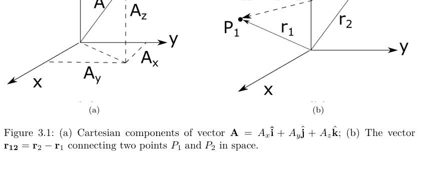

位置矢量的导数是粒子的*速度* **v**(*t*)。为了求速度，我们需要知道如何对向量求导。图 3.2 说明了向量函数 **r** 的导数。不失一般性，**r** 可以被视为位置矢量；然而，以下内容对任何向量都成立。为了使向量函数的导数存在，该向量函数必须是标量变量 *t* 的连续函数。向量函数 **r**(*t*) 在图 3.2 中显示为虚线，其中向量 **r** 在时间 *t* 和 *t* + Δ*t* 处显示。向量 Δ**r** = **r**(*t* + Δ*t*) − **r**(*t*) 表示向量函数值的变化，并且当 Δ*t* → 0 时其大小会减小。因此，我们可以使用标准公式求导：

$$\frac{d\mathbf{r}}{dt} = \lim_{\Delta t \to 0} \frac{\Delta \mathbf{r}}{\Delta t} = \lim_{\Delta t \to 0} \frac{\mathbf{r}(t + \Delta t) - \mathbf{r}(t)}{\Delta t} \quad (3.1.6)$$

注意，在 Δ*t* → 0 的极限下，向量 *d***r**/*dt* 变为与图 3.2 所示曲线相切。

向量函数的导数遵循你已经知道的微分规则：

$$\frac{d}{dt}(\mathbf{r} + \mathbf{s}) = \frac{d\mathbf{r}}{dt} + \frac{d\mathbf{s}}{dt} \quad (3.1.7)$$
$$\frac{d}{dt}(c\mathbf{r}) = c\frac{d\mathbf{r}}{dt} \quad (3.1.8)$$

其中 **r** 和 **s** 是变量 *t* 的向量函数，*c* 是标量常数。

既然我们知道如何对向量函数求导，我们就可以计算速度矢量：

$$\frac{d\mathbf{r}(t)}{dt} = \frac{d}{dt} \left( x(t)\hat{\mathbf{i}} + y(t)\hat{\mathbf{j}} + z(t)\hat{\mathbf{k}} \right) \quad (3.1.9)$$
$$= \frac{d}{dt} \left( x(t)\hat{\mathbf{i}} \right) + \frac{d}{dt} \left( y(t)\hat{\mathbf{j}} \right) + \frac{d}{dt} \left( z(t)\hat{\mathbf{k}} \right) \quad (3.1.10)$$

然而，笛卡尔坐标系中的单位向量是常向量。因此，速度矢量可以求得为：

> **速度矢量**
$$\mathbf{v}(t) = \frac{d\mathbf{r}}{dt} = \frac{dx}{dt}\hat{\mathbf{i}} + \frac{dy}{dt}\hat{\mathbf{j}} + \frac{dz}{dt}\hat{\mathbf{k}} \quad (3.1.11)$$

因为速度矢量是位置矢量的导数，所以速度矢量将始终与粒子所遵循的路径相切。

速度矢量 **v**(*t*) 的大小 *v*(*t*) 称为*速率*：

$$v(t) = |\mathbf{v}(t)| = \sqrt{\left(\frac{dx}{dt}\right)^2 + \left(\frac{dy}{dt}\right)^2 + \left(\frac{dz}{dt}\right)^2} \quad (3.1.12)$$

方程 (3.1.12) 也可以用沿描述运动的曲线 *C* 的弧长 *s* 来表示，该弧长是从曲线上某个初始位置开始测量的。为了使用弧长，我们需要定义沿曲线的无穷小位移，

$$d\mathbf{s} = dx\,\hat{\mathbf{i}} + dy\,\hat{\mathbf{j}} + dz\,\hat{\mathbf{k}} \quad (3.1.13)$$

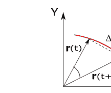

图 3.2：向量函数 **r** 在时间 $t$ 和 $t + \Delta t$ 处的图示。在极限 $\Delta t \to 0$ 下，向量 $\Delta \mathbf{r}/\Delta t$ 变为导数向量函数 $d\mathbf{r}/dt$，它与曲线相切。

微分距离 $ds$ 是无穷小位移的大小，由下式给出

$$ds = \sqrt{(dx)^2 + (dy)^2 + (dz)^2}$$ (3.1.14)

方程 (3.1.12) 现在可以用弧长 $s$ 表示为：

$$v(t) = |\mathbf{v}(t)| = \frac{ds}{dt}$$ (3.1.15)

沿描述运动的曲线 $C$ 的单位切向量 $\hat{\mathbf{v}}$ 通过将速度矢量 $\mathbf{v}(t)$ 除以其大小 $v$ 得到：

$$\hat{\mathbf{v}} = \frac{\mathbf{v}(t)}{v(t)}$$ (3.1.16)

注意单位切向量 $\hat{\mathbf{v}}$ 指向速度方向，并且始终与曲线 $C$ 相切。如何计算单位切向量的示例在示例 3.2 中给出。

类似地，速度矢量的导数 $d\mathbf{v}/dt$ 是加速度矢量函数，在笛卡尔坐标系中为：

> **加速度矢量**
$$\mathbf{a}(t) = \frac{d\mathbf{v}}{dt} = \frac{d^2\mathbf{r}}{dt^2} = \frac{d^2x}{dt^2}\hat{\mathbf{i}} + \frac{d^2y}{dt^2}\hat{\mathbf{j}} + \frac{d^2z}{dt^2}\hat{\mathbf{k}}$$ (3.1.17)

> **示例 3.2：求单位切向量。**

粒子在 3D 空间中沿曲线 $C$ 的位置由参数方程 $x = \sin(2t)$、$y = t^2$、$z = 5$ 给出，其中 $t$ 表示时间，$x$、$y$、$z$、$t$ 均采用国际单位制。(a) 求在时间 $t = 1$ s 时速度和加速度的大小。(b) 求在时间 $t$ 与曲线 $C$ 相切的单位向量 $\hat{\mathbf{v}}$ 的一般表达式。

**解：**

(a) 速度矢量的大小是速率 $v$：
$$v(t) = \sqrt{\left(\frac{dx}{dt}\right)^2 + \left(\frac{dy}{dt}\right)^2 + \left(\frac{dz}{dt}\right)^2} = \sqrt{[2\cos(2t)]^2 + (2t)^2}$$

加速度矢量的大小为：

$$a(t) = \sqrt{\left(\frac{d^2x}{dt^2}\right)^2 + \left(\frac{d^2y}{dt^2}\right)^2 + \left(\frac{d^2z}{dt^2}\right)^2} = \sqrt{[-4\sin(2t)]^2 + (2)^2}$$

在时间 $t = 1$ s 时，这些大小为：

$$v(1) = \sqrt{[2\cos(2)]^2 + (2)^2} = 2.2 \text{ m/s}$$
$$a(1) = \sqrt{[4\sin(2)]^2 + (2)^2} = 4.2 \text{ m/s}^2$$

(b) 在任何时间 $t$ 与曲线 $C$ 相切的单位向量 $\hat{\mathbf{v}}$ 由下式求得：

$$\hat{\mathbf{v}} = \frac{\mathbf{v}(t)}{v(t)} = \frac{1}{v(t)} \left( \frac{dx(t)}{dt} \hat{\mathbf{i}} + \frac{dy(t)}{dt} \hat{\mathbf{j}} + \frac{dz(t)}{dt} \hat{\mathbf{k}} \right)$$

通过计算导数并代入 (a) 部分中的速率 $v(t)$：

$$\hat{\mathbf{v}} = \frac{1}{v(t)} \left( 2\cos(2t)\hat{\mathbf{i}} + 2t\hat{\mathbf{j}} \right) = \frac{1}{\sqrt{[2\cos(2t)]^2 + (2t)^2}} \left( 2\cos(2t)\hat{\mathbf{i}} + 2t\hat{\mathbf{j}} \right)$$

下一个示例展示了当给定加速度矢量时如何计算位置矢量。正如你可能预料的那样，该问题涉及对加速度进行积分。

### 示例 3.3：从加速度矢量求位置和速度。

在笛卡尔平面中运动的粒子的加速度由矢量给出：
$$\mathbf{a}(t) = \sin(2t)\hat{\mathbf{i}} + \cos(2t)\hat{\mathbf{j}}$$
其中 $t$ 是时间，所有物理量均采用国际单位制测量。求速度矢量 $\mathbf{v}(t)$ 和位置矢量 $\mathbf{r}(t)$。假设粒子在时间 $t = 0$ 时静止且位于原点。

**解：**
由于 $\mathbf{a}(t) = d\mathbf{v}(t)/dt$，我们可以通过积分求得速度和位置。就像对向量求导一样，对向量积分也可以一次对一个分量进行：

$$\mathbf{v}(t) = \int \mathbf{a}(t) dt$$
$$= \int \left( \sin(2t)\hat{\mathbf{i}} + \cos(2t)\hat{\mathbf{j}} \right) dt$$
$$= \int \sin(2t)\hat{\mathbf{i}} dt + \int \cos(2t)\hat{\mathbf{j}} dt$$
$$= -\frac{\cos(2t)}{2}\hat{\mathbf{i}} + \frac{\sin(2t)}{2}\hat{\mathbf{j}} + \mathbf{c}$$

其中 $\mathbf{c}$ 是积分常矢量，可以根据时间 $t = 0$ 时的初始条件求得。由于粒子在 $t = 0$ 时静止，我们必须有 $\mathbf{v}(0) = 0$，即，

$$\mathbf{v}(0) = -\frac{\cos(0)}{2}\hat{\mathbf{i}} + \frac{\sin(0)}{2}\hat{\mathbf{j}} + \mathbf{c} = 0$$

由此可得 $\mathbf{c} = \left(\frac{1}{2}\right) \hat{\mathbf{i}}$。

位置通过对速度矢量积分求得：

$$\mathbf{r}(t) = \int \mathbf{v}(t) dt = \int \left( -\frac{\cos(2t)}{2} \hat{\mathbf{i}} + \frac{\sin(2t)}{2} \hat{\mathbf{j}} + \frac{1}{2} \hat{\mathbf{i}} \right) dt$$
$$= -\frac{1}{4} \sin(2t) \hat{\mathbf{i}} - \frac{1}{4} \cos(2t) \hat{\mathbf{j}} + \frac{1}{2} t \hat{\mathbf{i}} + \mathbf{d}$$

其中 $\mathbf{d}$ 是第二个积分常矢量，可由初始位置条件 $\mathbf{r}(0) = 0$ 求得。将 $\mathbf{r}(0) = 0$ 代入，我们得到

$$\mathbf{r}(0) = -\frac{1}{4} \sin(0) \hat{\mathbf{i}} - \frac{1}{4} \cos(0) \hat{\mathbf{j}} + \frac{1}{2} 0 \hat{\mathbf{i}} + \mathbf{d} = 0$$

由此可得 $\mathbf{d} = \left(-\frac{1}{4}\right) \hat{\mathbf{j}}$。同样，我们利用了笛卡尔坐标系中的单位矢量 $\hat{\mathbf{i}}$ 和 $\hat{\mathbf{j}}$ 是常矢量，因此可以移到每个积分号之外这一事实。

三个矢量函数 $\mathbf{r}(t)$、$\mathbf{v}(t)$ 和 $\mathbf{a}(t)$ 依赖于单一参数 $t$，代表时间。如果给定显式函数 $x(t)$、$y(t)$、$z(t)$，那么运动粒子的路径可以在三维空间中使用计算机绘制所谓的*参数图*；参见后面的示例 3.4 和 3.5。参数图使用函数 $x(t)$、$y(t)$ 和 $z(t)$ 来绘制一条代表粒子所走路径的曲线。曲线上的每个点对应于不同时间 $t$ 的 $x$、$y$ 和 $z$ 坐标。

在二维运动的情况下，如果给定显式函数 $x(t)$ 和 $y(t)$，我们或许可以从联立方程 $x = x(t)$、$y = y(t)$ 中消去变量 $t$。如果其中一个方程可以解出 $t$，则将得到的表达式代入另一个方程，即可得到 $y(x)$ 的表达式。在某些情况下，没有一个封闭形式的单一等式能等价于参数方程。类似的过程可以在三维中使用，以得到 $z(x, y)$。示例 3.4 和 3.5 展示了如何在 Mathematica 和 Python 中创建二维和三维的参数图。

### 示例 3.4：二维粒子运动的参数方程。

使用 Python 和 Mathematica 中适当的参数绘图命令，绘制当 $(x, y)$ 位置由参数方程给出的二维粒子运动：

$$x = \cos(t) \quad y = \cos(2t)$$

其中参数 $t$ 的范围是从 $0$ 到 $2\pi$。

**解：**

可以使用 $\cos(2t) = 2\cos^2(t) - 1$ 从 $x(t)$ 和 $y(t)$ 方程中消去时间参数 $t$，得到：

$$y = \cos(2t) = 2x^2 - 1$$

这个方程是 xy 平面上的抛物线方程。

### Python 代码

我们导入 Matplotlib 并使用 NumPy 中的 `linspace` 来定义时间值 `t`。Python 和 Mathematica 代码都产生相同的图，Mathematica 代码的结果如图 3.3 所示。

```
import numpy as np
import matplotlib.pyplot as plt

t = np.linspace(0,2*np.pi,200)    # define parameter t
plt.plot(np.cos(t),np.cos(2*t))   # parametric plot x=cos(t), cos(t)

plt.xlabel("x")
plt.ylabel("y")
plt.show()
```

### Mathematica 代码

Mathematica 中的等效代码使用 `ParametricPlot` 命令。

```
SetOptions[ParametricPlot, BaseStyle->FontSize->16, Frame->True];
ParametricPlot[{Cos[t], Cos[2 * t]}, {t, 0, 2 * Pi}, AxesLabel->{x, y}]
```

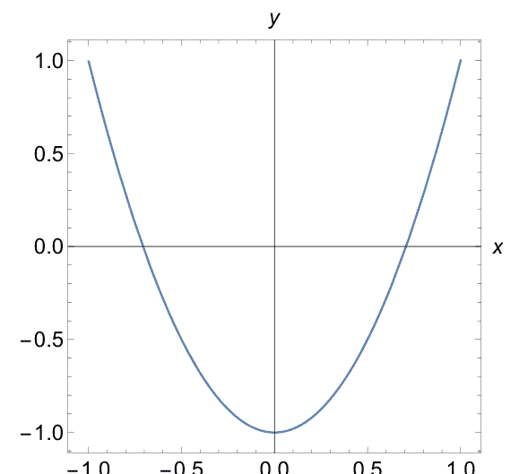

图 3.3：由示例 3.4 中的代码生成的二维函数 $(x(t), y(t))$ 的参数图。

### 示例 3.5：三维粒子运动的参数方程。

绘制当 $(x, y, z)$ 位置由参数方程给出的三维粒子运动：

$$x = d + a \cos(2t) \quad y = e + b \sin(2t) \quad z = ct$$

其中时间参数 $t$ 的范围是 $0$ 到 $T$。使用数值 $a = 2$、$b = 4$、$c = 1$、$d = 1$、$e = 2$、$T = 12$（所有量均为国际单位制）绘制运动。

**解：**
可以通过解出 $\cos(t)$ 和 $\sin(t)$ 并代入恒等式 $\cos^2(u) + \sin^2(u) = 1$，从 $x(t)$、$y(t)$ 方程中消去时间参数 $t$：

$$\left(\frac{x-d}{a}\right)^2 + \left(\frac{y-e}{b}\right)^2 = \cos^2(2t) + \sin^2(2t) = 1$$

这是 $xy$ 平面上中心在 $(d, e)$ 的椭圆方程。由于 $z = ct$，因此可以预期运动是沿着 $z$ 轴以匀速 $c$ 移动的椭圆螺旋线形式。

### Python 代码

该代码创建了这些 $(x, y, z)$ 方程在三维空间中的参数图。Python 代码和 Mathematica 代码都产生相同的图，如图 3.4 所示。

```
import matplotlib.pyplot as plt
import numpy as np

t = np.linspace(0,4,50)    # time values from t=0 to t=12 s

x = 1+2*np.cos(2*t)
y = 2+4*np.sin(2*t)       # define x(t), y(t), z(t)
z = t

fig = plt.figure()         # set up 3D plot and plot
ax = fig.add_subplot(projection='3d')

ax.plot3D(x,y,z)          # plot parametric curve x(t),y(t),z(t)
ax.set_xlabel('x')         # label x,y,z axes
ax.set_ylabel('y')
ax.set_zlabel('z')
plt.show()
```

### Mathematica 代码

Mathematica 中的代码使用 `ParametricPlot3D` 命令，图形选项通过 `SetOptions[ParametricPlot3D]` 设置。

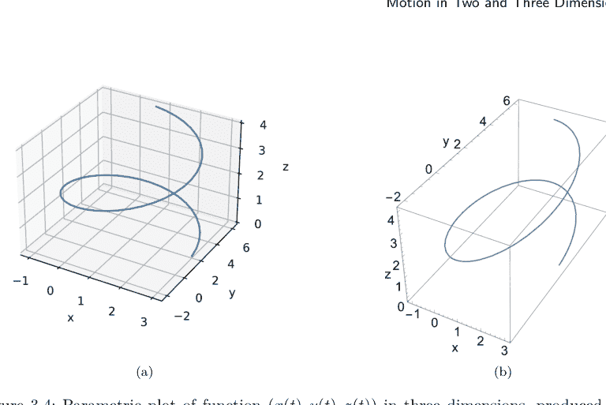

图 3.4：由示例 3.5 中的 (a) Python 和 (b) Mathematica 代码生成的三维函数 $(x(t), y(t), z(t))$ 的参数图。

```
mathematica
SetOptions[ParametricPlot3D, BaseStyle->FontSize->20];
ParametricPlot3D[{1 + 2 * Cos[2 * t], 2 + 4 * Sin[2 * t], t}, {t, 0, 4},
AxesLabel->{x, y, z}]
```

## 3.2 矢量积

有两种将矢量相乘的方法：点积和叉积。这两种方法在物理学中都非常有用。

### 3.2.1 点积

考虑两个矢量 $\mathbf{A} = [A_x, A_y, A_z]$ 和 $\mathbf{B} = [B_x, B_y, B_z]$。它们之间的*点积*或标量积 $\mathbf{A} \cdot \mathbf{B}$ 定义为：

$$\mathbf{A} \cdot \mathbf{B} = A_x B_x + A_y B_y + A_z B_z \quad (3.2.1)$$

并产生一个标量。点积的另一种定义是：

$$\mathbf{A} \cdot \mathbf{B} = AB \cos \theta \quad (3.2.2)$$

其中 $A$ 和 $B$ 分别是矢量 $\mathbf{A}$ 和 $\mathbf{B}$ 的模，$\theta$ 是两个矢量之间的夹角，如图 3.5 所示。注意，点积是将 $\mathbf{B}$ 的模乘以 $\mathbf{A}$ 在 $\mathbf{B}$ 方向上的分量。一个涉及点积的物理例子是功的定义。恒力所做的功可以计算为 $W = \mathbf{F} \cdot \mathbf{r}$，其中力 $\mathbf{F}$ 沿位移 $\mathbf{r}$ 作用于粒子。对粒子做功的力分量平行于粒子的位移。

使用点积来计算功，是因为我们需要 **F** 在 **r** 方向上的分量。

方程 (3.2.2) 可用于求两个矢量之间的夹角：

$$\cos \theta = \frac{\mathbf{A} \cdot \mathbf{B}}{AB} = \frac{A_x B_x + A_y B_y + A_z B_z}{\left(\sqrt{A_x^2 + A_y^2 + A_z^2}\right)\left(\sqrt{B_x^2 + B_y^2 + B_z^2}\right)}$$ (3.2.3)

点积也可以从几何上解释为矢量 **A** 在矢量 **B** 方向上的*标量投影*，如图 3.5 所示。如果你想知道矢量 **A** 沿矢量 **B** 方向的分量，这很有用。首先，我们创建指向 **B** 方向的单位矢量 $\hat{\mathbf{B}} = \mathbf{B}/|\mathbf{B}|$。标量投影等于 $A_B = \mathbf{A} \cdot \hat{\mathbf{B}} = |\mathbf{A}| \cos \theta$。**A** 在 **B** 上的*矢量投影*是 $\text{proj}_{\mathbf{B}}\mathbf{A} = A_B \hat{\mathbf{B}}$。

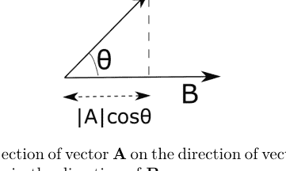

图 3.5：矢量 **A** 在矢量 **B** 方向上的标量投影是 $\mathbf{A} \cdot \hat{\mathbf{B}} = |\mathbf{A}| \cos \theta$，其中 $\hat{\mathbf{B}}$ 是 **B** 方向上的单位矢量。

两个矢量 **A** 和 **B** 的点积有几个代数关系，其中大多数是直观的。如果 **A**、**B** 和 **C** 是实矢量，$c$ 是标量，则以下性质成立。

点积满足交换律：

$$\mathbf{A} \cdot \mathbf{B} = \mathbf{B} \cdot \mathbf{A}$$ (3.2.4)

点积对矢量加法满足分配律：

$$\mathbf{A} \cdot (\mathbf{B} + \mathbf{C}) = \mathbf{A} \cdot \mathbf{B} + \mathbf{A} \cdot \mathbf{C}$$ (3.2.5)

同样，对于标量 $c$，我们可以证明：

$$\mathbf{A} \cdot (c\mathbf{B}) = c(\mathbf{A} \cdot \mathbf{B})$$ (3.2.6)

两个非零矢量 **A** 和 **B** *正交*当且仅当

$$\mathbf{A} \cdot \mathbf{B} = 0$$ (3.2.7)

矢量正交的几何解释是它们垂直，即它们之间的夹角 $\theta = \pi/2$。最后，乘积法则适用于点积：

$$\frac{d}{dt}(\mathbf{A} \cdot \mathbf{B}) = \frac{d\mathbf{A}}{dt} \cdot \mathbf{B} + \mathbf{A} \cdot \frac{d\mathbf{B}}{dt}$$ (3.2.8)

### 示例 3.6：计算点积。

解析地求向量 $\mathbf{A} = 3\hat{\mathbf{i}} + 4\hat{\mathbf{j}} - \hat{\mathbf{k}}$ 和 $\mathbf{B} = \hat{\mathbf{i}} - \hat{\mathbf{j}} - \hat{\mathbf{k}}$ 的点积，并使用 Python 和 Mathematica 中的相应代码进行计算。

#### 解答：

*标量*点积是通过将单位向量 $\hat{\mathbf{i}}, \hat{\mathbf{j}}, \hat{\mathbf{k}}$ 的系数相乘再相加得到的：

$$\mathbf{A} \cdot \mathbf{B} = (3\hat{\mathbf{i}} + 4\hat{\mathbf{j}} - \hat{\mathbf{k}}) \cdot (\hat{\mathbf{i}} - \hat{\mathbf{j}} - \hat{\mathbf{k}})$$
$$= (3)(1) + (4)(-1) + (-1)(-1) = 0$$

### Python 代码

在 Python 代码中，从 `sympy.vector` 库导入了 `CoordSys3D` 命令，并定义了一个坐标系 `C= CoordSys3D('N')`，其中笛卡尔坐标 $(x, y, z)$ 在内部表示为 `N.x`, `N.y`, `N.z`。使用 `A.dot(B)` 方法来计算两个向量的点积。

```
from sympy.vector import CoordSys3D

print('-'*28,'CODE OUTPUT','-'*29,'\n')

N = CoordSys3D('N')       # Define the reference frame N

A = 3*N.i+4*N.j-1*N.k     # Define vectors A, B in N
B = 1*N.i-1*N.j-1*N.k

dotprod = A.dot(B)

print('The dot product A.B = ',dotprod)

------------------------------------ CODE OUTPUT ------------------------------------
The dot product A.B =  0
```

### Mathematica 代码

Mathematica 代码使用命令 `Dot[A,B]`，向量 $\mathbf{A}$ 和 $\mathbf{B}$ 以笛卡尔分量列表的形式输入。

```
A = {3, 4, -1};
B = {1, -1, -1};
Print["The dot product of A.B = ", Dot[A, B]]
The dot product of A.B = 0
```

### 示例 3.7：使用点积求单位向量。

一个粒子在三维空间中沿曲线 $C$ 的位置由参数方程 $x = t^2$, $y = t$, $z = 5$ 给出，其中 $t$ 表示时间，所有量均采用国际单位制。粒子的速度为 $\mathbf{v}(t)$

- (a) 求在任意时间 $t$ 与曲线 $C$ 相切的单位向量。
- (b) 证明向量 $d\hat{\mathbf{v}}/dt$ 在*任意*时间 $t$ 都垂直于单位向量 $\hat{\mathbf{v}}$。
- (c) 求在时间 $t = 1$ s 时垂直于单位向量 $\hat{\mathbf{v}}$ 的单位向量 $\mathbf{N}$。

#### 解答：

(a) 速度向量为：

$$\mathbf{v}(t) = \frac{dx(t)}{dt}\hat{\mathbf{i}} + \frac{dy(t)}{dt}\hat{\mathbf{j}} + \frac{dz(t)}{dt}\hat{\mathbf{k}} = (2t)\hat{\mathbf{i}} + (1)\hat{\mathbf{j}} = 2t\hat{\mathbf{i}} + \hat{\mathbf{j}}$$

在任意时间 $t$ 与曲线 $C$ 相切的单位向量 $\hat{\mathbf{v}}$ 可按示例 3.2 的方法求得：

$$\hat{\mathbf{v}} = \frac{\mathbf{v}(t)}{v(t)} = \frac{2t\hat{\mathbf{i}} + \hat{\mathbf{j}}}{\sqrt{(2t)^2 + (1)^2}} = \frac{2t\hat{\mathbf{i}} + \hat{\mathbf{j}}}{\sqrt{4t^2 + 1}}$$

在 $t = 1$ s 时，我们得到单位切向量 $\hat{\mathbf{v}} = \left(2\hat{\mathbf{i}} + \hat{\mathbf{j}}\right) / \sqrt{5}$。

(b) 由于 $\hat{\mathbf{v}}$ 是模为 1 的单位向量，点积 $|\hat{\mathbf{v}}|^2 = \hat{\mathbf{v}} \cdot \hat{\mathbf{v}} = 1$。对时间 $t$ 微分 $|\hat{\mathbf{v}}|^2$，我们得到：

$$\hat{\mathbf{v}} \cdot \frac{d\hat{\mathbf{v}}}{dt} + \frac{d\hat{\mathbf{v}}}{dt} \cdot \hat{\mathbf{v}} = 2\hat{\mathbf{v}} \cdot \frac{d\hat{\mathbf{v}}}{dt} = 0$$

因此，向量 $d\hat{\mathbf{v}}/dt$ 在*任意*时间 $t$ 都垂直于切向单位向量 $\hat{\mathbf{v}}$，其计算如下：

$$\frac{d\hat{\mathbf{v}}}{dt} = \frac{d}{dt} \left[ \frac{2t\hat{\mathbf{i}} + \hat{\mathbf{j}}}{\sqrt{4t^2 + 1}} \right] = \frac{(2)\hat{\mathbf{i}} + (-4t)\hat{\mathbf{j}}}{(4t^2 + 1)^{3/2}}$$

(c) 由 (b) 部分，我们在 $t = 1$ s 时得到：$\frac{d\hat{\mathbf{v}}}{dt} = 5^{-3/2} \left(2\hat{\mathbf{i}} - 4\hat{\mathbf{j}}\right)$，其模为：

$$\left| \frac{d\hat{\mathbf{v}}}{dt} \right| = \sqrt{\left( \frac{2}{(5)^{3/2}} \right)^2 + \left( \frac{-4}{(5)^{3/2}} \right)^2} = \frac{\sqrt{20}}{(5)^{3/2}}$$

所求的垂直于该方向的单位向量 $\mathbf{N}$ 可通过将 $d\hat{\mathbf{v}}/dt$ 除以其模得到：

$$\mathbf{N} = \frac{\frac{d\hat{\mathbf{v}}}{dt}}{\left| \frac{d\hat{\mathbf{v}}}{dt} \right|} = \frac{\frac{2\hat{\mathbf{i}} - 4\hat{\mathbf{j}}}{(5)^{3/2}}}{\frac{\sqrt{20}}{(5)^{3/2}}} = \frac{2\hat{\mathbf{i}} - 4\hat{\mathbf{j}}}{\sqrt{20}}$$

### 3.2.2 叉积

两个向量 $\mathbf{A}$ 和 $\mathbf{B}$ 的*叉积*或*向量积*记为 $\mathbf{A} \times \mathbf{B}$，它被定义为一个垂直于*两个*向量 $\mathbf{A}$ 和 $\mathbf{B}$ 的向量 $\mathbf{C}$，如图 3.6(a) 所示。叉积向量 $\mathbf{A} \times \mathbf{B}$ 的*方向*由图 3.6(b) 所示的右手定则给出。该向量的*模*等于由向量 $\mathbf{A}$ 和 $\mathbf{B}$ 构成的平行四边形的面积，如图 3.6(c) 所示。

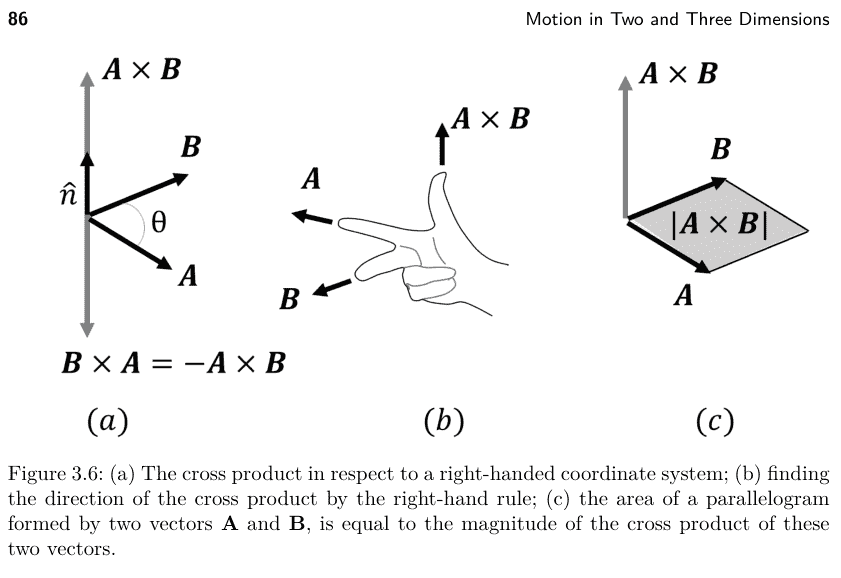

叉积的模由公式定义

$$\mathbf{A} \times \mathbf{B} = ab \sin \theta \, \hat{\mathbf{n}}$$ (3.2.9)

其中 $\theta$ 是 $\mathbf{A}$ 和 $\mathbf{B}$ 之间的夹角（$0 \le \theta \le \pi$），$a = |\mathbf{A}|$ 和 $b = |\mathbf{B}|$ 是向量 $\mathbf{A}$ 和 $\mathbf{B}$ 的模，$\hat{\mathbf{n}}$ 是一个垂直于包含 $\mathbf{A}$ 和 $\mathbf{B}$ 的平面的单位向量，其方向由图 3.6(a) 所示的右手定则给出。如果向量 $\mathbf{A}$ 和 $\mathbf{B}$ 平行（即它们之间的夹角 $\theta$ 为 0 弧度或 $\pi$ 弧度），则 $\mathbf{A}$ 和 $\mathbf{B}$ 的叉积为零向量 $\mathbf{0}$。

叉积的模是向量 $\mathbf{A}$ 的模与 $\mathbf{B}$ 垂直于 $\mathbf{A}$ 的分量的乘积。我们可以使用公式 $\mathbf{N} = \mathbf{r} \times \mathbf{F}$ 来计算施加在门上的力矩，其中 $\mathbf{N}$ 是力 $\mathbf{F}$ 施加的力矩，$\mathbf{r}$ 是从旋转轴指向力作用点的向量。对于一扇门，向量 $\mathbf{r}$ 沿门的方向，从铰链指向门的边缘，即施加开门力的位置。我们知道，导致门旋转的力分量垂直于门，而平行于门的力分量不会引起旋转。因此，使用叉积来计算力矩，因为我们需要的是垂直于 $\mathbf{r}$ 的力分量。

两个向量 $\mathbf{a} = [a_1, a_2, a_3]$ 和 $\mathbf{b} = [b_1, b_2, b_3]$ 的叉积也可以用形式矩阵的*行列式*表示：

$$\mathbf{a} \times \mathbf{b} = \begin{vmatrix} \hat{\mathbf{i}} & \hat{\mathbf{j}} & \hat{\mathbf{k}} \\ a_1 & a_2 & a_3 \\ b_1 & b_2 & b_3 \end{vmatrix}$$ (3.2.10)

该行列式可以沿第一行使用余子式展开，得到：

$$\mathbf{a} \times \mathbf{b} = \begin{vmatrix} a_2 & a_3 \\ b_2 & b_3 \end{vmatrix} \hat{\mathbf{i}} - \begin{vmatrix} a_1 & a_3 \\ b_1 & b_3 \end{vmatrix} \hat{\mathbf{j}} + \begin{vmatrix} a_1 & a_2 \\ b_1 & b_2 \end{vmatrix} \hat{\mathbf{k}}$$ (3.2.11)

这直接给出了所得叉积向量的分量：

$$\mathbf{a} \times \mathbf{b} = (a_2b_3 - a_3b_2)\hat{\mathbf{i}} + (a_3b_1 - a_1b_3)\hat{\mathbf{j}} + (a_1b_2 - a_2b_1)\hat{\mathbf{k}} \quad (3.2.12)$$

与点积类似，叉积也有一些熟悉的代数恒等式。叉积对加法满足分配律：

$$\mathbf{a} \times (\mathbf{b} + \mathbf{c}) = \mathbf{a} \times \mathbf{b} + \mathbf{a} \times \mathbf{c} \quad (3.2.13)$$

同样，对于标量 $c$，我们可以证明：

$$(c\mathbf{a}) \times \mathbf{b} = \mathbf{a} \times (c\mathbf{b}) = c(\mathbf{a} \times \mathbf{b}) \quad (3.2.14)$$

与点积不同，叉积是反交换的，即

$$\mathbf{b} \times \mathbf{a} = -(\mathbf{a} \times \mathbf{b}) \quad (3.2.15)$$

这个性质很容易通过考虑右手定则得出；当两个向量互换时，叉积向量的符号会反转。导数的乘积法则也适用于叉积：

$$\frac{d}{dt}(\mathbf{a} \times \mathbf{b}) = \frac{d\mathbf{a}}{dt} \times \mathbf{b} + \mathbf{a} \times \frac{d\mathbf{b}}{dt} \quad (3.2.16)$$

> **示例 3.8：使用 Python 和 Mathematica 的叉积示例。**
> 解析地求向量 $\mathbf{A} = 3\mathbf{i} + 4\mathbf{j} - \mathbf{k}$ 和 $\mathbf{B} = \mathbf{i} - \mathbf{j} - \mathbf{k}$ 的叉积，并使用 Python 和 Mathematica 中的相应代码进行计算。

**解答：**
叉积通过行列式求得：
$$\mathbf{A} \times \mathbf{B} = \begin{vmatrix} \mathbf{i} & \mathbf{j} & \mathbf{k} \\ 3 & 4 & -1 \\ 1 & -1 & -1 \end{vmatrix} = \begin{vmatrix} 4 & -1 \\ -1 & -1 \end{vmatrix} \mathbf{i} - \begin{vmatrix} 3 & -1 \\ 1 & -1 \end{vmatrix} \mathbf{j} + \begin{vmatrix} 3 & 4 \\ 1 & -1 \end{vmatrix} \mathbf{k} = -5\mathbf{i} + 2\mathbf{j} - 7\mathbf{k}$$

**Python 代码**
我们使用 `CoordSys3D('N')` 定义参考系 $N$。使用 `A.cross(B)` 方法来计算两个向量的叉积。

```
from sympy.vector import CoordSys3D

print('-'*28,'CODE OUTPUT','-'*29,'\n')

N = CoordSys3D('N')       # Define the coordinate system N

A = 3*N.i+4*N.j-1*N.k     # Define vectors A, B in N
B = 1*N.i-1*N.j-1*N.k

crossprod = A.cross(B)

print('The cross product A.B = ',crossprod)

-------------------------------- CODE OUTPUT --------------------------------
The cross product A.B =  (-5)*N.i + 2*N.j + (-7)*N.k
```

### Mathematica 代码

Mathematica 代码使用命令 `Cross[A,B]`，向量 **A** 和 **B** 以笛卡尔分量列表的形式输入。

```
A = {3, 4, -1};
B = {1, -1, -1};
Print["The cross product of A.B = ", Cross[A, B]]
The cross product of A.B = {-5, 2, -7}
```

### 示例 3.9：使用叉积求单位向量

求一个垂直于向量 **a** = [1, 3, -1] 和 **b** = [4, -2, 1] 的单位向量。

#### 解答：

我们首先计算两个向量的叉积，因为我们知道它将垂直于这两个向量。叉积为：

$$\mathbf{c} = \mathbf{a} \times \mathbf{b} = \begin{vmatrix} \hat{\mathbf{i}} & \hat{\mathbf{j}} & \hat{\mathbf{k}} \\ 1 & 3 & -1 \\ 4 & -2 & 1 \end{vmatrix} = \begin{vmatrix} 3 & -1 \\ -2 & 1 \end{vmatrix} \hat{\mathbf{i}} - \begin{vmatrix} 1 & -1 \\ 4 & 1 \end{vmatrix} \hat{\mathbf{j}} + \begin{vmatrix} 1 & 3 \\ 4 & -2 \end{vmatrix} \hat{\mathbf{k}} = 1\hat{\mathbf{i}} - 5\hat{\mathbf{j}} - 14\hat{\mathbf{k}}.$$

为了求单位向量，我们将此向量除以其模长。$\mathbf{a} \times \mathbf{b}$ 的模长为：

$$|\mathbf{a} \times \mathbf{b}| = \sqrt{1^2 + 5^2 + (-14)^2} = \sqrt{222}$$

所需的单位向量为

$$\hat{\mathbf{c}} = \frac{\mathbf{c}}{\sqrt{c_x^2 + c_y^2 + c_z^2}} = \frac{1\hat{\mathbf{i}} - 5\hat{\mathbf{j}} - 14\hat{\mathbf{k}}}{\sqrt{222}} = \frac{1}{\sqrt{222}}\hat{\mathbf{i}} - \frac{5}{\sqrt{222}}\hat{\mathbf{j}} - \frac{14}{\sqrt{222}}\hat{\mathbf{k}}$$

### Python 代码

在 Python 代码中，我们定义了一个坐标系 `C= CoordSys3D('N')`，并使用 `A.cross(B)` 方法来计算两个向量的叉积。`.normalize` 方法用于求沿叉积方向的单位向量。

```
from sympy.vector import CoordSys3D

print('-'*28,'CODE OUTPUT','-'*29,'\n')

N = CoordSys3D('N')       # Define the reference frame N

A = 1*N.i+3*N.j-1*N.k     # Define vectors A, B in N
B = 4*N.i-2*N.j+1*N.k

crossprod = A.cross(B)

answer = crossprod.normalize()
print('The normalized vector is = \n',answer)

----------------------------- CODE OUTPUT -----------------------------
The normalized vector is = 
(sqrt(222)/222)*N.i + (-5*sqrt(222)/222)*N.j + (-7*sqrt(222)/111)*N.k
```

### Mathematica 代码

在下面的 Mathematica 代码中，我们使用 `Cross[A,B]` 命令来求叉积，并使用 `Norm[c]` 命令来求给定向量的模长。

```
A = {1, 3, -1};
B = {4, -2, 1};
c = Cross[A, B];

Print["The cross product of A.B = ", c]
Print["The normalized vector is", c/Norm[c]]

The cross product of A.B = {1, -5, -14}
The normalized vector is {1/sqrt(222), -5/sqrt(222), -7*sqrt(2/111)}
```

一个涉及叉积的有用数学构造是*三重积*，它有两种不同的形式。

三个向量的*标量三重积*定义为

$$\mathbf{a} \cdot (\mathbf{b} \times \mathbf{c})$$

注意，这个表达式意味着我们首先计算向量 $\mathbf{b}$ 和 $\mathbf{c}$ 的叉积，然后计算向量 $\mathbf{a}$ 与 $\mathbf{b} \times \mathbf{c}$ 之间的点积。标量三重积的模长表示以 $\mathbf{a}$、$\mathbf{b}$ 和 $\mathbf{c}$ 为边的平行六面体的体积 $V$。由于这三个向量 $\mathbf{a}$、$\mathbf{b}$、$\mathbf{c}$ 可以互换，以下三个标量三重积彼此相等，并且都等于体积 $V$：

$$\mathbf{a} \cdot (\mathbf{b} \times \mathbf{c}) = \mathbf{b} \cdot (\mathbf{c} \times \mathbf{a}) = \mathbf{c} \cdot (\mathbf{a} \times \mathbf{b}) = V$$

*向量三重积*是一个向量与另一个叉积结果的叉积，并通过以下恒等式与点积相关联：

$$\mathbf{a} \times (\mathbf{b} \times \mathbf{c}) = \mathbf{b}(\mathbf{a} \cdot \mathbf{c}) - \mathbf{c}(\mathbf{a} \cdot \mathbf{b})$$

助记词“BAC minus CAB”常用于记忆此方程右侧向量的顺序。这个公式在物理学中用于简化向量计算。另一个有用的恒等式将叉积与标量三重积联系起来：

$$(\mathbf{a} \times \mathbf{b}) \times (\mathbf{a} \times \mathbf{c}) = (\mathbf{a} \cdot (\mathbf{b} \times \mathbf{c}))\mathbf{a}$$

> **示例 3.10：三重积的计算**
> 使用 Mathematica 和 SymPy 来证明三重积恒等式：
> $$\mathbf{a} \cdot (\mathbf{b} \times \mathbf{c}) = \mathbf{b} \cdot (\mathbf{c} \times \mathbf{a})$$
> 对于*任意*向量 **a**、**b** 和 **c**。

**Python 代码**
在坐标系 N 中，向量 $a_x\hat{\mathbf{i}} + a_y\hat{\mathbf{j}} + a_z\hat{\mathbf{k}}$ 写作 `ax*N.i+ay*N.j+az*N.k`。`A.cross(B)` 和 `A.dot(B)` 方法用于计算两个向量的叉积和点积。该恒等式通过使用双等号逻辑符号 `==` 进行测试，此处计算结果为 `True`。

```
from sympy.vector import CoordSys3D
from sympy import symbols
print('-'*28,'CODE OUTPUT','-'*29,'\n')

N = CoordSys3D('N')                    # Define the Cartesian frame N
ax, ay, az = symbols('ax, ay, az')     # Components of vectors a, b, c
bx, by, bz = symbols('bx, by, bz')
cx, cy, cz = symbols('ax, ay, cz')

a = ax*N.i+ay*N.j+az*N.k               # Define vectors a, b, c
b = bx*N.i+by*N.j+bz*N.k
c = cx*N.i+cy*N.j+cz*N.k

product1 = a.dot(b.cross(c))           # Evaluate a.(bxc)
product2 = b.dot(c.cross(a))           # Evaluate b.(cxa)

check=(product1.expand()==product2.expand())  # test with ==
print('\nThe identity   a.(bxc) = b.(cxa)   is: ',check)

----------------------------------- CODE OUTPUT -----------------------------------

The identity   a.(bxc) = b.(cxa)   is:  True
```

### Mathematica 代码

通过组合 `Dot` 和 `Cross` 命令，在下面的代码中验证了这些恒等式。恒等式的两边通过使用布尔等号 `==` 设置为相等，Mathematica 对逻辑语句返回 `True`。

```
a = {ax, ay, az};
b = {bx, by, bz};
c = {cx, cy, cz};

Print["The triple product of a.(bxc) = "]

Print[Dot[a, Cross[b, c]]]

The triple product of a.(bxc) =
az(-by cx + bx cy) + ay(bz cx - bx cz) + ax(-bz cy + by cz)

check = (Dot[a, Cross[b, c]]==Dot[b, Cross[c, a]]//Simplify);

Print["The identity a.(bxc)= b.(cxa) is: ", check]

The identity a.(bxc)= b.(cxa) is: True
```

## 3.3 非笛卡尔坐标系中的位置、速度和加速度

在本节中，我们讨论如何在笛卡尔坐标以外的坐标系中描述粒子的运动。新的坐标系通常利用问题中的对称性，使得非笛卡尔坐标系成为描述粒子运动的更自然的手段。例如，被约束沿圆周运动的粒子在极坐标中比在笛卡尔坐标中更容易描述。

### 3.3.1 极坐标

图 3.7 显示了位于 xy 平面上点 $P$ 的粒子的位置 $(x,y)$。使用极坐标，位置也可以由与 $x$ 轴的夹角 $\theta$ 和表示到原点距离的半径 $r$ 来描述。

笛卡尔坐标 $(x,y)$ 与极坐标 $r, \theta$ 之间的关系为：

**从极坐标到笛卡尔坐标**
$$x = r \cos \theta \quad (3.3.1)$$
$$y = r \sin \theta \quad (3.3.2)$$

**从笛卡尔坐标到极坐标**
$$r = \sqrt{x^2 + y^2} \quad (3.3.3)$$
$$\theta = \tan^{-1}(y/x) \quad (3.3.4)$$

我们也可以使用欧拉公式将位置向量写成以下形式的复数：

$$z = x + iy = r(\cos \theta + i \sin \theta) = re^{i\theta}$$

这个复数的复共轭为：

$$\bar{z} = r(\cos \theta - i \sin \theta) = re^{-i\theta}$$

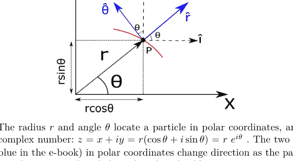

通过将最后两个方程相加和相减，我们得到了正弦和余弦函数的*欧拉公式*。这些方程提供了分析学和三角学之间的强大联系，应该牢记。

> **欧拉恒等式**

$$\cos \theta = \frac{e^{i\theta} + e^{-i\theta}}{2}$$

$$\sin \theta = \frac{e^{i\theta} - e^{-i\theta}}{2i}$$

$$e^{i\theta} = \cos \theta + i \sin \theta$$

$$e^{-i\theta} = \cos \theta - i \sin \theta$$

虽然极坐标对于描述粒子的位置很方便，特别是对于被约束沿弧线或圆周运动的粒子，但单位向量需要特别注意。在笛卡尔坐标中，单位向量 $\hat{\mathbf{i}}$ 和 $\hat{\mathbf{j}}$ 总是分别指向 $x$ 轴和 $y$ 轴方向，无论粒子的位置如何。然而，单位极向量 $\hat{\mathbf{r}}$ 和 $\hat{\boldsymbol{\theta}}$ 的方向会随着粒子的位置而变化。这在图 3.7 中可以清楚地看到。

单位向量 $\hat{\mathbf{r}}$ 总是指向径向向外的方向。在 $xy$ 平面中运动的粒子的位置向量可以用单位向量 $\hat{\mathbf{r}}$ 表示为：

$$\mathbf{r} = r\hat{\mathbf{r}}$$

## 非笛卡尔坐标系中的位置、速度和加速度

为了在极坐标中求得速度和加速度，我们首先需要用 $\hat{\mathbf{i}}$ 和 $\hat{\mathbf{j}}$ 来表示单位向量 $\hat{\mathbf{r}}$ 和 $\hat{\boldsymbol{\theta}}$。利用图 3.7 所示的几何关系，我们可以写出：

$$\hat{\mathbf{r}} = \cos \theta \hat{\mathbf{i}} + \sin \theta \hat{\mathbf{j}}$$
$$(3.3.12)$$
$$\hat{\boldsymbol{\theta}} = -\sin \theta \hat{\mathbf{i}} + \cos \theta \hat{\mathbf{j}}$$
$$(3.3.13)$$

如预期所示，其中 $|\hat{\boldsymbol{\theta}}| = |\hat{\mathbf{r}}| = 1$，且两个单位向量彼此垂直，即 $\hat{\boldsymbol{\theta}} \cdot \hat{\mathbf{r}} = 0$。

单位向量 $\hat{\mathbf{r}}$ 和 $\hat{\boldsymbol{\theta}}$ 的方向随时间变化，我们可以利用链式法则计算它们的时间导数：

$$\frac{d}{dt} \hat{\mathbf{r}} = \frac{d}{dt} [\cos \theta \hat{\mathbf{i}} + \sin \theta \hat{\mathbf{j}}] = -\sin \theta \frac{d\theta}{dt} \hat{\mathbf{i}} + \cos \theta \frac{d\theta}{dt} \hat{\mathbf{j}} = \frac{d\theta}{dt} [-\sin \theta \hat{\mathbf{i}} + \cos \theta \hat{\mathbf{j}}]$$
$$(3.3.14)$$

结合前两个方程，我们得到：

$$\frac{d\hat{\mathbf{r}}}{dt} = \frac{d\theta}{dt} \hat{\boldsymbol{\theta}}$$
$$(3.3.15)$$

通过类似的方法，我们可以得到单位向量 $\hat{\boldsymbol{\theta}}$ 的时间导数：

$$\frac{d\hat{\boldsymbol{\theta}}}{dt} = -\frac{d\theta}{dt} \hat{\mathbf{r}}$$
$$(3.3.16)$$

现在，我们可以通过对位置向量 $\mathbf{r}$ 求一阶时间导数来计算极坐标中的速度向量：

$$\mathbf{v} = \frac{d\mathbf{r}}{dt} = \frac{d}{dt} (r\hat{\mathbf{r}}) = \frac{dr}{dt} \hat{\mathbf{r}} + r \frac{d\hat{\mathbf{r}}}{dt}$$
$$(3.3.17)$$

将 (3.3.15) 代入 (3.3.17)，我们得到极坐标中的速度向量：

$$\mathbf{v} = \frac{d\mathbf{r}}{dt} = \frac{dr}{dt} \hat{\mathbf{r}} + r \frac{d\theta}{dt} \hat{\boldsymbol{\theta}}$$
$$(3.3.18)$$

该方程中的两个速度分量具有不同的物理意义。第一项 $\mathbf{v}_r = \frac{dr}{dt} \hat{\mathbf{r}}$ 代表速度的径向分量，它沿着半径 $r$ 的方向。第二项 $\mathbf{v}_{\theta} = r \frac{d\theta}{dt} \hat{\boldsymbol{\theta}} = r\omega \hat{\boldsymbol{\theta}}$ 与角速度 $\omega = d\theta/dt$ 成正比，代表粒子沿 $\hat{\boldsymbol{\theta}}$ 方向的速度。这第二个分量也代表匀速圆周运动的速度。

从 (3.3.18) 出发，通过消去方程两边的微分时间 $dt$，我们可以得到极坐标中空间两点间的无穷小位移 $d\mathbf{s}$：

$$d\mathbf{s} = dr \hat{\mathbf{r}} + r d\theta \hat{\boldsymbol{\theta}}$$
$$(3.3.19)$$

基于此表达式，极坐标中的无穷小面积元 $dA$ 可以写为：

$$dA = dx dy = r d\theta dr$$
$$(3.3.20)$$

并且我们可以利用以下变换来计算任何函数 $f(x, y)$ 在极坐标中的二重积分：

$$\int \int f(x, y) dx dy = \int \int f(r \cos \theta, r \sin \theta) r dr d\theta$$
$$(3.3.21)$$

总之，极坐标中的单位向量及其导数如下：

### 极坐标中的单位向量

$\hat{\theta} = -\sin \theta \hat{\mathbf{i}} + \cos \theta \hat{\mathbf{j}}$ (3.3.22)

$\hat{\mathbf{r}} = \cos \theta \hat{\mathbf{i}} + \sin \theta \hat{\mathbf{j}}$ (3.3.23)

$\frac{d}{dt} \hat{\mathbf{r}} = \frac{d\theta}{dt} \hat{\theta} \quad \frac{d}{dt} \hat{\theta} = -\frac{d\theta}{dt} \hat{\mathbf{r}}$ (3.3.24)

以下示例展示了如何在 Python 和 Mathematica 中创建极坐标图。

### 示例 3.11：使用 Python 和 Mathematica 绘制极坐标图。

创建方程 $r(\theta) = \theta/2\pi$ 的极坐标图。

#### 解答：

以下是创建极坐标图的 Python 和 Mathematica 代码。当角度 $\theta$ 从 0 增加到 $4\pi$ 时，半径从 0 增加到 2。

### Python 代码

Python 代码使用 `linspace` 定义半径的范围，并使用 `matplotlib` 图形库中的 `subplot(111,projection='polar')` 设置极坐标图。

```
import numpy as np
import matplotlib.pyplot as plt

r = np.linspace(0,2,200)   # define range of values for radius r

# evaluate values of angle theta as function of the radius r
theta = 2*np.pi *r

ax =plt.subplot(111,projection='polar')

ax.plot(theta,r)
ax.set_rticks([0.5, 1, 1.5, 2])  # set values of radial ticks

plt.show()
```

### Mathematica 代码

极坐标图使用 `PolarPlot` 命令创建，图形选项使用 `SetOptions[PolarPlot]` 设置。

```
SetOptions[PolarPlot, BaseStyle->FontSize->16, Frame->True];
PolarPlot[$\theta$/(2 * Pi), {$\theta$, 0, 4 * Pi}, AxesLabel->{x, y}]
```

极坐标在描述天体彼此绕转的运动时非常有用，我们将在后面的章节中详细探讨。以下示例展示了极坐标如何简化行星绕太阳椭圆运动的数学描述。

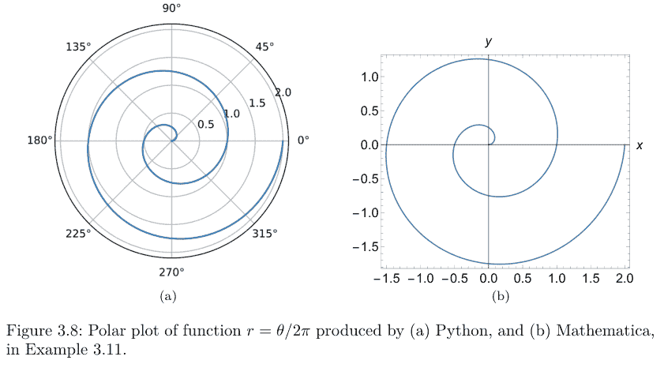

图 3.8：示例 3.11 中由 (a) Python 和 (b) Mathematica 生成的函数 $r = \theta/2\pi$ 的极坐标图。

> **示例 3.12：极坐标中的椭圆。**

半长轴为 $a, b$ 的椭圆在笛卡尔坐标系中的方程为：

$$(x/a)^2 + (y/b)^2 = 1$$

或以参数形式表示为

$$x = a \cos \theta \quad y = b \sin \theta.$$

(a) 利用 Mathematica 的符号计算能力，证明该椭圆在极坐标系中的一般方程为：

$$r = \frac{ab}{\sqrt{a^2 - c^2 \cos^2 \theta}} \quad (3.3.25)$$

其中 $c = \sqrt{a^2 - b^2}$ (且 $a > b$)。

(b) 证明通过将 $x$ 轴平移 $c = \sqrt{a^2 - b^2}$ 的量，椭圆在极坐标系中的方程可简化为：

$$r = \frac{b^2/a}{1 + (c/a) \cos \theta} = \frac{a(1 - e^2)}{1 + e \cos \theta} \quad (3.3.26)$$

其中 $e = c/a = \sqrt{1 - b^2/a^2}$ (且 $a > b$) 是椭圆的*离心率*。

正如我们将在第 9 章中看到的，这个表达式是行星运动数学描述的基础，其中太阳位于该椭圆的一个焦点上。

(c) 在 Mathematica 中使用 `PolarPlot` 命令绘制上述两个椭圆的表达式。

### Mathematica 代码

(a) 该代码执行推导 (3.3.25) 所需的代数步骤，然后绘制参数为 $a = 2.2$, $b = 1.1$ 的椭圆。在定义了参数形式 $x = a \cos \theta$ 和 $y = b \sin \theta = b \sqrt{1 - \cos^2 \theta}$ 之后，代码使用 `Solve` 命令来求解距离 $r$ 作为 $\cos \theta$ 的函数。命令“替换为” /. 用于定义所需方程 $r = r(\theta)$ 的参数 `rellipse`。由于从 `Solve` 命令得到两个解，我们通过选择第二个（正的）平方根来选择正解。

```
SetOptions[PolarPlot, BaseStyle->FontSize->16];

x = r * Cos[\[Theta]];

y = r * Sqrt[1 - Cos[\[Theta]]^2];

sol = Solve[(x/a)^2 + (y/b)^2 == 1, r]

\left\{\left\{r \to -\frac{1}{\sqrt{\frac{1}{b^2} + \frac{\cos[\theta]^2}{a^2} - \frac{\cos[\theta]^2}{b^2}}}}\right\}, \left\{r \to \frac{1}{\sqrt{\frac{1}{b^2} + \frac{\cos[\theta]^2}{a^2} - \frac{\cos[\theta]^2}{b^2}}}}\right\}\right\}

rellipse = r/.sol[[2]]

\frac{1}{\sqrt{\frac{1}{b^2} + \frac{\cos[\theta]^2}{a^2} - \frac{\cos[\theta]^2}{b^2}}}

PolarPlot[rellipse/.{a->2.2, b->1.1}, {\[Theta], 0, 2 * Pi}, AxesLabel->{x, y}]
```

(b) 以下代码执行推导 (3.3.26) 的代数运算，并绘制椭圆。如极坐标图所示，由 (3.3.26) 得到的椭圆沿 $x$ 轴平移了 $c = \sqrt{a^2 - b^2} = \sqrt{2.2^2 - 1.1^2} = \sqrt{1.9}$。对 Mathematica 的输出进行一些简单的处理后，我们得到了 (3.3.26)，这是极坐标系中椭圆的常用方程。

```
SetOptions[PolarPlot, BaseStyle->FontSize->16];

c = Sqrt[a^2 - b^2];

x = r * Cos[\[Theta]]; y = r * Sqrt[(1 - Cos[\[Theta]]^2)];

sol2 = Solve[((x + c)/a)^2 + (y/b)^2 == 1, r]//FullSimplify;

rellipse2 = r/.sol2[[1]]//FullSimplify;

Print["The equation of the new ellipse is:"]

Print[rellipse2]

The equation of the new ellipse is:

\frac{b^2}{a + \sqrt{(a-b)(a+b)}\cos[\theta]}

PolarPlot[rellipse2/.{a->2.2, b->1.1}, {\[Theta], 0, 2 * Pi}, AxesLabel->{x, y}]
```

利用单位向量的导数 $\frac{d}{dt} \hat{\theta}$ 和 $\frac{d}{dt} \hat{\mathbf{r}}$，我们现在也可以通过极坐标中位置的二阶导数来计算加速度向量（参见

### 3.3.2 柱坐标系中的位置、速度和加速度

空间中的一点 $(x, y, z)$ 可以用*柱坐标* $(\rho, \theta, z)$ 表示，如图 3.10 所示。当待求解的问题具有柱对称性时，柱坐标最为有用。值得记住的是，柱坐标 $(\rho, \theta, z)$ 是通过添加 $z$ 坐标，将极坐标 $(r, \theta)$ 从二维直接扩展到三维的结果。

从笛卡尔坐标到柱坐标的转换由以下关系式完成：

**从柱坐标到笛卡尔坐标**

$$x = \rho \cos \theta \quad (3.3.32)$$
$$y = \rho \sin \theta \quad (3.3.33)$$
$$z = z \quad (3.3.34)$$

**从笛卡尔坐标到柱坐标**

$$\rho = \sqrt{x^2 + y^2} \quad (3.3.35)$$
$$\tan \theta = y/x \quad (3.3.36)$$
$$z = z \quad (3.3.37)$$

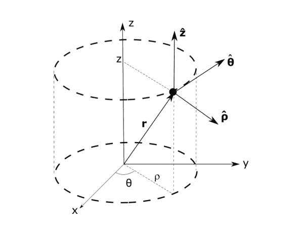

我们可以在柱坐标系中定义三个单位向量 $\hat{\rho}, \hat{\theta}, \hat{z}$，如图 3.10 所示。由于柱坐标本质上是极坐标在三维空间的扩展，我们可以类比上一节的方程直接写出单位向量：

#### 柱坐标系中的单位向量

$\hat{\rho} = \cos \theta \hat{\mathbf{i}} + \sin \theta \hat{\mathbf{j}}$ (3.3.38)

$\hat{\theta} = -\sin \theta \hat{\mathbf{i}} + \cos \theta \hat{\mathbf{j}}$ (3.3.39)

$\hat{\mathbf{z}} = \hat{\mathbf{k}}$ (3.3.40)

与极坐标中的单位向量类似，柱坐标系中的单位向量方向随质点位置变化，但 $\hat{\mathbf{z}}$ 除外，它与 $\hat{\mathbf{k}}$ 相同，方向不变。还需注意，柱坐标单位向量与笛卡尔单位向量通过如下形式的旋转矩阵相关联：

$\begin{bmatrix} \hat{\rho} \\ \hat{\theta} \\ \hat{\mathbf{z}} \end{bmatrix} = \begin{bmatrix} \cos \theta & \sin \theta & 0 \\ -\sin \theta & \cos \theta & 0 \\ 0 & 0 & 1 \end{bmatrix} \begin{bmatrix} \hat{\mathbf{i}} \\ \hat{\mathbf{j}} \\ \hat{\mathbf{k}} \end{bmatrix}$ (3.3.41)

我们可以用与极坐标类似的方法计算柱坐标系中的位置和速度向量。区别在于柱坐标系多了一个方向 $\hat{\mathbf{z}}$。然而，$\hat{\mathbf{z}}$ 不随位置改变方向，因此是常量。因此，柱坐标系中的位置、速度和加速度向量由下式给出：

#### 柱坐标系中的位置、速度和加速度向量

$\mathbf{r} = \rho \cos \theta \hat{\mathbf{i}} + \rho \sin \theta \hat{\mathbf{j}} + z \hat{\mathbf{k}}$ (3.3.42)

$\mathbf{v} = \frac{d\mathbf{r}}{dt} = \frac{d\rho}{dt} \hat{\rho} + \rho \frac{d\theta}{dt} \hat{\theta} + \frac{dz}{dt} \hat{\mathbf{z}}$ (3.3.43)

$\mathbf{a} = \frac{d\mathbf{v}}{dt} = \left[ \frac{d^2\rho}{dt^2} - \rho \left( \frac{d\theta}{dt} \right)^2 \right] \hat{\rho} + \left( \rho \frac{d^2\theta}{dt^2} + 2 \frac{d\rho}{dt} \frac{d\theta}{dt} \right) \hat{\theta} + \frac{d^2z}{dt^2} \hat{\mathbf{z}}$ (3.3.44)

本节最后给出一些其他有用的表达式。类比于为极坐标推导的 (3.3.19) 式，柱坐标系中空间两点间的无穷小位移 $d\mathbf{s}$ 可以写为：

$d\mathbf{s} = d\rho \hat{\rho} + \rho d\theta \hat{\theta} + dz \hat{\mathbf{z}}$ (3.3.45)

在计算无穷小面积时，重要的是要记住与问题相关的圆柱体上的特定面积。例如，通常处理的是圆柱体表面上的无穷小面积元。半径为 $\rho$ 的圆柱体表面上的无穷小面积元 $dA$ 可以写为：

$dA = \rho d\theta dz$ (3.3.46)

然而，请记住，如果关注的是圆柱体的顶部或底部，则极坐标下的无穷小面积元写为 $dA = \rho d\rho d\theta$。柱坐标系中的无穷小体积元由下式给出：

$dV = dx dy dz = \rho d\rho d\theta dz$ (3.3.47)

我们可以通过转换为柱坐标来计算任何函数 $f(x, y, z)$ 的三重积分：

$$ \iiint f(x, y, z) \, dx \, dy \, dz = \iiint f(\rho \cos \theta, \rho \sin \theta, z) \, \rho \, d\rho \, d\theta \, dz \quad (3.3.48) $$

这些三重积分在计算（例如）使用柱坐标系计算物体的质心和转动惯量时将变得有用。

### 3.3.3 球坐标系中的位置、速度和加速度

在球坐标系中，我们通过两个角度（$\theta$, $\phi$）和从原点出发的径向距离 $r$ 来指定空间中每个点的坐标，如图 3.11 所示。重要的是要记住，*极角* $\theta$ 的范围在 0 到 $\pi$ 之间，而*方位角* $\phi$ 的范围可以从 0 到 $2\pi$。球坐标对于涉及球对称性的问题很有用，这在经典力学中很常见。

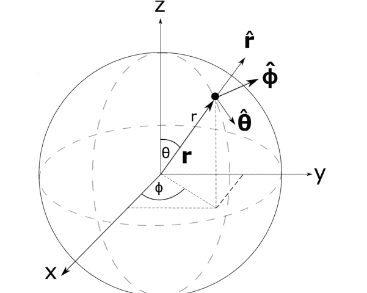

图 3.11：球坐标（$r$, $\theta$, $\phi$）和相应的单位向量。角度 $\phi$ 定义在 $xy$ 平面上，范围可以从 0 到 $2\pi$，而方位角 $\theta$ 的范围*仅*能在 0 到 $\pi$ 之间变化。

笛卡尔坐标 $x$, $y$, $z$ 与球坐标（$r$, $\theta$, $\phi$）的关系如下：

**从球坐标到笛卡尔坐标**

$x = r \sin \theta \cos \phi$ (3.3.49)

$y = r \sin \theta \sin \phi$ (3.3.50)

$z = r \cos \theta$ (3.3.51)

**从笛卡尔坐标到球坐标**

$r = \sqrt{x^2 + y^2 + z^2}$ (3.3.52)
$\tan \phi = y/x$ (3.3.53)
$\cos \theta = \frac{z}{r} = \frac{z}{\sqrt{x^2 + y^2 + z^2}}$ (3.3.54)

与柱坐标系中的单位向量类似，球坐标单位向量 $\hat{\mathbf{r}}$, $\hat{\boldsymbol{\theta}}$, $\hat{\boldsymbol{\phi}}$ 的方向取决于质点的位置。我们如图 3.11 所示定义这三个单位向量。

这些球坐标单位向量 $\hat{\mathbf{r}}$, $\hat{\boldsymbol{\theta}}$, $\hat{\boldsymbol{\phi}}$ 与笛卡尔单位向量通过以下方程相关联：

#### 球坐标系中的单位向量

$\hat{\mathbf{r}} = \sin \theta \cos \phi \hat{\mathbf{i}} + \sin \theta \sin \phi \hat{\mathbf{j}} + \cos \theta \hat{\mathbf{k}}$ (3.3.55)
$\hat{\boldsymbol{\theta}} = \cos \theta \cos \phi \hat{\mathbf{i}} + \cos \theta \sin \phi \hat{\mathbf{j}} - \sin \theta \hat{\mathbf{k}}$ (3.3.56)
$\hat{\boldsymbol{\phi}} = -\sin \phi \hat{\mathbf{i}} + \cos \phi \hat{\mathbf{j}}$ (3.3.57)

与柱坐标单位向量类似，球坐标单位向量与笛卡尔单位向量通过旋转矩阵相关联：

$\begin{bmatrix} \hat{\mathbf{r}} \\ \hat{\boldsymbol{\theta}} \\ \hat{\boldsymbol{\phi}} \end{bmatrix} = \begin{bmatrix} \sin \theta \cos \phi & \sin \theta \sin \phi & \cos \theta \\ \cos \theta \cos \phi & \cos \theta \sin \phi & -\sin \theta \\ -\sin \phi & \cos \phi & 0 \end{bmatrix} \begin{bmatrix} \hat{\mathbf{i}} \\ \hat{\mathbf{j}} \\ \hat{\mathbf{k}} \end{bmatrix}$ (3.3.58)

为了计算球坐标系中的速度和加速度，我们需要单位向量的时间导数。它们由下式给出（参见本节章末习题）：

$\dot{\hat{\mathbf{r}}} = \dot{\theta} \hat{\boldsymbol{\theta}} + \dot{\phi} \sin \theta \hat{\boldsymbol{\phi}}$ (3.3.59)
$\dot{\hat{\boldsymbol{\theta}}} = -\dot{\theta} \hat{\mathbf{r}} + \dot{\phi} \cos \theta \hat{\boldsymbol{\phi}}$ (3.3.60)
$\dot{\hat{\boldsymbol{\phi}}} = -\dot{\phi} \sin \theta \hat{\mathbf{r}} - \dot{\phi} \cos \theta \hat{\boldsymbol{\theta}}$ (3.3.61)

利用这些方程，可以证明球坐标系中的速度向量由下式给出：

$\mathbf{v} = \dot{r} \hat{\mathbf{r}} + r \dot{\theta} \hat{\boldsymbol{\theta}} + r \dot{\phi} \sin \theta \hat{\boldsymbol{\phi}}$ (3.3.62)

将此方程两边乘以 $dt$，我们得到球坐标系中两点间的无穷小位移 $d\mathbf{s}$：

$d\mathbf{s} = dr \hat{\mathbf{r}} + r d\theta \hat{\boldsymbol{\theta}} + r d\phi \sin \theta \hat{\boldsymbol{\phi}}$ (3.3.63)

通过将此方程中单位向量的系数相乘，可以得到球坐标系中的无穷小体积元 $dV$：

$dV = dx dy dz = r^2 \sin \theta dr d\theta d\phi$ (3.3.64)

我们也可以通过变换方程来计算球坐标系下的三重积分：

$$ \iiint f(x, y, z) \, dx \, dy \, dz = \iiint f(r \sin \theta \cos \phi, r \sin \theta \sin \phi, r \cos \theta) r^2 \sin \theta \, dr \, d\theta \, d\phi \quad (3.3.65) $$

最后，球坐标系下的加速度向量由下式给出（参见本节的章末习题）：

$$ \mathbf{a} = (\ddot{r} - r\dot{\phi}^2 \sin^2 \theta - r\dot{\theta}^2) \hat{\mathbf{r}} + (r\ddot{\theta} + 2\dot{r}\dot{\theta} - r\dot{\phi}^2 \sin \theta \cos \theta) \hat{\boldsymbol{\theta}} + (r\ddot{\phi} \sin \theta + 2\dot{r}\dot{\phi} \sin \theta + 2r\dot{\theta}\dot{\phi} \cos \theta) \hat{\boldsymbol{\phi}} \quad (3.3.66) $$

> **球坐标系中的位置、速度和加速度向量**

$$ \mathbf{r} = r\hat{\mathbf{r}} \quad (3.3.67) $$

$$ \mathbf{v} = \dot{r}\hat{\mathbf{r}} + r\dot{\theta}\hat{\boldsymbol{\theta}} + r\dot{\phi} \sin \theta \hat{\boldsymbol{\phi}} \quad (3.3.68) $$

$$ \mathbf{a} = (\ddot{r} - r\dot{\phi}^2 \sin^2 \theta - r\dot{\theta}^2) \hat{\mathbf{r}} + (r\ddot{\theta} + 2\dot{r}\dot{\theta} - r\dot{\phi}^2 \sin \theta \cos \theta) \hat{\boldsymbol{\theta}} + (r\ddot{\phi} \sin \theta + 2\dot{r}\dot{\phi} \sin \theta + 2r\dot{\theta}\dot{\phi} \cos \theta) \hat{\boldsymbol{\phi}} \quad (3.3.69) $$

## 3.4 梯度、散度和旋度

物理学中存在几种重要的空间导数（即对空间坐标求导的导数）。它们被称为梯度、散度和旋度。在本节中，我们将介绍这些导数及其物理解释。

### 3.4.1 梯度

考虑一个标量函数 $f(x)$。假设我们想知道当自变量 $x$ 改变一个微小量，例如从 $x$ 变为 $x + dx$ 时，函数 $f(x)$ 变化了多少。$f(x)$ 的泰勒级数展开为：

$$ f(x + dx) = f(x) + \frac{df}{dx} dx + \cdots \quad (3.4.1) $$

我们可以忽略 $dx^2$ 及更高阶的项，因为 $dx$ 非常小。接下来，我们定义微分 $df = f(x + dx) - f(x)$，并将其解释为当 $x$ 改变一个微小量 $dx$ 时 $f$ 值的变化。然后从 (3.4.1) 式我们得到：

$$ df = \frac{df}{dx} dx \quad (3.4.2) $$

方程 (3.4.2) 可以解释如下：当 $x$ 改变（一个微小量）时，$f$ 的变化量 $df$ 等于 $f$ 相对于 $x$ 的变化率与 $x$ 的变化量 ($dx$) 的乘积。这类似于我们熟悉的方程 $d = vt$，它表示粒子行进的距离等于其行进速度（即距离随时间的变化率 $v$）与行进时间 $t$ 的乘积。

现在考虑一个三变量的标量函数 $f(x, y, z)$。我们想知道当*每个*变量改变一个微小量时，函数变化了多少。多变量泰勒级数展开为：

$$f(x + dx, y + dy, z + dz) = f(x, y, z) + \frac{\partial f}{\partial x}dx + \frac{\partial f}{\partial y}dy + \frac{\partial f}{\partial z}dz + \cdots \quad (3.4.3)$$

在这个表达式中，$\frac{\partial f}{\partial x}$、$\frac{\partial f}{\partial y}$、$\frac{\partial f}{\partial z}$ 分别是 $f$ 对 $(x, y, z)$ 的偏导数。与一维情况类似，我们定义微分为 $df = f(x + dx, y + dy, z + dz) - f(x, y, z)$，并将其解释为当改变所有变量时 $f$ 的变化。利用 (3.4.3)，我们可以将微分写成点积形式：

$$df = \frac{\partial f}{\partial x}dx + \frac{\partial f}{\partial y}dy + \frac{\partial f}{\partial z}dz \quad (3.4.4)$$
$$= \left( \frac{\partial f}{\partial x}\hat{\mathbf{i}} + \frac{\partial f}{\partial y}\hat{\mathbf{j}} + \frac{\partial f}{\partial z}\hat{\mathbf{k}} \right) \cdot (dx\hat{\mathbf{i}} + dy\hat{\mathbf{j}} + dz\hat{\mathbf{k}}) \quad (3.4.5)$$

我们再次得到了一个类似于 $d = vt$ 的方程，其中第一项类似于变化率，第二项是坐标的变化量。(3.4.5) 中的第一项可以重写为：

$$\left( \hat{\mathbf{i}} \frac{\partial}{\partial x} + \hat{\mathbf{j}} \frac{\partial}{\partial y} + \hat{\mathbf{k}} \frac{\partial}{\partial z} \right) f \quad (3.4.6)$$

它描述了 $f$ 在每个方向上的变化率。(3.4.6) 中出现的算子在物理学中非常重要，被称为 *del* 或 *梯度算子*，记作 $\nabla$：

> **梯度算子**
$$\nabla = \left( \hat{\mathbf{i}} \frac{\partial}{\partial x} + \hat{\mathbf{j}} \frac{\partial}{\partial y} + \hat{\mathbf{k}} \frac{\partial}{\partial z} \right) \quad (3.4.7)$$

符号 $\nabla$ 也称为 *nabla*。del 算子是一个向量算子，在 (3.4.7) 中，它以笛卡尔坐标系表示。正如你可能预料的那样，del 算子在柱坐标系和球坐标系中具有不同的形式。我们将在本节后面介绍其他坐标系中的 del 算子，但目前我们只考虑笛卡尔坐标系。

当 del 算子作用于标量函数 $f$ 时，$\nabla f$ 被称为 $f$ 的*梯度*，其结果是一个向量函数。

> **标量函数** $f(x, y, z)$ **的梯度**
$$\nabla f = \left( \frac{\partial f}{\partial x}\hat{\mathbf{i}} + \frac{\partial f}{\partial y}\hat{\mathbf{j}} + \frac{\partial f}{\partial z}\hat{\mathbf{k}} \right) \quad (3.4.8)$$

然后我们可以将微分 $df$ 写成 $\nabla f$ 和 $d\mathbf{r}$ 的点积：

$$df = \nabla f \cdot d\mathbf{r} \quad (3.4.9)$$

为了更好地理解标量场的梯度，我们将引入*函数 $f$ 的等值集*的概念。标量函数 $f$ 的等值集在二维中是一条曲线，在三维中是一个曲面，在该曲线或曲面上 $f$ 的值是常数。因此，沿着等值集的曲线，我们有 $df = 0$。如果 $d\mathbf{r}$ 是沿着 $f$ 的等值集的位移，那么：

$$df = \nabla f \cdot d\mathbf{r} = 0 \quad (3.4.10)$$

因此，两个向量 $\nabla f$ 和 $d\mathbf{r}$ 彼此垂直，即 $\nabla f \perp d\mathbf{r}$。我们得出结论：$f$ 的梯度垂直于 $f$ 的等值集。

> **例 3.13：标量场的梯度。**
考虑标量场：
$$f(x, y) = e^{-(x^2+y^2)}$$
(a) 计算并绘制 $f$ 的梯度向量。
(b) 使用等高线图绘制该函数的等值集，以显示 $f$ 为常数的曲线。

**解：**
$f$ 的梯度可以通过计算得到：
$$\nabla f = \left(\mathbf{\hat{i}}\frac{\partial}{\partial x} + \mathbf{\hat{j}}\frac{\partial}{\partial y}\right) e^{-(x^2+y^2)}$$
$$= -2xe^{-(x^2+y^2)}\mathbf{\hat{i}} - 2ye^{-(x^2+y^2)}\mathbf{\hat{j}}$$

> **Python 代码**
我们定义坐标系 $R$，该参考系中的单位向量记为 R.i, R.j, R.k，笛卡尔坐标 $x$、$y$ 和 $z$ 分别记为 R.x, R.y, R.z。梯度通过命令 `gradient(f)` 计算，其中 $f = \exp(-x^2 - y^2)$ 是给定的标量函数。
在部分 (b) 中，我们使用命令 `contour(x,y,T,5)` 为函数绘制五条等高线，并使用 `quiver(x,y,x_grad,y_grad)` 在笛卡尔平面上的点 $(x,y)$ 处绘制梯度的箭头。结果如图 3.12a 所示。

```python
# 部分 (a) 的代码
from sympy.vector import CoordSys3D, gradient
from sympy import exp

print('-'*28,'CODE OUTPUT','-'*29,'\n')

R = CoordSys3D('R')      # 定义笛卡尔坐标系 R

f = exp(-R.x**2-R.y**2)  # 标量函数 f(x,y)，其中 x=R.x, y=R.y

gradf = gradient(f)      # 使用 gradient 函数计算梯度

print('f(x,y) 的梯度为：\n', gradf)

----------------------------- CODE OUTPUT -----------------------------
f(x,y) 的梯度为：
(-2*R.x*exp(-R.x**2 - R.y**2))*R.i + (-2*R.y*exp(-R.x**2 - R.y**2))*R.j
```

```python
# 部分 (b) 的代码
import numpy as np
import matplotlib.pyplot as plt

xyrange = np.linspace(-1,1,20)       # x,y 值的范围

x, y = np.meshgrid(xyrange,xyrange)

T = np.exp(- (x**2 + y**2))         # 标量函数 f(x,y)

x_grad = -2*x*np.exp(-(x**2 + y**2)) # 梯度(f) 的 x,y 分量
y_grad = -2*y*np.exp(- (x**2 + y**2))

plt.contour(x,y,T,5)                # 使用 contour 绘制 5 条等高线

plt.quiver(x,y,x_grad,y_grad)       # 使用 quiver 绘制箭头
plt.xlabel('x 坐标')
plt.ylabel('y 坐标')
plt.show()
```

### Mathematica 代码

注意，Mathematica 将梯度输出为一个列表，其中列表的第一个元素是 $x$ 分量，第二个元素是 $y$ 分量，第三个元素是 $z$ 分量。此外，命令 `Grad[f,x,y]` 用于计算梯度，Mathematica 需要知道哪些变量用于微分。还要注意，默认情况下，Mathematica 在笛卡尔坐标系中计算梯度。正如我们将在下面看到的，梯度在柱坐标系和球坐标系中是不同的。当用户指定使用哪个坐标系时，Mathematica 也可以符号化地计算这些坐标系中的梯度。
命令 `ContourPlot` 和 `VectorPlot` 用于创建这两组图形。
图 3.12b 中显示的等高线曲线是 $f$ 的等值集，较浅的颜色对应于较大的 $f$ 值。向量表示梯度向量场。箭头的大小对应于该点处梯度的大小。注意这些向量垂直于等值集。

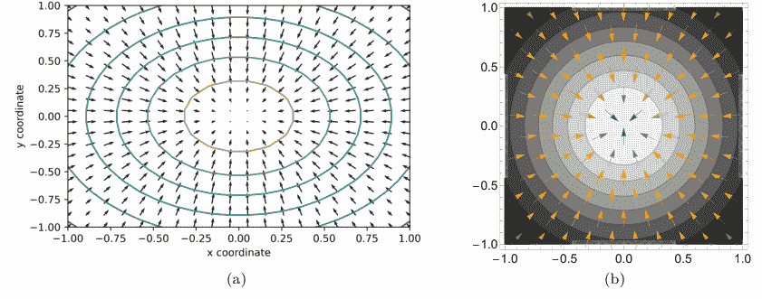

图 3.12：由 (a) Python 和 (b) Mathematica 生成的标量函数的梯度与等高线图，对应示例 3.13。

```
SetOptions[ContourPlot, BaseStyle->FontSize->16];

f = Exp[-(x^2 + y^2)];

gradf = Grad[f, {x, y}]

{-2e^{-x^2-y^2}x, -2e^{-x^2-y^2}y}

gr1 = ContourPlot[f, {x, -1, 1}, {y, -1, 1}, ColorFunction->GrayLevel];

gr2 = VectorPlot[gradf, {x, -1, 1}, {y, -1, 1}, VectorStyle->Red, VectorPoints->10];

Show[gr1, gr2]
```

梯度在经典力学中扮演着非常重要的角色。例如，正如我们将在第 5 章中展示的，对于一个势能为 $V(x, y, z)$ 的粒子，作用于该粒子的力矢量 $\mathbf{F}(x, y, z)$ 由势能的负梯度给出：

$$\mathbf{F}(x, y, z) = -\nabla V(x, y, z) = -\frac{\partial V}{\partial x}\mathbf{\hat{i}} - \frac{\partial V}{\partial y}\mathbf{\hat{j}} - \frac{\partial V}{\partial z}\mathbf{\hat{k}} \quad (3.4.11)$$

尽管我们将在第 5 章更详细地讨论力、能量与机械系统平衡状态之间的关系，但值得注意的是，上述方程表明力指向势能*最快减小*的方向（因为负号的存在）。

为了全面理解梯度，我们接下来需要讨论*方向导数*的概念。

标量场 $f$ 的方向导数 $df/dn$ 给出了 $f(x, y, z)$ 在单位矢量 $\mathbf{\hat{n}} = n_x\mathbf{\hat{i}} + n_y\mathbf{\hat{j}} + n_z\mathbf{\hat{k}}$ 方向上的变化率，其定义为点积：

$$\frac{df}{dn} = \mathbf{\hat{n}} \cdot \nabla f = n_x \frac{\partial f}{\partial x} + n_y \frac{\partial f}{\partial y} + n_z \frac{\partial f}{\partial z} \quad (3.4.12)$$

现在我们提出一个问题：标量场 $f$ 在哪个方向上变化最快？我们可以将点积计算为：

$$\frac{df}{dn} = \hat{\mathbf{n}} \cdot \nabla f = |\hat{\mathbf{n}}| |\nabla f| \cos \theta \quad (3.4.13)$$

其中 $\theta$ 是 $\hat{\mathbf{n}}$ 与 $\nabla f$ 之间的夹角。方向导数最大的方向出现在 $\hat{\mathbf{n}} \cdot \nabla f$ 最大时，即当角度 $\theta$ 等于零时。因此，$\nabla f$ 指向 $f$ 增加最快的方向。同样，标量场减小最快的方向是 $-\nabla f$。举个例子，考虑一个表面，其在点 $(x, y)$ 处高于海平面的高度为 $H(x, y)$。$H$ 在点 $(x, y)$ 处的梯度是一个指向该点最陡坡度或最陡坡度方向的矢量。该点坡度的陡峭程度由梯度矢量的大小给出。

> **示例 3.14：方向导数。**
求标量场 $f = x^2y + xz$ 在点 $(1, 2, -1)$ 处，沿矢量 $\mathbf{a} = 2\hat{\mathbf{i}} - 2\hat{\mathbf{j}} + \hat{\mathbf{k}}$ 方向的方向导数。

**解：**
我们首先通过将 $\mathbf{a}$ 除以其大小来获得给定方向上的单位矢量 $\hat{\mathbf{a}}$：
$$\hat{\mathbf{a}} = \frac{\mathbf{a}}{\sqrt{a_x^2 + a_y^2 + a_z^2}} = \frac{2\hat{\mathbf{i}} - 2\hat{\mathbf{j}} + \hat{\mathbf{k}}}{\sqrt{2^2 + 2^2 + (1)^2}} = \frac{2}{3}\hat{\mathbf{i}} - \frac{2}{3}\hat{\mathbf{j}} + \frac{1}{3}\hat{\mathbf{k}}$$

接下来求 $f$ 的梯度：
$$\nabla f = \hat{\mathbf{i}}\frac{\partial f}{\partial x} + \hat{\mathbf{j}}\frac{\partial f}{\partial y} + \hat{\mathbf{k}}\frac{\partial f}{\partial z} = (2xy + z)\hat{\mathbf{i}} + x^2\hat{\mathbf{j}} + x\hat{\mathbf{k}}$$

最后，我们根据方向导数是单位矢量 $\hat{\mathbf{a}}$ 与梯度 $\nabla$ 的点积这一定义来求方向导数：
$$\frac{df}{da} = \hat{\mathbf{a}} \cdot \nabla f = (2xy + z)\frac{2}{3} + x^2(-\frac{2}{3}) + x\frac{1}{3}$$

在最后一步，我们代入给定的点 $(1, 2, -1)$：
$$\frac{df}{da} = \hat{\mathbf{a}} \cdot \nabla f = \frac{5}{3}$$

```
**Python 代码**
在本示例中，我们展示了两个可以计算方向导数的不同库。
在代码中，我们从 `sympy.vector` 库导入 `CoordSys3D` 命令。在此库内，我们定义一个坐标系 `C= CoordSys3D('C')`。
在第一种方法中，我们首先使用 SymPy 中的 `a.normalize()` 方法计算归一化矢量 $\hat{\mathbf{n}}$。我们使用 `gradient(f)` 计算梯度，然后使用 `n.dot(gradient(f))` 方法找到 $\hat{\mathbf{n}}$ 与 $\nabla f$ 的点积。
`.subs` 方法用于代入给定的点 $(1, 2, -1)$，即 $x = 1$, $y = 2$, $z = -1$。
```

在第二种方法中，我们使用专用函数 `directional_derivative(f)`。本示例中两种 Python 方法得到的结果与上面获得的解析结果相同。

```
from sympy import simplify
from sympy.vector import CoordSys3D, gradient, directional_derivative

print('-'*28,'CODE OUTPUT','-'*29,'\n')
C = CoordSys3D('C')      # 名为 C 的笛卡尔坐标系
                          # 具有单位矢量 C.i , C.j , C.k

f = C.x**2 * C.y + C.x * C.z   # 标量场 f(x, y, z)=xyz

a = 2*C.i -2* C.j + C.k        # 矢量 a 定义所需方向

n = a.normalize()               # n= 归一化矢量 a

u = n.dot(gradient(f))          # 求 n 与 gradient(f) 的点积
print('方向导数函数为：\n',u)

print('\n在点 (1,2,-1) 处，方向导数为 = ',\n      u.subs({C.x:1,C.y:2,C.z:-1}))

# 使用专用函数 directional_derivative 的快捷方法

v = simplify(directional_derivative( f, n)) # 使用专用函数

print('\n使用方法 #2，方向导数为 = ',\n      v.subs({C.x:1,C.y:2,C.z:-1}))

----------------------------- CODE OUTPUT -----------------------------
方向导数函数为：
-2*C.x**2/3 + 4*C.x*C.y/3 + C.x/3 + 2*C.z/3

在点 (1,2,-1) 处，方向导数为 =  5/3

使用方法 #2，方向导数为 =  5/3
```

### Mathematica 代码

在此代码中，我们将矢量 a 定义为一个列表，并通过除以其大小 Norm(a) 来对其进行归一化。命令 ResourceFunction["DirectionalD"] 用于计算方向导数函数。最后，我们使用替换规则 dirderiv/.{x->1,y->2, z->-1} 来代入给定点 (1, 2, −1) 的值，即 x = 1, y = 2, z = −1。

```
a = {2, -2, 1};

n = a/Norm[a];

Print["归一化矢量 a 为：", n]

归一化矢量 a 为：{2/3, -2/3, 1/3}

dirderiv = ResourceFunction["DirectionalD"][x^2 * y + x * z, n, {x, y, z}];

Print["方向导数函数为："]

Print[dirderiv]

方向导数函数为：
x/3 - 2x^2/3 + 2/3(2xy + z)

result = dirderiv/.{x->1, y->2, z-> - 1};

Print["在点(1,2,-1)处的方向导数为：", result]

在点(1,2,-1)处的方向导数为：5/3
```

为了获得梯度在其他坐标系中的形式，我们回到标量函数的全微分 $df$ 由下式给出这一事实：

$$df = \frac{\partial f}{\partial x}dx + \frac{\partial f}{\partial y}dy + \frac{\partial f}{\partial z}dz = \frac{\partial f}{\partial \rho}d\rho + \frac{\partial f}{\partial \theta}d\theta + \frac{\partial f}{\partial z}dz = \nabla f \cdot d\mathbf{s}$$ (3.4.14)

其中在笛卡尔坐标系中 $d\mathbf{s} = dx \mathbf{\hat{i}} + dy \mathbf{\hat{j}} + dz \mathbf{\hat{k}}$，并且我们使用了 $f(\rho, \theta, z)$ 的链式法则。我们可以利用这个方程来获得柱坐标和球坐标中梯度的表达式，如下所示。

任何标量函数 $f$ 在柱坐标 $(\rho, \theta, z)$ 中的梯度将具有以下一般形式：

$$\nabla f(x, y, z) = (\nabla f)_\rho \mathbf{\hat{\rho}} + (\nabla f)_\theta \mathbf{\hat{\theta}} + (\nabla f)_z \mathbf{\hat{k}}$$ (3.4.15)

其中 $(\nabla f)_\rho$, $(\nabla f)_\theta$, $(\nabla f)_z$ 是梯度沿柱坐标中单位矢量 $\mathbf{\hat{\rho}}$, $\mathbf{\hat{\theta}}$, $\mathbf{\hat{z}}$ 的分量。从上一节我们回忆起，柱坐标中的 $d\mathbf{s}$ 由下式给出：

$$d\mathbf{s} = d\rho \mathbf{\hat{\rho}} + \rho d\theta \mathbf{\hat{\theta}} + dz \mathbf{\hat{z}}$$ (3.4.16)

通过计算 (3.4.15) 和 (3.4.16) 的点积，并代入 (3.4.14)，我们得到：

$$\frac{\partial f}{\partial \rho}d\rho + \frac{\partial f}{\partial \theta}d\theta + \frac{\partial f}{\partial z}dz = (\nabla f)_\rho d\rho + (\nabla f)_\theta \rho d\theta + (\nabla f)_z dz$$ (3.4.17)

通过使 (3.4.17) 两边 $(d\rho, d\theta, dz)$ 的对应系数相等，我们发现：

$$(\nabla f)_\rho = \frac{\partial f}{\partial \rho} \quad (\nabla f)_\theta = \frac{1}{\rho} \frac{\partial f}{\partial \theta} \quad (\nabla f)_z = \frac{\partial f}{\partial z}$$

因此，通过使用 (3.4.15)，梯度在柱坐标中的表达式为：

$$\nabla f(\rho, \theta, z) = \frac{\partial f}{\partial \rho} \mathbf{\hat{\rho}} + \frac{1}{\rho} \frac{\partial f}{\partial \theta} \mathbf{\hat{\theta}} + \frac{\partial f}{\partial z} \mathbf{\hat{z}}$$ (3.4.18)

球坐标系中的梯度也可以用同样的方法得到，其形式为：

$$\nabla f(r, \theta, \phi) = \frac{\partial f}{\partial r} \hat{\mathbf{r}} + \frac{1}{r} \frac{\partial f}{\partial \theta} \hat{\boldsymbol{\theta}} + \frac{1}{r \sin \theta} \frac{\partial f}{\partial \phi} \hat{\boldsymbol{\phi}}$$ (3.4.19)

请注意，我们上面的工作也给出了各种坐标系中的 del 算子：

### 不同坐标系中的梯度

| | | |
|---|---|---|
| $\nabla = \hat{\mathbf{i}} \frac{\partial}{\partial x} + \hat{\mathbf{j}} \frac{\partial}{\partial y} + \hat{\mathbf{k}} \frac{\partial}{\partial z}$ | 笛卡尔坐标系 | (3.4.20) |
| $\nabla = \hat{\boldsymbol{\rho}} \frac{\partial}{\partial \rho} + \hat{\boldsymbol{\theta}} \frac{1}{\rho} \frac{\partial}{\partial \theta} + \hat{\mathbf{z}} \frac{\partial}{\partial z}$ | 柱坐标系 | (3.4.21) |
| $\nabla = \hat{\mathbf{r}} \frac{\partial}{\partial r} + \hat{\boldsymbol{\theta}} \frac{1}{r} \frac{\partial}{\partial \theta} + \hat{\boldsymbol{\phi}} \frac{1}{r \sin \theta} \frac{\partial}{\partial \phi}$ | 球坐标系 | (3.4.22) |

下一个示例展示了如何使用计算机代数系统（CAS）在柱坐标系中计算标量函数的梯度。

### 示例 3.15：在柱坐标系中计算梯度。
在柱坐标系 $(\rho, \theta, z)$ 中，分别通过解析方法和使用 Mathematica 以及 `sympy.vector` 中的 Python 函数，计算标量函数 $f(\rho, \theta, z) = \rho \sin \theta \cos z$ 的梯度。

**解：**
使用柱坐标系的公式 (3.4.21)：

$$\nabla f = \hat{\boldsymbol{\rho}} \frac{\partial f}{\partial \rho} + \hat{\boldsymbol{\theta}} \frac{1}{\rho} \frac{\partial f}{\partial \theta} + \hat{\mathbf{z}} \frac{\partial f}{\partial z} = \hat{\boldsymbol{\rho}} \sin \theta \cos z + \hat{\boldsymbol{\theta}} \cos \theta \cos z + \hat{\mathbf{z}} (-\rho \sin \theta \sin z)$$

**Python 代码**
在 Python 代码中，我们从 `sympy.vector` 库导入 `CoordSys3D` 命令。在此库中，我们定义一个坐标系 `c`，并通过使用 `transformation='cylindrical'` 将其转换为柱坐标系。这个转换后的系统包含了柱坐标参数 $(\rho, \theta, z)$，它们在内部表示为 `c.r`、`c.t`、`c.z`。相应的单位向量 $\hat{\boldsymbol{\rho}}, \hat{\boldsymbol{\theta}}, \hat{\mathbf{z}}$ 分别由 `c.R`、`c.T`、`c.Z` 表示。
该库中的梯度使用 `gr = gradient(f)` 计算，我们使用 `gr.coeff()` 来查找柱坐标系中单位向量的系数。

```python
# 柱坐标系中向量的梯度
from sympy import sin, cos
from sympy.vector import CoordSys3D, gradient

import textwrap

print('-'*28,'CODE OUTPUT','-'*29,'\n')

# 定义名为 c 的笛卡尔坐标系，其单位向量为 c.i, c.j, c.k
# 将其转换为具有柱坐标 (rho, theta, z) 的系统

# 变量为 c.r, c.t, c.z，分别对应 rho, theta, z
# 单位向量为 c.R, c.T, c.Z
c = CoordSys3D('c', transformation='cylindrical',
variable_names = list("rtz"),vector_names=list("RTZ") )

scalar = c.r*sin(c.t)*cos(c.z)

print('scalar =',scalar)

gr = gradient(scalar)
print('\n该标量在柱坐标系中的梯度为：')
print(textwrap.fill(str(gr),63))

print('\n梯度的 rho 分量为：', gr.coeff(c.R))
print('梯度的 theta 分量为：', gr.coeff(c.T))
print('梯度的 z 分量为：', gr.coeff(c.Z))

----------------------------- CODE OUTPUT -----------------------------
scalar = c.r*sin(c.t)*cos(c.z)

该标量在柱坐标系中的梯度为：
(sin(c.t)*cos(c.z))*c.R + (cos(c.t)*cos(c.z))*c.T +
(-c.r*sin(c.t)*sin(c.z))*c.Z

梯度的 rho 分量为： sin(c.t)*cos(c.z)
梯度的 theta 分量为： cos(c.t)*cos(c.z)
梯度的 z 分量为： -c.r*sin(c.t)*sin(c.z)
```

**Mathematica 代码**

Mathematica 代码的第一行定义了函数 $f(\rho, \theta, z) = \rho \sin \theta \cos z$，命令 `Grad[f,{rho,theta,z},'Cylindrical']` 用于计算柱坐标系中的梯度。

```mathematica
f[rho, theta, z] = rho * Sin[theta] * Cos[z];

Print["函数 f 在柱坐标系中的梯度为："];

Grad[f[rho, theta, z], {rho, theta, z}, "Cylindrical"]

函数 f 在柱坐标系中的梯度为：

{Cos[z] Sin[theta], Cos[theta] Cos[z], -rho Sin[theta] Sin[z]}
```

梯度的“导数”性质体现在以下恒等式中，它类似于导数的乘积法则：

$$\nabla(fg) = f\nabla g + g\nabla f$$

其中 $f$, $g$ 是 $(x, y, z)$ 的标量函数。

示例 3.16 使用符号代数方法演示了这个恒等式。

### 示例 3.16：标量函数乘积的梯度。
通过手工计算和使用计算机代数系统（CAS）演示，证明对于任意标量函数 $f(x, y, z)$ 和 $g(x, y, z)$，梯度的以下普遍性质成立。

$$\nabla (fg) = f (\nabla g) + g (\nabla f)$$

**解：**

$$\nabla (fg) = \frac{\partial (fg)}{\partial x}\hat{\mathbf{i}} + \frac{\partial (fg)}{\partial y}\hat{\mathbf{j}} + \frac{\partial (fg)}{\partial z}\hat{\mathbf{k}}$$

$$= f\frac{\partial g}{\partial x}\hat{\mathbf{i}} + g\frac{\partial f}{\partial x}\hat{\mathbf{i}} + f\frac{\partial g}{\partial y}\hat{\mathbf{j}} + g\frac{\partial f}{\partial y}\hat{\mathbf{j}} + f\frac{\partial g}{\partial z}\hat{\mathbf{k}} + g\frac{\partial f}{\partial z}\hat{\mathbf{k}}$$

$$= f\left(\frac{\partial g}{\partial x}\hat{\mathbf{i}} + \frac{\partial g}{\partial y}\hat{\mathbf{j}} + \frac{\partial g}{\partial z}\hat{\mathbf{k}}\right) + g\left(\frac{\partial f}{\partial x}\hat{\mathbf{i}} + \frac{\partial f}{\partial y}\hat{\mathbf{j}} + \frac{\partial f}{\partial z}\hat{\mathbf{k}}\right)$$

$$= f (\nabla g) + g (\nabla f)$$

**Python 代码**

在 Python 代码中，我们在 `sympy.vector` 中定义坐标系 $C$，其单位向量为 `C.i`、`C.j`、`C.k`。我们将符号 $f, g$ 定义为坐标参数 `C.x`、`C.y`、`C.z` 的函数，并使用 `gradient()` 函数计算等式 (3.4.24) 的左边（LHS）和右边（RHS）。

我们通过逻辑语句 `LHS==RHS` 来验证等式 (3.4.24) 的两边是否相同，该语句对等式返回 `True` 值。

```python
from sympy.vector import CoordSys3D, gradient

print('-'*28,'CODE OUTPUT','-'*29,'\n')

C = CoordSys3D('C')    # 定义笛卡尔坐标系，此处命名为 C

# 标量场 f(x,y,z) 是笛卡尔坐标变量 C.x, C.y, C.z 的函数

from sympy import symbols, Function
f, g = symbols('f, g', cls=Function)

# 将标量场定义为 fscalar(x,y,z), gscalar(x,y,z)
fscalar = f(C.x, C.y, C.z)
gscalar = g(C.x, C.y, C.z)

# 构建左边（LHS）的表达式：grad(f.g)
lhs = gradient(fscalar*gscalar)

# 构建右边（RHS）的表达式：grad(f).g+grad(g).f
rhs = gradient(fscalar)*gscalar+gradient(gscalar)*fscalar

# 比较两边
print('等式 grad(f.g)=grad(f).g+grad(g).f 的结果为 ',lhs==rhs)

----------------------------- CODE OUTPUT ------------------------------
等式 grad(f.g)=grad(f).g+grad(g).f 的结果为  True
```

**Mathematica 代码**

我们使用命令 Grad[f[x_,y_,z_]*g[x_,y_,z_]] 来计算 ∇(fg)，并使用 Grad[f[x_,y_,z_]*g[x_,y_,z_]] 和 Grad[g[x_,y_,z_]*f[x_,y_,z_]] 分别表示 ∇(f)g 和 f∇(g)。双等号 == 用于测试该恒等式是 True 还是 False。

```mathematica
LHS = Grad[f[x_,y_,z_] * g[x_,y_,z_], {x,y,z}];
RHS = Grad[f[x_,y_,z_], {x,y,z}] * g[x_,y_,z_]+
Grad[g[x_,y_,z_], {x,y,z}] * f[x_,y_,z_];
Print["该恒等式为：", LHS==RHS]
该恒等式为：True
```

在向量微积分中，del 算子是一个向量微分算子。正如我们所看到的，当应用于标量场时，del 算子产生标量场的梯度 ∇f。然而，当应用于向量场时，del 算子可以产生两个量：向量场的散度 ∇·v 和向量场的旋度 ∇×v。在接下来的小节中，我们将阐述这些新的量。

### 3.4.2 散度

向量场 $\mathbf{v} = v_x\hat{\mathbf{i}} + v_y\hat{\mathbf{j}} + v_z\hat{\mathbf{k}}$ 的散度是一个*标量*函数，可以表示为：

$$\nabla \cdot \mathbf{v} = \frac{\partial v_x}{\partial x} + \frac{\partial v_y}{\partial y} + \frac{\partial v_z}{\partial z} \quad (3.4.25)$$

散度是通过算子与向量场的点积得到的。向量场的散度在经典力学中并不常见，但在流体动力学和电磁学中却非常突出。在本小节中，我们仅对散度进行简要概述。

散度大致衡量的是向量场沿其指向方向的大小变化。更准确地说，它衡量的是该场趋向于汇聚或远离某一点的趋势，有时也被称为向量场的“*净向外流量*”。例如，考虑空气被加热或冷却的情况。本例中相关的向量场是空间中某点运动空气的速度。如果某个区域的空气被加热，它会向各个方向膨胀，使得速度场从该区域指向外部，并朝向温度较低的区域。因此，该区域速度场的散度将为正值，该区域被称为*源*。如果空气冷却收缩，散度为负，该区域被称为*汇*。在向量微积分中，散度是一个向量算子，它用带符号的标量来衡量向量场在给定点的源或汇的强度。

从物理意义上讲，三维向量场的散度表示该向量场的流动在给定点处表现得像源或汇的程度。它是其“向外性”的局部度量——即从一个无穷小空间区域流出的“物质”多于流入的程度。如果某点的散度不为零，则该位置必定存在源或汇。请注意，当我们使用源和汇这些术语时，我们想象的是像流体运动的速度向量场这样的向量。

如果向量场 $\mathbf{A}(x, y, z)$ 在空间中各处的散度都为零，则该向量场被称为*无散场*。

> **无散向量场 $\mathbf{A}(x,y,z)$**

$$\nabla \cdot \mathbf{A} = 0 \longleftrightarrow \mathbf{A}(x, y, z) \text{ 是一个无散向量场} \quad (3.4.26)$$

如果 $\mathbf{u}$、$\mathbf{v}$ 是任意向量函数，$f$ 是任意标量函数，则散度遵循以下乘积法则：

$$\nabla \cdot (f\mathbf{v}) = f(\nabla \cdot \mathbf{v}) + \mathbf{v} \cdot \nabla f \quad (3.4.27)$$

然而，请注意，叉积的散度则不那么直观：

$$\nabla \cdot (\mathbf{u} \times \mathbf{v}) = \mathbf{v} \cdot (\nabla \times \mathbf{u}) - \mathbf{u} \cdot (\nabla \times \mathbf{v}) \quad (3.4.28)$$

> **示例 3.17：向量场的散度。**

通过解析方法以及使用 Python 和 Mathematica 中的适当代码，求向量函数 $\mathbf{v} = xyz\hat{\mathbf{i}} + xyz\hat{\mathbf{j}} + xyz\hat{\mathbf{k}}$ 的散度。

**解：**

散度是一个标量，通过将偏导数相加得到：

$$\nabla \cdot \mathbf{v} = \frac{\partial(xyz)}{\partial x} + \frac{\partial(xyz)}{\partial y} + \frac{\partial(xyz)}{\partial z} = yz + xz + xy$$

以下是用于计算梯度的 Python 和 Mathematica 代码。

### Python 代码

命令 `CoordSys3D('R')` 定义了坐标系 $R$，该参考系中的单位向量用 $R.i, R.j, R.k$ 表示。
我们使用 SymPy 中的 `physics.vector` 包。
散度通过命令 `divergence(v)` 计算，其中 $\mathbf{v} = xyz\hat{\mathbf{i}} + xyz\hat{\mathbf{j}} + xyz\hat{\mathbf{k}}$ 是给定的向量场。我们使用命令 `is_solenoidal` 来测试该向量场是否为无散场。在本例中，该函数在 Python 中返回值 *False*，因此该场不是无散场。

```python
from sympy.vector import CoordSys3D, divergence, is_solenoidal

print('-'*28,'CODE OUTPUT','-'*29,'\n')

R = CoordSys3D('R')           # define reference frame R

v = R.x*R.y*R.z*(R.i+R.j+R.k)  # scalar f with x=R.x, y=R.y,z=R.z

divv = divergence(v)       # evaluate divergence using function
print('The divergence of v(x,y,z) is:\n', divv)

test = is_solenoidal(v)
print('\nThe statement   The vector field is solenoidal   is:', test)

------------------------------------ CODE OUTPUT ------------------------------------
The divergence of v(x,y,z) is:
R.x*R.y + R.x*R.z + R.y*R.z

The statement   The vector field is solenoidal   is: False
```

### Mathematica 代码

请注意，Mathematica 将散度输出为标量函数，而向量场以列表形式输入。命令 `Div[f,x,y]` 用于计算散度，Mathematica 需要知道用于微分的变量。默认情况下，Mathematica 在笛卡尔坐标系中计算散度。

```mathematica
v = {x*y*z, x*y*z, x*y*z};

Print["The divergence of the vector field is: ", Div[v, {x, y, z}]]

The divergence of the vector field is: xy + xz + yz
```

请注意，散度在柱坐标和球坐标中具有不同的形式。要计算这些坐标系中的散度，请选择适当的算子形式，并计算来自 (3.4.20)、(3.4.21) 和 (3.4.22) 的适当形式的算子与所关心向量的点积。结果如下（另见本章末尾的问题）：

### 笛卡尔、柱坐标和球坐标中的散度

$$\nabla \cdot \mathbf{v} = \frac{\partial v_x}{\partial x} + \frac{\partial v_y}{\partial y} + \frac{\partial v_z}{\partial z} \quad (3.4.29)$$

$$\nabla \cdot \mathbf{v} = \frac{1}{\rho} \frac{\partial (\rho v_{\rho})}{\partial \rho} + \frac{1}{\rho} \frac{\partial (v_{\theta})}{\partial \theta} + \frac{\partial v_z}{\partial z} \quad (3.4.30)$$

$$\nabla \cdot \mathbf{v} = \frac{1}{r^2} \frac{\partial (r^2 v_r)}{\partial r} + \frac{1}{r \sin \theta} \frac{\partial}{\partial \theta} (v_{\theta} \sin \theta) + \frac{1}{r \sin \theta} \frac{\partial (v_{\phi})}{\partial \phi} \quad (3.4.31)$$

### 3.4.3 旋度

散度使用算子来衡量向量场的流出率。我们也可以使用算子的一种形式来衡量向量场的旋转特性，称为旋度。向量场 $\mathbf{v}(x, y, z) = v_x \hat{\mathbf{i}} + v_y \hat{\mathbf{j}} + v_z \hat{\mathbf{k}}$ 的旋度是一个向量函数，可以表示为：

$$\nabla \times \mathbf{v} = \left( \frac{\partial v_z}{\partial y} - \frac{\partial v_y}{\partial z} \right) \hat{\mathbf{i}} + \left( \frac{\partial v_x}{\partial z} - \frac{\partial v_z}{\partial x} \right) \hat{\mathbf{j}} + \left( \frac{\partial v_y}{\partial x} - \frac{\partial v_x}{\partial y} \right) \hat{\mathbf{k}} \quad (3.4.32)$$

从物理角度来看，点 $(x, y, z)$ 处的旋度与一个以该点为中心的微型风车所受到的轴向力矩成正比。

叉积运算在笛卡尔坐标系中可以写成一个伪行列式：

$$\nabla \times \mathbf{v} = \begin{vmatrix} \hat{\mathbf{i}} & \hat{\mathbf{j}} & \hat{\mathbf{k}} \\ \frac{\partial}{\partial x} & \frac{\partial}{\partial y} & \frac{\partial}{\partial z} \\ v_x & v_y & v_z \end{vmatrix} \quad (3.4.33)$$

如果 $\mathbf{u}$ 和 $\mathbf{v}$ 是任意向量函数，$f$ 是任意标量函数，旋度也遵循乘积法则：

$$\nabla \times (f \mathbf{v}) = (\nabla f) \times \mathbf{v} + f \nabla \times \mathbf{v} \quad (3.4.34)$$

然而，叉积的旋度更为复杂：

$$\nabla \times (\mathbf{u} \times \mathbf{v}) = (\mathbf{u} \nabla \cdot \mathbf{v}) - (\mathbf{v} \nabla \cdot \mathbf{u}) + (\mathbf{v} \cdot \nabla)\mathbf{u} - (\mathbf{u} \cdot \nabla)\mathbf{v} \quad (3.4.35)$$

旋度在柱坐标和球坐标中具有不同的形式。要计算球坐标和柱坐标中的旋度，请从 (3.4.20)、(3.4.21) 和 (3.4.22) 中选择适当的算子形式，并计算算子与所关心向量的叉积。结果如下：

### 笛卡尔、柱坐标和球坐标中的旋度

$$\nabla \times \mathbf{v} = \left( \frac{\partial v_z}{\partial y} - \frac{\partial v_y}{\partial z} \right) \hat{\mathbf{i}} + \left( \frac{\partial v_x}{\partial z} - \frac{\partial v_z}{\partial x} \right) \hat{\mathbf{j}} + \left( \frac{\partial v_y}{\partial x} - \frac{\partial v_x}{\partial y} \right) \hat{\mathbf{k}} \quad (3.4.36)$$

$$\nabla \times \mathbf{v} = \left( \frac{1}{\rho} \frac{\partial v_z}{\partial \theta} - \frac{\partial v_{\theta}}{\partial z} \right) \hat{\rho} + \left( \frac{\partial v_{\rho}}{\partial z} - \frac{\partial v_z}{\partial \rho} \right) \hat{\theta} + \frac{1}{\rho} \left( \frac{\partial (\rho v_{\theta})}{\partial \rho} - \frac{\partial v_{\rho}}{\partial \theta} \right) \hat{z} \quad (3.4.37)$$

旋度在物理学中有多种用途。例如，正如我们将在第5章更详细地学习的，力 $\mathbf{F}(x, y, z)$ 为保守力的充要条件是其旋度为零：

> **保守力场 $\mathbf{F}(x,y,z)$**

$\nabla \times \mathbf{F} = 0 \longleftrightarrow \mathbf{F}(x, y, z)$ 是一个保守力场

(3.4.39)

**示例 3.18：使用 Python 和 Mathematica 计算旋度。**

解析求解向量函数 $\mathbf{v} = (y^2z)\hat{\mathbf{i}} + (xz)\hat{\mathbf{j}} + (xy)\hat{\mathbf{k}}$ 的旋度，并使用 Python 和 Mathematica 中的相应代码进行计算。

**解：**

旋度通过求解伪行列式得到：

$\nabla \times \mathbf{v} = \begin{vmatrix} \hat{\mathbf{i}} & \hat{\mathbf{j}} & \hat{\mathbf{k}} \\ \frac{\partial}{\partial x} & \frac{\partial}{\partial y} & \frac{\partial}{\partial z} \\ y^2z & xz & xy \end{vmatrix} = \left( \frac{\partial(xy)}{\partial y} - \frac{\partial(xz)}{\partial z} \right)\hat{\mathbf{i}} + \left( \frac{\partial(y^2z)}{\partial z} - \frac{\partial(xy)}{\partial x} \right)\hat{\mathbf{j}} + \left( \frac{\partial(xz)}{\partial x} - \frac{\partial(y^2z)}{\partial y} \right)\hat{\mathbf{k}}$

$\nabla \times \mathbf{v} = (x - x)\hat{\mathbf{i}} + (y^2 - y)\hat{\mathbf{j}} + (z - 2yz)\hat{\mathbf{k}} = (0)\hat{\mathbf{i}} + (y^2 - y)\hat{\mathbf{j}} + (z - 2yz)\hat{\mathbf{k}}$

**Python 代码**

我们定义坐标系 `CoordSys3D('R')` 并使用函数 `curl(v)` 计算旋度，注意到旋度非零，因此该场不是保守场。

要检查一个向量场是否为保守场，我们也可以使用函数 `is_conservative`。在此示例中，该函数返回值 `False`。

```
from sympy.vector import CoordSys3D, curl, is_conservative

print('-'*28,'CODE OUTPUT','-'*29,'\n')

R = CoordSys3D('R')           # define reference frame R

v = R.y**2*R.z*R.i+R.x*R.z*R.j+R.x*R.y*R.k

curlv = curl(v)               # evaluate curl using curl function
print('The curl of v(x,y,z) is:\n', curlv)

test = is_conservative(v)
print('\nThe statement   The vector field is conservative   is:', test)

------------------------------------ CODE OUTPUT ------------------------------------
The curl of v(x,y,z) is:
(R.y**2 - R.y)*R.j + (-2*R.y*R.z + R.z)*R.k

The statement   The vector field is conservative   is: False
```

**Mathematica 代码**

命令 `Curl[v, x, y, z]` 用于计算旋度，我们必须指定用于微分的变量。输出以列表形式给出，其中列表的三个元素分别对应旋度的 x、y 和 z 分量。旋度在笛卡尔坐标系中计算，且结果非零，这意味着该向量场不是保守场。

```
v = {y^2 * z, x * z, x * y};
curlv = Curl[v, {x, y, z}];
Print["The curl of the vector field is: ", curlv]
The curl of the vector field is: {0, -y + y^2, z - 2yz}
```

### 3.4.4 使用 Del 算子的二阶导数

拉普拉斯算子或 *拉普拉斯算子* $\nabla^2$ 是一个 *标量* 算子，可以应用于向量场或标量场。拉普拉斯算子定义为：

$$\nabla^2 = \nabla \cdot \nabla = \frac{\partial^2}{\partial x^2} + \frac{\partial^2}{\partial y^2} + \frac{\partial^2}{\partial z^2}$$ (3.4.40)

拉普拉斯算子在现代数学物理中无处不在，出现在拉普拉斯方程、泊松方程、热方程、波动方程和薛定谔方程等方程中，仅举几例。

当 del 算子作用于向量的梯度、散度和旋度时，它会产生五种可能的二阶导数；使用标量拉普拉斯算子和向量拉普拉斯算子会再产生两种。以下是通过应用 del 算子创建的这些二阶导数：

$$\nabla \cdot (\nabla f) \quad \nabla \times (\nabla f) \quad \nabla^2 f \quad \nabla(\nabla \cdot \mathbf{v}) \quad \nabla \cdot (\nabla \times \mathbf{v}) \quad \nabla \times (\nabla \times \mathbf{v})$$

这些二阶导数之所以引起关注，主要是因为它们并非总是唯一的或彼此独立的。只要函数 $\mathbf{v}$ 和 $f$ 表现良好，其中两个恒等式总是为零：

> **两个重要的向量恒等式**

$$\nabla \times (\nabla f) = 0$$ (3.4.41)
$$\nabla \cdot (\nabla \times \mathbf{v}) = 0$$ (3.4.42)

第一个恒等式表明，任何标量场的梯度的旋度总是等于零，第二个恒等式表明，任何向量场的旋度的散度总是等于零。

上述二阶导数中有两个总是相等：

$$\nabla \cdot (\nabla f) = \nabla^2 f$$ (3.4.43)

其余三个向量导数通过以下方程相关联：

$$\nabla \times (\nabla \times \mathbf{v}) = \nabla(\nabla \cdot \mathbf{v}) - \nabla^2 \mathbf{v}$$ (3.4.44)

### 示例 3.19：二阶导数

考虑三维空间中的函数 $V(x, y, z) = x + yz + z^2$。计算该函数的梯度、梯度的散度、梯度的旋度以及拉普拉斯算子。

**解：**

梯度为

$$\nabla V = \frac{\partial V}{\partial x}\hat{\mathbf{i}} + \frac{\partial V}{\partial y}\hat{\mathbf{j}} + \frac{\partial V}{\partial z}\hat{\mathbf{k}} = (1)\hat{\mathbf{i}} + (z)\hat{\mathbf{j}} + (y + 2z)\hat{\mathbf{k}}$$

梯度的散度是梯度与 del 算子的点积：

$$\nabla \cdot (\nabla V) = \frac{\partial}{\partial x}\left(\frac{\partial V}{\partial x}\right) + \frac{\partial}{\partial y}\left(\frac{\partial V}{\partial y}\right) + \frac{\partial}{\partial z}\left(\frac{\partial V}{\partial z}\right) = \frac{\partial^2 V}{\partial x^2} + \frac{\partial^2 V}{\partial y^2} + \frac{\partial^2 V}{\partial z^2}$$

计算二阶导数，我们得到：$\nabla \cdot (\nabla V) = 2$

这也代表了 $V$ 的拉普拉斯算子，因为

$$\frac{\partial^2}{\partial x^2} + \frac{\partial^2}{\partial y^2} + \frac{\partial^2}{\partial z^2} = \nabla \cdot \nabla = \nabla^2$$

要找到梯度的旋度，我们计算叉积 $(\nabla \times \nabla V)$。这个量总是为零，如 (3.4.41) 中梯度的旋度所示。

## 3.5 章节总结

二维和三维运动使用向量来描述。在本书中，我们对向量、其大小和单位向量使用以下约定：

$$\mathbf{A} = A_x\hat{\mathbf{i}} + A_y\hat{\mathbf{j}} + A_z\hat{\mathbf{k}} \quad A = |\mathbf{A}| = \sqrt{A_x^2 + A_y^2 + A_z^2}$$
$$\hat{\mathbf{A}} = \frac{\mathbf{A}}{|\mathbf{A}|} = \frac{\mathbf{A}}{\sqrt{A_x^2 + A_y^2 + A_z^2}}$$

两个向量 $\mathbf{A}$ 和 $\mathbf{B}$ 之间的点积及其导数由以下关系式得出：

$$\mathbf{A} \cdot \mathbf{B} = A_xB_x + A_yB_y + A_zB_z = AB\cos\theta \quad \frac{d}{dt}(\mathbf{A} \cdot \mathbf{B}) = \frac{d\mathbf{A}}{dt}\mathbf{B} + \mathbf{A}\frac{d\mathbf{B}}{dt}$$

两个向量 $\mathbf{A}$ 和 $\mathbf{B}$ 之间的叉积及其导数由以下关系式得出：

$$\mathbf{A} \times \mathbf{B} = |\mathbf{A}||\mathbf{B}|\sin\theta \hat{\mathbf{n}}$$

$$\mathbf{A} \times \mathbf{B} = \begin{vmatrix} \hat{\mathbf{i}} & \hat{\mathbf{j}} & \hat{\mathbf{k}} \\ A_1 & A_2 & A_3 \\ B_1 & B_2 & B_3 \end{vmatrix} = \begin{vmatrix} A_2 & A_3 \\ B_2 & B_3 \end{vmatrix}\hat{\mathbf{i}} - \begin{vmatrix} A_1 & A_3 \\ B_1 & B_3 \end{vmatrix}\hat{\mathbf{j}} + \begin{vmatrix} A_1 & A_2 \\ B_1 & B_2 \end{vmatrix}\hat{\mathbf{k}}$$

$$\mathbf{A} \times \mathbf{B} = -\mathbf{B} \times \mathbf{A} \quad \frac{d}{dt}(\mathbf{A} \times \mathbf{B}) = \frac{d\mathbf{A}}{dt} \times \mathbf{B} + \mathbf{A} \times \frac{d\mathbf{B}}{dt}$$

有几个关系式可以简化包含多个点积或叉积的表达式。它们是：

- 向量三重积：$\mathbf{A} \times (\mathbf{B} \times \mathbf{C}) = \mathbf{B}(\mathbf{A} \cdot \mathbf{C}) - \mathbf{C}(\mathbf{A} \cdot \mathbf{B})$
- 标量三重积：$\mathbf{A} \cdot (\mathbf{B} \times \mathbf{C}) = \mathbf{B} \cdot (\mathbf{C} \times \mathbf{A}) = \mathbf{C} \cdot (\mathbf{A} \times \mathbf{B}) = V$

此外，我们经常需要对向量关于空间坐标进行微分。这些导数是梯度、散度和旋度，这里在笛卡尔坐标系中写出：

$$\nabla f(x, y, z) = \frac{\partial f}{\partial x} \hat{\mathbf{i}} + \frac{\partial f}{\partial y} \hat{\mathbf{j}} + \frac{\partial f}{\partial z} \hat{\mathbf{k}}$$

$$\nabla \cdot \mathbf{v} = \frac{\partial v_x}{\partial x} + \frac{\partial v_y}{\partial y} + \frac{\partial v_z}{\partial z}$$

$$\nabla \times \mathbf{v} = \begin{vmatrix} \hat{\mathbf{i}} & \hat{\mathbf{j}} & \hat{\mathbf{k}} \\ \frac{\partial}{\partial x} & \frac{\partial}{\partial y} & \frac{\partial}{\partial z} \\ v_x & v_y & v_z \end{vmatrix} = \left( \frac{\partial v_z}{\partial y} - \frac{\partial v_y}{\partial z} \right) \hat{\mathbf{i}} + \left( \frac{\partial v_x}{\partial z} - \frac{\partial v_z}{\partial x} \right) \hat{\mathbf{j}} + \left( \frac{\partial v_y}{\partial x} - \frac{\partial v_x}{\partial y} \right) \hat{\mathbf{k}}$$

梯度给出了标量场中变化最快的方向。散度衡量了向量场在给定点的源或汇的强度。某点的旋度与一个微小风车所受的轴向力矩成正比。

方向导数 $df/dn$ 在方向 $\hat{\mathbf{n}} = n_x \hat{\mathbf{i}} + n_y \hat{\mathbf{j}} + n_z \hat{\mathbf{k}}$ 上为：

$$\frac{df}{dn} = \hat{\mathbf{n}} \cdot \nabla f = n_x \frac{\partial f}{\partial x} + n_y \frac{\partial f}{\partial y} + n_z \frac{\partial f}{\partial z}$$

一个力 $\mathbf{F}$ 是 *保守的* 当且仅当其旋度为零：$\nabla \times \mathbf{F} = 0$

向量场和标量场的二阶导数在力学中也很重要。拉普拉斯算子 $\nabla^2$ 是一个标量算子，可以应用于向量场或标量场：

$$\nabla^2 = \frac{\partial^2}{\partial x^2} + \frac{\partial^2}{\partial y^2} + \frac{\partial^2}{\partial z^2}$$

$$\nabla \times (\nabla f) = 0$$

$$\nabla \cdot (\nabla \times \mathbf{v}) = 0$$

二维和三维运动有时最好用非笛卡尔坐标来描述。欧拉的重要恒等式是：

$$\cos \theta = \frac{e^{i\theta} + e^{-i\theta}}{2} \qquad \sin \theta = \frac{e^{i\theta} - e^{-i\theta}}{2i}$$

$$e^{i\theta} = \cos \theta + i \sin \theta \qquad e^{-i\theta} = \cos \theta - i \sin \theta$$

极坐标与笛卡尔坐标的关系为：

$$x = r \cos \theta \qquad y = r \sin \theta$$

$$r = \sqrt{x^2 + y^2} \qquad \theta = \tan^{-1}(y/x)$$

极坐标中的单位向量为：

$$\hat{\mathbf{r}} = \cos \theta \hat{\mathbf{i}} + \sin \theta \hat{\mathbf{j}} \qquad \hat{\theta} = -\sin \theta \hat{\mathbf{i}} + \cos \theta \hat{\mathbf{j}} \qquad \mathbf{r} = r \hat{\mathbf{r}}$$

极坐标中的速度向量为：
$$v = \frac{dr}{dt} = \frac{dr}{dt} \hat{r} + r \frac{d\theta}{dt} \hat{\theta}$$
柱坐标 $\rho, \theta, z$ 与笛卡尔坐标的关系为：
$$x = \rho \cos \theta \quad y = \rho \sin \theta \quad z = z$$
柱坐标中的单位向量 $\hat{\rho}, \hat{\theta}, \hat{z}$ *方向随运动粒子而变化*，并与笛卡尔单位向量的关系为：
$$\begin{bmatrix} \hat{\rho} \\ \hat{\theta} \\ \hat{z} \end{bmatrix} = \begin{bmatrix} \cos \theta & \sin \theta & 0 \\ -\sin \theta & \cos \theta & 0 \\ 0 & 0 & 1 \end{bmatrix} \begin{bmatrix} \hat{\mathbf{i}} \\ \hat{\mathbf{j}} \\ \hat{\mathbf{k}} \end{bmatrix}$$
球坐标 $r, \theta, \phi$ 与笛卡尔坐标的关系为：
$$x = r \cos \phi \sin \theta \quad y = r \sin \phi \sin \theta \quad z = r \cos \theta$$
其单位向量为：
$$\begin{bmatrix} \hat{\mathbf{r}} \\ \hat{\theta} \\ \hat{\phi} \end{bmatrix} = \begin{bmatrix} \sin \theta \cos \phi & \sin \theta \sin \phi & \cos \theta \\ \cos \theta \cos \phi & \cos \theta \sin \phi & -\sin \theta \\ -\sin \phi & \cos \phi & 0 \end{bmatrix} \begin{bmatrix} \hat{\mathbf{i}} \\ \hat{\mathbf{j}} \\ \hat{\mathbf{k}} \end{bmatrix}$$

## 3.6 章末问题

符号 🖥️ 表示需要借助计算机辅助的问题，形式包括图形、数值计算或符号求值。

### 第 3.1 节：笛卡尔坐标中的位置、速度和加速度

1. 🖥️ 一个质量为 $m = 1$ kg 的物体在 $xy$ 平面上的位置向量由 $\mathbf{r} = (3 + 5 \cos t)\hat{\mathbf{i}} + (2 + 4 \sin t)\hat{\mathbf{j}}$ 给出，其中 $t$ 是时间，所有量均采用国际单位制。
    a. 通过解析方法证明 $xy$ 平面上的运动是一个椭圆，并求出笛卡尔坐标 $(x, y)$ 下的椭圆方程。
    b. 使用 Mathematica 和/或 Python 绘制该椭圆。
    c. 在同一图上，用箭头显示 $t = \pi/2$ 时刻椭圆路径的切向单位向量。
    d. 对 $t = \pi/2$ 时刻垂直于椭圆路径的单位向量重复 (c)。
2. 一个粒子在空间中沿曲线 $(a \cos(\omega t), b \sin(\omega t), ct^2)$ 运动，其中 $t$ 是时间，$a, b, c$ 是常数。所有物理量均采用国际单位制。
    a. 求空间中任意一点的速度和加速度大小的表达式。
    b. 求运动路径上任意一点的单位切向量表达式。
3. 一个在二维空间运动的物体的加速度为 $\mathbf{a} = (3\hat{\mathbf{i}} - 4\hat{\mathbf{j}})\,\text{m/s}^2$。在 $t = 0$ 时刻，物体位于原点，速度为 $1\,\text{m/s}$。
    a. 求速度向量 $\mathbf{v}(t)$。
    b. 求位置向量 $\mathbf{r}(t)$。
4. 求曲线 $(x, y, z) = (t^3, 3t^2 - 1, 2t - 5)$ 上任意一点的切向量，其中 $t$ 表示时间，物理量采用国际单位制。
5. 一个粒子沿曲线 $(x, y, z) = (t^2, t^3, \sin t)$ 运动。求 $t = 1\,\text{s}$ 时刻速度和加速度向量的切向和法向分量。
6. 考虑三维曲线 $(x, y, z) = (t^3, 3t^2 - 1, 2t - 5)$，其中 $t$ 是时间，所有物理量均采用国际单位制。
    a. 绘制该三维曲线以及 $t = 2$ 时刻的切向量。
    b. 绘制位置向量与速度向量之间的夹角随时间变化的函数图像。
7. 使用参数方程创建以下物体的三维图。在每种情况下，标注坐标轴和图形。
    a. 半径为 $R = 1$ 的球体。
    b. 半径为 $R = 1$、高度为 $H = 1$ 的圆锥体。
    c. 半径为 $R = 1$、高度为 $H = 1$ 的圆柱体。
    d. 半长轴为 $a = 1$、$b = 0.6$ 和 $c = 0.3$ 的椭球体。

### 第 3.2 节：向量积

8. 如果作用在粒子上的力由 $\mathbf{F} = f(r)\hat{\mathbf{r}}$ 给出，其中 $r$ 是位置向量的大小，$\hat{\mathbf{r}}$ 是沿位置向量 $\mathbf{r}$ 的单位向量，$f(r)$ 是 $r$ 的标量函数，则 $\mathbf{F}$ 被称为*中心力*。证明在这种情况下，向量 $\mathbf{r} \times \mathbf{v}$ 不随时间变化。这个结果的物理意义是什么？
9. 识别以下物理量的叉积和/或点积方程。在每种情况下，用清晰的句子识别所有涉及的符号。
    a. 机械功
    b. 磁通量
    c. 电通量
    d. 洛伦兹力
    e. 力矩
    f. 角动量
10. 考虑向量 $\mathbf{A} = (1, 1, 2)$ 和 $\mathbf{B} = (1, 1, 1)$。
    a. 在三维笛卡尔坐标系中绘制向量 $\mathbf{A}$、$\mathbf{B}$ 及其叉积向量 $\mathbf{A} \times \mathbf{B}$。
    b. 在三维笛卡尔坐标系中绘制平面函数 $z = 1 - x - y$ 以及垂直于该平面的一个向量。
11. 求由点 A (1, 1, 1)、B (2, 3, 0) 和 C (1, −1, 0) 定义的三角形的面积。
12. 如果向量 **A** 的大小是常数，证明 **A** 和 $d\mathbf{A}/dt$ 是垂直向量。
13. 作用在质量为 $m$ 的粒子上的力由 $\mathbf{F} = 3\mathbf{r}$ 给出，其中 $\mathbf{r}$ 是位置向量 $(x, y, z)$。通过解析方法和符号代数证明该物体的角动量 $\mathbf{L} = m(\mathbf{r} \times \mathbf{v})$ 是守恒的，即导数 $d\mathbf{L}/dt = 0$。这里 $\mathbf{v}$ 是粒子的速度。
14. 利用点积和叉积的导数性质，通过解析方法以及 Mathematica 和/或 Sympy 证明对于任意向量 $\mathbf{v}$，以下恒等式成立：
$$\frac{d}{dt} \left( \mathbf{v} \cdot \left[ \frac{d\mathbf{v}}{dt} \times \frac{d^2\mathbf{v}}{dt^2} \right] \right) = \mathbf{v} \cdot \left( \frac{d\mathbf{v}}{dt} \times \frac{d^3\mathbf{v}}{dt^3} \right)$$
15. 如果 $xy$ 平面上粒子的位置由 $\mathbf{r} = \cos(\omega t)\mathbf{\hat{i}} + \sin(\omega t)\mathbf{\hat{j}}$ 给出，证明向量 $\mathbf{r} \times \mathbf{v}$ 是一个常向量。这个结果的物理意义是什么？
16. 使用 Mathematica 和 SymPy 的符号计算功能，证明对于任意向量 **A**、**B**、**C**，以下恒等式成立：
$$\mathbf{A} \times (\mathbf{B} \times \mathbf{C}) + \mathbf{B} \times (\mathbf{C} \times \mathbf{A}) + \mathbf{C} \times (\mathbf{A} \times \mathbf{B}) = 0$$
$$(\mathbf{A} \times \mathbf{B}) \cdot [(\mathbf{B} \times \mathbf{C}) \times (\mathbf{C} \times \mathbf{A})] = (\mathbf{A} \cdot [\mathbf{B} \times \mathbf{C}])^2$$
17. 一个质量为 $m = 2$ 的物体，其位置向量由 $\mathbf{r} = (3t^2 \mathbf{\hat{i}} - 5 \sin t \mathbf{\hat{j}} + 5 \cos t \mathbf{\hat{k}})$ 给出，其中所有量均采用国际单位制，$t$ 表示时间。使用 Mathematica 和/或 SymPy 的符号计算功能求解以下问题：
    a. 求 $t = \pi$ 时刻角动量向量 $\mathbf{L} = \mathbf{r} \times \mathbf{p}$ 的大小，其中 $\mathbf{p}$ 是物体的线动量。
    b. 求 $t = \pi$ 时刻位置向量与速度向量之间的夹角。
    c. 求 $t = \pi$ 时刻作用在物体上的力矩 $\tau = \mathbf{r} \times \mathbf{F}$，其中 $\mathbf{F}$ 是作用在物体上的力。
18. 一个质量为 $m$ 的粒子 $P$ 的运动方程为
$$m \frac{d^2\mathbf{r}}{dt^2} = f(r) \mathbf{\hat{r}}$$
其中 $\mathbf{r}$ 是从原点 $O$ 测量的 $P$ 的位置向量，$\mathbf{\hat{r}}$ 是沿 $\mathbf{r}$ 方向的单位向量，$f(r)$ 是 $P$ 到原点 $O$ 的距离的函数。
    a. 证明粒子的角动量 $\mathbf{L}$ 是守恒的。
    b. 证明粒子的运动被限制在一个平面内。
    c. (a) 中结果的物理意义是什么？注意粒子的角动量向量定义为叉积 $\mathbf{L} = m(\mathbf{r} \times \mathbf{v})$，其中 $\mathbf{v}$ 是粒子的速度。
    d. 描述 (a)-(c) 中获得的结果如何与我们太阳系中行星的运动相关联。
19. 本章中使用 Python 中的 SymPy 计算了点积和叉积。在 NumPy 中计算点积和叉积的另一种方法是使用 `dot(A,B)` 和 `cross(A,B)` 形式的函数。编写一个 Python 代码，使用此类函数在 NumPy 中实现两个向量的点积和叉积。

### 第 3.3 节：非笛卡尔坐标中的位置、速度和加速度

20. 一个质量为 $m$ 的物体悬挂在长度为 $L$ 的绳子上，使其在水平圆周上运动。绳子与竖直线成 $\Theta$ 角。计算旋转运动的周期 $T$。
21. 证明极坐标中的加速度向量由下式给出：
$$\mathbf{a} = \frac{d\mathbf{v}}{dt} = \left[ \frac{d^2r}{dt^2} - r \left( \frac{d\theta}{dt} \right)^2 \right] \hat{\mathbf{r}} + \left[ r \frac{d^2\theta}{dt^2} + 2 \frac{dr}{dt} \frac{d\theta}{dt} \right] \hat{\boldsymbol{\theta}}$$
一种可能的方法是取速度向量的时间导数
$$\mathbf{v} = \frac{d\mathbf{r}}{dt} = \frac{dr}{dt} \hat{\mathbf{r}} + r \frac{d\theta}{dt} \hat{\boldsymbol{\theta}}$$
然后使用本章推导出的单位向量的导数 $\frac{d}{dt} \hat{\boldsymbol{\theta}}$ 和 $\frac{d}{dt} \hat{\mathbf{r}}$。
22. 一个质点 $m$ 放置在半径为 $R$ 的球体的无摩擦表面顶部，并沿球体表面下滑。质点在哪个点离开球面？
23. 考虑一个质量为 $m$ 的物体在 $xy$ 平面内运动，受到一个力的作用，该力的极坐标分量由表达式 $F_{\theta} = m\dot{r}\dot{\theta}$ 和 $F_r = 0$ 给出，其中 $(r, \theta)$ 是极坐标。证明
$$r = C\dot{\theta}^{-1}$$
$$\dot{r} = \sqrt{A \ln r + B}$$
其中 $A, B, C$ 是常数。你可能需要使用计算机代数系统 (CAS) 来解决此问题中的某些步骤。
24. 一个半径为 $R$ 的轮子在平坦的无摩擦表面上无滑动地滚动。

a. 证明轮缘上一点的轨迹是摆线曲线：
$$x = R\theta + R\sin\theta \quad y = R + R\cos\theta$$
其中 $\theta$ 是轮子绕其质心旋转的角度。

b. 求滚动轮子轮缘上该点的速度和加速度。

c. 曲线上一点的曲率 $k$ 定义为
$$k = \frac{|\mathbf{a} \times \mathbf{v}|}{|\mathbf{v}|^3}$$
其中 $\mathbf{a}$ 和 $\mathbf{v}$ 是轮子的加速度和速度向量。求位于摆线顶部的点的曲率 $k$。

25. 假设无空气阻力，求抛体抛物线路径顶部的曲率。曲线上一点的曲率 $k$ 定义为
$$k = \frac{|\mathbf{a} \times \mathbf{v}|}{|\mathbf{v}|^3}$$
其中 $\mathbf{a}, \mathbf{v}$ 是物体的加速度和速度向量。

26. 求球坐标系中速度和加速度向量的表达式。

27. 使用 SymPy 和/或 Mathematica 证明对于任意向量 $\mathbf{A}, \mathbf{B}, \mathbf{C}, \mathbf{D}$，以下恒等式成立：
a. $\mathbf{A} \times [\mathbf{B} \times (\mathbf{C} \times \mathbf{D})] = \mathbf{B}[\mathbf{A} \cdot (\mathbf{C} \times \mathbf{D})] - (\mathbf{A} \cdot \mathbf{B})(\mathbf{C} \times \mathbf{D})$
b. $(\mathbf{A} \times \mathbf{B}) \cdot (\mathbf{C} \times \mathbf{D}) = (\mathbf{A} \cdot \mathbf{C})(\mathbf{B} \cdot \mathbf{D}) - (\mathbf{A} \cdot \mathbf{D})(\mathbf{B} \cdot \mathbf{C})$

28. 从符号和解析上证明对于任意两个向量 $\mathbf{A}, \mathbf{B}$：
$$\frac{d}{dt}(\mathbf{A} \cdot \mathbf{B}) = \left(\frac{d\mathbf{A}}{dt} \cdot \mathbf{B}\right) + \left(\mathbf{A} \cdot \frac{d\mathbf{B}}{dt}\right)$$
其中 $\mathbf{A}$ 和 $\mathbf{B}$ 是时间相关的向量。

29. 从球坐标与笛卡尔坐标的关系 $x = r\sin\theta\cos\phi$, $y = r\sin\theta\sin\phi$ 和 $z = r\cos\theta$ 出发，证明球坐标系中的弧长由下式给出：
$$ds^2 = dr^2 + r^2 d\theta^2 + r^2 \sin^2\theta d\phi^2 \quad (3.6.1)$$
请同时使用解析方法和符号代数系统来解决此问题。

30. 使用 Mathematica 和/或 SymPy 求解以下关于极坐标系单位向量 $\hat{r}, \hat{\theta}$ 的方程组：
$$\hat{r} = \cos\theta \hat{\mathbf{i}} + \sin\theta \hat{\mathbf{j}} \quad (3.6.2)$$
$$\hat{\theta} = -\sin\theta \hat{\mathbf{i}} + \cos\theta \hat{\mathbf{j}} \quad (3.6.3)$$
以获得用 $\hat{r}, \hat{\theta}$ 表示的笛卡尔单位向量 $\hat{\mathbf{i}}, \hat{\mathbf{j}}$。

31. 使用 Mathematica 和/或 SymPy 对以下关于极坐标单位向量 $\hat{\mathbf{r}}$ 和 $\hat{\boldsymbol{\theta}}$ 的表达式关于时间 $t$ 求导，
$$\hat{\mathbf{r}} = \cos \theta \hat{\mathbf{i}} + \sin \theta \hat{\mathbf{j}}$$
$$\hat{\boldsymbol{\theta}} = -\sin \theta \hat{\mathbf{i}} + \cos \theta \hat{\mathbf{j}}$$
并证明
$$\frac{d\hat{\mathbf{r}}}{dt} = \frac{d\theta}{dt} \hat{\boldsymbol{\theta}} \qquad \frac{d\hat{\boldsymbol{\theta}}}{dt} = -\frac{d\theta}{dt} \hat{\mathbf{r}} \qquad (3.6.4)$$

### 第 3.4 节：梯度、散度和旋度

32. 一个粒子位于 $\mathbf{r} = -\hat{\mathbf{i}} + 3\hat{\mathbf{j}} - 4\hat{\mathbf{k}}$；求该向量的 $r, \theta, \phi$ 值以及位置 $\mathbf{r}$ 处的球坐标单位向量 $\hat{\mathbf{r}}, \hat{\boldsymbol{\theta}}, \hat{\boldsymbol{\phi}}$。此外，求其在球坐标系中的分量 $A_r, A_\theta$ 和 $A_\phi$，使得 $\mathbf{r} = A_r \hat{\mathbf{r}} + A_\theta \hat{\boldsymbol{\theta}} + A_\phi \hat{\boldsymbol{\phi}}$。

33. 柱坐标和球坐标是*正交曲线坐标系*的例子。在此类坐标系中，我们可以使用以下通用程序来获得梯度、散度和旋度的表达式。设 $\mathbf{r}$ 为空间中的某个点，$q_i$ 代表坐标系，我们可以通过计算偏导数来定义三个相互正交的向量 $\mathbf{e}_i$：
$$\mathbf{e}_i = \frac{\partial \mathbf{r}}{\partial q_i} \qquad \mathbf{e}_i \cdot \mathbf{e}_j = 0 \quad (i = 1, 2, 3 \quad i \neq j)$$
这些 $\mathbf{e}_i$ 向量可以通过除以其长度进行归一化，归一化后的基向量为：
$$\hat{\mathbf{e}}_i = \frac{\mathbf{e}_i}{h_i} = \frac{\mathbf{e}_i}{|\mathbf{e}_i|}$$
基向量 $\hat{\mathbf{e}}_i$ 的长度 $h_i$ 是非常有用的函数，称为*坐标的标度因子*。对于笛卡尔坐标，$q_i = x, y, z$，且
$$\hat{\mathbf{e}}_i = \left( \frac{\partial \mathbf{r}}{\partial x}, \frac{\partial \mathbf{r}}{\partial y}, \frac{\partial \mathbf{r}}{\partial z} \right) = (\hat{\mathbf{i}}, \hat{\mathbf{j}}, \hat{\mathbf{k}})$$
容易验证 $h_i = 1$。该正交坐标系中的无穷小长度由下式给出：
$$ds = \sqrt{d\mathbf{r} \cdot d\mathbf{r}} = \sqrt{h_1^2 dq_1^2 + h_2^2 dq_2^2 + h_3^2 dq_3^2}$$
相应的无穷小体积元素由下式计算：
$$dV = h_1 h_2 h_3 dq_1 dq_2 dq_3$$
a. 求柱坐标系中单位向量 $\hat{\mathbf{e}}_i$ 的表达式，并确定相应的标度因子。
b. 求柱坐标系中无穷小弧长 $ds^2$ 和无穷小体积 $dV$ 的表达式。

34. 对球坐标重复问题 33，即求球坐标的单位向量 $\hat{\mathbf{e}}_i$、弧长元素的平方 $ds^2$、相应的标度因子和无穷小体积 $dV$。

35. 标量场 $f$ 的梯度、向量场 $\mathbf{F} = (F_1, F_2, F_3)$ 的散度和旋度，以及标量场 $f$ 的拉普拉斯算子可以使用以下通用表达式求得：
$$\nabla f = \frac{\hat{\mathbf{e}}_1}{h_1} \frac{\partial f}{\partial q_1} + \frac{\hat{\mathbf{e}}_2}{h_2} \frac{\partial f}{\partial q_2} + \frac{\hat{\mathbf{e}}_3}{h_3} \frac{\partial f}{\partial q_3}$$
$$\nabla \cdot \mathbf{F} = \frac{1}{h_1 h_2 h_3} \left[ \frac{\partial}{\partial q_1} (F_1 h_2 h_3) + \frac{\partial}{\partial q_2} (F_2 h_3 h_1) + \frac{\partial}{\partial q_3} (F_3 h_1 h_2) \right]$$
$$\nabla \times \mathbf{F} = \frac{\hat{\mathbf{e}}_1}{h_2 h_3} \left[ \frac{\partial}{\partial q_2} (h_3 F_3) - \frac{\partial}{\partial q_3} (h_2 F_2) \right] + \frac{\hat{\mathbf{e}}_2}{h_3 h_1} \left[ \frac{\partial}{\partial q_3} (h_1 F_1) - \frac{\partial}{\partial q_1} (h_3 F_3) \right]$$
$$+ \frac{\hat{\mathbf{e}}_3}{h_1 h_2} \left[ \frac{\partial}{\partial q_1} (h_2 F_2) - \frac{\partial}{\partial q_2} (h_1 F_1) \right]$$
$$= \frac{1}{h_1 h_2 h_3} \begin{vmatrix} h_1 \hat{\mathbf{e}}_1 & h_2 \hat{\mathbf{e}}_2 & h_3 \hat{\mathbf{e}}_3 \\ \frac{\partial}{\partial q_1} & \frac{\partial}{\partial q_2} & \frac{\partial}{\partial q_3} \\ h_1 F_1 & h_2 F_2 & h_3 F_3 \end{vmatrix}$$
$$\nabla^2 f = \frac{1}{h_1 h_2 h_3} \left[ \frac{\partial}{\partial q_1} \left( \frac{h_2 h_3}{h_1} \frac{\partial f}{\partial q_1} \right) + \frac{\partial}{\partial q_2} \left( \frac{h_3 h_1}{h_2} \frac{\partial f}{\partial q_2} \right) + \frac{\partial}{\partial q_3} \left( \frac{h_1 h_2}{h_3} \frac{\partial f}{\partial q_3} \right) \right]$$
其中 $h_i$ 是基向量 $\hat{\mathbf{e}}_i$ 的*标度因子*，其定义见问题 33。

a. 使用上述表达式获得柱坐标系中的梯度、散度和旋度。
b. 获得球坐标系中的散度。

36. 考虑三维空间中的函数 $V(x, y, z) = x^4 + y^5 + z^6$。使用解析方法和 CAS 计算以下量，并指出哪些是向量，哪些是标量。
a. $\nabla (\nabla^2 V)$
b. $(\nabla V \times \nabla V) \cdot (\nabla V)$
c. $\nabla \times \left( \nabla \times (V \hat{\mathbf{i}}) \right)$，其中 $\hat{\mathbf{i}}$ 是 $x$ 方向的单位向量。
d. $\nabla^2(\nabla V)$
e. $\nabla (\nabla V \cdot \nabla V)$

37. 给定函数 $f = y^2 + x^3$，使用解析方法和 Mathematica 和/或 SymPy 求以下量：
a. $f$ 的梯度的旋度
b. $f$ 的拉普拉斯算子
c. $f$ 的梯度的散度

38. 考虑二维空间中的函数 $V(x, y) = x^2 + y^2$。
a. 在 $xy$ 平面上绘制等势线 $V(x, y) = 1$、$V(x, y) = 4$ 和 $V(x, y) = 9$。

b. 在 $xy$ 平面上绘制 $V(x, y)$ 的梯度图。
c. 如果 $V(x, y)$ 是 $xy$ 平面上的电势，那么这个梯度在物理上代表什么？

39. 绘制以下函数的向量场和等值线：
a. $V(x, y) = y\hat{\mathbf{i}} + x\hat{\mathbf{j}}$
b. $V(x, y) = -x\hat{\mathbf{i}} - y\hat{\mathbf{j}}$
c. $V(x, y) = y\hat{\mathbf{i}} + x\hat{\mathbf{j}} + z\hat{\mathbf{k}}$

40. 证明 $\nabla^2 \left(\frac{1}{r}\right) = 0$，其中 $r$ 是位置向量 $\mathbf{r}$ 的模。

41. 通过解析方法和使用 Mathematica 及/或 Python 证明：
$$\nabla \cdot (\phi \mathbf{A}) = (\nabla \phi) \cdot \mathbf{A} + \phi (\nabla \cdot \mathbf{A})$$
其中 $\phi(x, y, z)$ 是标量函数，$\mathbf{A}(x, y, z)$ 是向量函数。

42. 证明 $\nabla \cdot (\mathbf{r}/r^3) = 0$，其中 $r$ 是位置向量 $\mathbf{r}$ 的模。

43. 如果 $\mathbf{v} = \boldsymbol{\omega} \times \mathbf{r}$，证明 $\boldsymbol{\omega} = \frac{1}{2} \text{ curl } \mathbf{v}$，其中 $\boldsymbol{\omega}$ 是常向量，$\mathbf{r}$ 是位置向量。

44. 求 $\nabla f$，如果 (a) $f = \ln |\mathbf{r}|$，(b) $f = \frac{1}{r}$。这里 $r$ 是位置向量 $\mathbf{r}$ 的模。请同时使用解析方法和符号代数系统求解此问题。

45. 证明 $\nabla r^n = n r^{n-2} \mathbf{r}$，其中 $r$ 是位置向量 $\mathbf{r}$ 的模。

46. 麦克斯韦方程组涉及磁场向量 $\mathbf{B}$ 和电场向量 $\mathbf{E}$。如果这些向量满足以下方程：
$$\nabla \cdot \mathbf{E} = 0 \quad \nabla \cdot \mathbf{B} = 0 \quad \nabla \times \mathbf{E} = -\frac{\partial \mathbf{B}}{\partial t} \quad \nabla \times \mathbf{B} = \frac{\partial \mathbf{E}}{\partial t}$$
那么证明 $\mathbf{E}$ 和 $\mathbf{B}$ 满足广义波动方程：
$$\nabla^2 \mathbf{E} = \frac{\partial^2 \mathbf{E}}{\partial t^2} \quad \nabla^2 \mathbf{B} = \frac{\partial^2 \mathbf{B}}{\partial t^2}$$

47. 使用符号代数系统证明，对于任意向量场 $\mathbf{A}(x, y, z)$，以下等式成立：
$$\nabla \times (\nabla \times \mathbf{A}) = -\nabla^2 \mathbf{A} + \nabla (\nabla \cdot \mathbf{A})$$

# 4 动量、角动量与多粒子系统

在本章中，我们将关注两个重要的物理量：线动量和角动量。在特定条件下，如本章所述，动量和角动量是守恒量，这意味着它们在物理过程中保持不变。动量或角动量守恒定律可以通过比较物理过程前后系统的状态来解决问题。在本章中，我们还将研究多粒子系统、连续质量分布（即非质点系统）以及质心。我们将建立粒子系统总动量与系统质心动量之间的关系。我们还将建立粒子系统角动量与系统质心角动量之间的关系。我们将证明这些关系对于连续质量分布同样成立。最后，我们将讨论在求解系统质心时有用的数值积分技术。

## 4.1 动量守恒与牛顿第三定律

回顾牛顿第三定律：如果粒子1对粒子2施加力 $\mathbf{F}_{21}$，那么粒子2对粒子1施加力 $\mathbf{F}_{12}$，且满足：

$$\mathbf{F}_{12} = -\mathbf{F}_{21} \quad (4.1.1)$$

牛顿第三定律将引导我们得到一个有趣的结果。考虑两个通过力相互作用的粒子，我们称之为“内力”。例如，如果我们的两个物体是地球和月球，它们的引力相互作用就是内力。此外，假设每个粒子都受到系统外部其他物体的外力作用。在地球和月球的情况下，这可能是太阳的引力，即地球-月球系统外部的物体。那么粒子1所受的合力 $\mathbf{F}_1$ 为：

$$\mathbf{F}_1 = \mathbf{F}_{12} + \mathbf{F}_1^{\text{ext}} \quad (4.1.2)$$

其中 $\mathbf{F}_{12}$ 是粒子2对粒子1施加的力（“内力”），$\mathbf{F}_1^{\text{ext}}$ 是作用在粒子1上的合外力。类似地，粒子2所受的合力为：

$$\mathbf{F}_2 = \mathbf{F}_{21} + \mathbf{F}_2^{\text{ext}} \quad (4.1.3)$$

令 $\mathbf{p}_1$ 和 $\mathbf{p}_2$ 表示两个粒子的线动量，牛顿第二定律指出：

$$\dot{\mathbf{p}}_1 = \mathbf{F}_1 = \mathbf{F}_{12} + \mathbf{F}_1^{\text{ext}} \quad (4.1.4)$$

以及

$$\dot{\mathbf{p}}_2 = \mathbf{F}_2 = \mathbf{F}_{21} + \mathbf{F}_2^{\text{ext}} \quad (4.1.5)$$

现在，我们定义总动量向量为 $\mathbf{P} = \mathbf{p}_1 + \mathbf{p}_2$，即每个粒子动量的总和。那么，

$$\dot{\mathbf{P}} = \dot{\mathbf{p}}_1 + \dot{\mathbf{p}}_2 = \mathbf{F}_1^{\text{ext}} + \mathbf{F}_2^{\text{ext}} = \mathbf{F}^{\text{ext}} \quad (4.1.6)$$

因此，我们看到，如果没有总合外力 $\mathbf{F}^{\text{ext}} = \mathbf{F}_1^{\text{ext}} + \mathbf{F}_2^{\text{ext}}$，那么 $\dot{\mathbf{P}} = 0$，或者换句话说：

> **线动量守恒定律**

如果 $\mathbf{F}^{\text{ext}} = 0$，那么 $\mathbf{P} = \text{常数}$。

如果系统不受外力作用，则系统的总动量守恒。这是物理学中的一个重要定律，我们将用它来解决外力之和为零的情况下的问题。

> **例 4.1：两个物体的非弹性碰撞。**

考虑两个质量分别为 $m_1$ 和 $m_2$ 的物体，分别以速度 $\mathbf{v}_1$ 和 $\mathbf{v}_2$ 运动。两个物体碰撞并粘在一起，以速度 $\mathbf{v}$ 作为一个物体离开碰撞点。忽略碰撞过程中发生的外力，求碰撞后物体的速度。

**解：**

这种类型的碰撞称为*完全非弹性碰撞*，因为碰撞后两个物体粘在一起。由于我们可以忽略碰撞过程中的外力，我们可以使用动量守恒来解决这个问题。碰撞前的总动量为：

$$\mathbf{P}_{\text{初始}} = m_1\mathbf{v}_1 + m_2\mathbf{v}_2$$

碰撞后的总动量为：

$$\mathbf{P}_{\text{最终}} = (m_1 + m_2)\mathbf{v}$$

注意，由于碰撞后两个物体粘在一起，两个质量具有相同的速度，因此上式中 $\mathbf{P}_{\text{最终}}$ 的右侧如此表示。动量守恒告诉我们 $\mathbf{P}_{\text{初始}} = \mathbf{P}_{\text{最终}}$，因此：

$$\mathbf{v} = \frac{m_1\mathbf{v}_1 + m_2\mathbf{v}_2}{m_1 + m_2}$$

注意，最终速度是初始速度的加权平均值，其中每个物体的质量作为平均值的权重。虽然这个问题看起来很简单，但它是动量守恒的一个重要应用；它被用于解决核物理、天体物理学和事故重建等领域的问题——仅举几例。

> **例 4.2：两个物体的弹性碰撞。**

一个质量为 $m_1 = 0.10\text{ kg}$ 的粒子以速度 $\mathbf{v}_0 = 10.0\text{ m/s } \hat{\mathbf{i}}$ 运动，与另一个静止的、质量为 $m_2 = 0.20\text{ kg}$ 的粒子碰撞。碰撞后，每个粒子的运动如图 4.1 所示，其中 $\theta = \pi/6\text{ rad}$。碰撞是*弹性的*，意味着每个粒子的动能守恒。求碰撞后质量 $m_1$ 的速率 $v_1$，以及质量 $m_2$ 的速率 $v_2$ 和角度 $\phi$。

## 4.1 碰撞


图 4.1：例 4.2 中碰撞前后的示意图。

**解：**
回顾一下，在弹性碰撞中，总动量 $mv$ 和总动能 $1/2mv^2$ 都是守恒的。我们将在下一章更深入地讨论动能。
碰撞前只有质量 $m_1$ 在运动，题目指出其速度方向沿 $x$ 轴。因此，
$$\mathbf{p}_{\text{initial}} = m_1 v_0 \hat{\mathbf{i}}$$
碰撞后的动量涉及两个粒子。通过将速度矢量 $\mathbf{v}_1$ 和 $\mathbf{v}_2$ 分解为 $x$ 和 $y$ 分量，我们可以写出：
$$\mathbf{p}_{\text{final}} = (m_1 v_1 \cos \theta + m_2 v_2 \cos \phi) \hat{\mathbf{i}} + (m_1 v_1 \sin \theta - m_2 v_2 \sin \phi) \hat{\mathbf{j}}$$
利用动量守恒，我们令 $\mathbf{p}_{\text{initial}} = \mathbf{p}_{\text{final}}$。此外，由于碰撞是弹性的，我们还令初始和最终的动能相等。综合起来，这两个守恒定律导出了三个方程：
$$m_1 v_0 = m_1 v_1 \cos \theta + m_2 v_2 \cos \phi$$
$$0 = m_1 v_1 \sin \theta - m_2 v_2 \sin \phi$$
$$\frac{1}{2} m_1 v_0^2 = \frac{1}{2} m_1 v_1^2 + \frac{1}{2} m_2 v_2^2$$
前两个方程分别表示 $x$ 和 $y$ 方向的总动量，第三个方程表示动能守恒。此外，我们知道 $v_0 = 10.0$ m/s，$m_1 = 0.10$ kg，$m_2 = 0.20$ kg。正如你可能想象的那样，这个问题可能涉及大量的代数运算。然而，计算机代数系统（CAS）将能够帮助我们处理这些代数运算。

**Python 代码**
我们使用 SciPy 库中的 `fsolve` 来求解 $v_1$、$v_2$ 和 $\phi$。`fsolve` 命令接受一个向量函数作为输入。向量函数 $\mathbf{f}$ 的分量就是需要求解的方程（将等式右边设为零）。我们需要给 `fsolve` 一个初始猜测值。我们选择 10 和 0 作为 $v_1$ 和 $v_2$ 的初始猜测值，因为这些是 $m_1$ 和 $m_2$ 的初始速度。我们选择 1 作为 $\phi$ 的初始猜测值，因为质量相近的粒子会朝着相似的方向运动。然而，应该注意的是，`fsolve` 给出的 $\phi$ 的答案对初始猜测值非常敏感。

```python
import numpy as np
from scipy.optimize import fsolve

print('-'*28,'CODE OUTPUT','-'*29,'\n')

m1, m2, v0, theta = 0.1, 0.2, 10, np.pi/6

# we use initial guess values of [v1,v2,phi]=[10,0,1]

def f(x):
    #let x[0] = v1, x[1] = v2, x[2] = phi
    return [m1*v0 - m1*x[0]*np.cos(theta) - m2*x[1]*np.cos(x[2]),
    m1*x[0]*np.sin(theta) - m2*x[1]*np.sin(x[2]),
    0.5*m1*v0**2 - 0.5*m1*x[0]**2 - 0.5*m2*x[1]**2]

roots = fsolve(f,[10,0,1])

print('v1 = ', roots[0])
print('v2 = ', roots[1])
print('phi = ', roots[2])

----------------------------- CODE OUTPUT -----------------------------
v1 =  9.34172358964264
v2 =  2.5231131936226365
phi =  1.182656811357155
```

### Mathematica 代码

我们首先定义已知变量：质量 $m_1$ 的最终方向 $\theta$、$m_1$ 的初始速度 $v_0$，以及质量 $m_1$ 和 $m_2$ 的值。如果你从本书网站运行此代码，`Solve` 命令会给出一个警告（此处显示为注释行），提示 Mathematica 可能无法找到某些解。在使用 CAS 求解超越方程时，这种情况并不少见。

然而，找到了四个解。前三个解包含 $v_1$ 和 $v_2$ 的负值。这些是非物理解，因为 $v_1$ 和 $v_2$ 是速率，而速率是速度矢量的正大小。Mathematica 找到的第四个解包含所有正值，这与问题的示意图一致。最后，我们需要记住，Mathematica 和任何计算器一样，不考虑有效数字。因此，我们的最终答案是：$v_1 = 9.3$ m/s，$v_2 = 2.5$ m/s，$\phi = 1.2$ rad。正如我们之前所说，CAS 程序的可用性并不能替代知道如何进行代数运算。读者应该通过手工计算和检查解析结果的物理意义来验证解。

```mathematica
θ = π/6; v0 = 10; m1 = 0.1; m2 = 0.2;

soln = Solve[{m1 * v0 == m1 * v1 * Cos[θ] + m2 * v2 * Cos[ϕ],
  m1 * v1 * Sin[θ] == m2 * v2 * Sin[ϕ],
  0.5 * m1 * v0^2 == 0.5 * m1 * v1^2 + 0.5 * m2 * v2^2}, {v1, v2, ϕ}];

Print["The four possible solutions are:"]

Do[Print[soln[[i]]], {i, 1, 4}]

(* Solve::ifun : Inverse functions are being used by Solve,

so some solutions may not be found;

use Reduce for complete solution information. *)

The four possible solutions are:
{v1 -> -3.56822, v2 -> -6.6056, ϕ -> 3.00613}
{v1 -> -3.56822, v2 -> 6.6056, ϕ -> -0.135459}
{v1 -> 9.34172, v2 -> -2.52311, ϕ -> -1.95894}
{v1 -> 9.34172, v2 -> 2.52311, ϕ -> 1.18266}
```

接下来，我们研究涉及三个或更多粒子的情况。问题出现了：当有许多相互作用的粒子时，我们是否仍然期望动量守恒？让我们从考察作用在 $N$ 个相互作用粒子集合上的净力开始。作用在第 $i$ 个粒子上的净力为：

$$\mathbf{F}_i = \mathbf{F}_i^{\text{ext}} + \sum_{j \neq i} \mathbf{F}_{ij} \qquad (4.1.7)$$

其中，如前所述，$\mathbf{F}_i^{\text{ext}}$ 是作用在第 $i$ 个粒子上的净外力，$\mathbf{F}_{ij}$ 是粒子 $j$ 与粒子 $i$ 之间的相互作用力。上述方程中的求和项表示作用在该粒子上的净内力。作用在系统上的净力则通过对上述方程在 $N$ 个粒子上求和得到：

$$\mathbf{F} = \sum_{i=1}^N \mathbf{F}_i = \sum_{i=1}^N \mathbf{F}_i^{\text{ext}} + \sum_{i=1}^N \sum_{j \neq i} \mathbf{F}_{ij} \qquad (4.1.8)$$

方程 (4.1.8) 可以改写为：

$$\mathbf{F} = \sum_{i=1}^N \mathbf{F}_i^{\text{ext}} + \sum_{i=1}^N \sum_{j>i} (\mathbf{F}_{ij} + \mathbf{F}_{ji}) \qquad (4.1.9)$$

如果你不清楚这种改写，可以设 $N = 3$ 并写出 (4.1.8) 中的各项；你会发现可以将求和重写为如前所示的两项之和。牛顿第三定律告诉我们 $\mathbf{F}_{ji} = -\mathbf{F}_{ij}$，因此前一个方程中的第二项为零，从而得到：

$$\dot{\mathbf{P}} = \mathbf{F} = \sum_{i=1}^N \mathbf{F}_i^{\text{ext}} \qquad (4.1.10)$$

> ***N* 粒子系统的线性动量守恒定律**
>
> 如果 $\sum_{i=1}^{N} \mathbf{F}_{i}^{\text{ext}} = 0$，则 $\mathbf{P} = \text{constant}$ (4.1.11)

换句话说，如果系统没有受到外力作用，就像两粒子系统的情况一样，粒子系统的动量是守恒的。

## 4.2 火箭

动量守恒的一个实际应用是火箭推进。火箭面临的挑战是在没有推力支撑物的情况下向前运动。例如，汽车通过转动车轮向前行驶，从而推挤地面。然而，太空中的火箭没有可以推挤的东西。相反，火箭通过抛射质量来解决这个问题，类似于枪的后坐力。在开枪之前，子弹和枪都处于静止状态。然而，一旦子弹被射出，它就会被向前推进。为了使总动量守恒，枪必须向与子弹相反的方向运动。当然，枪和子弹的速度非常不同，因为枪的质量比子弹大。

我们首先考虑一枚水平飞行的火箭，并假设火箭没有受到任何外力。在时间 $t$，火箭的动量为 $p(t) = mv$，其中 $m$ 和 $v$ 是火箭的质量和速度。火箭的动量由相对于火箭静止的参考系中的观察者测量。在稍后的时间 $t + dt$，火箭喷射出少量质量 $dm'$，该质量相对于火箭以速度 $u$ 运动，如图 4.2 所示。速度 $u$ 有时被称为*排气速度*。质量的喷射导致火箭的速度在静止参考系中增加了少量 $dv$。因此，质量喷射后瞬间系统的动量为：

$$p(t + dt) = (m - dm')(v + dv) + dm' (v - u) \qquad (4.2.1)$$

其中上式第二项是喷射质量相对于静止参考系的动量。

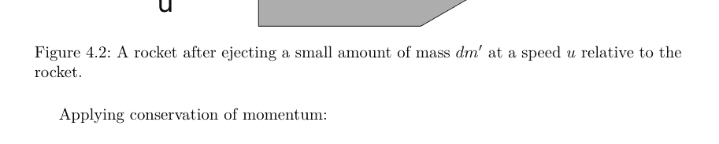

应用动量守恒：

$$p(t) = p(t + dt) \qquad (4.2.2)$$
$$mv = (m - dm')(v + dv) + dm' (v - u) \qquad (4.2.3)$$
$$m dv = u dm' \qquad (4.2.4)$$
$$m dv = - u dm \qquad (4.2.5)$$

其中最后一行是通过注意到火箭质量的变化为 $dm = -dm'$ 而得到的。此外，我们忽略了 $dm' dv$ 项，因为 $dm'$ 和 $dv$ 都很小；因此它们的乘积可以忽略不计。两边除以 $dt$，我们得到：

$$m \dot{v} = -u \dot{m} \quad (4.2.6)$$

(4.2.6) 的左边是牛顿第二定律（$F = ma$），因此我们看到作用在火箭上的合力等于 $-u \dot{m}$，这有时被称为*推力*。注意 $\dot{m} < 0$，所以推力是正的（在图 4.2 中指向右侧）。我们也可以将 (4.2.6) 写为：

$$dv = -u \frac{dm}{m} \quad (4.2.7)$$

假设 $u$ 为常数，可以对这个方程进行积分。如果在 $t = 0$ 时火箭的速度为 $v_0$，质量为 $m_0$，我们得到：

$$v - v_0 = u \ln \left( \frac{m_0}{m} \right) \quad (4.2.8)$$

这给出了火箭速度作为其质量 $m$ 的函数。方程 (4.2.8) 告诉我们，为了使火箭尽可能快，工程师需要制造具有大排气速度 $u$ 和大初始与最终质量比 $m_0/m$ 的火箭。火箭的最终速度将在所有燃料燃尽时获得。具有可抛掉多级的火箭有助于最大化 $m_0/m$，从而使火箭能够达到更高的速度。

接下来，我们研究火箭垂直运动并受重力作用的情况。我们的目标是找到一个描述火箭速度的方程。我们将使用一个坐标系，其中正 $y$ 方向向上，与重力方向相反。在这种情况下，重力是作用在火箭上的外力，因此：

$$\frac{dp}{dt} = -mg \quad (4.2.9)$$
$$dp = -mgdt \quad (4.2.10)$$
$$p(t + dt) - p(t) = -mgdt \quad (4.2.11)$$
$$mdv + udm = -mgdt \quad (4.2.12)$$
$$m \frac{dv}{dt} + u \frac{dm}{dt} = -mg \quad (4.2.13)$$

为了得到 $v$ 的方程，我们假设一个恒定的*燃烧速率* $\alpha$：

$$\alpha = -\frac{dm}{dt} \quad (4.2.14)$$

使用我们的燃烧速率定义，(4.2.13) 变为：

$$\frac{dv}{dt} = -g + \frac{\alpha}{m}u \quad (4.2.15)$$
$$dv = \left( -g + \frac{\alpha u}{m} \right) dt \quad (4.2.16)$$
$$dv = \left( \frac{g}{\alpha} - \frac{u}{m} \right) dm \quad (4.2.17)$$

使用 $v(0) = v_0$ 和 $m(0) = m_0$ 对上述方程进行积分，得到：

$$v - v_0 = \frac{g}{\alpha} (m - m_0) + u \ln \left( \frac{m_0}{m} \right) \quad (4.2.18)$$

这个方程给出了当燃烧速率 $\alpha$ 为常数时，火箭速度作为质量 $m$ 的函数。有时 (4.2.18) 通过积分燃烧速率的定义 $m - m_0 = -\alpha t$ 被重写。在这种情况下，(4.2.18) 变为：

$$v - v_0 = -gt + u \ln \left( \frac{m_0}{m} \right) \qquad (4.2.19)$$

使用 (4.2.19) 的优点是可以看到影响火箭运动的两个项。第一项 $-gt$ 是自由落体粒子的标准运动学项，代表重力对速度的影响。第二项 $u \ln(m_0/m)$ 与我们之前在火箭水平运动中得到的项相同，代表推力对火箭速度的影响。

## 4.3 质心

涉及动量的问题通常涉及多个物体，例如碰撞的情况。在所研究的系统涉及多个粒子，或者研究对象不是质点的情况下，*质心*的概念变得有用。让我们从考虑一个由 $N$ 个质点组成的系统开始。一个粒子系统的质心位置 $\mathbf{R}$ 定义为：

> **离散粒子系统的质心**

$$\mathbf{R} = \frac{1}{M} \sum_{i=1}^{N} m_i \mathbf{r}_i \qquad (4.3.1)$$

$$X = \frac{1}{M} \sum_{i=1}^{N} m_i x_i \qquad Y = \frac{1}{M} \sum_{i=1}^{N} m_i y_i \qquad Z = \frac{1}{M} \sum_{i=1}^{N} m_i z_i \qquad (4.3.2)$$

其中 $\mathbf{r}_i$ 是第 $i^{\text{th}}$ 个粒子的位置，其质量为 $m_i$。系统的总质量为 $M = \sum m_i$。方程 (4.3.1) 实际上是三个方程，分别对应 $\mathbf{R}$ 的每个坐标。例如，在笛卡尔坐标系中，第 $i^{\text{th}}$ 个粒子的位置是 $\mathbf{r}_i = x_i \hat{\mathbf{i}} + y_i \hat{\mathbf{j}} + z_i \hat{\mathbf{k}}$，我们可以写成 $\mathbf{R} = X \hat{\mathbf{i}} + Y \hat{\mathbf{j}} + Z \hat{\mathbf{k}}$。

质心是系统中质量的加权平均位置，权重是质量 $m_i$。质心的位置会更靠近质量较大的粒子。下一个例子说明了这一点。

> **例 4.3：地日系统的质心。**
> 计算地日系统的质心位置。

**解：**
我们选择一个坐标系，使太阳中心位于原点。我们还将地球轨道近似为圆形，并假设地球轨道平面是恒定的。因此，我们可以在极坐标系中工作，只需要找到系统质心到太阳中心的距离。地球和太阳之间的距离约为 $1.5 \times 10^{11}$ m，地球和太阳的质量分别为 $5.9 \times 10^{24}$ kg 和 $2.0 \times 10^{30}$ kg。因此，在我们的坐标系中，$r_{\text{Sun}} = 0$ 且 $r_{\text{Earth}} = 1.5 \times 10^{11}$ m。将这些数字代入 (4.3.1) 得到：

$$\frac{(m_{\text{Earth}})(r_{\text{Earth}})}{m_{\text{Sun}} + m_{\text{Earth}}} = \frac{(5.9 \times 10^{24} \text{ kg})(1.5 \times 10^{11} \text{ m})}{5.9 \times 10^{24} \text{ kg} + 2.0 \times 10^{30} \text{ kg}} = 4.6 \times 10^5 \text{ m}.$$

太阳的半径约为 $7.0 \times 10^8$ m。因此，地日系统的质心位于太阳内部，并且实际上与太阳中心重合。

如果我们想将 (4.3.1) 扩展到连续的质量分布，即不能很好地描述为质点的物体，那么我们需要做一些改变。处理连续质量分布的一种方法是将其视为无穷小质量 $dm$ 的集合。然后，(4.3.1) 中对离散粒子的求和变成了对无穷小质量元 $dm$ 的积分。质心方程变为：

**连续质量分布的质心**

$$\mathbf{R} = \frac{1}{M} \int \mathbf{r} dm \quad M = \int dm \quad (4.3.3)$$

$$X = \frac{1}{M} \int x dm \quad Y = \frac{1}{M} \int y dm \quad Z = \frac{1}{M} \int z dm \quad (4.3.4)$$

在上面的方程中，总质量由 $M = \int dm$ 求得，并且与 (4.3.1) 类似，方程 (4.3.3) 实际上由三个方程组成，分别对应每个坐标。通常，我们不使用质量来积分 (4.3.3)。最常见的是，当物体密度不均匀时，积分是在物体的长度、面积或体积上进行的。
下面的方框总结了如何在物体的一维、二维和三维情况下使用密度来计算总质量 $M$。对于一维物体，我们使用线质量密度 $\lambda$（单位长度的质量，单位为 kg/m）。对于二维物体，我们使用面密度 $\sigma$（单位面积的质量，单位为 kg/m$^2$），对于三维物体，我们使用熟悉的体密度 $\rho$（单位体积的质量，单位为 kg/m$^3$）。

**计算 1D、2D 和 3D 物体的质量 $dm$**

$$dm = \lambda dx \quad M = \int \lambda dx \quad (4.3.5)$$

$$dm = \sigma dA \quad M = \int \sigma dA \quad (4.3.6)$$

$$dm = \rho dV \quad M = \int \rho dV \quad (4.3.7)$$

接下来的两个例子演示了如何将 (4.3.3) 应用于连续质量分布。

### 例 4.4：等腰三角形的质心。

一个单位面积质量均匀为 $\sigma$ 的薄板被塑造成如下图所示的等腰三角形。三角形有两条边长为 $a$，底边长为 $\sqrt{2}a$。求这个三角形薄板的质心。

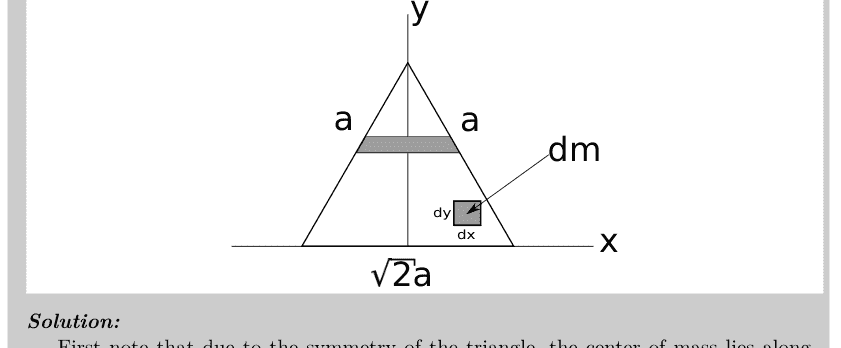

#### 解：

首先注意，由于三角形的对称性，质心位于 $y$ 轴上。计算质量分布的质心涉及确定两个组成部分。第一个需要确定的组成部分是*质量元* $dm$，如三角形图中所示。笛卡尔坐标是这个问题的自然坐标选择。因此，将使用 $dm = \sigma dxdy$ 作为质量元。

找到质心所需的第二个组成部分是 (4.3.3) 中*积分的上下限*。积分的上下限范围覆盖物体的尺寸。我们在三角形顶部附近包含了一个水平灰色条带，以说明三角形的宽度随高度变化，条带在三角形上向上移动时变窄。条带的右边界由直线 $y = a/\sqrt{2} - x$ 界定，左边界由直线 $y = a/\sqrt{2} + x$ 界定，因为三角形的高度为 $a/\sqrt{2}$。因此，我们可以认为条带的左端在 $x = y - a/\sqrt{2}$，右端在 $x = a/\sqrt{2} - y$。

然后可以通过计算 $Y = (1/M) \int ydm$ 来找到质心的 $y$ 坐标：

$$Y = \frac{1}{M} \int_{y=0}^{y=a/\sqrt{2}} \int_{x=y-a/\sqrt{2}}^{a/\sqrt{2}-y} y\sigma dxdy$$
$$= \frac{\sigma}{M} \int_{0}^{a/\sqrt{2}} yx \Big|_{y-a/\sqrt{2}}^{a/\sqrt{2}-y} dy$$
$$= \frac{\sigma}{M} \int_{0}^{a/\sqrt{2}} 2y \left( \frac{a}{\sqrt{2}} - y \right) dy$$
$$= \frac{\sigma}{M} \left( \frac{ay^2}{\sqrt{2}} - \frac{2y^3}{3} \right) \Big|_{0}^{a/\sqrt{2}}$$
$$= \frac{a^3}{6\sqrt{2}} \frac{\sigma}{M}$$

为了完成这个问题，我们需要找到总质量 $M$。

### Python 代码

我们可以使用 SymPy 中的 **integrate** 命令来执行这两个积分。请注意，在 Python 中与 Mathematica 不同，要*首先*执行的积分的上下限作为*第二个*参数出现（在被积函数之后）。

```python
from sympy import symbols, integrate, sqrt

print('-'*28,'CODE OUTPUT','-'*29,'\n')

x, y, a, sigma = symbols('x, y, a, sigma',real=True)

Y_fcn = y*sigma    # Y component of CM
M_fcn = sigma      # mass

Y_int = integrate(Y_fcn, (x, y - a/sqrt(2), a/sqrt(2) - y), \n                  (y,0,a/sqrt(2)))   # vary y first

M = integrate(M_fcn, (x, y - a/sqrt(2), a/sqrt(2) - y), \n              (y,0,a/sqrt(2)))

print('The mass = ', M)
print('The CM is located at y = ',Y_int/M)

------------------------------------ CODE OUTPUT ------------------------------------
The mass =  a**2*sigma/2
The CM is located at y =  sqrt(2)*a/6
```

### Mathematica 代码

请注意坐标 $x, y$ 在 **Integrate** 命令中出现的顺序。

```mathematica
Y = Integrate[σ * y/m, {y, 0, a/√2}, {x, y - a/√2, a/√2 - y}];
Print["The Y-coordinate for the CM is: Y = ", Y]

The Y-coordinate for the CM is: Y = (a³σ)/(6√2m)

M = Integrate[σ, {y, 0, a/√2}, {x, y - a/√2, a/√2 - y}];
Print["The mass M, M = ", M]

The mass M, M = (a²σ)/2

Y2 = Y/.m → M;
Print["Substituting the mass M, Y = ", Y2]

Substituting the mass M: Y = a/(3√2)
```

### 示例 4.5：实心圆锥的质心。

下图显示了一个密度均匀为 ρ 的圆锥。圆锥顶部半径为 a，高度为 h。计算圆锥的质心。

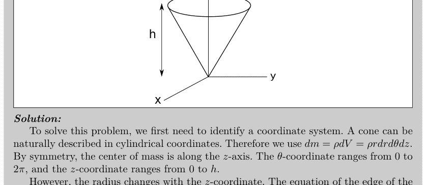

#### 解答：

要解决这个问题，我们首先需要确定一个坐标系。圆锥可以自然地用柱坐标来描述。因此我们使用 dm = ρdV = ρrdrdθdz。根据对称性，质心位于 z 轴上。θ 坐标范围从 0 到 2π，z 坐标范围从 0 到 h。

然而，半径随 z 坐标变化。图中 yz 平面内圆锥边缘的方程为 r = az/h，因此半径 r 的范围是从 0 到 az/h。将所有这些综合起来，

```
Z = 1/M ∫(z=0 to h) ∫(θ=0 to 2π) ∫(r=0 to az/h) zρrdrdθdz
= (2πρ/M) ∫(0 to h) z [r²/2](0 to az/h) dz
= (2πρa²)/(2h²M) ∫(0 to h) z³ dz = (πρa²h²)/(4M)
```

求解总质量 $M$：

$$M = \int_0^h \int_0^{2\pi} \int_0^{az/h} \rho r dr d\theta dz$$
$$= 2\pi\rho \int_0^h \frac{r^2}{2} \Big|_0^{az/h} dz$$
$$= \frac{\pi\rho a^2}{h^2} \int_0^h z^2 dz = \frac{\pi\rho a^2 h}{3}$$

最后，将 $M$ 代入 $Z$ 的结果中，我们得到：

$$Z = \frac{3}{4}h$$

同样，我们可以使用计算机代数系统（CAS）来执行三重积分。

### Python 代码

三重积分的执行方式与示例 4.4 中计算的二重积分相同。再次注意积分的顺序，并与 Mathematica 代码进行比较。再次注意 **integrate** 命令中积分限的顺序。

```python
from sympy import symbols, integrate, sqrt, pi

print('-'*28,'CODE OUTPUT','-'*29,'\n')

r, theta, z , rho, h = symbols('r,theta,z,rho,h', real=True)

Z_fcn = z*rho*r    # Y component of CM
M_fcn = rho*r      # mass

Z_int = integrate(Z_fcn, (r, 0, a*z/h), \n    (theta,0,2*pi), (z,0,h))    # vary y first

M = integrate(M_fcn, (r, 0, a*z/h), \n    (theta,0,2*pi), (z,0,h))

print('The mass = ', M)
print('The CM is located at z = ', Z_int/M)

----------------------------- CODE OUTPUT -----------------------------
The mass =  pi*a**2*h*rho/3
The CM is located at z =  3*h/4
```

### Mathematica 代码

请注意，为了在柱坐标中执行三重积分，我们需要在 `Integrate` 命令的参数中显式包含 $r = az/h$ 的方程。

```mathematica
Z = Integrate[(ρ*z*r)/m, {θ, 0, 2π}, {z, 0, h}, {r, 0, az/h}];
Print["The Z-coordinate for the CM is: Z = ", Z]
The Z-coordinate for the CM is: Z = (a^2 h^2 π ρ)/(4m)

M = Integrate[ρ*r, {θ, 0, 2π}, {z, 0, h}, {r, 0, az/h}];
Print["The mass M, M = ", M]
The mass M, M = (1/3) a^2 h π ρ

Z2 = Z/.m -> M;
Print["Substituting the mass M, Z = ", Z2]
Substituting the mass M: Z = 3h/4
```

在下一个示例中，我们将使用*数值*方法来寻找一个非均匀等腰三角形的质心。回顾一下，在[第 2 章](#)中，我们讨论了数值积分技术。

### 示例 4.6：非均匀等腰三角形的质心。

考虑示例 4.4 中的三角形，但现在密度非均匀，$\sigma = 2y$（所有物理量均为国际单位制）。当 $a = 1$ m 时，计算三角形的质心。

#### 解答：

在这种情况下，解法与示例 4.4 非常相似，但现在三角形具有非均匀密度。积分限相同，$a = 1$。然而，由于密度非均匀，$dm$ 发生了变化。在这种情况下，$dm = \sigma dxdy = 2ydxdy$。因为密度仅在 $y$ 方向变化，我们仍然预期质心的 $x$ 坐标为零。我们需要求解的积分是：

```
Y = \frac{1}{M} \int_{y=0}^{y=a/\sqrt{2}} \int_{x=y-a/\sqrt{2}}^{a/\sqrt{2}-y} 2y^2 dxdy
M = \int_{y=0}^{y=a/\sqrt{2}} \int_{x=y-a/\sqrt{2}}^{a/\sqrt{2}-y} 2ydxdy
```

我们将使用 Mathematica 和 Python 的数值积分命令来求解这些积分。

### Python 代码

我们使用 SciPy 库中的 `integrate.nquad`。请注意，我们可以将边界作为函数包含；这允许我们使用描述三角形边所必需的非常数积分限。除了求 $Y$ 之外，我们还计算了 $X$ 以显示 $X = 0$，正如预期的那样。

注意 `integrate.nquad` 命令内的方括号。

```python
from scipy import integrate
import numpy as np

print('-'*28,'CODE OUTPUT','-'*29,'\n')

a = 1.0

def sigma(x,y):
    return 2.0*y

def fx(x,y):
    return x*sigma(x,y)

def fy(x,y):
    return y*sigma(x,y)

def y_bounds():
    return [0,1/np.sqrt(2.0)]

def x_bounds(y):
    return [y-1/np.sqrt(2.0),1/np.sqrt(2.0)-y]

Y = integrate.nquad(fy,[x_bounds,y_bounds])[0]
X = integrate.nquad(fx,[x_bounds,y_bounds])[0]
mass = integrate.nquad(sigma,[x_bounds,y_bounds])[0]

print('The x-coordinate is: '+str(X/mass))
print('The y-coordinate is: '+str(Y/mass))

--------------------------------- CODE OUTPUT ---------------------------------
The x-coordinate is: 0.0
The y-coordinate is: 0.35355339059327384
```

### Mathematica 代码

我们使用 `NIntegrate` 来数值计算积分。我们包含了 $X$ 的结果以显示其为零。

```mathematica
a = 1.0;

mass = NIntegrate[2 * y, {y, 0, a / Sqrt[2]}, {x, y - a / Sqrt[2], a / Sqrt[2] - y}];

Y = NIntegrate[2 * y^2, {y, 0, a / Sqrt[2]}, {x, y - a / Sqrt[2], a / Sqrt[2] - y}] / mass;
Print["The Y-coordinate for the CM is: Y = ", Y]

The Y-coordinate for the CM is: Y = 0.353553

X = NIntegrate[2 * y * x, {y, 0, a / Sqrt[2]}, {x, y - a / Sqrt[2], a / Sqrt[2] - y}] / mass;
Print["The X-coordinate for the CM is: X = ", X]

The X-coordinate for the CM is: X = 0.
```

## 4.4 多粒子系统的动量

接下来，考虑一个由 $N$ 个质点组成的系统，总质量为 $M$。我们首先计算作用在整个系统上的合力。从第 4.1 节我们知道，粒子之间的内力相互抵消，作用在系统上的合力是外力的总和。作用在粒子上的合力 $\mathbf{F}$ 为：

$$\mathbf{F} = \sum_{i=1}^{N} m_i \ddot{\mathbf{r}}_i = \frac{d^2}{dt^2} \sum_{i=1}^{N} m_i \mathbf{r}_i = \frac{d^2}{dt^2} M \mathbf{R} = M \ddot{\mathbf{R}} \quad (4.4.1)$$

其中我们使用了 (4.3.1) 中质心的定义。因此，粒子系统的运动就像一个质量为 $M$ 的单个粒子，受到外力的作用。我们也可以计算粒子系统的总动量：

$$\mathbf{P} = \sum_{i=1}^{N} \mathbf{p}_i = \sum_{i=1}^{N} m_i \dot{\mathbf{r}}_i = \frac{d}{dt} \sum_{i=1}^{N} m_i \mathbf{r}_i = \frac{d}{dt} M \mathbf{R} = M \dot{\mathbf{R}} \quad (4.4.2)$$

系统的总动量等于系统质心的动量。同样，我们可以将系统视为位于系统质心处的一个质量为 $M$ 的单个粒子。总动量的时间导数为：

$$\dot{\mathbf{P}} = M \ddot{\mathbf{R}} = \mathbf{F} \quad (4.4.3)$$

这也告诉我们，如果没有净外力作用在系统上，则系统的总线性动量守恒。

总之，我们可以认为净外力作用在系统的质心上。本节的结果也适用于连续质量分布，但求和需要替换为积分。

当涉及到平动时，上述结果允许我们将物体或粒子系统视为位于物体质心处的一个质点。质点的质量将等于物体的总质量，或粒子系统的总质量。由于外力作用在质心上，我们可以简单地跟踪物体质心的运动。例如，美式橄榄球不是一个质点。然而，如果橄榄球被踢出，它的质心将遵循抛物线轨迹，因为质心受到重力作用，并遵循第3章中建立的抛体运动方程。

### 示例 4.7：下落的链条。

考虑一条长度为 $a$、均匀密度为 $\rho$ 的链条，在 $t = 0$ 时从一端悬挂在桌子上方，如下图中虚线所示。在 $t = 0$ 时，链条的末端从距离桌面 $a$ 的高度释放，链条被允许落到桌面上。求链条对桌面施加的力，作为从最初固定端到链条的距离 $x$ 的函数。


#### 解答：

链条可以被视为一个质点系统。作用在链条质心上的力为：
$$F_{net} = Mg - F_N$$
其中 $Mg$ 是链条的重量，$F_N$ 是桌面施加在链条上的力。我们选择了一个坐标系，其中 $+x$ 方向向下，因此下落链条的速度为 $\dot{x} > 0$。下落部分链条的质量为 $\rho(a - x)$，因为尚未下落的链条长度为 $(a - x)$。下落部分链条的动量为：
$$P = mv = \rho(a - x)\dot{x}$$
我们知道 $\dot{P} = F_{net}$；因此，动量的时间导数为：
$$\dot{P} = \rho(a - x)\ddot{x} - \rho\dot{x}^2$$
对于自由落体，我们知道 $\dot{x} = \sqrt{2gx}$ 且 $\ddot{x} = g$。将 $\dot{x}$ 和 $\ddot{x}$ 代入上式并整理各项，我们得到：
$$\dot{P} = \rho g(a - 3x)$$
最后，将 $\dot{P} = F_{net} = Mg - F_N$ 代入，并使用链条的总质量 $M = \rho a$，我们得到：
$$\rho g(a - 3x) = \rho a g - F_N$$
$$F_N = 3\rho g x$$
随着距离 $x$ 的增加，桌面施加在链条上的力从 $t = 0$ 时的 $F_N = 0$ 变化到链条完全落在桌面上时的 $F_N = 3\rho g a$。

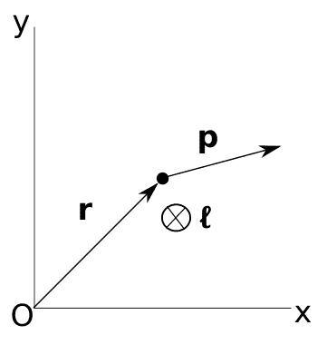

图 4.3：一个质量为 $m$ 的质点位于相对于原点 $O$ 的位置 $\mathbf{r}$，以动量 $\mathbf{p}$ 运动，并且相对于原点具有角动量 $\boldsymbol{\ell} = \mathbf{r} \times \mathbf{p}$。在这种情况下，质点的角动量指向页面内。

## 4.5 单个质点的角动量

考虑一个质量为 $m$ 的质点，以动量 $\mathbf{p} = m\mathbf{v}$ 运动，如图 4.3 所示。质点的角动量定义为：

> **角动量**
$$\boldsymbol{\ell} = \mathbf{r} \times \mathbf{p}$$ (4.5.1)

由于质点的位置 $\mathbf{r}$ 是相对于原点测量的，角动量 $\boldsymbol{\ell}$ 也是相对于原点的。线性动量 $\mathbf{p}$ 不依赖于原点，而相比之下，角动量矢量 $\boldsymbol{\ell}$ 依赖于原点的选择。多个质点的角动量只有在所有角动量都是相对于同一原点测量时，才能进行比较（和相加）。此外，请注意，质点不需要绕点 $O$ 旋转，就能具有相对于 $O$ 的角动量。

$\mathbf{r}$ 和 $\mathbf{p}$ 之间的叉积关系告诉我们，角动量的方向是使用右手定则找到的。在这种情况下，我们可以想象用右手的手指指向 $\mathbf{r}$ 的方向。接下来，我们可以将手指扫过（或弯曲）到 $\mathbf{p}$ 的方向，结果拇指指向 $\boldsymbol{\ell}$ 的方向，即指向页面内。图 4.3 中的 $\otimes$ 符号表示指向页面内的角动量矢量。如果 $\boldsymbol{\ell}$ 指向页面外，我们将使用一个内部带点的圆来表示矢量的方向。

如果我们计算角动量的时间导数，我们得到：

$$\dot{\boldsymbol{\ell}} = \dot{\mathbf{r}} \times \mathbf{p} + \mathbf{r} \times \dot{\mathbf{p}} = m (\dot{\mathbf{r}} \times \dot{\mathbf{r}}) + \mathbf{r} \times \dot{\mathbf{p}} = \mathbf{r} \times \dot{\mathbf{p}}$$ (4.5.2)

通过使用牛顿第二定律 $\dot{\mathbf{p}} = \mathbf{F}$，我们发现：

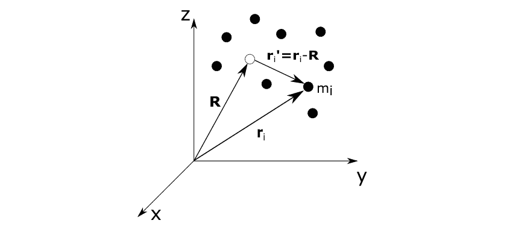

图 4.4：$N$ 个质点的集合。每个质点 $m_i$ 位于相对于原点的位置 $\mathbf{r}_i$ 和相对于质心的位置 $\mathbf{r}'_i$。空心圆是系统的质心。

> **牛顿旋转第二定律**

$$\dot{\boldsymbol{\ell}} = \mathbf{r} \times \mathbf{F} = \mathbf{N}$$

(4.5.3)

因此，角动量的时间变化率是力矩，$\mathbf{N} = \mathbf{r} \times \mathbf{F}$。与角动量一样，力矩也是相对于与角动量相同的原点测量的。方程 (4.5.3) 有时被称为旋转的牛顿第二定律，即使质点要经历力矩或具有角动量，也不需要旋转运动。

## 4.6 多个质点的角动量

接下来，我们考虑离散质点系统相对于原点的总角动量。同样，对于连续质量分布，结果是相同的。图 4.4 说明了一个包含 $N$ 个质点的系统。图 4.4 中第 $i^{\text{th}}$ 个质点的质量为 $m_i$，位于相对于原点的位置 $\mathbf{r}_i$，以及相对于质心（图 4.4 中的空心圆）的位置 $\mathbf{r}'_i$。注意 $\mathbf{R} + \mathbf{r}'_i = \mathbf{r}_i$，其中 $\mathbf{R}$ 是质心相对于原点的位置。

我们将计算图 4.4 中质点系统相对于原点的总角动量。每个质点具有角动量 $\boldsymbol{\ell}_i = \mathbf{r}_i \times \mathbf{p}_i$。因此，系统的总角动量 $\mathbf{L}$ 为：

$$\mathbf{L} = \sum_{i=1}^{N} \mathbf{r}_i \times \mathbf{p}_i = \sum_{i=1}^{N} \mathbf{r}_i \times m_i \dot{\mathbf{r}}_i$$

(4.6.1)

通过代入 $\mathbf{r}_i = \mathbf{R} + \mathbf{r}'_i$，我们得到：

$$\mathbf{L} = \sum_{i=1}^{N} (\mathbf{r}'_i + \mathbf{R}) \times m_i (\dot{\mathbf{r}}'_i + \dot{\mathbf{R}})$$

(4.6.2)

将叉积展开为四项：

$$\mathbf{L} = \sum_{i=1}^{N} m_i \left[ (\mathbf{r}'_i \times \dot{\mathbf{r}}'_i) + (\mathbf{r}'_i \times \dot{\mathbf{R}}) + (\mathbf{R} \times \dot{\mathbf{r}}'_i) + (\mathbf{R} \times \dot{\mathbf{R}}) \right] \quad (4.6.3)$$

上述四项中，有两项立即引起我们的兴趣：

$$\sum_{i=1}^{N} m_i (\mathbf{r}'_i \times \dot{\mathbf{R}}) = \left( \sum_{i=1}^{N} m_i \mathbf{r}'_i \right) \times \dot{\mathbf{R}} \quad (4.6.4)$$
$$\sum_{i=1}^{N} m_i (\mathbf{R} \times \dot{\mathbf{r}}'_i) = \mathbf{R} \times \frac{d}{dt} \left( \sum_{i=1}^{N} m_i \mathbf{r}'_i \right) \quad (4.6.5)$$

在每种情况下，都出现了项 $\sum m_i \mathbf{r}'_i$。然而，根据质心的定义，$\sum m_i \mathbf{r}'_i = \sum m_i (\mathbf{r}_i - \mathbf{R}) = \sum m_i \mathbf{r}_i - \sum m_i \mathbf{R} = M\mathbf{R} - M\mathbf{R} = 0$。因此，在 (4.6.3) 中只有两项保留下来，总角动量为：

$$\mathbf{L} = \sum_{i=1}^{N} m_i \left[ (\mathbf{r}'_i \times \dot{\mathbf{r}}'_i) + (\mathbf{R} \times \dot{\mathbf{R}}) \right]$$
$$= \sum_{i=1}^{N} (\mathbf{r}'_i \times m_i \dot{\mathbf{r}}'_i) + \mathbf{R} \times \sum_{i=1}^{N} m_i \dot{\mathbf{R}} \quad (4.6.6)$$

最终结果是以下重要方程：

> **质点系统的角动量**
$$\mathbf{L} = \sum_{i=1}^{N} (\mathbf{r}'_i \times \mathbf{p}'_i) + \mathbf{R} \times \mathbf{P} \quad (4.6.7)$$

它表明系统的总角动量是两项之和：第一项是质点相对于质心的角动量之和（$\sum \mathbf{r}'_i \times \mathbf{p}'_i$）；第二项是质心相对于原点的角动量（$\mathbf{R} \times \mathbf{P}$）。

如果我们计算 $\mathbf{L}$ 的时间导数，我们发现，

$$\dot{\mathbf{L}} = \sum_{i=1}^{N} \mathbf{r}_i \times \dot{\mathbf{p}}_i \quad (4.6.8)$$

这是作用在系统上的净力矩 $\mathbf{N}$（回想一下 $\dot{\mathbf{p}} = \mathbf{F}$）。接下来，我们将详细研究作用在系统上的净力矩：

$$\mathbf{N} = \sum_{i=1}^{N} \mathbf{r}_i \times \dot{\mathbf{p}}_i = \sum_{i=1}^{N} \mathbf{r}_i \times \mathbf{F}_i \quad (4.6.9)$$

其中 $\dot{\mathbf{p}}_i = \mathbf{F}_i$ 是作用在质量 $m_i$ 上的净力。这个作用在 $m_i$ 上的净力是外力和内力的总和；因此：

## 4.6 系统的角动量与转动定律

系统的总角动量为：
$$\mathbf{N} = \sum_{i=1}^{N} \mathbf{r}_i \times \left( \mathbf{F}_i^{\text{ext}} + \sum_{j \neq i} \mathbf{F}_{ij} \right)$$ (4.6.10)

$$= \sum_{i=1}^{N} (\mathbf{r}_i \times \mathbf{F}_i^{\text{ext}}) + \sum_{i=1}^{N} \sum_{j \neq i} (\mathbf{r}_i \times \mathbf{F}_{ij})$$ (4.6.11)

我们将使用与处理 (4.1.8) 时相同的恒等式：
$$\mathbf{N} = \sum_{i=1}^{N} (\mathbf{r}_i \times \mathbf{F}_i^{\text{ext}}) + \sum_{i=1}^{N} \sum_{j>i} [(\mathbf{r}_i \times \mathbf{F}_{ij}) + (\mathbf{r}_j \times \mathbf{F}_{ji})]$$ (4.6.12)

利用牛顿第三定律 $\mathbf{F}_{ji} = -\mathbf{F}_{ij}$ 可得：
$$\mathbf{N} = \sum_{i=1}^{N} (\mathbf{r}_i \times \mathbf{F}_i^{\text{ext}}) + \sum_{i=1}^{N} \sum_{j>i} (\mathbf{r}_i - \mathbf{r}_j) \times \mathbf{F}_{ij}$$ (4.6.13)

注意，如果内力 $\mathbf{F}_{ij}$ 是有心力，那么向量 $\mathbf{F}_{ij}$ 沿着连接 $m_i$ 和 $m_j$ 的直线。因此，对于有心力，$\mathbf{F}_{ij}$ 沿着向量 $\mathbf{r}_i - \mathbf{r}_j$，且 $(\mathbf{r}_i - \mathbf{r}_j) \times \mathbf{F}_{ij} = 0$。在这种情况下，(4.6.13) 中的第二项为零，净力矩为：
$$\mathbf{N} = \sum_{i=1}^{N} (\mathbf{r}_i \times \mathbf{F}_i^{\text{ext}}) = \sum_{i=1}^{N} \mathbf{N}_i^{\text{ext}} = \mathbf{N}^{\text{ext}}$$ (4.6.14)

换句话说，系统的净力矩等于外力矩之和。与净力类似，内力矩之和为零（如果内力是有心力）。

总之，与单粒子情况类似，转动的牛顿第二定律可以写为：

> **转动的牛顿第二定律**
$$\dot{\mathbf{L}} = \mathbf{N}^{\text{ext}}$$ (4.6.15)

因此，只有当净外力矩为零时，系统的总角动量才守恒。角动量守恒定律可以写为：

> **角动量守恒定律**
如果 $\mathbf{N}^{\text{ext}} = 0$，则 $\mathbf{L} = \text{constant}$

### 例题 4.8：粒子系统的总角动量

考虑两个质量均为 1 kg 的粒子。在时刻 $t$，粒子 1 位于 $\mathbf{r}_1 = 3\mathbf{\hat{i}} + 2\mathbf{\hat{j}}$，速度为 $\mathbf{v}_1 = 2\mathbf{\hat{i}}$（所有物理量均为 SI 单位）。粒子 2 位于 $\mathbf{r}_2 = -3\mathbf{\hat{i}} + 2.0\mathbf{\hat{j}}$，速度为 $\mathbf{v}_2 = -2.0\mathbf{\hat{j}}$。计算该粒子系统相对于原点的总角动量。

#### 解：

对粒子 1 使用 (4.5.1)：
$$ \ell_1 = m_1 (\mathbf{r}_1 \times \mathbf{v}_1) = 1.0 \begin{vmatrix} \mathbf{\hat{i}} & \mathbf{\hat{j}} & \mathbf{\hat{k}} \\ 3 & 2 & 0 \\ 2 & 0 & 0 \end{vmatrix} = -4\mathbf{\hat{k}} $$
其中我们为了简化方程而省略了行列式中的单位。接下来，我们对粒子 2 执行相同的步骤：
$$ \ell_2 = m_2 (\mathbf{r}_2 \times \mathbf{v}_2) = 1.0 \begin{vmatrix} \mathbf{\hat{i}} & \mathbf{\hat{j}} & \mathbf{\hat{k}} \\ -3 & 2 & 0 \\ 0 & -2 & 0 \end{vmatrix} = 6.0\mathbf{\hat{k}} $$
最后我们将角动量相加：
$$ \mathbf{L} = \ell_1 + \ell_2 = 2.0 \text{ kg m}^2/\text{s } \mathbf{\hat{k}} $$
注意，在这种情况下我们可以将角动量相加，因为每个单独的角动量都是相对于同一个原点计算的。

### Python 代码

这里我们使用 NumPy 创建向量，并使用 `cross(r1,v1)` 函数计算叉积。
```python
import numpy as np

print('-'*28,'CODE OUTPUT','-'*29,'\n')

m1, m2 = 1, 1

r1 = np.array([3,2,0])
r2 = np.array([-3,2,0])
v1 = np.array([2,0,0])
v2 = np.array([0,-2,0])

l1 = m1*np.cross(r1,v1)
l2 = m2*np.cross(r2,v2)

print('l1 = ', l1)
print('l2 = ', l2)
print('L = ', l1 + l2)

------------------------------------ CODE OUTPUT ------------------------------------
l1 =  [ 0  0 -4]
l2 =  [0 0 6]
L =  [0 0 2]
```

### Mathematica 代码

我们使用 Cross 命令计算角动量。注意使用花括号将向量定义为列表。
```mathematica
r1 = {3,2,0}; v1 = {2,0,0}; m1 = 1.0;

r2 = {-3,2,0}; v2 = {0,-2,0}; m2 = 1.0;

l1 = m1 * Cross[r1, v1];

Print["The angular momentum for particle 1 is: l1 = ", l1]

The angular momentum for particle 1 is: l1 = {0., 0., -4.}

l2 = m2 * Cross[r2, v2];

Print["The angular momentum for particle 2 is: l2 = ", l2]

The angular momentum for particle 2 is: l2 = {0., 0., 6.}

L = l1 + l2;

Print["The total angular momentum is: l1+l2 = ", L]

The total angular momentum is: l1+l2 = {0., 0., 2.}
```

## 4.7 章节总结

线动量守恒定律指出：
$$\text{If } \mathbf{F}^{\text{ext}} = 0, \text{ then } \mathbf{P} = \text{constant}.$$
在*弹性*碰撞中，总动量*和*总动能都守恒。
在非弹性碰撞中，只有动量守恒。
如果系统没有外力作用，则*由 $N$ 个粒子组成的系统*的动量守恒：
$$\dot{\mathbf{P}} = \mathbf{F} = \sum_{i=1}^{N} \mathbf{F}_i^{\text{ext}}$$
$$\text{If } \mathbf{F}^{\text{ext}} = 0, \text{ then } \mathbf{P} = \text{constant}.$$
由 $N$ 个粒子组成的系统具有位于 $\mathbf{R}$ 的质心：
$$\mathbf{R} = \frac{1}{M} \sum_{i=1}^{N} m_i \mathbf{r}_i$$
连续质量分布的质心位于：
$$\mathbf{R} = \frac{1}{M} \int \mathbf{r} dm$$
为了评估一维、二维和三维物体的质量 $dm$ 和 $M$，我们使用：
$$dm = \lambda dx \quad M = \int \lambda dx$$
$$dm = \sigma dA \quad M = \int \sigma dA$$
$$dm = \rho dV \quad M = \int \rho dV$$
对于平动，我们可以将粒子系统视为位于物体质心处的一个质点，并考虑作用在系统质心上的净外力。如果 $M$ 是总质量，$\mathbf{P}$ 是总动量：
$$\dot{\mathbf{P}} = M \dot{\mathbf{R}} = \mathbf{F}$$
单个粒子的角动量 $\boldsymbol{\ell}$ 是位置向量 $\mathbf{r}$ 和线动量向量 $\mathbf{p}$ 的叉积：
$$\boldsymbol{\ell} = \mathbf{r} \times \mathbf{p}$$
力矩 $\mathbf{N}$ 是位置向量 $\mathbf{r}$ 和力向量 $\mathbf{F}$ 的叉积：
$$\dot{\boldsymbol{\ell}} = \mathbf{r} \times \mathbf{F} = \mathbf{N}$$
粒子系统的角动量 $\mathbf{L}$ 是两项之和：粒子相对于质心的角动量，以及质心相对于原点的角动量 ($\mathbf{R} \times \mathbf{P}$)：
$$\mathbf{L} = \sum_{i=1}^{N} (\mathbf{r}'_i \times \mathbf{p}'_i) + \mathbf{R} \times \mathbf{P}$$
其中 **R** 是质心相对于原点的位置，**P** 是总动量。如果我们将 **L** 对时间求导，就得到转动的牛顿第二定律：
$$\dot{\mathbf{L}} = \mathbf{N}^{\text{ext}}$$
根据转动的牛顿第二定律，我们可以写出粒子系统的角动量守恒定律：
如果 $\mathbf{N}^{\text{ext}} = 0$，则 $\mathbf{L} = \text{constant}$

## 4.8 章末习题

符号 💻 表示需要计算机辅助的问题，形式可以是图形、数值计算或符号求值。

*第 4.1 节：动量守恒与牛顿第三定律*

1. 证明在弹性碰撞后，两个质量相等的粒子的速度将彼此垂直。假设一个粒子最初以速度 $\mathbf{v}_{1i}$ 运动，另一个最初静止。
2. 考虑一个粒子 $m_1$ 最初以速度 $\mathbf{v}_0$ 运动，另一个粒子 $m_2$ 最初静止的完全非弹性碰撞。质量 $m_1$ 的初始动能中有多少比例在碰撞中损失了？
3. 💻 一个质量为 $M$ 的抛射物以速度 $v_0$ 从水平方向以角度 $\theta$ 发射。在其飞行的最高点，粒子爆炸成三块。爆炸增加的能量等于抛射物初始动能的三倍。爆炸后立即，一块质量为 $M/3$ 的碎片垂直向上运动。第二块质量为 $M/6$ 的碎片静止。求爆炸后立即三块碎片的速度。请分别通过手算和使用 CAS（计算机代数系统）来解决此问题。
4. 一门质量为 $m$ 的大炮从水平地面发射，目标距离大炮 $D$。大炮以初速度 $v_0$ 和与水平面成 $\theta$ 角发射，使其具有击中目标所需的射程。在其轨迹的最高点，大炮分裂成两个质量相等的碎片。一块碎片落在距离大炮 $D/2$ 处。另一块碎片落在何处（从大炮测量）？
5. 一个质量为 $m$、速度为 $\mathbf{v}_0$ 的粒子经历相互作用，分裂成两个较小的粒子，质量分别为 $m_1 = m/4$ 和 $m_2 = 3m/4$。观察到质量为 $m_1$ 的粒子以 $0.01c$ 的速度运动，方向与 $\mathbf{v}_0$ 成 30 度逆时针方向，其中 $c$ 是一个常数。质量 $m_2$ 的粒子以 $m_1$ 速度的三分之一运动。求 $m_2$ 的方向和 $\mathbf{v}_0$ 的大小。
6. 考虑两个质量分别为 $m_1$ 和 $m_2$ 的粒子之间的一维完全弹性正碰，其中最初 $m_1$ 以速度 $v_0$ 运动，$m_2$ 静止。求使 $m_2$ 的动能最大的 $m_2/m_1$ 的比值。

### 第4.2节 火箭

7.  考虑一枚水平飞行的火箭，其唯一受力为线性阻力，形式为 $F_{\text{drag}} = -bv\hat{v}$，其中 $b$ 为正常数。利用牛顿第二定律，写出描述火箭速度随时间变化的微分方程，初始条件为 $t = 0$ 时 $v(0) = 0$。

    a.  手动求解解析解 $v(t)$。
    b.  使用计算机代数系统（CAS）求解该微分方程，得到火箭速度 $v(t)$ 随时间变化的函数。如果你使用 Python，会注意到 SymPy 中通过 `dsolve` 得到的解可能包含复数，而 Mathematica 的解只包含实常数。这展示了 CAS 系统的一个局限性，因此（在可能的情况下）将解析解与 CAS 结果进行比较非常重要。

8.  一枚火箭需要在火星表面附近悬停，火星的重力加速度为 $a = 3.8 \text{ m/s}^2$。火箭的排气速度为 $u = 2000 \text{ m/s}$，但只能燃烧其初始燃料的 10%。火箭能悬停多久？

9.  一枚模型火箭具有恒定的燃烧速率 $\alpha = -dm/dt$。利用本章推导出的公式 (4.2.19)：
    $$v - v_0 = -gt + u \ln \left( \frac{m_0}{m} \right)$$
    计算火箭高度随时间 $t$ 的函数。通过解析方法和使用 CAS 求解高度。

10. 求解以下两个火箭问题。

    a.  一枚火箭初始质量为 $m$，燃烧速率为 $\alpha$。为了使火箭在发动机点火后立即从地球表面升空，所需的最小排气速度 $u$ 是多少？
    b.  土星五号火箭（满载燃料时）的质量为 280 万公斤。其燃料消耗速率为每秒 20 吨。求土星五号火箭在发动机点火后立即从地球表面升空所需的排气速度。将你的答案与地球的逃逸速度进行比较。

11. 考虑一枚在远离任何其他物体的水平方向飞行的两级火箭。在飞行的第一阶段，质量为 $m_0$ 的火箭具有排气速度 $v$。在第一阶段结束时，火箭的质量为 $m_1 = m_p + m_{f1}$，其中 $m_p$ 是有效载荷的质量，$m_{f1}$ 是燃料容器的质量。在燃尽时，火箭抛出质量 $m_{f1}$，并开始燃烧储存在有效载荷中的燃料。在第二次燃尽结束时，火箭的质量为 $m_2$。第二次燃尽期间的排气速度也是 $u$。求第二次燃尽后火箭的速度。

### 第4.3节：质心

12. 考虑一个由质量 $m_1$ 和 $m_2$ 组成的两粒子系统，两者相距 $r$。证明该两粒子系统的质心位于连接两粒子的直线上。

13. 考虑示例 4.5 中的圆锥体。假设其密度为 $\rho = (3+z)/2$，其中常数的单位使得 $\rho$ 以国际单位制（SI）测量。使用 CAS 求该圆锥体的质心。

14. 计算一个半径为 $R$、密度为 $\rho$ 的均匀实心半球体的质心位置。使用 CAS 进行计算。

15. 三个粒子分别位于 $\mathbf{r}_1 = 2\mathbf{i} - 2\mathbf{j} + 5\mathbf{k}$，$\mathbf{r}_2 = 5\mathbf{i} - 2\mathbf{k}$，$\mathbf{r}_3 = -\mathbf{i} + \mathbf{j} - \mathbf{k}$，质量分别为 $m_1 = 2$，$m_2 = 5$，$m_3$。使用 SymPy 或 Mathematica 求解：
    a.  系统的质心。
    b.  绕 z 轴的转动惯量。

16. 使用 Mathematica 或 Python，计算一个由曲线 $y = x^2$ 和 $y = x$ 在 $x = 0$ 和 $x = 1$ 之间定义的区域形成的薄板的质心，其密度为 $\sigma = 2(1 - x)(1 - y^2)$。

17. 一块均匀的金属被切割成函数 $y = \sin x$ 从 $x = 0$ 到 $x = \pi$ 的形状。金属的密度为 $\sigma = 2xy$。计算质心的位置。使用数值积分算法解决此问题。

18. 计算一个切割成单位圆 1/3 形状的薄板的质心位置，其密度为 $\sigma = 2xy$。将薄板的一条边放在正 $x$ 轴上，其“中心”位于原点。使用 CAS 解决此问题。

19. 考虑由平面 $z = 2$，$x = y = z = 0$ 和 $x + y = 2$ 围成的三棱柱。手动和使用 CAS 绘制该三维立体图形。当体积质量密度由 $\rho = xy^2$ 给出时（所有物理量均为 SI 单位），计算其总质量 $M = \iiint \rho \, dV$。通过使用 CAS 计算相应的三重积分，计算该物体沿 $x$、$y$ 和 $z$ 方向的质心位置。

### 第4.4节：多粒子系统的动量

20. 考虑一堆放在地板上的链条。链条的线质量密度为 $\lambda = M/L$，其中 $M$ 是链条的总质量，$L$ 是链条的总长度。链条的一端受到水平恒力 $F$ 的拉动。假设没有摩擦，计算链条末端的位置 $x(t)$ 随时间变化的函数。

21. 一根长度为 $2L$、均匀质量密度为 $\lambda = M/2L$（其中 $M$ 是绳子的质量）的绳子平衡地悬挂在墙上的一个钉子上。给绳子一个微小扰动，使其开始自由下落，但在下落过程中从未离开钉子。求绳子离开钉子时的速度。

22. 一根长度为 $L$、均匀质量密度为 $\lambda = M/L$ 的链条以 U 形悬挂在天花板上，其两端平行且靠近。在 $t = 0$ 时，链条的一端被释放。求链条在悬挂点处的张力 $T$，此时释放端已下落距离 $x$。你可以假设释放端的链条正在经历自由落体。绘制张力与重量之比随 $t/t_f$ 变化的函数图，其中 $t_f = \sqrt{2L/g}$ 是释放端下落距离 $L$ 所需的时间。

23. 一根质量为 $M$、长度为 $L$ 的绳子沿桌面伸展，使得长度 $x_0$ 悬挂在桌子边缘。如果绳子从静止释放并忽略摩擦，证明绳子完全滑离桌子所需的时间为 $t = T \cosh^{-1}(L/x_0)$，其中 $T = \sqrt{L/g}$。

24. 考虑问题 23 中存在摩擦的情况。如果 $\mu$ 是绳子与桌子之间的摩擦系数，求绳子滑离桌子所需的时间。通过解析方法和使用 CAS 求解此问题。

### 第4.5节和4.6节：单粒子和多粒子的角动量

25. 古代珊瑚的证据表明，3.5 亿年前，地球绕太阳公转一周需要 385 天（Hadhazy [2]）。一年的周期没有改变，但地球当时的自转速度更快。在过去的 3.5 亿年中，使地球自转减速的有效力矩的大小是多少？假设该力矩保持不变，地球停止自转（即角速度等于 0）需要多长时间？

26. 假设你将一个质量为 $m$ 的小球系在一根长度为 $r_0$ 的长绳末端，并以角速度 $\omega_0$ 绕你的头部旋转小球，使其在平行于地面的平面内做圆周运动。在 $t = 0$ 时，绳子以恒定速率缩短，使得 $\dot{r} = -\alpha$。求小球的角速度 $\omega$ 随时间变化的函数。不绘制图形，定性描述 $\omega$ 随时间的变化情况。求小球角速度达到 $16\omega_0$ 的时间。

27. 考虑一个刚性旋转物体。通过将物体分解成许多质量为 $m_i$ 的小块，证明物体角动量平行于旋转轴的分量可以写为 $L = I\omega$，其中：
    $$I = \sum m_i r_i^2$$
    这里 $r_i$ 是质量元 $m_i$ 相对于原点的位置。回顾 $I$ 被称为粒子系统的总转动惯量。

28. 考虑三个粒子 $m_1$、$m_2$、$m_3$，分别位于 $xy$ 平面上的 $(x_1, y_1)$、$(x_2, y_2)$ 和 $(x_3, y_3)$。该质量系统绕垂直于 $xy$ 平面的轴旋转。求 $xy$ 平面上的点 $P$，使得它们的总转动惯量（见问题 27）最小。证明该结果是系统的质心。通过解析方法和使用 CAS 求解此问题。

29. 设 $\mathbf{L}$ 是离散粒子系统相对于原点 $O$ 的角动量。设 $\mathbf{L}'$ 是同一系统相对于另一点 $O'$ 的角动量。用 $\mathbf{L}$ 表示 $\mathbf{L}'$ 的方程。你需要考虑向量 $\mathbf{r}_{O'}$，它表示 $O'$ 相对于 $O$ 的位置。

30. 考虑一个由两个质量分别为 $m_1$ 和 $m_2$ 的粒子组成的系统，它们分别位于位置 $\mathbf{r}_1$ 和 $\mathbf{r}_2$。假设粒子受到相互作用力：
    $$\mathbf{f}_{12} = -k (\mathbf{r}_2 - \mathbf{r}_1)$$
    其中 $k$ 是正常数，$\mathbf{f}_{12}$ 是粒子 1 作用于粒子 2 的力。作用在系统上的净内力矩是多少？讨论你的结果。

31. 考虑一个由两个质量分别为 $m_1$ 和 $m_2$ 的粒子组成的系统，它们分别位于位置 $\mathbf{r}_1$ 和 $\mathbf{r}_2$。假设粒子受到相互作用力：
    $$\mathbf{f}_{12} = -k (\dot{\mathbf{r}}_2 - \dot{\mathbf{r}}_1)$$
    其中 $k$ 是正常数，$\mathbf{f}_{12}$ 是粒子 1 作用于粒子 2 的力，$\dot{\mathbf{r}}_2$ 和 $\dot{\mathbf{r}}_1$ 分别是两个质量的速度。作用在系统上的净内力矩是多少？讨论你的结果。

## 章末习题

32. 考虑两个质量均为 $m = 1$ 的粒子（所有物理量均采用国际单位制）。粒子1的位置为 $\mathbf{r}_1 = 3 t \hat{\mathbf{i}} + 2 t^2 \hat{\mathbf{j}} + 6 \hat{\mathbf{k}}$，粒子2的位置为 $\mathbf{r}_2 = -3 t^2 \hat{\mathbf{i}} + 2 t^3 \hat{\mathbf{j}} - 4 t \hat{\mathbf{k}}$，其中 $t$ 表示时间。计算该粒子系统相对于原点的总角动量。作用于该系统的合外力矩是多少？请分别通过手算和使用计算机代数系统（CAS）求解此问题。

33. 考虑一个由三个粒子组成的系统，其在时间 $t$ 的质量和位置如下：质量 $m_1 = 1$ 位于 $\mathbf{r}_1 = 3t^2 \hat{\mathbf{i}} + 2(t - 1) \hat{\mathbf{j}} - 3 \cos(2t) \hat{\mathbf{k}}$，质量 $m_2 = 2$ 位于 $\mathbf{r}_2 = t \hat{\mathbf{i}} + 4t^3 \hat{\mathbf{j}} - \exp(-t) \hat{\mathbf{k}}$，质量 $m_3 = 1.5$ 位于 $\mathbf{r}_3 = \hat{\mathbf{i}} + t^2 \hat{\mathbf{j}} - 3 \hat{\mathbf{k}}$。所有物理量均采用国际单位制。使用计算机代数系统（CAS）求解：

- a. 系统的质心。
- b. 系统的总线动量。
- c. 系统的总角动量。
- d. 作用于系统的合外力。
- e. 作用于系统的合外力矩。

# 5 能量

本章我们将介绍能量和保守力的概念。我们还将讨论如何利用能量来描述系统的运动，并在此过程中引入平衡稳定性的概念。我们首先研究一维系统，因为它们易于可视化，然后将功和能量的概念推广到二维和三维系统，包括对线积分的讨论。最后，我们将以多粒子系统的能量讨论结束本章。

## 5.1 一维系统中的功与能

求解物理问题有多种方法。利用牛顿第二定律建立方程需要知道作用于系统的所有力。使用牛顿第二定律会得到一个描述粒子运动的二阶常微分方程。使用力的难点在于力是矢量，在二维或三维空间中，我们需要分别求解两个或三个二阶常微分方程。另一种求解物理问题的方法涉及能量的概念。能量是标量，因此处理起来更简单。当所谓的*保守力*作用于系统时，能量的概念尤其有用。对于保守力，我们只需比较事件前后系统的总能量即可描述系统的行为。例如，要找出一块石头下落两米后的速度，我们只需比较石头下落前后的总能量。在这个例子中，“下落”就是“事件”。

一般来说，能量的数学处理需要矢量和多元微积分的概念，因此形式上涉及高维系统。在本节中，我们将简要介绍一维系统的能量和能量守恒。一维系统的数学比高维系统简单得多，这使我们能够更专注于能量的概念，而不至于陷入复杂的数学推导。这里建立的见解将推广到数学更复杂的高维情况。

考虑合外力 $F(x)$ 依赖于位置且不显式依赖于时间和速度的情况。假设该力作用于一个沿直线从位置 $x_0$ 运动到位置 $x$ 的粒子。此外，如果我们定义正 $x$ 方向与力 $F(x)$ 的方向相同，那么该力所做的功为：

$$W = \int_{x_0}^{x} F(x') \, dx' \qquad (5.1.1)$$

其中撇号用于区分积分变量和积分限。功的单位是*焦耳*，$1 \text{ J} = 1 \text{ N}\cdot\text{m}$。注意，如果物体的位移方向与力的方向相反，则功为负。为简单起见，我们现在只关注正功。

回顾第2章，如果 $F = F(x)$，我们可以写成：

$$F(x) = mv \frac{dv}{dx} \qquad (5.1.2)$$

这可以写成：

$$F(x) = \frac{d}{dx} \left( \frac{1}{2} mv^2 \right) \qquad (5.1.3)$$

注意，上述方程的右边是量 $T = \frac{1}{2}mv^2$ 的导数，该量称为*动能*：

$$F(x) = \frac{dT}{dx} \quad (5.1.4)$$

分离变量并积分：

$$\int_{T_0}^{T} dT' = \int_{x_0}^{x} F(x')dx' \quad (5.1.5)$$

并利用动能的定义，我们得到：

> **动能定理**

$$\frac{1}{2}mv^2 - \frac{1}{2}mv_0^2 = \int_{x_0}^{x} F(x')dx' \quad (5.1.6)$$

方程 (5.1.6) 称为*动能定理*，它指出力 $F(x)$ 必须做功才能改变系统的动能。例如，重力对下落的物体做功，其动能增加。

从 (5.1.6) 可以获得关于功的本质的进一步见解。如果粒子动能的变化 $\Delta T$ 为正，则 $F$ 做正功，系统获得动能。然而，如果 $\Delta T < 0$，则 $F(x)$ 做负功，粒子失去动能。

接下来，我们将对 $F(x)$ 增加另一个限制。如果 $F(x)$ 所做的功与粒子从 $x_0$ 到 $x$ 所采取的路径无关，那么我们称该力是*保守的*。在后面的章节中，我们将研究二维和三维空间中的力，并为保守力建立更深入的数学形式。然而，在一维空间中，所有形如 $F = F(x)$ 的力都是保守力。让我们考虑地球表面附近物体所受的重力。在这种情况下，力是重量 $\mathbf{w} = -mg\mathbf{j}$，其中负号表示重量指向下方，即负 $y$ 方向。重力所做的功为，

$$W = \int_{y_0}^{y} -mgdy' = -mg(y - y_0) \quad (5.1.7)$$

其中我们用 $y$ 表示垂直位移。注意，重力所做的功仅取决于粒子运动的端点。

考虑一块下落的石头（当然是在真空中！）。我们之前注意到石头在下落过程中动能会增加。这些动能从何而来？根据 (5.1.6)，重力对石头做功，而 (5.1.7) 告诉我们重力做了多少功。思考这个过程的另一种方式是说，在下落过程中，石头的能量从一种形式转变为另一种形式。虽然动能是与石头运动相关的能量，但还有一种额外的能量与石头-地球系统的构型相关。在这种情况下，重要的参数是石头离地面的高度。事实上，(5.1.7) 支持了构型相关能量的概念。(5.1.7) 中的项 $y - y_0$ 表明重力所做的功取决于运动过程中地球表面与石头之间距离的变化。这种距离的变化就是石头-地球系统构型的变化。与石头-地球系统或任何系统的构型相关的能量称为*势能*。一维势能函数 $V(x)$ 定义为：

$$F(x) = -\frac{dV(x)}{dx} \quad (5.1.8)$$

注意，(5.1.8) 表明力的作用是使势能沿 $x$ 方向减小。因此，在我们的石头-地球例子中，重力减小了石头的势能，同时增加了石头的动能。此外，这个例子说明力将一种形式的能量转化为另一种形式，在这种情况下，是势能转化为动能。

要找到给定力 $F(x)$ 的势能 $V(x)$，我们需要对力进行积分：

$$V(x) - V(x_0) = -\int_{x_0}^x F(x')dx' \quad (5.1.9)$$

例如，重力势能为：

$$V(y) - V(y_0) = -\int_{y_0}^y -mgdy' = mg(y - y_0) \quad (5.1.10)$$

如果我们选择 $y_0 = 0$（且 $V(y_0) = 0$），那么我们就得到了熟悉的方程 $V = mgy$。

方程 (5.1.9) 可以改写为 $W = -\Delta V$，它告诉我们势能也衡量了系统做功的能力。将 (5.1.8) 代入 (5.1.6)，我们得到：

$$T - T_0 = \frac{1}{2}mv^2 - \frac{1}{2}mv_0^2 = \int_{x_0}^x \left( -\frac{dV(x')}{dx'} \right) dx' = V(x_0) - V(x) \quad (5.1.11)$$

或者，简化后：

> **机械能守恒**

$$T + V(x) = T_0 + V(x_0). \quad (5.1.12)$$

这个方程被称为*机械能守恒*，它指出，如果只有保守力作用于系统，那么动能和势能之和（称为*总机械能*）总是恒定的。保守力守恒能量！

保守力在物理学中非常有用，因为它们允许我们处理一个标量，即机械能 $E = T + V$。机械能是解决物理问题的一种有用方式，因为与处理力时需要跟踪矢量的大小和方向不同，我们只需要跟踪粒子运动时不同类型能量值的变化。观察 (5.1.12)，我们看到使用能量守恒解决问题只需要我们比较系统的两个状态。例如，假设我们从离地面5米的高度静止释放一块石头，我们想知道石头下落2米后的动能。我们只需要知道初始动能（为零）以及初始和最终的势能，就能得到最终的动能（从而得到速度）。我们不需要关于实际下落过程中系统状态的信息！

方程 (5.1.12) 还告诉我们，如果系统的势能减小，其动能必须增加，反之亦然，以维持方程两边的相等。能够解释像 (5.1.8) 和 (5.1.12) 这样的方程背后的含义是物理学家的一项重要技能。

### 示例 5.1：简谐运动与能量守恒

考虑一个质量为 $m$ 的物体连接在劲度系数为 $k$ 的弹簧上，进行振幅为 $A$ 的简谐运动。物体初始时静止在原点。力由胡克定律 $F = -kx$ 给出，其中 $x$ 是偏离平衡位置的位移。

- (a) 用 $A$ 表示总机械能。
- (b) 求出运动中转折点的表达式，即粒子速度 $v$ 为零且物体转向的点，将其表示为总机械能 $E$ 和弹簧劲度系数 $k$ 的函数。

#### 解答：

(a) 我们使用能量守恒来解决这个问题。为了应用能量守恒，我们首先需要找到与弹簧相关的势能。与弹簧力相关的势能称为*弹性势能*，可以通过以下公式求得：

$$V(x) - V(x_0) = -\int_{x_0}^x (-kx')dx' = \frac{1}{2}k(x^2 - x_0^2) \quad (5.1.13)$$

因此，我们可以将弹性势能写为 $V(x) = 1/2kx^2$。当物体达到振荡的振幅位置时，$x_0 = A$，物体已尽可能远离平衡位置并停止运动。因此，$v_0 = 0$，公式 (5.1.12) 变为：

$$T_0 + V(x_0) = T + V(x)$$
$$0 + \frac{1}{2}kA^2 = \frac{1}{2}mv^2 + \frac{1}{2}kx^2$$

因此，利用 $E = T + V(x)$：

$$E = \frac{1}{2}mv^2 + \frac{1}{2}kx^2 = \frac{1}{2}kA^2 \quad (5.1.14)$$

我们发现，用 $A$ 表示的总机械能为 $E = \frac{1}{2}kA^2$。

(b) 在转折点 $x_{\text{TURN}}$ 处，速度 $v_{\text{TURN}} = 0$，因此公式 (5.1.14) 给出：

$$E = 0 + \frac{1}{2}k(x_{\text{TURN}})^2 = \frac{1}{2}kA^2$$

因此，简谐振子运动中转折点的表达式为：

$$x_{\text{TURN}} = \pm A = \sqrt{2E/k} \quad (5.1.15)$$

在下一节中，我们将更详细地讨论转折点。

如果 $F(x)$ 不是保守力会怎样？摩擦力是非保守力的一个例子；然而，我们仍然可以使用公式 (5.1.1) 来求摩擦力所做的功。回顾一下，摩擦力 $F = \mu F_N$，其中 $\mu$ 是动摩擦系数，$F_N$ 是法向力，在本例中其大小是恒定的。摩擦力所做的功为：

$$W_{nc} = \int_{x_0}^x -\mu F_N dx' = -\mu F_N (x - x_0) \quad (5.1.16)$$

其中我们用 $W_{nc}$ 表示该功是由非保守力做的。注意我们在公式 (5.1.16) 中明确包含了负号，因为摩擦力的方向与运动方向相反，并且我们假设位移方向为正。

考虑一个质点再次被约束沿直线运动，受到多个力的作用，包括保守力和非保守力。*净功* $W_{\text{net}}$ 是所有力所做的总功。净功可以写为 $W_{\text{net}} = W_c + W_{nc}$，其中 $W_c$ 是保守力做的功，$W_{nc}$ 是非保守力做的功。关于上述例子中的功，$W_{\text{net}} = \Delta T$ 且 $W_c = -\Delta V$。因此，

$$\begin{aligned} \Delta T &= W_{nc} - \Delta V & (5.1.17) \\ W_{nc} &= \Delta T + \Delta V & (5.1.18) \\ W_{nc} &= \Delta E & (5.1.19) \end{aligned}$$

或者换句话说，非保守力所做的功等于系统机械能的变化。因此，在保守力作用于系统的情况下，动能与势能相互转换。然而，当非保守力作用于系统时，机械能可能会损失或增加。一个在空气中下落的物体，其势能会转化为动能*以及*摩擦力加热物体和周围空气所做的功。但是，如果我们把热量也考虑在内，就会发现总能量是守恒的。

在下一节中，我们将学习如何利用势能来描述物体的运动。

## 5.2 势能与平衡点

平衡点是系统运动中合力和合力矩都为零的点。由于本章不涉及转动运动，我们将只关注 $F_{\text{net}} = 0$ 的条件。了解系统中平衡点的位置可以让我们深入了解系统的行为。平衡点 $x_0$ 的位置可以利用势能来确定。公式 (5.1.8) 告诉我们，如果满足以下条件，粒子处于平衡状态：

$$\left. \frac{dV}{dx} \right|_{x_0} = 0 \qquad (5.2.1)$$

因此，势能的局部极大值或极小值给出了系统平衡点 $x_0$ 的位置。正如我们将看到的，$V(x)$ 的图像可以用来描述粒子的运动。

物理系统可以处于三种类型的平衡状态：稳定平衡、不稳定平衡和中性平衡。图 5.1 中 $x = 0.7$ mm 附近的位置显示了一个*稳定平衡*的例子。这对应于势能 $V(x)$ 为*局部极小值*的值。换句话说，在平衡位置处 $d^2V/dx^2 > 0$。在稳定平衡的情况下，作用在粒子上的力将倾向于恢复平衡。力的这种恢复特性可以从 $V(x)$ 的图像中看出，通过观察平衡点两侧 $V(x)$ 的斜率。注意，力的符号与势能斜率的符号相反。因此，向平衡位置右侧的位移（此处 $V(x)$ 具有正斜率）会遇到一个负的（指向左的）力。类似地，在平衡位置左侧，$V(x)$ 具有负斜率，因此向平衡位置左侧位移的粒子会受到一个正的（指向右的）力。

图 5.1 中 $x = 0$ 处显示了*不稳定平衡*。这对应于势能 $V(x)$ 为*局部极大值*的值，或者换句话说，在平衡位置处 $d^2V/dx^2 < 0$。这意味着如果粒子从平衡状态被位移任意小的距离，力会导致它移动得更远。通过研究平衡点两侧 $V(x)$ 的斜率，我们可以看到，当粒子被位移到平衡位置右侧时，它受到一个正的（向右的）力；当被位移到平衡位置左侧时，它受到一个负的（向左的）力，因此力的作用是使粒子远离平衡位置。

图 5.1 中未显示的最后一种平衡类型称为*中性平衡*。中性平衡对应于势能 $V(x)$ 为*常数*的情况，因此其导数为零。在中性平衡的情况下，如果系统被小幅度位移，它将倾向于保持平衡状态。

**示例 5.2：对系统平衡位置进行分类**

考虑图 5.2 中所示的物体。该物体由一个半球体和顶部的一个圆柱体组成。半球体的中心位于 $y = R$，当物体直立时，物体的质心位于与地面接触点上方 $y = h$ 的高度。物体相对于竖直方向倾斜了一个角度 $\theta$。求物体倾斜时的势能。证明如果 $h > R$，则直立平衡位置是不稳定的。

**解答：**

在进行任何计算之前，先画一个示意图是有帮助的。

左图显示了物体处于平衡状态（直立）。右图显示了物体相对于竖直方向倾斜了角度 $\theta$。通过中心（圆圈）和质心（方块）的竖直线表示平衡

## 5.2 稳定性与势能

从第二个图中，我们可以看到质心的高度为 $H = R + (h - R) \cos \theta$。因此，相对于地面的势能为：

$$V = mg[R + (h - R) \cos \theta] \quad (5.2.2)$$

接下来，为了得到平衡状态的稳定性，我们对 $V$ 求两次导数：

$$\frac{dV}{d\theta} = -mg(h - R) \sin \theta \quad (5.2.3)$$
$$\frac{d^2V}{d\theta^2} = -mg(h - R) \cos \theta \quad (5.2.4)$$

注意，一阶导数 $dV/d\theta$ 正确地将 $\theta = 0$ 识别为平衡条件，因为在 $\theta = 0$ 时 $\sin \theta = 0$。此外，如果将 $\theta = 0$ 代入二阶导数，我们发现当 $h > R$ 时二阶导数为负。因此，当 $h > R$ 时，$\theta = 0$ 处的平衡是不稳定的。另外，如果 $h < R$，直立位置是稳定的，因为在这种情况下二阶导数为正。

能量可用于定性理解粒子的运动。让我们考虑一个势能 $V(x)$ 如图 5.3 所示的粒子。我们可以想象粒子的运动类似于一个球在形状为 $V(x)$ 的“无摩擦轨道”上滚动。例如，假设我们将粒子从静止状态置于 $x = x_1$。这类似于将球放在 $x_1$ 处的“$V(x)$ 轨道”上。如果我们释放球，我们预计它会沿着轨道滚动，在接近局部最小值时加速，然后减速并在 $x = x_2$ 处停止，此时它达到其允许的最大高度 $V(x_2)$。球随后会掉头返回 $x_1$ 并重复运动。点 $x_1$ 和 $x_2$ 被称为*转折点*。

虽然上一段描述的“无摩擦轨道”对于可视化粒子的运动很有用，但我们现在将更详细地研究转折点 $x_1$ 和 $x_2$ 之间的运动。再次考虑粒子从图 5.3 中的点 $x = x_1$ 静止开始的情况。在 $x = x_1$ 处，粒子具有能量 $E_1$，且所有能量都以势能的形式存在。释放后，一个向右的力（$V(x)$ 在 $x_1$ 处具有负斜率）将球推向稳定平衡（局部最小值）。在 $x = 0.5$ 附近的稳定平衡处，粒子将具有最高速度，因为它已达到其最低势能。过了平衡点，力开始阻碍粒子的速度（注意 $V(x)$ 在此区域具有正斜率）。由于势能正在增加，粒子的动能将减少，以守恒总机械能。在 $x = x_2$ 处，粒子失去了所有的动能并停止。然而，它仍然受到一个向左的力，因此粒子开始向 $x_1$ 移动，在那里它将再次停止并返回 $x_2$。我们看到，产生的运动是在转折点 $x_1$ 和 $x_2$ 之间的振荡。两种描述方法，“无摩擦轨道”和本段中更详细的分析，都告诉我们，一个初始位置为 $x_0 = x_1$ 且初始速度 $v_0 = 0$ 的粒子，将在稳定平衡点附近振荡，振幅为平衡点左侧的 $x_1$ 和右侧的 $x_2$。

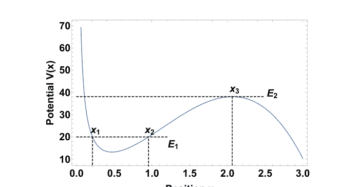

当然，我们可以使用数学来描述这种运动。利用能量守恒，$E = T + V = mv^2/2 + V(x)$，我们可以求解速度作为位置的函数：

$$v = \pm \sqrt{\frac{2}{m} (E - V(x))} \quad (5.2.5)$$

对于能量为 $E = E_1$ 的粒子，我们可以从图 5.3 中看到 $V(x_1) = E_1$ 且 $V(x_2) = E_1$，因此，使用 (5.2.5)，速度在转折点 $x = x_1$ 和 $x = x_2$ 处为零。此外，对于 $x > x_2$ 和 $x < x_1$，速度是一个复数，因为在这些区域 $V(x) > E$。复数速度不是物理的，这意味着粒子没有足够的能量进入这些区域。对于能量为 $E = E_1$ 的粒子，区域 $x < x_1$ 和 $x > x_2$ 被称为*经典禁戒区域*。根据经典力学的物理学，粒子不能处于经典禁戒区域，因为它没有足够的能量进入这些区域。然而，这样的区域在量子力学系统中是可访问的。

使用 $v = dx/dt$，我们可以通过积分 (5.2.5) 来找到位置：

$$t - t_0 = \int_{x_0}^x \frac{dx'}{\sqrt{\frac{2}{m} (E - V(x'))}} \quad (5.2.6)$$

方程 (5.2.6) 可能是一种困难的方法来求解 $x(t)$ 的封闭形式，对于除了最简单的势能函数以外的所有情况。

我们可以对从图 5.3 中不稳定平衡点 $x_3$ 静止开始的粒子的运动重复我们的定性分析。在这种情况下，如果粒子被扰动到右侧，随着势能的降低，其速度会增加。图表在 $x = 3$ 处结束，因此我们无法判断粒子在 $x > 3$ 时会发生什么。如果粒子被偏转到左侧，那么它将加速直到通过稳定平衡点，之后它将减速直到到达 $x \approx 0.1$，然后掉头。从数学上讲，粒子随后将达到不稳定平衡并停止。

注意，图 5.1 和图 5.3 都有局部最小值。如果粒子的能量足够低，局部最小值周围的运动对应于振荡运动。让我们用数学来理解为什么是这种情况。考虑一个靠近稳定平衡点 $x = x_0$ 的粒子，因此，平衡位置 $x_0$ 需要是 $V(x)$ 的一个局部最小值。接下来，我们问一个问题，$V(x)$ 在稳定平衡点附近的数学形式是什么？我们围绕一个能量最小值（$x = x_0$）对 $x$ 进行泰勒展开。泰勒展开给出了函数在特定点附近的多项式近似，其一般形式为：

$$V(x) = V(x_0) + (x - x_0)V'(x_0) + \frac{1}{2}(x - x_0)^2V^{(2)}(x_0) + O(x - x_0)^3 \quad (5.2.7)$$

其中 $O(x - x_0)^3$ 表示 $(x - x_0)^3$ 及更高阶的项，符号 $V'(x_0)$ 和 $V^{(2)}(x_0)$ 分别表示在 $x = x_0$ 处求值的 $V$ 的一阶和二阶导数。如果我们考虑偏离平衡位移很小的情况，那么 $x - x_0$ 很小，$O(x - x_0)^3$ 及更高阶的项可以忽略不计。因为 $V(x_0)$ 是一个最小值，所以 $V'(x_0) = 0$，因此线性项消失：

$$V(x) = V(x_0) + \frac{1}{2}(x - x_0)^2V^{(2)}(x_0) + O(x - x_0)^3 \quad (5.2.8)$$

常数项 $V(x_0)$ 是任意的，因此也可以去掉。这等同于说我们可以将能量的零点设置为任何值，因此我们设 $V(x_0) = 0$。或者换句话说，常数能量项不影响粒子的运动，因为作用在粒子上的力是势能的导数，因此常数项对力没有贡献。考虑到所有这些，我们得到了简谐振子的 $V(x)$ 形式：

$$V(x) \approx \frac{1}{2}(x - x_0)^2V^{(2)}(x_0) = \frac{1}{2}k(x - x_0)^2 \quad (5.2.9)$$

其中我们设 $k = V^{(2)}(x_0)$。因此，我们发现胡克定律在任何研究稳定平衡点附近的小振幅振荡时都会出现。因此，给定一个具有局部最小值（且二阶导数非零且为正）的任意势能函数 $V(x)$，我们可以使用例 2.7 中找到的简谐振子的解来提供平衡点附近小扰动的解。然而，随着扰动变大，我们需要在 $V(x)$ 的泰勒展开中包含更高阶的项，胡克定律不再适用。这些所谓的*非线性振子*可能非常难以求解。我们将在[第 13 章](#)中研究非线性振子。

值得一提的是，(5.2.9) 为我们提供了一种寻找稳定平衡点附近小振荡频率的方法。回想一下，被困在胡克定律势中的粒子的振荡频率为 $\omega = \sqrt{k/m}$。因此，稳定平衡点 $x_0$ 附近的小振荡频率可以从以下公式找到：

$$\omega = \sqrt{\frac{k}{m}} = \sqrt{\frac{V^{(2)}(x_0)}{m}} \quad (5.2.10)$$

> **例 5.3：Lennard-Jones 势。**
一对中性原子或分子之间的相互作用势能通常由 Lennard-Jones 势函数描述，也称为 6-12 势：
$$V(x) = 4\epsilon \left[ \left( \frac{\sigma}{x} \right)^{12} - \left( \frac{\sigma}{x} \right)^6 \right] \quad (5.2.11)$$
其中 $\sigma$、$\epsilon$、$x$ 和 $V$ 采用适当的 SI 单位。设 $\sigma = 1$ 和 $\epsilon = 1/4$，确定此势中可能的平衡类型，并获得此势在平衡点附近的抛物线近似。通过手工以及使用 Python 和 Mathematica 求解此问题。

**解：**
我们通过令 $V(x)$ 的导数等于零并求解 $x$ 来找到平衡点：
$$\frac{dV(x)}{dx} = 12x^{-13} - 6x^{-7} = 0$$
$$x = 2^{1/6} = 1.122$$
我们可以通过检查二阶导数来轻松验证这是一个稳定的平衡点。我们还可以使用 Python 和 Mathematica 将函数 $V(x)$ 在平衡点附近展开：
$$V(x) = -0.25 + 7.143(x - x_0)^2 \quad (5.2.12)$$
(5.2.11) 和 (5.2.12) 的图像如图 5.4 所示。虚线是稳定平衡点附近的级数近似，实线是 Lennard-Jones 势能。请注意，当粒子离平衡位置越远，该近似就越无法提供可靠的势能估计。

**Python 代码**
我们首先定义 Lennard-Jones 势能 V。然后求解平衡点。注意使用 `.subs()` 方法从 `solve` 中获取数值答案。有许多根，但只有一个为正实数。接下来，我们使用 SymPy 命令 `series` 在值 x0 附近进行泰勒级数展开。注意我们要求 Python 计算展开到三阶。这确保我们得到二次项。
方法 `.removeO()` 移除了 Python 默认在级数末尾包含的阶数项。最后，我们使用 `lambdify` 将 SymPy 表达式 V 和 `expansion` 转换为可以绘图的函数，并创建图形。

```python
from sympy import symbols, series, diff, solve, simplify, lambdify, evalf, N
import numpy as np
import matplotlib.pyplot as plt

print('-'*28, 'CODE OUTPUT', '-'*29, '\n')

x, s, ep = symbols('x, s, ep')

V = 4*ep*( (s/x)**12 - (s/x)**6)

# solve for equilibrium points
x0 = solve(diff(V,x).subs([(s,1),(ep,1/4)]),x)[1]

print('Equilibrium point x0 = ',  N(x0,6))

expansion = simplify(series(V, x, 1.122462, 3).removeO() \
    .subs([(s,1),(ep,0.25)]))

print('\nNear x0: V(x) = ',  expansion.subs([(s,1),(ep,0.25)]).evalf(4))

expansion_plot = lambdify(x, expansion.subs([(s,1),(ep,1/4)]), 'numpy')

V_plot = lambdify(x, V.subs([(s,1),(ep,1/4)]), 'numpy')

x_values = np.linspace(0.95, 2.0, 50)

plt.plot(x_values, V_plot(x_values), 'k', label="Lennard-Jones")
plt.plot(x_values, expansion_plot(x_values), 'k--', label='Approximation')
plt.ylim(-0.3, 0.5);
plt.xlabel('x')
plt.ylabel('V(x)')
plt.legend()
plt.show()
```

```
----------------------------- CODE OUTPUT -----------------------------
Equilibrium point x0 =  1.12246

Near x0: V(x) =  7.143*x**2 - 16.04*x + 8.75
```

### Mathematica 代码

定义 V 后，我们使用 Solve 找到平衡位置 x0 并选择唯一的正实根。接下来，我们使用 Series 计算关于 $x_0$ 的泰勒展开。我们应用 Normal 函数使级数可计算（并移除阶数项）。Chop 将表达式中接近零的实数替换为精确的零值。

```mathematica
SetOptions[Plot, Axes->True, BaseStyle->{FontSize->16},
PlotStyle->{{Normal, Black}, {Black, Dashed}}];

σ = 1; ε = 1/4;

V = 4 * ε * ((σ/x)^12 - (σ/x)^6);

x0 = Solve[D[V, x]==0, x][[2]]//N;

Print["Equilibrium point x0 = ", x/.x0]

Equilibrium point x0 = 1.12246

expansion = Series[V, {x, x/.x0, 2}]//Normal//Chop;

Print["Near x0, the potential V(x) = ", expansion//Expand]

Near x0, the potential V(x) = 8.75 - 16.0362x + 7.1433x^2

Plot[{V, expansion}, {x, 0.95, 1.4}, PlotRange->{All, {-0.3, 0.5}},
AxesLabel->{"position,x", "V(x)"}]
```

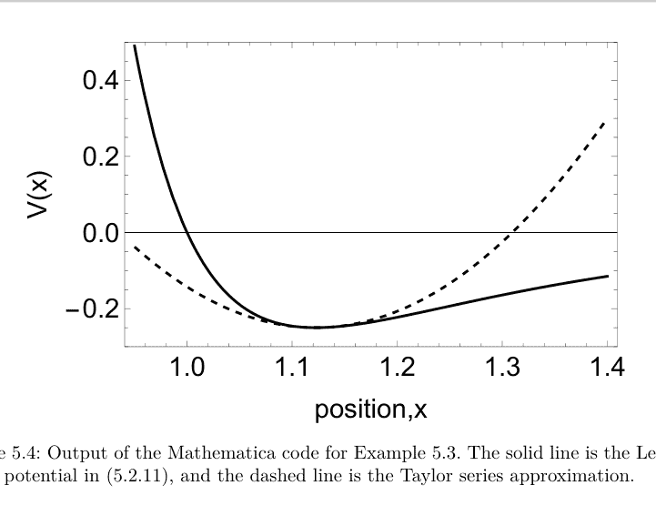

图 5.4：示例 5.3 的 Mathematica 代码输出。实线是 (5.2.11) 中的 Lennard-Jones 势能，虚线是泰勒级数近似。

### 示例 5.4：稳定平衡点附近的运动。

考虑图 5.3 所示的势能，$V(x) = a/x + bx^2 - cx^3$，其中 $a = 4$ Jm，$b = 25$ J/m$^2$，$c = 8$ J/m$^3$。对于质量为 $m = 1$ kg 的物体，初始条件为 $x(0) = 0.21$ m（即非常接近图 5.3 中的 $x_1$），且 $\dot{x}(0) = 0$，数值求解位置 $x(t)$ 随时间 $t$ 的函数关系。

**解：**

我们首先对 $V(x)$ 关于 $x$ 求导以获得力 $F(x)$：

$$F(x) = -\frac{dV}{dx} = \frac{a}{x^2} - 2bx + 3cx^2$$

下一步是使用牛顿第二定律来建立一个二阶常微分方程，从而求解 $x(t)$：

$$m\ddot{x} = \frac{a}{x^2} - 2bx + 3cx^2 \quad (5.2.13)$$

我们使用 Python 和 Mathematica 绘制运动图像。Mathematica 代码的输出如图 5.5 所示。请注意，运动是周期性的，在点 $x = 0.21$ 和 $x = 0.95$ 之间振荡，正如图 5.3 所暗示的那样。

### Python 代码

要使用 `odeint` 求解 (5.2.13)，我们必须使用变量 $v = dx/dt = \dot{x}$ 将其重写为两个一阶方程：

$$\dot{x} = v$$
$$\dot{v} = \frac{1}{m} \left( \frac{a}{x^2} - 2bx + 3cx^2 \right)$$

此代码与我们使用 `odeint` 求解常微分方程的许多其他代码类似。

```python
from scipy.integrate import odeint
import numpy as np
import matplotlib.pyplot as plt

a, b, c, m = 4, 25, 8, 1

inits = [0.21, 0]  # initial conditions

# derivatives function for odeint
def deriv(y, t):
    x, v = y
    dydt = [v, (a/x**2 - 2*b*x + 3*c*x**2)/m ]
    return dydt

times = np.linspace(0, 2.0, 100)

# solve the ode using odeint
soln = odeint(deriv, inits, times)

plt.plot(times, soln[:,0])
plt.xlabel('time (s)')
plt.ylabel('position (m)')
plt.show()
```

### Mathematica 代码

我们使用 NDSolve 来积分 (5.2.13)。

```mathematica
SetOptions[Plot, Frame->True, Axes->False, BaseStyle->{FontSize->16}];

a = 4; b = 25; c = 8; m = 1;

soln = NDSolve[{m * x''[t] == a/x[t]^2 - 2 * b * x[t] + 3 * c * x[t]^2, x[0] == 0.21,
x'[0] == 0}, x, {t, 0, 2}];

Plot[x[t]/.soln, {t, 0, 2}, FrameLabel->{"time (s)", "position (m)"}]
```

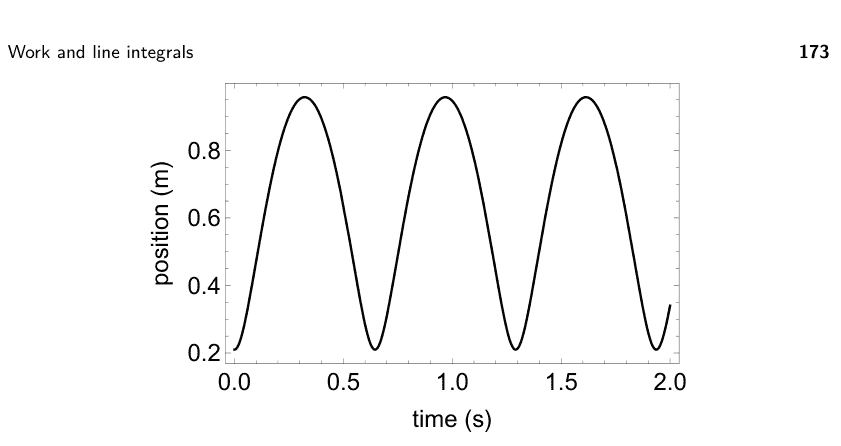

图 5.5：示例 5.4 的 Mathematica 代码输出。

## 5.3 功与线积分

接下来，我们将功的概念扩展到更高维度的系统，即力 $\mathbf{F} = \mathbf{F}(\mathbf{r})$ 的情况。在这种情况下，力 $\mathbf{F}$ 将物体从点 $\mathbf{r}_1$ 移动到 $\mathbf{r}_2$ 所做的功从 (5.1.1) 推广为：

> **力 $\mathbf{F}$ 所做的功**
> $$W(\mathbf{r}_1 \rightarrow \mathbf{r}_2) = \int_{\mathbf{r}_1}^{\mathbf{r}_2} \mathbf{F} \cdot d\mathbf{r}$$ (5.3.1)

注意 (5.3.1) 中力 $\mathbf{F}$ 和无穷小位移 $d\mathbf{r}$ 之间的点积。点积告诉我们，功的计算仅涉及力在位移方向上的分量，即垂直于位移的力分量不做功。请注意，(5.3.1) 也适用于一维系统，并且我们不再需要 $\mathbf{F}$ 与 $d\mathbf{r}$ 方向相同的限制。

(5.3.1) 的右边是一个*线积分*。换句话说，积分是沿着特定路径计算的。$W$ 的值可能取决于粒子所走的路径。通常将 (5.3.1) 重写为包含粒子所遵循的路径 $C$：

> $$W = \int_C \mathbf{F} \cdot d\mathbf{r}$$ (5.3.2)

为了计算这种类型的积分，可以通过写出力向量 $\mathbf{F} = F_x \hat{\mathbf{i}} + F_y \hat{\mathbf{j}} + F_z \hat{\mathbf{k}}$ 和微分 $d\mathbf{r} = dx \hat{\mathbf{i}} + dy \hat{\mathbf{j}} + dz \hat{\mathbf{k}}$ 的分量点积，将其分解为分量积分，如下所示：

> $$W = \int_C F_x dx + \int_C F_y dy + \int_C F_z dz$$ (5.3.3)

然后沿着路径 $C$ 计算各个积分。接下来的几个示例演示了如何计算图 5.6 所示的三条路径的路径积分。

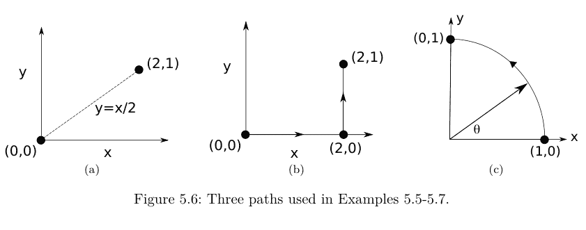

### 示例 5.5：计算沿直线路径的力所做的功。

求力 $\mathbf{F} = xy\hat{\mathbf{i}} - y^2\hat{\mathbf{j}}$ 沿连接原点到点 (2, 1) 的直线路径所做的功，如图 5.6a 所示。通过解析方法（参数化路径和不参数化路径）以及使用 Python 和 Mathematica 来解决此问题。

**解：**
此问题在笛卡尔坐标系中最容易解决。我们写出功的表达式
$$W = \int_C F_x dx + \int_C F_y dy + \int_C F_z dz = \int_C xy dx - \int_C y^2 dy \quad (5.3.4)$$
图中所示的直线路径可以写为 $y = x/2$，因此微分之间的关系为 $dy = dx/2$。沿路径 $AB$ 的 $x$ 坐标从 $x = 0$ 变化到 $x = 2$。通过将这些 $y$ 和 $dy$ 的方程代入上述表达式，我们最终得到仅关于 $x$ 轴的简单积分：
$$W = \int_0^2 x \frac{x}{2} dx - \int_0^2 \left(\frac{x}{2}\right)^2 \frac{dx}{2} = \int_0^2 \frac{3}{8} x^2 dx = 1 \quad (5.3.5)$$
我们也可以通过参数化路径来计算功：我们引入参数 $x = t$，使得 $t$ 从 $t = 0$ 变化到 $t = 2$。沿连接原点到点 (2, 1) 的直线，我们有 $y = t/2$，并且 $dy = dt/2$。功变为：
$$W = \int_C F_x dx + \int_C F_y dy = \int_0^2 (t^2/2) dt - \int_0^2 (t/2)^2 dt/2 = 1 \quad (5.3.6)$$

### Python 代码

在方法 #1 中，我们使用 SymPy 中的 `integrate` 来计算两个积分。在 Python 代码中，我们使用 `ParametricRegion((t,t/2),(t,0,2))` 定义从原点到点 (2, 1) 的直线，并将其存储为变量 `diagonal`。使用方法 #2 计算功，使用 `ParametricIntegral(F,diagonal)`，其中 $F$ 代表力向量 $\mathbf{F} = xy\hat{\mathbf{i}} - y^2\hat{\mathbf{j}}$。

from sympy import integrate, symbols
from sympy.vector import CoordSys3D, ParametricIntegral, ParametricRegion

print('-'*28,'CODE OUTPUT','-'*29,'\n')

x, y, t, x1, y1 = symbols('x, y, t, x1, y1')

C = CoordSys3D('C')    # 定义笛卡尔坐标系，此处命名为 C

# 方法一：使用两个线积分

intx=integrate(x1*(x1/2), (x1,0,2))

inty=integrate(-y1**2, (y1,0,1))

print('使用两个线积分计算的线积分 = ',intx + inty)

# 方法二：使用 ParametricRegion 和 ParametricIntegral

x = t
y = t/2

F = x*y*C.i - y**2*C.j   # 力向量，使用单位向量 C.i, C.j

diagonal = ParametricRegion((t, t/2), (t, 0, 2))

W = ParametricIntegral(F, diagonal)
print('使用 ParametricIntegral 计算的线积分 = ',W)

-------------------------------- CODE OUTPUT --------------------------------
使用两个线积分计算的线积分 =  1
使用 ParametricIntegral 计算的线积分 =  1

**Mathematica 代码**
在将力 F 定义为向量场后，我们首先使用 **Integrate** 命令执行两个独立的线积分。接下来，我们使用 **LineIntegrate**，其第一个参数是向量场。第二个参数是变量，其书写方式表明它们沿着连接原点与 Mathematica 中使用 **Line[0,0,2,1]** 定义的点 (2,1) 的直线。

```
F = {x * y, -y^2};

(* 方法一：使用两个线积分 *)

intx = Integrate[x * x/2, {x, 0, 2}];
inty = Integrate[-y^2, {y, 0, 1}];

total = intx + inty;

Print["使用两个线积分计算的线积分 = ", total]
使用两个线积分计算的线积分 = 1

(* 方法二：使用 LineIntegrate *)

lineInt = LineIntegrate[F, {x, y} ∈ Line[{{0, 0}, {2, 1}}]];

Print["使用 LineIntegrate 计算的线积分 = ", lineInt]
使用 LineIntegrate 计算的线积分 = 1
```

### 示例 5.6：计算力沿由多条直线段组成的路径所做的功

求力 **F** = *xy* **î** − *y*² **ĵ**（来自上一个示例）沿直线路径 (0, 0) → (2, 0) → (2, 1)（如图 5.6b 所示）所做的功。请手动求解，并使用 Python 中的 `ParametricIntegral` 和 Mathematica 中的 `LineIntegrate` 进行计算。力所做的功是否取决于点 (0, 0) 和 (2, 1) 之间所采取的路径？

**解：**
在此情况下，功被计算为两段路径 (0, 0) → (2, 0) 和 (2, 0) → (2, 1) 的功之和。
在第一段路径中，我们有 *y* = 0，因此 *dy* = 0，而 *x* 从 *x* = 0 变化到 *x* = 2。

$$W = \int_{(0,0) \to (2,0)} F_x dx + \int_{(0,0) \to (2,0)} F_y dy \quad (5.3.7)$$
$$= \int_{(0,0) \to (2,0)} xy dx - \int_{(0,0) \to (2,0)} y^2 dy \quad (5.3.8)$$
$$= 0 + 0 = 0 \quad (5.3.9)$$

上述第一个积分为零，因为沿路径从 (0, 0) → (2, 0) 有 *y* = 0。第二个积分为零，因为沿路径有 *dy* = 0。
沿第二段路径从 (2, 0) → (2, 1)，我们有 *x* = 2 且 *dx* = 0，而 *y* 从 *y* = 0 变化到 *y* = 1。

$$W = \int_{(2,0) \to (2,1)} F_x dx + \int_{(2,0) \to (2,1)} F_y dy \quad (5.3.10)$$
$$= \int_{y=0}^{y=1} x y \, dx - \int_{0}^{1} y^2 \, dy \quad (5.3.11)$$
$$= 0 - \frac{1}{3} y^3 \Big|_{0}^{1} = -\frac{1}{3} \quad (5.3.12)$$

上述第一个积分为零，因为沿此段路径有 $dx = 0$。示例 5.5 和 5.6 清楚地表明，该力所做的功取决于两点 $(0,0)$ 和 $(2,1)$ 之间所采取的路径。这样的力被称为*非保守力*；我们将在本章后面看到，非保守力没有与之相关的势能。

### Python 代码

在 Python 代码中，我们使用与前一个示例相同的方法，其中 `ParametricRegion((t,0),(t,0,2))` 定义了积分路径的水平线段，其中 $x = t$ 且 $y = 0$。类似地，`ParametricRegion((2,t),(t,0,1))` 定义了积分路径的垂直线段，其中 $x = 2$ 且 $y = t$。功通过 `ParametricIntegral(F,line1)` 加上 `ParametricIntegral(F,line2)` 计得出，其中 $F$ 再次表示力向量 $\mathbf{F} = xy\mathbf{\hat{i}} - y^2\mathbf{\hat{j}}$。

```
from sympy import symbols
from sympy.vector import CoordSys3D, ParametricIntegral, ParametricRegion

print('-'*28,'CODE OUTPUT','-'*29,'\n')

C = CoordSys3D('C')    # 定义笛卡尔坐标系，此处命名为 C

t = symbols('t')

# 使用 ParametricRegion 和 ParametricIntegral

# 力向量
F = C.x*C.y*C.i - C.y**2*C.j

line1 = ParametricRegion((t, 0), (t, 0, 2))

integr1 = ParametricIntegral(F, line1)
print('沿线段 1 的积分 = ', integr1)

line2 = ParametricRegion((2, t), (t, 0, 1))
integr2 = ParametricIntegral(F, line2)
print('沿线段 2 的积分 = ',integr2)

print('\n所做的功为 :', integr1+integr2)

----------------------------- CODE OUTPUT -----------------------------
沿线段 1 的积分 =  0
沿线段 2 的积分 =  -1/3

所做的功为 : -1/3
```

### Mathematica 代码

我们将路径分为两步。第一个线积分，存储为 `line1`，沿连接原点和点 (2,0) 的直线进行。第二个线积分，存储为 `line2`，沿连接 (2,0) 到 (2,1) 的直线进行。最终结果是两个积分之和。

```
F = {x * y, -y^2};

line1 = LineIntegrate[F, {x, y} ∈ Line[{{0, 0}, {2, 0}}]];

line2 = LineIntegrate[F, {x, y} ∈ Line[{{2, 0}, {2, 1}}]];

Print["线积分 = ", line1 + line2]

线积分 = -1/3
```

### 示例 5.7：计算力沿曲线路径所做的功

求力 **F** = $xy\hat{\mathbf{i}} - y^2\hat{\mathbf{j}}$（来自示例 5.5）沿从点 (1,0) 到点 (0,1) 的单位四分之一圆弧（如图 5.6c 所示）所做的功。请手动求解，并使用 Python 中的 `ParametricIntegral` 和 Mathematica 中的 `LineIntegrate` 进行计算。

#### 解：

这是一个最好在极坐标下解决的问题。设 $\theta$ 为相对于 $x$ 轴逆时针测量的角度，如图 5.6c 所示。沿四分之一圆弧运动的粒子将具有恒定的径向坐标 $r = 1$。因此，从笛卡尔坐标到极坐标的转换为：$x = \cos\theta$ 且 $y = \sin\theta$。为了重写力向量，我们需要将单位向量从笛卡尔坐标转换为极坐标。为了推导转换关系，我们从第 3 章的极坐标单位向量开始：

$$\begin{cases} \hat{\mathbf{r}} = \cos\theta\hat{\mathbf{i}} + \sin\theta\hat{\mathbf{j}} \\ \hat{\boldsymbol{\theta}} = -\sin\theta\hat{\mathbf{i}} + \cos\theta\hat{\mathbf{j}} \end{cases}$$ (5.3.13)

接下来，我们将 $\hat{\mathbf{r}}$ 乘以 $\cos\theta$，将 $\hat{\boldsymbol{\theta}}$ 乘以 $\sin\theta$，然后相减。结果为：

$$\hat{\mathbf{i}} = \cos\theta\hat{\mathbf{r}} - \sin\theta\hat{\boldsymbol{\theta}}$$ (5.3.14)

类似地，通过将 $\hat{\mathbf{r}}$ 方程乘以 $\sin\theta$，将 $\hat{\boldsymbol{\theta}}$ 方程乘以 $\cos\theta$，然后相加。结果为：

$$\hat{\mathbf{j}} = \sin\theta\hat{\mathbf{r}} + \cos\theta\hat{\boldsymbol{\theta}}$$ (5.3.15)

通过将 $x$、$y$、$\hat{\mathbf{i}}$ 和 $\hat{\mathbf{j}}$ 的坐标变换代入力中，我们得到：

$$\mathbf{F} = \sin\theta\cos(2\theta)\hat{\mathbf{r}} - 2\cos\theta\sin^2\theta\hat{\boldsymbol{\theta}}$$

其中我们使用了三角恒等式 $\cos(2\theta) = \cos^2\theta - \sin^2\theta$。我们可以使用极坐标中的无穷小位移 $d\mathbf{r} = \hat{\mathbf{r}}dr + \hat{\boldsymbol{\theta}}r d\theta$，但这简化为 $d\mathbf{r} = r \, d\theta \, \hat{\theta}$，因为粒子没有径向远离原点运动（即 $r = 1$ 且 $dr = 0$）。将 $\mathbf{F}$ 和 $d\mathbf{r}$ 代入 (5.3.1) 并设 $r = 1$ 后，我们得到：
$$W = \int_{0}^{\pi/2} (-2 \cos \theta \sin^2 \theta) \, d\theta = -2/3 \qquad (5.3.16)$$

### Python 代码

在 Python 代码中，我们使用与前两个示例相同的方法，其中 `path=ParametricRegion((cos(t),sin(t)),(t,0,pi/2))` 定义了四分之一圆形的积分路径，角度从 $t = 0$ 变化到 $t = \pi/2$。功再次通过 `ParametricIntegral(F,path)` 计算得出，其中 $F$ 再次表示力向量 $\mathbf{F} = xy\hat{\mathbf{i}} - y^2\hat{\mathbf{j}}$。

```
from sympy import symbols, sin ,cos, pi
from sympy.vector import CoordSys3D, ParametricIntegral, ParametricRegion

print('-'*28,'CODE OUTPUT','-'*29,'\n')

C = CoordSys3D('C')    # 定义笛卡尔坐标系，此处命名为 C

t = symbols('t')

# 力向量
F = C.x*C.y*C.i - C.y**2*C.j

path = ParametricRegion((cos(t), sin(t)), (t, 0, pi/2))

integr = ParametricIntegral(F, path)
print('使用 ParametricIntegral 计算的积分 = ', integr)

------------------------------------ CODE OUTPUT ------------------------------------
使用 ParametricIntegral 计算的积分 =  -2/3
```

### Mathematica 代码

我们再次使用 `LineIntegrate`。这一次，路径使用 `Circle` 命令定义，其参数是圆心位置 $(0,0)$、圆的半径 $(1)$ 以及路径起点和终点的参数 $\theta$ 值（本例中为 $\theta = 0$ 到 $\pi/2$）。

## 5.4 功-动能定理，再探

回顾一下，在一维情况下，动能 $T = 1/2mv^2$。在二维和三维情况下，动能的形式为：

$$T = \frac{1}{2}mv^2 = \frac{1}{2}m\mathbf{v} \cdot \mathbf{v}$$ (5.4.1)

如果我们计算 $T$ 对时间的导数，得到：

$$\frac{dT}{dt} = \frac{1}{2}m(\dot{\mathbf{v}} \cdot \mathbf{v} + \mathbf{v} \cdot \dot{\mathbf{v}}) = m\dot{\mathbf{v}} \cdot \mathbf{v} = \mathbf{F} \cdot \mathbf{v}$$ (5.4.2)

$$dT = \mathbf{F} \cdot (\mathbf{v}dt)$$ (5.4.3)
$$dT = \mathbf{F} \cdot d\mathbf{r}$$ (5.4.4)

将此方程从 $\mathbf{r}_0$ 积分到 $\mathbf{r}$，我们得到：

> **功-动能定理**
$$T - T_0 = \int_{\mathbf{r}_0}^{\mathbf{r}} \mathbf{F} \cdot d\mathbf{r}$$ (5.4.5)

其中 $T_0$ 是在位置 $\mathbf{r}_0$ 处的动能值。方程 (5.4.5) 就是功-动能定理，它与为一维系统推导出的 (5.1.6) 类似。

## 5.5 保守力与势能

回顾一下，对于一维系统，我们定义了一个保守力 $F(x)$，使得 $F(x)$ 将粒子从两点 $x_0$ 和 $x$ 之间移动所做的功，与从 $x_0$ 到 $x$ 所走的路径无关。这可以很容易地推广到二维和三维系统。保守力 $\mathbf{F}(\mathbf{r})$ 是仅依赖于粒子位置的力，*并且* $\mathbf{F}(\mathbf{r})$ 将粒子从位置 $\mathbf{r}_0$ 移动到 $\mathbf{r}$ 所做的功与两点之间所走的路径无关。然后我们可以定义势能为：

$$V(\mathbf{r}) = -W(\mathbf{r}_0 \rightarrow \mathbf{r}) = -\int_{\mathbf{r}_0}^{\mathbf{r}} \mathbf{F}(\mathbf{r}') \cdot d\mathbf{r}'$$ (5.5.1)

其中我们设定了一个参考点 $\mathbf{r}_0$，使得 $V(\mathbf{r}_0) = 0$。上述定义适用于我们的目的，因为我们有一个保守力。如果力不是保守的，那么 (5.5.1) 中的积分也会依赖于粒子所走的路径，而不仅仅是 **r** 的函数。

现在假设一个保守力 **F**(**r**) 将一个粒子从点 **r**₀ 沿两条不同的路径移动到点 **r**₂。一条路径直接从参考点 **r**₀ 到 **r**₂，而另一条路径从 **r**₀ 到 **r**₁，然后从 **r**₁ 到 **r**₂。因为功是保守的，所以沿两条路径所做的功是相同的：

$$W(\mathbf{r}_0 \rightarrow \mathbf{r}_2) = W(\mathbf{r}_0 \rightarrow \mathbf{r}_1) + W(\mathbf{r}_1 \rightarrow \mathbf{r}_2)$$ (5.5.2)

求解 $W(\mathbf{r}_1 \rightarrow \mathbf{r}_2)$：

$$W(\mathbf{r}_1 \rightarrow \mathbf{r}_2) = W(\mathbf{r}_0 \rightarrow \mathbf{r}_2) - W(\mathbf{r}_0 \rightarrow \mathbf{r}_1)$$ (5.5.3)
$$W(\mathbf{r}_1 \rightarrow \mathbf{r}_2) = -V(\mathbf{r}_2) + V(\mathbf{r}_1)$$ (5.5.4)

或者，保守力 **F**(**r**) 所做的功通过以下公式与势能相关联：

$$W(\mathbf{r}_1 \rightarrow \mathbf{r}_2) = -[V(\mathbf{r}_2) - V(\mathbf{r}_1)] = -\Delta V$$ (5.5.5)

将方程 (5.5.5) 与 (5.5.1) 结合，我们看到保守力沿闭合回路所做的功必须等于零，因为沿该路径的势能变化为零。

将功-动能定理 (5.4.5) 与 (5.5.1) 结合，得到：

$$\Delta T = \int_{\mathbf{r}_1}^{\mathbf{r}_2} \mathbf{F}(\mathbf{r}') \cdot d\mathbf{r}'$$ (5.5.6)
$$\Delta T = W(\mathbf{r}_1 \rightarrow \mathbf{r}_2)$$ (5.5.7)
$$\Delta T = -\Delta V$$ (5.5.8)

因此：

$$\Delta(T + V) = 0$$ (5.5.9)

这告诉我们，当粒子的位置从 **r**₁ 变化到 **r**₂ 时，总机械能 $E = T + V$ 保持不变。

在非保守力对系统做功的情况下，(5.1.19) 仍然适用于二维和三维系统。然而，在这种情况下，使用 (5.4.1) 计算 $T$，使用 (5.5.1) 计算 $V$，而非保守力 **F**ₙc(**r**) 所做的功使用以下公式计算：

$$W_{nc} = \int_{\mathbf{r}_1}^{\mathbf{r}_2} \mathbf{F}_{nc}(\mathbf{r}') \cdot d\mathbf{r}'$$ (5.5.10)

我们已经看到，势能 $V(x)$ 可以通过使用 (5.5.1) 从保守力 **F** 求得。现在假设我们知道 $V$ 并想求 **F**。从我们对一维系统的讨论中，我们知道 $F = -dV/dx$；然而，这如何推广到更高维度？为了推导三维中 **F** 和 $V$ 之间的关系，我们首先考虑一个无穷小位移 **r** → **r** + $d\mathbf{r}$，在此位移上保守力 **F**(**r**) 作用于粒子。该力所做的功为：

$$dW = \mathbf{F}(\mathbf{r}) \cdot d\mathbf{r} = F_x dx + F_y dy + F_z dz$$ (5.5.11)

保守力也可以计算为：

$$dW = -dV$$
$$= -[V(\mathbf{r} + d\mathbf{r}) - V(\mathbf{r})]$$
$$= -\left[V(\mathbf{r}) + \frac{\partial V}{\partial x}dx + \frac{\partial V}{\partial y}dy + \frac{\partial V}{\partial z}dz + \cdots - V(\mathbf{r})\right]$$
$$= -\left(\frac{\partial V}{\partial x}dx + \frac{\partial V}{\partial y}dy + \frac{\partial V}{\partial z}dz\right)$$

其中 $\mathbf{r} = x\hat{\mathbf{i}} + y\hat{\mathbf{j}} + z\hat{\mathbf{k}}$，并且在 (5.5.15) 中我们只保留了多变量泰勒级数中的线性项。比较方程 (5.5.11) 和 (5.5.15) 中 $dx$、$dy$ 和 $dz$ 的系数，我们发现：

$$F_x = -\frac{\partial V}{\partial x} \qquad F_y = -\frac{\partial V}{\partial y} \qquad F_z = -\frac{\partial V}{\partial z}$$

换句话说，力通过梯度与势能相关联：

> **三维中的势能与力**
$$\vec{\mathbf{F}} = -\nabla V(x, y, z) = -\left(\frac{\partial V}{\partial x}\hat{\mathbf{i}} + \frac{\partial V}{\partial y}\hat{\mathbf{j}} + \frac{\partial V}{\partial z}\hat{\mathbf{k}}\right)$$
$$V = -\int \mathbf{F} \cdot d\mathbf{r}$$

注意 (5.5.17) 中的负号。梯度指向标量函数增加最快的方向。在 (5.5.17) 的情况下，我们看到力指向势能*减少*最快的方向。考虑如图 5.7 所示的重力势能。相同海拔高度的点都具有相同的势能。我们可以将图 5.7 中的虚线视为等势能面。随着海拔升高，势能增加。因此，$V$ 增加最快的方向是向上的，即垂直于地面（显示为矩形）。因为 $\mathbf{F}_g = -\nabla V$，力矢量指向 $V$ *减少*最快的方向，即向下。

保守力 $\mathbf{F}$ 可以写成势能的梯度。从第 3 章中，我们回顾到任何标量函数 $V$ 的梯度的旋度总是为零：

$$\nabla \times \mathbf{F} = -\nabla \times \nabla V = 0$$

因此，识别一个力是否为保守力的一种方法是计算其旋度。一个力 $\mathbf{F}$ 是保守的，当且仅当其旋度为零：

> **保守力**
$$\nabla \times \mathbf{F} = 0$$

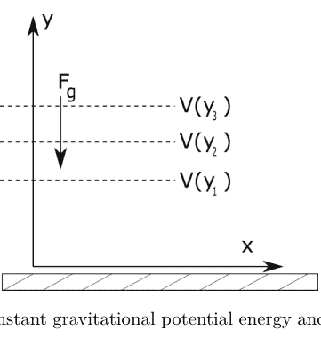

**示例 5.8：证明一个力是非保守的**
证明来自示例 5.5-5.7 的力 **F** = xy**i** - y²**j** 不是保守力。

**解：**
计算力的旋度：

∇ × **F** = (∂F_z/∂y - ∂F_y/∂z)**i** + (∂F_x/∂z - ∂F_z/∂x)**j** + (∂F_y/∂x - ∂F_x/∂y)**k**

其中 F_x = xy, F_y = -y², F_z = 0，这变为：

∇ × **F** = (0 - 0)**i** + (0 - 0)**j** + (0 - x)**k** = -x**k** ≠ 0

因此，该力是非保守的，正如我们根据示例 5.5-5.7 的结果所预期的那样。下面，我们包含了 Python 和 Mathematica 的计算。

**Python 代码**
我们使用 CoordSys3D 定义一个坐标系，并使用来自 sympy.vector 库的函数 curl(F)。我们发现旋度非零，因此该力是非保守的。

```python
from sympy.vector import CoordSys3D, curl

print('-'*28,'CODE OUTPUT','-'*29,'\n')

R = CoordSys3D('R')

F = R.x*R.y*R.i - R.y**2 * R.j

print('The curl of F = ', curl(F))

-------------------------------- CODE OUTPUT --------------------------------
The curl of F =  (-R.x)*R.k
```

### Mathematica 代码

请注意，我们将力 F 定义为三维向量，以获得正确的旋度。否则，Mathematica 会假设 F 是一个二维向量场，从而无法给出正确的旋度。

```
F = {x * y, -y^2, 0};

Print["The curl of F = ", Curl[F, {x, y, z}]]

The curl of F = {0, 0, -x}
```

### 示例 5.9：证明一个力是保守力并求出相关的势能。

考虑力 $\mathbf{F} = -k \left( y\hat{\mathbf{i}} + x\hat{\mathbf{j}} - z\hat{\mathbf{k}} \right)$。
(a) 证明它是保守力。
(b) 求出与此力相关的势能。

#### 解答：

(a) 我们首先计算该力的旋度：

$$\nabla \times \mathbf{F} = \begin{vmatrix} \hat{\mathbf{i}} & \hat{\mathbf{j}} & \hat{\mathbf{k}} \\ \frac{\partial}{\partial x} & \frac{\partial}{\partial y} & \frac{\partial}{\partial z} \\ y & x & -z \end{vmatrix} (-k) = -k \left[ \hat{\mathbf{i}}(0) + 0\hat{\mathbf{j}} + \hat{\mathbf{k}}(1 - 1) \right] = 0 \quad (5.5.21)$$

因此 $\mathbf{F}$ 是保守力，并且存在一个与力 $\mathbf{F}$ 相关的势能 $V$。

(b) 接下来，我们计算势能 $V$。回顾

$$V = - \int \mathbf{F} \cdot d\mathbf{r} = -k \int y dx - k \int x dy + k \int z dy \quad (5.5.22)$$

由于该力是保守力，势能 $V$ 将与我们选择的积分路径无关。
我们将沿着以下路径从原点积分 (5.5.22) 到点 $(x, y, z)$：
(1) 沿 $x$ 轴从原点到点 $(x, 0, 0)$。
(2) 沿平行于 $y$ 轴的直线从点 $(x, 0, 0)$ 到点 $(x, y, 0)$。
(3) 沿平行于 $z$ 轴的直线从点 $(x, y, 0)$ 到点 $(x, y, z)$。
沿路径 (1)，我们有 $y = z = 0$，且 $d\mathbf{r} = \hat{\mathbf{i}} dx$。因此沿路径 (1) 的线积分为

$$V_1 = - \int_0^x (-ky)|_{y=0} dx = 0 \quad (5.5.23)$$

沿路径 (2)，$x$ 是常数，我们有 $z = 0$ 且 $d\mathbf{r} = \hat{\mathbf{j}} dy$。因此沿路径 (2) 的线积分为

$$V_2 = - \int_0^y (-kx)|_{x=\text{constant}} dy = kxy \quad (5.5.24)$$

沿路径 (3)，$x$ 和 $y$ 是常数，我们有 $d\mathbf{r} = \hat{\mathbf{k}} dz$。因此沿路径 (3) 的线积分为

$$V_3 = -\int_0^z kz dz = -\frac{k}{2}z^2 \quad (5.5.25)$$

整个路径的总线积分为

$$V = V_1 + V_2 + V_3 = kxy - \frac{k}{2}z^2 \quad (5.5.26)$$

最后，我们验证答案：

$$\mathbf{F} = -\nabla V = \left( -\frac{\partial V}{\partial x}, -\frac{\partial V}{\partial y}, -\frac{\partial V}{\partial z} \right) = -ky\hat{\mathbf{i}} - kx\hat{\mathbf{j}} + kz\hat{\mathbf{k}} \quad \checkmark \quad (5.5.27)$$

我们现在展示一种在上一个示例中计算势能 $V$ 的替代方法。在此方法中，我们对梯度的通用表达式进行积分。

### 示例 5.10：考虑上一个示例中的力 $\mathbf{F} = -k\left( y\hat{\mathbf{i}} + x\hat{\mathbf{j}} - z\hat{\mathbf{k}} \right)$。从梯度的表达式出发，求出与此力相关的势能：

$$F = -\nabla V = \left( -\frac{\partial V}{\partial x}, -\frac{\partial V}{\partial y}, -\frac{\partial V}{\partial z} \right)$$

#### 解答

由于 $\mathbf{F}$ 是保守力，存在一个与力 $\mathbf{F}$ 相关的势能 $V$，使得：

$$V = -\int \mathbf{F} \cdot d\mathbf{r} = -\int F_x dx - \int F_y dy - \int F_y dy$$

$$V = k \int y dx + k \int x dy - \int z dz$$

我们必须有

$$F = -\nabla V = \left( -\frac{\partial V}{\partial x}, -\frac{\partial V}{\partial y}, -\frac{\partial V}{\partial z} \right)$$

我们首先考虑 x 坐标：

$$F_x = -\frac{\partial V}{\partial x} = -ky$$

在保持 $y, z$ 为常数的情况下对 $x$ 积分：

$$V(x, y, z) = -kyx + g(y, z)$$

其中 $g(y, z)$ 是一个待确定的函数。我们还必须有：

$$F_y = -\frac{\partial V}{\partial y} = -kx = kx - \frac{\partial g}{\partial y}$$

其中我们计算了 $\frac{\partial V}{\partial y}$。在保持 $x, z$ 为常数的情况下对 $y$ 积分此方程，我们得到：

$$g(x, y) = 2kxy + h(z)$$

其中 $h(z)$ 是一个待确定的函数。现在我们有：

$$V(x, y, z) = -kyx + 2kxy + h(z) = kxy + h(z)$$

我们还必须有：

$$F_z = -\frac{\partial V}{\partial z} = kz = \frac{\partial h}{\partial z}$$

对 $z$ 积分，我们得到：

$$h(z) = -\frac{k}{2}z^2 + c$$

其中 $c$ 是一个任意常数，我们设 $c = 0$。因此：

$$V(x, y, z) = kxy - \frac{k}{2}z^2$$

这当然与我们在上一个示例中使用特定积分路径计算 $V$ 所得到的结果相同。

## 5.6 能量与多粒子系统

考虑 $N$ 个离散粒子的集合，每个粒子位于 $\mathbf{r}_i$（$i = 1, 2, \ldots, N$），质心位于 $\mathbf{R}$，如图 5.8 中的空心圆所示。每个粒子的质量为 $m_i$，每个粒子的速度为 $\mathbf{v}_i$。请注意，以下内容可以对连续质量分布重复进行，但离散求和将变为积分。

在图 5.8 中，第 $i^{\text{th}}$ 个粒子相对于原点的位置为 $\mathbf{r}_i$，相对于质心的位置为 $\mathbf{r}'_i$。注意 $\mathbf{R} + \mathbf{r}'_i = \mathbf{r}_i$，其中 $\mathbf{R}$ 是质心相对于原点的位置。

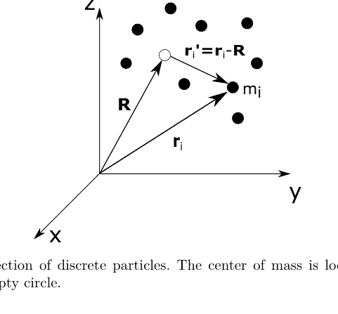

图 5.8：离散粒子的集合。质心位于 $\mathbf{R}$，由空心圆表示。

首先，我们使用类似于第 4 章中计算 $N$ 个粒子系统总动量的方法，计算系统相对于原点的动能。总动能为：

$$T = \sum_{i=1}^{N} \left( \frac{1}{2} m_i \mathbf{v}_i^2 \right) \quad (5.6.1)$$

通过使用 $\mathbf{r}_i = \mathbf{R} + \mathbf{r}'_i$ 和 $\dot{\mathbf{r}}_i = \dot{\mathbf{R}} + \dot{\mathbf{r}}'_i$（回忆一下，变量上方的点表示该变量对时间的导数），我们可以将 $\mathbf{v}_i^2$ 写为：

$$\mathbf{v}_i^2 = \dot{\mathbf{r}}_i \cdot \dot{\mathbf{r}}_i = (\dot{\mathbf{r}}'_i + \dot{\mathbf{R}}) \cdot (\dot{\mathbf{r}}'_i + \dot{\mathbf{R}}) = (\mathbf{v}'_i)^2 + 2 (\mathbf{v}'_i \cdot \mathbf{V}) + \mathbf{V}^2 \quad (5.6.2)$$

其中 $\mathbf{v}'_i = \dot{\mathbf{r}}'_i$ 是第 $i^{\text{th}}$ 个粒子相对于质心的速度，$\mathbf{V} = \dot{\mathbf{R}}$ 是质心相对于原点的速度。将 (5.6.2) 代入 (5.6.1) 得到：

$$T = \sum_{i=1}^{N} \left[ \frac{1}{2} m_i (v'_i)^2 \right] + \dot{\mathbf{R}} \cdot \frac{d}{dt} \left( \sum_{i=1}^{N} m_i \mathbf{r}'_i \right) + \sum_{i=1}^{N} \left( \frac{1}{2} m_i \mathbf{V}^2 \right) \quad (5.6.3)$$

上述方程中的中间项包含 $\sum m_i \mathbf{r}'_i$，在第 4 章中已根据质心的定义证明其为零。因此，总动能变为：

> **N 个粒子系统的动能**

$$T = \frac{1}{2} M \mathbf{V}^2 + \sum_{i=1}^{N} \left[ \frac{1}{2} m_i (v'_i)^2 \right] \quad (5.6.4)$$

(5.6.4) 中的第一项是质心的动能，第二项对应于每个相对于质心运动的粒子的动能。

对于势能，我们需要考虑外力和内力及其相应的势能。质量为 $m_i$ 的粒子的势能为：

$$V_i = V_i^{\text{ext}} + \sum_{j \neq i} V_{i,j}^{\text{int}} \quad (5.6.5)$$

其中 $V_i^{\text{ext}}$ 是作用在 $m_i$ 上的外力引起的势能，$V_{i,j}^{\text{int}}$ 是 $m_i$ 和 $m_j$ 之间的相互作用力引起的势能。此类相互作用力的例子可以是引力、静电力或任何其他中心力。通常对于中心力，我们有 $V_{i,j}^{\text{int}} = V_{i,j}^{\text{int}} (|\mathbf{r}_i - \mathbf{r}_j|)$，这意味着势能取决于两个粒子之间的相对距离。因此系统的总势能为：

$$V = \sum_{i=1}^{N} V_i^{\text{ext}} + \sum_{i=1}^{N} \sum_{j \neq i} V_{i,j}^{\text{int}} (|\mathbf{r}_i - \mathbf{r}_j|) \quad (5.6.6)$$

对于刚体，粒子之间的距离是固定的，因此内势能可以忽略，因为它对每个粒子来说都是常数。因此，对于刚体，我们只需要考虑外力。我们将在第 11 章更详细地研究刚体。

## 5.7 章节总结

力 $F(x)$ 对沿直线从位置 $x_0$ 移动到位置 $x$ 的粒子所做的功 $W$ 为：

$$W = \int_{x_0}^x F(x') dx'$$

*动能定理*指出，需要力 $F(x)$ 做功才能改变系统的动能。

$$\frac{1}{2}mv^2 - \frac{1}{2}mv_o^2 = \int_{x_o}^x F(x')dx'$$

与一维力 $F(x)$ 相关的*势能函数* $V(x)$ 定义为：

$$V(x) - V(x_0) = -\int_{x_0}^x F(x')dx'$$

与势能 $V(x)$ 相关的力 $F(x)$ 可以通过微分求得：

$$F(x) = -\frac{dV(x)}{dx}$$

如果在 $x = x_0$ 处满足：

$$\left. \frac{dV}{dx} \right|_{x_0} = 0$$

则粒子处于*平衡状态*。

物理系统可以存在三种类型的平衡：稳定、不稳定和中性，这取决于平衡点 $x = x_0$ 处 $d^2V/dx^2$ 的符号。

在*运动的转折点*处速度为零，因此粒子的所有能量都以势能的形式存在。

胡克定律出现在我们研究稳定平衡附近的小振幅振荡时，通过对势能 $V(x)$ 进行泰勒展开得到：

$$V(x) \approx \frac{1}{2}(x - x_0)^2 V^{(2)}(x_0) = \frac{1}{2}k(x - x_0)^2$$

在二维和三维中，力 $\mathbf{F}$ 将物体从点 $\mathbf{r}_1$ 移动到点 $\mathbf{r}_2$ 所做的功为：

$$W(\mathbf{r}_1 \rightarrow \mathbf{r}_2) = \int_{\mathbf{r}_1}^{\mathbf{r}_2} \mathbf{F} \cdot d\mathbf{r}$$

$W$ 的值可能取决于粒子所走的路径 $C$：

$$W = \int_C \mathbf{F} \cdot d\mathbf{r}$$

为了计算这类积分，可以将其分解为分量积分：

$$W = \int_C F_x dx + \int_C F_y dy + \int_C F_z dz$$

三维中的势能和力为：

$$\mathbf{F} = -\nabla V(x, y, z) = -\left(\frac{\partial V}{\partial x}\mathbf{i} + \frac{\partial V}{\partial y}\mathbf{j} + \frac{\partial V}{\partial z}\mathbf{k}\right) \quad V = -\int \mathbf{F} \cdot d\mathbf{r}$$

对于*保守力*：$\nabla \times \mathbf{F} = 0$，并且功 $\int_{\mathbf{r}_1}^{\mathbf{r}_2} \mathbf{F} \cdot d\mathbf{r}$ 与两点 $\mathbf{r}_1$ 和 $\mathbf{r}_2$ 之间所走的路径无关。

*机械能守恒*指出，动能和势能之和（称为总机械能 $E$）在只有保守力作用于系统时才保持恒定。简而言之：保守力守恒能量。

$$E = T + V(x) = T_0 + V(x_0)$$

$N$ 个粒子系统的动能是质心动能与每个相对于质心运动的粒子的动能之和：

$$T = \frac{1}{2}M\mathbf{V}^2 + \sum_{i=1}^{N} \left[\frac{1}{2}m_i (v'_i)^2\right]$$

在刚体中，粒子之间的距离是固定的，内部势能可以忽略，因此我们只需要考虑外力。

## 5.8 章末习题

符号 🖥️ 表示需要计算机辅助的问题，形式包括图形、数值计算或符号求值。

### 第 5.1 节：一维系统中的功和能

1.  一名质量为 $m = 100$ kg 的滑雪者沿 20 度斜坡滑下。从静止开始，滑雪者沿山坡滑下 100 m，然后在平坦的雪地上滑行 50 m 后停止。滑雪者的滑雪板与雪之间的动摩擦系数是多少？

2.  一个孩子将质量为 $m$ 的玩具沿地板滑动，摩擦系数为 $\mu$。玩具的初始速度为 $v_0$。玩具在地板上滑动距离 $d$ 后遇到一个弹簧常数为 $k$ 的弹簧。玩具撞击弹簧，弹簧被压缩距离 $\Delta x$ 后玩具停止。求 $\Delta x$。

3.  🖥️ 一个质量为 $m$ 的粒子受到一个力的作用，使其沿 $+x$ 方向以速度 $v(x) = cxe^{-bx}$ 运动，其中 $b$ 和 $c$ 是正常数。请分别用解析方法和 CAS 解决此问题。
    a.  如果粒子从 $x = 0$ 开始运动到 $x = a$ ($a > 0$)，求该力所做的功。
    b.  求粒子从 $x = 0$ 开始运动到 $x = \infty$ 时所做的功。注意，在这种情况下，无穷大是一个有用的数学工具，意为“非常远”。
    c.  使用数值 $b = c = m = 1$ 绘制力作为距离 $x$ 函数的图像，并解释你在 (b) 部分的答案。

4.  A 人坐在以速度 $u$ 行驶的小型货车后座，将质量为 $m$ 的球扔给坐在前座的 B 人。球相对于 A 人的速度为 $v$。
    a.  根据 A 人的测量，球的动能增加了多少？
    b.  根据站在路边静止的人的测量，球的动能增加了多少？
    c.  A 人扔球做了多少功？

5.  一个质量为 $m$ 的粒子受到力 $F$ 的作用，并沿 $+x$ 方向以速度 $v = a/x$ ($a > 0$) 运动。将粒子从位置 $x_1$ 移动到 $x_2$（其中 $x_2 > x_1$），该力做了多少功？请分别用解析方法和 CAS 解决此问题。

6.  考虑一个质量为 $M$、半径为 $R$ 的球形行星。距离行星中心 $r$ 处质量为 $m$ 的粒子的引力势能为：
    $$V = -\frac{GMm}{r}$$
    其中 $G$ 是引力常数。
    a.  该行星的逃逸速度是多少？换句话说，粒子在行星表面需要具有多大的速度才能在 $r = \infty$ 处逃脱行星的引力？
    b.  数值计算火星上航天器的逃逸速度。

7.  一个质量为 $m$ 的物体连接到一个无质量弹簧上，并被限制沿 $x$ 轴运动。物体所放置的地板与物体之间的摩擦系数为 $\mu$。物体被向右拉到平衡位置右侧距离 $x = A$ 处，然后从静止释放。
    a.  物体向左运动，经过平衡位置并到达一个转折点。该转折点在平衡位置左侧多远？
    b.  从 (a) 中的转折点开始，物体向右运动，再次经过平衡位置并到达另一个转折点，该点不在 $x = A$ 处。新的转折点在平衡位置右侧多远？
    c.  $A$ 取何值能使物体在初始释放后静止在平衡位置（不经过平衡位置）？

### 第 5.2 节：一维系统中的势能和平衡点

8.  考虑势能：
    $$V = V_0 \left[ \left( \frac{x}{a} \right)^2 + \left( \frac{a}{x} \right)^2 \right]$$
    其中 $V_0, a > 0$ 且 $x > 0$。求平衡点并确定每个平衡点的稳定性。绘制 $V(x)$ 并求出 $V$ 在每个平衡点附近的泰勒级数近似（到 $x$ 的二次项）。为了创建图表，将所有常数设为 1。请分别用解析方法和 CAS 解决此问题。

9.  图 5.1 所示的势能方程为 $V(x) = ax^4 - bx^2 + c$，这被称为*双阱势*。在图 5.1 中，使用了 $a = b = c = 1$ 来绘制图形。
    a.  如果 $V$ 以焦耳为单位测量，$x$ 以米为单位测量，每个系数 $a, b, c$ 的单位是什么？
    b.  如果一个 1.0 kg 的粒子具有能量 $E = 0.90$ J 并从左阱开始，描述粒子的运动。如果有转折点，求出它们。

10. 考虑双阱势 $V(x) = ax^4 - bx^2 + c$，其中 $a = b = c = 1$。求作用在粒子上的力。使用数值 ODE 求解器，求质量为 $m = 1$ kg 的粒子从静止开始且具有以下总能量时的位置 $x(t)$ 随时间的变化：
    a.  $E = 0.85$ J。
    b.  $E = 1.0$ J。
    c.  $E = 2.0$ J。

11. 用于制作图 5.3 的势能函数为 $V(x) = 1/(ax) + bx^2 - cx^3$，其中系数的大小为：$a = 0.25$，$b = 25$，$c = 8$，单位使得 $V$ 以焦耳为单位测量，$x$ 以米为单位测量：
    a.  $a$、$b$ 和 $c$ 的单位是什么？
    b.  如果 $E = 20$ J，求转折点。
    c.  求并分类每个平衡点。

12. 考虑来自示例 5.4 和图 5.2.2 的势能 $V(x) = a/x + bx^2 - cx^3$，其中 $a = 4$ Jm，$b = 25$ J/m$^2$，$c = 8$ J/m$^3$，质量 $m = 1$ kg。使用数值微分方程求解器，如果粒子从 $x = 0.5$ m 处静止开始且总能量 $E = 30$ J，求 $x(t)$。

13. 胡克定律是通过对势能函数在局部最小值附近进行近似而产生的。展开后力的下一项是三次项。考虑一个粒子受到的合力为 $F = -kx + \epsilon x^3$。
    a.  求相对于 $x = 0$ 的势能 $V(x)$，求平衡点，并分类其稳定性。
    b.  绘制不同 $k$ 和 $\epsilon$ 值下的势能图，以查看势能图的形状如何依赖于这些参数。尝试 $\epsilon$ 的正值和负值。讨论每种情况下粒子的运动。

14. 简单平面摆由一个质量为 $m$ 的物体连接在长度为 $\ell$ 的无质量杆的一端组成。无质量杆的另一端固定在一个枢轴点上，使得摆可以在垂直平面内自由摆动。求摆的势能作为 $\theta$（杆与垂直方向所成角度）的函数。求平衡点并分类其稳定性。使用 $m = 1$ 和 $\ell = 1$（SI 单位），绘制势能图并讨论不同总能量值下摆的运动。不要假设摆仅限于小振荡。

15. 考虑一个质量为 $m$ 的粒子受到力 $\mathbf{F}(x) = -(kx + \epsilon x^2)\hat{x}$ 的作用，其中 $k > 0$ 且 $\epsilon > 0$。在存在稳定平衡的情况下，求小振荡的频率。

16. 在本章中，我们看到了质量为 $m$、总能量为 $E$ 的粒子在势能 $V(x)$ 中运动的方程 (5.2.6)：

$$t - t_0 = \int_{x_0}^x \frac{dx}{\sqrt{\frac{2}{m} (E - V(x))}}$$

该方程给出了 $t(x)$，可以反解得到粒子的位置 $x(t)$。利用此方程，分别通过解析方法和计算机代数系统，求势能为 $V(x) = 1/2kx^2$ 的粒子的 $x(t)$。

17. 考虑势能函数：

$$V(x) = \frac{-c^2(x^2 + k^2)}{x^4 + 3c^4}$$

其中 $c > 0$ 且 $k > 0$。求平衡点作为 $x/c$ 的函数。这些点是稳定的还是不稳定的？绘制 $V(x)$ 的图像，并讨论对于不同的 $k/c$ 值，粒子可能的运动类型。

18. 一个质量为 $m$ 的粒子受到一维势能 $V(x) = 3kx^4/4$ 的作用。粒子在两个转折点 $x_1$ 和 $x_2$ 之间振荡。对于质量 $m = 1$ kg、总能量 $E = 10$ J 且 $k = 3.0$ N/m$^4$ 的情况，求粒子的振荡周期。绘制振荡周期作为总能量的函数图像，并讨论你的结果。

### 第 5.3 节：功与线积分

19. 通过解析方法和计算机代数系统，计算力 $\mathbf{F} = xy\mathbf{\hat{i}} - y\mathbf{\hat{j}}$ 沿以下路径从原点到点 (2,4) 所做的功：

- a. 沿 $x$ 轴到点 (2,0)，然后平行于 $y$ 轴到点 (2,4)。
- b. 沿连接原点到点 (2,4) 的直线路径。
- c. 沿路径 $y = x^2$。

20. 通过解析方法和计算机代数系统，计算力 $\mathbf{F} = y\mathbf{\hat{i}} - x\mathbf{\hat{j}}$ 沿以下闭合路径所做的功：

- a. 笛卡尔平面第一象限中以原点为一个角的单位正方形。
- b. 中心在原点的单位正方形。
- c. 中心在原点的单位圆。
- d. 椭圆 $\frac{x^2}{4} + \frac{y^2}{25} = 1$。

### 第 5.5 节：保守力与势能

21. 以下哪些力是保守力？通过解析方法和计算机代数系统回答此问题。对于每个保守力，求相应的标量势。

- a. $\mathbf{F} = y\hat{\mathbf{i}} - x\hat{\mathbf{j}}$
- b. $\mathbf{F} = -k\mathbf{r}$
- c. $\mathbf{F} = r \sin \theta e^{i\phi} \hat{\mathbf{r}}$（球坐标系中）
- d. $\mathbf{F} = kxyz \hat{\mathbf{r}}$
- e. $\mathbf{F} = \frac{k}{r^3} \hat{\mathbf{r}}$

22. 证明任何中心各向同性力 $\mathbf{F} = F(r)\hat{\mathbf{r}}$（其中 $r^2 = x^2 + y^2 + z^2$）都是保守力。

23. 我们已经证明保守力可以写成 $\mathbf{F}(\mathbf{r}) = -\nabla V(\mathbf{r})$，并且当保守力作用于一个系统时，总机械能守恒（$\Delta(T+V) = 0$）。现在考虑一个与时间相关的力，写作 $\mathbf{F}(\mathbf{r}, t) = -\nabla V(\mathbf{r}, t)$。对于这个系统，能量是否守恒？如果是，请证明。如果不是，能量守恒方程 $\Delta(T+V) = 0$ 如何改变？

24. 考虑力 $\mathbf{F} = -2z^3\hat{\mathbf{i}} + (3 + 2ye^z)\hat{\mathbf{j}} + (y^2e^z - 6xz^2)\hat{\mathbf{k}}$。
- a. 通过解析方法和计算机代数系统证明它是保守力。
- b. 求与此力相关的标量势。

25. 证明静电力 $\mathbf{F} = kq_1q_2/r^2\hat{\mathbf{r}}$（作用于位于位置 $\mathbf{r}$ 的点电荷 $q_1$，由位于原点的固定电荷 $q_2$ 产生）是保守力。常数 $k = 1/4\pi\epsilon_0$ 为正，取决于真空介电常数 $\epsilon_0$。求当电荷同号时的势能。当电荷异号时，势能会发生什么变化？解释你的答案。

26. 对于每个势能函数，通过解析方法和计算机代数系统计算相关的力：
- a. $V = k(x^2 + y^2 + z^2)$。
- b. $V = -kr \cos \phi$，其中 $k$ 是正常数，$r$ 和 $\phi$ 是柱坐标。
- c. $V = -kr \cos \phi + cr^2 \sin \theta$，其中 $k$ 和 $c$ 是正常数，$r$、$\theta$ 和 $\phi$ 是典型的球坐标。

### 第 5.6 节：能量与多粒子系统

27. 考虑三个粒子。粒子 1 的质量为 $m_1 = 3$，在时间 $t$ 位于 $\mathbf{r}_1 = 3t^2\hat{\mathbf{i}}$。粒子 2 的质量为 $m_2 = 1$，位于 $\mathbf{r}_2 = 3t^2\hat{\mathbf{k}}$。粒子 3 的质量为 $m_3 = 2$，位于 $\mathbf{r}_3 = 4t\hat{\mathbf{i}} - 8t^2\hat{\mathbf{j}} + 3t^3\hat{\mathbf{k}}$。所有物理量均采用国际单位制。通过解析方法和计算机代数系统，求：
- a. 系统的质心位置。
- b. 质心的动能。
- c. 粒子系统的动能。

28. 考虑一个质量为 $M$ 的行星，其周围有一个质量为 $m_1 = m$ 的月球在轨道上运行。月球在半径为 $a$ 的圆形轨道上运行。一颗质量为 $m_2 = m$、动能为 $T_2$ 的矮行星接近这两个天体。矮行星被俘获进入与月球相同的圆形轨道，而月球被踢出轨道。写出三粒子系统的总能量（将包含两个动能和三个势能）。碰撞后，当月球远离时，其动能是多少？通常，取质量为 $m$ 的粒子在距离质量 $M$ 为 $r$ 处的引力势能为：

$$V = -\frac{GMm}{r}$$

其中 $G$ 是引力常数。

29. 考虑一组三个粒子：$m_1 = 3$ kg 位于 $\mathbf{r}_1 = 3\hat{\mathbf{i}} - 2\hat{\mathbf{j}} + 3\hat{\mathbf{k}}$，$m_2 = 2$ kg 位于 $\mathbf{r}_2 = -\hat{\mathbf{i}} + 3\hat{\mathbf{k}}$，$m_3 = 1$ kg 位于 $\mathbf{r}_3 = 7\hat{\mathbf{j}} - 5\hat{\mathbf{k}}$，其中每个位置以米为单位。如果这些粒子远离任何其他质量，计算此粒子构型的总引力势能。通过解析方法和计算机代数系统解决此问题。

30. 维里定理指出，对于引力束缚的质量分布，系统的平均动能等于总势能的负二分之一，即 $\langle T \rangle = -\frac{1}{2} \langle V \rangle$，其中 $\langle \rangle$ 表示时间平均。证明维里定理对于一个质量为 $m$ 的粒子在半径为 $a$ 的圆形轨道上绕另一个质量为 $M$ 的粒子运动的情况成立。

# 6 简谐振动

如第 5 章所述，当一个系统仅从稳定平衡位置发生微小位移时，它会围绕该平衡位置进行简谐运动。在本章中，我们研究简谐运动问题。我们首先介绍*线性常微分方程*的一般概念，并展示这些方程在*线性谐振子*（包括有无阻尼力）中最简单的应用。随后研究在外力作用下的*受迫振动*，以及振幅共振、能量共振和振荡系统相关品质因数的重要概念。本章最后将介绍*相空间*和*叠加原理*的物理概念，以及重要的数学技术*傅里叶分析*。

## 6.1 微分方程

在本节中，我们对振荡器的数学表示做一些介绍性说明。然后在后续章节中，我们将把本节提出的思想应用于具体的振荡器。振荡系统在物理和工程系统中具有根本重要性，但对其研究的兴趣几乎延伸到科学的每一个分支。从数学角度来看，振荡系统通常由以下一般形式的*非齐次线性常微分方程*描述：

$$A_n \frac{d^n x}{dt^n} + A_{n-1} \frac{d^{n-1} x}{dt^{n-1}} + \dots + A_1 \frac{dx}{dt} + A_0 x = f(t)$$

其中 $x = x(t)$ 测量振荡器偏离稳定平衡位置的位移，$A_0, \dots, A_n$ 是常数，$f(t)$ 是时间 $t$ 的函数。微分方程的*阶*是方程中的最高阶导数，当函数 $f(t) = 0$ 时，方程称为*齐次*的。方程 (6.1.1) 称为*线性微分方程*，因为它仅包含 $x(t)$ 及其导数的线性项。通常，描述振动的方程在 $x$ 及其导数方面是*非线性*的。然而，正如我们将在本章后面看到的，在偏离平衡位置的小位移极限下，运动方程通常呈现类似于 (6.1.1) 的线性形式。

在本章中，我们将首先研究以下形式的齐次线性二阶微分方程：

> **齐次二阶线性微分方程**
> $$A_2 \frac{d^2 x}{dt^2} + A_1 \frac{dx}{dt} + A_0 x = 0$$

如果 $x_1(t)$、$x_2(t)$ 是此方程的两个解，那么 (6.1.2) 的通解 $x_c(t)$ 是这两个解的线性组合，形式如下：

> **齐次方程的解**
> $$x_c(t) = C_1 x_1(t) + C_2 x_2(t)$$

其中 $C_1$、$C_2$ 是两个任意常数。这些常数 $C_1$、$C_2$ 可以通过系统在 $t = 0$ 时刻的*初始条件*来确定，这些条件通常以初始位置 $x(0)$ 和初始速度 $v(0) = \dot{x}(0)$ 的形式给出。我们将发现，一个齐次二阶线性微分方程可以用来描述一个粒子在恢复力（导致振荡）和阻力（称为阻尼力）作用下的运动。

当外力作用于振荡器时，我们需要一个*非齐次*线性二阶微分方程来描述其运动。非齐次线性二阶微分方程的形式如下：

> **非齐次二阶线性微分方程**
$$A_2 \frac{d^2x}{dt^2} + A_1 \frac{dx}{dt} + A_0x = f(t)$$
(6.1.4)

在微分方程的一般理论中，该方程的解由*齐次方程* (6.1.3) 的解 $x_c(t)$（有时称为*互补解*）与完整非齐次方程的一个*特解* $x_p(t)$ 之和给出。特解 $x_p(t)$ 是满足以下方程的*任意*一个解：

> $$A_2 \frac{d^2x_p}{dt^2} + A_1 \frac{dx_p}{dt} + A_0x_p = f(t)$$
(6.1.5)

因此，非齐次二阶微分方程的通解 $x(t)$ 的形式为：

> **非齐次方程的通解**
$$x(t) = x_c(t) + x_p(t) = C_1x_1(t) + C_2x_2(t) + x_p(t)$$
(6.1.6)

## 6.2 简谐振荡器

在本节中，我们将研究经典力学中最重要的问题之一——简谐振荡器（SHO）。当一个物体从稳定平衡位置发生微小位移时，会受到一个指向平衡状态的恢复力，此时发生的运动就是简谐运动。简谐运动的一个重要例子是连接在无质量弹簧上的质点，且无摩擦。

### 6.2.1 简谐振荡器的运动方程

假设一个质量为 $m$ 的质点连接在一个无质量的弹簧上。当质点位于平衡位置 $x = 0$ 时，弹簧既未拉伸也未压缩，作用在质点上的合力为零。图 6.1a 显示了处于平衡状态的系统。当质点从平衡位置移动时，弹簧会施加一个力 $F(x)$，该力与弹簧的伸长或压缩量成正比，方向指向平衡位置，如图 6.1b 和 c 所示。力 $F$ 被称为*恢复力*，因为它试图使系统恢复到其平衡状态。

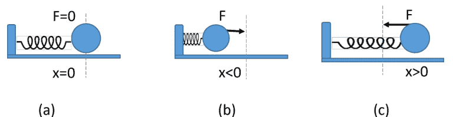

图 6.1：弹簧-质点系统中的简谐振荡。

对于小位移，我们可以在平衡位置 $x = 0$ 附近将 $F(x)$ 展开为泰勒级数：

$$F(x) \approx F(0) + \frac{dF}{dx}\bigg|_{x=0} x + O(x^2) \quad (6.2.1)$$

我们知道 $F(0) = 0$，因为当系统处于平衡状态时不施加恢复力。同样，我们知道 $F(x)$ 对 $x$ 的一阶导数必须为负，以使 $F(x)$ 指向平衡位置。换句话说，$F(x)$ 的符号与 $x$ 相反。因此，我们定义*弹簧常数*为：

$$k \equiv -\frac{dF}{dx}\bigg|_{x=0} \quad (6.2.2)$$

我们可以忽略 (6.2.1) 中的二阶及更高阶项，因为 $x$ 很小。因此，结果是对于小位移，恢复力呈现*胡克定律*的形式：

> **胡克定律**

$$F(x) = -kx \quad (6.2.3)$$

如果 $x(t)$ 是质点在时刻 $t$ 的位置，并且我们假设恢复力遵循胡克定律（即，相对于平衡位置的小位移），那么我们可以将牛顿第二定律 $F = ma = -kx(t)$ 写为：

> **简谐振荡器的微分方程**

$$\frac{d^2x}{dt^2} + \omega_0^2 x = 0 \quad (6.2.4)$$

其中 $\omega_0^2 \equiv k/m$ 是一个常数。方程 (6.2.4) 是所谓的简谐振荡器（SHO）的运动微分方程，它是物理学中的一个重要方程，因为它是描述物体在稳定平衡位置附近进行小振幅振荡的通用运动方程。当粒子仅受到一个与其偏离平衡位置的位移成正比的恢复力作用时，即没有阻力或其他外力作用于粒子时，就会产生简谐运动。

为了找到 (6.2.4) 的解析解，我们需要一个函数 $x(t)$，其二阶导数在求导后能给出自身乘以一个常数并带一个负号。换句话说，$x(t)$ 必须满足：$\ddot{x} = -\omega_0^2 x$。回顾一下，时间导数可以用函数上方的点来表示。虽然一个明显的选择是正弦或余弦函数，但我们会发现指数解将更有用（并且仍然等价）。我们寻找形式为 $x = Ce^{\lambda t}$ 的解，其中 $C$ 是一个常数。将其代入 (6.2.4)，我们得到：

$$\lambda^2 Ce^{\lambda t} + \omega_0^2 Ce^{\lambda t} = 0 \qquad (6.2.5)$$

或者简化为：

$$\lambda^2 + \omega_0^2 = 0 \qquad (6.2.6)$$

或

$$\lambda_{\pm} = \sqrt{-\omega_0^2} = \pm i \omega_0 \qquad (6.2.7)$$

因此 $\lambda$ 必须是复数 $i\omega_0$ 或 $-i\omega_0$ 之一。那么，通解将是这两个解的线性组合：

$$x(t) = C_1 e^{i\omega_0 t} + C_2 e^{-i\omega_0 t} \qquad (6.2.8)$$

注意，通常 $C_1$ 和 $C_2$ 是任意的*复数*常数。

利用欧拉恒等式 $e^{i\omega_0 t} = \cos(\omega_0 t) + i \sin(\omega_0 t)$ 和 $e^{-i\omega_0 t} = \cos(\omega_0 t) - i \sin(\omega_0 t)$，我们可以将此方程中的指数函数转换为三角函数。我们发现通解必须具有以下形式：

$$x(t) = C_1 [\cos(\omega_0 t) + i \sin(\omega_0 t)] + C_2 [\cos(\omega_0 t) - i \sin(\omega_0 t)] \qquad (6.2.9)$$

这个方程可以写成两种等价的数学形式：

> **简谐振荡器解 $x(t)$ 的两种形式**

$$x(t) = A \cos(\omega_0 t) + B \sin(\omega_0 t) \qquad (6.2.10)$$

$$x(t) = C \cos(\omega_0 t + \phi) \qquad (6.2.11)$$

其中 $C = \sqrt{A^2 + B^2}$，$\tan \phi = B/A$ \qquad (6.2.12)

我们可以通过要求系数 $A$ 和 $B$ 为实数，将 (6.2.9) 重写为 (6.2.10)。在这种情况下，我们要求 $C_2^* = C_1$，其中 $C_2^*$ 是 $C_2$ 的*复共轭*。复共轭会改变复数虚部的符号。因此，如果 $c = a + ib$，其中 $a$ 和 $b$ 是实数，那么 $c^* = a - ib$。

我们也可以使用三角恒等式 $\cos(a + b) = \cos a \cos b - \sin a \sin b$ 将 (6.2.9) 重写为 (6.2.11)。

从简谐振荡器解的三角形式中，我们看到量 $\omega_0$ 代表振荡质点的角频率。角频率 $\omega_0$ 被称为振荡器的*固有频率*，是小振幅振荡的频率。

> **简谐振荡器的固有频率**

$$\omega_0 = \sqrt{\frac{k}{m}} \qquad (6.2.13)$$

回到方程 (6.2.10) 和 (6.2.11)，$A$、$B$ 和 $C$ 现在是实数常数，可以通过初始条件来确定，这些条件指定了系统在给定时间（通常在 $t = 0$）的状态。

示例 6.1 演示了在初始条件 $x(0) = x_0$ 和 $v(0) = x'(0) = v_0$ 下求解 (6.2.4)。

> **示例 6.1：给定初始条件下简谐振荡器的符号解**
手动求解以及使用 Mathematica 和 SymPy 求解方程 (6.2.4)，初始条件为 $x(0) = x_0$ 和 $v(0) = x'(0) = v_0$。

**解：**
手动求解时，我们可以使用 (6.2.10) 或 (6.2.11)，其中 $A$、$B$ 和 $C$ 是由初始条件确定的常数。将初始条件 $x(0) = x_0$ 在 $t = 0$ 时代入 (6.2.10)，我们得到：
$$x(0) = A \cos 0 + B \sin 0 = A = x_0 \quad (6.2.14)$$
质点的速度 $v(t)$ 通过对 (6.2.10) 关于时间求导得到：
$$v(t) = \frac{dx}{dt} = -A\omega_0 \sin(\omega_0 t) + B \omega_0 \cos(\omega_0 t) \quad (6.2.15)$$
使用给定的初始条件 $v(0) = v_0$ 在 $t_0 = 0$ 时：
$$v(0) = \omega_0 [-A \sin 0 + B \cos 0] = \omega_0 B = v_0 \quad (6.2.16)$$
因此 $B = v_0/\omega_0$。所以，这些初始条件下的完整解为：
$$x(t) = x_0 \cos(\omega_0 t) + \frac{v_0}{\omega_0} \sin(\omega_0 t) \quad (6.2.17)$$

**Python 代码**
我们可以使用 SymPy 中的 `dsolve()` 得到相同的结果。符号求解的输出为
`x(t) = x0*cos(omega*t) + v0*sin(omega*t)/omega`
在此代码中，我们使用 SymPy 来获得包含任意常数 $C_1$ 和 $C_2$ 的通解符号解，以及给定初始条件下的特解。

from sympy import symbols, Function, Derivative as D, dsolve

print('-'*28,'CODE OUTPUT','-'*29,'\n')

# 定义函数 x 和各种符号
x = Function('x')
omega, t = symbols('omega, t', real=True, positive=True)
x0, v0 = symbols('x0, v0', real=True)

soln = dsolve(D(x(t), t, t) +omega**2*x(t), x(t),\nsimplify=True).rhs
print('通解符号解为：\n', 'x(t) =',soln)

initCondits = {x(0): x0, D(x(t),t).subs(t, 0): v0}

soln = dsolve(D(x(t), t, t) +omega**2*x(t), x(t),\nsimplify=True,ics=initCondits).rhs

print('\n在初始条件 x(0)=x0, v(0)=v0 下的解为：', '\nx(t) =',soln)

----------------------------- CODE OUTPUT -----------------------------
通解符号解为：
x(t) = C1*sin(omega*t) + C2*cos(omega*t)

在初始条件 x(0)=x0, v(0)=v0 下的解为：
x(t) = x0*cos(omega*t) + v0*sin(omega*t)/omega

**Mathematica 代码**
我们使用 `DSolve` 两次，以获得包含任意常数 $C_1$ 和 $C_2$ 的通解符号解，以及在给定初始条件下的特解。

```
soln1 = DSolve[{x''[t] + \omega^2 * x[t] == 0}, x[t], t];

Print["The solution of the homogeneous ODE is:"]

Print["x(t) = ", x[t] /. soln1[[1]]]

The solution of the homogeneous ODE is:
x(t) = c_1 Cos[t \omega] + c_2 Sin[t \omega]

soln2 = DSolve[{x''[t] + \omega^2 * x[t] == 0, x[0] == x0, x'[0] == v0},
x[t], t];

Print["The solution of the ODE with initial conditions is:"]

Print["x(t) = ", x[t] /. soln2[[1]] // Simplify]

The solution of the ODE with initial conditions is:
x(t) = x0 Cos[t \omega] + \frac{v0 Sin[t \omega]}{\omega}
```

### 6.2.2 简谐运动中的势能与动能

让我们将做简谐运动的质量的位置和速度写成 $x = A \cos(\omega_0 t)$ 和 $v = -A\omega_0 \sin(\omega_0 t)$ 的形式。相应的势能和动能随时间 $t$ 变化，遵循：$V(t) = \frac{1}{2} k x(t)^2$ 和 $T(t) = \frac{1}{2} m v(t)^2$。系统的总能量为：

$$E = T + V = \frac{1}{2} m \omega_0^2 A^2 \sin^2(\omega_0 t) + \frac{1}{2} k A^2 \cos^2(\omega_0 t) \quad (6.2.18)$$

然而，由于 $\omega_0^2 = k/m$，我们得到：

$$E = \frac{1}{2} k A^2 \quad (6.2.19)$$

这是系统的最大势能。胡克定律代表一个保守力；因此在振荡过程中，能量在动能和势能之间转换，但它们的总和始终保持不变。在偏离平衡位置的最大位移处，我们有 $x = A$，此时势能最大，动能为零。当振子处于平衡位置 $x = 0$ 时，动能最大，势能为零。在最大位移和平衡位置之间，势能和动能发生变化。例如，当质量向平衡位置移动时，势能减小，动能增加；然而，如前所述，它们的总和保持不变。

我们可以通过在一个周期 $\tau = 2\pi/\omega_0$ 内对 $T$ 进行时间平均来计算一个振荡周期内的平均动能 $< T >$，如下所示：

$$< T > = \frac{1}{\tau} \int_0^{\tau} \frac{1}{2} m v^2 dt = \frac{1}{\tau} \int_0^{\tau} \frac{1}{2} m A^2 \omega_0^2 \cos^2(\omega_0 t) dt = \frac{1}{4} m A^2 \omega_0^2 \quad (6.2.20)$$

其中我们使用了积分值 $\frac{1}{\tau} \int_0^{\tau} \cos^2(\omega_0 t) dt = \frac{1}{2}$。

类似地，我们可以通过对 $V(t)$ 进行时间平均来求得一个振荡周期内的平均势能 $< V >$：

$$< V > = \frac{1}{\tau} \int_0^{\tau} \frac{1}{2} k x^2 dt = \frac{1}{\tau} \int_0^{\tau} \frac{1}{2} k A^2 \sin^2(\omega_0 t) dt = \frac{1}{4} k A^2 = \frac{1}{4} m A^2 \omega_0^2 \quad (6.2.21)$$

结论如下：

$$ < V > = < T > = \frac{1}{4} m A^2 \omega_0^2 = \frac{1}{4} k A^2 = \frac{1}{2} E \quad (6.2.22) $$

其中我们使用了 $k = m\omega^2$ 和 $E = \frac{1}{2} k A^2$。该方程表明，在一个振荡周期内，*动能和势能*的时间平均值都等于总能量 $E$ 的一半。

> **能量的时间平均值**

$$ < V >_{\text{time}} = < T >_{\text{time}} = \frac{1}{2} E \quad (6.2.23) $$

这个方程是力学中著名的*维里定理*的一个例子，它是统计力学中的一个通用方程，将粒子系统的平均总动能与其平均总势能联系起来。

### 6.2.3 简单平面摆作为谐振子的例子

平面摆是最简单的物理系统之一，当偏离平衡位置的位移很小时，可以表现出简谐振荡。在本节中，我们计算小振幅振荡下简单摆的周期 $\tau$，并求出动能和势能作为时间函数的表达式。

图 6.2 显示了一个摆，由一个质量为 $m$ 的物体组成，可以在垂直平面内自由摆动。一根长度为 $L$ 的无质量杆将质量连接到摆的支点。当质量从其平衡位置横向位移时，它会受到一个由于重力产生的恢复力。这个力将使质量加速回到平衡位置。完成一个完整循环的时间就是周期 $\tau$。

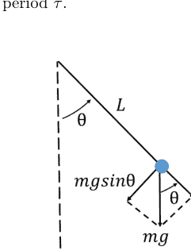

图 6.2：简单平面摆。

我们可以通过仅对切向轴应用牛顿第二定律来找到简单平面摆的运动方程，$F = -mg \sin \theta = ma$ 且 $a = -g \sin \theta$。线性加速度 $a = \frac{d^2s}{dt^2}$，其中 $s$ 是弧长，它与角度 $\theta$ 的关系由公式 $s = L\theta$ 给出。线性加速度的微分方程为 $\frac{d^2s}{dt^2} = L\ddot{\theta}$。因此我们得到：

$$L\ddot{\theta} = -g \sin \theta \quad (6.2.24)$$

通过代入 $\omega_0^2 = g/L$，我们得到简单平面摆的运动方程：

$$\ddot{\theta} + \omega_0^2 \sin \theta = 0 \quad (6.2.25)$$

对于偏离平衡位置的小位移，我们可以近似 $\sin \theta \approx \theta$，方程变为：

> **小摆振荡的运动方程**

$$\ddot{\theta} + \omega_0^2 \theta = 0 \quad (6.2.26)$$

方程 (6.2.26) 与质量-弹簧系统的方程 $\ddot{x} + \omega_0^2 x = 0$ 完全相似，其中角度 $\theta$ 替换了位置 $x$，固有频率 $\omega_0 = \sqrt{k/m}$ 被替换为 $\omega_0 = \sqrt{g/L}$。由于两个方程（简谐振子和摆）在数学上相似，我们可以重新利用简谐振子的解来求解 (6.2.26)。因此，(6.2.26) 的解由下式给出：

$$\theta(t) = \theta_0 \cos(\omega_0 t + \phi) \quad (6.2.27)$$

其中 $\phi$ 是一个依赖于初始条件的常数相位角值。小位移振荡的周期使用 $\tau = 2\pi/\omega_0$ 求得，为：

> **小摆振荡的振荡周期**

$$\tau = 2\pi \sqrt{\frac{L}{g}} \quad (6.2.28)$$

注意，振荡周期与振荡振幅无关。此条件仅适用于小振幅振荡。一旦小角度近似 $\sin \theta \approx \theta$ 不再成立，那么振荡周期将与振荡振幅有关。这种关系在非线性振子中很常见，我们将在第 13 章中研究。

摆的重力势能由下式给出：

$$V = mgh = mgL(1 - \cos \theta) \quad (6.2.29)$$

注意，上述表达式的选择使得当 $\theta = 0$ 时 $V = 0$。换句话说，在稳定平衡点处势能为零。通过使用小角度近似 $\cos \theta \simeq 1 - \theta^2/2$，我们得到：

$$V = \frac{1}{2}mgL\theta^2 \quad (6.2.30)$$

小角度振荡下摆的总能量为：

$$E = \frac{1}{2}m \left(\frac{ds}{dt}\right)^2 + \frac{1}{2}mgL\theta^2 = \frac{1}{2}mL^2 \left(\frac{d\theta}{dt}\right)^2 + \frac{1}{2}mgL\theta^2 \quad (6.2.31)$$

此处使用了 $s = L\theta$。接下来，我们可以利用 (6.2.27) 式来求摆的总能量：

$$E = \frac{1}{2}mgL\theta_0^2 \quad (6.2.32)$$

这个方程当然与质量-弹簧振子的方程 $E = \frac{1}{2}kA^2$ 完全类似。注意 (6.2.32) 式中出现的是 $mgL$ 而不是 $k$。作用在摆上的恢复力矩为 $N = -mgL\sin\theta \approx -mgL\theta$，对于小位移，它与摆的角位移 $\theta$ 成线性比例，比例系数为 $k = mgL$。因此，(6.2.32) 式与弹簧-质量振荡系统的结果是一致的。

## 6.3 简摆的数值解

简摆的常微分方程在不使用椭圆函数的情况下无法得到封闭形式的解，必须进行数值求解。

例 6.2 展示了如何使用 SciPy 和 Mathematica 对 (6.2.25) 式的解进行数值计算和绘图。

> **例 6.2：简摆的数值解**
> 使用 Mathematica 和科学 Python 库 SciPy，对 (6.2.25) 式在 $L = 0.5$ m、初始条件 $\theta(0) = 3$ rad 和 $\dot{\theta}(0) = 0$ rad/s 下进行数值积分并绘制解的图像。

**解：**
为了求解 (6.2.25) 式，我们将使用 `scipy.integrate` 库中的 `odeint()` 函数，该函数用于数值求解如下形式的一阶常微分方程：
$$\frac{dy}{dt} = f(y, t) \quad (6.3.1)$$
其中 $y$ 和 $t$ 分别是因变量和自变量，$f(y, t)$ 是变量 $y, t$ 的已知函数。
为了将 `odeint()` 应用于 (6.2.25) 式，我们需要将 (6.2.25) 式改写为两个一阶常微分方程组成的系统，这是某些常微分方程求解器所需的常见步骤。我们首先创建一个新变量 $\omega = \dot{\theta}$，于是 (6.2.25) 式可以改写为如下系统：
$$\left. \begin{aligned} \frac{d\theta}{dt} &= \omega \\ \frac{d\omega}{dt} &= -\frac{g}{L}\sin\theta \end{aligned} \right\} \quad (6.3.2)$$

> **Python 代码**
> 在代码中，我们定义了一个函数 `deriv(y, time)`，其参数是一个向量 `y` 和时间变量 `time`。在我们的例子中，向量 `y` 的第一个分量 `y[0]` 代表角度变量 $\theta$，第二个分量 `y[1]` 代表角速度 $\omega = d\theta/dt$。函数 `deriv` 使用 (6.3.2) 式来计算并返回一个分量为 $(\omega, d\omega/dt)$ 的向量。
> 函数 `odeint(deriv, yinit, t)` 使用三个参数调用。第一个参数是函数 `deriv`，它包含了待求解的一阶常微分方程的信息；第二个参数是初始条件向量 `yinit`；第三个参数是时间变量 $t$。
> 调用 `odeint` 的结果是一个数组，被赋值给变量 `y`。代码行 `t = np.linspace(0, 10, 100)` 定义了常微分方程将被积分的时间区间，本例中是从 $t = 0$ 到 $t = 10$ 秒。变量 `yinit = (3,0)` 定义了初始条件 $\theta(0) = 3$ rad 和 $\omega(0) = \theta'(0) = 0$ rad/s。代码中的最后 6 行是绘图命令，用于绘制函数 $\theta(t)$ 和 $\omega(t) = \theta'(t)$ 的图像，如图 6.3 所示。
> 图像清楚地表明 $\theta(t)$ 不是正弦振荡。

```python
from scipy.integrate import odeint

import numpy as np
import matplotlib.pyplot as plt

L = 0.5 # length of pendulum
g = 9.8 # gravitational acceleration

# function to define the ODE for pendulum
def deriv(y, time):
    return (y[1], - (g/L)* np.sin(y[0]))

# define times t
t = np.linspace(0, 10, 100)

# initial conditions theta(0)=3 rad,  theta'(0)=0
yinit = (3, 0)

# solve numerically using scipy odeint() function
y = odeint(deriv, yinit, t)

# plot angle and angular velocity as functions of time
plt.plot(t, y[:, 0], 'o-',label=r'$\theta$(t)')
plt.plot(t, y[:, 1], '^-',label=r"$\theta$'(t)")

plt.legend(loc='best')
plt.xlabel('Time [s]')
plt.ylabel(r"$\theta$(t), $\theta$'(t)")
plt.title('Numerical solutions for the plane pendulum')
plt.show()
```

> **Mathematica 代码**
> 与之前的代码一样，我们使用 NDSolve 来获得给定初始条件下微分方程的数值解。

```mathematica
SetOptions[Plot, Frame->True, Axes->True,
BaseStyle->FontSize->20, PlotRange->All];

L = 0.5; g = 9.8;

soln = NDSolve[{θ''[t] + g/L * Sin[θ[t]]==0, θ'[0]==0, θ[0]==3},
θ, {t, 0, 10}];

Plot[Evaluate[{θ[t], θ'[t]}/.soln], {t, 0, 10},
FrameLabel->{t, "θ[t], θ'[t]"}, PlotStyle->{Thick, Dashed}]
```

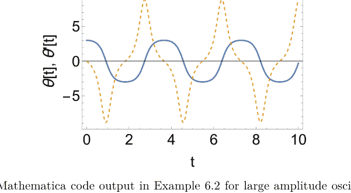

## 6.4 阻尼谐振子

接下来，我们在简谐振子上增加一个线性阻力。该阻力的建模方式类似于第 2 章讨论的线性阻力。阻力有时被称为阻尼，例如当振子在流体（如空气）中运动时就会存在。阻尼谐振子的方程包含一个额外的摩擦项，假设该项与速度成线性关系，形式为 F = -bv，其中 b 取决于振子的尺寸和形状，以及其他物理参数，例如振子运动所通过的流体类型以及振子与支撑表面之间的摩擦系数。阻尼谐振子的完整方程现在由 F = ma = -kx - bv 得到。除以质量 m 后，我们得到：

$$\frac{d^2x}{dt^2} + \frac{b}{m} \frac{dx}{dt} + \frac{k}{m}x = 0 \tag{6.4.1}$$

我们现在定义一个常数 $\gamma$，称为*阻尼参数*，以表示系统中存在的阻尼量：
$$\gamma = b/2m \tag{6.4.2}$$
于是微分方程变为：

> **阻尼谐振子的运动方程**
> $$\ddot{x} + 2\gamma\dot{x} + \omega_0^2 x = 0 \tag{6.4.3}$$

其中我们再次使用了 $\omega_0 = \sqrt{k/m}$ 作为无阻尼振子的固有频率。
我们再次寻找形如 $Ce^{\lambda t}$ 的解，其中 $C$ 是常数。将其代入 (6.4.3) 式并除以所有项 $Ce^{\lambda t}$，我们得到：
$$\lambda^2 + 2\gamma\lambda + \omega_0^2 = 0 \tag{6.4.4}$$
使用二次公式求解：
$$\lambda_{\pm} = -\gamma \pm \sqrt{\gamma^2 - \omega_0^2} \tag{6.4.5}$$
这意味着有一对解 $e^{\lambda t}$，对应于二次方程的两个根。通解是这两个解的线性组合：
$$x(t) = C_1 e^{\left(-\gamma + \sqrt{\gamma^2 - \omega_0^2}\right)t} + C_2 e^{\left(-\gamma - \sqrt{\gamma^2 - \omega_0^2}\right)t} = e^{-\gamma t} \left(C_1 e^{\sqrt{\gamma^2 - \omega_0^2}t} + C_2 e^{-\sqrt{\gamma^2 - \omega_0^2}t}\right) \tag{6.4.6}$$
或者引入参数 $\omega \equiv \sqrt{\gamma^2 - \omega_0^2}$：

> **阻尼谐振子的通解 $x(t)$ ($\gamma \neq \omega_0$)**
> $$x(t) = e^{-\gamma t} (C_1 e^{\omega t} + C_2 e^{-\omega t}) \tag{6.4.7}$$
> $$\omega = \sqrt{\gamma^2 - \omega_0^2} = \sqrt{(b/2m)^2 - (k/m)} \tag{6.4.8}$$

这个方程 $x(t)$ 的确切数学形式取决于 $\gamma$ 和 $\omega_0$ 的数值，它们决定了参数 $\omega = \sqrt{\gamma^2 - \omega_0^2}$ 是实数、虚数还是零。因此，阻尼谐振子有三种物理上不同的行为：过阻尼振荡 ($\gamma > \omega_0$)、欠阻尼振荡 ($\gamma < \omega_0$) 和临界阻尼振荡 ($\gamma = \omega_0$)。
在临界阻尼振荡的特殊情况下，我们有 $\gamma = \omega_0$，且 $\omega = \sqrt{\gamma^2 - \omega_0^2} = 0$。临界阻尼系统会尽快返回平衡位置而不发生振荡。这通常是门和汽车悬架等系统所期望的阻尼状态。在这种情况下，二次方程只有一个根 $\lambda = -\omega_0$。除了 $x(t) = e^{\lambda t}$ 这个解之外，第二个解由函数 $x(t) = te^{\lambda t}$ 给出（参见本节章末问题中的第 26 题）。临界阻尼振子的完整解是这两个解的线性组合：

> **临界阻尼振子的解 $x(t)$ ($\gamma = \omega_0$)**
> $$x(t) = (C_1 + C_2 t) e^{-\omega_0 t} \tag{6.4.9}$$

其中 $A$ 和 $B$ 由系统的初始条件确定。

示例 6.3 展示了如何使用 Python 和 Mathematica 获得通解 (6.4.7) 和 (6.4.9)。

> **示例 6.3：简谐振子的通解**
> 使用 Mathematica 和 SymPy 求解阻尼谐振子的常微分方程，分别针对过阻尼振荡（$\gamma > \omega_0$）、欠阻尼振荡（$\gamma < \omega_0$）和临界阻尼振荡（$\gamma = \omega_0$）三种情况。通解中包含任意常数 $C_1$ 和 $C_2$。

**Python 代码**
我们使用 SymPy 中的 `dsolve()` 函数。注意，对于临界阻尼振荡，我们在代码中显式地使用了 $\gamma = \omega_0$。

```python
from sympy import symbols, Function, Derivative as D, dsolve

import textwrap

print('-'*28,'CODE OUTPUT','-'*29,'\n')

# define function x and various symbols
x = Function('x')
gamma, t ,omega = symbols('gamma, t ,omega', real=True)

# overdamped and underdamped oscillation
soln = dsolve(D(x(t), t, t) + 2*gamma*D(x(t), t) + omega**2*x(t), x(t),\n    simplify=True).rhs

print('For overdamped and underdamped oscillations the \nsolution is : \n\nx(t) =', textwrap.fill(str(soln),63))

# critically damped oscillation:  gamma=omega
soln = dsolve(D(x(t), t, t) + 2*omega*D(x(t), t) +\n              omega**2*x(t), x(t)).rhs

print('\nFor critically damped oscillations, the symbolic \nsolution is:\n  x(t) =',soln)
```

```
------------------------------------ CODE OUTPUT ------------------------------------
For overdamped and underdamped oscillations the solution is :

x(t) = C1*exp(t*(-gamma + sqrt(gamma**2 - omega**2))) +
C2*exp(-t*(gamma + sqrt(gamma**2 - omega**2)))

For critically damped oscillations, the symbolic solution is:
  x(t) = (C1 + C2*t)*exp(-omega*t)
```

### Mathematica 代码

我们两次使用 `DSolve` 来获得三种情况的通解。解中包含任意常数 $C_1$ 和 $C_2$。

```mathematica
Print[
"The general solution for underdamped and overdamped motion is:"]
Print[DSolve[{m * x''[t] + b * x'[t] + k * x[t]==0}, x[t], t][[1, 1]]]
```

欠阻尼和过阻尼运动的通解为：
$x[t] \to e^{\frac{1}{2} \left(-\frac{b}{m}-\frac{\sqrt{b^2-4 k m}}{m}\right) t} c_1+e^{\frac{1}{2} \left(-\frac{b}{m}+\frac{\sqrt{b^2-4 k m}}{m}\right) t} c_2$

```mathematica
Print["The general solution for critically damped motion is: "]
Print[DSolve[{m * x''[t] + b * x'[t] + b^2/(4 * m) * x[t]==0}, x[t], t][[1, 1]]]
```

临界阻尼运动的通解为：
$x[t] \to e^{-\frac{b t}{2 m}} c_1+e^{-\frac{b t}{2 m}} t c_2$

### 6.4.1 过阻尼、欠阻尼和临界阻尼振荡的比较

在过阻尼振荡的情况下，我们有 $\gamma > \omega_0$，这意味着表达式 $\omega = \sqrt{\gamma^2 - \omega_0^2}$ 中的平方根是实数，(6.4.7) 将写成两个实指数函数之和。由此产生的运动是系统通过指数衰减返回平衡位置，而不发生振荡。或者，也可以将解写成双曲函数的线性组合（参见本节章末习题中的第 23 题）：

> **过阻尼振子的解 $x(t)$**

$x(t) = [A_0 e^{\omega t} + A_1 e^{-\omega t}] e^{-\gamma t}$ (6.4.10)

$x(t) = [B_0 \sinh(\omega t) + B_1 \cosh(\omega t)] e^{-\gamma t}$ (6.4.11)

$\omega = \sqrt{\gamma^2 - \omega_0^2} \quad \gamma > \omega_0$ (6.4.12)

常数 $A_0, A_1, B_0, B_1$ 可以从振子的初始条件中求得。

在欠阻尼振荡的情况下，我们有 $\gamma < \omega_0$，且 $\omega = \sqrt{\gamma^2 - \omega_0^2}$ 是虚数。系统以比无阻尼情况更低的频率振荡，振幅逐渐减小到零。从数学上讲，最好通过使用实频率参数 $\omega_d = \sqrt{\omega_0^2 - \gamma^2}$ 来消除虚数，将通解表示为三角函数的线性组合（参见本节章末习题中的第 24 题）：

### 欠阻尼振子解 $x(t)$ 的两种形式

$x(t) = [A_0 \sin(\omega_d t) + A_1 \cos(\omega_d t)] e^{-\gamma t}$ (6.4.13)

$x(t) = A e^{-\gamma t} \cos(\omega_d t - \phi)$ (6.4.14)

$\omega_d = \sqrt{\omega_0^2 - \gamma^2} \quad \gamma < \omega_0$ (6.4.15)

欠阻尼情况的解在振幅衰减到零的过程中，会反复通过平衡点。这与过阻尼情况不同，在过阻尼情况下，振子在振幅衰减到零的过程中可能根本不会通过平衡点。这是两种振子行为的一个重要区别。同时注意，从 (6.4.13) 和 (6.4.14) 可以看出，参数 $\omega_d = \sqrt{\omega_0^2 - \gamma^2} = \sqrt{k/m - \gamma^2}$ 是欠阻尼振子的频率，它小于固有频率 $\omega_0 = \sqrt{k/m}$。

(6.4.13) 和 (6.4.14) 中的表达式 $A e^{-\gamma t}$ 表示欠阻尼运动中振幅随时间 $t$ 的衰减。注意振幅随时间呈指数衰减。量 $\tau_A = 1/\gamma$ 具有时间量纲，以使指数 $e^{-\gamma t}$ 的自变量无量纲，它表征了振幅衰减到零的速度。作为指数衰减函数的一般准则，振幅在经过五个*特征时间*后，即在 $t \cong 5/\gamma$ 之后，被认为已达到有效为零的值。

对于小阻尼，即当 $\gamma << \omega_0$ 时，我们可以使用二项式近似 $(1-x)^a \cong 1 - ax$ 来得到：

$\omega_d = \sqrt{\omega_0^2 - \gamma^2} = \omega_0 \sqrt{1 - (\gamma/\omega_0)^2} \cong \omega_0 \left(1 - \frac{\gamma^2}{2\omega_0^2}\right) \quad \gamma << \omega_0$ (6.4.16)

示例 6.4 说明了具有不同阻尼程度的质量-弹簧系统运动方程的解。

> **示例 6.4：过阻尼、欠阻尼和临界阻尼振荡的比较**
> 求解 (6.4.3) 的解析解 $x(t)$，参数为 $m = 1$ kg，$k = 1$ N/m，常数 $b$ 取三个值：$b = 1, 2, 3$ Ns/m。

**解：**
对于给定的参数值，当 $b = 1$ 时，参数 $\omega^2 = \gamma^2 - \omega_0^2 = (b/(2m))^2 - (k/m) = (1/2)^2 - 1 < 0$。由于 $\omega^2$ 为负，我们预期是欠阻尼运动，频率为 $\omega = \sqrt{3}/2$，且 $\gamma = b/(2m) = 1/2$。在这种情况下，解是三角函数 $e^{-t/2} \cos(\sqrt{3}/2 t)$ 和 $e^{-t/2} \sin(\sqrt{3}/2 t)$ 的线性组合。

对于临界阻尼运动，我们使用 $\gamma = \omega_0 = \sqrt{k/m} = 1$，或 $b = 2\sqrt{km} = 2$。在这种情况下，解是函数 $e^{-\omega_0 t}$ 和 $t e^{-\omega_0 t}$ 的线性组合，即 $e^{-t}$ 和 $t e^{-t}$。

当 $b = 3$ 时，参数 $\omega^2 = \gamma^2 - \omega_0^2 = (b/(2m))^2 - (k/m) = (3/2)^2 - 1 > 0$。由于该量为正，我们预期是过阻尼运动。在这种情况下，解是指数函数 $e^{\omega t} e^{-\gamma t}$ 和 $e^{-\omega t} e^{-\gamma t}$ 的线性组合。其中 $\omega = \sqrt{5}/2$，$\gamma = b/(2m) = 3/2$，解是 $e^{\sqrt{5}t/2} e^{-3t/2}$ 和 $e^{-\sqrt{5}t/2} e^{-3t/2}$ 的线性组合。

### Python 代码

我们使用 SymPy 中的 `dsolve()` 函数，不指定初始条件。代码的结果与上述对不同 $b$ 值的讨论一致。

```python
from sympy import symbols, Function, Derivative as D, dsolve, sqrt

print('-'*28,'CODE OUTPUT','-'*29,'\n')

# define function x and various symbols
x = Function('x')
t = symbols('t', real=True)

m, k, b = 1, 1, 3

# overdamped oscillation
soln = dsolve(m*D(x(t), t, t)+b*D(x(t), t) +k*x(t), x(t), \n    simplify=True).rhs

print('\nFor overdamped oscillations the solution :\nx(t) =',soln)

m, k, b = 1, 1, 1
soln = dsolve(m*D(x(t), t, t)+b*D(x(t), t) +k*x(t), x(t), \n    simplify=True).rhs

print('\nFor underdamped oscillations the solution :\nx(t) =',soln)

m, k = 1, 1
b = 2*sqrt(k*m)   # condition for critical SHO
soln = dsolve(m*D(x(t), t, t)+ b*D(x(t), t) + k*x(t), x(t), \n    simplify=True).rhs

print('\nFor critically damped oscillations the solution :\nx(t) =',soln)
```

```
-------------------------------- CODE OUTPUT --------------------------------

For overdamped oscillations the solution :
x(t) = C1*exp(t*(-3 + sqrt(5))/2) + C2*exp(-t*(sqrt(5) + 3)/2)

For underdamped oscillations the solution :
x(t) = (C1*sin(sqrt(3)*t/2) + C2*cos(sqrt(3)*t/2))*exp(-t/2)

For critically damped oscillations the solution :
x(t) = (C1 + C2*t)*exp(-t)
```

### Mathematica 代码

同样，来自 Mathematica 的解析解与本节给出的解析解的一般形式一致。

```
Print["欠阻尼情况下的解为："];

m = 1; b = 1; k = 1;

DSolve[{m * x''[t] + b * x'[t] + k * x[t] == 0}, x[t], t]

欠阻尼情况下的解为：

{{x[t] -> e^(-t/2) c2 Cos[(Sqrt[3] t)/2] + e^(-t/2) c1 Sin[(Sqrt[3] t)/2]}}

Print["过阻尼情况下的解为："];

m = 1; b = 3; k = 1;

DSolve[{m * x''[t] + b * x'[t] + k * x[t] == 0}, x[t], t]

过阻尼情况下的解为：

{{x[t] -> e^((-3/2 - Sqrt[5]/2) t) c1 + e^((-3/2 + Sqrt[5]/2) t) c2}}

Print["临界阻尼情况下的解为："];

m = 1; k = 1; b = 2 * Sqrt[k * m];

DSolve[{m * x''[t] + b * x'[t] + k * x[t] == 0}, x[t], t]

临界阻尼情况下的解为：

{{x[t] -> e^(-t) c1 + e^(-t) t c2}}
```

图 6.4 展示了欠阻尼、过阻尼和临界阻尼振荡的 x(t) 比较，我们可以很容易地看出，临界阻尼振子（实线）比其他情况更快地返回平衡位置。请注意，图 6.4 中的三条曲线使用了相同的 m、k、x(0) 和 v(0) 参数值，而 b 的值是可变的。

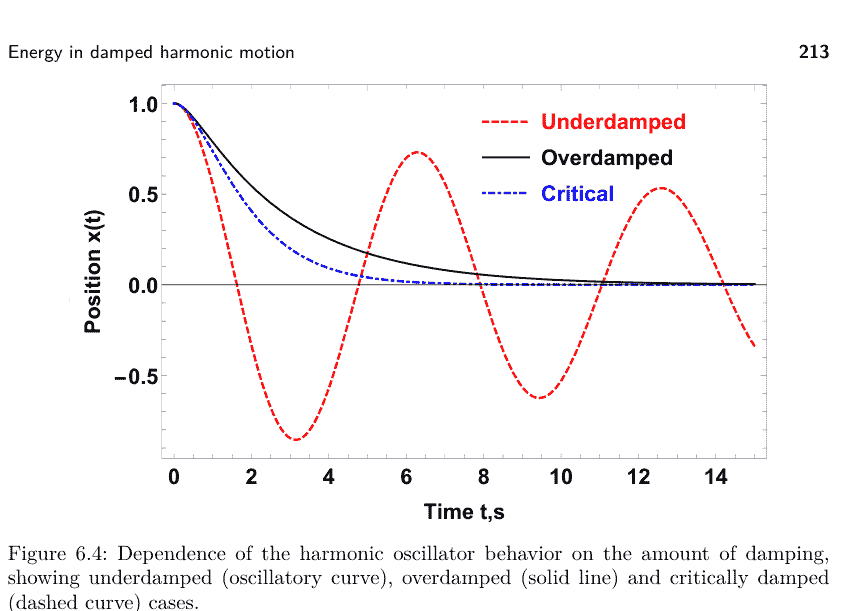

图 6.4：谐振子行为对阻尼量的依赖关系，展示了欠阻尼（振荡曲线）、过阻尼（实线）和临界阻尼（虚线）情况。

## 6.5 阻尼谐振动中的能量

在本节中，我们推导阻尼谐振子能量 $E$ 的解析表达式，并考虑弱阻尼的情况。阻尼谐振子的总能量 $E = T + V$ 为：

$$E = \frac{1}{2}m \left(\frac{dx}{dt}\right)^2 + \frac{1}{2}kx^2 \quad (6.5.1)$$

对于欠阻尼情况，我们可以写成

$$x(t) = A_0 \sin(\omega_d t) e^{-\gamma t} \quad (6.5.2)$$

$$\frac{dx}{dt} = A_0 e^{-\gamma t} [\omega_d \cos(\omega_d t) - \gamma \sin(\omega_d t)] \quad (6.5.3)$$

这个速度 $\frac{dx}{dt}$ 的表达式相当复杂，因此我们假设一种弱阻尼情况，其中 $\gamma << \omega_0$，因此 $\omega_d = \sqrt{\omega_0^2 - \gamma^2} \simeq \omega_0$。利用这些近似，项 $\gamma \sin(\omega_d t)$ 远小于项 $\omega_d \cos(\omega_d t)$，可以在 (6.5.3) 中忽略，从而得到：

$$\frac{dx}{dt} = A_0 e^{-\gamma t} [\omega_d \cos(\omega_d t)] \quad (6.5.4)$$

将 $x(t)$ 和 $dx/dt$ 代入 (6.5.1)，我们得到：

$$E = \frac{1}{2}m [A_0 e^{-\gamma t} \omega_d \cos(\omega_d t)]^2 + \frac{1}{2}k [A_0 \sin(\omega_d t) e^{-\gamma t}]^2 \quad (6.5.5)$$

合并同类项：

$$E = \frac{1}{2} A_0^2 e^{-2\gamma t} [m \omega_d^2 \cos^2(\omega_d t) + k \sin^2(\omega_d t)] \quad (6.5.6)$$

代入 $\omega_d \simeq \omega_0 = \sqrt{k/m}$，我们得到：

$$E = \frac{1}{2} A_0^2 e^{-2\gamma t} [k \cos^2(\omega_d t) + k \sin^2(\omega_d t)] = \frac{1}{2} k A_0^2 e^{-2\gamma t} \quad (6.5.7)$$

上述方程表明，在弱阻尼情况下，总能量随时间呈指数衰减。特征衰减时间为 $\tau_E = 1/(2\gamma)$。我们之前在 (6.4.13) 中看到，*振幅*对应的特征衰减时间为 $\tau_A = 1/\gamma$。

总之，对于弱阻尼 $\gamma \ll \omega_d$（或 $\omega_d \simeq \omega_0$）的情况，总能量 $E$ 和总能量减少率 $dE/dt$ 由下式给出：

> **欠阻尼振子的能量和能量损失，$\gamma \ll \omega_0$**

$$E = \frac{1}{2} k A_0^2 e^{-2\gamma t} \quad (6.5.8)$$

$$\frac{dE}{dt} = -\gamma k A_0^2 e^{-2\gamma t} = -2\gamma E \quad (6.5.9)$$

在一个小时间间隔 $\Delta t$ 内损失的总能量可以估算为：

$$\Delta E \cong \frac{dE}{dt} \Delta t = -2\gamma E \Delta t \quad (6.5.10)$$

其中我们使用了 (6.5.9)。通常将无量纲的*品质因数*或 *Q 因子* $Q$ 定义为比值 $Q = 2\pi |E/\Delta E|$，其中时间间隔 $\Delta t$ 等于周期 $\tau = 2\pi/\omega_d$。将 $\Delta t = \tau = 2\pi/\omega_d$ 代入 $Q$ 的定义中：

$$Q = 2\pi \left| \frac{E}{\Delta E} \right| = 2\pi \frac{1}{2\gamma \tau} = \frac{\omega_d}{2\gamma} \quad (6.5.11)$$

> **欠阻尼运动的 Q 因子**

$$Q = \frac{\omega_d}{2\gamma} \cong \frac{\omega_0}{2\gamma} \quad (6.5.12)$$

在后面的章节中，我们将结合受迫谐振子的能量共振概念，对品质因数进行更深入的讨论。

## 6.6 受迫谐振子

接下来，我们考虑一个外力 $F_0 \cos(\omega t)$ 作用在阻尼振子上的情况。请注意，驱动力的振幅为 $F_0$，频率为 $\omega$，有时称为*驱动频率*。这种情况称为*受迫*或*驱动谐振子*。合力为：

$$m\ddot{x} = -kx - b\dot{x} + F_0 \cos(\omega t) \quad (6.6.1)$$

驱动系统的通用方程为：

> **受迫谐振子的通用微分方程**

$$\ddot{x} + 2\gamma \dot{x} + \omega_0^2 x = D \cos(\omega t) \quad (6.6.2)$$

其中 $\gamma = b/2m$，$\omega_0^2 = k/m$，$D = F_0/m$。你可能想知道为什么我们将研究局限于余弦函数形式的驱动力。显然，并非自然界中所有的驱动力都是余弦或正弦函数的形式。正如我们将在本章后面展示的，任何周期力（在满足物理问题中常见的某些条件下）都可以用一系列正弦和余弦函数来近似。因此，余弦或正弦驱动力的情况适用于许多物理系统。

请注意，(6.6.2) 是一个非齐次常微分方程。正如我们在本章关于微分方程一般理论的引言中所讨论的，非齐次方程的解由两部分之和给出：齐次解 $x_c(t)$ 加上完整非齐次方程的特解 $x_p(t)$：

$$x(t) = x_c(t) + x_p(t) \tag{6.6.3}$$

我们在上一节中已经看到，齐次方程的通解 $x_c(t)$ 由 (6.4.7) 给出：

$$x_c(t) = e^{-\gamma t} \left(A_0 e^{\omega t} + A_1 e^{-\omega t}\right) \quad \omega = \sqrt{(b/2m)^2 - (k/m)} \tag{6.6.4}$$

解 $x_c(t)$ 通常称为*瞬态解*，因为指数衰减项 $e^{-\gamma t}$ 导致 $x_c(t)$ 衰减到零。在瞬态解衰减到零之后，唯一剩下的解是 $x_p(t)$（假设 $x_p \neq 0$），因此被称为*稳态解*。许多物理系统都表现出瞬态和稳态行为。物理学家和工程师通常（但并非总是！）对系统的稳态行为更感兴趣，因为那是系统的长期行为。

在我们研究完整方程 (6.6.2) 的解 $x(t)$ 之前，研究没有阻尼的情况是有启发性的。当没有摩擦时，驱动振子由 $b = 0$ 描述，因此我们得到：

$$\ddot{x} + \omega_0^2 x = D \cos(\omega t) \tag{6.6.5}$$

我们尝试形式为 $x = A \cos(\omega t - \phi)$ 的解，代入并合并同类项后，我们得到：

$$-A\omega^2 \cos(\omega t - \phi) + \omega_0^2 A \cos(\omega t - \phi) = D \cos(\omega t)$$
$$A(\omega_0^2 - \omega^2) \cos(\omega t - \phi) = D \cos(\omega t) \tag{6.6.6}$$

这个方程将有两个可能的解：当 $\phi = 0$ 且 $\cos(\omega t - \phi) = \cos(\omega t)$ 时，以及当 $\phi = \pi$ 时，此时 $\cos(\omega t - \phi) = -\cos(\omega t)$。振幅 $A$ 必须始终为正，因此我们可以将两个可能的解写成以下形式：

$$A = \frac{D}{\omega_0^2 - \omega^2} \quad \phi = 0 \text{ 且 } \omega < \omega_0 \tag{6.6.7}$$
$$A = \frac{D}{\omega^2 - \omega_0^2} \quad \phi = \pi \text{ 且 } \omega > \omega_0 \tag{6.6.8}$$

这个无阻尼驱动振子的解为：

$$x = A \cos(\omega t) = \frac{D}{\omega_0^2 - \omega^2} \cos(\omega t) \quad \phi = 0 \text{ 且 } \omega < \omega_0 \tag{6.6.9}$$
$$x = A \cos(\omega t) = \frac{D}{\omega^2 - \omega_0^2} \cos(\omega t) \quad \phi = \pi \text{ 且 } \omega > \omega_0 \tag{6.6.10}$$

振幅 $A$ 和相位差 $\phi$ 作为外部频率 $\omega$ 的函数的图如图 6.5 所示。我们看到振荡的振幅在当外部频率 $\omega = \omega_0$ 时，振幅和相位在此频率处会发生急剧变化。这是我们首次展示*振幅共振*，即当驱动频率与振荡器的固有频率匹配时，振荡器会产生巨大响应。我们将在本节稍后更详细地讨论共振。

更符合实际的物理情形当然是阻尼不为零的情况。对于这种情况，标准方法是尝试将解 $x = A \cos(\omega t - \phi)$ 代入方程 (6.6.2)。选择余弦解是基于方程 (6.6.2) 右侧包含一个频率为 $\omega$ 的余弦项这一事实。我们需要一个函数 $x(t)$，其导数最终能给出相同频率的余弦。我们知道余弦的一阶导数是正弦。因此，我们引入一个相位项 $\phi$，如果选择得当，它将使方程 (6.6.2) 左侧的所有项相加后得到一个余弦，并与右侧匹配。为了简化数学运算，我们将试探解写成复指数形式 $x = A e^{i(\omega t - \phi)}$，并将方程中的 $D \cos(\omega t)$ 项替换为 $D e^{i\omega t}$。我们将进行代数运算，最后取解的实部，因为 $\cos(\omega t) = Re(e^{i\omega t})$。通过代入并求导，我们得到：

$$- A\omega^2 e^{i(\omega t - \phi)} + 2\gamma \omega i A e^{i(\omega t - \phi)} + \omega_0^2 A e^{i(\omega t - \phi)} = D e^{i\omega t} \quad (6.6.11)$$

通过消去所有项中的 $e^{i\omega t}$ 并在两边乘以 $e^{i\phi} = \cos \phi + i \sin \phi$，我们得到：

$$- A\omega^2 + 2\gamma \omega i A + \omega_0^2 A = D e^{i\phi} = D (\cos \phi + i \sin \phi) \quad (6.6.12)$$

通过使该方程两边的实部相等，并使两边的虚部相等，我们得到：

$$A (\omega_0^2 - \omega^2) = D \cos \phi \quad (6.6.13)$$
$$2\gamma \omega A = D \sin \phi \quad (6.6.14)$$

求解这个关于振幅 $A$ 和相位角 $\phi$ 的方程组，我们得到受驱谐振子非齐次微分方程 (6.6.2) 的特解 $x_p(t)$。从上述方程中求 $\phi$ 很简单，只需将 (6.6.14) 除以 (6.6.13) 即可。求 $A$ 则需要将每个方程平方后相加，并利用 $\sin^2 \phi + \cos^2 \phi = 1$。完整的解 $x(t) = x_c(t) + x_p(t)$ 由下式给出：

### 受驱谐振子的通解 $x(t)$

$x(t) = x_p(t) + A \cos(\omega t - \phi)$ (6.6.15)

$v = \frac{dx}{dt} = \frac{dx_p}{dt} - A\omega \sin(\omega t - \phi)$ (6.6.16)

$A = \frac{F_0/m}{\sqrt{(\omega_0^2 - \omega^2)^2 + 4\gamma^2\omega^2}}$ (6.6.17)

$\tan \phi = \frac{2\gamma\omega}{\omega_0^2 - \omega^2}$ (6.6.18)

示例 6.5 中的代码使用 SciPy 中的 `odeint` 数值积分方法和 Mathematica 中的 `NDSolve` 命令，对 (6.6.2) 进行了数值求解。

### 示例 6.5. 受驱谐振子的数值解

编写 Mathematica 和 Python 代码，对受驱简谐振子的微分方程 $\ddot{x} + 2\gamma\dot{x} + \omega_0^2 x = D \cos(\omega t)$ 进行数值求解。使用数值 $m = 1$ mg, $k = 1$ N/m, $b = 15$ Ns/m, $D = 5$ m/s$^2$ 和 $\omega = 3$ s$^{-1}$，时间范围从 $t = 0$ 到 $t = 80$ s。绘制位置 $x(t)$ 和速度 $v(t)$ 的图像。讨论解在短时间和长时间下的行为。

**解：**
结果绘制在图 6.6 中，其中左图是 $x(t)$ 的图像，右图是 $v(t)$ 的图像。注意在图 6.6 中，对于 $t < 40$ s，瞬态行为占主导地位，而对于 $t > 40$ s，正弦稳态行为占主导地位。

### Python 代码

在代码中，向量 `y` 的第一个分量 `y[0]` 代表位置变量 $x$，第二个分量 `y[1]` 代表导数 $dx/dt$。函数 `odeint` 计算并返回一个包含分量 ($x$, $dx/dt$) 的向量。Python 代码清晰地展示了随着时间的推移，解 $x(t)$ 和 $v(t)$ 行为的变化。函数的初始部分包含一个指数衰减的瞬态分量。在较长时间后，解趋近于稳态解，这些解以恒定的振幅随时间振荡。

```python
from scipy.integrate import odeint
import numpy as np
import matplotlib.pyplot as plt

# SI values of mass, spring constant, force amplitude
b, m, k, Fo, om = 0.2, 1, 1, 5, 3

def deriv(y, time):
    return (y[1], -(b/m)*y[1] - (k/m)*y[0]+Fo/m* np.cos(om*time))

t = np.linspace(0, 80, 400)
yinit = (2, 0)

soln = odeint(deriv, yinit, t)

plt.subplot(1,2,1)
plt.plot(t, soln[:, 0], '-')
plt.ylabel('x(t)')
plt.xlabel('Time [s]')

plt.subplot(1,2,2)
plt.plot(t, soln[:, 1], '-')
plt.ylabel('v(t)')
plt.xlabel('Time [s]')
plt.tight_layout()
plt.show()
```

### Mathematica 代码

```mathematica
SetOptions[Plot, Frame->True, Axes->True, BaseStyle->FontSize->20];

m = 1; k = 1; b = .2;

d = 5; ω = 3;

soln = NDSolve[{m * x''[t] + b * x'[t] + k * x[t] == d * Cos[ω * t], x[0] == 2, x'[0] == 0},
  x, {t, 0, 80}];

gr1 = Plot[Evaluate[{x[t]} /. soln], {t, 0, 80}, FrameLabel->{t, "x[t]"}];

gr2 = Plot[Evaluate[{x'[t]} /. soln], {t, 0, 80}, FrameLabel->{t, "x'[t]"}];

GraphicsGrid[{{gr1, gr2}}]
```

图 6.6：运行示例 6.5 中 Mathematica 代码得到的外部驱动谐振子的结果。对于时间 $t < 40$ s，解的*瞬态*部分的影响清晰可见，而对于 $t > 40$ s，*稳态*解占主导地位。

此外，我们可以使用 (6.6.17) 和 (6.6.18) 绘制振幅 $A$ 和相位角 $\phi$ 作为频率函数的图像。振幅 $A$ 和相位角 $\phi$ 作为外部频率 $\omega$ 函数的图像如图 6.7 所示。当 $\omega \ll \omega_0$ 时，我们发现相位差 $\phi$ 趋近于零，而对于 $\omega \gg \omega_0$，我们发现相位趋近于 $\pi$（180 度），即与驱动力完全反相。

图 6.7：外部驱动阻尼谐振运动情况下，振幅 $A(\omega)$ 和相位角 $\phi(\omega)$ 的图像。

图 6.7 所示最引人注目的结果之一是振幅 $A(\omega)$ 作为频率的函数。注意，与无阻尼情况类似，可能发生振幅共振。阻尼阻止了振幅在共振时无限增大。尽管 $\gamma = 0.01$ 的小值导致共振时振幅很大，但它并非无限大；它只是超出了此处图表的刻度范围。注意，由于用于绘制图 6.7 的 $\gamma$ 值很小，振幅共振发生在 $\omega \approx \omega_0$ 时。接下来，我们将计算共振发生的确切频率。

*共振频率* $\omega_r$ 是导致振幅共振的驱动频率 $\omega$ 的值，通过计算得到：

$$\left. \frac{dA}{d\omega} \right|_{\omega=\omega_r} = 0 \qquad (6.6.19)$$

由此方程我们发现，当 $\omega = \omega_r = \sqrt{\omega_0^2 - 2\gamma^2}$ 时，$A$ 达到最大值，其中 $\omega_r$ 是共振频率。相应的 $A$ 的最大值定义为 $A_{max}$，则为：

> **受驱谐振子的共振频率和共振振幅**

$$\omega_r = \sqrt{\omega_d^2 - \gamma^2} = \sqrt{\omega_0^2 - 2\gamma^2} \qquad (6.6.20)$$

$$A_{max} = \frac{F_0/m}{2\gamma\sqrt{\omega_0^2 - \gamma^2}} \qquad (6.6.21)$$

> **示例 6.6. 振幅共振**
使用计算机代数系统 (CAS) 获得 (6.6.2) 的解 $x(t)$，并绘制受驱振荡的振幅 $A(\omega)$ 作为外部驱动频率 $\omega$ 函数的图像。使用数值 $m = 1$ kg, $\omega_0 = 1$ rad/s, $F_0 = 1.0$ N, $\gamma = 0.1$ rad/s。

**解：**
该常微分方程的通解包含瞬态解和稳态解之和。在 Python 和 Mathematica 代码中，我们选择稳态解，并创建一个表格，列出不同频率 $\omega$ 下受驱振荡的振幅 $A(\omega)$。

> **Python 代码**
在 Python 代码中，我们创建一个函数 `findmax(w)` 来找到稳态解的最大值。该函数使用 SymPy 中的 `dsolve` 函数求解常微分方程，并通过使用 `.subs` 方法将任意常数设置为 $C_1 = C_2 = 0$ 来选择解 `soln` 的稳态部分。

from sympy import symbols, Function, Derivative as D, \
    dsolve, lambdify, cos, N, Add
import numpy as np
import matplotlib.pyplot as plt

print('-' * 28, 'CODE OUTPUT', '-' * 29, '\n')
x = Function('x')
t = symbols('t')
F, wo, gm = 1, 1, .1

# 初始条件 x(0)=1 和 v(0)=0
initCondits = {x(0): 1, D(x(t), t).subs(t, 0): 0}

def findmax(w):
    # 求解常微分方程以获得完整的解析解 soln
    soln = dsolve(D(x(t), t, t) + 2 * gm * D(x(t), t) + wo**2 * x(t) - F * cos(w * t),
        x(t), simplify=True).rhs

    # 将常数 C1 和 C2 设为零以获得特解
    xsteady = soln.subs({'C1': 0, 'C2': 0})
    if (w == 0.1):          # 打印 w=0.1 时的稳态解
        print('\nThe steady state for w=0.1 is:\n  x(t) = ', N(xsteady, 3))

    steadyf = lambdify(t, xsteady, 'numpy') # 将符号表达式转换为数值函数并求最大值

    tvals = np.arange(0, 70, .02)
    return max(steadyf(tvals))

# omega = 外部驱动频率
omega = np.arange(0.1, 3, .1)

ampls = [findmax(u) for u in omega]

# 绘制振幅随 omega 变化的函数图
plt.plot(omega, ampls)
plt.xlabel('Driving frequency, w')
plt.ylabel('Amplitude of steady state, A(w)')
plt.ylim(0, 5.4);
plt.show()

--------------------------- CODE OUTPUT ---------------------------

The steady state for w=0.1 is:
  x(t) =  0.0204*sin(0.1*t) + 1.01*cos(0.1*t)

### Mathematica 代码

通过使用代码中所示的 DSolve 命令，Mathematica 生成了解析解，该解明确包含了 $x_c(t)$ 和 $x_p(t)$ 的和。代码中的变量 $x$ 代表完整解，而变量 **steady** 代表 $x_p(t)$。通过使用替换规则 /. Exp[t_]->0，$x_c(t)$ 中的两个指数项被设为零，我们得到代表 $x_p(t)$ 的表达式 **steady**。通过从 $x$ 中减去变量 **steady**，我们得到代表瞬态解 $x_h(t)$ 的变量 **trans**。参数 $u$ 是一个列表（由 Mathematica 的 Table 命令创建），包含外部频率 $\omega$ 和相应的最大振幅 $A(\omega)$。这些最大值是通过使用 NMaxValue 命令获得的。最后，使用 ListPlot 命令绘制列表 $u$，我们得到所需的图，显示了最大振幅 $A(\omega)$ 作为外部驱动频率 $\omega$ 的函数。

```
sol = DSolve[{x''[t] + \omega_0^2 * x[t] + 2 * \gamma * x'[t] == Fo/m * Cos[\omega * t]}, x[t], t];

x = x[t]/.sol[[1]]//Simplify

e^{-t(\gamma + \sqrt{\gamma^2 - \omega_0^2})}c_1 + e^{t(-\gamma + \sqrt{\gamma^2 - \omega_0^2})}c_2 + \frac{Fo((-\omega^2 + \omega_0^2)Cos[t\omega] + 2\gamma\omega Sin[t\omega])}{m(4\gamma^2\omega^2 + (\omega^2 - \omega_0^2)^2)}

steady = x/.Exp[t_] -> 0

\frac{Fo((-\omega^2 + \omega_0^2)Cos[t\omega] + 2\gamma\omega Sin[t\omega])}{m(4\gamma^2\omega^2 + (\omega^2 - \omega_0^2)^2)}

trans = x - steady

e^{-t(\gamma + \sqrt{\gamma^2 - \omega_0^2})}c_1 + e^{t(-\gamma + \sqrt{\gamma^2 - \omega_0^2})}c_2

m = 1; \gamma = 0.1; Fo = 1; \omega_0 = 1;

u = Table[{\omega, NMaxValue[steady, t]}, {\omega, 0, 3, .02}];

ListPlot[u, FrameLabel -> {"Frequency \omega, Hz", "Amplitude A(\omega)"},
Frame -> True, BaseStyle -> {FontSize -> 16}, Joined -> True]

steady = x/.Exp[t_] -> 0/.\omega->0.1//Simplify

1.00969Cos[0.1t] + 0.0203978Sin[0.1t]
```

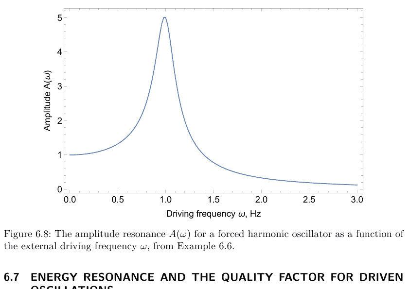

图 6.8：受迫谐振子的振幅共振 A(ω) 作为外部驱动频率 ω 的函数，来自示例 6.6。

## 6.7 受驱振荡的能量共振与品质因数

在前面的章节中，我们计算了欠阻尼振子的品质因数 Q，这个概念在物理学和工程学中非常重要。在本节中，我们将结合受驱振荡，对品质因数进行更深入的推导。这次讨论还将引导我们了解另一种共振——能量共振。

品质因数 Q 是一个无量纲参数，用于量化振子中的阻尼程度和能量损失。较高的 Q 值表示相对于谐振器的存储能量，能量损失率较低，这意味着振荡衰减得更慢。悬挂在高质量轴承上并在空气中摆动的摆具有高 Q 值，而浸没在油中的摆则具有低 Q 值。具有高品质因数的谐振器阻尼较低，因此它们会持续振铃或振动更长时间。

为了理解 Q，我们需要找到振子的平均机械能。受驱振子的总机械能是通过将瞬态过程之后的通解 x(t) = A cos (ωt − φ) 代入得到的：

$$E = T + V = \frac{1}{2}m\dot{x}^2 + \frac{1}{2}kx^2 = \frac{1}{2}mA^2\omega^2 \sin^2 (\omega t - \phi) + \frac{1}{2}kA^2 \cos^2 (\omega t - \phi) \quad (6.7.1)$$

通过计算 sin² (ωt − φ) 项在一个振荡周期内的时间平均值，我们发现它等于 1/2。同样，cos² (ωt − φ) 项在一个振荡周期内的时间平均值也等于 1/2。因此，总能量 E 在一个振荡周期内的时间平均值由 (6.7.1) 式得出：

$$< E > = \frac{1}{4}mA^2\omega^2 + \frac{1}{4}kA^2 = \frac{1}{4} (m\omega^2 + k) A^2 \quad (6.7.2)$$

通过将 (6.6.17) 式中的振幅值代入，并使用 ω₀² = k/m，我们得到：

$$< E > = \frac{1}{4} (m\omega^2 + m\omega_0^2) \frac{(F_0/m)^2}{(\omega_0^2 - \omega^2)^2 + 4\gamma^2\omega^2} \quad (6.7.3)$$

最终得到：

> **受驱振子在一个周期内的平均能量 $E(\omega)$**

$$< E > = \frac{F_0^2}{4m} \frac{\omega^2 + \omega_0^2}{(\omega_0^2 - \omega^2)^2 + 4\gamma^2\omega^2}$$

(6.7.4)

$< E >$ 作为外部驱动频率 $\omega$ 的函数的图像如图 6.9 所示。注意，这里有一个类似于我们在图 6.8 中看到的振幅图 $A(\omega)$ 的峰值。

图 6.9 展示了*能量共振*，能量共振频率是使振子平均能量最大化的驱动频率。

在能量共振和受驱振荡的背景下，$Q$ 因子被定义为谐振器的“频率与带宽之比”，即：

$$Q \equiv \frac{\omega_r}{\Delta\omega}$$

(6.7.5)

其中 $\omega_r$ 是图 6.9 中峰值图的共振角频率。此定义中的 $\Delta\omega$ 是能量共振峰的半高全宽（FWHM）。为了找到 $\Delta\omega$，我们需要找到此图上对应于峰值一半的两个点 $\omega_1$ 和 $\omega_2$。

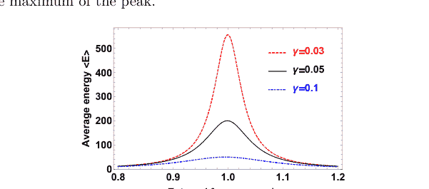

图 6.9：根据 (6.7.4) 式绘制的时间平均能量 $< E >$ 随比值 $\omega/\omega_0$ 变化的图像。$\gamma = 0.03$ 的值导致*轻度阻尼*的谐波运动，对应于较大的 $Q$ 因子。

为了计算 $Q$，我们假设系统具有小阻尼（即尖锐的共振），并在 (6.7.4) 式中除 $(\omega_0^2 - \omega^2)^2$ 项外，将 $\omega \simeq \omega_0$ 代入，得到：

$$< E > = \frac{F_0^2\omega_0^2}{2m} \frac{1}{(\omega_0^2 - \omega^2)^2 + 4\gamma^2\omega_0^2}$$

(6.7.6)

通过近似 $\omega_0 \simeq \omega$，项 $\omega_0^2 - \omega^2 = (\omega_0 + \omega)(\omega_0 - \omega) \simeq 2\omega_0(\omega_0 - \omega)$，上式变为：

$$< E > = \frac{F_0^2}{8m} \frac{1}{(\omega_0 - \omega)^2 + \gamma^2}$$

(6.7.7)

接下来，对 $< E >$ 关于驱动频率 $\omega$ 求导并令其等于零，我们发现该函数的最大值出现在 $\omega = \omega_0$ 处。将此值代入 (6.7.4) 式，总能量的最大时间平均值为：

$$ < E >_{\text{max}} = \frac{F_0^2}{8m\gamma^2} \quad (6.7.8) $$

接下来，我们需要找到平均能量 $< E >$ 降至其最大值一半时的频率。我们将 (6.7.8) 式代入 (6.7.7) 式，得到：

$$ \frac{1}{2} < E >_{\text{max}} = \frac{1}{2} \frac{F_0^2}{8m\gamma^2} = \frac{F_0^2}{8m} \frac{1}{(\omega_0 - \omega)^2 + \gamma^2} \quad (6.7.9) $$

简化后得到：

$$ \frac{1}{2\gamma^2} = \frac{1}{(\omega_0 - \omega)^2 + \gamma^2} \quad (6.7.10) $$

这个关于 $\omega$ 的二次方程的解给出了驱动频率的两个值 $\omega_1$ 和 $\omega_2$，在这两个频率下，总能量的时间平均值降至其最大值的一半：

$$ \omega_1 = \gamma - \omega_0 \quad \omega_2 = \omega_0 - \gamma \quad (6.7.11) $$

半高全宽则为：

$$ \Delta\omega = \omega_1 - \omega_2 = 2\gamma \quad (6.7.12) $$

因此，根据 (6.7.5) 式中 Q 因子的定义，我们得到共振频率 $\omega_0$ 与半高全宽 $\Delta\omega$ 的比值：

> **小阻尼受驱振子的品质因数 Q**

$$ Q = \frac{\omega_r}{\Delta\omega} = \frac{\omega_0}{2\gamma} \quad (6.7.13) $$

这与我们为欠阻尼运动推导出的简单方程相同，仅涉及描述大多数谐振系统（无论是电学还是力学系统）的二阶微分方程的系数。在电学系统中，存储的能量是无损电感器和电容器中存储能量的总和；损失的能量是每个周期内电阻器耗散的能量之和。在力学系统中，存储的能量是可能存储的最大总能量，即某个时刻势能和动能的总和，而损失的能量是耗散给阻尼力（如摩擦力）的能量。

> **示例 6.7. 能量共振**
使用计算机代数系统（CAS）获得 (6.6.2) 式的解 $x(t)$，并绘制受驱振荡的最大总能量 $E$ 作为外部驱动频率 $\omega$ 的函数图像。使用数值 $m = 1 \text{ kg}$, $\omega_0 = 1 \text{ Hz}$, $F_0 = 1.0 \text{ N}$, $\gamma = 0.1 \text{ rad/s}$。

**解：**
我们仅展示 Mathematica 代码，因为 Python 代码与示例 6.6 类似。此处的代码解析地计算了相应的速度 $v_p(t) = dx_p/dt$ 和总能量 $E(t) = \frac{1}{2}mv_p^2 + \frac{1}{2}kx_p^2$。参数 $u$ 是一个外部频率列表$\omega$ 以及相应的最大能量 $E(\omega)$。我们将最大平均能量 $E(\omega)$ 作为外部驱动频率 $\omega$ 的函数进行绘制。值得注意的是，本例中显示的能量共振 $E(\omega)$ 比前一个示例 6.6 中研究的相应振幅共振 $A(\omega)$ 要窄得多。

```
Mathematica Code

sol = DSolve[{x''[t] + \omega o^2 x[t] + 2\gamma x'[t] == Fo/m Cos[\omega t]}, x[t], t];

x = x[t]/.sol[[1]] // Simplify

e^{-t(\gamma + \sqrt{\gamma^2 - \omega o^2})} c_1 + e^{t(-\gamma + \sqrt{\gamma^2 - \omega o^2})} c_2 + \frac{Fo((-\omega^2 + \omega o^2) Cos[t\omega] + 2\gamma \omega Sin[t\omega])}{m(4\gamma^2 \omega^2 + (\omega^2 - \omega o^2)^2)}

steady = x/.Exp[t_] -> 0

\frac{Fo((-\omega^2 + \omega o^2) Cos[t\omega] + 2\gamma \omega Sin[t\omega])}{m(4\gamma^2 \omega^2 + (\omega^2 - \omega o^2)^2)}

en = 1/2 m steady^2

\frac{Fo^2((-\omega^2 + \omega o^2) Cos[t\omega] + 2\gamma \omega Sin[t\omega])^2}{2m(4\gamma^2 \omega^2 + (\omega^2 - \omega o^2)^2)^2}

m = 1; \gamma = 0.1; Fo = 1; \omega o = 1;

u = Table[{\omega, NMaxValue[en, t]}, {\omega, 0, 3, 0.02}];

ListPlot[u, PlotRange -> All, FrameLabel -> {"Driving frequency \omega", "Energy E"}, Frame -> True, BaseStyle -> {FontSize -> 16}, Joined -> True]
```

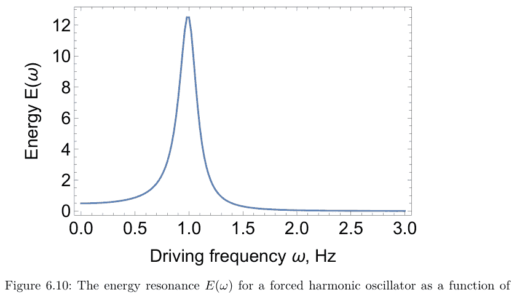

图 6.10：受迫谐振子的能量共振 $E(\omega)$ 作为外部驱动频率 $\omega$ 的函数，来自示例 6.7。

## 6.8 电路

受迫谐振子的运动方程也可用于描述受驱动的 RLC 电路。在本节中，我们推导 RLC 电路的运动方程，并探讨有时被称为*机电类比*的概念。首先，考虑如图 6.11 所示的 RLC 电路。

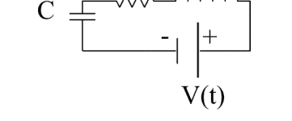

图 6.11：具有外部电压 $V(t)$、电阻 $R$、电感 $L$ 和电容 $C$ 的 RLC 串联电路。

通过将三个元件各自的电压方程代入基尔霍夫电压定律（KVL），可以得到控制微分方程。根据 KVL，

$$V(t) + V_R + V_L + V_C = 0 \quad (6.8.1)$$

其中 $V_R = -IR$ 是电阻两端的电压降，$V_L = -L\frac{dI}{dt}$ 是电感两端的电压降，$V_C = -\frac{Q}{C}$ 是电容两端的电压降，$V(t)$ 是来自电源的时变电压。注意，我们使用的是常规约定，即 $I$ 是电路中的电流，$Q$ 是电容器上的电荷。此外，$L$ 是电感器的电感，$R$ 是电阻器的电阻，$C$ 是电容器的电容，电流为 $I = \dot{Q}$。为简单起见，我们假设 $V(t) = V_0 \cos(\omega t)$。将这些表达式代入 KVL 方程：

$$L \frac{dI}{dt} + IR + \frac{Q}{C} = V_0 \cos(\omega t) \quad (6.8.2)$$

除以 $L$ 得到二阶微分方程：

> **RLC 串联电路的通用微分方程**

$$\frac{d^2Q(t)}{dt^2} + \frac{R}{L} \frac{dQ(t)}{dt} + \frac{1}{LC} Q(t) = \frac{V_0}{L} \cos(\omega t) \quad (6.8.3)$$

该方程与受驱动阻尼谐振子的方程 (6.6.2) 具有完全相同的数学形式：

$$\frac{d^2x}{dt^2} + \frac{b}{m} \frac{dx}{dt} + \frac{k}{m} x = \frac{F_0}{m} \cos(\omega t) \quad (6.8.4)$$

其中 (6.6.2) 是在未进行 $\gamma = b/2m$ 替换的情况下写出的。

由于 (6.8.3) 和 (6.8.4) 具有相同的数学形式，我们可以重用机械系统的解来获得电气系统的解。这种数学上的相似性意味着两个系统的物理行为是相似的。受驱动阻尼谐振子有两个解：一个随 $t \to \infty$ 衰减的瞬态解，以及一个由频率等于驱动频率的正弦振荡组成的稳态解。从物理上讲，这些解描述了质量 $m$ 的位移。由于数学上的相似性，我们知道 RLC 电路也将有两个解：一个同样会衰减的瞬态解，以及一个与电路中电压源频率相同的稳态正弦解。在 RLC 电路的情况下，振荡的是电容器上的电荷值。

此外，我们可以在机械系统和电气系统之间建立精确的类比。这些类比显示在表 6.1 中，通过比较 (6.8.3) 和 (6.8.4) 中变量的位置得出。最简单的类比是质量 $m$ 的位移 $x$ 与电容器上的电荷 $Q$ 之间的类比。一个更有趣的类比存在于 $L$ 和 $m$ 之间。(6.8.3) 中的电感 $L$ 出现的位置与 (6.4.3) 中的 $m$ 相同。这意味着 $L$ 承担着类似于质量的角色。如果我们回想一下，电感 $L$ 衡量的是电感器抵抗电流（$\dot{Q}$）变化的能力，而质量 $m$ 是惯性的度量，即物体抵抗速度（$\dot{x}$）变化的能力，那么这个类比在物理上是合理的。

我们也可以利用这些类比来识别 RLC 电路行为的定性特征。例如，我们知道机械系统中 $x$ 的系数是无阻尼振子的角频率 $\omega_0^2$。我们可以从 (6.8.3) 得出结论，$LC$ 电路（其中 $R=0$）的振荡频率将由下式给出：

> **LC 串联电路的振荡频率**

$$\omega_0 = \frac{1}{\sqrt{LC}} \quad (6.8.5)$$

因为 $1/LC$ 是 (6.8.3) 中 $Q$ 的系数。

### 表 6.1
串联 RLC 电路与受驱动谐振子之间的类比。

| 机械系统 | 串联 RLC 电路 |
| :--- | :--- |
| 位置 $x$ | 电荷 $Q$ |
| 速度 $\frac{dx}{dt}$ | 电流 $\frac{dQ}{dt}$ |
| 质量 $m$ | 电感 $L$ |
| 弹簧常数 $k$ | 电容倒数 $1/C$ |
| 阻尼 $\gamma$ | 电阻 $R$ |
| 固有频率 $\sqrt{\frac{k}{m}}$ | $\sqrt{\frac{1}{LC}}$ |
| $m\ddot{x} + \gamma\dot{x} + kx = F$ | $L\ddot{Q} + R\dot{Q} + Q/C = V$ |

最后，我们可以推导出关于 RLC 电路能量的表达式。我们首先将 (6.8.3) 乘以 $\dot{Q}$ 和 $L$：

$$L\dot{Q}\ddot{Q} + R\dot{Q}^2 + \frac{1}{C}Q\dot{Q} = V_0 \cos(\omega t)\dot{Q}$$ (6.8.6)

注意：

$$\dot{Q}\ddot{Q} = \frac{1}{2}\frac{d}{dt}(\dot{Q}^2) \quad \text{and} \quad Q\dot{Q} = \frac{1}{2}\frac{d}{dt}(Q^2)$$ (6.8.7)

将上述方程代入 (6.8.6) 得到：

$$\frac{d}{dt}\left[\frac{1}{2}L\dot{Q}^2 + \frac{1}{2}\frac{1}{C}Q^2\right] = -R\dot{Q}^2 + V_0 \cos(\omega t)\dot{Q}$$ (6.8.8)

(6.8.8) 中的 $\frac{1}{2}L\dot{Q}^2$ 和 $\frac{1}{2}\frac{1}{C}Q^2$ 项分别是储存在电感器和电容器中的能量。我们可以看到，如果 $R = 0$ 且电路中没有电压源（$V_0 = 0$），那么 (6.8.8) 的右边为零，因此电路的总能量是守恒的。

右边的项描述了系统中能量的损失或增加。回想一下，电阻器耗散的功率为 $P = -I^2R$，这是 (6.8.8) 右边的第一项。(6.8.8) 右边的第二项描述了可变电压源提供能量的速率。注意 $V_0 \cos(\omega t)\dot{Q}$ 的形式是 $VI$，这是电功率的公式。

类比可以是物理学中的一个强大工具，它可用于将对一个系统的理解应用于另一个数学上相似的系统。与任何类比（无论是否与物理相关）一样，注意不要过度引申类比。这样做充其量会导致混淆，最坏的情况会导致对系统的完全误解。

## 6.9 叠加原理与傅里叶级数

到目前为止，我们研究了由连续周期力驱动的振子的响应。然而，并非所有的驱动力都是连续的。考虑一位母亲推她的孩子在秋千上。母亲施加的力不是连续的，而是周期性的，周期为 $\tau$。我们如何用数学方法对这样的力进行建模？我们可以用分段定义来描述一个在 $\tau/2$ 时间内“关闭”，然后在 $\tau/2$ 时间内保持恒定的力：

$$F(t) = \begin{cases} 0 & 0 \le t < \tau/2 \\ F_0 & \tau/2 \le t \le \tau \end{cases} \quad (6.9.1)$$

然而，这样的定义在解析处理上可能很困难。我们应该注意，现代计算机代数系统（CAS）可以在各种应用中处理此类方程；然而，学习如何解析地处理此类情况仍然很有价值。因此，问题依然存在：我们如何以一种便于解析求解的方式来表示这种周期性不连续函数？答案，我们将在本节中演示，是我们可以将周期性不连续函数表示为正弦和余弦的和，称为*傅里叶级数*。这个有趣且重要的结果被称为*傅里叶定理*，适用于在周期 $\tau$ 内连续或具有有限个不连续点的周期函数。由于大多数描述物理过程的函数在区间 $t \in [0, \tau]$ 内只有有限个不连续点，我们可以认为傅里叶定理具有广泛的适用性。

傅里叶定理只是处理不连续周期驱动函数解决方案的一部分。通过将驱动函数表示为正弦和余弦的级数，我们需要能够求解如下形式的方程：

$$\ddot{x} + 2\gamma\dot{x} + \omega_0^2 x = a_0 + a_1 \cos(\omega t) + a_2 \cos(2\omega t) + \cdots + b_1 \sin(\omega t) + b_2 \sin(2\omega t) + \cdots \quad (6.9.2)$$

换句话说，我们需要知道如何求解右侧有多个项的线性常微分方程。因为该微分方程关于 $x$ 及其导数是线性的，我们可以使用强大的*叠加原理*概念，这将允许我们将微分方程分解成若干部分，然后将各个部分的解相加。

### 6.9.1 叠加原理

考虑以下形式的微分方程：

$$a \frac{d^2x}{dt^2} + b \frac{dx}{dt} + cx = \left( a \frac{d^2}{dt^2} + b \frac{d}{dt} + c \right) x = F(t) \quad (6.9.3)$$

这与我们迄今为止处理过的描述振荡的方程非常相似。我们可以将这样的方程重写为 $\hat{L}(x) = F(t)$，其中微分算子 $\hat{L}$ 定义为：

$$\hat{L} \equiv a \frac{d^2}{dt^2} + b \frac{d}{dt} + c \quad (6.9.4)$$

如果算子 $\hat{L}$ 满足以下条件，则它是线性的：

$$\hat{L}(c_1 x_1 + c_2 x_2) = c_1 \hat{L}(x_1) + c_2 \hat{L}(x_2) \quad (6.9.5)$$

其中 $c_1$ 和 $c_2$ 是任意常数，$x_1$ 和 $x_2$ 是微分方程 (6.9.3) 的两个解。可以很容易地证明 (6.9.4) 中定义的 $\hat{L}$ 是一个线性算子。

接下来，我们考虑如下形式的微分方程：

$$\hat{L}(x) = c_1 F_1(t) + c_2 F_2(t) \quad (6.9.6)$$

其中 $\hat{L}$ 的定义如 (6.9.4) 所示。假设我们已知两个函数 $x_1$ 和 $x_2$，使得 $\hat{L}(x_1) = F_1(t)$ 且 $\hat{L}(x_2) = F_2(t)$。换句话说，$x_1$ 是 (6.9.6) 在右侧没有 $F_2(t)$ 时的解，而 $x_2$ 是在没有 $F_1(t)$ 时的解。那么：

$$\hat{L}(c_1x_1 + c_2x_2) = c_1\hat{L}(x_1) + c_2\hat{L}(x_2) = c_1F_1(t) + c_2F_2(t) \quad (6.9.7)$$

因此，各个解 $x_1$ 和 $x_2$ 的和就是完整微分方程 (6.9.6) 的解。当然，我们可以将其推广到右侧有任意多项的情况：

$$\hat{L}(x) = \sum_{i=1}^N c_i F_i(t) \quad (6.9.8)$$

其解为：

$$x(t) = x_c + \sum_{i=1}^N c_i x_i \quad (6.9.9)$$

其中 $x_i$ 满足 $\hat{L}(x_i) = F_i(t)$，而 $x_c$ 是该常微分方程的齐次解。以上述方式将解相加的能力称为*叠加原理*，并且仅适用于线性微分方程。在第13章中，我们将研究非线性系统，叠加原理将不适用于这些系统。

叠加原理在处理不连续驱动力的傅里叶级数表示时至关重要。当我们把不连续的驱动力表示为傅里叶级数时，得到的微分方程将具有如下形式：

$$\ddot{x} + 2\gamma\dot{x} + \omega_0^2 x = a_0 + a_1 \cos(\omega t) + a_2 \cos(2\omega t) + \cdots + b_1 \sin(\omega t) + b_2 \sin(2\omega t) + \cdots \quad (6.9.10)$$

我们现在知道，为了求解这类方程，我们只需要求解以下方程组：

$$\ddot{x}_i + 2\gamma\dot{x}_i + \omega_0^2 x_i = a_i \cos(i\omega t) \quad \text{和} \quad \ddot{x} + 2\gamma\dot{x} + \omega_0^2 x = b_i \sin(i\omega t) \quad (6.9.11)$$

其中 $i = 0, \dots, N$。注意，对于 $i = 0$，$\cos(0) = 1$，我们得到微分方程右侧常数项的解。类似地，$\sin(0) = 0$ 给出齐次解。虽然可能需要求解大量方程，但这个过程可以被推广。例如，注意在上述情况中，通过改变 $i$ 的值，我们只是改变了 $i > 0$ 时的驱动频率。接下来，我们需要学习如何将不连续的周期函数表示为傅里叶级数。

### 6.9.2 傅里叶级数

在本节中，我们介绍法国数学家和物理学家约瑟夫·傅里叶（1768-1830）的一个重要成果。让我们考虑一个实变量 $t$ 的函数 $f(t)$，它以 $\tau$ 为周期，即 $f(t)=f(t + \tau)$。傅里叶定理指出，在通常在力学中成立的某些条件下，这个周期函数可以写成正弦和余弦项的和，形式为*傅里叶级数*：

> **傅里叶级数的一般数学形式**

$$f(t) = \frac{a_0}{2} + \sum_{n=1}^N a_n \cos(n\omega t) + b_n \sin(n\omega t) \quad (6.9.12)$$

其中最低角频率为 $\omega = 2\pi/\tau$，更高的频率是基频角频率 $\omega$ 的整数倍 $n\omega$。系数 $a_n$ 和 $b_n$ 表示各种波的振幅，被称为*傅里叶系数*。傅里叶系数 $a_n$ 和 $b_n$ 通过以下通用积分关系计算：

$$\int_{-\tau/2}^{\tau/2} \cos(n\omega t) \cos(m\omega t) \, dt = \begin{cases} 0 & m \neq n \\ \tau/2 & m = n \neq 0 \end{cases}$$

$$\int_{-\tau/2}^{\tau/2} \sin(n\omega t) \sin(m\omega t) \, dt = \begin{cases} 0 & m \neq n \\ \tau/2 & m = n \neq 0 \end{cases} \quad (6.9.13)$$

$$\int_{-\tau/2}^{\tau/2} \cos(n\omega t) \sin(m\omega t) \, dt = 0 \quad \text{对于所有整数 } n \text{ 和 } m$$

计算 $a_n$ 和 $b_n$ 涉及将 (6.9.12) 的两边乘以 $\cos(2\pi m t/\tau)$ 或 $\sin(2\pi m t/\tau)$，并在整个周期上积分。这个计算的结果被许多代物理学家称为*傅里叶技巧*：

> **寻找傅里叶振幅系数的傅里叶技巧**

$$a_n = \frac{2}{\tau} \int_{-\tau/2}^{\tau/2} f(t) \cos(n\omega t) dt \quad (6.9.14)$$

$$b_n = \frac{2}{\tau} \int_{-\tau/2}^{\tau/2} f(t) \sin(n\omega t) dt \quad (6.9.15)$$

并非总是能够计算所有 $n$ 值的系数，因此有限傅里叶级数是对原始函数 $f(t)$ 的近似，并且随着 $N$ 的增加，近似效果会改善。傅里叶级数通常被认为在除不连续点外的所有地方都收敛，在不连续点处，它收敛于 $f(t)$ 在不连续点前后的值的平均值。

示例 6.8 演示了如何使用解析方法和计算机代数系统（CAS）来计算和绘制周期函数 $f(x)$ 的傅里叶级数。注意，在这个例子中，自变量是 $x$ 而不是时间 $t$。

### 示例 6.8：傅里叶级数计算

求图 6.12 所示周期性锯齿函数的傅里叶级数，分别使用解析方法和计算机代数系统（CAS）求解：

$$f(x) = \frac{x}{\pi}, \quad \text{对于 } -\pi < x < \pi$$
$$f(x + 2\pi j) = f(x), \quad \text{对于 } -\infty < x < \infty \text{ 且 } j \text{ 为整数。}$$

**解：**
虽然本例中自变量是 $x$，但函数 $f(x)$ 关于 $x$ 是周期性的，因此所有傅里叶级数公式仍然适用。接下来，确定周期很重要。从图形（以及 $f$ 的定义）可以看出，周期为 $\tau = 2\pi$。使用公式 (6.9.14) 和 (6.9.15)，我们可以计算傅里叶系数，其中 $\omega = 2\pi/\tau = 1$。首先求 $a_n$ 系数：

$$a_n = \frac{1}{\pi} \int_{-\pi}^{\pi} \frac{x}{\pi} \cos\left(\frac{2\pi n x}{2\pi}\right) dx$$
$$= \left(\frac{1}{\pi}\right)^2 \int_{-\pi}^{\pi} x \cos(nx) dx$$
$$= \left(\frac{1}{\pi}\right)^2 \left. \frac{x \sin(nx)}{n} \right|_{-\pi}^{\pi}$$

因此，我们看到对于所有 $n$ 值，$a_n = 0$，因为对于所有整数 $n$，$\sin(n\pi) = 0$。接下来，计算 $b_n$ 系数：

$$b_n = \frac{1}{\pi} \int_{-\pi}^{\pi} \frac{x}{\pi} \sin\left(\frac{2\pi n x}{2\pi}\right) dx$$
$$= \left(\frac{1}{\pi}\right)^2 \int_{-\pi}^{\pi} x \sin(nx) dx$$
$$= -\frac{2}{\pi n} \cos(n\pi) + \frac{2}{\pi^2 n^2} \sin(n\pi)$$

同样，我们使用对于整数 $n$，$\sin(n\pi) = 0$。然而，注意 $\cos(n\pi) = (-1)^n$。因此，我们得到：
$$b_n = \frac{2(-1)^{n+1}}{\pi n}$$

因此，得到的傅里叶级数为：
$$f(x) = \frac{2}{\pi} \sum_{n=1}^{\infty} \frac{(-1)^{n+1}}{n} \sin(nx)$$

当 $x = \pm\pi$ 时，傅里叶级数收敛到 0，这是 $x = \pm\pi$ 处左右极限的平均值。

### Python 代码

在代码中，我们计算 $a_n$ 和 $b_n$ 的定积分，并通过在 `symbols` 命令中使用选项 `integer = True` 来指定 $n$ 是整数。对于图 6.13 中的绘图，我们定义了一个函数 `T(numTerms)`，它表示有限项傅里叶级数的求和。使用 for 循环来计算求和，两个子图分别表示 N = 10, 30 项的求和。可以预期，随着 N 增加，求和更准确地表示锯齿函数。

```python
from sympy import symbols, integrate, sin, cos, pi
import matplotlib.pyplot as plt
import numpy as np
print('-'*28,'CODE OUTPUT','-'*29,'\n')

x = symbols('x')       # define symbols
n = symbols('n', integer = True,positive=True)

print("Coefficients an = ",(1/pi**2)*integrate(x*cos(n*x),(x,-pi,pi)))
print("Coefficients bn = ",(1/pi**2)*integrate(x*sin(n*x),(x,-pi,pi)))

# function to evaluate Fourier f(x) by summing the series terms
def T(numTerms):
    suma = [0]*len(x)           # initialize the sum
    for n in range(1,numTerms):
        suma = suma+(2/np.pi)*(-1)**(n+1)/n*np.sin(n*x)
    return suma

# positions along the x-axis
x = np.linspace(0,2*np.pi,200)
x1 = np.linspace(0,np.pi,100)
x2 = np.linspace(np.pi,2*np.pi,100)

# call function to evaluate f(x) for different numTerms
plt.subplot(1,2,1)
numTerms = 10
plt.plot(x, T(numTerms))
plt.plot(x1,x1/np.pi)
plt.plot(x2,-1+(x2-np.pi)/np.pi)
plt.text(5,1,'N = '+str(numTerms))
plt.ylabel('f(x)')

plt.subplot(1,2,2)
numTerms = 30
plt.plot(x, T(numTerms))
plt.plot(x1,x1/np.pi)           # plot the two parts of f(x)
plt.plot(x2,-1+(x2-np.pi)/np.pi)
plt.text(5,1,'N = '+str(numTerms))
plt.tight_layout()
plt.show()

-------------------------------- CODE OUTPUT --------------------------------
Coefficients an =  0
Coefficients bn =  -2*(-1)**n/(pi*n)
```

### Mathematica 代码

我们使用 PieceWise 命令定义函数 $f(x)$，并使用 Table 命令为级数近似和 $f(x)$ 的绘图创建适当的列表。

```mathematica
f = Piecewise[{{x/Pi, x > -Pi&&x < Pi}, {{x - 2 * Pi)/Pi, x > Pi&&x < 3 * Pi}}];
Plot[f, {x, -π, 3 * π}, PlotRange->All];

T = 2 * Pi;
numTerms = 30;
Print["ao=", ao = (2/T) * Integrate[f, {x, 0, T}]];
an:=(2/T) * Integrate[f * Cos[2 * n * Pi * x/T], {x, 0, T}];
bn:=(2/T) * Integrate[f * Sin[2 * n * Pi * x/T], {x, 0, T}];
Print["an-Fourier coefficients=", an];
Print["bn-Fourier coefficients=", bn];

ao=0
an-Fourier coefficients=$\frac{-1+\text{Cos}[2n\pi]+2n\pi\text{Sin}[n\pi]}{n^2\pi^2}$
bn-Fourier coefficients=$\frac{-2n\pi\text{Cos}[n\pi]+\text{Sin}[2n\pi]}{n^2\pi^2}$

anList = Table[an/.n -> m, {m, 1, numTerms}];
bnList = Table[bn/.n -> m, {m, 1, numTerms}];
Plot[$\left\{f, ao/2 + \sum_{n=1}^{\text{Length}[anList]}(anList[[n]] * \text{Cos}[2 * n * \text{Pi} * x/T]) + \sum_{n=1}^{\text{Length}[bnList]}(bnList[[n]] * \text{Sin}[2 * n * \text{Pi} * x/T])\right\}$, {x, -T/2, T/2}]
```

### 6.9.3 叠加原理与傅里叶级数示例

作为本节的总结，我们给出一个阻尼谐振子受不连续周期力驱动的问题示例。以下问题将叠加原理和傅里叶级数的概念联系在一起。
考虑以下不连续周期力 $F(t)$：

$F(t) = mA\frac{t}{\pi}$ 对于 $-j\pi < x < j\pi$ (6.9.16)

其中 $m$ 是振子的质量，$j$ 是整数，$A$ 的单位是加速度每单位时间。这本质上与示例 6.8 中的函数相同。在驱动力的公式中包含 $m$ 项可能看起来有些奇怪，但它将在后续简化代数运算。

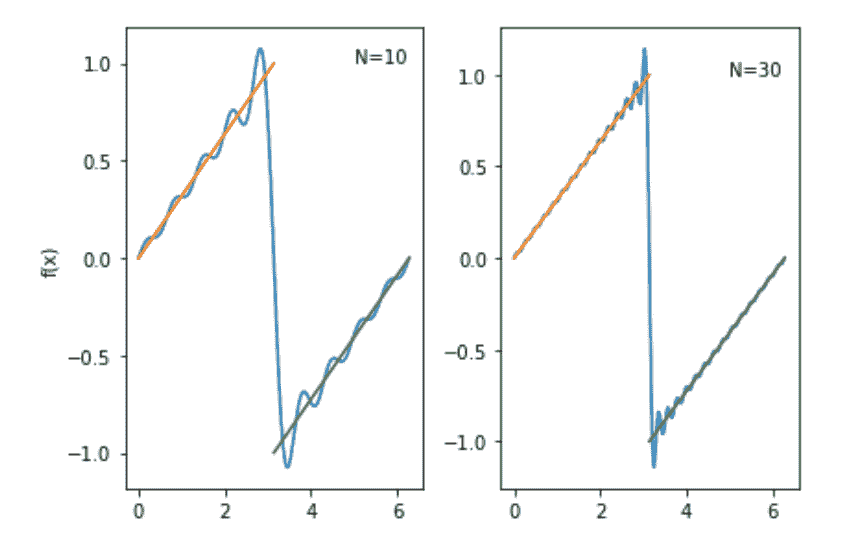

图 6.13：示例 6.8 中 Python 代码的结果，显示了原始函数（实线）与使用 $N = 10, 30$ 项傅里叶级数近似（波浪线）的比较。

(6.9.16) 中的驱动力作用于一个阻尼参数为 $\gamma$、固有频率为 $\omega_0$ 的阻尼谐振子，其运动方程为：

$$\ddot{x} + 2\gamma\dot{x} + \omega_0^2 x = \frac{F(t)}{m} \qquad (6.9.17)$$

为了使用本章描述的解析方法求解 $x(t)$，我们需要使用 $F(t)$ 的傅里叶级数。从示例 6.8 中，我们知道：

$$F(t) = \frac{2mA}{\pi} \sum_{n=1}^{\infty} \frac{(-1)^{n+1}}{n} \sin(n\omega t) \qquad (6.9.18)$$

其中我们将自变量从 $x$ 改为 $t$，包含了乘法常数 $A$，并在傅里叶级数中显式包含了 $\omega$。注意 $\omega = 1$，因为 $\tau = 2\pi$。因此，需要求解的微分方程为：

$$\ddot{x} + 2\gamma\dot{x} + \omega_0^2 x = \frac{2A}{\pi} \sum_{n=1}^{\infty} \frac{(-1)^{n+1}}{n} \sin(n\omega t) \qquad (6.9.19)$$

然而，本章中处理的微分方程右侧是余弦项。为了使用本章推导出的解，我们需要使用恒等式：$\sin(a) = \cos(a - \pi/2)$。这样做后，(6.9.19) 变为：

$$\ddot{x} + 2\gamma\dot{x} + \omega_0^2 x = \frac{2A}{\pi} \sum_{n=1}^{\infty} \frac{(-1)^{n+1}}{n} \cos(n\omega t - \pi/2) \qquad (6.9.20)$$

为了求解 (6.9.20)，我们考虑如下形式的单个方程：

$$\ddot{x}_n + 2\gamma\dot{x}_n + \omega_0^2 x_n = \frac{2A}{\pi} \frac{(-1)^{n+1}}{n} \cos(n\omega t - \pi/2) \quad (6.9.21)$$

我们使用形式为 $x_n(t) = A_n \cos(n\omega t - \pi/2 - \phi_n)$ 的试探解，并遵循求解受驱阻尼谐振子的步骤。结果为：

$$A_n = \frac{2A(-1)^{n+1}}{n\pi\sqrt{(\omega_0^2 - (n\omega)^2)^2 + 4\gamma^2(n\omega)^2}} \quad (6.9.22)$$

$$\tan \phi_n = \frac{2\gamma n\omega}{\omega_0^2 - (n\omega)^2} \quad (6.9.23)$$

注意，上述解与 (6.6.17) 和 (6.6.18) 相同，但常数系数现在是 $2A(-1)^{n+1}/n\pi$，驱动频率是 $n\omega$ 而不是 $\omega$。最后，我们可以使用叠加原理来找到 (6.9.20) 的解：

$$x(t) = \frac{2A}{n\pi} \sum_{n=1}^{\infty} \frac{(-1)^{n+1}}{\sqrt{(\omega_0^2 - (n\omega)^2)^2 + 4\gamma^2(n\omega)^2}} \cos(n\omega t - \pi/2 - \phi_n) \quad (6.9.24)$$

其中相位角 $\phi_n$ 由 (6.9.23) 定义。

## 6.10 相空间

相空间图是物理学和其他学科中的一个有用概念。相空间图通常将粒子的位置 $x(t)$ 绘制在 $x$ 轴上，将其相应的动量 $p = m v(t)$ 绘制在 $y$ 轴上。或者，也可以在 $y$ 轴上使用速度 $v(t)$ 而不是动量 $p = m v(t)$。结果是一个定性描述粒子运动的图形。相空间图在分析非线性系统时非常重要，我们将在第 13 章讨论非线性系统的相空间图。目前，我们将探讨与谐振子相关的相空间图。

让我们考虑一个无阻尼的简谐振子，其位置和速度描述为：

$$x(t) = A \cos(\omega_0 t) \quad (6.10.1)$$

$$v(t) = dx/dt = -A\omega_0 \sin(\omega_0 t) \quad (6.10.2)$$

我们可以使用三角恒等式 $\sin^2(\omega_0 t) + \cos^2(\omega_0 t) = 1$ 消去这些方程中的时间 $t$：

$$\frac{x^2}{A^2} + \frac{v^2}{A^2\omega_0^2} = 1 \quad (6.10.3)$$

这显然表示 $xv$ 平面上的一个椭圆。我们说简谐振子的相空间表示是一个椭圆，其半长轴等于振幅 $a = A$，半短轴（$y$ 轴）等于 $b = A\omega_0$。我们知道对于简谐振子，$E = \frac{1}{2}kA^2$ 且 $\omega_0^2 = k/m$。因此，我们可以将 (6.10.3) 重写为：

$$\frac{x^2}{2E/k} + \frac{v^2}{2E/m} = 1 \quad (6.10.4)$$

这是一个椭圆，其半长轴等于振幅 $a = \sqrt{2E/m}$，半短轴（$y$ 轴）等于 $b = \sqrt{2E/k}$。谐振子的例子

图6.14展示了不同能量$E$对应的相图。在这种情况下，我们看到面积较大的椭圆对应着能量较大的轨迹。

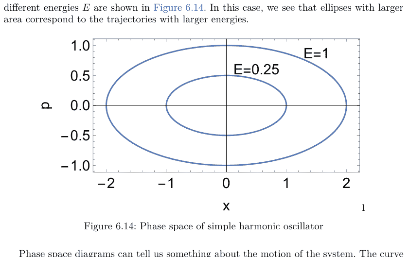

图6.14：简谐振子的相空间

相图可以告诉我们关于系统运动的一些信息。相图中的曲线有时被称为*相空间中的轨迹*。相空间中所有可能轨迹的图像通常被称为*相图*或*相空间图*。轨迹上的每个点给出了系统的位置和动量。相图中存在闭合轨迹是振荡运动的证据。闭合轨迹告诉我们，经过一段时间$\tau$后，系统会回到其初始位置和动量。图6.14中的椭圆轨迹告诉我们，简谐振子表现出振荡运动（这我们已经知道了！）。

接下来，我们将查看欠阻尼谐振子的相图。在这种情况下，我们写出：

$$x(t) = Ae^{-\gamma t} \cos(\omega_d t - \phi)$$
$$v(t) = dx/dt = -A\omega_d e^{-\gamma t} \sin(\omega_d t - \phi) - A\gamma e^{-\gamma t} \cos(\omega_d t - \phi)$$

其中$\omega_d$是驱动频率。直接从上述方程可视化轨迹可能很困难。因此，我们可以进行以下坐标变换，以简化代数运算：

$$u = \omega_d x, \quad w = \gamma x + v$$

然后坐标变为：

$$u = \omega_d A e^{-\gamma t} \cos(\omega_d t - \phi)$$
$$w = -\omega_d A e^{-\gamma t} \sin(\omega_d t - \phi)$$

接下来，我们转换为极坐标：$\rho^2 = u^2 + w^2$ 且 $\theta = \omega_d t$。将$u$和$w$平方并相加得到：

$$\rho = \omega_d A e^{-(\gamma/\omega_d)\theta}$$

我们看到，极坐标中的轨迹对应于一条曲线，其到原点的距离$\rho$随着$\theta$的增加而减小。换句话说，轨迹是一个向内螺旋。请注意，$\rho$的衰减率与$\gamma$成正比，正如我们所预期的。此外，欠阻尼谐振子的向内螺旋不应令人惊讶，因为我们知道欠阻尼运动由振幅随时间指数衰减的振荡运动组成。

假设我们没有使用极坐标的洞察力。我们该如何创建相图？我们可以使用$x$和$v$的参数图。创建欠阻尼振子相图的代码在示例6.9中演示。

### 示例6.9：绘制振子的相图

绘制欠阻尼谐振子的相图，其位置为$x(t) = Ae^{-\gamma t} \cos(\omega_d t - \phi)$，数值为$A = 1$，$\omega_d = 1$，$\gamma = 0.1$，$\phi = 0$（均为SI单位）。

**解：**
我们使用参数图，其中$x(t) = Ae^{-\gamma t} \cos(\omega_d t - \phi)$，$y(t) = dx/dt$。

**Python代码**
在代码中，我们定义时间参数`t`，并将$x(t)$和$v(t)$定义为NumPy表达式，然后使用MatPlotLib中的`plt.plot`进行绘制。图形如图6.15所示。

```python
import matplotlib.pyplot as plt
import numpy as np

A, omega, phi, gamma = 1, 1, 0, 0.1
t = np.linspace(0,100,500)

x = A*np.exp(-gamma*t)*np.cos(omega*t-phi)

# v = dx/dt
v = -A*(gamma*np.cos(omega*t - phi) +
        omega*np.sin(omega*t - phi))*np.exp(-gamma*t)

plt.plot(x,v)
plt.ylabel('v')
plt.xlabel('x')
plt.show()
```

**Mathematica代码**
在Mathematica中，我们使用`v=D[x,t]`找到速度$v(t)$，并且可以直接使用`ParametricPlot[x,v]`命令来创建图6.15中的相图。

```mathematica
A = 1; ωd = 1; ϕ = 0; γ = 0.1;
x = A * Exp[-γ * t] * Cos[ωd * t - ϕ];
v = D[x, t];

ParametricPlot[{x, v}, {t, 0, 100}, FrameLabel -> {x, v}, Frame -> True,
BaseStyle -> {FontSize -> 16}, PlotRange -> All]
```

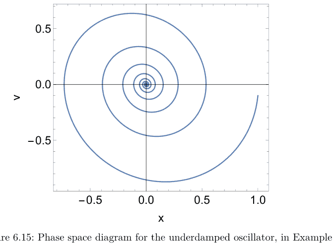

图6.15：示例6.9中欠阻尼振子的相图。

上述算法可用于生成任何已知位置$x(t)$的系统的相图。虽然相图没有提供关于谐振子行为的新信息，但我们将在[第13章](Chapter 13)中发现，相图将成为理解非线性系统可能行为的关键工具。在[第13章](Chapter 13)中，我们将开发一种无需解析求解系统运动方程即可找到系统相图的方法。在非线性系统中，运动方程通常无法解析求解。因此，相图可能是获取系统行为信息的唯一可用工具。

## 6.11 本章总结

弹簧-质量系统是简谐运动的一个例子，由以下方程描述：
$$F(x) = -kx \quad \frac{d^2x}{dt^2} + \omega_0^2 x = 0 \quad \omega_0 = \sqrt{\frac{k}{m}}$$
并具有等效解：
$$x(t) = A \cos(\omega_0 t) + B \sin(\omega_0 t) \quad x(t) = C \cos(\omega_0 t + \phi)$$
以及总动能
$$E = T + V = \frac{1}{2}mv^2 + \frac{1}{2}kx^2$$

当摆动角度很小时，单摆也是简谐运动的一个例子。其微分方程为：
$$\ddot{\theta} + \left(\frac{g}{l}\right) \sin \theta = 0$$
在小角度振荡极限$\theta_0 \ll 1$下，该方程的解为：
$$\theta(t) = C \cos(\omega_0 t + \phi) \quad \omega_0^2 = \frac{g}{l} \quad \tau = 2\pi \sqrt{\frac{l}{g}}$$

描述阻尼谐振子的一般方程为：
$$\frac{d^2x}{dt^2} + 2\gamma \frac{dx}{dt} + \frac{k}{m}x = 0 \quad x(t) = e^{-\gamma t} (A_0 e^{\omega t} + A_1 e^{-\omega t}) \quad \omega = \sqrt{\gamma^2 - \omega_0^2}$$
其中常数$\gamma = b/2m$是*阻尼参数*。根据$\omega = \sqrt{\gamma^2 - \omega_0^2}$是实数、虚数还是零，有三种可能的解类型：(a) 过阻尼振荡（$\gamma > \omega_0$），(b) 欠阻尼振荡（$\gamma < \omega_0$），和 (c) 临界阻尼振荡（$\gamma = \omega_0$ 或 $\omega = 0$）。相应的解为：
$$x(t) = [A_0 e^{\omega t} + A_1 e^{-\omega t}] e^{-\gamma t} \quad \omega = \sqrt{\gamma^2 - \omega_0^2} \quad \gamma > \omega_0 \text{ 过阻尼}$$
$$x(t) = A e^{-\gamma t} \cos(\omega_d t - \phi) \quad \omega_d = \sqrt{\omega_0^2 - \gamma^2} \quad \gamma < \omega_0 \text{ 欠阻尼}$$
$$x(t) = (A + Bt) e^{-\omega_0 t} \quad \gamma = \omega_0 \text{ 临界阻尼}$$

弱阻尼振子的能量和能量损失为：
$$E = \frac{1}{2} k A_0^2 e^{-2\gamma t} \quad \gamma \ll \omega_d \quad \frac{dE}{dt} = -2\gamma E \quad (6.11.1)$$
无量纲品质因子$Q$表示振子中存在的阻尼程度，$Q$值越高表示能量损失率越低：
$$Q = \frac{\omega_0}{2\gamma}$$

受迫阻尼振子由振幅$A(\omega)$和相位角$\phi(\omega)$描述，两者都是外部驱动频率$\omega$的函数：
$$\ddot{x} + 2\gamma \dot{x} + \omega_0^2 x = F_0 \cos(\omega t) \quad x(t) = x_c(t) + A \cos(\omega t - \phi)$$
$$A = \frac{F_0/m}{\sqrt{(\omega_0^2 - \omega^2)^2 + 4\gamma^2 \omega^2}} \quad \tan \phi = \frac{2\gamma \omega}{\omega_0^2 - \omega^2}$$

其中$x_c(t)$是齐次方程的三种可能解之一。该振子表现出共振现象，其共振频率和共振振幅由下式给出：

$$\omega_r = \sqrt{\omega_d^2 - \gamma^2} = \sqrt{\omega_0^2 - 2\gamma^2}$$
$$A_{max} = \frac{F_0/m}{2\gamma\sqrt{\omega_0^2 - \gamma^2}}$$

电RLC电路中的电荷$Q(t)$与机械振子中的位置$x(t)$之间存在类比：

$$\frac{d^2Q(t)}{dt^2} + \frac{R}{L}\frac{dQ(t)}{dt} + \frac{1}{LC}Q(t) = 0$$
$$\frac{d^2x}{dt^2} + \frac{b}{m}\frac{dx}{dt} + \frac{k}{m}x = 0$$

任何周期为$\tau = 2\pi/\omega$的周期函数的傅里叶级数的一般数学形式为：

$$f(t) = \frac{a_0}{2} + \sum_{n=1}^{N} a_n \cos(n\omega t) + b_n \sin(n\omega t)$$

傅里叶系数可以使用傅里叶技巧求得：

$$a_n = \frac{2}{\tau} \int_{-\tau/2}^{\tau/2} f(t) \cos(n\omega t) dt$$
$$b_n = \frac{2}{\tau} \int_{-\tau/2}^{\tau/2} f(t) \sin(n\omega t) dt$$

相图在分析非线性系统中非常重要。它们是粒子在$x$轴上的位置$x(t)$与其在$y$轴上的对应速度$v(t)$（或动量）的图。

## 6.12 章末习题

符号🖥️表示需要一些计算机辅助的问题，形式包括图形、数值计算或符号求值。

### 第6.1-6.3节：微分方程与简谐振子

1. 🖥️ 一个质量为$m$ kg的物体沿$x$轴做简谐运动，频率为$\omega_0$。在$t = 0$时物体静止，在$t = 1$秒时以速度$V$运动。使用解析方法和计算机代数系统（CAS）求解此问题。
    a. 求位置、速度和加速度作为时间$t$的函数。
    b. 求运动的振幅和周期。
2. 从谐振的一般表达式$x(t) = A \cos(\omega_0 t) + B \sin(\omega_0 t)$出发，证明该方程的等效形式由以下表达式给出：$x(t) = C \cos(\omega_0 t + \phi)$，其中$C = \sqrt{A^2 + B^2}$，$\tan \phi = B/A$。
3. 一个质量为$m$的物体连接在劲度系数为$k$的弹簧上，沿$x$轴做欠阻尼简谐运动，空气阻力为$F = -bv$。
    a. 证明两个连续最大值之间的时间差为：
    $$\Delta t = \frac{2\pi}{\sqrt{\omega_0^2 - \gamma^2}}$$

其中 $\gamma = b/2m$ 且 $\omega_0 = \sqrt{k/m}$。

b. 证明位置连续两个极大值的*振幅*之比由下式给出：
$$R = e^{\gamma \Delta t}$$
其中 $\Delta t$ 是第 (a) 部分中的表达式。

4. 一个质量为 $m$ 的物体连接在劲度系数为 $k$ 的竖直弹簧上，在平衡位置时弹簧伸长量为 $a$。在 $t = 0$ 时刻，一个力 $F(t) = A\sin(\omega t)$ 作用在该物体上，其中 $\omega = \sqrt{k/m}$。定性描述该物体的位置 $x(t)$ 和速度 $v(t)$ 随时间 $t$ 的变化。可以忽略系统中的任何阻尼。

5. 一个弹簧的劲度系数为 $k = 8$ N/m，其上连接一个质量 $m = 0.5$ kg 的物体。在 $t = 0$ 时刻，一个力 $F = 6\sin(4t)$（单位：N）作用在该物体上。求在初始条件 $z(0) = 0$ 和 $z'(0) = 0$ 下，物体在 $t$ 时刻的位置 $z(t)$ 的解析表达式。

6. 一个振动系统的微分方程为：
$$\frac{d^2z}{dt^2} + 16z - 160\cos(6t) = 0$$
初始条件为 $z(0) = 0$ 和 $\frac{dz}{dt}(0) = 0$。求解并绘制几个周期内的解 $z(t)$，并解释结果。

7. 一个质量为 $m$、半径为 $R$ 的圆柱体，其轴线竖直，部分浸没在密度为 $\rho$ 的液体中漂浮。给圆柱体一个向下的微小竖直位移后释放。求振荡周期。

8. 一个质量为 $m$ 的物体在 $xy$ 平面内运动，所受力为 $\mathbf{F} = -kx\mathbf{\hat{i}} - ky\mathbf{\hat{j}}$。
    a. 证明根据问题的初始条件，运动轨迹将是椭圆、抛物线或双曲线。
    b. 求该振子的势能。

9. 考虑一个质量为 $m$ 的物体在重力场中沿一根竖直导线运动。导线的形状是摆线，由方程描述：$x = a\theta - a\sin\theta$ 和 $y = -a + a\cos\theta$。
    a. 如果物体在 $t = 0$ 时刻从原点 $(0, 0)$ 静止释放，求其在摆线导线底部的速度。
    b. 求振荡周期。

10. 一个质量为 $m$ 的物体置于无摩擦桌面上，通过两根自然长度相等、质量可忽略、劲度系数分别为 $k_1$ 和 $k_2$ 的弹簧连接到对面墙壁上的两个固定点。将该物体水平位移后释放。证明振荡周期为 $\tau = 2\pi\sqrt{m/(k_1 + k_2)}$。

11. 一根劲度系数为 $k$、质量可忽略的弹簧，一端固定在倾角为 $\theta$ 的斜面上，另一端连接一个质量为 $m$ 的物体，如图 6.16 所示。如果将质量 $m$ 沿平行于斜面的方向从平衡位置向下拉动距离 $x$ 后释放，求在以下情况下任意时刻相对于平衡位置的位移：(a) 斜面无摩擦；(b) 斜面的摩擦系数为 $\mu$。

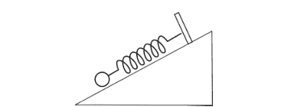

12. 一个质点沿 $x$ 轴做简谐运动。在时刻 $t_0, 2t_0, 3t_0$，它分别位于 $x = a, b, c$。证明振荡周期为 $T = 2\pi t_0 / [\cos^{-1} (\frac{a+c}{2b})]$。

13. 两个质量相等的物体 $m$ 通过劲度系数相等的弹簧连接，如图 6.17 所示，使得物体可以在无摩擦桌面上自由滑动。弹簧两端连接的墙壁是固定的。

    a. 建立物体的运动微分方程，并求出可能的振荡频率，也称为固有频率。
    b. 假设第一个物体保持在其平衡位置，而第二个物体被给予一个大小为 $a > 0$、向右偏离其平衡位置的位移。然后释放物体。求任意后续时刻每个物体的位置。
    c. 在同一张图上绘制两个物体的位置随时间变化的函数，并讨论运动。使用国际单位制下的数值 $k = m = a = 1$。

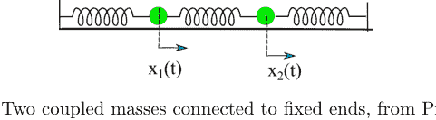

14. 两个质量相等的物体 $m$ 置于水平无摩擦桌面上，如图 6.18 所示，通过劲度系数相等的弹簧连接。其中一个弹簧的一端固定在墙上，物体被设置为运动状态。

    a. 建立系统的运动方程。
    b. 求出可能的振荡频率，也称为固有频率，并绘制两个物体的运动。使用频率数值 $\omega = \sqrt{k/m}=1$ rad/s。

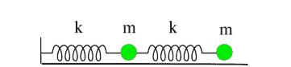

15. 两个质量 $m_1$ 和 $m_2$ 连接在劲度系数为 $k$ 的弹簧两端，弹簧置于水平无摩擦桌面上，如图 6.19 所示。如果将两个质量拉开然后释放，证明它们将相对于彼此振动，周期为 $T = 2\pi\sqrt{\mu/k}$，其中 $\mu = M_1M_2/(M_1 + M_2)$ 是系统的约化质量。


16. 求图 6.20 所示的、由质量相等的粒子 $m$ 通过劲度系数相同的弹簧连接而成的系统的振动频率。

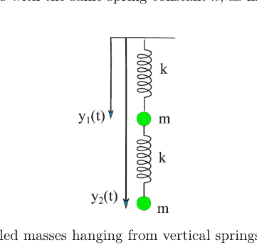

17. 一个摆长为 $L = 1$ m、质量为 $m = 0.1$ kg，重力加速度为 $g = 9.8\text{m/s}^2$。令 $\theta(t)$ 表示摆偏离平衡位置的角度。

    a. 当摆从平衡位置偏离 3 度的小角度静止释放时，绘制角度 $\theta(t)$、角速度 $\omega = d\theta/dt$、动能 $T$、势能 $V$ 和总机械能 $E = T + V$ 随时间 $t$ 变化的函数图。
    b. 绘制摆从平衡位置偏离 3 度小角度和 170 度大角度静止释放时的运动。两种情况下的振荡有何不同？
    c. 求在 (b) 部分两种释放角度下，一个完整振荡周期内的时间平均值 $< T >$ 和 $< V >$，并将它们与总机械能 $E$ 进行比较。讨论你的结果。

18. 一个摆长为 $L = 1\text{m}$、质量为 $m = 0.1\text{kg}$，从平衡位置偏离 3 度的角度静止释放。重力加速度取 $g = 9.8\text{ m/s}^2$。

    a. 求绳子的张力 $T$ 随时间 $t$ 变化的函数。
    b. 在什么时间 $t$ 张力最大，在什么时间最小？这些结果合理吗？

19. 在本章中，我们看到对于小振幅振荡，摆的周期为 $\tau = 2\pi\sqrt{L/g}$。

    a. 证明在更一般的、任意振幅 $\theta_0$ 的振荡情况下，周期由下式给出：
    $$\tau = \sqrt{8L/g} \int_0^{\theta_0} \frac{d\theta}{\sqrt{\cos\theta - \cos\theta_0}}$$
    b. 通过将被积函数展开为角度 $\theta$ 的级数，证明可以逐项积分得到以下表达式：
    $$\tau = 2\pi\sqrt{L/g} \left(1 + \frac{\theta_0^2}{16}\right)$$

### 第 6.4 节：阻尼谐振子

20. 我们已经研究了阻尼振子的常微分方程 $\ddot{x} + 2\gamma\dot{x} + \omega_0^2 x = 0$。一个在小角度 $\theta$ 下振荡的阻尼摆对应的常微分方程为 $\ddot{\theta} + 2b\dot{\theta} + \omega_0^2 \theta = 0$。一个摆长为 $L = 1\text{ m}$、质量为 $m = 0.1\text{ kg}$，从平衡位置偏离 3 度的小角度静止释放。

    a. 如果阻尼力使得摆的运动是临界阻尼的，求摆的最大角速度。
    b. 绘制该运动的角度 $\theta(t)$ 和角速度 $\omega = d\theta/dt$。

21. 一个弹簧系统处于欠阻尼状态，无阻尼时的振荡频率是有阻尼时振荡频率的三倍。求振荡中连续极大值之比。

22. 一个弹簧系统处于临界阻尼状态，无阻尼时的振荡频率为 100 Hz。如果弹簧的初始条件为 $t = 0$ 时 $x = x_0$ 且 $v = 0$，求 $t = 10\text{ s}$ 时的位移。

## 章末习题

23. 证明在过阻尼运动情况下，表达式 $x(t) = [A_0 e^{\omega t} + A_1 e^{-\omega t}] e^{-\gamma t}$ 与 $x(t) = [B_0 \sinh(\omega t) + B_1 \cosh(\omega t)] e^{-\gamma t}$ 是等价的，其中 $\omega = \sqrt{\gamma^2 - \omega_0^2}$ 且 $\gamma > \omega_0$。常数 $A_0, A_1$ 与常数 $B_0, B_1$ 之间的数学关系是什么？

24. 从一般方程 $x(t) = (A_0 e^{\omega t} + A_1 e^{-\omega t}) e^{-\gamma t}$ 出发，其中 $\omega = \sqrt{\gamma^2 - \omega_0^2}$，推导欠阻尼运动情况下的表达式
$$x(t) = A e^{-\gamma t} \cos(\omega_d t - \phi)$$
其中 $\omega_d = \sqrt{\omega_0^2 - \gamma^2}$ 且 $\gamma < \omega_0$。常数 $A_0, A_1$ 与常数 $A, \phi$ 之间的数学关系是什么？

25. 利用近似 $\gamma \ll \omega_0$，计算欠阻尼运动情况下的一般位置 $x(t)$。在 $\gamma \to 0$ 的极限情况下，得到的方程是什么？

26. 证明在临界阻尼振荡情况下，$x(t) = t e^{\lambda t}$ 是方程 $\ddot{x} + 2\gamma \dot{x} + \omega_0^2 x = 0$ 的一个解。

### 第6.5节：阻尼谐振子的能量

27. 一个摆长为 $L = 1$ m，质量为 $m = 0.1$ kg，重力加速度为 $g = 9.8$ m/s$^2$。摆受到的空气阻力由 $F = -bv$ 给出，其中 $v = v(t)$ 是质量 $m$ 的速度，$b = 0.1$ Ns/m 是阻尼系数。摆从平衡位置偏转3度处由静止释放。
求当摆从平衡位置偏转3度处由静止释放时，动能 $T$ 和势能 $V$ 作为时间 $t$ 的函数。在同一张图上绘制 $T$、$V$ 以及它们的和 $T + V$。

### 第6.6节：受迫谐振子

28. 受迫谐振子的位置 $x(t)$ 满足方程
$$\frac{d^2x}{dt^2} + 6\frac{dx}{dt} + 8x = 10\cos(2t)$$
在 $t = 0$ 时，粒子位于原点且静止。

- a. 求振子位置和速度的瞬态解和稳态解，作为时间 $t$ 的函数。请手动求解，并使用计算机代数系统（CAS）求解。
- b. 在同一张图上绘制势能、动能和总能量。
- c. 求动能的变化率 $dT/dt$ 作为时间的函数，并在多个*振荡周期*上绘制该量。讨论在不同时间间隔 $t$ 内所得图形的形状。

29. 粒子在 $xy$ 平面上的位置 $x(t), y(t)$ 由 $x(t) = A \cos(\omega_1 t + \phi_1)$ 和 $y(t) = B \cos(\omega_2 t + \phi_2)$ 给出。证明如果比值 $\omega_1/\omega_2$ 是一个有理数，则粒子在一条封闭曲线上运动。

30. 粒子在 $xy$ 平面上的位置 $x(t), y(t)$ 满足方程

$$\frac{d^2x}{dt^2} = -8y$$
$$\frac{d^2y}{dt^2} = -2x$$

在 $t = 0$ 时，粒子位于位置 $(1, 0)$ 且静止。求位置和速度作为时间 $t$ 的函数。请手动求解此问题，并使用计算机代数系统（CAS）求解。

31. 一个质量为 $m = 1$ kg 的粒子在 $xy$ 平面上运动，其势能函数为 $V(x, y) = x^2 + y^2 + xy + 3$。粒子初始位于点 $(1, 1)$，并以 $2$ m/s 的速度沿正 $x$ 轴方向运动。

- a. 求位置作为时间 $t$ 的函数。
- b. 求运动的周期。

### 第6.7-6.8节：受迫振荡和电路的能量共振与品质因数

32. 一个电路由一个 $10$ k$\Omega$ 电阻、一个 $80$ mH 电感、一个 $10$ $\mu$F 电容和一个形式为 $V = 100 \cos(10t)$（其中 $V$ 以伏特为单位，时间以秒为单位）的交流电压源串联组成。

- a. 求电路中任意时刻 $t$ 的电流 $I(t)$。绘制此函数，并识别图形的稳态部分和瞬态部分。
- b. 绘制电容器中储存的电能作为时间的函数，并讨论此图形的形状。
- c. 求此电路的品质因数 $Q$。
- d. 求在 $t = 0.2$ s 和 $t = 0.4$ s 之间，电阻 $R$ 上耗散的平均功率 $P = VI$。

33. 给出具有非常低 Q 因子和非常高 Q 因子的机械系统和电气系统的例子。这些数字对于它们所描述的振荡器有什么物理意义？

### 第6.9节：叠加原理，傅里叶级数

34. 使用 Mathematica 或 SymPy 的符号计算功能：

- a. 求下图所示周期性方波函数的傅里叶系数的解析表达式。
- b. 绘制傅里叶级数前10项的和，并讨论该图与周期性方波的比较情况。
- c. 对傅里叶级数的前100项重复部分 (b)，并讨论结果。

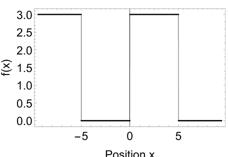

图6.21：分段连续函数 $f(x)$，来自习题6.35。

### 第6.10节：相空间

关于相空间概念的几个问题可以在[第13章](Chapter 13)中找到。


Taylor & Francis
Taylor & Francis Group
http://taylorandfrancis.com

# 7 变分法

在下一章中，我们将开发一种寻找系统运动方程的新方法。新方法将涉及一个称为*变分法*的数学分支，我们将在本章中介绍。变分法专注于寻找一个称为*泛函*的数学对象的极值。变分法的基础由艾萨克·牛顿和戈特弗里德·威廉·莱布尼茨（1646–1716）奠定，并由雅各布和约翰·伯努利兄弟（分别为1655–1705和1667–1748）进一步发展。对变分法的首次重大贡献由莱昂哈德·欧拉（1707–1783）、约瑟夫-路易·拉格朗日（1736–1813）和皮埃尔-西蒙·拉普拉斯（1749–1827）做出。在本章中，我们将介绍变分法，并用它来解决与物理学相关的问题。

## 7.1 学习变分法的动机

到目前为止，在本书中，我们主要通过求解基于牛顿第二定律的二阶微分方程来找到粒子的运动方程。当作用在系统上的力在数学上很简单，并且问题最好用笛卡尔坐标描述时，这种方法可能很直接。然而，物理学中的许多问题需要使用笛卡尔坐标以外的坐标系。在第3章中，我们在极坐标、柱坐标和球坐标中计算了速度和加速度。我们发现这些量的形式比用笛卡尔坐标表示时要复杂得多。因为牛顿第二定律使用加速度，所以涉及在球坐标或柱坐标中描述运动的问题可能非常混乱且难以求解。

牛顿第二定律的另一个复杂之处在于它使用力来描述运动。虽然有许多数学上简单的力可以作用在粒子上，例如重力、法向力以及线性和二次阻力；但约束力可能非常复杂或完全未知。约束力的例子包括被约束在球面上运动的粒子或沿弯曲导线滑动的珠子。即使是滚动的物体也可能涉及约束力。如果约束力未知，可能无法使用牛顿第二定律来找到运动方程。

诚然，如果知道作用在粒子上的所有力，即使在上述情况下，牛顿第二定律也可以用来描述粒子的运动。然而，数学可能相当困难且混乱。我们需要另一种制定运动方程的方法，使我们能够更容易地处理非笛卡尔坐标系和约束力，即使在约束力未知的情况下也是如此。

一种这样的替代公式涉及使用*变分原理*。变分原理涉及找到一个函数，该函数使某个特定量（其本身也是一个函数）最小化或最大化。*变分法*提供了找到使感兴趣量极值化的函数的方法。例如，一个两端悬挂的链条将呈现一种形状，使链条的重力势能最小化。在这种情况下，链条的形状是“待求的函数”，找到该函数（链条的形状）涉及最小化链条的重力势能，而重力势能本身是一个函数。链条的重力势能是链条形状的函数。因此，链条的重力势能是一个“函数的函数”，因为链条的重力势能函数依赖于链条的形状函数。

## 7.2 两点之间的最短距离——变分法的建立

我们将从寻找平面上两点之间的最短距离开始，来展开变分法的推导。这个问题的设定将为我们提供一个具体的例子，说明我们试图用变分法实现什么。让我们首先考虑笛卡尔平面上的两个点，如图7.1所示。

需要最小化的量是连接点 $\mathbf{r}_1 = (x_1, y_1)$ 和 $\mathbf{r}_2 = (x_2, y_2)$ 的曲线长度 $L$。长度可以通过沿曲线的一小段积分微分距离 $ds = \sqrt{dx^2 + dy^2}$ 来求得：

$$L = \int_{\mathbf{r}_1}^{\mathbf{r}_2} ds \quad (7.2.1)$$

其中 $\mathbf{r}_1$ 和 $\mathbf{r}_2$ 分别表示第一个点和第二个点的位置。通常从 $ds$ 中提取出 $dx^2$ 项，以得到：

$$L = \int_{x_1}^{x_2} \sqrt{1 + y'(x)^2} dx \quad (7.2.2)$$

其中我们使用了：

$$dy = \frac{dy}{dx} dx = y'(x) dx \quad (7.2.3)$$

在本章的引言段落中我们说过，“[变分法]提供了一种寻找使感兴趣量达到极值的函数的方法。” 在这个例子中，“感兴趣量”是连接点 $\mathbf{r}_1$ 和 $\mathbf{r}_2$ 的曲线 $y(x)$ 的长度 $L$。注意，曲线的长度取决于函数 $y(x)$（或者更具体地说，取决于其导数），因此我们的“感兴趣量”是函数 $y(x)$ 的函数，所以我们可以将曲线的长度写为 $L = L(y)$。问题明确指出，我们希望找到使点 $\mathbf{r}_1$ 和 $\mathbf{r}_2$ 之间距离最小化的路径。换句话说，我们希望找到函数 $y^*(x)$，使得 $L(y^*)$ 是 $L$ 的最小值。正如我们将看到的，变分法将为我们提供一种寻找 $y^*(x)$ 的方法。

在展示如何解决上述问题之前，建立一些符号表示将很有用。注意 (7.2.2) 具有以下形式：

> **变分法的通用泛函**

$$J(y) = \int_{x_1}^{x_2} f[y(x), y'(x); x] \, dx \qquad (7.2.4)$$

在 (7.2.2) 的情况下，被积函数 $f[y(x), y'(x); x] = \sqrt{1 + y'(x)^2}$ 仅是 $y'(x)$ 的函数。使用方括号表示 $f$ 的泛函性质，即，粗略地说，其自变量是函数。分号用于将 $f$ 自变量中的独立变量与函数分开。换句话说，$f$ 依赖于函数 $y(x)$ 和 $y'(x)$，但也可以包含这些函数的独立变量 $x$ 的项。应该注意的是，对于这两种符号——方括号和分号——没有硬性规定，也可以使用圆括号和逗号。我们将研究的许多变分法问题涉及的被积函数都是 $y(x)$、$y'(x)$ 和 $x$ 的函数。在本章后面，我们将探讨被积函数依赖于多个函数 $y_1(x), y_2(x), \dots, y_n(x)$、它们的导数以及一个独立变量 $x$ 的情况。

量 $J$ 有时被称为*泛函*。泛函是一种数学对象，它以函数作为输入，并返回一个标量作为输出。在 (7.2.2) 的情况下，泛函 $L$ 可以重写为 $L(y)$，它以曲线方程 $y(x)$ 作为输入，并返回曲线的长度（一个标量）作为输出。

接下来，我们将开发一种方法来寻找使泛函 $J(y)$ 达到极值的函数 $y(x)$。或者，继续我们的例子，我们将学习如何找到使平面上两点之间路径长度最小化的曲线 $y^*(x)$。

## 7.3 欧拉方程的第一种形式

让我们暂时回到初等微积分。初等微积分中的一个常见问题是寻找一个数 $x^*$，它是 $f(x)$ 的一个极值点。这是通过使用以下条件完成的：

$$\left. \frac{df}{dx} \right|_{x=x^*} = 0 \qquad (7.3.1)$$

换句话说，$x^*$ 是 $f$ 的极值点的条件是 $f$ 的一阶导数在 $x^*$ 处必须为零。等价地，函数 $f$ 在极值点的变化率为零。为了找到使泛函 $J$ 达到极值的函数 $y(x)$，我们也将进行求导并确定该导数等于零的条件，这可能不会让你感到惊讶。导致导数为零的条件也将为我们提供寻找极值 $y(x)$ 的方法。请注意，为了符号清晰，我们将省略表示极值函数的星号。此外，点 $x^*$ 有时被称为*驻点*，因为从 $x^*$ 的无穷小位移不会改变 $f(x)$ 的值，因为 $f(x)$ 在 $x^*$ 处的斜率为零。同样，在泛函 $J$ 的情况下，极值函数 $y(x)$ 使 $J$ 保持稳定。换句话说，函数 $y(x)$ 的无穷小变化不会改变 $J$ 的值。

继续初等微积分问题，回想一下，可以通过计算 $f(x)$ 的二阶导数并在驻点处求值来轻松区分局部最大值和局部最小值。事实证明，确定 $y(x)$ 是使 $J$ 最大化还是最小化可能非常困难。幸运的是，对于力学应用，只需要知道 $y(x)$ 使某个泛函保持稳定，而 $y(x)$ 是最大化还是最小化该泛函并不重要。

现在让我们考虑寻找使泛函

$$J(Y) = \int_{x_1}^{x_2} f[Y(x), Y'(x); x] dx \qquad (7.3.2)$$

保持稳定的函数 $y(x)$ 的问题。在推导过程中，思考上一节“平面上两点之间的最短距离”的例子将很有帮助。但是，请记住 $J$ 不一定是路径长度。让我们回到图7.1进行可视化；然而，这次我们将从真正的稳定函数 $y(x)$ 开始，通过添加一个小扰动 $\eta(x)$ 来改变它，使得 $\eta(x_1) = \eta(x_2) = 0$。扰动是相对于某个量的小的加性偏差。因此，扰动导致函数 $Y(x) = y(x) + a\eta(x)$，如图7.2所示，由于扰动，它不再使泛函 $J$ 保持稳定。参数 $a$ 提供了 $y(x)$ 被扰动程度的度量。

泛函 $J$ 变为：

$$J = \int_{x_1}^{x_2} f[Y, Y'; x] dx \qquad (7.3.3)$$
$$= \int_{x_1}^{x_2} f[y + a\eta, y' + a\eta'; x] dx \qquad (7.3.4)$$

换句话说，$J = J(a)$，因为积分将“消除”$J$ 对 $x$ 的依赖。实际上，我们将问题简化为单变量 $a$ 的函数，对于这个函数，我们知道如何使用初等微积分来寻找其极值。因为我们知道当 $a = 0$ 时极值存在，所以我们需要证明当 $a = 0$ 时 $\partial J/\partial a$ 等于零。正如我们将看到的，这项工作的结果将是一个条件，即 $y(x)$ 使 $J$ 保持稳定。接下来，我们对 $J$ 关于 $a$ 求导：

$$\frac{\partial J}{\partial a} = \frac{\partial}{\partial a} \int_{x_1}^{x_2} f[Y, Y'; x]dx$$ (7.3.5)
$$= \int_{x_1}^{x_2} \left( \frac{\partial f}{\partial Y} \frac{\partial Y}{\partial a} + \frac{\partial f}{\partial Y'} \frac{\partial Y'}{\partial a} \right) dx$$ (7.3.6)

利用 $Y = y + a\eta$，
$$\frac{\partial Y}{\partial a} = \eta \quad \text{且} \quad \frac{\partial Y'}{\partial a} = \frac{d\eta}{dx}$$

因此，
$$\frac{\partial J}{\partial a} = \int_{x_1}^{x_2} \left( \frac{\partial f}{\partial Y} \eta + \frac{\partial f}{\partial Y'} \frac{d\eta}{dx} \right) dx$$ (7.3.7)

接下来，我们使用分部积分法处理 (7.3.7) 中的第二项：
$$u = \frac{\partial f}{\partial Y'} \quad dv = \frac{d\eta}{dx}dx$$
$$du = \frac{d}{dx} \frac{\partial f}{\partial Y'} dx \quad v = \eta$$

从而，
$$\int_{x_1}^{x_2} \frac{\partial f}{\partial Y'} \frac{d\eta}{dx} dx = \frac{\partial f}{\partial Y'} \eta(x) \bigg|_{x_1}^{x_2} - \int_{x_1}^{x_2} \frac{d}{dx} \frac{\partial f}{\partial Y'} \eta(x) dx$$ (7.3.8)

(7.3.8) 右侧的第一项为零，因为如图 7.2 所示，$\eta(x_1) = \eta(x_2) = 0$。这留下了 (7.3.8) 中的第二项，将其代入 (7.3.7) 得到

$$\frac{\partial J}{\partial a} = \int_{x_1}^{x_2} \left( \frac{\partial f}{\partial Y} - \frac{d}{dx} \frac{\partial f}{\partial Y'} \right) \eta(x) dx$$ (7.3.9)

接下来，我们需要在 $a = 0$ 处计算 (7.3.9)，此时 $Y = y + a\eta = y$，得到
$$\frac{\partial J}{\partial a} = \int_{x_1}^{x_2} \left( \frac{\partial f}{\partial y} - \frac{d}{dx} \frac{\partial f}{\partial y'} \right) \eta(x) dx = 0$$ (7.3.10)

其中我们将导数设为零以确保 $J$ 是平稳的。方程 (7.3.10) 的形式为 $\int h(x)\eta(x)dx = 0$，并且对于任何连续函数 $\eta(x)$ 都必须成立。可以证明，如果对于任何 $\eta(x)$ 都有 $\int h(x)\eta(x)dx = 0$，那么对于所有 $x$ 都有 $h(x) = 0$。最终结果是 *欧拉方程*：

> **欧拉方程**
$$\frac{\partial f}{\partial y} - \frac{d}{dx} \frac{\partial f}{\partial y'} = 0$$ (7.3.11)

它为使 $J$ 平稳的函数 $y(x)$ 提供了一个常微分方程。方程 (7.3.11) 有时也被称为欧拉方程的 *第一形式*，它提供了寻找极值 $y$ 所承诺的条件，因为正如我们将看到的，(7.3.11) 将产生一个关于 $y(x)$ 的微分方程。

接下来，我们使用欧拉方程来寻找笛卡尔平面上两点之间的最短距离路径。

**例 7.1：笛卡尔平面上两点之间的最短路径**
寻找笛卡尔平面上两点 $(x_1, y_1)$ 和 $(x_2, y_2)$ 之间长度最短的路径，分别使用解析方法和计算机代数系统 (CAS)。

**解：**
我们从 (7.2.2) 开始，

$$L = \int_{x_1}^{x_2} \sqrt{1 + y'(x)^2} \, dx$$

其中我们看到 $f = \sqrt{1 + y'(x)^2}$。接下来，我们计算欧拉方程所需的导数：

$$\frac{\partial f}{\partial y} = 0 \quad \text{且} \quad \frac{\partial f}{\partial y'} = \frac{y'}{\sqrt{1 + (y')^2}}.$$

因为欧拉方程的第一项为零，我们有

$$\frac{d}{dx} \left( \frac{y'}{\sqrt{1 + (y')^2}} \right) = 0$$

或者换句话说，括号内的项必须是关于 $x$ 的常数。将该常数设为 $c$ 得到

$$\frac{y'}{\sqrt{1 + (y')^2}} = c$$

这导致：

$$y' = \frac{c}{\sqrt{1 - c^2}}$$

上述方程右侧的项也是一个常数，我们将其定义为 $m$。正如承诺的那样，欧拉方程导出了一个微分方程，从中可以找到 $y$。很容易验证微分方程 $y' = m$ 的结果是：

$$y(x) = mx + b$$

其中 $b$ 是积分常数。因此，笛卡尔平面上两点之间距离最短的路径是一条直线。毫不意外。计算机代数系统有时有处理涉及变分法问题的算法。以下代码为该示例创建了欧拉方程。

### Python 代码

我们使用 SymPy 库中的命令 **euler_equations** 来生成该问题的欧拉方程。**euler_equations** 的参数包括泛函 $f$、因变量函数 $y(x)$（我们最终想要找到的函数）和自变量 $x$。命令 **euler_equations** 输出一个常微分方程列表，这就是为什么我们需要变量 **euler** 中的索引。然后可以使用命令 **dsolve** 来求解所得的欧拉方程以得到 $y(x)$，预期结果为 $y(x) = c_1 + c_2x$。

```python
from sympy import diff, symbols, Function, euler_equations, sqrt, \
    dsolve, simplify

print('-'*28,'CODE OUTPUT','-'*29,'\n')

x = symbols('x')
y = Function('y')(x)

f = sqrt(1 + diff(y,x)**2)

euler = simplify(euler_equations(f, y, x)[0])

print('The Euler equation is\n')
print(euler.lhs,'=',euler.rhs)

soln = dsolve(euler,y).rhs

print('\nThe solution y(x) = ', str(soln))
```

```
----------------------------- CODE OUTPUT -----------------------------
The Euler equation is
Derivative(y(x), (x, 2))/(Derivative(y(x), x)**2 + 1)**(3/2) = 0

The solution y(x) =  C1 + C2*x
```

### Mathematica 代码

与 Python 类似，Mathematica 也有库，称为包。命令 << 告诉 Mathematica 导入 VariationalMethods 包，该包包含可用于解决涉及变分法问题的各种函数。**EulerEquations** 命令为 $f$ 创建欧拉方程。最后，我们使用 **DSolve** 来求解由欧拉方程得到的微分方程。结果是一条直线的方程。

```mathematica
<< VariationalMethods

EulerEquations[Sqrt[1 + y'[x]^2], y[x], x]

-\frac{y''[x]}{(1+y'[x]^2)^{3/2}} == 0

soln = DSolve[-\frac{y''[x]}{(1+y'[x]^2)^{3/2}} == 0, y[x], x];

y[x]/.soln

{c_1 + x c_2}
```

## 7.4 欧拉方程的第二形式

欧拉方程还有另一种形式，当 $J$ 的被积函数不显式依赖于 $x$ 时很有用，换句话说，$\partial f/\partial x = 0$。请注意，即使有偏导数 $\partial f/\partial x = 0$ 这个条件，导数 $df/dx$ 也不一定为零。我们首先计算这个导数：

$$\frac{df}{dx} = \frac{\partial f}{\partial y}\frac{dy}{dx} + \frac{\partial f}{\partial y'}\frac{dy'}{dx} \quad (7.4.1)$$
$$\frac{df}{dx} = y'\frac{\partial f}{\partial y} + y''\frac{\partial f}{\partial y'} \quad (7.4.2)$$
$$y''\frac{\partial f}{\partial y'} = \frac{df}{dx} - y'\frac{\partial f}{\partial y} \quad (7.4.3)$$

此外，我们可以计算：
$$\frac{d}{dx}\left(y'\frac{\partial f}{\partial y'}\right) = y''\frac{\partial f}{\partial y'} + y'\frac{d}{dx}\frac{\partial f}{\partial y'} \quad (7.4.4)$$

最后，我们将 (7.4.3) 代入 (7.4.4)，
$$\frac{d}{dx}\left(y'\frac{\partial f}{\partial y'}\right) = \left(\frac{df}{dx} - y'\frac{\partial f}{\partial y}\right) + y'\frac{d}{dx}\frac{\partial f}{\partial y'} \quad (7.4.5)$$
$$= y'\left[\frac{d}{dx}\frac{\partial f}{\partial y'} - \frac{\partial f}{\partial y}\right] + \frac{df}{dx} \quad (7.4.6)$$

(7.4.6) 中方括号内的项是欧拉第一方程，如果 $y(x)$ 使 $J$ 平稳，那么该项必须为零。因此我们有：
$$\frac{d}{dx}\left(f - y'\frac{\partial f}{\partial y'}\right) = 0 \quad (7.4.7)$$

使用与例 7.1 中相同的论证，我们可以将括号内的项设为一个常数，从而得到欧拉方程的第二形式：

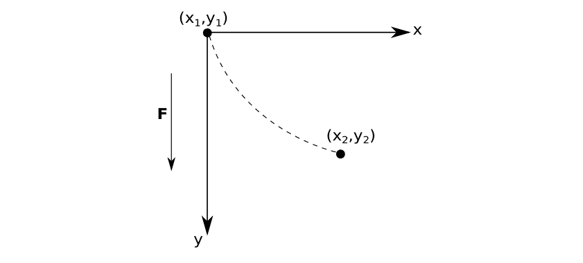

> **欧拉方程的第二形式**

$$f - y' \frac{\partial f}{\partial y'} = \text{常数} \qquad (7.4.8)$$

当因变量 $x$ 不显式出现在 $f$ 中时，即 $\partial f/\partial x = 0$，欧拉方程的第二形式通常很有用。此类情况的一个例子是寻找球面上测地线的数学形式，如本章后面所述。

## 7.5 使用变分法解决的一些问题示例

在本节中，我们将演示使用变分法解决三个问题。在第一个问题中，我们将研究所谓的最速降线问题，这是变分法中的一个著名问题。第二个问题将涉及计算球面上两点之间的最短路径。第三个问题将涉及寻找两点之间的最小旋转曲面。

### 7.5.1 最速降线问题

我们将解决的第一个问题是经典问题，称为 *最速降线* 问题，由约翰·伯努利 (1667-1748) 在 1696 年解决。最速降线问题涉及寻找一条路径，该路径最小化了粒子在保守力场中从两点 $(x_1, y_1)$ 和 $(x_2, y_2)$ 之间移动的时间，如图 7.3 所示。我们将考虑一个质量为 $m$ 的粒子从点 $(x_1, y_1)$ 静止开始。粒子受到一个恒定的保守力作用，对于我们的问题，这个力是重力 $\mathbf{F} = mg\mathbf{j}$，我们将定义正 $y$ 方向向下。两点之间的旅行时间为：

$$t = \int_{(x_1, y_1)}^{(x_2, y_2)} \frac{ds}{v}$$

在之前的例子中，我们使用了 $ds = \sqrt{1 + y'(x)^2} dx$；然而，我们将发现使用 $ds = \sqrt{1 + x'(y)^2} dy$ 更为方便，其中 $x' = dx/dy$。接下来，我们需要找到速度 $v$ 以使用欧拉方程。我们可以利用 $\mathbf{F} = mg\mathbf{j}$ 是一个保守力场这一事实，在两点之间路径上的任意一点写出：

$$\frac{1}{2}mv^2 = mgy$$

当然，上述方程就是能量守恒，回想一下粒子的初始速度为零。因此，$v = \sqrt{2gy}$，我们有：

$$t = \frac{1}{\sqrt{2g}} \int_{y_1}^{y_2} \sqrt{\frac{1 + x'^2}{y}} dy$$

能量守恒在我们的被积函数中引入了自变量 $y$。使用 $y$ 作为自变量而不是 $x$，意味着欧拉方程的第一种形式变为：

$$\frac{d}{dy} \frac{\partial f}{\partial x'} = \frac{\partial f}{\partial x}$$

因为现在我们要寻找使 (7.5.3) 取驻值的函数 $x(y)$。使用

$$f = \sqrt{\frac{1 + x'^2}{y}}$$

我们看到 $f$ 与 $x$ 无关，因此 $\partial f/\partial x = 0$。然后我们可以将偏导数 $\partial f/\partial x'$ 等于一个常数，我们称之为 $1/\sqrt{2a}$，

$$\frac{\partial f}{\partial x'} = \frac{x'}{\sqrt{y(1 + x'^2)}} = \frac{1}{\sqrt{2a}}$$

其中 $a$ 是一个常数。选择 $1/\sqrt{2a}$ 作为我们的常数将简化后续计算中的数学运算。接下来，我们将 (7.5.6) 平方并求解 $x'$，得到：

$$x' = \frac{dx}{dy} = \sqrt{\frac{y}{2a - y}}$$

这是一个微分方程，其解将给出使 (7.5.3) 取驻值的函数 $x(y)$。为了求解 $x(y)$，我们需要求解积分：

$$x = \int \sqrt{\frac{y}{2a - y}} dy$$

这可以通过代换完成：

$$y = a(1 - \cos \theta)$$

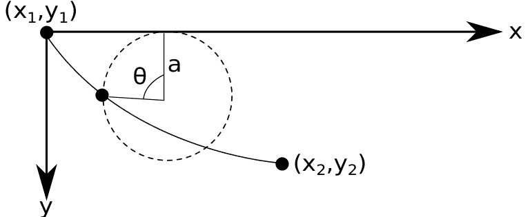

图 7.4：摆线是使 (7.5.3) 取驻值的路径。该路径由变量 $\theta$ 参数化。

其中我们通过选择点 $(x_1, y_1)$ 为原点将积分常数设为零。换句话说，当 $\theta = 0$ 时，$x = 0$。方程 (7.5.9) 和 (7.5.10) 使用参数 $\theta$ 来描述使 (7.5.3) 取驻值的路径。由 (7.5.10) 和 (7.5.9) 描述的路径称为 *摆线*。摆线是一个半径为 $a$ 的圆形轮子边缘上的点，在水平路径上无滑动滚动时所描绘出的曲线，如图 7.4 所示。

摆线是使 (7.5.3) 取极值的路径，虽然我们不会证明，但它是使两点 $(x_1, y_1)$ 和 $(x_2, y_2)$ 之间旅行时间最小化的路径。

下一个例子展示了我们如何使用 CAS 得到摆线的方程以及如何绘制它。该例子还展示了 CAS 在处理复杂积分时的一些局限性，尤其是在使用 SymPy 时。

> **例 7.2：摆线**
> 使用 CAS 积分 (7.5.8)，得到解析形式 $x(y)$。
> 使用 $a = 2$，绘制由方程 (7.5.9) 和 (7.5.10) 产生的摆线的一个半周期。
> **解：**
> 请参见下面的代码以进行积分和创建摆线图。

```
**Python 代码**
我们使用 SymPy 中的 `integrate` 命令执行积分。但是，请注意 SymPy 生成的答案包含复数；这是因为 SymPy 没有完全开发的方法来在代码中包含变量的详细假设。

在 Python 中创建参数图不需要特殊命令。我们只需定义 $x$ 和 $y$ 坐标以及参数 `theta`。
```

```
from sympy import symbols, integrate, sqrt
import numpy as np
import matplotlib.pyplot as plt
import textwrap
wrapper = textwrap.TextWrapper(width=70)

print('-'*28,'CODE OUTPUT','-'*29,'\n')

y1, a, y = symbols('y1, a, y',real=True,positive=True)

x = integrate(sqrt(y1/(2*a-y1)),(y1,0,y))

print('The solution of the ODE is\n\nx = ',wrapper.fill(str( x)))

# Parametric plot
theta = np.linspace(0,3*np.pi,100)

a = 2
x = a*(theta - np.sin(theta))
y = -a*(1 - np.cos(theta))

plt.plot(x,y)
plt.xlabel('x')
plt.ylabel('y')
plt.show()

------------------------------------ CODE OUTPUT ------------------------------------
The solution of the ODE is

x =  2*I*a*asinh(sqrt(2)*sqrt(-2*a + y)/(2*sqrt(a))) + pi*a + I*sqrt(y)*sqrt(-2*a + y)
```

### Mathematica 代码

Mathematica 代码比上面的 SymPy 代码表现更好，因为我们可以使用 **Assumptions** 命令详细指定变量 **a**、**y** 必须满足的条件。

该代码获得了 $x(y)$ 的解析方程，其中不包含复数。此外，通过将参数形式

$$y = a(1 - \cos \theta)$$

代入解析方程 $x(y)$，我们得到 $x$ 的参数方程为：

$$x = a(\theta - \sin \theta)$$

使用 Mathematica 中的 **ParametricPlot** 命令进行绘图。

使用变分法解决的一些问题示例

263

```
x = Integrate[Sqrt[y1/(2 * a - y1)], {y1, 0, y},
Assumptions->{Element[{a, y, y1}, Reals],
a > 0 && y1 > 0 && y > 0 && 2 * a - y > 0 && 2 * a - y1 > 0}]//
Simplify;

Print["x(y) = ", x]

x(y) = - Sqrt[(2a - y)y] + 2aArcSin[Sqrt[y/(2a)]/Sqrt[2]]

(*Substitute parametric y = a * (1 - Cos[theta]) *)

yparametric = a * (1 - Cos[theta]);
xparametric = Assuming[theta > 0 && theta < Pi && a > 0,
x/.{y->yparametric}//Simplify];

Print["Parametric equation for x = ", xparametric]
Print["Parametric equation for y = ", yparametric]

Parametric equation for x = a(theta - Sin[theta])
Parametric equation for y = a(1 - Cos[theta])

SetOptions[ParametricPlot, Frame->True, Axes->False,
BaseStyle->{FontSize->16}];

a = 2;

ParametricPlot[{xparametric, -yparametric}, {theta, 0, 3Pi},
Frame->True, BaseStyle->{FontSize->16},
FrameLabel->{x, y}]
```

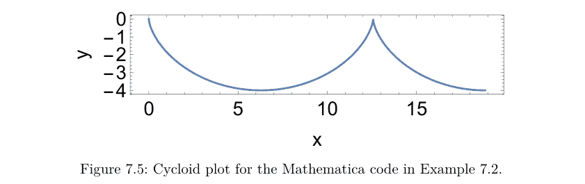

图 7.5：例 7.2 中 Mathematica 代码的摆线图。

### 7.5.2 测地线

*测地线* 是曲面上两点之间可能的最短路径。在这个例子中，我们将找到半径为 $R$ 的球体上的测地线。我们首先注意到，沿球体表面的无穷小位移（$dr = 0$）为：

$$ds = R\sqrt{d\theta^2 + \sin^2 \theta \, d\phi^2} = R\sqrt{\theta'^2 + \sin^2 \theta} \, d\phi$$

其中我们使用了 $\theta' = d\theta/d\phi$。在这种情况下，我们将把测地线作为曲线 $\theta(\phi)$ 来寻找。如果我们使用地球作为我们的球体，那么寻找 $\theta(\phi)$ 就类似于将测地线上点的纬度描述为其经度的函数。

我们试图使其取驻值的长度积分为：

$$L = \int ds = \int_{\phi_0}^{\phi} R\sqrt{\theta'^2 + \sin^2 \theta} \, d\phi \qquad (7.5.11)$$

变量 $R$ 不会影响最小化过程。因此，

$$f = \sqrt{\theta'^2 + \sin^2 \theta} \qquad (7.5.12)$$

因为 $\partial f/\partial \phi = 0$，我们可以使用欧拉方程的第二种形式 (7.4.8)，

$$f - \theta' \frac{\partial f}{\partial \theta'} = a \qquad (7.5.13)$$

这给出

$$\sqrt{\theta'^2 + \sin^2 \theta} - \theta' \frac{\partial}{\partial \theta'} \left( \sqrt{\theta'^2 + \sin^2 \theta} \right) = a \qquad (7.5.14)$$

其中 $a$ 是一个常数。

你接下来的想法可能是求解 (7.5.14) 以得到 $\theta'$，从而得到一个产生 $\theta(\phi)$ 的微分方程。然而，求解反函数 $d\phi/d\theta = \theta'^{-1}$ 在数学上会更容易。结果是：

$$\frac{d\phi}{d\theta} = \frac{a \csc^2 \theta}{\sqrt{1 - a^2 \csc^2 \theta}}$$

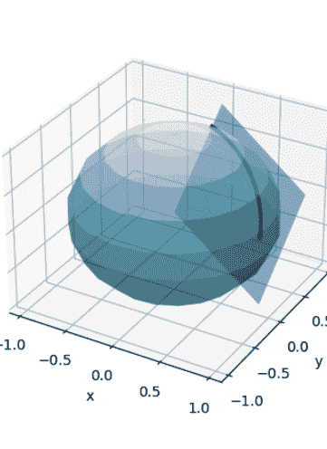

图 7.6：球体上的测地线（黑线）是平面与球体表面的交线。用于创建此图的代码可以在本书网站以及 Pagonis 和 Kulp 的书中找到 [3]。

$$\cot \theta = \beta \sin (\phi - \alpha) \qquad (7.5.16)$$

严格来说，有了 (7.5.16) 我们就完成了，因为我们得到了 $\theta(\phi)$，但这个结果很难解释。为了阐明我们的结果，我们将在 (7.5.16) 两边乘以 $R \sin \theta$ 并展开 $\sin (\phi - \alpha) = \cos \alpha \sin \phi - \sin \alpha \cos \phi$，

$$R \cos \theta = \beta \cos \alpha (R \sin \theta \sin \phi) - \beta \sin \alpha (R \sin \theta \cos \phi) \qquad (7.5.17)$$

注意 (7.5.17) 中括号内的项是坐标变换：

$$\begin{cases} x = R \sin \theta \cos \phi \\ y = R \sin \theta \sin \phi \\ z = R \cos \theta \end{cases} \qquad (7.5.18)$$

具有常数系数，$A \equiv \beta \cos \alpha$ 和 $B \equiv \beta \sin \alpha$。因此，在笛卡尔坐标系中，(7.5.17) 可以表示为：

$$z = Ay - Bx \qquad (7.5.19)$$

这是一个通过球心的平面方程，如图 7.6 所示。

由于我们被限制在半径为 $R$ 的球体表面上，测地线是平面与球体表面相交所形成的路径。因此，测地线是位于平面与球体表面交线处的 *大圆*。两点之间的大圆是航空和航海中常用的路径，因为它

### 7.5.3 最小旋转曲面

考虑两个平行的圆形金属环浸入肥皂水中。两环之间的肥皂膜将形成一个曲面。这个曲面的形状是什么？答案可以通过寻找连接两环的直线所形成的最小旋转曲面来找到。为什么肥皂膜会呈现最小旋转曲面的形状？这与肥皂膜的自由能有关，其表达式为 $E = \sigma A$，其中 $\sigma$ 是膜张力，$A$ 是膜的面积。在平衡状态下，膜的能量最小化。因此，最小化面积等同于最小化膜的能量。

考虑如图7.7所示的两个点 $(y_1, z_1)$ 和 $(y_2, z_2)$。我们可以通过将连接 $(y_1, z_1)$ 和 $(y_2, z_2)$ 的直线绕 $z$ 轴旋转来生成一个旋转曲面。我们希望找到连接 $(y_1, z_1)$ 和 $(y_2, z_2)$ 的直线方程，使得旋转曲面的面积最小。

我们首先写出旋转曲面面积的方程。面积是通过在整个曲面上对阴影区域 $dA$ 进行积分得到的。注意，图7.7只显示了无穷小面积 $dA$ 的一部分，而 $dA$ 实际上是环绕整个曲面的。我们可以将 $dA$ 视为一个圆柱体的表面积，其面积为 $2\pi rh$，其中 $r$ 是圆柱体的半径，$h$ 是圆柱体的高度。在这种情况下，$r$ 是从 $z$ 轴到定义旋转曲面的曲线的距离 $y$。圆柱体的高度 $ds$ 是沿曲线 $z(y)$ 的微分距离，$ds = \sqrt{dy^2 + dz^2}$。因此，我们关于面积的泛函为：

$$A = \int_{y_1}^{y_2} 2\pi y \sqrt{1 + z'^2} \, dy \qquad (7.5.20)$$

我们希望找到使旋转曲面面积最小的 $z(y)$。因此，我们从 $ds$ 中提取出 $dy$ 以得到 (7.5.20)，其中 $z' = dz/dy$。接下来，我们将 $f = y\sqrt{1 + z'^2}$ 代入欧拉方程 (7.3.11) 的第一种形式，并且 $\partial f/\partial z = 0$；因此

$$\frac{d}{dy}\left(\frac{y z'}{\sqrt{1+z'^2}}\right) = 0 \qquad (7.5.21)$$

$$\frac{y z'}{\sqrt{1+z'^2}} = a \qquad (7.5.22)$$

其中 $a$ 是一个常数。求解 (7.5.22) 得到 $z'$，

$$\frac{dz}{dy} = \frac{a}{\sqrt{y^2-a^2}} \qquad (7.5.23)$$

分离变量并积分后，我们得到，

$$z = a \cosh^{-1}\left(\frac{y}{a}\right) + b \qquad (7.5.24)$$

其中 $b$ 是积分常数。注意，一旦指定了点 $(y_1, z_1)$ 和 $(y_2, z_2)$，$a$ 和 $b$ 都可以确定。我们可以求解 (7.5.24) 得到 $y$，

$$y = a \cosh\left(\frac{z-b}{a}\right) \qquad (7.5.25)$$

下一个示例展示了如何可视化这个结果。

### 示例 7.3：肥皂膜问题

绘制连接两个圆形环的肥皂膜表面。假设每个环都平行于 $xy$ 平面。此外，每个环都以 $z$ 轴为中心，半径为3个单位。一个环位于 $z=1$，另一个位于 $z=-1$，其中 $z$ 坐标的单位与半径相同。

**解：**

肥皂膜将呈现两环之间最小旋转曲面的形状。我们可以使用 (7.5.25)，

$$y(z) = a \cosh\left(\frac{z-b}{a}\right)$$

作为描述膜表面在 $yz$ 平面内形状的曲线。该曲线的端点为 $(y_1, z_1) = (3, -1)$ 和 $(y_2, z_2) = (3, 1)$。

解的第一步是使用端点求解 (7.5.25) 中的 $a$ 和 $b$。注意，如果我们将端点代入 (7.5.25)，会发现 $y(-1) = y(1)$。此外，cosh 是一个偶函数。综合 $y(-1) = y(1)$ 的条件和 cosh 函数的偶函数性质，要求 $b=0$。

接下来，我们通过数值求解 $y(1)=3$ 来找到 $a$，

$$a \cosh\left(\frac{1}{a}\right) = 3 \qquad (7.5.26)$$

这必须使用数值近似来求解。以下代码数值求解 (7.5.26) 得到 $a$ 并绘制旋转曲面。

### Python 代码

我们使用 SciPy 库中的 `newton` 命令来执行牛顿法求根。绘图是通过将曲线 $a \cosh(z/a)$ 在 $z = -1$ 和 $z = 1$ 之间绕 $z$ 轴旋转创建的。注意在定义变量 X 和 Y 时使用了三角函数来创建旋转效果。

```python
from scipy.optimize import newton
import numpy as np
import matplotlib.pyplot as plt

print('-'*28,'CODE OUTPUT','-'*29,'\n')

def f(a):
    return a*np.cosh(1/a) - 3

root1 = newton(f, 0.1)
root2 = newton(f,1)

print('The two roots are located at a = ',round(root1,4),\
      ' and ', round(root2,4))

#next, we create the plot using u and v
#to establish the plot range values for x and y

u = np.linspace(-1,1,100)
v = np.linspace(0, 2*np.pi, 100)
U,V = np.meshgrid(u,v)

Y = root2*np.cosh(U/root2)*np.sin(V)
X = root2*np.cosh(U/root2)*np.cos(V)
Z = U

fig = plt.figure()
ax = fig.add_subplot(111, projection='3d')
ax.plot_surface(X, Y, Z)
ax.set_xlabel('x')
ax.set_ylabel('y')
ax.set_zlabel('z')
plt.show()

------------------------------------ CODE OUTPUT ------------------------------------
The two roots are located at a =  0.3536  and  2.8209
```

### Mathematica 代码

`NSolve` 中的选项 `Reals` 指示 Mathematica 只为 $a$ 产生实数解。注意有两个解存储在变量 `params` 中。有两条曲线使泛函 (7.5.20) 取极值，(7.5.26) 就是从中推导出来的。这两条曲线在 $yz$ 平面内绘制，如图7.8所示。

我们可以使用 Mathematica 的 `RevolutionPlot3D` 命令绘制曲面，如下所示。虽然我们不会证明稳定性，但我们将使用 $a = 2.82089$，因为这是与肥皂膜最小曲面相关的 $a$ 值。当 $a = 0.35363$ 时，肥皂膜不是最小的，并且是不稳定的。

`RevolutionPlot3D` 的默认设置是绘制一个函数 $f_z(t)$，该函数描述曲线在 $xy$ 平面上方的高度，其中 $t$ 是从 $z$ 轴开始的半径。然后该命令将 $f_z$ 的曲线绕 $z$ 轴旋转。然而，我们的函数描述的是曲线在 $xz$ 平面上方的高度。为了得到我们期望的形状，我们需要告诉 Mathematica 绕它认为是 $x$ 轴的轴旋转，使用选项 `RevolutionAxis -> {1, 0, 0}`。这是使用软件时偶尔会遇到的技术问题类型。如果你使用默认设置绘制 (7.5.25)，你会得到一个明显不正确的图。这再次提醒我们，不能简单地将计算机算法当作黑盒子使用。你需要确保理解该算法并检查输出是否合理。

```mathematica
SetOptions[RevolutionPlot3D, BaseStyle->{Black, Bold, FontSize->18}];

params = NSolve[a * Cosh[1/a] == 3, a, Reals]

{{a -> 0.353638}, {a -> 2.82089}}

RevolutionPlot3D[a * Cosh[z/a]/.params[[2]], {z, -1, 1},
RevolutionAxis -> {1, 0, 0}, ViewPoint -> {1.3, -2.4, 2.},
AxesLabel -> {x, y, z}]
```

图 7.8：来自示例 7.3 的 $a = 0.353638$（实线）和 $a = 2.82089$（虚线）的肥皂膜轮廓。

图 7.9：来自示例 7.3 的肥皂膜表面，由 (a) Mathematica 和 (b) Python 生成。

## 7.6 多个因变量

在经典力学中，$f$ 依赖于多个具有相同自变量的因变量 $y_i(x)$ 是很常见的。在这种情况下，$f$ 的形式为，

$$f[y_1(x), y_1'(x), y_2(x), y_2'(x), \dots, y_n(x), y_n'(x); x] \qquad (7.6.1)$$

其中存在 $n$ 个因变量 $y_i$。在这种情况下，通常方便地将 $f$ 写为 $f = f[y_i, y'_i; x]$，其中 $i = 1, 2, \dots, n$。

我们希望找到一组函数 $\{y_i(x)\}$（$i = 1, 2, \dots, n$），使得泛函

$$J = \int f[y_i(x), y'_i(x); x] \, dx \qquad (7.6.2)$$

取驻值。为了找到 $\{y_i(x)\}$，我们遵循第 7.2 节中的方法。我们令 $Y_i(\alpha, x) = y_i(x) + \alpha \eta_i(x)$，将 $Y_i$ 代入 (7.6.2)，对得到的 $J$ 关于 $\alpha$ 求导，然后令该导数等于零。结果是，

$$\frac{\partial J}{\partial \alpha} = \int_{x_1}^{x_2} \sum_{i=1}^n \left( \frac{\partial f}{\partial Y_i} - \frac{d}{dx} \frac{\partial f}{\partial Y'_i} \right) \eta_i(x) \, dx \qquad (7.6.3)$$

每个扰动 $\eta_i(x)$ 彼此独立。因此，为了使 (7.6.3) 中的导数在 $a = 0$ 时为零，我们必须有，

> **多变量欧拉方程**
$$\frac{\partial f}{\partial y_i} - \frac{d}{dx} \frac{\partial f}{\partial y'_i} = 0 \qquad (7.6.4)$$

换句话说，每个因变量函数 $y_i$ 都将对应一个欧拉方程。与之前一样，每个欧拉方程将产生一个常微分方程。然而，这些 ODE 通常是耦合的，并且可能难以求得封闭形式的解。

对于 $f$ 依赖于多个因变量的例子，我们可以重新考虑我们研究的第一个问题，即笛卡尔平面上两点之间的最短路径。当我们最初解决该问题时，我们假设 $y = y(x)$。但是，如果我们想考虑所有可能的路径，那么我们需要考虑使用变量 $t$ 参数化的曲线，

$$x = x(t) \quad \text{and} \quad y = y(t)$$

上述推广使我们能够观察弯曲路径，例如笛卡尔平面上无法写成 $y = y(x)$ 的螺旋线。例如，最简单的参数化之一是单位圆的参数化，其中 $x(t) = \cos t$ 和 $y(t) = \sin t$。

笛卡尔平面上沿参数化路径的无穷小位移是 $ds = \sqrt{dx^2 + dy^2}$，可以重写并代入 (7.2.1)，

$$L = \int_{t_1}^{t_2} \sqrt{x'(t)^2 + y'(t)^2} \, dt \qquad (7.6.5)$$

其中 $x' = dx/dt$ 和 $y' = dy/dt$。使用 $f = \sqrt{x'^2 + y'^2}$，以及欧拉方程：

$$\frac{d}{dt} \frac{\partial f}{\partial x'} - \frac{\partial f}{\partial x} = 0 \quad \text{and} \quad \frac{d}{dt} \frac{\partial f}{\partial y'} - \frac{\partial f}{\partial y} = 0$$

我们发现，

$$\frac{x'}{\sqrt{x'^2 + y'^2}} = a \quad \text{and} \quad \frac{y'}{\sqrt{x'^2 + y'^2}} = c \qquad (7.6.6)$$

其中 $a$ 和 $c$ 是常数。注意，我们使用了 $\partial f/\partial x = \partial f/\partial y = 0$ 这一事实，以便将 $\partial f/\partial x'$ 和 $\partial f/\partial y'$ 分别设为常数 $a$ 和 $c$。通过将 (7.6.6) 中的两个方程相除，我们得到，

$$\frac{y'}{x'} = \frac{dy}{dx} = \frac{c}{a} = m \qquad (7.6.7)$$

对 (7.6.7) 积分，我们得到 $y = mx + b$，其中 $b$ 是积分常数。换句话说，我们再次得到了直线的方程。

## 7.7 章节总结

> 变分法为我们提供了一种寻找使泛函取极值的函数 $y(x)$ 的方法：

$$J = \int_{x_1}^{x_2} f[y(x), y'(x); x]dx$$

变分法中的常见问题包括寻找两点之间最短距离的路径、寻找两点之间旅行时间最短的路径，以及寻找旋转曲面的最小表面积。
函数 $y(x)$ 可以使用欧拉方程找到：

$$\frac{d}{dx} \frac{\partial f}{\partial y'} - \frac{\partial f}{\partial y} = 0$$

欧拉方程将产生一个微分方程，可以求解得到 $y(x)$。
欧拉方程的另一种形式是，

$$f - y' \frac{\partial f}{\partial y'} = \text{constant}$$

当 $\partial f/\partial x = 0$ 时可以使用此形式。
涉及寻找依赖于多个因变量 $\{y_i(x)\}$（$i = 1, 2, \dots, n$）的泛函极值的问题，形式为，

$$J = \int_{x_1}^{x_2} f[y_i(x), y_i'(x); x]dx$$

可以使用多个欧拉方程求解，

$$\frac{d}{dx} \frac{\partial f}{\partial y_i'} - \frac{\partial f}{\partial y_i} = 0$$

结果通常是一个 $n$ 个耦合的常微分方程组，可以通过数值方法或封闭形式求解每个 $y_i(x)$。

## 7.8 章末习题

符号 🖥 表示需要一些计算机辅助的问题，形式可以是图形、数值计算或符号求值。

### 第 7.2 节：两点之间的最短距离——建立变分法

1.  费马原理指出，光线在两点之间所走的路径是所需时间最短的路径。考虑一束光线在笛卡尔平面中的点 1 和点 2 之间传播。这些点位于折射率随空间变化的介质中，折射率为 $n(x, y)$。证明光线所走的路径必须使以下泛函最小化，

$$t = \int_{1}^{2} \frac{n(x, y)}{c} \sqrt{1 + y'(x)^2} dx \quad (7.8.1)$$

其中 $y' = dy/dx$，折射率定义为比值：

$$n = \frac{c}{v}$$

其中 $c$ 是真空中的光速，$v$ 是介质中的光速。

2.  什么泛函给出了连接半径为 $R$ 的圆柱体表面上两点的路径长度？使用柱坐标 $(r, \theta, z)$ 并假设曲线可以写成 $\theta(z)$。

### 第 7.3 和 7.4 节：欧拉方程的第一和第二形式

3.  🖥 找到使以下泛函取驻值的路径，

$$J(y) = \int_{0}^{1} x^2 \sqrt{1 - y'} dx,$$

其中 $y' = dy/dx$。该路径必须连接点 $(0, 0)$ 和 $(1, 1)$。使用解析方法和 Python 或 Mathematica 求解此问题。

4.  找到半径为 $R$ 的圆柱体表面上两点之间的最短路径。与问题 2 一样，使用柱坐标 $(\rho, \theta, z)$ 建立必要的泛函，并假设曲线可以写成 $\theta(z)$。

5.  考虑光线（实线）在点 $(x_r, y_r)$ 处从平面镜表面反射，如图 7.10 所示。镜面位于 $xz$ 平面，光线位于 $xy$ 平面。使用问题 1 中的费马原理，证明反射定律。换句话说，证明图 7.10 中的入射角 $\theta_1$ 等于反射角 $\theta_2$。虽然不是必需的，但你可以发现按照图 7.10 的建议设置 $x_1 = 0$ 和 $y_r = 0$ 会有所帮助。为了解决这个问题，计算沿图 7.10 中路径传播所需的时间，然后证明当 $\theta_1 = \theta_2$ 时时间最小。你可以首先假设点 $(x_r, y_r)$ 与 $(x_1, y_1)$ 和 $(x_2, y_2)$ 在同一垂直平面内。如果你不做这个假设，那么解释你需要如何改变你的解决方案以证明反射定律。

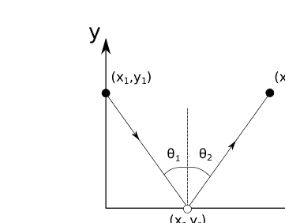

6.  考虑图 7.11 中所示的光线。光线从折射率空间均匀为 $n_1$ 的介质开始，在点 $(x_r, y_r)$ 进入折射率空间均匀为 $n_2$ 的新介质。使用问题 1 中的费马原理最小化两点 $(x_1, y_1)$ 和 $(x_2, y_2)$ 之间的传播时间，证明斯涅尔定律 $n_1 \sin \theta_1 = n_2 \sin \theta_2$，并且折射点 $(x_r, y_r)$ 与点 $(x_1, y_1)$ 和 $(x_2, y_2)$ 共面。与之前一样，折射率定义为比值 $n = \frac{c}{v}$，其中 $c$ 是真空中的光速，$v$ 是介质中的光速。

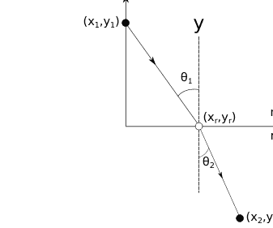

7.  求以下泛函的极值，

$$J = \int_{0}^{1} (y'^2 - y^2 + x) dx$$

满足两个边界条件：$y(0) = 1$，$y'(0) = -1$，其中 $y'(x) = dy/dx$。使用解析方法和 Python 或 Mathematica 求解此问题。

8.  证明以下泛函的极值，$$\int \sqrt{x^2 + y^2} \sqrt{1 + y'^2} dx$$

的极值曲线为

$$x^2 \cos \alpha - 2xy \sin \alpha - y^2 \cos \alpha = \beta$$

其中 $y' = dy/dx$，$\alpha$ 和 $\beta$ 是常数。

*提示：将泛函改写为极坐标形式，并使用计算机代数系统（CAS）求解欧拉方程及所得的常微分方程。*

9.  求圆锥面上的测地线，该圆锥在柱坐标系下的方程为 $z = c \rho$。

10. 想象一个小球沿摆线（由方程 $y = a(1 - \cos \theta)$ 和 $x = a(\theta - \sin \theta)$ 定义）的第一个拱形的前半部分（从 $x = 0$ 到 $x = \pi a$）滚下。证明从 $x = 0$ 到 $x = a$ 的运动时间等于 $\pi \sqrt{a/g}$。

11. 为了对后续章节稍作铺垫，考虑泛函

$$J(x) = \int_{t_0}^t \left( \frac{1}{2} m x'^2 - \frac{1}{2} k x^2 \right) dt'$$

其中 $m$ 和 $k$ 是正常数，$x' = dx/dt'$，$t'$ 是自变量（$t$ 后的撇号不表示导数）。求使该泛函取驻值的函数 $x(t)$。这看起来熟悉吗？

### 第 7.6 节 多个因变量

12. 证明三维空间中两点之间的最短距离是一条直线。你可能需要考虑将 $x$、$y$ 和 $z$ 写成参数形式。

13. 重复问题 4；但这次不要假设 $\theta = \theta(z)$。相反，你应该对曲线进行参数化，使得 $z = z(t)$ 且 $\theta = \theta(t)$，其中 $t$ 是曲线的参数。

14. 求圆锥面 $z = z_0 - c\sqrt{x^2 + y^2}$ 上的最短路径，其中 $z_0$ 和 $c$ 是常数。使用计算机代数系统（CAS）求解由欧拉方程导出的微分方程。

15. 求泛函的极值

$$J(y, z) = \int_0^\pi (y'^2 + z'^2 + yz) dx$$

其中 $y' = dy/dx$，$z' = dz/dx$，并满足条件 $y(0) = 0$，$y(\pi) = 1$，$z(0) = 0$ 和 $z(\pi) = 1$。使用 Mathematica 或 Python 求解此问题。

# 8 拉格朗日与哈密顿动力学

在本章中，我们介绍一种表述物理问题的替代方法。这种新方法最早由法裔意大利数学家约瑟夫-路易·拉格朗日（1736–1813）于 1788 年发表，因此被称为 *拉格朗日动力学*。拉格朗日表述使用一个称为 *拉格朗日量* 的函数，该函数通过粒子的能量求得。正如我们将看到的，粒子的运动方式将使拉格朗日量对时间的积分取驻值。这个积分称为 *作用量积分*，它是一个泛函（一个将函数映射到数的数学公式）。因此，粒子的路径可以用一个函数来描述，该函数是某个泛函（此处即作用量积分）的极值函数。在上一章中，我们学习了如何通过使用欧拉方程来找到泛函的极值函数。在本章中，我们将学习如何利用欧拉方程来找到系统的运动方程。

拉格朗日表述的一个优点是，无论使用何种坐标系，其形式都是相同的。拉格朗日动力学使用欧拉方程来推导粒子的运动方程，而欧拉方程的形式不依赖于所使用的坐标系。正如我们在第 3 章所见，牛顿第二定律的形式取决于坐标系，因为加速度的公式依赖于坐标系。拉格朗日动力学的另一个优点是它消除了了解约束力的需要。一个珠子被约束沿导线运动是涉及约束力的常见例子。保持珠子在导线上的力通常是未知的，或者非常难以求得。拉格朗日力学不需要知道约束力的公式就能找到粒子的运动。

我们提到的最后一个“优点”是拉格朗日力学非常优雅！正如我们将看到的，通过直观检查拉格朗日量可以揭示系统中哪些量是守恒的。我们还将学习如何使用拉格朗日量推导另一个称为 *哈密顿量* 的量，它也可以用来推导粒子的运动方程。哈密顿量将为我们提供一种思考相空间的新方式，在那里我们可以用图像来描述系统的可能行为。哈密顿量的价值远远超出了经典力学领域，它是量子力学中描述粒子波函数的核心量。

## 8.1 拉格朗日量简介

在本节中，我们通过一个基本例子——简谐振子（SHO）——来引入本章其余部分的内容。回顾一下，简谐振子的一个模型系统是一个质量为 $m$ 的物体连接到一根水平无质量弹簧的一端，弹簧常数为 $k$。弹簧的另一端连接到一个支撑物。该物体与弹簧相连，并在无摩擦表面上滑动。我们将使用变量 $x$ 来测量物体相对于平衡位置的位置。在这种情况下，我们知道动能和势能可以分别写为，

$$T = \frac{1}{2}m\dot{x}^2 \quad \text{和} \quad V = \frac{1}{2}kx^2 \qquad (8.1.1)$$

我们知道，对于简谐振子，

$$F = -\frac{\partial V}{\partial x} = -kx \qquad (8.1.2)$$

是作用在物体上的力。因此，利用牛顿第二定律 $F = m\ddot{x}$，我们可以将简谐振子的运动方程写为，

$$m\ddot{x} + kx = 0 \qquad (8.1.3)$$

回顾一下，通常我们为简谐振子定义 $\omega_0^2 = k/m$，但目前我们将运动方程保持为上述形式。

还有另一种不直接涉及牛顿第二定律来求解 (8.1.3) 的方法。注意，

$$\frac{d}{dt}\left(\frac{\partial T}{\partial \dot{x}}\right) = \frac{d}{dt}(m\dot{x}) = \dot{p} = m\ddot{x} \qquad (8.1.4)$$

因此，我们可以通过写出下式来得到 (8.1.3)，

$$\frac{d}{dt}\left(\frac{\partial T}{\partial \dot{x}}\right) + \frac{\partial V}{\partial x} = 0 \qquad (8.1.5)$$

方程 (8.1.5) 在形式上与欧拉方程相似，只是每个导数中出现的函数不同。我们可以通过定义一个新函数——*拉格朗日量*——来使 (8.1.5) 看起来像欧拉方程：

$$\mathcal{L} \equiv T - V \qquad (8.1.6)$$

注意 $V$ 不依赖于 $\dot{x}$，而 $T$ 不依赖于 $x$；因此 $\partial T/\partial x = 0$ 且 $\partial V/\partial \dot{x} = 0$，我们可以写出：

$$\frac{d}{dt}\left(\frac{\partial T}{\partial \dot{x}}\right) = \frac{d}{dt}\left(\frac{\partial \mathcal{L}}{\partial \dot{x}}\right) \qquad (8.1.7)$$

以及

$$\frac{\partial V}{\partial x} = -\frac{\partial \mathcal{L}}{\partial x} \qquad (8.1.8)$$

因此，我们从 (8.1.5) 得到 *欧拉-拉格朗日方程*：

> **单自由度的欧拉-拉格朗日方程**
$$\frac{d}{dt}\left(\frac{\partial \mathcal{L}}{\partial \dot{x}}\right) - \frac{\partial \mathcal{L}}{\partial x} = 0 \qquad (8.1.9)$$

对于简谐振子，拉格朗日量为

$$\mathcal{L} = \frac{1}{2}m\dot{x}^2 - \frac{1}{2}kx^2 \qquad (8.1.10)$$

将 (8.1.10) 代入 (8.1.9)，我们得到 (8.1.3)。因此我们看到，简谐振子的运动方程可以通过使用欧拉-拉格朗日方程得到。

使 $\int \mathcal{L}(x, \dot{x}; t)dt$ 取驻值。我们将在下一节中正式阐述这一陈述。然而，这里重要的一点是，我们没有使用牛顿第二定律来推导简谐振子的运动方程。我们没有问系统上作用了什么力（如使用牛顿第二定律时所做的那样），而是问什么行为会使拉格朗日量的积分取驻值。拉格朗日量仅依赖于系统的动能和势能。但请注意，拉格朗日量**不是**系统的总机械能。总机械能是动能和势能的*和*，而拉格朗日量是它们的*差*。

尽管我们已经为简谐振子演示了欧拉-拉格朗日方程，但正如我们将在后续章节中看到的，欧拉-拉格朗日方程可用于找到任何系统的运动方程。在将本节的工作推广到其他系统之前，我们需要讨论坐标系以及广义坐标和自由度的概念。

## 8.2 广义坐标与自由度

在第 3 章中，我们看到有时使用笛卡尔坐标以外的坐标来描述系统是有用的。使用非笛卡尔坐标与牛顿第二定律结合的一个挑战是，必须在新坐标系中找到加速度。加速度的新形式在数学上通常比笛卡尔坐标中的更复杂。结果是牛顿第二定律的形式严重依赖于所使用的坐标系。由于欧拉-拉格朗日方程对于每个坐标系都具有相同的形式，因此在使用拉格朗日量时，通常更容易处理非笛卡尔坐标系。

我们将使用术语 *广义坐标* 来描述任何完全指定系统状态的坐标系。球坐标和平面极坐标是广义坐标系的例子；然而，广义坐标可以采取多种形式。你可能会发现使用具有能量量纲、角动量量纲或完全没有量纲的广义坐标是有用的。通常将广义坐标写为 $(q_1, q_2, \dots)$ 或简写为 $q_j$（其中 $j = 1, 2, \dots$ 是隐含的，但并不总是说明）。

我们需要多少个广义坐标来完全描述系统的状态？这是一个重要的问题，因为它将决定我们需要多少个欧拉-拉格朗日方程来求解系统的行为。让我们考虑一个由 $N$ 个粒子组成的系统。为了描述每个粒子，我们将需要 $N$ 个形式为 $\mathbf{r} = x\mathbf{\hat{i}} + y\mathbf{\hat{j}} + z\mathbf{\hat{k}}$ 的向量，每个向量有三个分量 $x$、$y$ 和 $z$。因此，我们将需要 $3N$ 个量来描述每个粒子的位置，从而描述系统的状态。接下来，假设粒子的运动存在约束。每个约束将一个量与另一个量联系起来。例如，每个粒子可能被约束在 $xy$ 平面上运动。无论其具体性质如何，约束可以将两个或多个量相互关联，或者它们可以为特定坐标施加一个值（例如 $z = 0$）。换句话说，并非所有 $3N$ 个量都一定是独立的。如果有 $m$ 个约束方程，那么系统就有 $s = 3N - m$ 个 *自由度*。自由度的数量是描述系统状态所需的独立量的数量。换句话说，我们将需要 $s$ 个独立的广义坐标来描述系统的状态。正如我们将看到的，欧拉-拉格朗日方程将产生 $s$ 个二阶微分方程，求解后将给出 $q_j(t)$，其中 $j = 1, 2, \dots, s$。

以下示例将有助于阐明约束和自由度。考虑图 8.1 所示的简单平面摆。

在简单平面摆的情况下，有一个粒子，即质量 $m$，因此 $N = 1$。一般来说，质量的位置需要三个坐标，

## 8.2 简单平面摆

一个简单的平面摆由一个质量为 $m$ 的质点连接在一根长度为 $\ell$ 的无质量刚性杆上构成，该杆与竖直方向（虚线）成 $\theta$ 角。

我们考虑笛卡尔坐标 $x$, $y$, 和 $z$。然而，由于我们处理的是平面摆，我们有第一个约束方程 $z = 0$。接下来，我们知道质点被约束在半径为 $\ell$ 的圆周上运动。因此，下一个约束方程是 $x^2 + y^2 = \ell^2$。我们看到有两个约束方程；因此，自由度 $s = 3(1) - 2 = 1$。为了描述该系统，我们希望使用广义坐标系。最明显的选择是极坐标。在这种情况下，我们将选择 $q = \theta$，其中 $\theta$ 是摆杆与图 8.1 中虚线之间的夹角。我们可以使用以下公式将笛卡尔坐标用广义坐标 $\theta$ 表示：

$$x(q) = \ell \sin q \quad \text{and} \quad y(q) = -\ell \cos q \qquad (8.2.1)$$

注意，坐标系的原点位于摆的支点处，即图 8.1 中的黑色实心圆点。

为了找到拉格朗日量，我们需要用广义坐标 $q$ 重写动能和势能。在笛卡尔坐标中，质点的速度为 $\mathbf{v} = \dot{x}\mathbf{\hat{i}} + \dot{y}\mathbf{\hat{j}}$，其中

$$\dot{x} = \ell \dot{q} \cos q \quad \text{and} \quad \dot{y} = \ell \dot{q} \sin q \qquad (8.2.2)$$

使用 $T = \frac{1}{2} m \mathbf{v} \cdot \mathbf{v}$ 表示摆的动能，$V = mgy$ 表示其重力势能，我们得到

$$T = \frac{1}{2} m (\dot{x}^2 + \dot{y}^2) = \frac{1}{2} m \ell^2 \dot{q}^2 \qquad (8.2.3)$$

$$V = mgy = -mg\ell \cos q \qquad (8.2.4)$$

由此得到的拉格朗日量 $\mathcal{L} = T - V$ 为：

$$\mathcal{L}(q, \dot{q}) = \frac{1}{2} m \ell^2 \dot{q}^2 + mg\ell \cos q \qquad (8.2.5)$$

注意，拉格朗日量是广义坐标 $q$ 和广义速度 $\dot{q}$ 的函数。广义速度是用来描述广义坐标对时间的一阶导数的术语。

尽管我们尚未证明它对于简单谐振子以外的情况成立，但我们可以说摆的运动是使积分 $\int \mathcal{L}(q, \dot{q}) \, dt$ 取驻值的路径 $q(t)$。因此，欧拉-拉格朗日方程

$$\frac{d}{dt}\left(\frac{\partial \mathcal{L}}{\partial \dot{q}}\right) - \frac{\partial \mathcal{L}}{\partial q} = 0 \qquad (8.2.6)$$

将产生运动方程。将 (8.2.5) 代入 (8.2.6) 得到简单平面摆的方程，

$$\ddot{q} + \frac{g}{\ell}\sin q = 0 \qquad (8.2.7)$$

## 8.3 哈密顿原理

既然我们已经对广义坐标有了理解，现在是时候证明使用欧拉-拉格朗日方程来推导系统运动方程的合理性了。这一证明由爱尔兰数学家威廉·罗恩·哈密顿爵士（1805–1865）在 1834 年和 1835 年发表的论文中完成（[4],[5]）。哈密顿原理指出：

> **哈密顿原理**

质点在时间间隔 $t_1$ 到 $t_2$ 内从点 $\mathbf{r}_1$ 运动到点 $\mathbf{r}_2$ 所采取的路径，是使作用量积分取驻值的路径：

$$S = \int_{t_1}^{t_2} \mathcal{L} dt \qquad (8.3.1)$$

哈密顿原理不仅是经典物理学的基石，也是量子物理学的基石。从第 7 章我们知道，$S$ 取驻值的条件是

> **欧拉-拉格朗日方程**

$$\frac{d}{dt}\left(\frac{\partial \mathcal{L}}{\partial \dot{q}_j}\right) - \frac{\partial \mathcal{L}}{\partial q_j} = 0 \qquad (8.3.2)$$

其中 $q_j$ 是第 $j$ 个广义坐标，$j = 1, 2, \ldots, s$，$s$ 是系统中的自由度数。

我们如何确定哈密顿原理产生的就是质点实际运动的路径？我们将使用一个具有一个自由度的系统来演示这一点，但这个结果很容易推广到 $s$ 个自由度。

让我们考虑一个质量为 $m$ 的质点沿一条直线运动。质点在直线上的位置由坐标 $q$ 描述。因此，拉格朗日量 $\mathcal{L}$ 为

$$\mathcal{L} = \frac{1}{2}m\dot{q}^2 - V(q) \qquad (8.3.3)$$

为了获得使作用量积分 $S$ 取驻值的路径 $q(t)$，我们将 (8.3.3) 代入 (8.3.2)：

$$\frac{d}{dt}(m\dot{q}) = -\frac{\partial V}{\partial q} \qquad (8.3.4)$$

结果是关于路径 $q(t)$ 的一个常微分方程。(8.3.4) 的右边是作用在质点上的力的 $q$ 分量。同样，(8.3.4) 的左边是动量的时间导数。因此，我们看到使作用量积分 $S$ 取驻值的路径 $q(t)$ 也是求解牛顿第二定律的路径。因此，哈密顿原理确实提供了一种寻找系统运动方程的方法。请注意，上述工作并非哈密顿原理的证明，而是对其能够产生系统运动方程的*演示*。

在我们继续使用拉格朗日量寻找系统运动方程的一些例子之前，指出一些稍后将变得有用的额外术语是很重要的。首先，注意 $V = V(q_j)$ 且 $T = T(\dot{q}_i)$。因此，在我们的例子中

$$\frac{\partial \mathcal{L}}{\partial \dot{q}_j} = m\dot{q}_j \quad \text{and} \quad \frac{\partial \mathcal{L}}{\partial q_j} = -\frac{\partial V}{\partial q_j} \qquad (8.3.5)$$

项 $\partial \mathcal{L}/\partial \dot{q}_j$ 有时被称为第 $j$ 个分量的*广义动量*，尽管它并不总是线动量。同样，$\partial \mathcal{L}/\partial q_j$ 有时被称为第 $j$ 个分量的*广义力*；同样，它并不总是力，但其作用类似于力。考虑到这些术语，(8.3.4) 可以重新表述为：“广义力等于广义动量的时间变化率。” 这是一个“广义”的牛顿第二定律！

## 8.4 拉格朗日动力学示例

在本节中，我们介绍几个示例问题。我们已经看到了两个例子：第 8.1 节中的简单谐振子和第 8.2 节中的简单平面摆。本节中的每个问题都将呈现一个特定的新挑战。首先，我们将从一个三维空间中的例子开始。第二个例子将研究一个具有一个约束的两粒子系统。在前两个例子中，我们将解析地找到拉格朗日量和欧拉-拉格朗日方程。这将使我们能够专注于诸如自由度和约束等概念的细节。

第三个和第四个例子将使用笛卡尔坐标以外的坐标。本节中的第五个也是最后一个例子将涉及对速度的约束。最后三个例子将包含一个计算部分，以便我们可以了解如何使用 Mathematica 和 SymPy 来辅助解决拉格朗日力学中的问题。

> **示例 8.1：三维空间中的欧拉-拉格朗日方程**
考虑一个质量为 $m$ 的质点在三维空间中运动。在笛卡尔坐标中，动能可以写为，
$$T = \frac{1}{2}m(\dot{x}^2 + \dot{y}^2 + \dot{z}^2) \qquad (8.4.1)$$
该质点仅受保守力作用，其势能为 $V = V(x, y, z)$。写出该质点在笛卡尔坐标中的欧拉-拉格朗日方程。

**解：**
这个问题有三个自由度，因为它由一个质点（$n=1$）组成且没有约束（$m=0$）。拉格朗日量为，
$$\mathcal{L} = \frac{1}{2}m(\dot{x}^2 + \dot{y}^2 + \dot{z}^2) - V(x, y, z) \qquad (8.4.2)$$

因此，我们试图找到函数 $x(t)$, $y(t)$, 和 $z(t)$，使得作用量积分

$$S = \int \mathcal{L}(x, y, z, \dot{x}, \dot{y}, \dot{z})dt$$

取驻值。

由于有三个自由度，即需要找到三个函数才能使 $S$ 取驻值，因此将有三个欧拉-拉格朗日方程。在找到这个问题的欧拉-拉格朗日方程之前，首先注意：

$$\begin{aligned}
\frac{d}{dt}\left(\frac{\partial \mathcal{L}}{\partial \dot{x}}\right) &= \frac{d}{dt}(m\dot{x}) = m\ddot{x} \\
\frac{d}{dt}\left(\frac{\partial \mathcal{L}}{\partial \dot{y}}\right) &= \frac{d}{dt}(m\dot{y}) = m\ddot{y} \\
\frac{d}{dt}\left(\frac{\partial \mathcal{L}}{\partial \dot{z}}\right) &= \frac{d}{dt}(m\dot{z}) = m\ddot{z}
\end{aligned}$$

通过将每行括号中的项相等，我们看到 $\partial \mathcal{L}/\partial \dot{x}$ 是质点动量的 $x$ 分量（对于 $\dot{y}$ 和 $\dot{z}$ 的导数类似）。在这种情况下，广义动量与线动量相同。同样，

$$\begin{aligned}
\frac{\partial \mathcal{L}}{\partial x} &= -\frac{\partial V}{\partial x} = F_x \\
\frac{\partial \mathcal{L}}{\partial y} &= -\frac{\partial V}{\partial y} = F_y \\
\frac{\partial \mathcal{L}}{\partial z} &= -\frac{\partial V}{\partial z} = F_z
\end{aligned}$$

我们可以看到 $\partial \mathcal{L}/\partial x$ 是作用在质点上的力的 $x$ 分量（对于 $y$ 和 $z$ 的导数类似）。在这种情况下，广义力等于作用在质点上的力。将导数代入欧拉-拉格朗日方程得到：

$$\begin{aligned}
\frac{d}{dt}\left(\frac{\partial \mathcal{L}}{\partial \dot{x}}\right) - \frac{\partial \mathcal{L}}{\partial x} &= 0 \quad \Rightarrow \quad m\ddot{x} = F_x \\
\frac{d}{dt}\left(\frac{\partial \mathcal{L}}{\partial \dot{y}}\right) - \frac{\partial \mathcal{L}}{\partial y} &= 0 \quad \Rightarrow \quad m\ddot{y} = F_y \\
\frac{d}{dt}\left(\frac{\partial \mathcal{L}}{\partial \dot{z}}\right) - \frac{\partial \mathcal{L}}{\partial z} &= 0 \quad \Rightarrow \quad m\ddot{z} = F_z
\end{aligned}$$

欧拉-拉格朗日方程的结果就是牛顿第二定律。

虽然示例 8.1 看起来很简单，但它指出了几件重要的事情。首先，欧拉-拉格朗日方程的数量将等于系统中的自由度数。其次，示例 8.1 展示了广义动量和广义力与你已经熟悉的物理量动量和力之间的联系。当然，要在这个问题上进一步推进并找到 $x(t)$, $y(t)$, 和 $z(t)$，你需要知道 $V(x, y, z)$。

### 示例 8.2：阿特伍德机

两个质量分别为 $m_1$ 和 $m_2$ 的物体，通过一根长度为 $\ell$ 的无质量不可伸长的绳子连接在阿特伍德机上。该阿特伍德机的滑轮质量为 $M$，半径为 $R$，且滑轮无摩擦。若绳子与滑轮之间无相对滑动，求质量 $m_1$ 和 $m_2$ 的加速度。

#### 解答：

我们首先绘制示意图，以便定义描述阿特伍德机状态所需的坐标。

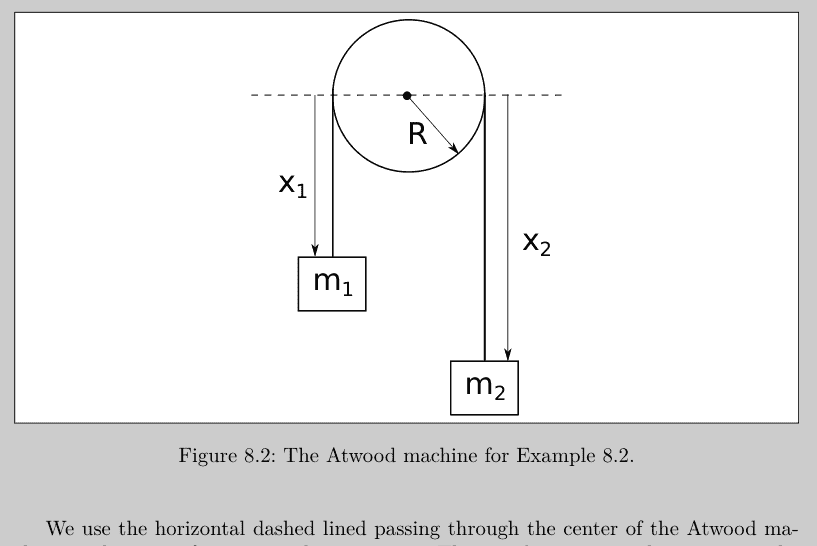

我们使用通过阿特伍德机中心的水平虚线作为坐标系的原点。坐标 $x_1$ 和 $x_2$ 分别测量从阿特伍德机中心到质量 $m_1$ 和 $m_2$ 的距离。由于绳子不可伸长，两个坐标 $x_1$ 和 $x_2$ 并非独立。例如，当 $m_1$ 下落时，$m_2$ 上升，反之亦然。因此，坐标之间存在一个约束方程：

$$\ell = x_1 + x_2 + \pi R \quad (8.4.5)$$

约束方程中的最后一项是缠绕在滑轮上的绳子长度。当然，还有一个额外的约束是每个质量都被限制只能沿一条直线上下运动；因此，$y_1 = y_2 = z_1 = z_2 = 0$，这实际上是四个约束（每个坐标一个），系统总共有五个约束（$m = 5$）。因此，对于系统中的两个质点 $N = 2$，我们得到该问题的自由度为 $s = 3(2) - 5 = 1$。我们将使用以下关系将坐标 $x_1$ 和 $x_2$ 用广义坐标 $x$ 重写：

$$x_1 = x \quad (8.4.6)$$
$$x_2 = \ell - x - \pi R \quad (8.4.7)$$

注意，速度之间存在关系 $\dot{x}_2 = -\dot{x}_1$，加速度之间存在关系 $\ddot{x}_2 = -\ddot{x}_1$，这正是我们在此情况下所预期的。

接下来，我们将求系统的动能和势能。注意滑轮有质量，但绳子没有。因此，总动能包括 $m_1$、$m_2$ 的动能以及滑轮的转动动能。回顾转动动能的形式为 $T_{rot} = \frac{1}{2}I\omega^2$，其中 $I = \frac{1}{2}MR^2$ 是滑轮的转动惯量，$\omega = \dot{x}/R$ 是滑轮的角速度。因此，系统的总动能为：

$$T = \frac{1}{2}m_1\dot{x}_1^2 + \frac{1}{2}m_2\dot{x}_2^2 + \frac{1}{2}I\omega^2 \quad (8.4.8)$$
$$= \frac{1}{2}m_1\dot{x}^2 + \frac{1}{2}m_2\dot{x}^2 + \frac{1}{2}I\left(\frac{\dot{x}}{R}\right)^2 \quad (8.4.9)$$

势能采用重力势能的形式。取向上为正方向，我们有：

$$V = -m_1gx_1 - m_2gx_2 \quad (8.4.10)$$
$$= -m_1gx - m_2g(\ell - x - \pi R) \quad (8.4.11)$$

由此得到的拉格朗日量为：

$$\mathcal{L} = \left(\frac{1}{2}m_1 + \frac{1}{2}m_2 + \frac{1}{2}\frac{I}{R^2}\right)\dot{x}^2 + m_1gx + m_2g(\ell - x - \pi R) \quad (8.4.12)$$

由于 $s = 1$，该系统只有一个欧拉-拉格朗日方程：

$$\frac{d}{dt}\left(\frac{\partial \mathcal{L}}{\partial \dot{x}}\right) = \frac{\partial \mathcal{L}}{\partial x} \quad (8.4.13)$$
$$\frac{d}{dt}\left[\left(m_1 + m_2 + \frac{I}{R^2}\right)\dot{x}\right] = (m_1 - m_2)g \quad (8.4.14)$$
$$\left(m_1 + m_2 + \frac{I}{R^2}\right)\ddot{x} = (m_1 - m_2)g \quad (8.4.15)$$

广义加速度为：

$$\ddot{x} = \frac{(m_1 - m_2)g}{\left(m_1 + m_2 + \frac{M}{2}\right)} \quad (8.4.16)$$

其中我们使用了 $I = \frac{1}{2}MR^2$。从广义加速度，我们可以得到每个质量的加速度，因为 $\ddot{x}_1 = \ddot{x}$ 且 $\ddot{x}_2 = -\ddot{x}$。

示例 8.2 阐明了几个要点。首先，绘制系统示意图有助于识别坐标上的约束。其次，此例提醒我们仔细识别系统中的所有动能和势能。如果你认为滑轮是无质量的（这是入门物理学中的一个常见假设），就很容易忽略滑轮的转动动能。最后，示例 8.2 向我们展示，尽管用广义坐标（本例中为 $x$）描述运动可能很有用，但问题的解答需要针对问题所问的内容。在本例中，我们需要确保展示如何用广义坐标表示每个质量的加速度。

### 示例 8.3：由旋转圆盘支撑的摆

如图 8.3 所示，一个摆悬挂在一个无质量的圆盘上，圆盘半径为 $R$，以恒定角速度 $\omega$ 旋转。该摆由一个质量为 $m$ 的物体连接在一根长度为 $\ell$ 的无质量刚性杆的一端组成。杆的另一端连接在旋转圆盘的边缘。求质量 $m$ 的运动方程，分别使用解析方法以及 Mathematica 和 Python。使用数值 ODE 求解器，在 $t = 0$ 到 $t = 20$ 秒的时间范围内，使用数值 $R = 0.2$ m、$\omega = 2.5$ rad/s、$\ell = 1.0$ m、$g = 9.8$ m/s$^2$ 以及初始条件 $\theta(0) = 1$ rad 和 $\dot{\theta}(0) = 0$ rad/s，求 $\theta(t)$。

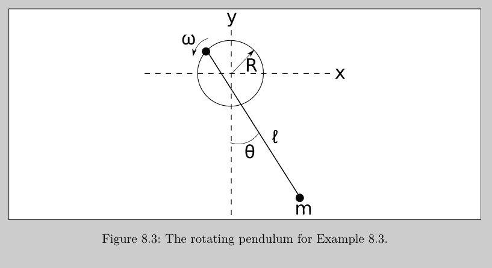

#### 解答：

坐标系在图中定义，坐标轴为虚线。质量被限制在 $xy$ 平面内运动，因此 $z = 0$ 是我们的第一个约束方程。还有一个可能不那么明显的额外约束。然而，如果我们用极坐标写出质量的位置，那么就会清楚这个问题只有一个自由度。质量的坐标可以写为：

$$x = R \cos(\omega t) + \ell \sin \theta \quad \text{and} \quad y = R \sin(\omega t) - \ell \cos \theta \qquad (8.4.17)$$

换句话说，我们选择旋转圆盘的中心作为原点，支撑点（连接在圆盘上）的位置出现在 $x$ 和 $y$ 方程的第一项中。我们看到 $x$ 和 $y$ 是广义坐标 $\theta$ 的函数。速度的 $x$ 和 $y$ 分量为：

$$\dot{x} = -R\omega \sin(\omega t) + \ell \dot{\theta} \cos \theta \quad \text{and} \quad \dot{y} = R\omega \cos(\omega t) + \ell \dot{\theta} \sin \theta \qquad (8.4.18)$$

接下来，我们求动能和势能。动能 $T = \frac{1}{2}mv^2$ 可以用质量在笛卡尔平面中的速度 $\mathbf{v} = \dot{x}\mathbf{\hat{i}} + \dot{y}\mathbf{\hat{j}}$ 来表示，
$$T = \frac{1}{2}mv^2 = \frac{1}{2}m\mathbf{v} \cdot \mathbf{v} = \frac{1}{2}m(\dot{x}^2 + \dot{y}^2)$$

摆处于地球的重力场中；因此，势能为 $V = mgy$。将 (8.4.17) 和 (8.4.18) 代入动能和势能的方程，经过一些代数运算（参见章末习题 9），得到拉格朗日量：

$$\mathcal{L} = \frac{1}{2}m\left(R^2\omega^2 + \ell^2\dot{\theta}^2 + 2R\ell\omega\dot{\theta}\sin(\theta - \omega t)\right) - mg\left(R\sin(\omega t) - \ell\cos\theta\right) \quad (8.4.19)$$

将 (8.4.19) 代入

$$\frac{d}{dt}\left(\frac{\partial\mathcal{L}}{\partial\dot{\theta}}\right) - \frac{\partial\mathcal{L}}{\partial\theta} = 0$$

得到运动方程：

$$\ddot{\theta} + \frac{g}{\ell}\sin\theta = \frac{R\omega^2}{\ell}\cos(\theta - \omega t) \quad (8.4.20)$$

注意，(8.4.20) 是带有额外余弦项的单摆方程。余弦项是与旋转圆盘相关的驱动项。下面的代码展示了如何求解 (8.4.20) 并绘制其解 $\theta(t)$。$\theta(t)$ 的图像如图 8.4 所示。

### Python 代码

此代码遵循与第 7 章示例相同的流程。注意我们使用变量 q 代替 $\theta$。另请注意，我们需要将 ODE 重新定义为函数 deriv，以便可以使用 odeint 求解。Python 的结果与解析解一致。

### 示例 8.3：导线上的小珠

一个质量为 $m$ 的小珠在地球表面附近沿一根导线滑动。导线被弯曲成抛物线 $z = ar^2$ 的形状，其中 $a$ 是一个正常数，$(r, \theta, z)$ 是通常的柱坐标。当导线以角速度 $\omega$ 绕 $z$ 轴旋转时，小珠在一个平行于 $xy$ 平面、半径为 $R$ 的圆周上运动，如图 8.5 所示。求 $a$ 用 $\omega$ 和重力加速度 $g$ 表示的值。解析求解此问题，并使用 Mathematica 和 Python 求出欧拉-拉格朗日方程。

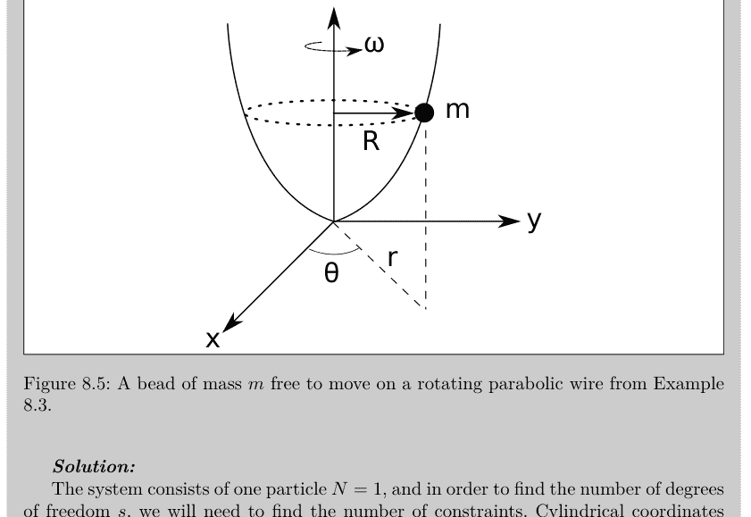

#### 解答：

该系统由一个粒子组成，即 $N = 1$，为了找到自由度数 $s$，我们需要找出约束的数量。柱坐标是此问题的自然选择。在这些坐标中，我们有两个约束。第一个约束是 $z = ar^2$，因为小珠被限制沿导线运动。第二个约束源于导线的旋转。我们知道导线以恒定的角速度绕 $z$ 轴旋转；因此，$\theta = \omega t$。于是，我们剩下一个自由度，即 $r$。

接下来我们求动能和势能。使用柱坐标中的速度 $\mathbf{v} = \dot{r}\hat{\mathbf{r}} + r\dot{\theta}\hat{\boldsymbol{\theta}} + \dot{z}\hat{\mathbf{z}}$，我们得到

$$T = \frac{1}{2} m \mathbf{v} \cdot \mathbf{v} = \frac{1}{2} m (\dot{r}^2 + r^2 \dot{\theta}^2 + \dot{z}^2)$$ (8.4.21)

势能由 $V = mgz$ 求得。应用约束 $z = ar^2$ 和 $\theta = \omega t$，我们得到：

$$\dot{\theta} = \omega \quad \text{and} \quad \dot{z} = 2ar\dot{r}$$ (8.4.22)

将约束条件和 (8.4.22) 代入，我们可以求出拉格朗日量：

$$\begin{aligned} \mathcal{L} &= T - V \\ &= \frac{1}{2} m (\dot{r}^2 + r^2 \dot{\theta}^2 + \dot{z}^2) - mgz \\ &= \frac{1}{2} m (\dot{r}^2 + r^2 \omega^2 + 4r^2 a^2 \dot{r}^2) - mgar^2 \end{aligned}$$

注意 $\mathcal{L} = \mathcal{L}(r, \dot{r})$。为了得到小珠的运动方程，我们可以将拉格朗日量代入欧拉-拉格朗日方程，

$$\left. \begin{aligned} \frac{d}{dt} \left( \frac{\partial \mathcal{L}}{\partial \dot{r}} \right) &= \frac{d}{dt} \left( \frac{m}{2} [2\dot{r} + 8r^2 a^2 \dot{r}] \right) = (1 + 4a^2 r^2) m \ddot{r} + 8ma^2 r \dot{r}^2 \\ \frac{\partial \mathcal{L}}{\partial r} &= mr (r\omega + 4a^2 \dot{r}^2 - 2ga) \end{aligned} \right\}$$ (8.4.23)

令上述两项相等得到：

$$(1 + 4a^2 r^2) \ddot{r} + 4a^2 r \dot{r}^2 + r (\omega^2 - 2ga) = 0$$ (8.4.24)

我们关注小珠在半径为 $R$ 的圆周上运动的情况。因此，将 $\ddot{r} = \dot{r} = 0$ 和 $r = R$ 代入 (8.4.24)，我们得到

$$a = \frac{\omega^2}{2g}$$

### Python 代码

此代码遵循第 7 章的类似示例。但是，请注意在定义变量 `find_a` 时替换的顺序。在 `subs` 方法中必须首先定义最高阶导数。

```python
from sympy import diff, symbols, Function, euler_equations, simplify, solve
import textwrap

print('-'*28,'CODE OUTPUT','-'*29,'\n')

wrapper = textwrap.TextWrapper(width=70)

t, m, g, a, w, R = symbols('t,m,g,a,w,R',positive=True)
r = Function('r')

L = 1/2*m*(diff(r(t),t)**2 + r(t)**2*w**2 + \
    4*r(t)**2*a**2*diff(r(t),t)**2) - \
        m*g*a*r(t)**2

euler = simplify(euler_equations(L,r(t),t)[0]).lhs

print('The Euler equation is:\n\n')
print(wrapper.fill(str(euler)), '=0')

# substitute derivatives = 0
find_a = solve(euler.subs([(diff(r(t),t,t),0),\
    (diff(r(t),t),0),(r(t),R)]),a)[0]
print('\na = ', find_a)

-------------------------------- CODE OUTPUT --------------------------------
The Euler equation is:

m*(-4*a**2*r(t)**2*Derivative(r(t), (t, 2)) -
4*a**2*r(t)*Derivative(r(t), t)**2 - 2*a*g*r(t) + w**2*r(t) -
Derivative(r(t), (t, 2))) =0

a =  w**2/(2*g)
```

### Mathematica 代码

求欧拉-拉格朗日方程的方法与第 7 章求欧拉方程的方法相同。注意在定义拉格朗日量时，要小心地将 $r$ 对 $t$ 的依赖性表示为 r[t]。

```mathematica
<< VariationalMethods

L = 1/2 * m * (r'[t]^2 + r[t]^2 * ω^2 + 4 * r[t]^2 * a^2 * r'[t]^2) - m * g * a * r[t]^2

-agmr[t]^2 + 1/2 m (ω^2 r[t]^2 + r'[t]^2 + 4a^2 r[t]^2 r'[t]^2)

euler = EulerEquations[L, r[t], t]

-m (r[t] (2ag - ω^2 + 4a^2 r'[t]^2) + r''[t] + 4a^2 r[t]^2 r''[t]) == 0

Solve[euler, a, Assumptions -> {r'[t] == 0, r''[t] == 0}][[1]]

{a -> ω^2 / 2g}
```

示例 8.4 演示了几个要点。首先，它展示了使用柱坐标中速度的必要性。第 3 章讨论了极坐标、柱坐标和球坐标中粒子的速度。在计算动能时，将速度向量表示在与求解问题所用的同一坐标系中非常重要。其次，尽管这个问题没有明确要求运动方程，但我们发现通过求出它更容易回答问题。一旦我们得到了小珠的一般运动方程 (8.4.24)，我们就代入了感兴趣运动的特定条件。最后，示例 8.4 表明拉格朗日表述不需要知道作用在系统上的所有力。我们不知道使小珠保持在导线上的力的数学形式。上述无知并不是问题，拉格朗日表述只需要知道 $z$ 坐标的值是如何被约束的。

下一个示例展示了在适当坐标系中计算拉格朗日量的重要性。

> **示例 8.5：移动的斜面**
> 一个质量为 $M$、长度为 $\ell$、倾角为 $\theta$ 的无摩擦斜面在水平无摩擦表面上滑动，同时一个质量为 $m$ 的粒子在斜面上滑动，如图 8.6 所示。求斜面和粒子的加速度。解析求解此问题，并使用 Mathematica 或 Python。

**解答：**
我们首先绘制系统的示意图。

## 8.4 约束力与带未定乘子的拉格朗日方程

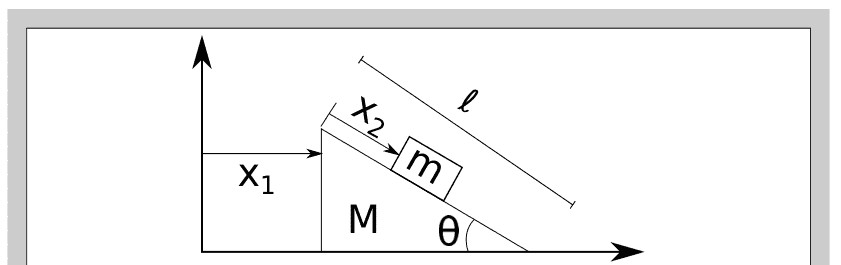

图 8.6：质量为 $m$ 的物体沿质量为 $M$ 的斜面下滑，对应例 8.5。

上图表明我们创建了两个坐标，$x_1$ 和 $x_2$。坐标 $x_1$ 从垂直轴测量，描述斜面 $M$ 的位置。坐标 $x_2$ 测量质点 $m$ 距离斜面顶端的距离。注意这两个坐标彼此并不正交。

为了计算拉格朗日量，我们需要求出每个物体的动能，

$$T = \frac{1}{2}Mv_1^2 + \frac{1}{2}mv_2^2$$

其中 $v_1^2 = \dot{x}_1$，但 $v_2^2 \neq \dot{x}_2^2$。质点相对于垂直轴的速度 $\mathbf{v}_2$ 将取决于斜面的速度，因此，$\mathbf{v}_2 = \dot{\mathbf{x}}_1 + \dot{\mathbf{x}}_2$，其中 $\dot{\mathbf{x}}_1$ 和 $\dot{\mathbf{x}}_2$ 是分别沿图中 $x_1$ 和 $x_2$ 方向的*向量*。我们可以通过注意到 $\dot{\mathbf{x}}_1$ 和 $\dot{\mathbf{x}}_2$ 之间的夹角为 $\theta$ 来求得 $v_2^2 = \mathbf{v}_2 \cdot \mathbf{v}_2$，

$$v_2^2 = (\dot{\mathbf{x}}_1 + \dot{\mathbf{x}}_2) \cdot (\dot{\mathbf{x}}_1 + \dot{\mathbf{x}}_2) \quad (8.4.25)$$
$$= \dot{x}_1^2 + \dot{x}_2^2 + 2\dot{\mathbf{x}}_1 \cdot \dot{\mathbf{x}}_2 \quad (8.4.26)$$
$$= \dot{x}_1^2 + \dot{x}_2^2 + 2\dot{x}_1\dot{x}_2 \cos \theta \quad (8.4.27)$$

我们现在有了计算拉格朗日量所需的一切，

$$T = \frac{1}{2}M\dot{x}_1^2 + \frac{1}{2}m(\dot{x}_1^2 + \dot{x}_2^2 + 2\dot{x}_1\dot{x}_2 \cos \theta) \quad (8.4.28)$$
$$V = mg(\ell - x_2)\sin \theta \quad (8.4.29)$$
$$\mathcal{L} = \frac{1}{2}M\dot{x}_1^2 + \frac{1}{2}m(\dot{x}_1^2 + \dot{x}_2^2 + 2\dot{x}_1\dot{x}_2 \cos \theta) - mg(\ell - x_2)\sin \theta \quad (8.4.30)$$

注意我们使用了 $\ell$ 作为斜面的长度，质点距离水平轴的高度为 $(\ell - x_2)\sin \theta$。进一步注意拉格朗日量的形式为 $\mathcal{L} = \mathcal{L}(x_1, x_2, \dot{x}_1, \dot{x}_2)$。此问题有两个自由度；因此，我们将有两个欧拉-拉格朗日方程：

$$\frac{d}{dt}\left(\frac{\partial \mathcal{L}}{\partial \dot{x}_1}\right) - \frac{\partial \mathcal{L}}{\partial x_1} = 0$$
$$\frac{d}{dt}\left(\frac{\partial \mathcal{L}}{\partial \dot{x}_2}\right) - \frac{\partial \mathcal{L}}{\partial x_2} = 0 \quad (8.4.31)$$

接下来我们将计算必要的导数，

$$\frac{d}{dt}\left(\frac{\partial \mathcal{L}}{\partial \dot{x}_1}\right) = M\ddot{x}_1 + m(\ddot{x}_1 + 2\ddot{x}_2 \cos\theta)$$
$$\frac{d}{dt}\left(\frac{\partial \mathcal{L}}{\partial \dot{x}_2}\right) = m(\ddot{x}_2 + 2\ddot{x}_1 \cos\theta)$$
$$\frac{\partial \mathcal{L}}{\partial x_1} = 0$$
$$\frac{\partial \mathcal{L}}{\partial x_2} = mg\sin\theta$$

由此得到两个运动方程，

$$\left.\begin{aligned} M\ddot{x}_1 + m(\ddot{x}_1 + 2\ddot{x}_2 \cos\theta) &= 0 \\ \ddot{x}_2 + 2\ddot{x}_1 \cos\theta &= g\sin\theta \end{aligned}\right\}$$
(8.4.32)

其中 (8.4.32) 的上式和下式分别源于 $x_1$ 和 $x_2$ 的欧拉-拉格朗日方程。问题要求求出每个物体的加速度。方程 (8.4.32) 是两个耦合的二阶微分方程，我们可以通过代数方法求解 $\ddot{x}_1$ 和 $\ddot{x}_2$，

$$\ddot{x}_1 = \frac{-mg\cos\theta\sin\theta}{(M+m) - m\cos^2\theta}$$
以及
$$\ddot{x}_2 = \frac{(M+m)g\sin\theta}{(M+m) - m\cos^2\theta}$$

所得加速度可以进一步简化。然而，我们保留这种形式是为了说明几点。首先注意在 $M \to \infty$ 的极限下，我们发现斜面不加速，而质点具有加速度 $\ddot{x}_2 = g\sin\theta$，这是从基础物理学中可以预期的。同样，当 $\theta = \pi/2$ 时，$M$ 不加速，$m$ 具有加速度 $g$，正如我们所预期的。还有其他值得探索的极限，例如 $M \to 0$，我们将其留作读者的练习。

### Python 代码

注意在 `x_solns` 的结果中，我们求解 $\ddot{x}_1$ 和 $\ddot{x}_2$ 时，需要显式地声明 `Derivative` 命令。

```python
from sympy import diff, symbols, Function, euler_equations
from sympy import simplify, solve, sin, cos, Derivative
import textwrap

print('-'*28,'CODE OUTPUT','-'*29,'\n')

wrapper = textwrap.TextWrapper(width=74)

M, m, g, l, q,t = symbols('M,m,g,l,q,t',positive=True)
# we use q symbol for the angle theta

x1 = Function('x1')
x2 = Function('x2')

L = 1/2*M*diff(x1(t),t)**2 + 1/2*m*(diff(x1(t),t)**2 + \
    diff(x2(t),t)**2 + \
        2*diff(x1(t),t)*diff(x2(t),t)*cos(q)) - \
            m*g*(l-x2(t))*sin(q)

euler = euler_equations(L,(x1(t),x2(t)),t)
print('The Euler equations are:\n\n')
print(wrapper.fill(str(euler[0])))
print('\n' + wrapper.fill(str(euler[1])))

x_solns = simplify(\
    solve(euler,(diff(x1(t),t,t),diff(x2(t),t,t))))

print('\nThe second derivatives of x1, x2 are:\n')
print('a1 =', x_solns[Derivative(x1(t), (t, 2))])
print('a2 =', \
    simplify(x_solns[Derivative(x2(t), (t, 2))]))
```

---------------------------------------- CODE OUTPUT ----------------------------------------
The Euler equations are:

Eq(-1.0*M*Derivative(x1(t), (t, 2)) - m*(cos(q)*Derivative(x2(t), (t, 2)) + Derivative(x1(t), (t, 2))), 0)

Eq(g*m*sin(q) - m*(cos(q)*Derivative(x1(t), (t, 2)) + Derivative(x2(t), (t, 2))), 0)

The second derivatives of x1, x2 are:
a1 = g*m*sin(q)*cos(q)/(-M + m*cos(q)**2 - m)
a2 = g*(M + m)*sin(q)/(M + m*sin(q)**2)

### Mathematica 代码

与之前的问题相比，有两个自由度对代码的改变不大。注意命令 `EulerEquations` 的第二个元素是依赖函数列表 `{x1, x2}`。

```mathematica
<< VariationalMethods`

L = 1/2 * M * x1'[t]^2 + 1/2 * m * (x1'[t]^2 + x2'[t]^2 + 2 * x1'[t] * x2'[t] * Cos[θ]) - m * g * (l - x2[t]) * Sin[θ];

euler = EulerEquations[L, {x1[t], x2[t]}, t] // FullSimplify

{(m + M)x1''[t] + mCos[θ]x2''[t] == 0, gmSin[θ] == m (Cos[θ]x1''[t] + x2''[t])}

Solve[euler, {x1''[t], x2''[t]}][[1]] // FullSimplify

{x1''[t] -> -gmSin[2θ] / (-m - 2M + mCos[2θ]), x2''[t] -> -2g(m + M)Sin[θ] / (-m - 2M + mCos[2θ])}
```

例 8.5 所展示的一个重要问题是关于选择正确的速度。我们需要确保每个质点的速度都是相对于同一个参考系测量的，以获得一致的动能。同时注意 $\partial\mathcal{L}/\partial x_1 = 0$。这告诉我们广义力的 $x_1$ 分量为零。这将产生一些后果，我们将在第 8.7 节中讨论。最后，例 8.5 演示了一个具有两个自由度的问题。在这种情况下，我们只需要求出每个物体的加速度。如果我们需要求出 $x_1(t)$ 和 $x_2(t)$，我们可能很难求解这些耦合的二阶微分方程。耦合的微分方程通常很难求解，我们通常必须依赖数值方法。

在下一节中，我们将回到拉格朗日形式体系，并更仔细地研究带约束的系统。

## 8.5 约束力与带未定乘子的拉格朗日方程

在第 8.2 节中，我们研究了简单平面摆的例子，我们发现坐标 $x$ 和 $y$ 存在约束。对于长度为 $\ell$ 的摆，$x$ 和 $y$ 之间存在以下关系，

$$x^2 + y^2 = \ell^2 \qquad (8.5.1)$$

注意 (8.5.1) 具有以下形式，

$$f(x, y) = \text{constant} \qquad (8.5.2)$$

其中 $f(x, y) = x^2 + y^2$。我们将称形式为 (8.5.2) 的方程为*约束方程*，在本节中，我们将展示拉格朗日公式如何允许我们直接处理约束，而无需像前面章节那样进行代换。这种方法有时被称为*拉格朗日乘子法*或*拉格朗日未定乘子法*。我们将通过使用约束方程，我们也可以找到引起约束的力。以单摆为例，约束力就是单摆绳子的张力。

在推导拉格朗日乘子法之前，讨论约束的类型很重要。本章我们将重点关注*完整约束*。完整约束是可以写成坐标之间代数关系的约束方程。方程 (8.5.2) 就是此类约束的一个例子。有时，完整约束写成如下形式：

$$f(q_i; t) = 0 \quad (8.5.3)$$

其中缩写 $q_i$ 表示 $f$ 是多个坐标的函数（例如，笛卡尔坐标中的 $x$、$y$ 和 $z$），分号表示 $f$ 对时间的间接依赖（通过坐标 $q_i$）。例如，我们可以通过写成 $f(q_i; t) = f(x, y) = x^2 + y^2 - \ell^2 = 0$，将 (8.5.1) 改写为 (8.5.2) 的形式。必须写成涉及速度的关系的约束称为*非完整约束*，除非约束方程可以积分以产生坐标之间的关系。虽然我们不会进一步讨论非完整约束，但感兴趣的读者可以参考 Thornton 和 Marion 的经典著作 [6]。

现在我们将推导带未定乘子的拉格朗日方程。我们为具有两个自由度 $x$ 和 $y$ 的系统推导方程，然后讨论对更高自由度系统的推广。该系统将有一个形式为 $f(x, y) = \text{constant}$ 的完整约束。我们知道，寻找运动方程涉及找到使作用量积分

$$S = \int_{t_1}^{t_2} \mathcal{L}(X, \dot{X}, Y, \dot{Y}) \, dt \quad (8.5.4)$$

取驻值的函数 $x(t)$ 和 $y(t)$。然后我们写出：

$$\begin{aligned} X(a, t) &= x(t) + a\eta_x(t) \\ Y(a, t) &= y(t) + a\eta_y(t) \end{aligned} \quad (8.5.5)$$

其中 $x(t)$ 和 $y(t)$ 是使 (8.5.4) 取驻值的函数，$\eta_x(t)$ 和 $\eta_y(t)$ 是 $x$ 和 $y$ 的扰动，满足 $\eta_x(t_1) = \eta_y(t_1) = 0$ 和 $\eta_x(t_2) = \eta_y(t_2) = 0$。将 (8.5.5) 代入 (8.5.4) 并使用 (7.6.3)，我们得到：

$$\frac{\partial S}{\partial a} = \int_{t_1}^{t_2} \left( \frac{\partial \mathcal{L}}{\partial X} - \frac{d}{dt} \frac{\partial \mathcal{L}}{\partial \dot{X}} \right) \eta_x \, dt + \int_{t_1}^{t_2} \left( \frac{\partial \mathcal{L}}{\partial Y} - \frac{d}{dt} \frac{\partial \mathcal{L}}{\partial \dot{Y}} \right) \eta_y \, dt \quad (8.5.6)$$

然而，(8.5.6) 仅对满足约束 $f(X, Y) = \text{constant}$ 的运动成立。因此，沿着粒子的路径，

$$\frac{df}{da} = \frac{\partial f}{\partial X} \eta_x + \frac{\partial f}{\partial Y} \eta_y = 0 \quad (8.5.7)$$

回想一下 $dX/da = \eta_x$ 和 $dY/da = \eta_y$。从 (8.5.7) 解出 $\eta_y/\eta_x$ 并将结果代入 (8.5.6)，我们得到：

$$\frac{\partial S}{\partial a} = \int_{t_1}^{t_2} \left[ \left( \frac{\partial \mathcal{L}}{\partial X} - \frac{d}{dt} \frac{\partial \mathcal{L}}{\partial \dot{X}} \right) - \left( \frac{\partial \mathcal{L}}{\partial Y} - \frac{d}{dt} \frac{\partial \mathcal{L}}{\partial \dot{Y}} \right) \left( \frac{\partial f / \partial Y}{\partial f / \partial X} \right) \right] \eta_x \, dt \quad (8.5.8)$$

在 $a = 0$ 处令 $\partial S/\partial a = 0$ 得到（回想 $X(a = 0, t) = x(t)$，$Y(0, t)$ 类似），

$$\left( \frac{\partial \mathcal{L}}{\partial x} - \frac{d}{dt} \frac{\partial \mathcal{L}}{\partial \dot{x}} \right) \left( \frac{\partial f}{\partial x} \right)^{-1} = \left( \frac{\partial \mathcal{L}}{\partial y} - \frac{d}{dt} \frac{\partial \mathcal{L}}{\partial \dot{y}} \right) \left( \frac{\partial f}{\partial y} \right)^{-1} \quad (8.5.9)$$

(8.5.9) 的左边依赖于对 $x$ 和 $\dot{x}$ 的导数，而右边依赖于对 $y$ 和 $\dot{y}$ 的导数。注意 $x$ 和 $y$ 都是 $t$ 的函数。为了使 (8.5.9) 的两边相等，它们必须都等于一个仅依赖于 $t$ 的函数。我们将该函数定义为 $-\lambda(t)$，并称 $\lambda$ 为拉格朗日未定乘子。我们不知道 $\lambda$，因此得名“未定乘子”。将 (8.5.9) 的每一项等于 $-\lambda$，我们得到：

$$\left. \begin{aligned} \frac{\partial \mathcal{L}}{\partial x} - \frac{d}{dt} \frac{\partial \mathcal{L}}{\partial \dot{x}} &= -\lambda(t) \frac{\partial f}{\partial x} \\ \frac{\partial \mathcal{L}}{\partial y} - \frac{d}{dt} \frac{\partial \mathcal{L}}{\partial \dot{y}} &= -\lambda(t) \frac{\partial f}{\partial y} \end{aligned} \right\} \quad (8.5.10)$$

方程 (8.5.10) 连同 $f(x, y) = \text{constant}$ 将产生系统的运动方程。

当然，并非所有系统都仅限于两个自由度和一个约束方程。通常，系统将有 $n$ 个自由度和 $m$ 个约束方程。我们已经看到了如何将拉格朗日表述推广到 $s$ 个自由度的情况，此时我们有 $s$ 个欧拉-拉格朗日方程需要求解。然而，多个约束方程意味着将有多个导数 $df_j/da$（$j = 1, \dots, m$，其中 $m$ 等于约束的数量）需要包含在上述推导中。结果是：

> **带未定乘子的欧拉-拉格朗日方程**

$$\left. \begin{aligned} \frac{\partial \mathcal{L}}{\partial q_i} - \frac{d}{dt} \frac{\partial \mathcal{L}}{\partial \dot{q}_i} &= -\sum_{j=1}^{m} \lambda_j(t) \frac{\partial f_j}{\partial q_i} \\ f_j(q_i; t) &= 0 \end{aligned} \right\} \quad (8.5.11)$$

其中 $i = 1, \dots, n$，$j = 1, \dots, m$，并且我们使用了广义坐标 $q_i$。注意在 (8.5.11) 中有 $m$ 个未定乘子 $\lambda_j$，每个约束方程 $f_j(q_i; t) = \text{constant}$ 对应一个。

在进入示例之前，有两点需要说明。首先，你可能想知道为什么有人会使用拉格朗日乘子。使用拉格朗日乘子可以省去在求解 $f$ 以得到坐标之间关系时进行大量繁琐代数运算的麻烦。例如，在单摆问题中，如果我们求解 $f$ 得到 $y$，我们将得到 $y = \pm\sqrt{\ell^2 - x^2}$。我们将不得不处理正负两个根。然而，正如我们将在下面的示例中看到的，使用拉格朗日乘子将有助于简化过程。话虽如此，现代计算机代数系统的强大功能可能使这一论点不如以前那么有说服力。

第二点在理论上更重要。事实证明，拉格朗日乘子可以告诉我们系统中引起约束的力。为了说明这一点，我们将考虑一个具有两个自由度和一个约束的简单系统。拉格朗日量为：

$$\mathcal{L} = \frac{1}{2}m(\dot{x}^2 + \dot{y}^2) - V(x, y)$$

将此拉格朗日量代入欧拉-拉格朗日方程得到：

$$\left. \begin{aligned} -\frac{\partial V}{\partial x} - m\ddot{x} &= -\lambda \frac{\partial f}{\partial x} \\ -\frac{\partial V}{\partial y} - m\ddot{y} &= -\lambda \frac{\partial f}{\partial y} \end{aligned} \right\} \quad (8.5.12)$$

我们将关注涉及 $x$ 的方程，它可以写成如下形式：

$$m\ddot{x} = -\frac{\partial V}{\partial x} + \lambda \frac{\partial f}{\partial x} \quad (8.5.13)$$

左边 $m\ddot{x}$ 是作用在系统上的合力的 $x$ 分量。在这种情况下，有两个力作用在系统上：一个与势能 $V(x,y)$ 相关的外力，以及约束力。(8.5.13) 右边的第一项是作用在系统上的外力的 $x$ 分量，例如重力。因此，剩余的项 $\lambda \partial f/\partial x$ 必须是约束力的 $x$ 分量。我们可以对 $y$ 方程 (8.5.12) 重复类似的论证，以看到 $\lambda \partial f/\partial y$ 是约束力的 $y$ 分量。通常我们有：

> **由拉格朗日未定乘子得到的约束力**

$$F_{j,q_i}^c = \lambda_j \frac{\partial f_j}{\partial q_i} \quad (8.5.14)$$

其中 $F_{j,q_i}^c$ 是与约束方程 $f_j(q_i; t) = \text{constant}$ 相关的约束力的 $q_i$ 分量。以下示例说明了使用欧拉-拉格朗日方程推导约束力。

> **示例 8.6：球面上的粒子**

一个质量为 $m$ 的粒子从一个光滑固定半径为 $R$ 的球体顶部开始。在 $t = 0$ 时，粒子受到一个非常小的力扰动。粒子沿着球体表面滑动，最终掉落。求粒子脱离球体表面时所成的角度。

**解：**

图 8.7 展示了当粒子从起始位置产生角位移 $\theta$ 时的系统。

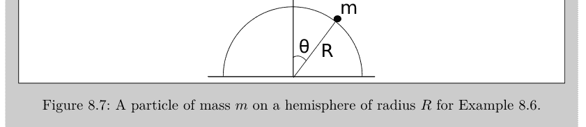

开始解决问题时，我们首先选择极坐标来求解。因为粒子在球体表面运动，我们的约束方程是：

$$f(r; t) = r - R = 0 \quad (8.5.15)$$

约束力是使粒子保持在球体上且 $\dot{r} = 0$ 的力。当粒子离开球体表面时，$\dot{r} \neq 0$；因此，在径向方向上将存在加速度。我们可以通过找到以下内容来找到相关的约束力：$$F_r^c = \lambda \frac{\partial f}{\partial r}$$

我们已知 $\partial f/\partial r$，因此需要求出 $\lambda$。我们将通过为系统建立欧拉-拉格朗日方程来求解 $\lambda$。

利用极坐标，我们可以写出系统的动能和势能：

$$T = \frac{1}{2}m(\dot{r}^2 + r^2\dot{\theta}^2)$$
$$V = mgr\cos\theta$$
$$\mathcal{L} = \frac{1}{2}m(\dot{r}^2 + r^2\dot{\theta}^2) - mgr\cos\theta$$

其中，我们以图 8.7 中的水平线作为 $y=0$，因此势能可以写为 $mgy$，其中 $y=r\cos\theta$。欧拉-拉格朗日方程为：

$$\frac{\partial \mathcal{L}}{\partial r} - \frac{d}{dt}\left(\frac{\partial \mathcal{L}}{\partial \dot{r}}\right) = -\lambda \frac{\partial f}{\partial r} \quad (8.5.16)$$
$$\frac{\partial \mathcal{L}}{\partial \theta} - \frac{d}{dt}\left(\frac{\partial \mathcal{L}}{\partial \dot{\theta}}\right) = -\lambda \frac{\partial f}{\partial \theta} \quad (8.5.17)$$

将拉格朗日量 $\mathcal{L}$ 和约束方程代入，我们得到：

$$mr\dot{\theta}^2 - mg\cos\theta - m\ddot{r} = -\lambda \quad (8.5.18)$$
$$-mgr\sin\theta - mr^2\ddot{\theta} - 2mr\dot{r}\dot{\theta} = 0 \quad (8.5.19)$$

接下来，我们应用约束方程 $r=R$ 和 $\dot{r}=\ddot{r}=0$，因为我们想要求出粒子离开球面瞬间的角度 $\theta$。

$$mR\dot{\theta}^2 - mg\cos\theta = -\lambda$$
$$-mgR\sin\theta - mR^2\ddot{\theta} = 0 \quad (8.5.20)$$

在上面的第一个方程中，我们发现 $\lambda = \lambda(\theta, \dot{\theta})$。第二个方程将为我们提供一种求解 $\theta(t)$ 的方法：

$$\ddot{\theta} = \frac{g}{R}\sin\theta \quad (8.5.21)$$

虽然我们可以尝试积分 (8.5.21) 来求解 $\theta$，但实际上我们并不需要这样做。我们真正需要的是 $\dot{\theta}$，它可以利用以下关系从 (8.5.21) 中求得：

$$\ddot{\theta} = \frac{d\dot{\theta}}{dt} = \frac{d\dot{\theta}}{d\theta}\frac{d\theta}{dt} = \dot{\theta}\frac{d\dot{\theta}}{d\theta} \quad (8.5.22)$$

将 (8.5.22) 代入 (8.5.21)，我们得到：

$$\int \dot{\theta} d\dot{\theta} = \int \frac{g}{R}\sin\theta d\theta$$

积分后，我们得到：

$$\dot{\theta}^2 = 2\frac{g}{R}(1 - \cos\theta)$$

于是约束力为：
$$F_r^c = \lambda \frac{\partial f}{\partial r} = mg(3\cos\theta - 2)$$
注意，当粒子位于球顶时（$\theta = 0$），约束力为 $mg$。最后，当约束力等于零时，粒子离开球面，因此我们要求出使 $F_r^c = 0$ 的角度 $\theta_0$：
$$\theta_0 = \cos^{-1}\left(\frac{2}{3}\right)$$
请注意，这个角度与粒子的质量或球的半径无关！

## 8.6 守恒定理与拉格朗日量

除了用于推导系统的运动方程外，拉格朗日量还能帮助我们识别系统中的守恒量。特别是，我们将研究动量和能量的守恒。

### 8.6.1 动量守恒

我们已经知道，在牛顿力学中，一个孤立粒子系统的总动量是守恒的。我们期望在拉格朗日表述中，孤立系统的总动量也是守恒的。孤立系统的一个重要特征是它们具有*平移不变性*。换句话说，如果你将系统中的每个粒子移动相同的距离和方向，那么除了每个粒子的位置改变外，系统本身没有变化。我们将看到，拉格朗日量的平移不变性将导致系统中的动量守恒。

拉格朗日量的平移不变性与动量守恒之间的联系是诺特定理的结果，该定理指出，每当拉格朗日量存在连续对称性时，就存在一个相应的守恒定律。诺特定理由埃米·诺特（1882–1935）于 1915 年证明，并于 1918 年发表 [7]。在本小节中，我们将证明拉格朗日量的平移不变性，并将这种对称性与动量守恒联系起来。

考虑一个由 $N$ 个质量为 $m_\alpha$ 的孤立粒子组成的系统，其中 $\alpha = 1, \dots, N$。每个粒子的位置用 $\mathbf{r}_\alpha$ 表示。接下来，我们将所有这些粒子平移相同的位移 $d\mathbf{r}$，这就是我们的“平移”，$\mathbf{r}_\alpha \to \mathbf{r}_\alpha + d\mathbf{r}$。我们需要证明拉格朗日量在平移下保持不变。换句话说，
$$d\mathcal{L} = \mathcal{L}(\mathbf{r}_\alpha + d\mathbf{r}, \dot{\mathbf{r}}_\alpha; t) - \mathcal{L}(\mathbf{r}_\alpha, \dot{\mathbf{r}}_\alpha; t) = 0 \qquad (8.6.1)$$
注意在 (8.6.1) 中速度没有变化。我们将在下面讨论原因。由于拉格朗日量包含动能和势能，我们需要证明 $dT = 0$ 和 $dV = 0$。

我们首先证明 $dT = 0$。注意平移不会改变粒子的速度，因为 $d\mathbf{r}$ 是常数。动能取决于速度，$T = \frac{1}{2}m\dot{\mathbf{r}} \cdot \dot{\mathbf{r}}$，而位移不会改变速度；因此，动能不随平移而改变，所以 $dT = 0$。

平移确实会影响粒子的位置。细心的读者可能会认为 $dV \neq 0$，因为势能通常与位置有关。重力势能难道不会随平移而改变吗？是的！然而，请记住这是一个*孤立*系统，意味着没有外力作用于系统。此外，粒子间的力通常取决于粒子之间的距离。因为所有粒子都经历了相同的位移，粒子之间的距离不会改变。因此，$dV = 0$，从而 $d\mathcal{L} = 0$。

既然我们已经证明了拉格朗日量的平移不变性，我们就可以将这种对称性与动量守恒联系起来。为简单起见，我们将设 $N = 1$，但以下结论对任意数量的粒子都成立。此外，为了符号简洁，我们将使用广义坐标和广义单位向量 $\hat{\mathbf{e}}_i$，即 $\mathbf{r} = \sum q_i \hat{\mathbf{e}}_i$ 和 $d\mathbf{r} = \sum \hat{\mathbf{e}}_i dq_i$。因此，对于单个粒子在平移下，

$$d\mathcal{L} = \sum_{i=1}^s \frac{\partial \mathcal{L}}{\partial q_i} dq_i + \sum_{i=1}^s \frac{\partial \mathcal{L}}{\partial \dot{q}_i} d\dot{q}_i = 0 \quad (8.6.2)$$

其中 $s$ 等于粒子的自由度数。因为 $d\mathbf{r}$ 不是时间的函数，

$$d\dot{q}_i = d\left(\frac{dq_i}{dt}\right) = \frac{d}{dt}(dq_i) = 0$$

因此 (8.6.2) 变为：

$$d\mathcal{L} = \sum_{i=1}^s \frac{\partial \mathcal{L}}{\partial q_i} dq_i = 0 \quad (8.6.3)$$

因为 $dq_i \neq 0$，我们必须有

$$\frac{\partial \mathcal{L}}{\partial q_i} = 0 \quad (8.6.4)$$

对所有 $i$ 成立，因此根据欧拉-拉格朗日方程，

$$\frac{d}{dt}\left(\frac{\partial \mathcal{L}}{\partial \dot{q}_i}\right) = 0 \quad (8.6.5)$$

方程 (8.6.5) 告诉我们：

$$p_i = \frac{\partial \mathcal{L}}{\partial \dot{q}_i} = \text{常数} \quad (8.6.6)$$

我们已经知道 $p_i$ 是粒子广义动量的第 $i^{\text{th}}$ 个分量。量 $p_i$ 有时也被称为*与 $q_i$ 共轭的正则动量*。从 (8.6.4) 我们看到，当 $\mathcal{L}$ 不显式依赖于坐标 $q_i$ 时，与 $q_i$ 共轭的正则动量是守恒的。换句话说，如果 $q_i$ 没有出现在 $\mathcal{L}$ 中，那么 $p_i$ 就是常数。通过直观检查拉格朗日量，你就可以知道系统中哪些动量是守恒的！如果 $q_i$ 没有出现在 $\mathcal{L}$ 中，那么改变 $q_i$ 不会改变 $\mathcal{L}$，并且 $\mathcal{L}$ 被称为在 $q_i$ 的变化下是“不变的”。注意，我们可以通过增加对 $\alpha = 1, \dots, N$ 的求和，将上述工作推广到 $N$ 粒子系统。那么过程将如上所述进行。最后，当拉格朗日量与坐标 $q_i$ 无关时，则 $q_i$ 被称为*循环坐标*。接下来，我们将看到拉格朗日量中的时间平移对称性将导致能量守恒。

### 8.6.2 能量守恒

我们现在来看拉格朗日量的时间平移不变性如何导致能量守恒。拉格朗日量的时间平移不变性意味着拉格朗日量不显含时间，即 $\partial\mathcal{L}/\partial t = 0$。

让我们从一个具有 $s$ 个自由度的单粒子系统开始考虑。与将拉格朗日量的平移不变性与动量守恒联系起来的工作类似，我们可以通过在下面的方程中加入额外的求和，将后续内容推广到 $N$ 粒子系统。

我们首先求拉格朗日量的全时间导数，根据链式法则有

$$\frac{d\mathcal{L}}{dt} = \sum_{i=1}^{s} \left( \frac{\partial\mathcal{L}}{\partial q_i} \right) \dot{q}_i + \sum_{i=1}^{s} \left( \frac{\partial\mathcal{L}}{\partial \dot{q}_i} \right) \ddot{q}_i + \frac{\partial\mathcal{L}}{\partial t} \quad (8.6.7)$$

目前，我们不限制拉格朗日量具有时间平移不变性。接下来，我们将欧拉-拉格朗日方程

$$\frac{\partial\mathcal{L}}{\partial q_i} = \frac{d}{dt} \left( \frac{\partial\mathcal{L}}{\partial \dot{q}_i} \right) \quad (8.6.8)$$

代入 (8.6.7) 得到，

$$\frac{d\mathcal{L}}{dt} = \sum_{i=1}^{s} \left( \frac{d}{dt} \frac{\partial\mathcal{L}}{\partial \dot{q}_i} \right) \dot{q}_i + \sum_{i=1}^{s} \left( \frac{\partial\mathcal{L}}{\partial \dot{q}_i} \right) \ddot{q}_i + \frac{\partial\mathcal{L}}{\partial t} \quad (8.6.9)$$
$$= \sum_{i=1}^{s} \frac{d}{dt} \left( \frac{\partial\mathcal{L}}{\partial \dot{q}_i} \dot{q}_i \right) + \frac{\partial\mathcal{L}}{\partial t} \quad (8.6.10)$$

如果拉格朗日量对时间平移不变，则 $\partial\mathcal{L}/\partial t = 0$，因此 (8.6.10) 变为，

$$\frac{d}{dt} \left[ \mathcal{L} - \sum_{i=1}^{s} p_i \dot{q}_i \right] = 0 \quad (8.6.11)$$

其中我们使用了 $p_i = \partial\mathcal{L}/\partial \dot{q}_i$。我们看到，在 (8.6.11) 的方括号中有一个新的守恒量。这个守恒量被称为 *哈密顿* 函数，或简称哈密顿量。哈密顿量定义为：

> **哈密顿量**
$$H = \sum_{i=1}^{s} p_i \dot{q}_i - \mathcal{L} \quad (8.6.12)$$

其中 $s$ 是自由度的数目。如上所述，哈密顿量在经典物理和量子物理中都是一个重要的量。

当拉格朗日量对时间平移不变时，哈密顿量在时间上是常数。问题仍然存在，这一切与能量守恒有什么联系？为了回答这个问题，让我们看看简谐振子（SHO）。SHO 的拉格朗日量为

$$\mathcal{L} = \frac{1}{2} m \dot{x}^2 - \frac{1}{2} k x^2 \quad (8.6.13)$$

其中我们将考虑 SHO 的标准模型：一个质量为 $m$ 的物体连接到一个劲度系数为 $k$ 的无质量弹簧上，从其位于 $x = 0$ 的平衡位置位移距离 $x$，并被允许沿着无摩擦的水平表面滑动。在这种情况下，我们有一个自由度和一个广义坐标 $q_1 = x$。我们可以找到与 $x$ 共轭的正则动量，

$$p = \frac{\partial \mathcal{L}}{\partial \dot{x}} = m\dot{x} \qquad (8.6.14)$$

将 $p = m\dot{x}$ 和 $\dot{q} = \dot{x}$ 代入 (8.6.12)，我们得到

$$H = m\dot{x}^2 - \mathcal{L} = 2T - (T - V) = T + V = E \qquad (8.6.15)$$

我们看到，至少对于 SHO，哈密顿量等于总机械能。接下来，我们将证明对于更广泛的一类系统，$H = T + V$。

在适当的条件下，哈密顿量是系统的总能量。考虑一个由 $N$ 个粒子组成的系统，每个粒子用索引 $\alpha = 1, 2, \ldots, N$ 表示，由广义坐标 $q_1, \ldots, q_n$ 描述。我们现在将证明，如果

$$\mathbf{r}_{\alpha} = \mathbf{r}_{\alpha} (q_1, \ldots, q_n) \qquad (8.6.16)$$

其中 $\mathbf{r}_{\alpha}$ 是 $m_{\alpha}$ 在笛卡尔坐标系中的与时间无关的位置，那么 $H = T + V$。换句话说，$H = T + V$ 的条件是笛卡尔坐标与广义坐标之间的变换必须与时间无关。我们首先用广义坐标 $q_i$ 计算动能 $T = \frac{1}{2} \sum_{\alpha} m_{\alpha} \dot{\mathbf{r}}_{\alpha} \cdot \dot{\mathbf{r}}_{\alpha}$。(8.6.16) 的时间导数为

$$\dot{\mathbf{r}}_{\alpha} = \sum_{j=1}^{n} \frac{\partial \mathbf{r}_{\alpha}}{\partial q_j} \dot{q}_j \qquad (8.6.17)$$

因此

$$\dot{\mathbf{r}}_{\alpha}^2 = \dot{\mathbf{r}}_{\alpha} \cdot \dot{\mathbf{r}}_{\alpha} = \left( \sum_{j} \frac{\partial \mathbf{r}_{\alpha}}{\partial q_j} \dot{q}_j \right) \cdot \left( \sum_{k} \frac{\partial \mathbf{r}_{\alpha}}{\partial q_k} \dot{q}_k \right) \qquad (8.6.18)$$

总动能为

$$T = \frac{1}{2} \sum_{\alpha} m_{\alpha} \dot{\mathbf{r}}_{\alpha}^2 = \frac{1}{2} \sum_{j,k} a_{jk} \dot{q}_j \dot{q}_k \qquad (8.6.19)$$

其中

$$a_{jk} = \sum_{\alpha} m_{\alpha} \left( \frac{\partial \mathbf{r}_{\alpha}}{\partial q_j} \right) \cdot \left( \frac{\partial \mathbf{r}_{\alpha}}{\partial q_k} \right) \qquad (8.6.20)$$

且 $a_{jk} = a_{jk} (q_1, \ldots, q_n)$。接下来，我们将计算与 $q_i$ 共轭的正则动量，

$$p_i = \frac{\partial \mathcal{L}}{\partial \dot{q}_i} = \frac{\partial T}{\partial \dot{q}_i} = \sum_{j} a_{ij} \dot{q}_j \qquad (8.6.21)$$

(8.6.21) 的证明留作章末习题中的第 28 题。最后，我们将 (8.6.21) 代入 (8.6.12)：

$$H = \sum_{i} \left( \sum_{j} a_{ij} \dot{q}_j \right) \dot{q}_i - \mathcal{L} \Bigg\} = 2T - (T - V) = T + V \qquad (8.6.22)$$

总之，只要 $\mathcal{L}$ 对时间平移不变（即不显含时间），哈密顿量就是一个守恒量。此外，如果从笛卡尔坐标到广义坐标的变换与时间无关，那么哈密顿量就等于系统的总机械能。这是诺特定理的另一个证明。

对称性（$\mathcal{L}$ 的平移不变性和时间平移不变性）与守恒定律（动量和能量）之间的联系都源于循环坐标。选择一组广义坐标时，明智的做法是使循环坐标尽可能多。如果能找到这样一组坐标，那么就会有许多守恒量，这可能会简化我们系统的运动方程。简单的运动方程不仅更容易求解，也更容易用于深入了解感兴趣的系统。

## 8.7 哈密顿动力学

哈密顿量在经典物理和量子物理中都是一个重要的量。在量子力学中，哈密顿量是薛定谔方程的重要组成部分，用于求解粒子的波函数。在经典力学中，哈密顿量可用于推导系统的运动方程。在本节中，我们将展示如何推导哈密顿方程，该方程将用 $p_i$ 和 $q_i$ 表示系统的运动方程。

我们从另一个角度审视广义动量开始推导。回想一下，广义动量可以使用拉格朗日量找到，

$$p_i = \frac{\partial \mathcal{L}}{\partial \dot{q}_i} \qquad (8.7.1)$$

因为拉格朗日量是广义坐标和广义速度的函数，所以动量可以写成 $p_i = p_i(q_j, \dot{q}_j; t)$。动量的函数通常可以反解，使得，

$$\dot{q}_j = \dot{q}_j(q_k, p_k; t) \qquad (8.7.2)$$

如果我们结合 (8.7.2) 和哈密顿量的定义，

$$H = \sum_i p_i \dot{q}_i - \mathcal{L}(q_k, \dot{q}_k; t) \qquad (8.7.3)$$

我们发现哈密顿量是广义坐标和广义动量的函数，$H = H(q_k, p_k; t)$。

现在我们准备推导哈密顿运动方程。我们将为具有一个自由度的系统推导哈密顿方程，而将 $s$ 个自由度的推导留作章末习题中的第 31 题。我们首先计算 $H = H(q, p; t)$ 的全微分，

$$dH = \frac{\partial H}{\partial q} dq + \frac{\partial H}{\partial p} dp + \frac{\partial H}{\partial t} dt \qquad (8.7.4)$$

接下来，我们使用 (8.7.3) 计算 $dH$，

$$dH = \dot{q} dp + p d\dot{q} - d\mathcal{L} \qquad (8.7.5)$$
$$= \dot{q} dp + p d\dot{q} - \left( \frac{\partial \mathcal{L}}{\partial q} dq + \frac{\partial \mathcal{L}}{\partial \dot{q}} d\dot{q} + \frac{\partial \mathcal{L}}{\partial t} dt \right) \qquad (8.7.6)$$
$$= \dot{q} dp + p d\dot{q} - \left( \dot{p} dq + p d\dot{q} + \frac{\partial \mathcal{L}}{\partial t} dt \right) \qquad (8.7.7)$$

其中我们用到了，
$$\dot{p} = \frac{d}{dt}(p) = \frac{d}{dt} \frac{\partial \mathcal{L}}{\partial \dot{q}} = \frac{\partial \mathcal{L}}{\partial q}$$
这来自欧拉-拉格朗日方程。合并同类项后，(8.7.7) 式变为，
$$dH = \dot{q}dp - \dot{p}dq - \frac{\partial \mathcal{L}}{\partial t}dt \quad (8.7.8)$$
最后，我们令 (8.7.4) 和 (8.7.8) 式中 $dq$ 和 $dp$ 的系数相等，得到单自由度系统的哈密顿方程，
$$\dot{q} = \frac{\partial H}{\partial p} \quad \dot{p} = -\frac{\partial H}{\partial q} \quad (8.7.9)$$
$s$ 个自由度系统的哈密顿方程为：

> **哈密顿运动方程**
$$\dot{q}_k = \frac{\partial H}{\partial p_k} \quad \dot{p}_k = -\frac{\partial H}{\partial q_k} \quad k=1,\dots,s \quad (8.7.10)$$

哈密顿运动方程有时也被称为正则运动方程，用这些方程描述粒子的运动被称为*哈密顿动力学*。无论自由度数量如何，我们还有如下关系：
$$\frac{\partial H}{\partial t} = -\frac{\partial \mathcal{L}}{\partial t} \quad (8.7.11)$$
这是通过令 (8.7.4) 和 (8.7.8) 式中 $dt$ 的系数相等得到的。
最后，如果我们将 (8.7.4) 式除以 $dt$，会发现，
$$\frac{dH}{dt} = \frac{\partial H}{\partial t} \quad (8.7.12)$$
虽然拉格朗日量和哈密顿量都可用于求解系统的运动方程，但这两种表述之间存在一些差异。首先，注意对于一个 $s$ 个自由度的系统，哈密顿方程会得到 $2s$ 个一阶常微分方程。而同一系统的拉格朗日表述则得到 $s$ 个二阶常微分方程。哈密顿表述使用广义坐标和广义动量，而拉格朗日表述使用广义坐标和广义速度。这些不同的性质总结在表 8.1 中。

**表 8.1**
**对于一个具有 $s$ 个自由度且无约束的系统，哈密顿和拉格朗日运动方程表述的总结。**

| 表述 | 方程数量 | 方程阶数 | 使用的坐标 |
| :--- | :---: | :---: | :---: |
| 拉格朗日 | $s$ | 2 | $q_k$ 和 $\dot{q}_k$ |
| 哈密顿 | $2s$ | 1 | $q_k$ 和 $p_k$ |

你现在有了三种不同的方法来表述系统的运动方程：牛顿第二定律、拉格朗日量和哈密顿量。此外，你还可以利用守恒定律来建立和求解问题。你选择的方法将取决于你已知的信息以及你想了解关于当前问题的哪些信息。事实上，通过使用多种技术求解同一个问题，你可能会学到不同的东西。学生们在学习了拉格朗日量之后，有时会忽略牛顿第二定律，但在处理阻力以及（我们稍后将看到的）非惯性参考系时，牛密顿第二定律可能是最容易使用的。要为工作选择合适的工具！

本节最后，我们给出几个使用哈密顿表述来求运动方程的例子。注意所有这些例子都有一个共同的主题：为了求出 $H$，需要先求出 $\mathcal{L}$ 并计算广义动量。

### 示例 8.7：再次回顾单摆

求图 8.1 中单摆的哈密顿方程。使用 $m = 1.0$ kg，$\ell = 1.0$ m，和 $g = 9.8$ m/s$^2$，在初始条件 $\theta(0) = 3.0$ rad 和 $\dot{\theta}(0) = 0$ 下绘制 $\theta(t)$ 的图像。

#### 解答：

根据本章前面的工作，我们知道该系统的拉格朗日量由 (8.2.5) 给出：

$$\mathcal{L} = \frac{1}{2} m \ell^2 \dot{\theta}^2 + m g \ell \cos \theta$$

其中我们使用了坐标 $\theta$ 而不是 $q$。为了求哈密顿量，我们计算与 $\theta$ 共轭的正则动量，

$$p_{\theta} = \frac{\partial \mathcal{L}}{\partial \dot{\theta}} = m \ell^2 \dot{\theta} \qquad (8.7.13)$$

接下来，我们使用 (8.6.12) 式来求哈密顿量，

$$H = p_{\theta} \dot{\theta} - \mathcal{L}$$
$$= p_{\theta} \frac{p_{\theta}}{m \ell^2} - \left( \frac{1}{2} m \ell^2 \left( \frac{p_{\theta}}{m \ell^2} \right)^2 + m g \ell \cos \theta \right) \qquad (8.7.14)$$
$$= \frac{p_{\theta}^2}{2 m \ell^2} - m g \ell \cos \theta$$

注意，我们需要将 $\dot{\theta}$ 替换掉，才能得到用 $\theta$ 和 $p_{\theta}$ 表示的 $H$。此外，注意哈密顿量等于系统的总机械能，因为笛卡尔坐标和极坐标之间的变换不依赖于时间。

最后，我们计算哈密顿方程，

$$\dot{\theta} = \frac{\partial H}{\partial p_{\theta}} \quad \rightarrow \quad \dot{\theta} = \frac{p_{\theta}}{m \ell^2}$$
$$\dot{p}_{\theta} = -\frac{\partial H}{\partial \theta} \quad \rightarrow \quad \dot{p}_{\theta} = -m g \ell \sin \theta \qquad (8.7.15)$$

我们的解中有几点需要注意。首先，$\dot{\theta}$ 的哈密顿方程只是重现了通过计算正则动量得到的结果。其次，这种情况下的正则动量实际上是角动量，而不是线动量。最后，注意 $\dot{p}_{\theta}$ 是作用在系统上的力矩。

我们使用以下 Mathematica 和 Python 代码绘制 (8.7.15) 式的数值解。注意我们使用初始条件 $\theta(0) = 3$ rad 和 $p_{\theta}(0) = 0$。$p_{\theta}$ 的初始条件是使用 (8.7.13) 式求得的。我们在图 8.8 中展示了 Mathematica 代码的输出。

### Python 代码

我们使用 `diff` 来计算哈密顿量的偏导数，并使用 `odeint` 对方程组 (8.7.15) 进行数值积分。符号结果与上面得到的解析结果相同。

```
from sympy import diff, symbols, Function, cos

from scipy.integrate import odeint
import numpy as np
import matplotlib.pyplot as plt

print('-'*28,'CODE OUTPUT','-'*29,'\n')

ptheta, m, l, g, theta = symbols('ptheta, m, l, g, theta ',real=True)

H = ptheta**2/(2*m*l**2)-m*g*l*cos(theta)

print('theta-dot = ', diff(H,ptheta))

print('\nptheta-dot = ', -diff(H,theta))

m, l, g = 1, 1, 9.8

def deriv(y, t):
    q, p = y  #let v = dq/dt
    dydt = [p/(m*l**2), -m*g*l*np.sin(q)]
    return dydt

ics = [3,0]
t = np.linspace(0,20,100)

soln = odeint(deriv, ics, t)

plt.plot(t,soln[:,0])
plt.xlabel('time')
plt.ylabel('theta')
plt.show()

----------------------------- CODE OUTPUT -----------------------------
theta-dot =  ptheta/(l**2*m)

ptheta-dot =  -g*l*m*sin(theta)
```

### Mathematica 代码

我们使用 NDSolve 来求解方程组 (8.7.15)。

```
SetOptions[Plot, Axes->False, Frame->True, BaseStyle->{FontSize->16}];

H = pθ^2/(2*m*l^2) - m*g*l*Cos[θ];

Print["θ-dot = ", D[H, pθ]]

Print["pθ-dot = ", -D[H, θ]]

θ-dot = pθ/(l^2 m)
pθ-dot = -glmSin[θ]

l = 1.0;

m = 1.0;

g = 9.8;

soln = NDSolve[{θ'[t] == pθ[t]/(ml^2), pθ'[t] == -mglSin[θ[t]], θ[0] == 3.0, pθ[0] == 0}, {θ, pθ}, {t, 0, 20}];

Plot[θ[t]/.soln, {t, 0, 20}, BaseStyle -> {Black, Bold, FontSize -> 22}, Frame -> True, Axes->False, FrameLabel -> {"time", "θ"}, ImageSize -> Large]
```

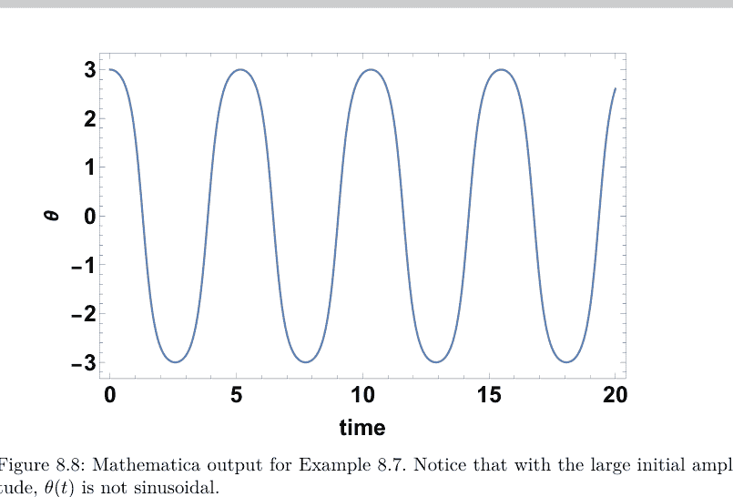

图 8.8：示例 8.7 的 Mathematica 输出。注意，由于初始振幅较大，θ(t) 不是正弦曲线。

### 示例 8.8：圆柱体上的质点

求一个质量为 $m$ 的质点被约束在半径为 $R$ 的无摩擦圆柱体表面上运动的哈密顿运动方程。该质点受到一个指向原点的力 $\mathbf{F} = -kr\mathbf{\hat{r}}$ 的吸引，其中 $k$ 是一个正常数，$\mathbf{\hat{r}}$ 是从原点指向质点位置的单位向量，$r$ 是质点与原点之间的距离。

#### 解答：

该系统的示意图如图 8.9 所示。

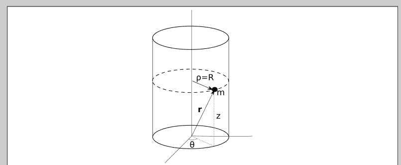

图 8.9：示例 8.8 中，一个质量为 $m$ 的质点沿半径为 $R$ 的圆柱体运动。

我们首先选择柱坐标来描述该系统。此外，有一个约束方程，

$$x^2 + y^2 = R^2 \quad (8.7.16)$$
也可以写成 $\rho^2 = R^2$。因此，这个问题有两个自由度。

接下来，我们计算动能。在柱坐标中，$v^2 = \dot{\rho}^2 + \rho^2\dot{\theta}^2 + \dot{z}^2$。然而，利用我们的约束 $\dot{\rho} = 0$，质点的动能变为，

$$T = \frac{1}{2}m(R^2\dot{\theta}^2 + \dot{z}^2) \quad (8.7.17)$$

势能最好先在笛卡尔坐标中求出。已知

$$\mathbf{F} = -k\mathbf{r} = -kr\mathbf{\hat{r}} = -k(x\mathbf{\hat{i}} + y\mathbf{\hat{j}} + z\mathbf{\hat{k}}) \quad (8.7.18)$$

因此，势能为

$$V = \frac{1}{2}kr^2 = \frac{1}{2}k(x^2 + y^2 + z^2) \quad (8.7.19)$$

如果我们应用约束 (8.7.16)，那么势能变为$V = \frac{1}{2}k(R^2 + z^2)$

接下来我们计算拉格朗日量 $\mathcal{L} = T - V$，

$\mathcal{L} = \frac{1}{2}m(R^2\dot{\theta}^2 + \dot{z}^2) - \frac{1}{2}k(R^2 + z^2)$

从拉格朗日量可以看出，与 $\theta$ 共轭的正则动量是守恒的，因为 $\theta$ 是一个循环坐标。为了找到哈密顿量，我们需要计算 $p_\theta$ 和 $p_z$，

$p_\theta = \frac{\partial \mathcal{L}}{\partial \dot{\theta}} = mR^2\dot{\theta}$ 以及 $p_z = \frac{\partial \mathcal{L}}{\partial \dot{z}} = m\dot{z}$

注意 $p_\theta$ 再次是一个角动量，而 $p_z$ 是平动动量。接下来，我们使用 (8.7.3) 式来求哈密顿量，

$H = p_\theta\dot{\theta} + p_z\dot{z} - \mathcal{L}$

$= p_\theta \frac{p_\theta}{mR^2} + p_z \frac{p_z}{m} - \left[ \frac{1}{2}m \left( R^2 \left( \frac{p_\theta}{mR^2} \right)^2 + \left( \frac{p_z}{m} \right)^2 \right) - \frac{1}{2}k(R^2 + z^2) \right]$

$= \frac{p_\theta^2}{2mR^2} + \frac{p_z^2}{2m} + \frac{1}{2}k(R^2 + z^2)$

最后，我们使用哈密顿量来计算哈密顿正则方程，

$\dot{z} = \frac{\partial H}{\partial p_z} \rightarrow \dot{z} = \frac{p_z}{m}$

$\dot{\theta} = \frac{\partial H}{\partial p_\theta} \rightarrow \dot{\theta} = \frac{p_\theta}{mR^2}$

$\dot{p}_z = -\frac{\partial H}{\partial z} \rightarrow \dot{p}_z = -kz$

$\dot{p}_\theta = -\frac{\partial H}{\partial \theta} \rightarrow \dot{p}_\theta = 0$

注意 $\dot{p}_z$ 等于作用在系统上的外力的 $z$ 分量。

## 8.8 对哈密顿量的进一步探讨

你可能想知道为什么我们想要使用哈密顿表述，特别是考虑到我们通常需要先找到拉格朗日量才能得到哈密顿量。为什么不直接使用拉格朗日表述呢？原因是哈密顿表述从理论角度来看非常强大。例如，在循环坐标的情况下，运动方程极其简单。考虑例 8.8，我们研究了被约束在圆柱面上运动的质点。回想一下，在例 8.8 中 $\theta$ 是一个循环坐标。与 $\theta$ 相关的运动方程是，

$\dot{\theta} = \frac{p_\theta}{mR^2}$ 以及 $\dot{p}_\theta = 0$。

因为 $p_\theta$ 是常数，所以很容易找到 $\theta(t)$，

$\theta(t) = \int_{t_0}^t \frac{p_\theta}{mR^2} dt' = \frac{p_\theta}{mR^2}(t - t_0)$。

当正则动量是常数时，运动方程可以化简为积分（如上所示）。如果能找到一个坐标系使得所有坐标都是循环的，那么运动方程就变得平凡了。事实上，确实可以找到这样的坐标系。这些变换是由卡尔·古斯塔夫·雅各布·雅可比（Carl Gustav Jacob Jacobi，1804–1851）发展起来的，这项工作被称为*哈密顿-雅可比理论*。哈密顿-雅可比理论超出了本书的范围，但有动力的读者应参考戈德斯坦等人的著作 [8]。

此外，仅仅知道哈密顿量本身就能让我们洞察系统所有可能的行为。这可以通过使用哈密顿量绘制系统的相空间来实现。与第 6 章中我们绘制 $x$ 对 $v$ 的图不同，我们将绘制 $p$ 对 $q$ 的图来创建相空间。具体来说，我们将绘制正则动量对其共轭广义坐标的图。一般来说，相空间的维度是 $2s$，其中 $s$ 是系统的自由度数。注意 $H = H(q_k, p_k)$ 将在相空间中定义曲面。为了理解这种图的价值，我们将再次回顾单摆。

### 例 8.9：单摆的相空间

考虑一个简单的平面摆。使用例 8.7 中找到的哈密顿量，使用值 $m = 1.0$ kg，$\ell = 1.0$ m 和 $g = 9.8$ m/s$^2$ 绘制简单平面摆的相空间。具体来说，绘制对应于以下初始条件的等高线：$(q, p) = (0.5 \text{ rad}, 0 \text{ kg m}^2/\text{s})$，$(2.0 \text{ rad}, 0 \text{ kg m}^2/\text{s})$，$(\pi \text{ rad}, 0 \text{ kg m}^2/\text{s})$，$(\pi \text{ rad}, \pm 4.43 \text{ kg m}^2/\text{s})$ 和 $(\pi \text{ rad}, \pm 6.26 \text{ kg m}^2/\text{s})$，并解释结果。

**解：**
简单平面摆的哈密顿量在例 8.7 中已找到，

$$H(q, p) = \frac{p^2}{2m\ell^2} - mg\ell \cos q \quad (8.8.1)$$

为简化符号，我们定义了 $p = p_\theta$ 和 $q = \theta$。
初始条件对应于以下 $H$ 值：

| 初始条件 $(q_0, p_0)$ | $H(q_0, p_0)$ |
| :--- | :--- |
| $(0.5 \text{ rad}, 0 \text{ kg m}^2/\text{s})$ | -8.60 |
| $(2.0 \text{ rad}, 0 \text{ kg m}^2/\text{s})$ | 4.07 |
| $(\pi \text{ rad}, 0 \text{ kg m}^2/\text{s})$ | 9.8 |
| $(\pi \text{ rad}, \pm 4.43 \text{ kg m}^2/\text{s})$ | 19.61 |
| $(\pi \text{ rad}, \pm 6.26 \text{ kg m}^2/\text{s})$ | 29.39 |

注意第一个初始条件的负值是由于选择 $y$ 坐标来描述摆的位置所致。创建等高线图的代码如下所示。Python 代码的结果如图 8.10 所示。

注意我们只绘制了 $q$ 在其可能范围 $-\pi \leq q \leq \pi$ 内的值。一些等高线（$H \leq 9.8$ 的等高线）形成闭合环路。闭合等高线对应于振荡运动，这正是我们对于 $q \leq \pi$ 且初始角速度为零的情况所预期的。$H = -8.60$ 的等高线几乎是椭圆形的，如果我们进一步减小 $q$ 的初始值，我们将得到对应于简谐运动的等高线。$H = 4.07$ 的等高线对应于更大的振幅振荡，此时摆不再进行正弦振荡。虚线（电子书中为红色）对应于最大振幅振荡，其初始条件为 $q = \pi$ 且 $p = 0$。$H > 9.8$ 的等高线对应于更高的能量值，此时摆现在在一个方向上连续摆动。注意对于每个 $H > 9.8$ 的值，都有两条等高线，一条对应顺时针旋转，另一条对应逆时针旋转。

### Python 代码

在 Python 中，我们使用 Matplotlib 库中的 `contour` 命令。与 Mathematica 不同，我们必须使用 `np.meshgrid` 定义一个网格，我们将在此网格上计算 $H$ 的值。绘制的每条等高线的值使用 `contour` 命令中的 `levels` 选项定义。

```python
import numpy as np
import matplotlib.pyplot as plt

m, l, g = 1, 1, 9.8

q_range = np.linspace(-np.pi,np.pi,100)
p_range = np.linspace(-10,10,100)

q, p = np.meshgrid(q_range,p_range)

H = p**2/(m*l**2) - m*g*l*np.cos(q)

contour_plot = plt.contour(q,p,H, \
        levels=[-8.6,4.07,9.8,19.61,29.39],colors=['k','k','r','k','k'],\
        linestyles=['solid','solid', 'dashed','solid','solid'])

plt.clabel(contour_plot)
plt.xlabel('theta')
plt.ylabel('p')
#plt.savefig('ex-8-9-python.eps')
plt.show()
```

### Mathematica 代码

我们使用 `ContourPlot` 命令为特定的 $H$ 值创建相图。选项 `Contours` 指定了绘制的等高线的值。

```mathematica
SetOptions[ContourPlot, BaseStyle->{FontSize->16}];

l = 1.0;

m = 1.0;

g = 9.8;

H[q_, p_] := p^2/(2*m*l^2) - m*g*l*Cos[q];

contour1 = H[0.5, 0];

contour2 = H[2.0, 0];

contour3 = H[Pi, 0];

contour4 = H[Pi, 4.43];

contour5 = H[Pi, 6.26];

contourList = {contour1, contour2, contour3, contour4, contour5};

ContourPlot[H[q, p], {q, -Pi, Pi}, {p, -10, 10}, ContourShading -> None,

Contours -> contourList, ContourStyle -> {Bold, Black, {Red, Dashed}, Black, Black},

FrameLabel -> {q, p}, ContourLabels -> True]
```

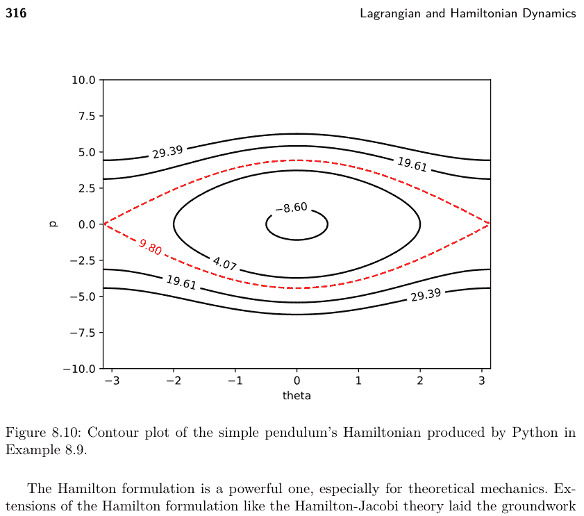

图 8.10：例 8.9 中由 Python 生成的单摆哈密顿量的等高线图。

哈密顿表述是一种强大的表述，尤其对于理论力学而言。哈密顿表述的扩展，如哈密顿-雅可比理论，为量子力学的理论结构奠定了基础。除了戈德斯坦等人的著作 [8] 之外，非常有动力的学生会发现阿诺德的著作 [9] 是对理论力学的一个极具挑战性且极具回报的阐述，它远远超出了本科水平，将经典力学与李代数和辛几何等高等数学联系起来。

## 8.9 章节总结

> 拉格朗日表述使用哈密顿原理，该原理指出粒子将遵循的路径使得作用量积分

$$S = \int_{t_1}^{t_2} \mathcal{L}(q_i, \dot{q}_i; t) dt$$

取驻值。使作用量积分取驻值的函数 $q_j(t)$ 可以使用欧拉-拉格朗日方程找到，

$$\frac{d}{dt} \left( \frac{\partial \mathcal{L}}{\partial \dot{q}_i} \right) - \frac{\partial \mathcal{L}}{\partial q_i} = 0$$

欧拉-拉格朗日方程产生 $s$ 个二阶常微分方程，其中 $s$ 是系统中的自由度数，可以求解得到 $q_i(t)$。

在系统存在 $m$ 个完整约束的情况下，我们可以将约束表示为 $m$ 个约束方程 $f_j$，欧拉-拉格朗日方程变为

## 8.10 章末习题

符号 🖥️ 表示需要借助计算机辅助的问题，涉及图形、数值计算或符号求值。

### 第 8.1 节：拉格朗日量简介

- 1. 🖥️ 考虑一个质量为 $m$ 的自由粒子在三维空间中运动。该粒子不受任何外力作用。求该粒子的拉格朗日量和运动方程。找出任何守恒量。请用解析方法以及使用 Mathematica 或 Python 来求解此问题。

- 2. 🖥️ 考虑一个质量为 $m$ 的粒子在地球表面附近三维空间中运动。求该粒子的拉格朗日量和运动方程。找出任何守恒量。请用解析方法以及使用 Mathematica 或 Python 来求解此问题。

- 3. 🖥️ 考虑一个质量为 $m = 1.0$ kg 的粒子在一维空间中受力 $F = -kx^3$ 的影响下运动。求拉格朗日量和运动方程。使用计算机求解当 $k = 0.1$ N/m$^3$，$x(0) = 1.0$ m，且 $\dot{x}(0) = 0$ m/s 时的 $x(t)$。

### 第 8.2 节：广义坐标与自由度

- 4. 一个做抛体运动（忽略空气阻力）的粒子，其自由度是多少？运动是否存在任何约束？假设抛体运动的距离足够短，以至于科里奥利力（见第 10 章）可以忽略不计。

- 5. 考虑一个半径为 $R$ 的圆盘在斜面上无滑动地滚动。描述系统状态需要哪些坐标？这些量之间是否存在约束？

- 6. 一个质量为 $m$、半径为 $a$ 的非常小的球被约束在半径为 $R \gg a$ 的球体表面上滚动。该球被约束沿球体上的测地线运动。该球有多少个自由度？

### 第 8.3 节：哈密顿原理

- 7. 考虑一个具有 $s$ 个自由度的单粒子系统。该粒子受到一个力，该力对应一个势能 $V(q_i)$。证明使作用量积分 $S = \int_{t_1}^{t_2} \mathcal{L}(q_i, \dot{q}_i) dt$ 取驻值的函数 $q_i(t)$（其中 $i = 1, \dots, s$）也服从牛顿定律。换句话说，将第 8.3 节中完成的工作推广到具有 $s$ 个自由度的单粒子系统。

- 8. 对 $N$ 粒子系统重复问题 7。

### 第 8.4 和 8.5 节：拉格朗日动力学示例

- 9. 填写必要的步骤以计算示例 8.3 中的 (8.4.19) 和 (8.4.20)：

$$\mathcal{L} = \frac{1}{2}m \left(R^2\omega^2 + \ell^2\dot{\theta}^2 + 2R\ell\omega\dot{\theta}\sin(\theta - \omega t)\right) - mg\left(R\sin(\omega t) - \ell\cos\theta\right) \quad (8.10.1)$$

$$\ddot{\theta} + \frac{g}{\ell}\sin\theta = \frac{R\omega^2}{\ell}\cos(\theta - \omega t) \quad (8.10.2)$$

- 10. 在示例 8.5 中，求当 $M \to 0$ 时斜面和粒子的加速度。讨论你的结果。

- 11. 一个由质量 $m$ 和长度为 $\ell$ 的无质量杆组成的简单平面摆，连接在一个以加速度 $a$ 向上加速的支撑物上。写出摆的 $x$ 和 $y$ 坐标作为时间 $t$ 和参数 $\theta$（定义为从摆的稳定平衡位置开始的角位移）的函数。求拉格朗日量和摆的运动方程，既用解析方法也用计算机代数系统（CAS）求解。同时求出围绕平衡位置的小振动周期。

- 12. 考虑问题 11 中描述的摆。使用 $\ell = 1.0$ m 和 $a = g/10$，$g/2$，$g$ 和 $2g$，在 $xy$ 平面内绘制摆锤路径随时间变化的函数图像。使用 $\theta(0) = 0.25$ rad 和 $\dot{\theta}(0) = 0$ 作为初始条件。

- 13. 求一个由质量 $m$ 和长度为 $\ell$ 的无质量杆组成的简单平面摆的运动方程，该摆连接在一个水平振荡的支撑物上，使得 $x_s = a\cos(\omega t)$，其中 $x_s$ 是支撑物在水平轴上的位置。支撑物没有垂直运动。写出摆的 $x$ 和 $y$ 坐标作为时间 $t$ 和参数 $\theta$（定义为从摆的稳定平衡位置开始的角位移，如图 8.1 所示）的函数。求拉格朗日量和摆的欧拉-拉格朗日运动方程，既用解析方法也用 CAS 求解。

- 14. 考虑问题 13 中描述的受驱摆。使用 $a = 0.25$ m，$\omega_0^2 = g/\ell = 1$ rad/s 和 $\omega = \omega_0/10$，$\omega = \omega_0/2$，$\omega_0$ 和 $2\omega_0$，在 $xy$ 平面内绘制摆锤的路径。使用 $\theta(0) = 0.25$ rad 和 $\dot{\theta}(0) = 0$ 作为初始条件。

- 15. 一个由质量 $m$ 和长度为 $\ell$ 的无质量杆组成的简单平面摆，连接在一个垂直振荡的支撑物上，使得 $y_s = a\cos(\omega t)$，其中 $y_s$ 是支撑物在垂直轴上的位置。支撑物没有水平运动。写出摆的 $x$ 和 $y$ 坐标作为时间和参数 $\theta$（定义为从摆的稳定平衡位置开始的角位移，如图 8.1 所示）的函数。求拉格朗日量和摆的欧拉-拉格朗日运动方程，既用解析方法也用 CAS 求解。

- 16. 考虑问题 15 中描述的受驱摆。使用 $a = 0.25$ m，$\omega_0^2 = g/\ell = 1$ rad/s 和 $\omega = \omega_0/10$，$\omega_0/2$，$\omega_0$ 和 $2\omega_0$，在 $xy$ 平面内绘制摆锤的路径。使用 $\theta(0) = 0.25$ rad 和 $\dot{\theta}(0) = 0$ 作为初始条件。

- 17. 一个双摆由两个通过无质量杆串联连接的摆组成，如图 8.11 所示。求双摆的运动方程。注意，摆的运动被约束在平面内，就像一个简单的平面摆。

- 18. 考虑一个质量为 $m$、初始长度为 $\ell$ 的单摆。摆开始摆动后，其长度以速率 $\dot{\ell} = -\alpha$ 缩短，其中 $\alpha$ 是一个常数。使用拉格朗日量计算系统的运动方程。该系统的能量是否守恒？请用解析方法以及使用 Mathematica 或 Python 来求解此问题。

- 19. 一个质量为 $m$ 的小粒子沿一个质量为 $M$、曲率半径为 $R$ 的光滑圆形楔块下滑，如图 8.12 所示。楔块可以沿无摩擦表面自由水平移动。求每个物体的运动方程。

- 20. 求一个在三维空间中受中心力 $\mathbf{F}(\mathbf{r}) = F(r)\hat{\mathbf{r}}$ 作用的单粒子的运动方程，其中 $r$ 是位置矢量的大小，$F(r)$ 是一个标量函数。使用球坐标。

- 21. 一个质量为 $m$ 的粒子被约束沿一个半径为 $a$ 的无摩擦无质量圆形环运动。该环以恒定角速度 $\omega$ 绕其垂直直径旋转。求粒子的平衡位置。

- 22. 考虑一个质量连接在一个劲度系数为 $k$、平衡长度为 $\ell$ 的无质量弹簧上，该弹簧可以在无摩擦平面上摆动。这就是所谓的*弹性摆*。求一个质量为 $m$、平衡长度为 $\ell$ 的弹性摆的运动方程。最初，摆从其平衡长度拉伸了 0.25 米，并从其稳定平衡位置偏移了 0.5 弧度的角度。然后摆从静止释放。使用 $\ell = 1$，$m = 1$，$k = 1$（国际单位制），在 $t = 0$ 到 4.4 秒的时间内，在 $xy$ 平面内绘制摆锤的路径。

- 23. 一个半径为 $R$ 的光滑水平圆形导线以恒定角速度 $\omega$ 绕其圆周上的一点旋转。一个质量为 $m$ 的粒子被约束沿导线运动，如图 8.13 所示。求粒子的运动方程。粒子围绕哪个点振荡？

- 24. 一根质量为 $M$、长度为 $L$ 的绳子被拉直放在无摩擦的桌面上，使得长度为 $z_0$ 的部分悬挂在桌子边缘。如果绳子从静止释放，求其运动方程。使用拉格朗日量证明绳子完全滑离桌面所需的时间为

$$t = \sqrt{\frac{L}{g}} \cosh^{-1} (L/z_0)$$

你可能还记得这个问题来自第 4 章，当时我们用牛顿定律求解过。

- 25. 一个质量为 $m$ 的粒子在力 $F = -\alpha r^2$ 的作用下在平面内运动，其中 $F$ 指向原点，$r$ 是位置矢量的大小。求粒子的运动方程。是否存在任何守恒量？如果存在，它们是什么？

- 26. 一个半径为 $a$、质量为 $m$ 的球被约束在半径为 $R$ 的圆柱体内无滑动地滚动。求球的运动方程并计算小振动的周期。

- 27. 一个质量为 $m$ 的粒子被约束在一根弯曲成螺旋线形状的无摩擦导线上运动，螺旋线满足 $r = R$ 和 $z = \alpha \theta$，其中 $R$ 和 $\alpha$ 是正常数。粒子受到重力影响，重力方向沿 $-z$ 方向。求粒子的运动方程。当 $R \to 0$ 时，粒子的加速度是多少？

### 第8.6节：守恒定理与拉格朗日量

28. 证明 (8.6.21)：
    $$p_i = \frac{\partial \mathcal{L}}{\partial \dot{q}_i} = \frac{\partial T}{\partial \dot{q}_i} = \sum_j a_{ij} \dot{q}_j$$

29. 一个质量为 $m$ 的粒子在一个具有相关势能 $V = -k/r$ 的力场中运动，其中 $k$ 是一个正常数。该粒子的守恒量是什么？

30. 考虑一个具有 $s$ 个自由度和拉格朗日量 $\mathcal{L}(q_k, \dot{q}_k)$ 的系统，其中 $k = 1, \dots, s$。现在，令 $\mathcal{F} = \mathcal{F}(q_k)$ 为广义坐标 $q_k$ 的任意函数。我们可以构造一个额外的拉格朗日量，
    $$\mathcal{L}' = \mathcal{L} + d\mathcal{F}/dt$$
    证明 $\mathcal{L}$ 和 $\mathcal{L}'$ 给出相同的运动方程。

### 第8.7节：哈密顿动力学

31. 推导一个具有 $s$ 个自由度的系统的哈密顿运动方程。

32. 球面摆是一个不限制在平面内运动的单摆。求一个球面摆的运动方程，该摆具有固定支点，由一根无质量、长度为 $\ell$ 的杆和一个位于杆端的质量为 $m$ 的摆锤组成。使用 $m = 1$ 和 $\ell = 1$（国际单位制），绘制当摆锤初始位置为 $\mathbf{r}_0 = \hat{\mathbf{i}}$（其中 $\hat{\mathbf{i}}$ 是沿 x 轴的单位向量），初始角速度为 $\boldsymbol{\omega}_0 = \hat{\boldsymbol{\theta}} + \hat{\boldsymbol{\phi}}$（其中 $\hat{\boldsymbol{\theta}}, \hat{\boldsymbol{\phi}}$ 是球坐标系中的单位向量）时球面摆的路径。所有量均采用国际单位制。

33. 求一个质量为 $m$ 的粒子在双阱势 $V = -\frac{1}{2}kx^2 + \frac{1}{4}\epsilon x^4$ 中运动的哈密顿方程，其中 $k$ 和 $\epsilon$ 是正常数。

34. 一个质量为 $m$ 的粒子在一个具有相关势能 $V = -k/r$ 的力场中运动，其中 $k$ 是一个正常数。求哈密顿运动方程。

35. 求第22题中描述的弹性摆的哈密顿方程。使用与第22题相同的参数值和初始条件绘制弹性摆的路径。但是，这次绘制摆从 $t = 0$ 到 $t = 10$ 秒的路径。

36. 求一个质量为 $m$ 的粒子被限制在圆锥面上的哈密顿方程，该圆锥在柱坐标系中由 $r = az$ 描述，位于均匀重力场内。证明对于给定的能量，粒子被限制时 $z$ 存在最大值和最小值。

37. 考虑力
    $$F = -\frac{k}{x}e^{-\lambda t} \quad (8.10.3)$$
    作用于一个在一维运动的质量为 $m$ 的粒子。假设常数 $k$ 和 $\lambda$ 均为正。我们可以利用关系式 $V = -\int F dx$ 创建一个“伪势能”。使用伪势能，求该粒子的哈密顿运动方程。计算 $\partial H/\partial t$ 和 $\partial \mathcal{L}/\partial t$ 并证明它们满足 (8.7.11)：
    $$\frac{\partial H}{\partial t} = -\frac{\partial \mathcal{L}}{\partial t}$$

38. 回顾第7章最速降线问题中的摆线，
    $$y = a(1 - \cos \theta)$$
    $$x = a(\theta - \sin \theta)$$
    其中 $a$ 是常数，$\theta$ 是旋转角。求一个沿摆线运动的粒子的哈密顿运动方程。

寻找更多哈密顿问题？尝试为上面第8.4节和第8.5节中的任何问题寻找哈密顿量！

### 第8.8节：对哈密顿量的进一步探索

39. 泊松括号是一种使用哈密顿量表示物理量时间演化的有趣方法。考虑两个函数 $g(q_k, p_k)$ 和 $h(q_k, p_k)$。函数 $g$ 和 $h$ 是广义坐标和广义动量的函数，类似于哈密顿量。泊松括号定义为：
    $$[g, h] = \sum_k \left( \frac{\partial g}{\partial q_k} \frac{\partial h}{\partial p_k} - \frac{\partial g}{\partial p_k} \frac{\partial h}{\partial q_k} \right)$$
    使用泊松括号，证明：
    - a. $\frac{dg}{dt} = [g, H] + \frac{\partial g}{\partial t}$，其中 $H$ 是哈密顿量。
    - b. $\dot{q}_k = [q_k, H]$。
    - c. $\dot{p}_k = [p_k, H]$。
    - d. $[p_i, p_j] = [q_i, q_j] = 0$。
    - e. $[q_i, p_j] = \delta_{ij}$，其中 $\delta_{ij}$ 是克罗内克δ函数（当 $i = j$ 时为1，否则为0）。

40. 如果两个物理量的泊松括号（见第39题）为零，则称这两个物理量对易。证明任何与哈密顿量对易的、不显含时间的物理量都是守恒量。

41. 在第5章和本章第33题中，我们都研究了双阱势 $V = -\frac{1}{2}kx^2 + \frac{1}{4}\epsilon x^4$。
    - a. 求该势的哈密顿量。
    - b. 使用哈密顿量，绘制 $\epsilon = 1$ 和不同 $k$ 值下的相空间图。粒子质量取 $m = 1$。
    - c. 相空间如何随 $k$ 变化？对于你尝试的每个 $k$ 值，描述粒子可能的运动。
    - d. 绘制相空间图，并识别与相空间每个区域相关的运动类型。

# 9 中心力与行星运动

在本章中，我们将首先探讨中心力的概念及其在描述物理现象中的重要性。接下来，我们研究两个物体通过中心力相互作用的问题，这就是所谓的二体问题。我们对二体问题的分析将引出开普勒行星运动定律。我们将通过解析方法和数值积分牛顿定律来获得二体问题的解。最后，我们研究三个物体通过中心力相互作用的三体问题。求解三体问题中一个物体的运动将需要我们运用本书迄今为止所发展的计算技能。

## 9.1 中心力

在本节中，我们将概述中心力的一些一般性质。

中心力是作用在粒子上的力，其方向沿着连接粒子和力心（如原点）的直线。当两个粒子通过中心力 **F** 相互作用时，该力总是沿着连接两个粒子中心的直线方向，如图9.1所示。例如，**F** 可以是牛顿万有引力定律 (9.1.2)，在这种情况下，**F**<sub>21</sub> 是 *m*<sub>1</sub> 由于 *m*<sub>2</sub> 的存在而受到的引力。与图9.1中的力向量平行的是一条长度为 *r* 的虚线，即 *m*<sub>1</sub> 和 *m*<sub>2</sub> 中心之间的距离，以及沿连接两个质量的直线方向的单位向量 **r̂**。注意，图9.1中的向量 **r̂** 应位于向量 **F**<sub>21</sub> 的上方，但为了图像清晰，我们将其放置在 **F**<sub>21</sub> 旁边。

中心力仅取决于两个相互作用物体之间的距离 *r*。因此，球坐标提供了一种描述中心力的简单方法，特别是因为它们不依赖于 *θ* 和 *ϕ*。因此，我们可以用以下形式普遍地表示中心力：

> **中心力的通用公式**

**F** = *f*(*r*)**r̂** (9.1.1)

其中 $f(r)$ 是位置向量 $\mathbf{r}$ 的大小 $r$ 的标量函数，$\hat{\mathbf{r}}$ 是沿位置向量的单位向量，如图9.1所示。

物理学中最著名的中心力例子是两个质量 $m_1$ 和 $m_2$ 之间的牛顿万有引力定律 $\mathbf{F}_G(r)$，以及两个电荷 $q_1$ 和 $q_2$ 之间的静电库仑力 $\mathbf{F}_C(r)$。这两种力的数学描述非常相似：

$$\mathbf{F}_G(r) = -\frac{Gm_1m_2}{r^2}\hat{\mathbf{r}} \quad (9.1.2)$$
$$\mathbf{F}_C(r) = \frac{1}{4\pi\epsilon_0}\frac{q_1q_2}{r^2}\hat{\mathbf{r}} \quad (9.1.3)$$

其中 $G = 6.67\times10^{-11}\text{ N m}^2\text{kg}^2$ 是万有引力常数，$\epsilon_0 = 8.85 \times 10^{-12}\text{ F/m}$ 是电力的相应常数，称为真空介电常数。

### 9.1.1 中心力与能量守恒

中心力的一个非常重要的性质是它们是保守力。这可以通过写出球坐标系中力 $\mathbf{F}$ 的旋度的一般形式很容易地看出：

$$\nabla \times \mathbf{F} = \frac{1}{r\sin\theta}\left(\frac{\partial}{\partial\theta}(F_\phi\sin\theta) - \frac{\partial F_\theta}{\partial\phi}\right)\hat{\mathbf{r}} + \frac{1}{r}\left(\frac{1}{\sin\theta}\frac{\partial F_r}{\partial\phi} - \frac{\partial}{\partial r}(rF_\phi)\right)\hat{\boldsymbol{\theta}} + \frac{1}{r}\left(\frac{\partial(rF_\theta)}{\partial r} - \frac{\partial F_r}{\partial\theta}\right)\hat{\boldsymbol{\phi}} \quad (9.1.4)$$

对于中心力，我们有 $F_\theta = F_\phi = 0$，$\frac{\partial F_r}{\partial\phi} = 0$，$\frac{\partial F_r}{\partial\theta} = 0$，因此 (9.1.4) 给出：

$$\nabla \times \mathbf{F} = 0 \quad (9.1.5)$$

因此，$\mathbf{F}$ 是一个保守力。

正如我们在第5章中看到的，保守力可以与势能函数 $V(r) = -\int \mathbf{F} \cdot d\mathbf{r}$ 相关联。相应的标量引力势能 $V_G$ 和静电势能 $V_C$ 为：

$$V_G(r) = -\frac{Gm_1m_2}{r} \quad (9.1.6)$$
$$V_C(r) = \frac{1}{4\pi\epsilon_0}\frac{q_1q_2}{r} \quad (9.1.7)$$

另一个著名的中心力例子是分子间长程范德华力，它在科学的多个分支中都很重要。在其最简单的形式之一中，一对中性原子或分子之间的范德华力可以用伦纳德-琼斯势（也称为L-J势或6-12势）来近似。6-12势 $V_{LJ}(r)$ 的数学形式为：

$$V_{LJ}(r) = \left[\frac{c_1}{r^{12}} - \frac{c_2}{r^6}\right] \quad (9.1.8)$$

其中 $c_1$ 和 $c_2$ 是具有适当国际单位制的常数。

在粒子和原子物理学领域，汤川短程核力非常重要，相应的汤川势 $V_Y(r)$ 的数学表示为：

$$V_Y(r) = c_4\frac{e^{-c_5r}}{r} \quad (9.1.9)$$

其中 $c_4$ 和 $c_5$ 是具有适当国际单位制的常数。

### 9.1.2 中心力与角动量守恒

接下来我们将证明中心力是守恒角动量的。考虑一个由 $N$ 个粒子组成的系统，其中 $m_i$、$\mathbf{r}_i$ 和 $\mathbf{p}_i$ 分别是第 $i$ 个粒子的质量、位置和动量，$i = 1, \dots, N$。根据第4章的知识，作用于粒子系统的总力矩 $\mathbf{N}$ 为：

$$\mathbf{N} = \sum_{i=1}^N \mathbf{r}_i \times \dot{\mathbf{p}}_i = \sum_{i=1}^N \mathbf{r}_i \times \mathbf{F}_i \quad (9.1.10)$$

其中 $\mathbf{F}_i$ 是作用于质量为 $m_i$ 的粒子上的力。在第4章中，我们进一步简化了这个方程，得到：

$$\mathbf{N} = \sum_{i=1}^N (\mathbf{r}_i \times \mathbf{F}_i^{\text{ext}}) + \sum_{i=1}^N \sum_{j>i} (\mathbf{r}_i - \mathbf{r}_j) \times \mathbf{F}_{ij} \quad (9.1.11)$$

其中 $\mathbf{F}^{\text{ext}}$ 是作用于 $m_i$ 的外力之和，$\mathbf{F}_{ij}$ 是 $m_i$ 与 $m_j$ 之间的相互作用力。如果我们假设这是一个孤立系统，那么 $\mathbf{F}^{\text{ext}} = 0$，且 (9.1.11) 式中的第一项为零。使用类似于图 9.1 的坐标系，我们可以写出 $\mathbf{r}_i - \mathbf{r}_j = r_{ij}\hat{\mathbf{r}}_{ij}$，其中 $\hat{\mathbf{r}}_{ij}$ 是沿 $m_i$ 和 $m_j$ 连线方向的单位向量。此外，如果粒子间的相互作用力是中心力，那么 $\mathbf{F}_{ij} = F_{ij}(r)\hat{\mathbf{r}}_{ij}$，且 (9.1.11) 式中的第二项为：$(r_{ij}\hat{\mathbf{r}}_{ij}) \times (F_{ij}\hat{\mathbf{r}}_{ij}) = 0$。因此，作用于系统的净力矩为零，角动量守恒。

在下一节中，我们将详细研究所谓的二体问题。这一讨论将引导我们了解开普勒著名的行星运动定律。

## 9.2 二体问题

在本节中，我们将考虑二体开普勒问题，即两个质量通过中心力相互作用。这种二体系统在天文学中非常常见。

我们从图 9.2 所示的系统开始，其中质量 $m_1$ 和 $m_2$ 相对于一个共同的原点 $O$ 分别位于位置 $\mathbf{r}_1$ 和 $\mathbf{r}_2$。如图 9.2 所示，两个粒子的质心位于相对于原点的 $\mathbf{R}$ 处，并用白色圆圈表示。两个质量通过一个中心力 $\mathbf{F} = F(r)\hat{\mathbf{r}}$ 相互作用（图中未画出），其中 $\mathbf{F}$ 沿向量 $\mathbf{r}$ 方向，类似于图 9.1。

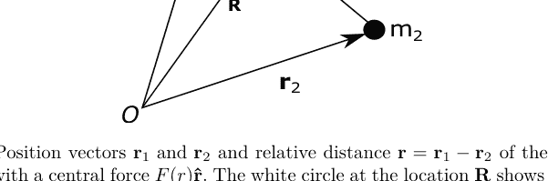

图 9.2：两个通过中心力 $F(r)\hat{\mathbf{r}}$ 相互作用的质量的位置向量 $\mathbf{r}_1$ 和 $\mathbf{r}_2$ 以及相对距离 $\mathbf{r} = \mathbf{r}_1 - \mathbf{r}_2$。位于 $\mathbf{R}$ 处的白色圆圈表示系统质心的位置，$O$ 是坐标系的原点。

如果 $\mathbf{r}_1$ 和 $\mathbf{r}_2$ 分别是两个质量 $m_1$ 和 $m_2$ 的位置向量，那么两个质量之间的向量距离为：

$$\mathbf{r} = \mathbf{r}_1 - \mathbf{r}_2 \quad (9.2.1)$$

每个质量的牛顿第二定律 $F = ma$ 可以写为：

$$m_1 \ddot{\mathbf{r}}_1 = -F(r)\hat{\mathbf{r}} \quad (9.2.2)$$
$$m_2 \ddot{\mathbf{r}}_2 = F(r)\hat{\mathbf{r}} \quad (9.2.3)$$

其中 $\hat{\mathbf{r}}$ 是 $\mathbf{r}$ 方向上的单位向量。注意，我们使用了牛顿第三定律来写出上述关于吸引力的方程。将 (9.2.2) 和 (9.2.3) 相减，我们得到：

$$\ddot{\mathbf{r}}_1 - \ddot{\mathbf{r}}_2 = -\left(\frac{1}{m_1} + \frac{1}{m_2}\right) F(r)\hat{\mathbf{r}} \quad (9.2.4)$$
$$\frac{m_1 m_2}{m_1 + m_2} (\ddot{\mathbf{r}}_1 - \ddot{\mathbf{r}}_2) = -F(r)\hat{\mathbf{r}} \quad (9.2.5)$$

这可以改写为：

> **约化质量 $\mu$ 的牛顿第二定律**

$$\mu \ddot{\mathbf{r}} = -F(r)\hat{\mathbf{r}} \quad (9.2.6)$$
$$\mu = \frac{m_1 m_2}{m_1 + m_2} \quad (9.2.7)$$

这个方程告诉我们，二体系统的行为就像一个质量为 $\mu$、位置向量为 $\mathbf{r}$ 的单个物体，在中心力 $\mathbf{F} = F(r)\hat{\mathbf{r}}$ 的影响下运动。这个单个质量 $\mu$ 被称为二体系统的*约化质量*，它代表了出现在二体问题中的有效惯性质量。使用约化质量 $\mu$ 使我们能够将二体问题当作单体问题来研究。注意，(9.2.6) 式中出现负号是因为我们假设了吸引力。排斥力会给出类似的结果，但 (9.2.6) 式中没有负号。

什么是约化质量？(9.2.7) 式中的定义可能难以理解。考虑日地系统。在这种情况下，太阳的质量 $m_S$ 远大于地球的质量 $m_E$。如果我们在 (9.2.7) 式中使用 $m_1 = m_S$ 和 $m_2 = m_E$，我们会发现 $\mu \approx m_E$。因此，当我们研究日地系统的运动时，我们本质上是在研究地球的运动。当两个质量变得更为相当时，我们就不能将约化质量与其中任何一个质量等同起来，正如我们将在后面的例 9.1 中演示的那样。

在处理多粒子系统时，我们知道系统的质心对于描述系统的行为非常有用。正如我们在第4章中讨论的，二体系统的质心位置定义为：

$$\mathbf{R} = \frac{m_1 \mathbf{r}_1 + m_2 \mathbf{r}_2}{m_1 + m_2} \quad (9.2.8)$$

由于我们不关心系统整体的平动运动（我们关注的是粒子彼此相对的轨道），我们可以设 $\mathbf{R} = 0$，如图 9.3a 所示。换句话说，我们可以将质心置于原点。这个新的坐标系不同于图 9.2 所示的坐标系。正如我们将看到的，这个将质心置于原点的新坐标系在描述轨道时将非常有用。

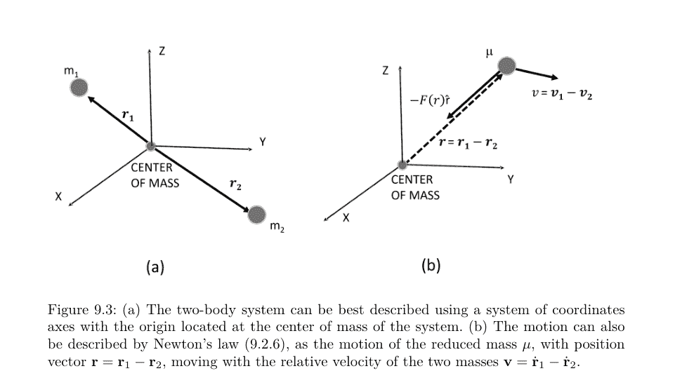

使用 $\mathbf{R} = 0$，我们有：

$$m_1\mathbf{r}_1 + m_2\mathbf{r}_2 = 0 \quad (9.2.9)$$

将 (9.2.9) 式与位置向量 $\mathbf{r}_1$ 和 $\mathbf{r}_2$ 的定义 $\mathbf{r} = \mathbf{r}_1 - \mathbf{r}_2$ 结合起来，我们得到：

$$\mathbf{r}_1 = \left( \frac{m_2}{m_1 + m_2} \right) \mathbf{r} \quad (9.2.10)$$

$$\mathbf{r}_2 = -\left( \frac{m_1}{m_1 + m_2} \right) \mathbf{r} \quad (9.2.11)$$

注意，在图 9.3a 的质心坐标系中，三个向量 $\mathbf{r}$、$\mathbf{r}_1$、$\mathbf{r}_2$ 是共线的。(9.2.10) 和 (9.2.11) 式使我们能够将粒子的位置与分离向量 $\mathbf{r}$ 联系起来。此外，我们可以将系统的拉格朗日量写为：

$$\mathcal{L} = \frac{1}{2}m_1\dot{\mathbf{r}}_1^2 + \frac{1}{2}m_2\dot{\mathbf{r}}_2^2 - V(r) \quad (9.2.12)$$

其中 $V(r) = -\int F(r)dr$ 是与中心力 $\mathbf{F}$ 相关的势能。将 (9.2.10) 和 (9.2.11) 式的值代入拉格朗日量 (9.2.12)，经过一些简单的代数运算，我们发现二体系统的拉格朗日量为：

> **二体系统的拉格朗日量**

$$\mathcal{L} = \frac{1}{2}\mu |\dot{\mathbf{r}}|^2 - V(r) \quad (9.2.13)$$

与牛顿第二定律类似，拉格朗日量表明我们将二体问题简化为一个质量等于约化质量 $\mu$ 的单个物体的运动，该物体以两个质量的相对速度 $\mathbf{v} = \dot{\mathbf{r}}_1 - \dot{\mathbf{r}}_2$ 运动。类似地，二体问题的总角动量由下式给出：

$$\mathbf{L} = m_1 \left( \mathbf{r}_1 \times \frac{d\mathbf{r}_1}{dt} \right) + m_2 \left( \mathbf{r}_2 \times \frac{d\mathbf{r}_2}{dt} \right) \quad (9.2.14)$$

将 (9.2.10) 和 (9.2.11) 式代入 (9.2.14) 式，我们可以得到总角动量（参见章末习题中的第10题）：

> **二体系统的角动量**

$$\boldsymbol{\ell} = \mu (\mathbf{r} \times \dot{\mathbf{r}}) \quad (9.2.15)$$

其中我们用 $\boldsymbol{\ell}$（代表单个物体）替换了 $\mathbf{L}$（代表两个物体）。这个方程告诉我们，二体问题的总角动量等于约化质量 $\mu$ 的角动量，该质量位于点 $\mathbf{r} = \mathbf{r}_1 - \mathbf{r}_2$ 处，并以速度 $\mathbf{v} = \dot{\mathbf{r}} = \dot{\mathbf{r}}_1 - \dot{\mathbf{r}}_2$ 运动。同样，结果是我们可以将二体问题简化为研究一个质量为 $\mu$ 的单个粒子的运动。

此外，对 (9.2.15) 式求时间导数得到 $\dot{\boldsymbol{\ell}} = 0$；因此，与之前一样，角动量是守恒的。角动量向量 $\boldsymbol{\ell}$ 守恒的一个物理后果是，质量 $\mu$ 的运动必须保持在同一平面内（该平面也包含力心），以保持 $\boldsymbol{\ell}$ 的方向始终不变。这在图 9.4 中针对圆轨道的特殊情况进行了说明。由于粒子的运动被限制在一个平面内，因此在处理中心力问题时，极坐标是一个有用的坐标系。$\boldsymbol{\ell}$ 的恒定性质有助于解释为什么我们太阳系中所有行星的轨道本质上都是共面的，并且会继续保持这种状态。

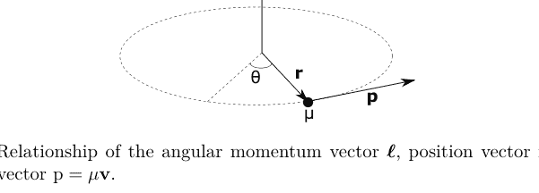

图 9.4：角动量向量 $\boldsymbol{\ell}$、位置向量 $\mathbf{r}$ 和线动量向量 $\mathbf{p} = \mu\mathbf{v}$ 之间的关系。

由于运动被限制在一个平面内，我们可以在极坐标中计算角动量的大小。回顾在极坐标中 $\dot{\mathbf{r}} = \dot{r}\hat{\mathbf{r}} + r\dot{\theta}\hat{\boldsymbol{\theta}}$，将其代入 (9.2.15) 式，我们得到：

### 二体问题的角动量大小

$$\ell = \mu r^2 \dot{\theta}$$ (9.2.16)

我们也可以使用 $E = T + V$ 来计算二体系统的总能量，

$$E = \frac{1}{2}\mu (\dot{r}^2 + r^2\dot{\theta}^2) + V(r)$$ (9.2.17)
$$= \frac{1}{2}\mu\dot{r}^2 + \frac{1}{2}\mu r^2 \left(\frac{\ell}{\mu r^2}\right)^2 + V(r)$$ (9.2.18)

这可以简化为

### 二体系统的总能量

$$E = \frac{\ell^2}{2\mu r^2} + \frac{1}{2}\mu \left(\frac{dr}{dt}\right)^2 + V(r)$$ (9.2.19)

同样，这个方程以及之前所有方程的物理诠释是：二体系统可以被一个位于距离原点（即力心和系统质心）$r = |\mathbf{r}_1 - \mathbf{r}_2|$ 处、并以速度 $\mathbf{v} = \dot{\mathbf{r}} = \dot{\mathbf{r}}_1 - \dot{\mathbf{r}}_2$ 运动的单个约化质量 $\mu$ 所替代。这在图 9.3b 中有示意性展示。

虽然约化质量是进行上述计算的有用工具，但我们真正想要的是能够计算 $m_1$ 和 $m_2$ 的运动。在下一节中，我们将推导二体问题的运动方程。

## 9.3 二体问题的运动方程

在寻找运动方程时，我们通常希望找到粒子位置作为时间的函数。原则上，这可以通过求解 (9.2.19) 式得到 $\dot{r}$ 来实现：

$$\dot{r} = \frac{dr}{dt} = \pm \sqrt{\frac{2}{\mu} (E - V(r)) - \frac{\ell^2}{\mu^2 r^2}}$$ (9.3.1)

一旦我们指定了 $V(r)$，原则上就可以对上式积分得到 $t(r)$，然后反解得到 $r(t)$。然而，$r(\theta)$ 将是一个更有用的运动方程，因为它会给出我们所观察到的运动的数学公式。我们可以进行代换，

$$\frac{dr}{dt} = \frac{dr}{d\theta} \frac{d\theta}{dt} = \frac{dr}{d\theta} \frac{\ell^2}{2\mu r^2}$$ (9.3.2)

代入 (9.3.1) 式并积分得到

$$\theta(r) = \pm \int \frac{\ell dr}{r^2 \sqrt{2\mu \left(E - V(r) - \frac{\ell^2}{r^2}\right)}}$$ (9.3.3)

原则上，在指定 $V(r)$ 后，我们可以执行积分以获得 $\theta(r)$ 的数学形式，然后反解得到 $r(\theta)$。然而，一般来说，(9.3.3) 式中的积分很难计算，反解也不容易。

在我们给出解析解之前，我们先演示二体问题的*数值*解。计算机可以提供获得数值解的手段，在这种情况下，直接使用牛顿第二定律通常更容易。在下一个例子中，我们将展示如何通过数值求解牛顿第二定律来获得二体系统中物体轨道的数值解。

**例 9.1：二体引力系统中的轨道**

使用牛顿万有引力定律来表示两个质量 $m_1$ 和 $m_2$ 之间的相互作用力，对牛顿第二定律进行积分，以获得质量分别为 $m_1 = 1$、$m_2 = 2$（任意单位）的双星系统的轨道。为了简化数值结果的呈现，使用 $G = 1$ 的任意单位。在 $t = 0$ 时，约化质量位于 $x = 1$、$y = 0$ 处，其速度的 $x$ 分量为 $vx = 0$，$y$ 分量为 $vy = 1$。

**解：**

如本节所讨论的，两个质量的牛顿第二定律变成了关于约化质量的一个方程：

$$\mu \ddot{\mathbf{r}} = -\frac{Gm_1m_2}{r^2} \hat{\mathbf{r}}$$

其中我们使用了牛顿万有引力定律作为中心力。现在我们需要用笛卡尔坐标重写上述公式。单位向量在笛卡尔坐标 $(x, y)$ 中由下式给出：

$$\hat{\mathbf{r}} = \frac{\mathbf{r}}{r} = \frac{x\hat{\mathbf{i}} + y\hat{\mathbf{j}}}{\sqrt{x^2 + y^2}}$$

结合前两个方程并使用 $r^2 = x^2 + y^2$，

$$\mu \frac{d^2\mathbf{r}}{dt^2} = -\frac{Gm_1m_2}{x^2 + y^2} \frac{x\hat{\mathbf{i}} + y\hat{\mathbf{j}}}{\sqrt{x^2 + y^2}} = -\frac{Gm_1m_2}{(x^2 + y^2)^{3/2}} (x\hat{\mathbf{i}} + y\hat{\mathbf{j}})$$

使用 $\mu = m_1m_2 / (m_1 + m_2)$，我们得到以下两个耦合的微分方程：

$$\frac{d^2x}{dt^2} = -\frac{G(m_1 + m_2)}{(x^2 + y^2)^{3/2}} x \quad \frac{d^2y}{dt^2} = -\frac{G(m_1 + m_2)}{(x^2 + y^2)^{3/2}} y \tag{9.3.4}$$

一旦我们知道约化质量 $\mu$ 的运动解 $\mathbf{r}(t)$，我们就可以通过它们与 $\mathbf{r}(t)$ 的关系来绘制两个质量 $\mathbf{r}_1$ 和 $\mathbf{r}_2$ 的位置：

$$\mathbf{r}_1 = \left( \frac{m_2}{m_1 + m_2} \right) \mathbf{r} \tag{9.3.5}$$

$$\mathbf{r}_2 = -\left( \frac{m_1}{m_1 + m_2} \right) \mathbf{r} \tag{9.3.6}$$

位置可以通过将 $\mathbf{r}$ 乘以因子 $m_1/(m_1 + m_2)$ 和 $-m_2/(m_1 + m_2)$ 来分别计算 $\mathbf{r}_1$ 和 $\mathbf{r}_2$，这使用了 (9.2.10) 和 (9.2.11) 式。

### Python 代码

在这个例子中，向量 Y 的第一个分量 Y[:,0] 代表变量 x(t)，第二个分量 Y[:,1] 代表相应的速度 ẋ(t) = dx₁/dt。类似地，Y 的第三个分量 Y[:,2] 代表变量 y(t)，第四个分量 Y[:,3] 代表相应的速度 dy/dt。在图 9.5a 中，我们看到约化质量 $\mu$ 沿椭圆轨道运动。

我们还在图 9.5b 中绘制了两个质量的位置。位置可以通过将 r 乘以因子 m₁/(m₁ + m₂) 和 -m₂/(m₁ + m₂) 来分别计算 r₁ 和 r₂。注意，每个质量都围绕质心沿椭圆路径运动，质心位于每个椭圆的一个焦点上。

由于向量 r₁、r₂ 和 r 共线，连接两个质量在任意时刻位置的直线都通过原点。我们还绘制了在 t=1 s 时连接两个质量 m₁ 和 m₂ 的直线。

```python
from scipy.integrate import odeint
import numpy as np
import matplotlib.pyplot as plt

# 函数定义微分方程
# Y[0]=x, Y[1]=x', Y[2]=y, Y[3]=y'
def deriv(Y,t):
    return np.array([ Y[1], -(m1+m2)*
    Y[0]/((Y[0]**2+Y[2]**2)**(3/2)),
                     Y[3], -(m1+m2)*
    Y[2]/((Y[0]**2+Y[2]**2)**(3/2))])

t = np.linspace(0,6,600)  # t= 要评估的时间数组
m1, m2 = 1, 2             # 质量

# yinit = 初始条件 [x(0), x'(0), y(0), y'(0)
yinit = np.array([1, 0, 0, 1])
Y = odeint(deriv, yinit, t)   # 使用odeint求解微分方程

plt.subplot(2,1,1) # 绘制约化质量的运动
plt.plot(Y[:,0],Y[:,2],label="约化质量的运动")
plt.xlim(-.25,1.1);
plt.ylim(-.5,.5);
plt.plot(np.linspace(-.25,1.1,100),[0]*100)  # 绘制x轴
plt.plot([0]*100,np.linspace(-.5,.5,100))  # 绘制y轴
plt.title("(a) 约化质量的运动")

plt.subplot(2,1,2) # 绘制m1, m2的轨道
plt.plot(-(m2/(m1+m2))*Y[:,0],-(m2/(m1+m2))*Y[:,2])
plt.plot((m1/(m1+m2))*Y[:,0],(m1/(m1+m2))*Y[:,2],'r--')
plt.title("(b) m1, m2的轨道")
plt.xlim(-.7,.4);
plt.ylim(-.33,.33);
plt.plot(np.linspace(-.7,.4,100),[0]*100)  # 绘制x轴
plt.plot([0]*100,np.linspace(-.33,.33,100))  # 绘制y轴
```

```python
# 绘制在t=1 s时连接m1和m2的直线
x1, y1 = np.array([[-(m2/(m1+m2))*Y[:,0][100],
(m1/(m1+m2))*Y[:,0][100]],
[-(m2/(m1+m2))*Y[:,2][100],(m1/(m1+m2))*Y[:,2][100]]])
for i in range(0, len(x1), 2):
    plt.plot(x1[i:i+2], y1[i:i+2], 'ro-')
plt.tight_layout()
plt.show()
```

### Mathematica 代码

命令 NDSolve 用于求解微分方程组 (9.3.4)，而 Table 命令用于构建从 t = 0 到 t = 10、时间步长为 dt = 0.01 的位置坐标对 r = (x, y) 的列表。坐标对存储在变量 xyList 中。最后，使用 ListPlot 命令生成两个质量轨道的图形。

位置 r1 和 r2 可以很容易地从 r 计算出来，只需将列表 xyList 乘以因子 m1/(m1 + m2) 和 -m2/(m1 + m2) 即可分别得到 r1 和 r2。

```mathematica
m1 = 1; m2 = 2; x0 = 1; y0 = 0; vx0 = 0; vy0 = 1;

sol = NDSolve[{x''[t] == -(m1 + m2) * x[t]/((x[t]^2 + y[t]^2)^(3/2)),
y''[t] == -(m1 + m2) * y[t]/((x[t]^2 + y[t]^2)^(3/2)), x[0] == x0, y[0] == y0,
x'[0] == vx0, y'[0] == vy0}, {x, y}, {t, 0, 10}];

x1 = x/.sol[[1]];
y1 = y/.sol[[1]];

xyList = Table[{x1[t], y1[t]}, {t, 0, 10, .01}];

gr1 = Show[ListPlot[xyList], Graphics[Disk[{0, 0}, .02]], BaseStyle->FontSize->15,
PlotLabel->"约化质量的轨道"];

gr2 = ListPlot[{-m2/(m1 + m2) * xyList, m1/(m1 + m2) * xyList},
BaseStyle->FontSize->15, PlotLabel->"m1,m2的轨道"];

GraphicsGrid[{{gr1, gr2}}]
```

尽管数值解非常有用，但在可能的情况下获得解析解也至关重要。接下来，我们推导一个通用方程，它为计算两体问题中约化质量的*轨道*提供了另一种方法。如果已知*轨道*的数学形式，该方程也可用于求解作用于约化质量的中心力的数学形式。为了得到中心力，我们需要在极坐标中使用牛顿第二定律。这里 $r$ 和 $\theta$ 是通常的位置和角度极坐标。极坐标中的加速度由下式给出：

$$\frac{d\mathbf{v}}{dt} = [\ddot{r} - r\dot{\theta}^2] \hat{\mathbf{r}} + [r\ddot{\theta} + 2\dot{r}\dot{\theta}] \hat{\boldsymbol{\theta}} \quad (9.3.7)$$

对于约化质量 $\mu$，牛顿第二定律变为：

$$\mu [\ddot{r} - r\dot{\theta}^2] \hat{\mathbf{r}} + \mu [r\ddot{\theta} + 2\dot{r}\dot{\theta}] \hat{\boldsymbol{\theta}} = -f(r)\hat{\mathbf{r}} \quad (9.3.8)$$

其中我们使用了两体系统的约化质量。
通过令该方程两边的*径向*分量相等，以及*角向*分量相等，我们得到：

$$\mu [\ddot{r} - r\dot{\theta}^2] = f(r) \quad (9.3.9)$$
$$r\ddot{\theta} + 2\dot{r}\dot{\theta} = 0 \quad (9.3.10)$$

方程 (9.3.10) 也可以写成：

$$\mu r(r\ddot{\theta} + 2\dot{r}\dot{\theta}) = \frac{d}{dt} [\mu r^2 \dot{\theta}] = \frac{d\ell}{dt} = 0 \quad (9.3.11)$$

这是表明角动量 $\ell$ 的大小为常数的另一种方式。径向方程 (9.3.9) 可以通过代换求解：

$$r = \frac{1}{u} \quad (9.3.12)$$

计算时间导数 $dr/dt$ 和 $d^2r/dt^2$：

$$\dot{r} = -\frac{1}{u^2}\dot{u} = -\frac{1}{u^2}\dot{\theta}\frac{du}{d\theta} = -\frac{\ell}{\mu}\frac{du}{d\theta} \quad (9.3.13)$$

$$\ddot{r} = -\frac{\ell}{\mu}\frac{d}{dt}\frac{du}{d\theta} = -\frac{\ell}{\mu}\frac{d\theta}{dt}\frac{d}{d\theta}\frac{du}{d\theta} = -\frac{\ell}{\mu}\dot{\theta}\frac{d^2u}{d\theta^2} = -\frac{\ell^2 u^2}{\mu^2}\frac{d^2u}{d\theta^2} \quad (9.3.14)$$

其中我们使用了 $\dot{\theta} = \ell u^2/\mu$ 和链式法则。将这些导数 $dr/dt$ 和 $d^2r/dt^2$ 代入径向方程 (9.3.9)，我们得到：

$$\mu \left[ -\frac{\ell^2 u^2}{\mu^2}\frac{d^2u}{d\theta^2} - \frac{1}{u}\left(\frac{\ell^2 u^4}{\mu^2}\right) \right] = f(u^{-1}) \quad (9.3.15)$$

或

$$\frac{d^2u}{d\theta^2} + u = -\frac{\mu}{\ell^2 u^2}f(u^{-1}) \quad (9.3.16)$$

最后，通过代入 $u = 1/r$，这个方程可以用 $r$ 来表示：

> **用 $r(\theta)$ 和 $f(r)$ 表示的两体运动方程**

$$\frac{d^2}{d\theta^2}\left(\frac{1}{r}\right) + \frac{1}{r} = -\frac{\mu r^2}{\ell^2}f(r) \quad (9.3.17)$$

当我们已知轨道形式为 $r(\theta)$，并想计算产生该轨道的中心力 $f(r)$ 时，这个方程很有用。在接下来的两个例子中，我们使用 (9.3.17) 来计算给定两体系统轨道 $r(\theta)$ 的中心力 $f(r)$ 和总能量 $E$。

> **例 9.2：已知轨道时求中心力**
质量 $m$ 在中心力场内运动的轨道 $r(\theta)$ 由下式给出：

$$r(\theta) = k\theta$$

(a) 分别用解析方法和计算机代数系统（CAS）求产生此轨道的中心力 $f(r)$。
(b) 在初始条件 $\theta(0) = 0$ 下，求轨道 $\theta(t)$。

**解：**
(a) 我们使用 (9.3.17) 来计算力：

$$f(r) = -\frac{\ell^2}{\mu r^2}\left[\frac{d^2}{d\theta^2}\left(\frac{1}{r}\right) + \frac{1}{r}\right]$$

我们现在有

$$\frac{d^2}{d\theta^2}\left(\frac{1}{r}\right) = \frac{d^2}{d\theta^2}\left(\frac{1}{k\theta}\right) = \frac{2}{k\theta^3} = \frac{2k^2}{r^3}$$

上面的 $f(r)$ 方程给出：

$$f(r) = -\frac{\ell^2}{\mu r^2}\left[\frac{2k^2}{r^3} + \frac{1}{r}\right] = -\frac{\ell^2}{\mu}\left[\frac{2k^2}{r^5} + \frac{1}{r^3}\right]$$

因此，该系统中的中心力是 $1/r^5$ 和 $1/r^3$ 两项的线性组合。

(b) 我们可以利用角动量守恒来求轨道 $\theta(t)$：

$$\mu r^2 \dot{\theta} = \mu r^2 \frac{d\theta}{dt} = \ell$$

并代入 $r = k\theta$：

$$\mu k^2 \theta^2 \frac{d\theta}{dt} = \frac{\mu k^2}{3} \frac{d(\theta^3)}{dt} = \ell$$

这可以积分得到：

$$\theta^3(t) = \frac{3t\ell}{\mu k^2} + \theta^3(0)$$

利用初始条件 $\theta(0) = 0$ 得到轨道 $\theta(t)$，或等价地得到轨道 $r(t) = k\theta(t)$：

$$\theta(t) = \sqrt[3]{\frac{3t\ell}{\mu k^2}} \quad r(t) = k\sqrt[3]{\frac{3t\ell}{\mu k^2}}$$

### Python 代码

我们使用 `diff` 来获取 $u = 1/r$ 的二阶导数，并使用 SymPy 中的 `dsolve` 来符号求解关于 $\theta(t)$ 的微分方程。代码的输出与上面获得的解析解一致。

```python
from sympy import symbols,dsolve, Function, diff

print('-'*28,'CODE OUTPUT','-'*29,'\n')
r, k, theta, L, mu, t =symbols('r,k,theta,L,mu,t',real=True)

# Part (a) : find force F(r)
rr = k*theta

force = -L**2/(mu*rr**2)*(diff(1/rr,theta,theta)+1/rr)

print('The force F(r) = ',force.expand().subs({theta:r/k}))

# Part (b) : we use symbol theta2 instead of theta
# in the ODE, since theta was defined as a symbol in part (a)

theta2 = Function('theta2')

ic = {theta2(0):0}

soln = dsolve(mu*k**2*theta2(t)**2*diff(theta2(t),t)-L,
              theta2(t),ics=ic)[0]

print('\nThe solution theta(t) = ',soln.rhs)

----------------------------- CODE OUTPUT -----------------------------
The force F(r) =  -2*L**2*k**2/(mu*r**5) - L**2/(mu*r**3)

The solution theta(t) =  3**(1/3)*(L*t/(k**2*mu))**(1/3)
```

### Mathematica 代码

我们使用 `D` 来获取 $u = 1/r$ 的二阶导数，并使用 `DSolve` 来符号求解关于 $\theta(t)$ 的微分方程。注意，我们必须选择微分方程的正解。

```mathematica
rr = k * θ;

force = -(l^2/(μ * rr^2) * (D[1/rr, {θ, 2}] + 1/rr));

Print["The force is: F(r) = ", force/.{θ->r/k}//FullSimplify];

The force is: F(r) = -\frac{l^2(2k^2+r^2)}{r^5\mu}

soln = DSolve[{θ'[t]==l/(μ * k^2 * θ[t]^2), θ[0]==0}, θ[t], t][[2]][[1]];

Print["The positive solution of the ODE is: "];

Print[" θ[t] = ", θ[t]/.soln];

Print["or"];

Print["θ[t]^3 = ", (θ[t]/.soln)^3]

The positive solution of the ODE is:
\theta[t] = \frac{3^{1/3} l^{1/3} t^{1/3}}{k^{2/3} \mu^{1/3}}
or
\theta[t]^3 = \frac{3lt}{k^2\mu}
```

### 例 9.3：已知轨道时求总能量

求例 9.2 中质量 $\mu$ 的轨道 $r(\theta)$ 的总能量 $E$。

**解：**
我们利用上一个例子中的力 $f(r)$ 表达式来求势能 $V(r) = -\int f(r) dr$：
$$V(r) = -\int f(r) dr = -\int \left[ \frac{\ell^2}{\mu} \left[ -\frac{2k^2}{r^5} + \frac{1}{r^3} \right] \right] dr = -\frac{\ell^2}{2\mu} \left[ \frac{k^2}{r^4} + \frac{1}{r^2} \right]$$
动能 $T$ 由下式给出：
$$T = \frac{\ell^2}{2\mu r^2} + \frac{1}{2}\mu \left( \frac{dr}{dt} \right)^2$$
我们可以使用链式法则、轨道方程 $r = k\theta$ 和角动量守恒 $\ell = \mu r^2 \dot{\theta}$ 来计算 $dr/dt$：
$$\frac{dr}{dt} = \frac{dr}{d\theta} \frac{d\theta}{dt} = \frac{d(k\theta)}{d\theta} \frac{d\theta}{dt} = k\dot{\theta} = k \frac{\ell}{\mu r^2}$$
最后，总能量为：
$$E = T + V = \frac{\ell^2}{2\mu r^2} + \frac{1}{2}\mu \left( \frac{dr}{dt} \right)^2 + V(r)$$
$$E = \frac{\ell^2}{2\mu r^2} + \frac{1}{2}\mu \left( k \frac{\ell}{\mu r^2} \right)^2 - \frac{\ell^2}{2\mu} \left[ \frac{k^2}{r^4} + \frac{1}{r^2} \right] = 0$$
正如本章后面将要讨论的，$E = 0$ 的值对应于两体系统中约化质量 $\mu$ 的抛物线运动。

## 9.4 行星运动与开普勒第一定律

在本节中，我们求解经历平方反比力的约化质量 $\mu$ 的运动方程：

$$\mathbf{F}(r) = -\frac{k}{r^2} \hat{\mathbf{r}} \qquad (9.4.1)$$

例如牛顿万有引力定律，其中 $k = Gm_1m_2$，或库仑力，其中 $k = -q_1q_2 / (4\pi\epsilon_0)$。在这种情况下，我们可以将 $f(r) = -k/r^2$ 代入 (9.3.17) 得到

$$u'' + u = \frac{\mu k}{\ell^2} \qquad (9.4.2)$$

其中我们使用了 $u = 1/r$，撇号表示对 $\theta$ 的微分。我们将求解 (9.4.2) 得到 $u(\theta)$，然后求 $r(\theta)$。我们从代换 $w(\theta) = u(\theta) - \mu k/\ell^2$ 开始，那么 (9.4.2) 变为：

$$w'' = -w \qquad (9.4.3)$$

注意，结果是一个关于 $w$ 的简谐振子方程，其固有频率 $\omega_0 = 1$。解为

$$w = A \cos \theta + B \sin \theta \qquad (9.4.4)$$

通过仔细选择坐标，我们可以设 $B = 0$。让我们选择 $\theta = 0$ 作为 $\mu$ 在最接近力中心（即质心）时的角位置，此时距离为 $r_{\text{min}}$。在这一点，$\dot{r} = 0$（因为这是轨道中的一个转折点），并且根据 (9.3.13)，$u' = 0$。因此，我们为 $u$ 设定的初始条件是 $u'(\theta = 0) = 0$。因为 $w' = u'$，所以也有 $w'(\theta = 0) = 0$，这个条件导致 $B = 0$。因此我们有，

$$u = A \cos \theta + \frac{\mu k}{\ell^2} \qquad (9.4.5)$$

我们现在引入一个新常数 $e = \ell^2 A / (\mu k)$，并设 $\alpha = \ell^2 / (\mu k)$，得到：

$$\frac{1}{r} = \frac{1}{\alpha} (1 + e \cos \theta) \qquad (9.4.6)$$
$$r = \frac{\alpha}{1 + e \cos \theta} \qquad (9.4.7)$$

正如我们在第 4 章所示，这是极坐标中一个焦点位于原点的圆锥曲线方程。无量纲变量 $e$ 是圆锥曲线的*离心率*，距离 $\alpha$ 是*半通径*。本章后面我们将更详细地讨论极坐标中的圆锥曲线方程。

在研究行星运动时，约翰内斯·开普勒（1571-1630）提出了行星运动三定律。开普勒第一定律指出，行星沿椭圆轨道运行，太阳位于椭圆的一个焦点上。当然，椭圆是圆锥曲线的一个例子。然而，从牛顿第二定律出发，我们得到了一个更普遍的结果。我们发现约化质量的运动形式是圆锥曲线：圆、椭圆、抛物线或双曲线。什么条件决定了约化质量遵循哪种圆锥曲线？在下一节中，我们将开始回答这个问题。

然而，在我们继续之前，(9.4.6) 中仍有一部分不尽如人意，即离心率 $e$ 是用积分常数 $A$ 表示的。如果能像方程 $\alpha = \ell^2 / (\mu k)$ 那样，用物理参数来重写离心率 $e$ 会更好。我们从选择坐标开始，其中在 $r = r_{\text{min}}$ 时 $\dot{r} = 0$，且 $r_{\text{min}}$ 出现在 $\theta = 0$ 处，因此 (9.4.6) 给出

## 9.4 二体系统的运动方程

$r_{\min} = \frac{\alpha}{1+e}$ (9.4.8)

在 $r_{\min}$ 处的总能量为：

$E = \frac{\ell^2}{2\mu r_{\min}^2} - \frac{k}{r_{\min}}$ (9.4.9)

将 (9.4.8) 代入 (9.4.9)，并求解关于偏心率 $e$ 的二次方程，我们得到：

$e = \sqrt{1 + \frac{2E\ell^2}{\mu k^2}}$ (9.4.10)

总之，二体系统中约化质量的运动轨迹是一个圆锥曲线，其中一个焦点位于原点。用偏心率 $e$ 和半通径 $\alpha$ 表示，极坐标下的圆锥曲线方程 $r(\theta)$ 为：

> **用 $e$ 和 $\alpha$ 表示的二体运动方程**

$r = \frac{\alpha}{1+e\cos\theta}$ (9.4.11)

$e = \sqrt{1 + \frac{2E\ell^2}{\mu k^2}}$ (9.4.12)

$\alpha = \frac{\ell^2}{\mu k}$ (9.4.13)

注意，(9.4.11) 中的圆锥曲线完全由两个参数 $e, \alpha$ 描述。当我们知道系统中的两个守恒*物理*量，即总能量 $E$ 和守恒角动量 $\ell$ 时，这两个*几何*参数可以通过 (9.4.12) 和 (9.4.13) 计算得出。或者，圆锥曲线也可以完全由物理量 $E, \ell$ 描述。

## 9.5 中心力场中的轨道

在本节中，我们研究一个具有约化质量 $\mu$ 的粒子在中心力场 $\mathbf{F}(\mathbf{r}) = -k/r^2 \hat{\mathbf{r}}$ 中运动的轨道确定问题。我们已经知道轨道是圆锥曲线。然而，我们想知道，例如，在什么条件下粒子的轨道是椭圆，而不是抛物线？

我们从总能量方程开始考虑：

$E = T + V = \frac{1}{2}\mu\dot{r}^2 + \frac{\ell^2}{2\mu r^2} + V(r)$ (9.5.1)

其中我们回到了通用的势能 $V(r)$。注意，对于平方反比定律，$V = -k/r$。(9.5.1) 中的第一项可以解释为动能项，因为它具有二分之一乘以质量乘以径向速度平方的形式。将后两项视为势能是很方便的。

$$V_C \equiv \frac{l^2}{2\mu r^2} = \frac{1}{2}\mu r^2 \dot{\theta}^2 \qquad (9.5.2)$$

可以解释为一种称为*离心势能* $V_C$ 的能量形式，相应的力将是*离心力* $F_C$：

$$F_C = -\frac{\partial V_C}{\partial r} = \frac{l^2}{\mu r^3} \qquad (9.5.3)$$

注意 $\mathbf{F}_C = F_C \hat{\mathbf{r}}$ 从质心（二体问题的力心）径向向外指向。然后我们可以将*有效势能* $V_{\text{eff}}(r)$ 写为两项之和，即离心势 $V_C$ 和与中心力对应的势能 $V(r)$。

> **中心力场中的有效势**

$$V_{\text{eff}}(r) = \frac{l^2}{2\mu r^2} + V(r) = V_C + V(r) \qquad (9.5.4)$$

图 9.6 显示了有效势 $V_{\text{eff}}(r)$ 作为距离 $r$ 的函数的图像，其中吸引势 $V = -k_1/r$，$k_1 = 2.5$（SI 单位）。该图中的虚线表示排斥的正离心势 $V_C = 1/r^2$ 和吸引势 $V = -k_1/r$。图中的粗实线显示了这两个势的和，它代表了有效势 $V_{\text{eff}}(r)$。当距离 $r \to 0$ 时，有效势趋于无穷大，而当 $r \to \infty$ 时，有效势趋于零。图中的水平线表示约化质量的两个可能能量，$E_0 = -1.55$ J 和 $E_1 = 1.3$ J。注意，这些能量值仅为说明目的而任意选择。

我们可以使用第 5 章的方法来定性描述约化质量 $\mu$ 随其总能量 $E$ 的运动。回想一下，我们可以将约化质量视为一个沿着 $V_{\text{eff}}$ 图形形状构成的轨道滚动的粒子。当 $E = E_0$ 时，粒子固定在 $V_{\text{min}}$ 处。这意味着 $r$ 的值不会改变。结果是约化质量具有半径为 $r = r_0$ 的圆形轨道。当 $E = E_1 < 0$（或更一般地，对于 $E_0 < E < 0$），粒子在 $r = r_1$ 和 $r = r_2$ 之间来回滚动。我们从第 5 章知道，这种“来回滚动”意味着振荡运动。约化质量离力心最近不超过 $r = r_1$，最远不超过 $r = r_2$。因此，产生的运动是一个椭圆，其中 $r_{\text{min}} = r_1$，$r_{\text{max}} = r_2$。注意，我们使用 $r_{\text{min}}$ 和 $r_{\text{max}}$ 分别表示约化质量与力心之间的最近和最远距离。通常，我们可以从图 9.6 看出，当 $E < 0$ 时，约化质量的运动被束缚在周期性轨道上。

此外，从图 9.6 我们可以看出，当 $E \ge 0$ 时，运动是无界的。约化质量从无穷远处进入，并尽可能靠近力心，距离为 $r_3$，该值未在图 9.6 中显示。然而，可以通过求解 $E = V_{\text{eff}}(r_3)$ 来找到 $r_3$，其中 $E$ 是约化质量的能量。该解可以通过解析或数值方法找到。无界轨道是抛物线或双曲线，具体取决于 $E$ 的值。

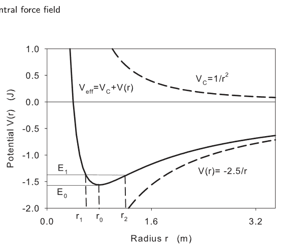

到目前为止，在本节中，我们已经了解到约化质量的能量决定了其轨道的性质。现在我们对 $\mu$ 的轨道有了定性的理解，我们可以利用圆锥曲线的知识来确定每种轨道发生的条件。我们知道圆锥曲线具有特定的偏心率，例如，圆的 $e = 0$。使用偏心率方程 (9.4.10)，我们现在可以确定每种类型轨道的能量。它们总结在表 9.1 中，示例如图 9.7 所示。

### 表 9.1
与每种轨道类型相关的能量和偏心率。

| 偏心率 $e$ | 能量 $E$ | 轨道形状 |
| :--- | :--- | :--- |
| $e = 0$ | $E = V_{\text{eff,min}}$ | 圆 |
| $0 < e < 1$ | $V_{\text{eff,min}} < E < 0$ | 椭圆 |
| $e = 1$ | $E = 0$ | 抛物线 |
| $e > 1$ | $E > 0$ | 双曲线 |

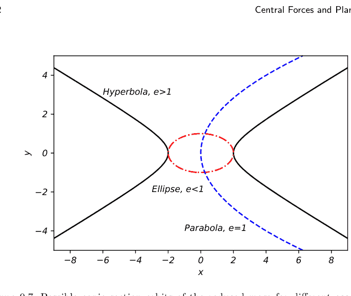

图 9.7：不同偏心率 e 下约化质量的可能圆锥曲线轨道：椭圆 (e < 1)、抛物线 (e = 1) 和双曲线 (e > 1)。本例中的轨道以坐标系原点为中心。

## 9.6 开普勒行星运动定律

为了结束我们对二体问题的研究，我们详细考察开普勒行星运动定律。

### 9.6.1 开普勒第一定律

如前所述，开普勒第一定律指出行星以椭圆轨道绕太阳运行，太阳位于一个焦点上。我们已经发现一般运动是圆锥曲线；然而，由于椭圆在行星和卫星运动中的重要性，本节我们将重点关注椭圆。

让我们通过回顾在 (9.4.11)-(9.4.13) 中找到的路径 r(θ) 来开始讨论：

$$r = \frac{\alpha}{1 + e \cos \theta} \quad \alpha = \frac{\ell^2}{\mu k} \quad e = \sqrt{1 + \frac{2E\ell^2}{\mu k^2}} \quad (9.6.1)$$

我们的坐标选择使得当 θ = 0 时 r = r_min，当 θ = π 时 r = r_max，如图 9.8 所示，其中力心位于焦点 F。从 (9.4.6) 我们可以很容易地证明，

$$r_{\text{min}} = \frac{\alpha}{1 + e} \quad \text{and} \quad r_{\text{max}} = \frac{\alpha}{1 - e} \quad (9.6.2)$$

在本节中，我们将假设约化质量是一颗绕太阳运行的行星。因此，我们将使用近日点作为行星离太阳最近距离 r_min 的术语，远日点作为行星离太阳最远距离 r_max 的术语。我们可以将椭圆的长轴 2a 定义为

$r_{\min} + r_{\max} = 2a$ (9.6.3)

量 $a$ 称为*半长轴*。

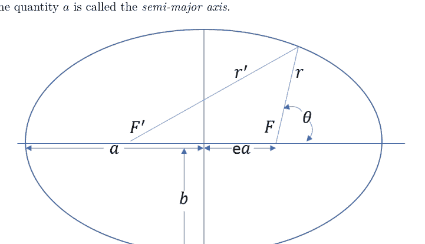

图 9.8：行星绕太阳的运动可以用一个椭圆来描述，太阳位于一个焦点 $F$ 上。第二个焦点 $F'$ 是空间中的一个（空）点。椭圆可以使用极坐标 $(r, \theta)$ 中的 (9.6.1) 来数学描述。

在 $\theta = 90^\circ$ 和 $\theta = 270^\circ$ 处，距离等于半通径距离 $r = \alpha$，如图 9.9 所示，并且取决于椭圆运动的半长轴 $a$ 和偏心率 $e$：

$\alpha = a(1 - e^2)$ (9.6.4)

*短轴* $2b$ 垂直于长轴 $2a$，并且 $(a, b)$ 都与轨道的能量有关：

$a = \frac{\alpha}{1 - e^2} = \frac{k}{2|E|}$ (9.6.5)

$b = \frac{\alpha}{\sqrt{1 - e^2}} = \frac{\ell}{\sqrt{2\mu|E|}}$ (9.6.6)

这里再次注意两个守恒量 $E, \ell$ 的存在。此外，我们可以将近日点和远日点距离重写为：

$r_{\min} = a(1 - e)$ 和 $r_{\max} = a(1 + e)$

偏心率 $e$ 也可以从 $r_{\min}$ 和 $r_{\max}$ 求得：

$e = \frac{r_{\max} - r_{\min}}{r_{\max} + r_{\min}}$ (9.6.7)

椭圆的面积为 $A = \pi ab$。在圆的特殊情况下，偏心率 $e = 0$，导致 $r_{\min} = r_{\max} = a = b$ 且 $A = \pi r^2$。

### 9.6.2 开普勒第二定律

回顾角动量矢量的大小为：

$$\ell = \mu r^2 \dot{\theta}$$

从这个大小，我们现在可以推导出开普勒第二定律。我们首先考虑行星轨道在时间 $dt$ 内扫过的一个小扇形区域，如图 9.12 所示。

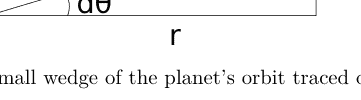

图 9.12：行星轨道在时间 $dt$ 内扫过的一个小扇形区域。

图 9.12 中所示的扇形区域形成了一个无穷小的三角形面积元 $dA$，在极坐标中可以写为：

$$dA = \frac{r^2}{2} d\theta$$

通过除以 $dt$ 并使用 (9.6.12)，我们得到开普勒第二定律：

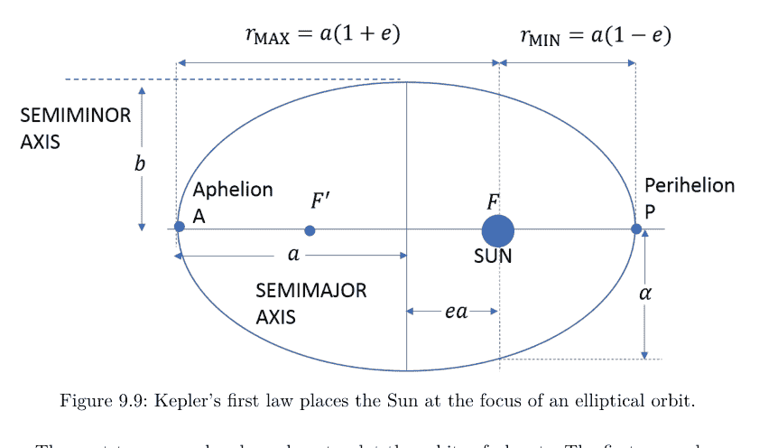

图 9.9：开普勒第一定律将太阳置于椭圆轨道的一个焦点上。

接下来的两个示例展示了如何绘制行星的轨道。第一个示例使用 (9.4.6) 和水星与地球的数据，而第二个示例使用牛顿第二定律的数值解。

### 示例 9.4：绘制地球和水星绕太阳的轨道

地球到太阳的距离范围从 1.475 亿公里（近日点）到约 1.526 亿公里（远日点），而水星的这些距离范围是从 4600 万公里到 7000 万公里。绘制水星和地球绕太阳的轨道。

**解：**
半长轴 $a$ 可以直接从近日点和远日点的距离 $r_{\min}$ 和 $r_{\max}$ 使用 (9.6.3) 求得，离心率 $e$ 可以使用 (9.6.7) 求得。一旦知道了几何属性 $a, e$，我们就知道了关于轨道的一切信息，并且可以使用椭圆轨道的通用方程 (9.4.6) 来绘制它们。

**Python 代码**
我们计算 $\alpha$ 和 $e$，并使用
$$r = \frac{\alpha}{1 + e \cos \theta}$$ (9.6.8)
其中 $x = r \cos \theta$, $y = r \sin \theta$ 来创建绘图。

```python
import numpy as np
import matplotlib.pyplot as plt
print('-'*28,'CODE OUTPUT','-'*29,'\n')

rminE = 147.5*10**9       # Earth data
rmaxE = 152.6*10**9

a = (rminE + rmaxE)/2
eEarth = (rmaxE - rminE)/(rminE + rmaxE)
print('The eccentricity of Earth is  e = ', round(eEarth,4))

alpha = a*(1 - eEarth**2)

theta = np.linspace(0,2*np.pi,100)
rE = alpha/(1 + eEarth*np.cos(theta))

plt.plot(rE*np.cos(theta),rE*np.sin(theta))

rminM = 46*10**9          # Mercury data
rmaxM = 70*10**9

aM = (rminM + rmaxM)/2
eMercury = (rmaxM - rminM)/(rminM + rmaxM)
print('The eccentricity of Mercury is  e = ', round(eMercury,4))

alphaM = aM*(1 - eMercury**2)
rM = alphaM/(1 + eMercury*np.cos(theta))

plt.plot(rM*np.cos(theta),rM*np.sin(theta))
plt.title('Orbits of Earth and Mercury around the Sun')
plt.xlabel('x [m]')
plt.ylabel('y [m]')
plt.show()

----------------------------- CODE OUTPUT -----------------------------
The eccentricity of Earth is  e =  0.017
The eccentricity of Mercury is  e =  0.2069
```

**Mathematica 代码**

我们使用 PolarPlot 命令来绘制两个轨道，并且还打印出两个行星的 $e$ 值。
注意地球几乎完全圆形的轨道（因为离心率 $e = 0.0167$ 接近于零），以及水星明显椭圆的轨道（因为 $e = 0.21$ 的值较大）。

```mathematica
rminE = 147.5 * 10^6 * 10^3;
rmaxE = 152.6 * 10^6 * 10^3;

a = (rminE + rmaxE)/2;
eEarth = (rmaxE - rminE)/(rminE + rmaxE)//N;
Print["The eccentricity of Earth is e = ", eEarth];

gr1 = PolarPlot[a * (1 - eEarth^2)/(1 + eEarth * Cos[θ]), {θ, 0, 2 * Pi},
Frame → True, FrameLabel → {"x, m", "y, m"},
PlotRange → {{-2 * 10^11, 2 * 10^11}, {-2 * 10^11, 2 * 10^11}}];

rminM = 46 * 10^6 * 10^3;
rmaxM = 70 * 10^6 * 10^3;

a = (rminM + rmaxM)/2;
eMercury = (rmaxM - rminM)/(rminM + rmaxM)//N;
Print["The eccentricity of Mercury is e = ", eMercury];

gr2 = PolarPlot[a * (1 - eMercury^2)/(1 + eMercury * Cos[θ]), {θ, 0, 2 * Pi},
Frame → True, PlotRange → {{-2 * 10^11, 2 * 10^11}, {-2 * 10^11, 2 * 10^11}}];

Show[{gr1, gr2}, BaseStyle → FontSize → 16]
```

The eccentricity of Earth is e = 0.0169943
The eccentricity of Mercury is e = 0.206897

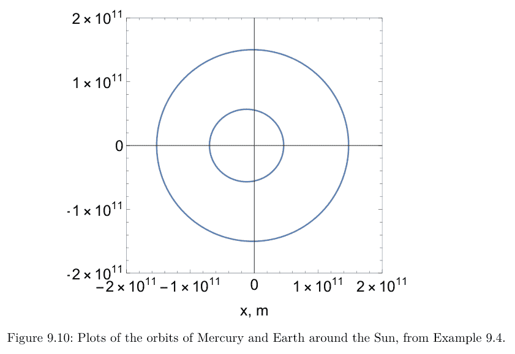

图 9.10：来自示例 9.4 的水星和地球绕太阳轨道的绘图。

### 示例 9.5：月球绕地球的轨道

月球绕地球的公转是一个非常复杂的过程，然而我们可以将地月双星系统近似为一个开普勒系统。计算
(a) 月球绕地球公转的周期 $T$。
(b) 月球轨道的离心率 $e$。
(c) 绘制月球绕地球的轨道。
使用以下数值：近地点距离 = $0.3633 \times 10^9$ m，远地点距离 = $0.4055 \times 10^9$ m，月球质量 = $0.07346 \times 10^{24}$ kg，地球质量 = $5.9724 \times 10^{24}$ kg，以及引力常数 $G = 6.673 \times 10^{-11}$ SI 单位。

**解：**

(a) 我们使用以下公式计算离心率
$$e = \frac{r_{\text{max}} - r_{\text{min}}}{r_{\text{max}} + r_{\text{min}}} = \frac{\text{apogee} + \text{perigee}}{\text{apogee} - \text{perigee}} = 0.0549 \quad (9.6.9)$$
这几乎是圆形轨道。半长轴由下式计算
$$a = (\text{perigee} + \text{apogee})/2$$

(b) 月球的公转周期由开普勒第三定律求得：
$$P^2 = \frac{4\pi^2 a^3}{G(m_1 + m_2)} \quad (9.6.10)$$
$$P = \sqrt{\frac{4\pi^2 a^3}{G(m_{\text{moon}} + m_{\text{earth}})}} = 27.29 \text{ days} \quad (9.6.11)$$

**Python 代码**

在计算了 $a$ 和离心率 $e$ 之后，我们使用极坐标表达式 $r = \alpha / (1 + e \cos \theta)$ 和坐标 $x = r \cos \theta, y = r \sin \theta$ 来绘制轨道，其中角度 $\theta$ 的范围是从 0 到 $2\pi$。

```python
import numpy as np
import matplotlib.pyplot as plt
print('-'*28,'CODE OUTPUT','-'*29,'\n')

# All quantities are in SI units
perigee = 0.3633*10**9;
apogee = 0.4055*10**9;
Mmoon = 0.07346*10**24;
Mearth = 5.9724*10**24;
G = 6.673*10**-11;

e = (apogee - perigee)/(apogee + perigee)
a = (perigee + apogee)/2;
Period = np.sqrt(4*np.pi**2*a**3/(G*(Mmoon + Mearth)));

print('\nThe semimajor axis a = ', a, 'm');
print("\nThe eccentricity of moon's orbit = ", round(e,4))
print('\nThe period of revolution T of moon = ', \n      round(Period/(3600*24),2), ' days')

theta = np.linspace(0,2*np.pi,100)
alpha = a*(1 - e**2)
r = alpha/(1 + e*np.cos(theta))

plt.plot(r*np.cos(theta),r*np.sin(theta))
plt.title("Orbit of Moon around the Earth")
plt.xlabel('x')
plt.ylabel('y')
plt.xlim(-4.2*10**8, 4.2*10**8);
plt.ylim(-4.2*10**8, 4.2*10**8);

# draw x-y-axes
plt.plot(np.linspace(-4.2*10**8,4.2*10**8,100),[0]*100)
plt.plot([0]*100,np.linspace(-4.2*10**8,4.2*10**8,100))
plt.show()

----------------------------------- CODE OUTPUT -----------------------------------

The semimajor axis a =  384400000.0 m

The eccentricity of moon's orbit =  0.0549

The period of revolution T of moon =  27.29  days
```

**Mathematica 代码**

代码与 Python 代码非常相似，我们使用 PolarPlot 命令来绘制月球的轨道。

```mathematica
Print["All quantities are in SI units"];

perigee = 0.3633 * 10^9;
apogee = 0.4055 * 10^9;
e = (apogee - perigee)/(apogee + perigee);
a = (perigee + apogee)/2;

Print["semi-major axis a = ", a];
Print["Eccentricity of Moon's orbit = ", e];
Mmoon = 0.07346 * 10^24;
Mearth = 5.9724 * 10^24;
G = 6.673 * 10^-11;

Period = Sqrt[4 * Pi^2 * a^3/(G * (Mmoon + Mearth))];
Print["The Revolution period T of Moon = ", Period/(3600 * 24),
 " days"];

All quantities are in SI units
semimajor axis a = 3.844 × 10^8
Eccentricity of moon's orbit = 0.0548907
The Revolution period T of moon = 27.2867 days

α = a * (1 - e^2);
r = α/(1 + e * Cos[θ]);
PolarPlot[r, {θ, 0, 2 * Pi}, FrameLabel->{"x [m]", "y [m]"},
Frame->True, BaseStyle->{FontSize->16},
PlotLabel->"Moon's orbit",
PlotRange->{{-4.2 * 10^8, 4.2 * 10^8}, {-4.2 * 10^8, 4.2 * 10^8}}]
```

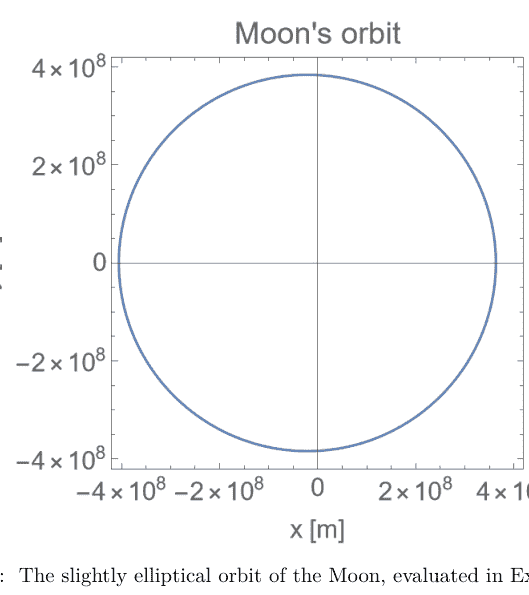

图 9.11：在示例 9.5 中计算的月球略微椭圆的轨道。

### 开普勒第二定律

$$\frac{dA}{dt} = \frac{r^2}{2} \frac{d\theta}{dt} = \frac{\ell}{2\mu} = \text{constant} \quad (9.6.14)$$

请注意，开普勒第二定律对*任何*中心力都成立。方程 (9.6.14) 是开普勒第二定律的数学形式，它表明连接行星与太阳的线段在相等的时间间隔内扫过相等的面积。这在图 9.13 中得到了说明。开普勒第二定律的结果是，行星在接近近日点时速度增加，在接近远日点时速度减小。

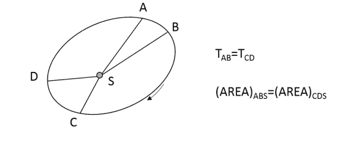

图 9.13：开普勒第二定律：连接行星与太阳 (S) 的线段在相等的时间内扫过相等的面积。如果行星行进距离 AB 所需的时间 $T_{AB}$ 等于行进距离 CD 所需的时间 $T_{CD}$，那么扫过的面积 $AREA_{ABS}$ 必须等于相应的面积 $AREA_{CDS}$。

示例 9.6 展示了如何计算地球绕太阳运行时的角动量，以及如何估算地球的轨道速度。

> **示例 9.6：地球绕太阳的轨道角动量**

地球在近日点的速度为 30,300 米/秒，其与太阳的距离范围从 1.473 亿公里（在近日点）到约 1.526 亿公里（在远日点）。计算：
(a) 地球绕太阳的轨道角动量。
(b) 地球在远日点的轨道速度。
(c) 地球在其椭圆轨道的通径点 $\alpha$ 处的速度。

**解答：**
(a) 当地球处于其轨道的远日点（或近日点）时，速度矢量 $\mathbf{v} = d\mathbf{r}/dt$ 与位置矢量 $\mathbf{r}$ 垂直，因此速度的径向分量为零 ($dr/dt = 0$)；因此，角动量的大小可由下式求得：

$$|\ell| = \left| m \left( \mathbf{r} \times \frac{d\mathbf{r}}{dt} \right) \right| = m |\mathbf{r}| \left| \frac{d\mathbf{r}}{dt} \right| \sin 90^\circ = mrv$$

其中 $v$ 表示在这两点处的轨道速度大小，$m = 5.97 \times 10^{24}$ kg 是地球的质量。利用给定的近日点速度和给定的日地距离，我们可以求出角动量的大小（SI 单位）：

$$ \ell = | \ell | = m r_{\text{peri}} v_{\text{peri}} = (5.97 \times 10^{24} \text{ kg}) (3.03 \times 10^4 \text{ m/s}) (147.3 \times 10^9 \text{ m}) $$
$$ = 2.66 \times 10^{40} \text{ kg m}^2/\text{s} $$

(b) 由于角动量的大小守恒，我们有：

$$ \ell = m r_{\text{peri}} v_{\text{peri}} = m r_{\text{aphe}} v_{\text{aphe}} $$

因此，远日点的轨道速度可由下式求得：

$$ v_{\text{aphe}} = \ell / (m r_{\text{aphe}}) $$

利用此方程，我们求出远日点的速度（SI 单位）：

$$ v_{\text{aphe}} = \frac{(2.66 \times 10^{40} \text{ kg m}^2/\text{s})}{(5.97 \times 10^{24} \text{ kg}) \times (152.6 \times 10^9 \text{ m})} = 29,200 \text{ m/s} $$

(c) 通径点位于地球的椭圆轨道上，距离图 9.9 中太阳位置的垂直距离为 $\alpha$。通过与前面示例类似的方法，我们使用 $r_{\text{peri}}$ 和 $r_{\text{aphe}}$ 的值来求半长轴 $a$ 和离心率 $e$ 的值。一旦我们知道 $a$ 和 $e$，我们就可以根据 (9.6.4) 计算距离 $\alpha$。最后，我们利用角动量守恒来求 $v_{\text{latus}}$：

$$ v_{\text{latus}} = r_{\text{peri}} v_{\text{peri}} / \alpha $$

由此得到 $v_{\text{latus}} = 29,800 \text{ m/s}$。请注意，通径点处的速度矢量并不垂直于位置矢量。

### 9.6.3 开普勒第三定律

接下来我们推导开普勒第三定律，他在其中从数学上关联了行星轨道的周期与其半长轴。利用我们更一般的结果，我们将推导约化质量的周期-距离关系。

我们首先积分开普勒第二定律 (9.6.14)，

$$ \int dt = \int \frac{2\mu}{\ell} dA \quad (9.6.15) $$
$$ P = \frac{2\mu}{\ell} \pi a b \quad (9.6.16) $$

其中我们使用了椭圆的面积 $A = \pi a b$。$P$ 是周期，即连接约化质量与力中心的线段扫过整个椭圆面积所需的时间。接下来，我们使用 (9.6.5) 和 (9.6.6) 将周期 $P$ 表示为能量 $E$ 的函数。

$$ P = \pi k \sqrt{\frac{\mu}{2}} |E|^{-3/2} \quad (9.6.17) $$

### 开普勒第三定律

$$P^2 = \frac{4\pi^2 \mu}{k} a^3$$ (9.6.18)

开普勒最初的陈述是，行星周期的平方与其半长轴的立方成正比。开普勒当时不知道比例常数。然而，利用牛顿第二定律，我们找到了它！如果我们考虑中心力是牛顿万有引力定律，常数 $k = Gm_1m_2$，并且根据约化质量的定义 $\mu = m_1m_2 / (m_1 + m_2)$，那么开普勒第三定律变为

$$P^2 = \frac{4\pi^2 a^3}{G(m_1 + m_2)}$$ (9.6.19)

然而，对于质量为 $m_1$ 的行星绕质量为 $m_2 = M \gg m_1$ 的太阳运行的情况，我们有

$$P^2 = \frac{4\pi^2 a^3}{GM}$$ (9.6.20)

示例 9.7 以木星的卫星为例说明了开普勒第三定律。

### 示例 9.7：木星的卫星

下表列出了由伽利略·伽利莱发现的四颗最大木星卫星的轨道特性。利用这些数据求木星的质量。

| 卫星 | 半长轴 (km) | 轨道周期 (天) |
| :--- | :--- | :--- |
| 木卫一 (Io) | 421,700 | 1.7691 |
| 木卫二 (Europa) | 671,034 | 3.5512 |
| 木卫三 (Ganymede) | 1,070,412 | 7.1546 |
| 木卫四 (Callisto) | 1,882,709 | 16.689 |

#### 解答：

可以通过绘制开普勒定律来分析数据

$$P^2 = \frac{4\pi^2 a^3}{G(m_1 + m_2)}$$ (9.6.21)

通过使用给定的表格绘制 $P^2$ 作为 $a^3$ 的函数，我们应该得到一条线性图 $P^2 = m a^3 + b$，其斜率为

$$slope = \frac{4\pi^2}{G(m_1 + m_2)}$$

通过对数据图进行直线拟合，我们可以估算出木星的质量：
$M_{Jupiter} = 4\pi^2 / (G \text{ slope})$。请注意，在这个问题中，整个解答过程中使用 SI 单位非常重要，需要将公里单位转换为米，并将周期 $P$ 通过将天转换为秒来转换为 SI 单位。

### Python 代码

我们使用列表推导式来获取变量 $x = a^3, y = P^3$。我们使用 SI 单位，将公里单位转换为米，将天转换为秒。**aValues** 列表通过将公里单位转换为米来转换为 SI 单位，周期 $P$ 通过将天转换为秒来转换为 SI 单位。我们使用 NumPy 库的 **polyfit** 命令来找到该图的最佳直线拟合。使用 SymPy 的 **solve** 命令来获取木星的质量值。

```python
import numpy as np
import matplotlib.pyplot as plt
from sympy import solve, symbols
print('-'*28,'CODE OUTPUT','-'*29,'\n')

M = symbols('M')
G = 6.67408*10**-11

aValues = np.array([4.21700*10**8, 6.71034*10**8, 10.70412*10**8,
                    18.82709*10**8])
acube = [aValues[i]**3 for i in range(4)]

periods = np.array([1.7691*3600*24, 3.5512*3600*24, 7.1546*3600*24,
                    16.689*3600*24])
psquare = [periods[i]**2 for i in range(4)]

plt.plot(acube,psquare,'o')    # plot period^2 vs a^3
plt.xlabel('a^3 [m^3]')
plt.ylabel('P^2 [s^2]')

m,b = np.polyfit(acube, psquare, 1)
print('Best slope =', m)

mJupiter = solve(m - 4*np.pi**2/(G*M), M)
print('Mass of Jupiter = ', mJupiter[0], " kg");
x = np.linspace(0,7*10**27,100)
plt.plot(x,b + m*x)            # plot best fit line
plt.show()

------------------------------------ CODE OUTPUT -------------------------------------
Best slope = 3.1155753615415456e-16
Mass of Jupiter =  1.89858509859858e+27  kg
```

### Mathematica 代码

我们设置两个名为 `aValues` 和 `periods` 的列表，它们包含四颗卫星的半长轴 $a$ 和周期 $P$。`aValues` 列表通过将公里单位转换为米来转换为 SI 单位，周期 $P$ 通过将天转换为秒来转换为 SI 单位。命令 `Transpose` 用于创建一个名为 `list` 的新列表，其中包含四颗卫星的 ($a^3$, $P^2$) 对。这使用 `ListPlot` 命令绘制，并将图形存储在变量 $gr1$ 中。通过使用 `FindFit` 命令，我们对图形进行最佳直线拟合，并得到该直线的最佳斜率为 $3.11 \times 10^{-16}$（SI 单位）。

通过设置最佳斜率 $3.11 \times 10^{-16} = 4\pi^2/(GM)$ 并使用 `NSolve` 命令，我们得到木星的质量为 $M = 1.89 \times 10^{27}$ kg。这个值非常接近公认的木星质量值 $M_J = 1.90 \times 10^{27}$ kg。

```mathematica
G = 6.67408 * 10^-11;

aValues = {421700, 671034, 1070412, 1882709} * 10^3;

periods = {1.7691, 3.5512, 7.1546, 16.689} * 3600 * 24;

list = Transpose[{aValues^3, periods^2}];

gr1 = ListPlot[list, Frame -> True,
FrameLabel -> {"a^3 (m^3)", "P^2 (s^2)"}, BaseStyle->FontSize->17,
PlotRange -> {{0, 8 * 10^27}, {0, 2.2 * 10^12}}, PlotMarkers->Automatic];

Print["Best line fit = a+b*x with "];
bestline = FindFit[list, a + b * x, {a, b}, x];
Print["Best slope =", slope = b/.bestline];
mJupiter = NSolve[slope == 4 * Pi^2/(G * M), M];
Print["Mass of Jupiter = ", M/.mJupiter[[1]], " kg"];

Best line fit = a+b*x with
Best slope =3.1155753615415436*^-16
Mass of Jupiter = 1.89859 x 10^27 kg

gr2 = Plot[(a + b * x)/.bestline, {x, 0, 8 * 10^27},
BaseStyle->FontSize->17, Frame -> True,
PlotRange -> {{0, 8 * 10^27}, {0, 2.2 * 10^12}}];
Show[gr1, gr2]
```

## 9.7 平面圆型限制性三体问题

在本章的最后一节，我们将探讨一个需要使用数值方法的问题，即所谓的平面圆型限制性三体问题。考虑三个质量分别为 $m_1$、$m_2$ 和 $m_3$ 的天体，它们仅通过引力相互作用。没有其他物体对这些质量施加力。我们做出以下假设。首先，所有三个粒子的运动被限制在同一平面内。其次，$m_3 \ll m_1$ 且 $m_3 \ll m_2$，因此 $m_3$ 不影响质量 $m_1$ 和 $m_2$ 的运动。如果仅对系统做出第二个假设，该系统将被称为*限制性三体问题*。

最后一个假设是质量 $m_1$ 和 $m_2$ 各自围绕它们的共同质心做圆周运动。由于 $m_3$ 不影响其他两个质量的运动，根据本章已有的工作，我们知道 $m_1$ 和 $m_2$ 将围绕它们的共同质心运行，并且轨道将是圆锥曲线的形式。在这种情况下，我们选择一个特定的圆锥曲线——圆。这三个假设共同构成了*平面圆型限制性三体问题*。

我们使用第 9.6 节中建立的形式体系来描述 $m_1$ 和 $m_2$ 的运动。此外，我们将按照 Worthington [10] 中的做法对与 $m_1$ 和 $m_2$ 相关的变量进行缩放：

- 质量 $m_1$ 和 $m_2$ 的总和为 1，即 $m_1 + m_2 = 1$。
- $m_1$ 和 $m_2$ 之间的距离固定为 $r = 1$。
- $m_1$ 和 $m_2$ 围绕其共同质心的轨道周期为 $2\pi$。

这些缩放将简化最终的运动方程。利用开普勒第三定律和上述缩放，我们得到 $G = 1$。此外，我们可以选择 $m_2 = m$，则 $m_1 = 1 - m$，其中 $0 \le m \le 1/2$。最终结果是运动方程将仅依赖于一个参数 $m$。

在推导运动方程之前，我们需要建立一个坐标系，如图 9.15 所示。

图 9.15：平面圆型限制性三体问题的坐标系。$m_1$ 和 $m_2$ 的质心位于原点。质量 $m_1$ 围绕质心做半径为 $m$ 的圆周运动，$m_2$ 围绕质心做半径为 $1 - m$ 的圆周运动。第三个天体 $m_3$ 位于位置 $\mathbf{R}$。图中未显示的是一个从 $m_1$ 指向 $m_2$ 并穿过原点的向量 $\mathbf{r}$。

为了理解图 9.15，我们从 $m_1$ 和 $m_2$ 遵循圆周轨道的假设开始。利用 (9.2.10) 和 (9.2.11)，我们可以计算每个轨道的半径：

$$r_1 = \frac{m_2}{m_1 + m_2} r = m \quad (9.7.1)$$
$$r_2 = \frac{-m_1}{m_1 + m_2} r = 1 - m \quad (9.7.2)$$

注意到 $\omega = 1$（因为 $m_1$ 和 $m_2$ 的周期是 $2\pi$），我们可以写出，

$$\mathbf{r}_2 = (1 - m) \cos t \, \hat{\mathbf{i}} + (1 - m) \sin t \, \hat{\mathbf{j}} \quad (9.7.3)$$

虽然图 9.15 中未显示，但分离向量 $\mathbf{r} = \mathbf{r}_2 - \mathbf{r}_1$ 从 $m_1$ 指向 $m_2$ 并穿过原点。注意到 $r = 1$，我们可以写出，

$$\mathbf{r}_1 = -m \cos t \, \hat{\mathbf{i}} - m \sin t \, \hat{\mathbf{j}} \quad (9.7.4)$$

$m_3$ 的位置可以写为

$$\mathbf{R} = X \hat{\mathbf{i}} + Y \hat{\mathbf{j}} \quad (9.7.5)$$

我们将使用拉格朗日量来推导粒子 $m_3$ 的运动方程。质量 $m_3$ 的动能为，

$$T_3 = \frac{1}{2}m_3 (\dot{X}^2 + \dot{Y}^2)$$

我们使用通用公式 $V = -Gmm_2/r$ 来求势能，其中 $m$ 和 $m_2$ 是相互作用粒子的质量，$r$ 是 $m$ 和 $m_2$ 之间的距离。涉及 $m_3$ 的引力相互作用有两个，$V_{13}$ 是 $m_1$ 和 $m_3$ 之间的势能，$V_{23}$ 是 $m_2$ 和 $m_3$ 之间的势能。它们可以写为：

$$V_{13} = -\frac{G(1-m)m_3}{r_{13}}$$

$$V_{23} = -\frac{Gmm_3}{r_{23}}$$

其中

$$r_{13}^2 = (X + m \cos t)^2 + (Y + m \sin t)^2$$

$$r_{23}^2 = (X - (1-m) \cos t)^2 + (Y - (1-m) \sin t)^2$$

分别是 $m_3$ 与 $m_1$ 之间以及 $m_3$ 与 $m_2$ 之间的距离。

因为我们只关心 $m_3$ 的运动（根据我们的假设，我们已经知道 $m_1$ 和 $m_2$ 的运动），我们将只写出与质量 $m_3$ 相关的拉格朗日量项。$m_1$ 和 $m_2$ 的动能项，以及描述 $m_1$ 和 $m_2$ 之间引力势能的项，不会对 $m_3$ 的运动方程产生贡献，因为它们与变量 $X, \dot{X}, Y$ 和 $\dot{Y}$ 无关。我们系统的拉格朗日量（仅包括与 $m_3$ 相关的项）是 $\mathcal{L} = T_3 - (V_{13} + V_{23})$，当使用 $G = 1$ 时，可以写为，

$$\mathcal{L} = \frac{1}{2}m_3 (\dot{X}^2 + \dot{Y}^2) + \frac{(1-m)m_3}{r_{13}} + \frac{mm_3}{r_{23}}$$

注意 (9.7.11) 是时间相关的。我们可以通过将坐标系转换到一个与质量 $m_1$ 和 $m_2$ 一起旋转的参考系来消除时间依赖性。在这个旋转参考系中，$m_1$ 和 $m_2$ 是静止的，$m_1$ 位于点 $(m, 0)$，$m_2$ 位于点 $(1-m, 0)$。让我们用符号 $(x, y)$ 来描述 $m_3$ 在旋转参考系中的位置。连接坐标 $(X, Y)$ 和 $(x, y)$ 的变换是旋转矩阵

$$\begin{pmatrix} X \\ Y \end{pmatrix} = \begin{pmatrix} \cos t & -\sin t \\ \sin t & \cos t \end{pmatrix} \begin{pmatrix} x \\ y \end{pmatrix}$$

其中旋转角度为 $\theta = \omega t = t$，因为根据我们对质量 $m_1$ 和 $m_2$ 公转周期的假设，$\omega = 1$。我们可以写出 (9.7.12) 中的矩阵乘法来得到，

$$X = x \cos t - y \sin t$$
$$Y = x \sin t + y \cos t$$

利用 (9.7.13) 和 (9.7.14)，我们得到，

$$\dot{X} = \dot{x} \cos t - x \sin t - \dot{y} \sin t - y \cos t$$
$$\dot{Y} = \dot{x} \sin t + x \cos t + \dot{y} \cos t - y \sin t$$
$$r_{13}^2 = (x + m)^2 + y^2$$
$$r_{23}^2 = (x - (1 - m))^2 + y^2$$

将方程 (9.7.15)-(9.7.18) 代入 (9.7.11)，经过一些代数运算，我们可以将拉格朗日量重写为，

$$\mathcal{L} = \frac{1}{2} m_3 \left( (\dot{x} - y)^2 + (\dot{y} + x)^2 \right) + \frac{m_3(1 - m)}{r_{13}} + \frac{m m_3}{r_{23}}$$

最后，为了得到运动方程，我们使用欧拉-拉格朗日方程，

$$\frac{d}{dt} \frac{\partial \mathcal{L}}{\partial \dot{x}} - \frac{\partial \mathcal{L}}{\partial x} = 0$$
$$\frac{d}{dt} \frac{\partial \mathcal{L}}{\partial \dot{y}} - \frac{\partial \mathcal{L}}{\partial y} = 0$$

由此得到

$$\ddot{x} - 2\dot{y} - x = - \frac{(1 - m)(x + m)}{\left( (x + m)^2 + y^2 \right)^{3/2}} - \frac{m [x - (1 - m)]}{\left( (x - (1 - m))^2 + y^2 \right)^{3/2}}$$
$$\ddot{y} + 2\dot{x} - y = - \frac{(1 - m)y}{\left( (x + m)^2 + y^2 \right)^{3/2}} - \frac{my}{\left( [x - (1 - m)]^2 + y^2 \right)^{3/2}}$$

运动方程 (9.7.22) 和 (9.7.23) 是两个耦合的二阶常微分方程，必须通过数值方法求解。

示例 9.8 展示了使用 Python 求解该常微分方程组的数值解。本示例对应的 Mathematica 代码留作习题 9.38。

### 示例 9.8：平面圆型限制性三体问题的数值解

使用 Python 求解运动方程 (9.7.22) 和 (9.7.23)，针对不同的初始条件。

**解：**
为了在 Python 中计算数值解，我们使用 $u \equiv \dot{x}$ 和 $v \equiv \dot{y}$ 作为新变量，将 (9.7.22) 和 (9.7.23) 重写为四个一阶微分方程组。得到的运动方程为
$$\dot{x} = u$$
$$\dot{u} = 2v + x - \frac{(1 - m)(x + m)}{\left( (x + m)^2 + y^2 \right)^{3/2}} - \frac{m [x - (1 - m)]}{\left( (x - (1 - m))^2 + y^2 \right)^{3/2}}$$
$$\dot{y} = v$$
$$\dot{v} = -2u + y - \frac{(1 - m)y}{\left( (x + m)^2 + y^2 \right)^{3/2}} - \frac{my}{\left( [x - (1 - m)]^2 + y^2 \right)^{3/2}}$$

## 9.8 章节总结

> 中心力是沿着连接质点与力心的直线方向作用的力。中心力在球坐标系中可以表示为：

$$\mathbf{F} = f(r)\hat{\mathbf{r}}$$

其中矢量 $\mathbf{r}$ 是质点相对于力心的位置。中心力满足能量守恒和角动量守恒。

在两个质量分别为 $m_1$ 和 $m_2$ 的质点通过中心力相互作用的二体系统中，我们可以将问题简化为一个质量为 $\mu$（称为约化质量）的单质点的运动问题：

$$\mu = \frac{m_1 m_2}{m_1 + m_2}$$

约化质量位于相对于系统质心的位置 $\mathbf{r} = \mathbf{r}_1 - \mathbf{r}_2$。质心即为力心。

求解二体问题中约化质量运动方程的一种方法是求解微分方程：

$$\frac{d^2}{d\theta^2}\left(\frac{1}{r}\right) + \frac{1}{r} = -\frac{\mu r^2}{\ell^2}f(r)$$

从这个由极坐标系下牛顿第二定律导出的运动方程，我们可以推导出开普勒行星运动三大定律的一般形式。第一定律指出，约化质量的轨道是以力心为一个焦点的圆锥曲线：

$$\frac{1}{r} = \frac{1}{\alpha} (1 + e \cos \theta) \quad \alpha = \frac{\ell^2}{\mu k} \quad e = \sqrt{1 + \frac{2E\ell^2}{\mu k^2}}$$

对于绕太阳运行的行星，其运动轨迹是以太阳为一个焦点的椭圆。椭圆的形状可以描述为：

$$r_{\min} = a(1 - e) \quad r_{\max} = a(1 + e)$$

其中 $e$ 是椭圆的离心率，$r$ 是太阳到行星的距离，$a$ 和 $b$ 分别是椭圆的半长轴和半短轴。近日点是距离最小 $r_{\min}$ 的点，远日点是距离最大 $r_{\max}$ 的点。通常，约化质量的运动可以是任何圆锥曲线，其形状由能量 $E$ 和角动量 $\ell$ 决定，它们共同确定了轨道的离心率 $e$。如果 $0 < e < 1$，运动轨迹是椭圆；如果 $e = 0$，轨道是圆；如果 $e > 1$，运动轨迹是双曲线；当 $e = 1$ 时，则是抛物线。

角动量守恒导致了开普勒第二定律：连接约化质量与力心的直线在相等的时间间隔内扫过相等的面积。

开普勒第三定律将行星轨道的周期 $P$ 与其轨道的半长轴 $a$ 联系起来。

$$P^2 = \frac{4\pi^2 a^3}{G(m_1 + m_2)}$$

三体问题涉及三个物体之间的相互作用。我们研究了圆型限制性三体问题，这是三体问题的一种相对简单的表述。然而，即使是圆型限制性三体问题也必须通过数值分析来求解。第三个质量 $m_3 \ll m_1, m_2$ 的运动可能相当复杂。

然后，我们使用 `odeint` 求解了 $m = 0.01$ 条件下的四个一阶运动方程。局部变量 `peXterm` 和 `peYterm` 分别是方程 (9.7.22) 和 (9.7.23) 的右端项。包含这些额外变量是为了提高算法的清晰度。此外，我们还包含了创建四面板图所需的基本信息。代码的运行结果如图 9.16 所示。

在图 9.16 中，我们看到了在旋转坐标系 $(x, y)$ 中，$m_3$ 在四种不同初始条件下的轨迹。在每个图中，原点附近的红色（电子书中）点是 $m_1$，另一个点（电子书中为绿色）是 $m_2$。蓝色（电子书中）曲线是 $m_3$ 的轨迹。注意图 9.16 左上角的图，$m_3$ 在一个绕 $m_1$ 进动的轨道上，该轨道被轨迹本身所遮挡。右上角的图显示 $m_3$ 螺旋向外，趋向一个同时包围 $m_1$ 和 $m_2$ 的轨道。右下角的图展示了一个 $m_3$ 绕 $m_2$ 运行的情况。

可以说，图 9.16 中最有趣的图是左下角的图，它展示了一个 $m_3$ 绕 $m_1$-$m_2$ 系统的所谓 *拉格朗日点* 运行的例子。拉格朗日点是空间中离心力与引力相互平衡的点。由于我们将原始问题的坐标变换到了一个旋转系统中，因此引入了一个非惯性参考系。我们将在下一章讨论非惯性参考系。然而，目前你需要知道的是，在非惯性参考系中，会出现一个称为 *离心力* 的表观力，其方向向外。在两个相互绕转的质量（如 $m_1$ 和 $m_2$）附近，存在五个称为拉格朗日点的点，在这些点上，离心力（向外）与引力（向内）相等。拉格朗日点是平衡点，图 9.16 左下角面板中所示的点称为 L4，它是一个稳定平衡点。

例如，*特洛伊小行星* 就绕木星的 L4 点运行。此外，地球-太阳和地球-月球系统中的拉格朗日点已被许多探测器和卫星所利用。例如，詹姆斯·韦伯空间望远镜绕 L2 点运行，该点位于连接地球和太阳的直线上，在图 9.16 中位于绿色点（电子书中）的右侧。

### Python 代码

```python
import numpy as np
from scipy.integrate import odeint
import matplotlib.pyplot as plt

mu = 0.01

def threeBody(vec,t):
    x, y, u, v = vec

    peXterm = -(1.0-mu)*(x+mu)/((x+mu)**2+y**2)**(1.5)-mu*(x-1.0+mu)/((x-1.0+mu)**2+y**2)**(1.5)
    peYterm = -y*(1.0-mu)/((x+mu)**2+y**2)**(1.5)-mu*y/((x-1.0+mu)**2+y**2)**(1.5)
    derivative = [u, v, 2*v + x + peXterm, -2*u + y + peYterm ]
    return derivative

initialCondition1 = [-0.75, 0, 0, 1]
t=np.linspace(0,20,2001)
sol1 = odeint(threeBody, initialCondition1, t)

initialCondition2 = [1.1, 0, 0, 0.3]
t=np.linspace(0,50,5001)
sol2 = odeint(threeBody, initialCondition2, t)

initialCondition3 = [0.5, 0.86, 0, 0.02]
t=np.linspace(0,50,5001)
sol3 = odeint(threeBody, initialCondition3, t)

initialCondition4 = [1.1, 0.0, 0, 0.01]
t=np.linspace(0,10,1001)
sol4 = odeint(threeBody, initialCondition4, t)

f, ((ax1, ax2), (ax3, ax4)) = plt.subplots(2,2)
plt.subplots_adjust(top = 0.99, bottom=0.01, hspace=0.75, wspace=1.0)
ax1.plot(sol1[:,0],sol1[:,1])
ax2.plot(sol2[:,0],sol2[:,1])
ax3.plot(sol3[:,0],sol3[:,1])
ax4.plot(sol4[:,0],sol4[:,1])
plt.show()
```

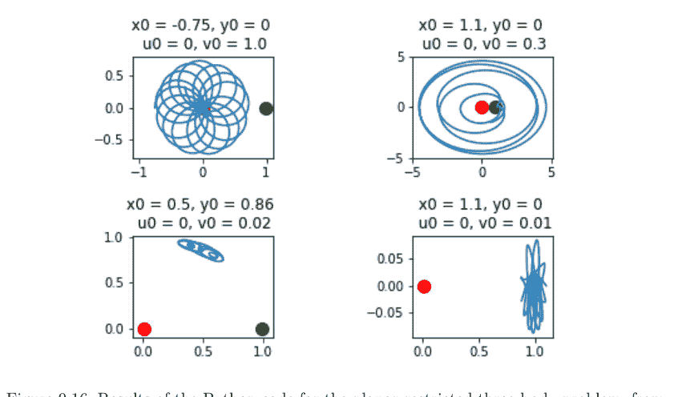

图 9.16：平面限制性三体问题的 Python 代码运行结果，来自示例 9.8。原点附近的红色（电子书中）点是 $m_1$，绿色（电子书中）点是 $m_2$。曲线代表 $m_3$ 的运动路径。此图的完整代码可在本书网站上找到。

## 9.9 章末习题

符号 🖥️ 表示需要借助计算机辅助（如图形、数值计算或符号求解）的问题。

### 第 9.1 节：中心力

- 1. 🖥️ 一个二体系统通过中心力 $\mathbf{F}(\mathbf{r}) = f(r)\hat{\mathbf{r}}$ 相互作用，其中 $\hat{\mathbf{r}}$ 是径向单位矢量。证明 (a) 角动量和 (b) 总能量守恒。请分别用解析方法和计算机代数系统 (CAS) 求解此问题。

- 2. 一个质量分别为 $m_1$ 和 $m_2$ 的二体系统在中心力场 $F = -(K/r^2)\hat{\mathbf{r}}$ 中相互作用，其中 $\hat{\mathbf{r}}$ 是径向单位矢量。
    a. 求该二体系统关于距离 $r$ 的拉格朗日量。运动的两个守恒量是什么？
    b. 将质点从半径为 $r = a > 0$ 的圆上一点移动到半径为 $r = b > 0$ 的圆上另一点，力场做了多少功？功是否依赖于路径？请解释。

- 3. 一个质量为 $m$ 的质点在由 $F = -K/r^3$ 定义的中心力场中运动。
    a. 写出能量守恒的方程。
    b. 证明如果 $E$ 是提供给质点的总能量，那么其速度由下式给出

### 第9.2 - 9.3节：二体问题与二体问题的运动方程

4.  一个质量为 $m$ 的粒子在由 $F = -kr^2$ 定义的中心力场中运动。它从圆 $r = a$ 上的一点由静止开始运动。证明当它到达圆 $r = b$ 时，其速度为
    $$v = \sqrt{2k(a^3 - b^3)/3m}$$

5.  一个质量为 $m$ 的粒子在中心力场 $F = -K/r^n$ 中运动，其中 $K$ 和 $n$ 是常数且 $K > 0$。粒子从 $r = a$ 处由静止开始运动，并以有限速度 $V_0$ 到达 $r = 0$。
    a. 证明对于这种物理情况，条件 $n < 1$ 必须成立。
    b. 证明
        $$V_0 = \sqrt{\frac{2Ka^{1-n}}{m(n-1)}}$$

6.  设 $L$、$M$ 和 $T$ 分别表示长度、质量和时间的量纲。求万有引力常数 $G$ 的量纲。

7.  质量 $m$ 的坐标作为时间 $t$ 的函数给出为 $x = x_0 \cos(\omega_1 t)$ 和 $y = y_0 \sin(\omega_2 t)$，其中 $\omega_1, \omega_2$ 是正常数。
    a. 质量 $m$ 在 xy 平面上运动时，其角动量是否守恒？
    b. 证明如果 $\omega_1 = \omega_2$，则作用在质量上的力是中心力。
    c. 当 $\omega_1 = \omega_2$ 时，计算总能量，并证明它是守恒的。

    使用解析方法和 CAS 求解此问题。

8.  一个质量 $m$ 受到力
    $$\mathbf{F} = f(r)\hat{\mathbf{r}} - \lambda\mathbf{v}$$
    其中 $\lambda$ 是正常数，$f(r)$ 是径向距离 $r$ 的标量函数，$\mathbf{v}$ 是速度矢量，$\hat{\mathbf{r}}$ 是沿径向方向的单位矢量。证明角动量随时间的变化为 $L = L_0 e^{-\frac{\lambda}{m}t}$，其中 $L_0$ 是 $t = 0$ 时的初始角动量。

9.  两个质点 $m_1, m_2$ 相距距离 $r$。从静止开始，它们都开始向彼此加速。证明它们碰撞前经过的时间 $t$ 为：
    $$t = \pi \sqrt{\frac{r^3}{8G(m_1 + m_2)}}$$
    你可能需要使用 CAS 来计算积分。

10. 证明二体系统的总角动量 $\mathbf{L} = \mathbf{L}_1 + \mathbf{L}_2$ 等于
    $$\mathbf{L} = \mu(\mathbf{r} \times \mathbf{v})$$
    其中 $\mu$ 是约化质量，$\mathbf{r} = \mathbf{r}_2 - \mathbf{r}_1$ 是两个质量的相对位置矢量，速度矢量 $\mathbf{v} = \dot{\mathbf{r}}$。这里 $\mu = \text{约化质量} = \frac{m_1 m_2}{m_1 + m_2}$。

11. 证明具有约化质量 $\mu$ 和两个质量的相对位置矢量 $\mathbf{r} = \mathbf{r}_2 - \mathbf{r}_1$ 的二体系统的动能等于：
    $$T = \frac{1}{2} \mu |\dot{\mathbf{r}}|^2$$
    其中 $\mu = \text{约化质量} = \frac{m_1 m_2}{m_1 + m_2}$。使用解析方法和 CAS 求解此问题。

12. 在示例 9.1 中，我们数值计算并绘制了二体引力系统中的轨道。使用 Mathematica 中的命令 `ListAnimate`，生成两个天体相互绕转的动画。

13. 一个质量为 $m$ 的粒子在位于 $r = 0$ 的中心力场中的轨道是螺旋线 $r = e^{-\theta}$。证明该力与 $1/r^3$ 成正比。

14. 产生轨道 $r^2 = a^2 \cos(2\theta)$（其中 $a$ 是正常数）需要什么样的中心力？使用 CAS 计算和简化必要的导数可能很有用。

15. 证明 $r = e^{-\theta}$ 和 $r = 1/\theta$ 都是与 $1/r^3$ 成正比的中心力场的可能轨道。这怎么可能？

16. 一个质量为 $m$ 的粒子以速度 $v = a/r$ 绕原点 O 运动，速度与到 O 的距离成反比。
    a. 证明粒子的运动需要一个反立方中心力。
    b. 可能的轨道类型有哪些？

17. 质量 $m$ 在中心力场内的轨道满足 $r = a/\theta$，其中 $a$ 是正常数。证明势能必须与 $1/r^2$ 成正比。

18. 求在由 $F = -K/r^3$ 定义的中心力场中运动的质量 $m$ 的轨道，并对其进行物理解释。

19. 一个质量为 $m$ 的粒子在大小为 $F = -Kr$ 的中心力场中运动，其中 $K$ 是正常数，$\mathbf{r}$ 是位置矢量。如果粒子从 $r = a, \theta = 0$ 处以速度 $v_0$ 开始运动，方向垂直于 $x$ 轴，确定并描述其轨道。

20. 一个质量为 $m$ 的粒子在大小为 $F = -k/r^3$ 的中心力场中运动，其中 $k$ 是正常数，$r$ 是到力心的距离。粒子从 $r = a, \theta = 0$ 处以速度 $v_0$ 开始运动，方向与正 x 轴成 $\alpha$ 角。
    a. 证明轨道的微分方程用 $u = 1/r$ 表示为
        $$\frac{d^2u}{d\theta^2} + (1 - \gamma)u = 0$$
        其中
        $$\gamma = \frac{k}{ma^2 v_0^2 \sin^2 \alpha}$$
    b. 求解 (a) 中的微分方程并对其进行物理解释。

21. 质量为 $m$、角动量为 $L$ 的粒子在中心力场中的轨道由下式给出
    $$r(\theta) = \frac{1}{A \cos(\omega_0 \theta)}$$
    其中 $\omega_0$ 是正常数，常数 $A, \phi$ 取决于初始条件。这种类型的轨道在问题 9.16、9.18 和 9.20 中在某些假设下得到。
    a. 假设 $\theta(0) = 0$，获得半径 $r(t)$ 作为时间函数的解析表达式。
    b. 使用数值 $A = 1, L = 1, m = 1, \omega = 0.3$（均为 SI 单位）绘制 $r(t)$ 随时间 $t$ 的变化图，以及极坐标图 $r(\theta)$。这些图的物理意义是什么？

    使用解析方法和 CAS 求解此问题。

### 第9.4节：行星运动与开普勒第一定律

22. 一颗行星根据方程绕巨大的太阳运动
    $$r = \frac{12}{3 + \cos \theta}$$
    a. 计算半长轴 $a, b$ 并绘制轨道。
    b. 用角动量和行星质量 $m$ 表示该轨道的中心力。

    使用解析方法和 CAS 求解此问题。

23. 一颗行星根据方程绕巨大的太阳运动
    $$r = \frac{24}{3 + 5 \cos \theta}$$
    a. 计算并绘制轨道。
    b. 用角动量 $L$ 和行星质量 $m$ 表示该轨道的中心力。

    使用解析方法和 CAS 求解此问题。

24. 一颗行星在椭圆轨道上绕巨大的太阳公转，一个焦点 $F$ 位于原点，椭圆中心位于 $(-4, 0)$，半长轴 $a = 10$。
    a. 求笛卡尔坐标和极坐标下的轨道方程。
    b. 用角动量 $L$ 和行星质量 $m$ 表示该轨道的中心力。

    使用解析方法和 CAS 求解此问题。

25. 质量为 $m$、角动量为 $L$ 的粒子在中心力场中的轨道由下式给出
    $$r(\theta) = \frac{1}{A \cosh(\omega_0 \theta)}$$
    其中 $\omega_0$ 是正常数，常数 $A, \phi$ 取决于初始条件。这种类型的轨道在问题 9.16、9.18 和 9.20 中在某些假设下得到。
    a. 假设 $\theta(0) = 0$，获得半径 $r(t)$ 作为时间函数的解析表达式。
    b. 使用数值 $A = 1$, $L = 1$, $m = 1$, $\omega = 0.3$（均为 SI 单位）绘制 $r(t)$ 随时间 $t$ 的变化图，以及极坐标图 $r(\theta)$。这些图的物理意义是什么？

    使用解析方法和 CAS 求解此问题。

26. 哈雷彗星距离太阳的最近距离为 0.57 天文单位 AU（1 AU 是日地平均距离）。彗星距离太阳的最远距离为 35 AU。在太阳系附近（直径约 40 AU）创建哈雷彗星绕太阳运行的轨道极坐标图。同时绘制水星、地球和哈雷彗星的轨道。

### 第9.5节：中心力场中的轨道

27. 计算并讨论粒子在中心力场 $F = \alpha/r^2 + \beta/r^3$ 中的运动，其中 $\beta > 0$，$\alpha, \beta$ 是常数。

28. 当两个质量 $m_1$ 和 $m_2$ 之间的相互作用力形式为
    $$\mathbf{F}(r) = -\frac{Gm_1m_2}{r^{1.9}}\hat{\mathbf{r}} \quad \text{或} \quad \mathbf{F}(r) = -\frac{Gm_1m_2}{r^{2.1}}\hat{\mathbf{r}}$$
    时，数值积分牛顿第二定律。数值计算并讨论粒子在这些中心力势中的轨道。使用数值 $m_1 = 1$, $m_2 = 2$, $G = 1$ 和初始条件 $x(0) = 1$, $x'(0) = 0$, $y(0) = 0$, $y'(0) = 0.5$（所有量均为 SI 单位）。证明所得约化质量的轨道是进动的椭圆，并讨论两种情况之间的差异。使用 CAS 进行牛顿定律的数值积分。

29. 行星 A 在绕恒星运动时，在远日点的速度为 $v_A$，在近日点的速度为 $v_P$。第二颗行星 B 与行星 A 绕同一恒星运动，轨道为半径 $R$、速度为 $v$ 的圆轨道。证明行星 A 的远日点距离为
    $$R_A = \frac{2Rv^2}{v_A(v_A + v_P)}$$

30. 一颗能量为 $E$、角动量为 $L$ 的彗星进入具有吸引中心势 $V(r)$ 的区域。证明彗星到恒星的最近距离为
    $$r_{\min} = \frac{L}{\sqrt{2m(E - V(r_{\min}))}}$$

31. 一颗质量为 $m$ 的彗星以速度 $v_0$ 从非常远的距离接近我们的太阳，如图 9.17 所示。如果彗星没有因太阳而偏转，它将如图所示经过距离太阳 $b$ 的位置。证明彗星的最近距离由下式给出：
    $$r_{\min} = \frac{k}{mv_0^2} + \sqrt{\left(\frac{k}{mv_0^2}\right)^2 + b^2}$$
    其中引力势为 $V = -k/r$。

## 中心力与行星运动

32. 一艘航天器沿椭圆轨道从行星A飞往行星B，其近日点位于行星A，远日点位于行星B。行星A和行星B围绕质量为$M$的恒星做圆周运动，轨道半径分别为$R_A$和$R_B$，如图9.18所示。假设行星质量对航天器无影响。证明：为了进入下图所示的虚线椭圆轨道，航天器相对于行星A必须获得的速度为

$$v = \sqrt{\frac{2GMR_A}{R_B(R_A + R_B)}} - \sqrt{\frac{GM}{R_A}}$$

### 第9.6节：开普勒行星运动定律

33. 解决以下开普勒定律问题：

- a. 假设火星绕太阳公转周期约为687个地球日，求火星到太阳的平均距离。地球到太阳的距离取9300万英里。
- b. 利用地球到太阳的距离为1.5亿公里，且地球绕太阳公转一周约需1年这一事实，计算太阳的质量。

34. 假设一个小型球状行星半径为10公里，平均密度为5克/厘米$^3$。

- a. 其表面的重力加速度是多少？
- b. 如果一个人在地球上重80公斤，在这个行星上会多重？
- c. 如果球状行星表面的重力加速度为$g_P$，平均密度和半径分别为$\sigma$和$R$，证明$g_P = (4\pi/3)GR\sigma$，其中$G$为万有引力常数。

35. 解决以下开普勒定律问题：

- a. 计算地球同步卫星的轨道半径。
- b. 假设航天飞机轨道非常接近地球表面，计算其绕地球运行的周期。

36. 创建行星近日点、远日点和公转周期的三个列表，并通过拟合最小二乘线性函数，利用开普勒第三定律估算太阳的质量。遵循与示例9.7类似的步骤。

### 第9.7节：圆型限制性三体问题

37. 使用第9.7节提供的代码，尝试质量$m_3$的不同初始条件并讨论结果。

38. 编写示例9.8的Mathematica代码，并讨论圆型限制性三体问题在不同初始条件下的图像。

39. 在本题中，我们评估并绘制质量比$m = 0.01$的圆型限制性三体问题的拉格朗日点。我们继续考虑$m_1 \gg m_2$的情况，例如地球-太阳-卫星系统。注意，地球-太阳卫星系统中$m$的值接近$10^{-6}$，但为了可视化目的，我们将继续使用$m = 0.01$。拉格朗日点是第9.7节讨论的旋转坐标系中满足$\ddot{x} = \ddot{y} = 0$且$\dot{x} = \dot{y} = 0$的点。使用计算机，当$\ddot{x} = \ddot{y} = \dot{x} = \dot{y} = 0$时，数值求解方程(9.7.22)和(9.7.23)。将得到的点绘制在与半径为$1 - m$的圆（代表$m_2$的轨道）相同的图上。你应该会发现总共有五个拉格朗日点，其中两个位于$m_2$的轨道上，另外三个位于同一直线上（其中一个也位于轨道上）。

# 10 非惯性参考系中的运动

正如我们在第1章所见，牛顿第二定律仅适用于惯性参考系。然而，有时我们需要在非惯性参考系中描述运动。例如，远程导弹的轨迹需要使用固定在旋转（因此是非惯性）地球表面的非惯性参考系来描述。在第1章中，我们发现在非惯性参考系中使用牛顿第二定律会导致惯性力的出现。在本章中，我们将扩展惯性力的概念；特别是那些在旋转参考系中产生的惯性力。我们将讨论如何在非旋转参考系中描述旋转参考系中的矢量，并基于此描述，我们将展示在旋转参考系中应用牛顿第二定律如何导致科里奥利力和离心力等惯性力。然后，我们将研究科里奥利力和离心力如何影响地球表面附近粒子的运动。最后，我们将探讨著名的傅科摆问题和非惯性系中的抛体运动。

## 10.1 在非旋转加速参考系中的运动

尽管我们在第1章中研究了非旋转加速参考系的情况，但值得再次探讨，这次使用三维空间。考虑一个质量为$m$的粒子，其运动使用两个参考系描述，如图10.1所示。

图10.1所示的参考系$S'$是一个惯性系，我们假设其静止，而参考系$S$以加速度$\mathbf{A} = \ddot{\mathbf{R}}$远离$S'$加速运动。在第1章中，我们用撇号表示运动参考系。在本章中，为了方便，我们将切换符号，使用带撇变量描述在惯性系$S'$中测量的量，使用不带撇变量描述在非惯性系$S$中测量的量。我们将重点关注粒子在非惯性系中的运动，不希望用额外的撇号使符号复杂化。

在$S'$中测量的粒子位置可以写为$\mathbf{r}' = \mathbf{R} + \mathbf{r}$，因此在$S'$系中测量的粒子速度为，

$$\dot{\mathbf{r}}' = \dot{\mathbf{r}} + \mathbf{V} \quad (10.1.1)$$

其中$\mathbf{V} = \dot{\mathbf{R}}$是$S$系相对于$S'$系的瞬时速度。例如，如果$S'$是地面上的静止参考系，$S$固定在加速的汽车上，那么粒子相对于地面的速度（$\dot{\mathbf{r}}'$）等于粒子相对于汽车的速度（$\dot{\mathbf{r}}$）加上汽车的速度（$\mathbf{V}$）。需要注意的是，(10.1.1)仅适用于非相对论情况。

接下来，我们对(10.1.1)求导，得到在非惯性系中测量的粒子加速度，

$$\ddot{\mathbf{r}} = \ddot{\mathbf{r}}' - \mathbf{A} \quad (10.1.2)$$

其中$\mathbf{A} = \dot{\mathbf{V}}$。注意，与第1章的发现类似，在$S'$系中测量到一个额外的加速度，而在$S$系中没有测量到。将(10.1.2)乘以粒子质量$m$，

$$m\ddot{\mathbf{r}} = m\ddot{\mathbf{r}}' - m\mathbf{A} \quad (10.1.3)$$
$$\mathbf{F} = \mathbf{F}' - m\mathbf{A} \quad (10.1.4)$$

其中$\mathbf{F} = m\ddot{\mathbf{r}}$是在非惯性系中测量的作用在粒子上的力，$\mathbf{F}' = m\ddot{\mathbf{r}}'$是在惯性系中测量的作用在系统上的力。作用在粒子上的力，如重力、空气阻力、摩擦力等，在两个参考系中都能测量到。然而，在非惯性系中还测量到一个额外的力，$-m\mathbf{A}$。这个额外的力有时被称为*惯性力*、虚构力或假力。为了使用牛顿第二定律描述非惯性系中的运动，我们需要包含这个额外的惯性力，它并非源于粒子与其他物体的相互作用，而是源于非惯性系的加速度。

尽管惯性力有时被称为虚构力，但对于在非惯性参考系中运动的人来说，惯性力是真实的。你在加速的汽车中体验过非惯性力，当你被推向座椅靠背时；或者在旋转的嘉年华游乐设施上，当设施旋转时你被推向车厢侧面。在每种情况下，这个力都源于你的惯性，而不是与其他物体的相互作用，因此得名惯性力，因为它被引入是为了解释你所经历的所有加速度。通过包含惯性力，我们能够使用牛顿第二定律来描述非惯性参考系中的运动。

> **示例 10.1：具有加速支撑的摆**
考虑一个质量为$m$、无质量杆长为$\ell$的简单平面摆，处于向下的均匀重力场$\mathbf{g}$中，其支撑点具有向上的垂直加速度$\mathbf{a}$，如图10.2所示。求摆的小幅振荡频率。

## 10.1 非惯性参考系中的运动


图 10.2：一个向上加速的摆，质量为 $m$，长度为 $\ell$，来自例 10.1。

**解：**
根据 (10.1.3)，在随摆加速的参考系 $S$ 中，力为：
$$\mathbf{F} = (\mathbf{T} + m\mathbf{g}) - m\mathbf{a}$$ (10.1.5)
其中 $\mathbf{T}$ 是摆的张力，$\mathbf{g}$ 是重力加速度，$\mathbf{a}$ 是一个大小为 $a$、方向与 $\mathbf{g}$ 相反的矢量。式 (10.1.5) 括号中的项是 $\mathbf{F}'$，即根据惯性系中的牛顿第二定律作用于系统的合力。我们可以将 (10.1.5) 改写为：
$$\mathbf{F} = \mathbf{T} + m\mathbf{g}_{\text{eff}}$$ (10.1.6)
其中 $\mathbf{g}_{\text{eff}} = \mathbf{g} - \mathbf{a}$ 是有效重力场，它包含了引力以及摆的支撑点的加速度。由此可知，在参考系 $S$ 中，摆的小角度振动运动方程为：
$$\ddot{\theta} + \frac{g_{\text{eff}}}{\ell}\theta = 0$$ (10.1.7)
其中 $\theta$ 是摆与竖直方向的夹角（通常如此）。从第 6 章我们知道，(10.1.7) 中 $\theta$ 前面的系数是 $\omega_0$ 的平方，即小角度振动的频率。因此，我们得到：
$$\omega_0 = \sqrt{\frac{|\mathbf{g} - \mathbf{a}|}{\ell}}$$ (10.1.8)
我们看到，向上的加速度有效地减小了重力场。其结果是，加速参考系等效于存在一个额外的重力场（在这种情况下，其加速度方向与 $\mathbf{g}$ 相反）。加速参考系与引力场不可区分这一事实，是广义相对论的一个重要组成部分。

## 10.2 角速度作为矢量

在进入旋转参考系之前，我们需要重新审视角速度，特别是角速度的矢量性质。欧拉旋转定理指出，刚体的任何无穷小位移，只要物体上有一点保持固定，就等价于绕通过该固定点的轴的旋转。这个定理很难证明，但我们这里不需要证明它。然而，作为一个说明性的例子，

考虑一个在路面上滚动的轮子。欧拉定理说，轮子的无穷小位移可以描述为绕轮子与路面接触点的旋转。

欧拉定理告诉我们，为了指定绕一点的旋转，我们只需要轴的方向和绕轴旋转的量。当然，如果我们关心的是旋转速率，即*角速度*，那么我们需要旋转轴的方向*以及*旋转的速率。这意味着我们可以将角速度写成一个矢量 $\boldsymbol{\omega}$，它沿着旋转轴，其大小是旋转速率。一个静止的旋转陀螺可能具有 $2\pi$ rad/sec 的角速度，其轴是垂直的。然而，$\boldsymbol{\omega}$ 是向上还是向下？答案由右手定则决定：

> **旋转的右手定则**

弯曲右手手指，使其指向旋转方向。你的拇指指向 $\boldsymbol{\omega}$ 的方向。

右手定则如图 10.3 所示。图 10.3 中带箭头的圆圈代表一个逆时针旋转的轮子。当你弯曲右手手指，使其指向轮子上箭头的方向时，你的拇指应该指向页面外，向上。你的拇指指向轮子角速度的方向。

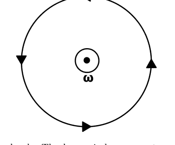

图 10.3：右手定则。大圆圈代表一个轮子，圆圈上的箭头代表轮子的逆时针旋转。弯曲右手手指，使其指向圆圈上箭头的方向。你的拇指应该指向矢量 $\boldsymbol{\omega}$ 的方向。

如果一个物体的角速度随时间变化，那么旋转速率和/或旋转轴的方向都会随时间变化。涉及旋转轴方向变化的情况在数学上可能难以描述。在本章中，我们将主要关注角速度恒定的系统，即旋转速率和旋转轴的方向都将保持不变。

除了角速度的正式定义外，我们还需要粒子速度与其角速度之间的关系。回顾一下，一个粒子以角速度 $\omega$ 沿半径为 $r$ 的圆周运动时，其切向速度 $v$ 为 $v = \omega r$。在这个特定情况下，旋转轴通过圆心并垂直于圆平面。$v$ 和 $\omega$ 之间的这种简单关系源于所有运动都限制在一个平面内。但通常情况并非如此。

考虑一个粒子，如图 10.4 中的黑点所示，固定在地球北半球表面的某个位置。地球的角速度基本恒定，方向从南极指向北极。虽然地球上每一点都具有相同的角速度，但粒子的纬度会影响其切向速度 $\mathbf{v}$。

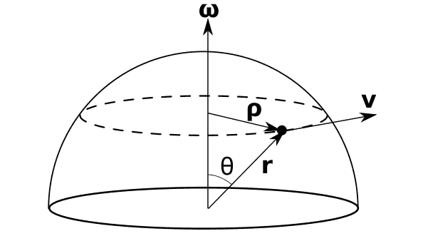

图 10.4：地球北半球，显示了一个点粒子（黑点）的位置及其速度 $\mathbf{v}$，该速度与虚线圆相切。

在图 10.4 中，随着地球旋转，粒子在一个半径为 $\rho = |\boldsymbol{\rho}|$ 的圆周上运动。粒子的纬度是 $\pi/2 - \theta$。随着 $\theta$ 增大，粒子需要在相同时间内走更长的距离，而角速度在所有纬度上都是相同的。因此，$v = |\mathbf{v}|$ 必须随着 $\theta$ 的增大而增大。我们回忆一下，粒子的切向速度为 $v = \rho\omega$，其中 $\rho = r\sin\theta$。因此，$v = r\omega\sin\theta$，我们可以将切向速度写为：
$$\mathbf{v} = \boldsymbol{\omega} \times \mathbf{r} \qquad (10.2.1)$$
注意，(10.2.1) 是熟悉公式 $v = r\omega$ 的一般形式，其中 $\theta = \pi/2$。我们需要在这种情况下使用 (10.2.1)，因为惯性系的原点是地球中心，而地球中心不是粒子所沿圆周的圆心。此外，地球中心将作为我们在未来问题中使用的惯性系的原点。

方程 (10.2.1) 并非速度矢量所独有。注意我们可以将 (10.2.1) 改写为：
$$\frac{d\mathbf{r}}{dt} = \boldsymbol{\omega} \times \mathbf{r} \qquad (10.2.2)$$
这并非矢量 $\mathbf{r}$ 所独有的公式。事实上，对于任何在旋转参考系中恒定的矢量 $\mathbf{Q}$，其在非旋转参考系中测量的时间导数为：
$$\frac{d\mathbf{Q}}{dt} = \boldsymbol{\omega} \times \mathbf{Q} \qquad (10.2.3)$$
在下一节中，我们将推导 (10.2.3) 的更一般形式，该形式将包括在旋转参考系中不恒定的矢量。

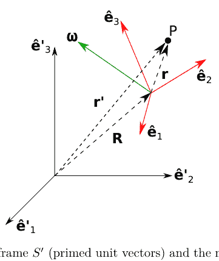

图 10.5：惯性系 $S'$（带撇的单位矢量）和非惯性旋转系 $S$（不带撇的单位矢量，电子书中为红色）。矢量 $\mathbf{R}$ 表示在惯性系中测量的非惯性系原点的位置。矢量 $\boldsymbol{\omega}$ 表示非惯性系的角速度。

## 10.3 旋转坐标系中矢量的时间导数

回顾第 10.1 节，我们关联了惯性系和非惯性系之间的速度和加速度等量。这很容易做到，因为两个参考系都没有旋转。然而，一旦我们允许非惯性系相对于惯性系旋转，事情就变得有点困难。我们仍然能够将旋转参考系中测量的加速度与惯性系中测量的加速度联系起来，但为此，我们需要包含旋转参考系的角速度。

我们首先建立两个特定的参考系。与第 10.1 节一样，我们将使用带撇的坐标表示固定的惯性系 $S'$，使用不带撇的坐标表示非惯性系 $S$。非惯性系 $S$ 的原点位于距离 $S'$ 原点 $\mathbf{R}$ 的位置，非惯性系相对于 $S'$ 以角速度 $\boldsymbol{\omega}$ 旋转。两个坐标系如图 10.5 所示。

在图 10.5 中，惯性系 $S'$ 由带撇的单位矢量 $\hat{\mathbf{e}}'_i$ 表示，我们使用广义单位矢量是为了简化即将进行的推导。非惯性系 $S$ 由不带撇的单位矢量 $\hat{\mathbf{e}}_i$ 表示，在电子书中为红色。单位矢量 $\hat{\mathbf{e}}_i$ 固定在旋转参考系中。换句话说，$\hat{\mathbf{e}}_i$ 随参考系一起旋转，因此旋转参考系中的观察者将测量到 $\hat{\mathbf{e}}_i$ 在大小和方向上都是恒定的。矢量 $\boldsymbol{\omega}$（电子书中为绿色）表示非惯性系的角速度。点 $P$ 可以使用任一坐标系定位。在惯性系 $S'$ 中测量，点 $P$ 位于 $\mathbf{r}' = \mathbf{R} + \mathbf{r}$。

现在让我们考虑一个在非惯性系中测量的任意矢量 $\mathbf{Q}$。矢量 $\mathbf{Q}$ 可以是点 $P$ 处粒子的位置、粒子的速度或任何其他矢量量。我们将计算 $\mathbf{Q}$ 在非惯性系中测量的时间导数。

惯性（固定）参考系与非惯性（旋转）参考系，采用以下记号：

$$\left(\frac{d\mathbf{Q}}{dt}\right)_f = \text{矢量 } \mathbf{Q} \text{ 相对于惯性（固定）参考系 } S' \text{ 的时间导数}$$

$$\left(\frac{d\mathbf{Q}}{dt}\right)_r = \text{矢量 } \mathbf{Q} \text{ 相对于非惯性（旋转）参考系 } S \text{ 的时间导数}$$

我们首先将 $\mathbf{Q}$ 用固定在非惯性参考系中的单位矢量表示：

$$\mathbf{Q} = \sum_{i=1}^{3} Q_i \hat{\mathbf{e}}_i \qquad (10.3.1)$$

系数 $Q_i$ 在每个参考系中都是相同的。惯性参考系中的观察者会看到 $\hat{\mathbf{e}}_i$ 随时间变化，但这将是两个参考系中观察到的唯一区别。如果我们计算 $\mathbf{Q}$ 相对于非惯性参考系的时间导数，我们得到：

$$\left(\frac{d\mathbf{Q}}{dt}\right)_r = \sum_{i=1}^{3} \dot{Q}_i \hat{\mathbf{e}}_i \qquad (10.3.2)$$

因为标量系数 $Q_i$ 在每个参考系中都相同，我们不需要区分 $\dot{Q}_i$ 是相对于惯性还是非惯性参考系。注意，导数不影响单位矢量，因为它们相对于非惯性参考系是恒定的。接下来，我们计算 $\mathbf{Q}$ 相对于固定参考系的时间导数：

$$\left(\frac{d\mathbf{Q}}{dt}\right)_f = \sum_{i=1}^{3} \dot{Q}_i \hat{\mathbf{e}}_i + \sum_{i=1}^{3} Q_i \left(\frac{d\hat{\mathbf{e}}_i}{dt}\right)_f \qquad (10.3.3)$$

(10.3.3) 式右边的第一项是我们计算相对于非惯性参考系的时间导数时得到的结果。注意，(10.3.3) 式右边的第二项是矢量 $\hat{\mathbf{e}}_i$ 的时间导数，该矢量在旋转参考系中是恒定的。我们可以使用一般方程 (10.2.3) 写出：

$$\left(\frac{d\hat{\mathbf{e}}_i}{dt}\right)_f = \boldsymbol{\omega} \times \hat{\mathbf{e}}_i \qquad (10.3.4)$$

因此，(10.3.3) 式变为：

$$\left(\frac{d\mathbf{Q}}{dt}\right)_f = \sum_{i=1}^{3} \dot{Q}_i \hat{\mathbf{e}}_i + \sum_{i=1}^{3} \boldsymbol{\omega} \times (Q_i \hat{\mathbf{e}}_i) \qquad (10.3.5)$$

或者使用 (10.3.2) 式：

> **矢量 Q 相对于惯性参考系的时间导数**

$$\left(\frac{d\mathbf{Q}}{dt}\right)_f = \left(\frac{d\mathbf{Q}}{dt}\right)_r + \boldsymbol{\omega} \times \mathbf{Q} \qquad (10.3.6)$$

注意，(10.3.6) 式正是我们从平动参考系研究中所预期的结果。为了更好地理解这一点，令 **Q** = **r**，即在非惯性（旋转）参考系中测量的粒子位置。(10.3.6) 式右边的第一项是在旋转参考系中测量的速度。第二项是由于非惯性参考系的旋转，位于 **r** 处的粒子的平动速度。因此，固定参考系中的观察者测量到的速度是粒子在运动参考系中的速度加上参考系本身的速度。注意，(10.3.6) 式的一个结果是角加速度 $\dot{\omega}$ 在每个参考系中都是相同的，因为 $\omega \times \omega = 0$。

方程 (10.3.6) 告诉我们，一个矢量的变化率可以在惯性参考系和非惯性参考系之间建立联系。牛顿第二定律通过指出作用在粒子上的合力与在惯性参考系中测量的粒子速度变化成正比，从而提供了粒子的运动方程。因此，(10.3.6) 式使我们能够将从牛顿第二定律得到的惯性参考系中粒子的加速度，与观察者处于非惯性参考系的情况联系起来。在下一节中，我们将使用 (10.3.6) 式来推导旋转参考系中的牛顿第二定律。

## 10.4 旋转参考系中的牛顿第二定律

为了找到描述粒子在旋转参考系中运动的方程，我们需要修改牛顿第二定律以适用于非惯性参考系。为了找到旋转参考系 $S$ 中牛顿第二定律的形式，我们将参考图 10.5。假设在图 10.5 的点 $P$ 处有一个质量为 $m$ 的粒子。我们将允许非惯性参考系相对于 $S'$ 既有旋转又有线性加速度。将惯性参考系视为固定会很有帮助。令 $\omega$ 为非惯性参考系 $S$ 的角速度。

在惯性参考系 $S'$ 中，我们可以将牛顿第二定律写为：

$$\mathbf{F}' = m \left( \frac{d\mathbf{v}'}{dt} \right)_f \qquad (10.4.1)$$

其中 $\mathbf{v}'$ 是粒子相对于惯性参考系 $S'$ 的速度，$\mathbf{F}'$ 是作用在粒子上的合力。合力 $\mathbf{F}'$ 包括质量 $m$ 与其他物体之间的相互作用力，如重力、空气阻力、摩擦力等。为了找到*非惯性*参考系中牛顿第二定律的形式，我们需要将惯性参考系中测量的加速度 $(d\mathbf{v}'/dt)_f$ 用非惯性参考系中测量的加速度来表示。

我们首先求 $\mathbf{v}'$。图 10.5 显示：

$$\mathbf{r}' = \mathbf{R} + \mathbf{r} \qquad (10.4.2)$$

速度 $\mathbf{v}'$ 通过对 $\mathbf{r}'$ 相对于惯性参考系求时间导数得到：

$$\mathbf{v}' = \left( \frac{d\mathbf{r}'}{dt} \right)_f = \left( \frac{d\mathbf{R}}{dt} \right)_f + \left( \frac{d\mathbf{r}}{dt} \right)_f \qquad (10.4.3)$$

我们对 (10.4.3) 式右边的第二项使用 (10.3.6) 式，以找出惯性参考系 $S'$ 中的观察者如何测量在非惯性参考系 $S$ 中运动的粒子的速度：

$$\left( \frac{d\mathbf{r}}{dt} \right)_f = \left( \frac{d\mathbf{r}}{dt} \right)_r + \omega \times \mathbf{r} \qquad (10.4.4)$$

旋转参考系中的牛顿第二定律

379

其中 $\omega$ 是 $S$ 的角速度。通过使用 (10.4.4) 式并定义以下量：

$$\mathbf{v}' \equiv \left( \frac{d\mathbf{r}'}{dt} \right)_f \qquad (10.4.5)$$
$$\mathbf{V} \equiv \left( \frac{d\mathbf{R}}{dt} \right)_f \qquad (10.4.6)$$
$$\mathbf{v} \equiv \left( \frac{d\mathbf{r}}{dt} \right)_r \qquad (10.4.7)$$

我们可以写出：

$$\mathbf{v}' = \mathbf{V} + \mathbf{v} + (\omega \times \mathbf{r}) \qquad (10.4.8)$$

其中：

- $\mathbf{v}'$ = 粒子相对于惯性参考系 $S'$ 的速度
- $\mathbf{V}$ = 非惯性参考系相对于 $S'$ 的线速度
- $\mathbf{v}$ = 粒子相对于非惯性参考系 $S$ 的速度
- $\omega$ = 非惯性参考系 $S$ 相对于 $S'$ 的角速度
- $\omega \times \mathbf{r}$ = 由于 $S$ 相对于 $S'$ 的旋转而导致的粒子速度

接下来，我们回到 (10.4.1) 式并代入 (10.4.8) 式，得到：

$$\mathbf{F}' = m \left[ \left( \frac{d\mathbf{V}}{dt} \right)_f + \left( \frac{d\mathbf{v}}{dt} \right)_f + (\dot{\omega} \times \mathbf{r}) + \omega \times \left( \frac{d\mathbf{r}}{dt} \right)_f \right] \qquad (10.4.9)$$

现在，我们将逐项分析 (10.4.9) 式的右边。(10.4.9) 式右边的第一项是非惯性参考系的线加速度：

$$\mathbf{A} = \left( \frac{d\mathbf{V}}{dt} \right)_f \qquad (10.4.10)$$

(10.4.9) 式右边的第二项使用 (10.3.6) 式重写：

$$\left( \frac{d\mathbf{v}}{dt} \right)_f = \left( \frac{d\mathbf{v}}{dt} \right)_r + (\omega \times \mathbf{v}) \qquad (10.4.11)$$
$$= \mathbf{a} + (\omega \times \mathbf{v}) \qquad (10.4.12)$$

其中 $\mathbf{a} = (d\mathbf{v}/dt)_r$ 是在非惯性参考系中测量的粒子加速度。(10.4.9) 式右边的第三项不需要简化，因为 $\dot{\omega}$ 在每个参考系中都是相同的。最后，(10.4.9) 式右边的第四项使用 (10.3.6) 式重写：

$$\omega \times \left( \frac{d\mathbf{r}}{dt} \right)_f = \omega \times \left( \frac{d\mathbf{r}}{dt} \right)_r + \omega \times (\omega \times \mathbf{r}) \qquad (10.4.13)$$
$$= (\omega \times \mathbf{v}) + [\omega \times (\omega \times \mathbf{r})] \qquad (10.4.14)$$

通过将 (10.4.10)-(10.4.14) 式代入 (10.4.9) 式，我们得到：

$$\mathbf{F}' = m\mathbf{A} + m\mathbf{a} + 2m(\omega \times \mathbf{v}) + m(\dot{\omega} \times \mathbf{r}) + m[\omega \times (\omega \times \mathbf{r})] \qquad (10.4.15)$$

如果我们定义

$$\mathbf{F} \equiv \mathbf{F}' - m\mathbf{A} - 2m(\omega \times \mathbf{v}) - m(\dot{\omega} \times \mathbf{r}) - m[\omega \times (\omega \times \mathbf{r})] \qquad (10.4.16)$$

当粒子在非惯性系中受到的力被定义为上述形式时，牛顿第二定律在非惯性系中可表示为

$$\mathbf{F} = m\mathbf{a}$$

请记住，$\mathbf{a}$ 是在非惯性系中测量的粒子加速度。尽管该方程看起来与我们从第1章起所写的牛顿第二定律形式相同，但重要的是要记住 $\mathbf{F}$ 中包含了公式 (10.4.16) 所定义的所有项。力 $\mathbf{F}$ 有时被称为作用在粒子上的*有效力*，因为它同时包含了相互作用力和惯性力。

请注意，公式 (10.4.16) 中引入了四种惯性力。惯性力 $-m\mathbf{A}$ 与我们在第10.1节中发现的相同，它源于 $S$ 系的线性加速度。公式 (10.4.16) 中的第二项 $-2m(\boldsymbol{\omega} \times \mathbf{v})$ 是所谓的*科里奥利力*，我们稍后将详细讨论。项 $-m(\dot{\boldsymbol{\omega}} \times \mathbf{r})$ 是与 $S'$ 系角加速度相关的惯性力。对于本章的大多数问题，$S$ 系将固定在地球表面，并且在很好的近似下，$\dot{\boldsymbol{\omega}} = 0$。因此，在我们的讨论中将不考虑这个力。最后一项 $-m[\boldsymbol{\omega} \times (\boldsymbol{\omega} \times \mathbf{r})]$ 是*离心力*，我们稍后也将详细讨论。

我们已经了解到，经过修正后，牛顿第二定律可以用于涉及非惯性系的问题。诀窍在于，我们必须包含额外的惯性力，而不仅仅是系统中物体之间的相互作用力。就像在第10.1节中一样，这些惯性力对于非惯性系中的观察者来说是真实存在的。

接下来，我们将进一步讨论科里奥利力和离心力。这两种惯性力在描述地球表面附近物体的运动时起着重要作用。

在本章的剩余部分，惯性系 $S'$ 的原点位于地球中心，$\hat{\mathbf{e}}'_3$ 沿地球自转轴从地心指向北极。因此 $\boldsymbol{\omega} = \omega \hat{\mathbf{e}}'_3$，其中 $\omega = 2\pi$ rad/day。此外，非惯性系 $S$ 的原点固定在地球表面的某一点，$\hat{\mathbf{e}}_1\hat{\mathbf{e}}_2$ 平面在 $S$ 系原点处与地球表面相切，而 $\hat{\mathbf{e}}_3$ 指向局部上方（远离地心）。

### 10.4.1 离心力

正如我们在上一节所看到的，公式 (10.4.16) 中的项

$$\mathbf{F}_{\text{cent}} = -m[\boldsymbol{\omega} \times (\boldsymbol{\omega} \times \mathbf{r})]$$

被称为离心力，它的存在是由于非惯性系的旋转。我们可以如下理解离心力的方向。

在图10.6中，一个质量为 $m$（未显示）的粒子位于相对于惯性系旋转的参考系中的 $\mathbf{r}$ 处。在惯性系中，观察者会看到粒子在一个半径为 $\rho = r \sin \theta$ 的圆周上运动。为了找到离心力 $-m[\boldsymbol{\omega} \times (\boldsymbol{\omega} \times \mathbf{r})]$ 的方向，我们首先需要找到向量 $\boldsymbol{\omega} \times \mathbf{r}$ 的方向。向量 $\boldsymbol{\omega} \times \mathbf{r}$ 垂直于 $\boldsymbol{\omega}$ 和 $\mathbf{r}$，因此位于圆周平面内，这一点在图10.6(b)的俯视图中看得最清楚。接下来，$\boldsymbol{\omega} \times (\boldsymbol{\omega} \times \mathbf{r})$ 的方向垂直于 $\boldsymbol{\omega}$ 和 $\boldsymbol{\omega} \times \mathbf{r}$，因此指向圆心的径向内侧。最后，离心力是 $-m[\boldsymbol{\omega} \times (\boldsymbol{\omega} \times \mathbf{r})]$，它指向 $\boldsymbol{\omega} \times (\boldsymbol{\omega} \times \mathbf{r})$ 的相反方向，因此指向远离圆心的径向外侧。

我们可以从公式 (10.4.18) 计算离心力的大小。让我们专注于用柱坐标 $\rho$、$\phi$ 和 $z$ 描述沿圆周的运动。请注意，在这种情况下，我们需要一个方位角来描述*绕*半径为 $\rho$ 的圆周的运动，如图10.6a所示。因此，我们将使用 $\phi$ 来表示该角度，这与球坐标一致。使用柱坐标，我们得到 $\boldsymbol{\omega} \times \mathbf{r} = \omega r \sin \theta \hat{\phi}$。此外，

旋转参考系中的牛顿第二定律

381

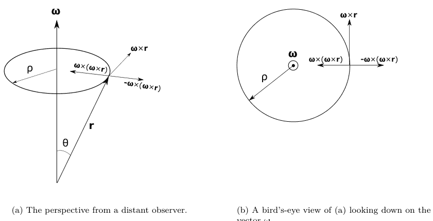

(a) 远处观察者的视角。

(b) (a)的俯视图，从向量 ω 上方观察。

图10.6：两种视角下的离心力。一个粒子位于具有角速度 ω 的旋转参考系中的 **r** 处。非惯性系中的观察者会看到粒子在一个半径 ρ = r sin θ 的圆周上运动。粒子受到一个离心力 −m [ω × (ω × r)]，该力从粒子的旋转中心径向向外指向。

ω × (ω × r) = −ω²r sin θ ρ̂（注意在柱坐标中 ω = ω ẑ，且 ẑ × φ̂ = −ρ̂）。因此，我们得到

**F**_cent = m ρ ω² ρ̂ (10.4.19)

因此，沿圆周运动的粒子将受到一个大小为 m ρ ω² 的向外力。请注意，这个向外的力与我们熟悉的向心力 **F**_c = −m r ω² ρ̂ 是一致的。回想一下，向心力是使粒子以恒定速度沿圆周路径运动的合力。现在我们已经理解了非惯性系，我们有了另一种描述匀速圆周运动的方法。从处于非惯性系中的粒子的角度来看，有一个离心力作用在它上面，使得径向方向的合力为零。

由于地球在自转，地球表面附近的物体会受到离心力。向外的离心力会减小有效的重力加速度，减小的量取决于粒子的纬度。下一个例子说明了这一点。

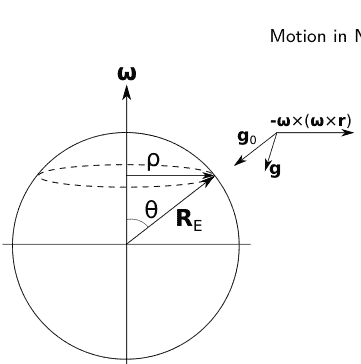

图10.7：在例10.2中，位于地球表面（实心圆）的粒子 $\mathbf{R}_E$ 随着地球以角速度 $\omega$ 自转而在一个圆周（虚线圆）上运动。图中还显示了有效重力加速度 $\mathbf{g}$、离心加速度 $\omega \times (\omega \times \mathbf{r})$ 和重力加速度 $\mathbf{g}_0$ 的向量。

**例10.2：重力与离心力**
考虑一个质量为 $m$ 的粒子静止在地球表面。求作用在该粒子上的有效力，并计算北极与赤道上某点之间有效重力加速度的差异。

**解：**
在进行任何计算之前，画出粒子位置的示意图是有帮助的。图10.7显示了粒子在地球表面的位置 $\mathbf{R}_E$。位置向量 $\mathbf{R}_E$ 的大小为6.371 km，方向从地心指向粒子在地球表面的位置。角度 $\theta$ 与图10.6a中的角度相同，并且与粒子的纬度 $\lambda$ 的关系为 $\lambda = \pi/2 - \theta$。对于地球上方的静止观察者，粒子似乎在一个半径为 $\rho = R_E \sin \theta$ 的圆周上运动。
根据公式 (10.4.16)，作用在粒子上的有效力为，
$$\mathbf{F} = \mathbf{F}' + m\mathbf{g}_0 - m [\omega \times (\omega \times \mathbf{R}_E)] \qquad (10.4.20)$$
其中
$$\mathbf{g}_0 = -\frac{GM_E}{R_E^2} \hat{\mathbf{R}}_E$$
是由牛顿万有引力定律得出的引力加速度，地球质量为 $M_E = 5.972 \times 10^{24}$ kg，$\mathbf{F}'$ 是除重力外作用在粒子上的所有力的总和。作用在粒子上的唯一惯性力是离心力。科里奥利力为零，因为粒子相对于地球表面没有运动，并且在很好的近似下，$\omega$ 是常数，因此 $\dot{\omega} = 0$。
我们可以将公式 (10.4.20) 中的第二项和第三项合并，并定义一个新的重力加速度，称为*有效重力加速度* $\mathbf{g}$，其中，
$$\mathbf{g} = \mathbf{g}_0 - \omega \times (\omega \times \mathbf{r}) \qquad (10.4.21)$$

正是这个有效加速度 $\mathbf{g}$ 决定了地球上某点的自由落体加速度和单摆的周期。请注意，离心加速度实际上减小了重力加速度。此外，铅垂线将沿着 $\mathbf{g}$ 的方向，并由于上图所示的向外离心力而略微偏离真正的垂直方向。再者，地球海洋的表面垂直于 $\mathbf{g}$，而非 $\mathbf{g}_0$。

我们可以通过首先求出 $\mathbf{g}_0$ 的大小来计算北极和赤道处的有效重力加速度，

$$g_0 = \frac{GM_E}{R_E^2} = \frac{(6.674 \times 10^{-11} \text{ Nm}^2/\text{kg}^2) (5.972 \times 10^{24} \text{ kg})}{(6.371 \times 10^6 \text{ m})^2} = 9.820 \text{ m/s}^2$$

接下来，我们计算北极和赤道处的向心加速度大小。我们将使用 $\mathbf{a}_{\text{cent}} = R_E \omega^2 \sin \theta \hat{\rho}$，这是通过将 (10.4.19) 除以质量 $m$ 得到的。请注意，我们需要的是 $\mathbf{a}_{\text{cent}}$ 中平行于 $\mathbf{R}_E$ 的分量 $a_{\text{cent}} \sin \theta$。注意，对于北极，$\theta = 0$；对于赤道，$\theta = \pi/2$。在每种情况下，$\omega = 2\pi \text{ rad/day} = 7.272 \times 10^{-5} \text{ rad/s}$，

$$a_{\text{cent}} = R_E \omega^2 \sin^2 0 = 0 \text{ m/s}^2 \quad \text{北极}$$
$$a_{\text{cent}} = R_E \omega^2 \sin^2 \frac{\pi}{2} = 0.0337 \text{ m/s}^2 \quad \text{赤道}$$

因此，有效重力加速度为 $g = g_0 - a_{\text{cent}}$，我们发现北极处的有效重力加速度比赤道处大 $0.0337 \text{ m/s}^2$，约 $0.3\%$。离心力是地球呈扁球形的原因。地球的极半径比赤道半径大 $21.4 \text{ km}$！地球赤道处的额外凸起实际上意味着两极的重力加速度比赤道处大 $0.5\%$。

例 10.2 的一个结果是，通常我们可以将作用在地球表面附近质点上的有效力 (10.4.16) 重写为，

$$\mathbf{F} = \mathbf{F}' + m\mathbf{g} - 2m (\boldsymbol{\omega} \times \mathbf{v}) \qquad (10.4.22)$$

其中 $\mathbf{F}'$ 是质点所受所有相互作用力的总和，不包括其与地球的引力。然后我们将 $m\mathbf{g}_0$ 与离心力合并为一个新的力 $m\mathbf{g}$。(10.4.22) 中的最后一项是科里奥利力，这将是下一节的主题。

### 10.4.2 科里奥利力

当一个质点相对于旋转参考系以速度 $\mathbf{v}$ 运动时，会存在一个额外的惯性力，称为科里奥利力。科里奥利力为，

$$\mathbf{F}_{\text{cor}} = -2m (\boldsymbol{\omega} \times \mathbf{v}) \qquad (10.4.23)$$

从 (10.4.23) 可以清楚地看出，科里奥利力取决于质点的速度。不运动的质点不会受到科里奥利力。我们可以使用 (10.4.23) 来估算科里奥利力的大小。使用与例 10.2 中相同的 $\omega \approx 7.3 \times 10^{-5} \text{ rad/sec}$，我们发现一个位于北纬 45 度、以 $70 \text{ m/s}$ 速度运动的高尔夫球将受到 $0.007 \text{ N}$ 的科里奥利力，考虑到其飞行时间，这是一个非常小的效应。一枚以 7 km/s 速度飞行的洲际弹道导弹将受到 0.7 N 的科里奥利力，这可能对导弹产生更显著的影响。然而，导弹也受天气影响，其轨迹由计算机制导系统进行修正。

科里奥利加速度（因此也是科里奥利力）的方向由 $-\boldsymbol{\omega} \times \mathbf{v}$ 项决定。如图 10.8 所示，当质点在地球北半球运动时，科里奥利加速度位于速度的右侧。在南半球，科里奥利加速度将位于质点速度的左侧。

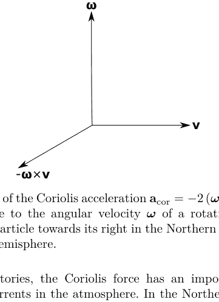

除了导弹轨迹，科里奥利力对地球天气也有重要影响，它会使大气中的气流发生偏转。在北半球，空气向右偏转，导致气流右侧为高压，左侧为低压（南半球相反），从而导致北半球空气逆时针循环，南半球顺时针循环。

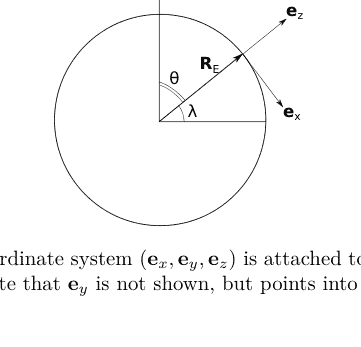

### 例 10.3：铅垂线的水平偏转

考虑一个质量为 $m$ 的质点在地球引力场中自由下落。该质点从地球表面上方高度 $H$ 处由静止释放，位于纬度 $\lambda$ 处。求由于科里奥利力导致的质点相对于铅垂线的水平偏转。使用 $H = 100$ 米，绘制水平偏转（以厘米为单位）随纬度变化的函数图。

#### 解：

显示坐标系的示意图见图 10.9，图中将地球描绘为一个圆。旋转参考系 $S$ 的原点位于纬度 $\lambda$ 处，固定在地球表面。我们按以下方式选择坐标。$\hat{\mathbf{e}}_z$ 方向局部向上，与有效重力加速度方向相反。$\hat{\mathbf{e}}_x$ 方向指向南方。未显示的是 $\hat{\mathbf{e}}_y$ 方向，它指向东方以保持右手坐标系。请注意，角速度矢量 $\boldsymbol{\omega} = \omega \hat{\mathbf{z}}'$，其中 $\hat{\mathbf{z}}'$ 是惯性系（固定在地球中心）中的单位矢量，从地球中心指向北极。

为了求出下落质点的水平位移，我们需要使用我们建立的坐标系求解旋转的牛顿第二定律。牛顿第二定律为，

$$\mathbf{F} = m\ddot{\mathbf{r}} = m\mathbf{g} - 2m(\boldsymbol{\omega} \times \mathbf{v}) \qquad (10.4.24)$$

因此，我们需要对牛顿第二定律进行两次积分才能得到我们所寻求的位移。请注意，矢量 $\mathbf{g}$ 和 $\mathbf{v}$ 已经在非惯性坐标系（无撇号）中。然而，$\omega$ 在惯性坐标系（带撇号）中。我们可以通过将无撇号坐标视为带撇号坐标绕 $\hat{\mathbf{e}}_y$ 方向旋转角度 $\theta$ 来将 $\boldsymbol{\omega}$ 变换到非惯性坐标系。为了得到非惯性坐标系中 $\boldsymbol{\omega}$ 的形式，我们可以将绕 y 轴的旋转矩阵应用于惯性坐标系中的矢量 $\boldsymbol{\omega}$，

$$\begin{pmatrix} \omega_x \\ \omega_y \\ \omega_z \end{pmatrix} = \begin{pmatrix} \cos\theta & 0 & -\sin\theta \\ 0 & 1 & 0 \\ \sin\theta & 0 & \cos\theta \end{pmatrix} \begin{pmatrix} 0 \\ 0 \\ \omega \end{pmatrix} = \begin{pmatrix} -\omega\sin\theta \\ 0 \\ \omega\cos\theta \end{pmatrix} = \begin{pmatrix} -\omega\cos\lambda \\ 0 \\ \omega\sin\lambda \end{pmatrix} \qquad (10.4.25)$$

其中我们使用了 $\lambda = \pi/2 - \theta$。如果我们假设下落质点速度的 $x$ 和 $y$ 分量可以忽略不计，并使用 $v_z = -gt$，我们可以使用 (10.4.25) 计算科里奥利加速度 $\boldsymbol{\omega} \times \mathbf{v}$，

$$\boldsymbol{\omega} \times \mathbf{v} = \begin{vmatrix} \hat{\mathbf{e}}_x & \hat{\mathbf{e}}_y & \hat{\mathbf{e}}_z \\ -\omega\cos\lambda & 0 & \omega\sin\lambda \\ 0 & 0 & -gt \end{vmatrix} = -\omega g t \cos\lambda \hat{\mathbf{e}}_y \qquad (10.4.26)$$

使用 $\mathbf{g} = -g\hat{\mathbf{e}}_z$ 和 (10.4.26)，我们发现 (10.4.24) 变为三个方程，

$$\begin{aligned} \ddot{x} &= 0 \qquad (10.4.27) \\ \ddot{y} &= 2\omega g t \cos\lambda \qquad (10.4.28) \\ \ddot{z} &= -g \qquad (10.4.29) \end{aligned}$$

这表明没有向南（$x$ 方向）的偏转，同时也表明垂直运动是自由落体。偏转是向东（$y$ 方向）的。

并且通过对 (10.4.28) 进行两次积分得到，一次使用初始条件 $\dot{y}(0) = 0$，第二次使用初始条件 $y(0) = 0$。结果为，

$$y(t) = \frac{1}{3} \omega g t^3 \cos \lambda \quad (10.4.30)$$

我们可以通过对 (10.4.29) 进行两次积分来找到飞行时间 $t$，得到 $z(t) = z(0) - \frac{1}{2} g t^2$（注意 $\dot{z}(0) = 0$），其中 $z(0) = H$。求解 $t$，我们得到 $t = \sqrt{2H/g}$，因此下落粒子偏离铅垂线的位移为：

$$y = \frac{1}{3} \omega \sqrt{\frac{8H^3}{g}} \cos \lambda \quad (10.4.31)$$

这个位移有多大？如果忽略空气阻力的影响，一个从北纬45°高度100米处落下的物体会偏转1.55厘米。

### Python 代码

我们将纬度从弧度转换为角度以创建图表。注意，我们将变量 **deflection** 乘以100以得到以厘米为单位的偏转量。

```python
import numpy as np
import matplotlib.pyplot as plt

w = 7.272*10**(-5)  # angular speed of Earth
g = 9.8
H = 100

l = np.linspace(0,np.pi/2) # latitude, lambda

deflection = 1/3*w*np.sqrt(8*H**3/g)*np.cos(l)

plt.plot(l*180/np.pi,deflection*100)
plt.ylabel("deflection (cm)")
plt.xlabel("latitude")
plt.show()
```

### Mathematica 代码

注意，我们绘制的是以度为单位的纬度，因此需要相应地调整 `Cos` 的参数。我们在 `Plot` 中将函数 `Deflection` 乘以100以获得厘米单位。

```mathematica
SetOptions[Plot, Axes->False, Frame->True, BaseStyle->{FontSize->16}];

H = 100;

w = 7.272 * 10^(-5); (* angular velocity of Earth *)

g = 9.8;

Deflection[\[Lambda]_]:=1/3 * w * Sqrt[8 * H^3/g] * Cos[\[Lambda] * \[Pi]/180];

Plot[100 * Deflection[\[Lambda]], {\[Lambda], 0, 90},
FrameLabel->{"latitude (degrees)", "deflection (cm)"}]
```

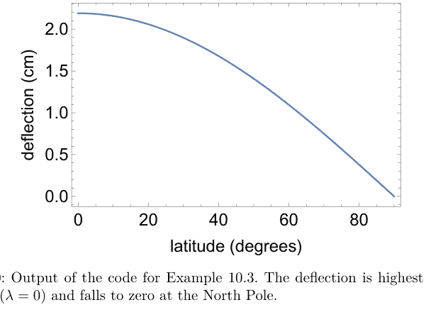

图 10.10：示例 10.3 的代码输出。偏转量在赤道（\(\lambda = 0\)）处最大（2.2厘米），在北极处降为零。

## 10.5 傅科摆

涉及非惯性参考系最著名的问题之一是傅科摆，它最初由法国物理学家让-伯纳德-莱昂·傅科（1819–1868）设计。该摆由一个重物 \(m\) 通过一根长而轻的细线悬挂在高高的天花板上。当摆摆动时，它会在水平面内进动。在某些情况下，摆的设置使其在进动时会撞倒小木钉。你可能在科学博物馆或大学里亲眼见过傅科摆。在网上快速搜索“傅科摆”会找到许多傅科摆运行的视频。傅科最初构想这个摆是为了演示地球的自转。1851年，他使用一个28公斤的质量，通过一根67米长的细线悬挂在法国巴黎先贤祠的穹顶上。在本节中，我们将推导傅科摆的运动方程，并展示其进动周期如何与摆的纬度成正比。

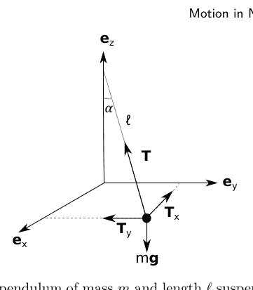

图 10.11：一个质量为 $m$、长度为 $\ell$ 的傅科摆，悬挂在 $z$ 轴上某点的高处。

我们从摆的示意图开始。图 10.11 显示了一个质量为 $m$ 的傅科摆，连接在一根长度为 $\ell$ 的长轻细线上。所示的坐标系是一个非惯性系，其 $xy$ 平面与地球表面相切，$z$ 轴沿当地垂直方向。角度 $\alpha$ 很小。作用在傅科摆上的力有两个：重力和张力。重力 $m\mathbf{g}$ 使用了包含离心力的有效重力加速度 $\mathbf{g}$，如前所述。细线中的张力 $\mathbf{T}$ 如图 10.11 所示，其中也包括了 $\mathbf{T}$ 的 $x$ 和 $y$ 分量。注意，$\mathbf{T}$ 的 $z$ 分量将在后面的问题中讨论。最后，我们假设傅科摆的运动主要限制在 $xy$ 平面内。换句话说，$\dot{z} \ll \dot{x}$ 且 $\ddot{z} \ll \ddot{y}$。

假设地球的角加速度是恒定的，这在摆的运动周期内是一个极好的近似，我们可以使用 (10.4.22) 来找到质量 $m$ 的加速度，方法是将 (10.4.22) 除以 $m$ 并使用 $\mathbf{F}' = \mathbf{T}$，

$$\mathbf{a} = \frac{\mathbf{T}}{m} + \mathbf{g} - 2(\boldsymbol{\omega} \times \mathbf{v}) \qquad (10.5.1)$$

为了得到 $x(t)$ 和 $y(t)$（注意，在我们的假设下 $z(t) = 0$），我们需要找到矢量方程 (10.5.1) 的分量，并积分求解得到的二阶常微分方程。

为了得到常微分方程，我们写出 (10.5.1) 右侧每个矢量的分量，注意 $\mathbf{a} = \ddot{x}\hat{\mathbf{e}}_x + \ddot{y}\hat{\mathbf{e}}_y + \ddot{z}\hat{\mathbf{e}}_z$。从图 10.11 可以看出，$\mathbf{g} = -g\hat{\mathbf{e}}_z$，其中 $g$ 是当地有效重力加速度的大小。接下来，张力的分量可以利用 $\alpha$ 是小角度且 $\ell$ 很大这一事实来找到，

$$T_x \approx -T\frac{x}{\ell} \qquad T_y \approx -T\frac{y}{\ell} \qquad T_z \approx T \qquad (10.5.2)$$

其中我们分别使用了 $\sin \alpha \approx x/\ell$ 和 $y/\ell$ 来表示 $T_x$ 和 $T_y$。科里奥利加速度 $\boldsymbol{\omega} \times \mathbf{v}$ 可以使用示例 10.3 中概述的方法找到，

$$\boldsymbol{\omega} \times \mathbf{v} = \begin{vmatrix} \hat{\mathbf{e}}_x & \hat{\mathbf{e}}_y & \hat{\mathbf{e}}_z \\ -\omega \cos \lambda & 0 & \omega \sin \lambda \\ \dot{x} & \dot{y} & 0 \end{vmatrix} \qquad (10.5.3)$$
$$= (-\dot{y}\omega \sin \lambda)\hat{\mathbf{e}}_x + (\dot{x}\omega \sin \lambda)\hat{\mathbf{e}}_y + (-\dot{y}\omega \cos \lambda)\hat{\mathbf{e}}_z \qquad (10.5.4)$$

其中我们使用了 $\dot{z} \simeq 0$，因为摆的运动被限制在 $xy$ 平面内。因此，将矢量分量代入 (10.5.1)，我们得到，

$$\begin{cases} \ddot{x} = -\frac{T}{m} \frac{x}{\ell} + 2\dot{y}\omega \sin \lambda \\ \ddot{y} = -\frac{T}{m} \frac{y}{\ell} - 2\dot{x}\omega \sin \lambda \\ \ddot{z} = \frac{T}{m} - g + 2\dot{y}\omega \cos \lambda \end{cases}$$ (10.5.5)

摆保持在 $xy$ 平面内；因此，$\ddot{z} \approx 0$。此外，$\dot{y}\omega$ 与重力和张力引起的加速度相比很小。因此，我们可以使用 (10.5.5) 中 $\ddot{z}$ 的方程写出 $T = mg$，并且可以将 (10.5.5) 重写为，

$$\begin{cases} \ddot{x} + \beta^2 x = 2\omega_z \dot{y} \\ \ddot{y} + \beta^2 y = -2\omega_z \dot{x} \end{cases}$$ (10.5.6)

其中 $\beta^2 = T/(m\ell) \simeq g/\ell$，而 $\omega_z = \omega \sin \lambda$ 是角速度的 $\hat{\mathbf{e}}_z$ 分量。注意 (10.5.6) 包含一对*耦合*的二阶微分方程。这些方程被称为耦合的，因为 $\ddot{x}$ 的方程包含一个带有 $\dot{y}$ 的项，反之亦然。解析求解耦合常微分方程的一个常用方法是将其中一个方程乘以 $i = \sqrt{-1}$，然后将两个方程相加。将 $\ddot{y}$ 方程乘以 $i$ 并将其加到 $\ddot{x}$ 方程上的结果是，

$$(\ddot{x} + i\ddot{y}) + \beta^2 (x + iy) = -2\omega_z i (\dot{x} + i\dot{y})$$ (10.5.7)

我们看到 (10.5.7) 是关于变量 $q = x + iy$ 的二阶常微分方程，

$$\ddot{q} + 2i\omega_z \dot{q} + \beta^2 q = 0$$ (10.5.8)

(10.5.8) 的形式应该很熟悉；它类似于阻尼谐振子。(10.5.8) 的解是，

$$q(t) = e^{-i\omega_z t} \left[ A \exp\left( it\sqrt{\omega_z^2 + \beta^2} \right) + B \exp\left( -it\sqrt{\omega_z^2 + \beta^2} \right) \right]$$ (10.5.9)

注意，如果地球不旋转，$\omega_z = 0$，(10.5.8) 将变为，

$$\ddot{q}' + \beta^2 q' = 0$$ (10.5.10)

这是简谐运动的方程，其中我们使用了 $q' = x' + iy'$ 的符号来表示在非旋转参考系中 $q$ 的值。根据我们在第6章的工作，我们知道

$$q'(t) = A e^{i\beta t} + B e^{-i\beta t}$$ (10.5.11)

此外，从 (10.5.10) 我们看到 $\beta = \sqrt{g/\ell}$ 是地球不旋转时傅科摆的小振荡频率。因为 $\beta \gg \omega_z$，我们可以将 (10.5.9) 重写为

$$q(t) = e^{-i\omega_z t} [A e^{i\beta t} + B e^{-i\beta t}]$$ (10.5.12)

或

$$q(t) = e^{-i\omega_z t} q'(t)$$ (10.5.13)

接下来，我们通过令实部和虚部相等，得到我们所求的解 $x(t)$ 和 $y(t)$，

$$\begin{cases} x(t) = x' \cos(\omega_z t) + y' \sin(\omega_z t) \\ y(t) = -x' \sin(\omega_z t) + y' \cos(\omega_z t) \end{cases} \quad (10.5.15)$$

如果将 (10.5.15) 重写为矩阵方程，将更容易从物理上理解这些方程，

$$\begin{pmatrix} x(t) \\ y(t) \end{pmatrix} = \begin{pmatrix} \cos(\omega_z t) & \sin(\omega_z t) \\ -\sin(\omega_z t) & \cos(\omega_z t) \end{pmatrix} \begin{pmatrix} x'(t) \\ y'(t) \end{pmatrix} \quad (10.5.16)$$

(10.5.16) 中旋转矩阵的出现告诉我们，傅科摆的振动平面正以 $\omega_z = \omega \sin \lambda$ 的旋转频率转过一个角度 $\omega_z t$。因此，摆的进动速率 $\omega_z$ 取决于摆所在的纬度。我们也能看到傅科摆如何演示地球的自转，因为其旋转速率依赖于地球的角速度。

**示例 10.4：傅科摆在平面内的运动**

1851年，让-伯纳德-莱昂·傅科在法国巴黎演示了一个长度 $\ell$ 为67米的傅科摆。绘制 (10.5.6) 在初始条件 $x(0) = 0.1$、$y(0) = 0$、$\dot{x}(0) = 0$ 和 $\dot{y}(0) = 0$ 下的解，并解释结果。

**解：**

法国巴黎的纬度为北纬 $48.8^\circ$。下面的代码创建了绘图。Mathematica 的输出如图 10.12 所示。注意，摆从点 $(0.1, 0)$ 开始，振荡到点 $(-0.1, 0)$。随着时间的推移，摆的平面发生旋转。我们对 (10.5.6) 进行了积分，积分时间为摆的振动平面周期的四分之一，该周期约为：

$$\tau = \frac{\omega_z}{2\pi} = \frac{\omega \sin \lambda}{2\pi} = 108,072 \text{ s} = 30 \text{ 小时} \quad (10.5.17)$$

**Python 代码**

要在 Python 中解决这个问题，我们首先需要将 (10.5.6) 重写为一阶方程组：

$$\begin{cases} \dot{x} = r \\ \dot{y} = s \\ \dot{r} = -\beta^2 x + 2\omega_z s \\ \dot{s} = -\beta^2 y - 2\omega_z r \end{cases} \quad (10.5.18)$$

然后我们使用 `odeint` 来求解 (10.5.18)。解 $x$、$y$ 分别存储在 `x_coord` 和 `y_coord` 中。

```python
from scipy.integrate import odeint
import numpy as np

w = 7.272*10**(-5)    #地球角速度
lam = 48.8*np.pi/180  #lambda
l, g = 67, 9.8        #摆长, g
wz = w*np.sin(lam)
b = g/l               #beta-squared

def deriv(u,t):
    x, y, r, s = u
    dydt = [r, s,  -b**2*x + 2*wz*s, -b**2*y - 2*wz*r ]
    return dydt

t = np.linspace(0,27000,10000)
ics = [0.1,0,0,0]

soln = odeint(deriv, ics, t)

x_coord = soln[:,0]
y_coord = soln[:,1]

plt.plot(x_coord,y_coord)
plt.ylabel('y')
plt.xlabel('x')
plt.show()
```

**Mathematica 代码**
我们使用 NDSolve 对 (10.5.6) 进行积分，并使用 ParametricPlot 绘制了摆的振动平面周期四分之一的解。

```mathematica
l = 67;

λ = 48.8 * Pi/180;

g = 9.8;

w = 7.727 * 10^(-5);

wz = w * Sin[λ];

β = g/l;

soln = NDSolve[{x''[t] + β^2 * x[t]==2 * wz * y'[t],

y''[t] + β^2 * y[t]== - 2 * wz * x'[t],

x[0]==0.1,y[0]==0,x'[0]==0,y'[0]==0}, {x[t], y[t]}, {t, 0, 27000}];

ParametricPlot[{x[t], y[t]}/.soln, {t, 0, 27000}, FrameLabel->{x, y}]
```

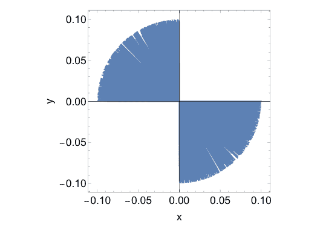

图 10.12：示例 10.4 的 Mathematica 输出。在积分时间内，摆扫过了四分之一周期。

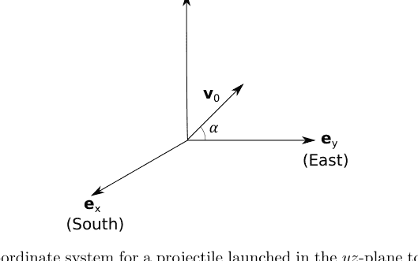

图 10.13：在 yz 平面内向东发射的抛体坐标系，发射角为 α，初速度为 v₀。

## 10.6 非惯性系中的抛体运动

作为本章的最后一节，我们将探讨在地球引力作用下，非惯性参考系中的抛体运动问题。我们将计算一个在北纬 λ = 50° 处以 α = 45° 角、v₀ = 200 m/s 的速度向东发射的抛体的科里奥利偏转。

为了解决非惯性系中的抛体运动问题，我们需要建立如图 10.13 所示的坐标系。我们展示了非惯性系，即观察者观看抛体飞行的参考系。该参考系位于地球北半球。ê_y 和 ê_x 方向分别对应东和南。向量 ê_z 沿垂直方向定向。抛体在 yz 平面内发射，因此如果地球不旋转，抛体将落在 R = Rê_y 的位置，并沿 y 轴距离原点 R 处着陆。

通过考虑地球自转的影响，我们预计抛体将落在 y 轴以南的某个地方。为了找到抛体的着陆点，我们将遵循与上一节寻找傅科摆旋转速率类似的过程。我们首先使用 (10.4.22) 写出抛体的加速度，

$$\mathbf{a} = \mathbf{g} - 2(\boldsymbol{\omega} \times \mathbf{v})$$

除了重力之外，没有其他外力作用于系统。因此，$\mathbf{F}' = 0$。与傅科摆一样，有效的重力加速度为 $\mathbf{g} = -g\hat{\mathbf{e}}_z$。科里奥利加速度为，

$$\boldsymbol{\omega} \times \mathbf{v} = \begin{vmatrix} \hat{\mathbf{e}}_x & \hat{\mathbf{e}}_y & \hat{\mathbf{e}}_z \\ -\omega \cos \lambda & 0 & \omega \sin \lambda \\ \dot{x} & \dot{y} & \dot{z} \end{vmatrix}$$

$$\boldsymbol{\omega} \times \mathbf{v} = (-\dot{y}\omega \sin \lambda)\hat{\mathbf{e}}_x + (\dot{z}\omega \cos \lambda + \dot{x}\omega \sin \lambda)\hat{\mathbf{e}}_y + (-\dot{y}\omega \cos \lambda)\hat{\mathbf{e}}_z$$

注意，我们没有对抛体速度的分量做任何假设。将加速度代入 (10.6.1)，我们得到以下方程，

$$\begin{cases} \ddot{x} = 2\dot{y}\omega \sin \lambda \\ \ddot{y} = -2\omega(\dot{z}\cos \lambda + \dot{x}\sin \lambda) \\ \ddot{z} = -g + 2\dot{y}\omega \cos \lambda \end{cases}$$

结果是一个耦合的常微分方程组。虽然可以通过一些近似来简化 (10.6.4)（例如 $2\dot{y}\omega \cos \lambda \ll g$），但我们将在示例 10.5 中寻求 (10.6.4) 的数值解。

> **示例 10.5：非惯性系中的抛体运动**
使用数值方法，求解 (10.6.4)，以找到在北纬 $\lambda = 50^\circ$ 处以 $\alpha = 45^\circ$ 角、$v_0 = 200$ m/s 的速度向东发射的抛体的射程和科里奥利偏转。

**解：**
Mathematica 和 Python 代码如下所示。

**Python 代码**
要在 Python 中解决这个问题，我们首先需要将 (10.6.4) 重写为一阶方程组：

$$\begin{cases} \dot{x} = q \\ \dot{y} = r \\ \dot{z} = s \\ \dot{q} = 2r\omega \sin \lambda \\ \dot{r} = -2\omega(s \cos \lambda + q \sin \lambda) \\ \dot{s} = -g + 2r\omega \cos \lambda \end{cases}$$

然后我们使用 `odeint`，解 $x, y, z$ 分别存储在 `x_coord`、`y_coord` 和 `z_coord` 中。为了得到飞行时间，我们需要知道 $z(t)$ 何时穿过零点（对于数值模型，抛体可以穿过地球表面）。使用 `np.where` 我们可以找到 `z_coord` 改变符号的索引值。使用 `np.diff`，我们得到符号改变前的索引（因此在 `tof_index` 中加 1）。最后，我们可以通过将 `tof_index` 插入相应的数组来找到飞行时间、射程和科里奥利偏转。

```python
from scipy.integrate import odeint
import numpy as np
import matplotlib.pyplot as plt
print('-'*28,'CODE OUTPUT','-'*29,'\n')

w = 7.272*10**(-5)            # 地球角速度
a, l = 45*np.pi/180, 50*np.pi/180 #发射角 alpha. 纬度
v0, g = 200, 9.8              # 初速度, g

z0_dot = v0*np.sin(a)
y0_dot = v0*np.cos(a)

def deriv(u,t):
    x, y, z, q, r, s = u
    dydt = [q, r, s, 2*r*w*np.sin(l), \
            -2*w*(s*np.cos(l) + q*np.sin(l)),\
            -g + 2*r*w*np.cos(l)]
    return dydt

t = np.linspace(0,1000,10000)
ics = [0, 0, 0, 0, y0_dot, z0_dot]
soln = odeint(deriv, ics, t)

x_coord = soln[:,0]
y_coord = soln[:,1]
z_coord = soln[:,2]

z_zero_crossings = np.where(np.diff(np.sign(z_coord)))[0]
print('The indices of the zero crossing are:',z_zero_crossings)

tof_index = z_zero_crossings[1]+1 #飞行时间的索引

time_of_flight = t[tof_index]
print('\nThe time of flight is: ', round(time_of_flight,2),' s')

print('\nThe Coriolis deflection = ',\
round(x_coord[tof_index],2),' m')

print('\nThe range = ', round(y_coord[tof_index],2),' m')

--------------------------- CODE OUTPUT ----------------------------
The indices of the zero crossing are: [  0 288]

The time of flight is:  28.9  s

The Coriolis deflection =  6.58  m

The range =  4085.64  m
```

### Mathematica 代码

代码首先定义必要的参数，包括初始速度的分量，它们被存储为 z0Dot 和 y0Dot。我们像往常一样使用 NDSolve 求解方程 (10.6.4)。飞行时间 T 通过使用 FindRoot 找到抛射体高度 z 等于零的时刻来获得。索引 [[1,2]] 用于移除 Mathematica 为 FindRoot 命令输出的替换规则。最后，我们将飞行时间代入 x[t] 以获得科里奥利偏转，代入 y[t] 以获得抛射体的射程。

```
ω = 7.27210^(-5);

α = 45 * Pi/180;

λ = 50 * Pi/180;

v0 = 200;

g = 9.8;

z0Dot = v0Sin[α];

y0Dot = v0Cos[α];

soln = NDSolve[{x''[t] == 2y'[t]ωSin[λ],

y''[t] == -2z'[t]ωCos[λ] - 2x'[t]ωSin[λ],

z''[t] == -g + 2y'[t]ωCos[λ], x'[0] == 0, y'[0] == y0Dot,

z'[0] == z0Dot, x[0] == 0, y[0] == 0, z[0] == 0}, {x, y, z},

{t, 0, 2000}];

T = FindRoot[(z[t]/.soln) == 0, {t, 10, 2000}][[1, 2]];

Print["The time of flight T = ", NumberForm[T, 4],

" s"]

The time of flight T = 28.9 s

Print["The Coriolis deflection is: ",

NumberForm[x[T]/.soln[[1]], 3], " m"]

The Coriolis deflection is: 6.58 m

range = y[T]/.soln[[1]];

Print["The range is R = ", NumberForm[range], " m"]

The range is R = 4085.3 m
```

## 10.7 章节总结

有时需要在非惯性参考系中描述粒子的运动。尽管牛顿第二定律仅在惯性系中有效，但我们可以修改牛顿第二定律以用于非惯性系。任何矢量 **Q** 相对于旋转非惯性系的时间导数，与惯性系中的时间导数通过以下关系相关联：

$$\left(\frac{d\mathbf{Q}}{dt}\right)_f = \left(\frac{d\mathbf{Q}}{dt}\right)_r + \boldsymbol{\omega} \times \mathbf{Q}$$

其中 $\boldsymbol{\omega}$ 是非惯性系相对于惯性系的角速度。

我们可以将旋转参考系中的牛顿第二定律改写为：

$$m\mathbf{a} = \mathbf{F}' - m\mathbf{A} - 2m(\boldsymbol{\omega} \times \mathbf{v}) - m(\dot{\boldsymbol{\omega}} \times \mathbf{r}) - m[\boldsymbol{\omega} \times (\boldsymbol{\omega} \times \mathbf{r})]$$

其中：

- **a** = 相对于非惯性系的加速度
- **F'** = 作用在粒子上的“相互作用”力（重力、摩擦力）的合力
- **A** = 非惯性系相对于惯性系的线加速度
- $-2(\boldsymbol{\omega} \times \mathbf{v})$ = 科里奥利加速度
- $-\dot{\boldsymbol{\omega}} \times \mathbf{r}$ = 由非惯性系的角加速度引起的加速度
- $-\boldsymbol{\omega} \times (\boldsymbol{\omega} \times \mathbf{r})$ = 离心加速度。

上述方程中的最后四项被称为“惯性力”或虚拟力，因为它们源于非惯性系的加速度，而不是由于粒子与另一个物体之间的相互作用。

## 10.8 章末习题

符号 🖥️ 表示需要计算机辅助的问题，形式包括图形、数值计算或符号求值。

### 第 10.1 节：在非旋转加速参考系中的运动

- 1. 一个质量为 $m$ 的单摆通过一根无质量杆悬挂在加速汽车的天花板上。当汽车以恒定加速度 **A** 向前加速时，单摆向后倾斜一个角度 $\phi_0$。求单摆的平衡角度 $\phi_0$。

### 第 10.2 节：角速度作为矢量

- 2. 证明相对角速度的叠加方式与平动速度相同。例如，我们知道，如果一个粒子相对于参考系 $S$ 以速度 **v** 运动，而参考系 $S$ 相对于惯性系 $S'$ 以速度 **V** 运动，那么粒子相对于 $S'$ 的速度是 **v'** = **V** + **v**。对一个相对于旋转参考系 $S$ 以角速度 $\boldsymbol{\omega}$ 旋转的物体重复此推理过程，其中参考系 $S$ 相对于惯性系 $S'$ 以角速度 $\boldsymbol{\Omega}$ 旋转。证明该物体相对于 $S'$ 的角速度是 $\boldsymbol{\omega}' = \boldsymbol{\Omega} + \boldsymbol{\omega}$。假设参考系 $S$ 和 $S'$ 具有相同的原点。

### 第 10.4 节：旋转参考系中的牛顿第二定律

- 3. 考虑一颗在纬度 $\lambda = 50^\circ$ N 处以速度 $v_0 = 500$ m/s 水平向南发射的子弹。作用在子弹上的科里奥利力与其重量相比如何？通过解析方法和使用 Python 或 Mathematica 来解决这个问题。

- 4. 一桶水绕其垂直对称轴以角速度 $\omega$ 旋转。桶中水面的形状是什么？

- 5. 原子钟显示，现代的一天比一个世纪前长约 1.7 毫秒。因此，尽管很小，地球的角加速度不为零 $\dot{\omega} \neq 0$，其中 $\omega$ 是地球的角速度。计算由于地球角速度变化引起的加速度 $\dot{\boldsymbol{\omega}} \times \mathbf{r}$，作用在位于美国弗吉尼亚州威廉斯堡（纬度 $37.3^\circ N$，经度 $76.6^\circ W$）地球表面固定的一个粒子上。通过解析方法和使用 Python 或 Mathematica 来解决这个问题。

- 6. 设 $S$ 是一个相对于惯性系 $S'$ 以恒定角速度 $\boldsymbol{\omega}$ 旋转的参考系，两个参考系的原点相同。粒子具有势能 $V$。用 $S$ 中的位置和速度坐标 $\mathbf{r}$ 和 $\dot{\mathbf{r}}$ 表示拉格朗日量。证明欧拉-拉格朗日方程导出

$$\mathbf{F}' = m\mathbf{a} + 2m(\boldsymbol{\omega} \times \mathbf{v}) + m\boldsymbol{\omega} \times (\boldsymbol{\omega} \times \mathbf{r})$$

- 7. 使用有效重力加速度，绘制质量为 $m$ 的粒子下落 100 米所需时间随纬度变化的函数图。这个时间在哪里最大？忽略空气阻力，并假设粒子从静止释放。

- 8. 一个质量为 $m$ 的棒球在纬度 $\lambda$ 处以初速度 $v_0$ 从地面垂直向上发射。求球返回地面时的科里奥利偏转。

- 9. 求一个 1.0 kg 的粒子在地球重力作用下从高度 $H = 100$ m 下落时偏离铅垂线的距离，该粒子受到线性空气阻力。假设粒子速度的水平分量很小，因此阻力仅作用在垂直方向。因此阻力为 $F_d = -b\dot{z}\hat{z}$，其中 $b = 0.1$ Ns/m。将答案与粒子在 45 度纬度真空中从相同高度下落的结果进行比较。

- 10. 考虑一个质量为 $m$ 的粒子被限制在一个垂直平面内运动，该平面以恒定角速度 $\boldsymbol{\omega}$ 绕垂直轴旋转。设 $x$ 是平面上的水平坐标，$z$ 是垂直坐标。使用解析方法，求解粒子的运动方程并描述粒子的运动。使用 Python 或 Mathematica，使用初始条件 $\mathbf{r}_0 = 1\hat{\mathbf{i}} - 1\hat{\mathbf{j}}$ 和 $\mathbf{v}_0 = 1\hat{\mathbf{i}} + 1\hat{\mathbf{j}}$（SI 单位）求解运动方程。使用 $\omega = 1$ rad/s 绘制粒子在平面上的运动。

- 11. 让我们再次考虑问题 10，但现在假设平面的角速度随时间增加，其角加速度为 $\boldsymbol{\alpha} = \alpha \hat{\mathbf{e}}_z$，其中 $\alpha$ 是一个正常数。然而，现在仅使用 Python 或 Mathematica 来解决这个问题。绘制 $\alpha = 0.5$ 和 $\alpha = 1.0 \text{ rad}/s^2$ 时粒子的运动。假设平面的初始角速度为零。

- 12. 一个棒球在纬度 $32^\circ$ S 处从 30 m 高度落下。忽略空气阻力，球落地时偏离垂直方向的方向和距离是多少？这个方向与示例 10.3 的结果相比如何？解释任何相似之处或差异。

### 第 10.5 节 傅科摆

- 13. 证明 (10.5.9)

$$q(t) = e^{-i \omega_z t} \left[ A \exp \left( i t \sqrt{\omega_z^2 + \beta^2} \right) + B \exp \left( -i t \sqrt{\omega_z^2 + \beta^2} \right) \right]$$

是二阶常微分方程 (10.5.8) 的解：

$$\ddot{q} + 2i \omega_z \dot{q} + \beta^2 q = 0$$

- 14. 如果傅科摆位于法国巴黎，其摆动平面的旋转速率是多少？位于美国肯塔基州巴黎的情况呢？绘制傅科摆的旋转速率随纬度变化的函数图。其最大值在哪里？最小值是多少，这个最小值出现在哪里？

- 15. 考虑一个傅科摆受到阻尼力 $\mathbf{F}' = -b v \hat{\mathbf{v}}$。进动频率会改变吗？

- 16. 如果 $\dot{\omega} \neq 0$，其中 $\omega$ 是地球绕其自转轴的角速度，傅科摆的进动频率是否会显著改变？为了回答这个问题，假设地球角速度的大小以恒定速率变化，但其方向不变（这在长时间尺度上不成立）。此外，假设角速度的变化非常小。例如，考虑第 4 章问题 26 中描述的情况，该问题指出地球的角速度在 3.5 亿年期间从 $7.6 \times 10^{-5}$ rad/s 变为 $7.3 \times 10^{-5}$ rad/s。设摆的质量为 $m$，长度为 $\ell$（假设非常长），位于北半球纬度 $\lambda$ 处。

### 第 10.6 节：非惯性系中的抛体运动

- 17. 在我们对非惯性系中抛体运动的研究中，我们推导出了方程

$$\ddot{x} = 2 \dot{y} \omega \sin \lambda$$
$$\ddot{y} = - 2 \omega (\dot{z} \cos \lambda + \dot{x} \sin \lambda) \quad (1)$$
$$\ddot{z} = - g + 2 \dot{y} \omega \cos \lambda$$

假设近似 $2 \dot{y} \omega \cos \lambda \ll g$ 成立，求解由此产生的两个耦合常微分方程组的封闭形式解。你将需要使用符号常微分方程求解器。找到解后，对 $x(t)$ 和 $y(t)$ 进行泰勒级数展开，并解释你的结果。

- 18. 使用计算机代数系统 (CAS) 求一个 1.0 kg 抛射体的射程和科里奥利偏转，该抛射体受到形式为 $\mathbf{F}' = -b v \hat{\mathbf{v}}$ 的线性空气阻力，其中 $b = 0.3$ SI 单位。初速度 $v_0 = 200$ m/s，纬度 $\lambda = 50^\circ$N，发射角 $\alpha = 45^\circ$。

# 11 刚体运动

本章首先回顾单个粒子绕任意轴的转动运动，以及转动惯量和质心的概念。我们特别关注质心如何简化粒子系统的平动和转动运动描述。回顾之后，我们将探讨转动惯量的广义定义，包括惯性积和惯性张量，并演示如何计算各种固体的这些量。我们将看到固体的转动惯量张量取决于坐标系的选择，并讨论刚体的平行轴定理。随后讨论矩阵的特征值和特征向量，以及它们如何用于描述刚体的主轴。本章最后将讨论欧拉方程，并描述旋转陀螺和陀螺仪的进动运动。

## 11.1 粒子绕固定轴的转动运动

本节，我们将回顾转动运动概念，重点关注一个粒子被限制在 $xy$ 平面内半径为 $r$ 的圆周上运动，其角速度为 $\boldsymbol{\omega} = \omega_z \hat{\mathbf{k}}$，如图 11.1 所示。我们稍后将推导描述更一般转动运动的方程。

如第 10 章所述，质量为 $m$ 的粒子的瞬时速度 $\mathbf{v}$ 由角速度矢量（通常形式为 $\boldsymbol{\omega} = \omega_x \hat{\mathbf{i}} + \omega_y \hat{\mathbf{j}} + \omega_z \hat{\mathbf{k}}$）与位置矢量 $\mathbf{r}$ 的叉积给出：

$$\mathbf{v} = \boldsymbol{\omega} \times \mathbf{r}$$

回顾第 4 章，角动量是描述转动运动的一个有用物理量。角动量矢量 $\boldsymbol{\ell}$ 由位置矢量 $\mathbf{r}$ 和动量矢量 $\mathbf{p} = m\mathbf{v}$ 的叉积给出：

$$\boldsymbol{\ell} = \mathbf{r} \times \mathbf{p} = m(\mathbf{r} \times \mathbf{v})$$

位置、速度、角动量和角速度矢量如图 11.1 所示，其中当 $\mathbf{r} = x\hat{\mathbf{i}} + y\hat{\mathbf{j}}$ 且 $\boldsymbol{\omega} = \omega_z \hat{\mathbf{k}}$ 时，角动量矢量和角速度矢量指向相同的方向，即 $z$ 轴。

由于位置矢量和速度矢量相互垂直，我们可以写出 $v = \omega r$，于是上式变为：

$$\ell = mrv = mr^2\omega$$

通常，非粗体变量表示矢量的大小，例如 $\omega = |\boldsymbol{\omega}|$。注意在这个方程中，角动量被写成一个量 $mr^2$ 乘以速度 $v$。如果我们将其与线动量 $p = mv$ 的定义联系起来，可以将 (11.1.3) 视为一个“转动惯量”（$mr^2$）乘以角速度 $\omega$。这个“转动惯量”被称为转动惯量 $I$，其定义为：

$$I = mr^2$$

其中 $r$ 是质量 $m$ 到转动轴的距离。

旋转质量 $m$ 的动能由 $T = \frac{1}{2}mv^2$ 给出，代入 $v = \omega r$，我们得到：

$$T = \frac{1}{2}I\omega^2$$

回顾第 4 章，作用在粒子上的力矩为 $\mathbf{N} = \mathbf{r} \times \mathbf{F}$。我们可以利用转动运动的牛顿第二定律，将力矩重写为角动量的时间导数。利用 (11.1.3) 我们可以写出 $\ell = I\omega$，于是转动牛顿第二定律变为：

$$N = \frac{d}{dt} (I\omega) = I\dot{\omega} = I\alpha \qquad (11.1.6)$$

其中 $\alpha = \dot{\omega}$ 是角加速度。

让我们将 (11.1.3) 重新视为一个矢量关系：

$$\ell = I\omega \qquad (11.1.7)$$

由于转动惯量在 (11.1.4) 中被定义为一个标量，这个矢量方程表明，在图 11.1 的例子中，角动量矢量 $\ell$ 和角速度矢量 $\omega$ 沿转动轴指向相同的方向。此外，我们可以将 (11.1.6) 重写为：

$$\mathbf{N} = I\alpha \qquad (11.1.8)$$

注意，在这种情况下，力矩矢量 $\mathbf{N}$ 和角加速度矢量 $\alpha$ 也指向相同的方向。

示例 11.1 展示了使用 Python 和 Mathematica 计算角动量矢量。

> **示例 11.1：** 使用 Python 和 Mathematica 计算图 11.1 所示情况下作用在质量 $m$ 上的角动量和力矩 $\mathbf{N}$。假设质量 $m$ 以恒定角速度 $\omega$ 绕 $z$ 轴在半径为 $R$ 的圆周上运动。

**解：**
我们使用柱坐标，角度随时间增加，满足 $\theta = \omega t$。
位置矢量
$$\mathbf{r} = R \cos(\omega t) \hat{\mathbf{i}} + R \sin(\omega t) \hat{\mathbf{j}}$$
代码计算叉积 $\boldsymbol{\omega} \times \mathbf{r}$ 并验证这确实等于速度矢量 $(dx/dt, dy/dt)$。
在此示例中，角动量矢量始终沿 $z$ 轴方向，其大小等于 $\ell_z = mR^2\omega$。
力矩 $\mathbf{N} = I\dot{\boldsymbol{\omega}} = 0$，因为质量以恒定角速度 $\omega$ 绕 $z$ 轴运动。

**Python 代码**
我们将位置矢量定义为一个列表，并使用 NumPy 中的 `cross` 函数计算叉积。

```
from numpy import cross
from sympy import sin, cos, symbols, simplify
print('-'*28,'CODE OUTPUT','-'*29,'\n')

R, omega, t, m , theta = symbols('R, omega, t, m, theta',real=True)

r_vector =  [R*cos(omega*t),R*sin(omega*t),0]
omega_vector =  [0,0,omega]

v_vector = simplify(cross(omega_vector, r_vector) )
print('\nv_vector = ',v_vector)

L_vector = m* cross(r_vector,v_vector )

print('\nL = ',simplify(L_vector))

----------------------------- CODE OUTPUT -----------------------------

v_vector =  [-R*omega*sin(omega*t), R*omega*cos(omega*t), 0]

L =  [0, 0, R**2*m*omega]
```

**Mathematica 代码**
该代码使用 Cross 命令计算叉积。

```
rvector = {R * Cos[ω * t], R * Sin[ω * t], 0};
ωvector = {0, 0, ω};
vvector = Cross[ωvector, rvector];
Print["v = ωvector x r = ", vvector];
v = ωvector x r = {-RωSin[tω], RωCos[tω], 0}
L = m * Cross[rvector, vvector];
Print["Angular momentum L = ", L//Simplify]
Angular momentum L = {0, 0, mR²ω}
```

现在让我们考虑一个质量为 $m$ 的粒子，它以恒定角度 $\theta$ 绕 $z$ 轴旋转，并具有瞬时角速度 $\omega$，如图 11.2 所示。在这种情况下，角动量矢量垂直于图中的阴影平面，该平面由位置矢量和速度矢量定义。因此，在图 11.2 的例子中，角动量矢量 $\ell$ 和角速度矢量 $\omega$ *不*指向相同的方向，并且在转动运动过程中，$\ell$ 的方向在空间中连续变化。

图 11.2：一个质量为 $m$ 的粒子在平行于 $xy$ 平面的平面上绕 $z$ 轴旋转，角速度矢量为 $\omega$。在此示例中，角动量矢量 $\ell$ 和角速度矢量 $\omega$ 不指向相同的方向。将此图与图 11.1 中的情况进行比较。

章末习题

19. 重复习题 18，但这次，抛射体受到形式为 $\mathbf{F}' = -bv^2\mathbf{\hat{v}}$ 的二次空气阻力，其中 $b = 0.01$ SI 单位。

20. 一个质量为 $m$ 的抛射体从地球表面纬度为 $\lambda$（北半球）的某点向东发射。抛射体的初速度为 $v_0$，发射角度为 $\alpha$（相对于水平面）。计算抛射体落地时的横向偏移。请在不借助计算机的情况下解决此问题。

21. 有一个传说，在第一次世界大战期间，英国海军在福克兰群岛附近作战时总是打不中德国舰船，因为他们的舰船没有正确考虑科里奥利力。我们在此不讨论这个传说的真实性，但假设它是真的，并且科里奥利力是已知的，但舰炮的设置是为了在北半球的战斗中命中目标。福克兰群岛位于南纬 $50^\circ$ 附近。假设舰炮被设置为能准确命中北纬 $50^\circ$ 的目标，那么在福克兰群岛战役中，英国舰船偏离目标多少？假设德国舰船在英国舰船的正东方，英国舰船的舰炮初速为 500 m/s，炮弹以 $20^\circ$ 的角度（相对于水平面）发射。

在这种情况下，方程 $\ell = I\omega$ 不再适用，因为 $\ell$ 和 $\omega$ 的方向并不像图 11.1 中那样相同。我们必须为质量 $m$ 重新定义转动惯量的概念。正如我们将在本章后面看到的，我们需要用一个更普遍的物理量——*转动惯量张量* $\mathbf{I}$——来替换这个方程中的标量 $I$。

**示例 11.2：** 使用 Python 和 Mathematica 计算图 11.2 所示旋转质量 $m$ 的角动量和力矩，假设 $\omega = |\omega|$ 为常数。

**解：**
我们采用与前一个示例相同的方法，使用柱坐标。
位置矢量

$$\mathbf{r} = R \sin \theta \cos (\omega t) \hat{\mathbf{i}} + R \sin \theta \sin (\omega t) \hat{\mathbf{j}} + R \cos \theta \hat{\mathbf{k}}$$

出现在坐标 $x, y$ 表达式中的长度 $R \sin \theta$ 代表了粒子绕 $z$ 轴旋转的半径。
角动量的分量为：

$$\ell_x = -m R^2 \omega \sin \theta \cos \theta \cos (\omega t)$$

$$\ell_y = -m R^2 \omega \sin \theta \cos \theta \sin (\omega t)$$

$$\ell_z = -m R^2 \omega \sin^2 \theta$$

显然，在这种情况下，角动量矢量 $\ell$ 在 $x, y$ 和 $z$ 轴上都有非零分量。通过检查计算出的分量 $\ell_x$ 和 $\ell_y$，我们看到矢量 $\ell$ 以恒定的角速度 $\omega$ 绕 $z$ 轴旋转，并且 $z$ 分量 $\ell_z = m R^2 \omega \sin^2 \theta$ 随时间保持不变。图 11.2 的代码如下。

### Python 代码

该代码与前一个示例非常相似，只是使用了不同的位置矢量。

```
from numpy import cross
from sympy import sin, cos, symbols, simplify
print('-'*28,'CODE OUTPUT','-'*29,'\n')

R, omega, t, m , theta = symbols('R, omega, t, m, theta',real=True)

r_vector =  [R*sin(theta)*cos(omega*t),R*sin(theta)*sin(omega*t),\n            R*cos(theta)]

omega_vector =  [0,0,omega]
v_vector = simplify(cross(omega_vector, r_vector) )
L_vector = m* cross(r_vector,v_vector )

print('Lx_component = ',L_vector[0])
print('Ly_component = ',L_vector[1])
print('Lz_component = ',simplify(L_vector[2]))

----------------------------- CODE OUTPUT -----------------------------
Lx_component =  -R**2*m*omega*sin(theta)*cos(theta)*cos(omega*t)
Ly_component =  -R**2*m*omega*sin(theta)*sin(omega*t)*cos(theta)
Lz_component =  R**2*m*omega*sin(theta)**2
```

### Mathematica 代码

```
rvector = {R * Sin[\theta] * Cos[\omega * t], R * Sin[\theta] * Sin[\omega * t], R * Cos[\theta]};
\omega vector = {0, 0, \omega};
vvector = Cross[\omega vector, rvector];
Print["v = \omega vector x r = ", vvector];
v = \omega vector x r = {-R\omega Sin[\theta]Sin[t\omega], R\omega Cos[t\omega]Sin[\theta], 0}
L = m * Cross[rvector, vvector];
Print["The angular momentum L is: "];
Print["L = ", L//Simplify]
The angular momentum L is:
L = {-mR^2\omega Cos[\theta]Cos[t\omega]Sin[\theta], -mR^2\omega Cos[\theta]Sin[\theta]Sin[t\omega], mR^2\omega Sin[\theta]^2}
```

在我们讨论刚体的转动性质之前，让我们先回顾一下质心以及如何用它来描述粒子系统的旋转。

## 11.2 粒子系统转动性质回顾

在本节中，我们总结了在第 4 章和第 5 章中已经看到的关于粒子系统的动量、角动量和能量的一些结果。特别是，我们再次审视质心的重要性，以及它如何帮助我们简化刚体运动的描述。

### 11.2.1 质心

让我们考虑一组 $i = 1, 2, \dots, N$ 个离散粒子，如图 11.3 所示，每个粒子的质量为 $m_i$，相对于原点的位置为 $\mathbf{r}_i$。

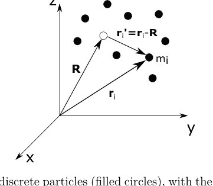

令 $\mathbf{R}$ 表示质心相对于原点的位置（在图 11.3 中显示为白色圆圈），$\mathbf{r}'_i$ 表示粒子相对于质心的位置。那么 $\mathbf{r}_i = \mathbf{r}'_i + \mathbf{R}$，质心的位置可以通过以下公式求得：

> **$N$ 个离散粒子的质心位置**

$$\mathbf{R} = \frac{1}{M} \sum_{i=1}^{N} m_i \mathbf{r}_i \quad M = \sum_{i=1}^{N} m_i \quad \sum_{i=1}^{N} m_i \mathbf{r}'_i = 0 \qquad (11.2.1)$$

对于连续质量分布 $M$ 的情况，求和被积分取代：

> **连续质量分布的质心位置**

$$\mathbf{R} = \frac{1}{M} \int \mathbf{r} dm \quad M = \int dm \quad \int \mathbf{r}' dm = 0 \qquad (11.2.2)$$

### 11.2.2 粒子系统的动量

从第 4 章我们回顾，粒子系统的总动量等于系统总质量 $M$ 与质心速度的乘积。我们可以将粒子系统视为一个位于系统质心处的、质量为 $M$ 的单个粒子，并将净外力 $\mathbf{F}_{\text{ext}}$ 视为作用在系统的质心上。牛顿第二定律可以用质心的运动表示如下：

> **粒子系统或连续质量分布的总动量**

$$\mathbf{P} = \sum_{i=1}^{N} \mathbf{p}_i = \sum_{i=1}^{N} m_i \dot{\mathbf{r}}_i = M \dot{\mathbf{R}} \quad (11.2.3)$$

$$\dot{\mathbf{P}} = M \ddot{\mathbf{R}} = \mathbf{F}_{\text{ext}} \quad (11.2.4)$$

因此，如果作用在粒子系统上的总外力为零，那么质心要么静止，要么以恒定速度运动，并且系统的总线动量守恒。

### 11.2.3 粒子系统的角动量

从第 4 章我们也回顾，系统的总角动量是两项之和：

> **粒子系统的总角动量**

$$\mathbf{L} = \sum_{i=1}^{N} (\mathbf{r}'_i \times \mathbf{p}'_i) + \mathbf{R} \times \mathbf{P} \quad (11.2.5)$$

$$\dot{\mathbf{L}} = \mathbf{N} \quad (11.2.6)$$

第一项 $\sum (\mathbf{r}'_i \times \mathbf{p}'_i)$ 代表粒子相对于质心的角动量，第二项 $(\mathbf{R} \times \mathbf{P})$ 是质心相对于原点的角动量。在这种情况下，牛顿第二定律可以表述如下：如果粒子系统中粒子之间的内力是中心力，那么作用在该系统上的总外力矩 $\mathbf{N}$ 等于系统总角动量 $\dot{\mathbf{L}}$ 的时间变化率。因此，如果作用在粒子系统上的总外力矩为零，那么系统的总角动量守恒。

### 11.2.4 粒子系统的功和动能

在第 5 章中，我们看到粒子系统的总动能也是两项之和。

### 粒子系统的动能

$$T = \frac{1}{2} M \dot{\mathbf{R}}^2 + \sum_{i=1}^{N} \left[ \frac{1}{2} m_i (\dot{\mathbf{r}}'_i)^2 \right]$$ (11.2.7)

$$W_{12} = T_2 - T_1$$ (11.2.8)

第一项是质心的平动动能 $\frac{1}{2} M \dot{\mathbf{R}}^2$，第二项 $\sum \frac{1}{2} m_i (\dot{\mathbf{r}}'_i)^2$ 代表每个粒子相对于质心的动能。我们还看到，将粒子系统从动能状态 $T_1$ 移动到动能状态 $T_2$ 所做的总功 $W_{12}$ 等于动能的变化。此外，对于刚体，相对于质心的唯一运动是旋转。因此，式 (11.2.7) 中的第二项是绕质心的转动动能。然后我们可以将方程 (11.2.7) 理解为：刚体的总动能等于质心的平动动能加上绕刚体质心的转动动能。

对于势能，我们需要考虑外力和内力及其相应的势能。第 $i^{\text{th}}$ 个质量的势能为：

$$V_i = V_i^{\text{ext}} + \sum_{j \neq i} V_{i,j}^{\text{int}}$$ (11.2.9)

其中 $V_i^{\text{ext}}$ 是作用在 $m_i$ 上的外力引起的势能，$V_{i,j}^{\text{int}}$ 是 $m_i$ 和 $m_j$ 之间的内相互作用力引起的势能。这种相互作用力的一个例子可以是引力、静电力或任何其他中心力。通常对于中心力，$V_{i,j}^{\text{int}} = V_{i,j}^{\text{int}} (|\mathbf{r}_i - \mathbf{r}_j|)$，即势能仅取决于两个粒子之间的距离。因此，系统的总势能为：

$$V = \sum_{i=1}^{N} V_i^{\text{ext}} + \sum_{i=1}^{N} \sum_{j \neq i} V_{i,j}^{\text{int}} (|\mathbf{r}_i - \mathbf{r}_j|)$$ (11.2.10)

*刚体*被定义为构成固体的粒子彼此之间保持固定距离的固体。因此，内势能可以忽略，因为它对每个粒子来说都是常数。因此，对于刚体，我们只需要考虑外力；内中心力是无关紧要的。当作用在粒子系统上的所有内力和外力都是保守力时，总机械能 $E = T + V$ 守恒。

在第 4 章和第 5 章中，我们看到上述关于线动量、角动量和动能的结果也适用于连续质量分布，只需将求和替换为适当的积分。

## 11.3 转动惯量张量

在本节中，我们推导一个更普遍的转动惯量定义。图 11.4 显示了一个刚体（阴影区域）绕固定轴 AB 旋转，其角速度矢量为 $\boldsymbol{\omega}$。我们将这个刚体描述为一组位于位置 $\mathbf{r}_i$ 的有限质量 $m_i$ 的集合，这些位置是相对于固定在旋转体上的坐标系 $xyz$ 而言的。

质量 $m_i$ 的瞬时速度 $\mathbf{v}_i$ 由角速度向量 $\boldsymbol{\omega} = \omega_x \hat{\mathbf{i}} + \omega_y \hat{\mathbf{j}} + \omega_z \hat{\mathbf{k}}$ 与位置向量 $\mathbf{r}_i = x_i \hat{\mathbf{i}} + y_i \hat{\mathbf{j}} + z_i \hat{\mathbf{k}}$ 的叉积给出：

$$\mathbf{v}_i = \boldsymbol{\omega} \times \mathbf{r}_i \qquad (11.3.1)$$

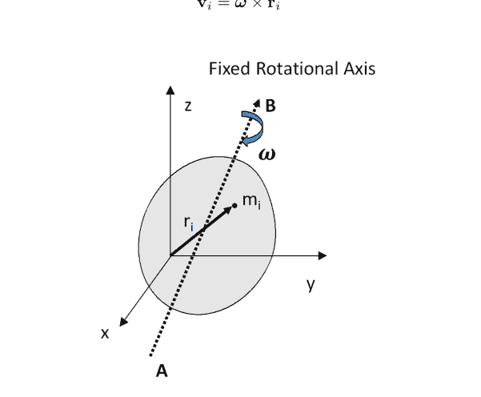

图 11.4：具有固定旋转轴 $AB$ 的刚体。所示坐标系固定在旋转体上。

相对于坐标系中心的总角动量向量 $\mathbf{L}$ 由各质量 $m_i$ 的角动量的矢量和给出：

$$\mathbf{L} = \sum m_i (\mathbf{r}_i \times \mathbf{v}_i) = \sum m_i [\mathbf{r}_i \times (\boldsymbol{\omega} \times \mathbf{r}_i)] \qquad (11.3.2)$$

其中求和 $i = 1 \dots n$ 遍历构成刚体的所有质量 $m_i$。

我们现在使用三重叉积恒等式 $\mathbf{A} \times (\mathbf{B} \times \mathbf{A}) = A^2 \mathbf{B} - (\mathbf{A} \cdot \mathbf{B}) \mathbf{A}$ 来计算 $\mathbf{r}_i \times (\boldsymbol{\omega} \times \mathbf{r}_i)$：

$$\mathbf{r}_i \times (\boldsymbol{\omega} \times \mathbf{r}_i) = r_i^2 \boldsymbol{\omega} - \mathbf{r}_i (\mathbf{r}_i \cdot \boldsymbol{\omega}) \qquad (11.3.3)$$

$$\mathbf{r}_i \times (\boldsymbol{\omega} \times \mathbf{r}_i) = (x_i^2 + y_i^2 + z_i^2) (\omega_x \hat{\mathbf{i}} + \omega_y \hat{\mathbf{j}} + \omega_z \hat{\mathbf{k}}) - (x_i \hat{\mathbf{i}} + y_i \hat{\mathbf{j}} + z_i \hat{\mathbf{k}}) (x_i \omega_x + y_i \omega_y + z_i \omega_z) \qquad (11.3.4)$$

将 (11.3.4) 代入 (11.3.2) 并合并 $\hat{\mathbf{i}}$、$\hat{\mathbf{j}}$ 和 $\hat{\mathbf{k}}$ 的项：

$$\mathbf{L} = L_x \hat{\mathbf{i}} + L_y \hat{\mathbf{j}} + L_z \hat{\mathbf{k}} \qquad (11.3.5)$$

$$\mathbf{L} = (I_{xx} \omega_x + I_{xy} \omega_y + I_{xz} \omega_z) \hat{\mathbf{i}} + (I_{yx} \omega_x + I_{yy} \omega_y + I_{yz} \omega_z) \hat{\mathbf{j}} + (I_{zx} \omega_x + I_{zy} \omega_y + I_{zz} \omega_z) \hat{\mathbf{k}} \qquad (11.3.6)$$

其中标量 $I_{kl}$（$k, l = x, y, \text{或 } z$）是*转动惯量张量* $\mathbf{I}$ 的分量，其定义如下：

### 离散质量 $m_i$ 的转动惯量张量

$$I_{xx} = \sum_{i=1}^{N} m_i (y_i^2 + z_i^2) = \sum_{i=1}^{N} m_i (r_i^2 - x_i^2)$$
$$I_{yy} = \sum_{i=1}^{N} m_i (x_i^2 + z_i^2) = \sum_{i=1}^{N} m_i (r_i^2 - y_i^2)$$
$$I_{zz} = \sum_{i=1}^{N} m_i (x_i^2 + y_i^2) = \sum_{i=1}^{N} m_i (r_i^2 - z_i^2)$$
$$I_{xy} = I_{yx} = -\sum_{i=1}^{N} m_i x_i y_i$$
$$I_{xz} = I_{zx} = -\sum_{i=1}^{N} m_i x_i z_i$$
$$I_{yz} = I_{zy} = -\sum_{i=1}^{N} m_i y_i z_i$$

从这些方程可以清楚地看出，转动惯量矩阵 $\mathbf{I}$ 是对称的，即 $I_{xy} = I_{yx}$，$I_{xz} = I_{zx}$，且 $I_{yz} = I_{zy}$。
方程 (11.3.6) 和 (11.3.8) 可以写成两个矩阵 $\mathbf{I}$ 和 $\boldsymbol{\omega}$ 的乘积：

## 角动量与转动惯量张量 $\mathbf{I}$

$$\mathbf{L} = \mathbf{I} \cdot \boldsymbol{\omega}$$
$$\mathbf{I} = \begin{bmatrix} I_{xx} & I_{xy} & I_{xz} \\ I_{yx} & I_{yy} & I_{yz} \\ I_{zx} & I_{zy} & I_{zz} \end{bmatrix} \quad \text{且} \quad \boldsymbol{\omega} = \begin{bmatrix} \omega_x \\ \omega_y \\ \omega_z \end{bmatrix}$$

项 $I_{xx}$、$I_{yy}$ 和 $I_{zz}$ 被称为*转动惯量*。这些是刚体绕各轴的转动惯量。项 $I_{xy}$、$I_{yz}$、$I_{xz}$、... 被称为*惯量积*。正如我们稍后将看到的，如果 $x$、$y$ 和 $z$ 轴对应于刚体的对称轴，则惯量积为零。惯量积衡量了刚体质量分布关于 $x$、$y$ 和 $z$ 轴的对称性。

为了理解惯量积的重要性，请考虑以下情况。假设你对平衡汽车轮胎感兴趣。对于轮胎，对称轴是穿过轮胎中心并垂直于轮胎平面的轴。一个正常的轮胎绕该轴旋转，换句话说，其角动量向量指向轴的方向。假设轴指向 $z$ 方向。我们希望车轮的角动量为 $\mathbf{L} = I_{zz}\omega\mathbf{k}$。然而，假设车轮的质量在轴周围分布不均匀，那么该轴就不再是至少有两个非零的惯量积。为简单起见，假设 $I_{zy} \neq 0$ 且所有其他惯量积都等于零。那么在这种情况下，车轮将发生进动（摇摆），因为 $\mathbf{L}$ 不再与轴（指向 $z$ 方向）平行。因此，汽车技术人员会在轮胎上增加小配重以使其平衡，从而使车轮的角动量与其旋转轴平行。

方程 (11.3.7) 也可以写成一个单一的方程，如下所示：

$$I_{kl} = \sum_{i=1}^{N} m_i \left( \delta_{kl} \sum_{s=1}^{3} u_{is}^2 - u_{ik}u_{il} \right)$$

其中我们使用紧凑符号 $u_{is}$（$s = 1, 2, 3$）来表示质量 $m_i$ 的位置向量 $\mathbf{r}_i = (x_i, y_i, z_i)$ 的三个分量。例如，$u_{32}$ 是 $m_3$ 的 $y$ 坐标。(11.3.11) 中的符号 $\delta_{kl}$ 是克罗内克 delta，当 $k = l$ 时等于 1，否则为 0。

重要的是要记住，惯量张量的元素取决于坐标系原点的选择。示例 11.3 展示了如何计算单个粒子的转动惯量张量的元素。

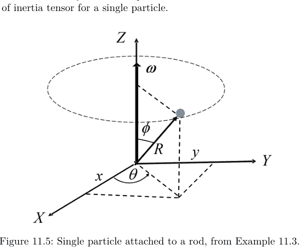

图 11.5：连接在杆上的单个粒子，来自示例 11.3。

> **示例 11.3：单个粒子的转动惯量张量**

一个质量为 $m$ 的粒子连接在一根长度为 $R$ 的无质量细杆上，并以恒定角度 $\phi$ 绕 z 轴旋转，如图 11.5 所示，具有恒定的角速度 $\omega$。计算相对于 $XYZ$ 坐标系的转动惯量张量。角动量向量 $\ell$ 指向哪个方向？

**解答**

质量 $m$ 的瞬时位置最好用柱坐标描述，其中恒定半径 $r = R \sin \phi$，即，

$$x = r \cos \theta = R \sin \phi \cos \theta \quad y = r \sin \theta = R \sin \phi \sin \theta \quad z = R \cos \phi$$

对于恒定的角速度，角度 $\theta = \omega t$。将这些 $x, y, z$ 的值代入惯量张量的表达式中，我们得到：

$$I_{xx} = m(y^2 + z^2) = mR^2(\sin^2 \phi \sin^2 \theta + \cos^2 \phi)$$

类似地

$$I_{yy} = m(x^2 + z^2) = mR^2(\sin^2 \phi \cos^2 \theta + \cos^2 \phi)$$

$$I_{zz} = m(x^2 + y^2) = mR^2(\sin^2 \phi \cos^2 \theta + \sin^2 \phi \sin^2 \theta) = mR^2 \sin^2 \phi$$

$$I_{xy} = -mxy = -mR^2 \sin^2 \phi \sin \theta \cos \theta \quad I_{xz} = -mxz = -mR^2 \sin \phi \cos \phi \cos \theta$$

$$I_{yz} = -myz = -mR^2 \sin \phi \cos \phi \sin \theta$$

完整的惯量张量为：

$$\mathbf{I} = mR^2 \begin{bmatrix} \sin^2 \phi \sin^2 \theta + \cos^2 \phi & -\sin^2 \phi \sin \theta \cos \theta & -\sin \phi \cos \phi \cos \theta \\ -\sin^2 \phi \sin \theta \cos \theta & \sin^2 \phi \cos^2 \theta + \cos^2 \phi & -\sin \phi \cos \phi \sin \theta \\ -\sin \phi \cos \phi \cos \theta & -\sin \phi \cos \phi \sin \theta & \sin^2 \phi \end{bmatrix}$$

现在可以通过将此矩阵 $\mathbf{I}$ 与角动量矩阵 $\boldsymbol{\omega} = (0, 0, \omega)$ 相乘来找到角动量向量。

$$\boldsymbol{\ell} = \mathbf{I}\boldsymbol{\omega}$$

由于 $\boldsymbol{\omega} = (0, 0, \omega)$，矩阵乘法得到矩阵 $\mathbf{I}$ 的第三列乘以 $\omega$，即，

$$\ell_x = -mR^2 \omega \sin \phi \cos \phi \cos \theta = -mR^2 \omega \sin(2\phi) \cos(\omega t)$$
$$\ell_y = -mR^2 \omega \sin \phi \cos \phi \sin \theta = -mR^2 \omega \sin(2\phi) \sin(\omega t)$$
$$\ell_z = mR^2 \omega \sin^2 \phi$$

其中我们使用了三角恒等式 $2 \cos \phi \sin \phi = \sin(2\phi)$，并代入了 $\theta = \omega t$。

这些方程的物理解释是，当质量 $m$ 以固定角度 $\phi$ 绕 $z$ 轴旋转时，角动量向量 $\boldsymbol{\ell}$ 也绕 $z$ 轴旋转，但角度不同，等于 $2\phi$。角动量向量的 $z$ 分量随时间保持恒定，等于 $\ell_z = mR^2 \omega \sin^2 \phi$。

### Python 代码

我们使用 SymPy 中的 Matrix 命令来定义矩阵 $\mathbf{I}$ 和 $\boldsymbol{\omega}$，并使用 NumPy 中的 dot 命令来计算两个矩阵的乘积 $\boldsymbol{\ell} = \mathbf{I}\boldsymbol{\omega}$。

```python
from numpy import dot
from sympy import Matrix, sin, cos, symbols, simplify
print('-' * 28, 'CODE OUTPUT', '-' * 29, '\n')

R, omega, t, m, theta, phi = symbols('R, omega, t, m, theta, phi', real=True)

x = R * sin(phi) * cos(theta)
y = R * sin(phi) * sin(theta)
z = R * cos(phi)

rsq = x**2 + y**2 + z**2

Ixx, Iyy, Izz = m * (rsq - x**2), m * (rsq - y**2), m * (rsq - z**2)
Ixy, Ixz, Iyz = -m * x * y, -m * x * z, -m * y * z

I = Matrix([[Ixx, Ixy, Ixz], [Ixy, Iyy, Iyz], [Ixz, Iyz, Izz]])
omega_matrix = Matrix([0, 0, omega])

print('Lx-component = ', dot(I, omega_matrix)[0][0])

print('\nLy-component = ', dot(I, omega_matrix)[1][0])

print('\nLz-component = ', simplify(dot(I, omega_matrix)[2][0]))

--------------------------- CODE OUTPUT ---------------------------
Lx-component =  -R**2*m*omega*sin(phi)*cos(phi)*cos(theta)

Ly-component =  -R**2*m*omega*sin(phi)*sin(theta)*cos(phi)

Lz-component =  R**2*m*omega*sin(phi)**2
```

### Mathematica 代码

我们将矩阵 $\mathbf{I}$ 和 $\boldsymbol{\omega}$ 定义为列表，并使用 Mathematica 中的 `Dot` 命令来计算两个矩阵的乘积 $\boldsymbol{\ell} = \mathbf{I}\boldsymbol{\omega}$。

```mathematica
x = R * Sin[\[Phi]] * Cos[\[Theta]];
y = R * Sin[\[Phi]] * Sin[\[Theta]];
z = R * Cos[\[Phi]];
\[Omega]vector = {0, 0, \[Omega]};
Ixx = m * (y^2 + z^2);
Iyy = m * (x^2 + z^2);
Izz = m * (x^2 + y^2);
Ixy = Iyx = -m * x * y;
Iyz = Izy = -m * y * z;
Ixz = Izx = -m * x * z;
Inertia = {{Ixx, Ixy, Ixz}, {Iyx, Iyy, Iyz}, {Izx, Izy, Izz}};
L = Dot[Inertia, \[Omega]vector];
Print["Angular momentum L = ", L // Simplify];
L = {-m R^2 \[Omega] Cos[\[Theta]] Cos[\[Phi]] Sin[\[Phi]], -m R^2 \[Omega] Cos[\[Phi]] Sin[\[Theta]] Sin[\[Phi]], m R^2 \[Omega] Sin[\[Phi]]^2}
```

如果我们处理的是连续均匀分布的粒子，而不是离散质量 $m_i$ 的集合，那么上述方程中的求和就变成了对连续变量 $(x, y, z)$ 的积分，并且材料的密度 $\rho(x, y, z)$ 必须包含在积分内部。对于三维固体，$dm = \rho dV$，惯性张量的分量变为：

### 连续质量分布的惯性张量

$$I_{xx} = \iiint_V (y^2 + z^2) \rho \, dx dy dz$$
$$I_{yy} = \iiint_V (x^2 + z^2) \rho \, dx dy dz$$
$$I_{zz} = \iiint_V (x^2 + y^2) \rho \, dx dy dz$$
(11.3.12)

$$I_{xy} = -\iiint_V xy \rho \, dx dy dz$$
$$I_{xz} = -\iiint_V xz \rho \, dx dy dz$$
$$I_{yz} = -\iiint_V yz \rho \, dx dy dz$$
(11.3.13)

示例 11.4 展示了如何使用*符号*积分来计算均匀立方体的惯性张量元素。

### 示例 11.4：立方体绕其质心的转动惯量

考虑一个边长为 $a$ 的均匀立方体，计算其相对于笛卡尔坐标系的转动惯量张量，该坐标系的原点 $(0, 0, 0)$ 位于质心，且 $x$、$y$ 和 $z$ 轴平行于立方体的边。

#### 解答：

我们使用笛卡尔坐标进行计算，$(x, y, z)$ 的积分限从 $-a/2$ 到 $a/2$。质量元为 $dm = (M/a^3) dV = (M/a^3) dx dy dz$，转动惯量元素为：

$$I_{xx} = \iiint_V (y^2 + z^2) dm = \frac{M}{a^3} \int_{-a/2}^{a/2} \int_{-a/2}^{a/2} \int_{-a/2}^{a/2} (y^2 + z^2) dx dy dz$$

$$I_{xx} = \frac{M}{a^3} \int_{-a/2}^{a/2} dx \int_{-a/2}^{a/2} dy \left[ y^2 z + \frac{z^3}{3} \right]_{z=-a/2}^{z=a/2}$$

$$I_{xx} = \frac{M}{a^3} \int_{-a/2}^{a/2} dx \left[ \frac{y^3}{3} a + \frac{a^3}{12} y \right]_{y=-a/2}^{y=a/2} = \frac{M}{a^3} \int_{-a/2}^{a/2} dx \left[ \frac{a^3}{12} a + \frac{a^3}{12} a \right] = \frac{1}{6} Ma^2$$

惯量积为：

$$I_{xy} = - \iiint_V x y dm = - \frac{M}{a^3} \int_{-a/2}^{a/2} \int_{-a/2}^{a/2} \int_{-a/2}^{a/2} x y dx dy dz$$

$$I_{xy} = - \frac{M}{a^3} \int_{-a/2}^{a/2} x dx \int_{-a/2}^{a/2} y dy \int_{-a/2}^{a/2} dz = - \frac{M}{a^3} 0 a = 0$$

根据对称性，$I_{xx} = I_{yy} = I_{zz} = Ma^2/6$ 且 $I_{xy} = I_{xz} = I_{yz} = 0$。

$$I = \begin{pmatrix} Ma^2/6 & 0 & 0 \\ 0 & Ma^2/6 & 0 \\ 0 & 0 & Ma^2/6 \end{pmatrix}$$

### Python 代码

SymPy 中的 `integrate` 命令用于执行三重积分，`Matrix` 命令用于创建 3×3 的惯性张量。

```python
from sympy import symbols, integrate, Matrix
print('-' * 28, 'CODE OUTPUT', '-' * 29, '\n')

x, y, z, a, m = symbols('x, y, z, a, m', real=True)  # symbols

# evaluate the integrals using triple integration in SymPy
Ixx = Iyy = Izz = integrate(y**2 + x**2, (x, -a/2, a/2),
    (y, -a/2, a/2), (z, -a/2, a/2)) * m / a**3

Ixy = Ixz = Iyz = -integrate(x * y, (x, -a/2, a/2),
    (y, -a/2, a/2), (z, -a/2, a/2)) * m / a**3

I = Matrix([[Ixx, Ixy, Ixz], [Ixy, Iyy, Iyz], [Ixz, Iyz, Izz]])
print('The inertia tensor I is:\n')
I

-------------------------------- CODE OUTPUT --------------------------------
The inertia tensor I is:
Matrix([
[a**2*m/6,        0,        0],
[       0, a**2*m/6,        0],
[       0,        0, a**2*m/6]])
```

### Mathematica 代码

`Integrate` 命令用于执行符号三重积分，`MatrixForm` 命令用于将 3×3 的惯性张量打印为矩阵形式。

```mathematica
Ixx =
Iyy = Izz = Integrate[y^2 + z^2, {x, -a/2, a/2}, {y, -a/2, a/2}, {z, -a/2, a/2}];
Ixy = Iyx = Integrate[x * y, {x, -a/2, a/2}, {y, -a/2, a/2}, {z, -a/2, a/2}];
Iyz = Izy = Integrate[y * z, {x, -a/2, a/2}, {y, -a/2, a/2}, {z, -a/2, a/2}];
Ixz = Izx = Integrate[x * z, {x, -a/2, a/2}, {y, -a/2, a/2}, {z, -a/2, a/2}];
Inertia = m/a^3 * {{Ixx, Ixy, Ixz}, {Iyx, Iyy, Iyz}, {Izx, Izy, Izz}};
Print["Moment of inertia tensor = ", Inertia // MatrixForm];
```

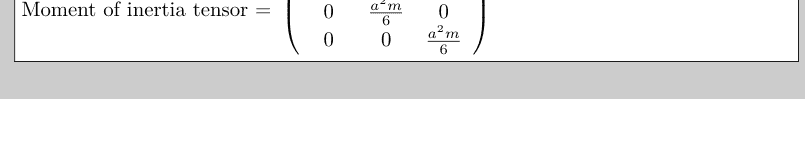

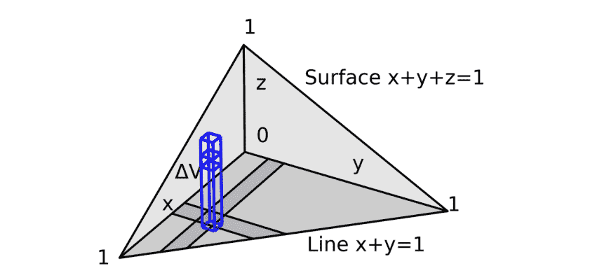

图 11.6：在示例 11.5 中计算均匀三角锥的转动惯量张量。

示例 11.5 展示了如何使用*数值*积分来计算具有均匀密度的三角锥的惯性张量元素。

> **示例 11.5：均匀三角锥的转动惯量**

考虑如图 11.6 所示的三角锥，其顶点位于原点、(1, 0, 0)、(0, 1, 0) 和 (0, 0, 1)。该锥体的密度为 $\rho = 1$（采用国际单位制）。使用数值积分计算其相对于原点在 (0, 0, 0) 的笛卡尔坐标系的转动惯量张量。

**解答：**

为了求转动惯量张量，我们首先需要选择一个坐标系并确定积分限。我们使用笛卡尔坐标进行计算，并需要确定积分限以计算 (11.3.12) 和 (11.3.13)。

体积元 $dV$ 如图 11.6 所示。注意其高度由其 $x$ 和 $y$ 坐标决定。图中锥体的“前”面由方程 $x + y + z = 1$ 描述。因此，$z$ 积分的积分限将从 0 到 $1 - x - y$。接下来，体积元在 $xy$ 平面内沿 $y$ 轴可平移的距离由其 $x$ 坐标决定。因此，$y$ 积分的积分限将从 0 到 $1 - x$（这是在 $xy$ 平面内构成锥体底面的直线方程）。最后，$x$ 的范围可以从 0 到 1。

现在我们有了所有部分，就可以进行积分了。当 $\rho = 1$ 时，质量元为 $dm = \rho \, dV = dx \, dy \, dz$，转动惯量元素为：

$$I_{xx} = \iiint_V (y^2 + z^2) \, dm = \iiint_V (y^2 + z^2) \, dx \, dy \, dz$$

$$I_{xx} = \int_0^1 dy \int_0^{1-y} dx \left[ y^2 z + \frac{z^3}{3} \right]_{z=0}^{z=1-x-y}$$

$$I_{xx} = \int_{0}^{1} dy \int_{0}^{1-y} dx \left[ y^2(1-x-y) + \frac{(1-x-y)^3}{3} \right]$$

这些积分手动计算相当繁琐，因此我们使用计算机代数系统（CAS）中可用的替代数值积分程序。

### Python 代码

Python 代码使用 `scipy.integrate.tplquad()` 函数来计算三重积分。为了简化代码，我们定义了一个函数 `f`，它为三重积分调用 `scipy.integrate.tplquad()` 命令，并为惯性张量 $I_{xx}$、$I_{xy}$ 等的每个分量调用该函数。

这里双重积分的一个重要特点是积分限在代码行 `tplquad(i, 0, 1, 0, yupper)` 中的实现。这里 `yupper` 是表示 $y$ 积分上限的函数 $1-x$，而 `i` 是要积分的函数。

在这个例子中，我们使用 NumPy 数组来表示转动惯量矩阵。注意积分顺序 `tplquad(i, 0, 1, 0, x2, 0, z2)` 再次很重要，我们将积分上限定义为两个函数：`x2` 和 `z2`。

```python
from scipy.integrate import tplquad
import numpy as np
from sympy import symbols
print('-' * 28, 'CODE OUTPUT', '-' * 29, '\n')

z2 = lambda y, z: 1 - y - z  # upper limit for z integration
x2 = lambda z: 1 - z  # upper limit for x integration

def f(i):
    return tplquad(i, 0, 1, 0, x2, 0, z2)[0]

Ixx = lambda z, y, x: (y**2 + z**2)
Iyy = lambda z, y, x: (x**2 + z**2)
Izz = lambda z, y, x: (y**2 + x**2)

Ixy = lambda z, y, x: -x * y
Ixz = lambda z, y, x: -x * z
Iyz = lambda z, y, x: -y * z

I = np.array([[f(Ixx), f(Ixy), f(Ixz)], [f(Ixy), f(Iyy), f(Iyz)],
              [f(Ixz), f(Iyz), f(Izz)]])
print('Moment of inertia tensor I=')
I

----------------------------- CODE OUTPUT -----------------------------
Moment of inertia tensor I=
array([[ 0.03333333, -0.00833333, -0.00833333],
       [-0.00833333,  0.03333333, -0.00833333],
       [-0.00833333, -0.00833333,  0.03333333]])
```

## 11.4 动能与惯量张量

我们现在来计算刚体的动能，并展示它与惯量张量的关系。总动能是各质量 $m_i$ 以速度 $\mathbf{v}_i$ 运动时的动能之和：

$$T = \sum \left( \frac{1}{2} m_i \mathbf{v}_i \cdot \mathbf{v}_i \right) = \frac{1}{2} \sum \left( m_i [(\boldsymbol{\omega} \times \mathbf{r}_i) \cdot \mathbf{v}_i] \right) \quad (11.4.1)$$

其中我们使用了 $\mathbf{v}_i = \boldsymbol{\omega} \times \mathbf{r}_i$，并且为简便起见省略了求和符号的上下限。注意，我们对所有 $i$ 值都使用了 $\boldsymbol{\omega}_i = \boldsymbol{\omega}$，因为对于刚体，每个质点具有相同的角速度。$\boldsymbol{\omega}$ 对每个质点都相同这一事实，源于刚体中质点间的距离是固定的。我们现在利用标量三重积 $(\mathbf{A} \times \mathbf{B}) \cdot \mathbf{C} = \mathbf{A} \cdot (\mathbf{B} \times \mathbf{C})$ 的性质来简化 $T$：

$$T = \frac{1}{2} \sum (m_i \boldsymbol{\omega} \cdot [(\mathbf{r}_i \times \mathbf{v}_i)]) = \frac{1}{2} \boldsymbol{\omega} \cdot \left( \sum m_i [(\mathbf{r}_i \times \mathbf{v}_i)] \right) = \frac{1}{2} \boldsymbol{\omega} \cdot \mathbf{L} \quad (11.4.2)$$

其中我们使用了质点系角动量的定义 $\mathbf{L} = \sum m_i [(\mathbf{r}_i \times \mathbf{v}_i)]$，该定义来自 (11.3.2)。我们现在使用 (11.3.6) 来表示角动量 $\mathbf{L}$。通过写出分量形式，我们得到：

$$T = \frac{1}{2} \boldsymbol{\omega} \cdot \mathbf{L} = \frac{1}{2} I_{xx} \omega_x^2 + \frac{1}{2} I_{yy} \omega_y^2 + \frac{1}{2} I_{zz} \omega_z^2 + I_{xy} \omega_x \omega_y + I_{yz} \omega_y \omega_z + I_{zx} \omega_z \omega_x \quad (11.4.3)$$

### 刚体的动能

$$T = \frac{1}{2} (\boldsymbol{\omega})^T \cdot \mathbf{L} = \frac{1}{2} (\boldsymbol{\omega})^T \cdot \mathbf{I} \cdot \boldsymbol{\omega} \quad (11.4.4)$$

这里的点积表示三个矩阵的乘法，$(\boldsymbol{\omega})^T$ 表示表示角速度向量 $\boldsymbol{\omega}$ 的列矩阵的转置（即一个行向量）。

如果角速度向量 $\boldsymbol{\omega}$ 指向单位向量 $\hat{\mathbf{n}}$ 的方向，我们可以写成 $\boldsymbol{\omega} = \omega \hat{\mathbf{n}}$，其中 $\omega$ 是角频率的大小。因此，上述矩阵方程变为：

$$T = \frac{1}{2} \omega^2 (\hat{\mathbf{n}})^T \cdot \mathbf{I} \cdot \hat{\mathbf{n}} \quad (11.4.5)$$

从基础物理学中我们回忆起，绕固定轴旋转的动能为：

$$T = \frac{1}{2} I_n \omega^2 \quad (11.4.6)$$

其中 $I_n$ 是绕该轴的*标量*转动惯量。通过比较最后两个方程，我们得到一般表达式：

### 绕单位向量 $\hat{\mathbf{n}}$ 方向轴的转动惯量

$$I_n = (\hat{\mathbf{n}})^T \cdot \mathbf{I} \cdot \hat{\mathbf{n}} \quad (11.4.7)$$

惯量积也可以使用类似于 (11.4.7) 的表达式来求得。例如，$I_{xy}$ 可以通过计算以下量得到：

$$I_{xy} = (\hat{\mathbf{i}})^T \cdot \mathbf{I} \cdot \hat{\mathbf{j}} \quad (11.4.8)$$

**示例 11.6：**
使用 SymPy 和 Mathematica 求立方体绕以下轴旋转时的标量转动惯量 $I_n$：
(a) 体对角线，
(b) $xy$ 平面上的面对角线，
(c) 沿 $x$ 轴的棱边。

**解**
我们首先计算相对于一个顶点为中心的坐标系的惯量张量，如示例 11.4 所示。一旦张量计算出来，就可以使用 (11.4.7) 和沿旋转方向的适当单位向量 $\hat{\mathbf{n}}$ 来获得标量转动惯量 $I$。

对于体对角线，我们有 $\hat{\mathbf{n}} = \frac{1}{\sqrt{3}} (\hat{\mathbf{i}} + \hat{\mathbf{j}} + \hat{\mathbf{k}})$；对于 $xy$ 平面上的面对角线，$\hat{\mathbf{n}} = \frac{1}{\sqrt{2}} (\hat{\mathbf{i}} + \hat{\mathbf{j}})$；对于沿 $x$ 轴的棱边，$\hat{\mathbf{n}} = \hat{\mathbf{i}}$。

下面的代码分别给出 $I = ma^2/6$，$I = 2ma^2/3$ 和 $I = 5ma^2/12$。正如我们从几何考虑所预期的，立方体的最大 $I$ 值出现在面对角线旋转时。

### Python 代码

张量使用 SymPy 计算，如前面的示例所示。我们使用 Numpy 中的 **transpose** 命令来求矩阵 $\omega = \omega\hat{n}$ 的转置，并使用 @ 命令来乘三个矩阵。

```python
from sympy import symbols, integrate, Matrix, sqrt
import numpy as np
print('-'*28,'CODE OUTPUT','-'*29,'\n')

x, y, z, a, m = symbols('x, y, z, a, m',real=True)  #  symbols

# evaluate the integrals using triple itegration in SymPy
Ixx = integrate(y**2+x**2, (x,0,a), (y,0,a),(z,0,a))
Iyy = integrate(y**2+x**2, (x,0,a), (y,0,a),(z,0,a))
Izz = integrate(y**2+x**2, (x,0,a), (y,0,a),(z,0,a))

Ixy = -integrate(x*y,(x,0,a), (y,0,a), (z,0,a))
Ixz = -integrate(x*y,(x,0,a), (y,0,a), (z,0,a))
Iyz= -integrate(x*y,(x,0,a), (y,0,a), (z,0,a))

I = np.array([[Ixx,Ixy,Ixz],[Ixy,Iyy,Iyz],[Ixz,Iyz,Izz]])*m/a**3

omega = np.array([1/sqrt(3),1/sqrt(3),1/sqrt(3)])
omega_trnsp = np.transpose(omega)

print('(a) When rotational axis is along diagonal,\',
I = ',omega_trnsp @ (I @ omega))

omega = np.array([1/sqrt(2),1/sqrt(2),0])
omega_trnsp = np.transpose(omega)

print('\n(b) When rotational axis is along face diagonal,\',
I = ',omega_trnsp @ (I @ omega))

omega = np.array([1,0,0])
omega_trnsp = np.transpose(omega)

print('\n(c) When rotational axis is along edge of cube,\',
I = ',omega_trnsp @ (I @ omega))

----------------------------- CODE OUTPUT -----------------------------
(a) When rotational axis is along diagonal,I =  a**2*m/6

(b) When rotational axis is along face diagonal,I =  5*a**2*m/12

(c) When rotational axis is along edge of cube,I =  2*a**2*m/3
```

### Mathematica 代码

张量使用 Integrate 计算，如前面的示例所示。我们使用点号命令来乘三个矩阵。

```mathematica
ρ = m/a^3;
Ixx = Iyy = Izz = Integrate[ρ(y^2 + z^2), {x, 0, a}, {y, 0, a}, {z, 0, a}];
Ixy = Iyz = Ixz = -Integrate[ρ(x * y), {x, 0, a}, {y, 0, a}, {z, 0, a}];
iCube = 
  (Ixx  Ixy  Ixz)
  (Ixy  Iyy  Iyz);
  (Ixz  Iyz  Izz)
ω = 1/Sqrt[3] * {1, 1, 1};
Print["(a) When the rotational axis is along cube diagonal, I=", ω.iCube.ω];
(a) When the rotational axis is along cube diagonal, I= (a^2 m)/6
ω = 1/Sqrt[2] * {1, 1, 0};
Print["(b) When the rotational axis is along face diagonal, I=",
ω.iCube.ω//Simplify];
(b) When the rotational axis is along face diagonal, I= (5 a^2 m)/12
ω = {1, 0, 0};
Print["(c) When the rotational axis is along edge of cube, I=", ω.iCube.ω];
(c) When the rotational axis is along edge of cube, I= (2 a^2 m)/3
```

## 11.5 不同坐标系中的惯量张量——平行轴定理

两个简化刚体转动惯量计算的重要定理是*平行轴定理*和*垂直轴定理*。
*平行轴定理*的最简单形式指出：如果 *I* 是物体绕轴 *AB* 的标量转动惯量，而 *I_CM* 是绕平行于 *AB* 且通过质心的第二轴的相应转动惯量，那么 *I* 和 *I_CM* 的关系为：

> 平行轴定理的简单形式
$$I = I_{CM} + md^2$$
(11.5.1)

## 11.5 平行轴定理与垂直轴定理

图 11.7 展示了两个坐标系，它们的轴彼此平行，在空间中通过一个向量 **a** 相对平移。

其中 $d$ 是两个平行轴之间的最短距离。

*垂直轴定理* 指的是一个薄片质量分布在笛卡尔坐标系的 $xy$ 平面上。如果 $I_x$、$I_y$ 和 $I_z$ 分别是该分布绕 $x$、$y$ 和 $z$ 轴的标量转动惯量，那么它们之间的关系为：

> **薄片的垂直轴定理**

$$I_z = I_x + I_y$$

(11.5.2)

更一般地，了解在不同坐标系中表达的惯性张量之间的关系是方便且有用的。

我们现在来证明平行轴定理。图 11.7 显示了两个笛卡尔坐标系，其原点分别为 $O$ 和 $O_{CM}$，且它们的轴彼此平行。注意 $O_{CM}$ 位于物体的质心处。如果 **a** 是连接两个原点的向量，那么两个坐标系中任意位置向量 $\mathbf{r}_i$ 和 $\mathbf{r}'_i$ 的关系为：

$$\mathbf{r}_i = \mathbf{r}'_i + \mathbf{a}$$

(11.5.3)

设 $\mathbf{I}$ 是在原点固定于点 $O$ 的坐标系 $(x, y, z)$ 中定义的惯性张量，$\mathbf{I}'$ 是在原点位于 $O_{CM}$ 的质心坐标系 $(x', y', z')$ 中的惯性张量。我们希望找到 $\mathbf{I}$ 和 $\mathbf{I}'$ 之间的关系。正如我们之前在 (11.3.11) 中看到的，惯性张量 $\mathbf{I}$ 关于 $O$ 的分量可以写成紧凑形式：

$$I_{kl} = \sum_{i=1}^{N} m_i \left( \delta_{kl} \sum_{s=1}^{3} u_{is}^2 - u_{ik}u_{il} \right)$$

(11.5.4)

其中我们再次使用紧凑符号 $u_{is}$ ($s = 1, 2, 3$) 来表示质量 $m_i$ 的位置向量 $\mathbf{r}_i = (x_i, y_i, z_i)$ 的三个分量，$\delta_{kl}$ 是克罗内克 delta 符号。

类似地，关于第二个坐标系 $O_{CM}$ 的张量分量为：

$$I'_{kl} = \sum_{i=1}^{N} m_i \left( \delta_{kl} \sum_{s=1}^{3} (u'_{is})^2 - u'_{ik} u'_{il} \right) \quad (11.5.5)$$

方程 (11.5.3) 可以用这些分量表示为：

$$u_{is} = u'_{is} + a_s \quad s = 1, 2, 3 \quad (11.5.6)$$

将 (11.5.6) 代入 (11.5.4)，展开各项并重新整理，我们得到：

$$I_{kl} = \sum_{i=1}^{N} m_i \left( \delta_{kl} \sum_{s=1}^{3} (u'_{is} + a_s)^2 - (u'_{ik} + a_k)(u'_{il} + a_l) \right)$$
$$= \sum_{i=1}^{N} m_i \left[ \delta_{kl} \sum_{s=1}^{3} (u'_{is})^2 - u'_{ik} u'_{il} \right] + \sum_{i=1}^{N} m_i \left[ \delta_{kl} \sum_{s=1}^{3} a_s^2 - a_k a_l \right]$$
$$+ 2 \sum_{i=1}^{N} m_i \left[ \delta_{kl} (u'_{is})^2 a_s \right] - \sum_{i=1}^{N} m_i u'_{ik} a_l - \sum_{i=1}^{N} m_i u'_{il} a_k \quad (11.5.7)$$

最后三项为零，因为质心的定义：

$$\sum_{i=1}^{N} m_i \mathbf{r}'_i = 0 \implies \sum_{i=1}^{N} m_i u'_{is} = 0 \quad (11.5.8)$$

系数 $a_k$ 和 $a_l$ 可以从求和中提取出来，(11.5.7) 变为：

$$I_{kl} = \sum_{i=1}^{N} m_i \left[ \delta_{kl} \sum_{s=1}^{3} (u'_{is})^2 - u'_{ik} u'_{il} \right] + \sum_{i=1}^{N} m_i \left[ \delta_{kl} \sum_{s=1}^{3} a_s^2 - a_k a_l \right] \quad (11.5.9)$$
$$I_{kl} = I'_{kl} + \sum_{i=1}^{N} m_i \left[ \delta_{kl} \sum_{s=1}^{3} a_s^2 - a_k a_l \right] \quad (11.5.10)$$

总质量为 $M = \sum m_i$，因此 (11.5.10) 给出了广义平行轴定理，也称为 *Steiner 定理*，适用于任何坐标系中惯性张量的元素：

> **平行轴定理**
$$I_{kl} = I'_{kl} + M \left[ a^2 \delta_{kl} - a_k a_l \right] \quad (11.5.11)$$

注意 $\mathbf{I}'$ 是物体在原点位于其质心的坐标系中的转动惯量。

通过对张量的对角元素应用平行轴定理，使得 $\delta_{kl} = 1$，我们恢复了 (11.5.1)，即平行轴定理的简单形式：

$$I_{kk} = I'_{kk} + M \left[ a^2 - a_k^2 \right] = I'_{kk} + M d_k^2 \quad (11.5.12)$$

其中 $d_k$ 是从旋转轴到质心的最短距离。

## 11.6 旋转主轴

描述刚体运动的一个非常有用的工具是 *旋转主轴* 的概念。这最好在线性代数的一般理论中描述，并与矩阵的特征值和特征向量的概念密切相关。

我们对旋转主轴的讨论从回顾惯性张量本身开始。首先，重要的是要记住惯性张量的元素取决于坐标轴和系统原点的选择。其次，回想一下惯性张量是一个实对称矩阵，即 $I_{kl} = I_{lk}$ ($k, l = 1, 2, 3$)。线性代数中有一个定理指出，任何实对称矩阵都可以对角化。换句话说，该矩阵可以重写为一种形式，其中所有非对角元素都为零。从物理上讲，这意味着对于 *任何* 刚体原点的选择，总存在一组坐标轴，使得惯性张量是对角的，即具有以下形式：

$$\mathbf{I} = \begin{bmatrix} \lambda_1 & 0 & 0 \\ 0 & \lambda_2 & 0 \\ 0 & 0 & \lambda_3 \end{bmatrix} \qquad (11.6.1)$$

这组特殊的坐标轴被称为 *刚体的主轴*。根据线性代数中的同一存在定理，有三个旋转主轴，它们彼此正交。此外，任何通过原点的对称轴都是主轴。

主轴的主要性质是，当绕这三个轴之一旋转时，角动量 $\mathbf{L}$ 和角速度向量 $\boldsymbol{\omega}$ 彼此平行。因此，如果 $\boldsymbol{\omega}$ 指向主轴的方向，那么 $\mathbf{L} = \lambda \boldsymbol{\omega}$（其中 $\lambda$ 是一个标量），并且 $\mathbf{L}$ 和 $\boldsymbol{\omega}$ 指向相同的方向。然而，回想一下，通常情况下，$\mathbf{L} = \mathbf{I} \cdot \boldsymbol{\omega}$。因此：

$$\mathbf{I} \cdot \boldsymbol{\omega} = \lambda \boldsymbol{\omega} \qquad (11.6.2)$$

标量 $\lambda$ 被称为 *主转动惯量*，它是物体绕主轴 $\boldsymbol{\omega}$ 旋转时的转动惯量。在进一步讨论主矩和主轴之前，重要的是暂停一下，讨论 (11.6.2) 的一些一般性质。

方程 $\mathbf{I} \cdot \boldsymbol{\omega} = \lambda \boldsymbol{\omega}$ 是线性代数理论中的一个 *特征值问题*。通常，在特征值问题中，给定一个方阵 $\mathbf{A}$，我们寻找两个量：一个向量 $\mathbf{a}$ 和一个标量 $\lambda$，使得：

$$\mathbf{A} \mathbf{a} = \lambda \mathbf{a} \qquad (11.6.3)$$

向量 $\mathbf{a}$ 被称为方阵 $\mathbf{A}$ 的 *特征向量*，对应于特征值 $\lambda$。因此，根据 (11.6.2)，主轴是惯性张量的特征向量，主矩是与每个主轴相关的特征值。我们从 (11.6.3) 看到，矩阵 $\mathbf{A}$ 将向量 $\mathbf{a}$ 缩放一个值 $\lambda$。

从物理上讲，从 (11.6.3) 我们看到，对于 $\lambda > 0$，矩阵 $\mathbf{A}$ 拉伸或缩短向量 $\mathbf{a}$，但不改变 $\mathbf{a}$ 的方向（向量 $\mathbf{a}$ 在乘法后保持在同一条线上）。如果 $\lambda = 1$，那么 $\mathbf{a}$ 在乘以 $\mathbf{A}$ 后保持不变。当 $\lambda < 0$ 时，向量 $\mathbf{a}$ 仍然被缩放，但现在它指向与其原始方向相反的方向。向量 $\mathbf{a}$ 在乘以 $\mathbf{A}$ 后仍然保持在同一条线上。换句话说，$\mathbf{a}$ 的方向没有改变，就它位于乘法前所在的同一条线上而言。

根据线性代数中的另一个定理，为了使特征值方程 (11.6.3) 有非平凡解 $\mathbf{a} \neq \mathbf{0}$，矩阵 $(\mathbf{A} - \lambda \mathcal{I})$ 的行列式必须为零，即

$$\det (\mathbf{A} - \lambda \mathcal{I}) = 0 \qquad (11.6.4)$$

其中 $\mathcal{I}$ 是单位方阵，对角线上为1，其余位置为0。方程 (11.6.4) 被称为我们特征值问题的*特征方程*。在第13章，我们将更详细地重新探讨特征值问题。

求解给定转动惯量矩阵的特征值和特征向量有两个步骤：

1.  求解特征方程 (11.6.4)，以找到三个特征值 $\lambda_1$、$\lambda_2$ 和 $\lambda_3$。这些特征值当然取决于刚体的物理参数。
2.  将第一个特征值 $\lambda_1$ 代入 $\mathbf{I}\mathbf{a}_1 = \lambda_1\mathbf{a}_1$，以找到对应的特征向量 $\mathbf{a}_1$。接下来，我们对每个剩余的特征值重复此步骤，以获得它们的特征向量。

在此过程结束时，我们将找到三个特征向量 $\mathbf{a}_1$、$\mathbf{a}_2$ 和 $\mathbf{a}_3$，以及对应的特征值 $\lambda_1$、$\lambda_2$ 和 $\lambda_3$。得到的特征值是*主转动惯量*，得到的特征向量是*主轴*。主转动惯量 $\lambda_i$ 是刚体绕主轴 $\mathbf{a}_i$ 旋转时的转动惯量。

示例 11.7 和 11.8 中的 Mathematica 和 Python 代码展示了如何计算立方体相对于两个不同坐标系的主转动惯量和主轴。

> **示例 11.7：**
> 求一个密度均匀、质量为 $m$、边长为 $a$ 的立方体的惯性张量、主转动惯量和主轴，坐标系由其边定义，原点位于一个角上。

**解答：**
下面的代码通过对称惯性张量的三重积分来计算其元素，积分范围从 $x = 0$ 到 $x = a$，$y$ 轴和 $z$ 轴类似。注意，为了绘图目的，我们使用 $a = 1$。
两个代码都得到特征值 $I_1 = I_2 = 11\,m\,a^2/12$ 和 $I_3 = m\,a^2/6$，以及特征向量 $(-1, 0, 1)$、$(-1, 1, 0)$ 和 $(1, 1, 1)$。很容易验证这三个向量彼此垂直。

**Python 代码**
使用 SymPy 的 `Eigenvects` 和 `Eigenvalues` 命令来找到惯性张量的三个特征向量和特征值。这两个命令返回一个 Python 字典，以及每个特征值的重数。特征向量存储在参数 `vec1`、`vec2` 和 `vec3` 中，命令 `Poly3DCollection` 和 `quiver` 生成立方体和三个特征向量 $(1, 1, 1)$、$(-1, 1, 0)$ 和 $(-1, 0, 1)$ 的 3D 图。

```python
from sympy import Matrix, symbols, integrate
import matplotlib.pyplot as plt
from mpl_toolkits.mplot3d.art3d import Poly3DCollection

x, y, z, a, m = symbols('x, y, z, a, m',real=True)  #  symbols

# evaluate the integrals using triple integration in SymPy
Ixx = integrate(y**2+x**2, (x,0,a), (y,0,a), (z,0,a))*m/a**3
Iyy = integrate(y**2+x**2, (x,0,a), (y,0,a), (z,0,a))*m/a**3
Izz = integrate(y**2+x**2, (x,0,a), (y,0,a), (z,0,a))*m/a**3

Ixy = -integrate(x*y,(x,0,a), (y,0,a), (z,0,a))*m/a**3
Ixz = -integrate(x*y,(x,0,a), (y,0,a), (z,0,a))*m/a**3
Iyz= -integrate(x*y,(x,0,a), (y,0,a), (z,0,a))*m/a**3

I = Matrix([[Ixx,Ixy,Ixz], [Ixy,Iyy,Iyz], [Ixz,Iyz,Izz]])
print('-'*28,'CODE OUTPUT','-'*29,'\n')

print('The eigenvalues are: ')
print(I.eigenvals())

print('\n The eigenvectors are:')
vec1 = I.eigenvects()[0][2][0]
vec2 = I.eigenvects()[1][2][0]
vec3 = I.eigenvects()[1][2][1]
print(vec1)
print(vec2)
print(vec3)

----------------------------- CODE OUTPUT -----------------------------
The eigenvalues are:
{a**2*m/6: 1, 11*a**2*m/12: 2}

The eigenvectors are:
Matrix([[1], [1], [1]])
Matrix([[-1], [1], [0]])
Matrix([[-1], [0], [1]])
```

旋转主轴

```python
fig = plt.figure()
ax = fig.add_subplot(projection='3d')   # set up 3d plot
ax.quiver(0,0,0,vec1[0],vec1[1],vec1[2],color='r', length=1,arrow_length_ratio=.3)
ax.quiver(0,0,0,vec2[0],vec2[1],vec2[2],color='b', length=1,arrow_length_ratio=.3)
ax.quiver(0,0,0,vec3[0],vec3[1],vec3[2],color='g', length=1,arrow_length_ratio=.3)

ax.set_xlabel('X')       # label,set limits on x,y,z axes
ax.set_ylabel('Y')
ax.set_zlabel('Z')
ax.set_xlim(-1.2,1.2);
ax.set_ylim(-1.2,1.2);
ax.set_zlim(-1.2,1.2);

shape=[((0,0,0),(1,0,0),(1,1,0),(0,1,0),
        (0,0,0),(0,0,1),(0,1,1),(0,1,0),
        (0,0,0),(0,0,1),(1,0,1),(1,1,1),(0,1,1),
        (0,1,0),(1,1,0),(1,1,1),(1,1,0),(1,0,0),(1,0,1),(0,0,1) )]
cube =Poly3DCollection(shape,color='k',alpha=0.1)  # draw the cube
ax.add_collection3d(cube)
plt.show()
```

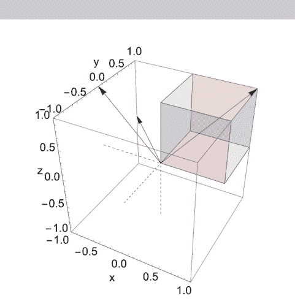

### Mathematica 代码

使用 `Eigenvectors` 和 `Eigenvalues` 命令来找到惯性张量的三个特征向量和特征值。特征向量存储在参数 `vec1`、`vec2` 和 `vec3` 中，然后将命令 `Graphics3D` 和 `Arrow` 结合起来，生成图 11.8 中立方体和 3 个特征向量的 3D 图。

```mathematica
ρ = m/a^3;
Ixx = Iyy = Izz = Integrate[ρ * y^2 + z^2), {x, 0, a}, {y, 0, a},
    {z, 0, a}];
Ixy = Iyz = Ixz = -Integrate[ρ * (x * y), {x, 0, a}, {y, 0, a}, {z, 0, a}];
iCube = (Ixx  Ixy  Ixz
        Ixy  Iyy  Iyz
        Ixz  Iyz  Izz);
Print["The tensor I = ", iCube//MatrixForm];

Print["The Eigenvalues of I are: ", Eigenvalues[iCube]];
Print["The Eigenvectors of I are: ", Eigenvectors[iCube]];

vec1 = Eigenvectors[iCube][[1]];
vec2 = Eigenvectors[iCube][[2]];
vec3 = Eigenvectors[iCube][[3]];
The Eigenvalues of I are: {11a^2m/12, 11a^2m/12, a^2m/6}
The Eigenvectors of I are: {{-1, 0, 1}, {-1, 1, 0}, {1, 1, 1}}
Graphics3D[{Arrow[{{0, 0, 0}, vec1}], Arrow[{{0, 0, 0}, vec2}],
Arrow[{{0, 0, 0}, vec3}], FaceForm[{Opacity[.2]}], Cuboid[{0, 0, 0},
{1, 1, 1}], Dashed, Line[{{-1, 0, 0}, {1, 0, 0}}],
Line[{{0, -1, 0}, {0, 1, 0}}], Line[{{0, 0, -1}, {0, 0, 1}}]},
Axes -> True, BaseStyle -> FontSize -> 18, AxesLabel -> {x, y, z},
PlotRange -> {{-1, 1}, {-1, 1}, {-1, 1}}]
```

### 示例 11.8：

求一个密度均匀、质量为 $m$、边长为 $a$ 的立方体的惯性张量、主转动惯量和主轴，坐标系原点位于立方体质心，坐标轴平行于立方体的边。

#### 解答

代码与示例 11.7 非常相似，不同之处在于积分范围是从 $x = -a/2$ 到 $x = a/2$，而不是示例 11.7 中使用的从 $x = 0$ 到 $x = a$。

代码得到 $I_1 = I_2 = I_3 = ma^2/6$，三个特征向量是单位向量 $(1, 0, 0)$、$(0, 1, 0)$ 和 $(0, 0, 1)$。相对于立方体中心的主转动惯量彼此相等，对应的转动惯量矩阵是对角矩阵。这意味着如果立方体绕通过其中心的*任何*轴旋转，标量转动惯量将始终相同，等于 $I = ma^2/6$。结果如图 11.9 所示。

### Python 代码

```python
from sympy import Matrix, symbols, integrate
import matplotlib.pyplot as plt
from mpl_toolkits.mplot3d.art3d import Poly3DCollection

x, y, z, a, m = symbols('x, y, z, a, m',real=True)  #  symbols

#  evaluate the integrals using triple integration in SymPy
Ixx = integrate(y**2+x**2, (x,-a/2,a/2), (y,-a/2,a/2), (z,-a/2,a/2))

Iyy = integrate(y**2+x**2, (x,-a/2,a/2), (y,-a/2,a/2), (z,-a/2,a/2))

Izz = integrate(y**2+x**2, (x,-a/2,a/2), (y,-a/2,a/2), (z,-a/2,a/2))

Ixy = -integrate(x*y,(x,-a/2,a/2), (y,-a/2,a/2), (z,-a/2,a/2))

Ixz = -integrate(x*y,(x,-a/2,a/2), (y,-a/2,a/2), (z,-a/2,a/2))

Iyz= -integrate(x*y,(x,-a/2,a/2), (y,-a/2,a/2), (z,-a/2,a/2))

I = m/a**3*Matrix([[Ixx,Ixy,Ixz], [Ixy,Iyy,Iyz], [Ixz,Iyz,Izz]])
```

print('-'*28,'CODE OUTPUT','-'*29,'\n')

print('特征值为： ')
print(I.eigenvals())

print('\n 特征向量为：')
vec1 = I.eigenvects()[0][2][0]
vec2 = I.eigenvects()[0][2][1]
vec3 = I.eigenvects()[0][2][2]
print(vec1)
print(vec2)
print(vec3)

fig = plt.figure()
ax = fig.add_subplot(projection='3d')   # 设置3D绘图
ax.quiver(0,0,0,vec1[0],vec1[1],vec1[2],color='r',length=1,arrow_length_ratio=.3)
ax.quiver(0,0,0,vec2[0],vec2[1],vec2[2],color='b',length=1,arrow_length_ratio=.3)
ax.quiver(0,0,0,vec3[0],vec3[1],vec3[2],color='g',length=1,arrow_length_ratio=.3)

ax.set_xlabel('X')    # 标签，设置x、y、z轴的范围
ax.set_ylabel('Y')
ax.set_zlabel('Z')
ax.set_xlim(-1.2,1.2);
ax.set_ylim(-1.2,1.2);
ax.set_zlim(-1.2,1.2);

shape=[((-0.5,-0.5,-0.5),(0.5,-.5,-.5),(.5,.5,-.5),(-.5,0.5,-.5),
(-0.5,-0.5,-0.5),(-.5,-.5,.5),(-.5,.5,.5),(-.5,.5,-.5),
(-0.5,-0.5,-0.5),(-.5,-.5,.5),(.5,-.5,.5),(.5,.5,.5),(-.5,.5,.5),
(-.5,.5,-.5),(.5,.5,-.5),(.5,.5,.5),(.5,.5,-.5),(.5,-.5,-.5),
(.5,-.5,.5),(-.5,-.5,.5) )]

cube =Poly3DCollection(shape,color='k',alpha=0.1)  # 绘制立方体
ax.add_collection3d(cube)
plt.show()

----------------------------- 代码输出 -----------------------------
特征值为：
{a**2*m/6: 3}

特征向量为：
Matrix([[1], [0], [0]])
Matrix([[0], [1], [0]])
Matrix([[0], [0], [1]])

### Mathematica 代码

```
ρ = m/a^3;
Ixx = Integrate[(y^2 + z^2), {x, -a/2, a/2}, {y, -a/2, a/2}, {z, -a/2, a/2}];
Iyy = Izz = Ixx;
Ixy = Iyz = Ixz = -Integrate[(x * y), {x, -a/2, a/2}, {y, -a/2, a/2}, {z, -a/2, a/2}];
iCube = ρ * (Ixx Ixy Ixz; Ixy Iyy Iyz; Ixz Iyz Izz);
Print["张量 I = ", iCube // MatrixForm];
张量 I = (a^2 m / 6 0 0; 0 a^2 m / 6 0; 0 0 a^2 m / 6);
Print["I 的特征值为： ", Eigenvalues[iCube]];
Print["I 的特征向量为： ", Eigenvectors[iCube]];
vec1 = Eigenvectors[iCube][[1]];
vec2 = Eigenvectors[iCube][[2]];
vec3 = Eigenvectors[iCube][[3]];
I 的特征值为： {a^2 m / 6, a^2 m / 6, a^2 m / 6}
I 的特征向量为： {{0, 0, 1}, {0, 1, 0}, {1, 0, 0}}
Graphics3D[{Arrow[{{0, 0, 0}, vec1}], Arrow[{{0, 0, 0}, vec2}], Arrow[{{0, 0, 0}, vec3}], FaceForm[{Opacity[.2]}], Cuboid[{-0.5, -0.5, -0.5}, {0.5, 0.5, 0.5}], Dashed, Line[{{-1, 0, 0}, {1, 0, 0}}], Line[{{0, -1, 0}, {0, 1, 0}}], Line[{{0, 0, -1}, {0, 0, 1}}]}, Axes -> True, BaseStyle -> FontSize -> 18, AxesLabel -> {x, y, z}, PlotRange -> {{-1, 1}, {-1, 1}, {-1, 1}}]
```

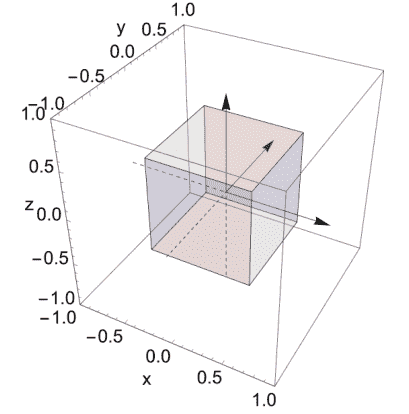

图 11.9：均匀立方体的特征向量，坐标系位于质心处，坐标轴与立方体的棱边平行，来自示例 11.8。

## 11.7 具有一个固定点且受弱力矩作用的对称旋转陀螺的进动

陀螺的运动是刚体绕轴旋转运动的一个迷人例子，并且在陀螺仪中具有重要的实际应用。它也将作为一个例子，说明如何将主轴的概念应用于解决旋转力学中的问题。

图 11.10 显示了一个质量为 $m$ 的对称旋转陀螺，其顶点固定在原点，放置在无摩擦表面上，其旋转轴与垂直方向成 $\theta$ 角。如果陀螺快速旋转，由于重力的影响，它不会像我们预期的那样倒下，而是其对称轴在空间中以恒定角度 $\theta$ 描绘出一个圆锥面，如图 11.10 所示。这种类型的运动称为*进动*，是由于作用在快速旋转物体上的力矩所致。

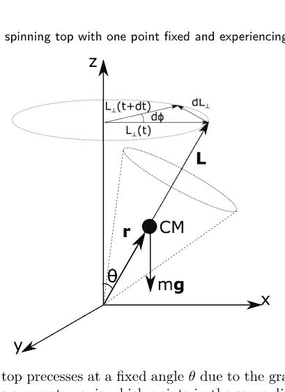

图 11.10：陀螺由于重力力矩以固定角度 $\theta$ 进动。陀螺绕其对称轴旋转，该轴与 $\mathbf{L}$ 方向相同。

让我们将接触点取为坐标轴的原点 $O$。陀螺相对于该原点的总角动量是自转角动量 $\mathbf{L}_{\text{spin}}$（由于自转运动）和质心绕支点运动的角动量 $\mathbf{L}_{\text{CM}}$ 之和：

$$\mathbf{L} = \mathbf{L}_{\text{spin}} + \mathbf{L}_{\text{CM}} \quad (11.7.1)$$

如果陀螺绕其对称轴旋转得非常快，我们可以假设 $\mathbf{L}_{\text{CM}} \ll \mathbf{L}_{\text{spin}}$，因此可以忽略由于质心运动引起的角动量部分，即 $\mathbf{L} = \mathbf{L}_{\text{spin}}$。在此假设下，向量 $\mathbf{L}$ 沿着质心相对于原点的位置向量 $\mathbf{r}$ 的方向，如图 11.10 所示。

作用在陀螺上的力是重力 $\mathbf{W} = m\mathbf{g}$ 和在接触点处向上的法向力 $\mathbf{F}_N$。相对于支点的力矩由重力产生，其表达式为：

$$\mathbf{N} = \mathbf{r} \times m\mathbf{g} \quad (11.7.2)$$

其中 $\mathbf{r}$ 是质心相对于原点的位置。该力矩的大小等于：

$$|\mathbf{N}| = |\mathbf{r} \times m\mathbf{g}| = rmg \sin \theta \quad (11.7.3)$$

其中 $\theta$ 也是向量 $\mathbf{r}$ 和 $m\mathbf{g}$ 之间的夹角。

关于陀螺运动的重要一点是，这个力矩将导致角动量向量 $\mathbf{L}$ 的*方向*发生变化，而向量 $\mathbf{L}$ 的*大小*将保持恒定，等于：

$$L = |\mathbf{L}| = I\omega \quad (11.7.4)$$

其中 $I$ 是绕旋转轴的转动惯量，$\omega$ 是自转角速度。相对于支点的力矩 **N** 由牛顿第二旋转定律给出：

$$\mathbf{N} = \frac{d\mathbf{L}}{dt} \quad (11.7.5)$$

由于 **L** 的大小保持不变，该方程可以写为 $|\mathbf{N}| = d|\mathbf{L}|/dt$，结合 (11.7.5) 和 (11.7.3) 我们得到：

$$rmg\sin\theta = \frac{dL}{dt} \quad (11.7.6)$$

在进动过程中，**L** 垂直于 z 轴的分量（在图 11.10 中标记为 $\mathbf{L}_{\perp}$）改变方向。图 11.10 显示了 $\mathbf{L}_{\perp}$ 在时间 $t$ 和稍后时间 $t + dt$ 的位置，其中 $d\phi$ 表示初始和最终角动量向量之间的夹角。由于大小 $L$ 保持恒定且角度 $d\phi$ 无穷小，我们可以写成：

$$\sin(d\phi) \simeq d\phi = \frac{dL}{L_{\perp}} = \frac{dL}{L\sin\theta} = \frac{rmgdt}{I\omega} \quad (11.7.7)$$

其中我们使用了 (11.7.6) 和 (11.7.4)。

进动运动的角频率 $\Omega_P$ 由角度 $\phi$ 的时间变化率给出：

$$\Omega_P = \frac{d\phi}{dt} \quad (11.7.8)$$

最后，结合 (11.7.8) 和 (11.7.7)，我们得到：

$$\Omega_P = \frac{rmg}{I\omega} \quad (11.7.9)$$

根据这个表达式，快速旋转的陀螺以恒定角度 $\theta$ 进动的进动频率将取决于以下因素：陀螺的重量 $mg$、质心到接触点的距离 $r$、自转角频率 $\omega$ 以及绕对称轴的转动惯量 $I$。

如第 10 章所讨论的，地球有一个赤道隆起；因此，它由于太阳和月球而受到引力力矩的作用。这些力矩导致地球的自转轴缓慢进动，每 26,000 年完成一次旋转。这种现象称为*分点进动*。其中一个结果是北极星并非永远是北极星，随着地球进动，地球北极指向的恒星会发生变化。

## 11.8 三维刚体运动与欧拉方程

在本节中，我们推导旋转刚体的运动方程，其形式称为*欧拉方程*。

让我们考虑一个绕通过固定点的轴旋转的刚体。一个例子可以是图 11.10 所示的旋转陀螺。为了指定刚体在空间中的运动，我们需要六个坐标，因此该系统有六个自由度。这些坐标通常取为物体的质心的三个坐标，加上另外三个坐标，通常取为表示绕质心旋转的角速度。如果刚体上有一个固定点，那么我们只需要三个坐标来描述旋转运动。

由于刚体在旋转，主轴固定在物体上，因此也在空间中旋转，所以它们相对于惯性（固定）$X'Y'Z'$-坐标系（如图 11.11 所示）不是静止的。这意味着当我们使用主轴来描述在处理这种运动时，我们必然要处理非惯性旋转参考系，并且可以利用第10章的技术来描述旋转物体的运动。

由旋转物体的主轴定义的特定非惯性系被称为*物体坐标系*，即图11.11中的$XYZ$坐标系，通常取为物体的主轴。惯性$X'Y'Z'$系被称为*空间坐标系*。

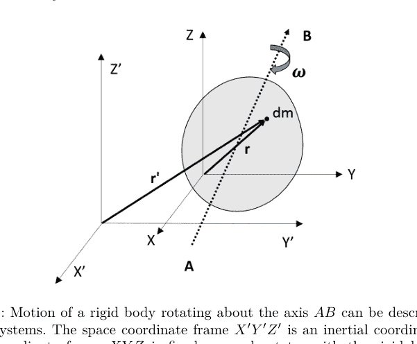

图11.11：绕轴$AB$旋转的刚体的运动可以在两个坐标系中描述。空间坐标系$X'Y'Z'$是一个惯性坐标系。物体坐标系$XYZ$固定在刚体上，并随刚体一起旋转，因此是一个非惯性系。物体坐标系通常被设定为对应于旋转刚体的主轴。

惯性参考系中的牛顿第二定律指出，惯性系中角动量$\mathbf{L}$的时间导数等于施加的力矩$\mathbf{N}$：

$$\left(\frac{d\mathbf{L}}{dt}\right)_{\text{space}} = \frac{d}{dt} (\mathbf{I}_{\text{space}}\boldsymbol{\omega}) = \mathbf{N} \qquad (11.8.1)$$

其中$\mathbf{I}_{\text{space}}$是在空间（惯性）系中计算的转动惯量张量，$\boldsymbol{\omega} = (\omega_1, \omega_2, \omega_3)$是角速度。这个方程不容易计算，因为在运动过程中$\mathbf{I}_{\text{space}}$和$\boldsymbol{\omega}$都会变化。然而，使用物体坐标系可以简化计算。

设$\hat{\mathbf{e}}_1$、$\hat{\mathbf{e}}_2$和$\hat{\mathbf{e}}_3$为物体坐标系的单位矢量，指向旋转物体的主轴方向，即图11.11中的$X, Y$和$Z$轴。在物体坐标系中，转动惯量张量是常数且为对角阵：

$$\mathbf{I} = \begin{bmatrix} I_1 & 0 & 0 \\ 0 & I_2 & 0 \\ 0 & 0 & I_3 \end{bmatrix} \qquad (11.8.2)$$

其中$I_1$、$I_2$和$I_3$是物体的主转动惯量。物体坐标系中的角动量$\mathbf{L}$可以写为：

$$\mathbf{L} = L_1\hat{\mathbf{e}}_1 + L_2\hat{\mathbf{e}}_2 + L_3\hat{\mathbf{e}}_3 = I_1\omega_1\hat{\mathbf{e}}_1 + I_2\omega_2\hat{\mathbf{e}}_2 + I_3\omega_3\hat{\mathbf{e}}_3 \qquad (11.8.3)$$

其中$\omega_k$是角速度的分量。

在第10章中我们看到，在旋转参考系中，(11.8.1)式中的时间导数必须替换为物体坐标系中的以下时间导数：

$$\left(\frac{d\mathbf{L}}{dt}\right)_{\text{space}} = \left(\frac{d\mathbf{L}}{dt}\right)_{\text{body}} + \boldsymbol{\omega} \times \mathbf{L} \qquad (11.8.4)$$

将$\mathbf{L} = \mathbf{I}\boldsymbol{\omega}$代入此方程，并且由于转动惯量张量和主转动惯量$I_k$不依赖于时间，我们有：

$$\left(\frac{d\mathbf{L}}{dt}\right)_{\text{body}} = \mathbf{I}\dot{\boldsymbol{\omega}} \qquad (11.8.5)$$

将(11.8.1)和(11.8.5)代入(11.8.4)，我们得到欧拉方程的以下矢量形式：

$$\mathbf{I}\dot{\boldsymbol{\omega}} + \boldsymbol{\omega} \times (\mathbf{I}\boldsymbol{\omega}) = \mathbf{N} \qquad (11.8.6)$$

对于主轴坐标，我们有$L_k = I_k\omega_k$。最后，通过写出(11.8.6)中叉乘的分量，这个矢量方程的分量变为：

> **刚体的欧拉方程**

$$I_1\dot{\omega}_1 + (I_3 - I_2)\omega_2\omega_3 = N_1$$
$$I_2\dot{\omega}_2 + (I_1 - I_3)\omega_3\omega_1 = N_2 \qquad (11.8.7)$$
$$I_3\dot{\omega}_3 + (I_2 - I_1)\omega_1\omega_2 = N_3$$

其中$N_k$（$k = 1, 2, 3$）是施加力矩的分量。这个关于($\omega_1, \omega_2, \omega_3$)的三个耦合微分方程组被称为刚体的欧拉方程。在特殊情况下，它们可以解析求解；然而，在大多数情况下，必须进行数值积分，以获得时间依赖函数($\omega_1(t), \omega_2(t), \omega_3(t)$)。

## 11.9 无外力矩对称陀螺

在本节中，我们将研究欧拉方程在对称陀螺（$I_1 = I_2 \neq I_3$）上的应用，该陀螺不受净外力矩作用，因此$N_1 = N_2 = N_3 = 0$。在这种情况下，欧拉方程变为

$$\left.\begin{aligned} I\dot{\omega}_1 + (I_3 - I)\omega_2\omega_3 &= 0 \\ I\dot{\omega}_2 + (I - I_3)\omega_3\omega_1 &= 0 \\ I_3\dot{\omega}_3 &= 0 \end{aligned}\right\} \qquad (11.9.1)$$

其中我们设$I_1 = I_2 = I$。我们将求解(11.9.1)以得到$\boldsymbol{\omega} = (\omega_1, \omega_2, \omega_3)$，从而理解陀螺旋转轴的行为，该轴指向$\boldsymbol{\omega}$的方向。由于没有力作用在陀螺上，陀螺的质心要么静止，要么以恒定速度运动。不失一般性，因此我们可以为空间坐标系选择一个坐标系，使得陀螺的质心静止在空间坐标系的原点。最后，我们还假设$\boldsymbol{\omega}$不沿陀螺的主轴方向；否则，运动将是平凡的。

注意，根据(11.9.1)，$\omega_3$是常数（$\dot{\omega}_3 = 0$）。其余两个方程可以写为

$$\begin{cases} \dot{\omega}_1 = -\left(\frac{I_3 - I}{I}\omega_3\right)\omega_2 \\ \dot{\omega}_2 = \left(\frac{I_3 - I}{I}\omega_3\right)\omega_1 \end{cases}$$ (11.9.2)

我们可以定义一个常数角频率$\Omega$，使得：

$$\Omega = \frac{I_3 - I}{I}\omega_3$$ (11.9.3)

它是常数。方程(11.9.2)变为

$$\begin{cases} \dot{\omega}_1 = -\Omega\omega_2 \\ \dot{\omega}_2 = \Omega\omega_1 \end{cases}$$ (11.9.4)

这是一对耦合的二阶微分方程。换句话说，在$\dot{\omega}_1$的方程中有$\omega_2$项，反之亦然。结果是$\omega_1$的值取决于$\omega_2$，而$\omega_2$的值取决于$\omega_1$。为了以封闭形式求解这个系统，我们需要解耦方程（即，将两个方程中的每一个都写成单个变量的方程），或者我们需要将方程重写为一个单变量的微分方程。我们将采用后一种方法，将问题扩展到复平面。如果我们将(11.9.2)中的$\dot{\omega}_2$方程乘以$i = \sqrt{-1}$并将两个方程相加，我们得到

$$\dot{\eta} - i\Omega\eta = 0$$ (11.9.5)

其中$\eta = \omega_1 + i\omega_2$。(11.9.5)的解是

$$\eta = Ae^{i\Omega t}$$ (11.9.6)

注意，一旦我们引入复数，解中的常数也可以是复数。在这种情况下，我们写$A = \alpha e^{i\beta}$，(11.9.6)变为

$$\eta = \alpha e^{i(\Omega t + \beta)}$$ (11.9.7)

其中$\alpha$和$\beta$是实常数。项$\beta$是相位项，可以通过为问题选择适当的初始时间将其设为零。这类似于观察一个正弦波经过。通过设置初始时间$t_0 = 0$为波峰经过你位置的时间，由此产生的波运动可以描述为相位等于零的余弦函数。在下文中，我们继续使用(11.9.6)作为(11.9.5)的解，其中$A$为实常数。

利用指数的欧拉关系，我们可以将(11.9.6)重写为

$$\omega_1 + i\omega_2 = A(\cos(\Omega t) + i\sin(\Omega t))$$ (11.9.8)

或

$$\begin{cases} \omega_1 = A\cos(\Omega t) \\ \omega_2 = A\sin(\Omega t) \end{cases}$$ (11.9.9)

这描述了半径为$A$、角频率为$\Omega$的圆周运动。

回想一下$\omega_3$是常数。因此，$\boldsymbol{\omega}$的大小也是常数，因为

$$\omega = \sqrt{\omega_1^2 + \omega_2^2 + \omega_3^2} = \sqrt{A^2 + \omega_3^2}$$ (11.9.10)

方程 (11.9.9) 告诉我们，$\omega$ 在物体坐标系中投影到 $x_1x_2$ 平面上描述了一个圆。因此，$\omega$ 绕对称轴 $x_3$ 进动，进动频率为 $\Omega$。物体坐标系中的观察者将看到 $\omega$ 描绘出一个圆锥，如图 11.12(a) 所示。由此产生的圆锥有时被称为*物体锥*。

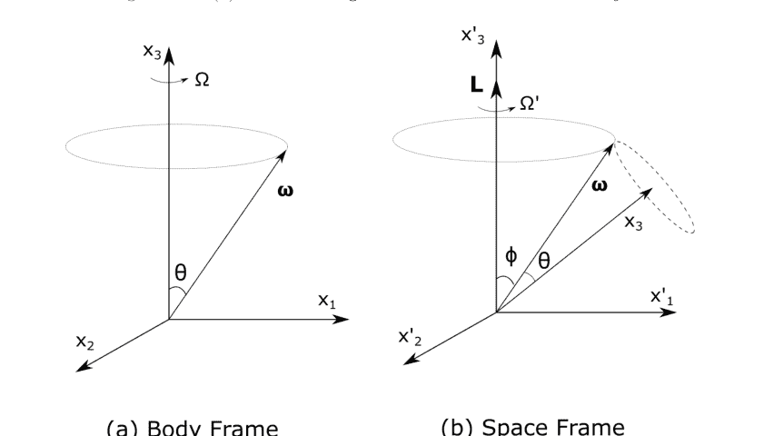

图 11.12：在 (a) 物体坐标系和 (b) 空间坐标系中观察到的，无外力对称陀螺的 $\omega$ 绕其对称轴的进动。

由于我们考察的是无外力情况，陀螺的角动量 $\mathbf{L}$ 是恒定的。因此，空间坐标系中的观察者将看到包含 $\omega$ 和 $\mathbf{e}_3$（陀螺的对称轴）的平面绕 $\mathbf{L}$ 进动，进动频率为 $\Omega'$。可以证明 $\Omega' = L/I$。由包含 $\omega$ 和 $\mathbf{e}_3$ 的平面扫出的圆锥有时被称为*空间锥*。空间锥如图 11.12(b) 所示。

除了由太阳和月球引力矩引起的进动外，地球还经历另一种由地球扁率引起的进动。由于自转，地球在两极处略微扁平（见第 10 章）。扁平化的结果是地球的主转动惯量并不完全相同。地球绕其极轴的主转动惯量略大于其他两个转动惯量（大约大 1/300）。因此，方程 (11.9.9) 告诉我们，应该存在一个频率为 $\omega_3/300$ 的进动，其中 $\omega_3$ 等于每天旋转一圈。结果是地球极轴有一个周期为 300 天的小进动（或摆动）。这个摆动是由业余天文学家塞斯·钱德勒（1846-1913）发现的。然而，由于地球并非完全刚性的旋转体，其周期更接近 400 天。

## 11.10 章节总结

质量为 *m* 的质点的切向速度 **v** 和角动量矢量 **ℓ** 由叉积给出：

$$\mathbf{v} = \boldsymbol{\omega} \times \mathbf{r} \quad \boldsymbol{\ell} = \mathbf{r} \times \mathbf{p} = m(\mathbf{r} \times \mathbf{v})$$

其中 **r** 是位置矢量，**p** = *m***v** 是动量矢量。

当位置矢量和速度矢量彼此垂直时，我们可以将这些方程写为：

$$v = \omega r \quad \ell = mrv = mr^2\omega = I\omega$$

其中 *I* = *mr*² 是绕旋转轴的标量转动惯量。旋转质量 *m* 的动能由下式给出：

$$T = \frac{1}{2} I\omega^2$$

刚体是位于位置 **r_i** 的有限质量 *m_i* 的集合，这些位置相对于固定在物体内的坐标系 *xyz*，绕固定轴 *AB* 以角速度矢量 **ω** = (*ω_x*, *ω_y*, *ω_z*) 旋转。质量 *m_i* 的切向速度 **v_i** 由叉积给出：

$$\mathbf{v}_i = \boldsymbol{\omega} \times \mathbf{r}_i$$

相对于质心坐标系，具有质量 *m_i* 的质点系统的角动量矢量 **L** 由各质量角动量的矢量和给出：

$$\mathbf{L} = \sum m_i (\mathbf{r}_i \times \mathbf{v}_i) = \sum m_i [\mathbf{r}_i \times (\boldsymbol{\omega} \times \mathbf{r}_i)]$$

在矢量 **L** 和 **ω** 不指向同一方向的情况下，方程 *L* = *Iω* 不适用，我们用对称*惯性张量* **I** 的矩替换标量量 *I*，定义为：

$$\mathbf{L} = \mathbf{I} \cdot \boldsymbol{\omega}$$

$$\mathbf{I} = \begin{bmatrix} I_{xx} & I_{xy} & I_{xz} \\ I_{yx} & I_{yy} & I_{yz} \\ I_{zx} & I_{zy} & I_{zz} \end{bmatrix} \quad \text{and} \quad \boldsymbol{\omega} = \begin{bmatrix} \omega_x \\ \omega_y \\ \omega_z \end{bmatrix}$$

其中标量 *I_kl* (*k*, *l* = 1, 2, 3) 是惯性张量 **I** 的分量，定义为：

$$I_{xx} = \sum m_i (y_i^2 + z_i^2) \quad I_{xy} = I_{yx} = -\sum m_i x_i y_i \quad \text{, etc.}$$

惯性张量的元素取决于系统原点的选择。对于密度为 *ρ* 的质量 *m*，这些元素由下式给出：

$$I_{xx} = \iiint_V \rho (y^2 + z^2) \, dxdydz \quad I_{xy} = I_{yx} = -\iiint_V \rho xy \, dxdydz \quad \text{etc.}$$

动能和转动惯量张量通过矩阵乘法方程相关联：

$$T = \frac{1}{2} \boldsymbol{\omega} \cdot \mathbf{L} = \frac{1}{2} (\boldsymbol{\omega})^T \cdot \mathbf{I} \cdot \boldsymbol{\omega}$$

其中 $(\omega)^{\mathrm{T}}$ 表示列矩阵 $\omega$ 的转置。
绕任意单位矢量 $\hat{\mathbf{n}}$ 方向的轴旋转的标量转动惯量 $I$，使用矩阵乘法方程从惯性张量求得：

$$I_n = (\hat{\mathbf{n}})^{\mathrm{T}} \cdot \mathbf{I} \cdot \hat{\mathbf{n}}$$

标量转动惯量的平行轴定理指出：如果 $I$ 是物体绕轴 $AB$ 的标量转动惯量，$I_{CM}$ 是绕平行于 $AB$ 且通过质心、距离为 $d$ 的第二轴的相应转动惯量，则 $I$ 和 $I_{CM}$ 的关系为：

$$I = I_{CM} + md^2$$

*惯性张量之间的广义平行轴定理*如下：
如果 $\mathbf{I}$ 是在原点固定于点 $O$ 的坐标系中定义的惯性张量，$\mathbf{I}'$ 是在原点位于质心 $O_{CM}$ 且其轴平行于前一个坐标系的质心坐标系中定义的惯性张量，则张量 $\mathbf{I}$ 和 $\mathbf{I}'$ 的元素关系为：

$$I_{kl} = I'_{kl} + M [a^2 \delta_{kl} - a_k a_l]$$

其中 $\mathbf{a}$ 是连接两个原点 $O$ 和 $O_{CM}$ 的矢量。
*刚体的主轴*是轴的一种特殊取向，所有刚体都有三个主轴。主轴的主要特性是，当绕这三个轴之一旋转时，角动量 $\mathbf{L}$ 和角速度矢量 $\omega$ 彼此平行，并且：

$$\mathbf{L} = \mathbf{I} \cdot \omega = \lambda \omega$$

其中 $\lambda$ 是一个标量常数。这个方程是一个*特征值问题*，我们正在寻找转动惯量矩阵 $\mathbf{I}$ 的特征值和特征向量。
主轴是固定在物体上的非惯性系，称为*物体坐标系*，而静止观察者的惯性 $xyz$ 系称为*空间坐标系*。
当使用主轴坐标时，我们有 $L_k = I_k \omega_k$，刚体的运动可以用*欧拉方程*描述：

$$I_1 \dot{\omega}_1 + (I_3 - I_2) \omega_2 \omega_3 = N_1$$
$$I_2 \dot{\omega}_2 + (I_1 - I_3) \omega_3 \omega_1 = N_2$$
$$I_3 \dot{\omega}_3 + (I_2 - I_1) \omega_1 \omega_2 = N_3$$

其中 $(N_1, N_2, N_3)$ 是作用在刚体上的外部力矩。

## 11.11 章节末习题

符号 💻 表示需要计算机辅助的问题，形式包括图形、数值计算或符号求值。

### 第 11.1 节：质点绕固定轴的旋转运动

章节末习题

443

1.  人类行走可以建模为以髋关节为支点的单摆摆动。估算这个单摆的周期。对模型进行合理的数值估算，并忽略膝关节的影响。

2.  求由长度为 $l$ 的无质量刚性杆连接的两个质量 $m_1, m_2$ 的系统的主轴和主转动惯量。

3.  一个质量为 $m$、半径为 $R$ 的圆柱体连接到一个悬挂质量 $m$ 上。圆柱体在斜面上无滑动地向上滚动，如图 11.13 所示。一根无质量的绳子缠绕在圆柱体上。

    a. 求悬挂质量的加速度的大小和方向。
    b. 圆柱体与斜面接触点处的静摩擦力的大小和方向是多少？

    使用 CAS 求解方程组。

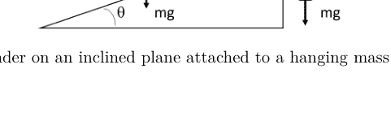

图 11.13：斜面上连接悬挂质量的圆柱体，见习题 11.3。

4.  一个质量为 $m$、半径为 $R$ 的均匀圆环悬挂在垂直平面内，并由圆周上一点的钉子支撑，如图 11.14 所示。计算小振动的固有频率。

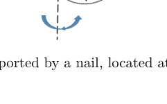

图 11.14：由钉子支撑的均匀圆环，钉子位于蓝色圆圈处（在电子书中），见习题 11.4。

5.  棒球运动员总是试图击中棒球棒上所谓的*甜点*。甜点是击球将最多能量传递给球，同时最小化对运动员手部作用力的位置。为了描述甜点的物理原理，可以假设棒球棒在空间中绕其末端的支点旋转，没有线性位移，如图 11.15 所示。甜点位于棒球棒上距离 $D$ 处？

### 第11.1节：转动运动

6.  扭摆通常由一个质量为 $m$ 的物体悬挂在可扭转的细线上构成，该细线会产生一个与描述扭转角度的 $\theta$ 成正比的力矩 $N = I\alpha$。扭摆满足一个类似于胡克定律的方程：

    $$I_1\ddot{\theta} + A\theta = 0$$

    其中 $I_1$ 是悬挂物体绕转轴的转动惯量，$A$ 是描述细线刚度的扭转系数。考虑图11.16所示的扭摆，它由一个半径为 $R$、质量为 $M$ 的薄圆盘，以及一个放置在圆盘顶部的半径为 $R/4$、质量为 $M$ 的圆柱体组成。求此扭摆在薄圆盘顶部有和没有圆柱体两种情况下的周期之比。

    图11.16：问题11.6中的扭摆。

7.  一个密度均匀的保龄球以初速度 $v_0$ 沿水平球道抛出，使其初始时滑动而不滚动。球的质量为 $m$，与地面的静摩擦系数为 $\mu_s$，滑动摩擦系数为 $\mu_k$。计算球在开始滚动前会滑动多远。你可以忽略空气阻力的影响。

8.  一个半径为 $R$、质量为 $m$ 的硬币，如图11.17a所示，绕其通过中心的对称轴以角频率 $\omega_0$ 旋转。然后如图11.17b所示，将硬币放置在水平面上。硬币停止滑动并开始滚动。当它滚走时，其速度是多少？

    图11.17：旋转的硬币，问题11.8。

9.  一个质量为 $M$、半径为 $R$ 的轮子，如图11.18所示，以初始线速度 $v_0$ 和初始角速度 $\omega_0$ 沿水平面投出。轮子开始沿表面滑动。设轮子与表面之间的摩擦系数为 $\mu$。

    - a. 轮子停止滑动需要多长时间？
    - b. 当滑动停止时，轮子质心的速度是多少？

    图11.18：沿水平面投出的轮子，问题11.9。

10. 一个质量为 $m$、半径为 $R$ 的均匀实心圆柱体，如图11.19所示，放置在与水平面成 $\theta$ 角的斜面上。设 $a$ 为圆柱体轴线沿斜面的加速度。圆柱体与平面之间的摩擦系数为 $\mu$。当 $\theta$ 小于某个临界角 $\theta_c$ 时，圆柱体将无滑动地滚下斜面。

    - a. 临界角 $\theta_c$ 是多少？
    - b. 对于小于临界角的角度，加速度 $a$ 是多少？

    图11.19：沿斜面滚下的圆柱体，问题11.10。

11. 一个半径为 $R$、转动惯量为 $I$ 的轮子，通过其中心安装在无摩擦的轴上。一根柔软、无质量的绳子缠绕在轮缘上，并悬挂一个质量为 $M$ 的物体，如图11.20所示开始下落。绳子中的张力是多少？

    图11.20：悬挂在轮子上的质量，问题11.11。

12. 一根质量为 $m$ 的均匀细杆，其底端静止在无摩擦的桌面上。如图11.21所示，细杆从与竖直方向成 $\theta_0$ 角的位置由静止释放。求释放后无穷小时间内，桌子对细杆施加的力。

    图11.21：正在倒下的均匀细杆，问题11.12。

### 第11.2节：质点系转动性质回顾

13. 一个刚体由三个质量 $m_1 = 2$、$m_2 = 1$、$m_3 = 4$ 组成，它们分别位于位置 $\mathbf{r}_1 = (1, -1, 1)$、$\mathbf{r}_2 = (2, 0, 2)$ 和 $\mathbf{r}_3 = (-1, 1, 0)$，所有单位均为国际单位制。

    - a. 当角速度为 $\boldsymbol{\omega} = (3, -2, 4)$ 时，计算系统的角动量。
    - b. 求该系统的主轴和主转动惯量。

14. 一个半径为 $R$、质量为 $M$ 的台球，如图11.22所示，在高于台面 $h$ 的高度被水平球杆击打。求使球无滑动滚动的 $h$ 值。

    图11.22：被水平球杆击打的台球，问题11.14。

### 第11.3节：转动惯量张量

15. 一块质量为 $m$、边长为 $a$ 的正方形薄板，具有均匀的质量密度，位于 $xyz$ 坐标系的 $xy$ 平面上，原点位于其一个角上。该正方形薄板的厚度为 $b$。

    - a. 求该正方形薄板相对于此坐标系的转动惯量张量。
    - b. 当厚度 $b << a$（即薄板非常薄）时，求该薄板的主转动惯量和主轴。

16. 两个相等的质点 $M$ 由一根长度为 $2b$ 的无质量刚性杆连接，形成一个哑铃。选择一个坐标系，使哑铃位于 $xy$ 平面上，与 $x$ 轴成 $\phi$ 角，且原点位于哑铃的质心处，如图11.23所示。绕 $z$ 轴旋转的角速度 $\omega$ 是一个不随时间变化的常数。

    - a. 计算此坐标系下惯量张量的元素。
    - b. 求并讨论主轴和主转动惯量。

    图11.23：由无质量杆连接的两个质点，问题11.16。

17. 求一个高度为 $H$、半径为 $R$ 的均匀圆柱体，相对于位于其质心的坐标系的主转动惯量和主轴。

### 第11.4节：动能与惯量张量

18. 四个质量均为 $m$ 的质点位于 $xy$ 平面上，位置分别为 $(x, y) = (a, 0)$、$(-a, 0)$、$(0, +2a)$ 和 $(0, -2a)$。它们由无质量的杆连接形成一个刚体。

    - a. 使用 $xyz$ 轴作为参考系，求转动惯量张量。
    - b. 考虑一个由单位向量 $\hat{\mathbf{n}}$ 给出的方向，该方向与正 $xyz$ 轴成等角。求绕此轴旋转的转动惯量。
    - c. 求相对于单位向量 $\hat{\mathbf{n}}$ 的角动量。

19. 一个复摆的质量为 $m$，主转动惯量为 $I_1$、$I_2$ 和 $I_3$。摆绕一个水平轴摆动，该轴与惯量主轴分别成 $\alpha$、$\beta$ 和 $\gamma$ 角。证明小振动的周期为

    $$T = 2\pi \sqrt{\frac{mgd}{I}}$$

    其中 $d$ 是质心到转轴的距离，且

    $$I = md^2 + I_1 \cos^2 \alpha + I_2 \cos^2 \beta + I_3 \cos^2 \gamma$$

20. 一个质量为 $m$、半径为 $r$ 的球体，如图11.24所示，在轨道上无滑动滚动。求在环形轨道顶部位置上方的最小高度 $h$，以使球体能保持与轨道持续接触。

21. 一根长度为 $2a$ 的均匀木板被暂时支撑，使其一端靠在无摩擦的竖直墙上，另一端靠在无摩擦的地板上，与地板成 $\theta_0$ 角，如图11.25所示。当木板被释放时，它将在重力作用下滑下。证明木板到达新角度 $\theta$ 所需的时间 $t$ 为：

    $$t = \int_0^t \frac{d\theta}{\sqrt{\frac{3g}{2a} (\sin \theta_0 - \sin \theta)}}$$

### 11.6：旋转主轴

26. 一个半径为 $R$、质量为 $M$ 的薄圆盘位于 $xy$ 平面内，其边缘连接一个质量为 $m = 5M/4$ 的质点，如图 11.28 所示。我们忽略重力。

a. 证明圆盘关于其质心的转动惯量张量为：

$$\mathbf{I} = \frac{MR^2}{4} \begin{bmatrix} 1 & 0 & 0 \\ 0 & 1 & 0 \\ 0 & 0 & 2 \end{bmatrix}$$

b. 在图 11.28 所示的坐标系中，当系统绕原点处的支点 A 旋转时，求圆盘与质点组合体的转动惯量张量。

c. 求主转动惯量和主轴。

27. 一个扭摆由一根垂直的金属丝连接一个立方体构成，该立方体可以绕垂直轴旋转。立方体先从一个角悬挂，然后从一条边的中点悬挂，最后从一个面的中心悬挂。在每种情况下，立方体都允许绕支点摆动。这三种悬挂方式中，立方体的哪一个振动周期最大？

### 第 11.7-11.8 节：旋转陀螺的运动 - 进动 - 三维刚体运动与欧拉方程

28. 考虑一个不受任何外力矩作用的旋转物体。利用欧拉方程，证明角动量的大小是恒定的。同时证明转动动能是恒定的。使用计算机代数系统（CAS）进行代数运算。

29. 一块尺寸为 $a$ 和 $b$ 的薄矩形板。求使该板以恒定角速度 $\omega$ 绕其一条对角线旋转所需的力矩。

30. 一个均匀的刚性轮位于 $xy$ 平面内，关于其体固定主轴 $\hat{x}_1$、$\hat{x}_2$ 和 $\hat{x}_3$ 的主转动惯量为 $I_1 = I_2 \neq I_3$，如图 11.29 所示。该轮的质心连接到一个轴承上，该轴承允许绕一个空间固定轴无摩擦地旋转。该轮是“动态平衡”的，即它可以以恒定的 $\omega$ 旋转，从而不会对其轴承施加任何力矩。

- a. 检查并积分欧拉方程，首先不给定任何初始条件，其次使用初始条件 $\omega_1(0) = 1$ 和 $\omega_2(0) = 0$。
- b. 对于这个动态平衡系统，$\omega$ 的分量必须满足什么条件？讨论其运动。

# 12 耦合振动

在本章中，我们探讨*耦合谐振子*的性质。这些系统可以使用第 8 章的拉格朗日方法分析，或者使用牛顿第二定律分析。力学中这些系统的最简单形式包含两个通过弹簧相互连接的质量。耦合机械振荡器的第二个简单例子是双摆，它也表现出各种有趣的行为。我们将看到，这些简单的振动系统可以表现出简正振动模式，这是一种所有部分都以相同频率进行正弦运动的运动模式。系统简正模式的频率被称为其固有振动频率。我们将发现，系统表现出的任何运动都可以表示为这些简正模式的线性组合。

对双质量系统的讨论将引导我们更一般地描述线性耦合谐振系统，以及如何将它们的运动方程写成矩阵形式。获得耦合振动运动方程解的最佳方法是使用线性代数的标准技术，以找到矩阵的特征值和特征向量。表征振动系统的矩阵的特征向量和特征值与其简正模式密切相关。

本章将以耦合振动的一般处理和简正坐标的讨论作为结束。

## 12.1 双质量、三弹簧系统的耦合振动

在本节中，我们介绍一个表现出耦合振动的简单系统，该系统由两个通过弹簧相互连接并连接到两个支撑墙的质量组成。

### 12.1.1 运动方程

考虑两个质量 $m_1$ 和 $m_2$ 连接到三个弹簧（弹簧常数分别为 $k_1$、$k_2$ 和 $k_3$）和两个固定墙上，如图 12.1 所示。

我们用 $x_1(t)$ 和 $x_2(t)$ 表示两个质量相对于各自平衡点的水平位移。第一个弹簧对第一个质量的作用力为 $-k_1x_1$。中间弹簧将被拉伸 $(x_1 - x_2)$ 的距离，该中间弹簧对第一个质量的作用力为 $-k_2(x_1 - x_2)$。因此，第一个质量所受的总力必须为 $F_1 = -k_1x_1 - k_2(x_1 - x_2)$。类似地，中间弹簧对第二个质量的作用力为 $-k_2(x_2 - x_1)$，第三个弹簧对第二个质量的作用力为 $-k_3x_2$。

使用 $\ddot{x}$ 表示加速度，根据牛顿第二定律 $F = ma$，两个质量的运动方程为：

$$\begin{cases} m_1\ddot{x}_1 = -k_1x_1 - k_2(x_1 - x_2) \\ m_2\ddot{x}_2 = -k_2(x_2 - x_1) - k_3x_2 \end{cases} \tag{12.1.1}$$

更一般地，我们可以从第 8 章的拉格朗日表述出发得到相同的方程。两个端点弹簧的势能分别为 $V_1 = k_1x_1^2/2$ 和 $V_3 = k_3x_2^2/2$，而中间弹簧的势能为 $V_2 = k_2(x_1 - x_2)^2/2$，因此拉格朗日量等于：

$$\mathcal{L} = T - V_{Total} = \frac{1}{2}m_1\dot{x}_1^2 + \frac{1}{2}m_2\dot{x}_2^2 - \frac{1}{2}k_1x_1^2 - \frac{1}{2}k_3x_2^2 - \frac{1}{2}k_2(x_1 - x_2)^2 \tag{12.1.2}$$

欧拉-拉格朗日方程为：

$$\frac{d}{dt}\left(\frac{\partial \mathcal{L}}{\partial \dot{x}_1}\right) - \frac{\partial \mathcal{L}}{\partial x_1} = 0 \quad \rightarrow \quad m_1\ddot{x}_1 = -k_1x_1 - k_2(x_1 - x_2) \tag{12.1.3}$$

$$\frac{d}{dt}\left(\frac{\partial \mathcal{L}}{\partial \dot{x}_2}\right) - \frac{\partial \mathcal{L}}{\partial x_2} = 0 \quad \rightarrow \quad m_2\ddot{x}_2 = -k_2(x_2 - x_1) - k_3x_2 \tag{12.1.4}$$

这些当然与 (12.1.1) 中的方程相同。

### 12.1.2 运动方程的数值解

通常，无法解析地获得方程组 (12.1.1) 的解 $x_1(t)$ 和 $x_2(t)$，必须通过对给定系统初始条件的方程进行数值积分来获得。初始条件通常给出为两个质量的初始位置和初始速度。

示例 12.1 展示了如何获得并绘制数值解 $x_1(t)$ 和 $x_2(t)$，初始条件为 $x_1(0) = 0$、$x_2(0) = a$、$\dot{x}_1(0) = a$ 和 $\dot{x}_2(0) = 0$。

> **示例 12.1：双耦合振动质量一般情况的数值解**
>
> 对 $k_1 = 4$ N/m、$k_2 = 2$ N/m、$k_3 = 3$ N/m、$m_1 = 1$ kg、$m_2 = 2$ kg 积分 (12.1.1)，并绘制数值解 $x_1(t)$ 和 $x_2(t)$，初始条件为 $x_1(0) = 0$、$x_2(0) = 1$ m、$\dot{x}_1(0) = 0$ 和 $\dot{x}_2(0) = 0$。这种情况对应于第一个质量 $m_1$ 最初静止在其平衡位置（$x_1(0) = 0$ 且 $\dot{x}_1(0) = 0$），第二个质量被拉离其平衡位置 $a = 1$ 米并从静止释放（$\dot{x}_2(0) = 0$）。
>
> **解：**
>
> 在本例中，我们使用 Mathematica 中的 NDSolve 命令和 Python 中的 odeint 库来数值求解微分方程组，并获得数值解 $x_1(t)$ 和 $x_2(t)$。
>
> 图 12.2 中 $x_1(t)$ 和 $x_2(t)$ 的图像显然很复杂，无法对两个质量的运动给出简单的物理描述。造成这种复杂行为的关键物理组成部分是图 12.1 中的中间弹簧，因为它是耦合两个质量运动的部件。

### Python 代码

与通常使用 Python 求解二阶常微分方程（ODE）的方法一样，我们定义一个向量 **X** = [x1, y1, x2, y2]，其中 y1, y2 分别代表速度 $v_1 = dx_1/dt$ 和 $v_2 = dx_2/dt$。我们使用 `odeint` 命令，并定义一个函数 `solveODE`，其输入是 **X** 和时间数组 **t**，输出是一个数组 **soln**，其各列分别表示 $x_1(t), dx_1/dt, x_2(t), dx_2/dt$。$x_1(t)$ 和 $x_2(t)$ 的图像如图 12.2 所示。

```python
import numpy as np
from scipy.integrate import odeint
import matplotlib.pyplot as plt

def solveODE(X, t):
    # X :  X = [x1,y1,x2,y2]
    # t :  time
    x1, y1, x2, y2 = X

    f = [y1, k2 * (x2 - x1) / m1 - k1 * x1 / m1,
         y2, k2 * (x1 - x2) / m2 - k3 * x2 / m2]
    return f

k1, k2, k3, m1, m2 = 4, 2, 3, 1, 2   # Parameter values

# Initial conditions (x1,y1 = dx1/dt, x2, y2 = dx2/dt)
# x1, x2= initial positions, y1, y2 = initial velocities
x1, y1, x2, y2 = 0, 0, 1, 0

# times for evaluating x(t)
t = np.linspace(0, 20, 100)

# Pack up the parameters and initial conditions:
X = [x1, y1, x2, y2]

# Call the ODE solver.
soln = odeint(solveODE, X, t)

plt.subplot(1, 2, 1)
plt.plot(t, soln[:, 0])
plt.title('(a) x1(t)')

plt.subplot(1, 2, 2)
plt.plot(t, soln[:, 2])
plt.title('(b) x2(t)')
plt.tight_layout()
plt.show()
```

### Mathematica 代码

我们使用 `NDSolve` 求解从 $t = 0$ 到 $t = 20$ 秒的常微分方程组。
为了使用 `Plot` 和 `GraphicsGrid` 命令绘制解的图像，需要参数 $m_1$, $m_2$, $k_1$, $k_2$ 和 $k_3$ 的数值。

```mathematica
SetOptions[Plot, BaseStyle -> {FontSize -> 14}];

k1 = 4; k2 = 2; k3 = 3; m1 = 1; m2 = 2;

sol = NDSolve[{m1 * x1''[t] == -k1 * x1[t] + k2 * (x2[t] - x1[t]),
    m2 * x2''[t] == -k3 * x2[t] + k2 * (x1[t] - x2[t]), x1[0] == 0, x1'[0] == 0,
    x2[0] == 1, x2'[0] == 0}, {x1, x2}, {t, 0, 20}];

gr1 = Plot[x1[t] /. sol, {t, 0, 20}, PlotLabel -> "(a) x1[t]"];
gr2 = Plot[x2[t] /. sol, {t, 0, 20}, PlotLabel -> "(b) x2[t]"];

GraphicsGrid[{{gr1, gr2}}, Frame -> True]
```

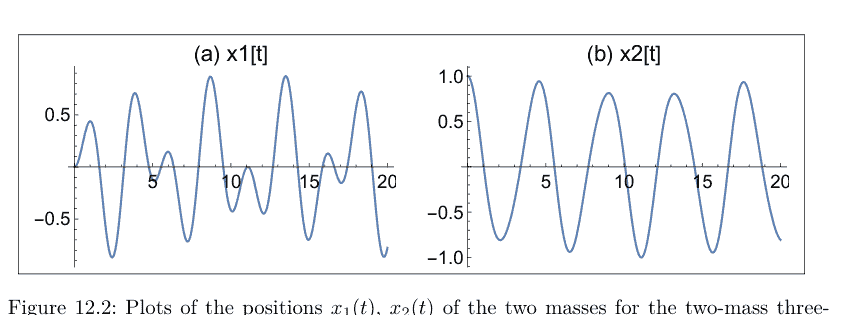

### 12.1.3 等质量与相同弹簧：简正模

在示例 12.2 中，我们考察质量相等（$m_1 = m_2$）且弹簧劲度系数相等（$k_1 = k_2 = k_3$）的特殊情况。这是一个有趣的物理情景，其解析解很简单，并且可能容易理解其中的物理原理。本示例以简单清晰的方式引入了简正模的概念。

### 示例 12.2：等质量与相同弹簧：反对称振荡

解析求解两质量三弹簧系统，并绘制在质量相同且弹簧相同（$m_1 = m_2$ 且 $k_1 = k_2 = k_3$）的特殊情况下，数值解 $x_1(t)$ 和 $x_2(t)$ 的图像。使用数值 $a = 1.0$ m, $k = 1.0$ N/m, $m = 1.0$ kg。
(a) 使用初始条件 $x_1(0) = a$, $x_2(0) = -a$, $\dot{x}_1(0) = 0$ 和 $\dot{x}_2(0) = 0$。
(b) 使用初始条件 $x_1(0) = a$, $x_2(0) = a$, $\dot{x}_1(0) = 0$ 和 $\dot{x}_2(0) = 0$。

**解：**
(a) 在这种情况下，两个质量最初从其平衡位置被位移了相等且*相反*的距离 $a$，然后从静止状态释放。
通过计算机代数系统（CAS）得到的解析解为

$$x_1(t) = a \cos\left(\sqrt{3k/m}\, t\right)$$
$$x_2(t) = -a \cos\left(\sqrt{3k/m}\, t\right)$$

$x_2(t)$ 中的负号告诉我们，两个质量将以相同的速度一起运动，但它们将完全反相，如图 12.3ab 所示。
在此情况下，两个质量的振荡频率为 $\omega_2 = \sqrt{3k/m}$。
这种情况被称为系统的*反对称振荡*。

(b) 在这种情况下，两个质量从各自的平衡位置被拉出相同的距离 $a$，然后从静止状态释放（$\dot{x}_1(0) = 0$ 且 $\dot{x}_2(0) = 0$）。
解析解为

$$x_1(t) = x_2(t) = a \cos\left(\sqrt{k/m}\, t\right)$$

这告诉我们，如果两个质量最初从平衡位置被位移相同的距离并从静止状态释放，它们将以相同的速度同相运动，就好像中间的弹簧不存在一样。这在物理上是合理的，因为在这种情况下，中间的弹簧将保持其自然长度不被拉伸，并且在两个质量的运动过程中将保持不被拉伸。
在此情况下，两个质量的振荡频率为 $\omega_1 = \sqrt{k/m}$，即与仅将其中一个质量连接到劲度系数为 $k$ 的单个弹簧时的频率相同。
这种情况被称为系统的*对称振荡*。

### Python 代码

(a) 我们使用 SymPy 中的 `dsolve_system` 命令，结合给定的初始条件，解析求解该常微分方程组。`lambdify` 命令将符号解 $x_1(t)$ 和 $x_2(t)$ 转换为 NumPy 数组，然后在图 12.3a 和 12.3b 中绘制。
(b) 我们使用相同的代码（此处未显示），仅更改初始条件为 $x_1(0) = a$, $x_2(0) = a$, $\dot{x}_1(0) = 0$ 和 $\dot{x}_2(0) = 0$。位置 $x_1(t)$ 和 $x_2(t)$ 绘制在图 12.3c 和 12.3d 中。

```python
from sympy import Function, Eq, Derivative as D, symbols, lambdify, simplify
from sympy.solvers.ode.systems import dsolve_system
import numpy as np
import matplotlib.pyplot as plt
print('-' * 28, 'CODE OUTPUT', '-' * 29, '\n')

k, m, t, x0, v0, a = symbols('k, m, t, x0, v0, a', real=True, positive=True)
x1, x2 = symbols('x1, x2', cls=Function)

eq1 = Eq(D(x1(t), t, t), -(k / m) * x1(t) - (k / m) * (x1(t) - x2(t)))
eq2 = Eq(D(x2(t), t, t), -(k / m) * x2(t) - (k / m) * (x2(t) - x1(t)))

# initial conditions x1(0)=a, v1(0)=0, x2(0)=-a and v2(0)=0
initCondits = {x1(0): a, D(x1(t), t).subs(t, 0): 0,
               x2(0): -a, D(x2(t), t).subs(t, 0): 0}
# solve the system of two differential equations symbolically
soln = dsolve_system((eq1, eq2), [x1(t), x2(t)], t, initCondits)

X1 = soln[0][0].rhs     # extract the solutions x1(t) and x2(t)
X2 = soln[0][1].rhs
print('x1(t) =', X1)
print('\nx2(t) =', X2)

# make x1(t) and x2(t) functions using lambdify

x1soln = lambdify(t, X1.subs({k: 1, m: 1, a: 1}), 'numpy')
x2soln = lambdify(t, X2.subs({k: 1, m: 1, a: 1}), 'numpy')

# evaluate x(t) values from t=0 to t=10 s
xvals = np.arange(0, 5.5, .1)

plt.plot(x1soln(xvals), label='(a) x1(t)')
plt.plot(x2soln(xvals), 'r--', label='(b) x2(t)')
plt.xlabel('Time t [s]')
plt.ylabel('x1(t), x2(t)')
plt.legend()
plt.show()

----------------------------- CODE OUTPUT -----------------------------
x1(t) = a*cos(sqrt(3)*sqrt(k)*t/sqrt(m))

x2(t) = -a*cos(sqrt(3)*sqrt(k)*t/sqrt(m))
```

### Mathematica 代码

我们使用 `DSolve` 符号求解微分方程组，并使用 `ExpToTrig` 将解转换为三角函数。同时注意 `Simplify` 命令的使用。

```mathematica
SetOptions[Plot, BaseStyle -> {FontSize -> 14}];

sol =
ExpToTrig[DSolve[{m * x1''[t] == -k * x1[t] + k * (x2[t] - x1[t]),
m * x2''[t] == -k * x2[t] + k * (x1[t] - x2[t]), x1[0] == a, x1'[0] == 0,
x2[0] == -a, x2'[0] == 0}, {x1[t], x2[t]}, t]] // Simplify
numValues = {a -> 1, k -> 1, m -> 1};

{{x1[t] -> a Cos[Sqrt[3] Sqrt[k] t / Sqrt[m]], x2[t] -> -a Cos[Sqrt[3] Sqrt[k] t / Sqrt[m]]}}

gr1 = Plot[x1[t] /. sol /. numValues, {t, 0, 10}, PlotLabel -> "(a) x1[t]"];
gr2 = Plot[x2[t] /. sol /. numValues, {t, 0, 10}, PlotLabel -> "(b) x2[t]",
PlotStyle -> Dashed];

GraphicsGrid[{{gr1, gr2}}, Frame -> True]

sol =
ExpToTrig[DSolve[{m * x1''[t] == -k * x1[t] + k * (x2[t] - x1[t]),
m * x2''[t] == -k * x2[t] + k * (x1[t] - x2[t]), x1[0] == a, x1'[0] == 0, x2[0] == a,
x2'[0] == 0}, {x1[t], x2[t]}, t]] // Simplify
numValues = {a -> 1, k -> 1, m -> 1};

{{x1[t] -> a Cos[Sqrt[k] t / Sqrt[m]], x2[t] -> a Cos[Sqrt[k] t / Sqrt[m]]}}

gr1 = Plot[x1[t] /. sol /. numValues, {t, 0, 10}, PlotLabel -> "(c) x1[t]"];
gr2 = Plot[x2[t] /. sol /. numValues, {t, 0, 10}, PlotLabel -> "(d) x2[t]",
PlotStyle -> Dashed];

GraphicsGrid[{{gr1, gr2}}, Frame -> True]
```

### 12.1.4 一般情况：简正模的线性组合

例12.2表明，图12.1中由两个等质量物体和三根相同弹簧组成的系统具有两个*固有频率*，分别为 $\omega_1 = \sqrt{k/m}$ 和 $\omega_2 = \sqrt{3k/m}$。通过像前两个例子那样适当选择系统的初始条件，我们可以迫使两个质量物体都以单一频率（$\omega_1$ 或 $\omega_2$）进行振荡。在这些特殊情况下，两个固有频率彼此解耦，我们称这些为振荡系统的*简正模*。

图12.4示意性地展示了两个质量物体在频率为 $\omega_1 = \sqrt{k/m}$ 的*对称*振荡模式（左图）或频率为 $\omega_2 = \sqrt{3k/m}$ 的*反对称*振荡模式（右图）下的运动。

如果两个质量物体被移动到某个随机距离并释放，它们将以复杂的方式振荡，这可以描述为频率为 $\omega_1$ 和 $\omega_2$ 的振荡的线性组合。

例12.3中的Python和Mathematica代码说明了一般情况，其中解 $x_1(t)$ 和 $x_2(t)$ 确实是涉及两个频率 $\omega_1 = \sqrt{k/m}$ 和 $\omega_2 = \sqrt{3k/m}$ 的三角函数的线性组合。这个例子展示了我们如何有时可以数值上解耦对应于这两个频率的运动。

> **例12.3：等质量物体和相同弹簧的解析解；两个频率的解耦**

对相同弹簧和相同质量物体的系统积分方程(12.1.1)，初始条件为 $x_1(0) = 0$, $x_2(0) = a$, $\dot{x}_1(0) = 0$ 和 $\dot{x}_2(0) = 0$。

**解：**
在此情况下，图12.1中的第二个质量物体从平衡位置移动了距离 $a$ 并从静止释放。第一个质量物体最初静止在其平衡位置。
从计算机代数系统获得的解析解为

$$x_1(t) = (a/2) \left[ \cos\left(\sqrt{k/m}\, t\right) - \cos\left(\sqrt{3k/m}\, t\right) \right]$$

$$x_2(t) = (a/2) \left[ \cos\left(\sqrt{k/m}\, t\right) + \cos\left(\sqrt{3k/m}\, t\right) \right]$$

这些解如下面的图12.5 (a) 和 (b) 所示。函数 $x_1(t)$ 和 $x_2(t)$ 再次变得复杂，难以精确描述两个质量物体的运动方式。这是因为在数学上，$x_1(t)$ 和 $x_2(t)$ 都包含频率 $\omega_1$ 和 $\omega_2$。
图12.5 (c) 和 (d) 显示了函数

$$x_1(t) + x_2(t) = a \cos\left(\sqrt{k/m}\, t\right)$$

$$x_1(t) - x_2(t) = -a \cos\left(\sqrt{3k/m}\, t\right)$$

的图像。

通过使用这些线性组合，现在可以*解耦*两个简正模，使得图12.5 (c) 和 (d) 中显示的运动成为频率为 $\omega_1 = \sqrt{k/m}$ 和 $\omega_2 = \sqrt{3k/m}$ 的简单余弦函数。

**Python代码**
我们使用SymPy中的命令 `dsolve_system` 来解析求解给定初始条件的常微分方程组。命令 `lambdify` 将符号解 $x_1(t)$ 和 $x_2(t)$ 转换为NumPy数组，然后在四个子图中绘制。

```python
from sympy import Function, Eq, Derivative as D, symbols, lambdify, simplify
from sympy.solvers.ode.systems import dsolve_system
import numpy as np
import matplotlib.pyplot as plt
print('-'*28,'CODE OUTPUT','-'*29,'\n')

k, m, t, x0, v0, a = symbols('k, m, t, x0, v0, a', real=True, positive=True)
x1, x2 = symbols('x1, x2', cls=Function)

def plotx(y, ttle):        # function to plot x1,x2 etc
    plt.plot(xvals, y, 'b');
    plt.title(ttle);

eq1 = Eq(D(x1(t), t, t), -(k/m)* x1(t) -(k/m)*(x1(t)-x2(t)))
eq2 = Eq(D(x2(t), t, t), -(k/m)* x2(t) -(k/m)*(x2(t)-x1(t)))

# initial conditions x1(0)=0, v1(0)=0, x2(0)=0  and v2(0)=1
initCondits = {x1(0): 0, D(x1(t), t).subs(t, 0): 0,
               x2(0): a, D(x2(t), t).subs(t, 0): 0 }
# solve the system of two differential equations symbolically
soln = dsolve_system((eq1, eq2), [x1(t), x2(t)], t, initCondits)

X1 = soln[0][0].rhs    # extract the solutions x1(t) and x2(t)
X2 = soln[0][1].rhs
print('\nx1(t) =\n', simplify(X1))
print('\nx2(t) =\n', simplify(X2))

--------------------------------- CODE OUTPUT ---------------------------------

x1(t) =
a*(cos(sqrt(k)*t/sqrt(m)) - cos(sqrt(3)*sqrt(k)*t/sqrt(m)))/2

x2(t) =
a*(cos(sqrt(k)*t/sqrt(m)) + cos(sqrt(3)*sqrt(k)*t/sqrt(m)))/2
```

```python
# make x1(t) and x2(t) functions using lambdify
x1soln = lambdify(t, X1.subs({k:1, m:1, a:1}), 'numpy')
x2soln = lambdify(t, X2.subs({k:1, m:1, a:1}), 'numpy')

xvals = np.arange(0, 10, .2)  # evaluate x(t) from t=0 to t=10 s

plt.subplot(2, 2, 1)  # plot panels for x1, x2, x1+x2 and x1-x2
plotx(x1soln(xvals), '(a) x1(t)')
plt.subplot(2, 2, 2)
plotx(x2soln(xvals), '(b) x2(t)')
plt.subplot(2, 2, 3)
plotx(x1soln(xvals)+x2soln(xvals), '(c) x1(t)+x2(t)')
plt.subplot(2, 2, 4)
plotx(x1soln(xvals)-x2soln(xvals), '(d) x1(t)-x2(t)')
plt.tight_layout()
plt.show()
```

**Mathematica代码**
我们使用DSolve来符号求解微分方程组，并使用ExpToTrig将解转换为三角函数。

```mathematica
sol =

ExpToTrig[DSolve[{m * x1''[t] == -k * x1[t] + k * (x2[t] - x1[t]),
m * x2''[t] == -k * x2[t] + k * (x1[t] - x2[t]), x1[0] == 0, x1'[0] == 0,
x2[0] == a, x2'[0] == 0}, {x1[t], x2[t]}, t][[1]]//Simplify

numValues = {a -> 1, k -> 1, m -> 1};

{x1[t] -> 1/2 a (Cos[Sqrt[k/m] t] - Cos[Sqrt[3 k/m] t]), x2[t] -> 1/2 a (Cos[Sqrt[k/m] t] + Cos[Sqrt[3 k/m] t])}

gr1 = Plot[x1[t]/.sol/.numValues, {t, 0, 10}, PlotLabel -> "(a) x1[t]"];
gr2 = Plot[x2[t]/.sol/.numValues, {t, 0, 10}, PlotLabel -> "(b) x2[t]"];
gr3 = Plot[(x1[t] + x2[t])/.sol/.numValues, {t, 0, 10},
PlotLabel -> "(c) x1[t]+x2[t]"];
gr4 = Plot[(x1[t] - x2[t])/.sol/.numValues, {t, 0, 10},
PlotLabel -> "(c) x1[t]-x2[t]"];

GraphicsGrid[{{gr1, gr2}, {gr3, gr4}}, Frame -> True]
```

图12.5：例12.3中双质量三弹簧系统的位置 (a) $x_1(t)$、(b) $x_2(t)$、(c) $x_1(t) + x_2(t)$ 和 (d) $x_1(t) - x_2(t)$ 的图像。

在例12.4中，我们考察双质量三弹簧系统的另一个有趣行为，即*弱耦合振荡器*的情况。在这个例子中，通过选择一个比两端弹簧劲度系数更小的中间弹簧（$k_1 = k_3 = k$ 且 $k_2 \ll k$）来建立弱耦合。

> **例12.4：弱耦合振荡器**
积分方程(12.1.1)并绘制数值解 $x_1(t)$ 和 $x_2(t)$，针对质量相同（$m_1 = m_2 = 1$ kg）、两端弹簧相同（$k_1 = k_3 = 1$ N/m）且中间弹簧劲度系数较小（$k_2 = 0.2$ N/m）的特殊情况。考虑初始条件为 $x_1(0) = 1$ m, $x_2(0) = 0$, $\dot{x}_1(0) = 0$, 和 $\dot{x}_2(0) = 0$ 的物理情况。

**解：**
Python和Mathematica的代码与例12.1相同，只是参数的数值不同。图12.6 (a) 和 (b) 中Mathematica代码的输出显示了解 $x_1(t)$ 和 $x_2(t)$。两个质量物体的运动显示出清晰的拍频模式，其中质量 $m_1$ 达到最大振幅时，$m_2$ 达到最小振幅，反之亦然。

在这个例子中，通过绘制两个函数 $x_1(t)$ 和 $x_2(t)$ 的和 $x_1(t) + x_2(t)$ 与差 $x_1(t) - x_2(t)$，再次可以*解耦*两个质量物体的运动。这如图12.6 (c) 和 (d) 所示，其中两个线性组合 $x_1(t) + x_2(t)$ 和 $x_1(t) - x_2(t)$ 可以看到是具有不同频率的纯简谐振荡，对应于系统的两个简正模。我们将在本章后面讨论简正坐标的概念时，看到一种更通用的解耦系统简正模的方法。

在接下来的两节中，我们将使用线性代数技术，对图12.1中系统的简正模进行更正式的数学分析。

## 12.2 双质量三弹簧系统的简正模分析

我们现在将采用两种不同的方法来分析方程组 (12.1.1)。在 12.2.1 小节中，我们将展示如何利用线性代数的标准矩阵技术，求得双质量三弹簧系统的解析解。在 12.2.2 小节中，我们将展示如何通过将问题转化为特征值/特征向量类型的问题来求解同一问题，该问题可以利用 Mathematica 和 Python 中的现有命令轻松分析。

### 12.2.1 等质量与相同弹簧——解析解

在质量相等 $m_1 = m_2 = m$ 且弹簧常数相同 $k_1 = k_2 = k_3 = k$ 的情况下，运动方程 (12.1.1) 变为：

$$m\ddot{x}_1 = -kx_1 - k(x_1 - x_2) \qquad m\ddot{x}_2 = -k(x_2 - x_1) - kx_2 \qquad (12.2.1)$$

该方程组可以写成紧凑的矩阵形式：

$$\begin{pmatrix} m & 0 \\ 0 & m \end{pmatrix} \begin{pmatrix} \ddot{x}_1 \\ \ddot{x}_2 \end{pmatrix} = \begin{pmatrix} -2k & k \\ k & -2k \end{pmatrix} \begin{pmatrix} x_1 \\ x_2 \end{pmatrix} \qquad (12.2.2)$$

我们现在可以使用线性代数的标准方法，并遵循我们在第 11 章中用于主转动惯量的相同特征值问题步骤来求解这个矩阵方程。

我们分两步进行：首先，我们找到系统的固有频率 $\omega$；其次，我们找到位置 $x_1(t)$ 和 $x_2(t)$，如下所示。

由于我们预期是振荡运动，我们尝试如下形式的解：

$$x_1(t) = A_1 e^{i\omega t} \qquad x_2(t) = A_2 e^{i\omega t} \qquad (12.2.3)$$

其中 $A_1$ 和 $A_2$ 是两个质量块的未知振荡振幅，$\omega$ 是未知的振荡频率。将这些代入矩阵方程 (12.2.2)：

$$\begin{pmatrix} m & 0 \\ 0 & m \end{pmatrix} \begin{pmatrix} -\omega^2 A_1 e^{i\omega t} \\ -\omega^2 A_2 e^{i\omega t} \end{pmatrix} = \begin{pmatrix} -2k & k \\ k & -2k \end{pmatrix} \begin{pmatrix} A_1 e^{i\omega t} \\ A_2 e^{i\omega t} \end{pmatrix} \quad (12.2.4)$$

通过消去所有项共有的指数因子 $e^{i\omega t}$ 并合并矩阵，我们得到：

$$\begin{pmatrix} -\omega^2 m + 2k & -k \\ -k & -\omega^2 m + 2k \end{pmatrix} \begin{pmatrix} A_1 \\ A_2 \end{pmatrix} = \begin{pmatrix} 0 \\ 0 \end{pmatrix} \quad (12.2.5)$$

这个矩阵方程代表一个方程组。线性代数中的一个定理指出，如果矩阵的行列式非零，则存在唯一解，在这种情况下是平凡解 $A_1 = A_2 = 0$。然而，为了使多个解存在，矩阵的行列式必须为零。我们感兴趣的是非平凡解 $A_1, A_2 \neq 0$，因此我们求解使行列式为零的 $\omega$ 值。

我们将矩阵的行列式设为零：

$$\det \begin{pmatrix} -\omega^2 m + 2k & -k \\ -k & -\omega^2 m + 2k \end{pmatrix} = 0 \quad (12.2.6)$$

$$(\omega^2 m - 2k)(\omega^2 m - 2k) - k^2 = 0 \quad (12.2.7)$$

求解 $\omega$，我们得到四个可能的解，其中只有两个是正数：

$$\omega_1 = \sqrt{\frac{k}{m}}, \quad \omega_2 = \sqrt{\frac{3k}{m}} \quad (12.2.8)$$

这完成了分析的第一部分，我们确定了两个固有频率 $\omega_1$ 和 $\omega_2$。在上一节中，我们发现我们方程组的振荡解可以包含这两个频率中的一个或两个。

为了完成对系统的描述，我们还必须找到两个未知的振荡振幅 $A_1$ 和 $A_2$。如果我们将 $\omega_1 = \sqrt{\frac{k}{m}}$ 代入矩阵方程 (12.2.6)，我们得到：

$$\left[ \begin{pmatrix} \left(\sqrt{\frac{k}{m}}\right)^2 m - 2k & k \\ k & \left(\sqrt{\frac{k}{m}}\right)^2 m - 2k \end{pmatrix} \right] \begin{pmatrix} A_1 \\ A_2 \end{pmatrix} = \begin{pmatrix} -k & k \\ k & -k \end{pmatrix} \begin{pmatrix} A_1 \\ A_2 \end{pmatrix} = 0 \quad (12.2.9)$$

通过矩阵乘法，我们得到这两个方程：

$$-kA_1 + kA_2 = 0 \quad (12.2.10)$$

$$kA_1 - kA_2 = 0 \quad (12.2.11)$$

很明显，这两个方程是相同的，并且 $A_1 = A_2$。请注意，当我们求解 $2 \times 2$ 矩阵的特征向量时，这种情况总是会发生，其中一个方程是冗余的，可以忽略。我们得出结论，当 $\omega_1 = \sqrt{k/m}$ 时，两个振幅相等 $A_1 = A_2$，因此 $x_1(t) = x_2(t) = A_1 e^{i\omega t}$。我们现在可以写出两个质量块运动的第一个解，它对应于第一个简正模 $\omega_1 = \sqrt{k/m}$：

$$x_1(t) = x_2(t) = A_1 e^{i\omega_1 t} \quad (12.2.12)$$

由于 $A_1 = A_2$ 且 $x_1(t) = x_2(t)$，这种运动类型对应于两个质量块在所有时刻都以相同方向同相运动，正如我们之前在图 12.4a 中看到的那样。这种运动类型被称为第一个*简正模*或*对称振荡模式*，该模式下系统的整体运动可以用三角函数表示：

$$x_1(t) = x_2(t) = D_1 \cos(\omega_1 t - \phi_1) \quad (12.2.13)$$

用矩阵表示法，第一个简正模可以写为：

$$\begin{pmatrix} x_1(t) \\ x_2(t) \end{pmatrix} = D_1 \begin{pmatrix} 1 \\ 1 \end{pmatrix} \cos(\omega_1 t - \phi_1) \quad (12.2.14)$$

通过类似地处理系统的第二个固有频率，我们将 $\omega_2 = \sqrt{3k/m}$ 代入 (12.1.1)，并得到 $A_1 = -A_2$。由于 $A_1 = -A_2$，这种运动类型对应于两个质量块向相反方向运动，而质心保持静止，如图 12.4b 所示。这种运动类型被称为第二个*简正模*或*反对称振荡模式*。

然后我们可以将对应于 $\omega_2 = \sqrt{3k/m}$ 的第二个可能解写为：

$$\begin{pmatrix} x_1(t) \\ x_2(t) \end{pmatrix} = D_2 \begin{pmatrix} 1 \\ -1 \end{pmatrix} \cos(\omega_2 t - \phi_2) \quad (12.2.15)$$

一般来说，系统的运动将是两个简正模的线性组合，分别对应于频率 $\omega_1 = \sqrt{k/m}$ 和 $\omega_2 = \sqrt{3k/m}$。

一种更快的获得简正模频率 $\omega_1$ 和 $\omega_2$ 以及振幅 $A_1$ 和 $A_2$ 的方法是使用 Python 和 Mathematica 的符号计算能力求解矩阵方程 (12.2.5)。示例 15 展示了如何在 CAS 中实现上述过程，以获得双质量三弹簧系统的通解。

> **示例 15：通过求解矩阵方程来求解双质量三弹簧系统**
>
> 使用 CAS 将图 12.1 中的双质量三弹簧系统作为矩阵方程问题来求解。具体考虑等质量和相同弹簧的情况，并遵循上述步骤：在符号代码中，将 $x_1(t) = A_1 e^{i\omega t}$ 和 $x_2(t) = A_2 e^{i\omega t}$ 代入微分方程，消去 $e^{i\omega t}$ 项，并构建矩阵 $A$。通过求解特征方程，找到简正模频率 $\omega_1$ 和 $\omega_2$ 以及振幅 $A_1$ 和 $A_2$ 之间的一般关系。
>
> **解：**
>
> 代码生成了第一个简正模频率 $\omega_1 = \sqrt{k/m}$，相应的振幅关系为 $A_1 = A_2$。这当然是我们之前看到的系统的对称振荡模式。
>
> 代码还生成了第二个简正模频率 $\omega_2 = \sqrt{3k/m}$，以及反对称振荡模式下振幅之间的相应关系 $A_1 = -A_2$。

**Python 代码**

我们输入变量 $x_1(t)$、$x_2(t)$ 的常微分方程，以获得符号方程 eq1 和 eq2。矩阵 $A$ 由 eq1 和 eq2 中 $A_1$、$A_2$ 的系数构成，使用 `.coeff()` 方法。

固有频率通过使用 SymPy 中的 `solve` 命令求解特征方程 det(A)=0 来获得。

```python
from sympy import symbols, exp, I, diff, solve, expand, Matrix

k, m, omega, x1, x2, A1, A2, t = symbols("k, m, omega, x1, x2, A1, A2, t")
# 为所有变量定义符号

print('-'*28,'CODE OUTPUT','-'*29,'\n')

# 将 x1 和 x2 定义为复指数形式
x1 = A1*exp(I*omega*t)
x2 = A2*exp(I*omega*t)

# x1, x2 的微分方程除以 exp(I*omega*t)
eq1 = expand((m*diff(x1,t,t)+k*x1+k*(x1-x2))/exp(I*omega*t))
eq2 = expand((m*diff(x2,t,t)+k*x2+k*(x2-x1))/exp(I*omega*t))

# 矩阵 A 包含方程组中 A1, A2 的系数
A = Matrix([[eq1.coeff(A1),eq1.coeff(A2)],[eq2.coeff(A1),eq2.coeff(A2)]])

print('A1, A2 的系数矩阵为：\n')
print(A)

sol = solve(A.det(),omega)  # 令 det(A)=0 并求解 omega

print('\n固有频率 omega1 = ',sol[0])
print('固有频率 omega2 = ',sol[1])
print('\n固有频率 omega3 = ',sol[2])
print('固有频率 omega4 = ',sol[3])
```

```
----------------------------- CODE OUTPUT -----------------------------
A1, A2 的系数矩阵为：
Matrix([[2*k - m*omega**2, -k], [-k, 2*k - m*omega**2]])

固有频率 omega1 =  -sqrt(3)*sqrt(k/m)
固有频率 omega2 =  sqrt(3)*sqrt(k/m)

固有频率 omega3 =  -sqrt(k/m)
固有频率 omega4 =  sqrt(k/m)
```

### Mathematica 代码

该代码遵循与解析解和上述 Python 代码相同的步骤，通过计算矩阵元素并求解特征方程 det(A)=0 来获得频率 $\omega_1 = \sqrt{k/m}$ 和 $\omega_2 = \sqrt{3k/m}$。使用 `Coefficient` 命令来找到矩阵的元素。

```mathematica
x1 = A1 * Exp[I * \omega * t]; x2 = A2 * Exp[I * \omega * t];

eq1 = m * D[x1, {t, 2}] + k * x1 + k * (x1 - x2);

expr1 = (eq1)/Exp[I * \omega * t] // Simplify;

Print["第一个常微分方程得到的方程为：", expr1]

第一个常微分方程得到的方程为：2A1k - A2k - A1m\omega^2

eq2 = m * D[x2, {t, 2}] + k * x2 + k * (x2 - x1);

expr2 = (eq2)/Exp[I * \omega * t] // Simplify;

Print["第二个常微分方程得到的方程为：", expr2]

第二个常微分方程得到的方程为：- A1k + 2A2k - A2m\omega^2

A = {{Coefficient[expr1, A1], Coefficient[expr1, A2]},

{Coefficient[expr2, A1], Coefficient[expr2, A2]}};

Print["矩阵 A 为：A = ", A]

矩阵 A 为：A = {{2k - m\omega^2, -k}, {-k, 2k - m\omega^2}}

Print["固有频率为："]

Print[Solve[Det[A]==0, \omega]]

固有频率为：
{{\omega -> -\sqrt{k/m}}, {\omega -> \sqrt{k/m}}, {\omega -> -\sqrt{3k/m}}, {\omega -> \sqrt{3k/m}}}
```

### 12.2.2 将双质量三弹簧系统作为特征值问题求解

在本节中，我们将展示如何使用 Mathematica 和 Python 中的可用命令，将一般的双质量三弹簧系统作为特征值问题来求解。让我们再次考虑图 12.1 中双质量系统的通用运动方程 (12.1.1)：

$m_1\ddot{x}_1 = -k_1x_1 - k_2(x_1 - x_2) \quad m_2\ddot{x}_2 = -k_2(x_2 - x_1) - k_3x_2$ (12.2.16)

或者将第一个方程除以 $m_1$，第二个方程除以 $m_2$ 后：

$\ddot{x}_1 = -\frac{k_1}{m_1}x_1 - \frac{k_2}{m_1}(x_1 - x_2) \quad \ddot{x}_2 = -\frac{k_2}{m_2}(x_2 - x_1) - \frac{k_3}{m_2}x_2$ (12.2.17)

通过代入形式为 $x_1(t) = A_1e^{i\omega t}$ 和 $x_2(t) = A_2e^{i\omega t}$ 的试探解，并消去公共因子 $e^{i\omega t}$，这些方程变为：

$-A_1\omega^2 = -\frac{k_1}{m_1}A_1 - \frac{k_2}{m_1}(A_1 - A_2) \quad -A_2\omega^2 = -\frac{k_2}{m_2}(A_2 - A_1) - \frac{k_3}{m_2}A_2$ (12.2.18)

这些可以写成紧凑的矩阵形式：

$\begin{pmatrix} \frac{k_1+k_2}{m_1} & \frac{-k_2}{m_1} \\ \frac{-k_2}{m_2} & \frac{k_2+k_3}{m_2} \end{pmatrix} \begin{pmatrix} A_1 \\ A_2 \end{pmatrix} = \omega^2 \begin{pmatrix} A_1 \\ A_2 \end{pmatrix}$ (12.2.19)

你会认出这个方程是线性代数理论中的一个*特征值问题*，类似于我们在第 11 章中遇到的转动惯量矩阵的特征值问题。

对于图 12.1 的双质量系统，通过将 (12.2.19) 写成这种矩阵形式，待求解的特征值问题变得清晰：

> **将双质量系统视为特征值问题**

$\mathbf{GA} = \omega^2\mathbf{A}$ (12.2.20)

$\mathbf{A} = \begin{pmatrix} A_1 \\ A_2 \end{pmatrix} \quad \mathbf{G} = \begin{pmatrix} \frac{k_1+k_2}{m_1} & \frac{-k_2}{m_1} \\ \frac{-k_2}{m_2} & \frac{k_2+k_3}{m_2} \end{pmatrix}$

我们正在寻找方阵 $\mathbf{G}$ 的特征值 $\lambda = \omega^2$，这将给出振动的固有频率。我们也在寻找相应的特征向量 $\mathbf{A}$，这将给出对应于每个固有频率的振动正则模态。为了使特征值方程 (12.2.20) 有非平凡解（$\mathbf{A} \neq \mathbf{0}$），我们必须有：

$\det \begin{bmatrix} \frac{k_1+k_2}{m_1} - \omega^2 & \frac{-k_2}{m_1} \\ \frac{-k_2}{m_2} & \frac{k_2+k_3}{m_2} - \omega^2 \end{bmatrix} = 0$ (12.2.21)

这就是我们特征值问题的特征方程。从这一点开始，我们按照与前一节相同的两步方法进行。首先，我们必须求解特征方程 (12.2.21) 以找到频率 $\omega_1$ 和 $\omega_2$。这些频率将取决于 $k_1$、$k_2$、$k_3$、$m_1$ 和 $m_2$。在下一步中，我们将第一个固有频率 $\omega_1$ 代入 (12.2.19)，以找到第一个正则模态 $(A_1, A_2)$。最后，我们使用第二个固有频率 $\omega_2$ 重复前面的步骤，以找到第二个正则模态的 $(A_1, A_2)$。

示例 12.6 中的 Mathematica 和 Python 代码展示了如何为图 12.1 中双质量系统的两种不同情况找到特征向量和特征值。

### 示例 12.6：将双质量系统作为特征值/特征向量问题

将图 12.1 中的两个振动质量系统作为特征值/特征向量问题求解，考虑以下两种情况：

- (a) 相同的弹簧和相同的质量。
- (b) 相同的弹簧和不同的质量。

**解：**

(a) 在这种情况下，矩阵为

$$\mathbf{G} = \begin{pmatrix} \frac{2k}{m} & \frac{-k}{m} \\ \frac{-k}{m} & \frac{2k}{m} \end{pmatrix}$$

代码产生第一个特征值 $\omega_1^2 = k/m$ 或 $\omega_1 = \sqrt{k/m}$，以及相应的特征向量，

$$\begin{pmatrix} A_1 \\ A_2 \end{pmatrix} = \begin{pmatrix} 1 \\ 1 \end{pmatrix}$$

这与我们在 12.2 节中为振动双质量系统的第一个正则模态所得到的结果相同。类似地，第二个特征值 $\omega_2 = \sqrt{3k/m}$，以及相应的特征向量

$$\begin{pmatrix} A_1 \\ A_2 \end{pmatrix} = \begin{pmatrix} -1 \\ 1 \end{pmatrix}$$

这再次与我们在 12.2 节中为第二个正则模态所得到的结果相同。

(b) 在这种情况下，矩阵为

$$\mathbf{G} = \begin{pmatrix} \frac{2k}{m_1} & \frac{-k}{m_1} \\ \frac{-k}{m_2} & \frac{2k}{m_2} \end{pmatrix}$$

计算机代数系统产生两个特征值和特征向量：

$$\omega_1 = \sqrt{\frac{k(m_1 + m_2 - z)}{m_1 m_2}} \quad \begin{pmatrix} A_1 \\ A_2 \end{pmatrix} = \begin{pmatrix} \frac{m_1 - m_2 + z}{m_1} \\ 1 \end{pmatrix}$$

$$\omega_2 = \sqrt{\frac{k(m_1 + m_2 + z)}{m_1 m_2}} \quad \begin{pmatrix} A_1 \\ A_2 \end{pmatrix} = \begin{pmatrix} \frac{-m_1 + m_2 + z}{m_1} \\ 1 \end{pmatrix}$$

其中 $z = \sqrt{m_1^2 - m_1 m_2 + m_2^2}$。在这个质量不等的双质量三弹簧系统中，振幅比 $A_1/A_2$ 以复杂的方式依赖于质量 $(m_1, m_2)$，但它不依赖于弹簧常数 $k$。

#### Python 代码 – 部分 (a)

在 Python 代码中，我们使用命令 `eigenvals` 和 `eigenvects`，它们产生与解析解相同的特征值和特征向量，每个特征值的重数为 1。例如，输出 `(k/m,1,[Matrix([[1],[1]])])` 被解释为频率 $\omega_1 = \sqrt{k/m}$，重数为 1，而 `Matrix([[1],[1]])` 结果表示相应的特征向量

$$\begin{pmatrix} A_1 \\ A_2 \end{pmatrix} = \begin{pmatrix} 1 \\ 1 \end{pmatrix}$$

```python
from sympy import Matrix, symbols

print('-'*28,'CODE OUTPUT','-'*29,'\n')

k, m = symbols('k, m')

A = Matrix([[2*k/m,-k/m],[-k/m,2*k/m]])

omega_sq = list(A.eigenvals().keys())

eigenvects = list(A.eigenvects())

print('第一个频率的平方为：',omega_sq[0])

print('\n第一个特征向量为：',eigenvects[1][2][0])

print('\n第二个频率的平方为：',omega_sq[1])

print('\n第二个特征向量为：',eigenvects[0][2][0])
```

```
----------------------------- CODE OUTPUT -----------------------------
第一个频率的平方为： 3*k/m

第一个特征向量为： Matrix([[-1], [1]])

第二个频率的平方为： k/m

第二个特征向量为： Matrix([[1], [1]])
```

#### Python 代码 – 部分 (b)

此代码与部分 (a) 基本相同，只是矩阵 $A$ 不同。我们使用 `.subs` 方法进行替换 $z = \sqrt{m_1^2 - m_1 m_2 + m_2^2}$，如上所述。

### 双质量三弹簧系统的正态模分析

```python
from sympy import Matrix, symbols, sqrt, simplify

print('-'*28,'CODE OUTPUT','-'*29,'\n')

k, m1, m2, z = symbols('k, m1, m2, z')

A = Matrix([[2*k/m1,-k/m1],[-k/m2,2*k/m2]])

omega_sq = list(A.eigenvals())

eigenvects = list(A.eigenvects())

print('The square of the first frequency is:\n',
    simplify(omega_sq[0].subs(sqrt(m1**2 - m1*m2 + m2**2),z)))

print('\nThe square of the second frequency is:\n',
    simplify(omega_sq[1].subs(sqrt(m1**2 - m1*m2 + m2**2),z)))

print('\nAfter the z-substitution, the eigenvector #1 is:')
u = eigenvects[0][2][0]
print(simplify(u.subs(sqrt(m1**2 - m1*m2 + m2**2),z)))

print('\nAfter the z-substitution, the eigenvector #2 is:')
u = eigenvects[1][2][0]
print(simplify(u.subs(sqrt(m1**2 - m1*m2 + m2**2),z)))
```

```
--------------------------- CODE OUTPUT ---------------------------
The square of the first frequency is:
k*(m1 + m2 - z)/(m1*m2)

The square of the second frequency is:
k*(m1 + m2 + z)/(m1*m2)

After the z-substitution, the eigenvector #1 is:
Matrix([[(m1 - m2 + z)/m1], [1]])

After the z-substitution, the eigenvector #2 is:
Matrix([[(m1 - m2 - z)/m1], [1]])
```

#### Mathematica 代码 – 第 (a) 部分

以下代码使用了 `Eigenvalues` 和 `Eigenvectors` 命令。我们使用替换命令 `/.` 来进行替换 $z = \sqrt{m_1^2 - m_1 m_2 + m_2^2}$。

```mathematica
A = {{2*k/m, -k/m}, {-k/m, 2*k/m}};

Print["The frequencies are: ", Sqrt[Eigenvalues[A]]]
```

频率为：$\left\{\sqrt{3} \sqrt{\frac{k}{m}}, \sqrt{\frac{k}{m}}\right\}$

```mathematica
Print["The eigenvectors are: ", Eigenvectors[A]]
```

特征向量为：$\{\{-1, 1\}, \{1, 1\}\}$

#### Mathematica 代码 – 第 (b) 部分

```mathematica
A = {{2*k/m1, -k/m1}, {-k/m2, 2*k/m2}};

rule = {Sqrt[m1^2 - m1 m2 + m2^2] -> z};

Print["The frequencies after the z-substitution are:",
Sqrt[Eigenvalues[A]]/.rule]
```

z 替换后的频率为：$\left\{\sqrt{\frac{k(m1+m2-z)}{m1 m2}}, \sqrt{\frac{k(m1+m2+z)}{m1 m2}}\right\}$

```mathematica
Print["The eigenvectors are:",
Eigenvectors[A]/.rule//Simplify]
```

特征向量为：$\left\{\left\{\frac{m1-m2+z}{m1}, 1\right\}, \left\{\frac{-m1+m2+z}{m1}, 1\right\}\right\}$

# 12.3 双摆

图 12.7 展示了一个双摆，它由两个质量为 $m_1$ 和 $m_2$ 的质点连接在长度为 $L_1$ 和 $L_2$ 的无质量刚性杆上构成。我们可以使用与双质量三弹簧振动系统相同的方法来处理这个问题，即建立运动方程并求解固有频率。在第 12.3.1 小节中，我们将推导拉格朗日量和运动方程。在第 12.3.2 小节中，我们将求解两个相同耦合摆的特殊情况的解析解。在第 12.3.3 小节中，我们将把双摆作为一个特征值问题来处理，并展示如何获得正态模的固有频率和振幅。

## 12.3.1 拉格朗日量和运动方程 – 数值解

第一个质点的位置 $(x_1, y_1)$ 为 $(x_1, y_1) = (L_1 \sin \theta_1, L_1 \cos \theta_1)$，因此质量 $m_1$ 的动能为：

$$T_1 = \frac{1}{2}m_1 (\dot{x}_1^2 + \dot{y}_1^2) = \frac{1}{2}m_1 (L_1^2 \cos^2 \theta_1 \dot{\theta}_1^2 + L_1^2 \sin^2 \theta_1 \dot{\theta}_1^2) = \frac{1}{2}m_1 L_1^2 \dot{\theta}_1^2 \quad (12.3.1)$$

$m_2$ 的位置 $(x_2, y_2)$ 相对于第一个质点偏移了 $(x_1, y_1)$，因此 $(x_2, y_2) = (L_1 \sin \theta_1 + L_2 \sin \theta_2, L_1 \cos \theta_1 + L_2 \cos \theta_2)$。因此，第二个质点的动能为：

$$T_2 = \frac{1}{2}m_2 (\dot{x}_2^2 + \dot{y}_2^2) \quad (12.3.2)$$
$$= \frac{1}{2}m_2 \left\{ \frac{d}{dt} (L_1 \sin \theta_1 + L_2 \sin \theta_2)^2 + \frac{d}{dt} (L_1 \cos \theta_1 + L_2 \cos \theta_2)^2 \right\} \quad (12.3.3)$$

经过微分和合并同类项，我们得到：

$$T_2 = \frac{1}{2}m_2 (L_1^2 \dot{\theta}_1^2 + 2L_1 L_2 \dot{\theta}_1 \dot{\theta}_2 \cos (\theta_1 - \theta_2) + L_2^2 \dot{\theta}_2^2) \quad (12.3.4)$$

总动能为：

$$T = \frac{1}{2} (m_1 + m_2) L_1^2 \dot{\theta}_1^2 + m_2 L_1 L_2 \dot{\theta}_1 \dot{\theta}_2 \cos (\theta_1 - \theta_2) + \frac{1}{2} m_2 L_2^2 \dot{\theta}_2^2 \quad (12.3.5)$$

对于小振幅振荡，我们使用近似 $\cos (\theta_1 - \theta_2) \simeq 1$，因此：

$$T = \frac{1}{2} (m_1 + m_2) L_1^2 \dot{\theta}_1^2 + m_2 L_1 L_2 \dot{\theta}_1 \dot{\theta}_2 + \frac{1}{2} m_2 L_2^2 \dot{\theta}_2^2$$

总势能 $V$ 是每个摆的势能之和：

$$V = m_1 g y_1 + m_2 g y_2 = (m_1 + m_2) g L_1 \cos \theta_1 + m_2 g L_2 \cos \theta_2$$

对于小振幅振荡，我们使用近似 $\cos \theta_1 \simeq 1 - \frac{\theta_1^2}{2}$ 和 $\cos \theta_2 \simeq 1 - \frac{\theta_2^2}{2}$，因此：

$$V = (m_1 + m_2) g L_1 \left( 1 - \frac{\theta_1^2}{2} \right) + m_2 g L_2 \left( 1 - \frac{\theta_2^2}{2} \right)$$

使用这些小角度近似，系统的拉格朗日量 $L = T - V$ 为：

$$\mathcal{L} = \frac{1}{2} (m_1 + m_2) L_1^2 \dot{\theta}_1^2 + m_2 L_1 L_2 \dot{\theta}_1 \dot{\theta}_2 + \frac{1}{2} m_2 L_2^2 \dot{\theta}_2^2 - (m_1 + m_2) g L_1 \left( 1 - \frac{\theta_1^2}{2} \right) - m_2 g L_2 \left( 1 - \frac{\theta_2^2}{2} \right)$$

我们现在可以求出欧拉-拉格朗日方程：

$$\frac{d}{dt} \left( \frac{\partial \mathcal{L}}{\partial \dot{\theta}_1} \right) - \frac{\partial \mathcal{L}}{\partial \theta_1} = 0 \qquad \frac{d}{dt} \left( \frac{\partial \mathcal{L}}{\partial \dot{\theta}_2} \right) - \frac{\partial \mathcal{L}}{\partial \theta_2} = 0$$

通过计算导数并化简，我们得到：

$$(m_1 + m_2) L_1 \ddot{\theta}_1 + m_2 L_2 \ddot{\theta}_2 = -(m_1 + m_2) g \theta_1$$
$$m_2 L_1 \ddot{\theta}_1 + m_2 L_2 \ddot{\theta}_2 = -m_2 g \theta_2$$

如果需要，我们可以使用 Python 和 Mathematica 中的命令对这个微分方程组进行数值积分，并绘制函数 $\theta_1(t)$ 和 $\theta_2(t)$ 的图像。这留作本章末尾的一个问题。接下来，我们将求解两个相同耦合摆的特殊情况的 $\theta_1(t)$ 和 $\theta_2(t)$ 的解析解。

## 12.3.2 相同质量和长度 - 解析解

我们现在使用指数函数形式的试探解 $\theta_1(t) = A_1 e^{i\omega t}$ 和 $\theta_2(t) = A_2 e^{i\omega t}$。代入并消去公共的指数项 $e^{i\omega t}$，我们得到：

$$-(m_1 + m_2) L_1 A_1 \omega^2 - m_2 L_2 A_2 \omega^2 = -(m_1 + m_2) g A_1$$
$$-m_2 L_1 A_1 \omega^2 - m_2 L_2 A_2 \omega^2 = -m_2 g A_2$$

合并同类项后：

$$(m_1 + m_2) \{-L_1 \omega^2 + g\} A_1 - m_2 L_2 \omega^2 A_2 = 0$$
$$-m_2 L_1 \omega^2 A_1 - m_2 \{L_2 \omega^2 - g\} A_2 = 0$$

这个关于 $A_1$ 和 $A_2$ 的线性方程组只有在行列式为零时才有非平凡解：

$$\det \begin{pmatrix} (m_1 + m_2) \{-L_1 \omega^2 + g\} & -m_2 L_2 \omega^2 \\ -m_2 L_1 \omega^2 & -m_2 \{L_2 \omega^2 - g\} \end{pmatrix} = 0$$

原则上，我们可以求解这个特征方程；然而，得到的代数表达式非常复杂。因此，与其研究完全一般的解，不如让我们看看等长（$L_1 = L_2 = L$）和等质量（$m_1 = m_2 = m$）的特殊情况。在这个特殊情况下，(12.3.17) 变为：

$$\det \begin{pmatrix} 2m \{-L\omega^2 + g\} & -mL\omega^2 \\ -mL\omega^2 & -m \{L\omega^2 - g\} \end{pmatrix} = 0 \quad (12.3.18)$$

这给出了两个可能的解：

$$\omega_1 = \sqrt{(2 + \sqrt{2}) \frac{g}{L}} \qquad \omega_2 = \sqrt{(2 - \sqrt{2}) \frac{g}{L}} \quad (12.3.19)$$

与双质量三弹簧振荡器的情况一样，这完成了分析的第一部分，我们确定了正态模的频率 $\omega_1$ 和 $\omega_2$。为了完成对系统的描述，我们还必须找到两个未知的振荡振幅 $A_1$ 和 $A_2$。将 $\omega_1 = \sqrt{(2 - \sqrt{2}) g/L}$ 的值代入 (12.3.15)，我们得到：

$$2m \left\{ -L \left( 2 - \sqrt{2} \right) \frac{g}{L} + g \right\} A_1 - mL \left( 2 - \sqrt{2} \right) \frac{g}{L} A_2 = 0 \quad (12.3.20)$$

化简并消去公因子：

$$\frac{A_1}{A_2} = \frac{(2 - \sqrt{2})}{2(-1 + \sqrt{2})} = -\frac{1}{\sqrt{2}} \quad (12.3.21)$$

对于 $\omega_1 = \sqrt{(2 - \sqrt{2}) g/L}$ 的解是 $A_2 = \sqrt{2} A_1$，我们可以写出对应于第一个正态模的第一个可能解：

$$\theta_1(t) = A_1 e^{i\omega_1 t} \qquad \theta_2(t) = \sqrt{2} \theta_1(t) = \sqrt{2} A_1 e^{i\omega_1 t} \quad (12.3.22)$$

由于 $A_2 = \sqrt{2} A_1$ 且 $\theta_2(t) = \sqrt{2} \theta_1(t)$，这种运动类型对应于两个质点在所有时刻都同向同相运动，如图 12.8a 所示。第二个摆的振幅必须等于第一个摆振幅的 $\sqrt{2}$ 倍。这是第一个正态模或对称振荡模，系统在此模式下的一般运动可以写成三角函数的线性组合：

$$\theta_2(t) = \sqrt{2} \theta_1(t) \cos(\omega_1 t - \phi_1) \quad (12.3.23)$$

用矩阵表示，第一个正态模可以写为：

$$\begin{pmatrix} \theta_1(t) \\ \theta_2(t) \end{pmatrix} = D_1 \begin{pmatrix} 1 \\ \sqrt{2} \end{pmatrix} \cos(\omega_1 t - \phi_1) \quad (12.3.24)$$

通过类似地处理第二个频率 $\omega_2 = \sqrt{(2 + \sqrt{2}) g/L}$，我们得到：

$$\begin{pmatrix} \theta_1(t) \\ \theta_2(t) \end{pmatrix} = D_2 \begin{pmatrix} -1 \\ \sqrt{2} \end{pmatrix} \cos(\omega_2 t - \phi_1) \quad (12.3.25)$$

## 12.3.3 双摆作为特征向量/特征值问题

我们已经看到，可以将两质量、三弹簧系统作为特征向量/特征值问题来求解。现在让我们看看如何将这种方法应用于双摆问题。我们遇到的一个问题是，运动方程 (12.3.11) 和 (12.3.12) 中同时包含了 $\ddot{\theta}_1$ 和 $\ddot{\theta}_2$ 项。因此，我们首先将 $\ddot{\theta}_1$ 和 $\ddot{\theta}_2$ 项分离到不同的方程中，以便更清晰地呈现特征值问题。通过将方程 (12.3.11) 和 (12.3.12) 相减，我们得到 $\ddot{\theta}_1$ 的方程：

$$m_1 L_1 \ddot{\theta}_1 = -(m_1 + m_2) g \theta_1 + m_2 g \theta_2 \quad (12.3.26)$$

将此表达式中的 $\ddot{\theta}_1$ 代入方程 (12.3.11)，我们得到 $\ddot{\theta}_2$ 的方程：

$$m_1 L_2 \ddot{\theta}_2 = -(m_1 + m_2) g \theta_1 + (m_1 + m_2) g \theta_2 \quad (12.3.27)$$

与之前一样，我们将指数解 $\theta_1(t) = A_1 e^{i\omega t}$ 和 $\theta_2(t) = A_2 e^{i\omega t}$ 代入这两个方程，得到：

$$-A_1 \omega^2 = -\frac{(m_1 + m_2)g}{m_1 L_1} A_1 + \frac{m_2 g}{m_1 L_1} A_2 \quad (12.3.28)$$

$$-A_2 \omega^2 = -\frac{(m_1 + m_2)g}{m_1 L_2} A_1 - \frac{g(m_1 + m_2)}{m_1 L_2} A_2 \quad (12.3.29)$$

写成矩阵形式：

$$\begin{pmatrix} \frac{(m_1+m_2)g}{m_1 L_1} & -\frac{m_2 g}{m_1 L_1} \\ \frac{(m_1+m_2)g}{m_1 L_2} & -\frac{g(m_1+m_2)}{m_1 L_2} \end{pmatrix} \begin{pmatrix} A_1 \\ A_2 \end{pmatrix} = \omega^2 \begin{pmatrix} A_1 \\ A_2 \end{pmatrix} \quad (12.3.30)$$

这再次是特征值问题的标准形式，我们可以通过求解此矩阵方程左侧 $2 \times 2$ 矩阵的特征值和特征向量来继续。在 Python 和 Mathematica 中求解固有频率以及振幅 $A_1$ 和 $A_2$ 的过程留作练习，参见章末习题。

## 12.4 小振动与正坐标的通用理论

在本节中，我们推导耦合振子简正模式的通用数学形式。第一小节展示了如何将拉格朗日量简化为系统广义坐标和广义速度的二次函数。第二小节将运动方程简化为矩阵方程，并说明该矩阵方程的解与简正模式和正坐标的概念密切相关。

### 12.4.1 平衡位置附近小振动的拉格朗日量

在第 8.2 节中，我们引入了广义坐标 $(q_1, q_2, \dots, q_s)$ 或 $q_j$（其中 $j = 1, 2, \dots, s$，$s$ 表示系统的自由度数）的概念。广义坐标描述了完全确定系统状态的任何坐标系。我们还引入了相应的广义速度 $\dot{q}_j$，以描述广义坐标对时间的一阶导数。这些广义量在以紧凑形式描述系统的欧拉-拉格朗日方程时非常有用：

$$\frac{d}{dt}\left(\frac{\partial \mathcal{L}}{\partial \dot{q}_j}\right) - \frac{\partial \mathcal{L}}{\partial q_j} = 0$$

我们还考虑了一个由 $N$ 个粒子组成的系统，用索引 $\alpha = 1, 2, \dots, N$ 表示，并假设描述质量为 $m_\alpha$ 的粒子位置的笛卡尔坐标 $\mathbf{r}_\alpha$ 由广义坐标给出：

$$\mathbf{r}_\alpha = \mathbf{r}_\alpha(q_1, \dots, q_n),$$

然后我们证明了，在笛卡尔坐标中写为

$$T = \frac{1}{2} \sum_\alpha m_\alpha \dot{\mathbf{r}}_\alpha \cdot \dot{\mathbf{r}}_\alpha$$

的动能，在广义坐标中变为以下表达式：

$$T = \frac{1}{2} \sum_{j,k} a_{jk} \dot{q}_j \dot{q}_k$$

其中

$$a_{jk} = \sum_\alpha m_\alpha \left(\frac{\partial \mathbf{r}_\alpha}{\partial q_j}\right) \cdot \left(\frac{\partial \mathbf{r}_\alpha}{\partial q_k}\right)$$

系数 $a_{jk} = a_{jk}(q_1, \dots, q_s)$ 依赖于坐标 $q_j$。

接下来，我们假设系统的势能仅依赖于坐标 $q_j$：

$$V = V(q_1, \dots, q_s)$$

在上述假设下，我们的拉格朗日量具有以下形式：

$$\mathcal{L} = T - V = \frac{1}{2} \sum_{j,k} a_{jk} \dot{q}_j \dot{q}_k - V(q_1, \dots, q_s)$$

现在让我们假设系统在稳定平衡点 $\mathbf{q}_{EQ} = (q_1, q_2, \dots, q_s)_{EQ}$ 附近进行小振动。不失一般性，我们可以重新定义坐标，使该平衡点成为广义坐标系的原点，即 $\mathbf{q}_{EQ} = 0$。接下来，我们将势能在此点附近展开：

$$V = V(0) + \sum_{i=1}^s \frac{\partial V}{\partial q_i} q_i + \frac{1}{2} \sum_{j,k=1}^s \frac{\partial^2 V}{\partial q_j \partial q_k} q_j q_k + \dots$$

其中所有导数都在位于坐标系原点的平衡点 $\mathbf{q}_{EQ} = 0$ 处求值。在平衡点处，我们有 $\partial V/\partial q_i = 0$，并且我们可以通过设 $V(0) = 0$ 来进一步简化此表达式，得到：

我们还可以在平衡点附近对 (12.4.5) 中的系数 $a_{jk}$ 进行泰勒展开，并仅保留展开式中的常数项，这样 $a_{jk}$ 现在就是常数。结合 (12.4.4) 和 (12.4.9)，我们得到动能 $T$、势能 $V$ 和拉格朗日量 $\mathcal{L}$ 的以下表达式：

> **平衡位置附近小振动的广义拉格朗日量**

$$T = \frac{1}{2} \sum_{j,k=1}^{s} a_{jk} \dot{q}_j \dot{q}_k \quad a_{jk} = \text{常数} \quad (12.4.11)$$

$$V = \frac{1}{2} \sum_{j,k=1}^{s} K_{jk} q_j q_k \quad K_{jk} = \text{常数} \quad (12.4.12)$$

$$\mathcal{L} = T - V = \frac{1}{2} \sum_{j,k=1}^{s} a_{jk} \dot{q}_j \dot{q}_k - \frac{1}{2} \sum_{j,k=1}^{s} K_{jk} q_j q_k \quad (12.4.13)$$

示例 12.8 展示了如何计算我们在上一节研究的双摆系统的系数 $a_{jk}$ 和 $K_{jk}$。

> **示例 12.8：求双摆的广义拉格朗日量**

计算双摆的系数 $a_{jk}$ 和 $K_{jk}$。

**解：**

上一节已求得双摆小振动的动能为：

$$T = \frac{1}{2} (m_1 + m_2) L_1^2 \dot{\theta}_1^2 + m_2 L_1 L_2 \dot{\theta}_1 \dot{\theta}_2 + \frac{1}{2} m_2 L_2^2 \dot{\theta}_2^2$$

$$T = \frac{1}{2} (m_1 + m_2) L_1^2 \dot{\theta}_1^2 + \frac{1}{2} m_2 L_1 L_2 \dot{\theta}_1 \dot{\theta}_2 + \frac{1}{2} m_2 L_1 L_2 \dot{\theta}_1 \dot{\theta}_2 + \frac{1}{2} m_2 L_2^2 \dot{\theta}_2^2$$

系数 $a_{jk}$ 是 (12.4.4) 中动能 $T$ 表达式里出现的系数。由于我们的广义坐标是 $q_1 = \theta_1$ 和 $q_2 = \theta_2$，那么 $a_{jk}$ 就是此 $T$ 表达式中 $\dot{\theta}_1^2/2$、$\dot{\theta}_2^2/2$ 和 $(\dot{\theta}_1 \dot{\theta}_2)/2$ 项的系数。因此，

$$a_{11} = (\dot{\theta}_1^2)/2 \text{ 的系数} = (m_1 + m_2) L_1^2$$

$$a_{12} = a_{21} = (\dot{\theta}_1 \dot{\theta}_2)/2 \text{ 的系数} = m_2 L_1 L_2$$

$$a_{22} = (\dot{\theta}_2^2)/2 \text{ 的系数} = m_2 L_2^2$$

上一节已求得双摆的势能为：

$$V = (m_1 + m_2) g L_1 \left(1 - \frac{\theta_1^2}{2}\right) + m_2 g L_2 \left(1 - \frac{\theta_2^2}{2}\right)$$

系数 $K_{jk}$ 是 (12.4.9) 中势能 $V$ 表达式里 $\theta_1^2$、$\theta_2^2$ 和 $\theta_1 \theta_2$ 项的系数。因此，

$$K_{11} = (\theta_1^2) \text{ 的系数} = (m_1 + m_2) g L_1$$

$K_{12} = K_{21} = \text{coefficient of } (\theta_1 \theta_2) = 0$
$K_{22} = \text{coefficient of } (\theta_2^2) = m_2 g L_2$

然后，我们可以将常数系数 $a_{jk}$ 和 $K_{jk}$ 视为两个 $2 \times 2$ 矩阵。系数 $a_{jk}$ 用于构建以下矩阵 $\mathbf{M}$，而系数 $K_{jk}$ 用于构建矩阵 $\mathbf{K}$：

$$\mathbf{M} = \begin{pmatrix} (m_1 + m_2) L_1^2 & m_2 L_1 L_2 \\ m_2 L_1 L_2 & m_2 L_2^2 \end{pmatrix} \quad \mathbf{K} = \begin{pmatrix} (m_1 + m_2) g L_1 & 0 \\ 0 & m_2 g L_2 \end{pmatrix}$$

正如我们接下来将看到的，矩阵 $\mathbf{M}$ 可以被视为一个广义的“质量矩阵”，而矩阵 $\mathbf{K}$ 则是一个广义的“弹簧常数”矩阵 $\mathbf{K}$。

### 12.4.2 围绕平衡点的小振动运动方程

我们现在可以通过计算坐标 $q_j$ 的欧拉-拉格朗日表达式来推导一般的运动方程：

$$\frac{\partial \mathcal{L}}{\partial q_j} = \frac{\partial V}{\partial q_j} = \sum_{k=1}^s K_{jk} q_k \qquad (12.4.14)$$

$$\frac{d}{dt} \left( \frac{\partial \mathcal{L}}{\partial \dot{q}_j} \right) = \frac{d}{dt} \left( \frac{\partial T}{\partial \dot{q}_j} \right) = \frac{d}{dt} \left( \sum_{k=1}^s a_{jk} \dot{q}_k \right) = \sum_{k=1}^n a_{jk} \ddot{q}_k \qquad (12.4.15)$$

那么，$q_j$ 的欧拉-拉格朗日方程变为：

$$\sum_{k=1}^s a_{jk} \ddot{q}_k = - \sum_{k=1}^s K_{jk} q_k \qquad (12.4.16)$$

每个坐标 $q_j$ 都会有一个这样的方程。最后，我们可以将运动方程写成紧凑的单一矩阵方程形式：

**围绕平衡点的小振动的一般运动方程**

$$\mathbf{M} \ddot{\mathbf{q}} = -\mathbf{K} \mathbf{q} \qquad (12.4.17)$$

$$\begin{pmatrix} a_{11} & a_{12} & \cdots & a_{1s} \\ a_{21} & a_{22} & \cdots & a_{2s} \\ \vdots & \vdots & \ddots & \vdots \\ a_{s1} & a_{s2} & \cdots & a_{ss} \end{pmatrix} \begin{pmatrix} \ddot{q}_1 \\ \ddot{q}_2 \\ \vdots \\ \ddot{q}_s \end{pmatrix} = - \begin{pmatrix} K_{11} & K_{12} & \cdots & K_{1s} \\ K_{21} & K_{22} & \cdots & K_{2s} \\ \vdots & \vdots & \ddots & \vdots \\ K_{s1} & K_{s2} & \cdots & K_{ss} \end{pmatrix} \begin{pmatrix} q_1 \\ q_2 \\ \vdots \\ q_s \end{pmatrix} \qquad (12.4.18)$$

其中 $s \times 1$ 列矩阵 $\mathbf{q}$ 表示系统的广义坐标，$\mathbf{M}$ 表示对称的 $s \times s$ 广义“质量矩阵”，而 $\mathbf{K}$ 是对称的广义“弹簧常数”矩阵。

$$\mathbf{q} = \begin{pmatrix} q_1 \\ \vdots \\ q_s \end{pmatrix} \quad \mathbf{M} = \begin{pmatrix} a_{11} & \dots & a_{1s} \\ \vdots & \ddots & \vdots \\ a_{s1} & \dots & a_{ss} \end{pmatrix} \quad \mathbf{K} = \begin{pmatrix} K_{11} & \dots & K_{1s} \\ \vdots & \ddots & \vdots \\ K_{s1} & \dots & K_{ss} \end{pmatrix} \quad (12.4.19)$$

由于我们预期是振动运动，我们尝试形式为 $q_j(t) = A_j e^{i\omega t}$ 的解，其中 $A_j$ 是振动的振幅，$\omega$ 是系统的固有频率。通过将其代入 (12.4.17) 并像往常一样消去指数项，我们得到：

> **围绕平衡点的小振动的广义运动方程**

$$\omega^2 \mathbf{M} \mathbf{A} = \mathbf{K} \mathbf{A} \quad (12.4.20)$$

其中 $s \times 1$ 列矩阵 $\mathbf{A}$（其元素是试探解 $q_j$ 中的 $A_j$）表示未知的振幅矩阵。

方程 (12.4.20) 是熟悉方程 $m\omega^2 = k$ 的广义矩阵形式，该方程描述了连接在弹簧常数为 $k$ 的弹簧上的质量 $m$ 的振动频率 $\omega$。这个方程原则上可以通过使用本书前面介绍的任何线性代数技术来求解。

例 12.9 展示了一种求解双摆方程 (12.4.20) 的方法。

> **例 12.9：再次求解双摆的固有频率和简正模**

求解质量相等、长度相等的双摆的方程 (12.4.20)，并找出其固有频率和简正模。

**解：**

在例 12.9 中，我们计算了双摆矩阵 $\mathbf{M}$ 和 $\mathbf{K}$ 的系数 $a_{jk}$ 和 $K_{jk}$。方程 (12.4.20) 变为：

$$\omega^2 \begin{pmatrix} (m_1 + m_2) L_1^2 & m_2 L_1 L_2 \\ m_2 L_1 L_2 & m_2 L_2^2 \end{pmatrix} \begin{pmatrix} A_1 \\ A_2 \end{pmatrix} = \begin{pmatrix} (m_1 + m_2) g L_1 & 0 \\ 0 & m_2 g L_2 \end{pmatrix} \begin{pmatrix} A_1 \\ A_2 \end{pmatrix}$$

通过合并项，即将 (12.4.20) 写为 $(\omega^2 \mathbf{M} - \mathbf{K}) \mathbf{A} = 0$，我们得到：

$$\begin{pmatrix} (m_1 + m_2) (L_1^2 \omega^2 - g L_1) & m_2 L_1 L_2 \omega^2 \\ m_2 L_1 L_2 \omega^2 & m_2 (L_2^2 \omega^2 - g L_2) \end{pmatrix} \begin{pmatrix} A_1 \\ A_2 \end{pmatrix} = \begin{pmatrix} 0 \\ 0 \end{pmatrix}$$

简化并设 $L_1 = L_2 = L$ 和 $m_1 = m_2 = m$：

$$\begin{pmatrix} 2mL (L\omega^2 - g) & mL^2 \omega^2 \\ mL^2 \omega^2 & mL (L\omega^2 - g) \end{pmatrix} \begin{pmatrix} A_1 \\ A_2 \end{pmatrix} = \begin{pmatrix} 0 \\ 0 \end{pmatrix}$$

这当然与我们在例 12.7 中得到并求解的方程相同，我们可以重用例 12.7 的代码来求 $\omega$ 和 $\mathbf{A}$。

在下一小节中，我们将继续展示上述运动方程的一般矩阵形式如何引出简正坐标的概念。

### 12.4.3 简正坐标

让我们考虑一般矩阵方程 (12.4.20)，并将其改写为以下形式：

$$(\mathbf{K} - \omega_j^2 \mathbf{M}) \mathbf{A}_j = \mathbf{0} \quad \text{其中} \quad \mathbf{A}_j = \begin{pmatrix} A_1 \\ A_2 \\ \dots \\ A_s \end{pmatrix}_j \quad (j = 1 \dots s) \tag{12.4.21}$$

$$\mathbf{K} \mathbf{A}_j = \omega_j^2 \mathbf{M} \mathbf{A}_j \tag{12.4.22}$$

其中 $s$ 等于耦合振子的自由度数。方程 (12.4.22) 告诉我们，列向量 $\mathbf{A}_j$ 可以被表征为实值对称方阵 $(\mathbf{K} - \omega_j^2 \mathbf{M})$ 的一个广义特征向量。

线性代数中关于实值对称方阵的一个一般定理证明，这 $s$ 个广义特征向量 $\mathbf{A}_j$ 是线性无关的 $(s \times 1)$ 列向量，并且它们构成了所有 $(s \times 1)$ 列向量空间的一组完备基向量。因此，我们可以将运动方程 (12.4.17) 的*任何*解 $\mathbf{q}$ 写成这些特征向量的线性组合：

$$\mathbf{q} = \sum_{j=1}^s c_j(t) \mathbf{A}_j \tag{12.4.23}$$

其中 $c_j(t)$ 是时间相关的系数。我们的目标是证明这些系数 $c_j(t)$ 彼此独立地振荡，即每个系数对应一个不同的频率 $\omega_j$。

将 (12.4.23) 代入 (12.4.17) 并使用 (12.4.22)，我们得到：

$$\mathbf{M} \ddot{\mathbf{q}} = -\mathbf{K} \mathbf{q} \tag{12.4.24}$$
$$\sum \ddot{c}_j(t) \mathbf{M} \mathbf{A}_j = -\sum c_j(t) \mathbf{K} \mathbf{A}_j \tag{12.4.25}$$
$$\sum \ddot{c}_j(t) \mathbf{M} \mathbf{A}_j = -\sum c_j(t) \omega_j^2 \mathbf{M} \mathbf{A}_j \tag{12.4.26}$$

由于这些向量是线性无关的，最后一个方程成立的唯一条件是向量 $\mathbf{M} \mathbf{A}_j$ 的系数相等：

$$\ddot{c}_j(t) = -c_j(t) \omega_j^2 \tag{12.4.27}$$

这 $s$ 个方程的解是如下给出的正弦函数 $c_j(t)$：

$$c_j(t) = b_j \sin(\omega_j t - \phi_j) \tag{12.4.28}$$

其中 $\phi_j$ 是相位角，$b_j$ 是振幅；这两个参数 $(\phi_j, b_j)$ 由系统的初始条件决定。这个方程确立了每个系数 $c_j(t)$ 以不同的频率 $\omega_j$ 振荡。通过将 (12.4.28) 代入 (12.4.23)，我们得到期望的一般结果：

$$\mathbf{q} = \sum_{j=1}^s b_j \sin(\omega_j t - \phi_j) \mathbf{A}_j \tag{12.4.29}$$

用文字表述，这个方程告诉我们，运动方程的任何解 $\mathbf{q}$ 都可以写成 $s$ 个独立振荡项的线性组合，每一项都有其自身的特征固有频率 $\omega_j$。这些振荡项被称为*简正*系统的坐标 $c_j(t)$。因此，线性耦合振子的所有运动都可以表示为简正坐标的线性组合。

本节内容是证明例12.4结果的一种形式化方法。在该例中，我们发现对于质量相等且弹簧常数相等的情况，解析解可以写成两项之和：$\cos\left(\sqrt{k/m}t\right)$ 和 $\cos\left(\sqrt{3k/m}t\right)$。例如，解 $x_1(t)$ 可以通过设定 $\omega_1 = \sqrt{k/m}$ 和 $\omega_2 = \sqrt{3k/m}$ 为频率，$\phi_1 = \phi_2 = \pi/2$ 为相位，以及

$$\mathbf{A}_1 = \begin{pmatrix} a/2 \\ 0 \end{pmatrix} \quad \mathbf{A}_2 = \begin{pmatrix} 0 \\ -a/2 \end{pmatrix} \qquad (12.4.30)$$

为振幅，从而写成 (12.4.29) 的形式。

## 12.5 章节总结

耦合谐振子系统可以通过拉格朗日方法，或者使用牛顿第二定律来分析。这类系统最简单的形式是由两个通过弹簧相互连接的质量块组成，其拉格朗日量为：

$$\mathcal{L} = T - V = \frac{1}{2}m_1\dot{x}_1^2 + \frac{1}{2}m_2\dot{x}_2^2 - \frac{1}{2}k_1x_1^2 - \frac{1}{2}k_3x_2^2 - \frac{1}{2}k_2(x_1 - x_2)^2$$

这导出了耦合微分方程组：

$$m_1\ddot{x}_1 = -k_1x_1 - k_2(x_1 - x_2)$$
$$m_2\ddot{x}_2 = -k_2(x_2 - x_1) - k_3x_2$$

这类系统的解 $x_1(t)$ 和 $x_2(t)$ 通常是复杂的，无法对质量块的运动给出简单的物理描述。然而，在质量相等且弹簧常数相等的特殊情况下，我们可以使用线性代数的标准矩阵技术获得解析解。

两个质量块运动的第一个可能解对应于固有频率 $\omega_1 = \sqrt{k/m}$，此时两个质量块始终同向同相运动。这种运动类型被称为第一简正模或*对称*振荡模式，可以写为：

$$\begin{pmatrix} x_1(t) \\ x_2(t) \end{pmatrix} = D_1 \begin{pmatrix} 1 \\ 1 \end{pmatrix} \cos(\omega_1 t - \phi_1)$$

两个质量块运动的第二个可能解对应于固有频率 $\omega_2 = \sqrt{3k/m}$，在这种运动类型中，两个质量块反向运动，而质心保持静止。这种运动类型被称为第二简正模或*反对称*振荡模式，可以写为：

$$\begin{pmatrix} x_1(t) \\ x_2(t) \end{pmatrix} = D_2 \begin{pmatrix} 1 \\ -1 \end{pmatrix} \cos(\omega_2 t - \phi_2)$$

通常，系统的运动将是两个可能简正模的线性组合，分别对应于频率 $\omega_1 = \sqrt{k/m}$ 和 $\omega_2 = \sqrt{3k/m}$。

该系统也可以通过将试探解 $x_1(t) = A_1 e^{i\omega t}$ 和 $x_2(t) = A_2 e^{i\omega t}$ 代入耦合方程组，从而简化为一个特征值问题。

在另一个著名的耦合谐振子例子中，我们研究了双摆，它也有两个简正模。对称和反对称振荡模式的频率分别为 $\omega_1 = \sqrt{(2-\sqrt{2})\frac{g}{L}}$ 和 $\omega_2 = \sqrt{(2+\sqrt{2})\frac{g}{L}}$。

在本章中，我们还研究了耦合振子简正模的一般数学形式。这里我们使用广义坐标 $q_j$ ($j = 1, 2, \dots, s$) 和相应的广义速度 $\dot{q}_j$，其中 $s$ 是系统的自由度数。

围绕平衡位置的小振动的拉格朗日量可以简化为系统广义坐标和广义速度的二次函数，形式如下：

$$\mathcal{L} = T - V = \frac{1}{2} \sum_{j,k} a_{jk} \dot{q}_j \dot{q}_k - \frac{1}{2} \sum_{j,k=1}^n K_{jk} q_j q_k$$

其中 $a_{jk}$ 和 $K_{jk}$ 是常数。

对于这样的系统，欧拉-拉格朗日方程变为：

$$\sum_{k=1}^n a_{jk} \ddot{q}_k = -\sum_{k=1}^n K_{jk} q_k$$

这个耦合微分方程组可以使用线性代数的标准技术求解。

这些运动方程的任何解 $\mathbf{q} = q_j (j = 1, 2, \dots, s)$ 都可以写成 $s$ 个独立振荡项的线性组合，每一项都有其自身的特征固有频率 $\omega_j$：

$$\mathbf{q} = \sum_{j=1}^s b_j \sin(\omega_j t - \phi_j) \mathbf{A}_j$$

这些振荡项被称为系统的*简正坐标*。

## 12.6 章末习题

符号 🖥️ 表示需要计算机辅助的问题，形式包括图形、数值计算或符号求值。

*第12.1-12.2节：弹簧-质量系统的耦合振动 - 简正模分析*

-   1. 两个质量块 $m_1$ 和 $m_2$ 通过一个弹簧常数为 $k$ 的弹簧相互连接，并放置在水平无摩擦桌面上。证明系统的固有频率为 $\omega = \sqrt{k/\mu}$，其中 $\mu = m_1 m_2 / (m_1 + m_2)$ 是系统的约化质量。
-   2. 考虑本章研究的两质量块、三弹簧系统，质量不同 $m_1, m_2$，但弹簧常数相同 $k_1 = k_2 = k_3$。
    a. 通过引入两个新变量 $q_1 = x_1 + x_2$ 和 $q_2 = x_1 - x_2$ 来变换拉格朗日量。使用该变换后拉格朗日量的欧拉-拉格朗日方程获得新的运动方程。
    b. 求解新方程，得到 $q_1(t)$ 和 $q_2(t)$，以及系统的固有频率。这是一个通过使用新坐标集，可以将运动微分方程解耦的例子。这些新坐标 $q_1(t)$, $q_2(t)$ 代表了系统的*简正坐标*。
-   3. 在本章研究的两质量块、三弹簧系统中，使用以下初始条件获得解析解 $x_1(t)$ 和 $x_2(t)$：第一个质量块静止在平衡位置，第二个质量块从平衡位置移动距离 $a$ 后由静止释放。
-   4. 获得例12.4中描述的两个弱耦合振子情况的近似解析解。如果中间弹簧的弹簧常数 $k_2$ 远小于两端弹簧的弹簧常数 ($k_2 << k_1 = k_3$)，则该系统是弱耦合的。使用 $m_1 = m_2$ 和以下初始条件：第一个质量块静止在平衡位置，第二个质量块从平衡位置移动距离 $a$ 后由静止释放。求出能量在两个耦合振子之间来回传递的频率 $\omega$。
-   5. 考虑两个相等的质量 $m$，如图12.9所示，通过弹簧常数为 $k$ 的弹簧连接到一面墙和彼此。证明系统的固有频率为 $\omega = \frac{\sqrt{5} \pm 1}{2} \sqrt{k/m}$。

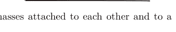

图12.9：两个相等的质量块通过弹簧相互连接并连接到墙上，习题12.5。

-   6. 考虑图12.10所示的三种不同情况，其中三个相同质量 $m$ 连接到具有相同弹簧常数 $k$ 的弹簧上。写出这三种情况的运动方程。

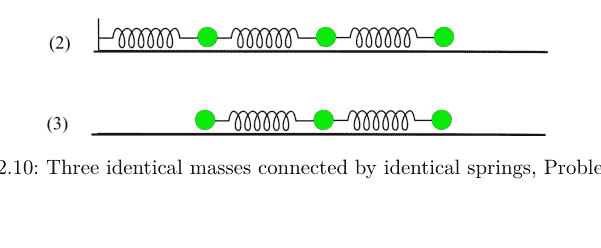

图12.10：三个相同质量块由相同弹簧连接，习题12.6。

-   7. 三个相等的质量 $m$ 通过弹簧常数为 $k$ 的相同弹簧相互连接，如图12.11所示。使用计算机代数系统 (CAS) 找出并描述振荡的简正模（假设无摩擦）。

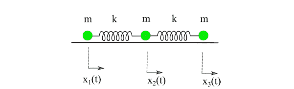

图12.11：三个相同质量块由两个相同弹簧连接，习题12.7。

-   8. 三个相等的质量 $m$ 通过弹簧常数相同的弹簧连接。质量块相互连接并连接到两个端墙上，如图12.12所示。计算该系统振荡简正模的频率，并描述每个简正模中三个质量块的相应运动。

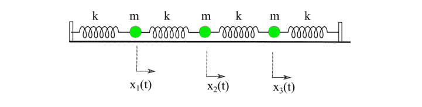

图12.12：三个相同质量块连接到四个相同弹簧，习题12.8。

-   9. 找出下图12.13中所示每个振荡系统的有效弹簧常数和固有频率。在图12.13a中，两个弹簧常数分别为 $k_1$ 和 $k_2$ 的弹簧并联连接到一个质量 $m$ 和一面墙上。在图12.13b中，两个弹簧常数分别为 $k_1$ 和 $k_2$ 的弹簧串联连接到一个质量 $m$ 和一面墙上。

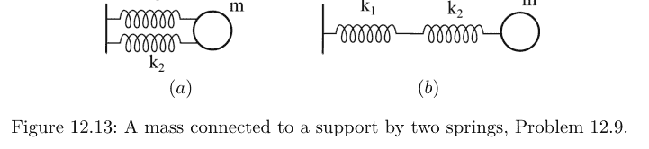

图12.13：一个质量块通过两个弹簧连接到支撑物，习题12.9。

-   10. 两个相同质量块通过弹簧常数为 $k$ 的相同弹簧连接，并被限制在如图12.14所示的圆周上运动。求出固有频率的表达式并描述系统的运动。

### 第12.3节：双摆

16. 一个双摆由两个相等的质量 $m$ 组成，上下两根摆线的长度分别为 $L_1 = 3L$ 和 $L_2 = 4L$。求该系统小角度振荡的简正模。

17. 两个不相等的质量 $m$ 和 $M$（其中 $M > m$）通过等长为 $l$ 的摆线悬挂在一个支点上，它们与竖直方向的夹角分别为 $\theta_1$ 和 $\theta_2$。这两个质量通过一个劲度系数为 $K$、原长等于两悬挂点间距离 $L$ 的弹簧连接，如图12.17所示。假设两悬挂点间的距离 $L << l$。求沿两质量连线方向小振荡的简正模频率，并描述每个简正模中两个质量的运动。写出最一般的解。

### 第12.4节：小振荡与简正坐标的一般理论

18. 一个质量 $M$ 在无摩擦表面上沿 $x$ 轴运动，如图12.18所示。质量 $m$ 通过一根无质量的细绳与 $M$ 相连。
    - a. 在小角度近似下，写出该系统的拉格朗日量。
    - b. 求 $x(t)$ 和 $\theta(t)$。
    - c. 求小振荡的频率。

19. 一个质量 $M$ 在无摩擦表面上沿 $x$ 轴运动，并通过一个劲度系数为 $k$ 的弹簧与墙壁相连，如图12.19所示。质量 $m$ 通过一根无质量的细绳与 $M$ 相连。
    - a. 在小角度近似下，写出该系统的拉格朗日量。
    - b. 求小振荡的频率。

20. 一根质量为 $m$、长度为 $3L/2$ 的均匀细杆，通过一根长度为 $L$、质量可忽略的细绳悬挂，如图12.20所示。求在xy平面内小振荡的简正频率。

21. 一个质量为 $m$ 的质点在指向 $z$ 方向的重力场 $g$ 中运动，并位于一个无摩擦、轴对称容器的内壁上，该容器由 $z = b(x^2 + y^2)/2$ 给出，其中 $a$ 是常数，$z$ 为竖直方向，如图12.21所示。该质点在高度 $z = z_0$ 处做圆周运动。
    - a. 用 $m$、$z_0$、$b$ 和 $g$ 表示圆周运动的角频率。
    - b. 用 $m$、$z_0$、$b$ 和 $g$ 表示总能量和角动量。
    - c. 质点在水平圆周轨道上被轻微向下推动。求在稳定圆周运动附近的小振荡情况下，绕未扰动轨道的振荡频率。

22. 一个质量为 $m$ 的质点被约束在 $xz$ 平面内的抛物线 $z = x^2/a$ 上运动，其中 $a$ 是一个常数长度，并且存在一个沿负 $z$ 方向的恒定重力。
    - a. 定义一个合适的广义坐标系，并用这些广义坐标写出拉格朗日量。
    - b. 质点的平衡位置在哪里？
    - c. 写出并求解绕该平衡点的小振荡方程。

23. 一个密度不均匀的半球体放置在桌面上，如图12.22所示。半球体的半径为 $R$，质心位于桌面上方距离 $a$ 处。
    - a. 当半球体从平衡位置偏移一个小角度 $\theta$ 时，求其势能。在什么条件下物体会绕稳定平衡点振荡？
    - b. 当物体绕质心的转动惯量为 $I_{CM}$ 时，求绕该稳定平衡点的小振荡频率。假设物体只允许绕支点接触点滚动。

24. 一个半径为 $a$ 的均匀球体静止在一个半径为 $R$ 的均匀半球壳内，处于平衡状态，如图12.23所示。
    - a. 为了使小振荡情况下的平衡稳定，求 $a$ 和 $R$ 之间的关系。
    - b. 求系统小振荡的固有频率。

# 13 非线性系统

非线性系统无处不在！在物理学中，非线性系统最常见的例子之一是进行大振幅振荡的振荡器。然而，非线性系统也出现在其他科学领域。其他领域中非线性系统的例子包括捕食者-猎物模型、种群动力学、疾病传播、军备竞赛模型、经济模型等等。事实上，非线性系统是常态，而线性系统通常是近似。虽然非线性系统的多样性和复杂性可能令人担忧，但有一些基本的分析方法适用于你可能遇到的大多数非线性系统。在本章中，我们将学习其中的一些方法。在此过程中，我们将发现一些只有非线性系统才能表现出的有趣新行为，例如分岔和混沌。在本章末尾，你将有机会通过分析来自各种自然科学和社会科学的系统来应用你所学到的知识。

## 13.1 线性系统与非线性系统

到目前为止，本书中研究的大多数系统都是线性的。换句话说，描述物体运动的方程对坐标 $x(t)$ 及其导数具有线性依赖关系。例如，在我们研究过的运动方程中，通常没有看到诸如 $\dot{x}x$、$x^2$ 或 $\sin(x)$ 这样的项。当然，也有例外，二次阻力和单摆的运动方程中就包含非线性项。在二次阻力的情况下，我们可以用封闭形式求解运动方程。在单摆的情况下，我们需要进行小角度近似才能求解运动方程。然而，通常情况下，我们无法找到含有非线性项的运动方程的封闭形式解。小量近似，如小角度近似，并不总是适合用于分析。

考虑一个由坐标 $x(t)$ 描述的系统。其行为由仅对因变量 $x$ 及其导数具有线性依赖关系的微分方程决定的系统称为*线性系统*。如果运动方程中存在 $x(t)$ 及其导数的非线性项，则该系统称为*非线性系统*。注意这种分类不包括自变量 $t$。例如，方程 $\ddot{x} + \omega_0^2 x = t^2$ 仍然被认为是线性的，因为所有项对因变量 $x$ 及其导数都是线性的。虽然线性系统和非线性系统之间的区别可能看起来微不足道，但非线性具有严重的数学后果。

非线性的一个首要后果是线性叠加原理不再成立。考虑第6章研究的简谐振子的运动方程 $\ddot{x} + \omega_0^2 x = 0$。假设我们找到该方程的两个解 $x_1(t)$ 和 $x_2(t)$。那么，根据线性叠加原理，简谐振子方程的通解是：$c_1 x_1(t) + c_2 x_2(t)$，其中 $c_1$ 和 $c_2$ 是常数，如 (13.1.1) 所示。

$$
\begin{aligned}
\ddot{x} + \omega_0^2 x &= (c_1 \ddot{x}_1 + c_2 \ddot{x}_2) + \omega_0^2 (c_1 x_1 + c_2 x_2) \\
&= c_1 (\ddot{x}_1 + \omega_0^2 x_1) + c_2 (\ddot{x}_2 + \omega_0^2 x_2) \\
&= c_1 (0) + c_2 (0) \\
&= 0
\end{aligned}
$$

现在，让我们将微分方程改写为如下形式：$\ddot{x} + x^2 = 0$。假设我们找到了该方程的两个解，$x_1$ 和 $x_2$。那么 $c_1x_1(t) + c_2x_2(t)$ 是否仍然是一个解呢？我们将叠加解代入非线性微分方程：

$$\begin{aligned} \ddot{x} + x^2 &= (c_1\ddot{x}_1 + c_2\ddot{x}_2) + (c_1x_1 + c_2x_2)^2 \\ &= c_1 (\ddot{x}_1 + x_1^2) + c_2 (\ddot{x}_2 + x_2^2) + 2c_1c_2x_1x_2 \\ &= 2c_1c_2x_1x_2 \end{aligned}$$

注意，现在结果不为零。这意味着，与线性系统不同，非线性系统不能被分解成若干部分，分别求解，然后将这些解组合起来得到整个系统的解。回想一下受驱阻尼谐振子的主题。如果方程右侧有多个正弦驱动项，我们可以一次只针对一个右侧项求解微分方程，然后将各个解相加得到特解。这种方法对非线性系统不适用。这使得非线性系统更难求得解析解。事实上，非线性微分方程的解析解往往无法找到。

物理、生物和社会科学中的许多系统都是非线性的，而对行为的线性描述通常只是近似。例如，胡克定律 $F(x) = -kx$ 适用于进行小振幅振荡的振子。一旦振幅足够大，恢复力就不再是线性的，为了使运动方程能准确描述振荡，就需要包含非线性项。其中一个结果是，振荡周期不再独立于振荡振幅。

正如我们将看到的，非线性系统可以展现出比线性系统丰富得多的行为模式。行为类型的有限性和数学上的简洁性使得线性系统更容易求解，并允许我们以高度的准确性预测系统的未来状态。然而，非线性系统通常无法精确求解，并表现出诸如分岔和混沌等复杂行为，这使得对行为的长期预测变得不可能。

线性近似可以为非线性系统的求解提供一些线索。这些线性近似通常使用泰勒展开进行，将使我们能够利用线性微分方程的一些工具来增进对非线性系统的理解。

我们分析非线性系统的强大工具之一是第6章中提到的相空间图。相空间图将提供图形化的方法来理解非线性系统的长期行为。回想一下，对于受驱阻尼谐振子，我们主要关注稳态解，而较少关注瞬态行为。对于非线性系统，情况通常也是如此，相空间图将使我们能够识别稳态解的性质。

非线性系统不仅出现在物理学中，还出现在许多其他领域。我们将在本章学习的数学技术适用于来自广泛自然科学和社会科学的系统。科学中最令人兴奋的一些发展，就是将“传统物理技术”应用于生物和社会科学问题。

## 13.2 阻尼谐振子再探

在本节中，我们将回到阻尼谐振子这个线性系统，以扩展相空间图的概念。回想一下，在相空间图中，我们绘制速度与位置的关系图。阻尼谐振子的行为由以下方程建模

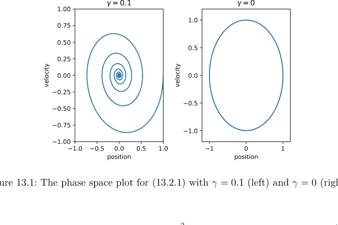

图 13.1：方程 (13.2.1) 在 $\gamma = 0.1$（左）和 $\gamma = 0$（右）时的相空间图。

$$\ddot{x} + 2\gamma\dot{x} + \omega_0^2 x = 0 \qquad (13.2.1)$$

其中 $x$ 是质量 $m$ 相对于弹簧平衡位置的位移，$\gamma$ 是阻尼参数，$\omega_0^2 = k/m$ 取决于弹簧常数 $k$。

方程 (13.2.1) 的相图如图 13.1 所示，其中 $m = 1$，$\omega_0 = 1$，$x(0) = 1$，$\dot{x}(0) = 0$。对于无阻尼情况，$\gamma = 0$；对于有阻尼情况，$\gamma = 0.1$。

假设一下，我们不知道如何解析地求解这个问题，而只有通过数值方法生成的相空间图；对于非线性系统，情况常常如此。从图 13.1 中，我们能了解到关于方程 (13.2.1) 行为的哪些信息呢？

让我们首先考虑图 13.1 中的左图，其中 $\gamma = 0.1$，因此系统中存在少量阻尼。为了帮助可视化系统的行为，我们将继续把方程 (13.2.1) 视为描述一个带阻尼的弹簧振子。相空间中的路径，称为*相空间轨迹*，或简称*轨迹*，代表了方程 (13.2.1) 的解。

要理解系统的行为，请沿着相空间中的轨迹前进！当我们从起点开始沿着轨迹前进时，我们看到位置向零减小，而速度变得更负。想象一个弹簧振子，轨迹代表一个质量从静止开始，位于平衡位置（$x = 0$）右侧 1.0 米处，当释放时，它向左朝平衡位置移动，速度增加。质量到达平衡位置时具有最大（负）速度，越过平衡位置，然后开始减速（速度变得不那么负）。质量继续向左移动到平衡位置左侧约 0.6 米处，此时速度为零。然而，质量已经到达一个转折点，开始向右移动（正速度），当它再次接近平衡位置时速度增加。质量在平衡位置达到最高速度并开始减速。然而，注意质量并没有回到其初始位置，而是在平衡位置右侧约 0.5 米处停下并再次转向。这种衰减振荡持续进行，直到质量静止在平衡位置（轨迹终止于原点）。

我们可以使用图 13.1 来回答关于系统稳态（质量静止在平衡位置）的问题，我们甚至可以讨论瞬态行为，所有这些都无需解析解！最终点，在这种情况下是原点，是满足 $\dot{x} = 0$ 和 $\dot{v} = 0$ 的点。相空间中满足条件 $\dot{x} = 0$ 和 $\dot{v} = 0$ 的点称为系统的*不动点*。不动点对应于系统的平衡点，并呈现不同的形式。在 $\gamma = 0.1$ 的情况下，不动点称为*稳定焦点*，它代表衰减振荡到平衡位置。

对于 $\gamma = 0$ 的情况，对应于图 13.1 中的右图，我们可以获得关于系统行为的相同定性信息。同样，从初始条件 $(x = 1, v = 0)$ 开始，继续使用弹簧振子的类比，我们可以逆时针沿着轨迹前进，看到质量以增加的速度（向左）朝平衡位置移动，越过平衡位置，减速并在平衡位置左侧 1.0 米处停止。此时，质量开始向右移动，速度增加，直到它越过平衡位置并返回其起始位置。闭合曲线轨迹代表一个振荡，系统返回其初始状态。原点仍然是一个平衡位置，仍然是一个不动点，但质量并未静止在那里。在这种情况下，原点处的不动点被称为*中心*（如振荡中心）。

正如我们所看到的，从相空间图中可以获得大量有价值的信息。我们可以提出进一步的问题。例如，当 $\gamma = 0.1$ 时，是否所有初始条件的轨迹都会螺旋进入原点？答案当然是肯定的，因为阻尼从系统中移除能量，使其静止在平衡位置。然而，我们可以通过选择几个初始条件并数值求解方程 (13.2.1) 来找出这一点。我们会发现所有点的轨迹都螺旋进入原点，因此原点是一个*全局吸引子*，一个“吸引”从相空间中所有点出发的轨迹的不动点。同样，我们可以对 $\gamma = 0$ 重复此练习，发现得到的相空间图由嵌套的闭合轨迹组成。在这种情况下，原点既不吸引也不排斥轨迹，被认为是中性稳定的。因此，即使不解析求解系统，我们也可以回答关于任何初始条件下系统行为的问题。

在上面的例子中，我们看到了两种类型的不动点：稳定焦点和中心，分别代表稳定和中性平衡。还有其他类型的不动点会排斥轨迹，对应于不稳定平衡，以及既吸引又排斥轨迹的不动点（也对应于不稳定平衡）。在下一节中，我们将更一般地讨论不动点。我们将研究如何找到它们以及如何分类其平衡状态的稳定性。下一节本质上是数学性的，有点抽象，但我们将通过两个例子来帮助阐述本节的关键思想。

## 13.3 不动点与相图

尽管牛顿第二定律促使我们在经典力学中研究二阶常微分方程，但我们知道可以将它们重写为一对耦合的一阶方程。因此，在本节中，我们将考虑如下形式的一阶方程对：

通用一阶运动方程
$$
\begin{cases}
\dot{x} = f(x, y) \\
\dot{y} = g(x, y)
\end{cases}
\tag{13.3.1}
$$

其中 $f(x, y)$ 和 $g(x, y)$ 是变量 $x$ 和 $y$ 的函数。例如，$x$ 和 $y$ 可以表示物理系统的位置和速度，或者它们可以表示捕食者-猎物模型中兔子和狐狸的数量。我们可以通过选择 $y = v$ 将 (13.2.1) 重写为类似于 (13.3.1) 的形式，此时 (13.2.1) 变为：

$$\begin{cases} \dot{x} = y \\ \dot{y} = -2\gamma y - x \end{cases}$$ (13.3.2)

其中 $f(x, y) = y$ 且 $g(x, y) = -2\gamma y - x$。方程 (13.3.1) 有时被称为二维方程组，因为它依赖于两个变量 $x$ 和 $y$。此外，(13.3.1) 被称为我们系统的*运动方程*。回想一下，对于物理系统，运动方程这一术语描述了粒子的实际运动。然而，即使我们用它们来描述动物种群，或者任何其他不一定在运动（但在变化）的系统类型，通常也将 (13.3.1) 称为运动方程。运动方程描述了给定系统的行为，无论系统的性质如何。

虽然非线性系统多种多样且通常难以分析，但有一些通用的策略来处理此类系统。例如，我们喜欢向学生推荐的一种通用方法如下：

> **分析非线性系统的通用方法**

1.  找到系统的不动点（平衡点），即满足 $f(x^*, y^*) = 0$ 且 $g(x^*, y^*) = 0$ 的点 $(x^*, y^*)$。
2.  确定不动点的稳定性。
3.  使用靠近不动点的初始条件，绘制*相图*，即 $y$ 对 $x$ 的图，其中包含具有代表性的轨迹选择。
4.  识别相图中的其他非线性结构，如极限环和奇异吸引子（见下文）。
5.  识别分岔（见下文）。

在本节中，我们将重点讨论前两个步骤，然后在后面的章节中，我们将通过示例演示最后两个步骤。

为了找到系统 (13.3.1) 的不动点 $(x^*, y^*)$，我们只需解方程：

$$\begin{cases} f(x^*, y^*) = 0 \\ g(x^*, y^*) = 0 \end{cases}$$ (13.3.3)

以求得 $(x^*, y^*)$。在我们的阻尼谐振子示例中，通过求解 $f(x^*, y^*) = y^* = 0$ 和 $g(x^*, y^*) = -2\gamma y^* - x^* = 0$，可以找到一个不动点 $(x^* = 0, y^* = 0)$。系统可能有多个不动点。求解不动点可以通过手工完成，也可以使用计算机代数系统完成。

一旦我们找到了不动点，就需要确定这些不动点的稳定性。换句话说，平衡状态是稳定的、不稳定的，还是中性稳定的？为了找到稳定性，我们必须知道系统在每个平衡状态附近的行为，即我们需要找到平衡点附近运动方程的数学形式。

泰勒级数展开提供了方程在特定点附近的多项式近似。因此，通过对 $f$ 和 $g$ 进行泰勒展开，我们可以得到平衡状态附近运动方程的简单数学形式。泰勒展开后的 $f$ 和 $g$ 将产生简单的线性微分方程，这些方程可以解析求解。解析解将告诉我们系统在平衡点附近的稳定性。总之，为了获得不动点的稳定性，需要在不动点附近对运动方程进行泰勒展开，并求解所得的微分方程。

为了进行泰勒级数展开，我们在不动点附近对系统进行扰动。扰动通过坐标变换完成：$x = x^* + u$ 和 $y = y^* + v$，其中 $u$ 和 $v$ 分别与 $x^*$ 和 $y^*$ 相比很小。注意，$v$ 不是用来表示速度的。此外，我们新坐标 $(u, v)$ 的原点就是不动点 $(x^*, y^*)$。接下来，我们将 $x = x^* + u$ 和 $y = y^* + v$ 代入运动方程 (13.3.1)，并在点 $(x^*, y^*)$ 附近进行泰勒展开。注意，由于 $x^*$ 是常数，所以 $\dot{x} = \dot{u}$，$\dot{y}$ 同理。

代入后，(13.3.1) 中 $f$ 的泰勒展开变为：

$$ \dot{u} = f(x^* + u, y^* + v) \tag{13.3.4} $$
$$ = f(x^*, y^*) + u \frac{\partial f}{\partial x}\bigg|_{(x^*, y^*)} + v \frac{\partial f}{\partial y}\bigg|_{(x^*, y^*)} + \mathcal{O}(u^2, v^2) \tag{13.3.5} $$
$$ = u \frac{\partial f}{\partial x}\bigg|_{(x^*, y^*)} + v \frac{\partial f}{\partial y}\bigg|_{(x^*, y^*)} \tag{13.3.6} $$

注意，从 (13.3.5) 到 (13.3.6)，一些项似乎丢失了。根据不动点的定义，项 $f(x^*, y^*) = 0$，而项 $\mathcal{O}(u^2, v^2)$ 包含二阶及更高阶项。回想一下，$u$ 和 $v$ 很小，所以 $u^2$ 和 $v^2$ 非常小，对于动力学来说可以忽略不计。虽然在某些情况下需要保留这些非线性项，但本文将重点讨论可以忽略这些项的系统。对于 $g(x, y)$ 可以重复相同的过程：

$$ \dot{v} = u \frac{\partial g}{\partial x}\bigg|_{(x^*, y^*)} + v \frac{\partial g}{\partial y}\bigg|_{(x^*, y^*)} \tag{13.3.7} $$

$\dot{u}$ 和 $\dot{v}$ 的方程告诉我们，从不动点 $(x^*, y^*)$ 出发的扰动如何随时间演化。通过对 (13.3.1) 在不动点附近进行泰勒展开，我们得到了一个关于 $u$ 和 $v$ 线性的方程组。上述过程有时被称为运动方程的*线性化*。我们可以解析地求解这些*线性化*方程，并理解轨迹在不动点附近的行为。换句话说，我们将能够找到平衡点的稳定性。将线性化方程写成矩阵形式是有帮助的：

> **线性化运动方程**

$$ \begin{pmatrix} \dot{u} \\ \dot{v} \end{pmatrix} = \begin{pmatrix} \frac{\partial f}{\partial x} & \frac{\partial f}{\partial y} \\ \frac{\partial g}{\partial x} & \frac{\partial g}{\partial y} \end{pmatrix} \begin{pmatrix} u \\ v \end{pmatrix} \tag{13.3.8} $$

其中，为了简化符号，我们省略了每个偏导数的求值符号。

(13.3.8) 中的 $2 \times 2$ 矩阵称为*雅可比矩阵* $\mathbf{A}$，为了简化，我们可以将 (13.3.8) 重写为：

$$\dot{\mathbf{u}} = \mathbf{A}\mathbf{u} \qquad (13.3.9)$$

其中 $\mathbf{u} = (u, v)$。方程 (13.3.9) 表示一个一阶微分方程组，其解为 $\mathbf{u} = \mathbf{w}e^{\lambda t}$，其中 $\mathbf{w}$ 是一个常向量。将我们的试探解代入 (13.3.9) 得到：

$$\lambda\mathbf{w} = \mathbf{A}\mathbf{w} \qquad (13.3.10)$$

这是矩阵 $\mathbf{A}$ 的特征向量方程。因此，在我们的试探解 $\mathbf{u} = \mathbf{w}e^{\lambda t}$ 中，$\lambda$ 是与特征向量 $\mathbf{w}$ 相关联的 $A$ 的特征值。我们之前在第 11 章和第 12 章已经学习过特征值和特征向量。这里我们将从几何角度来研究它们。

回到我们的分析，我们可以将 (13.3.10) 重写为：

$$(\mathbf{A} - \lambda\mathbf{1})\mathbf{w} = \mathbf{0} \qquad (13.3.11)$$

其中 $\mathbf{1}$ 是 $2 \times 2$ 单位矩阵（对角线上为 1，其他位置为 0），$\mathbf{0}$ 是零向量。线性代数告诉我们，如果矩阵 $\mathbf{A} - \lambda\mathbf{1}$ 可逆，那么 (13.3.11) 的解是 $\mathbf{w} = \mathbf{0}$，这是平凡解。为了得到非平凡解，我们需要矩阵 $\mathbf{A} - \lambda\mathbf{1}$ 是奇异的（即不可逆）。线性代数还告诉我们，如果一个矩阵的行列式为零，则该矩阵是奇异的。因此，为了得到非平凡解，必须满足 $\det(\mathbf{A} - \lambda\mathbf{1}) = 0$。条件 $\det(\mathbf{A} - \lambda\mathbf{1}) = 0$ 产生一个关于 $\lambda$ 的多项式，称为特征多项式，可以求解得到 $\mathbf{A}$ 的特征值。因为矩阵 $\mathbf{A}$ 是 $2 \times 2$ 矩阵，它将产生两个特征值，每个特征值可以代入 (13.3.11) 以得到其关联的特征向量。利用线性叠加原理，(13.3.9) 的解因此为：

$$\mathbf{u} = c_1\mathbf{w}_1e^{\lambda_1 t} + c_2\mathbf{w}_2e^{\lambda_2 t} \qquad (13.3.12)$$

其中 $\lambda_i$ 是与特征向量 $\mathbf{w}_i$ 相关联的 $\mathbf{A}$ 的特征值，$c_i$ 是由初始条件确定的常数。

在继续示例之前，暂停并尝试理解 (13.3.10) 和 (13.3.12) 的含义是很重要的。接下来的三段是抽象的，但值得花时间去理解。当一个向量乘以一个矩阵时，结果是一个向量。考虑矩阵方程 $\mathbf{M}\mathbf{v}_1 = \mathbf{v}_2$，其中 $\mathbf{M}$ 是一个 $N \times N$ 矩阵，$\mathbf{v}_1$ 和 $\mathbf{v}_2$ 是 $N$ 维向量（$N \times 1$ 矩阵）。我们可以将方程 $\mathbf{M}\mathbf{v}_1 = \mathbf{v}_2$ 理解为：当乘以矩阵 $\mathbf{M}$ 时，向量 $\mathbf{v}_1$ 被变换为向量 $\mathbf{v}_2$。新向量 $\mathbf{v}_2$ 可能具有与 $\mathbf{v}_1$ 不同的大小和方向。这里的关键是矩阵会改变向量。现在，让我们看看 (13.3.10)。注意在 (13.3.10) 中，向量 $\mathbf{w}$ 乘以矩阵 $\mathbf{A}$ 后，本质上没有改变方向。$\mathbf{w}$ 的长度被缩放了 $\lambda$ 倍，但新向量 $\lambda\mathbf{w}$ 仍然与 $\mathbf{w}$ 位于同一条直线上（如果 $\lambda < 0$，新向量 $\lambda\mathbf{w}$ 现在指向与 $\mathbf{w}$ 相反的方向）。这使得特征向量很特殊，它们本质上定义了在变换 $\mathbf{A}$ 下不变的方向。

为什么我们关心矩阵如何改变向量？回想一下，(13.3.9) 的提议解是 $\mathbf{u} = \mathbf{w}e^{\lambda t}$，而 $\mathbf{u}$ 是相空间中靠近不动点的一个位置。$\mathbf{u}$ 的大小随时间呈指数增长或衰减，这取决于 $\lambda$ 的符号。特征值和特征向量的几何解释告诉我们，一个从不动点附近沿着 $\mathbf{w}$ 方向开始的解，如果 $\lambda < 0$，将沿着 $\mathbf{w}$ 的方向向不动点移动；如果 $\lambda > 0$，则将沿着 $\mathbf{w}$ 的方向远离不动点。在本节末尾，我们将简要讨论 $\lambda = 0$ 的情况。

特征值 $\lambda$ 的符号决定了不动点沿 $\mathbf{w}$ 方向的稳定性。由于我们处理的是二维问题，(13.3.12) 告诉我们不动点有两个稳定方向。一个方向沿 $\mathbf{w}_1$，另一个沿 $\mathbf{w}_2$，这些方向是 $A$ 的特征向量。每个方向的稳定性分别由 $\lambda_1$ 和 $\lambda_2$ 决定。因此，如果 $\lambda_1 < 0$ 且 $\lambda_2 > 0$，那么一个从不动点附近开始的点 $\mathbf{u}$ 最初会沿着 $\mathbf{w}_1$ 的方向向不动点移动，但随着时间的推移，它最终会开始沿着 $\mathbf{w}_2$ 的方向远离不动点。在这种情况下，不动点代表一个不稳定的平衡点，因为当 $t \to \infty$ 时，来自平衡点（不动点）的扰动会呈指数增长。

在接下来的两个例子中，我们将演示使用上面开发的大纲来寻找和分类不动点的过程。例 13.1 研究了阻尼谐振运动，并演示了如何通过解析方法寻找和分类不动点。

### 例 13.1：阻尼谐振子，再次回顾

考虑质量为 $m = 1$ 的阻尼谐振子的运动方程：
$$\dot{x} = y$$
$$\dot{y} = -2\gamma y - \omega_0^2 x$$
求雅可比矩阵并计算其特征值和特征向量。

**解：**
我们已经注意到 $f = y$ 且 $g = -2\gamma y - \omega_0^2 x$，并且不动点位于原点。我们可以使用 (13.3.8) 来得到雅可比矩阵，
$$A = \left. \begin{pmatrix} \frac{\partial f}{\partial x} & \frac{\partial f}{\partial y} \\ \frac{\partial g}{\partial x} & \frac{\partial g}{\partial y} \end{pmatrix} \right|_{(0,0)} = \begin{pmatrix} 0 & 1 \\ -\omega_0^2 & -2\gamma \end{pmatrix}$$
接下来，我们开始计算特征值的过程，
$$\det(A - \lambda \mathbf{1}) = \det \left( \begin{pmatrix} 0 & 1 \\ -\omega_0^2 & -2\gamma \end{pmatrix} - \lambda \begin{pmatrix} 1 & 0 \\ 0 & 1 \end{pmatrix} \right) = \begin{vmatrix} -\lambda & 1 \\ -\omega_0^2 & -2\gamma - \lambda \end{vmatrix} = 0$$
计算行列式得到：
$$-\lambda(-2\gamma - \lambda) + \omega_0^2 = \lambda^2 + 2\gamma\lambda + \omega_0^2 = 0$$
解出 $\lambda$：
$$\lambda = -\gamma \pm \sqrt{\gamma^2 - \omega_0^2}$$
这看起来熟悉吗？应该熟悉！接下来，我们将使用 (13.3.11) 来找到与 $\lambda = -\gamma + \sqrt{\gamma^2 - \omega_0^2}$ 相关的特征向量（我们将让读者完成另一个）：
$$(A - \lambda \mathbf{1}) \mathbf{w} = \left( \begin{pmatrix} 0 & 1 \\ -\omega_0^2 & -2\gamma \end{pmatrix} - \left( -\gamma + \sqrt{\gamma^2 - \omega_0^2} \right) \begin{pmatrix} 1 & 0 \\ 0 & 1 \end{pmatrix} \right) \cdot \begin{pmatrix} w_1 \\ w_2 \end{pmatrix} = \begin{pmatrix} 0 \\ 0 \end{pmatrix}$$
简化为：
$$\begin{pmatrix} \gamma - \sqrt{\gamma^2 - \omega_0^2} & 1 \\ -\omega_0^2 & -\gamma - \sqrt{\gamma^2 - \omega_0^2} \end{pmatrix} \cdot \begin{pmatrix} w_1 \\ w_2 \end{pmatrix} = \begin{pmatrix} 0 \\ 0 \end{pmatrix}$$
或
$$\left(\gamma - \sqrt{\gamma^2 - \omega_0^2}\right) w_1 + w_2 = 0$$
$$-\omega_0^2 w_1 + \left(-\gamma - \sqrt{\gamma^2 - \omega_0^2}\right) w_2 = 0$$
得到
$$\begin{pmatrix} w_1 \\ w_2 \end{pmatrix} = \begin{pmatrix} -\frac{1}{\omega_0^2}\left(\gamma + \sqrt{\gamma^2 - \omega_0^2}\right) \\ 1 \end{pmatrix}$$
这一切关于原点平衡点的稳定性说明了什么？我们将在本节后面再讨论这个问题。目前，这个例子旨在简单地演示本节中概述的过程。

例 13.2 演示了如何使用 Python 和 Mathematica 来寻找和分类不动点。例 13.2 中的系统并不描述一个特定的物理系统。然而，它是一个简单的方程组，允许直接演示该过程，并且比例 13.1 更容易扩展到稳定性的讨论。

### 例 13.2：一个由两个一阶常微分方程组成的系统

考虑以下常微分方程组：
$$\dot{x} = y(x+1)$$
$$\dot{y} = x(y+1)$$
使用 Mathematica 和 Python，找到不动点并求解相应的线性化方程组。

**解：**
代码如下所示。我们发现有两个不动点，原点和点 $(-1, -1)$。在归一化特征向量后，原点附近的解为
$$\begin{pmatrix} u \\ v \end{pmatrix} = c_1 \begin{pmatrix} 1/\sqrt{2} \\ 1/\sqrt{2} \end{pmatrix} e^t + c_2 \begin{pmatrix} -1/\sqrt{2} \\ 1/\sqrt{2} \end{pmatrix} e^{-t}$$
其中 $c_1$ 和 $c_2$ 是常数，没有我们线性化系统的初始条件就无法确定。我们将把点 $(-1, -1)$ 附近解的归一化留给读者完成。

**Python 代码**
在定义了 `f` 和 `g` 之后，我们求解了不动点。注意 Python 将原点作为最后一个不动点。然后我们使用 `Matrix` 创建了雅可比矩阵 `A` 并找到了它的特征值和特征向量。我们在 `eigenvects1` 和 `eigenvects2` 中使用了列表推导式，以便 `print` 命令能将特征向量打印为列表。

```python
from sympy import symbols, diff, solve, Matrix

print('-'*28,'CODE OUTPUT','-'*29,'\n')

x, y = symbols('x,y')

f = y*(x + 1)
g = x*(y + 1)

#find the fixed points
fps = solve([f,g],[x,y])

fps1 = fps[1] #identify the first fixed point as origin
fps2 = fps[0]

print('The fixed points are, ', fps)

#compute the Jacobian matrix
A = Matrix([[diff(f,x), diff(f,y)],
            [diff(g,x),diff(g,y)]])

A_fps1 = (A.subs([(x,fps1[0]),(y,fps1[1])]))
A_fps2 =  (A.subs([(x,fps2[0]),(y,fps2[1])]))

eigenvals1 = list(A_fps1.eigenvals().keys())
eigenvals2 = list(A_fps2.eigenvals().keys())

eigenvects1 = [list(ev[2][0]) for ev in A_fps1.eigenvects()]
eigenvects2 = [list(ev) for ev in A_fps2.eigenvects()[0][2]]

print('The eigenvalues for the origin are:', eigenvals1)
print('The eigenvalues for (-1,-1) are:', eigenvals2)

print('The eigenvectors for the origin are ', eigenvects1)
print('The eigenvectors for the (-1,-1) are ', eigenvects2)

--------------------------- CODE OUTPUT ----------------------------
The fixed points are,  [(-1, -1), (0, 0)]
The eigenvalues for the origin are: [-1, 1]
The eigenvalues for (-1,-1) are: [-1]
The eigenvectors for the origin are  [[-1, 1], [1, 1]]
The eigenvectors for the (-1,-1) are  [[1, 0], [0, 1]]
```

### Mathematica 代码

在定义了 f 和 g 之后，我们求解了不动点。注意 Mathematica 将原点作为最后一个不动点。然后我们创建了雅可比矩阵 A，并使用 Eigenvalues 和 Eigenvectors 命令找到了它的特征值和特征向量。

```mathematica
f = y * (x + 1);

g = x * (y + 1);

(* Find the fixed points *)

fps = Solve[{f==0, g==0}, {x, y}]

{{x -> -1, y -> -1}, {x -> 0, y -> 0}}

(* Compute the Jacobian matrix *)

A = {{D[f, x], D[f, y]}, {D[g, x], D[g, y]}};

(* We will label the origin as fps1 *)

Afps1 = A /. fps[[2]];
Afps2 = A /. fps[[1]];

Print["The eigenvalues of the origin are ", Eigenvalues[Afps1]]

The eigenvalues of the origin are {-1, 1}

Print["The eigenvalues of (-1,-1) are ", Eigenvalues[Afps2]]

The eigenvalues of (-1,-1) are {-1, -1}

Print["The eigenvectors of the origin are ", Eigenvectors[Afps1]]

The eigenvectors of the origin are {{-1, 1}, {1, 1}}

Print["The eigenvectors of (-1,-1) are ", Eigenvectors[Afps2]]

The eigenvectors of (-1,-1) are {{0, 1}, {1, 0}}
```

现在让我们检查例 13.2 中原点附近的解。我们看到，沿着 w₁ = (1, 1) 的方向，由于 λ > 0，存在远离原点的指数增长。然而，沿着 w₂ = (-1, 1) 的方向，由于 λ < 0，存在朝向原点的指数衰减。这个不动点有两个不同的稳定性，取决于方向。不稳定方向 w₁ 与一条称为不动点的不稳定流形的曲线相切。

稳定方向 w₂ 与一条称为稳定流形的曲线相切。每个向量 w₁ 和 w₂ 在不动点处分别与其流形相切。例 13.2 中的原点被称为鞍点（或简称鞍点），并且最终是不稳定的，正如我们将在下面看到的。为了更好地理解这里发生的事情，让我们在例 13.3 中检查原点附近的相图。

### 示例 13.3：示例 13.2 中系统的相图

绘制示 13.2 中方程组在原点附近的相图。

**解答：**
以下代码生成了图 13.2 所示的相图。在每种情况下，实心黑线代表稳定和不稳定流形。流线图上的箭头显示了原点附近轨迹的流动方向。从稳定流形附近开始的轨迹会趋近原点，但最终会转向不稳定流形并远离原点。

**Python 代码**
稳定和不稳定流形是通过在原点附近积分方程找到的。命令 `streamplot` 用于显示原点周围的向量场。轨迹将沿着流线图创建的箭头方向流动。

```python
import numpy as np
import matplotlib.pyplot as plt
from scipy.integrate import odeint

times = np.linspace(0,8,100)

def deriv(z,t):
    x, y = z
    dzdt = [y*(x+1), x*(y+1)]
    return dzdt

ic1 = [-0.001,0.0009]
ic2 = [0.001, -0.001]
ic3 = [-0.001, 0.0011]
ic4 = [-0.001, -0.001]

soln1 = odeint(deriv, ic1, -times)
soln2 = odeint(deriv, ic2, -times)
soln3 = odeint(deriv, ic3, times)
soln4 = odeint(deriv, ic4, times)

X, Y = np.meshgrid(np.linspace(-0.1,0.1,100), np.linspace(-0.1,0.1,100))

f_vec = Y*(X + 1)
g_vec = X*(Y + 1)

plt.streamplot(X, Y, f_vec, g_vec)
plt.plot(soln1[:,0],soln1[:,1],'k')
plt.plot(soln2[:,0],soln2[:,1],'k')
plt.plot(soln3[:,0],soln3[:,1],'k')
plt.plot(soln4[:,0],soln4[:,1],'k')
plt.xlabel('x')
plt.ylabel('y')
plt.xlim(-0.1,0.1)
plt.ylim(-0.1,0.1)
plt.show()
```

### Mathematica 代码

我们首先计算将成为稳定和不稳定流形的轨迹。我们使用 `ParametricPlot` 创建多个图形，每个流形一个。然后使用 `StreamPlot` 绘制流线图，其中输入是 $f(x,y)$ 和 $g(x,y)$。`Show` 命令将所有图形显示为一个图。

```mathematica
tmax = 6;

soln1 = NDSolve[{x'[t] == y[t](x[t] + 1), y'[t] == x[t](y[t] + 1), x[0] == -0.001,
y[0] == 0.001}, {x, y}, {t, 0, -tmax}];
soln2 = NDSolve[{x'[t] == y[t](x[t] + 1), y'[t] == x[t](y[t] + 1), x[0] == 0.001,
y[0] == -0.001}, {x, y}, {t, 0, -tmax}];
soln3 = NDSolve[{x'[t] == y[t](x[t] + 1), y'[t] == x[t](y[t] + 1), x[0] == 0.001,
y[0] == 0.0011}, {x, y}, {t, 0, tmax}];
soln4 = NDSolve[{x'[t] == y[t](x[t] + 1), y'[t] == x[t](y[t] + 1), x[0] == -0.001,
y[0] == -0.001}, {x, y}, {t, 0, tmax}];

stable1 = ParametricPlot[{x[t], y[t]}/.soln1, {t, 0, -tmax}, PlotStyle->Black];
stable2 = ParametricPlot[{x[t], y[t]}/.soln2, {t, 0, -tmax}, PlotStyle->Black];
unstable1 = ParametricPlot[{x[t], y[t]}/.soln3, {t, 0, tmax}, PlotStyle->Black];
unstable2 = ParametricPlot[{x[t], y[t]}/.soln4, {t, 0, tmax}, PlotStyle->Black];

stream = StreamPlot[{y(x + 1), x(y + 1)}, {x, -0.1, 0.1}, {y, -0.1, 0.1},
StreamColorFunction->Blue];

Show[stream, stable1, stable2, unstable1, unstable2, Frame->True,
Axes -> False, BaseStyle -> {Bold, FontSize -> 16}, FrameLabel -> {x, y}]
```

正如我们在上面的例子中看到的，特征值决定了不动点的稳定性。在二维系统中，与实特征值相关的简单不动点有三种类型：稳定节点、不稳定节点和鞍点。

- *稳定节点*有两个负特征值，从稳定节点附近开始的轨迹会指数趋近于它。稳定节点对应于一个稳定的平衡位置。对于每个稳定节点，相空间中都有一个称为其*吸引域*的区域。稳定节点的吸引域是所有初始条件的集合，其轨迹在 $t \to \infty$ 时趋近于稳定节点。
- *不稳定节点*，有时称为排斥子，有两个正特征值。它被称为排斥子是因为从节点附近开始的轨迹会以指数速率远离节点。不稳定节点对应于一个不稳定的平衡。

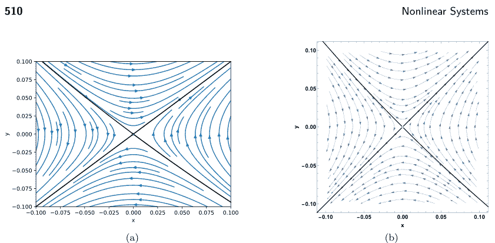

图 13.2：示例 13.3 的相图，由 Python (a) 和 Mathematica (b) 创建。在两个图中，X 形的黑线是稳定和不稳定流形。蓝色箭头（在电子书中）显示了轨迹的流动方向。

- *鞍点*，在示例 13.2 和 13.3 中探讨过，有一个正特征值和一个负特征值。它对应于一个不稳定的平衡。鞍点的稳定流形通常作为相空间中稳定节点和其他稳定结构的吸引域的边界（见下文）。

除了上面列出的点之外，还有三种具有复特征值的不动点类型。假设 $\lambda = \alpha + i\beta$，则 $e^{\lambda t} = e^{\alpha t}(\cos(\beta t) + i \sin(\beta t))$。在复特征值的情况下，我们看到指数增长或衰减与振荡的组合，类似于阻尼谐振子的情况。可能的不动点是：

- 当 $Re(\lambda) < 0$ 时，出现*稳定螺旋*，轨迹螺旋式地趋近于不动点。稳定螺旋出现在欠阻尼谐振子的相图中，其中 $\beta < \omega_0$。
- 当 $Re(\lambda) > 0$ 时，出现*不稳定螺旋*，轨迹螺旋式地远离不动点。这将对应于具有负阻尼参数的阻尼谐振子。
- 当 $Re(\lambda) = 0$ 时，出现*中心*，既没有指数增长远离不动点，也没有指数衰减趋近于不动点。该点是中性稳定的，轨迹围绕中心旋转。这对应于无阻尼的简谐振子。

当存在零特征值时会发生什么？通常使用数值方法来分析系统。最后，应该提到的是，存在称为*退化*的情况，因为它们只有一个特征值和/或一个特征向量。这会导致其他类型的不动点，这超出了本书的范围。感兴趣的读者可以参考 Strogatz [11] 以获得对更多类型不动点的全面且易读的回顾。接下来，我们将利用我们新获得的不动点知识来分析简单的平面摆。

### 13.3.1 简单平面摆，再探

考虑下图 13.3 所示的简单平面摆。摆由一根长度为 $\ell$ 的无质量杆、一个质量为 $m$ 的摆锤组成，并与垂直方向成 $\theta$ 角。

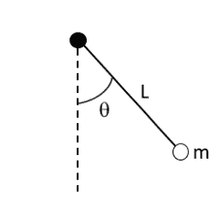

图 13.3：简单平面摆。

摆的运动方程在本书中已被多次找到，

$$\ddot{\theta} + \omega_0^2 \sin \theta = 0 \quad (13.3.13)$$

其中固有频率 $\omega_0^2 = g/\ell$。方程 (13.3.13) 可以使用椭圆积分以封闭形式求解；然而，这些解的洞察力不强。让我们转而使用第 13.3 节中开发的分析方法，将 (13.3.13) 分解为两个一阶方程：

$$\begin{aligned} \dot{\theta} &= y \\ \dot{y} &= -\omega_0^2 \sin \theta \end{aligned} \quad (13.3.14)$$

其中变量 $y$ 是角速度。注意不动点出现在 $(\theta^* = 0, y = 0)$ 和 $(\theta^* = \pm \pi, y = 0)$；这在物理上是合理的，因为它们对应于摆路径的最低点和最高点。根据我们定义坐标系的方式，$\theta = \pm \pi$ 是同一个点，即摆路径的最高点。注意，当摆逆时针接近顶部时 $\theta = +\pi$，顺时针接近顶部时 $\theta = -\pi$。系统的雅可比矩阵为：

$$A = \begin{pmatrix} 0 & 1 \\ -\omega_0^2 \cos \theta & 0 \end{pmatrix} \quad (13.3.15)$$

在原点，雅可比矩阵 (13.3.15) 变为：

$$\begin{pmatrix} 0 & 1 \\ -\omega_0^2 & 0 \end{pmatrix} \quad (13.3.16)$$

其特征值为 $\lambda = \pm i\omega_0$。原点对应于摆路径的最低点，是一个中心。中心代表了摆围绕稳定平衡位置的振荡。

在 $(\pm \pi, 0)$ 处，雅可比矩阵 (13.3.15) 变为

$$\begin{pmatrix} 0 & 1 \\ \omega_0^2 & 0 \end{pmatrix} \quad (13.3.17)$$

其特征值为 $\lambda = \pm \omega_0$。对应于不稳定平衡的不动点是一个鞍点。你是否预料到会是一个不稳定节点？最高点不能是不稳定节点，因为不稳定节点会排斥所有轨迹。另一方面，鞍点有一个稳定方向。我们知道摆可以在转向之前接近顶部，因此，最高点必须是一个鞍点。现在我们知道了不动点的位置和稳定性，我们就可以绘制相图了。

图 13.4 展示了使用 $\omega_0 = 1$ 的简单摆的相图。回想一下，点 $\theta = \pm \pi$ 对应于相同的物理位置。因此，两个鞍点

### 13.3.2 双势阱，再探

回顾双势阱，

$$V(x) = -\frac{1}{2}kx^2 + \frac{1}{4}\epsilon x^4 \qquad (13.3.18)$$

图13.6展示了当 $k = \epsilon = 1$ 时双势阱的一个例子。从图13.6中我们可以看到，在 $x = \pm 1$ 处有两个稳定平衡点，在 $x = 0$ 处有一个不稳定平衡点。双势阱与以下形式的力相关联，$F(x) = kx - \epsilon x^3$。由此得到的运动方程为，

$$m\ddot{x} = kx - \epsilon x^3 \quad (13.3.19)$$

接下来，令 $m = k = \epsilon = 1$，我们将找到不动点，识别其稳定性，并绘制相图。为了绘制相图，我们需要将方程(13.3.19)改写为一个二维系统，

$$\begin{cases} \dot{x} = y \\ \dot{y} = x - x^3 \end{cases} \quad (13.3.20)$$

从方程(13.3.20)中，我们看到不动点存在于 $(0, 0)$、$(1, 0)$ 和 $(-1, 0)$。雅可比矩阵为，

$$A = \begin{pmatrix} 0 & 1 \\ 1 - 3x^2 & 0 \end{pmatrix} \quad (13.3.21)$$

对于点 $(0,0)$，其特征值为 $\pm 1$；对于点 $(1,0)$ 和 $(-1,0)$，特征值为 $\pm i\sqrt{2}$。因此，原点是一个鞍点，另外两个点是中心。在示例13.4中，我们将绘制双势阱的相图。

**示例13.4：双势阱**
绘制双势阱(13.3.20)的相图。

**解答：**
图13.7展示了用于创建相图的Mathematica代码的输出。注意两条同宿轨道，一条为红色（在电子书中），另一条为黑色（在电子书中），它们围绕着两个中心。每条同宿轨道内部是闭合轨迹，对应于围绕每个稳定平衡点的振荡。同宿轨道外部是更大的闭合轨迹，对应于穿过每个平衡点的振荡。

**Python代码**
此代码在结构上遵循示例13.3。注意变量 `right_hc` 和 `left_hc` 分别是左右同宿轨道的解。

```python
import numpy as np
import matplotlib.pyplot as plt
from scipy.integrate import odeint

times = np.linspace(0,20,200)

def deriv(z,t):
    x, y = z
    dzdt = [y, x - x**3]
    return dzdt

ic1 = [0.001,0.001]
ic2 = [-0.001, -0.001]

right_hc = odeint(deriv, ic1, times)
left_hc = odeint(deriv, ic2, times)

X, Y = np.meshgrid(np.linspace(-2,2,100), np.linspace(-2,2,100))

f_vec = Y
g_vec = X - X**3

plt.streamplot(X, Y, f_vec, g_vec)
plt.plot(right_hc[:,0],right_hc[:,1],'r')
plt.plot(left_hc[:,0],left_hc[:,1],'k')
plt.xlabel('x')
plt.ylabel('y')
plt.xlim(-2,2)
plt.ylim(-2,2)
plt.show()
```

**Mathematica代码**
此代码与示例13.3类似。变量 `leftHomoclinicSolution` 和 `rightHomoclinicSolution` 分别包含左右同宿轨道的解。

```mathematica
sp = StreamPlot[{y, x - x^3}, {x, -2, 2}, {y, -2, 2}, FrameLabel -> {x, y},
BaseStyle -> {Bold, FontSize -> 16}, StreamColorFunction->Blue];

leftHomoclinicSolution =
NDSolve[{x'[t] == y[t], y'[t] == x[t] - x[t]^3, x[0] == 0.01, y[0] == 0}, {x, y},
{t, 0, 100}];
leftHomoclinicPlot = ParametricPlot[Evaluate[{x[t], y[t]}/.leftHomoclinicSolution],
{t, 0, 100}, BaseStyle -> {Bold, FontSize -> 22}, PlotStyle -> Black];

rightHomoclinicSolution =
NDSolve[{x'[t] == y[t], y'[t] == x[t] - x[t]^3, x[0] == -0.01, y[0] == 0}, {x, y},
{t, 0, 100}];
rightHomoclinicPlot = ParametricPlot[Evaluate[{x[t], y[t]}/.rightHomoclinicSolution],
{t, 0, 100}, BaseStyle -> {Bold, FontSize -> 22}, PlotStyle -> Red];

Show[sp, rightHomoclinicPlot, leftHomoclinicPlot]
```

### 13.3.3 阻尼双势阱

作为相图的另一个例子，我们将研究一个阻尼双势阱。作用在粒子上的力为，

$$F(x) = kx - \epsilon x^3 - b\dot{x}$$

其中方程(13.3.22)的前两项来自上一节研究的双势阱，最后一项是线性阻尼项。如果我们假设粒子具有单位质量，并设 $k = \epsilon = 1$ 和 $b = 0.1$，那么我们可以将运动方程重写为，

$$\begin{cases} \dot{x} = y \\ \dot{y} = x - x^3 - 0.1y \end{cases}$$

我们可以看到方程(13.3.23)有三个不动点，$(0, 0)$ 和 $(\pm 1, 0)$。方程(13.3.23)的雅可比矩阵为，

$$A = \begin{pmatrix} 0 & 1 \\ 1 - 3x^2 & -0.1 \end{pmatrix}$$

在原点处的特征值为 $\pm 1$，在另外两个点处的特征值为 $-0.05 \pm 1.41i$。因此，我们看到原点是一个鞍点，另外两个点是稳定焦点。这并不奇怪：阻尼导致振荡衰减到 $(\pm 1, 0)$ 处的平衡点。为了更好地理解这一点，我们将在示例13.5中研究相图。

**示例13.5：阻尼双势阱**

绘制阻尼双势阱(13.3.20)的相图。

**解答：**

图13.8展示了Python生成的相图。我们没有包含流线图，以便轨迹在图中更加突出。稳定流形为黑色（在电子书中），它们将鞍点连接到每个稳定焦点。稳定焦点代表振荡器将衰减到的稳定平衡点。红色（在电子书中）曲线是鞍点的不稳定流形。所有初始条件（除了从稳定流形上开始的）最终都会螺旋进入其中一个稳定焦点。

### Python 代码

此代码在结构上遵循示例 13.4。每个解所产生的流形的性质由其变量名描述。

```python
import numpy as np
import matplotlib.pyplot as plt
from scipy.integrate import odeint

times = np.linspace(0, 80, 2000)

def deriv(z, t):
    x, y = z
    dzdt = [y, x - x**3 - 0.1*y]
    return dzdt

ic1 = [0.01, 0.0]
ic2 = [-0.01, 0.0]

unstable_1 = odeint(deriv, ic1, times)
unstable_2 = odeint(deriv, ic2, times)
stable_1 = odeint(deriv, ic1, -times)
stable_2 = odeint(deriv, ic2, -times)

plt.plot(unstable_1[:,0], unstable_1[:,1], 'k')
plt.plot(unstable_2[:,0], unstable_2[:,1], 'k')
plt.plot(stable_1[:,0], stable_1[:,1], 'r')
plt.plot(stable_2[:,0], stable_2[:,1], 'r')
plt.xlabel('x')
plt.ylabel('y')
plt.xlim(-2, 2)
plt.ylim(-2, 2)
plt.show()
```

### Mathematica 代码

此代码与示例 13.4 类似。我们在每个绘图的变量名中标识了稳定和不稳定流形。

```mathematica
soln1 = NDSolve[{x'[t] == y[t], y'[t] == x[t](1 - x[t]^2) - 0.1 * y[t],
    x[0] == 0.01, y[0] == 0}, {x, y}, {t, 0, 100}];

unstable1 = ParametricPlot[Evaluate[{x[t], y[t]} /. soln1],
    {t, 0, 100}, PlotStyle -> Black,
    PlotRange -> {{-2.1, 2.1}, {-2.1, 2.1}}];

soln2 = NDSolve[{x'[t] == y[t], y'[t] == x[t](1 - x[t]^2) - 0.1 * y[t],
    x[0] == 0.01, y[0] == 0}, {x, y}, {t, 0, -40}];

stable1 = ParametricPlot[Evaluate[{x[t], y[t]} /. soln2],
    {t, 0, -20}, PlotStyle -> Red, PlotRange -> {{-2.1, 2.1}, {-2.1, 2.1}}];

soln3 = NDSolve[{x'[t] == y[t], y'[t] == x[t](1 - x[t]^2) - 0.1 * y[t],
    x[0] == -0.01, y[0] == 0}, {x, y}, {t, 0, 100}];

unstable2 = ParametricPlot[Evaluate[{x[t], y[t]} /. soln3],
    {t, 0, 100}, PlotStyle -> Black,
    PlotRange -> {{-2.1, 2.1}, {-2.1, 2.1}}];

soln4 = NDSolve[{x'[t] == y[t], y'[t] == x[t](1 - x[t]^2) - 0.1 * y[t],
    x[0] == -0.01, y[0] == 0}, {x, y}, {t, 0, -40}];

stable2 = ParametricPlot[Evaluate[{x[t], y[t]} /. soln4],
    {t, 0, -20}, PlotStyle -> Red, PlotRange -> {{-2.1, 2.1}, {-2.1, 2.1}}];

Show[unstable1, unstable2, stable1, stable2, FrameLabel -> {x, y},
    BaseStyle -> {FontSize -> 16}, Frame -> True, Axes -> False]
```

研究示例 13.5 中的代码提供了一个很好的机会来讨论如何寻找稳定流形。请注意，稳定流形（在 Python 中变量名为 `stable_1` 和 `stable_2`）是通过将 (13.3.23) 式在时间上反向积分得到的。稳定流形是当 $t \to \infty$ 时向鞍点移动的点集。正向时间积分可能难以找到稳定流形。因此，为了找到稳定流形，需要选择一个靠近鞍点的初始条件，并将方程在时间上反向积分。稳定流形上的点在 $t \to -\infty$ 时远离鞍点。不稳定流形是当 $t \to -\infty$ 时向鞍点移动（或在 $t \to \infty$ 时远离）的点集，它是通过使用靠近鞍点的初始条件，正向求解方程得到的。

### 13.3.4 不动点的分岔

非线性系统中可能出现的一个有趣现象是所谓的不动点*分岔*。如果我们把非线性系统的参数视为变量，就会发现不动点（因此也是平衡点）的位置和稳定性可以改变。再次考虑阻尼双势阱势能，

$$
\begin{aligned}
\dot{x} &= y \\
\dot{y} &= kx - \epsilon x^3 - by
\end{aligned}
$$
(13.3.25)

(13.3.25) 式中的不动点出现在原点以及，

$$
(x^*, y^*) = \left( \pm \sqrt{\frac{k}{\epsilon}}, 0 \right)
$$
(13.3.26)

如果我们把 $k$ 和 $\epsilon$ 视为可以变化的参数，那么就会看到 (13.3.26) 式中不动点的位置可以改变。例如，当 $k \to 0$ 时，不动点 (13.3.26) 在原点碰撞。这种碰撞是分岔的一个例子，它告诉了我们系统中两个稳定平衡点能够存在的条件。在这种情况下，我们使用第 5 章意义上的*稳定平衡*，即势能的局部极小值。此外，在 (13.3.26) 处计算的雅可比矩阵的特征值为，

$$
\lambda = \frac{1}{2} \left( -b \pm \sqrt{b^2 - 8k} \right)
$$
(13.3.27)

当 $0 < b < \sqrt{8k}$ 时，我们看到位于 (13.3.26) 的不动点是稳定焦点。然而，如果 $b \to 0$，先前稳定的不动点会变成中心。这是另一种分岔的例子，其中不动点改变了稳定性。不动点之间存在多种类型的分岔，完整的概述超出了本书的范围。然而，感兴趣的读者应参考文献 [11, 12, 13]。在下一段中，我们将简要提及两种重要的分岔。

最常见的分岔之一是所谓的*鞍结点分岔*。在鞍结点分岔中，一个鞍点和一个稳定结点碰撞，两个点都从相图中消失。从物理上讲，系统从拥有两个平衡点（一个稳定，一个不稳定）变为没有平衡点（有时在相图的其他地方存在另一个吸引结构）。另一种常见的不动点分岔是所谓的*跨临界分岔*。在跨临界分岔中，一个鞍点和一个稳定结点碰撞并相互穿过。然而，在碰撞发生时，不动点交换了稳定性，因此鞍点变成了稳定结点，而稳定结点变成了鞍点。从物理上讲，平衡点交换了稳定性，但两个平衡状态在分岔后都继续存在。当然，对于每种分岔，平衡状态都在变化，因为不动点在移动，从而改变了平衡状态的位置和速度。

我们可以想象，如果我们正在设计一个系统，我们会希望了解系统中可能发生的分岔，以防止诸如理想的稳定平衡突然变得不稳定等问题。例如，我们可能希望设计一个在飞行过程中保持相对平坦的机翼。所有机翼在飞行过程中都会轻微移动。然而，我们会希望避免平坦状态变得不稳定，从而导致系统发生驰振，即机翼的振荡幅度变得很大。一种使驰振状态变得稳定的分岔将是一种危险的情况，正如著名的塔科马海峡大桥倒塌的视频中所见。

接下来，我们将研究非线性系统特有的更复杂行为，即极限环和混沌。

## 13.4 极限环

我们现在将消除小振幅振荡的限制，并允许更大的振幅。到目前为止，我们已经了解到非线性振荡器可以具有简单的、类似正弦的振荡，就像谐振子一样。然而，随着振荡幅度的增大，周期开始依赖于振幅。在某些非线性系统中，振荡可能变得复杂，看起来一点也不像正弦波。这些非线性振荡在相图中表现为极限环，即一条孤立的闭合轨迹。极限环的孤立性使其不同于中心，中心在不动点周围有多条闭合轨道轨迹。与不动点一样，极限环可以是稳定的、不稳定的，甚至具有类似鞍点的稳定性。极限环的稳定性超出了本文的范围，但 Strogatz [11] 提供了很好的介绍，我们将在本书末尾提供一些其他参考文献。

### 13.4.1 杜芬方程

回顾第 5 章，我们对与恢复力相关的势能做了一些假设。即，势能在平衡位置 $x_0$ 处需要有一个局部极小值，在本章中我们将设为 0。然后我们发现，如果我们考虑偏离平衡的小振幅，那么我们可以用抛物线 $V = 1/2kx^2$ 来近似势能，这导致了胡克定律 $F = -kx$。所有这些都是通过对势能在平衡点附近进行泰勒展开完成的。如有必要，请返回第 5 章重读该节。因为我们现在研究的是更大振幅的振荡，所以我们需要在势能的泰勒展开中包含更多项。能量 $V(x)$ 在原点平衡位置附近的展开式为：

$$V(x) \approx V(0) + \frac{dV}{dx}\bigg|_{x=0} x + \frac{1}{2!} \frac{d^2V}{dx^2}\bigg|_{x=0} x^2 + \frac{1}{3!} \frac{d^3V}{dx^3}\bigg|_{x=0} x^3 + \frac{1}{4!} \frac{d^4V}{dx^4}\bigg|_{x=0} x^4 + \cdots \quad (13.4.1)$$

我们已经论证过，在平衡位置处 $\frac{dV}{dx} = 0$，并且这个论证对于大振幅情况依然成立。导数在原点处求值会产生一个常数值，因此我们将 (13.4.1) 重写为如下形式：

$$V(x) \approx V(0) + \frac{1}{2!} kx^2 + \frac{1}{3!} \alpha x^3 + \frac{1}{4!} \delta x^4 + \cdots \quad (13.4.2)$$

接下来，我们对力施加一个在物理学中常见的限制，即使在非线性系统中也是如此，即 $V(x)$ 关于平衡位置对称。因此，物体在位置 $x$ 的势能与其在位置 $-x$ 的势能相同。换句话说，我们不希望振荡器的能量取决于它位于平衡位置的哪一侧。为了满足这个限制，我们必须要求 $\alpha = 0$。然后我们可以通过计算 $F = -dV/dx$ 来求得力 $F$：

$$F(x) = -kx - \epsilon x^3 \quad (13.4.3)$$

其中 $\epsilon = \delta/6$。由此得到的运动方程为：

$$m\ddot{x} + kx + \epsilon x^3 = 0 \quad (13.4.4)$$

这里使用了 $F(x) = m\ddot{x}$。我们看到，研究大振幅振荡的结果是，我们必须在运动方程中包含一个三次非线性项。如果我们加入一个阻尼项和一个驱动项，作用在系统上的新的净力为 $m\ddot{x} = F_{net}(x) = -kx - \epsilon x^3 - \beta \dot{x} + f \cos(\omega t)$，我们的运动方程变为：

$$\ddot{x} + c_1 \dot{x} - c_2 x + c_3 x^3 = d \cos(\omega t) \quad (13.4.5)$$

其中 $c_1 = \beta/m$, $c_2 = k/m$, $c_3 = \epsilon/m$, 以及 $d = f/m$。方程 (13.4.5) 被称为 *达芬方程*，是非线性动力学中用于研究各种非线性现象的标准模型方程。通过选择合适的参数 $c_i$ 和 $d$，达芬方程可以展现出多种多样的非线性行为。我们将使用达芬方程来演示极限环、倍周期分岔和混沌。

### 13.4.2 极限环与倍周期分岔

为了演示极限环和所谓的 *倍周期分岔*，我们将使用方程 (13.4.5)，其中所有 $c_i = 1$，$\omega = 1$，并改变 $d$ 的值。在每种情况下，我们将在初始条件 $x(0) = 0$ 和 $\dot{x}(0) = 0$ 下求解达芬方程，并绘制相图以及一小段 $x(t)$ 曲线。所有单位均可视为国际单位制单位。

图 13.9、13.10 和 13.11 展示了在瞬态衰减、系统稳定到其吸引极限环后，方程 (13.4.5) 在不同 $d$ 值下的示例解。我们将在下一节的示例 13.6 中演示如何绘制这些图形。

注意，在图 13.9 中，当 $d = 0.68$ 时，达芬方程产生了一个极限环，这是一个孤立的闭合轨迹，对应于一个振荡。解 $x(t)$（右侧图）可能看起来像正弦波，但并非如此；注意其波峰和波谷与正弦波相比是多么狭窄。此外，极限环不是椭圆形的，而正弦振荡是相图中椭圆轨迹的结果。

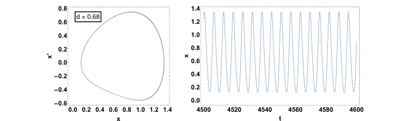

图 13.9：方程 (13.4.5) 在 $c_i = 1$（所有 $i$），$\omega = 1$，且 $d = 0.68$ 时的相图（左）和 $x(t)$（右）。

图 13.10 的图表显示了当 $d$ 增加到 0.69 时的相图（左）和解（右）。极限环似乎与自身相交；然而，它并没有。这种明显的相交是由于三维相图被投影到二维平面上造成的。虽然超出了本章的范围，但由于该系统显式地依赖于时间，达芬方程实际上是一个三维系统。$d = 0.69$ 的解被称为 *周期-2 解*，因为粗略地说，振荡器在稳定到极限环行为后，需要经过两次振荡才能返回其初始状态。

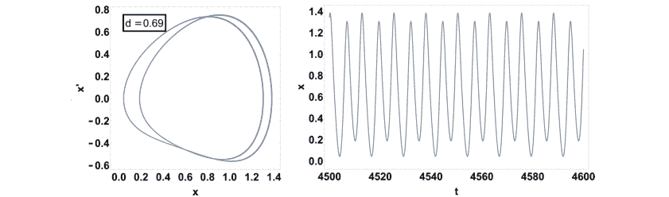

图 13.10：方程 (13.4.5) 在 $c_i = 1$（所有 $i$），$\omega = 1$，且 $d = 0.69$ 时的相图（左）和 $x(t)$（右）。

图 13.11 显示了当 $d$ 增加到 0.75 时的相图（左）和解（右）。相图中出现了更多明显的交点，解 $x(t)$ 看起来也更加复杂。图 13.11 展示了方程 (13.4.5) 的一个 *周期-4 解*。我们正在观察一种在非线性振荡器中可能出现的有趣现象，称为 *倍周期分岔*，即随着方程 (13.4.5) 中参数 $d$ 的变化，振荡器的周期（因此也是极限环的周期）会加倍。说明倍周期分岔的一种方法是使用一种称为 *庞加莱截面* 的工具，我们将在下面讨论。

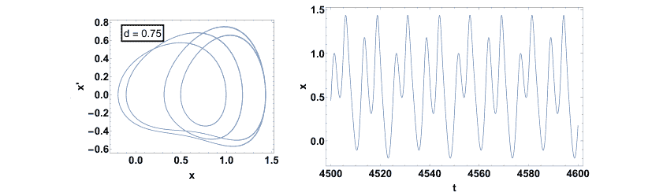

*庞加莱截面* 每隔一个周期对解进行一次采样，然后绘制相空间图。由于驱动频率为 $\omega = 1$，我们可以在时间 $t = 2n\pi$（其中 $n$ 为整数）对 $x(t)$ 和 $\dot{x}(t)$ 进行采样。生成庞加莱截面的代码将在下一节的示例 13.6 中展示。

图 13.9 至 13.11 中解的庞加莱截面如图 13.12 所示。

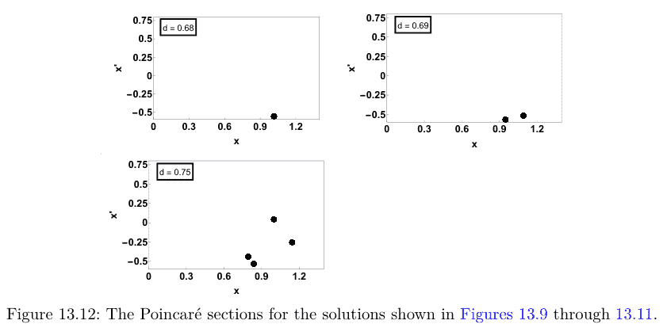

注意在图 13.12 中，对于 $d = 0.68$，只有一个点。这是因为，在稳定到极限环后，解每隔一个周期就会重复其状态。我们并非在解的最大值处进行采样，即庞加莱截面中点的 $x$ 坐标并不对应于图 13.9 右侧图中的最大值。庞加莱截面中的点与解的最大值或最小值不匹配并不重要。重要的是，每隔 $t = 2n\pi$，系统都会返回到相同的状态。然而，我们看到当 $d = 0.69$ 时，振荡器似乎在其庞加莱截面中的两个点之间跳跃。它需要 $4\pi = 2 \times 2\pi$，即两倍的周期，才能重复其状态。继续这个推理，我们看到当 $d = 0.75$ 时，系统表现出周期-4 行为。

如前所述，图 13.9 至 13.12 展示了倍周期分岔。我们在 $d = 0.68$ 和 $d = 0.69$ 之间的极限环中看到了一次倍周期分岔。我们在 $d = 0.69$ 和 $d = 0.75$ 之间看到了另一次倍周期分岔。随着我们继续增加 $d$，我们将看到更多次倍周期分岔，这一系列分岔被称为 *倍周期级联*，一旦 $d = 0.8$，最终将导致混沌行为。然而，为了说明混沌，我们将改变 (13.4.5) 中使用的参数，以便更好地可视化与混沌行为相关的吸引子。

## 13.5 混沌

除了有趣的振荡外，非线性系统还可以表现出一种称为 *混沌* 的行为。为了探索混沌现象，我们将使用达芬方程，但采用一组特定的参数值：

$$\ddot{x} + 0.15\dot{x} - x + x^3 = 0.3 \cos(t) \quad (13.5.1)$$

值得一提的是，方程 (13.4.5) 中有许多不同的 $c_i$ 和 $d$ 值都会在达芬方程中产生混沌行为，包括第 13.4.2 节中使用的 $d = 0.8$ 的情况。然而，我们使用 (13.5.1) 中的参数，因为它们能很好地展示与混沌动力学相关的吸引子。示例 13.6 将演示 (13.5.1) 的混沌解，并展示图 (13.9)-(13.12) 是如何创建的。让我们首先绘制 (13.5.1) 的解、相图和庞加莱截面。

### 示例 13.6：达芬方程的混沌解

求解达芬方程

$$\ddot{x} + 0.15\dot{x} - x + x^3 = 0.3 \cos(t)$$

初始条件为 $x(0) = 0$ 和 $\dot{x}(0) = 0$。在允许瞬态衰减后，绘制 $x(t)$、相图和庞加莱截面。

**解：**

解如图 13.13 所示，该图展示了 Python 代码的输出。注意在图 13.13 中，相图不包含极限环，而是一些不寻常的轨迹，似乎围绕双阱势中的每个稳定平衡点振荡。这些振荡在 $x(t)$ 的图中很明显，解在 $x = 1$ 的平衡点附近振荡，然后切换到在 $x = -1$ 附近振荡。注意在每个平衡点附近停留的时间长度是变化的，并且从一个平衡点切换到另一个平衡点似乎是不可预测的。这是奇怪的行为！

与第 13.4.2 节类似，我们可以使用庞加莱截面来理解吸引子的结构。注意庞加莱截面不是简单的点集。事实上，它有其自身复杂的结构。你可能会想，如果我们求解 (13.5.1) 更长的时间，是否会发现庞加莱截面中的任何点会重复出现，从而表现出周期性。答案是否定的，没有重复，因此系统不是周期性的。如果我们放大庞加莱截面并观察其结构，它会变得更加有趣。这样做会揭示出，在图 13.13 的庞加莱截面中可见的带状结构，在任何尺度下放大都会持续存在，前提是绘制足够多的点（这可能会导致计算成本高昂）。在任意尺度下都存在结构，这意味着该吸引子是一个分形！

**Python 代码**

为了使用 odeint，我们需要将 (13.5.1) 重写为

$$\begin{cases} \dot{x} = v \\ \dot{v} = -0.15v + x - x^3 + 0.3 \cos(t) \end{cases}$$

我们使用变量 `start` 设置了 4800 的瞬态时间。请注意，`start` 出现在绘图命令中，作为创建每个图（庞加莱截面除外）所用切片的起始点。瞬态时间远短于 4800；然而，我们选择一个较大的值是为了让图表更易于阅读。

为了创建庞加莱截面，我们在 `scatter` 命令中使用了一个切片。该切片的步长为 `tau = 2*np.pi`，这与 (13.5.2) 中驱动项的周期相匹配。为了正确可视化庞加莱截面，我们需要大量数据。因此，我们使用了完整的解来绘制庞加莱截面。

```python
import numpy as np
import matplotlib.pyplot as plt
from scipy.integrate import odeint

dt = 0.001 #step size
times = np.arange(0,5000,dt)

def deriv(z,t):
    x, y = z
    dzdt = [y, -0.15*y + x - x**3 + 0.3*np.cos(t)]
    return dzdt

ics = [0,0]

soln = odeint(deriv,ics,times)

start = int(4800/dt) #starting index after transient

tau = int(2*np.pi/dt)

fig, ax = plt.subplots(nrows = 2, ncols = 2)

#plot x(t)
ax[0,0].plot(times[start:],soln[start:,0])
ax[0,0].set_xlabel('time')
ax[0,0].set_ylabel('x')
ax[0,0].set_title('x(t)')

#plot phase portrait
ax[0,1].plot(soln[start:,0],soln[start:,1])
ax[0,1].set_xlabel('x(t)')
ax[0,1].set_ylabel('v(t)')
ax[0,1].set_title('Phase Portrait')

#plot Poincare section
ax[1,0].scatter(soln[::tau,0],soln[::tau,1],s = 1)
ax[1,0].set_xlabel('x')
ax[1,0].set_ylabel('v')
ax[1,0].set_title('Poincare Section')

#delete unneeded graph
ax[1,1].set_axis_off()

plt.tight_layout()
plt.show()
```

### Mathematica 代码

我们使用 NDSolve 来求解 (13.5.2)。$x(t)$ 的图和相图与本章前面所做的类似。为了创建庞加莱截面，我们以 $t = 2\pi$ 的时间间隔对解进行采样，并将结果存储为表 `psData`，然后使用 ListPlot 进行绘图。

```mathematica
SetOptions[{Plot, ListPlot, ParametricPlot}, Axes->False, Frame->True,
BaseStyle->{FontSize->16}, ImageSize->Large];

soln = NDSolve[{x''[t] + 0.15 * x'[t] - x[t] + x[t]^3==0.3 * Cos[t],
x[0]==0, x'[0]==0}, x, {t, 0, 5000}];

p1 = Plot[x[t]/.soln, {t, 4500, 5000}, FrameLabel->{"time", "x(t)"},
PlotLabel->"x(t)"];

p2 = ParametricPlot[{x[t], x'[t]}/.soln, {t, 4500, 5000},
FrameLabel->{x, v}, PlotLabel->"Phase Portrait"];

psData = Table[{First[x[t]/.soln], First[x'[t]/.soln]}, {t, 1000, 5000, 2 * Pi}];

p3 = ListPlot[psData, FrameLabel->{x, v}, PlotLabel->"Poincare Section"];

GraphicsGrid[{{p1, p2}, {p3}}]
```

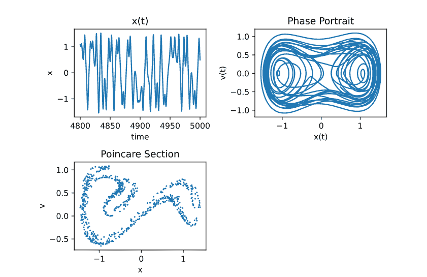

图 13.13：示例 13.6 中 (13.5.2) 的 $x(t)$、相图和庞加莱截面的 Python 生成图。

从图 13.13 中，我们目前的学习中了解到了什么？我们了解到混沌系统不是周期性的。混沌系统解在相图中的轨迹被吸引到一个具有分形性质的结构上。此外，解的行为不是随机的；系统遵循的是达芬方程。这变得很奇怪！但等等，还有更多……

### 13.5.1 混沌与初始条件

让我们看看 (13.5.1) 的两个具有不同但相似初始条件的解的行为。我们是否预期它们的行为会有显著差异？考虑两个孩子，克里斯和盖尔，各自坐在并排的秋千上。秋千的长度相同，因为是物理学家，让我们假设他们都穿着太空服，在类似地球引力场的真空环境中摆动。克里斯开始时将他的秋千从平衡位置偏移 10 度。盖尔开始时将她的秋千从平衡位置偏移 11 度。在每种情况下，都满足小角度近似，并且两个秋千都表现得像简谐振子。结果行为是什么？我们知道振荡频率是相同的（简谐运动，相同长度的秋千），所以我们预期克里斯和盖尔会同步摆动，但盖尔会比克里斯摆得稍高一些，因为她的初始状态具有稍大的初始振幅。如果他们的秋千是混沌的会怎样？那将会有趣得多！一段时间后，克里斯和盖尔的秋千将彼此失步。

为了说明这一点，让我们比较 (13.5.1) 的两个解，一个初始条件为 $x(0) = 0$，$\dot{x}(0) = 0$，另一个具有相同的初始速度，但 $x(0) = 0.00001$，$0.01$ 和 $0.1$。结果如图 13.14 所示，并与具有两个初始条件 $x(0) = 1.1$ 和 $x(0) = 1.0$（每个都有 $\dot{x}(0) = 0$）的简谐振子 (SHO) 的图进行比较。

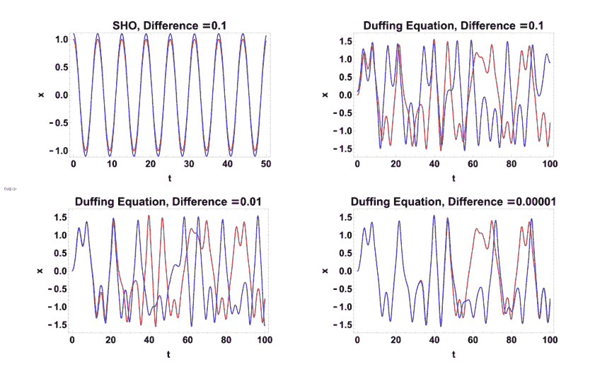

图 13.14：比较简谐振子 (SHO) 和达芬方程相似初始条件的图。每个图标题中的 *Difference* 值描述了两个振子初始位置的差异。黑色实线曲线的初始位置为 $x(0) = 0$，红色虚线曲线（在电子书中）的初始位置为 $x(0) = 0 + \text{Difference}$。在所有情况下，$\dot{x}(0) = 0$。

在图 13.14 中，SHO 的黑色线（在电子书中）是 $x(0) = 1$ 和 $\dot{x}(0) = 0$ 的解。对于达芬方程，黑色线是 $x(0) = 0$ 和 $\dot{x}(0) = 0$ 的解。每个图的红色虚线（在电子书中）具有零初始速度，但初始位置与红线的初始条件相差“Difference”的值（该值在每个图的标题中）。例如，对于 SHO，红色虚线的初始位置为 $x = 1.1$）。请注意，SHO 的行为与上一段描述的完全一致。两个解相互跟踪，振幅只有很小的差异（正如从初始条件所预期的那样）。然而，达芬方程的解与 SHO 的解非常不同。请注意，随着时间的推移，初始条件的微小差异被放大了。最终，两个解变得完全不同。例如，有时红色解接近 $x = 1$，但黑色解接近另一个平衡点 $x = -1$，反之亦然。我们在图 13.14 中看到，初始差异越小，解相似的时间就越长，但即使极端的初始相似性（图 13.14 中的右下角图）最终也会导致解的发散。这种现象被称为*对初始条件的敏感依赖性*，是混沌行为的关键组成部分。轨迹表现出对初始条件敏感依赖性的吸引子被称为*奇异吸引子*。

对初始条件的敏感依赖性只是说系统是随机的一种花哨方式吗？不，系统不是随机的。达芬方程是一个常微分方程。达芬方程的解由其初始条件决定，因此是一个确定性系统。换句话说，$x(t)$ 和 $\dot{x}(t)$ 的未来值取决于初始条件 $x(0)$ 和 $\dot{x}(0)$。在一个随机系统中，过去的状态并不决定未来的状态（否则，就不会有彩票了！）。达芬方程是确定性的这一事实意味着有趣的行为源于系统的非线性，而不是由于某些随机元素。

除了作为数学上的好奇心，为什么对初始条件的敏感依赖性很重要？作为一个例子，考虑气象学家爱德华·洛伦兹（1917-2008）首次以现代形式提出混沌的情况，他当时正在创建天气模型。

洛伦兹的天气模型展示了混沌行为。为了说明对初始条件的敏感依赖性，假设天气完全遵循洛伦兹的模型（实际上并非如此）。这是否意味着我们可以完美地预测未来的任何时间点的天气？不。为了进行预测，我们需要将初始条件输入模型。初始条件来自用于测量各种大气条件的仪器。仪器具有一定的精度；它们可能只能测量一个量的真实值，例如，千分之一。实际的精度程度并不重要，关键是测量的初始条件将与大气的真实状态不同。因为，在我们的例子中，天气完全遵循一个混沌模型，那么测量值与真实值之间的微小差异将意味着一段时间后，模型的预测将与实际天气产生分歧。混沌系统对初始条件敏感！混沌系统对初始条件敏感依赖的结果是，对于混沌系统，不可能进行准确的长期预测。

### 13.5.2 李雅普诺夫指数

我们可以通过观察初始接近的轨迹发散的速率来量化对初始条件的敏感性。考虑混沌吸引子上的两条轨迹，$\mathbf{x}(t)$ 和 $\mathbf{x}(t) + \boldsymbol{\delta}(t)$，其中 $\boldsymbol{\delta}(t)$ 是一个测量两条轨迹之间距离的向量，而 $\boldsymbol{\delta}(0)$，即初始分离，非常小，$\boldsymbol{\delta}(0) \ll 1$。数值研究表明，

$\|\boldsymbol{\delta}(t)\| \approx \|\boldsymbol{\delta}(0)\| e^{\lambda t}$ (13.5.4)

其中 $\lambda$ 被称为*最大李雅普诺夫指数*。最大李雅普诺夫指数衡量了混沌吸引子上两条初始接近的轨迹之间指数发散的速率。混沌系统具有 $\lambda > 0$。最大李雅普诺夫指数通常很难计算；然而，有一些方法可以从称为*时间序列*的测量数据中找到 $\lambda$。此类方法的综述可以在 Kantz 和 Schreiber [14] 中找到。

那么我们学到了什么？首先，混沌系统不是随机的；它们是确定性的。其次，它们的轨迹存在于相图中的奇异吸引子上，这些吸引子具有分形结构。这意味着混沌系统不是周期性的；它们不会稳定在固定点上。它们也不是*准周期*的，即由不可通约频率之和组成的振荡器。第三，混沌吸引子上的轨迹表现出对初始条件的敏感依赖性。这意味着混沌系统没有长期可预测性。那么什么是混沌？自 1963 年洛伦兹首次正式提出以来，混沌一直难以给出一个正式的定义。然而，就我们的目的而言，Strogatz 的定义 [11] 将足够：

> *混沌是确定性系统中表现出对初始条件敏感依赖性的非周期性长期行为。*

如果作者可以冒昧地说，在所有因素中，对初始条件的敏感性才是混沌的真正标志。正是这种敏感性使得混沌系统难以预测且非常有趣！

## 13.6 关于非线性系统的最后一点说明

数学家斯坦尼斯拉夫·乌拉姆（1909-1984）曾说过：“使用‘非线性科学’这样的术语，就好比把大部分动物学称为‘非大象动物研究’。”非线性系统无处不在，理解如何研究它们是科学家素养的重要组成部分。这是一个令人兴奋的世界，物理学与生物科学和社会科学在此交汇，而非线性系统在这些领域常常扮演核心角色。如果只关注线性系统，就会错过探索诸如经济物理学等激动人心的新领域的机会。对非线性系统的研究可以开辟传统物理学之外的新问题世界，例如疾病传播建模、种群动力学、社交网络等等。

在本章中，我们讨论了非线性系统可以呈现出多种多样的行为。对于非线性系统中可能出现的各种有趣现象，我们甚至只是触及了皮毛。正如承诺的那样，我们将提供一些额外的建议，以帮助读者扩展对非线性系统的学习。关于非线性系统的更一般性讨论，我们推荐我们书中的第12章，《使用Python的数学方法》（Pagonis 和 Kulp [3]）。我们推荐的下一本书是 Strogatz [11]，因为这本书易于理解且读起来很有趣。它也更深入地涵盖了本章的主题，并且有物理学和工程学之外的应用。

阅读 Strogatz [11] 之后，学习非线性系统有许多途径。我们经常推荐 Enns [13]，因为它包含了一些非常有趣的非线性系统在自然科学和社会科学广泛领域的应用。另一本在非线性动力学课程中常用的书是 Hilborn [12]。如果读者有兴趣分析从非线性系统测量的数据，我们推荐 Kantz 和 Schreiber [14] 以及 Abarbanel [15]。最后，如果读者有兴趣为系统（特别是复杂系统）建立模型，我们推荐 Wilensky 和 Rand [16]。

如果一个人花足够的时间研究（和学习）非线性系统，最终，他会开始不再将问题视为线性与非线性，甚至不再是物理学与非物理学的对立。相反，他们可能会将所研究的系统仅仅视为一个有趣的系统，可以用其数学和计算工具箱中的众多工具之一来分析。最终，按学科划分自然界的问题是人为强加的构造。真实的系统既不是生物学，也不是物理学或社会学，它们只是需要被研究的系统。虽然为问题构建“筒仓”对于教育目的很有用，但一旦你不再需要它，我们建议将其丢弃，专注于研究你感兴趣的问题。

## 13.7 章节总结

> 在本章中，我们研究了运动方程包含非线性项的系统。这些方程具有以下形式

$$\dot{x} = f(x, y)$$
$$\dot{y} = g(x, y)$$

尽管控制非线性系统的方程通常无法用封闭形式求解，但我们可以使用相图等工具来理解系统可能的稳态行为，并识别平衡点的稳定性。
系统的不动点可以通过求解以下方程找到

$$f(x^*, y^*) = 0$$
$$g(x^*, y^*) = 0$$

虽然我们无法解析地求解整个系统，但可以在不动点附近对系统进行线性化，从而得到一个易于求解的方程组：

$$\begin{pmatrix} \dot{u} \\ \dot{v} \end{pmatrix} = \begin{pmatrix} \frac{\partial f}{\partial x} & \frac{\partial f}{\partial y} \\ \frac{\partial g}{\partial x} & \frac{\partial g}{\partial y} \end{pmatrix} \begin{pmatrix} u \\ v \end{pmatrix}$$

其中雅可比矩阵 $A$ 的特征值提供了关于平衡点稳定性的信息。特征值可以通过特征多项式找到，

$$\det(A - \lambda \mathbf{1}) = 0$$

在非线性系统中，平衡状态可以改变（包括在相空间中的位置和稳定性）。

最后，我们还探讨了一种称为*混沌*的行为，这是非线性系统所独有的。混沌的一个标志是混沌系统的解对初始条件表现出敏感依赖性。换句话说，两个初始相似的状态会演化出非常不同的行为，从而抑制了人们对混沌系统进行长期预测的能力。

## 13.8 章末习题

符号 🖥️ 表示需要计算机辅助的问题，形式包括图形、数值计算或符号评估。

### 第 13.1 节：线性与非线性系统

1. 考虑微分方程

$$\frac{d^3x}{dt^3} + x = 0$$

这个方程是线性还是非线性微分方程？证明你的答案。求解 $x(t)$。

2. 以下微分方程是线性还是非线性？证明你的答案。

- a. $\frac{d^3x}{dt^3} + t^3x = 0$。
- b. $\ddot{x} + t^3\dot{x}x = 0$
- c. $\ddot{x} + t^2x = A\cos(t)$
- d. $\dot{x} + x\sin t = t^3$

3. 考虑微分方程

$$\ddot{x} = t^2x - tx^2$$

假设你已经找到了这个方程的两个解，$x_1(t)$ 和 $x_2(t)$。那么 $c_1x_1 + c_2x_2$ 是否也是一个解？证明你的答案。

### 第 13.2 节：阻尼谐振子再探

4. 使用计算机，绘制阻尼谐振子在 $\gamma < 0$ 和 $\omega_0^2 = 1$ 时的相图。你可以使用 $x(0) = 1$ 和 $\dot{x}(0) = 0$。你得到预期的结果了吗？为什么？$\gamma < 0$ 意味着什么？

5. 使用计算机，绘制阻尼摆 $\ddot{x} + \omega_0^2 \sin x + \gamma \dot{x} = 0$ 在 $\omega_0^2 = 1$ 以及 $\gamma$ 取小于、等于和大于 $\omega_0^2$ 三个值时的相图。对于每种情况，使用 $x(0) = 1$ 和 $\dot{x}(0) = 0$。讨论你的结果。

### 第 13.3 节：不动点与相图

6. 考虑一个一维系统，$\dot{x} = f(x)$。我们可以为该系统分配一个势函数 $V(x)$，使得

$$f(x) = -\frac{dV}{dx}$$

这使得势函数类似于第5章讨论的势能。在本章中，我们讨论了不动点（即平衡点）$x^*$ 的条件是 $f(x^*) = 0$。我们如何使用势函数 $V(x)$ 来找到不动点？换句话说，如何使用 $V(x)$ 找到不动点？如何使用 $V(x)$ 来识别不动点的稳定性？

7. 考虑系统 $\dot{x} = 1 - x^2$。找到与该系统对应的势函数（参见问题6）。使用势函数，找到不动点并识别它们的稳定性。

8. 在本章中，我们讨论了如何识别二维系统不动点的稳定性。逻辑斯谛方程 $\dot{x} = rx(1 - x/k)$ 用于模拟种群规模，是一个一维系统。注意 $r$ 是一个正常数，称为*线性增长率*，$k$ 是一个正常数，称为*环境容纳量*。找到逻辑斯谛方程的不动点并给出它们的物理解释。通过对不动点进行扰动，$x = x^* + u$（其中 $u << 1$），并将逻辑斯谛方程按 $u$ 的幂次展开，来找到每个不动点的稳定性。结果将是一个关于 $u$ 的微分方程，你可以求解它。

9. 找到以下矩阵的特征值和特征向量。通过解析方法和使用计算机代数系统来解决这个问题。

- (a) $\begin{pmatrix} 0 & 1 \\ 3 & 0 \end{pmatrix}$
- (b) $\begin{pmatrix} 2 & 1 \\ 7 & 3 \end{pmatrix}$
- (c) $\begin{pmatrix} 1 & 1 \\ 1 & 1 \end{pmatrix}$

10. 编写一个计算机程序来重现图13.4。

11. 使用初始条件 $\theta(0) = 2.7$、$2.9$ 和 $3.0$（所有情况均 $\dot{\theta}(0) = 0$ 且 $\omega_0 = 1$）数值求解摆方程 (13.3.13)。结合图13.5，为什么当初始角位移接近垂直位置（$x = \pi$）时，解 $\theta(t)$ 会发生变化？

## 章末习题

12. Strogatz [11] 探讨了爱情的数学，这是一种探索二维线性系统的有趣且好玩的方式。设 $R(t)$ 为罗密欧在时间 $t$ 对朱丽叶的爱（正值）或恨（负值），$J(t)$ 为朱丽叶在时间 $t$ 对罗密欧的爱或恨。这段恋情可以用以下方程建模：

$\dot{R} = aR + bJ$
$\dot{J} = cJ + dR$

通过选择参数 $a$、$b$、$c$ 和 $d$ 的不同值，可以创造出有趣的关系。按照第 13.3 节的方法，对于一个热情的罗密欧（$a = 1$，$b = 2$）和一个非常谨慎的朱丽叶（$c = -1$，$d = -3$），通过解析求解雅可比矩阵的特征值来分类原点处的不动点。绘制相图，并评论在不同初始条件下关系的可能结果。

13. 在这个问题中，我们将在问题 12 的基础上加入非线性浪漫元素！我们将让罗密欧和朱丽叶都对自己的情绪非常敏感：

$\dot{R} = -2R - 2J(1 - |J|)$
$\dot{J} = J + R(1 - |R|)$

非线性项 $J(1 - |J|)$ 有时被称为修复非线性（Sprott [17]），而右侧第二项中的数字 1 是衡量朱丽叶的爱何时变得适得其反的尺度。绘制该系统的相图，并讨论罗密欧和朱丽叶之间关系的性质。

14. 求方程 (13.3.25) 的雅可比矩阵，并计算每个不动点的特征值。

15. Lotka-Volterra 竞争模型是描述两个物种 $X$ 和 $Y$ 竞争相同资源的数学模型。设 $x$ 为物种 $X$ 的种群数量，$y$ 为物种 $Y$ 的种群数量，则一种 Lotka-Volterra 模型的选择可以是：

$\dot{x} = 4x - 3x^2 - xy$
$\dot{y} = 2y - 4y^2 - 3xy$

对于这个模型，识别不动点及其稳定性。这两个物种能否共存？请注意，这种基于方程的模型通常适用于大种群。对于小种群，基于个体的模型往往更有用。关于基于个体的建模与基于方程的建模的讨论，感兴趣的读者应参考 Wilensky 和 Rand [16]。

16. 绘制问题 15 中 Lotka-Volterra 竞争模型的相图。讨论在不同初始条件下系统的最终状态。

17. Lotka-Volterra 方程也可用于描述捕食者-猎物模型，其中物种 $Y$（捕食者）捕食物种 $X$（猎物）。考虑捕食者-猎物模型

$\dot{x} = 3x - 7xy$
$\dot{y} = -2y + 5xy$

其中，与竞争模型类似，我们假设 $x(t)$ 和 $y(t)$ 分别以百为单位衡量每个物种的数量。解析求解该捕食者-猎物模型的不动点并识别其稳定性。评论与每个不动点对应的平衡状态的性质。

18. 使用计算机绘制问题 17 中捕食者-猎物模型的相图。

19. SIS（易感-感染-易感）疾病传播模型可用于那些不会通过免疫或死亡将个体从种群中移除的疾病。SIS 模型有时适用于某些细菌性疾病，如链球菌性咽炎（也称为喉咙痛）。考虑两个个体种群 $s(t)$ 和 $i(t)$，分别代表易感个体和感染个体的数量。SIS 模型为：

$\dot{s} = \mu n - \mu s + \gamma i - \beta s i$
$\dot{i} = -\mu i - \gamma i + \beta s i$

其中系数代表速率，$n = s + i$ 是总人口。评论每个系数的物理意义：$\mu, \gamma$ 和 $\beta$。求解该系统的不动点并识别其稳定性。注意，$s$ 和 $i$ 的负值没有意义。

### 第 13.4 节：极限环

20. 考虑 Duffing 方程：

$\ddot{x} - x + x^3 + 0.1\dot{x} = d \cos \omega t$

其中 $\omega = 1.4$。通过改变 $d$ 的值，证明 Duffing 方程 (13.8.1) 经历了一系列倍周期分岔。从 $d = 0.1$ 开始，逐渐增加其值，直到观察到倍周期分岔。使用 $x(0) = 0$ 和 $\dot{x}(0) = 0$ 作为初始条件。

21. Logistic 映射 $x_{n+1} = r x_n (1 - x_n)$ 是 Logistic 方程（见问题 8）的离散形式。选择初始值 $x_0$ 和参数 $r$ 后，很容易计算后续值。例如，$x_1 = r x_0 (1 - x_0)$，$x_2 = r x_1 (1 - x_1)$，依此类推。使用 $x_0 = 0.1$，绘制 $r = 2.9, 3.2, 3.5$ 和 $3.55$ 时 $x_n$ 对 $n$ 的图。识别每个解的周期性。可以通过绘制 $x_{n+1}$ 对 $x_n$ 来生成庞加莱截面。最后，尝试 $r = 3.91$。当 $r = 3.91$ 时，Logistic 映射表现出什么样的行为？

22. 弱驱动的非线性振荡器可以通过一种称为*自共振*的现象被激发到大振幅。振荡器由一个周期性驱动项驱动，其振幅很小，但其频率随时间变化（通常减小）。当驱动频率减小通过振荡器的共振频率时，振荡器与驱动力相位锁定，即使驱动频率不再是振荡器的自然频率，振荡器也能保持共振。考虑以下受驱摆：

$\ddot{x} + \omega_0^2 \sin(x) = \epsilon \cos(\omega_0 t - 1/2 \alpha t^2)$

注意，驱动频率（驱动相位的时间导数）为 $f_d = \omega_0 - \alpha t$，因此在 $t = 0$ 时，驱动频率等于摆的自然频率。从初始条件 $x(-1000) = 0$ 和 $\dot{x}(-1000) = 0$ 开始，对于 $\omega_0 = 2\pi$，$\alpha = 0.001$ 的摆，计算 $\epsilon = 0.0459$ 和 $\epsilon = 0.0461$ 时的 $x(t)$。对于哪个 $\epsilon$ 值，摆显示出自共振？有关自共振和摆的更多信息，请查阅 Fajans 和 Friedland [18]。

23. 电路为非线性系统提供了极好的例子。最著名的电路启发方程之一是所谓的 *Van der Pol 方程*

$\ddot{x} - \epsilon (1 - x^2) \dot{x} + x = 0$

这是一个带有非线性阻尼项的简单谐波振荡器。注意，阻尼的符号实际上随 $x$ 的值而变化。例如，如果 $\epsilon > 0$，那么对于 $x < 1$，阻尼为负，对于 $x > 1$，阻尼为正。因此，小振荡会因负阻尼而增长，但一旦振荡足够大，随着阻尼项变为正，它们就会衰减。Van der Pol 振荡器也可以显示所谓的*弛豫振荡*，这是非线性系统中一种常见的振荡形式，其中 $x$ 的快速变化之后是较慢的变化。要观察弛豫振荡的实际效果，请求解 $\epsilon = 8.0$ 的 Van der Pol 振荡器。绘制 $x(t)$ 和相图。描述解。

24. 有时使用极坐标描述极限环可能更方便。考虑以下极坐标系统：

$\dot{r} = r(r - 1)(r - 2)$
$\dot{\theta} = 1$

其中 $r$ 和 $\theta$ 是通常的极坐标，$r \ge 0$。注意，可以找到使 $\dot{r} = 0$ 的 $r$ 值，但没有使 $\dot{\theta} = 0$ 的 $\theta$ 或 $r$ 值。描述这种情况下的相图。该系统中存在极限环。它们在哪里？稳定性如何？稳定性可以通过使用问题 8 中概述的 $\dot{r}$ 方程的方法来找到。

### 第 13.5 节：混沌

25. Lorenz 方程：

$\dot{x} = \sigma(y - x)$
$\dot{y} = rx - y - xz$
$\dot{z} = xy - bz$

在 $\sigma = 10$，$r = 28$ 和 $b = 8/3$ 时表现出混沌行为。绘制 Lorenz 方程的相图 $(x, y, z)$。

26. 问题 25 中的 Lorenz 方程是一个混沌系统。证明它们表现出对初始条件的敏感依赖性。

27. 蔡氏电路是一个具有分段线性负电阻 $N_R$ 的电路。它是展示包括倍周期通向混沌在内的各种非线性行为的最简单电路之一。电路原理图如图 13.15 所示。设 $x$、$y$ 和 $z$ 分别与电容器 $C_1$ 和 $C_2$ 两端的电压以及电感器 $L$ 中的电流成正比。电路的控制方程可以从基尔霍夫定律获得并简化为：

$\dot{x} = \alpha(y - x - g(x))$
$\dot{y} = x - y + z$
$\dot{z} = -\beta y$

其中 $g(x) = m_1x + \frac{1}{2}(m_0 - m_1)(|x + 1| - |x - 1|)$，$\alpha = C_2/C_1$，$\beta = R^2C_2/L$，$m_0$ 和 $m_1$ 分别是电压-电流曲线内段和外段的斜率。有关更多信息，感兴趣的学生应参考 Enns [13]。使用 $\alpha = 15.6$，$\beta = 25.58$，$m_0 = -8/7$，$m_1 = -5/7$ 为运动方程创建相图（$x$-$y$-$z$ 空间）。结果将是著名的双涡卷吸引子。

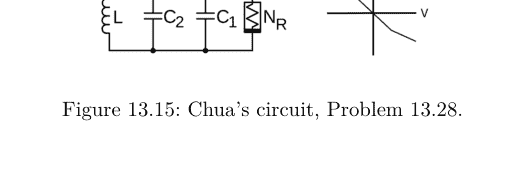

28. 通过使用与问题 27 相同的参数，但将 $\beta$ 设置为 $50$、$35$、$33.8$ 等，可以在蔡氏电路（见问题 27）的方程中观察到倍周期通向混沌的路径。对于每个 $\beta$ 值，创建 $x(t)$ 的图并识别每个解的周期性。对于哪个 $\beta$ 值存在周期-8 解？

### 非线性系统的最后一个习题

29. 作为本章的最后一个习题，我们将探讨不动点分岔的概念。考虑以下捕食者-猎物模型：

$\dot{x} = x(1 - x) - xy$
$\dot{y} = -\epsilon y + xy$

- a. 哪个物种是捕食者？哪个是猎物？
- b. 求不动点。假设 $\epsilon > 0$。

c. 注意，对于某个特定的 $\epsilon$ 值，相图中的不动点会发生碰撞（即两个或多个不动点在相图中占据相同位置）。这些碰撞就是不动点的分岔。分岔发生在 $\epsilon$ 的什么值？

d. 求系统的雅可比矩阵，并在每个不动点处计算雅可比矩阵的值。

e. 通过计算与每个不动点相关的雅可比矩阵的特征值，来确定每个不动点的稳定性。你可能需要计算机代数系统的帮助来完成这一步。

f. 描述每个不动点的稳定性如何随 $\epsilon$ 变化。除了不动点之间的碰撞，分岔也可能涉及不动点稳定性的变化。将特征值绘制为 $\epsilon$ 的函数通常是识别特征值正负的有用技巧。

g. 通过选择小于和大于你在 c 和 e 部分找到的分岔条件的 $\epsilon$ 值，绘制系统在分岔前后的相图。注意相图是不同的。

h. 定性描述当 $\epsilon$ 增加时系统会发生什么。$\epsilon$ 在我们的系统中代表什么？增加 $\epsilon$ 的值是否对相图产生了你预期的效果？为什么或为什么不？


Taylor & Francis
Taylor & Francis Group
http://taylorandfrancis.com

# A Python 入门

## A.1 Python 中的数据类型和变量

Python 中的主要数值类型是整数、浮点数和复数。浮点数（或 float）是以十进制形式书写的实数。Python 在内部以不同的方式存储浮点数和整数。

在示例 A.1 中，我们使用赋值运算符 = 为变量赋值，例如 a = 0.0003 将值 0.0003 赋给变量 a。我们也可以使用科学计数法来定义浮点数变量，例如 b = 1.64e-4。Python 使用字母 j 表示 √-1，内置函数 complex(a,b) 创建复数 a+b*j。我们可以使用内置函数 type() 来识别 Python 对象的类型，内置函数 print(a) 用于打印变量的值。与几种其他计算机语言类似，行 e = 'time' 定义了一个字符串变量 e。

示例 A.1 展示了如何使用函数 type(a) 来找出变量 a 属于哪个对象类。在本书的大多数代码中，你会看到代码行 print('-'*28,'CODE OUTPUT','-'*29)，它用于将 Python 代码与代码生成的输出分隔开。

> 示例 A.1：赋值 Python 变量
将 Python 变量赋值给以下每个量：0.00007、1.64e-4、10、3+4i、time。使用 Python 函数 type(a) 来确定每个变量的类型。

```
Python Code

#define variables
a, b, c, d = 0.00007, 1.64e-4, 10, complex(3,4)
e = 'time'

print('-'*28,'CODE OUTPUT','-'*29)

print('Variable a = 0.0003 belongs to type:',type(a))
print('Variable b = 1.64e-4 belongs to type:',type(b))
print('Variable c = 10 belongs to type:',type(c),'\n')

print('A complex number created with complex(3,4)=',d)
print('Variable d = complex(3,4) belongs to type:',type(d),'\n')

print("Variable e = 'time' belongs to type:",type(e))

----------------------------- CODE OUTPUT -----------------------------
Variable a = 0.0003 belongs to type: <class 'float'>
Variable b = 1.64e-4 belongs to type: <class 'float'>
Variable c = 10 belongs to type: <class 'int'>
A complex number created with complex(3,4)= (3+4j)
Variable d = complex(3,4) belongs to type: <class 'complex'>
Variable e = 'time' belongs to type: <class 'str'>
```

多个变量赋值可以压缩到一行。例如，代码 `a,b,c = 1, 2, 3` 是三行独立代码 `a = 1`、`b = 2` 和 `c = 3` 的压缩版本。

Python 中常见的算术运算符有：加法 `+`、减法 `-`、乘法 `*`、除法 `/` 和幂运算 `**`。此外，`%` 运算符用于求余数（或取模），`//` 用于整数除法。

在 Python 中，我们可以使用 *f-字符串* 来格式化变量的打印。在 f-字符串内，任何变量都可以用花括号括起来，例如 `print(f'{a}')` 将打印变量 `a` 的数值，`print(f'{a**2}')` 打印 $a^2$ 的数值。通过使用 f-字符串格式 `print(f'{a:.3}')`、`print(f'{a:.2e}')`、`print(f'{a:.2f}')` 和 `print(f'{a:g}')`，我们分别使用两位小数、科学计数法和通用浮点表示法来打印变量 `a`。

在示例 A.2 中，我们使用 *f-strings* 来格式化变量的打印。

> **示例 A.2：** 将 Python 变量 $a, b$ 赋值为数字 5.0/3 和 1.645。
(a) 使用 f-strings 以科学计数法打印变量 $a$，保留两位有效数字。
(b) 不使用任何格式和使用通用表示法打印变量 $a^2$。
(c) 在代码输出中使用两位小数打印变量 $b$。
(d) 代码中的 `round(a,2)` 和 `round(b,1)` 产生什么结果？

```
a = 5.0/3              #define variables
b = 1.645

print('-'*28,'CODE OUTPUT','-'*29,'\n')

print(f'Without formatting, the variable a={a}','\n')
print(f'Using scientific notation, the variable a={a:.2e}')

print(f'Without formatting, the square of variable a is {a**2}')
print(f'Using generic notation, the square of variable a is \n{a**2:g}','\n')

print(f'Using two decimals, the variable b=1.645 is     {b:.3}')

print('\nround(a,2) produces ',round(a,2))
print('round(b,1) produces ',round(b,1))

----------------------------- CODE OUTPUT -----------------------------
Without formatting, the variable a=1.6666666666666667
Using scientific notation, the variable a=1.67e+00
Without formatting, the square of variable a is 2.777777777777778
Using generic notation, the square of variable a is 2.77778
Using two decimals, the variable b=1.645 is     1.65

round(a,2) produces  1.67
round(b,1) produces  1.6
```

变量名不能以数字开头，并且 Python 中有保留字，不应将其用作变量。表 A.1 显示了部分保留字列表。

表 A.1
Python 中的部分保留字列表。

| False | None | def | elif | True |
| class | for | from | or | if |
| finally | lambda | nonlocal | else | sum |
| return | try | and | import | min |
| is | not | del | break | max |
| continue | sum | global | list | array |

## A.2 Python 中的序列

Python 中的主要序列类型是 *列表*、*元组* 和 *range* 对象。这些序列对象之间的主要区别是：

**列表**是可变的，即它们的元素可以修改，并且通常是同质的（即相同类型的对象创建一个相似对象的列表）。

**Range** 对象是高效的整数序列（通常用于 for 循环）。它们使用少量内存，并且仅在需要时才生成项目。

**元组**是不可变的，即它们的元素不能修改，并且它们的元素通常是异质的（即，不同类型的对象创建一个元组，描述一个单一结构）。

在接下来的三个小节中，我们将查看这些序列类型的示例。

### A.2.1 列表

我们使用方括号创建 Python 列表，项目之间用逗号分隔。列表可以包含任何类型的数据，甚至其他列表。例如，`a=[2.0,[3,0],5j,[1,1,2],'s',1]` 定义了一个包含浮点数、整数、复数、其他列表和字符串的列表。

我们可以通过索引访问列表的元素，重要的是要记住列表的索引从 0 开始，而不是从 1 开始。例如 `print(a[0])` 打印列表 `a` 中的第一个元素，`print(a[2])` 打印第三个元素。我们也可以使用 *负索引* 从列表末尾开始访问元素，因此 `print(a[-1])` 打印列表中的最后一个元素，`print(a[-2])` 打印倒数第二个元素，依此类推。

由于列表是可变的，它们可以被修改，因此我们可以重新定义列表中的任何元素，例如 `a[-1] = -2` 将列表的最后一个元素设置为 -2。我们可以使用 *多重索引* 来访问列表中的列表中的多个条目，例如 `print(a[1][0])` 将打印元素 `a[1]` 中的第一个元素。在上面的列表 `a` 中，元素 `print(a[1][0])` 是 0。

我们可以通过语法 `a[start:end:step]` 定义称为*切片*的子列表。例如，切片 `a[2:5:2]` 从索引 2 开始，以步长 2 递增，取列表中的每个第二个元素，但*不*包含索引的结束值 5。我们可以在切片中省略其中一个索引或步长参数，例如 `a[:5]` 创建一个包含 `a` 前五个元素的列表，而 `a[2:]` 创建一个包含 `a` 中从 `a[2]` 开始及之后所有元素的列表。同样，`a[::2]` 创建一个包含 `a` 中每隔一个元素的列表。

列表可以使用加法运算符 `+` 进行*连接*，例如，`a[1]+a[3]` 创建一个包含来自 `a[1]` 和 `a[3]` 元素的新列表。

示例 A.3 展示了如何使用列表的这些通用属性，以及如何访问和修改列表的部分内容。

**示例 A.3：** 考虑 Python 列表
`a = [2, [3,0], 5, [1,1,2], 's', [1,4], 2, 5]`
(a) 编写代码将此列表的第一个和最后一个元素相加。
(b) 修改列表中的第三个元素，使其等于 -2。
(c) 列表的 `a[3][2]` 元素是什么？
(d) 创建一个新列表，从列表 `a` 的第三个元素开始，并包含 `a` 的每隔第三个元素。
(e) 创建一个新列表，包含 `a` 的前五个元素。
(f) 代码 `a[1]+a[3]` 会产生什么？
(g) 代码 `a[1]*3` 会产生什么？

**Python 代码**
(a) 此列表的第一个和最后一个元素通过 `a[0]+a[-1]` 相加。
(b)-(c) `a[2]=-2` 将列表中的第三个元素设置为 -2。类似地，`a[3][2]` 获取列表第四个元素的第三部分。
(d)-(e) 行 `a[2:len(a):2]` 创建一个新列表，该列表从列表中的第三个元素 `a[2]` 开始，直到由 `len(a)` 指定的列表长度。
(f)-(g) 代码 `a[1]+a[3]` 通过将列表 `[1, 1, 2]` 连接到列表 `[3, 0]` 的末尾来产生一个新列表。最后，`a[1]*3` 通过将列表 `a[1]` 的元素重复三次来产生一个新列表。

```python
print('-'*28,'CODE OUTPUT','-'*29,'\n')

a = [2,[3,0],5,[1,1,2],'s',[1,4],2,5] # 定义列表 a

print('list a=',a)

print('the sum of the first and last element is: ',a[0]+a[-1])

a[2] = -2
print('\na[2] = -2 modifies list a into \n a =',a,'\n')

print('The a[3][2] element is =', a[3][2],'\n')
print('The a[2:len(a):2] sequence is =',a[2:len(a):2])
print('The a[:5] sequence is =',a[:5])

print('\nThe a[1]+a[3] sequence is =',a[1]+a[3])
print('The a[1]*3 sequence is =',a[1]*3)

----------------------------- CODE OUTPUT -----------------------------
list a= [2, [3, 0], 5, [1, 1, 2], 's', [1, 4], 2, 5]
the sum of the first and last element is:  7

a[2] = -2 modifies list a into
a = [2, [3, 0], -2, [1, 1, 2], 's', [1, 4], 2, 5]
The a[3][2] element is = 2
The a[2:len(a):2] sequence is = [-2, 's', 2]
The a[:5] sequence is = [2, [3, 0], -2, [1, 1, 2], 's']

The a[1]+a[3] sequence is = [3, 0, 1, 1, 2]
The a[1]*3 sequence is = [3, 0, 3, 0, 3, 0]
```

列表中的单个元素可以被赋值给单独的变量。例如，`a, b, c = [1,2,3]` 将值 1 存储在变量 `a` 中，值 2 存储在 `b` 中，值 3 存储在 `c` 中。这有时被称为解包列表。

列表*不能*像数值数据类型那样通过使用例如 `b = a` 这样的语句来复制。具体来说，像 `b = a` 这样的语句*不会*从列表 `a` 创建一个新的列表 `b`，而只是创建一个对 `a` 的*引用*。可以通过使用 `b = a.copy()` 命令来避免这种混淆，该命令创建两个独立的对象，其内容共享相同的引用。这被称为对象的*浅拷贝*。也可以使用 `b = copy.deepcopy(a)` 命令，该命令创建两个独立的对象，其内容和结构彼此完全隔离。这被称为对象的深拷贝。深拷贝是原始对象*及其所有嵌套对象*的独立副本。换句话说，如果我们对原始对象中的任何*嵌套*对象进行更改，我们将不会看到深拷贝有任何变化。

### A.2.2 范围序列和列表推导式

Python 中第二种重要的序列类型是*范围*对象，使用内置函数 `range(a:b:step)` 创建，其中 a、b 和 step 是整数。此函数创建一个表示从 a 到 b（不包括 b）的整数序列的对象，增量为变量 step。

Python 的一个重要特性（我们在本书中经常使用）是列表推导式，其通用语法为 `[expression for item in sequence]`。这里 *sequence* 是一个序列对象（例如，范围、列表、元组等），*item* 是一个变量名，它取序列中的每个值，而 *expression* 是一个 Python 表达式，它针对 *item* 的每个值进行计算。例如，`[u**2 for u in [1,2,3]]` 生成一个包含整数序列 [1,2,3] 的平方的新序列。

再举一个例子，我们可以使用取余运算符 `%` 来创建一个周期为 (0,1,2,3)、长度为 12 的周期序列，代码行如下：`[x%4 for x in range(0,12)]`。示例 A.4 展示了 `range()` 函数的各种属性。请注意，当我们打印一个范围对象时，打印时不会显示元素。这是因为范围对象仅在需要时才生成值。但是，函数 `list()` 可以将范围对象转换为列表对象，然后可以打印其元素。此示例还演示了列表推导式。

> **示例 A.4：**
(a) 在 Python 代码的输出中，行 `print(range(1,7,2))` 会产生什么？
(b) 使用 Python 函数 `list()` 将对象 `range(1,7,2)` 转换为列表。
(c) 找出对象 `range(1,7,2)` 的最大元素、元素之和以及长度。
(d) 代码 `[u**3 for u in [1,2,3]]` 的结果是什么？
(e) 代码 `[x%3 for x in range(0,12)]` 的结果是什么？

```python
print('-'*28,'CODE OUTPUT','-'*29,'\n')

a = range(1,7,2)
print('Define the range sequence a = ',a,'\n')
# print(a) 不会打印 range() 对象的元素

# 使用 list(a) 将范围转换为列表，然后打印元素
print('list(a) gives: ',list(a),'\n')

print('The length of the range sequence a is = ',len(a))
print('The sum of elements in the range sequence a is = ',sum(a))
print('The maximum of the range sequence a is = ',max(a))

c, d = [3,'s']            # 解包序列
print("\nUnpack the sequence [3,'s'], to get: c = ",c,'  d = ',d,'\n')

e = [u**3 for u in [1,2,3]]   # 列表推导式
print('The list comprehension e = ',e)

f = [x%3 for x in range(0,12)]  # 另一个列表推导式
print('The list comprehension f = ',f,'\n')

----------------------------- CODE OUTPUT -----------------------------
Define the range sequence a =  range(1, 7, 2)
list(a) gives:  [1, 3, 5]
The length of the range sequence a is =  3
The sum of elements in the range sequence a is =  9
The maximum of the range sequence a is =  5

Unpack the sequence [3,'s'], to get: c =  3   d =  s
The list comprehension e =  [1, 8, 27]
The list comprehension f =  [0, 1, 2, 0, 1, 2, 0, 1, 2, 0, 1, 2]
```

### A.2.3 元组序列

Python 的第三种序列类型是*元组*。我们通过使用*圆括号*而不是方括号来创建元组。例如 **a = (1,3,'s')**。元组和列表的主要区别在于元组是不可变的，即它们的元素不能被更改。然而，元组的*索引*、*切片*和*连接*操作与列表基本相同。在本书中，我们将在大多数示例中使用列表和范围对象，并且偶尔会遇到元组。

### A.2.4 序列上的函数

Python 有几个用于序列计算的内置函数。例如，**len(a)**、**sum(a)**、**max(a)** 和 **min(a)** 分别计算列表的*长度*、*总和*、*最大*和*最小*元素。我们也可以使用 **sorted(a)** 对列表进行*排序*。我们还注意到 Python 中字符串和列表类型之间的一个主要区别。列表是可变的，但字符串不是，即我们可以修改列表中元素的值，但不能修改字符串。但是，可以使用切片提取字符串的部分内容，例如 `hi'[1]` 将提取字符串 `hi'` 中的第二个字母。

## A.3 函数、For 循环和条件语句

本节简要介绍 Python 中的*函数*、*for 循环*和*条件语句*。我们将在接下来的四个示例中演示这些内容。所有编程语言都有自己设置函数、for 循环和条件语句的方式。Python 使用缩进和冒号来处理这些语句。在接下来的四个示例中，请密切关注 Python 如何使用缩进和冒号来分隔代码块。任何行的开头都不应有额外的空格，并且任何缩进行之前的行必须以冒号字符结尾。

我们从示例 A.5 开始，我们希望使用以下公式计算一个从原点开始、初始速度为 $v_0$、在恒定加速度 $a$ 下运动的粒子在时间 $t$ 的位置：

$$y = v_0 t + \frac{1}{2} a t^2 \quad (A.3.1)$$

因为我们希望在代码中多次计算 (A.3.1)，所以我们将在 Python 中将 (A.3.1) 定义为一个函数，并使用 **for** 循环进行计算。

示例 A.5 中的前三行代码使用 `def` 关键字定义了函数 `f`。*函数*通常是一个命名的代码单元，可以从程序的其他部分调用。在 Python 中，函数可以有一个或多个变量作为参数，这些参数从调用程序接收它们的值。函数 `f` 有三个参数 `vo`、`a`、`t`，它们在定义 `f` 的行中列在圆括号内。调用函数时必须提供所有三个参数。

在函数定义的缩进代码内部，(A.3.1) 的计算结果存储在变量 `y` 中。变量 `y` 是函数使用的*局部变量*，其值在函数 `f` 的定义之外是未知的。相比之下，变量 `ypos` 是一个*全局变量*，其数值对整个代码都是已知的。

**return** `y` 语句将变量 `y` 作为计算结果发送给调用代码。可以在 return 语句中指定多个变量，用逗号分隔。

假设我们想计算函数 `f` 在 `vo = 2`、`a = 1` 和 `t = 3` 时的值。这可以使用语法 `f(2,1,3)` 来完成。例如，`p = f(2,1,3)` 将值 10.5 存储在变量 `p` 中。

然而，示例 A.5 要求我们计算粒子在多个时间点的位置。可以在 Python 中构建*for 循环*，以重复执行代码块。在示例 A.5 中，我们为此目的创建了一个*for 循环*。但是，在我们开始*for 循环*之前，代码行 `ypos = []` 初始化了一个空列表，该列表将用于存储粒子在不同时间的位置。请注意，此代码行没有缩进，因为作为全局变量，`ypos` 是在函数 `f` 之外定义的。

要定义一个*for 循环*，我们需要两样东西：一个用于迭代的变量和该迭代的范围。在示例 A.5 中，迭代变量是 `t`，它取序列 `range(4)` 中的值。*for 循环*之后的缩进代码块将重复执行多次。在循环的第一次迭代中，变量 `t` 的值为 0，即序列 `range(4)` 的第一个元素。使用 `f(1,2,t)` 计算函数 `f`，在此循环迭代中，这与 `f(1,2,0)` 相同。然后使用 `ypos.append(f(1,2,t))` 命令将 `f(1,2,0)` 的值附加到列表 `ypos` 的末尾。在循环的第二次迭代中，变量 **t** 的值为 1，然后重复该过程。之后，循环还有两次迭代，**t = 2** 和 **t = 3**。整数 3 是 **range(4)** 的最后一个元素，因此循环在该次迭代后停止。

> **示例 A.5：**
创建一个函数 **f(vo,a,t)**，用于计算一个从原点出发、以初始速度 *v₀* 运动、在恒定加速度 *a* 下、在时间 *t* 时的粒子位置 *y*：
$$y = v_0 t + \frac{1}{2} a t^2$$ (A.3.2)
使用 *for 循环*，以便重复调用函数 **f** 来计算粒子在时间 *t = 0, 1, 2* 和 *3* 秒时的位置。

> **Python 代码**
如上所述，我们使用 **range(4)** 构建 *for 循环*。在循环内部重复调用函数 **f**，以计算位置变量 **ypos**。函数 **f** 的值通过 **ypos.append(f(1,2,t))** 命令被添加（追加）到列表 **ypos** 中。

```
print('-'*28,'CODE OUTPUT','-'*29,'\n')

def f(vo,a,t):           # 定义函数 f
    y = vo*t+a*t**2/2    # 函数需要缩进
    return y             # 将变量 y 返回给调用代码

ypos = []                # 创建空列表 ypos
for t in range(4):       # for 循环需要缩进
    ypos.append(f(1,2,t)) # 将 f 的值添加到列表 ypos

print('position y(t) = ',ypos)

----------------------------- CODE OUTPUT -----------------------------
position y(t) =  [0.0, 2.0, 6.0, 12.0]
```

在某些情况下，我们代码中需要的函数很简单，并且只依赖于一个变量，因此我们可以使用一种称为 **lambda** 函数的简单函数结构。示例 A.6 定义了一个名为 **f** 的 **lambda** 函数，它根据 (A.3.1) 计算粒子的位置 **ypos**。

> **示例 A.6：**
使用 **lambda** 函数重复上一个示例。

> **Python 代码**
请注意，当使用这种更简单的函数类型时，变量 *v₀* 和 *a* 被视为具有固定值 *v₀ = 1* 和 *a = 2* 的 *全局* 变量。

```
print('-'*28,'CODE OUTPUT','-'*29,'\n')

vo, a = 1, 2                    # 全局变量 vo, a
f = lambda t: vo*t+a*t**2/2     # 定义 lambda 函数 f(t)

ypos = []                       # 空列表 ypos

for t in range(4):              # for 循环需要缩进
    ypos.append(f(t))           # 将 f 的值添加到列表 ypos

print('position y(t) = ',ypos)

----------------------------- CODE OUTPUT -----------------------------
position y(t) =  [0.0, 2.0, 6.0, 12.0]
```

在许多情况下，我们只在特定条件为真时才需要执行代码的一部分。在 Python 中，此类条件语句使用 `if`、`elif` 和 `else` 关键字实现，如示例 A.7 所示。条件语句也使用缩进，就像函数和 `for` 循环一样。

> **示例 A.7**
重复上一个示例；但是，这次在 for 循环内部使用 `if` 语句，以便代码只存储小于 7 的位置值。

**Python 代码**
在此示例中，只有当条件语句 `f(t)<7` 为真时，才会对 `ypos` 变量进行求值和存储，否则，代码行 `ypos.append(f(t))` 将被忽略。

```
print('-'*28,'CODE OUTPUT','-'*29,'\n')

vo, a = 1, 2                    # 全局变量 xo, vo, a
f = lambda t: vo*t+a*t**2/2     # 定义 lambda 函数 f(t)

ypos = []                       # 空列表 ypos

for t in range(4):              # for 循环需要缩进
    if f(t)<7:                  # if 语句需要缩进
        ypos.append(f(t))       # 如果 f(t)<7 为真，则添加 f(t) 的值
                                # 到列表 ypos
                                # 如果 f(t)>=7，则忽略此语句

print('position y(t) = ',ypos)

----------------------------- CODE OUTPUT -----------------------------
position y(t) =  [0.0, 2.0, 6.0]
```

## A.4 导入 Python 库和包

Python 的主要优势之一是提供了用于各种科学应用的模块、库和包。在本文中，我们将使用术语 *库* 作为这三者的通用术语。

有几种不同的方法可以导入 Python 库，最常见的方法在示例 A.8 中通过使用 `numpy` 库和余弦函数 `cos()` 作为例子进行了解释。

从 NumPy 库导入函数的最简单方法是使用 `numpy.cos(0.5)`，其中函数以 `library_name.function_name()` 的形式调用。

在第二种方法中，我们为模块名称使用一个 *别名*，这样我们就不必重复输入长模块名称。在此示例中 `import numpy as np`，并以 `np.cos(0.5)` 的形式调用余弦函数。在导入函数的第三种方法中，我们使用 `from numpy import cos`，并且代码中的 `cos()` 函数将指向 numpy 库。

在第四种方法中，我们使用字符 `*` 作为通配符，通过代码行 `from numpy import *` 导入所有可用函数。在最后一种方法中，我们不需要输入别名或库的名称。但是，使用 `*` 方法时必须小心，因为当导入多个模块时，这可能会导致问题，这些模块可能对不同的函数使用相同的名称。

我们将使用的其他常见库包括 SymPy（符号 Python）、SciPy（科学 Python）和图形库 Matplotlib。这些库将在本章后面讨论。

> **示例 A.8：**
编写一个 Python 代码来演示上述四种导入 `numpy` 包的方法，然后使用每种方法计算余弦函数 `cos(0.5)`。

> **Python 代码**
此代码中的注释解释了加载和使用包的四种方法之间的区别。

```
print('-'*28,'CODE OUTPUT','-'*29,'\n')

import numpy           # 方法 1：使用 name.function() 语法
print('Using NumPy function, result is: ', numpy.cos(0.5))

import numpy as np    # 方法 2：使用别名 np，而不是 numpy
print('Using np shorthand notation, result is: ', np.cos(0.5))

from numpy import cos  # 方法 3：仅从 numpy 导入函数 cos()
print('Importing just the NumPy function, result is: ', cos(0.5))

from numpy import *    # 方法 4：从 numpy 导入所有必要的内容
print('Importing all NumPy functions, result is: ', cos(0.5))

----------------------------- CODE OUTPUT -----------------------------
Using NumPy function, result is:  0.8775825618903728
Using np shorthand notation, result is:  0.8775825618903728
Importing just the NumPy function, result is:  0.8775825618903728
Importing all NumPy functions, result is:  0.8775825618903728
```

库有时被组织成多个模块。例如，模块名 A.B 表示一个名为 A 的 *库* 中包含的一个 *模块* B。例如，numpy.random.normal() 指的是库 numpy 的模块 random 中包含的函数 normal()。此类函数的一般格式是 package.module.function()。

## A.5 NUMPY 库

NumPy 是用于数值计算的核心 Python 库。NumPy 支持对数组和矩阵等复合数据类型进行操作。首先要学习的是如何使用 NumPy 库创建数组和矩阵。Python 列表可以转换为多维数组。

在本书中，我们通常采用标准约定，使用别名 np 导入 NumPy，代码行为 `import numpy as np`。如上所述，也可以使用语法 `from numpy import *` 导入 NumPy 函数。如果 NumPy 是代码中唯一使用的包，那么就不会有任何函数名冲突的可能性。

### A.5.1 创建 NUMPY 数组

NumPy 库提供的基本对象是 **ndarray**。我们可以将一维 (1D) ndarray 视为一个列表，二维 (2D) ndarray 视为一个矩阵，三维 (3D) ndarray 视为一个三阶张量，依此类推。

使用函数 `np.array()`，我们可以从 Python 序列（如列表、元组或列表的列表）创建 NumPy 数组。例如，`a = np.array([1,5,2])` 从 Python 列表创建一个一维 NumPy 数组。

还有其他几个函数可用于创建不同类型的数组和矩阵。此类数组函数的一些示例如表 A.2 所示。

### 表 A.2
用于创建数组和矩阵的 NumPy 函数。

| 函数 | 描述 |
| :--- | :--- |
| np.array(a) | 从序列 *a* 创建 N 维 NumPy 数组。 |
| np.arange(start, stop, step) | 创建一个从 *start* 到 *stop* 的均匀间隔的一维数组，不包含 *stop* 值。 |
| np.linspace(start, stop, N) | 创建一个长度为 N 的一维数组，包含 *start* 和 *stop* 值。 |
| np.zeros(shape) | 创建给定形状和类型的数组，用零填充。 |
| np.ones(shape) | 创建给定形状和类型的数组，用一填充。 |
| np.random.random(shape) | 创建给定形状和类型的数组，用 0 到 1 之间的随机浮点数填充。 |
| np.reshape(array, newshape) | 改变一维数组的维度。 |

示例 A.9 应用其中一些数组函数来创建各种类型的数组。在代码的前两行中，请注意当我们打印 NumPy 数组时，它看起来很像 Python 列表，只是元素之间用 *空格* 分隔，而列表中的元素用 *逗号* 分隔。

函数 `np.arange(start,stop,step)` 与我们之前讨论列表时看到的列表函数 `range(start,stop,step)` 非常相似。在示例 A.9 中，代码行 `np.arange(0,3.5,.5)` 创建一个一维 NumPy 数组，其值从 0 到 3.5，步长为 0.5，*不包含* 结束值 3.5。

函数 `np.linspace(start,stop,N)` 略有不同，因为我们指定的是 *start* 和 *end* 值之间的点数 *N*，而不是数组中的 *步长*。在同一示例中，`np.linspace(0,8,6)` 创建一个数组，其中恰好有六个介于 0 和 8 之间的元素，*包含* 结束值 8。

类似地，`np.zeros(5)` 创建一个长度为 5 的一维零数组。类似地，`np.zeros(2,1)` 创建一个具有 2 行 1 列的二维零数组。代码行 `np.random.random([1,2])` 将生成一个具有一行两列的矩阵，其值为 0 到 1 之间的随机数。

示例 A.9 演示了各种类型的数组，以及如何使用 `np.arange()`、`np.linspace()`、`np.zeros()` 和 `np.random.random()` 函数。

> **示例 A.9**
编写一个简单的代码，展示如何使用 `np.arange()`、`np.linspace()`、`np.zeros()` 和 `np.random.random()` 函数创建数组。

```python
import numpy as np
print('-'*28,'CODE OUTPUT','-'*29,'\n')
print('printing the list [1,2,3]:          ',[1,2,3])
print('printing the array np.array([1,2,3]): ',np.array([1,2,3]),'\n')

print('np.arange(5) gives: ',np.arange(5))
print('np.arange(0,3.5,.5) gives: ',np.arange(0,3.2,.5),'\n')
# array from 0 to 3.5 steps 0.5 (excluding 7)

print('np.linspace(0,8,6) gives: ',np.linspace(0,8,6),'\n')
# create array with 6 values between 0 and 8

print('array with zeros: ',np.zeros(5))  # generate array with 5 zeros
print('array with ones: ',np.ones([2,1]),'\n')
# generate two rows and one column, with ones

print('array with random values: ',np.random.random([1,2]))
# generate random numbers in one row and two columns, in interval (0,1)

--------------------------- CODE OUTPUT ---------------------------
printing the list [1,2,3]:          [1, 2, 3]
printing the array np.array([1,2,3]):  [1 2 3]
np.arange(5) gives:  [0 1 2 3 4]
np.arange(0,3.5,.5) gives:  [0.  0.5 1.  1.5 2.  2.5 3. ]
np.linspace(0,8,6) gives:  [0.  1.6 3.2 4.8 6.4 8. ]
array with zeros:  [0. 0. 0. 0. 0.]
array with ones:  [[1.]
 [1.]]
array with random values:  [[0.32685396 0.76130921]]
```

### A.5.2 数组函数、属性和方法

在本节中，我们将简要概述和示例介绍如何使用 Python 数组。我们将了解如何访问数组的属性（或 *属性*），并研究一些可用于 NumPy 数组的函数。

示例 A.10 对数组应用了各种函数，并展示了如何提取数组的一些重要属性。表 A.3 显示了一些用于提取数组属性的有用命令示例。

请注意，表 A.3 中的语法是 A.dtype、A.size 等。这些是在 Python 中使用方法对象的示例，与我们到目前为止在本书中看到的函数对象不同。还要回想一下，对于列表 A，我们使用函数 type(A)，但对于 NumPy 数组 A，我们使用类似的命令 A.dtype。这是使用 *函数* 与使用 *方法* 的一个例子。

*函数* 通过在函数名后放置参数表达式来调用，例如 type(a)，其中 a 是一个对象（列表、字符串、浮点数等）。我们在本书中定义的函数将始终首先使用函数名调用，然后在括号中包含函数的所有参数。

方法与函数有些相似，但它们使用点表示法调用，例如 A.dtype。粗略地说，方法总是附加到特定对象，而函数是独立的。函数与方法的另一个例子是在 SymPy 和 NumPy 中实现两个向量 A 和 B 的点积和叉积。在 SymPy 中，点积实现为方法 A.dot(B)，而在 NumPy 中，点积表示为函数 dot(A,B)。我们稍后将在本书中使用的 NumPy、SymPy 和 SciPy 包中看到更多不同类型的函数和方法。

### 表 A.3
用于提取数组属性或属性的有用命令（方法）。

| 命令 | 描述 |
| :--- | :--- |
| A.dtype | 打印 NumPy 数组 A 的数据类型。 |
| A.ndim | 打印 NumPy 数组 A 的维度数。 |
| A.size | 打印 NumPy 数组 A 的大小（元素总数）。 |
| A.shape | 查找 NumPy 数组 A 的行数和列数。 |

示例 A.10 展示了如何将其中一些函数与数组一起使用。NumPy 数组中的所有条目都具有相同的数据类型。我们将主要处理包含整数、浮点数、复数或布尔值的数值数组。我们还将主要使用默认整数类型 numpy.int64 和默认浮点类型 numpy.float64。我们可以通过其 A.dtype 属性访问 NumPy 数组 A 的数据类型。我们使用代码行 A = np.array([[1,2,3],[4,5,6]]) 从整数列表的列表创建一个二维 NumPy 数组，A.dtype 打印出 dtype('int32')，即数据是整数类型，并在计算机内存中以 32 位表示。类似地，A.ndim 告诉我们 A 有两个维度，第一个维度对应于计算行的垂直方向，第二个维度对应于计算列的水平方向。最后，我们可以通过 A.size 找出数组 A 中的总元素数。

在下一节中，我们将了解如何对各种类型的数组进行算术运算。

### A.5.3 使用 NumPy 数组进行算术运算

NumPy 中的数学函数是向量化的，表 A.4 给出了我们可以用来与 NumPy 数组一起计算的部分函数列表。

向量函数对数组进行逐元素操作，并产生新的数组作为输出。例如，np.sin(2*np.pi*x) 计算数组 x = np.arange(0,1.25,0.25) 的每个元素的值。这些向量函数可以非常快速地跨数组计算值。NumPy 还提供数学常数，如 π (np.pi) 和 e (np.e)。

我们可以使用索引和切片来修改 NumPy 数组的内容，就像处理列表一样。

### 表 A.4
Python 中有用的数组函数部分列表。

**NumPy 中的数组函数**
np.sum | np.argmax | np.min | np.std
np.max | np.argmin | np.mean | np.prod

**NumPy 中的数学函数**
np.sin | np.exp | np.arcsin
np.cos | np.log | np.arccos
np.tan | np.log10 | np.arctan

**NumPy 中的数学常数**
np.pi | np.e

算术运算逐元素应用于 NumPy 数组：包括加法 +、减法 -、乘法 *、除法 / 和幂运算 **。有关两个 NumPy 数组相加的演示，请参见示例 A.10。

通常，我们只能将相同大小的向量或矩阵相加。但是，NumPy 有一组称为 *广播* 的规则，它允许在过程有意义时组合不同大小的数组。例如，我们可以使用表达式 `1+np.array([5,6,7])**2` 将常数添加到一维 NumPy 数组。在这个广播示例中，数组 `np.array([5,6,7])` 被平方，然后我们添加具有相同形状的数组 `[1. 1. 1.]`。这里我们将标量数字 1 添加到长度为 3 的一维 NumPy 数组，广播规则允许我们使用非常简单的语法。

示例 A.10 演示了各种数组操作。例如，要计算数组中值的平均值或均值，我们使用 `np.mean([5,6,7])`，要找到数组中最大元素的索引，我们使用 `np.argmax([5,6,7])`，它给出索引值 2，即它将数组中的第三个元素识别为最大值。

数组函数也适用于多维数组，但我们必须选择沿数组的哪个轴应用函数。例如，对于数组 M = `np.array([[2,4,2],[2,1,1],[3,2,0]])`，函数 `np.sum(M,axis=0)` 将对 M 的 *列* 求和。然而，函数 `np.sum(M,axis=1)` 将对 M 的 *行* 求和。类似地，一个大小为 3×3×3 的三维数组可以沿其三个轴中的每一个进行求和。

> **示例 A.10：**
定义两个 NumPy 数组 a 和 b，分别来自列表 [1, 2, 3] 和 [4, 5, 6]。此外，定义一个你选择的 3 × 3 矩阵 M 作为 NumPy 数组。
编写一个简单的代码来演示以下内容：
1. 对 NumPy 数组 a 使用函数 `mean(a)`、`argmax(a)`、`std(a)`。
2. a + b 和 a * b 的结果。
3. 广播，使用 1 + a**2。
4. 使用函数 `np.sum(M,axis=0)`、`np.sum(M,axis=1)`。

### Python 代码

```python
import numpy as np
print('-'*28,'CODE OUTPUT','-'*29,'\n')

a = np.array([1,2,3])
b = np.array([4,5,6])
M = np.array([[2,4,2],[2,1,1],[3,2,0]])

#Part 1
print('mean of elements in array a = ',np.mean(a))
print('std dev of elements in array a = ',np.std(a))
print('max of elements in array a = ',np.max(a))
print('sum of elements in array a = ',np.sum(a),'\n')

#Part 2
print('a + b = ' , a+b)
print('a * b = ', a*b, '\n')

#Part 3
print('1 + a**2 = ', 1 + a**2,'\n')

#Part 4
print('matrix M =',M,'\n')
print('sum of elements of M along axis=0 (rows) = ',np.sum(M,axis=0))
print('sum of elements of M along axis=1 (columns) = ',np.sum(M,axis=1))
```

```
----------------------------- CODE OUTPUT -----------------------------
mean of elements in array a =  2.0
std dev of elements in array a =  0.816496580927726
max of elements in array a =  3
sum of elements in array a =  6
a + b =  [5 7 9]
a * b =  [ 4 10 18]
1 + a**2 =  [ 2  5 10]
matrix M = [[2 4 2]
 [2 1 1]
 [3 2 0]]
sum of elements of M along axis=0 (rows) =  [7 7 3]
sum of elements of M along axis=1 (columns) =  [8 4 5]
```

### A.5.4 NumPy 数组的索引与切片

NumPy 数组可以像 Python 列表一样进行索引、切片和复制。示例 A.11 展示了如何在多维 NumPy 数组中使用切片和索引。例如，数组 `v` 中的第四个元素可以通过 `v[3]` 访问，我们可以使用两个索引 `v[1,2]` 来查找行索引为 1、列索引为 2 的元素。类似地，`v[-1,-1]` 访问最后一个元素。语法 `v[2,:]` 寻址索引为 2 的行，而 `v[:,3]` 寻址索引为 3 的列。

示例 A.11：
(a) 定义一个你选择的 3 × 3 矩阵 `v`，并演示使用 `v[3]`、`v[1,2]` 和 `v[-1,-1]` 进行索引。
(b) 矩阵的哪些元素对应于 `v[2,:]` 和 `v[:,3]`？

### Python 代码

```python
import numpy as np
print('-'*28,'CODE OUTPUT','-'*29,'\n')

# 使用 NumPy 数组定义 3x3 矩阵
v = np.array([[1,2,3],[4,5,6],[7,8,9]])

print('The third element v[2] = ',v[2],'\n')

print('The element at row index 1 and column index 2=',v[1][2])
print('The element v[1,0] = ',v[1,0])
print('The last element v[-1,-1] = ',v[-1,-1],'\n')

print('The column with index 0 = ',v[:,0])
print('The row with index 2 = ',v[2,:],'\n')
```

```
----------------------------- CODE OUTPUT -----------------------------
The third element v[2] =  [7 8 9]
The element at row index 1 and column index 2= 6
The element v[1,0] =  4
The last element v[-1,-1] =  9
The column with index 0 =  [1 4 7]
The row with index 2 =  [7 8 9]
```

## A.6 Matplotlib 模块

Matplotlib 是一个 Python 库，只需几行代码就能生成多种不同类型的图表和数据图形表示。用户可以完全控制线条样式、字体属性、坐标轴属性等。绘图函数的数据点通常以 Python 列表或 NumPy 数组的形式提供。在接下来的两个小节中，我们将看到如何使用 Matplotlib 创建二维和三维图形。我们还将简要讨论使用 Matplotlib 的两种不同方法，即面向对象编程与过程式编程。

### A.6.1 使用 Matplotlib 绘制二维图形

创建二维图形的一般步骤是首先导入 Python 库 Matplotlib 及其子模块 pyplot。通常我们将使用简写别名 `plt` 导入 `matplotlib.pyplot` 子模块。接下来，我们创建两个序列：x 值和 y 值，然后使用通用的绘图命令 `plt.plot(x,y, [fmt], **kwargs)`。这里 `[fmt]` 是一个可选的字符串格式，`**kwargs` 是可选的关键字参数，用于指定图形的属性。为了改善图形的外观，我们使用 `pyplot()` 函数来添加图形标题、图例、网格线等。最后，`plt.show()` 这行代码显示图形。

让我们从一个基本示例开始，解决一个简单的物理问题：我们以初速度 $v_0 = 5$ m/s 将一个球垂直向上抛出。我们想要绘制位置 $y(t)$ 随时间变化的函数图像，并数值计算球达到的最大高度。该问题的运动学方程为：

$$y = v_0 t - \frac{1}{2} g t^2 \quad \text{(A.6.1)}$$

$$v(t) = v_0 - g t \quad \text{(A.6.2)}$$

其中 $g = 9.8$ m/s$^2$ 是重力加速度。示例 A.12 展示了我们如何使用 Python 的数值计算能力来解决这个问题。

> **示例 A.12**
> 编写代码来计算并绘制运动学方程 (A.6.1)，时间范围从 $t = 0$ 到 $t = 1$ s，初速度 $vo = 5$ m/s。

**Python 代码**

代码的第一行 `import numpy as np` 使 Python 导入 NumPy 库，并使用别名 `np`。我们导入 Python 库 *Matplotlib* 及其子模块 *pyplot*，以便绘制位置 $y(t)$。代码使用简写别名 `plt` 导入 `matplotlib.pyplot` 子模块。库导入后，我们在一行代码 `vo, g = 5, 9.8` 中定义了初始条件变量 `vo` 和重力加速度 `g`。

我们需要告诉 Python 我们将计算哪些时间 $t$ 值对应的位置 $y(t)$。在这种情况下，我们使用 `t=np.linspace(0,1,100)` 来定义包含时间 $t$ 值的数组，这些值将用于计算 $y(t)$。接下来，我们使用*列表推导式*，形式为 `y=[vo*u-g*u**2/2 for u in t]`，以获得包含 $y(t)$ 值的数组 $y$。

pyplot 命令 `plot`、`title`、`ylabel`、`xlabel` 用于改善图 A.1 中图形的外观，最后 `plt.show()` 打印图形。代码的最后四行展示了如何通过分别应用 `max()` 和 `argmax()` 函数来数值计算最大高度 `ymax` 和对应的时间 `tmax`。

```python
print('-'*28,'CODE OUTPUT','-'*29,'\n')
import numpy as np
import matplotlib.pyplot as plt
vo, g = 5, 9.8            # 定义 vo, g 的值

t = np.linspace(0,1.03,100)   # 创建时间序列
y = [vo*u-g*u**2/2 for u in t] # 创建位置序列，绘制 y(t)

plt.plot(t,y)

plt.title('Ball thrown straight up')  # 为图形添加标题
plt.ylabel('Vertical distance y(t)')  # 为 x 和 y 轴添加标签
plt.xlabel('Time t [s]')

ymax = max(y)                # 找到位置 ymax
tmax = t[np.argmax(y)]       # 找到时间 tmax

print('Max height reached = ',f'{ymax:.4f}', ' m')
print('Time to reach ymax = ',f'{tmax:.4f}',' s')

plt.show()
```

```
------------------------------------ CODE OUTPUT ------------------------------------
Max height reached =  1.2755  m
Time to reach ymax =  0.5098  s
```

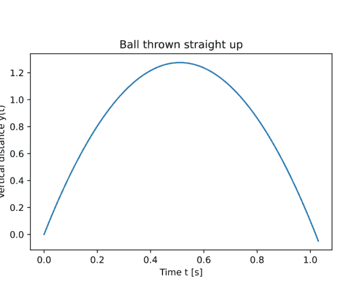

图 A.1：运动学方程 (A.6.1) 的图像，时间范围从 $t = 0$ 到 $t = 1$ s，初速度 $vo = 5$ m/s。

我们可以通过在 `plt.plot()` 函数内指定各种选项来进一步改进图形。例如，我们可以指定*颜色*，例如通过名称如 `color='red'`，或通过 RGB 元组如 (1,0,1)。我们还可以使用 `linestyle='dashed'` 指定要使用的线条类型，使用 `marker='o'` 指定数据点的标记类型，使用 `linewidth=2` 指定线宽等。

使用组合格式字符串非常方便，例如在命令 `plt.plot(x,y,'rd--')` 中，字符串 `'rd--'` 表示一条红线（`'r'`）、一个菱形标记（`'d'`）和一条虚线（`--`）。

*颜色*的示例有：b 蓝色，g 绿色，r 红色，c 青色，m 品红色，y 黄色，k 黑色，w 白色。字符*标记*的示例有：. 点，o 圆圈，v 三角形向下，^ 三角形向上，s 正方形，p 五边形，* 星号，+ 加号，x 叉号，D 菱形。最后，*线型*的示例有：- 实线，-- 虚线，-. 点划线，: 点线。

本例中的图形命令是过程式编程的一个例子。接下来，我们将使用 Matplotlib 模块通过面向对象编程来生成三维图形。

### A.6.2 使用 Matplotlib 绘制三维图形

示例 A.13 演示了如何在三维空间中绘制曲面 $z = f(x, y)$。

> **示例 A.13**
> 编写 Python 代码，在 $-3 \le x \le 3$ 和 $-3 \le y \le 3$ 的条件下，绘制三维曲面函数 $z = f(x, y) = x + y + 3$。

**Python 代码**

本例中的三维图形是使用 `matplotlib` 库中的 `plot_surface()` 函数创建的。代码行 `fig = plt.figure()` 和 `fig.add_subplot(projection='3d')` 创建了三维图形，并使用了线框样式进行绘制。NumPy 命令 `meshgrid(x, x)` 从单个 NumPy 数组 x, y, z 创建了二维数组 X, Y。创建二维数组是必要的，因为它们是函数 `plot_surface(X,Y,Z)` 所需的输入。绘图函数 `plot_wireframe(X,Y,Z)` 绘制了平面 $z = f(x, y) = 3 + x + y$ 的三维曲面，结果如图 A.2 所示。

import numpy as np
import matplotlib.pyplot as plt

# 绘制 z=3+x+y 的曲面图
x = np.arange(-3, 3, 0.6)    # x轴上的点网格
X, Y = np.meshgrid(x, x)     # xy平面上的点网格
Z = 3 + X + Y                # xy网格上各点对应的z值

# 使用面向对象编程命令绘制3D曲面
# 定义用于3D绘图的对象 fig 和 axes
fig = plt.figure()
axes = fig.add_subplot(projection='3d')

# 使用线框样式绘制3D曲面
axes.plot_wireframe(X, Y, Z, color='skyblue')

axes.set_xlabel('X')          # x, y, z轴的标签
axes.set_ylabel('Y')
axes.set_zlabel('Z')

axes.text(-2.6, 2, 6, 'z=f(x,y)=3+x+y')  # 在图中添加文本

plt.show()

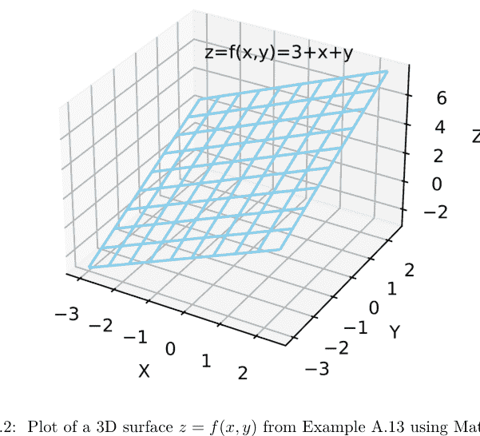

图 A.2：使用 MatPlotLib 绘制的来自示例 A.13 的三维曲面 $z = f(x, y)$。

## A.7 使用 SYMPY 进行符号计算

符号计算涉及使用计算机来帮助求解微分方程、积分、特征值以及许多其他类型符号评估的封闭形式解。例如，我们可以输入想要解的方程或积分，如果存在封闭形式解，计算机程序就会返回它。

Python 本身无法执行符号操作，因此我们需要导入 SymPy 库来扩展 Python 的功能。这有时在代码的第一行通过 `import sympy as sym` 完成，这会导致 Python 以别名 `sym` 导入 SymPy 库。最常见的是，我们只会从 SymPy 导入我们需要的函数。

作为符号计算类型的一个例子，我们将使用 SymPy 再次*符号化地*解决一个简单的物理问题：以初速度 $v_0 = 5$ m/s 竖直向上抛球。我们想要符号化地评估球达到的最大高度 $y_{max}$（忽略空气阻力），以及达到这个最大高度所需的时间。该问题的运动学方程为：

$$y = v_0 t - \frac{1}{2} g t^2 \quad \text{(A.7.1)}$$
$$v(t) = v_0 - g t \quad \text{(A.7.2)}$$

通过在球达到的最大高度处设置速度 $v(t) = v_0 - g t = 0$，我们找到对应的时间 $t = v_0/g$。将这个 $t$ 值代入 (A.7.1)，我们得到最大高度：

$$y_{\text{max}} = v_0 \left( \frac{v_0}{g} \right) - \frac{1}{2} g \left( \frac{v_0}{g} \right)^2 = \frac{v_0^2}{2g} \quad \text{(A.7.3)}$$

示例 A.14 展示了我们如何使用 Python 的符号功能来解决这个问题。

> **示例 A.14：**
> 使用 SymPy 再次解决以初速度 $v_0 = 5$ m/s 竖直向上抛球的问题。符号化地评估球达到的最大高度 $y_{\text{max}}$（忽略空气阻力），以及达到这个最大高度所需的时间。

**Python 代码**
以下 Python 代码从 (A.7.1) 和 (A.7.2) 开始，评估时间 $t_{\text{max}}$ 和最大高度 $y_{\text{max}}$。在此示例中，SymPy 库包含函数 `solve` 和方法 `.subs`，它们可以帮助我们求解代数方程。请注意，我们使用 `symbols` 命令告诉 Python 变量 `vo`、`t`、`g` 需要被定义，并且我们还包含了选项 `real=True` 来表示它们将被视为实变量。
代码行 `solve(vo-g*t,t)` 符号化地求解方程 $v_0 - g t = 0$ 中的变量 $t$，而行 `y.subs(t,tmax)` 则将 $t$ 的值符号化地替换为 `tmax`。

```python
from sympy import symbols, solve
print('-'*28,'CODE OUTPUT','-'*29,'\n')

vo, t, g = symbols('vo, t, g ',real=True) # 定义变量

# 使用 solve() 函数符号化地求解 tmax 的方程
tmax = solve(vo-g*t,t)[0]
print('Time to reach max height=',tmax)

y = vo*t-g*t**2/2
# 使用 .subs 方法将 tmax 代入 y(t) 以求 ymax
print('Max height reached = ',y.subs(t,tmax))
```

```
----------------------------- CODE OUTPUT -----------------------------
Time to reach max height= vo/g
Max height reached = vo**2/(2*g)
```

在下一节中，我们将提供一个示例，展示如何在 Python 中使用 `lambdify` 和 `diff` 函数。

## A.8 PYTHON 中的 LAMBDIFY() 和 DIFF() 函数

示例 A.15 展示了如何通过使用 `lambdify()` 函数来结合 NumPy 和 SymPy 库的结果。`lambdify()` 函数可以从 SymPy 表达式计算数值，而 `diff` 函数用于获取函数的符号导数。

在示例 A.15 中，我们被要求评估一个符号导数，然后绘制其结果。我们使用 SymPy 来评估函数的符号导数。然而，必须使用 `lambdify`，以便我们可以在创建绘图之前数值化地评估结果。

> **示例 A.15：**
> 使用 SymPy 评估函数 $f = a \sin(bt)$ 关于时间 $t$ 的符号导数，并在区间 $t = 0$ 到 $t = 6$ 内评估此导数。使用数值 $a = 1$ 和 $b = 2$。

**Python 代码**
Python 代码通过代码行 `from sympy.utilities.lambdify import lambdify` 导入 `lambdify` 函数。请注意，我们使用 `symbols` 命令告诉 Python 变量 `a`、`b`、`t` 需要被定义，并且我们还包含了选项 `real=True` 来表示它们将被视为实变量。`diff(f,t)` 命令用于评估函数 $f = a \sin(bt)$ 的符号导数，结果存储在变量 `deriv` 中。接下来，`f.subs(a:1,b:2)` 将数值 $a = 1$ 和 $b = 2$ 代入符号导数，代码行 `y = lambdify(t,f.subs(a:1,b:2))` 创建了一个函数 $y = f(t)$。

```python
import numpy as np
from sympy import symbols, sin, diff
from sympy.utilities.lambdify import lambdify

print('-'*28,'CODE OUTPUT','-'*29,'\n')

a, b, t = symbols('a,b,t',real=True) # 定义符号

f = a*sin(b*t)
deriv = diff( f,t)            # 评估 f 的符号导数
print('Symbolic Derivative v=dy/dt: ',deriv)

tims = np.linspace(0,6,5)    # 时间序列 tims

# 使用 .subs 方法在导数中代入 a=1 和 b=2
y = lambdify(t,deriv.subs({a:1,b:2}))

# 打印 y(t)
print('Derivative values = \n',y(tims))
```

```
-------------------------------- CODE OUTPUT --------------------------------
Symbolic Derivative v=dy/dt:  a*b*cos(b*t)
Derivative values = 
 [ 2.         -1.97998499  1.92034057 -1.82226052  1.68770792]
```

## A.9 PYTHON 中积分方法概述

本节简要概述了 Python 中可用的不同符号和数值积分方法。

通常，Python 中有两大类积分函数可用。第一类 Python 函数用于积分解析函数 $f(x)$，本章从科学的各个领域给出了几个例子。这种类型的积分使用两种不同的方法进行：

- 方法 #1：使用 **sympy.integrate** 库，我们对正常积分和反常积分进行符号积分。此外，通过使用 **scipy.special** 库，我们可以评估物理学中经常遇到的特殊函数的积分（误差函数、贝塞尔函数、埃尔米特多项式等）。
- 方法 #2：使用 **scipy.integrate** 库，我们可以对来自其他库的函数或用户定义的函数（见表 A.5）进行数值积分，或者对通常存储为 NumPy 数组的函数样本（见表 A.6）进行积分。

### 表 A.5
scipy.integrate 库中针对给定函数的积分函数。

| Python 函数 | 描述 |
| --- | --- |
| quad | 通用积分。 |
| dblquad | 通用二重积分。 |
| tplquad | 通用三重积分。 |
| fixed_quad | 使用 n 阶高斯求积法积分 func(x)。 |
| quadrature | 使用高斯求积法以给定容差进行积分。 |
| romberg | 使用龙贝格积分法积分 func。 |

在表 A.5 的方法中，本书将使用 quad 命令来评估一维积分，而函数 dblquad 和 tplquad 将用于评估二维和三维积分。

### 表 A.6
scipy.integrate 库中针对采样函数的积分函数。

| Python 函数 | 描述 |
| --- | --- |
| trapezoid | 使用梯形法则计算积分 |
| cumulative_trapezoid | 使用梯形法则累积计算积分 |
| simpson | 使用辛普森法则从函数样本计算积分 |
| romb | 使用龙贝格积分法从 (2^k + 1) 个均匀分布的样本计算积分 |

有关 SciPy 中更完整的积分程序列表，以及每个算法如何工作的详细信息，请参阅 scipy.integrate 的在线手册和教程。

示例 A.16 使用 sympy.integrate 命令评估了一个在物理学中经常出现的不定积分。

> **示例 A.16：**
> 使用 SymPy 计算这些积分。
> (a) $\int x \cos(n x) dx$ (b) $\int x \sin(n x) dx$

### Python 代码

通过分部积分法，我们得到：
$$\int x \cos(n x) \, dx = \frac{x \sin(n x)}{n} + \frac{\cos(n x)}{n^2} + C$$
以及
$$\int x \sin(n x) \, dx = -\frac{x \cos(n x)}{n} + \frac{\sin(n x)}{n^2} + C \quad (A.9.1)$$
其中 $C$ 是任意积分常数。以下用于计算定积分的 Python 代码给出了相同的结果。请注意，我们通过 `symbols` 命令告诉 Python 变量 $x$ 需要被定义，并通过包含选项 `positive=True` 来表明变量 $n$ 不为零。我们还使用了 `cos()` 的符号形式来表示余弦函数，而不是 `numpy.cos()` 的数值形式。

```python
from sympy import symbols, integrate, cos, sin
x = symbols('x')
n = symbols('n', positive=True)  # define symbols

print('-'*28,'CODE OUTPUT','-'*29,'\n')
print("The indefinite cosine integral = ",integrate(x*cos(n*x),x))
print("The indefinite sine integral = ",integrate(x*sin(n*x),x))

----------------------------- CODE OUTPUT -----------------------------
The indefinite cosine integral =  x*sin(n*x)/n + cos(n*x)/n**2
The indefinite sine integral =  -x*cos(n*x)/n + sin(n*x)/n**2
```

## A.10 SYMPY 中的 DSOLVE() 命令

在 Python 中，我们使用 SymPy 命令 `dsolve` 来获取微分方程的符号通解。该命令通常有三个参数：我们试图求解的微分方程、该微分方程所求解的函数，以及问题的初始条件。让我们看看 Python 代码的细节。

> 示例 A.17：
考虑一个沿直线运动的粒子，其加速度与时间 $a t$ 成正比，其中 $a$ 是一个常数。如果在时间 $t = 0$ 时粒子的速度为 $v_0$，通过求解微分方程 $dv/dt = a t$，找出粒子速度作为时间函数的公式。

### Python 代码

第一行告诉 Python 从符号 Python (SymPy) 库中导入几个命令。库由经验丰富的程序员编写，它们包含可被任何导入该库的代码使用的函数。在这种情况下，SymPy 库包含像 `dsolve` 这样的函数，用于以封闭形式求解微分方程。

所有符号都需要在 Python 中指定。我们使用 `Symbol('t', real=True, positive=True)` 来表示 `t` 是一个实数正变量。类似地，`symbols` 用于表示 `a`、`v0` 是实数变量。我们使用 `Function` 命令向 Python 表明 `v[t]` 是一个函数。

微分方程的通解由 SymPy 命令 `dsolve` 给出，其参数是微分方程、该微分方程所求解的函数以及问题的初始条件。在此示例中，该命令的结构是 `dsolve(diff(v(t),t)-a*t,v(t),ics=initconds)`。请注意，在 Python 中，微分方程的写法是将右边设为零；在此示例中 `diff(v(t),t)-a*t` 表示方程 $dv/dt = at$，并且只输入了微分方程的左边部分。这里 `v(t)` 是期望的解，而 `ics=initconds` 指定了问题的初始条件。这些条件在行 `initconds = {v(0):v0}` 中指定，它表示给定的初始条件 $v(0) = v_0$。

```python
from sympy import Symbol, symbols, Function, dsolve, diff

print('-'*28,'CODE OUTPUT','-'*29,'\n')

# define symbols and the function v
v = Function('v')
t = Symbol('t', real=True, positive=True)
a, v0 = symbols('a, v0', real=True)

# initial conditions for the ODE
initconds = {v(0):v0}

# use dsolve to obtain solution of ODE  dv/dt=a*t
solution = dsolve(diff(v(t),t)-a*t,v(t),ics=initconds).rhs

print('The solution is  v(t) = ',solution)

------------------------------------ CODE OUTPUT ------------------------------------
The solution is  v(t) =  a*t**2/2 + v0
```

## A.11 数值积分：SCIPY 中的 ODEINT() 命令

在 Python 中，我们使用 SciPy 命令 `odeint()` 来获取微分方程的数值解。

> **示例 A.18**
使用初始速度 $v(0) = v_0=1$ m/s，求解并绘制以下微分方程的数值解：
$$\frac{dv}{dt} = at \quad (A.11.1)$$
其中常数 $a = 2$ m/s$^2$。

### Python 代码

我们导入三个库：NumPy、SciPy 和图形库 Matplotlib。从 SciPy 库中，我们只导入函数 `odeint`，它用于数值求解微分方程 (A.11.1)。导入库后，我们为初始条件变量 v0 和加速度 a 赋值。

为了数值求解微分方程，我们在 Python 中创建一个新函数，我们称之为 `velderiv(v,t)`，它包含我们正在求解的微分方程。在 Python 中，函数定义使用命令 `def` 完成。函数的参数是 v 和 t，它们包含在函数名后的括号中。

接下来的几行包含函数的实际计算。请注意，我们包含了一个局部变量 dvdt，它仅存在于函数内部，并且等于 v 的一阶导数。函数的最后一行是 `return dvdt`，它返回变量 dvdt 的值。

我们还需要告诉 Python 我们将为哪些 t 值计算 v(t)。在这种情况下，`times` 是一个数组，包含列表 $[t_0, t_1, ..., t_{30}] = [0, 0.1, ..., 3.0]$，因此我们将求解 v(0), v(0.1), ..., v(3.0)。接下来，我们使用从 `scipy.integrate` 库导入的命令 `odeint` 来求解微分方程。此示例中的 `odeint` 命令是：
`velocity = odeint(velderiv,v0,times)`。
该命令有三个参数：微分方程（作为用户定义的函数 `velderiv`）、初始值 (v0) 和时间列表 `times`。结果是一个我们称之为 `velocity` 的数组，包含值 $[v_0, v_1, ...]$，其中 $v_i = v(t_i)$。程序中的最后一组代码设置了 v 对 t 的图形。

```python
import numpy as np
from scipy.integrate import odeint
import matplotlib.pyplot as plt

# initial condition v(0)=1, and acceleration a =2 m/s^2
v0 = 1
a = 2

# define function velderiv to be called by odeint
def velderiv(v,t):
    dvdt = a*t
    return dvdt

# times at which to evaluate the numerical solution
times = np.linspace(0,3,30)

# solve the ODE with initial v(0)=v0
velocity = odeint(velderiv,v0,times)

# plot v(t) and label the axes
plt.plot(times,velocity)
plt.ylabel('v(t), m/s')
plt.xlabel('Time, s')
plt.show()
```

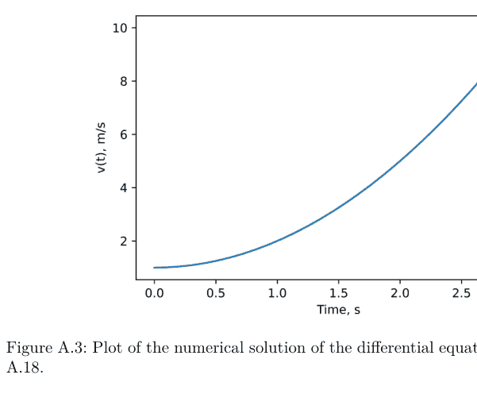

图 A.3：示例 A.18 中微分方程 A.11.1 的数值解图。

## A.12 SYMPY 中的向量表示

本书中使用的 Python 库 `sympy.vector` 用于表示向量和向量运算。表 A.7 显示了一些相关向量函数和方法的示例。

表 A.7：`sympy.vector` 包中向量函数和方法的部分列表。

| 函数/方法 | 描述 |
| :--- | :--- |
| `R = CoordSys3D('R')` | 定义名为 R 的笛卡尔坐标系。 |
| `R.base_vectors()` | 坐标系 R 的单位基向量。 |
| `v.components` | 向量 v 的分量。 |
| `v.magnitude()` | 向量 v 的大小。 |
| `v.normalize()` | 向量 v 的归一化版本。 |
| `v.projection(u)` | 向量 v 在向量 u 上的向量投影。 |
| `v.projection(u, scalar=True)` | 向量 v 在向量 u 上投影的标量大小。 |
| `v.cross(u)` | 向量 v, u 的叉积。 |
| `v.dot(u)` | 向量 v, u 的点积。 |
| `v.to_matrix(C)` | 将向量 v 修改为矩阵形式 C。 |

关于涵盖本书许多主题的更多 Python 代码示例，请读者参阅我们最近出版的书籍 *Mathematical Methods using Python* (Pagonis and Kulp, [3])。

# B Mathematica 入门

## B.1 MATHEMATICA 中的变量

尽管 Mathematica 以其符号计算能力而闻名，但它本身也是一种编程语言。因此，它可以将浮点数、整数、复数和字符串存储为变量。通常，Mathematica 中的变量名应为小写（函数以大写字母开头）；然而，这并不妨碍你在 Mathematica 中使用大写字母。Print 命令可用于显示变量的内容。请注意，Mathematica 也可以在不使用 Print 命令的情况下打印内容。默认情况下，Mathematica 在执行命令或给变量赋值时会显示输出。以分号 (;) 结尾的行会抑制输出。

> **示例 B.1：在 Mathematica 中赋值和显示变量**
将 Mathematica 变量分别赋值给数量 0.0004、3 × 10⁴、1 − 2i 和字符串 “Hello world!”。注意 i = √−1。

**解答：**
请注意，我们使用 ^ 表示指数运算，并且 I 用于表示 √−1。此外，双引号用于字符串。对于变量 a、b 和 c，我们在定义变量的行末使用 ; 来抑制输出。在定义 s 时省略了 ;，我们允许 Mathematica 立即在其定义下方显示 s 的内容。我们还演示了 Print 命令的使用。最后一行表明变量不需要被赋值。Mathematica 可以处理未预先赋值的 x。

## B.1 MATHEMATICA 代码

```mathematica
a = 0.0004;
b = 3 * 10^4;
c = 1 - 2I;
s = "Hello World!"

Hello World!

Print["a = ", a]
a = 0.0004

Print["b = ", b]
b = 30000

Print["c = ", c]
c = 1 - 2i

Print["s = ", s]
s = Hello World!

Print["We stored nothing in x. x = ", x]
We stored nothing in x. x = x
```

Mathematica 中的变量名不能以数字开头。通常使用清晰的变量名是好的。但是，Mathematica 不允许变量名中包含空格或下划线。可以通过大写字母来分隔变量名中的单词。例如，假设我们希望计算一个抛射体的飞行时间。我们可以将该时间存储在一个名为 `timeOfFlight` 的变量中，其中我们将 `O` 和 `F` 大写以分隔单词。

变量名不能与函数名相同。例如，你不能使用 `Sin` 作为变量名，因为那是 Mathematica 用于三角函数的保留命令。然而，`sin` 可以用作变量名。Mathematica 的命名约定（对函数使用大写字母，对变量不使用）可以帮助防止你尝试将变量赋值给受保护的名称。

Mathematica 笔记本还会为已定义的变量提供颜色提示。例如，如果你在示例 B.1 使用的代码中稍后输入字母 `a`，它将显示为黑色，因为 Mathematica 知道 `a` 的值。同样，如果你输入命令名称如 `Sin`，它也会显示为黑色，因为 Mathematica 知道该函数。但是，如果你在代码中输入 `sin`，它将显示为蓝色。变量 `sin` 未定义，当 Mathematica 不理解变量和术语时，会将其着色为蓝色。着色可以是调试 Mathematica 代码的有用方法。最后，一些字符可能显示为蓝绿色。这些是 Mathematica 打算在函数中使用的变量。例如，在命令 `Solve[x^2 == 1, x]` 中，我们要求 Mathematica 求解方程 `x^2 = 1` 中的 `x`。变量 `x` 之前未定义，但 Mathematica 在 `Solve` 命令中使用了它。

## B.2 MATHEMATICA 中的列表

在 Mathematica 中，列表包含一系列对象（任何类型，字符串、整数、浮点数等）。列表使用花括号 `{}` 定义。例如，`a = {1,2,3}` 在变量 `a` 中定义了列表 `{1,2,3}`。列表可以包含多种类型的对象。例如，我们可以定义一个新列表 `b = {1, {3,4,5}, "Hello World!",2I}`。

让我们回到上一段中定义的列表 `a`。我们可以通过索引（列表中的数字位置）访问列表的元素。在 Mathematica 中，第一个元素的索引为 1。因此，如果我们想让 Mathematica 给出列表的第一个元素，我们输入 `a[[1]]`。注意双括号。同样，如果我们想更改列表中元素的值，我们可以使用元素的索引。例如，`a[[-1]] = 5` 将列表的最后一个值更改为数字 5。

子列表可以使用 `;;` 定义。这在示例 B.2 中展示。

> **示例 B.2：Mathematica 中的列表**
> 定义列表 *a* = {2, {1, 2, 3}, 3 * *I*, {1, 4}, "Hello"}。
> a. `a[[2;;4]]` 这行代码产生什么？
> b. 将列表的最后一个值更改为 "world"。
> c. `a[[4]] + a[[5]]` 产生什么？
> d. `3*a[[2]]` 产生什么？

> **Mathematica 代码**
> 注意 `a[[2;;4]]` 创建一个列表，该列表从 `a` 的第二个元素开始，到 `a` 的第四个元素结束。范围是包含端点的，生成的列表有三个元素。
> 在部分 (b) 中，注意 `a[[-1]]` 表示数组 `a` 的最后一个元素。
> 计算 `a[[4]] + a[[5]]` 时，我们发现得到一个新列表，其中字符串 "world" 被添加到 `a[[4]]` 的每个元素中。注意 Mathematica 允许以这种方式组合变量类型。最后，`3*a[[2]]` 生成一个列表，其中 `a[[2]]` 的每个元素都乘以 `a` 的第一个元素（数字 3）。此外，请注意我们没有使用 `Print` 命令，而是让 Mathematica 在每行不以分号结尾的下方立即输出每个计算的结果。

```mathematica
(*部分 (a)*)
a = {2, {1, 2, 3}, 3 * I, {1, 4}, "Hello"};
a[[2;;4]]

{{1, 2, 3}, 3i, {1, 4}}

(*部分 (b)*)
a[[-1]] = "world";
a

{2, {1, 2, 3}, 3i, {1, 4}, world}

(*部分 (c)*)
a[[5]] + a[[4]]

{1 + world, 4 + world}

(*部分 (d)*)
3 * a[[2]]

{3, 6, 9}
```

## B.3 函数、循环和条件语句

Mathematica 有数千个预定义函数。但是，仍然需要用户定义的函数。例如，假设你想计算一个以恒定加速度 $a$ 运动的粒子的位置 $x(t)$。根据基础物理学，我们知道粒子的位置 $x$ 由下式描述

$$x = x_0 + v_0t + \frac{1}{2}at^2 \quad (B.3.1)$$

其中 $x_0$ 和 $v_0$ 分别是粒子在时间 $t$ 时的位置和速度。通过为 (B.3.1) 创建一个用户定义的函数，我们可以多次计算它。示例 B.3 展示了如何创建和评估用户定义的函数。

> **示例 B.3：Mathematica 中的函数和列表**
> 创建一个函数 `X[v0, a, t]`，用于计算 (B.3.1) 以找到粒子在时间 $t = 0, 1, 2$ 和 3 秒时的位置，其中 $v_0 = 3$ m/s，$a = 2$ m/s$^2$。

### Mathematica 代码

遵循 Mathematica 的命名约定，我们首先使用大写字母定义函数 `X`。在方括号中，我们包含了 `X` 的每个参数，在此例中是初始速度 `v0`、加速度 `a` 和时间 `t`。为了定义函数，我们使用 `SetDelayed (:=)`，它将右侧赋值给函数 `X`，但在代码中调用之前不会计算定义。在代码的第二行中，我们展示了如何评估该函数。最后，我们使用 `Table` 命令创建一个位置列表。`Table` 创建一个列表，其中第一个参数是被计算的对象（在此例中，是指定了 `v0` 和 `a` 的函数 `X`）。`Table` 的第二个参数是一个列表，包含被迭代的变量、迭代的起始值和最终值（两个值都包含）。步长可以作为列表中的第四个值包含在内。例如，命令 `Table[X[3, 2, t], {t, 0, 3,2}]` 将创建一个从 `t = 0` 开始到 `t = 3` 结束的列表，但只计算每隔一个元素。结果将是 `{0, 10}`。

```mathematica
X[v0_, a_, t_] := v0 * t + 1/2 * a * t^2;

X[3, 2, 1]

4

Table[X[3, 2, t], {t, 0, 3}]

{0, 4, 10, 18}
```

`Table` 命令是在 Mathematica 中执行循环的一种方法，如果你有一个简单的计算，或者你希望循环的输出是一个列表，它特别有用。更复杂的循环可以在 Mathematica 中使用 `Do` 命令完成。在下一个示例中，我们将使用 `Do` 循环重复示例 B.3。

> **示例 B.4：Mathematica 中的函数和列表**
> 创建一个函数 `x[v0,a,t]`，用于计算 (B.3.1) 以找到粒子的位置。使用 `Do` 循环计算在时间 `t = 0, 1, 2` 和 3 秒时的 `x[3,2,t]`。

### Mathematica 代码

我们像示例 B.3 一样定义了函数 `X`。然后我们创建了一个空列表 `Xlist`，它将存储粒子随时间变化的位置。注意 `Do` 循环有几行。在 `Do` 之后的逗号之前是在循环期间迭代的行。在此例中，我们计算函数 `X[3,2,t]` 并将结果存储在变量 `xpos` 中。`AppendTo` 命令将 `xpos` 的值附加到列表的末尾。最后，我们显示变量 `Xlist` 的值。

```mathematica
X[v0_, a_, t_] := v0 * t + 1/2 * a * t^2;

xlist = {};

Do[xpos = X[3, 2, t];
AppendTo[xlist, xpos],
{t, 0, 3}];

xlist

{0, 4, 10, 18}
```

当我们需要执行代码的某些部分，但仅当某些条件为真时，就会使用条件语句。在 Mathematica 中，我们使用 `If` 命令，如示例 B.5 所示。

> **示例 B.5：Mathematica 中的函数和列表**
> 创建一个函数 `x[v0,a,t]`，用于计算 (B.3.1) 以找到粒子的位置。使用 `Do` 循环计算在时间 `t = 0, 1, 2` 和 3 秒时的 `X[3,2,t]`，但仅当 `X[3,2,t] < 10` 为真时才将值存储在列表中。

### Mathematica 代码

这次我们在 `Do` 循环中包含了一个 `If` 命令。为了清晰起见，我们使用空格分隔了 `if` 语句。`If` 的第一个参数是 `xpos < 10`，它陈述了必须为真才能执行第二个参数 `AppendTo[xlist, xpos]` 的条件。在此例中，如果粒子的位置小于 10 米，则将位置的值附加到 `xlist`。`If` 中可以包含第三个参数，该参数将在条件为假时执行计算。

## B.4 Mathematica中的向量与矩阵

向量和矩阵是物理学中重要的数学结构，Mathematica将两者都视为列表。在示例B.6中，我们将展示Mathematica如何存储向量和矩阵，以及如何进行基本计算。更详细的计算指导将在全文中提供。

> **示例B.6：Mathematica中的向量与矩阵**

考虑向量
$$\mathbf{r}_1 = 3\hat{\mathbf{i}} - 2\hat{\mathbf{j}} + \hat{\mathbf{k}}$$
$$\mathbf{r}_2 = -\hat{\mathbf{i}} + \hat{\mathbf{j}} + 4\hat{\mathbf{k}}$$

以及矩阵
$$A = \begin{pmatrix} 1 & 2 \\ 3 & 4 \end{pmatrix} \quad B = \begin{pmatrix} a & b \\ c & d \end{pmatrix}$$

计算：$\mathbf{r}_1 + \mathbf{r}_2$，$\mathbf{r}_1 \cdot \mathbf{r}_2$，$A + B$，以及 $AB$。

> **Mathematica代码**

请注意，在Mathematica中，向量存储为列表。第一个元素是 $x$ 分量，第二个是 $y$ 分量，依此类推。通常，一个 $n$ 维向量存储为长度为 $n$ 的列表。命令 `.` 或 `Dot[r1, r2]` 用于计算点积。

矩阵在Mathematica中存储为二维数组。请注意，数组的元素是行向量。矩阵乘法使用 `.` 完成，与点积类似。此外，我们演示了 `MatrixForm` 命令，它能为矩阵生成更易读的输出。双斜杠告诉Mathematica对输出执行 `MatrixForm` 命令。

```
r1 = {3, -2, 1};
r2 = {-1, 1, 4};

A = {{1, 2}, {3, 4}};
B = {{a, b}, {c, d}};

r1 + r2

{2, -1, 5}

r1.r2

-1

A + B

{{1 + a, 2 + b}, {3 + c, 4 + d}}

A.B//MatrixForm

\begin{pmatrix} a + 2c & b + 2d \\ 3a + 4c & 3b + 4d \end{pmatrix}
```

## B.5 在Mathematica中创建绘图

函数的图形表示在物理学中很重要。Mathematica有许多不同的绘图函数。然而，本文中最重要的四个是：

- `Plot` 用于绘制函数，包括Mathematica内置函数和用户自定义函数，以及微分方程的解。
- `ListPlot` 用于绘制列表，例如数据点。
- `ParametricPlot` 用于绘制两个依赖于同一自变量的函数。例如，如果你需要绘制抛体的路径，你会在参数图中绘制抛体的水平坐标 $x(t)$ 和垂直坐标 $y(t)$。
- `Plot3D` 用于绘制两个自变量的函数。结果是函数在三维空间中的曲面。

每种绘图类型都在示例B.7中进行了演示。

### 示例B.7：在Mathematica中绘制函数

考虑函数：

$x(t) = 1 + 2t$ (B.5.1)
$y(t) = 2 + 3t - 4.5t^2$ (B.5.2)
$f(x, y) = 3 \exp \left( -\frac{x^2 + y^2}{3} \right)$ (B.5.3)

- (a) 使用 `Plot` 绘制 $t = 0 \dots 1$ 时的 $y(t)$。
- (b) 使用 `ListPlot` 绘制 $t = 0, 1, 2, 3$ 和 $4$ 时的有序对 $\{x(t), y(t)\}$。
- (c) 使用 `ParametricPlot` 绘制 $t = 0 \dots 3$ 时的 $\{x(t), y(t)\}$。
- (d) 使用 `Plot3D` 绘制 $x \in [-2, 2]$ 和 $y \in [-2, 2]$ 时的 $f(x, y)$。

### Mathematica代码

(a) 我们从 `SetOptions` 命令开始，该命令强制对其第一个参数中出现的命令应用某些选项。在这种情况下，我们强制应用选项 `Axes -> False`（从图中移除坐标轴）、`Frame -> True`（用边框包围图形）以及 `BaseStyle -> {FontSize -> 16}`（强制 `Plot`、`ListPlot` 和 `ParametricPlot` 命令的字体大小为16）。`Plot3D` 命令没有 `Frame` 选项，因此需要额外的代码行。

对于 `Plot` 命令，第一个参数是要绘制的函数，第二个参数是自变量坐标的范围。范围以列表形式输入。列表的第一个参数是自变量，第二个参数是起始值，第三个参数是最终值。`FrameLabel` 选项用于标记图形的坐标轴。`ListPlot` 的输出如图B.1(a)所示。

(b) 在使用 `ListPlot` 之前，我们需要定义一个有序对列表。这是使用 `Table` 命令完成的。在这种情况下，第一个参数是有序对。第二个参数包含选项。`ListPlot` 的输出如图B.1(b)所示。

(c) `ParametricPlot` 的使用方式与 `Plot` 相同；但是，绘制的是有序对。选项 `AspectRatio -> Full` 用于防止Mathematica使用相同的比例尺显示垂直和水平轴。鼓励读者下载本章的代码并更改 `AspectRatio` 以查看图形如何变化。`ListPlot` 的输出如图B.1(c)所示。

(d) 最后，`Plot3D` 的使用方式与 `Plot` 类似，只是必须给出两个自变量的范围。输出是线框曲面。如果你使用的是Mathematica笔记本，你可以将鼠标悬停在图形上，然后单击并拖动以更改其方向。`ListPlot` 的输出如图B.1(d)所示。

```
SetOptions[{Plot, ListPlot, ParametricPlot}, Axes->False,
Frame->True, BaseStyle->{FontSize->16}];

SetOptions[Plot3D, BaseStyle->{FontSize->16}];

x[t_]:=1 + 2 * t;

y[t_]:=2 + 3 * t - 4.5 * t^2;

f[x_, y_]:=3 * Exp[-(x^2 + y^2)/3]

Plot[y[t], {t, 0, 1}, FrameLabel->{"time", "y(t)"}]

list = Table[{x[t], y[t]}, {t, 0, 4}];

ListPlot[list, FrameLabel->{x, y}]

ParametricPlot[{x[t], y[t]}, {t, 0, 3}, FrameLabel->{"x(t)", "y(t)"}, AspectRatio->Full]

Plot3D[f[x, y], {x, -2, 2}, {y, -2, 2}, AxesLabel->{x, y, f}]
```

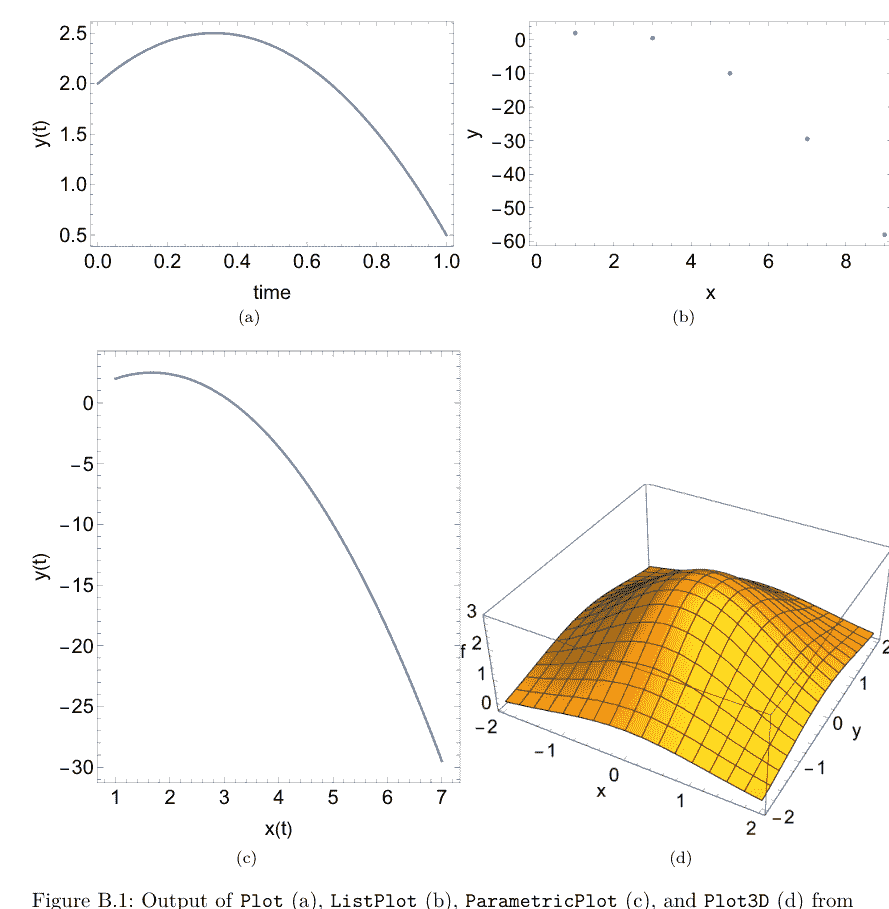

图B.1：示例B.7中 `Plot` (a)、`ListPlot` (b)、`ParametricPlot` (c) 和 `Plot3D` (d) 的输出。

## B.6 Mathematica中的基本符号计算

Mathematica是一个强大的计算机代数系统。在本书中，我们将展示它的许多功能。现在，我们将介绍四个基本计算：

- `Solve` 允许Mathematica符号化地求解单个变量的方程，或多个变量的方程组。
- `D` 计算符号导数。
- `Integrate` 计算符号积分。
- `DSolve` 符号化地求解常微分方程。

我们将在接下来的三个示例中演示每一个。

> **示例B.8：符号操作与微分**
抛体的高度为
$$y(t) = y_0 + v_0 t - \frac{1}{2} g t^2 \quad (B.6.1)$$
其中 $y_0$ 是抛体的初始垂直位置，$v_0$ 是 $y$ 方向的初始速度，$g$ 是重力加速度。使用Mathematica，求抛体的最大高度。

> **Mathematica代码**
这个问题涉及求函数 $y(t)$ 的最大值，这通过求 $dy/dt = 0$，解出 $t$，并将该 $t$ 值代入 $y(t)$ 来完成。
我们首先将 (B.6.1) 定义为一个变量（不是函数）y。命令 `D[y, t]` 计算 $dy/dt$（结果显示在命令下方）。然后我们使用 `Solve` 命令找到 $dy/dt = 0$ 时的 $t$ 值。在 `Solve` 命令中，注意 `==` 的使用，它用作等价关系。单个等号用于变量赋值。如果需要测试等式或将方程的两边设为相等，必须使用 `==`。
最后，我们使用替换命令 `/.` 将 tmax 的值代入 y。

```
y = y0 + v0 * t - 1/2 * g * t^2;

D[y, t]

-gt + v0

tmax = Solve[D[y, t] == 0, t]

{{t -> v0/g}}

y /. tmax[[1]]

v0^2/(2g) + y0
```

> **示例B.9：符号积分**
求力 $F = -kx$ 从点 $x = x_1$ 到点 $x = x_2$ 所做的功。

> **Mathematica代码**
我们知道这个问题涉及对力进行积分。定义变量 force 后，我们使用 `Integrate` 命令执行积分。`Integrate` 的第一个参数是被积分的函数。第二个参数可以是以下两种之一事情。如果我们简单地将 `x` 作为第二个参数，Mathematica 会给出一个不定积分（不含积分常数）。然而，我们提供了一个包含积分变量、其下限和上限的列表。结果是一个定积分。

```
force = -k * x;

Integrate[force, {x, x1, x2}]//Simplify

1/2 k (x1^2 - x2^2)
```

### 示例 B.10：常微分方程的符号解

求解微分方程

$$\frac{d^2x}{dt^2} = -kx$$ (B.6.2)

初始条件为 $x(0) = x_0$ 和 $\dot{x}(0) = 0$。

### Mathematica 代码

`DSolve` 命令用于求解 (B.6.2)。第一个元素是一个列表，包含常微分方程和初始条件。注意使用撇号表示微分，方括号表示 `x` 是时间 `t` 的函数。`DSolve` 的第二个参数是要求解的函数，第三个元素是自变量。如果我们想要通解，可以从 `DSolve` 的第一个参数中省略初始条件，Mathematica 会给出一个包含任意常数的解。最后，我们使用 `x[t]/. soln[[1]]` 来显示解，这告诉 Mathematica 显示存储在变量 `soln` 中的函数 `x[t]`。

```
soln = DSolve[{x''[t] == -k * x[t], x[0] == x0, x'[0] == 0}, x, t];

x[t]/.soln[[1]]

x0 Cos[Sqrt[k] t]
```

## B.7 MATHEMATICA 中积分和微分方程的数值解

有时，常微分方程或积分的解析解要么不可能找到，要么没有帮助。在这些情况下，我们可以使用数值方法，这些方法提供一个值列表作为自变量（或多个变量）的函数。Mathematica 通常使用插值函数作为数值解，因此解可以像任何其他函数一样被求值。

数值积分使用命令 `NIntegrate` 完成，其用法与 `Integrate` 完全相同，只是积分限需要数值。此外，函数中的所有参数（例如示例 B.10 中的 $k$）都必须赋予数值。

我们将在下一个示例中演示常微分方程的数值积分。

### 示例 B.11：常微分方程的数值解

求解微分方程

$$\frac{d^2x}{dt^2} = -kx \quad \text{(B.7.1)}$$

其中 $k = 2$ N/m，初始条件为 $x(0) = x_0 = 1$ 和 $\dot{x}(0) = 0$。绘制 $t = 0 \dots 10$ 的结果图。

### Mathematica 代码

`NDSolve` 命令用于求解 (B.7.1)。与 `DSolve` 类似，第一个元素是一个列表，包含常微分方程和初始条件。`NDSolve` 的第二个参数是要求解的函数，第三个元素是自变量的数值范围。`NDSolve` 的结果是一个插值函数。我们使用 `Plot` 命令绘制结果函数。再次注意使用 `x[t] /. soln` 来指定存储在变量 `soln` 中的函数 `x[t]`。

```
SetOptions[Plot, Frame->True, Axes->False,
BaseStyle->{FontSize->16}];

soln = NDSolve[{x''[t]== - 2 * x[t], x[0]==1, x'[0]==0}, x,
{t, 0, 10}];

Plot[x[t]/.soln, {t, 0, 10}, FrameLabel->{"time", "x(t)"}]
```

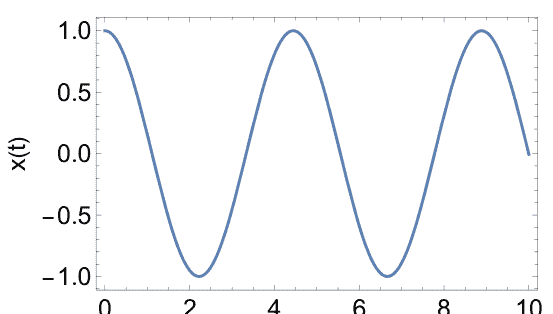

图 B.2：示例 B.11 中 (B.7.1) 解的图像。


Taylor & Francis
Taylor & Francis Group
http://taylorandfrancis.com

## 参考文献

1.  J. Taylor, *Classical Mechanics*, University Science Books, Sausalito, CA, 2005.
2.  A. Hadhazy, Fact or fiction: The days (and nights) are getting longer, *Scientific American* (6 2001).
3.  V. Pagonis, C. W. Kulp, *Mathematical Methods using Python*, CRC Press, 2024.
4.  W. Hamilton, On a general method in dynamics; by which the study of the motions of all free systems of attracting or repelling points is reduced to the search and differentiation of one central relation, or characteristic function, *Philosophical Transactions of the Royal Society*, Part 2 (1834) 247–308.
5.  W. Hamilton, Second essay on a general method in dynamics, *Philosophical Transactions of the Royal Society*, Part 1 (1835) 95–144.
6.  S. Thornton, J. Marion, *Classical Dynamics of Particles and Systems*, 5th Edition, Thomson - Brooks/Cole, Belmont, CA, 2004.
7.  E. Noether, Invariante variationsprobleme, *Nachrichten von der Gesellschaft der Wissenschaften zu Göttingen, Mathematisch-Physikalische Klasse* 1918 (1918) 235 – 257.
8.  H. Goldstein, C. Poole, J. Safko, *Classical Mechanics*, 3rd Edition, Pearson, London, 2001.
9.  V. Arnold, *Mathematical Methods of Classical Mechanics*, 2nd Edition, Springer, New York, 1997.
10. J. Worthington, A study of the planar circular restricted three body problem and the vanishing twist, Ph.D. thesis, University of Sydney (10 2012).
11. S. Strogatz, *Nonlinear Dynamics and Chaos: With Applications to Physics, Biology, Chemistry, and Engineering*, Chapman and Hall/CRC, Cambridge, UK, 2024.
12. R. Hilborn, *Chaos and Nonlinear Dynamics: An Introduction for Scientists and Engineers*, 2nd Edition, Oxford University Press, New York, 2001.
13. R. Enns, *It’s a Nonlinear World*, Springer, New York, 2011.
14. H. Kantz, T. Schreiber, *Nonlinear Time Series Analysis*, 2nd Edition, Cambridge University Press, Cambridge, UK, 2004.
15. H. Abarbanel, *Analysis of Observed Chaotic Data*, Springer, New York, 1996.
16. U. Wilensky, W. Rand, *An Introduction to Agent-Based Modeling*, MIT Press, Cambridge, MA, 2015.
17. J. Sprott, Dynamical models of love, *Nonlinear Dynamics, Psychology, and Life Sciences* 8 (8) (2004) 303 – 313.
18. J. Fajans, L. Friédland, Autoresonant (nonstationary) excitation of pendulums, plutinos, plasmas, and other nonlinear oscillators, *American Journal of Physics* 69 (2001) 1096 –1102.


Taylor & Francis
Taylor & Francis Group
http://taylorandfrancis.com

## 索引

*, 549
6-12 势, 324

加速度, 2
    定义, 6
重力加速度, 33
    有效, 382
加速度矢量
    笛卡尔坐标, 77
    柱坐标, 99
    极坐标, 97
    球坐标, 102
作用量积分, 277
空气阻力, 42
角加速度, 2, 97, 402
角动量, 146, 401
    守恒, 149
    中心力场中的守恒, 325
    两体问题中的大小, 328
    刚体的, 410
    两体问题的, 328
    xy平面外的粒子, 404
    粒子系统, 147, 408
角位置, 2
角速度, 2, 93, 374, 401
    矢量, 373
反对称振动模式, 460, 467
    双摆, 477
远日点, 342
弧长, 76, 77
算术
    NumPy 数组, 554
算术运算符
    Python 中, 540
数组, 20, 567
阿特伍德机, 284
自动共振, 535
方位角, 100

运动的基本描述, 2, 14
吸引域, 509
伯努利, 雅各布, 251
伯努利, 约翰, 251, 259
分岔, 497, 498, 519, 536
体锥, 440
体坐标系, 437
边界条件, 32
边值问题, 32

最速降线, 259
燃烧速率, 135

变分法, 251
正则运动方程, 307
正则动量, 303
CAS, 19
质心, 144, 326, 407
    连续质量分布, 137
    质点, 136
中心力, 13, 122, 323
    与力矩, 149
    定义, 323
离心力, 340, 360, 371, 380
    方向, 380
离心势能, 340
钱德勒, 赛斯, 440
混沌, 1, 497, 498, 524
    定义, 529
特征方程, 427, 470, 477
特征多项式, 503
蔡氏电路, 536
经典力学, 1
    基本问题, 1
经典物理, 1
解析解, 17
余子式展开, 86
碰撞
    弹性, 130
    非弹性, 130
复共轭, 198
复数
    Python 中的类型, 539
计算, 16
计算机代数系统, 19
连接
    列表, 542
条件语句, 548
保守力, 159-161, 180
    旋度, 182
约束方程, 279, 297
约束力, 277, 298, 300
    来自未定乘子, 300
科里奥利加速度, 384, 385
    方向, 384
    傅科摆, 388
    抛体运动, 393
科里奥利力, 97, 371, 380, 383

587

## 索引

库仑力，338
耦合微分方程，389
临界阻尼振荡，207
叉积，85
旋度
    笛卡尔坐标，116
    保守力，117
    柱坐标，116
    梯度的旋度，118
    球坐标，116
循环坐标，303，312
摆线，261
柱坐标，98

阻尼谐振子，206，532
    能量，213
    运动方程，207
阻尼，206
阻尼参数，207
自由度，279，280，480
Del 算子
    笛卡尔坐标，110
    柱坐标，110
    球坐标，110
del 算子，103，116
    二阶导数，118
行列式，86，503
微分，102，109
微分距离，77
微分方程，12
    补解，196
    齐次，195
    线性与非线性，195
    非齐次，196
    阶数，195
    特解，196
方向导数，106
位移，2，3
散度
    笛卡尔坐标，114，115
    柱坐标，115
    旋度的散度，118
    球坐标，115
点积，82
双摆，474，475
双阱势，190
阻力，42
受驱谐振子，214
达芬方程，521
    混沌，524，527，528

离心率，95，338
经济物理学，530
有效力，380
有效引力场，373
特征值，426，465，503
    如何求解，427
特征值问题，426
    耦合振子，470
特征向量，426，466，503
    如何求解，427
弹性摆，320
弹性势能，162
机电类比，227，229
静电力，13
静电势能，324
能量，159，161
    守恒，161
    非保守力与能量，163
    两体问题的能量，329
约束方程，279
运动方程，29，501
    定义，11
平衡，11，163
平衡点，163
欧拉方程，255，277
    第一形式，256
    多变量，271
    第二形式，259
欧拉方程，436，438
    无力矩对称陀螺，438
欧拉公式
    正弦与余弦，92
欧拉方法，53
欧拉旋转定理，373
欧拉，莱昂哈德，251
欧拉-克罗默方法，69
欧拉-拉格朗日方程，278，281，481
    含待定乘子，299
排气速度，134
扩展辛普森法则，61

f-字符串，540
费马原理，273
惯性力，371，372，380，396
不动点，500
不动点
    中心，500，510
    如何求解，501
    扰动，502
    鞍点，510
    鞍点，507
    稳定性，501
稳定节点，509
稳定螺旋，500，510
不稳定节点，509
不稳定螺旋，510
浮点数，539
浮点数，539
for 循环，546
禁区，166
力，9
    由势能计算，181
    保守力，180
    定义，9
    牛顿，10
    非保守力，162，177，181
    与加速度的关系，10
受迫谐振子，214
格式字符串，540
    在 Matplotlib 中，559
傅科摆，371，387
傅科，让，387
傅里叶系数，232
傅里叶级数，230，231，235
傅里叶定理，230
傅里叶技巧，232
傅里叶，约瑟夫，231
分形，524
受力图，14
fsolve
    Python 命令，131
半高全宽，224，225
函数
    Python，546
泛函，251，253，277
序列上的函数，545
FWHM，224
广义相对论，2，373
广义相对论，373
广义坐标，279，305，306，480
    简单平面摆，280
广义力，282
广义动量，282，303，306
广义速度，280，480
测地线，264，265
全局吸引子，500
梯度，103
    笛卡尔坐标，110
    柱坐标，109，110
    球坐标，110
引力势能，161，324
大圆，265
哈密顿方程，306，307
    单自由度，307
    s 个自由度，307
    简单平面摆，308
哈密顿原理，281
哈密顿，威廉·罗恩，281
哈密顿-雅可比理论，313
哈密顿量，277，304
    定义，304
    与总能量的等价性，305
哈密顿动力学，307
完整约束，298
同宿轨道，512
胡克定律，197
胡克定律，51
导入
    Python 库，549
索引
    列表，541
惯性，9，11
惯性张量，426
惯性力，16，372，380，396
惯性力，380
惯性参考系，15
无穷小面积元
    柱坐标，99
    极坐标，93
无穷小位移
    笛卡尔坐标，76
    柱坐标，99
    极坐标，93
    球坐标，101
无穷小体积元
    柱坐标，99
    球坐标，101
初始条件，31，196
整数
    Python 中的类型，539
积分函数，563
    SciPy，564
内力，129
雅可比，卡尔·古斯塔夫·雅各布，313
雅可比矩阵，503
焦耳，159
木星
    卫星，353
开普勒第一定律，338，342
开普勒行星运动定律，342
开普勒第二定律，350，351
    推导，350
开普勒第三定律，352
开普勒，约翰内斯，338
千克
    定义，9
运动学方程，33
动能，160
    多粒子系统，187
    刚体，420
    转动，401
    粒子系统，408
基尔霍夫电压定律，227
基尔霍夫定律，536
克罗内克δ，412
L-J 势，324
拉格朗日乘子，297
拉格朗日点，360
拉格朗日待定乘子，299
拉格朗日，约瑟夫-路易，251，277
拉格朗日量，277，280，454
    定义，278
    双摆，476
    三体问题，358，359
    平衡附近的小振动，482
    两体问题，327
lambda 函数，60，547
lambdify，562
拉普拉斯，皮埃尔-西蒙，251
拉普拉斯算子，118
反射定律，273
莱布尼茨，戈特弗里德·威廉，251
伦纳德-琼斯势，324
伦纳德-琼斯势函数，167
水平集，103
库，7，18，549，565
李代数，316
升力，42
极限环，520
线积分，173
线性代数，453，465
线质量密度
    质量积分，137
线动量
    守恒，130，408
    N 粒子系统守恒，134
    粒子系统守恒，144
    定义，11
    粒子系统，144
线性叠加，503
    与非线性系统，497
线性系统
    定义，497
线性化，502
李萨如图形，529
列表，541
    推导式，544
    连接，542
    复制，543
    深拷贝，543
    函数，545
    索引，541
    浅拷贝，543
    切片，542
    解包，543
局部变量，20，567
逻辑斯谛方程，532
逻辑斯谛映射，534
洛伦兹力，13
洛伦兹方程，535
洛特卡-沃尔泰拉竞争模型，533
李雅普诺夫指数，529
大小
    叉积的大小，86
    向量的大小，73
马格努斯效应，42
长半轴，342
质量，9
    引力质量，9，13
    惯性质量，9，13
质量矩阵，483
Mathematica 命令
    /., 96
    &&, 49
    Arrow, 430
    Assuming, 49
    Collect, 44
    ContourPlot, 315
    Cross, 89, 91, 404
    Curl, 118
    Dot, 84, 88, 91
    DSolve, 257
    Dsolve, 19
    Eigenvalues, 430, 474
    Eigenvectors, 430, 474
    EulerEquations, 257
    FindFit, 355
    Grad, 105, 115
    Graphics3D, 430
    GraphicsGrid, 456
    Integrate, 49, 142
    Line, 175
    LineIntegral, 175
    ListPlot, 222
    NDSolve, 21, 454
    NMaxValue, 222
    Norm, 74, 89
    NSolve, 268
    Plot, 456
    PolarPlot, 95
    RevolutionPlot3D, 269
    Solve, 96, 132
    «, 257
Mathematica 包
    VariationalMethods, 257
Matplotlib, 556
    绘图，556
    曲面图，559
麦克斯韦方程组，128
机械能，*另见* 能量，161
力学
    定义，1
米
    定义，2
方法，552
中点法则，70
最小旋转曲面，266
短半轴，343
转动惯量，156
    单粒子，401
    张量，410
转动惯量张量
    实体，415
动量，*另见* 线动量，11
纳布拉，103
自然频率，198，460，465，467，485
    振荡，453
合力，10
    粒子系统，144
净功，163
牛顿第一定律，10
    用动量表述，12
    惯性定律，11
牛顿万有引力定律，323，324，330，338
    与开普勒第三定律，353
牛顿运动定律，10
牛顿第二定律
    与开普勒第一定律，338
    与开普勒第三定律，353
    转动运动，402
    转动，436
    极坐标，333
    单摆，202
牛顿第二定律，11，29，129，146，159，251，308
    恒力，32
    由此导出的微分方程，29
    非惯性系，380
    转动，147
    惯性系，371
    惯性参考系，15
    非惯性系，372，378
    位置相关力，50
    时间相关力，38
    速度相关力，42
牛顿第三定律，326
牛顿第三定律，13，129，149
    违反，13
牛顿万有引力定律，382
牛顿，艾萨克，10
诺特定理，306
诺特定理，302
诺特，埃米，302
非保守力，162，177，181
    做功，181
非完整约束，298
非惯性参考系，15，371
非线性系统，497
    定义，497
非线性系统，1
    求解的一般方法，501
正则坐标，464，486
正则模，456，460，467
    振荡，453
北极星，436
数值计算，17
数值解
    价值，22
NumPy，549，550
    数组上的算术运算，553
NumPy 数组
    广播，554
地球扁率，383，440
ODE，*另见* 常微分方程，29，30
常微分方程，30

通解，30
阶，30
特解，31

正交，83

过阻尼振荡，209

平行轴定理，423，425
广义，425

参数图，79

摆，*另见* 简单平面摆，202

近日点，342

周期-2解，522

周期-4解，522

倍周期分岔，521–523

倍周期级联，524

真空介电常数，324

垂直轴定理，423

垂直轴定理，424

微扰，254

相图，238

相图，238，501

相空间，313

相空间图，237

物理摆，449

普朗克常数，9

绘图，556

庞加莱截面，523，524，534

质点，2

泊松括号，322

极角，100

极坐标，91

极径
地球的，383

北极星，436

位置，2，3
定义，2
极坐标，92

位置矢量
笛卡尔坐标，75
柱坐标，99
极坐标，92，97
球坐标，102

势能，161，180
引力，161
粒子系统，409

势函数，532

进动，434
岁差，436

进动频率，436

捕食者-猎物模型，534

主轴，427

转动主轴，426

主转动惯量，426

主转动惯量，427

叠加原理，230，231，235

惯量积，411，421

抛体运动，125
在非惯性系中，392

惯性力，372

伪行列式，116

勾股定理，73

Python命令
+=, 62
contour, 314
cross, 87, 90
curl, 117
def, 20, 567
diff, 52
dot, 84, 88
dsolve, 18, 565
elif, 61
else, 62
euler_equations, 257
Function, 18, 566
if, 61
is_conservative, 117
lambda, 60
modulo, %, 62
odeint, 20, 567
ParametricIntegral, 174
ParametricRegion, 174
quad, 60
ReferenceFrame, 87, 115

Python库
Matplotlib, 20, 567
NumPy, 20, 567
physics.vector, 115, 117
SciPy, 20, 567
SymPy, 7, 18, 52, 565

Q，214，224

品质因子，214，223，224

量子力学，277

量子理论，1

准周期，529

射程，541

范围对象，544

约化质量，326，328

参考系，7，14

## 索引

相对论，1
弛豫振荡，535
修复非线性，533
保留字
    在Python中，541
共振
    振幅，216，219
    能量，224
    频率，220
恢复力，196
右手定则
    转动，374
刚体
    定义，409
火箭，134
    水平运动，134
    垂直运动，135
旋转矩阵，358
转动惯量，401
龙格-库塔法，55
鞍结分岔，520
标量，9
标量投影，83
标量三重积，89，420
薛定谔方程，306
秒，9
    定义，2
半通径，338
半长轴，343
对初始条件的敏感依赖性，528
分离变量，30
分界线，512
简谐运动，51
    与混沌比较，527
简谐振子，197，304
    拉格朗日量，277
    固有频率，198
    势能，167
简单平面摆，191，202
    周期，203
辛普森法则，61
    推广，61
奇异矩阵，503
汇，114
SIS模型，534
小角度近似
    非线性系统，497
肥皂膜，266
无散矢量场，114

源，114
空间，2
空间锥，440
空间坐标系，437
速率，6，76
球坐标，100
弹簧常数，197
弹簧常数矩阵，484
稳定流形，507，518
驻点，253
稳态解
    受迫谐振子，215
施泰纳定理，425
奇异吸引子，528
链球菌性咽炎，534
叠加，230
面密度
    质量积分，137
符号计算，17
对称振荡模式，467
    双摆，477
对称振荡，460
对称陀螺
    无外力，438
辛几何，316
SymPy，561
泰勒级数，502
    多变量，103
终端速度，46
三体问题，323，356
推力，135
时间，2
时间导数
    在旋转参考系中，377
时间序列，529
时间平移不变性，304
时间平移对称性，303
力矩，11，147，402
轨迹，499
    相图，238
跨临界分岔，520
瞬态解
    受迫谐振子，215
平移不变性
    孤立系统，302
    拉格朗日量，302，303
梯形法则，61
三重积分
    笛卡尔坐标，100
    柱坐标，100
    球坐标，102

三重积，89
标量，89
矢量，90

特洛伊小行星，360

元组，541，545

转折点，162，165，166，499

二体问题，323，325
角动量，328
能量，329
拉格朗日量，327

二维系统，501

类型，539

乌拉姆，斯坦尼斯拉夫，530

欠阻尼振荡，209

待定乘子，297，299

单位矢量，73
笛卡尔，2
笛卡尔坐标，6
柱坐标，98
定义，2
通用，5
极坐标，93
球坐标，101
极坐标中的时间导数，93
球坐标中的时间导数，101

万有引力常数，324

不稳定流形，507，519

范德波尔方程，535

范德华力，324

变量
打印，540

变分原理，251

矢量，3，73
笛卡尔坐标，73
分量，2
通用，5
大小，73

矢量函数
导数，76

矢量算子，103

矢量积，85

矢量投影，83

矢量三重积，90

速度，2，76
定义，6
切向，374，375

速度矢量
笛卡尔坐标，76
柱坐标，99
极坐标，93，97
球坐标，101

维里定理，194，202

体密度
质量积分，137

弱等效原理，9，13

弱耦合振子，464

通配符，549

功，159，173

动能定理，160，180

汤川势，324