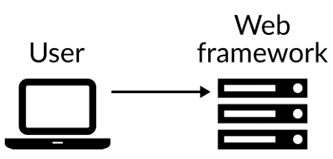
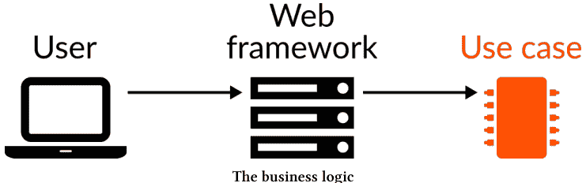
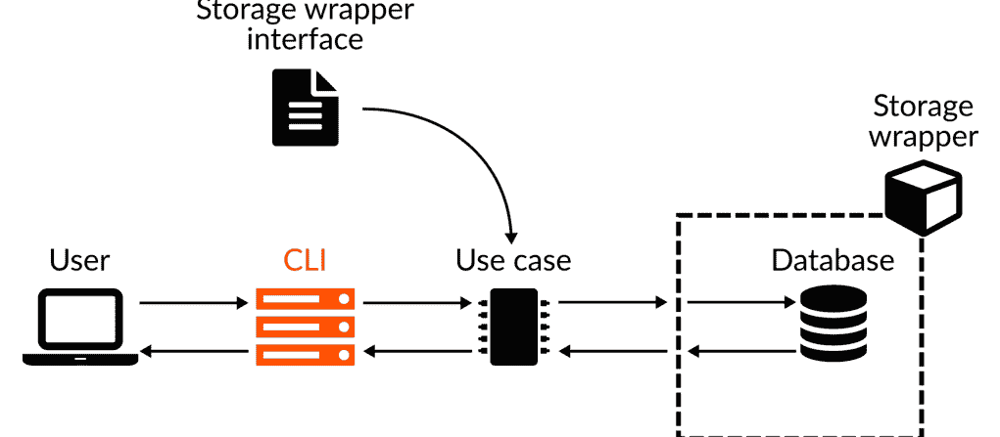
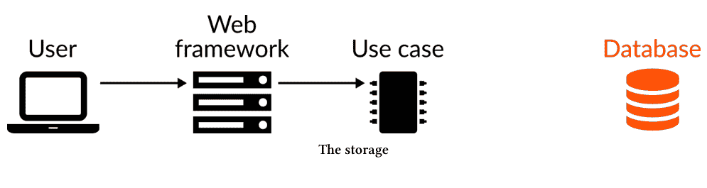
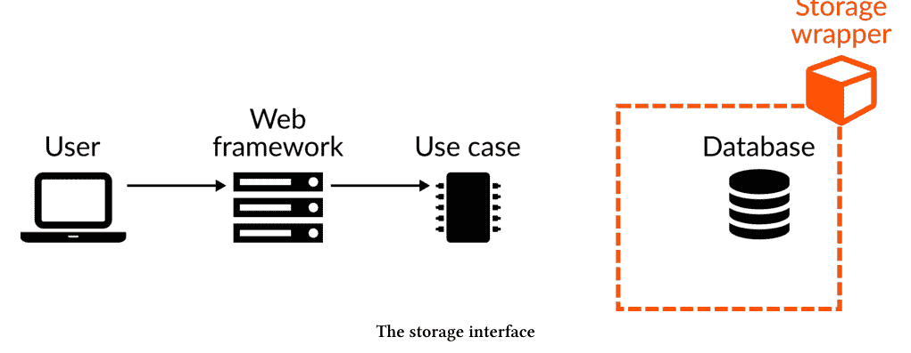
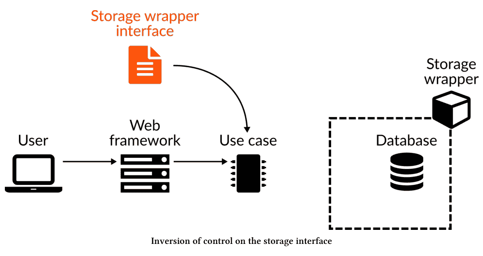
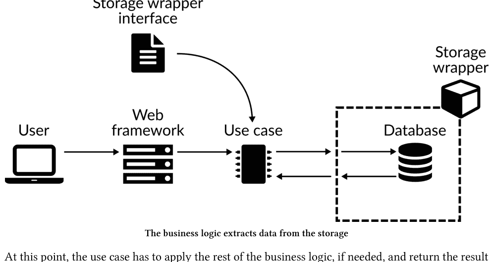
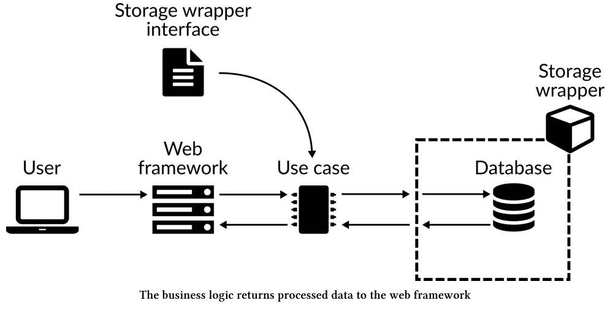
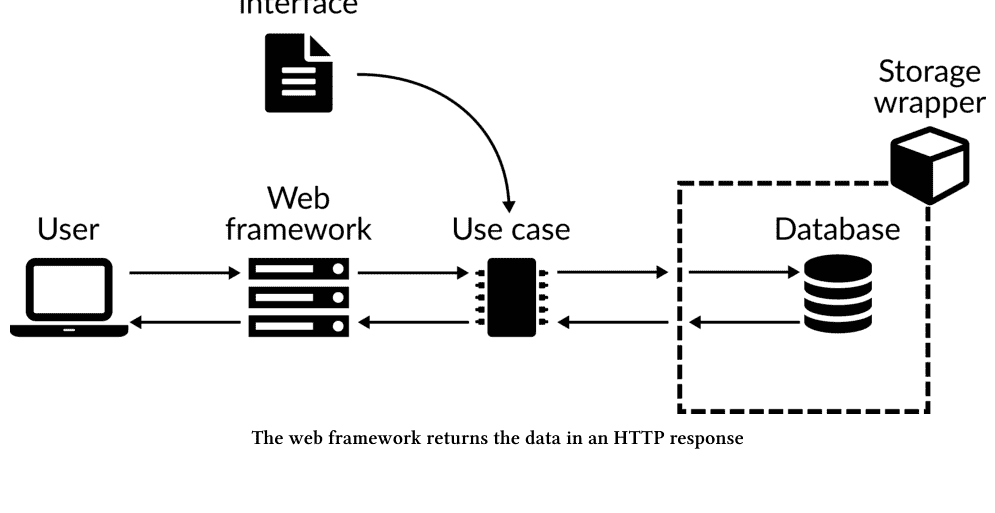

# Python 中的整洁架构

第二版

Leonardo Giordani

# Python 中的整洁架构

改善软件设计的实用方法

Leonardo Giordani

本书可在 http://leanpub.com/clean-architectures-in-python 购买

本版本发布于 2022-01-06


这是一本 Leanpub 图书。Leanpub 通过精益出版流程赋能作者和出版商。精益出版是指使用轻量级工具和多次迭代来发布进行中的电子书，以获取读者反馈，不断调整直到找到合适的书籍，并在完成后建立影响力。

© 2018 - 2022 Leonardo Giordani

# 推广本书！

请帮助 Leonardo Giordani 在 [Twitter](https://twitter.com) 上宣传本书！

本书的推荐标签是 [#pycabook](https://twitter.com/search?q=%23pycabook)。

点击此链接在 Twitter 上搜索此标签，查看其他人对本书的评价：

[#pycabook](https://twitter.com/search?q=%23pycabook)

献给我的父亲，他教会我专注、好奇和充满热情。他成功了。
献给我的母亲，她教会我聪明、谨慎和细心。她没有成功。

# 目录

- **引言**

# 目录

用例中的错误管理

## 引言

> 学习原力吧，卢克。
>
> 《星球大战》，1977年

本书是关于一种软件设计方法论的。方法论是一套指导原则，能帮助你有效地达成目标，从而节省时间、实施具有前瞻性的解决方案，并避免反复重复造轮子。

当世界各地的其他专业人士遇到问题并尝试解决时，其中一些人发现了好的解决方法，决定分享他们的经验，通常是以博客上的“最佳实践”文章或会议演讲的形式。我们也会谈到*模式*¹，即形式化的最佳实践，以及*反模式*，即关于不该做什么以及为何应避免某种解决方案的建议。

通常，当最佳实践涵盖范围广泛时，它们就被指定为一种*方法论*。方法论的定义是传达一种方法，而不仅仅是针对某个问题的具体解决方案。方法论的本质意味着它们不与任何特定案例挂钩，而是倾向于对主题采用更广泛、更通用的方法。这也意味着，不加思考地应用方法论表明一个人没有理解方法论的本质——方法论是帮助寻找解决方案，而不是提供解决方案。

这就是为什么我要给出的主要建议是：保持理性；尝试理解一种方法论为何能导向一个解决方案，并在它符合你需求时采纳它。我在本书开头就说这些，是因为我希望你以这种方式来阅读我的这部作品。

例如，整洁架构将抽象推向了极限。其主要概念之一是，你应该尽可能地隔离系统的各个部分，以便在不影响其他部分的情况下替换它们。这需要大量的抽象层，这可能会影响系统的性能，并且肯定需要更大的初始开发投入。你可能认为这些缺点是不可接受的，或者可能被迫为了执行速度而牺牲整洁性，因为你无法承受资源浪费。

在这些情况下，打破规则。

对于方法论，你总是可以自由地保留你认为有用的部分，丢弃其余部分。如果你理解了方法论背后的原因，你也会意识到支持你决策的理由。我的建议是记录下这些理由，无论是在设计文档中还是简单地在代码注释中，作为你或任何其他可能对“错误”解决方案感到惊讶并试图修正它的程序员的未来参考。

¹源自 Gamma、Vlissides、Johnson 和 Helm 的开创性著作《设计模式：可复用面向对象软件的基础》。

我将尽可能为提出的解决方案提供理由，以便你判断这些理由在你的情况下是否有效。总的来说，可以说本书包含了对你工作的可能贡献，而不是试图规定唯一最佳的工作方式。

剧透警告：不存在这样的东西。

## 什么是软件架构？

每个生产系统，无论是软件包、机械设备还是简单流程，都是由组件及其之间的连接组成的。连接的目的是将某些组件的输出用作其他组件的输入，以执行某个动作或一组动作。

在一个流程中，架构指定了哪些组件是实现的一部分，以及它们如何相互连接。

一个简单的例子是编写文档的过程。在这种情况下，流程是将一组想法和句子转换为书面文本，它可以有多种实现方式。一个非常简单的实现是有人用笔在纸上书写，但如果我们加入一个记录他人口述内容的人、多个可以退回修改后文本的校对员，以及一个负责文本视觉呈现的设计师，它可能会变得更复杂。在所有这些情况下，流程是相同的，输入（想法、句子）和输出（文档或书籍）的性质没有改变。然而，不同的架构会极大地影响输出的质量或其生成速度。

架构可以有多种粒度，这是我们观察组件及其连接的“缩放级别”。第一个级别是将整个过程描述为一个具有输入和输出的黑盒子。在这个级别上，我们甚至不关心组件，我们不知道系统内部是什么以及它如何工作。我们只知道它做什么。

当你放大时，你开始发现架构的细节，即上述黑盒子中有哪些组件以及它们如何连接。这些组件本身又是黑盒子，你不想具体知道它们如何工作，但你想知道它们的输入和输出是什么，输入来自哪里，以及输出如何被其他组件使用。

这个过程实际上是无限的，因此永远没有一个单一的架构能描述一个完整的系统，而是一组架构，每个架构都覆盖我们感兴趣的粒度。

让我再举一个与软件无关的简单例子。让我们把一家商店视为一个系统，并讨论它的架构。

一家商店，作为一个黑盒子，是一个人们带着钱进入、带着商品离开（如果他们找到了想要的东西）的地方。系统的输入是人和他们的钱，输出是相同的人和商品。商店本身需要先购买它所销售的东西，因此另一个输入是商店从批发商那里购买的库存，另一个输出是它为此支付的钱。在这个级别上，商店的内部结构是未知的，我们甚至不知道它卖什么。然而，我们已经可以设计一个简单的性能分析，例如比较流出的钱（支付给批发商）和流入的钱（来自顾客）。如果前者高于后者，那么生意就不盈利。

即使在一家业绩良好的商店，我们也可能希望提高其业绩，为此我们很可能需要理解其内部结构以及我们可以改变什么来提高其生产力。这可能会揭示，例如，商店有太多员工，他们因为高估了业务规模而等待客户，处于未充分就业状态。或者可能显示服务客户的时间太长，许多客户没有购买任何东西就离开了。或者可能没有足够的货架来展示商品，员工整天带着库存到处寻找展示空间，导致商店一片混乱，客户找不到他们需要的东西。

然而，在这个级别上，员工仍然是纯粹的实体，我们仍然对商店了解不多。为了更好地理解问题背后的原因，我们可能需要增加缩放级别，将员工视为人类，并开始理解他们的需求以及如何帮助他们更好地工作。

这个例子可以很容易地转化为软件领域。例如，我们的商店是云中的一个处理单元，输入和输出是我们支付的钱和系统每秒处理的请求数量，这可能与业务收入有关。内部过程通过更深入地分析我们分配的资源（存储、处理器、内存）来揭示，这打破了“处理单元”的抽象，并揭示了硬件架构或操作系统等细节。我们可能会更深入，讨论我们用来实现某个服务的框架或库、我们使用的编程语言，或者整个系统运行的特定硬件。

请记住，架构试图在给定某些假设或需求的情况下，详细说明一个流程在特定粒度上是如何实现的。架构的质量可以根据其成本、输出质量、其简洁性或“优雅性”、更改所需的工作量等参数来评判。

## 为什么它被称为“整洁”？

本书中解释的架构有许多名称，但目前主要使用的是“整洁架构”。这是罗伯特·马丁在他[开创性的文章](https://blog.cleancoder.com/uncle-bob/2012/08/13/the-clean-architecture.html)中使用的名称，他在文中明确指出这种结构并非新事物，而是多年来被许多软件设计师所倡导。我认为“整洁”这个形容词描述了这种架构的软件结构和开发方法的一个基本方面。它是整洁的，也就是说，它很容易理解发生了什么。

整洁架构是意大利面条式代码的反面，后者中一切都交织在一起，没有单一元素可以轻松地从其余部分分离出来并在不影响整体的情况下被替换。

系统崩溃。整洁架构的核心在于明确“什么在哪里以及为什么”，无论你选择何种架构或开发方法论，在设计和实现软件系统时，这都应是你首要关注的问题。

整洁架构并非完美架构，不能不加思考地套用。如同其他任何解决方案一样，它针对一系列问题并试图解决它们，但不存在能解决所有问题的万能药。如前所述，最好先理解整洁架构如何解决某些问题，再判断该方案是否适合你的需求。

## 为何是“架构”？

在撰写本书第一版时，我逐渐明确：本书的目标是开启一段旅程，而非定义每位软件设计师必须遵循的具体步骤。此处阐述的概念植根于某些设计原则，这些原则比你将要创建的系统最终物理结构更为重要。

正因如此，我想强调：本书展示的内容可以（也希望能）为你将要创建的、用以解决所面临问题的各种不同架构带来灵感。

或者，我只是不想看起来像罗伯特·马丁的复制品。

## 为何选择 Python？

我使用 Python 已有 20 年，同时也使用其他语言，但我逐渐爱上它的简洁与强大，最终在许多项目中都采用了它。当我初次接触整洁架构时，正在开发一个 Python 应用程序，该程序旨在串联卫星图像处理链的各个步骤。因此，我与这些概念的旅程始于这门语言。

因此，本书将使用 Python 进行讲解，但核心概念对其他语言（尤其是面向对象语言）同样适用。我不会在此介绍 Python，因此需要具备该语言的基本语法知识才能理解示例和将要讨论的项目。

整洁架构的概念与语言无关，但实现显然会利用特定语言的能力。因此，本书聚焦于整洁架构及其基于 Python 的实现方案。我非常期待看到更多关于整洁架构的书籍，探索 Python 及其他语言的其他实现方式。

## 致谢

-   Eleanor de Veras，她校对了引言部分。
-   Roberto Ciatti，他向我介绍了整洁架构。
-   读者 Eric Smith、Faust Gertz、Giovanni Natale、Grant Moore、Hans Chen、Max H. Gerlach、Michael O’Neill、Paul Schwendenman、Ramces Chirino、Rodrigo Monte、Simon Weiss、Thiago C. D’Ávila、robveijk、mathisheeren、4myhw、Jakob Waibel、1110sillabo、Maxim Ivanov，他们通过提交 issue 和 pull request 修复了错误、拼写和语法问题。
-   Łukasz Dziedzic，他开发了免费的“Lato”字体（http://www.latofonts.com），本书封面使用了该字体。

封面照片由 pxhere³ 提供。照片细节来自巴塞罗那的圣家堂，这是世界上最杰出的当代艺术品之一，是建筑中每个元素都具有意义和目的的光辉典范。向安东尼·高迪致敬，这位杰出的建筑师和圣徒，他的作品和人生将永远激励着我。

³https://pxhere.com/en/photo/1453753

## 关于本书

> 我们要把乐队重新聚起来，演几场，赚点钱。砰！五千块。

《福禄双霸天》，1980

2015 年，我的同事 Roberto Ciatti 向我介绍了整洁架构。我开始与他合作，遵循严格的测试驱动开发（TDD）方法，并学习或更好地理解了许多我现在视为编程知识基石的东西。

不幸的是，项目被取消了，但整洁架构的概念却留在我心中。因此，我为当时开始的一个简单开源项目重新审视了这些概念。与此同时，我阅读了 Ivar Jacobson⁴ 的《面向对象软件工程：用例驱动方法》。

2013 年，我开始撰写个人博客 The Digital Cat⁵，在发布了多篇与 Python 相关的文章后，我开始撰写一篇博文，向其他程序员展示整洁架构概念之美：“Python 中的整洁架构：一个循序渐进的示例”，该文于 2016 年发布，受到了 Python 社区的广泛好评。有几年时间，我考虑扩展这篇文章，但一直抽不出时间。在此期间，我意识到我写过的许多内容需要修正、澄清或更新。因此，我认为一本书可能是呈现全貌的最佳方式，于是便有了本书。

2020 年，在拖延了很长时间之后，我决定全面修订本书，更新内容并澄清那些写得不够清晰的部分。我还决定移除关于 TDD 的部分。虽然我认为每位程序员都应该理解 TDD，但本书的主题不同，因此我更新了相关材料并发布在我的博客上。

本书是许多小时思考、实验、学习和犯错的结晶。没有许多人的帮助，我无法完成本书，其中一些人的名字我并不知道，他们提供了免费的文档、软件和帮助。感谢大家！我还要特别感谢许多读者，他们向我提出了建议、纠正，或者只是发来了感谢信。谢谢你们！

## 前提条件与本书结构

要充分理解本书，你需要了解 Python 并熟悉 TDD，特别是单元测试和 mock。如果需要复习这些知识，请参考我博客上发布的系列文章《使用 pytest 进行 Python TDD》⁶。

⁴https://www.amazon.com/Object-Oriented-Software-Engineering-Approach/dp/0201544350
⁵https://www.thedigitalcatonline.com/
⁶https://www.thedigitalcatonline.com/blog/2020/09/10/tdd-in-python-with-pytest-part-1/

在你正在阅读的两个引言部分之后，第 1 章将对使用整洁架构设计的系统进行**鸟瞰式概述**，第 2 章简要讨论了该软件架构背后的**组件**和理念。第 3 章通过**一个具体示例**讲解整洁架构，第 4 章在此基础上扩展示例，添加了一个 **Web 应用程序**。第 5 章讨论**错误管理**以及对前面章节开发的 Python 代码的改进。第 6 章和第 7 章展示了如何将**不同的数据库系统**接入之前创建的 Web 服务，第 8 章通过展示如何使用**生产就绪配置**运行应用程序来结束示例。

## 排版约定

本书使用 Python，因此大多数代码示例将使用该语言，可以是`内联`的，也可以是像这样的特定代码块

```
some/path/file_name.py

1 def example():
2     print("This is a code block")
```

请注意，包含代码的文件路径会打印在源代码之前。代码块不包含行号，因为讨论的代码部分通常会在文本中重复出现。这也使得可以直接从 PDF 复制代码。

Shell 命令使用通用提示符 $ 表示

```
1 $ command --option1 value1 --option2 value 2
```

这意味着你将复制并执行从 command 开始的字符串。

我还将使用两种不同的旁注来链接代码仓库和标记重要原则。

此框提供指向包含所呈现代码的提交或标签的链接

> **源代码**
https://github.com/pycabook/rentomatic/tree/master

此框突出显示当前章节中详细解释的概念

> **概念**
这总结了文本中解释的一个重要概念。

## 为何本书免费

我开始撰写技术博客的首要原因是与他人分享我的发现，并让他们免于经历我已经解决过的流程的麻烦。此外，我一直很享受解释某事迫使我更好地理解该主题的过程，而写作则需要更多的研究来理清思路，然后才能尝试向他人介绍该主题。

我所知道的大部分内容来自个人研究，但如果没有那些免费分享知识的人的工作，我将无法取得太大进展。自由软件运动并非始于互联网，我在 80 年代和 90 年代就体验过它，但万维网无疑极大地推动了这种知识共享的速度和质量。

因此，本书是向所有花时间撰写博客文章、免费书籍、软件，以及组织会议、小组、聚会的人们表示感谢的一种方式。这就是我在会议上教授人们的原因，这就是我撰写技术博客的原因，这也是本书背后的原因。

话虽如此，如果你想用金钱来认可我的努力，请随意。任何出版书籍或参加会议旅行的人都会产生费用，任何帮助都是受欢迎的。然而，你能做的最好的事情是成为这个知识共享过程的一部分；实验、学习并分享你所学到的东西。如果你想提供经济支持，可以在 [Leanpub](https://leanpub.com/clean-architectures-in-python) 上购买本书。

## 提交 issue 或补丁

本书并非协作成果。它是我工作的产物，表达了我对某些主题的个人看法，同时也遵循我的教学方式。然而，这两者都可以改进，也可能出错，因此我乐于接受建议，并将欣然接受任何关于错误的报告或任何澄清请求。请随意使用 [书籍仓库](https://github.com/pycabook/pycabook/issues) 或书中介绍的项目的 GitHub Issues。我将尽快回复或修复问题，如有需要，我将发布包含更正的新版本本书。谢谢！

## 关于作者

我叫 Leonardo Giordani，出生于 1977 年，那一年给世界带来了《星球大战》、bash、Apple II、BSD、恐怖海峡乐队、《精灵宝钻》等众多事物。我对操作系统和计算机语言、摄影、奇幻与科幻小说、视频和桌面游戏、弹吉他以及（太多）其他事物感兴趣。

我学习并使用过多种编程语言，其中我最喜欢的是摩托罗拉68k汇编、C语言和Python。我热爱数学和密码学。我主要对开源软件感兴趣，同时也喜欢计算机科学的理论与实践两方面。

在卫星图像公司担任C/Python程序员和运维工程师13年后，我目前是WeGotPOP⁹的首席开发者之一。这是一家总部位于伦敦和纽约的英国公司，为电影制作开发创新软件。

2013年，我开始在个人博客“The Digital Cat¹⁰”上发表一些技术思考，并于2018年出版了您正在阅读的本书第一版。

## 第二版的变化

新版，新错误！我相当确定这是本版引入的主要变化。

玩笑归玩笑，第二版包含许多改动，但核心示例保持不变。虽然代码略有调整（我使用了dataclasses并引入了管理脚本来协调测试），但从这个角度看并未发生革命性变化。

因此，如果您已读过第一版，可能想看看第6、7、8章，我重新设计了集成测试的管理方式以及项目的生产就绪配置。如果您尚未阅读第一版，希望您能欣赏我在第1章通过叙述性示例引入整洁架构的努力，之后我将更详细地讨论架构并展示一些代码。

第一版读者可能注意到的最大内容变化是，我移除了关于TDD的部分，仅专注于整洁架构。我关于TDD的内容已整理成博客上的5篇文章，书中有所引用，但这次我更倾向于忠于书名，仅讨论主题内容。这可能意味着本书不再完全适合初学者，但既然相关资源已公开，我也不必过于内疚。

我还尝试了不同的工具链。第一版直接使用Leanpub的Markua¹¹语言创建，这为我提供了起步所需的一切。然而在编写第二版时，我逐渐对缺乏诸如提示框、代码片段文件名等功能以及配置选项不足感到不满。我认为Leanpub做得很好，但Markua并未提供我需要的所有功能。于是我尝试了Pandoc¹²，却立即撞上了Latex这堵墙——它至少可以说是晦涩的黑魔法。我花了大量时间修改模板和编写Python过滤器，以大致实现所需效果，但并不满意。

最终我发现了AsciiDoc¹³，这看起来是完美的解决方案。我实际上用这个工具链发布了第二版的初稿，与Markdown相比，AsciiDoc让我惊叹不已。不幸的是，在自定义标准模板时遇到了很多问题，而不懂Ruby更恶化了体验。经过一段时间，我得到了一个尚可的版本（已发布），但总觉得还能更好。

于是我决定尝试编写自己的解析器，于是就有了现在这个版本。本书此版本使用Mau编写，可在[https://github.com/Project-Mau](https://github.com/Project-Mau)获取，以及Pelican（[https://getpelican.com](https://getpelican.com)）——我已成功用于博客。我正在编写一个Mau Visitor，将源代码转换为Markua，以便使用Leanpub的工具生成PDF。

希望您能喜欢我为这个新版本付出的努力！

⁹https://www.wegotpop.com
¹⁰https://www.thedigitalcatonline.com
¹¹https://leanpub.com/markua/read
¹²https://pandoc.org/
¹³https://asciidoc.org/

# 第01章 整洁系统的一天

> 今天一定是我走运的日子。
> 《终结者2》，1991年

本章将向读者介绍一个（非常简单的）采用整洁架构设计的系统。这个介绍性章节的目的是让读者熟悉主要概念，如关注点分离和控制反转，这些在系统设计中至关重要。在描述数据在系统中的流动时，我会有意省略细节，以便我们能专注于整体思路，不过多担心实现细节。这个示例将在后续章节中详细探讨，届时会有时间讨论具体选择。现在，先把握整体框架。

## 数据流

在本书其余部分，我们将共同设计一个提供房间租赁系统的简单Web应用的一部分。因此，假设我们的“Rent-o-Matic”应用[^1]运行在https://www.rentomatic.com，用户想要查看可用房间。他们打开浏览器输入地址，通过点击菜单和按钮，到达列出我们公司所有出租房间的页面。

假设该URL是/rooms?status=available。当用户浏览器访问该URL时，HTTP请求到达我们的系统，其中有一个组件正在等待HTTP连接。我们称这个组件为“Web框架”[^2]。

Web框架的目的是理解HTTP请求并检索提供响应所需的数据。在这个简单案例中，请求有两个重要部分：端点本身（/rooms）和单个查询字符串参数status=available。端点就像系统的命令，当用户访问其中一个时，他们向系统发出信号，表明请求了特定服务——在本例中是所有可出租房间的列表。

[^1]：灵感来源于《疯狂时代》中的Sludge-O-Matic™。
[^2]：HTTP请求在到达实际Web框架前需要经过更多层，例如Web服务器，但由于这些层的主要目的是提高性能，我将在本书末尾再考虑它们。
[^3]：这里的“语言”是广义的，可能是编程语言，也可能是API、数据格式或协议。



提供HTTP服务的Web框架

Web框架运行的领域是HTTP协议，因此当Web框架解码请求后，应将相关信息传递给另一个组件进行处理。这个组件称为*用例*，它是整个整洁系统中关键且最重要的组件，因为它实现了*业务逻辑*。



业务逻辑

业务逻辑是系统设计中的重要概念。您创建系统是因为您拥有某些知识，认为可能对世界有用，或至少有市场价值。这种知识归根结底是处理数据的方式，是提取或呈现他人可能没有的数据的方式。搜索引擎可以找到与查询术语相关的所有网页，社交网络向您展示关注者的帖子并按特定算法排序，旅行公司为您找到两地之间的最佳行程方案，等等。这些都是业务逻辑的很好示例。

> **业务逻辑**
> 业务逻辑是您想要实现的特定算法或过程，是您转换数据以提供服务的方式。它是系统最重要的部分。

用例实现了整个业务逻辑中非常特定的部分。在本例中，我们有一个用例用于搜索参数*status*为给定值的房间。这意味着用例必须提取我们公司管理的所有房间，并进行过滤，仅显示可用的房间。

为什么Web框架不能做这个？嗯，良好系统架构的主要目的是*分离关注点*，即保持不同职责和领域分离。Web框架用于处理HTTP协议，由程序员维护，他们

## 分层架构的优势

如你所见，此过程的各个阶段被清晰地分隔开来，并且它们之间存在大量的数据转换。使用通用的数据格式是我们实现计算机系统组件之间独立性（或松耦合）的方式之一。

为了更好地理解松耦合对程序员意味着什么，让我们回顾一下上一幅图。在前面的段落中，我举了一个使用 Web 框架作为用户界面和关系型数据库作为数据源的系统示例，但如果前端部分是一个命令行界面，情况会有什么变化呢？如果数据源不是关系型数据库，而是另一种类型的数据源，例如一组文本文件，又会有什么变化呢？



Web 框架被 CLI 替换

关注系统的特定部分，并将业务逻辑添加到其中，会混合两个非常不同的领域。

> **关注点分离**
系统的不同部分应管理流程的不同部分。每当系统的两个独立部分处理相同的数据或流程的相同部分时，它们就是*耦合*的。虽然耦合不可避免，但两个组件之间的耦合度越高，就越难在不影响另一个组件的情况下更改其中一个。

正如我们将看到的，分层使我们能够以更少的精力维护系统，使其各个部分更易于测试和替换。
在我们这里讨论的示例中，用例需要获取所有处于可用状态的房间，从数据源中提取它们。这就是业务逻辑，在这种情况下它非常直接，因为它可能只涉及对属性值的简单过滤。然而，情况可能并非如此。更高级的业务逻辑示例可能是基于推荐系统的排序，这可能要求用例连接的组件不仅仅是数据源。
因此，用例想要处理的信息存储在某个地方。让我们将这个组件称为*存储系统*。你们中的许多人可能已经在脑海中想象了一个数据库，也许是关系型数据库，但这只是可能的数据源之一。存储系统所代表的抽象是：用例可以访问并能提供数据的任何东西都是一个源。它可能是一个文件、一个数据库（关系型或非关系型）、一个网络端点或一个远程传感器。

> **抽象**
在设计系统时，从抽象或构建块的角度思考至关重要。一个组件在系统中扮演一个角色，无论该组件的具体实现如何。抽象的层次越高，组件的细节就越少。显然，高层次的抽象不考虑实际问题，这就是为什么抽象设计必须随后使用特定的解决方案或技术来实现。

为简单起见，让我们在这个示例中使用像 Postgres 这样的关系型数据库，因为它可能为大多数读者所熟悉，但请记住更通用的情况。



用例如何与存储系统连接？显然，如果我们把对特定系统（例如使用 SQL）的调用硬编码到用例中，这两个组件将是*强耦合*的，这是我们试图在系统设计中避免的。耦合的组件不是独立的，它们紧密连接，其中一个组件中发生的更改会迫使第二个组件也进行更改（反之亦然）。这也意味着测试组件更加困难，因为一个组件不能脱离另一个组件而存在，而当第二个组件是一个像数据库这样的复杂系统时，这可能会严重拖慢开发速度。

例如，让我们假设用例直接调用了一个特定的 Python 库来访问 PostgreSQL，比如 psycopg2。这将使用例与该特定源耦合，更改数据库将导致其代码更改。这远非理想，因为用例包含业务逻辑，而业务逻辑在从一个数据库系统迁移到另一个数据库系统时并未改变。系统中不包含业务逻辑的部分应被视为实现细节。

> **实现细节**
当某个特定的解决方案或技术对于整体设计并非核心时，它被称为*细节*。这个词并不指代主题本身的复杂性，这种复杂性可能比更核心的部分更大。

关系型数据库比 HTTP 端点丰富和复杂数百倍，而 HTTP 端点又比对对象列表进行排序更复杂，但应用程序的核心是用例，而不是我们存储数据的方式或提供数据访问的方式。通常，实现细节主要与性能或可用性相关，而核心部分则实现纯粹的业务逻辑。

我们如何避免强耦合？一个简单的解决方案称为*控制反转*，我将在这里简要概述它，并在本书后面的章节中展示一个适当的实现，届时我们将实现这个具体的例子。

控制反转分两个阶段发生。首先，被调用的对象（在本例中是数据库）被一个标准接口包装。这是一组由目标的每个实现共享的功能，每个接口将这些功能转换为对被包装实现的特定语言的调用。

> **控制反转**
一种用于避免系统组件之间强耦合的技术，涉及将它们包装起来，以便它们暴露某个接口。期望该接口的组件随后可以连接到它们，而无需了解特定实现的细节，从而与接口而非特定实现强耦合。

一个现实世界的例子是电源插头：电器被设计为不是连接到特定的电源插头，而是连接到任何按照规范（尺寸、极数等）制造的电源插头。当您在英国购买电视时，您期望它带有英国插头（BS 1363）。如果没有，您需要一个*适配器*，使您能够将电子设备插入外国的插座。在这种情况下，我们需要将用例（电视）连接到一个数据库（电源系统），而它们的设计并非为了匹配一个通用接口。

在我们讨论的示例中，用例需要提取所有具有给定状态的房间，因此数据库包装器需要提供一个单一的入口点，我们可以称之为 `list_rooms_with_status`。



在控制反转的第二阶段，调用者（用例）被修改以避免硬编码对特定实现的调用，因为这会再次将两者耦合。用例在其构造函数中接受一个传入对象作为参数，并在创建时接收适配器的具体实例。用于实现此目的的具体技术在很大程度上取决于我们使用的编程语言。Python 没有显式的接口语法，因此我们将假设我们传递的对象实现了所需的方法。



现在用例与适配器连接并知道该接口，它可以调用入口点 `list_rooms_with_status` 并传递状态 available。适配器知道存储系统的细节，因此它将方法调用和参数转换为特定的调用（或一组调用）以提取请求的数据，然后将其转换为用例期望的格式。例如，它可能返回一个表示房间的 Python 字典列表。



此时，用例必须应用其余的业务逻辑（如果需要），并将结果返回给 Web 框架。



业务逻辑将处理后的数据返回给 Web 框架

Web 框架将从用例接收的数据转换为 HTTP 响应。在这种情况下，由于我们考虑的是一个预期由网站用户显式访问的端点，Web 框架将在响应的正文中返回一个 HTML 页面，但如果这是一个内部端点，例如由前端的一些异步 JavaScript 代码调用，响应的正文可能只是一个 JSON 结构。



Web 框架在 HTTP 响应中返回数据

一个数据库被更简单的基于文件的存储所取代

正如你所见，这两个变更都需要替换某些组件。毕竟，我们需要不同的代码来管理命令行而非网页。但系统的外部形态并未改变，数据流动的方式也未改变。我们创建了一个系统，其中用户界面（Web框架、命令行界面）和数据源（关系型数据库、文本文件）是实现的细节，而非核心部分。

然而，分层架构的主要直接优势在于可测试性。当你清晰地分离组件时，你也就明确了每个组件必须接收和产生的数据，因此理想情况下，你可以断开单个组件并对其进行隔离测试。让我们以我们添加的Web框架组件为例，暂时忘记架构的其余部分来考虑它。理想情况下，我们可以如图所示，将测试器连接到它的输入和输出。

隔离测试Web层

我们知道Web框架接收一个HTTP请求（1），其中包含特定的目标和查询字符串，并且它必须调用（2）用例上的一个方法，传递特定参数。当用例返回数据（3）时，Web框架必须将其转换为HTTP响应（4）。由于这是一个测试，我们可以使用一个伪用例，即一个只是模拟用例行为而无需真正实现业务逻辑的对象。然后我们将测试Web框架是否使用正确的参数调用了该方法（2），以及HTTP响应（4）是否包含正确格式的正确数据，所有这一切都将在不涉及系统任何其他部分的情况下发生。

那么，既然我们已经对系统有了一个概览，让我们深入探讨它的组件及其背后的概念。在下一章中，我将详细说明被称为“整洁架构”的设计原则如何帮助有效地实现和使用诸如关注点分离、抽象、实现和控制反转等概念。

# 第02章 整洁架构的组件

> 等等，等等，博士，呃，你是说你造了一台时间机器……用一辆德罗宁？
>
> 《回到未来》，1985年

在本章中，我将分析一套统称为“整洁架构”的软件设计原则。虽然这个特定名称是由罗伯特·马丁提出的，但它所倡导的概念是软件工程的一部分，并且已经成功使用了几十年。

在我们深入探讨它们的一个可能实现（这是本书的核心）之前，我们需要更深入地分析整洁架构的结构以及遵循它设计的系统中可以找到的组件。

### 分而治之

一个设计良好的系统的主要目标之一是实现控制。从这个角度来看，软件系统与人类工作社区（如办公室或工厂）并无不同。在这样的环境中，有工人交换数据或实物来创造和交付最终产品，无论是物品还是服务。工人需要信息和资源来执行自己的工作，但最重要的是，他们需要清楚地了解自己的职责。

虽然在人类社会中我们重视主动性和创造力，但在像软件系统这样的机器中，组件不应该能够做任何在系统设计时未明确说明的事情。软件不是活的，尽管近年来人工智能取得了令人瞩目的成就，我仍然相信人类身上有一种火花，是代码无法单独复制的。

无论我们对人工智能持何种立场，我认为我们都同意，如果职责明确，系统会运行得更好。无论我们处理的是软件还是人类社区，如果对一个组件可以或应该做什么不清楚，总是很危险的，因为影响和控制区域自然会重叠。这可能导致各种问题，从简单的低效到完全的死锁。

增加系统秩序和控制的一个好方法是将其分割成子系统，在它们之间建立清晰而严格的边界，以规范数据交换。这是一个政治概念（分而治之）的延伸，该概念指出，统治一组相互关联的小系统比统治一个单一的复杂系统更简单。

在我们上一章设计的系统中，当一个组件被调用时，它期望接收什么总是很清楚的，并且也不可能（或者至少是被禁止的）以破坏系统结构的方式交换数据。

你必须记住，软件系统并不完全像工厂或办公室。每当我们讨论机器时，我们必须考虑它们的工作方式（运行时）以及它们被构建或将被修改的方式（开发时）。原则上，计算机并不关心数据来自哪里以及去向何方。另一方面，必须构建和维护系统的人类，需要清晰地了解数据流，以避免引入错误或损害性能。

### 数据类型

数据类型在系统中扮演着重要角色，即我们封装和传输信息的方式。特别是，当我们讨论软件系统时，我们需要确保不同系统共享的类型对所有系统都是已知的。对数据类型和格式的了解，实际上是一种耦合形式。想想人类语言：如果你必须与听众交谈，你必须使用他们理解的语言，这使你与听众耦合。这本书（暂时）是用英语写的，这意味着我与英语读者耦合。如果世界上所有说英语的人突然决定忘记这门语言并用意大利语代替，我应该从头开始写这本书（但肯定要少费些力气）。

因此，当我们考虑一个软件系统时，我们需要理解哪一部分定义了类型和数据格式（“语言”），并确保由此产生的依赖关系不会妨碍实现者。在上一章中，我们发现系统中有一些组件应被视为主要组成部分，代表系统的核心（用例），而其他组件则不那么核心，通常被视为实现细节。同样，请注意，称它们为“细节”并不意味着它们不重要或实现起来微不足道，而是说用不同的实现替换它们不会影响系统的核心（业务逻辑）。

因此，存在一个由组件之间的依赖关系产生的组件层次结构。一些组件在设计之初就被定义，不依赖于任何其他组件，而其他组件则稍后出现并依赖于它们。当涉及数据类型时，由此产生的依赖关系不能破坏这种层次结构，因为这将重新引入我们想要避免的组件之间的耦合。

让我们回到最初的例子：一家商店从批发商那里购买商品，将它们陈列在货架上，然后卖给顾客。这里有两个组件之间存在清晰的依赖关系：名为“商店”的组件依赖于名为“批发商”的组件，因为数据（“商品”）从后者流向前者。商店货架的大小又取决于商品的大小（类型），而商品的大小是由批发商定义的，这遵循了我们已经建立的依赖关系。

如果商品的大小是由商店定义的，那么突然之间就会出现另一个与我们已建立的依赖关系相反的依赖关系，使得批发商依赖于商店。请注意，当涉及软件系统时，这不是循环依赖，因为第一个是概念依赖，而第二个发生在编译时的语言层面。无论如何，拥有两个相反的依赖关系绝对令人困惑，并且使得替换“外围”组件（如商店）变得困难。

### 四个主要层次

整洁架构试图通过分层方法同时捕捉组件的*概念层次结构*和*类型层次结构*。在整洁架构中，系统的组件被分类并属于特定的层次，有关于属于同一层次或不同层次的组件之间通信的规则。特别是，整洁架构是一个球形结构，内层（较低层）完全被外层（较高层）所包围，并且前者对后者的存在一无所知。

**整洁架构的基本层次**

请记住，在计算机科学中，“低层”和“高层”这两个词几乎总是指抽象层次，而非组件对系统的重要性。系统的每个部分都很重要，否则它就不会存在。

让我们看看图中描绘的主要层次，同时要记住，特定的实现可能需要创建新的层次，或将其中一些层次拆分为多个。

## 实体

整洁架构的这一层包含了领域模型的表示，即你的系统需要与之交互的所有内容，并且这些内容足够复杂，需要特定的表示。例如，Python 中的字符串是复杂且功能强大的对象。它们开箱即用提供了许多方法，因此通常为它们创建领域模型是没用的。然而，如果你的项目是一个分析中世纪手稿的工具，你可能需要隔离句子及其特征，这时定义一个特定的实体可能是合理的。

由于我们使用 Python，这一层很可能包含类，以及简化与它们交互的方法。然而，理解这一层中的模型与 Django 等框架的通常模型不同非常重要。这些模型不与存储系统连接，因此不能直接使用它们自己的方法保存或查询，它们不包含将自身转储为 JSON 字符串的方法，也不与任何表示层连接。它们是所谓的轻量级模型。

这是最内层。实体之间相互了解，因为它们生活在同一层，因此架构允许它们直接交互。这意味着代表一个实体的 Python 类可以直接使用另一个类，实例化它并调用其方法。然而，实体对外层存在的任何事物一无所知。它们无法调用数据库、访问表示框架提供的方法或实例化用例。

实体层为外层提供了一个坚实的基础类型，用于交换数据，它们可以被视为你业务的词汇表。

## 用例

正如我们之前所说，整洁系统最重要的部分是用例，因为它们实现了业务规则，而业务规则是系统本身存在的核心原因。用例是发生在你的应用程序中的过程，在这些过程中，你使用你的领域模型来处理真实数据。例子可以是用户登录、执行带有特定过滤器的搜索，或者当用户想要购买购物车中的内容时发生的银行交易。

用例应该尽可能小。将小动作隔离到单独的用例中非常重要，因为这使得整个系统更容易测试、理解和维护。用例可以完全访问实体层，因此它们可以直接实例化和使用它们。它们也可以相互调用，并且通过组合简单的用例来创建复杂的用例是很常见的。

## 网关

这一层包含为外部系统定义接口的组件，即对未实现业务规则的服务的通用访问模型。经典的例子是数据存储，其内部细节在不同实现中可能非常不同。这些实现共享一个通用接口，否则它们就不是同一概念的实现，而网关的任务就是暴露这个接口。

如果你回想一下我开始时的简单例子，这就是数据库接口所在的地方。网关可以访问实体，因此接口可以自由接收和返回在该层中定义类型的对象，因为它们可以自由访问用例。然而，网关用于屏蔽外部系统的实现，因此网关调用用例的情况很少见，因为这可以由外部系统本身完成。网关层与外部系统层密切相关，这就是为什么两者之间用虚线分隔。

## 外部系统

架构的这一部分由实现上一层定义的接口的组件填充。同一个接口可能由一个或多个具体组件实现，因为你的系统可能希望同时支持该接口的多个实现。例如，你可能希望通过 HTTP API 和命令行界面都暴露某些用例，或者你希望根据某些配置值提供对不同类型存储的支持。

请记住，“外部”这个形容词并不总是意味着系统是由他人开发的，或者它是一个像 Web 框架或数据库这样的复杂系统。这个词具有拓扑意义，它表明我们谈论的系统位于架构核心的外围，即它不实现业务逻辑。因此，我们可能希望使用内部开发的消息系统向某个服务的客户端发送通知，但这又只是一个表示层，除非我们的业务专门围绕创建通知系统。

外部系统可以完全访问网关、用例和实体。虽然理解与网关的关系很容易，因为网关是为了包装特定系统而创建的，但外部系统应该对用例和实体做什么可能就不那么清楚了。至于用例，外部系统通常是触发它们的系统部分，是用户运行业务逻辑的方式。用户点击按钮、访问 URL 或运行命令，都是与外部系统交互的典型例子，这些交互直接运行用例。至于实体，外部系统可以直接处理它们，例如将它们作为 JSON 负载返回，或将输入数据映射到领域模型。

我想指出外部系统被用例使用和外部系统想要调用用例之间的区别。在第一种情况下，通信方向是向外的，我们知道在整洁架构中，没有接口就不能向外走。因此，当我们从用例访问外部系统时，我们总是需要一个接口。而当外部系统想要调用用例时，通信方向是向内的，这是直接允许的，因为外层可以完全访问内层。

实际上，这转化为两种极端情况，由数据库和 Web 框架很好地代表。当用例访问存储系统时，两者之间应该存在松散耦合，这就是为什么我们用接口包装存储并在用例中假设它。而当 Web 框架调用用例时，端点的代码不需要任何接口来访问它。

## 层间通信

在这一架构中，层次越深，内容越抽象。内层包含业务概念的表示，而外层包含关于现实生活实现的具体细节。生活在同一层的元素之间的通信是不受限制的，但当你想要与分配给其他层的元素通信时，你必须遵循一个简单的规则。这个规则是整洁架构中最重要的东西，可能是整洁架构本身的核心表达。

**黄金法则：使用简单结构向内通信，通过接口向外通信。**

你的元素应该向内通信，即使用基本结构（即实体和你使用的编程语言提供的一切）将数据传递给更抽象的元素。

**整洁架构的黄金法则**

你的元素应该通过接口向外通信，即只使用组件的预期 API，而不引用具体实现。当创建一个外层时，其中的元素将接入这些接口并提供实际的实现。

## API 与灰色地带

API 这个词在整洁架构中至关重要。每一层都可以通过 API 被内层元素访问，API 是一组固定的[^footnote_fr-90636062_1]入口点（方法或对象）。

层与层之间的分隔以及每层的内容并非总是固定不变的。一个设计良好的系统也应能应对现实世界的问题，例如性能问题或其他特定需求。在设计架构时，了解“什么在哪里以及为什么”非常重要，而当你“弯曲”规则时，这一点就更为重要。许多问题没有非黑即白的答案，许多决策都是“灰色地带”，即需要你来证明为什么将某物放在特定位置。

然而，请记住，你不应破坏整洁架构的*结构*，并且要特别严格地遵守数据流。如果你破坏了数据流，基本上就使整个结构失效了。你应该尽可能不引入基于破坏数据流的解决方案，但现实地说，如果这能节省成本，那就去做吧。

如果你这样做了，你的代码和文档中应该有一个巨大的警告，解释你为什么这样做。如果你通过破坏接口范式来访问外层，通常是因为某些性能问题，因为分层结构可能会给元素之间的通信增加一些开销。你应该清楚地告诉其他程序员发生了这种情况，因为如果有人想用不同的东西替换外部层，他们应该知道存在特定于实现的直接访问。

举个例子，假设一个用例通过接口访问存储层，但结果发现这太慢了。于是你决定直接访问你所使用的特定数据库的 API，但这破坏了数据流，因为现在一个内层（用例）正在访问一个外层（外部接口）。如果将来有人想用不同的数据库替换你正在使用的特定数据库，他们必须意识到这一点，因为新数据库可能不会提供相同数据的相同 API 入口点。

如果你最终持续破坏数据流，也许你应该考虑移除一层抽象，将你正在链接的两层合并。

# 第三章 一个基本示例

> Joshua/WOPR: 你不想玩一局好棋吗？
> David: 等会儿。我们来玩全球热核战争吧。
> 《战争游戏》，1983

“Rent-o-Matic”项目的目标是为一家房间租赁公司创建一个简单的搜索引擎。数据集中的对象（房间）由一些属性描述，搜索引擎应允许用户设置一些过滤器来缩小搜索范围。

一个房间在系统中通过以下值存储：

- 一个唯一标识符
- 以平方米为单位的面积
- 以欧元/天为单位的租赁价格
- 纬度和经度

描述故意保持最小化，以便我们可以专注于架构问题及其解决方案。我将展示的概念可以轻松扩展到更复杂的情况。

正如整洁架构模型所推动的，我们感兴趣的是分离系统的不同层。请记住，实现整洁架构概念有多种方式，你能编写的代码在很大程度上取决于你选择的语言允许你做什么。以下是 Python 中整洁架构的一个示例，我将展示的模型、用例和其他组件的实现只是可能的解决方案之一。

## 项目设置

克隆[项目仓库](https://github.com/pycabook/rentomatic)并切换到 second-edition 分支。完整的解决方案包含在 second-edition-top 分支中，我将提到的标签也在那里。我强烈建议你跟着编码，并仅使用我的标签来查找错误。

```
$ git clone https://github.com/pycabook/rentomatic
$ cd rentomatic
$ git checkout --track origin/second-edition
```

按照你偏好的流程创建一个虚拟环境并安装依赖项

```
$ pip install -r requirements/dev.txt
```

此时你应该能够运行

```
$ pytest -svv
```

并获得类似以下的输出

```
============================= test session starts ==============================
platform linux -- Python XXXX, pytest-XXXX, py-XXXX, pluggy-XXXX --
cabook/venv3/bin/python3
cachedir: .cache
rootdir: cabook/code/calc, inifile: pytest.ini
plugins: cov-XXXX
collected 0 items

============================= no tests ran in 0.02s ==============================
```

在项目的后续部分，你可能想查看覆盖率检查的输出，因此你可以通过以下方式激活它

```
$ pytest -svv --cov=rentomatic --cov-report=term-missing
```

在本章中，我不会明确说明我何时运行测试套件，因为我将其视为标准工作流的一部分。每次我们编写测试时，你都应该运行套件并检查你是否得到一个（或多个）错误，而我作为解决方案给出的代码应该使测试套件通过。显然，你可以在复制我的解决方案之前自由尝试实现你自己的代码。

你可能注意到我配置项目使用 black，并设置了非正统的 75 行长度。我选择这个数字是为了在书中找到一种视觉上令人愉悦的方式来呈现代码，避免可能使代码难以阅读的换行。

源代码
https://github.com/pycabook/rentomatic/tree/second-edition

## 领域模型

让我们从模型 Room 的一个简单定义开始。如前所述，整洁架构模型非常轻量级，或者至少比它们在常见 Web 框架中的对应物更轻量级。遵循 TDD 方法论，我写的第一件事是测试。这个测试确保模型可以用正确的值初始化

```
tests/domain/test_room.py

import uuid
from rentomatic.domain.room import Room


def test_room_model_init():
    code = uuid.uuid4()
    room = Room(
        code,
        size=200,
        price=10,
        longitude=-0.09998975,
        latitude=51.75436293,
    )

    assert room.code == code
    assert room.size == 200
    assert room.price == 10
    assert room.longitude == -0.09998975
    assert room.latitude == 51.75436293
```

记住在你创建的 tests/ 的每个子目录中创建一个空文件 __init__.py，在这种情况下是 tests/domain/__init__.py。

现在让我们在文件 rentomatic/domain/room.py 中编写 Room 类。

```
rentomatic/domain/room.py

import uuid
import dataclasses


@dataclasses.dataclass
class Room:
    code: uuid.UUID
    size: int
    price: int
    longitude: float
    latitude: float
```

**源代码**
https://github.com/pycabook/rentomatic/tree/ed2-c03-s01

这个模型非常简单，不需要太多解释。我使用 dataclasses，因为它们是实现像这样简单模型的紧凑方式，但你可以自由使用标准类并显式实现 `__init__` 方法。
鉴于我们将从其他层接收数据来初始化此模型，并且这些数据很可能是一个字典，因此创建一个允许我们从这种类型结构初始化模型的方法很有用。代码可以放入我们之前创建的同一个文件中，如下所示

```
tests/domain/test_room.py

def test_room_model_from_dict():
    code = uuid.uuid4()
    init_dict = {
        "code": code,
        "size": 200,
        "price": 10,
        "longitude": -0.09998975,
        "latitude": 51.75436293,
    }

    room = Room.from_dict(init_dict)

    assert room.code == code
    assert room.size == 200
    assert room.price == 10
    assert room.longitude == -0.09998975
    assert room.latitude == 51.75436293
```

一个简单的实现如下

rentomatic/domain/room.py

```python
@dataclasses.dataclass
class Room:
    code: uuid.UUID
    size: int
    price: int
    longitude: float
    latitude: float

    @classmethod
    def from_dict(cls, d):
        return cls(**d)
```

**源代码**
https://github.com/pycabook/rentomatic/tree/ed2-c03-s02

出于之前提到的相同原因，能够将模型转换为字典非常有用，这样我们就可以轻松地将其序列化为 JSON 或类似的与语言无关的格式。`to_dict` 方法的测试同样放在 `tests/domain/test_room.py` 中。

```python
tests/domain/test_room.py

def test_room_model_to_dict():
    init_dict = {
        "code": uuid.uuid4(),
        "size": 200,
        "price": 10,
        "longitude": -0.09998975,
        "latitude": 51.75436293,
    }

    room = Room.from_dict(init_dict)

    assert room.to_dict() == init_dict
```

使用 dataclasses 实现这一点非常简单。

```python
rentomatic/domain/room.py

def to_dict(self):
    return dataclasses.asdict(self)
```

如果你没有使用 dataclasses，你需要显式地创建字典，但这同样不构成任何挑战。请注意，这还不是对象的序列化，因为结果仍然是一个 Python 数据结构，而不是一个字符串。

**源代码**
https://github.com/pycabook/rentomatic/tree/ed2-c03-s03

能够比较模型的实例也非常有用。测试与之前的测试在同一个文件中。

```python
tests/domain/test_room.py

def test_room_model_comparison():
    init_dict = {
        "code": uuid.uuid4(),
        "size": 200,
        "price": 10,
        "longitude": -0.09998975,
        "latitude": 51.75436293,
    }

    room1 = Room.from_dict(init_dict)
    room2 = Room.from_dict(init_dict)

    assert room1 == room2
```

同样，dataclasses 使这变得非常简单，因为它们开箱即用地提供了 `__eq__` 的实现。如果你在不使用 dataclasses 的情况下实现该类，你必须定义这个方法才能通过测试。

**源代码**
https://github.com/pycabook/rentomatic/tree/ed2-c03-s04

## 序列化器

外部层可以使用 `Room` 模型，但如果你想将模型作为 API 调用的结果返回，你需要一个序列化器。
典型的序列化格式是 JSON，因为这是 Web API 广泛接受的标准。序列化器不是模型的一部分，而是一个外部的专用类，它接收模型实例并生成其结构和值的表示。
这是我们 `Room` 类的 JSON 序列化测试。

```python
tests/serializers/test_room.py

import json
import uuid

from rentomatic.serializers.room import RoomJsonEncoder
from rentomatic.domain.room import Room


def test_serialize_domain_room():
    code = uuid.uuid4()

    room = Room(
        code=code,
        size=200,
        price=10,
        longitude=-0.09998975,
        latitude=51.75436293,
    )

    expected_json = f"""
        {{
            "code": "{code}",
            "size": 200,
            "price": 10,
            "longitude": -0.09998975,
            "latitude": 51.75436293
        }}
    """

    json_room = json.dumps(room, cls=RoomJsonEncoder)

    assert json.loads(json_room) == json.loads(expected_json)
```

在这里，我们创建了 `Room` 对象并编写了预期的 JSON 输出（请注意，双花括号用于避免与 f-string 格式化器冲突）。然后我们将 `Room` 对象转储为 JSON 字符串并进行比较。为了比较两者，我们再次将它们加载到 Python 字典中，以避免属性顺序带来的问题。比较 Python 字典确实不考虑字典字段的顺序，而比较字符串显然会考虑。

将使测试通过的代码放入文件 `rentomatic/serializers/room.py`。

```python
rentomatic/serializers/room.py

import json


class RoomJsonEncoder(json.JSONEncoder):
    def default(self, o):
        try:
            to_serialize = {
                "code": str(o.code),
                "size": o.size,
                "price": o.price,
                "latitude": o.latitude,
                "longitude": o.longitude,
            }
            return to_serialize
        except AttributeError:  # pragma: no cover
            return super().default(o)
```

**源代码**
https://github.com/pycabook/rentomatic/tree/ed2-c03-s05

提供一个继承自 `json.JSONEncoder` 的类让我们可以使用语法 `json_room = json.dumps(room, cls=RoomJsonEncoder)` 来序列化模型。请注意，我们没有使用 `as_dict` 方法，因为 UUID 代码不能直接进行 JSON 序列化。这意味着两个类中存在轻微程度的代码重复，我认为这是可以接受的，并且已被测试覆盖。但是，如果你愿意，你可以调用 `as_dict` 方法，然后通过 `str` 转换来调整 `code` 字段。

## 用例

是时候实现运行在我们应用程序内部的实际业务逻辑了。用例就是发生这种情况的地方，它们可能直接也可能不直接与系统的外部 API 相关联。

我们可以创建的最简单的用例是获取存储在仓库中的所有房间并返回它们。在第一部分中，我们不会实现过滤器来缩小搜索范围。该代码将在下一章讨论错误管理时引入。

仓库是我们的存储组件，根据清洁架构，它将在外层（外部系统）实现。我们将通过接口访问它，在 Python 中这意味着我们将接收一个我们期望会暴露特定 API 的对象。从测试的角度来看，运行访问接口的代码的最佳方式是模拟后者。将此代码放入文件 `tests/use_cases/test_room_list.py`。

我将利用 pytest 强大的 fixtures，但我不会介绍它们。我强烈建议阅读[官方文档](https://docs.pytest.org/en/stable/fixture.html)，它非常好，涵盖了许多不同的用例。

```python
tests/use_cases/test_room_list.py

import pytest
import uuid
from unittest import mock

from rentomatic.domain.room import Room
from rentomatic.use_cases.room_list import room_list_use_case

@pytest.fixture
def domain_rooms():
    room_1 = Room(
        code=uuid.uuid4(),
        size=215,
        price=39,
        longitude=-0.09998975,
        latitude=51.75436293,
    )

    room_2 = Room(
        code=uuid.uuid4(),
        size=405,
        price=66,
        longitude=0.18228006,
        latitude=51.74640997,
    )

    room_3 = Room(
        code=uuid.uuid4(),
        size=56,
        price=60,
        longitude=0.27891577,
        latitude=51.45994069,
    )

    room_4 = Room(
        code=uuid.uuid4(),
        size=93,
        price=48,
        longitude=0.33894476,
        latitude=51.39916678,
    )

    return [room_1, room_2, room_3, room_4]

def test_room_list_without_parameters(domain_rooms):
    repo = mock.Mock()
    repo.list.return_value = domain_rooms

    result = room_list_use_case(repo)

    repo.list.assert_called_with()
    assert result == domain_rooms
```

测试很简单。首先，我们模拟仓库，使其提供一个 `list` 方法，该方法返回我们在测试上方创建的模型列表。然后我们用仓库初始化用例并执行它，收集结果。我们检查的第一件事是仓库方法是否在没有任何参数的情况下被调用，第二件事是结果的实际正确性。

调用仓库的 `list` 方法是一个用例应该执行的传出查询操作，根据单元测试规则，我们不应该测试传出查询。然而，我们应该测试我们的系统如何执行传出查询，即用于运行查询的参数。

将用例的实现放入文件 `rentomatic/use_cases/room_list.py`。

```python
rentomatic/use_cases/room_list.py

def room_list_use_case(repo):
    return repo.list()
```

这样的解决方案可能看起来太简单了，所以让我们讨论一下。首先，这个用例只是仓库特定函数的一个包装器，它不包含任何错误检查，这是我们尚未考虑的事情。在下一章中，我们将讨论请求和响应，用例将变得稍微复杂一些。

接下来你可能会注意到，我使用了一个简单的函数。在本书第一版中，我为用例使用了一个类，感谢几位读者的提醒，我开始反思自己的选择，因此我想简要讨论一下你可用的选项。

用例代表业务逻辑，一个过程，这意味着你在编程语言中能拥有的最简单实现就是一个函数：一些接收输入参数并返回输出数据的代码。然而，类是另一种选择，因为它本质上是变量和函数的集合。所以，和许多其他情况一样，问题在于你应该使用函数还是类，我的答案是这取决于你正在实现的算法的复杂程度。

你的业务逻辑可能很复杂，需要连接多个外部系统，每个系统都有特定的初始化方式，而在这种简单的情况下，我只是传入了仓库。因此，原则上，如果你的算法需要更多结构，我认为使用类作为用例并没有错，但要小心不要在更简单的解决方案（函数）能完成同样工作时使用它们，这就是我在代码前一个版本中犯的错误。记住，代码需要维护，所以越简单越好。

**源代码**
https://github.com/pycabook/rentomatic/tree/ed2-c03-s06

## 存储系统

在开发用例时，我们假设它会接收一个包含数据并暴露 `list` 函数的对象。这个对象通常被昵称为“仓库”，是用例的信息来源。它与 Git 仓库无关，所以要小心不要混淆这两个术语。

存储位于清洁架构的第四层，即外部系统。这一层的元素通过接口被内部元素访问，在 Python 中，这仅仅意味着暴露一组给定的方法（在这种情况下只有 `list`）。值得注意的是，仓库在清洁架构中提供的抽象级别高于框架中的 ORM 或像 SQLAlchemy 这样的工具所提供的。仓库只提供应用程序需要的端点，其接口是为应用程序实现的特定业务问题量身定制的。

为了用具体技术来阐明这个问题，SQLAlchemy 是一个抽象 SQL 数据库访问的绝佳工具，因此仓库的内部实现可以使用它来访问 PostgreSQL 数据库。但该层的外部 API 并不是 SQLAlchemy 提供的。API 是一组精简的函数，用例调用它们来获取数据，而内部实现可以使用多种解决方案来实现相同的目标，从原始 SQL 查询到通过 RabbitMQ 网络进行远程调用的复杂系统。

仓库的一个非常重要的特性是它可以返回领域模型，这与框架 ORM 通常所做的是一致的。第三层的元素可以访问内部层定义的所有元素，这意味着领域模型和用例可以直接从仓库调用和使用。

为了这个简单的例子，我们将不会部署和使用真实的数据库系统。根据我们所说的，我们可以自由地用最适合我们需求的系统来实现仓库，在这种情况下，我想保持一切简单。因此，我们将创建一个非常简单的内存存储系统，其中加载了一些预定义数据。

首先要做的是编写一些测试来记录仓库的公共 API。包含测试的文件是 `tests/repository/test_memrepo.py`。

```
tests/repository/test_memrepo.py

import pytest

from rentomatic.domain.room import Room
from rentomatic.repository.memrepo import MemRepo


@pytest.fixture
def room_dicts():
    return [
        {
            "code": "f853578c-fc0f-4e65-81b8-566c5dffa35a",
            "size": 215,
            "price": 39,
            "longitude": -0.09998975,
            "latitude": 51.75436293,
        },
        {
            "code": "fe2c3195-aeff-487a-a08f-e0bdc0ec6e9a",
            "size": 405,
            "price": 66,
            "longitude": 0.18228006,
            "latitude": 51.74640997,
        },
        {
            "code": "913694c6-435a-4366-ba0d-da5334a611b2",
            "size": 56,
            "price": 60,
            "longitude": 0.27891577,
            "latitude": 51.45994069,
        },
        {
            "code": "eed76e77-55c1-41ce-985d-ca49bf6c0585",
            "size": 93,
            "price": 48,
            "longitude": 0.33894476,
            "latitude": 51.39916678,
        },
    ]


def test_repository_list_without_parameters(room_dicts):
    repo = MemRepo(room_dicts)

    rooms = [Room.from_dict(i) for i in room_dicts]

    assert repo.list() == rooms
```

在这种情况下，我们需要一个单独的测试来检查 `list` 方法的行为。通过测试的实现放在文件 `rentomatic/repository/memrepo.py` 中。

```
rentomatic/repository/memrepo.py

from rentomatic.domain.room import Room


class MemRepo:
    def __init__(self, data):
        self.data = data

    def list(self):
        return [Room.from_dict(i) for i in self.data]
```


**源代码**
https://github.com/pycabook/rentomatic/tree/ed2-c03-s07

你可以很容易地想象这个类是真实数据库或任何其他存储类型的包装器。虽然代码可能变得更复杂，但其基本结构将保持不变，只有一个公共方法 `list`。我将在后面的章节中深入探讨数据库仓库。

## 命令行界面

到目前为止，我们创建了领域模型、序列化器、用例和仓库，但我们仍然缺少一个将所有内容粘合在一起的系统。这个系统必须从用户那里获取调用参数，用仓库初始化一个用例，运行从仓库获取领域模型的用例，并将它们返回给用户。

现在让我们看看我们刚刚创建的架构如何与像 CLI 这样的外部系统交互。清洁架构的强大之处在于外部系统是可插拔的，这意味着我们可以推迟关于我们想要使用的系统细节的决定。在这种情况下，我们想给用户一个查询系统并获取存储系统中包含的房间列表的接口，最简单的选择是一个命令行工具。

稍后我们将创建一个 REST 端点，并通过 Web 服务器暴露它，那时我们将清楚为什么我们创建的架构如此强大。

目前，在包含 `setup.cfg` 的同一目录中创建一个文件 `cli.py`。这是一个简单的 Python 脚本，不需要任何特定选项来运行，因为它只是查询存储以获取其中包含的所有领域模型。文件内容如下：

```python
#!/usr/bin/env python

from rentomatic.repository.memrepo import MemRepo
from rentomatic.use_cases.room_list import room_list_use_case

repo = MemRepo([])
result = room_list_use_case(repo)

print(result)
```

**源代码**
https://github.com/pycabook/rentomatic/tree/ed2-c03-s08

你可以用 `python cli.py` 执行这个文件，或者如果你愿意，运行 `chmod +x cli.py`（使其可执行），然后直接用 `./cli.py` 运行它。预期结果是一个空列表：

```
$ ./cli.py
[]
```

这是正确的，因为文件 `cli.py` 中的类 `MemRepo` 是用空列表初始化的。我们使用的简单内存存储没有持久性，所以每次创建它时，我们都必须加载一些数据。这样做是为了保持存储层简单，但请记住，如果存储是一个合适的数据库，这部分代码会连接到它，但不需要向其中加载数据。

脚本最重要的部分是cli.py
repo = MemRepo([])
result = room_list_use_case(repo)

这行代码初始化了仓库并运行了用例。这通常就是你最终使用你的整洁架构以及任何你将接入的外部系统的方式。你初始化其他系统，通过传递接口来运行用例，然后收集结果。

为了演示，让我们在文件中定义一些数据并加载到仓库中

```
cli.py
#!/usr/bin/env python

from rentomatic.repository.memrepo import MemRepo
from rentomatic.use_cases.room_list import room_list_use_case

rooms = [
    {
        "code": "f853578c-fc0f-4e65-81b8-566c5dffa35a",
        "size": 215,
        "price": 39,
        "longitude": -0.09998975,
        "latitude": 51.75436293,
    },
    {
        "code": "fe2c3195-aeff-487a-a08f-e0bdc0ec6e9a",
        "size": 405,
        "price": 66,
        "longitude": 0.18228006,
        "latitude": 51.74640997,
    },
    {
        "code": "913694c6-435a-4366-ba0d-da5334a611b2",
        "size": 56,
        "price": 60,
        "longitude": 0.27891577,
        "latitude": 51.45994069,
    },
    {
        "code": "eed76e77-55c1-41ce-985d-ca49bf6c0585",
        "size": 93,
        "price": 48,
        "longitude": 0.33894476,
        "latitude": 51.39916678,
    },
]

repo = MemRepo(rooms)
result = room_list_use_case(repo)

print([room.to_dict() for room in result])
```

**源代码**
https://github.com/pycabook/rentomatic/tree/ed2-c03-s09

再次提醒，我们需要硬编码数据是因为我们存储的简单性，而不是系统架构的问题。注意我将 `print` 指令做了修改，因为仓库返回的是领域模型，直接打印它们会得到类似 `<rentomatic.domain.room.Room object at 0x7fb815ec04e0>` 的字符串列表，这并没有什么实际帮助。

如果你现在运行命令行工具，你会得到比之前更丰富的结果

```
$ ./cli.py
[
  {
    'code': 'f853578c-fc0f-4e65-81b8-566c5dffa35a',
    'size': 215,
    'price': 39,
    'longitude': -0.09998975,
    'latitude': 51.75436293
  },
  {
    'code': 'fe2c3195-aeff-487a-a08f-e0bdc0ec6e9a',
    'size': 405,
    'price': 66,
    'longitude': 0.18228006,
    'latitude': 51.74640997
  },
  {
    'code': '913694c6-435a-4366-ba0d-da5334a611b2',
    'size': 56,
    'price': 60,
    'longitude': 0.27891577,
    'latitude': 51.45994069
  },
  {
    'code': 'eed76e77-55c1-41ce-985d-ca49bf6c0585',
    'size': 93,
    'price': 48,
    'longitude': 0.33894476,
    'latitude': 51.39916678
  }
]
```

请注意，我为了可读性对上面的输出进行了格式化，但实际输出会是在一行内。

我们在本章看到的是整洁架构在实践中的核心。
我们探索了标准的层次结构：实体（Room 类）、用例（room_list_use_case 函数）、网关和外部系统（MemRepo 类），并且我们开始体会到将它们分层分离的优势。
可以说，我们设计的功能非常有限，这就是为什么我将在本书的剩余部分展示如何增强我们已有的东西以处理更复杂的情况。我们将在第4章讨论 **Web 界面**，在第5章讨论 **更丰富的查询语言** 和 **错误管理**，并在第6、7、8章讨论与 **真实外部系统**（如数据库）的 **集成**。

# 第04章 添加一个 Web 应用

> 供您参考，大型网络公司 Hairdo 对我感兴趣。
> 《土拨鼠之日》，1993

在本章中，我将介绍为房间列表用例创建一个 HTTP 端点。HTTP 端点是由 Web 服务器暴露的一个 URL，它运行特定的逻辑并以标准格式返回值。

我将遵循 REST 建议，因此端点将返回 JSON 载荷。然而，REST 并不是整洁架构的一部分，这意味着你可以根据任何你喜欢的方案来建模你的 URL 和返回数据的格式。

要暴露 HTTP 端点，我们需要一个用 Python 编写的 Web 服务器，在这种情况下，我选择了 Flask。Flask 是一个轻量级的 Web 服务器，具有模块化结构，只提供用户需要的部分。特别是，我们不会使用任何数据库/ORM，因为我们已经实现了自己的仓库层。

### Flask 设置

让我们开始更新需求文件。文件 `requirements/prod.txt` 应该提到 Flask，因为这个包包含一个脚本，可以运行一个本地 Web 服务器，我们可以用它来暴露端点

```
requirements/prod.txt
1 Flask
```

文件 `requirements/test.txt` 将包含用于与 Flask 配合工作的 pytest 扩展（稍后会详细介绍）

```
requirements/test.txt

1 -r prod.txt
2 pytest
3 tox
4 coverage
5 pytest-cov
6 pytest-flask
```


**源代码**
https://github.com/pycabook/rentomatic/tree/ed2-c04-s01

记得在这些更改后再次运行 `pip install -r requirements/dev.txt`，以在你的虚拟环境中安装新的包。

Flask 应用的设置并不复杂，但涉及很多概念，由于这不是 Flask 教程，我将快速浏览这些步骤。不过，我会为每个概念提供 Flask 文档的链接。如果你想更深入地了解这个话题，可以阅读我的系列文章 [Flask 项目设置：TDD、Docker、Postgres 等](https://www.thedigitalcatonline.com/blog/2020/07/05/flask-project-setup-tdd-docker-postgres-and-more-part-1/)。

Flask 应用可以使用一个普通的 Python 对象进行配置（[文档](http://flask.pocoo.org/docs/latest/api/#flask.Config.from_object)），所以我创建了文件 `application/config.py`，其中包含以下代码

```
application/config.py

1 import os
2 
3 basedir = os.path.abspath(os.path.dirname(__file__))
4 
5 
6 class Config(object):
7     """Base configuration"""
8 
9 
10 class ProductionConfig(Config):
11     """Production configuration"""
12 
13 
14 class DevelopmentConfig(Config):
15     """Development configuration"""
16 
17
```

18 https://www.thedigitalcatonline.com/blog/2020/07/05/flask-project-setup-tdd-docker-postgres-and-more-part-1/
19 http://flask.pocoo.org/docs/latest/api/#flask.Config.from_object

```python
class TestingConfig(Config):
    """Testing configuration"""

    TESTING = True
```

阅读 [此页面](http://flask.pocoo.org/docs/latest/config/) 以了解更多关于 Flask 配置参数的信息。
现在我们需要一个函数来初始化 Flask 应用（[文档](http://flask.pocoo.org/docs/latest/patterns/appfactories/)），配置它，并注册蓝图（[文档](http://flask.pocoo.org/docs/latest/blueprints/)）。文件 application/app.py 包含以下代码，这是一个应用工厂

```python
# application/app.py
from flask import Flask

from application.rest import room

def create_app(config_name):

    app = Flask(__name__)

    config_module = f"application.config.{config_name.capitalize()}Config"

    app.config.from_object(config_module)

    app.register_blueprint(room.blueprint)

    return app
```

**源代码**
https://github.com/pycabook/rentomatic/tree/ed2-c04-s02

### 测试并创建一个 HTTP 端点

在我们创建 Web 服务器的正式设置之前，我们想要创建将被暴露的端点。端点本质上是当用户向某个 URL 发送请求时运行的函数，所以我们仍然可以使用 TDD 进行开发，因为最终目标是拥有能产生特定结果的代码。

我们测试端点的问题在于，当我们访问测试 URL 时，需要 Web 服务器处于运行状态。Web 服务器本身是一个外部系统，所以我们不会测试它，但提供端点的代码是我们应用程序的一部分<sup>23</sup>。它实际上是一个网关，即一个允许 HTTP 框架访问用例的接口。

pytest-flask 扩展允许我们运行 Flask，模拟 HTTP 请求，并测试 HTTP 响应。这个扩展隐藏了很多自动化操作，所以乍一看可能被认为是有点“神奇”。当你安装它时，一些 fixture（如 `client`）会自动可用，因此你不需要导入它们。此外，它会尝试访问另一个名为 `app` 的 fixture，你必须定义它。因此，这是首先要做的事情。

Fixture 可以直接在你的测试文件中定义，但如果我们希望一个 fixture 全局可用，最好的定义位置是 `conftest.py` 文件，它会被 pytest 自动加载。如你所见，这里有很多自动化，如果你没有意识到这一点，可能会对结果感到惊讶，或者对错误感到沮丧。

```
tests/conftest.py

python
import pytest

from application.app import create_app

@pytest.fixture
def app():
    app = create_app("testing")
    return app
```

函数 `app` 运行应用工厂来创建一个 Flask 应用，使用 `testing` 配置，该配置将 `TESTING` 标志设置为 `True`。你可以在 [官方文档](http://flask.pocoo.org/docs/1.0/config/) 中找到这些标志的描述<sup>24</sup>。

此时，我们可以为我们的端点编写测试了。

tests/rest/test_room.py

```python
import json
from unittest import mock

from rentomatic.domain.room import Room

room_dict = {
    "code": "3251a5bd-86be-428d-8ae9-6e51a8048c33",
    "size": 200,
    "price": 10,
    "longitude": -0.09998975,
    "latitude": 51.75436293,
}

rooms = [Room.from_dict(room_dict)]


@mock.patch("application.rest.room.room_list_use_case")
def test_get(mock_use_case, client):
    mock_use_case.return_value = rooms

    http_response = client.get("/rooms")

    assert json.loads(http_response.data.decode("UTF-8")) == [room_dict]
    mock_use_case.assert_called()
    assert http_response.status_code == 200
    assert http_response.mimetype == "application/json"
```

让我们逐段进行注释。

tests/rest/test_room.py

```python
import json
from unittest import mock

from rentomatic.domain.room import Room

room_dict = {
    "code": "3251a5bd-86be-428d-8ae9-6e51a8048c33",
    "size": 200,
    "price": 10,
    "longitude": -0.09998975,
    "latitude": 51.75436293,
}

rooms = [Room.from_dict(room_dict)]
```

第一部分包含一些导入，并从一个字典设置了一个房间对象。这样我们稍后就可以直接将初始字典的内容与 API 端点的结果进行比较。请记住，API 返回的是 JSON 内容，而我们可以轻松地将 JSON 数据转换为简单的 Python 结构，因此从字典开始会很方便。

```python
tests/rest/test_room.py
@mock.patch("application.rest.room.room_list_use_case")
def test_get(mock_use_case, client):
```

这是我们目前唯一的测试。在整个测试过程中，我们模拟了用例，因为我们不关心运行它，它已经在其他地方测试过了。然而，我们感兴趣的是检查传递给用例的参数，而模拟对象可以提供这些信息。测试从装饰器 `patch` 接收模拟对象，从 `client` 接收 fixture，这是 `pytest-flask` 提供的 fixture 之一。该 fixture 自动加载我们在 `conftest.py` 中定义的 `app`，这是一个模拟 HTTP 客户端的对象，它可以访问 API 端点并存储服务器的响应。

```python
tests/rest/test_room.py
mock_use_case.return_value = rooms

http_response = client.get("/rooms")

assert json.loads(http_response.data.decode("UTF-8")) == [room_dict]
mock_use_case.assert_called()
assert http_response.status_code == 200
assert http_response.mimetype == "application/json"
```

第一行初始化了模拟用例，指示它返回我们之前创建的固定 `rooms` 变量。测试的核心部分是我们获取 API 端点的那一行，它发送一个 HTTP GET 请求并收集服务器的响应。

之后，我们检查响应中包含的数据是否是一个 JSON，该 JSON 包含 `room_dict` 结构中的数据，检查 `use_case` 方法是否已被调用，检查 HTTP 响应状态码是否为 200，最后检查服务器是否返回了正确的 MIME 类型。

是时候编写端点了，在那里我们将最终看到架构的所有部分协同工作，就像我们在之前编写的小型 CLI 程序中那样。让我为你展示一个我们可以创建的最小 Flask 端点的模板。

```python
blueprint = Blueprint('room', __name__)

@blueprint.route('/rooms', methods=['GET'])
def room_list():
    [LOGIC]
    return Response([JSON DATA],
                    mimetype='application/json',
                    status=[STATUS])
```

如你所见，结构非常简单。除了设置蓝图（这是 Flask 注册端点的方式）之外，我们创建一个简单的函数来运行端点，并通过装饰器将其分配给处理 GET 请求的 `/rooms` 端点。该函数将运行一些逻辑，并最终返回一个包含 JSON 数据、正确 MIME 类型以及表示逻辑成功或失败的 HTTP 状态的 `Response`。

上述模板变成了以下代码

```python
application/rest/room.py

import json

from flask import Blueprint, Response

from rentomatic.repository.memrepo import MemRepo
from rentomatic.use_cases.room_list import room_list_use_case
from rentomatic.serializers.room import RoomJsonEncoder

blueprint = Blueprint("room", __name__)

rooms = [
    {
        "code": "f853578c-fc0f-4e65-81b8-566c5dffa35a",
        "size": 215,
        "price": 39,
        "longitude": -0.09998975,
        "latitude": 51.75436293,
    },
    {
        "code": "fe2c3195-aeff-487a-a08f-e0bdc0ec6e9a",
        "size": 405,
        "price": 66,
        "longitude": 0.18228006,
        "latitude": 51.74640997,
    },
    {
        "code": "913694c6-435a-4366-ba0d-da5334a611b2",
        "size": 56,
        "price": 60,
        "longitude": 0.27891577,
        "latitude": 51.45994069,
    },
    {
        "code": "eed76e77-55c1-41ce-985d-ca49bf6c0585",
        "size": 93,
        "price": 48,
        "longitude": 0.33894476,
        "latitude": 51.39916678,
    },
]

@blueprint.route("/rooms", methods=["GET"])
def room_list():
    repo = MemRepo(rooms)
    result = room_list_use_case(repo)

    return Response(
        json.dumps(result, cls=RoomJsonEncoder),
        mimetype="application/json",
        status=200,
    )
```

**源代码**
https://github.com/pycabook/rentomatic/tree/ed2-c04-s03

请注意，我使用了与脚本 `cli.py` 相同的列表来初始化内存存储。同样，需要用数据（即使是空列表）初始化存储是由于 `MemRepo` 存储的限制。运行用例的代码是

```python
application/rest/room.py

def room_list():
    repo = MemRepo(rooms)
    result = room_list_use_case(repo)
```

这与我们在命令行界面中使用的代码完全相同。代码的最后一部分创建了一个合适的 HTTP 响应，使用 `RoomJsonEncoder` 序列化用例的结果，并将 HTTP 状态设置为 200（成功）

```python
application/rest/room.py

    return Response(
        json.dumps(result, cls=RoomJsonEncoder),
        mimetype="application/json",
        status=200,
    )
```

这向你展示了清晰架构的力量。编写 CLI 界面或 Web 服务的不同之处仅在于表示层，而不在于逻辑，逻辑是相同的，因为它包含在用例中。

既然我们定义了端点，我们就可以最终确定 Web 服务器的配置，以便我们可以通过浏览器访问该端点。这严格来说不属于清晰架构的一部分，但就像我处理 CLI 界面一样，我希望你看到最终结果，以获得整体图景，并享受你到目前为止跟随整个讨论所付出的努力。

## WSGI

Python Web 应用程序公开一个称为 Web 服务器网关接口<sup>25</sup> 或 WSGI 的通用接口。因此，要运行 Flask 开发 Web 服务器，我们必须在项目的主文件夹中定义一个 `wsgi.py` 文件，即与 `cli.py` 文件相同的目录中。

wsgi.py

```python
import os

from application.app import create_app

app = create_app(os.environ["FLASK_CONFIG"])
```

<sup>25</sup>https://en.wikipedia.org/wiki/Web_Server_Gateway_Interface

**源代码**
https://github.com/pycabook/rentomatic/tree/ed2-c04-s04

当你运行 Flask 命令行界面（[文档](https://flask.pocoo.org/docs/1.0/cli/)）时，它会自动查找名为 `wsgi.py` 的文件并加载它，期望它包含一个名为 `app` 的变量，该变量是 `Flask` 对象的实例。由于 `create_app` 函数是一个工厂，我们只需要执行它即可。

此时，你可以在包含此文件的目录中执行 `FLASK_CONFIG="development" flask run`，你应该会看到一条漂亮的消息，例如

```
* Running on http://127.0.0.1:5000/ (Press CTRL+C to quit)
```

此时，你可以将浏览器指向 http://127.0.0.1:5000/rooms，并享受你的 Web 应用程序第一个端点返回的 JSON 数据。

我希望你现在能够欣赏我们创建的分层架构的力量。我们确实编写了很多代码来“仅仅”打印出一个模型列表，但我们编写的代码是一个可以轻松扩展和修改的骨架。它也是完全经过测试的，这是许多软件项目在实现过程中努力争取的一部分。

我提出的用例故意非常简单。它不需要任何输入，也不能返回错误条件，因此我们编写的代码完全忽略了输入验证和错误管理。然而，这些主题极其重要，因此我们需要讨论清晰架构如何处理它们。

[26] http://flask.pocoo.org/docs/1.0/cli/

# 第五章 错误管理

> 你把他们派出去，却连警告都没给！你为什么不警告他们，伯克？
《异形2》，1986年

在每个软件项目中，很大一部分代码都致力于错误管理，而且这些代码必须坚如磐石。错误管理是一个复杂的话题，总有一些我们遗漏的边界情况，或者一些我们认为永远不会失败但实际却失败了的条件。

在整洁架构中，主要流程是创建用例及其执行。因此，这是错误的主要来源，而用例层正是我们必须实现错误管理的地方。错误显然可能来自领域模型层，但由于这些模型是由用例创建的，模型本身未管理的错误会自动成为用例的错误。

## 请求与响应

我们可以将错误管理代码分为两个不同的领域。第一个领域表示和管理**请求**，即到达我们用例的输入数据。第二个领域涵盖了我们通过**响应**（即输出数据）从用例返回结果的方式。这两个概念不应与HTTP请求和响应混淆，尽管它们有相似之处。我们现在考虑的是数据如何传递给用例以及如何从用例接收，以及如何管理错误。这与该架构可能用于暴露HTTP API无关。

请求和响应对象是整洁架构的重要组成部分，因为它们将调用参数、输入和结果从应用程序外部传输到用例层。

更具体地说，请求是从传入的API调用创建的对象，因此它们应该处理诸如错误值、缺失参数、错误格式等问题。另一方面，响应必须包含API调用的实际结果，但也应该能够表示错误情况并提供有关发生了什么的丰富信息。

请求和响应对象的实际实现是完全自由的，整洁架构对此没有规定。如何打包和表示数据的决定权在我们手中。

为了开始处理可能的错误并了解如何管理它们，我将扩展`room_list_use_case`以支持可用于选择存储中Room对象子集的过滤器。

过滤器可以，例如，由一个包含Room模型属性和要应用的逻辑的字典来表示。一旦我们接受如此丰富的结构，我们就为用例打开了各种错误的大门：模型中不存在的属性、错误类型的阈值、导致存储层崩溃的过滤器等等。所有这些考虑都必须由用例来处理。

## 基本结构

在扩展用例以接受过滤器之前，我们可以实现结构化的请求。我们只需要一个`RoomListRequest`类，它可以无参数初始化，因此让我们创建文件`tests/requests/test_room_list.py`并在其中放置一个针对此对象的测试。

```
tests/requests/test_room_list.py

1 from rentomatic.requests.room_list import RoomListRequest
2 
3 
4 def test_build_room_list_request_without_parameters():
5     request = RoomListRequest()
6 
7     assert bool(request) is True
8 
9 
10 def test_build_room_list_request_from_empty_dict():
11     request = RoomListRequest.from_dict({})
12 
13     assert bool(request) is True
```

虽然目前这个请求对象基本上是空的，但一旦我们开始为列表用例添加参数，它就会派上用场。`RoomListRequest`类的代码如下

```
rentomatic/requests/room_list.py

1 class RoomListRequest:
2     @classmethod
3     def from_dict(cls, adict):
4         return cls()
5 
6     def __bool__(self):
7         return True
```

响应对象也非常简单，因为目前我们只需要返回一个成功的结果。与请求不同，响应不与任何特定用例相关联，因此测试文件可以命名为`tests/test_responses.py`

```
tests/test_responses.py

1 from rentomatic.responses import ResponseSuccess
2 
3 
3 def test_response_success_is_true():
4     assert bool(ResponseSuccess()) is True
```

而实际的响应对象位于文件`rentomatic/responses.py`中

```
rentomatic/responses.py

1 class ResponseSuccess:
2     def __init__(self, value=None):
3         self.value = value
4 
5     def __bool__(self):
6         return True
```

有了这两个对象，我们刚刚为更丰富地管理用例的输入和输出奠定了基础，尤其是在错误条件下。

## 用例中的请求与响应

让我们将开发的请求和响应对象实现到用例中。为此，我们需要更改用例，使其接受一个请求并返回一个响应。`tests/use_cases/test_room_list.py`的新版本如下

```
tests/use_cases/test_room_list.py
1 import pytest
2 import uuid
3 from unittest import mock
4 
5 from rentomatic.domain.room import Room
6 from rentomatic.use_cases.room_list import room_list_use_case
7 from rentomatic.requests.room_list import RoomListRequest
8 
9 
10 @pytest.fixture
11 def domain_rooms():
12     room_1 = Room(
13         code=uuid.uuid4(),
14         size=215,
15         price=39,
16         longitude=-0.09998975,
17         latitude=51.75436293,
18     )
19 
20     room_2 = Room(
21         code=uuid.uuid4(),
22         size=405,
23         price=66,
24         longitude=0.18228006,
25         latitude=51.74640997,
26     )
27 
28     room_3 = Room(
29         code=uuid.uuid4(),
30         size=56,
31         price=60,
32         longitude=0.27891577,
33         latitude=51.45994069,
34     )
35 
36     room_4 = Room(
37         code=uuid.uuid4(),
38         size=93,
39         price=48,
40         longitude=0.33894476,
41         latitude=51.39916678,
42     )
43 
44     return [room_1, room_2, room_3, room_4]
45 
46 
47 def test_room_list_without_parameters(domain_rooms):
48     repo = mock.Mock()
49     repo.list.return_value = domain_rooms
50 
51     request = RoomListRequest()
52 
53     response = room_list_use_case(repo, request)
54 
55     assert bool(response) is True
56     repo.list.assert_called_with()
57     assert response.value == domain_rooms
```

用例中的更改很小。文件`rentomatic/use_cases/room_list.py`的新版本如下

```
rentomatic/use_cases/room_list.py
from rentomatic.responses import ResponseSuccess

def room_list_use_case(repo, request):
    rooms = repo.list()
    return ResponseSuccess(rooms)
```

源代码
https://github.com/pycabbook/rentomatic/tree/ed2-c05-s03

现在我们有了打包输入和输出值的标准方式，上述模式对于我们可以创建的每个用例都是有效的。然而，我们仍然缺少一些功能，因为到目前为止，请求和响应并未用于执行错误管理。

## 请求验证

我们想要添加到用例的参数过滤器允许调用者添加条件以缩小模型列表操作的结果，使用类似`<attribute>__<operator>`的表示法。例如，指定`filters={'price__lt': 100}`应该返回所有价格低于100的结果。

由于Room模型有许多属性，可能的过滤器数量非常多。为简单起见，我将考虑以下情况：

- 属性`code`仅支持`__eq`，如果存在则查找具有特定代码的房间
- 属性`price`支持`__eq`、`__lt`和`__gt`
- 所有其他属性都不能在过滤器中使用

这里的核心思想是请求是为用例定制的，因此它们可以包含验证用于实例化它们的参数的逻辑。请求在到达用例之前是有效或无效的，因此检查输入值是否具有适当的值或格式不是后者的责任。

这也意味着构建请求可能产生两个不同的对象，一个有效的或一个无效的。因此，我决定将现有的`RoomListRequest`类拆分为`RoomListValidRequest`和`RoomListInvalidRequest`，并创建一个返回适当对象的工厂函数。

首先要做的就是更改现有测试以使用工厂。

```
tests/requests/test_room_list.py

1 from rentomatic.requests.room_list import build_room_list_request
2 
3 
4 def test_build_room_list_request_without_parameters():
5     request = build_room_list_request()
6 
7     assert request.filters is None
8     assert bool(request) is True
9 
10 
11 def test_build_room_list_request_with_empty_filters():
12     request = build_room_list_request({})
13 
14     assert request.filters == {}
15     assert bool(request) is True
```

接下来，我将测试传递错误类型的对象作为过滤器或使用不正确的键是否会导致无效请求

tests/requests/test_room_list.py

```python
def test_build_room_list_request_with_invalid_filters_parameter():
    request = build_room_list_request(filters=5)

    assert request.has_errors()
    assert request.errors[0]["parameter"] == "filters"
    assert bool(request) is False


def test_build_room_list_request_with_incorrect_filter_keys():
    request = build_room_list_request(filters={"a": 1})

    assert request.has_errors()
    assert request.errors[0]["parameter"] == "filters"
    assert bool(request) is False
```

最后，我将测试支持和不支持的键。

tests/requests/test_room_list.py

```python
import pytest

...

@pytest.mark.parametrize(
    "key", ["code__eq", "price__eq", "price__lt", "price__gt"]
)
def test_build_room_list_request_accepted_filters(key):
    filters = {key: 1}

    request = build_room_list_request(filters=filters)

    assert request.filters == filters
    assert bool(request) is True


@pytest.mark.parametrize("key", ["code__lt", "code__gt"])
def test_build_room_list_request_rejected_filters(key):
    filters = {key: 1}

    request = build_room_list_request(filters=filters)

    assert request.has_errors()
    assert request.errors[0]["parameter"] == "filters"
    assert bool(request) is False
```

请注意，我使用了装饰器 `pytest.mark.parametrize` 来对多个值运行相同的测试。遵循 TDD（测试驱动开发）方法，逐一添加这些测试并编写通过它们的代码，我得出了以下代码。

rentomatic/requests/room_list.py

```python
from collections.abc import Mapping


class RoomListInvalidRequest:
    def __init__(self):
        self.errors = []

    def add_error(self, parameter, message):
        self.errors.append({"parameter": parameter, "message": message})

    def has_errors(self):
        return len(self.errors) > 0

    def __bool__(self):
        return False


class RoomListValidRequest:
    def __init__(self, filters=None):
        self.filters = filters

    def __bool__(self):
        return True


def build_room_list_request(filters=None):
    accepted_filters = ["code__eq", "price__eq", "price__lt", "price__gt"]
    invalid_req = RoomListInvalidRequest()

    if filters is not None:
        if not isinstance(filters, Mapping):
            invalid_req.add_error("filters", "Is not iterable")
            return invalid_req

        for key, value in filters.items():
            if key not in accepted_filters:
                invalid_req.add_error(
                    "filters", "Key {} cannot be used".format(key)
                )

        if invalid_req.has_errors():
            return invalid_req

    return RoomListValidRequest(filters=filters)
```

工厂的引入导致一个用例测试失败。该测试的新版本如下。

tests/use_cases/test_room_list.py

```python
...

from rentomatic.requests.room_list import build_room_list_request

...

def test_room_list_without_parameters(domain_rooms):
    repo = mock.Mock()
    repo.list.return_value = domain_rooms

    request = build_room_list_request()

    response = room_list_use_case(repo, request)

    assert bool(response) is True
    repo.list.assert_called_with()
    assert response.value == domain_rooms
```

源代码
https://github.com/pycabook/rentomatic/tree/ed2-c05-s04

## 响应与失败

在用例代码执行过程中，可能会发生各种各样的错误。验证错误，正如我们在上一节中讨论的那样，还有业务逻辑错误，或者来自仓库层或用例接口交互的其他外部系统的错误。无论是什么错误，用例都应始终返回一个具有已知结构的对象（响应），因此我们需要一个新的对象来为不同类型的失败提供良好的支持。

与请求一样，提供这样的对象没有唯一的方法，以下代码只是可能的解决方案之一。首先，在进行一些必要的导入之后，我测试响应是否具有布尔值。

tests/test_responses.py

```python
from rentomatic.responses import (
    ResponseSuccess,
    ResponseFailure,
    ResponseTypes,
    build_response_from_invalid_request,
)
from rentomatic.requests.room_list import RoomListInvalidRequest

SUCCESS_VALUE = {"key": ["value1", "value2"]}
GENERIC_RESPONSE_TYPE = "Response"
GENERIC_RESPONSE_MESSAGE = "This is a response"

def test_response_success_is_true():
    response = ResponseSuccess(SUCCESS_VALUE)

    assert bool(response) is True

def test_response_failure_is_false():
    response = ResponseFailure(
        GENERIC_RESPONSE_TYPE, GENERIC_RESPONSE_MESSAGE
    )

    assert bool(response) is False
```

然后我测试响应的结构，检查类型和值。`ResponseFailure` 对象还应有一个 `message` 属性。

第 05 章 错误管理

72

tests/test_responses.py

```python
def test_response_success_has_type_and_value():
    response = ResponseSuccess(SUCCESS_VALUE)

    assert response.type == ResponseTypes.SUCCESS
    assert response.value == SUCCESS_VALUE

def test_response_failure_has_type_and_message():
    response = ResponseFailure(
        GENERIC_RESPONSE_TYPE, GENERIC_RESPONSE_MESSAGE
    )

    assert response.type == GENERIC_RESPONSE_TYPE
    assert response.message == GENERIC_RESPONSE_MESSAGE
    assert response.value == {
        "type": GENERIC_RESPONSE_TYPE,
        "message": GENERIC_RESPONSE_MESSAGE,
    }
```

剩余的测试都是关于 `ResponseFailure` 的。首先，一个测试检查它是否可以用异常初始化。

tests/test_responses.py

```python
def test_response_failure_initialisation_with_exception():
    response = ResponseFailure(
        GENERIC_RESPONSE_TYPE, Exception("Just an error message")
    )

    assert bool(response) is False
    assert response.type == GENERIC_RESPONSE_TYPE
    assert response.message == "Exception: Just an error message"
```

由于我们希望能够直接从无效请求构建响应，获取后者包含的所有错误，我们需要测试这种情况。

第 05 章 错误管理

73

tests/test_responses.py

```python
def test_response_failure_from_empty_invalid_request():
    response = build_response_from_invalid_request(
        RoomListInvalidRequest()
    )

    assert bool(response) is False
    assert response.type == ResponseTypes.PARAMETERS_ERROR

def test_response_failure_from_invalid_request_with_errors():
    request = RoomListInvalidRequest()
    request.add_error("path", "Is mandatory")
    request.add_error("path", "can't be blank")

    response = build_response_from_invalid_request(request)

    assert bool(response) is False
    assert response.type == ResponseTypes.PARAMETERS_ERROR
    assert response.message == "path: Is mandatory\npath: can't be blank"
```

让我们编写使测试通过的类。

rentomatic/responses.py

```python
class ResponseTypes:
    PARAMETERS_ERROR = "ParametersError"
    RESOURCE_ERROR = "ResourceError"
    SYSTEM_ERROR = "SystemError"
    SUCCESS = "Success"

class ResponseFailure:
    def __init__(self, type_, message):
        self.type = type_
        self.message = self._format_message(message)

    def _format_message(self, msg):
        if isinstance(msg, Exception):
            return "{}: {}".format(
                msg.__class__.__name__, "{}".format(msg)
            )
        return msg

    @property
    def value(self):
        return {"type": self.type, "message": self.message}

    def __bool__(self):
        return False

class ResponseSuccess:
    def __init__(self, value=None):
        self.type = ResponseTypes.SUCCESS
        self.value = value

    def __bool__(self):
        return True

def build_response_from_invalid_request(invalid_request):
    message = "\n".join(
        [
            "{}: {}".format(err["parameter"], err["message"])
            for err in invalid_request.errors
        ]
    )
    return ResponseFailure(ResponseTypes.PARAMETERS_ERROR, message)
```

通过 `_format_message()` 方法，我们使该类能够接受字符串消息和 Python 异常，这在处理可能引发我们不知道或不想管理的异常的外部库时非常方便。

`ResponseTypes` 类中包含的错误类型与 HTTP 错误非常相似，这在我们稍后从 Web 框架返回响应时将非常有用。`PARAMETERS_ERROR` 表示请求传递的输入参数有问题。`RESOURCE_ERROR` 表示进程正确结束，但请求的资源不可用，例如从数据存储中读取特定值时。最后，`SYSTEM_ERROR` 表示进程本身出了问题，主要用于指示 Python 代码中的异常。

**源代码**
https://github.com/pycabook/rentomatic/tree/ed2-c05-s05

## 用例中的错误管理

我们对请求和响应的实现终于完成了，现在可以实现用例的最终版本了。函数 `room_list_use_case` 仍然缺少对传入请求的适当验证，并且在出错时没有返回合适的响应。

测试 `test_room_list_without_parameters` 必须匹配新的 API，因此我在 `assert_called_with` 中添加了 `filters=None`

```python
tests/use_cases/test_room_list.py

def test_room_list_without_parameters(domain_rooms):
    repo = mock.Mock()
    repo.list.return_value = domain_rooms

    request = build_room_list_request()

    response = room_list_use_case(repo, request)

    assert bool(response) is True
    repo.list.assert_called_with(filters=None)
    assert response.value == domain_rooms
```

我们可以添加三个新测试来检查当 `filters` 不为 `None` 时用例的行为。第一个测试检查用于创建请求的字典中 `filters` 键的值在调用仓库时是否确实被使用。最后两个测试检查当仓库抛出异常或请求格式错误时用例的行为。

```python
tests/use_cases/test_room_list.py

import pytest
import uuid
from unittest import mock

from rentomatic.domain.room import Room
from rentomatic.use_cases.room_list import room_list_use_case
from rentomatic.requests.room_list import build_room_list_request
from rentomatic.responses import ResponseTypes

...

def test_room_list_with_filters(domain_rooms):
    repo = mock.Mock()
    repo.list.return_value = domain_rooms

    qry_filters = {"code__eq": 5}
    request = build_room_list_request(filters=qry_filters)

    response = room_list_use_case(repo, request)

    assert bool(response) is True
    repo.list.assert_called_with(filters=qry_filters)
    assert response.value == domain_rooms
```

```python
def test_room_list_handles_generic_error():
    repo = mock.Mock()
    repo.list.side_effect = Exception("Just an error message")

    request = build_room_list_request(filters={})

    response = room_list_use_case(repo, request)

    assert bool(response) is False
    assert response.value == {
        "type": ResponseTypes.SYSTEM_ERROR,
        "message": "Exception: Just an error message",
    }
```

```python
def test_room_list_handles_bad_request():
    repo = mock.Mock()

    request = build_room_list_request(filters=5)

    response = room_list_use_case(repo, request)

    assert bool(response) is False
    assert response.value == {
        "type": ResponseTypes.PARAMETERS_ERROR,
        "message": "filters: Is not iterable",
    }
```

现在修改用例，包含新的用例实现，使所有测试通过

```python
rentomatic/use_cases/room_list.py

from rentomatic.responses import (
    ResponseSuccess,
    ResponseFailure,
    ResponseTypes,
    build_response_from_invalid_request,
)


def room_list_use_case(repo, request):
    if not request:
        return build_response_from_invalid_request(request)
    try:
        rooms = repo.list(filters=request.filters)
        return ResponseSuccess(rooms)
    except Exception as exc:
        return ResponseFailure(ResponseTypes.SYSTEM_ERROR, exc)
```

如你所见，用例首先检查请求是否有效。否则，它返回一个使用相同请求对象构建的 `ResponseFailure`。然后实现实际的业务逻辑，调用仓库并返回成功响应。如果在此阶段出现问题，异常被捕获并作为格式适当的 `ResponseFailure` 返回。

源代码
https://github.com/pycabook/rentomatic/tree/ed2-c05-s06

## 集成外部系统

我想指出 mocks 代表的一个大问题。

由于我们正在使用 mocks 测试对象（如仓库）的外部系统，目前没有测试失败，但尝试运行 Flask 开发服务器肯定会返回错误。事实上，仓库和 HTTP 服务器都与新的 API 不同步，但如果单元测试编写得当，这一点无法通过单元测试显示。这就是为什么我们需要集成测试，因为依赖于特定版本 API 的外部系统只在那时运行，这可能会引发被 mocks 掩盖的问题。

对于这个简单项目，我的集成测试由 Flask 开发服务器表示，此时它会崩溃。如果你运行 `FLASK_CONFIG="development" flask run` 并在浏览器中打开 http://127.0.0.1:5000/rooms，你会得到一个内部服务器错误，并在命令行看到这个异常

```
TypeError: room_list_use_case() missing 1 required positional argument: 'request'
```

CLI 接口也返回相同的错误。在引入请求和响应后，我们没有更改 REST 端点，它是外部世界与用例之间的连接之一。鉴于用例的 API 已更改，我们需要更改调用用例的端点代码。

## HTTP 服务器

从上面的异常可以看出，在 REST 端点中用错误的参数调用了用例。新版本的测试是

```python
tests/rest/test_room.py
import json
from unittest import mock

import pytest

from rentomatic.domain.room import Room
from rentomatic.responses import (
    ResponseFailure,
    ResponseSuccess,
    ResponseTypes,
)

room_dict = {
    "code": "3251a5bd-86be-428d-8ae9-6e51a8048c33",
    "size": 200,
    "price": 10,
    "longitude": -0.09998975,
    "latitude": 51.75436293,
}

rooms = [Room.from_dict(room_dict)]


@mock.patch("application.rest.room.room_list_use_case")
def test_get(mock_use_case, client):
    mock_use_case.return_value = ResponseSuccess(rooms)

    http_response = client.get("/rooms")

    assert json.loads(http_response.data.decode("UTF-8")) == [room_dict]

    mock_use_case.assert_called()
    args, kwargs = mock_use_case.call_args
    assert args[1].filters == {}

    assert http_response.status_code == 200
    assert http_response.mimetype == "application/json"
```

```python
@mock.patch("application.rest.room.room_list_use_case")
def test_get_with_filters(mock_use_case, client):
    mock_use_case.return_value = ResponseSuccess(rooms)

    http_response = client.get(
        "/rooms?filter_price__gt=2&filter_price__lt=6"
    )

    assert json.loads(http_response.data.decode("UTF-8")) == [room_dict]

    mock_use_case.assert_called()
    args, kwargs = mock_use_case.call_args
    assert args[1].filters == {"price__gt": "2", "price__lt": "6"}

    assert http_response.status_code == 200
    assert http_response.mimetype == "application/json"
```

```python
@pytest.mark.parametrize(
    "response_type, expected_status_code",
    [
        (ResponseTypes.PARAMETERS_ERROR, 400),
        (ResponseTypes.RESOURCE_ERROR, 404),
        (ResponseTypes.SYSTEM_ERROR, 500),
    ],
)
@mock.patch("application.rest.room.room_list_use_case")
def test_get_response_failures(
    mock_use_case,
    client,
    response_type,
    expected_status_code,
):
    mock_use_case.return_value = ResponseFailure(
        response_type,
        message="Just an error message",
    )

    http_response = client.get("/rooms?dummy_request_string")

    mock_use_case.assert_called()

    assert http_response.status_code == expected_status_code
```

函数 `test_get` 已经存在，但已更改以反映请求和响应的使用。第一个更改是 mock 中的用例必须返回适当的响应

```python
mock_use_case.return_value = ResponseSuccess(rooms)
```

第二个更改是对用例调用的断言。它应该使用格式正确的请求调用，但由于我们无法比较请求，我们需要一种方法来查看调用参数。这可以通过以下方式完成

```python
mock_use_case.assert_called()
args, kwargs = mock_use_case.call_args
assert args[1].filters == {}
```

因为用例应该接收一个带有空过滤器的请求作为参数。

函数 `test_get_with_filters` 执行相同的操作，但向 URL `/rooms` 传递查询字符串，这需要不同的断言

```python
assert args[1].filters == {'price__gt': '2', 'price__lt': '6'}
```

两个测试都通过了端点 `room_list` 的新版本。

# 第五章 错误管理

```python
application/rest/room.py
import json

from flask import Blueprint, request, Response

from rentomatic.repository.memrepo import MemRepo
from rentomatic.use_cases.room_list import room_list_use_case
from rentomatic.serializers.room import RoomJsonEncoder
from rentomatic.requests.room_list import build_room_list_request
from rentomatic.responses import ResponseTypes

blueprint = Blueprint("room", __name__)

STATUS_CODES = {
    ResponseTypes.SUCCESS: 200,
    ResponseTypes.RESOURCE_ERROR: 404,
    ResponseTypes.PARAMETERS_ERROR: 400,
    ResponseTypes.SYSTEM_ERROR: 500,
}

rooms = [
    {
        "code": "f853578c-fc0f-4e65-81b8-566c5dffa35a",
        "size": 215,
        "price": 39,
        "longitude": -0.09998975,
        "latitude": 51.75436293,
    },
    {
        "code": "fe2c3195-aeff-487a-a08f-e0bdc0ec6e9a",
        "size": 405,
        "price": 66,
        "longitude": 0.18228006,
        "latitude": 51.74640997,
    },
    {
        "code": "913694c6-435a-4366-ba0d-da5334a611b2",
        "size": 56,
        "price": 60,
        "longitude": 0.27891577,
        "latitude": 51.45994069,
    },
    {
        "code": "eed76e77-55c1-41ce-985d-ca49bf6c0585",
        "size": 93,
        "price": 48,
        "longitude": 0.33894476,
        "latitude": 51.39916678,
    },
]


@blueprint.route("/rooms", methods=["GET"])
def room_list():
    qrystr_params = {
        "filters": {},
    }

    for arg, values in request.args.items():
        if arg.startswith("filter_"):
            qrystr_params["filters"][arg.replace("filter_", "")] = values

    request_object = build_room_list_request(
        filters=qrystr_params["filters"]
    )

    repo = MemRepo(rooms)
    response = room_list_use_case(repo, request_object)

    return Response(
        json.dumps(response.value, cls=RoomJsonEncoder),
        mimetype="application/json",
        status=STATUS_CODES[response.type],
    )
```

请注意，我在这里使用了一个名为 `request_object` 的变量，以避免与 pytest-flask 提供的 `request` fixture 冲突。`request` 包含浏览器发送给 Web 框架的 HTTP 请求，而 `request_object` 是我们发送给用例的请求。

**源代码**
https://github.com/pycabook/rentomatic/tree/ed2-c05-s07

### 仓库

如果我们现在运行 Flask 开发 Web 服务器并尝试访问端点 `/rooms`，我们会得到一个很好的响应，内容如下：

```json
{"type": "SystemError", "message": "TypeError: list() got an unexpected keyword argument 'filters'"}
```

如果你查看 HTTP 响应[^footnote_fr-1174836_1]，你会看到一个 HTTP 500 错误，这正是我们的 `SystemError` 用例错误的映射，而该错误又指示了一个 Python 异常，该异常包含在错误的消息部分。

这个错误来自仓库，它尚未迁移到新的 API。因此，我们需要更改 `MemRepo` 类的 `list` 方法，使其接受 `filters` 参数并相应地执行操作。请注意这一点。过滤器可能被认为是业务逻辑的一部分，并在用例本身中实现，但我们决定利用存储系统的能力，因此将过滤功能移到了那个外部系统中。这是一个合理的选择，因为数据库通常可以很好地执行过滤和排序。尽管我们当前使用的内存存储不是数据库，但我们正准备使用真正的外部存储。

仓库测试的新版本是：

```python
tests/repository/test_memrepo.py
import pytest

from rentomatic.domain.room import Room
from rentomatic.repository.memrepo import MemRepo


@pytest.fixture
def room_dicts():
    return [
        {
            "code": "f853578c-fc0f-4e65-81b8-566c5dffa35a",
            "size": 215,
            "price": 39,
            "longitude": -0.09998975,
            "latitude": 51.75436293,
        },
        {
            "code": "fe2c3195-aeff-487a-a08f-e0bdc0ec6e9a",
            "size": 405,
            "price": 66,
            "longitude": 0.18228006,
            "latitude": 51.74640997,
        },
        {
            "code": "913694c6-435a-4366-ba0d-da5334a611b2",
            "size": 56,
            "price": 60,
            "longitude": 0.27891577,
            "latitude": 51.45994069,
        },
        {
            "code": "eed76e77-55c1-41ce-985d-ca49bf6c0585",
            "size": 93,
            "price": 48,
            "longitude": 0.33894476,
            "latitude": 51.39916678,
        },
    ]


def test_repository_list_without_parameters(room_dicts):
    repo = MemRepo(room_dicts)

    rooms = [Room.from_dict(i) for i in room_dicts]

    assert repo.list() == rooms


def test_repository_list_with_code_equal_filter(room_dicts):
    repo = MemRepo(room_dicts)

    rooms = repo.list(
        filters={"code__eq": "fe2c3195-aeff-487a-a08f-e0bdc0ec6e9a"}
    )

    assert len(rooms) == 1
    assert rooms[0].code == "fe2c3195-aeff-487a-a08f-e0bdc0ec6e9a"


@pytest.mark.parametrize("price", [60, "60"])
def test_repository_list_with_price_equal_filter(room_dicts, price):
    repo = MemRepo(room_dicts)

    rooms = repo.list(filters={"price__eq": price})

    assert len(rooms) == 1
    assert rooms[0].code == "913694c6-435a-4366-ba0d-da5334a611b2"


@pytest.mark.parametrize("price", [60, "60"])
def test_repository_list_with_price_less_than_filter(room_dicts, price):
    repo = MemRepo(room_dicts)

    rooms = repo.list(filters={"price__lt": price})

    assert len(rooms) == 2
    assert set([r.code for r in rooms]) == {
        "f853578c-fc0f-4e65-81b8-566c5dffa35a",
        "eed76e77-55c1-41ce-985d-ca49bf6c0585",
    }


@pytest.mark.parametrize("price", [48, "48"])
def test_repository_list_with_price_greater_than_filter(room_dicts, price):
    repo = MemRepo(room_dicts)

    rooms = repo.list(filters={"price__gt": price})

    assert len(rooms) == 2
    assert set([r.code for r in rooms]) == {
        "913694c6-435a-4366-ba0d-da5334a611b2",
        "fe2c3195-aeff-487a-a08f-e0bdc0ec6e9a",
    }


def test_repository_list_with_price_between_filter(room_dicts):
    repo = MemRepo(room_dicts)

    rooms = repo.list(filters={"price__lt": 66, "price__gt": 48})

    assert len(rooms) == 1
    assert rooms[0].code == "913694c6-435a-4366-ba0d-da5334a611b2"
```

如你所见，我添加了许多测试。针对四种接受的过滤器（`code__eq`、`price__eq`、`price__lt`、`price__gt`，参见 `rentomatic/requests/room_list.py`）各有一个测试，最后一个测试尝试同时使用两个不同的过滤器。

再次请记住，这是存储暴露的 API，而不是用例暴露的 API。两者匹配是一个设计决策，但你的具体情况可能有所不同。

仓库的新版本是：

```python
rentomatic/repository/memrepo.py

from rentomatic.domain.room import Room

class MemRepo:
    def __init__(self, data):
        self.data = data

    def list(self, filters=None):

        result = [Room.from_dict(i) for i in self.data]

        if filters is None:
            return result

        if "code__eq" in filters:
            result = [r for r in result if r.code == filters["code__eq"]]

        if "price__eq" in filters:
            result = [
                r for r in result if r.price == int(filters["price__eq"])
            ]

        if "price__lt" in filters:
            result = [
                r for r in result if r.price < int(filters["price__lt"])
            ]

        if "price__gt" in filters:
            result = [
                r for r in result if r.price > int(filters["price__gt"])
            ]

        return result
```

此时，你可以使用 `FLASK_CONFIG="development" flask run` 启动 Flask 开发 Web 服务器，并在 http://localhost:5000/rooms 获取所有房间的列表。你也可以在 URL 中使用过滤器，例如 http://localhost:5000/rooms?filter_code__eq=f853578c-fc0f-4e65-81b8-566c5dffa35a该接口返回指定代码的房间，或者通过 `http://localhost:5000/rooms?filter_price__lt=50` 返回所有价格低于50的房间。

**源代码**
https://github.com/pycabook/rentomatic/tree/ed2-c05-s08

## 命令行界面

此时修复命令行界面非常简单，因为我们只需模仿为HTTP服务器所做的操作，只是无需考虑过滤器，因为它们不是命令行工具的一部分。

```python
cli.py
#!/usr/bin/env python

from rentomatic.repository.memrepo import MemRepo
from rentomatic.use_cases.room_list import room_list_use_case
from rentomatic.requests.room_list import build_room_list_request

rooms = [
    {
        "code": "f853578c-fc0f-4e65-81b8-566c5dffa35a",
        "size": 215,
        "price": 39,
        "longitude": -0.09998975,
        "latitude": 51.75436293,
    },
    {
        "code": "fe2c3195-aeff-487a-a08f-e0bdc0ec6e9a",
        "size": 405,
        "price": 66,
        "longitude": 0.18228006,
        "latitude": 51.74640997,
    },
    {
        "code": "913694c6-435a-4366-ba0d-da5334a611b2",
        "size": 56,
        "price": 60,
        "longitude": 0.27891577,
        "latitude": 51.45994069,
    },
    {
        "code": "eed76e77-55c1-41ce-985d-ca49bf6c0585",
        "size": 93,
        "price": 48,
        "longitude": 0.33894476,
        "latitude": 51.39916678,
    },
]

request = build_room_list_request()
repo = MemRepo(rooms)
response = room_list_use_case(repo, request)

print([room.to_dict() for room in response.value])
```

**源代码**
https://github.com/pycabbook/rentomatic/tree/ed2-c05-s09

我们现在拥有一个非常健壮的系统来管理输入验证和错误条件，并且它足够通用，可以用于任何可能的用例。显然，我们可以自由添加新的错误类型，以增加管理失败的粒度，但当前版本已经涵盖了用例内部可能发生的所有情况。

在下一章中，我们将研究基于真实数据库引擎的仓库，展示如何使用集成测试来测试外部系统，并以PostgreSQL作为数据库。在后面的章节中，我将展示清洁架构如何让我们能够非常轻松地在不同的外部系统之间切换，将系统迁移到MongoDB。

# 第06章 与真实外部系统postgres的集成

> 噢，我非常抱歉，汉斯。我没收到那份备忘录。
也许你应该把它贴在公告板上。

《虎胆龙威》，1988

我为项目实现的基本内存仓库足以展示仓库层抽象的概念。然而，它不足以运行生产系统，因此我们需要实现与真实存储（如数据库）的连接。每当我们使用外部系统并想要测试接口时，我们可以使用模拟对象，但在某个时刻我们需要确保两个系统确实能够协同工作，这就是我们需要开始创建集成测试的时候。

在本章中，我将展示如何设置和运行我们的应用程序与真实数据库之间的集成测试。在本章结束时，我将拥有一个允许应用程序与PostgreSQL接口的仓库，以及一组在Docker中运行的真实数据库实例上运行的测试。

本章将向您展示清洁架构的最大优势之一，即您可以多么轻松地用其他可能基于完全不同技术的组件替换现有组件。

## 通过接口解耦

我们在前面章节中设计的清洁架构定义了一个用例，该用例接收一个仓库实例作为参数，并使用其`list`方法来检索包含的条目。这允许用例与仓库形成非常松散的耦合，仅通过对象暴露的API连接，而不是与实际实现连接。换句话说，用例相对于`list`方法是多态的。

这一点非常重要，它是清洁架构设计的核心。通过API连接，用例和仓库可以在任何时候被不同的实现替换，前提是新实现提供了所需的接口。

值得注意的是，例如，对象的初始化不是用例正在使用的API的一部分，因为仓库是在主脚本中初始化的，而不是在每个用例中。因此，`__init__`方法不需要在所有仓库实现中都相同，这给了我们极大的灵活性，因为不同的存储系统可能需要不同的初始化值。

我们在前面章节之一中实现的简单仓库是

rentomatic/repository/memrepo.py

```python
from rentomatic.domain.room import Room


class MemRepo:
    def __init__(self, data):
        self.data = data

    def list(self, filters=None):

        result = [Room.from_dict(i) for i in self.data]

        if filters is None:
            return result

        if "code__eq" in filters:
            result = [r for r in result if r.code == filters["code__eq"]]

        if "price__eq" in filters:
            result = [
                r for r in result if r.price == int(filters["price__eq"])
            ]

        if "price__lt" in filters:
            result = [
                r for r in result if r.price < int(filters["price__lt"])
            ]

        if "price__gt" in filters:
            result = [
                r for r in result if r.price > int(filters["price__gt"])
            ]

        return result
```

其接口由两部分组成：初始化和`list`方法。`__init__`方法接受值，因为这个特定对象不充当长期存储，所以我们被迫在每次实例化类时传递一些数据。

基于适当数据库的仓库在初始化时不需要填充数据，其主要工作是在会话之间存储数据，但仍然至少需要使用数据库地址和访问凭据进行初始化。

此外，我们必须处理一个适当的外部系统，因此我们必须设计一个策略来测试它，因为这可能需要在后台运行一个数据库引擎。请记住，我们正在创建仓库的一个特定实现，因此一切都将根据我们将选择的实际数据库系统量身定制。

## 基于PostgreSQL的仓库

让我们从一个基于流行SQL数据库PostgreSQL<sup>27</sup>的仓库开始。可以通过多种方式从Python访问它，但最好的方式可能是通过SQLAlchemy<sup>28</sup>接口。SQLAlchemy是一个ORM，一个将对象（面向对象中的对象）映射到关系数据库的包。ORM通常可以在Django等Web框架或我们正在考虑的独立包中找到。

ORM的重要之处在于，它们是您不应该尝试模拟的东西的绝佳示例。正确模拟在查询数据库时使用的SQLAlchemy结构会导致非常复杂的代码，难以编写且几乎无法维护，因为查询的每一个更改都会导致一系列必须重新编写的模拟<sup>29</sup>。

因此，我们需要设置一个集成测试。思路是创建数据库，使用SQLAlchemy设置连接，测试我们需要检查的条件，然后销毁数据库。由于创建和销毁数据库的操作在时间上可能很昂贵，我们可能希望只在整个测试套件的开始和结束时执行，但即使有了这个更改，测试也会很慢。这就是为什么我们还需要使用标签来避免每次运行套件时都运行它们。让我们一步一步地面对这个复杂的任务。

## 标记集成测试

我们需要做的第一件事是标记集成测试，默认情况下排除它们，并创建一种运行它们的方法。由于pytest支持称为*marks*的标签，我们可以使用此功能为整个模块添加全局标记。创建文件`tests/repository/postgres/test_postgresrepo.py`并放入以下代码

tests/repository/postgres/test_postgresrepo.py
import pytest

pytestmark = pytest.mark.integration

def test_dummy():
    pass

模块属性 `pytestmark` 为模块中的每个测试都打上了 `integration` 标签。为了验证这一点，我添加了一个总是通过的 `test_dummy` 测试函数。
该标记应在 `pytest.ini` 中注册。

```
pytest.ini
[pytest]
minversion = 2.0
norecursedirs = .git .tox requirements*
python_files = test*.py
markers =
    integration: integration tests
```

现在你可以运行 `pytest -svv -m integration` 来让 pytest 只运行带有该标签的测试。选项 `-m` 支持丰富的语法，你可以通过阅读文档来学习。

```
$ pytest -svv -m integration
========================= test session starts ==========================
platform linux -- Python XXXX, pytest-XXXX, py-XXXX, pluggy-XXXX --
cabook/venv3/bin/python3
cachedir: .cache
rootdir: cabook/code/calc, inifile: pytest.ini
plugins: cov-XXXX
collected 36 items / 35 deselected / 1 selected

tests/repository/postgres/test_postgresrepo.py::test_dummy PASSED

========================= 1 passed, 35 deselected in 0.20s ==========================
```

虽然这足以选择性地运行集成测试，但不足以默认跳过它们。为此，我们可以修改 pytest 设置，将所有这些测试标记为跳过，但这将使我们无法运行它们。实现这一点的标准方法是定义一个新的命令行选项，并根据该选项的值处理每个标记的测试。
为此，打开我们已经创建的文件 `tests/conftest.py` 并添加以下代码。

## 第06章 与真实外部系统 postgres 的集成

93

```
tests/conftest.py
1 def pytest_addoption(parser):
2     parser.addoption(
3         "--integration", action="store_true", help="run integration tests"
4     )
5
6
7 def pytest_runtest_setup(item):
8     if "integration" in item.keywords and not item.config.getvalue(
9         "integration"
10     ):
11         pytest.skip("need --integration option to run")
```

第一个函数是 pytest CLI 解析器的一个钩子，它添加了 `--integration` 选项。当在命令行上指定此选项时，pytest 设置将包含一个值为 `True` 的 `integration` 键。

第二个函数是每个单独测试的 pytest 设置的一个钩子。变量 `item` 包含测试本身（实际上是一个 `_pytest.python.Function` 对象），它又包含两个有用的信息。第一个是属性 `item.keywords`，它包含测试标记，以及许多其他有趣的东西，如测试名称、文件、模块，以及关于测试内部发生的补丁的信息。第二个是属性 `item.config`，它包含已解析的 pytest 命令行。

因此，如果测试被标记为 `integration`（`'integration' in item.keywords`）且 `--integration` 选项不存在（`not item.config.getvalue("integration")`），则该测试将被跳过。

这是使用 `--integration` 时的输出：

```
1 $ pytest -svv --integration
2 ============================= test session starts ==============================
3 platform linux -- Python XXXX, pytest-XXXX, py-XXXX, pluggy-XXXX --
4 cabook/venv3/bin/python3
5 cachedir: .cache
6 rootdir: cabook/code/calc, inifile: pytest.ini
7 plugins: cov-XXXX
8 collected 36 items
9
10 ...
11 tests/repository/postgres/test_postgresrepo.py::test_dummy PASSED
12 ...
13
14 ============================= 36 passed in 0.26s ==============================
```

这是不使用自定义选项时的输出：

```
$ pytest -svv
============================= test session starts =============================
platform linux -- Python XXXX, pytest-XXXX, py-XXXX, pluggy-XXXX --
cabook/venv3/bin/python3
cachedir: .cache
rootdir: cabook/code/calc, inifile: pytest.ini
plugins: cov-XXXX
collected 36 items

...
tests/repository/postgres/test_postgresrepo.py::test_dummy SKIPPED
...

============================= 35 passed, 1 skipped in 0.27s ==============================
```


**源代码**
https://github.com/pycabook/rentomatic/tree/ed2-c06-s01

## 创建 SQLAlchemy 类

创建和填充带有初始数据的测试数据库将是测试套件的一部分，但我们需要在某个地方定义数据库中将包含的表。这就是 SQLAlchemy 的 ORM 发挥作用的地方，因为我们将用 Python 对象来定义这些表。

将包 `SQLAlchemy` 和 `psycopg2` 添加到需求文件 `prod.txt` 中。

```
requirements/prod.txt
1 Flask
2 SQLAlchemy
3 psycopg2
```

并使用以下命令更新已安装的包：

```
$ pip install -r requirements/dev.txt
```

创建文件 `rentomatic/repository/postgres_objects.py`，内容如下：

```
rentomatic/repository/postgres_objects.py

from sqlalchemy import Column, Integer, String, Float
from sqlalchemy.ext.declarative import declarative_base

Base = declarative_base()

class Room(Base):
    __tablename__ = 'room'

    id = Column(Integer, primary_key=True)

    code = Column(String(36), nullable=False)
    size = Column(Integer)
    price = Column(Integer)
    longitude = Column(Float)
    latitude = Column(Float)
```

让我们逐节注释它：

```
from sqlalchemy import Column, Integer, String, Float
from sqlalchemy.ext.declarative import declarative_base

Base = declarative_base()
```

我们需要从 SQLAlchemy 包中导入许多东西来设置数据库和创建表。请记住，SQLAlchemy 采用声明式方法，因此我们需要实例化对象 `Base`，然后将其用作声明表/对象的起点。

```
class Room(Base):
    __tablename__ = 'room'

    id = Column(Integer, primary_key=True)

    code = Column(String(36), nullable=False)
    size = Column(Integer)
    price = Column(Integer)
    longitude = Column(Float)
    latitude = Column(Float)
```

这是表示数据库中房间的类。重要的是要理解，这不是我们在业务逻辑中使用的类，而是定义 SQL 数据库中表的类，我们将用它来映射 `Room` 实体。因此，该类的结构由存储层的需求决定，而不是由用例决定。例如，你可能希望将经度和纬度存储在 JSON 字段中，以便更容易扩展，而无需更改领域模型的定义。在 Rent-o-matic 项目的简单情况下，这两个类几乎重叠，但一般来说并非如此。

显然，这意味着你必须保持存储层和领域层同步，并且需要自己管理迁移。你可以使用像 Alembic 这样的工具，但迁移不会直接来自领域模型的更改。

**源代码**
https://github.com/pycabook/rentomatic/tree/ed2-c06-s02

## 编排管理

当我们运行集成测试时，Postgres 数据库引擎必须已经在后台运行，并且必须已经配置好，例如，有一个准备使用的原始数据库。此外，当所有测试执行完毕后，应该删除数据库并停止数据库引擎。

这是 Docker 的完美工作，它可以在最小配置下隔离运行复杂系统。我们这里有一个选择：我们可能希望用外部脚本来编排数据库的创建和销毁，或者尝试在测试套件中实现所有功能。第一种解决方案是许多框架使用的，也是我在我的系列文章 [Flask 项目设置：TDD、Docker、Postgres 等](https://www.thedigitalcatonline.com/blog/2020/07/05/flask-project-setup-tdd-docker-postgres-and-more-part-1/) 中探索过的，因此在本章中，我将展示该解决方案的一个实现。

正如我在提到的文章中解释的那样，计划是创建一个管理脚本，该脚本启动和销毁所需的容器，并在中间运行测试。该管理脚本也可用于运行应用程序本身或创建开发环境，但在这种情况下，我将简化它以仅管理测试。如果你想了解我将使用的设置的全貌，我强烈建议你阅读那些文章。

如果我们计划使用 Docker Compose，我们必须做的第一件事是将需求添加到 `requirements/test.txt` 中。

## requirements/test.txt
- prod.txt
tox
coverage
pytest
pytest-cov
pytest-flask
docker-compose

然后通过运行 `pip install -r requirements/dev.txt` 来安装它。管理脚本如下所示

```python
manage.py
#! /usr/bin/env python

import os
import json
import subprocess
import time

import click
import psycopg2
from psycopg2.extensions import ISOLATION_LEVEL_AUTOCOMMIT


# Ensure an environment variable exists and has a value
def setenv(variable, default):
    os.environ[variable] = os.getenv(variable, default)


APPLICATION_CONFIG_PATH = "config"
DOCKER_PATH = "docker"


def app_config_file(config):
    return os.path.join(APPLICATION_CONFIG_PATH, f"{config}.json")


def docker_compose_file(config):
    return os.path.join(DOCKER_PATH, f"{config}.yml")


def read_json_configuration(config):
    # Read configuration from the relative JSON file
    with open(app_config_file(config)) as f:
        config_data = json.load(f)

    # Convert the config into a usable Python dictionary
    config_data = dict((i["name"], i["value"]) for i in config_data)

    return config_data


def configure_app(config):
    configuration = read_json_configuration(config)

    for key, value in configuration.items():
        setenv(key, value)


@click.group()
def cli():
    pass


def docker_compose_cmdline(commands_string=None):
    config = os.getenv("APPLICATION_CONFIG")
    configure_app(config)

    compose_file = docker_compose_file(config)

    if not os.path.isfile(compose_file):
        raise ValueError(f"The file {compose_file} does not exist")

    command_line = [
        "docker-compose",
        "-p",
        config,
        "-f",
        compose_file,
    ]

    if commands_string:
        command_line.extend(commands_string.split(" "))

    return command_line


def run_sql(statements):
    conn = psycopg2.connect(
        dbname=os.getenv("POSTGRES_DB"),
        user=os.getenv("POSTGRES_USER"),
        password=os.getenv("POSTGRES_PASSWORD"),
        host=os.getenv("POSTGRES_HOSTNAME"),
        port=os.getenv("POSTGRES_PORT"),
    )

    conn.set_isolation_level(ISOLATION_LEVEL_AUTOCOMMIT)
    cursor = conn.cursor()
    for statement in statements:
        cursor.execute(statement)

    cursor.close()
    conn.close()


def wait_for_logs(cmdline, message):
    logs = subprocess.check_output(cmdline)
    while message not in logs.decode("utf-8"):
        time.sleep(1)
        logs = subprocess.check_output(cmdline)


@cli.command()
@click.argument("args", nargs=-1)
def test(args):
    os.environ["APPLICATION_CONFIG"] = "testing"
    configure_app(os.getenv("APPLICATION_CONFIG"))

    cmdline = docker_compose_cmdline("up -d")
    subprocess.call(cmdline)

    cmdline = docker_compose_cmdline("logs postgres")
    wait_for_logs(cmdline, "ready to accept connections")

    run_sql([f"CREATE DATABASE {os.getenv('APPLICATION_DB')}"])

    cmdline = [
        "pytest",
        "-svv",
        "--cov=application",
        "--cov-report=term-missing",
    ]
    cmdline.extend(args)
    subprocess.call(cmdline)

    cmdline = docker_compose_cmdline("down")
    subprocess.call(cmdline)


if __name__ == "__main__":
    cli()
```

让我们逐块看看它的功能。

```python
#! /usr/bin/env python

import os
import json
import subprocess
import time

import click
import psycopg2
from psycopg2.extensions import ISOLATION_LEVEL_AUTOCOMMIT


# Ensure an environment variable exists and has a value
def setenv(variable, default):
    os.environ[variable] = os.getenv(variable, default)


APPLICATION_CONFIG_PATH = "config"
DOCKER_PATH = "docker"
```

一些 Docker 容器（比如我们即将使用的 PostgreSQL 容器）依赖环境变量来执行初始设置，因此我们需要定义一个函数，在环境变量尚未初始化时设置它们。我们还定义了几个用于配置文件的路径。

```python
def app_config_file(config):
    return os.path.join(APPLICATION_CONFIG_PATH, f"{config}.json")


def docker_compose_file(config):
    return os.path.join(DOCKER_PATH, f"{config}.yml")


def read_json_configuration(config):
    # Read configuration from the relative JSON file
    with open(app_config_file(config)) as f:
        config_data = json.load(f)

    # Convert the config into a usable Python dictionary
    config_data = dict((i["name"], i["value"]) for i in config_data)

    return config_data


def configure_app(config):
    configuration = read_json_configuration(config)

    for key, value in configuration.items():
        setenv(key, value)
```

由于我预计至少在开发、测试和生产环境会有不同的配置，因此我引入了 `app_config_file` 和 `docker_compose_file`，它们返回我们当前工作环境对应的特定文件。函数 `read_json_configuration` 从 `configure_app` 中分离出来，因为它将被测试导入以初始化数据库仓库。

```python
@click.group()
def cli():
    pass


def docker_compose_cmdline(commands_string=None):
    config = os.getenv("APPLICATION_CONFIG")
    configure_app(config)

    compose_file = docker_compose_file(config)

    if not os.path.isfile(compose_file):
        raise ValueError(f"The file {compose_file} does not exist")

    command_line = [
        "docker-compose",
        "-p",
        config,
        "-f",
        compose_file,
    ]

    if commands_string:
        command_line.extend(commands_string.split(" "))

    return command_line
```

这是一个简单的函数，用于创建 Docker Compose 命令行，避免在每次需要编排容器时重复输入长串的选项。

```python
def run_sql(statements):
    conn = psycopg2.connect(
        dbname=os.getenv("POSTGRES_DB"),
        user=os.getenv("POSTGRES_USER"),
        password=os.getenv("POSTGRES_PASSWORD"),
        host=os.getenv("POSTGRES_HOSTNAME"),
        port=os.getenv("POSTGRES_PORT"),
    )

    conn.set_isolation_level(ISOLATION_LEVEL_AUTOCOMMIT)
    cursor = conn.cursor()
    for statement in statements:
        cursor.execute(statement)

    cursor.close()
    conn.close()


def wait_for_logs(cmdline, message):
    logs = subprocess.check_output(cmdline)
    while message not in logs.decode("utf-8"):
        time.sleep(1)
        logs = subprocess.check_output(cmdline)
```

函数 `run_sql` 允许我们在运行的 Postgres 数据库上执行 SQL 命令，这在创建空的测试数据库时会非常方便。第二个函数 `wait_for_logs` 是一种监控 Postgres 容器并确保其已准备就绪的简单方法。每当以编程方式启动容器时，你都需要意识到它们在准备就绪之前有一定的启动时间，并据此采取相应措施。

```python
@cli.command()
@click.argument("args", nargs=-1)
def test(args):
    os.environ["APPLICATION_CONFIG"] = "testing"
    configure_app(os.getenv("APPLICATION_CONFIG"))

    cmdline = docker_compose_cmdline("up -d")
    subprocess.call(cmdline)

    cmdline = docker_compose_cmdline("logs postgres")
    wait_for_logs(cmdline, "ready to accept connections")

    run_sql([f"CREATE DATABASE {os.getenv('APPLICATION_DB')}"])

    cmdline = [
        "pytest",
        "-svv",
        "--cov=application",
        "--cov-report=term-missing",
    ]
    cmdline.extend(args)
    subprocess.call(cmdline)

    cmdline = docker_compose_cmdline("down")
    subprocess.call(cmdline)


if __name__ == "__main__":
    cli()
```

这个函数是我们定义的最后一个，也是管理脚本提供的唯一命令。首先，应用程序使用名称 `testing` 进行配置，这意味着我们将使用配置文件 `config/testing.json` 和 Docker Compose 文件 `docker/testing.yml`。所有这些名称和路径只是来自该管理脚本任意设置的约定，因此你显然可以自由地以不同的方式构建你的项目。

然后，该函数根据 Docker Compose 文件启动容器，运行 `docker-compose up -d`。它等待日志消息通知数据库已准备好接受连接，并运行创建测试数据库的 SQL 命令。

之后，它会使用一组默认选项运行 Pytest，添加所有我们将在命令行上提供的选项，最终拆除 Docker Compose 容器。
为了完成设置，我们需要为 Docker Compose 定义一个配置文件

```
docker/testing.yml
version: '3.8'

services:
  postgres:
    image: postgres
    environment:
      POSTGRES_DB: ${POSTGRES_DB}
      POSTGRES_USER: ${POSTGRES_USER}
      POSTGRES_PASSWORD: ${POSTGRES_PASSWORD}
    ports:
      - "${POSTGRES_PORT}:5432"
```

最后是一个 JSON 配置文件

```
config/testing.json
[
  {
    "name": "FLASK_ENV",
    "value": "production"
  },
  {
    "name": "FLASK_CONFIG",
    "value": "testing"
  },
  {
    "name": "POSTGRES_DB",
    "value": "postgres"
  },
  {
    "name": "POSTGRES_USER",
    "value": "postgres"
  },
  {
    "name": "POSTGRES_HOSTNAME",
    "value": "localhost"
  },
  {
    "name": "POSTGRES_PORT",
    "value": "5433"
  },
  {
    "name": "POSTGRES_PASSWORD",
    "value": "postgres"
  },
  {
    "name": "APPLICATION_DB",
    "value": "test"
  }
]
```

关于此配置有几点说明。首先，它同时定义了 `FLASK_ENV` 和 `FLASK_CONFIG`。第一个，你可能还记得，是一个 Flask 内部变量，只能是 development 或 production，并且与内部调试器相关联。第二个是我们用来使用 `application/config.py` 中的对象配置 Flask 应用程序的变量。出于测试目的，我们将 `FLASK_ENV` 设置为 production，因为我们不需要内部调试器，并将 `FLASK_CONFIG` 设置为 testing，这将导致应用程序使用 `TestingConfig` 类进行配置。此类将 Flask 内部参数 `TESTING` 设置为 `True`。

JSON 配置的其余部分初始化了名称以 `POSTGRES_` 为前缀的变量。这些是 Postgres Docker 容器所需的变量。当容器运行时，它会自动创建一个由 `POSTGRES_DB` 指定名称的数据库。它还会使用 `POSTGRES_USER` 和 `POSTGRES_PASSWORD` 中指定的值创建一个带密码的用户。

最后，我引入了变量 `APPLICATION_DB`，因为我想创建一个特定的数据库，而不是默认的那个。默认端口 `POSTGRES_PORT` 已从标准值 5432 更改为 5433，以避免与机器上已运行的任何数据库（无论是原生运行还是容器化运行）冲突。正如你在 Docker Compose 配置文件中看到的，这仅更改了容器的外部映射，而不是数据库引擎在容器内部使用的实际端口。

有了所有这些文件，我们就可以开始设计测试了。

**源代码**
https://github.com/pycabook/rentomatic/tree/ed2-c06-s03

## 数据库夹具

由于我们在 JSON 文件中定义了数据库配置，我们需要一个夹具来加载相同的配置，以便我们可以在测试期间连接到数据库。由于我们已经在管理脚本中有了函数 `read_json_configuration`，我们只需要包装它即可。这是一个不特定于 Postgres 仓库的夹具，所以我将在 `tests/conftest.py` 中引入它

```
tests/conftest.py

from manage import read_json_configuration

...

@pytest.fixture(scope="session")
def app_configuration():
    return read_json_configuration("testing")
```

如你所见，为了简单起见，我硬编码了配置文件的名称。另一种解决方案可能是在管理脚本中创建一个包含应用程序配置的环境变量，并从这里读取它。

其余的夹具包含特定于 Postgres 的代码，因此最好将代码分离到一个更具体的文件 `conftest.py` 中

```
tests/repository/postgres/conftest.py

import sqlalchemy
import pytest

from rentomatic.repository.postgres_objects import Base, Room

@pytest.fixture(scope="session")
def pg_session_empty(app_configuration):
    conn_str = "postgresql+psycopg2://{}:{}@{}:{}/{}".format(
        app_configuration["POSTGRES_USER"],
        app_configuration["POSTGRES_PASSWORD"],
        app_configuration["POSTGRES_HOSTNAME"],
        app_configuration["POSTGRES_PORT"],
        app_configuration["APPLICATION_DB"],
    )
    engine = sqlalchemy.create_engine(conn_str)
    connection = engine.connect()

    Base.metadata.create_all(engine)
    Base.metadata.bind = engine

    DBSession = sqlalchemy.orm.sessionmaker(bind=engine)
    session = DBSession()

    yield session

    session.close()
    connection.close()
```

```
@pytest.fixture(scope="session")
def pg_test_data():
    return [
        {
            "code": "f853578c-fc0f-4e65-81b8-566c5dffa35a",
            "size": 215,
            "price": 39,
            "longitude": -0.09998975,
            "latitude": 51.75436293,
        },
        {
            "code": "fe2c3195-aeff-487a-a08f-e0bdc0ec6e9a",
            "size": 405,
            "price": 66,
            "longitude": 0.18228006,
            "latitude": 51.74640997,
        },
        {
            "code": "913694c6-435a-4366-ba0d-da5334a611b2",
            "size": 56,
            "price": 60,
            "longitude": 0.27891577,
            "latitude": 51.45994069,
        },
        {
            "code": "eed76e77-55c1-41ce-985d-ca49bf6c0585",
            "size": 93,
            "price": 48,
            "longitude": 0.33894476,
            "latitude": 51.39916678,
        },
    ]
```

```
@pytest.fixture(scope="function")
def pg_session(pg_session_empty, pg_test_data):
    for r in pg_test_data:
        new_room = Room(
            code=r["code"],
            size=r["size"],
            price=r["price"],
            longitude=r["longitude"],
            latitude=r["latitude"],
        )
        pg_session_empty.add(new_room)
        pg_session_empty.commit()

    yield pg_session_empty

    pg_session_empty.query(Room).delete()
```

第一个夹具 `pg_session_empty` 创建一个连接到空初始数据库的会话，而 `pg_test_data` 定义了我们将加载到数据库中的值。由于我们不会修改这组值，我们不需要创建一个夹具，但这是使其对其他夹具和测试都可用的最简单方法。最后一个夹具 `pg_session` 用使用测试数据创建的 Postgres 对象填充数据库。请注意，这些不是实体，而是我们创建来映射它们的 Postgres 对象。

请注意，最后一个夹具具有函数作用域，因此它会为每个测试运行。因此，我们在 yield 返回后删除所有房间，使数据库恢复到测试前的状态。一般来说，你应该总是在测试后进行清理。我们测试的端点不写入数据库，因此在这种特定情况下实际上不需要清理，但我更喜欢从第一步开始实现一个完整的解决方案。

我们可以通过更改函数 `test_dummy` 来测试整个设置，使其获取表 `Room` 的所有行，并验证查询返回 4 个值。
`tests/repository/postgres/test_postgresrepo.py` 的新版本是

```
import pytest
from rentomatic.repository.postgres_objects import Room

pytestmark = pytest.mark.integration


def test_dummy(pg_session):
    assert len(pg_session.query(Room).all()) == 4
```

此时，你可以运行包含集成测试的测试套件。你应该注意到当 pytest 执行函数 `test_dummy` 时会有明显的延迟，因为 Docker 需要一些时间来启动数据库容器并准备数据

```
$ ./manage.py test -- --integration
============================= test session starts ==============================
platform linux -- Python XXXX, pytest-XXXX, py-XXXX, pluggy-XXXX --
cabook/venv3/bin/python3
cachedir: .cache
rootdir: cabook/code/calc, inifile: pytest.ini
plugins: cov-XXXX
collected 36 items

...
tests/repository/postgres/test_postgresrepo.py::test_dummy PASSED
...

============================== 36 passed in 0.26s ===============================
```

请注意，要传递选项 `--integration`，我们需要使用 `--`，否则 Click 会认为该选项属于脚本 `./manage.py`，而不是将其作为 pytest 参数传递。


**源代码**
https://github.com/pycabbook/rentomatic/tree/ed2-c06-s04

## 集成测试

此时，我们可以在文件 `test_postgresrepo.py` 中创建真正的测试，替换函数 `test_dummy`。所有测试都接收夹具 `app_configuration`、`pg_session` 和 `pg_test_data`。第一个夹具允许我们使用适当的参数初始化类 `PostgresRepo`。第二个使用测试数据创建数据库，这些数据随后包含在第三个夹具中。

这个仓库的测试基本上是为 `MemRepo` 创建的测试的副本，这并不奇怪。通常，无论存储系统如何，你都想测试完全相同的条件。然而，在本章的最后，我们将看到，虽然这些文件最初是相同的，但随着我们发现来自特定实现（内存存储、PostgreSQL 等）的错误或边缘情况，它们可能会以不同的方式演变。

tests/repository/postgres/test_postgresrepo.py

```python
import pytest
from rentomatic.repository import postgresrepo

pytestmark = pytest.mark.integration

def test_repository_list_without_parameters(
    app_configuration, pg_session, pg_test_data
):
    repo = postgresrepo.PostgresRepo(app_configuration)

    repo_rooms = repo.list()

    assert set([r.code for r in repo_rooms]) == set(
        [r["code"] for r in pg_test_data]
    )

def test_repository_list_with_code_equal_filter(
    app_configuration, pg_session, pg_test_data
):
    repo = postgresrepo.PostgresRepo(app_configuration)

    repo_rooms = repo.list(
        filters={"code__eq": "fe2c3195-aeff-487a-a08f-e0bdc0ec6e9a"}
    )

    assert len(repo_rooms) == 1
    assert repo_rooms[0].code == "fe2c3195-aeff-487a-a08f-e0bdc0ec6e9a"

def test_repository_list_with_price_equal_filter(
    app_configuration, pg_session, pg_test_data
):
    repo = postgresrepo.PostgresRepo(app_configuration)

    repo_rooms = repo.list(filters={"price__eq": 60})

    assert len(repo_rooms) == 1
    assert repo_rooms[0].code == "913694c6-435a-4366-ba0d-da5334a611b2"

def test_repository_list_with_price_less_than_filter(
    app_configuration, pg_session, pg_test_data
):
    repo = postgresrepo.PostgresRepo(app_configuration)

    repo_rooms = repo.list(filters={"price__lt": 60})

    assert len(repo_rooms) == 2
    assert set([r.code for r in repo_rooms]) == {
        "f853578c-fc0f-4e65-81b8-566c5dffa35a",
        "eed76e77-55c1-41ce-985d-ca49bf6c0585",
    }

def test_repository_list_with_price_greater_than_filter(
    app_configuration, pg_session, pg_test_data
):
    repo = postgresrepo.PostgresRepo(app_configuration)

    repo_rooms = repo.list(filters={"price__gt": 48})

    assert len(repo_rooms) == 2
    assert set([r.code for r in repo_rooms]) == {
        "913694c6-435a-4366-ba0d-da5334a611b2",
        "fe2c3195-aeff-487a-a08f-e0bdc0ec6e9a",
    }

def test_repository_list_with_price_between_filter(
    app_configuration, pg_session, pg_test_data
):
    repo = postgresrepo.PostgresRepo(app_configuration)

    repo_rooms = repo.list(filters={"price__lt": 66, "price__gt": 48})

    assert len(repo_rooms) == 1
    assert repo_rooms[0].code == "913694c6-435a-4366-ba0d-da5334a611b2"
```

请记住，我是一次性引入这些测试的，并且为了简洁起见，我没有展示完整的TDD工作流程。`PostgresRepo`类的代码是遵循严格的TDD方法开发的，我建议你也这样做。最终的代码位于`rentomatic/repository/postgresrepo.py`，与我们创建`postgres_objects.py`文件的目录相同。

rentomatic/repository/postgresrepo.py

```python
from sqlalchemy import create_engine
from sqlalchemy.orm import sessionmaker

from rentomatic.domain import room
from rentomatic.repository.postgres_objects import Base, Room


class PostgresRepo:
    def __init__(self, configuration):
        connection_string = "postgresql+psycopg2://{}:{}@{}:{}/{}".format(
            configuration["POSTGRES_USER"],
            configuration["POSTGRES_PASSWORD"],
            configuration["POSTGRES_HOSTNAME"],
            configuration["POSTGRES_PORT"],
            configuration["APPLICATION_DB"],
        )

        self.engine = create_engine(connection_string)
        Base.metadata.create_all(self.engine)
        Base.metadata.bind = self.engine

    def _create_room_objects(self, results):
        return [
            room.Room(
                code=q.code,
                size=q.size,
                price=q.price,
                latitude=q.latitude,
                longitude=q.longitude,
            )
            for q in results
        ]

    def list(self, filters=None):
        DBSession = sessionmaker(bind=self.engine)
        session = DBSession()

        query = session.query(Room)

        if filters is None:
            return self._create_room_objects(query.all())

        if "code__eq" in filters:
            query = query.filter(Room.code == filters["code__eq"])

        if "price__eq" in filters:
            query = query.filter(Room.price == filters["price__eq"])

        if "price__lt" in filters:
            query = query.filter(Room.price < filters["price__lt"])

        if "price__gt" in filters:
            query = query.filter(Room.price > filters["price__gt"])

        return self._create_room_objects(query.all())
```

**源代码**
https://github.com/pycabook/rentomatic/tree/ed2-c06-s05

你可能注意到`PostgresRepo`与`MemRepo`非常相似。这是因为我们这里处理的案例——`Room`对象的列表——相当简单，所以我并不期望内存数据库和生产级关系型数据库之间存在巨大差异。随着用例变得更加复杂，你将需要开始利用所使用引擎提供的特性，而像`list`这样的方法可能会演变得非常不同。

请注意，`list`方法返回的是领域模型，这是允许的，因为仓库是在架构的外层之一实现的。

如你所见，虽然建立一个合适的集成测试环境并非易事，但我们的架构为与真实仓库协作所需的更改非常有限。我认为这很好地展示了像核心清洁架构这样的分层方法的灵活性。

由于本章将集成测试的设置与引入新仓库混合在一起，我将在下一章专门介绍基于MongoDB的仓库，使用与本章相同的结构。支持多个数据库（在这种情况下甚至是关系型和非关系型）并非不常见的模式，因为它允许你使用最适合每个用例的方法。

# 第07章 与真实外部系统mongodb的集成

> 还有，呃，另一个例子。
《侏罗纪公园》，1993

上一章展示了如何将真实的外部系统与清洁架构的核心集成。不幸的是，我还必须引入大量代码来管理集成测试，并全局推进到一个合适的设置。在本章中，我将利用我们刚刚完成的工作，只展示与外部系统严格相关的部分。将数据库从PostgreSQL切换到MongoDB是展示清洁架构灵活性以及引入不同方法（如使用非关系型数据库代替关系型数据库）有多容易的完美方式。

### 测试夹具

得益于清洁架构的灵活性，为多个存储系统提供支持轻而易举。在本节中，我将实现`MongoRepo`类，该类提供与MongoDB（一个著名的NoSQL数据库）的接口。我们将遵循与PostgreSQL相同的测试策略，使用一个运行数据库的Docker容器和一个编排整个系统的docker-compose。

你会欣赏我在上一章创建的复杂测试结构的好处。该结构允许我重用一些测试夹具，因为现在我想为新的存储系统实现测试。

让我们开始定义文件`tests/repository/mongodb/conftest.py`，它将包含用于MongoDB的pytest夹具，与我们为PostgreSQL创建的文件相对应。

tests/repository/mongodb/conftest.py

```python
import pymongo
import pytest


@pytest.fixture(scope="session")
def mg_database_empty(app_configuration):
    client = pymongo.MongoClient(
        host=app_configuration["MONGODB_HOSTNAME"],
        port=int(app_configuration["MONGODB_PORT"]),
        username=app_configuration["MONGODB_USER"],
        password=app_configuration["MONGODB_PASSWORD"],
        authSource="admin",
    )
    db = client[app_configuration["APPLICATION_DB"]]

    yield db

    client.drop_database(app_configuration["APPLICATION_DB"])
    client.close()


@pytest.fixture(scope="function")
def mg_test_data():
    return [
        {
            "code": "f853578c-fc0f-4e65-81b8-566c5dffa35a",
            "size": 215,
            "price": 39,
            "longitude": -0.09998975,
            "latitude": 51.75436293,
        },
        {
            "code": "fe2c3195-aeff-487a-a08f-e0bdc0ec6e9a",
            "size": 405,
            "price": 66,
            "longitude": 0.18228006,
            "latitude": 51.74640997,
        },
        {
            "code": "913694c6-435a-4366-ba0d-da5334a611b2",
            "size": 56,
            "price": 60,
```

## Docker Compose 配置

我们需要在测试用的 Docker Compose 配置中添加一个临时的 MongoDB 容器。MongoDB 镜像只需要 `MONGO_INITDB_ROOT_USERNAME` 和 `MONGO_INITDB_ROOT_PASSWORD` 这两个环境变量，因为它不会创建任何初始数据库。与 PostgreSQL 容器的做法类似，我们分配一个与标准端口不同的特定端口，以便在其他容器运行时也能执行测试。

```yaml
docker/testing.yml

version: '3.8'

services:
  postgres:
    image: postgres
    environment:
      POSTGRES_DB: ${POSTGRES_DB}
      POSTGRES_USER: ${POSTGRES_USER}
      POSTGRES_PASSWORD: ${POSTGRES_PASSWORD}
    ports:
      - "${POSTGRES_PORT}:5432"
  mongo:
    image: mongo
    environment:
      MONGO_INITDB_ROOT_USERNAME: ${MONGODB_USER}
      MONGO_INITDB_ROOT_PASSWORD: ${MONGODB_PASSWORD}
    ports:
      - "${MONGODB_PORT}:27017"
```

源代码
https://github.com/pycabook/rentomatic/tree/ed2-c07-s02

## 应用程序配置

Docker Compose、测试框架以及应用程序本身都通过一个单独的 JSON 文件进行配置，我们需要用实际要为 MongoDB 使用的值来更新这个文件。

```json
config/testing.json
[
  {
    "name": "FLASK_ENV",
    "value": "production"
  },
  {
    "name": "FLASK_CONFIG",
    "value": "testing"
  },
  {
    "name": "POSTGRES_DB",
    "value": "postgres"
  },
  {
    "name": "POSTGRES_USER",
    "value": "postgres"
  },
  {
    "name": "POSTGRES_HOSTNAME",
    "value": "localhost"
  },
  {
    "name": "POSTGRES_PORT",
    "value": "5433"
  },
  {
    "name": "POSTGRES_PASSWORD",
    "value": "postgres"
  },
  {
    "name": "MONGODB_USER",
    "value": "root"
  },
  {
    "name": "MONGODB_HOSTNAME",
    "value": "localhost"
  },
  {
    "name": "MONGODB_PORT",
    "value": "27018"
  },
  {
    "name": "MONGODB_PASSWORD",
    "value": "mongodb"
  },
  {
    "name": "APPLICATION_DB",
    "value": "test"
  }
]
```

由于 MongoDB 的标准端口是 27017，我为测试选择了 27018。不过请记住，这只是一个示例。在实际场景中，我们可能有多个环境以及多种测试配置，在这种情况下，我们可能希望为容器分配一个随机端口，并使用 Python 来提取该值并传递给应用程序。

另请注意，我选择对 PostgreSQL 和 MongoDB 数据库的名称使用相同的变量 `APPLICATION_DB`。同样，这是一个简单的示例，在更复杂的场景中，您的具体做法可能会有所不同。

源代码
https://github.com/pycabook/rentomatic/tree/ed2-c07-s03

## 集成测试

集成测试是我们为 Postgres 编写的测试的镜像，因为我们覆盖的是相同的用例。如果您在同一个系统中使用多个数据库，您可能希望服务于不同的用例，因此在实际案例中，这可能是一个更复杂的步骤。然而，您可能只是想为客户提供多种数据库选择，让他们可以接入系统，这完全是合理的。在这种情况下，您将完全按照我在这里所做的操作，复制并调整相同的测试套件。

```python
tests/repository/mongodb/test_mongorepo.py
import pytest
from rentomatic.repository import mongorepo

pytestmark = pytest.mark.integration


def test_repository_list_without_parameters(
    app_configuration, mg_database, mg_test_data
):
    repo = mongorepo.MongoRepo(app_configuration)

    repo_rooms = repo.list()

    assert set([r.code for r in repo_rooms]) == set(
        [r["code"] for r in mg_test_data]
    )

def test_repository_list_with_code_equal_filter(
    app_configuration, mg_database, mg_test_data
):
    repo = mongorepo.MongoRepo(app_configuration)

    repo_rooms = repo.list(
        filters={"code__eq": "fe2c3195-aeff-487a-a08f-e0bdc0ec6e9a"}
    )

    assert len(repo_rooms) == 1
    assert repo_rooms[0].code == "fe2c3195-aeff-487a-a08f-e0bdc0ec6e9a"

def test_repository_list_with_price_equal_filter(
    app_configuration, mg_database, mg_test_data
):
    repo = mongorepo.MongoRepo(app_configuration)

    repo_rooms = repo.list(filters={"price__eq": 60})

    assert len(repo_rooms) == 1
    assert repo_rooms[0].code == "913694c6-435a-4366-ba0d-da5334a611b2"

def test_repository_list_with_price_less_than_filter(
    app_configuration, mg_database, mg_test_data
):
    repo = mongorepo.MongoRepo(app_configuration)

    repo_rooms = repo.list(filters={"price__lt": 60})

    assert len(repo_rooms) == 2
    assert set([r.code for r in repo_rooms]) == {
        "f853578c-fc0f-4e65-81b8-566c5dffa35a",
        "eed76e77-55c1-41ce-985d-ca49bf6c0585",
    }

def test_repository_list_with_price_greater_than_filter(
    app_configuration, mg_database, mg_test_data
):
    repo = mongorepo.MongoRepo(app_configuration)

    repo_rooms = repo.list(filters={"price__gt": 48})

    assert len(repo_rooms) == 2
    assert set([r.code for r in repo_rooms]) == {
        "913694c6-435a-4366-ba0d-da5334a611b2",
        "fe2c3195-aeff-487a-a08f-e0bdc0ec6e9a",
    }

def test_repository_list_with_price_between_filter(
    app_configuration, mg_database, mg_test_data
):
    repo = mongorepo.MongoRepo(app_configuration)

    repo_rooms = repo.list(filters={"price__lt": 66, "price__gt": 48})

    assert len(repo_rooms) == 1
    assert repo_rooms[0].code == "913694c6-435a-4366-ba0d-da5334a611b2"

def test_repository_list_with_price_as_string(
    app_configuration, mg_database, mg_test_data
):
    repo = mongorepo.MongoRepo(app_configuration)

    repo_rooms = repo.list(filters={"price__lt": "60"})

    assert len(repo_rooms) == 2
    assert set([r.code for r in repo_rooms]) == {
        "f853578c-fc0f-4e65-81b8-566c5dffa35a",
        "eed76e77-55c1-41ce-985d-ca49bf6c0585",
    }
```

我添加了一个名为 `test_repository_list_with_price_as_string` 的测试，用于检查当过滤器中的价格表示为字符串时会发生什么。通过 MongoDB shell 进行实验后，我发现这种情况下查询无法工作，因此我包含了这个测试，以确保实现没有忘记处理这种情况。

源代码
https://github.com/pycabook/rentomatic/tree/ed2-c07-s04

## MongoDB 仓库

`MongoRepo` 类显然与 Postgres 接口不同，因为 PyMongo 库与 SQLAlchemy 不同，并且 NoSQL 数据库的结构也与关系型数据库不同。文件 `rentomatic/repository/mongorepo.py` 的内容如下：

```python
rentomatic/repository/mongorepo.py

import pymongo

from rentomatic.domain import room


class MongoRepo:
    def __init__(self, configuration):
        client = pymongo.MongoClient(
            host=configuration["MONGODB_HOSTNAME"],
            port=int(configuration["MONGODB_PORT"]),
            username=configuration["MONGODB_USER"],
            password=configuration["MONGODB_PASSWORD"],
            authSource="admin",
        )

        self.db = client[configuration["APPLICATION_DB"]]

    def _create_room_objects(self, results):
        return [
            room.Room(
                code=q["code"],
                size=q["size"],
                price=q["price"],
                latitude=q["latitude"],
                longitude=q["longitude"],
            )
            for q in results
        ]

    def list(self, filters=None):
        query = {}
        if filters:
            if "code__eq" in filters:
                query["code"] = filters["code__eq"]
            if "price__eq" in filters:
                query["price"] = int(filters["price__eq"])
            if "price__lt" in filters:
                query["price"] = {"$lt": int(filters["price__lt"])}
            if "price__gt" in filters:
                query["price"] = {"$gt": int(filters["price__gt"])}

        results = self.db.rooms.find(query)

        return self._create_room_objects(results)
```

# 第八章 运行生产就绪系统

> 维洛斯·科哈根说，将动用军队确保全面生产。
> 《全面回忆》，1990年

既然我们已经开发了一个连接PostgreSQL的仓库，现在可以讨论如何正确设置应用程序以运行生产就绪系统。这部分内容与清洁架构没有严格关联，但我认为值得完成这个示例，展示我们设计的系统如何最终成为真实Web应用的核心。

显然，“生产就绪”的定义涉及许多不同的配置，这些配置最终取决于系统的负载和业务需求。由于目标是展示一个完整示例而非涵盖真实的生产需求，我将展示一个使用真实外部系统（如PostgreSQL和Nginx）的解决方案，而不必过于担心性能问题。

### 构建Web技术栈

既然我们已经成功将测试容器化，现在可以尝试设计整个应用程序的生产就绪设置，在Docker容器中同时运行Web服务器和数据库。我将再次遵循之前在某个章节中提到的系列文章中展示的方法。

要运行生产就绪的基础设施，我们需要在Web框架前放置一个WSGI服务器，并在其前放置一个Web服务器。我们还需要运行一个数据库容器，该容器仅初始化一次。

走向生产就绪配置的步骤并不复杂，最终设置与我们已经为测试所做的不会有太大不同。我们需要：

- 创建适合生产环境的环境变量JSON配置
- 为Docker Compose创建合适的配置并配置容器
- 向manage.py添加允许我们控制进程的命令

让我们创建文件`config/production.json`，它与我们为测试创建的文件非常相似

```json
[
  {
    "name": "FLASK_ENV",
    "value": "production"
  },
  {
    "name": "FLASK_CONFIG",
    "value": "production"
  },
  {
    "name": "POSTGRES_DB",
    "value": "postgres"
  },
  {
    "name": "POSTGRES_USER",
    "value": "postgres"
  },
  {
    "name": "POSTGRES_HOSTNAME",
    "value": "localhost"
  },
  {
    "name": "POSTGRES_PORT",
    "value": "5432"
  },
  {
    "name": "POSTGRES_PASSWORD",
    "value": "postgres"
  },
  {
    "name": "APPLICATION_DB",
    "value": "application"
  }
]
```

请注意，现在`FLASK_ENV`和`FLASK_CONFIG`都设置为`production`。请记住，第一个是Flask的内部变量，有两个可能的固定值（`development`和`production`），而第二个是一个任意名称，其最终效果是加载特定的配置对象（本例中为`ProductionConfig`）。我还把`POSTGRES_PORT`改回了默认的`5432`，`APPLICATION_DB`改为`application`（一个任意名称）。

让我们定义要在生产环境中运行哪些容器，以及如何连接它们。我们需要一个生产就绪的数据库，我将使用Postgres，就像在测试期间一样。然后我们需要用一个生产HTTP服务器包装Flask，对于这项工作，我将使用gunicorn。最后，我们需要一个Web服务器作为负载均衡器。

文件`docker/production.yml`将包含Docker Compose配置，根据我们在`manage.py`中定义的约定

```yaml
# docker/production.yml
version: '3.8'

services:
  db:
    image: postgres
    environment:
      POSTGRES_DB: ${POSTGRES_DB}
      POSTGRES_USER: ${POSTGRES_USER}
      POSTGRES_PASSWORD: ${POSTGRES_PASSWORD}
    ports:
      - "${POSTGRES_PORT}:5432"
    volumes:
      - pgdata:/var/lib/postgresql/data
  web:
    build:
      context: ${PWD}
      dockerfile: docker/web/Dockerfile.production
    environment:
      FLASK_ENV: ${FLASK_ENV}
      FLASK_CONFIG: ${FLASK_CONFIG}
      APPLICATION_DB: ${APPLICATION_DB}
      POSTGRES_USER: ${POSTGRES_USER}
      POSTGRES_HOSTNAME: "db"
      POSTGRES_PASSWORD: ${POSTGRES_PASSWORD}
      POSTGRES_PORT: ${POSTGRES_PORT}
    command: gunicorn -w 4 -b 0.0.0.0 wsgi:app
    volumes:
      - ${PWD}:/opt/code
  nginx:
    image: nginx
    volumes:
      - ./nginx/nginx.conf:/etc/nginx/nginx.conf:ro
    ports:
      - 8080:8080

volumes:
  pgdata:
```

如你所见，Postgres配置与我们在`testing.yml`文件中使用的没有不同，但我添加了`volumes`选项（在`db`和文件末尾），这允许我创建一个稳定的卷。如果你不这样做，数据库在关闭容器后就会被销毁。

容器`web`通过gunicorn运行Flask应用程序。环境变量再次来自JSON配置，我们需要定义它们，因为应用程序需要知道如何连接数据库以及如何运行Web框架。命令`gunicorn -w 4 -b 0.0.0.0 wsgi:app`加载我们在`wsgi.py`中创建的WSGI应用程序，并在4个并发进程中运行它。这个容器是使用`docker/web/Dockerfile.production`创建的，我仍然需要定义它。

最后一个容器是nginx，我们将直接从Docker Hub使用它。该容器运行Nginx，配置存储在`/etc/nginx/nginx.conf`中，这是我们用本地文件`./nginx/nginx.conf`覆盖的文件。请注意，我将其配置为使用端口8080而不是标准的HTTP端口80，以避免与你计算机上可能运行的其他软件冲突。

Web应用程序的Dockerfile如下

```dockerfile
# docker/web/Dockerfile.production
FROM python:3

ENV PYTHONUNBUFFERED 1

RUN mkdir /opt/code
RUN mkdir /opt/requirements
WORKDIR /opt/code

ADD requirements /opt/requirements
RUN pip install -r /opt/requirements/prod.txt
```

这是一个非常简单的容器，使用标准的`python:3`镜像，我在其中添加了`requirements/prod.txt`中包含的生产依赖项。要使Docker容器工作，我们需要将gunicorn添加到这个最后的文件中

```
# requirements/prod.txt
Flask
SQLAlchemy
psycopg2
pymongo
gunicorn
```

Nginx的配置是

```nginx
# docker/nginx/nginx.conf
worker_processes 1;

events { worker_connections 1024; }

http {

    sendfile on;

    upstream app {
        server web:8000;
    }

    server {
        listen 8080;

        location / {
            proxy_pass http://app;
            proxy_redirect off;
            proxy_set_header Host $host;
            proxy_set_header X-Real-IP $remote_addr;
            proxy_set_header X-Forwarded-For $proxy_add_x_forwarded_for;
            proxy_set_header X-Forwarded-Host $server_name;
        }
    }
}
```

对于项目的其余部分，这个配置非常基础，缺少一些在真实生产环境中必需的重要部分，例如HTTPS。然而，从本质上讲，它与生产就绪的Nginx容器配置没有太大不同。

由于我们将使用Docker Compose，脚本`manage.py`需要一个简单的更改，即一个包装docker-compose本身的命令。我们需要脚本只是初始化环境变量根据 JSON 配置文件的内容，然后运行 Docker Compose。由于我们已经有了 `docker_compose_cmdline` 函数，这个任务就相当简单了。

```
manage.py
# 确保环境变量存在并具有值
import os
import json
import signal
import subprocess
import time
...
def setenv(variable, default):
    os.environ[variable] = os.getenv(variable, default)

setenv("APPLICATION_CONFIG", "production")

APPLICATION_CONFIG_PATH = "config"
DOCKER_PATH = "docker"
...

@cli.command(context_settings={"ignore_unknown_options": True})
@click.argument("subcommand", nargs=-1, type=click.Path())
def compose(subcommand):
    configure_app(os.getenv("APPLICATION_CONFIG"))
    cmdline = docker_compose_cmdline() + list(subcommand)

    try:
        p = subprocess.Popen(cmdline)
        p.wait()
    except KeyboardInterrupt:
        p.send_signal(signal.SIGINT)
        p.wait()
```

如你所见，我强制将变量 `APPLICATION_CONFIG` 设置为 `production`（如果未指定的话）。通常，我的默认配置是开发环境配置，但在这个简单案例中我没有定义一个，所以目前这样就可以了。
新命令是 `compose`，它利用 Click 的参数装饰器来收集子命令并将其附加到 Docker Compose 命令行。我还使用了 `signal` 库（已添加到导入中）来控制键盘中断。

## 第 08 章 运行一个生产就绪的系统

131


**源代码**
https://github.com/pycabook/rentomatic/tree/ed2-c08-s01

当所有这些更改就位后，我们就可以通过构建容器来测试应用程序的 Dockerfile。

```
$ ./manage.py compose build web
```

此命令运行 Click 命令 `compose`，该命令首先从文件 `config/production.json` 读取环境变量，然后运行 `docker-compose` 并传递子命令 `build web`。

你的输出应该是以下内容（镜像 ID 可能不同）：

```
1 Building web
2 Step 1/7 : FROM python:3
3 ---> 768307cdb962
4 Step 2/7 : ENV PYTHONUNBUFFERED 1
5 ---> Using cache
6 ---> 0f2bb60286d3
7 Step 3/7 : RUN mkdir /opt/code
8 ---> Using cache
9 ---> e1278ef74291
10 Step 4/7 : RUN mkdir /opt/requirements
11 ---> Using cache
12 ---> 6d23f8abf0eb
13 Step 5/7 : WORKDIR /opt/code
14 ---> Using cache
15 ---> 8a3b6ae6d21c
16 Step 6/7 : ADD requirements /opt/requirements
17 ---> Using cache
18 ---> 75133f765531
19 Step 7/7 : RUN pip install -r /opt/requirements/prod.txt
20 ---> Using cache
21 ---> db644df9ba04
22
23 Successfully built db644df9ba04
24 Successfully tagged production_web:latest
```

如果成功，你可以运行 Docker Compose：

```
1 $ ./manage.py compose up -d
2 Creating production_web_1 ... done
3 Creating production_db_1 ... done
4 Creating production_nginx_1 ... done
```

`docker ps` 的输出应该显示三个正在运行的容器：

```
1 $ docker ps
2 IMAGE PORTS NAMES
3 nginx 80/tcp, 0.0.0.0:8080->8080/tcp production_nginx_1
4 postgres 0.0.0.0:5432->5432/tcp production_db_1
5 production_web production_web_1
```

请注意，我移除了几列以使输出更易读。
此时，我们可以在浏览器中打开 `http://localhost:8080/rooms`，查看由 Nginx 接收、传递给 gunicorn、并由 Flask 使用用例 `room_list_use_case` 处理的 HTTP 请求的结果。
应用程序实际上还没有使用数据库，因为 Flask 端点 `room_list`（位于 `application/rest/room.py`）初始化了 `MemRepo` 类并加载了一些静态值，这些值就是我们在浏览器中看到的。

## 连接到生产就绪的数据库

在我们开始更改应用程序代码之前，请记住先停止正在运行的系统：

```
1 $ ./manage.py compose down
2 Stopping production_web_1 ... done
3 Stopping production_nginx_1 ... done
4 Stopping production_db_1 ... done
5 Removing production_web_1 ... done
6 Removing production_nginx_1 ... done
7 Removing production_db_1 ... done
8 Removing network production_default
```

得益于仓库之间的通用接口，从基于内存的 `MemRepo` 迁移到 `PostgresRepo` 非常简单。显然，由于外部数据库最初不包含任何数据，用例的响应将是空的。
首先，让我们将应用程序切换到 Postgres 仓库。端点的新版本如下：

application/rest/room.py

```
1 import os
2 import json
3
4 from flask import Blueprint, request, Response
5
6 from rentomatic.repository.postgresrepo import PostgresRepo
7 from rentomatic.use_cases.room_list import room_list_use_case
8 from rentomatic.serializers.room import RoomJsonEncoder
9 from rentomatic.requests.room_list import build_room_list_request
10 from rentomatic.responses import ResponseTypes
11
12 blueprint = Blueprint("room", __name__)
13
14 STATUS_CODES = {
15     ResponseTypes.SUCCESS: 200,
16     ResponseTypes.RESOURCE_ERROR: 404,
17     ResponseTypes.PARAMETERS_ERROR: 400,
18     ResponseTypes.SYSTEM_ERROR: 500,
19 }
20
21 postgres_configuration = {
22     "POSTGRES_USER": os.environ["POSTGRES_USER"],
23     "POSTGRES_PASSWORD": os.environ["POSTGRES_PASSWORD"],
24     "POSTGRES_HOSTNAME": os.environ["POSTGRES_HOSTNAME"],
25     "POSTGRES_PORT": os.environ["POSTGRES_PORT"],
26     "APPLICATION_DB": os.environ["APPLICATION_DB"],
27 }
28
29
30 @blueprint.route("/rooms", methods=["GET"])
31 def room_list():
32     qrystr_params = {
33         "filters": {},
34     }
35
36     for arg, values in request.args.items():
37         if arg.startswith("filter_"):
38             qrystr_params["filters"][arg.replace("filter_", "")] = values
39
40     request_object = build_room_list_request(
41         filters=qrystr_params["filters"]
42     )
```

```
repo = PostgresRepo(postgres_configuration)
response = room_list_use_case(repo, request_object)

return Response(
    json.dumps(response.value, cls=RoomJsonEncoder),
    mimetype="application/json",
    status=STATUS_CODES[response.type],
)
```

如你所见，主要的变化是 `repo = MemRepo(rooms)` 变成了 `repo = PostgresRepo(postgres_configuration)`。如此简单的更改得益于清晰的架构及其严格的分层方法。另一个值得注意的变化是，我们用一个包含连接数据的字典替换了基于内存仓库的初始数据，该数据来自管理脚本设置的环境变量。
这足以使应用程序连接到我们在容器中运行的 Postgres 数据库，但正如我提到的，我们还需要初始化数据库。我们需要的最基本的是一个具有正确名称的空数据库。请记住，在这个特定设置中，我们为应用程序使用了一个与 Postgres 容器在启动时自动创建的数据库（`POSTGRES_DB`）不同的数据库（`APPLICATION_DB`）。我在管理脚本中添加了一个特定的命令来执行此任务：

```
manage.py

@cli.command()
def init_postgres():
    configure_app(os.getenv("APPLICATION_CONFIG"))

    try:
        run_sql([f"CREATE DATABASE {os.getenv('APPLICATION_DB')}"])
    except psycopg2.errors.DuplicateDatabase:
        print(
            (
                f"The database {os.getenv('APPLICATION_DB')} already",
                "exists and will not be recreated",
            )
        )
```

现在启动你的容器：

```
1  $ ./manage.py compose up -d
2  Creating network "production_default" with the default driver
3  Creating volume "production_pgdata" with default driver
4  Creating production_web_1   ... done
5  Creating production_nginx_1 ... done
6  Creating production_db_1    ... done
```

并运行我们创建的新命令：

```
1  $ ./manage.py init-postgres
```

请注意函数名 `init_postgres` 和命令名 `init-postgres` 之间的变化。你只需要运行此命令一次，但重复执行不会影响数据库。
我们可以通过连接到数据库来检查此命令做了什么。我们可以通过在数据库容器中执行 `psql` 来完成：

```
1  $ ./manage.py compose exec db psql -U postgres
2  psql (13.4 (Debian 13.4-1.pgdg100+1))
3  Type "help" for help.
4
5  postgres=#
```

请注意，我们需要指定用户 `-U postgres`。这是我们在 `config/production.json` 中通过变量 `POSTGRES_USER` 创建的用户。登录后，我们可以使用命令 `\l` 查看可用的数据库：

```
1  postgres=# \l
2                          List of databases
3     Name    |  Owner   | Encoding |   Collate   |    Ctype    |   Access privileges
4  -----------+----------+----------+-------------+-------------+-----------------------
5  application | postgres | UTF8     | en_US.utf8  | en_US.utf8  |
6  postgres    | postgres | UTF8     | en_US.utf8  | en_US.utf8  |
7  template0   | postgres | UTF8     | en_US.utf8  | en_US.utf8  | =c/postgres          +
8             |          |          |             |             | postgres=CTc/postgres
9  template1   | postgres | UTF8     | en_US.utf8  | en_US.utf8  | =c/postgres          +
10            |          |          |             |             | postgres=CTc/postgres
11 (4 rows)
12
13 postgres=#
```

请注意，`template0` 和 `template1` 这两个数据库是 Postgres 创建的系统数据库（参见文档<sup>32</sup>），`postgres` 是 Docker 容器创建的默认数据库（默认名称为 `postgres`，但在此例中它来自 `config/production.json` 中的环境变量 `POSTGRES_DB`），而 `application` 是通过 `./manage.py init-postgres`（使用 `APPLICATION_DB`）创建的数据库。

我们可以使用 `\c` 命令连接到数据库：

```
postgres=# \c application
You are now connected to database "application" as user "postgres".
application=#
```

请注意，提示符会随当前数据库的名称而变化。最后，我们可以使用 `\dt` 列出可用的表：

```
application=# \dt
Did not find any relations.
```

如你所见，目前还没有表。这并不奇怪，因为我们还没有做任何事情让 Postgres 知道我们创建的模型。请记住，我们在这里所做的一切都是在一个外部系统中完成的，它与实体没有直接连接。

正如你所记得的，我们将实体映射到了存储对象，并且由于我们使用的是 Postgres，我们利用了 SQLAlchemy 类，所以现在我们需要创建与之对应的数据库表。

## 迁移

我们需要一种方法来创建与我们在 `rentomatic/repository/postgres_objects.py` 中定义的对象相对应的表。当我们使用像 SQLAlchemy 这样的 ORM 时，最好的策略是创建并运行迁移，为此我们可以使用 Alembic<sup>33</sup>。

如果你仍然通过 psql 连接，请使用 `\q` 退出，然后编辑 `requirements/prod.txt` 并添加 `alembic`：

第 08 章 运行生产就绪系统

137

- Flask
- SQLAlchemy
- psycopg2
- pymongo
- gunicorn
- alembic

像往常一样，记得运行 `pip install -r requirements/dev.txt` 来更新虚拟环境。

Alembic 能够连接到数据库并运行 Python 脚本（称为“迁移”）来根据 SQLAlchemy 模型修改表。然而，为此，我们需要向 Alembic 提供数据库的访问权限，包括用户名、密码、主机名和数据库名称。我们还需要让 Alembic 访问代表模型的 Python 类。

首先，让我们初始化 Alembic。在项目的主目录（存储 `manage.py` 的地方）运行：

```
$ alembic init migrations
```

这将创建一个名为 `migrations` 的目录，其中包含 Alembic 的配置文件，以及将在 `migrations/versions` 中创建的迁移。它还会创建一个包含配置值的文件 `alembic.ini`。名称 `migrations` 完全是任意的，所以如果你愿意，可以使用不同的名称。

我们需要调整的特定文件是 `migrations/env.py`，以让 Alembic 了解我们的模型和数据库。添加以下高亮显示的行：

migrations/env.py

```
import os

from logging.config import fileConfig

from sqlalchemy import engine_from_config
from sqlalchemy import pool

from alembic import context

# this is the Alembic Config object, which provides
# access to the values within the .ini file in use.
config = context.config

section = config.config_ini_section
config.set_section_option(
    section, "POSTGRES_USER", os.environ.get("POSTGRES_USER"))
config.set_section_option(
    section, "POSTGRES_PASSWORD", os.environ.get("POSTGRES_PASSWORD")
)
config.set_section_option(
    section, "POSTGRES_HOSTNAME", os.environ.get("POSTGRES_HOSTNAME")
)
config.set_section_option(
    section, "APPLICATION_DB", os.environ.get("APPLICATION_DB")
)

# Interpret the config file for Python logging.
# This line sets up loggers basically.
fileConfig(config.config_file_name)

# add your model's MetaData object here
# for 'autogenerate' support
# from myapp import mymodel
# target_metadata = mymodel.Base.metadata
# target_metadata = None
from rentomatic.repository.postgres_objects import Base

target_metadata = Base.metadata

# other values from the config, defined by the needs of env.py,
# can be acquired:
# my_important_option = config.get_main_option("my_important_option")
# ... etc.
```

通过 `config.set_section_option`，我们正在将相关的配置值添加到主 Alembic INI 文件部分（`config.config_ini_section`），并从环境变量中提取它们。我们还导入了包含 SQLAlchemy 对象的文件。你可以在 https://alembic.sqlalchemy.org/en/latest/api/config.html 找到有关此过程的文档。

完成此操作后，我们需要更改 INI 文件以使用新变量：

alembic.ini

```
# the output encoding used when revision files
# are written from script.py.mako
# output_encoding = utf-8

sqlalchemy.url = postgresql://%(POSTGRES_USER)s:%(POSTGRES_PASSWORD)s@%(POSTGRES_HOSTNAME)s/%(APPLICATION_DB)s

[post_write_hooks]
# post_write_hooks defines scripts or Python functions that are run
# on newly generated revision scripts.  See the documentation for further
# detail and examples
```

语法 `%(VARNAME)s` 是 ConfigParser 使用的基本变量插值（参见[文档](https://docs.python.org/3.8/library/configparser.html#configparser.BasicInterpolation)）。

此时，我们可以运行 Alembic 来迁移数据库。在许多情况下，你可以依赖 Alembic 的自动生成功能来生成迁移，这正是我们可以用来创建初始模型的方法。Alembic 命令是 `revision`，带有 `--autogenerate` 标志，但我们需要在命令行上传递环境变量。这显然是 `migrate.py` 的工作，但让我们先运行它看看数据库会发生什么。稍后我们将创建一个更好的设置，以避免手动传递变量。

```
$ POSTGRES_USER=postgres POSTGRES_PASSWORD=postgres POSTGRES_HOSTNAME=localhost APPLICATION_DB=application alembic revision --autogenerate -m "Initial"
```

这将生成文件 `migrations/versions/4d4c19952a36_initial.py`。请注意，初始哈希值对你来说会有所不同。如果你愿意，可以打开该文件，查看 Alembic 如何生成表并创建列。

到目前为止，我们已经创建了迁移，但仍然需要将其应用到数据库。确保你正在运行 Docker 容器（否则运行 `./manage.py compose up -d`），因为 Alembic 将连接到数据库，然后运行：

```
$ POSTGRES_USER=postgres POSTGRES_PASSWORD=postgres POSTGRES_HOSTNAME=localhost APPLICATION_DB=application alembic upgrade head
```

此时，我们可以连接到数据库并检查现有的表：

```
$ ./manage.py compose exec db psql -U postgres -d application
psql (13.4 (Debian 13.4-1.pgdg100+1))
Type "help" for help.

application=# \dt
            List of relations
 Schema |       Name       |  Type  |  Owner
--------+------------------+--------+----------
 public | alembic_version  | table  | postgres
 public | room             | table  | postgres
(2 rows)

application=#
```

请注意，我使用了 psql 的 `-d` 选项直接连接到数据库 `application`。如你所见，现在我们有两个表。第一个 `alembic_version` 是一个简单的表，Alembic 用它来跟踪数据库的状态，而 `room` 是将包含我们的 Room 实体的表。

我们可以再次检查 Alembic 版本：

```
application=# select * from alembic_version;
 version_num
--------------
 4d4c19952a36
(1 row)
```

正如我之前提到的，分配给迁移的哈希值在你的情况下会有所不同，但你在此表中看到的值应与迁移脚本的名称一致。

我们还可以查看 `room` 表的结构：

```
application=# \d room
Table "public.room"
 Column   |           Type           | Collation | Nullable |              Default
-----------+--------------------------+-----------+----------+-----------------------------------
 id        | integer                  |           | not null | nextval('room_id_seq'::regclass)
 code      | character varying(36)    |           | not null |
 size      | integer                  |           |          |
 price     | integer                  |           |          |
 longitude | double precision         |           |          |
 latitude  | double precision         |           |          |
Indexes:
    "room_pkey" PRIMARY KEY, btree (id)
```

显然，该表中仍然没有包含任何行：

```
application=# select * from room;
 id | code | size | price | longitude | latitude
----+------+------+-------+-----------+----------
(0 rows)
```

确实，如果你用浏览器打开 http://localhost:8080/rooms，你会看到一个成功的响应，但没有数据。
要看到一些数据，我们需要向数据库中写入一些内容。这通常通过 Web 应用程序中的表单和特定端点来完成，但为了简单起见，在这种情况下，我们可以直接手动向数据库添加数据。

```
application=# INSERT INTO room(code, size, price, longitude, latitude) VALUES ('f853578c-fc0f-4e65-81b8-566c5dffa35a', 215, 39, -0.09998975, 51.75436293);
INSERT 0 1
```

你可以通过 SELECT 验证表中是否包含新的房间：

application=# SELECT * FROM room;
 id |                code                | size | price | longitude  | latitude
----+------------------------------------+------+-------+------------+-----------
  1 | f853578c-fc0f-4e65-81b8-566c5dffa35a |  215 |    39 | -0.09998975 | 51.75436293
(1 row)

然后在浏览器中打开或刷新 http://localhost:8080/rooms，查看我们的用例返回的值。

**源代码**
https://github.com/pycabook/rentomatic/tree/ed2-c08-s02

本章结束了对这个整洁架构示例的概述。从零开始，我们创建了领域模型、序列化器、用例、内存存储系统、命令行界面和一个 HTTP 端点。然后，我们用一个非常通用的请求/响应管理代码改进了整个系统，该代码为错误提供了健壮的支持。最后，我们实现了两个新的存储系统，分别使用了关系型数据库和 NoSQL 数据库。

这绝非小小的成就。我们的架构涵盖了一个非常小的用例，但它健壮且经过了充分测试。无论我们在处理数据、数据库、请求等方面发现了什么错误，都可以比在没有测试的系统中更快地被隔离和驯服。此外，解耦哲学不仅使我们能够支持多种存储系统，还能快速实现新的访问协议或对象的新序列化方式。

## 变更日志

> 你最后记得的是什么？嗯？
>
> 《异形》，1979年

我将在此处跟踪本书各版本之间的变更，遵循[语义化版本控制](https://semver.org/)。**主版本号**的变更意味着不兼容的变更，即对本书的重大重写，也称为第二版、第三版等。**次版本号**的变更意味着内容中添加了重要内容，例如新的章节或小节。**修订号**的变更则表示一些小的修正，如文本或代码中的拼写错误、句子的重新措辞等。

**当前版本：2.1.2**

### 版本 2.1.2 (2022-01-06)

- 修复了 Mau 代码中的一个问题，该问题在合并多个文件时会导致 Markua 访问器中的脚注冲突。

### 版本 2.1.1 (2021-10-19)

- 对脚注和链接进行了全面审查，以使其适应 Mau v2.0。

### 版本 2.1.0 (2021-08-20)

- 本版本使用 Mau 编写，但转换为 Markua 以使用 Leanpub 的处理链发布 PDF。
- 第 8 章已改进，包含了能正确在生产数据库中创建表的迁移。
- [Maxim Ivanov](https://github.com/ivanovmg) 修正了书中和代码仓库中的许多错误，并修复了两者之间的多处不一致。工作令人印象深刻，非常感谢您的帮助！
- GitHub 用户 [robveijk](https://github.com/robveijk) 发现了一个对未包含在第二版中的文件的引用。谢谢！
- GitHub 用户 [mathisheeren](https://github.com/mathisheeren) 修正了一个拼写错误。谢谢！

<sup>35</sup>https://semver.org/
<sup>36</sup>https://github.com/ivanovmg
<sup>37</sup>https://github.com/robveijk
<sup>38</sup>https://github.com/mathisheeren

- GitHub 用户 4myhw<sup>39</sup> 发现了一个失效链接，并修复了代码中错误使用 `self` 而非 `cls` 的问题。谢谢！
- 多位人士，特别是 Jakob Waibel<sup>40</sup>，发现了 Robert Martin 名字中的一个拼写错误。感谢所有人，并向 Martin 先生致歉。
- GitHub 用户 1110sillabo<sup>41</sup> 指出，基于 AsciiDoctor 的工具链创建的 PDF 并不完美，该问题已通过回退到 Leanpub 的 Markua 得到修复。
- Giovanni Natale<sup>42</sup> 在代码和文本中发现了多个问题，并善意地提交了建议和修复。谢谢！

### 版本 2.0.1 (2021-02-14)

- GitHub 用户 1110sillabo<sup>43</sup> 和不知疲倦的 Faust Gertz<sup>44</sup> 善意地提交了一些 PR 来修复拼写错误。谢谢！
- 首个从 Mau 源文件转换为 Asciidoctor 的版本。

### 版本 2.0.0 (2020-12-30)

- 对书籍结构进行了重大重构
- HTML 版本
- 包含系统组件概述的入门示例
- 一些精美的图表
- 用于编排 Docker 的管理脚本
- 在随机位置添加了许多拼写错误

### 版本 1.0.12 (2020-04-13)

- GitHub 用户 Vlad Blazhko<sup>45</sup> 在项目 `fileinfo` 中发现了一个错误，并添加了修复和测试条件。因此，我扩展了关于 mock 的章节，增加了一个小节来描述他所做的工作。非常感谢 Vlad！

### 版本 1.0.11 (2020-02-15)

- GitHub 用户 lrfuentesw<sup>46</sup> 发现了内存仓库中的一个错误。具有字符串值的价格过滤器无法工作，因为它们没有被转换为整数。谢谢！

<sup>39</sup>https://github.com/4myhw
<sup>40</sup>https://github.com/JakWai01
<sup>41</sup>https://github.com/1110sillabo
<sup>42</sup>https://github.com/gnatale
<sup>43</sup>https://github.com/1110sillabo
<sup>44</sup>https://github.com/soulfulfaust
<sup>45</sup>https://github.com/pisarik
<sup>46</sup>https://github.com/lrfuentesw

### 版本 1.0.10 (2019-09-23)

- GitHub 用户 Ramces Chirino 提交了一个大型 PR，修正了许多语法错误。谢谢！

### 版本 1.0.9 (2019-04-12)

- GitHub 用户 plankington 修正了一些拼写错误。谢谢！

### 版本 1.0.8 (2019-03-19)

- GitHub 用户 Faust Gertz 和 Michael “Irish” O’Neill 发现了第一部分第 1 章示例 calc 代码中的一个错误。谢谢！
- GitHub 用户 Ahmed Ragab 修正了一些拼写错误。非常感谢！

### 版本 1.0.7 (2019-03-02)

- GitHub 用户 penguindustin 建议在工具部分添加 pipenv，因为它被 Python 打包用户指南官方推荐。谢谢！
- GitHub 用户 godiedelrio 在文件 rentomatic/rentomatic/repository/postgresrepo 中发现了一个错误。该代码返回了查询结果，但没有将单个对象转换为领域实体。由于我尚未引入检查返回对象性质的测试，因此该错误未被测试发现。

### 版本 1.0.6 (2019-02-06)

- 不知疲倦的 Eric Smith 修正了第二部分第 4 章的拼写错误和语法。非常感谢。

### 版本 1.0.5 (2019-01-28)

- Eric Smith 和 Faust Gertz 修正了第二部分的许多拼写错误。感谢你们两位的帮助。

<sup>47</sup>https://github.com/chirinosky
<sup>48</sup>https://github.com/plankington
<sup>49</sup>https://github.com/faustgertz
<sup>50</sup>https://github.com/IrishPrime
<sup>51</sup>https://github.com/Ragabov
<sup>52</sup>https://github.com/penguindustin
<sup>53</sup>https://github.com/godiedelrio
<sup>54</sup>https://github.com/genericmoniker
<sup>55</sup>https://github.com/genericmoniker
<sup>56</sup>https://github.com/faustgertz

### 版本 1.0.4 (2019-01-22)

- Grant Moore<sup>57</sup> 和 Hans Chen<sup>58</sup> 修正了两个拼写错误。谢谢！

### 版本 1.0.3 (2019-01-11)

- Eric Smith<sup>59</sup> 修正了更多拼写错误，并纠正了第一部分第 3 章中的一些措辞。谢谢 Eric！

### 版本 1.0.2 (2019-01-09)

- Max H. Gerlach<sup>60</sup> 发现并修正了更多拼写错误。再次感谢 Max！

### 版本 1.0.1 (2019-01-01)

- Max H. Gerlach<sup>61</sup>、Paul Schwendenman<sup>62</sup> 和 Eric Smith<sup>63</sup> 善意地修正了许多拼写错误和语法错误。非常感谢！

### 版本 1.0.0 (2018-12-25)

- 初始版本

<sup>57</sup>https://github.com/grantmoore3d
<sup>58</sup>https://github.com/hanschen
<sup>59</sup>https://github.com/genericmoniker
<sup>60</sup>https://github.com/maxhgerlach
<sup>61</sup>https://github.com/maxhgerlach
<sup>62</sup>https://github.com/paul-schwendenman
<sup>63</sup>https://github.com/genericmoniker

## 版权页

> 最后，应当指出...
> 《年轻的弗兰肯斯坦》，1974年

写书是一项巨大的努力。
我并不想让这听起来像是在为我忘记修正或引入的许多错误找借口。我只想说明，你所读到的内容是许多许多小时思考如何解释某个概念、与自己争论某个段落是否应该放在另一个段落之前、以及无休止地试图将我在项目中编写的代码和 Git 提交与书中内容协调一致的产物。既然你读到了这里，我想真诚地感谢你参与这次冒险。
我并没有采纳收到的每一条建议，但我仔细阅读了人们发送给我的所有问题和消息。很抱歉我没能将所有我想放入书中的内容或你们建议的所有内容都放进去。我与出版商没有约定，但到了某个时候，即使是自出版的书也必须宣告完成。我希望还会有更多版本，所以我只是将工作推迟了。与此同时，你为什么不写一篇关于整洁架构的博客文章呢？
感谢阅读我的书！