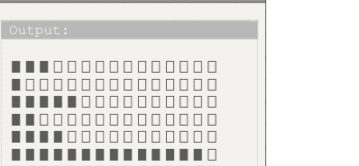
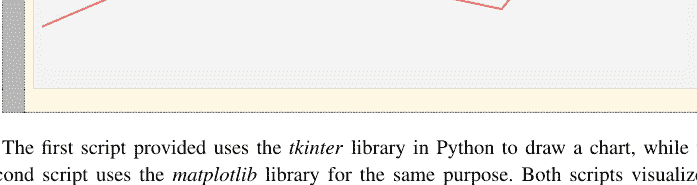
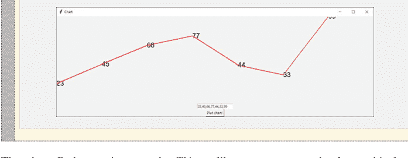

计算机科学综合讲座

保罗·A·加尼乌克

## 从简单到复杂的编程示例

Python™ 应用

本系列丛书出版关于计算机科学通用主题的短篇著作，旨在吸引计算机科学各领域的高年级学生、研究人员和从业者。

保罗·A·加尼乌克

## 从简单到复杂的编程示例

Python™ 应用

保罗·A·加尼乌克
外语工程系，外语工程学院
布加勒斯特国立理工大学
罗马尼亚布加勒斯特

ISSN 1932-1228
ISSN 1932-1686（电子版）
计算机科学综合讲座
ISBN 978-3-031-53811-7
ISBN 978-3-031-53812-4（电子书）
https://doi.org/10.1007/978-3-031-53812-4

© 编者（如适用）和作者，根据与 Springer Nature Switzerland AG 的独家许可协议，2024年

本作品受版权保护。所有权利均由出版商独家许可，无论涉及材料的全部还是部分，特别是翻译、重印、插图重用、朗诵、广播、在微缩胶片或任何其他物理方式上的复制，以及信息存储和检索、电子改编、计算机软件，或通过目前已知或未来开发的类似或不同方法进行的传输。
在本出版物中使用通用描述性名称、注册名称、商标、服务标志等，即使没有具体声明，也不意味着这些名称不受相关保护性法律法规的约束，因此可以自由使用。
出版商、作者和编辑有理由相信，本书中的建议和信息在出版之日是真实和准确的。无论是出版商还是作者或编辑，均不对本文所含材料或可能存在的任何错误或遗漏提供任何明示或暗示的保证。出版商对已出版地图中的管辖权主张和机构隶属关系保持中立。

本 Springer 印记由注册公司 Springer Nature Switzerland AG 出版
注册公司地址为：Gewerbestrasse 11, 6330 Cham, Switzerland

本产品中的纸张可回收利用。

## 前言

保罗·奥雷利安·加尼乌克所著的《从简单到复杂的编程示例——Python™ 应用》一书，是一本非常实用的 Python 编程入门指南，吸引的读者范围广泛，从初涉编程宇宙的初学者到经验丰富的开发者，他们都能从中获得非常丰富的代码示例参考。由于这是本书的主要特点——通过示例进行教学，全书包含超过 200 个示例，每一章都通过练习来阐释关键概念，这些练习都经过了实现、注释和极其详细的解释。

所选用的语言是 Python，它很可能是当今最受欢迎的编程语言之一。虽然大多数教学机构使用 Python 语言来介绍编程语言，但读者将从本书丰富的示例中受益，同时也能接触到更高级的编程技术。

本书结构经过深思熟虑，从变量声明、表达式、控制语句、列表（数组）和函数等传统起点开始，然后继续讲解对象和高级技术。作者专注于命令式编程技术，这更适合初学者，同时也在相应的章节中处理了函数式编程和面向对象编程。示例以逻辑顺序支持各章节，其中一个优点是在展示优化方案之前先展示简化方案，这有助于更深入地理解问题。

本书继续讲解中等难度示例部分，其中展示了更多现实世界的用法，涵盖的主题包括字符串操作、更高级的矩阵运算、排序算法、位运算和编码以及统计学。由于示例仅使用标准库实现，不使用其他库，因此具有很高的教学价值，有助于从业者真正理解概念的内部工作原理。

本书对更高级的开发者或不同领域的研究人员具有吸引力的部分在于复杂示例部分，涵盖了新颖的、最先进的算法，如谱森林或马尔可夫链的复杂应用，作者在该领域是著名的专家。

安德烈·瓦西拉泰亚努
朋友兼副院长
外语工程学院
布加勒斯特国立理工大学
罗马尼亚布加勒斯特

## 序言

Python 因其简洁性、可读性和多功能性而备受推崇，使其成为服务器端（后端）Web 开发、数据分析、人工智能和科学计算的热门选择。本书提供了 Python™ 的全面指南，从基础概念到高级编程技术进行了探索。本作品旨在为从初学者到经验丰富的开发者和科学家的读者提供服务，旨在让他们全面了解 Python 的能力。

## 本书主要特点

**实践学习。** 本书包含超过 200 个实用示例，以加强对 Python 概念和计算机编程原理的理解。

**全面覆盖。** 本书还涵盖了 Python 基础知识，如变量、条件语句、循环、列表、函数和 JSON 处理，为初学者奠定了坚实的基础。

**高级技术。** 读者将探索高级主题，如矩阵运算、递归、面向对象编程等，以提升他们的编程技能。

**实际应用。** 本书展示了 Python 的实际应用，包括数据操作、图形界面和文件操作，展示了 Python 如何应用于各种场景。

**数学实现。** 本书指导如何在 Python 代码中实现数学公式和概念，对科学计算大有裨益。

这本对 Python 的全面探索适用于广泛的学习者和专业人士。它系统地展开了 Python 编程，展示了其在软件工程领域的系统性和严谨性。通过本书的学习之旅，将提高读者在 Python 方面的熟练程度，使他们能够在各种项目和应用中有效地利用该语言。本书是系列丛书的一部分，旨在尽可能地镜像这些示例及其解释。因此，这些示例也可以在其他计算机语言中找到。

罗马尼亚布加勒斯特

保罗·A·加尼乌克

# 目录

- 1 引言 ........................................................................ 1
    - 1.1 Python 的未来 ................................................................ 2
    - 1.2 内容是原生的 .......................................................... 2
- 2 变量 .............................................................................. 5
- 3 条件分支 .......................................................... 13
- 4 循环 ................................................................................ 17
- 5 动态可调整大小的数组（列表） ........................................ 27
- 6 多维数组的遍历 ...................................... 59
- 7 矩阵运算 ................................................................ 71
- 8 函数 ............................................................................ 107
    - 8.1 内置函数/方法 ................................................ 107
    - 8.2 函数的创建 .......................................................... 113
    - 8.3 递归 ........................................................................ 120
- 9 对象 ................................................................................ 127
    - 9.1 构造函数和方法 .................................................. 128
    - 9.2 JSON .............................................................................. 134
- 10 中等难度示例 .............................................................. 141
    - 10.1 从字符串加载数组 .................................................. 141
    - 10.2 一些矩阵运算 .................................................... 149
    - 10.3 逻辑运算 ............................................................ 153
    - 10.4 杂项 .................................................................. 161
    - 10.5 排序 .......................................................................... 167
    - 10.6 排列 .................................................................. 170
    - 10.7 统计 ........................................................................ 172
    - 10.8 有用的转换 .......................................................... 182

# 目录

- 11 复杂示例 ........................................................................ 193
- 12 随机性与编程 ......................................................... 211
- 13 Python 特有内容 ................................................................................ 223
- 参考文献 ........................................................................................... 235

# 引言

Python 是一种高级、解释型的计算机语言，其历史可追溯至 20 世纪 80 年代末 [1]。它由荷兰 *Centrum Wiskunde & Informatica* (CWI) 的 *Guido van Rossum* 构思，作为 ABC 语言的后继者，而 ABC 语言本身是为教学和原型设计而开发的。*Van Rossum* 于 1989 年圣诞节假期开始实现 Python，目标是创建一种强调代码可读性和简洁性的语言 [2]。1991 年发布的 Python 0.9.0 版本引入了几个至今仍是 Python 核心的特性，包括支持继承的类、异常处理和函数。Python 的名字灵感来源于英国喜剧团体 *Monty Python*，这反映了 *Van Rossum* 让编程变得有趣且易于上手的目标。在整个 20 世纪 90 年代，Python 脚本语言持续发展，多位贡献者为其开发添砖加瓦。1994 年发布的 Python 1.0 包含了函数式编程工具，如 lambda、map、filter 和 reduce。2000 年发布的 Python 2.0 标志着一个重要的里程碑，引入了列表推导式和能够回收引用循环的垃圾收集系统。它还巩固了社区主导的开发模式，形成了 *Python Enhancement Proposals* (PEPs)，这是一种用于提议重大新特性的机制。2008 年发布的 Python 3.0 是一个主要的、不向后兼容的版本，由于与 Python 2.x 不兼容，最初并未被广泛采用。然而，它引入了多项语言改进，包括更一致和简洁的语法、更好的 Unicode 支持以及对标准库的更改。随着时间的推移，Python 3 逐渐获得关注，尤其是在 Python 社区从 Python 2 过渡之后，Python 2 的最终版本 2.7 于 2010 年发布。如今，Python 已成为最受欢迎的计算机编程语言之一，广泛应用于 Web 开发、数据分析、人工智能、科学计算等领域 [3]。其受欢迎程度归功于其可读性、易学性以及庞大的库生态系统 [4, 5]。

## 1.1 Python 的未来

Python 的发展轨迹在各个技术领域似乎越来越具有影响力和不可或缺性 [6, 7]。它在数据科学、机器学习和人工智能等新兴领域的日益普及，使其成为未来创新的关键工具 [8, 9]。该语言的简洁性和可读性使其成为编程初学者的理想入门语言，这表明其在教育领域的作用将继续扩大 [10]。此外，庞大而活跃的社区是一项重要资产，推动着语言的演进以应对新的挑战和需求。Python 未来的增强可能将集中在性能优化和并发性方面，这是与 Java 和 C++ 等语言相比它受到批评的领域。诸如旨在提高 Python 执行速度的 PyPy 项目，以及异步编程能力的持续改进等努力，都是应对这些挑战的步骤。随着硬件能力的提升，Python 与低级语言交互并利用这些资源的能力将至关重要。另一个关注点将是 Python 丰富的库和框架生态系统的持续发展，这些库和框架在其广泛采用中起着关键作用。诸如 NumPy、pandas、TensorFlow 和 PyTorch 等库是 Python 在科学计算和机器学习领域占据主导地位的核心，它们的持续发展将进一步巩固这一地位 [11–15]。Python 在 Web 开发中的作用，虽然不如 JavaScript 等语言突出，但随着 Django 和 Flask 等简化复杂 Web 应用程序开发过程的框架的出现，其作用也将扩大 [16]。Python 的未来与其适应性、社区的力量以及在快速变化的技术环境中保持相关性的能力密切相关。凭借其简洁和可读性的基础，结合通过其库实现的强大功能，Python 有望在未来多年继续成为编程世界的关键参与者。

## 1.2 内容为原生实现

本书展示了从基础到复杂的原生 Python 实现，面向广大读者，从初学者到博士生，乃至成熟的科学家和工程师。本书第一部分描述了变量、条件分支和循环的使用。变量作为编程语言的基础元素，是第一章的重点。涵盖的主题包括变量声明和初始化、命名约定以及基本 Python 程序的构成。此外，讨论还将涉及赋值、变量类型、基本算术运算及相关主题。同时，详细探讨了条件分支机制，这些机制有助于决策过程，并根据预定义条件执行不同的代码段。重点介绍了各种条件语句，如“if-then”、“if-then-else”和“if-then-elseif-else”。这些构造使得能够操纵程序流程并对不同场景做出响应。接下来，详细探讨了循环的概念，因为它对于迭代执行代码块和提高程序效率至关重要。全面探讨了“While”和“For”循环。感兴趣的主题包括计数控制循环、数组遍历和复杂的数学计算。在本书的第二部分，通过示例描述了更复杂的变量，如数组（或列表）。还涵盖了数组的多维遍历主题，然后展示了一些矩阵运算。数组（在 Python 中称为列表）作为组织和操作数据集合的基本数据结构，在专门的章节中进行了审视。主题涵盖基本数组操作，如元素添加和检索、长度计算和数组遍历。详细讨论了使用各种循环类型进行数组遍历。此外，全面探讨了这些多维数组的遍历和操作。讨论扩展到涵盖二维和三维数组、矩阵运算以及包括转置和旋转在内的变换。此外，通过具体示例展示了矩阵运算在数学和图形环境中的关键作用。涉及的主题包括求和、乘法、对角线提取、转置及相关矩阵运算。在本文的第三部分，从多个角度深入探讨了函数、对象构造函数和方法，并介绍了 JSON 方法作为不同数据格式之间的交换媒介。函数对于代码重用和模块化至关重要，是一章广泛内容的主要焦点。深入探讨了内置函数和用户定义函数。主题涵盖函数创建、参数化和返回值处理。此外，讨论扩展到递归、逻辑运算、排序算法、统计计算以及展示 Python 中函数多样性的各种实际示例。在单独的章节中阐述了对象的概念化和实现、其属性和方法。彻底探讨了对象构造函数、对象实例化以及在对象中包含方法。实际示例强调了 Python 中面向对象编程的原则。同时，JSON（JavaScript 对象表示法）作为一种流行的数据交换格式，是本章的核心主题。本章涉及 Python 对象与 JSON 之间的转换、JSON 数据的操作以及复杂 JSON 结构的处理。在本书的第四部分，读者将遇到中等和复杂的示例，最重要的是，与随机性和编程相关的案例。关于中等和复杂示例的章节是 Python 知识的总结，展示了该语言在解决现实世界问题中的实用性。主题包括统计分析、序列比对和文本处理，提供了对高级编程技术的见解。此外，关于随机性的章节讨论了展示如何对随机过程建模的方法。在本书的最后一部分，讨论重点放在更具语言特异性的 Python 应用上。本章探讨了一些 Python 特性，包括使用内置函数和文件 I/O 机制进行 *base64* 编码和解码。

# 变量

变量可以被概念化为一个符号表示或抽象实体，它承载着信息[1]。这些信息可以采取多种形式，从简单的数值、文本字符串到更复杂的数据结构。变量的核心本质在于其能够改变或变化的能力，这使得它在算法和计算过程中不可或缺[1]。变量是计算机编程的基础，因为它们允许存储和操作数据。每个变量都有一个关联的数据类型，它规定了变量可以存储的信息种类。例如，整数数据类型的变量可以存储整数，而浮点数据类型则可能存储带小数点的数字。当在计算机程序中声明一个变量时，会分配特定的计算机内存部分来存储其值。这种分配确保了当变量的值被调用或修改时，程序确切地知道在内存中何处查找。每个变量都有一个唯一的内存地址，它就像涉及该变量的任何计算操作的参考点。变量还具有诸如作用域（决定变量在程序中的可访问位置）和生命周期（指示变量在内存中保留多长时间）等属性。这些属性的重要性在更高级的编程任务中变得显而易见，例如管理内存或优化代码性能。在科学计算中，变量通常代表物理量或抽象的数学构造。它们动态改变值的能力允许对现实世界系统进行模拟，从建模天体运动到预测天气模式。科学家只需调整这些变量的值，就可以运行多个场景或模拟来分析不同的结果并得出有意义的结论。因此，变量是计算算法和程序的支柱。它们的动态特性，结合它们对数据操作提供的精确控制，使它们成为计算机科学和科学计算领域的基石。因此，下面的示例从让读者熟悉变量概念的基本练习开始。

### 2.1.1 练习 (1) – 在代码中添加注释

```python
# this is a comment in Python
"""
This is a multi-line
comment in Python.
It can span several lines.
"""
```

输出：

在 Python 中，井号“#”字符用于表示单行注释。在同一行中井号“#”之后的所有内容都被视为注释，不会被 Python 引擎执行或解释为代码。相反，它旨在为阅读代码的开发人员提供上下文或解释。此外，多行注释或块注释通常使用三引号创建，可以是三单引号（`'''`）或三双引号（`"""`）。

### 2.1.2 练习 (2) – 变量命名

```python
A = 1
a = 2
a1 = 3
a_1 = 4

print(A)
print(a)
print(a1)
print(a_1)
```

输出：
1
2
3
4

这段代码初始化了四个具有不同名称和值的变量。变量 *A* 被赋值为 1，而变量 *a* 被赋值为 2。类似地，*a1* 被赋值为 3，*a_1* 被赋值为 4。在这些赋值之后，使用 *print* 函数按顺序打印出这些变量的值。首先打印 *A* 的值，然后是 *a*、*a1*，最后是 *a_1*。值得注意的是，Python 区分大小写，因此变量 *A* 与变量 *a* 是不同的。

### 2.1.3 练习 (3) – 编写你的第一个 Python 程序

```python
a = 3
b = 5
c = a + b
print(c)
```

上面的 Python 代码将变量 *a* 初始化为值 3，将变量 *b* 初始化为值 5。然后，它计算这两个变量的和，并将结果赋给第三个名为 *c* 的变量。接下来，使用名为 *print* 的函数将 *c* 的值打印到控制台或显示出来。这段代码的输出是 8。

### 2.1.4 练习 (4) – “a = b” 的含义

```python
a = 3
b = a
print(b)
```

这段 Python 代码首先将值 3 赋给变量 *a*。随后，将 *a* 的值（即 3）赋给另一个名为 *b* 的变量。接下来，*print(b)* 语句输出 *b* 的值，将显示 3。因此，这段源代码指出了值从一个变量传递（重新赋值）到另一个变量的过程。

### 2.1.5 练习 (5) – 赋值和类型改变的重新赋值

```python
# In Python, one simply assigns a
# value to a variable to declare it.

# Assigns a string 'text'
# to variable a.
a = 'text';

# a = 0; # For sport, one can
# uncomment this line (a = 0;)
# to reassign a to a numeric value.

# Assigns a string 'text'
# to variable b.
b = 'text';
b = 0 # Reassigns b to a numeric value.
```

在 Python 中，没有用于声明变量的特殊关键字，变量的类型由赋给它的值自动确定。因此，Python 是动态类型的，用户可以随时更改变量的值和类型。这个很好的特性现在存在于许多计算机语言中，也许是现代计算机编程中最有用的补充之一，因为它允许软件开发人员专注于方法而不是语法。因此，与过去不同，当用户通过简单地赋一个不同类型的值来改变变量的类型时，Python 不会引发任何错误。

### 2.1.6 练习 (6) – 基本数学运算

```python
a = 3
b = 2
c = a + b / 2 - a * b
print(c)
```

输出：
-2

上面的 Python 代码首先将值 3 赋给变量 *a*，将值 2 赋给变量 *b*。接下来，它使用这两个变量执行一系列算术运算。具体来说，它将 *b* 除以 2，然后将结果加到 *a* 上，并从该和中减去 *a* 乘以 *b* 的乘积。这些计算的最终结果被赋给变量 *c*。最后，将 *c* 的值打印到控制台。

### 2.1.7 练习 (7) – *取模* 运算符的含义

```python
a = 3
a = a % 2
print(a)
```

输出：
1

代码首先将值 3 赋给变量 *a*。接下来，它通过将 *a* 设置为 *a* 除以 2 的余数来修改 *a* 的值，这是使用取模（%）运算符完成的。取模运算确定 *a* 除以 2 的余数。因此，3 除以 2 得到商 1 和余数 1。因此，在取模运算之后，*a* 的值变为 1。接下来，它使用 *print(a)* 语句将 *a* 的值显示到控制台窗口。

### 2.1.8 练习 (8) – “a = a + 1” 的含义

```python
a = 2
a = a + 1
print(a)
```

输出：
3

给定的 Python 代码首先将值 2 赋给变量 *a*。然后，它将 *a* 的值增加 1。接下来，它打印 *a* 的值，此时将是 3。因此，输出在控制台窗口中显示值 3。

### 2.1.9 练习 (9) – 复合赋值

```python
a = 2
a += 1
print(a)
```

输出：
3

给定的 Python 代码首先将值 2 赋给变量 *a*。然后，它使用“+=”运算符将 *a* 的值增加 1，这是 *a = a + 1* 的简写。执行这些操作后，*a* 的值变为 3。接下来，代码通过使用 *print(a)* 语句将 *a* 的值打印到控制台窗口。

### 2.1.10 练习 (10) – 加法运算符

```python
a = 2;
a = a + a;
print(a);
```

输出：
4

给定的 Python 代码首先将值 2 赋给变量 *a*。然后，它使用“+”运算符将 *a* 的值增加 *a*。也就是说，*a* 的未来值是 *a* 的当前值加上 *a* 的当前值，这是 *a = a + a* 的简写。执行这些操作后，*a* 的值变为 4。接下来，它使用 *print(a)* 语句打印 *a*。

## 2.1.11 示例 (11) – 减法运算符

```python
a = 2
a = a - a
a = a - 1
print(a)
```

输出：
-1

这段代码与前一个示例互补，它首先将值 2 赋给变量 *a*。接着，它使用“–”运算符减少 *a* 的值。也就是说，*a* 的未来值将是 *a* 的当前值减去 *a* 的当前值，简写为 *a = a – a*。在下一行，为了代码的多样性，变量 *a* 的值进一步减少了 1。然后，*print(a)* 语句显示 *a* 的值，即 –1。

## 2.1.12 示例 (12) – 变量操作场

```python
a = 2
a += a - 1
a += a - 1
print(a)
```

输出：
5

上述代码对变量 *a* 执行了一系列操作。最初，*a* 被赋值为 2。然后代码对 *a* 执行了一系列操作。首先，*a* 增加了 *a – 1*。由于此时 *a* 是 2，*a – 1* 等于 1，因此 *a* 变为 2 + 1，即 3。下一行重复了类似的操作：*a* 再次增加 *a – 1*。现在 *a* 是 3，所以 *a – 1* 等于 2，因此 *a* 变为 3 + 2，即 5。接着，*print(a)* 语句输出 *a* 的值，即 5。因此，这段简单的代码片段演示了如何在 Python 中修改和更新变量，反映了变量赋值和算术运算的动态特性。

## 2.1.13 示例 (13) – 交换值

```python
a = 3
b = 7
t = 0

t = a
a = b
b = t

print('a =', a)
print('b =', b)
```

输出：
a = 7
b = 3

给定的代码初始化了三个变量：$a$、$b$ 和 $t$，分别赋值为 3、7 和 0。代码的目的是在不使用任何直接算术运算或额外变量的情况下交换 $a$ 和 $b$ 的值。为此，首先将 $a$ 的值存储在临时变量 $t$ 中。然后，将 $b$ 的值赋给 $a$，从而覆盖了 $a$ 的原始值。最后，将存储在 $t$ 中的值（即 $a$ 的原始值）赋给 $b$，完成交换。交换操作后，两个 *print* 语句显示了 $a$ 和 $b$ 的更新值，表明它们的值确实已经交换。因此，代码执行后，输出将是“a = 7”和“b = 3”。

## 2.1.14 示例 (14) – 清空变量

```python
a = 3
b = a + 7
a = None
print(a)
print(b)
```

输出：
None
10

上述 Python 代码初始化了一个变量 $a$，值为 3。然后，它初始化了另一个变量 $b$，并将其赋值为 $a$ 加上 7 的结果，使 $b$ 的值等于 10。之后，$a$ 的值被设置为 *None*。接着，代码打印 $a$ 的值，即 *None*，然后打印 $b$ 的值，仍然是 10。

## 2.1.15 示例 (15) – 行续接

```python
s = (1 + 2 + 3 +
    4 + 5 + 6 + 7 + 8)
print(s)
```

输出：
36

给定的代码执行一个算术运算，将多个数字相加。它首先将数字 1、2 和 3 相加。然后在下一行继续将数字 4 到 8 相加。计算出总和并存储在变量 $s$ 中后，使用 *print(s)* 语句将结果打印到控制台窗口。

## 2.1.16 示例 (16) – 格式化输出

```python
a = 3
b = 7
c = 10
r = "a = " + str(a) + " and b = " + str(b)
t = " is a number.\n"
l = str((a + b / c)) + t
print(l + r)
```

输出：
3.7 is a number.
a = 3 and b = 7

在这段代码片段中，声明并操作了几个变量。首先，声明了变量 *a*、*b* 和 *c*，并分别初始化为数值 3、7 和 10。接着，创建了一个字符串变量 *r*，并将其赋值为将字符串“a =”与 *a* 的值连接，然后“and b =”与 *b* 的值连接。这将创建一个描述变量 *a* 和 *b* 值的字符串。另一个字符串变量 *t* 被初始化为字符串“is a number.\n”，其中“\n”是换行符的转义字符。然后创建了变量 *l*，它存储了将 *a* 加上 *b* 除以 *c* 的算术运算结果。这个结果随后与存储在 *t* 中的字符串连接。接下来，调用 *print* 函数来显示 *l* 和 *r* 的组合值。

# 条件分支

条件分支，在源代码中通常被称为决策，是计算机科学和算法设计中的一个基本概念，它使系统能够根据指定的布尔条件是真还是假来执行不同的计算 [1]。其核心是，条件分支模拟了人类在决策过程中自然运用的逻辑推理。例如，如果下雨，人们可能会选择带伞。同样，在代码中，这样的决策使用 if-else 语句等结构来表示。在结构化编程语言中，这些分支通常封装在 if、else if 和 else 结构中。例如，一个判断数字是正数、负数还是零的算法可能会使用条件分支来评估该数字并返回适当的响应。此外，条件分支超越了简单的二元选择。许多编程语言中存在的 switch-case 结构允许按顺序评估多个条件，从而在众多潜在路径中做出决策。然而，在 Python 中不存在 switch 的概念，但可以模拟它。从计算效率的角度来看，条件分支引入了非线性代码执行的概念。程序不是线性地执行一系列指令，而是可能根据条件的结果跳过大段代码。这允许更高效的代码执行，但也引入了确保每个分支都导致有效且预期的程序状态的复杂性。然而，在现代架构中，由于 CPU 中流水线和分支预测的机制，过多的分支可能对性能有害。一个错误预测的分支可能导致 CPU 流水线停顿，从而浪费时钟周期。因此，虽然条件分支是一个非常强大的工具，但理解其对底层硬件的影响对于性能关键型应用至关重要。因此，决策在软件设计中是不可或缺的，它能够基于不断变化的条件进行动态决策。其有效使用，结合对其对计算效率影响的理解，对于软件开发仍然至关重要。

## 3.1.1 示例 (17) – *If then else* – 条件语句 (I)

```python
a = 4
b = 7
if a < b:
    print(a)
else:
    print(b)
```

输出：
4

这段 Python 代码定义了两个变量，*a* 的值为 4，*b* 的值为 7。然后它使用 *if-else* 语句检查 *a* 的值是否小于 *b* 的值。如果条件为真，即 *a* 确实小于 *b*，它将把 *a* 的值打印到控制台窗口。如果条件为假，它将打印 *b* 的值。在这种情况下，由于 4 小于 7，它将打印 *a* 的值，即 4。

## 3.1.2 示例 (18) – *If then else* – 条件语句 (II)

```python
a = 2
b = 3
c = 1

if a < b:
    c = 0

print(c)
```

输出：
0

这段 Python 代码初始化了三个变量：*a* 被赋值为 2，*b* 被赋值为 3，*c* 被赋值为 1。然后它检查 *a* 的值是否小于 *b* 的值。如果这个条件为真（在这种情况下确实为真，因为 2 小于 3），*c* 的值将被更新为 0。然后打印 *c* 的值。根据给定的初始值和条件，输出将是 0。

## 3.1.3 示例 (19) – *If then else* - 条件语句 (III)

```python
a = 1
b = 2
c = 3

if a < b:
    c += 1
else:
    c -= 1

print("c=" + str(c))
```

输出：
c=4

上述给定的 Python 源代码初始化了三个变量：*a* 被赋值为 1，*b* 被赋值为 2，*c* 被赋值为 3。然后，有一个 *if-else* 条件语句，检查 *a* 的值是否小于 *b* 的值。如果这个条件为真，*c* 的值将增加 1。如果条件不为真（即 *a* 不小于 *b*），*c* 的值将减少 1。评估完这个条件语句后，代码将带有前缀“c=”的 *c* 的值打印到控制台。在 *if-else* 语句之后，*c* 的值将是 4，因为条件 *a < b*（1 小于 2）为真。注意，*c* 的内容通过内置函数 *str* 转换为字符串。

## 3.1.4 示例 (20) – *If then elif else* - 条件语句

```python
a = 1
b = 2
c = 3

if a < b:
    c -= 1
elif b == c:
    c += 1
else:
    c = 0

print("c=" + str(c))
```

输出：
c=2

上述 Python 代码初始化了三个变量：*a* 的值为 1，*b* 的值为 2，*c* 的值为 3。然后代码包含一个条件结构，根据特定条件操作 *c* 的值。如果 *a* 的值小于 *b*，则从 *c* 的当前值中减去 1。如果该条件不满足，但 *b* 的值等于 *c* 的值，则将 1 加到 *c* 的当前值。如果这两个条件都不满足，则将 *c* 的值设置为 0。评估完这些条件后，代码打印字符串“c=”后跟 *c* 的当前值。

## 3.1.5 示例 (21) – 模拟 Switch 语句

```python
a = 1
b = 0

if a == 0:
    b = 11
elif a == 1:
    b = 64
elif a == 2:
    b = 33

print(b)
```

输出：
64

在 Python 中，没有直接等同于 JavaScript 等语言中的 *switch* 语句。相反，可以使用 *if-elif-else* 结构来实现类似的功能。这段 Python 源代码首先声明了两个变量 *a* 和 *b*，并分别将它们赋值为 1 和 0。然后，使用一个 switch 语句来评估 *a* 的值。如果 *a* 是 0，则将值 11 赋给 *b*。如果 *a* 是 1，则将值 64 赋给 *b*。如果 *a* 是 2，则将值 33 赋给 *b*。最后，打印出 *b* 的值。由于 *a* 的初始值是 1，因此打印出的 *b* 值将是 64。

# 循环

对于命令式计算机编程语言，循环占据着至关重要的地位 [1]。它们是促进一组指令重复执行的基本结构，能够实现高效的自动化和重复性任务处理。从概念上讲，循环是一种机制，通过它一个过程可以被反复执行，直到满足特定条件或一组条件。这种循环执行方式允许高效处理具有重复性质的任务。循环有几种类型，主要根据其控制机制来区分：(a) For 循环，通常在迭代次数预先已知时使用。该循环包含一个初始化器、一个条件和一个迭代器。它从初始化开始，检查条件，执行后，迭代器修改循环变量，从而进行下一次迭代或退出。(b) While 循环，主要用于迭代次数未预先确定的情况，while 循环在每次迭代前检查条件。如果条件评估为真，则执行循环体。循环内的每次迭代通常被称为一个“周期”。在每个周期中，计算指令会被重新评估，通常使用改变的变量，从而在每次迭代中产生不同的结果。确保循环有一个明确的终止点或一个将被满足的条件至关重要，以防止无限循环，这可能导致系统挂起或过度消耗计算资源。循环是计算机编程中的基础构造，它们通过基于条件的重复执行来利用计算能力。这里展示了一些基本示例，以便读者熟悉这些结构。

## 4.1.1 示例 (22) – While 循环

```python
i = 0

while i < 5:
    print("i =", i)
    i += 1
```

```
输出：
i = 0
i = 1
i = 2
i = 3
i = 4
```

该代码将一个名为 *i* 的变量初始化为 0。然后，开始一个 while 循环，只要条件 *i < 5* 成立，它就会持续执行其循环体。在循环内部，调用了一个 *print* 函数，以“i = [i 的值]”的格式显示 *i* 的当前值。打印值之后，使用 *i += 1* 语句将 *i* 的值增加 1。因此，循环将打印出从 0 到 4 的 *i* 值。一旦 *i* 达到 5，条件 *i < 5* 将不再为真，循环将终止。

## 4.1.2 示例 (23) – Do while

```python
i = 0

while True:
    print("i = " + str(i))
    i += 1
    if i >= 5:
        break
```

```
输出：
i = 0
i = 1
i = 2
i = 3
i = 4
```

这段 Python 代码将一个变量 *i* 初始化为 0。然后，它进入一个特殊的“do-while”循环模拟（因为 Python 没有“do-loop”结构）。在循环内部，调用一个 *print* 函数来显示 *i* 的当前值，该值与字符串“i=”连接。注意，使用了 *str(i)* 函数将 *i* 的数值转换为字符串，以便与另一个字符串连接。接下来，*i* 的值增加 1。只要 *i* 的值小于 5，循环就会继续执行。一旦 *i* 达到 5，循环停止。因此，这段代码的输出将是一系列打印语句，显示“i = 0”、“i = 1”、“i = 2”、“i = 3”和“i = 4”。换句话说，*while true* 循环创建了一个无限循环，只有当循环内的 *if* 条件失败（*i < 5*）并执行 break 时才会退出。请注意，这段 Python 代码模拟了 *do-while* 循环的行为，其中循环体保证至少执行一次。

## 4.1.3 示例 (24) – 简单的 for 循环

```python
for i in range(5):
    print(i)
```

输出：
0 1 2 3 4

上面的代码是一个 for 循环，它将变量 i 初始化为 0。然后检查 i 的值是否小于 5。如果条件为真，则执行循环内的代码。在循环内部，有一个对 print(i) 的函数调用，它将显示 i 的值。执行循环体后，i 增加 1。只要 i 小于 5，循环就会继续执行。因此，数字 0 到 4 将依次传递给 print 函数。

## 4.1.4 示例 (25) – 通过从上限减去来倒序

```python
for i in range(5):
    print(5 - i)
```

输出：
5 4 3 2 1

给定的代码使用一个循环，其中变量 i 设置为 0。只要 i 的值小于 5，循环就会继续运行。在循环的每次迭代中，i 的值增加 1。在循环内部，有一个对 print() 的函数调用，它接受表达式 5-i 作为其参数。这意味着对于循环的每次迭代，该函数将打印一个从 5（当 i 为 0 时）开始，并在每次后续迭代中递减 1 的值。因此，打印的数字序列将是 5、4、3、2，最后是 1。

## 4.1.5 示例 (26) – 反向 for 循环

```python
for i in range(10, 5, -1):
    print(i)
```

输出：
10 9 8 7 6

给定的 Python 代码初始化一个 for 循环，其中变量 i 设置为 10。只要 i 的值大于 5，循环就会继续执行。在循环的每次迭代中，i 的值减少 1。在循环体内，有一个 print(i) 语句，它理想情况下会打印 i 的当前值。

## 4.1.6 示例 (27) – 前后的含义

```python
i = 10
while i > 5:
    i -= 1
    print(i)
    i -= 1
```

```
输出：
9 7 5
```

上面的 Python 代码使用一个 *while 循环*来展示在打印变量内容之前和之后对变量进行操作的结果。循环从 *i* 为 10 开始，在每次迭代中，*i* 被递减两次：一次在 *print* 语句之前，一次在循环体末尾。只要 *i* 大于 5，循环就会继续。

## 4.1.7 示例 (28) – 通过从上限变量减去来倒序

```python
a = 5

for i in range(a):
    print(a - i)
```

```
输出：
5 4 3 2 1
```

提供的 Python 代码将变量 a 初始化为 5。然后使用一个 *for 循环*从 0 迭代到（但不包括）*a* 的值（即 5）。在循环的每次迭代中，它调用一个名为 *print* 的函数，参数为 *a-i*。这意味着每次迭代时，它将打印从 *a* 中减去当前循环索引 *i* 的结果。在这个特定情况下，将打印的数字序列是 5、4、3、2 和 1。

## 4.1.8 示例 (29) – *For 循环*求和

```python
a = 0

for i in range(1, 6):
    a = a + (i + 4 * 3)

print(a)
```

```
输出：
75
```

上面的代码将变量 *a* 初始化为 0。初始化之后，有一个 *for 循环*运行 5 次（记住在 Python 中，上限是不包含的）。在循环的每次迭代中，*i* 的值（从 1 开始，每次增加 1）被加到 4 乘以 3 的乘积上。这个加法的结果然后被加到 *a* 的当前值上。本质上，在每次循环迭代中，12（即 4 乘以 3）被加到 *i* 的值上，然后将总和加到 *a* 上。循环完成其 5 次迭代后，调用 *print* 函数来显示 *a* 的最终值。这里的 *print* 函数将 *a* 的最终值输出到控制台。

## 4.1.9 示例 (30) – 简单计数器求和

```python
a = 0

for i in range(11):
    a = a + i

print(a)
```

输出：
55

给定的Python代码初始化了一个名为*a*的变量，其值为0。然后，有一个*for循环*，它迭代11次，从值0开始，直到但不包括值11。在循环的每次迭代中，*i*的值（即循环计数器）被加到*a*的当前值上。因此，*a*累积了从0到10的整数之和。循环执行完毕后，*a*的值（即从0到10的整数之和）被打印出来。

## 4.1.10 示例 (31) – 在*n×n*循环中求所有加1结果的和

```python
r = 0
for i in range(10):
    for j in range(10):
        r += 1

print(r)
```

输出：
100

Python代码初始化一个变量*r*，值为0。然后设置了一个嵌套循环结构：外层循环使用变量*i*从0运行到但不包括10，对于外层循环的每次迭代，内层循环使用变量*j*也从0运行到但不包括10。在内层循环的每次迭代中，*r*的值增加1。因此，内层循环总共运行了100次（外层循环的10次迭代，每次迭代内层循环运行10次）。因此，在嵌套循环结束时，*r*的值将是100。循环完成后，代码打印*r*的值，将显示数字100。

## 4.1.11 示例 (32) – 在*n×n*循环中求所有加3结果的和

```python
r = 0
for i in range(4):
    for j in range(4):
        r += 3

print(r)
```

输出：
48

给定的Python代码初始化一个变量*r*，值为0。然后使用嵌套的for循环，其中外层循环运行4次（循环变量*i*从0到3），内层循环也运行4次（循环变量*j*从0到3）。对于内层循环的每次迭代，*r*的值增加3。由于总共有16次迭代（外层循环的4次乘以内层循环的4次），*r*总共增加了16次3。因此，在这些嵌套循环结束时，*r*的值变为48。接下来，代码使用*print*函数显示*r*的值，将输出数字48。

## 4.1.12 示例 (33) – 求*i*和*j*之间所有乘积结果的和

```python
r = 0
for i in range(10):
    for j in range(10):
        r += j * i

print(r)
```

输出：
2025

Python代码初始化一个变量*r*，值为0。然后有一个嵌套循环，其中外层循环使用变量*i*从0运行到9，内层循环使用变量*j*也从0运行到9（再次提醒，在Python中，上限是不包含的）。对于*i*和*j*的每种组合，计算*i*和*j*的乘积并将其加到*r*的值上。两个循环都完成迭代后，*r*中累积的总数被打印出来。因此，代码计算了指定范围内所有可能的*i*和*j*组合的乘积之和。

## 4.1.13 示例 (34) – 嵌套for循环与计数器变量求和

```python
a = 0
m = 3
n = 5

for j in range(1, m + 1):
    for i in range(1, n + 1):
        a = a + (i + j * 3)

print(a)
```

输出：
135

Python代码初始化三个变量：*a*值为0，*m*值为3，*n*值为5。然后包含一个嵌套循环，其中外层循环在*j*小于或等于*m*时运行（在这种情况下是3次），对于外层循环的每次迭代，内层循环在*i*小于或等于*n*时运行（5次）。在内层循环中，*a*的值增加*i*与*j*的三倍之和。两个循环都执行完毕后，*a*的累积值被打印出来。此代码的目的是根据变量*m*和*n*设定的条件和限制来累积求和。

## 4.1.14 示例 (35) – 嵌套for循环与基于内层计数器的求和

```python
a = 0

# In Python, range
# end is exclusive.

for j in range(1, 4):
    for i in range(1, 6):
        a = a + (i + 1 * 3)

print(a)
```

输出：
90

给定的Python代码初始化一个变量*a*，值为0。然后使用嵌套的for循环结构来迭代并修改*a*的值。由变量*j*控制的外层循环运行三次，因为*j*从1到3（包含）。在这个外层循环内部，有一个由变量*i*控制的内层循环，对于外层循环的每次迭代，它运行五次，因为*i*从1到5（包含）。在内层循环的每次迭代中，*a*的值增加表达式(*i* + 1*3)的结果。此表达式将*i*加到1和3的乘积上。根据算术运算优先级规则，乘法在加法之前执行，因此该表达式等价于(*i* + 3)。根据循环结构，这意味着操作(*i* + 3)总共执行了15次（外层循环的3次乘以内层循环的5次）。接下来，两个循环都完成迭代后，*a*的值被打印出来。

## 4.1.15 示例 (36) – 嵌套for循环 & 基于计数器和上限的求和 (I)

```python
a = 0
m = 3
n = 5

for j in range(1, m + 1):
    for i in range(1, n + 1):
        a = a + (i + j * m)

print(a)
```

输出：
135

给定的Python代码初始化三个变量：*a*值为0，*m*值为3，*n*值为5。然后代码设置了一个嵌套循环结构，外层循环从1运行到*m*的值（包含），内层循环从1运行到*n*的值（包含）。在这个嵌套循环的最内层部分，*a*的值增加*i*的当前值与*j*的当前值和*m*的乘积之和。两个循环都完全执行后，*a*的最终值被打印出来。本质上，此代码基于两个循环计数器执行计算，并将结果累积到变量*a*中。

## 4.1.16 示例 (37) – 嵌套for循环 & 基于计数器和上限的求和 (II)

```python
a = 0
m = 4

for j in range(1, m+1):
    for i in range(1, j+1):
        a = a + (i + j * m)

print(a)
```

输出：
140

给定的Python代码首先初始化两个变量：*a*设置为0，*m*设置为4。之后，有一个嵌套循环结构。外层循环使用变量*j*运行，从1开始到*m*的值（包含），即4。在这个外层循环内部，有一个内层循环使用变量*i*运行，从1开始到外层循环当前*j*的值。在内层循环中，代码通过将*i*与*j*和*m*的乘积相加来计算一个值。这个计算出的值然后被加到*a*的当前值上，有效地在每次内层循环迭代时更新*a*。一旦两个循环都完成了它们的迭代，最终累积的*a*值使用*print()*函数打印出来。

## 4.1.17 示例 (38) – 嵌套for循环 & 基于计数器和上限的求和 (III)

```python
a = 0
m = 5
n = 7

for j in range(1, m + 1):
    for i in range(j, n + 1):
        a += (i + j * m)

print(a)
```

输出：
445

给定的Python代码初始化三个变量*a*、*m*和*n*，值分别为0、5和7。然后代码有一个嵌套循环，其中外层循环使用变量*j*从1迭代到*m*的值（即5）。对于外层循环的每次迭代，内层循环使用变量*i*从当前*j*的值开始到*n*的值（即7）。在内层循环中，*a*的值通过增加*i*与*j*和*m*的乘积之和来更新。两个循环都完成后，*a*的值被打印出来。本质上，此代码根据提供的公式和*m*、*n*的值计算一个求和。

## 4.1.18 示例 (39) – 在每一步显示 *i* 和 *j* 坐标

```python
for i in range(2):
    for j in range(3):
        print(f"i = {i}, j = {j}")
```

```
Output:
i = 0, j = 0
i = 0, j = 1
i = 0, j = 2
i = 1, j = 0
i = 1, j = 1
i = 1, j = 2
```

提供的 Python 代码包含一个嵌套循环。外层循环由变量 *i* 控制，运行两次迭代，*i* 取值 0 和 1（不包括 2）。在这个外层循环的每次迭代内部，都有一个由变量 *j* 控制的内层循环，它运行三次迭代，使 *j* 取值 0、1 和 2。在内层循环的每次迭代中，都会调用 *print* 函数来显示 *i* 和 *j* 的当前值。因此，消息 “i = [i 的值], j = [j 的值]” 将总共打印六次，反映了在指定范围内 *i* 和 *j* 的所有组合。例如，前几条消息将是 “i = 0, j = 0”、“i = 0, j = 1”、“i = 0, j = 2” 等等。

## 4.1.19 示例 (40) – 用一个 *for* 循环模拟两个 *for* 循环

```python
i = j = 0
n1 = 2
n2 = 3
q = n1 * n2

for v in range(q):
    j = v % n2
    if j==0 and v!=0 and i<n1 and v!=q:
        i += 1
    print(f"i = {i}, j = {j}")
```

```
Output:
i = 0, j = 0
i = 0, j = 1
i = 0, j = 2
i = 1, j = 0
i = 1, j = 1
i = 1, j = 2
```

这段 Python 代码片段将三个变量 *i* 和 *j* 初始化为 0，将另外两个变量 *n1* 和 *n2* 分别初始化为 2 和 3。它还计算了 *n1* 和 *n2* 的乘积，并将结果存储在名为 *q* 的变量中。然后，一个 *for 循环* 让 *v* 从 0 迭代到 *q*（不包括 *q*）。在循环内部，*j* 的值被计算为 *v* 除以 *n2* 的余数。一个条件 if 语句检查 *j* 是否为 0，*v* 是否不为 0，*i* 是否小于 *n1*，以及 *v* 是否不等于 *q*。如果所有这些条件都满足，则 *i* 增加 1。在循环的每次迭代之后，都会调用 *print* 函数来输出 *i* 和 *j* 的当前值。这段代码的目的是在 *if* 语句指定的某些条件下，探索当 *v* 从 0 变化到 *q* 时，变量 *i* 和 *j* 的行为。它展示了如何根据循环内的其他变量和条件来增加 *i* 的值。

# 动态可调整大小的数组（列表）

数据结构是实现数据系统化组织和管理的关键构造 [1]。数组是最基本且最普遍使用的数据结构之一。*动态可调整大小的数组* 或 *列表*，可以恰当地描述为一个项目的集合。其显著特点是它提供了对任何索引元素的直接访问，这在特定场景下赋予了它显著的计算优势。C++ 或 Java 等语言中**经典数组**的特征包括同质性，这意味着数组中的所有元素都是相同的数据类型，确保了统一的内存占用。在这些经典计算机语言中，数组本质上是静态的，不同于 Python 和其他现代语言中的动态数据结构。数组中的每个元素都与一个唯一的索引相关联，便于快速访问任何已知索引的元素。数组在计算机科学的各个领域都有应用。它们在 *QuickSort* 和 *MergeSort* 等排序算法中至关重要，通常因其直接访问能力而被采用。数组也是 *堆*、*哈希表* 和 *动态可调整大小的数组* 等复杂数据结构的基础元素。数组的优点包括其检索操作速度快，以及由于连续存储而具有的高效内存分配。然而，它们也有局限性，特别是其固定大小，以及插入和删除操作的成本相对较高，尤其是对于数组中间的元素。但是，从这里开始**我们将把列表称为数组**，因为它们的行为基本相同。换句话说，列表可以容纳不同类型的数据，并且其长度可以改变，而经典数组具有固定的长度并且只包含一种数据类型，但是，从索引到语法，其余部分都是相同的。注意：在我看来，*列表* 这个名称是不恰当的，因为它会让人联想到一维序列。此外，将这些数据结构称为 *列表* 而不是 *数组*，几乎是对前几代科学家和工程师的不尊重。在接下来的示例中，我们将探讨围绕 *动态可调整大小的数组*（在 Python 中也称为 *列表*）的常用方法和技术，提供有关如何访问和操作存储在这些结构中的数据的信息。

### 5.1.1 示例 (41) – 数组相加

```python
# a[i] vector
# a[i][j] = matrix
# a[i][j][x] = tensor
# a[i][j][x][y]...

a = [2, 5, 7]
b = [6, 8]

print(a + b)
```

```
Output:
2,5,76,8
```

提供的代码以一系列注释开始，这些注释用于解释嵌套数组的结构，通常称为向量、矩阵和张量。这些注释建立了一个概念层次结构，说明了数据如何在 Python 数组中组织。变量 *a* 被声明为一个包含三个元素的数组：[2, 5, 7]。在注释中，它被描述为一个向量，暗示一个一维数组。注释 *a[i][j] = matrix* 暗示了这个数组内可能存在两级嵌套，意味着一个类似于矩阵的二维结构。注释 *a[i][j][x] = tensor* 进一步扩展了这个层次结构，表明在这个类似矩阵的结构内部，还有另一级嵌套，使其具有类似于张量的三维结构。注释 *a[i][j][x][y][...]* 暗示了可能存在更深层次的嵌套，形成更高维度的结构。在这些注释之后，声明了两个数组 *a* 和 *b*，它们包含数字元素。接下来，*print(a + b)* 这一行允许连接数组 *a* 和 *b*。

### 5.1.2 示例 (42) – 从数组元素中提取单个值

```python
a = [2, 5, 7]
b = [6, 8]
c = a[1] + b[0]
print(c)
```

```
Output:
11
```

提供的代码片段演示了涉及数组和变量赋值的一系列操作。声明了三个变量：*a*、*b* 和 *c*。变量 *a* 被赋值为数组 [2, 5, 7]，而变量 *b* 被赋值为另一个数组 [6, 8]。这些数组可以存储多个值。关键操作发生在变量 *c* 被赋值时。它通过将数组 *a* 和 *b* 中的两个特定元素相加来计算这个值。简而言之，它取 *a* 的第二个元素（即 5）和 *b* 的第一个元素（即 6）并将它们相加。这个加法的结果 11 被存储在变量 *c* 中。接下来，变量 c 的值在输出中显示。因此，这个 Python 代码片段涉及数组操作和变量赋值，最终将两个数组中的特定元素相加。

### 5.1.3 示例 (43) – 添加元素

```python
A = []
A.append("a")
A.append("b")
A.append("c")

print(A[0] + A[1] + A[2])
```

```
Output:
abc
```

该示例将变量 A 初始化为一个空数组。然后，它继续为其元素赋值。在这种情况下，赋的值是字符串：将 “a” 赋给 A[0]，将 “b” 赋给 A[1]，将 “c” 赋给 A[2]。接下来，它使用 print 函数输出这三个元素的连接。这里的 “ + ” 运算符用于字符串连接，这意味着它将三个字符串 “a”、“b” 和 “c” 组合成一个字符串。因此，当执行此代码时，输出将是 “abc”。

### 5.1.4 示例 (44) – 使用不同数据类型的数组字面量

```python
A = []
B = []

A = ["a", "b", "c"]
B = [1, 2, 3]

print(A[0] + A[1] + A[2])
print(B[0] + B[1] + B[2])
```

```
Output:
abc
6
```

在这个代码片段中，我们处理两个数组 A 和 B。最初，我们将这些数组声明为空。然而，这些空声明后来被新值覆盖。第一个数组 A 被填充了三个字符串元素：“a”、“b” 和 “c”。每个元素都用双引号括起来，并用逗号分隔。第二个数组 B 被填充了三个数字元素：1、2 和 3。这些数字值没有用引号括起来，因为它们被视为整数。初始化这些数组后，代码继续打印每个数组内元素的连接。对于数组 A，其元素 “a”、“b” 和 “c” 的连接结果是字符串 “abc”。这个字符串使用 print 函数打印到控制台。类似地，对于数组 B，其元素 1、2 和 3 的连接结果是数字值 6（1 + 2 + 3）。这个数字值也使用 print 函数打印到控制台。

## 5.1.5 示例 (45) – 访问数组元素

```python
A = ["a", "b", "c"]

x = A[1]
y = A[2]

print(x + y)
```

这段 Python 代码首先定义了一个名为“A”的数组（列表），其中包含三个元素：“a”、“b”和“c”。数组 A 用这些值进行了初始化。接下来，代码声明了两个变量 x 和 y。变量 x 被赋值为数组 A 中的第二个元素，即“b”，因为 Python 数组是从零开始索引的。类似地，变量 y 被赋值为数组 A 中的第三个元素，即“c”。代码使用“ + ”运算符打印 x 和 y 的值连接后的结果。在这种情况下，“x + y”的结果将是“bc”，因为 x 保存的是“b”，y 保存的是“c”。

## 5.1.6 示例 (46) – 更改数组元素中的值 - 交换值或替换

```python
A = ["a", "b", "c"]

x = A[1]

A[0] = "d"
A[1] = A[2]
A[2] = x

print(A[0] + A[1] + A[2])
```

上述代码首先定义了一个名为 A 的数组，包含三个字符串元素：“a”、“b”和“c”。接下来，它初始化一个名为 x 的变量，并将其赋值为数组 A 中索引 1 处的值，即“b”。随后，代码开始修改数组 A 中的元素。它将字符串“d”赋值给索引 0 处的第一个元素，将索引 1 处的第二个元素替换为索引 2 处第三个元素的值，最后将索引 2 处的第三个元素设置为 x 的值，即“b”。在代码的最后一行，使用 print 函数输出数组 A 中索引 0、1 和 2 处元素的连接结果。根据代码中对数组的修改，这次连接的结果将是“dbc”。

## 5.1.7 示例 (47) – 从数组元素中提取单个值

```python
a = [2, 5, 7]
b = [6, 8]

a[1] -= 1
b[0] -= 1

c = a[1] + b[0]

print(c)
```

这段代码首先声明了两个数组 *a* 和 *b*，分别包含元素 [2, 5, 7] 和 [6, 8]。之后，实际代码开始递减数组 *a* 的第二个元素（索引 1）和数组 *b* 的第一个元素（索引 0）。这意味着在这些操作之后，*a* 数组将变为 [2, 4, 7]，而 *b* 数组将变为 [5, 8]。接下来，声明一个新变量 *c*，并将其赋值为数组 *a* 更新后的第二个元素（现在是 4）与数组 *b* 更新后的第一个元素（现在是 5）之和。因此，*c* 将被赋值为 9。总而言之，这段代码修改了两个数组，计算了这些数组中特定元素的和，然后将结果打印到控制台。

## 5.1.8 示例 (48) – 数组长度

```python
a = [5, 6, 8]
b = len(a)

print(b)
```

这里，声明了一个变量 *a* 并初始化为一个包含三个元素的数组：5、6 和 8。这个数组使用方括号 [] 创建，元素之间用逗号分隔。接下来，声明了另一个变量 *b*，并将其赋值为 *len(a)*。这里，*len(a)* 是数组 *a* 的一个属性，表示数组中的元素数量。在这种情况下，由于数组 *a* 中有三个元素，*b* 将被赋值为 3。接下来，*b* 的值被打印在输出中。因此，这段代码片段创建了一个数组 *a*，确定其长度，并将该长度打印到控制台。

## 5.1.9 示例 (49) – 从数组组件中获取值

```python
A = [1, 2, 3]

if A[0] < A[1]:
    A[2] += 1

print("A[2]=" + str(A[2]))
```

这段代码片段首先声明了一个名为 A 的变量，并将其赋值为一个包含三个元素的数组：1、2 和 3。因此，这个数组表示为 [1, 2, 3]。接下来，有一个 if 语句检查一个条件。它评估数组 A 中第一个索引处的值（即 A[0]）是否小于第二个索引处的值（A[1]）。在这种情况下，A[0] 包含 1，A[1] 包含 2，这确实是真的，因为 1 小于 2。当 if 语句中的条件为真时，它会递增数组 A 中第三个索引处的值，即 A[2]。因此，A[2] += 1; 将 A[2] 中的现有值加 1，导致 A[2] 更新为 4。接下来，它显示一条包含 A[2] 更新值的消息。该消息通过将字符串“A[2] = ”与 A[2] 的值（即 4）连接而构建。因此，当执行此代码时，它将在控制台打印“A[2] = 4”。

## 5.1.10 示例 (50) – 使用 while 循环遍历一维数组 (1)

```python
A = ["a", "b", "c", "d", "e", "f", "g"]
i = 0
t = ''

while i < len(A):
    t += "\n i[" + str(i) + "]=" + A[i]
    i += 1

print(t)
```

输出：
```
i[0]=a
i[1]=b
i[2]=c
i[3]=d
i[4]=e
i[5]=f
i[6]=g
```

这段 Python 代码首先初始化一个名为 A 的数组，其中包含元素“a”、“b”、“c”、“d”、“e”、“f”和“g”。随后，代码设置了两个变量 i 和 t，初始时都为空。接下来，i 被初始化为 0，t 是一个空字符串。然后代码进入一个 while 循环，只要 i 的值小于数组 A 的长度，循环就会运行。在循环内部，有一个对变量 t 的赋值操作。该赋值追加一个换行符，后跟一个由 i 的值和数组 A 中相应元素构成的字符串。这创建了一个看起来像“\n i[0] = a”、“\n i[1] = b”等的字符串。赋值之后，i 递增 1。一旦循环遍历完数组 A 中的所有元素，代码就打印 t 的值。本质上，这段代码旨在循环遍历数组 A 的元素，构建包含输出信息的字符串 t，即关于索引 i 和数组中相应元素的信息。

## 5.1.11 示例 (51) – 使用 while 循环遍历一维数组 (II)

```python
A = ["a", "b", "c", "d", "e", "f", "g"]

i = 0
t = ''

while i < len(A):
    t += "\n i[" + str(i) + "]=" + A[len(A)-i-1]
    i += 2

print(t)
```

输出：
```
i[0]=g
i[2]=e
i[4]=c
i[6]=a
```

这段 Python 代码初始化一个名为 A 的数组，包含七个元素：“a”、“b”、“c”、“d”、“e”、“f”和“g”。然后声明了两个变量 i 和 t，并分别将它们的初始值赋为 0 和一个空字符串。代码进入一个 while 循环。在循环内部，有一个字符串连接操作。它追加一个换行符，后跟一个包含当前 i 值和数组 A 中互补元素（即 len(A)−i−1）的字符串。此信息被追加到 t 字符串中。变量 i 在每次循环迭代中递增 2，因此总是跳过下一个元素。只要 i 的值小于数组 A 的长度，循环就继续执行。接下来，代码打印变量 t 的值。总的来说，这段代码通过连接数组 A 中每个元素及其索引的信息来构建字符串 t，然后打印生成的字符串。

## 5.1.12 示例 (52) – 使用 for 循环遍历一维数组

```python
A = ["a", "b", "c", "d", "e"]

t = ""

for i in range(len(A)):
    t += "\n A[" + str(i) + "]=" + A[i]

print(t)
```

输出：
```
A[0]=a
A[1]=b
A[2]=c
A[3]=d
A[4]=e
```

这段代码首先定义了一个名为 A 的常量数组，包含五个元素，即“a”、“b”、“c”、“d”和“e”。接下来，声明了一个空字符串变量 t。然后代码进入一个 for 循环，该循环初始化一个循环计数器 i，从 0 到数组 A 长度减一（在这种情况下是 5）。在循环内部，有一个语句将换行符（“\n”）追加到 t 字符串，后跟文本“A[”与当前 i 值连接，然后是“] = ”和数组 A 中相应索引处的值。换句话说，在循环的每次迭代中，它向 t 字符串追加一行，显示 A 数组中每个元素的索引和值。接下来，循环完成后，使用 print 函数打印 t 字符串。这段代码处理 A 数组中的元素，创建一个包含其索引和值的格式化字符串，然后打印该字符串。

## 5.1.13 示例 (53) – *for a in b*

```python
a = ["x", "y", 2]

for b in range(len(a)):
    print(a[b])
```

输出：
```
x
y
2
```

上述代码片段演示了创建一个变量 *a* 并使用 *for...in 循环* 遍历其元素。变量 *a* 被赋值为一个包含三个元素的数组：字符串 *x* 和 *y*，以及数字 2。随后，使用 *for...in 循环* 遍历此数组的元素。在循环内部，*print(a[b])* 语句显示数组的每个元素。因此，代码的主要目的是展示用于遍历数组元素的 *for...in 循环*。

## 5.1.14 示例 (54) – 使用 *for 循环* 打印数组中的所有整数

```python
a = [5, 6, 8]

for j in range(len(a)):
    print(a[j])
```

输出：
```
5
6
8
```

此示例初始化一个名为 *a* 的数组，包含三个数值：5、6 和 8。然后使用 *for 循环* 遍历此数组的元素。*for 循环* 配置为从索引变量 *j* 设置为 0 开始，这对应于数组中的第一个元素。只要 *j* 小于或等于数组长度减 1（即 *len(a)*），循环就继续。此条件确保循环遍历数组中的所有元素。在循环内部，有一个 *print* 语句。此语句输出数组 *a* 中当前索引 *j* 处的值。循环将为数组中的每个元素运行，从 5 开始，然后是 6，最后是 8。因此，这段代码片段是一个基本示例，展示了如何在 Python 中使用 *for 循环* 遍历数组并将每个元素的值打印到控制台。执行时，它将在控制台窗口中显示值 5、6 和 8，每个值占一行。

## 5.1.15 示例 (55) – 数组求和

```
a = [5, 6, 8]
b = 0

for j in range(len(a)):
    b = b + a[j]

print(b)
```

输出：
19

这段代码片段首先定义了两个变量。第一个变量 *a* 是一个包含三个数值 5、6 和 8 的数组。第二个变量 *b* 被初始化为 0。然后代码进入一个 *for 循环*，这是一种用于遍历数组元素的控制结构。在这个循环中，变量 *j* 被初始化为 0，只要 *j* 小于或等于数组 *a* 的长度减 1，循环就会继续。循环遍历 *a* 数组的每个元素。在循环内部，有一个赋值语句，它递增 *b* 变量的值。它将 *a* 数组中由 *j* 索引的当前元素加到 *b* 变量上。这实际上在 *b* 变量中累积了 *a* 数组所有元素的总和。接下来，代码调用函数 *print*，参数为 *b*。代码计算 *a* 数组元素的总和，并将结果打印到控制台。

## 5.1.16 示例 (56) – 标量与一维数组的乘法

```
a = [5, 6, 8]

for j in range(len(a)):
    a[j] = 2 * a[j]

print(a)
```

输出：
10,12,16

这段代码片段初始化了一个变量 *a*，然后对其执行循环操作。变量 *a* 是一个包含元素 5、6 和 8 的数组。接下来，一个 *for 循环* 遍历数组 *a* 的元素。循环从一个索引变量 *j* 设置为 0 开始，并持续到 *j* 小于或等于数组 *a* 的长度减 1（即 *len(a)*）。在循环的每次迭代中，数组 *a* 中第 *j* 个索引处的值被加倍（乘以 2），然后赋值回数组中的同一位置。循环完成后，变量数组 *a* 的值显示在控制台窗口中。

## 5.1.17 示例 (57) – 向数组插入值

```
a = []

# In Python, the range end
# is exclusive, so we use
# 11 to include 10.

for j in range(11):
    a.append(j)

print(a)
```

```
输出：
0,1,2,3,4,5,6,7,8,9,10
```

上述代码使用变量声明“*a = []*”初始化了一个空数组 *a*。这个数组将用于存储一系列值。接下来，有一个 *for 循环*，它从 0 迭代到 10（包含 10），变量 *j* 从 0 开始，在每次迭代中递增 1。在循环内部，代码将 *j* 的值赋给数组 *a* 中对应的索引。这意味着在循环的每次迭代中，*j* 的值被作为一个新元素添加到 *a* 数组中。接下来，数组 *a* 的内容被打印到输出。请注意，在 Python 中，range 的结束值是排他的，因此我们使用 11 来包含 10。

## 5.1.18 示例 (58) – 向数组插入升序和降序整数值

```
a = []
b = []

# range(11) to include 10,
# since range in Python is
# upper-bound exclusive.

for j in range(11):
    a.append(j)
    b.append(10 - j)

print("a =", a)
print("b =", b)
```

```
输出：
a = 0,1,2,3,4,5,6,7,8,9,10
b = 10,9,8,7,6,5,4,3,2,1,0
```

这段代码初始化了两个数组 *a* 和 *b*，将它们设为空数组。然后进入一个 *for 循环*，从 0 迭代到 10（包含 10）。在循环的每次迭代中，它根据循环索引 *j* 为数组 *a* 和 *b* 赋值。具体来说，在循环内部，代码将 *a[j]*（*a.append* 在每次迭代中添加一个元素，这就是为什么新元素的索引与 *j* 重合）设置为 *j* 的当前值，对应于从 0 到 10 的数字。同时，它将 *b[j]* 设置为 10 - *j* 的值，实际上是从 10 倒数到 0。这些赋值在循环的每次迭代中持续进行。循环执行完成后，它打印数组 *a* 和 *b* 的内容。

## 5.1.19 示例 (59) – 正向与反向值相加并减去最大值

```
a = []
b = []
c = []

# In Python, range(11)
# generates numbers from
# 0 to 10 inclusive.

for j in range(11):
    a.append(j)
    b.append(10 - j)
    c.append(a[j] + b[j] - 10)

print("a =", a)
print("b =", b)
print("c =", c)
```

这段代码初始化了三个数组 *a*、*b* 和 *c*，然后使用 *for 循环* 填充它们。一开始，声明了三个空数组 *a*、*b* 和 *c* 来存储整数值。*for 循环* 从 *j* 等于 0 运行到 10。在循环的每次迭代中，*j* 的值被用作索引来填充数组 *a* 和 *b*。具体来说，*a[j]* 被赋值为 *j* 的当前值，*b[j]* 被赋值为 10-*j*。随后，数组 *c* 根据 *a* 和 *b* 的值进行填充。对于每个索引 *j*，*c[j]* 被计算为 *a[j]*、*b[j]* 和 −10 的总和。接下来，代码打印数组 *a*、*b* 和 *c* 的值，将它们的内容作为字符串连同各自的名称一起显示。

## 5.1.20 示例 (60) – 无意义的平衡

```
a = []
l = 10

for j in range(l + 1):
    a.append(j + (l - j))

print(a)

# or a second version:

l = 10

# Initialize a list
# of length l+1.

a = [None] * (l + 1)

for j in range(l + 1):
    a[j] = j + (l - j)

print(a)
```

```
输出：

a = 10,10,10,10,10,10,10,10,10,10,10
```

在这段代码片段中，一个程序初始化了一个名为 *a* 的空数组和一个值为 10 的变量 *l*。这段代码的目的是使用 *for 循环*，根据迭代变量 *j* 为数组 *a* 填充值。*for 循环* 从 *j* 等于 0 运行到 *l*（包含 *l*，即 *l + 1*）。在循环的每次迭代中，一个表达式被求值并赋值给数组 *a* 的 *j* 索引。被赋值的表达式由两部分组成：(1) 变量 *j*：这代表迭代变量 *j* 的当前值，以及 (2) (*l–j*)，代表从 *l* 中减去 *j* 的结果。这两部分相加，结果存储在数组 *a* 的索引 *j* 处。本质上，它计算从 0 到 *l* 的每个 *j* 的 *j* 和 (*l–j*) 的总和，并将这些值存储在数组的连续元素中。因此，循环执行完成后，数组 *a* 将包含这样的值：索引 *j* 处的每个元素都持有 *j* 和 (*l–j*) 的总和。结果数组将是 *a* = [10, 10, 10, 10, 10, 10, 10, 10, 10, 10, 10]。在这种情况下，数组 *a* 的所有元素都被赋值为 10，因为每次迭代都计算 *j* + (*l–j*)，并且由于 *l* 固定为 10，总和在所有迭代中保持不变。另请注意第二个版本，它使用计数器变量 *j* 直接导航预先计算的列表维度（即 [None] * (*l + 1*)）。

## 5.1.21 示例 (61) – 数组中的最大值

```
a = [2, 3, 4, 5, 9, 8, 3]
l = len(a)

max_val = 0

for k in range(l):
    if a[k] > max_val:
        max_val = a[k]

print(max_val)
```

输出：
9

此示例初始化了一个数组 *a*，包含一系列数值 [2, 3, 4, 5, 9, 8, 3]。然后计算该数组的长度并将其存储在变量 *l* 中。此外，它将变量 *max_val* 初始化为初始值 0。接下来，有一个 *for 循环* 遍历数组 *a* 的元素。循环由一个变量 *k* 控制，*k* 从 0 开始，持续到达到 *l* 的值，即数组的长度。在循环的每次迭代中，有一个 if 语句检查当前元素 *a[k]* 是否大于当前最大值 *max_val*。如果 *a[k]* 确实更大，它会用 *a[k]* 的值更新 *max_val* 变量，从而有效地跟踪数组中遇到的最大值。循环完成后，它将最大值 *max_val* 打印到控制台窗口。本质上，这段代码查找并打印数组 *a* 中存在的最大值。

## 5.1.22 示例 (62) – 数组中的最小值

```
a = [3, 3, 4, 2, 9, 8, 3]
l = len(a)

min_val = a[0]

for k in range(0, l):
    if a[k] < min_val:
        min_val = a[k]

print(min_val)
```

输出：
2

在上面的代码中，有一个数组 *a* 被初始化为一些值，即 [3, 3, 4, 2, 9, 8, 3]。变量 *l* 被赋值为数组 *a* 的长度，这有助于确定遍历数组元素的循环范围。接下来，是变量 *min_val* 的声明，它最初被赋值为数组 *a* 的第一个元素的值，在本例中为 3。这个变量将用于存储在数组中找到的最小值。然后代码进入一个 *for 循环*，变量 *k* 从 0 开始迭代，直到 *k* 比 *l* 小 1，这意味着它将遍历数组中的每个元素。在循环内部，有一个 *if* 语句检查当前元素 *a[k]* 是否小于当前最小值 *min_val*。如果 *a[k]* 确实小于 *min_val*，则 *min_val* 的值会更新为 *a[k]*，从而有效地找到数组中的最小值。接下来，在循环外部，代码使用 *print* 语句打印在数组中找到的最小值。这段代码与前一段代码互补，通过遍历数组 *a* 的元素并在遇到更小值时更新 *min_val* 变量，来计算并打印数组中的最小值。

## 5.1.23 练习 (63) – 两个相同大小数组的最大值

```
a = [2, 3, 4, 5, 9, 8, 3]
b = [1, 2, 3, 4, 5, 6, 7]
l = len(a)

max_value = 0
max_a = 0
max_b = 0

for k in range(l):
    if a[k] > max_a:
        max_a = a[k]
    if b[k] > max_b:
        max_b = b[k]
    if max_a > max_value:
        max_value = max_a
    if max_b > max_value:
        max_value = max_b

print(max_value)

Output:
9
```

上述代码首先定义了两个数组 *a* 和 *b*，每个数组包含一系列数字。然后，它计算数组 *a* 的长度并将其存储在变量 *l* 中。接下来，它初始化三个变量：*max_value*、*max_a* 和 *max_b*，它们最初都设置为 0。这些变量将用于跟踪数组中的最大值。代码进入一个 *for 循环*，使用循环变量 *k* 同时遍历数组 *a* 和 *b*。它从索引 0 开始，一直到比 *l* 小 1 的值。在循环内部，它检查数组 *a* 中索引 *k* 处的值（*a[k]*）是否大于 *max_a* 中的当前最大值，如果是，则将 *max_a* 更新为这个新的最大值。类似地，它检查数组 *b* 中索引 *k* 处的值（*b[k]*）是否大于 *max_b* 中的当前最大值，并相应地更新 *max_b*。在更新 *max_a* 和 *max_b* 之后，代码还会检查 *max_a* 或 *max_b* 是否大于 *max_value* 中的当前最大值。如果其中任何一个更大，它会将 *max_value* 更新为两者中较大的那个。代码打印存储在 *max_value* 变量中的值，该值代表数组 *a* 和 *b* 中的最大值。因此，这段代码找到并打印数组 *a* 和 *b* 组合元素中的最大值。

## 5.1.24 练习 (64) – 两个不同大小数组的最大值

```
a = [2, 3, 4, 5, 9, 8, 3]
b = [14, 2, 3, 41, 5, 6, 77]
l = [0, 0]

l[0] = len(a)
l[1] = len(b)

r = l[0]
if l[0] < l[1]:
    r = l[1]

max_value = 0

for k in range(r):
    if k < l[0] and max_value < a[k]:
        max_value = a[k]
    if k < l[1] and max_value < b[k]:
        max_value = b[k]

print(max_value)
```

Output:
77

这段代码首先定义了两个数组 *a* 和 *b*，每个数组包含一系列数值。同时初始化了一个空数组 *l* 以供后续使用。接下来，代码将数组 *a* 和 *b* 的长度赋值给数组 *l* 的元素。具体来说，*l[0]* 存储数组 *a* 的长度，*l[1]* 存储数组 *b* 的长度。然后，代码比较数组 *a* 和 *b* 的长度以确定最大长度，并将其存储在变量 *r* 中。如果 *b* 的长度大于 *a* 的长度，则变量 *r* 被赋值为 *b* 的长度；否则，它保留 *a* 的长度值。随后，变量 *max_value* 被初始化为 0。代码进入一个 *for 循环*，该循环从 0 迭代到 *r*（不包括 *r*）。在循环内部，它检查当前索引 *k* 是否在数组 *a* 和 *b* 的长度范围内。如果是，它将相应数组中索引 *k* 处的值与当前存储在 *max_value* 中的最大值进行比较。如果索引 *k* 处的值大于当前最大值，则更新 *max_value* 以保存该值。接下来，代码将最大值（*max_value*）打印到输出。本质上，这段代码在考虑两个数组直到较长数组长度的情况下，找到并打印数组 *a* 和 *b* 元素中的最大值。

## 5.1.25 练习 (65) – $n$ 和 $n + 1$ 哪个更大？

```
a = [2, 3, 4, 5, 9, 8, 3, 8, 3]
l = len(a) - 1

t = ''

for k in range(l):
    if a[k] > a[k + 1]:
        t += '>'
    else:
        t += '<'

print(t)
```

```
Output:

<<<<><>><
```

给定的源代码首先用一组数值初始化数组 $a$：[2, 3, 4, 5, 9, 8, 3, 8, 3]。接下来，它计算数组长度减一并将其存储在变量 $l$ 中。在这种情况下，$l$ 变为 8，因为数组中有九个元素。然后代码声明一个空字符串 $t$，该字符串将在代码遍历数组时用于累积符号。设置了一个 *for 循环* 来遍历数组 $a$ 的元素。循环变量 $k$ 从 0 开始，一直持续到达到 $l$ 的值（不包括 $l$）。在每次迭代期间，代码检查数组 $a$ 中索引 $k$ 处的元素是否大于下一个索引 $k + 1$ 处的元素。如果此条件为真，它将“ > ”符号附加到字符串 $t$，表示当前元素大于下一个元素。如果条件为假，它将“ < ”符号附加到 $t$，表示当前元素小于或等于下一个元素。在循环处理完数组中的所有元素后，代码将结果字符串 $t$ 打印到输出。输出将是一系列“ > ”和“ < ”符号，表示数组中连续元素之间的比较结果。确切的输出将取决于数组 $a$ 中的值。

## 5.1.26 练习 (66) – $n$ 和 $n + 1$ 哪个更大？（优化）

```
a = [2, 3, 4, 5, 9, 8, 3, 8, 3]
l = len(a) - 1

t = ' '
r = '<'

for k in range(0, l):
    if a[k] > a[k + 1]:
        r = ">"
    t += r
    r = "<"

print(t)
```

```
Output:

<<<<><>><
```

这段代码首先定义了一个数组 $a$，其中包含一系列整数，即 [2, 3, 4, 5, 9, 8, 3, 8, 3]。然后，变量 $l$ 被初始化为存储数组长度减 1，这是数组内的最后一个有效索引。接下来，声明并初始化了两个变量 $t$ 和 $r$。变量 $t$ 用一个空格字符初始化，$r$ 用小于符号（" < "）初始化。在变量声明之后，有一个 *for 循环*，该循环从 $k$ 等于 0 迭代到并排除 $l$。在循环的每次迭代期间，它检查数组 $a$ 中索引 $k$ 处的元素是否大于下一个索引（$k + 1$）处的元素。如果此条件为真，它将大于符号（" > "）赋值给变量 $r$。否则，它将小于符号（" < "）赋值给 $r$。一旦确定了 $r$ 的值，它就会被附加到存储在变量 $t$ 中的字符串。此过程在循环的每次迭代中继续，在 $t$ 中构建一个字符串，其中每个字符对应于当前索引处的元素是大于还是小于下一个元素。代码将结果字符串 $t$ 打印到输出，该字符串表示基于数组 $a$ 中相邻元素之间比较的一系列“ > ”和“ < ”符号。

## 5.1.27 练习 (67) – 两个数组求和

```
a = [2, 3, 4, 5, 9, 8, 3]
b = [1, 2, 3, 4, 5, 6, 7]
c = []
l = len(a) - 1

for k in range(l + 1):
    c.append(a[k] + b[k])

print("c =", c)

Output:
c = 3, 5, 7, 9, 14, 14, 10
```

这段代码首先定义了三个数组：$a$、$b$ 和 $c$。$a$ 数组包含值 [2, 3, 4, 5, 9, 8, 3]，而 $b$ 数组包含 [1, 2, 3, 4, 5, 6, 7]。同时初始化了一个空数组 $c$，它将用于存储 $a$ 和 $b$ 中对应元素相加的结果。变量 $l$ 被赋值为 $len(a)-1$，这代表 $a$ 数组的长度减一，实际上代表数组的最后一个索引。然后代码进入一个 *for 循环*，该循环遍历从 0 到 $l$ 的索引。在每次迭代中，它将数组 $a$ 和 $b$ 中当前索引 $k$ 处的元素相加，并将结果存储在 $c$ 数组的相应索引 $k$ 中。此过程有效地执行了数组 $a$ 和 $b$ 之间的逐元素加法。在 *for 循环* 结束时，代码通过将字符串 "c = " 与 $c$ 数组连接来打印结果，这将显示所有加法完成后数组 $c$ 的内容。

## 5.1.28 示例 (68) – 简单数组映射

```
a = [10, 9, 8, 7, 6, 5, 4, 3, 2, 1, 0]
b = [1, 1, 1, 2, 2, 2, 1, 1, 1, 1, 1]
c = []

for j in range(11):
    c.append(a[b[j]])

print("c =", c)
```

输出：
c = 9,9,9,8,8,8,9,9,9,9,9

给定的代码片段首先定义了三个数组：*a*、*b* 和一个空数组 *c*。数组 *a* 包含 11 个整数元素，按从 10 到 0 的降序排列。数组 *b* 包含 11 个整数元素，它们代表数组 *a* 中的索引或位置。数组 *b* 中的值暗示了一种模式，其中某些索引可能重复。声明了一个空数组 *c* 用于存储结果。然后代码进入一个 *for 循环*，该循环从 0 迭代到 10，使用变量 *j* 作为循环计数器。在循环内部，一个新元素被添加到 *c* 中，即元素 *j*。因此，*c[j]* 的值被赋予数组 *a* 中由 *b[j]* 指定的索引处的值。这意味着对于循环的每次迭代，*c[j]* 被赋予数组 *a* 中由 *b[j]* 指定位置的值。然后代码将数组 *c* 的内容打印到控制台，显示此操作的结果。因此，此代码根据数组 *b* 中指定的索引，执行一系列从数组 *a* 到数组 *c* 的值赋值，然后将结果数组 *c* 打印到控制台。

## 5.1.29 示例 (69) – 按坐标求和 (I)

```
a = [2, 3, 4, 5, 9, 8, 3]
b = [1, 2, 3, 4, 5, 6, 7]
c = [1, 1, 1, 4, 4, 4, 6]
l = len(a) - 1

for k in range(0, l + 1):
    c[k] = a[c[k]] + b[k]

print("c =", c)
```

输出：
c = 4,5,6,13,14,15,10

在此代码中，定义了三个数组 *a*、*b* 和 *c*，并赋予了初始值。数组 *a* 包含值 [2, 3, 4, 5, 9, 8, 3]，数组 *b* 包含 [1, 2, 3, 4, 5, 6, 7]，数组 *c* 初始设置为 [1, 1, 1, 4, 4, 4, 6]。变量 *l* 被定义为存储数组 *a* 的长度减一。然后代码进入一个 *for 循环*，变量 *k* 的范围从 0 到 *l*（包含 *l*，即 *l*–1）。在循环内部，数组 *c* 中索引为 *k* 的每个元素都会被更新。具体来说，*c[k]* 被赋予 *a[c[k]] + b[k]* 的值。这意味着对于每个元素 *c[k]*，它查找数组 *a* 中相同索引处的值，加上数组 *b* 中对应的值，并将结果存回数组 *c* 的索引 *k* 处。此过程对指定范围内的所有 *k* 值重复执行。循环结束后，代码使用 print("c = " + c) 打印更新后的数组 *c*；因此，此代码通过使用数组 a 和 b 的索引来修改数组 c 中的值，然后显示更新后的 c 数组。

## 5.1.30 示例 (70) – 按坐标求和 (II)

```
a = [2, 3, 4, 5, 9, 8, 3]
b = [1, 2, 3, 4, 5, 6, 7]
c = [1, 1, 1, 4, 4, 4, 6]
l = len(a) - 1

for k in range(l + 1):
    c[k] = a[c[k]] + b[c[k]]

print("c =", c)
```

输出：
c = 5,5,5,14,14,14,10

在此示例中，有三个数组：a、b 和 c，每个数组包含一系列整数值。数组 a 和 b 用值初始化，c 最初包含一组整数值。变量 l 被赋值为 len(a)−1，它表示数组 a 中最后一个元素的索引。代码进入一个 for 循环，该循环从 k 等于 0 迭代到 l（包含 l，即 l−1）。在循环内部，c 数组的元素根据数组 a 和 b 中的值进行修改。对于循环中的每个 k，数组 c 中索引 k 处的值被更新为 a[c[k]] 和 b[c[k]] 的和。接下来，在循环之外，结果被打印到控制台，显示数组 c 中的更新值。此代码本质上通过根据 c 中指定的索引从数组 a 和 b 添加值来修改 c 数组，并将结果数组 c 打印到控制台。

## 5.1.31 示例 (71) – 截断值

```
a = [2, 3, 4, 5, 9, 8, 3]
b = [1, 2, 3, 4, 5, 6, 7]
c = [1, 1, 1, 4, 4, 4, 6]
l = len(a) - 1

for k in range(0, l + 1):
    if a[c[k]] + b[c[k]] > 5:
        c[k] = a[c[k]] + b[c[k]]
    else:
        c[k] = 0

print("c =", c)
```

输出：
c = 0,0,0,14,14,14,10

在上面的代码中，有三个数组 a、b 和 c，每个数组包含一系列数值。数组 a 的长度存储在变量 l 中。然后代码进入一个从 0 迭代到 l 的循环。在循环内部，对于每个 k 值，它计算 a[c[k]] 和 b[c[k]] 的和。如果这个和大于 5，它将这个和赋值给 c[k]。否则，它将 c[k] 设置为 0。接下来，在循环完成后，它打印结果数组 c，该数组已根据上述条件进行了修改。

# 按模式交换数组元素

```
a = [2, 3, 4, 5, 9, 8, 3]
b = [1, 2, 3, 4, 5, 6, 7]
c = [0, 1, 1, 0, 0, 0, 1]
l = len(a)

for k in range(l):
    t = 0
    if c[k] == 1:
        t = a[k]
        a[k] = b[k]
        b[k] = t

print("a =", a)
print("b =", b)
```

输出：
a = 2,2,3,5,9,8,7
b = 1,3,4,4,5,6,3

此代码根据数组 *c* 中定义的相应模式，在两个数组 *a* 和 *b* 之间交换元素。代码首先定义三个数组：*a*、*b* 和 *c*，每个数组包含一组值。这些数组代表将被操作的数据。变量 *l* 被赋值为数组 *a* 的长度，用作后续 *for 循环* 中的循环终止条件。在 *for 循环* 内部，使用计数器变量 *k* 遍历数组的每个元素。在循环内部，临时变量 *t* 被初始化为 0。此变量将用于在交换操作期间临时存储值。一个 if 语句检查 *c[k]* 的值是否等于 1。如果 *c[k]* 确实等于 1，则意味着应对当前元素执行交换操作。在 if 块内部，使用临时变量 *t* 交换 *a[k]* 和 *b[k]* 的值。这是为了在数组 *c* 中的模式指示时交换数组 *a* 和 *b* 的对应元素。在 *for 循环* 完成执行后，代码将更新后的数组 *a* 和 *b* 打印到控制台，显示交换操作的结果。请注意，此代码根据数组 *c* 中定义的模式在数组 *a* 和 *b* 之间交换元素，从而有效地相应修改数组 *a* 和 *b* 的内容。

## 5.1.33 示例 (73) – 基于模式混合数组

```
a = [2, 3, 4, 5, 9, 8, 3]
b = [1, 2, 3, 4, 5, 6, 7]
c = [0, 1, 1, 0, 0, 0, 1]
l = len(a)

for k in range(l):
    if c[k] == 1:
        c[k] = a[k]
    else:
        c[k] = b[k]

print("c =", c)
```

输出：
c = 1, 3, 4, 4, 5, 6, 3

此示例根据 *c* 数组定义的模式，将两个数组 *a* 和 *b* 组合成一个新的数组 *c*。*a* 数组包含元素 [2, 3, 4, 5, 9, 8, 3]，*b* 数组包含 [1, 2, 3, 4, 5, 6, 7]。此外，还有一个 *c* 数组，其二进制值为 [0, 1, 1, 0, 0, 0, 1]。目标是创建一个与 *a* 和 *b* 长度相同的新数组 *c*，并根据 *c* 中的模式填充它。一个 *for 循环* 遍历从 0 到数组长度（*l*）的每个索引，在每次迭代中检查 *c* 数组中的对应元素（*c[k]*）。如果 *c[k]* 等于 1，则将数组 *a* 中索引 *k* 处的值赋给 *c[k]*。同样，如果 *c[k]* 不等于 1（即 0），则将数组 *b* 中索引 *k* 处的值赋给 *c[k]*。循环完成后，结果数组 *c* 包含的元素要么来自 *a*，要么来自 *b*，具体取决于 *c* 中定义的模式。最后，它打印 *c* 数组的内容，显示基于模式的混合数组。

## 5.1.34 示例 (74) – 交换数组值

```
a = ["a", "a", "a", "a", "a", "a"]
b = ["b", "b", "b", "b", "b", "b"]
l = len(a) - 1

# Swapping the array values.

for k in range(0, l + 1):
    t = a[k]
    a[k] = b[k]
    b[k] = t

print("a =", a)
print("b =", b)
```

输出：
a = b, b, b, b, b, b
b = a, a, a, a, a, a

提供的示例旨在使用循环在两个数组 *a* 和 *b* 之间交换值。最初定义了两个数组 *a* 和 *b*，每个数组包含六个相同的元素，表示为字符串。此外，声明了一个变量 *l* 并赋值为数组 *a* 的长度减 1。代码的核心在于一个 *for 循环*，该循环使用循环变量 *k* 从 0 迭代到 *l*（包含 *l*）。在此循环内部，索引处的 *a* 的当前元素

## 5.1.35 示例 (75) – 间歇性值交换

变量 k 被临时存储在变量 t 中。数组 a 中索引为 k 的元素被替换为数组 b 中对应的元素。数组 b 中索引为 k 的元素被赋值为临时变量 t 中存储的值。这有效地交换了两个数组在位置 k 的值。循环完成后，交换后的数组 a 和 b 被打印到控制台窗口，清晰地显示了交换操作导致的变化。

```python
# ziperr - intermittent value swap

a = ["a", "a", "a", "a", "a", "a"]
b = ["b", "b", "b", "b", "b", "b"]
l = len(a) - 1

k = 0
while k <= l:
    k += 1
    t = a[k]
    a[k] = b[k]
    b[k] = t
    k += 1

print("a =", a)
print("b =", b)
```

输出：
a = a,b,a,b,a,b,a,
b = b,a,b,a,b,a,b,

这段代码演示了两个数组 a 和 b 之间的间歇性值交换操作。最初，两个数组 a 和 b 都被定义并填充了相同的值，其中 a 包含多个 a 的实例，b 包含多个 b 的实例。变量 l 被赋值为数组 a 的长度减 1，这决定了循环的限制。在 for 循环内，代码遍历数组从 0 到 l（包含）的索引。在每次迭代中，循环计数器 k 增加 1，有效地跳过了每个其他索引。然后，代码在数组 a 和 b 的当前 k 索引处的元素之间执行交换操作。此交换操作交换了 a[k] 和 b[k] 的值。接下来，代码在间歇性值交换操作完成后打印数组 a 和 b 的内容，显示两个数组的更新内容。因此，这段代码在 a 和 b 数组之间交换值，但它通过在交换操作期间跳过每个其他索引来间歇性地进行。因此，a 和 b 数组将根据此模式部分交换它们的值。

## 5.1.36 示例 (76) – 反转字符串

```python
# a = 'abcdef'
# b = list(a)

b = ['a', 'b', 'c', 'd', 'e', 'f']
n = len(b)
c = [None] * n

for i in range(n):
    c[i] = b[n - i - 1]

print(c)
```

输出：
f,e,d,c,b,a

以下代码片段首先定义了一个数组 b，其元素为 a, b, c, d, e, f，本质上创建了一个包含单个字符的数组。接下来，它计算数组 b 的长度并将其存储在变量 n 中。在这种情况下，n 将等于 6，因为数组 b 中有六个元素。然后，声明了一个新的空数组 c。这个数组 c 将用于按相反顺序存储数组 b 的元素。代码进入一个 for 循环，该循环从 i = 0 迭代到 i = n-1（包含）。在循环内部，它将 b[n-i-1] 的值赋给数组 c 中对应的索引。这有效地反转了数组 b 中元素的顺序，并将它们存储在数组 c 中。接下来，print(c) 语句用于在输出（控制台窗口）中显示反转后的数组 c 的内容。因此，这段代码接受一个包含字符的数组 b，并反转其元素的顺序，将反转后的元素存储在一个新的数组 c 中。

## 5.1.37 示例 (77) – 数组值的焊接

```python
# intermittent melting

a = [1, 2, 3, 4, 5, 6, 7]
b = [2, 2, 2, 2, 2, 2, 2]
l = len(a) - 1

k = 0
while k < l:
    k += 1
    a[k] = a[k] + b[k]
    b[k] = a[k]
    k += 1

print("a =", a)
print("b =", b)
```

输出：
a = 1,4,3,6,5,8,7
b = 2,4,2,6,2,8,2

这段代码对两个数组 a 和 b 执行一系列操作，这两个数组最初都包含从 1 到 7 的元素。代码首先初始化两个数组 a 和 b，其中 a 包含从 1 到 7 的元素，b 只包含重复七次的数字 2。接下来，它计算数组 a 的长度（len(a)-1）并将其存储在变量 l 中。然后代码进入一个 while 循环，遍历数组从 0 到 l 的索引。在循环内部，变量 k 增加 1。这意味着 k 将在循环中跳过每个其他索引。数组 a 中索引为 k 的元素通过加上数组 b 中相同索引 k 的元素来更新。这有效地将数组 b 中跳过索引的值累加到数组 a 中。然后，数组 b 中索引为 k 的元素被更新以匹配 a[k] 的新值。这同步了数组 a 和 b 在跳过索引处的值。一旦循环完成，代码打印出两个数组 a 和 b 的内容。因此，这段代码通过跳过数组 a 和 b 中的每个其他索引，用 b 中相应的值更新 a 中的值，然后用 a 中的新值同步 b 中的值，执行“间歇性熔合”操作。结果被打印到控制台。

## 5.1.38 示例 (78) – 静态取模 - 用取模结果填充数组

```python
a = [10, 9, 8, 7, 6, 5, 4, 3, 2, 1, 0]
b = []

for j in range(11):
    b.append(a[j] % 3)

print("c =", b)
```

输出：
c = 1,0,2,1,0,2,1,0,2,1,0

上述代码首先声明了两个数组 a 和 b。数组 a 用从 10 到 0 降序排列的十个整数值初始化。数组 b 被初始化为空数组。然后代码进入一个 for 循环，变量 j 从 0 开始，持续到 10（包含）。在此循环内，b 数组的每个元素被赋值为一个计算值，该值是 a 数组对应元素（a[j]）除以 3 的余数。此操作有效地计算了 a 中每个元素的模 3 值，并将结果存储在 b 中的相应位置。接下来，代码使用 print 函数打印 b 的值。

## 5.1.39 示例 (79) – 动态取模 - 取 a[i] 模 j

```python
a = [10, 9, 8, 7, 6, 5, 4, 3, 2, 1, 0]
b = []

for j in range(11):
    b.append(a[j] % (j + 1))

print("c =", b)
```

输出：
c = 0,1,2,3,1,5,4,3,2,1,0

在此代码片段中，我们初始化了两个数组 a 和 b，并使用循环执行一些操作，并根据 a 中的值填充 b 数组。声明了两个数组 a 和 b。变量 a 包含从 10 到 0 的十一个整数值，b 最初是一个空数组。设置了一个 for 循环，变量 j 的范围从 0 到 10（包含）。此循环将总共迭代 11 次。在循环内部，有一个赋值语句。对于每次迭代，取数组 a 中索引 j 处的值（a[j]），并对其应用取模运算符（%）。取模运算中的除数是（j + 1）。此运算的结果被赋给数组 b 中对应的索引 j。本质上，代码计算 a 中的值除以 j + 1 的余数，并将该余数存储在 b 中。接下来，在循环外部，使用 print 语句显示数组 b 的内容。它创建一个字符串，连接“c = ”和数组 b。这将显示数组 b 的值，前缀为“c = ”。

## 5.1.40 示例 (80) – 将字符串转换为数组

```python
a = "0|13|55|56|1|30|123"
b = "5|33|55|90|1|22|127"

aa = a.split("|")
bb = b.split("|")
cc = []

for i in range(len(aa)):
    cc.append(int(aa[i]) + int(bb[i]))

print(cc)
```

输出：
5, 46, 110, 146, 2, 52, 250

上述代码对两个给定的字符串 a 和 b 执行一系列操作。这些字符串包含由“|”字符分隔的数值。代码旨在将这些字符串分割成数组，计算两个数组中对应元素的和，并将结果存储在一个新的数组 cc 中，然后在输出中打印。代码首先定义了两个字符串 a 和 b，每个字符串包含一系列由“|”字符分隔的数值。接下来，它使用 split(“|”) 方法将字符串 a 和 b 分割成数组。此操作在每个“|”字符处分隔数值，并将它们分别存储在数组 aa 和 bb 中。之后，声明了一个空数组 cc 来存储 aa 和 bb 中值的逐元素加法结果。

## 5.1.41 示例 (81) – 三简单规则

```python
a = [5, 1, 8, 4, 6, 2, 9, 8]

n = len(a)
max_value = 0
m = 100
t = []

for i in range(n):
    if a[i] > max_value:
        max_value = a[i]

for i in range(n):
    p = (m / max_value) * a[i]
    print(f'{p}%')
```

```
Output:

55.55555555555556%
11.11111111111111%
88.88888888888889%
44.44444444444444%
66.66666666666666%
22.22222222222222%
100%
88.88888888888889%
```

这段代码首先定义了一个包含一系列数值的数组 `a`。它计算数组 `a` 的长度 `n` 并初始化一些变量：`max_value` 被设置为 0，`m` 被赋值为 100，并创建了一个空数组 `t`。第一个 `for` 循环遍历数组 `a` 的元素。在此循环内，有一个 `if` 语句检查当前元素 `a[i]` 是否大于当前最大值 `max_value`。如果是，则将 `max_value` 变量更新为 `a[i]` 的值，本质上是找到数组中的最大值。找到最大值后，第二个 `for` 循环再次遍历数组 `a` 的元素。在此循环内，它通过将 `m` 乘以当前元素 `a[i]` 与最大值 `max_value` 的比率来计算一个新变量 `p`。这样做是为了根据最大值按比例缩放数组 `a` 中的值。接下来，代码打印出计算出的 `p` 值，后跟“%”符号。这段代码本质上缩放了数组 `a` 中的值，使它们表示相对于数组中找到的最大值的百分比。然后，缩放后的值被打印到控制台。

## 5.1.42 示例 (82) – 平均值、标准差和变异系数

```python
a = [5, 6, 2, 9, 44, 200]
n = len(a)

b = 0
e = 0

for j in range(n):
    b += a[j]

x = b / n

for j in range(n):
    e += (a[j] - x) ** 2

s = (e / (n - 1)) ** 0.5
c = s / x

print('AV =', x)
print('SD =', s)
print('CV =', c)
```

```
Output:
AV = 44.333333333333336
SD = 77.8322983514342
CV = 1.7556157522879894
```

这段源代码对于任何科学家或/和工程师来说都是基础性的，它计算并打印给定数字数组的三个统计量（平均值、标准差和变异系数）。代码首先定义了一个包含一组数值的数组 `a`。它还将两个变量 `b` 和 `e` 初始化为零。变量 `b` 将用于计算数组中所有值的总和，而 `e` 将用于计算与均值的差的平方和。接下来，代码计算数组 `a` 的长度并将其存储在变量 `n` 中。使用一个 `for` 循环遍历数组 `a` 的元素。在循环内，数组的每个元素被加到变量 `b` 上，有效地对数组中的所有值求和。第一个循环结束后，代码通过将总和 `b` 除以数组 `a` 的长度 `n` 来计算均值（平均值）`x`。使用第二个 `for` 循环再次遍历数组 `a` 的元素。在此循环内，代码计算数组每个元素与均值的差的平方和（`e`）。第二个循环完成后，代码继续使用样本标准差的公式计算标准差 `s`。它取 `e` 除以（`n`−1）的平方根。接下来，代码通过将标准差 `s` 除以均值 `x` 来计算变异系数 `c`。然后使用 `print` 函数将结果打印到控制台，显示平均值（AV）、标准差（SD）和变异系数（CV）及其各自的值。因此，这段代码对给定的数字数组执行基本的统计计算，提供了关于数据的集中趋势、离散程度和相对变异性的见解。

## 5.1.43 示例 (83) – 使用 ASCII 字符的水平图表

```python
a = [5, 1, 8, 4, 6, 2, 8, 9]

c = '#'
t = ''

n = len(a)

for i in range(n):
    for k in range(a[i]):
        t += c

    t += '\n'

print(t)
```

上面的示例用一个整数序列初始化数组 `a`。它还定义了两个字符串 `c` 和 `t`，并赋予初始值。变量 `c` 被设置为“#”，而 `t` 是一个空字符串。数组 `a` 的长度存储在变量 `n` 中。然后代码进入一个嵌套循环结构。外层循环由变量 `i` 控制，遍历数组 `a` 的每个元素。在此循环内，有一个由变量 `k` 控制的内层循环。内层循环运行的次数等于当前索引 `a[i]` 处的值。在内层循环的每次迭代中，字符“#”被追加到字符串 `t`。对于特定的 `i`，内层循环完成后，一个换行符“\n”被追加到字符串 `t`。这在每一行创建了一个“#”字符的模式，其中一行中“#”字符的数量由当前索引 `a[i]` 处的值决定。因此，包含“#”字符模式的字符串 `t` 被打印到控制台。

## 5.1.44 示例 (84) – 与数组中最大值成比例的水平条形图

```python
a = [5, 2, 8, 4, 6, 22, 8, 9]

m = 15
c = '#'
t = ''
max_value = 0

n = len(a)

for i in range(n):
    if a[i] > max_value:
        max_value = a[i]

for i in range(n):
    f = int((m / max_value) * a[i])

    for k in range(f):
        t += c
    t += '\n'

print(t)
```

```
Output:

###
#
#####
##
####
###############
#####
######
```

上面的示例对包含数值的数组 `a` 执行多个操作，然后使用字符生成数据的可视化表示。首先，定义了一个数组 `a`，其中包含数字 [5, 2, 8, 4, 6, 22, 8, 9]。接下来，初始化一些变量：(1) 变量 `m` 被设置为 15。(2) 变量 `c` 被设置为“#”，代表用于可视化数据的字符。(3) 变量 `t` 是一个空字符串，将累积字符以创建可视化表示。(4) 变量 `max_value` 被初始化为 0，将用于查找数组 `a` 中的最大值。(5) 变量 `n` 被赋值为数组 `a` 的长度。然后代码进入一个循环以查找数组 `a` 中的最大值。它使用 `for` 循环遍历 `a` 的每个元素，如果当前元素（`a[i]`）大于当前最大值（`max_value`），则用 `a[i]` 的值更新 `max_value` 变量。此循环有效地找到了数组中的最大值。最大值的检测使得代码能够进入另一个循环来生成数据的可视化表示。它再次使用 `for` 循环遍历 `a` 的每个元素，以 `i` 作为循环变量。在此循环内，变量 `f` 被计算为 `int((m/max_value) * a[i])`。这计算了 `a[i]` 相对于最大值（`max_value`）的缩放值，并将其缩放以适应 0 到 `m` 的范围。`int` 函数确保 `f` 是一个整数。另一个嵌套的 `for` 循环以 `k` 作为循环变量，用于将 `f` 个字符 `c` 追加到字符串 `t`。这创建了一个可视化表示，其中字符的数量代表 `a[i]` 的缩放值。一旦添加了 `f` 个字符，就会注入一个换行符“\n”以开始新行。接下来，代码打印累积的字符串 `t`，它使用字符“#”显示数组 `a` 中元素的缩放值的可视化表示。每一行中“#”字符的数量对应于数组 `a` 中相应元素的缩放值。

## 5.1.45 示例 (85) – 使用 UTF 字符的水平条形图，长度与数组最大值成比例

```python
a = [5, 2, 8, 4, 6, 22, 8, 9]

m = 15
t = ''
max_value = 0

n = len(a)

for i in range(n):
    if a[i] > max_value:
        max_value = a[i]

for i in range(n):

    f = int((m / max_value) * a[i])

    for k in range(m):

        if k < f:
            t += '■'
        else:
            t += '□'

    t += '\n'

print(t)
```



这段代码与前一个类似，它对数组 *a* 执行若干操作，并生成一个基于 UTF-8 文本的条形图，其中每个条形的长度与数组 *a* 中对应元素相对于数组最大值的比例成正比。首先定义了一个包含一组数值的数组 *a*。变量 *m*、*t* 和 *max_value* 被初始化。变量 *m* 表示图表中每个条形的总字符数，*t* 将存储最终的文本结果，而 *max_value* 将用于跟踪数组中的最大值。数组 *a* 的长度被确定并存储在变量 *n* 中。使用一个 *for 循环* 来查找数组中的最大值。它遍历 *a* 的每个元素，如果当前元素大于当前的 *max_value*，则用当前元素更新 *max_value*。另一个 *for 循环* 用于创建条形图。它再次遍历 *a* 的每个元素。在第二个循环内部，计算一个变量 *f*。它代表当前条形的长度，计算公式为 (*m*/*max_value*) * *a*[*i*]，这根据当前元素值与数组最大值的比例来缩放条形的长度。在一个嵌套循环（使用变量 *k* 的 *for 循环*）中，代码检查 *k* 是否小于 *f*。如果 *k* 小于 *f*，则将一个填充方块字符（“■”）附加到字符串 *t* 中，表示条形的填充部分。否则，附加一个空方块字符（“□”）来表示条形的空白部分。在每个条形构建完成后，代码向 *t* 添加一个换行符，以便为下一个条形开始新的一行。接下来，包含文本条形图的结果变量 *t* 被打印到控制台。这段代码本质上通过将数组 *a* 中的值表示为简单文本格式中的条形来可视化它们，其中每个条形的长度与其相对于数组最大值的值成正比。

# 多维数组的遍历

多维数组的遍历是计算机编程中的一个基本操作，尤其是在处理复杂数据结构和矩阵时 [1]。多维数组本质上是数组的数组，其中每个元素可以是另一个数组。这种排列允许以网格或矩阵格式表示数据，使其非常适合各种应用，包括图像处理、数据分析和模拟。遍历或迭代多维数组涉及系统地访问结构中的每个元素。此过程对于执行数据操作、搜索特定值或对数组执行数学运算等任务至关重要。根据编程语言的不同，有各种技术和循环可用于高效的多维数组遍历。在接下来的示例中，我们将探讨在 Python 中遍历多维数组的常用方法和技术，深入了解如何访问和操作存储在这些复杂结构中的数据。无论是处理二维数组、三维数组，还是更高维度的数组，理解如何遍历它们都是进行广泛软件开发和数据分析任务的一项基本技能。以下示例展示了不同的情况。首先介绍一些经典示例，使用嵌套循环进行多维数组遍历，其他更有趣的示例则展示了使用一个 *for 循环* 和数学公式进行指导的相同类型的遍历。

## 6.1.1 示例 (86) – 访问矩阵 A 的元素

```python
A = [
    ["a", 88, 146],
    ["b", 34, 124],
    ["c", 96, 564],
    [100, 12, "d"],
    ]

print(A[1][2])
```

```
输出：

124
```

上述语句操作一个名为 A 的二维数组。该数组由多个子数组组成，每个子数组包含数字和字符串的混合。首先，在这段代码中我们定义了一个二维数组 A。该数组的结构是数组的数组。每个子数组代表一行数据，在每个子数组内部，我们有可以是字符串或数字的元素。数组 A 包含四个子数组，每个子数组都包含字符串和数字值的组合：第一个子数组包含三个元素：字符串 “a”、数字 88 和数字 146。第二个子数组包含三个元素：字符串 “b”、数字 34 和数字 124。第三个子数组包含三个元素：字符串 “c”、数字 96 和数字 564。第四个子数组包含三个元素：数字 100、数字 12 和字符串 “d”。定义二维数组 A 后，代码打印数组中的一个元素。具体来说，它打印 A[1][2]。这种表示法意味着它访问 A 中的第二个子数组（在 Python 中数组索引从零开始），并从该子数组中检索第三个元素，即数字 124。因此，当运行此代码时，它将输出 124 到控制台。

## 6.1.2 示例 (87) – 使用嵌套 for 循环访问矩阵 A 的元素

```python
A = [
    ["a", 88, 146],
    ["b", 34, 124],
    ["c", 96, 564],
    [100, 12, "d"],
    ]

t = ""

for i in range(len(A)):
    for j in range(len(A[i])):
        t += "\n A[{}][{}]={}".format(i,j, A[i][j])

print(t)
```

```
输出：

A[0][0]=a
A[0][1]=88
A[0][2]=146
A[1][0]=b
A[1][1]=34
A[1][2]=124
A[2][0]=c
A[2][1]=96
A[2][2]=564
A[3][0]=100
A[3][1]=12
A[3][2]=d
```

这段代码初始化了一个包含各种值（包括字符串和数字）的二维数组 A。该数组由四个子数组组成，每个子数组包含三个元素。这些子数组代表行，并包含字符串和数字值的混合。接下来，它声明了一个空字符串变量 t，用于存储遍历 A 数组的结果。代码使用嵌套的 for 循环遍历数组 A。外层循环使用变量 i 遍历 A 数组的行，内层循环使用变量 j 遍历每行的元素。在嵌套循环内，代码将关于 A 数组每个元素的信息附加到字符串 t。它创建一个格式为 “A[i][j] = value” 的字符串，其中 i 和 j 是元素的索引，value 是存储在 A 数组该位置的实际值。因此，代码将累积的字符串 t 打印到控制台，显示关于 A 数组中每个元素的信息，包括它们在数组中的位置。

```python
m = [
    [2, 4, 6],
    [3, 5, 6],
    [3, 5, 4]
]

i = j = 0
n1 = len(m)
n2 = len(m[0])
q = n1 * n2

for v in range(q):
    j = v % n2
    if j==0 and v!=0 and i<n1 and v!=q:
        i += 1
    print("m[{}][{}]={}".format(i,j,m[i][j]))
```

```
输出：
m[0][0]=2
m[0][1]=4
m[0][2]=6
m[1][0]=3
m[1][1]=5
m[1][2]=6
m[2][0]=3
m[2][1]=5
m[2][2]=4
```

这段源代码定义了一个二维数组 m，初始化了几个变量，然后使用一个循环遍历数组 m 的元素。二维数组 m 被定义为一个 3 × 3 的矩阵，包含特定的整数值。变量 i 和 j 被初始化为 0，变量 n1 和 n2 被赋值为矩阵 m 的长度（分别为行数和列数）。变量 q 被计算为 n1 和 n2 的乘积。使用一个 for 循环来遍历矩阵的元素。循环从 v = 0 运行到 v < q。在循环内部，变量 j 被计算为 v 除以 n2 的余数，这实际上表示矩阵中的列索引。一个 if 条件检查 j 是否为 0（表示新行）且 v 不为 0（以排除第一次迭代），并且 i 是否小于 n1（表示还有更多行需要遍历），且 v 不等于 q。如果满足此条件，则 i 递增 1，表示移动到矩阵的下一行。接下来，使用一个 print 语句以格式 “m[”+i+”][”+j+”]=” + m[i][j] 显示当前索引 i 和 j 处的矩阵元素值。本质上，这段代码

## 6 多维数组的遍历

### 6.1.4 示例 (89) – 使用单个 *for* 循环遍历矩阵 (II)

```python
A = [
    ["a", 88, 146],
    ["b", 34, 124],
    ["c", 96, 564],
    [100, 12, "d"],
]

t = ""
n = len(A)    # 行数
m = len(A[0]) # 列数

i = 0
j = 0

for v in range(n * m):
    j = v % m

    if v != 0 and j == 0:
        i += 1

    t += f"{v} A[{i}][{j}]={A[i][j]}\n"

print(t)
```

```
输出：

0 A[0][0]=a
1 A[0][1]=88
2 A[0][2]=146
3 A[1][0]=b
4 A[1][1]=34
5 A[1][2]=124
6 A[2][0]=c
7 A[2][1]=96
8 A[2][2]=564
9 A[3][0]=100
10 A[3][1]=12
11 A[3][2]=d
```

这段代码定义了一个包含字符串和数字混合的二维数组 $A$。它初始化了一些变量，然后进入循环，遍历二维数组的每个元素并打印其位置和值。首先，代码初始化一个空字符串 $t$，用于累积输出。它还确定了数组 $A$ 的行数 $n$ 和列数 $m$。然后，它设置了两个计数器 $i$ 和 $j$，用于跟踪数组中的当前行和列。代码进入一个嵌套循环，该循环运行 $n \times m$ 次，其中 $n$ 是数组的行数，$m$ 是列数。在循环内部，$j$ 通过计算 $v$（循环计数器）除以 $m$ 的余数来更新为当前列索引。一个 if 语句检查 $v$ 是否不为零（即我们不在数组的第一个元素处）以及 $j$ 是否为零（即到达了一行的末尾）。如果满足此条件，则递增 $i$ 以移动到下一行。然后，代码构建一个字符串 $t$，其中包含当前元素 ($v$)、元素在矩阵上的坐标位置 ($A[i][j]$) 以及找到的值，其中 $i$ 和 $j$ 代表行和列索引，并将其附加到字符串 $t$ 中。接下来，添加一个换行符 (\n) 以分隔每个元素的信息。循环完成后，累积的字符串 $t$ 被打印到控制台。本质上，这段代码用于显示二维数组 $A$ 中所有元素的索引和值，数组中的每个元素位置由 $A[i][j]$ 表示。

### 6.1.5 示例 (90) – 访问三维数组的元素

```python
A = [
    [
        ["a", 88, 146],
        ["b", 34, 124],
        ["c", 96, 564],
        [100, 12, "d"],
    ],
    [
        ["e", 48, 996],
        ["f", 34, 554],
        ["g", 26, 884],
        [111, 92, "h"],
    ]
]

print(A[1][2])
```

这段代码定义了一个名为 $A$ 的三维数组，其中包含具有多个元素的嵌套数组。这些嵌套数组中的每一个都代表一个二维数组，它们被分组在一个更大的三维结构中。在三维数组 $A$ 内部，有两个主要的嵌套数组层级。第一层包含两个子数组，第二层包含以字符串和数字混合为元素的数组。例如，第一个嵌套数组 $A[0]$ 包含四个子数组。每个子数组由三个元素组成。这些元素包括像 “a”、“b”、“c” 和 “d” 这样的字符串，以及像 88、146、34、124、96、564、100 和 12 这样的数值。一些子数组甚至包含字符串和数字的混合。类似地，第二个嵌套数组 $A[1]$ 也包含四个具有类似结构的子数组。代码的最后一行 `print(A[1][2])` 试图访问 $A$ 数组中的一个元素。具体来说，它访问第二个嵌套数组 ([1]) 中的第三个子数组 ([2]) 并打印其内容。在这种情况下，它将打印子数组 ["g", 26, 884]。

### 6.1.6 示例 (91) – 使用单个 for 循环遍历三维对象

```python
A = [
    [
        ["a", 55, 146],
        ["b", 34, 124],
        ["c", 96, 564],
        [100, 12, "d"],
    ],
    [
        ["e", 88, 146],
        ["f", 34, 124],
        ["g", 96, 564],
        [100, 12, "h"],
    ],
    [
        ["i", 88, 146],
        ["j", 34, 124],
        ["k", 96, 564],
        [100, 12, "k"],
    ],
    [
        ["m", 88, 146],
        ["n", 34, 124],
        ["o", 96, 564],
        [100, 12, "p"],
    ],
    [
        ["q", 88, 146],
        ["r", 34, 124],
        ["s", 96, 564],
        [100, 12, "t"],
    ]
]

t = ""

s = len(A)          # 5 个矩阵
m = len(A[0])       # 4 行
n = len(A[0][0])    # 3 列

i = 0
j = 0
d = 0
k = 0

q = n * m * s

for v in range(q):
    k = v % (m * n)
    j = v % n

    if v != 0 and j == 0:
        i += 1
    if v != 0 and k == 0:
        i = 0
        d += 1

    t += str(v) + " A[" + str(d) + "][" + str(i) + "][" + str(j) + "]="
    t += str(A[d][i][j]) + "\n"

print(t)
```

```
输出：
0 A[0][0][0]=a
1 A[0][0][1]=55
2 A[0][0][2]=146
3 A[0][1][0]=b
4 A[0][1][1]=34
5 A[0][1][2]=124
6 A[0][2][0]=c
7 A[0][2][1]=96
8 A[0][2][2]=564
9 A[0][3][0]=100
10 A[0][3][1]=12
11 A[0][3][2]=d
12 A[1][0][0]=e
13 A[1][0][1]=88
14 A[1][0][2]=146
15 A[1][1][0]=f
16 A[1][1][1]=34
17 A[1][1][2]=124
18 A[1][2][0]=g
19 A[1][2][1]=96
20 A[1][2][2]=564
21 A[1][3][0]=100
22 A[1][3][1]=12
23 A[1][3][2]=h
24 A[2][0][0]=i
25 A[2][0][1]=88
26 A[2][0][2]=146
27 A[2][1][0]=j
28 A[2][1][1]=34
29 A[2][1][2]=124
30 A[2][2][0]=k
31 A[2][2][1]=96
32 A[2][2][2]=564
33 A[2][3][0]=100
34 A[2][3][1]=12
35 A[2][3][2]=k
36 A[3][0][0]=m
37 A[3][0][1]=88
38 A[3][0][2]=146
39 A[3][1][0]=n
40 A[3][1][1]=34
41 A[3][1][2]=124
42 A[3][2][0]=o
43 A[3][2][1]=96
44 A[3][2][2]=564
45 A[3][3][0]=100
46 A[3][3][1]=12
47 A[3][3][2]=p
48 A[4][0][0]=q
49 A[4][0][1]=88
50 A[4][0][2]=146
51 A[4][1][0]=r
52 A[4][1][1]=34
53 A[4][1][2]=124
54 A[4][2][0]=s
55 A[4][2][1]=96
56 A[4][2][2]=564
57 A[4][3][0]=100
58 A[4][3][1]=12
59 A[4][3][2]=t
```

这段代码定义了一个多维数组 A，由 5 个矩阵组成，每个矩阵包含 4 行 3 列的元素。这些元素可以是字符串和数字的组合。代码初始化了变量 t、s、m 和 n。变量 t 将用于累积结果，s 代表数组中的矩阵数量，m 代表每个矩阵的行数，n 代表每个矩阵的列数。随后，代码使用嵌套循环遍历多维数组 A 的元素。它计算数组中的总元素数 q，即矩阵数、行数和列数的乘积。在循环内部，代码根据当前迭代 v 计算当前位置 k、j、i 和 d。变量 i、j、d 和 k 分别代表当前行索引、列索引、矩阵索引和总索引。然后，代码以 “v A[d][i][j] = value” 的格式将字符串附加到变量 t，其中 v 是当前索引，d 是当前矩阵索引，i 是当前行索引，j 是当前列索引，value 是数组 A 中对应元素的值。接下来，代码将累积的字符串 t 打印到控制台，显示多维数组 A 中所有元素的索引和值。

### 6.1.7 示例 (92) – 使用单个 *for* 循环和整数除法遍历二维对象

```python
# 整数除法 二维单循环
# 不涉及 if then。

A = [
    ["a", 88, 146],
    ["b", 34, 124],
    ["c", 96, 564],
    [100, 12, "d"],
    ]

t = ""
n = len(A)    # 行数
m = len(A[0]) # 列数

for k in range(n * m):
    j = k % m
    i = k // m

    t += f"{k} A[{i}][{j}]={A[i][j]}\n"

print(t)
```

```
输出：

0 A[0][0]=a
1 A[0][1]=88
2 A[0][2]=146
3 A[1][0]=b
4 A[1][1]=34
5 A[1][2]=124
6 A[2][0]=c
7 A[2][1]=96
8 A[2][2]=564
9 A[3][0]=100
10 A[3][1]=12
11 A[3][2]=d
```

上述源代码旨在使用单个 *for 循环* 在二维数组内执行整数除法。它首先定义了一个二维数组 *A*，包含各种值和字符串。它还初始化了一个空字符串 *t* 用于存储输出，以及变量 *n* 和 *m* 用于存储数组 *A* 的行数和列数。还初始化了两个变量 *i* 和 *j*。这段代码的主要目标是使用单个循环遍历整个二维数组 *A*，并以格式化字符串输出每个元素的索引和值。*for 循环* 从 0 迭代到 *n* × *m*（不包括），其中 *n* 是数组 *A* 的行数，*m* 是列数。在循环内部，变量 *j* 计算为 *k* 除以 *m* 的余数，这决定了列索引。变量 *i* 计算为 *k* 除以 *m* 的结果，向下取整到最近的整数，这决定了行索引。代码构建一个字符串 *t*，其中包含当前索引 *k* 和使用计算出的 *i* 和 *j* 值从二维数组 *A* 中获取的相应元素。循环继续到下一次迭代。接下来，循环之后，使用 *print(t)*; 语句显示格式化字符串 *t*，其中包含二维数组 *A* 的索引和相应元素。这段代码有效地提供了一种结构化的方式来访问和显示二维数组的元素，同时使用单个循环来遍历它。

## 6.1.8 示例 (93) – 使用算术运算符通过单个 for 循环遍历二维对象

```python
A = [
    ["a", 88, 146],
    ["b", 34, 124],
    ["c", 96, 564],
    [100, 12, "d"],
]

t = ""
n = len(A)       # 行数
m = len(A[0])    # 列数

for k in range(n * m):
    j = k % m
    i = (k - j) // m

    t += str(k)+" A["+str(i)+"]["+str(j)+"]="
    t += str(A[i][j]) + "\n"

print(t)
```

```
输出：
0 A[0][0]=a
1 A[0][1]=88
2 A[0][2]=146
3 A[1][0]=b
4 A[1][1]=34
5 A[1][2]=124
6 A[2][0]=c
7 A[2][1]=96
8 A[2][2]=564
9 A[3][0]=100
10 A[3][1]=12
11 A[3][2]=d
```

这段源代码定义了一个包含字符串和数字混合的二维数组 A。它初始化了一个空字符串 t，并确定了 A 数组的行数 (n) 和列数 (m)。然后，代码使用一个 for 循环，通过单个计数器变量 k 遍历数组 A 的所有元素。在循环内部，它根据 k 的值和数组的维度 (n × m) 计算出行索引 i 和列索引 j。对于 A 的每个元素，代码向字符串 t 追加一行，包含以下信息：k 的值、该值在数组 A 中的坐标 (A[i][j])，以及实际的值本身。添加换行符以分隔每一行。代码最后打印字符串 t 的内容。然而，这里的创新之处在于变量 i 和 j 的计算方式。请注意，i 和 j 用于计算遍历二维数组 A 的行和列索引。变量 n 被赋值为 `len(A)`，表示数组 A 的行数。变量 m 被赋值为 `len(A[0])`，表示数组 A 的列数。循环遍历二维数组中的所有元素，每次迭代都会发生一系列事件。计数器 k 用作线性索引，范围从 0 到 n × m−1。它表示在二维数组的扁平化表示中的当前位置。变量 j 使用取模运算符 “%” 计算。它通过计算 k 除以 m 的余数来得到列索引。这给出了范围在 [0, m−1] 内的列索引。相比之下，变量 i 使用整数除法（运算符 “//”）计算。它通过从 k 中减去 j，然后除以 m 来计算行索引。这实际上是根据线性索引 k 和列索引 j 计算行索引。然后，使用 k、i 和 j 的值通过 A[i][j] 访问二维数组 A 中的相应元素。这些值被连接到字符串 t 中，以显示当前索引和数组中的相应元素。这段代码通过将索引 i 和 j 线性化，并使用它们以逐行方式访问数组中的元素，有效地遍历了二维数组，而不管实际的数组结构如何。

## 6.1.9 示例 (94) – 仅使用算术运算符通过单个 for 循环进行三维遍历

```python
# 三维扫描 - 单个 for 循环 - 无 if then。

A = [
    [
        ["a", 55, 146],
        ["b", 34, 124],
        ["c", 96, 564],
        [100, 12, "d"],
    ],
    [
        ["e", 88, 146],
        ["f", 34, 124],
        ["g", 96, 564],
        [100, 12, "h"],
    ],
    [
        ["i", 88, 146],
        ["j", 34, 124],
        ["k", 96, 564],
        [100, 12, "k"],
    ],
    [
        ["m", 88, 146],
        ["n", 34, 124],
        ["o", 96, 564],
        [100, 12, "p"],
    ],
    [
        ["q", 88, 146],
        ["r", 34, 124],
        ["s", 96, 564],
        [100, 12, "t"],
    ]
]

t = ""

s = len(A)           # 5 个矩阵
m = len(A[0])        # 4 行
n = len(A[0][0])     # 3 列

i = 0
j = 0
d = 0
k = 0

q = n * m * s

for v in range(q):

    k = v % (m*n)

    j = v % n
    i = (k-j) // n
    d = (v-k) // (m*n)

    t += f"{v} A[{d}][{i}][{j}]="
    t += f"{A[d][i][j]}\n"

print(t)
```

```
输出：
0 A[0][0][0]=a
1 A[0][0][1]=55
2 A[0][0][2]=146
3 A[0][1][0]=b
4 A[0][1][1]=34
5 A[0][1][2]=124
6 A[0][2][0]=c
7 A[0][2][1]=96
8 A[0][2][2]=564
9 A[0][3][0]=100
10 A[0][3][1]=12
11 A[0][3][2]=d
12 A[1][0][0]=e
13 A[1][0][1]=88
14 A[1][0][2]=146
15 A[1][1][0]=f
16 A[1][1][1]=34
17 A[1][1][2]=124
18 A[1][2][0]=g
19 A[1][2][1]=96
20 A[1][2][2]=564
21 A[1][3][0]=100
22 A[1][3][1]=12
23 A[1][3][2]=h
24 A[2][0][0]=i
25 A[2][0][1]=88
26 A[2][0][2]=146
27 A[2][1][0]=j
28 A[2][1][1]=34
29 A[2][1][2]=124
30 A[2][2][0]=k
31 A[2][2][1]=96
32 A[2][2][2]=564
33 A[2][3][0]=100
34 A[2][3][1]=12
35 A[2][3][2]=k
36 A[3][0][0]=m
37 A[3][0][1]=88
38 A[3][0][2]=146
39 A[3][1][0]=n
40 A[3][1][1]=34
41 A[3][1][2]=124
42 A[3][2][0]=o
43 A[3][2][1]=96
44 A[3][2][2]=564
45 A[3][3][0]=100
46 A[3][3][1]=12
47 A[3][3][2]=p
48 A[4][0][0]=q
49 A[4][0][1]=88
50 A[4][0][2]=146
51 A[4][1][0]=r
52 A[4][1][1]=34
53 A[4][1][2]=124
54 A[4][2][0]=s
55 A[4][2][1]=96
56 A[4][2][2]=564
57 A[4][3][0]=100
58 A[4][3][1]=12
59 A[4][3][2]=t
```

在这个示例中，定义了一个三维数组 $A$，它表示一个包含字符串和数字的多维结构。然后代码初始化了几个变量，包括 $t$（用于存储结果的字符串）、$s$（$A$ 中矩阵或“层”的数量）、$m$（每个矩阵的行数）、$n$（每个矩阵的列数），以及 $i$、$j$、$d$ 和 $k$ 作为迭代和索引变量。一个循环从 0 运行到 $q$，其中 $q$ 计算为 $n$（列数）、$m$（行数）和 $s$（矩阵数）的乘积，这有效地遍历了三维数组 $A$ 中的所有元素。在循环内部，代码计算 $k$ 为 $v$ 除以 $m$ 和 $n$ 乘积的余数。变量 $j$ 计算为 $v$ 除以 $n$ 的余数，$i$ 计算为 $(k - j)$ 除以 $n$，$d$ 计算为 $(v - k)$ 除以 $m$ 和 $n$ 的乘积。这些计算有助于确定在三维数组 $A$ 中的当前位置。代码在每次迭代时向字符串 $t$ 追加信息，显示当前索引 $v$ 和数组 $A$ 中位置 $[d][i][j]$ 处的相应值。还添加了换行符以分隔条目。在循环结束时，代码打印字符串 $t$ 的内容。因此，这段代码遍历整个三维数组 $A$ 并打印索引 $d$、$i$、$j$ 以及数组中的相应元素，有效地显示了三维数组的全部内容及其索引。然而，这里的创新之处在于变量 $i$、$j$ 和 $d$ 的计算方式，以便遍历三维数组 $A$ 的元素：

$$k = v\%(m \times n)$$

$$j = v\%n$$

$$i = \frac{(k - j)}{n}$$

$$d = \frac{(v - k)}{(m \times n)}$$

即，变量 $k$ 表示在矩阵（子数组）中的位置，变量 $i$ 计算为 $(k - j) / n$（使用 Python 运算符 “//” 进行整数除法），这是 $k - j$ 和列数 $n$ 之间整数除法的结果。因此，它计算当前矩阵内的行索引。变量 $j$ 计算为 $v$ 除以列数 $n$ 的余数（$j = v \% n$）。这给出了当前矩阵内的列索引。变量 $d$ 计算为 $(v - k) / (m \times n)$，这是 $(v - k)$ 和矩阵中元素总数 ($m \times n$) 之间整数除法的结果。因此，它计算三维数组中当前矩阵的索引。

# 矩阵运算

矩阵运算是基础的数学运算，广泛应用于线性代数、物理学、计算机科学、工程学等多个领域 [1]。矩阵是数字或符号按行和列的结构化排列，这些运算使我们能够高效地操作和分析数据。它们在求解线性方程组、变换和数据分析中起着至关重要的作用。在此背景下，矩阵运算涵盖广泛的数学过程，包括加法、减法、乘法、求逆和转置。每种运算都有特定的目的，可以应用于不同大小和维度的矩阵。这些运算不仅在理论数学中至关重要，在计算机图形学、机器学习、量子力学和许多其他领域也有实际应用。理解矩阵运算对于任何处理数据的人来说都是必不可少的，无论是在科学研究、工程还是数据科学领域。这些基本操作提供了强大的工具来操作、转换和从结构化数据中提取有价值的见解，使其成为现代数学和科学的基石。在接下来的示例中，我们将更详细地探讨各种矩阵运算及其应用。

## 7.1.1 示例 (95) – 矩阵中有多少个1

```python
# how many 1's in matrix.

a = [[1, 1, 0, 0, 0],
     [0, 1, 0, 0, 1],
     [1, 0, 0, 1, 1],
     [0, 0, 0, 0, 0],
     [1, 0, 1, 0, 1]]

n = len(a)
m = len(a[0])
k = 0

for i in range(n):
    for j in range(m):
        if a[i][j] == 1:
            k += 1

print(k)
```

输出：
10

本示例旨在计算给定矩阵中值“1”出现的次数。代码首先使用二维数组定义了一个矩阵 *a*。该矩阵由行和列组成，包含各种值，包括1和0。接下来，代码初始化了三个变量：*n*、*m* 和 *k*。变量 *n* 被设置为矩阵 *a* 的行数（本例中为5行）。变量 *m* 被设置为矩阵 *a* 的列数（本例中为5列）。同时，变量 *k* 被初始化为零，将用于统计矩阵中“1”的数量。然后，代码进入一个嵌套循环结构，使用 *for 循环* 遍历矩阵的每个元素。外层循环由变量 *i* 控制，遍历从0到 *n*−1 的行。内层循环由变量 *j* 控制，遍历从0到 *m*−1 的列。在循环的最内层，代码检查当前矩阵元素（通过 *a[i][j]* 访问）是否等于“1”。如果是，则将变量 *k* 增加1。当两个循环都完成迭代后，变量 *k* 就包含了矩阵中“1”的总数。然后，代码将 *k* 的值打印到输出，这代表了矩阵中“1”的总数。因此，这段代码的主要目的是确定给定矩阵 *a* 中“1”的总数。

## 7.1.2 示例 (96) – 求和矩阵所有元素的值

```python
m = [
    [2, 4, 6],
    [3, 5, 6],
    [3, 5, 4]
]

r = 0
for i in range(len(m)):
    for j in range(len(m[i])):
        r += m[i][j]

print(r)
```

输出：
38

这段代码定义了一个二维数组 $m$，表示一个三行三列的矩阵。矩阵的每个元素都包含数值。然后，代码计算该矩阵内所有元素的总和，并将结果存储在变量 $r$ 中。它使用嵌套的 for 循环来遍历整个矩阵。外层循环由变量 $i$ 控制，遍历矩阵的行。在此特定代码中，由于 $len(m)$ 为3，它将遍历三行。内层循环由变量 $j$ 控制，遍历每行内的元素。在此情况下，它使用 $len(m[i])$ 遍历每行中的三个元素。对于矩阵中的每个元素，该元素的值被加到存储在变量 $r$ 中的累加总和中。随着循环遍历矩阵中的所有元素，这种值的累加持续进行。因此，在循环处理完整个矩阵后，脚本打印出总和 $r$。这段代码本质上计算了 $3 \times 3$ 矩阵中所有元素的总和，然后显示该总数。

## 7.1.3 示例 (97) – 显示矩阵内容

```python
m = [
    [2, 4, 6],
    [3, 5, 6],
    [3, 5, 4]
]

r = ""
for i in range(len(m)):
    r += "\n"
    for j in range(len(m[i])):
        r += str(m[i][j]) + " "

print(r)
```

输出：
2 4 6
3 5 6
3 5 4

上面的源代码示例定义了一个二维数组 $m$，其中包含按行和列组织的数值。数组 $m$ 由三行组成，每行包含三个数值元素。接下来，代码初始化一个空字符串变量 $r$，用于累积输出。然后，代码使用 for 循环进入嵌套循环结构。外层循环遍历数组 $m$ 的行，内层循环遍历每行内的元素。对于二维数组中的每个元素，代码将其值附加到字符串 $r$ 后面，并加上一个空格，以格式化输出。在内层循环处理完每一行后，会向字符串 $r` 添加一个换行符，以便为下一行开始新的一行。最后，调用 *print* 函数，该函数通常将字符串 $r$ 发送到标准输出或控制台，以整齐格式化的方式显示整个二维数组。

## 7.1.4 示例 (98) – 标量与矩阵的乘法。

```python
m = [
    [2, 4, 6],
    [3, 5, 6],
    [3, 5, 4]
]

s = 3  # scalar

for i in range(len(m)):
    for j in range(len(m[i])):
        m[i][j] = s * m[i][j]
        # m[i][j] *= s

print(m)
```

这里定义了一个二维数组 $m$。该数组包含三个子数组，每个子数组代表矩阵的一行。矩阵 $m$ 包含排列在 $3 \times 3$ 网格中的整数值。接下来，一个标量变量 $s$ 被设置为值3。这个标量值将用于对矩阵 $m$ 的每个元素执行标量乘法。代码进入嵌套循环结构。外层循环遍历矩阵 $m$ 的行，内层循环遍历每行内的元素。这种循环结构确保 $3 \times 3$ 矩阵中的每个元素都将被访问和处理。在循环内，每个元素 $m[i][j]$ 乘以标量值 $s$，有效地缩放该元素的值。这次标量乘法的结果覆盖了 $m[i][j]$ 的原始值，用缩放后的值更新了矩阵 $m$。或者，代码中包含一个注释，展示了使用复合赋值运算符 "*=" 实现相同结果的更简洁方式。该运算符将 $m[i][j]$ 的值乘以 $s$，并将结果一步赋值回 $m[i][j]$。接下来，代码以一个 *print* 语句结束，该语句显示标量乘法后修改过的矩阵 $m$。

## 7.1.5 示例 (99) – 求和矩阵各行的值

```python
m = [
    [2, 4, 4],
    [3, 5, 6],
    [3, 5, 4]
]

r = []

for i in range(len(m)):
    # Initialize r[i] to 0.
    r.append(0)
    for j in range(len(m[i])):
        r[i] += m[i][j]

print(r)
```

输出：
10,14,12

在这个示例代码中，定义了一个数组 $m$，它是一个 $3 \times 3$ 的矩阵，每个元素包含整数值。此外，还定义了一个空数组 $r$，用于存储矩阵 $m$ 每行元素的总和。代码使用两个嵌套循环。外层循环遍历矩阵 $m$ 的行。在外层循环内部，对于每一行 $i$，变量 $r[i]$ 被初始化为0。该变量将存储矩阵第 $i$ 行元素的总和。内层循环遍历矩阵每行内的元素。在此循环内，代码通过将 $m[i][j]$ 的值累加到变量 $r[i]$ 中来计算第 $i$ 行元素的总和。结果是一个数组 $r$，其中每个元素 $r[i]$ 代表矩阵 $m$ 对应行的元素总和。代码中的一个注释展示了乘法情况的替代方案，使用“*=”运算符，然而，在这种情况下，使用“+=”是合适的，因为它将值相加以计算总和（正如预期的那样）。接下来，代码以一个 $print$ 语句结束，显示矩阵 $m$ 每行的计算总和。此输出将以数组 $r$ 的形式显示每行元素的总和。

## 7.1.6 示例 (100) – 求和矩阵各列的值

```python
m = [
    [2, 4, 4],
    [3, 5, 6],
    [3, 5, 4]
]

c = []

for i in range(len(m)):
    for j in range(len(m[i])):
        if len(c) <= j:
            c.append(0)
        c[j] += m[i][j]
        # c[j] *= m[i][j]

print(c)
```

输出：
8,14,14

在提供的代码中，定义了一个二维数组 $m$，它表示一个 $3 \times 3$ 的矩阵。矩阵 $m$ 的单元格中包含整数值。此外，还声明了一个空数组 $c`。该数组将用于存储矩阵 $m` 的列向元素总和。值得注意的是，$c` 初始为空，其长度将根据矩阵 $m` 的列数确定。然后，代码进入嵌套循环结构。外层循环遍历矩阵 $m` 的行，内层循环遍历每行内的元素。这种循环结构确保 $3 \times 3$ 矩阵中的每个元素都将被访问和处理。在循环内，代码检查数组 $c` 中对应当前列（$j`）的元素是否存在。如果不存在（$len(c) <= j`），则将其初始化为0。此步骤是必要的，以确保数组 $c` 的元素数量与 $m` 的列数相同。接下来，代码将 $m[i][j]` 的值添加到数组 $c` 的对应元素中，有效地执行列向求和。结果存储在 $c` 数组中，在遍历行时累加总和。或者，代码中包含一个注释，展示了不同的操作 $c[j] *= m[i][j]`，表明在此设置中可以进行任何操作。代码以一个 print 语句结束，允许直观地观察变量 $c` 的内容。

## 7.1.7 练习 (101) – 查找矩阵行和列的最大值与最小值

```python
m = [
    [2, 4, 4],
    [3, 5, 6],
    [3, 5, 4]
    ]

a = [
    [0, 0, 0],
    [0, 0, 0],
    [0, 0, 0],
    [0, 0, 0]
    ]

for i in range(len(m)):
    for j in range(len(m[i])):

        if not a[2][j]:
            a[2][j] = 10000
        if not a[3][i]:
            a[3][i] = 10000

        if a[0][j] < m[i][j]:
            a[0][j] = m[i][j]
        if a[1][i] < m[i][j]:
            a[1][i] = m[i][j]

        if a[2][j] > m[i][j]:
            a[2][j] = m[i][j]
        if a[3][i] > m[i][j]:
            a[3][i] = m[i][j]

print('C Max =', a[0])
print('R Max =', a[1])
print('C Min =', a[2])
print('R Min =', a[3])
```

```
Output:

C Max = 3,5,6
R Max = 4,6,5
C Min = 2,4,4
R Min = 2,3,3
```

```python
# 或者一个优化版本：

m = [
    [2, 4, 4],
    [3, 5, 6],
    [3, 5, 4]
    ]

a = [
    [0, 0, 0],
    [0, 0, 0],
    [10000, 10000, 10000],
    [10000, 10000, 10000]
    ]

for i in range(len(m)):
    for j in range(len(m[i])):

        a[0][j] = max(a[0][j], m[i][j])
        a[1][i] = max(a[1][i], m[i][j])

        a[2][j] = min(a[2][j], m[i][j])
        a[3][i] = min(a[3][i], m[i][j])

print('C Max =', a[0])
print('R Max =', a[1])
print('C Min =', a[2])
print('R Min =', a[3])
```

在第一个示例中，定义了两个二维数组，*m* 和 *a*。*m* 数组表示一个包含整数值的 3 × 3 矩阵，而 *a* 数组表示一个填充了初始值的 4 × 3 矩阵。然后，代码使用两个 for 循环进入嵌套循环结构。外层循环遍历 *m* 矩阵的行，而内层循环遍历每行中的元素。这种嵌套循环结构确保了 3 × 3 矩阵 *m* 中的每个元素都将被访问和处理。在循环内部，有几个条件语句和赋值操作。代码检查矩阵 *a* 中的特定元素是否为零。如果是，则将这些元素赋值为 10,000。此操作有效地用高值初始化了矩阵 *a*。有两组条件语句。第一组（*a*[0][*j*] 和 *a*[1][*i*]）旨在查找 *m* 矩阵每列和每行的最大值。第二组（*a*[2][*j*] 和 *a*[3][*i*]）用于查找 *m* 矩阵每列和每行的最小值。代码使用条件比较根据上述条件更新 *a* 矩阵中的值。接下来，代码使用 *print* 语句输出结果，显示以下统计数据：(1) “C Max” 代表 *m* 矩阵每列的最大值。(2) “R Max” 代表矩阵 *m* 每行的最大值。(3) “C Min” 代表矩阵 *m* 每列的最小值。(4) “R Min” 代表 *m* 每行的最小值。第一个示例下方的第二个代码版本通过使用 *max* 和 *min* 内置函数简化了实现。

## 7.1.8 练习 (102) – 计算列/行所有值的乘积并存储在数组中

```python
m = [
    [2, 4, 4],
    [3, 5, 6],
    [3, 5, 4]
    ]

# 使用默认值初始化 a。

a = [[1 for _ in range(len(m[0]))],
     [1 for _ in range(len(m))]]

for i in range(len(m)):
    for j in range(len(m[i])):
        # 检查元素是否存在，
        # 如果不存在则初始化为 1。

        # 在 Python 中，此检查
        # 不是必需的，因为我们
        # 已将所有元素初始化为 1。

        # if not a[0][j]: a[0][j] = 1
        # if not a[1][i]: a[1][i] = 1

        a[0][j] *= m[i][j]
        a[1][i] *= m[i][j]

        # 被注释掉的代码是
        # 一种替代计算方法，
        # 在活动代码中未使用。

        # if not a[0][j]: a[0][j] = 0
        # if not a[1][i]: a[1][i] = 0
        # a[0][j] += m[i][j]
        # a[1][i] += m[i][j]

print('C =', a[0])
print('R =', a[1])
```

```
Output:
C = 18,100,96
R = 32,90,60
```

```python
# 或另一个版本：

m = [
    [2, 4, 4],
    [3, 5, 6],
    [3, 5, 4]
    ]

a = [[1] * len(m[0]), [1] * len(m)]

for i in range(len(m)):
    for j in range(len(m[i])):
        a[0][j] *= m[i][j]
        a[1][i] *= m[i][j]

print('C = ' + str(a[0]))
print('R = ' + str(a[1]))
```

在第一个代码中，定义了一个二维数组 *m*，与前面的示例类似。该数组包含三个子数组，表示一个 3 × 3 的整数矩阵。此外，创建了两个空数组 *a*，并使用默认值初始化 *a*。这些数组旨在存储矩阵 *m* 沿行 (R) 和列 (C) 的元素乘积。然后，代码进入一个类似于前面示例的嵌套循环结构，其中外层循环遍历矩阵 *m* 的行，内层循环遍历每行中的元素。在循环内部，有一个被注释掉的条件逻辑，用于处理数组 *a* 中元素的初始化。如果 *a*[0][*j*] 或 *a*[1][*i*] 中的特定元素不存在（即未定义），则将其初始化为 1。此条件确保如果元素是第一次被访问，则将其设置为 1。然而，注释部分只是解决方案之一。也就是说，因为 *a* 已经用值初始化了，所以注释部分是不需要的。接下来，*a*[0][*j*] 和 *a*[1][*i*] 中的每个元素都乘以矩阵 *m*[*i*][*j*] 中的相应元素。此步骤在代码遍历矩阵 *m* 的过程中计算沿列和行的元素乘积。代码还包括被注释掉的替代方法，使用加法（"+="）代替乘法（"*="），或者初始化为 0 然后加上矩阵元素，这将导致计算沿列和行的总和。接下来，代码将沿列的乘积显示为 "C"，将沿行的乘积显示为 "R"，后跟包含这些结果的相应数组。

## 7.1.9 练习 (103) – 计算方阵右对角线所有值的总和

```python
a = [
    [1, 2, 3],
    [4, 5, 6],
    [7, 8, 9]
    ]

d = 0

n = len(a)
m = len(a[0])

i = 0
while i < n:
    j = 0
    while j < m:
        d += a[i][m-j-1]
        print(a[i][m-j-1])
        i += 1
        j += 1

print('---\n' + str(d))
```

```
Output:

3
5
7
---
15
```

```python
# 或第二个版本：

a = [
    [1, 2, 3],
    [4, 5, 6],
    [7, 8, 9]
    ]

d = 0
n = len(a)
m = len(a[0])
i = 0

for j in range(m):
    d += a[i][m-j-1]
    print(a[i][m-j-1])
    i += 1

print('---\n' + str(d))
```

在这种情况下，定义了一个二维数组 *a*，它表示一个包含整数值的 3 × 3 矩阵。代码旨在对该矩阵执行特定操作并计算一个总和，用变量 *d* 表示。最初，声明了一个变量 *d* 并初始化为 0。此变量将用于累加矩阵中特定元素的总和。然后，代码获取矩阵 *a* 的维度。它使用 length 属性来确定矩阵中的行数 (*n*) 和列数 (*m*)。随后，代码进入一个嵌套循环结构。外层循环使用变量 *i* 遍历矩阵的行，范围从 0 到 *n*-1。内层循环由 *j* 控制，遍历矩阵的列，范围从 0 到 *m*-1。在内层循环中，代码使用表达式 *m*-*j*-1 计算列索引，以便在每行中从右到左反向访问元素。访问元素 *a*[*i*][*m*-*j*-1]，并将其值添加到变量 *d* 以累加总和。此外，代码在内层循环中显示了一个 *print* 语句，旨在输出参与求和的每个值。因此，语句 *print*(*a*[*i*][*m*-*j*-1]) 显示了在迭代期间访问的矩阵元素的值。在代码末尾，有另一个 *print* 语句，显示一行包含三个连字符“---”，后跟 *d* 的值。这旨在显示矩阵中选定元素的总和。请注意，*i*+=1 旨在在内层循环中递增 *i* 计数器，这实际上使得外层循环变得无用。也就是说，计数器 *i* 在内层循环中达到了 *n* 的值，因为该示例处理的是一个方阵，其中列和行是相等的。因此，此代码可以简化为单个循环（参见第一个示例下方的第二个版本）。

## 7.1.10 练习 (104) – 计算方阵左对角线所有值的总和

```python
a = [
    [1, 2, 3],
    [4, 5, 6],
    [7, 8, 9]
]

d = 0
n = len(a)
m = len(a[0])
i = 0

for j in range(m):
    d += a[i][j]
    print(a[i][j])
    i += 1

print('---\n' + str(d))
```

```
Output:

1
5
9
---
15
```

## 7.1.11 练习 (105) – 计算方阵左对角线与右对角线所有元素之和

上文定义了一个二维数组 `a`。该数组表示一个 3 × 3 的矩阵，每个子数组对应矩阵的一行。此外，变量 `d` 被初始化为 0，用于累加矩阵中所有元素的和。代码接着确定矩阵的维度。变量 `n` 被设置为行数（本例中为 3），`m` 被设置为列数（也是 3）。由变量 `j` 控制的循环遍历矩阵的列。在此循环内，代码通过将每个元素 `a[i][j]` 的值累加到累加器 `d` 中来计算元素之和。元素 `a[i][j]` 的值也通过 `print` 函数打印到控制台。此外，此循环内还有一个 `i+=1` 语句，用于递增 `i` 的值，以避免使用嵌套循环。处理完所有矩阵元素后，脚本最后打印一条分隔线（"---\n"），然后是累加和 `d`，它代表矩阵左对角线所有元素的和。

```python
a = [
    [1, 2, 3, 4],
    [5, 6, 7, 8],
    [9, 0, 1, 2],
    [3, 4, 5, 6]
    ]

ld = 0
rd = 0

n = len(a)
m = len(a[0])

i = 0

for j in range(m):
    ld += a[i][j]
    rd += a[i][m-j-1]
    i += 1

print('L=' + str(ld) + '|R=' + str(rd))
```

```
Output:
L=14|R=14
```

在这段 Python 代码中，我们处理一个二维数组 `a`，它表示一个 4 × 4 的网格。该数组包含四个子数组，每个子数组对应矩阵的一行。此外，定义了两个变量：`ld`（代表左对角线）和 `rd`（代表右对角线），两者初始值均为 0。这些变量将分别用于累加矩阵左对角线和右对角线上值的和。代码接着设置变量 `n` 和 `m`，其中 `n` 表示矩阵的行数（本例中为 4），`m` 表示列数（也是 4）。此外，计数器变量 `i` 也被初始化为零。接下来，使用了一个 `for-loop` 结构。在循环内，执行两个操作。`ld`（左对角线）变量通过加上当前元素 `a[i][j]` 的值进行更新。此步骤累加矩阵左对角线上值的和。`rd`（右对角线）通过加上 `a[i][m-j-1]` 处元素的值进行更新。此步骤累加矩阵右对角线上值的和。表达式 `m-j-1` 以相反顺序访问每行中的元素，从而有效地获取右对角线上的值。值得注意的是，代码在主循环中包含了 `i+=1` 语句，与前面的示例一样，旨在消除嵌套循环的使用。代码最后以一个 `print` 语句结束，显示结果。存储在 `ld` 和 `rd` 变量中的左对角线和右对角线之和，以以下格式呈现：“L=ld|R=rd。”

## 7.1.12 练习 (106) – 使用条件计算左对角线与右对角线所有元素之和

```python
# Sum on principal and secondary diagonals.

a = [
    [1, 2, 3, 4],
    [5, 6, 7, 8],
    [9, 0, 1, 2],
    [3, 4, 5, 6]
]

d = [0, 0]

n = len(a)
m = len(a[0])

for i in range(n):
    for j in range(m):
        if i == j:
            d[0] += a[i][j]
        if i + j == n - 1:
            d[1] += a[i][j]

print('L=' + str(d[0]) + '|R=' + str(d[1]))
```

```
Output:
L=14|R=14
```

之前的代码提供了一种无需使用条件即可计算矩阵对角线上值之和的优化方法。然而，*如果*使用条件分支，示例通常会是什么样子呢？在这个新版本中，我们处理一个二维数组 `a`，它表示一个尺寸为 4 × 4 的方阵。数组 `d` 被初始化为空数组，用于存储矩阵 `a` 主对角线和副对角线上元素的和。方阵的主对角线由行和列索引相同的元素组成（`i = j`），副对角线由行和列索引之和等于行数减一的元素组成（`i + j = n − 1`）。变量 `n` 被设置为矩阵 `a` 的行数，`m` 被设置为矩阵 `a` 的列数。在本例中，由于矩阵 a 是 4 × 4 的，`n` 和 `m` 都被设置为 4。代码进入嵌套循环结构。外层循环遍历矩阵 `a` 的行，内层循环遍历矩阵 `a` 的列。在此循环内，有条件语句检查当前元素是否属于主对角线或副对角线。如果 `i`（当前行索引）等于 `j`（当前列索引），则该元素属于主对角线，其值被加到 `d[0]`。此操作累加主对角线上元素的和。如果 (`i + j`) 等于 (`n − 1`)，则该元素属于副对角线，其值被加到 `d[1]`。此操作累加副对角线上元素的和。接下来，代码打印一个表示结果的字符串。它以“L=value|R=value”的格式显示主对角线元素之和（L）和副对角线元素之和（R）。

```python
a = [
    [1, 2, 3, 4],
    [5, 6, 7, 8],
    [9, 0, 1, 2],
    [3, 4, 5, 6]
]

d = []
n = len(a)

r = ''

for i in range(n):
    d.append([])
    for j in range(i+1):
        d[i].append(a[i][j])
        r += str(d[i][j]) + ' '
    r += '\n'

print(r)
```

```
Output:

1
5 6
9 0 1
3 4 5 6

'''

1 - - -
5 6 - -
9 0 1 -
3 4 5 6

'''
```

其他操作可能涉及矩阵的选择性部分。因此，上面的 Python 代码定义了一个包含数字网格的二维数组 `a`。然后初始化一个空数组 `d`，并提取数组 `a` 的维度，将行数存储在 `n` 中，列数存储在 `m` 中。接着，声明了一个字符串变量 `r` 并初始化为空字符串。代码通过使用 `for-loop` 和索引变量 `i` 来遍历数组 `a` 的行。在此循环内，另一个嵌套循环使用索引变量 `j` 来遍历列。在每次迭代中，数组 `a` 中第 `i` 行第 `j` 列的值被存储在 `d` 数组的相同位置。此外，该值被追加到 `r` 字符串中，以空格分隔。处理完 `d` 的每一行后，一个换行符被追加到 `r` 字符串中以分隔行。接下来，代码使用 `print` 函数打印 `r` 字符串的内容。总的来说，这段代码生成了一个新的二维数组 `d`，它包含原始数组 `a` 的一个三角形子集，而 `r` 保存了这个子集的字符串表示。

## 7.1.14 练习 (108) – 显示矩阵的左下部分并水平翻转

```python
a = [
    [1, 2, 3, 4],
    [5, 6, 7, 8],
    [9, 0, 1, 2],
    [3, 4, 5, 6]
]

d = []
n = len(a)
m = len(a[0])
r = ''

for i in range(n):
    d.append([])
    for j in range(i + 1):
        d[i].append(a[i][i-j])
        r += str(d[i][j]) + ' '
    r += '\n'

print(r)
```

```
Output:

1
6 5
1 0 9
6 5 4 3

...

1 - - -
5 6 - -
9 0 1 -
3 4 5 6

...
```

在这个示例中，我们从一个包含数字网格的二维数组 `a` 开始。代码然后初始化一个空数组 `d`，并提取数组 `a` 的维度，将行数存储在 `n` 中，列数存储在 `m` 中。变量 `r` 被声明并初始化为空字符串。代码使用 `for-loop` 和索引变量 `i` 来遍历 `a` 数组的行。在此循环内，有一个嵌套循环遍历列。在每次迭代中，数组 `a` 中第 `i` 行第 (`i-j`) 列的值被存储在 `d` 数组的相同位置。该值也被追加到 `r` 字符串中，以空格分隔。处理完 `d` 的每一行后，一个换行符被追加到 `r` 字符串中以分隔行。与前面的示例一样，代码使用 `print` 函数打印 `r` 字符串的内容。请注意，此源代码示例生成了一个新的二维数组 `d`，它包含原始数组 `a` 的一个三角形子集，但这次值是从 `a` 的反对角线中选择的，而 `r` 保存了这个子集的字符串表示。

## 7.1.15 练习 (109) – 显示矩阵的右上部分

```python
a = [
    [1, 2, 3, 4],
    [5, 6, 7, 8],
    [9, 0, 1, 2],
    [3, 4, 5, 6]
    ]

d = []
n = len(a)
m = len(a[0])

r = ''

for i in range(n):

    # Initializing the inner
    # list with None values.

    d.append([None] * m)
    for j in range(i, m):
        d[i][j] = a[i][j]
        r += str(d[i][j]) + ' '
    r += '\n'

print(r)
```

```
Output:

1 2 3 4
6 7 8
1 2
6

'''

1 2 3 4
- 6 7 8
- - 1 2
- - - 6

'''
```

这个Python示例操作一个二维数组 $a$，并产生与之前代码不同的结果。代码首先定义了一个具有四行四列的二维数组 $a$。它还初始化了一个空数组 $d$，并确定了数组 $a$ 的行数 $n$ 和列数 $m$。与之前一样，声明了一个字符串变量 $r$ 并初始化为空字符串。然后，代码使用嵌套循环结构。外层循环由索引变量 $i$ 控制，遍历数组 $a$ 的行，从0到 $n-1$。在外层循环内，一个嵌套循环（由索引变量 $j$ 控制）从 $i$ 开始，直到最后一列 $m$（不包括）。在每次迭代中，数组 $a$ 中第 $i$ 行第 $j$ 列的值被存储在数组 $d$ 的相同位置。此外，该值被追加到字符串 $r$ 中，以空格分隔。在处理完一行中的每一列后，会在字符串 $r$ 中添加一个换行符以分隔各行。在下一阶段，代码打印字符串 $r$ 的内容。因此，这段代码生成了一个新的二维数组 $d$，其中包含原始数组 $a$ 的一个右三角子集，而 $r$ 保存了该子集的字符串表示。

```
7.1.16 练习 (110) – 显示矩阵的右上部分并左旋90度

a = [
    [1, 2, 3, 4],
    [5, 6, 7, 8],
    [9, 0, 1, 2],
    [3, 4, 5, 6]
    ]

d = []
n = len(a)
r = ''

for i in range(n):
    d.append([])
    for j in range(i + 1):
        d[i].append(a[i-j][i])
        r += str(d[i][j]) + ' '
    r += '\n'

print(r)
```

```
输出：

1
6 2
1 7 3
6 2 8 4

'''

1 2 3 4
- 6 7 8
- - 1 2
- - - 6

'''
```

在这个代码示例中，所有变量的声明都与前一个示例相同。代码继续使用 *for循环* 遍历数组的行，就像之前所做的那样。然而，关键的区别在于如何获取值。在这种情况下，数组 *a* 的值是从不同的位置获取的。具体来说，数组 *a* 中第 *i-j* 行第 *i* 列的值被存储在数组 *d* 的相同位置 *i*。代码的其余部分类似于前一个示例。值被追加到字符串 *r* 中，它们之间用空格分隔，并且在处理完每一行后添加一个换行符。就像前一个示例一样，代码使用 *print* 函数打印字符串 *r* 的内容。也许可以观察到，这段代码生成了一个新的二维数组 *d*，其中包含原始数组 *a* 的一个三角子集，但这次值的选择方式不同，导致了一个不同的子集，存储在变量 *r* 中。

```
a = [
    [1, 2, 3, 4],
    [5, 6, 7, 8],
    [9, 0, 1, 2],
    [3, 4, 5, 6]
]

d = []
n = len(a)
r = ''

for i in range(n):
    d.append([])
    for j in range(i + 1):
        d[i].append(a[j][i])
        r += str(d[i][j]) + ' '
    r += '\n'

print(r)
```

```
输出：

1
2 6
3 7 1
4 8 2 6

...

1 2 3 4
- 6 7 8
- - 1 2
- - - 6

...
```

这段Python代码与前一个类似，但目的不同。它首先定义了一个包含数字网格的二维数组 *a*。然后，它初始化了一个空数组 *d*，并从数组 *a* 中获取行数 *n* 和列数 *m*。变量 *r* 也被声明并初始化为空字符串。代码继续使用带有索引变量 *i* 的 *for循环* 遍历数组 *a* 的行。在这个循环内，还有另一个嵌套循环，使用索引变量 *j* 遍历列。在每次迭代中，数组 *a* 中第 *j* 行第 *i* 列（注意与之前代码相比索引是反转的）的值被存储在数组 *d* 的相同位置。此外，该值被追加到字符串 *r* 中，以空格分隔。在处理完 *d* 的每一行后，会在字符串 *r* 中追加一个换行符以分隔各行。就像在之前的代码中一样，使用 *print* 函数来显示字符串 *r* 的内容。总之，这段代码生成了一个新的二维数组 *d*，其中包含原始数组 *a* 的一个转置版本，而 *r* 保存了这个转置数组的字符串表示。

```
a = [
    [1, 2, 3, 4],
    [5, 6, 7, 8],
    [9, 0, 1, 2],
    [3, 4, 5, 6]
]

d = []
n = len(a)
r = ''

for i in range(n):
    d.append([])
    for j in range(i + 1):
        d[i].append(a[j][i-j])
        r += str(d[i][j]) + ' '
    r += '\n'

print(r)
```

```
输出：

1
2 5
3 6 9
4 7 0 3

...

1 2 3 4
5 6 7 -
9 0 - -
3 - - -

...
```

这段代码生成了一个新的二维数组 $d$，其中包含原始数组 $a$ 的一个变换子集，而 $r$ 保存了这个变换子集的字符串表示。它操作一个二维数组 $a$，并执行与之前代码不同的变换。这里的关键区别在于，数组 $a$ 的值不是像之前代码那样直接基于行和列索引提取的。相反，它使用 $a[j][i-j]$ 通过不同的模式从 $a$ 获取值。在每次迭代中，使用 $a[j][i-j]$ 从 $a$ 获取的值被存储在数组 $d$ 的相同位置（$d[i][j]$），并且该值被追加到字符串 $r$ 中，以空格分隔。在处理完 $d$ 的每一行后，也会在 $r$ 中追加一个换行符。

### 7.1.19 练习 (113) – 次对角线扫描（左）

```
a = [
    [1, 2, 3, 4],
    [5, 6, 7, 8],
    [9, 0, 1, 2],
    [3, 4, 5, 6]
]

# 初始化空列表 d，
# 并定义 n 和 m。

d = []
n = len(a)
m = len(a[0])
r = ''

for i in range(n):
    d.append([])
    for j in range(i + 1):
        d[i].append(a[i - j][n-1-j])
        r += str(d[i][j]) + ' '
    r += '\n'

print(r)
```

```
输出：

4
8 3
2 7 2
6 1 6 1

'''
1 2 3 4
- 6 7 8
- - 1 2
- - - 6
'''
```

这里，示例生成了一个新的矩阵 *d*，其中包含原始数组 *a* 的一个三角子集，遵循与之前代码不同的模式。代码初始化了一个空矩阵 *d*，并提取了矩阵 *a* 的维度，将行数和列数分别存储在 *n* 和 *m* 中。声明并初始化了一个空字符串 *r* 作为累加器。然后，代码进入一个循环，使用带有索引变量 *i* 的 *for循环* 遍历数组 *a* 的行。在这个循环内，还有另一个嵌套循环，使用索引变量 *j* 遍历列。在每次迭代中，代码以一种模式访问数组 *a* 的元素，其中行索引基于 *i* 和 *j*，列索引由 *n* 和 *j* 派生。然后，数组 *a* 中此计算位置的值被存储在数组 *d* 的相应 *i* 和 *j* 位置。该值也以空格分隔符追加到变量 *r* 的内容中。一旦处理完 *d* 的每一行，就会在字符串 *r* 中添加一个换行符以分隔各行。

### 7.1.20 练习 (114) – 显示右下部分并水平翻转

```
a = [
    [1, 2, 3, 4],
    [5, 6, 7, 8],
    [9, 0, 1, 2],
    [3, 4, 5, 6]
    ]

d = []
n = len(a)
m = len(a[0])

r = ''

for i in range(n):
    d.append([])
    for j in range(i + 1):
        d[i].append(a[i][m-j-1])
        r += str(d[i][j]) + ' '
    r += '\n'

print(r)
```

```
输出：

4
8 7
2 1 0
6 5 4 3

'''
- - - 4
- - 7 8
- 0 1 2
3 4 5 6
'''
```

这段代码生成了一个新的二维数组 $d$，其中包含原始数组 $a$ 的一个三角子集，且每行内的元素是反转的。上面的Python示例与前一个类似，但在从数组 $a$ 填充数组 $d$ 的方式上略有修改。然后，代码使用 *for循环* 进入嵌套循环结构，遍历行和列。在每次迭代中，数组 $a$ 中第 $i$ 行第 $m-j-1$ 列的值被存储在数组 $d$ 的相同位置。$m-j-1$ 索引用于在数组 $a$ 的每行中反向选择元素，有效地反转了每行中元素的顺序。

```
# 垂直翻转。

a = [
    [1, 2, 3, 4],
    [5, 6, 7, 8],
    [9, 0, 1, 2],
    [3, 4, 5, 6]
    ]

d = []
n = len(a)
m = len(a[0])

r = ''

for i in range(n):

    # 初始化
    # 内部列表。

    d.append([0] * m)

    for j in range(m):
        d[i][j] = a[n-i-1][j]
        r += str(d[i][j]) + ' '
    r += '\n'

print(r)
```

```
输出：

3 4 5 6
9 0 1 2
5 6 7 8
1 2 3 4
```

上述代码将原始数组 $a$ 垂直翻转，创建一个新的二维数组 $d$，而 $r$ 则保存了这个翻转后数组的字符串表示。与之前类似，实现从一个包含数字网格的二维数组 $a$ 开始。然后初始化一个空数组 $d$，并确定数组 $a$ 的维度。行数存储在 $n$ 中，列数存储在 $m$ 中。代码接着使用一个 *for 循环* 和索引变量 $i$ 遍历数组 $a$ 的行。在这个循环内部，还有一个嵌套循环，使用索引变量 $j$ 遍历列。在每次迭代中，代码将数组 $a$ 中的一个值赋给数组 $d$，从而有效地将行垂直翻转。它从 $a$ 中按逆序（$n-i-1$）取出第 $i$ 行，并将其赋值给 $d$ 的第 $i$ 行。此外，该值被追加到字符串 $r$ 中，并用空格分隔。处理完 $d$ 的每一行后，一个换行符被追加到字符串 $r$ 中以分隔各行。然后代码显示 $r$ 的内容。

```python
# 水平翻转。

a = [
    [1, 2, 3, 4],
    [5, 6, 7, 8],
    [9, 0, 1, 2],
    [3, 4, 5, 6]
    ]

d = []
n = len(a)
m = len(a[0])

r = ''

for i in range(n):
    d.append([])
    for j in range(m):
        d[i].append(a[i][m-j-1])
        r += str(d[i][j]) + ' '
    r += '\n'

print(r)
```

```
输出：

4 3 2 1
8 7 6 5
2 1 0 9
6 5 4 3
```

此代码将数组 $a$ 水平翻转，并将翻转后的版本存储在数组 $d$ 中，其中 $r$ 包含此翻转数组的字符串表示。代码从定义一个包含数字网格的二维数组 $a$ 开始。它初始化一个空数组 $d$，并提取数组 $a$ 的行数（$n$）和列数（$m$）。然后，代码使用一个 *for 循环* 和索引变量 $i$ 遍历数组 $a$ 的行。在这个循环内部，还有一个嵌套循环，使用索引变量 $j$ 遍历列。在每次迭代中，数组 $a$ 中第 $i$ 行、第 $m-j-1$ 列的值被存储在数组 $d$ 的相同位置。这有效地将数组 $a$ 的列水平翻转。此外，该值被追加到字符串 $r$ 中，并用空格分隔。处理完 $d$ 的每一行后，一个换行符被追加到字符串 $r$ 中以分隔各行。然后，变量的内容在输出中打印出来。

## 7.1.23 练习 (117) – 根据映射计算矩阵元素的值之和

```python
a = [
    [2, 4, 6],
    [3, 5, 6],
    [3, 5, 4]
]

b = [
    [0, 0, 1],
    [1, 1, 0],
    [0, 0, 1]
]

n = len(a)
m = len(a[0])

r = 0

for i in range(n):
    for j in range(m):
        if b[i][j] == 1:
            r += a[i][j]

print(r)
```

输出：
18

此源代码示例计算矩阵 *a* 中对应 *b* 矩阵元素等于 1 的值的总和，并将结果存储在变量 *r* 中。上面，代码定义了两个二维数组 *a* 和 *b*，它们表示数字矩阵。然后计算数组 *a* 的维度，将行数存储在 *n* 中，列数存储在 *m* 中。声明了一个变量 *r* 并初始化为零。代码接着使用一个 *for 循环* 和索引变量 *i* 遍历数组 *a* 的行。在这个循环内部，有一个嵌套循环，使用索引变量 *j* 遍历列。在每次迭代中，代码检查 *b* 中第 *i* 行、第 *j* 列的值是否等于 1。如果是，则将数组 *a* 中相同位置的对应值加到变量 *r* 上。因此，代码使用 *print* 函数打印 *r* 的值。

## 7.1.24 练习 (118) – 将两个矩阵相加到第三个矩阵

```python
a = [
    [2, 4, 6],
    [3, 5, 6],
    [3, 5, 4]
]

b = [
    [2, 4, 6],
    [3, 5, 6],
    [3, 5, 4]
]

c = []
r = ""

for i in range(len(a)):
    r += "\n"
    c.append([])

    for j in range(len(a[i])):
        c[i].append(a[i][j] + b[i][j])
        r += str(c[i][j]) + " "

print(r)
```

```
输出：

4 8 12
6 10 12
6 10 8

'''
用于减法：

0 0 0
0 0 0
0 0 0
'''
```

```python
# 或者第二个版本：

a = [
    [2, 4, 6],
    [3, 5, 6],
    [3, 5, 4]
]

b = [
    [2, 4, 6],
    [3, 5, 6],
    [3, 5, 4]
]

# 预分配 c 的大小。

c = [[0] * len(a[0]) for _ in range(len(a))]

r = ""

for i in range(len(a)):
    r += "\n"

    for j in range(len(a[i])):
        c[i][j] = a[i][j] + b[i][j]
        r += str(c[i][j]) + " "

print(r)
```

这里，代码的第一个版本首先定义了两个二维数组 $a$ 和 $b$，每个都包含一个数字网格。然后初始化一个空数组 $c$ 和一个空字符串 $r$。代码使用嵌套循环遍历 $a$ 和 $b$ 的行和列。外层循环使用索引变量 $i$ 遍历 $a$ 和 $b$ 的行。在这个循环内部，代码向字符串 $r$ 追加一个换行符以分隔行，并在 $c$ 的索引 $i$ 处初始化一个空子数组。内层循环使用索引变量 $j$ 遍历 $a$ 和 $b$ 的列。在每次迭代中，代码计算 $a$ 和 $b$ 中对应元素的和，并将结果存储在数组 $c$ 的相同位置。该和也被追加到字符串 $r$ 中，并用空格分隔。然后代码打印字符串 $r$ 的内容。因此，此代码计算数组 $a$ 和 $b$ 的逐元素和，并将结果存储在数组 $c$ 中。字符串 $r$ 包含结果数组的格式化表示。还有此代码的第二个版本，它为 $c$ 使用预分配的元素数量，以便在主嵌套 *for 循环* 中立即访问。请注意，在第一个版本中，数组 $c$ 没有被预分配，而是在需要时追加元素（.append）。

## 7.1.25 练习 (119) – 使用三个 for 循环进行矩阵乘法

```python
a = [
    [2, 4, 6],
    [3, 5, 6],
    [3, 5, 4]
]

b = [
    [2, 4, 6],
    [3, 5, 6],
    [3, 5, 4]
]

c = []
r = ""

for i in range(len(a)):
    r += "\n"
    c.append([])

    for j in range(len(a[i])):
        c[i].append(0)

        for k in range(len(a[i])):
            c[i][j] += a[k][j] * b[i][k]
        r += str(c[i][j]) + " "

print(r)
```

```
输出：

34 58 60
39 67 72
33 57 64
```

在此代码实现中，有三个二维数组：$a$、$b$ 和 $c$。代码执行 $a$ 和 $b$ 之间的矩阵乘法，并将结果存储在 $c$ 中。初始化了一个字符串变量 $r$，将用于存储 $c$ 矩阵的字符串表示。代码使用嵌套的 for 循环遍历 $a$ 和 $b$ 矩阵的行和列。由变量 $i$ 控制的外层循环遍历 $a$ 和 $b$ 的行。对于每一行，在 $c$ 矩阵中创建一个新行，并向字符串 $r$ 追加一个换行符，以在字符串表示中分隔各行。由变量 $k$ 控制的最内层循环负责执行矩阵乘法。它通过累加 $a$ 和 $b$ 矩阵元素的乘积来计算 $c[i][j]$ 的值。结果存储在 $c$ 矩阵的相应位置，计算出的值被追加到字符串 $r$ 中，后跟一个空格。一旦所有迭代完成，字符串 $r$ 包含结果 $c$ 矩阵的字符串表示，这本质上是矩阵 $a$ 和 $b$ 的乘积。

## 7.1.26 练习 (120) – 使用两个 for 循环进行矩阵乘法

```python
a = [
    [2, 4, 6],
    [3, 5, 6],
    [3, 5, 4]
]

b = [
    [2, 4, 6],
    [3, 5, 6],
    [3, 5, 4]
]

i = j = 0
r = ""
c = []

n1 = len(a)
n2 = len(a[0])
q = n1 * n2

c.append([])

for v in range(q):
    j = v % n2
    if j==0 and v!=0 and i<n1 and v!=q:
        i += 1
        c.append([])
        r += "\n"
        c[i].append(0)
    for k in range(len(a[i])):
        c[i][j] += a[k][j] * b[i][k]
        r += str(c[i][j]) + " "

print(r)
```

```
输出：
34 58 60
39 67 72
33 57 64
```

上面的示例执行两个二维数组 *a* 和 *b* 之间的矩阵乘法。它计算乘积并将结果存储在数组 *c* 中。字符串 *r* 用于格式化和打印结果。定义了两个二维数组 *a* 和 *b*，每个都包含三行三列。索引变量 *i* 和 *j* 初始化为 0。字符串 *r* 初始化为空字符串，并定义了一个空数组 *c* 来存储结果。使用 *n1* 表示行数，*n2* 表示列数来确定 *a* 的维度。使用一个循环从 0 遍历到 *a* 中的元素总数（*n1* * *n2*），记为 *q*。循环变量是 *v*。在循环内部，代码将当前列索引 *j* 计算为 *v* % *n2*。如果 *j* 为 0，则通过递增 *i* 开始一个新行，并向 *c* 添加一个新的空子数组。一个换行符也被追加到字符串 *r* 中以独立的行。代码将 $c[i][j]$ 设置为 0，为存储矩阵乘法结果做准备。一个嵌套循环遍历 $a$ 的元素，并计算 $a$ 的第 $j$ 列与 $b$ 的第 $i$ 行的点积。结果存储在 $c[i][j]$ 中。计算结果 $c[i][j]$ 被追加到字符串 $r$ 中，后面跟一个空格以分隔数值。循环完成后，字符串 $r$ 包含了矩阵乘法的格式化结果。代码使用 *print* 函数在控制台打印字符串 $r$ 的内容。

## 7.1.27 练习 (121) – 基于映射矩阵乘法两个矩阵的特定元素

```
a = [
    [2, 4, 6],
    [3, 5, 6],
    [3, 5, 4]
]

b = [
    [0, 1, 0],
    [1, 1, 1],
    [0, 1, 0]
]

c = [
    [2, 4, 6],
    [3, 5, 6],
    [3, 5, 4]
]

n = len(a)
m = len(a[0])
r = ''

for i in range(n):
    r += '\n'
    for j in range(m):
        if b[i][j] == 1:
            c[i][j] = a[i][j] * c[i][j]
        r += str(c[i][j]) + " "

print(r)
```

```
Output:

2 16 6
9 25 36
3 25 4
```

此代码根据 $b$ 数组的值，使用 $a$ 数组的值对 $c$ 数组执行逐元素乘法，并生成一个字符串 $r$，其中包含更新后的 $c$ 数组，并使用空格和换行符来格式化输出。最初，定义了三个二维数组 $a$、$b$ 和 $c$。$a$ 和 $b$ 数组包含数值，而 $c$ 数组最初与 $a$ 数组相同。代码将变量 $n$ 和 $m$ 初始化为数组 $a$ 的行数和列数。字符串变量 $r$ 也被初始化为空字符串。然后，代码进入一个嵌套循环结构，遍历 $a$ 和 $b$ 数组的行（索引 $i$）和列（索引 $j$）。在循环内部，它检查 $b$ 在当前位置（$i$，$j$）的值是否等于 1。如果是，它将 $c$ 数组中对应位置的值乘以数组 $a$ 中相同位置的值。无论是否发生乘法，$c$ 数组在当前位置的值都会被追加到字符串 $r$ 中，并用空格分隔。处理完一行中的所有列后，会在字符串 $r$ 中添加一个换行符以分隔行。接下来，代码打印字符串 $r$ 的内容。

```
# 根据映射/模型（第三个数组），
# 对两个数组同源元素的值执行不同的操作。

a = [
    [2, 2, 2, 2, 2],
    [2, 2, 2, 2, 2],
    [2, 2, 2, 2, 2],
    [2, 2, 2, 2, 2],
    [2, 2, 2, 2, 2]
]

b = [
    [1, 1, 0, 0, 0],
    [3, 1, 0, 0, 1],
    [1, 3, 0, 1, 1],
    [0, 0, 0, 7, 0],
    [3, 0, 4, 0, 9]
]

c = [
    [3, 3, 3, 3, 3],
    [3, 3, 3, 3, 3],
    [3, 3, 3, 3, 3],
    [3, 3, 3, 3, 3],
    [3, 3, 3, 3, 1]
]
```

```
Output:

5 5 6 6 6
1 5 6 6 5
5 1 6 5 5
6 6 6 # 6
1 6 2 6 2
```

```
n = len(a)
m = len(a[0])
r = ''

for i in range(n):
    r += '\n'
    for j in range(m):
        if b[i][j] == 0:
            c[i][j] = a[i][j] * c[i][j]
        if b[i][j] == 1:
            c[i][j] = a[i][j] + c[i][j]
        if b[i][j] == 2:
            c[i][j] = a[i][j] - c[i][j]
        if b[i][j] == 3:
            c[i][j] = c[i][j] - a[i][j]
        if b[i][j] == 4:
            c[i][j] = a[i][j] % c[i][j]
        if b[i][j] == 5:
            c[i][j] = a[i][j] / c[i][j]
        if b[i][j] == 6:
            c[i][j] = a[i][j]
        if b[i][j] == 7:
            c[i][j] = '#'
        if b[i][j] == 8:
            pass  # Placeholder for "do stuff"
        if b[i][j] == 9:
            if c[i][j] <= a[i][j]:
                c[i][j] = a[i][j]

        r += str(c[i][j]) + " "

print(r)
```

此代码基于矩阵 $b$ 中指定的映射/模式对两个矩阵 $a$ 和 $c$ 进行操作，然后将结果存储在矩阵 $c$ 中。接着，它将结果矩阵 $c$ 作为字符串表示形式打印出来。代码首先定义了三个矩阵 $a$、$b$ 和 $c$。变量 $a$ 和 $b$ 包含数值，而 $c$ 包含初始值，除了右下角的元素是 1 外，其余都是 3。代码确定了矩阵的维度，其中 $n$ 表示行数，$m$ 表示列数。与上面示例中的许多情况一样，它还初始化了一个空字符串 $r$ 用于存储最终输出。代码进入一个嵌套循环，包含两个 for 循环，一个用于遍历行（索引为 $i$），另一个用于遍历列（索引为 $j$）。在嵌套循环内，它检查 $b[i][j]$ 的值以确定对 $a$ 和 $c$ 矩阵的对应元素执行哪种操作。可能的操作有：(1) 如果 $b[i][j]$ 是 0，则将 $a$ 和 $c$ 的元素相乘。(2) 如果 $b[i][j]$ 是 1，则将 $a$ 和 $c$ 的元素相加。(3) 如果 $b[i][j]$ 是 2，则从 $a$ 中减去 $c$ 的元素。(4) 如果 $b[i][j]$ 是 3，则从 $c$ 中减去 $a$ 的元素。(5) 如果 $b[i][j]$ 是 4，则对 $a$ 和 $c$ 的元素取模。(6) 如果 $b[i][j]$ 是 5，则对 $a$ 和 $c$ 的元素执行除法。(7) 如果 $b[i][j]$ 是 6，则将 $c$ 的元素设置为 $a$ 的对应元素。(8) 如果 $b[i][j]$ 是 7，则将 $c$ 的元素设置为字符“#”。(9) 如果 $b[i][j]$ 是 8，则代码使用 pass 关键字，这向读者表明在此处可以插入任何其他操作进行实验。(10) 如果 $b[i][j]$ 是 9，则检查 $c$ 的元素是否小于或等于 $a$ 的元素，如果是，则将 $c$ 的元素设置为 $a$ 的元素。每次操作后，$c$ 矩阵中的结果元素都会被追加到字符串 $r$ 中，并带有一个空格。此外，处理完每一行后都会添加一个换行符。最后，代码打印变量 $r$ 的内容。

## 7.1.29 练习 (123) – 基于映射的不同操作 (SMC)

```
def SMC(m):
    r = "\n"
    for i in range(len(m)):
        for j in range(len(m[i])):
            r += " " + str(m[i][j]) + " "
        r += "\n"
    return r

a = [
    [2, 2, 2, 2, 2],
    [2, 2, 2, 2, 2],
    [2, 2, 2, 2, 2],
    [2, 2, 2, 2, 2],
    [2, 2, 2, 2, 2]
]

b = [
    [1, 1, 0, 0, 0],
    [3, 1, 0, 0, 1],
    [1, 3, 0, 1, 1],
    [0, 0, 0, 7, 0],
    [3, 0, 4, 0, 9]
]

c = [
    [3, 3, 3, 3, 3],
    [3, 3, 3, 3, 3],
    [3, 3, 3, 3, 3],
    [3, 3, 3, 3, 3],
    [3, 3, 3, 3, 1]
]

n = len(a)
m = len(a[0])

for i in range(n):
    for j in range(m):
        if b[i][j] == 0:
            c[i][j] = a[i][j] * c[i][j]
        elif b[i][j] == 1:
            c[i][j] = a[i][j] + c[i][j]
        elif b[i][j] == 2:
            c[i][j] = a[i][j] - c[i][j]
        elif b[i][j] == 3:
            c[i][j] = c[i][j] - a[i][j]
        elif b[i][j] == 4:
            c[i][j] = a[i][j] % c[i][j]
        elif b[i][j] == 5:
            c[i][j] = a[i][j] / c[i][j]
        elif b[i][j] == 6:
            c[i][j] = a[i][j]
        elif b[i][j] == 7:
            c[i][j] = '#'
        elif b[i][j] == 8:
            pass  # Placeholder for "do stuff"
        elif b[i][j] == 9:
            if c[i][j] <= a[i][j]:
                c[i][j] = a[i][j]

print(SMC(c))
```

```
Output:

5 5 6 6 6
1 5 6 6 5
5 1 6 5 5
6 6 6 # 6
1 6 2 6 2
```

此代码示例与前一个基本相同。它涉及根据 $b$ 矩阵指定的模式对两个矩阵 $a$ 和 $c$ 的值执行操作。然而，结果存储在 $c$ 矩阵中，并且定义了 $SMC$ 函数来转换和显示 $c$ 矩阵。也就是说，与之前将 $c$ 矩阵元素的值格式化为字符串然后累积在变量 $r$ 中的情况不同。要更好地理解函数，请阅读下一章。

## 7.1.30 练习 (124) – 嵌套数组

```
A = ["a", "b", "c"]
B = ["d", "e", "f"]
C = ["g", "h", "i"]

D = [A, B, C]
E = [B, C, A]
F = [C, B, A]

G = [D, E, F]

print(A[0])
print(D[0])
print(G[0])
```

```
Output:

a
a,b,c
a,b,c,d,e,f,g,h,i
```

此代码涉及创建多个数组和使用嵌套数组。声明了三个数组 $A$、$B$ 和 $C$，每个数组包含三个字符串值。然后，定义了三个数组 $D$、$E$ 和 $F$。这些数组由对先前数组 $A$、$B$ 和 $C$ 的引用组成。因此，$D$ 包含 $[A, B, C]$，$E$ 包含 $[B, C, A]$，$F$ 包含 $[C, B, A]$。接下来，创建了一个数组 $G$，它包含对数组 $D$、$E$ 和 $F$ 的引用。然后，代码使用 *print* 函数打印这些数组中的元素：(1) *print(A[0])* 将打印数组 *A* 的第一个元素，即 “a”。(2) *print(D[0])* 将打印数组 *D* 的第一个元素，即对数组 *A* 的引用。(3) *print(G[0])* 将打印数组 *G* 的第一个元素，即对数组 *D* 的引用。

# 函数

函数是计算机编程中的一个基本概念，是组织和重用代码的构建块[1]。其核心在于，函数是自包含的代码块，可以在被调用时执行特定的任务或操作[1]。它们封装了一组指令，可以将其视为接收一些输入、进行处理并产生输出的命名框。函数是将复杂问题分解为更小、可管理部分的强大工具，使代码更具模块化、可读性和可维护性。在大多数计算机语言中，包括 Python、Java、VB6、C++ 等，函数是语言语法的重要组成部分，并被广泛用于构建和控制程序的流程。它们允许开发者编写可在程序不同部分重用的代码，从而改善代码组织并减少冗余。函数有多种形式，包括执行单一任务的简单函数、接受多个参数的更复杂函数，甚至返回其他函数的函数。它们在使代码更高效、模块化和易于理解方面发挥着至关重要的作用。以下示例将更详细地展示各种函数及其应用。

## 8.1 内置函数/方法

谈到 Python 编程，读者可以使用一套强大的内置函数和方法，从而高效地执行各种任务。在这组示例（内置函数/方法）中，我们将探索这些预定义功能在处理各种常见编程任务中的实际应用[1]。这些函数和方法是使开发者能够操作数据、处理字符串、数组等的构建块，最终赋予他们创建动态且功能丰富的应用程序的能力。让我们深入探讨一些说明性示例，以展示 Python 内置函数和方法的多功能性和强大功能。

### 8.1.1 示例 (125) – 内置 sin、exp

```python
import math

a = 3.1415
b = math.sin(a)
c = math.exp(math.sin(a))
print(b)
print(c)
```

输出：
```
0.00009265358966049026
1.000092657882137
```

此示例计算一个近似等于 π 的值的正弦值，然后计算该正弦值的指数值。这里执行了多个操作。首先，将变量 a 赋值为 3.1415，这是数学常数 π（圆周率）的近似值。此值随后用于后续计算。接下来，将变量 b 赋值为对 a 应用 `math.sin()` 函数的结果。`math.sin()` 函数计算以弧度为单位的角度的正弦值，因此，b 将保存近似等于 3.1415 的角度的正弦值。随后，将变量 c 赋值为对 a 的正弦值应用 `math.exp()` 函数的结果。`math.exp()` 函数计算其参数的指数值，在此情况下，它应用于 a 的正弦值。因此，c 将包含近似等于 3.1415 的角度的正弦值的指数值。接下来，代码显示了 b 和 c 的值。

### 8.1.2 示例 (126) – 两个整数变量之间的最大值

```python
maxA = 6
maxB = 10
max_value = max(maxA, maxB)

print(max_value)
```

输出：
```
10
```

此代码示例设置两个变量 maxA 和 maxB，为它们赋特定值，找出它们之间的最大值，并将结果显示到控制台。最初，代码开始声明两个变量 maxA 和 maxB，并分别为它们赋值 6 和 10。接下来，代码使用 `max()` 函数计算 maxA 和 maxB 之间的最大值。`max()` 是一个内置的 Python 函数，它接受多个参数并返回其中最大的值。在此特定情况下，它用于找出 maxA 和 maxB 之间的最大值。结果随后存储在名为 *max_value* 的变量中。接下来，变量 *max_value* 的内容被显示在控制台中供用户查看。

### 8.1.3 示例 (127) – 数组中两个特定元素之间的最大值

```python
a = [6, 7, 1, 9]

max_value = max(a[3], a[1])

print(max_value)
```

输出：
```
9
```

该代码片段首先声明一个包含四个数值元素的数组 *a*：6、7、1 和 9。此数组使用方括号和逗号分隔的元素来定义。接下来，代码声明一个变量 *max_value*。它使用 *max* 函数找出数组 *a* 中两个元素之间的最大值。具体来说，它比较 *a[3]*（数组中的第四个元素，索引为 3，值为 9）和 *a[1]*（数组中的第二个元素，索引为 1，值为 7）。*max* 函数返回两个值中较大的一个，在此情况下是 9。因此，此示例创建一个数组，找出数组中两个元素之间的最大值，然后在控制台中显示结果。

### 8.1.4 示例 (128) – 数组值中的最大值

```python
a = [6, 7, 1, 9]
b = [2, 5, 1, 1]
maxA = max(a)
maxB = max(b)
print(maxA)
print(maxB)
```

输出：
```
9
5
```

此代码首先定义两个数组 *a* 和 *b*，每个数组包含一组数值。变量 *a* 保存值 6、7、1 和 9，而 *b* 包含值 2、5、1 和 1。随后的代码行计算每个数组中的最大值。`max(a)` 函数确定数组 *a* 中的最大值，此结果存储在变量 *maxA* 中。类似地，`max(b)` 函数找出数组 *b* 中的最大值并将其赋给变量 *maxB*。接下来，代码将 *maxA* 和 *maxB* 的值打印到输出。

### 8.1.5 示例 (129) – 两个数组变量中的最大值

```python
a = [6, 7, 1, 9]
b = [2, 5, 1, 1]
maxA = max(a)
maxB = max(b)
max_value = max(maxA, maxB)

print(max_value)
```

输出：
```
9
```

在此代码片段中，定义了两个数组 *a* 和 *b*。数组 a 包含元素 6、7、1 和 9，而数组 *b* 保存值 2、5、1 和 1。接下来，使用 *max* 方法找出每个数组中的最大值。此方法通过 *max* 函数调用，并使用 apply 方法将数组作为参数传递。本质上，这是一种在数组中找出最大值的方法，结果存储在变量 *maxA* 和 *maxB* 中。然后，定义另一个名为 *max_value* 的变量，并赋值为 *max* 函数的结果，该函数以 *maxA* 和 *maxB* 作为其参数。这将给出两个数组中的最大值。

### 8.1.6 示例 (130) – 数组中 0 到 99 的随机整数

```python
import random

a = []
n = 10

for k in range(n):
    a.append(random.randint(0, 99))

print(a)
```

输出：
```
41, 72, 71, 20, 2,
8, 40, 0, 99, 38
```

此代码生成一个包含 10 个 0 到 99 之间随机整数的数组 *a*，并将其打印到控制台。首先，代码导入 *random* 库。接下来，示例初始化一个名为 *a* 的空数组和一个值为 10 的变量 *n*。然后进入一个 *for 循环*，该循环将执行 10 次，从 *k* 为 0 开始，并在每次迭代中递增，直到达到 9。在 *for 循环*内，代码使用 `randint()` 函数生成一个 0 到 99（包含）之间的随机数。生成的随机整数被赋值给数组 *a* 的第 *k* 个元素。换句话说，它用 10 个随机整数填充数组 *a*。一旦 *for 循环*完成，代码显示数组 *a* 的内容。

### 8.1.7 示例 (131) – 在矩阵元素中插入随机值。

```python
import random

p = []
n = 3
m = 3
r = ''

for i in range(n + 1):
    p.append([])
    for j in range(m + 1):
        p[i].append(random.randint(0, 9))
        r += str(p[i][j]) + ' '
    r += '\n'

print(r)
```

输出：
```
3 1 0 7
9 3 0 2
4 3 4 2
5 7 8 3
```

上述代码生成一个 3 × 3 的随机数矩阵，将其存储在 *p* 数组中，并在变量 *r* 中构建矩阵的字符串表示，其中每行由换行符分隔。该示例导入 *random* 库。接下来，它初始化几个变量并使用嵌套循环生成随机数矩阵。代码首先声明几个变量：(1) 一个空数组 *p*，用于存储随机数矩阵。(2) 一个变量 *n* 设置为值 3，表示矩阵的行数。(3) 另一个变量 *m* 设置为 3，表示矩阵的列数。(4) 一个空字符串 *r*，用于累积矩阵元素作为字符串，包含空格和换行符。然后代码进入嵌套循环结构，用随机数填充 *p* 数组并构建矩阵的字符串表示。它使用两个 for 循环。外层循环由变量 *i* 控制，从 0 迭代到 *n*（包含），为每一行创建一个数组 *p[i]*。在外层循环内部，有一个由变量 *j* 控制的内层循环，从 0 迭代到 *m*（包含）。此循环使用 *random* 库中的 *randint* 为每一行（*p[i]*）填充随机数，并将它们存储在二维数组 *p* 中。代码将每个随机数追加到字符串 *r* 后跟一个空格（' '），从而有效地构建矩阵行的字符串表示。一旦内层循环为每一行完成，代码就将换行符（"\n"）追加到字符串 *r*，在矩阵中创建新行。接下来，变量 *r* 的内容被显示在输出中。

### 8.1.8 示例 (132) – 使用分隔符符号将字符串分割为整数

```python
b = []
a = '2#5#7#1#1#2'
b = a.split('#')

print("b = " + str(b))
```

输出：
```
b = 2,5,7,1,1,2
```

在此代码片段中，使用了两个主要变量。第一个变量 *b* 被声明为一个空数组。第二个变量是 *a*，它被声明并赋值为一个字符串值，即“2#5#7#1#1#2”，这是一个由井号“#”分隔的数字序列。这段代码的关键操作是“*b = a.split(‘#’)*”。这里，字符串 *a* 使用“#”字符作为分隔符被分割成一个子字符串数组。生成的子字符串存储在 *b* 数组中。因此，变量 *b* 变成了一个包含以下元素的数组：[‘2’, ‘5’, ‘7’, ‘1’, ‘1’, ‘2’]。最后，源代码将数组 *b* 的内容输出到控制台供用户检查。

```
8.1.9 示例 (133) – 使用“|”符号将字符串分割为数组

n = []
m = []

c = 'AAAAA|BBBBB|CCCCC'
n = c.split('|')

print(n[2])
```

在此源代码示例中，展示了两个数组 *n* 和 *m*。这些数组最初是空的，这意味着它们在开始时不包含任何元素。接下来，定义了一个字符串变量 *c* 并初始化为值“AAAAA|BBBBB|CCCCC”。这个字符串包含三个由“|”字符分隔的段。然后，使用“|”字符作为分隔符对字符串 *c* 应用 *split* 方法。此方法在每次出现分隔符时将字符串分割成子字符串，并将它们存储在 *n* 数组中。因此，在这行代码之后，*n* 数组将包含三个元素：“AAAAA”、“BBBBB”和“CCCCC”。接下来，代码输出 *n* 数组中索引为 2 的元素，该元素对应于字符串“CCCCC”。

```
8.1.10 示例 (134) – 级联内置函数 (split, join, length)

a = "----##-----------##---------"
q = "##"

b = len(a)
c = len(a.replace(q, ""))

if c < b:
    print("a contains q")
```

这里，我们处理两个字符串 *a* 和 *q*。字符串 *a* 初始化为值“--##-----##---”，而 *q* 设置为“##”。接下来，我们计算字符串 *a* 的长度并将其存储在变量 *b* 中。在这种情况下，*b* 将是 24，这是字符串 *a* 中的总字符数。然后，对字符串 *a* 执行转换。使用 *split* 方法根据变量 *q* 中定义的子字符串（在本例中为“##”）将字符串分解为数组，从而有效地移除所有出现的“##”。之后，使用 *join* 方法将数组元素连接回一个字符串。生成的字符串存储在变量 *c* 中。因此，*c* 表示移除所有“##”实例后字符串 *a* 的长度。一旦进行了这些计算，我们就有两个变量，即：*b*，它是 *a* 的原始长度，以及 *c*，它是移除“##”后 *a* 的修改后长度。然后代码继续检查 *c* 是否小于 *b*。如果满足此条件，则意味着通过移除“##”减少了 *a* 的长度，表明“##”确实存在于 *a* 中。在这种情况下，它将打印消息“a contains q”。因此，此代码本质上是检查字符串 *a* 是否包含子字符串“##”，如果是，则输出一条确认“##”存在于 *a* 中的消息。

```
8.1.11 示例 (135) – 内置排序函数

b = [3, 6, 2, 78, 99, 1, 4]
b.sort()

print(b)

Output:
1,2,3,4,6,78,99
```

此代码片段首先声明一个名为 *b* 的数组，并用方括号内的一系列数值填充它。该数组包含以下元素：3、6、2、78、99、1 和 4。数组初始化后，代码继续在数组 *b* 上调用 *sort()* 方法。此方法用于将数组内的元素按升序排列，这意味着数字将从最低值排序到最高值。接下来，打印 *b* 的内容。

## 8.2 函数的创建

用户定义函数概念的引入是编程的一个基本方面，也是任何开发人员必备的技能。在这一组示例中，我们将探讨 Python 中函数的创建和使用。请注意，这些原生示例在大多数计算机语言中，一旦调整了语法，都是可用的。函数是可重用的代码块，可以自定义以执行特定任务，使代码更有组织性、模块化且更易于维护 [1]。函数的定义允许逻辑封装，提高代码可读性，并促进代码重用。在这里，我们探索一系列实际示例，展示用户定义函数的强大功能和多功能性。

### 8.2.1 示例 (136) – 函数的创建

```
def compute(x):
    return x + x / x - x * x

a = 10
b = compute(a)

print(b)
```

上面的代码将 *a* 初始化为值 10，在 *compute* 函数内对 *a* 执行一系列数学运算，然后打印结果。*compute* 函数中的数学表达式表示为：

$$compute(x) = \frac{x + x}{x - x \times x}$$

上面的表达式旨在以更图形化的方式展示运算顺序。但请注意，该表达式可以简化为：

$$compute(x) = 1 + x - x \times x$$

这等同于：

$$compute(x) = 1 + x - x^2$$

尽管如此，上面的示例首先声明一个变量 *a* 并为其赋值 10。然后继续声明另一个变量 *b* 并为其赋值函数调用“*compute(a)*”的结果。*compute* 函数在代码中定义，接受单个参数 *x*。在函数内部，对 *x* 执行数学运算。它计算 *x + x / x - x \* x*，涉及加法、除法、减法和乘法运算。接下来，将 *b* 的值打印到控制台。

### 8.2.2 示例 (137) – 创建具有多个参数的函数

```
def mul(a, b):
    return a * b

print(mul(2, 5))
```

本质上，此示例计算 *a* 和 *b* 的乘积。它定义了一个简单的函数，然后调用它。代码以调用 *print* 函数开始，参数为 *mul(2, 5)*。接下来，代码使用 *def* 关键字（*def* - 意为定义）定义一个名为 *mul* 的函数。这个 *mul* 函数接受两个参数 *a* 和 *b*，以展示一个具有多个参数的示例。在函数体内，它执行一个简单的算术运算，即 *a* 乘以 *b*，然后返回结果。

```
8.2.3 示例 (138) – 高斯求和 - 求从 0 到 *n* 的所有数之和

def gs(n):
    return n * (n + 1) // 2

print(gs(100))

Output:
5050
```

这里，我们有一个名为 *gs*（高斯求和）的简单函数，它接受一个参数，即 *n*。此函数的目的是计算前 *n* 个自然数的和。用于计算此和的公式源自一个著名的等差数列公式。代码使用以下公式返回从 1 到 *n* 的自然数之和：

$$gs(n) = \frac{n \times (n - 1)}{2}$$

为了演示此函数的工作原理，调用了 *gs(100)*，它将值 100 作为参数传递给 *gs* 函数。此函数调用计算前 100 个自然数的和，然后打印结果。因此，如果执行此代码，它将输出从 1 到 100 的自然数之和，即 5050，因为 *gs(100)* 将返回 100 * (100 + 1) / 2，等于 5050。

```
8.2.4 示例 (139) – 函数调用其他函数

def daniela(a, b):
    return a + b

def sebastian(a, b):
    p = daniela(a, b)
    return p

def main_app(x, y):
    cc = sebastian(x, y)
    return cc

d = main_app(66, 100)
print(d)

Output:
166
```

此源代码示例创建了一系列函数，这些函数相互传递参数和返回值。*main_app* 函数是入口点，它最终通过 *sebastian* 和 *daniela* 函数传递初始值 66 和 100 来计算它们的和，结果存储在变量 *d* 中。接下来，变量 *d* 中存储的值被打印到控制台供用户检查。

### 8.2.5 示例 (140) – 一个用于查找输出分布的简单扫描器

```
def compute(x):
    return x + x / x - x * x

def distribution(start, stop):
    t = ""
    for i in range(start, stop):
        t += str(compute(i)) + "\n"
    return t

a = distribution(3, 21)
print(a)
```

Output:
-5
-11
-19
-29
-41
-55
-71
-89
-109
-131
-155
-181
-209
-239
-271
-305
-341
-379

上述程序计算指定范围内的值分布，并将结果存储在一个字符串变量中。分布是通过对给定范围内的每个值应用 *compute* 函数，并在结果之间连接换行符来获得的。简而言之，此代码生成一个表示值分布的字符串输出。它首先声明一个变量 *a* 并将其赋值为函数调用 *distribution(3, 21)* 的结果。然后，它继续使用 *print* 函数打印 *a* 的值。*distribution* 函数是程序的核心。它接受两个参数 *start* 和 *stop*，表示要考虑的值范围。在函数内部，变量 *t* 被初始化为空字符串。使用 *for 循环* 遍历从 *start*（包含）到 *stop*（不包含）的值范围。在每次迭代中，使用当前值 *i* 调用 *compute* 函数，并将结果与换行符连接到字符串 *t* 中以分隔每个值。接下来，返回生成的字符串 *t*。请注意，*compute* 函数是一个简单的数学运算，接受单个参数 *x*，并根据公式计算一个值：$x + x / x - x * x$（在本小节前面提到过）。

## 8.2.6 示例 (141) – 函数链式调用 - 嵌套函数调用

```python
def c(x):
    return x + x / x - x * x

a = 3
b = c(c(c(c(a))))
b = -b

print(b)
```

在这段代码片段中，我们有一系列操作和一个已定义的函数。首先，变量 *a* 被赋值为 3。然后，变量 *b* 被赋值为使用参数 *a* 重复调用函数 *c* 的结果。函数 *c* 接受单个参数 *x*，并对其执行一系列数学运算，包括加法、除法和乘法。*b* 的最终值被取反，使其变为负数。接下来，*b* 的值被显示到控制台。请注意，使用函数自身的返回值重复调用该函数通常被称为“函数组合”或“函数链式调用”。在我们的代码中，函数 *c* 使用其自身的返回值被多次调用，这有效地将函数调用链接在一起。在某些场景下，这是一种有用的技术，可以以简洁且可读的方式对一个值应用一系列操作或转换。

## 8.2.7 示例 (142) – 函数组合

```python
a = [1, 2, 3, 4, 5]
t = 0

def c1(t, a):
    return 5 + c2(t, a)

def c2(t, a):
    return c3(t, a) + 5

def c3(t, a):
    s = 1
    return s + c4(t, a)

def c4(t, a):
    return c5(t, a) + c5(t, a)

def c5(t, a):
    for i in a:
        t += i
    return t

b = c1(t, a)
print(b)
```

在这段代码片段中，我们有一系列函数和变量赋值，它们根据输入值执行计算。我们有一个常量数组 $a$，包含元素 [1, 2, 3, 4, 5]。变量 $t$ 被初始化为值 0。然后，变量 $b$ 被赋值为使用参数 $t$ 和 $a$ 调用函数 $c1$ 的结果。函数 $c1$ 接受两个参数 $t$ 和 $a$，并返回使用相同参数调用 $c2$ 并将结果加上 5 的值。函数 $c2$ 接受两个参数 $t$ 和 $a$，并返回使用相同参数调用 $c3$ 并将结果加上 5 的值。函数 $c3$ 接受两个参数 $t$ 和 $a$。在此函数内部，一个局部变量 $s$ 被初始化为值 1。然后，该函数返回使用相同参数调用 $c4$ 并将结果加上 $s$ 的值。函数 $c4$ 接受两个参数 $t$ 和 $a$，并返回使用相同参数两次调用 $c5$ 并将结果求和的值。函数 $c5$ 接受两个参数 $t$ 和 $a$。然后，它遍历数组 $a$ 的元素，将每个元素加到 $t$ 上。接着，它返回修改后的 $t$ 值。代码最后将 $b$ 的值打印到控制台。代码中演示的函数调用类型通常被称为“函数组合”或“函数链式调用”，特别是当函数被设计为按顺序组合在一起时。在我们的代码中，$c1$ 调用 $c2$，$c2$ 调用 $c3$，$c3$ 调用 $c4$，而 $c4$ 调用 $c5$。这创建了一个函数调用链，其中链中的每个函数都依赖于前一个函数的结果来计算自己的结果。这种模式通常用于将复杂操作分解为更小、更易于管理的部分。

## 8.2.8 示例 (143) – 全局变量和常量

```python
a = 3.1415  # constant

b = 11      # global variable

def compute():
    x = b
    return x + x / x - x * x

b = compute()
print(f"{b}\n{a}")
```

这段代码片段演示了常量、全局变量、函数定义和函数执行的使用。它根据全局变量 $b$ 的值计算一个结果，并将其与常量 $a$ 一起显示。进行了两个声明：一个值为 3.1415 的常量 $a$ 和一个值为 11 的全局变量 $b$。全局变量 $b$ 后来被更新为调用 *compute* 函数的结果。*compute* 函数接受 $b$ 的当前值，将其赋给一个局部变量 $x$，然后对 $x$ 执行一系列数学运算，包括加法、除法和乘法。这些运算的结果随后被返回，并赋给 *compute* 函数外部的 $b$。然后，使用 *print* 函数显示 $b$ 的值，后跟一个换行符（“\n”）和常量 $a$ 的值。请注意，按照惯例，Python 中的常量使用大写字母编写。在此示例中，常量名称使用小写字母编写，以表明命名常量实际上只是一种约定。

## 8.2.9 示例 (144) – 纯函数与非纯函数

```python
def pure(x):
    return x + x / x - x * x

def inpure(x):
    global a
    a = 11
    return x + x / x - x * x

a = 10

b = pure(a)
print(str(b) + " & " + str(a))

c = inpure(a)
print(str(c) + " & " + str(a))

d = inpure(a)
print(str(d) + " & " + str(a))
```

这段代码说明了“纯”函数和“非纯”函数之间的区别。“纯”函数仅依赖于它们的输入，不修改任何外部状态，而非纯函数可以修改外部变量或产生副作用。首先，变量 *a* 被赋值为 10。然后，变量 *b* 被赋值为使用参数 *a* 调用 *pure* 函数的结果。*pure* 函数接受单个参数 *x*，并对其执行一系列数学运算，包括加法、除法和乘法。之后，*b* 的值与 *a* 的原始值一起被打印出来。接下来，变量 *c* 被赋值为使用参数 *a* 调用 *inpure* 函数的结果。*inpure* 函数也接受单个参数 *x*，但在这种情况下，它在执行与 *pure* 函数相同的数学运算之前，还通过将全局变量 *a* 设置为 11 来修改它。*c* 的值与修改后的 *a* 值一起被打印出来。接下来，变量 *d* 被赋值为再次使用参数 *a* 调用 *inpure* 函数的结果。同样，*inpure* 函数通过将全局变量 *a* 设置为 11 来修改它，并执行数学运算。*d* 的值与修改后的 *a* 值一起被打印出来。

## 8.2.10 示例 (145) – 过程与函数

```python
a = 16

def f(x):
    return x + x / x - x * x

def p():
    global b
    x = a - 11
    b = x + x / x - x * x

b = f(a)
print(b)

p()
print(b)
```

在这段代码中，展示了过程和函数之间的区别。在代码开头，变量 $a$ 被赋值为 16。然后，变量 $b$ 被赋值为使用参数 $a$ 调用函数 $f$ 的结果，并且 $b$ 的值被打印到输出。$f$ 函数接受单个参数 $x$，并对其执行一系列数学运算，包括加法、除法和乘法。它返回这些运算的结果。接下来，有一个名为 $p$ 的过程。过程类似于函数，但它们不显式返回值。在 $p$ 过程内部，声明了一个新变量 $x$，并将其赋值为 $a$ 的值减去 11 的结果。然后，$b$ 被重新赋值为对 $x$ 执行一系列数学运算（包括加法、除法和乘法）的结果。接下来，$b$ 的值再次被打印到输出，但这次是在 $p$ 过程内部。函数和过程的关键区别在于函数返回值，而过程不返回值，这段代码展示了它们如何在不同的上下文中使用。

## 8.3 递归

函数递归是编程世界（包括 Python）中的一个强大概念。它允许一个函数以重复和自引用的方式调用自身，通过将复杂问题分解为更小、更易于管理的子问题来解决它们。当处理具有递归结构的任务时，这种技术特别有用，例如遍历树状数据结构、计算阶乘以及实现各种排序算法 [1]。因此，Python 为实现递归函数提供了灵活的环境。可以为各种计算问题创建优雅和/或高效的递归解决方案。这里，将通过充分理解其益处来清晰地探讨函数递归的原理，并通过实际示例了解其工作原理。

## 8.3.1 示例 (146) – 用递归替代重复循环

```python
# 替代
# 重复循环。

def for_loop(a, b, r):

    a += 1
    # 从这里开始
    r += 5
    # 到这里结束

    if a >= b:
        return r
    else:
        return for_loop(a, b, r)

a = for_loop(0, 7, 0)
print(a)
```

输出：
35

这里，我们有一个名为 *for_loop* 的自定义递归函数，它可以作为传统重复循环的替代品。变量 *a* 被赋值为调用 *for_loop* 函数的结果，初始参数为 *a* 赋值 0，*b* 赋值 7，*r* 赋值 0。该函数旨在模拟重复循环的行为。在 *for_loop* 函数内部，变量 *a* 增加 1，变量 *r* 增加 5。注释指出了实际处理或“执行操作”的部分，这在代码中未具体说明。函数检查 *a* 是否大于或等于 *b*。如果满足此条件，则返回 *r* 的值。否则，它使用更新后的 *a*、*b* 和 *r* 值递归调用自身。这个递归过程持续进行，直到 *a* 大于或等于 *b*。最后，*for_loop* 函数的结果存储在变量 *a* 中，并将其值打印到控制台或输出目标。

## 8.3.2 示例 (147) – 递归重复字符串 n 次

```python
def x(c, s, n):
    s += c
    if len(s) >= n:
        return s
    else:
        return x(c, s, n)

a = x("#", "", 10)
print("Repeat:\n[" + a + "]")
```

输出：
Repeat:
[##########]

这段代码有效地演示了通过递归实现字符串重复。首先，变量 *a* 被赋值为调用函数 *x* 的结果，参数为 (“#”, “”, 10)。函数 *x* 旨在将字符 *c*（本例中为 “#”）重复 *n* 次，初始时使用空字符串 *s*。它在每次递归调用中将字符追加到字符串 *s*，直到 *s* 的长度大于或等于 *n*。之后，有一个 *print* 语句显示 *a* 的值，该值被包裹在方括号内，并在前面加上 “Repeat:\n”。*x* 函数本质上实现了一种递归形式，用于将字符重复指定次数。它将字符追加到字符串并递归调用自身，直到达到所需的长度。

## 8.3.3 示例 (148) – 递归计算从 0 到 *n* 的和

```python
def sum(n):
    if n <= 1:
        return n
    return n + sum(n - 1)

b = sum(23)
print(f"Sum:[{b}]")
```

输出：
Sum: [276]

这段代码使用递归函数计算从 0 到 23 的数字之和，然后将结果显示在消息中。它首先定义一个变量 *b*，并将其赋值为调用 *sum* 函数的结果，参数为 23。sum 函数使用递归计算从 0 到 *n* 的数字之和。在 *sum* 函数内部，有一个基本情况检查。如果 *n* 小于或等于 1，则返回 *n*，这是递归的基本情况。否则，它返回 *n* 加上 *sum(n – 1)* 的结果，这是递归调用。计算完总和后，我们使用 *print* 函数显示包含计算结果的消息。该消息通过将字符串 “Sum:[“ 与 *b* 的值连接，然后添加一个闭合的 “]” 来构建。

## 8.3.4 示例 (149) – 计算从 0 到 *n* 的阶乘

```python
# 计算从 0 到 n 的阶乘。
def factorial(n):
    if n <= 1:
        return n
    else:
        return factorial(n - 1) * n

c = factorial(10)
print("Factorial:\n[" + str(c) + "]")
```

输出：
Factorial:
[3628800]

这里，这段代码片段使用递归函数计算 10 的阶乘，然后打印结果并附带一条信息。代码首先计算数字 10 的阶乘，并将结果赋值给变量 *c*。*print* 函数显示一条指示 “Factorial” 的消息，然后显示 *c* 的值。*factorial* 函数被定义为计算给定数字 *n* 的阶乘。它使用递归执行计算。如果 $n$ 小于或等于 1，则返回 1。否则，它递归调用自身，参数为 $n - 1$，并将结果乘以 $n$ 以计算阶乘。

## 8.3.5 示例 (150) – 递归生成序列

```python
def sequence(n, m, i, t):
    m.append(n)
    i += 1

    if i >= t:
        return m
    else:
        return sequence((n-1) + (n-2), m, i, t)

# 测试函数
# 并打印序列。
d = sequence(5, [], 0, 5)
print("A sequence:\n[", d, "]")
```

这段代码演示了使用递归函数生成数字序列，然后将结果显示为字符串。变量 $d$ 被赋值为调用 *sequence* 函数的结果，参数为 5、一个空数组 []、0 和 5。然后，向控制台打印一个字符串，其中包含数组字符串表示形式中的 $d$ 值。*sequence* 函数接受四个参数：$n$、$m$、$i$ 和 $t$。它将 $n$ 的值追加到数组 $m$ 的索引 $i$ 处，并递增 $i$。如果 $i$ 大于或等于 $t$，则函数返回数组 $m$。否则，它递归调用 *sequence*，将 $n$ 更新为前两个 $n$ 值的和，并继续构建序列。然后将结果打印在输出中。

## 8.3.6 示例 (151) – 递归生成斐波那契数列

```python
def fibonacci(n, m, t):
    n += 1
    m.append(m[n - 1] + m[n - 2])

    if n >= t:
        return m
    else:
        return fibonacci(n, m, t)

e = fibonacci(2, [0, 1, 2], 5)
print("Fibonacci:\n[" + ', '.join(map(str, e)) + "]")
```

输出：
Fibonacci:
[0,1,2,3,5,8]

这段代码演示了使用递归函数生成指定长度的斐波那契数列。首先，变量 *e* 被赋值为调用 *fibonacci* 函数的结果，参数为 2、[0, 1, 2] 和 5。此函数计算斐波那契数列，从初始值 [0, 1, 2] 开始，并生成长度为 5 的序列。*fibonacci* 函数接受三个参数：*n*、*m* 和 *t*。它递增 *n*，并通过将序列中的前两个值相加来更新 *m* 数组中的下一个值。它递归执行此操作，直到 *n* 大于或等于 *t*，此时返回包含斐波那契数列的 *m* 数组。接下来，*print* 函数显示存储在 *e* 变量中的斐波那契数列，前面是字符串 “Fibonacci:\n[“，后面是 “]”。

## 8.3.7 示例 (152) – 递归计算数组所有元素之和

```python
def sum_array(n, q, r):
    r += q[n]

    if n <= 0:
        return r
    else:
        return sum_array(n - 1, q, r)

q = [1, 3, 3, 4, 5, 9]
f = sum_array(len(q) - 1, q, 0)
print(f"Sum array: [{f}]")
```

输出：
Sum array: [25]

这次，代码演示了一个用于对数组变量元素求和的递归函数。首先，定义一个包含一些数字元素的数组 *q*。然后，将调用 *sum_array* 函数的结果赋值给变量 *f*，参数为三个：数组 *q* 的长度减 1、数组 *q* 本身以及初始值 0。*sum_array* 函数的目的是递归地对数组元素求和。*sum_array* 函数接受三个参数：*n* 表示当前索引，*q* 是数组，*r* 是累加和。然后，它将当前索引处的元素添加到累加和中。如果索引 *n* 小于或等于 0，则函数返回累加和 *r*。否则，它使用递减的索引和更新后的累加和递归调用自身。接下来，代码向控制台打印一条消息，其中包含数组 *q* 的总和，该总和是使用 *sum_array* 函数计算的。

# 对象

Python 是一种用途广泛且广受欢迎的计算机语言，它使开发人员能够在桌面、平板电脑、手机或服务器端创建动态和交互式应用程序 [1, 17]。Python 通常被称为面向对象的语言，因为它围绕对象展开。Python 中的对象是将相关属性和方法组合在一起的数据结构。这些对象可以表示现实世界的实体、抽象概念或任何结构化数据。对象由键值对组成，其中每个键（或属性）都有一个关联的值 [1]。Python 中的构造函数本质上是创建对象的蓝图 [1]。它们定义了将基于该构造函数创建的对象的结构和属性 [1]。用作构造函数的函数通常以大写字母开头命名。一旦从构造函数创建了对象，就可以向其添加方法。方法是附加到对象的函数，它们允许程序员执行与该对象相关的操作 [1]。构造函数和方法的这种有趣组合使得创建可重用和有组织的代码成为可能，促进了封装和代码模块化的原则。关于对象的另一个重要方面是 JSON（JavaScript 对象表示法）。JSON 是一种轻量级的基于文本的数据交换格式，在 Web 开发中起着至关重要的作用。它并非 JavaScript 专有，而是广泛用于数据存储、配置以及服务器和客户端之间的数据交换。JSON 是一种人类可读且易于解析的格式，与 Python 对象非常相似。它由键值对、数组和原始数据类型组成。JSON 的简单性及其与各种计算机语言的兼容性使其成为通过互联网传输数据的实际选择。在 Python 中，可以使用内置函数轻松地将 JSON 转换为 Python 对象，反之亦然，这使其成为 Web 开发人员在处理外部数据源或 API 时的重要工具。本章介绍了一些与 Python 对象、构造函数、方法和 JSON 概念相关的示例。

## 9.1 构造函数与方法

构造函数和方法是Python中的基本概念，在定义和操作对象方面起着至关重要的作用，而对象是Python程序的构建模块。Python中的构造函数是用于创建和初始化对象的函数。它们作为对象创建的蓝图，允许定义对象的结构和属性[1]。当程序员使用构造函数实例化一个对象时，程序员本质上是创建了一个具有自己属性和方法集的新实例。构造函数是Python面向对象编程的基本组成部分。另一方面，方法是在对象内部定义的函数。这些函数提供了一种封装和执行与对象相关的操作或动作的方式。方法对于在Python应用程序中建模对象的行为至关重要。它们可用于修改对象属性、与其他对象交互或执行特定任务。

```python
class Obj:
    def __init__(self, a, b, c, d):
        self.ax = list(a)
        self.bx = len(self.ax)
        self.cx = c - b
        self.dx = d * c

o1 = Obj("some", 66, 50, 77)
o2 = Obj("text", 85, 48, 77)

print(o1.ax, "|", o2.ax)
print(o1.bx, "|", o2.bx)
print(o1.cx, "|", o2.cx)
print(o1.dx, "|", o2.dx)

o1.bx = 100

print(o1.bx, "|", o2.bx)
```

输出：
s,o,m,e | t,e,x,t
4 | 4
-16 | -37
3850 | 3696
100 | 4

上述实现展示了Python中的面向对象编程，包括对象的创建、属性赋值和属性值修改。*Obj*函数是一个构造函数，接受四个参数*a*、*b*、*c*和*d*。在函数内部，*self.ax*被赋值为将字符串*a*拆分为字符数组的结果，而*self.bx*被赋值为数组*self.ax*的长度。同时，*self.cx*被赋值为*c*减去*b*的结果，*self.dx*被赋值为*d*乘以*c*的结果。一旦定义了构造函数，就使用*Obj*构造函数和不同的参数值创建了两个对象（*o1*和*o2*）。然后，使用*print*函数通过一些字符串连接来显示这些对象的各种属性。*o1*和*o2*的属性并排打印以进行比较。接着，*o1*的*bx*属性值被修改为100，其新值与未更改的*o2*的*bx*值一起打印。

```python
# 此示例创建一个具有三个属性的对象。
# cx属性是一个方法。

class Obj:
    def __init__(self):
        self.ax = "this"
        self.bx = "text"

    def cx(self):
        return self.ax + " " + self.bx

# 创建Obj类的一个实例并调用cx方法。

obj = Obj()
print(obj.cx())
```

在此代码片段中，定义了一个对象。这个名为*obj*的对象有三个属性。第一个属性*ax*被赋值为字符串值“this”。第二个属性*bx*被赋值为字符串值“text”。第三个属性*cx*很独特，因为它被赋值为一个函数。这个函数代表了本示例的新颖之处，它不接受除*self*之外的任何参数。在此函数内部，有一个return语句，它使用this关键字（指代当前对象）将*obj*的*ax*和*bx*属性的值连接起来。结果是一个由空格分隔的*ax*和*bx*值组合而成的字符串。一旦对象及其属性被完全定义，代码随后使用*obj.cx()*语法调用*obj*对象的*cx*方法。此方法调用将返回连接后的字符串“this text”。

## 9.1.3 示例 (155) – 具有三个属性和一个方法的对象 (II)

```python
# 此示例创建一个具有三个属性的对象。
# cx属性是一个方法。

class MyObject:
    def __init__(self):
        self.ax = "this"
        self.bx = "text"

    def cx(self, g):
        t = self.ax + g + str(len(self.bx))
        return t

# 创建类的一个实例。

obj = MyObject()

# 使用对象的函数和属性。

print(obj.cx("-"))
print(obj.ax)
print(obj.bx)

# 修改属性。
obj.ax = "super"
obj.bx = "string"

# 打印修改后的属性和函数的结果。

print(obj.ax)
print(obj.bx)
print(obj.cx("+"))
```

```
输出：

this-4
this
text
super
string
super+6
```

这里定义了一个名为*MyObject*的对象，它有三个属性。第一个属性*ax*被初始化为字符串值“this”。第二个属性*bx*被赋值为字符串值“text”。第三个属性*cx*是一个方法，定义为一个接受一个参数*g*的函数。因此，引入这个参数是此处的新颖之处。在*cx*方法内部，声明了一个局部变量*t*，其值通过连接*ax*属性、参数*g*的值以及*bx*属性的长度来赋值。接下来，方法返回存储在*t*变量中的值。然后，代码按顺序输出对象的几种状态的结果以展示事件：(a) *print(obj.cx(“–”))*; 使用参数“–”调用*obj*对象的*cx*方法，并打印方法调用的结果。结果是“this”、参数“–”和“text”属性长度的连接，得到一个包含“this-4”的字符串。(b) *print(obj.ax)*; 显示*obj*对象的*ax*属性的值，即“this”。(c) *print(obj.bx)*; 输出*obj*对象的*bx*值，即“text”。(d) *obj.ax = "super"*; 将*ax*属性的值从“this”更新为“super”。(e) *obj.bx = "string"*; 将*bx*属性的值从“text”更新为“string”。(f) 接下来我们有：*print(obj.ax)*; 显示*ax*属性的更新值，现在是“super”。(g) *print(obj.bx)*; 打印*bx*属性的更新值，现在是“string”。(h) *print(obj.cx("+"))*; 使用参数“+”调用*obj*对象的*cx*方法，并打印方法调用的结果。结果是“super”、参数“+”和“string”属性长度的连接，得到一个包含“super+6”的字符串。

```python
class Obj:
    def __init__(self):
        self.AV = 0
        self.SD = 0
        self.CV = 0

    def dx(self, a):
        n = len(a)
        b = 0
        e = 0

        for j in a:
            b += j

        x = b / n

        for j in a:
            e += (j - x) ** 2

        s = (e / (n - 1)) ** 0.5
        c = s / x

        self.AV = x
        self.SD = s
        self.CV = c

# 创建Obj的一个实例并应用dx函数。

obj = Obj()
a = [5, 6, 2, 9, 44, 200]
obj.dx(a)

print('AV:', obj.AV)
print('SD:', obj.SD)
print('CV:', obj.CV)
```

```
输出：

AV: 44.33
SD: 77.83
CV: 1.75
```

这是对象及其属性的一种更有用的表示。具体来说，定义了一个名为*obj*的对象。该对象有四个属性：*AV*、*SD*、*CV*和*dx*。*AV*、*SD*和*CV*属性最初被设置为值0，而*dx*属性被赋值为一个函数。*dx*函数接受一个参数*a*，假定它是一个数组。在*dx*函数内部，执行了多个操作来根据输入数组*a*计算统计值。首先，数组*a*的长度存储在变量*n*中。然后，将两个变量*b*和*e*初始化为0。使用一个*for循环*遍历数组*a*的元素，在每次迭代中，将值累加到变量*b*中。循环结束后，通过将累加和*b*除以*n*来计算平均值（均值）*x*。另一个*for循环*用于计算数组每个元素与均值*x*之间差值的平方和。这个和存储在变量*e*中。随后，通过取方差的平方根来计算标准差*s*，方差是通过将*e*除以(*n* - 1)计算得出的。变异系数*c*是通过将标准差*s*除以均值*x*计算得出的。接下来，*obj*对象的*AV*、*SD*和*CV*属性分别用计算出的*x*、*s*和*c*的值更新。在对象定义之外，定义了一个包含数值列表的数组*a*。使用此数组*a*作为参数调用*obj*对象的*dx*方法来执行统计计算。计算之后，有三个*print*语句显示结果。这些语句使用*print*函数将均值（*AV*）、标准差（*SD*）和变异系数（*CV*）输出到控制台。注意，方差：*e* / (*n* - 1)。标准差是方差的平方根。表达式(*e* / (*n* - 1)) ** 0.5计算这个平方根。使用“** 0.5”等同于使用*math.sqrt()*函数。对两种方法的实验得出相同的结果。将一个数提升到0.5次幂等同于取其平方根。一个数的平方根是该数平方的逆运算。平方一个数意味着将其提升到2次幂，因此，逆运算是将其提升到½或0.5次幂。可以进一步注意到 q^0.5 × q^0.5 = q^(0.5+0.5) = q^1 = q，其中q是一个数。因此，q^0.5确实是q的平方根，因为当它乘以自身时，它会得到q。

## 9.1.5 示例 (157) – 使用方法生成多个对象

```python
# 使用对象
# 构造函数和方法。

import math

class Obj:
    def __init__(self):
        self.AV = 0
        self.SD = 0
        self.CV = 0

    def dx(self, a):
        n = len(a)
        b = sum(a)
        x = b / n

        e = sum([(aj - x) ** 2 for aj in a])
        s = math.sqrt(e / (n - 1))
        c = s / x

        self.AV = x
        self.SD = s
        self.CV = c

a = [5, 6, 2, 9, 44, 200]
b = [7, 4, 6, 8, 6, 4]

box1 = Obj()
box2 = Obj()

box1.dx(a)
box2.dx(b)

print('box 1 - AV:', box1.AV)
print('box 1 - SD:', box1.SD)
print('box 1 - CV:', box1.CV)
print('-------------------------')
print('box 2 - AV:', box2.AV)
print('box 2 - SD:', box2.SD)
print('box 2 - CV:', box2.CV)
```

```
输出：

box 1 - AV: 44.333333
box 1 - SD: 77.832298
box 1 - CV: 1.7556157
-------------------------
box 2 - AV: 5.8333333
box 2 - SD: 1.6020819
box 2 - CV: 0.2746426
```

这段代码计算并显示了存储在 `box1` 和 `box2` 对象中的两组数字的平均值、标准差和变异系数。定义了一个名为 `Obj` 的对象构造函数。这个构造函数接受一个参数 `a`，尽管它在函数内部并未使用。在构造函数内部，有三个属性：`AV`、`SD` 和 `CV`，它们都被初始化为 0。此外，还定义了一个名为 `dx` 的方法，它接受一个数组 `a` 作为参数。`dx` 方法对数组 `a` 执行一系列计算，包括计算平均值、标准差和变异系数，这些值分别存储在 `AV`、`SD` 和 `CV` 属性中。一旦定义了 `Obj` 构造函数，就进一步定义了两个数组 `a` 和 `b`，其中包含一组数字。然后，使用新的 *Obj()* 构造函数创建了两个对象 *box1* 和 *box2*，从而得到两个 *Obj* 对象的实例。接着，在 *box1* 和 *box2* 上调用了 *dx* 方法，分别将 *a* 和 *b* 数组作为参数传递。这将每个对象的 *AV*、*SD* 和 *CV* 属性设置为计算出的值。最后，代码使用 *print* 函数打印出 *box1* 和 *box2* 的这些属性值。

## 9.2 JSON

构造函数和方法是软件工程领域的基本构建块，是创建和操作软件应用程序中数据的必备工具。正如构造函数负责初始化对象并定义其初始状态一样，方法使我们能够在运行时与这些对象交互并修改它们。现在，对于数据交换和存储，JSON（JavaScript 对象表示法）完美地展示了构造函数和方法之间的这种协同作用 [1]。JSON 是一种轻量级的数据交换格式，它依赖于键值对来表示结构化数据。在 JSON 的上下文中，构造函数是创建复杂数据结构的蓝图，而方法则用于访问和操作这些结构中包含的数据。在这种动态交互中，构造函数和方法在利用 JSON 的强大功能来高效管理和传输数据方面发挥着关键作用。因此，下面是一些示例，通过 *json* 库（`import *json*`）解释了诸如序列化和反序列化等概念。

### 9.2.1 示例 (158) – 对象转 JSON

```python
# 一个 Python 对象...
# ... 转换为 JSON：

import json

obj = {"v1": 1, "v2": 2, "v3": 3}
txt = json.dumps(obj)

print(txt)

# 发送 JSON：
# print("index.php?obj=" + txt);
```

这里，我们有一个简单的对象操作，其中 Python 对象被转换为 JSON 格式，该格式可能成为 URL 的一个参数（请参见注释）。首先，使用花括号表示法定义了一个名为 *obj* 的对象。该对象有三个属性：“v1”、“v2”和“v3”，每个属性都被赋予一个数值。接下来，使用 *json.dumps(obj)* 方法将 *obj* 对象转换为 JSON 格式的字符串。这个 JSON 表示形式将类似于 {"v1":1,"v2":2,"v3":3}。然后，变量 *txt* 被赋予由 *json.dumps(obj)* 产生的 JSON 格式字符串。之后，有一个注释提到了发送 JSON 数据。注释行 "print("index.php?obj=" + txt)" 暗示构建一个包含 JSON 数据作为查询参数的 URL 字符串。要将 JSON 数据发送到 URL，通常需要使用 HTTP 请求方法。提供的代码在这方面是不完整的，因为它缺少将 JSON 数据发送到特定 URL 的实际代码，因此，它只是给读者的一个提示。总结这个示例，这段代码片段创建了一个 Python 对象，将其转换为 JSON 字符串，并暗示了将该 JSON 数据发送到 URL 的意图。

```python
# txt 是以 JSON 格式接收的文本。
# 将 JSON 转换为 Python 对象：

import json

# JSON 文本。
txt = '{"v1":1,"v2":2,"v3":3}'

# 解析 JSON 以创建
# 一个 Python 对象。

obj = json.loads(txt)

print(obj['v1'])
print(obj['v2'])
print(obj['v3'])
```

这里，变量 *txt* 被赋予一个包含 JSON 数据的字符串，该字符串表示一个具有三个键值对的对象：“v1”的值为 1，“v2”的值为 2，“v3”的值为 3。*json.loads()* 方法用于将存储在 *txt* 变量中的 JSON 格式字符串转换为 Python 对象。此方法解析 JSON 数据并创建一个相应的 Python 对象，然后将其存储在 *obj* 变量中。三个独立的 *print* 语句用于将 *obj* 对象的 *v1*、*v2* 和 *v3* 属性的值记录到控制台。因此，当执行此代码时，它将获取 *txt* 中的 JSON 字符串，将其转换为名为 *obj* 的 Python 对象，然后将与属性 *v1*、*v2* 和 *v3* 关联的值打印到控制台。

### 9.2.3 示例 (160) – 任何内容转对象转字符串

```python
a = ["a", "b", "c"]

b = [
    [0, 1, 0],
    [1, 1, 1],
    [0, 1, 0]
]

c = {"c1": a, "c2": b, "c3": 42}

# 创建一个类似对象的字典。
obj = {"v1": a, "v2": b, "v3": c}

# 将字典序列化
# 为 JSON 字符串。

import json
txt = json.dumps(obj)

print(txt)
```

```
输出：
{"v1":["a","b","c"],"v2":[[0,1,0],[1,1,1],[0,1,0]],"v3":{"c1":["a","b","c"],"c2":[[0,1,0],[1,1,1],[0,1,0]],"c3":42}}
```

在这个示例中，定义并操作了几个变量和对象。变量 *a* 被声明为一个包含三个字符串元素的数组：“a”、“b”和“c”。变量 *b* 被声明为一个二维数组（矩阵），包含三个数组。每个内部数组代表矩阵中的一行，由整数值组成。变量 *c* 被定义为一个具有三个属性的对象：“c1”、“c2”和“c3”。“c1”被赋予数组 *a* 的值，“c2”被赋予二维数组 *b* 的值，“c3”被赋予整数值 42。为了数据的多样性，变量 *obj* 被定义为一个具有三个属性的对象：“v1”、“v2”和“v3”。因此，“v1”被赋予数组 *a* 的值，“v2”被赋予二维数组 *b* 的值，“v3”被赋予对象 *c* 的值。调用 *json.dumps* 函数将 *obj* 对象转换为 JSON 格式的字符串。此字符串以文本格式表示 *obj* 对象中的结构化数据。该代码本质上以数组、对象和矩阵的形式定义和构建数据，然后使用 *json.dumps* 函数将此数据转换为 JSON 字符串，最后将其记录到控制台。

### 9.2.4 示例 (161) – 复杂字符串转对象 (I) - 直接嵌套访问

```python
import json

txt = '{"v1":["a","b","c"],"v2":' + \
      '[[0,1,0],[1,1,1],[0,1,0]]' + \
      ',"v3":{"c1":["a","b","c"]' + \
      ',"c2":[[0,1,0],[1,1,1],[0' + \
      ',1,0]],"c3":42}}'

obj = json.loads(txt)

print(obj['v1'][1])
print(obj['v2'][0][1])
print(obj['v3']['c2'])
print(obj['v3']['c2'][1][1])
```

```
输出：

b
1
[[0, 1, 0], [1, 1, 1], [0, 1, 0]]
1
```

变量 *txt* 被赋予一个 JSON 格式的字符串。此字符串表示一个具有三个键值对的 JSON 对象。第一个键 "v1" 的值是一个数组 ["a", "b", "c"]。第二个键 "v2" 包含一个嵌套数组 [[0, 1, 0], [1, 1, 1], [0, 1, 0]]。第三个键 "v3" 包含另一个嵌套的 JSON 对象，该对象有三个键值对：“c1”的值为数组 ["a", "b", "c"]，“c2”的值为嵌套数组 [[0, 1, 0], [1, 1, 1], [0, 1, 0]]，“c3”的值为数值 42。在创建 JSON 对象之后，代码继续使用 *json.loads()* 将此 JSON 字符串解析为 Python 对象。解析后，它通过打印特定值来演示对象的使用。它打印了 "v1" 数组的第二个元素、"v2" 中第一个数组的第一个索引处的值、"v3" 中的整个 "c2" 对象，最后是 "c2" 中第二个数组的第二个索引处的值。这个示例的主要目的是访问对象主要属性中找到的嵌套值。

## 9.2.5 示例 (162) – 复杂字符串转对象 (II) - 通过引用进行嵌套访问

```python
txt = '{"v1":["a","b","c"],"v2":' + \
    '[[0,1,0],[1,1,1],[0,1,0]]' + \
    ',"v3":{"c1":["a","b","c"]' + \
    ',"c2":[[0,1,0],[1,1,1],[0' + \
    ',1,0]],"c3":42}}'

import json

obj = json.loads(txt)

a = obj['v1']
b = obj['v2']
c = obj['v3']

print(a)
print(b)
print(c['c1'])
print(c['c2'])
print(c['c3'])
```

```
输出：

a,b,c
0,1,0,1,1,1,0,1,0
a,b,c
0,1,0,1,1,1,0,1,0
42
```

定义了一个名为 *txt* 的 JSON 字符串，其中包含三个键值对。第一个键 "v1" 映射到一个包含三个字符串元素的数组："a"、"b" 和 "c"。第二个键 "v2" 映射到一个嵌套的数值数组。该数组有三个子数组，每个子数组包含数值。第三个键 "v3" 映射到一个包含三个键值对的对象，即：(i) "c1" 关联一个包含三个字符串元素的数组，类似于 "v1" 中的数组。(ii) "c2" 关联一个结构类似于 "v2" 的嵌套数组，包含数值。(iii) "c3" 对应一个数值，具体为 42。定义 JSON 字符串后，代码使用 *json.loads* 将其转换为一个对象，并存储在变量 *obj* 中。随后，代码从解析后的对象中提取特定部分：变量 *a* 保存 *obj.v1* 的值，即第一个数组。变量 *b* 保存 *obj.v2* 的值，代表嵌套数组。同时，*c* 保存 *obj.v3* 的值，这是一个具有子属性的对象。接下来，代码打印这些提取的值供用户查看。本示例的主要目的是将一个对象（即 *obj*）的部分内容赋值给一个新对象（即 *c*），并访问其属性（即 *c1*、*c2* 和 *c3*）中找到的嵌套值。

## 9.2.6 示例 (163) – 从对象的部分内容创建一维数组

```python
import json

txt = '{"v1":["a","b","c"],"v2":' + \
      '[[0,1,0],[1,1,1],[0,1,0]]' + \
      ',"v3":{"c1":["a","b","c"]' + \
      ',"c2":[[0,1,0],[1,1,1],[0' + \
      ',1,0]],"c3":42}}'

obj = json.loads(txt)
a = []

for i in obj['v3']['c1']:
    a.append(i)

print(a)
```

```
输出：
a,b,c
```

这里，基于一个复杂对象（*obj*）内部的值创建了一个一维数组 *a*。此代码首先定义了一个变量 *txt*，它是一个包含 JSON 数据的字符串。*txt* 中的 JSON 数据包含三个键值对："v1"、"v2" 和 "v3"：(i) "v1" 键的值是一个数组，包含元素 "a"、"b" 和 "c"。(ii) "v2" 键的值是一个嵌套数组，表示一个包含二进制值的 3 × 3 矩阵。(iii) "v3" 键的值是一个对象，包含三个键值对："c1"、"c2" 和 "c3"。(iv) "c1" 键的值是一个数组，类似于 "v1" 数组。(v) "c2" 键的值是一个嵌套数组，表示另一个包含二进制值的 3 × 3 矩阵。(vi) "c3" 键的值是一个数值，即 42。然后，代码将存储在 *txt* 中的 JSON 字符串解析为一个对象，并赋值给变量 *obj*。它初始化一个空数组 *a*，然后使用 *for...in* 循环遍历 *v3* 对象中 *c1* 数组的元素。对于每个元素，它将值赋给数组 *a* 中对应的索引。

## 9.2.7 示例 (164) – 从对象的部分内容创建矩阵

```python
import json
txt = '{"v1":["a","b","c"],"v2":' + \
    '[[0,1,0],[1,1,1],[0,1,0]]' + \
    ',"v3":{"c1":["a","b","c"]' + \
    ',"c2":[[0,1,0],[1,1,1],[0' + \
    ',1,0]],"c3":42}}'

obj = json.loads(txt)
a = []

for i in range(len(obj['v3']['c2'])):
    a.append([])
    for j in range(len(obj['v3']['c2'][i])):
        a[i].append(obj['v3']['c2'][i][j])

def smc(m):
    r = ''
    for i in range(len(m)):
        for j in range(len(m[i])):
            r += str(m[i][j]) + " "
        r += "\n"
    return r

print(smc(a))
```

```
输出：
0 1 0
1 1 1
0 1 0
```

在本小节的最后一个实现中，基于一个复杂对象（*obj*）内部的值创建了一个矩阵 *a*。定义了一个字符串 *txt*，其中包含 JSON 数据，与前面的示例类似。JSON 数据包含三个键值对，即 "v1"、"v2" 和 "v3"，其内部结构与前面的示例相同（即第 i–vi 点）。然后，代码将存储在 *txt* 中的 JSON 字符串解析为一个对象，并赋值给变量 *obj*。接下来，初始化一个空数组 *a*。然后，有一个嵌套的 *for* 循环。外层循环遍历 *v3* 对象中 *c2* 数组的元素，对于每个元素，它在数组 *a* 中初始化一个子数组。然后，内层循环遍历子数组中的元素，并将 *c2* 数组中的相应值赋给数组 *a*。代码定义了一个名为 *SMC(m)* 的函数，该函数之前经常使用，它接受一个矩阵（*m*）作为参数。在函数内部，它构建一个字符串 *r*，以人类可读的格式表示矩阵。它使用嵌套循环遍历矩阵的元素，附加每个元素并添加空格和换行符以将其格式化为矩阵。因此，数组 *a* 是 *SMC* 函数的参数，该函数随后将矩阵打印到控制台。

# 中等难度示例 10

存在一系列编码示例，范围从非常基础到高度高级。中等难度的示例恰到好处地位于这些极端之间。这些中等难度的示例在简单性和复杂性之间取得了平衡，使其成为初学者扩展知识和经验丰富的开发者寻求实用见解的宝贵教学工具。中等难度的示例通常探索中级概念和技术，提供现实世界的相关性，而不会让程序员被复杂的细节所淹没。它们弥合了入门代码片段和复杂的、生产就绪的应用程序之间的差距，使其成为那些渴望加深对 Python 理解的人的理想起点。因此，无论是构建交互式应用程序、处理数据，还是优化代码性能，中等难度的示例都为成为熟练的 Python 开发者提供了垫脚石。

## 10.1 从字符串加载数组

从字符串加载数组是计算机编程中的一项常见任务，通常用于将字符串格式的数据转换为结构化的数组以进行进一步处理。在各种计算机语言中，包括 Python、JavaScript 等，此操作在数据解析、数据导入/导出和矩阵操作等任务中起着至关重要的作用。在接下来的示例中，我们将探讨如何从字符串加载数组，展示实际用例并说明将原始数据转换为更易管理格式的过程。这些示例将展示如何解析字符串并将其转换为结构化数组，从而释放广泛数据处理应用的潜力。

## 10.1.1 示例 (165) – 字符串转一维数组 (I)

```python
def main_app():
    a = "10|13|55|56|1|3|123"
    b = "45|33|55|0|1|22|127"

    aa = a.split("|")
    bb = b.split("|")
    cc = []

    for i in range(len(aa)):
        cc.append(daniela(i, aa, bb))

    print(cc)

def daniela(i, aa, bb):
    return int(aa[i])*int(bb[len(aa)-1-i])

d = main_app()
```

```
输出：
1270,286,55,0,55,99,5535
```

上面的程序定义了一系列函数和变量来执行特定任务。它首先声明一个变量 *d*，并通过调用 *main_app* 函数来初始化它。定义了 *main_app* 函数，它设置了两个字符串 *a* 和 *b*，其中包含一系列由管道字符 "|" 分隔的数值。然后，它使用 *split* 方法将这些字符串分割成数组 *aa* 和 *bb*。之后，声明一个空数组 *cc* 来存储计算结果。代码进入一个循环，从 *i* 等于 0 迭代到 *aa* 数组长度减 1。在每次迭代中，使用当前索引 *i*、*aa* 数组和 *bb* 数组作为参数调用 *daniela* 函数。此函数调用的结果存储在 *cc* 数组的相同索引 *i* 处。*daniela* 函数通过将 *aa* 数组当前索引 *i* 处的数值与 *bb* 数组反转索引处的对应值（*bb* 的最后一个值对应 *aa* 的第一个值，依此类推）相乘来计算一个值。然后返回这个计算出的值。接下来，也是最后，使用 *cc* 数组作为参数调用 *print* 函数，以便向用户显示其内容。

## 10.1.2 示例 (166) – 字符串转一维数组 (II)

```python
def main_app():
    a = "10|13|55|56|1|3|123"
    b = "45|33|55|0|1|22|127"

    aa = list(map(int, a.split("|")))
    bb = list(map(int, b.split("|")))
    cc = []

    for i in range(len(aa)):
        cc.append(sebastian(i, aa, bb))

    return cc

def sebastian(i, aa, bb):
    return aa[i] * bb[len(aa) - 1 - i]

d = main_app()
print(d)
```

输出：
1270,286,55,0,55,99,5535

与之前类似，这个代码示例将两个数字字符串拆分，对这些数组中的对应元素执行一系列乘法运算，并将结果存储在一个新数组中。该数组随后由 *main_app* 函数返回，并作为 *d* 打印出来。首先，它定义了一系列函数来执行特定任务。它从一个 *main_app* 函数开始，这是程序的入口点。代码首先声明一个变量 *d*，并将调用 *main_app* 函数的结果赋值给它。接下来定义了 *main_app* 函数。在 *main_app* 函数内部，定义了两个字符串 *a* 和 *b*。这些字符串包含一系列由“|”字符分隔的数字。使用 *split* 方法将这些字符串拆分成数组 *aa* 和 *bb*。同时初始化了一个新数组 *cc*，用于存储计算结果。然后代码进入一个 *for* 循环，从 0 迭代到 *aa* 数组长度减 1。在循环内部，通过 *sebastian* 函数将 *aa* 和 *bb* 数组中的值从字符串转换为整数。*sebastian* 函数被调用时传入三个参数：*i*、*aa* 和 *bb*。该函数调用的结果存储在 *cc* 数组的索引 *i* 处。请注意，*sebastian* 函数接受相同的三个参数：*i*、*aa* 和 *bb*，这表明调用是通过引用进行的。*sebastian* 函数随后从 *aa* 和 *bb* 数组的特定索引处检索元素，将它们作为数字相乘，并返回结果。然后，*main_app* 函数返回包含计算结果的 *cc* 数组。调用 *main_app* 函数后，代码打印 *d* 的值。

## 10.1.3 示例 (167) – 从字符串加载的二维数组

```python
def SMC(matrix):
    result = ""
    for row in matrix:
        for item in row:
            result += item + " "
        result += "\n"
    return result

c = 'AAAAA|BBBBB|CCCCC|DDDDD'
n = c.split('|')

m = [list(row) for row in n]

print(SMC(m))
```

```
输出：

A A A A A
B B B B B
C C C C C
D D D D D
```

这里，这段代码将一个字符串拆分成一个二维矩阵并打印该矩阵，其中元素之间用空格分隔，行之间用换行符分隔。代码首先声明两个空数组 *n* 和 *m*，其中 *n* 用于存储拆分后的字符串部分，*m* 将表示一个矩阵。字符串 *c* 定义为：

> c = "AAAAA|BBBBB|CCCCC|DDDDD"

然后使用 *split('|')* 方法将 *c* 拆分成部分，结果存储在 *n* 数组中。代码接着使用一个 *for* 循环遍历数组 *n* 中的元素。在每次迭代中，*n* 中的元素被进一步拆分成单个字符并存储在数组 *m* 中，从而有效地创建了一个二维数组或矩阵。设置好 *m* 矩阵后，代码调用一个名为 *SMC* 的函数，并将 *m* 作为参数传入，然后打印结果。*SMC* 函数定义如下。该函数遍历 *m* 矩阵的行和列，构建一个字符串 *r*，该字符串表示矩阵的内容，其中行内元素用空格分隔，行与行之间用换行符分隔。生成的字符串从 *SMC* 函数返回，最终打印这个字符串。

## 10.1.4 示例 (168) – 使用两个分隔符从字符串加载矩阵

```python
# 初始化空列表。
n = []
m = []

# 输入字符串。
c = '1,2,4,1,0|3,5,6,7,8|1,2,3,4,5|5,4,3,2,1'

def bahdir(c):
    # 引用全局变量 m。
    global m
    n = c.split('|')
    for i in range(len(n)):
        m.append(n[i].split(','))
    for i in range(len(m)):
        for j in range(len(m[i])):
            m[i][j] = int(m[i][j])
    return m

def smc(m):
    r = "\n"
    for i in range(len(m)):
        for j in range(len(m[i])):
            r += " " + str(m[i][j]) + " "
        r += "\n"
    return r

print(smc(bahdir(c)))
```

输出：

1 2 4 1 0
3 5 6 7 8
1 2 3 4 5
5 4 3 2 1

这个实现定义了一系列变量和函数，用于操作和打印一个表示为由逗号和竖线符号分隔的数字字符串的矩阵。请注意，使用前一个示例中拆分字符串格式数字的方法可能会产生一些问题。也就是说，两位数或三位数可能会被计为单独的列，从而可能导致错误。这里的目标是能够在必要时将多位数存储在字符串中。代码首先声明两个空数组 *n* 和 *m*，它们将用于存储矩阵数据。字符串 *c* 用一组特定的数字初始化，这些数字由逗号和竖线符号分隔，表示一个矩阵。数字按行和列组织，行由竖线符号分隔，列由逗号分隔。定义了 *bahdir* 函数，它接受字符串 *c* 作为参数。该函数负责解析字符串并将其转换为表示矩阵的二维数组。它首先使用 *split('|')* 方法将输入字符串 *c* 拆分成一个行数组。然后，它遍历每一行，并使用 *split(',')* 方法将每一行进一步拆分成一个数字数组。

接下来，它使用 *int()* 函数将数字从字符串转换为整数，并将生成的二维数组存储在变量 *m* 中。函数返回 *m* 数组。接下来，定义了 *SMC* 函数，它接受一个二维数组 *m* 作为参数（就像前一个示例一样）。因此，该函数负责格式化矩阵并将其作为字符串返回。它初始化一个字符串变量 *r*，并以换行符开头，以便在输出开始时创建一个新行。然后，它使用嵌套的 *for* 循环遍历数组 *m* 的行和列，并将矩阵中的每个元素附加到字符串 *r* 中，元素两侧用空格包围。处理完每一行后，向字符串 *r* 添加一个换行符以开始新行。最终格式化的矩阵存储在变量 *r* 中，并作为字符串返回。在最后一步，代码调用 *bahdir* 函数来解析字符串 *c* 并将其转换为二维数组，然后将结果传递给 *SMC* 函数，以格式化并将矩阵打印到控制台。

## 10.1.5 示例 (169) – 正确显示矩阵的函数

```python
def ps(a, s):
    t = ""
    b = s - (len(str(a)) % s)
    for i in range(b):
        t += " "
    return t

def SMC(m):
    r = "\n"
    for i in range(len(m)):
        for j in range(len(m[i])):
            r += str(m[i][j]) + ps(m[i][j], 3)
        r += "\n"
    return r

m = [
    [20, 4, 60],
    [39, 5, 60],
    [3, 50, 40]
]

print(SMC(m))
```

上面的例子回答了以下问题：如果数组元素中的值包含不同位数的数字，如何优雅地显示数组？因此，这段代码的目的是格式化矩阵 *m* 并返回其字符串表示，其中每个元素都正确地间隔开，确保所有列的外观一致。*ps* 函数通过添加必要的空格来帮助实现这种格式化。但如何实现呢？从最后两个例子可以清楚地看到，*SMC* 函数正在排列矩阵。然而，仅靠这种排列并没有考虑到数组元素中存在超过两位数的情况，这可能导致显示错误。

为了正确显示，从 *SMC* 内部调用 *ps* 函数。函数 *ps* 接受两个参数：*a*（一个数字）和 *s*（期望的宽度）。它计算使数字 *a* 适应指定宽度 *s* 所需的空格数。它通过计算 *s* 与 *a* 的字符串表示中的字符数之间的差值来实现这一点，然后生成一个由该数量空格组成的字符串。因此，该函数返回这个填充了空格的字符串，该字符串被添加到 *r* 中，然后将 *r* 打印到控制台。

## 10.1.6 示例 (170) – 加载和显示矩阵的函数

```python
def load(c):
    n = c.split('|')
    m = []
    for i in range(len(n)):
        m.append(n[i].split(','))
    for i in range(len(m)):
        for j in range(len(m[i])):
            m[i][j] = int(m[i][j])
    return m

def SMC(m):
    r = ""
    for i in range(len(m)):
        for j in range(len(m[i])):
            r += str(m[i][j]) + ps(m[i][j], 3)
        r += "\n"
    return r

def ps(a, s):
    t = ""
    b = s - (len(str(a)) % s)
    for i in range(b):
        t += " "
    return t

c1 = '12,2,44,1,0|34,5,6,7,8|' + \
     '1,2,3,4,5|5,4,3,2,1'

c2 = '66,5,45,10,10|37,50,60,17,18|' + \
     '10,25,37,4,5|5,4,3,2,1'

c3 = '66,5,45,10,10|37,50,60,17,18|' + \
     '10,25,37,4,5|5,4,3,2,1'

print(SMC(load(c1)))
print(SMC(load(c2)))
print(SMC(load(c3)))
```

这段 Python 代码旨在加载和处理以特定格式表示为逗号分隔值的数值数据，然后将数据格式化为字符串，其中特定的数值间距，以便于显示。换句话说，这是前面示例与从字符串加载矩阵的结合。代码首先声明三个变量 `c1`、`c2` 和 `c3`，每个变量包含一个由逗号分隔的值组成的字符串，这些值按行排列，并用管道符（即竖线“|”）分隔。这些字符串本质上表示数值矩阵，共有三个这样的矩阵。首先，定义了 `load` 函数。该函数接受一个字符串作为输入，并将其分割成一个二维数组，其中值由逗号分隔，行由竖线分隔。然后，数组中的每个元素都被转换为数值。函数返回这个二维数组。同时，也定义了 `SMC` 函数。它接受一个二维数组作为输入，并以特定方式处理数据以进行格式化。接着，它遍历数组的每个元素，将值转换为字符串，并用空格填充，以确保每个值的长度固定为3个字符。然后，将处理后的值连接成一个字符串，每行用换行符分隔。返回格式化后的字符串。此外，还定义了 `ps` 函数，它在 `SMC` 函数内部被调用。它接受一个数值和一个期望的字符串长度（`s`）作为输入。它计算将值填充到指定长度所需的空格数，并返回包含这些空格的字符串。定义完这些函数后，代码继续对 `c1`、`c2` 和 `c3` 字符串分别调用 `load` 函数。然后将得到的数组传递给 `SMC` 函数，并将输出打印到控制台供用户检查。

```python
def load(c):
    n = c.split('|')
    m = []
    for i in n:
        m.append([int(x) for x in i.split(',')])
    return m

def SMC(m):
    r = ""
    for row in m:
        for item in row:
            r += str(item) + ps(item, 3)
        r += "\n"
    return r

def ps(a, s):
    t = ""
    b = s - (len(str(a)) % s)
    for _ in range(b):
        t += " "
    return t

c1 = '12,2,44,1,0|34,5,6,7,8|1,2,3,4,5|5,4,3,2,1'
c2 = '66,5,45,10,10|37,50,60,17,18|10,25,37,4,5|5,4,3,2,1'
c3 = '78,7,89,11,10|71,55,66,24,26|11,27,40,8,10|10,8,6,4,2'

m1 = load(c1)
m2 = load(c2)
m3 = load(c3)

print(SMC(m1))
print(SMC(m2))
print(SMC(m3))
```

```
Output:
12 2  44 1  0
34 5  6  7  8
1  2  3  4  5
5  4  3  2  1

66 5  45 10 10
37 50 60 17 18
10 25 37 4  5
5  4  3  2  1

78 7  89 11 10
71 55 66 24 26
11 27 40 8  10
10 8  6  4  2
```

此代码示例利用了前面的示例，即从字符串加载两个矩阵，逐元素计算它们的和，并将原始矩阵及其和作为格式化字符串打印出来。代码首先声明两个字符串 *c1* 和 *c2*，它们表示两个矩阵，行和列用竖线（“|”）分隔。然后，声明两个空数组 *m1* 和 *m2*，并使用 *load* 函数从相应的字符串加载矩阵来填充它们。接着，声明一个空数组 *sm* 来存储两个矩阵的和。使用 *print* 函数打印矩阵 *m1* 和 *m2* 在使用 *SMC* 函数（该函数将矩阵格式化为字符串）加载后的字符串表示。使用嵌套的 *for 循环* 遍历 *m1* 和 *m2* 的元素，并计算对应元素的和，将结果存储在 *sm* 矩阵中。定义了 *SMC* 函数来将矩阵格式化为字符串。它遍历矩阵的元素，将它们转换为字符串，并用空格填充以确保列对齐一致。与之前一样，*ps* 函数在 *SMC* 函数内部被调用，它代表一个实用函数，用于用空格填充数字使其达到特定长度。

## 10.2 一些矩阵运算

如前所述，矩阵运算在数学、科学和计算机科学的各个领域中都扮演着基础角色。为了简化和模块化执行这些运算的过程，通常的做法是将它们存储在函数中。这些函数作为可重用的构建块，简化了代码，提高了可读性，并增强了涉及矩阵的程序的可维护性。在此背景下，我们将探讨存储在函数中的矩阵运算的概念及其在高效解决复杂数学和计算问题中的重要性。这种方法不仅促进了代码组织，还便于在程序的不同部分重用这些运算，使其成为算法开发和软件工程中的一项宝贵实践。

### 10.2.1 示例 (172) – 交换矩阵对角线的函数

```python
# Function to swap
# diagonal of matrix.

def swap_diagonal(a):
    n = len(a)
    for i in range(n):
        t = a[i][i]
        a[i][i] = a[i][n-i-1]
        a[i][n-i-1] = t

def smc(m):
    r = "\n"
    for i in range(len(m)):
        for j in range(len(m[i])):
            r += " " + str(m[i][j]) + " "
        r += "\n"
    return r

a = [
    [3, 1, 2],
    [1, 0, 1],
    [2, 1, 3]
    ]

swap_diagonal(a)
print(smc(a))
```

```
Output:

2  1  3
1  0  1
3  1  2
```

此代码交换矩阵的对角线，然后使用自定义的 *SMC* 函数打印修改后的矩阵。首先，定义了 *swap_diagonal* 函数。它接受一个矩阵 *a* 作为参数。在此函数内部，它计算矩阵的维度 *n*，然后使用索引变量 *i* 的 *for 循环* 遍历矩阵的行。在每次迭代中，它交换位置 (*i*, *i*) 的元素与位置 (*i*, *n* – *i* – 1) 的元素。这有效地交换了矩阵的对角线元素。接下来，定义了名为 *SMC* 的函数。它接受一个矩阵 *m* 作为参数，负责生成矩阵的字符串表示。它初始化一个包含换行符的空字符串 *r*。然后，它使用嵌套的 *for 循环* 遍历矩阵的行和列，构建一个用空格和换行符分隔行的矩阵字符串表示。然后，代码调用 *swap_diagonal* 函数来交换 *a* 矩阵的对角线。交换后，它使用 *SMC* 函数和 *print* 函数打印矩阵，类似于前面的代码。

### 10.2.2 示例 (173) – 转置矩阵的函数

```python
# Function to transpose a matrix.

def transpose(a):
    n = len(a)
    m = len(a[0])

    for i in range(n):
        for j in range(i, m):
            t = a[j][i]
            a[j][i] = a[i][j]  # swap.
            a[i][j] = t

def smc(m):
    r = "\n"
    for i in range(len(m)):
        for j in range(len(m[i])):
            r += " " + str(m[i][j]) + " "
        r += "\n"
    return r

a = [
    [1, 2, 3, 4],
    [5, 6, 7, 8],
    [9, 0, 2, 3],
    [4, 5, 6, 7]
    ]

transpose(a)
print(smc(a))
```

```
Output:

1  5  9  4
2  6  0  5
3  7  2  6
4  8  3  7
```

此版本的代码定义了一个矩阵 *a*，使用 *transpose* 函数对其进行转置，然后使用 *SMC* 函数打印矩阵运算的结果。*SMC* 函数构建矩阵的字符串表示以供显示。它首先定义一个二维数组 *a*，表示一个矩阵。然后，以 *a* 作为参数调用 *transpose* 函数，接着以 *a* 作为参数调用 *SMC* 函数，并使用 *print* 函数打印结果。*transpose* 函数接受一个二维数组 *a* 并对其执行转置操作。它计算矩阵 *a* 的行数 *n* 和列数 *m*。然后，它使用两个嵌套循环遍历矩阵，并沿主对角线交换元素，从而有效地转置矩阵。

### 10.2.3 示例 (174) – 矩阵旋转90度的函数

```python
# left rotation of a matrix
# by 90 degree without using
# any extra space.

def rev_column(a):
    n = len(a)
    m = len(a[0])

    for i in range(n):
        j = 0
        k = m - 1
        while j < k:
            t = a[j][i]
            a[j][i] = a[k][i]
            a[k][i] = t
            j += 1
            k -= 1

def transpose(a):
    n = len(a)
    m = len(a[0])

    for i in range(n):
        for j in range(i, m):
            t = a[j][i]
            a[j][i] = a[i][j]
            a[i][j] = t

def smc(m):
    r = "\n"
    for i in range(len(m)):
        for j in range(len(m[i])):
            r += " " + str(m[i][j]) + " "
        r += "\n"
    return r

a = [
    [1, 1, 1, 1],
    [2, 6, 7, 4],
    [2, 0, 2, 4],
    [2, 3, 3, 3]
    ]

print(smc(a))
transpose(a)
print(smc(a))
rev_column(a)
print(smc(a))
```

```
Output:

 1  1  1  1 
 2  6  7  4 
 2  0  2  4 
 2  3  3  3 

 1  2  2  2 
 1  6  0  3 
 1  7  2  3 
 1  4  4  3 

 1  4  4  3 
 1  7  2  3 
 1  6  0  3 
 1  2  2  2 
```

此代码的整体效果是在不使用任何额外空间的情况下，将 *a* 矩阵逆时针旋转90度，然后反转旋转后矩阵的列以完成90度左旋转。代码定义了实用函数 *transpose* 和

## 10.3 逻辑运算

逻辑运算在计算机科学，尤其是计算机软件中扮演着基础性角色，它通过二进制逻辑实现对数据的处理和评估。这些运算是各种软件应用和系统中进行决策、数据过滤和条件控制的基本构建模块。常见的逻辑运算包括与（AND）、或（OR）、非（NOT）、异或（XOR）等，每种运算在数据处理和分析中都有其独特的目的。理解如何应用这些运算对于计算机科学家和程序员来说都至关重要。一种强大且有效的方式来理解和实现逻辑运算是通过使用函数进行模拟。函数是模块化的代码单元，封装了一组特定的、可重用的任务。这种方法促进了代码的可重用性、可读性，并简化了调试过程，使其成为软件开发领域的一项关键技术。在这些示例中，我们将探讨逻辑运算的基础知识、其重要性，以及如何使用函数来模拟和应用它们。因此，这是一次对真值表概念、布尔代数作用，以及函数如何执行逻辑运算的示例的探索。

### 10.3.1 示例 (175) – 逻辑非

```python
def f_not(a):
    return 1 - a

# Alternatively, the other
# versions of the function
# can be used, but they are
# commented out here:

# def f_not(a):
#     return (a + 1) % 2

# def f_not(a):
#     if a == 1:
#         a = 0
#     else:
#         a = 1
#     return a

print('1 -> ' + str(f_not(1)))
print('0 -> ' + str(f_not(0)))
```

```
Output:

1 -> 0
0 -> 1
```

上述代码演示了一个非门函数的简单实现。它首先使用两个不同的输入值 1 和 0 调用此函数，然后打印结果。函数 *f_not* 接受一个参数 *a*，即输入值。它通过从 1 中减去输入 *a* 来计算非运算，并返回结果。此操作有效地反转了输入，将 1 变为 0，将 0 变为 1。代码中注释掉了非门的其他替代实现，但这里使用的主要函数是上述描述的那个。替代方案包括使用*取模*运算或条件语句来实现相同的逻辑非功能。

### 10.3.2 示例 (176) – 逻辑与

```python
'''
AND
-----------------
Input  Output

A  B  Q
---------
0  0  0
0  1  0
1  0  0
1  1  1
'''

def f_and(a, b):
    return a * b

print('[1, 0] -> ' + str(f_and(1, 0)))
```

```
Output:
[1, 0] -> 0
```

上面提供的实现定义了一个名为 *f_and* 的简单函数，该函数实现了逻辑与运算。此函数接受两个输入参数 *a* 和 *b*，代表二进制值（0 或 1）。然后，它计算这两个输入值之间的逻辑与运算，并将结果作为输出返回。逻辑与运算仅在两个操作数都为 1 时返回 1；否则返回 0。这种行为在真值表中有所体现，该表指定了所有可能的输入（A 和 B）组合对应的输出（Q）：(i) 当 A 和 B 都为 0 时，输出 Q 为 0。(ii) 当 A 为 0 且 B 为 1 时，输出 Q 为 0。(iii) 当 A 为 1 且 B 为 0 时，输出 Q 为 0。(iv) 当 A 和 B 都为 1 时，输出 Q 为 1。代码随后提供了一个使用 *f_and* 函数的示例，输入为 [1, 0]，并打印结果为“[1, 0] → 0”，这对应于 1 和 0 的逻辑与运算，结果为 0（输出）。

### 10.3.3 示例 (177) – 逻辑或

```python
'''
OR
-----------------
Input   Output

A   B   Q
-----------
0   0   0
0   1   1
1   0   1
1   1   1
'''

def f_or(a, b):
    return (a + b) - (a * b)

print(f'[1, 0] -> {f_or(1, 0)}')
```

这段代码以一个注释部分开始，其中包含一个真值表，说明了两个二进制输入 A 和 B 的逻辑或运算。它显示了输入组合（A 和 B 的 0 和 1）以及逻辑或运算的相应输出 Q。该注释清晰地表示了后续 f_or 函数的预期行为。然后，代码继续定义一个名为 f_or(a, b) 的函数，该函数接受两个参数 a 和 b。在函数内部，它使用数学表达式 (a + b) - (a × b) 计算输入值 a 和 b 的逻辑或运算。此表达式有效地计算了或运算并返回结果。接下来，代码打印了使用输入值 [1, 0] 调用 f_or 函数的结果。

### 10.3.4 示例 (178) – 逻辑与非（非与）

```python
'''
NAND
-----------------
Input  Output

A  B  Q
---------
0  0  1
0  1  1
1  0  1
1  1  0
'''

def f_nand(a, b):
    return f_not(f_and(a, b))

def f_not(a):
    return 1 - a

def f_and(a, b):
    return a * b

print('[1, 1] -> ' + str(f_nand(1, 1)))
```

上述实现定义了一组函数来实现与非逻辑门以及其他相关逻辑门，特别是非门和与门。代码以一个注释块开始，描述了与非门的真值表，显示其输入 A 和 B 以及相应的输出 Q。真值表指定，当 A 和 B 都为 0 或当 A 或 B 为 1 时，输出 Q 为 1。否则，当 A 和 B 都为 1 时，输出 Q 为 0。然后，代码继续定义以下函数：*f_nand(a, b)*、*f_not(a)* 和 *f_and(a, b)*。*f_nand(a, b)* 函数实现了与非门，接受两个参数 *a* 和 *b*。它返回对输入 *a* 和 *b* 应用与非运算的结果。它通过首先调用 *f_and* 函数对 *a* 和 *b* 执行与运算，然后将结果传递给 *f_not* 函数进行反转来实现这一点，从而有效地实现了与非运算。如前面的示例所述，*f_not(a)* 函数实现了非门，接受一个参数 *a*。它返回输入 *a* 的补数。如果 *a* 为 0，则返回 1；如果 *a* 为 1，则返回 0。此外，*f_and(a, b)* 函数实现了与门，接受两个参数 *a* 和 *b*。它返回对输入 *a* 和 *b* 应用与运算的结果。它将 *a* 和 *b* 的值相乘，仅当 *a* 和 *b* 都为 1 时结果才为 1；否则为 0。代码最后通过调用 *f_nand(1, 1)* 来演示与非门的功能。

### 10.3.5 示例 (179) – 逻辑或非（非或）

```python
'''
NOR
-----------------
Input   Output

A   B   Q
-------
0   0   1
0   1   0
1   0   0
1   1   0
'''

def f_nor(a, b):
    return f_not(f_or(a, b))

def f_not(a):
    return 1 - a

def f_or(a, b):
    return (a + b) - (a * b)

result = f_nor(0, 0)
print(f'[0, 0] -> {result}')
```

```
Output:
[0, 0] -> 1
```

这段代码定义了一组函数来实现或非（非或）逻辑门，这是一个具有两个输入变量（A 和 B）和一个输出变量（Q）的基本数字逻辑门。或非门仅在两个输入变量都为假（0）时才返回真（1）输出。代码以一个注释块开始，提供了或非门的真值表，列出了 A 和 B 的所有可能输入组合以及相应的输出 Q。*print* 函数用于显示特定输入组合下或非门的结果。例如，[0, 0] → 1 表示当 A 和 B 都为 0 时，或非门输出 1。代码定义了几个函数来实现或非门。名为 *f_nor(a, b)* 的函数接受两个输入参数 *a* 和 *b*，通过首先使用 *f_or* 函数应用或运算，然后使用 *f_not* 函数对结果取反来计算或非运算。函数 *f_not(a)*（在本示例之前已展示）接受一个输入参数 *a*，并通过从 1 中减去它来取反，有效地将 1 转换为 0，将 0 转换为 1。此外，函数 *f_or(a, b)*（在本示例之前已介绍）接受两个输入参数 *a* 和 *b*，并计算或运算。它通过将 *a* 和 *b* 相加，然后减去它们的乘积（*a × b*）来实现。仅当至少一个输入值（*a* 或 *b*）为 1 时，结果才为 1；否则为 0。因此，这段代码定义了实现或非门的函数，利用了非运算和或运算的概念来实现所需的逻辑。它还提供了一个使用 *f_nor* 函数进行评估的具体示例。

## 10.3.6 示例 (180) – 逻辑异或

```
异或
-----------------
输入    输出

A    B    Q
----------
0    0    0
0    1    1
1    0    1
1    1    0
```

```python
def f_xor(a, b):
    return (a + b) - 2 * (a * b)
    # return (a - b) * (a - b)
    # return ((a + b) * (a + b)) % 2

print('[0, 0] ->', f_xor(0, 0))
```

这段Python代码定义了一个实现异或（XOR）逻辑运算的函数。异或运算接受两个二进制输入A和B，当且仅当其中一个为1时返回1，当两者相同时（均为0或均为1）返回0。代码以注释部分开始，描述了异或的真值表，展示了输入值A和B及其对应的输出Q。它列出了所有可能的组合以及每种组合的预期结果。随后，代码调用`f_xor`函数来演示对输入`[0, 0]`执行异或运算，并将结果打印到控制台。`f_xor`函数本身使用简单的算术运算实现了异或逻辑。它接受两个参数`a`和`b`，代表二进制输入。该函数通过将`a`和`b`相加（`a + b`，结果可能是0、1或2），然后减去`a`和`b`乘积的两倍来计算异或结果。这有效地处理了异或逻辑，确保当`a`或`b`中只有一个为1时结果为1，当两者均为0或均为1时结果为0。请注意，代码中提供了两个作为注释的替代实现，它们使用不同的数学表达式来实现相同的异或逻辑。然而，主要的加法和减法实现是激活的。

## 10.3.7 示例 (181) – 逻辑同或

```
同或
-----------------
输入   输出

A   B   Q
---------
0   0   1
0   1   0
1   0   0
1   1   1
```

```python
def f_xnor(a, b):
    return f_not(f_xor(a, b))

# 被注释掉的行代表
# 同或的替代实现。

# def f_xnor_alternatives(a, b):
#     return f_not(f_and(f_not(a), b) +
#                  f_and(a, f_not(b)))

#     return f_not(f_or(f_not(a), b) +
#                  f_or(a, f_not(b)))

#     return f_not(f_or(a, b)) + (a * b)
#     return f_not((a + b) - (a * b)) + (a * b)
#     return f_not((a + b) - (a * b) + (a * b))
#     return f_not((a + b) - 2 * (a * b))

def f_xor(a, b):
    return (a + b) - 2 * (a * b)

def f_not(a):
    return 1 - a

# 或门和与门函数也被注释掉了：

# def f_or(a, b):
#     return (a + b) - (a * b)

# def f_and(a, b):
#     return a * b

print('[0, 0] ->', f_xnor(0, 0))
```

这段代码定义了用于同或（XNOR）、异或（XOR）和非（NOT）逻辑运算的函数，并提供了一种计算两个输入值同或结果的简单方法。通过取消注释并修改相关函数，可以扩展该代码以包含其他逻辑运算。

首先，该实现定义了一组函数来实现同或（XNOR）逻辑运算，同时也包含了用于其他逻辑运算（如异或、非、与和或）的一些相关函数。它以一个注释部分开始，提供了一个表示同或真值表的表格，其中包含输入值A和B及其对应的输出值Q。同或运算在A和B相同时（均为0或均为1）返回1（真），在A和B不同时返回0（假）。然后，代码打印对输入`[0, 0]`应用同或运算的结果，输出为1。接下来，定义了几个函数。*f_xnor(a, b)* 是主要的同或函数。它接受两个参数*a*和*b*，代表输入值。它通过首先调用*f_xor*函数获取异或结果，然后使用*f_not*函数对其取反来计算同或运算，从而得到最终的同或结果。有一些被注释掉的替代实现，我希望读者去研究，即使用与、或和其他逻辑运算来实现同或。这展示了实现相同结果的多种可能性，绝对值得一看。继续，*f_xor(a, b)* 函数计算*a*和*b*之间的异或运算。当输入不同时异或返回1，相同时返回0。它通过从*a*和*b*的和中减去*a*和*b*乘积的两倍来实现。此外，*f_not(a)* 函数实现了非运算，它对输入*a*取反。如果*a*为0则返回1，如果*a*为1则返回0。如上所述，还有被注释掉的或和与函数，它们在同或实现中未被使用，但可以作为不同课程的宝贵教学示例。

## 10.4 杂项

在学科界限模糊之处，杂项代码处于前沿，拥抱模糊性以及软件工程不断扩展的可能性。它们不受标签或边界的限制，而是由技术的无限潜力和自身能力的无垠视野所驱动。简而言之，杂项代码是那些无法明确归入任何类别的实现，这些通常被认为是科学领域有用的异常值。然而请注意，这些代码在科学领域不一定是异常值，只是由于本书的结构而成为异常值。

## 10.4.1 示例 (182) – 以 $a$ 为底 $b$ 的对数

```python
import math

def log(n, v):
    return math.log(v) / math.log(n)

a = 10  # 底数。
b = 2   # 真数。

print(log(a, b))
```

```
输出：
0.30102999566398114
```

这段代码计算并打印以$a$为底$b$的对数到控制台。在这个Python代码片段中，定义了两个变量：$a$和$b$。变量$a$被赋值为10，作为底数，而变量$b$被赋值为2，作为后续数学计算中使用的真数。然后，代码调用一个名为$log$的函数，并向其传递两个参数：$a$和$b$。$log$函数使用Python的$math$库（内置的$math.log$函数用于自然对数）计算以$a$为底$b$的对数。然后，它使用对数换底公式，将$b$的自然对数除以$a$的自然对数。该计算的结果由函数返回并打印在输出中。

## 10.4.2 示例 (183) – 平滑信号

```python
def smooth(a):
    n = len(a)
    for i in range(1, n - 1):
        a[i] = (a[i-1] + a[i+1]) / 2
    return a

a = [5, 1, 8, 4, 6, 2, 9, 8]

print(smooth(a))
```

```
输出：
5, 6.5, 5.2, 5.6, 3.8, 6.4, 7.2, 8
```

这个实现使用了一个包含数字序列的数组$a$：5, 1, 8, 4, 6, 2, 9, 和 8。这个数组作为参数传递给一个名为$smooth$的函数。$smooth$函数接受该数组作为参数，并对其执行平滑操作。它首先确定数组的长度并将其存储在变量$n$中。然后，它进入一个$for$循环，遍历数组的元素。然而，循环从第二个元素（索引1）开始，到倒数第二个元素（索引$n - 2$）结束。在循环内部，索引$i$处的每个元素通过取索引$i - 1$和$i + 1$处元素的平均值来更新，从而有效地平滑了数值。这个平滑操作的结果存储在同一个数组$a$中，然后由函数返回。接下来，代码调用$smooth$函数并打印返回的数组。

## 10.4.3 示例 (184) – 最大公约数（GCD）

```python
# 最大公约数（GCD）。

def gcd(a, b):
    if a == 0:
        return b

    while b != 0:
        if a > b:
            a -= b
        else:
            b -= a
    return a

print(gcd(45, 12))
```

```
输出：
3
```

这段代码计算两个数的最大公约数（GCD），然后打印结果。它定义了一个名为*gcd*的函数，该函数接受两个参数*a*和*b*。代码首先检查*a*是否等于0，如果是，则返回*b*的值作为最大公约数。如果*a*不为零，则进入一个while循环。在循环内部，它反复从较大的数中减去较小的数。这个过程持续进行，直到其中一个数变为零。一旦发生这种情况，就找到了最大公约数，并返回结果。因此，代码使用值45和12调用*gcd*函数并打印结果。

## 10.4.4 示例 (185) – 伪随机数生成器

```python
def prandom(x):
    a = 11
    m = 25
    c = 17
    r = ""

    for i in range(10):
        x = (a * x + c) % m
        r += str(x) + ","
    return r

# 种子值
x = 3

print(prandom(x))
```

```
输出：
0,17,4,11,13,10,2,14,21,23,
```

在这段代码中，有一个名为*prandom*的函数，它基于一个数学公式生成一系列伪随机数。该函数接受一个初始值*x*作为参数，用作随机数生成的种子。变量*a*、*m*和*c*是公式中使用的常量。函数初始化一个空字符串*r*来存储生成的数字。然后它进入一个运行10次的循环。在每次迭代中，它使用以下公式更新 $x$ 的值：

$x = (a \times x + c)\%m$

然后，它将 $x$ 的新值追加到字符串 $r$ 中，并用逗号分隔。一旦所有迭代完成，函数返回字符串 $r$，其中包含生成的伪随机数序列。$x$ 的初始值以及常数 $a$、$m$ 和 $c$ 决定了生成数字的模式，使其本质上具有伪随机性。这段代码本质上展示了一个使用线性同余生成器（LCG）算法的简单伪随机数生成器。

```python
# 双重暴力算法（DBFA）。

def block_allocation(L):
    a = 1
    b = 1
    t = 5  # 最小块长度。
    m = 8  # 最大块长度。

    while True:
        a = a + 1
        t = L % a
        r = L - t
        v = r % 2
        t += 1
        if not (t > 3 and v == 0):
            break

    while True:
        m = m + 1
        b = r % m
        if not (b == 0 or m > 1000):
            break

    return m

x = block_allocation(133)
print(x)
```

该代码实现了一个块分配算法，涉及两个嵌套的暴力循环，以根据输入 $L$ 确定 $m$ 的值，结果存储在变量 $x$ 中。该示例实现了一个用于块分配的*双重暴力算法（DBFA）* [18]。该算法的关键在于计算长度为 $m$ 的文本块（块），这些块将长度为 $L$ 的序列分割开，使得最后一个块中至少有 $t$ 个字符。首先，这段代码定义了一个名为 `block_allocation` 的函数，它接受一个输入参数 $L$，并演示了该函数的用法。`block_allocation` 函数首先声明了几个变量：$v$、$r$、$a$、$b$、$t$ 和 $m$，并用特定值初始化它们。在第一个 *while 循环*中，它迭代计算 *a*、*t*、*r* 和 *v* 的值，直到条件（*t* > 3 且 *v* == 0）不再满足。该循环根据输入值 *L* 对这些变量执行一系列数学运算。第一个循环退出后，启动第二个 *while 循环*。此循环根据上一个循环计算出的 *r* 值，迭代计算 *m* 和 *b* 的值。它持续进行，直到条件（*b* == 0 或 *m* > 1000）不再满足。最终结果是 *m* 的值，它作为 *block_allocation* 函数的输出返回。代码的主要部分随后用调用 *block_allocation* 函数（参数为 133）的结果初始化变量 *x*，并将 *x* 的值打印到控制台。

```python
# 字母检测。

def alpha(c):
    a = []
    t = list(c)
    k = len(t)

    for i in range(k):
        q = 1
        for j in range(len(a)):
            if t[i] == a[j]:
                q = 0
        if q == 1:
            a.append(t[i])
    return a

print(alpha('uiuhd87wqsaidhsad'))
```

输出：

u, i, h, d, 8, 7, w, q, s, a

*字母检测*是一种算法，用于从文本序列中识别唯一字符（例如，输入：“ABBBABBACABBA”；输出：“ABC”）。代码定义了一个名为 *alpha* 的函数，它接受一个参数 *c*，预期是一个字符串。因此，此函数的目的是检测输入字符串中的唯一字符，并将它们作为数组返回。函数内部初始化了一个空数组 *a*。此数组将用于存储输入字符串中的唯一字符。输入字符串 *c* 被拆分为单个字符的数组，并存储在变量 *t* 中。数组 *t* 的长度存储在变量 *k* 中。接下来，使用两个嵌套循环来识别并将唯一字符存储在数组 *a* 中。外层循环遍历数组 *t* 的索引，从 0 到 *k*。在外层循环内部，变量 *q* 被初始化为 1（标志变量）。内层循环遍历数组 *a* 的索引，从 0 到 *a* 的当前长度。在内层循环中，代码检查 *t* 中索引 *i* 处的当前字符是否等于数组 *a* 中的任何字符。如果是，则 *q* 被设置为 0，表示该字符不是唯一的。如果内层循环结束后 *q* 仍为 1，则表示该字符是唯一的，并将其推入数组 *a*。两个循环都完成后，函数返回数组 *a*，其中包含输入字符串中的所有唯一字符。使用参数序列 “uiuhd87wqsaidhsad” 调用 *alpha* 函数，并将结果打印到控制台。

### 10.4.7 示例 (188) – 矩阵上的字母检测

```python
c = [
    [1, 1, 1, 1, 1, 1, 0, 1, 1, 1],
    [1, 0, 1, 0, 1, 1, 1, 0, 1, 1],
    [1, 1, 1, 0, 1, 1, 1, 0, 1, 0],
    [0, 1, 0, 0, 1, 1, 1, 0, 0, 1],
    [1, 1, 1, 0, 1, 1, 1, 1, 0, 1, 0],
    [1, 0, 1, 1, 1, 1, 0, 1, 0, 0],
    [1, 0, 0, 0, 0, 0, 0, 0, 0, 1],
    [1, 0, 1, 1, 1, 1, 0, 1, 1, 1],
    [1, 1, 0, 0, 0, 0, 1, 0, 0, 1]
]

def matrix_alphabet(t):
    a = []
    n = len(t)
    m = len(t[0])

    for i in range(n):
        for j in range(m):
            q = 1
            for k in range(len(a) + 1):
                if k < len(a) and t[i][j] == a[k]:
                    q = 0
            if q == 1:
                a.append(t[i][j])
    return a

print(matrix_alphabet(c))
```

提供的代码定义了一个二维数组 *c*，表示一个二进制矩阵，以及一个名为 *matrix_alphabet* 的函数，用于从该矩阵中提取唯一元素（主要类似于前面的示例，但这次是针对二维结构）。该实现调用函数 *matrix_alphabet*，并将矩阵 *c* 作为参数，然后打印结果。*c* 数组是一个具有 9 行和 10 列的二维数组，包含二进制值（即 0 或 1），可能代表某种模式或字母表。*matrix_alphabet* 函数接受一个二维数组 *t* 作为参数，旨在从中找到唯一元素。它初始化一个空数组 *a* 来存储这些唯一元素，并计算输入矩阵 *t* 的维度，其中 *n* 表示行数，*m* 表示列数。然后，函数遍历 *t* 的每个元素，并检查它是否已经在数组 *a* 中。如果不在，则将该元素添加到 *a* 中。函数返回数组 *a*，其中包含输入矩阵中的唯一元素。代码末尾包含一个 *print* 语句，用于显示使用 *c* 矩阵作为参数调用 *matrix_alphabet* 函数的结果。因此，唯一字符的检测不是在序列上进行的，而是在矩阵上进行的。

## 10.5 排序

排序是计算机科学中的一个基本概念，在从数据组织到优化和搜索算法的广泛应用中扮演着至关重要的角色。其核心在于将元素按特定顺序排列，通常是升序或降序。这个看似简单的任务具有深远的影响，因为高效组织的数据允许更快的搜索和检索，促进数据分析，并增强各种算法和系统的整体性能。排序的需求出现在各个领域，从数据库和信息检索系统到科学计算以及组织文件和列表等日常任务。排序也是众多计算问题的关键组成部分，例如在数据集中搜索特定项目、识别重复项或解决优化问题。在本小节中，我们将探讨不同的排序算法、它们的特性以及它们在现实世界中的应用。

### 10.5.1 示例 (189) – 底层原生排序并消除重复项 (I)

```python
a = {}
b = [3, 6, 2, 78, 99, 1, 4]

r = 0
n = len(b)

for i in range(n):
    a[b[i]] = b[i]

m = max(a.keys()) + 1

for j in range(m):
    if j in a:
        b[r] = a[j]
        r += 1

print(b)
```

输出：
1, 2, 3, 4, 6, 78, 99

该示例初始化了两个数组 *a* 和 *b*，其中 *a* 初始为空数组，*b* 包含一些数值。然后定义了两个变量 *r* 和 *n*，其中 *r* 设置为 0，*n* 被赋值为数组 *b* 的长度。代码接着进入一个循环，使用 *for 循环*遍历数组 *b* 的元素，其中 *i* 作为循环计数器。在循环内部，它将 *b[i]* 的值赋给 *a[b[i]]*。这实际上创建了一个新的数组 *a*，其中索引对应于 *b* 的值，而 *a* 中的值与 *b* 中相应的值相同。之后，代码通过获取元素中的最大值（因为最大值等于元素数量）来计算数组 *a* 的长度，并将其存储在变量 *m* 中。第二个 *for 循环*开始，*j* 作为循环计数器，遍历数组 *a* 的索引。在此循环内部，它检查

## 10.5.2 示例 (190) – 低级原生排序与去重 (II)

如果数组 $a$ 的索引 $j$ 处存在一个非假值。如果找到非假值，则将其赋值给 $b[r]$ 并将 $r$ 的值加一。接下来，代码打印数组 $b$ 的内容。请注意，这种原生排序方法对于短范围的数字序列效果良好，并且是为本书编写的。据我所知，它除了此处之外并未在其他地方发表。请注意，此方法对数组值进行排序所花费的时间为 $n + m$，其中 $m$ 代表数组元素中的最大值。

```
a = {}
b = [3, 6, 2, 78, 99, 1, 4]

n = len(b)
r = n

for i in range(n):
    a[b[i]] = b[i]

m = max(a.keys())

for j in range(m, 0, -1):
    if j in a:
        b[n-r] = a[j]
        r -= 1

print(b)

Output:
99,78,6,4,3,2,1
```

如何将值从最大到最小排序？嗯，我们可以简单地反转前一个结果的输出顺序。但是，让我们编写一些比简单反转更优雅的东西。像之前一样，此示例初始化两个数组，$a$ 和 $b$。数组 $b$ 被赋予一组数值。代码还初始化两个变量 $r$ 和 $n$，其中 $r$ 初始设置为 0，$n$ 是数组 $b$ 的长度。该方法的第一部分与前一个示例相同。即代码随后进入一个 *for 循环*，该循环从 0 迭代到 $n - 1$，在每次迭代中，它将 $b[i]$ 的值赋给数组 $a$ 中对应的索引。此操作有效地用数组 $b$ 中相同索引处的值填充数组 $a$。接下来，代码计算数组 $a$ 的长度并将其存储在变量 $m$ 中，表示数组中的最大值。在第二部分中，代码随后进入另一个 *for 循环*，这次从 0 迭代到 $m - 1$。在此循环内，它检查数组 $a$ 中索引 $j$ 处的值是否存在（即非假值，或者换句话说，元素不为空），如果存在，则将其赋值给数组 $b$ 中索引 $r$ 处的对应位置，并将 $r$ 的值加一。此操作本质上是从数组 $a$ 中过滤出假值并将其存储在数组 $b$ 中。接下来，代码将修改后的数组 $b$ 打印到控制台。请注意，这种原生排序方法对于包含较小最大值（例如 100）的数字序列效果良好。同样，据我所知，此方法除了此处之外并未在其他地方发表。

## 10.5.3 示例 (191) – 冒泡排序的优化版本

```
def bs(a):
    n = len(a)
    for i in range(n - 1):
        for j in range(n - i - 1):
            if a[j] > a[j + 1]:  # swap.
                t = a[j]
                a[j] = a[j + 1]
                a[j + 1] = t
    return a

a = [4, 5, 8, 1, 1, 5, 2, 9]
print(bs(a))

# or a second version:

def bs(a):
    n = len(a)
    for i in range(n-1):
        for j in range(n-i-1):
            if a[j] > a[j+1]:  # swap.
                a[j], a[j+1] = a[j+1], a[j]
    return a

a = [4, 5, 8, 1, 1, 5, 2, 9]
print(bs(a))
```

Output:
1, 1, 2, 4, 5, 5, 8, 9

有几种排序算法。然而，这段代码演示了冒泡排序算法的一个简单实现，用于将数组 $a$ 按升序排序。数组 $a$ 定义了一组未排序的数值。代码定义了一个函数 $bs(a)$，它接受一个数组 $a$ 作为参数并执行冒泡排序算法。在函数内部，它初始化变量 $i$、$j$、$n$ 和 $t$。变量 $n$ 被设置为输入数组 $a$ 的长度。它使用两个嵌套循环来遍历数组并比较相邻元素。如果索引 $j$ 处的元素大于索引 $j + 1$ 处的元素，则交换元素以按升序排序。变量 $t$ 用于交换期间的临时存储。此外，外层循环 ($i$) 迭代 $n - 1$ 次，内层循环 ($j$) 迭代 $n - i - 1$ 次，因为在每次外层循环遍历期间，最大的元素已经“冒泡”到数组的末尾。总体而言，函数返回排序后的数组 $a$。因此，代码使用数组 $a$ 调用 $bs(a)$ 函数，并将结果排序后的数组打印到控制台供用户检查。

## 10.6 排列

排列是数学和组合学中的一个基本概念。它们是众多现实世界问题的核心，对于理解各种对象集合中存在的排列、顺序和可能性至关重要。排列是指对象或元素按特定顺序的排列。它表示一组项目在不重复的情况下可以重新排列的所有可能方式。排列的研究涵盖了广泛的应用，从密码学和数据分析到博弈论以及其他相关领域。

```
a = []

def permute(s, r, l):
    if l == r:
        a.append(s)
    else:
        for i in range(l, r + 1):
            s = swap(s, l, i)
            permute(s, r, l + 1)
            s = swap(s, l, i)

def swap(s, i, j):
    c = list(s)
    t = c[i]
    c[i] = c[j]
    c[j] = t
    return ''.join(c)

s = "ACTG"
n = len(s)
permute(s, n - 1, 0)
print(a)
```

Output:
ACTG,
ACGT,
ATCG,
ATGC,
AGTC,
AGCT,
CATG,
CAGT,
CTAG,
CTGA,
CGTA,
CGAT,
TCAG,
TCGA,
TACG,
TAGC,
TGAC,
TGCA,
GCTA,
GCAT,
GTCA,
GTAC,
GATC,
GACT

此代码生成给定字符串的所有可能排列，并将它们存储在数组 $a$ 中。它遵循递归方法来生成这些排列。代码首先初始化一个空数组 $a$ 来存储排列。接下来，有一个函数 $permute$，它接受三个参数：$s$（要排列的字符串）、$r$（右索引）和 $l$（左索引）。接下来，它检查 $l$ 是否等于 $r$，这意味着字符串已完全排列。如果是，它将排列后的字符串 $s$ 添加到数组 $a$ 中。如果 $l$ 不等于 $r$，则函数进入一个从 $l$ 迭代到 $r$ 的循环。在循环内，它交换字符串 $s$ 中的字符，并使用更新后的字符串递归调用 $permute$ 以排列剩余字符。递归调用后，它将字符交换回原始位置。还有一个 swap 函数，它接受一个字符串 $s$ 和两个索引 $i$ 和 $j$。它将字符串转换为数组，交换索引 $i$ 和 $j$ 处的字符，然后将数组转换回字符串。代码定义了一个初始值为 “ACTG” 的字符串 $s$ 并计算其长度 $n$。总体而言，该实现使用字符串 $s$、右索引 $n - 1$ 和左索引 0 调用 $permute$ 函数以开始排列过程。一旦生成所有排列，就会显示数组 $a$。

```
def permute(s, a, b):
    if len(s) == 0:
        b.append(a)
        return

    for i in range(len(s)):
        c = s[i]
        l = s[:i]    # Left part.
        r = s[i + 1:]  # Right part.
        q = l + r
        permute(q, a + c, b)

s = 'ABC'
a = ''
b = []
permute(s, a, b)

print(b)
```

Output:
ABC,
ACB,
BAC,
BCA,
CAB,
CBA

这里，有一个数组 $b$ 被初始化为空数组。代码定义了一个名为 $permute$ 的函数，它接受两个参数 $s$ 和 $a$。此函数的目的是生成给定字符串 $s$ 的所有排列。它通过递归地排列字符串的字符并将排列收集到数组 $b$ 中来实现这一点。在 $permute$ 函数内，一些语句允许进行排列。如果输入字符串 $s$ 为空，则意味着已成功形成一个排列，并将当前排列 $a$ 推入 $b$ 数组。否则，它遍历字符串 $s$ 中的字符。对于索引 $i$ 处的每个字符 $c$，它将字符串分成两部分：$l$（$c$ 左侧的字符）和 $r$（$c$ 右侧的字符）。此外，它通过组合 $l$ 和 $r$ 构造一个新字符串 $q$，有效地从字符串中移除 $c$。同时，使用修改后的字符串 $q$ 和当前排列 $a + c$ 递归调用 $permute$ 函数。定义 $permute$ 函数后，代码初始化一个值为 “ABC” 的字符串 $s$ 和一个空字符串 $a$。然后，它使用这些值调用 $permute$ 函数，有效地生成字符串 “ABC” 的所有排列并将它们收集到 $b$ 数组中。接下来，它将数组 $b$ 打印到控制台供用户检查，其中包含字符串 “ABC” 的所有排列。

## 10.7 统计学

统计学是一门理解和解释数据的核心学科。它是收集、组织、分析、解释和呈现数据以获得见解并做出明智决策的科学 [19]。在一个信息泛滥的世界中，统计学是科学家和决策者的关键工具，使我们能够从周围海量的数据中提取有意义的模式和知识。统计学不仅仅是数学技术的集合；它是一种强大的思维方式，渗透到从科学和社会科学到经济学和商业的各个领域。统计学无处不在，从数学到生物学 [20–22]。无论是预测趋势、在科学中检验假设，还是做出明智的政策决策，统计学都为基于证据的推理提供了框架。它帮助我们回答问题、验证假设，并从原始数据中得出有意义的结论，从而促进知识的进步和明智的决策 [23]。理解统计学不仅对研究人员和分析师有益，对于希望有效驾驭日益数据驱动世界的普通人也是如此。

## 10.7.1 练习 (194) – 返回一个包含比例（相对频率）的数组

```python
def p(a):
    max_value = max(a)
    n = len(a)
    m = 100

    # Preallocate the list
    # with the required size.

    t = [''] * n

    for i in range(n):
        t[i] = str(round((m/max_value)*a[i]))+'%'

    return t

a = [5, 1, 8, 4, 6, 2, 9, 8]
print(p(a))

# or another version:

def p(a):
    max_value = max(a)
    n = len(a)
    m = 100
    t = []

    for i in range(n):
        t.append(str(round((m/max_value)*a[i]))+'%')

    return t

a = [5, 1, 8, 4, 6, 2, 9, 8]
print(p(a))
```

这段代码首先定义了一个名为 *a* 的数组，其中包含一系列数值。接着，它调用一个名为 *p* 的函数，将 *a* 作为参数传入，并打印结果。*p* 函数接受一个数组 *a* 作为其参数，并执行一系列步骤。首先，它使用 *max(a)* 计算输入数组 *a* 中的最大值，并将其存储在名为 *max_value* 的变量中。接下来，它确定输入数组 *a* 的长度，并将其存储在名为 *n* 的变量中。同时，它将变量 *m* 初始化为值 100。然后，它创建一个空数组 *t* 来存储转换后的值。函数进入一个循环，遍历输入数组 *a* 中的每个元素。在循环内部，它为 *t* 中的每个元素计算一个新值。新值的计算方法是将原始值 (*a[i]*) 按 *m* 与 *max_value* 的比例进行缩放。然后，将结果四舍五入到最接近的整数，并在其后附加“%”符号，然后存储到数组 *t* 中。函数返回数组 *t*，其中包含输入数组 *a* 的转换值，以百分比形式表示。请注意，第二个版本展示了如何在没有预计算长度的情况下向数组 *t* 添加元素（即使用“.append”）。

## 10.7.2 练习 (195) – 平均值、标准差和变异系数

```python
def stat(a):
    n = len(a)
    b = 0
    e = 0
    r = [0, 0, 0]  # AV, SD, CV

    for j in range(n):
        b += a[j]

    r[0] = b / n

    for j in range(n):
        e += (a[j] - r[0]) ** 2

    r[1] = (e / (n - 1)) ** 0.5
    r[2] = r[1] / r[0]

    return r

a = [5, 1, 8, 4, 6, 2, 8, 9]
b = stat(a)
print(b)

Output:
5.375,
2.9246489410818914,
0.5441207332245379
```

上述示例对数组 *a* 执行统计计算，然后使用该数组调用 *stat* 函数。代码首先定义一个包含数值列表的数组 *a*。然后，代码将变量 *b* 初始化为 0，将另一个变量 *e* 初始化为 0。此外，它创建一个包含三个元素的数组 *r*，用于存储统计结果，即平均值（AV；数学上表示为 $\bar{x}$）、标准差（SD；数学上表示为 $\sigma$）和变异系数（CV；数学上表示为 $C_v$）：

$$\bar{x} = \frac{\sum_{i=1}^{n} x_i}{n} = \frac{\sum_{i=0}^{n-1} a[i]}{n} = \frac{b}{n} = r[0]$$

$$\sigma = \sqrt{\frac{\sum_{i=1}^{n} (x_i - \bar{x})^2}{n-1}} = \sqrt{\frac{\sum_{i=0}^{n-1} (a[i] - r[0])^2}{n-1}} = \sqrt{\frac{e}{n-1}} = \left( \frac{e}{n-1} \right)^{0.5} = r[1]$$

$$C_v = \frac{\sigma}{\bar{x}} = \frac{r[1]}{r[0]} = r[2]$$

对于上面显示的表达式，请注意其与代码中变量的逐步替换和关联。*for 循环*遍历数组 *a* 中的每个元素，以计算所有值的总和，该总和存储在变量 *b* 中。接下来，通过将总和 *b* 除以数组中的元素总数 (*n*) 来计算平均值 (AV)，结果存储在 *r[0]* 中。然后，代码继续计算数组中每个元素与平均值的平方差之和 (*e*)。此步骤对于计算标准差 (SD) 至关重要。标准差 (SD) 计算为与平均值的平方差之和除以 (*n* − 1) 后的平方根。结果存储在 *r[1]* 中。变异系数 (CV) 计算为标准差与平均值的比率 (*r[1]/r[0]*)。现在包含计算出的统计值的数组 *r* 由 *stat* 函数返回。因此，代码使用 *print* 函数将结果（即 *stat* 函数返回的 *r* 数组）打印到控制台。请注意，*stat* 函数本质上用于计算并返回关于输入数组 *a* 的统计信息，包括平均值、标准差和变异系数。尽管在练习 156 中已有清晰描述，但此处为了避免为 *math* 库和 *sqrt* 函数进行不必要的导入，我们使用纯数学知识来求平方根。因此，请注意方差：*e/(n − 1)*。标准差是方差的平方根。表达式 *(e/(n − 1)) ** 0.5* 计算此平方根。使用“** 0.5”等同于使用 *math* 库的 *math.sqrt()* 函数。对两种方法进行实验会得到相同的结果。将一个数提升到 0.5 次幂等同于取其平方根。一个数的平方根是该数平方的逆运算。平方一个数意味着将其提升到 2 次幂，因此，逆运算是将其提升到 ½ 或 0.5 次幂。可以进一步注意到 *q^0.5 × q^0.5 = q^(0.5+0.5) = q^1 = q*，其中 *q* 是一个数。因此，*q^0.5* 确实是 *q* 的平方根，因为当它乘以自身时，会得到 *q*。

## 10.7.3 练习 (196) – 皮尔逊相关系数

```python
def p(a, b):
    n = len(a)
    m = [0, 0]

    for i in range(n):
        m[0] += a[i]
        m[1] += b[i]

    m[0] = m[0] / n  # mean a.
    m[1] = m[1] / n  # mean b.

    s0 = 0
    s1 = 0
    s2 = 0

    for i in range(n):
        s0 += (a[i] - m[0]) * (b[i] - m[1])
        s1 += (a[i] - m[0]) ** 2
        s2 += (b[i] - m[1]) ** 2

    r = s0 / (s1 * s2) ** 0.5

    return r

a = [6, 8, 10]
b = [12, 10, 20]

print(p(a, b))
```

这里，代码首先初始化两个数组 *a* 和 *b*，每个数组包含三个数值。此代码的目的是计算这两个数组之间的 *皮尔逊相关系数*，这是衡量两个数据集之间线性关系的统计量。计算的核心在 *p* 函数中执行。在此函数内部，数组的长度存储在变量 *n* 中。初始化两个数组 *m* 和 *s0* 以存储计算过程中的中间值。首先，计算数组 *a* 和 *b* 的均值（平均值）。*a* 中所有值的总和累积在 *m[0]* 中，*b* 中所有值的总和累积在 *m[1]* 中。然后，将这些总和除以 *n* 以计算每个数组的均值。下一步涉及计算 *皮尔逊相关系数*，即 *r*：

$$r = \frac{\sum_{i=1}^{n}[(x_i - \bar{x})(y_i - \bar{y})]}{\sqrt{\sum_{i=1}^{n}(x_i - \bar{x})^2} \times \sqrt{\sum_{i=1}^{n}(y_i - \bar{y})^2}}$$

其中 $x_i$ 是第一个数据集的样本，$y_i$ 是第二个数据集的样本，$\bar{x}$ 是第一个数据集值的均值，$\bar{y}$ 是第二个数据集值的均值，最后 $n$ 是任一数据集的样本总数（因为它们相等）。$r$ 的公式看起来很复杂，然而，代码将向读者展示一个不同的故事。因此，上述数学公式是通过使用三个累加器来计算的：s0、s1 和 s2。变量 s0 累积 a 和 b 中每个元素与其各自均值之差的乘积之和。另一方面，变量 s1 累积 a 中每个元素与其均值的平方差之和，s2 累积 b 中每个元素与其均值的平方差之和。利用这些中间值，皮尔逊相关系数 (r) 计算为 s0 除以 s1 和 s2 乘积的平方根：

$$r = \frac{s0}{s1 \times s2}$$

$$s0 = \sum_{i=1}^{n} [(x_i - \overline{x})(y_i - \overline{y})] = \sum_{i=0}^{n-1} [(a[i] - m[0])(b[i] - m[1])]$$

$$s1 = \sqrt{\sum_{i=1}^{n} (x_i - \overline{x})^2} = \sqrt{\sum_{i=0}^{n-1} (a[i] - m[0])^2} = \left(\sum_{i=0}^{n-1} (a[i] - m[0])^2\right)^{0.5}$$

$$s2 = \sqrt{\sum_{i=1}^{n} (y_i - \overline{y})^2} = \sqrt{\sum_{i=0}^{n-1} (b[i] - m[1])^2} = \left(\sum_{i=0}^{n-1} (b[i] - m[1])^2\right)^{0.5}$$

请注意公式中与源代码的 Python 表示的逐步替换。此系数衡量两个数组之间线性关系的强度和方向。r 的正值表示正相关，负的 r 表示负相关，接近 0 的 r 表示弱或无线性相关。皮尔逊相关系数的计算结果从 p 函数返回，然后在输出中打印。换句话说，皮尔逊相关系数通常表示为“r”，它是一种常用且非常重要的方法，用于确定两个变量线性相关的紧密程度，其值范围从 −1（完全负相关）到 1（完全正相关），0 表示无线性相关。

## 10.7.4 示例 (197) – 使用预声明值的数组生成垂直图表

```python
def smc(m):
    r = ''
    for row in m:
        for val in row:
            r += val
        r += "\n"
    return r

a = [5, 2, 8, 4, 6, 12, 8, 9]

m = 10
n = len(a)
max_value = max(a)
t = [['' for _ in range(n)] for _ in range(m)]

for j in range(m):
    for i in range(n):
        f = (m * a[i]) // max_value

        # 浅色阴影字符。
        t[m-j-1][i] = '\u2591'

        if j < f:
            # 深色阴影字符。
            t[m-j-1][i] = '\u2593'

print(smc(t))
```

上述应用展示了如何在控制台中制作一个ASCII（美国信息交换标准代码）/UTF-8图表，而无需复杂的图形界面。代码操作一个包含数值列表的数组 *a*。它还初始化了一些变量和一个二维数组 *t*，用于生成数据的图形表示。接下来，代码使用 *max* 函数计算数组 *a* 中的最大值，并将其存储在 *max_value* 变量中。一个双重 *for* 循环用于填充二维数组 *t*。外层循环从0迭代到 *m* − 1，内层循环从0迭代到 *n* − 1，其中 *m* 是一个标量变量，*n* 是数组 *a* 的长度。在内层循环中，代码使用公式 (*m*/*max_value*) × *a*[*i*] 计算值 *f*，然后根据 *j* 和 *f* 之间的关系，将相应的字符（“\u2591” 或 “\u2593”）分配给 *t* 数组。字符 “\u2591” 代表浅色阴影块，“\u2593” 代表深色阴影块，因此这段代码本质上是在生成一个条形图，其中块的深浅程度代表了数组 *a* 中数值的相对大小。在构建二维数组 *t* 之后，它调用 *SMC* 函数将数组转换为字符串格式，以便在控制台中直观地表示数据。

## 10.7.5 示例 (198) – 使用每次运行时随机值的数组生成垂直图表

```python
import random

a = [0] * 9
n = 9

for k in range(n):
    a[k] = random.randint(0, 99)

def chart(a):
    m = 9
    t = [['' for _ in range(n)] for _ in range(m)]

    # 使用 default=1 以避免
    # 除以零。

    max_val = max(a, default=1)

    for j in range(m):
        for i in range(n):

            f = int((m / max_val) * a[i])
            t[m - j - 1][i] = '\u2591'

            if j < f:
                t[m - j - 1][i] = '\u2593'

    return t

def SMC(a):
    n = len(a)
    m = len(a[0])
    r = ''

    for i in range(n + 2):
        for j in range(m):
            if i < n:
                r += a[i][j]
            if i == n:
                r += '|'
            if i > n:
                r += str(j + 1)
        if i == n:
            r += '\n'
        if i < n:
            r += "_" + str(n - i) + "\n"

    return r

print(SMC(chart(a)))
print('\n' + str(a))
```

与之前的示例相比，新实现为该图表添加了ASCII坐标轴，并且能够在每次运行代码时查看具有不同值的图表。因此，给定的代码使用ASCII字符以条形图的形式创建了数据的可视化表示。代码首先声明一个空数组 *a* 和一个值为9的变量 *n*。一个 *for* 循环从0迭代到 *n* − 1（在此例中为0–8），使用 *randint*() 生成0到99之间的随机整数值，并将它们存储在数组 *a* 中。源代码打印 *SMC*(*chart*(*a*)) 函数的结果，该函数从数组 *a* 生成条形图，然后打印图表的可视化表示。接下来定义了 *chart*(*a*) 函数。它接受一个数组 *a* 作为参数。在函数内部，它初始化变量 *m* 和 *t*，并使用 *max*(*a*, *default* = 1) 函数计算数组 *a* 中的最大值。我们使用第二个参数 *default* = 1 以避免除以零。一个嵌套的 *for* 循环能够使用 *Unicode* 块字符（█ ░）来表示数据，从而构建条形图的可视化表示。结果存储在 *t* 数组中，并在最后返回。定义了 *SMC*(*a*) 函数来创建条形图的字符串表示。它接受一个数组 *a* 作为参数，代表条形图。它计算图表的尺寸，初始化一个空字符串 *r*，然后使用嵌套循环构建图表。循环遍历数组 *a*，逐行构建图表，底部使用下划线（“_”），使用 “|” 将数据与标签分隔开，并在顶部为每列添加标签。生成的字符串 *r* 代表条形图，然后被返回。最后，代码使用 *print*(*SMC*(*chart*(*a*))) 打印图表，后跟一个换行符和原始数据数组 *a* 的显示。

## 10.7.6 示例 (199) – 香农熵

```python
import math

def entropy(c):
    a = alpha(c)
    n = len(a)
    k = len(c)
    e = 0

    for i in range(n):
        r = len(c.replace(a[i], ''))
        a[i] = (k - r) / k
        # e += -a[i] * log(2, a[i])
        e += a[i] * log(2, 1 / a[i])
    return e

# 字母表检测。
def alpha(c):
    a = []
    t = list(c)
    k = len(t)

    for i in range(k):
        q = 1
        for j in range(len(a)):
            if t[i] == a[j]:
                q = 0
        if q == 1:
            a.append(t[i])
    return a

def log(n, v):
    return math.log(v) / math.log(n)

print(entropy('uiuhd87wqsaidhsad'))
```

输出：
3.21

提供的代码计算给定字符串的熵，然后使用字符串 “uiuhd87wqsaidhsad” 调用熵函数。熵函数定义为计算给定字符串 *c* 的熵。它首先调用另一个函数 *alpha(c)*，该函数负责检测输入字符串中的字母表（唯一字符）并返回一个唯一字符数组。此数组用于后续计算。在 *entropy* 函数内部，字母表的长度由唯一字符的数量（存储在变量 *n* 中）确定，输入字符串的总长度存储在 *k* 中。函数初始化熵 *e*、临时结果字符串 *r* 和临时字符 *l* 的变量。然后主循环遍历字母表中的每个唯一字符（由 *a[i]* 表示）。对于每个字符，它使用正则表达式计算该字符在输入字符串 *c* 中出现的次数。结果存储在 *r* 中。然后将字符 *a[i]* 临时存储在 *l* 中。公式 (*k* - *r*)/*k* 用于计算该字符在输入字符串中出现的概率。然后应用熵计算公式，这本质上是每个字符概率 *p* 的 -(*p* * log₂(*p*)) 之和。

$$e = \sum_{i=1}^{n} p_i \times \log_2\left(\frac{1}{p_i}\right) = \sum_{i=1}^{n} a[i] \times \log_2\left(\frac{1}{a[i]}\right)$$

或者，如代码注释行所示：

$$e = -\sum_{i=1}^{n} p_i \times \log_2(p_i) = -\sum_{i=1}^{n} a[i] \times \log_2(a[i])$$

*alpha* 函数负责字母表检测。它初始化一个空数组 *a*，并将输入字符串 *c* 拆分为字符数组 *t*。然后遍历 *t* 以查找唯一字符，并将它们附加到数组 *a* 中。接下来，有一个实用函数 Log(*n*, *v*)，用于计算以 *n* 为底的 *v* 的对数。它用于计算熵。因此，代码的结构是为了计算输入字符串的熵，给定其中的字母表（唯一字符）。结果由熵函数返回，在此特定情况下，它使用 *print* 函数打印到控制台。

## 10.8 有用的转换

各种数值和文本表示之间的转换在计算机科学、编程和数字通信中至关重要。这些转换使我们能够在不同格式之间转换数据，使其更易于访问，并适应特定的应用。最基本和最常用的转换包括十六进制（hex）、文本、十进制和二进制表示之间的转换 [1]。在本小节中，我们将探讨这些转换的重要性和实用性，强调它们在计算和数据处理的各个方面的重要性。无论是将字符编码为二进制以进行数字存储，还是将数值数据转换为人类可读的格式，理解这些转换对于任何处理数字信息的人来说都至关重要。

### 10.8.1 示例 (200) - 文本 (txt) 到十六进制 (hex)

```python
# txt to hex.

a = ".~ text"
b = ''
c = [None] * len(a)

for i in range(len(a)):
    b = format(ord(a[i]), 'x')
    c[i] = "0" + b if len(b) < 2 else b

    # if len(b) < 2:
    #     c[i] = "0" + b
    # else:
    #     c[i] = b

print(c)
```

输出：
2e,7e,20,74,65,78,74

此处展示了将文本转换为十六进制表示的方法。该代码接收一个包含字符的字符串 *a*，并将其转换为十六进制表示。它首先定义三个变量：*a* 用于存储输入字符串 “.~ text”，*b* 用于存储转换过程中的临时值，*c* 用于存储每个字符的十六进制值。请注意，代码预先用 *None* 元素分配了列表。然后，它进入一个 *for 循环*，遍历字符串 *a* 中的每个字符。在循环内部，它使用 *ord* 函数获取当前字符的 *Unicode* 码位，然后使用 *format* 函数将该码位转换为十六进制字符串（通常会使用 *hex* 函数代替。然而，本练习的重点是尽可能贴近本系列中的镜像双胞胎书籍）。代码检查生成的十六进制字符串 *b* 的长度是否小于 2。如果是，它会添加一个前导 “0” 以确保十六进制表示始终由两个字符组成。生成的两字符十六进制值随后被赋值给 *c* 数组中的相应索引。因此，代码打印 *c* 数组，其中包含来自 *a* 的字符的十六进制表示。

```python
# txt to hex from array a to
# array b element corespendence

a = list(".~ text")
b = [None] * len(a)

for i in range(len(a)):
    b[i] = format(ord(a[i]), 'x')
    b[i] = b[i] if len(b[i])>=2 else "0"+b[i]

print(b)
```

输出：
2e,7e,20,74,65,78,74

上面的代码是前一个示例的版本，它涉及数组而非字符串。该实现旨在将数组 *a* 中的字符转换为其对应的十六进制表示，并将它们存储在名为 *b* 的数组中。代码首先通过将字符串 “.~ text” 拆分为单个字符并将其作为元素存储在数组中来初始化数组 *a*。同时初始化一个空数组 *b*。使用 *for 循环* 遍历数组 *a* 的元素。在循环内部发生两个事件。对于 *a* 中的每个字符，使用 *ord* 函数检索该字符的 *Unicode* 码位，然后应用 *format* 函数将其转换为十六进制表示。转换结果存储在数组 *b* 的相应索引中。使用条件语句检查十六进制表示是否只有一个字符。如果是，则添加一个前导 “0” 以确保所有表示都是两个字符长。接下来，代码将数组 *b* 打印到控制台供用户检查，其中包含数组 *a* 中字符的十六进制表示。

```python
# txt to hex by replacing each character with
# the hex code in the same element of the array

a = list(".~ text")

for i in range(len(a)):
    a[i] = format(ord(a[i]), 'x')
    a[i] = a[i] if len(a[i])>=2 else "0"+a[i]

print(a)
```

这里展示了一个小优化，能够使用单个数组进行就地转换。与之前一样，代码首先定义一个数组 *a*，该数组通过将字符串 “.~ text” 拆分为单个字符并将其作为单独元素存储在数组中来初始化。然后使用 *for 循环* 遍历数组 *a* 的元素。在 *for 循环* 内部，*a[i]* 的转换是就地完成的，即用十六进制值替换 *a[i]* 中的原始值。接下来，打印数组 *a*。

## 10.8.4 练习 (203) – 一个接收 a 作为参数的文本转十六进制函数

```python
# txt to hex by in a function
# that recives a as argument

def hexify(a):
    for i in range(len(a)):
        a[i]=format(ord(a[i]), 'x')
        a[i]=a[i] if len(a[i])>=2 else "0"+a[i]
    return a

a = list(".~ text")
print(hexify(a))
```

输出：
2e,7e,20,74,65,78,74

当前示例与前一个相同，不同之处在于一个带有参数 *a* 的 *hexify* 函数嵌入了 *for 循环*。在函数外部的代码中，有一个数组 *a*，它通过将字符串 “.~ text” 拆分为单个字符并初始化。然后，使用该数组作为参数调用 *hexify(a)* 函数，并将结果打印到控制台供用户检查。

## 10.8.5 练习 (204) – 用于任意到任意转换的多个函数

```python
def txt_hex(a):
    for i, char in enumerate(a):
        a[i] = format(ord(char), 'x')
        a[i] = a[i] if len(a[i]) >= 2 else "0" + a[i]
    return a

def txt_bin(a):
    for i, char in enumerate(a):
        a[i] = format(ord(char), 'b').zfill(8)
    return a

def txt_dec(a):
    for i, char in enumerate(a):
        a[i] = ord(char)
    return a

def hex_txt(a):
    for i, char in enumerate(a):
        a[i] = chr(int(char, 16))
    return a

def hex_bin(a):
    for i, char in enumerate(a):
        a[i] = bin(int(char, 16))[2:].zfill(8)
    return a

def hex_dec(a):
    a = hex_txt(a[:])
    for i, char in enumerate(a):
        a[i] = ord(char)
    return a

def bin_hex(a):
    for i, char in enumerate(a):
        a[i] = format(int(char, 2), 'x')
    return a

def bin_txt(a):
    for i, char in enumerate(a):
        a[i] = chr(int(char, 2))
    return a

def bin_dec(a):
    a = bin_txt(a[:])
    for i, char in enumerate(a):
        a[i] = ord(char)
    return a

def dec_hex(a):
    a = dec_txt(a[:])
    return txt_hex(a)

def dec_txt(a):
    for i, char in enumerate(a):
        a[i] = chr(char)
    return a

def dec_bin(a):
    a = dec_txt(a[:])
    return txt_bin(a)

a = list("Ë,~ text")

print('Array a =', a)
print('txt_hex =', txt_hex(a[:]))
print('hex_bin =', hex_bin(txt_hex(a[:])))
print('bin_dec =', bin_dec(txt_bin(a[:])))
print('dec_txt =', dec_txt(txt_dec(a[:])))

print('txt_bin =', txt_bin(a[:]))
print('bin_hex =', bin_hex(txt_bin(a[:])))
print('hex_dec =', hex_dec(txt_hex(a[:])))
print('dec_bin =', dec_bin(txt_dec(a[:])))

print('bin_txt =', bin_txt(txt_bin(a[:])))
print('txt_dec =', txt_dec(a[:]))
print('dec_hex =', dec_hex(txt_dec(a[:])))
print('hex_txt =', hex_txt(txt_hex(a[:])))
```

输出：

Array a = ☁,Ê,.,~, ,t,e,x,t
txt_hex = 2601,400,2e,7e,20,74,65,78,74
hex_bin = 10011000000001,10000000000,101110,1111110,
         100000,1110100,1100101,1111000,1110100
bin_dec = 9729,1024,46,126,32,116,101,120,116
dec_txt = ☁,Ê,.,~, ,t,e,x,t
txt_bin = 10011000000001,10000000000,101110,1111110,
         100000,1110100,1100101,1111000,1110100
bin_hex = 2601,400,2e,7e,20,74,65,78,74
hex_dec = 9729,1024,46,126,32,116,101,120,116
dec_bin = 10011000000001,10000000000,101110,1111110,
         100000,1110100,1100101,1111000,1110100
bin_txt = ☁,Ê,.,~, ,t,e,x,t
txt_dec = 9729,1024,46,126,32,116,101,120,116
dec_hex = 2601,400,2e,7e,20,74,65,78,74
hex_txt = ☁,Ê,.,~, ,t,e,x,t

在前面的示例中，代码的叙述已经达到了函数形成的阶段。此处，代码执行一系列不同表示形式之间的字符数据转换，例如十六进制、二进制、十进制和纯文本。它首先用值 “☁Ê.~ text” 初始化字符串变量 $a$，然后将其拆分为单个字符的数组。代码随后使用 *print* 函数打印原始数组 $a$。接下来，定义了一系列转换函数来转换数组 $a$ 中的字符数据。每个函数都有特定的用途。*txt_hex(a)* 函数将输入数组 $a$ 中的每个字符转换为其十六进制表示。它通过使用 *ord* 函数获取字符的 *Unicode* 码位，然后将其转换为十六进制格式来实现。接下来，*txt_bin(a)* 函数将输入数组 $a$ 中的每个字符转换为其二进制表示。它也使用 *ord* 函数获取字符的 *Unicode* 码位，然后将其转换为二进制格式。接下来，*txt_dec(a)* 函数则相反，将输入数组 $a$ 中的每个字符转换为其十进制表示。它直接获取每个字符的 Unicode 码位。接下来，*hex_txt(a)* 函数将输入数组 $a$ 中的每个十六进制值转换回其对应的字符。它通过解析十六进制字符串，然后使用 *chr()* 获取字符来实现。接下来，*hex_bin(a)* 函数将输入数组 $a$ 中的每个十六进制值转换为其二进制表示。它解析十六进制字符串，随后将其转换为二进制。*hex_dec(a)* 函数将输入数组 $a$ 中的每个十六进制值转换为其十进制表示。它首先将十六进制字符串转换为字符，然后检索其 *Unicode* 码位。接下来，*bin_hex(a)* 函数将输入数组 $a$ 中的每个二进制值转换为其十六进制表示。它解析二进制字符串，然后将其转换为十六进制。接下来，*bin_txt(a)* 函数将输入数组 $a$ 中的每个二进制值转换为其对应的

## 10.8.6 示例 (205) – 一个适用于任意到任意转换及输入类型检测的函数

```python
def convert_to(h, a):
    n = len(a)
    t = sum(len(element) for element in a) / n

    if t == 1:
        q = 'txt'
    elif 2 <= t < 3:
        q = 'hex'
    elif 3 <= t < 4:
        q = 'dec'
    else:
        q = 'bin'

    if q == h:
        return a

    for i in range(len(a)):
        conversion_type = q + '_' + h

        if conversion_type == 'txt_hex':
            a[i] = format(ord(a[i]), 'x').zfill(2)
        elif conversion_type == 'dec_hex':
            a[i] = format(chr(a[i]), 'x').zfill(2)
        elif conversion_type == 'txt_bin':
            a[i] = format(ord(a[i]), 'b')
        elif conversion_type == 'txt_dec':
            a[i] = ord(a[i])
        elif conversion_type == 'hex_dec':
            a[i] = ord(chr(int(a[i], 16)))
        elif conversion_type == 'bin_dec':
            a[i] = ord(chr(int(a[i], 2)))
        elif conversion_type == 'hex_txt':
            a[i] = chr(int(a[i], 16))
        elif conversion_type == 'bin_txt':
            a[i] = chr(int(a[i], 2))
        elif conversion_type == 'dec_txt':
            a[i] = chr(a[i])
        elif conversion_type == 'dec_bin':
            a[i] = format(ord(chr(a[i])), 'b')
        elif conversion_type == 'hex_bin':
            a[i] = format(int(a[i], 16), 'b')
        elif conversion_type == 'bin_hex':
            a[i] = format(int(a[i], 2), 'x')
    return a

a = list("☁Ë.~ text")

print('Array a =', a)
print(convert_to('bin', a))
```

输出：
```
Array a = ☁,Ë,.,~, ,t,ε,x,t
10011000000001,10000000000,101110,1111110,100000,1110100,1100101,1111000,1110100
```

用于一对一转换的独立函数是重要的代码片段，可以在不同场景中直接使用。但是，如果只有一个函数就能实现任意类型之间的转换呢？以下代码是另一个实现，它执行字符数据在不同表示形式（如十六进制、二进制、十进制和纯文本）之间的转换，与之前的代码类似。代码首先初始化一个字符串变量 $a$，其值为“☁Ë.~ text”，然后将其拆分为单个字符的数组，就像之前的版本一样。接着，它使用 *print* 函数显示原始数组 $a$，供用户检查和比较。这一次，代码没有像之前版本那样定义多个转换函数，而是定义了一个名为 *convert_to*($h$, $a$) 的单一函数。该函数接受两个参数：$h$ 表示目标转换类型（例如，“bin”、“hex”、“dec”、“txt”），$a$ 是要转换的输入数组。在 *convert_to* 函数内部，代码计算输入数组 $a$ 中字符的平均长度，并根据此平均长度确定适当的转换类型 $q$。然后，它检查目标转换类型 $h$ 是否与确定的 $q$ 相同。如果相同，则返回输入数组 $a$，因为无需执行转换。如果 $h$ 与 $q$ 不同，则遍历数组中的字符，并根据 $q$ 和 $h$ 的组合应用各种转换情况。这些情况涵盖了文本到十六进制、文本到二进制、十进制到文本等转换。执行必要的转换后，函数返回修改后的数组 $a$。此版本的代码比前一个版本更模块化和简洁。它定义了一个单一的转换函数，根据目标和源类型动态处理所有转换情况。前一个版本定义了多个转换函数，每个函数都有特定用途，使其更长且可能更难维护。两个版本都实现了字符数据转换的相同目标，但此版本将逻辑封装在一个函数中，使其更通用，能适应不同的转换场景。此外，此版本根据平均字符长度动态计算目标转换类型，这是前一个版本所不具备的功能。再次注意，输入字符串类型由函数的第一部分识别，然后触发相应的转换情况。

```python
# Base 64 编码函数。

def encodeBase64(s):
    a = "ABCDEFGHIJKLMNOPQRSTUVWXYZ" + \
        "abcdefghijklmnopqrstuvwxyz0123456789+/"

    b = ""
    for c in s:
        c_bin = format(ord(c), '08b')
        b += c_bin

    # 填充二进制字符串，使其长度为6的倍数。

    while len(b) % 6 != 0:
        b += "0"

    r = ""
    for i in range(0, len(b), 6):
        x = b[i:i+6]
        d = int(x, 2)
        r += a[d]

    # 必要时添加填充。

    while len(r) % 4 != 0:
        r += "="

    return r

s = "ABC"
q = encodeBase64(s)
print(q)
```

上面的代码定义了一个名为 *encodeBase64* 的编码函数，它接受一个字符串 *s* 作为输入并返回其 Base64 编码。代码首先定义一个值为“ABC”的字符串 *s*。接下来，它以 *s* 为参数调用 *encodeBase64* 函数，并将结果赋值给变量 *q*。*encodeBase64* 函数首先初始化两个字符串 *a* 和 *b*。变量 *a* 包含大写字母、小写字母、数字和两个特殊字符（“+”和“/”）的 Base64 编码字符，而变量 *b* 是一个空字符串，用于存储输入字符串中字符的二进制表示。一个 *for 循环* 遍历输入字符串 *s* 中的每个字符。在循环内部，它将每个字符转换为其二进制表示（8位），并确保二进制表示左填充零以使其恰好为8位长。二进制表示被追加到字符串 *b* 中。将所有字符转换为二进制并追加到 *b* 后，代码检查 *b* 的长度是否不是6的倍数。如果不是，它会在 *b* 的末尾添加零，直到其长度变为6的倍数。然后，代码初始化一个空字符串 *r*，用于存储最终的 Base64 编码结果。另一个 *for 循环* 以每次6位为一块遍历二进制字符串 *b*。它将每个6位块转换回十进制，并使用十进制值作为索引从字符串 *a* 中查找对应的 Base64 字符。Base64 字符被追加到字符串 *r* 中。因此，代码检查字符串 *r* 的长度是否不是4的倍数。如果不是，它会在字符串 *r* 的末尾添加“=”填充字符，直到其长度变为4的倍数。*encodeBase64* 函数返回 Base64 编码结果 *r*。代码的主体部分最后将结果 *q* 打印到控制台，即输入字符串“ABC”的 Base64 编码。

# 复杂示例

Python 中的复杂示例代表了这种多功能计算机语言错综复杂和多方面的特性。随着 Python 多年来的发展，它已成为软件开发、服务器端脚本甚至桌面应用程序的强大工具。无论是构建交互式 Web 应用程序、实现复杂算法，还是与外部服务集成，复杂的 Python 示例都展示了这种语言的适应性及其应对现代软件开发需求的能力。在这种对复杂性的探索中，开发者可以发现创新的解决方案，并推动 Python 可实现能力的边界。以下示例演示了如何使用 Python 创建复杂且动态的科学与工程应用程序、操作数据，以及其他可以集成的高级功能。请注意，前面章节示例中使用的许多编码策略将在此处完全集成到不同的上下文中，使用户能够适应新的情况。

## 11.1.1 示例 (207) – 信号的频谱预测

```python
# Python中的信号频谱预测。

A = '10.3,23.4,44.8,63.2,44.1,35.1,46.5,62.6,50.4'
B = '18.8,43.1,52.2,45.5,46.8,46.6,67.9,66.3,70.4'
M = ''

tA = A.split(',')
tB = B.split(',')

maxA = max(map(float, tA))
maxB = max(map(float, tB))
max_value = max(maxA, maxB)

d = 33

for i in range(len(tA)):
    v = ((d/maxA)*float(tA[i]))+(((max_value-d)/maxB)*float(tB[i]))
    M += '{:.2f}'.format(v)
    if i < len(tA) - 1:
        M += ','

print('Signal A:' + A)
print('Max(A[i]):' + str(maxA))
print('Signal M:' + M)
print('Signal B:' + B)
print('Max(B[i]):' + str(maxB))
```

```
Output:

Signal A:10.3,23.4,44.8,63.2,44.1,35.1,46.5,62.6,50.4
Max(A[i]):63.2
Signal M:15.37,35.12,51.12,57.17,47.89,43.08,60.35,67.91,63.72
Signal B:18.8,43.1,52.2,45.5,46.8,46.6,67.9,66.3,70.4
Max(B[i]):70.4
```

上图展示了一个信号频谱预测的实现。它处理两个输入信号数组 *A* 和 *B*，并根据特定的数学运算计算出一个修改后的信号 *M* [24]。也就是说，它创建了一个信号 *M*，该信号以变量 *d* 设定的特定比例融合了信号 *A* 和 *B* 的特征。代码首先定义了三个变量：*A*、*B* 和 *M*。变量 *A* 和 *B* 初始化为包含逗号分隔数值的字符串，代表两个输入信号。变量 *M* 初始化为空字符串，用于存储修改后的信号。声明了两个空数组 *tA* 和 *tB*。然后，代码使用 *split()* 方法，以逗号为分隔符，将字符串 *A* 和 *B* 分别拆分为数组 *tA* 和 *tB*。接下来，它使用 *max()* 函数计算 *tA* 和 *tB* 数组中的最大值。最大值存储在 *maxA* 和 *maxB* 变量中。计算 *maxA* 和 *maxB* 之间的总最大值，并存储在 *max_value* 变量中。接着，变量 *d* 被初始化为值 33。使用一个 *for 循环* 遍历 $tA$ 数组的元素。在循环内部，使用一个涉及根据 $maxA$、$maxB$ 和 $d$ 的特定因子缩放 $tA$ 和 $tB$ 元素的公式来计算变量 $v$。计算出的值 $v$ 然后使用 `'{:0.2f}'.format(v)` 方法以两位小数格式追加到 $M$ 字符串中。仅当不是最后一个元素时，才会添加逗号以分隔 $M$ 字符串中的值。处理完成后，代码在输出中打印以下信息：(i) 原始信号 $A$。(ii) 在 $A$ 中找到的最大值。(iii) 修改后的信号 $M$。(iv) 原始信号 $B$。(v) 在 $B$ 中找到的最大值。

## 11.1.2 示例 (208) – 应用于矩阵元素的逻辑门函数

```python
def f_not(a):
    return 1 - a

def f_and(a, b):
    return a * b

def f_or(a, b):
    return (a + b) - (a * b)

def f_nand(a, b):
    return f_not(f_and(a, b))

def f_nor(a, b):
    return f_not(f_or(a, b))

def f_xor(a, b):
    return (a + b) - 2 * (a * b)

def f_xnor(a, b):
    return f_not(f_xor(a, b))

a = [
    [1, 1, 1],
    [0, 1, 0],
    [0, 1, 0]
    ]

b = [
    [0, 1, 0],
    [1, 1, 1],
    [0, 1, 0]
    ]

c = [
    [0, 0, 0],
    [0, 0, 0],
    [0, 0, 0]
]

n = len(a)
m = len(a[0])
r = ''

for i in range(n):
    r += '\n'
    for j in range(m):
        c[i][j] = f_xnor(a[i][j], b[i][j])
        r += str(c[i][j]) + ' '

print(r)
```

```
Output:

0 1 0
0 1 0
1 1 1
```

此示例定义并使用各种逻辑函数对矩阵 $a$、$b$ 和 $c$ 执行操作。代码首先初始化三个矩阵 $a$、$b$ 和 $c$，每个矩阵表示为一个包含数值的数组的数组。变量 $n$ 和 $m$ 分别设置为矩阵 $a$ 的行数和列数。初始化一个空字符串 $r$，用于构建结果的字符串表示。接下来，使用嵌套的 *for 循环* 遍历矩阵 $a$ 和 $b$ 中的每个元素。在循环内部，使用来自 $a$ 和 $b$ 的对应元素调用 $f\_xnor$ 函数。$f\_xnor$ 函数的结果存储在矩阵 $c$ 的相应位置，并且结果也以空格分隔追加到字符串 $r$ 中。$f\_xnor$ 函数定义为计算两个值之间的 XNOR（异或非）运算。它调用 $f\_xor$ 函数，然后使用 $f\_not$ 函数对结果取反。在主代码逻辑下方，定义了几个逻辑函数。函数 $f\_not(a)$ 返回一个值的逻辑非运算。接下来，定义了函数 $f\_and(a, b)$，返回两个值之间的逻辑与运算。同样，定义了函数 $f\_or(a, b)$，能够返回两个值之间的逻辑或运算。接着，函数 $f\_nand(a, b)$ 通过组合 $f\_and$ 和 $f\_not$ 函数返回两个值之间的逻辑与非运算。然后，$f\_nor(a, b)$ 函数通过组合 $f\_or$ 和 $f\_not$ 函数返回两个值之间的逻辑或非运算。同样，定义了函数 $f\_xor(a, b)$，返回两个值之间的逻辑异或运算。最后，定义了 $f\_xnor(a, b)$ 函数，能够通过组合 $f\_xor$ 和 $f\_not$ 函数返回两个值之间的逻辑异或非运算。

## 11.1.3 示例 (209) – 基于映射的通用逻辑门

```python
def g(a, b, t):
    h = [
        [0, 0, 0, 1, 0, 1, 0, 1],
        [0, 1, 0, 1, 1, 0, 1, 0],
        [1, 0, 0, 1, 1, 0, 1, 0],
        [1, 1, 1, 0, 1, 0, 0, 1]
        ]

    for i in range(len(h)):
        if a == h[i][0] and b == h[i][1]:
            return h[i][t + 1]

a = [
    [1, 1, 1],
    [0, 1, 0],
    [0, 1, 0]
    ]

b = [
    [0, 1, 0],
    [1, 1, 1],
    [0, 1, 0]
    ]

c = []
n = len(a)
m = len(a[0])
r = ''

for i in range(n):
    r += '\n'
    c.append([])
    for j in range(m):
        c[i].append(g(a[i][j], b[i][j], 6))
        r += str(c[i][j]) + " "

print(r)
```

```
|       | N |   |   | X |
| Input | A | A |   | N | X | N |
| a | b | D | D | R | R | R | R |
-----------------------------
| 0 | 0 | 0 | 1 | 0 | 1 | 0 | 1 |
| 0 | 1 | 0 | 1 | 1 | 0 | 1 | 0 |
| 1 | 0 | 0 | 1 | 1 | 0 | 1 | 0 |
| 1 | 1 | 1 | 0 | 1 | 0 | 0 | 1 |
-----------------------------
```

前面的示例展示了逻辑门函数的独立分散函数。但是，如果有一种优化方案，可以创建一个捷径，将所有先前描述的函数融合成一个呢？嗯，这段代码定义了两个 3 × 3 的矩阵 a 和 b，以及一个空矩阵 c。然后，它使用一个名为 g 的函数，根据指定的操作码 t，在矩阵 a 和 b 的对应元素之间执行按位逻辑运算。这些运算的结果存储在矩阵 c 中。接下来，它以人类可读的格式打印矩阵 c 的内容。详细来说，矩阵 a 和 b 是二进制值的 3 × 3 数组。代码初始化一个空矩阵 c，以及两个变量 n 和 m 来存储矩阵 a 的维度。它还初始化一个空字符串 r 来存储格式化的结果。使用嵌套的 for 循环遍历矩阵 a 和 b 的元素，使用 g 函数执行逻辑运算，并将结果存储在矩阵 c 中。它还构建一个字符串 r，该字符串表示矩阵 c 的元素，以空格和换行符分隔。g 函数接受三个参数：a、b 和 t。它使用一个预定义的矩阵 h，根据 t 的值执行按位逻辑运算并存储结果。矩阵 h 是一个查找表，指定了 a 和 b 不同组合下不同逻辑运算（AND、NAND、OR、NOR、XOR、XNOR）的结果。代码最后打印字符串 r，它表示结果矩阵 c。此外，代码中还有注释解释了 t 值的含义，并以表格形式提供了逻辑运算及其结果的可视化表示。

## 11.1.4 示例 (210) – 根据唯一值将矩阵分解为多个矩阵

```python
def matrix_alphabet(t):
    a = []
    n = len(t)
    m = len(t[0])

    for i in range(n):
        for j in range(m):
            q = 1
            for k in range(len(a) + 1):
                if k < len(a) and t[i][j] == a[k]:
                    q = 0
            if q == 1:
                a.append(t[i][j])
    return a

def decompose(c, a):
    n = len(c)
    m = len(c[0])
    d = []

    for i in range(n):
        d.append([])
        for j in range(m):
            d[i].append([])
            for k in range(len(a) + 1):
                d[i][j].append(" ")  # "\u2591"
                if k < len(a) and c[i][j] == a[k]:
                    d[i][j][k] = c[i][j]
    return d
```

```
Output:

M1
-----------
|111111 111|
|1 1 1 1 11|
|11  1 1 1|
| 1  1 1 1|
|111  1 1 |
|1 111     |
|1       1|
|1 111     |
|11  1     |
-----------

M2
-----------
|       0 |
|   0   0 |
|   0 0 0 |
|0 0   0 0|
|   0   0 0|
| 0   0 0 0|
| 0    0 0 |
| 0    0   |
| 0000  0  |
-----------

M3
-----------
```

## 11 复杂示例

201

```python
def SMC(m, k):
    r = 'M' + str(k+1)
    r += '\n -----------\n'
    for i in range(len(m)):
        r += '|'
        for j in range(len(m[i])):
            r += str(m[i][j][k])
        r += '|\n'
    r += ' -----------'
    return r

# Main code
r = "u"
c = [
    [1, 1, 1, 1, 1, 1, 0, 1, 1, 1],
    [1, 2, 1, 0, 1, 3, 1, 0, 1, 1],
    [1, 1, 2, 0, 1, 3, 0, 1, 0, 1],
    [0, 1, 0, 2, 1, 3, 1, 0, 0, 1],
    [1, 1, 1, 0, 2, 3, 1, 0, 1, 0],
    [1, 0, 1, 1, 1, 3, 0, r, 0, 0],
    [1, 0, 3, 3, 3, 3, r, 0, 0, 1],
    [1, 0, 1, 1, 1, r, 0, 9, 9, 9],
    [1, 1, 0, 0, 0, 0, 1, 9, 0, 9]
]

b = matrix_alphabet(c)
t = decompose(c, b)

for k in range(len(b)):
    print(SMC(t, k))

print(b)
```

```
-----------
|         |
| 2       |
| 2       |
| 2       |
| 2       |
|         |
|         |
|         |
|         |
-----------
M4
-----------
|         |
| 3       |
| 3       |
| 3       |
| 3       |
| 3333     |
|         |
|         |
|         |
-----------
M5
-----------
|         |
|         |
|         |
|         |
|         |
| u       |
| u       |
| u       |
|         |
-----------
M6
-----------
|         |
|         |
|         |
|         |
|         |
|         |
| 999|    |
| 9 9|    |
-----------
1,0,2,3,u,9
```

上述代码实现定义了一系列变量和函数，用于基于矩阵 *c* 中发现的唯一值字母表来操作和分解该矩阵。代码还打印了分解后的矩阵和字母表。代码首先定义了一个变量 *r* 并将其初始化为值“u”。接下来，有一个二维数组 *c*，代表一个矩阵，其中每个元素都是一个数值。该矩阵的维度为 9 × 10。然后，代码调用 *matrix_alphabet* 函数从矩阵 *c* 中提取唯一值，并将它们存储在数组 *b* 中。它还调用 *decompose* 函数将矩阵 *c* 分解为一个三维数组 *t*。这种分解是基于在 *b* 中找到的字母表。一个 *for 循环* 用于遍历字母表数组 *b* 的元素，对于 *b* 中的每个唯一值，它使用 *SMC* 函数打印矩阵 *t* 的一个分解版本。*decompose* 函数以矩阵 *c* 和字母表数组 *a* 作为参数。它创建一个新的三维数组 *d*，并通过遍历 *c* 的元素来填充它。对于 *c* 中的每个元素，它在 *d* 中创建一个子数组，对于 *a* 中的每个唯一值，它将 *c* 中的相应值分配给 *d* 中的子数组。*matrix_alphabet* 函数从矩阵 *t* 中提取唯一值，并将它们存储在数组 *a* 中。它遍历 *t* 的元素，检查每个值是否已经在 *a* 中，如果不在，则将其添加到 *a* 中。接下来，*SMC* 函数用于创建分解矩阵的字符串表示。它接受一个矩阵 *m* 和一个索引 *k*，表示要考虑的字母表元素。它构造一个字符串 *r*，显示索引 *k* 对应的分解矩阵。分解矩阵被线条和分隔符包围，以便更好地可视化。代码最后打印字母表数组 *b* 和每个唯一元素的分解矩阵。

### 11.1.5 示例 (211) – 统计矩阵中的岛屿数量并显示其位置

```python
a = [
    [1, 0, 1, 1, 1, 1, 0, 1, 1, 1],
    [1, 0, 1, 0, 1, 1, 0, 0, 1, 1],
    [1, 1, 1, 0, 1, 1, 0, 0, 0, 1],
    [0, 0, 0, 0, 1, 0, 0, 0, 0, 1],
    [1, 1, 1, 0, 1, 1, 1, 0, 1, 0],
    [1, 0, 1, 1, 1, 1, 0, 0, 0, 0],
    [1, 0, 0, 0, 0, 0, 0, 0, 0, 1],
    [1, 0, 1, 1, 1, 1, 0, 1, 1, 1],
]

b = [
    [+1, 0],  # right side element.
    [-1, 0],  # left side element.
    [0, +1],  # upward side element.
    [0, -1],  # downward side element.
    [+1, +1], # upward-right side element.
    [-1, -1], # downward-left side element.
    [+1, -1], # downward-right side element.
    [-1, +1]  # upward-left side element.
]

def d(a, i, j, n, m, c):
    if i<0 or j<0 or i>(n-1) or j>(m-1) or a[i][j]!=1:
        return

    if a[i][j] == 1:
        a[i][j] = c + 1

        for k in range(len(b)):
            d(a,i+b[k][0],j+b[k][1],n,m,c)

def SCAN(a):
    n = len(a)    # row.
    m = len(a[0]) # col.
    c = 0         # islands.

    for i in range(n):
        for j in range(m):
            if a[i][j] == 1:
                c += 1
                d(a, i, j, n, m, c)
    return c

def SMC(m):
    r = "\n"
    for i in range(len(m)):
        for j in range(len(m[i])):
            r += str(m[i][j]) + " "
        r += "\n"
    return r

print("Islands =", SCAN(a))
print(SMC(a))
```

输出：
```
Islands = 3

2 0 2 2 2 2 0 3 3 3
2 0 2 0 2 2 0 0 3 3
2 2 2 0 2 2 0 0 0 3
0 0 0 0 2 0 0 0 0 3
2 2 2 0 2 2 2 0 3 0
```

这段代码定义了一系列函数，并使用它们对一个名为 $a$ 的二维数组执行操作。数组 $a$ 代表一个网格或地图，包含关于岛屿及其连通性的信息。$a$ 数组是一个由 10 行 10 列组成的二维网格，其中每个元素是 0 或 1，分别代表陆地 (1) 和水域 (0)。$b$ 数组是一个包含二元数组的数组，每个二元数组代表一个方向（右、左、上、下等），用于在网格中导航相邻元素。代码接着实现了以下关键函数：$d$、$SCAN$ 和 $SMC$。函数 $d(a, i, j, n, m, c)$ 是一个递归函数，用于从给定位置 $(i, j)$ 开始遍历网格 ($a$)。它探索相邻元素，并用唯一值 $c$ 标记相连的陆地区域。该函数递归地探索陆地区域，并为发现的每个新陆地区域递增 $c$ 值。函数 $SCAN(a)$ 扫描整个网格 ($a$) 以寻找陆地区域（相连陆地元素的区域）。它将 $c$ 初始化为零，对于遇到的每个陆地元素，递增 $c$ 并调用 $d$ 函数来标记和探索相连的陆地区域。它返回找到的陆地区域总数（$c$ 的值）。函数 $SMC(m)$ 是本书中经常使用的旧函数，它将二维矩阵 ($m$) 转换为人类可读的字符串表示。它遍历矩阵并构造一个字符串 ($r$)，其中矩阵的每一行由换行符分隔，每行内的元素由空格分隔。简而言之，该代码通过调用 $SCAN(a)$ 打印找到的岛屿总数，并使用 $SMC(a)$ 函数以人类可读的格式打印整个网格 $a$。

### 11.1.6 示例 (212) – 统计矩阵中的岛屿数量并统计每个岛屿的字符数

```python
a = [
    [1, 0, 1, 1, 1, 1, 0, 1, 1, 1],
    [1, 0, 1, 0, 1, 1, 0, 0, 1, 1],
    [1, 1, 1, 0, 1, 1, 0, 0, 0, 1],
    [0, 0, 0, 0, 1, 0, 0, 0, 0, 1],
    [1, 1, 1, 0, 1, 1, 1, 0, 1, 0],
    [1, 0, 1, 1, 1, 1, 0, 0, 0, 0],
    [1, 0, 0, 0, 0, 0, 0, 0, 0, 1],
    [1, 0, 1, 1, 1, 1, 0, 1, 1, 1],
    [1, 1, 0, 0, 0, 0, 0, 0, 0, 1]
    ]

b = [
    [1,  0], # right side.
    [-1, 0], # left side.
    [0,  1], # upward side.
    [0, -1], # downward side.
    [1,  1], # upward-right side.
    [-1,-1], # downward-left side.
    [1, -1], # downward-right side.
    [-1, 1]  # upward-left side.
    ]

q = ['*', '#', '%', '&']
p = []

def d(a, i, j, n, m, c):
    if i<0 or j<0 or i>=n or j>=m or a[i][j]!=1:
        return

    if a[i][j] == 1:
        a[i][j] = q[c-1]
        p[c - 1] += 1

        for k in b:
            d(a, i+k[0], j+k[1],n,m,c)

def SCAN(a):
    n = len(a)    # row.
    m = len(a[0]) # col.
    c = 0         # islands.

    for i in range(n):
        for j in range(m):
            if a[i][j] == 1:
                c += 1
                p.append(0)
                d(a, i, j, n, m, c)
    return c

def SMC(m):
    r = "\n"
    for row in m:
        for element in row:
            r += str(element) + " "
        r += "\n"
    return r

print("Islands =", SCAN(a))
print(SMC(a))
print(p)
```

输出：
```
Islands = 3

* 0 * * * * 0 # # #
* 0 * 0 * * 0 0 # #
* * * 0 * * 0 0 0 #
0 0 0 0 * 0 0 0 0 #
* * * 0 * * * 0 # 0
* 0 * * * * 0 0 0 0
* 0 0 0 0 0 0 0 0 %
* 0 * * * * 0 % % %
* * 0 0 0 0 0 0 0 %

34,8,5
```

这里，与前面的示例相同，代码定义了一个程序来识别和标记由二维数组 $a$ 表示的二进制网格中的岛屿。这次，代码还计算了每个岛屿的大小并打印结果。代码首先初始化两个二维数组 $a$ 和 $b$。数组 $a$ 代表二进制网格，其中 1 表示陆地，0 表示水域。数组 $b$ 是一个包含二元组的数组，用于从给定单元格向所有八个可能的方向（上、下、左、右和对角线）导航。接下来，它定义了一个包含字符（"*", "#", "%", "&"）的数组 $q$ 和一个空数组 $p$。注意，代码随后打印以下内容：(i) 在网格中找到的岛屿数量，由 $SCAN$ 函数计算。(ii) 网格本身，其中岛屿用来自 $q$ 数组的字符标记。(iii) 一个包含每个岛屿大小的数组 $p$。这里有与之前相同的三个主要函数。函数 $d(a, i, j, n, m, c)$ 是一个递归函数，用于遍历网格并标记岛屿。它接受网格 $a$、当前坐标 $(i, j)$、网格维度 $(n, m)$ 和一个岛屿计数器 $c$ 作为输入。它检查单元格是否越界或不是岛屿的一部分（1 表示陆地），如果是，则返回。否则，它标记该单元格，在 $p$ 数组中递增当前岛屿的大小，并递归地探索

## 11.1.7 练习 (213) – 统计岛屿数量并计算其覆盖百分比

```python
a = [
    [1, 0, 1, 1, 1, 1, 0, 1, 1, 1],
    [1, 0, 1, 0, 1, 1, 0, 0, 1, 1],
    [1, 1, 1, 0, 1, 1, 1, 0, 0, 1],
    [0, 0, 0, 0, 1, 0, 0, 0, 0, 1],
    [1, 1, 1, 0, 1, 1, 1, 0, 1, 0],
    [1, 0, 1, 1, 1, 1, 0, 0, 0, 0],
    [1, 0, 0, 0, 0, 0, 0, 0, 0, 1],
    [1, 0, 1, 1, 1, 1, 0, 1, 1, 1],
    [1, 1, 0, 0, 0, 0, 0, 0, 0, 1]
    ]

b = [
    [1,  0],  # 向右。
    [-1, 0],  # 向左。
    [0,  1],  # 向上。
    [0, -1],  # 向下。
    [1,  1],  # 向右上。
    [-1,-1],  # 向左下。
    [1, -1],  # 向右下。
    [-1, 1],  # 向左上。
    ]

q = ['#', '%', '&', '@', '$', '!', '+', '^']
p = [[], [], []]

def d(a, i, j, n, m, c):
    if i<0 or j<0 or i>(n-1) or j>(m-1) or a[i][j]!=1:
        return

    a[i][j] = q[c - 1]
    p[1][c - 1] += 1

    for k in range(len(b)):
        d(a,i+b[k][0],j+b[k][1],n,m,c)

def scan(a):
    n = len(a)      # 行数。
    m = len(a[0])   # 列数。
    c = 0           # 岛屿数量。
    for i in range(n):
        for j in range(m):
            if a[i][j] == 1:
                c += 1
                p[0].append(q[c - 1])
                p[1].append(0)
                d(a, i, j, n, m, c)
    for i in range(c):
        p[2].append(f"{round((100/(n*m))*p[1][i])}%")
    return c

def smc(m, f):
    r = ''
    for i in range(len(m)):
        for j in range(len(m[i])):
            r += str(m[i][j]) + ps(str(m[i][j]), f)
        r += '\n'
    return r

def ps(a, f):
    t = ''
    b = f - (len(a) % f)
    for i in range(b):
        t += ' '
    return t

print('Islands =', scan(a), '\n')
print(smc(a, 1))
print(smc(p, 4))
```

```
输出：

Islands = 3

* 0 * * * * 0 # # #
* 0 * 0 * * 0 0 # #
* * * 0 * * * 0 0 #
0 0 0 0 * 0 0 0 0 #
* * * 0 * * * 0 # 0
* 0 * * * * 0 0 0 0
* 0 0 0 0 0 0 0 0 %
* 0 * * * * 0 % % %
* * 0 0 0 0 0 0 0 %

Symbol: *   #   %
Count : 34  8   5
Area  : 38% 9%  6%
```

这个最新版本的“岛屿”代码增加了一些新功能。它定义了一个程序，用于处理表示陆地网格的二维数组 *a*，并识别和标记网格上的岛屿。代码首先定义了一个二维数组 *a*，它表示一个陆地网格，其中1代表陆地，0代表水域。另一个二维数组 *b* 被定义，它表示方向偏移。*b* 中的每个元素是一对坐标，代表不同方向（右、左、上、下等）的移动。定义了一个数组 *q*，包含用于标记网格上岛屿的各种字符（比之前更多）。创建了一个空的二维数组 *p* 来存储岛屿信息。接下来，代码调用 *SCAN(a)* 函数，该函数扫描网格以识别和标记岛屿。然后，它打印找到的岛屿数量以及网格的两种表示：带有岛屿标记的原始网格和岛屿信息的网格表示（请参见上面的输出）。在内部，*SCAN(a)* 函数扫描整个网格，当遇到陆地元素（1）时调用 *d*。它跟踪找到的岛屿数量，并计算每个岛屿占据的陆地百分比。它返回岛屿总数。现在，*d(a, i, j, n, m, c)* 函数是一个递归函数，用于在网格上标记和标记岛屿。它接受网格 *a*、当前坐标 *i* 和 *j*、网格尺寸 *n* 和 *m* 以及标签 *c*。它检查当前位置是否在边界内以及它是否是岛屿的一部分。如果是，它用 *q* 中的标签标记该位置，更新 *p* 中的岛屿信息，并递归地探索相邻位置。*SMC(m, f)* 函数用于将二维数组 *m* 转换为具有适当格式的字符串。它使用 *ps(a, f)* 函数为矩阵中的元素添加填充以进行对齐。*ps(a, f)* 函数，就像这里使用的许多策略一样，是在关于函数的章节中介绍的。因此，它根据元素 *a* 的长度和所需的字段宽度 *f* 计算并返回填充空格。作为小结，该代码有效地识别和标记网格上的岛屿，计算它们的覆盖百分比，并显示带有标签和岛屿信息的网格。这段代码的意义在于其在各种应用中的实用价值以及在教学基础知识方面的教育价值。为了更好地理解这个示例，考虑一个表示为矩阵 *a* 的图像。这个图像可以代表细菌菌落的生长。因此，上述算法可以准确地告诉你菌落的数量、它们的面积等等。

## 11.1.8 练习 (214) – 通过序列比对展示两个字符串之间的相似性

```python
# 局部序列比对
# 算法和布局。

def f(a1, a2):
    if a1 == a2:
        return Match
    else:
        return Mismatch

Match = 2
Mismatch = -1
gap = -2

s0 = '11001111111111001'
s1 = '00000011111111100000'

AA = ""
AM = ""
AB = ""

e = ' '

m = []
s = []

MMax = 0
MMin = 0

x = 0
y = 0

# 矩阵初始化和填充。
s = [list(s0), list(s1)]

n_0 = len(s[0]) + 1
n_1 = len(s[1]) + 1

for i in range(n_0):
    m.append([])
    for j in range(n_1):
        m[i].append(0)

        if i == 1 and j > 1:
            m[i][j] = m[i][j-1] + gap
        if j == 1 and i > 1:
            m[i][j] = m[i-1][j] + gap

        if i > 1:
            m[i][0] = s[0][i-2]
        if j > 1:
            m[0][j] = s[1][j-2]

        if i > 1 and j > 1:
            A = m[i-1][j-1]+f(m[i][0],m[0][j])
            B = m[i-1][j]+gap
            C = m[i][j-1]+gap
            D = 0

            m[i][j] = max(A, B, C, D)

            if m[i][j] > MMax:
                MMax = m[i][j]
                x = i
                y = j
            if m[i][j] < MMin:
                MMin = m[i][j]

# 回溯与文本比对。
i = x
j = y

while i >= 2 or j >= 2:
    Ai = m[i][0]
    Bj = m[0][j]

    A = m[i-1][j-1] + f(Ai, Bj)
    B = m[i-1][j] + gap
    C = m[i][j-1] + gap

    if i >= 2 and j >= 2 and m[i][j] == A:
        AA = Ai + AA
        AB = Bj + AB

        if Ai == Bj:
            AM = '|' + AM
        else:
            AM = e + AM

    i -= 1
    j -= 1

    else:
        if i >= 2 and m[i][j] == B:
            AA = Ai + AA
            AB = '-' + AB
            AM = e + AM
            i -= 1
        else:
            AA = '-' + AA
            AB = Bj + AB
            AM = e + AM
            j -= 1

r1 = i - 1
r2 = j - 1

if m[i][j] <= 0:
    break

# 布局。
tM = ''
tS = ''

# 检查结尾。
AA += s0[x-1:n_0-x]
AB += s1[y-1:n_1-y]

# 检查开头。
AA = s0[:r1] + AA
AB = s1[:r2] + AB

if r1 > r2:
    v = r1 - r2
    tS += e * v
    tM += e * (v + r2)
    AB = tS + AB
    AM = tM + AM
else:
    v = r2 - r1
    tS += e * v
    tM += e * (v + r1)
    AA = tS + AA
    AM = tM + AM

# 打印比对结果。
print(AA)
print(AM)
print(AB)
```

```
输出：

11001111111111001
|||||||||||||||||
00000011111111100000
```

## 11 复杂示例

上述代码使用动态规划方法执行序列比对，特别是针对两个字符串的成对序列比对 [25]。代码首先定义了序列比对算法中要使用的几个变量。这些变量包括 *Match*（匹配）、*Mismatch*（不匹配）和 *gap*（空位）罚分，两个输入序列（*s0* 和 *s1*），以及三个字符串（*AA*、*AM* 和 *AB*）用于存储比对后的序列和匹配字符。注意 *AA* 表示序列A的比对，*AM* 表示中间的比对（A和B字符之间的连接竖线），*AB* 表示序列B的比对。此外，代码初始化了一个空字符串 *e* 作为占位符字符，以及两个空数组 *m* 和 *s* 用于比对计算中使用的矩阵。它还设置了变量 *MMax* 和 *MMin* 来存储比对矩阵中的最大值和最小值，并初始化 *x* 和 *y* 来跟踪它们的位置。代码的下一部分初始化并填充比对矩阵 *m*。它设置了一个嵌套循环来遍历矩阵，根据动态规划算法计算比对分数。它使用变量 *A*、*B*、*C* 和 *D* 来计算矩阵每个单元格的最大比对分数。代码跟踪最大和最小分数，以及它们在矩阵中的对应位置（*x* 和 *y*）。完成矩阵后，代码继续执行回溯以找到比对后的序列。它从具有最大分数的位置（*x*, *y*）开始，回溯矩阵，构建比对后的序列，并根据需要使用 *Match*、*Mismatch* 和 *gap* 罚分。接下来，代码调整比对序列的布局，确保它们具有相同的长度并正确对齐。如果需要，它会在序列的开头和结尾添加占位符字符以正确对齐它们。代码的最后一部分将比对后的序列（*AA*、*AM* 和 *AB*）打印到控制台，分别表示比对后的序列、匹配字符和空位。此外，代码中还定义了一个匹配函数 *f(a1, a2)*，它根据两个字符是否相等返回 *Match* 或 *Mismatch* 罚分。总的来说，这段代码在两个输入序列之间执行序列比对，并打印比对后的序列以及匹配字符和空位。提供的Python代码在生物信息学、计算生物学及相关领域有多种实际应用。例如，在遗传学领域，序列比对通常用于比较DNA、RNA或蛋白质序列以识别相似性或差异。这对于理解进化关系、识别基因组中的功能元件以及注释基因非常重要。此外，序列比对对于搜索生物数据库（如 *GenBank* 或 *UniProt*）以找到与查询序列相似的序列至关重要。这通常用于识别潜在的同源基因或蛋白质。尽管如此，序列比对有许多应用，从生物学到防病毒引擎，再到在多个感染多态病毒的文件之间寻找共同点，应用案例随着需求和想象力的增加而不断扩展。

# 随机性与编程

随机性在计算机编程的各个方面都扮演着重要角色，而Python作为一种通用的计算机语言，提供了强大的工具和技术，可以将随机性融入软件应用[26]。随机性指的是不可预测性和不确定性的概念，对于生成随机数、打乱数据、模拟随机事件或创建游戏和模拟等任务至关重要[26]。在Python中，开发者可以通过内置函数和专门设计用于有效处理随机化的库来利用这种不可预测性[1]。然而，本章将介绍随机性在计算机编程中的重要性、其应用，以及Python如何赋能开发者实现应用，从而增强软件的功能性和可靠性。

### 12.1.1 示例 (215) – 通过使用随机值获取互补数组

```python
# 理解随机性 - 通过使用
# 随机值获取互补数组。

import random

def mutate(a):
    m = len(a)
    n = 200
    b = [0] * m

    for i in range(n):
        s = 0  # 分数。

        for j in range(m):
            b[j] = round(random.random())

            # 互补数组。
            if b[j] != a[j]:
                s += 1

            # 相同数组
            # if b[j] == a[j]:
            #     s += 1

        if s >= m:
            return b

    return "未通过随机方式找到。"

a = [1, 0, 0, 1, 1, 1, 0]
print(mutate(a))
```

上述代码旨在演示随机性，并通过随机值创建一个互补数组。它首先定义了两个数组，*a* 和 *b*，并赋予了一些初始值。定义了 *mutate* 函数，用于使用随机值将数组 *a* 变异为互补数组 *b*。在函数内部，代码将 *m* 设置为数组 *a* 的长度，变量 *n* 设置为值200。然后，它初始化一个变量 *s*（分数），用于跟踪数组 *b* 中有多少个元素与数组 *a* 中的对应元素不同。接着，它进入一个循环，运行 *n* 次，尝试创建一个互补数组。在这个循环中，每次迭代都将分数 *s* 重置为0。在嵌套循环内部，它使用 *random* 函数（来自 *random* 库）为数组 *b* 的每个元素生成随机值（0或1）。如果生成的值与数组 *a* 中的对应元素不同，则分数 *s* 递增，表示数组之间存在差异。在生成一个随机的 *b* 数组后，它检查分数 *s* 是否大于或等于数组 *a* 的长度 *m*。如果满足此条件，则返回互补数组 *b*。如果在 *n* 次迭代后条件仍未满足，则返回消息“未通过随机方式找到。”在函数外部，源代码打印调用 *mutate(a)* 的结果。

### 12.1.2 示例 (216) – 取最接近解的前20%（变异/选择）

```python
# 理解随机性，
# 取最接近解的前20%。

import random

a = [1, 0, 0, 1, 1, 1, 0]
b = [0, 0, 0, 0, 0, 0, 0]

# 根据 n 和 m 初始化 c，
# 其最大可能大小。
# c 的大小稍后会减小
# 以匹配实际的元素数量。

n = 100
m = len(a)
c = [[None for _ in range(m + 1)] for _ in range(n)]

def mutate(c):
    p = 20  # 选择最佳的 X%。
    q = round(m * (1-p / 100))
    k = 0

    for i in range(n):
        s = 0

        for j in range(m):
            b[j] = round(random.random())
            if b[j] == a[j]:
                s += 1
            c[k][j] = b[j]

        if s >= q:
            c[k][m] = s
            k += 1

    # 减小 c 的大小以匹配
    # 实际的元素数量。

    return c[:k]

def SMC(m):
    r = ''
    for row in m:
        r += ' '.join(str(x) for x in row) + "\n"
    return r

fit = mutate(c)
print(SMC(fit))
```

输出：

```
1 0 1 1 1 1 0 6
0 0 0 1 1 1 0 6
1 0 1 1 1 1 0 6
0 0 0 1 1 1 0 6
1 0 0 1 1 1 1 6
1 0 0 1 1 1 0 7
1 1 0 1 1 1 0 6
1 0 1 1 1 1 0 6
1 1 0 0 0 1 0
```

这段代码旨在演示算法中的变异和选择过程。代码首先定义了两个数组，*a* 和 *b*，代表二进制序列。变量 *a* 包含一个二进制序列 [1,0,0,1,1,1,0]，*b* 被初始化为一个相同长度的全零数组。声明了一个数组 *c*，用于存储变异后的序列。定义了 *mutate(c)* 函数来执行变异和选择。在这个函数内部，一系列事件展开。数组 *a* 的长度存储在变量 *m* 中，值100存储在 *n* 中。变量 *k* 初始化为0，*p* 设置为20，代表要选择的最佳解的百分比。变量 *q* 计算为要选择的元素数量，即 *m* 乘以 (1 − *p*/100)。接下来，有一个循环运行 *n* 次，*n* 是要执行的变异次数，即：变量 *s* 重置为0，并在 *c* 数组的索引 *k* 处初始化一个子数组。另一个循环遍历数组 *a* 的元素（长度为 *m*）。对于每个元素，生成一个随机二进制值并存储在数组 *b* 的相应位置。如果生成的值与数组 *a* 中相同位置的值匹配，则 *s* 递增，并将该值存储在 *c* 的子数组的相应位置。如果 *s* 的值（与 *a* 匹配的数量）大于或等于 *q*，则 *c* 中的子数组也存储 *s* 的值，并且 *k* 递增。*mutate(c)* 函数返回存储在数组 *c* 中的变异和选择后的序列。此外，还有一个 *SMC(m)* 函数，它接受一个矩阵（*m*）作为参数，并将其转换为人类可读的字符串格式。它遍历矩阵的行和列，在每个元素后附加一个空格，并在每行后添加换行符。然后，返回结果 *r*。因此，代码调用 *mutate(c)* 函数，将结果存储在变量 *fit* 中，并使用 *SMC(fit)* 函数将 *fit* 转换为字符串格式并打印结果。

### 12.1.3 示例 (217) – 通过使用随机方法寻找互补矩阵

```python
# 通过使用随机方法（均匀分布）
# 寻找互补矩阵。

import random

def mutate(a):
    n = len(a)
    m = len(a[0])
    q = 200
    s = 0  # 分数。

    for k in range(q):
        s = 0
        b = []

        for i in range(n):
            b.append([])

            for j in range(m):
                b[i].append(round(random.random()))
                if b[i][j] != a[i][j]:
                    s += 1

            if s >= m * n:
                return b

    return "未通过随机方式找到。"

def smc(m):
    if isinstance(m, str):
        return m
    r = ''
    for i in range(len(m)):
        for j in range(len(m[i])):
            r += str(m[i][j]) + " "
        r += "\n"
    return r

a = [
    [0, 0, 0],
    [0, 1, 0],
    [0, 0, 0],
    ]

print(smc(mutate(a)))
```

输出：

```
1 1 1
1 0 1
1 1 1
```

本示例旨在使用随机方法（均匀分布）寻找给定矩阵 *a* 的互补矩阵。代码首先定义了矩阵 *a*，这是一个填充了数值的3×3矩阵，以及一个空矩阵 *b*。接下来，它调用 *SMC* 函数，并将 *mutate(a)* 函数的结果作为参数传递，以打印变异后获得的矩阵。定义了 *mutate(a)* 函数，用于通过随机过程寻找互补矩阵。它接受矩阵 *a* 作为输入，并执行以下步骤：(i) 它通过获取行数（*n*）和列数（*m*）来计算矩阵 *a* 的维度。(ii) 它将变量 *q* 设置为200，代表寻找互补矩阵的尝试次数。(iii) 它将变量 *s* 初始化为0，用于跟踪原始矩阵 *a* 和变异矩阵 *b* 之间的分数（差异数量）。(iv) 它进入一个循环，运行 *q* 次迭代。在每次迭代中，它将分数 *s* 重置为0。在循环内部，它使用嵌套的 for 循环遍历矩阵 *a* 的每个元素。对于每个元素，它使用 *random()* 函数（导入 *random*）生成一个0到1之间的随机数，然后使用 *round()* 函数将其四舍五入到最接近的整数，并将结果赋给矩阵 *b* 中的相应元素。它还检查 *b* 中的值是否与 *a* 中的值不同，如果有差异则递增分数 *s*。在完成对矩阵所有元素的迭代后，它检查 *s* 是否大于或等于矩阵中的元素总数（*m* × *n*）。如果满足此条件，则返回变异后的矩阵 *b*，此时它与 *a* 互补。如果循环完成所有迭代后仍未找到互补矩阵，则返回字符串“未通过随机方式找到。”定义了 *SMC* 函数，用于将矩阵 *m* 格式化为以换行符分隔行的字符串。它遍历矩阵并构建矩阵的字符串表示。简而言之，该代码尝试通过随机改变输入矩阵 *a* 的值并检查差异分数是否达到某个阈值来寻找其互补矩阵。如果找到互补矩阵，则返回它；否则，显示未找到的消息。

## 12.1.4 示例 (218) – 基于字母的两状态马尔可夫链模拟器

```python
import random

Jar = ["WWBBBBBBBB", "WWWWWBBBBB"]

draws = 17
z = ''

def Draw(S):
    # Choose a random character
    # from the string at Jar[S].
    rc = random.randint(0, len(Jar[S]) - 1)
    ball = Jar[S][rc]
    return ball

# Initial draw
a = Draw(1)
z += f" Jar W[{a}]," 

for i in range(1, draws + 1):
    if a == "W":
        a = Draw(0)
        z += f" Jar W[{a}]," 
    else:
        a = Draw(1)
        z += f" Jar B[{a}]," 

print(z)
```

输出：
Jar W[B],
Jar B[B],
Jar B[W],
Jar W[W],
Jar W[B],
Jar B[W],
Jar W[B],
Jar B[W],
Jar W[B],

这段代码的要点在于演示如何模拟一个基于数量（从罐子中抽取小球）的非均匀随机过程，并记录结果 [26]。它展示了如何使用函数、循环和条件语句来实现这种模拟。代码中有一个名为 *Jar* 的数组，其索引 0 和 1 处各有一个元素，代表装有彩色小球的罐子。这些数组元素中的字符串代表了罐子的内容。变量 *draws* 被设置为 17，表示要执行的抽取次数。变量 *z* 被初始化为空字符串。代码定义了一个名为 *Draw(S)* 的函数，它接受一个参数 *S*，用于选择罐子（0 代表第一个罐子，1 代表第二个罐子）。在这个函数内部，它初始化了一个变量 *rc* 为 0（代表 *randomly_choose*）。然后，它使用 *randint* 函数（来自 *random* 库）生成一个 0 到 1 之间的随机浮点数，并将其乘以由 *S* 指定的罐子的长度。这个数字被存储在 *rc* 中，有效地指向了罐子中的一个索引。接下来，代码从由 *S* 指定的罐子中，在选定的索引处提取一个小球（字符）（*ball = Jar[S][rc]*）并返回它。在函数外部，有一个循环从 *i = 1* 迭代到 *draws*（共 17 次）。在这个循环内部，它检查 *a* 的值是否等于 “W”。如果是，它就以 *S* 为 0（表示第一个罐子）调用 *Draw* 函数，并将结果附加到字符串 *z* 中，包括标签 “Jar W[]”。如果 *a* 不等于 “W”，它就以 *S* 为 1（表示第二个罐子）调用 *Draw* 函数，并将结果附加到字符串 *z* 中，包括标签 “Jar B[]”。最后，代码将累积的字符串 *z* 打印到控制台以供检查。

## 12.1.5 示例 (219) – 基于概率值的两状态 *马尔可夫链* 模拟器

```python
import random

draws = 8
Jar = ["", ""]
z = ''

def Fill_Jar(S, p):
    Balls_W = round(100 * p)
    Balls_B = 100 - Balls_W

    for i in range(1, Balls_W + 1):
        Jar[S] += "W"
    for i in range(1, Balls_B + 1):
        Jar[S] += "B"

def Draw(S):
    rc = random.randint(0, len(Jar[S]) - 1)
    ball = Jar[S][rc]
    return ball

Fill_Jar(0, 0.2)
Fill_Jar(1, 0.6)

a = Draw(1)
z += f" Jar W[{a}]," 

for i in range(1, draws + 1):
    if a == "W":
        a = Draw(0)
        z += f" Jar W[{a}]," 
    else:
        a = Draw(1)
        z += f" Jar B[{a}]," 

print(z)
```

输出：
Jar W[B],
Jar B[W],
Jar W[B],
Jar B[W],
Jar W[B],
Jar B[W],
Jar W[B],
Jar B[W],
Jar W[B],

在这段代码中，模拟了从两个罐子中抽取小球的过程，每个罐子都包含白色（“W”）和黑色（“B”）的小球。换句话说，这与之前展示的非均匀随机过程相同，但这一次，实现方式不再使用设定概率分布的对象（字符）序列，而是使用转移概率值来执行模拟。代码以变量初始化和两个函数的声明开始。*draws* 变量被设置为 8，并定义了一个空字符串 *z*。创建了一个包含两个元素的数组 *Jar*，初始化为空字符串。定义了 *Fill_Jar* 函数来填充罐子。它接受两个参数：*S*（代表罐子编号）和 *p*（代表从该罐子中抽到白球的概率）。它根据概率 *p* 计算白球和黑球的数量，并相应地填充罐子。接下来，代码使用 *Draw* 函数从第二个罐子（*Jar*[1]）中抽取第一个小球（*a*），并将结果附加到字符串 *z* 中。一个循环运行 *draws* 次，模拟后续的小球抽取。在每次迭代中，它检查最后抽取的小球（*a*）的颜色。如果是白色（“W”），代码就从第一个罐子（*Jar*[0]）中抽取一个小球；如果是黑色（“B”），代码就从第二个罐子（*Jar*[1]）中抽取一个小球。这些抽取的结果被附加到字符串 *z* 中。循环执行完毕后，代码打印字符串 *z*，其中包含了从两个罐子中抽取小球的序列，表明它们是白色（“W”）还是黑色（“B”）。另外定义了两个函数 *Draw* 和 *Fill_Jar* 以方便模拟。*Draw* 函数接受一个参数 *S*（表示罐子），并根据其长度从该罐子中随机选择一个小球并返回。*Fill_Jar* 函数接受参数 *S* 和 *p*，根据概率 *p* 计算白球和黑球的数量，并相应地填充指定的罐子。所提供的 Python 代码的要点是模拟从两个罐子中抽取小球的随机过程，每个罐子都包含白色（“W”）和黑色（“B”）的小球，即两个状态。代码允许读者指定从每个罐子中抽到白球的概率，然后基于这些概率模拟一系列小球抽取。因此，代码的主要目的是演示一个简单的随机过程，并记录从两个罐子中多次抽取小球的结果。它创建了一个字符串 *z*，代表一系列小球抽取，每次抽取根据从相应罐子中抽到的小球颜色是 “W” 或 “B”。这段代码可以用于各种目的，因为它提供了一个模拟和记录随机事件的基本框架，使其成为与概率和随机性相关的教育、实验或说明性目的的有用工具。

## 12.1.6 示例 (220) – 将概率向量与概率矩阵相乘 n 次

```python
a = [
    [1.0, 0.0, 0.0, 0.0],
    [0.5, 0.0, 0.5, 0.0],
    [0.0, 0.5, 0.0, 0.5],
    [0.0, 0.0, 1.0, 0.0]
]

v = [ [0, 0, 0, 1],
      [0, 0, 0, 0],]

c = 5
n = len(a)
m = len(a[0])

for k in range(1, c + 1):

    for i in range(n):
        for j in range(m):
            v[1][j] += v[0][i] * a[i][j]

    for i in range(m):
        v[0][i] = v[1][i]
        v[1][i] = 0

    print(
        f'k({k})=['
        f'{v[0][0]},'
        f'{v[0][1]},'
        f'{v[0][2]},'
        f'{v[0][3]}]'
    )
```

输出：
k(1)=[0,0,1,0]
k(2)=[0,0.5,0,0.5]
k(3)=[0.25,0,0.75,0]
k(4)=[0.25,0.375,0,0.375]
k(5)=[0.44,0,0.56,0]

这段代码的主要用途与预测相关。因此，它重复执行矩阵-向量乘法 c 次，将结果累积在 v 中，并在每次迭代后显示更新后的 v 向量。这可能是数值计算或模拟的一部分，其中需要对向量进行迭代更新，例如在一些马尔可夫链的数学或科学模拟中。代码首先定义了两个矩阵 a 和 v，以及两个标量变量 c、n 和 m。矩阵 a 是一个 4 × 4 的矩阵，具有特定的数值。矩阵 v 是一个 2 × 4 的矩阵，初始化为零。标量 c 被设置为 5，表示后续循环中的迭代次数。标量 n 被赋值为矩阵 a 的行数（即 4），而标量 m 被赋值为矩阵 a 的列数（即 4）。然后代码进入一个嵌套循环结构。有两个外层循环由变量 k 控制，范围从 1 到 c。这些循环负责执行矩阵-向量乘法。在循环内部，有由 i 和 j 控制的嵌套循环，它们遍历矩阵 a 和 v 的行和列。在这些循环内部，代码执行计算，根据矩阵 a 和 v 之间的矩阵乘法来更新 v 矩阵中的值。在 k 循环的每次迭代之后，有一段代码块用于更新 v 矩阵。

## 12.1.7 示例 (221) – 用于模拟的马尔可夫链框架

```python
import random

def Draw(S):
    rc = random.random() * len(Jar[S])
    ball = Jar[S][int(rc)]
    return ball

def Fill_Jar(S):
    Ltot = 10
    b = ""
    for i in range(m):
        # Check if the element is a number.
        if isinstance(P[S][i], (int, float)):
            k = round(Ltot * P[S][i])
            for j in range(k):
                b += P[0][i]
    return b

def SMC(m):
    r = ''
    for i in range(len(m)):
        for j in range(len(m[i])):
            r += m[i][j]
        r += "\n"
    return r

P = [
    ["A", "B", "C", "D"],
    [0.00, 0.50, 0.50, 0.00],
    [0.33, 0.00, 0.33, 0.33],
    [0.00, 1.00, 0.00, 0.00],
    [0.00, 0.00, 1.00, 0.00]
]

n = len(P)    # n = 5.
m = len(P[0]) # m = 4.

Jar = []

for j in range(m+1):
    Jar.append(Fill_Jar(j))

draws = 10
a = Draw(1)  # first draw.
q = ""

for i in range(1, draws+1):
    for j in range(m):
        if a == P[0][j]:
            a = Draw(j + 1)
            q += P[0][j]
            break

print("Q = " + q)
print(SMC(Jar))
```

输出：

```
Q = CBCBCBCBDC

BBBBBCCCCC
AAACCCDDD
BBBBBBBBBB
CCCCCCCCCC
```

这里的目的是创建一个模拟，从罐子中按照预定义的概率抽取物品，并捕获抽取的序列。它展示了如何对随机过程进行建模，并根据指定的概率计算结果。代码首先定义了一个二维数组 $P$，表示从罐子中抽取物品的概率分布。它包含标记为“A”、“B”、“C”和“D”的物品，以及相关的概率。接下来，它计算 $P$ 数组的行数（$n$）和列数（$m$），并初始化一个空数组 $Jar$。变量 $draws$ 被设置为 10，表示要模拟的抽取次数。代码初始化变量 $a$、$q$ 和 $z$ 用于跟踪抽取过程。一个循环遍历指定的抽取次数。在这个循环内，另一个循环遍历 $P$ 数组的列，以根据概率确定抽取了哪个物品。选中的物品被添加到 $q$ 变量中，该变量记录了抽取的序列。有一个 $Draw(S)$ 函数，它根据 $P$ 数组特定行中指定的概率模拟抽取一个物品。它从罐子中随机选择一个物品并返回。另一个函数 $Fill\_Jar(S)$ 被定义为根据 $P$ 数组特定行的概率填充罐子。它根据概率计算每种物品类型要添加到罐子中的数量。然后，代码通过使用 $SMC(m)$ 函数打印 $Jar$ 数组的内容。因此，该代码模拟了根据指定概率从罐子中抽取物品，并将抽取序列记录在 $q$ 变量中。最后需要注意的是，上述示例是 $GPT$ 类（生成式预训练转换器）系统最原始的版本。一旦读者仔细理解了原理，通过查看输出就能领会这个示例的要点。

# Python 特定功能

Python 是一种通用的计算机语言，对于程序员和数据科学家来说都是无价的工具 [1]。到目前为止，所有示例都是通用的，并且可以在所有命令式计算机语言中计算。然而，有一些方法主要是特定于语言的，这里展示了一些这样的例子。它的众多优势之一在于处理各种形式的数据编码和解码，例如 Base64，这可以通过内置函数轻松管理。此功能对于数据传输和将媒体文件编码为文本格式特别有用。此外，Python 在处理 JSON 方面表现出色，JSON 是一种流行的数据格式，用于配置文件和网络上的数据交换。Python 可以在文件和 JSON 数据之间进行转换，从而实现结构化数据的高效存储和检索。此功能使 Python 成为网络开发和数据分析任务的绝佳选择。Python 的另一个亮点是文件 I/O 操作。它提供了直接的机制来读取和写入文件，使其成为文件操作任务（无论是读取日志文件、将数据写入 CSV 文件，还是处理文本文件）易于使用的计算机语言 [27]。Python 还通过各种绘图库提供了强大的数据可视化功能。这些库能够创建各种各样的图表和图形，从简单的折线图到复杂的热图，有助于数据分析和呈现。该语言还非常适合开发具有图形用户界面（GUI）的桌面应用程序。Python 通过使用 *Tkinter* 等库，能够为应用程序创建用户友好的界面，因此，使其易于非程序员使用，并增强了 Python 脚本的交互性。最后，一个重要的能力是处理 HTML 请求，这对于处理存储在互联网上的远程数据是必须的。借助 *requests* 等库，Python 擅长与网络交互，获取和处理网络内容。这对于网络抓取、API 交互和自动化基于网络的任务特别有用。因此，本章探讨了广泛的“必备”功能，范围从 Base64 编码/解码、JSON 处理、文件 I/O、图表、GUI 开发到处理 HTML 请求。

## 13.1.1 示例 (222) – *通过内置函数进行 Base64 编码和解码*

```python
import base64

ori = "this is a text!"

# Encode a string.
enc = base64.b64encode(ori.encode()).decode()

# Decode the string.
dec = base64.b64decode(enc).decode()

print(enc)
print(dec)
```

输出：

```
dGhpcyBpcyBhIHRleHQ=
this is a text!
```

Base64 编码对于必须独立于外部文件的 Web 应用程序来说是并且可能仍然是不可或缺的。例如，许多文件类型可以通过 Base64 编码作为文本嵌入到 HTML 文件中。因此，在上面的脚本中，使用 *b64encode* 和 *b64decode* 函数对字符串执行了多个操作。首先，导入名为 base64 的 python 库，并定义一个变量 *ori* 并用字符串 “this is a text!” 初始化。然后，使用 *b64encode* 函数将 *ori* 字符串编码为 Base64 编码的字符串，并将结果存储在名为 *enc* 的变量中。接下来，使用 *b64decode* 函数解码存储在 *enc* 中的 Base64 编码字符串，并将结果存储在名为 *dec* 的变量中。在这些编码和解码操作之后，代码在输出中显示两行。第一行显示 Base64 编码的字符串（*enc*），第二行显示解码后的字符串（*dec*）。因此，此代码使用 Base64 编码对字符串进行编码，然后将其解码回原始形式，演示了如何在 Python 中使用 *b64encode* 和 *b64decode* 函数对字符串进行编码和解码。

## 13.1.2 示例 (223) – 本地存储

```python
import json

# any object to string.

a = ["a", "b", "c"]

b = [
    [0, 1, 0],
    [1, 1, 1],
    [0, 1, 0]
]

c = {"c1": a, "c2": b, "c3": 42}

obj = {"v1": a, "v2": b, "v3": c}

# Store data:
txt = json.dumps(obj)
with open('storage.txt', 'w') as file:
    file.write(txt)

# Retrieve data:
with open('storage.txt', 'r') as file:
    txt = file.read()
obj = json.loads(txt)

msg = ''
msg += 'From string:\n' + txt
msg += '\n\nFrom object:\n' + obj['v1'][1]
msg += '\n' + str(obj['v2'][0][1])
msg += '\n' + str(obj['v3']['c2'])
msg += '\n' + str(obj['v3']['c2'][1][1])

print(msg)
```

输出：

```
From string:
-----------------
{"v1":["a","b",
"c"],"v2":[[0,1,0],
[1,1,1],[0,1,0]],
"v3":{"c1":["a",
"b","c"],"c2":
[[0,1,0],[1,1,1],
[0,1,0]],"c3":42}}

From object:
-----------------
b
1
0,1,0,1,1,1,0,1,0
1
```

此代码执行与使用文本文件进行数据序列化和存储相关的各种操作。代码定义了几个变量：(i) 变量 *a* 是一个包含元素 “a”、“b” 和 “c” 的数组。(ii) 变量 *b* 是一个嵌套数组，表示一个具有二进制值的 3 × 3 矩阵。(iii) 变量 *c* 是一个具有三个键值对的对象：“c1”、“c2” 和 “c3”，其中 “c1” 被赋值为 *a* 数组，“c2” 被赋值为 *b* 矩阵，“c3” 被赋值为数字 42。此外，还有一个变量 *obj*，它是一个具有三个键值对的对象：“v1”、“v2” 和 “v3”，其中 “v1” 被赋值为 *a* 数组，“v2” 被赋值为 *b* 矩阵，“v3” 被赋值为 *c* 对象。代码继续将 *obj* 对象作为 JSON 字符串（*json.dumps* 函数）存储在文本文件中（即 *open* 函数）。接下来，它从同一个文本文件中检索存储的 JSON 字符串。然后将其解析回 Python 对象，并将其赋值给 *obj* 变量。代码通过连接字符串和来自 *obj* 对象的数据来构建消息（*msg*）。它包括原始 JSON 字符串和来自解析对象的特定值，例如来自 *v1* 的元素、来自 *v2* 的一个元素、整个

## 13.1.3 示例 (224) – 文件 I/O

```python
# 读取文件。
def read_file(fp):
    try:
        with open(file_path, 'r') as file:
            content = file.read()
            print(content)
    except FileNotFoundError:
        print("File not found.")

read_file('path/file.txt')

# 写入文件
def write_file(file_path, text):
    with open(file_path, 'w') as file:
        file.write(text)
    print("Content written to file.")

write_file('path/file.txt', 'This is data.')
```

代码的第一部分定义了一个函数 *read_file*，旨在读取并打印文件内容。该函数接受一个参数 *fp*，它应是要读取的文件的路径。在函数内部，使用 *try* 代码块尝试以读取模式（'r'）打开指定文件。如果文件被找到并成功打开，其内容将使用 *file.read()* 读取，然后打印出来。如果文件未找到，*except* 代码块会捕获 *FileNotFoundError*，并打印消息 "File not found."。然后使用参数 "path/file.txt" 调用此函数，意味着它尝试读取位于此路径的文件。代码的第二部分定义了另一个函数 *write_file*，它接受两个参数：*file_path* 和 *text*。变量 *file_path* 是文件应被创建或覆盖的位置，*text* 是将被写入文件的内容。此函数以写入模式（'w'）打开指定文件。当文件以写入模式打开时，文件中的任何现有内容都会被擦除，新内容从文件开头开始写入。文本使用 *file.write(text)* 写入文件。写入内容后，会打印确认消息 "Content written to file."。然后使用参数 "path/file.txt" 和 "This is data." 调用该函数，意味着它在该路径创建或覆盖一个文件，内容为 "This is data."。因此，这两个函数演示了 Python 中的基本文件操作：从文件读取和写入文件。*read_file* 函数旨在处理指定文件可能不存在的情况，通过使用 *try-except* 代码块防止程序崩溃。*write_file* 函数展示了如何用给定内容覆盖或创建新文件。

```python
import tkinter as tk

def draw_chart(canvas, q, c, e):
    s = [int(i) for i in q.split(',')]
    max_value = max(s)
    width = canvas.winfo_reqwidth()
    height = canvas.winfo_reqheight()

    if e == 'y':
        canvas.delete("all")

    canvas.create_rectangle(0, 0, width, height, fill="#f1f1f1")

    prev_x = prev_y = None
    for i in range(len(s)):
        y = height - (height / max_value * s[i])
        x = (width / len(s)) * i
        if prev_x is not None and prev_y is not None:
            canvas.create_line(prev_x, prev_y, x, y, fill=c, width=2)
        prev_x, prev_y = x, y

def create_chart_window(q, c, e):
    root = tk.Tk()
    root.title("Chart")
    canvas = tk.Canvas(root, height=300, width=1100)
    canvas.pack()
    draw_chart(canvas, q, c, e)
    root.mainloop()

create_chart_window('23,45,66,77,44,33,99', '#ff0000', 'y')

# 或者第二个版本：

import matplotlib.pyplot as plt

def chart(q, c, e):
    s = [int(val) for val in q.split(",")]
    mx = max(s)

    # 尺寸 1100x300 像素。
    plt.figure(figsize=(11, 3))

    if e == 'y':
        # 清除当前图形。
        plt.clf()

    # 设置背景颜色。
    plt.gca().set_facecolor("#f1f1f1")

    x = range(len(s))
    # 反转数值。
    y = [mx - val for val in s]

    plt.plot(x, y, color=c, linewidth=2)

    # 设置 y 轴的范围。
    plt.ylim(0, mx)

    plt.show()

chart('23,45,66,77,44,33,99', '#ff0000', 'y')
```



提供的第一个脚本使用 Python 中的 *tkinter* 库来绘制图表，而第二个脚本使用 *matplotlib* 库来实现相同目的。两个脚本都将一系列数值可视化为折线图，但由于所用库的特性，它们处理任务的方式不同。在 *tkinter* 脚本中，定义了一个函数 *draw_chart* 来创建图表。它接受来自 *tkinter* GUI 工具包的画布、一个包含逗号分隔值的字符串 *q*、图表线条的颜色 *c*，以及一个标志 *e*，该标志决定在绘制前是否应清除画布。数字字符串被分割并转换为整数，并确定最大值以正确缩放图表。图表的宽度和高度从画布属性中获取。创建一个浅灰色背景（#f1f1f1）的矩形作为图表的背景。然后脚本遍历数据点，将每个点绘制为线段的一部分并连接它们。线条的颜色和宽度是可定制的。*create_chart_window* 函数设置 *tkinter* 窗口，创建指定大小的画布，并调用 *draw_chart* 在此画布上绘制图表。脚本最后通过 *create_chart_window* 函数创建一个窗口，传递数据字符串、颜色和擦除标志。另一方面，*matplotlib* 脚本定义了一个 *chart* 函数，它也接受相同的三个参数：数据字符串、颜色和擦除标志。这里，数据处理方式类似，并使用 *matplotlib* 创建一个固定大小的图形。如果擦除标志为 "y"，则清除当前图形。设置图表的背景颜色，并使用指定的颜色和线宽绘制数据。y 轴根据数据中的最大值进行反转和限制。接下来，使用 *plt.show()* 显示图表。请注意，两个脚本都演示了在 Python 中创建简单折线图的不同方法，*tkinter* 提供了对 GUI 方面的更多控制，而 *matplotlib* 提供了创建和显示绘图的更直接方法。

```python
import tkinter as tk

def draw_chart(canvas, q, c, e):
    s = [int(i) for i in q.split(',')]
    max_value = max(s)
    width = canvas.winfo_reqwidth()
    height = canvas.winfo_reqheight()

    if e == 'y':
        canvas.delete("all")

    canvas.create_rectangle(0, 0, width, height, fill="#f1f1f1")

    prev_x = prev_y = None
    for i in range(len(s)):
        y = height - (height / max_value * s[i])
        x = (width / len(s)) * i
        canvas.create_text(x, y, text=str(s[i]),
            font=("Arial", 18), fill="black", anchor='w')

        if prev_x is not None and prev_y is not None:
            canvas.create_line(prev_x, prev_y, x, y, fill=c, width=2)
        prev_x, prev_y = x, y

def create_chart_window():
    root = tk.Tk()
    root.title("Chart")

    canvas = tk.Canvas(root, height=300, width=1100)
    canvas.pack()

    entry = tk.Entry(root)
    entry.insert(0, "23,45,66,77,44,33,99")
    entry.pack()

    def plot_chart():
        data = entry.get()
        draw_chart(canvas, data, '#ff0000', 'y')

    button = tk.Button(root, text="Plot chart!", command=plot_chart)
    button.pack()

    root.mainloop()

create_chart_window()
```



给定的 Python 脚本使用 *Tkinter* 库创建一个简单的图形用户界面（GUI），用于根据用户输入绘制折线图。如前一个示例所述，*Tkinter* 是 Python 中的标准 GUI 工具包，用于创建简单有效的 GUI 应用程序。源代码定义了两个主要函数，即：*draw_chart* 和 *create_chart_window*。*draw_chart* 函数主要负责在 *Tkinter* 画布小部件上绘制图表。与前一个示例中类似，它接受四个参数：*canvas*（要绘制的画布）、*q*（表示数据点的逗号分隔值字符串）、*c*（图表中线条的颜色）和 *e*（擦除先前绘图的标志）。该函数首先将数据点字符串（*q*）转换为

## 13.1.6 示例 (227) – HTTP 请求

一个整数列表（s）。然后确定该列表中的最大值，以便适当地缩放图表。画布的宽度和高度通过 *winfo_reqwidth()* 和 *winfo_reqheight()* 方法获取。如果 *e* 参数为 "y"，则清除画布以确保新图表不会与之前的任何绘图重叠。画布的背景被设置为浅灰色。然后，函数遍历数据点，根据画布尺寸和数据点的值计算每个点的 *x* 和 *y* 坐标。每个数据点的值都作为文本显示在画布上。接下来，在连续的数据点之间绘制一条线以创建折线图。线条的颜色和宽度分别由 *c* 参数和一个固定值决定。*create_chart_window* 函数设置 Tkinter 窗口。它创建主窗口（root），设置其标题，并初始化一个具有特定尺寸的画布部件。还创建了一个输入部件，供用户输入以逗号分隔的数据点字符串。提供了一个按钮来触发图表绘制。点击时，它从输入部件获取数据并调用 *draw_chart* 来绘制图表。脚本以一个示例用法结束，调用 *create_chart_window* 来启动应用程序。此函数调用初始化 Tkinter 循环，显示一个窗口，用户可以在其中输入数据点并查看相应的折线图。

```python
import requests

url = 'https://www.springer.com'

# Send a GET request to the URL.
response = requests.get(url)

# Check if the request
# was successful.

if response.status_code == 200:

    # Get the HTML content
    # of the page.

    html_content = response.text
    print(html_content)
else:
    print("Failed to retrieve the webpage")

# or a second version:
```

```python
import requests

url = 'https://springer.com/api'

# Make a dictionary
# containing query
# parameters.

params = {
    'param1': 'value1',
    'param2': 'value2'
}

# Send a GET request
# with query parameters.

response = requests.get(url, params=params)

# Check if the request was successful.
if response.status_code == 200:
    # Process the response if needed.
    # This will print the content of
    # the response.
    print(response.text)
else:
    print("Failed to retrieve data. Status code:", response.status_code)
```

```html
<!doctype html><html lang="en"><head><meta http-equiv="Content-Type" content="text/html; charset=utf-8"/><meta name="viewport" content="width=device-width, initial-scale=1.0"/><link rel="stylesheet" href="/public/css/styles.css"/><title> Springer - International Publisher Science, Technology, Medicine

...
```

这里展示了两个版本的代码。一个请求不区分条件的服务器响应，另一个版本则基于不同参数（通常用于 API）请求响应。在第一个版本中，Python 脚本使用 *requests* 库从网站获取 HTML 内容。最初，脚本导入 *requests* 模块，这是一个流行的 HTTP 库，用于在 Python 中发送 HTTP 请求。然后，脚本定义了一个 URL 变量 *url*，用于存储要访问的网站地址。在此示例中，使用 "http://www.springer.com" 作为占位符。之后，脚本使用 *requests.get(url)* 向指定的 URL 发送 *GET* 请求。此函数向托管网站的服务器发送 *GET* 请求并返回一个响应对象。然后，脚本通过检查响应对象的 *status_code* 属性来检查请求是否成功。如果服务器返回的状态码为 200，则表示请求成功，网站内容已成功检索。在这种情况下，脚本通过 *response.text* 打印网站的 HTML 内容。如果状态码不是 200，则表明获取网页时出现问题，例如网站无法访问或 URL 不正确。在这种情况下，脚本输出“Failed to retrieve the webpage”以表明它无法成功获取 HTML 内容。因此，这个第一个脚本是网络爬虫或获取网站数据的基本示例。在第二个版本中，提供的 Python 脚本演示了如何使用相同的 *requests* 库向服务器发送带有查询参数的 GET 请求。与之前一样，脚本导入 *requests* 库，这对于发出 HTTP 请求至关重要。然后定义 *url* 变量，指向所需的端点，在本例中为 “https://springer.com/api”。为了在 GET 请求中包含查询参数，创建了一个名为 *params* 的字典。此字典包含与必须发送到服务器的参数及其值相对应的键值对。例如，*params* = {‘param1’: ‘value1’, ‘param2’: ‘value2’} 定义了两个参数：“param1” 值为 “value1”，以及 “param2” 值为 “value2”。实际的 GET 请求通过 response = *requests.get(url, params = params)* 这一行完成。这里，使用 URL 和 params 字典调用 *requests.get* 函数。接下来，*requests* 库负责正确编码参数并将其附加到 URL。发送请求后，脚本通过检查 *response.status_code* 来检查请求是否成功。状态码 200 表示成功。如果请求成功，则打印 *response.text*，其中包含来自服务器的响应数据。如果失败（由任何非 200 的状态码表示），脚本会打印失败消息以及收到的状态码。这种方法对于与 API 或 Web 服务交互特别有用，需要根据给定参数检索特定数据，确保请求既灵活又根据 params 字典中定义的参数动态构建。

## 参考文献

1. P.A. Gagniuc, An Introduction to Programming Languages: Simultaneous Learning in Multiple Coding Environments. Synthesis Lectures on Computer Science (Springer Nature, 2023), pp. 1–280.
2. A. Kumar, P.S. Panda, A survey: how python pitches in IT-world, in *International Conference on Machine Learning, Big Data, Cloud and Parallel Computing (COMITCon)*, Faridabad, India (2019), pp. 248–251
3. K. David, S. Paul, M. Ivan, E. Tomz, *Classic Computer Science Problems in Python* (Manning, 2019)
4. A. Nagpal, G. Gabrani, Python for data analytics, scientific and technical applications, in *Amity International Conference on Artificial Intelligence (AICAI)*, Dubai, United Arab Emirates (2019), pp. 140–145
5. J. Guniš, L. Šnajder, Z. Tkáčová, V. Gunišová, Inquiry-based Python programming at secondary schools, in *43rd International Convention on Information, Communication and Electronic Technology (MIPRO)*, Opatija, Croatia (2020), pp. 750–754
6. T.R. Fernandes, L.R. Fernandes, T.R. Ricciardi, L.F. Ugarte, Python programming language for power system analysis education and research, in *IEEE PES Transmission & Distribution Conference and Exhibition*, Lima, Peru (2018), pp. 1–5
7. A.P. Lorandi Medina, G.M. Origoza Capetillo, G.H. Saba, M.A.H. Pérez, P.J. García Ramírez, A simple way to bring Python to the classrooms, in *IEEE International Conference on Engineering Veracruz (ICEV)*, Boca del Rio, Mexico (2020), pp. 1–6
8. X. Liu, H. Xu, School-enterprise cooperation on Python data analysis teaching, in *14th International Conference on Computer Science & Education (ICCSE)*, Toronto, ON, Canada (2019), pp. 278–281
9. C. Francois, *Deep Learning with Python*, 2nd edn. (Manning, 2021)
10. C.D. López, M. Cvetković, P. Palensky, Enhancing power factory dynamic models with Python for rapid prototyping, in *IEEE 28th International Symposium on Industrial Electronics (ISIE)*, Vancouver, BC, Canada (2019), pp. 93–99
11. I. Stančin, A. Jović, An overview and comparison of free Python libraries for data mining and big data analysis, in *42nd International Convention on Information and Communication Technology, Electronics and Microelectronics (MIPRO)*, Opatija, Croatia (2019), pp. 977–982
12. I. Grout, W.A.P. de Ferreira, A.C.R. da Silva, On-line electrical supply generation fuel mix data analysis using Python and TensorFlow, in *International Conference on Power, Energy and Innovations (ICPEI)*, Pattaya, Thailand (2019), pp. 20–23

## 参考文献

13. R. Smith，使用NumPy和mpi4py编写的Python MPI代码性能，发表于*第六届Python高性能与科学计算研讨会（PyHPC）*，美国犹他州盐湖城（2016年），第45–51页

14. M. Shah, R. Shenoy, R. Shankarmani，使用Transformer将自然语言转换为Python源代码，发表于*智能技术国际会议（CONIT）*，印度胡布利（2021年），第1–4页

15. T. Silas, P. Bill, T. Christopher, R. René，*Python for ArcGIS Pro：使用ArcPy、ArcGIS API for Python、Notebooks和Pandas自动化制图与数据分析*（Packt出版社，2022年）

16. E. Chou，*精通Python网络：利用Python包和框架实现网络自动化、监控、云和管理*（Packt出版社，2023年）

17. S.F. Lott, P. Dusty，*Python面向对象编程：构建健壮且可维护的面向对象Python应用和库*（Packt出版社，2021年）

18. P. Gagniuc, C. Ionescu-Tirgoviste，生物序列的动态块分配。罗马尼亚科学院B辑 **15**(3), 233–240 (2013)

19. N. Avinash, F. Armando, I. Ivan，*Python数据分析：使用Python执行数据收集、数据处理、整理、可视化和模型构建*（Packt出版社，2021年）

20. P. Gagniuc, C. Ionescu-Tirgoviste, C.H. Rădulescu，通过离群值技术自动检测细胞培养生长。国际计算机与通信杂志 **8**(3), 407–415 (2013)

21. K. Thomas, P. Gagniuc, E. Gagniuc，兼职基因含有编码潜在膜蛋白的反义开放阅读框。科学报告 **13**, 12591 (2023)

22. P. Gagniuc, et al.，一种通过深度分析检测二核苷酸岛和簇的灵敏方法。罗马尼亚糖尿病、营养与代谢疾病杂志 **18**(2), 165–170 (2011)

23. J. Singh, J. Singh, G. Singh, N. Kaur，使用Python进行探索性数据分析以解释模型预测，发表于*智能生成计算、通信与网络国际会议（SMART GENCON）*，印度班加罗尔（2022年），第1–6页

24. P.A. Gagniuc, C. Ionescu-Tirgoviste, E. Gagniuc, M. Militaru, L.C. Nwabudike, B.I. Pavaliou, A. Vasilăteanu, N. Goga, G. Drăgoi, I. Popescu, S. Dima，光谱预测：一种作为经典神经网络替代方案的通用预测模型。混沌 **30**, 033119–033126 (2020)

25. P.A. Gagniuc，*生物信息学算法：理论与实现*（Wiley出版社，美国新泽西州霍博肯，2021年）

26. P.A. Gagniuc，*马尔可夫链：从理论到实现与实验*（Wiley出版社，美国新泽西州霍博肯，2017年）

27. F. Rigueira, J. Bernardino, I. Pedrosa，使用Python编程和Tableau从日志文件中提取信息，发表于*第15届伊比利亚信息系统与技术会议（CISTI）*，西班牙塞维利亚（2020年），第1–7页