### ALAN GRID

# 面向绝对初学者的编程

<<<<< 与 >>>>>

### 网络安全


5合1

编程圣经：深入学习Python、Java、C++的基础功能以及如何保护你的数据免受黑客攻击

# 面向绝对初学者的编程

# Python编程

# Java编程

# C编程

### 网络安全

ALAN GRID

ALAN GRID

ALAN GRID

ALAN GRID

ALAN GRID

# 面向绝对初学者的编程与网络安全


# 5合1

# 编程圣经：深入学习Python、Java、C++的基础功能以及如何保护你的数据免受黑客攻击

ALAN GRID

# © 版权所有 2021 Alan Grid
- 保留所有权利。

以下书籍转载旨在提供尽可能准确可靠的信息。

尽管如此，购买本书可视为同意以下事实：本书的出版商和作者均非所讨论主题的专家，本书中提出的任何建议或意见仅供娱乐目的。

在采取本书认可的任何行动之前，应根据需要咨询专业人士。

本声明被美国律师协会和出版商协会委员会认定为公平有效，并在美国全境具有法律约束力。

此外，传输、复制或再生产以下任何作品（包括特定信息）将被视为非法行为，无论其是以电子方式还是印刷方式进行。这包括创建作品的二级或三级副本或录制副本，仅在获得出版商明确书面同意的情况下才被允许。

保留所有其他权利。
以下页面中的信息被广泛认为是事实的真实准确陈述，因此，读者对所述信息的任何疏忽、使用或误用将导致任何由此产生的行为完全由其自行负责。

在任何情况下，出版商或本作品的原始作者均不能以任何方式被认定对读者在采取本书所述信息后可能遭受的任何困难或损害负责。

此外，以下页面中的信息仅用于提供信息，因此应被视为通用信息。鉴于其性质，本书在呈现时未对其长期有效性或临时质量提供任何保证。提及的商标未经书面同意，绝不能被视为商标持有人的认可。

# 目录

# 面向绝对初学者的编程

- 引言
- 第1章 常用术语及其定义
- 第2章 什么是编程语言？
- 第3章 为什么我们需要编程语言？
- 第4章 流行的编程语言
- 第5章 理解程序的结构
- 第6章 不同类型的程序
- 第7章 程序是如何构建的？
- 第8章 程序是如何执行的？
- 第9章 什么是程序语句？
- 第10章 数据类型、变量和运算符
- 第11章 字符串的重要性
- 第12章 迭代编程
- 第13章 代码的逻辑分组
- 第14章 什么是面向对象编程？
- 第15章 什么是客户端-服务器应用程序？
- 第16章 程序中的日志记录
- 第17章 程序的逻辑分组
- 第18章 部署程序
- 第19章 面向互联网的编程
- 第20章 面向移动设备的编程
- 第21章 Java、Python和C++的区别
- 结论

# Python编程

- 引言
- 第1章 Python基础
- 第2章 条件语句
- 第3章 数据结构
- 第4章 处理Python中的局部变量与全局变量
- 第5章 Python中的模块
- 第6章 面向对象编程与文件处理
- 第7章 开发工具
- 第8章 正确安装
- 第9章 数据科学
- 第10章 机器学习
- 结论

# Java编程

- 引言
- 第1章 Java基础
- 第2章 变量
- 第3章 Java基础
- 第4章 Java环境
- 第5章 对象和类
- 第6章 正确的工作代码示例
- 第7章 面向对象编程
- 第8章 决策与循环控制
- 第9章 ADT、数据结构和Java集合
- 第10章 文件处理
- 第11章 集合
- 结论

# C++编程

- 引言
- 第1章 如何编写你的第一个程序
- 第2章 基本设施
- 第3章 二叉树
- 第4章 继承
- 第5章 高级基础
- 第6章 STL容器和迭代器
- 第7章 STL算法
- 第8章 库函数
- 第9章 输入/输出
- 第10章 内存和资源
- 结论

### 网络安全

- 引言
- 第1章 常见的网络攻击
- 第2章 网络安全
- 第3章 提高你的安全性
- 第4章 增强物理安全
- 第5章 保护你的小企业
- 第6章 恶意软件
- 第7章 网络攻击
- 第8章 网络战争
- 第9章 道德黑客
- 第10章 网络安全中的常见错误
- 第11章 网络安全的经济影响
- 结论

# 面向绝对初学者的编程


逐步学习计算机编程的基础知识以及主要语言（如：

# Python、Java和C++）的基本功能

ALAN GRID

## 引言

那么，你对学习编程感兴趣，但不知道从何开始？这本书将成为你一站式解决所有编程问题的宝典。我们将简要介绍编程是什么，以及它如何在任何行业中产生影响，然后我们将深入探讨为什么它对从高中生到老年人的每个人都至关重要。我们还将提供一些免费学习资源，以及如何利用自己的时间自学更高级的技能。

# 什么是编程？

编程是你将指令输入特定计算机语言的过程。计算机可以理解这段代码，而代码可以控制计算机的功能，从而帮助人们实现他们的目标。编程是美国增长最快、薪酬最高的工作之一。（美国劳工统计局，2015年）如果你曾经使用过ATM机或用信用卡支付过东西，编程就在其中发挥了作用。

# 它是如何工作的？

程序员使用计算机键盘上的特殊程序或文本编辑器（如Windows上的记事本或OS X上的TextEdit）编写代码。代码告诉计算机该做什么或如何运行，就像你在纸上写的指令一样。这段代码可以帮助人们完成任何需要编程技能的事情，比如制作游戏、连接电子设备、编程机器人等等。为什么它很重要？编程技能在每个行业都至关重要。许多技术工作都需要编程，例如软件工程师、技术员和IT专家。甚至比这些工作更多，科技领域的其他职位根本不需要编程技能，而是需要特定程序和语言的专业知识。在学校里，编程通常被用来教授学生在许多不同行业取得成功所需的所有技能。编程可以让学生获得实现目标所需的经验，学会如何独立和创新，并在压力下良好工作。没什么好害怕的；它只是编程！

# 我可以在哪里学习？

互联网上有大量资源可以帮助你入门。有许多在线资源可以免费或以少量费用获取，例如Codecademy、Code Academy、Lynda.com和Udemy。你甚至可能想尝试自己从头开始编写代码——你可能已经有一些想法了。你所需要的只是一台电脑、一个互联网连接和一些动力。

# 编码你的目标！

这只是编程在你生活中能带你走的起点！你将能够利用这些知识，在自己的时间里学习更高级的技能，这些技能对你将更有意义——自学如何使用更高级的软件语言，如C++或Python。也许你会成为一名网页设计师，创建你自己的网站或应用程序，以帮助你更多地了解你的技能。这是你人生中的黄金时期——抓住它吧！

编程只是更广泛的技术产业中的一个小步骤，任何人都可以和你一起迈出这一步。它真的像听起来那么有趣，并将教会你可以在一生中应用的东西。如果你准备好投入其中，我们将在那里见到你！

## 第一章 常用术语及其定义

编码：将问题转化为代码，或转化为计算机可处理的符号和语言字符串。

HTML：超文本标记语言，即网站信息呈现给用户的方式。HTML用于格式化文本、图片、链接、视频和音频。

JavaScript：一种用于Web开发的编程语言，它使得构建交互式网站和添加滚动框、下拉菜单等效果变得更加容易。JavaScript允许你创建更动态的页面，其运行速度比纯HTML生成的静态页面更快。

Node.js：一个JavaScript框架，允许你使用事件驱动和非阻塞I/O模型构建强大的实时应用程序。

jQuery：一个JavaScript库，它简化了HTML文档遍历、事件处理、动画和Ajax交互，以实现快速的Web开发。

响应式设计：使网站能够适应不同的屏幕尺寸（智能手机、平板电脑、笔记本电脑等），而不影响网站的布局或功能。

测试驱动开发：一种基于从不完整规范创建测试用例的自动化软件测试方法或框架。它主张开发者应在编写代码之前先指定代码。

编码中使用的基本词汇。

- 1. 缩写：文本或一组单词的缩略形式。日常使用中，它为组织提供一个简短且易于记忆的名称，以便人们轻松记住。它也用作一种非正式的方式，通过仅使用整个单词的一部分来表达复杂的概念或想法，这有助于在阅读缩写和输入时节省时间。例如，“Maxwell”中的“Max”也可用于描述数学公式中的变量，同样，“X1000”可能描述的是百万（1000倍），而不是一个实际的数字（1x1000）。

- 2. 可访问性：访问网站或其他媒体上内容的难易程度。网站的可访问性由许多不同方面构成，包括设计、内容和技术。

- 3. API：应用程序编程接口。一组用于构建软件应用程序的例程、协议和工具。

- 4. 缓存：计算机或移动设备Web浏览器上可用的临时存储，它以比从网站本身检索更快或更高效的方式存储数据。它允许浏览器通过存储常用的网页元素（如文本、图形和声音）来更快地加载网站。缓存还使用户即使在当时没有互联网连接的情况下也能访问在线信息。

- 5. 挑战-响应认证：一种安全协议，用户首先被要求提供一些关于他们自己的信息，然后系统会根据该原始信息计算出一个响应，用户必须输入或重新输入该响应才能继续。

- 6. 字符编码：通过使用字母表和/或字符集将文本数据转换为（通常是）8位字符序列来表示文本数据的机制。

- 7. 命令行：在计算中，命令行是一种基于文本的方式，通过键入命令与计算机的操作系统、程序和应用程序进行通信。它主要用于编程或执行简单任务，如编译代码或在命令行上打开程序，而不是使用鼠标或图形界面。

- 8. 配置：识别和定义设备在运行时与其通信的设置的过程。

- 9. CYA：（也称为CAPS）礼貌用语，又一个首字母缩写，意指以上所有内容。它常用于用户界面设计。

- 10. 上下文可访问性：在给定当前上下文（位置、时间、任务）的情况下，一个人访问网站或其他媒体上内容的难易程度。上下文可访问性关乎识别人们在在线时任何特定时刻使用技术的上下文，并利用它来适当地满足他们的需求——根据他们当前的需求和兴趣。

- 11. 数字鸿沟：能够访问互联网和在线数字资源的个人、家庭和社区与无法访问者之间的差距。

- 12. 编码：将信息转换为符号字符串的方法，以便计算机可以传输、存储或处理。编码的一个常见例子是ASCII，它将文本表示为0到255范围内的数字序列。

- 13. 文件扩展名：文件名中句点/点符号（例如：.html）之后的后缀。它标识文件的类型，例如.html表示HTML文件。

- 14. 全球化：将内容（包括但不限于信息和软件）从一种语言和文化背景适应到另一种语言和文化背景的过程。

- 15. 超链接：同一站点上两个或多个位置之间的一种引用（链接）。通常，超链接会在Web浏览器中打开一个新窗口或新标签页，该窗口或标签页会读取该位置的引用文本或图像。

- 16. Internet Explorer：微软为Windows系统开发的一系列图形用户界面（GUI）Web浏览器，支持HTML 4和CSS 2选择器以及ActiveX控件。

- 17. 互联网搜索引擎：一种网络搜索形式，它不直接从特定来源检索文本数据，而是搜索整个万维网以查找包含相关关键词的文档，并返回最有可能包含此信息的文档。

- 18. JavaScript：由Netscape设计并于1995年首次发布的编程语言。它是一种面向对象的脚本语言，可以嵌入客户端网页或作为独立程序，在浏览器的客户端创建交互式体验。

- 19. Java：（JavaScript）是一种编程语言，使开发人员能够编写动态网页和应用程序，并在浏览器内运行它们。

- 20. 宏：当用户通过在文字处理程序中使用热键或按下鼠标按钮触发其他代码时，自动执行的计算机代码。一些宏功能内置于某些操作系统中（例如，Microsoft Office、Apple iTunes、Mac OS X）。在计算机辅助设计（CAD）软件中，宏用于自动化软件中的重复性任务，从而减少鼠标移动或击键次数。

## 第二章 什么是编程语言？

你需要知道的第一件事是，编程语言是给计算机的一套指令。这些通常被称为代码。目标是让计算机做它们需要做的事情，从制作计算器到处理美国宇航局（NASA）的邻近星系图像。但编程语言的难点在于，它们通常不是为那些还不知道如何编程的人设计的。这就像试图在一年级课堂上教某人西班牙语。大多数人将无法理解你在说什么。

这就是为什么这本书是为完全不懂任何编程语言的初学者准备的。你在其他语言方面有多少经验并不重要；你仍然需要基本的计算机知识才能掌握这门语言并有效地使用它。（如果你想了解更多关于这些主题的信息，请查看我关于Web开发的其他书籍。）

### 什么是编码？

你可以将代码视为告诉计算机做什么的指令。如果我对计算机说“画一幅画”，它就会在屏幕上画一幅画。笔记本电脑内置了大量的编程能力，包括理解指令的能力。它可能需要对其中一两个指令进行一点解释，但在大多数情况下，它可以遵循这些指令并执行你要求的操作。

## 我们为什么要编码？

编程语言用于制作软件。软件至关重要，因为它让我们能够做诸如自动化工厂流程或将家中设备连接起来以便从世界任何其他地方控制它们之类的事情。这种软件通常被称为“应用程序”，是“applications”的缩写。

所以编码是必要的，因为它赋予我们制作自己的应用程序的能力，以帮助我们做我们想做的事情。但编码不仅仅是语言本身：它关乎你能用这种语言做什么。

编程同样是一个创造性的过程，所有优秀的应用程序都源于此。成功的应用程序是那些实用、有趣或使用起来极其愉快的应用。其中一些改变了我们的生活方式，比如优步或脸书；另一些则深刻影响了我们的交流方式，比如Skype或WhatsApp。这一切之所以成为可能，是因为某处某人有了一个想法，并能够将其转化为代码。

## 你能用它做什么？

任何你能想到的事情。编程赋予你从无到有创造的能力。你只需给它几行代码，它就能变成一个程序，在你的计算机上、网络上，甚至整个万维网上执行某些操作。

你可能认为所有编程都是一样的，但实际上有几种不同的类型。有些编程语言用于构建简单的网站，而另一些则用于构建操作系统，这使得它们变得复杂。有些人在高中或大学学习如何编写代码，为谷歌和微软这样的大公司编写程序；另一些人则为自己或朋友学习编程，以便在没有太多资金的情况下制作自己的软件。

在这本书中，你将学习如何使用一种名为Python的流行编程语言为你的计算机构建软件。这是一门很棒的语言，因为有很多资源可以用来学习它。还有很多使用Python制作的应用程序，因此你可以了解它们的工作原理，尝试使用它们，甚至复制它们作为你的项目。

你可能认为其中一些网站和应用程序需要花钱或需要特殊设备，但你只需要一台计算机。而现在，学习编程只需要一台连接互联网的计算机，以及阅读、打字和进行一些简单数学运算的能力。

## 如何阅读本书

编程是一个复杂的主题。即使你对计算机完全陌生，你也可能已经知道至少一些编程语言。这就是为什么我写这本书，以便没有编程经验的人仍然能够理解他们所读的内容。以下是使用本书需要采取的步骤：

1.  如果你的计算机上尚未安装Python 2，请下载并安装它。（Python 3非常相似，许多示例适用于任一版本。）
2.  在你的计算机上打开一个网页浏览器，并输入以下地址：[https://codecademy.com/courses/learn-python?action=start](https://codecademy.com/courses/learn-python?action=start)。
3.  在阅读章节时跟随操作。你应该输入代码并遵循每章的说明。（如果你没有看到任何代码或说明，请点击“开始新课程”。）
4.  继续阅读本书直到结束。你需要练习所学内容，以便它牢固地记在你的记忆中！

## 在哪里了解更多

一旦你读完这本书，你会想了解更多关于Python和编程的知识。以下是我推荐的一些资源：

-   **Codecademy** – Codecademy是一个互动网站，你可以通过完成平台上的活动和挑战来学习如何用几十种语言编程，包括Python。他们甚至有视频教程！
-   **Udacity** – 这类似于Codecademy，但它是大学水平的课程，你在这里学到的程序可以应用于大多数工作。该网站还有许多视频向你展示模块如何工作以及如何使用它们。
-   **书籍和YouTube** – 这是两种很好的学习方式，而且都是免费的！你可以通过许多书籍或在线课程学习Python。你也可以在YouTube上搜索Python视频，看看人们如何在他们的项目中使用它。

## 第3章 为什么我们需要编程语言？

计算机最常见的用途是存储和检索数据。计算机可以读取存储在内存芯片上的信息，并将其转换为文本、视频或我们可以查看的任何其他格式。然而，它们无法理解或处理信息本身——它只是一堆电子脉冲。那么这意味着什么？这意味着它需要我们人类告诉它该做什么，计算机才能做任何事情。现在，这就是编程语言派上用场的地方，因为它们使我们人类能够告诉计算机如何处理我们存储在其中的数据。是的，这确实需要我们知道如何编写一个程序来告诉计算机该做什么。然而，如果我们想让计算机做任何事情，手动编写程序并不是一个选择！计算机只能以八种不同的模式运行；它们只能理解英语或二进制代码。

因此，我们需要一种让计算机理解和处理各种人类语言的方法。编程语言的发展使得任何经过最少培训的人都可以编写程序——从简单的网页和文字处理器到像《雷神之锤III竞技场》和《魔兽世界》这样的复杂游戏。这是同一种类型的语言，用于从我们计算机上的聊天室和音乐播放器到手机和数码相机的所有东西。如果你想超越仅仅为自己编写小程序，你需要学习如何编程，以创建使这一切成为可能的软件。

## 如何向孩子解释编程？

编程是关于选择计算机应该处理哪些数据以达到预期结果的决策过程。有许多种编程语言，有些比其他语言更复杂，但它们都有一个共同点。它们都需要我们选择一组指令，这些指令告诉计算机我们希望它如何操作。听起来很简单——确实如此！

让我们看一个例子：你刚买了一台iPod，想让它通过iTunes播放计算机上的音乐。你的计算机硬盘上存储了几首歌曲，但你想让它将这些歌曲传输到iPod上播放。你如何告诉iTunes这样做？只需插入iPod并从iTunes菜单中选择它，对吧？嗯，这确实有效——但也许你想思考一下这里到底发生了什么。如果我们唯一知道的是我们需要iTunes将歌曲传输到我们的iPod中，那么为什么我们不直接通过USB连接计算机呢？

如果我们开始像程序员一样思考，我们可以看到我们需要做出一些选择。首先，我们必须决定要传输哪些歌曲。其次，我们需要告诉iTunes这些是我们想要它传输的歌曲。第三，iTunes需要知道我们希望它如何传输它们——通过iPod还是计算机？

你如何做到这一点？嗯，iTunes是一个相对简单的程序，用户只需点击几下鼠标就可以轻松控制。然而，在这个易于使用的界面之下，是一组更复杂的指令，这些指令告诉iTunes如何工作。这就是编程语言为计算机所做的——它们让我们输入这些指令，然后将它们翻译成计算机可以理解和处理的命令。

## 编程是什么样的？

编程不仅仅是输入大量随机数字和字母。相反，它有点像解决一个谜题。你试图弄清楚如何告诉计算机你希望它做什么，而无需依赖于知道所有这些东西是如何工作的——就像解决一个谜题一样！

那么，你可能会遇到哪些编程问题的例子呢？嗯，计算机使用不同类型的数据，它们需要根据其编程语言进行处理。例如，有些计算机具有直接的图形用户界面（GUI），其全部目的是绘制图片或朗读硬盘上文件中的信息。这些计算机不会理解你输入到文本编辑器甚至电子邮件应用程序中的命令。其他计算机更像你典型的老式打字机——它们确实有一个用户界面，但它处于初级水平，除了文本之外不理解任何东西。你可以要求这些计算机输入信息，但它们只会理解你输入的文本。

因此，在我们的 iPod 示例中，如果你尝试使用基于图形用户界面的计算机来传输歌曲，它将无法识别你想要移动哪些歌曲。而如果你试图向一台基于文本命令的旧计算机说明硬盘上存储了什么类型的文件，它也无法理解你希望它如何操作。这里的关键点是，代码只能理解并处理必要的数据。

那么，你为什么使用计算机呢？嗯，正如我之前所说，计算机可以做许多我们自己无法做到的事情。在某些方面，编程就像下棋，设计你的棋子并提前思考到游戏结束——这是一种相当奇妙的体验。编程是什么感觉？你每天都在编写新代码！不过，和生活中的大多数事情一样，它也有一个学习曲线。

## 你编码越多，它就变得越容易。

通过尝试不同的东西，你将开始了解什么是可能的，以及什么是最有效的。因此，虽然你有时可能对具体的工作原理有点困惑，但你会发现随着时间的推移，你会更好地理解计算机的工作原理。如果这听起来对你很有趣，那么编程可能就是适合你的职业！

## 第四章. 流行的编程语言

当今使用最广泛的流行编程语言。它们包括 Java、Python、PHP、C/C++ 和 Ruby。本书比较了这些语言，并深入介绍了每种语言的主要特点。本书末尾给出了一个结论，帮助读者决定他们想学习哪种语言。作者还建议了一些在线学习这些编程语言的课程，无需购买任何教科书或其他材料就能从头开始学习。

这为有兴趣学习新技能并获取有关流行编程语言的有用信息的人提供了许多宝贵的资源。这本书篇幅很长，但它为你提供了一个实用的指南，帮助你决定可能想先学习哪种编程语言。懂得如何编程可以带来许多好处，例如在编程领域获得工作的灵活性。你还可以赚更多的钱，因为你将能够掌控自己的职业生涯以及你的报酬。

本书的这一部分从流行度、使用该语言创建的网站以及在 Google Android 或 Apple iOS 上开发移动应用程序的能力等方面比较了 Java、Python、PHP 和 Ruby。一个特别长的使用这些编程语言设计的网站列表，让你可以浏览并找到许多有用的网站。

本书的这一部分提供了 C 和 C++ 之间的比较。它基于更喜欢其中一种语言的程序员的引述。它还描述了公司和机构使用一种或两种编程语言来改进其业务应用程序的策略。

在本书的这一部分，你将了解 Python 如何用于各种目的。首先，你将深入了解 Python 如何用于 Web 开发以及支持哪些网站平台。作者还为你提供了几种获取 Python 的不同方式，例如直接从 Python 网站下载。

本书的这一部分精选了 5 本最好的编程教科书，并为读者提供了每本书的详细信息。你会发现每本教科书的摘要，如果你在决定先买哪本书时遇到困难，这将非常有帮助。它还为你提供了从当地图书馆或通过在线网站（如 Amazon 或 eBay）找到更多书籍的有用提示。

本书的这一部分提供了 PHP 和 Ruby on Rails 之间的深入比较。你会发现来自程序员和著名公司老板的引述，询问他们使用这些编程语言的经验。

本书的这一部分对一些流行编程语言的性能进行了测试。你会发现关于 Python、Ruby、Java 和 C# 的几个不同测试。作者提供了一套有用的说明，如果你有任何疑问，可以按照这些说明自己执行测试。

本书的这一部分比较了 Java 和 Android。它基于更喜欢其中一种语言的程序员的引述。本书还描述了公司和机构使用一种或两种编程语言来改进其业务应用程序的策略。

## 第五章. 理解程序的结构

本书的这一部分旨在让你快速开始编码的基础知识，教你第一步：理解程序的结构。

### 程序结构

在我们的示例中，我们有一个简单的程序，它打印出 hello 和 goodbye。语法告诉我们，我们创建了两个不同的函数，每个函数都有自己的数据和逻辑。它通常被称为过程式编程，因为它有独立的过程，可以在任何时间以任何顺序执行。

### 编程变量简介

如上所述，每种编程语言都有自己的一套规则和特点，但它们都有一个共同点：变量。

### 变量数据类型

数据类型定义了值在变量中的存储方式。在我们上面的示例中，使用的变量是整数和字符串。每个变量代表特定的值或比特序列。int 代表整数，而 string 代表文本。除了数据类型之外，每个变量都包含自己的值，并且可以在通过计算机编译器运行时由程序员更改。例如：

```
1.23 + 4.56 = 5.79
```

当你将 1.23 和 4.56 相加时，你会得到 5.79，但我们不是将其存储为 5.79，而是将其存储在一个变量中。这就像手头有 1 美元，然后说“我有一美元”，只不过你会说“$1”而不是“一美元”。请注意，每种编程语言都有自己的变量术语，例如 int、string 或 float 等。

在接下来的教程中，当我们学习如何操作变量时，我们将更详细地介绍。

### 理解程序的结构：子程序函数

我们上面的示例被称为过程式编程，因为它有独立的过程，可以在任何时间以任何顺序执行。在这个例子中，我们有一个主函数，它首先被执行。这是我们程序的开始，在编程术语中，它被称为主过程。程序可以调用一系列子程序（函数），这些子程序随后可以在任何时间执行。每个过程都有自己的值和逻辑，可以供其自身或其他函数使用。

### 命令与逻辑

我们使用命令来指导解释器（计算机）如何执行我们的程序。命令是你告诉程序管理的确切指令。编程中常用的一些命令包括 print、input、if、else 和 while。

除了指令之外，还使用了逻辑。逻辑告诉计算机根据特定条件执行特定命令。例如，if 语句允许我们检查某些条件，并指示解释器（计算机）执行一个或多个操作。

### 理解程序的结构：数据访问器

在我们的示例中，我们有一个主函数，可以调用一系列子程序。这些被称为数据访问器，因为它们回答了“这个变量是什么？”的问题。数据访问器就像你程序的一个入口点，帮助你响应这个变量。对于程序中的每个变量，都需要有一个且仅有一个该变量的数据访问器。如果你创建两个或多个具有各自独立数据访问器的变量，你的程序将无法正确运行。

### 编程特点和技巧

在开始编程时，有一些特点需要记住。例如，如果你想创建一个询问用户姓名的程序，不要将用户姓名放在引号中。这是因为每个变量都必须以字母或下划线 ( _ ) 开头。因此，“Alice”将不起作用，因为它将被解释为字符串字面量，而不是变量。如果你需要询问用户的姓名，你应该使用像“username”这样的变量名。下划线字符 ( _ ) 用于分隔不同的变量，以免它们混淆。还有一种叫做作用域的东西。这是一个你可能已经知道的基本概念。作用域允许我们的程序知道程序中定义了哪些变量以及它们在哪里定义。它们的位置决定了这一点，因此任何代码行上的第一个变量被称为局部作用域，可以在不需要写出该变量名称的情况下访问。但如果你开始在子程序之外打印变量，你将需要写出它们的名称。

### 编程术语

类、对象、变量和函数。

面向对象的编程方法在计算机程序中创建了一种更结构化、更有序的数据存储方式。面向对象编程基于我们在高中和大学所学的知识，但在现实世界中的应用方式不同。这种方法创建了旨在与现实世界对象相似的对象类。

类是一种将你的程序组织成具有相似值、相似方法或操作（函数）以及相似属性的不同组的方式。类源自一组称为属性的值。属性可以是任何东西，从数字到字符串，或内置变量，如位置、大小、速度、时间等... 在我们上面的程序中，我们有一个名为 main 的类，它有一个名为 EXE 的属性。也就是说，EXE 变量在程序中被定义。

通过创建一个类，我们可以创建继承这个类的对象。例如，在我们的程序中，我们创建了一个名为“Main”的类，它继承自“Main”类。然后我们可以使用这个类创建一个名为 main 的对象（它将被称为主函数）。

变量与程序中的其他变量类似，但它可以被多个类/对象使用，并且有其作用域。与在单个子程序内定义的变量不同，在子程序外定义的变量称为全局变量。在同一类中定义的变量都具有相同的作用域，这意味着它们可以在该类内的任何时间被访问。变量的作用域由变量定义的位置（局部作用域或全局作用域）决定，但一旦定义了变量（无论是局部还是全局），它就始终具有一个作用域。

## 第六章：不同类型的程序

让我们看看不同类型的程序，并了解哪些可能最适合每个经验水平。

你应该在哪里学习编程？许多人没有意识到编程可以通过许多不同的方式来学习。

如果你是编程新手，一个很好的起点是使用像 Python 或 Java 这样的语言。这些语言对初学者来说更容易，因为它们不需要任何其他编程语言的先验知识就可以开始使用。一旦你掌握了这两种语言，你可能就会想尝试一下 C++ 或 PHP（或者其他完全不同的语言）。

如果你已经学习了一种或多种编程语言，但正在寻找新的尝试，那么你可能想尝试一种与你已知语言采用不同方法的新语言。这意味着 C++ 和 Java 可能是一个不错的起点。这些语言与其他语言足够相似，因此你可以相对容易地从它们过渡（一旦你知道了另一种语言）。

如果你已经是一位经验丰富的程序员，那么就没有必要用新的东西来替换你当前的开发环境。然而，如果你切换到 JS 一段时间以熟悉不同的方法，这仍然会有所帮助。一旦发生这种情况，将来你学习其他语言就会更容易。

互联网知识：如果你是编程新手，在开始新的冒险之前，你需要确保理解互联网的工作原理。虽然一开始听起来可能令人不知所措，但互联网并不难理解。在你开始学习 Web 开发之前，你可能不需要学习 HTML 和 CSS（毕竟它们是相当简单的语言），但如果你学了，会有所帮助。

## 了解互联网：

不要等待学习编程：最好的学习时间就是现在。无论你是 100 岁还是 10 岁，或者介于两者之间，都没有关系。对于谁能学习事物如何运作没有限制。如果你知道如何阅读，你就能学习事物如何运作。如果你准备好开始学习编程语言，或者如果你已经开始学习，那么是时候从上面的书中选一本，开始你的编程世界之旅了。

这并不意味着从现在开始一切都会一帆风顺。

前方总有新的挑战，但如果学习编程让你感兴趣，那么这段旅程将是值得的。让更多人了解事物如何运作，是让事情变得更容易的最佳方式。知道如何编程的人越多，你学习起来就越容易。那么，你还在等什么？

## 第七章：程序是如何构建的？

构建程序有几种不同的方法，但在本初学者指南中，我们将专注于一种策略：自顶向下设计。自顶向下设计是一种编程方法，其中首先设计最高级别的模块，然后基于这些高级别模块设计较低级别的模块。这种方法非常适合初学者，因为他们可以轻松地将程序分解成逻辑部分。

### 第一步：规划你的程序

在开始之前，了解你的程序应该做什么至关重要。你可能需要考虑诸如程序的输入和输出以及它将处理哪些数据之类的事情。一旦你认为自己有了一个好的想法，就可以开始了！

### 第二步：为你的程序创建数据结构

我们要做的第一件事是创建我们的数据结构。在这种情况下，我们将使用一个数组。我们将在这个数组中存储三个数字：一个整数列表和两个浮点数。这些将代表一些用户输入，我们稍后将在程序中处理这些输入。

### 第三步：构建主程序循环

现在我们有了存储数据的地方，并且知道我们的程序需要做什么，是时候构建主程序循环（也称为主函数）了。

### 第四步：构建处理器

处理器是一系列按顺序运行的函数。这些处理器接收数据并对其进行处理，例如添加数字、减去数字或将字节转换为整数。

### 第五步：构建最终程序循环

现在我们已经了解了处理器应该做什么，我们可以构建最终的程序循环（也称为主函数）。当你完成编写这个程序时，你将拥有一个如下所示的 C++ 程序：

```
#include <stdio.h>
int main()
```

### 第六步：创建数据结构

现在我们有了主程序循环，我们需要创建我们的数据结构。由于我们从上一步开始跟踪数据，所以这很容易做到：

```
int main()
```

### 第七步：构建处理器

现在我们已经创建了数据结构，是时候开始构建处理器了。第一个处理器应该从用户那里接收一些输入，并将其转换为整数以添加到整数列表中。首先，你需要编写你的第一个处理器函数。这将被命名为 `convert_to_integer()`。

由于你将从用户那里接收输入，你需要一个 if 语句来验证信息是否为数字。

### 第八步：构建最终程序循环

现在我们已经创建了 `convert_to_integer()` 处理器函数，我们可以将其添加到主程序循环中。现在你已经将 `convert_to_integer()` 添加到主程序循环中，是时候构建你的下一个处理器函数了。这将被命名为 `add_numbers()`。在你新的 `add_numbers()` 处理器函数内部，你需要另一个 if 语句（或 else 语句），因为你应该只添加数字，而不是将整数转换为浮点数。

### 第九步：构建最终程序循环

现在你已经创建了 `add_numbers()` 处理器函数，你可以将其添加到主程序循环中。最后一个处理器将被命名为 `display_numbers()`。这个程序将输出数字列表和总和，所以让我们开始吧！你需要检查用户是否至少输入了两个数字，因为如果他们没有输入，他们将无法将任何东西加在一起。

### 第十步：创建数据结构

现在我们已经完成了最终的程序循环，让我们创建一个数据结构。这将存储我们的数字列表和总和，以便我们稍后可以输出它们。

保存你的程序并编译它。如果没有错误，你应该准备好运行你完成的程序了！用户首先要做的是输入一些数据以确保他们可以。当用户运行我们的程序时，他们会看到我们的提示，要求输入一些数据。一旦他们输入一个数字，我们将其写入一个数组，然后要求用户输入另一个数字。这个过程将重复，直到用户输入零个数字或一个负数。

### 第十一步：构建最终程序循环

现在我们已经确认用户输入了数字，我们准备好构建最终的程序循环（也称为主函数）。

在用户将数据输入我们的处理器后，我们将该数据分配给我们的整数列表，然后我们将所有这些数字加在一起。最后，让我们输出数字数组和总和，以确保一切按预期工作。

## 附录 C：简单的 C++ 编程技巧

编程很有趣，但也可能令人沮丧。虽然你可能很想举手投降并回到起点，但你可以做一些事情来帮助解决这些编程难题。我们把最好的留到了最后，所以让我们开始回顾吧！

### 编程技巧是你最好的朋友

你的程序是否能运行并不重要。如果没有人可能使用它，那么它就不是一个好程序。想想有多少次人们被他们认为会帮助他们但最终却毫无用处的程序所失望。

## 第八章 程序是如何执行的？

任何程序的第一步都是将其从原始编程语言（通常是C++或Java之类）翻译成机器码（0和1）。这由一个称为编译器的程序完成。

程序总是从所谓的“语句”或“指令”开始，这些语句或指令告诉计算机要做什么，可以是顺序执行，也可以是并行执行（即同时执行）。例如，如果你想让程序先打印“Hello”再打印“World”，你会给它这样的指令：print("Hello") print("World")

在机器码中，这写成：

```
0x420000 Hello 0x420001 World 0x420002
```

其中“0x”代表十六进制数（计算机中用来描述数字的那种）。这展示了每一行代码是如何分解成其指令的。每条指令看起来像一个字母表中的字母，这样计算机就知道该对它做什么。（这被称为“编码”。）

BASIC（代表“初学者通用符号指令代码”）的设计初衷是让从未编程过的人尽可能容易地学习。它只使用标准键盘可以输入的几个字符来编写每一行代码。BASIC自20世纪50年代末就已存在，至今仍被编程爱好者和许多学校使用，用于介绍通用的编程语言。你不需要任何特殊设备或软件来学习或尝试用BASIC编写的程序。

最简单的BASIC程序是使用几个关键字编写的，这些关键字来自该语言在20世纪60年代的原始版本；它们是：

- PRINT : 在屏幕上打印一行文本
- STORE : 将一个数字存储到变量（内存区域的名称）中
- READ : 从键盘读取一行文本
- INTO : 存储或打印出一个来自多个数字和/或变量的值。
- LOOP : 重复下一行代码，直到某个条件不再为真。
- GOTO: 跳转到代码的另一部分（在编写程序时很有用）
- END: 结束程序。

这些关键字组合使用以构成一个完整的程序。例如，下面的程序在屏幕上打印出文本“Hello World”，后面跟着一个0到10之间的数字：

```
10 PRINT "Hello World"
20 INPUT n
30 IF n<0 THEN GOTO 80
40 PRINT n
50 GOTO 30
80 END
```

第一行告诉计算机从下一行的开头开始读取指令。因此，计算机处理第二行（#10）。注意，数字前面再次加上了撇号，就像之前的“Hello World”程序一样。这样计算机就知道要将该行作为数字来读取。

第三行（#20）告诉计算机如果找到所谓的“条件”语句该怎么做，该语句用于在继续执行后续内容之前确保某事为真。在这种情况下，它检查用户是否按下了键盘上的某个键。如果按下了键，括号中的内容（下面的行）将由计算机处理。如果没有，计算机将继续执行第20行的其余部分。

第四行（#30）检查后面的数字是否小于零（即带有“负号”）。如果是，它将跳回第80行。只要该数字为负，所有内容都将在此处重复。

因此，第四行（#30）告诉计算机，在此之前程序中看到的任何内容都应该重复，直到看到一个称为“End”的标记。如果你想让计算机继续执行直到看到“Stop”或“End”，这可能用于调试，那么你会这样写：

```
30 IF n<0 THEN GOTO 80
40 PRINT n
50 GOTO 30
80 END.
```

这被称为“循环”程序。这意味着发生的事情会一遍又一遍地发生。如果你在逐步执行此循环（通过按“Enter”键）时打印出所有内容，它看起来像这样：

从这些例子可以看出，编写BASIC程序有几种方式。例如，有两种不同的方式来编写检查数字是否小于零的行（#30）。

```
30 IF n<0 THEN GOTO 80
```

这是一种方式，使用单行“IF”语句。另一种方式使用两行来编写相同的语句，看起来像这样：

```
30 IF n<0 THEN GOTO 80
```

计算机被编程为从每行代码的开头开始读取该行，并逐行查看。这意味着当它找到“THEN”时，它将停止读取该行，并继续执行其后的内容。这就是为什么编写此语句的两种方式被称为不同的编程语言：BASIC或Visual Basic。

```
PRINT "Hello World"
PRINT "Hello world"
PRINT "Hello, World"
END
```

之前关于此类程序的一个问题是，为什么我们需要在第一行之后添加行号。正如你所看到的，程序被设计为从左到右读取每一行代码。因此，计算机可以按任何顺序读取这些行。程序员通常发现使用行号可以更方便地知道他们在整个程序中的确切位置。

## 文本框

大多数Visual Basic程序将包含许多行代码。有时你想引用特定的行，或者你可能指的是程序中的特定内容。例如，你可能想引用程序的特定部分，或者你可能想显示某种列表。文本框是实现此目的的一种方式。它们允许你像编写代码的一部分一样编写文本，并能够稍后使用上面描述的“PRINT”、“PRINTA”等命令来访问它。

## 第九章 什么是程序语句？

程序语句是你作为程序员给计算机的单个指令。

代码通常用编程语言编写。编程语言是一组用于创建计算机执行命令的符号和规则。程序语句中的每一行代码都需要在每个单词之间留一个空格，并在80个字符处换行，以便代码可以轻松地被人和机器阅读。

我们都知道，当你想完成某事却不知道如何或从哪里开始时，这会有多令人沮丧。我将带你从头开始，解释创建程序所需知道的一切。我将向你展示如何编写、编译和运行程序。每一节将给你另一项技能，这将建立在先前的技能和知识之上，并让你对编程的理解不断增加。

我想让编程对像我这样的初学者来说变得简单！你看，我在大学开始第一门编程课程时，完全没有编码经验。我不知道讲师在说什么，也不知道他期望我们如何完成课程作业。这种挫败感促使我踏上了一项使命，去了解其他人是如何被教授编程的，或者他们是如何自己学习的，以及他们遇到了什么困难。我发现许多人也是自学开始的，但他们很快就变得气馁，并遇到了一个困难的障碍。这个障碍就是我在这里要帮助你克服的。

所以，让我们开始编码吧！

### 什么是程序？

计算机程序只是计算机要遵循的指令列表，就像任何其他列表一样。你可以有购物清单、日常任务，甚至学校作业——它们都有一个共同的特点；它们都是待办事项列表。这些指令被称为“语句”，程序中的每个语句都将帮助告诉计算机如何完成你的任务。

有些语句很简单，比如在屏幕上写一个字母，而其他语句则更复杂，包含许多事情，所有事情同时发生！

我们的主程序将命名为“Program.BAS”，因此它需要一个唯一的名称。它还必须保存在名为“Videos”的文件夹中，并且文件扩展名必须是“.BAS”。没有这个，你将无法运行你的程序。

所有这些因素都需要匹配，否则你的程序可能无法正确运行或根本无法运行。因此，如果你在这一部分遇到问题，请确保你100%遵循了所有步骤。

我们的文件夹结构应该如下所示：

Codey v1.0是一个Windows应用程序。这意味着该程序只能在Windows计算机上运行，并且你需要有相应的软件来运行你的程序。Linux用户可能认为他们不需要遵循这些规则，但这是一个仅限Windows的教程，所以请遵循！

重要提示：如果你使用的是Mac，那么该应用程序可能无法正常工作。有许多程序与Mac OS X不兼容。

### 什么是编码？

制作计算机程序涉及许多事情，我们喜欢称之为“编码”。编码不仅仅是你现在正在做的事情。它是将程序从你的脑海中取出，并将其转化为计算机可以理解的东西的行为。

所有这些编码都将使用编程语言完成，例如Python、C#、C++或Basic——有成千上万种不同的语言，它们都有自己的特点。

我们的程序将用微软的BASIC编程语言编码，这种语言相对容易学习，如果你没有编程经验，这是一个简单的入门方式。

如果你已经知道如何用另一种语言编码，这个教程可能不会教你任何新东西。

### 程序语句

当你编写程序时，你是在为计算机编写需要遵循的独立指令。你将逐行编写这些代码。程序语句等同于口语中的句子。如果说话者在手机上写下这句话，他们会写成“我要去商店买些面包。”

语句通常可以同时包含多条指令。这些指令按顺序执行，因此如果我们想告诉计算机“买些面包”，我们会这样编写该语句：

请大家注意每条指令之间有多少空格，以及每条指令有多少字符。同时，请注意该语句如何换行，以及指令长度为80个字符。如果你使用其他程序编写代码，这可能不适用——只需编写易于人类阅读且计算机能正确运行的代码即可。

## 语言结构

既然我们知道了什么是程序语句，接下来让我们看看BASIC编程语言是如何工作的。

语法精确地告诉计算机我们希望程序如何编写，应该使用什么语法，以及所有内容应该如何排列间距。它还告诉我们每条指令从哪里开始、到哪里结束。

程序语句本身就是程序。它们可能告诉计算机运行程序中的其他语句，或指示计算机执行某些操作。每条指令都会告诉计算机执行特定操作，就像句子在不同情境下使用不同的词语一样。

我们程序的所有命令都将写在这些花括号 { } 之间。花括号只是包含程序的所有内容，因此写在其中的任何内容都会被计算机读取并执行。

## 语句——这里应该放什么？

那么花括号之间应该放什么呢？每一行代码可以包含一个或多个语句，每个语句独立运行。如果你删除其中一个语句，程序仍然可以正常运行。

没有程序语句，你就无法运行任何程序。编程语言允许你按照自己的方式格式化代码，只要遵循规则即可。如果你想添加更多指令或某些条件语句，就在那些花括号之间添加更多代码！不过计算机可能会忽略它，所以不必太担心——尽管去写那个“IF...”吧。

# 第10章 数据类型、变量和运算符

数据类型、变量和运算符是编程的三大基础要素中的两个，它们帮助你理解如何编码。本书将重点介绍数据类型、变量和运算符的基础知识。变量是存储数据（如数字）的容器，而运算符用于对这些容器中的数据执行操作。数据类型通过告诉计算机它可以存储什么类型的数据，帮助你管理程序的内存使用。

**变量：**

变量是程序中存储信息（如数字）的容器。计算机将程序及其环境的所有信息存储在内存中，就像仓库或存储区域。当你的程序需要使用这些信息时，它会向计算机请求。

**运算符：**

运算符是编程中用于改变值在程序中使用方式的符号。例如，= 表示你正在将一个数字赋值给一个现有变量。等号也可以用作赋值运算符。15 = 15 告诉计算机，当你说15时，将其赋值给名为15的变量。

**关键概念：**

我们现在需要讨论变量的用途以及它们如何发挥作用。计算机会为你的程序使用一定量的内存，如果不加干预，它会持续使用该内存，直到你告诉它停止。当这种情况发生时，你的程序将无法正常工作。计算机不会存储关于你在程序中所做操作的所有信息。那么，当你需要新的内存空间时，如何告诉计算机呢？

**基本规则：**

首先，创建变量（或将数据放入变量），然后在程序中使用它们！这听起来可能有些矛盾。然而，这意味着你需要编写代码来处理程序中的所有信息，当程序需要寻找新的内存空间时，你需要告诉它在哪里找到这块新内存。为了使这个过程正常工作，你需要了解数据类型。

**数据类型：**

当你创建一个变量时，你需要告诉计算机需要多少内存以及它可以存储什么类型的数据。这告诉计算机，如果变量包含某种信息，它将确切知道如何访问它并将其显示在屏幕上（或执行其他操作）。没有这些信息，计算机无法理解你想要它做什么，并将被迫关闭。

**数据类型就像：**

假设你正在经营一家服装店。由于你销售服装，你决定使用一个库存系统来统计你有多少件不同的服装库存。你可以将你的库存系统想象成一个大架子，上面放着许多装满衣服的盒子。如果你的程序需要一些衣服，它可以走到架子前，拿起一个盒子，把它带回试衣间供人试穿。这些盒子就像变量，因为它们存储了关于世界上事物列表的信息（比如你的服装库存）。

**数据类型不像：**

这些变量盒子与用于记录库存的纸张有很大区别。这些盒子上也有标签来标明它们的内容。然而，如果不打开盒子亲自检查，就无法知道盒子里装的是什么。如果你想让计算机知道1号盒子里装的是连衣裙，那么你的程序需要打开那个盒子，查看你添加的标签，并弄清楚当你打开盒子时里面变成了什么衣服。

要告诉计算机变量的数据类型，请在变量前加上 + 号（这些符号称为前缀，因为它们出现在其他符号之前）。你的库存系统应该在每个盒子上都有一个标签，告诉你里面是什么。计算机会看到 + 号，并用它来弄清楚每个盒子里装的是什么类型的衣服（这个过程称为数据类型化）。在编程中，盒子就是变量。添加前缀使变量具有数据类型，这意味着计算机知道如何使用该变量。

举个例子：你正在使用一个名为 bob 的变量，你希望计算机知道这个变量包含你程序中的员工。那么你会输入 bob+，表示员工。你可以通过将 bob+ 更改为另一个词（如 clerk+ 或 cashier+）来创建任意数量的变量。由于你这样做了，计算机知道 bob 是一名员工。此时它并不知道里面具体是什么，只知道 bob 包含单个员工，并且它可以像显示服装或任何其他库存一样在你的程序中显示这些员工。

另一种告诉变量它可以存储什么类型信息的方法是在变量名前使用 - 号。这将告诉计算机该变量可以存储任何信息（称为通用类型）。假设你是一名老师，需要在程序中给出许多成绩。你可以创建一个名为 grades+ 的变量，它将允许你的程序接受任何类型的成绩，将其打印在屏幕上，然后在前面添加适当的 + 号。这就是计算机获取普通字母成绩（如 B+）的方式。

还有一些特殊的符号称为前缀，它们出现在其他符号之前。虽然这些前缀并不直接告诉计算机变量中存储了什么类型的信息，但它们告诉计算机可以对这些信息做什么。

# 第11章 字符串的重要性

当涉及到编写相互通信的程序时，有许多不同类型的计算机编程语言。一些编程语言使用关键字和数字，另一些使用符号和两者的组合，还有一些则愉快地将大部分空间用于字符串。

字符串类型很有用，因为它可以用于表示任何图形界面中的任何详细元素。例如，用Python编写的命令“向东移动十米”看起来像这样："move('10m','E')"。如你所知，Python文本编辑器非常直接。它唯一需要弄清楚的是如何移动某个东西。

如果你正在编写一个可用于操作用户界面某个部分的程序，你可能不想使用数字。你需要某种方式告诉你的程序应该按下哪些按钮，或者鼠标的移动应该对应哪些坐标。为了让像“向东移动十米”这样的命令字符串或其他任何命令执行有用的操作，它包含的信息必须存储在某个地方，并与某种其他类型的实体关联起来。这就是字符串如此有用的地方：它们可以存储可以在两个应用程序之间传输的任何数量的信息。我们的“向东移动十米”命令将表示为：

```
move('10m','E')
```

现在，如果像Python编辑器这样的程序要请求坐标列表或按钮命令列表，它只需要为列表中的每个元素创建一个字符串。这样，当你从字符串中读取一个元素时，你可以像处理数组中的任何其他条目一样处理它。当涉及到将字符串用于命令和数据时，只存储一种类型的信息可能会非常受限；特别是如果你计划在设备之间传输数千或数百万英里的字符串。这就是“编码”概念的由来。

编码是将字符串内容转换为计算机能更高效地用于发送和存储的形式的过程。要理解编码的工作原理，你需要看这个简单的例子。

假设有一个应用程序，它被编程为向地球环境中的所有设备发送一条命令：“保存所有数据。”发送此命令的应用程序看起来会像这样：

```
here(s = 'Save all data.') >>> s.encode('UTF8') >>> print(s) Save+all+data.
```

关于编码，需要理解的重要一点是它是双向发生的。在编码后的字符串可以发送到任何地方之前，它需要被解码。换句话说，为了让我们的上述应用程序能够执行“保存所有数据。”命令，它需要知道如何接收和解码我们在这里创建的这样的字符串：

save'all'data .

你需要理解的第二个重要事项是编码有名称；我们上面使用的编码名称是UTF-8。编码就像一种编程语言；它有一个名称、一个解释器，并且可以用于与外部实体通信。既然你已经了解了编码的工作原理以及字符串如何用于表示命令，我们就可以讨论如何在Python中仅使用字符串来解释“保存所有数据。”命令了。翻译：将我们的字符串“保存所有数据。”转换为ASCII字符串，然后解码该字符串，以便它可以作为命令使用。我们需要首先将字符串转换为ASCII格式，因为Python 3使用ASCII编码，它将字符串转换为大写字母。请记住，字符串可以包含任意数量的文本片段，因此我们需要确保我们的命令只包含字母或数字，以便它能被正确理解。一旦我们有了ASCII字符串，我们需要将其解码为实际的命令。

为了确保我们的字符串可以轻松地转换和解码，我们将始终使用一个“私有”字符串来引用编码。让我们再看一下那段代码：

```
here(s = 'Save all data.') >>> s.encode('UTF8') >>> print(s) Save+all+data.
>>> s.decode() Save all data.
```

如果我们逐步查看这段代码，你会看到它第一次运行时将一个Python字符串转换为ASCII字符串，然后将ASCII字符串解码为一个名为“string”的Python对象。然后它就可以像任何其他命令一样使用了。

下一次，我们可以直接使用字符串对象的“encode”方法将字符串转换为用于保存所有数据的UTF-8 Python字符串。另外，请记住，字符串也有方法可用于在多种不同编码之间进行转换，而不仅仅是我们在本练习中使用的ASCII和UTF-8之间的转换。让我们看另一个例子：

```
here(s = 'ananas') >>> s.encode('UTF8') >>> print(s) ananas >>> s.decode()
ananas >>> s.encode('ASCII') ananas
```

关于编码，你需要知道的最后一件事是Python使用由变量“encoding”定义的多种编码。这些编码是：

```
ascii = 'ASCII'

iso_8859_1 = 'latin1'

utf_8 = 'utf-8'
```

既然你已经了解了关于编码的所有知识，让我们谈谈如何利用这些知识使我们自己的程序在发送和接收字符串时更高效。
让我们看看以下数据：

```
data = ['test','joke','name']
```

```
print('All',data,'of',len(data),'with',len(data),'no',len(data),'newlines.')
```

上面的代码获取列表的长度并以多种方式输出它。那么为什么这很重要呢？嗯，如果我们向列表中添加一个新项目，我们会得到多少行输出？让我们找出答案。我们将这样做：向列表中添加一个新项目，然后运行上面的代码。代码如下：

```
data = ['test','joke','name','newline']
```

```
print('All',data,'of',len(data),'with',len(data),'no',len(data),'newlines.')
```

我们得到以下输出：All 4 of 5 with 0 newlines. . 如果你观察仔细，你可能已经注意到我们比之前多了一行。这是因为列表之前是空的，所以当它打印len(data)时，它添加了一个换行符，因为Python中不允许使用换行符，但在一些编程语言如C++中是允许的。

## 第12章 迭代式编程

迭代式编程是一种强大的技术，通过重复的开发周期，将模糊、未定义的系统转变为更具体、更完善的系统。该过程通常从一组初始需求开始，然后快速且不完美地实现。然后根据初始目标评估和改进系统，以达到或超过该目标。

该过程重复进行，直到系统在其原始规范方面接近完美——此时维护接管以保持一切顺利运行。这种开发风格启动了一个称为“迭代”的循环，该循环在完成后以一组新的需求或目标重新开始（因此称为“迭代”）。它非常适合那些在产品成熟过程中条件不断变化或增加的软件系统。

迭代内部还有几个迭代（即迭代的层次结构），它们以逐步的方式为系统增加细节。将迭代方法纳入组织的开发周期通常需要提前规划，以便在整个项目中留出时间来实施和评估每个迭代；允许灵活性以进行更改；定义什么构成迭代的成功完成以及项目的完成，以便在所有级别都有一致的目标；并以框架的形式提供结构来沟通系统做什么和不做什么。

迭代方法通常旨在帮助团队以增量、小部分和交互式的方式开发解决方案。这与瀑布方法形成对比，后者从一开始就一次性强加整个解决方案。

迭代方法的重点是“持续改进”而非“频繁发布”；因此，这里的术语“迭代”不一定指方法论的循环性质，而是关于持续改进。从这个意义上说，形容词“迭代”意味着系统被构建为可以增量评估和改进的小模块。这是一种增量交付解决方案的方法，支持模块化实施。

迭代方法是产品设计和开发中的常见做法，尤其是在计算机行业。它也与项目管理和其他领域相关。通过将迭代框架应用于项目管理，项目可以规划一个短期目标（或里程碑）。然后项目的每个主要阶段或迭代都会添加一些用户需要的关键功能，以使系统有用。项目管理中的迭代方法能够及早发现问题和议题，并允许为时间意外情况做计划。这至关重要，因为它有助于确保每个迭代的交付物对最终用户来说是实际可用的。

迭代方法在需求不断变化的项目环境中也表现良好。当项目经理预期最终用户将决定系统功能时，他们可以计划使用迭代方法。此外，通过在每个迭代开始时确定需求基线，项目经理可以控制功能的实现方式，并确保它们与为未来迭代计划的其他功能相协调。

有效迭代开发过程的关键是及早识别潜在问题，为纠正措施留出时间和预算，以免危及交付日期。这一点也很重要，因为它有助于确保每个迭代的交付物对最终用户来说是实际可用的。

例如，项目经理在规划迭代时应考虑以下问题：
这有助于确保每个迭代的交付物对最终用户来说是有价值且可用的。例如，如果新功能的需求在最后一刻发生变化，团队可以努力适应变化，同时仍然满足预算/进度。这至关重要，因为它有助于确保每个迭代的交付物对最终用户来说是实际可用的。

开发的迭代方法在需求不断变化的项目环境中也表现良好。当项目经理预期最终用户将决定系统功能时，他们可以计划使用迭代方法。此外，通过在每个迭代开始时确定需求基线，项目经理可以控制功能的实现方式，并确保它们与为未来迭代计划的其他功能相协调。

有效迭代开发过程的关键在于尽早识别潜在问题，为纠正措施留出时间和预算，从而避免危及交付日期。这有助于确保每次迭代的交付物对最终用户都有价值且可用。

软件再工程是另一种技术，通过重复的开发周期，将模糊、未定义的系统转变为更具体、更完善的系统。该过程通常从一组初始需求开始，然后快速且不完美地实现。随后，系统会根据初始目标进行评估和改进，以达到或超越该目标。

在软件工程中，“规范”或“需求文档”是一种标准文档，在规划和构建阶段传达给项目利益相关者或“用户”，以确保系统符合某些定义的期望集。它规定了目标和目的，指定了功能范围，为设计决策创造了可能性，对功能添加了约束，并定义了与其他系统交互的关系。

再工程是基于分析和反馈来转换、改进或重新设计软件系统的过程，这些分析和反馈揭示了改进功能、效率或质量或响应市场变化的机会。具体来说，它用于软件项目。通过快速原型设计，早期重新思考需求（优先级排序）、范围和架构。

使用螺旋开发过程，其中规范文档作为需求工程的输入。

他们正在将设计与测试相结合，使用测试驱动开发（TDD）作为改进周期的一部分，在早期生产系统上部署。

更困难的再工程部分之一涉及退役遗留系统（通常不是很多年历史），并用新的或升级的系统替换它们。当项目寻求替换旧系统时，应确定从每个决策中将获得什么好处，然后相应地加以解决。

## 第13章 代码的逻辑分组

Java是一种使用花括号、分号和各种关键字的语言。它被分解为代码的逻辑分组。
“代码的逻辑分组”是一个短语，用于描述Java中独立的计算机指令部分（通常由花括号包围）。以下语句将是有效的示例：

```
int x = 1;
int y = 0;
int z = y * x;
```

这里的语句用于展示单个逻辑分组中可以有多行。这些特定示例除了为变量（x、y和z）设置值外，没有做任何其他事情。
理想情况下，这些代码行应该放在一起，因为它们与同一个问题相关。考虑一下，如果我们把x改为2，然后把y改为9：

```
int x = 2;
int y = 9;
int z = y * x;
```

这里应用了逻辑。变量z将等于18，而不是随机为x和y赋值（例如a=3和b=9）；它们之间存在联系。这使得将来其他人必须来理解你所做的事情时，维护代码变得容易得多。

编写代码时唯一阻碍你的是你无法自己阅读它。不要仅仅因为一开始看起来太复杂或太难理解而气馁。继续努力，边做边学，你就会掌握它！

重要的是要知道，优秀的程序员在项目中不会编写大量代码。他们更专注于程序的整体设计，以便在编写代码行之前对正在处理的内容有一个大致的了解。
一个好的程序员愿意花点时间考虑他们试图做的事情的简单性、可能性，以及是否有更好的方法来完成事情。这会导致更好的代码开发，并在进行更改时具有更大的灵活性。
代码应该以较小的片段开发，专注于许多不同的领域。较小的片段允许更灵活的编码，可以作为未来项目的基础，并且可以使以后的更新更容易进行。这些片段不应该变得笨重，因为那会违背最初创建它们的目的。
当你开始一个新程序时，你必须理解基本的基础知识，以便以后在此基础上构建。如果你一直试图同时解决所有问题，你最终会陷入无尽的循环，一事无成。首先为程序设置一些初始参数，这些参数可以作为代码的起点（或基础）。
例如，假设我们想编写一个程序，根据汽车速度控制收音机。我们应该能够定义一个变量来控制收音机的速度，并让它将数据输出回计算机屏幕上的程序。

“让我们看看情况如何”是编程中经常听到的一句话。
与其对某事感到沮丧，不如花点时间看看你是否能弄清楚你需要做什么，或者在遇到问题时解决它。代码是用来处理的，你不应该觉得你需要从一开始就完美地完成所有事情。
花时间解决问题比匆忙完成要好。然而，在某些情况下，我们需要计算机等待，以便我们完成某些事情：

```
System.out.println("I'm Waiting"); // Do something.
```

这将导致当前在我们计算机屏幕上运行的程序暂停其正常执行，并等待我们告诉它下一步要做什么。
这是一个如何使用它的示例：while (x != 0) { //do something x = x / 2; } // System.out.println("I'm done");

在上面的程序中，x等于2，所以我们将在每次循环（while）中将其除以2。这将为y提供一个值1，然后将其放入一个名为z的变量中。然后你可以使用z来控制收音机显示屏上的频率。

请参阅：Java for Absolute Beginners - Coding for Absolute Beginners
一个程序由三部分组成：输入、转换和输出（或简单地称为“输入”、“转换”和“输出”）。必须按顺序完成这三个步骤，才能成功编译用Java编写的程序。这意味着为了使程序工作，你需要遵循以下步骤：

- 1. 第一步是输入。这意味着程序需要来自用户的数据，通常通过告诉计算机你想要做什么以及如何做来输入。如果你有一个名为“x”的变量，那么它会像这样输入：
int x = 1;
这样，计算机就知道应该将其解释为整数（即：整数）值（1）。我们放入数据驱动程序中的值称为输入。

- 2. 第二步是转换。这意味着程序必须获取变量并对其执行操作。这是一个更复杂的步骤，但它的真正含义是我们需要向用户展示基于他们给我们的输入事物是如何变化的（或者换句话说，向他们提供信息）。如果你有一个名为“myAge”的变量，并且你想根据它的值写你的名字，那么你可以这样做：

```
System.out.println("Hello myAge")
```

这将改变每次myAge变化时（即每次用户更改其年龄时）程序输出的内容。我们放入程序中的值称为输出。

- 3. 第三步也是最后一步是输出。这意味着程序需要保存或打印出它处理过的数据，以便可以将其存储在其他地方（通常在硬盘驱动器、记忆棒等上）。这一步相当容易，因为你只需要使用这样的东西：

```
System.out.println("Hello myAge")
```

为了将我们在程序中完成的内容（即打印出“hello myAge”）保存到单独的文件中，你可以使用这样的东西：System.out.println("Hello myAge")。

## 第14章 什么是面向对象编程？

面向对象编程（OOP）是一种利用对象及其交互的编程范式。对象是包含数据和操作该数据的函数的数据结构，这与纯粹的过程式编程形成对比。

### 面向对象编程意味着什么？

面向对象编程是一种将复杂算法分解为更简单、更易于管理的部分以简化开发的技术。OOP的复杂性源于这些对象之间的关系以及它们如何相互交互，而不是它们如何在内部处理信息。

### 面向对象编程不意味着什么？

与OOP相反，一种常被误解的编程方法是，它主张将每个对象都当作真实对象来编程，即使它并非如此。OOP是一个术语，指的是在面向对象应用程序中使用的编程类型。它不指代语言或方法论——每种语言和设计技术都可以独立使用——只涉及对象如何被对待。
面向对象程序可以使用任何支持数据抽象和继承概念的语言。然而，除了这些基本目的之外，OOP还提供了相对于传统软件构建方法的几个优势。

### 面向对象编程有哪些优势？

OOP有几个明显的优势，包括：

- 1. OOP鼓励模块化开发。OOP背后的核心思想是将程序分解为更小、更易于管理的部分。这使得每个组件都能在最短时间内实现，并且之后易于维护。这些部分之间的关系被设计成，对象不是从基类继承，而是每个对象都可以通过单个函数轻松识别——例如，在类名上调用`Class.new()`——该函数通过传入一个或多个参数来调用——例如`"objectId".<functionName>()`。
- 2. 面向对象接口揭示不必要的复杂性。OOP的优势在于，它能基于继承和多态行为，揭示面向对象系统中不必要的复杂性。例如，当程序员在C++中创建一个新对象时，程序员必须定义所有内部函数或将其留空。如果他留空，很可能会在程序中产生错误；然而，如果他全部定义，就会重复功能，因为新创建的对象无法与其他对象进行适当的通信。
- 3. 数据透明性有助于避免错误。数据透明性也有助于避免错误。例如，在面向对象程序中，如果程序员正在检查一个变量是否小于五，说`if (x < 5)`比`if (x <= 5)`更容易。这是因为第一个表达式清晰地显示了程序员的意图。第二个表达式需要读者推断其真正含义。
- 4. OOP鼓励代码重用。OOP允许对象组合并从其他对象继承，这增加了代码重用。在过程式编程中，程序员必须编写两次程序，每种情况一次。此外，使用OOP，程序员可以使用预先编写的代码库，然后只需重写一小部分来与自己的代码接口。
- 5. OOP易于更新。在过程式编程中，代码的任何更改都需要更改所有调用该代码的函数。在OOP中，如果更改或添加了函数或方法，则只需更改该函数或过程。
- 6. 模块化和易于理解的模块分解使OOP易于学习和使用。使用OOP，程序员被鼓励将对象及其关系和函数视为可重用部件的模块化集合。
- 7. OOP鼓励良好的代码设计。OOP通过提供鼓励良好编程实践的结构来鼓励良好的编码实践。例如，在C++中有用于表示数据和该数据操作的分离（密封）类，在Java中，有用于相同目的的相应包。
- 8. 模块化减少了由单个错误引起错误的机会。因为OOP允许模块化，如果一个模块发生错误，它不会影响其他模块，因为每个模块都有自己与其他模块的不同接口，因此每个模块都可以独立于其他模块工作。
- 9. OOP更易于调试和维护。这是因为程序员的代码将包含更少可能导致错误的函数。此外，因为每个类与其他类有不同的接口，所以两个类不正确连接的机会更少。
- 10. 对象比同类型的过程式对象更容易以模块化方式操作和设计。在OOP中，对象比同类型的过程式对象更容易以模块化方式操作和设计——例如对象创建或销毁。
- 11. 数据封装使变量赋值更容易，从而减少了因输入不足而导致错误的机会。
- 12. 函数封装到数据中使重用更可行，从而减少了因重新发明轮子而导致错误的机会。
- 13. 面向对象语言更容易学习，因此比其他语言为用户提供更直观的接口。OOP的易学性通过大学中的面向对象编程课程等教学方法得到证明。
- 14. 代码封装使得将组件插入现有系统更容易。如果函数被封装到一个或多个对象中，那么对该函数的更改将与程序中的其他函数隔离。此外，如果函数被封装到一个或多个对象中，那么只需将对象复制到位即可将其插入另一个程序。
- 15. 数据封装鼓励程序模块化，为程序员提供了一种设计易于适应变化的程序的方法。
- 16. 面向对象编程语言的表达能力为程序员提供了一种精确而经济的方式，用少量代码表达他们的意图。
- 17. 数据封装鼓励数据隐藏，这有助于消除许多安全问题。
- 18. 封装鼓励程序员将代码视为自包含模块，这些模块比容易受到外部干扰的代码更容易调试和维护。
- 19. 封装降低了程序的复杂性。它使程序员更容易找到错误并修复它们，因为程序的另一部分影响正在更改的函数的机会更小（因为函数被封装到一个对象中）。

## 第15章 什么是客户端-服务器应用程序？

简而言之，客户端-服务器应用程序是具有本地组件和远程组件的计算机软件。本地组件是客户端（例如您的Web浏览器），远程组件是服务器（您正在使用的软件）。数据在两者之间传输。当有人想要登录在线应用程序时，他们在本地机器上输入用户名和密码，向远程服务器请求访问。这些应用程序的美妙之处在于，您的计算机可以做什么与远程机器上发生的事情之间存在一个薄边界。这意味着，只需一些基本的编码知识，您就可以创建游戏或其他高质量软件。

### 萝卜

例如，萝卜是一个小对象，可用于表示客户端上的用户名、密码或任何其他类型的加密。通过这个简单的编码技巧，我们可以让生活变得轻松得多：
在这个例子中：A=A萝卜 B=B萝卜 C=C豆芽 D=D变成 E=E萝卜 F=F变成 G=G生菜。我们不需要每次与服务器通信时都使用加密；只需使用这个技巧。

### 编码基础

不同的语言以不同的方式实现特性。C是比Java或Python具有更多特性的语言之一。您不能忽略这些差异，因为它会阻止代码正确运行。首先，我们需要了解所有这些差异以及它们应如何使用。
简而言之，您有四种基本类型的语句：if语句、for循环、while循环和switch块。

### if语句

## switch 语句

此语句允许你检查某个条件是真还是假，并根据值跳转到特定的代码块。以下是我们如何在萝卜发芽示例中模拟这一点，使用不同的数字代表发芽数量，从1开始：
当我们说“花括号内的语句至少执行一次”时，意思是它们将恰好执行一次。然而，如果我们没有给萝卜发芽数赋值，它将只执行所有这些语句一次！我们可以通过在代码的每个部分上方放置 `case` 语句来指导 `switch` 语句。在我们的示例中，我们可以编写以下 `case` 语句：

```
case 1:
A= 1; B= 2; C=4; D= 1; E= 2; F= 3; G= 5.
case 2: A = 2; B = 3; C = 4; D = 5.
```

## Case 语句选项

编写 `case` 语句时，你有几个选项。你可以说明是否希望执行该语句。你可以检查语句两侧是否有异常。如果没有任何 `case` 语句匹配，你还可以添加一个 `default` 语句。
以下是使用正确语法后的代码示例：
在这种情况下，它不仅会检查 A 是否为 1、2、3 或 4...还会检查 B 是否在 1 到 5 之间。如果这两个条件都不为真，那么最后的 `default` 语句将运行。
连续使用这三个语句的主要思想是，`while` 语句控制哪个代码块被执行，以及 `for` 循环何时为迭代返回新值。

C 程序的一般结构是包含头文件，声明你计划使用的变量和函数，然后编写代码。

对于这个程序，我们将使用两个头文件。一个将控制我们如何处理输入和输出（`stdio.h`），另一个将允许我们编写随机数（`random.h`）。我们将在 `main()` 的顶部声明变量，以便在整个程序中使用它们。第 8-12 行的 `while` 语句用于读取用户输入，直到按下回车键，并在用逗号分隔后将每个值存储在 `turnip` 中。然后，第 16-22 行的 `for` 循环打印出每个萝卜发芽的次数，最后，我们用分号结束程序。

```
#include <stdio.h>
#include <random.h>
int main() {
// 从用户读取输入并存储在 turnip 中
int A, B, C;
while(inkey( )){

// 将输入保存到变量 turnipA 中，然后重复直到无效
A = readkey(); // 获取下一个按键。if(A == '1') { // 如果用户输入 1
打印每个萝卜的最大发芽数 (n)。printf("You have
{n} sprouts for a total of {n}."); } if(A == '2'){ // 如果用户输入 2 打印每个萝卜的平均发芽数 (avg)。
```

## 第16章 程序中的日志记录

程序是编码的基本构建块。程序可以在没有计算机的情况下运行，方法是将它们写在纸上、输入到在线编辑器中，或大声说出它们的步骤。
大多数程序由两部分组成：(1) 告诉计算机你希望它做什么，以及 (2) 指导计算机如何做。第一部分称为命令，告诉计算机执行什么操作，例如，将两个数字相加或删除文件。第二部分称为指令方法，告诉如何执行这些操作，例如，加法或在文字处理程序中使用删除功能。
首先，你应该学习一个简单的程序来介绍命令和指令之间的区别。

命令："Hello World"（即“在屏幕上写下你的名字。”）

指令：(1) 从你程序的哪一行写下你的名字，(2) 是居中还是两端对齐，以及 (3) 是否有任何特殊格式？
命令是一个单词。它们告诉计算机做什么。例如，一个命令可能说：“在屏幕上写下你的名字。”你不想担心计算机内存空间如何组织或如何格式化显示输出的内容！计算机只是为你做这些。事实上，计算机为你完成了所有工作。

相反，指令告诉计算机做什么。例如：“在屏幕上写下你的名字。”这告诉计算机如何让你的名字出现在屏幕上。有些指令需要更多细节。例如：

(1) 从你程序的哪一行写下你的名字，(2) 是居中还是两端对齐，以及 (3) 是否有任何特殊格式？
指令不仅告诉做什么，还告诉如何做！因此，它们被称为“指令”。例如：“在屏幕上写下你的名字。居中对齐。”这告诉计算机：
写下你的名字 居中对齐。

指令有很多种。如果你想加一个数字，你可以这样写：

number = number + 1 或者你可以直接这样表达指令：
number = number + 1 写下你的名字 居中对齐。在数字行上加一。

在程序中，当你没有在一个命令或指令中写出完整的逐步过程时，这让我很困扰。相反，每条信息通常被分成几个更小的指令，称为语句。例如，在上面的例子中，有两个独立的指令：(1) “写下你的名字”和 (2) “居中对齐。写下你的名字。”但它们实际上是一个被你分成更小部分的语句。

在代码或计算机程序中，“命令”和“指令方法”可以表示为语句或代码行。逐行地，程序由独立的指令和命令组成。这就是程序的工作方式；一行做一件事。

当你在纸上或像 Notepad++ 这样的在线编辑器中编写程序时，你应该将指令分成多个步骤，以便每行只有一个指令。将每条指令放在不同的代码行上以显示计算机正在做什么非常重要。例如，如果你的程序有指令“在数字行上加一”，这太长了，无法在一行上使用。相反，最好写成这样：

number = number + 1

或者如果你的程序有指令“写下你的名字”，这太短了，无法在一行上使用。相反，最好写成这样：

写下你的名字，要做什么。

当每个语句都在单独的代码行上时，计算机正在做什么就变得清晰了。稍后，当我们开始用 Python 和 Ruby 编写程序时，你将学习哪个命令告诉计算机它想做什么，哪些行指定它如何做。

## 第17章 程序的逻辑分组

- 基本语法
- 程序语句
- 行号与标签
- 优化编码以实现最佳实践
- 函数与过程
- 数组与字符串（及其相互关系）
- 程序中的条件执行

不使用调试器调试程序——使用GNU调试器（GDB）（命令行源代码调试器）在运行时检查编译后程序的机器代码。用调试信息编译你的程序，设置一个断点，然后运行它。GDB会在断点处暂停程序。这将引导你逐步检查程序的所有机器级细节（包括其源代码和调试信息），并让你处理“实时”问题。

## 编码规范

编码风格是你如何看待内存、如何看待变量以及如何看待文件I/O的副产品。如果编码风格与他人使用的相似，它会使你的生活更轻松。然而，如果编码风格与他人使用的不同，它可能会引起困扰。基本上，有两种处理方式：要么纠结于非常小的细节，要么在做出更改时采取谨慎的态度。我们大多数人介于两者之间，这取决于什么对你最有效。

我倾向于使用的风格是尽可能少地使用花括号，并避免偶尔使用括号。相比之下，大多数人倾向于尽可能多地使用花括号，并在他们认为必要的地方添加新的括号。几乎总是有办法在不使用不需要的括号的情况下完成你想要的事情。其次，除非你（或别人）告诉你这对于他们特定的程序或库是必要的，否则永远不要用不必要的括号和花括号“把自己困住”。（这是你的生活，你的选择，但要意识到它们的存在是有原因的。）

## 编码风格示例

本书的作者提供了以下示例。虽然不完美，但已经很接近了。查看维基百科上关于C/AL（类C语法）的书籍，其中有一些优秀的示例。我在下面嵌入了一个链接。以下内容涵盖：

“热点放置”（代码热点放置）
“变量名称”（一般的变量命名），这部分相对简短（一段话）。这是一个小领域，值得一提。

“内存管理”（代码内存管理，存在严重缺陷）
“问题示例”（代码问题示例）。“不再存在的程序”

“(a) - 使用指针a，使用一条语句来执行此操作。用一个你可以称为name的变量来跟踪你所做的。使用该变量的地址来存储你当前的位置。”

“A - 使用指针a，执行更多此类操作。程序将打印出关于它所采取的每一步的消息。该位置应保存到下一行的偏移量。”

“B - 添加一些代码来执行此操作。传入一个名为name的指针变量，并在循环中打印出每一行的名称（从1到n）。”

“(b) - 添加另一个方法并打印出你目前得到的内容。”

“C - 添加另一个循环，并使用handmade将你的窗口隐藏起来，而不是完全隐藏点击。如果窗口通过此热点被“隐藏”，则隐藏或显示窗口。”

“D - 添加一些代码为你自己设置一个热点。为以下每一行设置一个热点：1到n，1到n-1，以及1到n+1。”

“E - 重新启动你的程序。回到过去，重新做一遍。”
“(a) - 创建一个函数。(b) 从主程序中调用它。”
“代码示例”请参见本源文件（此处）第48页的“源代码B-01”。另请参见本源文件（此处）第49页的“源代码B-02”。
“使用这种编码风格的程序员往往拥有优雅而整洁的代码。他们的代码几乎就像你在优秀的高中数学作业题中看到的那样。”

## 第18章 部署程序

互联网彻底改变了我们工作、互动和生活的方式。在线工具被用来轻松地创建、存储和共享信息。如今，你可以使用几乎任何设备用你自己的语言编写代码——在为时已晚之前，学习如何在线部署程序！

得益于过去十年左右的技术发展，这些平台已被开发出来以节省时间。你不再需要计算机编程学位来从事编码工作；如果你想的话，你可以成为一个几乎没有经验的在线程序员！其中一些平台是免费的，而另一些则收费。对于初学者，建议先从免费平台开始，这样你就有时间弄清楚是否想成为一名全职程序员。

使用在线编码平台的最大好处是它们可以从任何设备访问。它们也是全天候可用的，这意味着只要有互联网连接并且知道如何编码，你就可以在白天或晚上的任何时间工作。然而，对于那些寻找兼职工作的人来说，这可能也是一个缺点；大多数这些平台要求用户始终在线才能正常运行。

这些平台的缺点是，它们在每个平台可以编码什么方面往往极其严格。虽然你可以使用自己的代码，但有些区域你无法访问。例如，它们可能不允许你创建自己的游戏或应用程序。总的来说，这些平台在要求付费之前需要大量的时间和投入。

如今有几种在线编码平台，各有优缺点。让我们看看2018年一些最受欢迎的平台：

### W3Schools

它是当今最受欢迎的编码平台之一。它为初学者和专家都提供了教程。教程提供多种语言版本，包括英语、西班牙语、法语、德语和俄语。它包括各种编码的教程，包括网页设计、网页开发和前端开发。W3Schools还以易于理解的方式提供有关代码和其他计算机编程主题的有用文档。

### Codecademy

另一个初学者可以用来学习编码的优秀平台是Codecademy。这个平台提供超过12种语言的课程，包括JavaScript、Ruby、HTML/CSS和PHP。它最适合那些对网页设计或网页开发感兴趣的人。它还有一个移动应用程序，所以你可以在任何地方使用它。这个教程的主要优势之一是界面易于理解和使用。

### Khan Academy

它拥有超过20个不同学科的课程，包括数学、科学、计算机科学、历史等等。教程示例包括HTML、CSS和JavaScript。它是一个免费的学习平台，为用户提供优秀的教程和支持。在编码方面，它可能不那么容易使用，但它仍然是一个很棒的学习平台。

### Code Academy

Code Academy创建了当今数字编程领域最有效的学习工具之一。该网站拥有超过1000个面向专家和初学者的编程教学视频。如果你知道自己在做什么，其中许多程序可以用来开始计算机编程职业生涯。许多学校也使用它来教学生编码和创建网站的基础知识。它教授的一些语言包括Python、PHP、HTML/CSS、JavaScript、Ruby和Java。

### Udemy

Udemy是一个在线学习编码的好平台。它提供数千门付费课程，任何想了解更多关于编码技术方面的人都可以自由学习。其中一些课程是免费的，而另一些则需要付费。在在线学习计算机编程方面，它是最大的平台之一。该网站还展示了来自世界各地的用户使用不同编码语言和平台创建的项目。它还为一些主题提供认证，如Android开发。

如今还有许多其他平台可供你学习。这完全取决于你在学习系统中寻找什么。如果你决定是时候开始追求在线职业生涯了，不要忘记首先研究这些编码平台。它们可以帮助你实现梦想。

## 第19章 互联网编程

互联网编程是一项能让你创建或改变任何网站动态的技能。你如何判断为表格编码是否是个好主意？如果你的回答是“我不知道”，那么这本书正是为你准备的！通过理解编程和计算机科学的工作原理，我们将能够采用更高效的方法来实现目标。我们将运用一些初学者过去编写的代码，将编程基础知识应用到一个示例问题中。

网站所有者最有价值的技能之一就是对网站进行修改。想想你在网站上做什么。在许多网站上，例如博客和论坛，都有自我表达和与其他用户交流的选项。还有许多导航或搜索查找网站内容的选项。在其他网站上，例如体育论坛和新闻网站，人们会安排比赛以寻找对手或他们想阅读的书籍。

有些网站需要只有程序员才能提供的功能。如果你想让你的网站能够拥有更多访客或变得更受欢迎，那么你就需要来自表格编码器（tablecoder.com）的编程能力。

编程是一个广义的术语，指的是开发易于理解和执行的程序。对于网站所有者来说，编码带来了在网站创建后对其进行修改或更改的能力。在许多非程序员过去创建的网站上，即使不了解代码的工作原理或特定代码为何更高效，也能轻松更改内容和功能。其他时候，你必须花时间通过反复试验来理解事物的工作原理，然后才能让你的网站变得更有价值。

编程是需要多年才能掌握的专业领域之一。它需要耐心、奉献精神和自我教育，才能学习成功所需的必要技能。你能拥有的最重要的技能之一就是尽可能多学习的渴望。一旦你知道得足够多，能够创建自己的程序，捐赠或销售新功能就会变得更容易。

## 这不可能……没门！

如今世界上有如此多的网站。很难跟上所有这些网站。你怎么可能跟踪所有新游戏、活动和群组？你如何才能找到足够有趣的东西来花时间学习呢？

答案很简单：你可以！你有机会成为你网站的编码员。作为一名编码员，你将能够创建改变网站动态的功能。你将做出的最显著的改变之一将是添加插件，这些插件无需了解其工作原理就能增加功能。

成为一名优秀编码员所需的技能是通过在其他领域获得的经验建立起来的。编码不仅仅是编写带有特殊字符的代码（这本身并没有什么错）。

## 编程意味着什么？

编程是用计算机解决问题的过程。编程有不同的方面，但没有比计算机工作原理以及如何使用代码来控制它更基础的了。本节将重点讨论使用代码为你的网站服务的基础知识。

下图显示了一个虚构的计算机屏幕。顶部的标题写着“Stack Overflow”。这是一个允许程序员提问和解决问题（也提供答案）的网站。此示例中显示的程序具有许多功能，可帮助访客找到编程问题的解决方案。

右侧的计算机屏幕有一个称为标签云的功能。这是与问题相关的最流行标签的图形表示。它就像一个索引，包含了编写代码时使用的网站上的著名单词和短语。

如果你好奇想了解更多关于编程的知识，请点击此处前往Stack Overflow网站，探索更多关于Stack Overflow的内容。

## 编程基础：解决问题

我们将假设你没有任何计算机科学或编程背景。你很可能对使用表格编码器（http://tablecoder.com）为你的网站添加功能感兴趣，而不一定想学习如何从头开始创建程序。开始学习编程的一个极好方法是解决问题。这是一个强大的工具，可用于完成许多事情。问题指的是需要或应该修复的事情。

在解决问题之前，你需要理解它是什么。程序员用来理解某个事物的一个术语叫做“定义术语”。这意味着你需要确切理解单词的含义，然后才能对它们做任何事情（尤其是在你能对它们进行编程之前）。

计算机语言使用特殊字符来定义解决问题和编程的术语。代码由一系列指令组成，告诉计算机该做什么。你可以通过使用我们称为变量的特殊字符和符号来读取、编写或更改代码。下图代表一张桌子，上面散落着纸和笔。我们已经按颜色、大小和形状整理了纸和笔。如果你想在家尝试：

- 首先，捡起你桌子上的所有蓝色笔（它们可能在你的笔记本电脑下面）。
- 把它们放回标有“蓝色”的盒子里。
- 请捡起所有绿色的笔，也把它们放回原处。
- 我们将这个盒子称为标有“绿色”的盒子。

捡起所有笔后，小心地把它们放回盒子里。很容易就能看到所有的笔现在都整理好了。每支笔都有一个特定的位置，并且有办法判断哪支笔属于哪里。

使用这种方法，我们可以整理家庭或企业中的任何东西。我们可以选择整理从食物到家具，甚至工作中的重要文件（比如你的工资单）的任何东西。我们也可以使用这个系统来整理我们的计算机文件，比如存放你家人照片和税务申报重要文件的那些文件。

## 第20章 移动设备编程

编码是一项极具价值和趣味的技能，但它可能看起来是一项艰巨的任务。在这篇文章中，我们将介绍使用HTML5为移动设备编码的基础知识。一开始可能会令人生畏，但一旦你熟悉了这门语言，它就能为你打开无限的机会之门……

### 基础知识：代码的语言

编码通常被认为是专业程序员使用的专属术语。然而，实际上，他们只是在使用自己的语言！

编程语言只是人们用来描述软件应如何运行的语言。当人们说英语、法语或西班牙语时，他们使用的是自然语言。编程语言是人工语言，其目的是与软件本身进行交流。在本文中，我们将使用HTML5为移动设备编码。

HTML5是一种用于创建网页的标记语言。你可能已经在使用HTML5来制作你的Facebook帖子和Twitter消息。这种语言用于创建所有计算机（不仅仅是移动设备）都可以在互联网上访问的网站。由于它是一个标准，你永远不必担心你的HTML5代码在其他人的设备上无法工作。

### 基础知识：什么是HTML？

HTML代表超文本标记语言。它也被称为网络标记语言或普通标记语言（PLA）。它最初创建于九十年代，如今可以在互联网上的许多在线杂志和报纸中看到。你可能对这种语言很熟悉，因为它被用来创建我们每天看到的所有那些花哨的网站！你甚至可能以前用HTML编写过自己的基本网站……但基础知识仅此而已。让我们进入更精彩的内容吧！

HTML5带来了一些新功能，使你能够创建更具交互性的网站。我们只会使用其中几个，但感觉

## 开始吧：<!DOCTYPE HTML>

首先你需要了解的是如何创建一个基本的HTML5文档。别慌！刚开始时，这比你想象的要简单。HTML5比HTML4使用起来简单得多，后者涉及更复杂的标签和语法。HTML5使用语义化标签，这些标签的含义不言自明。

要创建一个新的HTML文档，你需要编写的第一行代码是：

```
<!DOCTYPE html>
```

HTML5实际上有几种不同的文档类型声明（用于说明文档的创建方式）。创建网页时，最普遍接受的文档类型声明就是上面这个。这段代码只有两个字母（html），全部小写，没有任何后缀或前缀。在全世界看来，它就代表“HTML”。

当你这样写时，它看起来几乎像英语。这是因为HTML5保留了其他语言中所谓的大小写：大写字母、两个小写字母之间的大写字母等等。然而，也有一些例外：

- HTML中的所有交叉引用（链接）使用 < 而不是 &#39;。
- 专有名词首字母大写（例如 Nyan Cat）。
- 标点符号会选中其整个字符集（少数如句号或问号）。
- 强调使用 *星号* 而不是斜体。
- 连字符用于分隔空格（例如）如 11.*1234*。

即使你不完全遵循这种语法，你仍然可以使用它规定的许多语法规则来创建网站。最重要的一点是，网页的每个角落都应该有一个适当的标签来标识它是什么。就像我们用英语互相交谈一样，我们在互联网上借助语言进行交流。

## 继续学习HTML5！<HEAD> 部分

HTML5使用一个 <head> 部分，它在文档实际开始显示在屏幕上之前处理信息。可以把 <head> 部分想象成一个前言，你在其中列出关于文本的所有重要信息。

### HTML5：基础

让我们开始编写第一个HTML文档！<HEAD> 部分看起来会是这样：

```
<!DOCTYPE html>
<html lang=en>
<head>
你的网站标题应该用英语和你选择的编程语言列在这里。
</head>
</html>
```

编写 <title> 标签的通用惯例是：首字母大写，后跟一个空格，然后是其名称。这应该放在你网页的顶部（在 <html></head> 标签之间）。如果你打算创建一个移动网站，请记住只应使用第一个 <title> 标签。这将使你的页面拥有一个独特的ID，称为网页标题。由于HTML5有一种新的方式，通过一个名为“data-web-title=”的元标签来实现这一点，因此你必须记住这个值以备将来参考（你将对所有其他要使用的标签执行此操作）。

唯一需要提及的另一件重要事情是你的网页标题如何工作。在HTML4中，“页面”的概念与我们现代的理解非常不同。它指的是我们今天所说的“网页”。在这种情况下，标题更像是一个“标题标签”，它不依赖于你正在阅读的文档。

在HTML5中，网页标题和页面标题是不同的！

首先，网页标题用于为网站的每个页面创建一个唯一的标识值。这是必要的，以防止多个页面使用相同的名称（例如，如果你在编写网页时出错，可能会发生这种情况）。因此，每个网页都有自己唯一的ID（称为网页标题），它将列在 <title> 标签中。

<title> 标签将放置在开始的 <html></head> 之上，并在任何其他内容之前。

## 第21章 Java、Python和C++的区别

Python是一种面向对象的编程语言，通常用于网络开发或脚本编写。它不同于Java和C++等其他高级语言，因为它将过程式和动态类型与类似英语单词的语法混合在一起。另一方面，Java是一种静态类型的面向对象语言，面向分布式计算系统，Web开发人员可以将其用于服务器端应用程序或系统软件。

与Python类似英语的语法相比，C++有自己的一套使用关键字（如“int”、“float”和“char”）声明变量的规则。那么这三种编程语言彼此之间有何不同呢？一个简单的答案是：Python专注于代码，而Java和C++则专注于编译器。让我们针对每种编程语言简要分析一下这个说法。

在Python中，代码被认为是首要的，比编译器更重要。例如，Python中没有严格的命名约定规则，不像Java中所有类都必须以类名及其相应的包名命名，例如 java.util.ArrayList。在Python中，重要的是类或函数的存在。

Python识别对象的存在并执行它们，而不是执行语法。此外，Python中没有严格的缩进规则，这意味着缩进不会影响代码执行。程序员可以编写具有多个嵌套循环和多层函数的代码，而不用担心中间使用的空格数量。

另一方面，在Java中，编译器规则被认为比代码本身更重要，这导致程序员能做的事情比使用Python或C++的程序员要少。特别是，Java非常强调面向对象编程，而不是通过C++的模板和宏特性所展示的过程式编程。程序员编写代码的方式比代码执行的方式更重要，这让习惯于用Python编码的Java开发者感到困惑。

总之，Python专注于代码，Java专注于编译器规则，而C++两者都侧重。在语言设计方面，经验丰富的程序员最好学习C++，因为他/她将能够理解编译器在底层是如何工作的，但在学习Java的面向对象编程时会遇到问题。至于缺乏经验的程序员，如果想寻找一种更容易上手的编程语言，Python会比Java和C++更好，因为它的语法更简短。

## 结论

编码是使用计算机程序（或软件）来操作数据以用于某些应用程序的过程。它是编程的一种形式。编程语言用于编码和编程，允许完成比手动编写代码更复杂的任务。对于全球许多人来说，编码是日常生活的重要组成部分，从商业专业人士和工程师到设计师以及在学校教授学生编码的人。

学校正在向全国各地的学生教授编码，原因有很多。它不仅是现代生活的重要组成部分，而且让人们能够更高效地完成任务。它还使以后学习如何编程计算机变得更容易，从而获得与未来职业相关的技能。编码也是鼓励学生创造力和解决问题能力的绝佳方式，这将在以后生活的许多领域有所帮助。

那么，编码的什么特质能够激励学生呢？这个过程中的什么能吸引他们，让他们想学更多呢？幸运的是，这真的并不难。

根据我自己的经验，这里有一些想法可以帮助你开始编码之旅：

- 对编程的热情——这乍一看似乎是理所当然的，但确实如此。对许多人来说，编程不仅是实现特定目标（如赚钱）的手段，它本身就是一种激情。对许多人来说，编码不仅有趣，而且从长远来看确实让他们感到快乐。编码让学生能够真正地创造性地表达自己，无论是通过他们的代码还是他们将如何创建它。编程在很长一段时间内对人们来说可以是非常有益身心的。

- 现实世界的应用——许多人选择对编程感兴趣并不仅仅是因为它有趣。他们这样做是因为他们知道它将来会有现实世界的应用。这几乎适用于任何学术科目，对于编码来说无疑也是如此。事实上，许多人选择学习特定的课程纯粹是因为他们知道自己的技能将在就业市场上有所帮助，或帮助他们实现理想的职业未来。事实上，许多学生计划在毕业后成为程序员，作为职业转变的一部分。

创造有趣且有用的东西——学习具有长期有益目的的东西，比学习一个没有学习理由的、用处较小的科目要容易得多。据说，编程为那些热爱它的人提供了长期益处，并将帮助他们在未来提升专业技能。

编程让人们能够创造令自己自豪的东西。这对许多学生来说是极大的激励。由于编程没有固定的规则或界限，学生可以尽可能地发挥创造力，这意味着他们可以创造出令人兴奋且有价值的东西。这对学生来说是极大的激励和兴奋；毕竟，这就是他们最初想学习编程的主要原因——主要是因为他们热爱创造事物！


## PYTHON 编程

最简单的 Python 速成课程，深入涵盖主要应用领域，如 Web 开发、数据分析和数据科学（包括机器学习）

### ALAN GRID

## 简介

技术的引入，尤其是计算机，以不同的方式影响了我们的行为。有些人将大部分时间花在计算机上，创建程序和网站以谋生，而另一些人则摆弄计算机，试图了解关于机器工作原理的许多不同事情。编程是网络领域中大多数人关注的收入来源之一。他们可以在公司或计算机维修部门工作，保护计算机免受黑客或病毒等攻击。

最先进的编程工具之一是 Python，因为任何人，包括初学者或专家，都可以轻松使用和阅读它。使用 Python 的秘诀在于你可以阅读它，因为它包含语法，允许你作为程序员表达你的概念，而不必创建一个编码页面。这就是为什么 Python 比其他代码（包括 C++ 和 Java）更容易使用和阅读的原因。总的来说，Python 是最适合你的语言，因为它具有可用性和可读性。因此，我们相信，在本课程期间和之后创建你的第一个程序时，你将能够轻松阅读和理解你输入的所有代码。

## Python 的特点

Python 具有以下特性：

-   庞大的库：它与其他编程项目配合使用，例如搜索文本、连接到 Web 服务器和交换文件。
-   交互式：使用 Python 非常简单，因为你可以轻松测试代码以确定它们是否有效。
-   它是免费软件；因此，你总是可以从互联网上下载它到你的计算机上。
-   Python 编程语言可以扩展到其他模块，例如 C++ 和 C。
-   具有优雅的语法，使初学者易于阅读和使用。
-   有多种基本数据类型可供选择。

## Python 的历史

Python 编程由 Guido Van Rossum 于 1989 年发现，当时他正在荷兰研究机构 CWI 进行一个项目，但后来该项目被终止。Guido 成功地使用了许多基础语言，即所谓的 ABC 语言来开发 Python。根据 Van Rossum 的说法，Python 语言的优势在于你可以保持它的简单性，或者将其扩展到更多平台以同时支持多个平台。该设计允许系统轻松地与库和各种文件格式进行通信。

自推出以来，现在世界上许多程序员都在使用 Python，事实上，许多工具被包含在内以提高操作效率。许多程序员采取了各种举措，向每个人普及如何使用 Python 编程语言，以及它如何帮助缓解对复杂计算机代码的恐惧。

然而，Python 几年前由 Van Rossum 开源，允许所有程序员访问甚至对其进行修改。这在编程领域改变了很多。例如，发布了 Python 2.0。Python 2.0 是面向社区的，使其在开发过程中透明。虽然许多人不使用 Python，但仍有一些程序员和组织使用该版本的一部分。

Python 3 是一个独特的版本，于 2008 年发布。尽管该版本具有许多不同的功能，但它与前两个版本完全不同，并且不容易更新程序。虽然此版本不向后兼容，但它有一个小的创建器来显示在上传文件时需要更改的内容。

## 为什么你应该使用 Python

世界上有许多类型的计算机编码程序，每种都有其优点和缺点。然而，Python 已被证明是多种原因下的最佳选择，例如可读性，并且可以在许多平台上使用而无需更改内容。使用 Python 具有以下优势：

### 可读性

由于它是用英语设计的，初学者会发现它易于阅读和使用。还有一些规则可以帮助程序员理解如何格式化所有内容，这使得程序员可以创建简单的代码，其他人在使用他们的项目时可以遵循。

### 社区

如今，世界各地有许多 Python 研讨会。初学者可以访问线上、线下或两者兼有，以了解更多关于 Python 的信息，甚至寻求澄清。此外，线上和线下研讨会可以提高你对 Python 的理解以及你的社交技能。它最适合个人计算机，因为它可以在许多不同的平台上成功运行。事实上，所有初学者都发现编码或向专家学习很容易。

### 库

25 年来，程序员一直使用 Python 来教初学者如何使用用它编写的不同代码。该系统对程序员非常开放，他们可以无限期地使用可用的代码。事实上，学生可以下载并安装该系统，并将其用于个人用途，例如编写你的代码和完成产品。

## Python 中的通用术语

理解 Python 中使用的标准术语对你至关重要。它使你在开始时了解一切变得容易。以下是 Python 编程语言中最常见的术语：

-   函数：指当程序员使用调用程序时调用的代码块。目标也是提供免费服务和精确计算。
-   类：用于开发用户定义对象的模板。它友好且易于每个人使用，包括初学者。
-   不可变：指具有固定值并包含在代码中的对象。这些可以是数字、字符串或元组。这样的对象无法更改。
-   文档字符串：指在函数、类定义和模块中显示的字符串。此对象始终在文档工具中可用。
-   列表：指 Python 内置的数据类型，包含排序后的值。这些值包括字符串和数字。
-   IDLE：代表集成开发环境，允许用户在同一个窗口中输入代码，同时进行解释和编辑。最适合初学者，因为它是代码的一个很好的例子。
-   交互式：由于其交互性质，Python 已成为最适合初学者的编程语言。作为初学者，你可以在 IDLE（解释器）中尝试许多事情，以查看它们的响应和效果。
-   三引号字符串：该字符串帮助个人在字符串中使用单引号和双引号，从而轻松浏览不同的代码行。
-   对象：指处于某种状态的所有数据，如属性、方法、定义的行为或值。
-   类型：指编程语言中的一组数据类别，以及属性、函数和方法的差异。
-   元组：指 Python 内置的数据类型，是一个不变的值集合，尽管它包含一些可变的值。

## Python 语言的优势

使用 Python 程序相比 C++ 和 Java 等其他编程语言具有许多优势。您会很高兴地看到 Python 程序的可用性以及学习和使用的便捷性。理想情况下，这些是您现在可以使用的最佳编程语言，尤其是如果您是初学者的话。以下是使用 Python 语言的一些优势：

### • 易于使用、编写和阅读

许多程序员在使用 Java 和 C++ 等编程语言时会面临一些挑战。由于它们的设计，这些语言难以查看。人们必须花费大量时间学习括号的使用，并且不容易识别这些编程语言中使用的一些单词。这些单词可能会吓到您，特别是如果您刚开始接触编程语言。与 Java 和 C++ 语言不同，Python 不使用复杂的括号。它只使用缩进，使得页面易于阅读。它使用英语，使得理解字符变得容易。

除了使用缩进，Python 还使用大量空格，使得学习和阅读所需内容变得容易。它包含许多注释，以便您在程序让您困惑时理解或获得澄清。所以，试一试，您会发现使用 Python 编程语言是多么容易。

### • 它以英语为主要语言

使用 Python 很容易，因为主要语言是英语。作为初学者，您将花费更少的时间来阅读和理解 Python 编程中使用的基本单词。因此，无论您是英语母语者还是非母语者，Python 都非常适合您，因为大多数单词都简单易懂。

### • Python 已在某些计算机上预装

某些计算机，如 macOS 系统和 Ubuntu，预装了 Python。在这种情况下，您只需下载文本解释器即可开始 Python 编程。但是，如果您使用的是 Windows 计算机，则必须在计算机上下载该程序。事实上，即使您一开始没有安装 Python，它也能正常工作。

### • Python 可与其他编程语言完美配合

起初，您将单独使用 Python。但是，随着您继续编程，您会发现 Python 可以与其他语言配合使用。一些可以与 Python 配合使用的编程语言包括 C++ 和 JavaScript。尝试了解更多关于 Python 的知识及其实际功能。随着时间的推移，您将能够发现许多事情。

### • Python 可用于测试许多事物

下载 Python 后，您需要下载测试解释器。测试解释器在使 Python 能够读取信息方面发挥着重要作用。最好使用 Windows 中提供的简单产品（如记事本）或其他解释器。

## 使用 Python 编程的缺点

虽然使用 Python 有许多优势，但必须认识到使用它的一些不利影响。由于 Python 的以下负面影响，一些人更喜欢使用其他编程语言（如 C++ 和 JavaScript）来替代 Python。

### • Python 速度较慢

虽然 Python 可以与其他编程语言很好地配合使用，并且适合初学者，但遗憾的是，Python 对于寻求高速程序的程序员来说并不理想，因为它是一种比其他选项更慢的解释型语言。速度水平取决于您翻译的内容，因为一些使用 Python 代码的基准测试比其他代码运行得更快。目前，世界各地的许多程序员正在尝试通过提高解释速度来解决这个问题。希望 Python 能够很快以与 C 和 C++ 相同甚至更快的速度运行。

### • Python 在大多数移动浏览器中不可用

虽然 Python 对于拥有普通计算机的人来说运行良好，并且可以在许多服务器平台和桌面上访问，以帮助个人创建他们所需的代码，但它尚未准备好用于移动计算。程序员正在尝试将程序过渡到移动计算，以满足当今大量使用手机的人群。

### • 设计有限

Python 程序对于寻求具有许多设计选项的程序的程序员来说不是一个更好的选择。例如，设计语言在其他一些选项中不可用；因此，您需要更多时间进行测试，有时在运行程序时可能会发生很多错误。

## 第 1 章 Python 基础

一旦您在系统上安装了软件，就可以开始您的 Python 编程之旅了。我将从变量、字符串和关键字等基础知识开始。现在，您将学习并编写您的第一个 Python 程序，了解您可以处理的不同数据、如何使用变量和关键字。让我们从基础开始，立即开始您的编码之旅。

## 关键字

| async | assert | as | and |
|-------|--------|----|-----|
| def | from | nonlocal | while |
| continue | for | lambda | try |
| elif | if | or | yield |
| else | import | pass | |
| global | not | with | del |
| in | raise | false | await |
| return | none | break | except |
| true | class | finally | Is |

让我们从基本的 "Hello" 程序开始，这是任何程序员的第一步。

```
Print ("Hello, Welcome to Python Programming!")
```

运行此程序代码时，您的输出将是：

```
Hello, Welcome to Python Programming!
```

Python 程序始终以扩展名 .py 结尾。让我们将此程序保存为 Hello.py。请始终记住使用其名称保存每个示例，以便在需要时回忆它们。当您使用编辑器或 IDE 时，文件通过解释器运行，解释器随后确定程序中使用的单词。例如，在下面的程序中，解释器将看到括号中圈出的单词并打印括号内的内容。在编写 Python 代码的过程中，编辑器可能会突出显示程序的某些部分。例如，它识别出 print () 是一个函数名称，并使用特定颜色来区分它。但是，当它遇到 "Hello Welcome to Python Programming!" 这个单词时，它识别出这是一个 Python 程序代码。因此，它使用不同的颜色将其与其他代码区分开来。这个独特的功能被称为语法高亮，对初学者很有用。

### 缩进和行

在 Python 中，没有像大括号那样表示函数和类的代码块。通常，代码块由行缩进表示，该缩进被强制执行。重要的是，缩进中的空格数量可以不同；但是，块中的每个语句必须具有相同数量的缩进。例如，

```
if False:
    print "False"
else:
    print "True"
```

但是，下面的语句块将生成错误

```
if False:
print "Result"
print "False"
else:
print "Result"
print "True"
```

因此，所有使用相同数量空格缩进的连续行将形成一个块。让我们用另一个例子来展示各种语句块。我建议您不要试图理解程序的逻辑。然而，您的目标是理解各种块，无论它们的结构如何。

```
import sys
try:
    # open file stream
    file = open(fileName, "w")
except IOError:
    print "Error when writing to," fileName
    sys.exit()
print "Enter '," fileFinish,
print "" When finished"
while fileText != fileFinish:
    fileText = real_input("Enter text you want: ")
    if fileText == fileFinish:
        # close the file
        file.close
        break
    file.write(file_text)
    file.write("\n")
file.close()
fileText = real_input("Enter filename: ")
if len(fileName) == 0:
    print "Next time input something"
    sys.exit()
try:
    file = open(fileName, "r")
except IOError:
    print "Error reading file requested"
    sys.exit()
```

## 多行语句

这些语句通常以换行符结束。不过，它允许你使用特殊字符（\）来延续一条语句。请查看下面的代码：

```
Total_Number = number1 + \
    number2 + \
    number3
```

然而，如果此类语句包含括号，如 `()`、`{}` 或 `[]`，则存在例外情况。例如：

```
months = ['December', 'November', 'October', 'September', 'August',
          'July', 'June', 'May', 'April', 'March', 'February',
          'January']
```

## 变量

变量是一个存储位置，它被赋予一个名称。在 Python 中，我们可以为变量赋值并调用这些变量。我相信一个例子会让事情更清楚。还记得我们的第一个程序（hello.py）吗？让我们再添加两行。考虑下面的程序：

```
outcome = "Hello, Welcome to Python Programming!"
print(outcome)
```

当你运行程序时，你的输出将与之前相同，即：

```
Hello, Welcome to Python Programming!
```

唯一的区别是我们添加了一个名为 "outcome" 的变量。每个变量总是被赋予一个值。在这种情况下，"outcome" 的值是 "Hello, Welcome to Python Programming!"

让我们在之前的代码中再添加两行。但是，请确保在添加新代码之前，在第一段代码中插入一个空行。

```
outcome = "Hello, Welcome to Python Programming!"
print(outcome)
outcome = "Hello, Welcome to Learning Python!"
print(outcome)
```

添加这两行后，保存文件并再次运行程序。你的输出将如下所示：

```
Hello, Welcome to Python Programming!
Hello, Welcome to Learning Python!
```

## 变量命名规则

在 Python 中命名变量时，有一些重要的规则需要遵守。如果你违反了其中任何一条规则，你都会收到错误信息。因此，在编写程序时，请务必牢记这些规则。

- 变量名只能包含数字、下划线和字母。你可以以下划线或字母开头命名变量；但是，它不能以数字开头。例如，你的变量名可以是 `outcome_1`，但使用 `1_outcome` 是完全错误的。
- 变量名之间不能包含空格。不过，你可以使用下划线来分隔两个单词。例如，`outcome_program` 是可行的；然而，`outcome program` 会导致你的程序出错。
- 避免使用函数名和关键字作为变量名。
- 变量名在使用时必须简短且具有描述性。例如，`score` 比使用 `s` 更可取，`serial_name` 比 `sn` 更好。

## 避免变量名错误

作为初学者，你会犯错误。专业人士也不例外，但他们知道如何高效地处理这些错误。让我们看看你在开始 Python 编程课程时可能会犯的一个更常见的错误。我将故意通过拼错 "outcome" 这个词来写一段错误代码。

```
outcome = "Hello, Welcome to Learning Python!"
# 程序将产生错误
print(outcom)
```

当发生此类错误时，Python 解释器会找出解决问题的最佳方法。一旦程序无法成功运行，它会提供一个回溯信息。不是很多编程语言都有这种回溯错误的功能。让我们看看解释器将如何响应我们上面的程序：

```
Traceback (most recent call last):
    File "hello.py", line 3, in <module>
        print(outcom)
NameError: name 'outcom' is not defined
```

第 1 行报告了文件名为 "hello.py" 的第 3 行存在错误，然而，解释器迅速识别出错误，并告知我们第 3 行具体是什么类型的错误。在这种情况下，它将表示一个名称错误。此外，它会报告我们的变量没有被正确定义。每当你看到名称错误时，就意味着有拼写错误，或者我们没有为变量设置值。然而，在这个例子中，是拼写错误，我们没有在变量名中包含字母 "e"。

```
outcome = "Hello, Welcome to Python Programming!"
print(outcome)
outcome = "Hello, Welcome to Learning Python!"
print(outcome)
```

程序输出将是：

```
Hello, Welcome to Python Programming!
Hello, Welcome to Learning Python!
```

你必须明白，编程语言是严格的；然而，它们不区分拼写的好坏。因此，在创建变量名时，你不需要考虑语法和拼写规则。

## 练习尝试

编写一个旨在执行以下操作的程序。确保保存文件并遵循变量命名规则。

- 编写一个程序，将一条消息赋值给你选择的变量名，并打印该消息。
- 在第二个程序中，更改值并使用新消息。然后打印该消息。
- 从下面的列表中勾选错误的变量名：
    - 1_school
    - Fred Love
    - Fred_love
    - _exercises
    - Firsttwoletters

## Python 中的数据类型

编写代码时，我们需要将数据存储到内存中。这些数据不能存储在相同的内存中，因为数字与字母是不同的。例如，一个人的名字是字母；地址可以是字母数字字符，而年龄可以存储为数值。Python 有数据类型来定义各种操作和存储这些数据类型的方法。Python 中有五种数据类型；它们是：

- 字符串
- 数字
- 元组
- 列表
- 字典

## 字符串

这是一系列用引号括起来的字符。在 Python 中，引号中的任何内容都被视为一个独特的字符。单引号和双引号都可以用来在 Python 中形成一个字符串。

```
'Hello World'
"Hello World"
```

如果我们运行它，这两个语句将产生相同的输出。

### 在字符串中使用引号

在 Python 编程中，使用字符串时，以引号开头的字符串必须与结束引号匹配。当你使用双引号开始一个字符串时，Python 将下一个双引号视为字符串的结束。单引号也是如此。

如果你决定在字符串中使用双引号，你必须将它们放在单引号内。下面的例子将更好地说明这一点。

```
statement = 'Fred is "a boy that lives in New York"'
```

假设你想在一个字符串中同时使用单引号和双引号。在这种情况下，你必须使用反斜杠（\）来转义单引号和双引号。下面的例子将演示这一点。

```
statement_in_single = 'Fred "owns\' a wonderful car in his garage"'
statement_in_double = "Fred \"owns\" a wonderful car in his garage"
```

### 使用方法更改字符串大小写

使用字符串时，你可以执行的一个简单任务是更改特定单词的大小写。你认为下面代码的输出会是什么？

```
full_name = "johnson boris"
print(full_name.title())
```

编写代码后，将其保存为 `name.py` 文件，然后再运行它。输出将如下所示：

```
Johnson Boris
```

如果你观察，变量 `full_name` 指的是小写字符串 "johnson boris"。变量名后面跟着方法 `title()`。在 Python 中，方法是对数据进行某些操作的动作。此外，变量名后面的点（.）告知解释器允许 `title()` 方法与我们的变量名交互。方法后面总是跟着括号，因为它们需要额外的信息来执行其功能。`title()` 方法的功能是将每个单词的第一个字母改为大写字母。此外，Python 允许我们将字符串更改为全小写或全大写。

```
full_name = "Johnson Boris"
print(full_name.lower())
print(full_name.upper())
```

输出将如下所示：

```
johnson boris
JOHNSON BORIS
```

### 在字符串中使用变量

在某些情况下，你可能决定使用一个变量，该变量包含一个字符串值。例如，你可能想使用两个变量分别保存一个人的名字和姓氏。此外，这两个变量必须组合起来才能生成该人的全名。让我们看看在Python中如何实现这一点。

```
first_name = "johnson"
last_name = "boris"
full_name = f"{first_name} {last_name}"
print(full_name)
```

如果你想将变量值插入字符串，必须在开头的引号前直接添加字母“f”。

考虑以下代码：

```
state = 'United Nation!'  # 将变量 "state" 赋值为字符串 'United Nation!'
print(state)       # 打印完整字符串
print(state[0])    # 打印字符串的第一个字符
print(state[0:4])  # 打印从第1个到第4个字符
print(state[3:])   # 打印从第4个字符开始的字符串
print(state * 3)   # 打印字符串三次
print(state + " United State") # 打印连接后的字符串
```

输出将是：

```
United Nation!
U
Unit
Nation!
United Nation! United Nation! United Nation!
United Nation! United State
```

## 第2章 条件语句

现在，是时候讨论条件语句这个主题了，它也可以被称为决策控制语句。这些语句将允许计算机根据用户的输入以及你希望程序如何运行来做出一些决策。在你的程序中，你会有很多时候希望计算机在你不在场时做出一些决策并自行完成。如果你正在编写一个代码，希望用户输入他们的答案，而不是给他们两个选项来选择，那么这些决策控制语句将是一个很好的选择。

在编写这些条件语句时，你可以使用几种不同的选项。最常见的三种包括if语句、if-else语句和elif语句。作为初学者，我们将从if语句的基础开始，以很好地理解它们如何工作，然后我们将逐步理解使用这些条件语句可以完成的一些更复杂的事情。

我们要看的第一个选项是if语句。if语句将基于这样的理念工作：用户给计算机的答案要么是真，要么是假。如果用户输入的信息根据你的代码被视为真，那么解释器可以继续执行程序，并显示你希望的语句或信息。但是，如果用户在程序中输入的内容与你的代码不匹配，并且被视为假，那么程序将自动结束。

好消息是，我们稍后可以探讨一些步骤，以确保无论用户给出什么答案，程序都能做出响应，但这并不是if语句的重点。我们现在需要看看这个简化形式，然后在此基础上逐步构建。为了帮助我们理解当用户与if语句交互时它应该如何工作，你需要使用以下代码：

```
age = int(input("Enter your age:"))
if (age <= 18):
    print("You are not eligible for voting, try next election!")
print("Program ends")
```

一旦你将这个条件语句添加到编译器中，我们需要探讨上述代码会发生什么。如果用户确实进入了程序的这一部分，并且他们说自己未满18岁，那么屏幕上会出现一条消息。在这种情况下，我们写的消息是：“You are not eligible for voting, try next election!” 然后，由于我们目前没有其他代码部分，程序将结束。但是，这就引出了一个问题：如果用户说自己超过18岁，这个特定的代码会发生什么？

当计算机程序员使用if语句时，如果用户输入的年龄超过18岁，那么什么都不会发生。if语句是你只希望用户选择你的代码中为真的那个答案时使用的选项。在这种情况下，用户必须说自己未满18岁，否则程序将结束。

可以想象，这会给我们带来一些问题。你很可能希望允许用户输入任何适合他们的年龄。一些使用这个程序的用户可能超过18岁，你不希望程序因为他们的年龄超过这个范围而没有任何输出就结束。这会在你希望之前结束程序，而且当代码结束时，你正在处理的程序看起来并不那么专业。这就是为什么你不会经常看到if语句的一个重要原因。

但这就是我们将引入if-else语句并用它们来解决这个问题的地方。这些语句采用了我们之前讨论的理念，我们提出的问题，并帮助我们处理它们。假设你正在使用我们之前的代码，并且你希望确保无论用户决定输入什么答案，你的程序都能给出一个结果。你可以编写一个if-else语句，以便为未满18岁的人提供一个答案，然后为18岁及以上的人提供不同的答案。这个代码扩展了我们之前讨论的选项，但这里有一个你可以使用的例子。

```
age = int(input("Enter your age:"))

if (age <= 18):
    print("You are not eligible for voting, try next election!")
else:
    print("Congratulations! You are eligible to vote. Check out your local polling station to find out more information!")

print("Program ends")
```

这个代码将对你的努力以及你希望在代码中发生的事情更有用，并且它为你提供了比以前更多的选项。最重要的是，你的代码不会因为用户输入他们的年龄而结束。它将根据他们输入的年龄在屏幕上提供一条陈述。

如果你愿意，这个代码也可以扩展以包含更多可能性。上面的例子只有两个选项：未满18岁和18岁及以上。但如果你的程序需要，你可以有更多的选项。例如，如果你愿意，你可以更细致地划分年龄范围。也许你想知道谁未满18岁，谁在20多岁，谁在30多岁，以及那些超过40岁的人。你可以使用同样的想法，并添加更多行，以帮助满足你的程序使用if-else语句的需求。

你可能想在if-else语句中使用的另一个例子是当你要求程序选出他们最喜欢的颜色时。你可能不想编写足够的代码来处理世界上存在的每种颜色，但你会留出空间，以便用户可以输入与他们最喜欢的颜色相对应的信息。

对于这个代码，你可以选择在代码中写出六种颜色的列表（你可以根据需要选择更多或更少），然后你会有一条与这六种颜色相对应的消息。你可以选择黄色、橙色、绿色、蓝色、紫色和红色。然后，你可以添加一个else语句，以便用户可以选择不同的颜色。如果用户决定选择白色作为他们最喜欢的颜色，那么第七个，也是最后一个消息将会出现。这个最终消息对于任何不符合原始六种颜色的颜色都是一样的。

在代码末尾添加这个else语句，或者说是“兜底”语句，是你需要考虑的重要事项。你不可能列出用户可能选择的所有不同颜色。你可以花时间输入一百种不同的颜色（但这需要大量的时间和代码，你不会想这样做），但用户可能会选择你忘记的那一种颜色。如果你不在末尾添加这个else语句，那么程序将不知道你希望它如何表现。

else语句很好，因为它可以用来捕获用户的多个结果，并且它可以捕获所有你未考虑到但用户可能选择使用的答案。如果你不在代码中添加一个语句，那么当用户输入那个答案时，你的程序将不知道如何表现。

## Elif 语句

条件语句的另外两个选项对于你想要编写的许多代码都很重要。if 语句是初学者学习这些语句的好起点，它能帮助你大致理解条件语句的工作原理。这些 if 语句基于答案为真或假的概念。

在这种情况下，如果根据你在代码中添加的条件，从用户那里收到的答案被视为真，那么程序会识别这一点并继续执行。但如果条件被视为假，那么程序将没有任何设置，它将结束。这是一个简单的概念，是学习更多关于条件语句的好方法，但对于你想用 Python 编写的许多代码来说，它不会给你想要的结果。

然后我们看了 if-else 语句。这些语句将这个概念更进一步，它理解原始 if 语句附带的想法可能过于简单。这些 if-else 语句可以帮助我们处理用户给系统的任何答案，并确保程序不会只是停止。我们甚至看了一个示例代码，展示了这类语句是如何工作的。

从这里开始，我们需要花一些时间研究 elif 语句。这将与前两种处理方式有所不同，但它仍然有用，并且可以为你的代码增添一些乐趣和不同的元素。elif 语句将给用户一个从你提供给他们的几个选项中选择的机会。然后，用户选择的答案将提供他们一个你添加到代码中的预定义语句。

你可以在不同的地方看到这些条件语句。elif 语句是 Python 语言的独特代码，它通常用于许多游戏，或者用于你想要为用户提供菜单式选择的不同程序。如果计算机程序员想为用户提供一些选项而不仅仅是一两个，那么这些语句将最常被使用。

## 第 3 章 数据结构

Python 基于三种引用结构：元组、列表和字典。这些结构实际上是可能包含其他对象的对象。它们具有相当不同的用途，并允许你存储各种类型的信息。

这些结构有许多共同特点：

- 要从结构中提取一个或多个对象，我们总是使用 `[]`
- 对于数字索引结构（元组和列表），结构索引从 0 开始（第一个位置是位置 0）

### 元组

这是一种将多个对象按索引顺序分组的结构。其形式一旦创建就不可修改（不可变），并使用括号定义。它只有一维。任何类型的对象都可以存储在元组中。例如，如果你想创建一个包含不同对象的元组，我们使用：

```
tup1 = (1, True, 7.5, 9)
```

你也可以使用 `tuple()` 函数创建元组。访问元组的值是通过结构的经典索引完成的。因此，如果我们想访问元组的第三个元素，我们使用：

```
In []: tup1[2]

Out []: 7.5
```

元组可能很有趣，因为它们占用的内存很少。另一方面，它们被用作返回多个值的函数的输出。元组作为结构是对象。它们有干净的方法。对于元组来说，这些方法很少：

```
In []: tup1.count(9)

Out []: 1
```

我们通常更喜欢更灵活的列表。

### 列表

列表是 Python 中的参考结构。它是可修改的，可以包含任何对象。

#### 创建列表

我们使用方括号创建列表：

```
list1 = [3, 5, 6, True]
```

你也可以使用 `list()` 函数。列表的结构是可编辑的。它有许多方法：

- `.append()`：在列表末尾添加值
- `.insert(i, val)`：将值插入到索引 `i`
- `.pop(i)`：检索索引 `i` 的值
- `.reverse()`：反转列表
- `.extend()`：用值列表扩展列表

注意——所有这些方法都会修改列表，经典代码中的等效操作如下：

```
liste1.extend(list2)

等同于

list1 = list1 + list2
```

列表还有其他方法，包括：

- `.index(val)`：返回值 `val` 的索引
- `.count(val)`：返回 `val` 出现的次数
- `.remove(val)`：从列表中删除值 `val` 的第一次出现

#### 从列表中提取项目

正如我们上面看到的，可以使用方括号提取元素：

```
list1[0]
```

我们通常对提取多个元素感兴趣。这是通过使用冒号完成的：

```
list1[0:2] 或 list1[:2]
```

在这个例子中，我们看到这个系统提取了两个元素：索引为 0 的元素和索引为位置 1 的元素。所以我们有一个规则，`i:j` 从包含元素 `i` 到不包含元素 `j`。这里有一些其他例子：

```
# 提取最后一个元素
list1[-1]
# 提取最后 3 个元素
list1[-3:-1] 或 list1[-3:]
```

#### 一个具体的例子

假设我们想创建一个国家列表。这些国家在列表中按人口排序。我们将尝试提取前三个和后三个。

```
In []: country_list = ["China", "India", "United States", "France", "Spain", "Switzerland"]
In []: print(country_list[:3])
['China', 'India', 'United States']
In []: print(country_list[-3:])
['France', 'Spain', 'Switzerland']
```

```
In []: country_list.reverse()
print(country_list)
['Switzerland', 'Spain', 'France', 'United States', 'India', 'China']
```

#### 列表推导式

这些是迭代构建的列表。它们通常非常有用，因为它们比使用循环构建列表更高效。这里有一个简单的例子：

```
In []: list_init = [4, 6, 7, 8]
list_comp = [val ** 2 for val in list_init if val % 2 == 0]
```

列表 `comp_list` 允许你存储 `list_init` 中偶数元素的平方。

我们将得到：

```
In []: print(list_comp)
[16, 36, 64]
```

列表推导式的概念非常有效。它避免了无用的代码（对列表的循环），并且比迭代创建列表执行得更好。它也存在于字典中，但不存在于不可变的元组中。我们将在数据表操作的框架中使用列表推导式。

#### 字符串——字符列表

Python 中的字符串默认（自 Python 3 起）以 Unicode 编码。你可以用三种方式声明一个字符串：

```
string1 = "Python for the data scientist"
string2 = 'Python for the data scientist'
string3 = """ "Python for the data scientist" """
```

最后一个允许多行字符串。我们最常使用第一个。字符串实际上是一个字符列表，我们可以像处理列表元素一样处理字符串的元素：

```
In []: print(string1[:6])
print(string1[-14:])
print(string1[3:20])
```

#### 数据科学家的 Python

数据字符串可以轻松转换为列表：

```
In []: # 我们使用空格分隔元素
list1 = string1.split()
print(list1)
['Python', 'for', 'the', 'Data', 'Scientist']
In []: # 我们用空格连接元素
string1bis = "".join(list1)
print(string1bis)
```

### 字典

字典构成了 Python 中开发的第三个核心结构。它们允许键值存储。到目前为止，我们使用的是基于数字索引的项目。所以在列表中，你使用其位置 `list1[0]` 访问元素。在字典中，我们将使用创建字典时定义的键来访问元素。我们用花括号定义字典：

```
dict1 = {"cle1": value1, "cle2": value2, "cle3": value3}
```

这种结构不需要值具有任何类型同质性。因此，我们可以有一个像 `value1` 这样的列表，一个像 `value2` 这样的布尔值，以及一个作为 `value3` 的整数。

要访问字典的元素，我们使用：

```
In []: dict1["cle2"]
Out []: value2
```

要显示字典的所有键，我们使用：

```
In []: dict1.keys()
Out []: ("cle1", "cle2", "cle3")
```

要显示字典的所有值，我们使用：

```
In []: dict1.items()
Out []: (value1, value2, value3)
```

可以轻松修改或向字典添加键：

```
In []: dict1["key4"] = value4
```

你也可以删除字典中的键（及关联的值）：

```
In []: del dict1["cle4"]
```

一旦你在Python方面更有经验，你就会更多地使用字典。起初，我们倾向于使用列表而不是字典，因为它们通常更直观（使用数字索引）。然而，更有经验的Python开发者会很快意识到字典的实用性。特别是，我们将能够以一种非常简单的方式存储数据以及模型的参数。此外，Python的for循环的灵活性非常适合字典，并且在构建良好时使它们非常有效。

## 编程

### 条件语句

Python中的条件语句实现起来非常简单；它是一个关键字。如前所述，Python语言基于代码的缩进。我们将使用四个空格作为此缩进的偏移量。幸运的是，像Spyder或Jupyter notebooks这样的工具会自动生成这种缩进。

这是我们的第一个条件语句，意思是“如果a为真，那么显示它为真”：

```
if a is True:
    print("it's true")
```

条件语句没有退出；是缩进来管理它的。通常，我们也对这个条件的补集感兴趣；我们将为此使用else：

```
if a is True:
    print("it's true")
else:
    print("it's not true")
```

如果我们的变量a不一定是布尔值，我们可以有另一种情况，我们使用elif：

```
if a is True:
    print("it's true")
elif a is False:
    print("it's wrong")
else:
    print("it's not a boolean")
```

### 循环

循环是大多数编程语言的核心元素。Python也不例外。然而，对于像Python这样的解释型语言，你必须非常小心。实际上，Python中循环的处理速度较慢，我们将在迭代次数较少的循环中使用它。我们避免创建一个在数据数组的行上重复数千次的循环。然而，我们可以对数据表的列使用循环，列数在几十列以内。

### for循环

Python循环有一种稍微特定的格式；它是对结构元素的循环。我们将这样写：

```
for elem in [1, 2]:
    print(elem)
```

这段代码将允许你显示1和2。因此，循环的迭代器（在我们的例子中是elem）取第二个位置（在in之后）的结构元素的值。这些元素可能在不同的结构中，但通常首选列表。

#### range、zip和enumerate函数

这三个函数是非常有用的函数，它们允许创建特定的对象，这些对象可能在你的代码中用于你的循环。range()函数用于生成一个数字序列，从给定的数字或默认的0开始，直到一个不包含的数字：

```
In []: print(list(range(5)))
[0, 1, 2, 3, 4]
In []: print(list(range(2,5)))
[2, 3, 4]
In []: print(list(range(2,15,2)))
[2, 4, 6, 8, 10, 12, 14]
```

我们在这里看到，创建的range对象可以很容易地用list()转换成列表。

在循环中，这给出：

```
for i in range(11):
    print(i)
```

zip和enumerate函数也是循环中有用的函数，它们使用列表。

enumerate()函数返回列表的索引和元素。如果我们使用之前使用的国家列表：

```
In []: for i, a in enumerate(country_list):
    print(i, a)
```

1. Swiss
2. Spain
3. France
4. United States
5. India
6. China

zip函数将允许链接多个列表并同时迭代这些列表的元素。

例如，如果我们想同时增加天数和天气，我们可以使用：

```
In []: for day, weather in zip(["Monday", "Tuesday"], ["beautiful", "bad"]):
    print("%s, it will be %s" % (day.capitalize(), weather))
```

Monday, it will be beautiful
Tuesday, it will be bad

在这段代码中，我们使用zip()在每次迭代中取一对值。第二部分是字符串操作。如果其中一个列表比另一个长，循环将在到达其中一个列表的末尾时停止。

我们可以在一个代码中链接enumerate和zip，例如：

```
In []: for i, (day, weather) in enumerate(zip(["Monday", "Tuesday"],
["good", "bad"])):
    print("%i: %s, it will be %s" % (i, day.capitalize(), weather))
```

0: Monday, it will be good
1: Tuesday, it will be bad

我们在这里看到i是元素i的位置。

注意——在字符串中替换。

### while循环

Python还允许你使用while()循环，这种循环使用较少，看起来很像我们可能在其他语言中遇到的while循环。要退出这个循环，我们可以使用带有条件的break。警告，我们必须在循环中递增索引，否则可能会陷入无限循环。

我们可以有：

```
i = 1

while i < 100:
    i += 1
    if i > val_stop:
        break
    print(i)
```

这段代码在每次循环中将i加一，并在i达到val_stop（即100）时停止。

注意——Python中的递增可以有多种形式i = i + 1或i += 1。

两种方法在性能上是等效的；这是关于选择最适合你的方法。

## 第4章 处理Python中的局部变量与全局变量

现在我们需要看看在Python中处理变量时能够使用的不同类型的变量。我们将在这门语言中处理的两种主要变量类型包括局部变量和全局变量。

当我们谈论这些变量时，会出现一些很大的差异。首先是全局变量。这主要意味着我们正在查看一个变量，程序的其余部分或程序的任何部分都能够声明它。无论程序的那部分位于何处；当它愿意时，它将能够使用和依赖该全局变量。

有时这是一件好事，它将允许你的模块声明它们想要的变量，即使它们彼此不靠近。但有时，这将导致一些问题。如果代码的错误部分试图声明一些它不应该声明的变量，它可能导致代码的行为不符合你的预期，并且一些变量将在错误的时间被声明。这从来都不是一件好事，如果你想避免这个问题，你需要承担一些风险。

这个问题的解决方案将是局部变量。这些是无法在整个代码中访问的变量。这些变量只会在你事先确定的特定方法或函数中声明。这将确保变量只以你希望的方式使用，而不会在其他地方使用。

## 局部变量

我们将花一些时间研究的第一个选项是局部变量。这将类似于我们在其他语言中看到的局部变量，它将是在变量应该是局部的块的开头声明的变量。它也可以在我们处理语句、switch语句等时出现，具体取决于你的需求。

局部变量将有一个声明，可以显式定义已声明变量的类型以及一些同时命名该变量的标识符。我们将把局部变量识别为一种变量类型，我们可以在其作用域和范围在声明它的方法或语句块内的地方使用它。

我们能够使用这些局部变量，更像foreach语句中的迭代变量、特定catch子句中的异常变量以及使用语句时的资源变量。它也可以用作一种常量类型，其值不能在声明它的方法或语句块内修改。

隐式类型的局部变量，其类型将由计算机从其右侧的表达式推断出来，当你想要处理语言集成查询时将很有用。这些将是返回给我们一些匿名类型，为你的每组结果创建自定义类型的查询。

你将发现这种变量的内存分配通常基于你正在处理的变量类型。如果你正在处理像整数或结构这样的东西，那么整个内容将存储在堆栈中。但如果你使用引用类型的变量，它将被放置在堆栈的引用部分，内容将在与之关联的堆中。

局部变量是指在代码中，其声明语句之后的任何文本位置都不需要引用的变量。此外，我们必须记住，当我们在同一个代码块中时，绝不能有两个同名的变量。这样做会导致错误出现，并且基本上会混淆你正在编写的代码。然而，可以在一条语句中声明多个相同类型的局部变量，并对其进行初始化。

在类的方法中，如果你发现一个局部变量的命名方式与其字段相似，你会发现该局部变量会隐藏该字段，同时仍然可以在方法内部访问它。通常，使用局部变量比使用字段更高效。

## 查看全局变量

我们需要在这里了解的另一件事是全局变量是什么。这是一种我们将在任何函数之外声明的变量，这意味着你编写的程序中的所有函数都可以轻松访问它。一组这样的变量被称为全局环境或全局状态，因为当它们组合在一起时，它们将定义程序运行时程序或环境的各个方面。

全局变量是在所有其他函数之上声明的变量，通常最好将其保持在最低限度。这是因为所有函数都能够在程序运行期间操作这些变量。对于大多数你想用这种语言处理的程序来说，这可能是危险的，因为它们有可能被意外更改，从而导致系统出现错误。

顾名思义，全局变量是我们可以在全局范围内，或在整个程序中任何地方访问的变量。一旦我们完成声明它们的过程，这些变量将在程序运行期间一直保留在内存中。这意味着我们可以在程序运行时的任何时候，使用任何我们想要的函数来更改它们，这肯定会对整个程序造成一些问题。

在计算机可以使用的早期，由于内存有限，全局变量被视为不良实践，因为它们会占用大量宝贵的信息和内存，而且程序员更容易失去对他们所处理的值的跟踪，尤其是在较长的程序中。基本上，它给程序带来了很多难以定位和修复的错误。

当元素的作用域有限时，源代码总是更容易使用和理解。当我们使用全局变量时，这很难做到，因为它们不是局部的，而且很难弄清楚这些变量在哪里被更改，甚至最初更改它们的原因。

即使有这种负面看法，当我们处理的函数之间没有所谓的调用者和被调用者关系时，这些全局变量仍然非常有价值。这意味着该函数不会有信号处理程序或任何类型的并发线程。除了那些在受保护内存中声明为只读值的全局变量外，代码需要确保它们能够部署适当的封装，以便在过程中被视为线程安全。

正如我们在这里看到的，使用这种变量有一些好处，甚至也有一些缺点。使用它仍然有一些用途，这就是为什么我们花了一些时间来研究它们并弄清楚它们为什么重要，但在大多数情况下，局部变量更好，并且能让你编写的代码保持更多的控制。

## 综合运用

一开始这可能看起来有点令人困惑，但好消息是，当需要处理这两种变量时，我们能够做很多事情。为了帮助我们更好地理解全局变量和局部变量在下面程序中的区别：

1. 变量“f”将是一个具有全局作用域的变量，它将被赋值为101，并在输出中打印。
2. 变量f也将在一个函数中声明，并具有局部作用域。它将被赋予一个值，在这种情况下，它将被赋值为“I am learning Python.”，然后作为输出打印出来。这个变量与我们之前尝试定义的全局变量f不同。
3. 一旦我们调用该函数，局部变量f将被销毁。在第12行，当我们再次打印f的值时，它将显示全局变量f = 101。

然后我们可以使用global关键字，这将确保我们能够在函数内部引用全局变量。我们可以遵循的一些事项包括：

1. 变量“f”将具有全局作用域，然后它将被赋予值101，该值将作为输出打印。
2. 当我们使用global关键字时，将声明同一个变量。这不是这里的局部变量，而是我们之前能够声明的同一个全局变量。这意味着当我们打印出该值时，我们将得到的输出是101。
3. 然后我们更改了函数内部的‘f’值。一旦我们完成函数调用，变量“f”的更改值将保留。在第12行，当我们再次打印“f”的值时，我们将得到的值是“changing a global variable”。

很多时候，你将能够使用全局变量和局部变量的概念。了解每种变量的工作方式，以及在需要时每种变量何时是最重要的部分。

# 第5章 Python中的模块

## 什么是模块？

在Python中，模块是程序的一部分（一个扩展文件），可以通过其他程序调用，而无需在每个使用的程序中编写它们。此外，它们可以定义类和变量。这些模块包含相互关联的语句，可以随时使用。模块的使用基于使用已经存储在其中的代码（程序主体、函数、变量），称为import。通过使用模块，可以观察到Python允许大大简化程序，因为它允许我们将问题简化为更小的问题，使代码更短，这样程序员在编写代码时就不会在数百行代码中迷失方向。

## 如何创建模块？

在Python中创建模块，我们不需要很多东西；这非常简单。

例如：如果你想创建一个打印城市的模块，我们在编辑器中编写代码并将其保存为“mycity.py”。

完成后，我们将知道这将是我们的模块名称（省略.py语句），它将被分配给全局变量__city__。

但是，除此之外，我们可以看到文件“mycity.py”非常简单，一点也不复杂，因为里面唯一的东西是一个名为“print_city”的函数，它将一个字符串作为参数，它的作用是打印“Hello, welcome to,”，然后与作为参数输入的字符串连接。

## 定位模块

导入模块时，解释器会自动搜索当前地址所在的同一模块，如果找不到，Python（或其解释器）将在PYTHONPATH环境变量中进行搜索，该变量不过是一个包含目录名称的列表，其语法与环境变量相同。

如果在任何特定情况下，上述操作都失败了，Python会查找一个默认的UNIX路径（在Windows上位于/user/local/lib/python）。

模块会在变量sys.path给出的目录列表中进行搜索。

该变量包含当前目录、PYTHONPATH目录以及安装时默认包含的整个目录。

## 导入语句

此语句用于导入模块。通过任何Python代码文件，其过程如下：Python解释器搜索文件系统以找到执行该代码的当前目录。然后，解释器在其配置中搜索其预定义的路径。

当遇到第一个匹配项（模块名称）时，解释器会自动从头到尾执行它。首次导入模块时，Python会生成一个编译后的.pyc扩展文件。此扩展文件将在后续导入该模块时使用。当解释器检测到该模块自上次生成以来已被修改时，它会生成一个新的模块。

你必须将导入的文件保存在Python使用import语句的同一目录中，以便Python能够找到它。

正如我们在示例中所见，导入模块允许我们通过外部文件来增强程序的功能。

现在，让我们看一些例子。第一个是一个计算器，我们将创建一个执行所有数学函数的模块和另一个运行计算器本身的程序。

我们首先做的是模块"calculator.py"，它负责执行所有必要的操作。其中包括加法、减法、除法和乘法，如你所见。

我们包含了条件语句的使用，如if、else和elif。我们还包含了异常处理的使用，这样当用户在计算器的除法数字中输入错误值时，程序就不会每次都卡住。

之后，我们将创建一个程序，该程序必须导入前面提到的模块，以便它能够执行所有相关的数学函数。

但此时，你可能在想，唯一存在的模块是程序员创建的那些。答案是否定的，因为Python有集成的模块。

利用它们，我们将再制作两个程序：第一个是我们刚刚完成的那个的改进版，第二个将是一个闹钟，它会定期在屏幕上打印一个字符串。

示例：

创建一个名为dummymodule.py的python模块，并在其中写入以下内容

```
def testF():
    print("this is a module, goodbuy")
```

将模块保存在python安装目录中。

在shell中

```
Import dummymodule
```

现在调用函数

```
ummymodule.testF()
```

你已经使用了你的第一个模块。

## 模块示例一

首先做的是创建模块，但乍一看，我们有一个惊喜，那就是导入了math。

这对我们意味着什么？

嗯，这意味着我们正在获取Python中默认集成的math模块的属性。

我们看到创建了calculator函数，它有几个选项。

如果op值等于1，则执行加法运算。

如果等于2，则执行减法运算，依此类推。

但op等于5是全新的，因为如果这是肯定的，那么它将通过使用math.sqrt(num1)返回num1和num2的平方根值，该函数返回根的结果。

然后，如果op等于6，使用函数"math.radians()"，这意味着num1或num2将转换为弧度，因为这是函数"math.sin()"接受的值类型，这意味着将返回num1和num2的sin值，这些值将是用户任意输入的数字，它们将被转换为弧度，然后是相应sin的值。

最后一步是创建主程序，如下所示：

这里，我们可以看到一个简单的程序，因为它只导入了模块"calculator.py"，然后通过使用input为变量num1和num2赋值。

最后，选择要执行的操作，并调用calculator模块的calculator函数，我们将向其传递三个参数。

## 模块示例二

我们将创建一个模块，其中包含一个充当计时器的函数，以便在时间结束时返回true。

在这个模块中，如你所见，导入了另一个模块，称为"time"，顾名思义，它包含用于处理时间的函数，并且具有广泛的函数范围，从返回日期和时间到帮助创建计时器等。

我们首先做的是创建cron()函数，它开始声明start Alarm变量将等于time.time，这意味着我们正在为这个函数提供一个初始值，以了解函数初始化的确切时刻，然后进入无限循环。

由于限制条件始终为True，因此，这个循环永远不会结束，除非其中有break命令。

然后，在while循环中，有几条指令。

第一条是final变量等于time.time()，以考虑我们所在的具体时刻，从而监控时间。

之后，创建另一个名为times的变量，它获取final减去start Alarm的值。

但你会想知道round函数是做什么的。它对值进行四舍五入；我们这样做是为了更容易处理。但这还不够；因此，我们使用if，因为如果结束和开始之间的差值大于或等于60，那么一分钟就完成了，这会发生什么？

为什么是60？

这是因为time模块以秒为单位工作，要过去一分钟，必须过去60秒；因此，结束和开始之间的差值必须大于或等于60，在肯定的情况下，将返回True，最后，我们将退出无限循环。

闹钟模块完成后，我们继续制作程序，如下所示：

我们可以看到程序导入了两个模块，我们创建的alarm模块和time模块。

我们首先做的是创建变量s作为input，它告诉用户是否要开始。

如果答案是肯定的，那么代表时间的变量h将等于"time.strftime ("%H:%M:%S")"，这意味着我们正在使用time模块的一个函数，该函数以指定格式返回小时，以便之后可以使用print函数打印。

下一个动作是使用alarm模块，使用命令alarm.cron()，这意味着正在调用cron()函数。

当此函数完成时，时间将再次分配给变量h，最后打印它并能够观察其正确操作。

作为本章的结论，我们可以说模块对于程序员的正常工作至关重要，因为它们允许使代码更具可读性，此外，它允许细分问题，以便逐一解决它们，从而轻松完成任务。

## 第6章 面向对象编程和文件处理

面向对象编程是一个广泛的概念，用于创建强大的应用程序。数据科学家需要构建应用程序来处理数据等。本章将探讨Python中面向对象编程的基础知识。

面向对象编程缩写为OOP，与其他设计模式相比具有几个优势。开发过程更快、更便宜，并具有良好的软件可维护性。这反过来又导致了更好的软件，这些软件也充满了新的属性和方法。然而，学习曲线很复杂。对于新手来说，这个想法可能很复杂。在计算方面，OOP较慢并消耗大量内存，因为编写了更多的代码行。

面向对象编程依赖于重要的编程概念，该概念使用语句来改变程序的状态。它集中于说明程序应如何运行。命令式编程语言的例子有Java、C++、C、Ruby和Python。这与声明式编程不同，后者处理应实现的计算机程序类型，而不详细说明如何实现。例子包括数据库查询语言，如XQuery和SQL。

OOP依赖于类和对象的属性。类可以被视为对象的"蓝图"。这些对象可以具有它们自己的特征和它们执行的方法。

## 面向对象编程示例

以一个名为 Dog 的类为例。不要将其视为某只特定的狗或你自己的狗。我们是在描述狗的一般特征和行为。狗有年龄和名字，这些是实例属性。狗也会吠叫，这是一种方法。

当你讨论某只具体的狗时，在编程中你会得到一个对象：对象是类的实例。这是面向对象编程所依赖的基本状态。

现在让我们看看 Python 语言中的面向对象编程。

Python 是一种强大的编程语言，支持面向对象编程。你将使用 Python 语言定义一个包含属性和方法的类，之后可以调用它。Python 相比其他语言有额外优势。首先，该语言是动态的且具有高级数据类型。这意味着开发速度比 Java 更快。它不需要程序员声明变量类型和参数。这使得 Python 对初学者来说易于学习。其代码更直观且可读性强。

重要的是要记住，类基本上提供了结构。这是一个蓝图，概述了某事物需要如何定义。然而，它不提供任何实际内容。例如，shape() 类可能指定形状的大小和名称，但不会指明形状的确切名称。

你可以将类视为某事物应如何执行的概念。

## Python 对象

虽然类是蓝图，但对象或实例是给定类的成员。它不再是一个概念。它是一个实际的形状，比如一个有三条边的三角形。

换句话说；类就像一份问卷。它会定义所需的信息。一旦你填写完表格，你的实际副本就是该类的一个实例。它包含与你相关的原始信息。

你可以填写不同的副本以获得多个实例，但如果没有表格，你会迷失方向，不知道需要哪种信息。因此，在创建单个对象之前，你需要定义类的要求。

## 在 Python 中定义类

以下是 Python 中一个简单的类定义：

```python
class Dog(object):
    pass
```

在 Python 中定义类时，你以 `class` 关键字开头，表示你正在编写一个类，然后是类的名称。在上面的例子中，`Dog` 是类的名称。

上面的类定义中包含了 Python 关键字 `pass`；这通常用作最终代码将放置位置的占位符。使用这个关键字是为了避免代码抛出错误。

括号中的 `object` 部分表示你正在继承的父类。但这在 Python 3 中不再是必需的，因为它是隐式默认的。

## 对象属性

所有类都定义对象，所有对象都有称为属性的属性。`__init__()` 方法用于通过概述其默认值来指定对象的原始属性。此方法

```python
class Dog:
    # 初始化器 / 实例属性
    def __init__(self, name, age):
        self.name = name
        self.age = age
```

至少需要一个参数作为 `self` 变量，它描述对象本身。

在下面的例子中，每只狗都有一个独特的名字和年龄，这在开始定义不同的狗时至关重要。不要忘记类只是定义了 Dog，而不是创建具有独特名字和年龄的单个狗对象。

同样，`self` 变量也属于类的一个实例。因为类实例具有不同的值，你可以写 `Dog.name = name` 而不是 `self.name = name`。

## 类属性

虽然实例属性对每个对象都是唯一的，但类的特征对所有实例都是相同的。在这种情况下，所有狗都是如此。

## 方法

当你拥有属于类的属性时，你可以继续定义将访问类属性的函数。这些函数被称为方法。当你声明方法时，你会希望使用 `self` 关键字为方法提供第一个参数。

例如，你可以定义一个名为 Snake 的类，它包含属性 `name` 和方法 `change_name`。方法 `change_name` 将接受一个参数 `new_name` 加上关键字 `self`。

现在，你可以用变量 `snake` 实例化这个类，并使用方法 `change_name` 更改名称。

```python
>>> # 实例化类
>>> snake = Snake()

>>> # 打印当前对象名称
>>> print(snake.name)
python

>>> # 使用 change_name 方法更改名称
>>> snake.change_name("anaconda")
>>> print(snake.name)
anaconda
```

## 实例属性和 init 方法

你仍然可以在运行时提供属性的值。这是通过在 init 方法内定义属性来实现的

```python
class Snake:
    def __init__(self, name):
        self.name = name

    def change_name(self, new_name):
        self.name = new_name
```

查看下面的例子：

现在你可以继续为不同的对象直接定义不同的属性值。

到目前为止，你知道如何定义 Python 类、方法、实例化对象以及调用实例方法。当你想解决复杂问题时，这些技能将非常有用。

通过面向对象编程，随着程序的扩展，你的代码复杂性会增加。你将拥有不同的类、对象、实例方法和子类。你会希望维护你的代码并确保其保持可读性。为此，你需要遵循设计模式。这些是帮助人们避免不良设计的原则。每个模式都代表一个在面向对象编程中总是反复出现的特定程序，并描述了该问题的解决方案，然后可以重复使用。

## 文件处理

Python 提供了一个关键功能，用于从文件读取数据和将数据写入文件。

在大多数编程语言中，所有值或数据都保存在一些易失性变量中。

由于数据仅在运行时存储在这些变量中，并且在程序执行结束后会消失，因此最好使用文件永久保存这些数据。

一旦你将数据存储在文件中，下一个重要的事情是其检索过程，因为它以 1 和 0 的位形式存储，如果检索不顺利，那么它就完全无用了，该数据被称为已损坏。

## Python 如何处理文件？

如果你正在处理一个执行大量数据的大型软件应用程序，那么我们不能期望这些数据保存在变量中，因为变量是易失性的。

因此，当你想处理这些情况时，文件的作用就会显现出来。

由于文件本质上是非易失性的，数据将永久保留在硬盘等辅助设备中，并使用 Python 在你的应用程序中处理这些文件。

## 你考虑过 Python 将如何处理这些文件吗？

让我们假设普通人将如何处理这些文件。如果你想从文件读取数据或将数据写入文件，那么你需要打开文件或在文件不存在时创建一个新文件，然后执行正常的读/写操作，保存文件并关闭它。

同样，相同的操作在 Python 中借助内置应用程序完成。

## Python 中的文件类型

有两种文件：

- 1. 文本文件
- 2. 二进制文件

内容可以使用文本编辑器检查的文件称为文本文件。文本文件是指一系列 ASCII 字符。Python 程序是文本文件的例子。

二进制文件以与内存中存储相同的方式存储数据。mp3 文件、Word 文档是二进制文件的一些例子。你无法使用文本编辑器读取二进制文件。

在 Python 语言中，文件处理采取以下步骤：

- 打开一个文件，返回一个文件句柄。
- 使用句柄进行读或写操作。
- 关闭文件句柄。

在 Python 中对文件执行读或写操作之前，你必须先打开它。并且当读/写事务完成时，你应该关闭它以释放与文件相关的资源。

现在让我们详细看看每个步骤。

Access_mode：这用一个整数表示，例如读取、写入和追加。默认设置是只读 `<r>`。

缓冲：缓冲的默认值为0。零值表示不会发生缓冲。如果值为1，则在访问文件时会发生行缓冲。如果大于1，则缓冲操作将根据大小进行。

文件名：这是一个字符串，表示您要访问的文件的名称。

## Python语言中的文件打开模式

- <r>
- <rb+>
- <rb>
- <w+>
- <wb+>
- <r+>
- <w>
- <wb>

## Python文件对象属性

一旦调用Python的open()函数，它会返回一个对象，即文件句柄。此外，您需要了解Python文件具有不同的特性。您可以利用文件句柄来列出其所属文件的特性。

## 在Python中关闭文件

完成工作后，最好始终关闭文件。然而，Python有一个垃圾回收器来清理未使用的对象。但是，您需要自己完成此操作，而不是将其留给GC。

### Close方法

Python提供了close()方法来关闭文件。

当您关闭文件时，系统会释放分配给它的资源。这很容易实现。

关闭文件会释放重要的系统资源。如果您忘记关闭文件，Python会在程序结束时或文件对象在程序内不再被引用时自动执行此操作。但是，如果您的程序很大，并且您正在读取或写入多个文件，这些文件可能会消耗系统上的大量资源。如果您继续不加注意地打开新文件，可能会耗尽资源。

## 第7章 开发工具

### 如何运行Python

在开始运行我们的第一个Python程序之前，重要的是我们要了解如何运行Python程序。运行、执行、部署或启动程序，简单来说就是让计算机处理指令/代码行。

例如，如果代码行（程序）要求计算机显示某些消息，那么它就应该显示。以下是运行Python程序的方式或模式。解释器是一个特殊的程序，在安装Python包时安装，它有助于将文本代码转换为计算机可以理解并执行的语言（执行）。

### 即时模式

这是一种运行未写入文件的Python程序的方式。我们通过在命令行中输入单词python进入即时模式，这将触发解释器切换到即时模式。即时模式允许直接输入表达式，按回车键即可生成输出。下面的符号是Python提示符：

```
>>>
```

Python提示符指示解释器接受用户的输入。例如，输入2+2并按回车键将显示4作为输出。在某种程度上，此提示符可用作计算器。如果需要退出即时模式，请输入quit()或exit()。

现在输入5 +3，然后按回车键，输出应为8。下一个模式是脚本模式。

### 脚本模式

脚本模式用于运行写入文件的Python程序；该文件称为脚本。

脚本可以保存到外部存储（如磁盘）以供以后使用。所有Python脚本的文件扩展名都是.py，这意味着文件名以.py结尾。例如myFirstProg.py。我们稍后将解释如何编写Python脚本。

### 什么是IDE？

IDE提供了一种编写和运行Python程序的便捷方式。也可以使用文本编辑器通过编写代码行并将文件保存为.py扩展名来创建Python脚本文件，而不是使用IDE。但是，使用IDE可以简化编写和运行Python程序的过程。Python包中包含的IDLE是一个具有图形用户界面的IDE示例，它与Python语言一起安装。IDE的优点包括帮助消除重复性任务并简化初学者的编码。IDE提供语法高亮、代码提示和语法检查等功能。还有一些商业IDE，例如PyScripter IDE，可以执行大多数上述功能。

IDE对于我们能够在语言内部执行的操作非常重要。您需要拥有某种IDE或环境来处理任何编码。没有它，您会发现程序将无法工作。

好消息是IDE安装简单，使用起来也不会太困难。而且有许多Python IDE可供选择。这通常取决于您希望环境具有的功能和其他附加组件。

请记住，其中一些IDE会根据设计者和其中包含的功能类型而收取一定费用。您可以选择这些功能对您想要做的事情是否重要。

如果您希望降低成本，同时确保获得一个具有所有所需功能的优秀IDE，可以访问www.python.org网站。这将确保您在下载Python的同时，获得IDE和所有其他使Python编码成为可能的文件。而且这一切都是免费的，以帮助您降低成本！

### 您的第一个Python程序

其余的说明将假设您在Windows环境中运行Python程序。

- 启动IDLE
- 转到“文件”菜单并单击“新建窗口”
- 输入以下内容：

    print("Hello World!")

- 在“文件”菜单上，单击“保存”。输入名称myProgram1.py
- 导航到“运行”并单击“运行模块”以运行程序。

我们编写的第一个程序被称为“Hello World!”，它不仅用于介绍新的计算机编码语言，还用于测试IDE的基本配置。程序的输出是“Hello World!”。以下是发生的情况：print()是一个内置函数；它是预先编写和预加载的，用于显示()中包含的任何内容，只要它在双引号之间。计算机将显示双引号内写入的任何内容。

任务：现在编写并运行以下Python程序：

- print("I am now a Python Language Coder!")
- print("This is my second simple program!")
- print("I love the simplicity of Python")
- print("I will display whatever is here in quotes such as owyhen2589gdbnz082")

现在我们需要编写一个包含数字的程序，但在编写此类程序之前，我们需要了解一些关于变量和类型的知识。

记住，Python是面向对象的，并且不是静态类型的，这意味着我们不需要在使用变量之前声明它们或指定它们的类型。让我们解释一下这个说法；面向对象的语言简单来说就是支持将现实场景视为具有子组的组，这些子组可以链接和共享，以模拟事物的自然顺序和交互。并非所有编程语言都是面向对象的；例如，Visual C编程语言就不是面向对象的。在编程中，声明变量意味着我们明确说明变量的性质。变量可以声明为整数、长整数、短整数、浮点数、字符串或字符，包括它是局部可访问还是全局可访问。变量是一个存储位置，其值根据条件而变化。

例如，number1可以取0到无穷大的任何数字。但是，如果我们明确指定int number1，那么这意味着存储位置将只接受整数而不是分数，幸运的是，或者不幸的是，Python不需要我们明确说明存储位置的性质（声明变量），因为这留给Python语言本身来解决。

在处理变量类型和编写变量的规则之前，让我们运行一个简单的程序来帮助我们理解如何实现这一点。

- a. 启动IDLE
- b. 导航到“文件”菜单并单击“新建窗口”
- c. 输入以下内容：
    num1=4
    num2=5
    sum=num1+num2
    print(sum)
- d. 在“文件”菜单上，单击“保存”。输入名称myProgram2.py
- e. 导航到“运行”并单击“运行模块”以运行程序。

该程序的预期输出应为“9”，不带双引号。

此时，你一定很想知道刚才发生了什么，以及为什么 `print(sum)` 不像我们之前编写的程序那样带有双引号。下面进行解释。

第一行 `num1=4` 意味着变量 `num1`（我们对 `number1`、第一个数字的简写）在程序运行前已被赋值为 4。

第二行 `num2=5` 意味着变量 `num2`（我们对 `number2`、第二个数字的简写）在程序运行前已被赋值为 5。

计算机会解读这些指令并存储给定的数字。

第三行 `sum=num1+num2` 告诉计算机，取 `num1` 被赋予的值，加上 `num2` 被赋予的值。换句话说，就是将 `num1` 和 `num2` 的值相加。

第四行 `print(sum)` 意味着显示 `sum` 的内容。如果我们给 `sum` 加上双引号，计算机就只会显示 `sum` 这个单词，而不是两个数字的和！记住那句老话：计算机是“垃圾进，垃圾出”。它们只会执行你给它们的指令！

现在，在我们解释变量类型之前，让我们尝试三个涉及数字的练习。记住变量的值是可变的，例如，`num1` 可以取 3、8、1562、1。

按照打开 Python IDE 的步骤，完成以下操作：

- f. 输出应为 54

```
num1=43
num2=11
sum=num1+num2
print(sum)
```

- g. 输出应为 167

```
num1=101
num2=66
sum=num1+num2
print(sum)
```

- iii. 输出应为 28

```
num1=9
num2=19
sum=num1+num2
print(sum)
```

## 第 8 章. 正确安装

## 安装 Python (Windows)

开始使用 Python 的一部分是在你的 Windows 系统上安装 Python。安装的第一步，你需要从下面的链接下载你首选版本的安装包：https://www.python.org/downloads/

访问此链接，你将被引导到一个页面。在该页面上，你需要在 Python 2 和 3 的两个最新版本之间做出选择：Python 3.8.1 和 Python 2.7.17。

或者，如果你正在寻找特定的版本，你可以浏览该页面以找到早期版本的下载链接。通常，你会选择下载最新版本，即 Python 3.8.1——它于 2019 年 10 月 14 日发布——或者下载 Python 2 的最新版本 2.7.17。然而，你下载的版本必须根据你想要做的项目类型、兼容性以及对更新的支持来决定。

下载完成后，你可以通过点击下载的 `.exe` 文件继续安装。标准安装必须包含 `pip`、`IDLE` 和基本文档。

## 安装 Python (Mac)

如果你使用的是 Mac，你可以从以下链接下载安装包：

https://www.python.org/downloads/mac-osx/

学习的进程是进一步深入 Python 编程语言。实际上，Python 是一种适应性强且功能强大的语言，可以从多个角度使用。这仅仅意味着当需要逐行测试代码或声明，或者当你正在研究其特性时，可以智能地使用 Python。令人难以置信的是，Python 可以在内容模式下使用，尤其是在你想要解释整个声明文件或应用程序时。

然而，使用 Python 需要极其谨慎——尤其是在你与之交互或连接时。这种谨慎对于每种编程语言也是如此。为了智能地与 Python 交互，可以使用命令行窗口或 IDLE 开发环境。

由于你是编程或使用 Python 的新手，你将有不同的方式来与 Python 编程语言进行交互和协作。以下是与 Python 快速协作的基本操作亮点：

## 命令行交互

对于初学者来说，连接到命令行是最简单的工作方式。通过观察 Python 如何响应在 `>>>` 提示符上输入的每个完成的命令，可以简单地了解它的工作原理。命令行可能不是与 Python 交互的首选方式；然而，多年来，它已被证明是初学者探索 Python 工作原理的最简单方法。

## 使用命令行启动 Python

如果你使用的是 macOS、GNU/Linux 和 UNIX 系统，你应该运行终端工具来访问命令行。另一方面，如果你使用的是 Windows，你可以通过右键单击“开始”菜单并启动 Windows PowerShell 来访问 Python 命令行。

由于编程指令需要输入命令，当你需要 Python 为你做某事时，你将通过输入它知道的指令来指示它以获得相同的输出。指令的改变可能会产生理想的输出；请小心。

通过这种方式，Python 将把这些指令翻译成你的计算机或设备可以理解和执行的指令。

让我们看一些指南来了解 Python 的工作原理。请注意，你可以使用 `print` 命令打印通用程序 "Heydays, Savants!"。

- 1. 首先，打开 Python 的命令行。
- 2. 然后，在 `>>>` 提示符下，输入以下内容（不要在 `print` 和括号之间留空格）：`print ("Heydays, Savants!")`
- 3. 现在，你应该按回车键，以告诉 Python 你已完成该指令。立即，命令行窗口将显示 `Heydays, Savants!`。同时，Python 已按照它能理解的书面格式进行了响应。另一方面，要了解当你要求它使用错误的 `print` 命令语法打印相同的字符串时它会如何错误响应，请在 Python 命令提示符下输入并输入以下指令：`Print("Heydays, Savants!")`

结果将是：`Syntax error: invalid language structure`

这是当你使用无效或不完整的声明时会得到的示例。请注意，Python 是一种区分大小写的编程语言，所以当你收到错误消息时，可能是你将 `print` 写成了大写字母。当然，`print` 命令有一个选项；你可以简单地将你的声明放在引号内，像这样：`"Primes, Savants!"` 请注意，声明是你希望在给出命令时显示的单词；可以放入的单词不限于此处给出的示例。

## 离开 Python 命令行的方法

要退出 Python，你可以输入以下任一命令：`quit()` 或 `exit()`。随后，按住 `Control-Z`，然后按 `Enter`；Python 应该会退出。

你对 Python 编程的熟悉程度现在应该变得有趣了；还有很多东西要学习，耐心会有回报。

## IDLE 的位置：Python 的集成开发环境 (IDE)

Python 最有趣的部分之一是 IDLE（集成开发和学习环境）工具。尽管这个特定的工具包含在 Python 的安装包中，但你也可以下载更复杂的第三方 IDE。IDLE 工具为你提供了一个更强大的平台来编写代码并与 Python 进行有趣的交互。要访问 IDLE，你可以进入与命令行图标相同的文件夹，或者在“开始”菜单上（正如你从命令行交互中学到的那样）。当你点击 IDLE 图标时，你将被引导到 Python Shell 窗口。这将带我们进入与 Python Shell 窗口交互的部分。

## 与 Python Shell 窗口交互

当你进入 Python Shell 窗口时，你会看到一个下拉菜单和一个 `>>>` 提示符，类似于你在命令行窗口（讨论的第一个连接）中看到的那样。IDLE 有一个特定的编辑功能，用于交互过去的命令。现在，你将使用相同的 IDLE 编辑菜单来回顾你过去的指令，剪切、复制和粘贴过去的声明，并总体上进行任何类型的编辑。显然，IDLE 更像是从命令行连接的一次飞跃。令人难以置信的是，在 Python Shell 窗口的菜单下拉菜单中有以下菜单项：文件、窗口、帮助、Shell、选项、编辑和调试。所有这些菜单都有不同的功能。Shell 和 Debug 菜单在创建更大的项目时使用，因为它们提供了对过程的访问功能。然而，Shell 菜单允许你重启 shell 或查看 shell 的日志以获取最新的重置，而 Debug 菜单有许多有用的功能，用于跟踪异常的源文件并突出显示错误行。通过 Debugger 选项，你将能够启动一个交互式调试器窗口，该窗口将允许你停止并查看 Python 上正在运行的程序。窗口的 Options 菜单允许你编辑和设置 IDLE 以适应你自己的 Python 工作偏好。

此外，在 Help 菜单中，你可以选择 Python 帮助和文档。

## 第九章 数据科学

## 数据科学及其重要性

数据科学在过去几年中取得了长足发展，因此，它成为理解多家公司运作方式的重要因素。以下是几个解释，证明数据科学仍将是全球市场不可或缺的一部分。

1.  借助数据科学，公司能够以更高效、更高级的方式了解其客户。满意的客户是每家公司的基石，他们在公司的成功或失败中扮演着重要角色。数据科学使公司能够以先进的方式与客户互动，从而证明产品性能和实力的提升。
2.  数据科学使品牌能够提供强大且引人入胜的视觉效果。这是它闻名的原因之一。当产品和公司充分利用这些数据时，他们可以与受众分享经验，从而与产品建立更好的关系。
3.  也许数据科学的一个重要特征是其结果可以推广到几乎所有行业，例如旅游业、医疗保健和教育。公司可以借助数据科学快速确定其问题，并能充分解决这些问题。
4.  目前，数据科学几乎在所有行业都可获得，如今，世界上存在着海量数据，如果使用得当，它可能导致任何项目的成功或失败。如果数据使用得当，它将在未来对于实现产品目标至关重要。
5.  大数据始终在增长和发展。大数据使企业能够利用日常构建的不同资源，有效且快速地解决复杂的业务、人力资本和资本管理问题。
6.  数据科学在每个其他领域都迅速普及，因此在每个产品的运作和性能中都扮演着重要角色。因此，数据科学家的角色也得到了提升，因为他们将执行管理数据和为特定问题提供解决方案的基本功能。
7.  计算机技术也影响了超市行业。要理解这一点，让我们举个例子：过去，老年人与本地卖家有着极好的互动。此外，卖家能够以个性化的方式满足客户的需求。但由于超市连锁店的出现和增加，这种关注现在已经消失。但卖家现在能够借助数据分析与客户进行沟通。
8.  数据科学帮助公司建立那种客户联系。借助数据科学，公司及其产品将能够更好地、更深入地了解客户如何利用他们的服务。

数据技术的未来：与其他领域不断演变一样，数据技术的重要性也日益增长。数据科学影响了不同领域。其影响可见于许多行业，例如零售、医疗保健和教育。在医疗保健领域，新的治疗方法和技术不断被发现，并且需要高质量的患者护理。医疗保健行业可以借助数据科学技术找到解决方案，帮助患者得到照顾。教育是另一个可以清楚看到数据科学优势的领域。现在，像手机和笔记本电脑这样的新创新已成为教育系统的一个基本特征。此外，借助数据科学，学生正在创造更大的机会，从而提高他们的知识水平。

## 数据结构

在计算机编程中，可以选择或设计一种数据结构来存储数据，以便对其执行不同的算法。每种数据结构都包含数据值、数据关系以及可以应用于数据和信息的函数。

### 数据结构的特征

有时，数据结构根据其特征进行分类。可能的功能包括：

-   线性或非线性：此特征定义了数据对象是如何组织成顺序序列（如列表）或无序序列（如表格）的。
-   同质或异质：此功能定义了集合中的所有数据对象是相同类型还是不同类型。
-   静态或动态：此技术决定了如何组装数据结构。静态数据结构在编译时具有固定的大小、结构和内存中的位置。动态数据类型的维度、机制和内存位置可能会根据应用程序而缩小或扩展。

### 数据结构类型

数据结构的类型取决于需要执行哪些操作或实现哪些算法。这包括：

数组：数组在相邻位置存储一系列内存项。相同类别的元素位于一起，因为每个元素的位置可以轻松计算或访问。数组可以是固定大小的，也可以是灵活长度的。

栈：栈以线性顺序保存一组对象，该顺序遵循后进先出（LIFO）或先进先出（FIFO）的操作原则。

队列：队列存储类似栈的元素集合；但是，活动顺序只能是先进先出。链表：链表以线性顺序存储一组项目。在链表中，每个单元或节点包含一个数据项以及对列表中下一个元素的引用或关系。

树：树存储一个抽象的、分层的项目集合。每个节点都与其他节点连接，并且可以有多个子值，也称为子节点。

图：图存储一个非线性的设计项目组。图由有限的节点集（也称为顶点）和连接它们的线（也称为边）组成。它们对于描述现实生活中的过程非常有用，例如联网的计算机。

字典树（Trie）：字典树或查询树通常是一种将字符串存储为数据文件的数据结构，这些数据文件可以排列在可视图中。

哈希表：哈希表或哈希图包含一个关系列表，该列表将键映射到变量。哈希表使用哈希算法将索引转换为包含所需数据项的容器数组。这些数据系统被称为复杂的，因为它们可以包含大量相互关联的数据。原始或基本数据结构的例子包括整数、浮点数、布尔值和字符。

### 数据结构的利用

数据结构通常用于将数据类型以物理形式整合。这可以解释为广泛的应用，包括显示数据库表的二叉树。数据结构在编程语言中用于组织数字存储中的代码和信息。Python的数据库和字典，或JavaScript的数组和对象，是用于收集和分析数据的流行编码系统。此外，数据结构是高效软件设计的重要组成部分。数据库的重要性：数据系统对于有效处理海量数据是必要的，例如存储在图书馆或索引服务中的数据。

准确的数据配置管理需要内存分配标识符、数据互连和数据处理，所有这些都支持数据结构。此外，不仅使用数据结构很重要，而且为每项任务选择正确的数据结构也很重要。

选择一个不理想的数据结构可能导致运行速度缓慢或代码逻辑混乱。在选择数据系统时，需要注意的考虑因素包括：应处理何种类型的信息、新数据将存放于何处、数据将如何组织，以及为数据分配多少存储空间。

## Python 对数据科学的重要性如何？

-   高效且易于使用——Python 被视为初学者的工具，任何仅具备基础知识的学生或研究人员都可以开始使用它。调试代码所花费的时间和金钱，以及不同项目管理的限制也被最小化。与其他编程语言（如 C、Java 和 C#）相比，代码实现的时间更少，这使得开发人员和软件工程师能够将更多时间投入到算法工作中。
-   库的选择——Python 提供了庞大的库和机器学习及人工智能数据库。Scikit Learn、TensorFlow、Seaborn、Pytorch、Matplotlib 等是最受欢迎的库。
-   可扩展性——它提供了灵活性，可以解决其他计算机语言无法解决的问题。许多公司使用它来开发各种快速技术和系统。
-   可视化统计与图形——Python 提供了多种可视化工具。Matplotlib 库提供了一个可靠的框架，其他库如 ggplot、pandas plotting、PyTorch 等都是在此基础上开发的。这些服务有助于创建图表、绘制可直接用于网络的线条、可视化布局等。

## Python 如何用于数据科学

第一阶段——首先，我们需要学习并理解数据采取何种形式。如果我们认为数据是一个巨大的 Excel 表格，包含数十万行和列，那么或许你应该知道该如何处理？你需要通过执行一些操作并搜索特定类型的数据，将信息收集到每一行和每一列中。完成这类计算任务可能耗费大量时间和精力。因此，你可以使用 Python 的库，例如 Pandas 和 Numpy，它们可以通过并行计算快速完成任务。

第二阶段——下一个障碍是获取所需的数据。由于数据并非总是唾手可得，我们需要根据需要从网络中提取数据。这里，Python 的 Scrap 和 BeautifulSoup 库使我们能够从互联网上检索数据。

第三阶段——在这一步，我们必须获得数据的模拟或可视化呈现。当板上有太多数字时，驱动洞察变得困难。正确的方法是以图形、图表和其他布局的形式呈现数据。Python 的 Seaborn 和 Matplotlib 库用于执行此操作。

第四阶段——下一阶段是机器学习，这是大规模复杂计算。它包括概率、微积分以及数十万行和列的矩阵运算等数学工具。借助 Python 的机器学习库 Scikit-Learn，所有这些都将变得非常简单和高效。

## 第 10 章 机器学习

计算机已成为现代几乎所有生活领域运营中不可或缺的一部分。教导计算机如何操作并逐步改进功能需要不同的方法。机器学习的类型根据潜在问题或预期结果被分类为不同的体系。这些类型的机器学习使计算机能够学习模式和规律性，这些在现代世界的商业和健康相关领域中都非常有用。以下是一些在机器学习过程中有用的算法类型。

### 监督学习

监督学习发生在算法创建一个将原始数据映射到期望输出的函数时。监督学习是机器学习中最常见的范例之一。它易于理解。监督学习的实现过程可以通过来自训练数据集的系统来完成。训练数据或示例包含多个输入和期望的输出。输出也称为调节信号，它在数学模型中表示。训练示例由一系列向量表示。当提供以图示形式的数据时，算法可用于预测每个名称。预测发生在给出关于答案是否正确的响应过程中。该方法使算法有机会学习随时间进行近似，从而区分标签和示例。这种方法使监督学习成为寻找解决方案过程中的常见选择……

最常见的监督学习方法包括分类和回归。在分类的情况下，监督学习的使用发生在输出可能被限制在固定数量的值时。分类通常涉及在给定数据集中进行识别，以便将新的观测结果链接到此类类别中。另一方面，当输出在给定子集中具有广泛的数值范围时，则使用回归。这两个示例的目标都是确保机器学习利用一组固定的训练示例，对给定子集中数据集合的相似性或差异性进行必要的比较。此类数据集中的最佳场景确保算法能够确定该子组中所有未见实例的类别标签。

### 无监督学习

机器学习可以通过无监督聚类分析发生。该方法涉及使用一组由输入组成的数据，这对于构建结构是必要的。数据点的聚类就是无监督学习的一个例子。与监督学习不同，无监督学习中的测试数据没有标签，也不属于特定的分类。无监督学习不响应反馈，而是专注于共同点。该方法旨在识别给定数据集中共同点的可能性，并利用这些共同点来开发模式。本质上，这意味着目标是让计算机学习如何做某事，而不提供实现此任务的逻辑方法。因此，无监督方法比监督过程更复杂、更复杂。这种方法意味着使用奖励方法来确认任务完成的成功，而不必提供如何实现既定目标的明确说明。

无监督方法的目的更倾向于决策过程，而不仅仅是对这些数据进行分类。无监督学习训练代理根据随时间建立的奖励系统或惩罚来行动或响应任务。计算机逐渐学习如何导航过去的命令，而无需事先了解预期结果。这种方法可能耗时且繁琐。但无监督学习可能很强大，因为它从试错的角度出发，这可能会产生发现。无监督学习不考虑任何预先分类的信息，因此从发明的角度出发。

无监督学习方法在当今世界大多数数据集都未标记的情况下至关重要。这一不可否认的现实意味着，拥有能够利用数太字节未标记数据并理解此类信息的智能算法至关重要。在未来，将有不同的实例使无监督学习成为关键的关注领域。推荐系统将是未来无监督学习可以应用的重要领域。推荐系统允许建立独特的关系链接，从而轻松地根据共同喜好对内容进行分类和建议。

## 强化学习

强化学习在精确模型不切实际时非常有用，因为它很少假设已知精确的数学模型。该方法侧重于机器应如何操作以最大化累积奖励的某些方面。在现代研究中，强化学习的应用是从行为心理学的角度来观察的。因此，该方法通过与直接环境的交互来运作。正如我们之前提到的，监督学习基于现有示例运作。在强化学习的情况下，与情境的交互表明了这两种方法之间的差异。

强化学习在人工智能领域的应用表明，机器能够通过与直接环境的交互来学习和适应新任务。算法根据对情境设置的观察来调整采取特定行动。对环境刺激的行为反应模式表明，学习过程已成为人工智能的同义词。强化学习中的每个行动都对操作情境有直接影响，这种反应为机器提供了接收反馈的机会，这在学习过程中至关重要。强化学习往往依赖于时间相关的序列或标签。在强化学习的情况下，结果取决于智能体与环境情境之间的联系。然后，智能体被赋予一组对环境有直接影响的任务。该方法随后批准一个特定的强化信号，该信号根据任务和预期结果提供负面或正面的反馈。

## 半监督机器学习

在标记数据量少而未标记数据量巨大的情况下，使用半监督学习算法至关重要。该方法利用标记和未标记数据的组合。因此，程序员使用两种数据类型来识别模式。推导出的模型成为识别和分析目标变量与数据示例之间关系的基础。该方法被称为半监督学习，因为它利用来自标记和未标记示例的数据，并且仍然能从这些信息中得出有意义的结果。因此，半监督学习是监督学习和无监督学习方法的混合。在这种情况下使用半结构化数据，因为它不遵循数据模型的正式结构。半监督方法中使用的标签和其他指标有助于分离语义元素。当缺乏足够的示例来开发精确模型时，这一点至关重要。当缺乏足够的资源和有限的能力来增加可用数据示例时，半结构化模型通常具有关键意义。

该方法允许对定义的数据进行标记过程；然后，它使用训练好的模型根据特定模型对其他数据进行分类。在某些情况下，你可能会遇到这样的情况：你拥有大量已知结果的数据，同时还有一组未识别的数据。使用半监督机器学习允许该过程利用已知的数据模型来构建一个序列，该序列在为其余数据集制作标签的过程中可以是有效的。因此，与其他模型相比，这种方法提供了最佳选择，因为它节省时间，并且大大减少了实现预期结果所使用的总体资源。

在未标记数据可能在分类过程中超过标记数据的现代环境中，使用半监督方法创建适当的函数可能是一个关键解决方案。在标准消息中使用半监督方法进行垃圾邮件识别和检测是现代世界中最现实的例子。使用人工知识来筛选此类消息否则是不可能实现的。使用半监督技术有助于解决通常影响分类过程的高维性问题。

## 结论

你正在上班的路上，听着你最喜欢的 Spotify 播放列表，浏览着你的 Instagram 动态。一到办公室，你就走向咖啡机，在等待每日提神饮料时，你查看了你的 Facebook 通知。最后，你走向你的办公桌，喝了一口咖啡，心想：“嘿，我应该用谷歌搜索一下 Python 是用来做什么的。”这时，你意识到你刚刚使用的每一项技术都包含了一点 Python。

Python 几乎用于所有事情，无论是初创公司创建的简单应用程序，还是像 Google 这样的大公司。让我们简要列举一下你可以使用 Python 的所有方式。

总之，Python 和大数据在大数据分析平台上提供了计算方面最强大的能力之一。如果这是你第一次接触数据编程，Python 将比任何其他语言都更容易学习，并且对用户友好得多。

因此，我们已经到了本书的结尾，本书旨在让你体验使用 Python 进行基础之外的数据分析技术和可视化。Python 是用于数据目的的绝佳工具，我希望本指南在你将其用于自身目的时能对你有所帮助。

我试图在本书中更深入地探讨，为你提供更多关于数据科学基础的信息，以及许多供你尝试的实用示例。

请根据需要经常阅读本指南，并在完全理解一章内容之前不要继续下一章。并且一定要尝试包含的示例——如果你实际去做，而不仅仅是阅读理论，你会学到更多。

这只是一个概述，回顾你在第一本书中学到的内容，涵盖了 pandas 中的数据类型及其使用方法。我们还研究了清理数据和操作数据以处理缺失值以及进行一些字符串操作。

还有许多其他编程语言可供你使用，但 Python 是最适合大多数初学者程序员的语言之一，它提供了你刚开始使用这种编程语言时所寻求的强大功能和易用性。本指南手册花时间探讨了 Python 的工作原理，以及你可以用它进行的一些不同类型的编码。

除了看到许多关于如何用 Python 编码以及如何用这种语言创建一些你自己的程序的例子外，我们还花了一些时间研究了在机器学习、人工智能和数据分析领域如何使用 Python。这些是正在兴起的技术主题和部分，许多程序员正试图了解更多关于它的知识。借助本指南手册，即使你是 Python 初学者，你也能够处理所有这些内容。

当你准备好学习更多关于如何使用 Python 编程语言以及如何确保你甚至可以将 Python 与数据分析、人工智能和机器学习一起使用时，请务必再次查阅本指南手册以帮助你入门。

## JAVA 编程


## 学习如何编码

通过面向对象的程序
提升你的软件工程技能。
熟悉虚拟机、
JavaScript 和机器代码

### ALAN GRID

## 简介

Java 是一种在 Web 和计算应用中广泛使用的编程语言。它是一个免费下载的解决方案，允许用户访问最新版本并实施更新。这种特定的编程语言存在于当今大多数 Web 应用和计算技术中。Java 的可扩展特性使其适合部署在广泛的应用中，包括用于小型电子设备（如手机）的应用程序和用于大规模操作（如数据中心）的软件解决方案。部署 Java 的日益增长的偏好归功于其强大的功能特性和可靠的安全凭证。

Java 是一种由 Sun Microsystems 构建的编程语言，后来被 Oracle Corporation 收购。它被设计为在任何支持 Java 的操作系统上运行。这就是这种语言如此受欢迎的原因，因为开发人员只需编写一次程序，然后该程序就可以在任何操作系统上运行，而无需程序员更改代码。

世界上构建的大多数现代应用程序都是由 Java 编程语言制作的。大多数主要应用程序的服务器端和业务逻辑组件都是基于 Java 编程语言构建的。

在本书的整个过程中，你将学习如何编写像上面那样的程序，并学习高级概念，这些概念将使你能够开始编写完整的应用程序。

Java 的一些设计目标如下所述：

- 该语言旨在编写一次，并且能够在任何操作系统上运行。
- 该语言应提供对众多软件工程原则的支持。可移植性是一个重要因素。这就是为什么 Java 能够在 Windows、Linux 和 MacOS 操作系统上运行。

对国际化的支持非常重要。

Java旨在适用于编写托管和嵌入式系统的应用程序。

接下来讨论其他设计目标：

## 强类型检查

Java是一种强类型语言。每个定义的变量都需要关联一个数据类型。

目前你不需要理解完整的程序，但让我们快速看一下代码中的两行。

- 1) int i=5;

这里我们定义了一个称为变量的东西，用于存储一个值。可以存储的值取决于数据类型。在这个例子中，我们说‘i’的类型是‘int’或整数，这是一个数值数据值。

## 数组边界检查

在运行时，Java会检查数组是否定义了所需数量的值。如果尝试访问超出数组边界的值，将抛出一个异常。

目前你不需要理解完整的程序，但让我们快速看一下以下几行代码。

- 1) int[] array1 = new int[2];

这里我们声明了一个数组，它是一组整数值。‘2’的值意味着我们只能在数组中存储两个值。

- 2) array1[0] = 1;
   array1[1] = 2;
   array1[2] = 3;

通过这段代码，我们可以看到我们正在为数组赋值3个值。当你运行这个程序时，你会得到一个错误，因为程序会看到数组已经超出了其最大允许的边界两个。你将在运行时得到以下错误。Exception in thread "main" java.lang.ArrayIndexOutOfBoundsException: 2

```
at HelloWorld.main(HelloWorld.java:8)
```

## 为什么Java很重要？

接下来，Java具有类似于其他编程语言（如C和C++）的语法和特性。如果你有任何先前的编程经验，你会发现学习Java轻而易举。即使你完全编程新手，你也可以放心，Java被设计成一种相对容易学习的语言。大多数程序员发现学习Java比学习C或C++更容易。

Java还被设计为平台无关的。如前所述，Java代码首先被编译成字节码，可以在任何具有Java虚拟机的机器上运行。

因此，使用Java，你可以编写一次代码，然后在任何你想要的地方运行它。

## 为什么选择Java？

当然，使用Java的关键原因之一是它对面向对象编程的关注。

面向对象编程，或“OOP”，是一种编程语言模型，它允许程序的代码围绕数据组织，而不是围绕函数和逻辑，后者被称为过程式编程。

这些“数据簇”被组织成称为“对象”的东西，因此得名“面向对象编程”。

这些对象是由称为“类”的东西创建的，这里理解为传统的类概念：对象的类型，允许程序员根据两个主要标准对它们进行“分类”：属性和方法。

类的属性是创建对象的原始数据：这些是它的描述符，例如它拥有的值，以及其他将构成对象的相关数据。第二个标准是对象的“方法”。

这个“方法”是行为，或类中包含的逻辑序列，描述它如何交互或如何被原生交互。

## 第1章. Java基础

当然，使用Java的关键原因之一是它对面向对象编程的关注。面向对象编程，或“OOP”，是一种编程语言模型，它允许程序的代码围绕数据组织，而不是围绕函数和逻辑，后者被称为过程式编程。

这些对象是由称为“类”的东西创建的，这里理解为传统的类概念：对象的类型，允许程序员根据两个主要标准对它们进行“分类”：属性和方法。

类的属性是创建对象的原始数据：这些是它的描述符，例如它拥有的值，以及其他将构成对象的相关数据。

第二个标准是对象的“方法”。

为了更清楚地说明这一点，假设有一个类“人类”。这个“类”将具有诸如身高、体重、性别和种族等属性。“人类”类还可以具有诸如“跑步”、“行走”、“说话”等方法。这些理论组件构成了“人类”类，一个对象的蓝图。

现在类已经定义好了，如果程序员愿意，可以使用“人类”类作为蓝图来创建一个对象。

他们可以调用“人类”类并“填充”其属性，赋予它特定的身高、体重、性别和种族。此外，对象已经内置了诸如“跑步”、“行走”和“说话”等函数，因此在创建一个对象时，假设是从“人类”类创建的名为“迈克”的对象，它已经包含了跑步、行走和说话的功能，而不需要程序员再次编写这些特定函数，因为它们已经“固有”于创建的对象中。

简而言之，这就是面向对象编程的意义所在：一种编程方式，允许程序员利用预定义的类，以便更容易地描述它们并使用其内部或内置函数来操作它们。

假设读者不是编程完全新手，并且已经通过C或其他过程式——重型语言接触过编程世界，那么下一个合乎逻辑的问题将是：为什么还要使用面向对象编程？

嗯，它的一个主要优点是，从长远来看，它节省时间。

在更简单的算法和程序中，过程式编程通常更快、更直接；程序员不需要构建和定义一个类，并基于该类创建一个对象，他们真正需要做的只是简单地声明必要的变量并编写函数，以及创建算法来解决他们需要代码解决的问题。

然而，当涉及到更复杂的程序，需要更复杂的解决方案时，这就是面向对象编程开始发光的地方，也是它开始展现其优势的地方。

在许多程序中，会有一些时候需要将多个“对象”或数据簇分组在一起，并且程序员将以某种方式处理它们。

这就是“类”旨在解决的问题。

程序员不必为每个数据簇声明一组新的变量，他们可以简单地利用一个预制的“类”并创建一个新的“对象”。

让我们看看这在实践中是如何工作的。

如果程序员以过程式方式编写国际象棋游戏，那么他们必须手动描述每一个棋子，所有十六个兵、四个象和四个马、四个车、两个后和两个王。此外，他们必须编写允许每个棋子以各自独立方式移动的函数。

然而，如果程序员利用面向对象编程，他们不必编写十六个兵、四个象、四个马、四个车、两个后、两个王，他们只需要编写六个类：一个类来描述棋盘上的每个棋子。

程序员现在可以简单地将移动函数包含在每个类中，并用属性描述它们的位置：无论是白王的兵，还是黑后的兵，这些都可以通过“兵”类的“属性”部分插入。程序员只需要做六个，而不是三十二个代码簇。

现在它变得更容易、更短，也更优雅。

## Java标记

Java标记是比其他整数更小的值。

这些数字的值将在-32768到32767之间。

我使用的代码不适用于短整型，相反，我需要使用short函数，以确保值在设定的限制范围内。

大值将与浮点值一起存储在double值中。

如果我可以使用浮点数，则不必使用double。因为我存储的是一个浮点变量。

我需要在值金额的末尾放一个字母。

这个值应该是f，因为它是一个浮点数。

## 关键字

在 Java 中，布尔类型指的是 false 或 true 值。Java 使用保留关键字来判断其是 true 还是 false。因此，布尔表达式类型将取这些值之一。

一个示例如下所示：

关于此程序有几点需要注意。

首先，`println()` 显示一个布尔值。其次，布尔值控制 `if` 语句的流程。

你不需要这样写布尔类型：`if (b == true)`

运算符（如 `<`）显示的结果是布尔值。这就是为什么我们有表达式 `11 > 8` 显示值 `true` 的原因之一。

此外，`11 > 8` 附近的另一对括号很重要，因为加法运算符优先级高于 `>`。

## 标识符

上图的顶层用于标识符或名称。

这一层是你赋予类的名称。该名称应具体标识并描述用户所见或所体验的对象类型。

简而言之，名称或标识符应能识别该类。

## 运算符

Java 拥有广泛的运算符环境。

如果你想知道运算符是什么，可以将其视为一个符号，它向编译器传达特定信息以执行逻辑或数学运算。在 Java 中，你将与四类运算符交互。

这四类包括：

- 逻辑运算符
- 位运算符
- 关系运算符
- 算术运算符

与其他计算机语言一样，Java 有一组定义好的附加运算符，以处理某些特定场景。

在学习 JAVA 编程语言（或任何编程语言）时，有五个基本概念你必须在开始之前理解。

这五个基本概念包括：

- 变量
- 数据结构
- 控制结构
- 语法
- 工具

每个概念都将在初学者水平上进行详细解释，以确保理解。

## 分隔符

它们不适合高级抽象：请注意，许多程序使用低级构造，这些构造主要用于低级抽象。

这些编程语言的通常方法是关注机器——如何让计算机做某事，而不是这些功能如何帮助解决用户的问题。

这些语言处理微小的细节，这已经超出了高级抽象的范围，而高级抽象是我们今天更常见的方法。

在低级抽象中，数据结构和算法是分开处理的，而在高级抽象中，它们被视为一个整体。

## 字面量

在 Java 中，字面量指的是以人类可读形式出现的固定值。我们可以说数字 200 是字面量。大多数时候，字面量可以是常量。

字面量在程序中很重要。事实上，大多数 Java 程序都使用字面量。我们已经在本书中讨论过的一些程序也使用了字面量。

Java 中的字面量可以属于各种基本数据类型。

每个字面量的显示方式由其类型决定。正如之前提到的，我们将字符常量用单引号括起来，例如 'c' 和 '%'。

我们定义整数字面量时不包含小数部分。例如，12 和 -30 是整数字面量。浮点字面量应包含小数点和小数部分。12.389 是一个浮点字面量。

Java 进一步允许对浮点字面量使用科学记数法。

整数字面量包含 int 值，任何人都可以用 short、byte 和 char 类型的变量初始化它们。

## 注释

当这种情况发生时，我们称之为灰色注释。在程序的运行阶段，灰色注释（注释）是无效的。

这意味着你可以使用注释功能来陈述或解释你正在编写的代码想要实现什么。

你可以通过输入两个斜杠然后输入注释来实现这一点。这里有一个示例。

```
//在此处放置单行注释
```

你可以通过以下任一方式拥有多行注释：

```
//我们将
//注释分成两行
```

或者

```
/*
此注释跨越两行
*/
```

如果你查看上面的注释，你会注意到它以 `/*` 开头，但以 `*/` 结尾。

此外，如果你查看前面的图像（图 8），你会注意到有些注释以单个正斜杠和两个星号（`/**`）开头，但以一个星号和一个正斜杠结尾；这被称为 Javadoc 注释。

## 第 2 章 变量

### 什么是变量？

另一方面，变量是一个包含特定数据类型并被赋值或接收值的“对象”。它被称为变量，因为其包含的值可以根据它在代码中的使用方式、编码者如何声明其值，甚至程序用户如何选择与之交互而改变。简而言之，变量是数据类型的存储单元。访问变量使程序员能够方便地标记和调用手头的存储值。

## Java 中的变量类型

Java 要求程序员使用声明语句，即用于声明变量并通过指定特定数据类型和名称来定义它们的代码行。Java 有特定的变量处理方式，将变量定义为包含特定类型和值信息的容器，这与某些语言（如 Python）不同，后者只需要声明一个变量，变量就可以动态改变其类型；Java 变量是静态的，一旦声明就保留其类型。

```
Int number = 20;
Boolean completed = true;
String hello = “Hello World!”
```

声明中的语法在前面的示例中可以看到，变量类型在前，然后是变量名，最后是值。还要注意，声明语句可以由一行中的多个声明组成，如下例所示：

```
Int number = 20, Boolean completed = true, string hello = “Hello World!”;
```

Java 变量可以在开始时不带任何值进行声明；在这种情况下，Java 选择用特定的默认值声明这些变量，例如：

```
Byte a;
Short num;
Boolean answer;
```

将分别产生值 0、0 和 false。更完整的默认值列表如下：byte、short、int 和 long 数据类型的默认值均为 0，而 float 和 double 数据类型的默认值为 0.0，char 数据类型的值为 '\u0000'，字符串或任何其他对象的默认值为 null，所有布尔值的默认值均为 false。

在 Java 中，变量在声明时是静态的，这意味着程序员必须定义变量将包含的数据类型。举例来说，如果我们希望使用变量 `num` 存储一个数字，我们必须首先声明变量："int num"，然后才能赋值，例如 "num = 10"。

上述过程通常被称为“赋值语句”，其中将一个值赋给程序员声明的变量。然而，关于 Java（实际上大多数编程语言）如何工作的一个突出点是，在赋值语句中，例如在我们的示例 `num = 10` 中，实际存储的值是等号右边的值，即 10，而 `num` 只是调用该存储值的“标记”。这就是为什么许多 Java 程序员倾向于使用“获取”值而不是“赋值”的术语，尽管在大多数情况下，它们可以互换使用，并且在某些罕见场景之外，功能基本相同。

但请注意，一旦值被赋给变量，就需要执行函数才能使该变量内的数据改变其数据类型。

## 变量命名

创建变量是一项简单的任务，尤其是考虑到 Java 程序员倾向于根据数据类型或变量将要存储的内容的用途来创建和命名它们。然而，在命名这些变量时有一些规则，否则 Java 将无法识别它，并导致错误消息。变量名的主要限制是它不应以特殊字符开头，例如下划线或数字。但是，变量名可以由字母和数字等字符组成，甚至可以包含下划线，只要下划线不放在开头即可。不能使用其他字符，例如 # 甚至 $，因为这些特殊字符在 Java 中有不同的用途，因此不会在变量名中被识别。

虽然这些是主要规则，但在命名变量时这里有一些提示。变量名应该是描述性的，因为在较长的代码中，可能很难回忆起 "x" 是什么用途。拥有像 "count" 或 "output" 这样的变量名比拥有通用的 "x" 或 "y" 更容易回忆，并且有助于避免混淆。除了具有描述性之外，如果变量名保持相当简短，变量也会更容易使用。虽然拥有像 banking information account records 这样的变量名非常具有描述性，但在程序中根据需要反复输入它会变得令人筋疲力尽，并且较长的变量名会增加打字错误的机会，这将导致代码中的错误，从而导致运行时错误或代码无法按预期工作，或者可以工作，但会引入错误。还要注意，Java 变量一直以全小写字母书写的惯例，虽然对大小写没有限制，但将所有内容保持为小写可以简化事情，因为遗漏大写可能导致变量无法被识别，因为 Java 将大写字母读取为与小写字母完全不同的字符。

## Java 基本类型

## 方法命名约定

我们将重新审视 Java 中的命名约定，因为您将使用成员方法。Java 编程中的方法执行操作，它们还接收调用者提供的任何参数，并且还可以将操作结果返回给调用者。以下是声明方法的语法：

```
[Access Control Modifier] Return Type methodName ([set of parameters])
{
    // body of the method
    ......
}
```

在为您将要编写的方法命名时，请记住以下几条规则。方法名始终是动词，或者更具体地说是动词短语（这意味着您可以使用多个单词来命名它们）。方法名的第一个单词应全部使用小写字母，而其余单词应遵循驼峰命名格式。以下是一个示例：

```
writeMethodNamesThisWay( )
```

现在，您应该记住，动词用于方法名，它们表示一个动作，而名词用于变量名，它们表示某个属性。

遵循声明方法的语法以及此 Java 构造的命名约定，以下是可用于计算圆面积的示例代码。

```
public double computeCircleArea() {
    return radius * radius * Math.PI;
}
```

## 在代码中使用构造函数

我们将回顾一些与面向对象编程相关的额外细节。如前所述，构造函数看起来像一个方法，您当然可以将其视为 Java 编程中一种特殊类型的方法。

然而，构造函数在几个方面仍然与方法不同。构造函数的名称将与类名相同。使用关键字或运算符 "new" 来创建构造函数的新实例并初始化它。以下是使用类 "Employee" 以及在代码中初始化它的各种方式的示例：

```
Employee payrate1 = new Employee( );

Employee payrate2 = new Employee(2.0);

Employee payrate3 = new Employee(3.0, “regular”);
```

构造函数还将隐式返回 void——这仅仅意味着它没有返回类型。您不能在构造函数的主体中放置 return 语句，因为编译器会将其标记为错误。调用构造函数的唯一方法是通过使用 "new" 语句。我们已经在上面的示例中向您展示了如何调用构造函数的几种方式。

最后一个区别是构造函数不能被继承。让我们回到上面提供的示例——第一行包括 "Employee( );"——这被称为默认构造函数。如您所见，它没有任何参数。默认构造函数的工作只是将成员变量初始化为特定的默认值。在上面的示例中，成员变量 payrate1 被初始化为其默认工资率和员工状态。

构造函数也可以重载吗？是的，它们可以。构造函数的行为也像方法，这意味着您可以像重载方法一样重载构造函数。以下是您可以重载构造函数的一些示例。我们使用 Employee 类并使用不同的参数对其进行重载。

```
Employee( )
Employee(int r)
Employee(int r, String b)
```

## 如何初始化变量

现在我们知道如何声明变量，并且我们知道可用的各种类型的变量，接下来要做的是学习如何在所谓的 "表达式" 中使用这些变量。表达式是 Java 程序最常用的构建块，通常旨在产生一个新值作为结果，尽管在某些情况下，表达式用于为变量分配一个新值。通常，表达式由值、变量、运算符和方法调用等组成。还有一些表达式不产生结果，而是影响另一个变量。一个例子是基于操作改变变量值的表达式：没有新值输出，也没有真正的 "赋值" 新值，而是产生所谓的副作用，导致变量值改变。

我们之前介绍的 "Hello World" 打印程序，我们在打印函数中引入了原始值，也称为 "硬编码" 输出。然而，在这一点上，我们应该尝试整合我们所学的关于变量的知识。变量的操作方式与原始值非常相似，因为它们只是引用计算机先前存储的值，因此程序员可以只使用变量名而不是值。为了演示这一点，让我们回顾一下之前的 "Hello World" 程序：

```
print ("Hello World") ;

input ("\n\nPlease press the return key to close this window.") ;
```

现在，我们不再硬编码 "Hello World" 字符串，而是可以简单地将其声明到一个变量中，并让程序输出该变量。这最终应该看起来像：

```
String string = "Hello World" ;

print(string) ;

input ("\n\nPlease press the return key to close this window.") ;
```

这应该产生与之前程序相同的结果，看起来类似于：

Hello World

Please press the return key to close this window.

## 第 3 章. Java 基础

## Java 开发工具包

JDK 提供了构建、测试和监控健壮的 Java 应用程序所需的工具。它允许开发人员在 Java 编程操作期间访问软件组件和编译应用程序。例如，开发人员需要 JDK 支持的环境才能编写小程序或实现方法。

由于 JDK 在某种程度上执行软件开发工具包 (SDK) 的操作，因此人们很容易混淆这两项的范围和操作。虽然 JDK 专门针对 Java 编程语言，但 SDK 具有更广泛的适用性。但 JDK 在程序开发环境中仍然作为 SDK 的一个组件运行。这意味着开发人员仍然需要 SDK 来提供某些具有更广泛操作特性且在 JDK 领域内不可用的工具。开发人员文档和调试实用程序，以及应用程序服务器，是 SDK 提供给 Java 编程环境的一些关键工具。

JDK 部署的范围取决于手头任务的性质、支持的版本以及正在使用的 Java 版本。例如，Java 平台标准版 (Java SE) 开发工具包设计用于与 Java 标准版一起使用。Java 平台企业版 (Java EE) 和 Java 平台微型版 (Java ME) 是 JDK 的其他主要子集。这些 Java 版本的详细信息将在下面的子主题中详细描述。自 2007 年上传到 OpenJDK 门户以来，JDK 一直是一个免费平台。其开源状态促进了协作，并允许软件开发人员社区克隆、修改或贡献想法以进行改进和升级。

## Java SE

Java SE 为各种桌面和服务器应用程序提供支持。它支持在这些应用程序的开发环境中对 Java 编程语言进行测试和部署。与 Java SE 近期版本相关的一些文档包含高级管理控制台功能以及一套更新的 Java 部署规则。在撰写本书时，Java SE 13.0.1 是 Java SE 平台的最新 JDK 版本。

Java SE SDK 配备了核心 JRE 功能，以及一系列专为桌面应用程序开发而设计的工具、类库和实现技术。这些工具范围广泛，从用于 Java 程序实现的简单对象和类型，到适用于构建具有网络功能和高度安全特性的应用程序的高级类参数。Java 程序员也可以将此特定 JDK 应用于开发用于简化数据库访问或增强 GUI 属性的 Java 应用程序。

## Java EE

Java EE 平台是一个开源产品，由全球 Java 社区成员协作开发。Java EE 与 Java SE 密切相关，因为前者构建在后者之上。此特定软件集成了旨在用于企业解决方案的变革性创新。新版本中引入的功能和改进通常反映了 Java 社区成员的意见、需求和请求。Java EE 实际上提供了超过二十种符合 Java 编程标准的实现。

Java EE SDK 旨在用于构建大规模运营的应用程序。顾名思义，此特定 Java SDK 的创建是为了提供对企业软件解决方案的支持。该 JDK 具有强大的 API 和运行时属性，Java 程序员需要这些来构建具有可扩展和网络功能的应用程序。需要开发多层应用程序的开发人员也会发现此 JDK 很有用。

在撰写本书时，Java EE 8 是最新版本。Java EE 的修订设计为企业解决方案提供了增强的技术，以及用于安全和管理目的的现代化应用程序。此版本包含多项改进，包括通过 Client、JSON Binding、Servlet 和 Security API 提供的更强大的 REST API 功能。根据 Oracle 公司网站截至 2019 年 12 月发布的信息，此版本还具有 Date and Time API 以及 Streams API。

## Java ME

Java ME 平台部署了简单性、可移植性和动态性，为构建小型小工具和设备的应用程序提供了一个多功能环境。Java ME 以其出色的应用程序开发环境而闻名，这得益于其交互式和用户友好的导航界面，以及实现网络概念的内置功能。它主要与物联网相关联，并且在构建为内置技术或连接设备设计的应用程序时非常有用，这些设备可用于发明或实现未来概念。Java ME 的可移植性和运行时属性使其适用于可穿戴设备、手机、相机、传感器和打印机等软件应用程序。

Java ME SDK 配备了在独立环境中开发软件应用程序、测试功能和实施设备模拟所需的必要工具。根据 Oracle 公司网站截至 2019 年发布的信息，此 JDK 非常适合容纳“连接受限设备配置”技术以及“连接设备配置”功能。这为开发应用程序提供了一个单一且多功能的环境。

还有其他几种 Java ME 解决方案支持在应用程序中部署 Java 编程语言。Java ME Embedded 提供了一个运行时环境，将物联网功能集成到设备中，而 Java ME embedded client 则有助于构建运行和优化内置程序功能的软件解决方案。Java for Mobile 利用 CLDC 和 Java ME 开发人员工具堆栈为移动设备创建创新功能。

## Java Runtime Environment

请记住，Java 应用程序要高效运行，必须满足某些条件。JRE 包含负责创建这些必要条件的要素。这包括 JVM 及其相应的文件和类属性。尽管 JRE 作为 JDK 的一个组件运行，但它能够独立运行，特别是当任务仅限于运行而非构建应用程序指令时。

JRE 为 Java 编程生态系统中的不同程序提供重要的操作属性。例如，如果一个程序在其内部运行一个独立的 JRE，则该程序被认为是自包含的。这意味着该程序不依赖其他程序来访问 JRE。这种独立性使得程序能够与不同的操作系统平台兼容。

## Java Virtual Machine

JVM 作为在计算机程序中实现 Java 的规范运行。它是 Java 语言平台独立性特征的驱动力。JVM 作为由其他程序执行的程序的地位进一步强调了这一点。编写与 JVM 交互并执行 JVM 的程序将其视为一台机器。正是由于这个原因，使用类似的集合、库和接口来编写 Java 程序，以便能够将每个 JVM 实现与特定的操作系统相匹配。这有助于将 Java 程序翻译或解释为本地操作系统中的运行时指令，从而消除了 Java 编程中对平台依赖性的需求。

作为开发人员，您必须警惕您的开发环境和应用程序容易受到网络攻击和其他威胁的漏洞。JVM 提供了增强的安全功能，可以保护您免受此类威胁。其坚实的安全基础归功于其内置的语法和结构限制，这些限制存在于类文件的操作代码中。但这并不意味着 JVM 可以容纳的类文件范围受到限制。实际上，JVM 接受各种类文件，只要它们可以被验证为安全可靠。因此，JVM 是使用其他编程语言开发软件的可行补充替代方案。

JVM 通常作为移植功能包含在各种软件应用程序和硬件安装中。它通过 Oracle 或任何其他提供商确定的算法来实现。因此，JVM 提供了一个开放的实现平台。JVM 实际上包含运行时实例作为其命令操作的核心属性。例如，创建一个 JVM 实例只需在命令提示符下编写一条指令，该指令随后运行 Java 的类属性。

Java 程序员需要熟悉 JVM 的关键领域，例如用于运行时操作的类加载器和数据部分，以及负责执行程序的引擎。还有一些与性能相关的组件，例如垃圾收集器和堆维度工具，它们对 JVM 的部署同样重要。JVM 和字节码之间有着密切的联系。

## Bytecodes

字节码本质上是 JVM 命令，包含在类文件中，以及其他信息，包括符号表。它们作为后台语言程序运行，负责促进 JVM 操作的解释和执行。字节码实际上是本机代码的替代品，因为 Java 不提供后者。JVM 寄存器的结构使其包含方法，而这些方法又容纳字节码流——即 JVM 的指令集。换句话说，每个 Java 类内部都有方法，而类文件加载过程会为任何给定方法执行单个字节码流。当程序开始运行时，方法的激活会自动触发一个字节码。

字节码的另一个重要特性是即时编译器，它在运行时操作期间运行，用于编译可执行的代码。该功能实际上作为 HotSpot JIT 编译器存在于 JVM 生态系统中。它与 Java 运行时操作并发执行代码，因为它具有在优化级别运行的能力以及扩展和适应不断增长的指令流量的灵活性。以前，JIT 编译器需要频繁调优以消除冗余程序并刷新其内存。调优是一个必要的过程，以确保 JIT 编译器提供最佳性能。然而，Java 新版本中的频繁升级逐渐引入了自动内存刷新机制，消除了定期调优的需要。

字节码可以是原始类型、灵活类型或基于栈的类型。根据Venners（1996）的研究，原始数据有七个参数，包括`byte`、`char`、`double`、`float`、`int`、`long`和`short`。`boolean`参数也是一种广泛使用的原始类型，使得总数达到八个。这八个参数旨在帮助开发者部署可被字节码操作的变量。字节码流实际上以操作数的形式表达这些原始类型的参数。这最终将更大、更强大的参数分配到字节层次结构的较高层级，而较小的参数则按降序占据层次结构的较低层级。

Java操作码同样是原始类型的关键组成部分，因为它们具有对操作数进行分类的作用。这一作用确保了操作数保持其状态，从而消除了JVM中对操作数识别接口的需求。JVM能够加速处理过程，因为它能够进行多任务处理，同时容纳多个将局部变量传送到栈中的操作码。操作码对于处理和定义基于栈的字节码的值参数也很有用。根据Venners（1996）的研究，这可以是一个隐式常量值、一个操作数值，或一个从常量池派生的值。

## 第4章 Java环境

### 在编辑器中编写程序

要编写程序，你可以使用简单的编辑器，如记事本，或者使用功能齐全的集成开发环境（IDE）。以下是一些最受欢迎的Java IDE及其相关功能的列表。

### Eclipse

这款IDE已经存在了相当长的时间，在Java开发社区中非常流行且被广泛使用。该IDE的一些核心功能包括：

-   它是免费且开源的。因此，有许多开发者持续为该IDE做出贡献。
-   它可用于开发其他语言的应用程序，如C++、Ruby、HTML5和PHP。
-   它拥有丰富的客户端平台。
-   它提供了代码重构的能力。
-   它有助于代码补全。
-   它拥有各种各样的扩展和插件。
-   它还支持大多数源代码版本控制系统。

### IntelliJ IDEA

这是Java开发社区使用的另一款流行IDE。该IDE的一些核心功能包括：

-   社区版是免费且开源的。
-   付费版提供了更多功能，并允许开发者使用Java企业版构建企业应用程序。
-   它提供了代码重构的能力。
-   它有助于代码补全。
-   它拥有各种各样的扩展和插件。
-   它还支持大多数源代码版本控制系统。

### Netbeans

NetBeans是强烈推荐给Java语言初学者的IDE。它是一款强大且快速的IDE，支持所有Java平台以及移动应用程序。它可以在多种平台上运行，如Windows、Linux、Mac OS X和Solaris。它还支持HTML5、C/C++和PHP等语言。

### Java的优点

-   Java体现了编程的简洁性，这得益于其用户友好的学习、编写、部署和实现界面。
-   Java的核心架构旨在促进开发环境中的轻松集成和便捷使用。
-   Java是平台无关且易于移植的，使其适用于多任务处理和跨软件应用程序使用。
-   Java的面向对象特性支持创建具有标准特性和可重新部署代码的程序。
-   Java的网络功能使程序员更容易为共享计算环境创建软件解决方案。
-   Java与C++和C语言的紧密关系使得任何了解这两种语言的人都更容易学习Java。
-   Java的自动垃圾回收提供了持续的内存保护，使程序员在编写代码时能够方便地消除安全漏洞。
-   Java的架构灵活，便于实现多线程程序。
-   Java易于重用，这得益于能够使用接口或继承特性重新部署类。

### Java的缺点

-   由于Java不是原生应用程序，与其他编程语言相比，其运行速度较慢。
-   Java在图形处理和显示方面也可能缺乏一致性。例如，基于Java的应用程序中的图形用户界面（GUI）的外观与原生软件应用程序的GUI输出相比，差异较大且标准较低。
-   Java的垃圾回收（一种管理内存效率的功能）在作为后台应用程序运行时，可能会干扰速度和性能。

## 第5章 对象与类

最后，我们将探讨类和对象；

Java中的对象必须具有一个状态，该状态将存储在字段中，以及一个行为，由方法表示。

类是一种地图，或者你喜欢的话，是一种蓝图，对象就是从它创建的。类看起来像这样：

```
public class Dog {
    String breed;
    int ageC;
    String color;
    void barking() {
    }
    void whining() {
    }
    void sleeping() {
    }
}
```

一个类可以拥有以下任何一种变量类型：

-   局部变量——在构造函数、块或方法内定义。变量在方法内声明并初始化，方法结束后即被销毁。
-   实例变量——在类中定义，但在方法之外。在类实例化时初始化，可以从类的任何构造函数、块或方法内部访问。
-   类变量——在类内部声明，使用`static`关键字，并且在任何方法之外。

类可以有多个方法，数量取决于访问方法中所有不同类型的值的需要。在我们上面的例子中，我们有三个方法——`barking()`、`whining()`和`sleeping()`。

## 构造函数

每个类都会有一个构造函数；如果你省略它，编译器会构建一个默认的构造函数。当你创建一个新对象时，至少必须调用一个构造函数。通常，构造函数的名称必须与类的名称相同，并且一个类可以有任意数量的构造函数。

构造函数看起来像这样：

```
public class Puppy {

    public Puppy() {
    }

    public Puppy(String name) {
        // This constructor has a single parameter, name.
    }
}
```

## 创建对象

我们已经知道类是一种创建对象的蓝图，因此不言而喻，对象是从类创建的。要创建一个新对象，我们需要`new`关键字。

从类创建对象需要以下三个步骤：

声明——必须用名称和对象类型声明一个变量

实例化——使用`new`关键字创建对象

初始化——调用构造函数，这将初始化对象。

下一个示例展示了如何创建对象：

```
public class Puppy {
    public Puppy(String name) {
        // This constructor contains a single parameter called name.
        System.out.println("Passed Name is :" + name );
    }

    public static void main(String []args) {
        // The next statement will create an object called myPuppy
        Puppy myPuppy = new Puppy( "fluffy" );
    }
}
```

运行这个程序，看看会发生什么。

### 访问实例变量和方法

当我们想要访问实例变量和方法时，可以使用对象；这个例子展示了我们如何访问一个实例变量：

```
/* First we create the object */
ObjectReference = new Constructor();
/* Now we call our variable, like this */
ObjectReference.variableName;
/* Now a class method is called, like this */
ObjectReference.MethodName();
```

接下来，我们可以看到如何访问类中的实例变量和方法：

```
public class Puppy {
    int PuppyAge;
    public Puppy(String name) {
        // This constructor contains a single parameter called name.
        System.out.println("Name chosen is :" + name );
    }
    public void setAge(int age) {
        PuppyAge = age;
    }
    public int getAge() {
        System.out.println("Puppy's age is :" + PuppyAge );
        return PuppyAge;
    }
    public static void main(String[] args) {
        /* Object creation */
```

Puppy myPuppy = new Puppy( "fluffy" );
/* 现在我们调用类方法来设置小狗的年龄 */
myPuppy.setAge(2);
/* 接下来，我们调用另一个类方法来获取小狗的年龄 */
myPuppy.getAge();
/* 我们通过这种方式访问实例变量 */
System.out.println("Variable Value :" + myPuppy.PuppyAge );
}
}

运行这段代码，看看会发生什么。

## 导入语句

需要记住的一个重要事项是，路径必须是完全限定的，这包括类名和包名。否则，编译器将难以加载源代码和类。要限定路径，我们需要使用导入语句，在这个例子中，我们看到编译器如何将请求的类加载到我们指定的目录中：

```
import java.io.*;
```

接下来，我们需要创建两个类，一个名为 Employee，另一个名为 EmployeeTest。我们使用以下代码来完成此操作——请记住，Employee 是类的名称，并且它是一个公共类。执行此操作后保存文件，将其命名为 Employee.java。

还要注意，我们这里有四个实例变量——age、name、designation 和 salary，以及一个明确定义的、接受一个参数的构造函数：

```
public class Employee {
String name;
int age;
String designation;
double salary;
// 这是名为 Employee 的类的构造函数
public Employee(String name) {
    this.name = name;
}
// 我们将 Employee 的年龄赋值给名为 age 的变量。
public void empAge(int empAge) {
    age = empAge;
}
/* 我们将职位赋值给名为 designation 的变量。*/
public void empDesignation(String empDesig) {
    designation = empDesig;
}
/* 我们将薪水赋值给名为 salary 的变量。*/
public void empSalary(double empSalary) {
    salary = empSalary;
}
/* 打印 Employee 详情 */
public void printEmployee() {
    System.out.println("Name:"+ name );
    System.out.println("Age:" + age );
    System.out.println("Designation:" + designation );
    System.out.println("Salary:" + salary);
}
}
```

代码处理从 main 方法开始，因此你需要确保你的代码有一个 main 方法，并且我们需要创建一些对象。我们将首先创建一个名为 EmployeeTest 的类，它将创建几个名为 Employee 的类的实例。必须调用每个对象的方法，以便将值分配给变量。将此代码保存在 EmployeeTest 中：

```
public class EmployeeTest {

public static void main(String args[]) {

/* 使用构造函数创建两个对象 */

Employee empOne = new Employee("Bobby Bucket");

Employee empTwo = new Employee("Shelley Mary");

// 调用我们创建的每个对象的方法

empOne.empAge(28);

empOne.empDesignation("Senior Software Developer");

empOne.empSalary(1500);

empOne.printEmployee();

empTwo.empAge(22);

empTwo.empDesignation("Software Developer");

empTwo.empSalary(850);

empTwo.printEmployee();

}

}
```

现在需要编译这些类，并运行 EmployeeTest；执行此操作，看看你会得到什么。

你应该看到这个：

输出

```
C:\> javac Employee.java
C:\> javac EmployeeTest.java
C:\> java EmployeeTest
```

Name: Bobby Bucket
Age:28
Designation: Senior Software Developer
Salary:1850.000

Name: Shelley Mary
Age:22
Designation: Software Developer
Salary:850.00

## 第6章. 正确的工作代码示例

传统上，每个人的第一个程序都打印“Hello World”。这个第一个程序演示了如何创建、保存和运行一个程序。它还展示了所有 Java 程序中使用的基本结构。

这是 Hello World 程序创建的窗口的截图：

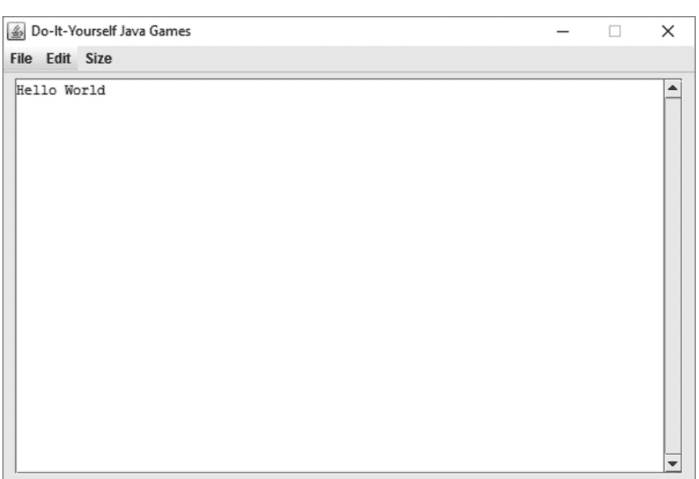

## 第1课——Java 项目和包

程序首先按 [Java 项目](https://example.com) 组织，然后在 Java 项目内按 [包](https://example.com) 组织。你将为本书中的每个程序创建一个 Java 项目。

包包含通常一起使用的程序文件。因为本书中的程序都很小，所以你创建的大多数 Java 项目将只有一个包。

在本课中，你将为你的第一个程序创建一个 Java 项目和一个包。

### 动手试试

创建你的第一个 Java 项目，名为 Hello World：

1. 如果 Eclipse 不再打开：
   a. 双击你桌面上创建的 Eclipse 快捷方式。
   b. 单击“确定”以使用你的 Java 工作文件夹作为工作区。
2. 在“包资源管理器”窗格中右键单击，然后选择“新建/Java 项目”。
3. 将 Java 项目命名为 Hello World，如果 JRE 版本为 1.7 或更高，则选择“使用默认 JRE”，然后单击“下一步”，如下图所示。如果默认 JRE 低于 1.7，请选择“使用执行环境 JRE 1.7 或更高版本”的选项。

### 命名项目
使用默认 JRE (1.7 或更高版本)

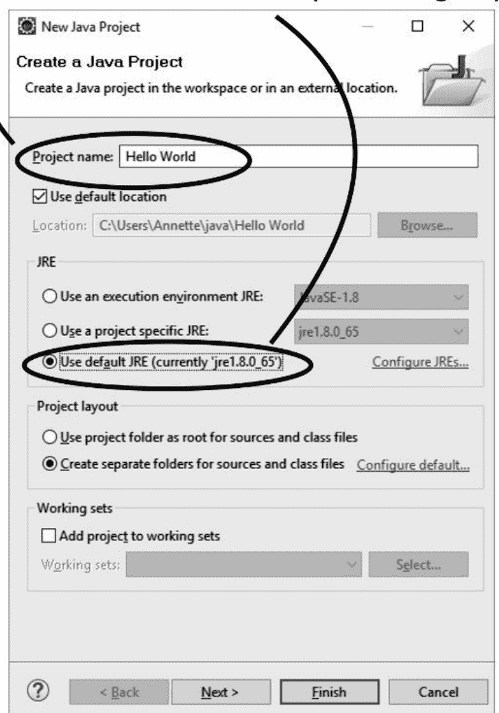

4. 单击 [库](Libraries)，然后单击“添加外部 JAR 文件...”，如下图所示。

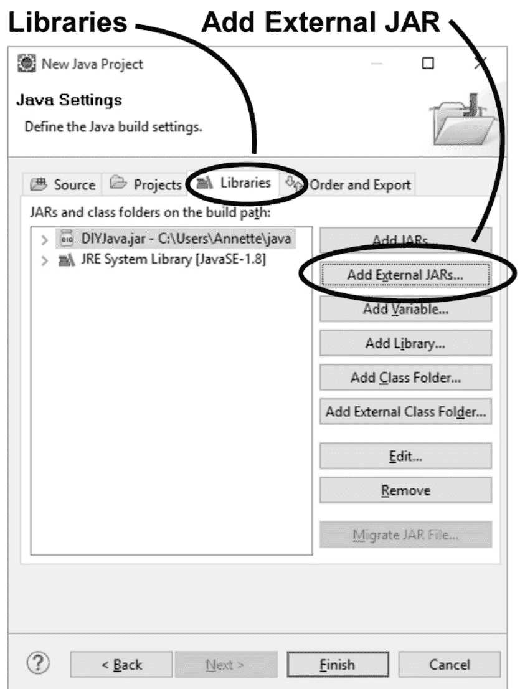

5. 浏览并选择你安装在 Java 工作文件夹中的 DIYJava.jar，然后单击“打开”。
6. 单击“完成”。

“包资源管理器”窗格现在列出了一个项目（Hello World），其中包含添加的 [JAR 文件](DIYJava.jar)，如下图所示：

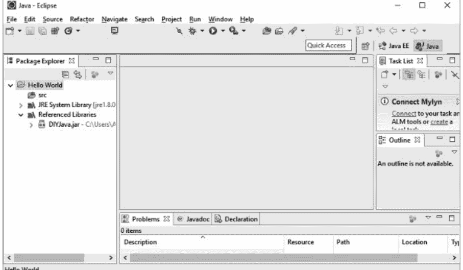

在 Hello World 项目中为你的 Hello World 程序创建一个包：

1. 右键单击 Hello World 项目，然后选择“新建/包”。
2. 将包命名为 ______________.______________.helloworld，如下图所示。使用你自己的名字作为包名的一部分。我使用了 annette.godtland.helloworld 作为我的包名。

### 命名包

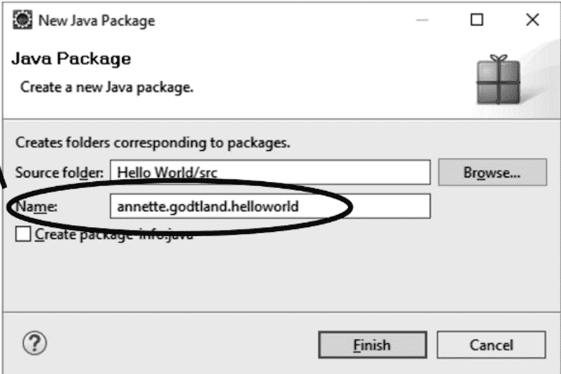

3. 单击“完成”。

“包资源管理器”窗格现在显示了你在 Hello World 项目中创建的包，如下图所示：


### 关键点和更多

- 在“包资源管理器”窗格中右键单击以创建 Java 项目和包。
- 为每个程序创建一个不同的 Java 项目。
- Eclipse 将在你的计算机上创建一个与 Java 项目同名的文件夹。为你想要的 Java 项目文件夹命名。
  - 你现在在你的 Java 工作文件夹中有一个名为 Hello World 的文件夹。
  - 例如，将每个单词的首字母大写，并在每个单词之间加一个空格，就像 Hello World 项目一样。
- 在本书的帮助下，将 DIYJava.jar 添加到你创建的 Java 项目中。
  - DIYJava.jar 是一个外部 JAR 文件。
  - DIYJava.jar 使得编写将文本打印到窗口的程序变得容易。
- 将你的程序文件组织到 Java 项目中的包中。
- 将通常一起使用的程序文件放入一个包中。
  - 因为你的程序很小，所以你的大多数程序将只有一个包。
- 包名规则：
  - 使你的包名与任何其他人的包名不同。Java [程序员](https://www.google.com/search?q=programmers) 传统上使用他们的名字或公司名称作为包名的第一部分。
  - 使用全小写字母，不带空格。
  - 在包名中的不同类别之间使用句点。例如，如果包名标识了谁创建了包以及包的用途，请在创建者和其目的之间放置一个句点。
- 确保在本书中创建 Java 项目时，选择“使用执行环境 JRE JavaSE-1.7 或更高版本”的选项。一旦你为创建项目选择了此选项，Eclipse 将默认为所有未来 Java 项目使用该选项。
- Java 项目用于 Eclipse；包用于 Java。因为你正在使用 Eclipse，所以你将同时使用 Java 项目和包。如果你要在没有 Eclipse 的情况下创建 Java 程序，你可能只会使用包。

## 第2课——类、超类和程序

Java 程序由一个或多个 [类](https://example.com/classes) 组成。类包含实际的程序代码：当按顺序运行时，执行所需任务的指令。

每个类必须将某个其他类命名为其 [超类](https://example.com/superclass)。例如，旨在在窗口中运行的程序必须将某种 [类型](https://example.com/type) 的窗口类命名为其超类。

在本课中，你将创建你的第一个类：一个在 DIYWindow 中运行的程序。

### 动手试试

使用 DIYWindow 类作为超类创建你的第一个类：

1. 在“包资源管理器”窗格中右键单击你的包，然后选择“新建/类”。
2. 输入 HelloWorld 作为类名，如下图所示。（提示：“Hello”和“World”之间没有空格。）
3. 单击“浏览超类”。
   a. 输入“diy”作为类型，选择 DIYWindow，如下图所示，然后单击“确定”。
4. 你想创建哪些 [方法存根](https://example.com/method-stubs)？选择以下选项，如下图所示：
   a. [Public static](https://example.com/public-static) void main (String[] args)。
   b. 来自超类的 [构造函数](https://example.com/constructors)。
   c. 第三个选项“继承抽象方法”是否选中并不重要。

## 第7章 面向对象编程

你之前已经了解到，Java是一种面向对象的编程语言。因此，它支持这种编程范式的基本原则。

对象指的是现实世界中的实体，如包、汽车、椅子或笔。面向对象编程语言允许程序员设计使用对象和类的程序。它们提供并支持能够简化软件开发和维护的特性。这种编程范式最重要的概念如下：

- 对象
- 类
- 方法
- 实例
- 继承
- 抽象
- 多态
- 消息解析
- 封装

## 对象

在现实世界中，你会遇到诸如人类、狗、汽车和猫等对象。这些对象具有状态和行为。例如，当你想到一只猫时，它的状态可以包括它的品种、颜色或名字。它的行为可能包括奔跑、跳跃或摇尾巴。

软件对象在这些特征方面类似于现实世界对象。它的状态保存在字段中，它的行为通过方法来展现。

在开发中，方法作用于对象的内部状态，并且方法促进了对象之间的通信。

5. 点击“完成”以创建类。

Eclipse将为HelloWorld类生成如下所示的代码。

如果你将电子阅读器设置为较小的字体以最小化换行，你可能会发现阅读本书中的代码清单更容易。

清单1-1，来自HelloWorld.java

```
package annette.godtland.helloworld;
import com.godtsoft.diyjava.DIYWindow;
public class HelloWorld extends DIYWindow {
    public HelloWorld() {
        // TODO Auto-generated constructor stub
    }

    public static void main(String[] args) {
        // TODO Auto-generated method stub
    }
}
```

Eclipse添加了你不需要的注释代码。注释是以//开头的行，或以/*开头并以*/结尾的行组。

1. 从此类中删除自动生成的注释行，即在下面的清单中显示（此处已删除代码）的地方。

清单1-2，来自HelloWorld.java

```
package annette.godtland.helloworld;
import com.godtsoft.diyjava.DIYWindow;
public class HelloWorld extends DIYWindow {
    public HelloWorld() {

(此处已删除代码。)
    }

    public static void main(String[] args) {

(此处已删除代码。)
    }
}
```

为你为本书创建的每个类删除程序代码中的自动生成注释。你将在后面的课程中添加自己的注释。

点击任何“已完成”清单链接以查看如何完成代码。但是，如果你在查看答案之前尝试自己完成代码，你会学到更多。

以public static void main开头的代码块称为主()方法。以public HelloWorld()开头的代码块称为构造函数。

现在，添加你的第一行代码：

1. 按照此处所示，向构造函数和主()方法添加代码。对代码的更改在清单中始终以粗体显示。

清单1-3，来自HelloWorld.java

```
package annette.godtland.helloworld;
import com.godtsoft.diyjava.DIYWindow;
public class HelloWorld extends DIYWindow {
    public HelloWorld() {
        print("Hello World");
    }
    public static void main(String[] args) {
        new HelloWorld();
    }
}
```

1. 按Ctrl-S保存程序。
2. 点击“运行”按钮，如本图所示，运行程序：

发生了什么？
应该会打开一个显示“Hello World”的窗口，如本图所示：

1. 你需要更改类中的什么内容才能让它向你问好？

清单1-4，来自HelloWorld.java

```
public HelloWorld() {
    print("Hello

_______

");
}
```

1. 保存程序并运行它。

如果你犯了错误会发生什么？

1. 错误地输入单词“print”并保存程序。

清单1-5，来自HelloWorld.java

```
...
public HelloWorld() {
    print
ttt
("Hello Annette");
}
...
```

发生了什么？

出现了许多错误指示器，如本图所示：

1. 双击Eclipse“问题”窗格中的“错误”计数，查看发现的错误列表。
2. 双击“问题”窗格中的“错误描述”，将光标移动到有错误的行。
3. 将光标放在实际错误上（在上图中显示“Error right here”的地方）。Eclipse将列出修复问题的方法，如下图所示。Eclipse的这个功能称为[快速修复](https://www.google.com/search?q=Quick+Fix)。

### 快速修复

4. 点击名为“更改为‘print(…)’”的快速修复。
该操作将为你修复错误。

1. 保存更改。

所有错误指示器应该消失。
现在，打印更多内容：

1. 更改代码，使你的程序显示以下内容：
Hello, earthling.
Take me to your leader.

清单1-6，来自HelloWorld.java

```
...
public HelloWorld() {
    print("Hello, earthling.");
    print("________________________");
    print("Take me to your leader.");
}
...
```

在整个课程中，除非有[语法错误](syntax errors)，否则在每次代码更改后保存更改并运行程序。

它打印了正确的行吗？如果没有，修复代码并重试。

1. 你认为你需要打印什么才能在两个句子之间插入一个空行，如下所示。（提示：你希望该行不打印任何内容。）

Hello, earthling.
Take me to your leader.

清单1-7，来自HelloWorld.java

```
...
public HelloWorld() {
    print("Hello, earthling.");
    print(___);
    print("Take me to your leader.");
}
...
```

### 关键点及更多

- Java程序由类组成。每个程序都需要在其某个类中包含一个主()方法。
- 主()方法必须写成public static void main(String[] args)。后面的课程将解释所有这些词的含义。
- 多个类通常一起使用以创建一个程序。然而，本书中的大多数程序将仅由一个类组成。
- 每个类必须有一个超类。任何类都可以用作超类。你将在后面的课程中创建自己的超类。
- 具有相同超类的类被认为是同一类型。例如，你为本书中每个程序创建的主类将使用DIYWindow类作为其超类。因此，本书中的每个程序都将是DIYWindow的一种类型。
- 要创建类，请在“包资源管理器”窗格中右键单击。
- 类名可以包含数字、字母、美元符号和下划线。通常不使用美元符号和下划线。
- 类名中不允许有空格或句点。
- 类名不能以数字开头。
- 类名通常以大写字母开头。
- 如果类名包含多个单词，每个单词的首字母通常大写，其余字母小写。
- 类可以有一个或多个构造函数。
- 类构造函数与类同名，并且必须声明为public。构造函数将在后面的课程中进一步解释。
- 构造函数通过使用new，后跟构造函数名称和括号来调用。例如，主()方法中的new HelloWord()调用HelloWorld构造函数。
- 代码块用花括号{ }括起来，每行代码以分号;结尾。
- 每个Java程序首先运行主()方法。
- 在本书的所有程序中，主()方法调用类构造函数。因此，主()方法将首先运行，然后是类构造函数。
- 花括号内的每条语句按其在代码中出现的顺序依次运行。
- 代码行之间的空行对代码的运行方式没有影响。添加空行是为了让你更容易阅读代码。
- Print ()语句将括号中的文本打印到窗口。
- 每个print()语句打印在新行上。
- 要打印空行，请使用带有空括号的print()。
- print()方法是DIYWindow的一部分，而DIYWindow在DIYJava.jar中。这就是为什么你将外部JAR文件DIYJava.jar添加到项目中，以及为什么你选择DIYWindow作为HelloWorld类的超类。
- 注释是以//开头的行，或以/*开头并以*/结尾的行组。

## 类

类用于为对象设置定义。这些规范作为创建对象的蓝图。虽然它们在创建类时不会立即应用，但定义在类的对象被实例化时可用。一个对象或类在程序中可以有多个副本或实例。

```java
public class Cat {
    String breed;
    int age;
    String color;

    void running() {
    }

    void sleeping() {
    }

    void jumping() {
    }
}
```

以下是名为 Cat 的类的类定义示例：

一个类可以包含以下类型的变量：

## 类变量

类变量是在类内部使用 `static` 修饰符声明，并且位于任何方法之外的变量。

## 局部变量

局部变量是在方法、代码块或构造函数内部定义的变量。这些变量在方法内部声明和实例化，并在方法执行完毕后销毁。

## 实例变量

实例变量是位于类内部但在方法之外的变量。它们在类初始化的同时被初始化。可以从该特定类的方法、代码块或构造函数中访问它们。

一个类可以包含任意数量的方法以获取其所需的值。例如，Cat 类有三个方法：`running()`、`sleeping()` 和 `jumping()`。

## 构造函数

构造函数是用于初始化对象的方法。一个类必须至少包含一个构造函数。

以下是构造函数的重要规则：
- 构造函数的名称应与类的名称匹配。
- 它不应有显式的返回类型。

## 构造函数类型

- 默认或无参构造函数
- 带参构造函数

### 默认构造函数

没有参数的构造函数称为默认构造函数。

`<class_name>()` 以下是语法：

## 带参构造函数

带参构造函数是带有参数的构造函数。它用于为特定对象提供值。

以下示例展示了两种类型的构造函数。第一个是默认构造函数，它没有任何参数。第二个构造函数有一个参数，即名称。

```java
public class Kitten {
    public Kitten() {
    }

    public Kitten(String name) {
        // 此构造函数有一个参数，name。
    }
}
```

## 创建对象

类为对象提供模板。对象基本上是从类创建的。要创建新对象，你将使用 `new` 关键字。

从类创建新对象需要采取以下步骤：

- 声明——这指的是变量声明，你将写下变量的名称及其对象类型。
- 实例化——要创建一个新对象；你将使用 `new` 关键字。
- 初始化——在 `new` 关键字之后调用一个构造函数，并初始化一个新对象。

以下示例展示了从类创建新对象所采取的不同步骤：

```java
public class Kitten {
    public Kitten(String name) {
        // 此构造函数包含一个参数，name。
        System.out.println("Passed Name is:" + name);
    }

    public static void main(String[] args) {
        // 以下语句将创建一个对象 myKitten
        Kitten myKitten = new Kitten("spotty");
    }
}
```

以下是输出：

```
Passed Name is: spotty
```

## 如何访问方法和实例变量

创建的对象用于访问方法和实例变量。要访问实例变量，你将使用以下步骤：

首先，你必须创建一个对象：

```java
ObjectName = new Constructor();
```

接下来，调用一个变量，如：

```java
ObjectName.variableName;
```

要调用一个类方法：

```java
ObjectName.MethodName();
```

## Java 包

包只是对接口和类进行分组的一种方式。Java 包作为类的容器。通常的分组依据是功能。使用包有助于代码重用。当接口和类被分类到包中时，你可以轻松地访问它们以在其他程序中使用。使用包还有助于防止类和接口之间的名称冲突。

要创建一个包，请在包名之前使用 `package` 语句作为第一条语句。

```java
package mypack;
public class students {
    // 语句;
}
```

以下是示例：

## 导入语句

你可以使用 `import` 关键字将包导入到你的源文件中。导入语句使编译器更容易找到类或源代码的位置。

你可能只想从一个包中导入一个类。你可以使用点运算符来指定包和类。例如：

```java
import java.util.Date;
class MyDate extends Date {
    // 语句。
}
```

要从一个包中导入所有类，你可以在点运算符后使用通配符 `*`。例如：

```java
import java.io.*;
```

## 修饰符

修饰符是改变代码中定义含义的关键字。Java 提供了几种修饰符。

## 访问修饰符

访问修饰符用于定义方法、变量、类和构造函数的访问级别。

### Private（私有）——仅在类内部可访问

当方法、变量、类或构造函数被声明为 `private` 时，这意味着它仅在类内部可用。但是，如果类具有公共的 getter 方法，你可能能够在类外部访问私有变量。`private` 关键字表示最高的访问限制。请注意，你不能将接口和类声明为 `private`。

### Public（公共）——可被世界访问

被定义为 `public` 的方法、接口、构造函数、类等可以从其他类访问。类似地，在公共类内部定义的代码块、方法或字段可以从 Java 类访问。只要它们在同一个包中，这就是正确的。如果你想从另一个包访问一个公共类，你将必须导入该公共类。根据类继承的概念，子类继承类的所有公共变量和方法。

请注意，应用程序的 `main()` 方法必须声明为 `public`，Java 解释器才能调用它来运行该类。

### Protected（受保护）——可被所有子类和包访问

在超类中将方法、变量或构造函数声明为 `protected`，使其仅对其所在包内的类或其在另一个包中的子类可访问。如果你想允许子类使用变量或辅助方法，并防止不相关的类使用它们，则使用此访问类型。接口及其下的字段和方法不应声明为 `protected`，但接口外部的字段和方法可以声明为 `protected`。类不应声明为 `protected`。

### 默认：未提供修饰符时适用——可被包访问

未使用修饰符声明的方法或变量可被同一包内的其他类访问。

下表总结了不同的访问修饰符及其效果：

| 修饰符 | 类内部 | 包内部 | 包外部（子类） | 包外部 |
| :--- | :---: | :---: | :---: | :---: |
| Private | Y | N | N | N |
| Public | Y | Y | Y | Y |
| Protected | Y | Y | Y | N |
| Default | Y | Y | N | N |

## 非访问修饰符

非访问修饰符可用于访问 Java 中的各种功能。

### Final（最终）——用于最终确定变量、方法和类的实现

#### Final 变量

你只能显式初始化一个 `final` 变量一次。当你将一个变量声明为 `final` 时，你将永远无法将其重新赋值给另一个对象。但是，请注意，你仍然可以更改存储在对象内部的数据。这意味着虽然你可以更改对象的状态，但你将无法更改引用。`final` 修饰符通常与 `static` 配对，从常量值创建类变量。

## Final 方法

`final` 关键字用于防止方法被子类修改。

## Final 类

`final` 修饰符用于防止其他类从声明为 final 的类中继承任何特性。

## Static——用于创建类方法或变量。

你可以使用此关键字创建一个独立于类其他实例存在的唯一变量（称为静态变量或类变量）。你不能将局部变量声明为 static。

你也可以使用 `static` 关键字创建一个独立于类其他实例存在的方法（称为静态方法或类方法）。静态方法仅识别并处理给定参数中的数据，而不考虑变量。

你可以通过在类名后加上点号（`.`）再写变量或方法名来访问类方法和类变量。

## Abstract——用于创建抽象方法或类

### 抽象类

当一个类被声明为抽象类时，意味着你将永远无法实例化该类。将类声明为抽象类的唯一原因是为了扩展该类。你不能将一个类同时声明为 final 和 abstract，因为你不可能扩展一个 final 类。使用抽象方法的类必须被声明为抽象类。否则将导致编译错误。

### 抽象方法

由于抽象方法没有实现，其方法体派生自子类。抽象方法不能被声明为 strict 或 final。除非它本身也是一个抽象类，否则扩展抽象类的类必须采用超类的抽象方法。包含至少一个抽象方法的类应被声明为抽象类。另一方面，抽象类不一定需要有抽象方法。

```java
abstract class Car {
    private double price;
    private String type;
    private String year;
    public abstract void goFast(); // abstract method
    public abstract void changeColor();
}
```

示例：

## Synchronized

`synchronized` 修饰符用于指示在任何给定时间只有一个线程可以访问一个方法。你可以将此关键字与任何访问级别修饰符一起使用。

```java
public synchronized void showInfo() {
    ......
}
```

示例：

## Volatile

此关键字用于指示访问 volatile 变量的线程应将其私有副本与存储在内存中的主副本合并。实际上，它将变量的所有缓存副本与主内存同步。你只能使用此修饰符来定义私有或对象类型的实例变量。

```java
public class MyRunnable implements Runnable {
    private volatile boolean active;

    public void run() {
        active = true;
        while (active) { // line 1
            // code here
        }
    }

    public void stop() {
        active = false; // line 2
    }
}
```

示例：

## Transient

`transient` 关键字用于告诉编译器在序列化包含标记变量的对象时跳过该实例变量。

```java
public transient int limit = 50; // will not persist
```

示例：

## 第8章 决策与循环控制

决策结构用于这样的情景：当条件为真时执行一组指令，而当条件为假时执行另一组指令。Java 中有几种可用于编程此类场景的结构。这些结构包括——

### If 语句

此语句用于需要测试一个条件的情景，如果条件为真，则执行此语句之后的代码块。此结构的语法为——

```java
if(condition){
/*Body*/
}
```

此结构的示例实现如下——

```java
public class ifDemo {
    public static void main(String args[]) {
        int i = 10;
        int j = 1;
        if(i>j){
            System.out.print(i);
        }
    }
}
```

### If else 语句

此语句用于需要测试一个条件的情景，如果条件为真，则执行此语句之后的代码块，否则执行 else 语句之后的代码块。此结构的语法为——

```java
if(condition){
/*Body*/
}
else{
/*Body*/
}
```

此结构的示例实现如下——

```java
public class ifElseDemo {
    public static void main(String args[]) {
        int i = 1;
        int j = 0;
        if(i>j){
            System.out.print(i);
        }
        else{
            System.out.print(j);
        }
    }
}
```

### 嵌套 if 语句

此语句用于需要测试一个条件的情景，如果条件为真，则执行此语句之后的代码块，否则测试下一个条件。如果此条件为真，则执行此条件对应的 if 语句的代码块。如果所有条件都不为真，则执行 else 语句之后的代码块。可以使用嵌套 if 语句测试多个条件。此结构的语法为——

```java
if(condition1) {
/*Body*/
}
else if (condition2) {
/*Body*/
}
else {
/*Body*/
}
```

此结构的示例实现如下——

```java
public class nestedIfDemo {
    public static void main(String args[]) {
        int i = 0;
        int j = 0;
        if(i>j){
            System.out.print(i);
        }
        else if(j>i) {
            System.out.print(j);
        }
        else {
            System.out.print("Equal");
        }
    }
}
```

### Switch

如果你有一个变量，并且需要为该变量的不同值执行不同的代码块，那么理想的选择是使用 switch 语句。此结构的语法为——

```java
switch(variable){
    case <value1>:
        /*body*/
        break;
    case <value2>:
        /*body*/
        break;
    case <value3>:
        /*body*/
        break;
    default:
        /*body*/
        break;
}
```

此结构的示例实现如下——

```java
public class switchDemo {
    public static void main(String args[]) {
        int i = 5;
        switch (i) {
            case 0:
                System.out.print(0);
                break;
            case 2:
                System.out.print(2);
                break;
            case 5:
                System.out.print(5);
                break;
            default:
                System.out.print(999);
                break;
        }
    }
}
```

### 条件运算符

Java 还支持条件运算符，也称为 ?: 运算符。此运算符用于替代 'if else' 结构。其语法如下——

表达式1 ? 表达式2 : 表达式3

这里，表达式1 是要测试的条件。如果条件为真，则执行表达式2，否则执行表达式3。

## 循环控制

有许多情况需要你多次迭代同一组指令。例如，如果你需要对一组数字进行排序，你将需要多次扫描和重新排列这组数字以获得所需的排列。这种执行流程称为循环控制。

简单来说，循环是一种允许多次执行代码块的结构。Java 支持多种可用于实现循环的结构。这些包括 while 循环、for 循环和 do while 循环。

while 循环会迭代执行一个代码块，直到为 while 循环指定的条件为真。一旦此条件不满足，while 循环就会停止。

for 循环允许程序员在同一个结构中操作条件和循环变量。因此，你可以初始化一个循环变量，对其进行递增/递减，并在此变量满足条件之前运行循环。

do while 循环类似于 while 循环。然而，在 while 循环中，条件是在执行代码块之前检查的。另一方面，在 do while 循环中，代码块先被执行，然后检查条件。如果条件满足，则再次启动循环执行，否则终止循环。可以说，do while 循环一旦实现，至少会执行一次。

## 循环语句

有两个关键字专门用于循环，也被称为控制语句，因为它们允许将控制权从代码的一个部分转移到另一个不同的部分。这两个关键字是——

### Break

此关键字在循环内部使用，用于在你希望执行流程终止循环并直接从循环后的第一条指令开始执行的位置。

### Continue

此关键字在循环内部使用，用于在程序员希望计算机忽略循环的其余部分并将控制权转移到循环的第一条语句的位置。

为了帮助你理解循环是如何执行的，让我们举一个例子，并使用所有三种类型的循环控制来实现它。

### For 循环实现

```java
public class forDemo {
    public static void main(String args[]) {
        int [] numberArray = {100, 300, 500, 700, 900};
        for(int i=0; i<5; i++) {
            System.out.print(numberArray[i]);
            System.out.print("");
        }
        System.out.print("\n");
    }
}
```

### While 循环实现

```java
public class whileDemo {
    public static void main(String args[]) {
        int [] numberArray = {100, 300, 500, 700, 900};
        int i = 0;
        while(i<5) {
            System.out.print(numberArray[i]);
            System.out.print(",");
            i++;
        }
        System.out.print("\n");
    }
}
```

### Do While 循环实现

```java
public class doWhileDemo {
    public static void main(String args[]) {
        int [] numberArray = {100, 300, 500, 700, 900};
        int i = 0;
        do {
            System.out.print(numberArray[i]);
            System.out.print(",");
            i++;
        } while (i<5);
        System.out.print("\n");
    }
}
```

### 增强型 For 循环

Java 还支持一种增强型循环结构，可用于数组元素。此循环构造的语法是——

```java
for(declaration : expression) {
/*Body*/
}
```

增强型 for 循环的声明部分用于声明一个变量。此变量应局部于‘for 循环’，并且必须与数组元素的类型相同。变量的当前值始终等于循环中正在遍历的数组元素。表达式是一个数组或返回数组的方法调用。

增强型 for 循环的示例实现如下 -

```java
public class forArrayDemo {
    public static void main(String args[]) {
        int [] numberArray = {100, 300, 500, 700, 900};
        for(int i : numberArray ) {
            System.out.print( i );
            System.out.print(",");
        }
        System.out.print("\n");
    }
}
```

### 异常层次结构

Java 有一个名为 `java.lang.Exception` 的内置类，所有异常都属于此类。所有异常类都是此类的子类。此外，`Throwable` 类是异常类的超类。`Throwable` 类的另一个子类是 `Error` 类。所有错误，如上文描述的栈溢出，都属于此 `Error` 类。

`Exception` 类有两个子类，即 `RuntimeException` 类和 `IOException` 类。下面列出了作为 `Throwable` 类一部分在 Java 中定义的方法列表。

```java
public String getMessage()
```

调用时，此消息返回遇到的异常的详细描述。

```java
public Throwable getCause()
```

调用此方法时，返回包含异常原因的消息。

```java
public String toString()
```

此方法返回异常的详细描述与类名的连接。

```java
public void printStackTrace()
```

可以通过调用此方法将 `toString()` 的结果以及堆栈跟踪打印到标准错误流 `System.err`。

```java
public StackTraceElement [] getStackTrace()
```

在某些情况下，你可能需要访问堆栈跟踪的不同元素。此方法返回一个数组，堆栈跟踪的每个元素都保存到数组的不同元素中。数组的第一个元素包含堆栈跟踪的顶部元素，而堆栈跟踪的底部保存到数组的最后一个元素。

```java
public Throwable fillInStackTrace()
```

将堆栈跟踪中的先前信息与当前堆栈跟踪内容连接起来，并将其作为数组返回。

### 捕获异常

捕获异常的标准方法是使用 `try` 和 `catch` 关键字及其代码实现。此 `try` 和 `catch` 块需要以这样的方式实现：它包含预期会引发异常的代码。这里还需要提及的是，预期会引发异常的代码被称为受保护代码。`try` 和 `catch` 块实现的语法如下——

```java
try {
    /*Protected code*/
} catch(ExceptionName exc1) {
    /*Catch code*/
}
```

预期会引发异常的代码放在 `try` 块内。如果引发异常，则在 `catch` 块中实现异常处理的相应操作。每个 `try` 块都必须有一个 `catch` 块或一个 `finally` 块。

作为 `catch` 语句的一部分，需要声明预期引发的异常。如果发生异常，执行将转移到 `catch` 块。如果引发的异常与 `catch` 块中定义的异常匹配，则执行 `catch` 块。

下面给出了 `try` 和 `catch` 块的示例实现。该代码实现了一个包含 2 个元素的数组。但是，代码尝试访问不存在的第三个元素。结果，引发了一个异常。

```java
import java.io.*;

public class demoException {
    public static void main(String args[]) {
        try {
            int arr[] = new int[2];
            System.out.println("Accesing the 3rd element of the array:" + arr[3]);
        } catch(ArrayIndexOutOfBoundsException exp) {
            System.out.println("Catching Exception:" + exp);
        }
        System.out.println("Reached outside catch block");
    }
}
```

### 实现多个 Catch 块

一段代码可能导致多个异常。为了满足此要求，也允许实现多个 `catch` 块。此类实现的语法如下。

```java
try {
    /*Protected Code*/
} catch(ExpType1 exp1) {
    /*Catch block 1*/
} catch(ExpType2 exp2) {
    /*Catch block 2*/
} catch(ExpType3 exp3) {
    /*Catch block 3*/
}
```

上面显示的语法说明了三个 `catch` 块的实现。但是，你可以根据需要实现任意数量的 `catch` 块。当执行此代码时，受保护的代码被执行。如果发生异常，则将异常类型与第一个 `catch` 块的异常进行匹配。但是，如果异常类型不匹配，则忽略 `catch` 块 1，并尝试匹配第二个 `catch` 块的异常类型。哪个 `catch` 块与引发的异常具有相同的异常类型；就执行相应的 `catch` 块。

## 第 9 章. ADT、数据结构和 Java 集合

### 抽象数据类型 (ADT)

抽象数据类型 (ADT) 是对数据及其允许操作的逻辑描述。ADT 被定义为用户对数据的视角。ADT 关注数据的可能值及其暴露的接口。ADT 不关心数据结构的实际实现。

例如，用户想要存储一些整数并找到它们的平均值。此数据结构的 ADT 将支持两个函数，一个用于添加整数，另一个用于获取平均值。此数据结构的 ADT 不讨论它将如何具体实现。

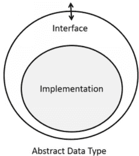

## 数据结构

数据结构是数据的具体表示形式，被定义为程序员视角下的数据。数据结构表示数据在内存中的存储方式。所有数据结构都有各自的优缺点。根据问题的类型，我们会选择最适合的数据结构。

例如，我们可以将数据存储在数组、链表、栈、队列、树等结构中。

注意：在本章中，我们将学习各种数据结构及其API。这样用户就可以在不了解其内部实现的情况下使用它们。

## JAVA集合框架

JAVA编程语言提供了一个JAVA集合框架，它是一套高质量、高性能且可复用的数据结构和算法。

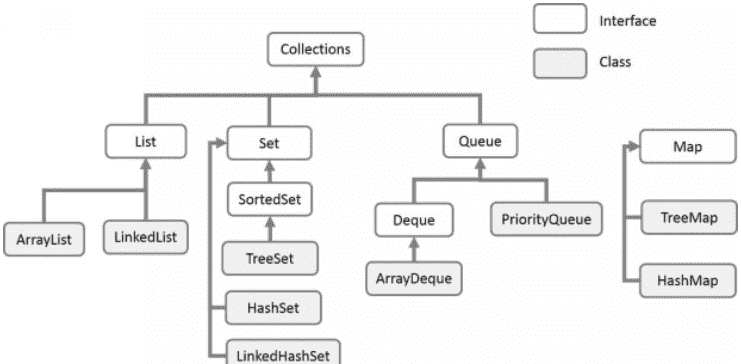

使用JAVA集合框架有以下优点：

- 1. 程序员不必反复实现基本的数据结构和算法。从而避免了重复造轮子。因此，程序员可以将更多精力投入到业务逻辑中。
- 2. JAVA集合框架的代码是经过充分测试、高质量、高性能的代码。使用它们可以提高程序的质量。
- 3. 由于集合框架中实现的基本数据结构和算法可以被重用，因此降低了开发成本。
- 4. 由于大多数Java开发者都使用集合框架，因此更容易审查和理解其他开发者编写的程序。此外，集合框架有完善的文档。

## 数组

数组表示同一数据类型的多个元素的集合。

### 数组抽象数据类型操作

以下是数组的API：

- 1. 在第k个位置添加一个元素。值可以在O(1)常数时间内存储在数组的第K个位置。我们只需要将值存储在arr[k]中。
- 2. 读取存储在第k个位置的值。访问数组中某个索引处存储的值也是O(1)常数时间。我们只需要读取存储在arr[k]中的值。
- 3. 用新值替换存储在第k个位置的值。时间复杂度：O(1)常数时间。

示例：

```java
public class ArrayDemo {
    public static void main(String[] args) {
        int[] arr = new int[10];
        for (int i = 0; i < 10; i++)
        {
            arr[i] = i;
        }
    }
}
```

JAVA标准数组是固定长度的。有时我们不知道需要多少内存，所以会创建一个更大的数组。从而浪费了空间。如果一个数组已经满了，而我们想添加更多的值，那么我们需要创建一个有足够空间的新数组，然后将旧数组复制到新数组。为了避免这种手动重新分配和复制，我们可以使用JAVA集合框架的ArrayList或链表来存储数据。

### JAVA集合中的ArrayList实现

JAVA集合中的ArrayList<E>是一个实现了List<E>接口的数据结构，这意味着它可以包含重复的元素。ArrayList是一个动态数组的实现，可以根据需要增长或缩小。（内部使用数组，当数组满时，会分配一个更大的数组，并将旧数组的值复制到其中）。

示例：

```java
import java.util.ArrayList;

public class ArrayListDemo {
    public static void main(String[] args) {
        ArrayList<Integer> al = new ArrayList<Integer>();
        al.add(1); // 将1添加到列表末尾
        al.add(2); // 将2添加到列表末尾
        System.out.println("Contents of Array: " + al);
        System.out.println("Array Size: " + al.size());
        System.out.println("Array IsEmpty: " + al.isEmpty());
        al.remove(al.size() - 1); // 移除数组的最后一个元素。
        al.removeAll(al); // 移除数组的所有元素。
        System.out.println("Array IsEmpty: " + al.isEmpty());
    }
}
```

输出：

Contents of Array: [1, 2]

Array Size: 2

Array IsEmpty: false

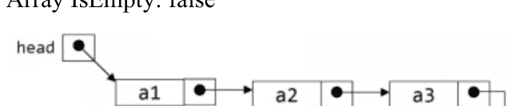

Array IsEmpty: true

## 链表

链表是一种动态数据结构，内存是在运行时分配的。链表的概念不是连续存储数据。链表的节点包含一个指向列表中下一个元素的链接。

在性能方面，链表比数组慢，因为无法直接访问链表元素。当我们事先不知道要存储的元素数量时，链表是一种有用的数据结构。链表有很多种类型：线性链表、循环链表、双向链表、双向循环链表等。

### 链表抽象数据类型操作

以下是链表的API。

- Insert(k)：将k添加到列表的开头。在列表的开头插入一个元素。只需创建一个新元素并移动指针。这样这个新元素就成为了列表的第一个元素。此操作将花费O(1)常数时间。
- Delete()：删除列表开头的元素。删除列表开头的元素。我们只需要移动一个指针。此操作也将花费O(1)常数时间。
- PrintList()：显示列表的所有元素。从第一个元素开始，然后跟随指针。此操作将花费O(N)时间。
- Find(k)：查找值为k的元素的位置。从第一个元素开始，跟随指针，直到找到我们要找的值或到达列表的末尾。此操作将花费O(N)时间。

注意：二分查找不适用于链表。

- FindKth(k)：查找位置k处的元素。从第一个元素开始，跟随链接，直到到达第k个元素。此操作将花费O(N)时间。
- IsEmpty()：检查列表中的元素数量是否为零。只需检查列表的头指针，如果为Null，则列表为空，否则不为空。此操作将花费O(1)时间。

### JAVA集合中的LinkedList实现

JAVA集合中的LinkedList<E>也是一个实现了List<E>接口的数据结构。

示例：

```java
import java.util.LinkedList;

public class LinkedListDemo {
    public static void main(String[] args) {
        LinkedList<Integer> ll = new LinkedList<Integer>();
        ll.addFirst(2); // 将2添加到列表
        ll.addLast(10); // 将10添加到列表末尾。
        ll.addFirst(1); // 将1添加到列表开头。
        ll.addLast(11); // 将11添加到列表末尾
        System.out.println("Contents of Linked List: " + ll);
        ll.removeFirst();
        ll.removeLast();
        System.out.println("Contents of Linked List: " + ll);
    }
}
```

输出：

Contents of Linked List: [1, 2, 10, 11]

Contents of Linked List: [2, 10]

## 栈

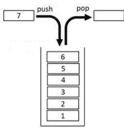

栈是一种特殊的数据结构，遵循后进先出（LIFO）策略。这意味着最后添加的元素将最先被移除。

栈的各种应用包括：

- 递归：递归调用是使用系统栈实现的。
- 1. 表达式的后缀求值。
- 2. 使用栈实现回溯。
- 3. 树和图的深度优先搜索。
- 4. 将十进制数转换为二进制数等。

### 栈抽象数据类型操作

- Push(k)：将值k添加到栈顶。
- Pop()：从栈顶移除元素并返回其值。
- Top()：返回栈顶元素的值。
- Size()：返回栈中的元素数量。
- IsEmpty()：确定栈是否为空。如果栈为空则返回true，否则返回false。

注意：所有上述栈操作的时间复杂度均为O(1)。

### JAVA集合中的栈实现

栈是通过调用Stack <T>类的push和pop方法实现的。

示例：

```java
public class StackDemo {
    public static void main(String[] args) {
        Stack<Integer> stack = new Stack<Integer>();
        int temp;
        stack.push(1);
        stack.push(2);
        stack.push(3);
        System.out.println("Stack : "+stack);
        System.out.println("Stack size : "+stack.size());
        System.out.println("Stack pop : "+stack.pop());
        System.out.println("Stack top : "+stack.peek());
        System.out.println("Stack isEmpty : "+stack.isEmpty());
    }
}
```

输出：

Stack : [1, 2, 3]

Stack size : 3

Stack pop : 3

## 栈顶：2

栈是否为空：false

栈也是通过调用 `ArrayDeque<T>` 类的 `push` 和 `pop` 方法来实现的。

JDK 同时提供了 `ArrayDeque<T>` 和 `Stack<T>`。我们可以使用这两个类。但 `ArrayDeque<T>` 有一些优势。

1.  首要原因是 `Stack<T>` 没有继承自 `Collection` 接口。
2.  其次，`Stack<T>` 继承自 `Vector<T>`，因此支持随机访问，这破坏了栈的抽象性。
3.  第三，`ArrayDeque` 比 `Stack<T>` 更高效。

## 队列

队列是一种先进先出（FIFO）的数据结构。最先添加到队列中的元素将最先被移除，依此类推。

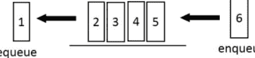

队列有以下应用：

1.  共享资源访问（例如，打印机）
2.  多道程序设计
3.  消息队列
4.  广度优先搜索（BFS），图或树的广度优先遍历是使用队列实现的。

队列抽象数据类型（ADT）操作：

Add(K)：将新元素 k 添加到队列的末尾。

Remove()：从队列的前端移除一个元素并返回其值。

Front()：返回队列前端元素的值。

Size()：返回队列内的元素数量。

IsEmpty()：如果队列为空则返回 1，否则返回 0。

注意：所有上述队列操作的时间复杂度均为 O(1)。

## Java 集合中的队列实现

`ArrayDeque<T>` 是双端队列的类实现。如果我们使用 `add()`、`remove()` 和 `peek()`，它的行为就像一个队列。（此外，如果我们使用 `push()`、`pop()` 和 `peekLast()`，它的行为就像一个栈。）

示例：

```java
import java.util.ArrayDeque;

public class QueueDemo {
    public static void main(String[] args) {
        ArrayDeque<Integer> que = new ArrayDeque<Integer>();
        que.add(1);
        que.add(2);
        que.add(3);
        System.out.println("Queue : "+que);
        System.out.println("Queue size : "+que.size());
        System.out.println("Queue peek : "+que.peek());
        System.out.println("Queue remove : "+que.remove());
        System.out.println("Queue isEmpty : "+que.isEmpty());
    }
}
```

输出：

Queue : [1, 2, 3]
Queue size : 3
Queue peek : 1
Queue remove : 1
Queue isEmpty : false

## 第 10 章 文件处理

本章讨论读取、写入、创建和打开文件的细节。有各种各样的文件 I/O 类和方法可供选择。

## 读取文本文件

读取文本文件是 Java 中的一项关键能力，具有许多实际应用。`FileReader`、`BufferedReader` 和 `Scanner` 是在 Java 中读取纯文本文件的有用类。它们各自具有特定的品质，使其在处理某些情况时具有独特的优势。

## BufferedReader

此技术从字符输入流中读取文本。它缓冲字符、数组和行，以便高效读取。你可以指定缓冲区类型或使用标准类型。对于大多数情况，默认值已经足够大。特别是，从 `Reader` 产生的每个读取请求都会导致底层字符或字节流执行相应的读取操作。因此，建议将 `BufferedReader` 包装在任何读取操作（如 `FileReader` 和 `InputStreamReader`）可能开销较大的 `Reader` 周围。

例如：

```java
BufferedReader in = new BufferedReader(Reader in, int size)
```

## FileReader

用于读取字符文档的便捷类。此类的构造方法假定默认字符格式和默认字节缓冲区大小是合适的。

## Scanner

一个简单的文本扫描器，使用正则表达式解析基本类型和字符串。`Scanner` 使用分隔符模式将其输入分解为标记，默认情况下按空白字符分割。使用不同的 `next` 方法，生成的标记随后可以转换为不同类型的值。

```java
import java.io.File;
import java.util.Scanner;
public class ReadFromFileUsingScanner
{
    public static void main(String[] args) throws Exception
    {
        // filepath is set as a parameter now so that it can be scanned
        File example =
        new File("C:\\Users\\userName\\Desktop\\example.txt");
        Scanner example1 = new Scanner(example);
        while (example1.hasNextLine())
        System.out.println(example1.nextLine());
    }
}
```

使用 Scanner 类但不使用循环：

```java
import java.io.File;
import java.io.FileNotFoundException;
import java.util.Scanner;
public class example {
public static void main(String[] args)
throws FileNotFoundException {
File example = new File("C:\\Users\\userName\\Desktop\\example.txt");
Scanner example1 = new Scanner(example);
// we will use \Z as a delimiter
example1.useDelimiter("\\Z");
System.out.println(example1.next());
}
}
```

## 在 Java 中将文本文件读取为字符串

```java
package io;
import java.nio.file.*;
public class example{
public static String example(String fileName)throws Exception {
String example1 = "";
example1 = new String(Files.readAllBytes(Paths.get(fileName)));
return example1;
}
public static void main(String[] args) throws Exception
{
String example1 =
example("C:\\Users\\userName\\Desktop\\example.java");
System.out.println(example1);
}
}
```

## 写入文本文件

你可以使用其中一种写入方法将字节或行写入文件。写入方法包括：

-   Write(Path, byte[], OpenOption...)
-   Write(Path, Iterable< extends CharSequence>, Charset, OpenOption...)

## 重命名和删除文件

### 重命名

在 Java 中，`File` 类中有一个名为 `renameTo(fileName)` 的方法，我们可以用它来重命名文件。

### 删除文件

使用 Java 程序保存的文件将被永久删除，而不会移动到回收站。使用 `java.io.File.delete` 会从文件系统中删除此抽象路径名。使用 `java.nio.file.Files.deleteIfExists` 将删除文件夹（如果存在）。如果文件夹未被占用，它也会删除路径中列出的文件夹。

## Java 高级主题

### 泛型

在任何非平凡的软件项目中，缺陷（bug）都是生活中不可避免的事实。仔细的规划、编程和测试可能有助于减少它们的普遍性，但不知何故，它们总会找到进入你系统某个地方的方法。随着新功能的引入以及代码库规模和复杂性的增加，这一点变得尤为明显。

幸运的是，检测某些缺陷比检测其他缺陷更容易。例如，编译时缺陷可以很快被识别出来；你可以使用编译器的错误代码来确定问题所在并立即解决它。然而，运行时缺陷可能要困难得多；它们并不总是立即发生，即使发生，也可能发生在程序中远离问题真正原因的位置。泛型通过使在编译时识别更多缺陷成为可能，从而帮助稳定你的软件。

简而言之，泛型允许在定义类、接口和方法时为类型（类和对象）设置参数。就像在方法声明中使用的更熟悉的形参一样，类型参数为你提供了重用相同代码的不同输出。区别在于，值是形参的输入，而类型是类型参数的答案。使用泛型的代码比非泛型代码具有许多优势。通过使用泛型，程序员可以引入泛型算法，这些算法可以操作不同类型的集合，可以定制，并且安全且更易于阅读。

### 泛型类型

泛型类型是类型参数化的泛型类或接口。可以通过修改一个简单的盒子类来展示这个概念。考虑一个适用于任何类型对象的非泛型盒子类。它只需要提供两个方法：`set()`（将项目添加到盒子中）和 `get()`（检索它）。由于其方法接受或返回一个对象，你可以自由地传入任何你想要的东西，只要它不是基本类型之一。在编译时无法检查类的使用方式。软件的一部分可能将一个整数放入盒子中并期望从中获取整数，而软件的另一部分可能错误地传入一个字符串，导致运行时错误。

类型参数部分，由尖括号（`<>`）表示，显示类的标题。它表示形式的参数（也称为类型的因子）T1、T2，直到 T。你通过将文件“public class Box”更改为“public class Box <T>”来更新盒子类以使用泛型，从而生成泛型类型声明。这引入了类型变量 T，可以在类内部的任何地方使用。这将所有 Object 实例替换为 T。你指定的任何非基本类型都可以是类型变量：任何类类型、任何接口类型、任何数组类型，甚至其他类型变量。同样的方法可以应用于泛型接口。

类型名称按惯例是单个大写字母。这与你已经了解的变量命名惯例形成鲜明对比，并且有充分的理由：如果没有这个惯例，很难区分类型变量和普通类或对象名称。

最常用的类型参数名称是：

-   E - 元素（被 Java 集合框架广泛使用）
-   K - 键
-   N - 数字
-   T - 类型
-   V - 值
-   S、U、V 等——第 2、第 3、第 4 种类型

你会在整个 JDK 和 API 中看到这些名称的使用。

## 调用和实例化泛型类型

要在系统中提及泛型盒装类别，必须执行泛型类型调用，将 `T` 与某个具体值（例如 `Integer`）一起引入：

```
Box<Integer> integerBox;
```

你可能认为泛型类型的调用类似于普通过程调用，但不同之处在于，你不是向过程添加断言，而是向盒装类别本身传递一个类型参数——本例中是 `Integer`。

许多设计者交替使用“类型参数”和“类型声明”这两个术语，但它们的定义并不相同。在编码时，为了生成参数化类型，需要提供类型参数。因此，`Foo<T>` 中的 `T` 是一个类型参数，而 `Foo<String> f` 是一个类型声明。在使用这些术语时，本类遵循这一概念。

与任何其他变量声明一样，此代码不会生成盒装类别的新实例。它仅表明 `integerBox` 将引用一个“Integer Box”，即 `Box<Integer>` 的读法。泛型类型调用通常被称为参数化类型。

要实例化此类，请像往常一样使用 `new` 关键字，但在类名和括号之间放置 `<Integer>`：

```
Box<Integer> integerBox = new Box<Integer>();
```

## 菱形操作符

在 Java 的最新版本中，只要编译器能够从上下文中确定或推断出类型参数，就可以用空类型参数集（`<>`）替换调用泛型类构造函数所需的类型参数。这对尖括号 `<>` 被非正式地称为“菱形操作符”。例如，你可以使用之前的声明来生成 `Box<Integer>` 的实例：

```
Box<Integer> integerBox = new Box<>();
```

## 泛型方法

泛型方法是实现自身类型参数的方法。这类似于泛型类型声明，但类型参数的范围仅限于声明它的方法。除了泛型类构造函数外，还允许静态和非静态泛型方法。

泛型方法的语法涉及在过程返回类型之前出现的尖括号内的类型参数列表。对于静态泛型方法，类型参数部分必须出现在方法的返回类型之前。`Util` 类包含一个比较两个 `Pair` 项目的泛型方法 `compare`。

```
Pair<Integer, String> ex1 = new Pair<>(49, "string1");

Pair<Integer, String> ex2 = new Pair<>(64, "string2");

boolean comparison = Util.<Integer, String>compare(ex1, ex2);
```

## 有界类型参数

有时你希望限制可用于参数化类型的形式参数的种类。例如，一个处理数字的方法可能只接受 `Number` 类或其子类的实例。这就是类型参数有界的作用。

要声明有界类型参数，请列出类型参数的名称，后跟 `extends` 关键字，然后是上界（本例中为 `Number`）。请注意，在此上下文中，`extends` 通常既表示“扩展”（如类）也表示“实现”（如接口）。

## 多重边界

类型参数可以有多个边界。具有多个边界类型变量是所有边界中列出的类型的子类型。如果其中一个边界是类，则必须首先指定它。例如：

```
Class X { /* ... */ }
interface Y { /* ... */ }
interface Z { /* ... */ }
class R <T extends X & Y & Z> { /* ... */ }
```

如果未首先指定边界 `X`，则会出现编译时错误：

```
class R <T extends Y & X & Z> { /* ... */ } // 编译时错误
```

## 第 11 章 集合

## 集合的函数化

当我们外部化代码时，我们暴露了每一步。这是命令式编程的标志。然而，函数式编程的一个反复出现的主题是做完全相反的事情：内部化代码。内部化代码的行为是将细节隐藏在函数内部。但函数式编程更进一步，将日常编程中的微模式转化为函数。例如，遍历数据，无论是使用迭代器、`for` 循环还是 `while` 循环，都是这些微模式之一。函数式编程改变了我们思考它们的方式。

Java 的函数化努力若没有对其集合库（即 `Collection`、`Map`、`List` 和 `Set` 接口）的彻底改造，就不会完整。这是因为迭代通常是在集合上进行的，它们是 Java 程序的基石。这是函数化努力发生的自然场所。但进行任何重大更改，例如向 `Collection` 接口添加新方法，都会破坏所有在 Java 8 之前编写的程序的向后兼容性。这不仅包括 JDK 自身扩展 `Collection` 接口的层次结构，还包括任何开源或闭源的第三方库以及内部类。Java 的设计者过去没有，将来也不会采用这种策略。然而，更改是必要的；该库于 1998 年引入，在软件行业年份中已是久远的历史，并且正在显现出其年代感。

引入默认方法的动机源于现代化和函数化集合库的需求。默认方法正是合适的良方，因为它们允许在层次结构的根部添加行为，而不干扰依赖类。子类可以继承或覆盖该行为。与添加新的接口方法不同，子类可以自动接受新的默认方法而无需重新编译。即时兼容性得以实现。默认方法本身已被证明是有用的，但它们的存在归功于函数化集合库的需求。

函数式编程的第二个反复出现的主题是并行化。简单地说，函数式编程为并行处理提供了更好的解决方案。因此，集合库得到了丰富，以便在处理集合时受益于多核 CPU。与流（Streams）一起，集合库成为将函数式风格并行处理引入 Java 的核心舞台。

既然我们已经研究了 Java 的标准函数式接口，我们就可以开始将这些知识应用于集合。让我们看看 Java 8 中集合库的变化。

## Collection 接口

我们首先看看 `Collection` 接口中一个全新的默认方法，该方法可用于列表和集合。这就是 `forEach()` 方法：

```
// 在 Iterable 接口中定义，并在 Collection 中扩展
default void forEach (Consumer<? super T> action)
```

此方法遍历整个集合，让 `Consumer` 决定对每个元素执行什么操作。这是内部迭代的概念，也是声明式编程的一种体现。未指定如何迭代的细节。这与外部迭代相反，在外部迭代中，如何迭代以及对每个元素执行什么操作的细节都在代码中指定。

我们将使用好莱坞电影黄金时代的滑稽喜剧三人组——来自“三个臭皮匠”（The Three Stooges）的拉里（Larry）、莫（Moe）和柯利（Curly）——来展示这些函数化集合方法的示例。首先，让我们打印集合的内容：

```
Collection<String> stooges = Arrays.asList("Larry", "Moe", "Curly");
// 打印 stooges 集合的内容
stooges.forEach(System.out::println);
```

`forEach()` 方法具有非常广泛的适用性。它是遍历集合的一种更方便的方式，应该是你的事实标准。然而，作为一种声明式构造，有些事情你将无法做到。最值得注意的是，你无法像在 `while` 循环中那样更改变量的状态。算法必须以函数式的方式重新思考。目前，只需知道 `forEach()` 非常适合不改变状态的迭代。

我们现在看看 `Collection` 中另一个可用的新方法：

```
default boolean removeIf(Predicate<? super E> filter)
```

`removeIf()` 方法将整个迭代、测试和移除过程内部化。它只需要被告知移除的条件是什么。

利用我们现在已经熟悉的谓词函数式接口，我们可以轻松地确定使用哪种 lambda 表达式。

```java
// 移除不属于“三个臭皮匠”喜剧三人组的所有人
List<String> theThreeStooges = new ArrayList<>
    (Arrays.asList("Larry", "Moe", "Curly", "Tom", "Dick", "Harry"));

// 创建用于判断谁是“臭皮匠”的谓词
Predicate<String> isAStooge =
    s -> "Larry".equals(s) || "Moe".equals(s) || "Curly".equals(s);

// 对条件取反以移除非“臭皮匠”
theThreeStooges.removeIf(isAStooge.negate());
```

要替换 `List` 的所有内容，我们可以使用 `replaceAll()`：

```java
List<String> theThreeStooges = new ArrayList<>
    (Arrays.asList("Larry", "Moe", "Curly"));

// 创建用于将名字女性化的 lambda 表达式
UnaryOperator<String> feminize =
    s -> "Larry".equals(s) ? "Lara" : "Moe".equals(s) ? "Maude" : "Shirley";

// 将所有男性名字替换为对应的女性名字
theThreeStooges.replaceAll(feminize);
```

`replaceAll()` 使用 `UnaryOperator` 作为其函数式接口，它是 `Function` 的一个子接口。

`removeIf()` 和 `replaceAll()` 都可用于所有子类，但有一个注意事项：底层类必须支持移除操作，否则将抛出异常。

这些示例展示了函数式编程的简洁性。大部分工作由函数完成，lambda 表达式则提供了具体细节。

## Map 接口

在映射中使用列表作为值时，最大的烦恼之一就是在添加、更新或移除元素之前，总是需要检查映射中是否存在该键。首先，你必须尝试提取列表，如果未找到则创建它。例如，假设我们有一个更新电影数据库的方法，该数据库实现为一个 `Map`。映射的键是电影的年份，值是该年份的电影列表。在 Java 8 之前，代码可能如下所示：

```java
private Map<Integer, List<String>> movieDatabase = new HashMap<>();

private void addMovie(Integer year, String title) {
    List<String> movies = movieDatabase.get(year);

    if (movies == null) {
        // 如果列表尚不存在，则需要创建它
        movies = new LinkedList<String>();
        movieDatabase.put(year, movies);
    }

    movies.add(title);
}
```

Java 8 通过以下默认方法提供了更好的替代方案：

```java
default V compute
    (K key,
     BiFunction<? super K, ? super V, ? extends V> remappingFunction)

default V computeIfPresent
    (K key,
     BiFunction<? super K, ? super V, ? extends V> remappingFunction)

default V computeIfAbsent
    (K key,
     Function<? super K, ? extends V> mappingFunction)

default V getOrDefault(Object key, V defaultValue);

default V putIfAbsent(K key, V value);

default V merge
    (K key, V value,
     BiFunction<? super V, ? super V, ? extends V> remappingFunction)
```

让我们从 `compute` 方法开始。每个变体都允许映射的值由映射函数生成。对于 `computeIfPresent()` 和 `computeIfAbsent()`，映射是条件性发生的。因此，使用这些方法，我们可以重构之前的代码示例：

```java
private Map<Integer, List<String>> movieDatabase = new HashMap<>();

private void addMovie(Integer year, String title) {
    movieDatabase.computeIfAbsent(year, k -> new LinkedList<>());
    movieDatabase.compute(year,
        (k, v) -> {
            // K 是映射的键（年份）
            // V 是包含字符串列表（标题）的值
            v.add(title);
            return v;
        });
}
```

请注意，列表的创建由 `computeIfAbsent()` 的 lambda 表达式处理。当需要通过 `compute()` 方法将电影添加到列表时，`add()` 永远不会抛出 `NullPointerException`，因为列表保证已被创建。

在这种情况下，使用 `computeIfAbsent()` 方法有些大材小用，我们最好使用 `putIfAbsent()`：

```java
movieDatabase.putIfAbsent(year, new LinkedList<>());
```

此方法无需 lambda 表达式，它期望直接提供一个值——而不是计算得出。尽管没有使用 lambda 表达式，这仍然是一个函数式风格的方法。它证明了一个观点：你可以在不使用 lambda 表达式的情况下，以函数式方式表达代码。

如果你仍然需要提取数据，可以使用 `getOrDefault()` 方法，这是一种更具函数式风格的方法：

```java
movieDatabase.getOrDefault(year, new LinkedList<>());
```

你也可以使用 `merge()` 方法作为替代方案。它简化了检查列表是否存在的操作。在下面的示例中，如果键（年份）在映射中不存在，它会将值（标题）放入映射。如果存在，它允许一个 `BiFunction` 来决定如何处理这两个列表：

```java
private Map<Integer, List<String>> movieDatabase = new HashMap<>();

private void addMovies(Integer year, List<String> titles) {
    // 将当前键=year处的列表内容与titles合并
    movieDatabase.merge(year, titles,
        (t1, t2) -> {
            // 将titles追加到当前列表 - 仅当该键处存储了值时才会调用。
            // 否则，titles将被存储。
            t1.addAll(t2);
            return t1;
        });
}
```

它的使用方式如下：

```java
List<String> titles = new ArrayList<>(
    Arrays.asList("Meet the Baron", "Nertsery Rhymes"));

movieDatabase.merge(1933, titles,
    // 将t2追加到t1的BiFunction
    (t1, t2) -> {t1.addAll(t2); return t1;});
```

`BiFunction` 也可以返回 `null`，这会告诉 `merge` 删除该键。

关键在于，我们已经移除了检查元素是否存在的样板代码，现在可以专注于真正重要的事情：定义如何创建列表以及如何向列表中添加元素。

`Map` 接口已经通过其他函数式方法（如 `forEach()`、`replace()` 和 `replaceAll()`）得到了丰富，并使用了相同的代码内化原则。完整列表请参阅附录。

## Spliterator

集合库在并发访问方面仍然受到相同的限制。一如既往，你必须选择与你的线程安全要求相对应的集合库类。这是因为上面展示的新方法只是基于相同底层数据结构的函数式抽象。这些方法并不特别适合函数式编程对并行处理的看法，因为它们仍然基于多个线程修改集合并同步访问底层数据的概念。然而，存在一个新的 Java 8 抽象，它是兼容的。它旨在并行迭代数据。这个思想体现在 `Spliterator` 接口中。该接口的前提是将数据分区，并将数据块交给不同的线程处理。可以从 `Collection` 接口（包括子接口 `List` 和 `Set`）获取 Spliterator。

`Spliterator` 接口的核心是这三个方法：

```java
Spliterator<T> trySplit();

default void forEachRemaining(Consumer<? super T> action) {...}

boolean tryAdvance(Consumer<? super T> action);
```

`trySplit()` 方法将底层数据一分为二。它创建一个新的 `Spliterator`，包含一半数据，另一半保留在原始实例中。每个都可以交给一个线程，该线程随后使用 `forEachRemaining()` 迭代分区后的数据。`tryAdvance()` 方法是一个逐个处理的变体，返回下一个元素，如果列表已耗尽则返回 `null`。

Spliterator 本身不处理并行处理，但提供了进行并行处理的抽象。以下是实际应用的概念：

```java
public static boolean isMovieInList(String title, List<String> movieList)
    throws InterruptedException {
    // 从电影列表获取一个 spliterator
    Spliterator<String> s1 = movieList.spliterator();

    // 将原始列表一分为二。
    // 现在 s1 和 s2 各包含列表的一半。
    Spliterator<String> s2 = s1.trySplit();

    BooleanHolder booleanHolder = new BooleanHolder();
    if (s2 != null) {
        Consumer<String> finder =
            movie -> {if (movie.equals(title)) booleanHolder.isFound = true;};

        // 每个线程并行搜索电影列表
        Thread t1 = new Thread(() -> s1.forEachRemaining(finder));
        Thread t2 = new Thread(() -> s2.forEachRemaining(finder));

        t1.start();
        t2.start();
        t1.join();
        t2.join();
    }

    return booleanHolder.isFound;
}

private static class BooleanHolder {
    public boolean isFound = false;
}
```

给定一个标题和一个电影列表，`isMovieInList()` 方法并行化搜索以确定它是否包含在列表中。如果找到，它会将 `booleanHolder` 中的标志设置为 `true`。它从列表获取一个 `Spliterator` 实例，将其一分为二，并将一半交给每个线程。如果有更多线程可用，可以重复分裂过程。

Spliterator 可以从其他集合类型以及 JDK 中的其他库获取。有许多实现旨在处理不同的特性，包括有限/无限、有序/无序、已排序/未排序以及可变/不可变。它们继承了其底层数据结构的特性。

## 总结

至此，我们对全新改进的 Java 8 集合库以及标准函数式接口的概述就完成了。正如标准 JDK 库为支持函数式概念而发生了诸多变化一样，第三方 API 也预计将发生重大变革。但最大的变化尚未到来。

## 关键点

新的 `java.util.function` 包包含一组函数式接口。这些接口分为四个家族，每个家族由其原型代表：`Consumer`、`Function`、`Predicate` 和 `Supplier`。

每个函数式接口家族都定义了在类型和元数上特化的变体。

函数式接口还定义了支持函数式组合的方法。多个不同的 lambda 表达式可以融合形成一个看起来像单一函数的超级函数。

集合库已经过全面改造并实现了函数化。这是通过在层次结构的顶层使用默认方法实现的，从而确保了向后兼容性。

集合、列表、集合和映射中的新函数式方法在设计时就考虑了内部迭代。以 lambda 表达式和方法引用形式出现的行为参数被传递给遍历集合并作用于每个元素的方法。

内部迭代是声明式编程的一种形式，是函数式编程的基础。它使开发者无需描述“如何”去做，而是专注于“做什么”。

`Spliterator` 旨在用于集合的并行迭代。数据被分区，每个块被交给不同的线程进行并行处理。

一个大于一的数如果不是质数，就是合数。

## 结论

JDK 是 Java 开发工具包，它是编译、文档化和打包 Java 程序所必需的工具。与 JRE 一起，JDK 内置了解释器或加载器、名为 `javac` 的编译器、归档工具（JAR）、Javadoc 文档生成器以及许多其他成功进行 Java 开发所需的工具。

JRE 是 Java 运行时环境。它是 Java 字节码可以执行的环境，用于实现 Java 虚拟机。JRE 还为我们提供了 JVM 运行时所需的所有类库和许多其他支持文件。简而言之，它是一个软件包，为我们提供了运行 Java 程序所需的一切，是 Java 虚拟机的物理实现。

JVM 代表 Java 虚拟机。JVM 是一个抽象机器，一个规范，它为我们提供了执行字节码的 JRE。JVM 必须遵循这些规范——规范是描述 JVM 如何实现的文档，实现是满足 JVM 规范要求的程序，运行时实例是在使用命令提示符编写 Java 命令并运行类时创建的 JVM 实例。

这三者密不可分，每一方都依赖于其他方才能工作。

在此，我想感谢您选择我的 Java 编程指南。如您所见，它是一门简单而复杂的语言，有许多不同的方面需要学习。到现在，您应该对 Java 编程的核心概念以及如何使用它有了很好的理解。

您的下一步，很简单，就是练习。并且持续练习。您不可能只读一遍本指南就认为自己已经全部掌握了。我敦促您花时间仔细研读；认真遵循教程，在完全理解任何部分及其含义之前，不要继续前进。

为了帮助您，网上有许多有用的 Java 论坛，里面充满了乐于助人并愿意为您指明正确方向的人。还有许多在线课程，有些是免费的，有些需要付费，但它们都很有用，可以帮助您将学习提升到新的水平。

您喜欢本指南吗？我希望它完全符合您的期望，甚至超出预期，并且已经为您走上实现梦想工作的正确道路奠定了基础！

我希望您觉得我对计算机编程的介绍有所帮助。这是一个非常基础的起点，但它应该让您对如何开始有了一些概念。它也应该向您展示了计算机编程其实并没有那么困难，而且可以相当令人兴奋，特别是当您开始在屏幕上看到您的结果，并看到您的计算机，简而言之，正在执行它被告知要做的事情时！

如果您觉得这让您对预期有了很好的了解，那么您可能想继续学习您选择的语言的更高级编程。这里有一个警告：不要试图一次学习多种语言；否则，您会发现自己陷入混乱。在这个阶段，我给您的唯一其他建议是练习……并且持续练习。您做得越多，您学到的就越多，您想学的也就越多。

感谢您下载我的书；如果您觉得它有帮助，请考虑在 Amazon.com 上为我留下评论。


# C++ 编程

一份循序渐进的初学者指南，旨在学习多范式编程语言的基础知识，并开始管理数据，包括如何编写您的第一个程序

## 艾伦·格里德

## 引言

可能有很多不同的编程语言，而 C++ 通常不在我们能够轻松使用的简单编程语言之列。我们可能会发现使用这种语言有很多好处，但与市面上其他一些语言相比，它通常被认为更难上手。

正如我们将在本指南中探讨的那样，您会发现这实际上是一种非常棒的语言。它将为我们提供所需的一些最佳技巧和窍门，并向我们展示如何实际编写出我们需要的不同代码。如果您正在寻找一种强大的编程语言，可以帮助开发 Web 应用程序、游戏等等，并且您想今天就学习如何使用它，那么这本指南就是为您准备的。

在本书中，我们将学习关于使用 C++ 语言编程所需知道的一切。我们将从使用这种语言的一些基础知识开始，例如这种语言是什么，与市面上其他一些语言相比使用这种语言的一些好处，以及了解这种语言的一些历史。

一旦我们掌握了 C++ 语言的一些基础知识，您就可以继续探索我们需要探讨的更多内容。我们将深入研究这种语言的语法和基础知识。它与市面上其他一些编程语言有些不同，因此学习如何实现这一点很重要，然后从那里开始编写我们的代码。我们还将探讨一些流行且与 C++ 语言配合良好的不同库，这些库可以扩展我们能够看到的这种语言的一些功能。

至此，我们已经掌握了 C++ 编程的一些基础知识，并且对这种语言有了更多的了解。现在是时候真正深入了解如何进行我们想要的一些编码了。我们能够专注于许多不同类型的代码，以及我们能够在这种语言中处理的许多不同事情，我们将看看这些是什么，与之相关的代码，以及更多内容。

我们将以探讨如何在这种语言中进行一些基本的调试来结束本指南。有些时候，特别是作为这种语言的初学者，代码可能无法按您希望的方式工作，或者存在需要修复的错误。这对初学者来说可能很困难，因为他们希望能够处理这些代码并让程序运行起来，但他们可能不确定如何修复一些错误。

## 什么是 C++？

许多初学者将 C++ 归类为一门复杂的编程语言。无论出于何种原因，C++ 并非一门复杂的语言，而是一门对初学者而言缺乏优质资源的计算机语言。之所以如此，是因为它是一门在过去四十年间从另一门主要编程语言（C 语言）演化而来的编程语言。

“C++ 是一门从 C 语言衍生出来的编程语言，它增加了面向对象的原则，如继承和多态。C++ 是 C 语言的一个子集，但它已演变成一个远超其初衷的庞大体系。”

## C++ 的历史

在最初阶段，C++ 只是作为 C 语言的一个分支语言使用，并且在编译前需要转换回 C 语言，因为当时没有直接的编译器。一个名为 Cfront 的编译器因完成这项工作而闻名。然而，几年后，使用 C++ 的人们发现，在没有真正编译器的语言中编写代码太困难了。因此，一些开发者开始开发编译器，最终由 Bjarne Stroustrup 完成了这项任务，实现了一个可工作的 C++ 编译器。

随着几年内严格语法结构的实现，C++ 在 1998 年获得了 ISO（国际标准化组织）的认可。第一个更新版本在同年发布，人们对 C++ 开始提供的新附加功能感到惊讶。它开始使用先进的图灵技术来减少编译时间，并在第一个版本中引入了模板。所有这些强大的新功能帮助 C++ 开发出支持系统编程的复杂软件。几年内，C++ 得到了极大的改进，并包含了大量可用于创建通用应用程序的高级功能。

必须感谢微软，它促成了 C++ 作为编程语言的突然崛起。微软开始在其开发软件 Visual C++ 中使用 C++。许多为微软系统开发应用程序的程序员开始发现 C++ 是多么可靠和易于使用。到 2009 年，C++ 标准库已经更新，包含了各种复杂的系统、数学和时间函数。

## 为什么 C++ 取得了成功？

C++ 的成功主要归功于其面向对象的特性。在 1980 年代初，面向对象编程范式席卷了技术界。人们对其提供的适应性和简洁性印象深刻。当时许多现有的 C 库可以轻松转换为 C++ 函数库。

所有这些因素共同帮助 C++ 成为这十年来最受欢迎的高级编程语言之一。据估计，到 2025 年，15% 的机器人应用程序将使用 C++ 作为其资源开发的主要语言。

## 为不同操作系统设置 C++ 环境

所有用于创建 C++ 软件的软件都包含一个代码编辑器和一个内置调试器，用于显示可能的错误。如果你是一个守旧的人，你可以简单地使用文本编辑器，并通过命令行环境运行程序。它仍然可以完美运行。然而，在本节中，我们将讨论可用于创建 C++ 程序的高级集成开发环境软件。

## IDE 是如何工作的？

IDE 结合了编辑程序、编译器链机制和调试功能来创建高效的程序。

注意：

请记住，如果你尝试在命令行执行程序上工作，C++ 不提供解释器。

C++ 以其高级功能和简单的语法而闻名于程序员。即使受到 Java 和 Python 等高级编程语言的影响，C++ 也没有失去其魅力。本章对 C++ 编程语言及其历史进行了全面介绍，将帮助你详细理解这门流行编程语言的重要性和起源。在本书中，我们用通俗易懂的语言解释了各种复杂的编程主题。为了理解和欣赏其中的大部分信息，理解 C++ 作为一门编程语言的重要性至关重要。现在让我们详细了解一下 C++。

## 新版 C++ 有什么特别之处？

C++ 的新版本是为了支持那些试图实现复杂现实世界项目的开发者而开发的。以下是 C++ 提供的一些值得注意的高级功能。

### a) 高级数据结构实现

像树和链表这样的简单数据结构可以通过基本的 C++ 版本轻松实现。然而，使用旧版本无法实现像图和二叉树这样的高级数据结构。另一方面，较新的 C++ 版本提供了标准库，帮助我们实现映射和哈希值，这些可以进一步用于实现高级数据结构。

### b) 密码学功能

C++ 的新版本提供了专用库，可用于在 Web 和移动应用程序中实现复杂的密码学功能。这些库也可用于创建处理密码和隐写术的软件。

### c) Lambda 实现

Lambda 实现对于运行数据科学和机器学习应用程序至关重要。例如，当代的深度伪造软件使用基于 lambda 表达式构建的 C++ 渲染库。

### d) 高级面向对象功能

我们都知道 C++ 是一门面向对象的语言。基本版本只支持单继承，而新版本可以为你的项目提供多重继承。使用新版本，我们还将能够使用多重运算符重载和复杂的多态功能。

## 第 1 章 如何编写你的第一个程序

一旦你下载了想要使用的 C++ 环境，我们将立即开始编写你的第一个代码。你需要使用的代码包括以下内容：

```
#include <iostream>
using namespace std;
int main ()
{
cout << "Use This One!";
return 0;
}
```

在编写这段代码时，你有几个选择。你可以选择在你的编译器中编写，编译器在你的环境中可用；或者你可以选择编写出来并保存到你的计算机上。第二个选项有时很好，因为这样你就保存了代码，可以在需要时随时复制粘贴到你的代码中。

无论哪种方式，你都应该仔细考虑你想要使用的文本编辑器类型。大多数编辑器都是特定于设备的，所以你需要寻找与你的特定计算机兼容的编辑器。你可以选择的一些选项包括 Windows 记事本、vlm、vl、Brief 和 EMACS。如果你想要一个兼容多个平台的编辑器，那么 vlm 和 vl 是最佳选择。

当你编写自己的代码时，你应该先在文本编辑器中编写，以获得程序的草稿，然后再将其转移到编译器中。这使你更容易检查你的工作，并避免当前正在处理的代码出现错误。

## C++ 编译器

就像文本编辑器一样，有许多编译器可供你使用。问题在于，虽然你有很多选择，但其中许多编译器相当昂贵。这是因为你遇到的大多数编译器都是为那些已经掌握了其他低级编译器内容的精英黑客准备的，他们现在希望确保能够将其提升到一个新的水平。

好消息是，有一些编译器可以免费获得。你只需要小心谨慎，确保你获得的是好的编译器，并且具有你正在寻找的所有功能。一个与 C++ 配合良好且适合初学者使用的编译器是 GNU。它最适合与 Linux 系统一起使用，你的系统上可能已经有了这个编译器。要检查 GNU 编译器是否在你的系统上可用，请使用以下代码：

```
$ g++ -v
```

## 基本语法

C++语言可以被定义为一种使用对象来帮助组织一切、并允许代码通过各种方法进行通信和完成其他功能的程序。C++语言包含四个重要部分：

- **类**：这些是语言的组织工具。它们可以被视为能够容纳或存储对象的盒子，并会对相似的对象进行分类。你可以将类命名为任何你喜欢的名字，但良好的编码实践是将具有某种相似特性的对象放入同一个类中。

- **对象**：对象是代码中具有状态和行为的事物。这些可能是颜色、纹理、形状等。你通常会将这些对象分类到具有相似对象的类中。因此，如果你有一个关于狗的类，你可能会将不同类型的狗放在同一个类中。

- **方法**：这是编码中用于表示行为的术语。你可以根据需要使用任意数量的方法。这是你操作数据的方式，操作将根据你正在使用的方法来执行。如果不使用正确的方法，你的程序将不知道它应该做什么。

- **实例变量**：这些指的是你正在处理的单个对象。每个对象都使用一组唯一的变量进行分类，这些变量就像识别对象的指纹。你可以在创建对象时使用一些值来为对象分配正确的变量。

以上就是用C++编写代码的基础知识。你应该花一些时间在编译器中写出上面的代码，以获得一些实践，理解你应该在这里做什么。我们稍后会看看你可以用这些代码做些什么，但这是一个很好的起点。

## C++ 数据类型

就像你可能想要使用的其他一些编程语言一样，C++代码中也会出现相当多的数据点。例如，你经常会处理变量，这些变量只是你在计算机内存中保留的位置，以便代码的不同部分保持安全。在使用C++语言时，我们可以关注很多数据点，这些包括：

1. 布尔型
2. 双精度浮点型
3. 浮点型
4. 整型
5. 字符型
6. 无值型
7. 宽字符型

## C++ 函数

我们还需要看看在使用C++语言时会出现的一些函数。函数很简单，只是一组用于执行任务的语句。你想要编写的每个C++程序至少有一个函数，可以称为main()函数，但你可能需要添加更多函数才能让代码按我们希望的方式工作。

你可以通过多种不同的方式来实现这一点。首先，我们可以选择根据我们希望看到的工作方式将代码分成几个函数。你决定如何划分代码以及使用多少函数取决于你自己，以及你试图在代码中编写什么。但大多数程序员会以每个函数处理自己的任务的方式来划分它。

函数声明将告诉编译器函数名称、函数的参数以及我们将看到的返回类型。但请记住，我们将在函数的实际主体中找到函数的定义。

C++库的标准库将为我们提供许多已经内置在程序中的函数，我们也可以随时调用它们。例如，如果我们使用strcat()函数，它可以用来帮助我们连接两个字符串。然后我们可以使用memcpy()来帮助我们将一个内存位置的内容复制到另一个位置。这些只是你可以使用的几种不同类型的函数，你会发现它们的工作方式都类似。

考虑到这一点，我们需要更进一步，实际看看如何在C++中应用函数。你将能够用来定义函数的代码包括：

```
返回类型 函数名 (参数列表) {
函数体
}
```

这些函数定义将由函数头和函数体组成。函数的各部分包括：

- **返回类型**：你正在处理的函数可能会返回一个值，你将使用返回类型的值来获取返回的内容。有些函数可以在不返回值的情况下执行你想要的操作。使用我们上面使用的语法，你最终会得到一个void的答案。
- **函数名**：这是你将给函数的名称。当你将函数名与参数一起添加时，你会得到所谓的函数签名。
- **参数**：参数是一个占位符。当你调用函数时，你将一个值传递给参数。这个值将被称为实际参数或实参。参数列表将能够引用函数参数的数量、顺序和类型。可以处理一个没有任何参数的函数。
- **函数体**：最后，函数体将包含一组能够定义函数功能的语句。

很多时候，我们将能够使用函数来帮助我们完成代码的某些部分，并确保我们将其全部设置好并准备好处理。确保练习这些函数，看看它们将如何满足我们的需求。

## 修饰符类型

任何时候当你在C++中使用一些你想要的代码时，你会发现你可以使用char、double和int来允许出现在它前面的修饰符存在。我们这里谈论的修饰符将用于帮助我们改变基本类型的含义，以便它能够适应我们试图创建的任何程序或情况。我们将能够处理不同类型的修饰符。这些包括signed、unsigned、long和short。

这四种修饰符将适用于我们拥有的任何整数基本类型。例如，你可以使用signed和unsigned来处理char，然后long可以用于double。C++还将使我们更容易使用简写符号来帮助处理这些整数。这意味着它们可以使用这些词而不需要添加“int”部分，因为在编码中这总是隐含的。

还有不同类型的限定符，以便让你的C++代码工作。以下是你将能够用来提供有关前面变量的额外信息的限定符类型：

- **Const**：具有“const”的对象在执行时将无法被程序更改。
- **Volatile**：volatile修饰符将告诉编译器你可以更改值，但这些更改可能未被程序明确指定。
- **Restrict**：通过restrict限定的指针最初是访问其指向对象的唯一方式。

## 第二章 基础设施

## 数组

数组是一种数据结构，用于存储相同数据类型元素的顺序集合。

例如，在下面的代码中，我声明了两个不同数据类型的数组：一个字符数组和一个整数数组。

```cpp
#include "stdafx.h"
#include <iostream>

int main(int argc, char* argv[])
{
    int i;
    int length;
    int sum = 0;
    char char_array[10] = { 'p', 's', 'y', 'c', 'h', 'o', 'l', 'o', 'g', 'y' };
    // 为该数组分配的总字节数
    //一个字符占一个字节：元素数量 = 字节数
    length = sizeof(char_array);
    std::cout << "Size of array of characters is " << length << std::endl;
    for (i = 0; i<length; i++)
    std::cout << char_array[i];
    std::cout << '\n';
    std::cout << '\n';
    std::cout << '\n';

    int numbers[10] = { 1, 5, 9, 4, 2, 7, 6, 3, 8, 0 };
    //为该数组分配的总字节数。
    length = sizeof(numbers);
    std::cout << "Size of numbers array=" << length << std::endl;
    //数组分配的总字节数 / 一个元素分配的字节数
    length = sizeof(numbers) / sizeof(numbers[0]);
    std::cout << "Numbers of elements=" << length << std::endl;
    for (i = 0; i<length; i++)
    {
        sum = sum + numbers[i];
        std::cout << "Sum of numbers=" << sum << std::endl;
    }
    int *p = numbers;
    std::cout << "Address of the first element is " << p << std::endl;
    std::cout << "The value in the address is " << *p << std::endl;
    p++; //将指针移动到下一个元素
    std::cout << "Address of the second element is " << p << std::endl;
    std::cout << "The value in the address is " << *p << std::endl;
    int hold = 1;
    std::cin >> hold;
    return 0;
}
```

`sizeof` 函数返回为数组分配的字节数。由于 `char` 数据类型占用一个字节，因此 `sizeof` 函数返回的字节数等于字符数组的元素数量。

整数数据类型在内存中占用 4 个字节，一个包含 10 个整数的数组存储在 40 个字节中。因此，对于包含 10 个元素的整数数组，`sizeof` 数组函数返回 40 个字节。

要计算数组中存储了多少个元素，我们可以将为整个数组分配的字节数除以为数组的一个元素分配的字节数：

```cpp
length=sizeof(numbers) / sizeof(numbers[0]);
40 / 4 = 10
```

要访问单个元素的值，我们必须使用数组索引。C++ 中数组的索引从 0 开始。

第一个元素的索引是 0，第二个元素的索引是 1，依此类推。

要访问数组的所有元素，我们必须使用 `for` 循环。

```cpp
for(i=0; i<length; i++)
cout<<char_array[i];
```

如果我们声明一个指针并将数组赋值给该指针，该指针将保存数组第一个元素的地址：

```cpp
int *p =numbers;
cout<<"Address of the first element is "<<p<<endl;
```

该行代码的输出为：

Address of the first element is 0059F710

要使用指针访问存储在数组第一个元素地址中的值，请运行以下代码行：

```cpp
cout<<"The value in the address is "<<*p<<endl;
```

代码的输出为：

The value in the address is 1.

要移动到数组的下一个元素，必须增加 `p` 的值。

p++;

现在它将指向数组的第二个元素：

cout<<"Address of the second element is " <<p<<endl;

cout<<"The value in the address is"<<*p<<endl;

输出为：

The address of the second element of the numbers array on my PC is 0059F714

The value in the address of the second element is 5.

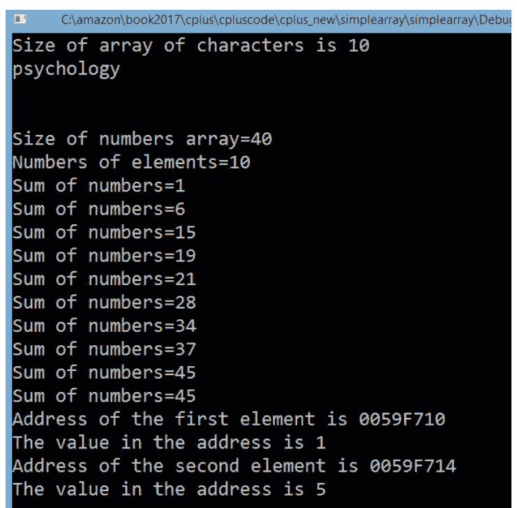

图 数组程序输出。

## 字符串

### 字符串函数

我将向您展示如何使用一些字符串函数。

strcpy_s() - 将一个字符串的内容复制到另一个字符串。

strcat_s() - 将源字符串的副本附加到目标字符串。

strlen() - 返回字符串的长度。

我们的应用程序将从用户输入中读取字符串，将其复制到另一个字符串，然后将原始字符串的字符按相反顺序复制到临时字符串中，并将副本和反转的副本连接成一个字符串。

例如，如果用户输入字符串 'Concatenation'，则应用程序将输出

'ConcatenationnoitanetacnoC'

必须在 main.cpp 文件中包含以下头文件：

```cpp
#include "stdafx.h"
#include <stdio.h>
#include <cctype>
#include <iostream>
#include <cstring>
```

字符串函数 `strcpy_s()`、`strcat_s()` 和 `strlen()` 需要 `<cstring>` 头文件。`toupper()` 函数需要 `cctype` 头文件。

我想解释一下我是如何将字符从原始字符串按相反顺序复制到临时字符串的。

首先，我使用 `strlen()` 函数获取原始字符串的长度。

```cpp
length=strlen(aWord);
```

然后在循环中，我将原始字符串的最后一个字符复制到临时字符串的第一个位置，依此类推。

让我们检查循环中的代码。

```cpp
for(i=0; i <length; i++)
```

```cpp
temp[i]=aWord[length-(i+1)];
```

如果用户输入单词 'Concatenation'，则单词长度将为 13。字符串中第一个字符的索引是 0，那么字符串最后一个字符的索引将是 12。这意味着最后一个字符的索引是 length - 1。

我在循环中放置的一行代码是

```cpp
temp[i]=aWord[length-(i+1)];
```

当 i = 0 时，`temp[i]` 将引用 `temp` 字符串的第一个字符。

同时（当 i = 0 时），`aWord [length-(i+1)]` 将引用 `aWord[13 – (0 + 1)]` 字符，它将是 `aWord[12]`，即 'Concatenation' 字符串的最后一个字符。

当 i=1 时，`temp [1]` 将引用 `temp` 字符串的第二个字符，而 `aWord [13-(1+1)]` 将引用 'Concatenation' 字符串的倒数第二个字符。

这样，我们就可以按相反顺序复制所有字符。

当我们已经将所有字符从原始字符串复制到 `temp` 字符串后，我们需要在 `temp` 字符串的末尾添加 null，因为 C++ 中的字符串必须以 null 终止。

代码行 `temp[length]='\0';` 将完成这项工作。

整个代码包含在 [visual_studio_2017.zip](visual_studio_2017.zip) 中。

```cpp
#include "stdafx.h"
#include <stdio.h>
#include <cctype>
#include <cstring>
#include <iostream>

int main()
{
    char more = 'Y';
    char prompt1[] = "\nEnter a word not more than 20 characters and press enter.\n";
    char prompt3[] = "\nDo you want to continue? Y/N\n";
    char aWord[20];
    char aCopy[40];
    int length = 0;
    char temp[20];
    int i;
    while (toupper(more) == 'Y')
    {
        std::cout << prompt1;
        std::cin >> aWord;
        std::cout << "aWord=" << aWord << std::endl;
        strcpy_s(aCopy, aWord);
        std::cout << "aCopy=" << aCopy << std::endl;
        length = strlen(aWord);
        std::cout << "length=" << length << std::endl;
        //用单词字符按相反顺序填充 temp[] 数组。
        for (i = 0; i <length; i++)
        temp[i] = aWord[length - (i + 1)];
        temp[length] = '\0';
        std::cout << "Temp=" << temp <<std::endl;
        strcat_s(aCopy, temp);
        std::cout << "aCopy after concatenation of temp=" << aCopy << std::endl;
        std::cout << prompt3;
        std::cin >> more;
    }
    return 0;
}
```

输出：

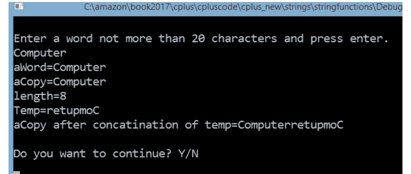

图 字符串操作。

## 链表

让我们想象一个谜题。你有一排盒子。每个盒子里都有一张写有一个字母的卡片。你必须找出字母的顺序，以便这些字母组成一个单词。

| T | C | O | N | E | L | Y | G | O | H |
|---|---|---|---|---|---|---|---|---|---|
| 5 | 10 | 6 | 3 | 2 | 9 | 1 | 7 | 8 | 4 |

### 图 链表

在上表中，你可以看到每个盒子都有一个数字。你可能猜到这些数字是解谜的关键。第一个盒子里有一个字母 T，正面有一个数字 5。拿一张写有字母 T 的卡片放在一边。数字 5 可能指向下一个字母。数盒子。第五个盒子里有字母 'E'。拿一张写有 'E' 的卡片放在 T 旁边。你会得到 "TE"。带有字母 'E' 的盒子侧面有数字 2。所以，从第 2 个盒子里拿卡片放在 "TE" 旁边。你会得到 "TEC"。

带有字母 'C' 的盒子有数字 10，所以从第 10 个盒子里拿卡片。你会得到 "TECH"。带有字母 'H' 的盒子有数字 4，所以从第 4 个盒子里拿卡片。你得到了 "TECHN"。继续按照数字走，你会得到整个单词：TECHNOLOGY。

这就是链表的工作原理。它由节点组成。每个节点至少有一个变量保存数据（文本、数字或对象）和一个变量（指针）保存下一个节点的地址。这个系统遍历节点列表，就像你在谜题中做的那样。最后一个节点的指针具有 null 值，或者它可能指向第一个节点。那么我们就有了一个封闭的链表。

### 添加节点

如果你想在链表的末尾添加一个新节点，你必须创建一个新节点。然后将最后一个节点的指针指向新节点的地址，并将新节点指针赋值为 null。

## 第三章 二叉树

二叉树是所有基础数据结构中最有用的一种，也是迄今为止最有趣的。它们完美地展示了如何利用递归和指针来完成一些非常有用的任务。

创建事物列表的最佳技术之一是链表，但在列表中查找元素可能需要一些时间。而且，如果你有大量非结构化数据，数组也帮不上太大忙。你可以尝试对数组进行排序，但即便如此，向其中插入项目仍然很困难。如果你想保持数组有序，插入新元素将需要大量的移动操作！而尽可能快地在列表中查找事物非常重要，尤其是在以下场景中：

- 你正在构建一款MMORPG游戏，玩家需要能够快速登录——这涉及快速查找玩家信息
- 你正在构建处理信用卡的软件，每小时需要处理数百万笔交易——需要非常快速地找到信用卡余额
- 你正在使用低功耗设备，如平板电脑或智能手机，并向用户展示通讯录。你不希望用户因为你的数据结构缓慢而一直等待。

本节将讨论克服这些问题所需的工具以及更多内容。

解决方案的思路是能够将元素存储在类似链表的结构中，使用指针来帮助组织内存，但比链表更简单。这样做要求内存具有比简单列表更多的结构。

那么，组织数据意味着什么？当我们开始这段旅程时，我们只有数组，但这些数组从未真正赋予我们使用顺序列表以外的数据结构的能力。链表使用指针来增量地增长顺序列表，但没有利用指针的灵活性来构建更复杂的结构。

内存中这些更复杂的结构是什么？例如，在任何给定时间能容纳多个“下一个节点”的结构就是一个很好的例子。但为什么你会想要这样呢？很简单。如果你有两个“下一个节点”，一个可以用来表示比当前元素更大的元素。这被称为二叉树。

它们之所以得名，是因为每个节点总有一个或两个分支。每个“下一个节点”都是一个子节点，而链接到子节点的节点是父节点。

二叉树可能看起来像这样：

```
10

6 14

5 8 11 18
```

在树中，每个元素的左子节点小于该元素，右子节点大于该元素。10是整棵树的父节点，而6和14的子节点分别是它们各自小树的父节点，这些小树称为子树。

二叉树有一个非常重要的特性：每个子节点都是一棵完整的树。结合左子节点较小、右子节点较大的规则，你就有了一个简单的方法来定义在树中定位特定节点的算法。

首先，查看当前节点值。如果它等于搜索目标，就完成了。如果它大于搜索目标，就向左走；否则，向右走。这之所以有效，是因为树中每个节点左侧的值都小于当前节点值，而右侧的每个值都大于当前节点值。

在理想情况下，你的二叉树将是平衡的，两侧的节点数量完全相同。在这种情况下，每个子树大约占整棵树的50%，当你在树中搜索一个值时，每次到达子节点时都可以排除50%的结果。所以，如果你有一棵包含1000个元素的树，500个元素会立即被排除。再次搜索这棵树（现在只有500个元素），你可以再次排除大约50%。这样，找到你想要的值就不会花太长时间。

那么，一棵树需要细分多少次才能到达一个元素？答案是log2n（n是树中元素的数量）。即使你的树很大，这也是一个很小的值——如果你的树有，比如说，320亿个元素，这个值将是32；这比搜索一个包含40亿个元素的链表快了近1亿倍，因为链表中的每个元素都必须被评估。

如果树不平衡，你就无法排除大约一半的元素；最坏的情况下，每个节点只有一个子节点，这使得树只不过是一个带有一些额外指针的链表，因此需要你搜索所有元素。

所以，当一棵树大致平衡时，搜索节点比在链表上进行相同的搜索要快得多，也容易得多。这是因为你可以按照自己的意愿来组织内存。

## 实现二叉树

要实现二叉树，首先声明节点结构：

```c
struct node
{
    int key_value;
    node *p_left;
    node *p_right;
};
```

节点可以存储一个简单的整数值`key_value`，并有两个子树——`p_left`和`p_right`。

你希望在二叉树上有一些常用函数：插入、搜索、删除和销毁：

```c
node* insert (node* p_tree, int key);
node *search (node* p_tree, int key);
void destroyTree (node* p_tree);
node *remove (node* p_tree, int key);
```

### 插入

我们将使用递归算法将其插入树中。递归对于树来说非常棒，因为每棵树都有两棵小树；这使得整棵树本质上是递归的。该函数接受一个键值和一个已存在的树（即使是空的），并返回一个包含插入值的新树。

```c
node* insert (node *p_tree, int key)
{
    // 基本情况--我们到达了一棵空树，我们的新节点
    // 需要插入在这里
    if ( p_tree == NULL )
    {
        node* p_new_tree = new node;
        p_new_tree->p_left = NULL;
        p_new_tree->p_right = NULL;
        p_new_tree->key_value = key;
        return p_new_tree;
    }
    // 决定 -- 插入左子树还是右子树
    // 取决于节点值是什么
    if( key < p_tree->key_value )
    {
        // 从p_tree->left构建一棵新树，并添加键值
        // 用指向新树的指针替换现有的p_tree->left指针。
        // 设置p_tree->p_left指针
        // 以防p_tree->left为NULL。（如果不是NULL，
        // p_tree->p_left不会改变，但设置它只是为了
        // 确保。）
        p_tree->p_left = insert( p_tree->p_left, key );
    }
    else
    {
        // 插入右侧与插入左侧是对称的
        p_tree->p_right = insert( p_tree->p_right, key );
    }
    return p_tree;
}
```

这里的基本逻辑是：如果你有一棵空树，你就创建一棵新的。如果不是，要插入的值如果大于当前节点，则进入左子树，然后左子树被新树替换。否则，将其插入右子树并替换它。

当涉及到实际操作时，将一棵空树构建成一棵有几个节点的树。如果值10插入到空树（NULL）中，我们将立即命中基本情况，结果将是一棵树：

1

并且两个子树都将指向NULL。

然后将5插入树中，并进行以下调用：

insert(一棵有父节点的树, 5)

## 删除节点

要删除具有特定键的节点，你需要沿着列表遍历，直到找到该键。然后将键节点分配给临时节点。然后将键节点之前的节点指向键节点之后的节点。参见图60。结果，临时键与列表隔离。现在你可以删除临时节点。

下面是Node类的代码。为简单起见，我创建了一个节点，它包含一个整数和一个指向下一个节点的节点指针。两个类成员变量都声明为私有。不使用全局变量是良好的编程实践，因为私有成员在类外部是不可见的。我们仍然需要设置和读取这些私有成员变量。公共函数`set`和`get`将完成这项工作。

## 销毁

这同样应该是一个递归函数。在删除当前节点之前，算法会销毁位于当前节点的两个子树。

```cpp
void destroy_tree (node *p_tree)
{
    if ( p_tree != NULL )
    {
        destroy_tree( p_tree->p_left );
        destroy_tree( p_tree->p_right );
        delete p_tree;
    }
}
```

为了更好地理解这一点，假设在节点被删除之前打印了其值：

```cpp
void destroy_tree (node *p_tree)
{
    if ( p_tree != NULL )
    {
        destroy_tree( p_tree->p_left );
        destroy_tree( p_tree->p_right );
        cout << "Deleting node: " << p_tree->key_value;
        delete p_tree;
    }
}
```

如你所见，树是从下往上被删除的。节点 5 和 8 先被删除，然后是 6，接着转到另一侧删除 11 和 18，之后是 14。最后，10 将被删除。树的值并不重要；重要的是节点的位置。在下面的二叉树中，我们使用删除顺序而非节点值：

```
        7
       / \
      3   6
     / \ / \
    1  2 4  5
```

手动在几棵树上逐步执行代码会很有帮助，这样你能看得更清楚。

从树中删除节点是递归算法的一个绝佳例子，它很难用迭代方式实现。首先，你需要一个能同时处理树两侧的循环。你需要能够删除一个子树，同时跟踪下一个子树，并且每一层都需要这样做。使用栈，你可以更容易地保持你的位置。最好的可视化方式是说每个栈帧将存储已经被删除或销毁的树分支：

```
destroy_tree( )

destroy_tree( )—知道子树是左子树还是右子树
```

每个栈帧都知道树的哪些部分必须被销毁，因为它知道函数执行应该从哪个点继续。当第一次调用销毁树时，栈帧通知程序在第二次调用 `destroy_tree` 时继续执行。当第二次调用发生时，程序被告知继续执行删除树的操作。因为每个函数都有自己独立的栈帧，它可以跟踪树销毁过程的当前状态，一次处理一个树层级。

以非递归方式实现这一点需要一个能保留相同数量和类型信息的数据结构。例如，你可以编写一个函数，使用链表来模拟这个过程。该链表将包含正在被销毁的子树和待销毁的树。然后可以编写一个基于循环的算法，将子树添加到列表中，并在它们被完全销毁后移除。基本上，递归让你使用内置的栈数据结构，而不需要自己编写。

## 第四章 继承

示例：

```cpp
#include <iostream>
using namespace std;
// 定义一个简单的学生类，包含2个成员
class Student
{
public:
    int studentID;
    string studentName;
// 显示类成员的函数
    void Display()
    {
        cout<<"Student ID "<<studentID<<endl;
        cout<<"Student Name "<<studentName;
    }
};
int main () {
Student stud1;
// 为类的属性赋值
    stud1.studentID=1;
    stud1.studentName="John";
    stud1.Display();
    return 0;
}
```

对于上述程序：

- 我们有一个名为‘Student’的类，它有2个成员，一个是‘studentID’，另一个是‘studentName’。
- 然后我们定义了一个名为‘Display()’的成员函数，它将‘studentID’和‘studentName’输出到控制台。
- 接着我们可以在主程序中从对象调用这个成员函数。

该程序的输出如下：

```
Student ID 1
Student Name John
```

## 那么什么是继承？

继承是一个概念，通过它我们可以定义一个类来继承另一个类的属性和方法。这有助于避免重新定义类或重新定义属性和方法。

假设我们有一个名为‘Person’的类，它有一个‘Name’属性和一个‘Display’方法。那么通过继承，我们可以定义一个名为Student的类，它可以继承Person类。Student类将自动获得ID成员和Display函数。然后，Student类可以根据需要定义自己的额外成员。

要定义一个继承类，我们使用以下语法。

```
派生类:基类
```

这里的‘派生类’是将继承另一个类（称为‘基类’）属性的类。

所以如果我们有一个基类，它有一个属性和一个函数，如下所示。

```
基类
{
Public 或 protected:
属性1;
}
```

那么当我们从基类定义派生类时，派生类将能够访问该属性。注意属性和函数需要具有public或protected访问修饰符。我们稍后会更详细地讨论访问修饰符。

```
派生类: 基类
{
    // 无需定义属性1，它将自动继承这些。
}
```

现在让我们通过代码看一个简单的继承示例。

示例2：以下程序用于展示如何使用一个简单的继承类。

```cpp
#include <iostream>
using namespace std;
// 定义一个简单的Person类，具有Name属性
class Person
{
public:
    string Name;
};
// 这里我们有派生类。它定义了另一个ID属性
class Student:public Person
{
public:
    int ID;
// 显示ID和Name的函数。由于Name来自Person基类，我们可以在这里访问它。
void Display()
    {
        cout<<"Student ID "<<ID<<endl;
        cout<<"Student Name "<<Name;
    }
};

int main () {

Student stud1;

    stud1.ID=1;

    stud1.Name="John";

    stud1.Display();

    return 0;

}
```

对于上述程序：

- 我们定义了一个名为‘Person’的类，它有一个名为‘Name’的成员。
- 然后我们使用继承来定义‘Student’类。注意我们现在定义了另一个名为‘ID’的属性。
- 在‘Display’函数中，注意我们可以在‘Student’类中使用‘Name’属性，而无需再次定义它。

该程序的输出如下：

```
Student ID 1
Student Name John
```

现在我们已经看到了如何使用派生类和基类，这也被称为继承。

### 1.2 派生类中的函数

我们也可以定义可以从基类继承的函数。让我们看看如何实现这一点。

例如，如果我们有一个基类，它有一个属性和一个函数，如下所示。

```
基类
{
Public 或 protected:
属性1;
函数1;
}
```

当我们从基类定义派生类时，派生类将能够访问该属性和函数。注意属性和函数需要具有public或protected访问修饰符。

```
派生类: 基类
{
    // 无需定义属性1和函数1，它将自动继承这些。
}
```

现在让我们看一个可以在派生类中使用函数的例子。

示例3：以下程序用于展示如何使用带有函数的继承类。

```cpp
#include <iostream>
using namespace std;

// 定义一个简单的Person类，具有Name、ID属性，以及一个名为Display的函数。
class Person
{
public:
    string Name;
```

## 1.3 多重继承

我们也可以让派生类同时继承多个基类。这有助于一次性从多个类中获取更多功能。
派生类：基类1，基类2… 基类N
这里你只需要用逗号分隔基类即可。
因此，如果我们有一个包含属性和函数的基类，如下所示。

```
基类1
{
Public 或 protected：
属性1；
函数1；
}
```

以及另一个基类，如下所示。

```
基类2
{
Public 或 protected：
属性2；
函数2；
}
```

那么当我们从这两个基类定义派生类时，派生类将能够访问两个类的属性和函数。

```
派生类：基类1，基类2
{
// 无需定义属性1、属性2以及函数1、函数2，它将自动继承这些。
}
```

同样请注意，属性和函数需要具有 public 或 protected 访问修饰符。让我们来看一个多重派生类的例子。

示例 5：以下程序用于展示如何使用多重派生类。

```
#include <iostream>
using namespace std;

// 定义第一个基类 Person
class Person
{
public:
    string Name;
    int ID;
    void Display()
    {
        cout<<"ID "<<ID<<endl;
        cout<<"Name "<<Name;
    }
};
// 定义第二个基类 Marks
class Marks
{
public:
    int marks1,marks2;
    void Sum()
    {
        cout<<marks1+marks2;
    }
};
// 派生类同时继承自 Person 和 Marks 基类。
class Student:public Person,public Marks {
public:
    void Display()
    {
        cout<<"Student ID "<<ID<<endl;
        cout<<"Student Name "<<Name<<endl;
    }
};
int main () {
Student stud1;
    stud1.ID=1;
    stud1.Name="John";
    stud1.Display();
    stud1.marks1=5;
    stud1.marks2=10;
    stud1.Sum();
    return 0;
}
```

通过上述程序：

- 我们定义了 2 个基类，一个叫做 ‘Person’，另一个叫做 ‘Marks’。
- 派生类 ‘Student’ 继承了这两个类，并且能够使用这两个类的成员。

通过这个程序，输出如下：

Student ID 1
Student Name John
15

## 1.4 访问控制

类修饰符可用于定义类中属性和方法的可见性。以下是可用的各种修饰符。

- Private（私有）— 使用 private，属性和方法仅对类本身可用。
- Protected（保护）— 使用 protected，属性和方法仅对类本身以及从该类派生的子类可用。
- Public（公有）— 使用 public，属性和方法对所有类都可用。

假设我们有一个类的结构如下。

```
类 类名
{
Private：
属性1；
函数1；
}
```

‘属性1’ 和 ‘函数1’ 除了在定义它们的类中，其他任何地方都无法访问。如果你尝试从主程序中访问这些属性或函数中的任何一个，你将得到一个编译时错误。

现在让我们定义下面的类，但这次我们将使用 protected 访问修饰符。

```
类 类名1
{
Protected：
属性1；
函数1；
}
```

现在 ‘属性1’ 和 ‘函数1’ 可以从上述类以及任何从它派生的其他类中访问。

因此，如果我们有下面的派生类定义，我们将在派生类中能够访问 ‘属性1’ 和 ‘函数1’。但请注意，我们无法在任何其他非派生类中使用这些属性。

```
类 派生类名：类名1
{
}
```

让我们来看另一个访问修饰符的例子。

示例 6：以下程序用于展示如何使用访问修饰符。

```
#include <iostream>
using namespace std;
class Person
{
public:
    int ID;
protected:
    // 注意我们将 Name 属性定义为 protected
    string Name;
    void Display()
    {
        cout<<"ID "<<ID<<endl;
        cout<<"Name "<<Name;
    }
private:
    // 注意我们将 city 属性定义为 private
    string city;
};
class Student:public Person {
public:
    void Display()
    {
        cout<<"Student ID "<<ID<<endl;
        cout<<"Student Name "<<Name<<endl;
    }
};
int main () {
Student stud1;
    stud1.ID=1;
    stud1.Name="John";
    stud1.Display();
    return 0;
}
```

通过这个程序，输出如下：

error: 'std::__cxx11::string Person::Name' is protected

为什么我们会得到这个错误？‘Person’ 类有两个属性，分别叫做 ID 和 Name。Name 具有 protected 访问修饰符，这意味着它只能在派生类中被访问。但我们试图在主类中访问它，这是错误的。因此，正确的实现方式如下。

示例 7：以下程序展示了如何正确使用访问修饰符。

```
#include <iostream>
using namespace std;
class Person
{
public:
    int ID;
protected:
    string Name;
    void Display()
    {
        cout<<"ID "<<ID<<endl;
        cout<<"Name "<<Name;
    }
private:
    string city;
};
class Student:public Person {
public:
    // 我们现在定义了一个函数，可以相应地设置 protected 属性的值。
    void InputName(string pName)
    {
        Name=pName;
    }
    void Display()
    {
        cout<<"Student ID "<<ID<<endl;
        cout<<"Student Name "<<Name<<endl;
    }
};
int main () {
Student stud1;
    stud1.ID=1;
    stud1.InputName("John");
    stud1.Display();
    return 0;
}
```

在上面的程序中，我们现在在 ‘Student’ 类中正确定义了一个名为 ‘InputName’ 的方法，它可以访问 protected 成员 ‘Name’。

通过这个程序，输出如下：

Student ID 1
Student Name John

现在让我们来看同一个例子，并尝试显示在 ‘Person’ 类中定义的名为 ‘City’ 的属性。

示例 8：以下程序展示了第二个错误使用访问修饰符的例子。

```
#include <iostream>
using namespace std;
class Person
{
public:
    int ID;
protected:
    string Name;
    void Display()
    {
        cout<<"ID "<<ID<<endl;
        cout<<"Name "<<Name;
    }
private:
    string city;
};
class Student:public Person {
public:
    void InputName(string pName)
    {
        Name=pName;
    }
    void Display()
    {
        cout<<"Student ID "<<ID<<endl;
        // 注意我们试图在派生类中使用 private 属性。
        cout<<"Student city "<<city<<endl;
        cout<<"Student Name "<<Name<<endl;
    }
};
int main () {
Student stud1;
    stud1.ID=1;
    stud1.InputName("John");
    stud1.Display();
    return 0;
}
```

通过这个程序，输出如下：

error: 'std::__cxx11::string Person::city' is private

由于 ‘City’ 属性是 private，它甚至不能在派生类中使用。我们只能在 ‘Person’ 类中使用这个属性。

## 第五章 高级基础

## 指针

指针之前已经提及，它们是变量的内存地址，这很像一个人的房屋地址。这些地址可以作为参数传递，并允许实现前面提到的按引用传递的效果。

下面的程序将显示一个变量的地址：

```c
#include <stdio.h>

int main()
{
    int var;
    printf("The address is: %x\n", &var);
    return 0;
}
```

输出：

> The address is: 10ffa2c

注意：每次运行时，这个地址几乎都会不同。

注意高亮显示的语句，`&`（取地址运算符）用于返回变量的内存位置，并允许某些语句访问该位置的数据。使用`%x`是因为内存位置是以十六进制表示的。

要创建一个指针，我们使用解引用运算符（`*`），这将创建一个旨在保存内存地址的指针变量。下面是一个程序，它创建一个指针，并使用取地址运算符（`&`）将另一个普通变量的地址存储在新创建的指针中。解引用运算符（`*`）也用于访问或更改该内存位置中的实际数据。

- 解引用运算符（`*`）用于创建指针，也用于更改实际值。
- 取地址运算符（`&`）用于获取指针的内存位置。

```c
//普通变量
int var = 10;

//指针
int* pointer;

//存储 var 的内存位置
pointer = &var;

//指针现在实际上就是 'var'，所以
//可以发生这样的事情
*pointer = 20;
printf("Var's value is now: %d", var);
```

输出：
> Var's value is now: 20

## NULL 指针

当你创建一个指针时，它最初没有指向任何东西，这是危险的，因为指针在创建时引用的是随机内存，更改该内存位置的数据可能会导致程序崩溃。为了防止这种情况，我们在创建指针时将其赋值为 NULL，如下所示：

```c
int* pointer = NULL;
```

这意味着指针的地址为‘0’，这是一个保留的内存位置，用于标识空指针。空指针可以通过 if 语句来检查：

```c
if (pointer) {}
```

如果指针不为空，此语句将成功执行。

## 使用指针

现在，指针的一些实际用途是将它们作为参数传递，并有效地按引用传递它们。下面的示例将展示其效果：

```c
void Change_Value(int* reference)
{
    //更改内存位置中的值
    *reference = 20;
}

int main()
{
    //创建指向变量的指针
    int var = 10;
    int* pointer = &var;
    printf("The value before call: %d\n", var);
    //方法调用
    Change_Value(pointer);
    //打印新值
    printf("The value after call: %d\n", var);
    return 0;
}
```

输出：

> The value before call: 10

> The value after call: 20

这传递的是内存位置，而不是变量的值，这意味着你拥有了可以进行更改的位置。

注意参数是 `int*`，这是指针类型，因此，例如指向 `char` 的指针将是 `char*`。

## 指针算术

有时，将指针移动到另一个内存位置可能很有用；这就是指针算术的用武之地。如果我们执行 `ptr++`，并且 `ptr` 是一个整型指针，那么它现在将向前移动 4 字节（`int` 的大小），如果我们再次运行它，又会移动 4 字节，依此类推。这意味着指针（如果指向有效的数组结构）可以像数组一样发挥作用。下面是一个例子：

```c
int arrayInt[] = { 10, 20, 30 };
size_t arrayInt_Size = 3;

//将指向第一个数组索引
int* ptr = &arrayInt;

for (int i = 0; i < arrayInt_Size; i++)
{
    //记住，*ptr 获取内存位置中的值
    printf("Value of arrayInt[%d] = %d\n", i, *ptr);
    ptr++;
}
```

输出：
> Value of arrayInt[0] = 10
> Value of arrayInt[1] = 20
> Value of arrayInt[2] = 30

这表明，指向数组第一个地址的指针可以沿着数组的地址递增（记住，数组的每个值都存储在相邻的内存位置中）。

你也可以做相反的操作，即递减指针，也就是减小指针的值。

还可以使用关系运算符（如 `==`、`<` 和 `>`）来比较指针。最常见的用途是检查两个指针是否指向同一个位置：

```c
int value;

//将 ptr1 和 ptr2 赋值为相同的值
int* ptr1 = &value;
int* ptr2 = &value;

//ptr3 被赋值为另一个值
int* ptr3 = NULL;

if (ptr1 == ptr2)
{
    printf("ptr1 and ptr2 are equal!\n");
}

if (!ptr1 == ptr3)
{
    printf("ptr1 is not equal to ptr3\n");
}
```

这检查了各个指针是否相等。同样可以使用 `>` 和 `<` 进行比较。

## 函数指针

就像你可以对变量做的那样，你也可以对函数做同样的事情；下面是一段代码片段，展示了如何定义一个函数指针。关键部分将被高亮显示：

```c
void printAddition(int value1, int value2)
{
    int result = value1 + value2;
    printf("The result is: %d", result);
}

int main()
{
    //函数指针定义
    //<返回类型>(*<名称>)(<参数>)
    void(*functionPtr)(int, int);
    functionPtr = &printAddition;

    //调用指针函数
    (*functionPtr)(100, 200);
    return 0;
}
```

定义函数指针的基本结构如下：

```
<返回类型> (*<名称>) (<参数>)
```

在本例中：

```
<返回类型> = void
<名称> = functionPtr
<参数> = int, int
```

这个函数指针现在可以作为参数传递，并在你想要改变代码行为但使用几乎相同代码的情况下使用。

一个例子可以是动态选择计算器应该执行的操作（注意：这是复杂的代码，应作为粗略示例，所以如果你不完全理解，请不要担心）：

```c
void calculator(int value1, int value2, int(*opp)(int,int))
{
    int result = (*opp)(value1, value2);
    printf("The result from the operation: %d\n", result);
}

//将两个值相加
int add(int num1, int num2)
{
    return num1 + num2;
}

//将两个值相减
int sub(int num1, int num2)
{
    return num1 - num2;
}

int main()
{
    calculator(10, 20, &add);
    calculator(10, 20, &sub);
    return 0;
}
```

这里发生的是，我们将函数 `add` 和 `sub` 作为参数传递给 `calculator` 函数，正如你从高亮部分看到的，函数参数的定义方式与上面相同，定义了返回类型、名称和参数，传递给 `calculator` 的只是函数指针 `&add` 和 `&sub`。然后 `calculator` 函数继续调用该指针，传入值并返回结果。

## 存储分类

在 C 语言中，每个变量都可以被赋予一个存储类，该类可以定义某些特性。

这些类包括：

- 自动变量
- 静态变量
- 寄存器变量
- 外部变量

## 自动变量

到目前为止我们定义的每个变量都是自动变量；它们在函数被调用时创建，在函数退出时自动销毁。这些变量也称为局部变量。

```c
auto int value;

// 等同于

int value;
```

## 静态变量

当你希望变量在超出作用域时不被销毁时，使用 `static`；这个变量将一直持续到程序结束。静态变量在程序的整个生命周期中只创建一次。下面是一个静态变量使用的例子：

```c
void tick()
{
    //这将只运行一次
    static int count = 0;
    count++;
    printf("The count is now: %d\n", count);
}

int main()
{
    tick();
    tick();
    tick();
}
```

输出：
> The count is now: 1
> The count is now: 2
> The count is now: 3

高亮部分是静态定义，只会运行一次。

## 寄存器变量

`register` 用于定义一个存储在寄存器内存中而不是常规内存中的变量，寄存器内存的好处是访问速度要快得多；然而，只有空间容纳少数几个变量。

定义寄存器变量的方法如下：

```c
register int value;
```

## 外部变量

我们之前已经提到过，全局变量是指未在任何作用域内定义的变量，因此可以在任何地方使用。外部变量则是在单独的位置（如另一个文件）定义的变量，使用 `extern` 关键字来表示该变量位于另一个文件中。你可以通过在文件顶部添加以下内容来将另一个文件作为引用包含进来：

```c
#include "FileName.c"
```

这会告诉程序同时引用该文件。请注意，这些文件需要位于同一目录下。

```c
// 程序 1 [File_2.c]
#include <stdio.h>
#include "C_TUT.c"

int main()
{
    extern int globalValue;
    printf("The global variable is: %d", globalValue);
}
```

```c
// 程序 2（内容较少）[C_TUT.c]
#include <stdio.h>

int globalValue = 1032;
```

运行 `File_2.c` 的输出结果为：

> The global variable is: 1032

这表明通过使用 `extern` 关键字，`globalValue` 从 `C_TUT.c` 中被引用，并在另一个文件中使用。

我们在教程的基础部分已经介绍了递归，它本质上是函数对自身的定义。正如之前承诺的，下面将解释几个递归的示例：

```c
int factorial(int x)
{
    int r;
    // 终止条件
    if (x == 1)
    {
        // 有了结论，循环停止
        return 1;
    }
    else
    {
        // 递归定义
        return r = x * factorial(x - 1);
    }
}

int main()
{
    puts("Please enter a number: ");
    // 读取用户输入
    int a, b;
    scanf("%d", &a);
    // 开始执行
    b = factorial(a);
    printf("The factorial is: %d", b);
}
```

这是世界著名的递归示例，用于计算一个数的阶乘（3的阶乘是3x2x1）。它通过上面的递归返回语句工作；当遇到没有递归定义的返回语句时（即当 x = 1 时，函数直接返回 1），循环停止；这意味着调用栈可以回溯并得出答案。下面是一个流程图：

## 递归

递归是一个复杂的概念，这里仅作简要介绍，其实际应用和功能将在高级部分详细说明。

递归是指函数的定义中包含对自身的引用，是的，我知道这很令人困惑，但我将用一些例子来解释。

```c
const int maxLoops = 5;

void Sequence(int previous, int now, size_t loopCount)
{
    // 计算下一个值
    int next = previous + now;
    // 打印新值
    printf("New value: %d\n", next);
    // 递增计数
    loopCount++;
    // 终止条件，确保不会无限循环
    if (loopCount < maxLoops)
    {
        // 递归调用
        Sequence(now, next, loopCount);
    }
}

int main()
{
    Sequence(1, 1, 0);
}
```

输出结果：

> New value: 2
> New value: 3
> New value: 5
> New value: 8
> New value: 13

有几点需要注意：首先是缺少迭代循环，递归本质上会导致循环。其次需要注意的是标记为“终止条件”的 if 语句，如果递归设置没有停止循环的条件，它们将永远循环下去，因此这是有效使用递归的关键要素。

我们在教程的基础部分已经介绍了递归，它本质上是函数对自身的定义。正如之前承诺的，下面将解释几个递归的示例：

```c
int factorial(int x)
{
    int r;
    // 终止条件
    if (x == 1)
    {
        // 有了结论，循环停止
        return 1;
    }
    else
    {
        // 递归定义
        return r = x * factorial(x - 1);
    }
}

int main()
{
    puts("Please enter a number: ");
    // 读取用户输入
    int a, b;
    scanf("%d", &a);
    // 开始执行
    b = factorial(a);
    printf("The factorial is: %d", b);
}
```

这是世界著名的递归示例，用于计算一个数的阶乘（3的阶乘是3x2x1）。它通过上面的递归返回语句工作；当遇到没有递归定义的返回语句时（即当 x = 1 时，函数直接返回 1），循环停止；这意味着调用栈可以回溯并得出答案。下面是一个流程图：

```javascript
function factorial(3) {
    if (3 === 0)
        return 1;
    else {
        return x * factorial(3 - 1);
    }
}

let num = 3;
let result = factorial(3);
```

返回 2* 3 = 6

```javascript
function factorial(2) {
    if (2 === 0)
        return 1;
    else {
        return x * factorial(2 - 1);
    }
}
```

返回 1* 2 = 2

```javascript
function factorial(1) {
    if (1 === 0)
        return 1;
    else {
        return x * factorial(1 - 1);
    }
}
```

返回 1* 1 = 1

```javascript
function factorial(0) {
    if (3 === 0)
        return 1;
    else {
        return x * factorial(1 - 1);
    }
}
```

返回 1

## 第6章 STL容器和迭代器

### 容器

容器是STL的主要贡献，用于存储和访问一系列对象。STL提供了不同类型的容器，如向量、列表、映射和哈希表。然而，根据数据排列的特性，STL容器被分为三大类：

1. 序列容器，如向量、固定大小数组、列表、前向列表和双端队列；
2. 关联容器：
   a) 有序（已排序）关联容器，如集合、多重集合、映射和多重映射；
   b) 无序（未排序）关联容器，如无序集合、无序多重集合、无序映射和无序多重映射；以及
3. 容器适配器，如栈、队列和优先队列。

除了这些完全合格的容器外，C++还提供了三个几乎合格的容器，即字符串、内置数组和valarray。

每个容器都是复杂的模板类，具有默认构造函数、参数构造函数、拷贝构造函数、赋值运算符和明确的析构函数。除此之外，大多数容器定义了自己的迭代器，并且每个容器都有自己的操作成员函数。

### 容器迭代器

从这些部分我们知道，每个容器都提供自己的迭代器，并使用该迭代器对容器的元素执行操作。

在五种迭代器类别中，每个容器定义以下三种类别之一，即：

前向迭代器：

- 可读；
- 可写；
- 可在单个位置重复读/写；
- 可向前移动（++），但不能向后移动，因此得名前向迭代器；以及
- 用于：无序关联容器和前向列表，它们提供最佳的空间效率存储。

双向迭代器：

- 与前向迭代器相同，但它也可以向后移动（因此，++ 和 --），因此得名双向；以及
- 用于容器：列表、集合、映射、多重集合和多重映射。

随机访问迭代器：

- 与双向迭代器相同，但它可以跳跃（+=N 或 -=N，其中N是整数）而不是（+=1 或 -=1，其中 +=1 是 ++，-=1 是 --），因此得名随机访问迭代器（跳跃迭代器）；以及
- 用于容器：向量、字符串、双端队列和数组<T,N>。

除了帮助STL算法在容器中的操作外，迭代器还有助于执行容器的内部操作（成员函数）。

一些内部操作对所有序列和关联容器都是通用的，它们是：

O(1)：

`begin()`、`end()`、`cbegin()`、`cend()`、`rbegin()`*、`rend()`*、`crbegin()`*、`crend()`*、`empty()`、`swap()`、`size()`†、`max_size()`、`shrink_to_fit()`‡、`emplace()` 和 `emplace_back()`*；

O(n)：

赋值运算符：`=`

关系运算符：

`!=`、`==`、`<`††、`<=`††、`>`†† 和 `>=`††，以及 `clear()`；

O（可变）：

- `insert()`†、`erase()`† 和 `emplace()`†（它们在基于节点的容器中很快，在连续内存容器的（中间）很慢）；以及
- 构造函数（通常是类的组合或
- 它们的默认构造函数具有常数复杂度，但所有其他构造函数和析构函数可能具有线性复杂度）。

注意：

a) 前向列表和无序关联容器使用前向迭代器，因此它们没有反向迭代器操作：`emplace_back()`、`rbegin()`、`rend()`、`crbegin()` 和 `crend()`。

b) 关联容器支持反向迭代器，但它们不支持 `emplace_back`。这是因为关联容器保持其元素处于排序状态，因此它不接受坚持将新元素放置在容器末尾的命令 `emplace_back()`。

†前向列表：

1. 不支持运算符 `size()`；
2. 它提供 `insert_after()`、`erase_after()` 和 `emplace_after()` 来代替 `insert()`、`erase()` 和 `emplace()`；
3. 具有特殊迭代器 `before_begin()`、`cbefore_begin()`，使得
   - 前向列表中的操作：

## STL 迭代器

迭代器、容器和算法是标准模板库的组成部分，该库由惠普公司的亚历山大·斯特潘诺夫等人在1990年代初编写，随后被合并并发展到标准库中。

迭代器是对特化指针的抽象，它可以在给定容器（如 `vector`、`map` 和用户自定义的容器类）的元素上进行解引用操作。

每个容器类都包含用于生成迭代器的成员函数，例如，成员函数 `begin()` 和 `end()` 分别返回指向第一个元素和最后一个元素之后位置的迭代器。

下图描述了迭代器（`*it`）与其容器（`vector<int> data {1111, 1134, 1134, 1124, 1124, 1134, 1111, 1176, 1124, 1134, 1176}`）之间的关系。

然后，迭代器可以将容器的这些元素纳入算法操作（如 `sort`、`accumulate` 和用户自定义的算法函数）中。

换句话说，迭代器将容器与算法关联起来。

最常用的迭代器来自 `begin()` 和 `end()`。这在下图中得到了说明：

如图所示，`data[0]` 和 `data.begin()` 代表同一个元素，即元素1，但 `data[N]` 和 `data.end()` 代表一个“无人区”，访问它可能导致运行时错误。然而，成员函数 `end()` 在迭代语句中构造条件时非常有用。

以下代码说明了迭代器的这一基本特性：

```cpp
// iterators.cpp
#include "..\..\my_essentials.hpp"
void illustrate_iterators()
{
    int arr[] = {1111, 1134, 1134, 1124, 1124, 1134, 1111, 1176, 1124, 1134, 1176};
    vector<int> data(arr, arr + sizeof(arr)/sizeof(arr[0]));
    // vector<int> data2{1111, 1134, 1134, 1124, 1124, 1134, 1111, 1176, 1124, 1134, 1176}; // fine with gcc4.7.0
    cout << "\n Illustration of iterators: \n"
         << "\n Given vector: data =\n\t( ";
    for(auto element: data) // 'the range-based for' do not work with VC10.
        cout << element << "; ";
    cout << ")\n\n Let us define an iterator, say *it for this vector.\n";
    vector<int>::iterator it = data.begin();
    /*
    Note:
    In STL containers, each container template class
    defines its own iterator member class, so that
    vector<int>::iterator is different from the
    list<int>::iterator.
    */
    cout << " Thus,\t\t*it = " << *it << " that is data[0]\n Iterators can be incremented, i.e, ++it;\n";
    ++it;
    cout << " After ++\t*it = " << *it << " that is data[1]\n Therefore, iterator *it dereferences through vector data.\n So, let us express the entire vector using the iterator: \n\t( ";
    for(auto it = data.begin(); it!=data.end(); ++it)
        cout << *it << "; ";
    cout << ")\n";
    cout << "\n Task: Since, this vector has repeated numbers,\n Can we keep only one copy of each number and remove the duplicates?\n Yes, we can!\n For that, we pass the iterator through three type of STL algorithms as shown below:\n";
    cout << "\n Step.1 Sort in ascending order:\n";
    sort(data.begin(), data.end());
    cout << " After the iterator has passed through sort(): \n\t( ";
    for(auto element: data)
        cout << element << "; ";
    cout << ")\n\n Step.2 Move the adjacent repeated elements to the left hand side:\n";
    auto my_unique = unique(data.begin(), data.end());
    cout << " After the iterator has passed through unique(): \n\t( ";
    for(auto element: data)
        cout << element << "; ";
    /*
    The function unique() has returned an iterator to the identifier “my_unique” starting from which the repeated elements are pushed up to one before the end().
    Note: The STL algorithms can displace the elements but it cannot erase them, however each stl container template class has a member function called “erase()” operation for erasing the specified elements.

    In other words, iterators can modify elements in containers but not the containers themselves.

    Therefore, to remove the duplicates, we apply the operation erase() from the iterator “my_unique” till the end().
    */
    cout << ")\n\n Step.3 Erase out those repeated elements:\n";
    data.erase(my_unique, data.end());
    cout << " After the iterator has passed through erase() i.e., \n Final:\t( ";
    for(auto element: data)
        cout << element << "; ";
    cout << ")\n";
}

int main()
{
    illustrate_iterators();
    just_pause();
}
```

输出：

迭代器示例：

给定向量：data =

( 1111; 1134; 1134; 1124; 1124; 1134; 1111; 1176; 1124; 1134; 1176; )

让我们为此向量定义一个迭代器，比如 `*it`。

因此，`*it = 1111`，即 `data[0]`。

迭代器可以递增，即 `++it`。

执行 `++` 后，`*it = 1134`，即 `data[1]`。

因此，迭代器 `*it` 通过向量 data 进行解引用。

那么，让我们使用迭代器来表示整个向量：

( 1111; 1134; 1134; 1124; 1124; 1134; 1111; 1176; 1124; 1134; 1176; )

任务：由于此向量包含重复的数字，

我们能否只保留每个数字的一个副本并移除重复项？

是的，我们可以！

为此，我们将迭代器传递给三种类型的 STL 算法，如下所示：

步骤1. 升序排序：

迭代器经过 `sort()` 后：

( 1111; 1111; 1124; 1124; 1124; 1134; 1134; 1134; 1134; 1176; 1176; )

步骤2. 将相邻的重复元素移动到左侧：

迭代器经过 `unique()` 后：

( 1111; 1124; 1134; 1176; 1124; 1134; 1134; 1134; 1134; 1176; 1176; )

步骤3. 擦除那些重复的元素：

迭代器经过 `erase()` 后，即：

最终结果：( 1111; 1124; 1134; 1176; )

上面展示的程序演示了迭代器在算法中整合容器数据的实用性。

正如我们所见，迭代器可用于打印容器的内容，因此让我们在头文件 "my_essentials.hpp" 中编写一个与容器无关的代码。这适用于轻松打印具有一个类型名的容器，如 `vector<T>`、`list<T>`、`set<T>`、`multiset<T>`、`deque<T>` 和固定大小的 `array<T,N>`，但不适用于具有两个类型名的容器，如 `map<T1,T2>` 和 `unordered_multimap<T1,T2>`。

```cpp
//-----------------------------------------------
// Container independent code for printing out
// container with one typename
template<typename container>
void cout_container(const std::string& message, const container& data)
{
    std::cout << message << "{";
    if(data.empty()){
        std::cout << "NULL}"<<std::endl;
        return;
    }
    auto start = data.begin();
    auto end = data.end();
    while(true)
    {
        std::cout << *start;
        ++start;
        if(start != end)
            std::cout << ", ";
        else {
            std::cout <<'}' << std::endl;
            break;
        }
    }
}
```

让我们将此模板添加到 "my_essentials.hpp" 中，并使用以下代码测试该模板。

然后，让我们测试此模板：

```cpp
// cout_containers.cpp
#include "..\..\my_essentials.hpp"
#include <array>
#include <vector>
#include <unordered_set>
#include <forward_list>
#include <set>

int main()
{
    // Let us define,
    // a fixed-size array
    array<int,6> arr = {1,3,5,1,2,4};
    cout_container("my array\t = ", arr);
```

## 第7章 STL算法

STL算法位于`<algorithms>`头文件中，因此我们需要在程序中包含它。

这些算法可以分为：

- 非修改算法：例如 `for_each`、`count`、`search` 等。
- 修改算法：例如 `copy`、`transform` 等。
- 删除算法：`remove`、`remove_if` 等。
- 变换算法：`reverse`、`rotate` 等。
- 排序算法：`sort`、`partial_sort` 等。
- 已排序范围算法：`binary_search`、`merge` 等。
- 数值算法：`accumulate`、`partial_sum`、`inner_product` 等。

以下示例展示了 `sort()` 函数如何对数组进行操作。

程序 13.11：使用排序算法对数组进行排序

```cpp
#include <iostream>
#include <algorithm>
using namespace std;

int main()
{
    int a[] = {3,5,7,2,9};
    sort(a, a + 5);
    cout << "Sorted Array:" << endl;
    for (int i = 0; i < 5; i++)
        cout << a[i] << " ";
    return 0;
}
```

输出：
Sorted Array:
2 3 5 7 9

在上面的例子中，当我们传递数组名 `a` 作为参数时，我们是在告诉函数从数组的开头开始排序。如果我们想从数组的第三个元素开始排序，可以使用：

```cpp
sort(a+3, a+5);
```

我们使用了 `a+5` 作为第二个参数，这指定了我们希望排序到数组的最后一个元素。

现在，类似的 `sort()` 函数也可以用于 `vector` 容器，如下面的程序所示。这表明 STL 算法是通用的。

程序 13.12：使用排序算法对 vector 进行排序

```cpp
#include <iostream>
#include <algorithm>
#include <vector>
using namespace std;

int main()
{
    int a[] = {5,3,7,6,2,9};
    vector<int> v(a, a+6);
    sort(v.begin(), v.end());
    for (int i = 0; i != v.size(); i++)
        cout << v[i] << " ";
    cout << endl;
    return 0;
}
```

输出：2 3 5 6 7 9

如你所见，排序函数的工作方式与在数组上几乎相同。`sort()` 的第一个参数接受一个指向第一个元素的迭代器，使用 `begin()` 因为它返回一个指向第一个元素的迭代器。所以它将从 vector 的第一个元素开始排序。同样，`end()` 返回一个指向容器中最后一个元素之后位置的迭代器。请注意，排序函数会排序到但不包括我们作为第二个参数传递的位置。

`find()` 和 `count()` 算法

`find()` 算法有助于在容器中查找特定值。`count()` 用于计算特定值在容器中出现的次数。

程序 13.13：使用 find 算法在 vector 中查找值

```cpp
#include <iostream>
#include <algorithm>
#include <vector>
using namespace std;

int main()
{
    vector<int> v;
    for(int i = 0; i < 10; i++)
        v.push_back(i);
    int a = 5;
    vector<int>::iterator it;
    it = find(v.begin(), v.end(), a);
    if(it != v.end()) {
        cout << "found " << a << endl;
    }
    else {
        cout << "could not find " << a << endl;
    }
    int c = count(v.begin(), v.end(), 6);
    cout << "Number of 6 stored in vector:" << c;
    return 0;
}
```

输出：found 5
Number of 6 stored in vector: 1

`for_each()`

此算法将指定的函数对象应用于容器中的每个元素。容器中的原始值不会改变，但它用于显示修改后的元素。它接受前两个参数作为起始和结束范围。第三个参数是一个函数对象的地址。

例如，`for_each()` 算法将数组的所有元素平方并显示它们。

程序 13.14：使用 for_each 算法对数组所有元素求平方

```cpp
#include <iostream>
#include <vector>
#include <algorithm>
using namespace std;

void square(int a)
{
    cout << a*a << endl;
}

int main()
{
    int s[] = {1,2,3,4};
    for_each(s, s+4, square);
    return 0;
}
```

输出：
1
4
9
16

## 第8章 库函数

## C++中的库函数和用户定义函数

### 学习目标

完成本主题后，你应该能够简要说明C++中的库函数和用户定义函数。

### 1. 库函数的引入

C++程序员可以使用大量的库函数。

你只需包含包含相应函数原型的头文件名，就可以使用库中的任何函数。

通常，库函数在一对文件中指定。

函数定义包含在一个源文件中，该文件通常具有 `.c` 或 `.cpp` 文件扩展名。

## 注意

通常，编译器不会提供库函数的源代码。

相反，你会获得预编译的目标文件，这些文件可以链接到你的程序中。

函数原型包含在一个头文件中，该文件可能以 `.h`、`.hpp` 或 `.hxx` 文件扩展名区分。

## 注意

头文件还包含这些函数所需的各种数据类型和常量的定义。

虽然不是强制性的，但以与提供的库函数相同的方式组织你自己的函数是一个好主意。

这允许你在多个程序中使用这些函数，而无需重新指定代码。

为了在程序中调用库函数，你必须指定包含相应函数原型的头文件。

这通常在源文件的开头完成。

但它必须在程序使用该函数之前完成。

可以通过使用 `#include` 预处理指令将头文件包含在程序中。

这告诉预处理器打开指定的头文件并将其内容插入到 `#include` 语句出现的位置。

```cpp
#include <string>
#include "myfuncs.h"
```

你可以在 `#include` 语句中以两种方式命名文件，即使用双引号或尖括号（`<>`）。

尖括号中的文件名告诉预处理器在环境中指定的搜索路径中查找。

```cpp
#include <string>
#include "myfuncs.h"
```

双引号中的文件名告诉预处理器首先搜索当前目录，然后搜索指定的搜索路径。

如果找不到文件，则会报告错误。

```cpp
#include <string>
#include "myfuncs.h"
```

链接器总是搜索包含头文件中指定的任何函数的编译版本。

### 可用文件

C标准库提供了一组用于执行常见任务的函数，例如：

- 字符串处理
- 字符和类型转换
- 数学运算
- 输入和输出

还有各种各样的C++库文件可用。

C++库的ANSI标准于1998年获得批准。

`iostream` 文件可能是所有C++库文件中最常见和通用的。

大多数C++程序都包含这个头文件。

`iostream` 文件提供了大量的输入/输出函数和其他I/O流信息。

例如，`cin` 和 `cout` 数据和函数就是在这里定义的。

## 注意

C++ I/O以字节流的形式发生，其中流只是字节的序列。

程序员可以使用多种C++库变体。

这些库源自多个来源。

例如，一些库随C++应用开发软件一起提供。

C++函数库也可以由设备驱动程序制造商、C++编程网站和公告板等来源提供。

你最好的参考资料通常是C++应用开发软件附带的手册和帮助文件。
市面上也有许多参考书籍，其中一些专门介绍特定的编译器。

## 库函数的使用

为了演示标准库函数的使用，让我们考虑一个执行以下操作的程序：

- 获取数字-55的绝对值

```cpp
#include <iostream>
using namespace std;
#include <cmath>
void main(void)
{
    cout <<"The absolute value of -55 is "<<abs(-55)<< "\n";
```

- 计算100的平方根

```cpp
cout <<"The square root of 100 is "<<sqrt(100.0)<< "\n";
```

- 计算10的5次方

```cpp
cout<<"10 to the power of 5 is"<<pow(10, 5)<< "\n";
```

每次计算的结果都输出到屏幕上。

## 注意

此程序未使用任何用户自定义函数。

标准数学库包含执行所需三种计算的函数。

这些函数是：

- abs()
- sqrt()
- pow()

```cpp
#include <iostream>
using namespace std;
#include <cmath>
void main(void)
{
    cout <<"The absolute value of -55 is "<<abs(-55)<< "\n";
    cout <<"The square root of 100 is "<<sqrt(100.0)<< "\n";
    cout <<"10 to the power of 5 is "<<pow(10,5)<< "\n";
}
```

编写此程序时，首先要决定包含哪些头文件。

要调用`abs()`、`sqrt()`和`pow()`，你需要在预处理指令中包含头文件`cmath`。

你还需要包含头文件`iostream`，以便使用`cin`和`cout`语句。

```cpp
#include <iostream>
using namespace std;
#include <cmath>
void main(void)
{
    cout <<"The absolute value of -55 is "<<abs(-55)<< "\n";
    cout <<"The square root of 100 is "<<sqrt(100.0)<< "\n";
    cout <<"10 to the power of 5 is "<<pow(10,5)<< "\n";
}
```

## 注意

函数`abs()`也包含在`stdlib.h`头文件中。
完成预处理指令后，你就可以开始编写`main()`函数了。

```cpp
#include <iostream>
using namespace std;
#include <cmath>
void main(void)
{
    cout <<"The absolute value of -55 is "<<abs(-55)<< "\n";
    cout <<"The square root of 100 is "<<sqrt(100.0)<< "\n";
    cout <<"10 to the power of 5 is "<<pow(10,5)<< "\n";
}
```

这三个函数的返回值通过三个独立的`cout`语句直接显示在屏幕上。
你可以在`cout`语句中显示常量、数据类型和表达式值的组合，前提是每个不同的项目都由插入运算符（`<<`）分隔。

```cpp
#include <iostream>
using namespace std;
#include <cmath>
void main(void)
{
    cout <<"The absolute value of -55 is "<<abs(-55)<< "\n";
    cout <<"The square root of 100 is "<<sqrt(100.0)<< "\n";
    cout <<"10 to the power of 5 is "<<pow(10,5)<< "\n";
}
```

在第一个`cout`语句中，显示的第一个值是一个常量字符串。
然后，通过调用函数显示数学库函数`abs()`的返回值。

```cpp
#include <iostream>
using namespace std;
#include <cmath>
void main(void)
{
    cout <<"The absolute value of -55 is "<<abs(-55)<< "\n";
    cout <<"The square root of 100 is "<<sqrt(100.0)<< "\n";
    cout <<"10 to the power of 5 is "<<pow(10,5)<< "\n";
}
```

`abs()`函数计算作为其函数参数传递的整数的绝对值。该函数返回一个`int`类型的值。
在此示例中，参数是一个常量，而不是`int`类型的变量。

```cpp
#include <iostream>
using namespace std;
#include <cmath>
void main(void)
{
    cout <<"The absolute value of -55 is "<<abs(-55)<< "\n";
    cout <<"The square root of 100 is "<<sqrt(100.0)<< "\n";
    cout <<"10 to the power of 5 is "<<pow(10,5)<< "\n";
}
```

当执行`cout`语句时，函数被调用，数字55显示在屏幕上。

```cpp
#include <iostream>
using namespace std;
#include <cmath>
void main(void)
{
    cout <<"The absolute value of -55 is "<<abs(-55)<< "\n";
    cout <<"The square root of 100 is "<<sqrt(100.0)<< "\n";
    cout <<"10 to the power of 5 is "<<pow(10,5)<< "\n";
}
```

接下来的两行代码以与第一行相同的方式执行函数调用。

函数`sqrt()`接受一个`double`类型的参数，并返回一个`double`类型的值。

在此示例中，数字10显示在屏幕上。

```cpp
#include <iostream>
using namespace std;
#include <cmath>
void main(void)
{
    cout <<"The absolute value of -55 is "<<abs(-55)<< "\n";
    cout <<"The square root of 100 is "<<sqrt(100.0)<< "\n";
    cout <<"10 to the power of 5 is "<<pow(10,5)<< "\n";
}
```

## 注意

如果参数是负数，则会发生定义域错误。
库函数`pow()`接受两个`double`类型的参数，并返回一个`double`类型的值。
当`cout`语句执行时，显示数字100000。

```cpp
#include <iostream>
using namespace std;
#include <cmath>
void main(void)
{
    cout <<"The absolute value of -55 is "<<abs(-55)<< "\n";
    cout <<"The square root of 100 is "<<sqrt(100.0)<< "\n";
    cout <<"10 to the power of 5 is "<<pow(10,5)<< "\n";
}
```

# 第9章 I/O

## I/O基础

### I/O基础知识

- C++和C都没有在语言中内建输入和输出。它们使用语言库中的函数（C）或其他I/O对象（C++）。
- C++ I/O类和头文件
  1. Iofs代表三个头文件`<iostream>`、`<fstream>`和`<sstream>`。`<iostream>`自动包含`<ios>`。它们是你应该在C++应用程序中包含的三个主要头文件。
  2. 类：iostream(streambuf)、fstream(filebuf)、stringstream(stringbuf)和四个预定义对象：cin、cout、clog和cerr。
  3. Clog与cerr类似，但它会缓冲其输出。
  4. C++通常在你按回车键时刷新输入缓冲区。对于输出到显示器，C++程序通常在传输换行符或到达输入语句时刷新输出缓冲区。
  5. >>和<<不需要格式化字符串，C++会自动转换它，这比C语言中的printf和scanf更好。
  6. 通过继承，fstream和cin(cout)共享相同的用法。所有知识都可以直接在fstream中使用。这是我最喜欢的。

## 输入

### 输入基础知识

- 对于输入，你需要掌握一个基本思想、两种语言和三种数据类型。
- 一个基本思想：为了进行连续输入，你需要使用while(inputMethod)，当发生两件事时：
  1. 用户想要结束输入（ctrl+D）或读取文件末尾；
  2. 读取失败（例如，`cin>> int`，但输入字母'a'）。

inputMethod将返回false。然后你需要在while循环内部使用一些标志或状态来区分EOF和错误。

- 两种语言是C和C++，它们使用不同的inputMethod。三种数据类型是：数字和单词（中间无空格）、字符（空白）和字符串（中间包含空格）。
- 两种语言常用的输入方法

| 数字和非空白字符单词 | 字符（包括空白字符） | 字符串（行） |
| :--- | :--- | :--- |
| C scanf("%d %f %c %s",&i, &f,&c); | int a = getchar(); | fgets(stdin, char*p, n ) |
| C++ cin>>i>>f>>c>>w; | cin.get(char & c);<br>ch = cin.get(); | cin.get( char *p, n);<br>cin.getline(char *p, n);<br>getline(cin, string); |

- 在scanf中，读取时需要指定确切的数据类型。
  1. H：short int或short unsigned。示例：%hd或%hu。
  2. I：long int或long unsigned，或double（用于%f转换）。示例：%ld、%lu或%lf。
  3. L：要解析的值对于整数类型是long，对于浮点类型是long double。示例：%Ld、%Lu或%Lf。
  4. *：告诉scanf()执行指定的转换，但不将其存储在任何地方。如果你想让scanf()消耗一些数据，但不想将其存储在任何地方，就可以使用这个；你不需要为这个转换给scanf()提供参数。示例：%*d。

- `scanf("%c", &c)`将读取任何字符，包括空白字符。如果你想让scanf跳过任何空白，可以在%c前使用空格。

```c
1. while(true){
2. scanf("%c",&c);
3. //scanf(" %c",&c);
4. printf("you input: %d", c);
5. }
```

输出：

当你输入a（回车），输出将像这样：you input: 97(a值) you input: 10(回车值)

- `cin>>c`不会读取空白字符（制表符、空格、换行符）。如果你想从输入缓冲区读取它们，应该使用`getchar()`或`cin.get()`；如果你想让用户输入他或她的名字。

```cpp
1. while(true){
2. cin>>c;
3. cout<<"you input:"<<c<<endl;
4. }
```

输出：

## 输入模式

- 在条件/循环语句的外部测试流，然后在内部进行读写操作，这种做法是不妥的。因为读取操作可能会使流失效。通常更好的做法是将读取作为测试的一部分。

```
while(!cin.fail()) { // 这是不良的编程风格
    cin>>i; // 这里可能使流失效。
    ..... // 然后 i 就不是有效值了
}
```

- 如果你只是想输入，不想处理 EOF 或 failbit，可以使用以下方式：

```
while(scanf("%d",&i) != 1)
while((int c = getchar())!=EOF)
while( fgets(line, sizeof(line), fp) != NULL )
// 在 C 语言中，使用这些方式退出循环！
while(cin>>input)
while(cin.get(p, 20) )
while(getline(ifstream, string)) {
    // 在 C++ 语言中，使用布尔运算符退出循环。
    // 执行一些有用的操作。 // 输入正确。
}
```

- 如果你想知道 EOF 或处理错误，可以使用下面的代码。当你按下回车键时，读取会结束。当你输入字母时，它会丢弃这个字母，直到你输入数字。

```
while(true) // 使用 break 退出循环；
{
    cin>>i// 或 getline(ifstream, string);
    if(cin.eof()){ // 如果是 EOF
        cout<<"遇到 EOF"<<endl;
        //break;
    }
    if(cin.fail()) // 处理无效输入
    {
        cin.clear(); // 重要。清除状态和缓冲区
        while(cin.get()!='\n') // 丢弃行中剩余部分，
            continue ;
        cout<<"请输入一个数字"<<endl;
        continue;
    }
    ... // 输入正确。执行一些有用的操作。
}
```

- 在前面的例子中，为什么我们需要区分 EOF 和 fail？当 fail 发生时，缓冲区中可能有无效字符。清除缓冲区后，我可以继续从输入缓冲区读取输入。三种清除缓冲区中无效字符的方法。

```
cin.clear(); // 重要。清除状态和缓冲区

while(cin.get()!='\n')
    continue ; // 方法 1

while(!isspace(cin.get()))
    continue; // 方法 2

basic_istream& ignore(streamsize _Count = 1, int_type _Delim = traits_type::eof()); // 方法 3

cin.ignore(5, 'a');

cin.ignore(numeric_limits<streamsize>::max(), '\n');
```

- 你可以使用 istream_iterator，它可以省去你判断 EOF 的一些麻烦。

```
class A{
private:
    int x,y;
    friend istream& operator>>(istream& in, A&);
    friend ostream& operator<<(ostream& out, const A&);
};
istream& operator>>(istream& in, A& a){
    in>>a.x>>a.y;
    return in;
}
ostream& operator<<(ostream& out, const A& a){
    out<<a.x<< " " <<a.y;
    return out;
}
vector<A> v;
copy(istream_iterator<A>(cin), istream_iterator<A>(),
     back_inserter(v));
copy(v.begin(), v.end(),ostream_iterator<A>(cout, "\n"));
```

- 总之，最好只使用判断来退出循环。如果你需要针对 EOF 或错误采取不同的具体操作，可以使用 while(true)，然后在 C++ 和 C 中使用 eof()、feof()、fail() 或 clear() 函数来处理并跳出循环。

- 对于 cout，它可以自动识别类型，并且是可扩展的，你可以重定义 << 运算符，以便 cout 能识别你的数据类型。

```
class Foo{
    friend ostream & operator<<(ostream& s,const Foo &r);
};
ostream & operator<<(ostream& s, const Foo &r){
    s<<Foo.a<<Foo.b<<endl;
}
```

- 如何在 C 和 C++ 中打印指针地址？

```
char* amount = "dozen";

cout<< amount ; // 打印 "dozen" 字符串

cout<<(void*) amount;// 打印指针的地址

printf("%p", (void*) p);
```

- 格式是输出的关键。你需要了解常见的操纵符来控制输出格式。
- 数字进制操纵符：hex、oct 和 dec；字段宽度：Width、fill、precision、Setf()
- 你不需要了解细节，只需知道它们的名字。当你想使用它们时，去参考网站查找。详细的格式操纵符可以在 C++ Primer 第 1090 页看到。你需要包含 `<iomanip>`
- `<<` 在 C 语言中是按位左移运算符，但在 C++ 中，我们在 ostream 类中重载了它，cout 是 ostream 的一个对象。
- 你可以使用 `cout<<flush` 来强制刷新输出缓冲区。
- `cout.write` 可以用来输出字符串；它会输出指定长度的字符串，即使到达字符串末尾。

## 其他流

## 文件

- 当你很好地学习了 cin 和 cout 后，你会发现文件操作非常简单。只需将 cin 或 cout 替换为你的 ifstream、ofstream 或 fstream 对象。

```
std::fstream ifs;
ifs.open ("test.txt", ios_base::in| ios_base::binary);
if(!ifs.is_open())
    exit(1);
char c = ifs.get();
// 使用之前所有的输入方法
ifs.close();
```

- 只读用 ifstream；只写用 ofstream；读写用 fstream。
- 对于 `ios_base::binary` 模式，使用 `write()` 和 `read()` 函数。
- 对于写入，注意 `ios_base::trunc` 和 `ios_base::app` 之间的区别。
- 随机访问主要用于二进制文件。因为位置可以精确定位。`seekg()` 用于输入，`seekp()` 用于输出。（p 代表 put，g 代表 get）它移动指针。`tellp()` 和 `tellg()` 函数。它告诉你指针的位置。

## 缓冲区和字符串缓冲区

- stringstream 是一种方便的方式，可以像操作独立 I/O 设备一样操作字符串。有时使用 stringstream 在字符串和其他数值类型之间转换非常方便。stringstream 的用法与 iostream 非常相似，所以学习起来并不费力。
- 你需要从一个字符串构建一个 stringstream，或者将一个 stringstream 转换回一个字符串。

```
stringstream outstr;
outstr<<"salary _ value"<<123333.00<<endl;
string str = outstr.str() // 转换为字符串
istringstream Instr(str);
while(instr>>number)
    cout<<number<<endl;
char sentence []="Yan _ is _ 41 _ years _ old";
char str [20];
int i;
sscanf (sentence,"%s _ %*s _ %d", str, &i);
sprintf(...);
```

第 1 到 3 行：将数字转换为文本。

第 5 到 7 行：将文本转换为数字。

第 9 行到结束：C 语言方法。在第 12 行，你可以看到 "*s"，这意味着输入将被忽略。所以 str = Yan，i = 41。

## 操作流

1.  `Peek` 返回输入流中的下一个字符，但不将其从输入流中提取出来。例如，你想要读取输入直到遇到第一个换行符或句点。

```cpp
char input[80];
int i = 0;
while( (ch=cin.peek()) != '.' && ch != '\n')
    cin.get(input[i++]);
input[i] = '\0';
```

2.  `Gcount()` 方法返回上次非格式化提取方法读取的字符数。这意味着由 `get()`、`getline()`、`ignore()` 或 `read()` 读取的字符，但不包括提取运算符。

3.  `Putback()` 函数将一个字符插回输入缓冲区。

## 第10章 内存与资源

## 内存管理

C++编程语言在管理执行程序所使用的内存方面为用户提供了许多选择。在本章中，我们将探讨其中一些常用选项。我们还将介绍一些旨在减少过去困扰C++项目的内存管理问题的现代技术。

## C++程序可用的内存

现代操作系统通常为其执行的程序保留一部分内存，以允许操作系统同时管理多个程序的执行。不同的操作系统以不同的方式布局执行程序的内存。然而，布局通常包括以下四个部分。

-   代码：程序的编译后可执行指令存储在代码段内存中。在程序执行期间，代码段的内容应永不改变。同样，在程序执行期间，代码段也不会改变。
-   数据：持久变量和全局变量存储在内存的数据段中，就像静态局部变量一样。在执行程序的整个生命周期内，数据段的变量都会存在。然而，除非数据是常量，否则执行程序可以自由地更改其值。尽管在程序执行期间，数据段中变量存储的值可能会改变，但数据段的大小在程序执行期间不会改变。这是因为程序的源代码精确定义了全局和静态局部变量的数量。编译器也能够计算出数据段的确切大小。
-   堆：执行程序获取动态内存的部分称为堆。使用 `new` 运算符从堆中获取内存，而 `delete` 运算符将先前分配的内存返回给堆。在程序执行期间，随着程序使用 `delete` 和 `new` 释放和分配动态内存，堆的大小会收缩和增长。
-   栈：函数参数和局部变量总是存储在栈中。函数参数和局部变量在函数返回时消失，在函数被调用时出现。栈的大小在程序执行期间也会随着各种函数的执行而收缩和增长。

通常，操作系统会限制栈的大小。深度递归会消耗大量的栈空间。例如，让我们考虑一个编写不当的递归函数，它省略了基本情况，从而表现出“无限”递归，这将消耗栈上所有可用的空间。这种情况被称为栈溢出。现代操作系统会终止任何消耗大量栈空间的进程。然而，在一些嵌入式系统上，这种栈溢出可能无法被检测到。通常，堆空间是充足的，操作系统可以使用虚拟内存为执行程序提供比实际内存中可用的更多的空间。虚拟内存的额外空间来自磁盘驱动器，操作系统根据执行程序的需要将数据从磁盘传输到实际内存。使用虚拟内存的程序比使用少量虚拟内存的程序运行得慢得多。

## 手动内存管理

使用 `delete` 和 `new` 时频繁出现的内存管理问题主要是难以找到和修复逻辑错误的根源。程序员必须严格遵守以下原则：

-   每次调用 `new` 时，如果分配的内存不再需要，都应该有一个相关的 `delete` 调用。这听起来很简单，但并不总是清楚何时应该使用 `delete`，但下面的函数显示了一个内存泄漏：

```cpp
void calc(int n) {

// ...

// 做一些事情

// ...

int *x = new int[n];

// ...

// 对 x 做一些事情

// ...

// 退出函数而没有释放 x 的内存

}
```

假设程序多次调用 `calc` 函数，程序最终将耗尽内存。在 `calc` 函数中，`x` 是一个局部变量。因此，`x` 存在于栈上。所以当用户对特定 `calc` 调用完成时，函数的清理代码会自动释放变量 `x` 所占用的空间。因为所有函数都会自动管理其局部变量和参数变量的内存。`x` 的问题在于它通过 `new` 被赋值为指向从堆中分配的内存，而不是栈。函数执行结束后，`x` 所指向的内存不会被自动释放。

-   `delete` 运算符绝不应用于释放未通过先前调用 `new` 分配的内存。下面的代码片段说明了一个这样的例子：

```cpp
int list[10], *x = list; // x 指向 list

// ...

// 做一些事情

// ... delete [ ] x; // 逻辑错误，尝试释放 x 的内存
```

指针 `x` 引用的空间不是由 `new` 运算符分配的，因此不应使用 `delete` 运算符尝试释放内存。当你尝试删除未通过 `new` 分配的内存时，会导致未定义行为，这证明是一个逻辑错误。

-   `delete` 运算符不得用于多次释放同一块内存。当两个指针引用同一块内存时，这种情况很常见。这样的指针被称为别名。下面的代码片段更好地说明了这种情况：

```cpp
int *p = new int[10], *y = x; // y 是 x 的别名

// ...

// 对 x 和/或 y 做一些事情

// ...

delete [ ] x; // 释放 x 的内存

// ...

// 做一些其他事情

// ...

delete [ ] y; // 逻辑错误，y 的内存已经释放了！
```

由于指针 `x` 和指针 `y` 指向同一块内存，因此 `x` 和 `y` 彼此是别名。如果你释放了其中一个引用的内存，那么另一个内存也会被释放，因为它们是同一块内存。

-   当你使用 `delete` 释放先前的内存后，绝不应再访问它们。当你尝试访问已删除的内存时，会导致未定义行为，这代表一个逻辑错误。

```cpp
int *list = new int[10];

// ... // 使用 list，然后

// ... delete [ ] list;

// 释放 list 的内存

// ... // 过一段时间后

// ... int x = list[2]; // 逻辑错误，但有时能工作！
```

上面的代码片段说明了这种情况是如何发生的。为了提高效率，`delete` 运算符使堆空间可用，而不修改内存中的内容。

## 资源管理

程序员在完成链表对象的操作后，必须调用 `clear` 方法。请看以下定义：

```cpp
void x() {
    IntList1 my_list; // 这里调用构造函数

    // 向列表中添加一些数字
    my_list.insert(12);
    my_list.insert(7);
    my_list.insert(-14);

    // 打印列表
    my_list.print();
} // 糟糕！忘记调用 my_list.clear 了！
```

在上面的代码中，变量 `my_list` 是函数 `x` 的局部变量。当函数 `x` 执行完毕时，变量 `my_list` 将超出作用域。此时，为名为 `my_list` 的局部 `IntList1` 变量分配的栈空间被回收。尽管列表头部分配的元素空间仍然存在，但程序访问该内存的唯一途径是通过 `my_list.head`，但 `my_list` 已经不存在了。这是一个经典的内存泄漏例子。请注意，到目前为止我们设计的所有类中，除了 `IntList1`，都没有这个问题。然而，C++为类设计者提供了一种方法，可以指定在对象生命周期结束时必须执行的操作。在对象存在开始时执行代码的构造函数被称为析构函数。析构函数是一种特殊的方法，在对象停止存在之前立即执行。析构函数也可以与其类同名，但带有波浪号 `~` 前缀。此外，析构函数不接受参数。代码9.2展示了如何向代码添加析构函数，以及如何实现之前建议的 `length` 和 `clear` 方法的优化。

## 代码 9.2

```cpp
// Code9.2
class Code9.2 {
// 之前出现的嵌套私有节点类
struct Node {
    int data; // 列表中的一个数据元素
    Node *next; // 列表中紧随此节点的下一个节点
    Node(int d); // 构造函数
};
Node *head; // 指向列表中的第一个元素
Node *tail; // 指向列表中的最后一个元素
int len; // 列表中的元素数量
public:
// 构造函数创建一个初始为空的列表
IntList2();
// 回收列表内存的析构函数
~ Code9.2(); // 将 n 插入到列表末尾。
void insert(int n);
// 打印整数链表的内容。
void print() const;
// 返回链表的长度。
int length() const;
// 移除链表中的所有元素。
void clear();
};
```

## 结论

在带你了解了 C++ 十个必须掌握的主题之后，现在需要你自己来提升技能了。关于语言学习，无论是英语、法语还是编程语言，熟能生巧。我们在本书中教授的知识，可以比作学习英语字母和一些基础单词。因此，我们建议你多加练习。集中精力去理解我们为什么使用某些语句；我们想要达到什么结果。

上网去，下载所有你觉得容易上手的必要应用程序，如果需要付费，就购买它。当你一切准备就绪后，挑选一个项目开始学习。你可以构建自己的小项目，或者挑选一个现成的项目尝试复制它。如果在任何地方遇到困难，你总可以回过头去查看程序员是如何构建这个项目并推进的。但始终要努力挑战自己的极限，在查看答案前先深入思考。

挑选其他真正优秀的书籍来阅读，也会对你大有裨益，这能让你从不同角度理解 C++ 的某个部分，从而拓宽你的理解。尽管我们可以保证本书的质量足以让你走上 C++ 成功之路，但我们还是建议你阅读其他关于这门编程语言的书籍。

此外，你可以考虑学习一门不同于 C++ 的语言，与 C++ 并行学习。学习一门新语言是更深入理解 C++ 的有效途径。一门新语言能带来对编程语言更全面的理解。它还能拓宽你解决问题的思维，从而凸显出 C++ 语言本身的特性。即使你可能不会在 C++ 中使用这门新语言的代码，它也能让你接触到一些经过验证的思路，你可以将它们转化到 C++ 中。我们建议你与 C++ 一起学习的编程语言是 Haskell。你也可以学习 Java，因为它比 C++ 更接近我们日常使用的英语，对你来说会更容易理解。你也可以查阅我们关于 Java 的书籍。

另外，始终尝试保持与时俱进。跟上现代 C++ 的特性，如 C++11、C++14、C++17 以及标准库中的许多新特性。其中一些最新特性，比如 lambda 表达式，很容易掌握。你只需要好的资源和时间，很快你就会发现自己精通它们了。那么，何不泡杯茶，找个舒适放松、更容易集中注意力的地方开始呢？正如那句名言所说：“千里之行，始于足下。”那么，今天就迈出这一步，让我们成为引导你走上正轨的向导吧。


### 网络安全

学习信息技术安全：
如何在你使用智能设备、
个人电脑或电视浏览互联网时，
保护你的电子数据免受黑客攻击

## 艾伦·格里德

## 引言

自计算机技术诞生以来，其复杂性和创新性已发展到难以想象的程度。互联网的大部分进步、覆盖范围和强大功能都促进了信息技术的普及。如今，几乎任何行业或个人都在某种程度上使用计算机系统和网络。

为保护计算机系统、网络和设备免受网络攻击而采取的措施被归类为网络安全。尽管计算机技术已突飞猛进，但网络安全却未能同步发展。

网络攻击变得日益复杂和具有欺骗性，技术高超的网络犯罪分子投入大量时间、资源和精力发起严重的网络攻击。然而，保护个人和组织免受此类攻击的手段却进展缓慢。

本书详细讨论了各种安全措施，包括正确使用密码和 PIN 码、创建例行备份、连接公共网络时保持谨慎等等。讨论还涉及如何在不影响个人生活方式、生产力和预算的情况下实施这些对策。

互联网改变了公司的经营方式。计算机和网络改变了企业的许多流程，从制造、运营、通信到财务、分销、市场营销和客户服务。在几乎所有与业务相关的过程中，几乎都能发现计算机系统和互联网的使用。

计算机技术的进步、更便宜的硬件以及互联网的普及，为技术领域的下一个重大发展铺平了道路：物联网。过去“愚笨”且需要人工干预的物体，通过赋予其收集和传输数据以及响应远程指令的能力，变得“智能”起来。据预测，物联网将继续快速发展，同时改变人类的日常生活和企业的运营方式。

物联网设备连接到互联网以执行其职责。因此，它们已成为各种动机网络攻击的目标。物联网是一项相对新颖的技术，这意味着物联网设备尚未配备计算机所具备的网络安全措施。此外，物联网设备被用于执行要求苛刻的任务，包括访问控制和辅助医疗保健。

## 什么是网络安全？

保护计算机系统或网络免受诸如计算机硬件、软件、数据或这些元素提供的服务被盗或损坏等不利影响，被称为网络安全。网络安全也称为计算机安全和 IT 安全（信息技术安全）。由于对互联网、计算机和无线网络的使用和依赖迅速增加，网络安全领域近年来发展迅速。

使用容易受到网络攻击的设备，如智能手机、智能电视以及属于“物联网”（IoT）范畴的设备，也促使网络安全需要快速发展。围绕互联网、计算机、网络和智能设备使用的技术和政治非常复杂，给网络安全领域带来了许多挑战。

由于技术的快速变化以及其他因素，网络安全始终在演变。因此，网络安全的方法、工具、风险管理方法、技术、最佳实践和培训也总是在变化。随着技术的演变以及容易受到威胁的设备、软件和网络的使用，网络安全威胁也在不断演进。许多组织甚至个人都高度重视网络安全，以保护其宝贵的硬件、软件、数据、服务和组织目标。

网络安全一直是企业关注的重点，因为数据泄露的风险可能在多方面使其瘫痪。此类泄露通常导致高度敏感数据的丢失，使公司损失收入、竞争优势、声誉和消费者信任。据估计，一次数据泄露会给公司造成约 360 万美元的损失，这使得网络安全成为任何企业的重中之重。

## 网络攻击与漏洞

计算机、硬件、智能设备、软件或网络在设计、实施、内部控制或运营方面的弱点，会导致其暴露于网络攻击之下。**通用漏洞披露**是一个记录此类已知网络威胁漏洞的数据库。至少存在一个活跃攻击或利用方式的漏洞被称为可利用漏洞。人们使用各种手动和自动工具来识别网络攻击漏洞。

就计算机和网络而言，攻击主要试图暴露、禁用、篡改、窃取、破坏资产或获取资产的使用权。任何试图针对计算机系统、网络、基础设施和个人设备的此类攻击性操作，都可称为网络攻击。网络攻击可由个人或怀有恶意的团体实施，这会使硬件、数据和功能面临风险。

根据攻击的性质及其威胁程度，网络攻击可分为网络战争或网络恐怖主义。此外，网络攻击可由各种在匿名状态下运作的团体和主权国家实施。在一次网络攻击中，易受攻击的系统和设备会被入侵，以实现攻击者或攻击者团体的恶意目的。网络攻击的规模也可能各不相同，从以单台计算机、设备、个人或公司为主要目标，到针对整个国家的基础设施。

## 信息安全文化

员工的行为在建立公司网络安全方面起着关键作用。公司文化和实践的变革与改进，可以帮助员工有效地为实现信息安全目标而努力。员工有时并未意识到，他们是公司为达到满意网络安全水平所做努力中不可或缺的一部分。因此，他们的行为有时可能与公司的网络安全目标不一致。

公司应持续改进其信息安全文化，同时确保员工理解他们需要扮演的角色。这是一个永无止境的过程，包含持续的变革、评估和维护循环。管理公司信息安全文化的五个步骤是：预评估、战略规划、运营规划、实施和后评估。

预评估旨在提高对公司当前信息安全文化和政策的认识，同时指出可能使其在网络威胁面前变得脆弱的行为。该过程的下一步是战略规划，旨在制定一个提高意识的计划，并设定一个公司需要实现的明确目标。运营规划则致力于通过改善内部沟通、安全意识和培训来建立更好的文化。

实施是一个包含四个阶段的步骤，即管理层的承诺、与员工的沟通、为员工提供课程以及员工的承诺。管理者首先承诺在公司内部实施更好的信息安全实践，然后向员工传达公司的意图。接着，员工会接受关于信息安全的教育和培训。

最后，公司的员工致力于建立一种改进的、令人满意的信息信息安全文化。最后一步是后评估，它评估规划和实施的效果，并找出任何尚未解决的问题。

## 易受网络攻击的系统

依赖计算机系统的个人、企业和组织数量迅速增长。这导致面临网络攻击风险的系统数量不断增加。此类易受攻击的实体遍布各行各业，几乎所有行业都在不同程度上存在漏洞。

## 金融系统

金融机构和监管机构的计算机系统面临被黑客攻击的高风险。美国证券交易委员会、投资银行和商业银行是寻求非法利益和市场操纵的黑客的主要目标。此外，任何存储或接受信用卡号、银行账户信息和经纪账户的网站或移动应用程序，也面临被黑客攻击的风险。

黑客和黑客组织对攻击这些机构的网络和网站非常感兴趣，因为他们可以通过购物、转账以及在黑市上向相关方出售获取的数据来立即获得经济利益。自动取款机和店内支付系统也成为黑客的目标，他们旨在收集客户的个人识别码和账户详情。

## 暗网

暗网听起来很可怕，几乎让大多数人不寒而栗。暗网因窝藏许多人不愿参与的非法活动而臭名昭著。问题开始在我们脑海中盘旋：如果暗网是一个进行非法活动的地方，那么它最初为何存在？是谁允许它在没有任何限制的情况下运行？暗网的存在和繁荣背后是否有任何目的，还是这个地方被一群强大的人所掌控？互联网主要有三个部分，即深网、表层网和暗网。让我逐一详细讨论每种类型。

表层网约占整个互联网的百分之十，包括谷歌和其他搜索引擎等事物。你可以使用关键词搜索不同的内容进行阅读、出售或购买。接下来是深网，这是你可以存储大多数用户无法访问的信息的地方。这包括你通过密码保护的内容，例如银行账户、订阅服务以及某些医疗信息。大部分网络空间由这类信息组成。第三个是暗网，标准互联网用户无法访问。你无法通过火狐浏览器、Opera和谷歌浏览器访问这个网络空间，它可以包含任何类型的信息。这个词之所以被称为“暗”，是因为其访问受限。

你可能想知道暗网对普通用户来说是否完全非法。幸运的是，答案是否定的。仅仅进入暗网并不算非法活动，但你在暗网中的行为可以被归类为合法或非法。你可以通过Tor匿名浏览器访问暗网。你可以像下载谷歌浏览器和火狐浏览器一样下载它。不同之处在于它的工作方式不同。使用Tor或洋葱路由器时，你必须穿越不同的覆盖网络。就像洋葱一样，它有多层需要穿越。Tor的速度通常比其他浏览器慢。如果你能使用虚拟专用网络，最好以确保最大安全性。

为了澄清长期以来的困惑，Tor不是暗网，而是访问暗网的工具。此外，Tor可用于访问谷歌和雅虎等通用网络空间，你在表层网上的浏览将更加安全。暗网与其说是非法活动的场所，不如说是一个高度在线隐私的地方。你可以在暗网上购买非法药物，并将其送到你的邮政地址，而不会让任何人知道包裹里是什么。使用暗网要实现的最终目标取决于你的需求，以及你是否愿意承担实施非法行为的风险。

在伊朗等政府对互联网的控制达到极端水平的国家，暗网成为一种必需品。这些国家的居民通过暗网访问Facebook和Twitter。他们登录为受审查用户正式推出的洋葱版本。

## 第一章 常见网络攻击

随着黑客们不断推出最新、最具创新性的攻击方法，威胁着不同计算机网络的安全，网络攻击正变得高度复杂。这些攻击变得如此复杂，以至于越来越难以检测。因此，这些攻击比以往任何时候都更具致命性。

网络安全并不取决于你组织的规模。无论你是初创企业还是价值数百万美元的公司，你都应该意识到网络攻击可能带来的风险有多大。网络攻击的兴起引出了一个问题：黑客为什么要攻击网络空间？这种恶性攻击背后的动机是什么？普遍的看法是，经济利益驱使他们对大公司的计算机系统进行高调的网络攻击。有些人这样做也是出于间谍目的。本章将揭示黑客渗透个人计算机或企业计算机背后的动机。

大多数情况下，攻击是一种旨在渗透信用卡和借记卡详细信息的违规行为。这些信息随后会在暗网上出售，以获取巨额利润。故事并未就此结束。在大多数情况下，利润只是一个掩盖更大、更深层次问题的烟幕。

间谍活动也与公司或国家官方网站的数据泄露有关。这类攻击通常旨在从受害者那里获取信息。在通过网络攻击进行间谍活动方面，有许多事情保持不变，包括监控网络空间上的通信。间谍活动中还有另一种流行的技术，称为窃取机密。早些时候，这项任务属于那些物理渗透到空间并破坏组织内部某些资产的个人领域。为了让你了解这一切是如何发生的，我将举一个好莱坞的例子。如果你是汤姆·克鲁斯及其间谍惊悚片的粉丝，你肯定熟悉伊森这个角色，他总是执行某种任务，渗透到某个设施并窃取一些可能扭转局势的重要文件。间谍就是他们用来形容这种人的词。如今，情况不同了。物理领域几乎没有什么东西了。窃取重要信息群的技术更多地与电子化有关。计算机有能力处理数十亿个曾经存储在公司账簿和大量纸张上的文件。

## 间谍活动

如今，间谍攻击正变得越来越复杂。其中大多数是国家资助的或由企业部门资助的。一些专业团体作为独立承包商为利润而进行间谍活动。间谍活动被认为是一种秘密活动，攻击者制定计划以避免被发现，并实现收集有关目标公司或个人的重要信息的目标。间谍是最执着的攻击者，他们会一直工作直到实现目标。他们会尝试多种技术，直到完成任务。即使被发现，他们也不会停止活动，而是继续进行直到任务完成。

在大多数情况下，最初的工作者是间接的，例如一个可信赖的第三方，形式为一个有权访问你想要瞄准的计算机系统的员工。一旦攻击者进入系统内部，他就必须穿过组织的系统，并找到通往公司数据存储的路径。如果你经营一家金融咨询公司，最重要的数据应该是关于你公司客户的信息。一旦攻击者访问到这些文件，他就有能力敲诈你。

## 利润

黑客的第二个最常见动机是经济利益。他们旨在通过攻击获取巨额利润。利润驱动型攻击者的方法各不相同。通常，如果被盗数据涉及信用卡和借记卡详细信息，可以理解网络犯罪的目的是经济利益。网络罪犯窃取的信息随后在暗网上出售，以获取巨额利润。这是当今世界最大的驱动力，在这个世界里，确定每个人的净资产如此容易。金融交易和细节的透明度使得金钱成为网络攻击的唯一最重要的目标。每个人都需要钱，没有哪个网络罪犯会犹豫不决地分享这笔钱的一部分。

不同的黑客使用不同类型的手段来获取一些经济利益。网络罪犯使用各种方法，利用金融恶意软件如 Dridex、Shifu、Carbanak 和 Rovnix，从受害者的银行账户中窃取大量财物。另一种抢劫受害者的方法是使用勒索软件，如 Tesla。拒绝服务攻击（DDoS）是另一种以利润为动机的攻击，近年来其受欢迎程度已变得相当高。

无论你是咨询公司的所有者还是服装零售商，如果你在线进行交易，你都面临着严重的网络威胁的高风险。他们总是觊觎用户和财务细节，这些细节可能引导他们找到你的资金来源以及你客户的资金来源。如果他们抢劫你，你会崩溃，因为你将没有宝贵的资金来维持业务。如果他们抢劫你的客户，你将失去辛苦赢得的市场声誉，这对你的业务同样具有毁灭性。无论哪种方式，你都面临着失去业务的巨大风险。攻击者在极度愤怒时，可以使用针对你销售点（POS）系统的恶意软件。

有时，利润本身是攻击者的唯一目标。例如，你的公司已获得五角大楼的合同，生产精密武器，而你正在生产过程中。黑客可以针对你公司的数据库，破坏可能对攻击者具有战略和警察用途的敏感信息。攻击者可能是一个需要这些战略信息来更新其国防资产的国家。它也可能被政客用来塑造他们的政治竞选活动。国家资助这类攻击的可能性很高。通常，国家通过国家支持的资源进行这种机密任务，但有时资源不足会阻碍他们，他们不得不将这种任务外包给专家。让我们看看全球最容易受到攻击的行业。

实际上，所有业务都面临着网络攻击的相当大的风险，但某些行业似乎比其他行业更容易受到这些网络攻击的影响。这些公司所持有的数据类型使它们更容易受到网络攻击。首当其冲的行业是医疗保健行业。

## 医疗保健

医疗保健行业在美国网络攻击名单上名列前茅，这有一些充分的理由。医疗保健行业包含个人信息，如姓名、地址、人们收入信息、社会安全号码和电子邮件 ID。黑客闯入医院的数据库并访问这些信息，以便日后利用。他们的攻击模式是获得对医疗程序的某种未经授权的访问，并试图获取处方药。大多数威胁源于组织内部，而一些攻击是由于某种人为错误，例如医院员工泄露患者信息。员工可能没有怀疑这些信息可能被个人或组织操纵。

## 公共部门

第二个脆弱的部门是公共管理。公共管理部门，如政府部门，包含员工的详细信息，如姓名、地址、银行账户号码和其他个人信息，如果落入坏人手中，这些信息可能被破坏和滥用。黑客高度针对公共部门的另一个原因是，它在网络安全领域缺乏资金，这使其变得脆弱，并成为网络罪犯的潜在目标。高层人士的个人信息和机密信息是黑客待办事项清单上的首要任务。机密信息可以在暗网上以高价出售。它也可以卖给一个国家以获取更大的利润。

## 金融领域

金融领域是另一个最容易遭受网络攻击的领域。黑客们觊觎着拥有巨额银行账户的个人信息。此外，他们还能获取金融公司客户的信用卡信息。

## 食品领域

食品行业也是可能面临巨大网络攻击风险的行业之一。这些企业由于总是收集客户的信用卡详情、姓名和地址，因此特别容易受到某些数据泄露的影响。一旦信息被盗，黑客就可以利用这些宝贵信息窃取客户身份，并未经授权访问银行账户。

## 第二章 网络安全

### 网络安全的类型

现在似乎一切都依赖于计算机和互联网？娱乐、通信、交通、医疗、购物等等。甚至银行机构也在线运营其公司。

认识到全球许多事物都依赖于互联网，应该激励我们反思自己。

- 我的生活有多少是由网络驱动的？
- 我的个人信息有多少存储在网络上？
- 我的业务有多少可以通过网络访问？
- 我的客户信息有多少可以通过网络访问？

如此高度依赖计算机系统，在你的公司中忽视网络犯罪的可能性是极其危险的，很可能对你、你的企业、你的员工以及你的客户造成损害。

没有安全感，你的公司就在极高的网络攻击风险下运营。

以下是几种你需要了解的网络安全类型。这可以帮助你为制定完善的安全策略打下良好基础。

### 1. 关键基础设施安全

关键基础设施安全包括现代社会所依赖的网络-物理系统。

关键基础设施的常见示例：

- 电网
- 饮用水净化
- 交通信号灯

购物中心、医院等拥有在线能源网格基础设施，使其容易受到网络攻击。

负责任何关键基础设施的公司必须尽职调查，了解漏洞并保护其公司免受其害。这些关键基础设施的保护和韧性对于社会的福祉和安全至关重要。

那些不负责关键基础设施，但其部分业务依赖于它的公司，应该通过分析对其所依赖的关键基础设施的攻击可能如何影响他们，来制定应急计划。

### 2. 应用程序安全

你必须将应用程序安全作为保护设备所采用的必备安全措施之一。软件安全使用软件和硬件措施来应对外部威胁，这些威胁可能在应用程序的开发阶段形成。

应用程序通过网络更容易访问，这使得在开发阶段采取保护措施成为一项必要的工作。

应用程序安全的类型：

**防病毒程序**

防火墙、加密等：这些有助于确保避免未经授权的访问。公司还可以检测非常脆弱的特定资产，并通过应用于这些数据集的特定系统安全程序来保护它们。

### 3. 网络安全

由于网络安全涉及外部威胁，网络安全防止恶意意图对你各自内部网络的未经授权入侵。

网络安全通过保护基础设施并阻止对其的访问，来确保内部网络受到保护。

为了帮助你更好地管理网络安全监控，安全团队目前使用机器学习来标记异常访客，并及时发出威胁警报，这是非常有效的。网络管理员继续应用策略和程序来防止未经授权的访问、修改和利用系统。

网络安全实施的常见示例：

- 额外登录
- 强密码
- 系统安全
- 防病毒程序
- 反间谍软件
- 加密
- 防火墙
- 监控互联网访问

### 4. 云安全

增强的网络安全是云计算兴起的主要原因之一。

云安全是一种基于软件的保护工具，用于保护和监控你云资源中的信息。云服务提供商不断开发和利用新的安全工具，以帮助企业用户更好地保护其信息。

关于云计算的一个误解是它比传统方法安全性低。人们可能认为你的信息存储在物理设备和你拥有并控制的服务器上会更安全。然而，云安全已经证明，控制并不等同于安全，而且信息的可访问性比其物理位置更重要。

Alert's Logic 云安全报告发现，本地环境计算机用户经历的安全事件比服务提供商环境用户多得多。

**该报告进一步发现**

服务提供商环境用户平均遭受 27.8 次攻击。

云计算安全与传统的本地数据中心相当，只是无需花费时间和费用维护大型数据中心，并且降低了安全漏洞的风险。

### 5. 物联网安全

物联网涉及多个非关键和关键的网络物理系统，如电器、传感器、电视、Wi-Fi 路由器、打印机和安全摄像头。

**根据贝恩公司的预测**

物联网的综合市场将在 2021 年创造约 15200 亿美元；是 2017 年投资的 12350 亿美元的两倍多。

物联网的数据中心、分析、消费设备、网络、遗留嵌入式系统和连接器将是物联网市场的主要技术。

物联网解决方案通常处于易受攻击的状态，并且几乎不提供或根本不提供安全补丁。这给这些用户带来了独特的安全挑战。

### 6. 信息安全

这指的是保护信息和数据免受盗窃、未经授权访问、泄露等，以维护用户隐私并防止身份盗窃。

### 7. 灾难恢复

这涉及准备和制定策略，使公司能够从网络安全/IT 灾难中恢复。这需要进行风险评估、分析、优先级排序，并制定灾难响应和恢复方法。这使组织能够更快地从灾难中恢复并减少损失。

### 8. 网站安全

这用于防止和保护网站免受互联网上的网络安全风险。各种网站安全计划旨在保护网站的信息源、应用程序、源代码和文件。通常，过去几年网站数据泄露的数量持续增加，导致身份盗窃、停机、财务损失、声誉和品牌形象损失等。其主要原因仍然是网站所有者的一种误解，即认为他们的网站受到网站托管提供商的保护。因此，使他们容易受到网络攻击。用于网站安全的一些主要技术和工具包括网站监控和恶意软件清除、网站计划防火墙、应用程序安全测试等。

### 9. 端点安全

这使得组织能够保护其服务器、移动设备和工作站免受远程和本地网络攻击。由于网络上的产品相互连接，它们往往会为威胁和漏洞创造入口点。端点保护通过阻止试图访问这些入口点的尝试来有效保护设备。文件完整性监控、反恶意软件程序以及防病毒软件等都是采用的主要方法。

## 网络安全工具类型

### 1. IBM QRadar Advisor and Watson

这无疑是公司使用的绝对最佳保护程序。Watson 使用人工智能（AI），是一个自我学习和自我进化的系统。它能够在威胁被检测到之前就将其消除。其运作方式如下：IBM QRadar 跟踪位置。它收集信息，并将在线、离线和设备内部的信息与该代码关联起来。当事件发生时，它会制定一种技术来添加它；然后消除威胁。这是目前使用的最佳网络事件响应安全计划之一。

### 2. Wireshark

它是最受欢迎的网络协议分析器之一。它评估用户正在使用的设备上的脆弱区域。Wireshark 可以收集或查看设备上发生的数据和活动的记录。可以查看传入和传出的数据包以及传输中使用的协议。它能够捕获实时数据，并创建一个传统的分析表，以协助进行跟踪。

### 3. Cryptostopper

它是目前网上防止勒索软件或恶意软件攻击的最佳工具之一。CryptoStopper 的作用是找到正在加密文档的机器人并将其删除。它为威胁创建一个设计或诱饵方式，使其附着在设备上；当它附着时，CryptoStopper 会检测并删除该代码。Cryptostopper 的制造者倾向于承诺在九秒内检测并消除威胁。它隔离工作站和设备的受影响区域，使勒索软件无法影响越来越多的区域。

### 4. NMAP

它是为网络安全创建的众多主要开源工具之一。NMAP 不仅适用于小型网络，也适用于大型网络。它识别设备上的主机和接收器。此外，它还使用操作系统的分布。它能够在一瞬间扫描网络上的数百甚至数千台设备。

### 5. Burp Suite

这是另一个网络扫描算法安全程序，允许你浏览在线应用。这个特定工具的主要目的是检查和渗透受损的方法。它检查可能受影响的表面以及发送方和目的地的响应和请求是否存在风险。如果发现任何威胁，它可以被隔离或消除。

### 6. OpenVAS

Nessus 的一个工具，但与 Nessus 和 Metasploit 有相当大的不同，尽管它们做的是同样的事情，但各有特点。它被认为是目前网上最稳定、漏洞最少、使用最广泛的网络安全工具之一。

OpenVAS 有两个主要组件：

- **扫描器：** 它检查不安全区域，并向其主管提交一份包含所有内容的编译报告。
- **管理器：** 它编译从扫描器获取的请求，然后能够生成所有此类事件的报告。

### 7. Nessus

Nessus 是另一个检查恶意黑客的单元。它检查设备上的计算机，寻找试图利用来自网络的信息的未授权黑客。通常认为 Nessus 扫描未授权访问多达 1200 次。与其他工具不同，它不假设特定端口仅用于 Web 服务器，例如端口 80 仅用于 Web 服务器。此外，它是一个开源单元，提供不安全补丁援助中心，这进一步有助于为受影响区域提供可行的解决方案。

### 8. Metasploit Framework

由位于马萨诸塞州波士顿的 Rapid7 创建。它被认为是用于检查漏洞的最佳开源框架。它是一个命令 shell，因为它在 UNIX 内运行；因此用户能够使用他们的手和自动指令来检查和运行脚本。Metasploit Framework 有一些内置的，也有一些第三方接口，可用于利用受影响区域。

### 9. SolarWinds Mail Assure

它是一个多功能应用程序，解决了绝大多数电子邮件安全问题。它拥有来自 85 个国家的近 200 万个域名的信息。它同样以软件即服务（SAAS）的形式提供。它能够帮助保护用户的应用程序免受垃圾邮件、病毒、网络钓鱼和恶意软件的侵害。

还有许多其他网络安全工具可以帮助消除上述列表中的风险。它们如下：

- Aircrack-ng
- Call Manager
- MailControl

## 第三章. 提高你的安全性

## 保护无线网络

因此，人们学习如何保护他们的无线网络至关重要，以确保他们的机密信息不会落入错误的人手中。本章将简要介绍如何保护个人无线网络以及如何操作。在大多数示例中，将使用 NETGEAR 路由器。如果用户使用不同的路由器，请注意有些事情会有所不同。

## 加密

让我们从讨论基本加密开始。加密，当涉及通过网络传输数据时，是将明文转换为混乱字符混合的过程。这降低了通过加密网络发送的信息被用于恶意目的的可能性。至于涉及无线路由器的加密，它是每次输入正确的登录凭据时生成加密身份验证密钥的过程，从而允许访问网络。简单地说，每次用户登录到安全路由器时，都会生成一个唯一的密钥，允许访问该互联网连接。

## WPA

Wi-Fi 保护访问或 WPA 是一种旨在取代 WEP 安全性的安全工具。有两种类型：WPA 和 WPA2。区别在于 WPA2 是更新、更安全的 WPA 版本。每当用户需要登录无线网络时，无论是在家里还是在学校，他们很可能登录的是 WPA/WPA2 加密网络。这些安全功能通过检查输入的登录凭据是否正确来工作，如果正确，则会生成该特定登录的唯一加密身份验证密钥。一旦生成此密钥，相应的网络就会对其进行检查，假设登录凭据匹配，则允许开始数据传输。现在我们已经了解了 WPA 加密的基础知识，我们将讨论一些可以采取的基本步骤来保护个人无线网络。

## 无线路由器凭据

当无线路由器首次设置时，更改默认登录凭据非常重要。大多数个人无线路由器都带有标准的登录用户名和密码，例如：

用户名：admin

密码：password

黑客知道这些默认登录凭据，这意味着立即更改它们至关重要。使用包含大小写字母组合的长密码将为用户提供可靠的安全凭据。

## 服务集标识符

## 保护移动设备

本章将解释移动设备面临的安全风险，以及如何更好地保护手机或平板电脑上的数据。

### 安全风险

移动设备主要面临三种安全风险：物理盗窃、网络盗窃和应用程序权限。

### 物理盗窃

设备的物理盗窃可能使他人能够访问设备并窥探其中存储的所有个人信息。这可能包括密码、短信、照片、电子邮件等等。

### 网络盗窃

这适用于在移动设备上浏览互联网时被窃取或看到的任何数据，无论是在无线网络还是移动运营商服务上。

### 应用程序权限

这可能是移动设备所有者面临的最大安全威胁，原因很简单。人们在下载应用程序时不会阅读该应用拥有哪些权限。Business Insider 最近发表的一项研究发现，2017年，90%的消费者在未阅读的情况下就接受了法律条款和条件。这就是安全风险所在。

### 基础知识

以下列出了六种可用于更好地保护移动设备安全的方法。它们是：保持操作系统最新、应用程序权限、地理定位感知、锁屏、Wi-Fi 或蓝牙安全以及互联网浏览。

### 操作系统

操作系统是移动设备的基础，管理所有网络和软件。例如，苹果使用 iOS，而安卓使用 Android OS。为所有类型的移动操作系统保持软件更新有助于使移动设备更安全。当这些操作系统的开发者发现安全漏洞时，会进行修补，并向全球发送更新。这是保护自己免受即将到来的恶意软件或安全漏洞侵害的最简单方法之一。

### 应用程序

我们都喜欢应用程序，无论它们来自 Apple Store 还是 Google Play Store，但大多数人不知道的是，这些应用程序可以通过用户的手机访问哪些信息。大多数人在下载新的 Candy Crush 游戏或更新 Instagram 应用时，从不费心阅读细则。因此，手机成为黑客极其容易的目标。

许多应用程序从手机请求的数据过多，这些数据甚至可能与应用程序的实际目的无关。例如，在 Candy Crush 的许可协议第 10 节中，明确规定开发者可以按照其隐私政策以任何方式使用收集的任何个人数据。他们还进一步声明，如果用户将其帐户链接到社交媒体网站，他们也将使用这些网站上所有可用的个人数据来识别用户。

### 地理定位

大多数移动设备用户完全不知道他们的位置被多么频繁地定位并存储在公司的服务器中。在 Apple Store 或 Google Play Store 中可供下载的许多免费应用程序实际上并非免费。应用程序开发者中存在一种日益增长的趋势，即使用手机或平板电脑的 GPS 系统收集您的位置信息，这被称为地理定位。这些信息被大量收集，并被大型商业实体购买，他们利用这些数据来研究和准确预测消费者行为。

广告商总是在寻找新的方法来吸引您的注意力，以便您购买他们的产品。如果一个应用程序开发者每天收集一个人的 GPS 位置，他或她可能会看着它说：“哇，这个人似乎每天都开车经过某家商店。”然后，这个应用程序开发者将此信息出售给那个人每天经过的商店，以便该个人可以被定向投放广告。这些广告可能以电子邮件或垃圾短信的形式出现。这些商店如何知道如何向特定个人投放广告？答案是，不仅仅是个体的位置数据可用于营销。这个应用程序开发者可能拥有权限，可以访问手机的个人信息，如联系人、电子邮件等。这使得应用程序开发者不仅可以出售个人的日常出行路线，还可以出售广告商专门联系他们所需的信息。

### 密码

这是保护手机上数据最简单的方法之一。简单的锁屏密码可以防止他人在手机或平板电脑被盗时访问您的设备。想想一个人手机或平板电脑上的所有应用程序、短信、电子邮件和照片。然后想想有人甚至不需要密码就能访问所有这些信息。

### Wi-Fi 安全

为避免黑客看到从用户移动设备发送的信息，用户在使用 Wi-Fi 时需要小心。根据 Lawyers' Professional Indemnity Company (LAWPRO)，以下是一些操作提示：

-   首先，只使用已知且受信任的无线网络。如果可能，完全避免使用公共无线网络。公共网络通常不安全，使得同一网络上的某人很容易截获您发送的信息。
-   如果必须使用公共网络，请登录虚拟专用网络 (VPN) 以保护您传输的数据。VPN 通过一个安全的隧道发送加密数据，该隧道不会被同一网络上的任何人访问。
-   确保所使用的网络运行某种形式的 WPA 加密。大多数家庭或公司网络运行 WPA2 加密，而公共网络则完全没有安全性。
-   如果您连接到非您自己的网络，请确保设备共享设置已关闭，以避免未知设备与您的设备连接。这会在设备之间创建一个旨在更轻松共享数据的链接。然而，这也是黑客连接到用户设备的一种简单方式。

### 蓝牙安全

-   大多数具有蓝牙功能的设备在出厂时处于未保护模式，也称为“发现模式”。此模式允许设备被他人看到，使其更容易连接。
-   如果您不使用蓝牙，请确保将其关闭，以避免与任何其他不需要的设备建立连接。在不使用时关闭蓝牙可以消除攻击者设备连接到您的设备的所有可能性。
-   如果可能，更改您的设备设置，使其在与另一设备配对之前需要用户确认。这消除了另一设备秘密连接的可能性。
-   不要连接到未知设备。只与已知且受信任的设备配对。

服务集标识符 (SSID) 指的是无线网络名称的计算机语言。例如，亚利桑那大学的无线网络被称为“UAWifi”。将个人网络的名称从默认值更改非常重要，因为黑客可能会针对具有默认名称的无线网络，认为其安全性较低。为了进一步提高安全性，可以关闭 SSID 广播。这意味着网络对外部人员将不可见。它仍然存在，如果搜索特定的 SSID，可以找到它。但是，任何扫描网络进行连接的人都将无法看到这个隐藏的网络。当您有邻居试图访问您的个人网络时，这尤其有用。

## 媒体访问控制

媒体访问控制 (MAC) 是一组用于识别特定设备的数字。每个设备，无论是计算机、平板电脑还是手机，都有一个唯一的 MAC 地址。为了更好地保护网络，可以将路由器设置为仅允许特定的 MAC 地址连接到该网络。这通过仅允许特定设备连接，为您的网络增加了另一层安全性。虽然这是一个有用的安全功能，但至少需要提及的是，存在一些软件程序允许黑客伪造 MAC 地址，使他们能够假装成您网络上的同一设备。

我们关于保护路由器的最后一个提示是保持个人网络安全最有效的方法：关闭路由器。如果您要去度假或者只是长时间不使用网络，关闭路由器是避免黑客入侵网络的最佳方式。他们无法访问未通电且未传输数据的东西。

## 网页浏览

1.  即使在iPad上，网页浏览也可能存在风险。以下是McAfee安全建议中心关于在移动设备上上网的一些注意事项：
2.  如果可能，请安装防病毒软件，以扫描设备上下载的任何内容。
3.  始终查看您访问的网页的URL。确保检查https安全功能。
4.  虚假网站往往存在一些错误，从页面的整体外观到语法不当。
5.  如果您知道要访问的网站的URL，请直接输入，以避免任何可能的网站虚假副本。
6.  避免点击广告，因为这些广告可能会引导您进入恶意网站，这些网站旨在在您的设备上安装危险软件。

## 第4章 增强物理安全

## 早期检测是改变游戏规则的关键

由Raytheon赞助、Ponemon Institute独立进行的《全球网络安全宏观趋势研究》，通过网络安全前线人员的视角，对未来三年最关键的网络威胁趋势提供了新的见解。
该研究调查了全球超过1,110名高级信息技术从业人员。
研究揭示了专家从业人员对未来三年的关键见解和预测，例如：
影响股东价值的网络勒索和数据泄露将会增加。

-   67%的人表示，网络勒索（如勒索软件）的风险在频率和支付金额上将会增加。
-   60%的人预测，国家支持的攻击将会变得更加严重。
-   只有41%的人表示他们的组织将能够最小化物联网（IoT）风险。

网络勒索、国家支持的攻击以及针对工业控制系统的攻击频率预计将呈两位数增长。

-   19%的人表示网络勒索目前非常频繁，而42%的人表示这种威胁在未来三年内将非常频繁。
-   26%的人表示国家支持的攻击目前非常频繁，而45%的人表示这在未来三年内将非常频繁。
-   40%的人表示针对工业控制系统和监控与数据采集（SCADA）系统的攻击目前非常频繁，而54%的人表示这在未来三年内将非常频繁。

来自不安全物联网（IoT）设备的数据丢失或被盗很可能发生，并且是一个重大的网络安全挑战。

-   82%的人表示，他们的组织因不安全的物联网设备或应用程序导致数据丢失或被盗是非常可能、可能或有些可能的。
-   80%的人表示，与不安全的物联网设备或应用程序相关的安全事件可能是灾难性的。

总之，Raytheon和Ponemon Institute的《全球网络安全宏观趋势研究》提供了来自全球网络安全前线从业人员的多项预测，他们每天都在抵御网络攻击者。其中，在未来三年内，即使网络安全支出有所增加：

-   网络勒索和数据泄露的频率将大幅增加。这一趋势将主要由复杂的国家支持的网络攻击者或有组织的团体驱动。
-   物联网设备尤其容易受到攻击，将成为被利用的目标。

因此，问题不在于网络攻击者是否会入侵，而在于何时入侵。而当网络攻击者入侵时，他们可能会在数月内不被发现。
网络攻击者未被发现的中位数或平均天数因来源而异。例如：

-   Mandiant的M-Trends报告；
-   Verizon的数据泄露调查报告；
-   IBM和Ponemon Institute的数据泄露成本研究。

然而，有一件事是肯定的。网络攻击者能够隐藏数月之久，而检测到网络攻击者所需的时间越长，组织最终遭受的成本就越高。
基于对大量案例的研究，我在网络攻击链中识别出了每个组织都应该了解和寻找的信号。
在研究这些案例时，很明显，在每个案例中，网络攻击者采取的步骤都符合我在网络攻击链中概述的步骤之一。同样清楚的是，在每个步骤中，都有网络攻击者活动的信号，但这些信号并未被组织检测到。

现在是每个组织了解什么是网络攻击信号，并将其作为网络安全计划的一部分加以实施的时候了。通过这样做，他们将把防御转变为进攻，并尽早检测到网络攻击者。

网络攻击信号是网络攻击者活动的高概率信号，他们试图隐藏并避免被检测，同时在执行网络攻击链中的某项任务。他们的目标是实现其最终目标——窃取数据或知识产权（IP），或其他形式的破坏、损害或中断。网络攻击信号侧重于网络攻击者的行为。

我识别出了15个网络攻击信号，每个组织至少应将其监控重点放在这些信号上。这15个主要信号与网络攻击者的行为有关。它们是及时的信号，在网络攻击执行之前出现，发生在网络攻击链的入侵、横向移动或命令与控制步骤中，因此具有最大价值。

这不是一个详尽的列表，根据组织的风险状况和其“皇冠上的宝石”（关键资产），可能还有其他与组织相关的信号可以表明网络攻击者正在活动。因此，每个组织都应为其监控定制网络攻击信号列表。

### 入侵

### 补丁窗口

这是漏洞未修补的时间段，也是攻击者可能利用它的时间段，提供关于关键资产可能受影响、可能的攻击时间线以及预期攻击者行为的警报。

### Web shell

这是尝试安装或已安装Web shell到Web服务器。它将利用服务器或应用程序漏洞或配置弱点来进行入侵。

### 横向移动

### 异常登录

这些是与正常登录模式相比的登录异常。

### 特权用户行为

这些是与正常行为相比，特权用户（具有更高访问级别和能力的用户）行为的异常。

### WMI异常

这是Windows管理规范（WMI）的异常活动，WMI是一组供系统管理员本地和远程管理Windows系统的工具。

### 内部侦察信号

这些是在电子邮件、Web和文件服务器或域控制器或主机上运行的脚本或批处理脚本的异常，或服务器和端口的扫描。

### 恶意软件信号

这些是用户、文件、进程、任务、来源和目的地方面正常行为模式的异常，表明初始恶意软件安装或传播。

### 勒索软件信号

这是表明初始勒索软件安装或传播的异常活动，例如安装新的.dll文件或尝试与TOR网站（即TOR网络上的服务器，一种用于在互联网上提供匿名性的服务）通信。

### 恶意PowerShell

这是PowerShell的异常活动，PowerShell是一种供系统管理员自动化任务的脚本语言，例如脚本中添加了奇怪的字符（例如 + ‘$ %），异常用户在异常时间或位置使用“powershell.exe”，或包含命令参数的脚本。

### RDP信号

这些是远程桌面协议（RDP）的异常，RDP使用户（例如，作为帮助台人员）能够使用图形界面连接到网络中的另一台计算机，例如异常的RDP用户、来源或目的地登录。

### SMB异常

这些是服务器消息块（SMB）的异常，SMB是Microsoft Windows中的一种协议，支持远程管理文件、文件共享、打印和目录共享，以及网络中的其他功能。

### 异常日志行为

这些是事件日志的异常，例如事件日志被删除、停止或清除，并包含详细信息（用户详细信息、日期、时间、日志类型、执行的命令、受影响的资产、来源和目的地）。

## 命令与控制

### C&C 通信

这是一种异常活动，表明正在尝试与命令与控制（C&C）服务器进行通信，例如向异常域名或一次性域名发出请求、将数字IP地址作为主机域名进行请求、以特定频率（每小时、每天或其他）向某些IP地址或主机发出请求。

### ICMP 数据包

这些是与互联网控制消息协议（ICMP）数据包相关的异常，例如异常的大小、频率、来源或目的地。

### 隐蔽隧道

这些是与正常基线模式相比，HTTP、HTTPS或DNS流量的异常，表明正在使用旨在与正常流量融合的隧道与C&C服务器进行通信。

## 第5章 保护您的小型企业

## 计算机与网络安全

随着互联网在过去十年中的发展，黑客也在不断演变。由于计算机网络的持续增长，网络安全已成为公司考虑的最关键因素之一。像微软这样的大公司不断设计和构建需要保护免受黑客和外国攻击者侵害的软件产品，因为这些人会不择手段地达到目的。个人拥有的网络安全越多，黑客访问其数据和文件的机会就越少。

网络安全是采取措施防止未经授权访问、滥用或修改通过网络传递的信息的过程。换句话说，网络安全简单来说就是任何访问私有网络的计算机都受到保护，免受任何形式的网络盗窃或操纵。

### 网络安全

有三种方法可以更好地保护网络；它们是入侵检测系统、WPA/WPA2（代表“无线保护访问”）和安全套接层（SSL）。

### 入侵检测系统

这些系统是旨在保护网络的软件程序。它们旨在监控服务器通道并检测通过这些服务器发送的恶意程序。IDS系统有两种类型。第一种是主动IDS，这是一种更安全的软件，不仅可以监控服务器通道，还可以阻止和删除它检测到的任何恶意程序。这种类型的IDS系统不需要人为干预即可保护计算机或网络。第二种IDS的保护性较差，因为它只监控服务器，并在发现威胁时向用户发出警报。这些程序不会销毁或隔离任何恶意软件。

### 无线保护访问

无线保护访问，也称为“WPA”，是一种网络加密形式。这种安全系统有两种类型，WPA和WPA2。两者都比旧路由器上传统的WEP安全更安全，而WPA2是最安全的。如今商店中大多数现代路由器都提供WPA2加密级别。这两种安全功能都有用的原因是，它们使攻击者更难进入无线网络。WPA2通过使用不同的密钥设置进行网络访问，提供了更高、更复杂的安全层。这意味着WPA2使攻击者更难破解无线网络的密码。

### 安全套接层

安全套接层（SSL）是一种通过加密提供的互联网保护形式。其目的是加密您通过网络发送的任何数据，以防止网络上的其他人看到传输的实际信息。SSL对于在网站上输入私人信息的任何人来说都非常重要。它们通过验证所谓的网站证书来工作。证书是网站用来验证自己的东西。当您连接到网站时，网站运行的服务器会向您发送其证书以验证其真实性。网站只能通过申请获得这些证书，并且必须遵循一套严格的安全准则。

因此，为了不让事情变得复杂，如果一个网站使用SSL拥有可信的网站证书，您从该网站发送或接收的任何信息都将被加密，并免受任何可能的攻击者侵害。

此外，您可以通过查看互联网浏览器顶部URL中的https来查看网站是否安全。

### 计算机安全

另一方面，计算机安全是对物理存储在计算机上的数据的保护。这包括采取措施防止在信息安全三要素（也称为CIA：机密性、完整性和可用性）下的攻击。

以下一些基本方法涉及计算机安全，将涵盖密码、软件更新、防火墙、防病毒或恶意软件程序、广告拦截器、电子邮件加密和数据备份。

### 设置强密码

一个强密码由三个基本要素组成：其长度、使用的字符以及大小写字母的组合。密码越长，就越难破解。一些黑客试图使用算法发送大量组合，希望其中一个与秘密密码匹配。通过增加密码的长度，其被破解的机会会减少。

字母和符号（如感叹号）的混合有助于保护您的密码不被窃取。这也适用于在密码中添加大写字母。像“password1”这样的密码与像“PasSWord2018!”这样的密码相比非常弱。大写字母和符号的组合降低了密码被暴力破解的可能性。

您可以用来创建极其安全密码的另一种方法是使用像“LastPass”或“Password Boss”这样的程序。这些程序随机生成极其安全的密码。使用这样的程序将为个人使用的每样东西提供一个唯一的密码。这意味着如果黑客可以进入个人的一个账户，他们将无法获得其他程序或网络服务的密码。

### 软件更新

软件更新非常重要，因为它们可以保护您的计算机或移动设备。软件更新用于修补操作系统中发现的漏洞或错误，这将使您的设备更安全。经常检查您的操作系统是否有新的更新可用。一些操作系统软件会自动更新。

### 防火墙

防火墙是计算机的绝佳保护，因为它们可以防止不需要的数据进入您的计算机。它们监控传入数据的流，并运行检查以确定即将被您的计算机接收的信息是否有害。例如，每当用户从网站下载内容时，防火墙都会扫描相关文件并确定其是否为恶意文件。并非所有防火墙都相同。大多数操作系统都带有内置防火墙，因此几乎没有理由安装额外的防火墙。此外，这些操作系统公司不断更新其安全功能以使其更可靠。防火墙防止未经授权访问私有网络或从私有网络访问。

### 防病毒软件

处理恶意软件最有效和最常见的方法之一是反恶意软件软件。像Windows Essentials、McAfee和Bitdefender这样的程序允许用户在系统上运行扫描以搜索受感染的文件。如果发现任何文件已损坏，这些程序会提醒操作员，允许他或她删除相关文件。这种类型的软件也非常有用，因为它可以在允许用户下载之前扫描任何下载的项目或电子邮件附件。这是一个关键的保护屏障，因为它可以防止任何恶意程序在设备上安装自身。

这些类型的软件还可以分析哪种病毒、蠕虫或木马感染了相关计算机。这种保护软件会自动从计算机中删除任何恶意内容，但无法识别勒索软件或键盘记录器等威胁。

### 广告拦截器

大多数浏览器都可以添加扩展程序来屏蔽烦人的广告。例如，谷歌应用商店提供了多种扩展程序供用户在浏览网页时下载使用（并非所有都是广告拦截器）。Chrome 有一款专为 Chrome 浏览器设计的广告拦截器，可以限制你访问网站时弹出的广告数量。广告拦截器也可以直接下载到电脑硬盘上，而不仅仅是作为浏览器扩展。

## 电子邮件加密

加密通过使电子邮件内容对除预期收件人外的任何实体都不可读，从而保护电子邮件。Gmail 等流行的电子邮件服务已在其网络中添加了电子邮件加密功能。然而，它只保护存储在其服务器上的数据。这意味着数据在其他互联网网络中传输时仍然容易受到攻击，除非用户实施客户端加密。大多数允许这样做的方法都是复杂的过程，需要与所有将要互相收发电子邮件的人交换证书。幸运的是，有一个名为 Virtru 的替代方案，它既适用于 Gmail 账户，也适用于 Outlook。这允许用户进行真正的客户端加密，而无需经历漫长的证书交换过程。Virtru 是一个插件，用户可以将其下载到他们的网络浏览器上，从而自由地从 Outlook 或 Gmail 账户发送和接收电子邮件，而不会出现任何兼容性问题。

## 数据备份

数据备份是计算机安全中一个重要但常被忽视的方面。通过对计算机上所有重要数据进行定期备份，用户可以保护自己免受崩溃或病毒导致重要数据丢失的风险。数据备份通常将数据上传到外部源，例如云存储服务器或存储设备。如果计算机硬件故障或数据损坏，任何未备份的数据都可能完全丢失。正如那句老话所说：“防患于未然总比事后后悔好。”

## 安全失败

如果两种安全类型都失败了，哪些信息可能面临风险？黑客可能试图窃取的信息类型分为两类：个人信息和财务信息。关于个人信息，黑客可以利用它来创建虚假的网络账户、社交媒体账户，或者全新的身份。当今身份盗窃的猖獗，源于可以从互联网上收集到的海量信息。根据身份保护服务 LifeLock 的数据，2017 年有 1670 万人成为身份盗窃的受害者，导致 168 亿美元被盗。2016 年，有 1540 万人受害，造成 162 亿美元的损失。在过去三年中，身份盗窃受害者人数增加了 360 万。

对于财务信息，一切都归结为个人的资金。黑客可以利用窃取的财务信息进行在线购物、申请贷款，甚至以受害者的名义报税。保护这两种信息的准确性和安全性至关重要。

根据美国政府的说法，普通公众可能成为以下几种不同类型身份盗窃的受害者：

### 儿童身份盗窃

儿童身份盗窃是一种可能隐藏多年，直到孩子成年后才被发现的盗窃类型。到那时，盗窃对其身份造成的损害已经造成。

### 税务身份盗窃

当社会安全号码被盗，并被 SSN 所有者以外的任何人用于报税时，就会发生这种情况。

### 医疗身份盗窃

当有人窃取他人的医疗信息或健康保险数据以获取医疗服务，或向保单持有人的公司开具虚假账单时，就会发生这种类型的盗窃。

### 社交身份盗窃

如今被称为“网络钓鱼”，这种盗窃发生在有人窃取他人的姓名、照片和其他个人信息以创建虚假社交媒体账户时。

## 第六章 恶意软件

让我们想象一个场景：客户提供了一个文件，但他们不确定这是否是恶意软件，以及它具有什么功能。

### 这种恶意软件在攻击链中处于什么位置？

它是初始的零号病人机器，会上网下载更多恶意软件代码吗？这种恶意软件样本的能力是什么？

了解恶意软件的功能是恶意软件分析或逆向工程的主要目的之一。你还必须问：攻击者的意图是什么？

如果它是专门用于勒索的恶意软件，他们试图加密文件并索要赎金。如果其目的是安装其他窃取的个人身份信息数据，那么其意图就不仅仅是快速获取经济利益。了解攻击者的意图有助于你了解这种恶意软件还在哪些地方感染了你的环境。

### 恶意软件的类型

恶意软件是一个非常宽泛的类别，其中包含几个子类型：

#### 勒索软件

这种恶意软件旨在冻结文件，并且顾名思义，向受害者索要赎金以换取数据的释放；成功的攻击者意识到他们可以更进一步，要求付款但不释放数据。相反，攻击者要求再次付款，如此循环往复。

支付赎金似乎是处理勒索软件的唯一解决方案，但事实是，一旦你支付了，攻击者就会不断索要更多。

#### 广告软件

这是一种在将搜索重定向到某些网站的同时，下载、收集和展示不需要的广告或数据的软件。

#### 机器人程序

机器人程序是控制你系统的自动脚本。你的计算机被用作“僵尸”来在线发动攻击。大多数时候，你并没有意识到你的计算机正在执行这些攻击。

#### Rootkit

当系统被入侵时，Rootkit 旨在隐藏你存在恶意软件的事实。Rootkit 通过模仿正常文件，使恶意软件能够在公开环境下运行。

#### 间谍软件

间谍软件在目标不知情的情况下，从硬盘传输数据。

#### 远程访问工具 (RAT)

在你的系统被入侵后，RAT 帮助攻击者留在你的系统和网络中。RAT 帮助犯罪分子获取你的按键记录、用你的摄像头拍照和/或扩展到其他机器。这种类型最显著的特征之一是允许恶意软件以受保护的方式将所有这些信息从受害者传输给攻击者，以至于你甚至没有意识到自己正在被监视。

#### 病毒

病毒将自身的副本推送到设备中，并成为另一个计算机程序的一部分。它可以在计算机之间传播，在传播过程中留下感染。

#### 蠕虫

与病毒类似，蠕虫可以自我复制，但它们不需要宿主程序或人类来传播。蠕虫利用目标系统中的漏洞，或利用社会工程学欺骗用户执行程序。

## 第七章 网络攻击

### Web 攻击

#### SQL 注入

SQL 注入也称为 SQLI。SQL 是一种特定类型的攻击，它使用恶意代码来操纵后端数据库，以获取不希望显示的数据。此类数据可能包含各种项目，例如私人客户详细信息、公司私人数据和用户列表。

SQLI 可能对企业造成破坏性影响。一次有效的 SQLI 攻击可能导致整个表被删除、未经授权查看用户列表，在少数情况下，攻击者可以获得数据库的管理访问权限，这对企业极具破坏性。在计算 SQLI 的预期成本时，我们必须考虑客户对个人信息的信任度损失，例如信用卡详细信息、地址和电话号码等详细信息被盗。尽管 SQLI 可用于攻击任何 SQL 数据库，但犯罪分子经常以网站为目标。

#### 跨站脚本攻击

跨站脚本攻击（缩写为 XSS）是一种注入漏洞，犯罪分子将恶意代码注入到原本可信的网站内容中。当允许不受信任的来源将其自身的（恶意）代码附加到不同的 Web 应用程序中时，就会发生此类事件，使得恶意代码与其他内容捆绑在一起，然后被定向到受害者的浏览器。

攻击者通常以受害者浏览器使用的 JavaScript 代码片段的形式发送恶意代码。这些漏洞利用包括各种语言（如 HTML、Java、Flash 和 Ajax）中的恶意可执行脚本。跨站脚本攻击可能极具破坏性；然而，处理允许此类攻击的漏洞相对简单。

## 分布式拒绝服务（DDoS）攻击

拒绝服务（DDoS）攻击的目的是关闭服务或网络，使其无法被目标用户访问。攻击者通过用流量淹没受害者或用数据洪泛导致崩溃来实现其目标。在这两种情况下，DoS攻击都拒绝了合法用户（如账户持有人和公司员工）的访问。

DDoS攻击的目标通常是知名组织的网络服务器，如政府和贸易组织、商业、媒体公司和银行。尽管此类攻击不会导致关键数据或其他资产的盗窃或丢失，但目标仍需花费大量时间和金钱来缓解此类攻击。DDoS经常与其他攻击结合使用，以转移对其他网络攻击的注意力。

## 密码攻击

密码攻击是试图获取或解密用户密码并带有恶意意图的行为。破解者在密码攻击中使用不同的技术，如字典攻击、密码嗅探器和破解程序。尽管存在一些防御此类攻击的机制，但通常采用的方法是灌输密码策略，该策略包括最小长度、变形词和频繁更改。

密码恢复通常通过使用计算机算法持续猜测密码来完成。计算机反复尝试各种组合，直到成功发现密码。

## 窃听攻击

这些攻击始于对网络流量的干扰。窃听攻击的另一个术语是嗅探或窥探。它是一种网络安全攻击，攻击者试图窃取计算机、智能手机或其他数字设备发送或接收的数据。窃听攻击难以检测，因为它们不会引起异常数据传输。

窃听攻击针对服务器和客户端之间模糊的传输，使攻击者能够获取网络传输。攻击者可以安装不同的网络监视器（如服务器上的嗅探器）来实施窃听攻击并拦截数据。传输和接收网络内的任何设备都是一个漏洞点，包括初始设备和终端设备。防范此类攻击的一种方法是获取连接到特定网络的设备信息以及这些设备上运行的软件信息。

## 暴力破解和字典网络攻击

暴力破解和字典攻击是网络攻击，攻击者通过系统地检查和耗尽所有可能的密码，直到找到正确的密码，试图登录用户账户。

执行此类攻击的普通方式是通过前门，因为我们必须有一种登录技术。如果我们有必要的凭证，我们可以作为普通用户进入，而不会引起可疑日志、触发IDS签名或需要未修补的入口。

暴力破解的含义是通过重复压倒系统。在密码破解过程中，暴力破解需要字典软件，该软件将字典单词与数百种不同的变体相结合。这个过程相当缓慢。暴力破解字典攻击每分钟可以进行100到1000次尝试。

经过数小时甚至数天的尝试，此类攻击最终可以破解任何密码。这些攻击重申了密码最佳实践的重要性，尤其是在路由器、网络交换机和服务器等关键资源上。

## 内部威胁

攻击并不总是需要由组织外部的人员执行。有时，任何被授权访问系统的个人都会对网络或计算机系统进行恶意攻击。执行此类攻击的内部人员比外部攻击者具有优势，因为他们拥有授权的系统访问权限。此外，他们很可能了解网络架构和系统策略。

此外，通常对内部攻击的安全防护较少，因为大多数组织的重点是防御外部攻击。内部威胁可能影响计算机安全的所有方面。此类攻击的范围可以从注入特洛伊木马病毒到从系统或网络中窃取私人信息。

## 中间人（MITM）攻击

中间人（缩写为MITM）攻击是一种网络安全漏洞，允许攻击者/破解者窃听两个实体之间的通信。攻击发生在两个真正通信的方之间，允许攻击者捕获他们原本无法访问的通信。这给了此类攻击者“中间人”的名称。入侵者通过捕获公钥消息传输，然后重新传输密钥消息，同时将请求的密钥替换为自己的密钥来“监听”通信。

两个通信方继续正常通信，完全不知道发送消息的人是一个未知的罪犯，该罪犯试图在消息传输给接收者之前对其进行更改和访问。因此，入侵者以这种方式控制了整个通信。

## AI驱动的攻击

计算机程序自行学习、构建知识并在这一过程中变得更加复杂的想法听起来既可怕又遥远，而且在这个过程中变得越来越复杂，除了（Adams 2017）。我们很容易将人工智能视为另一个科技流行词。然而，目前它正通过一种称为机器学习的算法过程在日常应用中使用。机器学习软件旨在训练计算机系统自行执行特定任务。计算机通过反复执行任务来完成训练，从而获得关于可能阻碍它们的特定障碍的知识。

黑客可以利用人工智能入侵各种系统，如自主无人机和车辆，将其转变为潜在的武器。AI使许多网络攻击（如密码破解、拒绝服务攻击、身份盗窃）自动化、更高效和更强大。AI甚至可以用来伤害或杀害人们，或造成他们情绪困扰或窃取他们的钱财。更大规模的攻击可能影响国家安全，切断整个地区的电力供应，并可能关闭医院。

## 第8章 网络战

考虑一下员工的W-2表格。在2000年代之前，这张表格上的信息价值很小，接近其印刷纸张的价格。没有简单的方法将被盗的W-2表格货币化。如今，个人身份信息的黑市蓬勃发展。截至2017年，W-2的现行价格在4美元到20美元之间，取决于工资收入者的收入。这看起来可能不多，但它代表了与几十年前印刷的W-2的两美分价值相比的巨大增长。当攻击者在一个20美元是一整天工资的国家运营时，即使偷窃单个W-2也是有意义的。对于世界各地的犯罪分子来说，使用自动化攻击针对大量毫无防备和准备不足的小企业，偷窃数百或数千个W-2更有意义。

既然已经确定了黑客为何要窃取你的数据，让我们来看看他们攻击时造成的损害。以W-2盗窃为例，州和联邦法律要求雇主报告网络盗窃，也称为数据泄露。未能披露泄露会引发集体诉讼，陪审团可能因你的疏忽而判给受害者无限赔偿。披露泄露有助于保护你和组织免受疏忽索赔，并在某些情况下防止集体诉讼。然而，组织不会完全摆脱困境。即使你赢了，为非集体诉讼辩护也将花费数万美元。

额外的成本包括如果员工的身份被用于以其名义开设信贷、耗尽其银行账户等，员工将遭受的损失。更糟糕的是，身份盗窃的威胁将永远伴随着他们。与雇主相关的间接成本包括如果员工辞职则需要替换该员工，以及同行员工士气的下降。招聘优秀人才可能变得更难、更昂贵，而听到泄露消息的客户可能会考虑他们认为更警惕的竞争对手。

我们高度互联的数字世界已迎来网络犯罪的新时代。这个时代发展迅速且不断变化。那些将头埋进沙子里、试图隐瞒数据泄露、将网络安全仅仅视为IT问题，或坐等政府保护的高管们，将付出沉重代价。

20世纪90年代的许多高管曾坚信，计算机只是一种新奇的开支，永远不会为他们的商业模式带来真正的价值。将计算机问题提升到高管层面讨论的想法，就像让他们自己打邮件一样荒谬。那些固守此观点的高管，注定会让公司在竞争对手面前落于下风——那些拥有前瞻性思维的高管已将技术提升为董事会层面的议题。如今的网络安全，就如同当年的计算机。历史正在重演，而我们已经知道谁会胜出。那些愿意摒弃陈旧思维、直面网络安全这片“狂野西部”的高管所领导的组织，将脱颖而出。

如今，过时的观点认为网络安全是一个技术问题，最好委托给信息技术（IT）专家处理。这与“网络安全仅涉及通过预测攻击并实施尽可能多的威慑手段来预防攻击”的想法如出一辙。相比之下，现代网络安全观认识到，为应对每一种可能的攻击以实现完美安全，在经济上是不可行的。这种新思维也考虑了攻击发生时的情况——因为攻击总会发生。精明的高管意识到，将每一分钱都花在预防上是徒劳的，他们需要更全面地看待这个问题。

在各种预防和准备措施之间找到恰当的平衡，就像构建一个包含股票、债券和房地产的投资组合。正确的组合取决于外部市场的动向以及你的风险承受意愿。随着时间的推移，市场会变化，你的生活状况也会改变。投资组合中的配置会相应调整。本书是一本指南，旨在帮助你进行网络安全投资，使其反映外部威胁环境、内部业务战略以及组织的风险承受能力。

尽管拥有优秀的网络安全团队和数百万美元的预算，大型企业已经认识到，网络安全是一个必须从最高层管理的业务问题。他们意识到，在制定全面的网络安全计划并随着内外部环境变化保持其更新时，外包和授权的作用是有限的。在可预见的未来，将网络安全作为业务问题进行管理的重任将落在最高管理层的肩上。除非你接受这一新角色，否则在客户和供应商日益关注数据隐私和安全的时代，你的组织将成为网络安全领域的“无产者”。

如果你不挺身而出会怎样？根据一份2017年的报告，近四分之一遭受勒索软件攻击的小型企业被迫立即停止运营。如果创收业务突然中断，而工资和其他支出仍在继续，你的组织能存活多久？这对客户对你组织提供不间断服务能力的认知将造成长期怎样的损害？

精明的竞争对手只会坐等你的市场份额因你的疏忽而拱手相让。另一方面，有效管理网络安全对于与具有前瞻性思维的竞争对手保持同等水平也是必要的。制定全面的网络安全计划，可以使你的公司在遭遇同样会令同行破产（或严重扰乱）的攻击时得以幸存。届时，你就可以夺取他们的市场份额，壮大你的公司。

在高管层面重视网络安全的另一个原因是，规模更大、精通网络的公司通常是直接或间接的客户，他们非常重视其供应链的安全。研究表明，多达63%的数据泄露与第三方有关，因为薄弱的下游供应商为原本安全的系统提供了绝佳的后门。为此，美国国家标准与技术研究院（NIST）网络安全框架（一份技术实施指南）最近进行了修订，强调了对供应链的审查，白宫的一项行政命令也向政府机构强调了同一点。政府、其下游承包商以及大型私营企业将开始淘汰那些管理松懈的供应商，并将业务授予那些证明自己重视网络安全的供应商。那些从核心层面解决网络安全问题的灵活高管将获得优势——这种优势能使公司脱颖而出，并可能获得溢价。如果你坚持认为光是管理现有事务就已经让你分身乏术，你将错失超越竞争对手的机会，就像那些拒绝将技术视为不仅仅是开支的守旧高管一样。

消费者也对网络安全变得相当敏感，这反映在他们的购买习惯中。具有前瞻性思维的高管也可以利用这一趋势。一个突出的例子是苹果公司在FBI要求其解锁一起恐怖事件中使用的iPhone时所采取的立场。强调其在加密方面的投入，并在最糟糕的时刻也表现出对客户的忠诚，这有助于巩固消费者对苹果产品的信任。我们绝不是主张与FBI对抗，但苹果的回应是赢得消费者信心的绝妙方式。学会从商业角度管理网络安全，意味着你也能发现并利用这样的机会。

## 第9章 道德黑客

谈到安全，“黑客”是最常用的术语之一。它无处不在，甚至娱乐业和许多作者也经常在他们的电影、书籍、电视节目和其他媒体形式中使用它。因此，“黑客”一词通常被视为一个不好的职业，总是与黑暗或真实的犯罪活动联系在一起。所以，当人们听说某人参与黑客活动时，他们立刻会认为那个人心怀不轨。他们通常被描绘成“来自阴影的操作者”，甚至是反社会的。另一方面，他们也被视为社会活动家。在“维基解密”等事件之后，这个标签变得尤为流行。许多黑客参与获取了来自政府、政客和公司的大量重要文件，这些文件显示的信息与提供给公众的信息大相径庭。像“匿名者”或“蜥蜴小队”这样的有组织团体近年来也对黑客体验产生了巨大影响。

### 例子：恶作剧还是犯罪？

黑客绝非一夜之间出现的现象。它以各种形式存在，并从20世纪60年代一路演变而来。然而，起初它从未被视为犯罪活动。我们将通过一些案例来更仔细地审视一些攻击，以及逐渐改变这一图景的常见例子。

-   访问你无权使用的服务或资源。这通常被称为窃取用户名和密码。在某些情况下，未经许可获取这些信息被视为网络犯罪，即使你没有使用它，或者这些账户属于朋友或家人。
-   有一种称为网络入侵的数字攻击形式，也被视为网络犯罪。本质上，与普通犯罪一样，这意味着你未经许可进入了某个地方（或在此情况下，访问了某个地方）。因此，如果有人未经许可访问了一个系统或一组系统，我们可以说此人侵犯了网络，从而犯下了网络犯罪。然而，一些网络入侵可以在不使用黑客工具的情况下发生。有时，未经事先许可登录访客账户也可能被视为网络犯罪。
-   黑客最复杂但也最简单的形式之一是针对系统中最脆弱的元素——人。这种类型的网络犯罪被称为社会工程学，我们说它简单，是因为人是系统中比任何其他部分都更容易接触和处理的部分。然而，人们可能提供难以理解的线索，无论是否说出口，这使得黑客难以获取他们所需的信息。
-   发布或发送非法材料的问题在过去十年中变得尤为棘手。社交媒体受到了大量关注，许多其他与互联网相关的服务的使用和普及度也大幅增加。这使得许多非法材料能够在最短的时间内从一个地方转移到另一个地方，从而使其传播得非常迅速。

## 成为一名道德黑客意味着什么？

本章前面提到的所有内容都是针对一般意义上的黑客。然而，真正的目标是学习如何成为一名道德黑客，并探索你应该具备的技能。

道德黑客通常是受雇于组织来测试其安全性的人员。他们通常通过直接雇佣或临时合同工作。关键在于，他们使用与其他所有黑客相同的技能，但有一个重大区别：他们获得了系统所有者的许可，可以直接攻击系统。此外，道德黑客意味着你只向所有者（而非其他人）披露你所评估系统的弱点（因为世界上每个系统都有弱点）。此外，雇佣道德黑客的组织或个人会使用非常严格的合同，明确规定系统的哪些部分被授权攻击，哪些部分被禁止。道德黑客的角色也取决于他或她被赋予的工作，即雇主的需求。如今，一些组织拥有常设员工团队，他们的工作就是进行道德黑客活动。

黑客可以分为5类。请记住，这种分类方式可能有所不同，但我们可以说这些是最常见的：

- 第一类也被称为“脚本小子”。这些黑客通常没有受过训练，或者训练非常有限。他们只知道如何使用一些基本的黑客工具和技术，而且由于能力不足，他们有时可能无法完全理解自己的活动或其工作的后果。
- 第二类涉及被称为“白帽黑客”的黑客。他们攻击计算机系统，但他们是好人，这意味着他们的工作不会造成伤害。这类黑客通常是道德黑客，但他们也可以是渗透测试者。
- “灰帽黑客”是第三类黑客。顾名思义，他们介于好与坏之间，但他们的最终选择是站在正确的一边。尽管如此，这类黑客很难获得信任，因为他们可能令人怀疑。
- 我们在本节中提到的第四类被称为“黑帽黑客”。这一类指的是我们本章前面提到的那些黑客。这些人通常在法律的“另一面”工作，并且通常与犯罪活动有关。
- 最后但同样重要的是“自杀式黑客”。他们之所以被这样称呼，是因为他们的目标是证明某个观点，这就是他们想要干掉目标的原因。这些黑客不必担心被抓，因为他们的目标不是隐藏，而是证明，所以他们更容易被找到。

欺诈也很常见，尤其是在互联网上，它也被视为一种网络犯罪。就像原始术语一样，网络空间中的欺诈也意味着一方或多方通常因经济利益或损害而被误导。

## 道德黑客的职责

道德黑客应该学习并永远记住的最重要的事情是，他或她应该始终为任何类型的系统攻击获得许可。你作为道德黑客必须在每项任务中执行的道德准则规定，如果你不拥有或没有许可，就不应测试或针对任何网络或系统。否则，你可能会被认定犯有在此期间可能发生的多项罪行。首先，这会损害你的职业生涯；其次，如果事情真的很严重，甚至可能威胁到你的自由。

最明智的做法是在你测试或攻击所需目标的那一刻，就从你的雇主那里获得一份合同。合同是书面授权，但你应该记住，你只应检查合同中指定的系统部分。因此，如果你的雇主想给你许可去攻击系统的其他部分，或者取消对某些部分的授权，他应该首先修改合同，在你获得新的许可之前，你不应继续工作。请注意，区分道德黑客和网络犯罪分子的唯一东西就是合同。因此，你应该始终特别注意与隐私和保密问题相关的词汇，因为你经常会遇到客户的机密信息，无论是商业信息还是个人信息。

这又是一个原因，说明为什么你的合同应该包括你可以与谁讨论你在研究系统时发现的事情，以及禁止谁从你那里听取更新信息。通常，客户通常希望成为唯一知道你最终发现的所有事情的人。

一个名为EC-Council（国际电子商务顾问委员会）的组织在规范这些问题方面是最重要的组织之一。根据他们的说法，道德黑客应将工作中获得的所有信息保密，并将其视为机密。特别是对于客户的个人信息，这意味着你不允许转让、给予、出售、收集或对客户的任何信息（如社会安全号码、电子邮件地址、家庭地址、唯一标识、姓名等）进行任何操作。你将此类信息提供给第三方的唯一方式是获得雇主（客户）的书面许可。

虽然有些人可能会争论黑客和道德黑客之间的区别，但这种划分相当简单：黑客是根据他们的意图来区分的。这意味着那些计划造成伤害并使用他们的技能未经授权访问数据的人被标记为黑帽，而那些在客户许可下工作的人被认为是白帽黑客。将这两类命名为“坏人”和“好人”可能具有争议性，因此我们将尝试遵循以下方式来使用这些表达：

- 黑帽通常在法律之外运作，这意味着他们没有获得被称为“客户”的人的许可来同意他们的活动。
- 相反，白帽拥有被称为“客户”的人的许可和授权，他们甚至将信息仅保留在客户和白帽之间。
- 另一方面，灰帽则涉足两个领域，并在不同时期使用两种类型的行动。

黑客行动主义者是我们之前没有提到的一类黑客。他们属于被称为黑客行动主义的运动，指的是黑客用来通过推动特定政治议程来影响公众的行动。到目前为止，黑客行动主义者已经与机构、大公司和政府打过交道。

## 黑客道德与行为准则

与任何其他职业一样，黑客也有其行为准则，该准则制定了规则，可以帮助客户（个人或组织）评估与他们的网络和计算机系统交互的人是否通常可靠。实施该准则的组织已经被确定，被称为EC-Council。从EC-Council获得CEH认证意味着你完全理解你必须满足的期望。我们提供了一些准则的部分内容，因此请确保你阅读并熟悉它。

- 你在专业工作中获得的信息应保密和私密（尤其是个人信息）
- 除非你获得客户的许可，否则你不得给予、转让或出售客户的家庭地址、姓名或其他唯一识别信息。
- 你必须保护知识产权，无论是你自己的还是他人的，通过使用你自己获得的技能，使所有利益都归于原始创作者。
- 务必向授权人员披露你怀疑可能来自互联网社区、电子交易或其他硬件和软件指标的任何危险。
- 确保你提供的服务在你的专业领域内，以便你在诚实工作的同时，意识到可能因你的教育或经验而产生的任何限制。
- 你只能从事你有资格的项目，并执行与你的培训、教育和工作经验技能相匹配的任务。
- 你不得故意使用非法获得或不道德存储的软件。
- 你不得参与可能被视为误导性的财务行为，如重复计费、贿赂等。
- 确保你正确使用客户的财产，不超出合同中设定的限制。
- 你必须向所有相关方披露潜在的利益冲突，特别是如果该冲突无法避免。

## 第十章 网络安全中的常见错误

信息和数据的泄露不会导致企业终结，但也绝非好兆头。研究和调查表明，组织网络中的数据泄露可能导致1540万美元的损失，且这一金额逐年增长。没有人愿意因为系统中的某些问题或漏洞而损失钱财，对吧？确实，企业和组织不能犯错。这些错误可能导致数据丢失，但大型组织难免会犯此类错误。组织必须做的是从错误中吸取教训。不能指望组织反复做同样的事情，却期待结果在某一天会改变。本章涵盖了组织常犯的不同错误。在当下，你必须保护你的组织免于犯这些错误。

### 未能映射数据

每个组织都必须专注于理解数据如何以及在何处流动。还应关注数据存储的位置。请记住，数据是公司的命脉。只有评估并识别数据的流向，你才能看到它必须在何处受到保护。你必须知道数据是否正在流出你的组织，以及它与谁共享。当你拥有可见性时，你就会知道黑客可能攻击的端点，也会知道在哪里可以抓住黑客。

### 忽视安全测试

漏洞会存在于数据库、系统、应用程序和网络中。这些漏洞现在已扩展到各种设备，如物联网或智能手机。组织必须定期测试这些设备和连接，以扫描任何漏洞。你也可以执行一些渗透测试来了解漏洞。请记住，你无法猜测漏洞，只有在测试时才能发现它们。

### 关注错误的方面

确实，预防并非过时之举。随着技术的进步，针对它的威胁也在增加。请记住，黑客总会找到进入边界的方法。如果你的员工不知道自己在做什么，防火墙并不总能保护你的系统。一旦黑客进入系统，他就能获取特权信息，也可以冒充组织的员工。黑客可以长时间规避任何安全扫描。如果你有更好的可见性，你就能发现黑客并减少数据泄露的机会。

### 忘记基础

通常，你可以利用简单的事情来克服对系统的威胁。你必须培训所有员工。帮助他们理解必须使用的密码类型。他们也必须执行正确的操作。只有这样，你才能正确维护网络组件并最小化数据丢失的风险。你还可以找到配置数据的方法，以充分防止任何更改。

### 回避培训

记住要培训你的员工，让他们知道必须做什么来防止任何攻击。最常见的黑客形式是社会工程攻击。黑客会从恶意来源发送信息，并将信息伪装成合法的。然后，他可以利用员工输入网站的信息，攻击系统和网络的配置。确保培训你的员工保护他们的系统以及如何识别社会工程攻击。

### 安全监控

大多数企业无法建立自己的安全运营中心或卓越中心，因为它们缺乏预算。这并不意味着你不能监控系统和网络的安全。你必须调查网络并寻找任何威胁或漏洞。你可以使用这些方法来最小化攻击对数据和安全的影响。

### 回避供应商风险评估

从前面你知道，供应商风险是众多数据泄露的原因。黑客可以通过供应商的应用程序或网络进入组织的系统。因此，你必须有一个计划来帮助你评估第三方系统中的风险。你也可以阅读他们分享的关于其系统的报告，以了解更多关于其安全性的信息。

### 忽视影子IT

请记住，任何网络中的端点通常连接到其他网络，这使得控制通过网络的数据流变得困难。大多数员工从他们的笔记本电脑和台式机访问影子设备和应用程序。大多数组织的IT部门不支持使用此类应用程序。如果你不知道如何阻止它，你必须找到一种方法来隐藏它。你可以阻止这些应用程序和网站。

### 不仅仅是恶意软件

大多数黑客使用恶意软件在系统或网络中建立他们的存在。一旦他们进入网络或系统，他们将使用不同的策略来执行黑客攻击并在你的网络中移动。因此，你需要找到一种合法的方式进入系统并执行黑客攻击，以检测任何漏洞。

### 泄露不会发生

这是大多数公司犯的最大错误之一。一些组织不保护他们的业务和网络，因为他们相信网络犯罪分子会手下留情。这永远不会发生。网络犯罪分子会攻击任何公司，无论其规模大小。你必须准备好你的防御措施，并确定对攻击的响应。这将帮助你最小化损害，并在威胁真正来临时更快地做出反应。

### 忘记管理

你必须理解，安全必须随着时间的推移而成熟，这是信息安全专业人员的主要目标之一。在某些业务已达到高度成熟的情况下，安全是组织文化的一部分。在调查任何攻击或系统之前，你必须获得管理层的许可和批准。

### 单打独斗

无论你是拥有一个小企业，还是一个缺乏安全技能的大型组织的一部分，你都必须找到人来帮助你测试你的网络和系统。雇佣一名道德黑客来测试网络和系统。你也可以与安全服务提供商合作。或者，你可以与你的管理层交谈，雇佣合适的专业人员，或者你可以培训你公司的员工。

如果你想提高组织系统和网络的安全性，你必须避免犯这些错误。

## 保持组织安全的提示

在本章中，我们将探讨一些提示，帮助你保护你的组织免受侵害。与IT专业人员和业务中的其他利益相关者交谈，了解更多关于你可以做什么来防止任何网络攻击。

### 创建信息安全策略

每个企业都必须有一个明确定义的安全策略。该策略应提供组织中每个员工必须遵循的流程和操作信息。你必须执行此策略并培训员工执行正确的操作。请记住在你的信息安全策略中包括以下内容：

- 加密的最佳实践
- 密码要求
- 设备使用
- 电子邮件访问

你必须经常更新此策略，并让组织中的每个员工了解策略所做的更改。

### 教育员工

这是一个需要考虑的重要方面。如果你有一个安全策略，但你的员工不知道他们必须做什么，那么这就是徒劳的。帮助你的员工理解他们必须执行的不同协议。你需要进行培训，让人们知道他们必须做什么。这是保护数据最简单的方法之一。

### 使用安全密码

请记住，密码对于维护网络安全至关重要。指导您的员工选择黑客难以猜测的密码。您必须避免在密码中使用日期和姓名，因为黑客很容易将这些词与您联系起来。您还必须指导他们定期更改密码。您也可以使用多因素身份验证系统，为账户增加一层额外的保护。

## 确保软件及时更新

如果您的系统中存在过时的软件，可能会导致安全风险。您应始终使用最新的补丁更新软件。例如，如果您使用的是Windows操作系统，您必须允许更新运行，以便修补任何漏洞或缺口。

## 保护网络安全

您必须使用防火墙来保护系统中使用的网络。确保使用加密技术，这样可以增加黑客或其他用户访问数据的难度。使用Wi-Fi时必须小心，因为大多数黑客会针对这些连接。让员工知道他们不应使用公共Wi-Fi。要求他们使用VPN连接来确保数据传输的安全。确保使用强密码保护路由器。

## 备份数据

无论您多么警惕，黑客都可能选择攻击您的系统或网络。在此类攻击发生时，将数据存储在磁盘上。让系统自动将数据存储在安全的地方。您也可以将数据存储在单独的数据中心。

## 控制访问权限

您还必须确保对员工使用的设备保持一定的控制。员工必须注意屏幕上的信息，绝不应让设备处于未锁定状态。如果他们离开工作站或办公桌一分钟，他们必须注销该系统。由于任何人都可能拿走笔记本电脑，应告知员工绝不能将其无人看管。由于越来越多的业务在平板电脑和智能手机上进行，黑客会针对这些设备。员工必须保护手机上的数据，并使用密码保护手机。他们必须及时报告设备丢失或被盗。

## 网络安全培训

组织可以通过培训员工来降低网络攻击的风险。他们可以使用Target Solutions网络安全培训为员工提供培训。这些培训材料将提供动态课程，以检查用户对网络安全的了解程度。

# 第11章 网络安全的经济影响

## 网络安全业务

资助更高水平的网络安全是高管必须解决的业务问题之一。中小企业通常利润微薄。因此，确保每一分网络安全资金都花得明智非常重要。这样做不仅会在安全方面留下缺口，而且过度支出可能会破坏成本方面的竞争优势。在分配资金时，重要的是要决定哪些网络安全费用被视为销售成本，哪些应被视为提高利润和赢得市场份额的投资。这与几十年前计算机和互联网兴起时高管们面临的问题相同：“这些新奇的东西应该被视为费用还是投资？”我们认为两者兼而有之，并将帮助您理解这两个方面。

对于繁忙的小公司领导者来说，优先考虑风险管理规划尤其困难。他们希望直接跳到购买网络安全解决方案的部分，并尽快回到经营业务中。对于小公司来说，花时间思考战略似乎是在浪费时间，因为还有客户等待服务。但事实远非如此，我们也理解，当一切都如此技术化时，思考网络安全可能会令人望而生畏。我们使用“战略”和“战术”这两个术语来区分需要您关注的领域和可以考虑委托或外包的领域。

在我们深入探讨您角色的逐步解释之前，让我们先看看高管参与的几项贡献和益处。这些职能中的大多数无法外包，因为它们需要只有高层管理人员才具备的专业知识和权威。这并不意味着您不能使用工具和顾问来帮助您；这只是意味着您不能放弃对它们的责任。

- **明确和控制方向。** 目标设定始于高层，并反映业务需求。目标和目的为战术规划提供了背景，并将其清晰地传达给由专家战术顾问组成的多元化团队，使每个人保持专注，并保持一致。

- **分配预算。** 企业主明白网络安全措施需要时间和金钱，作为高管，您有责任决定资金的去向。您的IT专家推荐一个新的防火墙。然后您的保险代理人建议增加一份网络安全保险。如果您两者都购买（您应该两者都购买），您如何在所有可能的解决方案之间分配有限的预算？如果网络安全仅仅被视为一个战术性的IT问题，您将拥有一个出色的防火墙，但当黑客找到绕过它的方法时，您将没有任何保护。

- **授权全公司范围的政策。** 无论是强制执行自带设备政策还是使用强密码，都应该有人控制正在做的事情以及政策的执行情况。在任何组织中，授权新网络安全措施的能力都来自高层。网络安全中以人为本的方面绝对是一个业务问题，您作为最高管理者需要监督。

- **保持合规性。** 一旦授权，政策和程序必须得到执行。未能这样做将被视为疏忽，这可能导致起诉和监管罚款。网络安全保险，引用“未能遵守”除外责任，如果您未能维护自己的安全标准，也将拒绝承保。您的权威和您建立合规文化的能力对于避免这些灾难性错误至关重要。

- **危机中的同理心。** 当数据泄露发生时，尽管尽了一切努力来防止它，但如果客户和员工相信高层管理人员在关注并努力，他们会更加宽容。即使泄露的责任可以追溯到个人或外部行为者，客户和员工也想知道您一直在保持警惕。

- **证明支出的合理性。** 网络安全的投资回报率是模糊的。很难衡量如果您没有投资于预防或减少损失的东西，情况会有多糟糕，但这并不意味着这是不可能的。已经适应网络安全的风险管理工具和技术可以合理化支出。无论您是向自己还是公司的其他利益相关者汇报，当您能够阐明价值时，您就可以自信地投资。

我们将不会深入探讨可以委托给员工和供应商的战术细节，尽管我们会解释它们是什么以及如何使用它们，以便您可以有效地管理它们。

## 附加内容：如何在Facebook和其他社交媒体上防止身份盗窃

分享是社交媒体的核心价值，也是Facebook、Twitter、YouTube和LinkedIn等公司迅猛增长和成功的关键原因。对我们中的一些人来说，为朋友和社交媒体关注者发布评论、文章、照片和视频很有趣。许多人被动地参与，观看和阅读他人的帖子，但很少分享自己的内容。人类从未如此开放和轻松地讲述个人故事或分享他们的想法、经历和感受。

但就像互联网的许多方面一样，所有这些分享都可能引起不必要和危险的关注。您不希望“坏人”盯着您。您使用的任何社交媒体平台都可能将您与数量惊人的用户联系起来。全球有超过十亿人拥有Facebook账户，3.07亿人活跃使用Twitter，Instagram用户数量超过5亿。这就是为什么您必须完全控制您的数字生活，而您在社交媒体上通过密切关注隐私设置来做到这一点。几乎所有社交媒体网站都允许您控制谁可以看到您的信息。当您定期审查您的隐私控制时，您确保您拥有最强大的安全性。

## 谁能看到你的个人资料？

社交媒体网络持续发展，让你能够与家人、朋友、同事和同学建立联系，但如果不加思考地分享信息，不考虑谁能看到，只会招来麻烦。

我们经常问遇到的人，他们最近是否检查过自己的社交媒体隐私设置——许多人对此一无所知。这通常意味着公众可以查看他们公开的个人资料——帖子、照片、点赞、好友和其他活动。你可能对这种开放性感到满意，但你应该对此感到担忧。

骗子可以“抓取”或复制你的个人资料，更多地了解你，并利用这些信息实施各种诈骗、欺诈和黑客攻击。例如，假设你在后院发布了一张你的狗的照片，并配上这样的说明文字：“看看巴迪在晒太阳。”一个骗子读到这个帖子后，如果你设置的密码重置问题是“你的宠物叫什么名字？”，他现在很有可能回答正确。公开的个人资料为黑客提供了入侵你生活所需的重要细节——无论是接管你的电子邮件账户、冒用你的身份进行信用卡欺诈，还是破解你的银行账户。强大的隐私设置可以阻止黑客查看你的个人资料。

## 了解你的隐私设置和你的好友

你仍然可以享受社交媒体并保持良好的安全性；你只需要通过了解不同网站的隐私设置如何运作来找到正确的平衡点。只需在谷歌上搜索网站名称和“隐私设置”就能让你入门。所有社交媒体网站都会让你在一定程度上控制谁可以看到你的个人资料和活动。你最大的决定将是选择一个安全级别，让你既能与朋友分享，又能保护隐私。值得庆幸的是，这不需要花费太多精力。

除了加强你的隐私设置，你还需要审查你的“好友”，确保你仍然希望他们看到你的社交媒体活动。例如，朋友的朋友是否应该知道你什么时候在度假，因为他们能看到你的照片？重要的是要记住，你的帖子受众比你想象的要广泛。此外，社交媒体公司经常更改其隐私政策和默认设置。注意你从 Facebook 和其他网站收到的隐私更新：它们不仅仅是“附属细则”，通常包含重要的更改，如果你想在社交媒体上保持强大的隐私保护，就需要关注这些更改。

我们认为大多数人都应该遵循这个规则：不要让你的个人资料对所有人开放。杀毒软件公司诺顿的一项研究发现，每十个社交媒体用户中就有四个遭受过欺诈。公开的个人资料基本上毫不费力地将你的个人信息交给了骗子和黑客。不要让他们的工作变得容易。三思而后行，考虑你分享什么以及与谁分享——这是让你的生活免受黑客攻击的关键规则。

## 结论

美国曾抱怨俄罗斯黑客干预了2016年的总统选举。这是一起重大事件。俄罗斯黑客入侵了民主党全国委员会，并在2016年美国总统大选期间公布了一些相当机密的电子邮件。这一事件在美国立法机构中引起了相当大的轰动。网络安全的力量和影响被重新审视，网络安全的重要性被提升，并且网络安全首次被置于国际关系的背景下来看待。这起事件非同寻常，因为它有可能将两国推向某种冲突。攻击的规模在性质上是前所未有的，不仅在美国，在全球范围内也是如此。人们开始从不同的角度看待网络安全。索尼影业事件开始在许多人的脑海中盘旋，他们的反应褒贬不一。有些人表现出些许惊讶，有些人表现出极度担忧，而少数人则毫无反应。

过去，美国曾指责某个国家对索尼影业娱乐公司发动网络攻击，但这次攻击的规模和影响是前所未有的。这意味着任何拥有电脑的人都可以改变世界上最强大国家的选举进程。但对于经验丰富的网络安全专家来说，这一发展并不新鲜。自20世纪90年代中期互联网出现以来，网络空间见证了惊人的增长，快速商业化让数百万人腰包鼓了起来，但也将人们推向了危机的深渊。网络安全现在已经登上了阶梯，达到了国家元首的层面，他们开始以不同的方式看待世界安全。国际关系学者将这一新学科视为安全研究的一个子领域，特别关注技术对国际安全的影响。这考虑到了它对主权、权力和世界治理的影响。

网络安全在过去几年受到了相当大的关注，其背后的原因是攻击者通常不为人知。这造成了很多混乱和猜疑，对和平的国际环境非常不利。大国有时会利用代理人发动网络攻击，然后将其标记为流氓行为，以避免与他们所对抗的权力发生直接对抗。我们在朝鲜对索尼影业的攻击中看到了这一点。朝鲜谴责了这次攻击，并称赞他们的行为是爱国的。同样，当俄罗斯黑客干预美国大选时，俄罗斯总统弗拉基米尔·普京否认国家参与了这次攻击，但在讲话的结尾补充说，一些有爱国情怀的俄罗斯黑客可能犯下了这一行为。他似乎是在赞赏黑客对那个与俄罗斯有着长期敌对历史的国家所做的事情。

如果普京声称这次攻击，世界两个超级大国之间将会爆发全面战争。网络安全在国际关系中扮演着至关重要的角色，因为核战争的威胁以及战争导致的相互确保毁灭对世界的战略格局产生了负面影响。人类天性好斗，无法没有竞争。由于核战争的威胁始终笼罩在战争参与者头上，物理战争是不可能的。我们在次大陆可以看到这一点，印度和巴基斯坦这两个核大国已使该地区成为核爆点。尽管冲突的可能性仍然很高，但两国通常不会追求热战。因此，如果国家必须发生冲突，他们会选择网络领域来相互对抗。网络战争是冷战的一种高级模式。我举了一个例子，在普尔瓦马袭击事件发生后，印度以黑客攻击作为回应。同样，朝鲜通过网络安全漏洞攻击了索尼影业，因为它没有实力对抗美国，而且它必须对索尼影业制作那部恶搞金正恩暗杀企图的电影做出相称的回应。

网络安全问题正变得日益致命，它是否有助于改善国际关系仍值得怀疑。到目前为止，它在复杂化和破坏国际关系方面表现出了巨大的潜力。

本书详细阐述了网络安全主题的所有必要细节。你已经了解了网络安全的基础知识。你还了解了网络犯罪行为背后的一般动机。我详细讨论了什么是社会工程学，以及恶意黑客如何利用它渗透设施。然后我继续解释网络恐怖主义、其类型及其对现代世界的不利影响，例如国家间的关系和国家的普遍和平。