# 面向绝对初学者的编程

掌握计算机编程基础：Python、Java、SQL、C、C++、C#、HTML 和 CSS

安德鲁·华纳

版权所有 © 2021 安德鲁·华纳。
保留所有权利。

未经出版商书面许可，不得以任何形式或任何电子或机械方式复制本书的任何部分，包括信息存储和检索系统，但评论家为评论目的而引用简短段落的情况除外。

书籍和封面设计：拉斐尔·A
印刷于美国
ISBN-13：9798543586372
第一版：2021年7月

有关翻译信息，请发送电子邮件至 andrew@aqpub.com，或访问 http://www.aqpub.com

# 献词

献给我的父母

感谢你们将我抚养成人，让我相信一切皆有可能

以及我的妻子

感谢你让一切成为可能

# 目录

前言

# 第一章：什么是编程？

-   利用计算机编程解决问题
-   编程基础
-   编程环境

# 第二章：Java

-   概述与基本语法
-   Java 标识符与修饰符
-   对象、类与构造函数
-   基本数据类型与变量
-   运算符、控制语句与决策
-   字符、字符串、数组与正则表达式
-   文件与 I/O
-   面向对象的 Java
-   抽象类与抽象方法

# 第三章：SQL 与数据库

-   什么是数据库？
-   结构化查询语言（SQL）
-   高级 SQL
-   约束与实用资源

# 第四章：C

-   简介与简单程序
-   C 编程入门
-   方法与变量声明
-   数据类型与变量
-   循环与函数
-   向函数传递参数的方法
-   数组、字符串与链表
-   指针与结构
-   结构
-   C 编程文件
-   让 C 编程变得简单的实用技巧

# 第五章：C++

-   基本语法
-   变量与数据类型
-   修饰符类型与存储类
-   流程控制
-   循环与函数
-   数组、字符串、指针与引用
-   面向对象的 C++
-   友元函数、数据结构与封装
-   文件处理
-   C++ 语言特性与支持

# 第六章：C#

-   概述与基本语法
-   数据类型与变量
-   运算符
-   函数与方法
-   数组、字符串与结构
-   类与对象
-   继承与多态
-   构造函数
-   异常处理
-   多线程
-   文件 I/O
-   学习 C# 的优势

# 第七章：Python

-   概述与基本语法
-   特性
-   变量类型、基本运算符与数据类型
-   流程控制
-   函数与模块
-   面向对象的 Python
-   正则表达式
-   高级 Python
-   学习 Python 的技巧

# 第八章：HTML

-   简介与概述
-   基本标签与属性
-   表格、图像与框架
-   设计
-   元标签
-   HTML 样式表
-   布局与响应式设计
-   HTML 模板
-   使用 HTML 的实用技巧

# 第九章：CSS

-   什么是 CSS？
-   CSS 的类型
-   基本语法与在 HTML 中的引入
-   导入 CSS 文件
-   颜色与背景
-   格式化与设计
-   外边距与内边距
-   字体与文本
-   文本
-   链接、表格与外边距
-   列表、图标与下拉菜单
-   层与可见性
-   布局与动画
-   如何有效使用 CSS

# 第十章：编程基础

-   选择编程语言
-   高效编程技巧
-   强化你的基本技能

# 结论

# 前言

*《面向绝对初学者的编程》* 是一本完整且权威的指南，专为决心学习最佳编程方法、技巧和流程的学生而编写。随着软件行业每天都在更新最新的编程语言和工具，掌握新的技能和技术是在竞争激烈的市场中生存的必备条件。阅读一直是学生和学习者的重要资源，因为他们可以通过应用最新的技术和编程方法来提升自己的表现和产出。

本书是一本成功的编程手册，涵盖了所有主要的编程语言、语法和最佳实践，既适合初学者也适合专业人士。在进入编程世界之前，有几个重要因素需要考虑，以培养敏锐的问题解决和分析能力。因此，本书面向初级程序员，并已更新了几乎所有你可能遇到的关于 Java、SQL、C、C++、C#、Python、HTML 和 CSS 的问题的解决方案和答案。

我始终强调基础知识和技能的掌握。本书不会让你在一小时或一夜之间成为程序员，但它将为你的编程生涯打下坚实的基础。阅读本书后，你的编程基础知识将得到提升，同时你在任何编程语言上的熟练程度也会提高。

许多人在撰写本书的过程中，以各种方式提供了重要的反馈、鼓励并纠正了各种错误，我对此深表感谢。特别感谢史蒂夫先生，他当时是我在哈佛大学的计算机科学论文导师。他在一年多前就知道我正在写一本编程书。在2020年12月将书稿寄给他后，他的回复是：“我刚刚读完你的书。过去五六年里，我一直想写这样一本书——你做到了——我不需要再写了。谢谢你。”

在个人层面，我必须感谢我的妻子雷切尔和儿子亚伦，感谢他们无尽的耐心和支持。

我希望 *《面向绝对初学者的编程》* 能成为你编程旅程中的最佳伙伴，帮助你精通计算机编程。

愿源代码与你同在。

# 第一章

## 什么是编程？

通常，编程是指计算机用来完成特定任务的一组指令。这也被称为编码。在深入讨论之前，你必须清楚编程的工作原理以及计算机如何处理这组指令。当你能够遵循编写计算机程序的正确方法时，实现任何语言的功能、运算符和语法就会变得相当容易。此外，编程是通过二进制语言与计算机交流的一种方式，程序员需要理解高级和低级语言，包括语法。

为了用计算机解决问题，用户需要通过一组指令来呈现问题的解决方案，这些指令可用于执行程序。由于程序是解决问题所需指令的集合，因此必须添加适当的语句和功能以实现预期的结果。例如，如果你被要求开发一个程序来将两个整数（数字）相加，那么执行加法操作的语句集将被称为程序。将两个整数相加的算法将通过特定计算机语言（如 C++、C、C# 或 Java）的语句来表达。如果程序无法正常执行，可能是你的算法或语法有问题，因为如果存在任何类型的错误或语法错误，编译器或编辑器将无法执行该程序。

编程最好通过实践和编写代码来学习，而不是

### 通过计算机编程解决问题

本质上，计算机程序旨在通过遵循一系列指令来解决特定问题。人们可以通过多种技术和方法编写程序。为了解决问题，你需要确定代码流程，并逐步满足要求以实现预期输出。在某些情况下，由于语法或流程不当，你的计算机程序可能在数小时的努力后仍无法运行，因此你需要关注指令序列和计算机编程语言的要求。

以制作木桌为例，你需要写下如下指令：

1.  获取制作桌子所需的最合适的木材。
2.  获取过程中将使用的基本工具和设备。
3.  将木材拼接起来，制作你的桌子。
4.  抛光最终产品，使其看起来美观。

在向计算机发出此类指令时，你需要更加具体和精确，因为计算机无法自行执行操作。由于计算机是为遵循指令而创建的，你的计算机程序应始终遵循增量方法，以实现预期结果。

关于计算机的自然语言，它们无法理解人类语言，因此我们需要通过另一种称为二进制码的语言与系统进行通信。二进制码由一系列1和0组成，是计算机的自然通信语言。为了帮助计算机理解人类语言，我们使用翻译器和编辑器来编写程序。翻译器能够将源代码转换为机器语言。

翻译器有多种类型，称为解释器、编译器和汇编器。解释器通常用于解释语言，然后逐行处理以运行最终程序。此外，解释器还会指出任何语法错误或错误，以便程序员可以清除错误并执行程序。

借助编译器，源代码通过编译过程转换为二进制码，然后执行以提供输出。如果源代码中没有错误或错误，所有行都将由编译器一次性翻译和执行。此外，计算机程序也称为应用程序（应用或应用软件），并针对其设计运行的环境或平台进行定制。应用程序也分为桌面应用程序和移动应用程序等类别。

## 编程基础

#### 计算机编程简介

每个计算机程序都是过程、流程和算法的组合，这些组合完成了源代码。由于这种过程组合也可以被视为软件的表示，因此该过程被称为实现输出的一系列操作，而过程可以被视为按特定顺序执行的一系列操作。算法是任何程序的主要驱动力，也称为解决特定程序或问题的有序步骤集。

可以使用不同的高级和低级语言来编写计算机程序。如今，程序和软件通常使用流行语言制作，包括C、C++、Java、Python、HTML、PHP、Ruby和Perl。这些语言用于生成目前在各个领域和行业使用的计算机程序，包括医疗、工程、通信、家庭和娱乐行业。此外，计算机程序也用于创建图形、Web应用程序和桌面应用程序。

#### 计算机编程的元素和基础

通常，计算机语言是几种元素的组合，允许程序员实现预期输出。这些元素包括基本语法、编程环境、数据类型、关键字、变量、决策、基本运算符和函数。此外，为了在程序中执行某些操作，你需要应用其他操作并使用包括循环、字符串、字符、文件I/O和数组在内的元素。

编程有五个不同的基本元素，这些元素也被视为任何程序的构建块。这些元素称为输入、输出、算术、条件和循环。从第一个元素开始，输入是将命令和数据输入计算机的过程，而输出元素具有提供结果的功能。如果有任何类型的计算或操作，则使用算术元素以及条件语句来测试条件是真还是假。

### 环境、数据类型和基本语法

#### 环境

要运行或执行程序，你必须为你使用的语言安装或设置所需的工具和环境。此外，初学者也可以使用文本编辑器创建计算机程序，如果他们觉得难以自行安装和配置编程环境。要将程序执行为二进制格式，必须使用编译器，因为如果以文本格式提供，计算机无法直接理解程序。

此外，文本到二进制格式的转换由编译器完成，程序员也可以通过编译器运行和执行程序。包括C、C++、C#和Java在内的编程语言需要编译为二进制格式，而其他语言如PHP、Perl和Python也可以直接编译。

#### 基本语法

为了方便初学者，我们将从基础开始，用C++编写一个“Hello World”程序。下面编写的这个示例程序将使你更容易理解并开始编写你的第一个程序。

```cpp
#include <iostream>
using namespace std;

int main()
{
    cout << "Hello World!";
    return 0;
}
```

这个Hello World程序的输出如下：
Hello World!

每个用C++编写的程序都以`#include <iostream>`和`main()`开始，后者也称为主函数。然后程序根据需求继续使用函数、字符、循环、字符串或数组。在上面编写的程序中，`main()`用作函数，而`cout`是用于打印“Hello World!”的标准输出流。最后，`return 0;`作为程序的退出状态编写，这也是程序执行所必需的。

如果你无法执行程序，可能存在一些编译器无法处理的语法错误或输入错误。由于它会阻止程序编译，因此小的输入错误（如省略单个逗号、分号或点）很可能是原因。因此，如果你没有正确遵循编程语言定义的语法，你的程序可能无法编译或执行。

#### 数据类型

数据类型是各种编程语言的重要组成部分，在创建计算机应用程序时使用。由于它对程序中编写的每个对象或变量进行分类，数据类型告诉编译器如何使用提供的数据来执行某些操作。通常，常用的数据类型包括整数、实数、布尔值、字符、字母数字字符串和浮点数。

数据类型的简要细节如下：

- **日期：** 01/04/2015
- **整数：** 1,52,13424
- **布尔值：** 真/假
- **字符串：** ab, aabb
- **空值：** 无数据
- **长整型：** 5325433253
- **浮点数：** 5.2341
- **短整型：** 0

#### 语法

如前所述，程序被定义为元素和属性的集合，这些元素和属性执行某些操作以提供特定输出。对于C++编程语言，在编写程序时需要遵循预定义的基本语法。让我们简要了解一下编程语言的基本语法如何工作。

1.  **类：** 类是定义的数据类型，具有自己的成员函数和数据成员。例如：考虑一个学校的类，数据成员将是教师、学生、行政人员等。
2.  **对象：** 对象是类的实例，具有自己的行为和状态。例如，一辆汽车有不同的颜色、型号、规格等。
3.  **方法：** 方法被称为行为，负责在类内执行和操作不同的操作。

### 编程变量、关键字、运算符和决策

变量是计算机程序的重要组成部分，因为它们提供了在计算机程序中存储值和数据所需的计算机内存位置。要保存值，你必须创建变量并为其分配适当的名称，将值存储到变量中，并检索给定的从变量中取回值。

要开始声明变量，我们需要编写如下程序：

```
#include <iostream.h>
int main() {
    int a;
}
```

上述程序创建了一个名为“a”的变量，并由 *int* 关键字指定。这意味着该变量只能存储 *int* 类型的值，并且不允许再次定义“a”来存储其他类型的值。

要将值存储到变量中，只需在程序中声明变量后，将要放入“a”的数字声明出来即可。

##### 关键字

每种编程语言都有不同的关键字，用于各种目的。虽然每种语言都提供了一套完整的保留关键字，但在使用关键字时需要遵循一个通用规则。与 float、int、long 和 string 相同，大多数编程语言中常用的关键字如下：

- Else
- Switch
- Goto
- Static
- Case
- Break
- Enum
- For
- If
- Union
- Double
- Private

### 运算符

运算符是任何编程语言的关键方面，用于执行特定操作或逻辑计算。由于它们通常用于数学计算，我们可以通过在程序中使用各种表达式来解决复杂的方程。

编程语言中通常使用两种运算符：

1. **算术运算符：** 用于执行数学和算术运算的运算符。例如：+,-,/,--,++,*。
    * **二元运算符：** 与其他操作数一起工作的运算符，如 +,-,/,*。
    * **一元运算符：** 用于处理单个操作数的运算符。例如：++,--。
2. **关系运算符：** 这些是最常用的运算符，用于告诉我们一个操作数是否等于另一个操作数。例如：==, <==, <==, >==。

下表详细说明了程序中的基本运算符及其功能：

| 运算符 | 功能 |
| --- | --- |
| + | 两个操作数相加 |
| - | 两个操作数相减 |
| / | 除法 |
| * | 乘法 |
| == | 检查两个操作数是否相等 |
| >= | 检查左操作数是否大于或等于右操作数的值 |
| <== | 检查左操作数是否小于或等于右操作数的值 |

逻辑运算符也是所有编程语言的重要组成部分。它们用于在各种场景中做出特定决策。这些运算符是 AND、OR 和 NOT。它们也用于证明真或假的语句。

#### 决策

决策是一个过程，程序员必须根据两个或更多给定条件选择一个选项。你需要测试条件是真还是假，并给出正确的输出。

对于不同的编程语言，决策语句简要如下：

- ‘If’ 语句
- ‘Else’ 语句
- Switch
- ‘Else if’ 语句
- 条件运算符

### 编程字符、数组和字符串

在编程语言中，Char 类型用于存储字符和字母。它们还负责存储值，并在程序中调用字符时提供输出。你只能在单引号内存储单个数字或字母，例如 &, @, * 或 +。

定义字符的示例代码如下：

```
Char ch1 = ‘a’.
```

#### 数组

数组是一种数据结构，能够存储相同类型的连续元素序列，并且通常是固定大小的。由于它由连续的内存位置组成，因此也被称为存储在同一名称下的元素集合。如果你正在编写一个程序来顺序存储 10 个整数，创建一个包含 10 个元素的数组将是最佳解决方案。

以下是声明固定数量值的数组的方式：

```
int data[10];
```

两种流行的数组类型是：

1. 一维数组。
2. 多维数组。

##### 访问数组

声明完成后，你可以通过索引轻松访问元素。数组的第一个索引为 0，如果数组的大小为 n，则需要使用条件 n-1 来访问最后一个元素。

要初始化数组，你可以遵循以下模式：

```
int arr[5] = {1, 2, 3, 4, 5};
```

数组允许程序员将数据存储到单个变量中，而无需为每个变量单独定义。与其他数据类型类似，数组使用 [ 和 ] 括号声明，一旦数组声明完毕，你就可以赋值。在程序中创建、赋值和声明数组有不同的方式。

##### 声明

要声明数组，你必须记住数组大小必须是大于 0 的整数。数组可以如下声明：

```
Type arrayName [ arraySize ];
```

##### 初始化

要初始化数组，你可以使用以下语句：

```
Int Arr[5] = { 23,45,53,64,73}
```

#### 字符串

字符串是一种数据类型，在编程语言中用于表示字符数组。要声明和初始化字符串，你需要遵循与数组相同的结构。每种编程语言都有不同的技术和方法来编写字符串，但功能在每种情况下都是相同的。字符串也可以包含短语中的空格，例如“ I have been waiting since 5 pm.”

字符串的示例如下：

```
char c[] = "abcdef";
```

### 函数和文件 I/O

#### 函数

函数被称为在程序中执行特定任务的代码块。编程中有两种类型的函数，称为标准库函数和用户定义函数。

标准库函数负责处理主要任务，如 I/O 处理、计算和数据处理，而用户定义函数由程序员自己创建以执行特定任务。函数更像是可重用的代码，可以执行某些操作，并为程序提供更好的模块化。

要在 C 语言中定义函数，你需要声明返回类型、函数名、参数列表和函数体。

例如：

```
#include <iostream.h>
void functionName()
int main()
{
    functionName();
}
```

#### 文件 I/O

为了存储和管理计算机文件，如图像、Word 文档、纯文本或 Excel 表格，我们借助文件输入/输出操作模式。通过文件输入，该方法用于将任何数据写入文件，而文件输出方法用于从文件显示结果。通常，文件可以以不同的模式打开，例如只读模式、只写模式或读写模式。

每种编程语言都有特定的函数来打开、读取或创建新文件。要打开文件，推荐使用 fopen() 函数，要关闭文件，可以使用 fclose() 函数。

### 编程环境

#### 什么是编程环境？

开发环境是编程工具和一组过程的组合，用于共同运行程序。根据你编写程序所使用的语言，你可以选择最合适的环境，并按照提供的说明完成项目。因为编程是我们实现不同解决方案和输出的方式，我们可以通过编程工具和环境以多种方式表达我们的想法。

此外，编译器以逐步方式执行算法，并执行其他活动，如决策选择、顺序处理和迭代。

#### 集成开发环境

集成开发环境（IDE）是指一种软件，其中工具和过程连接在一起，为编程环境带来便捷的界面。集成开发环境（IDE）也称为应用程序，它还促进应用程序开发，并为开发者提供基于图形用户界面（GUI）的工作方式。现代 IDE 还可用于生成结构图、流程图，并为编程提供模块化方法。

为了选择 IDE，你可以概述你的语言需求和编程风格。这可以使你更容易完成复杂的应用程序并带来更好的结果。

#### 工具和技术

有成千上万的软件开发工具、IDE 和技术可用于创建完美的应用程序、程序和软件。我们列出并简要介绍了一些最有效、易于使用的程序员开发各类网络、桌面和移动应用程序的艺术工具。

以下是一些最适合初学者程序员的工具：

#### NetBeans

NetBeans 是一款开源集成开发环境，可用作开发桌面、网络和移动应用程序的工具。该工具支持轻松高效的项目管理流程，使开发者能够编写无错误的代码，并提供智能代码编辑功能。此外，该 IDE 最适合 PHP、C++ 和 C 编程语言。

#### Cloud9

谈到在线集成软件开发环境，Cloud9 无疑是最佳选择之一。支持的语言包括 PHP、C、C++、Python、Perl、Node.js 和 JavaScript。开发者可以选择丰富的默认运行器来执行应用程序，并借助提供的建议更快地编写代码。

#### Visual Studio

Visual Studio 是由微软设计和开发的顶级集成开发环境。支持广泛的平台，开发者现在可以轻松构建、保护、共享和管理软件组件。此外，自动化和 Azure 部署允许您在集中式版本控制系统的支持下提高代码质量。

#### 技术

学习编程语言和技术是适应最新编程方法和技巧的最佳途径。从 JavaScript、Python、Java 和 C++ 等主要编程技术入手，可以让初学者更轻松地深入理解计算机编程。此外，每种技术都有其独特的视角和方法论，需要深入学习相关概念和方法。

对于开源开发者来说，Java 因其 Java 虚拟机（JVM）范式而被视为最佳编程语言。这使得软件可以在任何系统上运行。初学者也可以从 C++ 开始练习编程，因为它允许访问非常底层的系统组件和简单的方法论。

#### 方法论

编程方法论是分析复杂问题并规划软件开发过程以实现最佳解决方案的过程。也称为模块化编程，软件开发过程分类如下：

1.  需求收集

作为软件开发生命周期过程的第一阶段，此阶段由专家和专业人士执行，他们可以轻松地对项目进行可行性研究。讨论成果和技术方法，以确保项目能够顺利完成。

2.  需求工程

下一步是收集相关数据并定义完成项目所需的需求。通常，我们需要创建一个软件需求规格说明书（SRS）文档，其中包含所有必要的设计和开发数据。系统分析师必须清楚客户的需求，并需要向开发者提供详细的简报，以便他们能够相应地编写代码。通常，客户无法清晰地定义他们的需求，只能提供一般性的指导。

3.  设计

完成需求工程后，下一步是根据软件需求规格说明书（SRS）文档中指定的内容设计架构。此时，您需要概述设计模块化、时间限制和产品规格。

4.  开发

这是开发者开始根据项目经理的指示和指南进行项目工作的阶段。对于每个项目，经过广泛的研究和开发后选择一种编程语言，以完全满足客户的实际需求和功能。

5.  测试

此阶段涉及通过概览客户需求来检查和审查软件。通过使用各种测试用例，检查产品是否存在错误、失误和需要改进的领域，以确保每个需求都得到完全满足和正常运行。

6.  部署

部署是 SDLC 过程的最后阶段。由于产品现在已经通过了设计、开发和测试程序，因此可以交付给客户。根据业务策略，产品也可以根据客户的指示在市场上发布。

#### 前端技术

前端开发通常指通过实现设计、结构和动画来开发 Web 应用程序的用户界面。用于前端开发的核心技术包括 HTML、CSS 和 JavaScript，而专业开发者可能还会使用 AJAX、AMP 或 Angular 等最新技术。

超文本标记语言（HTML）和层叠样式表（CSS）是创建网站的基本构建块，也用于增强网页的响应性。HTML、JavaScript 和 CSS 是前端开发的三大主要技术。

#### 文档编辑器

要创建软件文档、演示文稿、图表、图形或动画，有多种文档编辑工具可供选择。从最流行的工具开始，您可以安装 Microsoft Office 并轻松编辑任何类型的文档。该套件包括 Microsoft Word、Microsoft Excel、Microsoft PowerPoint、Outlook、OneNote、One Drive Access 以及其他模块。

此外，Google Docs 是另一个有用的文档编辑工具，可以在线访问、更新和创建文档。该工具允许您创建表格、文档、幻灯片和表单，您可以从各种模板中进行选择。

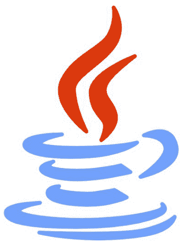

# 第二章

## JAVA

### 概述和基本语法

Java 是一种高级编程语言，由 Sun Microsystems 于 1995 年发布。由于其可靠、易用且比其他编程语言更快，使用 Java 技术构建的网站和应用程序不计其数。作为一种面向对象的编程语言，开发者可以更快地编写、编译、执行和测试程序。此外，使用 Java 开发的应用程序适应多种环境，并且更加安全。

该语言旨在不同的平台上运行，包括 Windows、UNIX 和 Mac OS，并为此提供了多种配置。Java 完全独立于平台，被编译成特定平台的机器代码，然后通过 Java 虚拟机（JVM）分发和解释。此外，Java 字节码支持高性能，并且是为分布式互联网环境设计的。

接下来是基本语法，Java 编程通常基于对象、类、方法、变量、修饰符、构造函数和正则表达式。为了更好地理解简单的 Java 程序，您可以了解每个方面的简要细节如下：

| 关键字 | 功能 |
| --- | --- |
| Class | 用于声明一个类 |
| Void | 返回类型 |
| Public | 访问修饰符，使函数可见 |
| Static | 用于在静态方法中创建对象 |
| Main() | Main() 方法位于程序的开头 |
| System.out.println() | 在控制台上打印语句 |

在开始 Java 编程之前，请确保记住 Java 是一种区分大小写的语言，您需要将类名的首字母大写。方法名应以小写字母开头，程序文件的名称必须与类名完全相同，以避免执行程序时出现任何问题。

Java 编程语言的概念包括类、对象、多态性、继承、抽象、封装、实例、方法和方法传递。

您的第一个 Java 程序可能如下所示：

```
class HelloWorld
{
    public static void main(String[] args)
    {
        System.out.println("Your first Java Program!")
    }
}
```

### Java 标识符与修饰符

Java 标识符应以 A 到 Z 或 a 到 z 的字母开头，因为标识符也区分大小写。你必须记住，关键字永远不能用作标识符，并且标识符在第一个字符之后可以包含任意字符组合。例如，month、$price 或 _place。Java 编程语言中有两种类型的修饰符。一种称为访问修饰符，另一种称为非访问修饰符。修饰符通常用于修饰方法或类。

### 对象、类与构造函数

#### 类与对象

对象是类的一部分，也被称为类的实例。类代表一组所有对象共有的属性，是一个定义好的原型，对象就是从这个原型创建的。要声明一个类，我们需要包含修饰符、类名、父类、接口和类体。此外，Java 中的一切都与对象和类相关联，它们也与方法和属性相结合。以现实生活中的手机为例，它具有颜色、内存、显示屏和重量等属性。要在 Java 中创建一个类，你需要遵循以下语法：

```java
Public class NewClass {
    Int a = 1;
}
```

创建一个名为 "newObj" 的对象：

```java
Public class NewClass {
    Int a = 1;
    Public static void main (String[] args ) {
        MyClass NewObj = new NewClass();
        System.out.println(newObj.x);
    }
}
```

创建对象需要声明、实例化和初始化。声明是声明变量名和对象类型的过程，而实例化则使用 new 关键字来创建一个对象。然后程序会调用构造函数来初始化新对象。

### 基本数据类型与变量

在 Java 程序中，数据存储在变量中，程序首先声明变量，将数据读入变量，然后执行提供的操作。一旦过程完成，变量就会被再次写入一个新的位置。变量提供了一个保留的内存位置来存储值，内存由操作系统分配。

#### 数据类型

Java 编程语言中有两种不同的数据类型，称为基本数据类型和对象数据类型。基本数据类型分为 8 类：Byte、Short、Int、Long、Float、Double、Boolean 和 Char。对象数据类型是通过使用类的构造函数创建的，它们也负责访问对象。每个可用的引用变量的默认值都设置为 null，它也可以用来引用声明类型的对象。

#### 变量

Java 编程语言中使用三种类型的变量：

- 1. 局部变量
- 2. 实例变量
- 3. 类/静态变量

##### 局部变量

局部变量通常在构造函数和方法中声明。由于它们是与构造函数一起创建的，因此不能与局部变量一起使用访问修饰符。局部变量没有默认值。

##### 实例变量

实例变量在类中声明，并在每次创建对象时创建。它们应该保存被多个构造函数或方法引用的值。也可以为实例变量指定访问修饰符。

### 运算符、控制语句与决策

### 运算符

Java 编程语言中可用的基本运算符说明如下：

- 算术运算符：算术运算符可用于在程序中执行数学计算和方程求解。这包括加法、减法、乘法、除法、取模以及自增和自减函数。
- 一元运算符：后缀：expr++ 和前缀 ++expr –expr 表达式。
- 逻辑运算符：(A && B) 为 false，(A || B) 为 true，!(A && B) 为 true。
- 位运算符：执行逐位操作。
- 赋值：=, +=, |=, ^=。

#### 控制语句

Java 语言的控制语句与其他主要编程语言（如 C 或 C++）类似。条件详细说明如下：

If Else：if 语句用于检查给定条件是 true 还是 false。Java 编程语言中有不同类型的 if 语句，称为 if 语句、if-else 语句、if-else-if 阶梯和嵌套 if 语句。

这是一个演示 if 语句的简单 Java 程序：

```java
public class Marks {
    public static void main(String[] args) {
        int Marks=50;
        if(age<50){
            System.out.print("Your marks are less than 50");
        }
    }
}
```

上述程序的输出为：Your marks are less than 50。

If-else：该语句用于测试条件，如果结果为 true，则执行 If 块；如果为 false，则执行 else 语句。

Switch：Switch 语句用于从多个条件中执行单个语句。该语句可以处理包括 short、int、long、byte、String 和 Long 在内的数据类型。

Switch 语句的语法如下：

```java
switch(expression){
    case value1:
        //code to be executed;
        break;
    case value2:
        //code to be executed;
        break;
    default:
        //code to be executed if all cases are not matched;
}
```

#### 循环

编程语言中通常使用三种循环。

- For 循环
- While 循环
- Do-while 循环

##### For 循环

For 循环用于在程序的一部分中执行迭代。如果迭代次数是固定的，建议你在程序中使用 For 循环。

##### While 循环

While 循环具有重复单个或一组语句以测试给定条件是否为 true 的特性。当迭代次数不固定时使用它。

##### Do While 循环

Do While 循环用于多次迭代程序的一部分。如果迭代次数不固定，你需要至少执行一次程序。

有一些特定的循环控制语句需要将执行更改为正常顺序。Java 编程语言中使用的两个控制语句包括：

- Break 语句：终止 switch 或循环以开始下一个循环。
- Continue 语句：允许循环重新测试其条件并跳过循环体的其余部分。

#### 决策

决策结构的特点是一个或多个条件需要在给定场景下进行测试。如果条件为 true，则可以执行下一条语句；如果给定条件为 false，则程序将终止。下图正确展示了决策过程的实际工作方式：

### 字符、字符串、数组与正则表达式

Java 编程语言使用 Character 包装类，并提供多种静态方法来操作字符。要创建一个字符对象，你需要遵循以下语法：

```java
Character ch = new Character ('a');
```

编译器将自动创建一个 Character 对象，如果你将任何原始 char 传递给该方法，编译器将使用语言中的各种方法将 Char 转换为 Character。

正如我们之前讨论过字符串的重要性和功能，Java 平台也提供了来自字符串类的支持。程序员可以通过多种方式操作字符串。在 Java 语言中创建字符串的示例代码如下：

```java
public class NewString {
    public static void main(String args[]) {
        char[] StudentArray = { 'S', 'T', 'U', 'D', 'E', 'N', 'T'};
        String StudentString = new String(StudentArray);
        System.out.println( StudentString );
    }
}
```

该程序的输出为：Student。

此外，我们还可以在 Java 编程语言中使用简单的连接方法来连接字符串，如下所示：

```java
String1.concat( string2);
```

要在 Java 中创建一个字符串对象，程序员可以选择字面量或关键字方法。

#### 数组

数组是每种编程语言的重要组成部分，因为它们允许程序员处理和存储数据到变量中。由于它们用于存储大量数据集合，你也可以将数组视为相同类别变量的集合。要声明一个数组，你可以遵循以下简要语法：

```java
datatype[] arrayRefVar;
```

在 Java 中创建数组很简单，你可以使用以下语法：

```java
arrayRefVar = new datatype[arraySize];
```

此语句将创建一个给定大小的数组，并将此数组的引用分配给给定的变量。通常，数组使用 for 循环或 foreach 循环进行处理，因为数组内的元素具有相同的类型和大小。

用于排序、搜索、比较和填充数组元素的静态方法：

### 正则表达式

正则表达式是一种用于定义字符串模式的API，也用于搜索、编辑和操作文本。Java预定义了`java.util.regex`包，该包包含`Pattern`类、`Matcher`类和`PatternSyntaxException`对象。`Pattern`类要求开发者从`compile()`方法开始，因为它不提供公共构造函数，该方法会返回一个模式对象。
对于`Matcher`类，匹配器对象通过`Matcher()`方法查找并比较操作，以针对输入字符串获取一个`Matcher`对象。`PatternSyntaxException`用于指示正则表达式模式中的错误或失误。

### 文件与I/O

Java编程语言具有一个内置包，负责数据的输入和输出操作。该流被称为`java.io`，支持多种操作和功能来处理数据。Java中有两种通用类型的流，即输入流和输出流。
输入流用于读取数据，而输出流用于将数据写入文件。
Java语言具有多种I/O数据处理流，包括以下几种：

- 字节流
- 字符流
- 标准流
- 文件输入流
- 文件输出流

### 面向对象的Java

面向对象编程是一种包括使用类和对象的方法。通过使用继承、多态、封装和抽象等多种概念，程序员可以开发Java应用程序和程序。

#### 继承

继承是Java编程语言中的一项特性，允许它继承另一个类的特性和属性。这可以在子类和超类之间进行。被继承特性的类称为超类，而继承另一个类属性的类称为子类。
要在Java编程语言中使用继承，您可以遵循以下语法：

```
Class derived-class extends base-class
{
    //methods
}
```

#### 多态

以多种方式执行单个任务的技术称为多态。在Java编程中，我们可以使用方法重写和方法重载技术来实现多态。需要了解的是，对象也可以通过引用变量访问，一旦它被重新分配给其他对象，引用变量的类型可用于确定用于访问对象的方法。
例如：
Public interface School{}
Public class Student{}
Public class John extends Student implements School{}
在上述情况下，*John*被称为多态的，因为它具有多重继承，并且我们也可以对同一对象应用引用变量。

#### 抽象

抽象类是在其声明中包含`abstract`关键字的类，它可以包含也可能不包含抽象方法。如果一个类具有抽象方法，则它不能被实例化，程序员必须从另一个类继承它来实现抽象方法。

##### 封装

Java编程中的封装是将数据和方法包装在一起的过程。通常，一个类的变量将对另一个类隐藏，只能通过当前类中使用的方法来访问。封装的优点在于，一个类可以被设为只读或只写，并且可以完全控制存储的数据。

### 递归

递归是指在程序中调用自身的方法的技术。`recurse()`方法从主方法调用，也可以从同一个`recurse()`方法调用。此过程持续进行，直到满足给定条件，如果不满足，则会发生无限递归。

以下是Java中递归的一个简单实现：

```
class Sample {
    static void printFun(int test)
    {
        if (test < 1)
            return;

        else {
            System.out.printf("%d ", test);

            // Statement 2
            printFun(test - 1);

            System.out.printf("%d ", test);
            return;
        }
    }

    public static void main(String[] args)
    {
        int test = 3;
        printFun(test);
    }
}
```

#### 递归的优势

在一些复杂的程序中，编写递归代码可以带来多种好处。由于它提供了一种简单而清晰的编码方式，开发人员可以轻松执行各种操作。

### 抽象类与抽象方法

#### 抽象类

在Java编程中，抽象类是指不能被实例化并使用`abstract`关键字声明的类。

以下是Java中声明抽象类*Student*的语法：
abstract class Student {
    //methods and attributes
}
请记住，我们不能创建抽象类的对象。这样做将产生编译错误。

##### 抽象类的继承

以下是一个说明抽象类继承的Java示例程序：

```
abstract class Student {
    public void displayInfo() {
        System.out.println("I am a Student");
    }
}
class Grade extends Student {
}
class Main {
    public static void main(String[] args) {
        Grade G1 = new Grade();
        G1.displayInfo();
    }
}
```

#### 抽象方法

要在Java中创建抽象方法，使用相同的`abstract`关键字。语法定义如下：

Abstract void moveto();

# 第三章

## SQL与数据库

### 什么是数据库？

数据库是数据的集合，可以被访问、管理和更新。在简要讨论数据库之前，重要的是我们要理解数据的实际含义以及如何处理它。数据通常被定义为记录和事实的集合，我们可以对其进行计算和推理。
为了保护、保存、交付和组织数据，创建了数据库，而管理整个过程的系统被称为数据库管理系统（DBMS）。

### 数据库管理系统（DBMS）概念

数据库管理系统由多个程序组成，允许用户访问数据库并通过不同的过程处理数据。由于它通常设计用于控制对数据库的访问，因此DBMS中引入了各种操作和功能，使其更有效、安全和可靠。
DBMS有4种不同类型：

1. 关系型DBMS
   这类DBMS以表格形式定义数据库关系。

2. 面向对象的关系型DBMS
   面向对象的关系型DBMS允许以对象及其属性的形式存储数据。

3. 网络型DBMS
   网络型DBMS具有多对多关系，通常用于复杂的数据库结构。

4. 层次型
   层次型DBMS遵循父子关系来存储数据，其结构类似于树，节点用于表示各个字段。

### 数据库环境与架构

数据库环境被称为负责数据处理、管理和使用的组件的集合系统。由于数据库通常存储在计算机中，用于管理整个过程的硬件和计算机外围设备也包括SQL Server等DBMS工具。
数据库或DBMS的架构通常分为三大类：集中式、分散式和层次式。数据库系统可以是客户端-服务器或集中式的，也可以设计为由并行计算机架构访问。
DBMS的三层架构定义如下：

- 表示层
- 应用层
- 数据库层

### 数据库类型

数据库根据其组织方式和功能被划分为不同类型。

#### 关系型数据库

关系型数据库以多种方式定义、组织和访问数据。作为一种表格型数据库，其表由行和列组成，并通过结构化查询语言（SQL）进行管理。

#### 分布式数据库

分布式数据库的数据存储在多个站点，这些站点通过通信链路相互连接。该数据库进一步分为同构和异构两类。同构分布式数据库系统连接相同类型的硬件、操作系统和数据库应用，而异构分布式数据库系统则允许每个位置和连接使用不同的系统。

#### 云数据库

云数据库环境专为在私有、公共或混合云中存储数据而设计和构建。它提供更好的可扩展性和更大的存储容量，用户可享受高可用性。这是商业应用的最佳选择。

#### NoSQL数据库

NoSQL数据库最适合大型分布式数据，并可通过关系型数据库便捷管理。此外，它们能有效解决关系型数据库难以处理的大数据性能问题。

#### 面向对象数据库

面向对象数据库由关系型数据库支持，基于对象而非操作。

#### 终端用户数据库

终端用户数据库是专为终端用户设计和创建的共享数据库。由于它包含整个数据库的摘要，终端用户无需担心在任何数据库级别执行的操作。

### 数据库语法、数据类型和运算符

标准查询语言（SQL）用于在数据库中存储、操作和检索数据。SQL允许数据库管理员执行管理数据库所需的多种操作。通过编写简单查询，该语言可让你执行查询、检索数据、插入记录、更新记录、删除记录、创建新数据库、创建新表以及设置数据库权限。

SQL有不同版本，但都支持主要功能，如SELECT、DELETE、INSERT、WHERE和UPDATE。

#### 结构化查询语言（SQL）

SQL是用于MySQL、Sybase、Oracle和SQL Server等关系型数据库系统的语言。作为标准数据库语言，SQL允许用户描述数据、访问数据并操作关系型数据库管理系统。此外，用户还可以通过结构化查询语言创建、查看和删除数据库。

此过程包含的不同组件有优化引擎、SQL查询引擎、经典查询引擎和查询调度器。

要在关系型数据库管理系统中执行特定操作，我们可以使用以下命令：

| 命令 | 描述 |
| :--- | :--- |
| CREATE | 用户可以在数据库中创建新表或对象。 |
| READ | 用户可以读取存储在表中的数据。 |
| UPDATE | 更新表以修改记录。 |
| DELETE | 从表中删除任何记录。 |
| INSERT | 向表中插入新记录。 |
| SELECT | 从数据库中的表中选择特定记录。 |
| ALTER | 更改数据库对象。 |
| DROP | 从数据库中删除整个表。 |

通过使用上述操作，我们可以对下面名为“Students”的示例表执行不同操作：

| 学生ID | 学生姓名 | 城市 | 科目 | 分数 | 百分比 |
|---|---|---|---|---|---|
| 1 | William | New York | Mathematics | 85 | 60% |
| 2 | James | California | English | 79 | 58% |

从上表中获取记录的SQL语句语法如下：

```sql
SELECT * FROM Students;
```

##### 1. SQL查询

为了对数据库中的表执行特定操作，我们需要使用不同的查询，具体说明如下：

| 查询 | 语法 |
|---|---|
| INSERT INTO | INSERT INTO table_name(column1, column2,...) VALUES (Value1, Value2,...) |
| UPDATE | UPDATE table_name SET column1 = value1, column2 = value2,... WHERE condition |
| DELETE | DELETE FROM table_name WHERE condition; |
| ORDER BY | SELECT column1, ..FROM table_name ORDER BY column1, ASC/DESC; |
| MIN() | SELECT MIN(column_name) FROM table_name WHERE condition; |
| MAX() | SELECT MAX(column_name) FROM table_name WHERE condition; |
| WHERE | SELECT column1,... FROM table_name WHERE condition; |

##### SQL连接

以包含表A和表B的关系型数据库为例，表也可以通过SQL JOIN查询进行连接。维恩图清晰地展示了两个表如何连接在一起共享数据：

我们将在下面的示例表“Patients”上实现各种JOIN子句操作：

表1：

| PatientID | CaseNO | Date |
|---|---|---|
| 43221 | 1 | 9-2-2011 |
| 82357 | 3 | 8-12-2015 |

表2：

| CaseNo | PatientName | City |
|---|---|---|
| 1 | Andrew | Chicago |
| 3 | John | LA |

要连接两个表，我们可以编写如下SQL JOIN语句：

```sql
SELECT Patient.PatientID, Case.CaseNo, Date
FROM Patients
INNER JOIN Patients ON Case.CaseNo = PatientName.PatientID;
```

SQL JOIN查询有四种不同类型，分别是：

- INNER JOIN
- LEFT OUTER JOIN
- RIGHT OUTER JOIN
- FULL OUTER JOIN

###### 内连接

内连接选择表A和表B中满足连接条件的完整记录。在SQL中创建内连接的语法定义如下：

```sql
SELECT column_name
FROM table1
INNER JOIN table2
ON table1.column_name = table2.column_name;
```

###### 左连接

左连接选择表A的完整记录，并与表B中满足连接条件的记录组合。在SQL中创建LEFT JOIN的语法定义如下：

```sql
SELECT column_name
FROM table1
LEFT JOIN table2
ON table1.column_name = table2.column_name;
```

###### 右连接

右连接选择表B的所有记录，并与表A中满足连接条件的记录组合。在SQL中创建RIGHT JOIN的语法定义如下：

```sql
SELECT column_name
FROM table1
RIGHT JOIN table2
ON table1.column_name = table2.column_name;
```

###### 全外连接

全外连接选择表A和表B中的所有记录，即使连接条件未满足。在SQL中创建FULL JOIN的语法定义如下：

```sql
SELECT column_name
FROM table1
FULL OUTER JOIN table2
ON table1.column_name = table2.column_name
WHERE condition;
```

##### 联合运算符

要组合两个或多个SELECT语句的结果，使用UNION运算符，其中每个列必须具有相似的数据类型。此外，两个表的SELECT语句中的列应按相同顺序排列。在SQL中实现UNION运算符的语法定义如下：

```sql
SELECT column_name FROM table1
UNION
SELECT column_name FROM table2;
```

##### GROUP BY

SQL GROUP BY语句可用于对数据库表进行列表或编号。在SQL中使用GROUP BY语句的语法定义如下：

```sql
SELECT column_name
FROM table_name
WHERE condition
GROUP BY column_name
ORDER BY column_name;
```

##### ORDER BY

SQL中的ORDER BY语句用于按升序或降序对数据进行排序。实现ORDER BY子句的语法定义如下：

```sql
SELECT column_list
FROM table_name
WHERE condition
[ORDER BY column1, column2,] [ASC | DESC];
```

#### 高级SQL

还有其他一些重要的操作和子句可以在数据库中实现复杂操作。以下是高级SQL的一些关键特性详细说明：

##### 索引

SQL索引被数据库搜索引擎用于优化数据处理过程。由于它们被视为特殊的查找表，索引有助于

###### SQL 索引

为了加速 WHERE 子句和 SELECT 查询。要创建索引，我们可以使用 CREATE INDEX 语句配合 UNIQUE 约束来防止重复条目。

使用 CREATE INDEX 的语法：
**CREATE INDEX** index_name **ON** table_name;

使用 DROP INDEX 的语法：
**DROP INDEX** index_name;

##### 截断表

SQL 中的 TRUNCATE TABLE 命令用于从现有表中删除全部数据。
基本语法：
TRUNCATE TABLE table_name;

##### SQL 主键和外键

###### 主键

SQL 中的 PRIMARY KEY 约束用于唯一标识表中的每条记录。主键应始终包含唯一值，且不能有任何 NULL 值。此外，一个表只能有一个唯一的主键，该主键可以由单列或多列组成。
例如，要在创建 "Students" 表时为 ID 列定义 PRIMARY KEY，我们可以使用以下 SQL 语句：

```sql
CREATE TABLE Students (
    ID int NOT NULL,
    FirstName varchar(255),
    LastName varchar(255) NOT NULL,
    Marks int,
    PRIMARY KEY (ID)
);
```

###### 外键

SQL 中的 FOREIGN KEY 约束用于将两个表链接在一起，其中一个表的 FOREIGN KEY 引用另一个表的 PRIMARY KEY。
在 "Student" 表的 "StudentID" 列上实现 FOREIGN KEY 约束的语法：
```sql
CREATE TABLE Student (
    StudentID int NOT NULL,
    StudentMarks int NOT NULL,
    ClassID int,
    PRIMARY KEY (StudentID),
    FOREIGN KEY (ClassID) REFERENCES Students(StudentID)
);
```

#### 约束和有用资源

约束是应用于表数据列的特定规则。通常，约束用于限制可以插入表中的数据类型。最常见的包括 NOT NULL 约束、DEFAULT 约束、UNIQUE 约束、PRIMARY KEY、FOREIGN KEY、CHECK 约束和 INDEX。
此外，完整性约束也可用于提高关系数据库中数据的一致性和准确性。通常，PRIMARY KEY、FOREIGN KEY 和 UNIQUE 约束是参照完整性的一部分。
为了提高 SQL 数据库的性能，有几个重要因素可以轻松实现。在编写列名时，建议使用 SELECT 语句而不是 * 通配符。
例如：
```sql
SELECT * FROM Students
```
此外，设置 NOCOUNT ON 语句将减少 SQL Server 在执行 INSERT、DELETE 或 UPDATE 操作时更新行所需的时间。

## 第四章：C 语言

C 编程语言于 1972 年在美国 AT&T 的贝尔实验室开发。通常，编程语言分为两大类：高级语言和低级语言，但 C 被归类为中级语言。该语言的目的是提供对内存的低级访问，并且也为其他主要编程语言（如 PHP 和 Java）提供了语法基础。

### 简介和简单程序

作为一种结构化语言，程序员可以创建分块的代码，并通过应用不同的方法和编程技术来创建业务应用程序。此外，我们还可以在 C 库中编写新函数并在整个应用程序中重复使用它们。

#### C 编程入门

编写 C 程序对初学者来说简单易行。从基本的程序语法开始，我们可以按照以下方式开发 C 应用程序和程序：

```c
#include <stdio.h>
int main()
{
    int a = 2;
    printf("%d", a);
    return 0;
}
```

##### 头文件

编写 C 程序的第一部分是选择头文件。通常，头文件以 .h 为扩展名编写，并包含函数声明。要包含头文件，我们可以遵循以下语法：
```c
#include <string.h>
```
C 头文件示例：

| 头文件 | 定义 |
|---|---|
| stdio.h | 用于定义输入和输出函数 |
| string.h | 用于字符串处理 |
| stddef.h | 定义有用的类型和宏 |
| stdlib.h | 定义内存分配 |
| stdint.h | 用于定义整数类型 |
| math.h | 用于执行数学函数 |

##### 方法和变量声明

编写 C 程序的下一部分是定义方法和声明变量。声明 main 方法的语法是：
```c
int main()
{
```
变量声明的语法是：
```c
int main()
{
    int z;
}
```

##### 程序主体

```c
int main()
{
    int z;
    printf("%d", z);
    return 0;
}
```
要终止程序，我们可以使用 return 语句：return 0。

##### 关键字

关键字是任何编程语言的主要驱动力，也被称为保留字。虽然高级编程语言有多个关键字，但 C 语言只允许使用 32 个关键字，如下所示：

| | | | |
|---|---|---|---|
| double | long | int | switch |
| case | register | enum | typedef |
| union | extern | const | for |
| do | while | static | default |
| auto | break | else | struct |
| float | short | char | return |
| void | continue | for | if |
| signed | goto | sizeof | volatile |

### 数据类型和变量

在 C 编程语言中，数据类型用于定义变量，以便在程序中使用之前分配存储空间。C 编程语言的内置数据类型包括 float、int、char 和 double。这些数据类型有称为 short、long、signed 和 unsigned 的修饰符。
以下是 C 编程语言中允许使用的有效数字、字母和符号：
**字母：** A-Z, a-z。
**符号：** - ~ ` ! @ # % ^ & * ( ) _ - + = | \ { } [ ] : ; " ' <> , . ? /
**数字：** 0, 1, 2, 3, 4, 5....

#### 变量

要在 C 中声明变量，我们可以遵循以下程序语法：

```c
#include <stdio.h>
// 变量声明：
extern int a, b;
extern int c;

int main() {

    /* 变量定义： */
    int a, b;
    int c;
    float f;

    /* 初始化 */
    a = 30;
    b = 20;
    c = a + b;
    printf("value of c : %d \n", c);

    return 0;
}
```
该程序的输出是：50。

###### 变量的作用域

任何编程语言中变量的作用域都是为了允许对变量进行某些权限设置。通常，变量分为局部变量、全局变量和形式参数。
局部变量在块内声明，只能由写在程序特定区域内的语句使用。由于它们对程序中的其他函数不可知，我们无法在函数外部访问局部变量。
全局变量通常在函数外部定义，并在整个程序中保持其值。它可以被程序中的任何函数访问和调用。局部变量需要由程序员初始化，而全局变量会自动初始化。

### 循环和函数

#### 循环

循环是每种编程语言的重要组成部分，允许开发人员多次执行特定语句。C 编程语言中使用了 4 种不同类型的循环，简要介绍如下：

1.  **For 循环：** 用于执行特定次数的语句，也被认为是处理循环变量的代码缩写。
2.  **While 循环：** 重复给定的语句并检查给定条件是真还是假。在执行循环体之前，它会检查所有条件。
3.  **Do While 循环：** 工作方式与 While 循环相同，但是 Do While 循环只在结束时检查条件。
4.  **嵌套循环：** 循环内的循环称为嵌套循环。它可以是 While 循环、Do While 循环或 For 循环。

为了改变循环的正常执行顺序，我们也可以使用循环控制语句。Break 语句退出循环并将执行转移到下一条语句，而 Continue 语句导致循环跳过其余部分并重新检查给定条件。要将控制转移到带标签的语句，我们也可以使用 Go to 语句。

#### 函数

要在 C 编程语言中定义函数，建议使用以下语法：

```c
return_type function_name(parameter_list) {
    function_body
}
```
在函数中，返回类型是函数本身返回的函数值的数据类型，而函数的操作名称被称为函数名。每当调用一个函数时，我们需要传递一个参数，其值被称为实参或实际参数。必须注意的是，参数并非强制性的，函数也可以在没有任何参数的情况下执行。

函数体包含多个语句，通常定义了在函数内要执行的操作。要在C语言中声明一个Min()函数，我们可以使用如下语法：
`int min(int num1, int num2);`

要在程序中调用一个函数，我们需要传递参数和函数名。如果函数返回了任何值，也可以将其存储起来。

##### 将参数传递给函数的方法

###### 值传递
值传递方法用于将实参的实际值复制到函数的形参中。对参数所做的更改不会直接影响函数内的实参。

###### 引用传递
引用传递方法用于将实参的地址复制到形参中。对参数所做的更改会直接影响实参。

### 数组、字符串和链表

#### 数组

数组是元素的集合，可以存储相同类型的固定大小顺序数据。数组由连续的内存位置组成，可以通过以下语法声明：
`Type arrayName[arraySize];`

示例：

| 3 | 5 | 6 | 8 | 10 | 20 |

所有数组的第一个元素的索引都是0，这也被称为基索引。请注意，数组的大小在声明后无法更改。要在C语言中初始化一个数组，我们可以使用如下语句：
`int data[50];`

要初始化一个数组，我们可以使用如下语法：
`int data[10] = {3, 2, 7, 8, 23, 42, 64, 73, 23, 77};`

在这个数组中，索引 = 0 的值为3，而索引 9 的值为77。

下面是一个使用数组在C语言中计算5个整数平均值的示例：

```c
#include <stdio.h>
int main()
{
    int avg = 0;
    int sum = 0;
    int x = 0;

    int num[4];

    for (x = 0; x < 5; x++)
    {
        printf("Enter number %d \n", (x + 1));
        scanf("%d", &num[x]);
    }
    for (x = 0; x < 5; x++)
    {
        sum = sum + num[x];
    }

    avg = sum / 5;
    printf("Average of entered number is: %d", avg);
    return 0;
}
```

##### 二维和三维数组

C语言也支持二维和三维多维数组。要初始化二维数组，我们使用以下语法：
```c
int z[2][3] = {
    {0, 1, 2},
    {3, 4, 5},
    {6, 7, 8}
};
```
或
```c
int z[2][3] = {0, 1, 2, 3, 4, 5, 6, 7, 8};
```

#### 字符串

在C语言中，字符串是通过使用字符的一维数组创建的。字符串必须以空字符终止，也称为“\0”。

要在C语言中声明一个字符串，我们可以遵循如下语法：
`char str_name[size];`

‘str_name’ 用于定义字符串，而 size 告诉我们字符串的长度。

下面的C程序用于声明、读取和打印一个字符串：

```c
#include<stdio.h>

int main()
{
    // 声明字符串
    char str[10];

    // 读取字符串
    scanf("%s", str);

    // 打印字符串
    printf("%s", str);

    return 0;
}
```

#### 指针和结构体

指针是一个变量，其值与程序中另一个变量的地址相同。由于它直接指向内存位置，我们可以预先声明一个指针，并将其存储在任何变量地址中。声明指针变量的语法如下：
`Type *var_name;`

要使用指针，首先我们需要定义一个指针变量，并将一个变量的地址赋给该指针。接下来，我们可以从指针变量中给出的地址访问值。整个操作是借助 * 一元运算符完成的，该运算符返回由操作数定义的地址处的变量值。必须注意的是，普通变量存储的是值，而指针变量存储的是变量地址。由于空指针的值为0，任何指针的大小都是2字节。

下面是一个使用C语言指针编写的示例程序：

```c
#include <stdio.h>
int main()
{
    int *ptr, q;
    q = 100;
    ptr = &q;
    printf("%d", *ptr);
    return 0;
}
```

##### 结构体

结构体被定义为变量的集合，允许程序员组合不同的数据类型。作为一种用户定义的数据类型，结构体可以类似于数组来引用，但两者之间唯一的区别是数组只能保存相同类型的数据。

以一个组织为例，我们可以使用结构体来管理员工记录，如下所示：

- 姓名
- 员工ID
- 职位
- 部门
- 区域

在C语言中定义结构体的语句是：
```c
struct Employee {
    char name[10];
    int employee_id;
    char designation[50];
    char department[50];
    char region[100];
};
```

要在编译时初始化结构体，语句是：
`struct Employee = {34, 12, 52, 15, 66};`

###### 访问结构体成员

为了访问结构体成员，我们需要使用成员访问运算符。在C语言中访问结构体的成员，可以使用以下类型的运算符：

- 成员运算符：(.)
- 结构体指针运算符：(->)

访问结构体成员的示例程序：

```c
#include <stdio.h>
struct Distance
{
    int feet;
    float inch;
} dist1, dist2, sum;

int main()
{
    printf("1st distance\n");
    printf("Enter feet: ");
    scanf("%d", &dist1.feet);
    printf("Enter inch: ");
    scanf("%f", &dist1.inch);
    printf("2nd distance\n");
    printf("Enter feet: ");
    scanf("%d", &dist2.feet);
    printf("Enter inch: ");
    scanf("%f", &dist2.inch);

    sum.feet = dist1.feet + dist2.feet;
    sum.inch = dist1.inch + dist2.inch;
    while (sum.inch >= 12)
    {
        ++sum.feet;
        sum.inch = sum.inch - 12;
    }
    printf("Sum of distances = %d'-%.1f\"", sum.feet, sum.inch);
    return 0;
}
```

输出：

```
1st distance
Enter feet: 5
Enter inch: 9
2nd distance
Enter feet: 6
Enter inch: 3
Sum of distances = 12'-0.0"

...Program finished with exit code 0
Press ENTER to exit console.
```

###### 将指针传递给结构体

我们也可以在C语言中定义指向结构体的指针，其方式与定义指向其他变量的指针相同。为了通过指针访问结构体的成员，可以考虑以下语法：
`Struct_pointer->title;`

#### C语言文件处理

编程要求开发人员使用最有效的方法来处理不同的需求和场景。要在C语言中执行文件处理操作，我们可以使用如下操作：

- fprintf()
- fscanf()
- fread()
- fwrite()
- fseek()

通常，当程序终止时，所有数据都会丢失，为此我们必须创建一个包含所有数据的特定文件。它还节省了时间，让程序员可以通过输入几个命令来访问文件中的数据，并通过C语言运算符将数据从一台计算机传输到另一台计算机。

文件有两种类型，称为文本文件和二进制文件。文本文件是.txt文件，可以使用记事本创建，编写、维护和更新记录所需的工作量最小。二进制文件是.bin文件，它们以0和1的二进制形式存储数据。此外，与文本文件相比，二进制文件可以存储更大量的数据。

在C语言中，我们可以通过下表中提到的简单命令来创建新文件、打开现有文件、从文件读取信息和向文件写入信息，以及关闭文件：

| 操作 | 语法 |
| --- | --- |
| 打开文件 | `ptr = fopen("fileopen", "mode")` |
| 关闭文件 | `fclose(fptr);` |
| 写入二进制文件 | `fwrite(address_data, size_data, numbers_data, pointer_to_file);` |
| 从二进制文件读取 | `fread(address_data, size_data, numbers_data, pointer_to_file);` |

| 二进制文件 | 指向文件的指针); |
| 写入文本文件 | FILE *fptr;
Fptr = fopen(“文件地址”,W”); |
| 从文本文件读取 | FILE *fptr;
Fptr = fopen(“文件地址”,R”); |
| 文件定位 | Fseek(FILE * stream, long int offset, int whence) |

### 让C语言编程变得简单的关键技巧

对于初学者，建议始终在 `/*` 和 `*/` 之间编写重要的代码信息来为代码添加注释。为代码的主要部分添加注释也能使未来的修改和程序功能的改进变得更容易。此外，始终使用变量来存储数据，例如 `int`、`char` 和 `float`，因为这将使你执行不同的操作和计算变得更加简单。
C语言简单且快速。由于指针、关键字和位运算符的可用性，编写高效的代码对初学者来说肯定不会是个问题。

# 第五章

C++

C++是一种自由格式的中级编程语言，由 Bjarne Stroustrup 于1979年开发。作为C编程语言的增强版本，C++现在已成为初学者使用最多、最适合的语言。该语言提供了大约7种不同的编程风格，你可以根据自己的需求选择最合适的风格。作为一种静态类型编程语言，C++允许编译器在执行程序之前勾勒出错误或缺陷。此外，使用C++进行面向对象编程使得解决复杂问题变得方便，并扩展了标准库的使用。C++是世界上最流行的编程语言，广泛应用于图形用户界面、操作系统和嵌入式系统。

#### 基本语法

C++编程语言的基本语法与其他语言（如C）相同。包括各种单词、符号、字符、操作和表达式，程序员必须遵循一组预定义的规则才能正确执行程序。

以下是我们可以编写的第一个C++入门程序：

```
#include<iostream>
using namespace std;
int main()
{
    cout<<"My First Program in C++";
    return 0;
}
```

程序输出：My First Program in C++。

```
1 #include<iostream>
2 using namespace std;
3 int main()
4 {
5     cout<<"My First Program in C++";
6     return 0;
7 }
```

程序的详细信息如下：
**#include<iostream>** = 该语句包含预定义的输入和输出函数，并通知编译器也包含 iostream 文件。
**Using namespace std;** = 一条用于存储程序中函数、变量和操作的语句，其中 std 被视为命名空间名称。
**Int main()** = 这是程序的主函数，执行从这里开始。Int 是一个返回类型，指示编译器返回一个整数值，为此我们还需要在末尾包含一个 `return 0` 语句。
**Cout << “My First Program in C++”** = Cout 是属于 iostream 文件的一个对象，用于显示内容。
**Return 0;** = 该语句从 main() 函数返回值 0，并且也负责 main 函数的执行。

### 变量和数据类型

#### 变量

C++编程语言中有不同类型的变量。由于它们是用特定的关键字定义的，我们必须按照下面给出的语法创建一个变量、指定类型并赋值：
类型 变量 = 值;

#### 变量类型

- Int = 用于存储整数和整数。例如，1,45,6346。
- Char = 用于存储单个字符。例如，‘a’ 或 ‘Z’。
- Double = 用于存储浮点数。例如，50.2, 100.2342。
- Bool = 用于存储具有两种状态的值：True 或 False。
- String = 用于存储文本。例如，“C++ programming language”。

要声明变量并为其赋值，我们可以遵循下面提到的语法：
Int newNum;
newNum = 50;
Cout << newNum;
C++中使用的每个变量都应该用唯一的名称标识，这些名称被称为标识符。要构造标识符，名称必须包含字母、数字或下划线，并且区分大小写。

#### 数据类型

C++编程语言中的数据类型定义了可以存储在变量中的数据类型。通常，C++中的数据类型分为三组：内置、派生和用户定义。用户定义的数据类型包括结构体、联合体和枚举，而派生数据类型基于数组、函数和指针。
C++的内置数据类型：

- Int
- Char
- Float
- Double
- Bool

用户定义的数据类型：

- Union
- Enum
- Struct

派生数据类型：

- Function
- Array
- Pointer

##### 修饰符类型和存储类

C++编程语言中的修饰符与 `char`、`double` 和 `int` 数据类型一起使用，以改变基本类型的含义，从而满足某些编程条件。这些修饰符包括 `signed`、`unsigned`、`long` 和 `short`。
为了定义C++程序中变量和函数的作用域，我们可以使用存储类，例如 `auto`、`register`、`extern`、`mutable` 和 `static`。`Auto` 存储类是所有局部变量的默认值，而 `static` 存储类允许编译器在程序的生命周期内存储一个局部变量，并在它超出作用域时销毁它。
`extern` 存储类提供全局变量的引用，当两个或多个文件使用相同的全局函数或变量时使用。对于 `mutable` 存储类，只考虑类对象，它们也可以被常量成员函数修改。

### 流程控制

在C++编程中，控制流是指程序运行时指令、函数和语句被评估和执行的顺序。这些语句在代码内从上到下顺序执行，以使程序逻辑得到完全满足。程序不依赖于线性语句序列，为此C++提供了特定的流程控制语句。

C++中的流程控制语句：

1. If else
2. For 循环
3. Do while 循环
4. Break & Continue
5. Switch 语句
6. Goto 语句

##### If 语句

在C++编程中，当程序中有多个语句或情况需要执行时，使用 if 语句。If 语句的语法显示，只有当给定语句为真时，括号内的内容才会被执行，否则假语句会被自动忽略。

```
if(condition){
    statement;
}
```

##### If 语句流程图：

说明C++中 If 语句的示例程序：

```
#include <iostream>
using namespace std;
int main(){
    int marks=80;
    if( marks < 100 ){
        cout<<"Marks are less than 100";
    }

    if(marks > 100){
        cout<<"Marks are greater than 100";
    }
    return 0;
}
```

##### 嵌套 If 语句

在C++中，语句中的语句被称为嵌套 If 语句。例如：

```
if(condition_1) {
    Statement1;
    if (condition 2) {
        Statement2;
    }
}
```

##### If Else 语句：

```
if(condition_1) {
    Statement;
else (condition 2) {
    Statement;
}
}
```

#### Switch Case

C++编程中的 Switch Case 语句用于程序中给出多个条件，并且需要根据提供的条件执行操作的情况。Break 和 Continue 操作也是 Switch 语句的重要组成部分。C++中 Switch Case 的语法如下：

```
#include <iostream>
using namespace std;
int main(){
    int num=10;
    switch(num+5) {
        case 1:
            cout<<"Case1: Value is: "<<num<<endl;
        case 2:
            cout<<"Case2: Value is: "<<num<<endl;
        case 3:
            cout<<"Case3: Value is: "<<num<<endl;
        default:
            cout<<"Default: Value is: "<<num<<endl;
    }
}
```

#### Go To 语句

C++ 中的 `goto` 语句用于改变程序的执行流程，并将控制权转移到同一程序内的另一个带标签的语句。`goto` 语句的语法为：`goto label;`

### 循环与函数

#### 循环

C++ 编程语言中的循环语句用于执行特定的代码块，直到满足给定条件为止。由于它们允许程序员同时执行多个任务，循环语句会执行函数中的第一条语句，并根据需要继续执行下一条。

循环的类型

- **While 循环：** 在提供的条件为真时重复执行一条语句，并在执行循环体之前重新检查条件。
- **Do While 循环：** 在循环执行过程中检查条件。
- **For 循环：** 多次执行特定语句，并管理循环变量。
- **嵌套循环：** 一个循环内部包含多个循环。

循环可以通过不同的控制语句来执行，例如 `Break` 语句、`Continue` 语句和 `goto` 语句。

#### 函数

函数负责将不同的代码段组合在一起并执行它们，以完成给定的操作。C++ 编程语言中的两种主要函数类型包括库函数和用户自定义函数。库函数在 C++ 中是预定义的，而用户自定义函数则由程序员自己创建。

要定义一个函数，我们可以使用以下语法：

```
Return_type function_name(parameter list) {
    Function body
}
```

`min()` 函数的示例代码：

```
int min(int num1, int num2) { //function declaration
    // local variable declaration
    int result;

    if (num1 < num2)
        result = num1;
    else
        result = num2;

    return result;
}
```

##### 函数调用

在 C++ 中调用函数，我们可以使用以下方法：

- 按引用调用。
- 按值调用。
- 按指针调用。

##### 函数重载

当两个或多个函数具有相同的名称但参数不同时，这个过程被称为函数重载。C++ 中函数重载的语法如下所示：

```
void sameFunction(int a);
int sameFunction(float a);
void sameFunction(int a, double b);
```

### 数组、字符串、指针和引用

#### 数组

数组在编程语言中被频繁使用，因为它们允许我们处理大量相同类型的数据。通常，数组被定义为一个数据集合，它保存固定数量的值。

在 C++ 中声明数组的语法：

```
datatype arrayName[arraySize];
```

初始化：

```
int age[5] = {15, 20, 25, 30, 35};
```

使用数组计算 10 个数字之和的 C++ 示例程序：

```
#include <iostream>
using namespace std;
int main()
{
    int numbers[10], sum = 0;
    cout << "Enter 10 numbers: ";

    for (int i = 0; i < 10; ++i)
    {
        cin >> numbers[i];
        sum += numbers[i];
    }
    cout << "Sum = " << sum << endl;
    return 0;
}
```

#### 字符串

字符串被定义为字符的集合。在 C++ 编程中，常用的两种字符串类型是 C 字符串和标准 C++ 库字符串类。

可以使用以下语法来定义一个字符串：

```
char str[] = "Programming";
```

#### 指针

指针被定义为一个变量，其值被视为另一个变量的地址。要在 C++ 编程语言中使用指针，我们需要定义一个指针变量，并将一个变量的地址赋给该指针。之后，我们可以通过指针变量中给出的地址来访问该值。

整个操作是通过使用一元运算符 `*` 来执行的。以下是 C++ 编程中最常用的指针：

- 空指针
- 指针数组
- 指向指针的指针
- 将指针传递给函数
- 从函数返回指针

### 面向对象的 C++

### 类和对象

C++ 语言中的面向对象编程是创建对象并执行多种操作的简单方法。首先，我们需要在创建对象之前定义一个类，可以使用下面提到的语法：

```
class className
{
    //data
};
```

一个类可以被定义为 Public、Private 或 Protected，以便数据成员只能在程序内特定访问。

示例代码：

```
class student
{
    private:
        char name[20];
        int rollNo;
        int total;
        float perc;
    public:
        //member function to get student's details
        void getDetails(void);
        //member function to print student's details
        void putDetails(void);
};
```

#### 继承和多态

在编写实现继承的程序时，我们可以考虑 C++ 中的基类和派生类的概念。由于一个类可以从一个或多个类派生，我们也可以从不同的基类继承函数和数据。

派生类可以访问其基类的所有非私有成员。除了从基类继承属性外，用户还可以从现有类创建一个新类。C++ 中继承的语法定义如下：

```
class A  // base class
{
    .........
};
class B : access_specifier A  // derived class
{
    .........
};
```

#### 访问说明符

在 C++ 中，访问说明符用于确定类成员在该类之外的可用性限制。Private、Protected 和 Public 是主要的访问说明符，它们定义了类成员的可访问级别。

在创建类时使用私有访问说明符，这样基类的受保护和公共数据成员就成为派生类的私有成员，而基类的私有成员仍然是私有的。

在受保护访问说明符中，基类的公共和受保护数据成员成为派生类的受保护成员。基类的私有成员仍然不可访问。

公共访问说明符用于当基类的公共数据成员成为派生类的公共成员时。受保护成员在派生类中成为受保护成员，而基类的私有成员仍然不可访问。

在 C++ 中使用访问说明符的语法：

```
class MyClass {  // class
public: // Access specifier
// class members
};
```

#### 友元函数、数据结构和封装

##### 友元函数

在面向对象编程中，非成员函数通常无法访问对象的私有和受保护数据。为了允许访问这些私有或受保护数据，我们可以使用友元函数或友元类，它们允许程序员访问类的私有和受保护数据。该函数通过关键字 `Friend` 声明，并应在类体内使用。要在 C++ 编程语言中声明友元函数，我们可以使用下面提到的语法：

```
class class_name
{
    friend return_type function_name(argument);
};
```

##### 数据结构

虽然数据结构需要深入详细地介绍以明确本主题的目标，但我们将讨论如何在 C++ 中定义和使用结构体。结构体是一种用户定义的数据类型，可以通过使用以下语法在程序中实现：

```
struct [structure tag]
{
    member definition;
}
```

例如：

```
struct vehicle {
    char name[50];
    char category[100];
    int model_year;
} vehicle;
```

要访问结构体内的任何成员，我们可以使用成员访问运算符（`.`）。通过数据结构，定义指向结构体的指针变得简单，我们可以使用以下语法：

```
struct vehicle *struct_pointer;
```

##### 封装

术语“封装”被定义为在编程中隐藏敏感数据的方法。要执行封装，我们需要将类变量和属性声明为私有，并通过 getter 和 setter 方法读取或修改私有成员的值。访问私有成员的语法定义如下：

```
#include <iostream>
using namespace std;

class Employee {
private:
    // Private attribute
    int salary;

public:
    // Setter
    void setSalary(int s) {
        salary = s;
    }
    // Getter
    int getSalary() {
        return salary;
    }
};

int main() {
    Employee myObj;
    myObj.setSalary(50000);
    cout << myObj.getSalary();
    return 0;
}
```

### 文件处理

在 C++ 编程语言中，我们一直使用 `cin` 和 `cout` 方法在程序内读写数据。为了从文件中读写数据，C++ 提供了一个名为 `fstream` 的标准库，其中包含 `ofstream`、`ifstream` 和 `fstream` 数据类型。

要打开一个文件，可以使用 `fstream` 或 `ofstream` 对象，其 C++ 语法定义如下：
`void open(const char *filename, ios::openmode mode);`

关闭文件的语法：
`void close();`

### C++ 语言特性与支持

C++ 编程语言提供了丰富的库支持和标准模板库（STL）函数，可用于快速编写代码。作为一种面向对象的编程语言，我们可以专注于对象，并轻松执行不同类型的操作和实现。与其他主要编程语言不同，C++ 还提供了指针支持。

由于其快速、可靠和安全的特性，C++ 被广泛用于操作系统、浏览器、库、图形和数据库的开发。该语言速度快，以其速度和效率而闻名。此外，C++ 还允许异常处理并支持函数重载。

# 第六章

## C#

### 概述与基本语法

#### 概述

C# 是由微软开发的一种编程语言，用于与 .NET 框架配合使用。该语言基于面向对象的编程方法，其基本语法与 C 和 C++ 等其他现代编程语言相同。C# 是为公共语言基础设施（CLI）开发的，该基础设施由运行时环境和可执行代码组成。C# 易于学习，是最适合初学者的编程语言之一，因为他们可以编写高效的程序，并且可以在不同的计算机平台上编译。

为了运行 C# 应用程序和程序，需要 .NET 框架，该框架可用于编写 Windows 应用程序、Web 应用程序和 Web 服务的代码。C# 的集成开发环境（IDE）包括 Visual Studio、Visual Web Developer 和 Visual C# Express。

#### 基本语法

基于面向对象的编程方法，C# 编程的核心是类和对象。以学生类为例，它具有学生姓名、学号、班级和成绩等属性。虽然每个学生的属性相同，但每个学生都有不同的姓名、学号、班级和成绩，这些被称为对象属性。通常，C# 程序由命名空间声明、类、类方法、属性、`Main` 方法和语句组成。

这是一个在 C# 中打印 "Welcome to C# programming" 的简单程序：
```csharp
using System;

namespace CSharpProgramming
{
    class Programming
    {
        // Main function
        static void Main(string[] args)
        {
            Console.WriteLine("Welcome to C# programming");
            Console.ReadKey();
        }
    }
}
```

基本语法详解：

- **Using System:** 用于为程序包含 `System` 命名空间。
- **命名空间声明：** 程序中类的集合。
- **类声明：** 包含程序中要使用的数据和方法的类。
- **Static void Main():** 关键字 `static` 表示此方法也可以在不实例化类的情况下访问。
- **Console.WriteLine():** 用于定义系统命名空间的方法。
- **Console.Readkey():** 使计算机等待下一个命令，并防止屏幕关闭。

### 数据类型和变量

数据类型是任何编程语言的重要组成部分，因为它们指定了语言中支持的数据类型。由于它们在 C# 中是预定义的，数据类型分为三大类：值数据类型、引用数据类型和指针数据类型。

**1. 值数据类型**

值数据类型变量派生自 `System.ValueType` 类，它们以字母和数字的形式包含数据。

下表显示了 C# 编程语言中使用的值类型：

| 数据类型 | 表示形式 | 默认值 | 范围 |
| :--- | :--- | :--- | :--- |
| Byte | 8 位无符号整数 | 0 | 0 到 255 |
| Decimal | 128 位精确十进制值 | 0.0M | (-7.9 x 10^28 到 7.9 x 10^28) / 10^0 到 28 |
| Bool | 布尔值 | False | True/False |
| Float | 32 位单精度浮点类型 | 0.0F | -3.4 x 10^38 到 +3.4 x 10^38 |
| Double | 64 位双精度浮点类型 | 0.0D | (+/-)5.0 x 10^-324 到 (+/-)1.7 x 10^308 |
| Char | 16 位 Unicode 字符 | '\0' | U+0000 到 U+ffff |
| Int | 32 位有符号整数类型 | 0 | -2,147,483,648 到 2,147,483,647 |
| Short | 16 位有符号整数类型 | 0 | -32,768 到 32,767 |
| Long | 64 位有符号整数类型 | 0L | -9,223,372,036,854,775,808 到 9,223,372,036,854,775,807 |

**2. 引用类型**

引用数据类型存储的是变量的引用，而不是实际数据。通过使用多个变量，引用类型可以指向一个内存位置，如果其中一个变量更改了该内存位置，另一个变量将自动更改其值。

**3. 对象类型**

对象数据类型被视为 C# 中使用的所有数据类型的基类。此外，对象类型也可以被赋予其他类型、引用类型、用户定义类型和值类型的值。

**4. 指针数据类型**

指针数据类型包含变量值的内存地址，其语法如下：
`Type* identifier;`

### 运算符

C# 使用运算符的方式与 C 和 C++ 等其他主要编程语言相同。内置运算符集包括算术运算符、关系运算符、位运算符、逻辑运算符、杂项运算符和赋值运算符。

### 函数和方法

在 C# 编程语言中，函数允许程序员封装代码的特定部分，并从代码的其他部分使用它。由于它避免了重写代码的需要，我们可以从多个地方访问函数并执行所需的操作。C# 中的函数使用以下语法声明：
`<visibility> <return type> <name>(<parameters>)`
```csharp
{
    <function code>
}
```

在 C# 编程语言中，已知为成员函数或类成员的函数也称为方法。通常，C# 中有两种方法，称为实例方法和静态方法。函数可以返回任何类型的数据，并且可以执行多个语句，例如读取、跟随和运行。

在 C# 中使用函数的示例程序：
```csharp
using System;
class Return2
{
    static string lastFirst(string firstName, string lastName)
    {
        string separator = ", ";
        string result = lastName + separator + firstName;
        return result;
    }

    static void Main()
    {
        Console.WriteLine(lastFirst("John", "William"));
        Console.WriteLine(lastFirst("James", "Lewis"));
    }
}
```

### 数组、字符串和结构

#### 数组

数组用于存储具有相同数据类型的固定大小元素集合。由于具有连续的内存位置，可以在 C# 编程语言中使用以下语法声明数组：
`Datatype[] arrayName;`

初始化：
`int[] age = new int[20];`

在 C# 编程语言中声明和访问数组的示例程序：
```csharp
using System;
namespace ArrayApplication {
    class MyArray {
        static void Main(string[] args) {
            int[] n = new int[20]; /* n is an array of 20 integers */
            int i, j;

            /* initialize elements of array n */
            for (i = 0; i < 20; i++) {
                n[i] = i + 100;
            }

            /* output each array element's value */
            for (j = 0; j < 10; j++) {
                Console.WriteLine("Element[{0}] = {1}", j, n[j]);
            }
            Console.ReadKey();
        }
    }
}
```

#### 字符串

我们可以在 C# 编程中使用关键字 `System.String` 创建字符串。要创建字符串对象，我们可以采用不同的方法，例如将字符串字面量赋给字符串变量、使用连接运算符（+）、调用格式化方法转换值，或使用 `String` 类构造函数。

语法：
`string[] sarray = {"This", "Is", "C#", "Programming"};`

### 类和对象

类被定义为一种对象类型的表示和数据类型的蓝图。在 C# 编程中，类定义以关键字 `class`、类名和类体开始。类中的访问说明符允许访问

#### 成员规则

成员规则，其中 C# 程序中类的默认访问修饰符被称为 `internal`。为了访问类成员，我们可以使用 `.` 运算符。它还将对象的名称与成员的名称连接起来。

类也被视为引用类型，在声明后变量包含 `null` 值，直到我们使用 `new` 运算符创建类的实例。要在 C# 中声明类，我们可以遵循以下语法：

```csharp
public class Student
{
    //properties, methods and structure
}
```

示例：

```csharp
MyClass student = new MyClass();
MyClass student2 = student;
```

##### 包含不同数据成员和成员函数的类

```csharp
public class Student
{
    public int id = 0;
    public string name = string.Empty;
    public Student()
    {
        // Constructor Statements
    }

    public void GetStudentDetails(int uid, string uname)
    {
        id = uid;
        uname = name;
        Console.WriteLine("Id: {0}, Name: {1}", id, name);
    }

    public int Designation { get; set; }

    public string Location { get; set; }
}
```

#### 创建对象

在 C# 编程中，对象完全基于类。类定义了一种对象类型。它也被称为类的实例，可以使用以下语法创建：

```csharp
Student Object1 = new Student();
```

一旦创建了类的实例，对象引用会自动返回。例如：

```csharp
Student object2 = new Student();
Student object3 = object2;
```

以下程序展示了如何在 C# 编程语言中创建对象：

```csharp
using System;

namespace Tutlane
{
    class Program
    {
        static void Main(string[] args)
        {
            Users user = new Users("Harry Potter", 20);
            user.GetUserDetails();
            Console.WriteLine("Press Enter Key to Exit..");
            Console.ReadLine();
        }
    }
    public class Users
    {
        public string Name { get; set; }
        public int Age { get; set; }
        public Users(string name, int age)
        {
            Name = name;
            Age = age;
        }
        public void GetUserDetails()
        {
            Console.WriteLine("Name: {0}, Age: {1}", Name, Age);
        }
    }
}
```

### 继承与多态

#### 继承

继承是 C# 的主要部分，因为它是一种面向对象的编程语言。继承允许程序员重用需要相同功能的不同类，其工作方式与父类和子类相同。父类被视为基类，而子类被称为派生类，它从其父类继承所有功能。

```csharp
语法：
<access-specifier> class <base_class> {
    ...
}

class <derived_class> : <base_class> {
    ...
}
```

对于多级继承：

```csharp
public class A
{
    // Implementation
}
public class B : A
{
    // Implementation
}
public class C : B
{
    // Implementation
}
```

#### 多态

多态是指通过单个操作执行多个功能的技术。静态多态在编译时执行，而动态多态在运行时决定。在静态多态中，C# 允许程序员实现以下两种方法：

##### 函数重载

函数重载在给定范围内为同一函数名提供多个定义。此外，函数定义应通过类型相互区分，这样你就不会重载具有不同返回类型的函数声明。

#### 构造函数

在 C# 编程中，每当创建结构体或类时，构造函数会自动调用。由于一个类可以有多个构造函数来处理不同的参数，构造函数允许程序员设置实例化限制和默认值。

创建构造函数的语法：

```csharp
public class Person
{
    private string last;
    private string first;
    public Person(string lastName, string firstName)
    {
        last = lastName;
        first = firstName;
    }
    // Remaining implementation of Person class.
}
```

C# 编程中使用的三种构造函数类型被称为实例构造函数、静态构造函数和私有构造函数。

#### 异常处理

异常是如何将控制从程序的一个部分转移到另一个部分的方法。通常，异常被视为在程序执行期间出现的问题。为了处理这种情况，C# 提供了多种异常处理方法，称为 `try`、`catch`、`throw` 和 `finally`。`try` 块定义了正在使用异常的代码块，而 `catch` 异常允许程序员从程序中的任何地方处理问题。`throw` 异常在遇到问题时启动，而 `finally` 异常用于执行一组给定的语句。

在 C# 编程语言中使用异常处理的语法：

```csharp
public class Person
{
    private string last;
    private string first;
    public Person(string lastName, string firstName)
    {
        last = lastName;
        first = firstName;
    }
    // Remaining implementation of Person class.
}
```

#### 多线程

在 C# 编程语言中，线程被视为程序的执行路径，因为它定义了特定的流程控制，并负责定义执行路径。由于它们是轻量级进程，线程可以节省 CPU 周期的浪费，从而提高程序的效率。

线程的生命周期中有四个主要状态，包括未启动状态、就绪状态、不可运行状态和死亡状态。线程可以通过实现特定的 C# 方法来创建、管理和销毁。

#### 文件 I/O

C# 提供了不同的类来操作文件系统和处理数据。由于这些类可用于打开文件、访问文件、访问目录和更新现有文件，C# 包含一个特定的 `File` 类来执行所有 I/O 操作。

类名及其详细信息简要如下：

##### File

`File` 是一个静态类，提供不同的操作，包括移动、删除、创建、打开、复制、读取和写入。

##### FileInfo

`FileInfo` 类的功能与静态 `File` 类相同，程序员可以通过为特定文件手动编写代码来执行读写操作。

##### Directory

`Directory` 类也是静态的，提供在文件内创建、删除、访问和移动子目录的支持。

##### DirectoryInfo

`DirectoryInfo` 类提供了不同的实例方法，用于访问、删除、移动和创建子目录。

##### Path

`Path` 静态类提供了更改文件扩展名、检索文件扩展名以及检索特定文件的绝对物理路径的功能。

##### FileStream 类

`System.IO` 命名空间中的 `FileStream` 类用于通过 C# 编程语言创建、写入和关闭特定文件。创建 `FileStream` 类和对象的语法定义如下：

```csharp
FileStream <object_name> = new FileStream( <file_name>, <FileMode Enumerator>,
<FileAccess Enumerator>, <FileShare Enumerator>);
```

C# 中的高级文件操作包括：

-   读取和写入文本文件。
-   读取和写入二进制文件。
-   操作 Windows 文件系统。

请记住，`System.IO.Stream` 是一个抽象类，它提供了将字节传输到源所需的所有标准方法。继承 `Stream` 类以执行特定读/写操作的类包括 `FileStream`、`MemoryStream`、`BufferedStream`、`NetworkStream`、`PipeStream` 和 `CryptoStream`。

### 学习 C# 的优势

C# 编程语言提供了快速的执行时间，并提供了一种结构化的方法来解决特定问题。借助高级功能和内置库，初学者可以轻松构建不同类型的应用程序和程序。由于 C# 是一种面向对象的编程语言，与其他高级编程语言相比，其开发和维护更为简单。

此外，C# 非常适合创建具有适当互操作性的健壮应用程序。要开始 C# 编程，学习基本语法、方法和结构非常重要，这样你才能轻松开发特定的应用程序。C# 语言具有内置库和函数，程序员可以使用它们来加快开发速度并提高响应能力。

# 第七章

## PYTHON

### 概述与基本语法

Python 是一种著名的编程语言，由吉多·范罗苏姆于 1991 年开发。作为一种高级、面向对象的交互式脚本语言，Python 可用于系统脚本编写、软件开发以及服务器端 Web 开发。

### 特性

作为一种基于解释器的语言，Python 允许一次执行一条指令，并支持广泛的数据类型。该编程语言易于学习和编码，因为它的关键字很少，语法定义清晰。凭借丰富的标准库，Python 还支持交互模式，使开发人员更容易测试和调试代码。此外，该语言可用于 GUI 编程，并开发具有系统调用、窗口系统和库功能的应用程序。除了这些特性，Python 还支持自动垃圾回收，提供高级动态数据类型，并且可以与 C++、C、Java 和 CORBA 集成。用户可以直接与 Python 解释器交互来编写程序，因为它也提供了低级模块。

Python 需要安装在您的 PC 上，源代码可以在 GNU 通用公共许可证 (GPL) 下下载。不同的基于 GUI 的 Python 集成开发环境 (IDE) 包括 PyCharm、The Python Bundle、Python IDLE 和 Sublime Text。最新的二进制文件、源代码、新闻和文档可以在 Python 官方网站找到：[https://www.python.org](https://www.python.org)

### 变量类型、基本运算符和数据类型

#### 变量类型

在 Python 编程中，变量不需要声明以保留内存位置，因为当值赋给变量时，声明会自动发生。根据变量的数据类型，解释器分配内存并允许程序员存储小数、字符或整数。

以下是 Python 编程语言中为变量赋值的语法：

```
#!/usr/bin/python

ID = 100          # An integer assignment
Weight  = 100.0   # A floating point
name = "William"  # A string

print ID
print weight
print name
```

Python 的保留关键字列表：

| Del | Else | And | Assert | In | Raise |
| --- | --- | --- | --- | --- | --- |
| From | Continue | If | Finally | Not | Pass |
| As | Return | Not | Pass | Yield | Break |
| Except | Import | For | Global | While | print |
| With | Try | Exec | Or | Is | Elif |

#### 基本运算符

Python 具有内置运算符，例如算术运算符、赋值运算符、逻辑运算符、位运算符、比较运算符和成员运算符。

Python 运算符的详细信息在下表中简要说明：

| 算术运算符 | 赋值运算符 | 比较运算符 | 逻辑运算符 | 位运算符 |
| :--- | :--- | :--- | :--- | :--- |
| 加法 (+) | 等于 (=) | 双等于 (==) | 逻辑或 or | 按位与 (&) |
| 减法 (-) | 加等于 (+=) | 不等于 (<>) | 逻辑与 and | 按位或 (|) |
| 乘法 (*) | 减等于 (-=) | 大于 (>) | 逻辑非 not | 按位异或 (^) |
| 除法 (/) | 乘等于 (*=) | 小于 (<) | | 左移 (<<) |
| 取模 % | 除等于 (/=) | 小于等于 (<=) | | 右移 (>>) |
| 整除 (//) | 取模等于 (%=) | 大于等于 (>=) | | 按位取反 (~) |
| 幂 (**) | 整除等于 (//=) | | | |

#### 数据类型

在 Python 编程语言中，每个对象都有自己的类型和值。Python 的内置数据类型：

- 数字包括整数、浮点数、分数以及复数。Python 中的预定义数据类型有 int、float、long 和 complex。
- 序列由字符串、字节、列表和元组组成。
- 布尔值保存 true 或 false。
- 字典包括以无序方式设置的键值对。
- 集合涵盖无序的值容器。

### 流程控制

控制流语句允许程序员改变程序的流程并执行特定操作。与其他高级编程语言一样，Python 中使用的三种主要控制流语句是 If、For 和 While。下图展示了控制流语句在程序中实际如何工作：

#### 条件语句

##### If 语句

If 语句是一个布尔表达式，以 TRUE 或 FALSE 的形式显示结果。

##### If else 语句

If else 语句也是一个布尔表达式，它包含一个可选的 else 语句。如果表达式显示为 False，则执行 else 语句。

##### 嵌套语句

语句中的语句称为嵌套语句。

#### 循环

循环是一系列指令，允许程序员通过实现特定条件来执行特定任务。在 Python 编程中，循环可用于使用给定的控制结构执行多个语句或一组指令。

Python 中的循环类型：

##### While 循环

While 循环用于在程序中重复执行语句或迭代 'n' 次。在 Python 中使用 While 循环的语法是：

```
While expression:
    Statement (s)
```

示例程序：

```
#!/usr/bin/python

count = 0
while (count < 10):
    print 'The count is:', count
    count = count + 2
```

```
1  #!/usr/bin/python
2  
3  count = 0
4  while (count < 5):
5      print 'The count is:', count
6      count = count + 2
7  |
```

输出：

```
The count is: 0
The count is: 2
The count is: 4
The count is: 6
The count is: 8
```

##### For 循环

为了迭代任何序列（包括字符串或列表）的项目，我们可以使用 For 循环。

语法：

```
For iterating_var in sequence:
    Statement(s)
```

示例程序：

```
fruits = ["apple", "banana", "cherry"]
for x in fruits:
    print(x)
```

为了在循环遍历所有项目之前停止循环，我们可以使用 Break 语句，而 Continue 语句可用于停止当前循环迭代并继续下一次迭代。

### 函数和模块

#### 什么是函数？

函数是一组可重用且有组织的代码，用于在程序中执行特定任务和操作。尽管 Python 编程语言中有几个内置函数可用，但开发人员也可以创建自己的函数，这些函数也称为用户定义函数。在 Python 中定义函数的语法如下所述：

```
def functionname( parameters ):
    "function_docstring"
    function_suite
    return [expression]
```

要引入函数定义，我们可以使用关键字 'def'，然后是函数体所需的语句。分配给函数的变量通常将其值存储在本地符号表中，这意味着除非声明为 global 语句，否则无法在函数内为全局变量赋值。

#### 调用函数

Python 编程语言中的函数可以通过提供所有参数、提供可选参数或仅提供必需参数来调用。Python 函数最大化了代码重用性，并使程序更易于阅读和理解。以下是用于在 Python 中定义和使用函数的语句：

```
def : def display(message):
print ('Hi' + message)
· Call Expression: myfun ('karl', 'os', *rest)
· global : x = 'hello'
def printer():
global x; x='hi'
· yield : def sq(k)
for I in range(k): yield i**2
· return : def sum(a, b=2)
return a+b
· nonlocal : def outer():
a = 'old'
def inner():
nonlocal a; a = 'new'
```

#### 模块

模块化编程是将程序的不同组件或部分组织成一个系统的方法。这种方法使代码更易于理解和实现，它绑定数据并允许程序员将其用作参考。在 Python 中，模块允许程序员将源代码保存在文件中并多次重新运行，因为它们作为自然的编程工具发挥作用。

Python 编程语言中有大量的标准库模块，包含超过两百个模块。此外，它们还提供平台无关的支持来执行多种编程任务，例如对象持久化、文本模式匹配以及互联网脚本编写。

Python 中 import 语句的语法：

```
Import module_name1 [, module_name2 [module_nameN]]
```

使用 'import' 模块的运行时操作语句是：

1. 查找
2. 编译

要使用名为 newmodule 的模块，我们可以这样调用函数：

```
Import newmodule
Newmodule.functionname (“Name”)
```

在 Python 中从模块导入的语法是：

```
def newmodule(name):
    print("Hello, " + name)

person1 = {
    "name": "James",
    "age": 30,
```

### 面向对象的Python

在面向对象编程中，我们需要定义类和对象来执行程序中的各种功能。与其他主要编程语言（如C++和C）一样，我们可以使用面向对象技术来创建、访问和更新类。
在Python中创建一个学生类，代码如下：

```python
class student:
    def __init__(self, ID, name):
        self.r = ID
        self.n = name
        print(self.n)

# ...
stud1 = student(1, "James")
stud2 = student(2, "William")

print("Data successfully stored in variables")
```

要访问对象的变量，使用点运算符（.），其语法为：
`My_object_name.variable_name`

#### 继承

继承是面向对象编程的一个有用特性，它允许开发者创建一个新类来继承现有类的所有方法和属性。我们可以使用继承技术，利用父类或基类的属性来定义一个新的子类或派生类。
在Python中实现继承的语法定义如下：
```python
class BaseClass1:
    #基类的主体
    pass

class DerivedClass(BaseClass1):
    #派生类的主体
    pass
```
以下程序展示了Vehicle作为父类，以及一个派生类，该派生类将继承父类Vehicle的特性并调用其函数。

```python
class Vehicle:  #父类
    """父类"""
    def __init__(self, price):
        self.price = price
    def display(self):
        print('Price = $', self.price)

class Category(Vehicle):  #派生类
    """子类/派生类"""
    def __init__(self, price, name):
        Vehicle.__init__(self, price)
        self.name = name

    def disp_name(self):
        print('Vehicle = ', self.name)

obj = Category(2000, 'Mercedes')
obj.disp_name()
obj.display()
```

输出：
```
Vehicle = Mercedes
Price = $ 2000
```

要覆盖基类中的任何方法，我们可以在派生类中定义一个具有相同名称和参数的新方法。语法如下：

```python
class A:  #父类
    """父类"""
    def display(self):
        print('This is base class.')

class B(A):  #派生类
    """子类/派生类"""
    def display(self):
        print('This is derived class.')

obj = B()
obj.display()
```

### 正则表达式

在Python编程中，正则表达式用于从文本（包括文档、日志文件、电子表格或代码）中提取信息。正则表达式被称为特殊顺序的字符，允许程序员使用专门的语法来查找相关的序列、字符或字符串集。每当在Python编程语言中编写正则表达式时，我们应该以原始字符串前缀‘r’以及其他特殊元字符开头。

#### 匹配函数
`match()`函数用于检查给定的正则表达式是否与Python中的字符串匹配。如果模式不匹配，我们可以使用`re.match()`函数。

#### 搜索函数
此函数尝试搜索字符串中所有可能的起始点，并扫描输入字符串以匹配任何位置。它包括`search()`或`re.search()`函数。

#### 分割函数
`split`函数可以直接应用于字符串，而`re.split()`接受一个指定分隔符的模式。

### 文件I/O

文件是磁盘上的一个特定位置，用于存储信息和数据。由于它存储在硬盘中，我们也可以通过实现Python编程方法和技术来执行读写操作。Python中的文件操作主要包括三个方面：打开文件、读写和关闭文件。
`Open()`是Python编程语言中的内置函数，它有两个参数，称为文件名和模式。以下方法可用于在文件中执行不同的操作：

- “r” = 打开或读取文件。
- “w” = 写入文件，如果文件不存在则创建新文件。
- “a” = 打开文件进行追加，如果文件不存在则创建新文件。
- “x” = 创建新文件，如果文件已存在则返回错误。
- “t” = 以文本模式打开。
- “b” = 以二进制模式打开。
- “+” = 打开文件用于读写目的。

实现这些方法的语法：
```python
f = open("sample.txt")
f = open("img.jpg", "r")
```
要关闭文件，我们可以使用`f.close()`函数。

#### 在Python中读取文件

通过Python编程语言读取特定文件很简单，我们可以实现`read(size)`方法。例如：

```python
>>> f = open("Sample.txt", 'r')
>>> f.read(4)    # 读取前4个数据
'This'
>>> f.read(4)    # 读取接下来的4个数据
' is '
>>> f.read()     # 读取剩余部分直到文件末尾
'my first file\nThis file\ncontains four lines\n'
>>> f.read()
```

#### 在服务器上打开文件

要使用内置的`open()`函数打开文件，我们可以使用以下语法：

```python
f = open("Samplefile.txt", "r")
print(f.read())
```

要读取特定行，我们可以实现`readline()`函数：

```python
f = open("Samplefile.txt", "r")
print(f.readline())
```

#### 写入现有文件

以下Python编程语法将打开示例文件并追加内容：

```python
f = open("Samplefile.txt", "a")
f.write("Update your content")
f.close()
```

```python
#### 追加后打开并读取文件：
f = open("Samplefile.txt", "r")
print(f.read())
```

#### 创建文件

要创建新文件，将使用`open()`方法，该方法可以具有Create、Append或Write参数。在Python中创建文件的语法定义如下：
```python
f = open("Newfile.txt", "w")
```

#### 删除文件

要删除现有文件，应使用`os.remove()`函数，语法如下：

```python
import os
os.remove("Samplefile.txt")
```

检查文件是否存在。如果存在，则删除它的语法：

```python
import os
if os.path.exists("Samplefile.txt"):
    os.remove("Samplefile.txt")
else:
    print("The file does not exist")
```

### 高级Python

#### 异常处理

Python编程语言中有三种主要的异常处理方法。Try、Except和Finally块用于处理程序执行期间发生的错误。

##### Try
要通过try块生成异常，可以使用以下语法：

```python
try:
    print(x)
except:
    print("An exception occurred")
```

如果没有错误发生，示例代码如下：

```python
try:
    print("Python")
except:
    print("An exception occurred")
else:
    print("No exception occurred")
```

##### Finally
在异常处理中，即使try块没有引发异常，finally块也会被执行。例如：

```python
try:
    print("Python")
except:
    print("An exception occurred")
finally:
    print("try exception finished")
```

#### 用户定义的异常

尽管Python编程语言中有几个内置异常可用于在出错时强制程序显示错误，但开发者也可以创建自定义异常以满足他们的需求。要创建新异常，必须从Exception类创建一个新类。
用户定义的异常可以像普通类一样实现，因为大多数内置异常都派生自Exception类。

### 学习Python的技巧

Python编程语言最适合对人工智能、机器学习、机器人技术或应用开发感兴趣的程序员。在开始编程本身之前，你必须对基本的Python语法有充分的了解。学习方法、途径和语法将使初学者更容易开始编码并独立开发任何类型的应用程序。
对于初学者来说，进行小型编码练习非常有益。他们可以培养敏锐的问题解决能力并运用他们的编程概念。此外，Python程序或应用程序也可以贡献给开源，初学者可以从那里获得关于他们工作的评论和建议。

我也写了一本关于Python的书。[Python for Absolute Beginners](https://example.com)将帮助你打下坚实的Python编程基础。

# 第八章

HTML

### 简介与概述

超文本标记语言（HTML）是一种标准的标记语言，用于创建网站以显示颜色、字体、图形、媒体和图像。HTML由不同的标签组成，这些标签可用于描述网页的结构，并指示浏览器在互联网上显示内容。

### 什么是标签？

标签向网页浏览器提供关于任何网页的结构、显示和内容的指令。由于它们是通过尖括号 `<>` 定义的，标签由属性和元素组成。元素是页面上的一个对象，而属性描述该元素的特性或细节。请记住，标签需要成对使用，开始标签 `<tag>` 和结束标签通过 `</tag>` 来区分。

你的第一个示例HTML网页可以使用以下标签创建：

```html
<html>
<head>
<body>
<h1>My First Heading</h1>
<p>My first paragraph</p>
</body>
</html>
```

### 标签描述

在上面编写的HTML文档中，`<html>` 标签包含了整个HTML文档，并由其他主要标签组成，包括 `<head>`、`<body>` 和 `<p>`。`<head>` 标签代表文件的头部，而 `<title>` 标签用于显示文档的标题。`<body>` 包含几个其他标签，这些标签用于创建网页，例如标题 `<h1>` 和段落 `<p>`。

HTML标签不区分大小写，但应使用小写字母。要定义HTML的版本，我们可以使用以下标签：

```html
<!DOCTYPE html>
```

初学者可以使用记事本（Notepad）运行HTML页面，并将文件保存为.html格式。这将允许他们在浏览器中查看网页。

### 基本标签和属性

#### 基本标签

每个HTML文档都应该以标题、标题和段落开始。在 `<body>` 标签之后，下一个要使用的主要标签是 `<h1>` 或标题标签。根据你的内容需求，标题标签定义为 `<h1>` 到 `<h6>`。例如：

标题：

```html
<html>
<body>
<h1> First heading </h1>
<h2> Second heading </h2>
<h3> Third heading </h3>
<h4> Fourth heading </h4>
<h5> Fifth heading </h5>
<h6> Sixth heading </h6>
</body>
</html>
```

输出：

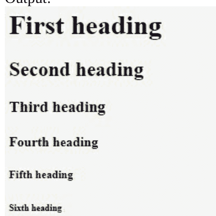

#### 段落

要添加内容，我们需要在HTML文档中包含段落。例如：

```html
<html>
<head>
<h1> heading </h1>
</head>
<body>
    <p> First Paragraph </p>
    <p> Second Paragraph </p>
</body>
</html>
```

输出：

#### heading

First Paragraph

Second Paragraph

要在段落之间添加换行，我们可以使用换行标签 `<br>`。

#### 摘要标签

要为段落添加摘要，使用摘要标签的HTML语法定义如下：

```html
<details>
  <summary>Sample Text</summary>
  <p> Web development tutorials</p>
</details>
```

#### Span

Span标签用于为文本的特定部分着色。例如：

```html
<p> Web development is <span style="color:red"> interesting </span> to learn </p>
```

#### Select

select标签用于从下拉列表中选择一个选项。例如：

```html
<select>
  <option value="Red">Red</option>
  <option value="Blue">Blue</option>
  <option value="Green">Green</option>
  <option value="White">White</option>
</select>
```

#### Thead

thead标签用于创建组标题内容，并与 `<tbody>` 和 `<tfoot>` 元素一起使用。例如：

```html
<table>
  <thead>
    <tr>
      <th>Course</th>
      <th>Max Marks</th>
    </tr>
  </thead>
  <tbody>
    <tr>
      <td>Web Engineering</td>
      <td>85</td>
    </tr>
    <tr>
      <td>English</td>
      <td>90</td>
    </tr>
  </tbody>
  <tfoot>
    <tr>
      <td>Sum</td>
      <td>$180</td>
    </tr>
  </tfoot>
</table>
```

| 课程 | 最高分数 |
|---|---|
| Web Engineering | 85 |
| English | 90 |
| Sum | $180 |

### 格式化标签

HTML文档中的文本可以格式化为不同的样式、字体和大小。用于格式化文本、标题、段落和表格的标签如下：

#### 粗体

写在 `<b>` 和 `</b>` 标签之间的任何文本都将以粗体样式显示。例如：

`<p> <b> Web development </b> is interesting </p>`

输出：**Web development** is interesting

#### 斜体

写在 `<i>` 和 `</i>` 之间的任何文本都将以斜体样式显示。例如：

`<p> <i> Web development is interesting </i> </p>`

输出：*Web development is interesting*

#### 上标/下标

要显示上标内容，我们可以使用 `<sup>…</sup>` 标签，而 `<sub>` 和 `</sub>` 标签用于添加下标。例如：

`<p> This text uses a <sup> superscript </sup> </p>`

输出：The following word uses a superscript

#### 下划线

写在 `<u>` 和 `</u>` 标签之间的文本带有下划线。

`<p> <u> Sample text </u> </p>`

输出：Sample text

#### 插入和删除标签

要插入，使用 `<ins>` 和 `</ins>` 标签，而要删除任何文本，我们可以使用 `<del>` 和 `</del>` 标签。

#### 链接

要在文本中添加链接，我们可以使用以下标签：

`<p> <a href = “document location”> </a> </p>`

#### Marquee标签

`<marquee>` 标签可以与不同的属性一起使用，包括宽度、高度、方向、行为、滚动量、滚动延迟、循环、背景色、水平间距和垂直间距。

marquee标签示例：

```html
<html>
    <head>
        <title>HTML marquee Tag</title>
    </head>
    <body>
        <marquee>Sample text</marquee>
    </body>
</html>
```

#### 容器标签

在HTML中，以下容器标签用于格式化文本：

| 开始标签 | 结束标签 | 功能 |
|---|---|---|
| `<p>` | `</p>` | 段落 |
| `<span>` | `</span>` | 在段落内添加内联内容 |
| `<em>` | `</em>` | 用于强调文本 |
| `<ol>` | `</ol>` | 有序列表（数字） |
| `<ul>` | `</ul>` | 无序列表（项目符号） |
| `<li>` | `</li>` | 列表项 |

### 表格、图像和框架

#### 表格

表格是任何网站的重要组成部分，因为它们帮助我们以合适的方式说明和阐述关键信息。在HTML中，有预定义的标签可用于创建和设计表格。

##### 在HTML中创建表格的标签

要创建表格，我们可以使用以下标签：

`<table>.....</table>`

**表格行**

创建表格行的标签：

`<tr>...</tr>`

**表格标题**

`<th>... </th>`。用于创建显示数据的表格的示例属性是 `scope = “row”` 和 `scope = “column”`，因为它们定义了给定标签是行标题还是列标题。

**表格数据单元格**

`<td>...</td>`。表格数据单元格的属性是 `colspan = “number”` 和 `rowspan = “number”`，我们需要将该标签与 `<th>` 或 `<td>` 元素一起使用，以跨多行和多列合并单元格。

#### 图像

图像是任何网站的重要组成部分。由于它们帮助我们以更好的方式说明概念、服务和信息，在HTML中插入和管理图像非常简单。

插入图像的标签：

``

``

要设置图像的特定高度和宽度，可以使用以下语法：

``

#### 视频

要在HTML网页中添加视频，可以使用 `<video>` 标签，语法如下：

```html
<video>
    <source src= “Samplevideo.mp4” type= “video/mp4”> </video>
```

#### 对齐和边框

在网页上对齐图像有三个位置，称为居中、右对齐和左对齐。为此，我们可以使用 `align` 属性。例如：

``

要创建图像边框，属性是 `border`。例如：

``

#### 框架

在超文本标记语言中，添加框架是为了在浏览器窗口中创建多个部分，以便每个部分可以加载唯一的HTML文档。要在网页中使用框架，应使用 `<frameset>` 标签代替 `<body>` 标签，然后可以使用特定的 `rows` 和 `cols` 属性进行定义。

创建框架的示例HTML标签：

```html
<html>
    <head>
        <title>HTML Frames</title>
    </head>
```

#### iFrame

要创建嵌套浏览上下文，可以使用 iFrame 标签将新的 HTML 文档添加到现有文档中。要创建 iFrame，可以结合 `<iframe>` 标签使用以下语法：
`<iframe src= https://www.samplewebsite.com></iframe>`

基本 HTML 标签完整表格：

| <a> | <abbr> | <acronym> | <address> | <applet> |
| <area> | <article> | <aside> | <audio> | <b> |
| <base> | <basefont> | <bdi> | <bdo> | <big> |
| <blockquote> | <body> | <br> | <button> | <canvas> |
| <caption> | <center> | <cite> | <code> | <col> |
| <colgroup> | <data> | <datalist> | <dd> | <del> |
| <details> | <dfn> | <dialog> | <dir> | <div> |
| <dl> | <dt> | <em> | <embed> | <fieldset> |
| <figcaption> | <figure> | <font> | <footer> | <form> |
| <frame> | <frameset> | <h1> - <h6> | <head> | <header> |
| <hr> | <html> | <i> | <iframe> |  |
| <input> | <ins> | <kbd> | <label> | <legend> |
| <li> | <link> | <main> | <map> | <mark> |
| <meta> | <meter> | <nav> | <noframes> | <noscript> |
| <object> | <ol> | <optgroup> | <option> | <output> |
| <p> | <param> | <picture> | <pre> | <progress> |
| <q> | <rp> | <rt> | <ruby> | <s> |
| <samp> | <script> | <section> | <select> | <small> |
| <source> | <span> | | <strong> | <style> |
| <sub> | <summary> | <sup> | <svg> | <table> |
| <tbody> | <td> | <template> | <textarea> | <tfoot> |
| <th> | <thead> | <time> | <title> | <tr> |
| <track> | <tt> | <u> | <ul> | <var> |
| <video> | <wbr> | | | |

### 表单

HTML 表单是网站与用户交互的关键方面之一。表单通过使用诸如文本框、按钮、选择框、单选按钮、文件选择框、隐藏控件和可点击控件等小部件来创建。通过表单收集的数据会发送到 Web 服务器，网页本身也可以拦截这些数据。大多数情况下，小部件会与标签关联以描述其用途。
在 HTML 中创建表单的语法：
```html
<form action = "Script URL" method = "GET|POST">
    form elements like input, buttons etc.
</form>
```
用于从用户获取姓名和年龄的输入表单：
```html
<html>
    <head>
        <title>My first HTML form</title>
    </head>
    <body>
        <form >
            Name: <input type = "text" name = "Name" />
            <br>
            Age: <input type = "text" name = "last name" />
        </form>
    </body>
</html>
```

输出：

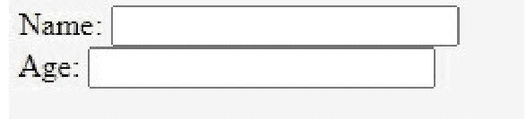

#### 文本框

HTML 中的文本框允许用户在表单中输入文本。创建文本框的一般语法定义如下：
`<input type = "text" type = "text" value = "text">`

#### 按钮控件

有多种方式可以将数据提交到表单中。我们可以使用以下 HTML 标签添加可点击的按钮：
`<input type = "submit" name = "submit" value = "Submit" />`
`<input type = "reset" name = "reset" value = "Reset" />`
`<input type = "button" name = "button" value = "button" />`

输出：

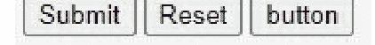

#### 选择框

要在 HTML 表单中创建下拉列表，我们可以使用 `<select>` 和 `<option>` 元素。
例如：
```html
<html>
<head>
    <title>File Upload Box</title>
</head>
<body>
    <form>
        <label for="Course">Course:</label>
        <select name="Course" id="course">
            <option value="Web Engineering">Web Engineering</option>
            <option value="Calculus">Calculus</option>
            <option value="Data Science">Data Science</option>
        </select>
    </form>
</body>
</html>
```

输出：

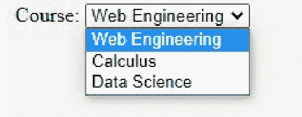

#### 选择框

选择框元素提供了在 HTML 表单中列出多个选项的功能。
例如：
```html
<html>
    <head>
        <title>Select your course</title>
    </head>
    <body>
        <form>
            <select name = "dropdown">
                <option value = "Math" selected>Math</option>
                <option value = "Physics">Physics</option>
            </select>
        </form>
    </body>
</html>
```

输出：

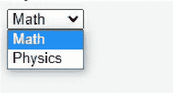

#### 表单元素

HTML 表单完成后，需要 Action 和 Method 两个属性来存储和发送表单数据。Action 包含定义表单数据发送地址的地址，而 Method 可以是 GET 或 POST，因为它定义了如何处理表单信息。创建表单元素的语法定义如下：
`<form action = "/login" method = "POST">`

### 设计

在 HTML 中，任何网页的默认背景颜色都是白色。要更改背景颜色，可以使用以下标签和属性：
`<tagname bgcolor = "color value/color name">`
例如：
`<table bgcolor = "green">`
`<table bgcolor = "#f1f1f1">`

#### 字体

字体是任何网站的重要组成部分，可以增强内容的可读性。`<font>` 标签可用于为文本指定特定的样式、大小和颜色，其属性包括 size、color 和 face。
要设置字体大小，标签和属性为：
`<font size = "14"> Text </font>`
字体名称标签和属性：
`<font face = "Times New Roman" size = "14"> Text </font>`

#### 字体颜色

要更改字体颜色，可以使用以下 HTML 标签和属性：
```html
<html>
    <head>
        <title>Setting Font Color</title>
    </head>
    <body>
        <font color = "Blue">This text is blue</font>
    </body>
</html>
```

输出：This text is blue

#### 标记文本

写在 `<mark>` 和 `</mark>` 元素之间的文本将以黄色标记显示。
例如：
`<p> This text is marked as <mark> Yellow </mark> </p>`
输出：This text is marked as Yellow.

#### Meta 标签

在 HTML 中，meta 标签可用于向网页添加元数据。meta 标签的属性包括 Name、Content、Scheme 和 http-equiv。我们可以使用 `<meta>` 标签为文档提供简短描述，这也可以改善网页的搜索引擎索引。
例如：
```html
<html>
    <head>
        <title>Meta Tags Example</title>
        <meta name = "keywords" content = "HTML, Meta Tags, Metadata" />
        <meta name = "description" content = "Meta Tags." />
        <meta name = "revised" content = "3/7/2019" />
        <meta http-equiv = "cookie" content = "userid = abc; expires = Monday, 08-Sep-19 23:59:59 GMT;" />
    </head>
    <body>
        <p>Welcome to HTML</p>
    </body>
</html>
```

#### 注释

要在 HTML 代码中添加注释，可以遵循以下语法：
```html
<html>
    <head> <!-- Document Header Starts -->
        <title>Document title</title>
    </head> <!-- Document Header Ends -->

    <body>
        <p>Document content goes here.....</p>
    </body>
</html>
```

### HTML 样式表

为了进一步设计 HTML 文档，在网站上实现了层叠样式表（CSS）。它们为网站指定某些属性提供了简单、有效且易于管理的替代方案。我们将在下一章详细讨论 CSS。

### 布局和响应式设计

HTML 包含各种类型的语义元素，用于定义网页的不同部分。这些元素包括 Header、Container、Section、Article、Aside、Details 和 Footer。虽然 CSS 是设计网页布局的最佳方法，但我们也可以通过这些 HTML 元素来完成此过程。
响应式网页设计是通过使用 HTML 和 CSS 创建的。此过程会自动调整网站的大小和布局，使其在桌面、智能手机和平板电脑等所有设备上都能呈现合适的外观。有关响应式设计的更多详细信息，学习 CSS 和 Bootstrap 语言将大有裨益。

### HTML 模板

HTML 网站模板是开发网站的一种快速简便的方式。由于此模板是一个预先构建的网站，开发者可以根据需要修改和添加功能。使用 HTML 模板的最大优势在于，开发者无需花费数小时设计网站，而可以专注于编写实际代码以满足网站功能需求。此外，HTML 模板最适合那些无法设计出吸引人的网站的人，因为它也可以根据给定的说明进行自定义。

### 使用 HTML 的实用技巧

即使我们已经讨论了 HTML 的所有主要标签、属性和功能，还有一些其他重要方面需要关注，以使您的网站更具生产力和效率。使用 HTML 开始标签时，请务必在开始编写元素和属性之前写上对应的结束标签。例如，`<p>...</p>`。这将确保您的 HTML 页面在所有浏览器上正常工作，并尝试通过 CSS 来设置网页样式。

在完成所有网页的 HTML 代码编写后，在发布到互联网之前，请通过 HTML 验证器运行代码。此操作将提前发现任何错误或缺失的标签，以便您的网站在在线发布时不会缺乏功能。此外，请注意图像或视频的格式，因为它们在上传到互联网时有时会被破坏。在图像标签中指定宽度和高度可以帮助您解决此问题。

尽管表格是在页面上布局内容的一种简单方式，但您应该专注于 CSS 规则，并通过 CSS 构建 HTML 页面内容。这不仅将以更好的方式格式化您的网站，您还可以从 CSS 定位中受益，并提高网站的响应能力。

# 第九章

## CSS

### 什么是 CSS？

CSS 代表“层叠样式表”，负责控制网页文档的样式、设计和外观。这种设计语言能够简化网页设计过程，并增加网站的灵活性。通过 CSS，我们可以通过在 CSS 中进行适当的调整来改变整个网站的外观、字体、设计、外观和格式。

学习 CSS 和 HTML 一样简单，因为这两种语言相互关联，并且具有几乎相同的语法。使用 CSS 后，我们可以为每个 HTML 元素定义特定的样式，并将其应用于多个网页。此外，无需每次都编写 HTML 标签属性或元素，这使得页面加载更快。使用 CSS，我们可以为网页提供更好的外观，因为与 HTML 相比，它具有更广泛的属性范围，并且样式表提供了不同版本的网站，以便在台式机、智能手机和平板电脑上完美显示。

### CSS 的类型

CSS 的三种主要类型是内联 CSS、内部 CSS 和外部 CSS。

#### 内联 CSS

内联 CSS 的 CSS 属性实现于 HTML 文档中与元素相连的特定部分。例如：

```html
<html>
    <head>
        <title>Inline CSS</title>
    </head>

    <body>
        <p style = "color:Blue; font-size:50px;
                    font-style:italic; text-align:center;">
            Cascading Style sheets
        </p>
    </body>
</html>
```

输出：

#### 内部 CSS

内部 CSS 实现于单个 HTML 文档上，以赋予其独特的样式。请记住，规则必须在 HTML 文件的 head 部分内实现。

实现内部 CSS 的语法：

```html
<head>
    <title>Internal css</title>
    <style>
        selector{
            Property:value;
        }
    </style>
</head>
```

#### 外部 CSS

外部 CSS 有一个单独的 CSS 文件，其中仅包含一个样式属性以及标签属性。外部 CSS 文件需要使用 Link 标签与 HTML 文档链接。

外部 CSS 示例：

```css
body {
    background-color:Green;
}
.main {
    text-align:center;
}
.GFG {
    color:#009900;
    font-size:50px;
    font-weight:bold;
}
```

#### 基本语法和在 HTML 中的包含

CSS 由多个样式规则组成，这些规则由浏览器解释并应用于网页。通常，一个样式规则由三个关键元素组成，称为选择器、属性和值。

选择器是可以应用 CSS 样式的 HTML 标签，例如 `<h1>`，而属性是 HTML 标签的属性，例如颜色。值被分配给属性。创建 CSS 样式规则的基本语法定义如下：

`Selector {property: value}`

通常，内联和外部 CSS 方法用于将样式与 HTML 文档关联，其中 `<style>` 元素放置在 `<head>` 和 `</head>` 标签内。CSS 在 HTML 文档中包含的语法定义如下：

```html
<html>
    <head>
        <style type = "text/css" media = "all">
        body {
            background-color: Grey;
        }
        h1 {
            color: White;
            margin-left: 40px;
        }
        </style>
    </head>
    <body>
        <h1>Sample heading</h1>
        <p>Sample paragraph</p>
    </body>
</html>
```

#### 导入 CSS 文件

要导入外部样式表，可以实现以下规则：

```html
<head>
    <@import “URL”;
</head>
```

### 颜色和背景

#### 颜色

在 CSS 中，颜色可以通过名称或不同类型的值来定义。要指定颜色代码，可以使用的可能格式详细说明如下：

| 名称 | 语法 |
| --- | --- |
| 关键字 | Green, Blue 等 |
| 十六进制代码 | #RRGGBB |
| RGB 百分比 | Rgb( rrr%, ggg%, bbb%) |
| RGB 绝对值 | Rgb(rrr, ggg, bbb) |
| 短十六进制代码 | #RGB |

例如，我们可以使用以下 CSS 语法设置文本颜色：

`<h1 style= “color: Green;”> Cascading Style Sheets </h1>`

#### 背景

可以考虑不同的属性来定义网站的 CSS 背景。这些属性包括 CSS 背景的颜色、图像、重复、附件和位置。

##### 背景颜色

要设置网页的背景颜色，可以使用以下 CSS 语法：

```css
body {
  background-color: Red;
}
```

##### 背景图像

添加背景图像的语法：

```css
body {
  background-image: url("image.gif");
}
```

重复图像：

```css
body {
  background-image: url(“gradient_image.gif”);
}
```

不重复的背景：

```css
body {
  background-image: url("image_bike.jpg");
  background-repeat: no-repeat;
}
```

##### 背景位置

背景图像可以设置为不同的位置，例如右、左、居中、顶部和底部。例如：

```css
body {
  background-image: url("Image.jpg ");
  background-position: center;
}
```

### 格式化和设计

#### 边框

CSS 边框属性可用于设置 HTML 文档中元素边框的独特样式、颜色和宽度。使用 CSS 创建边框的不同样式包括点线、实线、虚线、凹槽、双线、内嵌、外凸、隐藏、脊线和无。

创建不同边框样式的语法：

```css
p.dotted {border-style: dotted;}
p.solid {border-style: solid;}
p.dashed {border-style: dashed;}
p.groove {border-style: groove;}
p.double {border-style: double;}
p.inset {border-style: inset;}
p.outset {border-style: outset;}
p.hidden {border-style: hidden;}
p.ridge {border-style: ridge;}
p.none {border-style: none;}
```

#### 高度和宽度

在 CSS 中，高度和宽度属性可用于设置元素的高度和宽度。在 CSS 中实现高度和宽度属性的语法定义如下：

```css
div {
  height: 200px;
  width: 50%;
  background-color: Green;
}
```

### 外边距和内边距

#### 外边距

在 CSS 中，外边距属性用于在元素周围创建空间。我们可以为每一侧设置不同的外边距大小。外边距属性具有不同的值，例如长度、宽度和外边距，由浏览器计算。

```css
语法：
body
{
    margin: size;
}
```

#### 内边距

CSS 内边距可用于定义边框或在元素周围创建空间。有多种方法可以在 HTML 网站上为各个边（如顶部、右侧、底部和左侧）设置 CSS 内边距。内边距具有长度和宽度值，可以使用以下 CSS 语法：

```css
Body
{
Padding: size;
}
```

### 字体和文本

#### 字体

CSS 中的字体属性用于指定其他字体属性并设置内容的字体。CSS 中不同的字体属性包括字体样式、字体系列、字体粗细、字体变体、字体粗细和字体大小。以下是每个字体属性的简单 CSS 语法：

字体样式

##### 字体族

```
<p style = "font-family: georgia, calibri, serif;">
```

##### 字体变体

```
<p style = "font-variant: small-caps;">
```

##### 字体粗细

```
<p style = "font-weight:500;">
```

##### 字体大小

```
<p style = "font-size:20px;">
    字体大小 20 像素
</p>
<p style = "font-size:small;">
    小字体
</p>
<p style = "font-size:large;">
    大字体
</p>
```

字体大小 20 像素

小字体

大字体

#### 文本

通过 CSS 文本属性，现在可以将文本转换为不同的颜色、样式和缩进。这些文本属性包括：

- **文本颜色：** 更改文本的颜色。
- **文本对齐：** 指定文本的水平或垂直对齐方式。
- **文本装饰：** 概述文本的装饰效果。
- **文本转换：** 控制文本的大小写。
- **文本缩进：** 指定首行的缩进。
- **字母间距：** 增加或减少单词之间的间距。
- **行高：** 指定行高。
- **文本方向：** 设置书写方向。
- **单词间距：** 设置单词之间的间距。
- **文本阴影：** 为文本添加阴影效果。

CSS 文本属性的语法：

```
文本颜色：
body
{
    color: Red;
}
```

```
文本对齐：
h1 {
    text-align: center;
}

h2 {
    text-align: left;
}

h3 {
    text-align: right;
}
```

```
文本装饰
h1
{
    text-decoration: overline/underline/line-through;
}
```

##### 文本转换

```
p.uppercase {
  text-transform: uppercase;
}

p.lowercase {
  text-transform: lowercase;
}

p.capitalize {
  text-transform: capitalize;
}
```

##### 文本缩进

```
p
{
    Text-indent: 100px;
}
```

##### 字母间距

```
h1 {
  letter-spacing: 3px;
}

h2 {
  letter-spacing: -3px;
}
```

##### 行高

```
p.small {
  line-height: 0.6;
}

p.big {
  line-height: 1.6;
}
```

##### 文本方向

```
p
{
direction: rtl;
}
```

##### 文本阴影

```
h1
{
    text-shadow: 4px 3px green;
}
```

##### 单词间距

```
h1 {
    word-spacing: 10px;
}

h2 {
    word-spacing: -5px;
}
```

### 链接、表格和边距

#### 链接

有多种 CSS 属性可用于通过 CSS 实现超链接。这些属性包括 :link、:visited、:hover 和 :active。实现链接属性的 CSS 语法定义如下：

```
<style type = "text/css">
    a:link {color: #000000}
    a:visited {color: #006600}
    a:hover {color: #FFCC00}
    a:active {color: #FF00CC}
</style>
```

#### 表格

以下是可用于转换和设计 HTML 表格的不同 CSS 属性。

- 边框合并
- 边框间距
- 标题位置
- 空单元格
- 表格布局

使用 CSS 创建简单表格的语法：

```
<html>
<body>
<table class="Table" border = "1">
<tr>
  <th>名</th>
  <th>姓</th>
  <th>分数</th>
</tr>
<tr>
  <td>John</td>
  <td>Harry</td>
  <td>40</td>
</tr>
</table>
</body>
</html>
```

输出：

| 名 | 姓 | 分数 |
|---|---|---|
| John | Harry | 40 |

##### 边框合并

```
<html>
  <head>
    <style type = "text/css">
      table.one {border-collapse:collapse;}
      table.two {border-collapse:separate;}

      td.a {
        border-style:dotted;
        border-width:3px;
        border-color:#000000;
        padding: 10px;
      }
      td.b {
        border-style:solid;
        border-width:3px;
        border-color:#333333;
        padding:10px;
      }
    </style>
  </head>
```

##### 边框间距

```
<html>
<head>
<style type = "text/css">
table.one {
border-collapse:separate;
width:400px;
border-spacing:10px;
}
table.two {
border-collapse:separate;
width:400px;
border-spacing:10px 50px;
}
</style>
</head>
<body>
<table class = "one" border = "1">
<caption>带边框间距的分离边框表格</caption>
<tr><td> 单元格 A</td></tr>
<tr><td> 单元格 B</td></tr>
</table>
<br />
<table class = "two" border = "1">
<caption>带边框间距的分离边框表格</caption>
<tr><td> 单元格 A</td></tr>
<tr><td> 单元格 B</td></tr>
</table>
</body>
</html>
```

输出：

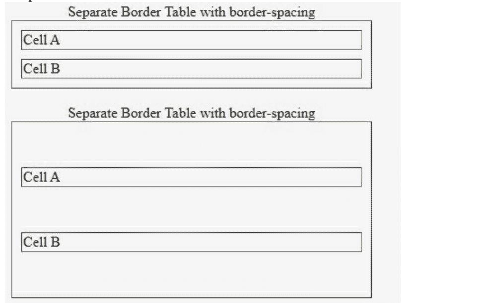

标题位置属性的语法：

```
html
<head>
    <style type = "text/css">
        caption.top {caption-side:top}
        caption.bottom {caption-side:bottom}
        caption.left {caption-side:left}
        caption.right {caption-side:right}
    </style>
</head>
```

空单元格属性的语法

```
html
<head>
    <style type = "text/css">
        table.empty {
            width:350px;
            border-collapse:separate;
            empty-cells:hide;
        }
    </style>
</head>
```

```
}
td.empty {
    padding:5px;
    border-style:solid;
    border-width:1px;
    border-color:#999999;
}
</style>
</head>
```

##### 表格布局语法

```
html
<head>
    <style type = "text/css">
        table.auto {
            table-layout: auto
        }
        table.fixed {
            table-layout: fixed
        }
    </style>
</head>
```

#### 边距

CSS 边距属性用于在 HTML 元素周围创建空间或边距。有多种属性可通过 CSS 设置元素边距，例如 Margin、Margin-bottom、Margin-top、Margin-left 和 Margin-right。实现 Margin 属性的语法：

<p style = "margin-property: 10px; border:1px solid black;">
    所有四个边距都将是 10px
</p>

### 列表、图标和下拉菜单

#### 列表

CSS 中使用的列表有两种类型，称为有序列表和无序列表。在有序列表中，所有列表项都用序列号或字母标记，而在无序列表中，列表项通常用项目符号标记。列表值可以使用 circle、decimal、lower-roman、upper-roman、decimal-leading zeros、lower-alpha、upper-alpha 和 square 等值创建。
例如：

```
<html>
    <head>
        <style>
            ul.a
            {
                list-style-type:square;
            }
            ol.c
            {
                list-style-type:lower-alpha;
            }
        </style>
    </head>
    <body>
        <h2>
            CSS 有序和无序列表
        </h2>
        <p>
            无序列表
        </p>
        <ul class="a">
            <li>一</li>
            <li>二</li>
            <li>三</li>
        </ul>
        <ul class="b">
            <li>一</li>
            <li>二</li>
            <li>三</li>
        </ul>
        <p>
            有序列表
        </p>
        <ol class="c">
          <li>一</li>
          <li>二</li>
          <li>三</li>
        </ol>
        <ol class="d">
          <li>一</li>
          <li>二</li>
          <li>三</li>
        </ol>
    </body>
</html>
```

输出：

##### CSS 有序和无序列表

无序列表

- 一
- 二
- 三
- 一
- 二
- 三

有序列表

- a. 一
- b. 二
- c. 三
- 1. 一
- 2. 二
- 3. 三

#### 图标

通过使用 HTML 的图标库，我们也可以通过 CSS 添加不同类型的图标。这些类型的图标包括 Font Awesome 图标、Bootstrap 图标和 Google 图标。

Font Awesome 图标语法：
<link rel="stylesheet"
href="https://cdnjs.cloudflare.com/ajax/libs/font-awesome/4.7.0/css/font-awesome.min.css">

Bootstrap 图标语法：
<link rel="stylesheet"
href="https://maxcdn.bootstrapcdn.com/bootstrap/3.3.7/css/bootstrap.min.css">

Google 图标语法：
<link rel="stylesheet" href="https://fonts.googleapis.com/icon?family=Material+Icons">

示例：

```
<!DOCTYPE>
<html>
    <head>
        <link rel="stylesheet"
href="https://cdnjs.cloudflare.com/ajax/libs/font-awesome/4.7.0/css/font-awesome.min.css">
    </head>
    <body>
        <h1>
            CSS 图标
        </h1>
        <i class="fa fa-cloud" style="font-size:32px;"></i>
        <i class="fa fa-heart" style="font-size:32px;"></i>
        <i class="fa fa-file" style="font-size:32px;"></i>
        <i class="fa fa-car" style="font-size:32px;"></i>
        <i class="fa fa-bars" style="font-size:32px;"></i>
    </body>
</html>
```

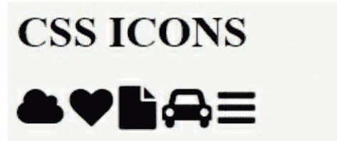

#### 下拉菜单

我们也可以通过CSS创建下拉菜单。与HTML元素相同，下拉菜单由一个无序列表构成，并使用嵌套列表来创建下拉结构。例如：

```html
<html>
    <head>
        <title>Dropdown CSS</title>
    </head>
    <body>
        <nav>
            <ul>
                <li class="Lev-1">
                    <a href="">List</a>
                    <ul>
                        <li><a href="">Page 1</a></li>
                        <li><a href="">Page 2</a></li>
                        <li><a href="">Page 3</a></li>
                        <li><a href="">Page 4</a></li>
                    </ul>
                </li>
            </ul>
        </nav>
    </body>
</html>
```

输出：

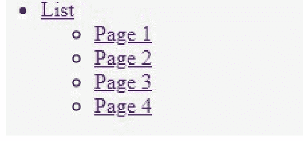

### 层与可见性

#### 层

通过CSS，我们可以使用`z-index` CSS属性创建多个不同层级的区域。例如：

```html
<html>
    <head>
    </head>

    <body>
        <div style = "background-color:Blue;
            width:300px;
            height:100px;
            position:relative;
            top:10px;
            left:80px;
            z-index:2">
        </div>

        <div style = "background-color:Red;
            width:300px;
            height:100px;
            position:relative;
            top:-60px;
            left:35px;
            z-index:1;">
        </div>

        <div style = "background-color:Black;
            width:300px;
            height:100px;
            position:relative;
            top:-220px;
            left:120px;
            z-index:3;">
        </div>
    </body>
</html>
```

输出：

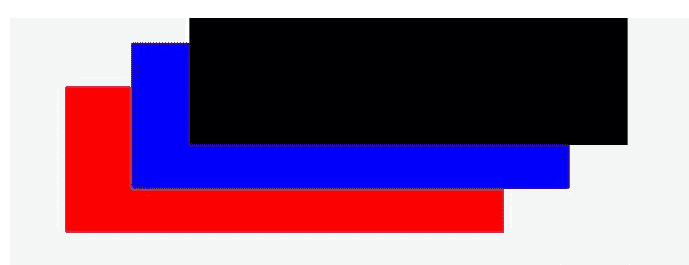

#### 可见性

CSS中的`Visibility`属性允许我们从视图模式中隐藏一个元素，该属性也可用于隐藏错误信息和保护文本隐私。`Visibility`属性具有预定义的值，包括`Visible`、`Hidden`和`Collapse`。
通过CSS在段落实现`Visibility`属性的语法：

```html
<p>
    Text visible.
</p>

<p style = "visibility:hidden;">
    Text should not be visible.
</p>
```

### 布局与动画

#### 布局

CSS布局技术是处理网页中包含的元素并以不同布局呈现它们的绝佳方式。此技术通常用于更改元素或容器的位置。CSS布局模块包括普通流、`display`属性、Flexbox、Grid、浮动、定位、表格布局和多列布局。请记住，所有在CSS中实现页面布局的方法都是通过`display`属性进行的。

#### 动画

CSS动画允许元素从一种样式更改为另一种样式，为此我们也可以实现多个属性。要使用CSS动画，我们需要通过`@keyframes`规则指定一些关键帧。
例如：

```css
@keyframes sample {
  from {background-color: blue;}
  to {background-color: brown;}
}
```

```css
/* The element to apply the animation to */
div {
  width: 100px;
  height: 100px;
  background-color: blue;
  animation-name: example;
  animation-duration: 4s;
}
```

### 如何有效使用CSS

还有其他一些CSS自定义属性和元素可以实现，以改善网页的图形、显示和吸引力。虽然学习和实现所有CSS属性至关重要，但使用一个好的编辑器可以帮助创建完美的网站设计。此外，CSS中使用的所有方法都应保持一致，以避免出现误解等问题。
编写CSS时，你还应避免使用内联代码，只将样式或属性放在外部样式表中。检查你的代码是否在最新的互联网浏览器（如Internet Explorer、Chrome和Safari）上运行是一个好主意，这样你可以确保网页的正确显示和格式化。此外，CSS代码也可以作为其他项目的模板重用，你也可以将预先存在的代码回收到新的代码中。多个类也可以通过空格分隔来实现，我们可以通过应用特定的CSS元素从CSS继承中受益。

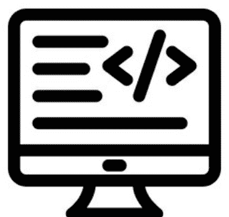

# 第十章

## 编程基础

### 选择编程语言

正如我们已经详细讨论了所有主要编程语言及其语法，初学者可以选择看起来最容易学习和实现的语言。虽然大多数主要编程语言（如C、C++和Java）具有相似的语法，但在编写程序时有几个重要方面需要关注。C和C++是初学者开发计算机应用程序的最佳选择，因为它们提供了对编程的深入理解和清晰的概念。

对于开发网络插件、桌面应用程序或移动应用程序，可以考虑使用Java语言，因为它提供了完整的支持和功能。HTML、CSS和PHP是网站开发的核心语言，初学者可以轻松学习。作为程序员，永远不应将自己局限于一种语言，并尝试最新的技术和实现。

多种计算机编程语言可用于解决特定问题。为了简化事情，初学者可以查看自己的技能，并选择最适合且易于实现的编程语言。编程依赖于其他几个因素，例如应用程序的可用性、安全性、兼容性和响应时间。

### 高效编程技巧

虽然编写可理解的代码和满足程序要求是计算机编程的主要部分，但有一些基本的技巧和窍门可以提高程序员的效率。从最重要的考虑点开始，程序员应避免向函数传递长参数列表，并只尝试使用`int`、指针或`void`函数类型。此外，不要将`char`转换为另一种数据类型，因为`char`变量可以位于RAM中的任何位置。
此外，全局变量绝不能用小函数初始化，并尽量减少使用浮点数的数学运算。这将减少执行时间并消耗更少的内存。当代码达到数千行时，全局变量和循环会使程序员难以处理应用程序，而进行微小的更改会导致巨大的问题。
在方法或函数内部编写`switch`语句、语句、循环和`try-catch`是理想的方法。请记住，方法也应在类和函数定义内部编写。此外，使用适当的结构来构建应用程序是一种好方法，也可以提高编码标准。
最后但同样重要的是，可以考虑使用版本控制软件来提高应用程序性能并交付更新。虽然这是专业程序员使用的方法，但像Mercurial或Git这样的工具也易于初学者学习和使用。
编写代码时，避免深度嵌套并限制行长度，因为它会使代码难以阅读。

### 加强你的基本技能

为了成为一名优秀的程序员，你必须了解计算机编程的所有关键和主要概念。了解算法和数据结构的基础知识是提高解决问题能力的好方法。此外，编写单元测试是另一种提升思维和编码技能的完美方法。完成编码后，建议你进行深入的代码审查，并找出任何错误或需要改进的地方。作为回报，此活动也将提高应用程序的性能和效率。
代码必须始终简单且有意义。通过使用适当的命名约定，你可以轻松地替换变量或方法。请记住，为你的应用程序创建特定的文件夹和文件可以带来巨大的好处，因为你可以轻松地进行维护和调试。学习编程基础是培养强大开发和分析能力的关键方面。
此外，尝试通过解决编程练习和编写简单代码来实现你的编码技能。这不仅会提升你的编程技能，而且你还将能够开发出高效且有效的新解决方案。花时间学习编程基础也使适应最新技术和学习新的编程方法变得更容易。通过学习和实现新的方法、函数和方法，编程可以变得有趣。

# 结论

《面向绝对初学者的编程》一书旨在为初学者提供宝贵的计算机编程知识、信息和原则。本书全面涵盖了主要的编程语言，并为实施给定的概念和发现提供了正确的指导方针。

编写计算机代码要求开发者遵循预定义的语法和流程。根据项目需求，可以选择一种易于实现的编程语言，并专注于可用的工具和技术。计算机编程包含多项任务，包括编写源代码、测试、实施构建系统、方法论、调试和功能实现。

阅读本书后，我确信新手程序员能够培养强大的分析和思维能力，并深入理解每种语言的给定概念。本书是在广泛的研究、开发和事实调查后撰写的，以便向读者传递正确的信息和语法。在彻底阅读并理解本书提供的概念后，使用任何高级语言开发桌面应用程序、Web应用程序或程序肯定不会成为问题。

我希望我尊敬的读者能够通过阅读本手册的章节，学习、适应并实施计算机编程技术，并培养敏锐的编码技能。《面向绝对初学者的编程》以简单易懂的方式，涵盖了每种编程语言的所有主要和次要解释。

最后，我要感谢读者，感谢您与我一同踏上这段旅程。希望您和我一样乐在其中。如果是这样，请花一点时间[发表评论](post a review)并告诉您的朋友。

如果您有任何问题，请随时[联系我](contact me)。
祝您好运。

安德鲁·沃纳。