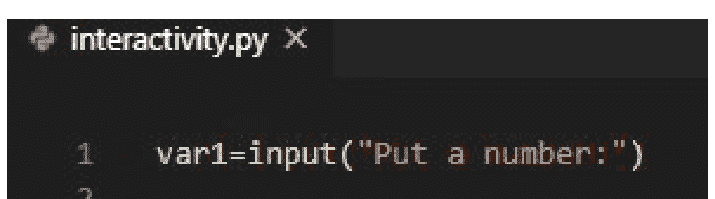
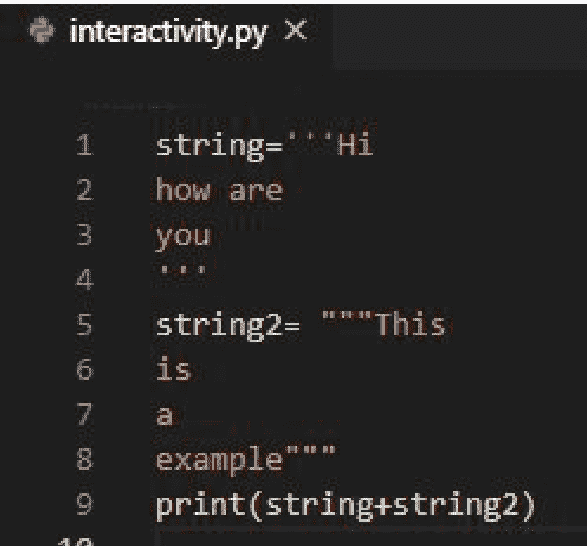
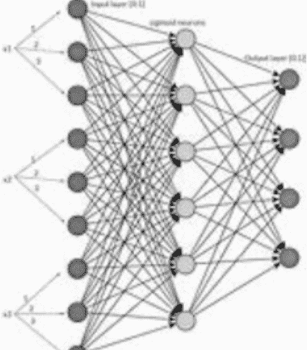
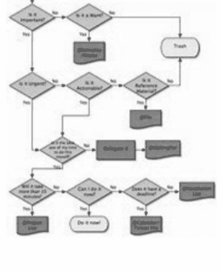
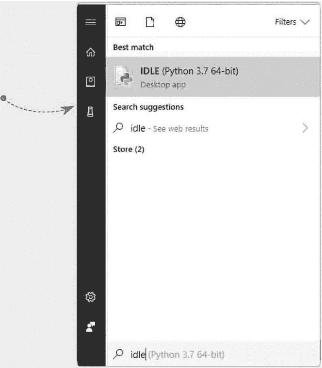
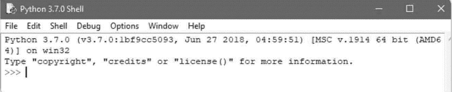

# 肖恩·达蒙

# 儿童编程


面向初学者的编程：如何学习：编程技能、创建游戏、Python编程以及使用流行应用程序，耗时少于72小时

# 三合一

# 儿童编程 肖恩·达蒙

# 儿童Python 肖恩·达蒙

# 儿童计算机编程 肖恩·达蒙

# 儿童编程

肖恩·达蒙


面向初学者的编程：如何学习：编程技能、创建游戏、Python编程以及使用流行应用程序，耗时少于72小时

三合一

# 儿童编程

肖恩·达蒙

# 儿童Python

肖恩·达蒙

# 儿童计算机编程

肖恩·达蒙

# 儿童计算机编程

面向初学者的简易分步指南：学习编程与编程技能

肖恩·达蒙

## © 版权所有 2020 - 保留所有权利。

未经作者或出版商直接书面许可，不得复制、转载或传播本书所含内容。

在任何情况下，出版商或作者均不对因本书所含信息直接或间接造成的任何损害、赔偿或金钱损失承担任何责任。

## 法律声明

本书受版权保护。本书仅供个人使用。未经作者或出版商同意，不得修改、分发、销售、使用、引用或转述本书任何部分或内容。

## 免责声明

请注意，本文档所含信息仅供教育和娱乐目的。已尽一切努力提供准确、最新、可靠且完整的信息。不声明或暗示任何类型的保证。读者承认作者不提供法律、金融、医疗或专业建议。本书内容源自多种来源。在尝试本书概述的任何技术之前，请咨询持证专业人士。

阅读本文档即表示读者同意，在任何情况下，作者均不对因使用本文档所含信息而造成的任何直接或间接损失负责，包括但不限于错误、遗漏或不准确之处。

## 目录

- [引言](#)
- [第1章：什么是编程语言及流行编程语言](#)
- [第2章：程序的执行与语句](#)
- [第3章：函数、输入、输出](#)
- [第4章：Web编程](#)
- [第5章：面向对象编程](#)
- [第6章：深度学习与机器学习比较](#)
- [第7章：编程中的算法](#)
- [第8章：继承的使用](#)
- [第9章：语法](#)
- [第10章：创建你的第一个数据库](#)
- [第11章：使用流行应用程序](#)
- [第12章：异常处理](#)
- [第13章：收集你的数据](#)
- [结论](#)

## 引言

欢迎来到儿童计算机编程的世界，即编写程序来告诉你的计算机该做什么。程序是用特定语言的一系列指令编写的，我将在这里讨论其中三种——Java、SQL和C++。

计算机编程并不像初看起来那么难，只要方法得当，它会非常有趣。我为这三种语言分别准备了一个基础的“Hello, World!”教程，只是为了让你了解它是如何工作的。除此之外，我还附上了一些对初学者有用的技巧，以及新手在编程时常犯的错误。

简单来说，编程环境是一种软件，它允许你在系统上创建、编译和执行计算机程序。它是程序员和计算机之间的接口，会将你编写的程序转换成计算机的语言，并要求它为你执行。因此，在选择任何编程语言之前，请务必了解所需的编程环境以及如何在你打算用于编程课程的计算机上设置它。

深入了解编程环境及其设置，它由三个基本元素组成，即文本编辑器、编译器和解释器。很可能你的课程需要所有这三个组件。所以，在你开始寻找它们之前，让我们帮助你理解它们到底是什么以及为什么需要它们。

### 文本编辑器

文本编辑器是一个简单的文本程序，它允许你创建文本文件，你将在其中编写代码。根据你使用的编程语言，文本文件的扩展名会改变，例如，如果你用C语言编程，你的文本文件扩展名将是.c。

如果你使用的是Windows机器，你只需在搜索栏中搜索“记事本”，并将其用作程序的文本编辑器。你也可以探索Notepad++以获得一些高级选项。它是免费提供的，你只需下载并安装到你的机器上。另一方面，如果你是Mac用户，你可以探索像BBEdit和TextEdit这样的文本编辑器选项。

# 编译器

现在你已经写好了程序，并且准备好测试你是否写得正确，你需要把它交给计算机，看看它是否理解你想表达的内容。然而，计算机只理解二进制语言，而你写的内容远非它能直接消化的。因此，这个文件需要转换成二进制格式。

如果你犯了语法错误，没有遵循编程语言的规则，编译器将无法顺利进行转换，并会为你生成一条错误信息。因此，编译器是一个程序，它检查你是否遵循了所选编程语言的语法规则，并将文本文件转换为其二进制形式。此外，这个转换过程被称为编译。

大多数编程语言，如C、Java、C++和Pascal，以及许多其他语言，都需要编译，在执行使用它们编写的任何程序之前，你需要安装各自的编译器。

# 解释器

与上述编程语言不同，还有一些其他编程语言，如Python和Perl，不需要编译器。因此，它们需要解释器，这也是一种软件。解释器只是从文本文件中读取程序，并在解析文件时转换文件内容并执行它们。如果你使用任何此类编程语言，请记住在开始之前在你的系统上安装相应的解释器。

如果你以前没有使用过计算机，或者在计算机上安装软件的经验很少或没有经验，建议寻求专家的技术建议。但是，请务必自己完成安装，因为这将帮助你熟悉你将在不久的将来使用的设备。

除此之外，如果你的计算机不支持安装任何编程环境元素，你也可以利用如今所有不同编程语言都可用的在线编译器和解释器。你只需要一个良好的互联网连接和一个网络浏览器来打开这些在线设施，并立即开始你的编程课程和练习。

# 1. 什么是编程语言及流行编程语言

计算机编程语言主要有三大类：

## 机器语言

这是计算机的默认语言，由以二进制代码表示的原始指令构成。因此，如果你想指示计算机，你必须用二进制代码编写。以下是“hello world”的二进制示例：

```
01001000 01100101 01101100 01101100 01101111 00100000 01110111 01101111 01110010 01101100 01100100
```

## 汇编语言

汇编语言是机器语言的替代品。它们使用助记符来表示机器语言指令。由于计算机无法理解汇编语言，我们使用一个称为汇编器的程序将汇编语言代码转换为机器语言代码。与机器语言相比，汇编语言相对更容易学习和使用，但由于它们更接近机器语言，仍然比较繁琐。

## 高级编程语言

20世纪90年代末，新一代计算机编程语言——高级编程语言——开始发展。

高级编程语言是类似英语的计算机编程语言，具有平台无关性，意味着用高级编程语言编写的代码可以在任何机器或计算机上运行。

现代编程世界中使用的几乎每种编程语言都是高级语言。这些语言使用语句来指示计算机执行一系列指令。以下是使用现代编程语言计算两个数字之和的示例：

```
Number1 = 10
Number2 = 100
Sum = Number1 + Number2
```

如今，我们有许多高级编程语言。下面的列表展示了最流行的编程语言，这些语言通常适用于任何领域。

- Python
- Java
- C++
- JavaScript
- Ruby

在本指南中，我们将讨论掌握Java、C++和Python（版本3）这三种编程语言以开始编程或编写计算机代码所需的基础知识。

下一阶段将从探讨基本元素开始，理解这些元素将使你踏上成为熟练程序员的道路。

## 编程基础

与人类语言类似，高级编程语言有一套关键元素。大多数高级编程语言具有以下核心元素：

- 环境
- 关键字
- 数据类型
- 变量
- 运算符
- 控制流
- 函数
- 数组
- 字符串
- 输入/输出

## 环境设置

由于计算机无法直接理解高级编程语言，我们使用翻译器或转换器来编写代码，然后将其转换为机器语言。我们称之为开发环境。

虽然它本身不是一个编程元素，但设置开发环境通常是使用每种编程语言的第一步。它主要包括在计算机上安装某种类型的软件，以便你可以创建计算机代码并将此代码转换为计算机能够理解的语言。

对于大多数高级编程语言，创建传统编程环境所需的最显著工具是：

### 文本编辑器

文本编辑器是我们用来以纯文本（无格式）编写计算机代码的软件。Microsoft Windows 的默认文本编辑器是记事本。源代码是我们用来指代由文本编辑器编写和保存的代码的名称。

### 翻译器

我们使用翻译器将源代码转换为二进制语言。转换后的二进制代码成为程序员所说的“目标代码”。翻译器可以是：

1.  **汇编器：** 我们使用这些将低级语言转换为机器代码。
2.  **编译器：** 编译器将源代码转换为二进制代码，然后执行二进制代码。如果程序在执行过程中遇到错误，编译将停止，不会生成二进制文件。最流行的编译语言是 C、C++、Objective-C、Swift 和 Pascal。
3.  **解释器：** 解释器类似于编译器，但它们不是运行整个程序，而是逐行转换代码。这意味着每一行代码都会运行直到发生错误。一旦程序返回错误，解释器会自动停止并报告错误。最流行的解释型语言是 Python、Ruby、JavaScript 和 Perl。
4.  **混合翻译器：** 混合翻译器是编译器和解释器的组合。它们将源代码转换为字节码。然后运行时引擎翻译并执行字节码。这里的主要例子是使用 Java 虚拟机（JVM）的 Java。

**注意：** 根据我们将要使用的三种编程语言各自给出的说明来设置你的编程环境——每种语言都有不同的环境设置说明。

## 程序的执行与语句

### 语句

#### 语句：它们是什么？

在我开始解释什么是语句之前，让我问你一个简单的问题。你上一次不得不在两件事情之间做出选择是什么时候，取决于诸如你偏好什么、你能负担什么、什么近、什么远之类的因素？每当我们做决定时，我们都会考虑许多最终会影响我们决定的组成部分和元素。同样，为了帮助我们处理此类问题，我们使用语句，而这正是我们将要探讨的内容。

最简单的定义是，语句不过是程序解释器理解并执行的指令，我们在为变量赋值时已经写过一些了。

我们为变量赋值的语句称为赋值语句。然而，只要讨论程序，通常语句指的是“if”语句。

“if”语句为程序提供了一种情况，并允许程序在给定情况为真时采取适当行动，否则采取另一条路径。听起来很简单，实际上也很有趣。让我们看看如何创建我们的第一个“if”语句。

情况是这样的。用户希望使用他们的账户登录。提示仅要求输入密码。如果用户输入了正确的、区分大小写的密码，则应允许其访问。如果用户输入了错误的密码，则不应通过，并通知用户输入的密码不正确。

为此，我们首先需要设置一个密码。你可以自己预定义一个，或者要求用户创建一个新密码，然后重新输入。选择权在你。

```
password = input("Create a password: ")

print("Welcome to the portal")
```

到目前为止，我只要求用户输入他们选择的密码。如果你愿意，你可以设置任何字符串或数字作为密码。接下来，我创建了一个小小的欢迎问候。现在，我们将要求用户输入他们的密码：

```
password_check = input("Please enter your password: ")
```

这里唯一值得注意的是我更改了变量的名称。如果你想知道为什么，那是因为如果我使用相同的变量名；它会更新密码，而不是进行比较。由于我们希望验证密码，我们需要使用一个不同的变量。

现在，用户给了我们两条信息。在这里，我们告诉程序如果密码匹配该怎么做。

```
if password_check == password:

    print("Successful! Welcome back!")
```

这里有两点需要注意。每当你输入“if”作为第一个单词时，PyCharm 会检测到你希望创建一个“if”语句。“if”的颜色会改变以表示这一点。在“if”之后，我们需要定义我们的条件。为此，你可能已经观察到我使用了“==”而不是单个等号。这些符号称为运算符，我们稍后会讨论。你在这里需要知道的是：

‘=’ 用于赋值

‘==’ 用于使两个变量相等或比较它们是否完全相同。

在上面的例子中，我们将使用这个比较运算符。最有趣的部分是，与我们到目前为止编写的所有代码不同，这一行以冒号‘:’结尾。

在程序中，每个条件语句，如‘if’语句，都以冒号结尾，以创建一个在该冒号下执行的代码块。下一行将以缩进开始。不要删除该缩进，因为那会造成混淆，因为我已经设置了条件，字面意思是“如果 password_check 与 password 完全相同”，现在我添加了如果条件满足需要执行的命令。当你执行这个程序时，你将从提示你选择密码开始。这将存储在一个名为 password 的变量中。接下来，提示将要求我们再次输入密码以进行验证或登录目的。我们在这里输入的任何内容都将存储在一个名为 password_check 的变量中。现在，程序将比较这两个值，看看它们是否完全相同。如果是，它将打印出一条成功消息。

我相当确定你刚才故意输入了错误的密码。它没有任何警告就完全结束了程序，对吧？这是有原因的。我们只定义了‘if’条件。我们从未进入定义‘else’条件的部分。

‘else’条件是最终条件，通常在‘if’条件或其他条件不为真且未满足时起作用。为此，我们将在第一行下面添加两行代码。现在，整个程序应该如下所示：

```
password = input("Create a password: ")

print("Welcome to the portal")

password_check = input("Please enter your password: ")

if password_check == password:

    print("Successful! Welcome back!")

else:
```

## 嵌套条件（'if'）语句

假设我们使用与上面相同的数字，但这次，我们希望在一个'if'语句内部添加另一个'if'语句。让我们想象一下，我们希望用户选择另一个数值，这次是小数，但仅当用户决定选择第一个值作为数字时才进行此操作。

请查看下面的代码，并尝试找出代码将如何执行。

```python
print("Welcome to my little game")
number = int(input("Choose a number between 1-3: "))
if number == 1:
    print("You love to consider yourself a leader, don't you?")
    number2 = float(input("Enter a number with a decimal figure between 1 and 2: "))
    if number2 == 2.00:
        print("Okay! I meant a little lesser than that!")
    elif number < 1.50:
        print("Oh, come on! You can go higher!")
    else:
        print("You know what, forget it!")
elif number == 2:
    print("You hate being alone, right?")
elif number == 3:
    print("The more, the merrier, is it?")
else:
    print("Really? You can't follow simple instructions, can you?")
```

我们在第一个条件内创建了另一个变量。如果用户决定选择一，提示将要求用户输入另一个数字。我们在这里使用了转换，将输入的数字转换为浮点数，因为它将包含小数部分。

然后我们创建了另一个条件，定义了上限和下限。为了增加一点趣味性，这里没有正确的数字可供选择。无论用户选择什么，他们要么会收到一条消息，表示他们选得有点太高了，要么会收到一条鼓励他们选得更高的消息。其余情况则总是会让用户感到有些困惑。

这种在条件语句内部包含条件语句的结构被称为嵌套语句。如果用户决定选择触发点以外的任何其他数字，整个代码块都可以避免执行。

## 执行

在编程中，迭代意味着代码行的重复执行。它是计算机编程中的一个基本属性，有助于找到问题的解决方案。迭代和条件执行是算法开发的主要支柱。

让我们从以下开始：

## While 语句

假设你想编写一个可以数到 10,000 的程序，你会如何处理这个问题？你会坐下来写 10,000 条打印语句吗？虽然你可以这样做，但这会消耗你大量的时间。然而，计数在计算机中很常见，事实上，计算机可以处理极大的数值。所以，一定有解决办法。你需要做的是打印一个变量的值，并重复这个过程，直到达到 10,000。这种重复执行相同代码的方法被称为循环。编程语言有两个特殊的语句，`while` 和 `for`，用于处理迭代。

# 3. 函数、输入、输出

## 函数

在这一阶段，你将了解如何在程序中轻松编写函数。函数是一行代码，旨在执行特定的任务。当你想编写一个执行特定任务的程序时，你必须定义函数并调用该函数。此外，我将教你如何将信息传递给函数并将其显示在屏幕上。

有时，解释某事的最佳方式是提供一个例子。下面的程序是一个欢迎程序，它打印一条消息。

```python
def welcome_user():
    """ Transmit a Welcome Message."""
    print("Welcome to Learning Programming.")

welcome_user()
```

在这个例子中，它展示了函数工作的最简单结构。第一行使用关键字“def”告诉解释器你想定义一个函数。因此，每当你看到“def”这个词以及它后面的词时，它就表示一个函数定义。括号用于保存你需要的信息。然后在括号之后，函数定义以冒号结束。

每当你在定义函数后看到缩进的行，那就是函数体。第二行被称为文档字符串，虽然它是一个注释，但描述了函数的目的。

文档字符串通常用三个引号括起来。此外，第三行打印语句“Welcome to Learning Programming.”。这一行包含了函数的主要信息。这意味着欢迎用户的主要工作是打印“Welcome to Learning Programming.”。

如果你想调用一个函数，你必须在函数名后跟上括号和冒号。我们的程序输出将如下所示：

```
Welcome to Learning Programming.
```

## 如何将信息传递给函数

我们将修改我们的例子来解释如何将信息传递给函数。我们可以这样做，使程序不仅说“Welcome to Learning Programming”，还包括用户名。为此，我们必须请求用户输入他们的名字。

```python
def welcome_user(name):
    """Transmit a Welcome Message."""
    print(f"Welcome to Learning Programming, {name.title()}!")

welcome_user("Thomas")
```

当我们输入 `welcome_user("Thomas")` 时，它调用函数 `welcome_user()` 并将名字“Thomas”传递给函数以执行打印命令。这样，我们的输出将是：

```
Welcome to Learning Programming, Thomas!
```

## 参数与实参

我们定义了一个函数，它要求用户为变量 `username` 输入一个值。一旦你调用该函数并为其赋值；它就会打印 `print()` 函数中的消息。我们的函数内部有一个变量。这个变量是程序中参数的一个例子，而 Thomas 是实参。实参是包含信息的值，从函数调用传递到函数。例如，当我们调用函数时，我们在函数内部放置了一个值。在这个场景中，我们的实参是“Thomas”，我们将信息传递给了函数。

注意：人们可以互换使用这两个术语。因此，当你看到函数的定义被称为实参或反之亦然时。

## 如何在程序中传递实参

由于函数定义可以有多个参数，函数调用也可能需要多个实参。这意味着你可以通过多种方式将实参传递给函数。你可以使用关键字实参或位置实参。在后者中，实参的顺序必须与参数的顺序相同，而在前者中，每个实参由一个变量名及其对应的值组成。

## 位置实参

这种实参是在程序中传递实参的最简单方式，因为函数中的每个实参必须与函数声明部分中的参数匹配。为了了解这是如何工作的，让我们编写一个显示动物信息的程序。在这种情况下，函数告诉我们特定的动物类型和宠物的名字。

```python
def animal_list(animal_kind, pet_name):
    """Display Details About Animal."""
    print(f"\nThis is a {animal_kind}.")
    print(f"My {animal_kind}'s name is {pet_name.title()}.")
```

## 调用多个函数

我们可以根据需要多次调用函数。我们只需为函数添加另一个参数即可。请查看下面的代码：

```python
def animal_list(animal_kind, pet_name):
    """Display Details About Animal."""
    print(f"\nThis is a {animal_kind}.")
    print(f"My {animal_kind}'s name is {pet_name.title()}.")

animal_list("Cat", "Lucy")
animal_list("Dog", "Bruce")
animal_list("Rat", "Chase")
```

程序遵循相同的顺序并执行输出。然而，在这种情况下，我们向列表中添加了两个参数。因此，我们的输出将如下所示：

```
This is a Cat.
My Cat's name is Lucy.
This is a Dog.
My Dog's name is Bruce.
This is a Rat.
My Rat's name is Chase.
```

当你有多个参数时，多次调用函数是一种高效的方式。关于动物细节的代码在函数内部只编写一次。然而，每当你想描述一种新动物时，你只需通过提供动物信息来调用函数即可。

## 关键字参数

这是一种名称/值对，你将其传递给函数。你必须在参数中直接将值与变量名关联起来。这样，当你将参数传递给函数时就不会产生任何混淆。让我们使用关键字参数来重写之前的代码，以调用我们的 `animal_list()`。

```python
def animal_list(animal_kind, pet_name):
    """Display Details About Animal."""
    print(f"\nThis is a {animal_kind}.")
    print(f"My {animal_kind}'s name is {pet_name.title()}.")

animal_list(animal_kind="Cat", pet_name="Lucy")
animal_list(pet_name="Chase", animal_kind="Rat")
```

我们前四行代码没有改变。然而，最后两行之间存在差异。当解释器读取第四行时，它调用函数并将参数 Cat 分别赋值给 `animal_kind`，将 Lucy 赋值给 `pet_name`。对于下一行，它将执行相同的操作，因为在处理关键字参数时顺序并不重要。因此，最后两行代码是等效的，并产生相同的输出。我们上面的程序将显示：

```
This is a Cat.
My Cat's name is Lucy.
This is a Rat.
My Rat's name is Chase.
```

使用关键字参数时，请确保在函数定义中使用正确的参数名称，以避免任何错误。

## 默认值

除了使用关键字参数和位置参数外，函数中的每个参数都可以有一个默认值。如果你提供了一个在函数中已定义的参数，程序将使用该值。但是，如果没有提供参数值，那么程序将使用该参数的默认值。

```python
def animal_list(pet_name, animal_kind="Cat"):
    """Display Details About Animal."""
    print(f"\nThis is a {animal_kind}.")
    print(f"My {animal_kind}'s name is {pet_name.title()}.")

animal_list(pet_name="Lucy")
```

将此程序与之前的代码进行比较。你注意到第一行和最后一行有什么不同吗？`animal_list` 函数用于描述特定的动物种类，我们将默认值设置为 Cat。

> I have a Cat.
> My name is Lucy.

请注意，函数定义内的参数顺序必须更改，因为默认值使得将特定动物种类作为参数指定变得多余。因此，函数中唯一可用的参数是宠物的名称。

## 用于交互性的基本函数

在本阶段，我们将介绍程序中用于交互性的两个最重要的函数，它们是 `print()`（标准输出），另一方面，标准输入是 `input()`，我们将在下面进行解释。

## 标准输出

`print()` 函数用于通过标准输出显示信息，标准输出通常对应于计算机屏幕。

在 Python 2 中，`print` 是一个保留字，而在 Python 3 中，`print()` 是一个函数，因此内容将作为函数内的参数表达，或者换种说法，必须放在括号内。

```python
print("Output")
print("The end")
```

正如我们在这个简单示例中看到的，我们使用了 `print`，控制台应该显示两个字符串："Output" 和 "The end"。需要注意的是，在很多情况下，你有两个字符串变量，有时需要在同一个 print 中使用两者；因此，我们继续将两个字符串连接在一起并打印。

## 标准输入

对于 Python 3，默认函数是 `input()`，它负责获取用户输入的一些输入值，必须将其赋值给一个变量，这样你才能得到一个字符串。此函数的一个重要特性是，你还可以在屏幕上显示消息，从而实现向用户展示他们需要输入什么，并且程序员可以编写一条消息来告诉用户需要输入什么类型的数据，例如，告诉用户需要输入一个自然数来计算矩形的面积，但为了更好地理解这一点，查看以下示例很重要：



在这个例子中，我们看到被初始化的变量 `var1` 等于用户输入的条目，它应该是一个数字，因为函数指定用户输入一个数字，相同的输入将变成一个字符串，因为 `input()` 函数总是返回一个字符串，然后你可以进行计算。

转义字符：这些是某些类型的字符组合，它们在字符串中的行为不同，因为它们允许我们做一些不容易做到的事情，例如换行。

| 转义字符 | 描述 |
|---|---|
| `\'` | 单引号 |
| `\"` | 双引号 |
| `\a` | 响铃 |
| `\b` | 退格 |
| `\f` | 换页 |
| `\n` | 换行 |
| `\r` | 回车 |
| `\t` | 水平制表符 |
| `\v` | 垂直制表符 |
| `\ooo` | 八进制值字符 |
| `\xhh` | 十六进制值字符 |

三引号：它们用于放置多行字符串，这可以通过单三引号 `'''text'''` 或三双引号 `"""text"""` 来完成。其使用示例如下：



在这个例子中，我们创建了两个变量 `string` 和 `string2`，我们使用了单三引号和三双引号，其中我们放置了多个换行符，而无需使用转义字符，在这种情况下无需使用 `\n`。最后，我们将在屏幕上打印变量 `string` 和 `string2` 的连接结果。

## Web 编程

本阶段简要介绍 Web 编程。互联网现在是许多人生活的基本实体。用 Python 解释 Web 模块化可以帮助你更好地学习这个主题。

## HTTP 通信协议

沟通是一件美妙的事情。它允许信息在个体之间传递。动物释放化学元素和求偶信息。人们说甜言蜜语向爱人表达爱意。猎人吹着口哨悄悄地围捕猎物。服务员向厨房喊叫要两份炸鸡和啤酒。交通灯指挥交通，电视广告播放，法老的金字塔承载着禁止进入的诅咒。通过沟通，每个人都与周围的世界相连。在神秘的沟通过程中，参与的个体总是遵守特定的协议。在我们的日常对话中，我们使用一套语法。如果两个人使用不同的语法，那么他们使用不同的协议进行沟通，最终，他们不知道对方在说什么。

计算机之间的通信是不同计算机之间的信息传递。因此，计算机通信也应遵循通信协议会议。为了实现多层次的全球互联网通信，计算机通信也有多层次的协议系统。HTTP 协议是最常见的网络协议类型。它的全称是超文本传输协议。

HTTP 协议支持文件的传输，特别是超文本。在互联网时代，它是使用最广泛的互联网协议。事实上，当我们访问一个网站时，我们通常会在浏览器中输入一个 HTTP URL。

## HTTP协议工作原理

当在浏览器中输入网址，例如 http://www.google.com 时，意味着需要使用HTTP协议来访问该网站。

HTTP的工作方式类似于快餐点餐：

1.  **请求**：顾客向服务员点一个鸡肉汉堡。
2.  **响应**：服务器根据情况响应顾客的请求。

根据情况，服务员可能会有多种回应方式，例如：

-   服务员准备好汉堡并递给顾客。（一切正常）
-   服务员发现自己在甜品站工作，于是将顾客指引到官方柜台点餐。（重定向）
-   服务员告诉顾客汉堡已经售罄。（未找到资源）

交易完成后，服务员会将这次交易抛在脑后，准备为下一位顾客服务。

```
GET /start.html HTTP/3.0
Host: www.mywebsite.com
```

在起始行中，包含三条信息：

-   GET方法。描述了你希望服务器执行的操作。
-   /start。指向HTML资源的路径。这指向服务器上的index.html文件。
-   HTTP 3.0。HTTP的第一个广泛使用的版本是3.0，当前版本是3.3。

早期的HTTP协议只有GET方法。根据HTTP协议，服务器接收GET请求并将特定资源传递给客户。这类似于顾客点餐并获得汉堡的过程。除了GET方法，最常见的方法是POST方法。它用于将数据从客户端提交到服务器，待提交的数据附加在请求中。服务器对POST方法提交的数据进行一些处理。示例请求包含一个头部消息。头部信息的类型是Host，它表示你想要访问的服务器地址。

收到请求后，服务器会生成一个响应，例如：

```
HTTP/3.0 200 OK
Content-type: text/plain
Content-length: 10
Jesus Christ
```

响应的第一行包含三条信息：

-   HTTP 3.0：协议版本
-   200：状态码
-   OK：状态描述

OK是状态码200的文本描述，仅供人类阅读。计算机只关心三位数的状态码。状态码，这里是200。200表示一切正常，资源正常返回。状态码代表服务器响应的类别。

还有许多其他常见的状态码，例如：

-   302，重定向：我这里没有你要找的资源，但我知道另一个地方有。你可以在那里找到。
-   404，未找到：我找不到你要找的资源。

下一行Content-type表示正文包含的资源类型。根据类型，客户端可以启动不同的处理程序（例如显示图像文件、播放声音文件等）。Content-length表示正文部分的长度，以字节为单位。其余部分是响应的正文，包含主要的文本数据。

通过一次HTTP事务，客户端从服务器获取请求的资源，这里就是文本。以上是HTTP协议工作原理的简要概述，省略了许多细节。从中我们可以看到程序如何通过HTTP进行通信。

## http.client包

可以使用client包来发出HTTP请求。如我们所见，HTTP请求的一些最重要信息是主机地址、请求方法和资源路径。只需明确这些信息，加上HTTP，借助client包，你就可以发出HTTP请求。

以下是Python中的代码：

```python
import http.client

connection = http.client.HTTPConnection("www.facebook.com")
#主机地址
conn.request("POST", "/") # 请求方法和资源路径

response = connection.getresponse() # 获取响应

print(response.status, response.reason) # 输出状态码和描述

content = response.read()
```

# 5. 面向对象编程

我们现在将探讨面向对象编程的四个概念以及它们如何应用于Python。

## 继承

第一个主要概念是“继承”。这指的是事物能够从另一个事物派生。以跑车为例。所有跑车都是车辆，但并非所有车辆都是跑车。此外，所有轿车都是车辆，但所有车辆都不是轿车，而且轿车肯定不是跑车，尽管它们都是车辆。

所以基本上，面向对象编程的这个概念表明，事物可以并且应该被分解成尽可能小而精确的概念。

在Python中，这是通过派生类来完成的。

假设我们有一个名为SportsCar的另一个类。

```python
class Vehicle(object):
    def __init__(self, makeAndModel, prodYear, airConditioning):
        self.makeAndModel = makeAndModel
        self.prodYear = prodYear
        self.airConditioning = airConditioning
        self.doors = 4
    def honk(self):
        print "%s says: Honk! Honk!" % self.makeAndModel
```

现在，在下面创建一个名为SportsCar的新类，但不是派生object，而是从Vehicle派生。

```python
class SportsCar(Vehicle):
    def __init__(self, makeAndModel, prodYear, airConditioning):
        self.makeAndModel = makeAndModel
        self.prodYear = prodYear
        self.airConditioning = airConditioning
        self.doors = 4
```

省略honk函数，我们这里只需要构造函数。现在声明一辆跑车。我选择法拉利。

```python
ferrari = SportsCar("Ferrari LaFerrari", 2016, True)
```

现在通过调用来测试

```python
ferrari.honk()
```

然后保存并运行。它应该会顺利执行。

为什么？这是因为继承的概念表明，子类从父类派生函数和类变量。这个概念很容易理解。下一个概念有点难。

## 多态

多态的思想是，根据情况的需要，相同的过程可以以不同的方式执行。在Python中，这可以通过两种不同的方式完成：方法重载和方法重载。

方法重载是用不同的参数定义相同的函数两次。例如，我们可以给Vehicle类两个不同的初始化函数。目前，它只假设有4个门。如果我们想具体说明一辆车有多少个门，我们可以在当前函数下面创建一个新的初始化函数，添加一个doors参数，如下所示（较新的在底部）：

```python
def __init__(self, makeAndModel, prodYear, airConditioning):
    self.makeAndModel = makeAndModel
    self.prodYear = prodYear
    self.airConditioning = airConditioning
    self.doors = 4
```

```python
def __init__(self, makeAndModel, prodYear, airConditioning, doors):
    self.makeAndModel = makeAndModel
    self.prodYear = prodYear
    self.airConditioning = airConditioning
    self.doors = doors
```

现在，当创建Vehicle类的实例时，可以选择是否定义车门数量。如果不定义，则假定车门数量为4。

方法重写是子类用自己的代码覆盖父类的函数。

为了说明，创建另一个扩展Vehicle的类Moped。将车门设置为0，因为这很荒谬，并将空调设置为false。唯一相关的参数是型号和生产年份。它应该如下所示：

```python
class Moped(Vehicle):
    def __init__(self, makeAndModel, prodYear):
        self.makeAndModel = makeAndModel
        self.prodYear = prodYear
        self.airConditioning = False
        self.doors = 0
```

现在，如果我们创建一个Moped类的实例并调用honk()方法，它会鸣笛。但众所周知，轻便摩托车不鸣笛，它们发出哔哔声。所以让我们用自己的代码覆盖父类的honk方法。这非常简单。我们只需在子类中重新定义函数：

```python
def honk(self):
    print "%s says: Beep! Beep!" % self.makeAndModel
```

我是2.99亿美国人中的一员，如果他们的生命取决于此，他们也说不出轻便摩托车的型号，但你可以自己测试一下是否有效，声明一个Moped类的实例并尝试一下。

## 抽象

面向对象编程的下一个主要概念是抽象。这是指程序员和用户应该远离计算机的内部工作原理。这有两个好处。

第一个是它降低了固有的安全风险和灾难性系统错误的可能性，无论是人为还是其他原因。通过将程序员从计算机的内部工作（如内存和CPU，甚至操作系统）中抽象出来，任何导致不可逆转损坏的事故的可能性都很低。

第二个是抽象天生使语言更容易理解、阅读和学习。虽然它通过剥夺用户对整个计算机架构的一些控制权而使语言稍微不那么强大，但这换来了能够快速高效地编程的能力，而不浪费时间处理内存地址之类的琐事。

这些特性在Python中适用，因为，嗯，它极其简单。你无法深入到计算机的底层细节，或者在内存分配上做太多事情，甚至不能轻易地专门分配一个数组大小，但这是为了换取出色的可读性、在高度安全环境中的高安全性语言，以及编程的易用性。比较以下来自C语言的代码片段：

```c
#include <stdio.h>

int main(void) {
    printf("hello world");
    return 0;
}
```

与实现相同功能的Python代码：

```python
print "hello world"

# 就这样。仅此而已。
```

抽象对于当今编写的大量应用程序来说，总体上是一个净积极因素，Python和其他面向对象编程语言如此受欢迎是有原因的。

## 封装

面向对象编程的最后一个主要概念是封装。这是最容易解释的概念。它指的是应该将共同的数据放在一起，并且代码应该是模块化的。我不会花很长时间解释这个，因为它是一个超级简单的概念。类的整个概念就是封装的一个最简洁的例子：共同的特性和方法被绑定在一个连贯的结构下，使得创建这类事物变得超级容易，而无需为每个实例创建大量超级特定的变量。

好了，我们终于完成了我们的Python小冒险。首先，我想说声谢谢，感谢你坚持读完了《Python入门：Python编程终极指南》。希望它内容丰富，并能为你提供实现目标所需的所有工具，无论你的目标是什么。

下一步就是运用这些知识。无论是作为爱好还是职业发展，通过学习Python的基础知识，你刚刚做出了人生中最明智的决定之一，你现在的目标应该是找到在日常生活中使用它的方法，让生活更轻松，或者完成你长久以来想要完成的事情。

# 6. 比较深度学习与机器学习


人工智能是一个多年来在许多对话中出现的研究领域。几年前，这还是一个在电影和漫画书中传播的未来主义概念。经过多年的发展和研究，我们目前正在体验人工智能的最佳成果。事实上，人们普遍预期人工智能将帮助我们开启计算的新前沿。

人工智能可能与机器学习和深度学习有一些相似之处，但它们并非同一回事。许多人不加区分地使用这些术语，而没有考虑其假设的后果。深度学习和机器学习是人工智能的知识分支。虽然过去曾使用不同的定义来解释人工智能，但基本的惯例是，这是一个构建计算机程序的过程，使其能够像正常的人脑一样运作和工作。

人工智能的概念是训练计算机以人脑思考和工作的方式进行思考。就人脑而言，我们尚未完全掌握其真正的潜力。专家认为，即使世界上最聪明的人也无法完全耗尽他们的脑力。

因此，这就产生了一个难题，因为如果我们尚未完全理解和测试我们大脑的极限，我们又如何能够构建可以复制人脑的计算系统呢？如果计算机学会了像人类一样互动和运作，甚至在我们学会如何使用自己的大脑之前，它们就能完全发挥其脑力，那会发生什么？

理想情况下，人工智能背后的力量或其思维能力的极限尚未确定。然而，该领域的研究人员和其他专家多年来取得了巨大进展。最接近体现这些价值观的人工智能例子之一是索菲亚。索菲亚可能是目前世界上最先进的人工智能模型。也许，鉴于我们无法完全突破大脑的极限，我们可能永远无法完全将人工智能的极限推到完全取代人类的程度。

机器学习和深度学习是人工智能的两个分支，多年来在研究和增长方面都取得了显著进展。对这些框架的关注尤其来自于这样一个事实：世界上许多领先的科技公司已经无缝地将它们实施到产品中，并将其整合到人类的存在中。你每天都在与这些模型互动。

机器学习和深度学习确实共享许多特征，但它们并不相同。就像将这两者与人工智能进行比较一样。作为初学者，了解这些研究之间的区别非常重要，这样你才能寻找并发现可以利用的绝佳机会，以进一步提升你在该行业中的技能。在一个日益依赖机器的世界里，目前机器学习和深度学习领域有许多职位空缺。在不久的将来，随着人们争相适应并将这些系统整合到日常运营和生活中，职位空缺将会更多。

## 深度学习 vs. 机器学习

在开始之前，重要的是你要提醒自己这两个主题的基本定义或解释。机器学习是人工智能的一个分支，它使用算法来教机器如何学习。除了算法之外，机器学习模型需要输入和输出数据，以便通过与不同用户的交互进行学习。

在构建此类模型时，始终建议确保构建一个可扩展的项目，该项目可以在适用时接受新数据，并使用它来持续训练模型并提高其效率。一个高效的机器学习模型应该能够自我修改，而不一定需要你的输入，并且仍然提供正确的输出。它从可用的结构化数据中学习，并不断更新自己。

深度学习是机器学习的一个类别，它使用与机器学习相同的算法和函数。然而，深度学习引入了超越算法能力的分层计算。深度学习中的算法以层的形式使用，每一层以不同的方式解释数据。深度学习中使用的算法网络被称为人工神经网络。

“人工神经网络”这个名称让我们最接近地理解了深度学习框架中发生的事情。这里的目标是尝试模仿人脑的功能方式，专注于神经网络。深度学习科学领域的专家多年来研究并参考了关于人脑的不同研究，这有助于推动该领域的研究。

## 解决问题的方法

让我们考虑一个例子来解释深度学习和机器学习之间的区别。

假设你有一个包含卡车和自行车照片的数据库。你如何使用机器学习和深度学习来理解这些数据？乍一看，你会看到一群卡车和自行车。如果你需要使用这两个框架将自行车的照片与卡车的照片分开识别呢？

为了帮助你的机器学习算法根据请求的类别识别卡车和自行车的照片，你必须首先教它这些照片是关于什么的。机器学习算法如何找出区别？毕竟，它们看起来几乎一样。

解决方案在于结构化数据方法。首先，你将以定义这些物品各自独特特征的方式标记自行车和卡车的照片。这为你的机器学习算法提供了足够的学习数据。基于输入标签，它会持续学习，并在遇到更多数据时完善对卡车和自行车之间区别的理解。从这个简单的示例中，它将继续搜索数百万其他可访问的数据，以区分卡车和自行车。

## 我们如何在深度学习中解决这个问题？

深度学习中的方法与我们在机器学习中所做的不同。这里的好处是，在深度学习中，你不需要任何标记或结构化的数据来帮助模型识别卡车和自行车。

人工神经网络将通过网络中的不同算法层来识别图像数据。每一层将识别并定义照片中的一个特定特征。这与我们大脑在尝试解决某些问题时使用的方法相同。

通常，大脑会考虑很多可能性，在确定正确答案之前排除所有错误的选项。深度学习模型将通过多个分层过程传递查询以找到解决方案。在每个识别级别，深度神经网络会识别一些标识符，这些标识符有助于区分自行车和卡车。

这是理解这两种系统工作原理的最简单方式。然而，深度学习和机器学习这两种方法未必都适用于区分这些照片。在了解这两个领域的差异时，你必须记住，在选择最佳解决方案之前，你必须正确定义问题。在你深入学习机器学习的过程中，你将学会如何选择正确的方法，这在本系列的高级书籍中已有涵盖。

从上面的例子中，我们可以看到机器学习算法需要结构化数据来帮助它们区分卡车和自行车。根据这些信息，它们在识别分类器后就能产生正确的输出。

然而，在深度学习中，你的模型可以通过其框架中的多个数据处理层传递信息来识别卡车和自行车的图像。它不需要结构化数据。为了做出正确的预测，深度学习框架依赖于每个数据处理层提供的输出。这些信息随后累积并呈现最终结果。在这种情况下，它排除了所有可能性，只留下唯一可信的解决方案。

从我们上面的说明中，我们已经了解到一些重要的事实，这些事实将帮助你在未来的学习中区分深度学习和机器学习。我们可以将这些总结为以下几点：

## 数据呈现

机器学习和深度学习之间的主要区别体现在我们将数据引入各自模型的方式上。对于机器学习模型，你几乎总是需要使用结构化数据。然而，在深度学习中，网络依赖于人工神经网络层来识别有助于识别数据的独特特征。

## 算法与人工干预

机器学习的重点是从与不同输入和模式的交互中学习。通过这种交互，机器学习模型学习的时间越长，接收的交互越多，就能产生更好的输出。为了帮助实现这一目标，你还必须尝试提供尽可能多的新数据。

当你发现输出的结果不是你所需要的，你必须重新训练机器学习模型以提供更好的输出。因此，对于一个应该在没有人工干预的情况下工作的系统，你仍然需要不时地参与其中。

在深度学习中，你不需要参与。神经网络中的所有嵌套层在不同级别上处理数据。然而，在这个过程中，模型可能会遇到错误并从中学习。

这与人类大脑的工作方式相同。在成长过程中，你通过反复试错学习了许多重要的生活技能。通过犯错，你的大脑学会了区分正面和负面反馈，并努力在任何时候都取得积极的结果。

公平地说，即使在深度学习中，你仍然需要输入。你不能自信地假设输出总是完美的。这尤其适用于当你的输入数据不足以满足你对模型所要求的输出时。

这里的基本因素是，机器学习和深度学习都必须使用数据。你拥有的数据质量将对你从这些模型中获得的结果产生持久的影响。说到数据，你不能随便使用你遇到的任何数据。为了有效地使用这两种模型中的任何一种，你必须学会如何检查数据，并确保你使用的是适合你所选模型的正确格式。

机器学习算法通常需要标记的、结构化数据。因此，如果你需要为需要大量数据的复杂问题寻找解决方案，它们不是最佳选择。

在我们用来区分卡车和自行车的例子中，我们试图在一个理论概念中解决一个非常简单的问题。然而，在现实世界中，深度学习模型被应用于更复杂的模型中。如果你考虑一下涉及的过程，从概念到分层数据处理以及数据必须通过的不同数量的层，使用深度学习模型来解决简单问题将是对资源的浪费。

虽然所有这些类别的AI都需要数据来帮助进行我们所需的智能，但深度学习模型需要比机器学习算法更广泛的数据访问。这很重要，因为深度学习算法必须在输出被传递之前，毫无疑问地证明其完美性。

# 7. 编程中的算法

虽然变量是编程中的数据存储，但算法是构建模块。正是通过算法，你使用的软件才能获取你需要的数据。算法是自然语言和计算机语言之间的桥梁。你的挑战被转换为运行你软件的独特语言，然后再转换回你可以理解和解释的语言。

理解算法最简单的方法是将其视为一个烹饪食谱。食谱概述了从食物准备到餐点可以上桌的每一个步骤。这就是算法的作用。它们概述了你的计算机必须遵循的必要程序，以实现你的预期目标。

仍然以食谱为例，在编程中，我们将食谱称为过程，将原料称为输入，将食谱的最终结果称为输出。算法描述了如何执行一项任务，每次执行该算法时，你的计算机都会以相同的方式执行它。

为了避免混淆，我们必须提到算法不是计算机代码。算法是用你理解的普通语言编写的。它可以是英语、韩语、中文，任何语言都可以。算法是精确的，包含三个部分：开始、中间和结束。在编写算法时，你实际上会为第一个过程标记“开始”，为最后一个过程标记“结束”。

算法必须只包含完成任务所必需的信息。它们必须精确，以便引导你找到高效的解决方案。在编写算法时，明智的做法是为你的过程编号，尽管这不是强制性的。一些程序员使用伪代码，这是一种半编程语言，用于解释算法中遵循的过程。

这是一个请求用户电子邮件地址的算法示例：

- **过程 1：** 开始
- **过程 2：** 创建变量以接收用户电子邮件地址
- **过程 3：** 如果变量不为空，则清空变量
- **过程 4：** 请求用户电子邮件地址
- **过程 5：** 将响应存储在变量中
- **过程 6：** 验证电子邮件地址是否有效
- **过程 7：** 地址无效？返回过程 3
- **过程 8：** 结束

这是一个将两个数字相加的算法示例：

- **过程 1：** 开始
- **过程 2：** 声明变量 num3、num4 以及 sum。
- **过程 3：** 读取变量 num3 和 num4。
- **过程 4：** 将 num3 与 num4 相加，并将结果赋值给 sum。
  sum←num3+num4
- **过程 5：** 显示 sum
- **过程 6：** 结束

这是一个确定三个值中最大值的算法：

- **过程 1：** 开始
- **过程 2：** 声明变量 x、y 和 z。
- **过程 3：** 读取变量 x、y 和 z。
- **过程 4：** 如果 x>y
  如果 x>z
    显示 x 是最大数。
  否则
    显示 z 是最大数。
  否则
    如果 y>z
      显示 y 是最大数。
    否则
      显示 z 是最大数。
- **过程 5：** 结束

算法就是这么简单。它们陈述了你在过程中需要什么。一个好的算法必须具备以下特征：

- 输入和输出的定义清晰明确。
- 所有过程必须简单明了。
- 所选算法应该是达到解决方案的最有效方式。
- 算法中不应包含计算机代码。

在编程中，你需要学习几种类型的算法和数据结构。你几乎会在开发和竞赛编程的各个地方使用它们。以下是主要的算法：

## 排序算法

这是你在编程中将学到的最大的算法类别之一。这些算法允许你按所需顺序排列列表。如今，每种编程语言都自带自己的排序库。然而，了解这些仍然很重要：

## 排序算法

- 归并排序
- 计数排序
- 堆排序
- 桶排序
- 快速排序

仅仅了解这些算法是不够的。更重要的是要知道它们**如何**、**在哪里**以及**何时**是必要的。

## 搜索算法

搜索算法主要有两种流行类型：用于图数据结构的**广度优先搜索**，以及用于线性数据结构的**二分查找**。当需要在已排序的数据集上进行高效搜索时，推荐使用二分查找。其核心思想是不断将数据集一分为二，直到将选择范围缩小到单个元素。该算法的一个常见应用是在已排序的电影列表中搜索电影名称。算法通过字符串匹配执行二分查找，从而返回正确结果。

当你需要在地图上找到从一点到另一点的最短路径时，尤其是在有多种选择的情况下，搜索算法就派上了用场。它也用于在人工智能中创建智能机器人。搜索引擎是搜索算法的最大用户之一，它们在显示结果之前会先在互联网上抓取合适的内容。

## 字符串匹配与解析

作为软件程序员，你一生中将要解决的最大问题之一就是模式搜索与匹配。为此，你需要具备以下方面的知识：

- 字符串匹配（KMP算法）

克努特-莫里斯-普拉特（KMP）算法适用于需要在长字符串中匹配短模式的情况。一个常见的例子是执行 `Ctrl+F` 命令来搜索关键词。本质上，你所做的就是在整个文档中对关键词模式进行匹配。

- **字符串解析（正则表达式）**

你还将学习在开发中解析预定义的限制条件以验证字符串，特别是在Web开发中解析和匹配URL。

## 哈希算法

哈希算法是当今最流行的算法之一，尤其是在根据某个数据集查找特定ID或键时。通过哈希算法检索的数据通过其唯一的索引来标识。在哈希算法出现之前，此类搜索是通过结合二分查找和排序算法来进行的。

哈希算法帮助你搜索一个项目列表，以确定其中是否已存在特定值。路由器也使用此算法来识别和存储与其连接的设备的IP地址。这样，网络上就不会有两个设备被分配相同的IP地址。

## 动态规划

动态规划算法通过将复杂问题分解为更小的、可识别的单元来帮助你解决问题。一旦完成，每个小单元都独立于其他单元进行求解，并将解决方案存储到内存中。当所有小单元都解决后，这些解决方案将帮助你逐步推导出导致该算法产生的复杂问题的最终解决方案。

可以这样理解：当你写下 `2+2+2+2+2` 时，你知道答案是10。如果在末尾再加一个 `+2`，你会立即计算出答案是12。你能如此快速地得出12，是因为在你的记忆中，你已经知道第一组的答案，所以你只需要再加一组2。这就是动态规划算法的工作原理。

## 素性测试算法

为了确定某个随机数是否是素数，你可以使用概率方法或确定性方法。该算法通常用于密码学，特别是在加密和解密中。它们也用作哈希表中的哈希函数。

## 平方求幂

尝试计算 `2^32`。默认情况下，你必须执行32次涉及数字2的计算。这工作量太大了。然而，通过这个算法，你只需要做5次。该算法也称为二进制幂算法。

在二进制幂算法中，你可以以 `O(log2N)` 的时间复杂度非常快速地计算大正整数的幂。我们提供的例子是最简单的之一。二进制幂算法也可用于计算方阵和多项式的幂。

## 使用继承

接下来我们要看的是继承。

这比本指南中的其他一些内容要复杂一些，但此时，你已经准备好迎接挑战，并真正处理一些更高级的内容。

你会发现，当这些继承出现时，我们将看到之前讨论过的面向对象编程语言的一些美妙之处，我们实际上可以重用我们想要使用的代码部分。

面向对象编程语言所有概念中最重要的概念之一就是继承。

这个概念将使我们能够基于代码中另一个类的术语来定义一个类。

这很有用，因为它让我们能够以更简单的方式创建和维护我们想要开发的应用程序之一。

它还将有助于提供一个机会，让我们重用代码的功能，并比以往更快地完成实现。

任何时候，当我们想要创建一个类时，程序员可以指定新类应该继承代码中已存在的类的成员，而不必每次都重新编写全新的数据成员和函数成员。

这比一遍又一遍地重新定义成员和函数要容易得多。

我们基于其工作的类，即现有类，将被称为**基类**。

然后，我们试图创建的新类，即那个将从基类中获取信息、数据或函数的类，将被称为**派生类**。

我们将看到的继承的概念是它实现了“**是一个**”的关系。

例如，它可以处理这样的概念：哺乳动物是动物；狗是哺乳动物；因此狗也是动物。

这将简化我们在此处处理的过程，同时仍然让我们对正在处理的内容有一个清晰的认识。

## 我们继承的访问控制

接下来我们需要看的是访问控制和继承。

派生类能够访问基类中所有非私有的部分。

这意味着，基类中不应该被所有派生类的成员函数访问的成员，在我们进行此操作时，将被声明为基类的私有成员。

你会注意到，在我们进行此操作时，派生类将能够继承所有基类方法。

根据我们希望获得的结果，有一些不同的例外情况可以使用。我们需要记住的一些例外情况包括：

1. 基类中的友元函数。
2. 基类中的重载运算符。
3. 基类中的析构函数、构造函数以及任何复制构造函数。

我们需要确保特别注意访问控制中出现的一些不同部分。

如果在我们的基类中发现一些限制，那么这将介入并导致我们正在处理的继承出现一些问题。

子类或派生类在此过程中会注意到这一点。

## 继承的类型

既然我们在这里，我们需要更仔细地了解我们可以使用的继承类型。

当我们尝试从一个基类派生一个类时，基类有可能通过私有、保护或公共继承被继承。

你使用的继承类型将通过访问说明符来指定，正如我们上面讨论的那样。

现在，你会发现我们通常不使用私有或保护继承，尽管这是可能的。

只需注意，这过程中会有一些问题，而且这些问题处理起来并不容易。

我们最可能使用的方法将是公共继承。

即使公共选项是我们最常用的，我们也需要看一些规则，

## 公有继承

当我们想从一个公有基类派生一个新类时，基类（或原始类）中的公有成员将成为派生类的公有成员。

同样，基类中的保护成员也将成为我们从中派生出的某些派生类的保护成员。

-   a. 正如我们可能猜测的那样，我们会发现基类中的私有成员永远无法从派生类直接访问。
-   b. 我们可以通过这里访问它们。
-   c. 我们只需要对基类的保护成员和公有成员进行一些调用即可实现这一点。

## 保护继承

我们能够使用的第二种选项是保护继承。

当我们想从一个受保护的基类派生一个新类时，基类的保护成员和公有成员最终将成为我们想要使用的派生类的保护成员。

## 私有继承

我们将要处理的最后一种继承类型是私有继承。

当我们试图从一个私有基类派生一个新类时，基类的保护成员和公有成员都将转移到派生类，但随后它们将转变为私有成员。

正如我们所看到的，所有这些类型彼此之间都会有些不同。

这就是为什么我们需要谨慎选择要使用的继承类型。

如果你处于不同类型的继承中，那么成员并不总是会按照你期望的方式工作。

仔细检查你所处的继承类型，并确保它被设置为正确的类型，以便它实际上能按照你期望的方式工作。

# 9. 语法

语法被称为计算机编程语言的语法和拼写。计算机有其特定的语言，计算机只有在输入它能理解的语言时才能执行操作。这种语言被称为语法。计算机编程的语法也被定义为一组规则，这些规则描述了计算机符号的组合，这些符号是计算机语言中任何元素的一部分，或被认为是一个结构适当的文档。语法编程通常包含类似单词的字符串；如果这些字符串被正确地组合，就会产生正确且有效的句子。由于程序的不同，通信流程可能会有所不同，然而，语法仍然是程序员与其计算机之间的通信流程。它定义了程序应如何编写和解释，如果程序员没有很好地理解程序的语言，语法错误就必然会发生。

## 语法在计算机编程中的重要性

语法仅仅是使用计算机可以解释的结构化语言，当用户未能使用计算机能理解的语言时，可能会导致错误，并且编程命令的执行将不成功。语法也被称为你与计算机之间的桥梁或沟通手段。语法的本质是能够在计算机上有效且无误地工作。

此外，语法的质量使任务变得更容易、更简单。它也使阅读或理解代码变得更容易。

## 什么是语法错误？

当字符序列书写不正确，或者编译器或解释器无法理解源代码以生成机器代码时，可能会发生语法错误。如果存在无效的方程式，也可能发生语法错误。

## 语法的层次

### 词法语法

词法语法包含所使用编程语言的所有基本符号。在计算机中，字符序列被称为词素。然而，词法语法是一种合理的语言，它由定义一组词素的语法规则组成。

### 具体语法

具体语法是编写表达式、程序和语句以及它们应如何解释的一组规则。它描述了语言元素是如何显示和编辑的。具体语法描述了程序在程序员眼中的样子。

### 抽象语法

抽象语法被定义为特定程序通过其语法的简单性进行的内部表示。语言的实现被称为抽象语法。抽象语法描述了程序在评估者或编译器眼中的样子。

## 语法编程的类型

有各种语法编程语言，它们彼此各不相同。

Prolog 语法和语义是一组规则，描述了 Prolog 程序应如何编写和解释。Prolog 是一种逻辑和声明式语言；因此，程序员必须以不同的方式思考程序。Prolog 语法是最早创建的语言之一，至今在其他语言中仍然很受欢迎。它已被证明在定理证明、专家系统、项重写、自动规划和自然语言规划等方面很有用。

Perl 语法从其他语言（如 Bourne Shell、Lisp、Smalltalk）借鉴了语法语言。Perl 语法是一种灵活的语言形式，可以根据程序员想要的任何形式进行编辑或操作。Perl 语法包含声明和语句的序列，在 Perl 语言中，每个语句必须以分号结尾。它也是一种区分大小写的编程语言，不允许使用 @、$ 或 % 等字符和标点符号。

PHP 语法和语义形成了一组规则，描述了 PHP 程序应如何编写和解释。PHP 语法的开发遵循了 C 语法格式，因此可用于 Web 开发。

C 语法基本上是程序员在编写 C 程序时必须牢记的一组规则。C 程序由头文件、主函数和程序代码等元素组成。C 语法是一种区分大小写的语言，因此程序员必须遵循规则以防止语法错误。

所有 C 语句必须以分号结尾，并且每条 C 指令都应使用小写字母编写。C 语言以三种形式表示数字：整数形式、实数形式和复数形式。

C++ 语法是由丹麦计算机科学家 Bjarne Stroustrup 开发的一种编程语言，作为 C 编程语言的扩展。C++ 语法用于各种应用领域，使其成为一种通用语言，并成为国际标准化组织的标准。尽管 C++ 继承了 C 的大部分语法特性，但与其他语言相比，它提供了高效的硬件访问和抽象。

Java 语法是描述 Java 程序应如何编写和解释的一组规则。然而，Java 源自 C 和 C++ 语法。尽管有这些衍生关系，但这些语言之间存在一些差异：在 Java 中，没有可用的变量或全局函数，但有被视为全局变量的数据成员。

JavaScript 语法是程序员在编写或解释 JavaScript 程序之前必须牢记的一组规则。JavaScript 定义了两种类型的值：称为字面量的固定值和称为变量的可变值。JavaScript 字面量是定义固定值应如何编写的重要规则，指导这些值的规则如下：

-   数字可以带小数点书写，也可以不带。
-   字符串是写在单引号和双引号之间的文本或单词。

而 JavaScript 变量用于存储数据值，JavaScript 使用 var 关键字来声明变量。var 关键字简单地表示一个变量，变量可以随时更改。

Java 从 Java 语法中派生了一些特性，也继承了 Awk 和 Perl 的一些特性。尽管与 Java 语法有一些相似之处，但它与 JavaScript 语法是完全不同的语言。JavaScript 区分大小写，程序员在构造语句时必须始终牢记这一点。

Python 语法和语义是管理 Python 程序如何编写和解释的一组规则。Python 程序的开发具有高度的可读性，并且比其他语言更多、更频繁地使用英语关键字。此外，Python 语言与 Perl、C 和 Java 语法有一些相似之处，也与这些语言有一些明显的不同。然而，Python 程序被划分为由一个或两个物理行创建的逻辑行。当这个逻辑行终止时，通常通过换行符标记完成。

## SQL 中的语法

计算机编程中的一行仅包含制表符、空格，以及可能被称为注释的内容，Python 解释器通常会忽略这些内容。而物理行则是在行尾序列处终止的字符序列。Python 语法使用被称为保留字的词语，这些词语如下：false、class、finally、none、continue、for、from、global、as、assert、break 等等。

Lua 语法是一种高级多范式语言，包含许多为特定用途和任务执行而创建的指令。Lua 程序允许程序员实现命名空间、类和其他功能。Lua 简单而灵活；Haskell 语法是一种多维语言，以下是其如此的几个原因。Haskell 语法是一种适用于任何类型程序的语言，这就是为什么 Haskell 语法被称为通用语言。

除了能够适应任何程序外，它还是一种静态类型语言。Haskell 程序分为两个阶段：编译时和运行时。当你的每个变量都有一个类型，表明该变量允许保存的数据种类时，这就是编译时阶段。Java 和 C 语法是静态类型语言的例子。

此外，Haskell 允许你创建匿名函数，将它们存储在变量中，并将它们作为参数传递给其他函数。Haskell 语言的函数总是产生相同的结果和值。

我相信到现在，你已经对语法有了一个概览。语法就是遵循指导编程语言的语法规则。每种语言都有自己的语法，SQL 也不例外。在 SQL 中使用的每个标点符号、符号和字符都有其含义。SQL 中的每个命令都必须以分号结尾。在编写命令时，无论是使用 SQL 还是其他编程语言，学习并按照规则行事都是有效的。留出太多空格、使用大写字母，如果标点符号或字母使用错误，都可能导致语法错误。如果你总是创建简洁明了的编程命令，就可以防止语法错误。

## 创建你的第一个数据库

在 SQL 编程中，要拥有一个包含实际表的成功数据库，需要先创建数据库，然后创建表。然而，市面上有几种 SQL 数据应用软件，但它们创建新数据库和表的步骤几乎相似。当你创建第一个数据库系统时，你将需要设计一个表，在其中输入数据并更安全有效地存储它。SQL 提供了一个免费的图形用户界面，易于创建。以下是在考虑输入数据之前，如何创建第一个 SQL 数据库和表的分步指南。

### 步骤

### 步骤 1：安装 SQL Server Management Studio 软件

创建第一个数据库和表的第一步是从 Microsoft 免费在线获取 SQL 软件。该软件功能齐全，允许你使用有限的命令行指令与 SQL 服务器进行交互和管理。此外，它在远程地区使用数据库时至关重要。然而，Mac 用户可以利用开源程序，例如 SQuirrel SQL，来操作数据库系统。

### 步骤 2：启动 SQL Studio

当你启动 SQL Studio 时，软件偶尔会首先请求一个你将一直使用的服务器或你当前正在使用的服务器。如果已经存在一个，你可以选择输入权限、进行身份验证并连接。有些人可能更喜欢通过设置新名称、使用首选名称或地址进行身份验证来使用本地数据库系统。启动 SQL Server Management Studio 开始了与软件交互的过程，并为创建第一个数据库和表铺平了道路。

### 步骤 3：识别数据库文件夹

在本地或远程连接建立后，屏幕左侧将立即打开一个窗口。顶部将有一个它将连接到的服务器。如果没有，你可以点击“+”图标，这将显示多个元素，包括创建新数据库的选项。在某些版本中，你可能会在左侧下拉窗口中立即看到创建新数据库的图标。然后你可以点击“创建新数据库”。

### 步骤 4：创建新数据库

如步骤 3 所述，下拉菜单将完全显示多个选项，包括创建新数据库的选项。首先，你将根据你的参数配置数据库，并提供名称以便于识别。大多数用户更喜欢将设置保持为默认值，但如果你熟悉它们如何影响系统中的数据存储过程，你可以更改它们。请注意，当你创建数据库名称时，将自动生成两个文件：数据文件和日志文件。数据文件负责存储数据，而日志文件跟踪数据库中进行的所有更改、修改和其他更改。

### 步骤 5：创建你的表

数据库通常不存储数据，除非为该数据创建了行和表形式的结构以保持其组织性。表是存储数据的主要单元，但最初，你必须在插入信息之前创建表。与创建新数据库类似，表的创建也很简单。在“数据库”文件夹中，展开窗口，然后右键单击“表”并选择“新建表”。将打开一个窗口，显示一个可以轻松操作行数和列数、标题以及你希望如何组织工作的表。在这一步中，你将成功创建数据库和表，从而继续组织你的任务。

### 步骤 6：开发主键

主键在数据库中起着重要作用，因为它充当记录号或 ID，便于以后查看页面时识别和记忆。因此，强烈建议在第一列中创建这些键。有多种方法可以做到这一点，包括在列字段中输入 ID，方法是键入“int”并取消选中“允许空值”。选择工具栏中找到的键图标，并将其标记为主键。

### 步骤 7：构建表结构

表通常有多个列，也称为字段，每列代表一个数据条目元素。在创建表时，你最初会构建它以适应数据条目的数量，因此对于每个数据集来说，其他主键也是必不可少的。因此，构建过程将涉及用给定的数据集标识每一列。例如，名字列、姓氏和地址列等。

### 步骤 8：创建其他列

一旦你为主键创建了列，你就会注意到下面出现了更多列。这些不是为主键准备的，但对于插入其他信息至关重要。因此，请确保为每列输入正确的数据，以避免用错误的信息填充表。在列中，你将输入“nchar”（一种用于文本的数据类型）、“int”（用于整数）和“decimal”（用于存储小数）。

### 步骤 9：保存表

在完成每个字段的内容创建后，你会注意到你的表将由行和列组成。但是，你需要在输入信息之前先保存表。这可以通过选择工具栏中的“保存”图标并为表命名来完成。在为表命名时，请确保创建一个你可以轻松关联内容或识别的名称。此外，具有不同表的数据库应具有不同的名称，以便于识别。

### 步骤 10：添加数据

表保存后，你现在可以将数据添加到系统中，为每个字段提供相关信息。但是，你可以通过展开“表”文件夹并尝试查看我们的表名是否列出，来确认表是否已保存。如果没有，请使用“表”文件夹刷新表，你将看到你的表。回到表中，右键单击表，将出现一个下拉对话框，选择“编辑前 200 行”。然后窗口将显示字段供你添加数据，但忽略主键，因为它们会自动填充。继续相同的过程，直到你将最后一条数据输入表中。

### 步骤 11：运行表

完成表的工作后，你必须保存内容，以免丢失工作。由于表已经保存，在输入数据后，点击工具栏上的“执行 SQL”，它将执行将你输入的每个数据填充到列中的过程。解析过程可能需要几秒钟，具体取决于数据量。如果在填充过程中有任何错误，系统将向你显示输入数据不正确的位置。此外，你可以通过使用“ctrl”和“R”的组合来执行所有数据的程序解析。

### 步骤 12：数据查询

在这一步中，你已经创建了第一个数据库和表，并通过 SQL 语言编程成功保存了信息。数据库现在功能齐全，因此你可以在单个数据库中创建更多表。但是，每个数据库的表数量有限制，但许多用户并不担心这个规则。因此，你可以创建想要的新数据库系统并创建更多表。最后，你可以查询你的数据以生成报告或任何相关目的，例如用于组织或管理目的。通常，对SQL编程有一个大致的了解，特别是将其应用于创建数据库和表，能够提升你的学习技能。

## 使用命令行创建你的第一个数据库和表

你使用SQL命令和语句来创建数据库和表。这与上述指南中的SQL Server Management Studio类似，但命令和语句用于向系统发出指令以执行特定功能。要构建你的第一个数据库，你可以使用命令 `SELECT DATABASE (database_name)` 并点击执行按钮来创建程序。因此，屏幕上应显示“命令已成功完成”，表明你的数据库已创建。

要使用该数据库，运行命令 `USE (database_name)`，这会告诉查询窗口运行新的数据库程序。另一方面，创建新表需要运行命令 `CREATE TABLE (table_name)`。输入数据则遵循命令 `INSERT DATA INTO (table_name), VALUES (table_name)`，并对所有数据集重复相同的过程。同样的，要查看你保存的数据，可以使用命令格式 `SELECT * FROM (table_name)`。以上所有命令对于操作不同的SQL数据库至关重要。因此，学习每个SQL基本命令以轻松执行程序总是非常重要的。

# 11. 使用流行应用程序

机器有不同的应用程序，它们可以独立运行，也可以依赖其他程序运行，除非被触发，否则不会损坏系统中的其他程序。例如，当你打开一个应用程序时，它倾向于执行其基本功能，对已经运行的其他程序干扰有限。本节将讨论用作编程语言工具的流行应用程序，特别是在数据库管理系统中。你应该注意，计算机应用程序来自不同的开发者，有些开发者设计了多个应用程序，例如像微软这样的大公司。因此，使用不同的计算机程序往往在功能和设计上差异更大。

## 使用 SQLite

与其他数据库管理系统不同，SQLite是一个关系数据库系统（RDBMS），但不是客户端-服务器数据库。该软件程序由Richard Hipp开发，于2000年8月首次发布。SQLite作为一个嵌入式数据库应用程序至关重要，它在Web浏览器等平台上是客户端和本地存储应用程序。因此，它主要用于数据库引擎，因为它可以轻松绑定到不同的编程语言。因此，它对于操作系统、嵌入式系统和Web浏览器至关重要。

与MySQL、Oracle和SQL Server等其他数据库相比，SQLite的功能不同，因为它的目的是解决个人使用本地数据存储的独特问题。在这种情况下，SQLite适用于物联网和智能手机等嵌入式设备，因为它缺乏管理功能，并且在网络边缘也能良好运行。如前所述，SQLite对于中低流量网站的数据库使用也很重要。它也适用于文件格式化，作为磁盘上的文件，以及通过使用SQLite3命令行shell对更大数据集进行数据分析。其他应用包括企业数据缓存、信息传输、文件归档、临时替换以及作为教育目的的培训工具。

## 使用 Apache OpenOffice Base

Apache OpenOffice是另一个数据库系统，是OpenOffice.org的后继者，包含文字处理器、电子表格、演示软件、绘图应用程序、数据库管理软件和公式编辑器。Apache OpenOffice可以写入不同的文件格式，包括Microsoft Office，同时兼容Linux、Windows和macOS。它是Apache软件基金会的产品，于2018年5月首次发布。此外，它是一款开源办公生产力软件，易于使用，因为它集成了所有其他文件格式，获取后即可立即使用，并得到数千名爱好者的支持。

## 使用 PostgreSQL

也称为Postgre，PostgreSQL是另一个免费的开源RDBMS，旨在处理从个人计算机到商业使用的大量工作负载。它专注于可扩展性，技术标准主要为Mac用户创建。但是，也有适用于Linux、Windows和其他操作系统的版本。PostgreSQL于1996年7月首次推向市场，由PostgreSQL全球开发组开发。作为数据库管理系统，该软件允许事务隔离以及数据处理的原子性和一致性。开发始于1982年，当前的修改允许用户友好的界面，适合添加对Python、JavaScript和C/C++等编程语言至关重要的自定义函数。

## 使用 Adobe ColdFusion

ColdFusion于1995年首次发布，是一款主要用于Web应用程序开发的商业软件。它由J. J. Allaire创建，并由Adobe Systems Incorporated增强，于1996年成为一种将HTML页面链接到数据库的编程语言，并包含IDE。使用Adobe ColdFusion，你可以体验一个充满独特功能的新系统，以处理不同类型的数据。它伴随着表达力强且功能强大的功能，使得创建和设计现代Web应用程序软件比其他编程语言更高。作为数据库管理系统，Adobe ColdFusion允许用户访问简化的数据库，并附带其他好处，如客户端/服务器管理、代码生成和操作图形等。

## 使用 PHP

PHP（超文本预处理器）是一种多用途脚本计算机语言，由Rasmus Lerdorf于1994年设计，1995年发布。它以前被称为个人主页，用于开发静态和动态网站以及Web应用程序。由PHP创建和设计的脚本只能由安装了PHP程序的服务器读取和解释。使用PHP是学习如何编码值的方法之一，从而导致开发更新版本的Web应用程序。PHP可以在Web服务器、命令行、客户端图形用户界面上运行，并支持各种Web托管平台。它使用户能够轻松操作、构建、自定义，并在使用PHP时拥有自己的扩展。

## 使用 IBM Db2

Db2是IBM开发的一组数据库产品，如服务器，于1993年首次发布。它兼容Linux、Windows和UNIX操作系统，使用C/C++、Java和汇编计算机语言编写。它支持不同的功能，包括对象关系和非关系特性，如XML。与SQL相比，Db2也包含表，但包括对象，例如索引等重要数据容器，例如表空间。而SQL是一种标准的计算机编程工具，专注于在关系数据库中访问的数据表；Db2系列包括数据库、数据仓库、BigSQL、事件存储和面向云的对象，如云上数据仓库。使用IBM Db2允许数据存储、分析和在需要时立即检索，因为它配备了对系统功能至关重要的面向对象特性。

## 使用 Oracle Express

Oracle Express是一款基于Web的软件，运行在Oracle数据库系统上，由Oracle公司开发，于2004年首次发布。它支持不同的操作系统，如Linux、Oracle Solaris和HP-UX，这些对于创建在现代Web浏览器中使用的复杂Web应用程序至关重要。Oracle Express应用程序包括系统菜单命令和数据库主页，这些有助于创建促进其功能的环境。系统菜单命令允许用户访问数据库的原始功能，而主页对于执行不同的数据库管理功能至关重要。一些功能包括监控数据库存储和会话以及初始化参数。因此，使用Oracle Express允许用户运行对现代Web浏览器至关重要的计算机语言值。

## 使用 MariaDB

MariaDB是MySQL关系数据库管理系统的一种形式，也是一个免费的开源应用程序。MariaDB于2009年10月发布，旨在与MySQL数据库高度兼容。然而，随着时间的推移，这种兼容性已经上升到可以替代MySQL的使用。相比之下，MariaDB更快、更安全，最近的更新速度是MySQL的两倍。更重要的是，你可以使用一个节点及时地从MariaDB集成数据，并与其他数据库系统集成。MariaDB还可以连接到不同的数据库，但根据操作系统采取不同的过程。

## 使用 MySQL

MySQL 是另一个开源关系数据库管理系统，由 Michael Widenius 共同创立，其核心是 SQL 编程概念。MySQL 被用于许多知名网站，如 Facebook、YouTube 和 Flickr，以及基于数据库的 Web 程序，如 phpBB、WordPress 和 Drupal 等。其首次发布于 1995 年 5 月，使用 C 和 C++ 语言编写，并对其广泛的功能进行了修改。要使用 MySQL 数据库，您首先需要安装具有所需配置的应用程序，然后运行并启动程序。随后，您可以根据不同的操作系统，通过不同的步骤连接到 MySQL 数据库。

## 使用 Microsoft Access

Microsoft Access 由 Microsoft 开发、设计和修改，并于 1992 年 11 月首次发布。凭借其链接和访问存储在其他程序和数据库中的数据的能力，该应用程序广受欢迎，主要用于个人使用。它还帮助了软件开发人员和工程师、数据架构师以及高级用户来创建其他程序。Microsoft Access 仍然受到 Visual Basic for Applications 和 ActiveX Data Objects 的支持，使其能够以报告的形式使用。

## 使用 Microsoft SQL Server

Microsoft 还推出了 Microsoft SQL Server，这是另一个关系数据库管理系统，用作软件产品，在软件应用程序请求时存储和检索数据。不同的用户在小型和大型面向互联网的程序上使用该软件，包括其他并发用户。Microsoft SQL Server 于 1989 年 4 月首次发布，目前提供多种版本以满足各种需求，例如 Web 版、企业版、Express 版和商业智能版。还存在特殊版本，包括 Azure、Fast Track、Compact (SQL CE) 和分析平台系统，以及已停止的版本，如 MSDE、个人版和数据中心版。作为用户，Microsoft SQL Server 对于以系统化方式组织数据至关重要，从而能够高效地检索数据。

## 使用 Microsoft ASP

Microsoft ASP（Active Server Pages）是 Microsoft 发布的一种计算机语言，用于动态网站，尽管较旧且常在 1990 年代使用。它用于 Windows 95 和 98，是一种脚本计算机编程语言，允许在 HTML 中包含简单的编码并在服务器上运行。ASP 的文件扩展名是 .asp，程序通常发送到浏览器，尽管可以更改。此外，Microsoft ASP 允许在脚本中使用其他计算机语言，包括 Jscript。尽管是一个较旧的数据库管理系统，ASP 使得使用变得简单，因为编码程序的行可以快速添加到作为 URL 包含的在线表单中。因此，ASP 变得更具交互性，并且无需高级编程技能即可获得结果。与其他数据库编程软件不同，Microsoft ASP 允许扩展功能。这样，它产生了更有效的结果，使其在现代版本中仍然被使用。

## 使用 Microsoft ASP.NET

ASP.NET 是一种现代的 Microsoft ASP 格式，附带一个开源和 Web 应用程序服务器，对于设计动态网页的 Web 开发至关重要。该应用程序于 2002 年 1 月被纳入，允许程序员享受现代 ASP 功能来构建动态网站、程序和应用程序。与 ASP 不同，ASP.NET 更适用于支持多种编程模型，例如 ASP.NET Web 窗体、MVC、Web API、SignalR 和 Web 页面。Microsoft 和其他公司已经创建了用于 ASP.NET 的工具，以带来高效的成果。该应用程序对所有用户免费下载，然后安装并启动，使您能够轻松执行程序。

## 使用 Microsoft Query

来自 Microsoft 的数据库管理软件是一个查询工具，它使用户能够通过使用文本字符串示例、文件名和文档列表来获取数据库查询所需的可视化方法，因为它具有按示例查询工具，该应用程序通过使用 SQL 将输入转换为正式的数据库查询来工作。因此，用户可以轻松地进行强大的搜索，作为一种数据检索形式，而无需 SQL 技能或经验。Microsoft Query 使用由 Moshe M. Zloof 在 1970 年代创建的按示例查询功能。更重要的是，它还采用了 Microsoft Access 的用户友好界面，使学习者能够轻松学习和理解关系数据库管理系统，以用于小型企业。Microsoft Query 应用程序也用作电子表格中的嵌入式工具。

# 12. 异常处理

## 什么是 Bug？

Bug 一定是程序员最讨厌的东西。在程序员眼中，bug 就是程序中的缺陷。这些 bug 可能会导致错误或意外后果。很多时候，bug 可以在事后修复。当然，也有无法补救的教训。欧洲阿丽亚娜 5 型火箭在首次发射后一分钟内爆炸。事后调查发现，导航仪中的一个浮点数需要转换为整数，但该值太大导致溢出。此外，一架英国直升机在 1994 年坠毁，造成 29 人死亡。调查显示，该直升机的软件系统“充满缺陷”。在 2001 年的电影《2001太空漫游》中，超级计算机 HAL 因为其程序中的两个目标冲突而杀死了几乎所有宇航员。

在英语中，bug 意为缺陷。工程师们长期以来一直使用 bug 这个术语来指代机械缺陷。关于在软件开发中使用 bug 这个词还有一个小故事。一只飞蛾曾飞进一台早期计算机并导致计算机错误。从那时起，bug 就被用来指代程序错误。这只飞蛾后来被贴在一本期刊上，至今仍在国家美国历史博物馆展出。

代码：

```python
for result in range(5)
    print(result)
```

# Python 不会运行此程序。它会提示你语法错误：

输出为：
SyntaxError: invalid Syntax

以下程序没有语法错误，但当 Python 运行时，你会发现引用的下标超出了列表元素的范围。

```python
result = [12, 24, 36]
print(result[4])
```

# 程序中止并报告错误

输出：
IndexError: list index out of range

上述编译器仅在运行时发现的错误类型称为运行时错误。因为 Python 是一种动态语言，许多操作必须在运行时执行，例如确定变量的类型。因此，Python 比静态语言更容易出现运行时错误。

还有一种错误类型称为语义错误。编译器认为你的程序没问题，可以正常运行。但当你检查程序时，发现它并不是你想做的。一般来说，这种错误是最隐蔽、最难纠正的。例如，这里有一个打印列表第一个元素的程序。

```python
mix = ["first", "second", "third"]
print(mix[1])
```

程序没有错误，正常打印。但你发现你打印出的是第二个元素 B，而不是第一个元素。这是因为 Python 列表的下标从 0 开始，所以要引用第一个元素，下标应该是 0，而不是 1。

## 调试

修复程序中 bug 的过程称为调试。计算机程序是确定性的，所以错误总是有根源的。当然，有时花很多时间无法调试程序确实会产生强烈的挫败感，甚至觉得自己不适合程序开发。其他人会猛敲键盘，认为计算机在自娱自乐。根据我的个人观察，即使是最好的程序员在编写程序时也会有 bug。只是优秀的程序员对调试更平和，不会因为 bug 而怀疑自己。他们甚至可能将调试过程视为一种训练，通过更好地理解错误的根本原因来提升他们的计算机知识。

实际上，调试有点像当侦探。收集证据，排除嫌疑人，留下真正的凶手。收集证据的方法有很多，也有很多工具可用。对于初学者，你不需要花太多时间在这些工具上。通过在程序中插入一个简单的 print() 函数，你可以看到变量的状态以及程序运行到了哪一步。有时，你可以通过用另一条指令替换一条指令并观察程序结果如何变化来测试你的假设。当所有其他可能性都被排除时，剩下的就是错误的真正原因。

另一方面，调试也是编写程序的自然组成部分。开发程序的一种方式是测试驱动开发（TDD）。对于 Python 这样一种便捷的动态语言，从编写一个执行特定功能的小程序开始是一个很好的起点。然后，在小程序的基础上逐步修改，使程序不断演进，最终满足复杂的需求。在整个过程中，你不断添加功能，不断修复错误。重要的是，你一直在编码。Python 作者本人就喜欢这种编程方式。所以，调试实际上是你编写完美程序的必要过程。

## 详细异常处理

对于运行时可能出现的错误，我们可以提前在程序中处理。这有两个可能的目的：一是允许程序在终止前执行更多操作，例如提供关于错误的更多信息；二是让程序在出错后继续运行。

异常处理也能提高程序的容错性。以下过程使用了异常处理：

需要异常处理的程序被包裹在一个 `try` 结构中。`except` 解释了当特定错误发生时程序应如何响应。程序中的 `input()` 是一个用于接收命令行输入的内置函数。`float()` 函数用于将其他类型的数据转换为浮点数。如果你输入一个字符串，比如“P”，它将无法转换为浮点数，并触发 `ValueError`，相应的 `except` 块将运行其所属的程序。如果你输入 0，那么除以 0 将触发 `ZeroDivisionError`。这两种错误都由默认程序处理，因此程序不会终止。

异常处理的完整语法如下：

```
try:
    ... ( code should be written here)

except exception1:
    ... ( code should be written here)

except exception2:
    ... ( code should be written here)

else:
    ... ( code should be written here)

finally:
    ...
```

# 13. 收集你的数据

首先我们需要关注的是，如何收集完成数据科学这类流程所需的数据。我们需要有机会审视和查看我们的数据，弄清楚有哪些可用的数据等等。但确定从哪里获取数据、收集多少以及哪种类型的数据最适合帮助我们深入了解客户和行业，可能很困难。

在数据选择方面，我们面临着过多的选项。我们需要确保挑选出合适的数据类型，而不是仅仅因为数据存在且看起来合适就去收集。当我们能够按照所需的方式组织数据，并确保我们确实获得了好的数据——即使一开始数据的组织和结构并非我们所愿——这也将至关重要。

这就是为什么我们将在这个阶段花些时间探索我们能用数据做些什么，它如何满足我们的需求，甚至一些可以寻找所需数据的地方。考虑到这一点，我们需要立即深入其中！

## 了解你最大的业务问题

数据浩如烟海，如果你没有计划或方向来处理所有这些信息，很快你就会发现自己陷入信息的“兔子洞”中。有很多好的数据，但如果只是让数据牵着你走，而不是面前有一条清晰的道路，你最终会遇到很多问题，永远得不到所需的决策支持。

如果你已经收集了数据，那么这一点就过去了，我们只需要在此基础上工作。你可以从你最大的业务问题入手——那个你愿意花时间关注和解决的问题——然后梳理数据，看看你能做出哪些改变，以及你拥有的大量数据源中哪些数据会产生最大的影响。不要害怕将一些数据留待以后处理，也不要因为可能不会使用某些数据而裹足不前。

在此期间，我们要专注于了解最佳信息，这是确保你获得真正推动业务未来发展所需信息的最佳方式。即使一些信息被搁置，也没关系。如果需要，你以后可以再回来处理。但只有你拥有的最佳数据才应该用于你的算法，以给你最好的结果。

现在，如果你还没有时间去收集任何数据，这也是我们可以处理的。明确你想解决的问题，并有一条清晰的路径，可以帮助你过滤掉外界的所有干扰，并确保你真正能够在这个过程中完成任务。你需要确保在正确的地方搜索，并寻找对你试图完成的任务最关键的信息——这部分在处理一些现有工作时将非常重要。

## 寻找数据的地方

在收集数据并按我们希望的方式使用数据的过程中，我们需要考虑的下一件事是，确定在哪里寻找和查找我们需要的数据。实际上，有很多不同的地方可以查找我们想要处理的数据，但这正是我们今天使用的现代系统的美妙之处。

不过，我们必须记住，我们今天收集的大部分数据都不会是组织好或结构化的。我们稍后会介绍一些你可以采取的步骤来稍微组织一下数据，所以这没什么大不了的。只需做好准备，你将不得不采取一些额外的步骤，以确保你的数据保持你想要的组织方式，并且从长远来看，它不会像你希望的那样整洁有序。

因此，你能够在这个过程中查找一些你想要使用的数据的地方会有所不同，这通常取决于你希望从这个过程中获得什么。不过，你要专注于在过程中获取尽可能高质量的数据。这将确保你能够找到所需的数据，并且你以后使用的算法将真正能够提供你推动业务前进所需的最佳结果和见解。

仍然有很多地方可以查找你想要的数据。你会发现你可以从网站（特别是如果你想使用网络爬虫）、社交媒体网站（如果你使用的话）、你自己的调查和焦点小组，以及其他可能收集了信息并正在帮助他人的公司那里挑选数据。

你可能会发现，如果你能从更独特的来源获取数据，这将使你在想要完成的一些工作中更进一步。这将确保你拥有其他人没有的数据，并为你提供一些新的模式和见解，只要你确保数据质量高并且确实符合你的需求。

## 数据存储在哪里？

我们还需要考虑我们希望将过程中处理的一些数据存储在哪里。你很可能会在这个过程中收集大量数据，而且你不太可能只是让数据闲置着没有目的，或者不将其放在安全可靠的位置。如果你处理的是自己的数据、从调查和其他地方获得的数据，并且不希望其他人获取，这一点尤其重要。

有许多不同的地方可以为你自己的需求存储这些数据，你选择的位置通常取决于什么对你有用。如果你自己的网络有足够的存储空间，这可以是一个很好的起点。这样数据始终安全可靠地保存在你这里，并且易于访问。你只需要确保你的系统保持良好的安全措施，这样你就不会最终丢失信息，无法再使用它。

许多公司决定将其存储在基于网络的存储区域，比如云端。这为信息增加了另一层保护，并确保你能够在需要时访问这些数据。

同样，我们可以使用很多这类存储区域，你会发现它们能很好地满足你的部分需求。无论你的存储需求大小如何，你都会发现存储这些数据在处理相关流程时将产生天壤之别，而你只需提前决定好希望使用多少存储空间。

知道从哪里获取启动数据分析和数据科学项目所需的数据至关重要。这将为你后续能够开展的工作定下基调，也决定了你的项目能取得多大的成功。务必仔细搜寻项目所需的数据，并关注你需要多少数据、可能在哪里找到它等等。

## 结论

本指南到此结束。下一个里程碑是充分利用你新获得的关于基础编程、数据科学、数据分析和机器学习的知识——正是这些知识催生了“硅谷”这个强大的存在。许多跨越不同行业的公司都能从数据分析中获益。这使它们能够获得各自行业所需的大量权力和控制力，并确保它们能真正打动客户，在此过程中取得良好成果。只要使用得当，学习如何运用数据分析将改变你的商业运作方式。

作为编程初学者，我们祝贺你完成了这段精彩旅程的初始阶段。现在，既然你已跨过门槛，我们邀请你看看外面的世界，让你的想象力自由驰骋。一旦你下定决心，你能做到的事情将没有极限。

你已经掌握了编程的基础知识。你经历了大量的语法错误、异常和潜在的系统崩溃。现在，你的眼睛已经向编程世界敞开。那么，接下来你该何去何从？

答案很简单：随风而行，去你想去的地方。

此时，你应该知道你想用新获得的编程技能做什么。作为现在的“魔法师”，你必须开辟自己的道路，并决定如何最好地运用你的“魔法”。例如，大多数程序作者的工作都涉及使用应用程序接口（API）。这意味着收集和处理数据的需求是永无止境的。

对你而言，没有什么比提供关于外部世界可供你探索的信息更好的了。有许多学科需要你的编程能力。以下几点或许能帮助你选择需要前进的方向。

数据科学家需要程序开发者，因为这是一个极好的工具，提供了许多模块来解决其他语言中发现的许多局限性。然而，最重要的是程序开发者的薪酬有多高。

机器学习在编程中实践效果最佳，尽管也有其他编程语言拥有支持它的库。但没有一种能与Python相提并论。它正被谷歌等公司以及全球成千上万的程序员所使用。

使用Python和Django进行Web开发使得构建Web应用程序变得非常容易。如果你的热情在此，你可以在几分钟内完成其他开发者需要数小时才能完成的工作。

无论你做出何种选择，无论这段旅程将你带向何方，请记住你已准备好迎接可能面临的所有挑战。我们真心相信，你已装备了我们能提供的最佳“信息弹药”，以及足够多的技巧和诀窍，助你在这个代码世界中起步。如同生活中的其他一切，将此视为一场冒险，不要害怕大胆前行，探索新的领域。编程所能提供的远不止于此，对于你内心那个寻求更高级技巧和提示的程序员，只需探索编程的世界。你做得越多，学到的就越多，也就越想学习。

希望你学有所获！

# 儿童编程

面向初学者的完整直观编程学习指南

肖恩·戴蒙

© 版权所有 2020 - 保留所有权利。

未经作者或出版商直接书面许可，不得复制、转载或传播本书所含内容。

在任何情况下，出版商或作者均不对因本书所含信息直接或间接造成的任何损害、赔偿或金钱损失承担任何责任或法律责任。

法律声明

本书受版权保护。本书仅供个人使用。未经作者或出版商同意，不得修改、分发、销售、使用、引用或转述本书任何部分或内容。

免责声明

请注意，本文档所含信息仅供教育和娱乐目的。已尽一切努力提供准确、最新、可靠且完整的信息。不声明或暗示任何类型的保证。读者承认作者不提供法律、财务、医疗或专业建议。本书内容源自多种来源。在尝试本书概述的任何技术之前，请咨询持证专业人士。

阅读本文档即表示读者同意，在任何情况下，作者均不对因使用本文档所含信息而造成的任何直接或间接损失负责，包括但不限于——错误、遗漏或不准确之处。

## 目录

- [引言](Introduction)
- [第1章：什么是编程](Chapter 1: What Is Coding)
- [第2章：编程语言与集成开发环境](Chapter 2: Programming Languages And Ides)
- [第3章：调试](Chapter 3: Debugging)
- [第4章：循环](Chapter 4: Loops)
- [第5章：你应该学习哪种编程语言？](Chapter 5: What Programming Language Should You Learn?)
- [第6章：学龄前儿童离线编程](Chapter 6: Pre-Schoolers Offline Coding)
- [第7章：处理文件](Chapter 7: Working With Files)
- [第8章：条件语句](Chapter 8: Conditionals)
- [第9章：面向对象编程（OOP）](Chapter 9: Oop (Object-Oriented Programming))
- [第10章：为编程做好准备](Chapter 10: Preparing Your Self For Coding)
- [第11章：机器学习的未来](Chapter 11: The Future Of Machine Learning)
- [结论](Conclusion)

## 引言

编程是一项每个孩子都应该学习的好技能。在未来，这项技能可能被用来创造和开发伟大的事物。这些事物可能旨在为童年和青少年时期提供娱乐。但是，其中许多事物会激发对编程的兴趣，这可以为日后从事计算机科学、工程或其他计算机相关职业打下坚实基础。这些职业如今在年轻人中非常受欢迎。

有如此多不同的编程语言，旨在创建不同类型的程序。一般规则是，任何语言都可以用来制作任何类型的程序。但是，这是真的吗？我们将在本书中找到这个问题的答案。其中一些编程语言可能很难学，而另一些则像我们小时候学的字母表一样简单。请记住，每个人（这也适用于孩子）都是独特的个体。在决定他们最喜欢哪种编程语言时，考虑让他们参与意见。你应该向他们介绍几种，例如Ruby、Python和Java，向他们解释每种语言的优缺点。然后，为了保持趣味性，你可以给他们举一些他们熟悉的程序和平台的例子，并向他们解释这些是基于哪种编程语言构建的。例如，如果你告诉一个在Twitter上有账户的孩子，这个社交网络是使用Ruby编程语言构建的，他们可能会对了解更多关于Ruby的知识产生兴趣，因为正是这种语言使他们最喜欢的消遣成为可能。通过了解那些使他们最喜欢的游戏、应用程序和社交网络成为可能的编程语言，他们也将学会在使用计算机和在互联网上发布数据时如何安全行事。因此，这是第一个编程课程带来的另一个好处。

有些编程语言非常简单，比如 Python。这种语言看起来更像日常口语，而非传统意义上的编程语言。正因如此，它非常容易学习和使用。它最适合初学者，但经验丰富的程序员也能使用。让我们来探究一下它为何如此易用。编码其实很简单，尽管它可能看起来并非如此。事实上，这是对任何语言（包括 Python）编码的一个常见误解。如果你知道如何给出详细的步骤说明来完成某件事（例如，写一封电子邮件并发送给另一个人），那么你就能学会如何使用 Python 编程语言进行编码。就是这么简单。

安装 Python 通常非常简单，在当今时代，许多操作系统（例如 Linux 和 UNIX）已经将 Python 作为系统不可或缺的一部分预装好了，甚至一些 Windows 电脑（特别是惠普制造的）现在也预装了 Python。当涉及到学习 Python 的工作原理、如何使用它以及它能为我们做什么时，你有多种资源可供选择。你可以完全自学，阅读书籍，或使用互联网上可用的帮助资源。这些资源可能包括在线课程、电子书，甚至是由经验丰富的程序员撰写的博客，他们希望为你这样的初学者提供便利。刚开始时，明智的做法是查看免费的在线信息。此外，在阅读本书之后，还有无数的在线教程可供学习，其中许多教程是免费的，并且专门为初学者设计。几乎每一个在编程领域取得一定成就的程序员，都倾向于与世界分享他们的成功。这主要是通过写博客、在 YouTube 上发布视频和教程来实现的。你可以关注他们的博客，或者观看他们在 YouTube 上发布的教学视频。这样，你就能轻松学习任何编程语言的基础知识和语法，因为这些人会发布非常详细的视频/文本，深入解释每一个方面。还有与他们聊天的选项。这样，如果你对 Python 的语法感兴趣，就可以请他们解释。如果你正在开发一个基于 Python 的程序或项目，并且在使用过程中遇到困难，你可以向其中一些博主寻求建议或帮助来解决问题。

另一种了解 Python 及其工作原理的方法是搜索一个拥有大量 Python 教程的互联网库。这个库或数据库被称为“ActiveState Python Cookbook”。这是在 Python 官方网站上提供的一个认证教程书籍合集。那里有许多教学工具（包括为视觉学习者准备的视频），这些工具对你和你生活中的孩子们都很有用，并且可以轻松地与本阶段前面提到的其他资源结合使用，为开始学习 Python 编程打下坚实的基础。最终，学习方法的选择完全取决于你。选择你认为对你或你的学生最合适的那一种。

关于使用 Python，你需要知道的一件重要事情是它是免费的。你不需要支付任何费用就可以使用它。Python 是所谓的“开源概念”的一部分。这个概念只有一个目标：将程序作为最终产品提供给你，而不收取任何费用。如果你下载了“开源”的东西，这完全是免费的。这使我们能够利用最新的编程创新来为我们谋利。在实践中，编程语言的选择往往由其他现实因素决定。我之前提到过所谓的“YouTubers”发布他们的视频教程。这些人通过使用一个简单的例子（几乎涵盖给定编程语言涉及的每个领域）来向你展示一种编程语言是如何工作的。如果你在学习方面是视觉型的人，那么这对你来说是理想的。他们向你展示需要采取的每一步，并解释编写代码时使用的每个单词/符号的含义。你可能想探索这些例子是什么，并亲自尝试一下。这样，你（或你的学生）就可以从实践经验中学习如何制作程序，不仅是在 Python 中，而且是在任何其他计算机编程语言中。请自由使用你系统上的源代码。

# 第 2 章：什么是编码

有人说编码很难；有人说它很容易。这完全是主观的。然而，编码可能有点复杂，尤其是当你从零开始的时候。所以你需要理解代码是如何工作的。当你编码时，到底发生了什么？你知道编码背后的机制吗？这就是本章介绍的目的。

编码/编写计算机程序并不是什么新鲜事。它已经存在相当长一段时间了，大约 50 年前。世界首富比尔·盖茨，在我们很多人出生甚至梦想编码之前，就在他的 IBM 电脑上为了乐趣而编写代码。目前，编码是许多人最喜欢的消遣方式，同样，这项技能也使一些人能够做一些非常酷和有用的事情，并以此赚很多钱。

编码运行着我们今天所知的世界。尽管很多人不知道这一点，但几乎我们今天使用的所有小工具中都嵌入了编码。从你的电视机到空调、微波炉、手机、投影仪以及许多其他物品，所有这些都被编程来执行某些功能。这不仅限于电子设备；甚至像你的汽车这样的机械设备也有一些编程。我们的网站，甚至用于制造和农业的机械呢？编码能做什么或在哪里使用几乎是无穷无尽的。但令人惊讶的是，很多人对此并不了解。他们只认为编码是用于网站开发，或者可能是用于构建移动应用程序。

有不同种类的编码或编程语言，它们被用来实现不同的目标。有些用途更广泛，或者作为基础，比如 HTML 和 C（尽管很多人会争论说 HTML 不是一种编程语言，我们稍后会谈到）。其他的则更具体一些，比如 Ruby 和 JavaScript。

对于外行来说，什么是编码？如何定义它？编码和编程是一回事吗？好吧，让我们深入探讨本书的细节。

编码可以被定义为用计算机能理解的语言告诉计算机做什么的行为。用于实现这一目标的语言被称为编程语言。它们包括 Python、JavaScript、C、C++ 等等。

如果你的代码是正确的，计算机将执行某个期望的动作或一系列动作，以某种特定的方式运行。

计算机不理解人类语言。是的，我知道你可能正在电脑上阅读这段文字，并且心里想着你是如何点击用英语写的图标，而计算机执行了一个令人满意的操作。这之所以可能，是因为有人已经为你的计算机操作系统编程，使其能够接收软件，然后你可以将这些软件用于你想做的任何事情。所以，在你的操作系统背后，无论你使用的是 Windows、Mac 还是 Linux，都投入了大量的编码工作。试着在没有操作系统的情况下使用一台电脑，看看你是否能用它做任何事情。

所以计算机的语言就是我们所说的机器语言，它是二进制的 1 和 0。现在，某种编程语言的作用就是充当人类语言和二进制之间的某种翻译器或解释器。我的意思是，你的计算机不可能说“人话”，你也不可能说二进制，只有 1 和 0。想象一下你只用 1 和 0 说话，很奇怪，对吧？但这是你的计算机唯一能理解的语言。所以你用代码编写，这实际上是一种人类语言，然后另一个程序将其转换为计算机的语言。然后你的计算机就能理解并执行你告诉它做的事情。这是一个复杂得多的过程，但我相信你已经了解了编码工作原理的大致情况。一个充满这些代码的文档被称为脚本。每个脚本或每一行代码都应该让计算机以当编写得当时，代码会以特定方式运行。一个脚本可能是转发某人的推文，另一个可能是屏蔽推特上的某人，代码能做的事情不胜枚举。

## 编程与编码

我们经常听到这样的说法：“我在学编程”、“我男朋友是程序员”、“我在学做网站”或者“我精通JavaScript编程”。事实上，这两个词——编码和编程——一直被混用，并且这种状况还会持续很长时间。那么问题来了，它们实际上是同一回事吗，完全相同的一回事？

## 什么是编程？

我们已经定义了编码，对吧？那么，对编程的定义将让我们了解它是什么以及不是什么。让我们用一个非常简单的类比。你有一部数码手机，我猜你设了闹钟。你可能把闹钟设成除了周末外每天同一时间响起。

也许你在推特上屏蔽了某个特定词汇，这样每当这个词被提及时，你就看不到它。

基本上，这就是你所做的。你对你的设备说：如果发生这种情况，你就这样做。当周一到周五早上5点时，闹钟响起；一旦这个特定号码来电，就屏蔽它。一旦这个词被提及，就静音，我不想看到它。

你看。可以说，你为你的设备编程，让它在特定情况下以特定方式行事。设备制造商已经提供了现成的指令；你所做的只是告诉你的手机在特定情况下遵循这些指令。

编程可以说是为某物或某人提供要遵循的指令。例如，士兵听到特定命令就会执行特定动作。可能是行进、冲锋、撤退等。因此，编程涉及创建一种方式（一个程序），为机器提供可执行的指令，使其以特定方式运行。

所以，创建你的手机所遵循的那些指令的过程是编码，而让你的设备按照那些指令所说去做就是编程。

程序员更像工程师。客户想要一辆能飞的汽车。工程师设计它，然后技术员根据工程师提供的设计来制造它。

所以编码是关于编写代码，而程序员则做许多其他事情。这些包括解决问题、规划、概念化、领导力、批判性思维、理解数据结构、实现算法等等。程序员寻找的是项目（无论是应用程序、网站还是其他东西）能够以最快、最简单的方式完成的最佳方法。他将它们分解成小块，然后可以分配给不同的编码员，让他们处理不同的部分。

这远不止是学习或编写代码。实际上需要多年的实践才能掌握这项技能。编码比编程容易得多。当然，程序员懂代码，一直懂代码，但对于编码员来说，尤其是那些刚学习的人，情况就不一定了。编程是在更广泛的意义上使用的，而编码只是编程的众多过程之一。

编码就像写一章，而编程则是写一本书。

编程涉及决定正确的指令，然后为机器提供执行这些指令的指令，当然，期望得到某种结果，而编码则是将这些预先确定的指令翻译成计算机能理解的语言。

## 为什么你应该学习编码

根据Econet集团首席执行官Strive Masiyiwa的说法，基础编码，至少是HTML，是这一代人都应该学习的东西。不过，这并不是什么新说法；许多人也说过类似的话。编码已经成为我们生活的一个正常方面。我们做的很多事情都包含编码或编程的成分。所以，即使你不打算成为一名职业程序员，了解一下你使用的最常见机器的工作原理也不是坏事。大多数人对计算机的工作原理一无所知。这就是工作的未来：你要么被告知计算机该做什么，要么告诉计算机该做什么。而告诉计算机该做什么的唯一方法就是通过编码。我们正快速进入这个时代，比你想象的要快。编码和编程在某种程度上为你准备好了应对这些技术和飞跃。没有编码，这些飞跃是不可能的。这是你应该学习编码的一个非常重要的原因。你可能永远不会以此为职业，但你肯定会理解你周围技术世界正在发生的事情。

# 第三章：编程语言和集成开发环境

在这一阶段，我们将讨论许多可用的计算机语言和编程集成开发环境。此时，这些信息是为了给正在学习编码的孩子们设定长期方向。这些是现实世界应用中使用的工具，但在许多情况下，没有理由不让孩子们尽早开始学习使用这些工具。同样的编程方法可以使用，从完成基本任务开始，随着时间的推移和孩子们获得更多经验而逐步提升。在第一阶段，我们将讨论用于提供一些熟悉感的不同计算机语言。

你可以对这一部分持保留态度。我这么说的原因是计算机语言在不断发展，偏好和潮流可能来来去去。话虽如此，如果孩子希望将来在计算机编程或科学领域有所发展，那么在年龄稍大时学习一些核心基础语言是必要的。

首先是C++。这可能是第一种面向对象的编程语言，至今仍被广泛使用。这门语言的某些方面对某些人来说可能难以学习，但学习它的好处是，你不仅能获得一项在广泛领域仍有应用的宝贵技能，而且它还能作为一个坚实的训练场，让你更容易掌握其他计算机语言。

Java也值得了解。这是一种在许多不同应用中使用的语言，其衍生语言JavaScript常用于网络编程。Java被选为Android操作系统应用程序的开发语言，因此了解它肯定对就业前景有帮助，因为许多公司都想开发Android应用。

Python是一门很棒的语言。Python的妙处在于它的简洁。它可能是你能学到的最简单的编程语言。在孩子掌握了Scratch之后，学习Python绝对是下一步。此外，它在所有计算机系统上都可用。如果你有Mac或PC，你都可以使用Python，而且它可能已经安装在你的电脑上了。你可以使用Python学习所有重要的计算机编程概念，包括类、列表、子程序、函数等等。

Ruby在商业世界中是一门非常流行的编程语言。它是较年轻的语言之一，C和C++在Ruby出现之前很久就已经开发出来了。和Python一样，Ruby也被认为易于学习和使用。Ruby可以在各种情况下使用，包括互联网编程。这种广泛的适用性是其受欢迎的原因之一。Ruby一直是许多流行社交媒体网站的支柱。

最后，学习Swift——现在是苹果iPhone应用程序的标准语言——绝对是那些对成为编码员感兴趣的孩子应该掌握的技能。Swift的美妙之处在于它是最容易学习的编码语言之一。

## 最早的计算机语言

最早开发的高级语言之一叫做Fortran。这种语言的目的（现在仍然是）是为科学目的构建程序。尽管它最初是在20世纪50年代末开发的，但Fortran至今仍在许多地方使用。Fortran非常擅长进行数值计算，而且相当容易学习。

在Fortran开发之后，又创建了一些其他语言来扩展高级语言的功能，并使编码更容易。其中第一种是C语言。和Fortran一样，C主要是为科学和工程目的而开发的，但它比Fortran更为复杂。由于C语言功能更强大，它很快变得比Fortran更受欢迎。

Basic是大约在同一时期开发的另一种计算机语言。这个名字很贴切，因为创建Basic的目标就是打造一种非常易于使用的计算机语言。许多在商业领域使用计算机的人倾向于选择Basic，因为它易于学习和使用。Basic是一种非常适合儿童学习的编程语言，但它的流行程度已远不如从前。

随着时间的推移，设计计算机语言和研究计算机科学的人希望能够更好地表示现实世界中的对象。这要求他们改变计算机语言的结构方式。这促使他们创造了“面向对象的语言”。其中最早开发出来的一种叫做C++。它成为了一种相当流行的语言，基于较早的C语言，但它能够用C等语言无法实现的计算机代码来模拟现实世界中的对象，如汽车、飞机（甚至人）。这种语言至今仍然相当流行，但后来也发明了其他语言，例如Java，在某些情况下是为了帮助人们进行互联网编程。

Python已成为最受欢迎的编程语言之一。它是一种非常简单的语言，建立在Basic语言背后的理念之上。然而，它比Basic复杂得多，同时又保持了很大的简洁性。Python绝对适合正在学习编码的儿童使用。它可以在大多数计算机系统上免费使用。

## 逻辑错误

计算机编程界最著名的谚语之一是“垃圾进，垃圾出”。在计算机程序中可能出现语法正确、且不会导致错误或崩溃的错误。但是，它们可能会产生错误的答案。这可能是一个问题，因为这些逻辑错误可能很难追踪甚至识别。有时，程序员头脑中的错误假设被编程到了计算机中。

## 用于电子游戏的高级工具

电子游戏是让孩子们对编码产生兴趣的最简单方式之一。由于他们喜欢玩电子游戏，因此许多人很自然地也想制作它们。有许多用于电子游戏的高级工具，可以让你在屏幕上绘制游戏。在绘制每个场景时，你可以按照游戏中希望它们出现的样子，将对象添加到场景中。然后，你可以指定每个对象在游戏运行时应如何表现。

有几种工具在整体结构和功能上与Scratch非常相似。它们具有可以在屏幕上绘制的场景，并且可以定位和移动角色和对象。然后，游戏设计师可以为场景中的每个对象设置规则。

最早以这种方式构建的工具之一叫做Game Salad。Game Salad被用作教育工具，帮助教授儿童计算机科学，并且可以用于K-12课程。但Game Salad是一个真正的工具，可以用来为iPhone等设备创建真正的游戏。Game Salad让你在屏幕上绘制游戏，然后在幕后为每个对象设置规则。Game Salad实际上与Scratch非常相似，孩子掌握了Scratch之后，如果他们在初中或高中阶段使用Game Salad，会感觉像是一个自然的过渡。

有些人使用的另一个游戏构建工具叫做Corona。它使用一种叫做Lua的简单编程语言。Corona比我们在此阶段描述的其他工具更侧重于编码；事实上，它完全基于编码。许多人更喜欢使用这种方法，但如今能够可视化你的场景并无需编写代码就能设置它们，是一个巨大的进步，节省了大量工作。这也有助于游戏开发者专注于游戏本身的实际设计，而使用Lua时，他们可能会迷失在编码细节中，仅仅是为了在屏幕上定位对象并让它们移动。

在Game Salad之后，开发出了更复杂的、面向视觉的游戏构建工具。Buildbox是一个非常易于使用的工具，非常适合儿童。他们可以学习如何完全不编码就创建游戏，但他们也可以使用“脚本”来为自己的游戏定制幕后的代码。Buildbox已被用于开发Apple应用商店上一些下载量最高的应用程序。游戏被分成一系列场景，你可以像使用PowerPoint或Keynote一样设计每个场景，指定场景上每个对象的属性。然后它会为你编译成一个可运行的游戏。Buildbox有2D和3D版本。使用2D版本时，可以将普通图形导入开发环境，以设置背景、角色、对象和敌人。使用逻辑工具，设计实际上可以变得相当复杂，许多不同的模板可以帮助设计师构建类似于许多成功热门游戏的游戏机制。

Buildbox的3D版本稍微复杂一些。由于它是一个真正的3D系统，游戏中的对象实际上是网格而不是图像文件。这个版本的Buildbox还允许设计师深入了解底层。思维导图让你构建游戏中角色和其他对象的行为，你实际上可以处理思维导图中每个元素的编码脚本。掌握编码的人将能够利用这些功能来构建更复杂和复杂的游戏。

Unity 3D是用于为多个平台（包括移动设备、平板电脑、台式计算机、Apple TV和Xbox）构建游戏的最复杂和最流行的工具。Unity是一个折中工具，你在屏幕上可视化地构建场景并设置属性，但它也使用一种名为C#（C sharp）的C编程语言的衍生语言进行编码。Unity开发者在电子游戏行业需求量很大，因此任何对电子游戏程序员职业感兴趣的孩子，一旦他们在其他环境中学会了很好的编码，都可以通过学习Unity受益。Unity功能强大但有点复杂。然而，年龄较大的孩子可以通过遵循精心设计的课程开始学习Unity。

# 第4章：调试

调试是用于检测和消除在编写和执行程序过程中出现的问题的过程或技术。自20世纪40年代引入以来，计算机调试已成为用于防止编程过程中出现的错误、缺陷以及失误的技术之一。该术语的直接反义词是反调试，它涉及使用修改后的代码、基于API和计时以及延迟等工具来逆转检测和消除此类错误的方法。

在Python中，软件也包含调试功能，但主要依赖于Python解释器来读取、识别和消除问题。在某些情况下，Python调试非常有效，使程序员能够在每个断点后继续创建程序。编写代码时，你可能会持续输入代码，而没有识别出可能影响结果的错误、缺陷甚至拼写错误。因此，调试器倾向于指出这些问题，并可能立即提供解决方案，或者为你设置一个断点以便你进行纠正。

## 计算机调试过程

## 问题识别与重现

编写代码时，你从命令行开始编写，你可以连续编写，也可以在每行完成后由计算机执行每个命令。在这种情况下，你可能会遇到错误，因此调试器很有帮助。在这一步中，调试器倾向于识别这些错误并重现问题以确定其可行性。无论是非平凡的错误还是其他缺陷，都可以很容易地识别出来，然后进行复制以确定它们如何工作以及如何影响你的编码过程。

## 问题泛化

一旦你的调试器识别并确定程序中存在不必要的问题，它就会通过分解错误来简化问题，以便进行有效的消除过程。分解这些信息的好处在于，它能确保你的程序在解析或影响程序中其他健康值时不会崩溃。分解受影响的文件有助于增强这些错误的重现和细分，从而确保问题易于识别。当这些问题被泛化后，你现在可以检查它们，包括源文件，查看是否存在错误并需要立即采取行动来消除这些问题。

## 问题的移除

下一步是在成功重现和简化错误后，使用调试器工具来消除问题。该工具将扫描你的值，包括对疑似导致问题的文件进行完整分析。在问题源头移除问题至关重要，因为它使你能够快速识别源文件并进行管理或消除，以避免未来再次发生这些问题。在Python中，识别和移除编码问题通常能促进高性能程序的执行。

## Python调试工具

当今Python中用于调试的工具有多种，可能会与其他工具混淆；因此了解它们至关重要。然而，这些工具的功能可能因你使用的操作系统或程序中可用的错误级别而异。有些人可能倾向于使用多个调试工具，目的是在创建他们理想的程序时完全消除问题。

## 调试器

调试器工具，特别是针对Python的，存在两种形式：专用工具和多用途工具，具体取决于程序长度和操作系统。一些通用调试器工具包括PdbRcIdea和pdb，而多功能工具包括trepan2、epdb和Winpdb，它们主要关注来自不同区域的错误。另一方面，专用调试器工具包括DDD、Xpdb和gdb，它们识别并消除来自特定区域的错误。这些调试器工具在不同领域工作，可能包括变量命名、程序创建、执行或编写代码时。

## 集成开发环境（IDE）

这是最常用的调试工具之一，通常由经验丰富的开发人员在高级和大型项目中使用。IDE的Python调试工具在功能上可能有所不同，但通常附带的功能保持不变。它们还能识别和消除不同部分的编程错误，包括运行代码、评估变量和设计断点时。PyCharm是常用的IDE调试工具类型，包含所有组件，如插件，以最大化问题识别、简化和消除。

## 专用工具

这是另一种Python调试工具，适用于检测和消除位于程序远程部分的错误。它们对于追踪在其他调试工具无法检测到的敏感区域中产生的缺陷和错误至关重要。其中一些包括Firefox用于执行深度扫描以移除隐藏错误的FirePython。这是确保程序员不会因为程序中未知位置的错误而陷入困境的关键Python调试工具之一。因此，专用调试工具为程序员提供了一个有利的工作环境，使他们能够创建应用程序而不会面临来自不显眼区域的挑战。

以下是学习使用Python编码的一些好处：

- **更轻松、更好的调试：**

调试是指查找错误和缺陷并解决它们的过程。这些错误和缺陷往往会阻碍程序或系统正常工作。因此，调试旨在解决程序中的问题。在调试方面，Python是排名最高的编程语言之一，这得益于它提供的工具，如PyDebug、pudb和pdb，这些工具有助于使调试体验顺畅且易于管理。

以工具pudb为例，它可以帮助程序员分析代码核心并追踪问题。相比之下，虽然其他语言一直在努力改进其调试体验和工具，但Python只会随着时间的推移而变得更好。

- **编程语法没有限制：**

与其他编程语言不同，Python可以被任何人轻松理解，甚至非程序员也可以。这主要归功于其高可读性和面向问题的设计，使人们能够专注于逻辑编码，而不是深入探究语法的细枝末节。

作为这一独特好处的证明，请考虑下面显示的用于计算简单利息的示例程序。查看该程序，你可以注意到在Python中解码和编写代码相对容易。

- **不需要显式声明：**

在Python中编码时，不应在变量声明中使用类型说明符，因为可以在Python中不声明任何数据类型的情况下完成。此外，不需要使用分隔符（如分号;）来标记语句或命令的结束。Python中的缩进代替了括号来分组代码块。要进行代码缩进，你可以使用空格或制表符。尽管如此，Python中强制执行一些规则，例如每个缩进级别使用四个空格。Python的许多其他方面，如这一点，有助于初学者更容易地学习。

- **强大的面向对象编程支持：**

面向对象编程是Python的内置元素。它通过设计对象、绑定数据和定义连接来创建模型以产生解决方案。然而，过程式编程采用从上到下的不同方法，一次解决一个挑战并将其分解为小块。另一方面，面向对象编程则完全不同。它采用自下而上的问题解决方法，从一开始就寻找解决方案的蓝图，从而将实现推迟到更晚的时间。

要将自己培养成专业的Python程序员，构建对象、建立继承和使用类是基本方法。更重要的是，这些概念在Python中可以轻松掌握，以生产比其他编程语言更快实现的高质量程序。Python鼓励代码大小的极简主义，允许更快、更好的应用程序。

# 第5章：循环

循环将是我们在Python中能够处理的另一个重要主题。循环是清理一些你想要处理的代码的好方法，这样你可以确保代码中显示足够的内容，而无需写出那么多行代码。例如，如果你有一个想要处理的代码，列出从一到五十的数字，你实际上不想在过程中写出那么多行代码。你可以改用这些循环，以确保它能够写出这些行，但实际上只需要很少的代码。这些循环然后能够容纳大量信息，并且只使用几行代码来实现。

有很多东西和大量数据我们可以添加到循环中，但你会发现这些实际上对我们来说相当容易处理。这些循环将存在以告诉编译器，它需要一遍又一遍地继续读取一两行代码，直到你添加的条件得到满足。

因此，如果你正在处理一个程序，要求编译器写出从一到十的数字，那么循环将告诉你的编译器读取从一到十的数字，然后循环将设置为遍历同一行代码，直到达到十。这可以简化代码，同时确保你仍然能够完成你想要的事情。

当你处理所有这些循环时，重要的是要记住在尝试处理程序之前设置好条件。如果你只是直接写出循环，而没有添加所需的条件，那么循环将开始，但它将不知道何时停止。循环将一直继续。

它会陷入自身循环并导致计算机死机。在运行程序前，请务必仔细检查条件是否已正确设置。

当你开始使用 Python 编写自己的代码时，会遇到几种不同的循环类型。实际上选项很多，但我们需要重点关注三种主要类型：`while` 循环、`for` 循环和嵌套循环。

## While 循环

我们要学习的第一种循环是 `while` 循环。当你明确知道代码需要循环执行的次数时，可以选择使用这种循环。例如，用它来完成从一数到十的计数。这种循环最终需要一个条件来确保它在正确的位置停止，而不是无限运行下去。如果你希望循环在进入代码下一部分之前至少执行一次，这也是一个不错的选择。`while` 循环的一个好例子是以下代码：

```python
#calculation of simple interest. Ask the user to input the principal,
#rate of interest, number of years.

counter = 1

while (counter <= 3):

    principal = int(input("Enter the principal amount: "))

    numberofyears = int(input("Enter the number of years: "))

    rateofinterest = float(input("Enter the rate of interest: "))

    simpleinterest = principal * numberofyears * rateofinterest / 100

    print("Simple interest = %.2f" % simpleinterest)

    #increase the counter by 1
    counter = counter + 1

print("You have calculated simple interest for 3 times!")
```

通过上面的例子，你会发现用户可以输入对他们和程序最有意义的信息。然后，代码会根据用户提供的信息计算出利率。在这个例子中，我们在代码开头设置了 `while` 循环，并告诉它最多只循环三次。你也可以修改代码，让它按照你想要的次数进行循环。

## 使用 For 循环

`while` 循环可以帮助我们完成代码中循环部分的许多不同任务。除了处理 `while` 循环能做的一些工作外，我们还可以使用 `for` 循环。当你使用 `for` 循环时，你使用的是两种循环中更传统的一种，你甚至可以将其作为你一直使用的选项。

当你使用 `for` 循环时，用户不会向代码提供信息然后循环才开始。相反，`for` 循环被设置为按照元素在屏幕上出现的顺序进行迭代。它不需要用户输入，因为它会一直持续迭代直到结束。一个展示 `for` 循环工作原理的代码示例如下：

```python
# Measure strings word to:
words = ['apple', 'mango', 'banana', 'orange']
for w in words:
    print(w, len(w))
```

将这段代码写入你的编译器并执行。`for` 循环将确保上面一行中的所有单词都按照你编写的方式显示在屏幕上。如果你想让它们以不同的顺序显示，你需要在编写代码时就做好安排，而不是之后再改。你可以在这个循环中添加任何你想要显示的单词或其他信息，只需确保从一开始顺序就是正确的。

## 嵌套循环

我们还可以通过了解嵌套循环的工作原理来结束这部分内容。这是一种更高级的循环类型，它将两种其他循环类型组合在一起，使它们能够同时运行。在许多情况下你都可以使用这种嵌套循环，这通常取决于你想要完成的代码类型以及你希望从中得到什么。

我们在这里能够使用的第三种循环类型被称为嵌套循环。任何时候你使用这种循环，你基本上是将一种其他类型的循环放置在另一个不同的循环内部。这两个循环最终会在代码中同时运行，并且它们都会持续运行直到完成。在许多情况下，你会希望专注于这些嵌套循环来帮助你完成代码。

例如，你可能会发现你想要创建一个新的乘法表，嵌套循环将是完成这项任务的好选择。为了满足我们的需求并了解嵌套循环如何工作，我们需要使用的代码如下：

```python
#write a multiplication table from 1 to 10

for x in range(1, 11):
    for y in range(1, 11):
        print('%d * %d = %d' % (x, y, x * y))
```

当你得到这个程序的输出时，它看起来会类似于这样：

1*1 = 1
1*2 = 2
1*3 = 3
1*4 = 4

一直到 1*10 = 10

然后它会继续进行二的乘法表，像这样：

2*1 = 2
2*2 = 4

以此类推，直到你得到 10*10 = 100 作为序列中的最后一个结果。

任何时候你需要让一个循环在另一个循环内部运行时，嵌套循环都能帮助你完成。你可以根据代码内部想要完成的任务，组合使用 `for` 循环、`while` 循环，或者它们的任意组合。但这确实向你展示了这些循环能在代码中节省多少时间和空间。上面的乘法表只用了四行代码就写出来了，却得到了一个巨大的表格。想想如果你必须写出表格的每一部分需要多长时间！

`for` 循环、`while` 循环和嵌套循环是初学者在开始用这种语言编写自己的代码时能够关注的一些最常见的循环。你能够使用这些代码来确保在你选择的一些程序中完成大量工作，而无需过多关注编写大量代码行。你甚至能够以一种确保代码的某些部分会再次自我读取的方式做到这一点，而无需你完全重写它。很多时候你会想要在代码中处理编写循环，学习如何让每种循环工作可以帮助你的代码更强大。

# 第六章：你应该学习哪种编程语言？

所以，我们已经了解了可以说是基础的内容。什么是编程，什么不是，编程语言，标记和样式语言，以及介于两者之间的许多其他东西。所以现在，我相信你已经准备好学习编程了。你已经学到了足够的术语，以至于我们在这里使用的词汇不会让你一头雾水。即使它们让你困惑，也没关系；这是一本书，而不是考试；因此，你总是可以回去重新学习。这实际上是你作为程序员会学到的一件事。你实际上永远不会到达一个可以说自己无所不知的地方。就编程而言，总有一些新的东西，一些更新，或者其他什么。它可能是一种新的编程语言，或者只是一种做旧事情的新方法，更快、更好，也许更酷。

那么，从哪里开始呢？有这么多的编程语言。哪一种是最好的？你应该学习哪种编程语言？这些是人们在编程方面问得最多的一些问题。我记得我让朋友教我如何编程。他问了我一个类似的问题。

事实上，没有最好的编程语言；至少我们不这样看待它们。编程语言是帮助我们实现特定目标的工具。根据手头的任务，我们会选择我们认为最熟练或对当前任务最高效的工具。现在，这就是你应该看待编程的方式。

所以，要回答这个问题，你应该先学习哪种工具？嗯，这完全取决于你想要执行的任务。

## 你为什么想学习编程？

你打算用你的编程技能做什么？你幻想过能入侵NASA的防火墙吗？（这应该是个玩笑，别尝试，即使你有这个能力，后果也可能很严重。）好了，说正经的，你设想自己用编程技能做什么？你是想建网站，还是想开发游戏和创建移动应用？你想进入加密货币领域，还是成为人工智能工程师？你对制造机器人感兴趣，还是想把卫星送入太空？也许你对网络安全感兴趣，或者你其实想成为一名黑客？并非所有黑客都是坏人；顺便说一句，有些被称为道德黑客。这些人实际上非常、非常有用。他们确保网络门户和其他在线内容的安全。现在，如果你不知道你想用你的编程知识做什么，那也没关系。

然而，知道你想做什么或那些你想做的事情（谁说只能做一件事）会让你更容易决定学习哪种语言或专攻哪个方向。如果你可能对编程能带来什么毫无头绪，我刚才提到了一些，这可以让你对编程能做什么有个概念。

你还必须清楚自己准备好投入多少来学习编程。你愿意投入多少时间、多少钱和多少精力来学习编程。如果你想要一个有支持的强化课程，那么你就得愿意为此付费。不过，你也可以找到免费课程；实际上有很多网站和在线空间提供这些。我们将在后续阶段中看看其中一些。接下来，我们将讨论编程可以做的各种事情的类别，以及你需要学习哪些语言来完成这些事情。

## Web Development

这无疑是编程能做的所有酷炫事情中最受欢迎的一种。受欢迎并不意味着它不重要。事实上，你知道吗，根据 internetlivestats.com 的数据，如今世界上有超过15亿个网站。

人们为这些网站编写了代码，而且人们必须维护和升级它们。事实上，对于寻求开发者服务的人来说，Web开发是最广泛需求的技能。网站开发可以分为3类：前端开发、后端开发和全栈开发。

1.  **Front-end Developers:** 这些是参与编写网站可见部分代码的人。所以当你打开一个网站时，你看到的所有东西——图片、字体、布局——都是由前端开发人员完成的。前端开发或网页设计所需的最低语言要求是HTML、CSS和JavaScript。掌握了这些工具，你就可以构建一个看起来专业的网站。当然，能够使用jQuery、Git和Github，以及其他库和框架，将对你是一个额外的优势。

前端开发还包括UI/UX设计，即用户界面/用户体验设计。这就像网页/应用程序的布局。它的外观、配色方案、字体大小和样式、网站的交互性和响应性。在某些情况下，还包括用户访问网站时的感受。前端开发不仅仅是编写代码；还涉及大量的设计工作。前端开发人员很多时候需要与非技术人员会面，以获取他们对正在开发的网站的想法和感受。如果你想学习前端开发，你还必须培养你的沟通技巧，也许还要理解一点人类心理学。一些最优秀的UI/UX设计师理解或学习过心理学。这将帮助你解读和理解人们，或者了解人们的想法，从而帮助你构建他们喜欢的界面和体验。学习图形设计软件，如Adobe Photoshop、Sketch或其他设计软件，也不会显得格格不入。

所以，如果你对美学、风格更感兴趣，喜欢颜色和配色方案、界面设计和布局，那么这可能正是你想尝试的东西。

2.  **Back-end Development**: 这就像网站的基础。那是网站背后的结构（如数据库、Web服务器和应用程序），使其能够运行。这种开发涉及编写核心网站逻辑。它涉及从数据库中获取适当的数据，决定如何使用这些数据并通过前端展示给用户。后端开发使用的语言相当多。它们包括PHP、Python、Ruby on Rails、Node.js等等。后端开发人员必须能够理解如何从MySQL、PostgreSQL等数据库引擎中提取数据。如果你天生逻辑性强，喜欢解谜，注重细节，并且做事有条理，那么这可能就是适合你的职业道路。

3.  **Full-stack Development**: 这是一个令人羡慕的职位和技能。全栈开发人员基本上可以同时进行前端和后端开发。这样的人在网站项目中非常有用，因为他们可以在整个过程中贡献想法和代码。所以这些人既懂HTML、CSS和JavaScript，也懂后端编程语言。

## How Websites Work

我们已经了解了Web开发涉及的不同领域；我认为，让你对网站如何工作有个大致了解是合适的。首先，什么是Web开发？对于开发者或科技行业的人来说，这应该是不言而喻的。但并非我们所有人都在科技行业工作。所以在接下来的几行中，我们将探讨这个话题，当然，首先会有一些小背景知识。

就像每个人都是独特的，但共享人体的基本功能，如生殖系统、呼吸系统一样，这也是描述网站的一种方式。

可以说每个网站在其自身方面都是独特的。然而，每个网站都有基本组成部分。这些是：

**Client:** 这是你在特定时间用来访问互联网的设备。所以这可能是你的台式机、笔记本电脑、手机或平板电脑。

**Server:** 这是某种硬盘或计算机，不过是远程的，它包含使网站运行的所有文件和代码。

**Database:** 这也是远程服务器的一部分，它存储网站上使用或生成的动态信息。比如网站用户的账户信息、登录详情等等。这里有一种解释网站和互联网工作原理的方法。

所以假设Mike想访问Quora.com。

- Mike在他的手机（客户端）浏览器中输入Quora网站。
- 他的手机生成并发送一个请求到远程服务器。
- 服务器处理该请求，从数据库中获取数据，然后将其发送回服务器。所有这些都发生在后端。
- 接下来，服务器使用数据并利用前端代码生成响应。
- 最后，响应被发送到客户端（Mike的手机），在那里它被显示为Quora的主页。

# CHAPTER 7: Pre-Schoolers Offline Coding

如今，感觉婴儿一出生就具备操作电脑的能力。确实，我的小儿子大约两岁半时就能自己下载应用并玩起来，仅仅通过观察他的哥哥并模仿他在平板电脑上的操作。

然而，我不建议让两岁或三岁这么小的孩子坐在电脑前，教他们计算机编程语言，并期望他们能学会。事实上，即使是年龄稍大的孩子，以动手实践的方式学习基础知识也要好得多。事实上，你甚至不需要电脑就能教孩子编程的基础知识。我知道，这听起来很疯狂，对吧？离线编程允许孩子们以有趣的方式探索概念，并允许他们以自己的方式处理这些概念，将其与现实生活经验联系起来。

离线编程的另一个好处是，你可以将这些体验融入他们的日常生活或学校环境中。它们可以成为，比如说，数学或英语课程的附加维度。

离线编程可以让一个可能原本不想坐在电脑前看术语好几个小时的孩子对计算机编程产生兴趣。

此外，不用担心孩子在电脑前花了多少时间，这意味着你可以在一天或一周中更频繁地加入编程体验，而且孩子们甚至不需要知道他们正在学习编程，除非你愿意告诉他们。

## Pre-Schoolers

我将在这里添加一个关于学龄前儿童的说明，因为尽管父母们常说不会让幼儿使用电脑或平板电脑，但不可否认的是，一些产品正逐渐针对这个年龄段。我不会深入探讨其利弊，也不会引发关于是否应该给两岁孩子买平板电脑的辩论，但我确实相信，如果适度使用，它们是有益的。

虽然我成长过程中没有电脑相伴，但我感觉我的孩子们这一代是在电脑环境中长大的，而且学会使用电脑确实对他们有益；未来正变得越来越依赖技术，因此他们这一代将沉浸其中。

在我小时候，电脑并未真正普及，所以到了青少年时期，我们才被教授最基础的知识，比如如何开机、打开Word文档或设置电子表格等。虽然这些可能仍在ICT课程中教授，但我认为人们普遍假设大多数孩子已经知道如何开机和打开程序。平板电脑在课堂环境中正变得越来越普遍，我只能推测，最终人们会假定孩子们掌握了基础知识，学校的教学将从更深入的内容开始。因此，在家里从小教他们，意味着他们不会处于劣势。

同样，这并不意味着我会建议让一个幼儿坐下来学习Scratch或对他们使用计算机术语。你不会真的去教你的幼儿和学龄前儿童编程，但你可以教他们逻辑思维和解决问题的能力，这些是编程所需的技能，而这可以通过嵌入式拼图和地板拼图来实现。这些本质上是解决问题的任务，让孩子们通过研究小的部分来构建一个更大的画面；编程的基础就是将大问题分解成小步骤的能力。

## 七巧板

七巧板也非常适合探索形状和解决问题；孩子们能拼出特定的形状或图案吗？你可以先让年幼的孩子将形状与底板匹配，并和他们讨论图案是什么。然后让他们模仿你制作的图案或图画。接着让他们自己创作图案和图画。

## 积木

积木对于有志成为工程师和计算机程序员的孩子来说也是极好的玩具。毕竟，用积木搭建东西需要很大的决心和耐心，尤其是对于刚开始锻炼精细动作技能的幼儿来说。这还需要逻辑思维来弄清楚积木如何放置、哪些积木可以叠放在一起、哪些不行。如果倒塌了，他们必须重建，但要找出一种方法，确保再次搭建时不会再次倒塌。学习耐心将是一项对编程极其有用的技能。

## 多米诺骨牌

多米诺骨牌链有助于孩子们理解因果关系。将多米诺骨牌侧立在地板上排成一行或一个图案，如果其中一张倒下会发生什么？

在这个年龄和发展阶段，你甚至不需要将其与编程和电脑联系起来，你只是在为未来培养耐心和逻辑思维。

像“西蒙说”、“妈妈我可以吗？”这样的游戏，以及棋盘游戏，都可以帮助孩子们进行逻辑思考和遵循指令。

阅读故事可以帮助学龄前儿童理解顺序。

这些类型的玩具可以通过扩展来用于教导年龄较大的孩子，这将在后面更详细地解释。

## 模仿游戏

### 背靠背模仿

这些游戏非常适合学习给出分步指导，以及学习如何将这些步骤分解成小步骤，同时展示按顺序给出这些步骤的重要性。

一个人发出指令，另一个人模仿。目标是复制发出指令的人所看到的东西。这可以是他们用乐高、木制积木搭建的模型，一个二维形状的图画，或一幅简单的画。

这个游戏最好两人一组进行。玩家们背靠背坐着，或者中间隔着一块板，这样他们就看不到对方在做什么。孩子可以先制作模型或图画，或者你可以给他们。这同样取决于具体情况、年龄和能力。

假设你在家和孩子用木制积木玩游戏。你搭建了一个结构。现在你需要向孩子描述这个结构，让他们复制，所以你可能会说：首先将一个蓝色长方体/矩形竖着放，然后在上面放一个正方体/正方形。你可以指定颜色，或者只使用形状。

虽然这听起来是个简单的游戏，但如果发出指令的人不够精确，执行指令的人最终可能会得到一个完全不同的结构。

### 学习目标

这教会了精确且按正确顺序发出指令的重要性，并展示了如果顺序错误会发生什么。

这是一个有趣的游戏，同时也巩固了数学概念，如位置语言和形状名称。

### 指令涂色

在这个游戏中，你需要一叠写有不同指令的卡片。这些指令可以像箭头一样简单。

给孩子一张画有大方格的方格纸，或者你自己画方格。方格越大，游戏进行得越快；方格越小，游戏持续时间越长，所以这同样取决于年龄。你可以手动画方格，也可以在电脑上画。

让孩子选择从哪里开始。可以是纸张中间的一个方格，也可以是边缘或角落的一个方格。当他们涂好一个方格后，抽一张卡片并遵循指令，所以如果卡片上写着“向前一格”，那么他们就涂下一个方格。如果写着“向右转”或“向左转”，他们就选择刚刚涂好的方格右边或左边的一个方格。

如果他们抽到的卡片让他们涂到了纸张边缘之外，你可以加入“调试”概念。只需说类似这样的话：“哎呀，有个bug，我们需要通过选择另一张卡片来重新编程画笔。”

如果你想增加挑战性，可以加入“如果”/“那么”语句，例如“如果你抽到一张写着‘向前’的卡片，那么你就把方格涂成红色。”“如果你抽到一张写着‘转弯’的卡片，那么你就把方格涂成蓝色。”

### 数学密码

在玩这些编程游戏时，你还可以加入一些数学练习。这可以作为寻宝游戏的一部分，或者只是为了好玩而写在纸上。你可以增加额外的挑战，比如问：“你能在三/五/十分钟内解出多少个？”并设置一个计时器。

例如，使用数字代替字母密码，其中A=1，B=2，你可以留出空格或为每个字母画一条线，并在下面写一个数学算式。孩子计算出算式的结果，得到一个数字，然后他们需要将这个数字转换成一个字母。

“我爱你”的一个例子可以是：

```
___ ___________ _____ _____ _____
3x3 15-3 5x3 11x2 10-5 30-5 30-15 20-1
```

所以3x3=9，对应字母I。15-3=12，对应字母L，以此类推。当然，这些只是例子。根据孩子的年龄和能力，你可以让算式变得简单或复杂。对于五六岁的孩子，你可能想使用减法和加法算式；对于熟悉乘法和除法的大孩子，你可以开始使用这些运算。

### 学习成果

通过破解书面密码，孩子们在解决问题并完善他们的逻辑思维技能。如果使用数字、字母或符号密码，还涉及读写和数学元素。他们也在以一种有条理的方式工作。例如，要使用密码轮破解你的密码，他们需要尝试不同的选项，直到找到正确的那个。

在家里，与兄弟姐妹或成人一起，或在课堂环境中，一起解决这些谜题和密码的孩子们也在运用他们的协作和团队合作技能。

鼓励孩子们设计自己的密码有助于培养他们的创造力。

# 第八章：文件操作

程序的设计始终围绕着输入与输出。你向程序输入数据，程序处理这些输入，最终为你提供输出。例如，计算器会接收你输入的数字和运算符，然后处理你想要的运算，最后将结果显示给你。

程序接收输入和产生输出的方式有多种。其中一种方式就是读写文件。要开始学习如何操作文件，你需要先了解 `open()` 函数。

`open()` 函数有一个必需参数和两个可选参数。第一个必需参数是文件名。第二个参数是访问模式。第三个参数是缓冲区或缓冲区大小。

文件名参数需要字符串数据。访问模式参数也需要字符串数据，但有一组可用的字符串值，默认值为 `"r"`。缓冲区大小参数需要一个整数，默认值为 `0`。

为了练习使用 `open()` 函数，请在你的 Program 目录下创建一个名为 `sampleFile.txt` 的文件。

尝试以下示例代码：

```
>>> file1 = open("sampleFile.txt")
>>> _
```

请注意，该文件函数返回一个文件对象。示例中的语句将文件对象赋值给了变量 `file1`。文件对象有多个属性，其中三个是：

-   Name：包含文件的名称。
-   Mode：包含你用于访问文件的访问模式。
-   Closed：如果文件已打开则返回 `False`，如果文件已关闭则返回 `True`。当你使用 `open()` 函数时，文件会被设置为打开状态。

现在，访问这些属性。

```
>>> file1 = open("sampleFile.txt")
>>> file1.name
'sampleFile.txt'
>>> file1.mode
'r'
>>> file1.closed
False
>>> _
```

每当你完成文件操作后，请使用 `close()` 方法关闭它们。

```
>>> file1 = open("sampleFile.txt")
>>> file1.closed
False
>>> file1.close()
>>> file1.closed
True
>>> _
```

请记住，关闭文件并不会删除变量或对象。要重新打开文件，只需打开并重新赋值文件对象即可。例如：

```
>>> file1 = open("sampleFile.txt")
>>> file1.close()
>>> file1 = open(file1.name)
>>> file1.closed
False
>>> _
```

## 从文件读取

在继续之前，请在你的文本编辑器中打开 `sampleFile.txt`。在其中输入 "Hello World" 并保存。回到 Program。要读取文件内容，请使用 `read()` 方法。

例如：

```
>>> file1 = open("sampleFile.txt")
>>> file1.read()
'Hello World'
>>> _
```

## 文件指针

每当你访问一个文件时，Program 会设置文件指针。文件指针就像你的文字处理软件中的光标。对文件的任何操作都从文件指针所在的位置开始。当你打开一个文件，并且使用默认的访问模式（即 `"r"`，只读模式）时，文件指针会被设置在文件的开头。要了解文件指针的当前位置，你可以使用 `tell()` 方法。

例如：

```
>>> file1 = open("sampleFile.txt")
>>> file1.tell()
0
>>> _
```

你对文件执行的大多数操作都会移动文件指针。例如：

```
>>> file1 = open("sampleFile.txt")
>>> file1.tell()
0
>>> file1.read()
'Hello World'
>>> file1.tell()
11
>>> file1.read()
''
>>> _
```

要将文件指针移动到你期望的位置，你可以使用 `seek()` 函数。

例如：

```
>>> file1 = open("sampleFile.txt")
>>> file1.tell()
0
>>> file1.read()
'Hello World'
>>> file1.tell()
11
>>> file1.seek(0)
0
>>> file1.read()
'Hello World'
>>> file1.seek(1)
1
>>> file1.read()
'ello World'
>>> _
```

`seek()` 方法有两个参数。第一个是 `offset`，它根据第二个参数设置指针的位置。此外，此参数的参数是必需的。第二个参数是可选的。它用于 `whence`，它决定了“查找”从哪里开始。默认值为 `0`。

-   如果设置为 `0`，Program 将指针的位置设置为 offset 参数的值。
-   如果设置为 `1`，Program 将指针的位置设置为相对于或加上指针当前位置的值。
-   如果设置为 `2`，Program 将指针的位置设置为相对于或加上文件末尾的值。

请注意，后两个选项要求访问模式具有二进制访问权限。如果访问模式没有二进制访问权限，后两个选项将用于确定指针的当前位置 `[seek(0, 1)]` 和文件末尾的位置 `[seek(0, 2)]`。

例如：

```
>>> file1 = open("sampleFile.txt")
>>> file1.tell()
0
>>> file1.seek(1)
1
>>> file1.seek(0, 1)
0
>>> file1.seek(0, 2)
11
>>> _
```

## 文件访问模式

要写入文件，你需要更多地了解 Program 中的文件访问模式。

文件操作有三种类型：读取、写入和追加。

读取允许你访问和复制文件内容的任何部分。

写入允许你覆盖文件内容并创建一个新文件。

追加允许你在写入文件的同时保持其他内容不变。

文件访问模式有两种类型：字符串和二进制。

字符串访问允许你像打开文本文件一样访问文件内容。

二进制访问允许你以最原始的形式访问文件：二进制。

在你的示例文件中，使用字符串访问可以让你读取 "Hello World" 这一行。使用二进制访问文件将让你以二进制形式读取 "Hello World"，即 `b'Hello World'`。

例如：

```
>>> x = open("sampleFile.txt", "rb")
>>> x.read()
b'Hello World'
>>> _
```

字符串访问对于编辑文本文件很有用。二进制访问对于其他任何事情都很有用，比如图片、压缩文件和可执行文件。在本书中，你将只学习如何处理文本文件。

在 `open()` 函数的文件访问模式参数中，你可以输入多个值。但你不需要记住这些组合。你只需要知道字母组合。每个字母和符号代表一种访问模式和操作。例如：

-   `r` = 只读——文件指针置于开头
-   `r+` = 读写
-   `a` = 追加——文件指针置于末尾
-   `a+` = 读取和追加
-   `w` = 覆盖/创建——由于你创建了文件，文件指针设置为 0
-   `w+` = 读取和覆盖/创建
-   `b` = 二进制

默认情况下，文件访问模式设置为字符串。你需要添加 `b` 以允许二进制访问。例如："rb"。

## 写入文件

写入文件时，你必须始终记住 Program 是覆盖而不是插入文件。

例如：

```
>>> x = open("sampleFile.txt", "r+")
>>> x.read()
'Hello World'
>>> x.tell()
0
>>> x.write("text")
4
>>> x.tell()
4
>>> x.read()
'o World'
>>> x.seek(0)
0
>>> x.read()
'texto World'
>>> _
```

你可能预期结果文本会是 "textHello World"。文件对象的 write 方法从指针的当前位置开始，逐个替换每个字符。

## 练习

为了练习，你需要执行以下任务：

-   创建一个名为 `test.txt` 的新文件。
-   将整个练习说明写入该文件。
-   关闭文件并重新打开它。
-   读取文件并将光标移回 0。
-   关闭文件并使用追加访问模式打开它。
-   在文件末尾添加这些说明的改写版本。
-   创建一个新文件，并通过复制 `test.txt` 文件的内容为其放入类似内容。

## 总结

在 Program 中操作文件易于理解但难以实现。正如你已经看到的，你需要记住的东西并不多。困难的部分在于你实际访问文件的时候。请记住，你应该掌握的关键是访问模式和文件指针的管理。在一个包含数千个字符的文件中很容易迷失方向。除了精通文件操作外，你还应该通过 Program 中 `str` 类的函数和方法来补充你的学习。大多数时候，如果你需要处理文件，你将处理字符串。

先别急着担心二进制文件。

那是完全不同的领域，只有当你已经熟练掌握编程之后，才需要去驾驭它。

作为初学者，可以预料到你暂时还不会经常处理通常包含媒体信息的二进制文件。

无论如何，下一课将详细讲解“try”和“except”语句。

你将学习如何有效地管理和处理错误与异常。

# 第九章：条件语句

很多时候，在编程时，我们需要决定是否执行程序的某个特定部分，甚至在给定条件下，需要执行多段代码。文本终端和标准输入是键盘。

针对这类情况，我们有“if”、“else”和“elif”语句。

在Python中，像if、else和elif这样的条件语句，主要用于在满足一个或多个特定条件时执行指令。我们可以将条件语句视为程序中做出决策的关键时刻；根据这些决策，程序可能会执行，也可能不会执行。

正确理解条件语句的用法非常重要，因为它们将是我们程序实现动态化、根据条件执行特定任务的基础。正如你所知，程序并不像你想象的那么简单，它们会逐渐变成更复杂的代码，但别担心，通过练习就能成功。

## “If”语句

这个语句负责评估一个逻辑运算，其结果可以是“True”或“False”类型，然后只要结果为真，就会执行某段代码。

那么，我们该如何理解它呢？嗯，这个语句在编程中非常有用。在这些语句和循环之间，我们可以覆盖当今存在的大部分代码，因此理解“if”至关重要。想象一个假设的情况：你正在参加大学的入学考试，有一个程序被设计用来输入所有参加考试者的成绩，并指示是否被录取。如果成绩大于或等于进入大学的预期分数，同一个程序将负责将该学生作为新生录入数据库；但在相反的情况下，则不做任何处理，直接进入下一个。

“if”的语法如下：

```
x = 14
y = 21
if y > x:
    print("y is bigger than x")
```

我们观察到，这里对两个变量“x”和“y”进行了简单的评估，程序的条件是：如果条件满足，程序就打印文本；否则什么都不做。

这个条件可以解释为：

- 如果年轻人已成年，他/她可以进入俱乐部。
- 如果学生通过了考试，他就通过了这门课。
- 如果消费者已经付款，他就可以取走他的订单。

我们还可以应用这个知识到现实生活中，另一个非常重要的案例可以是计算矩形的面积，也可以是计算除法。同样的方法可以使用，但有些情况下可能会出错，这时就可以用“if”来处理；让我们看下面的例子，来更好地理解我们在讨论什么。

```python
h=input("The height of the rectangle: ")
b=input("The base of the rectangle: ")
h=int(h)
b=int(b)
if(h>=0 and b>=0):
    a=b*h
    a=str(a)
    print("The result is: "+a)
print("Bye")
```

在这个例子中，我们首先观察到初始化了两个变量h和b，它们都是输入类型，一个与矩形的高度相关，另一个与底边的宽度相关。

紧接着，我们做的是将这些变量转换为整数，因为在初始化时，它们是字符串，因为输入就是这样定义的。需要注意的是，当使用input函数时，与之关联的变量会变成字符串类型；观察到这一点后，有必要将变量转换为整数，因为无法对ASCII字符进行数学运算，只能对数字（无论是十进制、二进制还是十六进制）进行运算；因此，使用了int()函数，它将作为参数的字符串转换为整数。

当到达if的条件时，我们考虑两个相关且需要同时发生的事件，以便能够进行数学计算：首先是h大于零，同时b也大于零。为什么呢？因为一切都必须同时发生，否则可能会发生三件事：

- h<0，这可能导致出现负面积。
- b<0，这同样会导致负面积。
- b<0且h<0，即使我们得到一个大于零的面积，说长度度量小于零也是不好的。

观察到这一点，唯一有效的条件就是最近提到的那个，即两个长度度量同时大于零。当这个条件为True时，我们进入if块，在其中我们计算矩形的面积，然后将变量转换为字符串，最后在屏幕上打印矩形的面积值。

最后，在屏幕上打印“Bye”，以表明程序已成功完成。

现在，我们还可以做另一个例子，这在除法时非常有用，因为众所周知，除以零是未定义的；因此，我们必须强制分母不为零，如下所示。

```python
d=int(input("Please enter a number for the denominator: "))
n=int(input("Please enter a number for the numerator: "))
if(d!=0):
    print("Result:"+str(n/d))
print("OK")
```

在这个例子中，我们首先看到声明了两个变量：第一个是我们称之为d的变量，它与除法的分母相关；另一方面，变量n是除法的分子；很明显，程序的一个前提条件是必须输入一个数字，任何数字，逻辑上分母不能为零，但没有其他限制。我们在代码中发现的一个有趣之处是，它使用了int()函数，然后在其中使用了input函数，以及……为什么？嗯，因为如你所知，input变量返回一个字符串，这取决于用户想要的输入，因此，我们所做的是以更紧凑的代码方式将字符串转换为整数。

然后，必须满足的条件是分母不为零，或者具体在代码中，变量d不为零。如果满足这个条件，将把获得的结果打印在屏幕上，但你可能会观察到字符串“Result:”与n除以d得到的字符串进行了拼接。

最后，在屏幕上打印以表明程序已正确完成，无需担心。

## Else语句

这个语句可以看作是“if”语句的补充，因为它在程序执行时，如果其评估的表达式为“False”类型，会为你提供其他代码替代方案。

那么我们可以说这个语句是非常必要的，因为当条件不满足而你想因此执行某个动作时，就需要它。正如我们在上面的例子中看到的，特别是在面积或除法方面，需要一些额外的东西，这可以被直觉到，因为它是正确的，没有出错，但需要一些东西来告诉用户他输入了错误的值。这是“else”必要的原因之一，但不仅如此，我们还可以将其提升到另一个层次；想象一下，你正在编程一个燃料工厂的通信系统，假设条件是如果没有泄漏，一个绿色LED会亮起，但如果这不是真的，并且else不存在，那将是一场真正的灾难；因此，在这种情况下，我们引入一个“else”来通知客户工厂正在发生问题。

“else”的语法如下：

# 第10章：

## 面向对象编程（OOP）

面向对象编程是一种编程形式，它能让我们以比编程时想到的事物更真实的方式进行观察。这是一种范式，指的是理论、模型和方法，使我们能够更快、更高效地解决可能出现的任何问题。

顾名思义，面向对象编程基于对象模型，其中对象本身是主要元素，将包含其所有特性和行为，使其独立，同时又将其与类的元素相关联。

这种类型的编程不同于结构化编程，因为其主要目标是通过一些输入数据产生输出。

使用面向对象编程的一些好处是：

- 我们可以在代码中保持一定的统一性。
- 它允许代码重用，因为在创建一个对象后，我们可以使用相同的定义来创建其他对象。
- 在程序方面，这是一种良好的实践，更不用说它是Python的一大优势之一。

正如我们之前所见，面向对象编程是一种基于寻找问题解决方案的编程方式。这种类型的编程引入了新的概念，这些概念补充甚至超越了我们已知的概念。但首先，我们应该问自己：

### 什么是类？

这是我们开始创建自己对象的方式，因为从那里，我们可以为每个类添加其属性，这些属性不过是该类本身，以及其方法，这些方法就像是类可以执行的操作。

一个清晰的例子是，我们有计算机类，它可以有一个品牌、一种颜色、一个RAM内存、一个ROM内存、一个处理器等等，这些就是我们类的属性；然后是计算机可以执行的操作，比如浏览、开机、关机、发声等等，这些就是我们类的方法。

为了创建一个类，在这种情况下是计算机类，让我们看下面的例子：

```python
class PC():
    manufacturer="Dell"
    ram="4 Gb"
    rom="512 Gb"
    processor="Intel I5"
```

正如我们在这个例子中看到的，我们创建了PC类，品牌是Dell，拥有4 Gb的RAM，512 Gb的ROM和一个Intel i5处理器，这就是我们创建一个只有属性的类的方式，但要使用这个类，我们需要创建一个对象，这将在下面解释。

对象特性：

- **对象：** 对象是类的一个实例。这个实体是一组属性、特性、行为或功能的集合，它们对程序中发生的事件做出反应。
- **方法：** 方法是一种算法类型，它将与对象或其类本身相关联。算法的执行是在接收到一条消息后触发的，该消息指示对象可以做什么，甚至方法本身也可以在其属性之间产生变化。
- **消息：** 我们将消息定义为与对象的直接通信，对象将根据生成它的事件，使用其关联的参数来执行其某些方法。
- **行为：** 这将由对象将知道如何响应的消息或方法来定义。我们这是什么意思？这无非是说行为将是对象可以执行的操作。
- **事件：** 我们将事件定义为程序中发生的事件，无论是用户与计算机的交互还是对象发送的消息。我们的程序通过向目标发送消息来控制事件。这是怎么回事？简而言之，我们可以说事件是触发对象行为的反应。
- **属性：** 我们将属性定义为类将具有的特性。
- **对象的组成部分：** 对象由属性、标识、关系和方法组成。
- **对象的标识：** 对象通过一个表来标识，该表将由其对应的属性和函数组成。

在解释了对象的一些特性之后，我们可以创建我们的第一个对象，在这种情况下，是我们的第一台计算机：

```python
class PC():
    manufacturer="Dell"
    ram="4 Gb"
    rom="512 Gb"
    processor="Intel I5"

myPC=PC()
print(myPC.ram)
```

正如我们在这个例子中看到的，特别是在上一个例子中，我们创建了类，就像我们之前做的那样，然后我们创建了我们的第一个对象，名为myPC，它是PC类型的。为了验证我们计算机的RAM是四千兆字节，我们使用了点属性。

这个属性用于访问我们对象的属性，这是通过放置一个点来完成的，如前所述，然后写上对象的某个属性。

但这听起来有点重复，因为似乎所有的计算机都是一样的，但Python已经考虑到了这一点，为此，有构造函数，这样我们就可以按照用户想要的方式创建对象，而不是预定的方式。在下面的例子中，我们将在同一个例子中放置构造函数和方法，目的是制作一个完整的例子，以便读者清楚：

```python
x = 21
y = 14
if y > x:
    print("y is bigger than x")
else:
    print("x is bigger than y")
```

在这种情况下，我们可以观察到它类似于“if”情况，但有一种情况是“if”的条件将是“False”类型。如果这种情况在我们的例子中出现，我们的程序将悬而未决，没有任何响应，在这个例子中，我们将有“else”，它将为程序提供另一种方式，其中它将是“True”类型，这样它就可以继续执行。

这个条件可以被解释为对if语句的转义，我们可以这样看：

- 如果这个年轻人已成年，他可以进入俱乐部。如果不是，他将不得不离开入口。
- 如果学生通过了考试，他就通过了这门课。如果不是，这门课必须重修。
- 如果消费者已经付款，他可以取走他的订单。如果不是，他必须在消费前付款。

我们不能忽视if的其他例子，因为在这种情况下，它们也很重要。我们将首先关注矩形面积的例子：

```python
h=input("The height of the rectangle: ")
b=input("The base of the rectangle: ")
h=int(h)
b=int(b)
if(h>=0 and b>=0):
    a=b*h
    a=str(a)
    print("The result is: "+a)
else:
    print("Error")
print("Bye")
```

在这个例子中，我们可以观察到，以类似于与矩形面积相关的if例子的方式，初始化了两个变量h和b，这些变量需要我们输入高度和底边的值，然后，这些变量将通过函数int()转换为整数。

随后，在将变量转换为整数后，我们进入条件块，从而计算所需的面积。首先，我们看到条件，在这种情况下，必须满足，即与底边相关的数字和与高度相关的数字都是正数，但必须同时满足。如果这个条件为真，我们继续计算面积，我们初始化一个变量，其值为其他两个变量的乘积，最后，我们将其转换为字符串，这样我们就可以进行print()。

现在，如果条件没有满足，屏幕上将显示一个字符串，上面写着“Error”，以明确表示程序中发生了错误。

最后，为了结束程序，进行了一次打印，它将通知我们程序已经结束，并在屏幕上打印一个“Bye”。

另一方面，如果我们进行除法的例子，这将与我们刚刚做的非常相似，因为else也会打印“Error”，并且if的条件也将与那个例子中所做的相同，因为必须满足分母不为零。

# 第11章：为编码做好准备

在处理条件语句时，另一件有趣的事情是，它们会有很多不同的名称，例如“if”语句和决策控制语句。但当你希望程序能够自主完成一些事情，而无需你在开始之前考虑所有可能的输入时，它们将是一个绝佳的选择。有时，你可能希望确保你的代码以正确的方式运行，并在你无法全程监控时能够自主做出一些决策，并希望所有内容都能各得其所。任何时候，当你的代码中有一部分允许用户自行输入任何他们想要的答案，而不仅仅是从几个选项中选择时，你就会发现条件语句是最佳选择。

在本阶段，我们将探讨你可能在编码中使用的三种最常见的条件语句选项。我们将重点关注的三种是“if”语句、if-else语句和“elif”语句。它们的工作方式略有不同，但都能为你的代码增添一些强大的功能，因此我们将花时间研究它们以及它们如何满足我们的需求。

## “If”条件语句

我们要看的第一种是普通的“if”语句。这很简单，并将确保我们准备好处理这些条件语句的一些基础知识。这个语句基于用户给出的答案是真还是假，这取决于你设定的条件。如果用户输入的内容被程序视为真，那么你的程序会识别这一点并继续执行下一步。但如果用户输入的答案在该代码部分被视为假，那么程序将直接结束，因为沿途没有设置任何处理此问题的机制。正如我们已经看到的，在使用这种编码时可能会出现一些问题。但我们仍将快速了解一下它的工作原理，以获得这些条件语句的基本概念，然后继续探讨如何改变以解决这个问题。下面是一个很好的例子，展示了if语句如何工作：

```python
age = int(input("Enter your age:"))
if (age <= 18):
    print("You are not eligible for voting, try next election!")
print("Program ends")
```

让我们探索一下将这段代码放入程序后会发生什么。如果用户来到程序并输入他们小于18岁，那么屏幕上会出现一条消息。在这种情况下，消息将显示：“You are not eligible for voting, try next election!” 然后，程序将按原样结束。但是，如果用户输入18岁或以上的年龄，这段代码会发生什么？

使用“if”语句，如果用户说他们的年龄大于18岁，将不会发生任何事情。“if”语句只有一个选项，它将专注于用户提供的答案是否与你在代码中设定的条件相匹配。在这种情况下，用户必须输入他们未满18岁，否则你将无法让程序再次运行。

正如我们已经提到的，在编码时，“if”语句可能会给我们带来一些问题。你需要确保用户能够输入任何对他们来说最好的答案，而不是“正确”的答案，并且你需要确保你编写的程序仍然能够响应并在此过程中给用户某种答案。一些访问你的网站或程序的用户年龄会更高。

在这个例子中，我们可以看到如何创建一个类，因为它有各自的构造函数，该构造函数使用保留字self，用于从任何方法访问属性而没有任何不便，还可以观察其他模块是如何创建的，你可以意识到它们是使用参数self创建的，无论是什么方法，这个词都应该始终存在，而且，每次你想访问类中的属性时，都需要使用self这个词，你还可以看到我们如何添加了打开和关闭计算机的行为。

下一个动作是创建一个名为myNewPC的对象，它是PC类，也具有特征，其品牌是Acer，有8 Gb的RAM，1 Tb的ROM，并且有一个AMD处理器。下一个动作是使用turnOn()方法打开电脑，使用点号方法，最后，我们想知道我们的新计算机有什么处理器，也使用点号的命名法。

已经看到了面向对象编程的潜力，我们将能够观察到它们的一些非常重要的属性：

- **抽象：** 它们以类比的方式增强了每个对象最重要的特征，捕捉了其行为。这些对象呈现一定程度的抽象，因为它们允许它们与其他同类对象通信，甚至无需显示其特征。因此，抽象指的是一个对象能够将自己与所有其他对象隔离，只专注于其任务。
- **封装：** 这基于将所有被认为具有相同本质、包含相同抽象级别的元素组合在一起，以便更好地设计系统组件的结构。
- **多态性：** 它是关于与不同对象关联的不同方法或更好的行为，这些对象具有相同的名称，因为当调用该方法时，它将执行与所需对象相对应的行为；一个例子可以是，一辆汽车将要启动，这是该方法，然后我们还有一辆摩托车可以启动，这也是该类的一个方法。
- **模块化：** 它负责将程序或应用程序分成几个阶段，在这种情况下，是模块；你可以将其想象成一个旧的磁盘设备，模块独立运行，每个模块都成为其他模块的独立模块，从而允许单独运行，但即便如此，它们与其他模块有连接，但它们不依赖于其他模块来运行，但它们可以使用其他代码片段的数据。
- **继承：** 这个特性非常重要，因为它涉及多个类，以便它们相互关联，生成一种层次结构，可以说，层次结构较低的对象将继承层次结构较高的类的属性和特征。通过这种方式，多态性和封装可以被组织和简化，从而允许创建和定义层次结构较小的对象作为更高级类的更专门化的对象。因此，一个小例子可以是，计算机作为一个父类，而一个子类可以是电话，继承父类的所有属性，以及其他一些更具体的属性。

现在，如果一个对象继承了多个类，这个对象就具有更大的复杂性，成为一个非常具体的实例。

## 创建子类

已经了解了理论，我们可以看下面的例子，我们创建一个手机类，因为众所周知，所有现代手机都是计算机，但并非所有计算机都是手机，所以让我们看下面的例子：

```python
class PC():
    def __init__(self, manufacturer, ram, rom, processor):
        self.manufacturer = manufacturer
        self.ram = ram
        self.rom = rom
        self.processor = processor
        self.state = False

    def turnOn(self):
        self.state = True
        print("The PC is on")

    def TurnOff(self):
        self.state = False
        print("The PC is off")

class cellphone(PC):
    def __init__(self, manufacturer, ram, rom, processor, signal, battery):
        PC.__init__(self, manufacturer, ram, rom, processor)
        self.signal = signal
        self.battery = battery

    def call(self):
        print("The cellphone is calling")

mycell = cellphone("Huawei", "4 Gb", "128 Gb", "ARM", "5G", "2000 mA")
mycell.call()
print(mycell.manufacturer)
```

正如我们在这个例子中看到的，创建了一个PC类，我们之前已经看到它是如何创建的，然后我们创建了PC的子类，它有一个构造函数，并且输入包括父类的所有参数，加上参数signal和battery；然后为了初始化构造函数，我们调用父类的方法__init__()，然后我们将像通常那样初始化其他两个属性，为其分配self.signal和self.battery的相应值。

它还创建了一个call()方法用于手机拨号，这个方法将显示一条消息，说明手机正在拨号。

要实例化一个子类，我们所做的是写一个变量，它将是手机类，我们插入不同的参数，例如华为品牌、ARM处理器以及其他特性。然后我们将调用call()方法，以便我们的手机拨号，最后，我们想查看我们手机的品牌是什么。

## If-Else 条件语句

这就是为什么我们要继续学习 if-else 语句。这种语句比我们之前看到的“if”语句使用得更频繁，它能够处理一些我们在“if”语句中遇到的问题。这种语句将结合我们之前讨论的一些主题，并进行一些修改以解决这些问题，确保一切正常运行。

假设我们仍然在处理与上面相同的程序。但这一次，我们希望确保无论用户输入什么答案，屏幕上都能显示某种结果。因此，我们将根据用户的年龄将他们分为两组：一组是18岁以上，另一组是18岁以下，并根据此给出系统的响应。我们可以用来帮助编写自己的“if else”语句的代码如下：

```
age = int(input("Enter your age:"))
if (age <= 18):
    print("You are not eligible for voting, try next election!")
else:
    print("Congratulations! You are eligible to vote. Check out your local polling station to find out more information!")
print("Program ends")
```

如你所见，这确实为你的代码增加了更多选项，并确保无论用户给出什么结果，你都能得到一个答案。你也可以更改消息内容，但无论用户给出什么答案，基本思路都是一样的。你还可以添加更多可能性。你并不局限于上面所示的两个选项。如果这对你的程序来说已经足够，那就直接使用。但如果你需要使用超过两个选项，你也可以扩展它。例如，将上面的选项扩展为几个不同的年龄组。也许你想为18岁以下、18至30岁之间以及30岁以上的人提供不同的选项。你可以这样分类，当程序从用户那里获得答案时，它将执行你想要的部分。这样做的好处在于，我们可以编写许多不同的选项和程序来配合使用。也许我们想创建自己的程序，让用户可以选择他们最喜欢的糖果类型。糖果种类繁多，名称各异，很难提前全部列出并做好准备。但“if else”语句可以帮助我们处理所有这些情况。

在这种情况下，我们只需选择一定数量的糖果选项，比如前六种，然后列出相应的响应。然后，我们在最后使用“if else”语句来捕获所有不符合我们最初列出的六种选项的答案。这确保了无论用户向系统输入什么，他们都能从过程中得到某种响应。在所有这些中，else 语句是一个重要的部分，必须确保它的存在，因为它负责捕获用户可能给出的所有剩余答案。如果你没有在代码中放置这个语句，或者没有放在正确的位置，它将无法像你希望的那样捕获所有其他可能的用户输入。

现在我们已经有机会讨论了“if”语句和“if else”语句，是时候继续学习“elif”语句了。这些是 Python 语言编程中的独特部分，它们将帮助我们为能够使用的条件语句增加另一个层次。这种条件语句将允许用户从你提供的几个选项中进行选择，然后根据用户选择的答案或选项，程序将执行相应的代码并提供与该答案匹配的结果。

## Elif 条件语句

你会发现这些“elif”语句会出现在许多不同的地方。一个例子是它们出现在你玩的游戏中。如果你曾经玩过游戏或使用过其他类型的程序，其中提供了菜单式的选择，那么你已经体验过这些“elif”语句的工作了。

# 第12章：机器学习的未来

机器学习是计算机科学和人工智能领域长期以来最令人兴奋的发展之一。当然，机器学习在几十年前就开始了其漫长的发展历程，直到最近，我们才看到机器学习得到广泛应用，甚至正在改变社会的运作方式。理解这些变化对于数据科学界和整个社会来说，将是未来最重要的事情之一。我试图保持乐观，虽然存在一些令人担忧的理由，但我必须相信机器学习将提供许多工具来帮助改善人们的生活。机器学习的每一次工具开发并不一定都是人类有史以来最戏剧性和突破性的发展。回顾历史，我不得不说，像尼古拉斯·特斯拉或托马斯·爱迪生这样的人对社会的影响可能比我们今天看到的许多新技术要大得多。我认为对于任何单一技术来说都是如此。然而，当你审视机器学习带来的所有变化的总和时，社会在未来几十年将发生巨大的转变。

我们肯定会看到的一件事是，大量工作将被取代。我们已经看到能够像人类工人一样高效地堆叠和管理仓库的机器人。它们尚未在实际场景中部署，但事实是这只是时间问题。其次，我们已经看到能够从事许多体力劳动工作的机器人的发展。其中最著名的是一个能够在快餐店烹饪汉堡的机器人。对于那些推动这类工作获得每小时15美元工资的人来说，这可能是不幸的，因为目前机器人成本太高，不切实际。但如果你继续推动，在某个时候，机器人将成为一项具有成本效益的投资。无论工资情况如何，技术带来的成本下降压力几乎确保了从事体力劳动的机器人将在未来5到10年内接管大量工作。

请记住，这并不是什么新鲜事。我不愿再次提起，但18世纪的人们非常担心失去工作给当时正在社会中普及的新机器。那些人的担忧最终被证明是完全错误的。事实上，他们大错特错。当然，这并不意味着我们应该嘲笑任何对这些工作流失感到担忧的人，也不意味着我们应该忽视他们。我们不能假设，因为过去由于技术变革创造了更多的工作，这种情况就总会发生。然而，如果我必须打赌，我肯定会认为情况可能就是这样。人类真正擅长的一件事是寻找新的事情去做。环顾四周，观察我们现在所做的所有事情，这些事情在50年或100年前甚至都不存在于思想中。以电子游戏产业为例。如今它创造了数十亿美元的收入，雇佣了数万人。每当人类劳动力被解放时，新的用途很快就会被找到。

很难说机器学习的未来在哪里，但它将做的一件事是让人们拥有更加个性化的存在。在过去的十年左右，我们已经在这方面取得了巨大进展。现在，从音乐到视频，一切都是个性化定制的。这个过程仍处于发展的早期阶段。在未来几十年，它只会加速发展。

我们可能还会看到的另一件事是机器学习在生活各个领域的应用。在过去10到15年中，数据科学和机器学习的增长是爆炸性的。这种趋势很可能会持续下去。

大学时，我的一位计算机科学教授提出了一个在当时看来完全荒谬的设想。他说，未来我们可以消除对程序员的需求。他设想了这样一个“黑盒子”系统：你构建一个层来降低复杂性，摆脱必须直接与计算机对话的局面，代之以几乎任何人都能理解的极其简单的东西。这样，人们只需在屏幕上拖动对象并用线连接它们，就能进行编程。这个梦想正在成为现实。一个例子是一款名为“Build Box”的产品。这是一个简单的例子，你应该在网上了解一下，以理解其背后的力量。它是一款允许人们在完全不使用任何编程的情况下开发视频游戏的工具。该产品的卖点就是消除了程序员。你所要做的就是像使用PowerPoint或Keynote一样，在屏幕上拖放对象。这真的很了不起。虽然它主要用于开发移动游戏，但其背后的一般原则可用于任何类型的编程。

一个非常重要的因素，我称之为“王牌”，那就是量子计算。目前尚不清楚量子计算是会变得实用，还是会停留在理论研究的领域。如果实用且功能性的量子计算机被制造出来，它将带来一场规模堪比工业革命的变革。量子计算如何与机器学习相结合，可能是未来一个世纪最有趣的智力挑战之一。毫无疑问，如果量子计算成为现实，之后的生活将会大不相同。我们现在正在经历的变化，将会显得微不足道。

## 结论

本书到此结束，同时也标志着你对编码基础的介绍告一段落。如果你一直认真阅读各章节，并理解了迄今为止所教授的所有规则和基础，那么你可以自豪地宣称，你了解并掌握了一门重要的计算机语言。说实话，到目前为止你所学到的，并非计算机编程的全部。但这足以让你独立自主，并掌握剩余的内容。没有人能一次性完全掌握所有编码知识，这是一个漫长的学习过程。它需要持续的练习和坚持。编码不是一门你可以尝试一下，然后就长时间搁置的学科或课程，除非你真的决定它不适合你。让我们回顾一下我们迄今为止能够讨论和学习的一些内容。为什么你需要对你的资源进行编码？

对你的资源内容进行编码，可以在以下几个方面极大地促进你的分析：

- 编码将在对资源材料进行编码的同时产生想法。可以解读段落，并在数据中发现新的含义。
- 编码允许你通过所有资源收集和查看与某个类别或案例相关的所有材料。查看所有这些材料，可以让你在上下文中回顾编码的片段，并在获得对数据含义的新理解时，创建新的、更精细的类别。
- 对资源的编码有助于寻找模式和理论。可以使用查询和搜索功能浏览你资源的编码内容，以测试理论并在数据中发现新的模式。

儿童编程将激发他们的创造性直觉过程，并点燃一种技能，使他们能够尝试创造类似甚至更好的东西。

就像学习一门新语言一样，在孩子还小、对新信息持开放态度时利用他们的大脑非常重要。当你成年后，从零开始学习一门新语言要困难得多。

请注意，编码可以定义为用计算机能理解的语言告诉计算机做什么的行为。用于实现此目的的语言称为编程语言。它们包括Python、JavaScript、C、C++等等。

并且永远记住，编码就像写一个章节，而编程则是写一本书。

编程涉及确定正确的指令，然后为机器提供执行这些指令的说明，当然，期望得到某个结果；而编码则是将这些预先确定的指令翻译成计算机能理解的语言。

早在7岁时，你的孩子就已经发展出了学习编程所需的足够的认知和批判性思维能力。到10岁时，他们就能创建高质量的计算机程序，达到专业标准。

希望你学到了一些东西。

# 儿童Python编程

一本简单实用的入门指南，用Python介绍编程

肖恩·达蒙

## © 版权所有 2020 - 保留所有权利。

未经作者或出版商直接书面许可，不得复制、转载或传播本书包含的内容。

在任何情况下，出版商或作者均不对因本书包含的信息（无论是直接或间接）造成的任何损害、赔偿或金钱损失承担任何责任或法律责任。

## 法律声明

本书受版权保护。本书仅供个人使用。未经作者或出版商同意，不得修改、分发、销售、使用、引用或转述本书的任何部分或内容。

## 免责声明

请注意，本文档包含的信息仅供教育和娱乐目的。已尽一切努力提供准确、最新、可靠、完整的信息。不声明或暗示任何类型的保证。读者承认作者不提供法律、金融、医疗或专业建议。本书内容源自各种来源。在尝试本书概述的任何技术之前，请咨询持证专业人士。

阅读本文档即表示读者同意，在任何情况下，作者均不对因使用本文档包含的信息而造成的任何直接或间接损失负责，包括但不限于——错误、遗漏或不准确之处。

## 目录

- [引言](Introduction)
- [第1章：什么是编码](Chapter 1: What Is Coding)
- [第2章：Python的安装与运行](Chapter 2: Installation And Running Of Python)
- [第3章：数据类型和变量的重要性](Chapter 3: The Importance Of Data Types And Variables)
- [第4章：字符串、列表、字典和元组](Chapter 4: Strings, Lists, Dictionaries, And Tuples)
- [第5章：Python模块](Chapter 5: Python Modules)
- [第6章：类和对象](Chapter 6: Classes And Objects)
- [第7章：IDLE](Chapter 7: Idle)
- [第8章：数字和运算符](Chapter 8: Numbers And Operators)
- [第9章：Python中的运算符](Chapter 9: Operators In Python)
- [第10章：Python机器学习必备库](Chapter 10: Essential Libraries For Machine Learning In Python)
- [第11章：Python如何与机器学习协作](Chapter 11: How Can Python Work With Machine Learning)
- [第12章：机器学习与数据科学](Chapter 12: Machine Learning And Data Science)
- [第13章：决策树](Chapter 13: Decision Trees)
- [结论](Conclusion)

## 引言

用Python进行编码简单直接，并能带来超越基础常规编程的有趣体验。以下是孩子们应该开始学习用Python编程的一些好处：

### 更容易、更好的调试

调试是指查找并解决程序中的错误和缺陷的过程。这些错误和缺陷往往会阻碍程序或系统正常工作。因此，调试旨在解决程序中的问题。在调试方面，Python是排名最高的编程语言之一，这得益于它提供的工具，如PyDebug、pudb和pdb，这些工具有助于使调试过程顺畅且易于管理。
以工具pudb为例，它可以帮助程序员分析代码核心并追踪问题。相比之下，虽然其他语言一直在努力改进其调试体验和工具，但Python只会随着时间的推移变得更好。

### 编程语法没有限制

与其他编程语言不同，Python可以被任何人轻松理解，甚至非程序员也能理解。这主要归功于其高可读性和面向问题的设计，使人们能够专注于逻辑编码，而不是深入探究语法的细枝末节。
作为这一独特优势的证明，请看下面计算简单利息的示例程序。

```
Print ('Simple Interest Calculator :')
Amount = float (input ('Value of Principal?'))
roe = float(input('Rate of Interest ?'))
```

time = int(input('Duration (no. of years) ?'))
total = (amount * pow(1 + (roi/100), time))
interest = total - amount
print('\nInterest = %0.2f' %interest)

审视这段程序，你会注意到用Python来解码和编写代码是相对容易的。

## 无需显式声明

在Python中编码时，变量声明中不应使用类型说明符，因为Python无需声明任何数据类型。此外，也不需要使用分号（;）等分隔符来标记语句或命令的结束。Python中的缩进取代了括号，用于将代码块分组。要进行代码缩进，可以使用空格或制表符。尽管Python强制执行一些规则，例如每个缩进级别使用四个空格，但Python的许多其他方面，比如这一点，都有助于初学者更轻松地学习。

## 强大的面向对象编程支持

OOP（面向对象编程）是Python的内置元素。它创建了一种通过设计对象、绑定数据和定义关联来产生解决方案的模型。尽管过程式编程方法采用自上而下的不同方式，一次解决一个问题并将其分解为小块，但面向对象编程则完全是另一回事。它采用自下而上的问题解决方法，从一开始就寻找解决方案的蓝图，从而将实现推迟到更晚的时候。

为了将你培养成专业的Python程序员，构建对象、建立继承和使用类是基本的方法。更重要的是，这些概念在Python中可以轻松掌握，从而比其他编程语言更快地实现高质量的程序。Python鼓励代码的极简主义，允许更快、更好的应用。

# 第13章：什么是编码

当我们谈论“编码”这个词时，我们会很快发现这是一个广阔而宏大的世界。它不仅仅包含一两个部分。它将包括数百种语言、数千个软件程序等等。例如，你将在台式机和笔记本电脑上使用的所有软件，甚至你在智能手机上享受的游戏和应用程序，都将是这种编码的产物。即使你使用的是没有屏幕的小工具或设备，比如遥控无人机，甚至是玩具Furby，如果没有程序员开发的一些软件，它也无法正常运行。

这就是为什么我们将开始介绍一些在涉及编码和编程概念时会出现的不同部分。无论你想学习哪种编码或编程语言，总有一堆选择，弄清楚它们如何工作以及它们共享的基础知识，可以对你将取得的成功程度产生影响。

我们需要做的第一件事是探索编码中最常见的术语及其定义。无论你想编写什么样的代码，或者想选择哪种编码语言，了解这些基础知识都很重要。一些你需要了解的入门术语包括：

## 程序与代码

代码指的是你可以为计算机或编译器编写的一组指令。一旦你在计算机上创建了新代码，并以计算机能够从头到尾无错误处理的方式编写出来，你就可以将其编译成你想要的程序。

每种编程语言在代码编写方式以及如何处理程序的每个部分方面都有自己的规则。现在只需知道，代码就是你能够发送给编译器的指令，告诉它你希望程序如何运行。

## 算法



即使作为初学者，在真正深入其他复杂内容之前，学习一些关于流程图和算法的知识也是个好主意。当人们编码时，他们正在努力为问题提供一个良好的解决方案，并且必须以计算机能够理解的方式来做这件事。但是，如果你花太多时间试图在没有明确目标的情况下编写每一行代码，你可能会发现，当你发现你提出的解决方案并没有真正解决问题，或者至少没有解决所有情况时，你也必须花很多时间来编辑代码。

请记住，程序可能非常复杂。根据《连线》杂志的报道，2015年，谷歌通过互联网提供的所有服务都是由20亿行代码驱动的。即使是我们在代码中看到的一些更简单、更简单的选项，比如Windows 10计算器，也包含超过35,000行代码。即使有所有这些编码，我们也必须记住，如果我们没有从一开始就制定一个计划，我们就无法完成所有这些工作或使其良好运行，这就是算法将介入帮助的地方。

你会注意到这些算法的一个巧妙之处在于，即使你一开始不熟悉编码，你也可以用它们做一些工作。你甚至不需要使用计算机，尽管这确实为这个过程增加了一定的便利性。算法类似于我们之前讨论过的代码，但它将以人类（而不仅仅是计算机）能够理解的方式完成，并且它有助于为我们如何处理一些我们将要处理的更复杂的代码类型提供一个计划。

## 流程图



如果这有效，应该会有一些Cookie发送到你选择的网站。然后你可以使用你收集到的Cookie。你能够使用来自Cookie的信息，这些信息应该保存到你选择的网站，用于你需要的任何目的。

思考这些流程图的一个好方法是将它们视为算法的图形化表示。由于这些算法只是将代码翻译成人类友好的方式，流程图将为我们提供从开始到结束的代码功能的鸟瞰图。如果你曾经做过甚至见过流程图来帮助了解工作流程应该如何进行，你会发现编码的流程图以类似的方式工作。

流程图在许多情况下都很有用，因为它将帮助我们使我们需要处理的一些更复杂的程序变得更容易理解。它帮助我们在进行编码之前说明这些复杂的程序，确保我们发现我们想要的缺陷，并能够让我们在需要的地方看到额外的功能。然而，作为初学者，最好的起点是学习任何编码流程图中将使用的五个流程图符号。这些符号包括：

### 椭圆形：开始和结束

椭圆形或椭圆形将是一个符号，它告诉我们程序流程的开始和结束。为了使流程图尽可能简单，你只需要使用两个这样的椭圆形，一个用于开始，一个用于结束。如果你的程序设计有多个结束，你可以使用更多。

### 箭头

这将是我们可以用来帮助将流程图的形状连接在一起的线，箭头用于告诉我们程序流程的方向。这用于帮助消除像以前制作算法时那样需要放入编号步骤的需要。

## 矩形：处理过程

这将帮助我们查看计算机内部执行的任何操作。基本上，任何直接的、不接受输入或不显示输出的操作都需要用这个矩形来表示。例如，类似于模除法的计算可以使用这种符号。

## 菱形：判断

这将是一个用于帮助分支程序流程或处理条件语句的符号。它仍然算作一个处理过程，因为计算机将在内部执行操作，但它必须根据你设定的条件做出决定，然后选择正确的路径。这些符号将被程序员和其他编码人员普遍识别，因此请确保在使用这些图表时，你也使用了正确的符号。

箭头为你的图表流程增加了一些灵活性，并且在程序更复杂时可以减少一些杂乱。平行四边形：输入和输出：这将帮助我们查看输入或输出的操作。当你希望从用户那里接受一个值（即输入），或者希望在程序中显示一个值（即输出）时，请确保使用平行四边形。

# 第14章：Python的安装与运行

## 官方版本安装

### Mac

Python 已经预装在 Mac 上，可以直接使用。如果你想使用其他版本的 Python，我们推荐使用 Homebrew 安装。打开终端，在命令行提示符下输入以下命令，这将带你进入 Python 的交互式命令行：

```
$python
```

上面的 Python 输入通常是指向某个 Python 命令版本的软链接，例如版本 3.5。如果对应的版本已经安装，你可以按以下方式运行：

```
$python3.5
```

终端将显示有关 Python 的信息，例如其版本号，后面跟着 Python 的命令行提示符。如果你想退出 Python，输入：

```
>>>exit()
```

如果你想在当前目录运行一个 Python 程序，只需在 Python 或 Python 3 后面加上程序名：

```
$python installation.py
```

如果文件不在当前目录，你需要指定文件的完整路径，例如：

```
$python /home/authorname/installation.py
```

我们也可以将 installation.py 更改为可执行脚本。只需在 installation.py 的第一行添加你想要使用的 Python 解释器：

```
#!/usr/bin/env Python
```

在终端中，将 installation.py 更改为可执行文件：

```
$chmod +x installation.py
```

然后，在命令行中输入程序文件的名称，你就可以使用指定的解释器运行它了：

```
$./installation.py
```

如果 installation.py 在默认路径中，那么系统可以在任何路径下自动搜索并运行该可执行文件：

```
$installation.py
```

### Linux

Linux 系统与 Mac 系统类似，大多数都预装了 Python。许多 Linux 系统提供类似 Homebrew 的软件管理器，例如，在 Ubuntu 下可以使用以下命令安装：

```
$sudo apt-get install Python
```

在 Linux 下，Python 的使用和运行方式与 Mac 上基本相同，这里不再赘述。

### Windows 操作系统

对于 Windows 操作系统，你需要从 Python 官方网站下载安装包。如果你无法访问 Python 网站，可以通过搜索引擎搜索“Python Windows download”等关键词来找到其他下载源。安装过程与其他 Windows 软件的安装类似。在安装界面中，通过选择“自定义安装”来定制安装，除了选择 Python 组件外，请勾选：

- 将 python.exe 添加到 Path

安装完成后，你可以打开 Windows 命令行，像在 Mac 上一样使用 Python。

## 其他 Python 版本

Python 官方版本主要提供编译器/解释器功能。其他非官方版本具有更丰富的功能和界面，例如更用户友好的图形界面、用于 Python 的文本编辑器，或者更易于使用的模块管理系统，方便你查找各种扩展模块。在非官方 Python 中，最常用的两个是：

- 1) Anaconda
- 2) Thought Python Distribution (EPD)

这两个版本都比 Python 官方版本更容易安装和使用。借助模块管理系统，程序员也可以避免模块安装带来的恼人问题。因此，强烈推荐初学者使用。Anaconda 是免费的，EPD 对学生和研究人员免费。由于提供了图形界面，它们的使用方法也相当直观。我强烈建议初学者选择这两个版本之一来使用。具体用法可以在官方文档中找到，此处不再重复。

## Virtualenv

你可以在一台计算机上安装多个版本的 Python，并使用 virtualenv 为每个 Python 版本创建一个虚拟环境。以下是使用 Python 自带的 pip 安装 virtualenv 的方法。

```
$pip install virtualenv
```

你可以为计算机上的某个 Python 版本创建一个虚拟空间，例如：

```
$virtualenv –p /usr/bin/Python3.5 virtualPythonexample
```

在上面的命令中，/usr/bin/Python3.5 是解释器的位置，virtualPythonexample 是新创建的虚拟环境的名称。

以下命令可以开始使用 MYENV 虚拟环境：

```
$source virtualPythonexample/bin/activate
```

要退出虚拟环境，请使用以下命令：

```
$deactivate
```

# 第15章：数据类型和变量的重要性

现在，让我们花点时间来看看使用 Python 语言自带的数据类型和变量可以完成的一些工作。这两者都很重要，并且在开始使用 Python 语言时会告诉我们很多信息。如果我们无法学习一些不同的数据类型，也无法很好地理解变量的工作原理，那么我们想要进行的一些编程工作将无法取得很大进展。让我们来看看 Python 自带的一些不同数据类型，以及这些变量是如何工作的，这样我们就能将它们整合在一起，并在这个过程中看到一些出色的结果。

## Python 数据类型

我们首先需要关注的是 Python 自带的数据类型。我们将在 Python 中处理的每个值都将有一个数据类型。由于这种编程语言中的所有东西都是一个对象，因此数据类型实际上是类，而变量则是这些类的实例或对象。这就是所有工作如何联系在一起的方式。

现在，你会发现 Python 中可以出现各种类型的数据。其中最重要的一些，以及你可能会在 Python 中花费大部分时间处理的类型，将在下面进行介绍：

首先是 Python 数字。这将包括浮点数、复数和整数。这些将借助 type() 函数来呈现，该函数可以帮助我们知道一个变量或值属于哪个类。这有助于我们确保能够提取出我们想要的数字。

我们还可以列出 Python 列表。这个列表将仅仅是我们可以处理的项目的有序序列。它实际上是我们能够在 Python 中使用的最常用的数据类型，并且非常灵活。列表上的所有项目也不需要是相同的数据类型。此外，列表是可变的，这仅仅意味着列表上的元素可以以你想要的任何方式进行更改。

Python 元组也很重要。元组将是一个项目的有序序列，就像我们看到的列表一样。你将看到的这些元组的最大区别在于它们是不可变的。一旦你创建了一个元组，你就无法对其进行修改。元组将帮助我们编写/保护数据，并且通常比列表执行得更快，因为它根本不会动态变化。

接下来我们可以关注的是 Python 字符串。字符串基本上是 Unicode 字符的序列。我们可以选择使用单引号或双引号来表示字符串。你也可以使用一些多行字符串。

Python集合是另一种我们可以使用的数据类型，它基本上是一个由唯一且无序的项目组成的集合。集合由逗号分隔的值定义，这些项目将包含在花括号内。集合中的项目完全没有顺序。

最后，我们将介绍Python字典。字典基本上是一个无序的键值对集合。当我们需要处理大量数据时，通常会使用字典。字典经过优化，可以帮助我们检索所需的数据。我们还必须确保在数据可用之前知道键。使用Python语言，我们可以在花括号内定义这些字典，每个项目都是`key: value`形式的键值对。键和值可以是任何你想要的类型。

## Python变量

本指南中我们需要花时间讨论的下一个主题是变量。变量基本上是能够保存值或我们之前讨论过的数据类型中的一种，并且可以改变。我们通常可以将这些变量想象成能够保存我们在Python中使用的值的盒子。这些对我们来说很重要，因为它们会节省内存空间，然后允许我们在以后的时间调用该变量。

所有程序员都需要了解变量，因为它们基本上是计算机内存中的保存空间，然后你可以在任何准备好时告诉计算机将它们调出来。你花时间创建的变量将位于你使用的系统内存的特定位置，然后在代码运行时可以找到并执行它们。根据你想要关注的数据类型，变量将是告诉编译器将信息保存到何处以使其在需要时可用的部分。

在使用这些变量时，我们需要关注的最重要的事情之一是确保我们为其赋值。如果你没有为变量赋一个或多个值，最终会在内存中保存一些空空间，当你调用它时，代码中不会出现任何内容。如果变量有某种值被赋回，有时它会有多个值，那么它将在代码中以你希望的方式做出反应。

任何时候我们处理这些变量时，你会发现基本上有三个主要选项可供选择。每个选项都很有用，通常取决于你试图编写的代码和你传递给变量的值的类型。你可以选择的选项包括：

-   浮点数：这包括像3.14这样的数字。
-   字符串：这就像一个语句，你可以写出类似“感谢访问我的页面！”或其他类似短语的内容。
-   整数：这将是任何没有小数点的其他数字。

在代码中使用变量时，你需要记住，你不需要花时间进行声明来在内存中保存这个位置。一旦你使用等号为变量赋值，这将自动发生。如果你想检查这是否会发生，只需查看你是否添加了等号，一切都会正常工作。

为变量赋值非常容易。你可以在代码中执行此操作的一些示例包括以下内容：

```
x = 12  # 这是一个整数赋值的示例
pi = 3.14  # 这是一个浮点数赋值的示例
customer_name = "John Doe"  # 这是一个字符串赋值的示例
```

你可以在这里做的另一个选择，我们在这个阶段已经提到过一点，是将变量赋给两个或多个值。在编写代码时，有些情况下你需要将两个值放在同一个变量中。

为了确保你能够完成这个过程，我们只需要使用我们在本阶段讨论过的一些相同的过程。我们只需要确保在正确的位置放置等号，以便编译器知道哪些值将传递给变量。所以，你可以写出类似`a = b = c = 1`的内容，向编译器展示每个变量都将等于1。或者你可以写出类似`1 = b = 2`的内容，表明这个变量将被赋予两个值。

我们在这里能够关注的最重要的事情之一是，变量必须被赋值才能在代码中以我们想要的方式工作，并且这些变量基本上只是内存中的一个空位，用于保存你决定分配给变量的值。然后，当编译器需要调用这些值时，它将能够调用变量，并且所有内容都将按你希望的方式显示。

很多时候你需要在代码中使用这些变量，它们通常会被赋予我们之前讨论过的一些数据类型。当我们能够使所有这些部分相互配合时，我们会发现在这个过程中获得我们想要的结果要容易得多。确保了解这些变量，以及如何用正确的值正确设置它，以使代码按你希望的方式工作。

# 第16章：字符串、列表、字典和元组

程序员在用Python编写脚本时经常使用字符串、列表、字典和元组。这些数据类型被称为数据结构。字符串是分组的文本片段，而元组和列表是已分组的单个数据项目的组。字典是一组具有最高优先级的对。用于访问这些结构中数据的不同方法是相同的。

你也可以从不同的角度看待这些数据类型，这取决于变量持有的值是否可以修改。这称为数据类型的可变性。字符串和元组不能被修改，但它们可以用于创建新的元组和字符串。列表是可变的，这意味着你可以从中删除或添加项目。

## 序列中的项目

你可以使用索引获取序列中的单个项目。此索引将指示元素的位置。索引通常是一个整数，写在变量名后面的方括号中。因此，你可以通过指定列表名称后跟索引来获取列表中的变量。你也可以访问字符串中的单个字符。

```
>>> vegetable = 'pumpkin'
>>> vegetable[0]
'p'
```

或列表中的项目：

```
>>> vegetable = ['pumpkins', 'potatoes', 'onions', 'eggplant']
>>> vegetable[1]
'Pumpkins'
```

你会注意到Python中的索引是从零开始的。这意味着你只能从零开始计算变量。方括号中数字为3的索引将查看列表中的第四个项目，因为第一个项目的索引为零。因此，你可以使用从零开始的任何整数来索引数据集中的变量。负索引将从末尾到开头计算列表：

```
>>> vegetable[-1]
'eggplant'
```

切片可用于获取任何序列中的不同部分。此方法用于获取序列中的多个项目。切片使用与索引相同的符号编写，唯一的区别是冒号分隔整数。第一个值是起点，此值包含在内。符号中的第二个数字是切片的终点，它是排他的。如果你查看`s[0:2]`，编译器将从索引为零的变量开始切片列表，并在索引为二的变量之前精确停止。你不一定必须使用第三个值，这是一个额外的步骤。这可以是负数；因此，你可以检索所有其他项目，而不是从顺序列表中选择此项目。或者，你也可以向后检索项目。所以，`s[i:j:step]`将给你从变量i开始但不包括变量j的切片。这里，s是序列。

如果你忽略起点，切片将始终从序列的开头开始。如果你忘记终点，切片将继续到原始或主序列的末尾。切片和索引不会改变原始序列，它们将生成一个新序列。序列中的实际数据项目将是相同的。因此，如果你想修改序列中的单个项目，你会看到该项目在切片中也发生了变化。

## 元组

元组是一组有序且不可变的项目或元素。你应该将元组视为一个密封的信息包。

元组被指定为一个以逗号分隔的值列表。这些值可以根据需要包含在括号中。在某些情况下，这些括号是必需的，因此无论你认为是否必要，都应始终使用它们。元组中的值不一定必须是相同的数据类型。一些值也可以是其他元组。

## 创建元组

可以使用圆括号 `()` 创建一个不包含任何项目的元组。

```
>>> empty_tuple = ()
```

如果你不希望元组中包含多个项目，你应该输入第一个项目，后跟一个逗号。

```
>>> one_item = ('blue',)
```

## 更改元组中的值

元组中的值无法更改。这些元组是密封的信息包，通常用于需要将一组值从一个位置传递到另一个位置的情况。如果你希望更改数据的顺序，你应该使用列表。

## 列表

列表是一个以逗号分隔、有序的项目列表，包含在方括号内。列表中的项目不必是相同的数据类型。你也可以在列表中包含另一个列表。

列表可以像 Python 中的任何其他序列一样进行连接、索引和切片。与元组或字符串相比，你可以更改列表中的某些项目。与元组相比，列表非常灵活。你可以通过切片列表并将数据分配给其他变量来清空列表或完全更改列表。

## 创建列表

创建列表很容易。

```
>>> shopping_list = ['detergent', 'deodorant', 'shampoo', 'body wash']
```

## 修改列表

可以使用赋值运算符向列表添加新值。

```
>>> shopping_list[1] = 'candles'
>>> shopping_list
['detergent', 'candles', 'deodorant', 'shampoo', 'body wash']
```

## 栈和队列

由于列表是有序的数据类型，你可以使用列表以特定顺序存储和检索数据或变量。可以使用的主要模型是栈和队列。栈使用后进先出（LIFO）方法。这种方法的一个现实世界例子是纸牌游戏中弃牌堆的使用。你将卡片添加到堆的顶部，并从顶部移除卡片。你可以使用 `list.append()` 函数将项目添加到栈中，并使用 `pop()` 函数从栈中移除项目。使用这些函数时，你不需要包含任何额外的索引参数，因此列表中的最后一个项目将被移除。

```
>>> shopping_list.append('brush')
>>> shopping_list.pop()
'candles'
>>> shopping_list
['detergent', 'deodorant', 'shampoo', 'body wash']
```

第二种方法是创建先进先出（FIFO）结构。队列使用这种方法。这种方法的工作原理类似于管道，第一个项目在其余项目之前被推出管道。你可以使用相同的函数 `append()` 和 `pop()` 将项目推入队列或从队列中移除项目。但是，你需要使用索引零来表示项目应从列表的开头弹出。

```
>>> shopping_list.append('brush')
>>> shopping_list.pop(0)
'detergent'
>>> shopping_list
['deodorant', 'shampoo', 'body wash', 'brush']
```

## 字典

字典非常像通讯录。如果你知道你希望联系的人的姓名，你可以获取该人的详细信息。人的姓名是键，而人的详细信息是值。

你在字典中使用的键应该是不可变的数据类型；也就是说，它可以是数字、元组或字符串。值可以是任何东西。字典是可变的数据类型，正因如此，你可以添加、修改或删除字典中的任何键值对。键映射到一个对象，正因如此，字典也被称为映射。这将向你展示字典的行为与序列不同。

字典可以用于任何你想要存储描述实体或概念的值或属性的地方。例如，你可以使用字典来计算特定状态或对象的实例数量。由于每个键都有唯一的标识符，因此你不能为同一个键拥有重复的值。因此，键可用于存储输入数据中的项目，而值可以存储计算的结果。

# 第17章：Python 模块

模块，也称为包，是一组名称。这通常是一个函数/对象类的库，可供不同程序使用。我们在本阶段的前面部分使用了模块的概念来使用 math 库中的某些函数。在本阶段，我们将深入介绍如何开发和定义模块。要在 Python 程序中使用模块，使用以下语句：`import`、`from`、`reload`。第一个导入整个模块。第二个允许仅从模块导入特定的名称或元素。第三个 `reload` 允许在 Python 运行时重新加载模块的代码，而无需停止它。在深入研究它们的定义和开发之前，让我们首先从模块或包在 Python 中的实用性开始。

## 模块的概念及其在 Python 中的实用性

模块是使系统组件组织化的一种非常简单的方法。模块允许重复使用相同的代码。到目前为止，我们一直在 Python 交互式会话中工作。我们编写和测试的每个代码在退出交互式会话后都会丢失。模块保存在文件中，使其持久化、可重用和可共享。你可以将模块视为一组文件，你可以在其中定义函数、名称、数据对象、属性等。模块是将系统的多个组件分组在一个地方的工具。在 Python 编程中，模块是最高级别的单元之一。它们指向包和工具的名称。此外，它们允许共享已实现的数据。你只需要一个模块的副本就可以在大型程序中使用。如果一个对象要在不同的函数和程序中使用，将其编码为模块可以与其他程序员共享。

为了了解 Python 编码的架构，我们进行一些通用结构解释。到目前为止，我们在本书中使用了非常简单的代码示例，没有高级结构。在大型应用程序中，程序是多个 Python 文件的集合。Python 文件是指包含 Python 代码并具有 `.py` 扩展名的文件。有一个主要的高级程序，其他文件是模块。高级文件包含控制流程并执行应用程序的主代码。模块文件定义了处理主程序元素和组件以及可能在其他地方处理所需的工具。主程序使用模块中指定的工具。

反过来，模块使用其他模块中指定的工具。当你在 Python 中导入一个模块时，你可以访问该特定模块中声明或定义的每个工具。属性是与模块中工具关联的变量或函数。因此，当导入一个模块时，我们也可以访问工具的属性来处理它们。例如，让我们考虑我们有两个名为 `file1.py` 和 `file2.py` 的 Python 文件，其中 `file1.py` 是主程序，`file2.py` 是模块。在 `file2.py` 中，我们有一段代码定义了以下函数：

```
def Xfactorial(X):
    P = 1
    for i in range(1, X + 1):
        P *= i
    return P
```

要在主程序中使用此函数，我们应该在 `file1.py` 中定义如下代码语句：

```
import file2
A = file2.Xfactorial(3)
```

第一行导入模块 `file2.py`。此语句意味着加载文件 `file2.py`。这使得 `file1.py` 可以通过名称 `file2` 访问 `file2.py` 中定义的所有工具和函数。函数 `Xfactorial`被称为第二行调用。模块 `file2.py` 是使用属性语法定义此函数的地方。`file2.Xfactorial()` 这一行意味着获取 `Xfactorial` 的任何名称值，并且位于 `file2` 的代码主体内。在这个例子中，它是一个可调用的函数。因此，我们提供了一个输入参数，并将输出结果赋值给变量 `A`。如果我们添加第三条语句来打印变量 `A` 并运行文件 `file1.py`，它将显示 6，即 3 的阶乘。除了 Python 本身，你还会看到属性语法 `object.attribute`。这允许调用那些可能是函数或提供对象属性的数据对象的属性。

请注意，你在使用 Python 编程时可能导入的一些模块在 Python 本身中就可用。正如我们在本书开头提到的，Python 附带了一个庞大的标准库，其中包含内置模块。这些模块支持编程中可能需要的所有常见任务，从操作系统接口到图形用户界面。它们不是语言本身的一部分。但是，它们可以被导入，并随软件安装包一起提供。你可以查看安装时附带的手册中的完整可用模块列表，或者访问 Python 官方网站：www.Python.org。该手册在每次发布新版本的 Python 时都会更新。

## 如何导入模块

我们已经讨论了导入模块，但没有真正解释 Python 背后发生了什么。导入是 Python 编程结构中一个非常基础的概念。在这一阶段，我们将深入探讨 Python 如何在程序中真正导入模块。Python 遵循三个步骤来导入程序工作环境中的文件或模块。第一步是找到包含模块的文件。第二步是根据需要将模块编译为字节码。最后，第三步运行模块文件中的代码以构建定义的对象。这三个步骤仅在程序执行期间首次导入模块时运行。该模块及其所有对象都被加载到内存中。当模块在程序中进一步导入时，它会跳过所有这三个步骤，只获取模块定义并保存在内存中的对象。

在导入模块的第一步，Python 必须找到模块文件的位置。请注意，到目前为止，在我们展示的示例中，我们使用 `import` 时没有提供模块的完整路径或扩展名 `.py`。我们只是使用了 `import math` 或 `import file2.py`。Python 的 `import` 语句省略了扩展名和路径，我们只需按名称导入模块。这是因为 Python 有一个名为“搜索路径模块”的模块来查找路径。此模块专门用于查找由 `import` 语句导入的模块文件的路径。

在某些情况下，你可能需要配置模块的路径搜索，以便能够使用不属于标准库的新模块。你需要自定义它以包含这些新模块。搜索路径简单来说就是主目录、`PYTHONPATH` 目录、标准库目录的串联，以及可选地，如果存在扩展名为 `.pth` 的文件，则包含其内容。主目录由系统自动设置为从交互式会话启动时的 Python 可执行文件目录，或者可以修改为保存程序的工作目录。当运行不带路径的 `import` 模块时，此目录是第一个被搜索的目录。因此，如果你的主目录指向包含你的程序以及模块的目录，导入这些模块就不需要任何路径规范。

标准库目录也会自动搜索。此目录包含 Python 附带的所有默认库。`PYTHONPATH` 的目录可以设置为指向开发的新模块的目录。实际上，`PYTHONPATH` 是一个环境变量，包含一个包含 Python 文件的目录列表。当设置了 `PYTHONPATH` 时，所有这些路径都包含在 Python 环境中，并且在导入模块时，搜索路径目录也会搜索这些目录。Python 还允许定义一个扩展名为 `.pth` 的文件，其中包含目录，每行一个。当适当地包含在目录中时，此文件的作用与 `PYTHONPATH` 相同。你可以通过运行 `sys.path` 来检查包含的目录路径。你只需打印 `sys.path` 即可获取 Python 将要搜索的目录列表。

请记住，当导入模块时，我们只使用模块的名称而不带其扩展名。当 Python 在其环境路径中搜索模块时，它会选择与模块名称匹配的第一个名称，而不管扩展名是什么。因为 Python 允许使用其他语言编写的包，所以它不会简单地选择具有 `.py` 扩展名的模块，而是选择与正在导入的模块名称匹配的文件名甚至 zip 文件名。因此，你应该为你的模块命名独特，并以一种使选择模块显而易见的方式配置搜索路径。

当 Python 找到与 `import` 语句中的名称对应的模块文件的源代码时，如果需要，它会将其编译为字节码。如果 Python 找到已有的字节码文件而没有源代码，则跳过此步骤。如果源代码已被修改，Python 会在程序在其他进一步执行中运行时自动生成另一个字节码文件。字节码文件通常具有 `.pyc` 扩展名。当 Python 搜索并找到模块文件名时，它将加载与具有 `.py` 扩展名的源代码的最新版本对应的字节码文件。如果源代码比字节码文件新，它将通过编译源代码文件生成一个新的字节码文件。请注意，只有导入的文件才有对应的 `.pyc` 扩展名文件。这些文件，即字节码文件，存储在你的机器上，以便在将来使用时加快导入速度。

`import` 语句的第三步是运行模块的字节码。文件中的每条语句和每个赋值都会被执行。这允许生成模块中定义的任何函数、数据对象等。函数和所有属性通过导入器在程序中访问。在此步骤中，如果存在 `print` 语句，你将看到它们。`def` 语句将创建一个函数对象，供主程序使用。

总结一下 `import` 语句，它涉及搜索文件、编译它并运行字节码文件。所有其他 `import` 语句都使用存储在内存中的模块，并忽略所有这三个步骤。首次导入时，Python 将在搜索路径模块中查找以选择模块。因此，正确配置路径环境变量以指向包含新定义模块的目录非常重要。现在你已经了解了模块的全貌和概念，让我们探索如何定义和开发新模块。

# 第 18 章：类和对象

## Python 类

在 Python 语言中，我们需要关注的下一件事是类。在 Python 类方面，我们有很多可以关注的地方，了解如何使其工作对于你在 Python 中的工作将非常重要。类，为了尽可能简单，将是一种可以容纳你的对象以及代码中其他部分的容器。你必须确保这些类始终以正确的方式命名，并将它们存储在正确的位置，以确保它们能够按照你想要的方式工作。然后，我们必须仔细检查我们是否将正确的对象存储到这些类中。

这里有趣的是，可以将任何对象放入你选择设计的类之一。但有一些规则。首先，我们必须确保彼此相似的对象最终位于同一个类中。

当然，你不需要将完全相同的项目放入每个类中，但当你查看代码中的任何类时，必须有一些理由说明为什么这些项目被放在一起。

例如，你可以创建一个类来容纳所有类型的车辆，而不需要只填充蓝色汽车。你可以混合和匹配类中的项目或对象，只需确保特定类中的项目和对象彼此放在一起是有意义的，而不是随机的。

你可以用你将要处理的一些类做很多事情，但我们将保持我们的重点关注你可以采取的一些步骤，以便创建这些新类中的一个。由于Python语言的设置方式，你需要创建大量的类，以尽可能保持信息的组织性。

在Python中，我们能够花时间创建一些类是非常重要的，因为这是组织代码并确保在此过程中不会丢失任何内容的最佳方式之一。

然而，要自己创建一个这样的类，你必须使用正确的关键字来命名该类。在命名类方面你有一定的自由度，只需确保你想要使用的名称紧跟在关键字之后，并且是一个你以后能够记住的名称。

在你有机会命名你的类之后，是时候处理你正在使用的子类的命名了。如果你想遵守我们已有的某些编程规则，这个子类最终会出现在括号中。确保在创建新类时，第一行的末尾有一个分号。虽然从技术上讲，如果你忘记添加这部分，你的代码仍然可以工作，但这是编码规则的一部分，如果确保它存在，代码看起来会好得多。

现在编写一个类可能听起来相当令人困惑，你可能担心自己无法弄清楚如何实现它，或者如何让它为你工作。这实际上是一个相当简单的过程，不会占用你想象中的那么多时间和精力。为了帮助我们尽可能轻松地完成这个过程，让我们在这里稍作休息，讨论编写类所需的代码以及它应该是什么样子。如果你想创建自己的一个类，那么以下代码适合你：

```python
class Vehicle(object):
    #constructor
    def __init__(self, steering, wheels, clutch, breaks, gears):
        self._steering = steering
        self._wheels = wheels
        self._clutch = clutch
        self._breaks = breaks
        self._gears = gears
    #destructor
    def __del__(self):
        print("This is destructor....")
    #member functions or methods
    def Display_Vehicle(self):
        print('Steering:', self._steering)
        print('Wheels:', self._wheels)
        print('Clutch:', self._clutch)
        print('Breaks:', self._breaks)
        print('Gears:', self._gears)
#instantiate a vehicle option
myGenericVehicle = Vehicle('Power Steering', 4, 'Super Clutch', 'Disk Breaks', 5)
myGenericVehicle.Display_Vehicle()
```

如果你愿意，可以尝试运行这段代码。只需打开你的文本编辑器并输入代码。一旦你有机会编写并执行这段代码，让我们将其分解，看看上面发生了什么。

## Python对象

既然我们已经了解了Python类，我们也需要看看一些Python对象。类将类似于这种语言中的容器，而对象则是我们放入容器中以保持其整洁和安全的部分。这之所以有效，是因为Python被认为是一种OOP语言，即面向对象编程语言。这就是为什么我们将花一些时间来探讨这对你的编码意味着什么，以及为什么它也是我们编码中如此重要的一部分。

程序员，尤其是编程新手，在使用OOP语言时会喜欢的一个特性是，你使用的任何对象的过程都将拥有访问数据字段所需的权限，甚至在某些情况下，对象甚至能够修改这些数据字段。使用这种语言，我们能够通过构建一系列能够相互交互甚至相互对话的对象来创建这样的程序。

这可能看起来是看待整个过程的一种简单方式，但它帮助我们更好地理解这个过程是如何工作的以及我们如何能够使用它。你会发现，即使有这种简单性，Python是一种OOP语言的想法也为这个过程增添了一些多样性。每种语言都会有一些差异，但你可能使用的语言，包括Python，都被称为基于类的。

这意味着代码将使每个对象都属于某种类，这是确保所有内容尽可能有组织的最佳方式之一。

当你开始使用Python所需的一些编码时，你会发现Python是一种OOP语言这一事实将对你有益。它可以帮助编写代码比以往任何时候都更容易，并确保即使你是一个初学者，编码也会变得简单。当我们考虑到使用一些不被视为OOP的旧语言有多困难时，这一点尤其正确。

在我们进一步探讨OOP语言及其含义之前，我们需要对类及其工作原理做一个快速总结。类就像小容器。你可以为类选择任何你想要的名称，然后添加任何你想要的项目。当然，为了保持组织性并帮助你在代码中稍后调用这些类，选择一个描述内部内容的名称可能是个好主意。

当你在代码中处理对象时，你会发现它们实际上与编程世界之外的真实事物相对应。例如，你的一个对象可能是一辆车，一个可能是一本书，一个可能是一个球。你也可以选择一个更抽象但坚持使用在你创建的代码中有效的事物的对象。这些对象将保留在你创建的任何类中，然后将对象放入其中。你要确保同一类中的任何对象彼此之间都有某种相似性。这些对象不必完全相同。但如果另一个程序员来看代码，他们应该能够弄清楚为什么一组对象被放在同一个类中。

一个例子是一个包含狗的类。除非你愿意，否则你不必只把圣伯纳犬放在这个类中。你可以包括大型犬、小型犬、中型犬、毛茸茸的犬，或者任何其他你想放入这个类的狗。其他程序员会看到这些对象并不完全相同，但他们会理解你的类是用于狗的，而不是特定类型的狗。

这些对象以及它们附带的类将能够相互协作，因为它们将确保你在Python中编写的代码尽可能整洁和有组织。你可以花一些时间将你拥有的对象放入正确的类中，这将保持事物的组织性，并让你的代码以更高效的方式工作。即使作为一个初学者，你也会注意到，当你想用Python语言保持事物高效工作时，整个编码过程会变得容易得多。

# 第19章：IDLE

当你下载并安装Python时，它还会安装一个名为IDLE的应用程序。集成开发和学习环境，也称为IDLE，是一个集成开发环境，或IDE，它帮助我们编写Python程序。可以把它想象成一个电子记事本，带有一些额外的工具来帮助我们编写、调试和运行Python代码。要在Python中工作，你需要打开IDLE，因为直接打开Python文件是行不通的！

## 在PC上

**步骤1.** 单击Windows开始菜单。


**步骤2.** 开始输入“idle”，然后选择搜索结果IDLE (Python 3.7 64-bit)。注意：如果你的机器是32位的，你的可能会显示IDLE (Python 3.7 32-bit)。



**步骤3.** 应该会弹出一个看起来像这样的窗口：



**步骤4.** 很好！你已经在Windows上打开了IDLE，现在可以开始用Python编写一些代码了！

## 在Mac上

**步骤1.** 导航到前往 > 应用程序。

## 启动 Python

要开始使用，你必须了解如何启动 Python 应用程序。你可以从终端启动 Python，或者使用桌面环境启动 IDLE 应用程序。只需启动终端，在命令提示符下输入：“idle”。现在你已经启动了 Python，是时候开始编码了。

现在，让我们在 Python 中创建我们的第一个程序。按照以下步骤编写你的第一个 Python 程序：

- 打开 Python IDLE。
- 在 IDLE 窗口中编写 Python 语言语句（指令）。
- 运行程序

就是这样！很简单。不是吗？

现在，这里有一个快速的方法来实际查看编程过程……继续操作，将以下代码复制/粘贴到你的 Python IDLE 窗口中。

```
print (“Hello World! This is my first Machine Learning program”)
```

运行程序。你看到的输出是什么？

嗯，出现了短语“Hello World! This is my first Machine Learning program”。

恭喜！你刚刚写下了你的第一行 Python 代码。我知道你现在很兴奋，想要开始编写机器学习系统。不要过于担心语句的含义。如果你是机器学习新手，掌握一些 Python 编程概念将帮助你理解如何设计机器学习应用。

接下来，让我们一起深入了解 Python 编程的基础知识。

## Python 概述

既然你已经执行了你的第一个 Python 程序，你还需要知道什么？嗯，现在是时候了解任何 Python 代码的关键组成部分了，包括其结构。所有 Python 程序都具有以下结构：

```
import sys
def main ():
    main ()
    {
        Program statements
    }
```

正如你从这个程序结构中看到的，所有 Python 代码都应该始终以关键字“import”开头。那么，我们导入的是什么？Python 语言是面向对象的。因此，它具有所有面向对象编程语言的组件。其中一个特性是继承，或者简单地说，是代码重用。Python 中继承代码特性的能力允许程序员重用在其他地方编写的代码片段。

从技术上讲，import 语句告诉 Python 解释器声明已经在其他 Python 包中使用的类，而无需引用它们的完整包名。例如，语句：“import sys”告知解释器在 Python 程序启动时包含所有系统库，例如 print。

### 语句“def main ( ):”是什么意思？

每当 Python 程序被加载和执行时，计算机的内存——随机存取存储器——包含带有函数定义的对象。函数定义为程序员提供了指示控制单元将函数对象放置到计算机内存适当部分的能力。换句话说，就像指示控制单元检查主内存并初始化需要执行的程序一样。

内存中的函数对象可以使用名称来指定。这就是语句“def main ( ):”的用武之地。它只是告诉控制单元开始执行紧接在语句“def main ( ):”之后的 Python 代码语句。

例如，下面的 Python 代码创建了一个函数对象并将其命名为“main”：

```
def main ():
    if len (sys.argv) == 10:
        name = sys.argv [2]
    else:
        name = "Introduction to Machine Learning."
    print ("Hello"), name
```

在上面的代码中，Python 解释器将通过将一组函数对象放入内存并将每个函数对象与命名空间链接起来，来运行 Python 文件中的所有函数语句。这将在程序通过 import 语句初始化时发生。

但更根本的是，“Python 代码有哪些不同的元素？”嗯，所有 Python 程序都具有以下组成部分：

- **记录程序。** 程序中任何以“#”开头的语句（第一个除外）都被视为命令行或注释行，并在执行期间被忽略。这将允许你对代码部分进行注释，以便正确记录。
- **关键字。** 关键字是解释器识别和理解的指令。例如，前面程序中的单词“print”就是一个关键字。在 Python 中，关键字主要有两种类型：函数和控制关键字。函数是简单的动词，如 print，告诉解释器要做什么，而控制关键字控制执行流程。
- **模块。** Python 程序附带大量模块，这些模块增加了其功能。模块将帮助你以易于调试和控制代码的方式组织代码。
- **程序语句。** 程序语句是告诉控制单元执行给定操作的句子或指令。与大多数编程语言不同，Python 语句不需要在末尾加分号。
- **空白。** 空白是制表符、空格和换行符/回车符的统称。Python 语言对代码中空白的位置要求严格。
- **转义序列。** 转义序列是用于输出的特殊字符。例如：程序中的序列“\n”告诉 Python 在新行上输出。

## Python 变量

每当你运行程序时，计算机的主内存中都会发生很多事情。理解变量和数据类型的概念将帮助你编写高效的程序。

程序只是一系列指令（语句），指导你的计算机执行特定任务。例如，前面的程序在执行时在屏幕上打印了短语“Hello World! This is my first program”。但在你能在屏幕上看到输出之前，一些数据必须保存在计算机的内存中。

数据的使用适用于所有编程语言——包括 Python——因此，理解计算机内存中数据管理的机制是开发健壮、高效和强大应用程序的第一步。

变量可以被设想为计算机主内存中的一个临时存储位置，特别是随机存取存储器中的一个临时存储位置。这个临时存储位置将保存你希望在程序中使用的数据。换句话说，变量是程序执行时保存数据的内存位置。因此，每当你定义一个变量时，你实际上是在计算机内存中保留一个临时存储位置。

你定义的所有变量都必须有名称和相应的数据类型——一种对变量进行分类的类型，指定变量应保存的值的类型。数据类型有助于指定你可以对变量应用哪些类型的数学、关系甚至逻辑操作，而不会导致错误。理想情况下，当你将变量分配给数据类型时，你就可以开始在计算机的主内存中存储数字、字符甚至常量。

由于 Python 语言是一种面向对象的编程语言，它不是“静态类型”的。这意味着解释器将每个变量视为一个对象。因此，你必须在程序中使用变量之前声明它们。那么，你如何在 Python 中声明变量呢？

名称或标识符通常用于声明 Python 变量。就像你迄今为止学习的任何其他编程语言一样，必须严格遵守变量命名约定。以下是你在声明变量时应遵循的一些命名约定：

- 所有变量名应始终以字母（A 到 Z）或下划线开头。例如，“age”是一个有效的变量名，而“–age”则不是有效的变量名。
- 你声明的任何变量名都不能以数字开头。例如，9age 不是有效的变量名。
- 声明变量名时不应使用特殊符号。例如，@name 不允许作为变量名。
- 你的变量名使用的最大字符数不应超过 255。

要以变量的名义保留一个临时内存位置，你不必像其他编程语言那样使用显式声明。如果你有其他编程语言（如 Pascal 或 C）的经验，我相信你知道在赋值之前显式声明变量是必须的。

在 Python 中，变量的声明通常在你为其赋值的那一刻自动发生。例如，语句：

```
age=10
```

自动在内存空间中保留一个名为“age”的临时存储位置，并将 10 赋值给它。

也可以同时将单个值赋给多个变量。例如，下面的语句保留为两个变量（即：age 和 count）分配临时内存空间，并赋值为 30：
age, count=30
Python 语言有不同的数据类型类别，用于定义存储方法和数学运算。以下是 Python 语言中数据类型的示例：

- 数字
- 字符串
- 列表
- 元组
- 字典

## 数字

数字数据类型存储数值。当你为变量赋一个特定值时，数字对象会自动初始化。例如，下面的代码创建了两个变量对象（age 和 count），并分别赋值为 10 和 30：
age = 10
count= 30
如果你想删除对数字对象的引用，可以使用“del”关键字，后跟要删除的变量名。考虑下面的代码，它删除了两个已经声明并使用的变量：age 和 count。
del age, count
Python 语言支持四种不同的数字类型类别。它们是：

- int。在声明中使用时，它指的是有符号整数。这些包括从 8 位到 32 位的整数。
- Long。这些是长整数。它们可以用八进制或十六进制表示法表示。
- float。这些是浮点实数值。它们的长度可以从 8 位到 64 位。
- Complex。这些是复数。

## 字符串

字符串在计算机内存中以连续的字符集形式存储。Python 语言允许你在定义字符串时使用单引号或双引号。字符串变量类型的其他子集可以使用切片运算符（[ ] 和 [:]）指定，索引从字符串开头的 0 开始。加号（+）运算符执行字符串连接（连接两个或多个字符串），而星号（*）运算符执行字符串重复。

# 第 20 章：数字和运算符

既然被称为“计算机”，数学计算当然是基本的计算机技能。Python 中的运算简单直观。打开 Python 命令行，输入以下数值运算，就可以运行了：

## 数字

数字用于存储数值。我们通过给它们赋值来创建它们。参见下面的示例：

```
number1 = 5
number2 = 20
```

当你调用变量“number1”时，你会得到 5，如果调用变量“number2”，你会得到 20 作为结果。如下所示：

```
number1 = 5
number2 = 20
print (number1)
print (number2)
```

程序将给出以下结果：


## 数学运算符

1) 加法
>>>4 + 2
2) 减法
>>>4 - 2
3) 乘法
>>>4 * 2
4) 除法
>>>4 / 2
5) 取余
>>>4 % 2

有了这些基本运算，我们可以像使用计算器一样使用 Python。以买房为例。一处房产价格为 20000 美元，需缴纳 5% 的购置税，外加 10% 的银行首付。那么，我们可以使用以下代码来计算需要准备的现金金额：

```
>>>20000*(0.5+ 0.1)
```

除了常规的数值运算，字符串也可以相加。效果是将两个字符串连接成一个字符串。

字符串
输入：

```
>>>" I am a follower of " + "Christianity"
输出：
I am a follower of Christianity
输入：
>>>"Example" *2
输出：
Example
```

将一个字符串乘以整数 n 会将该字符串重复 n 次。

比较运算符
Python 在其程序中使用比较运算符，如 ==、> 和 <。
下面，我们将用一个例子来解释。
程序代码如下：

```
first = 34
second = 44
if ( first > second)
print "First one is larger"
else
print "Second one is larger"
输出是：
Second one is larger
```

## 逻辑运算符

除了数值运算，计算机还可以执行逻辑运算。如果你玩过杀人游戏或喜欢侦探故事，逻辑就很容易理解。像夏洛克·福尔摩斯一样，我们使用逻辑来判断一个陈述是真还是假。一个假设的陈述被称为命题，例如“玩家 A 是杀手”。逻辑的任务是找出一个命题是真还是假。

计算机使用二进制系统，用零和一记录数据。计算机使用二进制是有技术原因的。

构成计算机的许多组件只能表示两种状态，例如电路的开和关，或者电压的高和低。由此产生的系统也相对稳定。如果你使用十进制系统，一些计算机组件将有 10 种状态，例如将电压分成 10 档。那样的话，系统会变得复杂且容易出错。在二进制系统中，1 和 0 可以用来表示真和假的状态。在 Python 中，我们使用关键字 True 和 False 来表示真和假。像 True 和 False 这样的数据被称为布尔值。

有时，我们需要进一步的逻辑运算来判断一个复合命题是真还是假。例如，在第一轮中，我知道“玩家 A 不是杀手”是真的，在第二轮中，我知道“玩家 B 不是杀手”是真的。那么，在第三轮中，如果有人说，“玩家 A 不是杀手，而且玩家 B 不是杀手”，那么那个人说的是真话。如果由“and”连接的两个命题分别为真，那么整个命题就是真。实际上，我们有一个“与”逻辑运算。

在运算中，当两个子命题都必须为真时，由 and 连接的复合命题才为真。“与”运算就像两座连续的桥。你必须两座桥都开放才能过河。例如，命题“中国在亚洲，而且英国在亚洲”。命题“英国在亚洲”是假的，所以整个命题是假的。在 Python 中，我们使用 and 进行与逻辑运算。

```
>>>True and True # True
>>>False and True # false
>>>False and False # True
```

我们也可以用“or”来组合两个命题。Or 比咄咄逼人的“and”更谦逊。例如，在短语“中国在亚洲，或者英国在亚洲”中，说话者给自己留了余地。由于这句话的前半部分是真的，所以整个命题是真的。“Or”对应于“或”逻辑运算。

在“或”运算中，只要有一个命题为真，那么由 or 连接的复合命题就为真。“或”运算就像两座平行的桥过河。如果任何一座桥畅通，行人就可以过河。
上述逻辑运算似乎只是一些生活经验，不需要计算机这样复杂的工具。随着判断表达式的加入，逻辑运算才能真正展现其威力。

## 运算符优先级

如果一个表达式中有多个运算符，需要考虑运算的优先级。不同的运算符有不同的优先级。运算符可以按优先级分组。下面是运算符优先级的列表，按顺序排列。

# 第 21 章：Python 中的运算符

你会意识到，有些程序请求特定信息或在屏幕上显示文本。有时我们通过告知读者我们的程序来开始程序代码。为了让其他编码人员看起来容易，给它一个简单且描述性的名称或标题很重要。

作为程序员，你可以使用包含 print 函数的字符串字面量来获取正确的数据。字符串字面量是用引号括起来的一行文本。它们可以是双引号或单引号。虽然程序员使用哪种类型的引号不太重要，但程序员必须以他/她在短语开头使用的相同引号结束。你只需按照上述操作，就可以命令计算机在屏幕上显示一个短语或一个单词。

## 文件

除了使用 print 函数在屏幕上打印时获取字符串外，它还可以用于将内容写入文件。首先，你必须打开 myfile.txt 并在上面写入内容，然后将其赋值给一个文件变量。完成第一步后，你必须在新的一行中赋值“w”，以告诉程序你只会在文件打开后进行写入或更改。不一定要使用 print 函数；只需使用正确的方法，如 read 方法。

Read 方法用于打开特定文件以帮助你读取可用数据。你可以使用此选项打开特定文件。通常，read 方法帮助程序员读取contents into variable data, making it easy for them to open the program they would like to read.

## 整数

在使用整数时，请始终确保它们保持为整数形式。它们可以是负数或正数，但前提是不能包含小数点。然而，如果你的数字包含小数点，请将其作为浮点数使用。Python 会自动在屏幕上显示此类整数。

此外，如果你使用整数，不能将一个数字直接放在另一个数字旁边，因为 Python 是一种强类型语言；因此，当你将它们一起使用时，它将无法识别它们。但是，你可以将数字和字符串放在一起，只需确保在进行下一步之前先将数字转换为字符串。

## 三引号

在阅读并理解了单引号和双引号之后，现在来看看三引号。三引号用于定义跨越多行的字面量。在定义一个真实的字面量时，你可以使用三个单引号、三个双引号，或者一个单引号和一个双引号的组合。

## 字符串

尽管字符串对许多初学者来说看起来很复杂，但它是程序员用来指代字符序列的术语，其工作方式与列表类似。字符串包含比列表更多、更具体的功能。你会发现，在编写代码时格式化字符串会很有挑战性，因为由于其功能性，某些消息不容易固定。字符串格式化是在这种情况下唯一的解决方法。

## 转义序列

它们用于表示那些在键盘上难以输入的特殊字符，或者那些可能被保留以避免在编程中产生混淆的字符。

## 运算符优先级

它将帮助你跟踪在 Python 中的操作。事实上，在安排操作以获取正确信息时，它使事情变得简单。因此，请花足够的时间来理解运算符优先级的工作原理，以避免混淆。

## 变量

变量是指在计算机内存中指定的标签，用于存储诸如值和数字之类的东西。在静态类型编程语言中，变量具有预定义的值。然而，Python 允许你使用一个变量来存储许多不同类型的数据。例如，在计算器中，变量就像内存功能，用于保存值，以便在需要时检索。变量只能通过存储新值来擦除。你必须为变量命名，并确保它有一个整数值。

此外，程序员可以通过提供标签值在 Python 中定义变量。例如，程序员可以将一个变量命名为 `count`，甚至将其设为整数 1，这可以写成：`count=1`。它允许你为变量分配相同的名称，实际上，如果你试图访问未定义变量中的值，Python 解释器将无法读取信息。它将显示一条显示语法错误的消息。此外，Python 还为你提供了在一行中定义不同变量的机会，尽管根据我们的经验，这并不是一个好习惯。

## 变量的作用域

在 Python 中访问所有内容并不容易，变量的长度也会有所不同。然而，我们定义变量的方式在确定变量的位置和访问持续时间方面起着至关重要的作用。允许你访问变量的程序部分称为作用域，而访问变量所花费的时间称为生命周期。

全局变量是指在主文件体中定义的变量。这些变量在整个文件中以及导入特定数据的文件中都是可见的。因此，这些变量会产生长期影响，你在处理程序时可能会注意到这一点。这就是为什么在 Python 程序中不建议使用全局变量的原因。我们建议程序员只有在计划全局使用某些内容时才将其添加到全局命名空间中。局部变量是在另一个变量内部定义的变量。你可以从它们被赋值的区域访问局部变量。此外，这些变量在程序的特定部分中可用。

## 修改值

对于许多编程语言来说，定义一个值已设定的特定变量很容易。在编程语言中不能修改或更改的值称为常量。虽然 Python 中不允许这种限制，但它们用于确保某些变量被标记，表明任何人都不应更改这些值。你必须用大写字母书写名称，并用下划线分隔。下面是一个很好的例子。

```
NUMBER_OF_HOURS_IN_A_DAY=24
```

在末尾放置正确的数字并不是强制性的。由于 Python 编程不跟踪，也没有在末尾插入正确值的规则，你可以自由地说，例如，一天有 25 小时。然而，为了其他编码员在需要时使用，放置正确的值很重要。

修改值在你的字符串中至关重要，因为它允许程序员在未来更改最大数量。因此，理解程序中字符串的工作原理对程序的成功有很大贡献。必须学习并了解在哪里存储值、管理每个值的规则，以及如何让它们在特定领域表现良好。

## 赋值运算符

我们还没有给它一个特定的名称。它指的是等号（`=`）。你将使用赋值运算符将值赋给位于语句左侧的变量。但是，你必须评估右侧的值是否是一个算术表达式。请注意，在编程中，赋值运算符不是数学符号，因为在编程中，我们被允许添加所有类型的东西，并使它们看起来等同于某个数字。这个符号用于表示这些项目可以被更改或转换为另一侧的部分。

# 第 22 章：Python 机器学习必备库

如今，许多开发者更喜欢在数据分析中使用 Python。Python 不仅应用于数据分析，还应用于统计技术。科学家，尤其是处理数据的科学家，也更喜欢在数据集成中使用 Python。那就是 Web 应用程序和其他环境产品的集成。

Python 的特性帮助科学家将其用于机器学习。这些特性的例子包括一致的语法、灵活性，甚至更短的开发时间。它还具有开发复杂模型的能力，并拥有可以帮助进行预测的引擎。

因此，Python 拥有一系列或一组非常广泛的库。请记住，库指的是具有不同语言的一系列例程和各种函数。因此，一个强大的库可以带来处理更复杂任务的能力。然而，这是在不重新编写多行代码的情况下实现的。值得注意的是，机器学习主要依赖于数学。那就是数学优化、概率元素以及统计数据。因此，Python 以其丰富的知识来执行复杂任务，而无需过多参与。

以下是我们当前使用的一些基本库的示例。

## Scikit-learn

Scikit-learn 是机器学习中最好且最流行的库之一。它能够支持学习算法，特别是无监督和有监督的算法。

Scikit-learn 的例子包括以下内容。

- K-means
- 决策树
- 线性回归和逻辑回归，以及
- 聚类

这种库的主要组件来自 NumPy 和 SciPy。Scikit-learn 有能力添加算法集，这些算法集对机器学习以及与数据挖掘相关的任务非常有用。也就是说，它有助于分类、聚类，甚至回归分析。这个库还可以高效地完成其他任务。一个很好的例子包括集成方法、特征选择，更重要的是数据转换。值得理解的是，如果专家或先驱能够实现算法中复杂和精密的部分，他们可以轻松地应用这一点。

## TensorFlow

它是一种涉及深度学习的算法形式。它们并不总是必要的，但它们的一个优点是它们能够

## TensorFlow

TensorFlow 是一个用于机器学习的开源 Python 库。它是一个用于构建和训练神经网络的库，也用于执行深度学习。它是一个用于构建和训练神经网络的库，也用于执行深度学习。它是一个用于构建和训练神经网络的库，也用于执行深度学习。它是一个用于构建和训练神经网络的库，也用于执行深度学习。它是一个用于构建和训练神经网络的库，也用于执行深度学习。它是一个用于构建和训练神经网络的库，也用于执行深度学习。它是一个用于构建和训练神经网络的库，也用于执行深度学习。它是一个用于构建和训练神经网络的库，也用于执行深度学习。它是一个用于构建和训练神经网络的库，也用于执行深度学习。它是一个用于构建和训练神经网络的库，也用于执行深度学习。它是一个用于构建和训练神经网络的库，也用于执行深度学习。它是一个用于构建和训练神经网络的库，也用于执行深度学习。它是一个用于构建和训练神经网络的库，也用于执行深度学习。它是一个用于构建和训练神经网络的库，也用于执行深度学习。它是一个用于构建和训练神经网络的库，也用于执行深度学习。它是一个用于构建和训练神经网络的库，也用于执行深度学习。它是一个用于构建和训练神经网络的库，也用于执行深度学习。它是一个用于构建和训练神经网络的库，也用于执行深度学习。它是一个用于构建和训练神经网络的库，也用于执行深度学习。它是一个用于构建和训练神经网络的库，也用于执行深度学习。它是一个用于构建和训练神经网络的库，也用于执行深度学习。它是一个用于构建和训练神经网络的库，也用于执行深度学习。它是一个用于构建和训练神经网络的库，也用于执行深度学习。它是一个用于构建和训练神经网络的库，也用于执行深度学习。它是一个用于构建和训练神经网络的库，也用于执行深度学习。它是一个用于构建和训练神经网络的库，也用于执行深度学习。它是一个用于构建和训练神经网络的库，也用于执行深度学习。它是一个用于构建和训练神经网络的库，也用于执行深度学习。它是一个用于构建和训练神经网络的库，也用于执行深度学习。它是一个用于构建和训练神经网络的库，也用于执行深度学习。它是一个用于构建和训练神经网络的库，也用于执行深度学习。它是一个用于构建和训练神经网络的库，也用于执行深度学习。它是一个用于构建和训练神经网络的库，也用于执行深度学习。它是一个用于构建和训练神经网络的库，也用于执行深度学习。它是一个用于构建和训练神经网络的库，也用于执行深度学习。它是一个用于构建和训练神经网络的库，也用于执行深度学习。它是一个用于构建和训练神经网络的库，也用于执行深度学习。它是一个用于构建和训练神经网络的库，也用于执行深度学习。它是一个用于构建和训练神经网络的库，也用于执行深度学习。它是一个用于构建和训练神经网络的库，也用于执行深度学习。它是一个用于构建和训练神经网络的库，也用于执行深度学习。它是一个用于构建和训练神经网络的库，也用于执行深度学习。它是一个用于构建和训练神经网络的库，也用于执行深度学习。它是一个用于构建和训练神经网络的库，也用于执行深度学习。它是一个用于构建和训练神经网络的库，也用于执行深度学习。它是一个用于构建和训练神经网络的库，也用于执行深度学习。它是一个用于构建和训练神经网络的库，也用于执行深度学习。它是一个用于构建和训练神经网络的库，也用于执行深度学习。它是一个用于构建和训练神经网络的库，也用于执行深度学习。它是一个用于构建和训练神经网络的库，也用于执行深度学习。它是一个用于构建和训练神经网络的库，也用于执行深度学习。它是一个用于构建和训练神经网络的库，也用于执行深度学习。它是一个用于构建和训练神经网络的库，也用于执行深度学习。它是一个用于构建和训练神经网络的库，也用于执行深度学习。它是一个用于构建和训练神经网络的库，也用于执行深度学习。它是一个用于构建和训练神经网络的库，也用于执行深度学习。它是一个用于构建和训练神经网络的库，也用于执行深度学习。它是一个用于构建和训练神经网络的库，也用于执行深度学习。它是一个用于构建和训练神经网络的库，也用于执行深度学习。它是一个用于构建和训练神经网络的库，也用于执行深度学习。它是一个用于构建和训练神经网络的库，也用于执行深度学习。它是一个用于构建和训练神经网络的库，也用于执行深度学习。它是一个用于构建和训练神经网络的库，也用于执行深度学习。它是一个用于构建和训练神经网络的库，也用于执行深度学习。它是一个用于构建和训练神经网络的库，也用于执行深度学习。它是一个用于构建和训练神经网络的库，也用于执行深度学习。它是一个用于构建和训练神经网络的库，也用于执行深度学习。它是一个用于构建和训练神经网络的库，也用于执行深度学习。它是一个用于构建和训练神经网络的库，也用于执行深度学习。它是一个用于构建和训练神经网络的库，也用于执行深度学习。它是一个用于构建和训练神经网络的库，也用于执行深度学习。它是一个用于构建和训练神经网络的库，也用于执行深度学习。它是一个用于构建和训练神经网络的库，也用于执行深度学习。它是一个用于构建和训练神经网络的库，也用于执行深度学习。它是一个用于构建和训练神经网络的库，也用于执行深度学习。它是一个用于构建和训练神经网络的库，也用于执行深度学习。它是一个用于构建和训练神经网络的库，也用于执行深度学习。它是一个用于构建和训练神经网络的库，也用于执行深度学习。它是一个用于构建和训练神经网络的库，也用于执行深度学习。它是一个用于构建和训练神经网络的库，也用于执行深度学习。它是一个用于构建和训练神经网络的库，也用于执行深度学习。它是一个用于构建和训练神经网络的库，也用于执行深度学习。它是一个用于构建和训练神经网络的库，也用于执行深度学习。它是一个用于构建和训练神经网络的库，也用于执行深度学习。它是一个用于构建和训练神经网络的库，也用于执行深度学习。它是一个用于构建和训练神经网络的库，也用于执行深度学习。它是一个用于构建和训练神经网络的库，也用于执行深度学习。它是一个用于构建和训练神经网络的库，也用于执行深度学习。它是一个用于构建和训练神经网络的库，也用于执行深度学习。它是一个用于构建和训练神经网络的库，也用于执行深度学习。它是一个用于构建和训练神经网络的库，也用于执行深度学习。它是一个用于构建和训练神经网络的库，也用于执行深度学习。它是一个用于构建和训练神经网络的库，也用于执行深度学习。它是一个用于构建和训练神经网络的库，也用于执行深度学习。它是一个用于构建和训练神经网络的库，也用于执行深度学习。它是一个用于构建和训练神经网络的库，也用于执行深度学习。它是一个用于构建和训练神经网络的库，也用于执行深度学习。它是一个用于构建和训练神经网络的库，也用于执行深度学习。它是一个用于构建和训练神经网络的库，也用于执行深度学习。它是一个用于构建和训练神经网络的库，也用于执行深度学习。它是一个用于构建和训练神经网络的库，也用于执行深度学习。它是一个用于构建和训练神经网络的库，也用于执行深度学习。它是一个用于构建和训练神经网络的库，也用于执行深度学习。它是一个用于构建和训练神经网络的库，也用于执行深度学习。它是一个用于构建和训练神经网络的库，也用于执行深度学习。它是一个用于构建和训练神经网络的库，也用于执行深度学习。它是一个用于构建和训练神经网络的库，也用于执行深度学习。它是一个用于构建和训练神经网络的库，也用于执行深度学习。它是一个用于构建和训练神经网络的库，也用于执行深度学习。它是一个用于构建和训练神经网络的库，也用于执行深度学习。它是一个用于构建和训练神经网络的库，也用于执行深度学习。它是一个用于构建和训练神经网络的库，也用于执行深度学习。它是一个用于构建和训练神经网络的库，也用于执行深度学习。它是一个用于构建和训练神经网络的库，也用于执行深度学习。它是一个用于构建和训练神经网络的库，也用于执行深度学习。它是一个用于构建和训练神经网络的库，也用于执行深度学习。它是一个用于构建和训练神经网络的库，也用于执行深度学习。它是一个用于构建和训练神经网络的库，也用于执行深度学习。它是一个用于构建和训练神经网络的库，也用于执行深度学习。它是一个用于构建和训练神经网络的库，也用于执行深度学习。它是一个用于构建和训练神经网络的库，也用于执行深度学习。它是一个用于构建和训练神经网络的库，也用于执行深度学习。它是一个用于构建和训练神经网络的库，也用于执行深度学习。它是一个用于构建和训练神经网络的库，也用于执行深度学习。它是一个用于构建和训练神经网络的库，也用于执行深度学习。它是一个用于构建和训练神经网络的库，也用于执行深度学习。它是一个用于构建和训练神经网络的库，也用于执行深度学习。它是一个用于构建和训练神经网络的库，也用于执行深度学习。它是一个用于构建和训练神经网络的库，也用于执行深度学习。它是一个用于构建和训练神经网络的库，也用于执行深度学习。它是一个用于构建和训练神经网络的库，也用于执行深度学习。它是一个用于构建和训练神经网络的库，也用于执行深度学习。它是一个用于构建和训练神经网络的库，也用于执行深度学习。它是一个用于构建和训练神经网络的库，也用于执行深度学习。它是一个用于构建和训练神经网络的库，也用于执行深度学习。它是一个用于构建和训练神经网络的库，也用于执行深度学习。它是一个用于构建和训练神经网络的库，也用于执行深度学习。它是一个用于构建和训练神经网络的库，也用于执行深度学习。它是一个用于构建和训练神经网络的库，也用于执行深度学习。它是一个用于构建和训练神经网络的库，也用于执行深度学习。它是一个用于构建和训练神经网络的库，也用于执行深度学习。它是一个用于构建和训练神经网络的库，也用于执行深度学习。它是一个用于构建和训练神经网络的库，也用于执行深度学习。它是一个用于构建和训练神经网络的库，也用于执行深度学习。它是一个用于构建和训练神经网络的库，也用于执行深度学习。它是一个用于构建和训练神经网络的库，也用于执行深度学习。它是一个用于构建和训练神经网络的库，也用于执行深度学习。它是一个用于构建和训练神经网络的库，也用于执行深度学习。它是一个用于构建和训练神经网络的库，也用于执行深度学习。它是一个用于构建和训练神经网络的库，也用于执行深度学习。它是一个用于构建和训练神经网络的库，也用于执行深度学习。它是一个用于构建和训练神经网络的库，也用于执行深度学习。它是一个用于构建和训练神经网络的库，也用于执行深度学习。它是一个用于构建和训练神经网络的库，也用于执行深度学习。它是一个用于构建和训练神经网络的库，也用于执行深度学习。它是一个用于构建和训练神经网络的库，也用于执行深度学习。它是一个用于构建和训练神经网络的库，也用于执行深度学习。它是一个用于构建和训练神经网络的库，也用于执行深度学习。它是一个用于构建和训练神经网络的库，也用于执行深度学习。它是一个用于构建和训练神经网络的库，也用于执行深度学习。它是一个用于构建和训练神经网络的库，也用于执行深度学习。它是一个用于构建和训练神经网络的库，也用于执行深度学习。它是一个用于构建和训练神经网络的库，也用于执行深度学习。它是一个用于构建和训练神经网络的库，也用于执行深度学习。它是一个用于构建和训练神经网络的库，也用于执行深度学习。它是一个用于构建和训练神经网络的库，也用于执行深度学习。它是一个用于构建和训练神经网络的库，也用于执行深度学习。它是一个用于构建和训练神经网络的库，也用于执行深度学习。它是一个用于构建和训练神经网络的库，也用于执行深度学习。它是一个用于构建和训练神经网络的库，也用于执行深度学习。它是一个用于构建和训练神经网络的库，也用于执行深度学习。它是一个用于构建和训练神经网络的库，也用于执行深度学习。它是一个用于构建和训练神经网络的库，也用于执行深度学习。它是一个用于构建和训练神经网络的库，也用于执行深度学习。它是一个用于构建和训练神经网络的库，也用于执行深度学习。它是一个用于构建和训练神经网络的库，也用于执行深度学习。它是一个用于构建和训练神经网络的库，也用于执行深度学习。它是一个用于构建和训练神经网络的库，也用于执行深度学习。它是一个用于构建和训练神经网络的库，也用于执行深度学习。它是一个用于构建和训练神经网络的库，也用于执行深度学习。它是一个用于构建和训练神经网络的库，也用于执行深度学习。它是一个用于构建和训练神经网络的库，也用于执行深度学习。它是一个用于构建和训练神经网络的库，也用于执行深度学习。它是一个用于构建和训练神经网络的库，也用于执行深度学习。它是一个用于构建和训练神经网络的库，也用于执行深度学习。它是一个用于构建和训练神经网络的库，也用于执行深度学习。它是一个用于构建和训练神经网络的库，也用于执行深度学习。它是一个用于构建和训练神经网络的库，也用于执行深度学习。它是一个用于构建和训练神经网络的库，也用于执行深度学习。它是一个用于构建和训练神经网络的库，也用于执行深度学习。它是一个用于构建和训练神经网络的库，也用于执行深度学习。它是一个用于构建和训练神经网络的库，也用于执行深度学习。它是一个用于构建和训练神经网络的库，也用于执行深度学习。它是一个用于构建和训练神经网络的库，也用于执行深度学习。它是一个用于构建和训练神经网络的库，也用于执行深度学习。它是一个用于构建和训练神经网络的库，也用于执行深度学习。它是一个用于构建和训练神经网络的库，也用于执行深度学习。它是一个用于构建和训练神经网络的库，也用于执行深度学习。它是一个用于构建和训练神经网络的库，也用于执行深度学习。它是一个用于构建和训练神经网络的库，也用于执行深度学习。它是一个用于构建和训练神经网络的库，也用于执行深度学习。它是一个用于构建和训练神经网络的库，也用于执行深度学习。它是一个用于构建和训练神经网络的库，也用于执行深度学习。它是一个用于构建和训练神经网络的库，也用于执行深度学习。它是一个用于构建和训练神经网络的库，也用于执行深度学习。它是一个用于构建和训练神经网络的库，也用于执行深度学习。它是一个用于构建和训练神经网络的库，也用于执行深度学习。它是一个用于构建和训练神经网络的库，也用于执行深度学习。它是一个用于构建和训练神经网络的库，也用于执行深度学习。它是一个用于构建和训练神经网络的库，也用于执行深度学习。它是一个用于构建和训练神经网络的库，也用于执行深度学习。它是一个用于构建和训练神经网络的库，也用于执行深度学习。它是一个用于构建和训练神经网络的库，也用于执行深度学习。它是一个用于构建和训练神经网络的库，也用于执行深度学习。它是一个用于构建和训练神经网络的库，也用于执行深度学习。它是一个用于构建和训练神经网络的库，也用于执行深度学习。它是一个用于构建和训练神经网络的库，也用于执行深度学习。它是一个用于构建和训练神经网络的库，也用于执行深度学习。它是一个用于构建和训练神经网络的库，也用于执行深度学习。它是一个用于构建和训练神经网络的库，也用于执行深度学习。它是一个用于构建和训练神经网络的库，也用于执行深度学习。它是一个用于构建和训练神经网络的库，也用于执行深度学习。它是一个用于构建和训练神经网络的库，也用于执行深度学习。它是一个用于构建和训练神经网络的库，也用于执行深度学习。它是一个用于构建和训练神经网络的库，也用于执行深度学习。它是一个用于构建和训练神经网络的库，也用于执行深度学习。它是一个用于构建和训练神经网络的库，也用于执行深度学习。它是一个用于构建和训练神经网络的库，也用于执行深度学习。它是一个用于构建和训练神经网络的库，也用于执行深度学习。它是一个用于构建和训练神经网络的库，也用于执行深度学习。它是一个用于构建和训练神经网络的库，也用于执行深度学习。它是一个用于构建和训练神经网络的库，也用于执行深度学习。它是一个用于构建和训练神经网络的库，也用于执行深度学习。它是一个用于构建和训练神经网络的库，也用于执行深度学习。它是一个用于构建和训练神经网络的库，也用于执行深度学习。它是一个用于构建和训练神经网络的库，也用于执行深度学习。它是一个用于构建和训练神经网络的库，也用于执行深度学习。它是一个用于构建和训练神经网络的库，也用于执行深度学习。它是一个用于构建和训练神经网络的库，也用于执行深度学习。它是一个用于构建和训练神经网络的库，也用于执行深度学习。它是一个用于构建和训练神经网络的库，也用于执行深度学习。它是一个用于构建和训练神经网络的库，也用于执行深度学习。它是一个用于构建和训练神经网络的库，也用于执行深度学习。它是一个用于构建和训练神经网络的库，也用于执行深度学习。它是一个用于构建和训练神经网络的库，也用于执行深度学习。它是一个用于构建和训练神经网络的库，也用于执行深度学习。它是一个用于构建和训练神经网络的库，也用于执行深度学习。它是一个用于构建和训练神经网络的库，也用于执行深度学习。它是一个用于构建和训练神经网络的库，也用于执行深度学习。它是一个用于构建和训练神经网络的库，也用于执行深度学习。它是一个用于构建和训练神经网络的库，也用于执行深度学习。它是一个用于构建和训练神经网络的库，也用于执行深度学习。它是一个用于构建和训练神经网络的库，也用于执行深度学习。它是一个用于构建和训练神经网络的库，也用于执行深度学习。它是一个用于构建和训练神经网络的库，也用于执行深度学习。它是一个用于构建和训练神经网络的库，也用于执行深度学习。它是一个用于构建和训练神经网络的库，也用于执行深度学习。它是一个用于构建和训练神经网络的库，也用于执行深度学习。它是一个用于构建和训练神经网络的库，也用于执行深度学习。它是一个用于构建和训练神经网络的库，也用于执行深度学习。它是一个用于构建和训练神经网络的库，也用于执行深度学习。它是一个用于构建和训练神经网络的库，也用于执行深度学习。它是一个用于构建和训练神经网络的库，也用于执行深度学习。它是一个用于构建和训练神经网络的库，也用于执行深度学习。它是一个用于构建和训练神经网络的库，也用于执行深度学习。它是一个用于构建和训练神经网络的库，也用于执行深度学习。它是一个用于构建和训练神经网络的库，也用于执行深度学习。它是一个用于构建和训练神经网络的库，也用于执行深度学习。它是一个用于构建和训练神经网络的库，也用于执行深度学习。它是一个用于构建和训练神经网络的库，也用于执行深度学习。它是一个用于构建和训练神经网络的库，也用于执行深度学习。它是一个用于构建和训练神经网络的库，也用于执行深度学习。它是一个用于构建和训练神经网络的库，也用于执行深度学习。它是一个用于构建和训练神经网络的库，也用于执行深度学习。它是一个用于构建和训练神经网络的库，也用于执行深度学习。它是一个用于构建和训练神经网络的库，也用于执行深度学习。它是一个用于构建和训练神经网络的库，也用于执行深度学习。它是一个用于构建和训练神经网络的库，也用于执行深度学习。它是一个用于构建和训练神经网络的库，也用于执行深度学习。它是一个用于构建和训练神经网络的库，也用于执行深度学习。它是一个用于构建和训练神经网络的库，也用于执行深度学习。它是一个用于构建和训练神经网络的库，也用于执行深度学习。它是一个用于构建和训练神经网络的库，也用于执行深度学习。它是一个用于构建和训练神经网络的库，也用于执行深度学习。它是一个用于构建和训练神经网络的库，也用于执行深度学习。它是一个用于构建和训练神经网络的库，也用于执行深度学习。它是一个用于构建和训练神经网络的库，也用于执行深度学习。它是一个用于构建和训练神经网络的库，也用于执行深度学习。它是一个用于构建和训练神经网络的库，也用于执行深度学习。它是一个用于构建和训练神经网络的库，也用于执行深度学习。它是一个用于构建和训练神经网络的库，也用于执行深度学习。它是一个用于构建和训练神经网络的库，也用于执行深度学习。它是一个用于构建和训练神经网络的库，也用于执行深度学习。它是一个用于构建和训练神经网络的库，也用于执行深度学习。它是一个用于构建和训练神经网络的库，也用于执行深度学习。它是一个用于构建和训练神经网络的库，也用于执行深度学习。它是一个用于构建和训练神经网络的库，也用于执行深度学习。它是一个用于构建和训练神经网络的库，也用于执行深度学习。它是一个用于构建和训练神经网络的库，也用于执行深度学习。它是一个用于构建和训练神经网络的库，也用于执行深度学习。它是一个用于构建和训练神经网络的库，也用于执行深度学习。它是一个用于构建和训练神经网络的库，也用于执行深度学习。它是一个用于构建和训练神经网络的库，也用于执行深度学习。它是一个用于构建和训练神经网络的库，也用于执行深度学习。它是一个用于构建和训练神经网络的库，也用于执行深度学习。它是一个用于构建和训练神经网络的库，也用于执行深度学习。它是一个用于构建和训练神经网络的库，也用于执行深度学习。它是一个用于构建和训练神经网络的库，也用于执行深度学习。它是一个用于构建和训练神经网络的库，也用于执行深度学习。它是一个用于构建和训练神经网络的库，也用于执行深度学习。它是一个用于构建和训练神经网络的库，也用于执行深度学习。它是一个用于构建和训练神经网络的库，也用于执行深度学习。它是一个用于构建和训练神经网络的库，也用于执行深度学习。它是一个用于构建和训练神经网络的库，也用于执行深度学习。它是一个用于构建和训练神经网络的库，也用于执行深度学习。它是一个用于构建和训练神经网络的库，也用于执行深度学习。它是一个用于构建和训练神经网络的库，也用于执行深度学习。它是一个用于构建和训练神经网络的库，也用于执行深度学习。它是一个用于构建和训练神经网络的库，也用于执行深度学习。它是一个用于构建和训练神经网络的库，也用于执行深度学习。它是一个用于构建和训练神经网络的库，也用于执行深度学习。它是一个用于构建和训练神经网络的库，也用于执行深度学习。它是一个用于构建和训练神经网络的库，也用于执行深度学习。它是一个用于构建和训练神经网络的库，也用于执行深度学习。它是一个用于构建和训练神经网络的库，也用于执行深度学习。它是一个用于构建和训练神经网络的库，也用于执行深度学习。它是一个用于构建和训练神经网络的库，也用于执行深度学习。它是一个用于构建和训练神经网络的库，也用于执行深度学习。它是一个用于构建和训练神经网络的库，也用于执行深度学习。它是一个用于构建和训练神经网络的库，也用于执行深度学习。它是一个用于构建和训练神经网络的库，也用于执行深度学习。它是一个用于构建和训练神经网络的库，也用于执行深度学习。它是一个用于构建和训练神经网络的库，也用于执行深度学习。它是一个用于构建和训练神经网络的库，也用于执行深度学习。它是一个用于构建和训练神经网络的库，也用于执行深度学习。它是一个用于构建和训练神经网络的库，也用于执行深度学习。它是一个用于构建和训练神经网络的库，也用于执行深度学习。它是一个用于构建和训练神经网络的库，也用于执行深度学习。它是一个用于构建和训练神经网络的库，也用于执行深度学习。它是一个用于构建和训练神经网络的库，也用于执行深度学习。它是一个用于构建和训练神经网络的库，也用于执行深度学习。它是一个用于构建和训练神经网络的库，也用于执行深度学习。它是一个用于构建和训练神经网络的库，也用于执行深度学习。它是一个用于构建和训练神经网络的库，也用于执行深度学习。它是一个用于构建和训练神经网络的库，也用于执行深度学习。它是一个用于构建和训练神经网络的库，也用于执行深度学习。它是一个用于构建和训练神经网络的库，也用于执行深度学习。它是一个用于构建和训练神经网络的库，也用于执行深度学习。它是一个用于构建和训练神经网络的库，也用于执行深度学习。它是一个用于构建和训练神经网络的库，也用于执行深度学习。它是一个用于构建和训练神经网络的库，也用于执行深度学习。它是一个用于构建和训练神经网络的库，也用于执行深度学习。它是一个用于构建和训练神经网络的库，也用于执行深度学习。它是一个用于构建和训练神经网络的库，也用于执行深度学习。它是一个用于构建和训练神经网络的库，也用于执行深度学习。它是一个用于构建和训练神经网络的库，也用于执行深度学习。它是一个用于构建和训练神经网络的库，也用于执行深度学习。它是一个用于构建和训练神经网络的库，也用于执行深度学习。它是一个用于构建和训练神经网络的库，也用于执行深度学习。它是一个用于构建和训练神经网络的库，也用于执行深度学习。它是一个用于构建和训练神经网络的库，也用于执行深度学习。它是一个用于构建和训练神经网络的库，也用于执行深度学习。它是一个用于构建和训练神经网络的库，也用于执行深度学习。它是一个用于构建和训练神经网络的库，也用于执行深度学习。它是一个用于构建和训练神经网络的库，也用于执行深度学习。它是一个用于构建和训练神经网络的库，也用于执行深度学习。它是一个用于构建和训练神经网络的库，也用于执行深度学习。它是一个用于构建和训练神经网络的库，也用于执行深度学习。它是一个用于构建和训练神经网络的库，也用于执行深度学习。它是一个用于构建和训练神经网络的库，也用于执行深度学习。它是一个用于构建和训练神经网络的库，也用于执行深度学习。它是一个用于构建和训练神经网络的库，也用于执行深度学习。它是一个用于构建和训练神经网络的库，也用于执行深度学习。它是一个用于构建和训练神经网络的库，也用于执行深度学习。它是一个用于构建和训练神经网络的库，也用于执行深度学习。它是一个用于构建和训练神经网络的库，也用于执行深度学习。它是一个用于构建和训练神经网络的库，也用于执行深度学习。它是一个用于构建和训练神经网络的库，也用于执行深度学习。它是一个用于构建和训练神经网络的库，也用于执行深度学习。它是一个用于构建和训练神经网络的库，也用于执行深度学习。它是一个用于构建和训练神经网络的库，也用于执行深度学习。它是一个用于构建和训练神经网络的库，也用于执行深度学习。它是一个用于构建和训练神经网络的库，也用于执行深度学习。它是一个用于构建和训练神经网络的库，也用于执行深度学习。它是一个用于构建和训练神经网络的库，也用于执行深度学习。它是一个用于构建和训练神经网络的库，也用于执行深度学习。它是一个用于构建和训练神经网络的库，也用于执行深度学习。它是一个用于构建和训练神经网络的库，也用于执行深度学习。它是一个用于构建和训练神经网络的库，也用于执行深度学习。它是一个用于构建和训练神经网络的库，也用于执行深度学习。它是一个用于构建和训练神经网络的库，也用于执行深度学习。它是一个用于构建和训练神经网络的库，也用于执行深度学习。它是一个用于构建和训练神经网络的库，也用于执行深度学习。它是一个用于构建和训练神经网络的库，也用于执行深度学习。它是一个用于构建和训练神经网络的库，也用于执行深度学习。它是一个用于构建和训练神经网络的库，也用于执行深度学习。它是一个用于构建和训练神经网络的库，也用于执行深度学习。它是一个用于构建和训练神经网络的库，也用于执行深度学习。它是一个用于构建和训练神经网络的库，也用于执行深度学习。它是一个用于构建和训练神经网络的库，也用于执行深度学习。它是一个用于构建和训练神经网络的库，也用于执行深度学习。它是一个用于构建和训练神经网络的库，也用于执行深度学习。它是一个用于构建和训练神经网络的库，也用于执行深度学习。它是一个用于构建和训练神经网络的库，也用于执行深度学习。它是一个用于构建和训练神经网络的库，也用于执行深度学习。它是一个用于构建和训练神经网络的库，也用于执行深度学习。它是一个用于构建和训练神经网络的库，也用于执行深度学习。它是一个用于构建和训练神经网络的库，也用于执行深度学习。它是一个用于构建和训练神经网络的库，也用于执行深度学习。它是一个用于构建和训练神经网络的库，也用于执行深度学习。它是一个用于构建和训练神经网络的库，也用于执行深度学习。它是一个用于构建和训练神经网络的库，也用于执行深度学习。它是一个用于构建和训练神经网络的库，也用于执行深度学习。它是一个用于构建和训练神经网络的库，也用于执行深度学习。它是一个用于构建和训练神经网络的库，也用于执行深度学习。它是一个用于构建和训练神经网络的库，也用于执行深度学习。它是一个用于构建和训练神经网络的库，也用于执行深度学习。它是一个用于构建和训练神经网络的库，也用于执行深度学习。它是一个用于构建和训练神经网络的库，也用于执行深度学习。它是一个用于构建和训练神经网络的库，也用于执行深度学习。它是一个用于构建和训练神经网络的库，也用于执行深度学习。它是一个用于构建和训练神经网络的库，也用于执行深度学习。它是一个用于构建和训练神经网络的库，也用于执行深度学习。它是一个用于构建和训练神经网络的库，也用于执行深度学习。它是一个用于构建和训练神经网络的库，也用于执行深度学习。它是一个用于构建和训练神经网络的库，也用于执行深度学习。它是一个用于构建和训练神经网络的库，也用于执行深度学习。它是一个用于构建和训练神经网络的库，也用于执行深度学习。它是一个用于构建和训练神经网络的库，也用于执行深度学习。它是一个用于构建和训练神经网络的库，也用于执行深度学习。它是一个用于构建和训练神经网络的库，也用于执行深度学习。它是一个用于构建和训练神经网络的库，也用于执行深度学习。它是一个用于构建和训练神经网络的库，也用于执行深度学习。它是一个用于构建和训练神经网络的库，也用于执行深度学习。它是一个用于构建和训练神经网络的库，也用于执行深度学习。它是一个用于构建和训练神经网络的库，也用于执行深度学习。它是一个用于构建和训练神经网络的库，也用于执行深度学习。它是一个用于构建和训练神经网络的库，也用于执行深度学习。它是一个用于构建和训练神经网络的库，也用于执行深度学习。它是一个用于构建和训练神经网络的库，也用于执行深度学习。它是一个用于构建和训练神经网络的库，也用于执行深度学习。它是一个用于构建和训练神经网络的库，也用于执行深度学习。它是一个用于构建和训练神经网络的库，也用于执行深度学习。它是一个用于构建和训练神经网络的库，也用于执行深度学习。它是一个用于构建和训练神经网络的库，也用于执行深度学习。它是一个用于构建和训练神经网络的库，也用于执行深度学习。它是一个用于构建和训练神经网络的库，也用于执行深度学习。它是一个用于构建和训练神经网络的库，也用于执行深度学习。它是一个用于构建和训练神经网络的库，也用于执行深度学习。它是一个用于构建和训练神经网络的库，也用于执行深度学习。它是一个用于构建和训练神经网络的库，也用于执行深度学习。它是一个用于构建和训练神经网络的库，也用于执行深度学习。它是一个用于构建和训练神经网络的库，也用于执行深度学习。它是一个用于构建和训练神经网络的库，也用于执行深度学习。它是一个用于构建和训练神经网络的库，也用于执行深度学习。它是一个用于构建和训练神经网络的库，也用于执行深度学习。它是一个用于构建和训练神经网络的库，也用于执行深度学习。它是一个用于构建和训练神经网络的库，也用于执行深度学习。它是一个用于构建和训练神经网络的库，也用于执行深度学习。它是一个用于构建和训练神经网络的库，也用于执行深度学习。它是一个用于构建和训练神经网络的库，也用于执行深度学习。它是一个用于构建和训练神经网络的库，也用于执行深度学习。它是一个用于构建和训练神经网络的库，也用于执行深度学习。它是一个用于构建和训练神经网络的库，也用于执行深度学习。它是一个用于构建和训练神经网络的库，也用于执行深度学习。它是一个用于构建和训练神经网络的库，也用于执行深度学习。它是一个用于构建和训练神经网络的库，也用于执行深度学习。它是一个用于构建和训练神经网络的库，也用于执行深度学习。它是一个用于构建和训练神经网络的库，也用于执行深度学习。它是一个用于构建和训练神经网络的库，也用于执行深度学习。它是一个用于构建和训练神经网络的库，也用于执行深度学习。它是一个用于构建和训练神经网络的库，也用于执行深度学习。它是一个用于构建和训练神经网络的库，也用于执行深度学习。它是一个用于构建和训练神经网络的库，也用于执行深度学习。它是一个用于构建和训练神经网络的库，也用于执行深度学习。它是一个用于构建和训练神经网络的库，也用于执行深度学习。它是一个用于构建和训练神经网络的库，也用于执行深度学习。它是一个用于构建和训练神经网络的库，也用于执行深度学习。它是一个用于构建和训练神经网络的库，也用于执行深度学习。它是一个用于构建和训练神经网络的库，也用于执行深度学习。它是一个用于构建和训练神经网络的库，也用于执行深度学习。它是一个用于构建和训练神经网络的库，也用于执行深度学习。它是一个用于构建和训练神经网络的库，也用于执行深度学习。它是一个用于构建和训练神经网络的库，也用于执行深度学习。它是一个用于构建和训练神经网络的库，也用于执行深度学习。它是一个用于构建和训练神经网络的库，也用于执行深度学习。它是一个用于构建和训练神经网络的库，也用于执行深度学习。它是一个用于构建和训练神经网络的库，也用于执行深度学习。它是一个用于构建和训练神经网络的库，也用于执行深度学习。它是一个用于构建和训练神经网络的库，也用于执行深度学习。它是一个用于构建和训练神经网络的库，也用于执行深度学习。它是一个用于构建和训练神经网络的库，也用于执行深度学习。它是一个用于构建和训练神经网络的库，也用于执行深度学习。它是一个用于构建和训练神经网络的库，也用于执行深度学习。它是一个用于构建和训练神经网络的库，也用于执行深度学习。它是一个用于构建和训练神经网络的库，也用于执行深度学习。它是一个用于构建和训练神经网络的库，也用于执行深度学习。它是一个用于构建和训练神经网络的库，也用于执行深度学习。它是一个用于构建和训练神经网络的库，也用于执行深度学习。它是一个用于构建和训练神经网络的库，也用于执行深度学习。它是一个用于构建和训练神经网络的库，也用于执行深度学习。它是一个用于构建和训练神经网络的库，也用于执行深度学习。它是一个用于构建和训练神经网络的库，也用于执行深度学习。它是一个用于构建和训练神经网络的库，也用于执行深度学习。它是一个用于构建和训练神经网络的库，也用于执行深度学习。它是一个用于构建和训练神经网络的库，也用于执行深度学习。它是一个用于构建和训练神经网络的库，也用于执行深度学习。它是一个用于构建和训练神经网络的库，也用于执行深度学习。它是一个用于构建和训练神经网络的库，也用于执行深度学习。它是一个用于构建和训练神经网络的库，也用于执行深度学习。它是一个用于构建和训练神经网络的库，也用于执行深度学习。它是一个用于构建和训练神经网络的库，也用于执行深度学习。它是一个用于构建和训练神经网络的库，也用于执行深度学习。它是一个用于构建和训练神经网络的库，也用于执行深度学习。它是一个用于构建和训练神经网络的库，也用于执行深度学习。它是一个用于构建和训练神经网络的库，也用于执行深度学习。它是一个用于构建和训练神经网络的库，也用于执行深度学习。它是一个用于构建和训练神经网络的库，也用于执行深度学习。它是一个用于构建和训练神经网络的库，也用于执行深度学习。它是一个用于构建和训练神经网络的库，也用于执行深度学习。它是一个用于构建和训练神经网络的库，也用于执行深度学习。它是一个用于构建和训练神经网络的库，也用于执行深度学习。它是一个用于构建和训练神经网络的库，也用于执行深度学习。它是一个用于构建和训练神经网络的库，也用于执行深度学习。它是一个用于构建和训练神经网络的库，也用于执行深度学习。它是一个用于构建和训练神经网络的库，也用于执行深度学习。它是一个用于构建和训练神经网络的库，也用于执行深度学习。它是一个用于构建和训练神经网络的库，也用于执行深度学习。它是一个用于构建和训练神经网络的库，也用于执行深度学习。它是一个用于构建和训练神经网络的库，也用于执行深度学习。它是一个用于构建和训练神经网络的库，也用于执行深度学习。它是一个用于构建和训练神经网络的库，也用于执行深度学习。它是一个用于构建和训练神经网络的库，也用于执行深度学习。它是一个用于构建和训练神经网络的库，也用于执行深度学习。它是一个用于构建和训练神经网络的库，也用于执行深度学习。它是一个用于构建和训练神经网络的库，也用于执行深度学习。它是一个用于构建和训练神经网络的库，也用于执行深度学习。它是一个用于构建和训练神经网络的库，也用于执行深度学习。它是一个用于构建和训练神经网络的库，也用于执行深度学习。它是一个用于构建和训练神经网络的库，也用于执行深度学习。它是一个用于构建和训练神经网络的库，也用于执行深度学习。它是一个用于构建和训练神经网络的库，也用于执行深度学习。它是一个用于构建和训练神经网络的库，也用于执行深度学习。它是一个用于构建和训练神经网络的库，也用于执行深度学习。它是一个用于构建和训练神经网络的库，也用于执行深度学习。它是一个用于构建和训练神经网络的库，也用于执行深度学习。它是一个用于构建和训练神经网络的库，也用于执行深度学习。它是一个用于构建和训练神经网络的库，也用于执行深度学习。它是一个用于构建和训练神经网络的库，也用于执行深度学习。它是一个用于构建和训练神经网络的库，也用于执行深度学习。它是一个用于构建和训练神经网络的库，也用于执行深度学习。它是一个用于构建和训练神经网络的库，也用于执行深度学习。它是一个用于构建和训练神经网络的库，也用于执行深度学习。它是一个用于构建和训练神经网络的库，也用于执行深度学习。它是一个用于构建和训练神经网络的库，也用于执行深度学习。它是一个用于构建和训练神经网络的库，也用于执行深度学习。它是一个用于构建和训练神经网络的库，也用于执行深度学习。它是一个用于构建和训练神经网络的库，也用于执行深度学习。它是一个用于构建和训练神经网络的库，也用于执行深度学习。它是一个用于构建和训练神经网络的库，也用于执行深度学习。它是一个用于构建和训练神经网络的库，也用于执行深度学习。它是一个用于构建和训练神经网络的库，也用于执行深度学习。它是一个用于构建和训练神经网络的库，也用于执行深度学习。它是一个用于构建和训练神经网络的库，也用于执行深度学习。它是一个用于构建和训练神经网络的库，也用于执行深度学习。它是一个用于构建和训练神经网络的库，也用于执行深度学习。它是一个用于构建和训练神经网络的库，也用于执行深度学习。它是一个用于构建和训练神经网络的库，也用于执行深度学习。它是一个用于构建和训练神经网络的库，也用于执行深度学习。它是一个用于构建和训练神经网络的库，也用于执行深度学习。它是一个用于构建和训练神经网络的库，也用于执行深度学习。它是一个用于构建和训练神经网络的库，也用于执行深度学习。它是一个用于构建和训练神经网络的库，也用于执行深度学习。它是一个用于构建和训练神经网络的库，也用于执行深度学习。它是一个用于构建和训练神经网络的库，也用于执行深度学习。它是一个用于构建和训练神经网络的库，也用于执行深度学习。它是一个用于构建和训练神经网络的库，也用于执行深度学习。它是一个用于构建和训练神经网络的库，也用于执行深度学习。它是一个用于构建和训练神经网络的库，也用于执行深度学习。它是一个用于构建和训练神经网络的库，也用于执行深度学习。它是一个用于构建和训练神经网络的库，也用于执行深度学习。它是一个用于构建和训练神经网络的库，也用于执行深度学习。它是一个用于构建和训练神经网络的库，也用于执行深度学习。它是一个用于构建和训练神经网络的库，也用于执行深度学习。它是一个用于构建和训练神经网络的库，也用于执行深度学习。它是一个用于构建和训练神经网络的库，也用于执行深度学习。它是一个用于构建和训练神经网络的库，也用于执行深度学习。它是一个用于构建和训练神经网络的库，也用于执行深度学习。它是一个用于构建和训练神经网络的库，也用于执行深度学习。它是一个用于构建和训练神经网络的库，也用于执行深度学习。它是一个用于构建和训练神经网络的库，也用于执行深度学习。它是一个用于构建和训练神经网络的库，也用于执行深度学习。它是一个用于构建和训练神经网络的库，也用于执行深度学习。它是一个用于构建和训练神经网络的库，也用于执行深度学习。它是一个用于构建和训练神经网络的库，也用于执行深度学习。它是一个用于构建和训练神经网络的库，也用于执行深度学习。它是一个用于构建和训练神经网络的库，也用于执行深度学习。它是一个用于构建和训练神经网络的库，也用于执行深度学习。它是一个用于构建和训练神经网络的库，也用于执行深度学习。它是一个用于构建和训练神经网络的库，也用于执行深度学习。它是一个用于构建和训练神经网络的库，也用于执行深度学习。它是一个用于构建和训练神经网络的库，也用于执行深度学习。它是一个用于构建和训练神经网络的库，也用于执行深度学习。它是一个用于构建和训练神经网络的库，也用于执行深度学习。它是一个用于构建和训练神经网络的库，也用于执行深度学习。它是一个用于构建和训练神经网络的库，也用于执行深度学习。它是一个用于构建和训练神经网络的库，也用于执行深度学习。它是一个用于构建和训练神经网络的库，也用于执行深度学习。它是一个用于构建和训练神经网络的库，也用于执行深度学习。它是一个用于构建和训练神经网络的库，也用于执行深度学习。它是一个用于构建和训练神经网络的库，也用于执行深度学习。它是一个用于构建和训练神经网络的库，也用于执行深度学习。它是一个用于构建和训练神经网络的库，也用于执行深度学习。它是一个用于构建和训练神经网络的库，也用于执行深度学习。它是一个用于构建和训练神经网络的库，也用于执行深度学习。它是一个用于构建和训练神经网络的库，也用于执行深度学习。它是一个用于构建和训练神经网络的库，也用于执行深度学习。它是一个用于构建和训练神经网络的库，也用于执行深度学习。它是一个用于构建和训练神经网络的库，也用于执行深度学习。它是一个用于构建和训练神经网络的库，也用于执行深度学习。它是一个用于构建和训练神经网络的库，也用于执行深度学习。它是一个用于构建和训练神经网络的库，也用于执行深度学习。它是一个用于构建和训练神经网络的库，也用于执行深度学习。它是一个用于构建和训练神经网络的库，也用于执行深度学习。它是一个用于构建和训练神经网络的库，也用于执行深度学习。它是一个用于构建和训练神经网络的库，也用于执行深度学习。它是一个用于构建和训练神经网络的库，也用于执行深度学习。它是一个用于构建和训练神经网络的库，也用于执行深度学习。它是一个用于构建和训练神经网络的库，也用于执行深度学习。它是一个用于构建和训练神经网络的库，也用于执行深度学习。它是一个用于构建和训练神经网络的库，也用于执行深度学习。它是一个用于构建和训练神经网络的库，也用于执行深度学习。它是一个用于构建和训练神经网络的库，也用于执行深度学习。它是一个用于构建和训练神经网络的库，也用于执行深度学习。它是一个用于构建和训练神经网络的库，也用于执行深度学习。它是一个用于构建和训练神经网络的库，也用于执行深度学习。它是一个用于构建和训练神经网络的库，也用于执行深度学习。它是一个用于构建和训练神经网络的库，也用于执行深度学习。它是一个用于构建和训练神经网络的库，也用于执行深度学习。它是一个用于构建和训练神经网络的库，也用于执行深度学习。它是一个用于构建和训练神经网络的库，也用于执行深度学习。它是一个用于构建和训练神经网络的库，也用于执行深度学习。它是一个用于构建和训练神经网络的库，也用于执行深度学习。它是一个用于构建和训练神经网络的库，也用于执行深度学习。它是一个用于构建和训练神经网络的库，也用于执行深度学习。它是一个用于构建和训练神经网络的库，也用于执行深度学习。它是一个用于构建和训练神经网络的库，也用于执行深度学习。它是一个用于构建和训练神经网络的库，也用于执行深度学习。它是一个用于构建和训练神经网络的库，也用于执行深度学习。它是一个用于构建和训练神经网络的库，也用于执行深度学习。它是一个用于构建和训练神经网络的库，也用于执行深度学习。它是一个用于构建和训练神经网络的库，也用于执行深度学习。它是一个用于构建和训练神经网络的库，也用于执行深度学习。它是一个用于构建和训练神经网络的库，也用于执行深度学习。它是一个用于构建和训练神经网络的库，也用于执行深度学习。它是一个用于构建和训练神经网络的库，也用于执行深度学习。它是一个用于构建和训练神经网络的库，也用于执行深度学习。它是一个用于构建和训练神经网络的库，也用于执行深度学习。它是一个用于构建和训练神经网络的库，也用于执行深度学习。它是一个用于构建和训练神经网络的库，也用于执行深度学习。它是一个用于构建和训练神经网络的库，也用于执行深度学习。它是一个用于构建和训练神经网络的库，也用于执行深度学习。它是一个用于构建和训练神经网络的库，也用于执行深度学习。它是一个用于构建和训练神经网络的库，也用于执行深度学习。它是一个用于构建和训练神经网络的库，也用于执行深度学习。它是一个用于构建和训练神经网络的库，也用于执行深度学习。它是一个用于构建和训练神经网络的库，也用于执行深度学习。它是一个用于构建和训练神经网络的库，也用于执行深度学习。它是一个用于构建和训练神经网络的库，也用于执行深度学习。它是一个用于构建和训练神经网络的库，也用于执行深度学习。它是一个用于构建和训练神经网络的库，也用于执行深度学习。它是一个用于构建和训练神经网络的库，也用于执行深度学习。它是一个用于构建和训练神经网络的库，也用于执行深度学习。它是一个用于构建和训练神经网络的库，也用于执行深度学习。它是一个用于构建和训练神经网络的库，也用于执行深度学习。它是一个用于构建和训练神经网络的库，也用于执行深度学习。它是一个用于构建和训练神经网络的库，也用于执行深度学习。它是一个用于构建和训练神经网络的库，也用于执行深度学习。它是一个用于构建和训练神经网络的库，也用于执行深度学习。它是一个用于构建和训练神经网络的库，也用于执行深度学习。它是一个用于构建和训练神经网络的库，也用于执行深度学习。它是一个用于构建和训练神经网络的库，也用于执行深度学习。它是一个用于构建和训练神经网络的库，也用于执行深度学习。它是一个用于构建和训练神经网络的库，也用于执行深度学习。它是一个用于构建和训练神经网络的库，也用于执行深度学习。它是一个用于构建和训练神经网络的库，也用于执行深度学习。它是一个用于构建和训练神经网络的库，也用于执行深度学习。它是一个用于构建和训练神经网络的库，也用于执行深度学习。它是一个用于构建和训练神经网络的库，也用于执行深度学习。它是一个用于构建和训练神经网络的库，也用于执行深度学习。它是一个用于构建和训练神经网络的库，也用于执行深度学习。它是一个用于构建和训练神经网络的库，也用于执行深度学习。它是一个用于构建和训练神经网络的库，也用于执行深度学习。它是一个用于构建和训练神经网络的库，也用于执行深度学习。它是一个用于构建和训练神经网络的库，也用于执行深度学习。它是一个用于构建和训练神经网络的库，也用于执行深度学习。它是一个用于构建和训练神经网络的库，也用于执行深度学习。它是一个用于构建和训练神经网络的库，也用于执行深度学习。它是一个用于构建和训练神经网络的库，也用于执行深度学习。它是一个用于构建和训练神经网络的库，也用于执行深度学习。它是一个用于构建和训练神经网络的库，也用于执行深度学习。它是一个用于构建和训练神经网络的库，也用于执行深度学习。它是一个用于构建和训练神经网络的库，也用于执行深度学习。它是一个用于构建和训练神经网络的库，也用于执行深度学习。它是一个用于构建和训练神经网络的库，也用于执行深度学习。它是一个用于构建和训练神经网络的库，也用于执行深度学习。它是一个用于构建和训练神经网络的库，也用于执行深度学习。它是一个用于构建和训练神经网络的库，也用于执行深度学习。它是一个用于构建和训练神经网络的库，也用于执行深度学习。它是一个用于构建和训练神经网络的库，也用于执行深度学习。它是一个用于构建和训练神经网络的库，也用于执行深度学习。它是一个用于构建和训练神经网络的库，也用于执行深度学习。它是一个用于构建和训练神经网络的库，也用于执行深度学习。它是一个用于构建和训练神经网络的库，也用于执行深度学习。它是一个用于构建和训练神经网络的库，也用于执行深度学习。它是一个用于构建和训练神经网络的库，也用于执行深度学习。它是一个用于构建和训练神经网络的库，也用于执行深度学习。它是一个用于构建和训练神经网络的库，也用于执行深度学习。它是一个用于构建和训练神经网络的库，也用于执行深度学习。它是一个用于构建和训练神经网络的库，也用于执行深度学习。它是一个用于构建和训练神经网络的库，也用于执行深度学习。它是一个用于构建和训练神经网络的库，也用于执行深度学习。它是一个用于构建和训练神经网络的库，也用于执行深度学习。它是一个用于构建和训练神经网络的库，也用于执行深度学习。它是一个用于构建和训练神经网络的库，也用于执行深度学习。它是一个用于构建和训练神经网络的库，也用于执行深度学习。它是一个用于构建和训练神经网络的库，也用于执行深度学习。它是一个用于构建和训练神经网络的库，也用于执行深度学习。它是一个用于构建和训练神经网络的库，也用于执行深度学习。它是一个用于构建和训练神经网络的库，也用于执行深度学习。它是一个用于构建和训练神经网络的库，也用于执行深度学习。它是一个用于构建和训练神经网络的库，也用于执行深度学习。它是一个用于构建和训练神经网络的库，也用于执行深度学习。它是一个用于构建和训练神经网络的库，也用于执行深度学习。它是一个用于构建和训练神经网络的库，也用于执行深度学习。它是一个用于构建和训练神经网络的库，也用于执行深度学习。它是一个用于构建和训练神经网络的库，也用于执行深度学习。它是一个用于构建和训练神经网络的库，也用于执行深度学习。它是一个用于构建和训练神经网络的库，也用于执行深度学习。它是一个用于构建和训练神经网络的库，也用于执行深度学习。它是一个用于构建和训练神经网络的库，也用于执行深度学习。它是一个用于构建和训练神经网络的库，也用于执行深度学习。它是一个用于构建和训练神经网络的库，也用于执行深度学习。它是一个用于构建和训练神经网络的库，也用于执行深度学习。它是一个用于构建和训练神经网络的库，也用于执行深度学习。它是一个用于构建和训练神经网络的库，也用于执行深度学习。它是一个用于构建和训练神经网络的库，也用于执行深度学习。它是一个用于构建和训练神经网络的库，也用于执行深度学习。它是一个用于构建和训练神经网络的库，也用于执行深度学习。它是一个用于构建和训练神经网络的库，也用于执行深度学习。它是一个用于构建和训练神经网络的库，也用于执行深度学习。它是一个用于构建和训练神经网络的库，也用于执行深度学习。它是一个用于构建和训练神经网络的库，也用于执行深度学习。它是一个用于构建和训练神经网络的库，也用于执行深度学习。它是一个用于构建和训练神经网络的库，也用于执行深度学习。它是一个用于构建和训练神经网络的库，也用于执行深度学习。它是一个用于构建和训练神经网络的库，也用于执行深度学习。它是一个用于构建和训练神经网络的库，也用于执行深度学习。它是一个用于构建和训练神经网络的库，也用于执行深度学习。它是一个用于构建和训练神经网络的库，也用于执行深度学习。它是一个用于构建和训练神经网络的库，也用于执行深度学习。它是一个用于构建和训练神经网络的库，也用于执行深度学习。它是一个用于构建和训练神经网络的库，也用于执行深度学习。它是一个用于构建和训练神经网络的库，也用于执行深度学习。它是一个用于构建和训练神经网络的库，也用于执行深度学习。它是一个用于构建和训练神经网络的库，也用于执行深度学习。它是一个用于构建和训练神经网络的库，也用于执行深度学习。它是一个用于构建和训练神经网络的库，也用于执行深度学习。它是一个用于构建和训练神经网络的库，也用于执行深度学习。它是一个用于构建和训练神经网络的库，也用于执行深度学习。它是一个用于构建和训练神经网络的库，也用于执行深度学习。它是一个用于构建和训练神经网络的库，也用于执行深度学习。它是一个用于构建和训练神经网络的库，也用于执行深度学习。它是一个用于构建和训练神经网络的库，也用于执行深度学习。它是一个用于构建和训练神经网络的库，也用于执行深度学习。它是一个用于构建和训练神经网络的库，也用于执行深度学习。它是一个用于构建和训练神经网络的库，也用于执行深度学习。它是一个用于构建和训练神经网络的库，也用于执行深度学习。它是一个用于构建和训练神经网络的库，也用于执行深度学习。它是一个用于构建和训练神经网络的库，也用于执行深度学习。它是一个用于构建和训练神经网络的库，也用于执行深度学习。它是一个用于构建和训练神经网络的库，也用于执行深度学习。它是一个用于构建和训练神经网络的库，也用于执行深度学习。它是一个用于构建和训练神经网络的库，也用于执行深度学习。它是一个用于构建和训练神经网络的库，也用于执行深度学习。它是一个用于构建和训练神经网络的库，也用于执行深度学习。它是一个用于构建和训练神经网络的库，也用于执行深度学习。它是一个用于构建和训练神经网络的库，也用于执行深度学习。它是一个用于构建和训练神经网络的库，也用于执行深度学习。它是一个用于构建和训练神经网络的库，也用于执行深度学习。它是一个用于构建和训练神经网络的库，也用于执行深度学习。它是一个用于构建和训练神经网络的库，也用于执行深度学习。它是一个用于构建和训练神经网络的库，也用于执行深度学习。它是一个用于构建和训练神经网络的库，也用于执行深度学习。它是一个用于构建和训练神经网络的库，也用于执行深度学习。它是一个用于构建和训练神经网络的库，也用于执行深度学习。它是一个用于构建和训练神经网络的库，也用于执行深度学习。它是一个用于构建和训练神经网络的库，也用于执行深度学习。它是一个用于构建和训练神经网络的库，也用于执行深度学习。它是一个用于构建和训练神经网络的库，也用于执行深度学习。它是一个用于构建和训练神经网络的库，也用于执行深度学习。它是一个用于构建和训练神经网络的库，也用于执行深度学习。它是一个用于构建和训练神经网络的库，也用于执行深度学习。它是一个用于构建和训练神经网络的库，也用于执行深度学习。它是一个用于构建和训练神经网络的库，也用于执行深度学习。它是一个用于构建和训练神经网络的库，也用于执行深度学习。它是一个用于构建和训练神经网络的库，也用于执行深度学习。它是一个用于构建和训练神经网络的库，也用于执行深度学习。它是一个用于构建和训练神经网络的库，也用于执行深度学习。它是一个用于构建和训练神经网络的库，也用于执行深度学习。它是一个用于构建和训练神经网络的库，也用于执行深度学习。它是一个用于构建和训练神经网络的库，也用于执行深度学习。它是一个用于构建和训练神经网络的库，也用于执行深度学习。它是一个用于构建和训练神经网络的库，也用于执行深度学习。它是一个用于构建和训练神经网络的库，也用于执行深度学习。它是一个用于构建和训练神经网络的库，也用于执行深度学习。它是一个用于构建和训练神经网络的库，也用于执行深度学习。它是一个用于构建和训练神经网络的库，也用于执行深度学习。它是一个用于构建和训练神经网络的库，也用于执行深度学习。它是一个用于构建和训练神经网络的库，也用于执行深度学习。它是一个用于构建和训练神经网络的库，也用于执行深度学习。它是一个用于构建和训练神经网络的库，也用于执行深度学习。它是一个用于构建和训练神经网络的库，也用于执行深度学习。它是一个用于构建和训练神经网络的库，也用于执行深度学习。它是一个用于构建和训练神经网络的库，也用于执行深度学习。它是一个用于构建和训练神经网络的库，也用于执行深度学习。它是一个用于构建和训练神经网络的库，也用于执行深度学习。它是一个用于构建和训练神经网络的库，也用于执行深度学习。它是一个用于构建和训练神经网络的库，也用于执行深度学习。它是一个用于构建和训练神经网络的库，也用于执行深度学习。它是一个用于构建和训练神经网络的库，也用于执行深度学习。它是一个用于构建和训练神经网络的库，也用于执行深度学习。它是一个用于构建和训练神经网络的库，也用于执行深度学习。它是一个用于构建和训练神经网络的库，也用于执行深度学习。它是一个用于构建和训练神经网络的库，也用于执行深度学习。它是一个用于构建和训练神经网络的库，也用于执行深度学习。它是一个用于构建和训练神经网络的库，也用于执行深度学习。它是一个用于构建和训练神经网络的库，也用于执行深度学习。它是一个用于构建和训练神经网络的库，也用于执行深度学习。它是一个用于构建和训练神经网络的库，也用于执行深度学习。它是一个用于构建和训练神经网络的库，也用于执行深度学习。它是一个用于构建和训练神经网络的库，也用于执行深度学习。它是一个用于构建和训练神经网络的库，也用于执行深度学习。它是一个用于构建和训练神经网络的库，也用于执行深度学习。它是一个用于构建和训练神经网络的库，也用于执行深度学习。它是一个用于构建和训练神经网络的库，也用于执行深度学习。它是一个用于构建和训练神经网络的库，也用于执行深度学习。它是一个用于构建和训练神经网络的库，也用于执行深度学习。它是一个用于构建和训练神经网络的库，也用于执行深度学习。它是一个用于构建和训练神经网络的库，也用于执行深度学习。它是一个用于构建和训练神经网络的库，也用于执行深度学习。它是一个用于构建和训练神经网络的库，也用于执行深度学习。它是一个用于构建和训练神经网络的库，也用于执行深度学习。它是一个用于构建和训练神经网络的库，也用于执行深度学习。它是一个用于构建和训练神经网络的库，也用于执行深度学习。它是一个用于构建和训练神经网络的库，也用于执行深度学习。它是一个用于构建和训练神经网络的库，也用于执行深度学习。它是一个用于构建和训练神经网络的库，也用于执行深度学习。它是一个用于构建和训练神经网络的库，也用于执行深度学习。它是一个用于构建和训练神经网络的库，也用于执行深度学习。它是一个用于构建和训练神经网络的库，也用于执行深度学习。它是一个用于构建和训练神经网络的库，也用于执行深度学习。它是一个用于构建和训练神经网络的库，也用于执行深度学习。它是一个用于构建和训练神经网络的库，也用于执行深度学习。它是一个用于构建和训练神经网络的库，也用于执行深度学习。它是一个用于构建和训练神经网络的库，也用于执行深度学习。它是一个用于构建和训练神经网络的库，也用于执行深度学习。它是一个用于构建和训练神经网络的库，也用于执行深度学习。它是一个用于构建和训练神经网络的库，也用于执行深度学习。它是一个用于构建和训练神经网络的库，也用于执行深度学习。它是一个用于构建和训练神经网络的库，也用于执行深度学习。它是一个用于构建和训练神经网络的库，也用于执行深度学习。它是一个用于构建和训练神经网络的库，也用于执行深度学习。它是一个用于构建和训练神经网络的库，也用于执行深度学习。它是一个用于构建和训练神经网络的库，也用于执行深度学习。它是一个用于构建和训练神经网络的库，也用于执行深度学习。它是一个用于构建和训练神经网络的库，也用于执行深度学习。它是一个用于构建和训练神经网络的库，也用于执行深度学习。它是一个用于构建和训练神经网络的库，也用于执行深度学习。它是一个用于构建和训练神经网络的库，也用于执行深度学习。它是一个用于构建和训练神经网络的库，也用于执行深度学习。它是一个用于构建和训练神经网络的库，也用于执行深度学习。它是一个用于构建和训练神经网络的库，也用于执行深度学习。它是一个用于构建和训练神经网络的库，也用于执行深度学习。它是一个用于构建和训练神经网络的库，也用于执行深度学习。它是一个用于构建和训练神经网络的库，也用于执行深度学习。它是一个用于构建和训练神经网络的库，也用于执行深度学习。它是一个用于构建和训练神经网络的库，也用于执行深度学习。它是一个用于构建和训练神经网络的库，也用于执行深度学习。它是一个用于构建和训练神经网络的库，也用于执行深度学习。它是一个用于构建和训练神经网络的库，也用于执行深度学习。它是一个用于构建和训练神经网络的库，也用于执行深度学习。它是一个用于构建和训练神经网络的库，也用于执行深度学习。它是一个用于构建和训练神经网络的库，也用于执行深度学习。它是一个用于构建和训练神经网络的库，也用于执行深度学习。它是一个用于构建和训练神经网络的库，也用于执行深度学习。它是一个用于构建和训练神经网络的库，也用于执行深度学习。它是一个用于构建和训练神经网络的库，也用于执行深度学习。它是一个用于构建和训练神经网络的库，也用于执行深度学习。它是一个用于构建和训练神经网络的库，也用于执行深度学习。它是一个用于构建和训练神经网络的库，也用于执行深度学习。它是一个用于构建和训练神经网络的库，也用于执行深度学习。它是一个用于构建和训练神经网络的库，也用于执行深度学习。它是一个用于构建和训练神经网络的库，也用于执行深度学习。它是一个用于构建和训练神经网络的库，也用于执行深度学习。它是一个用于构建和训练神经网络的库，也用于执行深度学习。它是一个用于构建和训练神经网络的库，也用于执行深度学习。它是一个用于构建和训练神经网络的库，也用于执行深度学习。它是一个用于构建和训练神经网络的库，也用于执行深度学习。它是一个用于构建和训练神经网络的库，也用于执行深度学习。它是一个用于构建和训练神经网络的库，也用于执行深度学习。它是一个用于构建和训练神经网络的库，也用于执行深度学习。它是一个用于构建和训练神经网络的库，也用于执行深度学习。它是一个用于构建和训练神经网络的库，也用于执行深度学习。它是一个用于构建和训练神经网络的库，也用于执行深度学习。它是一个用于构建和训练神经网络的库，也用于执行深度学习。它是一个用于构建和训练神经网络的库，也用于执行深度学习。它是一个用于构建和训练神经网络的库，也用于执行深度学习。它是一个用于构建和训练神经网络的库，也用于执行深度学习。它是一个用于构建和训练神经网络的库，也用于执行深度学习。它是一个用于构建和训练神经网络的库，也用于执行深度学习。它是一个用于构建和训练神经网络的库，也用于执行深度学习。它是一个用于构建和训练神经网络的库，也用于执行深度学习。它是一个用于构建和训练神经网络的库，也用于执行深度学习。它是一个用于构建和训练神经网络的库，也用于执行深度学习。它是一个用于构建和训练神经网络的库，也用于执行深度学习。它是一个用于构建和训练神经网络的库，也用于执行深度学习。它是一个用于构建和训练神经网络的库，也用于执行深度学习。它是一个用于构建和训练神经网络的库，也用于执行深度学习。它是一个用于构建和训练神经网络的库，也用于执行深度学习。它是一个用于构建和训练神经网络的库，也用于执行深度学习。它是一个用于构建和训练神经网络的库，也用于执行深度学习。它是一个用于构建和训练神经网络的库，也用于执行深度学习。它是一个用于构建和训练神经网络的库，也用于执行深度学习。它是一个用于构建和训练神经网络的库，也用于执行深度学习。它是一个用于构建和训练神经网络的库，也用于执行深度学习。它是一个用于构建和训练神经网络的库，也用于执行深度学习。它是一个用于构建和训练神经网络的库，也用于执行深度学习。它是一个用于构建和训练神经网络的库，也用于执行深度学习。它是一个用于构建和训练神经网络的库，也用于执行深度学习。它是一个用于构建和训练神经网络的库，也用于执行深度学习。它是一个用于构建和训练神经网络的库，也用于执行深度学习。它是一个用于构建和训练神经网络的库，也用于执行深度学习。它是一个用于构建和训练神经网络的库，也用于执行深度学习。它是一个用于构建和训练神经网络的库，也用于执行深度学习。它是一个用于构建和训练神经网络的库，也用于执行深度学习。它是一个用于构建和训练神经网络的库，也用于执行深度学习。它是一个用于构建和训练神经网络的库，也用于执行深度学习。它是一个用于构建和训练神经网络的库，也用于执行深度学习。它是一个用于构建和训练神经网络的库，也用于执行深度学习。它是一个用于构建和训练神经网络的库，也用于执行深度学习。它是一个用于构建和训练神经网络的库，也用于执行深度学习。它是一个用于构建和训练神经网络的库，也用于执行深度学习。它是一个用于构建和训练神经网络的库，也用于执行深度学习。它是一个用于构建和训练神经网络的库，也用于执行深度学习。它是一个用于构建和训练神经网络的库，也用于执行深度学习。它是一个用于构建和训练神经网络的库，也用于执行深度学习。它是一个用于构建和训练神经网络的库，也用于执行深度学习。它是一个用于构建和训练神经网络的库，也用于执行深度学习。它是一个用于构建和训练神经网络的库，也用于执行深度学习。它是一个用于构建和训练神经网络的库，也用于执行深度学习。它是一个用于构建和训练神经网络的库，也用于执行深度学习。它是一个用于构建和训练神经网络的库，也用于执行深度学习。它是一个用于构建和训练神经网络的库，也用于执行深度学习。它是一个用于构建和训练神经网络的库，也用于执行深度学习。它是一个用于构建和训练神经网络的库，也用于执行深度学习。它是一个用于构建和训练神经网络的库，也用于执行深度学习。它是一个用于构建和训练神经网络的库，也用于执行深度学习。它是一个用于构建和训练神经网络的库，也用于执行深度学习。它是一个用于构建和训练神经网络的库，也用于执行深度学习。它是一个用于构建和训练神经网络的库，也用于执行深度学习。它是一个用于构建和训练神经网络的库，也用于执行深度学习。它是一个用于构建和训练神经网络的库，也用于执行深度学习。它是一个用于构建和训练神经网络的库，也用于执行深度学习。它是一个用于构建和训练神经网络的库，也用于执行深度学习。它是一个用于构建和训练神经网络的库，也用于执行深度学习。它是一个用于构建和训练神经网络的库，也用于执行深度学习。它是一个用于构建和训练神经网络的库，也用于执行深度学习。它是一个用于构建和训练神经网络的库，也用于执行深度学习。它是一个用于构建和训练神经网络的库，也用于执行深度学习。它是一个用于构建和训练神经网络的库，也用于执行深度学习。它是一个用于构建和训练神经网络的库，也用于执行深度学习。它是一个用于构建和训练神经网络的库，也用于执行深度学习。它是一个用于构建和训练神经网络的库，也用于执行深度学习。它是一个用于构建和训练神经网络的库，也用于执行深度学习。它是一个用于构建和训练神经网络的库，也用于执行深度学习。它是一个用于构建和训练神经网络的库，也用于执行深度学习。它是一个用于构建和训练神经网络的库，也用于执行深度学习。它是一个用于构建和训练神经网络的库，也用于执行深度学习。它是一个用于构建和训练神经网络的库，也用于执行深度学习。它是一个用于构建和训练神经网络的库，也用于执行深度学习。它是一个用于构建和训练神经网络的库，也用于执行深度学习。它是一个用于构建和训练神经网络的库，也用于执行深度学习。它是一个用于构建和训练神经网络的库，也用于执行深度学习。它是一个用于构建和训练神经网络的库，也用于执行深度学习。它是一个用于构建和训练神经网络的库，也用于执行深度学习。它是一个用于构建和训练神经网络的库，也用于执行深度学习。它是一个用于构建和训练神经网络的库，也用于执行深度学习。它是一个用于构建和训练神经网络的库，也用于执行深度学习。它是一个用于构建和训练神经网络的库，也用于执行深度学习。它是一个用于构建和训练神经网络的库，也用于执行深度学习。它是一个用于构建和训练神经网络的库，也用于执行深度学习。它是一个用于构建和训练神经网络的库，也用于执行深度学习。它是一个用于构建和训练神经网络的库，也用于执行深度学习。它是一个用于构建和训练神经网络的库，也用于执行深度学习。它是一个用于构建和训练神经网络的库，也用于执行深度学习。它是一个用于构建和训练神经网络的库，也用于执行深度学习。它是一个用于构建和训练神经网络的库，也用于执行深度学习。它是一个用于构建和训练神经网络的库，也用于执行深度学习。它是一个用于构建和训练神经网络的库，也用于执行深度学习。它是一个用于构建和训练神经网络的库，也用于执行深度学习。它是一个用于构建和训练神经网络的库，也用于执行深度学习。它是一个用于构建和训练神经网络的库，也用于执行深度学习。它是一个用于构建和训练神经网络的库，也用于执行深度学习。它是一个用于构建和训练神经网络的库，也用于执行深度学习。它是一个用于构建和训练神经网络的库，也用于执行深度学习。它是一个用于构建和训练神经网络的库，也用于执行深度学习。它是一个用于构建和训练神经网络的库，也用于执行深度学习。它是一个用于构建和训练神经网络的库，也用于执行深度学习。它是一个用于构建和训练神经网络的库，也用于执行深度学习。它是一个用于构建和训练神经网络的库，也用于执行深度学习。它是一个用于构建和训练神经网络的库，也用于执行深度学习。它是一个用于构建和训练神经网络的库，也用于执行深度学习。它是一个用于构建和训练神经网络的库，也用于执行深度学习。它是一个用于构建和训练神经网络的库，也用于执行深度学习。它是一个用于构建和训练神经网络的库，也用于执行深度学习。它是一个用于构建和训练神经网络的库，也用于执行深度学习。它是一个用于构建和训练神经网络的库，也用于执行深度学习。它是一个用于构建和训练神经网络的库，也用于执行深度学习。它是一个用于构建和训练神经网络的库，也用于执行深度学习。它是一个用于构建和训练神经网络的库，也用于执行深度学习。它是一个用于构建和训练神经网络的库，也用于执行深度学习。它是一个用于构建和训练神经网络的库，也用于执行深度学习。它是一个用于构建和训练神经网络的库，也用于执行深度学习。它是一个用于构建和训练神经网络的库，也用于执行深度学习。它是一个用于构建和训练神经网络的库，也用于执行深度学习。它是一个用于构建和训练神经网络的库，也用于执行深度学习。它是一个用于构建和训练神经网络的库，也用于执行深度学习。它是一个用于构建和训练神经网络的库，也用于执行深度学习。它是一个用于构建和训练神经网络的库，也用于执行深度学习。它是一个用于构建和训练神经网络的库，也用于执行深度学习。它是一个用于构建和训练神经网络的库，也用于执行深度学习。它是一个用于构建和训练神经网络的库，也用于执行深度学习。它是一个用于构建和训练神经网络的库，也用于执行深度学习。它是一个用于构建和训练神经网络的库，也用于执行深度学习。它是一个用于构建和训练神经网络的库，也用于执行深度学习。它是一个用于构建和训练神经网络的库，也用于执行深度学习。它是一个用于构建和训练神经网络的库，也用于执行深度学习。它是一个用于构建和训练神经网络的库，也用于执行深度学习。它是一个用于构建和训练神经网络的库，也用于执行深度学习。它是一个用于构建和训练神经网络的库，也用于执行深度学习。它是一个用于构建和训练神经网络的库，也用于执行深度学习。它是一个用于构建和训练神经网络的库，也用于执行深度学习。它是一个用于构建和训练神经网络的库，也用于执行深度学习。它是一个用于构建和训练神经网络的库，也用于执行深度学习。它是一个用于构建和训练神经网络的库，也用于执行深度学习。它是一个用于构建和训练神经网络的库，也用于执行深度学习。它是一个用于构建和训练神经网络的库，也用于执行深度学习。它是一个用于构建和训练神经网络的库，也用于执行深度学习。它是一个用于构建和训练神经网络的库，也用于执行深度学习。它是一个用于构建和训练神经网络的库，也用于执行深度学习。它是一个用于构建和训练神经网络的库，也用于执行深度学习。它是一个用于构建和训练神经网络的库，也用于执行深度学习。它是一个用于构建和训练神经网络的库，也用于执行深度学习。它是一个用于构建和训练神经网络的库，也用于执行深度学习。它是一个用于构建和训练神经网络的库，也用于执行深度学习。它是一个用于构建和训练神经网络的库，也用于执行深度学习。它是一个用于构建和训练神经网络的库，也用于执行深度学习。它是一个用于构建和训练神经网络的库，也用于执行深度学习。它是一个用于构建和训练神经网络的库，也用于执行深度学习。它是一个用于构建和训练神经网络的库，也用于执行深度学习。它是一个用于构建和训练神经网络的库，也用于执行深度学习。它是一个用于构建和训练神经网络的库，也用于执行深度学习。它是一个用于构建和训练神经网络的库，也用于执行深度学习。它是一个用于构建和训练神经网络的库，也用于执行深度学习。它是一个用于构建和训练神经网络的库，也用于执行深度学习。它是一个用于构建和训练神经网络的库，也用于执行深度学习。它是一个用于构建和训练神经网络的库，也用于执行深度学习。它是一个用于构建和训练神经网络的库，也用于执行深度学习。它是一个用于构建和训练神经网络的库，也用于执行深度学习。它是一个用于构建和训练神经网络的库，也用于执行深度学习。它是一个用于构建和训练神经网络的库，也用于执行深度学习。它是一个用于构建和训练神经网络的库，也用于执行深度学习。它是一个用于构建和训练神经网络的库，也用于执行深度学习。它是一个用于构建和训练神经网络的库，也用于执行深度学习。它是一个用于构建和训练神经网络的库，也用于执行深度学习。它是一个用于构建和训练神经网络的库，也用于执行深度学习。它是一个用于构建和训练神经网络的库，也用于执行深度学习。它是一个用于构建和训练神经网络的库，也用于执行深度学习。它是一个用于构建和训练神经网络的库，也用于执行深度学习。它是一个用于构建和训练神经网络的库，也用于执行深度学习。它是一个用于构建和训练神经网络的库，也用于执行深度学习。它是一个用于构建和训练神经网络的库，也用于执行深度学习。它是一个用于构建和训练神经网络的库，也用于执行深度学习。它是一个用于构建和训练神经网络的库，也用于执行深度学习。它是一个用于构建和训练神经网络的库，也用于执行深度学习。它是一个用于构建和训练神经网络的库，也用于执行深度学习。它是一个用于构建和训练神经网络的库，也用于执行深度学习。它是一个用于构建和训练神经网络的库，也用于执行深度学习。它是一个用于构建和训练神经网络的库，也用于执行深度学习。它是一个用于构建和训练神经网络的库，也用于执行深度学习。它是一个用于构建和训练神经网络的库，也用于执行深度学习。它是一个用于构建和训练神经网络的库，也用于执行深度学习。它是一个用于构建和训练神经网络的库，也用于执行深度学习。它是一个用于构建和训练神经网络的库，也用于执行深度学习。它是一个用于构建和训练神经网络的库，也用于执行深度学习。它是一个用于构建和训练神经网络的库，也用于执行深度学习。它是一个用于构建和训练神经网络的库，也用于执行深度学习。它是一个用于构建和训练神经网络的库，也用于执行深度学习。它是一个用于构建和训练神经网络的库，也用于执行深度学习。它是一个用于构建和训练神经网络的库，也用于执行深度学习。它是一个用于构建和训练神经网络的库，也用于执行深度学习。它是一个用于构建和训练神经网络的库，也用于执行深度学习。它是一个用于构建和训练神经网络的库，也用于执行深度学习。它是一个用于构建和训练神经网络的库，也用于执行深度学习。它是一个用于构建和训练神经网络的库，也用于执行深度学习。它是一个用于构建和训练神经网络的库，也用于执行深度学习。它是一个用于构建和训练神经网络的库，也用于执行深度学习。它是一个用于构建和训练神经网络的库，也用于执行深度学习。它是一个用于构建和训练神经网络的库，也用于执行深度学习。它是一个用于构建和训练神经网络的库，也用于执行深度学习。它是一个用于构建和训练神经网络的库，也用于执行深度学习。它是一个用于构建和训练神经网络的库，也用于执行深度学习。它是一个用于构建和训练神经网络的库，也用于执行深度学习。它是一个用于构建和训练神经网络的库，也用于执行深度学习。它是一个用于构建和训练神经网络的库，也用于执行深度学习。它是一个用于构建和训练神经网络的库，也用于执行深度学习。它是一个用于构建和训练神经网络的库，也用于执行深度学习。它是一个用于构建和训练神经网络的库，也用于执行深度学习。它是一个用于构建和训练神经网络的库，也用于执行深度学习。它是一个用于构建和训练神经网络的库，也用于执行深度学习。它是一个用于构建和训练神经网络的库，也用于执行深度学习。它是一个用于构建和训练神经网络的库，也用于执行深度学习。它是一个用于构建和训练神经网络的库，也用于执行深度学习。它是一个用于构建和训练神经网络的库，也用于执行深度学习。它是一个用于构建和训练神经网络的库，也用于执行深度学习。它是一个用于构建和训练神经网络的库，也用于执行深度学习。它是一个用于构建和训练神经网络的库，也用于执行深度学习。它是一个用于构建和训练神经网络的库，也用于执行深度学习。它是一个用于构建和训练神经网络的库，也用于执行深度学习。它是一个用于构建和训练神经网络的库，也用于执行深度学习。它是一个用于构建和训练神经网络的库，也用于执行深度学习。它是一个用于构建和训练神经网络的库，也用于执行深度学习。它是一个用于构建和训练神经网络的库，也用于执行深度学习。它是一个用于构建和训练神经网络的库，也用于执行深度学习。它是一个用于构建和训练神经网络的库，也用于执行深度学习。它是一个用于构建和训练神经网络的库，也用于执行深度学习。它是一个用于构建和训练神经网络的库，也用于执行深度学习。它是一个用于构建和训练神经网络的库，也用于执行深度学习。它是一个用于构建和训练神经网络的库，也用于执行深度学习。它是一个用于构建和训练神经网络的库，也用于执行深度学习。它是一个用于构建和训练神经网络的库，也用于执行深度学习。它是一个用于构建和训练神经网络的库，也用于执行深度学习。它是一个用于构建和训练神经网络的库，也用于执行深度学习。它是一个用于构建和训练神经网络的库，也用于执行深度学习。它是一个用于构建和训练神经网络的库，也用于执行深度学习。它是一个用于构建和训练神经网络的库，也用于执行深度学习。它是一个用于构建和训练神经网络的库，也用于执行深度学习。它是一个用于构建和训练神经网络的库，也用于执行深度学习。它是一个用于构建和训练神经网络的库，也用于执行深度学习。它是一个用于构建和训练神经网络的库，也用于执行深度学习。它是一个用于构建和训练神经网络的库，也用于执行深度学习。它是一个用于构建和训练神经网络的库，也用于执行深度学习。它是一个用于构建和训练神经网络的库，也用于执行深度学习。它是一个用于构建和训练神经网络的库，也用于执行深度学习。它是一个用于构建和训练神经网络的库，也用于执行深度学习。它是一个用于构建和训练神经网络的库，也用于执行深度学习。它是一个用于构建和训练神经网络的库，也用于执行深度学习。它是一个用于构建和训练神经网络的库，也用于执行深度学习。它是一个用于构建和训练神经网络的库，也用于执行深度学习。它是一个用于构建和训练神经网络的库，也用于执行深度学习。它是一个用于构建和训练神经网络的库，也用于执行深度学习。它是一个用于构建和训练神经网络的库，也用于执行深度学习。它是一个用于构建和训练神经网络的库，也用于执行深度学习。它是一个用于构建和训练神经网络的库，也用于执行深度学习。它是一个用于构建和训练神经网络的库，也用于执行深度学习。它是一个用于构建和训练神经网络的库，也用于执行深度学习。它是一个用于构建和训练神经网络的库，也用于执行深度学习。它是一个用于构建和训练神经网络的库，也用于执行深度学习。它是一个用于构建和训练神经网络的库，也用于执行深度学习。它是一个用于构建和训练神经网络的库，也用于执行深度学习。它是一个用于构建和训练神经网络的库，也用于执行深度学习。它是一个用于构建和训练神经网络的库，也用于执行深度学习。它是一个用于构建和训练神经网络的库，也用于执行深度学习。它是一个用于构建和训练神经网络的库，也用于执行深度学习。它是一个用于构建和训练神经网络的库，也用于执行深度学习。它是一个用于构建和训练神经网络的库，也用于执行深度学习。它是一个用于构建和训练神经网络的库，也用于执行深度学习。它是一个用于构建和训练神经网络的库，也用于执行深度学习。它是一个用于构建和训练神经网络的库，也用于执行深度学习。它是一个用于构建和训练神经网络的库，也用于执行深度学习。它是一个用于构建和训练神经网络的库，也用于执行深度学习。它是一个用于构建和训练神经网络的库，也用于执行深度学习。它是一个用于构建和训练神经网络的库，也用于执行深度学习。它是一个用于构建和训练神经网络的库，也用于执行深度学习。它是一个用于构建和训练神经网络的库，也用于执行深度学习。它是一个用于构建和训练神经网络的库，也用于执行深度学习。它是一个用于构建和训练神经网络的库，也用于执行深度学习。它是一个用于构建和训练神经网络的库，也用于执行深度学习。它是一个用于构建和训练神经网络的库，也用于执行深度学习。它是一个用于构建和训练神经网络的库，也用于执行深度学习。它是一个用于构建和训练神经网络的库，也用于执行深度学习。它是一个用于构建和训练神经网络的库，也用于执行深度学习。它是一个用于构建和训练神经网络的库，也用于执行深度学习。它是一个用于构建和训练神经网络的库，也用于执行深度学习。它是一个用于构建和训练神经网络的库，也用于执行深度学习。它是一个用于构建和训练神经网络的库，也用于执行深度学习。它是一个用于构建和训练神经网络的库，也用于执行深度学习。它是一个用于构建和训练神经网络的库，也用于执行深度学习。它是一个用于构建和训练神经网络的库，也用于执行深度学习。它是一个用于构建和训练神经网络的库，也用于执行深度学习。它是一个用于构建和训练神经网络的库，也用于执行深度学习。它是一个用于构建和训练神经网络的库，也用于执行深度学习。它是一个用于构建和训练神经网络的库，也用于执行深度学习。它是一个用于构建和训练神经网络的库，也用于执行深度学习。它是一个用于构建和训练神经网络的库，也用于执行深度学习。它是一个用于构建和训练神经网络的库，也用于执行深度学习。它是一个用于构建和训练神经网络的库，也用于执行深度学习。它是一个用于构建和训练神经网络的库，也用于执行深度学习。它是一个用于构建和训练神经网络的库，也用于执行深度学习。它是一个用于构建和训练神经网络的库，也用于执行深度学习。它是一个用于构建和训练神经网络的库，也用于执行深度学习。它是一个用于构建和训练神经网络的库，也用于执行深度学习。它是一个用于构建和训练神经网络的库，也用于执行深度学习。它是一个用于构建和训练神经网络的库，也用于执行深度学习。它是一个用于构建和训练神经网络的库，也用于执行深度学习。它是一个用于构建和训练神经网络的库，也用于执行深度学习。它是一个用于构建和训练神经网络的库，也用于执行深度学习。它是一个用于构建和训练神经网络的库，也用于执行深度学习。它是一个用于构建和训练神经网络的库，也用于执行深度学习。它是一个用于构建和训练神经网络的库，也用于执行深度学习。它是一个用于构建和训练神经网络的库，也用于执行深度学习。它是一个用于构建和训练神经网络的库，也用于执行深度学习。它是一个用于构建和训练神经网络的库，也用于执行深度学习。它是一个用于构建和训练神经网络的库，也用于执行深度学习。它是一个用于构建和训练神经网络的库，也用于执行深度学习。它是一个用于构建和训练神经网络的库，也用于执行深度学习。它是一个用于构建和训练神经网络的库，也用于执行深度学习。它是一个用于构建和训练神经网络的库，也用于执行深度学习。它是一个用于构建和训练神经网络的库，也用于执行深度学习。它是一个用于构建和训练神经网络的库，也用于执行深度学习。它是一个用于构建和训练神经网络的库，也用于执行深度学习。它是一个用于构建和训练神经网络的库，也用于执行深度学习。它是一个用于构建和训练神经网络的库，也用于执行深度学习。它是一个用于构建和训练神经网络的库，也用于执行深度学习。它是一个用于构建和训练神经网络的库，也用于执行深度学习。它是一个用于构建和训练神经网络的库，也用于执行深度学习。它是一个用于构建和训练神经网络的库，也用于执行深度学习。它是一个用于构建和训练神经网络的库，也用于执行深度学习。它是一个用于构建和训练神经网络的库，也用于执行深度学习。它是一个用于构建和训练神经网络的库，也用于执行深度学习。它是一个用于构建和训练神经网络的库，也用于执行深度学习。它是一个用于构建和训练神经网络的库，也用于执行深度学习。它是一个用于构建和训练神经网络的库，也用于执行深度学习。它是一个用于构建和训练神经网络的库，也用于执行深度学习。它是一个用于构建和训练神经网络的库，也用于执行深度学习。它是一个用于构建和训练神经网络的库，也用于执行深度学习。它是一个用于构建和训练神经网络的库，也用于执行深度学习。它是一个用于构建和训练神经网络的库，也用于执行深度学习。它是一个用于构建和训练神经网络的库，也用于执行深度学习。它是一个用于构建和训练神经网络的库，也用于执行深度学习。它是一个用于构建和训练神经网络的库，也用于执行深度学习。它是一个用于构建和训练神经网络的库，也用于执行深度学习。它是一个用于构建和训练神经网络的库，也用于执行深度学习。它是一个用于构建和训练神经网络的库，也用于执行深度学习。它是一个用于构建和训练神经网络的库，也用于执行深度学习。它是一个用于构建和训练神经网络的库，也用于执行深度学习。它是一个用于构建和训练神经网络的库，也用于执行深度学习。它是一个用于构建和训练神经网络的库，也用于执行深度学习。它是一个用于构建和训练神经网络的库，也用于执行深度学习。它是一个用于构建和训练神经网络的库，也用于执行深度学习。它是一个用于构建和训练神经网络的库，也用于执行深度学习。它是一个用于构建和训练神经网络的库，也用于执行深度学习。它是一个用于构建和训练神经网络的库，也用于执行深度学习。它是一个用于构建和训练神经网络的库，也用于执行深度学习。它是一个用于构建和训练神经网络的库，也用于执行深度学习。它是一个用于构建和训练神经网络的库，也用于执行深度学习。它是一个用于构建和训练神经网络的库，也用于执行深度学习。它是一个用于构建和训练神经网络的库，也用于执行深度学习。它是一个用于构建和训练神经网络的库，也用于执行深度学习。它是一个用于构建和训练神经网络的库，也用于执行深度学习。它是一个用于构建和训练神经网络的库，也用于执行深度学习。它是一个用于构建和训练神经网络的库，也用于执行深度学习。它是一个用于构建和训练神经网络的库，也用于执行深度学习。它是一个用于构建和训练神经网络的库，也用于执行深度学习。它是一个用于构建和训练神经网络的库，也用于执行深度学习。它是一个用于构建和训练神经网络的库，也用于执行深度学习。它是一个用于构建和训练神经网络的库，也用于执行深度学习。它是一个用于构建和训练神经网络的库，也用于执行深度学习。它是一个用于构建和训练神经网络的库，也用于执行深度学习。它是一个用于构建和训练神经网络的库，也用于执行深度学习。它是一个用于构建和训练神经网络的库，也用于执行深度学习。它是一个用于构建和训练神经网络的库，也用于执行深度学习。它是一个用于构建和训练神经网络的库，也用于执行深度学习。它是一个用于构建和训练神经网络的库，也用于执行深度学习。它是一个用于构建和训练神经网络的库，也用于执行深度学习。它是一个用于构建和训练神经网络的库，也用于执行深度学习。它是一个用于构建和训练神经网络的库，也用于执行深度学习。它是一个用于构建和训练神经网络的库，也用于执行深度学习。它是一个用于构建和训练神经网络的库，也用于执行深度学习。它是一个用于构建和训练神经网络的库，也用于执行深度学习。它是一个用于构建和训练神经网络的库，也用于执行深度学习。它是一个用于构建和训练神经网络的库，也用于执行深度学习。它是一个用于构建和训练神经网络的库，也用于执行深度学习。它是一个用于构建和训练神经网络的库，也用于执行深度学习。它是一个用于构建和训练神经网络的库，也用于执行深度学习。它是一个用于构建和训练神经网络的库，也用于执行深度学习。它是一个用于构建和训练神经网络的库，也用于执行深度学习。它是一个用于构建和训练神经网络的库，也用于执行深度学习。它是一个用于构建和训练神经网络的库，也用于执行深度学习。它是一个用于构建和训练神经网络的库，也用于执行深度学习。它是一个用于构建和训练神经网络的库，也用于执行深度学习。它是一个用于构建和训练神经网络的库，也用于执行深度学习。它是一个用于构建和训练神经网络的库，也用于执行深度学习。它是一个用于构建和训练神经网络的库，也用于执行深度学习。它是一个用于构建和训练神经网络的库，也用于执行深度学习。它是一个用于构建和训练神经网络的库，也用于执行深度学习。它是一个用于构建和训练神经网络的库，也用于执行深度学习。它是一个用于构建和训练神经网络的库，也用于执行深度学习。它是一个用于构建和训练神经网络的库，也用于执行深度学习。它是一个用于构建和训练神经网络的库，也用于执行深度学习。它是一个用于构建和训练神经网络的库，也用于执行深度学习。它是一个用于构建和训练神经网络的库，也用于执行深度学习。它是一个用于构建和训练神经网络的库，也用于执行深度学习。它是一个用于构建和训练神经网络的库，也用于执行深度学习。它是一个用于构建和训练神经网络的库，也用于执行深度学习。它是一个用于构建和训练神经网络的库，也用于执行深度学习。它是一个用于构建和训练神经网络的库，也用于执行深度学习。它是一个用于构建和训练神经网络的库，也用于执行深度学习。它是一个用于构建和训练神经网络的库，也用于执行深度学习。它是一个用于构建和训练神经网络的库，也用于执行深度学习。它是一个用于构建和训练神经网络的库，也用于执行深度学习。它是一个用于构建和训练神经网络的库，也用于执行深度学习。它是一个用于构建和训练神经网络的库，也用于执行深度学习。它是一个用于构建和训练神经网络的库，也用于执行深度学习。它是一个用于构建和训练神经网络的库，也用于执行深度学习。它是一个用于构建和训练神经网络的库，也用于执行深度学习。它是一个用于构建和训练神经网络的库，也用于执行深度学习。它是一个用于构建和训练神经网络的库，也用于执行深度学习。它是一个用于构建和训练神经网络的库，也用于执行深度学习。它是一个用于构建和训练神经网络的库，也用于执行深度学习。它是一个用于构建和训练神经网络的库，也用于执行深度学习。它是一个用于构建和训练神经网络的库，也用于执行深度学习。它是一个用于构建和训练神经网络的库，也用于执行深度学习。它是一个用于构建和训练神经网络的库，也用于执行深度学习。它是一个用于构建和训练神经网络的库，也用于执行深度学习。它是一个用于构建和训练神经网络的库，也用于执行深度学习。它是一个用于构建和训练神经网络的库，也用于执行深度学习。它是一个用于构建和训练神经网络的库，也用于执行深度学习。它是一个用于构建和训练神经网络的库，也用于执行深度学习。它是一个用于构建和训练神经网络的库，也用于执行深度学习。它是一个用于构建和训练神经网络的库，也用于执行深度学习。它是一个用于构建和训练神经网络的库，也用于执行深度学习。它是一个用于构建和训练神经网络的库，也用于执行深度学习。它是一个用于构建和训练神经网络的库，也用于执行深度学习。它是一个用于构建和训练神经网络的库，也用于执行深度学习。它是一个用于构建和训练神经网络的库，也用于执行深度学习。它是一个用于构建和训练神经网络的库，也用于执行深度学习。它是一个用于构建和训练神经网络的库，也用于执行深度学习。它是一个用于构建和训练神经网络的库，也用于执行深度学习。它是一个用于构建和训练神经网络的库，也用于执行深度学习。它是一个用于构建和训练神经网络的库，也用于执行深度学习。它是一个用于构建和训练神经网络的库，也用于执行深度学习。它是一个用于构建和训练神经网络的库，也用于执行深度学习。它是一个用于构建和训练神经网络的库，也用于执行深度学习。它是一个用于构建和训练神经网络的库，也用于执行深度学习。它是一个用于构建和训练神经网络的库，也用于执行深度学习。它是一个用于构建和训练神经网络的库，也用于执行深度学习。它是一个用于构建和训练神经网络的库，也用于执行深度学习。它是一个用于构建和训练神经网络的库，也用于执行深度学习。它是一个用于构建和训练神经网络的库，也用于执行深度学习。它是一个用于构建和训练神经网络的库，也用于执行深度学习。它是一个用于构建和训练神经网络的库，也用于执行深度学习。它是一个用于构建和训练神经网络的库，也用于执行深度学习。它是一个用于构建和训练神经网络的库，也用于执行深度学习。它是一个用于构建和训练神经网络的库，也用于执行深度学习。它是一个用于构建和训练神经网络的库，也用于执行深度学习。它是一个用于构建和训练神经网络的库，也用于执行深度学习。它是一个用于构建和训练神经网络的库，也用于执行深度学习。它是一个用于构建和训练神经网络的库，也用于执行深度学习。它是一个用于构建和训练神经网络的库，也用于执行深度学习。它是一个用于构建和训练神经网络的库，也用于执行深度学习。它是一个用于构建和训练神经网络的库，也用于执行深度学习。它是一个用于构建和训练神经网络的库，也用于执行深度学习。它是一个用于构建和训练神经网络的库，也用于执行深度学习。它是一个用于构建和训练神经网络的库，也用于执行深度学习。它是一个用于构建和训练神经网络的库，也用于执行深度学习。它是一个用于构建和训练神经网络的库，也用于执行深度学习。它是一个用于构建和训练神经网络的库，也用于执行深度学习。它是一个用于构建和训练神经网络的库，也用于执行深度学习。它是一个用于构建和训练神经网络的库，也用于执行深度学习。它是一个用于构建和训练神经网络的库，也用于执行深度学习。它是一个用于构建和训练神经网络的库，也用于执行深度学习。它是一个用于构建和训练神经网络的库，也用于执行深度学习。它是一个用于构建和训练神经网络的库，也用于执行深度学习。它是一个用于构建和训练神经网络的库，也用于执行深度学习。它是一个用于构建和训练神经网络的库，也用于执行深度学习。它是一个用于构建和训练神经网络的库，也用于执行深度学习。它是一个用于构建和训练神经网络的库，也用于执行深度学习。它是一个用于构建和训练神经网络的库，也用于执行深度学习。它是一个用于构建和训练神经网络的库，也用于执行深度学习。它是一个用于构建和训练神经网络的库，也用于执行深度学习。它是一个用于构建和训练神经网络的库，也用于执行深度学习。它是一个用于构建和训练神经网络的库，也用于执行深度学习。它是一个用于构建和训练神经网络的库，也用于执行深度学习。它是一个用于构建和训练神经网络的库，也用于执行深度学习。它是一个用于构建和训练神经网络的库，也用于执行深度学习。它是一个用于构建和训练神经网络的库，也用于执行深度学习。它是一个用于构建和训练神经网络的库，也用于执行深度学习。它是一个用于构建和训练神经网络的库，也用于执行深度学习。它是一个用于构建和训练神经网络的库，也用于执行深度学习。它是一个用于构建和训练神经网络的库，也用于执行深度学习。它是一个用于构建和训练神经网络的库，也用于执行深度学习。它是一个用于构建和训练神经网络的库，也用于执行深度学习。它是一个用于构建和训练神经网络的库，也用于执行深度学习。它是一个用于构建和训练神经网络的库，也用于执行深度学习。它是一个用于构建和训练神经网络的库，也用于执行深度学习。它是一个用于构建和训练神经网络的库，也用于执行深度学习。它是一个用于构建和训练神经网络的库，也用于执行深度学习。它是一个用于构建和训练神经网络的库，也用于执行深度学习。它是一个用于构建和训练神经网络的库，也用于执行深度学习。它是一个用于构建和训练神经网络的库，也用于执行深度学习。它是一个用于构建和训练神经网络的库，也用于执行深度学习。它是一个用于构建和训练神经网络的库，也用于执行深度学习。它是一个用于构建和训练神经网络的库，也用于执行深度学习。它是一个用于构建和训练神经网络的库，也用于执行深度学习。它是一个用于构建和训练神经网络的库，也用于执行深度学习。它是一个用于构建和训练神经网络的库，也用于执行深度学习。它是一个用于构建和训练神经网络的库，也用于执行深度学习。它是一个用于构建和训练神经网络的库，也用于执行深度学习。它是一个用于构建和训练神经网络的库，也用于执行深度学习。它是一个用于构建和训练神经网络的库，也用于执行深度学习。它是一个用于构建和训练神经网络的库，也用于执行深度学习。它是一个用于构建和训练神经网络的库，也用于执行深度学习。它是一个用于构建和训练神经网络的库，也用于执行深度学习。它是一个用于构建和训练神经网络的库，也用于执行深度学习。它是一个用于构建和训练神经网络的库，也用于执行深度学习。它是一个用于构建和训练神经网络的库，也用于执行深度学习。它是一个用于构建和训练神经网络的库，也用于执行深度学习。它是一个用于构建和训练神经网络的库，也用于执行深度学习。它是一个用于构建和训练神经网络的库，也用于执行深度学习。它是一个用于构建和训练神经网络的库，也用于执行深度学习。它是一个用于构建和训练神经网络的库，也用于执行深度学习。它是一个用于构建和训练神经网络的库，也用于执行深度学习。它是一个用于构建和训练神经网络的库，也用于执行深度学习。它是一个用于构建和训练神经网络的库，也用于执行深度学习。它是一个用于构建和训练神经网络的库，也用于执行深度学习。它是一个用于构建和训练神经网络的库，也用于执行深度学习。它是一个用于构建和训练神经网络的库，也用于执行深度学习。它是一个用于构建和训练神经网络的库，也用于执行深度学习。它是一个用于构建和训练神经网络的库，也用于执行深度学习。它是一个用于构建和训练神经网络的库，也用于执行深度学习。它是一个用于构建和训练神经网络的库，也用于执行深度学习。它是一个用于构建和训练神经网络的库，也用于执行深度学习。它是一个用于构建和训练神经网络的库，也用于执行深度学习。它是一个用于构建和训练神经网络的库，也用于执行深度学习。它是一个用于构建和训练神经网络的库，也用于执行深度学习。它是一个用于构建和训练神经网络的库，也用于执行深度学习。它是一个用于构建和训练神经网络的库，也用于执行深度学习。它是一个用于构建和训练神经网络的库，也用于执行深度学习。它是一个用于构建和训练神经网络的库，也用于执行深度学习。它是一个用于构建和训练神经网络的库，也用于执行深度学习。它是一个用于构建和训练神经网络的库，也用于执行深度学习。它是一个用于构建和训练神经网络的库，也用于执行深度学习。它是一个用于构建和训练神经网络的库，也用于执行深度学习。它是一个用于构建和训练神经网络的库，也用于执行深度学习。它是一个用于构建和训练神经网络的库，也用于执行深度学习。它是一个用于构建和训练神经网络的库，也用于执行深度学习。它是一个用于构建和训练神经网络的库，也用于执行深度学习。它是一个用于构建和训练神经网络的库，也用于执行深度学习。它是一个用于构建和训练神经网络的库，也用于执行深度学习。它是一个用于构建和训练神经网络的库，也用于执行深度学习。它是一个用于构建和训练神经网络的库，也用于执行深度学习。它是一个用于构建和训练神经网络的库，也用于执行深度学习。它是一个用于构建和训练神经网络的库，也用于执行深度学习。它是一个用于构建和训练神经网络的库，也用于执行深度学习。它是一个用于构建和训练神经网络的库，也用于执行深度学习。它是一个用于构建和训练神经网络的库，也用于执行深度学习。它是一个用于构建和训练神经网络的库，也用于执行深度学习。它是一个用于构建和训练神经网络的库，也用于执行深度学习。它是一个用于构建和训练神经网络的库，也用于执行深度学习。它是一个用于构建和训练神经网络的库，也用于执行深度学习。它是一个用于构建和训练神经网络的库，也用于执行深度学习。它是一个用于构建和训练神经网络的库，也用于执行深度学习。它是一个用于构建和训练神经网络的库，也用于执行深度学习。它是一个用于构建和训练神经网络的库，也用于执行深度学习。它是一个用于构建和训练神经网络的库，也用于执行深度学习。它是一个用于构建和训练神经网络的库，也用于执行深度学习。它是一个用于构建和训练神经网络的库，也用于执行深度学习。它是一个用于构建和训练神经网络的库，也用于执行深度学习。它是一个用于构建和训练神经网络的库，也用于执行深度学习。它是一个用于构建和训练神经网络的库，也用于执行深度学习。它是一个用于构建和训练神经网络的库，也用于执行深度学习。它是一个用于构建和训练神经网络的库，也用于执行深度学习。它是一个用于构建和训练神经网络的库，也用于执行深度学习。它是一个用于构建和训练神经网络的库，也用于执行深度学习。它是一个用于构建和训练神经网络的库，也用于执行深度学习。它是一个用于构建和训练神经网络的库，也用于执行深度学习。它是一个用于构建和训练神经网络的库，也用于执行深度学习。它是一个用于构建和训练神经网络的库，也用于执行深度学习。它是一个用于构建和训练神经网络的库，也用于执行深度学习。它是一个用于构建和训练神经网络的库，也用于执行深度学习。它是一个用于构建和训练神经网络的库，也用于执行深度学习。它是一个用于构建和训练神经网络的库，也用于执行深度学习。它是一个用于构建和训练神经网络的库，也用于执行深度学习。它是一个用于构建和训练神经网络的库，也用于执行深度学习。它是一个用于构建和训练神经网络的库，也用于执行深度学习。它是一个用于构建和训练神经网络的库，也用于执行深度学习。它是一个用于构建和训练神经网络的库，也用于执行深度学习。它是一个用于构建和训练神经网络的库，也用于执行深度学习。它是一个用于构建和训练神经网络的库，也用于执行深度学习。它是一个用于构建和训练神经网络的库，也用于执行深度学习。它是一个用于构建和训练神经网络的库，也用于执行深度学习。它是一个用于构建和训练神经网络的库，也用于执行深度学习。它是一个用于构建和训练神经网络的库，也用于执行深度学习。它是一个用于构建和训练神经网络的库，也用于执行深度学习。它是一个用于构建和训练神经网络的库，也用于执行深度学习。它是一个用于构建和训练神经网络的库，也用于执行深度学习。它是一个用于构建和训练神经网络的库，也用于执行深度学习。它是一个用于构建和训练神经网络的库，也用于执行深度学习。它是一个用于构建和训练神经网络的库，也用于执行深度学习。它是一个用于构建和训练神经网络的库，也用于执行深度学习。它是一个用于构建和训练神经网络的库，也用于执行深度学习。它是一个用于构建和训练神经网络的库，也用于执行深度学习。它是一个用于构建和训练神经网络的库，也用于执行深度学习。它是一个用于构建和训练神经网络的库，也用于执行深度学习。它是一个用于构建和训练神经网络的库，也用于执行深度学习。它是一个用于构建和训练神经网络的库，也用于执行深度学习。它是一个用于构建和训练神经网络的库，也用于执行深度学习。它是一个用于构建和训练神经网络的库，也用于执行深度学习。它是一个用于构建和训练神经网络的库，也用于执行深度学习。它是一个用于构建和训练神经网络的库，也用于执行深度学习。它是一个用于构建和训练神经网络的库，也用于执行深度学习。它是一个用于构建和训练神经网络的库，也用于执行深度学习。它是一个用于构建和训练神经网络的库，也用于执行深度学习。它是一个用于构建和训练神经网络的库，也用于执行深度学习。它是一个用于构建和训练神经网络的库，也用于执行深度学习。它是一个用于构建和训练神经网络的库，也用于执行深度学习。它是一个用于构建和训练神经网络的库，也用于执行深度学习。它是一个用于构建和训练神经网络的库，也用于执行深度学习。它是一个用于构建和训练神经网络的库，也用于执行深度学习。它是一个用于构建和训练神经网络的库，也用于执行深度学习。它是一个用于构建和训练神经网络的库，也用于执行深度学习。它是一个用于构建和训练神经网络的库，也用于执行深度学习。它是一个用于构建和训练神经网络的库，也用于执行深度学习。它是一个用于构建和训练神经网络的库，也用于执行深度学习。它是一个用于构建和训练神经网络的库，也用于执行深度学习。它是一个用于构建和训练神经网络的库，也用于执行深度学习。它是一个用于构建和训练神经网络的库，也用于执行深度学习。它是一个用于构建和训练神经网络的库，也用于执行深度学习。它是一个用于构建和训练神经网络的库，也用于执行深度学习。它是一个用于构建和训练神经网络的库，也用于执行深度学习。它是一个用于构建和训练神经网络的库，也用于执行深度学习。它是一个用于构建和训练神经网络的库，也用于执行深度学习。它是一个用于构建和训练神经网络的库，也用于执行深度学习。它是一个用于构建和训练神经网络的库，也用于执行深度学习。它是一个用于构建和训练神经网络的库，也用于执行深度学习。它是一个用于构建和训练神经网络的库，也用于执行深度学习。它是一个用于构建和训练神经网络的库，也用于执行深度学习。它是一个用于构建和训练神经网络的库，也用于执行深度学习。它是一个用于构建和训练神经网络的库，也用于执行深度学习。它是一个用于构建和训练神经网络的库，也用于执行深度学习。它是一个用于构建和训练神经网络的库，也用于执行深度学习。它是一个用于构建和训练神经网络的库，也用于执行深度学习。它是一个用于构建和训练神经网络的库，也用于执行深度学习。它是一个用于构建和训练神经网络的库，也用于执行深度学习。它是一个用于构建和训练神经网络的库，也用于执行深度学习。它是一个用于构建和训练神经网络的库，也用于执行深度学习。它是一个用于构建和训练神经网络的库，也用于执行深度学习。它是一个用于构建和训练神经网络的库，也用于执行深度学习。它是一个用于构建和训练神经网络的库，也用于执行深度学习。它是一个用于构建和训练神经网络的库，也用于执行深度学习。它是一个用于构建和训练神经网络的库，也用于执行深度学习。它是一个用于构建和训练神经网络的库，也用于执行深度学习。它是一个用于构建和训练神经网络的库，也用于执行深度学习。它是一个用于构建和训练神经网络的库，也用于执行深度学习。它是一个用于构建和训练神经网络的库，也用于执行深度学习。它是一个用于构建和训练神经网络的库，也用于执行深度学习。它是一个用于构建和训练神经网络的库，也用于执行深度学习。它是一个用于构建和训练神经网络的库，也用于执行深度学习。它是一个用于构建和训练神经网络的库，也用于执行深度学习。它是一个用于构建和训练神经网络的库，也用于执行深度学习。它是一个用于构建和训练神经网络的库，也用于执行深度学习。它是一个用于构建和训练神经网络的库，也用于执行深度学习。它是一个用于构建和训练神经网络的库，也用于执行深度学习。它是一个用于构建和训练神经网络的库，也用于执行深度学习。它是一个用于构建和训练神经网络的库，也用于执行深度学习。它是一个用于构建和训练神经网络的库，也用于执行深度学习。它是一个用于构建和训练神经网络的库，也用于执行深度学习。它是一个用于构建和训练神经网络的库，也用于执行深度学习。它是一个用于构建和训练神经网络的库，也用于执行深度学习。它是一个用于构建和训练神经网络的库，也用于执行深度学习。它是一个用于构建和训练神经网络的库，也用于执行深度学习。它是一个用于构建和训练神经网络的库，也用于执行深度学习。它是一个用于构建和训练神经网络的库，也用于执行深度学习。它是一个用于构建和训练神经网络的库，也用于执行深度学习。它是一个用于构建和训练神经网络的库，也用于执行深度学习。它是一个用于构建和训练神经网络的库，也用于执行深度学习。它是一个用于构建和训练神经网络的库，也用于执行深度学习。它是一个用于构建和训练神经网络的库，也用于执行深度学习。它是一个用于构建和训练神经网络的库，也用于执行深度学习。它是一个用于构建和训练神经网络的库，也用于执行深度学习。它是一个用于构建和训练神经网络的库，也用于执行深度学习。它是一个用于构建和训练神经网络的库，也用于执行深度学习。它是一个用于构建和训练神经网络的库，也用于执行深度学习。它是一个用于构建和训练神经网络的库，也用于执行深度学习。它是一个用于构建和训练神经网络的库，也用于执行深度学习。它是一个用于构建和训练神经网络的库，也用于执行深度学习。它是一个用于构建和训练神经网络的库，也用于执行深度学习。它是一个用于构建和训练神经网络的库，也用于执行深度学习。它是一个用于构建和训练神经网络的库，也用于执行深度学习。它是一个用于构建和训练神经网络的库，也用于执行深度学习。它是一个用于构建和训练神经网络的库，也用于执行深度学习。它是一个用于构建和训练神经网络的库，也用于执行深度学习。它是一个用于构建和训练神经网络的库，也用于执行深度学习。它是一个用于构建和训练神经网络的库，也用于执行深度学习。它是一个用于构建和训练神经网络的库，也用于执行深度学习。它是一个用于构建和训练神经网络的库，也用于执行深度学习。它是一个用于构建和训练神经网络的库，也用于执行深度学习。它是一个用于构建和训练神经网络的库，也用于执行深度学习。它是一个用于构建和训练神经网络的库，也用于执行深度学习。它是一个用于构建和训练神经网络的库，也用于执行深度学习。它是一个用于构建和训练神经网络的库，也用于执行深度学习。它是一个用于构建和训练神经网络的库，也用于执行深度学习。它是一个用于构建和训练神经网络的库，也用于执行深度学习。它是一个用于构建和训练神经网络的库，也用于执行深度学习。它是一个用于构建和训练神经网络的库，也用于执行深度学习。它是一个用于构建和训练神经网络的库，也用于执行深度学习。它是一个用于构建和训练神经网络的库，也用于执行深度学习。它是一个用于构建和训练神经网络的库，也用于执行深度学习。它是一个用于构建和训练神经网络的库，也用于执行深度学习。它是一个用于构建和训练神经网络的库，也用于执行深度学习。它是一个用于构建和训练神经网络的库，也用于执行深度学习。它是一个用于构建和训练神经网络的库，也用于执行深度学习。它是一个用于构建和训练神经网络的库，也用于执行深度学习。它是一个用于构建和训练神经网络的库，也用于执行深度学习。它是一个用于构建和训练神经网络的库，也用于执行深度学习。它是一个用于构建和训练神经网络的库，也用于执行深度学习。它是一个用于构建和训练神经网络的库，也用于执行深度学习。它是一个用于构建和训练神经网络的库，也用于执行深度学习。它是一个用于构建和训练神经网络的库，也用于执行深度学习。它是一个用于构建和训练神经网络的库，也用于执行深度学习。它是一个用于构建和训练神经网络的库，也用于执行深度学习。它是一个用于构建和训练神经网络的库，也用于执行深度学习。它是一个用于构建和训练神经网络的库，也用于执行深度学习。它是一个用于构建和训练神经网络的库，也用于执行深度学习。它是一个用于构建和训练神经网络的库，也用于执行深度学习。它是一个用于构建和训练神经网络的库，也用于执行深度学习。它是一个用于构建和训练神经网络的库，也用于执行深度学习。它是一个用于构建和训练神经网络的库，也用于执行深度学习。它是一个用于构建和训练神经网络的库，也用于执行深度学习。它是一个用于构建和训练神经网络的库，也用于执行深度学习。它是一个用于构建和训练神经网络的库，也用于执行深度学习。它是一个用于构建和训练神经网络的库，也用于执行深度学习。它是一个用于构建和训练神经网络的库，也用于执行深度学习。它是一个用于构建和训练神经网络的库，也用于执行深度学习。它是一个用于构建和训练神经网络的库，也用于执行深度学习。它是一个用于构建和训练神经网络的库，也用于执行深度学习。它是一个用于构建和训练神经网络的库，也用于执行深度学习。它是一个用于构建和训练神经网络的库，也用于执行深度学习。它是一个用于构建和训练神经网络的库，也用于执行深度学习。它是一个用于构建和训练神经网络的库，也用于执行深度学习。它是一个用于构建和训练神经网络的库，也用于执行深度学习。它是一个用于构建和训练神经网络的库，也用于执行深度学习。它是一个用于构建和训练神经网络的库，也用于执行深度学习。它是一个用于构建和训练神经网络的库，也用于执行深度学习。它是一个用于构建和训练神经网络的库，也用于执行深度学习。它是一个用于构建和训练神经网络的库，也用于执行深度学习。它是一个用于构建和训练神经网络的库，也用于执行深度学习。它是一个用于构建和训练神经网络的库，也用于执行深度学习。它是一个用于构建和训练神经网络的库，也用于执行深度学习。它是一个用于构建和训练神经网络的库，也用于执行深度学习。它是一个用于构建和训练神经网络的库，也用于执行深度学习。它是一个用于构建和训练神经网络的库，也用于执行深度学习。它是一个用于构建和训练神经网络的库，也用于执行深度学习。它是一个用于构建和训练神经网络的库，也用于执行深度学习。它是一个用于构建和训练神经网络的库，也用于执行深度学习。它是一个用于构建和训练神经网络的库，也用于执行深度学习。它是一个用于构建和训练神经网络的库，也用于执行深度学习。它是一个用于构建和训练神经网络的库，也用于执行深度学习。它是一个用于构建和训练神经网络的库，也用于执行深度学习。它是一个用于构建和训练神经网络的库，也用于执行深度学习。它是一个用于构建和训练神经网络的库，也用于执行深度学习。它是一个用于构建和训练神经网络的库，也用于执行深度学习。它是一个用于构建和训练神经网络的库，也用于执行深度学习。它是一个用于构建和训练神经网络的库，也用于执行深度学习。它是一个用于构建和训练神经网络的库，也用于执行深度学习。它是一个用于构建和训练神经网络的库，也用于执行深度学习。它是一个用于构建和训练神经网络的库，也用于执行深度学习。它是一个用于构建和训练神经网络的库，也用于执行深度学习。它是一个用于构建和训练神经网络的库，也用于执行深度学习。它是一个用于构建和训练神经网络的库，也用于执行深度学习。它是一个用于构建和训练神经网络的库，也用于执行深度学习。它是一个用于构建和训练神经网络的库，也用于执行深度学习。它是一个用于构建和训练神经网络的库，也用于执行深度学习。它是一个用于构建和训练神经网络的库，也用于执行深度学习。它是一个用于构建和训练神经网络的库，也用于执行深度学习。它是一个用于构建和训练神经网络的库，也用于执行深度学习。它是一个用于构建和训练神经网络的库，也用于执行深度学习。它是一个用于构建和训练神经网络的库，也用于执行深度学习。它是一个用于构建和训练神经网络的库，也用于执行深度学习。它是一个用于构建和训练神经网络的库，也用于执行深度学习。它是一个用于构建和训练神经网络的库，也用于执行深度学习。它是一个用于构建和训练神经网络的库，也用于执行深度学习。它是一个用于构建和训练神经网络的库，也用于执行深度学习。它是一个用于构建和训练神经网络的库，也用于执行深度学习。它是一个用于构建和训练神经网络的库，也用于执行深度学习。它是一个用于构建和训练神经网络的库，也用于执行深度学习。它是一个用于构建和训练神经网络的库，也用于执行深度学习。它是一个用于构建和训练神经网络的库，也用于执行深度学习。它是一个用于构建和训练神经网络的库，也用于执行深度学习。它是一个用于构建和训练神经网络的库，也用于执行深度学习。它是一个用于构建和训练神经网络的库，也用于执行深度学习。它是一个用于构建和训练神经网络的库，也用于执行深度学习。它是一个用于构建和训练神经网络的库，也用于执行深度学习。它是一个用于构建和训练神经网络的库，也用于执行深度学习。它是一个用于构建和训练神经网络的库，也用于执行深度学习。它是一个用于构建和训练神经网络的库，也用于执行深度学习。它是一个用于构建和训练神经网络的库，也用于执行深度学习。它是一个用于构建和训练神经网络的库，也用于执行深度学习。它是一个用于构建和训练神经网络的库，也用于执行深度学习。它是一个用于构建和训练神经网络的库，也用于执行深度学习。它是一个用于构建和训练神经网络的库，也用于执行深度学习。它是一个用于构建和训练神经网络的库，也用于执行深度学习。它是一个用于构建和训练神经网络的库，也用于执行深度学习。它是一个用于构建和训练神经网络的库，也用于执行深度学习。它是一个用于构建和训练神经网络的库，也用于执行深度学习。它是一个用于构建和训练神经网络的库，也用于执行深度学习。它是一个用于构建和训练神经网络的库，也用于执行深度学习。它是一个用于构建和训练神经网络的库，也用于执行深度学习。它是一个用于构建和训练神经网络的库，也用于执行深度学习。它是一个用于构建和训练神经网络的库，也用于执行深度学习。它是一个用于构建和训练神经网络的库，也用于执行深度学习。它是一个用于构建和训练神经网络的库，也用于执行深度学习。它是一个用于构建和训练神经网络的库，也用于执行深度学习。它是一个用于构建和训练神经网络的库，也用于执行深度学习。它是一个用于构建和训练神经网络的库，也用于执行深度学习。它是一个用于构建和训练神经网络的库，也用于执行深度学习。它是一个用于构建和训练神经网络的库，也用于执行深度学习。它是一个用于构建和训练神经网络的库，也用于执行深度学习。它是一个用于构建和训练神经网络的库，也用于执行深度学习。它是一个用于构建和训练神经网络的库，也用于执行深度学习。它是一个用于构建和训练神经网络的库，也用于执行深度学习。它是一个用于构建和训练神经网络的库，也用于执行深度学习。它是一个用于构建和训练神经网络的库，也用于执行深度学习。它是一个用于构建和训练神经网络的库，也用于执行深度学习。它是一个用于构建和训练神经网络的库，也用于执行深度学习。它是一个用于构建和训练神经网络的库，也用于执行深度学习。它是一个用于构建和训练神经网络的库，也用于执行深度学习。它是一个用于构建和训练神经网络的库，也用于执行深度学习。它是一个用于构建和训练神经网络的库，也用于执行深度学习。它是一个用于构建和训练神经网络的库，也用于执行深度学习。它是一个用于构建和训练神经网络的库，也用于执行深度学习。它是一个用于构建和训练神经网络的库，也用于执行深度学习。它是一个用于构建和训练神经网络的库，也用于执行深度学习。它是一个用于构建和训练神经网络的库，也用于执行深度学习。它是一个用于构建和训练神经网络的库，也用于执行深度学习。它是一个用于构建和训练神经网络的库，也用于执行深度学习。它是一个用于构建和训练神经网络的库，也用于执行深度学习。它是一个用于构建和训练神经网络的库，也用于执行深度学习。它是一个用于构建和训练神经网络的库，也用于执行深度学习。它是一个用于构建和训练神经网络的库，也用于执行深度学习。它是一个用于构建和训练神经网络的库，也用于执行深度学习。它是一个用于构建和训练神经网络的库，也用于执行深度学习。它是一个用于构建和训练神经网络的库，也用于执行深度学习。它是一个用于构建和训练神经网络的库，也用于执行深度学习。它是一个用于构建和训练神经网络的库，也用于执行深度学习。它是一个用于构建和训练神经网络的库，也用于执行深度学习。它是一个用于构建和训练神经网络的库，也用于执行深度学习。它是一个用于构建和训练神经网络的库，也用于执行深度学习。它是一个用于构建和训练神经网络的库，也用于执行深度学习。它是一个用于构建和训练神经网络的库，也用于执行深度学习。它是一个用于构建和训练神经网络的库，也用于执行深度学习。它是一个用于构建和训练神经网络的库，也用于执行深度学习。它是一个用于构建和训练神经网络的库，也用于执行深度学习。它是一个用于构建和训练神经网络的库，也用于执行深度学习。它是一个用于构建和训练神经网络的库，也用于执行深度学习。它是一个用于构建和训练神经网络的库，也用于执行深度学习。它是一个用于构建和训练神经网络的库，也用于执行深度学习。它是一个用于构建和训练神经网络的库，也用于执行深度学习。它是一个用于构建和训练神经网络的库，也用于执行深度学习。它是一个用于构建和训练神经网络的库，也用于执行深度学习。它是一个用于构建和训练神经网络的库，也用于执行深度学习。它是一个用于构建和训练神经网络的库，也用于执行深度学习。它是一个用于构建和训练神经网络的库，也用于执行深度学习。它是一个用于构建和训练神经网络的库，也用于执行深度学习。它是一个用于构建和训练神经网络的库，也用于执行深度学习。它是一个用于构建和训练神经网络的库，也用于执行深度学习。它是一个用于构建和训练神经网络的库，也用于执行深度学习。它是一个用于构建和训练神经网络的库，也用于执行深度学习。它是一个用于构建和训练神经网络的库，也用于执行深度学习。它是一个用于构建和训练神经网络的库，也用于执行深度学习。它是一个用于构建和训练神经网络的库，也用于执行深度学习。它是一个用于构建和训练神经网络的库，也用于执行深度学习。它是一个用于构建和训练神经网络的库，也用于执行深度学习。它是一个用于构建和训练神经网络的库，也用于执行深度学习。它是一个用于构建和训练神经网络的库，也用于执行深度学习。它是一个用于构建和训练神经网络的库，也用于执行深度学习。它是一个用于构建和训练神经网络的库，也用于执行深度学习。它是一个用于构建和训练神经网络的库，也用于执行深度学习。它是一个用于构建和训练神经网络的库，也用于执行深度学习。它是一个用于构建和训练神经网络的库，也用于执行深度学习。它是一个用于构建和训练神经网络的库，也用于执行深度学习。它是一个用于构建和训练神经网络的库，也用于执行深度学习。它是一个用于构建和训练神经网络的库，也用于执行深度学习。它是一个用于构建和训练神经网络的库，也用于执行深度学习。它是一个用于构建和训练神经网络的库，也用于执行深度学习。它是一个用于构建和训练神经网络的库，也用于执行深度学习。它是一个用于构建和训练神经网络的库，也用于执行深度学习。它是一个用于构建和训练神经网络的库，也用于执行深度学习。它是一个用于构建和训练神经网络的库，也用于执行深度学习。它是一个用于构建和训练神经网络的库，也用于执行深度学习。它是一个用于构建和训练神经网络的库，也用于执行深度学习。它是一个用于构建和训练神经网络的库，也用于执行深度学习。它是一个用于构建和训练神经网络的库，也用于执行深度学习。它是一个用于构建和训练神经网络的库，也用于执行深度学习。它是一个用于构建和训练神经网络的库，也用于执行深度学习。它是一个用于构建和训练神经网络的库，也用于执行深度学习。它是一个用于构建和训练神经网络的库，也用于执行深度学习。它是一个用于构建和训练神经网络的库，也用于执行深度学习。它是一个用于构建和训练神经网络的库，也用于执行深度学习。它是一个用于构建和训练神经网络的库，也用于执行深度学习。它是一个用于构建和训练神经网络的库，也用于执行深度学习。它是一个用于构建和训练神经网络的库，也用于执行深度学习。它是一个用于构建和训练神经网络的库，也用于执行深度学习。它是一个用于构建和训练神经网络的库，也用于执行深度学习。它是一个用于构建和训练神经网络的库，也用于执行深度学习。它是一个用于构建和训练神经网络的库，也用于执行深度学习。它是一个用于构建和训练神经网络的库，也用于执行深度学习。它是一个用于构建和训练神经网络的库，也用于执行深度学习。它是一个用于构建和训练神经网络的库，也用于执行深度学习。它是一个用于构建和训练神经网络的库，也用于执行深度学习。它是一个用于构建和训练神经网络的库，也用于执行深度学习。它是一个用于构建和训练神经网络的库，也用于执行深度学习。它是一个用于构建和训练神经网络的库，也用于执行深度学习。它是一个用于构建和训练神经网络的库，也用于执行深度学习。它是一个用于构建和训练神经网络的库，也用于执行深度学习。它是一个用于构建和训练神经网络的库，也用于执行深度学习。它是一个用于构建和训练神经网络的库，也用于执行深度学习。它是一个用于构建和训练神经网络的库，也用于执行深度学习。它是一个用于构建和训练神经网络的库，也用于执行深度学习。它是一个用于构建和训练神经网络的库，也用于执行深度学习。它是一个用于构建和训练神经网络的库，也用于执行深度学习。它是一个用于构建和训练神经网络的库，也用于执行深度学习。它是一个用于构建和训练神经网络的库，也用于执行深度学习。它是一个用于构建和训练神经网络的库，也用于执行深度学习。它是一个用于构建和训练神经网络的库，也用于执行深度学习。它是一个用于构建和训练神经网络的库，也用于执行深度学习。它是一个用于构建和训练神经网络的库，也用于执行深度学习。它是一个用于构建和训练神经网络的库，也用于执行深度学习。它是一个用于构建和训练神经网络的库，也用于执行深度学习。它是一个用于构建和训练神经网络的库，也用于执行深度学习。它是一个用于构建和训练神经网络的库，也用于执行深度学习。它是一个用于构建和训练神经网络的库，也用于执行深度学习。它是一个用于构建和训练神经网络的库，也用于执行深度学习。它是一个用于构建和训练神经网络的库，也用于执行深度学习。它是一个用于构建和训练神经网络的库，也用于执行深度学习。它是一个用于构建和训练神经网络的库，也用于执行深度学习。它是一个用于构建和训练神经网络的库，也用于执行深度学习。它是一个用于构建和训练神经网络的库，也用于执行深度学习。它是一个用于构建和训练神经网络的库，也用于执行深度学习。它是一个用于构建和训练神经网络的库，也用于执行深度学习。它是一个用于构建和训练神经网络的库，也用于执行深度学习。它是一个用于构建和训练神经网络的库，也用于执行深度学习。它是一个用于构建和训练神经网络的库，也用于执行深度学习。它是一个用于构建和训练神经网络的库，也用于执行深度学习。它是一个用于构建和训练神经网络的库，也用于执行深度学习。它是一个用于构建和训练神经网络的库，也用于执行深度学习。它是一个用于构建和训练神经网络的库，也用于执行深度学习。它是一个用于构建和训练神经网络的库，也用于执行深度学习。它是一个用于构建和训练神经网络的库，也用于执行深度学习。它是一个用于构建和训练神经网络的库，也用于执行深度学习。它是一个用于构建和训练神经网络的库，也用于执行深度学习。它是一个用于构建和训练神经网络的库，也用于执行深度学习。它是一个用于构建和训练神经网络的库，也用于执行深度学习。它是一个用于构建和训练神经网络的库，也用于执行深度学习。它是一个用于构建和训练神经网络的库，也用于执行深度学习。它是一个用于构建和训练神经网络的库，也用于执行深度学习。它是一个用于构建和训练神经网络的库，也用于执行深度学习。它是一个用于构建和训练神经网络的库，也用于执行深度学习。它是一个用于构建和训练神经网络的库，也用于执行深度学习。它是一个用于构建和训练神经网络的库，也用于执行深度学习。它是一个用于构建和训练神经网络的库，也用于执行深度学习。它是一个用于构建和训练神经网络的库，也用于执行深度学习。它是一个用于构建和训练神经网络的库，也用于执行深度学习。它是一个用于构建和训练神经网络的库，也用于执行深度学习。它是一个用于构建和训练神经网络的库，也用于执行深度学习。它是一个用于构建和训练神经网络的库，也用于执行深度学习。它是一个用于构建和训练神经网络的库，也用于执行深度学习。它是一个用于构建和训练神经网络的库，也用于执行深度学习。它是一个用于构建和训练神经网络的库，也用于执行深度学习。它是一个用于构建和训练神经网络的库，也用于执行深度学习。它是一个用于构建和训练神经网络的库，也用于执行深度学习。它是一个用于构建和训练神经网络的库，也用于执行深度学习。它是一个用于构建和训练神经网络的库，也用于执行深度学习。它是一个用于构建和训练神经网络的库，也用于执行深度学习。它是一个用于构建和训练神经网络的库，也用于执行深度学习。它是一个用于构建和训练神经网络的库，也用于执行深度学习。它是一个用于构建和训练神经网络的库，也用于执行深度学习。它是一个用于构建和训练神经网络的库，也用于执行深度学习。它是一个用于构建和训练神经网络的库，也用于执行深度学习。它是一个用于构建和训练神经网络的库，也用于执行深度学习。它是一个用于构建和训练神经网络的库，也用于执行深度学习。它是一个用于构建和训练神经网络的库，也用于执行深度学习。它是一个用于构建和训练神经网络的库，也用于执行深度学习。它是一个用于构建和训练神经网络的库，也用于执行深度学习。它是一个用于构建和训练神经网络的库，也用于执行深度学习。它是一个用于构建和训练神经网络的库，也用于执行深度学习。它是一个用于构建和训练神经网络的库，也用于执行深度学习。它是一个用于构建和训练神经网络的库，也用于执行深度学习。它是一个用于构建和训练神经网络的库，也用于执行深度学习。它是一个用于构建和训练神经网络的库，也用于执行深度学习。它是一个用于构建和训练神经网络的库，也用于执行深度学习。它是一个用于构建和训练神经网络的库，也用于执行深度学习。它是一个用于构建和训练神经网络的库，也用于执行深度学习。它是一个用于构建和训练神经网络的库，也用于执行深度学习。它是一个用于构建和训练神经网络的库，也用于执行深度学习。它是一个用于构建和训练神经网络的库，也用于执行深度学习。它是一个用于构建和训练神经网络的库，也用于执行深度学习。它是一个用于构建和训练神经网络的库，也用于执行深度学习。它是一个用于构建和训练神经网络的库，也用于执行深度学习。它是一个用于构建和训练神经网络的库，也用于执行深度学习。它是一个用于构建和训练神经网络的库，也用于执行深度学习。它是一个用于构建和训练神经网络的库，也用于执行深度学习。它是一个用于构建和训练神经网络的库，也用于执行深度学习。它是一个用于构建和训练神经网络的库，也用于执行深度学习。它是一个用于构建和训练神经网络的库，也用于执行深度学习。它是一个用于构建和训练神经网络的库，也用于执行深度学习。它是一个用于构建和训练神经网络的库，也用于执行深度学习。它是一个用于构建和训练神经网络的库，也用于执行深度学习。它是一个用于构建和训练神经网络的库，也用于执行深度学习。它是一个用于构建和训练神经网络的库，也用于执行深度学习。它是一个用于构建和训练神经网络的库，也用于执行深度学习。它是一个用于构建和训练神经网络的库，也用于执行深度学习。它是一个用于构建和训练神经网络的库，也用于执行深度学习。它是一个用于构建和训练神经网络的库，也用于执行深度学习。它是一个用于构建和训练神经网络的库，也用于执行深度学习。它是一个用于构建和训练神经网络的库，也用于执行深度学习。它是一个用于构建和训练神经网络的库，也用于执行深度学习。它是一个用于构建和训练神经网络的库，也用于执行深度学习。它是一个用于构建和训练神经网络的库，也用于执行深度学习。它是一个用于构建和训练神经网络的库，也用于执行深度学习。它是一个用于构建和训练神经网络的库，也用于执行深度学习。它是一个用于构建和训练神经网络的库，也用于执行深度学习。它是一个用于构建和训练神经网络的库，也用于执行深度学习。它是一个用于构建和训练神经网络的库，也用于执行深度学习。它是一个用于构建和训练神经网络的库，也用于执行深度学习。它是一个用于构建和训练神经网络的库，也用于执行深度学习。它是一个用于构建和训练神经网络的库，也用于执行深度学习。它是一个用于构建和训练神经网络的库，也用于执行深度学习。它是一个用于构建和训练神经网络的库，也用于执行深度学习。它是一个用于构建和训练神经网络的库，也用于执行深度学习。它是一个用于构建和训练神经网络的库，也用于执行深度学习。它是一个用于构建和训练神经网络的库，也用于执行深度学习。它是一个用于构建和训练神经网络的库，也用于执行深度学习。它是一个用于构建和训练神经网络的库，也用于执行深度学习。它是一个用于构建和训练神经网络的库，也用于执行深度学习。它是一个用于构建和训练神经网络的库，也用于执行深度学习。它是一个用于构建和训练神经网络的库，也用于执行深度学习。它是一个用于构建和训练神经网络的库，也用于执行深度学习。它是一个用于构建和训练神经网络的库，也用于执行深度学习。它是一个用于构建和训练神经网络的库，也用于执行深度学习。它是一个用于构建和训练神经网络的库，也用于执行深度学习。它是一个用于构建和训练神经网络的库，也用于执行深度学习。它是一个用于构建和训练神经网络的库，也用于执行深度学习。它是一个用于构建和训练神经网络的库，也用于执行深度学习。它是一个用于构建和训练神经网络的库，也用于执行深度学习。它是一个用于构建和训练神经网络的库，也用于执行深度学习。它是一个用于构建和训练神经网络的库，也用于执行深度学习。它是一个用于构建和训练神经网络的库，也用于执行深度学习。它是一个用于构建和训练神经网络的库，也用于执行深度学习。它是一个用于构建和训练神经网络的库，也用于执行深度学习。它是一个用于构建和训练神经网络的库，也用于执行深度学习。它是一个用于构建和训练神经网络的库，也用于执行深度学习。它是一个用于构建和训练神经网络的库，也用于执行深度学习。它是一个用于构建和训练神经网络的库，也用于执行深度学习。它是一个用于构建和训练神经网络的库，也用于执行深度学习。它是一个用于构建和训练神经网络的库，也用于执行深度学习。它是一个用于构建和训练神经网络的库，也用于执行深度学习。它是一个用于构建和训练神经网络的库，也用于执行深度学习。它是一个用于构建和训练神经网络的库，也用于执行深度学习。它是一个用于构建和训练神经网络的库，也用于执行深度学习。它是一个用于构建和训练神经网络的库，也用于执行深度学习。它是一个用于构建和训练神经网络的库，也用于执行深度学习。它是一个用于构建和训练神经网络的库，也用于执行深度学习。它是一个用于构建和训练神经网络的库，也用于执行深度学习。它是一个用于构建和训练神经网络的库，也用于执行深度学习。它是一个用于构建和训练神经网络的库，也用于执行深度学习。它是一个用于构建和训练神经网络的库，也用于执行深度学习。它是一个用于构建和训练神经网络的库，也用于执行深度学习。它是一个用于构建和训练神经网络的库，也用于执行深度学习。它是一个用于构建和训练神经网络的库，也用于执行深度学习。它是一个用于构建和训练神经网络的库，也用于执行深度学习。它是一个用于构建和训练神经网络的库，也用于执行深度学习。它是一个用于构建和训练神经网络的库，也用于执行深度学习。它是一个用于构建和训练神经网络的库，也用于执行深度学习。它是一个用于构建和训练神经网络的库，也用于执行深度学习。它是一个用于构建和训练神经网络的库，也用于执行深度学习。它是一个用于构建和训练神经网络的库，也用于执行深度学习。它是一个用于构建和训练神经网络的库，也用于执行深度学习。它是一个用于构建和训练神经网络的库，也用于执行深度学习。它是一个用于构建和训练神经网络的库，也用于执行深度学习。它是一个用于构建和训练神经网络的库，也用于执行深度学习。它是一个用于构建和训练神经网络的库，也用于执行深度学习。它是一个用于构建和训练神经网络的库，也用于执行深度学习。它是一个用于构建和训练神经网络的库，也用于执行深度学习。它是一个用于构建和训练神经网络的库，也用于执行深度学习。它是一个用于构建和训练神经网络的库，也用于执行深度学习。它是一个用于构建和训练神经网络的库，也用于执行深度学习。它是一个用于构建和训练神经网络的库，也用于执行深度学习。它是一个用于构建和训练神经网络的库，也用于执行深度学习。它是一个用于构建和训练神经网络的库，也用于执行深度学习。它是一个用于构建和训练神经网络的库，也用于执行深度学习。它是一个用于构建和训练神经网络的库，也用于执行深度学习。它是一个用于构建和训练神经网络的库，也用于执行深度学习。它是一个用于构建和训练神经网络的库，也用于执行深度学习。它是一个用于构建和训练神经网络的库，也用于执行深度学习。它是一个用于构建和训练神经网络的库，也用于执行深度学习。它是一个用于构建和训练神经网络的库，也用于执行深度学习。它是一个用于构建和训练神经网络的库，也用于执行深度学习。它是一个用于构建和训练神经网络的库，也用于执行深度学习。它是一个用于构建和训练神经网络的库，也用于执行深度学习。它是一个用于构建和训练神经网络的库，也用于执行深度学习。它是一个用于构建和训练神经网络的库，也用于执行深度学习。它是一个用于构建和训练神经网络的库，也用于执行深度学习。它是一个用于构建和训练神经网络的库，也用于执行深度学习。它是一个用于构建和训练神经网络的库，也用于执行深度学习。它是一个用于构建和训练神经网络的库，也用于执行深度学习。它是一个用于构建和训练神经网络的库，也用于执行深度学习。它是一个用于构建和训练神经网络的库，也用于执行深度学习。它是一个用于构建和训练神经网络的库，也用于执行深度学习。它是一个用于构建和训练神经网络的库，也用于执行深度学习。它是一个用于构建和训练神经网络的库，也用于执行深度学习。它是一个用于构建和训练神经网络的库，也用于执行深度学习。它是一个用于构建和训练神经网络的库，也用于执行深度学习。它是一个用于构建和训练神经网络的库，也用于执行深度学习。它是一个用于构建和训练神经网络的库，也用于执行深度学习。它是一个用于构建和训练神经网络的库，也用于执行深度学习。它是一个用于构建和训练神经网络的库，也用于执行深度学习。它是一个用于构建和训练神经网络的库，也用于执行深度学习。它是一个用于构建和训练神经网络的库，也用于执行深度学习。它是一个用于构建和训练神经网络的库，也用于执行深度学习。它是一个用于构建和训练神经网络的库，也用于执行深度学习。它是一个用于构建和训练神经网络的库，也用于执行深度学习。它是一个用于构建和训练神经网络的库，也用于执行深度学习。它是一个用于构建和训练神经网络的库，也用于执行深度学习。它是一个用于构建和训练神经网络的库，也用于执行深度学习。它是一个用于构建和训练神经网络的库，也用于执行深度学习。它是一个用于构建和训练神经网络的库，也用于执行深度学习。它是一个用于构建和训练神经网络的库，也用于执行深度学习。它是一个用于构建和训练神经网络的库，也用于执行深度学习。它是一个用于构建和训练神经网络的库，也用于执行深度学习。它是一个用于构建和训练神经网络的库，也用于执行深度学习。它是一个用于构建和训练神经网络的库，也用于执行深度学习。它是一个用于构建和训练神经网络的库，也用于执行深度学习。它是一个用于构建和训练神经网络的库，也用于执行深度学习。它是一个用于构建和训练神经网络的库，也用于执行深度学习。它是一个用于构建和训练神经网络的库，也导出或加载数据到Python，因为它具备执行这些功能的特性。同样值得注意的是，这个Python库也被称为数值Python。

# 第23章：Python如何与机器学习协作

当涉及到在机器学习中完成自己的模块和算法时，你会发现只有一种语言能帮你搞定一切。当然，其他程序员可能会花时间讨论另一种语言如何优秀，但Python拥有你所需的一切：库和扩展、特性、易用性以及强大的功能，所有这些都集于一身。当你想要开展一个涉及机器学习的项目时，选择Python有太多理由，我们将在此探讨其中一些优势。Python拥有处理机器学习算法并完成任务所需的库。稍后我们将探讨一些在Python语言、机器学习或数据科学方面可以使用的库。但有很多库值得你关注。对于刚开始接触这类流程的人来说，这是个好消息，因为你一定能找到最适合你需求的库。你可以找到适用于数据分析和机器学习流程所有部分的Python库，从收集所需数据一直到最终展示可视化结果。

Python背后拥有强大的力量，确保我们能够完成并准备好一些数据分析模块。虽然我们花了一些时间讨论Python学习起来多么容易，以及所有程序员——无论是刚开始学习编码还是已经用其他语言编码很久的人——都能掌握它。尽管这是一门我们能够快速学会和掌握的简单语言，但这并不意味着我们必须放弃完成我们想要的一些编码所必需的强大功能。

正如你所想象的，机器学习需要一定的强大功能才能成功。如果你使用一种无法处理复杂编码等任务的弱小语言，最终会遇到很多问题。使用Python则无需担心这个问题。尽管易于使用和学习，你会发现这门语言仍然拥有你所需的所有力量和强度，以完成机器学习中所有不同的算法和模块。

Python语言足够简单易用，即使是初学者也能学习机器学习中一些更复杂的部分。如果你从未编写过代码，这是你开始接触机器学习并让它为你工作的第一步，你可能会觉得这一切都太复杂了。但当你按照本指南中已经讨论过的一些编码进行操作，并用它来帮助机器学习并在过程中创建一些自己的代码时，你很快就会发现它并不像你想象的那么困难或可怕。Python会让所有这些都更容易处理。

我们将用于处理数据并使其按我们意愿工作的许多算法，与Python简单易懂的代码配合得最好。我们已经知道Python拥有非常易于使用和阅读的代码，这在我们处理机器学习中一些更复杂的部分时非常有益。当我们必须处理自己的数据分析时，看到Python中这些熟悉的代码会让人感到安心，学习Python带来的一些简单性可以帮助我们为需要完成的一些机器学习工作做好准备。

Python还能够与许多其他编程语言协作。在使用一些数据分析库时，我们会发现最好用另一种语言来执行工作。但由于Python能够处理部分工作，并且与其他语言兼容，我们仍然可以使用Python语言来帮助编写代码，然后借助我们选择的Python库（如TensorFlow）将其切换过去，让更强大的语言来完成剩余工作。

好消息是，Python语言能够处理你想用机器学习完成的大部分工作和算法。很多时候，你不需要进行任何调整或将Python添加到另一种语言中来完成工作。这让我们更容易编写想要的模块，同时对其进行训练和测试，确保我们能够处理数据并真正理解它试图告诉我们的信息。

Python能够处理机器学习和良好数据分析的所有不同部分。当我们探讨数据分析的概念时，你会发现实际上需要遵循许多步骤才能弄清楚所有数据中包含的内容。例如，你需要收集和整理数据，需要清理它并处理其中所有不同的部分，还需要考虑使用哪些算法，然后对其进行训练和测试。

所有这些都需要在我们能够处理数据并进行分析之前完成。然后，当我们进行分析时，可能需要反复试验以确保它按我们想要的方式工作，然后我们可以再次使用Python来创建我们分析中想要的一些算法。所有这些步骤对于数据分析过程都很重要，并将确保你能够获得所需的信息，你绝对可以使用Python来实现这一点。

在处理机器学习及其所有相关内容时，我们可能还有其他选择，但你会发现，从查找和收集数据到清理数据再到完成模块等等，Python语言能够胜任这项工作。

# 第24章：机器学习与数据科学

## 什么是数据科学家？

有趣的是，数据的巨大价值与数据恰恰是地球上最丰富的资源（据估计每天产生2.5万亿字节的新信息）形成了鲜明对比。它们似乎不容易兼容。如此丰富的东西怎么可能如此有价值？即使纯粹是供需关系，积累数据也应该微不足道。而复杂之处在于处理它们。

直到最近，我们根本无法做到。在90年代末，机器学习领域开始成为一个独立的实体，我们处理海量数据的能力有限，而互联网的社会性爆发则完成了其余部分。几年来，我们面临着这些技术的第一次重大“民主化”。随之而来的是数据科学家的兴起：没有人想拥有一座未开发的金矿。

## 寻找数据科学家

问题在于，突然之间，对一种直到现在几乎不存在的个人资料产生了巨大需求。请记住，你需要统计知识——这是程序员通常不具备的，以及计算机知识——这是统计学家通常甚至无法想象的。

大多数情况下，这是通过自学培训来解决的，这种培训补充了培训计划本应具备但实际缺乏的基本技能。这就是为什么今天，我们可以在数据科学领域找到非常多样化的专业背景。根据Burtch Works的数据，32%的在职数据科学家来自

## 如何进行培训

## 学位

目前，一些大学开设了计算机工程与数学的双学位课程（马德里自治大学、格拉纳达大学、马德里理工大学、加泰罗尼亚理工大学、马德里康普顿斯大学、穆尔西亚自治大学、巴塞罗那自治大学），或者计算机科学与统计学的双学位课程（巴利亚多利德大学）。如果考虑这一专业方向，这些似乎是最佳选择。

## 研究生教育

研究生教育是一个非常多样化的领域。我们几乎可以在所有大学找到研究生课程、硕士课程或专业课程，此外还有数量过多的私立教育机构提供的课程。
举一些例子，我们可以在格拉纳达大学、巴塞罗那自治大学、马德里自治大学、马德里理工大学或庞培法布拉大学攻读研究生学位。然而，在研究生课程层面，推荐一个具体的课程更为困难。
在研究生培训中，我们能找到而在之前的培训中找不到的是“商业导向”这一组成部分。
我们不能忘记，数据科学家的大部分工作是在公司中进行的，这些公司寻求使其数据库产生效益，因此市场导向是高度推荐的。
事实上，许多“大数据”硕士课程是由商学院提供的，例如OEI或Institute Empress。

## MOOCs（大规模开放在线课程）

你能找到的最有趣的资源之一是MOOCs（你知道，即大规模开放在线课程）。事实上，最近我们看到这种自我培训选项可能有很大的发展前景。
以Coursera的大数据专项课程为例，我们可以找到世界顶尖大学的在线课程，更不用说众多用于学习Python或R等语言的工具了。

## 应该学习哪些语言？

实际上，正如任何初学者所知，在编程中选择一种语言还是另一种总是很复杂的。在这个选择中，技术或培训因素以及简单的个人偏好都会介入。明确的是，有些语言比其他语言更受欢迎。
虽然常识告诉我们每种语言在某些方面更胜一筹，但在实践中存在一定的竞争。就个人而言，我使用R，但我通常推荐Python。不仅因为它更美观，而且因为它用途广泛，这总是一个优势。

## 其他工具

一个必备工具

- **Excel：** 它不是一种语言，通常不受那些从事专业数据工作的人喜欢。或者当被问及为什么民调显示情况相反时，他们会这么说：59%的受访者经常使用Excel。所以，最终，Office电子表格应用程序仍然很有市场。

## 企业兄弟及其他语言和程序

- 一些语言或环境在企业惯性的推动下获得了一定的成功：经典的MATLAB就是这种情况，但它的权重和使用率正在逐渐下降，目前仅占6%。
- 如果我们查看调查，可以发现更多语言，它们满足数据科学家实践（或他们使用的程序）的特定需求：Scala（17%）、Slack（10%）、Perl（12%）和C#（6%）、Mahout（3%）、Apache Hadoop（13%）或Java（23%）。
- 此外，尽管我们可能应该单独讨论它们，但在数据科学中使用着许多特定程序（免费或专有），用途各不例如，我们可以谈谈Tableau、Rapid Miner或Weka。

## 劳动力市场：薪资与机会

薪资，就像软件开发领域通常的情况一样，因地点、职能和雇主的不同而有很大差异。然而，目前，这是一项报酬丰厚的专业技能。根据KdNuggets的年度调查，从总体水平来看，自由职业者的平均薪资/收入为141,000美元，雇员为107,000美元，政府工作人员或非营利领域为90,000美元，在大学工作为70,000美元。

然而，这些平均薪资必须非常谨慎地看待。虽然美国的平均薪资在103,000美元到131,000美元之间，但在西欧，这一数字在54,000美元到82,000美元之间。在西班牙，我们的情况类似，因为尽管我们的产品公司赤字（越来越小），但我们有大型公司（尤其是银行）已经转向了这个领域。

# 第25章：决策树

决策树的构建方式与支持向量机类似，这意味着它们是一类监督机器学习算法，能够解决回归和分类问题。它们功能强大，在处理大量数据时被使用。
你需要学习超越最基础的知识，以便能够处理大型和复杂的数据集。此外，决策树用于创建随机森林，这可以说是最强大的学习算法。在本阶段，我们将专门关注决策树，因为它们的广泛使用和高效性。

## 决策树概述

决策树本质上是一种支持决策的工具，该决策将影响所有后续决策。这意味着从预测结果到后果和资源使用的一切都会以某种方式受到影响。请注意，决策树通常以图形表示，可以描述为某种图表，其中训练测试显示为节点。例如，节点可以是抛硬币，它可能有两种不同的结果。此外，分支会萌发出来以单独表示结果，它们还有叶子，即类别标签。现在你明白为什么这个算法被称为决策树了。它的结构类似于一棵真正的树。你可能已经猜到，随机森林正如其名。它们是决策树的集合，但关于它们就说到这里。

决策树是你能使用的最强大的监督学习方法之一，尤其适合初学者。与其他更复杂的算法不同，它们相当容易实现，并且能提供很多功能。决策树可以执行任何常见的数据科学任务，并且在训练过程结束时获得的结果高度准确。考虑到这一点，让我们分析一些其他优点和缺点，以便更好地理解它们的使用和实现。

让我们从优点开始：

1.  决策树设计简单，因此即使你是没有数据科学或机器学习正规教育背景的初学者，也很容易实现。这个算法背后的概念可以用一种遵循常见编程语句类型的公式来概括：如果这样，那么那样，否则那样。此外，你将获得的结果非常容易解释，尤其是由于图形表示。
2.  第二个优点是，决策树是探索和确定最重要变量以及发现它们之间联系的最有效方法之一。此外，你可以轻松构建新特征以获得更好的度量和预测。不要忘记，数据探索是处理数据最重要的阶段之一，尤其是在涉及大量变量时。你需要能够检测出最有价值的变量，以避免耗时的过程，而决策树在这方面表现出色。
3.  实现决策树的另一个好处是，它们非常擅长清除数据中的一些异常值。不要忘记，异常值是降低预测准确性的噪声。此外，决策树受噪声的影响并不那么强烈。在许多情况下，异常值对这个算法的影响很小，如果你不需要最大化准确性分数，你甚至可以选择忽略它们。

最后，决策树可以同时处理数值变量和分类变量。另一方面，决策树被证明是通用的，可以处理更多样化的任务。
如你所见，决策树功能强大、用途广泛且易于实现，那么我们为什么还要费心使用其他东西呢？一如既往，没有完美的事物，所以让我们讨论一下使用这类算法的负面方面：

1.  在实现决策树时遇到的最大问题之一是过拟合。请注意，这个算法有时会创建非常复杂的决策树，由于其复杂性，在泛化数据时会遇到问题。这被称为过拟合，在实现其他学习算法时也会遇到，但程度不同。幸运的是，这并不意味着你应该避免使用决策树。你所需要做的就是投入一些时间来实现某些参数限制，以减少过拟合的影响。
2.  决策树在处理连续变量时可能会有问题。当涉及连续数值变量时，决策树会丢失一定量的信息。当变量被分类时，就会出现这个问题。如果你不熟悉这些变量，连续变量可以是设定在某个数值范围内的值。例如，如果18至26岁的人被认为是学生年龄，那么这个数值范围就成为一个连续变量，因为它可以包含声明的最小值和最大值之间的任何值。

尽管某些缺点可能会在决策树的实施过程中增加额外的工作量，但其优点仍然远远超过这些缺点。

## 分类与回归树

决策树需要分为分类树和回归树。它们处理不同的问题；然而，由于两者都是决策树的类型，它们在某些方面是相似的。
请注意，当存在分类因变量时，会实施分类决策树。另一方面，回归树仅在连续因变量的情况下实施。此外，在分类树的情况下，训练数据的结果是所有相关观测值的众数。这意味着任何我们无法定义的观测值都将基于此值进行预测，该值代表我们最频繁识别的观测值。

另一方面，回归树的工作方式略有不同。训练阶段得出的值不是众数值，而是所有观测值的均值。这样，未识别的观测值就用均值来表示，该均值来自已知的观测值。

两种类型的决策树都经历二元分裂，但是从上到下进行。这意味着一个区域中的观测值将生成两个分支，然后在预测空间内进行划分。这也被称为贪婪方法，因为学习算法在分裂时寻找最相关的变量，而忽略了可能导致开发更强大、更准确的决策树的未来分裂。

正如你所看到的，两者之间存在一些差异和相似之处。然而，你应该从所有这些中注意到的是，分裂对决策树实施的准确性分数影响最大。无论树的类型如何，决策树节点都会被划分为子节点。这种树分裂的执行是为了导致更均匀的节点集。

现在你已经了解了决策树背后的基础知识，让我们更深入地探讨过拟合问题。

## 过拟合问题

你之前了解到过拟合是使用决策树时的主要问题之一，有时它会对结果产生严重影响。如果我们不施加任何限制，决策树可以达到训练集100%的准确率。然而，这里的主要缺点是，当算法试图消除训练误差时，过拟合就会悄然出现，但这样做实际上增加了测试误差。这种不平衡，尽管分数很高，却导致结果中的预测准确性极差。为什么会发生这种情况？在这种情况下，决策树会生长许多分支，这就是过拟合的原因。为了解决这个问题，你需要对决策树的发展程度和可以生成的分支数量施加限制。此外，你还可以修剪树以控制它，就像你对真实的树所做的那样，以确保它能结出大量果实。
为了限制决策树的大小，你需要在定义树时确定新的参数。让我们分析这些参数：

- 1. **min_samples_split**：你可以做的第一件事是更改此参数，以指定节点执行分裂所需的观测值数量。你可以声明从一个样本到最大样本范围内的任何值。请记住，为了限制训练模型确定对特定决策树非常常见的连接，你需要增加该值。换句话说，你可以用更高的值来限制决策树。
- 2. **min_samples_leaf**：这是你需要调整的参数，以确定节点（或换句话说，叶节点）所需的观测值数量。过拟合控制机制的工作方式与样本分裂参数相同。
- 3. **max_features**：调整此参数以控制随机选择的特征。这些特征是用于执行最佳分裂的特征。为了确定最有效的值，你应该计算总特征的平方根。请记住，在这种情况下，较高的值往往会导致我们试图解决的过拟合问题。因此，你应该尝试你设置的值。此外，并非所有情况都相同。有时较高的值可以正常工作而不会导致过拟合。
- 4. **max_depth**：最后，我们有深度参数，它由决策树的深度值组成。然而，为了限制过拟合问题，我们只对最大深度值感兴趣。请注意，较高的值意味着较多的分裂，因此信息量也较大。通过调整此值，你将能够控制训练模型如何学习样本中的连接。

修改这些参数只是控制决策树以减少过拟合并提高性能和准确性的一个方面。应用这些限制后的下一步是修剪树。

## 修剪

这项技术听起来可能太傻了，不像是真的；然而，它是一个合法的机器学习概念，用于通过几乎消除过拟合问题来改进你的决策树。与真实的树一样，修剪的作用是减小树的大小，以便将资源集中在提供高度准确的结果上。然而，你应该记住，被修剪的部分并非完全随机选择，这是一件好事。被消除的部分是那些对分类过程没有帮助且不会带来任何性能提升的部分。复杂度较低的决策树会导致模型优化得更好。

## 结论

本指南到此结束。下一个里程碑是充分利用你新获得的Python编程、数据科学、数据分析和机器学习知识，这些知识催生了“硅谷”这个强大的存在。许多跨越不同行业的公司都能在数据分析方面受益。这使他们能够获得他们各自行业所需的大量权力和控制力，并确保他们能够真正给客户留下深刻印象并在此过程中取得一些好结果。只要使用得当，学习如何使用数据分析将改变你开展业务的方式。

本指南组织良好，旨在探索数据分析的全部内容，以及我们如何能够利用它为我们谋利。市面上有很多商业工具，但数据分析旨在帮助我们专注于发现数据中隐藏的模式和见解，使我们更容易基于数据做出决策，而不是像过去那样基于直觉和猜测。而当涉及到确保我们以正确的方式完成数据分析时，没有什么比使用Python编码语言来完成任务更好的了。

在我们进行自己的数据分析时，有许多方面需要发挥作用，重要的是我们要花时间了解这些工作原理，以及如何将它们整合在一起。这正是我们将在本指南中做的。当你准备好了解更多关于Python数据分析以及所有不同部分如何共同帮助我们理解数据和如何运营我们的业务时，请务必重新查阅本指南以获取帮助。

现在你已经读完这本书并掌握了Python编程的使用，你已经准备好开始开发自己的基于Python的机器学习模型，以及使用本书中明确描述的所有现成开源工具进行大数据分析。你可以定位自己，利用从本书中获得的所有尖端技术的深入知识和理解，为任何公司的增长做出贡献，并为自己找到一份高薪且有回报的新工作！

然而，请记住，无论你在哪里教学，都要营造一个良好的学习环境。在编码方面，试错是学习的一部分。孩子们喜欢大人犯错，所以当你知道他们对你所教的内容有很好的理解时，你也可以犯错。你的孩子注意到这一点并学会了吗？

如果你和孩子一起在家工作，那么请一起工作，而不是让他们自己玩。如果可能的话，也邀请其他家庭成员参与。编码不一定是一门枯燥、乏味的学术科目。通过自己发挥创造力来培养孩子的创造力。玩得开心，享受与孩子建立联系的乐趣！