# 儿童编程

## 五合一指南

面向儿童和初学者的Javascript、Python与C++指南

# 儿童编程 五合一指南

# 儿童C++编程

# 目录

- [目录](#)
- [免责声明](#)
- [免费礼物](#)
- [引言](#)
- [为何学习编程](#)
- [搭建工作环境](#)
- [C++中的Hello World](#)
- [变量](#)
- [数学运算](#)
- [函数](#)
- [条件语句](#)
- [循环](#)
- [数组](#)
- [结构体](#)
- [最终项目](#)
- [结语](#)

# 第二册：儿童Javascript编程

- 引言
- 搭建工作环境
- HTML简介
- 灯泡示例 - HTML
- HTML表单
- JavaScript示例
- 条件语句
- 嵌套条件语句
- 循环
- 数组
- 字符串趣味应用
- CSS简介
- 链接多个网页
- 数学函数
- 结语

# 第三册：青少年Javascript编程

- 引言
- 编程软技能
- 搭建工作环境
- 什么是HTML？
- HTML程序示例
- HTML表单
- 什么是JavaScript？
- CSS简介
- 使用JavaScript进行数学运算
- 循环
- 游戏时间 - 循环
- 字符串变量
- [数组](#)
- [对象](#)
- [创建画布](#)
- [计时器与动画](#)
- [按键与鼠标点击事件](#)
- [结语](#)
- [第四册：儿童与初学者Python编程](#)
- [免费礼物](#)
- [免责声明](#)
- [免费礼物](#)
- [引言](#)
- [Python示例，为何它很棒](#)
- [输入函数](#)
- [条件语句](#)
- [嵌套条件语句](#)
- [循环](#)
- [数组](#)
- [字符串趣味应用](#)
- [数学函数](#)
- [结语](#)
- [第五册：青少年Python编程](#)
- [引言](#)
- [为何Python适合初学者](#)
- [搭建Python工作环境](#)
- [变量](#)
- [使用Python进行数学运算](#)
- [条件与函数](#)
- [循环](#)
- [游戏时间 - 循环](Gaming Time - Loops)
- [列表、元组与字典](Lists, tuples and dictionaries)
- [示例5 – 随机名言](Example 5 – Random quotes)
- [示例6 – 猜国家名称](Example 6 – Guess a country name)
- [对象](Objects)
- [使用pygame绘制图形](Drawing shapes using pygame)
- [Pygame中的动画](Animations in Pygame)
- [处理按键与鼠标点击事件](Handling Keypress and Mouse Click events)
- [Pong游戏](Pong game)
- [结语](Conclusion)
- [免费礼物](Free Gift)

# 免责声明

版权所有 © 2021
保留所有权利

未经作者事先书面许可，不得以任何形式（包括印刷、电子、影印、扫描、机械或录音）传输或复制本电子书的任何部分。
尽管作者已尽最大努力确保书面内容的准确性，但建议所有读者自行承担风险遵循本文所述信息。对于因该信息造成的任何个人或商业损害，作者概不负责。鼓励所有读者在需要时寻求专业建议。

## 免费礼物

我们真心希望您能在编程上取得成功。为确保您的成功，我们为您提供一份免费项目列表，您可以在完成本书后进行练习。
https://coding.gr8.com/

## 引言

## 什么是编程

编程是编写计算机程序的艺术。计算机程序是一组机器可以理解以执行特定任务的指令。计算机编程是人类与机器沟通的方式。

计算机非常擅长遵循我们给出的指令。

程序仅仅是为了实现目标而需要遵循的一系列步骤。它就像一份食谱，要准备您喜爱的菜肴，只需按照食谱上的说明操作即可。

唯一的问题是计算机不像我们那样说英语，它们有自己的语言。这种计算机语言被称为机器语言。

计算机中有一个部分叫做解释器，它将我们的指令解释为机器语言，以便计算机能够理解我们给出的指令。这个解释器也被称为**编译器**。

编译器是编程语言和机器之间的接口。编程语言是一种非常容易学习的语言，市面上有众多编程语言。在本书中，我们只学习C++。

如您所知，口语通常有语法。语法是一种在语言中排列单词的方式，以便让说这种语言的人理解。编程语言也有语法，我们称之为**语法**。

为了让编译器理解您，您必须使用正确的语法，否则会导致错误。我们将首先花大量时间学习编程语言的语法。

总之，我们使用编程语言编写程序。编程语言与编译器通信。编译器将语言翻译成机器语言，然后运行程序。计算机读取我们的指令并执行我们告诉它做的事情。

您的第一门编程语言通常是最难学的，但学会之后，学习其他语言就会变得更容易。

## 为何选择C++

学习C++后，您可以做很多事情。您可以制作游戏，使用Arduino板制作很酷的项目，甚至如果允许的话，可以编程飞机。您唯一的限制是您的想象力。

C++的主要优点是它在操作系统和编译器之间具有很强的可移植性。这意味着相同的代码可以在Windows、Linux、Opera等系统中使用。

C++拥有庞大的社区支持，包括开发者论坛、在线教程、Facebook社区群组，这对初学者程序员非常重要。当您遇到困难时，可以向社区中的其他人请教，学习起来容易得多。

C++在多种环境中也具有很强的可扩展性和灵活性。这意味着初学者程序员和高级专业人士都可以出于不同目的使用它。它还可以用于编写游戏、应用程序、软件和App。

C++广泛应用于图形领域，现在也用于图像处理、模式识别等新兴技术以及位置追踪等嵌入式系统。

C++在使用计算机内存方面效率更高，因此可以节省硬盘空间。

## 为何学习编程

编程的核心其实不是编写代码，而是思考解决问题的方法。您将学习并理解解决问题有多种方法，有时一种方法比另一种更好。您还会了解到，将大问题分解成小部分会使您的工作更容易。

编程也是关于学习如何与他人协作。人们通常认为程序员独自解决问题，但大多数时候程序员是作为一个团队工作的。我们喜欢与他人分享我们构建的东西，这使我们能够相互学习，从而提升彼此的技能。

此外，编程教会您不要轻易放弃，因为您的程序第一次编写时永远不会成功。您会不时遇到错误，但作为程序员，您不会让它们击垮您。您会在跌倒时重新站起来，再次尝试。

最后，在这个计算机几乎运行一切的数字世界中，您会感到得心应手。对您来说，这不再是魔法，因为您知道如何使用计算机来完成任务。

即使最终没有成为程序员，您也将了解计算机如何在工作中帮助您，并获得所有这些技能。

## 搭建工作环境

要编写代码，您至少需要一个文本编辑器和一个编译器。

文本编辑器只是一个能让你编写代码并将其保存为文件的程序。

文件通常在其文件名后带有扩展名，以表明文件的类型。编写C++文件时，文件扩展名为`.cpp`，例如`main.cpp`。

我们将使用一个名为Code::Blocks的应用程序来编写、编译和运行我们的程序。Code::Blocks被称为IDE，即集成开发环境。

IDE将编写、编译和运行程序所需的一切都集中在一个地方。

下面是Code::Blocks IDE布局的图片。

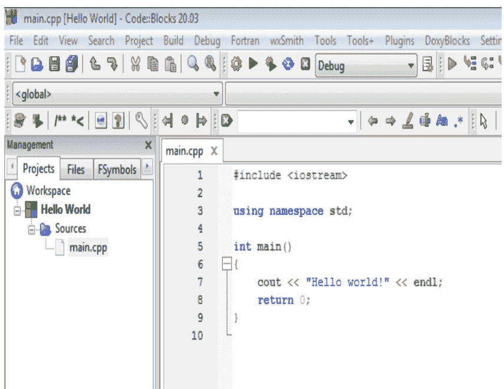

## 下载和安装Code::Blocks

你需要：

- 1. 一台笔记本电脑/台式机
- 2. 互联网连接
- 3. 网页浏览器，如Chrome、Windows Edge或Firefox

访问此网站并下载Code::Blocks应用程序：
https://www.fosshub.com/Code-Blocks.html?dwl=codeblocks-20.03mingw-setup.exe

只需将链接复制并粘贴到浏览器中。

注意：请确保下载名为Code Blocks Windows 64 bit (including compiler)的文件。

此版本包含我们需要的编译器。

之后只需安装应用程序，完成后打开它。

你可以访问Code::Blocks网站了解更多：
https://www.codeblocks.org/。该网站也包含用户手册和下载其他操作系统IDE的链接。

## C++中的Hello World

所有程序员在学习一门新的编程语言时编写的第一个程序被称为Hello World。

它基本上就是编写一个程序，在屏幕上显示“Hello World”这几个字。既然我们现在是程序员了，我们说我们正在*打印*“Hello World”到屏幕上。

我将提供代码示例，你需要在Code::Blocks中输入这些示例，并点击构建和运行按钮来编译和执行代码，以便查看结果。

### 在Code::Blocks中创建项目

为了在Code::Blocks中运行代码，我们必须首先创建一个项目。所以首先我们需要打开Code::Blocks。

要创建一个项目，点击**文件 > 新建 > 项目**。

在弹出的窗口中选择**控制台应用程序**，然后点击**Go**按钮。

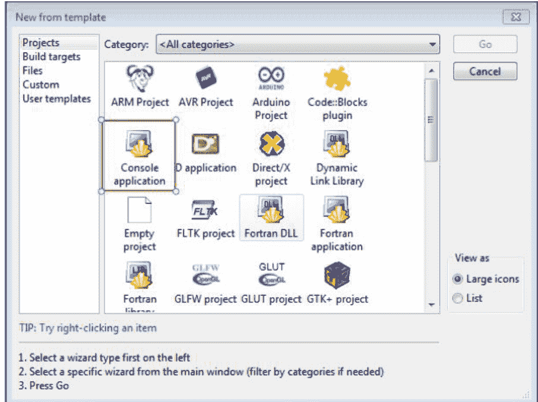

确保在此窗口中选择**C++**。
在信息窗口点击**下一步**。

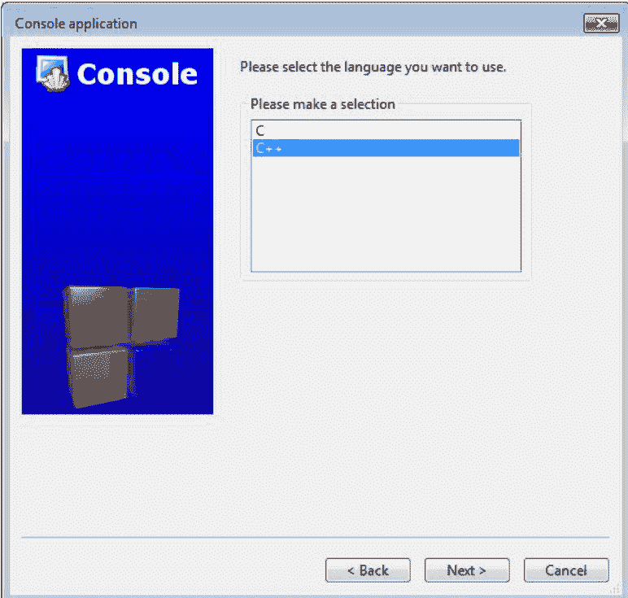

为项目命名，目前是**Hello World**。选择保存项目的文件夹。

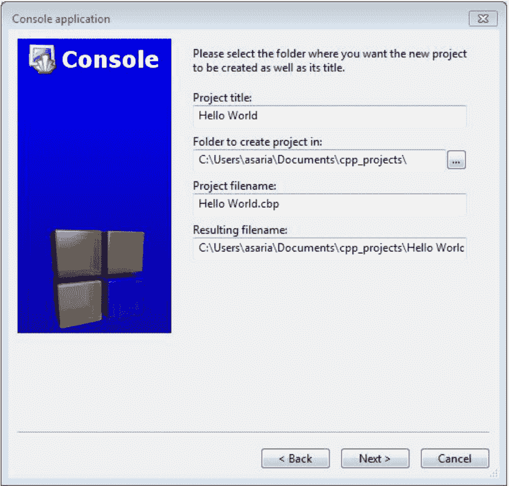

确保你选择了**GNU GCC Compiler**作为编译器，然后点击**完成**。

现在在左侧，Hello World下方，点击**Sources文件夹**旁边的+图标以显示**main.cpp**文件。双击它，文件就会显示在右侧的编辑器窗口中。

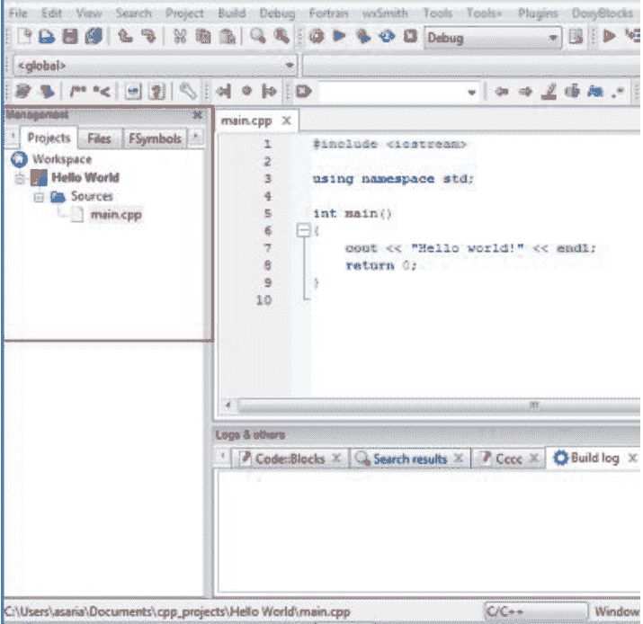

编辑器中的代码如下所示。

## 代码

```cpp
#include <iostream>
using namespace std;

int main()
{
    cout << "Hello World" << endl;
    return 0;
}
```

我非常确定你第一次看到上面的代码时会觉得它很复杂。但通过接下来的几章，我们将理解这一切的含义。现在请坚持住，我将尝试解释这个程序的主要部分。
编程的诀窍在于坚持，因为你学得越多，事情就会变得越容易。

让我们先运行代码。

### 运行代码

要运行代码，我们必须先编译它。

在Code::Blocks中，我们使用*构建*这个术语而不是编译。这是因为一个项目通常由多个C++文件组成，我们将编译所有文件的过程称为构建。

编辑器顶部有三个按钮，使我们能够构建和运行项目。

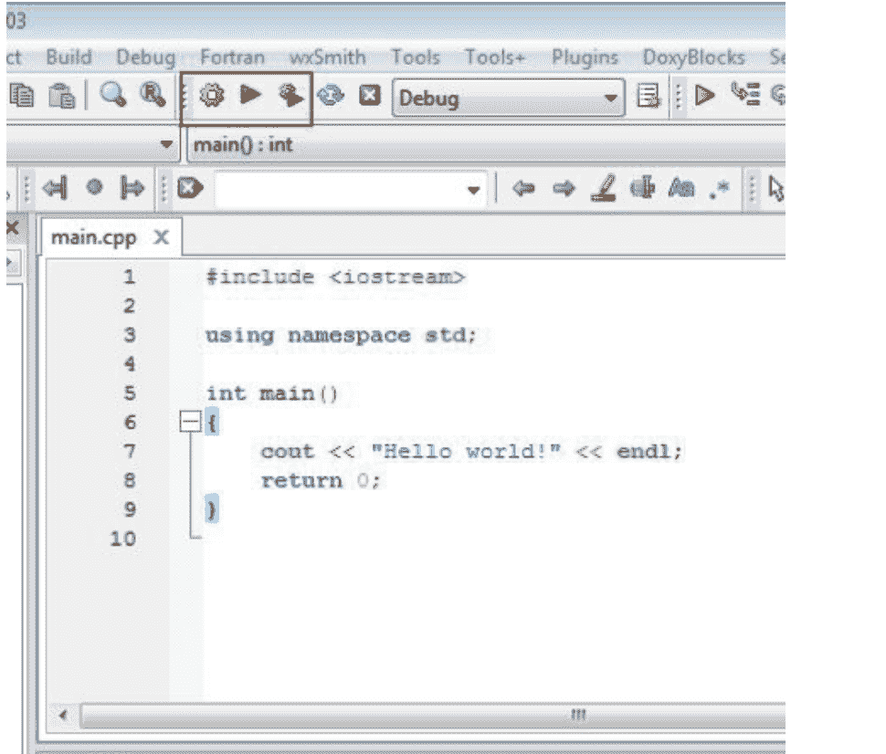

黄色齿轮按钮用于构建项目，绿色播放按钮用于运行已构建的项目，而第三个按钮是齿轮和播放按钮的组合，用于构建并运行项目。点击这个组合按钮来执行项目。

将出现一个弹出窗口，显示“Hello World”，如下所示。

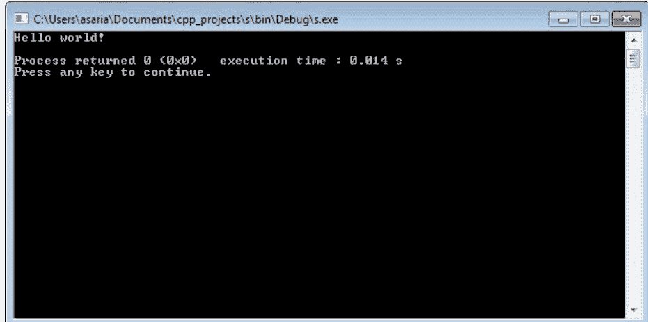

这就是所谓的**控制台**或**终端**。控制台显示C++的输出。关闭窗口即可将其关闭。

注意：确保在构建和运行之前保存文件，这可以通过在每次更改后按**Control-s (Ctrl+s)**来完成。

## 代码解释

这个程序的主要行是：

```cpp
cout << "Hello World" << endl;
```

首先，注意这行以分号(;)结尾，这非常重要，因为它表示这条指令的结束。

**cout**只是程序员对屏幕的称呼，你可以将其视为控制台输出的缩写。

符号<<的意思只是将我后面的内容显示在屏幕上。

'Hello World'是我们想要显示在屏幕上的文本。注意它被双引号包围。双引号是语法的一部分，非常重要。

我们将被双引号包围的文本称为**字符串**。

下一个<<符号的意思是，将我后面的内容添加到文本'Hello World'中。在编程中，我们称之为**连接**，即将两个字符串连接在一起。

**endl**，意思是添加一个换行符，换行符就像在电脑上打字时按回车键一样，它会将你带到当前文本下方的下一行。

正如你所看到的，在编写程序时，我们不仅仅用纯英语书写，我们遵循一些特定的规则，称为语言的*语法*。

## 练习

- 1. 更改文本，使程序打印出你的名字，构建并运行代码。
- 2. 将代码行**cout << "Hello World";**编写两次，看看控制台上打印了什么。这与编写两次**cout << 'Hello World' << endl;**有什么不同？
- 3. 创建一个新项目，给它任意你喜欢的名字，并将其存储在不同的文件夹位置。
    - a. 对于这个新项目，点击运行图标，注意发生了什么。
    - b. 对于这个新项目，分别点击构建齿轮图标和运行图标，注意发生了什么。

# 变量

在本章中，我将首先带你了解计算机中对编程重要的主要部分。

计算机的主要部分是处理器。它负责实际读取你的代码并执行你指示的操作。

此外，还有一个称为**RAM**的存储区域，代表**随机存取存储器**。这是存储你所有需要的东西的地方，甚至你的程序也存储在这里。

你可以把它想象成一堆带有盒子的架子，你可以在里面存放东西。此外，这些盒子有不同的大小和类型。因此，你可以决定在其中存放什么。

此外，我们可以给这些盒子贴上标签，以便以后可以轻松地引用名称。

### 变量赋值

变量是分配给存储在内存中的值的名称。

变量名也称为**标识符**。

你可以将变量想象成一个盒子，我们将值放在里面，而变量名就是我们贴在盒子上的标签。

还有一个称为数据类型的东西分配给每个盒子。数据类型是存储在盒子中的信息类型。这意味着特定的变量只能存储特定类型的数据。数据类型的例子包括字符串、数字、布尔值等。

下面是一个变量赋值的例子。我们在一个名为variables的新项目中用Code::Blocks编写它，按**Control-S**保存文件，然后构建并运行。

## 示例代码

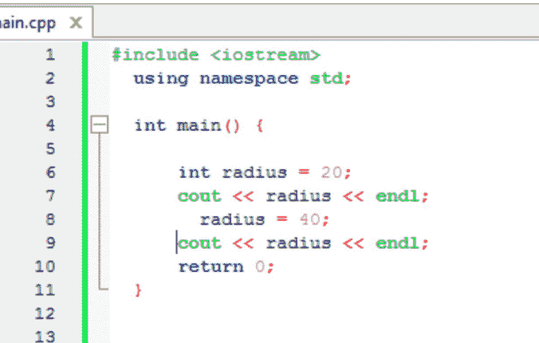

上面我们声明了一个名为*radius*的变量，数据类型为int，即整数，并将其初始化为值20。

**int**就是我们所说的**数据类型**。使用盒子的类比，数据类型决定了存储我们值的盒子的类型。我们存储的值是20。变量名叫做**radius**，这意味着盒子上的标签是radius。
只要数据类型相同，变量的值可以在整个程序中更改。在上面的程序中，我们将值更改为40。

这是可以接受的，因为40是int（整数）数据类型。

## 数据类型

以下是可用的数据类型及其所代表的值的种类和范围。每种数据类型都有一个相关的示例。

## int

数据类型 **int** 代表整数。整数是一个完整的数字，意味着它不能有小数部分。整数的例子有 1、0、45、768、23343 等。

```
示例：int radius = 2;
```

## long

数据类型 **long** 也是一个完整的数字，但使用的数字可以比 int 大得多。long 变量最多可以容纳 20 位数字，而 int 变量只能容纳 10 位数字。

例如，下面的 **x**、**y** 和 **result** 是 long 变量，可以容纳最多 20 位数字。

```cpp
#include<iostream>
using namespace std;

int main(){
    long x = 9988891919;
    long y = 3465829;
    long result = x * y;
    cout << result;
    return 0;
}
```

```
C:\Users\asaria\Documents\cpp_projects\Variables\bin\Debug\Variables.exe
1242897643
Process returned 0 (0x0)   execution time : 0.028 s
Press any key to continue.
```

## float

表示带有小数位的数字。参见下面的示例。pi 是一个 float 变量，值为 3.142，areaofcircle 是另一个 float 变量。

```cpp
#include<iostream>
using namespace std;

int main(){
    float pi = 3.142;
    int radius = 3;
    float areaOfCircle = pi * radius * radius;
    cout << areaOfCircle;
    return 0;
}
```

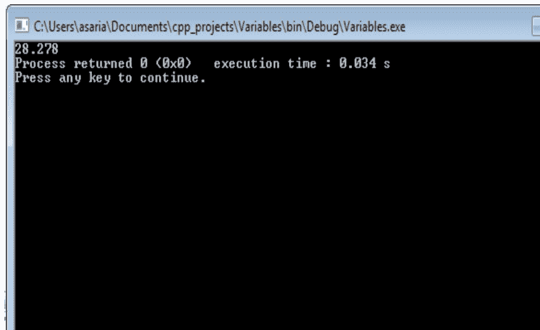

## double

double 变量可以容纳包含小数位的数字，具有更高的精度，并且可以容纳更多的小数位（最多 15 位小数）。

在下面的示例中，acceleration、mass 和 force 是三个 double 变量，每个变量都可以容纳最多 15 位小数的数字。

```cpp
#include<iostream>
using namespace std;

int main(){
    double acceleration = 9.98;
    double mass = 30.03;
    double force = acceleration * mass;
    cout << force;
    return 0;
}
```

```
299.699
Process returned 0 (0x0)   execution time : 0.014 s
Press any key to continue.
```

## bool

它代表布尔值。
它只能容纳两个值，值 **true** 或 **false**。
布尔变量用于条件判断。
在下面的示例中，声明了两个布尔变量 **isHungry** 和 **isSleepy**。
如果 **isHungry** 为 true，程序将在屏幕上打印 "**I am hungry**"。
如果 **isSleepy** 为 true，程序将在屏幕上打印 "**I am sleepy**"。

```cpp
#include<iostream>
using namespace std;

int main(){
    bool isHungry = true;
    bool isSleepy = false;
    if(isHungry){
        cout << "I am hungry" << endl;
    }
    if(isSleepy){
        cout << "I am sleepy" << endl;
    }

    isSleepy = true;
    if(isSleepy){
        cout << "I am going to bed" << endl;
    }

    return 0;
}
```

```
I am hungry
I am going to bed

Process returned 0 (0x0)   execution time : 0.015 s
Press any key to continue.
```

## char

char 代表字符。char 是一个只能容纳一个值的变量。该值是一个长度为 1 的字符串。在下面的示例中，**excellent** 是一个 char 变量，保存着学生在数学中的成绩。

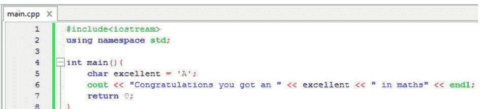

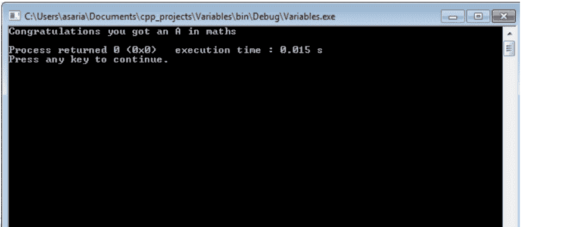

## string

字符串是用于存储文本的变量。它可以容纳任意长度的字符串。在下面的示例中，**yourName** 是一个变量，保存着值 "**Catherine**"。

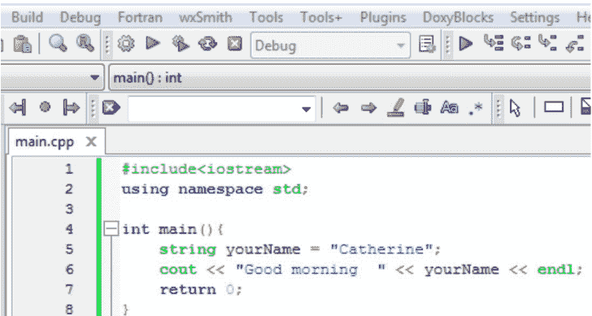

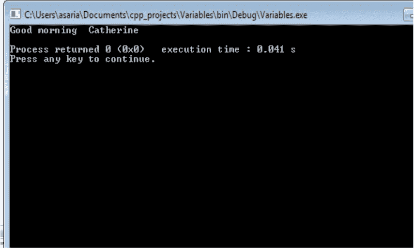

## 变量名

C++ 变量名必须以字母或下划线开头，其余所有字符必须是字母、数字或下划线。

有效变量名的示例：

- x
- x1
- x_1_abc
- RATE
- bigBonus_

无效变量名的示例：

- 12
- 3x
- %change data
- -1 PROG.CPP

前三个，12、3x、%change，是不允许的，因为它们不是以字母或下划线开头。

C++ 也是区分大小写的，这意味着以下是三个不同的变量名：

- Rate
- RATE
- Rate

## 驼峰命名法

驼峰命名法是一种编程实践，其中多个单词写在一起没有空格，并且每个单词的首字母大写（第一个单词除外）。

单词 *end of car* 将变成：endOfCar。
驼峰命名法是命名变量时常用的编程实践。

## 关键字

关键字是不能用作变量名的名称，因为它们是为编程语言语法保留的。

如果将它们用作变量名，编译器将抛出错误，或者你可能最终会改变某些基本函数的基本功能。

关键字的示例包括基本数据类型，如 int、bool 等，以及 struct 和 class 等名称。

## 注释

有时我们想解释我们的代码，以便其他人可以理解我们做了什么。将来，这些信息将帮助我们在回顾代码时记住我们做了什么。

在编程中，我们通过在代码中编写注释来实现这一点。有两种类型的注释：单行注释和多行注释。

单行注释以两个正斜杠（//）开头，而多行注释位于以下符号之间：/\*\*/

注释示例：

```
// 测试代码

/* 注释第 1 行
注释第 2 行 */
```

## 声明变量

所有变量在使用前都必须声明或定义。

要声明/定义一个变量，你只需要指定一个数据类型和一个变量名，后跟一个分号：

当你声明一个变量而不给它一个值时，我们说该变量是 *未初始化* 的。
未初始化的变量将有一个随机值。

给未初始化的变量赋值称为 *初始化* 它。

你也可以同时声明和初始化一个变量。

在这个示例中，我们将利用注释并声明一些变量，其值将打印到控制台。

在 Code::Blocks 中创建一个新项目，编写以下代码，构建并运行它。

## 示例代码

```cpp
#include <iostream>
using namespace std;

int main() {

    /*
        这是一个多行注释
        可以看到，它跨越
        多行
    */
        int length; // 声明变量 length
        int width; // 声明变量 width

        length = 20; // 初始化变量 length
        width = 20;// 初始化变量 width

        int depth = 40; // 声明并初始化

        cout << length << endl;
        cout << width << endl;
        cout << depth << endl;

        return 0;
    }
```

## 解释

在上面的程序中，在 main 代码块中，我们首先通过在 /\*\*/ 之间编写来编写一个多行注释。
然后我们声明两个 int 类型的变量 *length* 和 *width*，而不初始化它们，我们稍后再做。

然后我们声明并初始化 int 类型的变量 *depth* 为 40。最后，我们将 length、width 和 depth 的值打印到控制台，每个值各占一行。

## 练习

1.  编写一个程序，包含输出五个或六个已定义但未初始化的变量值的语句。编译并运行程序。输出是什么？解释一下。
2.  创建一个包含你名字的字符串变量并将其打印到控制台。
3.  创建一个 char 变量并将其打印到控制台。
4.  创建一个 bool 变量并将其打印到控制台。
5.  创建一个 float 变量并将其打印到控制台。
6.  创建一个名为 time of day 的 long 变量，使用驼峰命名法，并将其打印到控制台。

## 数学运算

在本节中，我们将制作一个只执行两个数字乘法的小计算器。程序将要求我们输入两个要相乘的数字，并打印乘法的结果。

首先，我们将介绍如何在 C++ 中执行数学运算。

## 加法

加法使用 + 运算符完成。

## 加法示例代码

```cpp
#include<iostream>
using namespace std;

int main(){
    int x = 1;
    int y = 2;
    int sum = x + y;
    cout << sum;
    return 0;
}
```

代码的输出将是 **3**，这是 x 和 y 的和。

## 减法

## 减法

减法使用 `-` 运算符完成。

### 减法示例代码

```cpp
#include<iostream>
using namespace std;

int main(){
    int x = 1;
    int y = 2;
    int difference = x - y ;
    cout << difference ;
    return 0;
}
```

代码的输出将是 **-1**。

## 乘法

乘法使用 `*` 运算符完成。

### 乘法示例代码

```cpp
#include<iostream>
using namespace std;

int main(){
    int x = 3;
    int y = 2;
    int multiplication = x * y ;
    cout << multiplication ;
    return 0;
}
```

代码的输出将是 **6**。

## 除法

除法使用 `/` 运算符完成，它返回除法的商。

### 除法示例代码

```cpp
#include<iostream>
using namespace std;

int main(){
    int x = 3;
    int y = 2;
    int quotient = x / y ;
    cout << quotient ;
    return 0;
}
```

上述代码的输出将是 1.5。

## 余数

为了获得除法的余数，请使用取模运算符，该运算符由符号 `%` 表示。

```cpp
#include<iostream>
using namespace std;

int main(){
    int x = 3;
    int y = 2;
    int remainder = x % y ;
    cout << remainder ;
    return 0;
}
```

代码的输出将是 **1**，这是 x 除以 y 时的余数。

## 从用户获取输入

到目前为止，我们只是在向控制台打印内容，没有来自用户的任何输入。在本节中，我们将通过向用户请求输入来使我们的程序更加令人兴奋。

### cin

**cin** 用于接受来自键盘的输入，可以将其视为代表控制台输入。

## 示例代码

```cpp
#include <iostream>
using namespace std;

int main() {
    int num;

    cout << "Enter a number: ";

    // 获取整数输入
    cin >> num;

    cout << "You entered: " << num;

    return 0;
}
```

## 解释

这里我们首先创建一个名为 *num* 的 int 类型变量，我们将用它来存储从键盘输入获得的值。

然后我们向用户请求一些输入，并将其打印回控制台：
'You entered: 1'，如果你在控制台中输入 1。

## 一个简单的计算器

我们将需要向用户请求两个要相乘的数字，然后向用户显示乘法的结果。

## 示例代码

```cpp
#include <iostream>
using namespace std;

int main() {
    int num1;
    int num2;

    // 提示输入 num1
    cout << "Enter a num1: ";
    cin >> num1;

    // 提示输入 num2
    cout << "Enter a num2: ";
    cin >> num2;

    int multiplication = num1 * num2;
    cout << "Result of multiplication: " << multiplication;

    return 0;
}
```

## 解释

我们首先声明两个 int 类型的变量，它们将存储用户输入，即 num1 和 num2。

我们提示用户输入 num1，然后使用 cin 将其存储在相应的变量中。我们对 num2 执行相同的操作。

然后我们对这两个数执行乘法运算，并将结果显示给用户。

## 练习

1. 将以下每个数学公式转换为 C++ 表达式，每个变量的值都来自用户输入。
   1. 3x
   2. 3x + y
   3. (x + y)/7
   4. (3x + y) / (z + 2)
2. 编写一个程序，使用 6 个输入变量接收 6 个科目的学校成绩。计算总分和平均分。
3. 编写一个程序，从用户那里接收一个整数，并确定它是偶数还是奇数。提示：使用取模运算。

## 函数

函数是一组执行给定任务的代码行。每个函数都被分配了一个名称，并将在程序中通过该名称引用。

在 C++ 中，函数需要返回一个值，并且在定义函数时通常会指明要返回的值的数据类型。

在本节中，我们将编写一个计算矩形面积的函数。

### 函数示例

矩形的面积等于其长度乘以宽度，因此下面是一个计算它的函数。

在 main 函数之前这样写：

```cpp
#include <iostream>
using namespace std;

// 定义名为 areaOfRectangle 的函数
int areaOfRectangle( int length , int width){
    int area = length * width;
    return area;
}

int main() {
    return 0; 
}
```

## 解释

**int** 是要返回的值的数据类型，因此我们期望函数在运行时给我们返回一个整数。这由第 7 行结束大括号上方的 **return area;** 行指示。注意变量 **area** 被声明为整数类型，因为这是函数返回的变量。

**areaOfRectangle** 是我们给函数起的名字。注意它是用驼峰命名法编写的。

函数名称后面是一对括号，在括号内我们声明两个变量，这些变量被称为**参数**。在上面的例子中，**length** 和 **width** 是参数。

它们将保存我们在运行函数时传递给函数的值，并且可以在函数的代码块中访问它们。

然后我们在花括号中放置我们的代码，以将其标记为与该函数名关联的代码行。

最后，我们有 **return** 语句。

### 运行函数

查看下面的代码

```cpp
#include <iostream>
using namespace std;

int areaOfRectangle( int length , int width){
    int area = length * width;
    return area;
}
int main() {

    // 调用 areaOfRectangle 函数
    // length = 4 且 width = 5

    int area = areaOfRectangle(4,5);

    cout << "Area is: " << area << endl;
    return 0;
}
```

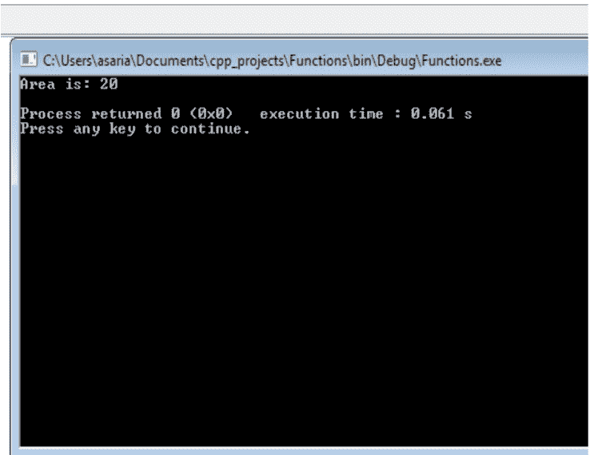

## 解释

当我们想要运行一个函数时，我们通常说我们正在**调用**该函数。

有些函数在被调用时会接收值，就像我们的函数一样，我们称这些值为函数的***参数***。

注意传递参数给函数的语法，我们首先写函数名，然后在开括号和闭括号之间写参数，用逗号分隔。

所以，在我们的例子中，我们正在调用函数 ***areaOfRectangle***，传递两个参数，即 4 和 5。
我们期望函数返回一个值，即计算出的面积，并且计算出的面积值的数据类型为整数。

因此，我们将返回的值赋给名为 *area* 的 *int* 类型变量。

然后我们将结果打印到屏幕上。在这种情况下，矩形的面积是 20，所以这就是屏幕上显示的输出。

### void 函数

被称为 void 函数的函数是在被调用后不返回任何内容的函数。

## 示例代码

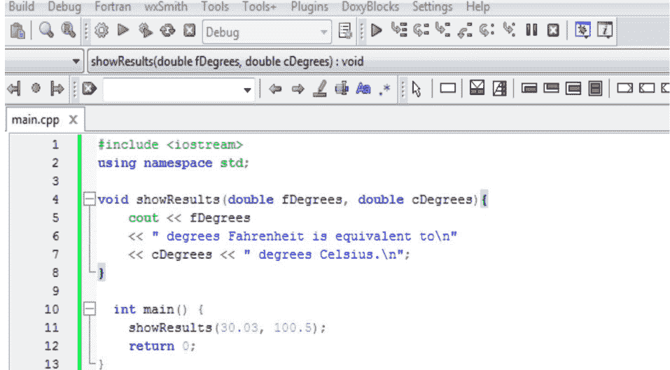

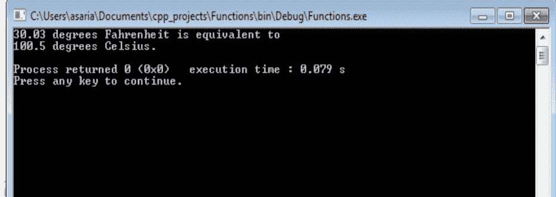

## 解释

注意指定的返回类型是 void，并且我们在函数体中没有使用 return 关键字。

除此之外，与我们定义其他非 void 函数的方式没有其他区别。

## 练习

1. 创建一个名为 Descending() 的函数，它接受四个参数。每个参数都是 int 类型的数字。如果四个数字按降序排列，则函数返回 true；否则，返回 false。例如，Descending(4, 3, 3, 1) 和 Descending(3, 2, 2, 1) 都返回 true，而 Descending(2, 1, 3, 2) 返回 false。

2. 创建一个名为 isOdd() 的函数，它接受一个 int 类型的参数并返回一个布尔值。如果输入是奇数，则函数返回 true。如果是偶数，则返回 false。

3. 以下程序的输出是什么？

```cpp
#include <iostream>
using namespace std;
void sayhi();
void hide(int audiencenumber);
int main()
{
    sayhi();
    hide(6);
    cout << "Extra time:\n";
    hide(2);
    sayhi();
    cout << "End of program.\n";
    return 0;
}
void sayhi()
{
    cout << "Hello\n";
}
void hide(int audiencenumber)
{
    if (audiencenumber < 5)
        return;
    cout << "Bye\n";
}
```

4. 编写一个计算圆周长的函数，该函数有一个名为 radius 的 int 类型参数，返回类型为 double。使用 pi 作为值为 3.142 的 double 变量。

## 来自作者的简短留言：

嘿，你喜欢这本书吗？我很想听听你的想法！

许多读者不知道获得书评有多难，以及它们对作者有多大帮助。

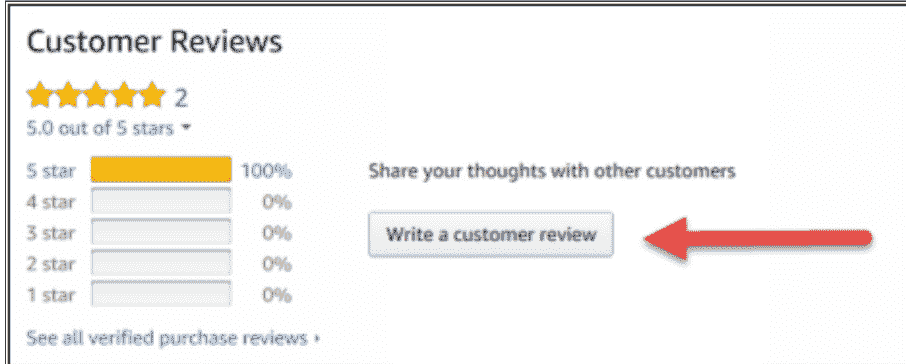

如果你能花60秒在亚马逊上写一篇简短的书评，哪怕只有几句话，我将不胜感激！

[>> 点击此处快速留下书评](https://example.com)

感谢你花时间分享你的想法！

## 条件语句

我们通常只在某个条件为真时才想做某事。例如，如果外面阳光明媚，我们就出去玩，否则我们就待在家里。

“外面阳光明媚”这个陈述，只能是真或假。

在编程中，我们有一种只能存储真或假值的数据类型，这种数据类型被称为**布尔类型**。在C++中，我们通常将其简写为**bool**。

此外，我们有时只想在某个条件为真时运行某些代码行，我们通过**if**语句来实现这一点。让我们看一个例子，这将使它更容易理解。

## 示例代码

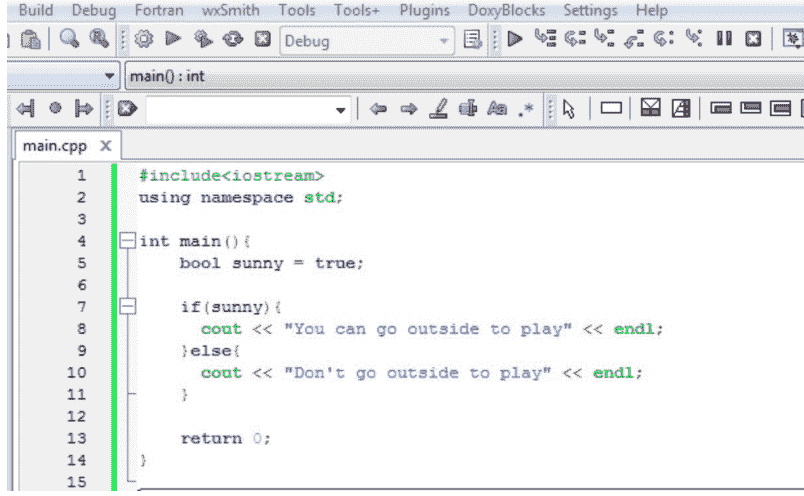

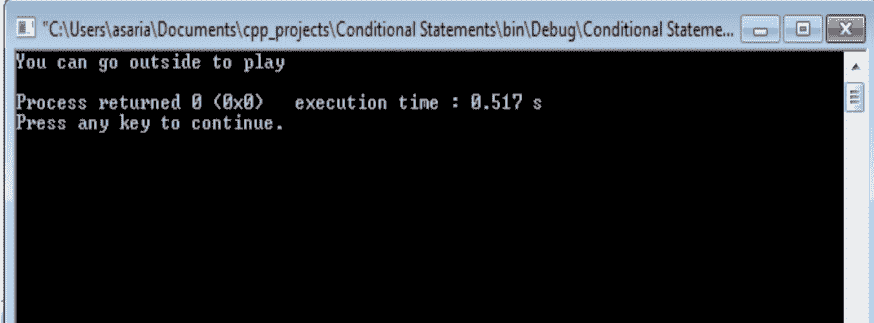

## 解释

在上面的例子中，我们首先创建了一个名为*sunny*的变量，它存储一个布尔值，因为它的数据类型是*bool*。

使用*if*语句，我们检查“阳光明媚”是否为真，如果是，我们就在屏幕上打印“你可以出去玩”，否则我们打印“不要出去玩”。

## 练习

将变量*sunny*改为*false*，看看会打印什么。

### 比较运算符

比较运算符比较两个值并返回真或假。

比较运算符的例子有：

**小于 (<)**
如果左边的值小于右边的值，则返回真。否则，返回假。

**大于 (>)**
如果左边的值大于右边的值，则返回真。否则，返回假。

**小于或等于 (<=)**
如果左边的值小于或等于右边的值，则返回真。否则，返回假。

**大于或等于 (>=)**
如果左边的值大于或等于右边的值，则返回真。否则，返回假。

**等于 (==)**
如果左边的值等于右边的值，则返回真。否则，返回假。

**不等于 (!=)**
如果左边的值不等于右边的值，则返回真。否则，返回假。

## 比较运算符使用示例

假设你想在屏幕上打印字符串‘x is greater than 5’，如果x确实大于5，否则你打印‘x is less than or equal to 5’。

```cpp
#include<iostream>
using namespace std;

int main(){
    int x = 3;

    if(x > 5){
        cout << "x is greater than 5" << endl;
    }else{
        cout << "x is less than or equal to 5" << endl;
    }
    return 0;
}
```

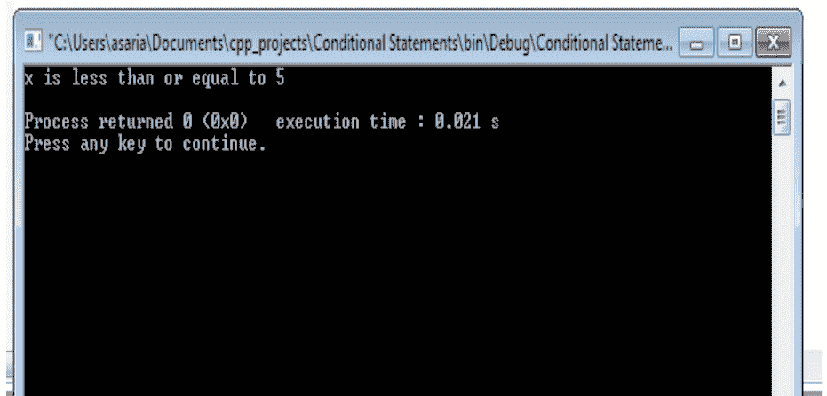

## 构建布尔表达式

**布尔表达式**是任何具有两个值之一的表达式。它要么为真，要么为假。它基本上是一个比较两个值并返回真/假的表达式。

两个比较可以使用“与”运算符组合，在C++中是**&&**。例如，以下布尔表达式在a的值大于5且a小于10时为真：

**(5 < a) && (a < 10)**

如果a在5和10之间（不包括5和10），上述操作返回真。

当两个比较使用**&&**连接时，只要两个比较都为真，整个表达式就为真；否则，整个表达式为假。

你也可以使用“或”运算符组合两个比较，在C++中写作||。例如，以下表达式在b小于2或b大于9时为真：

**(b < 2) || (b > 9)**

如果b小于2或b大于9，上述表达式返回真。

在使用||运算符的表达式中，只要其中一个比较为真，表达式就为真。如果两个表达式都为假，则表达式为假。

布尔表达式可以使用!运算符取反。例如，

**!(a > b)**
如果“a不大于b”，则返回真。

在大多数情况下，不需要使用感叹号(!)运算符。

例如，
**!(a > b) 等同于 a <= b**

## 真值表

以下被称为真值表。它指出了每个表达式组合的所有可能性以及产生的布尔值。

与 (AND)

| 表达式1 | 表达式2 | 表达式1 && 表达式2 |
|---|---|---|
| 真 | 真 | 真 |
| 真 | 假 | 假 |
| 假 | 真 | 假 |
| 假 | 假 | 假 |

或 (OR)

| 表达式1 | 表达式2 | 表达式1 \|\| 表达式2 |
|---|---|---|
| 真 | 真 | 真 |
| 真 | 假 | 真 |
| 假 | 真 | 真 |
| 假 | 假 | 假 |

非 (NOT)

| 表达式 | ! 表达式 |
| --- | --- |
| 真 | 假 |
| 假 | 真 |

## 布尔表达式示例

假设你只在饥饿且有钱的时候才买食物。在代码中表示这一点会是这样的。

示例

```cpp
#include<iostream>
using namespace std;

int main(){
    bool isHungry = true;
    bool hasMoney = true;

    if( isHungry && hasMoney){
        cout << "I will buy food" << endl;
    }else{
        cout << "I can't buy food" << endl;
    }

    return 0;
}
```

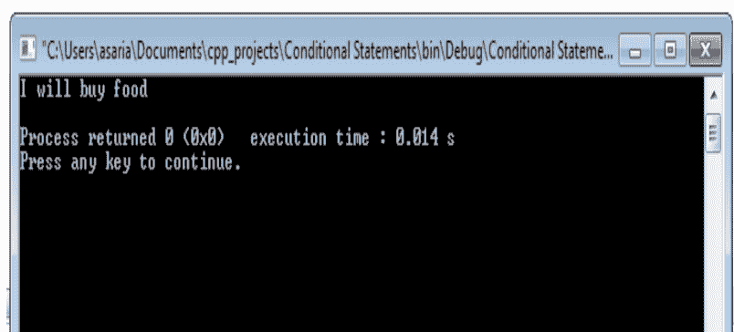

## 解释

字符串‘I will buy food’只有在变量**isHungry**和**hasMoney**都为真时才会被打印。否则，字符串‘I can't buy food’会被打印。修改程序，使得如果**isHungry**为真或**hasMoney**为真，就打印‘I will buy food’。

## 练习

1.  编写一个程序，如果分数小于10则输出单词**Small**，如果分数值大于100则输出**Big**。
2.  编写一个程序，如果变量**test**大于或等于50且变量**codingPrograms**的值大于5，则输出单词**Success**。否则，程序输出单词**failure**。变量**test**和**codingPrograms**都是int类型。
3.  编写一个程序，如果变量**temp**大于37，或变量**press**的值大于1，或两者都满足，则输出单词**Danger**。否则，程序打印单词**Great**。变量**temp**和**press**都是int类型。

## 循环

循环使我们能够将一组指令重复固定次数。如果我们愿意，也可以永远重复。

通常有两种类型的循环，*有限循环*和*无限循环*。

有限循环将一组指令重复可数的次数，而无限循环则永远重复一组指令。

### 我们如何指定循环

在C++中，有两种声明循环的方式。
一种是使用**for**关键字，另一种是使用**while**关键字。

### For循环

假设你想在控制台打印你的名字10次，你可能会想到把指令`'cout << "My name"<< endl;'`写10次。
使用For循环是防止重复相同语句并缩短代码的好方法。

## 示例

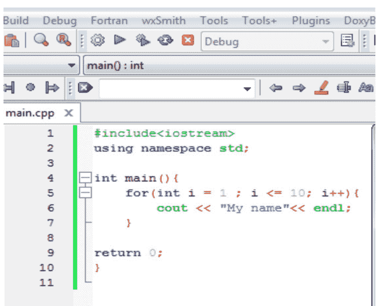

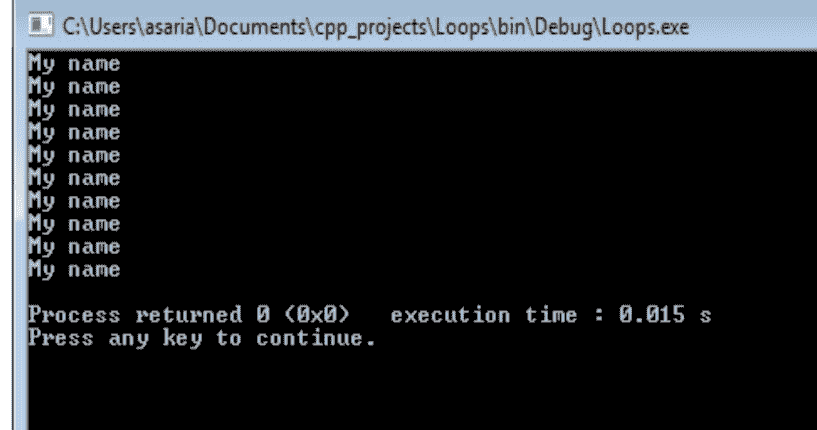

## 解释

要使用**for循环**，我们指定希望运行与该for循环关联的代码块的次数。

与for循环关联的代码块位于开始和结束花括号之间

```
{
}
```

在我们的代码中，关联的代码块只有一行：cout << "My name" << endl;

在与*for*关键字关联的开始和结束括号内，我们指定三个重要的内容，由两个分号分隔。

第一个是从哪个数字开始计数，对我们来说，我们从1开始计数，所以我们声明整型变量**i**，其值为1。

第二个，与第一个用分号分隔，是为了使与for循环关联的代码块被执行而必须为真的条件。我们通常在这一部分使用比较运算符，如>、<、<=、>=。

在我们的例子中，**i <= 10**意味着只有当变量i的值小于或等于10时才运行代码块，否则停止循环并继续程序的其余部分。

最后，第三部分，与第二部分用分号分隔，递增计数变量，在我们的例子中，我们使用特殊符号**i++**递增1。

此外，此递增发生在代码块运行之后。

## 练习

## 循环中使用计数器的示例

我们可以在关联的代码块中使用已声明的整数，例如，我们可以用下面的代码打印出1到10的值。

```cpp
#include<iostream>
using namespace std;

int main(){
    for(int i = 1 ; i <= 10; i++){
        cout << i << endl;
    }
    return 0;
}
```

## while 循环

**while** 循环与 *for* 循环类似，唯一的区别在于，与 while 关键字关联的括号中只包含需要满足的条件。

## 示例

```cpp
#include<iostream>
using namespace std;

int main(){
    int i = 1;
    while( i <= 10){
        cout << "Hi from the while loop"<< endl;
        i++;
    }
    return 0;
}
```

## 解释

我们首先在这一行声明了计数的起始位置：**int i = 1;**

**while(i <= 10)** 的意思是，只要变量 *i* 的值小于或等于10，就运行关联的代码块。

请注意，在结束大括号之前，我们将 i 的值增加了1。

然后 while 循环会重复检查 i 是否小于或等于10，如果是，则执行关联的代码块。如果 i 大于10，则不执行代码块，程序继续执行下一条指令。

## 无限循环

当 *for* 循环或 *while* 循环为决定是否运行其关联代码块而检查的条件始终为 **true** 时，就会发生无限循环。
**因此，它基本上会永远运行下去。**

## 示例

```cpp
#include<iostream>
using namespace std;

int main(){

    while( true ){
        cout << "Hi from the infinite while loop"<< endl;
    }

    return 0;
}
```

```
Hi from the infinite while loop
Hi from the infinite while loop
Hi from the infinite while loop
Hi from the infinite while loop
Hi from the infinite while loop
Hi from the infinite while loop
Hi from the infinite while loop
Hi from the infinite while loop
Hi from the infinite while loop
Hi from the infinite while loop
Hi from the infinite while loop
Hi from the infinite while loop
Hi from the infinite while loop
Hi from the infinite while loop
Hi from the infinite while loop
Hi from the infinite while loop
Hi from the infinite while loop
Hi from the infinite while loop
Hi from the infinite while loop
Hi from the infinite while loop
Hi from the infinite while loop
Hi from the infinite while loop
Hi from the infinite while loop
Hi from the infinite while loop
Hi from the infinite while loop
```

## 解释

由于条件始终为真，这将永远运行下去。

## 无限 for 循环

无限 for 循环的定义如下所示：

```cpp
#include<iostream>
using namespace std;

int main(){

    for(;;){
        cout << "Hi from the infinite for loop"<< endl;
    }

    return 0;
}
```

## 解释

请注意，要声明一个无限 for 循环，您只需在与 for 关键字关联的括号中放置两个分号，即：

```cpp
for(;;){
    //此代码将无限运行
}
```

## 练习

1. 将以下循环重写为 for 循环。
   a.
   ```cpp
   int x = 2;
   while(x <= 200)
   {
       if (x < 10 && x != 1)
       cout << 'YY';
       x=x+2;
   }
   ```
   b.
   ```cpp
   int a = 2;
   while(a <=21)
   {
       cout << 'YY';
       a++;
   }
   ```
2. 以下代码的输出是什么（当嵌入完整程序中时）？
   ```cpp
   for (int ctr = 2; ctr < 15; ctr++)
       cout << (3 + ctr) << endl;
   ```
3. 以下代码的输出是什么？
   ```cpp
   for (int b = 50; b > 2; b = b - 3)
   {
       cout << "Hi ";
       cout << b << endl;
   }
   ```
4. 编写一个程序，使用 for 循环创建并无限次打印你的名字。

## 数组

数组是相同数据类型值的集合。

集合中的每个值都有一个与之关联的索引，可用于检索该值。

C++ 中的索引从0开始，而不是1，这被称为 **零基索引**。就像从0开始计数而不是从1开始。

## 练习

如果我给物品贴上从0到4的标签，我有多少个物品？

**答案：5**

## 声明数组

声明数组时，我们首先指定数组将保存的值的数据类型，然后是数组的变量名，最后是在方括号中指定它将保存的元素数量。

例如：

```cpp
int size[4];
size = {1,2,3,4};
```

## 解释

上面我们声明了一个变量名为 *size* 的数组，它保存了4个整数数据类型的值。

```cpp
int size[4];
```

- `int` -> 数组保存的元素的数据类型
- `size` -> 数组的名称
- `[4]` -> 指定数组保存的元素数量

语句 `size = {1, 2, 3, 4}` 初始化一个数组，这仅仅意味着为数组变量赋值。

您也可以同时声明和初始化一个数组，如下所示：

## 示例

```cpp
int size[4] = { 1,2,3,4};
int size[] = { 1,2,3,4};
```

如果参数较少，其余部分将初始化为该数据类型的零值。

## 从数组中检索值

通过使用索引指定所需值的位置来从数组中检索值。

## 示例

假设我们想检索数组中的第一个元素，我们的代码将是：

```cpp
#include<iostream>
using namespace std;

int main(){
    int size[4] = { 1,2,3,4};
    int firstElement = size[0];

    cout << firstElement ;
    return 0;
}
```

## 解释

这一行 `int firstElement = size[0];` 检索数组中的第一个元素。

请注意，由于在 C++ 中我们从0开始计数，数组中第一个元素的索引是0。
程序打印出1，因为 size 中的第一个元素是1。

## 练习

检索第四个元素。（提示：索引不是4）

## 遍历数组中的元素

如果我们想检索数组中的所有元素，可以使用循环来完成。
我们将使用 *for* 循环，因为这是最简单的方法。

## 示例

```cpp
#include<iostream>
using namespace std;

int main(){
    int size[4] = { 1,2,3,4};

    for(int i = 0 ; i < 4; i++){
        cout << size[i] ;
    }
    return 0;
}
```

## 解释

请注意，我们的计数器从0开始，条件是计数器 *i* 的值应小于4，即数组的大小。

## 练习

请在一个文件中完成：

1. 编写一个计算圆面积的函数。
2. 创建一个数组，保存10个你想知道面积的圆的半径。
3. 遍历数组以计算圆的面积，并将结果打印到屏幕上。
4. 仅计算数组中第四个位置的圆的面积。
5. 创建一个包含你名字字符的数组，并将所有字符打印到屏幕上。

## 结构体

结构体是一组值，使您能够以逻辑方式组织数据，即以对您有意义的方式组织数据。

假设您想收集关于朋友年龄、体重和身高的信息。

根据我们目前的知识，我们会这样做：

## 示例代码

```cpp
#include<iostream>
using namespace std;

int main(){
    int kevinAge = 10;
    int kevinWeight = 30;
    int kevinHeight = 1;

    int jesiccaAge = 15;
    int jesiccaWeight = 28;
    int jesiccaHeight = 1;
}
```

结构体使得分组此类信息变得更容易。

让我们首先定义一个结构体。

## 结构体定义

```cpp
#include<iostream>
using namespace std;

struct PersonInfo{
    int age;
    int weight;
    int height;
};

int main(){
    return 0;
}
```

## 解释

结构体在任何函数定义（包括主函数）之外定义。

我们使用关键字 **struct** 来定义一个结构体，后面是我们想给结构体的名称，这个名称被称为 *结构体标签*。

在与结构体标签关联的大括号内，我们声明结构体变量，这些变量也被称为 *成员名称*。在上面的例子中，**age**、**weight** 和 **height** 是 *成员名称*。

**请注意**，在右花括号后有一个分号。

## 初始化结构体

```cpp
#include<iostream>
using namespace std;

struct PersonInfo{
    int age;
    int weight;
    int height;
};

int main(){
    // initializing the structure
    PersonInfo kevin = {10,30,1 };
    PersonInfo jesicca = {15,28,1 };

    return 0;
}
```

## 解释

通过创建一个结构体，我们创建了一个新的数据类型。

就像我们声明任何变量时通常做的那样，我们从它将要保存的数据类型开始。

在花括号中，我们传入作为已声明结构体变量值的参数。

参数的顺序很重要。

如果初始化值的数量多于结构体成员的数量，你将会得到一个错误。

如果值的数量较少，列表中未包含的最后一个成员将被初始化为零。

## 访问结构体成员值

要访问结构体成员变量的值，你可以使用点运算符，如下所示

示例代码

```cpp
#include<iostream>
using namespace std;

struct PersonInfo{
    int age;
    int weight;
    int height;
};

int main(){
    // initializing the structure
    PersonInfo kevin = {10,30,1 };
    PersonInfo jesicca = {15,28,1 };

    cout << kevin.age << endl;
    cout << jesicca.age << endl;

    return 0;
}
```

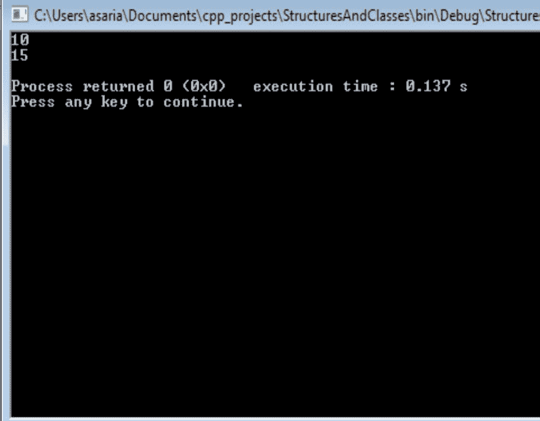

在上面的输出中，**kevin.age** 和 **jessica.age** 的输出分别是 10 和 15。年龄是结构体的第一个成员。10 和 15 是结构体初始化中的第一个数字，因此它们分别对应 Kevin 和 Jessica 的年龄。

## 练习

创建一个名为 Date 的结构体，它包含成员变量 year、month 和 day。用你当前的日期初始化它，并将所有值打印到屏幕上。

## 最终项目

在最终项目中，我们旨在运用贯穿全书所学的大量技能。

## 任务

设计一个学生管理系统。新学生通过输入信息添加，包括他们的姓名和注册号。用户可以根据注册号搜索特定的学生。用户可以查看完整的学生列表，并根据注册号删除特定学生，然后退出程序。

下面的代码执行了该任务；所有任务在程序之后都有清晰的解释。

## 代码

```cpp
#include<iostream>
using namespace std;
#include <string>

// search record function to search the record of the student if it is exist and then print record
void searchRecord(string name[], string regnum[], string reg,int in) {

    // is found variable to check wether a record is exist or not in the array if exist set it true
    bool isfound = false;

    // Loop till array to check a wether a record exist or not
    for(int index = 0; index < in; index = index + 1) {

        // check the every record in array if match then
        if ( regnum[index] == reg ) {

            // record is found
            isfound = true;

            // printing the record
            cout << "Student Registration Number  : "
            <<  regnum[index]  << "\t\t" <<  " Student Name : "  << name[index] << endl;
            cout << endl;

            // terminating from loop
            break;

        }
    }

    // if a particular record is not exist then
    if (isfound == false) {

        // display that record is not exist
        cout <<" Record is not found : " <<endl;
        cout << endl;
    }
}

int  main()
{
    // Loop control variable set it true when the user exist from the programme set cont false
    bool cont = true;

    // registration number array to store the user registration number
    string registrationNum[100];

    // student name array to store the student registration number
    string name[100];

    // declaring variable to store the user entered option
    int selectedNumber;

    // indext to count the total number of added student
    int index = 0;

    // Loop till user exit the programme
    while(cont) {

        // printing menu
        cout << "[1] Create New Record \n"
        <<"[2] Search A Record \n[3] View All Record \n[4] Delete a Record \n[5] Exit  \n"<<endl;

        // prompt user to enter the number
        cout << "Select Number : ";

        // store the user entered number in selectedNumber
        cin >> selectedNumber;

        // if the selectedNumber is 1 then add record into array

        if ( selectedNumber == 1) {

            // declare nam and regNum variable to store the user entered nam and regNum
            string nam;
            string regNum;

            // prompt user to enter name
            cout << "Enter your name : ";

            // store the user enter name into nam variable
            cin >> nam;

            //prompt user to enter the registration number
            cout << "Enter your Registration Number : ";
            cin >> regNum;

            // storing the user entered name and regNum into their respective array
            registrationNum[index] = regNum;
            name[index] = nam;

            // incrementing index
            index = index + 1;
            cout << endl;
        }

        // check if user entered 2 then
        else if ( selectedNumber == 2)
        {

            // check if there is at least one record in the array then
            if ( index >= 0) {

                // prompt user to enter registration number
                string renum;
                cout << "Enter Your Registration Number :";

                // storing the user entered registration number into renum variable
                cin >> renum;

                // calling the function which fine a record and print it
                searchRecord(name,registrationNum,renum,index);

            }

            // if there is no record in the array then

            else {

                // simply print there is no record in the system
                cout << "There is no Record In the System" <<endl;
                cout << endl;
            }
        }

        // check if the user entered number 3 then
        else if ( selectedNumber == 3 ) {

            // Printing all the records of students
            for (int i = 0; i < index; i++) {

                // if there is null in the array which record is deleted
                if ( name[i] == "null" )
                {
                    // just ignore that index
                    continue;
                }

                else {
                    // printing all the record of student
                    cout << "Student Registration Number  :  " <<  registrationNum[i]   <<
                    "\t\t" <<  " Student Name :  " << name[i] << endl;
                }
            }

            // adding space
            cout << endl;
        }

        // check if the user entered the number 4 then
        else if ( selectedNumber == 4 ) {

            // check there is any record in the array then
            if ( index >= 0) {

                // declare the variable renum to store the user registartion number
                string renum;

                // prompt user to enter registration number
                cout << "Enter Your Registration Number :";
                cin >> renum;

                // is found variable which check if the record is found or not in array
                bool isfound = false;

                // Loop till the end of number of record
                for(int ind = 0; ind < index; ind = ind + 1 ){

                    // check if the user entered registration is equal to registration num in array
                    if ( registrationNum[ind] == renum ) {

                        // set the value of found to true
                        isfound = true;

                        // adding the null to arrays where value is found
                        name[ind] = "null";
                        registrationNum[ind] = "null";

                        // just print that record deleted successfully
                        cout << " Record deleted successfully : " <<endl;
                        cout << endl;
                    }
                }

                // if the user entered registration number is not found then
                if (isfound == false) {
                    // print record id not found
                    cout <<" Record is not found : " <<endl;
                    cout << endl;
                }

                // if there is no record in the array then
                else {
                    // print record is not exits
                    cout <<" There is no record in the system: " <<endl;
                    cout << endl;
                }
            }
        }

        // check if the user entered the number 5 then
        else if( selectedNumber == 5 ) {
            // print take care
            cout <<" Take Care " <<endl;

            // set cont to flase so that programme terminate
            cont = false;
        }

        else {
            // if the user did not enter any number from 1-5 then print please enter valid number
            cout <<" Invalid entry : " <<endl;
            cout << endl;
        }
    }

    return 0;
}
```

# 输出

```
[1] 创建新记录
[2] 搜索记录
[3] 查看所有记录
[4] 删除记录
[5] 退出

请选择编号 : 1
请输入您的姓名 : john
请输入您的注册号 : 44

[1] 创建新记录
[2] 搜索记录
[3] 查看所有记录
[4] 删除记录
[5] 退出

请选择编号 : 1
请输入您的姓名 : jimmy
请输入您的注册号 : 66

[1] 创建新记录
[2] 搜索记录
[3] 查看所有记录
[4] 删除记录
[5] 退出

请选择编号 : 1
请输入您的姓名 : hussain
请输入您的注册号 : 12

[1] 创建新记录
[2] 搜索记录
[3] 查看所有记录
[4] 删除记录
[5] 退出

请选择编号 : 2
请输入您的注册号 : 12
学生注册号  :  12          学生姓名 : hussain

[1] 创建新记录
[2] 搜索记录
[3] 查看所有记录
[4] 删除记录
[5] 退出

请选择编号 : 3
学生注册号  :  44            学生姓名 : john
学生注册号  :  66            学生姓名 : jimmy
学生注册号  :  12            学生姓名 : hussain

[1] 创建新记录
[2] 搜索记录
[3] 查看所有记录
[4] 删除记录
[5] 退出

请选择编号 : 4
请输入您的注册号 : 66
记录已成功删除 :

[1] 创建新记录
[2] 搜索记录
[3] 查看所有记录
[4] 删除记录
[5] 退出

请选择编号 : 3
学生注册号  :  44            学生姓名 : john
学生注册号  :  12            学生姓名 : hussain

[1] 创建新记录
[2] 搜索记录
[3] 查看所有记录
[4] 删除记录
[5] 退出

请选择编号 : 5
保重

---------------------------------
程序在 40.77 秒后退出，返回值为 0
按任意键继续 . . .
```

## 在数组中添加记录

我们已经为学生姓名和学生注册号声明了两个数组。这两个数组分别称为 **registrationNum** 和 **nam**。如果用户输入数字‘1’，程序将要求用户输入学生姓名和注册号。然后用户输入姓名和注册号。这些信息将存储在各自的数组中。有一个名为 **index** 的计数变量，用于统计已创建的学生数量。每次添加一个学生，索引值就增加1。添加记录的过程在下面的代码部分中展示。

```
if ( selectedNumber == 1) {

    // 声明 nam 和 regNum 变量以存储用户输入的 nam 和 regNum
    string nam;
    string regNum;

    // 提示用户输入姓名
    cout << "Enter your name : ";

    // 将用户输入的姓名存储到 nam 变量中
    cin >> nam;

    // 提示用户输入注册号
    cout << "Enter your Registration Number : ";
    cin >> regNum;

    // 将用户输入的姓名和 regNum 存储到各自的数组中
    registrationNum[index] = regNum;
    name[index] = nam;

    // 递增索引
    index = index + 1;
    cout << endl;
}
```

## 从数组中搜索记录

用户可以通过在程序开始时按‘2’来使用已注册的注册号搜索特定学生。
程序首先检查学生数组是否为空。如果数组不为空，用户然后输入注册号。程序将用户输入的注册号与数组中现有的注册号进行比较。这是通过函数 **searchRecord()** 来完成的。

```
    }

    // 检查用户是否输入了 2，然后
    else if ( selectedNumber == 2)
    {

        // 检查数组中是否至少有一条记录，然后
        if ( index >= 0) {

            // 提示用户输入注册号
            string renum;
            cout << "Enter Your Registration Number :";

            // 将用户输入的注册号存储到 renum 变量中
            cin >> renum;

            // 调用查找记录并打印的函数
            searchRecord(name,registrationNum,renum,index);

        }

        // 如果数组中没有记录，然后
```

函数 **searchRecord()** 接收一个姓名数组（**name[]**）和一个注册号数组（**regnum[]**）作为参数。它还接收两个变量：注册号 **reg** 和索引 **in**。
**reg** 是我们用于搜索学生记录的注册号，而 **in** 是记录的数量。
函数使用 for 循环在数组 **regnum[]** 中搜索注册号 **reg**。
如果找到 **reg**，函数将打印出学生的注册号和姓名。
如果未找到 **reg**，函数将打印出“未找到记录”。

```
// 搜索记录函数，用于搜索学生记录是否存在，然后打印记录
void searchRecord(string name[], string regnum[], string reg,int in) {

    // isfound 变量用于检查数组中是否存在记录，如果存在则设置为 true
    bool isfound = false;

    // 循环遍历数组以检查记录是否存在
    for(int index = 0; index < in; index = index + 1) {

        // 检查数组中的每条记录是否匹配，如果匹配则
        if ( regnum[index] == reg ) {

            // 找到记录
            isfound = true;

            // 打印记录
            cout << "Student Registration Number  : "
            <<  regnum[index]  << "\t\t" <<  " Student Name : "  << name[index] << endl;
            cout << endl;


            // 从循环中终止
            break;

        }
    }

    // 如果特定记录不存在，则
    if (isfound == false) {

        // 显示记录不存在
        cout <<" Record is not found : " <<endl;
        cout << endl;
    }
}
```

## 查看所有记录

要查看所有学生记录，用户在程序开始时按‘3’。有一个名为 **index** 的计数变量，用于统计学生数量。使用 for 循环来检索每条学生记录并打印出每个学生的姓名和注册号。循环持续进行，直到达到 **index** 的值，这表示我们已经到达数组的末尾。

```
// 检查用户是否输入了数字 3，然后
else if ( selectedNumber == 3 ) {

    // 打印所有学生记录
    for (int i = 0; i < index; i++) {

        // 如果数组中存在 null，表示该记录已被删除
        if ( name[i] == "null" )
        {
            // 忽略该索引
            continue;
        }

        else {

            // 打印所有学生记录
            cout << "Student Registration Number : " << registrationNum[i] << "\t\t" << " Student Name : " << name[i] << endl;
        }
    }

    // 添加空行
    cout << endl;
}
```

## 删除记录

如果用户在程序开始时按‘4’，则可以根据注册号删除特定学生。
用户首先将注册号输入到一个名为 **renum** 的变量中。程序将检查学生数组是否为空，如果为空则显示系统中没有记录。如果数组不为空，则程序将 **renum** 与数组 **registrationNum** 中的注册号进行比较。这是通过一个遍历数组的 for 循环来完成的。如果找到学生，则通过将相关的姓名和 registrationNum 声明为 null 来从数组中删除记录。
如果未找到学生记录，则程序打印“未找到记录”。

```
// 检查用户是否输入了数字 4，然后
else if ( selectedNumber == 4 ) {

    // 检查数组中是否有任何记录，然后
    if ( index >= 0 ) {

        // 声明变量 renum 以存储用户注册号
        string renum;

        // 提示用户输入注册号
        cout << "Enter Your Registration Number :";
        cin >> renum;

        // isfound 变量用于检查数组中是否找到记录
        bool isfound = false;

        // 循环直到记录数量的末尾
        for(int ind = 0; ind < index; ind = ind + 1 ){

            // 检查用户输入的注册号是否等于数组中的注册号
            if ( registrationNum[ind] == renum ) {

                // 将 found 的值设置为 true
                isfound = true;

                // 在找到值的数组中添加 null
                name[ind] = "null";
                registrationNum[ind] = "null";

                // 仅打印记录已成功删除
                cout << " Record deleted successfully : " <<endl;
                cout << endl;
            }
        }
    }
    // 如果用户输入的注册号未找到，则

    // 如果数组中没有记录，则
    else {

        // 打印记录不存在
        cout <<" There is no record in the system: " <<endl;
        cout << endl;
    }
}
```

## 退出

如果用户输入数字‘5’，则简单地从循环中跳出。

变量 **cont** 被设置为 false。这会终止程序，因为程序处于一个 while 循环中，该循环在 **cont** 为 true 时持续运行。

```cpp
// check if the user entered the number 5 then
else if( selectedNumber == 5 ) {
    // print take care
    cout <<" Take Care " <<endl;

    // set cont to false so that programme terminate
    cont = false;
}
```

## 结论

感谢阅读本书。
希望这能帮助你开始学习 C++ 编程。

如果你想进一步学习 C++，我建议你参考亚马逊上的以下书籍。

[快速学习 C++](https://www.amazon.com/Learn-Quickly-Beginners-Programming-Hands-ebook/dp/B08DZ3NY6Z/)

[编程：基于 C++ 的原理与实践](https://www.amazon.com/Programming-Principles-Practice-Using-2nd/dp/0321992784/)

如果你对 Javascript 或 Python 感兴趣，我的产品页面上也有几本书。

[Bob Mather 产品页面](https://www.amazon.com/kindle-dbs/entity/author/B07HHQZC4Y)

## 还没结束…几乎了！

评论并不容易获得。

作为一名营销预算微薄的独立作者，我依赖像你这样的读者在亚马逊上留下简短的评论。

哪怕只是一两句话也好！

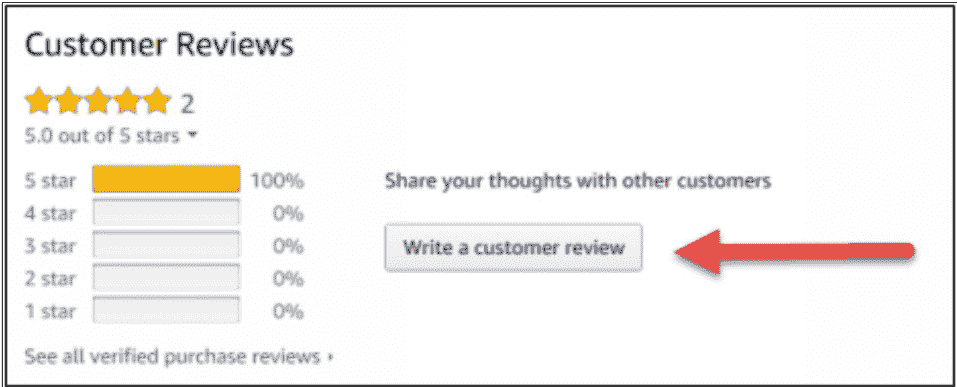

所以，如果你喜欢这本书，请…

[>> 点击此处，在亚马逊上留下简短评论。](https://www.amazon.com)

我非常感谢你的评论，因为它确实能带来改变。

衷心感谢你购买并读完这本书。

## 第二本书：

## 面向 9-15 岁儿童的编程

从零开始学习基础 HTML、CSS 和 JavaScript

## 引言

那是一个亚特兰大明媚的夏日午后；我抓起笔记本电脑，到外面的门廊上看《权力的游戏》最新一集。当我坐在那把三条腿的椅子上时；我感到后腿有些摇晃。那条腿直接从凳子上脱落，我仰面摔倒在地上。听到门廊上传来巨大的撞击声，我的妻子伊莎贝尔和儿子阿尔纳德都跑了出来。“你还好吗？”伊莎贝尔倒吸一口气问道。我吓了一跳，但没事，伊莎贝尔扶我站了起来。我走进屋里，喝了杯水让自己回过神来。令我惊讶的是，我透过窗户看到我9岁的儿子阿尔纳德正试图弄清楚如何把它拼凑起来。他把腿装了回去，但发现椅子仍然摇晃。然后，他把螺丝换到了另一条好腿上的螺丝；椅子还是摇晃。最后，他用胶水粘住了固定螺丝的滑动机构；椅子神奇地修好了。哇！！

接下来，我们来谈谈贝蒂。我们邻居的女儿贝蒂，在社会科学这门课上挣扎了很长时间。她的父母已经习惯了这门课不及格；每次她拿到“D”都会松一口气。所以，想象一下，当贝蒂有一天拿着成绩单回来，上面显示社会科学得了“A”时，他们有多震惊。是的，贝蒂是个勤奋的女孩，她在一些科目上确实表现不错；但这次转变是出乎意料的。然后，贝蒂向父母展示了她过去三个月的社会科学提升计划。她列出了每周要学习的主题清单；以及她将如何通过纪录片和小组学习来简化一些较难的主题。她系统地从一个主题推进到另一个主题，直到涵盖了所有内容。

最后，我们来说说卡尔。卡尔在高中刚开始时是一名网球运动员。他比对手矮小和瘦弱得多。结果，他在第一次锦标赛中输得很惨。他甚至很难拿到几分。虽然他很沮丧，但他意识到他的失败并非由于缺乏技巧；而是基于环境因素。他分析了情况；意识到他需要提高自己的技巧和在球场上的位置感。他分析了对手在球场上的移动；并调整自己的击球方式，以确保始终让对手失去平衡。他做了大量的瑜伽和其他伸展运动来提高柔韧性、平衡性和速度。他开始逐月进步。每个月，他都练习一种不同的击球。几年后，他长高了，变得更强壮、更结实。由于他的努力，他的技巧比对手好得多。在他高中的第三年，他赢得了年度锦标赛，几乎没有遇到任何竞争。

所有这些情况都是假设的，可能由于某些孩子的先天特质而发生。此外，编程并不能保证你将学会这些技能。但是，所有这些情况都展示了在编程过程中可以学到的技能。阿尔纳德系统地检查了椅子及其不同的部件；并逐一检查每个部件以找到问题。这与编程中一个叫做“调试”的过程相同。调试发生在程序无法运行时。它需要系统地分析代码以找到问题并使其运行。

贝蒂审视了一个问题；并将其分解为实现结果所需的不同部分。这类似于编程中的问题解决。这是理解解决编码问题所需的内容；并将代码组织成不同的部分以使程序运行。

卡尔和贝蒂做的是同样的事情；他将问题分解成不同的部分，以便以简单的方式解决。但是，除此之外，他还在网球场上对不同的技能进行优先级排序。他花时间弄清楚哪些技能对击败对手更重要，并首先练习这些技能。在代码结构正确之后，优先级排序是编程中的一项重要技能。程序员希望优先测试代码中更重要的任务。

所有这些技能对编程都至关重要；如果你的孩子想学好编程，他们应该学习这些技能。他们是否真的成为程序员并不重要。这些技能将使你的孩子终身受益。编程还能帮助孩子提高基础数学和阅读能力；以及更好的逻辑和解决问题的能力。

这些技能，加上他们在高中学到的沟通技能，是软件工程师在美国年薪中位数达到 112000 美元（截至 2018 年）的原因。这是美国平均工资的两倍多。

尽管如此，世界各地的高中，即使在富裕地区，也缺乏处理这项任务的人员和技术资源。根据 Tech Republic 在 2000 年进行的一项 K-12 教师调查，只有 8% 的教师认为自己能胜任教孩子编程。美国 50% 的孩子在家里无法上网。对于美国的女孩和有色人种儿童来说，情况更糟；他们拥有更少的资源和可以效仿的榜样。

所以，你需要自己动手。

## 不该做什么

你可能想知道你需要做什么来开始。有几件事我建议不要做。我建议不要雇佣没有教孩子经验的程序员。他们是这个领域的专家；但他们开始编程已经是几十年前的事了；所以，他们无法理解一个还没学过编程、正在学习基础数学的孩子。接下来要避免的是去寻找最新的 JavaScript 教科书；然后读给你的孩子听。这些对于学习编程来说，就像字典对于学习语言一样有用。它们很贵，而且对现有程序员来说更像是参考工具。我也建议不要参加编程训练营。这些可能对少数学生有用；但大多数学生会在一大群学习的孩子中迷失方向。一对一的关注是开始的最佳方式。

## 开始的第一步

本书是开始的最佳方式。我将编程分解为一系列基础章节；并将其与现实世界联系起来。第一章将帮助你设置 JavaScript 和 html 文件，以便你开始学习。

我还有每一章的代码，你可以复制粘贴来运行。代码的每个方面都有详细解释；我还提供了练习，你可以用本章的概念自己完成。

我在书末还推荐了一对一的导师；以及你可以用来拓展知识的额外书籍。

## 设置工作环境

### 你需要准备什么

- 一台笔记本电脑/台式电脑
- 互联网连接
- 已安装的网页浏览器（Firefox、Chrome 或 Internet Explorer）

### 下载并安装 Notepad++

下载最新版本的文本编辑软件。我推荐 Notepad++。你可以在下方下载最新版本：
[https://notepad-plus-plus.org/downloads/](https://notepad-plus-plus.org/downloads/)

### 如何开始使用 NotePad++

从你的桌面或开始菜单打开 Notepad++

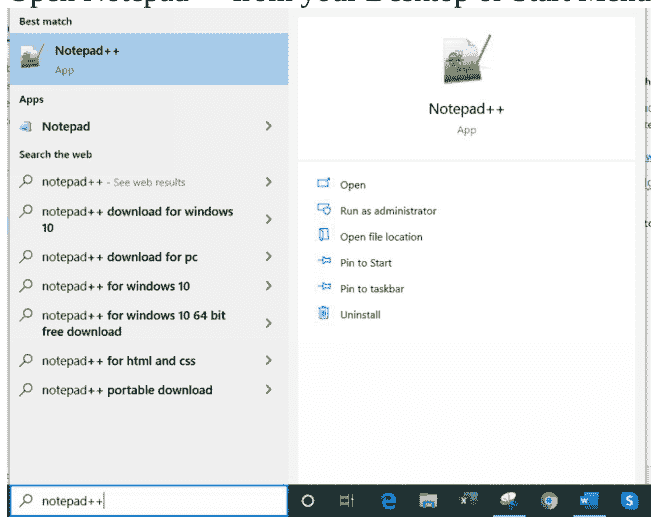

打开 NotePad++ 后，前往 **文件 > 新建** 以打开一个新文件。

new 1 - Notepad++

文件 编辑 搜索 视图 编码 语言 设置 工具 宏 运行 插件 窗口 ?

+   新建
打开...
打开所在文件夹
在默认查看器中打开
将文件夹作为工作区打开...
从磁盘重新加载
保存
另存为...
另存副本...
全部保存
重命名...
关闭
全部关闭
关闭更多
移至回收站
加载会话...
保存会话...
打印...
立即打印

+   1 C:\Users\Abhishek Kumar\Google Drive\Tutoring\JavaScriptExamples\Lesson 2.html
2 C:\Users\Abhishek Kumar\Google Drive\Tutoring\JavaScriptExamples\AddtoCart\Introduction-to-Web-Development-master\Introduction-to-Web-Development-master\Introduction to JavaScript\Lesson 1\store.js
3 C:\Users\Abhishek Kumar\Google Drive\Tutoring\JavaScriptExamples\AddtoCart\Introduction-to-Web-Development-master\Introduction-to-Web-Development-master\Introduction to JavaScript\Lesson 1\index.html
4 C:\Users\Abhishek Kumar\Google Drive\Tutoring\JavaScriptExamples\AddtoCart\Introduction-to-Web-Development-master\Introduction-to-Web-Development-master\Introduction to JavaScript\Lesson 1\script.js
5 C:\Users\Abhishek Kumar\Google Drive\Tutoring\JavaScriptExamples\AddtoCart\Introduction-to-Web-Development-master\Introduction-to-Web-Development-master\Introduction to JavaScript\Lesson 1\styles.css
6 C:\Users\Abhishek Kumar\Google Drive\Tutoring\JavaScriptExamples\AddtoCart\Introduction-to-Web-Development-master\Introduction-to-Web-Development-master\Introduction to JavaScript\Lesson 1\about.html
7 C:\Users\Abhishek Kumar\Google Drive\Tutoring\JavaScriptExamples\BulbOnOff.html
8 C:\Users\Abhishek Kumar\Google Drive\Tutoring\JavaScriptExamples\Lesson1.html
9 C:\Users\Abhishek Kumar\Google Drive\Tutoring\JavaScriptExamples\Test.html

+   恢复上次关闭的文件
打开所有最近文件
清空最近文件列表
退出

普通文本文件

长度：0  行数：1

行：1  列：1  选中：0 | 0

Windows (CR LF)  UTF-8  INS

开始搜索

ENG  12:54  18-02-2020

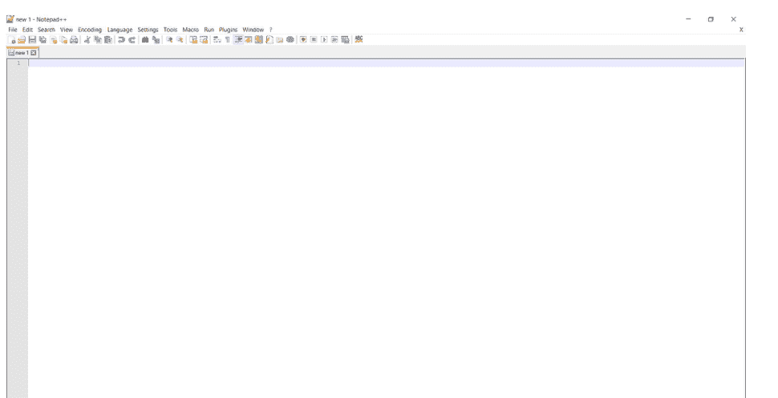

现在，点击 **文件 > 另存为** 并选择 **.html** 作为文件类型

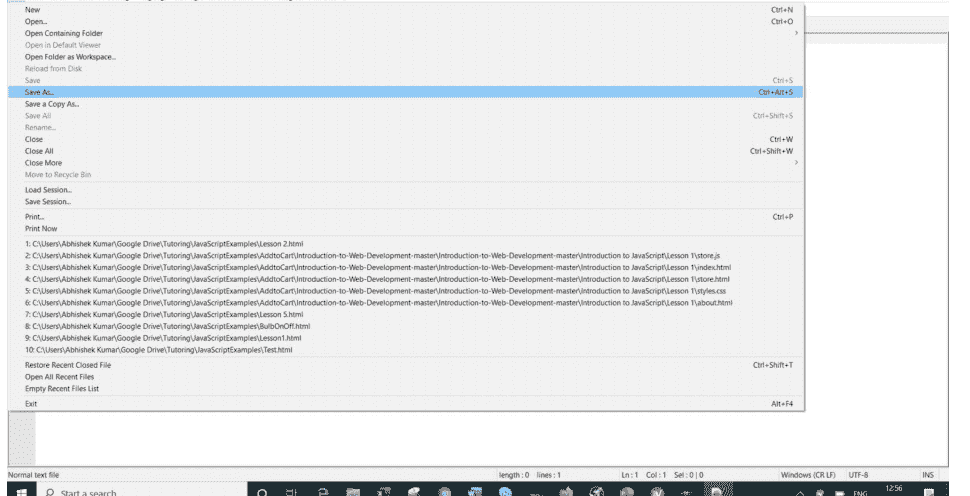

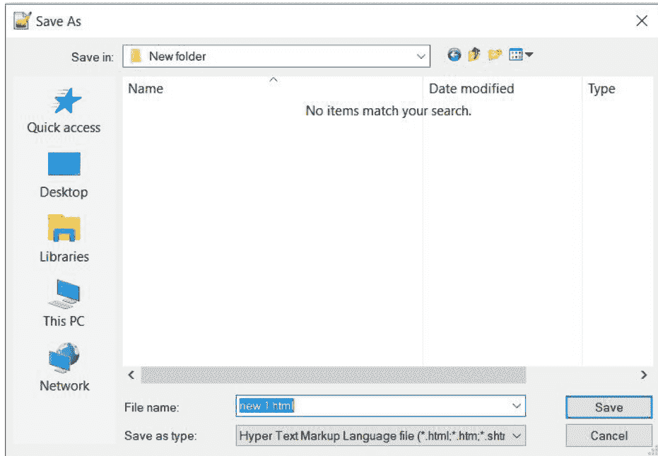

这确保了你可以在 Firefox 或 Chrome 等 HTML 浏览器上运行你的程序。

### 测试程序

有一个简单的方法来测试程序，看看它是否能连接到你的浏览器。
只需在你的文件中输入一些随机文本。在我的文件中，我输入了“**Testing 1,2,3……**”
然后点击 **文件 > 保存**。
之后，根据你使用的浏览器，点击 **运行 > 在 Firefox/Chrome/IE 中启动**。
如果一切正常，你输入的文本应该会显示在浏览器窗口中。

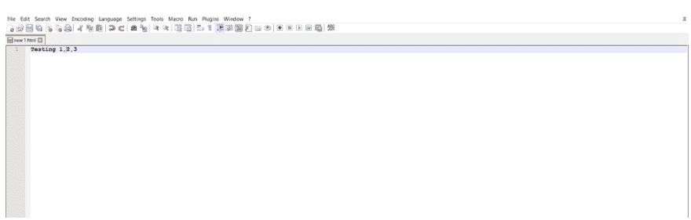

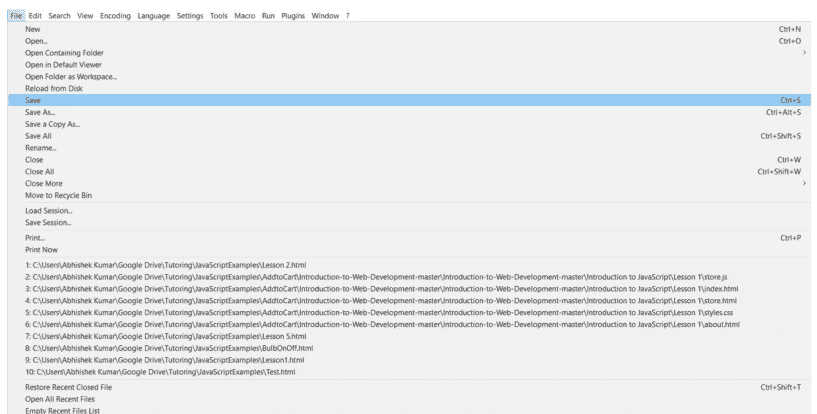

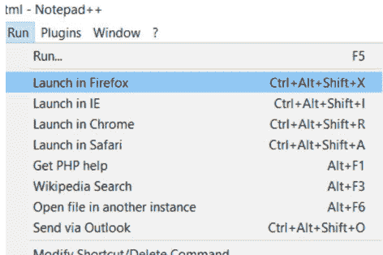

## 结果：

Testing 1,2,3

我知道这对某些人来说可能是一个简单的测试；但在我们开始真正的编程之前，确保一切正常工作是很重要的。

## HTML 简介

### 什么是 HTML？

HTML 代表超文本标记语言。
HTML 是人类用来与 Chrome、Internet Explorer、Firefox 等网页浏览器进行交互的语言。
有时，它会得到 CSS 和 JavaScript 的辅助；但网页的基本结构是由 HTML 定义的。
它非常简单，即使是编程初学者和小孩子也容易掌握。
HTML 使用简单的标签来完成，这些标签看起来像箭头的两端。

### HTML 标签示例

这是一个 HTML 标签的样子：
**<p>** - 标签示例
每个 HTML 标签都有一个额外的标签来表示标签的结束。结束标签除了标签的两端外，还有一个斜杠。请参阅下面的简单示例。

```
<p> - 标签开始
</p> - 标签结束
```

### 基本 HTML 标签及其用途

<html>
这是每个 HTML 代码片段开始的标签。

<head>
这是在其他任何内容之前首先执行的代码。

<title>
这是写在浏览器顶部标题栏中的代码。

<body>
包含页面上显示的信息。

<p>
用于页面主体上显示的文本段落。

<h1>, <h2>, <h3>, <h4>, <h5>, <h6>
这些用于按大小降序排列的文本标题。<h1> 是最大尺寸的标题，<h6> 是最小的。

<strong>
用于加粗文本

<ul>
用于无序列表，如项目符号列表

<li>
用于在文本行前添加项目符号图标

<ol>
用于有序列表，如从 1,2,3... 开始编号的项目

<div>
这些是较大的内容部分；通常包含多个段落、标题等。

<a>
用于超链接文本。超链接就是当你点击一段带下划线的文本时，它会链接到另一个页面。


用于向网页添加图片。

现在，你可能想知道要学的东西很多。别担心。你现在不需要记住任何东西。
只需在你编码时将其作为参考。
我们将通过一个例子来更好地解释一切。

### HTML 示例：

```
<html>
<head>
<title>Greeting to html.......</title>
</head>
<body>
<h1>Welcome to your first html website</h1>
<h2>Time to get started....</h2>
<p>Hi. My name is Bob. I am excited to learn about programming a website. Here's a few things we will learn.</p>
<ul>
<li>Basics of html</li>
<li>CSS</li>
<li>JavaScript</li>
</ul>
</body>
</html>
```

以下是相同的代码：（你可以复制粘贴）

```
<html>
<head>
<title>Greeting to html.......</title>
</head>
<body>
<h1>Welcome to your first html website</h1>
<h2>Time to get started....</h2>
<p>Hi. My name is Bob. I am excited to learn about programming a website. Here's a few things we will learn.</p>
<ul>
<li>Basics of html</li>
<li>CSS</li>
<li>JavaScript</li>
</ul>
</body>
</html>
```

### 这是我们得到的输出

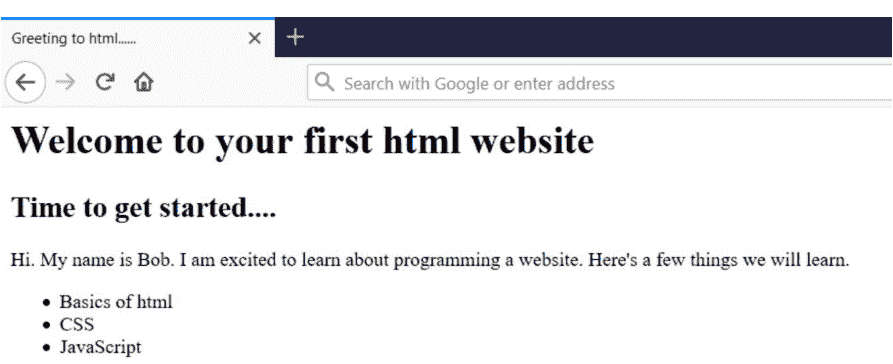

让我们将输出与代码中的标签联系起来。

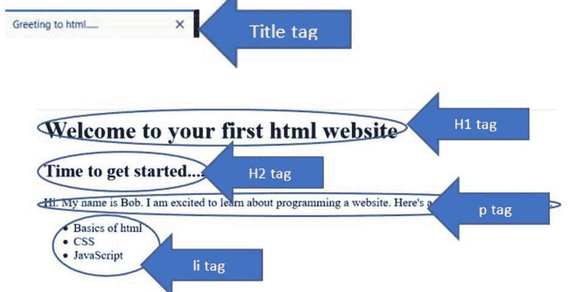

## 练习

1.  创建一个介绍你自己的 HTML 网站。创建一个标题标签，内容为“介绍”。使用 h1 和 h2 标签为你自己创建一个标题。然后创建一个段落，谈谈你自己、你的年龄、学校和家乡。最后，创建一个你的爱好的项目符号列表。

2.  创建一个谈论你最喜欢的运动队或电视节目的 HTML 网站。创建一个标题标签，内容为该节目/运动队的名称。使用 h1 和 h2 标签创建一个标题。然后创建一个段落，谈谈你为什么喜欢这个队伍/电视节目，以及它们为什么如此棒。最后，创建一个你最喜欢的节目中的球员/人物的项目符号列表。

## 灯泡示例 - HTML

### 这个项目做什么

这是一个简单的 HTML 项目，它创建了一个按钮，可以切换页面上的灯泡开/关。我们将使用两张灯泡图片来实现这一点。按钮将在两张图片之间切换。

## 本章需要理解的概念

对于这个例子，我们需要理解按钮标签和图像标签。

### 按钮标签

```
<button onclick=**Action** >**Button text**</button>
```

按钮元素有两个元素。一个动作和按钮文本。按钮文本是显示在按钮上的文本；动作是用户点击按钮时发生的事情。

### 图像标签

```

```

图像标签有三个元素。
ImageId 是你分配给图像的名称。此名称用于在代码中引用图像。
ImageUrl 是标签引用的图像的 URL。如果图像与 HTML 文件在同一文件夹中，那么你可以只使用文件名而不是整个 URL。
ImageSize 设置图像的宽度和高度。

## 文件

将灯泡开启和关闭的两张图片与我们使用的 HTML 代码放在同一文件夹中。你可以通过点击下方链接并下载来获取这些文件：

[灯泡开启图片](Bulb On Picture)
[灯泡关闭图片](Bulb Off Picture)

## 代码

```
<html>
<head>
<title> The Bulb Project</title>
</head>
<body>

<h2>Bulb Light with JavaScript</h2>
<button onclick="document.getElementById('myImage').src='bulb_off.JPG'">Bulb Off</button>

<button onclick="document.getElementById('myImage').src='bulb_on.JPG'">Bulb On</button>

</body>
</html>
```

以下是相同的代码（你可以复制粘贴）

```
<html>
<head>
<title> The Bulb Project</title>
</head>
<body>

<h2>Bulb Light with JavaScript</h2>
<button
onclick="document.getElementById('myImage').src='bulb_off.JPG'">Bulb
Off</button>

<button
onclick="document.getElementById('myImage').src='bulb_on.JPG'">Bulb
On</button>

</body>
</html>
```

# 输出

初始状态：

# 使用 JavaScript 控制灯泡

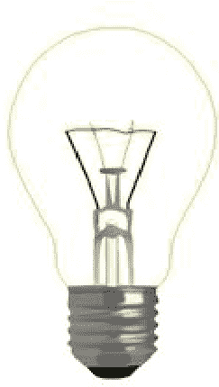

灯泡关闭

灯泡开启

点击 **灯泡开启** 按钮后：

# 使用 JavaScript 控制灯泡

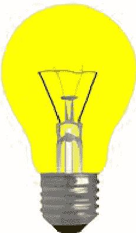

灯泡关闭

灯泡开启

点击 **灯泡关闭** 按钮后：

# 使用 JavaScript 控制灯泡

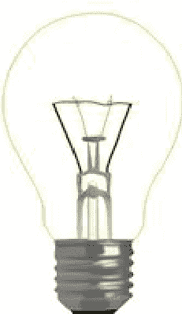

灯泡关闭

灯泡开启

## 练习：

1.  创建一个包含两个按钮的程序，按钮标题分别为“白天”和“夜晚”。当你点击“白天”按钮时，显示一张太阳的图片；当你点击“夜晚”按钮时，显示一张月亮的图片。
2.  创建一个包含四个按钮的程序，这四个按钮可以在四种不同的野生动物之间切换。每个按钮上的文字分别是“老虎”、“狮子”、“野猪”和“大象”。当你点击每个按钮时，会显示相应的动物图片。

## **作者的一段简短留言：**

嘿，你喜欢这本书吗？我很想听听你的想法！

许多读者不知道评论有多难得，以及它们对作者有多大帮助。

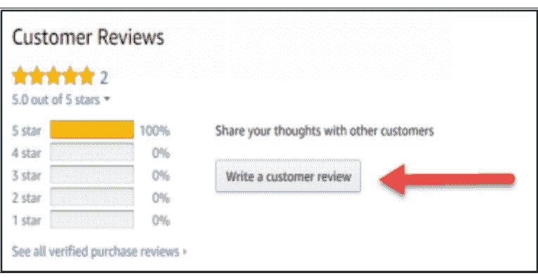

如果你能花60秒在亚马逊上写一篇简短的评论，即使只有几句话，我也会非常感激！

[>> 点击此处留下快速评论](https://example.com)

感谢你花时间分享你的想法！

你的评论对我来说真的会带来改变，并有助于提升我的作品的知名度。

## HTML 表单

### 什么是 HTML 表单？

HTML 表单是网页上你可以输入信息的空白框。
就是那些你在网上看到的，用来输入你的姓名、年龄、密码等的表单。
下面是一个表单的样子：

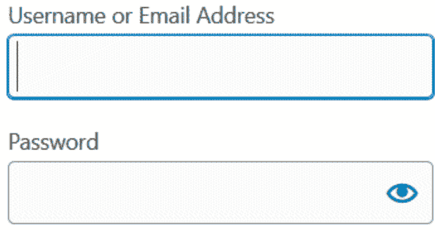

### 表单 HTML 标签格式

下面是一个表单 HTML 标签的示例，它接收姓名、职业和性别。

```
<form id="form1">
Name: <input name="Enter Name" type="text" id="name" size="20"><br>
Occupation: <input type="text" id="occupation" size="20"><br>
Age: <input type="number" id="gender" size="20"><br>
</form>
```

一旦你运行程序，输出将如下所示。你可以在输出中的空白框里输入任何内容。这些空白框也被称为文本框。

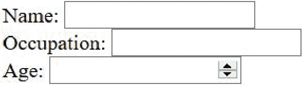

### 表单 HTML 标签的不同部分

`<form id="form1">`
表单 id 标签是表单的名称，将在代码的其余部分作为参考使用。
姓名：
职业：
年龄：
这是写在框左侧的文本。它用于向用户描述在框中输入什么。
`input type="text"`
这意味着你在框中输入的内容是文本或字符串类型。例如，姓名和职业使用文本类型，因为你在框中输入的是字母。
`input type="number"`
这意味着你在框中输入的内容是数字。例如，年龄和电话号码会使用数字类型，因为它们完全是数字。

```
id="name"
id="occupation"
id="gender"
```

id 是该框在程序其余部分中的名称。我们将在程序的其余部分使用 id 来引用该框。

```
size="20"
```

这意味着框的长度是 20 像素。要更改此值，请更改 size 的值。例如，如果你想将框的长度加倍，请将 size 更改为 40。

## JavaScript 示例

### 什么是 JavaScript？

JavaScript 是一种高级编程语言。它最常用于在 HTML 页面上执行用户操作。
它还有助于增强用户在网页上的交互。

### 如何在 HTML 中使用 JavaScript

有两种方法可以在 HTML 页面上使用 JavaScript：
第一种方法是直接将 JavaScript 代码包含在 `<script>` 标签内。如下所示：

```
<html>
<head>
<title> </title>
</head>
<body>
<script>
</script>
</body>
</html>
```

JavaScript 代码将位于上面红色显示的两个 script 标签之间。

第二种方法是创建一个 JavaScript 文件并将其保存为 .js 文件。然后你会在 HTML 代码中引用这个 JavaScript 文件。如下所示。

```
<html>
<head>
<title> </title>
</head>
<body>
<script src="newfile.js"></script>
</body>
</html>
```

你会将所有 JavaScript 代码包含在 newfile.js 文件中。

### 你需要了解的 JavaScript 术语

接下来我们将通过几个 JavaScript HTML 代码示例。我们需要了解以下术语才能理解代码。

**函数**
JavaScript 函数是执行任务的任意代码行集合。函数通常用于执行当你点击 HTML 按钮时需要发生的任务。每个函数都有一个名称，并在 HTML 代码中被引用。下面是一个例子：
`function abcd()`
abcd 是执行特定任务的函数的名称。它将在 HTML 代码中被引用为 abcd。

# 变量

变量用于在 JavaScript 中存储名称或数字。可以把它想象成一个可以存储一个值的盒子。每次你需要那个值时，都会引用那个盒子。它的定义如下：

```
var flag=1;
```

flag 是变量的名称，它存储值 1。所以任何时候在 JavaScript 程序中引用 flag；它的值都是 1（除非你更改了 flag 的值）。flag 的这个值可以用来定义其他变量。例如：

```
var king=flag*2;
```

king 现在的值是 1*2=2。所以变量是处理未知量的好方法。

### document.getElementbyID().value

这个 JavaScript 术语用于获取 HTML 表单文本框中项目的值。所以，如果你在表单文本框中填写了你的名字并点击一个按钮，document.getElementbyID() 会获取你在框中输入的内容的值。例如：

```
var yname=document.getElementById("name").value;
```

“name”是在 HTML 中定义的表单文本框的 id。要了解这在 HTML 中是如何完成的，请查看上一章关于 HTML 标签的部分。在文本框中输入的任何内容都存储在一个名为 yname 的变量中。从现在起，它将在 JavaScript 中被引用为 yname。

### Document.write()

此函数用于在网页浏览器上打印任何内容。例如，

```
document.write(“xyz”);
```

在屏幕上打印 xyz。你也可以使用“+”运算符添加两个不同的项。

```
document.write(“xyz”+”123”);
```

在屏幕上打印 xyz123。当你想向变量添加文本时，这很有用。例如。

```
var yname=document.getElementById("name").value;
document.write(“My name is “+yname);
```

如果你在文本框中输入了“Matt”，它会在屏幕上打印出“My name is Matt”。

### parseint()

parseint 将数字更改为整数，无论它是否是小数。例如，
parseint(2.8) 将等于 3。
Parseint(2) 将只是 2。

### parsefloat()

parsefloat() 与 parseint() 相反。它将数字更改为小数。例如，
parseint(2) 将等于 2.0
Parseint(3.1) 将只是 3.1

## JavaScript 示例 1

下面的代码创建了一个 HTML 表单，用于接受一个人的姓名、年龄和爱好。有一个 HTML 按钮，点击时会生成 JavaScript 代码。JavaScript 代码在点击时会打印出该人的姓名、年龄和爱好。JavaScript 代码位于 `<script>` 标签内。代码如下所示并附有输出；之后还会解释其中的几行。

## JavaScript 示例 1

```html
<html>
<head>
<title>打印姓名和年龄.....</title>
</head>
<body>
<form id="form1">
输入姓名: <input name="Enter Name" type="text" id="name" size="20"><br>
输入爱好: <input type="text" id="hobby" size="20"><br>
输入年龄: <input type="number" id="age" size="20"><br>
</form>
<button onclick="writename()">打印简介</button>
<script>
function writename()
{
    var nameValue=document.getElementById("name").value;
    var hobbyValue=document.getElementById("hobby").value;
    var ageValue=document.getElementById("age").value;
    document.write("这是 "+nameValue+"。我今年 "+ ageValue+" 岁。我最喜欢的爱好是 "+hobbyValue);
}
</script>
</body>
</html>
```

## 输出：

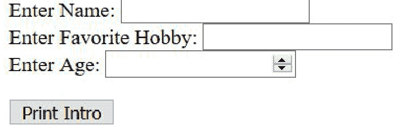

# 输出（已填写）：

输入姓名: Tim

输入爱好: Soccer

输入年龄: 10

打印简介

# 输出（点击“打印简介”按钮后）

这是 Tim。我今年 10 岁。我最喜欢的爱好是 Soccer

## 代码分解：

```html
<form id="form1">
输入姓名: <input name="Enter Name" type="text" id="name" size="20"><br>
输入爱好: <input type="text" id="hobby" size="20"><br>
输入年龄: <input type="number" id="age" size="20"><br>
</form>
```

这段 HTML 代码创建了一个包含 3 个表单元素的表单，分别用于姓名、爱好和年龄。它们的长度均为 20 像素。它们通过 id 进行引用；id 分别为 `name`、`hobby` 和 `age`。

```html
<button onclick="writename()">打印简介</button>
```

这个 HTML 按钮激活了名为 `writename()` 的 JavaScript 函数，按钮上的文本是 `打印简介`。

```javascript
function writename()
{
    var nameValue=document.getElementById("name").value;
    var hobbyValue=document.getElementById("hobby").value;
    var ageValue=document.getElementById("age").value;
    document.write("这是 "+nameValue+"。我今年 "+ ageValue+" 岁。我最喜欢的爱好是 "+hobbyValue);
}
```

当按钮被按下时，上述 JavaScript 代码被激活。`nameValue`、`hobbyValue` 和 `ageValue` 存储了输入到 id 为 “name”、“hobby” 和 “age” 的表单元素中的值。`document.write` 将简介输出到屏幕上。

## JavaScript 示例 2

下面的代码创建了一个 HTML 表单，用于接收两个数字，然后创建 4 个 HTML 按钮。
有 4 个 JavaScript 函数，分别用于对两个数字进行加、减、乘或除运算。根据点击的按钮选择特定的 JavaScript 代码。
代码及其输出如下所示；之后还会解释其中几行代码。

```html
<html>
<head>
<title>迷你计算器......</title>
</head>
<body>
<form id="form1">
输入数字 1: <input type="number" id="num1" size="20"><br>
输入数字 2: <input type="number" id="num2" size="20"><br>
</form>
<button onclick="sum()">+</button>
<button onclick="subtract()">-</button>
<button onclick="multiply()">*</button>
<button onclick="divide()">/</button>

<script>

function sum()
{
    var number1=parseFloat(document.getElementById('num1').value);
    var number2=parseFloat(document.getElementById('num2').value);
    var total=number1+number2;
    document.write("总和是 "+total);
}
function subtract()
{
    var number1=parseFloat(document.getElementById('num1').value);
    var number2=parseFloat(document.getElementById('num2').value);
    var diff=number1-number2;
    document.write("差值是 "+diff);
}
function multiply()
{
    var number1=parseFloat(document.getElementById('num1').value);
    var number2=parseFloat(document.getElementById('num2').value);
    var multi=number1*number2;
    document.write("乘积是 "+multi);
}
function divide()
{
    var number1=parseFloat(document.getElementById('num1').value);
    var number2=parseFloat(document.getElementById('num2').value);
    var div=number1/number2;
    document.write("商是 "+div);
}
</script>
</body>
</html>
```

## 输出：

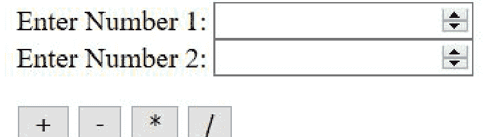

# 输出（已填写）：

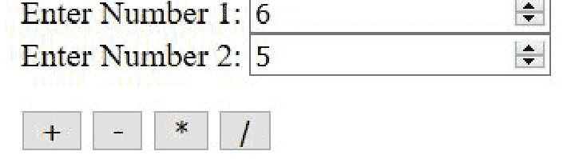

**答案（+ 按钮）：**
总和是 11

**答案（- 按钮）：**
差值是 1

**答案（* 按钮）：**
乘积是 30

**答案（/ 按钮）：**
商是 1.2

# 代码分解

```html
<form id="form1">
输入数字 1: <input type="number" id="num1" size="20"><br>
输入数字 2: <input type="number" id="num2" size="20"><br>
</form>
```

上述代码创建了一个接受两个数字的表单，id 分别为 num1 和 num2。

```html
<button onclick="sum()">+</button>
<button onclick="subtract()">-</button>
<button onclick="multiply()">*</button>
<button onclick="divide()">/</button>
```

上述代码创建了 4 个按钮。这 4 个按钮中的每一个都激活了函数 `sum()`、`subtract()`、`multiply()` 和 `divide()`。

```javascript
function sum()
{
    var number1=parseFloat(document.getElementById('num1').value);
    var number2=parseFloat(document.getElementById('num2').value);
    var total=number1+number2;
    document.write("总和是 "+total);
}
```

`number1` 和 `number2` 存储了使用 id `num1` 和 `num2` 在表单中输入的数字。
Total 存储了两个数字的总和。
`document.write` 将总和写在屏幕上。

## 练习

你可以复制上面的代码并尝试使用它。一旦你理解了代码，你就可以创建自己的 JavaScript HTML 函数。这里有几个你可以尝试的练习。

- 1. 编写一个程序，使用 6 个文本框输入 6 个科目的学校成绩。编写两个 JavaScript 函数来计算科目的总分和平均分。
- 2. 编写一个 JavaScript 程序，输入 5 个不同的学生姓名和爱好，并打印出这些学生的姓名和爱好。

## 条件语句

### 什么是条件语句？

它是一种检查某个条件是否为真的语句。它可以简单到检查一个数字是否小于 10，也可以复杂到检查患者的医疗样本是否存在某种疾病。
在 Javascript 中，条件语句使用 IF ELSE 语句来完成。
所以，它基本上检查如果某事为真，则执行一个动作。如果它不为真，则执行其他操作。例如，

```javascript
IF (George==”Hungry”)
{
    Document.write(‘给 George 一点零食);
}
ELSE
{
    Document.write(‘不给 George 零食’);
}
```

在上面的例子中，代码检查 George 是否饿了，并执行两个动作之一。如果 George 饿了，则打印‘给 George 一点零食’。如果没有，则打印‘不给 George 零食’）
这是一个使用 IF ELSE 语句的 JavaScript 条件语句的简单示例。

### IF ELSE 循环 – 示例 1

```html
<html>
<head>
<title>检查两个数字的和是否大于 15.......</title>
</head>
<body>
<form id="form1">
输入数字 1: <input type="number" id="num1" size="20"><br>
输入数字 2: <input type="number" id="num2" size="20"><br>
</form>
<button onclick="check10()">检查总和</button>

<script>

function check10()
{
var num1=parseFloat(document.getElementById("num1").value);
var num2=parseFloat(document.getElementById("num2").value);
    if ((num1+num2)<15)
    {
        document.write('两个数字的和小于 15');
    }
    else
    {
        document.write('两个数字的和大于或等于 15');
    }
}

</script>
</body>
</html>
```

输出：

输入数字 1:

输入数字 2:

检查总和

输出（用户已填写）：

输入数字 1: 3

输入数字 2: 4

检查总和

输出（点击“检查总和”按钮后）：

两个数字的和小于 15

# 输出（第二组数字已填写）

输入数字 1: 14

输入数字 2: 3

检查总和

# 输出（点击“检查总和”按钮后）

两个数字的和大于或等于 15

## 代码分解：

```javascript
var num1=parseFloat(document.getElementById("num1").value);
var num2=parseFloat(document.getElementById("num2").value);
```

这些行将用户填写的两个数字的值存储在两个变量 num1 和 num2 中。

```javascript
if ((num1+num2)<15)
```

这检查两个数字的和是否大于 15。

```javascript
{
document.write('两个数字的和小于 15');
}
```

如果和小于 15，则激活上述循环并打印出‘两个数字的和小于 15。’

```javascript
else
{
document.write('两个数字的和大于或等于 15');
}
```

如果和大于 15，则激活上述循环并打印出‘两个数字的和大于或等于 15。’

## IF ELSE 循环 – 示例 2

```html
<html>
<head>
<title>检查数字是否能被 2 整除......</title>
</head>
<body>
<form id="form1">
输入数字：<input type="number" id="num1" size="20"><br>
</form>
<button onclick="checkdivby2()">检查整除</button>

<script>
function checkdivby2()
{
var number=parseFloat(document.getElementById("num1").value);
if ((number%2)==0)
{
    document.write(number+" 能被 2 整除");
}
else
{
    document.write(number+" 不能被 2 整除");
}
}
</script>
```

输出：

输入数字：[ ]

[检查整除]

输出（填入 1）：

输入数字：[12]

[检查整除]

输出（点击“检查整除”按钮后）

12 能被 2 整除

输出（填入 2）：

输入数字：[21]

[检查整除]

输出（点击“检查整除”按钮后）

21 不能被 2 整除

## 代码分解：

```javascript
if ((number%2)==0)
```

上面这行代码检查数字是否能被 2 整除。

```javascript
{
    document.write(number+" 能被 2 整除");
}
```

如果数字能被 2 整除，则激活上面这段代码。它会打印出该数字能被 2 整除。

```javascript
else
{
    document.write(number+" 不能被 2 整除");
}
```

如果数字不能被 2 整除，则激活上面这段代码。它会打印出该数字不能被 2 整除。

## 练习实践

你可以复制上面的代码并尝试修改。一旦理解了代码，你就可以创建自己的 JavaScript HTML 函数。这里有几个你可以尝试的练习。

1.  编写一个程序，使用 6 个文本框输入 6 个科目的成绩。编写一个 JavaScript 函数来计算平均分，然后检查学生是否及格。如果分数低于 60 分，则学生不及格。
2.  编写一个程序，输入一个年份并检查它是否是闰年。

### 嵌套条件语句

这些基本上是条件语句中的条件语句。它们也被称为嵌套循环。假设你想在 JavaScript 中检查两个条件是否都为真，然后再执行操作；那么你需要将两个 if 循环相互嵌套。让我们用上一章的例子来说明。我们想检查乔治是否饿了并且有钱给他买零食。如果不是，则执行其他操作。例如，

```javascript
IF (George=="Hungry")
{
    IF (George=="Has Money")
    {
        Document.write('给乔治买零食');
    }
    ELSE
    {
        Document.write('给乔治做零食');
    }
}
ELSE
{
    Document.write('不给乔治零食');
}
```

在上面的例子中，代码首先检查乔治是否饿了。如果乔治饿了，然后执行第二次检查。它检查乔治是否有钱。如果乔治有钱，就打印“给乔治买零食”。如果他饿了但没钱，就打印“给乔治做零食”。如果他不饿，就打印“不给乔治零食”。这是 JavaScript 中一个简单的嵌套 IF ELSE 语句示例。

## 嵌套 IF ELSE 循环示例

在这个例子中，我们将输入一个 4 位数的年份，并检查它是否是闰年。现在，这比我们想象的要复杂一点。
我们知道每 4 年是一个闰年。所以这是我们的第一个检查。像 1996 年这样的年份就是闰年。
但是，每 100 年，就不是闰年。所以，1800 年和 1900 年不是闰年。
此外，还有另一个例外。每 400 年，它不是闰年。所以 1600 年和 2000 年不是闰年。所以有 3 个检查。

```html
<html>
<head><title>闰年检查</title></head>
<body>
<form id="form1">
输入年份：<input type="number" id="year" size="20"><br>
</form>
<button onclick="leapyear()">是闰年吗？</button>

<script>

function leapyear()
{
var yr=parseInt(document.getElementById("year").value);
var lpyear=0;
    if ((yr%4)==0)//第一个循环，检查年份是否能被 4 整除
    {
        lpyear=1;
        if((yr%100)==0)//第二个循环，检查年份是否能被 100 整除
        {
            lpyear=0;
            if((yr%400)==0)//第三个循环，检查年份是否能被 400 整除
            {
                lpyear=1;
            }
        }
    }
if (lpyear==1)
{
    document.write(yr+" 是闰年");
}
else
{
    document.write(yr+" 不是闰年");
}
}
</script>
</html>
```

输出：

输入年份：[ ]

[是闰年吗？]

### 运行 #1

输入年份：[1992]

[是闰年吗？]

输出：

1992 是闰年

### 运行 #2

输入年份：[1995]

[是闰年吗？]

输出：

1995 不是闰年

### 运行 #3

输入年份：[1900]

[是闰年吗？]

**输出：**

1900 不是闰年

### 运行 #4：

输入年份：2000

是闰年吗？

**输出：**

2000 是闰年

从上面的代码和结果可以看出，它通过使用 3 个嵌套的 if 循环正确地计算了闰年。
1992 是闰年，因为它能被 4 整除。
1995 不是闰年，因为它不能被 4 整除。
1900 不是闰年，因为它能被 100 整除。
2000 是闰年，因为它能被 400 整除。

## 练习实践

你可以复制上面的代码并尝试修改。一旦理解了代码，你就可以创建自己的 JavaScript HTML 函数。这里有几个你可以尝试的练习。

1.  三个传感器连接到一台打印设备，每个传感器连接一个警报器。第一个传感器“A”检测设备是否需要墨水。第二个传感器“B”检测设备是否需要维修。第三个传感器“C”检测设备是否卡纸。如果发生 2 个或更多问题，警报器就会响起。
2.  学校在特定情况下会放雪假。如果道路上有冰，但没有盐，那么就会放雪假。然而，如果有盐，那么就不会放雪假。无论是否有盐，只要雪量超过 2 英寸，就会放雪假。
3.  一个计算机芯片控制儿童是否被允许观看特定的电视节目。如果时间在下午 5 点之前，电视总是可以工作。然而，如果是在下午 5 点之后，则使用节目的评级。如果评级是“普通观众”，那么电视可以工作；然而，如果评级是“成人观众”，那么电视就不会打开。

## 循环

循环是一组重复执行一定次数的指令。在大多数情况下，某个过程被执行，并且有一个计数器每次增加 1。在过程结束时，我们检查计数器是否超过了我们需要执行该过程的次数。如果达到了我们需要的次数，我们就停止循环。

例如，假设你想在屏幕上打印数字 1 到 10。那么使用一个从 1 计数到 10 的循环。每次它都会在屏幕上打印计数。

在 JavaScript 中，我们使用一个名为 **FOR** 的函数来实现这个循环。我们将在下面看一个简单的例子。

### 示例 #1

```html
<html>
<head><title>打印 1 到 20</title></head>
<body>

<button onclick="printtotwenty()">打印到 20</button>

<script>

function printtotwenty()
{

for (i=1;i<=20;i++)
{
    document.write(i+"<br>");
}

}

</script>

</body>
</html>
```

在这个函数中，我们创建了一个名为 `printtotwenty` 的函数，它打印从 1 到 20 的数字。标题为“打印到 20”的按钮激活了该函数。
在函数中有一个 for 循环：
`For (i=1;i<=20; i++)`
上面这行意味着循环从 1 运行到 20；并且每次增加 1。
Document.write 每次打印 i 的值。

下面是结果的截图：

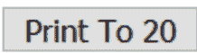

点击按钮后，我们得到：

1
2
3
4
5
6
7
8
9
10
11
12
13
14
15
16
17
18
19
20

按计划打印了 1 到 20。所以，接下来，我们将做同一个程序的不同版本。不是只打印 1 到 20；我们将让你选择要打印多少个数字。只需在文本框中输入循环的长度，它就会打印出来。

### 示例 #2

```html
<html>
<head><title>JavaScript 问候语......</title></head>
<body>
<form id="form1">
循环长度：<input type="number" id="loop" size="20"><br>
</form>

<button onclick="printtotwenty()">打印到 100</button>
<button onclick="printlooplength()">打印循环长度</button>

<script>

function printtotwenty()
{

for (i=1;i<=20;i++)
{
    document.write(i+"<br>");
}

}

function printlooplength()
{
var looplength=parseInt(document.getElementById("loop").value);

var j=1;
for (j=1;j<=looplength;j++)
    {
    document.write(j+"<br>");
    }
}

</script>

</body>
</html>
```

现在，运行程序后，我们得到：

循环长度：50

打印到100 打印循环长度

那么，现在点击“打印循环长度”

+   1
2
3
4
5
6
7
8
9
10
11
12
13
14
15
16
17
18
19
20
21
22
23
24
25
26
27
28
29
30
31
32
33
34
35
36
37
38
39
40
41
42
43
44
45
46
47
48
49
50

所以，它打印了从1到50。如果你想打印1到100，那么在文本框中输入100并点击同一个按钮。
上面的程序有一个额外的文本框和一个额外的按钮。文本框用于接受循环的长度，按钮链接到一个名为 `printlooplength()` 的函数，该函数打印星号循环。变量 `looplength` 存储你在文本框中输入的值。`FOR` 循环从1运行到 `looplength`。在上面的例子中，`looplength` 是50；所以它从1运行到50。每次运行时，它使用 `document.write` 函数打印计数器。

## 示例 #3

现在，我们将用循环做一些更酷的事情。我们将根据循环长度打印一个星号图案。

```html
<html>
<head><title>JavaScript Greetings......</title></head>
<body>
<form id="form1">
Loop Length: <input type="number" id="loop" size="20"><br>
Star Loop Length: <input type="number" id="starloop" size="20"><br>
</form>

<button onclick="printtotwenty()">Print To 100</button>
<button onclick="printlooplength()">Print Loop Length</button>
<button onclick="looplengthstar()">Print Star Loop</button>

<script>

function printtotwenty()
{

for (i=1;i<=20;i++)
{
    document.write(i+"<br>");
}

}

function printlooplength()
{
var looplength=parseInt(document.getElementById("loop").value);

var j=1;
for (j=1;j<=looplength;j++)
    {
    document.write(j+"<br>");
    }
}
function looplengthstar()
{
var looplength=parseInt(document.getElementById("starloop").value);

for (i=1;i<=looplength;i++) {
    for (j=1;j<=i;j++)
    {
    document.write("*");
    }
    document.write("<br>");
}
```

```javascript
function looplengthstar()
{
var looplength=parseInt(document.getElementById("starloop").value);

for (i=1;i<=looplength;i++) {
    for (j=1;j<=i;j++)
    {
        document.write("*");
    }
    document.write("<br>");
    }
}

</script>

</body>
</html>
```

输出如下：

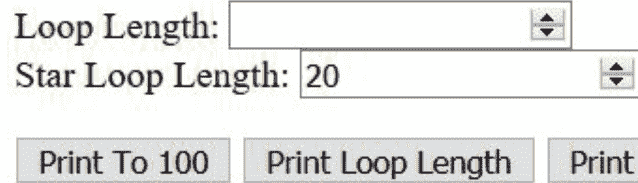

输入20并点击“打印星号循环”后，我们得到：

```
*
**
***
****
*****
*******
********
*********
**********
***********
************
*************
**************
***************
****************
*****************
******************
*******************
********************
```

上面的程序有一个额外的文本框和一个额外的按钮。文本框用于接受星号循环的长度，按钮链接到一个名为 `looplengthstar()` 的函数，该函数打印星号循环。`looplengthstar()` 是一个嵌套的 `FOR` 循环，这意味着一个循环在另一个循环内部。变量 `looplength` 存储你输入的星号循环长度。第一个 `FOR` 循环从1运行到 `looplength`。所以，在上面的例子中，第一个循环是从1到20。因此，在那个循环内部，还有另一个 `FOR` 循环。第二个循环基本上在一行中打印‘*’。它打印*的次数取决于第一个循环中的计数器。例如，如果第一个循环计数器是5（i=5）；那么第二个循环打印5次星号。类似于这样 –‘*****’。所以，每次第一个循环增加并移动到下一行时，第二个循环都会执行这个操作。

## 练习题：

你可以复制上面的例子，一旦你能够运行它们并理解代码；你就可以尝试下面的几个问题。

-   1. 斐波那契数列是一组像这样的数字：0,1,1,2,3,5,8,13....
   每个数字都是前两个数字的和。使用 `FOR` 循环，打印该序列的前20个数字。
-   2. 编写一个程序，该程序在文本框中接收一个数字并打印一个反向的星号循环。
-   3. 编写一个程序，该程序在文本框中接收一个数字并打印其各位数字之和。

## 数组

什么是数组？
数组基本上是一组存储在单个名称下的项目。它们使用该名称的不同索引来访问。例如，在Javascript中：
`var name[5]` 是一个大小为5的数组。第一个元素是 `name[0]`，第二个元素是 `name[1]`，依此类推.....
所以，如果我们想给数组赋值：
`var name[5]=[“Abhi”,”Bob”,”Aaron”,”Steve”,”Mark”]`
上面创建了一个大小为5的数组。要在JavaScript中打印第一个元素，我们这样做：
`document.write(name[0]);`
这会打印出 Abhi，它是数组的第一个元素。
如果我们这样做：
`document.write(name[4]);`
这会打印出 Mark，它是数组的最后一个元素。
如果我们想向数组添加一个元素，使用 `push` 函数，如下所示：
`name.push(“Carl”);`
`document.write(name[5]);`
这会打印出 Carl，它是数组的新元素。
现在，让我们看几个例子：

## 示例 1

在这个例子中，我们在JavaScript中创建3个数组并给它们赋值，然后将它们打印在屏幕上。

```html
<html>
<head><title>Arrays 1</title></head>
<body>

<button onclick="createarray()">Create Array</button>

<script>

function createarray()
{
var name = ["Bob","Peter","Nick"];
var age=[32,10,11];
var loc=new Array("New York","Rockford","Kansas");// 2nd way to start array
document.write(name[0]+' lives in '+loc[0]+' and age is '+age[0]+"<br>");
document.write(name[1]+' lives in '+loc[1]+' and age is '+age[1]+"<br>");
document.write(name[2]+' lives in '+loc[2]+' and age is '+age[2]+"<br>");
name.push("Steve");
age.push(20);
loc.push("Miami");
document.write(name[3]+' lives in '+loc[3]+' and age is '+age[3]+"<br>");
}

</script>

</body>
</html>
```

上面的例子，`createarray()` 创建了3个数组 `name`、`age` 和 `loc`。每个数组都分配了三个元素。它们使用 `document.write()` 打印在屏幕上。
之后，我们使用 `push` 为所有3个数组添加了第4个元素，然后也打印出来了。

创建数组

一旦我们点击“创建数组”按钮：
**Bob lives in New York and age is 32**
**Peter lives in Rockford and age is 10**
**Nick lives in Kansas and age is 11**
**Steve lives in Miami and age is 20**

我们基本上只是打印出了数组的所有元素。
现在我们知道如何创建数组了，让我们用输入到文本框中的信息来创建它。

## 示例 2

```html
<html>
<head><title>Arrays 2</title></head>
<body>
<form id="form1">
Enter Name:<input name="name" type="text" id="name" size="20"><br>

Enter Work Day 1:<select style="width: 280px" id="day1" name="Day 1">
<option value='Sunday'>Sunday</option>
<option value='Monday'>Monday</option>
<option value='Tuesday'>Tuesday</option>
<option value='Wednesday'>Wednesday</option>
<option value='Thursday'>Thursday</option>
<option value='Friday'>Friday</option>
<option value='Saturday'>Saturday</option>
</select>
<br>

Enter Work Day 2:<select style="width: 280px" id="day2" name="Day 2">
<option value='Sunday'>Sunday</option>
<option value='Monday'>Monday</option>
<option value='Tuesday'>Tuesday</option>
<option value='Wednesday'>Wednesday</option>
<option value='Thursday'>Thursday</option>
<option value='Friday'>Friday</option>
<option value='Saturday'>Saturday</option>
</select>
<br>

</form>

<button onclick="assignarray()">Info Array</button>
<script>
function assignarray()
{
var name=document.getElementById("name").value;
var day1=document.getElementById("day1").value;
var day2=document.getElementById("day2").value;
var employeeobj=[name,day1,day2];
document.write(employeeobj[0]+" works on "+employeeobj[1]+" and "+employeeobj[2]);
}
</script>
</body>
</html>
```

上面的代码从1个文本框和2个选择框获取用户输入。选择框设置为可以选择7个工作日（周日到周三），如下所示：

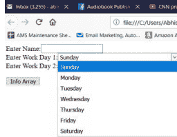

一旦点击“信息数组”按钮，`assignarray()` 函数接收3个输入并创建一个名为 `employeeobj` 的单一数组。

`employeeobj[0]` 是第一个元素，被赋值为姓名。
`employeeobj[1]` 是第二个元素，被赋值为第一个工作日。
`employeeobj[2]` 是第三个元素，被赋值为第二个工作日。
然后我们使用 `document.write` 在屏幕上打印所有3个。现在，让我们运行程序。

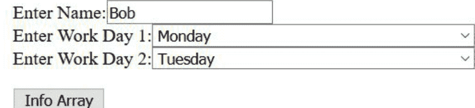

## Bob works on Monday and Tuesday

你可以复制上面的代码，并在你的计算机上实现相同的程序。现在，一旦你能做到；让我们做更多问题：

## 练习题

你可以复制上面的例子，一旦你能够运行它们并理解代码；你就可以尝试下面的几个问题。

-   1. 为你的学校创建5个数组。第一个数组存储学生姓名的值；第二个存储他们的数学成绩；第三个存储他们的历史成绩；第四个存储他们的英语成绩。现在，计算平均值并将其存储在第五个数组中。姓名和3个成绩通过文本框输入，函数将打印出学生的姓名和平均分。
-   2. 创建一个大小为12的数组，存储一年中的月份。用户可以通过文本框输入月份的编号；并且

## 玩转字符串

## 字符串与字符串变量

我们在前面的章节中已经接触过这个概念。字符串是程序中使用的任何文本片段。例如，“abcd”是一个字符串；而数字7不是字符串，它是一个整数。
字符串变量是存储字符串的地方。例如，下面的 `st` 就是一个存储了“abcd”值的字符串变量。
`var st=”abcd”;`
现在，让我们运用JavaScript和循环的知识，来玩转字符串。

## 查找字符串长度

现在，让我们在文本框中输入一个字符串，并找出它的长度。

```html
<html>
<head><title>JavaScript Lesson 4 - Strings</title></head>
<body>
<form id="form1">
Enter Name:<input name="name" type="text" id="name" size="20"><br>
</form>
<button onclick="strlength()">Name Length</button>
<script>

function strlength()
{
var name2=document.getElementById("name").value;
document.write(name2.length);
}
</script>

</body>
</html>
```

下面的代码让你通过文本框输入你的名字。当你点击按钮时，它会运行 `strlength()` 函数来计算你名字的长度。
`name2` 是存储你名字值的变量。
`name2.length` 获取字符串的长度（你名字中的字母数）。
让我们看看输出：

Enter Name: mather

Name Length

点击“Name Length”按钮后，我们得到：
6

让我们再做一个例子：

Enter Name: christopher

Name Length

点击“Name Length”按钮后，我们得到：
11

那么，既然我们知道了如何查找字符串的长度，就让我们利用这个知识来反转你的名字。下面的代码实现了这一点。

```html
<html>
<head><title>JavaScript Lesson 4 - Strings</title></head>
<body>
<form id="form1">
Enter Name:<input name="name" type="text" id="name" size="20"><br>
</form>
<button onclick="strlength()">Name Length</button>
<button onclick="namereverse()">Name Reverse</button>
<script>

function strlength()
{
var name2=document.getElementById("name").value;
document.write(name2.length);
}

function namereverse()
{
var name2=document.getElementById("name").value;
len=name2.length;
for (i=len-1;i>=0;i--)
{
document.write(name2[i]);
}
}

</script>

</body>
</html>
```

下面的代码让你通过文本框输入你的名字。当你点击按钮时，它会运行 `namereverse()` 函数来反转你的名字。`name2` 存储你输入的名字值，`len` 存储你名字的字母数。然后我们创建一个从 `len-1` 到 `0` 的循环。我们使用0的原因是 `name2` 是一个字母数组。在JavaScript中，数组的第一个索引是0。所以第一个字符是 `name2[0]`。在循环中，我们反向进行，每次将计数减1。并且，在循环内部，我们打印由计数索引的字符的值。现在，让我们运行程序：

Enter Name: mather

Name Length Name Reverse

点击 **Name Reverse** 按钮后，我们得到

rehtam

那么，如果字符串末尾有很多空格怎么办？让我们通过修剪字符串来解决这个问题。

## 分割字符串

现在，你知道吗？你可以将一个字符串分割成一个元素数组。你可以使用 `split` 函数来实现这一点。现在，让我们尝试一个例子。在下面的代码中，你将一个由逗号分隔的3种动物的列表作为输入放入文本框。
`split` 函数将其分割成一个包含3个元素的数组，你可以使用 `document.write` 函数打印出每个元素。

```html
<html>
<head><title>Splitting Strings</title></head>
<body>
<form id="form1">
Enter List of 3 Animals separated by commas:<input name="name" type="text" id="ani" size="20"><br>
</form>
<button onclick="strsplit()">Get Animals</button>

<script>

function strsplit()
{
var animal=document.getElementById("ani").value;
aniarray=animal.split(",");          // Split on commas
document.write("The first animal is "+aniarray[0]+"<br>");
document.write("The second animal is "+aniarray[1]+"<br>");
document.write("The third animal is "+aniarray[2]+"<br>");
}

</script>
</body>
</html>
```

现在，让我们看看输出：

Enter List of 3 Animals separated by commas: tiger, lion, wolf

Get Animals

点击 **Get Animals** 按钮后，我们得到：

**The first animal is tiger**
**The second animal is lion**
**The third animal is wolf**

上面的代码在你输入3种动物时有效。你可能会问，是否有代码可以处理超过3种动物的情况。是的，可以。你需要使用 `length` 函数找到字符串数组的长度，然后在打印动物时使用 `FOR` 循环。在 `for` 循环中，我们使用 `aninumber` 来跟踪动物计数；使用 `aniarray[i]` 来跟踪要打印的实际动物。
请注意，`aninumber` 总是比 `i` 大1，因为在JavaScript数组中，`i` 从0开始。
下面是代码：

```html
<html>
<head><title>Splitting Strings</title></head>
<body>
<form id="form1">
Enter List of Animals separated by commas:<input name="name" type="text" id="ani" size="20"><br>
</form>

<button onclick="strsplit()">Get Animals</button>

<script>

function strsplit()
{
var animal=document.getElementById("ani").value;
aniarray=animal.split(",");          // Split on commas
var len=aniarray.length;
var aninumber;
for (i=0; i<=len-1;i++)
{
aninumber=i+1;
document.write("Animal "+aninumber+" is "+aniarray[i]+"<br>");
}
}

</script>
</body>
</html>
```

下面是输出结果。

Enter List of Animals separated by commas: lion, tiger, wolf, rhino, dog

Get Animals

我们输入5种动物的名字并点击 **Get Animals** 按钮。

- Animal 1 is lion
- Animal 2 is tiger
- Animal 3 is wolf
- Animal 4 is rhino
- Animal 5 is dog

## 替换字符串

现在，假设你有一个很长的段落，你想用另一个词替换某个特定的词。你可以使用 `.replace` 函数。在下面的例子中，我们将“Atlanta”替换为“Charleston”。请记住，这仅适用于“Atlanta”的一个实例。我们使用一个名为 `textarea` 的HTML表单元素。`textarea` 是文本框的一种更大形式，可以接受用户输入的多行文本。然后我们在屏幕上写出修改后的句子。

```html
<html>
<head><title>Replacing Strings</title></head>
<body>
<form id="form1">
What was your day like?: <textarea name="sentence" cols="20" rows="5" id="sentence"></textarea><br><br>
</form>
<button onclick="strreplace()">Fix Sentence</button>
<script>
function strreplace()
{
var daydesc=document.getElementById("sentence").value;
var daydescmod=daydesc.replace("Atlanta","Charleston");
document.write(daydescmod);
}
</script>
</body>
</html>
```

现在，让我们运行程序。

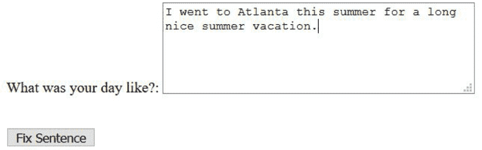

一旦我们点击 **Fix Sentence** 按钮，我们得到：

**I went to Charleston this summer for a long nice summer vacation.**

## 子字符串与字符串索引

在继续之前，我想讨论另外几个字符串操作技巧。它们是字符串索引和子字符串。
字符串索引告诉你另一个字符串在某个字符串中出现的位置。例如，字符串“boy”在字符串“The boy climbed the tree”中的字符串索引是4，因为“boy”从整个字符串的第4个字符开始。
子字符串允许你提取现有字符串的一部分。例如，在同一个字符串“The boy climbed the tree”中；如果我们从6到10做子字符串，我们会得到“oy cl”，因为这些是6到10之间的字符。
现在，让我们看下面的例子：

```html
<html>
<head><title>Substrings and String Index</title></head>
<body>
<form id="form1">
What was your day like?: <textarea name="sentence" cols="20" rows="5" id="sentence"></textarea><br><br>
What String would you like to find the String Index Of?:<input name="test string" type="text" id="tstr" size="20"><br><br>
</form>

<button onclick="strindex()">Find Index</button>

<script>

function strindex()
{
var daydesc=document.getElementById("sentence").value;
var str = document.getElementById("tstr").value;
var ind=daydesc.indexOf(str);
document.write("The String Index is "+ind);
}

</script>
</body>
</html>
```

在上面的例子中，`daydesc` 是大字符串，`str` 是我们需要查找字符串索引的字符串。变量 `ind` 存储字符串索引的值，然后我们使用 `document.write` 打印答案。现在，让我们运行程序：

你今天过得怎么样？:

你想查找哪个字符串的索引？:

一旦我们点击 **查找索引**，我们得到：

## 字符串索引是 10

好的，现在让我们来看一个下面关于子字符串的例子：

```html
<html>
<head><title>Substrings and String Index</title></head>
<body>
<form id="form1">
What was your day like?: <textarea name="sentence" cols="20" rows="5" id="sentence"></textarea><br><br>
Substring From?:<input name="test string" type="number" id="tstr1" size="20"><br><br>
Substring To?:<input name="test string" type="number" id="tstr2" size="20"><br><br>
</form>

<button onclick="substr()">Find SubString</button>

<script>

function substr()
{
var daydesc=document.getElementById("sentence").value;
var strnum1 = document.getElementById("tstr1").value;
var strnum2 = document.getElementById("tstr2").value;

var sstr=daydesc.substring(strnum1,strnum2);
document.write("The SubString is "+sstr);
}

</script>
</body>
</html>
```

在上面的代码中，`strnum1` 和 `strnum2` 是存储子字符串第一个和最后一个元素的变量。这些是来自用户的输入。`sstr` 是从 `strnum1` 到 `strnum2` 的子字符串，并被打印在屏幕上。

我去亚特兰大度了一个愉快而漫长的暑假。

你今天过得怎么样？:

子字符串起始位置？: 10

子字符串结束位置？: 20

查找子字符串

一旦我们点击 **查找子字符串**，我们得到答案：
**子字符串是 Atlanta fo**

上面的答案是10个字符，如果包括空格的话。

## 练习题：

你可以复制上面的例子，一旦你能够运行它们并理解代码；你就可以尝试下面的几个问题。

- 1. 编写一个程序，查找一个特定字符串在一个更大的字符串中出现的次数，这个更大的字符串是在一个文本框中输入的？
- 2. 编写一个程序，接收一个包含姓名、数学成绩、英语成绩、物理成绩和地理成绩的字符串。使用 `split` 函数分隔字符串，并计算该人的平均分。例如，“Mark, 90, 34, 56, 65” 将计算出 Mark 的 90, 34, 56, 65 的平均分。

提示：你可以使用 `parseInt()` 将成绩转换为数字。

# CSS 简介

## 什么是 CSS？

CSS 代表层叠样式表。CSS 用于设置网站的设计和样式——包括字体、颜色、布局、阴影和配色方案。它们与 HTML 和 JavaScript 配合得非常好。

## 如何在 HTML 网站中使用 CSS

使用 CSS 的最佳方式是创建一个单独的 CSS 文件，并在 HTML 头文件中引用它。
现在，让我们创建一个 CSS 文件。

- 1. 打开一个空白的 Notepad++ 文档。
- 2. 点击“另存为”，并将文件类型选择为“CSS”。我们将这个文件命名为 `style`。

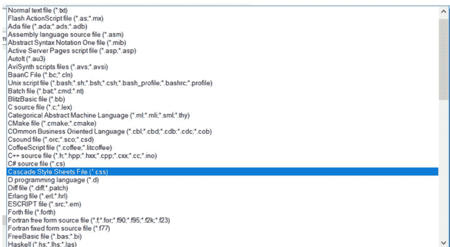

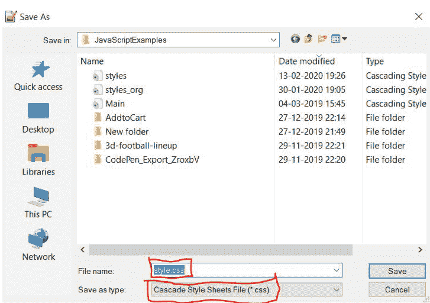

- 3. 点击“保存”。
- 4. 转到相关的 HTML 文件，并在头文件中包含下面这行代码。

```
<link rel="stylesheet" href="style.css" />
```

- 5. （可选）如果你想包含任何按钮 CSS 元素，你需要像下面这样定义一个按钮类：

```
<button class ="btn str" onclick="substr()">Find SubString</button>
```

现在，让我们在上一章的例子中插入样式表。

```html
<html>
<head>
<title>Substrings and String Index</title>
<link rel="stylesheet" href="style.css" />
</head>
<body>
<form id="form1">
What was your day like?: <textarea name="sentence" cols="20" rows="5" id="sentence"></textarea><br><br>
Substring From?:<input name="test string" type="number" id="tstr1" size="20"><br><br>
Substring To?:<input name="test string" type="number" id="tstr2" size="20"><br><br>
</form>

<button class ="btn str" onclick="substr()">Find SubString</button>

<script>

function substr()
{
var daydesc=document.getElementById("sentence").value;
var strnum1 = document.getElementById("tstr1").value;
var strnum2 = document.getElementById("tstr2").value;

var sstr=daydesc.substring(strnum1,strnum2);
document.write("The SubString is "+sstr);
}

</script>
</body>
</html>
```

很好。现在我们的 CSS 样式表已经链接到我们的 HTML 文件了。

## CSS 术语

`html{}`
上面的术语用于为整个 HTML 文件定义 CSS。括号内的任何内容都将用于 HTML 代码中。

`body{}`
定义 HTML 代码主体的样式。

`.btn{}`
设置网页中任何按钮的样式。你必须在 HTML 代码中为按钮定义一个名为 `btn` 的类。参见上面的代码示例。

`.btn:hover{}`
设置当鼠标悬停在网页按钮上时按钮的样式。

`background-color:`
网站的背景颜色。

`text-decoration:`
用于为文本添加装饰，如波浪线、点线、曲线等。

`text-transform:`
用于将整个单词或单词的一部分大写或小写。

`text-align:`
可以将文本与页面的左侧、右侧或中心对齐。

`color:`
设置页面上文本的颜色。

`padding:`
设置页面边缘与文本/按钮元素之间的间距。

`line-height:`
设置文本的行高。

`font-family:`
设置你想要用于文本的字体类型。

`font-size:`
设置字体的大小。

`font-weight:`
可以在需要时将字体设置为粗体。

这些是我们将在示例中使用的一些 CSS 属性。但是，有成千上万的 CSS 属性可用于各种不同的目的。如果你想了解更多，你可以在这里查看：[https://www.tutorialrepublic.com/css-reference/css3-properties.php](https://www.tutorialrepublic.com/css-reference/css3-properties.php) 那么，让我们来看一个我们的 CSS 文件的例子：

## CSS 示例

```css
html, body {
    text-decoration: none;
    text-transform: capitalize;
    text-align: center;
    margin: 0;
    padding-top: 100px;
    min-height: 100%;
    color: black;
    background-color: cyan;
    line-height: 1;
    font-family: serif;
    font-size: 20px;
    font-weight: bold;
}

.btn {
    background-color: Crimson;
    border: none;
    color: black;
    padding: 10px 24px;
    text-align: center;
    text-decoration: none;
    display: inline-block;
    font-size: 16px;
}

.btn:hover {
    background-color: MidnightBlue;
    color: white;
}
```

在 CSS 代码的 `html` 和 `body` 部分，文本被设置为页面居中并大写。它距离顶部 100 像素，颜色为黑色，行高为 1。它是粗体，字体大小为 20 像素。页面的背景是青色（浅蓝色）。
按钮有一个单独的 CSS 设置。它的颜色是深红色（红色），文本是黑色。文本距离顶部 10 像素，距离两侧 24 像素。它是居中对齐的，字体大小为 16 像素。
当我们用鼠标悬停在按钮上时，按钮的背景变为午夜蓝（蓝色），文本变为白色。
我们可以在下面看到它的样子。让我们用两种方式查看我们的网站，一次是在应用 CSS 之前；一次是在链接 CSS 文件之后。

## 输出（无 CSS）：

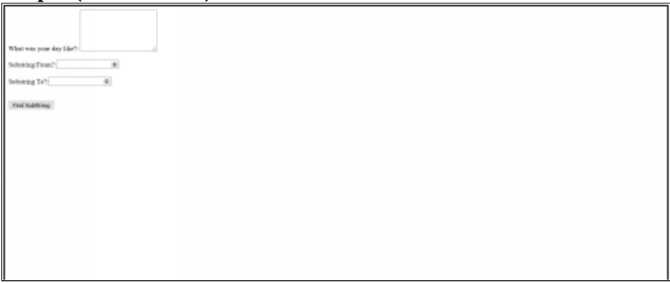

## 输出（有 CSS）：

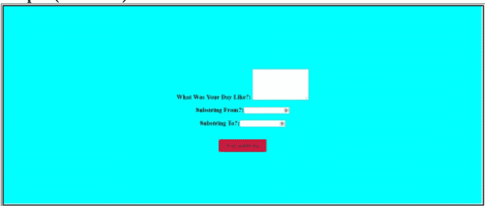

## 输出（有 CSS 且鼠标悬停在按钮上）：

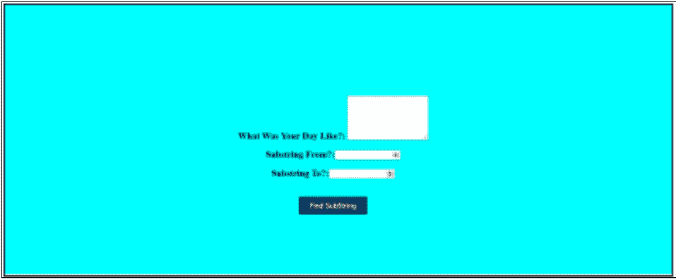

正如你所看到的，它对网站的视觉吸引力产生了巨大的影响。你可以自己自定义所有这些元素，为文本、背景和按钮使用不同的颜色。

## 练习题：

你可以复制上面的例子，一旦你能够运行它们并理解代码；你就可以尝试下面的几个问题。

- 1. 修改样式元素，找到对你来说看起来最好的元素。尝试 5 种不同的颜色字体、不同的文本大小和不同的文本形式，以找到最好看的网站。
- 2. 使用 `style.css` 文件为你迄今为止编写的所有程序创建一个样式表。

## 链接多个网页

现在，你已经设置了一个链接了 CSS 的网页。但你可能注意到，当你点击“查找子字符串”按钮时，网页会切换回原始设计。这是因为 JavaScript 部分还没有链接到网页。
为了刷新你的记忆，我们讨论的代码接收一个字符串，并根据用户的偏好打印一个子字符串。用户指定子字符串的开始和结束。下面是代码：

```html
<html>
<head>
<title>Substrings and String Index</title>
<link rel="stylesheet" href="style.css" />
</head>
<body>
<form id="form1">
What was your day like?: <textarea name="sentence" cols="20" rows="5" id="sentence"></textarea><br><br>
Substring From?:<input name="test string" type="number" id="tstr1" size="20"><br><br>
Substring To?:<input name="test string" type="number" id="tstr2" size="20"><br><br>
</form>

<button class ="btn str" onclick="substr()">Find SubString</button>

<script>

function substr()
{
var daydesc=document.getElementById("sentence").value;
var strnum1 = document.getElementById("tstr1").value;
var strnum2 = document.getElementById("tstr2").value;

var sstr=daydesc.substring(strnum1,strnum2);
document.write("The SubString is "+sstr);
}

</script>
</body>
</html>
```

正如你所看到的，代码链接到了 `style.css` 样式表以获取当前的设计。
所以，我们得到下面的输出：

现在，让我们运行程序：

点击“查找子字符串”按钮后，我们得到：

如你所见，它恢复到了旧的设计。现在，让我们来修复这个问题。我们只需在 `document.write` 之前，将下面的代码添加到 JavaScript 函数中。
`Document.write('<link rel="stylesheet" type="text/css" href="styles.css" />');`
这段代码基本上是将样式表写入 JavaScript 函数。
于是，代码变成了：

```html
<html>
<head>
<title>Substrings and String Index</title>
<link rel="stylesheet" href="styles.css" />
</head>
<body>
<form id="form1">
What was your day like?: <textarea name="sentence" cols="20" rows="5" id="sentence"></textarea><br><br>
Substring From?:<input name="test string" type="number" id="tstr1" size="20"><br><br>
Substring To?:<input name="test string" type="number" id="tstr2" size="20"><br><br>
</form>

<button class ="btn str" onclick="substr()">Find SubString</button>

<script>
function substr()
{
var daydesc=document.getElementById("sentence").value;
var strnum1 = document.getElementById("tstr1").value;
var strnum2 = document.getElementById("tstr2").value;

var sstr=daydesc.substring(strnum1,strnum2);
document.write('<link rel="stylesheet" type="text/css" href="style.css" />');
document.write("The Substring is "+sstr);
}
</script>
```

添加这行代码后，使用相同的文本再次运行程序，我们得到：

太好了，现在 JavaScript 的输出也应用了相同的 CSS 样式。现在，你可能想创建另一个子字符串。我们该怎么做呢？我们需要一个“主页”按钮。
让我们来创建它。下面的代码可以实现这个功能。

```html
<html>
<head>
<title>Substrings and String Index</title>
<link rel="stylesheet" href="styles.css" />
</head>
<body>
<form id="form1">
What was your day like?: <textarea name="sentence" cols="20" rows="5" id="sentence"></textarea><br><br>
Substring From?:<input name="test string" type="number" id="tstr1" size="20"><br><br>
Substring To?:<input name="test string" type="number" id="tstr2" size="20"><br><br>
</form>

<button class ="btn str" onclick="substr()">Find SubString</button>

<script>
function substr()
{
var daydesc=document.getElementById("sentence").value;
var strnum1 = document.getElementById("tstr1").value;
var strnum2 = document.getElementById("tstr2").value;

var sstr=daydesc.substring(strnum1,strnum2);
document.write('<link rel="stylesheet" type="text/css" href="style.css" />');
document.write("The SubString is "+sstr);
document.write("<br>");
document.write('<button class = "btn home" onClick="redirect()">Home</button>');
}

function redirect()
{
window.location.replace("strcomma.html");
}
</script>
```

`document.write("<br>")` 在子字符串后创建一个空格并换行。

```
document.write('<button class = "btn home" onClick="redirect()">Home</button>');
```

上面这行代码创建了一个按钮，点击时会执行重定向函数。

我们创建一个函数，将用户重定向到我们的原始网页。

```
function redirect()
{
window.location.replace("strcomma.html");
}
```

`Strcomma.html` 是文件名。所以它基本上是重新启动该文件。

好了，现在让我们运行程序。执行后并使用相同的文本，我们得到：

点击“主页”后，我们得到：

所以，现在我们知道如何返回到原始网页了。
还有另一种链接网页的方式；当你创建两个独立的网页时会用到。假设你想在页面 B 上添加一个指向页面 A 的链接。
那么，在页面 B 中，你可以使用以下代码添加链接：
`<a href=”PageB.html”>`
我们也可以使用相同的 HTML 代码链接任何外部网页：
`<a href=www.google.com>`

## 练习实践：

你可以复制上面的示例，一旦你能够运行它们并理解代码；你就可以尝试下面的一些问题。

- 1. 添加一个主页按钮，并将你最好的 CSS 设计链接到你在本书中设计的每一个网页。
- 2. 创建一个程序，根据用户偏好链接到外部网页。

## 数学函数

到目前为止，这已经非常棒了。但如果你想制作一个迷你计算器呢？或者教孩子们数学？学习如何编写数学函数也是加快孩子们理解数学的好方法。你可以为孩子们设置数学测验，并用 JavaScript 函数来验证。
让我们从一些可以在 JavaScript 中实现的基本数学函数开始。

**Math.Round()**
`Math.Round()` 将一个十进制数四舍五入到最接近的整数。例如，`Math.Round(1.635)` 四舍五入为 2；而 `Math.Round(1.43)` 四舍五入为 1。

**Math.ceil()**
`Math.ceil()` 向上取整。它基本上是向上舍入到更高的整数。例如，`Math.ceil(1.67)` 返回 2；而 `Math.ceil(2.01)` 返回 3。

**Math.floor()**
`Math.floor()` 向下取整。它基本上是去掉十进制数的小数点。所以，`Math.floor(1.47)` 返回 1；`Math.floor(2.34)` 也返回 2。

**Math.Sqrt()**
`Math.Sqrt()` 返回一个数的平方根。所以，`Math.sqrt(9)` 返回 3；而 `Math.sqrt(16)` 返回 4。

**Math.min()**
`Math.min()` 返回一个数组的最小值。只需将数组放在括号内。所以，如果
`a=[13,11,34,54,9];`
`Math.min(A)` 返回 9。

**Math.max()**
`Math.max()` 返回一个数组的最大值。所以对于上面的例子，`Math.max(A)` 返回 54。

## Math.Random()

`Math.Random()` 是一个很酷的函数。它返回一个介于 0 和 1 之间的随机十进制数；不包括 1。
所以，`Math.Random()` 第一次可能是 0.95，第二次可能是 0.43。
因此，你可以玩一个 0 到 10 之间的猜数字游戏。只需在下面这样做：
**`Math.Round(Math.Random()*10)`** 会给你一个 0 到 10 之间的随机整数。

## 结论

感谢你花时间阅读本书。
我希望你觉得它有用；并且学到了 HTML、CSS 和 JavaScript 的基础知识。如果你已经完成了练习，你已经构建了几个 HTML 页面，并且也学会了如何用基本的 CSS 来设计它们。
如果你喜欢我的书并且想了解更多，请查看下面的作者页面。我很快会出另一本书，展示如何从零开始使用 HTML、CSS 和 JavaScript 创建一个购物车。
我也建议查看本节中的其他书籍，特别是那些关于人工智能将如何接管世界的书。
如果你对这些主题有任何疑问；或者有任何建议；请通过以下方式给我发电子邮件：[abiprod.pty.ltd@gmail.com](mailto:abiprod.pty.ltd@gmail.com)
如果你有兴趣获得个性化帮助，我也提供一对一的在线辅导。

## 第三册：

## 10岁及以上儿童编程

使用 HTML、CSS 和 JavaScript 为儿童和初学者编程

## 引言

罗布已经在电脑前待了几个小时。他正在为他的 JavaScript 游戏的下一个版本编程。在上个月取得很大进展后，他现在卡住了。他尝试了很多不同的方法，但仍然无法让它运行起来。这是编程中常见的问题。学习编程的基础知识是一个好的开始。罗布几个月前读了我的第一本编程书（[《9-15岁儿童编程》](https://example.com)），他非常兴奋。他不仅学好了基础知识并成功完成了所有练习；他还实现了一些自己的程序和有趣的编程游戏。他热爱编程；并且沉迷其中。

然而，几个月后，罗布遇到了困难。他开始感到疲倦和无聊。他一遍又一遍地做着类似的程序。他在更高级的主题上挣扎。罗布的故事与美国和世界各地成千上万的孩子们的故事相似。这些孩子有资源和金钱可以继续前进。他们中的一些父母花了一个月的工资（有时甚至更多）给孩子买一台用于编程的笔记本电脑。然而，父母和他们的孩子都意识到他们需要更多才能继续前进。有些东西缺失了。有些东西很难量化。

罗布和其他人的故事激励我写下这本 JavaScript 书。虽然罗布看起来似乎在挣扎，但他应该为自己的努力受到赞扬。我们太多人在一看到困难时就放弃了。我们像玩毛线球的小猫一样，从一个活动转到另一个活动。事实是，任何活动没有一点努力和痛苦都无法前进。罗布只需要多一点点，而这就包含在这本书里。

本书从一些基础知识开始，以确保你拥有继续前进所需的基本知识。我们将讨论设置你的工作空间以及进行基本的编程和测试。然而，本书确实非常强调编码游戏、活动和谜题。这些旨在培养对编程所能实现之事的更深热爱。我们意识到这类编码游戏对学习的重要性

这个过程充满了乐趣和好奇心，对所有参与者来说都非常令人兴奋。书中还有一个非常重要的部分，探讨了编程的“软技能”方面。这一章讲述了如何通过自我发现、团队合作、自律和健康习惯来提升你的编程能力。这些软技能将真正帮助罗布在编程道路上取得进步。

## 编程的软技能

我教孩子们编程的经验，以及从罗布那里听到的，都让我确信软技能在编程中与技术知识同等重要。这些软技能也能帮助你在生活的其他方面不断前进。所以，这完全是双赢的。

那么，软技能到底是什么？软技能更多地与人们如何工作有关。这不同于专注于人们工作内容的硬技术技能。软技能涉及人们如何处理心理、身体和人际问题。结合良好的技术知识，软技能可以将你的表现提升到更高的水平。以下是我所说的一些技能：

1.  **专注力：** 在一个被社交媒体和其他干扰主导的世界里，专注于手头单一任务的能力是一项难以掌握的技能。多任务处理可能看起来很酷；但从长远来看，它会损害工作质量和教育质量。
    a. 一个帮助你专注的新工具叫做等时音。这是一种特定的音乐，能让你的大脑进入正确的状态并帮助你集中注意力。你可以在Youtube或Google上搜索“等时音”免费试听这些音调。
    b. 另一个工具是每日冥想。每天开始时冥想5分钟，随着时间的推移可以帮助你建立专注力。
    c. 最后，将你的工作分解成20-30分钟的时间段会产生很大的不同。在每个时间段之间散步5-10分钟，然后精神焕发地回来。

2.  **毅力：** 在编程中，坚持并从失败中学习的能力非常重要。程序员的常见做法是尝试破坏代码（或让代码失败），以便他们可以了解程序的薄弱点并加以改进。你可以对你的程序和你的编程技能做同样的事情。

3.  **团队合作：** 单打独斗在开始时是必要的；但从长远来看会限制你的发展。从别人的错误中学习比从自己的错误中学习要快得多。你可以加入你所在城市的本地编程俱乐部；聘请编程导师；加入相关的Facebook编程小组；在Reddit帖子上发帖并向Github代码学习。在这些小组中保持活跃并被视为积极的贡献者很重要。

4.  **身体健康：** 这是许多程序员非常低估和不重视的特质。但从长远来看，它确实会伤害到这个行业的人。背部问题、肥胖、腕管综合征是程序员在行业工作5-10年或更长时间后常见的健康问题。以下是一些更好地照顾你健康的方法。
    a. 保持良好的坐姿：坐直。确保你的笔记本电脑接近眼睛高度，这样你就不用低头。确保你的脚与膝盖在一条直线上。
    b. 经常休息：我建议每20-30分钟休息一下。在时间段之间散步。
    c. 饮食：保持健康的饮食，富含优质脂肪、蛋白质和复合碳水化合物。尽量减少简单碳水化合物和糖的摄入。
    d. 锻炼：保持规律的锻炼计划或进行体育运动。每周至少锻炼3-4次（可能更多）很重要。
    e. 睡眠：每晚至少保证7-8小时的睡眠。如果你无法入睡，请咨询合格的医生如何改善睡眠。

关于以上每个主题都可以写成整本书；但这是一本编程书，所以我就不展开了。请记住，上述软技能非常重要，你可以在编程的同时努力提升它们。

## 设置你的工作空间

### 你需要什么

你需要一台连接互联网并安装了网络浏览器的笔记本电脑/台式机。我推荐使用Mozilla Firefox或Google Chrome。

### 下载/安装文本编辑软件

下载最新版本的文本编辑软件。我推荐下载Notepad++。下载后，双击Setup.exe文件并按照安装提示操作。
[https://notepad-plus-plus.org/downloads/](https://notepad-plus-plus.org/downloads/)

### 开始使用Notepad++

从你的桌面或开始菜单打开Notepad++

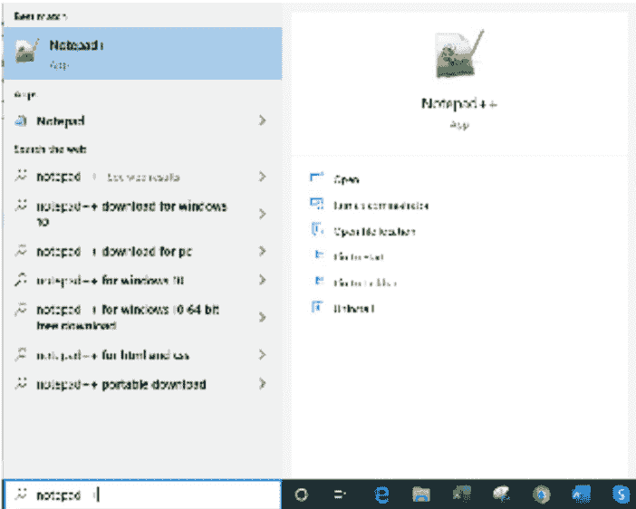

现在，点击**文件>新建**来打开一个新文件。

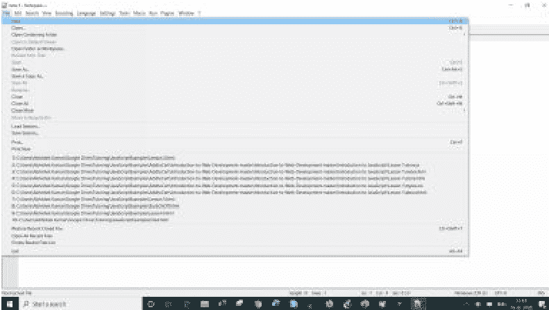

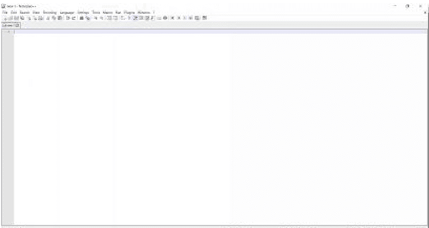

现在，选择**文件>另存为**，并将文件类型选择为**.html**

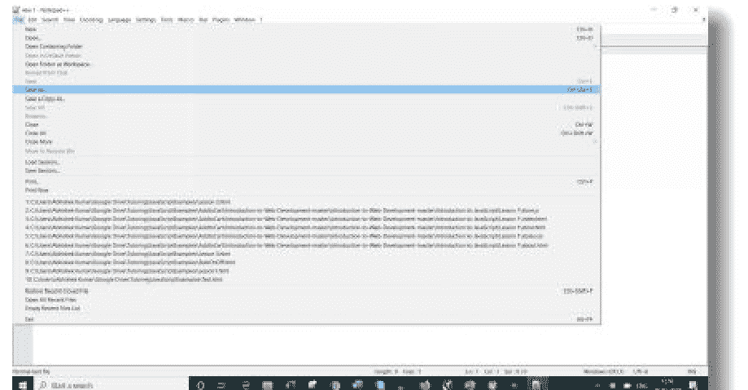

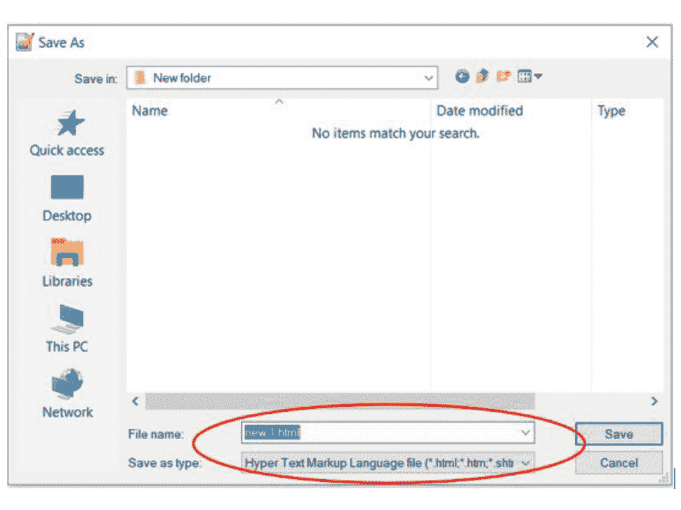

### 测试程序

现在，让我们测试一下程序是否能与浏览器连接。
只需在你的文件中输入一些随机文本。在我的文件中，我输入了“**这是一条测试消息。**”
现在**文件>保存。**
之后，根据你使用的浏览器，点击**运行>在Firefox/Chrome/IE中启动**。
如果它正常工作，你输入的文本应该会显示在浏览器窗口中。

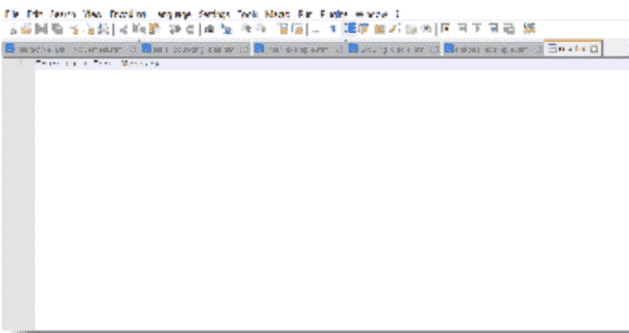

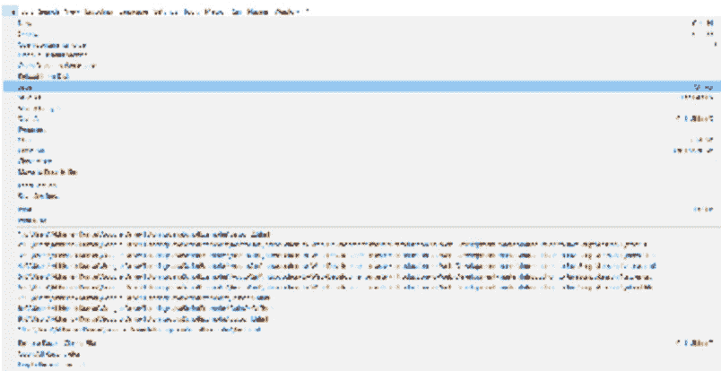

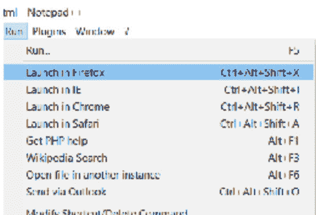

结果：

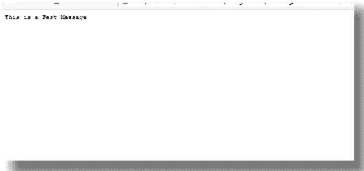

这是一个很好的简单方法，可以在继续之前确保你的程序正常工作。

**附注：**
一些学生遇到的问题是，运行浏览器选项有时不起作用并给出错误。这是因为路径设置不正确。如果由于某种原因它不工作，你仍然可以运行程序。

1.  只需将Notepad++保存为html文档。
2.  关闭Notepad++文件。
3.  转到html文档所在的文件夹。
4.  双击html文件，它应该就能工作了。

### 什么是html？

html代表超文本标记语言。
它是我们用来通过网页与互联网交互的编程语言。所有网页的基本结构都是由html定义的。
它足够简单，初学者程序员可以快速掌握。
大多数html编程是通过称为标签的项目完成的。这些标签以<>开头
以</>结尾。例如，一个常见的标签是段落标签，它以<p>开头，以</p>结尾。

### 常见的html标签

-   `<html>` - 此标签用于每个网页的开头，表示html代码的开始
-   `<head>` - 这段html代码在程序的其余部分之前执行
-   `<title>` - 此标签用于设置网页标题。它将文本写入网页的顶部标题栏。
-   `<body>` - 这是网页主体上的信息。
-   `<h1>` - 用于表示标题标签。这是最大尺寸的标题标签。
-   `<h2>`、`<h3>`、`<h4>`、`<h5>`、`<h6>` - 用于表示尺寸递减的子标题。
-   `<p>` - 用于表示文本段落
-   `` - 这在网页上显示一张图片。此图片链接到外部网页或内部文件。
-   `<strong>` - 添加以使文本加粗
-   `<ul>` - 这用于无序列表。一个例子是项目符号形式的列表。
-   `<li>` - 向无序列表添加一个项目符号项。
-   `<ol>` - 这用于有序列表，例如从1,2,3...开始的编号列表。
-   `<div>` - 用于表示较大的文本部分；包含多个段落。
-   `<a>` - 用于将网页中的项目链接到另一个网页。
-   `<br>` - 在代码中添加换行符并移动到下一行。

### html代码示例

下面是基本html代码的一个示例。它包含了上述所有html代码的示例。你可以输入这些代码，或者复制粘贴下面的示例。

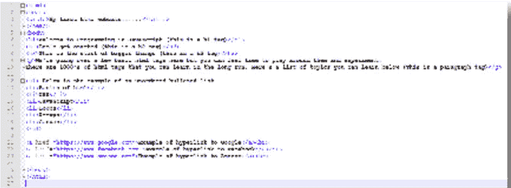

### html代码的复制粘贴版本

你可以复制并粘贴下面的代码到你的html浏览器中，看看它是否有效

```html
<html>
<head>
<title>My first html website......</title>
</head>
<body>
<h1>Welcome to Programming in Javascript (this is a h1 tag)</h1>
<h2>Let's get started (this is a h2 tag)</h2>
<h3>This is the start of bigger things (this is a h3 tag)</h3>
<p>We're going over a few basic html tags here but you can feel free to play around them and experiment.
There are 1000's of html tags that you can learn in the long run. Here's a list of topics you can learn below (This is a paragraph tag)</p>
<ul> Below is the example of an unordered bulleted list
<li>Basics of html</li>
```

## 代码输出

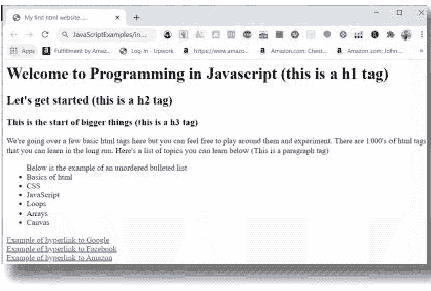

现在，让我们分解不同的元素：
下面是标题标签 `<title>`

下面是标题标签 `<h1>`、`<h2>`、`<h3>`

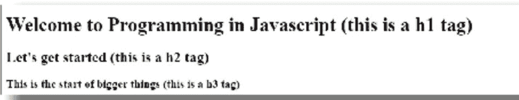

下面是段落标签 `<p>`

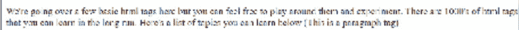

下面是无序列表标签 `<ul>` `<li>`

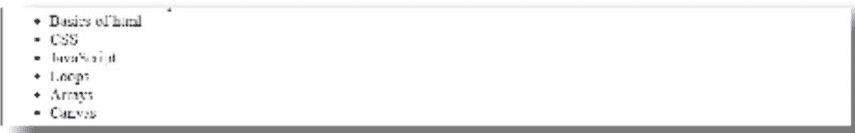

下面是3个指向3个流行网站的超链接标签 `<a href>`

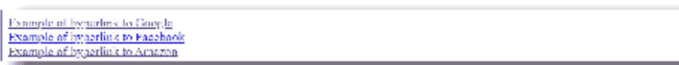

## 练习题

1.  创建一个网站，包含一个标题标签和一个无序列表，列出杂货物品。使用段落标签为特定物品添加任何特殊说明。在列表末尾，使用超链接标签链接到最近杂货店的网站。
2.  创建一个网站，列出你足球队的所有队员。使用标题、标题和段落标签欢迎用户访问你的网站，并描述球队和球队的理念。使用有序列表列出队员。
3.  创建一个网站，用无序列表列出你所在地区所有你喜欢的餐厅和咖啡店。使用标题、标题和段落标签介绍你自己以及你所在地区的餐饮体验。

## 示例 html 程序

## 本项目功能

这个 html 项目创建了两个按钮。这两个按钮在白天和夜晚的两张图片之间切换。这两个按钮分别标记为“白天”和“夜晚”。
这是一个简单的 html 项目，创建了一个可以开关页面上灯泡的按钮。我们将使用两张灯泡图片来实现这一点。按钮将在两张图片之间切换。

## 本章需要理解的概念

对于这个例子，我们需要理解按钮标签和图像标签。

**按钮标签**
`<button onclick=**Action** >**Button text**</button>`
按钮元素有两个组成部分。一个动作和按钮文本。按钮文本是显示在按钮上的文字；动作是用户点击按钮时发生的事情。

**图像标签**
``
图像标签有三个组成部分。
**ImageId** 是你分配给图像的名称。这个名称用于在代码中引用该图像。
**ImageUrl** 是标签引用的图像的 URL。如果图像与 html 文件在同一文件夹中，那么你可以只使用文件名而不是完整的 URL。
**ImageSize** 设置图像的宽度和高度。宽度和高度以像素为单位。

## 文件

以下是下一个项目需要使用的两个文件。你可以下载它们，并将其保存在你将要创建 html 文件的同一文件夹中。
[白天图片](Day Picture)
[夜晚图片](Night Picture)

## 代码

```html
<html>
<body>

<h2>白天和夜晚按钮</h2>

<button onclick="document.getElementById('myImage').src='DayImage.jpg'">白天</button>


<button onclick="document.getElementById('myImage').src='NightImage.jpg'">夜晚</button>

</body>
</html>
```

# 输出

最初，默认设置为白天图片。

### 白天和夜晚按钮


一旦你点击**夜晚**按钮，你会看到：

### 白天和夜晚按钮


白天 夜晚

然后，当你再次点击**白天**按钮时，你会看到：

### 白天和夜晚按钮


白天 夜晚

## 代码解释

```html

```

上面的 html 元素是一个图像标签。它有3个组成部分：id、src 和 style。id 是图像的标签。在这个例子中，它被标记为“myImage”。id 用于在整个程序中引用该图像。src 是标签加载的图像的来源。图像“DayImage.jpg”与 html 文件在同一文件夹中。

```html
<button onclick="document.getElementById('myImage').src='DayImage.jpg'">白天</button>
```

上面的元素是一个按钮元素。它有一个名为 **onclick** 的参数，描述了点击按钮时执行的操作。document.getElementById 获取 id 为‘myImage’的元素。因此，当你点击按钮时，它会在‘myImage’上显示‘DayImage.jpg’。‘白天’是写在按钮上的文字。

```html
<button onclick="document.getElementById('myImage').src='NightImage.jpg'">夜晚</button>
```

document.getElementById 获取 id 为‘myImage’的元素。因此，当按钮被点击时，它会在‘MyImage’上显示‘NightImage.jpg’。‘夜晚’是写在按钮上的文字。

## 练习题

1.  找3张一个人跑步、走路和站立的图片。编写一个程序，包含3个按钮，根据你按下的按钮，人物会跑步、走路或站立。
2.  找3张交通信号灯显示红灯、绿灯和橙灯的图片。编写一个程序，包含3个按钮，分别标记为“停止”、“通行”和“注意”。当按下“停止”按钮时，交通信号灯切换为红灯；当按下“通行”按钮时，切换为绿灯；当按下“注意”按钮时，切换为黄灯。

## html 表单

还记得你在网上看到的那些让你输入姓名、年龄和出生日期的表单吗？那些就是 html 表单。
今天，我们将学习如何制作这些表单。
在开始制作表单之前，我们需要了解一些基本的表单元素：
**按钮 `<button>`** - 这是一个允许用户在点击时执行操作的元素。
**文本框 `<input>`** - 这个元素允许用户在浏览器屏幕上的一个框中输入文本。它用于收集像姓名、城市等小型文本项。
**文本区域 `<textarea>`** - 这允许用户输入更大量的文本。它的尺寸比文本框大。它用于像地址、评论等较大的文本项。
**选项选择 `<select>`** - 这个元素允许用户在几个可用选项之间进行选择。它基本上是一个下拉框。
**日期输入 `<input type=”date”>`** - 这个元素允许用户从日历下拉菜单中选择一个日期。
现在，让我们通过下面的示例表单来逐一了解这些例子。

## 示例表单

```html
<html>
<head><title>示例表单</title></head>
<body>
<form id="form1">
输入名字：<input name="frstname" type="text" id="frstname" size="20"><br>
输入姓氏：<input name="lname" type="text" id="lname" size="20"><br><br>
输入地址：<textarea name="TextBox" cols="40" rows="5" id="tstr2"></textarea><br><br>
输入国家：<select id="country" name="country">
<option value="USA">美国</option>
<option value="Mexico">墨西哥</option>
<option value="Canada">加拿大</option>
<option value="Australia">澳大利亚</option>
</select><br>
出生日期：<input type="date" id="start" name="trip-start"
value="2020-07-22"
min="1918-01-01" max="2020-06-31"><br>
<button onclick="">提交</button>
</form>
</body>
</html>
```

现在，让我们逐一查看代码的每个部分。

```html
<form id="form1">
```

每个表单都以 `<form>` html 元素开始。id “form1”是你给表单起的名字。id 用于在程序的其余部分引用该表单。

```html
输入名字：<input name="frstname" type="text" id="frstname" size="20"><br>
输入姓氏：<input name="lname" type="text" id="lname" size="20"><br><br>
```

上面两行是用于名字和姓氏的文本框。type 被赋值为“text”，因为名字是文本的一种形式。id “frstname”和“lname”将在需要时用于引用代码。size 设置为“20”，意味着它可以接受20个字符。你可以根据需要将其更改为更大或更小的尺寸。

```html
输入地址：<textarea name="TextBox" cols="40" rows="5" id="tstr2"></textarea><br><br>
```

上面的元素是用于地址的文本区域元素。它有5行（rows=”5”）和每行40个字符（cols=”40”）。它被标记为“tstr2”。

```html
输入国家：<select id="country" name="country">
    <option value="USA">美国</option>
    <option value="Mexico">墨西哥</option>
    <option value="Canada">加拿大</option>
    <option value="Australia">澳大利亚</option>
</select><br>
```

上面的元素是用于选择国家的选项选择元素。它允许你从包含4个不同选项的下拉菜单中进行选择：美国、墨西哥、加拿大和澳大利亚。它被标记为“country”（id=”country”）。

```html
出生日期：<input type="date" id="start" name="trip-start"
    value="2020-07-22"
    min="1918-01-01" max="2020-06-31"><br>
```

上面的元素是一个日期输入元素，让你在1918年（min=”1918-01-01”）和2020年（max=”2020-06-31”）之间选择一个出生日期。它被命名为“start”（id=”start”），并设置为值2020-07-22（value=”2020-07-22”）。

```html
<button onclick="">提交</button>
```

上面的元素是一个按钮元素。它上面写着文字“提交”。由于 onclick 函数为空，点击它不会执行任何操作。
现在，让我们看看运行程序时会发生什么。

## 输出：

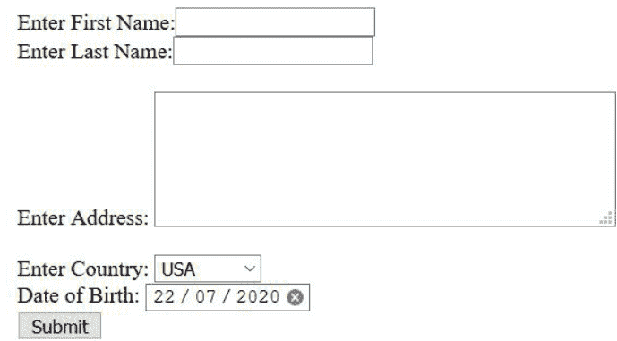

希望通过这个示例，你对HTML表单的基础知识有了一些了解。在接下来的几章中，我们将学习如何使用JavaScript来处理我们输入的信息。实际上，我们将使用这个相同的示例，并用JavaScript将其打印出来。

## 练习题

- 1. 编写一个HTML表单，作为大学生的简历。它通过文本框接受名、姓、大学名称；通过下拉菜单选择大学年级。然后有3个活动/实习/合作项目。每个活动都有一个开始日期元素、结束日期元素和一个足够大的文本区域来描述经历。最后是一个提交按钮。
- 2. 编写一个HTML表单，作为购物清单。它接受名、姓、购物日期、地址和城市。它有5个下拉菜单，每个菜单包含30个常见的杂货物品可供选择。最后，它有一个提交按钮。

以上每个练习都将在下一章中用JavaScript进行扩展。

## 什么是JavaScript？

JavaScript是一种高级编程语言，用于使网页更具交互性和动态性。它是基于文本且用户友好的。HTML用于创建网页结构，CSS用于网页样式，而JavaScript则用于使网页与用户更具交互性。它允许不同的HTML元素相互交互、执行计算、动画等。换句话说，它使网页编程变得有趣。

## 在HTML中使用JavaScript

在HTML网页中使用JavaScript有两种方式。第一种方式是直接在HTML的`<script>`标签内添加代码。这在下面代码的蓝色部分中显示。

```
<html>
<head><title>Test file 1</title>
</head>
<body>
<script>
//在此处输入JavaScript代码
</script>
</body>
</html>
```

第二种方式是创建一个包含代码的外部JavaScript文件，并将其保存为`.js`文件。然后你可以将该文件链接到HTML内容。例如，假设你创建了一个名为`test.js`的文件。你可以使用下面代码的蓝色部分将其链接：

```
<html>
<head><title>Test file 2</title>
</head>
<body>
<script src="test.js"></script>
</body>
</html>
```

## JavaScript元素

有了这些基础知识，让我们来看一些基本的JavaScript元素。

**函数**
JavaScript中的函数是一组执行特定任务的代码行。
它在JavaScript的`<script>`标签内定义如下：

```
function afunc()
{
//在此处输入函数代码
}
```

函数的名称是`afunc`，花括号内的代码在每次调用`afunc`时执行。
当我们想在同一程序中多次执行相同任务时，使用函数非常有用。我们可以直接调用函数，而不是多次编写相同的代码行。

**变量**
JavaScript中的变量是一个占位符，它具有某个值。该值可以在整个程序中更改，并可用于代码的其他部分。让我们看一个例子：

```
var x=5;
```

`x`是定义的变量。它初始值为5。
之后，在程序中，它可以更改为不同的值，例如：

```
x=10;
```

现在，`x`的值为10。并且，如果我们执行：

```
x=x-1;
```

那么`x`变为9。我们刚才展示的是一个整数变量。我们也可以有用于存储文本值的字符串变量，例如：

```
var b=”abcd”
```

`b`是一个持有值`abcd`的变量。
最后，我们可以有只持有`true`/`false`值的布尔变量。例如：

```
var c = true;
var d = (7>5);
var e = (7<6);
```

变量`c`、`d`和`e`都是布尔变量。变量`c`被赋值为`true`。变量`d`为`true`（因为7大于5）。变量`e`为`false`（因为7不小于6）。

## document.write()

`document.write()`用于在网页上打印元素。括号内的任何内容都会打印在网页上。例如：
`document.write(“Example print”);`
上面这行代码在屏幕上打印出单词“**Example print**”。
我们也可以在屏幕上打印变量。例如，
`var a=7;`
`document.write(a)`
上面这行代码在屏幕上打印出7。
并且，我们还可以使用“+”运算符组合不同的元素。例如：
`var a=7;`
`document.write(“The number printed is “+a);`
上面这行代码打印出“The number printed is 7”。

## alert()

`alert()`在屏幕上弹出一个带有特定消息的弹出窗口。例如，
`alert(“Hello”)`
上面的消息会弹出一个显示“Hello”的弹出窗口。

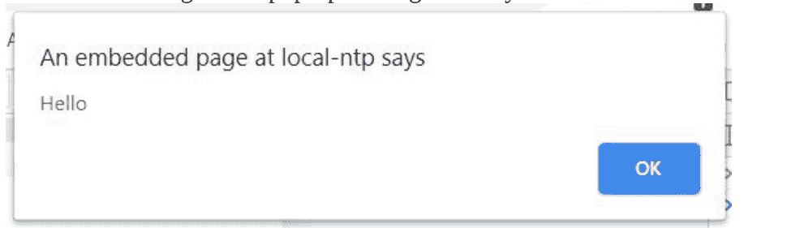

## prompt()

`prompt()`具有相同的弹出窗口，但带有一个允许用户输入的文本框。用户输入可以存储在一个变量中。例如：
`var name = prompt(“What is your name”);`
它会显示一个弹出窗口。一旦用户输入他的名字并点击确定，它就会将值存储在变量`name`中。

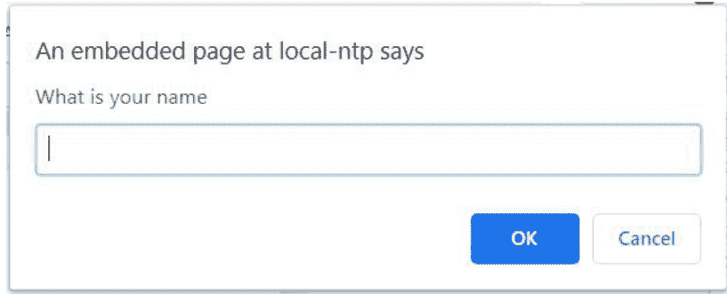

## document.getElementById().value

`Document.getElementById().value`用于将HTML元素获取到JavaScript变量中。因此，我们需要使用HTML元素的`id`并将其放在括号内。让我们看一个例子。
让我们看下面的HTML元素：
`Enter number: <input name=”x” type=”number” id=”test” size=”20”><br>`
JavaScript代码：
`var testv=document.getElementById(“test”).value;`
该HTML元素是一个表单文本框，用于接受用户输入的数字。
在JavaScript中，用户赋值的数字被设置给变量`testv`。

## 如何添加注释

注释是你添加到代码中以记录或解释代码的项目。注释不能被执行，也不会影响程序。
JavaScript中的注释使用两个双反斜杠（`//`）添加在注释前面。

```
html
<html>
<head>
<title>Print Name and Age......</title>
</head>
<body>
<form id="form1">
Enter Name: <input name="Enter Name" type="text" id="name" size="20"><br>
Enter Favorite Hobby: <input type="text" id="hobby" size="20"><br>
Enter Age: <input type="number" id="age" size="20"><br>
</form>
<button onclick="writename()">Print Intro</button>

<script>
function writename()
{
    //创建变量
    var nameValue=document.getElementById("name").value;
    var hobby=document.getElementById("hobby").value;
    var age=document.getElementById("age").value;

    //在屏幕上打印姓名
    document.write("This is "+nameValue+". I am "+ age+" years old.My favorite hobby is "+hobby);
}
</script>
</body>
</html>
```

下面是注释的一个例子。注释是绿色的，并用红色圈出。

## 示例1

现在，让我们开始看一些例子。我们将从上一章的HTML表单开始。我们将把所有用户输入分配给变量，并使用JavaScript在网页浏览器上打印它们。
下面的代码与上一章中的示例类似。
添加了一个JavaScript函数来打印提交表单的人的名和国家。

```
html
<html>
<head><title>Sample Form</title></head>
<body>
<form id="form1">
Enter First Name:<input name="frstname" type="text" id="frstname" size="20"><br>
Enter Last Name: <input name="lname" type="text" id="lname" size="20"><br><br>
Enter Address: <textarea name="TextBox" cols="40" rows="5" id="tstr2"></textarea><br><br>
Enter Country: <select id="country" name="country">
    <option value="USA">USA</option>
    <option value="Mexico">Mexico</option>
    <option value="Canada">Canada</option>
    <option value="Australia">Australia</option>
    <option value="India">Australia</option>
</select><br>
Date of Birth: <input type="date" id="dbirth" name="trip-start"
    value="2020-07-22"
    min="1918-01-01" max="2020-06-31"><br>
<button onclick="printcountry()">Submit</button>

<script>
function printcountry()
{
var fname = document.getElementById("frstname").value;
var lname = document.getElementById("lname").value;
var address = document.getElementById("tstr2").value;
var country = document.getElementById("country").value;
var dob = document.getElementById("dbirth").value;
document.write (fname+" lives in "+country);
}
</script>

</body>
</html>
```

## 输出：

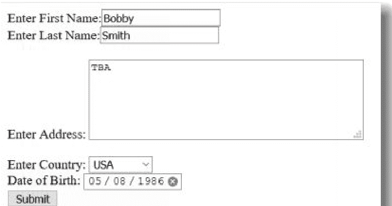

点击**提交**后，我们得到：

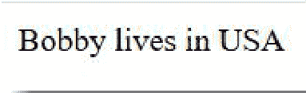

## 代码解析

因此，我们添加的主要部分是函数 [printcountry()](printcountry())。我们还将该函数添加到了按钮的 onclick 元素中。([onclick="printcountry()"](onclick="printcountry()))。

```
<button onclick="printcountry()">Submit</button>

<script>
function printcountry(){
  var fname = document.getElementById("fname").value;
  var lname = document.getElementById("lname").value;
  var address = document.getElementById("address").value;
  var country = document.getElementById("country").value;
  var dob = document.getElementById("dob").value;
  document.write(fname + " " + lname + " " + dob);
}
</script>

</body>
</html>
```

在这个函数中，我们声明了五个变量 `fname`、`lname`、`address`、`country`、`dob`。每个变量分别被赋值为表单中输入的名字、姓氏、地址、国家和出生日期。这是通过 `document.getElementById().value` 这个 JavaScript 元素完成的。最后，我们使用 document.write() 来打印出表单中输入的名字和出生日期。

## 示例 2

在第二个示例中，我们创建一个简单的 JavaScript 函数，它接收 3 个数字并将它们相乘。

## 输出：

```
html
<html>
<head><title>Sample Form</title></head>
<body>
<form id="form1">
Enter First Number:<input name="number1" type="number" id="num1" size="20"><br>
Enter Second Number:<input name="number2" type="number" id="num2" size="20"><br><br>
Enter Third Number: <input name="number3" type="number" id="num3" size="20"></textarea><br><br>
<button onclick="multiplynum()">Submit</button>
</form>
<script>
function multiplynum()
{
var n1 = document.getElementById("num1").value;
var n2 = document.getElementById("num2").value;
var n3 = document.getElementById("num3").value;
document.write("The product of the three numbers is "+n1*n2*n3);
}
</script>
</body>
</html>
```

一旦我们点击提交，我们得到：

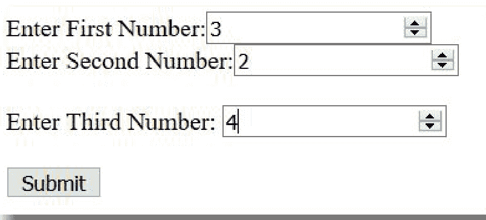

## 代码解析：

在上面的代码中，我们通过 id 为 num1、num2 和 num3 的表单接收三个数字。
当按钮被点击时，它会运行 **multiplynum()** JavaScript 函数。
在函数中，三个变量 n1、n2、n3 分别被赋值为表单中 id 为 num1、num2 和 num3 的三个数字。
最后，我们在最后一行使用 document.write() 打印出三个数字 n1*n2*n3 的乘积。

## 练习题

1.  创建[上一章练习题 1 中的表单](practice problem 1 of the previous chapter)。像一份正式的网页简历一样，打印出表单中的所有信息。如果看起来足够好，可以随意打印出来交给雇主 😎😎。
2.  创建[上一章练习题 2 中的表单](form in practice problem 2 of the previous chapter)。在 HTML 网页上打印出整个购物清单。然后你可以把它打印在一张纸上，然后去购物。
3.  创建一个接收两个数字的表单。它有 4 个按钮，按钮文本分别为加、减、乘和除。这 4 个按钮中的每一个都执行 4 个不同的函数，分别对两个数字进行加、减、乘、除运算并打印出结果。

## 作者的一小段话：

嘿，你喜欢这本书吗？我很想听听你的想法！
许多读者不知道评论有多难得，以及它们对作者有多大帮助。

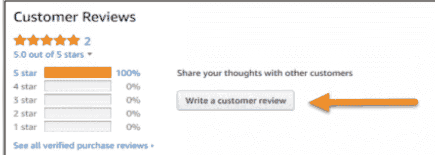

如果你能花 60 秒在亚马逊上写一篇简短的评论，即使只是几句话，我也会非常感激！
>> [点击此处留下快速评论](https://example.com)
感谢你花时间分享你的想法！
你的评论对我来说真的会有所不同，并有助于提高我的作品的知名度。

# CSS 简介

## 什么是 CSS？

CSS 是层叠样式表的缩写。它允许用户设置和修改 HTML 网站的样式。“样式”是指字体类型、字体颜色、背景颜色、阴影等术语。CSS 元素可以通过 HTML 和 JavaScript 访问。

## 创建 CSS 文件并链接到 HTML 文件

创建 CSS 文件并将其链接到 HTML 文档有 5 个步骤。

1.  要创建一个 CSS 文件，打开一个空白的 HTML 文档并将其另存为“CSS”文件类型。在本例中，我们将其命名为“samplestyle”。

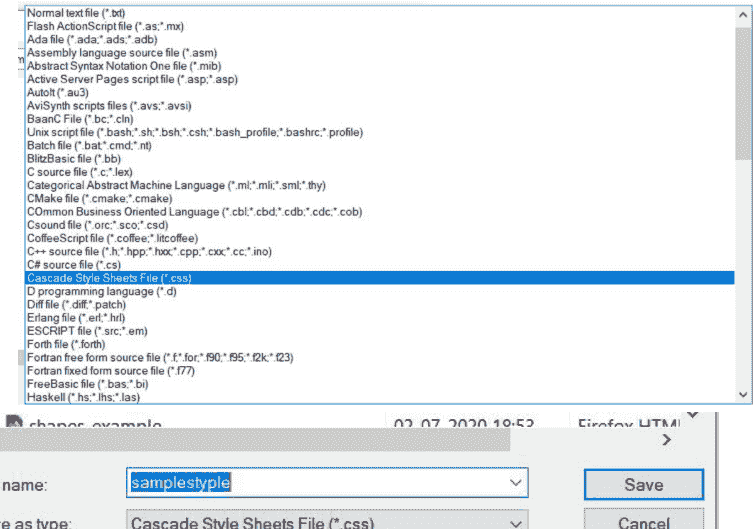

2.  转到相关的 HTML 文件，并在头文件中包含下面的行。

你可以通过下面的行来完成。

```
<html>
<head><title>Sample Form</title></head>
<body>
<link rel="stylesheet" href="samplestyle.css" />
<form id="form1">
Enter First Number:<input name="number1" type="number" id="num1" size="20"><br>
Enter Second Number:<input name="number2" type="number" id="num2" size="20"><br><br>
Enter Third Number: <input name="number3" type="number" id="num3" size="20"></textarea><br><br>

<button onclick="multiplynum()">Submit</button>

<script>
function multiplynum()
{
var n1 = document.getElementById("num1").value;
var n2 = document.getElementById("num2").value;
var n3 = document.getElementById("num3").value;
document.write("The product of the three numbers is "+n1*n2*n3);
}
</script>

</body>
</html>
```

3.  （可选）要使你的按钮在 CSS 中可编辑，请在 HTML 按钮行中添加文本 `class=”btn”`，如下所示：

`<button class = "btn submit" onclick="multiplynum()">Submit</button>`

现在，让我们在上一章的示例中插入样式表。

```
<html>
<head><title>Sample Form</title></head>
<body>
<link rel="stylesheet" href="samplestyle.css" />
<form id="form1">
Enter First Number:<input name="number1" type="number" id="num1" size="20"><br>
Enter Second Number:<input name="number2" type="number" id="num2" size="20"><br><br>
Enter Third Number: <input name="number3" type="number" id="num3" size="20"></textarea><br><br>

<button class = "btn submit" onclick="multiplynum()">Submit</button>

<script>
function multiplynum()
{
var n1 = document.getElementById("num1").value;
var n2 = document.getElementById("num2").value;
var n3 = document.getElementById("num3").value;
document.write("The product of the three numbers is "+n1*n2*n3);
}
</script>

</body>
</html>
```

很好。

现在我们的 CSS 样式表已经链接到了我们的 HTML 文件。

## CSS 术语

**html{}, body{}:** HTML 花括号内的代码定义了整个 HTML 文件的样式。花括号内的 body 代码是 HTML 文件主体部分的代码。

**text-decoration:** 可以通过使文本呈波浪形、点状、卷曲形等来修改文本设计。

**text-transform:** 可以将部分或全部文本大写化。

**text-align:** 可以将文本居中、右对齐或左对齐。

**margin:** 外边距是元素之间的空间。它以像素为单位表示。例如，margin: 5px 指定了 5 像素的外边距。

**padding:** 内边距是元素内部从外边界到内容的空间。它也以像素为单位指定。

**display:** 可用于完全关闭一个元素。（例如，display: none 会完全关闭该元素）

**hidden:** 可用于隐藏一个元素，同时它仍然在布局中占据空间。

**font-size:** 指定字体的大小。

**background-color:** 指定元素的背景颜色。可以从下面链接中的多种颜色中选择。
https://www.quackit.com/css/css_color_codes.cfm

**color:** 指定书写文本的颜色。

**border:** 指定元素周围边框的存在和类型/样式。可以是隐藏的、点状的、双线边框；也可以没有边框。

**font-weight:** 指定字体的粗细。

**min-height:** 指定元素的最小高度。高度以像素为单位。

**line-height:** 指定一行文本的高度。高度以像素为单位。

## CSS 按钮元素

**.btn{}** – 这指定了 HTML 中定义的任何按钮的样式。要使按钮在 CSS 中可访问，我们必须在 HTML 定义中包含类名，就像我们在前面的示例中所做的那样。

.btn:hover{} – 你知道吗？你可以指定鼠标悬停在按钮上时的样式。很酷，对吧？花括号内的所有项目都可以指定按钮及其内部文本的样式。
要查看成千上万的CSS属性来美化你的网页，请查看下面的链接：
https://www.htmlhelp.com/reference/css/properties.html

## CSS 示例

```
html, body {
    text-decoration: none;
    text-transform: capitalize;
    text-align: center;
    margin: 10;
    padding-top: 50px;
    min-height: 80%;
    color: white;
    background-color: blue;
    line-height: 1.5;
    font-family:serif;
    font-size: 25px;
    font-weight: normal;
}

.btn {
    background-color: black;
    border: none;
    color: white;
    padding: 10px 24px;
    text-align: center;
    text-decoration: none;
    display: inline-block;
    font-size: 16px;
}

.btn:hover {
    background-color: Crimson;
    color: black;
}
```

## 代码解释

我们首先定义代码的html和body部分。文本被设置为大写并居中。在蓝色背景上显示为白色。它距离顶部边距50像素。字体是25像素的普通无衬线字体，未加粗。按钮样式通过`.btn{}`定义。按钮具有白色文本和黑色背景。文本字体为16像素，并在按钮内居中对齐。当我们将鼠标悬停在按钮上时，样式会发生变化。它变为黑色文本和深红色背景。
该css文件链接到我们上一章中的一个示例表单。我们向您展示链接css文件前后的输出。我们看到了CSS样式带来的巨大差异。这就像一次大改造。

## 输出（无CSS）：

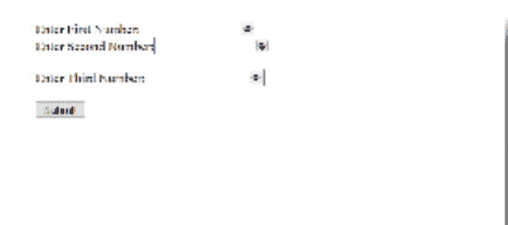

## 输出（有CSS）：

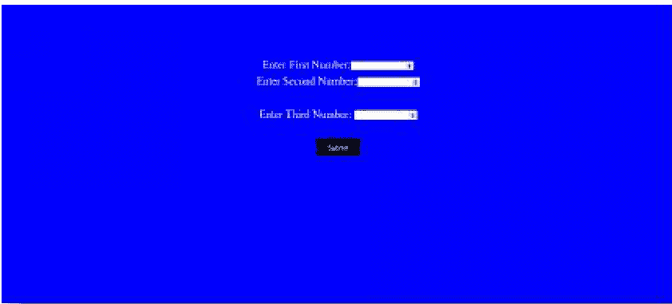

## 输出（有CSS且鼠标悬停在按钮上）：

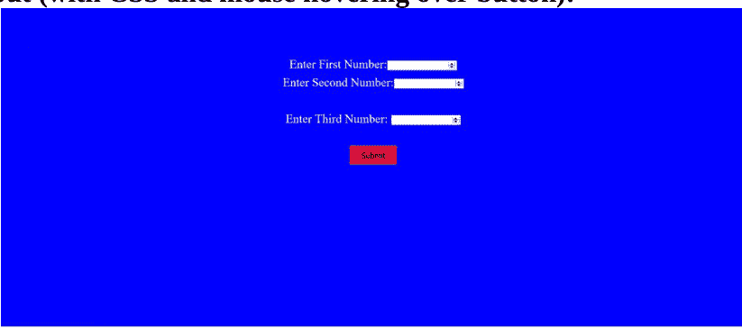

## CSS 与 JavaScript

如果一个html表单链接了CSS，而JavaScript开始在网页上打印文本，你会注意到它不再与CSS关联了。
你需要做的是在JavaScript代码中使用下面这行重新链接CSS：
document.write('<link rel="stylesheet" type="text/css" href="samplestyle.css" />');
在JavaScript中每个函数开始之前输入这行代码。这确保了整个程序都能显示css样式。请参阅下面文本中的示例：

```
<html>
<head><title>Sample Form</title></head>
<body>
<link rel="stylesheet" type="text/css" href="samplestyle.css" />
<form id="form1">
Enter First Number:<input name="number1" type="number" id="num1" size="20"><br>
Enter Second Number:<input name="number2" type="number" id="num2" size="20"><br><br>
Enter Third Number: <input name="number3" type="number" id="num3" size="20"></textarea><br><br>
<button class = "btn submit" onclick="multiplynum()">Submit</button>
<script>
function multiplynum()
{
var n1 = document.getElementById("num1").value;
var n2 = document.getElementById("num2").value;
var n3 = document.getElementById("num3").value;
document.write('<link rel="stylesheet" type="text/css" href="samplestyle.css" />');
document.write("The product of the three numbers is " +n1*n2*n3);
}
</script>
</body>
</html>
```

## 输出（在JavaScript中添加CSS行之前）：

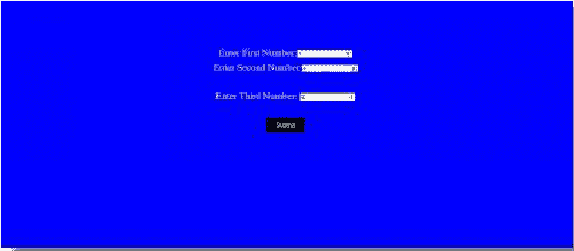

点击 **提交** 按钮后：

三个数字的乘积是 60

## 输出（在JavaScript中添加CSS行之后）：

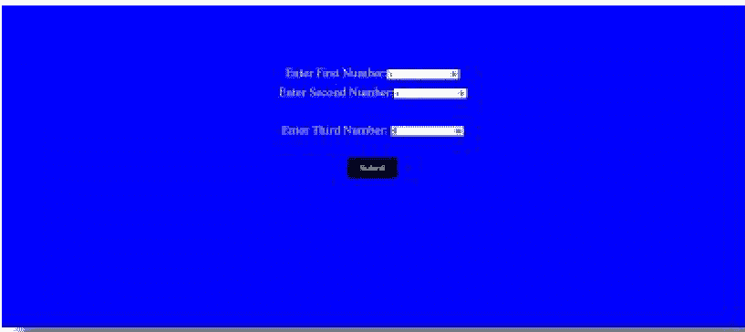

点击 **提交** 按钮后：

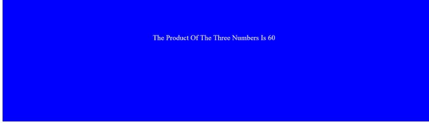

## 练习题

- 1. 创建一个css样式表，为所有表单元素和按钮指定样式。将其链接到所有之前的练习题，并惊叹于你的创作。
- 2. 创建一个包含2个按钮的html表单。创建两个css样式表。这2个html按钮在两个样式表之间切换。

## 使用 JavaScript 进行数学运算

JavaScript是一种非常适合执行计算和分析用户数据的编程语言。我们将介绍一些帮助你入门JavaScript的函数。
现在，这一部分并非适合所有人。它只适用于那些有兴趣在程序中实现大量数学运算，或者喜欢数学并希望看到它在JavaScript中实现的人。

### ParseInt/ParseFloat

**parseInt** – ParseInt接收一个字符串变量并返回一个整数。它也接收十进制数并将其转换为整数。
**ParseFloat** – ParseFloat与parseInt类似，但适用于十进制数。
让我们看下面的例子。
在这个例子中，我们将3个数字分别通过parseInt和相同的数字通过parseFloat。然后我们查看输出结果。

```
<html>
<head><title>Sample Form</title></head>
<body>
<form id="form1">

<button onclick="multiplynum()">Parse Integers</button>

<script>
function multiplynum()
{
xi=parseInt("5.2");
yi=parseInt(5.01);
zi=parseInt(5.65);
xf=parseFloat("5.2");
yf=parseFloat(5.01);
zf=parseFloat(5.65);
document.write("xi= "+xi+"<br>");
document.write("yi= "+yi+"<br>");
document.write("zi= "+zi+"<br>");
document.write("xf= "+xf+"<br>");
document.write("yf= "+yf+"<br>");
document.write("zf= "+zf+"<br>");
}
</script>

</body>
</html>
```

## 输出：

```
xi= 5
yi= 5
zi= 5
xf= 5.2
yf= 5.01
zf= 5.65
```

我们可以看到parseInt和parseFloat的结果是不同的。对于xi和yi，我们传递了字符串“5.2”。它被认为是字符串，因为它在引号内。即使引号内有一个数字，在实际执行parseInt或parseFloat之前，我们也不能将其用于任何数学运算。完成parseInt或parseFloat后，它就变成了一个数字。我们还注意到，对于所有值，parseInt会移除小数点并使其成为整数。它不会四舍五入，只是移除小数部分。

parseFloat保留小数值。所以，如果你想处理小数；使用parseFloat。如果你不想要小数，那么使用parseInt。

### 数字取整 – Math.ceil()、Math.floor() 和 Math.round()

接下来，让我们谈谈数字取整。我们使用函数 **Math.Ceil()**、**Math.Floor()** 和 **Math.Round()**。Math.Ceil() 向上取整到较大的整数值，Math.Floor() 向下取整到较小的整数值，Math.Round() 四舍五入到最接近的值（无论是向上还是向下）。让我们看一个示例程序。

```
<html>
<head><title>Sample Form</title></head>
<body>
<form id="form1">

<button onclick="multiplynum()">Round numbers</button>

<script>
function multiplynum()
{
xc=Math.ceil(5.2);
yc=Math.ceil(7.8);
zc=Math.ceil(4.5);
xf=Math.floor(5.2);
yf=Math.floor(7.8);
zf=Math.floor(4.5);
xr=Math.round(5.2);
yr=Math.round(7.8);
zr=Math.round(4.5);
document.write("Example of Math.ceil<br>");
document.write("xc= "+xc+"<br>");
document.write("yc= "+yc+"<br>");
document.write("zc= "+zc+"<br>");
document.write("Example of Math.floor<br>");
document.write("xf= "+xf+"<br>");
document.write("yf= "+yf+"<br>");
document.write("zf= "+zf+"<br>");
document.write("Example of Math.round<br>");
document.write("xr= "+xr+"<br>");
document.write("yr= "+yr+"<br>");
document.write("zr= "+zr+"<br>");
}
</script>

</body>
</html>
```

在代码中，我们将3个十进制数分别通过Math.floor()、Math.ceil()和Math.round()处理，输出结果展示了这些函数的工作方式。

## 输出：

```
Example of Math.ceil
xc= 6
yc= 8
zc= 5
Example of Math.floor
xf= 5
yf= 7
zf= 4
Example of Math.round
xr= 5
yr= 8
zr= 5
```

## 加、减、乘、除

这看起来可能不言自明，但由于进行任何基本计算都至关重要，我必须介绍这4个基本的数学运算。

```
<html>
<head><title>Sample Form</title></head>
<body>
<form id="form1">
Enter First Number:<input name="number1" type="number" id="num1" size="20"><br>
Enter Second Number:<input name="number2" type="number" id="num2" size="20"><br><br>
<button onclick="test()">Calculate</button>
</form>
<script>
function test()
{
var n1 = parseInt(document.getElementById("num1").value);
var n2 = parseInt(document.getElementById("num2").value);
var sum=n1+n2;
var difference=n1-n2;
var product=n1*n2;
var quotient=n1/n2;

document.write("The sum is "+sum+"<br>");
document.write("The difference is "+difference+"<br>");
document.write("The product is "+product+"<br>");
document.write("The quotient is "+quotient);
}
</script>
</body>
</html>
```

在代码中，我们使用html表单接收两个数字。这两个数字被赋值给两个变量n1和n2。
然后我们计算它们的和、差、积和商，并将它们赋值给4个不同的变量。
最后，使用document.write()打印出这4个变量。

## 输出：

## 取模运算

取模运算返回两个数字之间的余数。它看起来像百分号 %。下面是一个示例：

```html
<html>
<head><title>Sample Form</title></head>
<body>
<form id="form1">
Enter First Number:<input name="number1" type="number" id="num1" size="20"><br>
Enter Second Number:<input name="number2" type="number" id="num2" size="20"><br><br>
<button onclick="test()">Calculate Remainder</button>
</form>
<script>
function test()
{
var n1 = parseInt(document.getElementById("num1").value);
var n2 = parseInt(document.getElementById("num2").value);
var remainder=n1%n2;
document.write("The remainder when "+n1+" is divided by "+n2+" is "+remainder+"<br>");
}
</script>
</body>
</html>
```

上述代码通过一个 HTML 表单接收两个数字，并计算它们之间的余数；如下方输出所示。

## 输出：

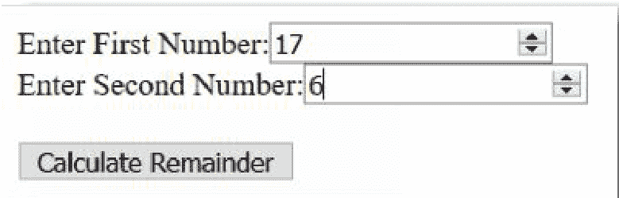

点击“**计算余数**”按钮后

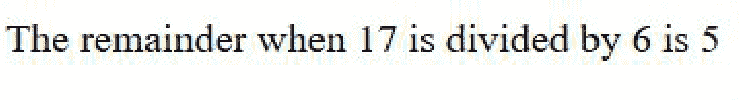

## Math.Random()

Math.Random() 返回一个介于 0 和 1 之间的随机数。如果我们想获得一个介于 0 和 10 之间的随机数，我们可以乘以 10 并对结果进行四舍五入（使用 Math.round()）。让我们看几个例子。

```html
<html>
<head><title>Sample Form</title></head>
<body>

<button onclick="test()">Random Numbers</button>

<script>
function test()
{
var n1 = Math.random();
var n2 = Math.round(Math.random()*50);
var n3 = Math.round(Math.random()*50);
var n4 = Math.round(Math.random()*1000);

var remainder=n1%n2;

document.write("Random number between 0 and 1 = <strong>"+n1+"</strong><br>");
document.write("1st Random number between 0 and 50 = <strong>"+n2+"</strong><br>");
document.write("2nd Random number between 0 and 50 = <strong>"+n3+"</strong><br>");
document.write("Random number between 0 and 1000 = <strong>"+n4+"</strong><br>");

}
</script>

</body>
</html>
```

在上面的例子中，n1 是一个介于 0 和 1 之间的随机数。
n2 和 n3 是两个不同的介于 0 和 50 之间的随机数。你应该会看到 n2 和 n3 是不同的，因为两个数字都是随机生成的。
n4 返回一个介于 0 和 1000 之间的随机数。
我们可以在下面的输出中看到结果。由于数字是随机的，我们每次运行程序应该会得到不同的结果。
Math.Random() 是一个有趣的函数，我们将在本书的许多游戏中使用它。

## 输出：

Random number between 0 and 1 = **0.20604429056114348**
1st Random number between 0 and 50 = **21**
2nd Random number between 0 and 50 = **6**
Random number between 0 and 1000 = **866**

## 指数与对数

Javascript 中的指数运算使用 Math.pow() 函数，自然对数使用 Math.log()。如果我们想要以 10 为底的对数，我们使用 Math.log10()。

```html
<html>
<head><title>Sample Form</title></head>
<body>
<button onclick="test()">Random Numbers</button>
<script>
function test()
{
var n1 = Math.pow(6,2);
var n2 = Math.pow(7,3);
var n3 = Math.log(100);
var n4 = Math.log10(100);

document.write("6 raised to the power 2 = <strong>"+n1+"</strong><br>");
document.write("7 raised to the power 3 = <strong>"+n2+"</strong><br>");
document.write("The natural logarithm of 100 is = <strong>"+n3+"</strong><br>");
document.write("Logarithm (to the base 10) of 100 is = <strong>"+n4+"</strong><br>");

}
</script>
</body>
</html>
```

在上面的代码中，我们有两个使用 Math.pow(x,y) 计算指数的例子。基本上，在这两种情况下，x 都被提升到 y 次幂。n1 和 n2 给出指数结果。n3 显示 100 的自然对数，n4 显示以 10 为底的 100 的对数。

**输出：**

6 raised to the power 2 = **36**
7 raised to the power 3 = **343**
The natural logarithm of 100 is = **4.605170185988092**
Logarithm (to the base 10) of 100 is = **2**

## 平方根

Math.sqrt() 用于求平方根，Math.Abs() 用于求一个数的绝对值。
这里有几个例子：

```html
<html>
<head><title>Sample Form</title></head>
<body>
<button onclick="test()">Test</button>
<script>
function test()
{
var n1 = Math.sqrt(36);
var n2 = Math.sqrt(75);
var n3 = Math.abs(13);
var n4 = Math.abs(-14);

document.write("The square root of 36 = <strong>"+n1+"</strong><br>");
document.write("The square root of 75 = <strong>"+n2+"</strong><br>");
document.write("The absolute value of 13 is = <strong>"+n3+"</strong><br>");
document.write("The absolute value of -14 = <strong>"+n4+"</strong><br>");

}
</script>
</body>
</html>
```

在上面的代码中，n1 和 n2 是平方根函数的例子；
而 n3 和 n4 是绝对值函数的例子。
如果你没听说过绝对值函数，它基本上无论数字是正数还是负数，都返回一个正值。所以，13 和 -13 都会返回绝对值 13。

**输出：**

The square root of 36 = **6**
The square root of 75 = **8.660254037844387**
The absolute value of 13 is = **13**
The absolute value of -14 = **14**

## 三角函数

是的，JavaScript 也可以用于三角函数。这里有几个例子。
Math.sin(x) 返回 x 弧度的正弦值。如果我们想求 x 度的正弦值，那么我们必须将其转换为弧度。所以，我们应该将函数改为 Math.sin(x*MATH.PI/180)。
另外，请记住，在 Javascript 中，我们使用 Math.PI 表示 π 的值。
我们也可以使用 Math.cos(x) 和 Math.tan(x) 来计算余弦和正切函数，其中 x 是弧度。
让我们看下面的示例程序：

```html
<html>
<head><title>Sample Form</title></head>
<body>
<button onclick="test()">Test</button>
<script>
function test()
{
var n1 = Math.sin(5);
var n2 = Math.sin(5*Math.PI/180);
var n3 = Math.sin(90*Math.PI/180);
var n4 = Math.cos(10);
var n5 = Math.cos(10*Math.PI/180);
var n6 = Math.cos(0*Math.PI/180);
var n7 = Math.tan(30);
var n8 = Math.tan(30*Math.PI/180);
var n9 = Math.tan(45*Math.PI/180);

document.write("The sine of 5 radians = <strong>"+n1+"</strong><br>");
document.write("The sine of 5 degrees = <strong>"+n2+"</strong><br>");
document.write("The sine of 90 degrees = <strong>"+n3+"</strong><br>");
document.write("The cos of 10 radians = <strong>"+n1+"</strong><br>");
document.write("The cos of 10 degrees = <strong>"+n2+"</strong><br>");
document.write("The cos of 0 degrees = <strong>"+n3+"</strong><br>");
document.write("The tan of 30 radians = <strong>"+n7+"</strong><br>");
document.write("The tan of 30 degrees = <strong>"+n8+"</strong><br>");
document.write("The tan of 45 degrees = <strong>"+n9+"</strong><br>");
}
</script>
</body>
</html>
```

在上面的代码中，我们展示了正弦、余弦和正切值的 3 个例子。并且我们展示了计算度数和弧度三角函数值之间的区别。例如，对于 n1，我们计算 sin(5 弧度) 的值，而在 n2 中我们计算 sin(5 度) 的值。在 n2 中，我们必须通过 sin(5* π/180) 将 5 度转换为弧度。

## 输出：

The sine of 5 radians = -0.9589242746631385
The sine of 5 degrees = 0.08715574274765817
The sine of 90 degrees = 1
The cos of 10 radians = -0.9589242746631385
The cos of 10 degrees = 0.08715574274765817
The cos of 0 degrees = 1
The tan of 30 radians = -6.405331196646276
The tan of 30 degrees = 0.5773502691896257
The tan of 45 degrees = 0.9999999999999999

## 练习题

1.  编写一个程序来计算一个团队的总薪资支付成本。创建一个表单，接收两个输入；员工数量和每位员工的平均工作小时数。使用 parseInt 确保员工数量是整数。将平均工作小时数向上取整（所以，5.2 和 5.6 小时都会变成 6 小时）。将两个输入相乘并打印出支付给员工的总薪资。
2.  让我们开始，用我们所学的所有知识制作一个演示计算器。创建一个表单，在两个文本框中接收两个数字，并有 15 个按钮。每个按钮链接到一个执行计算的 JavaScript 函数。分别为加法、减法、乘法、除法、余数、指数、自然对数、对数（以 10 为底）、平方根、正弦、余弦、正切、余割、正割、余切创建一个按钮。其中一些按钮只需要一个数字即可操作（三角函数、平方根、对数），而其他按钮则需要两个数字。
3.  创建一个程序，使用三角函数计算你正在观察的建筑物的高度。该程序在表单中接收两个用户输入。第一个是到建筑物的距离；第二个是到建筑物顶部的视角。使用三角函数（具体来说是正切值）来计算建筑物的高度。

## 循环

编程中的循环是一组按特定次数重复执行的指令序列。
可以将循环想象成自动扶梯。扶梯的台阶会朝一个方向反复运行，直到有人按下停止按钮。
根据执行条件，循环有3种类型。它们是：

-   a. **IF 循环：** IF 循环包含一组在满足特定条件时执行的指令。如果条件不满足，则不执行循环。
-   b. **FOR 循环：** FOR 循环包含一组执行特定次数的指令。例如，一个从1到10的FOR循环会执行循环内的代码10次。
-   c. **WHILE 循环：** WHILE 循环是一组在满足特定条件之前持续执行的指令。

现在，让我们通过每种循环来审视电梯的例子。
假设我们希望电梯仅在大楼内人数超过1000人时运行。那么我们使用一个IF循环来检查大楼内的人数，如果满足条件，则运行电梯函数。
IF 循环示例：

```
if(people>1000)
{
    Runelevator();
}
```

现在，如果我们想对电梯进行1000次运行测试，以查看它是否能承受特定重量；我们使用一个FOR循环。下面的FOR循环从0开始，到999结束，因此电梯运行了1000次。

```
for (i=0;i<1000;i++)
{
Runlevator();
}
```

最后，如果我们想让电梯一直运行到下午6点，我们使用一个WHILE循环。

```
While (checktime!=18:00)
{
Runlevator();
}
```

这些是三种循环的简单示例，用于解释循环的概念。这个概念在编程中非常重要。现在，让我们用JavaScript做一些示例。

## IF 循环示例 1

IF 循环也称为条件语句。条件语句是一段检查特定条件是否已满足的代码。例如，一家保险公司可能希望在您两个孩子的年龄总和大于15岁时给您更低的费率。因此，您需要检查这些条件。让我们在下面使用一个IF循环来看看。

```
html
<html>
<head><title>Insurance Test</title></head>
<body>
Enter Age of 1st Kid:<input name="a1" type="number" id="age1" size="20"><br>
Enter Age of 2nd Kid:<input name="a2" type="number" id="age2" size="20"><br><br>
<button onclick="checkinsuranceprice()">Check Price</button>
<script>
function checkinsuranceprice()
{
var inscost=0;
var a1 = parseInt(document.getElementById("age1").value);
var a2 = parseInt(document.getElementById("age2").value);

//Check condition
if ((a1+a2)>15)
{
inscost=inscost+300;
}
else
{
inscost=inscost+600;
}
document.write("Your annual car insurance is $"+inscost);
}
</script>
</body>
</html>
```

在上面的代码中，一个HTML表单允许用户输入两个年龄，其ID分别为“age1”和“age2”。JavaScript变量a1和a2存储这些变量的值。IF语句检查两者之和是否大于15。如果大于15，保险费用为300美元；否则为600美元。最后，我们打印出保险费用的值。以下是输出结果。

**输出 #1：**

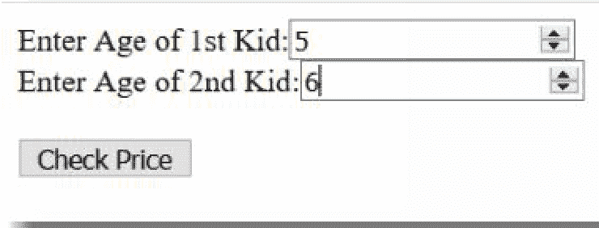

点击 **Check Price** 后：

Your annual car insurance is $600

# 输出 #2：

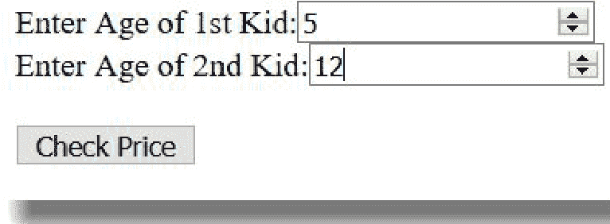

点击 **Check Price** 后：

Your annual car insurance is $300

## IF 循环示例 2

让我们再看一个例子。假设你正在考虑报名哪家健身房。你想报名距离在5英里以内且每月费用低于60美元的健身房。所以，你有两个IF循环来分别检查每个条件。这些循环是相互嵌套的。这被称为嵌套循环。让我们在下面看看。

```
<html>
<head><title>Gym Test</title></head>
<body>
Enter Name of Gym:<input name="g1" type="text" id="gname" size="20"><br>
Enter Gym Distance from home:<input name="g2" type="number" id="dist" size="20"><br>
Enter Monthly Membership Costs:<input name="g3" type="number" id="memc" size="20"><br><br>
<button onclick="checkgym()">Check Gym</button>

<script>
function checkgym()
{
var name = document.getElementById("gname").value;
var gymdistance = parseInt(document.getElementById("dist").value);
var memberprice = parseInt(document.getElementById("memc").value);

//Check condition
if (gymdistance<5)
{
    if(memberprice<60)
    {
    document.write(name+" is a possible gym");
    }
    else
    {
    document.write(name+" does not work for me");
    }
}
else
{
    document.write(name+" does not work for me");
}

}
</script>

</body>
</html>
```

在上面的代码中，一个HTML表单允许用户输入健身房名称（ID为“gname”）、健身房距离（ID为“dist”）和健身房价格（ID为“memc”）。JavaScript变量name、gymdistance和memberprice存储用户输入的值。一个IF语句检查gymdistance是否小于5。如果大于5，则该健身房不合适。如果小于5，那么我们使用另一个IF来检查每月会员价格是否低于60美元。如果是，那么这是一个可能的健身房；否则它不合适。以下是几个示例输出。

# 输出 #1：

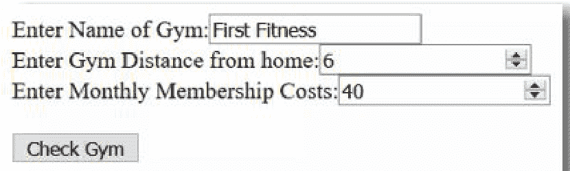

Fitness First does not work for me

# 输出 #2：

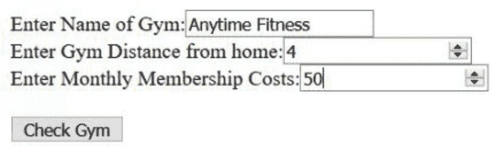

Anytime Fitness is a possible gym

## 输出 #3：

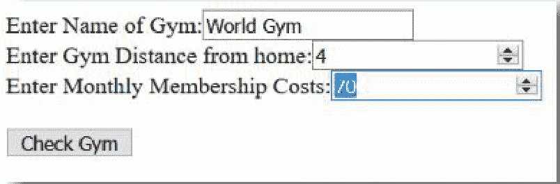

World Gym does not work for me

## FOR 循环示例 1

FOR循环的一个简单例子是一个计数到10的程序。

```
html
<html>
<head><title>Loops......</title></head>
<body>

<button onclick="printtoten()">Print To 10</button>

<script>

function printtoten()
{

for (i=1;i<=10;i++)
{
    document.write(i+"<br>");
}
}

</script>

</body>
</html>
```

上面的代码是一个for循环的简单示例。它有一个按钮，点击后运行函数printtoten()。Printtoten()函数中有一个for循环，通过document.write()在屏幕上打印数字1到10。

For (i=1;i<=10; i++)

上面这行代码意味着循环从1开始（i=1）。每次增加1（i++）。当i达到10时循环结束（i<=10）。

**输出：**

一旦你点击输出页面上的按钮，你会看到数字1到10打印在屏幕上。

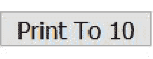

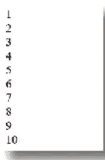

## FOR 循环示例 2

现在，让我们做一个稍有不同的版本。在这个例子中，我们将使用一个表单来输入循环的次数。这意味着我们可以根据需要设置循环的长度。

```
html
<html>
<head><title>Loops......</title></head>
<body>
<form id="form1">
How long do you want the loop?: <input name="Loop Number" type="number" id="loop" size="20"><br>
</form>
<button onclick="printtoten()">Print To 10</button>
<button onclick="printlooplength()">Print Loop Length</button>
<script>
function printtoten()
{
    for (i=1;i<=10;i++)
    {
        document.write(i+"<br>");
    }
}
function printlooplength()
{
    var looplength=parseInt(document.getElementById("loop").value);
    for (i=1;i<=looplength;i++)
    {
        document.write(i+"<br>");
    }
}
</script>
</body>
</html>
```

这个程序添加了一个HTML表单。
该表单接受一个数字输入，并存储在一个名为“loop”的变量中。
有一个标有“Print Loop Length”的第二个按钮，它运行“printlooplength()”函数。
在该函数中，我们将表单变量“loop”赋值给另一个变量“looplength”。然后我们运行从1到“looplength”的循环。该循环打印1到“looplength”之间的数字。
在下面的示例中，我们在表单中输入了35；我们可以看到，它打印出了1到35之间的数字。

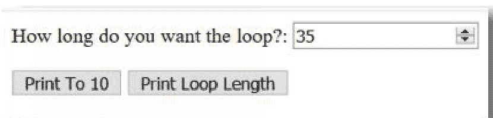

1
2
3
4
5
6
7
8
9
10
11
12
13
14
15
16
17
18
19
20
21
22
23
24
25
26
27
28
29
30
31
32
33
34
35

## FOR 循环示例 3 – 嵌套循环

在最后一个例子中，我们使用FOR循环来创建一个星号图案。
所以，我们创建第二个标有‘Print Star Loop’的按钮，点击时运行 **starloop()** 函数。在该函数中，looplength同样具有我们在表单中输入的循环长度值。
因此，首先，我们创建一个从1到looplength的FOR循环。变量i保存循环的计数值，每次增加1。
然后，我们在其中创建另一个从1到i的FOR循环。第二个FOR循环打印星号（“*”）i次。
所以，例如，如果你正在执行第一次循环的第5次迭代，i=5。第二个循环打印*从1到5（即5次）。
在下面的例子中，我们为looplength为23打印星号循环。

# 输出

```html
<html>
<head><title>循环......</title></head>
<body>
<form id="form1">
循环次数：<input name="Loop Number" type="number" id="loop" size="20"><br>
</form>
<button class="btn printoten" onclick="printtoten()">打印到10</button>
<button class="btn printoten" onclick="printlooplength()">打印循环长度</button>
<button class="btn printoten" onclick="starloop()">打印星号循环</button>
<script>
function printtoten()
{
for (i=1;i<=10;i++)
{
document.write(i+"<br>");
}
}
function printlooplength()
{
var looplength=parseInt(document.getElementById("loop").value);

for (i=1;i<=looplength;i++)
{
document.write(i+"<br>");
}
}
function starloop()
{
var looplength=parseInt(document.getElementById("loop").value);

for (i=1;i<=looplength;i++)
{
for (j=1;j<=i;j++)
{
document.write("*");
}
document.write("<br>");
}
}
</script>
</body>
</html>
```

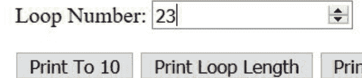

*
**
***
****
*****
******
*******
********
*********
***********
************
*************
**************
***************
****************
*****************
******************
*******************
********************
*********************
**********************
***********************
************************
*************************

## WHILE 循环示例 1

当满足特定条件时，`while` 循环会运行。如果条件不再满足，它就会跳出循环。在下面的示例中，程序执行一个 `while` 循环，该循环通过 `prompt` 函数接收用户输入。`while` 循环持续运行并打印用户输入的文本。当用户输入单词‘**STOP**’时，循环停止。一旦输入该单词，`while` 循环就结束了，程序停止。

```html
<html>
<head><title>While 循环测试</title></head>
<body>
<button onclick="testwhileloop()">测试</button>
<script>
function testwhileloop()
{
    var inputtext = "";
    while (inputtext != "STOP")
    {
        inputtext = prompt("输入你现在想做的事情（全部大写输入）");
        document.write("下一个活动 = "+inputtext+"<br>");
    }
}
</script>
</body>
</html>
```

下面是显示其工作原理的输出。

## 输出：

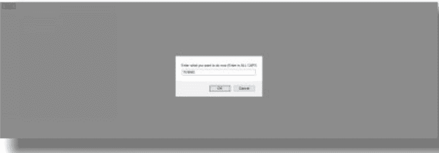

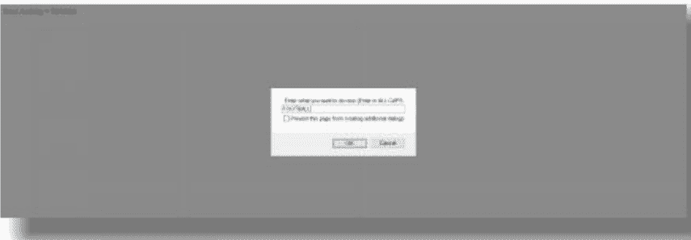


## 练习题

1.  编写一个程序，通过表单输入一个数字，并检查它是否能被3整除。
2.  编写一个程序，接收用户输入并输出以下模式。例如，如果用户输入数字‘5’，则输出：
1
22
333
4444
55555
3.  编写一个程序，接收七个不同的动物作为用户输入。然后编写一个函数，检查这些动物中是否有老虎，并打印出第几个动物是老虎。
4.  编写一个程序，作为汽车经销商的过滤器。它通过 `prompt` 函数接收汽车的名称和价格。程序每次打印出汽车的名称。当所有汽车的总和超过 $50000 时停止；因为这是他们预算的上限。
5.  编写一个程序，通过 `prompt` 函数接收两个用户数字输入。持续让用户输入两个数字，直到它们的和大于20。一旦用户输入的两个数字之和大于20，程序停止。
6.  编写一个程序，通过用户提示接收一个人的投票。有3个候选人。它检查投票是否属于任何一位候选人，并增加该候选人的总票数。最后有一个提示询问是否还有更多投票，并接受‘Y/N’的值。如果输入‘N’，则停止程序并打印出获胜者。如果输入‘Y’，则再次请求投票并重复该过程。
7.  编写一个程序，接收用户输入并输出以下星号模式。例如，如果用户输入数字‘6’，则输出：

```
******
*****
****
***
**
*
```

8.  编写一个程序，接收用户输入并打印从1到该数字的数字之和。例如，如果用户输入3；则和为1+2+3=6。

## 游戏时间 - 循环

现在，是时候根据我们目前所学的内容设计几个游戏了。学习概念没有比应用它们更好的方法了；而将其应用到有趣的事情上则更好。
在开始之前，让我们讨论一个概念；即使用 JavaScript 添加 HTML 元素。

# 使用 JavaScript 添加 HTML 元素

如果我们想在 JavaScript 程序中间添加一个按钮或文本框怎么办？是的，你可以使用 `document.write()` 函数在 JavaScript 中完成。例如，你可以使用以下代码创建一个按钮：
`document.write('<button onClick="afunction()">重新开始</button>');`
在上面这行代码中，我们创建了一个带有‘重新开始’文本的按钮。点击按钮时，**afunction()** 会被运行。这在游戏非常有用，因为我们有选择让程序继续运行而不是停止。现在，让我们看一个类似的程序。

```html
<html>
<head><title>示例表单</title></head>
<body>
<link rel="stylesheet" type="text/css" href="samplestyle.css" />
<form id="form1">
输入第一个数字：<input name="number1" type="number" id="num1" size="20"><br>
输入第二个数字：<input name="number2" type="number" id="num2" size="20"><br><br>
输入第三个数字：<input name="number3" type="number" id="num3" size="20"></textarea><br><br>

<button class = "btn submit" onclick="multiplynum()">提交</button>

<script>
function multiplynum()
{
var n1 = document.getElementById("num1").value;
var n2 = document.getElementById("num2").value;
var n3 = document.getElementById("num3").value;
document.write('<link rel="stylesheet" type="text/css" href="samplestyle.css" />');
document.write("三个数字的乘积是 " +n1*n2*n3);
document.write('<br>');
document.write('<button onClick="redirect()">主页</button>');
}

function redirect()
{
window.location.replace("form_JavaScript.html");
}
</script>

</body>
</html>
```

上面的程序是上一章中的表单。我们只添加了两行代码和一个函数。
这两行代码创建了一个‘主页’按钮，该按钮运行 **redirect()** 函数。
**redirect()** 函数重新运行程序。**'form_JavaScript.html'** 是我们正在运行的文件的名称。你应该将 'form_JavaScript' 更改为你为你的 HTML 文件命名的任何名称。

# 输出 #1

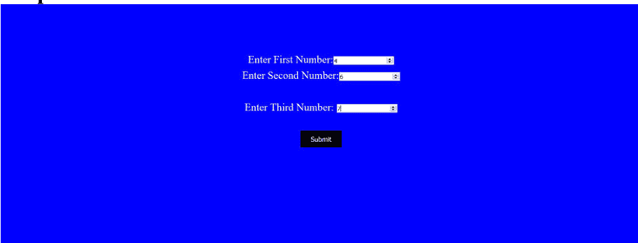

输入数字并点击提交后，我们得到：

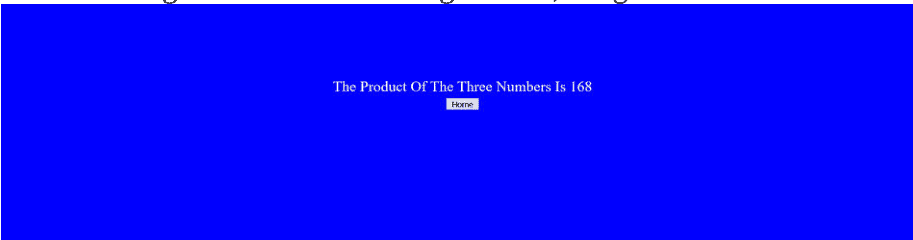

现在，点击主页按钮后，我们得到：

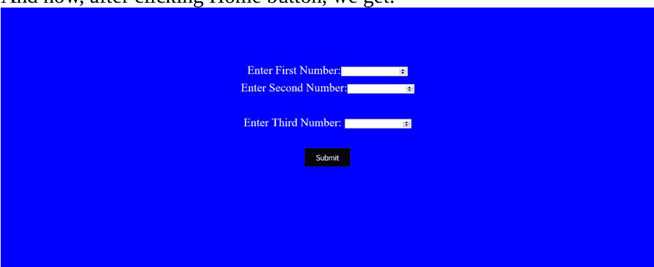

所以，它基本上重新启动了 HTML 程序。
现在，让我们开始第一个游戏。

## 游戏 1 – 猜随机数

在这个游戏中，我们将创建一个表单，通过文本框接收一个数字。该数字在 0 到 10 之间。然后我们将该数字与通过 JavaScript（使用 `Math.random`）生成的随机数进行比较。如果相同，则猜测的数字正确。如果不相同，我们就告诉他们正确的数字。用户可以选择点击‘主页’按钮再试一次。请参阅下面的代码和输出。

```html
<html>
<head><title>猜数字</title>
<link rel="stylesheet" href="samplestyle.css" />
</head>
<body>
<form id="form1">
猜一个0到10之间的数字：<input name="name" type="number" id="num1" size="20"><br>
</form>
<button class="btn a" onclick="guessnumber()">检查</button>
<script>

function guessnumber()
{
var guess=document.getElementById("num1").value;
var rand=Math.floor(Math.random()*10);
if (guess==rand)
{
    document.write("恭喜你。你猜对了数字");
}else{
    document.write("抱歉。你猜错了。正确的数字是 "+rand);
}

document.write('<link rel="stylesheet" type="text/css" href="samplestyle.css" />');
document.write('<br>');
document.write('<button onClick="redirect()">主页</button>');


}
function redirect()
{
window.location.replace("GuessNumber.html");
}
</script>

</body>
</html>
```

## 输出：

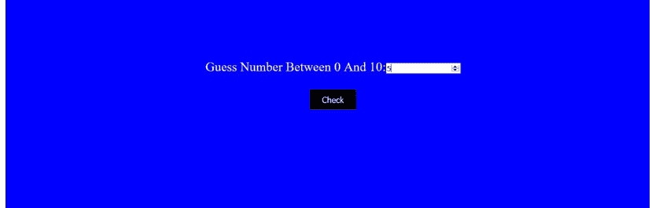

如果我们点击**主页**，就可以再次玩游戏。
这个程序是练习条件循环和随机数生成器的好方法。

## 游戏 2 – 数学测验游戏

这是一个稍长的程序，所以我将其分成了2张图片。它基本上打印出5个简单的数学问题，并通过一个表单（其id为**num1,num2,num3,num4,num5**）获取这些问题的答案。答案作为变量存储在JavaScript中（**answer1,answer2,answer3,answer4,answer5**）。这些答案使用IF函数与真实答案进行比较。每次用户答对时，计数器增加1，最后打印计数器以查看用户答对了多少题。

```html
<html>
<head><title>Math Quiz</title></head>
<link rel="stylesheet" href="samplestyles.css" />
<body>
<form id="form1">
5*2 = :<input name="name" type="number" id="num1" size="20"><br>
7/2 = :<input name="name" type="float" id="num2" size="20"><br>
6*5 = :<input name="name" type="number" id="num3" size="20"><br>
14+29 = :<input name="name" type="number" id="num4" size="20"><br>
17-6 = :<input name="name" type="number" id="num5" size="20"><br>
</form>
<button class="btn" onclick="guessnumber()">Check</button>
<script>

function guessnumber()
{
var correct=0;

var answer1=parseInt(document.getElementById("num1").value);
var answer2=parseFloat(document.getElementById("num2").value);
var answer3=parseInt(document.getElementById("num3").value);
var answer4=parseInt(document.getElementById("num4").value);
var answer5=parseInt(document.getElementById("num5").value);

if (answer1==10)
{
    correct=correct+1;
}
if (answer2==3.5)
{
    correct=correct+1;
}
if (answer3==30)
{
    correct=correct+1;
}
if (answer4==43)
{
    correct=correct+1;
}
if (answer5==11)
{
    correct=correct+1;
}
document.write('<link rel="stylesheet" type="text/css" href="samplestyle.css" />');
document.write("You got "+correct+" answers correct");
}

</script>

</body>
</html>
```

## 输出：

点击**检查**按钮后，我们得到：

这是一个很棒的练习程序。但你可能会想，孩子们只能使用这个程序一次，因为我们总是使用相同的数字。为了解决这个问题，我们在下一个游戏中生成随机数。

## 游戏 3 – 带随机数的数学测验

在下面的程序中，有5个由10个随机数生成的数学问题。这10个随机数是变量**number1-number10**。问题的答案被计算并存储在变量**answer1-answer5**中。这15个变量被称为全局变量，因为它们位于任何函数之外。这意味着它们的值可以在程序中的任何地方被任何函数访问。
函数**startquiz()**使用10个变量**number1-number10**在屏幕上编写测验，并创建一个表单，该表单接收5个id为**num1-num5**的答案。点击**检查**按钮后，这5个答案被发送到函数**guessnumber()**并存储为变量**guess1-guess5**。这5个答案（**guess1-guess5**）使用5个不同的IF函数与计算出的答案（**answer1-answer5**）进行检查。每次答对时，计数器都会增加。最终，打印计数器以显示正确答案的数量。最后还有一个**主页**按钮，为用户提供了使用新问题重新启动程序的选项。这些问题都是随机生成的，这意味着用户每次都会得到不同的问题。

```html
<html>
<head><title>Math Quiz</title></head>
<link rel="stylesheet" href="samplestyle.css" />
<body>
<button class="btn" onclick="startquiz()">Start Math Quiz</button>

<script>

var number1=Math.floor(Math.random()*10)+1;
var number2=Math.floor(Math.random()*10)+1;
var number3=Math.floor(Math.random()*10)+1;
var number4=Math.floor(Math.random()*10)+1;
var number5=Math.floor(Math.random()*50)+1;
var number6=Math.floor(Math.random()*50)+1;
var number7=Math.floor(Math.random()*50)+1;
var number8=Math.floor(Math.random()*50)+1;
var number9=Math.floor(Math.random()*50)+1;
var number10=Math.floor(Math.random()*50)+1;
var answer1=number1*number2;
var answer2=number3*number4;
var answer3=number5+number6;
var answer4=number7-number8;
var answer5=number9%number10;

function startquiz()
{
document.write(number1+" * "+number2+" = ");
document.write('<input name="name" type="number" id="num1" size="20"><br>');

document.write(number3+" * "+number4+" = ");
document.write('<input name="name" type="number" id="num2" size="20"><br>');

document.write(number5+" + "+number6+" = ");
document.write('<input name="name" type="number" id="num3" size="20"><br>');

document.write(number7+" - "+number8+" = ");
document.write('<input name="name" type="number" id="num4" size="20"><br>');

document.write(number9+" / "+number10+". Remainder= ");
document.write('<input name="name" type="number" id="num5" size="20"><br>');
document.write('<link rel="stylesheet" type="text/css" href="samplestyle.css" />');
document.write('<br>');
document.write('<button class="btn a" onclick="guessnumber()">Check</button><br>');
}

function guessnumber()
{
document.body.innerHTML='';
correctanswers=0;
var guess1=document.getElementById("num1").value;
var guess2=document.getElementById("num2").value;
var guess3=document.getElementById("num3").value;
var guess4=document.getElementById("num4").value;
var guess5=document.getElementById("num5").value;
document.write("Answer 1 = "+answer1+'<br>');
document.write("Answer 2 = "+answer2+'<br>');
document.write("Answer 3 = "+answer3+'<br>');
document.write("Answer 4 = "+answer4+'<br>');
document.write("Answer 5 = "+answer5+'<br>');

if (guess1==answer1)
{
    correctanswers=correctanswers+1;
}
if (guess2==answer2)
{
    correctanswers=correctanswers+1;
}
if (guess3==answer3)
{
    correctanswers=correctanswers+1;
}
if (guess4==answer4)
{
    correctanswers=correctanswers+1;
}
if (guess5==answer5)
{
    correctanswers=correctanswers+1;
}

document.write("Number of correct answers = "+correctanswers);
document.write('<br>');
document.write('<button class="btn a" onClick="redirect()">Home</button>');

}

function redirect()
{
window.location.replace("MathQuiz_Random_Numbers.html");
}

</script>

</body>
</html>
```

## 输出：

点击**检查**按钮后，我们得到：

现在，我们知道我们得到了所有正确答案。现在，让我们再次点击**主页**。我们点击**开始数学测验**，再次回到这里进行另一次测验。由于数字是随机的，我们得到了5个完全不同的问题。太棒了！！

3 * 8 =

9 * 8 =

18 + 6 =

48 - 21 =

2 / 39. Remainder=

Check

## 练习题

- 1. 编写一个程序，生成两个0到10之间的随机数。程序计算它们的和与积。它在屏幕上打印出和与积，并要求用户猜测这两个数字。用户通过表单输入他的猜测，并与最初的两个数字进行检查。如果他猜对了，他会得到一条祝贺信息。如果他猜错了，程序会让他知道正确答案。最后，有重新启动程序并再次尝试的选项。
- 2. 编写一个程序，生成一个0到20之间的随机数。它对该数字求平方，并在屏幕上打印出平方值。然后，它要求用户猜测这个数字是什么。用户通过表单输入数字，程序检查它是否正确。
- 3. 编写一个程序，允许用户通过表单输入3个数字。这3个数字应该是三角形的3条边。然后程序检查这是否是一个直角三角形。程序会告知用户它是否是一个直角三角形（提示：使用勾股定理进行检查）。

## 字符串变量

在 JavaScript 编程中，字符串变量用于存储一组字符。
例如：
`var x="awe3t5"`
x 是一个字符串变量，存储了值 “awe3t5”。
这是一个大小为 6 的字符串变量。当我们访问字符串时，请记住值是从 0 开始而不是从 1 开始。例如，`x[0]` 返回值 a，`x[1]` 返回 w，依此类推。
字符串在处理文本信息（如姓名、地址等）时非常有用。
以下是可以用来处理字符串的常用函数列表。

**length** – 返回字符串的长度。在上面的例子中，x.length 返回 6。

**charAt(y)** – 返回字符串中位置 y 的字符。例如，在字符串 x 中；如果我们想要第 5 个字符，我们执行 `x.charAt(5)`，它返回 t。

**indexOf(y)** – 检查字符 y 在字符串中的索引。例如，`x.indexOf(‘a’)` 返回 0。

**lastIndexOf(y)** – 检查字符 y 在字符串中的最后一个索引。例如，`x.lastIndexOf(‘e’)` 返回 3。这仅在同一个字符串有多个出现时才有用。

**.concat(b)** – 将字符串 b 连接到之前的字符串。例如，如果字符串 a = ”xyz” 且字符串 b = “lmn”；`a.concat(b)` 得到 “xyzlmn”。

**includes(y)** – 检查字符串 y 是否包含在字符串中，并返回 true 或 false 值。例如，如果字符串 x= “Hi Peter”；那么 `x.includes(“Hi”)` 返回 true，但 `x.includes(“Home”)` 返回 false。

**replace(x,a)** – 基本上将字符串 x 的所有实例替换为字符串 a。例如，如果字符串 str =”Hi Peter”；那么 `str.replace(“Hi”,”Hello”)` 变成 str=”Hello Peter”。

**startswith(y)** – 检查字符串是否以字符串 y 开头。它返回一个 **true** 或 **false** 值的布尔变量。在上面的例子中，str.startswith(“Hi”) 返回 true，而 str.startswith(“Hello”) 返回 false。

**toUpper()** – 将整个字符串转换为大写。在上面的例子中，str.toUpper() 变成 “HI PETER”。

**toLower()** – 将整个字符串转换为小写。在上面的例子中，str.toLower() 变成 “hi peter”。

## 示例 1 – 玩转你的名字；名字反转游戏

在下面的例子中，我们通过表单输入我们的名字。有两个按钮，一个打印你名字的长度；第二个反转你的名字。第一个按钮运行一个名为 **strlength()** 的函数。**strlength()** 通过表单获取你的名字，并使用 **.length** 函数找到长度。第二个按钮执行一个名为 **namereverse()** 的函数。namereverse() 再次通过表单获取你的名字并找到长度。然后它运行一个 FOR 循环，从最后一个字符开始，不断减去 1 直到到达第一个字符。它在每次循环迭代时打印出字符。这会从最后一个字符到第一个字符打印出字母，从而反转名字。
以下是代码和输出。

```html
<html>
<head><title>JavaScript Lesson 4 - Strings</title></head>
<body>
<link rel="stylesheet" href="samplestyle.css" />
<form id="form1">
Enter Name:<input name="name" type="text" id="name" size="20"><br>

<button onclick="strlength()">Name Length</button>
<button onclick="namereverse()">Name Reverse</button>
<script>

function strlength()
{
var nm=document.getElementById("name").value;
document.write("Your name is "+nm.length+ " characters long");
document.write('<link rel="stylesheet" type="text/css" href="samplestyle.css" />');
document.write('<br>');
}

function namereverse()
{
var nm=document.getElementById("name").value;
len=nm.length;
document.write("Name Reversed = ");
for (i=len-1;i>=0;i--)
{
document.write(nm[i]);
}
document.write('<link rel="stylesheet" type="text/css" href="samplestyle.css" />');
document.write('<br>');
}

</script>

</body>
</html>
```

输出：

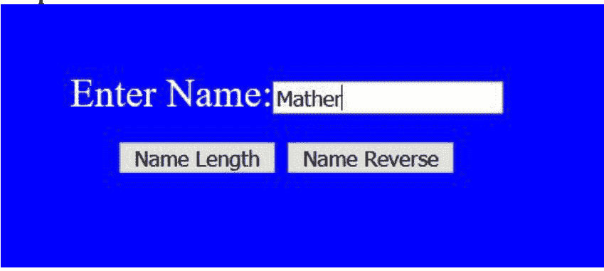

点击 **Name Length** 后

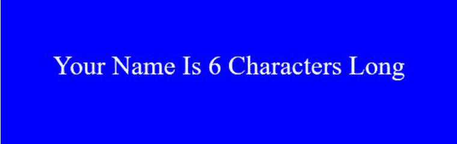

点击 **Name Reverse** 后

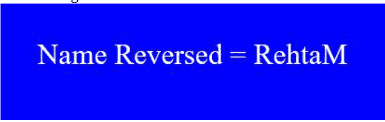

## 示例 2 – 地址检查

在下面的程序中，用户通过表单输入姓名和地址。地址通过文本区域输入，以允许更多字符。它接受 5 行，每行 40 个字符（总共 200 个字符）。因此，这个程序的目标是将所有飞抵的纽约居民分配到单独的酒店。按钮运行一个名为 addcheck() 的函数。Addcheck() 从表单中获取姓名和地址，并将它们分配给变量。
一个带有 .includes() 的 IF 函数检查地址是否包含 “New York”。
如果包含，那么姓名字符串使用 .concat() 与酒店 1 字符串连接。
如果不包含纽约，那么姓名字符串与酒店 2 字符串连接。
无论哪种情况，我们都打印出连接后的字符串。
以下是代码以及几个输出，展示了两种不同的情况。

```html
<html>
<head><title>JavaScript Lesson 4 - Strings</title></head>
<body>
<link rel="stylesheet" href="samplestyle.css" />
<form id="form1">
Enter Name:<input name="name" type="text" id="name" size="20"><br>
Enter Address: <textarea name="TextBox" cols="40" rows="5" id="address"></textarea><br><br>

<button onclick="addcheck()">Check Address</button>

<script>

function addcheck()
{
var nm=document.getElementById("name").value;
var address=document.getElementById("address").value;
var len=address.length;
var pstr="";
h1=" stays in Hotel 1";
h2=" stays in Hotel 2";
if (address.includes("New York"))
{
pstr=nm.concat(h1);
document.write(pstr);
}
else
{
pstr=nm.concat(h2);
document.write(pstr);
}
document.write('<link rel="stylesheet" type="text/css" href="samplestyle.css" />');
document.write('<br>');
}

</script>

</body>
</html>
```

# 输出 #1：

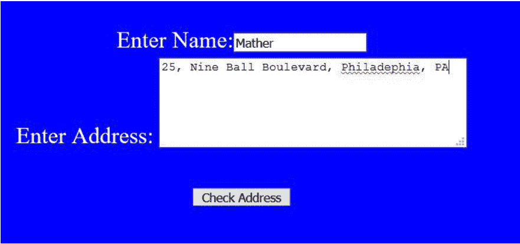

点击 **Check Address** 后，显示酒店 2，因为地址不是来自纽约。

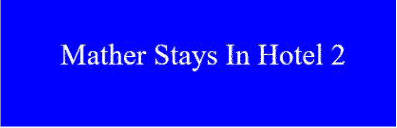

## 输出 #2

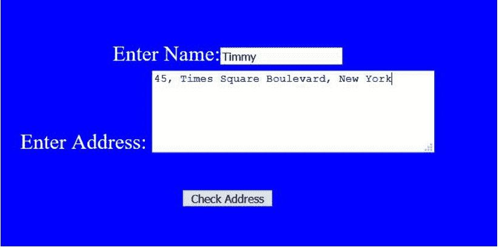

点击 **Check Address** 后，显示酒店 1，因为地址是纽约地址。

## 示例 3 – 输入字符串并用 ***** 替换所有脏话

在下面的代码中，我们通过文本区域输入文本，并用五个星 ***** 替换所有脏话。为了审查目的，我们使用 “Fudge” 作为我们的脏话。
按钮运行 **filterc()** 函数。**filterc()** 函数通过表单中的文本区域 id 获取文本。一个带有 **.includes** 和 **.toUpperCase()** 的 IF 函数检查是否找到单词 “Fudge”。使用 **.toUpperCase()** 是因为我们不知道脏话是以小写还是大写输入的。
如果是脏话，我们使用 **.replace** 将单词 “Fudge” 和 “FUDGE” 替换为 “******”。最后，我们打印出修改后的字符串。以下是代码和几个输出变体。

```html
<html>
<head><title>JavaScript Lesson 4 - Strings</title></head>
<body>
<link rel="stylesheet" href="samplestyle.css" />
<form id="form1">
Enter Name:<input name="name" type="text" id="name" size="20"><br>
Enter Text: <textarea name="TextBox" cols="40" rows="5" id="phrase"></textarea><br><br>

<button onclick="filterc()">Filter Curse Words</button>

<script>

function filterc()
{
var nm=document.getElementById("name").value;
var text=document.getElementById("phrase").value;
var modtext=text;
if (text.toUpperCase().includes("FUDGE"))
{
modtext=text.replace("Fudge","****").replace("FUDGE","*****");
}
document.write("Modified Text ="+modtext);
document.write('<link rel="stylesheet" type="text/css" href="samplestyle.css" />');
document.write('<br>');
}

</script>

</body>
</html>
```

# 输出 #1：

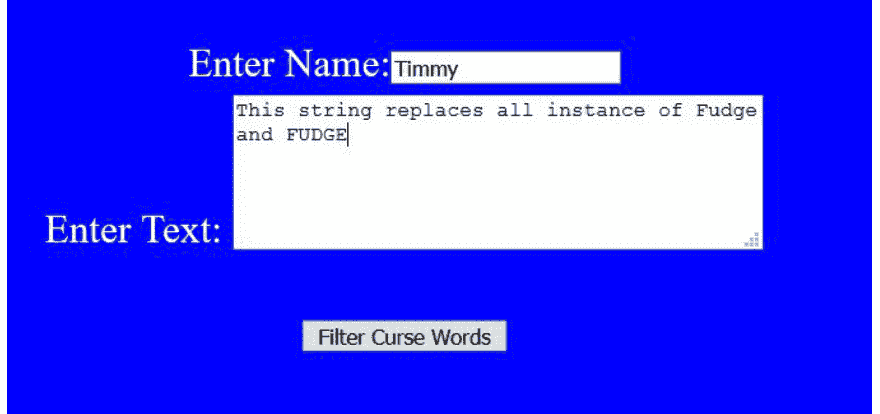

点击 **Filter Curse Words** 后...

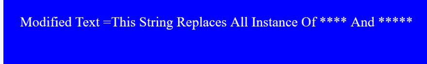

# 输出 #2：

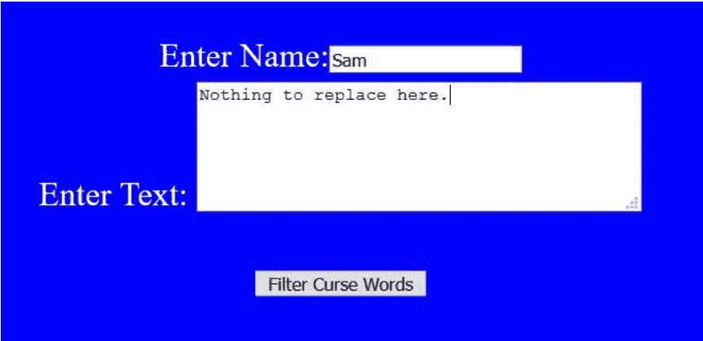

点击 **Filter Curse Words** 后...

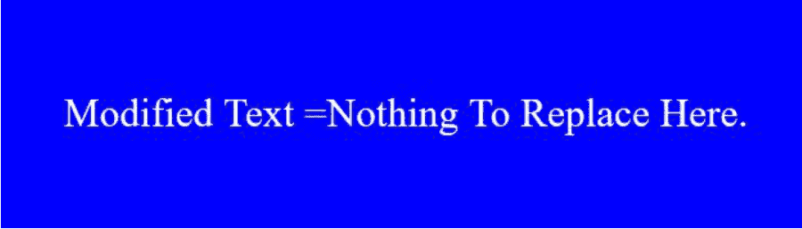

## 练习题

1.  编写一个程序，接收一个字符串并打印出字符串中每隔一个的字符。例如，“wfwfwkfnfwbej”会打印出“ffkbwj”。
2.  编写一个程序，接收一个长句子，并将所有“red”替换为“yellow”。
3.  编写一个程序，接收一个地址并检查邮政编码是否包含5个字符。如果多于或少于5个字符，或者没有邮政编码，则打印出“Invalid Address”。

## 数组

JavaScript 中的数组用于存储一组相似的变量。想想你会如何用变量存储人的年龄。假设我们有三个人及其年龄。我们可以将它们存储在变量 `age1`、`age2` 和 `age3` 中。

```
age1=5;
age2=25;
age=45;
```

现在，假设我们有10个人。我们可以将它们存储在变量 `age1`、`age2`..... `age10` 中。那么，如果我们需要存储100个人的年龄呢？你明白了。变量太多，难以追踪。因此，我们使用数组。要存储10个年龄，我们只需使用：

```
age=[5,25,45,60,20,23,24,43,34,78];
```

在 JavaScript 中访问数组的值时，我们使用数组的索引。第一个元素的索引是0，第二个是1，第三个是2，依此类推.... 例如，

**document.write(age[0])** 输出 5；
**document.write(age[1])** 输出 25；
**document.write(age[5])** 输出 23。

### 示例 1 – 在 JavaScript 中创建数组

现在，让我们看下面的例子。我们为5个人的姓名、年龄和所在州在 JavaScript 中创建了3个数组。我们使用数组索引打印这些值。然后，我们使用 **.push()** 功能添加了第6个人。请查看下面的代码和输出。

```
<html>
<head><title>JavaScript Lesson 5 - Arrays</title></head>
<body>
<link rel="stylesheet" href="samplestyle.css" />

<button onclick="createarray()">Print Array</button>

<script>

function createarray()
{
document.write('<link rel="stylesheet" type="text/css" href="samplestyle.css" />');
document.write('<br>');

var nm = ["Jim","Tim","Kim","Bim","Sam"];
var age=[7,56,40,34,56];
var state=["Florida","California","Georgia", "Illinois", "Nevada"];
document.write(nm[0]+' lives in '+state[0]+' state and age is '+age[0]+"<br>");
document.write(nm[1]+' lives in '+state[1]+' state and age is '+age[1]+"<br>");
document.write(nm[2]+' lives in '+state[2]+' state and age is '+age[2]+"<br>");
document.write(nm[3]+' lives in '+state[3]+' state and age is '+age[3]+"<br>");
document.write(nm[4]+' lives in '+state[4]+' state and age is '+age[4]+"<br>");
name.push("Yang");//Adding another index to the array
age.push(20);
loc.push("California");
document.write(nm[5]+' lives in '+state[5]+' state and age is '+age[5]+"<br>");

}
</script>

</body>
</html>
```

## 输出：

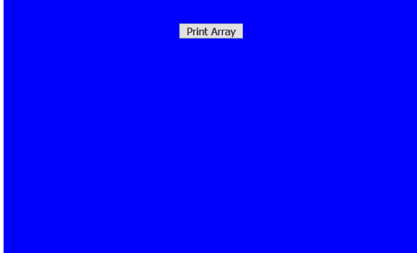

点击 **Print Array** 后，我们得到..

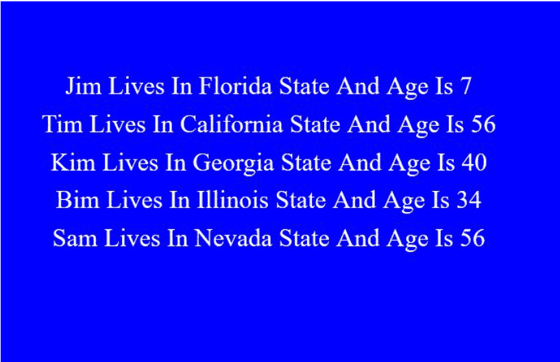

### 示例 2 – 通过表单赋值数组

在这个例子中，我们通过 HTML 表单输入姓名、年龄和所在州。在 JavaScript 中，我们将表单元素赋值给变量。
通过表单输入了3个姓名、年龄和州位置，并使用 **document.getElementById** 将它们输入到3个数组中。
最后使用 **document.write()** 打印数组。

```
<html>
<head><title>JavaScript Lesson 5 - Arrays</title></head>
<body>
<link rel="stylesheet" href="samplestyle.css" />
Enter Name1 <input name="name" type="text" id="name0" size="20"><br>
Enter Age1 <input name="age" type="number" id="age0" size="20"><br>
Enter State1 <input name="state" type="text" id="state0" size="20"><br>

Enter Name2 <input name="name" type="text" id="name1" size="20"><br>
Enter Age2 <input name="age" type="number" id="age1" size="20"><br>
Enter State2 <input name="state" type="text" id="state1" size="20"><br>

Enter Name3 <input name="name" type="text" id="name2" size="20"><br>
Enter Age4 <input name="age" type="number" id="age2" size="20"><br>
Enter State4 <input name="state" type="text" id="state2" size="20"><br>
<button onclick="createarray()">Start Program</button>
```

```
<script>

function createarray()
{
var nm=[];
var age=[];
var state=[];

nm[0]=document.getElementById("name0").value;
age[0]=document.getElementById("age0").value;
state[0]=document.getElementById("state0").value;
nm[1]=document.getElementById("name1").value;
age[1]=document.getElementById("age1").value;
state[1]=document.getElementById("state1").value;
nm[2]=document.getElementById("name2").value;
age[2]=document.getElementById("age2").value;
state[2]=document.getElementById("state2").value;

document.write('<link rel="stylesheet" type="text/css" href="samplestyle.css" />');
document.write('<br>');
document.write(nm[0] + " is "+age[0]+" years old and lives in "+state[0]+"<br>");
document.write(nm[1] + " is "+age[1]+" years old and lives in "+state[1]+"<br>");
document.write(nm[2] + " is "+age[2]+" years old and lives in "+state[2]+"<br>");

}
```

## 输出：

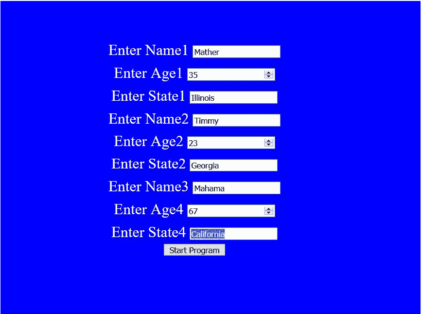

点击 **Start Program** 后，我们得到：

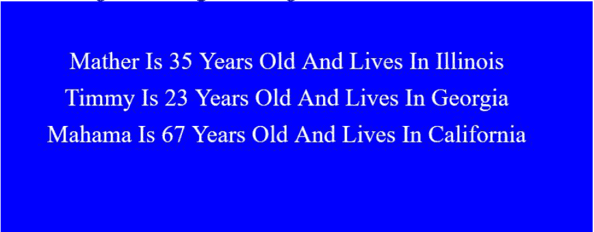

### 示例 3 – 猜世界首都

在这个程序中，我们编写了一个测验，询问用户世界上某个随机国家的首都，并检查答案是否正确。
在程序中，一个按钮运行 **worldquiz()** 函数。在该函数中，我们声明了两个数组。一个数组包含世界上所有的国家；另一个包含所有的首都。
你可以从下面获取这些数组的值：
[https://drive.google.com/file/d/1Vbnrllk290oVmh3Vn8Jv2EgFBL1w8vSd/view?usp=sharing](https://drive.google.com/file/d/1Vbnrllk290oVmh3Vn8Jv2EgFBL1w8vSd/view?usp=sharing)
然后，我们在0和 x 之间选择一个随机数，x 是数组的长度。这个随机数从数组中随机选择一个国家。我们使用 **Math.random()** 和 **Math.floor()** 来实现这一点。
我们使用 **prompt** 获取用户对首都的猜测。我们将用户的猜测与实际的首都进行比较。然后，我们向用户发送一条消息，告诉他们正确或错误（如果错误，则显示正确的首都）。
然后，用户有机会使用运行 **redirect()** 函数的 **Home** 按钮重新启动程序。重定向函数运行 '**GuessWorldCapitals.html**'，这是文件的名称。代码和输出如下所示。

```
<html>
<head><title>Guess World Capitals</title>
<link rel="stylesheet" href="styles.css" />
</head>
<body>
<button class="btn a" onclick="worldquiz()">Start Quiz</button>
<script>

function worldquiz()
{

var countries = ["Afghanistan","Albania","Algeria","Andorra","Angola","Antigua and Barbuda","Argentina","Armenia",...];
var capitals = ["Kabul","Tirana (Tirane)","Algiers","Andorra la Vella","Luanda","Saint John's","Buenos Aires","Yer...];
var randomcountrynumber = Math.floor(Math.random() * countries.length);
var chosencountry = countries[randomcountrynumber];
var chosencapital = capitals[randomcountrynumber];
var guess = prompt("What is the capital of "+chosencountry+" ?");

if (guess.toUpperCase()==chosencapital.toUpperCase())
{
    document.write("<p>Congratulations. You are correct.</p>");
}else
{
    document.write("<p>Wrong. The capital is "+chosencapital+"</p>");
}

document.write('<link rel="stylesheet" type="text/css" href="styles.css" />');
document.write('<br>');

document.write('<button onClick="redirect()">Home</button>');

}
function redirect()
{
window.location.replace("GuessWorldCapitals.html");
}

</script>
</body>
</html>
```

# 输出 #1：

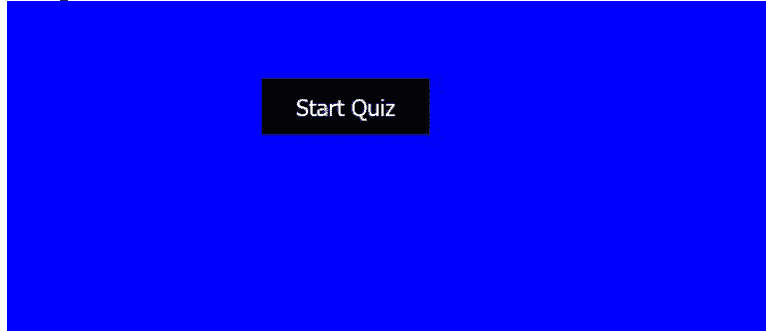

点击 **Start Quiz**

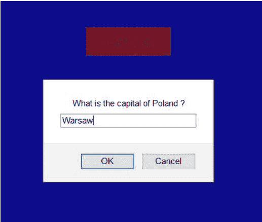

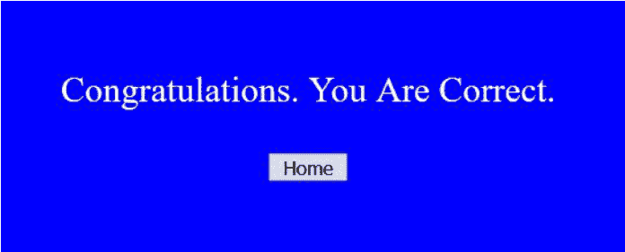

# 输出 #2：

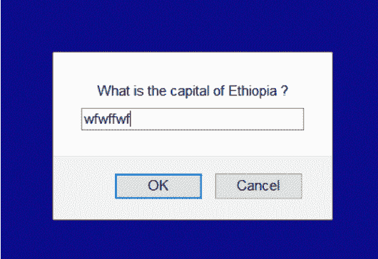

错误。首都是亚的斯亚贝巴

主页

### 示例 4 – 随机笑话

这个程序从笑话列表中随机挑选一个笑话并打印出来。一个按钮运行 **writejoke()** 函数。在该函数中，我们声明了一个包含所有笑话的数组。
你可以从下面获取数组的值：
[https://drive.google.com/file/d/1xDN9dt2Gvj-mdPmi5ATCnP1tvOZtZt25/view?usp=sharing](https://drive.google.com/file/d/1xDN9dt2Gvj-mdPmi5ATCnP1tvOZtZt25/view?usp=sharing)
然后，我们在0和 x 之间选择一个随机数，x 是数组的长度。这个随机数随机选择一个国家。我们使用 **Math.random()** 和 **Math.floor()** 来实现这一点。
然后，我们使用 **document.write()** 函数打印出笑话。
然后，用户有机会使用运行 **redirect()** 函数的 **Home** 按钮重新启动程序。

## 随机鸭子笑话

```html
<html>
<head><title>Random Duck Jokes</title>
<link rel="stylesheet" href="samplestyle.css" />
</head>
<body>
<button class="btn a" onclick="writejoke()">Get A Duck Joke</button>
<script>
var duckjokes = [
"Why did the duck cross the road? It was the chicken's day off",
"Why did the duck detective get promoted? He quacked the case",
"Why did the tiger cross the road? To eat the duck and the hen",
"What did the duck do when he saw the clown? He started quacking up",
"Why is the duck always standing straight? To hide his butt-quack",
"Which is the heaviest bird? The crane",
"Why did the duck go to prison? He became a quackpot.",
"Why did the bee do his own haircuts? He did buzzcuts",
"Why did the duck lose the race? Because he was a lame duck",
"What happened after the duck got injured? He went to a ducktor!",
"Where did the duck eat breakfast? Quacker barrel",
"Why did the hen keep its nest warm? Because it was eggstremely cold outside",
"Why did the duck not like the soup? Because it had no quackers!",
"Why were the two ducks always together? They were stuck together with duck-tape",
"Why do swans avoid the stock market? Because they're afraid of the black-swan",
"How do ducks know if it's about to rain? They checked the feather-forecast",
"What did the duck do on July 4th? It burst quackers",
]
function writejoke()
{
var chosenjoke = duckjokes[Math.floor(Math.random() * duckjokes.length)];

document.write(chosenjoke);
document.write('<link rel="stylesheet" type="text/css" href="samplestyle.css" />');
document.write('<br>');
document.write('<button onClick="redirect()">Home</button>');
}
function redirect()
{
window.location.replace("RandomJoke.html");
}
</script>

</body>
</html>
```

# 输出 #1：

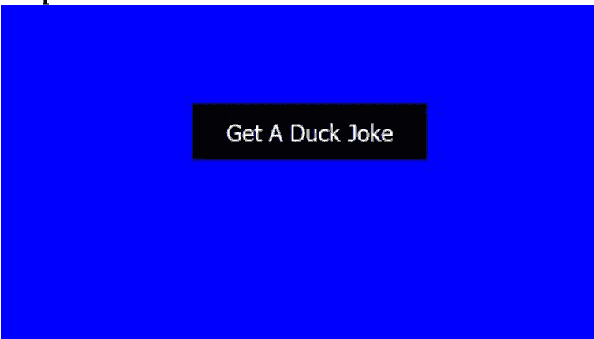

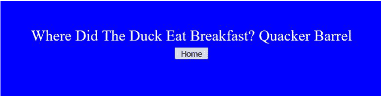

# 输出 #2：

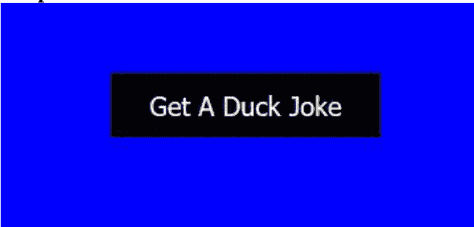

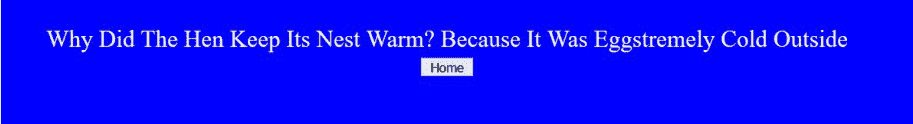

## 示例 5 – 动物猜词游戏

这个程序实现了一个有趣的动物猜词游戏。下面程序中的按钮启动了 **animalhangman()** 函数。在该函数中，我们首先声明一个包含所有动物的数组。然后，我们使用 `Math.random()` 和 `Math.floor()` 随机选择一个动物。

我们创建一个变量来存储答案（**answerArray**）。它存储用户的答案。它被初始化为与原始动物名称长度相同的下划线（_）。

变量 **remletters** 是剩余待猜测的字母数量。我们创建一个 `while` 循环，只要 **remletters>0**，就持续接受用户的猜测。

使用 `prompt`，我们从用户那里接受单个字母输入。如果输入超过一个字母，我们会设置错误信息并要求用户只输入一个字母。一旦用户输入一个字母，我们就进入一个循环，将随机动物的每个字母与用户输入的字母进行比较。每次匹配时，我们将 **remletters** 减 1，并用匹配的字母更新 **answerArray** 的相关部分。在 `while` 循环结束时，用户已经猜出了动物，我们打印出包含动物名称的祝贺信息。

在 `while` 循环内的任何时刻，如果用户没有输入字母并试图继续，我们将退出程序循环并打印出动物名称。

在游戏结束时，用户可以选择使用 **Home** 按钮重新启动程序。下面是代码和一些示例。

```html
<html>
<head>
  <title>Animal Hangman</title>
  <link rel="stylesheet" href="samplestyle.css" />
</head>
<body>
  <button class="btn" onclick="animalhangmman()">Start Animal Hangman</button>

  <script>
    function animalhangmman()
    {
      // Create an array of animals
      var animals = [
        "tiger",
        "lion",
        "monkey",
        "kangaroo",
        "racoon",
        "flamingo",
        "elephant",
        "porcupine"
      ];
      var chosenanimal = animals[Math.floor(Math.random() * animals.length)];
      var answerArray = [];
      for (var i = 0; i < chosenanimal.length; i++) {
        answerArray[i] = "_";
      }
    }
  </script>
</body>
</html>
```

```javascript
var remletters = chosenanimal.length;
while (remletters > 0)
{
alert(answerArray.join(" "));
var guess = prompt("Guess a letter, or click Cancel to stop playing.");
if (guess == null)
{
// Exit the game loop
break;
}
else if (guess.length !== 1)
{
alert("Please enter a single letter.");
}
else
{
// Update the game state with the guess
for (var j = 0; j < chosenanimal.length; j++)
{
if (chosenanimal[j] === guess)
{
answerArray[j] = guess;
remletters=remletters-1;
}
}
} // The end of the game loop
}
// Show the answer and congratulate the player
alert(answerArray.join(" "));
alert("Good job! The answer was " + chosenanimal);
}
</script>
</body>
</html>
```

# 输出 #1

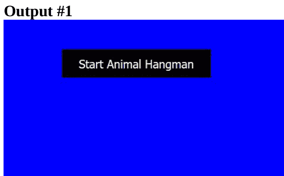

下面是显示答案长度的起始点。

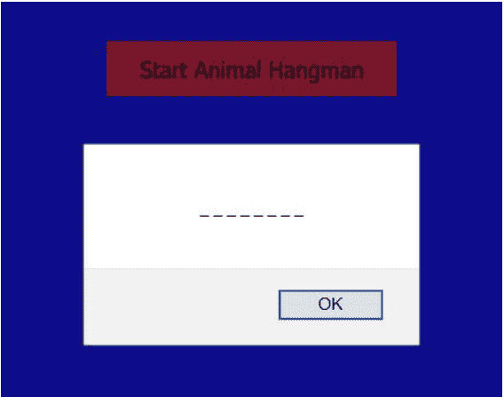

猜测第一个字母。用户输入 ‘t’

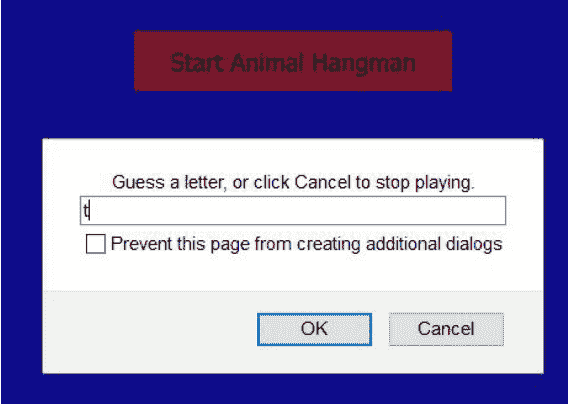

没有 ‘t’。所以我们再试一次。

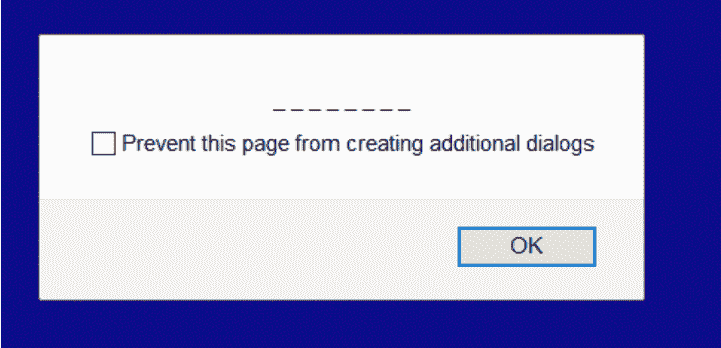

用户输入 ‘k’

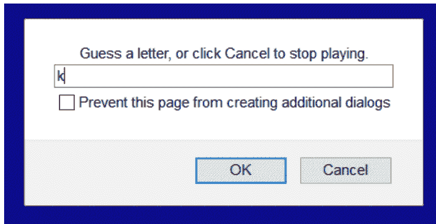

答案中没有 ‘k’。仍然没有猜对。

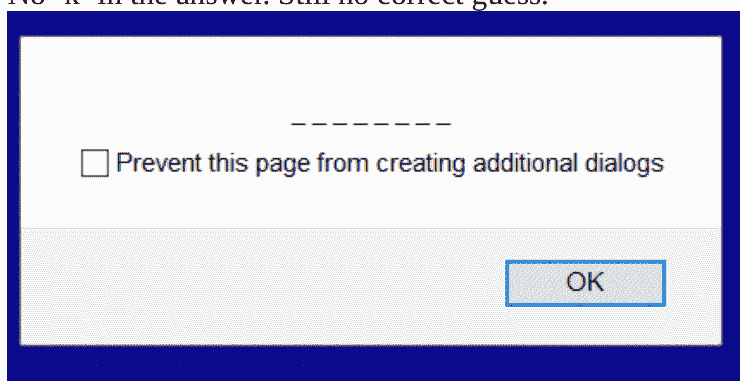

现在，用户输入 ‘o’

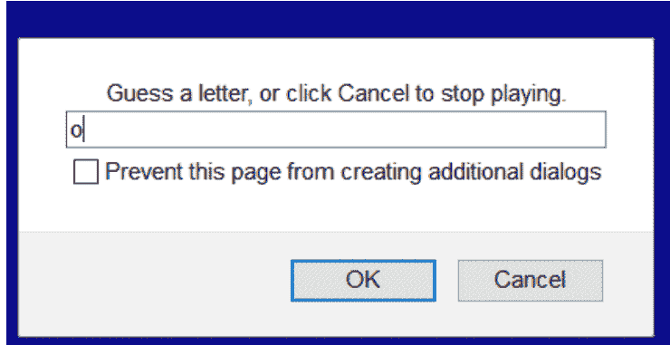

用户终于猜对了。单词以 ‘o’ 结尾，我们在更新后的答案中看到了它。

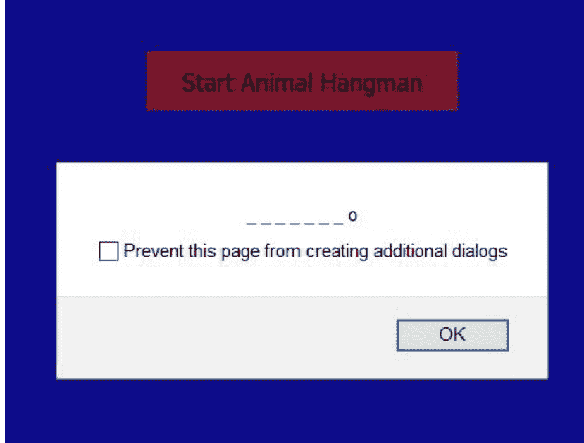

所以，经过几次这样的猜测，我们得到了下面的答案。只差一次猜测。

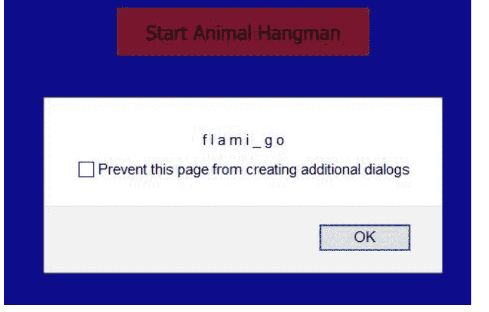

用户猜测 ‘n’。

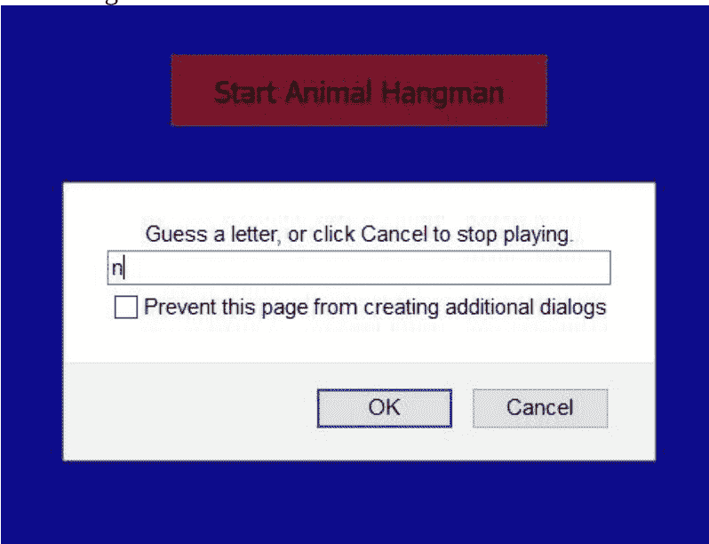

这是正确的。整个单词是 flamingo。

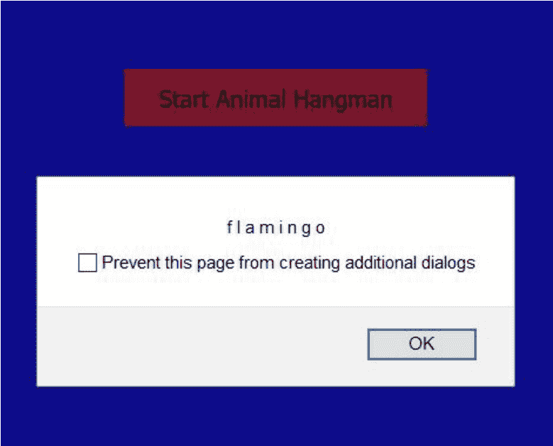

然后，程序在下面显示了正确答案。

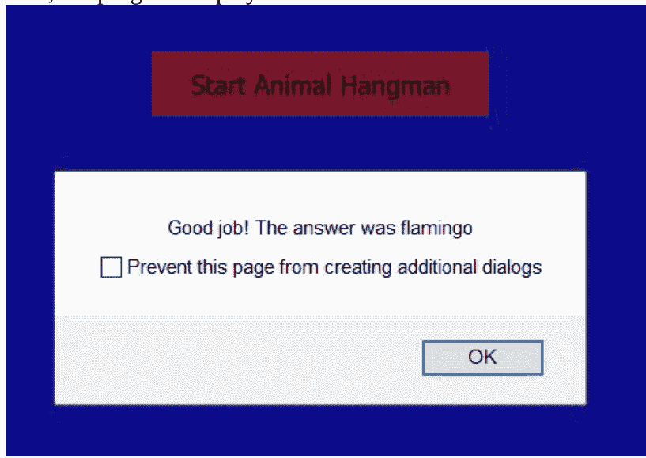

## 练习题

- 1. 创建一个简历系统，通过表单接收多个候选人信息，并将它们存储在不同的数组中。一个数组用于姓名，一个用于城市，一个用于大学，一个用于 GPA。打印出所有在特定城市中的姓名。
- 2. 编写一个关于美国总统的测验程序。创建一个包含所有美国总统的数组。创建另一个数组，其中包含每位美国总统的一个著名事实。程序随机选择一个事实呈现给用户；用户可以猜测那是谁。
- 3. 编写一个程序，将经销商拥有的所有汽车列在一个数组中。另一个对应的数组包含所有这些汽车的价格；第三个数组包含制造年份。程序从用户那里获取一个型号年份，并打印出所有比该年份更新的汽车及其价格。
- 4. 编写一个程序，玩体育猜词游戏。选择一项运动；并选择你在该运动中最喜欢的 20 名球员。将球员放入一个大小为 20 的数组中，让用户像猜词游戏一样猜测字母。

## 对象

编程中的对象是具有每个属性值的属性集合。这些属性不必是相同的变量类型。例如，我们可以有一个同时包含字符串和数字属性的对象。

## 示例 1

在下面的示例中，我们为一辆汽车创建了一个对象。它有 4 个不同的属性，一个用于名称，一个用于型号，一个用于价格，一个用于车牌。这些通过表单的用户输入来接收。

它们在 **entercar()** 函数中作为输入接收，然后在 printcars() 函数中分配给一个对象。在 **printcars()** 函数中，通过表单的用户输入被分配给 4 个单独的变量。

这些变量被分配给对象 car，如下所示。属性和值之间用冒号（:）分隔，不同的属性/值对之间用逗号（,）分隔。

在下面的示例中，type、model、license 和 price 是属性；而 **carname**、**carmodel**、**carnumber** 和 **carprice** 是相应属性的值。下面的 4 个值来自用户表单。

```javascript
var car={type:carname,model:carmodel,license:carnumber,price:carprice};
```

要访问对象的值，我们在属性前使用点（.）运算符。例如，**car.type** 将给你对象 ‘car’ 的 ‘type’ 属性所分配的值。

因此，我们通过访问对象的属性值来打印汽车类型和价格。

代码和输出如下。

## 输出 1：

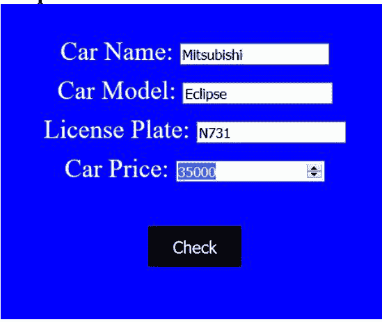

点击 **Check** 按钮后，我们得到：

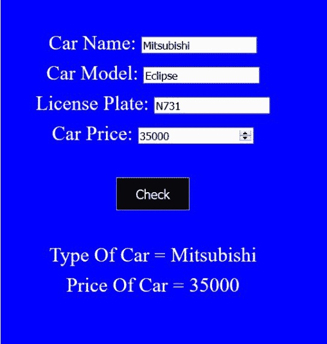

## 示例 2

在下面的例子中，我们模拟了6名玩家之间的掷骰子游戏。基本上，掷骰子游戏进行10次；根据骰子落在1-6之间的位置，为玩家加分。例如，如果落在1上，则给玩家1加一分。如果落在2上，则给玩家2加一分，依此类推。骰子的值使用 **Math.Random()** 函数在1到6之间模拟。

在程序开始时，声明了一个对象 **gameplayer**。属性是玩家的名称，值是获得的分数。

在函数 **dicegame()** 中，有一个 **FOR** 循环，运行 **gamecalc()** 10次。在 gamecalc() 中，选择一个1到6之间的随机数，模拟掷骰子。根据骰子落在哪个值上，玩家的属性值增加10。

在 **FOR** 循环结束时，我们在下面打印出每个玩家获得的分数。

代码如下，并附有示例输出。

```html
<html>
<head><title>Game Score Keeper</title></head>
<link rel="stylesheet" href="samplestyle.css" />
<body>
<button class="btn" onclick="dicegame()">Start Playing</button>

<script>
var gameplayers={"Adam": 0,"Bob":7,"Carol":0,"Steve":4,"Mark":2,"Tim":0,};

function dicegame()
{

for (i=0;i<10;i++)
{
gamecalc();
}
document.write("<br>");
document.write("Adam scored "+gameplayers["Adam"]+ " points.<br>");
document.write("Bob scored "+gameplayers["Bob"]+ " points.<br>");
document.write("Carol scored "+gameplayers["Carol"]+ " points.<br>");
document.write("Steve scored "+gameplayers["Steve"]+ " points.<br>");
document.write("Mark scored "+gameplayers["Mark"]+ " points.<br>");
document.write("Tim scored "+gameplayers["Tim"]+ " points.<br>");

document.write('<link rel="stylesheet" type="text/css" href="samplestyle.css" />');
document.write('<br>');

document.write('<button class="btn a" onclick="dicegame()">Check</button><br>');
}

function gamecalc()
{
score=Math.floor((Math.random() * 6) + 1);

if(score==1)
{
gameplayers["Abhishek"]=gameplayers["Abhishek"]+10;
document.write("Abhishek won 10 points.<br>");
}
if(score==2)
{
gameplayers["Bob"]=gameplayers["Bob"]+10;
document.write("Bob won 10 points.<br>");
}
if(score==3)
{
gameplayers["Carol"]=gameplayers["Carol"]+10;
document.write("Carol won 10 points.<br>");
}
if(score==4)
{
gameplayers["Steve"]=gameplayers["Steve"]+10;
document.write("Steve won 10 points.<br>");
}
if(score==5)
{
gameplayers["Mark"]=gameplayers["Mark"]+10;
document.write("Mark won 10 points.<br>");
}
if(score==6)
{
gameplayers["Tim"]=gameplayers["Tim"]+10;
document.write("Tim won 10 points.<br>");
}
}
function redirect()
{
window.location.replace("ObjectsCars.html");
}

</script>
</body>
</html>
```

## 输出：

输出的前10行显示了在循环的10次迭代中谁赢得了掷骰子游戏。
底部的6行显示了玩家获得的最终分数。

```
Tim Won 10 Points.
Adam Won 10 Points.
Steve Won 10 Points.
Mark Won 10 Points.
Bob Won 10 Points.
Adam Won 10 Points.
Tim Won 10 Points.
Adam Won 10 Points.
Bob Won 10 Points.
Carol Won 10 Points.

Adam Scored 30 Points.
Bob Scored 27 Points.
Carol Scored 10 Points.
Steve Scored 14 Points.
Mark Scored 12 Points.
Tim Scored 20 Points.
```

## 练习题

- 1. 编写一个程序，为餐厅菜单创建一个对象。属性是菜名、烹饪时间和菜品价格。然后访问对象值，打印出所有价格低于20美元且烹饪时间低于20分钟的菜品。
- 2. 编写一个程序，模拟篮球比赛的投篮练习。球员的名称是属性，得分是分配给该属性的值。程序检查球员的名称以及投篮是否在3分线外。根据答案，为相关球员增加2分或3分。

## 创建画布

## 什么是画布？

画布是一个HTML元素，允许用户使用JavaScript绘制图形、形状、图像并运行动画。它是HTML页面上的一个矩形区域，我们可以定义其大小。

## 画布示例

画布的大小以像素为单位定义。像素是计算机屏幕上最小的照明单位。最常用的计算机尺寸是1366像素宽乘以768像素高。

下面是示例画布，宽度为500像素，高度为500像素。画布周围有2像素的可见边框。

```html
<html>
<head><title>Sample Canvas</title>
</head>
<body>
<canvas id="myCanvas" width="500" height="500" style="border:2px solid"></canvas><br>
<script>
</script>
</body>
</html>
```

## 输出：

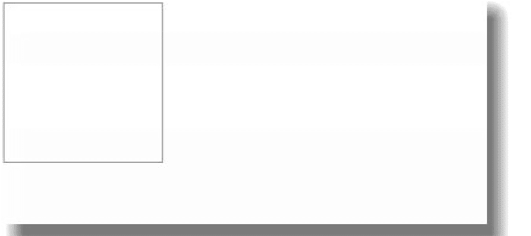

## 绘图（带尺寸）：

下面是画布尺寸相对于常规计算机显示器屏幕的绘图。绿色尺寸是计算机屏幕的大小，黑色尺寸是画布的大小。只能在画布上绘图，而不能在屏幕的其余部分绘图。

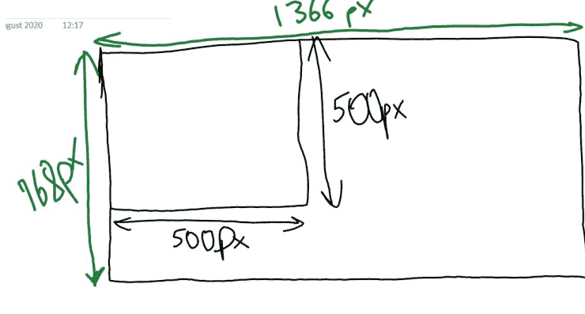

## 在画布上创建圆形

在JavaScript中，创建一个圆需要5个步骤。这就是我们在下面代码中所做的。

第一步是使用 document.getElementById 将HTML元素转换为JavaScript变量。然后使用 getContext(“2d”) 将其转换为2D绘图元素变量。在下面的例子中，变量 c2x 是绘图元素。

我们可以使用 **beginPath()** 开始JavaScript中的任何绘图，然后使用 **clearRect** 清除画布。以下是 **clearRect** 的工作原理，如下面的例子所示：

**clearRect(a,b,c,d)** 意味着矩形的左上角从x坐标 **a** 和y坐标 **b** 开始；它的宽度为 **c**，高度为 **d**。因此，我们从 **(a,b)** 开始，清除宽度为c、高度为d的画布。在下面的例子中，我们从 **(0,0)** 开始，清除整个宽度为 **500** 像素、高度为 **500** 像素的画布。这使得整个画布变为空白，准备绘图。

接下来，我们使用arc函数绘制圆形。那么，让我们看看它是如何工作的：

**arc(a,b,c,d,e)** 是我们绘制圆形的方式。**(a,b)** 是圆的中心；**a** 是x坐标，**b** 是y坐标。**c** 是圆的半径。**d** 是圆弧的起始部分。**e** 是圆弧的结束部分。

**d** 和 **e** 以弧度为单位。对于一个完整的圆，d和e分别为0和2π。对于半圆，d和e在0和π之间。

在下面的例子中，圆1的中心在 **(50,50)**，半径为 **20** 像素。圆2的中心点在 **(250,250)**，半径更大，为 **70**。圆3实际上是一个半圆，因为它从0到π弧度。它更靠近右下角 **(350,350)**，半径为 **50** 像素。

在最后一步，我们使用 stroke() 绘制圆。如果我们想填充圆，我们使用 fill() 来实现。我们可以使用 fillStyle() 来改变颜色。

## 绘图（测量）：

以下是使用画布坐标测量的圆形2（蓝色圆圈），仅作为示例展示。

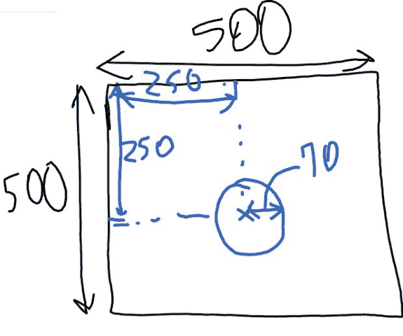

圆形 #2

## 在画布上创建矩形

绘制矩形的开始方式与绘制圆形相同；使用画布和2D上下文变量。我们再次使用 **beginPath()** 和 **clearRect()** 来启动该过程。然后我们使用一个名为 **fillRect()** 的函数，如下所示：

**fillRect(a,b,c,d)** 表示矩形的左上角起始于 x 坐标 **a** 和 y 坐标 **b**；其宽度为 **c**，高度为 **d**。因此，我们从 **(a,b)** 开始，并清除一个宽度为 c、高度为 d 的画布区域。在下面的示例中，我们从 **(0,0)** 开始，创建一个宽度为 50 像素、高度为 100 像素的矩形。它是一个红色的三角形（因为 fillRect 是红色的）。

还有第二个 **fillRect()**，它创建一个宽度为 75 像素的正方形（因为宽度和高度都设置为相同的值 75）。该正方形的左上角起始于 **(150,150)**。

在这两种情况下，fillRect() 都会自动绘制矩形并用指定的颜色填充。

```html
<html>
<head><title>Sample Canvas</title>
</head>
<body>
<canvas id="acanvas" width="500" height="500" style="border:2px solid"></canvas><br>
<button class="btn a" onclick="drawsquare()">Draw Square</button>

<script>
function drawsquare()
{
var i = document.getElementById("acanvas");
var c2x = i.getContext("2d");

//Rectangle 1
c2x.beginPath();
c2x.fillStyle = "red";
c2x.clearRect(0, 0, 500, 500);
c2x.fillRect(0, 0, 50, 100);

//Square 1
c2x.beginPath();
c2x.fillStyle = "blue";
c2x.fillRect(150, 150, 75, 75);
}
</script>
</body>
</html>
```

## 输出：

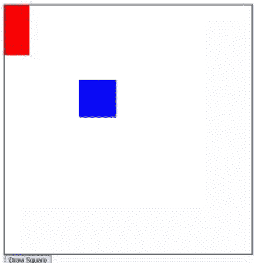

## 绘图（矩形 2）：

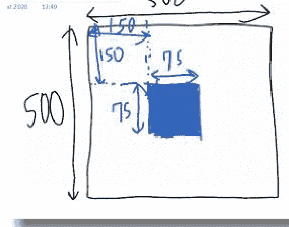

## 创建笑脸

在下面的示例中，我们运用关于圆形和半圆的知识来创建一个笑脸。

首先，我们在屏幕中心绘制一个半径为 75 像素的黄色圆形，作为脸部。然后我们绘制两个半径为 10 像素的小黑色圆形作为眼睛。

最后，我们绘制一个半径为 30 像素、填充黑色的半圆。这就是微笑。

很可爱，对吧？你可以发挥创意，制作任何你想要的表情。

```html
<html>
<head><title>Smiley Face</title>
</head>
<body>
<canvas id="acanvas" width="500" height="500" style="border:2px solid"></canvas><br>
<button class="btn a" onclick="drawsquare()">Draw Square</button>

<script>
function drawsquare()
{
var i = document.getElementById("acanvas");
var c2x = i.getContext("2d");

//Yellow Face
c2x.beginPath();
c2x.clearRect(0, 0, 500, 500);
c2x.arc(250,250,75,0,2*Math.PI);
c2x.fillStyle = "yellow";
c2x.stroke();
c2x.fill();

//Black Eyes
c2x.beginPath();
c2x.arc(225,225,10,0,2*Math.PI);
c2x.fillStyle = "black";
c2x.stroke();
c2x.fill();

c2x.beginPath();
c2x.arc(275,225,10,0,2*Math.PI);
c2x.fillStyle = "black";
c2x.stroke();
c2x.fill();

//Black Smile

c2x.beginPath();
c2x.arc(250,275,30,0,1*Math.PI);
c2x.fillStyle = "black";
c2x.stroke();
c2x.fill();
}
</script>
</body>
</html>
```

## 输出：

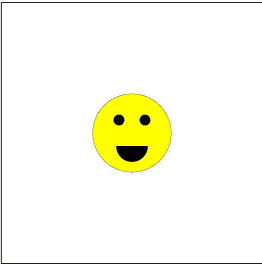

绘制正方形

## 练习题

1.  创建一个 700 像素乘 500 像素的画布。在画布的四个不同角落绘制 4 个圆形。然后在画布的正中心绘制第 5 个圆形。所有圆形颜色各不相同。这是一个很好的画布，可以让你熟悉在屏幕上定位形状。
2.  创建一个 600 像素乘 600 像素的画布。在屏幕上绘制不同的表情符号。在画布中心绘制一个笑脸。然后，在它正上方绘制一个哭脸。第三，在中心右侧绘制一个害怕的表情符号（闭着眼睛，嘴巴是直的）。最后，在左侧绘制一个你选择的表情符号。
3.  创建一个 600 像素乘 600 像素的画布。在中心绘制一个边长为 100 像素的正方形。然后绘制第二个边长为 80 像素的正方形。第三，绘制一个边长为 60 像素的正方形……如此继续，直到它无法变得更小。这是一个同心正方形的例子。（提示：正方形只是所有边都相等的矩形）。

## 计时器与动画

### 什么是计时器？

Javascript 中的计时器用于为 Javascript 代码计时。它允许用户在不同的时间间隔执行代码的不同部分。**setTimeOut()** 和 **setTimeInterval()** 函数用于设置计时器。**setTimeOut()** 允许在执行代码前有一个固定的延迟；**settimeinterval()** 允许代码在每次执行之间有固定间隔地多次执行。例如：**setTimeOut(a, 1000)** 在 **1000 毫秒（1 秒）** 后执行函数 **a**。**setTimeInterval(a, 1000)** 会持续执行该函数，每次运行之间间隔 **1000 毫秒（1 秒）**。这些函数是运行 JavaScript 动画的关键。

### 计时器示例

在我们的代码中，我们只使用 **setInterval()** 函数。在下面的示例中，有两个按钮运行两个独立的函数。第一个函数 **writename()** 每 2500 毫秒（或 2.5 秒）在屏幕上打印一次名字“Bob”。函数 **fname()** 使用 **setinterval(fname, 2500)** 运行，并写入名字“Bob”。第二个函数运行 **setcount()** 函数，从 1 开始打印数字，每次递增 1，间隔为 500 毫秒（0.5 秒）。因此，它会打印 1,2,3,4 等等，每次打印之间间隔 0.5 秒。

```html
<html>
<head><title>Counting Timer</title>
</head>
<body>
<link rel="stylesheet" href="samplestyle.css" />
<button class="btn a" onclick="setcount()">Count</button>
<button class="btn a" onclick="writename()">Write Name</button>

<script>
function writename()
{
var name="Bob";
setInterval(fname, 2500);
function fname()
{
document.write('<link rel="stylesheet" type="text/css" href="samplestyle.css" />');
document.write(name);
document.write("<br>");
}
}

function setcount()
{
count=0;
setInterval(timeUp, 500);
function timeUp()
{
document.write('<link rel="stylesheet" type="text/css" href="samplestyle.css" />');
count=count+1;
document.write(count);
document.write("<br>");
}
}
</script>
</body>
</html>
```

## 输出 1：

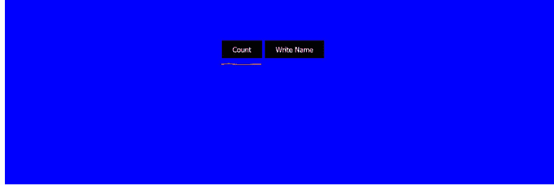

点击 **Count** 后

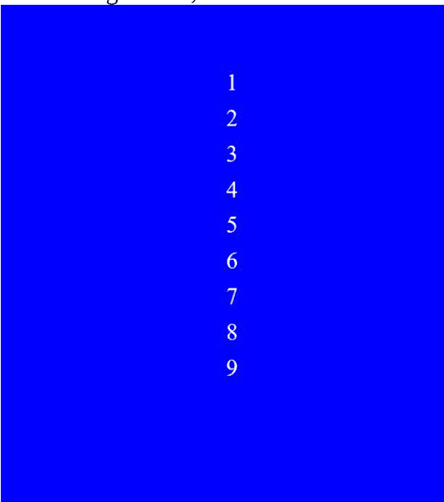

## 输出 #2

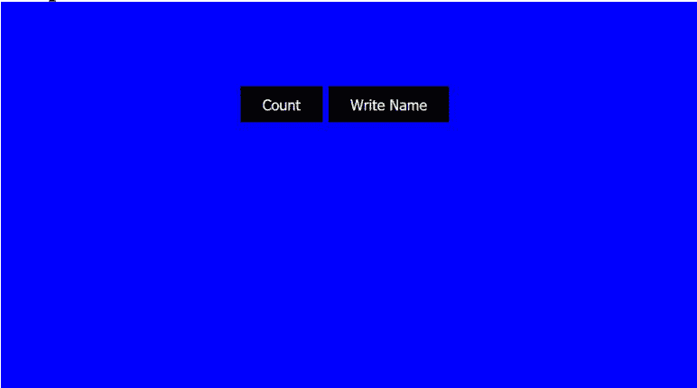

点击 **Count** 后

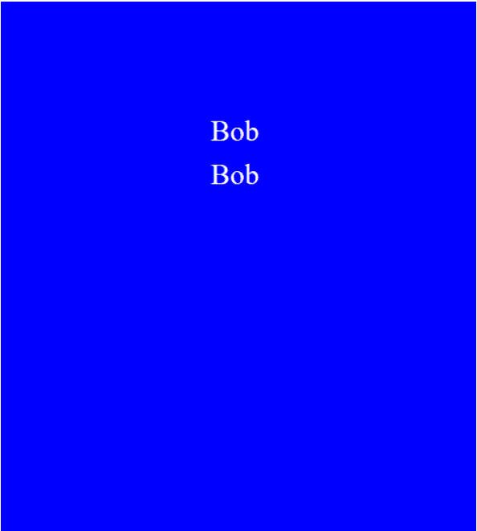

# 增长的正方形

我们使用 **setInterval** 和 **fillRect** 函数来编写一个扩展正方形的程序。点击按钮会运行增长正方形函数。在增长正方形函数中，我们设置一个 **setinterval**，每 10 毫秒（0.01 秒）运行一次函数 **frame()**。我们声明一个变量 size 为 10 像素。**Size** 包含正方形的边长。

在 frame 函数中，我们首先使用 **clearRect()** 清除整个画布。然后我们绘制一个从 (0,0) 开始、长度为“**size**”的矩形。每次执行函数时，**Size** 增加 5。一旦 size 大于 500，它就会被重置为 10。这确保了当正方形大于画布时，它会从一个小尺寸重新开始增长。

## 生长的正方形

```html
<html>
<head><title>Growing Square</title>
</head>
<body>
<canvas id="myCanvas" width="500" height="500" style="border:2px solid"></canvas><br>
<button class="btn a" onclick="growingsquare()">Square</button>
<script>
function growingsquare()
{
var i = document.getElementById("myCanvas");
var c2x = i.getContext("2d");
setInterval(frame, 10);
size=10;
function frame()
{
if (size>500)
{
size=0;
}
c2x.clearRect(0, 0, 500, 500);
c2x.fillRect(0, 0, size, size);
size=size+5;
}
}
</script>
</body>
</html>
```

## 输出：

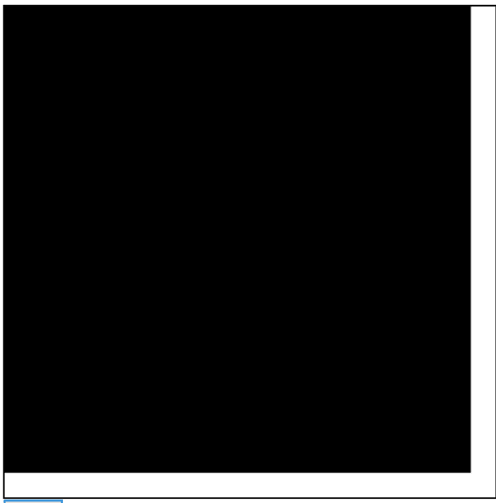

正方形

# 绘制（正方形生长）

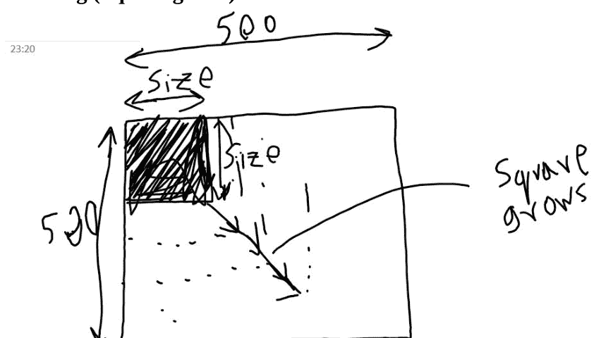

# 生长的圆形

我们使用 **setInterval** 和 **arc** 函数来编写一个扩展圆形的程序。点击按钮会运行生长正方形函数。在生长正方形函数中，我们设置一个 **setinterval**，每 50 毫秒（0.05 秒）运行一次 **frame()** 函数。我们声明一个变量 size 为 10 像素。**Size** 包含圆的半径。
在 frame 函数中，我们首先使用 **clearRect()** 清除整个画布。然后我们从中心点 (250,250) 开始绘制一个半径为 '**size**' 的圆。每次循环执行时，**Size** 增加 5。一旦 size 大于 350，它就被重置为 10。这确保了当圆大于画布时，它会从一个小尺寸重新开始生长。

```html
<html>
<head><title>Growing Circle</title>
</head>
<body>
<canvas id="myCanvas" width="500" height="500" style="border:2px solid"></canvas><br>
<button class="btn a" onclick="growingcircle()">Circle</button>
<script>
function growingcircle()
{
var c = document.getElementById("myCanvas");
var ctx = c.getContext("2d");
setInterval(frame, 50);
size=10;
function frame()
{
//Circle
if (size>350)
{
size=10;
}
ctx.beginPath();
ctx.clearRect(0, 0, 500, 500);
ctx.arc(250,250,size,0,2*Math.PI);
ctx.fillStyle = "blue";
ctx.stroke();
ctx.fill();
size=size+5;
}
}
</script>
</body>
</html>
```

## 输出：

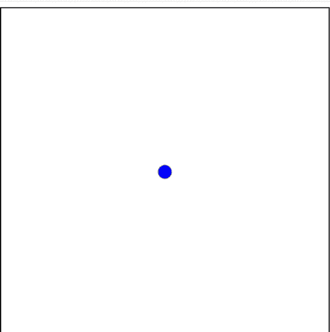

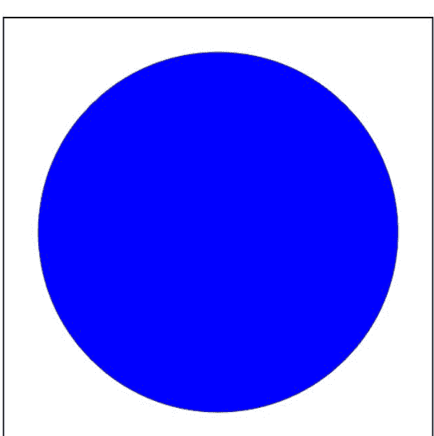

# 绘制（圆形）

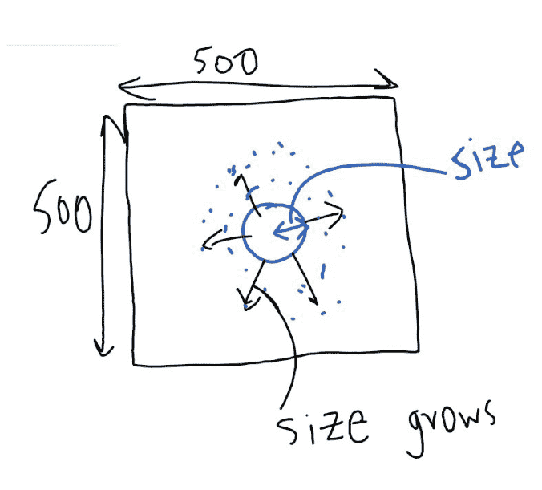

# 生长的径向圆形

径向圆形与圆形非常相似。径向圆形可以控制圆的颜色、背景，并且还可以在圆和背景之间的边界添加额外的颜色。在下面的例子中，我们创建了一个红色的径向圆形，背景为蓝色。并且红色球体有一个黄色的边界，就像一个环形。
在下面的例子中，使用 **createRadialGradient()** 来创建圆形。它是这样工作的。
**createRadialGradient(a,b,c,d,e,f)** 创建一个内圆，**中心 (a,b)**，半径为 **c**。第二个圆创建一个圆，**中心 (d,e)**，半径为 **f**。如果我们想要一个环形圆，那么我们应该让它们具有相同的中心，即 **(a,b) = (d,e)**。
在下面的例子中，我们在画布中心 **(250,250)** 有一个内圆和外圆。外圆的半径总是比内圆大 **20** 像素。
内圆颜色使用 **addColorStop(0,“red”)** 设置为红色，背景使用 **addColorStop(1,“blue”)** 设置为蓝色。最后，外圆颜色使用 **addColorStop(0.5,“yellow”)** 设置为黄色。
径向圆形每 50 毫秒（0.5 秒）生长 5 像素。如果圆的大小超过画布，它会被重置为 10 像素。

```html
<html>
<head><title>Growing Circle</title>
</head>
<body>
<canvas id="mCanvas" width="500" height="500" style="border:2px solid"></canvas><br>
<button class="btn a" onclick="growingcircle()">Circle</button>
<script>
function growingcircle()
{
var c = document.getElementById("mCanvas");
var c2x = c.getContext("2d");
setInterval(frame, 50);
size=10;
function frame()
{
//Circle
if (size>350)
{
size=10;
}
c2x.beginPath();
var grd = c2x.createRadialGradient(250, 250, size, 250, 250, size+20);
grd.addColorStop(0, "red");
grd.addColorStop(0.5, "yellow");
grd.addColorStop(1, "blue");

// Fill with gradient
c2x.fillStyle = grd;
c2x.fillRect(0, 0, 500, 500);
c2x.stroke();
c2x.fill();
size=size+5;
}
}
</script>
</body>
</html>
```

## 输出：

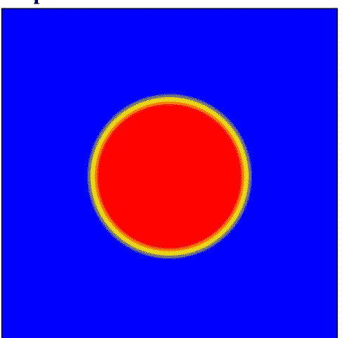

圆形

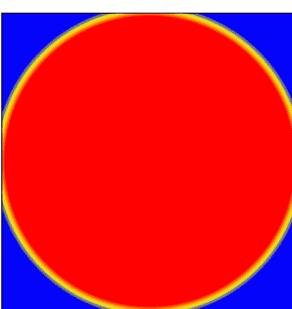

圆形

# 绘制：

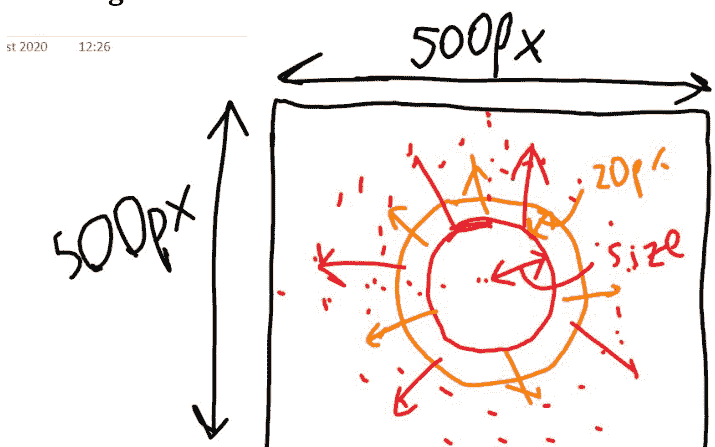

# 在不同方向移动的球

在下面的例子中，我们使用计时器和球函数，通过 4 个按钮将球移动到 4 个不同的方向。每个按钮运行一个将球向特定方向移动的函数。
例如，如果我们按下向下按钮，它会使用 **MoveDown()** 函数将球向下移动。一旦球到达画布底部，它会再次从顶部重新开始。
在每个函数中，我们设置一个位置变量来表示球的起始点。在 MoveUp() 和 MoveDown() 中，我们分别将 y 位置设置为 500 和 0。使用 setInterval 函数，我们每 50 毫秒（0.05 秒）将位置变量增加/减少 5 像素来移动球。
并且，我们使用 IF 函数检查球是否已到达画布的末端，并将其设置回原始函数。

```html
<html>
<head><title>Growing Circle</title>
</head>
<body>
<canvas id="myCanvas" width="500" height="500" style="border:2px solid"></canvas><br>
<button class="btn a" onclick="MoveDown()">Down</button>
<button class="btn a" onclick="MoveUp()">Up</button>
<button class="btn a" onclick="MoveRight()">Right</button>
<button class="btn a" onclick="MoveLeft()">Left</button>

<script>
function MoveDown()
{
var c = document.getElementById("myCanvas");
var ctx = c.getContext("2d");
setInterval(frame, 50);
locy=10;
function frame()
{
//Circle
if (locy>500)
{
locy=10;
}
ctx.beginPath();
ctx.clearRect(0, 0, 500, 500);
ctx.arc(250,locy,30,0,2*Math.PI);
ctx.fillStyle = "blue";
ctx.stroke();
ctx.fill();
locy=locy+5;
}
}
function MoveUp()
{
var c = document.getElementById("myCanvas");
var ctx = c.getContext("2d");
setInterval(frame, 50);
locy=500;
function frame()
{
//Circle
if (locy<0)
{
locy=500;
}
ctx.beginPath();
ctx.clearRect(0, 0, 500, 500);
ctx.arc(250,locy,30,0,2*Math.PI);
ctx.fillStyle = "blue";
ctx.stroke();
ctx.fill();
locy=locy-5;
}
}
function MoveRight()
{
var c = document.getElementById("myCanvas");
var ctx = c.getContext("2d");
setInterval(frame, 50);
locx=10;
function frame()
{
//Circle
if (locx>500)
{
locx=10;
}
ctx.beginPath();
ctx.clearRect(0, 0, 500, 500);
ctx.arc(locx,250,30,0,2*Math.PI);
ctx.fillStyle = "blue";
ctx.stroke();
ctx.fill();
locx=locx+5;
}
}
function MoveLeft()
{
var c = document.getElementById("myCanvas");
var ctx = c.getContext("2d");
setInterval(frame, 50);
locx=500;
function frame()
{
//Circle
if (locx<0)
{
locx=500;
}
ctx.beginPath();
ctx.clearRect(0, 0, 500, 500);
ctx.arc(locx,250,30,0,2*Math.PI);
ctx.fillStyle = "blue";
ctx.stroke();
ctx.fill();
locx=locx-5;
}
}
</script>
</body>
</html>
```

# 输出 #1：向下移动

# 位置 1

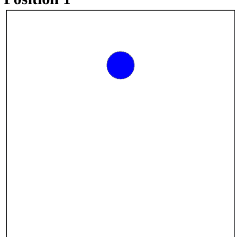

# 位置 2

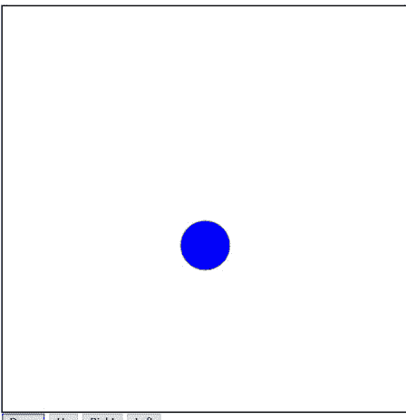

- 向下
- 向上
- 向右
- 向左

# 输出 #2：向左移动

# 位置 1

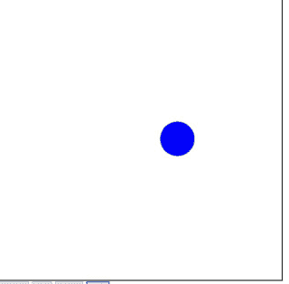

- 向下
- 向上
- 向右
- 向左

# 位置 2

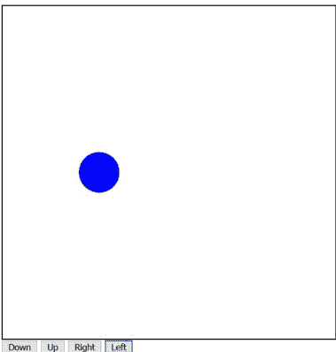

向下 向上 向右 向左

# 绘制（向下移动）

如下所示，locy 从 10 开始并不断增加，使其在动画中向下移动。

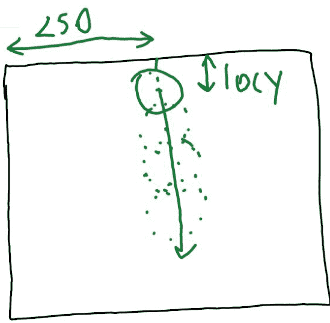

# 弹跳球

在这个例子中，我们将球移动到画布边缘，当球碰到画布时会反弹回来。
这是通过修改确定球 x 位置和 y 位置的方程来实现的。
首先，在这种情况下，我们同时在 x 和 y 位置移动球。因此，我们有两个独立的变量，**locationx** 和 **locationy**。还有另外两个变量，它们决定球移动的方向；**snx** 和 **sny**。如果 snx 为正，它向右移动。如果 snx 为负，它向左移动。因此，locationx 和 locationy 的方程是：
**locationx=locationx+snx*5**
**locationy=locationy+sny*5**
所以，我们通过 x（向左或向右）移动球 5 像素，通过 y（向上或向下）移动球 5 像素。
如果球到达画布的侧边（**locationy=500** 或 **locationx=0**），那么我们改变 x 运动的方向（**snx=snx*-1**）。
并且，如果球到达画布的上/下边缘（**locationy=500** 或 **locationy=0**），那么我们改变 y 运动的方向（**sny=sny*-1**）。
这种方向的改变产生了我们在屏幕上看到的弹跳效果。

```html
<html>
<head><title>Bouncing Ball</title>
</head>
<body>
<canvas id="myCanvas" width="500" height="500" style="border:2px solid"></canvas><br>
<button class="btn a" onclick="bouncingball()">Bounce Ball</button>
<script>
function bouncingball()
{
var c = document.getElementById("myCanvas");
var ctx = c.getContext("2d");
var snx=1;
var sny=1;
setInterval(frame, 10);
locationx=Math.random()*350;
locationy=Math.random()*350;
```

function frame()
{
  //圆形
  ctx.beginPath();
  ctx.clearRect(0, 0, 500, 500);
  ctx.arc(locationx, locationy, 20, 0, 2 * Math.PI);
  ctx.fillStyle = "red";
  ctx.stroke();
  ctx.fill();
  if (locationx >= 500)
  {
    snx = snx * -1;
  }
  if (locationx <= 0)
  {
    snx = snx * -1;
  }
  if (locationy >= 500)
  {
    sny = sny * -1;
  }
  if (locationy <= 0)
  {
    sny = sny * -1;
  }
  locationx = locationx + snx * 5;
  locationy = locationy + sny * 5;
}
</script>
</body>
</html>

# 输出

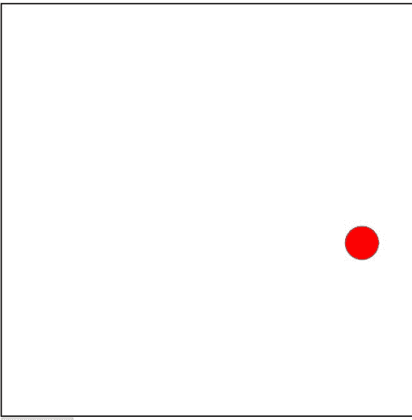

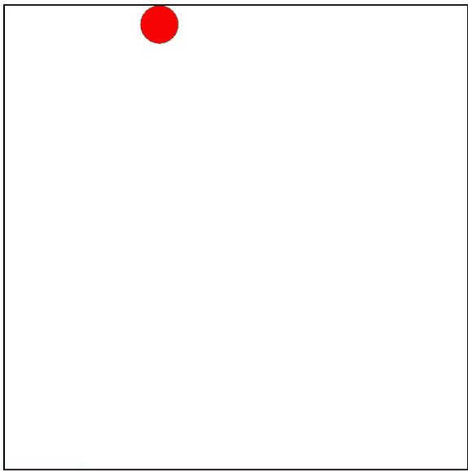

# 绘制（底部墙壁反弹）

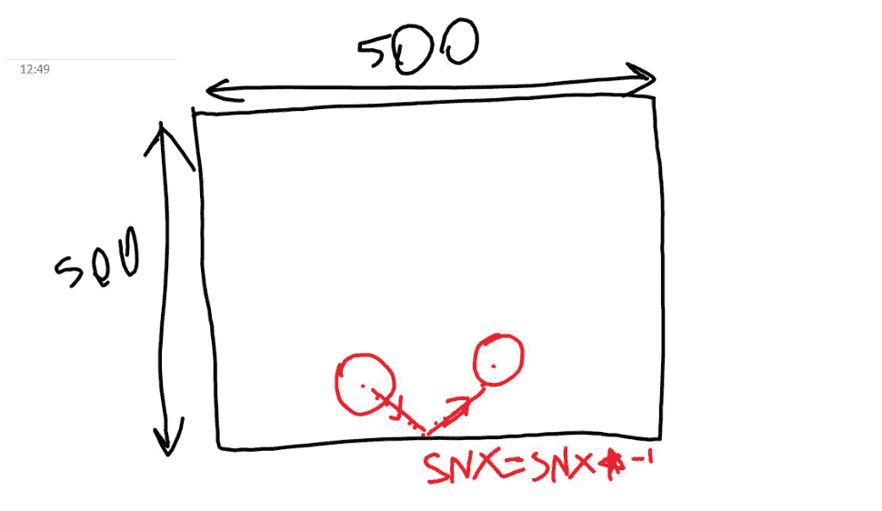

# 绘制（右侧墙壁反弹）

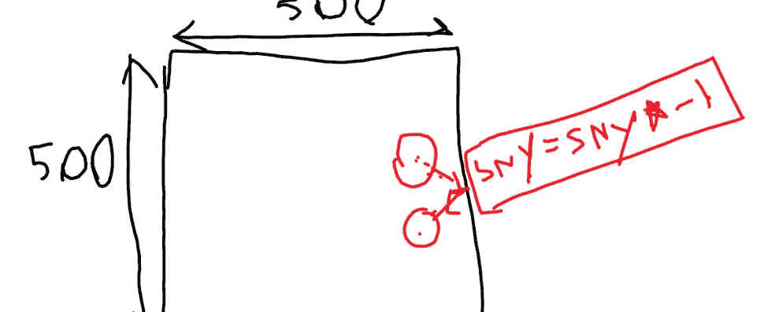

## 练习题

1.  编写一个程序，接受一个数字作为输入，并每0.5秒打印该数字的一个倍数。例如，如果我们接受6作为输入；我们应该打印出：
    **6**
    **12**
    **18**
    **24...**
    以此类推，每0.5秒一次。
2.  修改**增长的正方形**程序，使其从画布中心开始增长，而不是从一个角开始。
    提示：你需要为fillRect函数的前两个坐标添加变量，并每次将它们减少5，以将角向上和向左移动。
3.  创建一个缩小的圆形问题，它从画布大小开始，慢慢缩小到半径为5像素。当它达到5像素大小时，它以原始大小重新开始并再次缩小。所以，这是我们的增长圆形示例的反向。
4.  创建两个球，它们从画布上的随机位置开始；并沿随机方向移动。它们从墙壁反弹；如果它们相互接触，它们会改变方向。（提示：在弹跳球程序中创建第二个球，然后添加一个检查两个球之间距离的检查。如果两个球之间的距离很小，则改变两个球的方向）。

# 按键和鼠标点击事件

## 按键元素的作用是什么？

按键元素检测键盘上何时发生某个事件。按下键的动作称为事件。按键元素是jQuery的一部分。jQuery是一个用于处理事件、动画等的JavaScript库。下面是一个按键元素的简单示例。

## 按键示例1

在我们开始程序之前，我们使用以下代码将jQuery库上传到程序中：

```
<script src="https://code.jquery.com/jquery-2.1.0.js"></script>
```

在Javascript中，我们创建一个名为**keyc**的变量，它包含所有键码。键码是分配给我们在键盘上打字时发生的每个事件的数字。例如，32是按下空格键事件的键码。要获取所有事件键码的列表，我们可以在下面的链接上查看：
[https://keycode.info/](https://keycode.info/)
我们只包含程序中显示的8个键码；因为这只是一个测试程序。如果你想的话，可以随意包含更多。然后我们有下面的代码，当按下键时运行函数**press(event)**。
**$(“body”).keydown(press)**
在函数内部，我们使用**keyc[event.keycode]**来访问按下按钮时发生的事件。请参阅下面的一些输出示例。

```
html
<html>
<head>
  <title>键盘输入</title>
</head>
<body>
<script src="https://code.jquery.com/jquery-2.1.0.js"></script>
<script>
var keyc = {
  16: "shift",
  27: "escape",
  32: "space",
  37: "left",
  38: "up",
  39: "right",
  40: "down",
  46: "delete"
};
$("body").keydown(press);
function press(event)
{
  document.write("你刚刚按下了键: "+keyc[event.keyCode]);
}
</script>
</body>
</html>
```

## 输出：

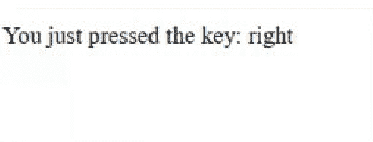

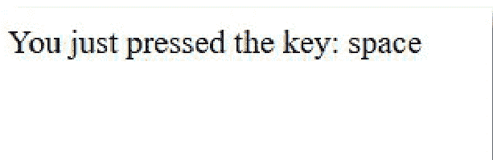

# 按键示例2

在下面的程序中，我们创建了5个不同的函数，根据键盘上按下的键，在画布的5个不同部分放置一个小球。如果用户按下“space”，程序运行**centerballposition()**，将球放在画布中心。
如果用户按下“right”，程序运行**rightballposition()**，将球放在画布的右上角。
如果用户按下“left”，程序运行**leftballposition()**，将球放在画布的左上角。
如果用户按下“down”，程序运行**downballposition()**，将球放在画布的右下角。
如果用户按下“escape”，程序运行**downleftballposition()**，将球放在画布的左下角。
代码和输出如下。

```
html
<html>
<head>
  <title>键盘输入</title>
</head>
<body>
  <canvas id="canvas" width="400" height="400" style="border:1px solid #000000;"></canvas>
  <script src="https://code.jquery.com/jquery-2.1.0.js"></script>
  <script>
    var canvas = document.getElementById("canvas");
    var cx = canvas.getContext("2d");
    var w=canvas.width;
    var l=canvas.length;
    function rightballposition()
    {
      cx.clearRect(0, 0, 400, 400);
      cx.beginPath();
      cx.arc(390, 10, 10, 0, Math.PI * 2);
      cx.fill();
    }
    function leftballposition()
    {
      cx.clearRect(0, 0, 400, 400);
      cx.beginPath();
      cx.arc(10, 10, 10, 0, Math.PI * 2);
      cx.fill();
    }
    function centerballposition()
    {
      cx.clearRect(0, 0, 400, 400);
      cx.beginPath();
      cx.arc(200, 200, 10, 0, Math.PI * 2);
      cx.fill();
    }
    function downballposition()
    {
      cx.clearRect(0, 0, 400, 400);
      cx.beginPath();
      cx.arc(390, 390, 10, 0, Math.PI * 2);
      cx.fill();
    }
    function downleftballposition()
    {
      cx.clearRect(0, 0, 400, 400);
      cx.beginPath();
      cx.arc(10, 390, 10, 0, Math.PI * 2);
      cx.fill();
    }
    var keyc = {
      16: "shift",
      27: "escape",
      32: "space",
      37: "left",
      38: "up",
      39: "right",
      40: "down",
      46: "delete"
    };
    $("body").keydown(press);
    function press(event)
    {
      if (keyc[event.keyCode]=="right")
      {
        rightballposition();
      }
      if (keyc[event.keyCode]=="left")
      {
        leftballposition();
      }
      if (keyc[event.keyCode]=="space")
      {
        centerballposition();
      }
      if (keyc[event.keyCode]=="down")
      {
        downballposition();
      }
      if (keyc[event.keyCode]=="escape")
      {
        downleftballposition();
      }
    }
  </script>
</body>
</html>
```

输出：

按下右键时：

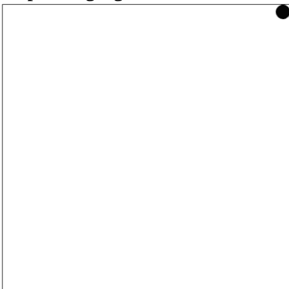

按下左键时：

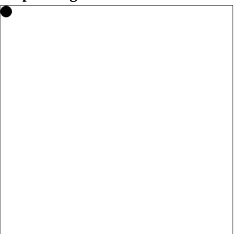

按下下键时：

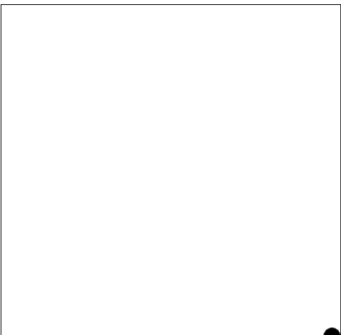

按下空格键时：

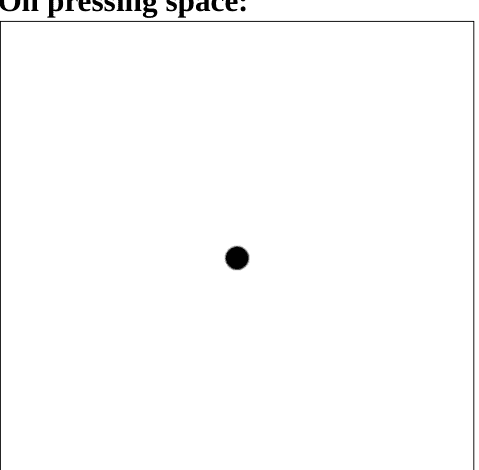

按下退出键时：

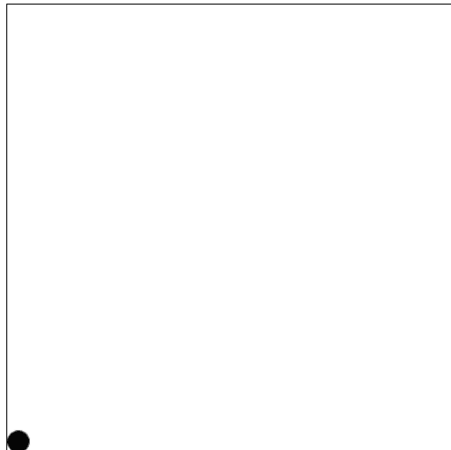

## 鼠标点击元素的作用是什么？

鼠标元素检测鼠标的点击/移动以及事件发生时鼠标光标在html画布上的位置。当这种情况发生时，它还可以执行特定的功能。

## 鼠标点击示例

在下面的示例中，用户检查鼠标是否在画布上被点击。它使用以下行检查点击：
`$(“#canvas”).click(mousec)`
**canvas**是html画布的名称，**mousec**是点击鼠标时运行的函数的名称。在函数内部，用户写下鼠标已被点击。

```
html
<html>
<head>
    <title>键盘输入</title>
</head>
<body>
    <canvas id="canvas" width="400" height="400" style="border:1px solid #000000;"></canvas>
    <script src="https://code.jquery.com/jquery-2.1.0.js"></script>
    <script>
        $("#canvas").click(mousec);
        function mousec(event)
        {
            document.write("你刚刚在画布上点击了鼠标");
        }
    </script>
</body>
</html>
```

## 输出：

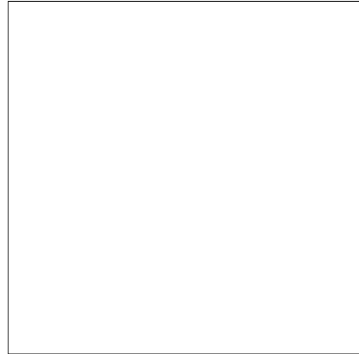

点击画布后：

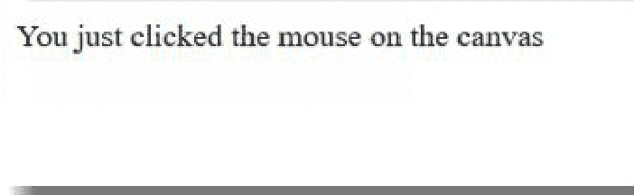

# 鼠标点击 – 捉迷藏

在下面的示例中，我们上传一张html图片，并在图片上选择一个随机位置作为我们捉迷藏游戏中“Tim”的位置。现在，我们点击图片内的不同位置。程序使用勾股定理计算点击位置与Tim的距离。你可以使用下面的链接获取图片，或者使用你自己的图片。
捉迷藏图片链接：
[https://drive.google.com/file/d/1gmPI4Z2Rm9iAA9vEBi7LWehe-uNE2UQ4/view?usp=sharing](https://drive.google.com/file/d/1gmPI4Z2Rm9iAA9vEBi7LWehe-uNE2UQ4/view?usp=sharing)
在下面的代码中，**timx**和**timy**是两个介于0和500之间的随机数，它们决定了Tim在这张图片中隐藏位置的x和y坐标。
**mousec(event)**是鼠标点击时运行的函数。在函数内部，**event.offsetX**给出点击的x坐标，**event.offsetY**给出点击的y坐标。**ctr**是一个计数器，它在**mousec**函数内部计算点击次数并每次增加1。
然后程序使用勾股定理找到Tim和鼠标点击之间的距离，并将距离作为警报打印出来。
一旦距离小于10像素；你就找到了Timmy，程序会打印出所用的点击次数。

# 找到蒂姆

```html
<html>
<head>
  <title>Find Tim</title>
</head>
<body>
  <h1>Find Tim</h1>
  </canvas>
  <script src="https://code.jquery.com/jquery-2.1.0.js"></script>
  <script>
    ctr=0;
    var timx=Math.random()*400;
    var timy=Math.random()*400;

    $("#hidenseek").click(mousec);
    function mousec(event)
    {
      dist=Math.sqrt((event.offsetX-timx)**2+(event.offsetY-timy)**2);
      if (dist<10)
      {
        ctr=ctr+1;
        alert("<strong>Congratulations!! You found Tim after "+ctr+" clicks.</strong>");
      }else
      {
        ctr=ctr+1;
        alert("Distance from Tim is "+Math.round(dist));
      }
    }
  </script>
</body>
</html>
```

## 输出：

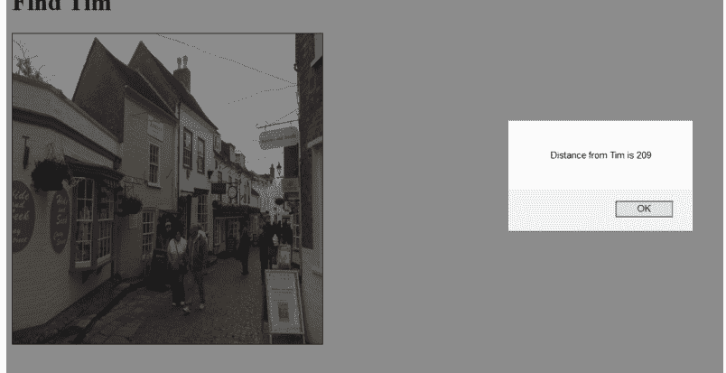

# 找到蒂姆


<strong>恭喜！！你在点击了14次后找到了蒂姆。</strong>

阻止此页面创建其他对话框

确定

## 手动计算（距离）：

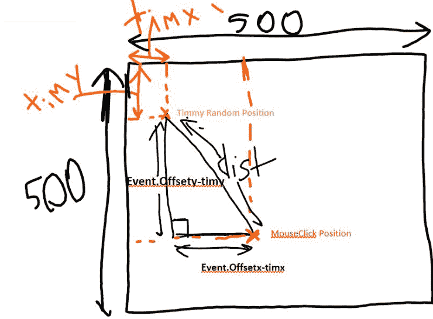

$Dist = \sqrt{(Event.Offsety - timy)^2 + (Event.Offsetx - timx)^2}$

## 鼠标点击 – 寻宝游戏

寻宝游戏与捉迷藏游戏非常相似。不同之处在于图片是一张藏宝图。地图上的一个随机位置就是宝藏的所在地。程序会检查鼠标点击的位置，并计算点击位置与宝藏位置之间的距离。一旦距离在10像素以内，就视为找到宝藏，并打印出所用的点击次数。

藏宝图链接：
[https://drive.google.com/file/d/1wPoGYFvwoo2rCJ2eBvA-9HPAGrAX6v_1/view?usp=sharing](https://drive.google.com/file/d/1wPoGYFvwoo2rCJ2eBvA-9HPAGrAX6v_1/view?usp=sharing)

```html
<html>
<head>
  <title>Treasure Map</title>
</head>
<body>
  <h1>Find the treasure location</h1>
  </canvas>
  <script src="https://code.jquery.com/jquery-2.1.0.js"></script>
  <script>
    ctr=0;
    var jimmyx=Math.random()*400;
    var jimmyy=Math.random()*400;

    $("#hidenseek").click(mousec);
    function mousec(event)
    {
      dist=Math.sqrt((event.offsetX-jimmyx)**2+(event.offsetY-jimmyy)**2);
      if (dist<10)
      {
        ctr=ctr+1;
        alert("<strong>Congratulations!! You found the treasure after "+ctr+" clicks.</strong>");
      }else
      {
        ctr=ctr+1;
        alert("Distance from target is "+Math.round(dist));
      }
    }
  </script>
</body>
</html>
```

## 输出：

# 找到宝藏位置

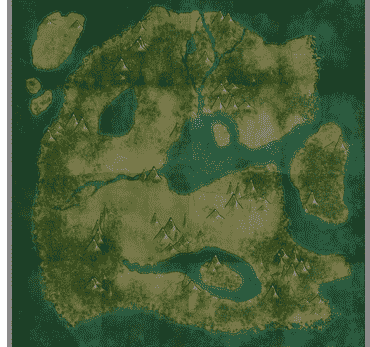

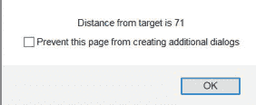

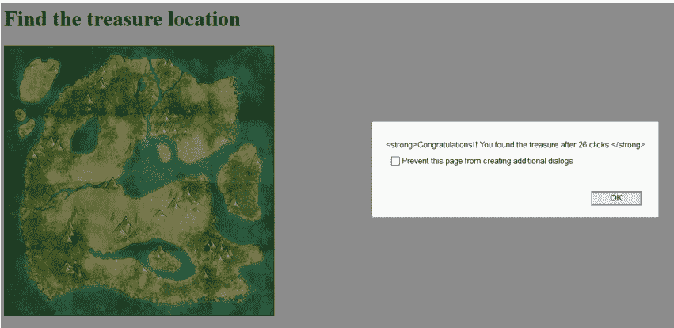

## 乒乓游戏

乒乓游戏是一个有趣的游戏，它基于本书第215页的“**弹跳球**”游戏。因此，程序中有一个在画布上弹跳的球。我们在屏幕左侧添加了一个可以上下移动的球拍。球拍长度为15像素，使用 **clearRect()** 和 **fillRect()** 绘制。它的x位置固定为10，y位置由一个名为 **yrect** 的变量定义。yrect在函数 **movedown()** 和 **moveup()** 中定义。当按下向上按钮时，moveup()被激活，它将yrect减少30像素，使球拍上移。当按下向下按钮时，movedown()被激活，它将yrect增加30像素，使球拍下移。

此外，函数 **press(event)** 检测按键的存在，并在按下向上和向下按钮时分别激活moveup()和movedown()。

最后，我们有 **frame()** 函数。它是一个检查球是否靠近顶部、底部和右侧墙壁的函数。如果球的x坐标接近500，那么它就靠近右墙。然后我们改变x方向的运动以产生反弹。如果y坐标为0或500（到达顶部/底部墙壁），我们也做同样的事情，因此我们改变y方向的运动以实现反弹。

最后，我们检查球是否接触到球拍。我们使用勾股定理计算球拍位置和球位置之间的距离dist。如果距离（dist）小于75像素，那么我们就改变x方向的运动。

```html
<head>
    <title>Pong Game</title>
</head>
<body>
    <canvas id="canvas" width="800" height="600" style="border:1px solid #000000;"></canvas>
    <script src="https://code.jquery.com/jquery-2.1.0.js"></script>
    <script>
        var canvas = document.getElementById("canvas");
        var cx = canvas.getContext("2d");
        var w=canvas.width;
        var l=canvas.length;
        var yrect=0;
        cx.beginPath();
        cx.clearRect(0, 0, 800, 600);
        cx.rect(10, yrect, 15, 90);
        cx.fill();
        cx.fillStyle = "black";

        setInterval(press , 100);

        //Ball variables
        var snx=1;
        var sny=1;
        setInterval(frame, 10);
        locationx=Math.random()*350;
        locationy=Math.random()*350;

function movedown()
{
yrect=yrect+30;
if (yrect>570)
{
yrect=yrect-30;
}
cx.beginPath();
cx.clearRect(0, 0, 800, 600);
cx.rect(10, yrect, 15, 90);
cx.fill();
cx.fillStyle = "black";
}
function moveup()
{
yrect=yrect-30;
if (yrect<0)
{
yrect=yrect+30;
}
cx.beginPath();
cx.clearRect(0, 0, 800, 600);
cx.rect(10, yrect, 15, 90);
cx.fill();
cx.fillStyle = "black";
}

var keyc = {
16: "shift",
27: "escape",
32: "space",
37: "left",
38: "up",
39: "right",
40: "down",
46: "delete"
};
$("body").keydown(press);

function press(event)
{
if (keyc[event.keyCode]=="up")
{
moveup();
}

if (keyc[event.keyCode]=="down")
{
movedown();
}
}
function frame()
{
//Circle
cx.beginPath();
cx.clearRect(20, 0, 800, 600);
cx.arc(locationx,locationy,20,0,2*Math.PI);
cx.fillStyle = "red";
cx.stroke();
cx.fill();
dist=Math.sqrt((locationx-10)**2+(locationy-yrect)**2);
//document.write(dist);
if (locationx>=800)
{
snx=snx*-1;
}
if (dist<75)
{
snx=snx*-1;
locationx=locationx+snx*20;
}
if (locationy>=600)
{
sny=sny*-1;
}
if (locationy<=0)
{
sny=sny*-1;
}
locationx=locationx+snx*5;
locationy=locationy+sny*5;
}
</script>
</body>
</html>
```

## 输出：

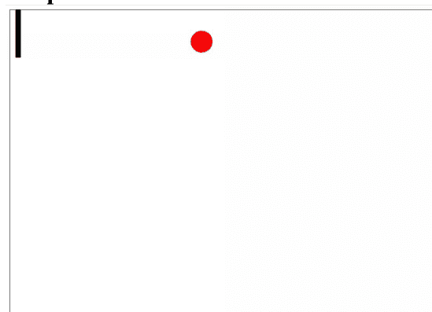

## 手动计算（球拍与球之间的距离）

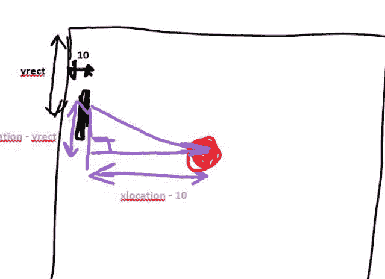

$Dist = \sqrt{(ylocation - yrect)^2 + (xlocation - 10)^2}$

## 练习题

- 1. 编写一个程序，接收用户输入，并根据用户按下 **p,m,a,t**（孔雀、猴子、鳄鱼、老虎）打印出4种动物的图片。例如，如果用户按下p，程序显示孔雀的图片。（提示：将4张图片保存在同一文件夹中。使用keypress元素检测按键的存在，然后使用``标签显示图片）。
- 2. 编写一个程序，向用户显示一个简单的颜色图表。用户点击其中一种颜色，程序打印出该颜色的名称（提示：使用mouseclick检测点击的存在和位置；然后检查它是否接近特定颜色）。
- 3. 绘制一个圆，根据用户点击上、下、左、右，在画布上向上、下、左、右移动。
- 4. 作为第3题的进阶，在画布上随机放置一个宝藏，如果圆移动到距离宝藏5像素以内，则发送“恭喜”消息。

## 结论

感谢购买本书。希望你喜欢它，并从中学到很多东西。

如果你能够独立完成本书中的练习，那么你肯定走在正确的道路上。

如果你对主题有任何疑问；或者有任何建议；请通过以下方式给我发电子邮件：[abiprod.pty.ltd@gmail.com](mailto:abiprod.pty.ltd@gmail.com)

如果你有兴趣获得个性化帮助，我也提供一对一的在线辅导。

如果你想要一个更适合初学者的版本，你可以下载我的[使用JavaScript为孩子编程](https://example.com)或我的[为孩子和初学者使用Python编程](https://example.com)。

其他推荐阅读书籍：
- [Douglas Crawford的《JavaScript语言精粹》](https://example.com)
- [《学习JavaScript的更聪明方法》](https://example.com)
- [《JavaScript权威指南》](https://example.com)

# 结束……但还没完！

评论并不容易获得。
作为一名营销预算有限的独立作者，我依赖像您这样的读者在亚马逊上留下简短的评论。
哪怕只是一两句话也好！

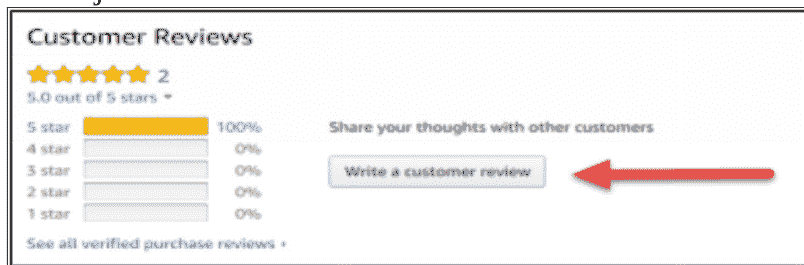

所以，如果您喜欢这本书，请...
>> 点击此处，在亚马逊上留下简短评论。
我非常感谢您的评论，因为它确实能带来改变。
衷心感谢您购买并阅读本书至最后。

## 免费礼物

我们确实希望您在编程上取得成功。为确保您的成功，我们为您提供一份免费项目列表，您可以在完成本书后进行实践。

https://coding.gr8.com/


# 面向儿童和初学者的Python编程

Bob Mather

# 目录

- [免责声明](Disclaimer)
- [引言](Introduction)
- [Python示例，为何它很优秀](#)
- [输入函数](#)
- [条件语句](#)
- [嵌套条件语句](#)
- [循环](#)
- [数组](#)
- [字符串的乐趣](#)
- [数学函数](#)
- [结论](#)

# 免责声明

**版权所有 © 2020**
**保留所有权利**

未经作者事先书面许可，不得以任何形式（包括印刷、电子、影印、扫描、机械或录音）传输或复制本电子书的任何部分。虽然作者已尽最大努力确保书面内容的准确性，但建议所有读者自行承担风险遵循本文提及的信息。作者对因信息造成的任何个人或商业损害不承担责任。鼓励所有读者在需要时寻求专业建议。

## 免费礼物

我们确实希望您在编程上取得成功。为确保您的成功，我们为您提供一份免费项目列表，您可以在完成本书后进行实践。
https://coding.gr8.com/


## 引言

您希望您的孩子学习编程吗？我确信这感觉像是一项不可能完成的任务，不是吗？这就像学习一门新语言一样困难，对孩子来说绝对是一次令人生畏的经历。说服您的孩子学习编程也更加困难。每位家长都经历过。您知道开始一段新旅程有多困难。这相当令人不知所措且害怕。那么，您认为您的孩子会有什么感觉呢？他会有无数的问题，例如：

- 我能学会编程吗？
- 我这辈子能达到编程变得容易的阶段吗？
- 我什么时候能用到这项技能？
- 这对我的学校学习有帮助吗？如果没有，我为什么还要学？

这些疑虑阻止了我们大多数人，所以它也会阻止您的孩子。整个学习过程过于繁琐。您首先需要心中有计划，然后找到合适的课程来学习，确保自己足够优秀，然后创建一个应用程序或工具。话虽如此，您应该首先决定您想学什么。您还需要了解关于这个新主题的一切，以便知道回报是什么。没有简单的方法可以做到这一点，这是一项相当具有挑战性的任务。一项新任务在开始时可能看起来不可能，如果您不采取必要的步骤，您肯定很难实现目标。如果这对您来说都这么难，您认为对您的孩子来说会有多难？您需要确保您和您的孩子都全身心投入。如果你们俩都不致力于学习，只会导致挫败感。这也会降低您的孩子坚持课程并取得成功的可能性。最好让您的孩子从小处着手，花时间学习，并实现可衡量且现实的目标。如果这是您想做的，那么您来对地方了。您将找到您的孩子学习更多编程知识并参与其中所需的所有信息。有各种游戏化和有趣的练习，将保持您的思维活跃。吸引年轻的大脑并激励您的孩子学习新的复杂事物是相当困难的。然而，这些信息和练习使编程易于理解。因此，在您哄骗您的孩子学习编程之前，请确保做到以下几点：

- 向您的孩子解释为什么学习编程对他很重要
- 概述编程的好处
- 定义一些关键术语
- 查看不同的示例
- 选择一种编程语言并开始！

简单来说，编程是一种用于与计算机和机器交流的语言。您也可以使用这种语言来构建和运行应用程序、网站等。

# 如何让您的孩子编程？

这个问题有无数答案，但让我们专注于它如何帮助您的孩子前进。这并不意味着您的孩子必须取得巨大飞跃。如果您阅读了上面的部分，您会知道这只意味着您的孩子需要从小处着手。您唯一需要关注的是确保您的孩子在编程方面的每一步都取得进步。这就引出了一个问题——为什么我的孩子应该学习编程？孩子们应该学习编程的想法在多年前就已提出，当时您可能认为这是炒作。这个概念是新的，每个教育机构都想为孩子们开设编程课程。这个想法并非没有根据，但人们需要一些时间来消化编程将成为人们必须具备的最重要能力这一观念。一些统计数据显示，未来几年工作岗位将会增加，但其中大部分将是计算领域的工作。这让人们怀疑编程是否难以理解和学习。

您的孩子不应该因为错误的原因学习编程。不要告诉他他需要编程是为了看起来很酷。您必须向他解释结果是什么，以及编程将如何帮助他将来找到一份好工作。确保告诉他，如果他懂得编程，他将获得回报。外面有那么多工作，而且报酬相当不错。编程更好的地方在于，它不仅帮助您的孩子在未来表现出色，还帮助他变得有创造力，培养解决问题的能力，与其他程序员或人员合作开发新应用程序，与他们沟通以及各种其他技能，帮助他成为明星员工。

这是否意味着学习一门新语言就像学习如何进行其他活动或与人交谈一样容易？当然不是。话虽如此，如果您的孩子对学习编程持谨慎态度，最好用这些理由来推动他前进。给他一套指导方针，让他知道从哪里开始。这些指导方针也将帮助他确定自己的位置。编程是未来的语言，因此您的孩子知道如何编程很重要。如前所述，当您的孩子学习编程时，他也会培养其他技能，这些技能将帮助他未来。

# Python示例，为何它很优秀

# 什么是Python？

当我们希望计算机做某事时，我们需要给计算机它能理解的指令，即机器语言。机器语言由0和1组成。以下是机器语言的一个示例：

```
10011 00011 110001 1001010101 100001 001 0111 0000 11111 11010101
```

虽然计算机可能觉得容易阅读，但我们人类却不然。因此，为了使指令可读且易于理解，我们使用编程语言。我们用编程语言为计算机编写指令，然后将其转换为计算机可以理解的机器语言。

Python是编程语言的一个例子。下面是一段Python代码，用于计算学生分数的平均值，并根据平均值返回他们的等级。

```python
def grade(marks):
    sum = 0
    for mark in marks:
        if mark > 100:
            return "Invalid Mark"
        sum += mark
    average = sum/len(marks)

    if average >= 90:
        return "A"
    elif average >= 80:
        return "B"
    elif average >= 70:
        return "C"
    elif average >= 60:
        return "D"
    else:
        return "F"
```

虽然您可能不了解Python，但您可能能够理解代码的某些部分。这就是Python的美妙之处。它易于阅读和理解。Python可用于各种任务。它可以用于预测股票价格、构建软件以自动化日常任务、为网站开发API、开发游戏等。它在机器学习、数据科学和网络开发领域被积极使用。以下是使用Python作为其编程语言之一的公司列表：

- Facebook
- Google
- Netflix
- Spotify
- Reddit

诸如此类，不胜枚举。谷歌工程师们做出了这样的决策：“能用Python的地方就用Python，必须用C++的地方才用C++。”

## 在你的电脑上安装Python

1.  前往 [https://www.python.org/downloads/](https://www.python.org/downloads/) 并点击“Download Python 3.x.x”。以我为例，最新版本是3.8.4，由于我使用的是Windows系统，我将下载适用于Windows的Python。请确保为你使用的操作系统下载最新版本的Python。

    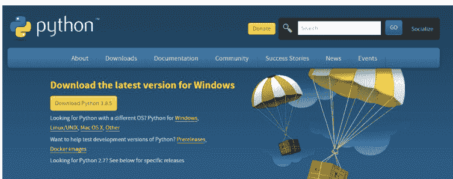

2.  启动安装程序并等待其加载。勾选“Install launcher for all users”。确保“Add Python 3.8 to PATH”也被勾选。勾选完毕后，点击“Install Now”并等待安装完成。

    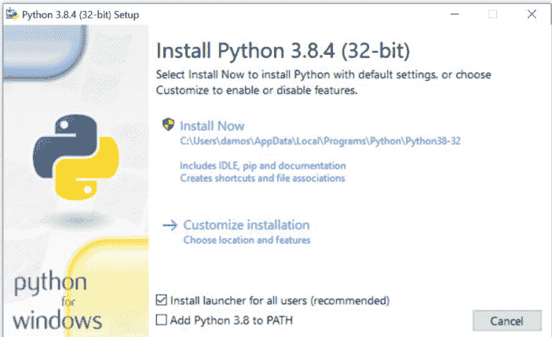

3.  安装完成后，搜索“Python Idle”并启动Python。

    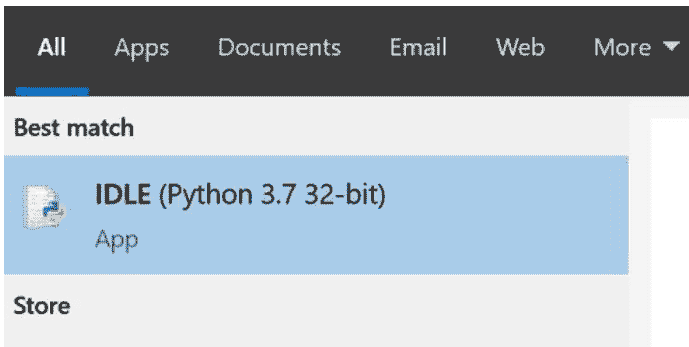

    下面是Python idle的截图。

    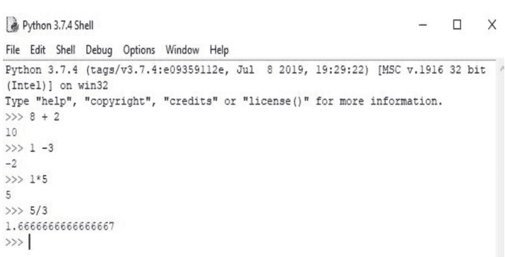

## 探索Python

尝试输入一些像上面那样的简单数学表达式。上面的窗口称为Python shell，在shell中，Python会在每条语句后给出输出信息。你也可以将所有代码写在一个文件中，然后使用Python运行该文件，这是推荐的方式，我们后续将采用基于文件的编码方式。

你可以通过点击 File > New file 来创建一个新文件。

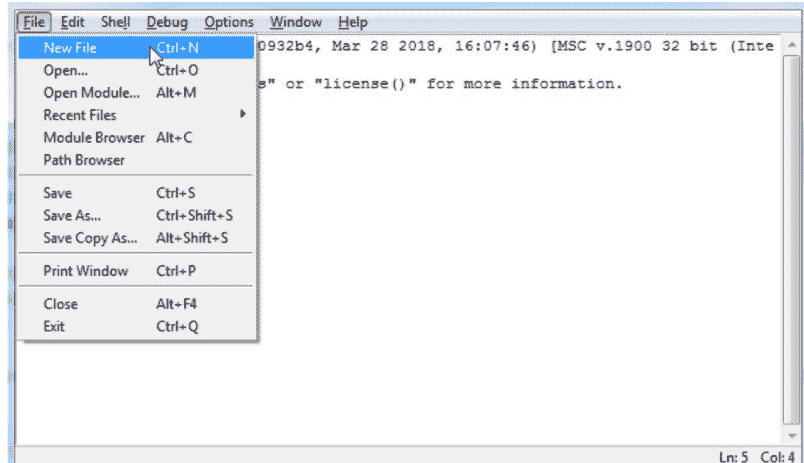

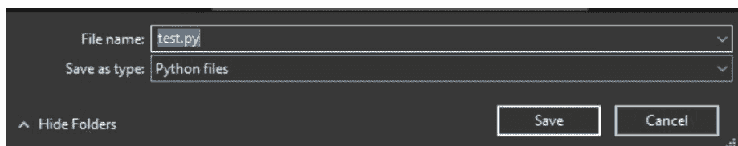

确保保存文件时以‘.py’结尾，并将类型设置为“Python files”。这告诉计算机该文件包含可以使用Python执行的代码。

尝试在文件中输入一些数学表达式。完成后，按F5或前往运行选项并选择运行模块选项。Python shell应该会再次打开，但这次你将看不到任何输出。我们需要告诉Python显式地显示输出。我们可以使用print语句来实现，这将在下文讨论。

## Python关键字

1.  语法
    语法之于Python，犹如语法之于英语。它是编写代码时必须遵循的一套规则。例如：有显示输出的语法，有执行复杂数学函数的语法等。

2.  注释
    注释是Python代码会忽略的语句。它们用于向其他用户解释你的代码，描述特定代码片段的目的等。添加注释的语法是：

    ```
    # Add your comment
    ```

    Python会忽略以#开头的行。

3.  变量
    变量用于在Python中存储名称或值。可以把它想象成一个可以容纳值的盒子。每次需要该值时，都会引用那个盒子。定义变量的语法如下：

    ```
    var = 10
    ```

    在上面的例子中，var是变量的名称，它存储的值是10。任何时候你在代码中使用名称‘var’，Python都会将其替换为该值，即10。

    变量可以存储的基本值类型有：
    - 字符串用于存储文本值，例如：var = ‘Python is fun’
    - 整数用于存储整数值，例如：var = 10
    - 浮点数用于存储小数值，例如：var = 9.81
    - 布尔值用于存储True/False，例如：var = True

    变量也可以存储多个值，更多内容将在后面讨论。

4.  函数
    Python中的函数是一组被赋予名称的代码行。当某段代码需要在多个地方使用时，就会使用函数。你不必每次都输入这些代码行，只需输入函数名即可。当Python看到函数名时，它会执行与该函数名关联的代码行。首先，你需要按照以下格式定义一个函数：

    ```
    def my_function( input variables ):
        ........ piece of code .........
        return variables
    ```

    函数可以接受变量作为输入，称为参数，对变量进行一些操作，例如将其增加20、乘以4等，然后返回结果。‘return’关键字用于返回结果。在上面的例子中，函数的名称是‘my_function’。函数不一定总是需要参数并返回输出，例如：

    ```
    def new_function():
        ........ piece of code .......
    ```

    上面也是一个有效的函数定义。Python附带了大量预定义或内置函数供我们使用，例如：print(), min(), max()等。

    当我们想使用一个函数时，只需这样调用它：

    ```
    my_function( input variables)
    ```

    如果函数不接受任何参数，我们不在括号内输入任何内容。如果我们期望函数返回一个结果，我们需要将结果存储在一个变量中：

    ```
    var = my_function()
    ```

    在上面的代码行中，我们假设已经定义了一个名为‘my_function’的函数，它不接受任何参数但返回一个结果。这个结果被存储在变量‘var’中。

5.  打印
    print()是Python中的一个内置函数。它接受一个字符串、一个变量或字符串与变量的组合作为输入参数，并在python shell上显示它。以下是一些示例：

    ```
    print(‘ Python is Fun’) # 在python shell中打印‘Python is Fun’
    print(8+10) # 在python shell中打印18

    # 下面是两个变量name和age，用于存储一个人的姓名和年龄
    name = ‘Peter Parker’
    age = 29
    print('My name is {} and my age is {} years'.format(name , age))
    # 在shell中打印 'My name is Peter Parker, and my age is 29 years'
    # 要打印一个变量，我们在字符串中用{}替换该变量，并使用.format()函数，
    # 将变量作为参数传入。顺序很重要，值会按顺序替换
    ```

    ```
    # 接受变量name和age作为参数
    def my_function(name , age):
        # 将年龄增加10
        new_age = age + 10
        # 打印输出
        print("Hello {}, your new age is {} years".format(name , new_age) )

    n = 'Captain America'
    a = 90

    # 使用上面的变量调用my_function
    my_function(n,a)

    # 使用新值调用my_function
    my_function('Peter Parker' , 20)
    ```

    我们在这段特定的代码中使用了上面讨论的所有关键字。函数‘my_function’接受name和age作为参数，将age增加10，并在python shell上显示它。第一次函数调用和第二次函数调用的结果是

    ```
    Hello Captain America, your new age is 100 years
    Hello Peter Parker, your new age is 30 years
    >>>
    ```

    在函数内部编写代码时，代码需要缩进，即每行代码前必须有一个制表符空格。任何没有制表符空格开头的行都不属于该函数。例如：在上面的代码中，变量n和a的声明不属于函数my_function。

## 输入函数

为了使程序具有交互性，我们需要从用户那里获取输入。为了从用户那里获取输入，我们使用input()函数。通常，我们将输入存储在一个变量中，下面是该语句的语法：

```
name = input("Input your name")
```

## 示例

```
def func(color):
    print("Your favorite color is {}".format(color))

c = input("What is your favorite color? ")
func(c)
```

在上面的代码中，我们首先询问用户他们最喜欢的颜色，然后将颜色作为参数传递给函数func()。func()打印语句“Your favorite color is _______”。下面是我们输入最喜欢的颜色为Blue时的输出：

```
What is your favorite color? Blue
Your favorite color is Blue
>>>
```

## 练习

1.  用Python编写一个程序，接受用户的姓名和年龄作为输入，并在python shell上显示它们。提示：你需要使用input()、变量和print()。
2.  用Python编写一个程序，接受三个数字作为输入，计算这三个数字的和并打印输出。提示：创建三个变量a1、a2和a3，并打印a1+a2+a3。

## 条件语句

条件语句也被称为控制语句。它们帮助决定程序的执行流程。有时我们希望只有在满足特定条件时才执行某段代码。例如：我们从用户那里获取天气信息，如果是雨天则打印“别忘了带伞”，如果不是则打印“祝你有美好的一天”。

```
weather = input("Input the weather? ")
if weather == "rainy":
    print("Don't forget your umbrella")
else:
    print("Have a nice day")
```

如果用户输入“rainy”，则执行 `print("Don't forget your umbrella")`，Python 会跳过 `else` 块中的代码。如果用户输入的不是“rainy”，Python 会跳过 `if` 块中的代码，执行 `else` 块中的代码。通用语法如下：

```
if *condition is True* :
    ....... execute this code block .........
else:
    ....... execute this code block .........
```

## 条件的类型

### 布尔变量

布尔变量的值只能是 True 或 False。

```
boolean = True

if boolean:
    print("The value is True")
else:
    print("The value is False")
```

首先，我们声明一个名为 'boolean' 的布尔变量并将其设置为 True。如果 'boolean' 为 True，我们打印 "The value is True"。如果为 False，我们打印 "The value is False"。当 'boolean' 设置为 True 时，输出如下：

```
The value is True
>>> |
```

### 比较运算符

Python 支持的不同类型的比较运算符有：

- > - 大于
- < - 小于
- == - 等于（注意有两个等号，单个等号用于给变量赋值，两个等号用于比较）
- != - 不等于
- >= - 大于或等于
- <= - 小于或等于

比较只能在数字或字符串之间进行。不能将数字与字符串进行比较。当我们从用户那里获取输入时，得到的是一个字符串值。如果字符串只包含数字字符，我们可以使用 `int()` 将其转换为整数。数据类型的转换称为类型转换。

```
number = int(input("Number? "))

if number > 10:
    print("{} is greater than 10".format(number))
else:
    print("{} is not greater than 10".format(number))
```

在上面的代码中，我们从用户那里获取输入并将其转换为整数。然后我们将其与 10 进行比较并打印一条语句。如果我们输入 8，它小于 10，我们将得到以下输出：

```
Number? 8
8 is not greater than 10
>>> |
```

我们也可以像开头提到的天气示例那样比较字符串。以下是 Python Shell 中的一些比较示例：

```
>>> 100 == 101
False
>>> 100 != 101
True
>>> 10 > 9
True
>>> 10 < 9
False
>>> 'a' > 'b'
False
>>> 'b' > 'a'
True
>>> 'hello' == 'hello'
True
>>> 'world' == 'WORLD'
False
>>> |
```

Python 区分大小写，如最后一个示例所示，'world' != 'WORLD'。

### 条件的组合

可以使用 'and'、'or' 和 'not' 组合多个条件。

```
>>> True and True
True
>>> True and False
False
>>> False and False
False
>>> False and True
False
>>> True or True
True
>>> True or False
True
>>> False or True
True
>>> False or False
False
>>> not True
False
>>> not False
True
```

### elif 关键字

虽然 if 或 else 代码块中只有一个会执行，但你可能遇到需要根据条件从多个代码块中选择一个执行的情况。你可以使用 `elif` 关键字来处理这种情况。`elif` 关键字大致可以翻译为“否则如果”。

```
number = int(input("Number? "))

if number > 10:
    print("{} is greater than 10".format(number))
elif number > 5:
    print("{} is greater than 5".format(number))
else:
    print("{} is not greater than 5 or 10".format(number))
```

上面的代码类似于我们之前的“数字检查器”代码，但现在它也检查数字是否大于 5。当用户输入 8 时，输出如下：

```
Number? 8
8 is greater than 5
>>> |
```

## 示例

1) 一个根据用户输入的分数打印等级的函数

```
def func(mark):
    mark = int(mark)
    if mark >= 90:
        print("Grade A")
    elif mark < 90 and mark >= 80:
        print("Grade B")
    elif mark < 80 and mark >= 70:
        print("Grade C")
    elif mark < 70 and mark >= 60:
        print("Grade D")
    else:
        print("Grade F")

mark = input("Enter the Mark? ")
func(mark)
```

函数 'func' 接受一个变量 mark 作为参数。它检查以下条件：

- 如果 'mark' 大于或等于 90，它打印 "Grade A"
- 如果 'mark' 在 80 - 89 的范围内（注意是 < 90 而不是 <= 90），它打印 "Grade B"
- 如果 'mark' 在 70 - 79 的范围内，它打印 "Grade C"
- 如果 'mark' 在 60 - 69 的范围内，它打印 "Grade D"
- 如果没有满足任何条件，它打印 "Grade F"

对于每个输入，只有一个条件被满足，因此只执行一个 print 语句。当用户输入 65 时，输出如下：

```
Enter the Mark? 65
Grade D
>>> |
```

因为 65 在 60-69 之间，所以满足第三个 elif 条件。
当用户输入 90 时，输出如下：

```
Enter the Mark? 90
Grade A
>>>
```

因为 90 >= 90，所以满足 if 条件，执行 if 块。

当用户输入 50 时，输出如下：

```
Enter the Mark? 50
Grade F
>>> |
```

50 不在上述任何范围内。因此，没有满足任何条件，执行 else 块。

2) 一个基础计算器

```
def Calculator(number1, number2, operation):
    number1 = int(number1)
    number2 = int(number2)
    if operation == '+':
        return number1 + number2
    elif operation == '-':
        return number1 - number2
    else:
        return "Operator is not supported"

n1 = input("Enter the first number? ")
n2 = input("Enter the second number? ")
op = input("Enter the operator? ")

print(Calculator(n1, n2, op))
```

上面的代码从用户那里获取两个数字和一个运算符作为输入。它根据用户输入的运算符返回和或差。执行以下检查：

- 如果运算符是 '+'，我们返回两个数字的和
- 如果运算符是 '-'，我们返回两个数字的差
- 如果输入任何其他运算符，我们返回一条错误消息

当用户输入 10, 20, + 时，输出如下：

```
Enter the first number? 10
Enter the second number? 20
Enter the operator? +
30
```

因为运算符是 '+'，所以执行 if 条件并返回和。

当用户输入 20, 10, - 时，输出如下：

```
Enter the first number? 20
Enter the second number? 10
Enter the operator? -
10
>>> |
```

因为运算符是 '-'，所以执行 elif 条件并返回差。

当用户输入无效运算符时，输出如下：

```
Enter the first number? 20
Enter the second number? 10
Enter the operator? /
Operator is not supported
>>> |
```

运算符 '/' 不满足 if 或 elif 条件，因此执行 else 代码块。

## 练习

- 1) 扩展上面的计算器函数以支持乘法和除法运算符。
- 2) 编写一个函数，从用户那里获取两个数字作为输入，如果数字 1 能被数字 2 整除则返回 "Yes"，否则返回 "No"。提示：使用取模运算符 '%'。它返回 number1 除以 number2 的余数。如果返回 0，则表示能整除。

### 嵌套条件语句

在需要检查多个条件的情况下，使用 'and' 和 'or' 关键字会使代码难以阅读，因此，我们使用嵌套条件语句。嵌套条件语句就是 if、elif 或 else 块内部的 if..else 块。通用语法如下：

```
if *condition is True* :
    if *condition is True* :
        ...... execute this code block .......
    elif *condition is True*:
        ...... execute this code block .......
    else:
        ...... execute this code block .......
else:
    ...... execute this code block .......
```

## 示例

在这个示例中，我们将获取一个 4 位数的年份作为输入，并检查它是否是闰年。现在，这比我们想象的要复杂一点。我们知道每 4 年是一个闰年。所以这是我们的第一个检查。因此，像 1996 年这样的年份将是闰年。但是，每 100 年，就不是闰年。年。因此，1800年和1900年不是闰年。此外，还有另一个例外。每400年，它是一个闰年。所以，1600年和2000年是闰年。因此，有3个检查条件。

```python
def check_leap(year):
    year = int(year)
    leap = False
    if year % 4 == 0:
        leap = True
        if year % 100 == 0:
            leap = False
            if year % 400 == 0:
                leap = True
    return leap

year = input("Enter the year? ")

if check_leap(year):
    print("It is a leap year")
else:
    print("It is not a leap year")
```

函数 `check_leap` 接收年份作为参数，并根据条件返回 `True` 或 `False`。首先，我们声明一个布尔变量 ‘leap’ 并将其初始设置为 `False`。然后我们执行以下检查：

- 如果年份能被4整除，我们将 `leap` 设置为 `True` 并返回 `True`。然后我们进入第二个循环，检查它是否能被100整除。
    - 如果年份能被100整除，我们将 `leap` 设置为 `False`，因为该年份可能不是闰年。如果它既能被4整除又能被100整除，我们进入第三个循环，检查它是否能被400整除。
        - 如果年份能被400整除，它一定是闰年，所以我们设置 `leap` 为 `True` 并返回 `True`。
        - 如果年份不能被400整除，但能被100整除，它就不是闰年。我们设置 `leap` 为 `False` 并返回 `False`。
    - 如果年份不能被100整除，我们返回 `True`。
- 如果不能被4整除，我们将其设置为 `False`，因为闰年必须能被4整除，并返回 `False`。

我们从用户那里获取年份作为输入，调用函数，将输入作为参数传递，并检查返回值是真还是假。

- 如果 `check_leap` 返回 `True`，该年份是闰年，我们打印 “It is a leap year”。
- 如果 `check_leap` 返回 `False`，该年份不是闰年，我们打印 “It is not a leap year”。

以下是代码的几次执行：

```
Enter the year? 1992
It is a leap year
>>>
Enter the year? 1995
It is not a leap year
>>>
Enter the year? 1900
It is not a leap year
>>>
Enter the year? 2000
It is a leap year
>>>
```

从上面的代码和结果可以看出，它使用3个嵌套的IF语句准确地计算了闰年。

- 1992年是闰年，因为它能被4整除。
- 1995年不是闰年，因为它不能被4整除。
- 1900年不是闰年，因为它能被100和4整除；但不能被400整除。
- 2000年是闰年，因为它能被4、100和400整除。

## 练习

1. 编写一个程序，接收用户输入的降雪英寸数、结冰英寸数以及是否有盐。检查是否应该宣布雪天。如果降雪超过15英寸，则是雪天。但是，如果有盐，则不宣布雪天。如果同时有冰和雪，则无论是否有盐，都宣布雪天。
2. 编写一个程序，接收电视节目时间、电视节目类型以及父母是否在场。检查儿童是否可以看电视。儿童可以在晚上6:00到7:00之间的任何时间看电视。7点之后，必须检查电视节目的评级。如果是面向普通观众的，并且在晚上10点之前，他们可以看电视。如果是面向成年观众的，在晚上10点之前且有父母在场，他们可以观看。但是，如果父母不在场，他们就不能观看。晚上10点之后，无论节目评级和父母是否在场，他们都不能看电视。

# 来自作者的一条简短信息：

嘿，你喜欢这本书吗？我很想听听你的想法！

许多读者不知道评论有多难得，以及它们对作者有多大帮助。

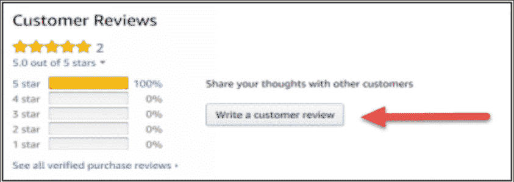

如果你能花60秒在亚马逊上写一篇简短的评论，即使只有几句话，我将不胜感激！

[>> 点击此处留下快速评论](link_url)

感谢你花时间分享你的想法！

你的评论对我来说真的会有所不同，并有助于提高我的作品的曝光度。

## 循环

Python中的循环用于我们希望一段代码被重复执行的时候。我们通常为要重复的代码块设置条件，只要条件满足，代码块就会重复执行。一旦条件不再满足，循环结束，代码块不再重复。
Python有两种循环：

1. for循环
2. while循环

## FOR循环

当我们知道希望循环执行的次数时，使用FOR循环。FOR循环也用于数组，这将在下一章讨论。下面是for循环重复执行一段代码10次的语法。

```python
for i in range(0,10):
    ......... block of code ..........
```

在上面的代码片段中，变量 ‘i’ 初始设置为0，每次代码块执行时 ‘i’ 递增1。在执行代码块之前，会进行检查：如果 ‘i’ 小于10，则执行循环；如果 ‘i’ 大于或等于10，则不执行循环，Python开始执行循环外的代码。通常，变量初始设置为range中的第一个参数，每次循环执行时递增1，直到其值达到第二个参数。

```python
for i in range(0,10):
    print(i)
```

在上面的代码中，我们在循环的每次执行期间打印变量 ‘i’ 的值。下面是输出

```
0
1
2
3
4
5
6
7
8
9
>>>
```

在 ‘i’ = 9 之后，‘i’ 递增到10，由于 ‘i’ 不再小于10，我们退出循环。

## 示例1

我们将编写一个程序，该程序从用户那里接收一个整数作为输入，并返回0到该数字之间所有偶数的和。

```python
def sum_even(number):
    number = int(number)
    sum = 0
    for i in range(0, number):
        if i % 2 == 0:
            sum = sum + i
    return sum

number = input("Please input the number? ")
print(sum_even(number))
```

函数 `sum_even` 接收一个数字作为参数，并返回直到该数字（不包括该数字）的所有偶数的和。执行以下步骤：

1. 我们将变量 ‘sum’ 设置为0
2. 创建一个循环，从 ‘i’ = 0 开始，运行到 ‘i’ = 用户输入的数字，每次递增1
3. 在循环内部，执行检查以确定 ‘i’ 是否为偶数
4. 如果 ‘i’ 是偶数，我们将 ‘sum’ 的值更新为 ‘sum’ + i
5. 一旦 i 等于输入的数字，我们退出循环并返回总和。

当输入为10时的输出如下

```
Please input the number? 10
20
>>>
```

0到10之间的偶数是2,4,6,8，而2+4+6+8 = 20。当输入为20时的输出如下

```
Please input the number? 20
90
>>>
```

0到20之间的偶数是2,4,6,8,10,12,14,16,18，而2+4+6+8+10+12+14+16+18 = 90。因此，我们的代码按预期工作。

## 示例2

我们将编写一个函数，该函数将打印一个用星号 (*) 填充的 *n x n* 正方形。

```python
def print_square(number):
    n = int(number)
    for row in range(n):
        for col in range(n):
            print("*",end='')
        print('')

number = input("Please enter the value of n:")
print_square(number)
```

函数 `print_square` 接收一个数字作为参数，并打印一个用 * 填充的 *n x n* 正方形。

1. 首先，我们需要一个循环来遍历正方形的每一行，这个迭代器称为 “row”，从0到n-1。注意：当range()没有提供起始点时，它将从0开始，到n-1结束。
2. 接下来，我们需要遍历每一列，我们称这个迭代器为col。
3. 使用这两个迭代器，我们可以将正方形视为一个n x n的表格，我们需要填充每个单元格。
4. 现在我们需要为一行中的每一列打印 “*”。我们需要确保指定end=‘’，因为否则python会在每次打印后换行，导致所有 * 都在单独的行上。
5. 在遍历完一行的每一列之后，我们需要在进入下一行之前换行，因此我们使用print(‘’)

当 n = 3 时的输出：

```
Please enter the value of n:3
***
***
***
```

当 n = 10 时的输出：

请输入 n 的值：10
**********
**********
**********
**********
**********
**********
**********
**********
**********
**********

## While 循环

当我们不知道循环需要执行多少次时，就会使用 while 循环。只要预定义的条件为 True，while 循环就会持续运行，一旦条件变为 False，循环就会退出。以下是 while 循环的通用语法：

```
while condition:
    ......... block of code .........
```

for 循环也可以写成 while 循环的形式。如果我们想打印 0 到 10 之间的数字（不包括 10），代码如下：

```
i = 0

while i<10:
    print(i)
    i = i+1
```

首先，我们将变量 ‘i’ 设置为 0，并在每次执行循环内的代码块时将其递增 1。在执行代码块之前，我们会检查 i 的值是否小于 10。如果条件评估为 True，我们就执行代码；如果评估为 False，我们就退出循环。以下是输出结果：

```
0
1
2
3
4
5
6
7
8
9
>>>
```

和之前一样，当 i = 9 时，循环会执行，即我们打印 i 并将 i 递增 1。当 i = 10 时，条件评估为 false，我们退出循环。

## 示例 1

下面是一个函数，它从用户那里获取输入并打印出来。这个过程会一直重复，直到用户输入单词 ‘exit’。

```
def func():
    status = True
    while status:
        word = input("Enter the word? ")
        if word == 'exit':
            status = False

func()
```

我们定义了一个函数 func，用于从用户那里获取输入并反复打印到控制台。一旦用户输入 ‘exit’，我们就停止。首先，我们声明一个布尔变量 ‘status’ 并将其设置为 True。只要布尔变量的值为 True，while 循环就会持续运行。

```
Enter the word? test
Enter the word? Loop
Enter the word? Python is cool
Enter the word? Hello world
Enter the word? exit
>>>
```

如你所见，当我们输入 ‘test’、‘Loop’、‘Python is cool’、‘Hello world’ 时，Python 会持续要求我们输入，但一旦我们输入 ‘exit’，我们就退出了 while 循环，程序结束。

## 示例 2

下面是一个函数，它接收一个数字 (n) 并将从 1, 2 .... N 的所有整数相加。

```
def add_numbers(n):
    n = int(n)
    total = 0
    counter = 1
    while counter <= n:
        total = total + counter
        counter = counter + 1
    return total

n = input("Please enter value of n: ")
print("Total sum is",add_numbers(n))
```

Counter 是当前正在被加的数字，从 1 开始。Total 是到目前为止数字的总和。我们在每次迭代中将 counter 递增 1，以改变正在被加的数字，因此 counter 会经历 1, 2, 3... n。当 counter 达到 n + 1 时，while 循环将中断，我们在最后返回 total。

当 n = 3 时的输出，1 + 2 + 3 = 6：

```
Please enter value of n: 3
Total sum is 6
```

当 n = 7 时的输出，1 + 2 + 3 + 4 + 5 + 6 + 7 = 28：

```
Please enter value of n: 7
Total sum is 28
```

## 练习

- 1) 编写一个程序，接收一个数字作为输入，并返回 0 到该数字之间所有奇数的和。
- 2) 编写一个程序，接收一个数字并打印该数字的前 10 个倍数（不包括该数字本身）。因此，如果我们接受 6 作为输入，我们打印：

```
6 x 1 = 6
6 x 2 = 12
6 x 3 = 18
6 x 4 = 24
6 x 5 = 30
6 x 6 = 36
6 x 7 = 42
6 x 8 = 48
6 x 9 = 54
6 x 10 = 60
```

- 3) 制作一个猜数字游戏。
    a) 创建一个变量 ‘guess’，并将其设置为 0 到 10 之间的随机整数，再创建一个变量 ‘lives’，初始设置为 3。
    b) 获取用户的猜测作为输入，每次猜错时将 ‘lives’ 减 1。
    c) 如果玩家的猜测与正确答案相差 +/- 2，则打印 “Hot”，否则打印 “Cold”。
    d) 玩家有 3 条命。即一旦变量 ‘lives’ 等于 0，游戏结束，用户不能再猜。
- 4) 打印一个 *n x n* 的正方形，其中每个奇数行填充 ‘#’，每个偶数行填充 ‘#’。

## 数组

数组用于将多个值存储在一起。想象一下，你想存储 5 辆汽车的名称，一种方法是创建 10 个不同的变量来存储这些值。变量可以是 ‘car1’、‘car2’、‘car3’、‘car4’、‘car5’。现在，如果你必须打印所有名称，你将不得不为每辆车输入 5 次打印语句。现在想象一下，如果你处理的不是 5 辆车，而是 100 辆车。这将非常繁琐。

数组帮助我们解决了这个问题。Python 中的数组称为列表。以下是声明数组的语法：
`carNames = [ ‘Toyota’ , ‘Ford’ , ‘BMW’ , ‘Ferrari’ , ‘Porsche’]`
方括号告诉 Python 该变量是一个列表，用于存储多个值。列表中的每个值称为一个元素，即 ‘Toyota’ 是一个元素，‘BMW’ 是一个元素，依此类推。列表中的每个元素都有一个索引，列表中的第一个元素的索引为 0。注意，它不是从 1 开始，而是从 0 开始。在我们的例子中，最后一个元素的索引为 4。

假设我们想访问索引为 x 的元素，我们使用以下语法：
`carNames[x]`

注意 x 必须是一个有效的索引，即它不能大于列表中元素总数减 1。

```
carNames = [ 'Toyota' , 'Ford' , 'BMW' , 'Ferrari' , 'Porsche']

print('Car number 1 is',carNames[0])
print('Car number 2 is ',carNames[1])
print('Car number 3 is ',carNames[2])
print('Car number 4 is ',carNames[3])
print('Car number 5 is ',carNames[4])
```

注意索引比元素在列表中的实际位置小 1。以下是打印语句的输出。

```
Car number 1 is Toyota
Car number 2 is  Ford
Car number 3 is  BMW
Car number 4 is  Ferrari
Car number 5 is  Porsche
>>>
```

这仍然没有解决输入多个打印语句的问题。注意索引总是递增 1，我们可以使用 for 循环并将索引设置为一个变量。

```
carNames = [ 'Toyota' , 'Ford' , 'BMW' , 'Ferrari' , 'Porsche']

for i in range(0,5):
    print("Car number " , i+1 , " is " , carNames[i])
```

变量 ‘i’ 初始为 0，只要 ‘i’ 小于 5，循环就会执行，即 ‘i’ 取 0 到 5 之间（不包括 5）的值。上述代码的输出将与之前的输出类似。还有另一种方法可以使用 for 循环访问列表中的所有元素。

```
carNames = [ 'Toyota' , 'Ford' , 'BMW' , 'Ferrari' , 'Porsche']

for car in carNames:
    print("Car is " , car)
```

我们使用 ‘in’ 关键字。变量 car 遍历列表并获取每个元素的值。

- 在循环的第一次执行期间，car 的值为 ‘Toyota’
- 在循环的第二次执行期间，car 的值为 ‘Ford’
- 在循环的第三次执行期间，car 的值为 ‘BMW’
- 依此类推。

只要列表中存在元素，循环就会持续执行。

一个列表可以有重复的值，也可以包含字符串值、整数值、布尔值、浮点值或它们的混合。

```
list1 = [ 1 , 'test' , True , False , 9.1 , 1 ,'test']
for element in list1:
    print("The element is ",element)
```

在上面的代码片段中，list1 包含了不同类型的变量和重复值的混合。以下是打印语句的输出：

```
The element is 1
The element is test
The element is True
The element is False
The element is 9.1
The element is 1
The element is test
>>>
```

Python 有许多用于列表的内置函数，以下是其中一些：

- 1) 列表的长度
len(list) 函数返回列表的长度，即列表中元素的数量。
- 2) 将元素添加到列表末尾
list.append(value) 函数允许我们将一个元素添加到列表的末尾。
- 3) 将元素添加到列表的特定索引处
list.insert(index , value) 函数允许我们在列表内的特定索引处添加一个元素。
- 4) 移除列表的最后一个元素
list.pop() 函数移除列表的最后一个元素。
- 5) 从列表中移除特定值
list.remove(value) 函数移除列表中该值的第一次出现。
- 6) 访问列表中的多个元素
我们可以使用 ‘:’ 运算符访问列表中的多个元素。

list[0] 返回第一个元素

list[0:4] 返回从索引 0 到索引 3 的元素，注意索引 4 不包括在内

list[0:] 返回从索引 0 到列表末尾的元素

list[2:] 返回从索引 2 到列表末尾的元素

索引 -1 指的是列表的最后一个元素，-2 指的是倒数第二个元素，依此类推。

以下是在 Python Shell 中使用各种列表函数的示例

## 字符串的乐趣

字符串是字符的数组，即‘Hello’可以表示为[‘H’,’e’,’l’,’l’,’o’]。因此，我们也可以将之前讨论过的所有数组函数应用于字符串。

```python
string = "Hello"

for character in string:
    print(character)
```

以下是输出结果

```
H
e
l
l
o
>>>
```

以下是在处理字符串时非常有用的几个函数。

## Split

`.split()`函数接收一个值，并使用该值作为分隔符将字符串拆分成一个更小的字符串数组。

```python
>>> s = "Python is cool"
>>> s.split(' ')
['Python', 'is', 'cool']
>>> s = 'a,b,c,d,e,f,g'
>>> s.split(',')
['a', 'b', 'c', 'd', 'e', 'f', 'g']
>>>
```

在第一个例子中，我们使用空格作为分隔符来拆分字符串；在第二个例子中，我们使用逗号作为分隔符来拆分字符串。

## Is 函数

- **isalnum()** - 如果字符串中的所有字符都是字母数字，则返回 True
- **isalpha()** - 如果字符串中的所有字符都在字母表中，则返回 True
- **islower()** - 如果字符串中的所有字符都是小写，则返回 True
- **isnumeric()** - 如果字符串中的所有字符都是数字，则返回 True
- **isupper()** - 如果字符串中的所有字符都是大写，则返回 True

```python
>>> 'Hello'.isalnum()
True
>>> 'Hello!!!'.isalnum()
False
>>> 'Hello'.isalpha()
True
>>> 'Hello'.isnumeric()
False
>>> '12345'.isnumeric()
True
>>> 'H3ll0'.isnumeric()
False
>>> 'Hello'.islower()
False
>>> 'hello'.islower()
True
>>> 'HELLO'.isupper()
True
>>>
```

- 1) ‘Hello’只包含字母，因此 isalnum 返回 True
- 2) ‘Hello!!!’包含感叹号，因此 isalnum 返回 False
- 3) ‘Hello’只包含字母，因此 isalpha 返回 True
- 4) ‘Hello’包含字母而不包含数字，因此 isnumeric 返回 False
- 5) ‘12345’包含数字，因此 isnumeric 返回 True
- 6) ‘H3ll0’包含字母，因此 isnumeric 返回 False
- 7) ‘Hello’包含一个大写字符，因此 islower 返回 False
- 8) ‘hello’包含所有小写字符，因此 islower 返回 True
- 9) ‘HELLO’包含所有大写字符，因此 isupper 返回 True

## Strip

`lstrip()` 移除字符串开头的尾随空格，`rstrip()` 移除字符串末尾的尾随空格，`strip()` 移除字符串开头和末尾的尾随空格。

```python
>>> s = '       Hi       '
>>> len(s.lstrip())
9
>>> len(s.rstrip())
9
>>> len(s.strip())
2
>>>
```

‘s’ 是一个字符串变量，开头有 7 个空格，末尾有 7 个空格。因此总长度为 16。

- 1) `lstrip()` 移除了前 7 个空格字符，因此长度为 9
- 2) `rstrip()` 移除了后 7 个空格字符，因此长度为 9
- 3) `strip()` 移除了前 7 个和后 7 个空格，因此长度为 2

## 大小写转换

```python
>>> list = [1, 5, 10, 90, 100, 13, 15, 19, 20, 10]
>>> len(list)
10
>>> list.append("New Element")
>>> len(list)
11
>>> list
[1, 5, 10, 90, 100, 13, 15, 19, 20, 10, 'New Element']
>>> list.insert(2, "New Element")
>>> len(list)
12
>>> list
[1, 5, 'New Element', 10, 90, 100, 13, 15, 19, 20, 10, 'New Element']
>>> list.pop()
'New Element'
>>> len(list)
11
>>> list.remove(10)
>>> len(list)
10
>>> list
[1, 5, 'New Element', 90, 100, 13, 15, 19, 20, 10]
>>>
```

- 1) 首先，我们声明一个包含各种整数值的列表。
- 2) 我们使用 `len` 函数获取列表的长度，为 10。
- 3) 然后我们在末尾插入一个新元素，值为‘New Element’，并打印列表的长度。长度如预期增加了 1，打印列表时我们可以看到新元素被插入到了列表末尾。
- 4) 我们使用 `.insert()` 函数在索引 2 处插入另一个元素，打印列表和长度后，我们看到它按预期工作。
- 5) 然后我们尝试移除最后一个元素，即我们在步骤 3 中插入的元素。列表的长度应减少 1，打印长度和列表确认它按预期工作。
- 6) `.remove()` 函数移除该元素的第一个出现，因此 `.remove(10)` 移除列表中第一个出现的 10，即索引 3 处的元素。

现在我们尝试访问列表中的多个元素。

```python
>>> list
[1, 5, 'New Element', 90, 100, 13, 15, 19, 20, 10]
>>> list[0]
1
>>> list[0:]
[1, 5, 'New Element', 90, 100, 13, 15, 19, 20, 10]
>>> list[:4]
[1, 5, 'New Element', 90]
>>> list[2:4]
['New Element', 90]
>>> list[-1]
10
```

- 1) `list[0]` 打印第一个元素。
- 2) `list[0:]` 打印从索引 0 到末尾的所有元素。
- 3) `list[:4]` 打印从索引 0 到索引 3 的所有元素。
- 4) `list[2:4]` 打印索引 2 和 3 处的元素。
- 5) `list[-1]` 打印最后一个元素。

## 示例 1

我们将编写一个程序，从用户那里获取 5 个数字作为输入，并返回所有数字加 10 后的总和。

```python
input_complete = False
inputs = []
while(not input_complete):
    num = input("Input the number? ")
    inputs.append(int(num) + 10)

    if len(inputs) == 5:
        input_complete = True

print(inputs[0:])
```

首先，我们创建一个布尔变量并将其设置为 false。我们还创建一个空列表来存储输入值。当变量‘input_complete’为 False 时，while 循环运行。我们持续从用户那里获取输入，将其加 10 并添加到列表中。我们执行检查，并在列表长度为 5（即用户输入了 5 个元素）时将‘input_complete’设置为 True。然后我们打印列表。

以下是程序的执行过程。

```
Input the number? 1
Input the number? 2
Input the number? 3
Input the number? 4
Input the number? 5
[11, 12, 13, 14, 15]
>>>
```

## 示例 2

我们将编写一个程序，接收任意数量的数字输入，并打印它们的平均值。

```python
input_complete = False
inputs = []
while(not input_complete):
    num = input("Please enter number(enter q to stop):")
    if num == 'q':
        input_complete = True
    else:
        inputs.append(int(num))

print("Input array is ", inputs)

total = 0
count = 0
for i in inputs:
    total = total + i
    count = count + 1

average = total / count
print("Average is: ", average)
```

与之前的示例类似，我们创建一个布尔变量（*input_complete*）和一个数组（*inputs*），并使用 while 循环获取输入，但这次当我们输入字母‘q’时 while 循环将停止。获取所有输入后，我们声明一个变量 *total* 来计算所有输入的总和，以及一个变量 *count* 来跟踪总输入数量。我们通过使用 for 循环并遍历 inputs 数组中的每个元素来实现这一点。最后，要获得平均值，我们只需将总和除以计数。

```
Please enter number(enter q to stop):2
Please enter number(enter q to stop):3
Please enter number(enter q to stop):5
Please enter number(enter q to stop):4
Please enter number(enter q to stop):q
Input array is  [2, 3, 5, 4]
Average is:  3.5
>>>
```

## 示例 3

这次我们将编写一个函数，它接收一个数组并返回数组中的最大值。

```python
def find_max(inputs):
    max_value = inputs[0]
    for item in inputs:
        if item > max_value:
            max_value = item

    return max_value

maximum = find_max([1, 3, 9, 200, 6, -10])
print("Max in array is: ", maximum)
```

首先我们将 `max_value` 设置为数组中的第一个元素。这是临时的。接下来我们遍历数组中的每个元素，并检查该元素是否大于我们设置的最大值，如果是，则将该值设置为新的最大值。一旦遍历完整个数组，`max_value` 应该包含数组中的绝对最大值。

对于给定的数组 [1, 3, 9, 200, 6, -10]，输出为：

```
Max in array is:  200
>>>
```

## 练习

- 1) 输入一个学生在 5 个不同科目的成绩，并打印所有成绩的平均值。同时找出最低和最高的科目成绩。
- 2) 创建一个存储一年中月份的列表。用户可以输入月份的数字，函数应使用数组将数字与实际月份关联起来。然后打印出数组中相关的月份。
- 3) 创建一个姓名列表，并检查是否有任何两个姓名是相同的。根据是否存在同名，返回一个布尔值（True 或 False）。

## upper()、lower()、swapcase()

upper() 将所有字符转换为大写，lower() 将所有字符转换为小写，swapcase() 将小写字符转换为大写，大写字符转换为小写。

```
>>> 'HeLLo'.lower()
'hello'
>>> 'HeLLo'.upper()
'HELLO'
>>> 'HeLLo'.swapcase()
'hElLO'
>>> 
```

## 字符串连接

`+` 运算符可用于连接字符串。

```
>>> s1 = 'Hello'
>>> s2 = 'World'
>>> s1+s2
'HelloWorld'
>>> 
```

只能连接两个字符串，不能使用 `+` 运算符连接字符串和整数。但是，你可以使用 `str()` 将整数转换为字符串，然后将其连接到另一个字符串。

```
>>> 'Hi' + 2
Traceback (most recent call last):
  File "<pyshell#23>", line 1, in <module>
    'Hi' + 2
TypeError: can only concatenate str (not "int") to str
>>> 'Hi' + str(2)
'Hi2'
>>> |
```

如你所见，'Hi' + 2 会报错，因为 2 是一个整数，但使用 `str(2)` 将其转换为字符串后，结果是 'Hi2'。

## join

join 函数用于从列表创建一个字符串。它接受一个值作为分隔符，并将列表中的所有元素连接起来形成一个字符串。确保列表中的所有元素都是字符串类型或已转换为字符串。

```
>>> ''.join(['Test' , 'Join' , 'Function' , 'Hello' , 'Wordl'])
'TestJoinFunctionHelloWordl'
>>> ' '.join(['Test' , 'Join' , 'Function' , 'Hello' , 'Wordl'])
'Test Join Function Hello Wordl'
>>> ','.join(['Test' , 'Join' , 'Function' , 'Hello' , 'Wordl'])
'Test,Join,Function,Hello,Wordl'
>>> |
```

在第一种情况下，我们没有传递任何分隔符，它直接连接字符串，中间没有空格或分隔符。在第二种情况下，我们传递了一个空格作为分隔符，因此结果中单词之间有空格。在第三种情况下，我们传递了一个逗号，单词之间用逗号分隔。

## find

find 函数返回单词在字符串中首次出现的索引。如果未找到该单词，则返回 -1。

```
>>> "Hello World".find("Hello")
0
>>> "Hello World".find("World")
6
>>> "Hello World".find("world")
-1
>>> "Hello World".find("Python")
-1
>>> |
```

在第一种情况下，我们尝试在字符串 "Hello World" 中查找 "Hello"，它返回 0，因为 0 是找到 'Hello' 首次出现的起始索引。同样，在第二种情况下，它返回 6，因为 6 是起始索引。请注意，Python 区分大小写，因此当我们尝试搜索 'world' 时，它返回 -1。当我们尝试搜索 'Python' 时，它也返回 -1，因为它不存在于 'Hello World' 中。

## replace

replace 函数用于将一个字符串替换为另一个字符串，如下例所示。

```
>>> "Hello World".replace("o" , "2")
'Hell2 W2rld'
>>> "Hello World".replace("Hello" ,"*")
'* World'
>>> |
```

在第一种情况下，我们将所有出现的字母 'o' 替换为 "2"，在第二种情况下，我们将 "Hello" 替换为 "*"。

## 练习

- 1) 编写一个程序，查找一个特定字符串在输入的更大字符串中出现的次数。
- 2) 编写一个程序，接受一个包含姓名和分数的字符串，以逗号分隔。分割字符串并计算分数的平均值。返回值应为姓名后跟平均分。
- 3) 编写一个程序，接受一个姓名和地址，并检查地址中是否包含文本 'Atlanta'。设置一个计数器，每次出现时递增；在程序结束时打印出来自亚特兰大的人数。

## 数学函数

数学库为我们提供了访问 Python 中一些常用数学函数和常量的途径。要使用数学库，我们需要在 Python 文件中输入 "import math" 来导入它。要访问其任何函数或常量，我们需要在它们前面加上 'math.'。

## 常量

```
import math

print(math.pi)
print(math.e)
```

math.pi 返回常量 pi，math.e 返回常量 e 的值。

```
3.141592653589793
2.718281828459045
>>> |
```

## exp() 函数

exp() 函数可用于计算 e 的幂。

```
>>> math.exp(10)
22026.465794806718
>>> math.exp(5)
148.4131591025766
>>> |
```

## log() 函数

此函数返回指定数字的对数。自然对数是以 e 为底计算的。以下示例演示了此函数的用法：

```
>>> math.log(10)
2.302585092994046
>>> math.log(1)
0.0
>>> |
```

它也可以用作 log(x,y)，其中 y 是底数。

```
>>> math.log(100,10)
2.0
>>> math.log(10,3)
2.095903274289385
>>> |
```

## 算术函数

算术函数用于执行数学运算。下面讨论一些最常见的算术函数：

- ceil(a)：返回指定数字的向上取整值。
- fabs(a)：返回指定数字的绝对值。
- floor(a)：返回指定数字的向下取整值。
- gcd(a, b)：返回 a 和 b 的最大公约数。
- pow(a,b)：返回第一个数的第二个数次幂的结果。
- sqrt(a)：返回指定数字的平方根。

```
>>> import math
>>> math.ceil(3.5)
4
>>> math.floor(3.5)
3
>>> math.fabs(-3.5)
3.5
>>> math.gcd(10,20)
10
>>> math.pow(2,3)
8.0
>>> math.sqrt(9)
3.0
>>> |
```

## 结论

感谢你下载这本书。我希望你喜欢书中的内容，并应用了书中包含的所有知识。这只是让你开始并享受编程的第一步。
未来还有更多内容。我将来会推出一些更高级的书籍。
如果你也想要一对一培训，你可以通过以下方式联系我：
[abiprod.pty.ltd@gmail.com](mailto:abiprod.pty.ltd@gmail.com)

同时，如果你感兴趣，可以查看以下书籍：
[Python Crash Course by Eric Matthes](https://www.google.com/search?q=Python+Crash+Course+by+Eric+Matthes)
[Learning Python by Mark Lutz](https://www.google.com/search?q=Learning+Python+by+Mark+Lutz)
[Python Programming by John Zelle](https://www.google.com/search?q=Python+Programming+by+John+Zelle)
如果你想要类似的 JavaScript 基础入门，可以尝试我的这本书：
[Coding for Kids in JavaScript](https://www.google.com/search?q=Coding+for+Kids+in+JavaScript) by Bob Mather

## 第四册：Python 儿童编程

## 引言

在 21 世纪，我们周围没有任何东西可以离开计算机而工作。计算机无处不在。手机、笔记本电脑、自动取款机，凡是你能想到的，里面都有计算机。此外，还有其他机器内部隐藏着嵌入式计算机。这些包括洗衣机、烘干机、冰箱、汽车、车辆、空调和电梯等物品，它们内部都有某种计算机芯片。我们如何告诉计算机如何工作？是通过编程！编程语言是一种机器可以理解并运行以执行各种任务的语言。这是我们与机器沟通，让它们理解我们想要完成什么的方式。程序是执行任务的逻辑顺序语句。程序可以使用我们想要的任何编程语言编写。它甚至可以是 1 和 0，这是计算机唯一能理解的东西。计算机中的一切都是 1 和 0。高级编程语言使用类似英语的语言，这样我们就可以轻松地为计算机编程。最终，任何语言编写的任何程序都会被转换为 1 和 0，以便机器能够理解。

技术已经存在于我们的日常生活中，并且正以前所未有的速度增长。所有这些技术都需要被发明、编程和维护！只有通过理解计算机，我们才能做到这一切，并维护和发展技术以取得更大的进步。
世界上有数百种编程语言。虽然许多语言不再使用，但有些仍然非常流行并被广泛使用，如 Java、JavaScript、C#、C++、PHP、Python、Swift、SQL、Ruby。
没有人知道所有这些语言，实际上没有人能学会所有这些语言，因为它们太庞大、太多了。好消息是你不需要学习所有语言。一门好的流行语言就足够了。你可以开始学习，并只使用一种语言编写你需要的代码。一旦你开始学习并掌握了足够的知识，任何其他语言都会变得容易，并且应该花费更少的时间。不同编程语言的主要概念和基础是相似的。
在本书中，我们将使用 Python 编程语言。Python 是一门非常适合初学者学习的优秀且简单的语言。有那么多特定于 Python 的库和生态系统。
本书侧重于通过实践和实验来学习。提供了程序和输出示例。

建议你实际运行程序，并将其与书中的代码进行比较。程序运行后，鼓励你根据自己的需求调整代码。
每章末尾都有练习题，有助于巩固每个概念的学习并继续前进。这是充分利用本书的最佳方式。

## 为什么 Python 适合初学者

Python 是一门非常适合学习的编程语言。它易于上手，是进入编程世界的良好起点。Python 由一位名叫吉多·范罗苏姆的人发明，他当时正在一个名为 ABC 的教育项目中工作，旨在为新程序员构建一种语言。该项目的结果就是他创建了 Python 编程语言。吉多在创建 Python 时考虑了四个主要目标。这些目标是：直观、开源、易于理解以及通用性强以缩短开发时间。Python 至今仍在不断发展和成熟。许多爱好者和开发者每天都在使用它完成各种任务。Python 被用于许多任务，如 Web 开发、脚本编写、网络爬虫、数据分析和自动化。以下是 Python 的优点：

### 学习曲线平缓

Python 学习所需时间很短。这使得它成为初学者开始学习编程的绝佳语言。这就是为什么它被世界各地许多计算机科学入门课程所采用。

### 直观

Python 的语法非常易于阅读。事实上，它读起来非常像英语，这是其直观性的原因之一。该语言整体上保持一致，易于阅读。你无需花时间去理解晦涩的符号和语法。代码被阅读的次数远多于被编写的次数。这就是为什么可读性对一门语言来说是一个巨大的优势。

### 极少的样板代码

“Hello World” 程序是一个常见的基础程序，只有一行代码。像这样的简单程序可以用很少的“起始代码”或额外代码编写。Python 内置了强大的数据类型。Python 有列表、字典、元组、集合、字符串。这些数据类型使得你可以立即开始开发，而无需从头实现这些数据结构。这些数据类型（以及更多）有助于缩短开发时间并提供更灵活的时间安排。

### 优秀的生态系统

一门编程语言本身的价值有限。使其被广泛采用和有用的是它所拥有的支持社区和库。有大量的第三方库和人员可以帮助你。

### 解释型语言

Python 是一种高级脚本语言（如 PHP、Ruby、Perl、JavaScript 等）。这类高级语言通常不需要预先声明变量。它们允许变量类型改变。这称为动态类型。Python 是一种解释型语言，意味着程序可以直接运行，无需在执行前进行编译。

### 通用性强

Python 有许多应用领域，包括数据科学、机器学习、Web 开发和游戏开发。
以下是一些 Python 模块的示例。

- [Pandas](https://pandas.pydata.org/) 用于数据整理和分析。
- [matplotlib](https://matplotlib.org/)，一个绘图库，可用于使用多种图表类型绘制图形。
- [Pygame](https://www.pygame.org/) 用于开发游戏。
- [Django](https://www.djangoproject.com/)，一个用于 Web 开发的框架。

Python 强调基础，该语言的核心哲学是“Python 之禅”。你可以通过在 Python 中输入“import this”来获取它们。Python 之禅是：

1. 优美优于丑陋。
2. 明了优于隐晦。
3. 简洁优于复杂。
4. 复杂优于繁琐。
5. 扁平优于嵌套。
6. 稀疏优于密集。
7. 可读性很重要。

## 设置 Python 工作区

有许多方法可以建立一个 Python 环境来开始编码。我将在这里说明两种设置 Python 工作区的简单方法。

### 方法 1 – Anaconda

Anaconda 是一个包含 Python 和许多其他预装库的环境。你只需安装一次即可获得所有这些。Anaconda 附带一个名为 Jupyter Lab 的工具，Jupyter Lab 是一种以交互方式运行 Python 的绝佳方式。由于其易用性，它也被广泛用于数据科学和 Python 学习。
本书主要使用 jupyter lab 以交互方式运行 Python 脚本。
要安装 Anaconda，请按照以下指南操作。

1. 打开链接 https://www.anaconda.com/products/individual

个人版

# 你的数据科学工具包

全球超过 2000 万用户，开源个人版（发行版）是在单台机器上执行 Python/R 数据科学和机器学习的最简单方法。专为个人从业者开发，它是让你能够使用数千个开源包和库的工具包。

下载


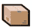


点击下载**按钮并**选择与你的系统对应的版本

| Anaconda 安装程序 | | |
| --- | --- | --- |
| **Windows** 🪟 | **MacOS** 🍎 | **Linux** 🐧 |
| Python 3.8 | Python 3.8 | Python 3.8 |
| 64 位图形安装程序 (466 MB) | 64 位图形安装程序 (462 MB) | 64 位 (x86) 安装程序 (550 MB) |
| 32 位图形安装程序 (397 MB) | 64 位命令行安装程序 (454 MB) | 64 位 (Power8 和 Power9) 安装程序 (290 MB) |

下载后，按照安装程序的说明进行安装。
安装后，在你的系统上找到“Anaconda Prompt (anaconda3)”。


点击“**Anaconda Prompt (anaconda3)**”打开它。

在命令提示符中输入“**jupyter notebook**”并按回车键。

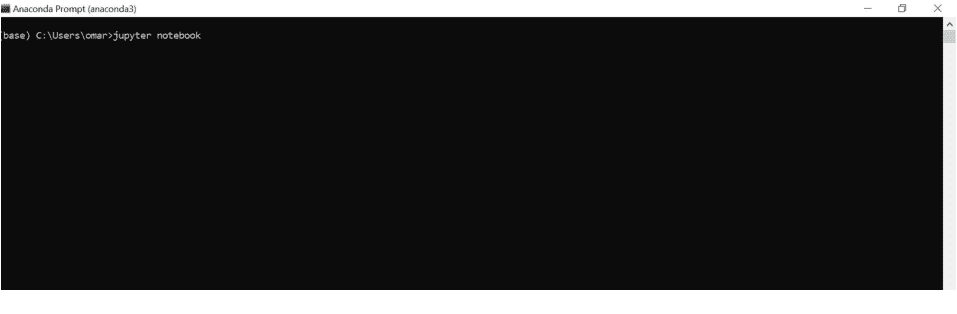

### 应该会打开一个 jupyter lab 的浏览器页面

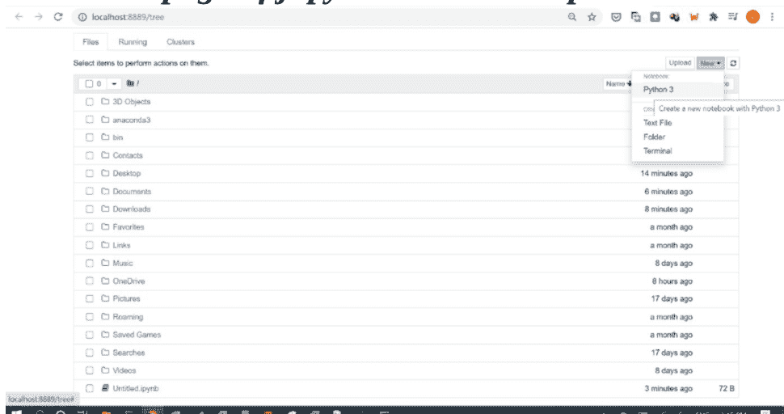

在右上角的新框中点击 python 3。

现在你已准备好以交互方式运行 Python 程序。

要编写程序，输入“**print(“hello world”)**”并点击运行或使用快捷键 shift + enter。

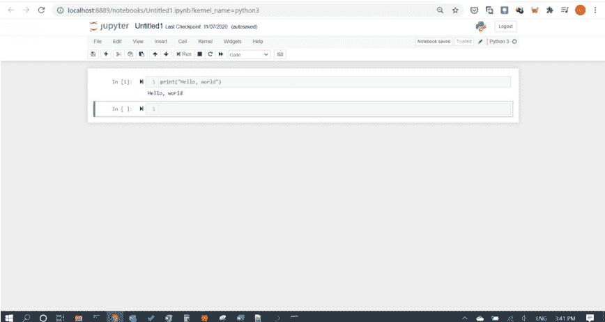

恭喜，现在你的第一个程序已经运行起来了。

或者，如果你更喜欢在云端工作，你可以使用 jupyter 网站在线运行 jupyter lab。
打开 [https://jupyter.org/try](https://jupyter.org/try)。


### 点击 Try Jupyter lab

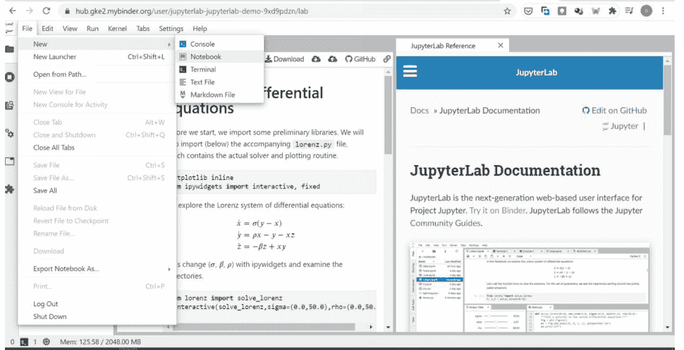

应该会打开一个类似于上图的页面，点击 **File > New > Notebook**。

一个提示框会询问你选择哪个内核，选择 Python 3。

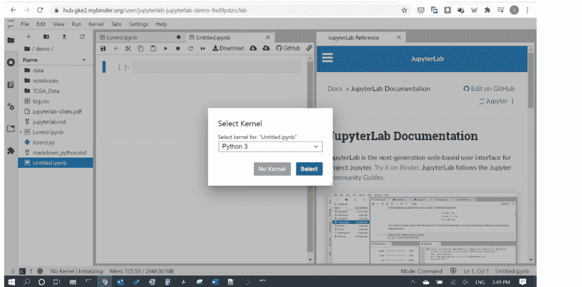

要编写程序，输入 **print(“hello world”)** 并点击运行或使用快捷键 shift + enter。
恭喜，现在你的第一个程序已经运行起来了。

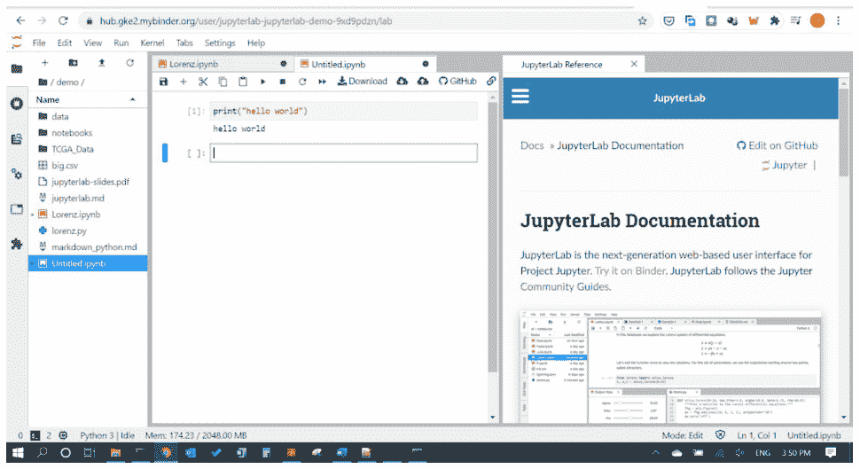

### 方法 2 – 安装 Python 和文本编辑器

如果你有大型 Python 程序，最好使用文本编辑器进行编辑，然后使用 Python 单独运行它们。

### 步骤 1：安装 Python

打开链接 https://www.python.org/downloads/ 并下载 Python。

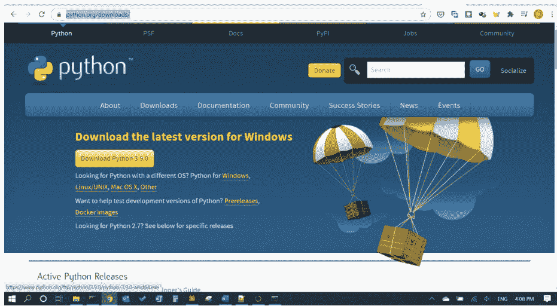

打开安装包并安装 Python。

### 步骤 2：安装 Notepad ++

Notepad++ 是一个易于使用的文本编辑器，用于编写和编辑代码。

打开 URL：https://notepad-plus-plus.org/downloads/v7.9.1/

下载并安装 notepad++

在你的系统上找到 notepad++ 并打开

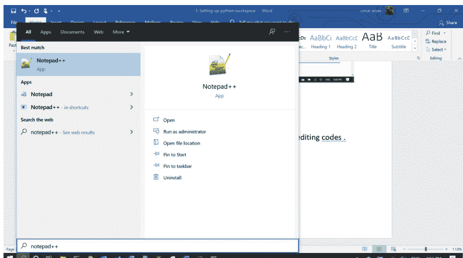

### 编写你的第一个程序 print(“Hello, World”)

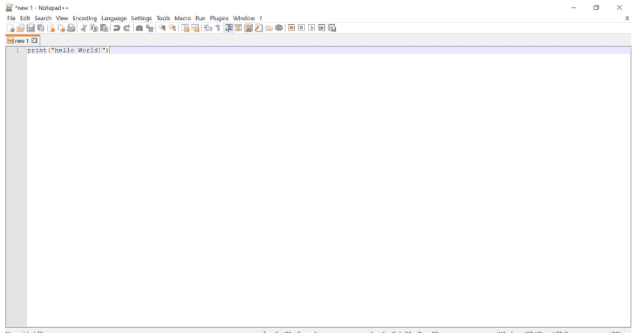

### 使用 File > Save As.. 保存你的程序

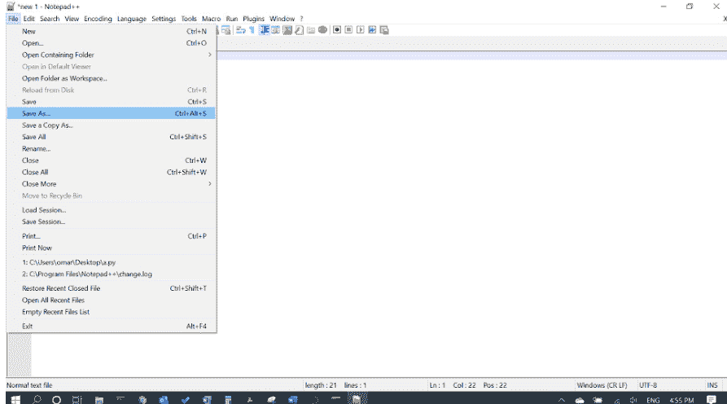

### 命名你的程序并将保存类型设为 Python 文件

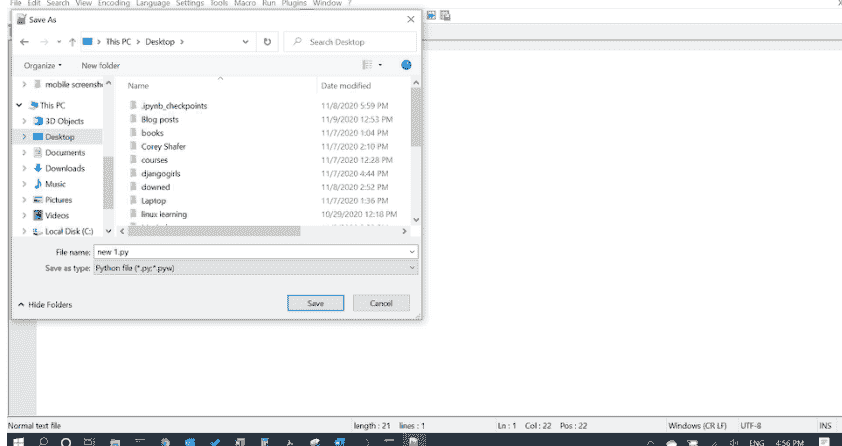

要运行你的程序，在你的系统上找到命令提示符并打开它。

# 变量

变量简介
将变量想象成一个用来存放某个值的容器。变量是内存中存放某个值的位置。在静态类型编程语言（如 C 和 C++）中，变量类型必须事先声明，并且变量类型不能随时更改。这就是为什么我们首先声明变量并指定其值类型，然后再为变量赋值。
以下是在静态类型语言中声明和赋值变量的示例。
**int var;** 声明一个整数类型的变量。
**var = 8;** 将变量赋值为 8。
但由于 Python 是动态类型的，你不必先声明变量类型，它会自动为你推断变量类型。要定义一个变量，只需使用等号将值赋给变量名即可。这称为赋值运算符。下面的代码将三个变量分别赋值为字符串、整数和浮点数。

```python
# 变量

lang = "python"
num1 = 2
num2 = 3.4

print(lang)
print(num1)
print(num2)
print('\n')

print(type(lang))
print(type(num1))
print(type(num2))
```

## 输出：

```
python
2
3.4
```

```
<class 'str'>
<class 'int'>
<class 'float'>
```

观察每个变量都有一个类型，而无需显式定义。
字符串变量可以用单引号或双引号声明。
我们可以在一行中定义多个变量，例如 var1, var2, var3 = 1, 2, 3。

```python
x, y, z = 1, 2, 3
print(x, y, z)
```

## 输出：

```
1 2 3
```

## 变量命名规则

在 Python 中，变量名有几条规则。规则如下：

- 1. 变量名必须以字母或下划线“_”开头。
- 2. 变量名必须是字母数字组合；不允许使用特殊字符。
- 3. 变量名区分大小写，A 和 a 是不同的变量。

不同变量名的示例。

```python
num = 1
NUM = 2
_2num = 3
num2 = 4
num2_ = 5

print(num, NUM, _2num, num2, num2_)
```

```
1 2 3 4 5
```

请注意，在上面的代码片段中，变量名被赋予了有意义的名称。这在编程中非常重要，因为它使程序更易于阅读。

## 全局变量和局部变量

在函数外部创建的变量可以被任何函数访问。它们被称为全局变量。全局变量可以被任何函数访问。局部变量是在函数内部定义的变量，不能从函数作用域外部访问。

在下面的代码中，“lang”变量是全局的，因此 func() 函数可以访问它。当调用 func() 时，输出为 Python。

```python
# 此变量在此作用域内是全局的
lang = "Python"

def func():
    print(lang)

func()
```

```
Python
```

```python
# 此变量在此作用域内是全局的
lang = "Python"

def func():
    # 此变量在此函数内是局部的
    lang = "C++"
    print(lang)

func()
print(lang)
```

```
C++
Python
```

类似地，这里的“lang”变量是全局的，但我们也有一个名为 lang 的变量，其值为 C++。当调用 func() 时，输出为 C++，因为 func 内部的局部变量优先于 func 外部的全局变量。然而，当我们打印变量 lang 时，我们看到全局变量并未改变。这是因为即使我们在 func 内部和外部都有 lang 变量，它们的作用域是分开的，不会相互干扰/覆盖。

## 赋值运算符

赋值运算符用于在 Python 中赋值。它们也用于操作和更新变量值。下表显示了赋值运算符及其名称。这些运算符用作其等效形式的简写。

| 运算符 | 名称 | 示例 | 等效形式 |
| :--- | :--- | :--- | :--- |
| = | 赋值运算符 | j = 2 | j = 2 |
| += | 加法赋值 | j += 2 | j = j + 2 |
| -= | 减法赋值 | j -= 2 | j = j - 2 |
| *= | 乘法赋值 | j *= 2 | j = j * 2 |
| /= | 除法赋值 | j /= 2 | j = j / 2 |
| %= | 取模赋值 | j %= 2 | j = j % 2 |
| **= | 幂赋值 | j **= 2 | j = j**2 |

```python
a, b, c, d, e, f = 1, 1, 1, 1, 1, 1

a += 2
b -= 2
c *= 2
d /= 2
e %= 2
f **= 2

print("a is ", a)
print("b is ", b)
print("c is ", c)
print("d is ", d)
print("e is ", e)
print("f is ", f)
```

```
a is 3
b is -1
c is 2
d is 0.5
e is 1
f is 1
```

下面的脚本在第 1 行将所有变量 a, b, c, d, e, f 赋值为 1。然后它使用赋值运算符来更新变量值。研究输出以了解赋值运算符的工作原理。

## 字符串方法

Python 最强大的方面之一是它开箱即用提供了强大的函数，无需重新实现。Python 中的字符串方法功能多样且非常强大，省去了你从头开始实现它们的时间。你可以轻松地使用它们操作字符串。在本节中，我们将学习一些 Python 字符串方法。

以下是常见的 Python 字符串方法列表。

字符串拼接：要将两个字符串拼接在一起，只需使用 + 运算符。

```python
A = "Hello"
B = "World"
A + B  # 返回 "Hello World"
```

另外，将字符串乘以任何数字 n 会将该字符串重复 n 次。

```python
A = 5 * "hi"
A  # 返回 "hihihihihi"
```

len(str) – 长度函数返回字符串字符的长度。

len("python is amazing") - 返回 17。注意 len 也计算空格！

str[index] – 索引运算符，从字符串中选择单个字符。括号内的数字称为索引，它是一个整数值。Python 中的索引从零开始。

```python
a = "Python"
a[0]  # 值为 "P"
a[5]  # 值为 "n"
```

你也可以使用负索引，它将从后向前开始索引，从最后一个字符开始。

```python
a[-1]  # 值为 "n"
a[-2]  # 值为 "o"
```

str[starting_index: ending_index] - 切片运算符，在起始索引处切片字符串，并在结束索引的前一个字符处结束。

```python
a = "Programming is amazing"
a[0:11]  # 值为 "Programming"
a[15:19]  # 值为 "amaz"
```

in - in 运算符如果字符在字符串中则返回 True。

```python
lang = "language"
"a" in lang  # 返回 True
```

str.split(char) — 按字符 char 将字符串分割成字符串列表

```python
langs = "Python,C++,C"
langs.split(",")  # 返回 ['Python', ' C++', 'C']
```

str.replace(oldval, newval) - 在字符串 str 中将短语 oldval 替换为 newval。

```python
A = "Python is powerful"
A.replace("Python", "C++")  # 返回 'C++ is powerful'
```

f-string — 是一种格式化字符串和变量的简单方法，它们易于使用且速度更快。

```python
n = 7
print("number is ", n)  # 输出 "number is 7"
print(f"number is {n}")  # 输出 "number is 7"
```

**str.capitalize()** - 将字符串首字母大写，如果已经大写则返回原始字符串。

```python
sent = "message was sent"
sent.capitalize()  # 返回 "Message was sent"
```

**str.count(substring)** - 返回子字符串在 str 中出现的次数。

```python
mess = "Life is beautiful"
mess.count('is')  # 返回 1。
```

**str.isalnum()** - 如果字符串是字母数字组合（即字母或/和数字的组合）则返回 true。

```python
a = 'door2'
b = 'door'
c = 'door#$'
a.isalnum()  # 返回 True。
b.isalnum()  # 返回 True。
c.isalnum()  # 返回 False。
```

str.isalpha() — 如果所有字符串字符都是字母则返回 True。

```python
a = 'door1'
a.isalpha()  # 返回 False
```

str.isdigit() - 如果 str 仅包含数字则返回 True。

```python
n = '324235'
m = 'd4ds'
n.isdigit()  # 返回 True
m.isdigit()  # 返回 False
```

**str.islower()**- 如果字符串字符全部为小写则返回 True。

```python
s = "People"
s.islower()  # 返回 False
```

**str.isupper()**- 如果字符串字符全部为大写则返回 True。

```python
S = "ALL"
s.isupper()  # 返回 True。
```

Python 也提供了字符串比较运算符，就像你可以使用 `==`、`>`、`<` 等比较数字一样。你也可以使用相同的运算符来比较字符串。

| 运算符 | 名称 | 描述 | 示例 | 返回值 |
| :--- | :--- | :--- | :--- | :--- |
| == | 等于 | 如果字符串相等则返回 True，否则返回 False。 | "Python" == "C++" | False |
| != | 不等于 | 如果字符串不相等则返回 True，否则返回 False。 | "Python" != "C++" | True |
| > | 大于 | 如果 `len(str1) > len(str2)` 则返回 True，否则返回 False | "Python" > "C++" | True |
| >= | 大于或等于 | 如果 `len(str1) >= len(str2)` 则返回 True，否则返回 False | "Python" >= "Python" | True |
| < | 小于 | 如果 `len(str1) < len(str2)` 则返回 True，否则返回 False | "Python" < "C++" | False |
| <= | 小于或等于 | 如果 `len(str1) <= len(str2)` 则返回 True，否则返回 False | "Python" <= "C++" | False |

## 示例 1：字符串方法

下面的脚本使用我们学过的字符串方法对字符串进行有趣的操作。该程序通过 `input` 函数获取用户名，并对用户名执行有趣的字符串操作。代码中有注释。阅读并研究代码。在理解代码后，尝试修改它。

```python
name = "Nick John"

n = len(name)
index0 = name[0]
indexneg = name[-1]
index0_4 = name[0:4]

# 使用 f-string 连接句子
job = f"\'{name} is an Engineer\'"
print("using f-string output is", job)

# 切片和索引
print(f"name length is: {n}")
print(f"name index 0 is {index0}")
print(f"name index -1 is {indexneg}")
print(f"name slice [0:4] is {index0_4}")

# in 操作、split、replace、capitalize
is_in = "Nick" in name
print(f""Nick" in name returns {is_in}")
splited = name.split()
print(f"name.split() returns {splited}")
name = name.replace("Nick", "Biden")
print(f"Nick John after replacing with name.replace() is {name}")
print(f"james capitalized is {'james'.capitalize()}")

# count、isalnum、isalpha、isdigit
name = "Obama Jame"
count = name.count("Nick")
print(f"Nick occurs {count} times in \'{name}\'")

non_alphanum = "eoe12#"
non_alpha = "23"
digit = '223'

print(f"{non_alphanum} is alphanumeric is {non_alphanum.isalnum()}")
print(f"{non_alpha} is alphabetic is {non_alpha.isalpha()}")
print(f"{digit} is only digits {digit.isdigit()}")
```

**输出：**

```
using f-string output is 'Nick John is an Engineer'
name length is: 9
name index 0 is N
name index -1 is n
name slice [0:4] is Nick
"Nick" in name returns True
name.split() returns ['Nick', 'John']
Nick John after replacing with name.replace() is Biden John
james capitalized is James
Nick occurs 0 times in 'Obama Jame'
eoe12# is alphanumeric is False
23 is alphabetic is False
223 is only digits True
```

## 示例 2 – 反转姓名

在这个程序中，我们将通过 `input` 函数输入我们的名字，该函数将打印名字的长度和名字的反转。首先，我们遍历名字的字符并打印每个字符。对于反转部分，我们从 1 循环到字符串长度，并使用负索引 `i` 从后向前索引名字字符串。例如，如果单词长度为 10，我们从索引 -1 开始到 -10。
注意：`print(char, end='.')` 打印 `char` 并以 `.` 结尾，而不是通常的换行符。

```python
name = input("Enter your name: ")

n = len(name)
print("The length of your name is ", n)
print()
for char in name :
    print(char,end='.')

print()
print("The reverse is")

for i in range(1, n+1):
    print(name[-i], end=".")
```

**输出：**
```
Enter your name: James Bond
The length of your name is 10

J.a.m.e.s. .B.o.n.d.
The reverse is
d.n.o.B. .s.e.m.a.J.
```

## 示例 3 – 元音计数程序

该程序计算字符串中的元音数量。它首先将计数初始化为零，然后将所有文本字符转换为小写，以便我们可以使用小写的文本字符和元音字符进行比较。然后我们遍历文本中的字符，并检查字符是否在元音中，如果为真，计数加一。

```python
vowels = 'aeiou'

# 返回文本中元音的数量
def count_vowels(text):
    count = 0
    # 将文本转换为全小写，以便与元音正确比较
    text = text.lower()
    for char in text:
        if char in vowels:
            count += 1
    return count

text = "Learning programming is amazing tool to learn"
count = count_vowels(text)
print(f"There are {count} vowels in text.")
```

**输出：**
```
There are 15 vowels in text.
```

## 示例 4 – 从文本中移除负面词汇

该程序首先使用 `str.split()` 分割单词来遍历它们。

`str.split()` 通过空格将 `negative_words` 分割成单词列表。例如 `"I like CS".split()` 返回 `["I", "like", "CS"]`。`block` 函数遍历 `negative_words` 列表，如果任何单词在文本中，我们就用与负面单词长度匹配的星号字符串替换该单词。

```python
# 用与这些单词长度匹配的星号替换所有负面词汇实例

negative_words = "bad kill haters"

def block(text):
    # 将单词分割成单词列表
    for negative in negative_words.split():
        if negative in text:
            text = text.replace(negative, len(negative)*'*')
    return text

text = "haters kill love"
blocked_text = block(text)

print(f"Original text : {text}")
print(f"Blocked text : {blocked_text}")
```

**输出：**
```
Original text : haters kill love
Blocked text : ****** **** love
```

## 练习题

- 1. 回文是一个正读和反读都相同的单词，例如 Civic、Level、Mom、Noon 和 radar。编写一个程序，如果短语是回文则返回 true。
- 2. 编写一个程序，打印给定文本中有多少个单字符重复。
- 3. 编写一个程序，生成随机的 n 长度字母数字密码。
- 4. 编写一个程序，将给定字符串中的逗号替换为点，例如 “32,323,23” 变为 “32.323.23”。
- 5. 编写一个程序，计算字符串中数字的和，例如 “452” 的数字和为 11。

## 使用 Python 进行数学运算

Python 是一种非常适合执行和分析用户数据的编程语言。我们将介绍一些帮助你熟悉 Python 的函数。现在，这一部分并非适合所有人。它适合那些有兴趣在程序中实现数学运算，或者喜欢数学并希望看到它在 Python 中实现的人。其中一些概念在高中教授，因此这一部分可能不适合年幼的学生。

### int/float

**int** — 接受字符串变量并返回整数，如果传递浮点数则返回浮点数的整数部分。

**float** — 接受字符串变量并将其转换为浮点数。

让我们看下面的例子。
在这个例子中，我们将 3 个数字通过 `int` 和 `float` 处理，并查看输出。

```python
xi = int(5.2)
yi = int(5)
zi = int("5")
xf = float("5.2")
yf = float(5.01)
zf = float(5)

print(f"xi is {xi} and it's type is {type(xi)}")
print(f"yi is {yi} and it's type is {type(yi)}")
print(f"zi is {zi} and it's type is {type(zi)}")
print(f"xf is {xf} and it's type is {type(xf)}")
print(f"yf is {yf} and it's type is {type(yf)}")
print(f"zf is {zf} and it's type is {type(zf)}")
```

**输出：**
```
xi is 5 and it's type is <class 'int'>
yi is 5 and it's type is <class 'int'>
zi is 5 and it's type is <class 'int'>
xf is 5.2 and it's type is <class 'float'>
yf is 5.01 and it's type is <class 'float'>
zf is 5.0 and it's type is <class 'float'>
```

我们可以在输出中看到 `int` 和 `float` 之间的区别。我们可以看到，将字符串整数（即 “5”）传递给 `int` 函数会返回整数类型。类似地，对于 `float` 函数，它接受浮点数字符串（即 “5.2”）并返回浮点数。注意 “5” 和 “5.2” 是字符串，因为它们在引号中。在不使用 `int` 或 `float` 将它们转换为数字的情况下，我们不能在任何数学运算中使用它们。

我们还注意到，对于所有值，`int` 会移除小数部分并保留整数部分。它不会四舍五入，只是移除小数部分。`float` 保留小数部分。因此，使用 `float` 将字符串中的十进制数转换为实际的浮点数。

### 数字取整 – math.ceil()、math.floor() 和 round()

Python 有一个名为 `math` 的内置库，它包含各种有用的数学函数。

要在Python中使用一个库，你必须先导入它，这样主程序才能访问该库的函数。

接下来，我们来讨论数字的舍入。我们使用函数 `math.ceil()`、`math.floor()` 和 `round()`。`math.ceil()` 将数字向上舍入到第一个大于该小数的整数，`math.floor()` 将数字向下舍入到第一个小于该小数的整数，而 `round()` 则舍入到最接近的整数（无论更大还是更小）。让我们看一个示例程序。

```python
# import the library
import math

xc = math.ceil(5.2)
yc = math.ceil(7.8)
zc = math.ceil(4.5)

xf = math.floor(5.2)
yf = math.floor(7.8)
zf = math.floor(4.5)

xr = round(5.2)
yr = round(7.8)
zr = round(4.5)

print(f"Example of math.ceil()")
print(f"xc is {xc}")
print(f"yc is {yc}")
print(f"zc is {zc}")
print()
print(f"Example of math.floor()")
print(f"xf is {xf}")
print(f"yf is {yf}")
print(f"zf is {zf}")
print()
print(f"Example of round()")
print(f"xr is {xr}")
print(f"yr is {yr}")
print(f"zr is {zr}")
```

## 输出：

```
Example of math.ceil()
xc is 6
yc is 8
zc is 5

Example of math.floor()
xf is 5
yf is 7
zf is 4

Example of round()
xr is 5
yr is 8
zr is 4
```

## 加、减、乘、除

这看起来可能不言自明，但由于进行任何基本计算都至关重要，我将介绍这4种基本的数学运算。

```python
n1 = float(input('num1: '))
n2 = float(input('num2: '))

Sum = n1 + n2
difference = n1 - n2
product = n1 * n2
quotient = n1 / n2

print()
print(f"The sum is {Sum}")
print(f"The difference is {difference}")
print(f"The product is {product}")
print(f"The quotient is {quotient}")
```

在这段代码中，我们使用Python的 `input()` 函数接收两个数字。这两个数字被赋值给两个变量 `n1` 和 `n2`。然后我们计算它们的和、差、积和商，并将结果赋值给4个不同的变量。最后，使用 `print()` 打印出这4个变量。

## 输出：

```
num1: 9
num2: 3

The sum is 12.0
The difference is 6.0
The product is 27.0
The quotient is 3.0
```

## 取模运算

取模运算返回两个数字之间的余数。它看起来像百分号 `%`。下面是一个例子：

```python
n1 = float(input('num1: '))
n2 = float(input('num2: '))

remainder = n1 % n2
print()
print(f"Remainder is {remainder}")
```

上面的代码通过输入接收两个数字，并找出它们之间的余数；如下方输出所示。

## 输出：

```
num1: 9
num2: 2

Remainder is 1.0
```

9除以2的余数确实是1。

## math.random()

```python
import random

n1 = random.random()
n2 = round(random.random() * 50)
n3 = round(random.random() * 50)
n4 = round(random.random() * 1000)

print(f"Random number between 0 and 1 {n1}")
print(f"1st random number between 0 and 50 {n2}")
print(f"2nd random number between 0 and 50 {n3}")
print(f"Random number between 0 and 1000 {n4}")
```

`math.random()` 返回一个介于0和1之间的随机数。如果我们想得到一个介于0和10之间的随机数，我们可以乘以10然后对结果进行舍入（使用 `round()`）。让我们看几个例子。

在上面的例子中，`n1` 是一个介于0和1之间的随机数。`n2` 和 `n3` 是两个不同的介于0和50之间的随机数。你可能会注意到 `n2` 和 `n3` 是不同的，因为这两个数字都是随机生成的。`n4` 返回一个介于0和1000之间的随机数。我们可以在下面的输出中看到结果。由于数字是随机的，我们每次运行程序应该会得到不同的结果。`math.random()` 是一个有趣的函数，我们将在本书的许多游戏中使用它。

## 输出：

```
Random number between 0 and 1 0.2054234851201563
1st random number between 0 and 50 3
2nd random number between 0 and 50 37
Random number between 0 and 1000 57
```

## 指数与对数

Python中的指数使用 `pow(b, n)` 或 `b**n` 函数完成，对数使用 `math.log(n, base)` 完成。因此，自然对数使用 `math.log(number, math.e)` 完成。如果我们想要以10为底的对数，我们使用 `math.log(n, 10)`。`math.e` 是欧拉常数。

```python
import math

n1 = 6 ** 2
n2 = 7 ** 3
n3 = pow(7, 3)
n4 = math.log(100, math.e)
n5 = math.log(100, 10)

print(f"6 raised to the power 2 = {n1}")
print(f"7 raised to the power 3 = {n2}")
print(f"7 raised to the power 3 = {n3}")
print(f"The natural logarithm of 100 is {n4}")
print(f"Logarithm base 10 of 100 is {n5}")
```

在上面的代码中，我们有三个使用 `**` 运算符和 `pow(a, b)` 函数的指数示例。基本上，在这些情况下，x 被提升到 y 次幂。`n1`、`n2` 和 `n3` 给出指数结果。`n4` 显示100的自然对数，`n5` 显示100的以10为底的对数。

```
6 raised to the power 2 = 36
7 raised to the power 3 = 343
7 raised to the power 3 = 343
The natural logarithm of 100 is 4.605170185988092
Logarithm base 10 of 100 is 2.0
```

## 输出：

## 平方根

`math.sqrt()` 用于求平方根，`math.abs()` 用于求一个数的绝对值。

注意：你也可以使用 `**` 运算符，通过将数字提升到0.5次幂来求平方根。

这里有几个例子：

```python
import math

n1 = 36 ** 0.5
n2 = 75 ** 0.5
n3 = math.sqrt(75)
n4 = abs(13)
n5 = abs(-14)

print(f"The square root of 36 = {n1}")
print(f"The square root of 75 = {n2}")
print(f"The square root of 75 = {n3}")
print(f"The absolute value of 13 = {n4}")
print(f"The absolute value of -14 = {n5}")
```

在上面的代码中，`n1`、`n2` 和 `n3` 是平方根函数的例子；而 `n4` 和 `n5` 是绝对值函数的例子。如果你没听说过绝对值函数，它基本上返回一个正数，无论该数字是正数还是负数。所以，13和-13都会返回绝对值13。

## 输出：

```
The square root of 36 = 6.0
The square root of 75 = 8.660254037844387
The square root of 75 = 8.660254037844387
The absolute value of 13 = 13
The absolute value of -14 = 14
```

## 三角函数

是的，Python也可以用来进行三角函数运算。这里有几个例子。`math.sin(x)` 返回x弧度的正弦值。如果我们想求x度的正弦值，那么我们必须将其转换为弧度。所以，我们应该将函数改为 `math.sin(x*math.pi/180)`。另外，请记住，在Python中，我们用 `math.pi` 表示π的值。我们也可以使用 `math.cos(x)` 和 `math.tan(x)` 来进行余弦和正切函数运算，其中x是弧度。让我们看下面的示例程序：

```python
import math

n1 = math.sin(5)
n2 = math.sin(5 * math.pi/180)
n3 = math.sin(90 * math.pi/180)
n4 = math.cos(10)
n5 = math.cos(10 * math.pi/180)
n6 = math.cos(0 * math.pi/180)
n7 = math.tan(30)
n8 = math.tan(30 * math.pi/180)
n9 = math.tan(45 * math.pi/180)

print(f"The sine of 5 radians = {n1}")
print(f"The sine of 5 degrees = {n2}")
print(f"The sine of 90 degrees = {n3}")
print(f"The cosine of 10 radians = {n4}")
print(f"The cosine of 10 degrees = {n5}")
print(f"The cosine of 0 degrees = {n6}")
print(f"The tan of 30 radians = {n7}")
print(f"The tan of 30 degrees = {n8}")
print(f"The tan of 45 degrees = {n9}")
```

在上面的代码中，我们展示了正弦、余弦和正切值的3个例子。并且我们展示了计算度数和弧度三角函数值之间的区别。例如，对于 `n1`，我们计算的是sin(5弧度)的值，而在 `n2` 中我们计算的是sin(5度)的值。在 `n2` 中，我们不得不通过 sin(5* π/180) 将5度转换为弧度。

## 输出：

```
The sine of 5 radians = -0.9589242746631385
The sine of 5 degrees = 0.08715574274765817
The sine of 90 degrees = 1.0
The cosine of 10 radians = -0.8390715290764524
The cosine of 10 degrees = 0.984807753012208
The cosine of 0 degrees = 1.0
The tan of 30 radians = -6.405331196646276
The tan of 30 degrees = 0.5773502691896257
The tan of 45 degrees = 0.9999999999999999
```

## 练习题

1.  编写一个计算员工工资的程序。程序通过输入获取员工的时薪和他一个月工作的总小时数。不要忘记 `input()` 函数输出的是字符串输入，你需要将输入解析为浮点数。使用 `round` 函数将工资四舍五入到2位小数。
2.  编写一个计算器，你向用户询问两个数字和计算运算符符号 `*`、`/`、`+`、`^`、`%`、`log`、平方根、三角函数。注意，其中一些运算只需要一个数字，因此请相应地修改程序行为。
3.  创建一个程序，根据与建筑物的距离D和角度α来计算建筑物的高度H。

## 条件语句与函数

### 布尔值与表达式

Python 有用于数字的类型 `int` 和 `float`。类似地，它也有用于条件值 `True` 和 `False` 的类型 `bool`。Bool 以英国数学家乔治·布尔的名字命名，他创立了布尔代数这一数学学科，这是现代计算机科学的基础。
布尔类型在 Python 中极其重要，因为它们用于评估条件语句。条件语句是根据某些条件改变程序行为的语句。

```python
print(type(True))
print(type(False))
print(type(true))
```

```
<class 'bool'>
<class 'bool'>
```

```
---------------------------------------------------------------------------
NameError                                 Traceback (most recent call last)
<ipython-input-34-5bfe175a5f35> in <module>
      1 print(type(True))
      2 print(type(False))
----> 3 print(type(true))

NameError: name 'true' is not defined
```

在这个代码片段中，我们打印出 `True` 和 `False` 的类型。请注意，`True` 与 `true` 不同，因为代码在尝试打印 `true` 的类型而不是 `True` 时会输出错误。布尔表达式是求值为 `True` 或 `False` 的表达式。我们使用比较运算符编写布尔表达式。

### 比较运算符

比较运算符用于在 Python 中比较值。它们的输出始终是 `bool` 类型，即 `True` 或 `False`。

| 运算符 | 名称 | 描述 | 示例 | 返回值 |
| :--- | :--- | :--- | :--- | :--- |
| == | 等于 | 如果数字相等则返回 `True`，否则返回 `False`。 | 5 == 9 | False |
| != | 不等于 | 如果数字不相等则返回 `True`，否则返回 `False`。 | 5 != 9 | True |
| > | 大于 | 如果 n1 > n2 则返回 `True`，否则返回 `False` | 10 > 1 | True |
| >= | 大于或等于 | 如果 n1 >= n2 则返回 `True`，否则返回 `False` | 10 >= 10 | True |
| < | 小于 | 如果 n1 < n2 则返回 `True`，否则返回 `False` | 5 < 10 | False |
| <= | 小于或等于 | 如果 n1 <= n2 则返回 `True`，否则返回 `False` | 1 <= 2 | False |

### 逻辑运算符

Python 有三个逻辑运算符 `and`、`or` 和 `not`。它们的功能与其直观含义相似。下面的真值表准确地描述了它们的作用。

| X | Y | not X | X or Y | X and Y |
|---|---|---|---|---|
| True | True | False | True | True |
| True | False | False | True | False |
| False | True | True | True | False |
| False | False | True | False | False |

### 示例 1：比较和逻辑运算符

此代码片段展示了一些使用比较和逻辑运算符的示例。

```python
# comparison operators

x = 0
y = 10

# number comparisons
print("y == x is", y == x)
print("y >= x is", y >= x)
print("y < x is", y < x)
print("y <= x is", y <= x)

print()

# logical operators
print("(not True is)", not True)
print("(True and True) is", True and True)
print("(True and False) is", True and False)
print("(True or False) is", True or False)
print("(False or False) is", False or False)
```

```
y == x is False
y >= x is True
y < x is False
y <= x is False

(not True is) False
(True and True) is True
(True and False) is False
(True or False) is True
(False or False) is False
```

## 条件语句

### If 条件语句

条件语句使程序变得智能。计算机能够做出决策，使程序根据某个求值为 `True` 或 `False` 的布尔表达式来改变其行为。最简单的 `if` 条件语句形式如下：

```python
if expression:
    statement
```

其中，仅当 `expression` 求值为 `True` 时，才执行 `statement`。请注意，语句必须在 `if` 语句下方缩进。缩进的空间称为代码块。

### If else 条件语句

If else 与 `if` 条件语句非常相似，只是我们有一个 `else` 代码块，当 `expression` 为 `False` 时执行。

```python
if expression:
    statement1
else:
    statement2
```

现在我们有两个分支，第一个分支是 `statement1`，第二个分支是 `statement2`。程序将执行与逻辑表达式求值结果相对应的分支。可以将分支想象成一条分叉成不同道路的道路。

### if elif else 条件语句

如果我们想要多个分支而不仅仅是两个呢？`if elif else` 条件语句也称为链式条件语句。在链式条件语句中，只有一个分支会被执行。`elif` 代表 else if。根据程序逻辑的需要，我们可以有任意数量的 `elif` 语句。
首先，求值 `if expression`，如果它求值为 false，则程序继续求值属于第一个 `elif` 的 `expression2`，程序持续求值每个表达式，直到它求值为 `True` 并执行相应的语句/代码块。如果所有语句都求值为 `False`，则执行 `else` 代码块。

```python
if expression:
    statement1
elif expression2:
    statement2
elif expression3:
    statement3
else:
    statement4
```

### 嵌套条件语句

如果我们想在其他分支内部创建分支呢？我们可以在其他 `if` 条件语句内部嵌套 `if` 条件语句。这称为嵌套条件语句。请记住，过多的嵌套条件语句通常会使程序难以阅读，因此仅在无法使用逻辑运算符的组合来捕捉程序逻辑时才使用它们。

```python
if expression:
    if expression1:
        statement1
    else:
        statement2
else:
    statement3
```

在这个代码片段中，嵌套条件语句被简化为使用 `and` 逻辑运算符的扁平 `if` 条件语句。观察第二个 `if` 条件语句更容易阅读。

```python
x = -1
y = 5

# nested conditional
if x < 0:
    if y < 10:
        print("nested conditional: x < 0 and y < 10")

print()

# Equivalent version using and
if x < 0 and y < 10:
    print("and version conditional: x < 0 and y < 10")
```

```
nested conditional: x < 0 and y < 10

and version conditional: x < 0 and y < 10
```

### 示例 2：条件语句

在这个程序中，我们首先使用简单的 `if` 条件语句检查 `x` 是否为正数。使用 `if else` 条件语句检查 `y` 是正数还是负数。请注意，当 `y` 为零时有一个边界情况未检查，因此我们使用 `if elif else` 来检查 `z` 是正数、负数还是零。

```python
# simple if case
x = 5
y = -3
z = 0

# only check for positivity
if x > 0:
    print("x is positive number !")

print()

# Check if number is positive or negative using if else
if y > 0:
    print("y is positive number !")
else:
    print("y is negative number !")

print()

# Check if number is positive, negative or zero using if elif else
if z > 0:
    print("z is positive number !")
elif z < 0:
    print("z is negative number !")
else:
    print("z is zero !", z)
```

```
x is positive number !

y is negative number !

z is zero 0
```

## 函数

函数是一个可重用的代码块，在被调用时执行特定任务。可以将它们视为一个机器/黑盒子，它接收输入并将其转换为输出。这个黑盒子每次被调用时都会运行。函数有助于将代码分解成简单、易于维护、可重用的模块。事实上，你一直在使用函数，只是没有注意到。例如，`print()` 是一个函数，它接受字符串输入并将其显示在屏幕上。此外，你在上一章学到的字符串方法也是操作字符串的函数。

一个代表平方函数的黑盒子

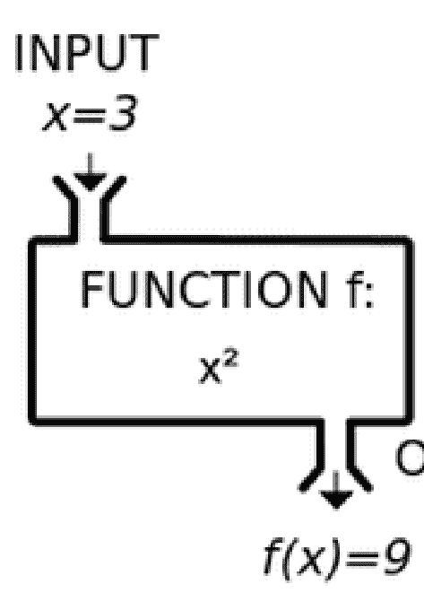

### 函数定义

在 Python 中使用 `def` 关键字定义函数。

```python
def function_name(input_parameters):
    statements
```

要调用一个函数，请键入函数名称和输入参数。

```python
function_name(input_parameters)
```

在下面的代码中，我们定义了一个按名称问候用户的函数。它接受一个输入（一个名称），并向用户名问好。

```python
# function example
my_name = 'Jame'

# say hello to name
def hello(name):
    print("Hello !", name)

# function call
hello(my_name)
```

```
Hello ! Jame
```

### return 语句

在前面的脚本中，我们在 `hello` 函数内部运行了 `print` 函数，但如果我们需要向调用者返回一个值而不是打印呢？
在这个代码片段中，`hello` 函数返回一个字符串。首先调用 `hello` 函数，返回的值存储在赋值的变量中。

```python
# function example
my_name = 'Jame'

# return hello to name
def hello(name):
    return "Hello !" + name

# function call
returned_name = hello(my_name)
print(returned_name)
```

```
Hello !Jame
```

### 空 return

当函数的 return 语句为空时，它会终止函数运行并返回 `None`。

## 示例 3：可整除性判断：

在此示例中，`is_divisible` 函数检查 `a` 是否能被 `b` 整除。如果能，它会打印一条消息并将 `div` 设置为 `True`。如果 `a` 不能被 `b` 整除，`else` 语句将处理这种情况，打印消息并将 `div` 设置为 `False`。

```python
# is divisible

# checks if a is divisible by b, print a message
# return true if divisible else false

def is_divisible(a, b):
    div = None
    if a % b == 0:
        print(f"{a} is divisible by {b}")
        div = True
    else:
        print(f"{a} is not divisible by {b}")
        div = False
    return div

n1 = is_divisible(8, 2)
n2 = is_divisible(8, 3)

print(n1)
print(n2)
```

```
8 is divisible by 2
8 is not divisible by 3
True
False
```

## 练习题

- 1. 编写一个程序，找出 1 到 5000 之间能被 11 整除的数字。
- 2. 编写一个函数，测试一个数字是否为质数。质数是只能被自身和 1 整除的数字。
- 3. 编写一个函数，测试一个数字是否为奇数。

## 循环

编程中的循环是一系列指令，它们会重复执行一定的次数。
可以将循环想象成一个重复操作，它会一直重复直到满足某个条件。
根据执行条件，主要有两种类型的循环。它们是：

- a. **FOR 循环：** FOR 循环包含一系列指令，这些指令会执行一定的次数。例如，一个从 1 到 10 的 FOR 循环会执行循环内的代码 10 次。
- b. **WHILE 循环：** WHILE 循环是一系列指令，它们会执行直到满足某个条件。

现在，如果我们想执行 `execute` 函数 1000 次；我们使用 FOR 循环。下面的 FOR 循环从 0 开始，到 999 结束，因此运行 `execute` 函数 1000 次。

```python
for i in range(1000):
    execute()
```

最后，如果我们想一直运行 `execute()` 直到下午 6 点，我们使用 WHILE 循环。

```python
while (checktime != 18:00):
    execute()
```

这些是解释循环概念的简单示例。这个概念在编程中非常重要。
现在，让我们在 Python 中做一些示例。

## FOR 循环示例 1

FOR 循环的一个简单示例是一个计数到 10 的程序。

```python
for i in range(11):
    print(i)
```

上面的代码可能是 FOR 循环最简单的示例。循环从 0 运行到 10，因此它运行 11 次，每次打印 `i`，即循环迭代次数。

**注意：** `range(n)` 函数使循环从 0 运行到 n-1。

**for i in range(11)**

上面这行意味着循环从 0 开始（i=0）。每次增加 1。当 i 达到 10 时循环结束。

## 输出：

```
0
1
2
3
4
5
6
7
8
9
10
```

你可以看到屏幕上打印了数字 0 到 10。

## FOR 循环示例 2

现在，让我们做一个稍微不同的版本。在这个示例中，我们将使用一个输入来获取循环的数字。这意味着我们可以根据需要设置循环的长度。

```python
def main():
    loop_length = int(input("Please enter how many loop: "))
    for i in range(loop_length):
        print(i)
```

输入接收一个数字输入并存储在名为 `loop_length` 的变量中。

```
Please enter the loop length: 15
0
1
2
3
4
5
6
7
8
9
10
11
12
13
14
```

循环打印 0 到 `loop_length` 变量之间的所有数字。在下面的示例中，我们在输入中输入了 15；我们可以看到，它打印了 0 到 14 之间的数字。注意，循环在 n 之前停止，因为 Python 的索引从 0 开始，直到但不包括 `loop_length`。

## FOR 循环示例 3 – 嵌套循环

在这个最后的示例中，我们使用 FOR 循环来创建一个星号半金字塔图案。程序询问金字塔长度并将其存储在名为 `pyramid_height` 的变量中。
然后它运行两个嵌套循环，其中外层循环迭代金字塔的“层级”，内层循环从零开始打印每个层级的星号。每个层级包含 j 个星号，其中 j 是当前层级号。
所以，例如，如果你正在第五次遍历第一个循环，i=5。第二个循环打印 * 从 0 到 4（即 5 次）。
在下面的示例中，我们为 `pyramid_height` 为 8 打印一个半金字塔。

```python
pyramid_height = int(input("Please enter the pyramid height: "))

for i in range(pyramid_height):
    for j in range(i):
        print('*', end='')
    print()
```

```
Please enter the pyramid height: 8
*
**
***
****
*****
******
*******
********
```

## WHILE 循环示例 1

WHILE 循环在满足某个条件时运行。如果条件不再满足，它会跳出循环。在下面的示例中，程序执行一个 WHILE 循环，该循环通过 `input` 函数接收用户输入。WHILE 循环持续运行并打印用户文本。当用户输入单词 'STOP' 时，循环停止。一旦输入该单词，WHILE 循环就结束了，程序停止。

```python
text = ''

while(text != 'stop'):
    text = input("What do you want to do now ? ")
    print("Activity is :", text)
```

## 输出：

```
What do you want to do now ? Read
Activity is : Read
What do you want to do now ? play
Activity is : play
What do you want to do now ? study
Activity is : study
What do you want to do now ? stop
Activity is : stop
```

我们可以看到 WHILE 循环持续询问用户输入，直到用户输入“stop”，WHILE 循环条件得到满足并停止执行。

## 练习题

- 1. 编写一个程序，接收两个输入数字 a 和 b，并返回 a 除以 b 的余数。
- 2. 编写一个程序，输出一个数字的乘法表，直到 10。
  例如，如果输入 3，则输出：
  3, 6, 9, 12, 15, 18, 21, 24, 27, 30
- 3. 编写一个程序，使用 FOR 循环查找给定单词的长度。注意：Python 已经有 `len()` 函数可以返回字符串的长度，尝试同时使用循环和 `len()`。
- 4. 编写一个程序，计算数字中的总位数。例如，“345abcd32”有 5 位数字。
- 5. 编写一个程序，持续获取用户输入的数字，直到输入一个偶数时停止。
- 6. 编写一个程序，接收两个数字 a 和 b，然后输出 a 和 b 之间（包括 a 和 b）的所有奇数。
- 7. 编写一个程序，接收用户输入的金字塔高度，并输出以下对称金字塔图案。例如，如果用户输入数字‘5’，则图案为：

```
    *
   **
  ***
 ****
*****
```

- 8. 编写一个程序，对从 1 到 n 的所有数字求和，其中 n 是用户输入的数字。注意：首先使用 FOR 循环解决这个问题，然后使用公式 1+ 2+ ... + n = n(n+1) / 2。

## 游戏时间 - 循环

现在，是时候根据我们目前所学的内容设计几个游戏了。没有比应用概念更好的学习方式了；将其应用到有趣的事情上则更好。

## 游戏 1 – 猜随机数

在这个游戏中，我们将创建一个程序，通过 `input` 函数接收一个数字。该数字在 0 到 10 之间。然后我们将该数字与通过 `random` 模块（使用 `random.randint`）生成的随机数字进行比较。如果相同，则猜测的数字正确。如果不相同，我们会告诉他们正确的数字。请参阅下面的代码和输出。

```python
import random

print("You have only three tries to guess number correctly")

# generate random integer between 0 and 10
random_number = random.randint(0, 10)

won = False
for try_num in range(3):
    print()
    print(f"Try number {try_num+1}")
    guessed_number = int(input("Guess a number between 0 and 10 inclusive: "))

    if(guessed_number == random_number):
        won = True
        print("Good job ! You won")
        break
    else:
        print("Incorrect, try again !")

if(won == False):
    print()
    print("You ran out of tries, Good luck next time")
    print("The right number is ", random_number)
```

`random.randint(n, m)` 生成一个介于 n 和 m 之间的随机整数（包括 n 和 m），这与 `random.random()` 不同，后者生成一个在 0 和 1 之间的随机实数。
这基本上是围绕一个 FOR 循环构建的，该循环运行 3 次，给用户 3 次机会来正确猜测随机数字。如果用户正确猜中了随机数字，那么第 15 行的 **if** 块会将 **won** 变量设置为 **True** 并跳出循环。在 Python 中，要跳出循环，我们使用“break”。第 22 行的 **if** 块用于用户用完所有尝试机会的情况。

## 输出：

你只有三次机会猜中正确的数字

第1次尝试
猜一个0到10之间（含0和10）的数字：4
不正确，请再试一次！

第2次尝试
猜一个0到10之间（含0和10）的数字：4
不正确，请再试一次！

第3次尝试
猜一个0到10之间（含0和10）的数字：5
不正确，请再试一次！

你的机会用完了，祝你下次好运
正确的数字是9

## 如果用户赢了，以下是示例输出：

你只有三次机会猜中正确的数字

第1次尝试
猜一个0到10之间（含0和10）的数字：5
干得好！你赢了

这个程序是练习条件循环和随机数生成器的好方法。

## 游戏2 – 数学测验游戏

这个程序会打印出5道简单的数学题，并通过输入获取用户对这些问题的答案（user_ans1, user_ans2, user_ans3, user_ans4, user_ans5）。答案存储在变量（ans1, ans2, ans3, ans4, ans5）中。这些答案使用if条件语句与真实答案进行比较。一个计数器分数在用户每次答对时增加1，最后打印计数器以查看用户答对了多少题。

```python
# 游戏2 - 数学测验游戏

print("这是一个游戏，你需要找出两个整数n1和n2的基本数学运算结果\n")
n1 = 8
n2 = 2

ans1 = n1 + n2
ans2 = n1 - n2
ans3 = n1 * n2
ans4 = n1 % n2

user_ans1 = int(input(f"{n1} + {n2} = "))
user_ans2 = int(input(f"{n1} - {n2} = "))
user_ans3 = int(input(f"{n1} * {n2} = "))
user_ans4 = int(input(f"{n1} % {n2} = "))
print()

score = 0

if ans1 == user_ans1:
    score += 1
if ans2 == user_ans2:
    score += 1
if ans3 == user_ans3:
    score += 1
if ans4 == user_ans4:
    score += 1

print(f'你答对了 {score} 道题')
```

## 输出：

8 + 2 = [ ]

这是一个游戏，你需要找出两个整数n1和n2的基本数学运算结果

这个游戏会持续询问这4个问题的输入，以下是所有答案输入后的最终输出。

```
这是一个游戏，你需要找出两个整数n1和n2的基本数学运算结果

8 + 2 = 10
8 - 2 = 6
8 * 2 = 16
8 % 2 = 0

你答对了 4 道题
```

这是一个很棒的练习程序。但你可能会想，孩子们只能使用这个程序一次，因为我们总是使用相同的数字。为了解决这个问题，我们在下一个游戏中生成随机数。

## 游戏3 – 带随机数的数学测验

在下面的程序中，有5道数学题由10个随机数生成。这10个随机数是变量**n1**到**n10**。问题的答案被计算并存储在变量**ans1**到**ans5**中。这15个变量被称为全局变量，因为它们在任何函数之外。这意味着它们的值可以在程序中的任何地方被任何函数访问。函数**print_ans()**使用5个变量**ans1**到**ans5**来编写测验答案。这些答案（**answer1-answer5**）在**check_ans**函数中使用5个不同的if条件语句与用户答案（**user_ans1-user_ans5**）进行比较。每次答对时，计数器都会增加。最终，打印计数器以显示正确答案的数量。这些问题都是随机生成的，这意味着用户每次都会得到不同的问题。

## 程序

```python
#游戏3 - 带随机数的数学测验

import random

Max_int = 10

# 赋值1到Max_int之间（含1和Max_int）的随机整数
n1 = random.randint(1, Max_int)
n2 = random.randint(1, Max_int)
n3 = random.randint(1, Max_int)
n4 = random.randint(1, Max_int)
n5 = random.randint(1, Max_int)
n6 = random.randint(1, Max_int)
n7 = random.randint(1, Max_int)
n8 = random.randint(1, Max_int)
n9 = random.randint(1, Max_int)
n10 = random.randint(1, Max_int)

ans1 = n1 + n2
ans2 = n3 - n4
ans3 = n5 * n6
ans4 = n7 * n8
ans5 = n9 % n10

user_ans1 = int(input(f"{n1} + {n2} = "))
user_ans2 = int(input(f"{n3} - {n4} = "))
user_ans3 = int(input(f"{n5} * {n6} = "))
user_ans4 = int(input(f"{n7} * {n8} = "))
user_ans5 = int(input(f"{n9} % {n10} = "))
print()

# 检查答案并找出用户得分
def check_ans():
    score = 0
    if ans1 == user_ans1:
        score += 1
    if ans2 == user_ans2:
        score += 1
    if ans3 == user_ans3:
        score += 1
    if ans4 == user_ans4:
        score += 1
    if ans5 == user_ans5:
        score += 1
    return score

#打印用户答案
def print_ans():
    print("答案 1 = ", ans1)
    print("答案 2 = ", ans2)
    print("答案 3 = ", ans3)
    print("答案 4 = ", ans4)
    print("答案 5 = ", ans5)

# 找出用户得分
score = check_ans()
print_ans()
print(f'\n你答对了 {score} 道题。')
```

## 输出：

```
7 + 6 = 13
7 - 10 = -3
2 * 1 = 2
6 * 2 = 12
2 % 7 = 0

答案 1 = 13
答案 2 = -3
答案 3 = 2
答案 4 = 12
答案 5 = 2

你答对了 4 道题。
```

## 练习题

- 1. 编写一个程序，生成两个0到10之间（含0和10）的随机数。然后输出它们的和、乘积、余数和幂运算结果。
- 2. 编写一个随机密码生成器，程序从用户那里获取密码长度n，并创建一个n位长的密码。
- 3. 编写一个程序，从用户那里获取三角形的三条边长，然后判断它是锐角、直角还是钝角三角形（提示：使用勾股定理进行检查）。

## 列表、元组和字典

### 数据结构简介

数据结构是用于存储和分组数据的结构，以便可以轻松高效地访问和操作数据。每种类型的数据结构都有其优点和缺点。根据你要优化的内容选择特定的数据结构。有不同的优化方面，例如访问速度、存储大小或数据修改速度。每个方面都需要针对该方面优化的不同类型的数据结构。

在本章中，我们将探讨Python内置的三种基本数据结构：列表、元组和字典。这些数据结构非常有用。它们使你的程序更易于编写且更高效，你不必从头开始实现自己的数据结构。请注意，这些数据结构也被称为容器，因为它们容纳/包含其他对象。

## 列表

列表是存储项目集合的序列。列表是最常用的容器之一，因为它用途广泛。列表可以容纳不同类型的数据。它们是异构的，意味着它们不必存储相似的数据类型。列表是可变的，因此你可以在创建列表后对其进行修改。要创建一个列表，请将逗号分隔的值放在方括号中。

```python
my_list = []
my_list = list()
```

或者

下面的代码创建了数字列表、字符串列表以及一个包含数字和字符串的异构列表。

```python
# 通过方括号或list()创建列表
my_list = []
my_list = list()

# 定义列表 l1, l2, l3
# list1 数字序列
list1 = [1, 2, 3]

# list2 字符串序列
list2 = ["Nick", "Tom", "Jane"]

# list3 数字和字符串的序列
list3 = ["Nick", 10, "Python", 50]

# list4 一个包含其他列表的列表
list4 = [list1, list2, list3]

print("list1 是:", list1)
print("list2 是:", list2)
print("list3 是:", list3)
print("list4 是:", list4)
```

```
list1 是: [1, 2, 3]
list2 是: ['Nick', 'Tom', 'Jane']
list3 是: ['Nick', 10, 'Python', 50]
list4 是: [[1, 2, 3], ['Nick', 'Tom', 'Jane'], ['Nick', 10, 'Python', 50]]
```

## 列表方法

类似于前面章节讨论的字符串方法。列表附带了有用的方法。我们将在这里学习常用的列表方法，要查找和学习更多方法，请参考此Python文档链接。

https://docs.python.org/3/tutorial/datastructures.html

## 基本列表操作

此表总结了基本的列表操作。

| 表达式 | 名称 | 输出 |
| :--- | :--- | :--- |
| `len(['a', 'b', '1'])` | 长度 | 3 |
| `['a', 'b', 'c'] + ['d', 'e', 'f']` | 列表连接 | `['a', 'b', 'c', 'd', 'e', 'f']` |
| `['Hi!'] * 4` | 重复 | `['Hi!', 'Hi!', 'Hi!', 'Hi!']` |
| `'a' in ['a', 'b', 'c']` | 成员关系 | True |
| `for num in [1, 2, 3]: print(num)` | 列表迭代 | 1<br>2<br>3 |
| `n = ['a', 'b', 'c']<br>n[0] = 'z'<br>print(n)` | 列表元素赋值 | `['z', 'b', 'c']` |

**list[index]** – 索引运算符，从列表中选择单个值。括号内的数字称为索引，它是一个整数值。Python中的索引从零开始。类似于字符串，你也可以有负索引，它从后向前开始索引。

list1 = ['Python', 'C++', 'C', 'Java Script']
list1[0] 的值是 'Python'
list1[2] 的值是 'C'
list1[-1] 的值是 'Java Script'
list1[-2] 的值是 'C'

**list[starting_index: ending_index]** - 切片操作符，在起始索引处切片列表，并在结束索引的前一个元素处结束。

list1 = ['Python', 'C++', 'C', 'Java Script']
list1[0:2] = ['Python', 'C++']
list1[0:-1] = ['Python', 'C++', 'C']

**list.append(elem)** – *将元素追加到列表。*

list1 = [1, 2, 3]
list1.append(4)
list1 的值是 [1, 2, 3, 4]

**list.clear()** – 清空列表的值。

list1 = [1, 2, 3]
list1.clear()
list1 的值是 []

**list.count(elem)** – 计算元素 elem 在列表中出现的次数。

list1 = [1, 2, 2, 2, 3, 4]
list1.count(2) 输出 3

**list.extend(list2)** – 将 list2 的元素添加到列表。此方法与使用 ‘+’ 运算符连接列表执行相同的操作。

list1 = [1, 2, 3]
list2 = [4, 5]
list1.extend(list2)
list1 是 [1, 2, 3, 4, 5]

**list.insert(elem_index, elem)** – 在索引 elem_index 处将元素 elem 插入列表。

list1 = [1, 2, 3]
list1.insert(3, 4)
list1 是 [1, 2, 3, 4]

**list.pop()** – 移除列表的最后一个元素。

list1 = [1, 2, 3, 4]
list1.pop() 移除 4
list1 是 [1, 2, 3]

**list.index(elem)** – 返回 elem 首次出现的索引。

list1 = [1, 2, 3, 4]
list1.index(2) 返回 1

## 示例 1：列表基本操作

这里我们有一个关于上述各种列表方法的综合示例。通过实验代码来理解它。

```python
# 列表基本操作

# 列表迭代和索引
even_nums = [0, 2, 4, 6, 8, 10]

# even_nums 列表的长度
print("Length of even_nums list is:", len(even_nums))
print('\n')

print("Even numbers are:")
for number in even_nums:
    print(number)

# 打印 2 个新行，新行符号是 

print('\n')

# 切片
# 打印小于 5 的偶数列表
even_nums_less_5 = even_nums[0:3]
print("Even numbers less than 5 are: ", even_nums_less_5)
print('\n')

# 追加额外的偶数
even_nums.append(12)
print("Even number list after appending is: ", even_nums)
print('\n')

# 计算 12 在列表中出现的次数
count = even_nums.count(12)
print(f"12 occurs {count} times in even_nums list")
print('\n')

# 清空列表值
even_nums.clear()
print("Even number list after clearing is: ", even_nums)
print('\n')

# 扩展空列表
even_nums.extend(['Tom', 1, 'python'])
print("Even number list after extending is: ", even_nums)
print('\n')

# 在索引 0 处插入新元素
even_nums.insert(0, 'new')
print("Even number list after inserting at index 0 is: ", even_nums)
print('\n')

# 弹出列表最后一个元素
even_nums.pop()
print("Even number list after popping is: ", even_nums)
print('\n')

# 找到 'Tom' 的索引并将其更改为 Nick
index_python = even_nums.index('Tom')
even_nums[index_python] = 'Nick'

print("Even number after replacing Tom is: ", even_nums)
```

**输出：**

Length of even_nums list is: 6

Even numbers are:
0
2
4
6
8
10

Even numbers less than 5 are: [0, 2, 4]

Even number list after appending is: [0, 2, 4, 6, 8, 10, 12]

12 occurs 1 times in even_nums list

Even number list after clearing is: []

Even number list after extending is: ['Tom', 1, 'python']

Even number list after inserting at index 0 is: ['new', 'Tom', 1, 'python']

Even number list after popping is: ['new', 'Tom', 1]

Even number after replacing Tom is: ['new', 'Nick', 1]

## 元组

元组与列表类似，因为它们也存储项目的集合。事实上，元组可以被视为不可变的列表。元组是不可变的，一旦赋值，就不能更改。这使得它们更高效、更快。元组使用圆括号定义，而列表使用方括号定义。
要创建一个元组，请在圆括号中放入逗号分隔的值。

```python
my_tuple = (1, 3, 5)
```

对于单个值的元组，请在值后面跟一个逗号。没有逗号，Python 会将其视为一个数字。

```python
my_tuple = (1,)
```

在这个代码片段中，我们创建元组并尝试修改其值，但是 Python 会抛出类型错误，因为元组是不可变的。

```python
# 创建一个元组

# 单个值的元组
tu1 = (1, )

print("Single value tuple: ", tu1)
# 多个值的元组
tu2 = (1, 'a', 'python')
print("Multi value tuple: ", tu2)
print("tuple type is ", type(tu2))

# 尝试修改元组
tu2[2] = 'C++'
```

Single value tuple: (1,)
Multi value tuple: (1, 'a', 'python')
tuple type is <class 'tuple'>

```
---------------------------------------------------------------------------
TypeError                                 Traceback (most recent call last)
<ipython-input-7-a5d65c274c9b> in <module>
     11 
     12 # try modifying tuple
---> 13 tu2[2] = 'C++'

TypeError: 'tuple' object does not support item assignment
```

### 元组方法

与列表类似，元组支持基本方法，如索引、len、切片和 in 成员运算符。元组也支持 index 和 count 方法。请注意，元组没有像列表那么多的方法，因为它们是不可变的。

### 示例 2：元组方法

在这个示例中，我们对元组执行基本方法。请注意，这些方法与列表方法相同。

```python
# 基本元组方法
tu = ('Tom', 'Jane', 'Python', 10, 'Tom')

# len()
print("Tuple length is :", len(tu))

# 元素访问
print("Last element of tuple is :", tu[-1])

# 切片
print("tu[0:3] is :", tu[0:3])

# index 方法
print("'Python' is at index:", tu.index('Python'))

# count 方法
print("'Tom' occurs:", tu.count('Tom'))
```

Tuple length is : 5
Last element of tuple is : Tom
tu[0:3] is : ('Tom', 'Jane', 'Python')
'Python' is at index: 2
'Tom' occurs: 2

## 字典

字典是键值对。虽然列表和元组通过位置索引访问，但字典值通过其对应的键访问。键必须是不可变的，例如字符串、数字甚至元组，但不能是列表，因为列表是可变的。键也是唯一的，不能有两个值具有相同的键。
字典通过在花括号中用逗号分隔的键:值对来定义。
要创建空字典：
my_dict = {}
或
my_dict = dict()
要创建基本字典：
num_dict = {'one': 1, 'two': 2, 'three': 3}

### 基本字典方法

要访问字典值，请使用其键。

```python
num_dict = {'one': 1, 'two': 2, 'three': 3}
num_dict['one'] 是 1
```

成员测试类似于元组和列表，只是它检查的是键。

```python
num_dict = {'one': 1, 'two': 2, 'three': 3}
'one' in num_dict 返回 True
```

要添加新的键值对，请使用赋值运算符。

```python
num_dict = {'one': 1, 'two': 2, 'three': 3}
num_dict['four'] = 4
num_dict 现在是 {'one': 1, 'two': 2, 'three': 3, 'four': 4}
```

dict.clear() – 清空字典。

```python
num_dict = {'one': 1, 'two': 2, 'three': 3}
num_dict.clear()
num_dict 现在是 {}
```

dict.get(key) – 通过键检索字典值，如果不存在该键则返回 None。

```python
num_dict = {'one': 1, 'two': 2, 'three': 3}
num_dict.get('one') 返回 1
```

dict.pop(key) – 移除与键对应的键:值对。

```python
num_dict = {'one': 1, 'two': 2, 'three': 3}
num_dict.pop('three') 移除 3
num_dict 现在是 {'one': 1, 'two': 2}
```

dict.items() – 返回一个 (key, value) 元组的列表。

```python
num_dict = {'one': 1, 'two': 2, 'three': 3}
num_dict.items() 返回 [('one', 1), ('two', 2), ('three', 3)]
```

dict.keys() – 返回包含所有字典键的 dict_key 对象。

```python
num_dict = {'one': 1, 'two': 2, 'three': 3}
num_dict.keys() 返回 dict_keys(['one', 'two', 'three'])
```

dict.values() – 返回字典值的列表。

```python
num_dict = {'one': 1, 'two': 2, 'three': 3}
num_dict.values() 返回 [1, 2, 3]
```

### 示例 3：字典方法

在示例 3 中，我们使用并实验了我们学到的字典方法。

```python
# 创建一个购物车物品数量的字典

shopcart = {'chips': 2, 'ink cartridge': 1, 'paper': 1}

# 字典长度计算键:值对
print('Shopcart is:', shopcart)
print('Your shopcart distinct items are ', len(shopcart))
print('\n')

# 购物车包含笔吗？
pens_in = 'pens' in shopcart

# 成员测试
print("There is a pen in shopping car:", pens_in)
print('\n')

# 访问值
print("The number of chips items is", shopcart['chips'])
print('\n')

# 添加一对
shopcart['orange juice'] = 4
print(shopcart)
print('\n')

# get 方法
print("Quantity of orange juice is", shopcart.get('orange juice'))
print('\n')

# pop 方法移除键对应的元素
shopcart.pop('paper')
print(shopcart)
print('\n')

# 获取 items, keys, values
items = shopcart.items()
keys = shopcart.keys()
values = shopcart.values()

print("Shopcart items are:", items)
print("Shopcart keys are:", keys)
print("Shopcart values are:", values)
```

Shopcart is: {'chips': 2, 'ink cartridge': 1, 'paper': 1}
Your shopcart distinct items are 3

There is a pen in shopping car: False

The number of chips items is 2

{'chips': 2, 'ink cartridge': 1, 'paper': 1, 'orange juice': 4}

Quantity of orange juice is 4

{'chips': 2, 'ink cartridge': 1, 'orange juice': 4}

Shopcart items are: dict_items([('chips', 2), ('ink cartridge', 1), ('orange juice', 4)])
Shopcart keys are: dict_keys(['chips', 'ink cartridge', 'orange juice'])
Shopcart values are: dict_values([2, 1, 4])

## 示例 4 – 猜测世界首都

在这个示例中，我们同时使用了列表和字典。字典 `capital_dict` 用于存储国家:首都的键值对。然后我们使用 `keys()` 方法获取字典的键，并将其存储在 `countries` 列表中。这一步至关重要，因为我们可以使用 `random.choice()` 函数，该函数接受一个列表并随机返回其中的一个值。接着，在一个无限的 `while` 循环中，程序使用 `input` 函数询问用户首都是什么，并将答案与实际的首都进行比较。

```python
# World capital game
import random

# World capitals dictionary
capital_dic={
    'spain':'madrid',
    'france':'paris',
    'germany':'berlin',
    'norway':'oslo',
    'india':'new delhi',
    'egypt':'cairo'
}

# get countries and convert it to list so we can use random function
countries = list(capital_dic.keys())
print ('Let\'s learn World Capitals. Enter quit to quit the game.')

while True:
    # pick a random country
    country = random.choice(countries)
    capital = capital_dic[country]

    guess = input(f'what is the capital of {country}.')
    # if user type quit, quit
    if guess.lower() == 'quit':
        break
    elif guess.lower() == capital:
        print(f'Correct !')
        break
    else:
        print(f'Incorrect. The capital of {country} is {capital}.')
```

## 输出：

```
what is the capital of india. []
Let's learn World Capitals. Enter quit to quit the game.
```

## 输入了错误的答案。

```
Let's learn World Capitals. Enter quit to quit the game.
what is the capital of india.cairo
Incorrect. The capital of india is new delhi.

what is the capital of norway. []
```

## 输入了正确的答案。

```
Let's learn World Capitals. Enter quit to quit the game.
what is the capital of india.cairo
Incorrect. The capital of india is new delhi.
what is the capital of norway.oslo
Correct !
```

在上面的代码中，输入了开罗作为印度的首都。由于答案不正确，程序输出“Incorrect. The capital of india is new delhi”。

在程序的第二部分，输入了“oslo”作为挪威的正确首都，程序输出“correct!”。

## 示例 5 – 随机名言

这个示例使用 `random.choice()` 函数从一个名言元组中生成随机名言。虽然使用列表也可以，但这里使用元组是因为我们不打算对名言进行任何操作，它们在整个程序中保持不可变。对于大型不可变对象，元组更高效，也更安全，因为它保证对象在没有错误的情况下永远不会被更改，防止了意外操作。

```python
# Random quote
import random

# since we dont intend to do any operation on quotes we use tuple instead of lists
quotes = (
    "Yesterday's the past, tomorrow's the future, but today is a gift.",
    "The best preparation for tomorrow is doing your best today.",
    "Change your life today.",
    "If you fell down yesterday, stand up today.",
    "Never give up. ",
    "Dream as if you'll live forever.",
    "The science of today is the technology of tomorrow.",
    "Did I offer peace today?",
)

rand_quotes = random.choice(quotes)
print("Todays quote is:", rand_quotes)
```

Todays quote is: Change your life today.

## 示例 6 – 猜测国家名称

在这个示例中，我们制作了一个类似于“吊死鬼”的游戏，要求用户猜测国家的名称。我们有一个包含多个国家名称的元组。用户在失败前可以有几次错误的猜测机会。我们创建一个列表来存储正确猜测的字符，正确的猜测会被追加到这个列表中。当猜测列表的长度等于国家名称的长度时，用户获胜。请注意，我们使用列表数据结构来存储猜测的字符，因为它需要持续更新，而国家名称使用元组，因为它永远不会被修改。

```python
# guess a random country

import random

# list of countries
countries = ('france', 'usa', 'spain', 'india', 'brazil', 'norway', 'germany')

# Choose random country from countries
country = random.choice(countries)

# number of turns
turns = 4

# a list to store the guessed characters
guessed = []
while turns > 0:
    # print guessed characters
    for char in country:
        if char in guessed:
            print(char, end='')
        else:
            print('-', end='')

    print()
    print(f"You have {turns} left.")

    # user input
    guess = input("guess a character:")

    # make sure guess is lowercase
    guess = guess.lower()

    # if guess already made
    if guess in guessed:
        print("You have already made this guess\n")

    # check input with the character in word
    if guess not in country:
        turns -= 1
    else:
        # character is in word , append character
        # the number of times it appear in word
        count = country.count(guess)
        for i in range(count):
            guessed.append(guess)

    # if guessed length match country length then user wins
    # else if ran out of turns user loses
    if len(guessed) == len(country):
        print("Congratulation you guessed correctly!!")
        break
    elif turns == 0:
        print("Good luck next time")
```

## 输出：

```
Guess the characters
------
You have 4 left.
guess a character:n
n-----
You have 4 left.
guess a character:o
no----
You have 4 left.
guess a character:r
nor---
You have 4 left.
guess a character:w
norw--
You have 4 left.
guess a character:a
norwa-
You have 4 left.
guess a character:f
norwa-
You have 3 left.
guess a character:y
Congratulation you guessed correctly!!
```

## 练习题

1.  编写一个程序，将字典的所有值追加到一个列表中。
2.  编写一个程序，检查给定的键是否存在于字典中。
3.  编写一个程序，找出字典中的最大数值。
4.  编写一个程序，接受两个大小相等的列表，并将它们转换为一个字典，其中列表1包含键，列表2包含值。
5.  创建一个程序，从笑话列表或元组中随机选取并打印一个笑话。

## 对象

对象是属于某个类的数据结构实例的集合。这些实例可以具有不同的数据类型。可以将类想象成一个生产对象的工厂。

### 示例 1：对象形状

在这个示例中，我们创建了一个 `shape` 类，该类为对象分配名称、颜色、大小和位置。然后我们在第8行通过调用该类创建了对象 `my_shape`。在第9到12行，我们使用点号‘.’表示法访问对象的值。例如，`my_shape.name` 是 circle。然后我们通过将对象的值重新赋给不同的值来更改它们。

```python
# create class
class shape:
    name = 'circle'
    color = 'red'
    size = 5
    position = (0,0)

my_shape = shape()
print("name is: ", my_shape.name)
print("color is: ", my_shape.color)
print("size is: ", my_shape.size)
print("position is: ", my_shape.position)

my_shape.name = 'triangle'
my_shape.color = 'black'
my_shape.size = 10
my_shape.position = (10, 10)

print()
print("my_shape values after reassignment are:")
print()

print("name is: ", my_shape.name)
print("color is: ", my_shape.color)
print("size is: ", my_shape.size)
print("position is: ", my_shape.position)
```

name is: circle
color is: red
size is: 5
position is: (0, 0)

my_shape values after reassignment are:

name is: triangle
color is: black
size is: 10
position is: (10, 10)

### 示例 2：骰子游戏

这是一个两名玩家之间的骰子游戏，骰子被投掷1000次。如果骰子投掷结果是偶数，玩家1得1分；如果是奇数，玩家2得1分。骰子投掷是使用随机数函数实现的。

```python
# dice game if it is even player 1 point
# odd player 2 gets 1 point
# import random library
import random

# create class player with score intialize to zero
class player:
    score = 0

# if number is even return True else return False
def is_even(n):
    even = None
    if n % 2 == 0:
        even = True
    else:
        even = False

    return even

# create players
player1 = player()
player2 = player()

# run loop for 1000 times
for i in range(1000):
    # dice flip , return random number between 1 and 6 inclusive
    dice = random.randint(1, 6)

    if is_even(dice):
        player1.score += 1
    else:
        player2.score += 1

print("Player 1 score is: ", player1.score)
print("Player 2 score is: ", player2.score)
```

`randint` 生成1到6之间的数字（包含1和6）。`player` 类创建了分数初始化为零的玩家对象。每次一个玩家获胜，我们就访问 `player.score` 并将其加一。

```
Player 1 score is:  518
Player 2 score is:  482
```

我们可以看到玩家的分数很接近，这是预期的，因为每个玩家获胜的概率是50%，因为骰子输出的奇偶比例是1:1。

## 练习题

## 使用pygame绘制图形

pygame简介
学习编程很有趣，但当你真正制作游戏时，它会变得更加有趣和引人入胜。在编写游戏的过程中，你会发现自己运用了本书中学到的所有概念，比如循环、条件语句、变量、函数、列表、对象等等。
为了编写游戏，我们将使用Python库**Pygame**。Pygame是一个用于制作游戏的Python库。它由Pete Shiners创建，并享有广泛的社区支持。

## 安装

*要在你的系统上安装pygame库，请遵循以下步骤。*
*如果你在桌面端使用anaconda Jupyter lab*


*在你的系统上找到“anaconda Prompt (anaconda3)”。*

*点击“anaconda Prompt (anaconda3)”打开它。*

在命令提示符中输入“**pip install pygame**”并按回车键。如果安装成功，它应该会显示“**Successfully installed pygame**”消息。

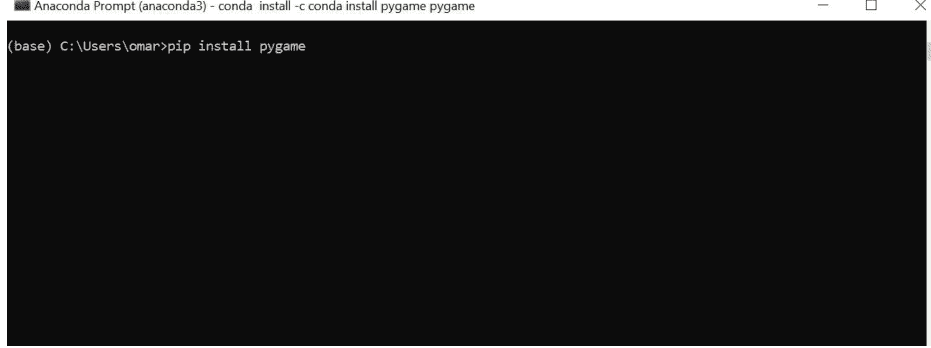

如果你使用的是<u>jupyter lab的在线版本</u>，在单元格内输入“**pip install pygame**”并执行该单元格。

如果你使用<u>notepad++和Python</u>，请打开命令提示符。

要运行你的程序，请在你的系统上找到命令提示符并打开它。

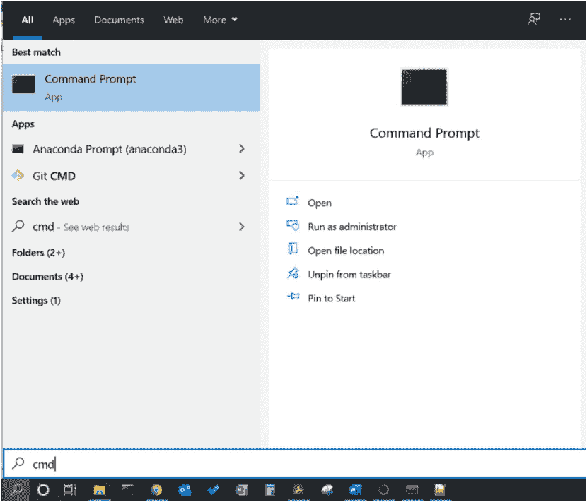

输入“**pip install pygame**”并按回车键。

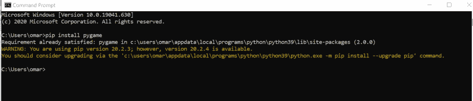

现在你已经准备好开始编写游戏了！，让我们开始吧。

## 颜色基础 – RGB颜色模型

在开始编写游戏之前，我们需要了解颜色。毕竟，我们可不是在做制作黑白单调游戏的生意！我们应该能够创造出充满生机、色彩斑斓的有趣游戏。
颜色有千千万万种，但我们如何在计算机中确定颜色呢？答案是RGB颜色模型。
RGB代表红、绿、蓝，使用三个对应的数字，每种颜色一个。我们可以创造出任何我们想要的颜色。每种颜色都有一个从0到255的数字，其中0表示无强度，255表示颜色的最大强度。以下是一些典型的颜色值：

| (R, G, B) | 颜色名称 |
| :--- | :--- |
| **(255, 255, 255)** | 白色 |
| **(255, 0, 0)** | 红色 |
| **(0, 255, 0)** | 绿色 |
| **(0, 0, 255)** | 蓝色 |
| **(0, 0, 0)** | 黑色 |

要进一步实验RGB，你可以在这里找到免费的RGB计算器：
https://www.w3schools.com/colors/colors_rgb.asp

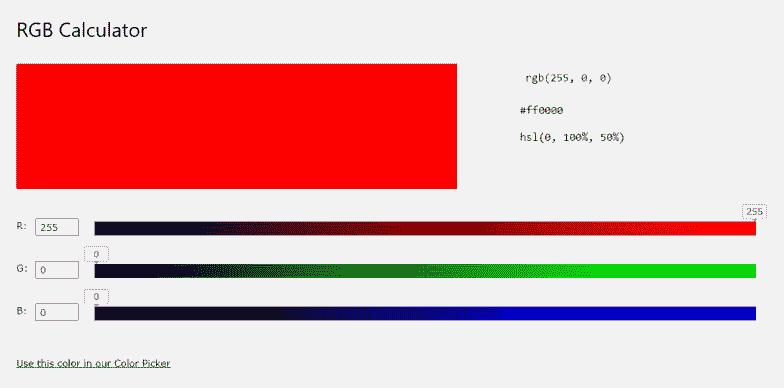

来源：w3schools中的RGB计算器

## 基本形状创建方法

让我们开始学习创建形状的基本方法。
`pygame.init()` – 初始化pygame并授予权限。这一行对于启动pygame会话至关重要。
`pygame.display.set_mode((X, Y))` – 创建一个尺寸为(x,y)的显示窗口表面，其中x是宽度，y是高度。这作为我们的背景。
`pygame.display.set_caption(‘name’)` – 设置显示窗口的标题名称。
`display_surface.fill(color)` – 用特定颜色填充显示表面。颜色是一个RGB元组。
`pygame.draw.polygon(surface, color, points_list)` – 接收显示表面，并用颜色`color`和`points_list`中的点绘制多边形。`points_list`是一个笛卡尔坐标集的列表，例如[(3, 5), (5, 9)]。

`pygame.draw.line(surface, color, start_point, end_point, thickness)` – 绘制一条颜色为`col`，起点为`start_point`，终点为`end_point`，可选粗细为`thickness`的线。

`pygame.draw.circle(surface, color, center, radius, thickness)` - 绘制一个颜色为`color`，圆心为`center`，半径为`radius`，粗细为`thickness`的圆。

`pygame.draw.ellipse(surface, color, bounding_rectangle, thickness)` – 绘制一个由矩形`bounding_rectangle`界定和居中的椭圆，可选粗细为`thickness`。`bounding_rectangle`由(x, y, width, height)给出，其中x和y是左上角坐标，width是矩形宽度，height是矩形高度。

`pygame.draw.rect(surface, col, (x, y, width, height), thickness)` – 绘制一个颜色为`col`，坐标在`rectangle_tuple`中，粗细为`thickness`的矩形。(x, y, width, height)与上面讨论的`bounding_rectangle`相同。

要阅读和学习更多方法，请使用pygame文档，程序员阅读的远比他们编写的多。他们阅读他人的代码、文档和手册。这是阅读文档的良好实践。
https://www.pygame.org/docs/ref/draw.html

## pygame坐标系统

pygame默认坐标系统的原点位于左上角(0,0)，其中正x轴向右，负y轴向下。

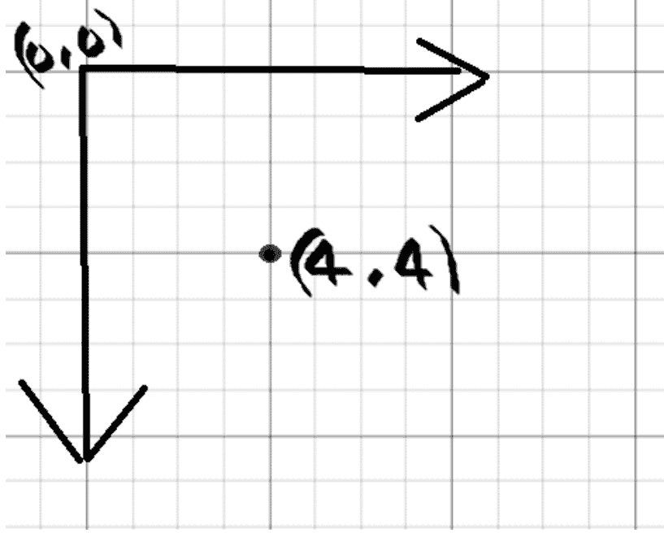

## 示例1 实现基本绘图方法

```python
# import pygame module
import pygame

# activate a pygame library inst .
pygame.init()

# define the RGB value some colors
white = (255, 255, 255)
black = (0, 0, 0)
yellow = (255, 255, 0)
red = (255, 0, 0)
green = (0, 255, 0)
random_color = (120, 30, 50)

# assigning width 600 , height 600 to background
dimensions = (600, 600)

# create the display surface object
# of specific dimension..e(X,Y).
display = pygame.display.set_mode(dimensions)

#pygame window name
pygame.display.set_caption('Basic shapes')

# Fill display surface with white
# with white colour
display.fill(white)

# draw a polygon using draw.polygon()
# pygame.draw.polygon(surface, color, points_list)
pygame.draw.polygon(display, yellow,
                    [(446, 300), (591, 406),
                     (536, 577), (356, 577), (300, 406)])

# draw horizontal line
# pygame.draw.line(surface, color, start_point, end_point, thickness)
pygame.draw.line(display, random_color,
                 (0, 300), (600, 300), 4)

# draw vertical line
pygame.draw.line(display, random_color,
                 (300, 0), (300, 600), 4)

# draw a circle
# pygame.draw.circle(surface, color, center_point, radius, thickness)
pygame.draw.circle(display, red, (150, 150), 50, 0)

# draw a ellipse pygame.draw.ellipse(surface, color, bounding_rectangle, thickness)
pygame.draw.ellipse(display, green, (400, 100, 100, 150), 0)

# draw a rectangle
# pygame.draw.rect(surface, col, (x,y,width,height), thickness)
pygame.draw.rect(display, black, (100, 400, 100, 100))

# infinite loop to keep session on
while True :

    # iterate over the list of Event objects
    # that was returned by pygame.event.get() method.
    for event in pygame.event.get() :

        # if event object type is QUIT when corner exist button is clicked
        # then quitting pygame and program
        if event.type == pygame.QUIT :

            # kill pygame session
            pygame.quit()
            # quit the program.
            quit()

        # Draws the objects screen.
        pygame.display.update()
```

在这个例子中，我们实现了本章讨论的基本pygame绘图方法。我们创建了一个圆、椭圆、多边形、正方形和线。每个形状都用它自己的颜色、位置和大小创建。试着阅读和理解这个程序。它注释良好，便于阅读。

## 无限循环（游戏循环）

为什么我们在第57行有一个无限循环？Pygame库用于创建电子游戏。视频不过是在短时间内观看的一连串连续图片，以至于人眼无法察觉差异。这个循环将不断用任何新绘制的形状更新屏幕，并保持会话运行。没有这个无限循环，Pygame只会短暂显示形状然后停止运行。这个无限循环被称为游戏循环，因为它是包含游戏主要逻辑的循环，也负责用任何新状态更新屏幕。

## 输出：

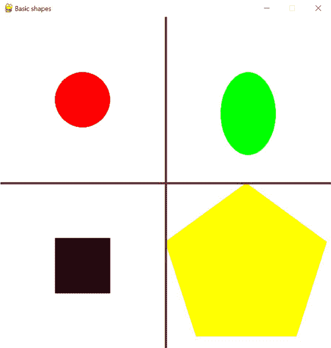

输出是一个白色背景，被分成四个象限。每个象限上都有一个基本形状。

## 示例 2 悲伤表情

在这个脚本中，我们创建一个愤怒的悲伤表情。这个程序与上一个示例非常相似，只是我们绘制了不同的形状。悲伤表情基本上由1个圆形作为脸部、2个圆形作为眼睛和一个弧线作为嘴巴组成。要理解弧线方法，请阅读 **pygame** 文档。尝试理解弧线是如何定位的，你将在练习题中用到它。

```python
# import pygame module
import pygame
import math

# activate a pygame library inst .
pygame.init()

# define the RGB value some colors
white = (255, 255, 255)
yellow = (255, 255, 0)
red = (255, 0, 0)

# assigning width 600 , height 600 to background
dimensions = (300, 300)

# create the display surface object
display = pygame.display.set_mode(dimensions)

#pygame window name
pygame.display.set_caption("Frowny face !")

# Display color is white
display.fill(white)

# Draw face
pygame.draw.circle(display, yellow, (150, 150), 50, 0)

# Draw left eye
pygame.draw.circle(display, red, (130, 140), 10, 0)

# Draw right eye
pygame.draw.circle(display, red, (170, 140), 10, 0)

# Draw mouth using arc
# arc(surface, color, bounding_rect, start_angle, stop_angle, width=1)
pygame.draw.arc(display, red, (135, 175,30,25), 0, math.pi, width=1)

# Infinite Loop to keep session on
while True :
    # iterate over the list of Event objects
    # that was returned by pygame.event.get() method.
    for event in pygame.event.get() :

        # if event object type is QUIT when corner exist button is clicked
        # then quitting pygame and program
        if event.type == pygame.QUIT :

            # kill pygame session
            pygame.quit()
            # quit the program.
            quit()

        # Draws the objects screen.
        pygame.display.update()
```

## 输出：


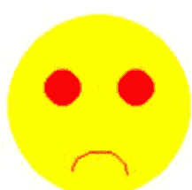

## 练习题

1.  使用前面讨论的悲伤表情程序，将其改为笑脸。
2.  创建一个800x800的显示区域，绘制四条相连的红色边框，并在中心绘制一个被边框外接的圆形。
3.  选择4个你最喜欢的表情符号，尝试使用pygame绘制它们。
4.  创建一个类似于下图足球场的形状。

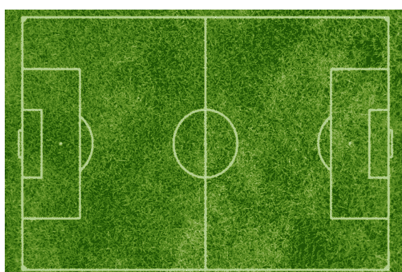

# Pygame中的动画

动画是通过操控图像使其看起来像移动的画面。为了制作动画，我们创建许多连续的图像/形状并连续查看它们。我们更新屏幕的次数称为每秒帧数（fps）；fps是每秒显示的帧/图像数量。更高的fps数字使视频/游戏中的过渡更平滑，从而提高质量。前面章节讨论的游戏循环负责以每秒fps帧的速度更新游戏状态。游戏就是这样制作的，以人眼无法分辨图像实际上是离散的速率持续用图像更新屏幕。下图显示了一匹奔跑的马的多个帧。将这些帧组合起来将产生一个奔跑的马的视频。

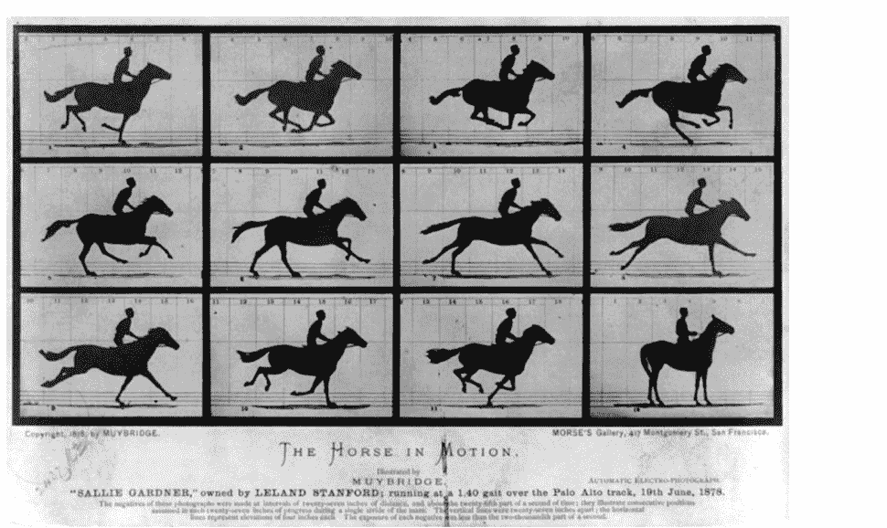

著名的运动中的马

# 增长的正方形

我们制作一个正方形，其大小不断增长，直到填满整个屏幕右下象限。逻辑与我们在前面示例中制作各种形状非常相似，只是有两个主要区别。我们创建pygame时钟实例 `clock=pygame.time.Clock()`，这是一个pygame用于跟踪时间的方法。我们在程序中使用它来控制我们想要的每秒帧数（fps），使用 `clock.tick(fps)`。更快的fps会更频繁地更新形状，使正方形增长得更快。

第二个区别是正方形的边长不再是固定的。每次循环迭代，使用 `side = 1.01 * side` 增加正方形的边长，使用 `screen.fill(white)` 清除屏幕（用白色填充），并绘制具有新边长的新正方形。尝试修改1.01这个值，观察增加/减少这个值如何影响动画速度。

```python
# growing square
import pygame

# frames per second to control speed
fps = 50

# Define some colors
white = (255, 255, 255)
red = (255, 0, 0)

# A clock instance so we can control frames per second fps
clock = pygame.time.Clock()

# initialize display surface
screen = pygame.display.set_mode((500, 500))
pygame.display.set_caption("Growing square")

pygame.init()
# white background
screen.fill(white)

# intitial square side legnth
side = 50

# game infinite loop
loop = True
while loop:
    # if quit button press event quit
    for event in pygame.event.get():
        if event.type == pygame.QUIT:
            loop = 0

    pygame.draw.rect(screen, red, (250, 250, side, side))

    # update frame
    pygame.display.update()

    # update fps frames per second
    clock.tick(fps)

    side = 1.01 * side
    # clear screen
    screen.fill(white)

pygame.quit()
```

# 输出快照：

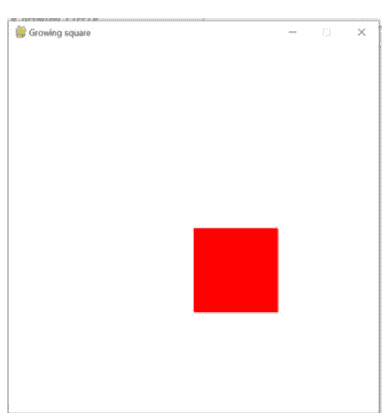

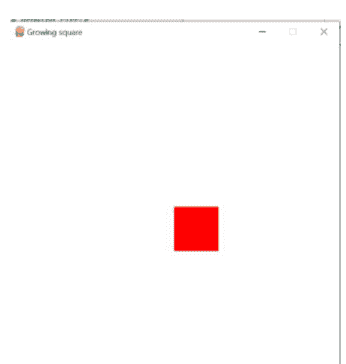

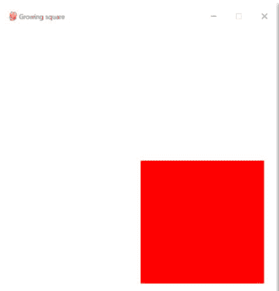

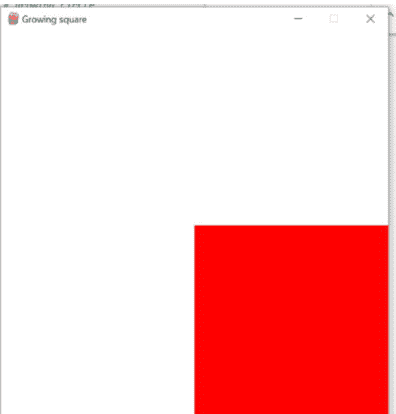

# 增长的圆形

这个示例与增长的正方形示例非常相似，只是我们绘制的是圆形而不是正方形，并且增加的是半径而不是边长。

```python
# growing circle
import pygame

# frames per second
fps = 50

# Define some colors
white = (255, 255, 255)
red = (255, 0, 0)

# A clock instance so we can control frames per second fps
clock = pygame.time.Clock()

# initialize display surface
screen = pygame.display.set_mode((500, 500))
pygame.display.set_caption("Growing circle")

pygame.init()
# white background
screen.fill(white)

# game infinite loop
loop = True

# intitial circle radius
rad = 50

while loop:

    # if quit button press event quit
    for event in pygame.event.get():
        if event.type == pygame.QUIT:
            loop = 0

    pygame.draw.circle(screen, red, (250, 250), rad)

    # update frame
    pygame.display.update()

    # update fps frames per second
    clock.tick(fps)

    rad = 1.01 * rad
    # clear screen
    screen.fill(white)

pygame.quit()
```

# 输出快照：

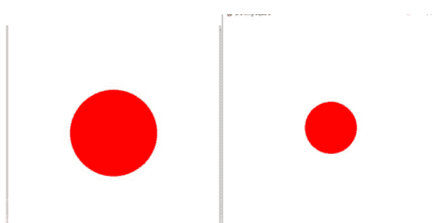

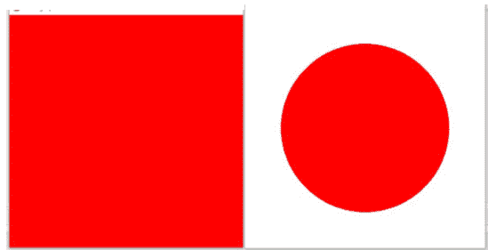

# 在不同方向移动球

在这个示例中，我们使用 move_right、move_left、move_up 和 move_down 函数将球向四个不同方向移动。
逻辑与前面的示例类似，我们不是每帧都增加形状大小，而是每次“增长”对象的位置。
球从中心开始移动，直到碰到边界，然后再次从中心重新开始。
move_right() 函数通过更新球的坐标来工作。该函数不接受任何输入，因为它直接在全局作用域中访问 x 和 y，因为 x 和 y 被定义为全局变量。
每次函数调用，x 坐标增加2像素的步长。步长决定了形状移动的平滑程度。
该函数确保球靠近边界，方法是永远不将 x 增加到超过480。背景表面大小为500。如果 x > 480，球的位置将重置为中心。

```python
# global x and y so it have access to outer x and y
# right function
def move_right():
    global x,y

    # if ball is near border reset to center
    if x < 480:
        x = x + 2
    else:
        x = 250
        y = 250
```

其他函数 move_left、move_up 和 move_down 的实现类似，只是改变 x 和 y 是增加还是减少，并检测不同的边界。
仔细阅读下面的代码并尝试理解它。

## 移动的小球

```python
import pygame

# 每秒帧数
fps = 50

# 定义一些颜色
white = (255, 255, 255)
red = (255, 0, 0)

# 一个时钟实例，用于控制每秒帧数
clock = pygame.time.Clock()

# 初始化显示表面
screen = pygame.display.set_mode((500, 500))
pygame.display.set_caption("moving ball")

pygame.init()
# 白色背景
screen.fill(white)

# 小球初始位置在中心
x = 250
y = 250

# 全局变量 x 和 y，以便在函数内部访问外部的 x 和 y
# 向右移动函数
def move_right():
    global x,y

    # 如果小球接近边界，则重置到中心
    if x < 480:
        x = x + 2
    else:
        x = 250
        y = 250

# 向左移动
def move_left():
    global x,y

    # 如果小球接近边界，则重置到中心
    if x > 20:
        x = x - 2
    else:
        x = 250
        y = 250

# 向上移动
def move_up():
    global x,y

    # 如果小球接近边界，则重置到中心
    if y > 20:
        y = y - 2
    else:
        x = 250
        y = 250

# 向下移动
def move_down():
    global x,y

    # 如果小球接近边界，则重置到中心
    if y < 480:
        y = y + 2
    else:
        x = 250
        y = 250

# 游戏无限循环
loop = True
while loop:

    # 如果按下退出按钮，则退出事件循环
    for event in pygame.event.get():
        if event.type == pygame.QUIT:
            loop = False

    pygame.draw.circle(screen, red, (x, y), 20)
    # 更新帧
    move_right()
    pygame.display.update()
    # 更新每秒帧数
    clock.tick(fps)

    # 清屏
    screen.fill(white)

pygame.quit()
```

# 输出快照：
向右移动

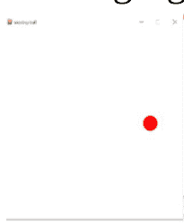

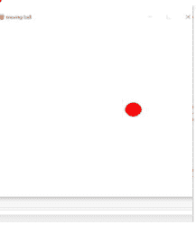

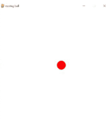

## 示例 4 弹跳的小球

在这个程序中，我们创建一个不断从边界弹跳的小球。
小球从边界弹跳意味着什么？
之前我们通过增加或减少其 x 和 y 位置一个单位步长来移动小球。
在向右移动小球时，我们将 x 增加 1，而向左移动时则将 x 减少 1。因此，要让小球从给定边界弹跳，我们需要检测它撞到了哪个边界，并增加或减少相应的坐标 x 或 y。
在弹跳函数中，

```python
stepx = -1 * stepx , 如果触碰到右或左边界则翻转 x 方向
stepy = -1 * stepy , 如果触碰到上或下边界则翻转 y 方向
```

这些行在每次触碰到边界时翻转相应的坐标。

```python
# 弹跳的小球
import pygame
import random

# 每秒帧数
fps = 50

# 定义一些颜色
white = (255, 255, 255)
red = (255, 0, 0)

# 一个时钟实例，用于控制每秒帧数
clock = pygame.time.Clock()

# 初始化显示表面
screen = pygame.display.set_mode((500, 500))
pygame.display.set_caption("bouncing ball")

pygame.init()
# 白色背景
screen.fill(white)

# 小球初始位置是随机的
x = random.randint(0, 500)
y = random.randint(0, 500)
stepx = 1
stepy = 1

# 全局变量 x, y, stepx 和 stepy，以便在函数内部访问外部变量

# 弹跳函数
def bounce():
    global stepx, stepy, x, y

    # 如果触碰到右边界或左边界，则使水平步长取反
    if x > 480 or x < 20:
        stepx = -1 * stepx

    # 如果触碰到上边界或下边界，则使垂直步长取反
    if y > 480 or y < 20:
        stepy = -1 * stepy

    # 更新 x 和 y
    x += stepx
    y += stepy

# 游戏无限循环
loop = True

while loop:

    # 如果按下退出按钮，则退出事件循环
    for event in pygame.event.get():
        if event.type == pygame.QUIT:
            loop = False

    pygame.draw.circle(screen, red, (x, y), 20)
    # 更新帧
    bounce()
    pygame.display.update()
    # 更新每秒帧数
    clock.tick(fps)

    # 清屏
    screen.fill(white)

pygame.quit()
```

# 输出快照：
从上边界弹跳。

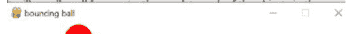

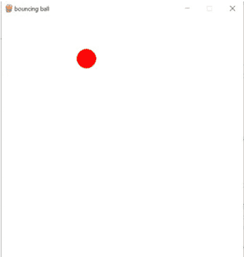

## 练习题

- 1. 修改增长的正方形，使其从左上角而不是中心开始增长。
- 2. 在中心创建一个每2秒闪烁一次的红色圆圈。
- 3. 创建一个缩小的圆圈，它从半径等于窗口大小开始，缩小到半径10。
- 4. 创建2个弹跳的小球，它们从边界弹跳，并且如果相撞也会互相弹跳。提示：在弹跳函数中检查小球之间的距离，如果足够近则触发弹跳。

## 处理按键和鼠标点击事件

Pygame 主要使用 pygame.event 模块处理用户输入。pygame.event 监听并注册来自键盘或鼠标的所有事件。每次事件发生时，都会创建一个事件对象来记录它。
事实上，我们在程序中已经多次使用了 pygame.event。
在这个代码片段中，在游戏循环中我们持续检查任何新的 pygame.event 事件。
`pygame.event.get()` 返回自上次 `pygame.event.get()` 调用以来发生的所有事件列表。
当按下退出按钮时，pygame.event 将此事件注册为类型为 pygame.QUIT 的事件。
因此我们遍历所有事件，并检查是否有任何事件的类型是 pygame.QUIT，如果是，我们将 loop 变量设置为 false，以便在下一次迭代中退出循环。

```python
# 游戏无限循环
loop = True
while loop:
    # 如果按下退出按钮，则退出事件循环
    for event in pygame.event.get():
        if event.type == pygame.QUIT:
            loop = False
```

要了解更多关于 pygame 事件的信息，请参考此链接：
[http://man.hubwiz.com/docset/PyGame.docset/Contents/Resources/Documents/ref/event.html](http://man.hubwiz.com/docset/PyGame.docset/Contents/Resources/Documents/ref/event.html)

此表显示了一些常见的 pygame.event 常量及其属性。

| 常量名称 | 属性 |
|---|---|
| QUIT | 无 |
| ACTIVEEVENT | gain, state |
| KEYDOWN | key, mod |
| KEYUP | key, mod |
| MOUSEMOTION | pos, rel, buttons |
| MOUSEBUTTONUP | pos, button |
| MOUSEBUTTONDOWN | pos, button |

## 键盘事件

KEYUP 和 KEYDOWN 事件具有表示键盘按键的 key 常量属性。
使用大写字母 K 后跟下划线和按键名称，
例如 F1 是 K_F1，w 是 K_w。
在这个代码片段中，我们使用 pygame.KEYDOWN 检查按键何时被按下，我们检查按下了哪个方向键并打印按键名称的消息。

```python
for event in pygame.event.get():
    if event.type == pygame.QUIT:
        pygame.quit()
    elif event.type == pygame.KEYDOWN:
        if event.key == pygame.K_UP:
            print("玩家向上移动！")
        elif event.key == pygame.K_LEFT:
            print("玩家向左移动！")
        elif event.key == pygame.K_DOWN:
            print("玩家向下移动！")
        elif event.key == pygame.K_RIGHT:
            print("玩家向右移动！")
```

要阅读所有按键绑定，请阅读 pygame 按键文档 [https://www.pygame.org/docs/ref/key.html](https://www.pygame.org/docs/ref/key.html)

## 鼠标事件

在 pygame 中有三种类型的鼠标事件：MOUSEBUTTONDOWN、MOUSEBUTTONUP 和 MOUSEMOTION。
当用户按下或移动鼠标时，会接收到 MOUSEBUTTONUP 和 MOUSEMOTION 事件。
它们具有以下属性：
Button：1 表示左键，2 表示鼠标滚轮，3 表示右键。
Pos：按下按钮时鼠标的绝对位置 (x,y)。

当用户移动鼠标时，会接收到 MOUSEMOTION 事件，它有 3 个属性：
Buttons：一个元组，表示鼠标按钮是否被按下（左键、鼠标滚轮、右键）。
Pos：光标的绝对位置 (x,y)，单位为像素。
Rel：相对于上一次位置的位置 (relative_x, relative_y)。

在这个例子中，我们使用了讨论过的三个鼠标属性来检测鼠标。

```python
# 检测鼠标动作

for event in pygame.event.get():
    if event.type == pygame.QUIT:
        pygame.quit()
    elif event.type == pygame.MOUSEMOTION:
        if event.rel[0] > 0:  # 'rel' 是一个元组 (x, y)。'rel[0]' 是 x 值。
            print("鼠标向右移动")
        elif event.rel[1] > 0:  # pygame 原点在左上角，所以更高的 y 值意味着更靠下。
            print("鼠标向下移动")
    elif event.type == pygame.MOUSEBUTTONDOWN:
        if event.button == 1:
            print("按下鼠标左键")
        elif event.button == 3:
            print("按下鼠标右键")
    elif event.type == pygame.MOUSEBUTTONUP:
        print("鼠标按钮释放")
```

## 示例 1：移动的正方形

在这个例子中，我们实现了一个类似于上一章的移动正方形，但它通过键盘按键移动。我们检测类型为 pygame.KEYDOWN 的事件，然后检查事件。

## 移动

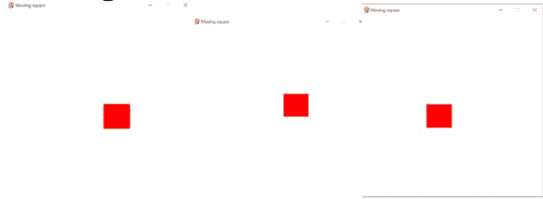

示例：通过鼠标移动方块。
在这个示例中，我们通过更新方块的位置为鼠标光标的位置，让方块跟随鼠标移动。我们通过 `pygame.MOUSEMOTION` 获取鼠标光标位置，鼠标 x 坐标是 `event.pos[0]`，y 坐标是 `event.pos[1]`。我们还使用 `pygame.MOUSEBUTTONUP` 在鼠标左键点击时改变方块的颜色。

```python
import pygame
import sys
pygame.init()
fps=30
fpsclock=pygame.time.Clock()
surface=pygame.display.set_mode((500, 500))
pygame.display.set_caption("Moving square by mouse")
White=(255,255,255)
Black = (0, 0, 0)
red = (255, 0, 0)
x=10
y=10
step=5
color = red
while True:
    surface.fill(White)
    pygame.draw.rect(surface, color, (x, y, 70, 65))
    for event in pygame.event.get():
        if event.type==pygame.QUIT:
            pygame.quit()
            sys.exit()
        elif event.type == pygame.MOUSEMOTION:    # detect mouse motion
            # assign x,y to cursor position
            x,y = event.pos[0], event.pos[1]    # move square to mouse location
        elif event.type == pygame.MOUSEBUTTONDOWN:
            if event.button == 1:               # while left clicked square color is black else red
                color = Black
        elif event.type == pygame.MOUSEBUTTONUP:
            if event.button == 1:
                color = red

    pygame.display.update()
    fpsclock.tick(fps)
```

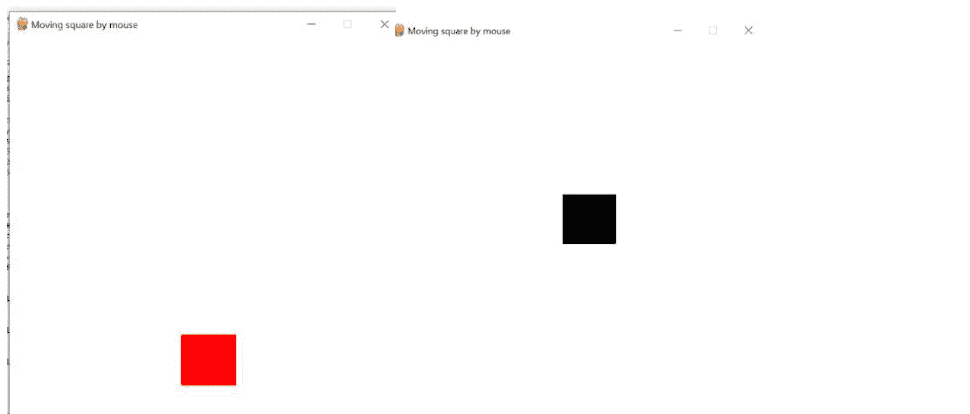

## 练习题

- 1. 编写一个让小球跟随鼠标光标移动的程序。当点击鼠标左键时，小球持续变大。当点击鼠标右键时，小球缩小。
- 2. 制作一个隐藏宝藏寻找游戏，当鼠标点击到一个特定的隐藏 10x10 方块时，它会变成红色并打印出“找到宝藏”。
- 3. 制作一个信号交通灯。
- 4. 实现一个在按下空格键时会弹跳的小球。

## 乒乓球游戏

这个游戏建立在前面讨论的“弹跳球”游戏的基础上。游戏包含一个在地面上水平移动的挡板和一个在游戏窗口边界上弹跳的球。玩家移动挡板以将球向上弹起，绝不让它触碰“地面”。玩家通过将鼠标指向预期方向来移动挡板。

在游戏循环（无限循环）中，球使用 `move_ball()` 函数移动，该函数更新球的位置。然后，我们在新位置绘制球，并将挡板移动到鼠标指针指向的位置。我们以每秒 fps 帧的速度更新显示。Fps 设置为每秒 80 帧。我们可以通过增加这个数字使游戏更具挑战性/更快。

阅读任何游戏代码时，采用自顶向下的方法总是一个好主意，首先从主游戏循环开始，获得关于游戏如何运作的高层次概念。然后深入函数定义，逐一理解它们。下面的代码片段是我们的游戏循环。

既然你对游戏有了高层次的概念，你就可以阅读完整的程序了。代码注释良好，便于阅读。

```python
# pong game
import pygame
from random import choice

# Game frames per second to control game speed
fps = 80

# Define some colors
white = (255, 255, 255)
black = (0, 0, 0)
red = (255, 0, 0)
green = (0, 255, 0)

# initial ball coordinates
x_ball = 500
y_ball = 300

# direction to capture where the ball is heading
horizontal_direction = 'left'
vertical_direction = 'down'

# Each time ball is served, score is incremented
score = 0

# The step where ball position is updated
step = 2

# A clock instance so we can control frames per second fps
clock = pygame.time.Clock()

# initialize display surface
screen = pygame.display.set_mode((500, 500))
pygame.display.set_caption("Pong game")

pygame.init()

while loop:
    # detect pressed keys
    keys = pygame.key.get_pressed()

    # if quit button press event quit
    for event in pygame.event.get():
        if event.type == pygame.QUIT:
            loop = 0
    # get mouse pointer coordinates
    x, y = pygame.mouse.get_pos()

    # move the ball by a step
    move_ball()
    # draw ball
    ball()
    # draw paddle at mouse x coordinate
    paddle(x,490)
    # is the ball served
    served()
    # update frame
    pygame.display.update()
    # white background
    screen.fill(white)
    # update fps frames per second
    clock.tick(fps)

pygame.quit()
```

```python
# Draw the ball at x_ball, y_ball
def ball():
    pygame.draw.circle(screen, red, (x_ball, y_ball), 10, 10)

# draw paddle at x, y
def paddle(x,y):
    pygame.draw.rect(screen, black, (x, y, 80, 10))

# move ball by a step
def move_ball():
    global x_ball, y_ball, horizontal_direction, vertical_direction
    # if ball is going to left decrement x_ball so it continues left
    if horizontal_direction == "left":
        x_ball -= step

        # if ball is near left border reflect to right
        if x_ball < 10:
            horizontal_direction = "right"

    # if ball is going downward increment y_ball so it continues downward
    if vertical_direction == 'down':
        y_ball += step

    # if ball is going upward decrement y_ball so it continues upward
    if vertical_direction == 'up':
        y_ball -= step

        # if ball is near upper border reflect downward
        if y_ball < 10:
            vertical_direction = 'down'

    # if ball is going right increment x_ball so it continues right
    if horizontal_direction == "right":
        x_ball += step

    # if ball is near right border reflect left
    if x_ball > 480:
        horizontal_direction = "left"

# function to detect serving the ball by paddle
def served():
    global x_ball, y_ball # ball x and y
    global x, y           # paddle x, y
    global horizontal_direction, vertical_direction, step
    global score

    # detect if ball is heading to paddle
    if horizontal_direction == "left":
        if y_ball > 480:

            # ball is touching the paddle
            if x_ball >= x and  x_ball < x + 50:
                print("Good job")
                # increment score
                score += 1
                # flip direction
                vertical_direction = "up"
                step = 1

            # if ball missed reset ball coordinates and decrement score
            else:
                pygame.draw.circle(screen, black, (x_ball, y_ball), 10, 10)
                pygame.display.update()
                x_ball, y_ball = 500, 300
                score -= 1

    # print score in caption
    pygame.display.set_caption(f"Your score is: {score}")
```

## 输出：

🧑 你的得分是：1


## 练习题

- 1. 在玩过乒乓球游戏后。你可能观察到当球重置位置时，它总是从相同的位置开始。编写一个函数，使球每次重置时都在不同的随机位置。
- 2. 在乒乓球游戏中，编辑代码，以便你可以使用键盘方向键移动挡板。
- 3. 在乒乓球游戏中，实现第二个玩家，其挡板位于顶部边界。每个玩家必须有自己的分数。

## 结论

恭喜你读到了本书的最后。你绝对走在正确的道路上。
如果你想要一本更面向初学者的版本，可以下载我的[《面向儿童和初学者的Python编程》](https://example.com)。
如果你对JavaScript更感兴趣，可以下载我的[《面向9-15岁儿童的编程》](https://example.com)和[《面向10岁及以上儿童的编程》](https://example.com)。

其他推荐的延伸阅读书籍：
- [《Python编程快速上手》](https://example.com)
- [《Python编程：从入门到实践》](https://example.com)
- [《Python学习手册》](https://example.com)

## 免费礼物

我们真心希望你在编程之路上取得成功。为确保你的成功，我们为你提供一份免费的项目清单，你可以在完成本书后着手实践。

https://coding.gr8.com/

