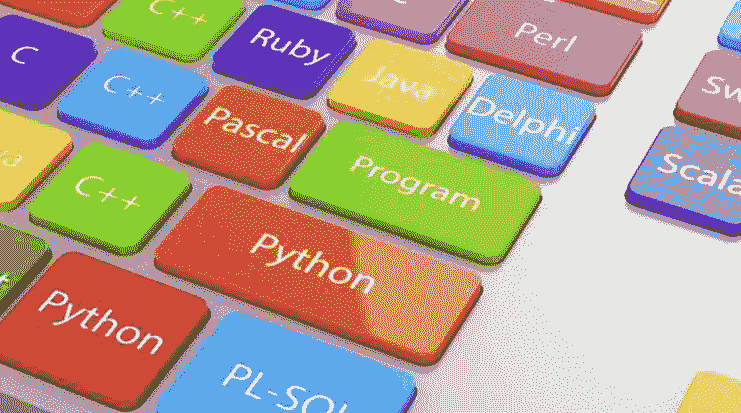
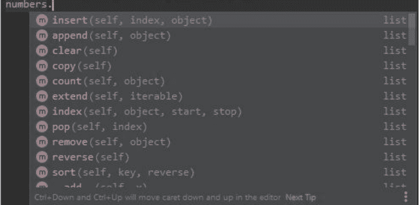
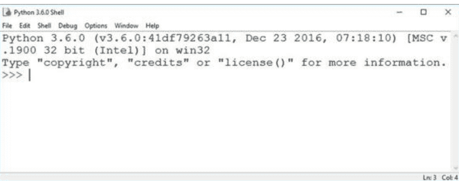
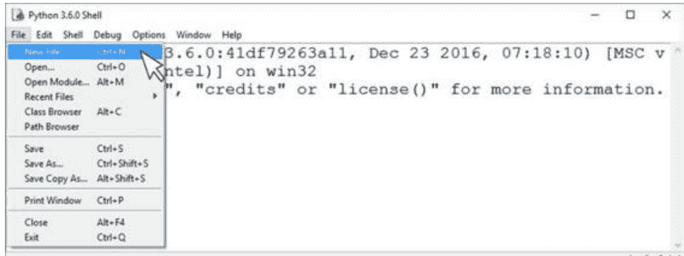
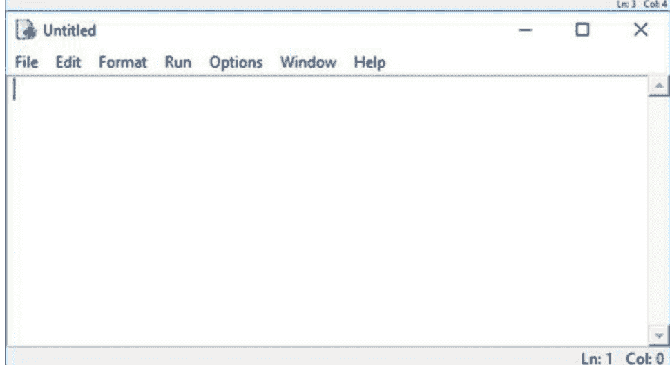
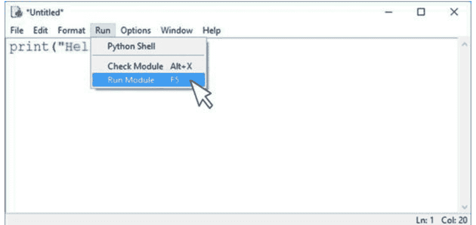
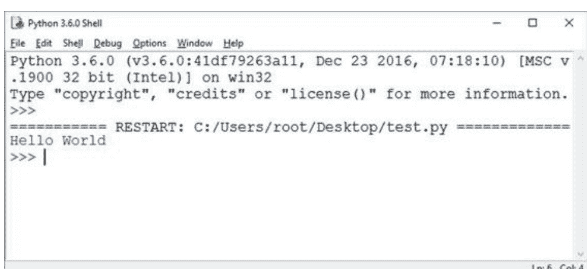
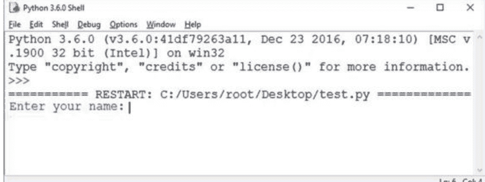
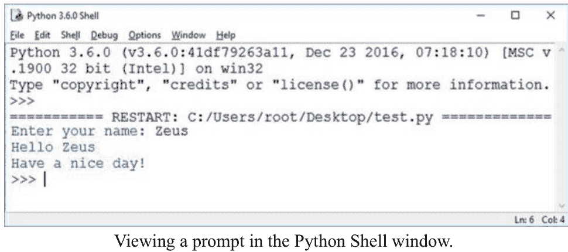
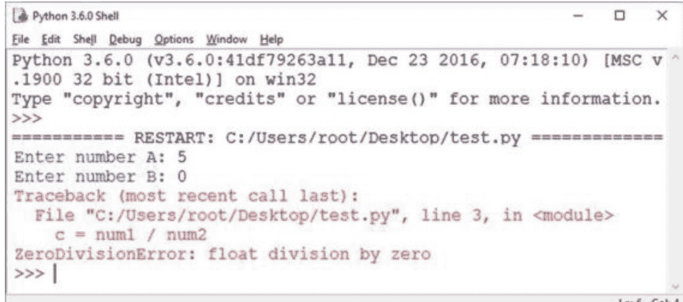

# 用Python为孩子编程

只需**3天**，学习如何使用最流行的编程语言


## 弗兰克·诺尔特

以简单有趣的方式，从零开始独立开发简单软件

# © 版权所有 2021 - Frank Nolte - 保留所有权利。

本文档旨在就所涵盖的主题和问题提供准确可靠的信息。

- 源自美国律师协会委员会以及出版商与协会委员会共同接受并批准的原则声明。

以电子方式或印刷格式复制、复制或传播本文档的任何部分均属非法。保留所有权利。

本文所提供的信息据称是真实且一致的，对于因使用或滥用本文所含的任何政策、流程或指示而导致的任何责任，无论是因疏忽或其他原因，均由接收读者独自承担全部责任。在任何情况下，出版商均不对因本文信息直接或间接造成的任何赔偿、损害或金钱损失承担任何法律责任或指责。

 respective authors own all copyrights not held by the publisher.

本文信息仅供参考，具有普遍性。信息的呈现不附带任何合同或任何形式的保证。

所使用的商标未经任何同意，商标的发布未经商标所有者许可或支持。本书中的所有商标和品牌仅用于说明目的，归所有者所有，与本文档无关。

## 目录

[引言](Introduction)

[第1天：编程原理](DAY 1: Principles of Programming)

[第1章：什么是编程语言，哪些是最流行的编程语言？](Chapter 1: What Is a Programming Language and which Are the Most Popular Programming Languages?)

- [编程语言](Programming Language)
- [当前哪些是最流行的编程语言？](Which Are the Most Popular Programming Languages Now?)

[第2章：为什么学习Python？](Chapter 2: Why Learn Python?)

- [Python是免费的！](Python Is Free!)
- [Python是一门非常易于学习的编程语言](Python Is a very Easy-to-Learn Programming Language)
- [资源无处不在](There Are Resources Everywhere)
- [优秀的付费资源](Great Paid Resources)
- [它是Google使用的语言](It Is the Language Used in Google)
- [Python是一门通用的编程语言](Python Is a Versatile Programming Language)
- [使用起来非常快](It Is Very Fast to Use)
- [它始终在更新](It Is Always Updated)
- [学习Python不仅简单而且快速](Learning Python Is not just Simple but Fast Too)
- [Python拥有强大的支持系统](Python Has a Great Support System)
- [Python是你需要的基础](Python Is the Foundation that You Need)

[第2天：Python编程入门](DAY 2: Introduction to Python Programming)

[第3章：OOP（面向对象编程）](Chapter 3: OOP (Object-Oriented Programming))

- [使用Python进行面向对象编程](Object-Oriented Programming with Python)

[第4章：数据类型和变量的重要性](Chapter 4: The Importance of Data Types and Variables)

- [数据类型](Data Types)
- [整数类型](Integer Type)
- [浮点数类型](Floats Type)
- [转换数据类型](Converting Data Types)
- [基本变量](Basic Variables)
- [变量定义](Variable Definition)
- [命名变量](Naming Variables)
- [为变量赋值](Assigning a Value to Variables)

## 第5章：字符串、列表、字典和元组

- [字符串](Strings)
- [什么是列表？](What Is a List?)
- [使用列表](Working with Lists)
- [元组](Tuples)
- [字典](Dictionaries)

## 第6章：数字和运算符

- [数值类型](Numeric Types)
- [运算符](Operators)
- [算术运算符](Arithmetic Operators)
- [比较运算符](Comparison Operators)
- [逻辑运算符](Logical Operators)

## 第7章：Python中的运算符

- [Abs函数](Abs Function)
- [Ceil函数](Ceil Function)
- [Max函数](Max Function)
- [Min函数](Min Function)
- [Pow函数](Pow Function)
- [Sqrt函数](Sqrt Function)
- [Random函数](Random Function)
- [Randrange函数](Randrange Function)
- [Sin函数](Sin Function)
- [Cos函数](Cos Function)
- [Tan函数](Tan Function)

## 第3天：开发代码

## 第8章：Python的安装和运行

- [下载安装程序](Download the Installer)
- [运行安装程序](Run Your Installer)
- [启动解释器](Starting the Interpreter)
- [启动Python](Start the Python)
- [集成开发环境（IDE）](Integrated Development Environment (IDE))

## 第9章：程序的执行和语句

- [创建新的Python模块](Creating a New Python Module)
- [编写和执行Python程序](Writing and Executing a Python Program)

## 第10章：Python模块

- [在Python中使用模块](Working with Modules in Python)
- [Import语句](The Import Statement)
- [编写模块](Writing Modules)
- [关于Import语句的更多信息](More on Import Statements)
- [重命名导入的模块](Renaming the Imported Module)
- [模块搜索路径](Module Search Path)
- [字节编译文件](Byte-Compiled Files)
- dir()函数

## 第11章：类和对象

- Python中的对象
- 在Python中创建对象
- 创建对象的实例
- Python“魔法”方法
- 隐藏数据
- 技巧与窍门

## 第12章：函数、输入和输出

- 函数
- Return语句
- 如何定义和调用函数？
- 参数
- Return语句——返回值
- Lambda函数——匿名函数或Lambda
- 输入
- 打印和格式化输出

## 第13章：有趣的项目和游戏

- 石头、剪刀、布
- 猜猜看！

## 结论

# 引言

什么是编程？编程是编写计算机软件或计算机语言的行为。当你编写软件时，你是在为计算机编程，让它执行你告诉它做的事情。重要的是要理解，编程不仅仅是编写代码；它是关于从现有资源中的数据进行抽象，以更好地理解所涉及的过程以及如何最好地处理这些过程。

它是关于创造一种语言来描述事物的现状或可能性。这可能很难，但它不是火箭科学，你也不需要成为天才。目标是通过使用代码使想法变得具体且易于理解。

虽然大多数编写代码的人是软件开发人员，但也有许多人在不编写任何代码的情况下编写计算机程序。任何人都可以学习用不同的语言编程。

编程可用于多种目的，从创建网站到开发应用程序和游戏。它用于网络开发、编程和视频制作。可以在任意数量的节点上编写系统的任何部分内容，以展示它与其每个概念或类别的关联。

在编程时保持创造力和乐趣很重要，但同样重要的是确保你的创作是有用的，并能帮助人们解决问题。编程是一项具有挑战性且有趣的活动，通过编程培养的技能将对你的学习和工作有所帮助。

这是最令人兴奋和着迷的职业之一，因为你有能力从无到有地创造事物。我建议尝试参与软件开发。因为越来越多的企业变得依赖技术，对编程知识的需求将会增长。编程是一项非常重要的技能，你可以用它来提升你的职业前景。它通过解决问题，教你如何进行逻辑、创造性和分析性思考。你可以利用你的技能和知识来构建一个解决人们问题的产品或服务。

编程是展示你创造力的一面并帮助你以不同方式思考问题的好方法。作为一名程序员，你必须不断学习新事物。这种能力是程序员工作描述中固有的。

从无到有地创造或构建事物的能力是一项基本的生活技能。无论你是企业家、开发者、作家、设计师还是创意总监，从无到有地创造事物的能力都是成功的关键。

本书专注于基本的编程概念，并很好地介绍了成为一名程序员是什么样的。你将很好地理解技术是如何工作的，以及构建新事物需要什么。

如果你一直对编程感兴趣，或者即使你是完全的新手，那么这本书就是为你准备的。任何想了解如何将编程作为职业的人都应该读这本书。这本书面向孩子，但成年人如果第一次接触这个领域也可以使用它。如果你不熟悉软件编程（和构建），这是一个很好的起点。它以非常简单的方式解释了Python，适合所有想学习这门语言的人。


Python是想学习如何编码的人的好语言。它是一门简单的语言，由于其语法，它非常灵活且易于理解。它还具有高水平的抽象，使其功能强大。它是最流行的编程语言之一，因此有很多资源可供学习。

作为开发者，你需要构建你或你的客户实际会使用的软件。为此，你需要了解软件是如何工作的。理解软件编程并避免依赖互联网上可用的应用程序很重要。在开始之前，了解构建过程需要什么以及你的项目需要多少时间也至关重要。

本书是一本实践指南，将为你提供编程的基础知识，重点是问题解决和效率。这本书是一个很好的起点。它是一本易于阅读的指南，包含大量示例，可以帮助你开始你的编程之旅。理解编程过程的最佳方式实际上是去实际构建一个。

编程是一种艺术形式，可以成为很好的创意出口。这是一项令人惊叹的技能，它将使你在生活中取得很多成就。技术使得许多不同类型的应用程序和游戏得以开发，这是它在移动应用市场如此成功的原因之一。

当你在编程时，你会沉浸在过程中，忘记它本应是有趣的。创造事物最令人兴奋的事情是与他人分享。这才是真正的乐趣所在，也是我们做这件事的全部原因。互联网是人们寻求娱乐的地方。你可以通过游戏或应用程序帮助他们，然后他们可以与朋友和家人分享。如果你喜欢游戏开发并且是社交媒体社区的一员，那么你最好的选择是创建一些令人兴奋的社交媒体应用程序，你可以通过互联网与他人分享。很多人认为游戏只适合孩子，但事实并非如此。

编程关乎解决问题和发挥创造力。它不是一项以单调方式完成的任务。编程可以是一份很棒的工作，回报丰厚，但同样重要的是，你要记住，无论你做什么，都应该享受其中并充满热情。如果你乐在其中，你会更享受它，并产生更好的结果。如果你热爱你所做的事情，保持动力会更容易。

## 第一天：编程原理

## 第一章：什么是编程语言以及哪些是最流行的编程语言？

### 编程语言

程序是一组指令（也称为计算机程序），它告诉计算机如何执行某些任务。程序可以告诉计算机做什么、何时做以及使用什么数据作为输入或输出。然后，使用编程语言来创建程序，以指导计算机如何执行特定任务。有许多不同的编程语言，但它们都有相同的基本目的，即能够指导计算机如何执行特定任务。

### 现在哪些是最流行的编程语言？



如今，有八种流行的编程语言在编程领域被广泛使用：“C++”、“C#”、“JAVA”、“JAVASCRIPT”、“PHP”、“PYTHON”、“VISUAL BASIC”和“HTML”。

### C++ 编程语言

C++语言是从C语言发展而来的。

C语言由贝尔实验室的D. M. Ritchie于1972年开发。它最初并非为初学者设计，而是为计算机专业人士设计的。C是一种面向过程的编程语言。当软件开发项目的规模增加时，C不再适合计算机开发的需求。它无法处理复杂和大型的任务。

在这种软件危机的情况下，C++语言应运而生；它由AT&T贝尔实验室的Bjarne Stroustrup博士在20世纪80年代开发。

C++语言：
- 兼容高级和初级语言
- 具有出色的可移植性（简单易用）
- 支持面向对象编程
- 能够处理大型和复杂的程序
- 编译速度快，开发效率高

### C# 编程语言

C#是一种面向对象的高级编程语言，由Anders Hejlsberg及其团队在“微软”开发。它是一种安全、现代、简单的编程语言，源自C和C++。C#特别适合在“.NET”框架下进行软件开发。它旨在结合“VB”（“Visual Basic”）的高效率和C++的强大功能。C#支持快速程序开发，效率翻倍，将程序员从繁琐、重复的编程工作中解放出来。它具有完美的设计，使其成为新程序员的明智选择。

C#语言：
- 是一种现代的通用编程语言。
- 易于学习。
- 是一种面向对象的语言。
- 在“.NET”框架上运行。
- 可用于开发高效程序。
- 使用组件或模块进行编程。
- 易于阅读和维护。

### Java 编程语言

Java语言由“Sun Microsystems”于1995年5月发明。Java是一种面向对象的编程语言。它有两个特点：功能强大且易于使用。

Java语言是从C++发展而来的，因此Java的语法与C++相似。

用Java编写的程序可以广泛应用于个人电脑、数据中心、游戏机、科学超级计算机、手机、全球云计算和互联网。Java拥有世界上最大的开发者和专业人士社区。

Java语言：
- 为互联网开发，但将安全性放在首位。
- 可以使网页变得生动。
- 可以将网页从静态变为动态。
- 可以阻止计算机病毒传播。
- 可以生成小型应用程序（小程序）。
- 突破机器环境限制。
- 一次编写，到处运行。
- 可以在任何计算机平台上运行。

### JavaScript 编程语言

JavaScript是一种网络编程语言。它是一种动态类型、基于原型的语言。JavaScript是浏览器的一部分，作为脚本语言在客户端广泛使用。它用于为网页添加动态和交互功能。JavaScript缩写为JS。

JavaScript最初由网景公司的Brendan Eich于1995年在“Netscape Navigator”浏览器上开发。网景管理层希望它看起来像Java，因此命名为“JavaScript”。事实上，JavaScript与Java完全不同。

JavaScript是一种相对安全的基于对象和事件的客户端脚本语言。它可以响应用户的请求并创建一系列动态效果。

JavaScript语言：
- 可在任何浏览器中运行。
- 将其代码嵌入HTML页面。
- 是一种解释型语言，不需要编译。
- 可以将静态网页变成动态网页。
- 提供表单处理和验证确认。
- 随时响应用户的请求。
- 提供事件触发机制。

## PHP 编程语言

“PHP超文本预处理器”是一种通用的开源脚本语言。它是一种在服务器端执行的脚本语言——

## PHP 编程语言

PHP 是一种常见的 Web 编程语言。

PHP 最初由 Lerdorf 于 1995 年开发。他最初使用 "Perl" 编程，后来用 C 语言重写，包括数据库访问功能，最终发明了 PHP 语言。

PHP 是一种 HTML 嵌入式语言，这意味着文档在服务器端处理。其语言风格类似于 C 语言。

PHP 在 "IT"（信息技术）领域被广泛使用。

### PHP 语言

-   混合了来自 Perl 和 C 的一些语法，最终形成了 PHP 语法。
-   嵌入了 HTML 代码。
-   具有可以实现加密和优化代码的编译功能。
-   在动态网页中比 Perl 运行更快。
-   支持所有流行的数据库和操作系统。
-   使用 C 和 C++ 进行程序扩展。
-   可以在 "UNIX"、"LINUX"、"WINDOWS" 和 "Mac OS" 上运行。
-   可用于开发大型商业程序。
-   是一种面向对象的语言，可与 "MySQL" 配合使用。

## Python 编程语言

Python 是一种简单、易读且可扩展的计算机编程语言。并且，与其他语言相比，它更容易学习。目前，Python 有四大应用领域：

-   网络爬虫
-   Web 开发
-   人工智能设计
-   自动化运维

Python 是一种面向对象、动态类型的语言，最初设计用于编写自动化脚本（shell），但如今越来越多地用于独立的大型项目。

自 Python 语言于 1990 年代初诞生以来，它已被广泛应用于系统管理任务和 Web 编程。Python 的创始人是来自荷兰的 Guido van Rossum。Python 是免费且开源的。

### Python 语言

-   非常容易学习，尤其适合编程初学者。
-   用 C 语言编写，运行速度非常快。
-   具有很强的可移植性，因此可以在各种平台上运行。
-   可以直接运行程序，无需编译。
-   可以使用 C 或 C++ 语言进行扩展。
-   包含大量用于各种任务的 Python 标准库。

## Visual Basic 编程语言

"Visual Basic" 是由 Microsoft 开发的一种通用、基于对象的编程语言。它是一种结构化、模块化、面向对象的可视化编程语言。

"Visual" 指的是开发图形用户界面 (GUI) 的方法，因此你无需编写大量代码来描述界面元素的外观和位置；相反，你只需将预先创建的对象添加到屏幕上的某个点即可。

"Basic" 指的是 "Beginners All-Purpose Symbolic Instruction Code"，这是计算机技术发展史上广泛使用的一种语言。

### Visual Basic 语言

-   语法简单，易于学习，专为初学者设计。
-   支持可视化平台或常规平台。
-   使用组件或控件进行编程。
-   适合开发 "Asp.net" 项目。
-   易于转换为 C# 语言。
-   包含事件触发系统以及内置函数。
-   借助 "Visual Studio" 库变得功能强大。

## HTML 编程语言

"超文本标记语言" (HTML) 是用于创建网页的标准标记语言。HTML 于 1993 年 6 月作为互联网工程工作组的工作草案发布。

HTML 可以描述和表达网页的文本、图片、动画、颜色、音乐、事件和交互。网页内容由许多 HTML 标签和元素组成。

HTML 文件有三个部分："声明部分"、"头部部分" 和 "主体部分"。

HTML 是 Web 编程的基础，这意味着万维网基于超文本——Web 浏览器执行 HTML 文件。

### HTML 语言

-   用于设计网页。
-   由许多 HTML 标签和元素组成。
-   HTML 文件以标签 `<!doctype html>` 开头。
-   以 ".html" 扩展名保存文件。
-   与 "CSS"（层叠样式表）配合使用，以改善 HTML 样式。
-   由 Web 浏览器执行，浏览器充当 "解析器"（用于分析编程语言的软件）。

## 第 2 章：为什么学习 Python？

### Python 是免费的！

没有比这更好的理由让你开始学习 Python 了：下载程序是完全免费的，使用 Python 编程语言也是免费的，而且你可以免费随心所欲地使用它。Python 团队以及互联网上众多志愿者每天都在改进这门语言，因此，在你继续学习的过程中，有很多有趣的东西等着你去探索。如果有一种编程语言是你真正需要学习的，那就是 Python。

### Python 是一种非常容易学习的编程语言

许多使用过 Python 的人同意，它实际上是最容易学习的编程语言。初学者学习 Python 非常快，不久之后，他们就能像专家一样使用代码和编程。Python 中使用的命令——也就是你编写的代码——是用普通英语编写的。

记住 Python 中的命令也非常容易。你也可以轻松地知道你在做什么以及你需要做什么。Python 与其他语言有很大不同，在其他语言中，你必须记住一些有时毫无意义的缩写。

### 资源无处不在

Python 成员和志愿者们确保了想要学习 Python 的人可以轻松获取资源。例如，你可以轻松获得 "Python 初学者指南" 来开始学习这门语言。还有 "YouTube" 教程，以及互联网上更多可以帮助你开始学习这门编程语言的资源。

### 优秀的付费资源

你获得的大部分 Python 资源都是免费的，但有些不是免费的。例如，有些书籍提供的信息和技巧比免费资源更多。它们经过精心开发和定制，旨在帮助学习者在最短的时间内入门并获得使用 Python 语言的相关技能。你拥有学习 Python 所需的一切资源。

### 它是 Google 使用的语言

"Google" 使用 Python；Python 是 Google 专家最青睐的编程语言之一。他们大多数受欢迎的产品都是使用 Python 编程的。Google 不断寻找 Python 专家。如果你一直想与这样一个优秀的团队合作，Python 应该是你需要学习的最重要的语言。如果 Google 都在使用它，你可以想象还有多少其他优秀的公司在使用同样的程序，因此，如果你有 Python 技能，你就是赢家。

### Python 是一种通用的编程语言

这意味着它可以用于任何事情，无论大小、在线还是离线项目。你将获得的技能不会浪费；相反，你会发现它们在你生活中将要承担的许多项目中都很有用。

### 使用起来非常快

如果你使用过几种不同的编程语言，你会意识到有些语言编程需要一些时间。Python 不是这样；它编程很快。用 Python 编写代码可以以简单的方式快速完成。

### 它总是保持更新

Python 总是保持最新，这要归功于每天更新和开发它的志愿者们。它是一种开源编程语言这一事实也有很大帮助，因为它向许多人开放改进。新版本总是不断推出，这意味着这门语言总是新鲜的，并跟上当前的趋势。这就是为什么 Python 是一门非常强大的语言，不会在短期内消失——由于这个事实，它正慢慢成为许多程序员的最爱。

### 学习 Python 不仅简单而且快速

你不需要太多时间就能成为 Python 编程语言的专家。你可以快速学习这门语言并能够熟练使用它。如果你热爱计算机并且不害怕简单的数学方程式，你会学得更快。学习 Python 不会花费你学习任何其他语言那么多的时间。

### Python 拥有强大的支持系统

优秀的 Python 社区将确保你在需要帮助时得到帮助。社区成员总是非常乐意并准备好提供帮助。

帮助。如果你遇到问题，无法弄清楚程序，或者找不到某个链接；你可以立即寻求帮助，帮助会马上到来。支持系统使得学习Python变得更加容易，也让使用程序变得更有趣，因为社区里的每个人每天都在讨论相同的内容。

## Python是你需要的基础

如今，编程技能是商业市场中许多工作的必备要求。雇主正在寻找能够像专家一样编程的人，因此那些能够理解编程语言以理解企业已创建数据的人。Python是一种更容易学习的编程语言，因此它可以帮助你学习你需要掌握的编程语言基础，从而获得你一直梦想的工作。一旦你学会了Python，你之后就可以掌握许多其他编程语言。

## 第2天：Python编程入门

## 第3章：OOP（面向对象编程）

### 使用Python进行面向对象编程

Python允许多种编程范式，包括面向对象编程（OOP）。OOP是一种组织代码的方式，通过组织和重用代码使其特别有效，尽管其抽象性质乍看之下并不直观。

Python中的面向对象编程是可选的，到目前为止，我们还没有直接使用它——但我们从一开始就以某种方式使用了它。尽管它的最大优势出现在较长和更复杂的程序中，但理解OOP的工作原理非常有用，因为这就是Python内部的工作方式。

基本思想很简单。如果我们有一个比我们目前看到的列表或字典更复杂的数据类型，并且我们想创建一个具有特定属性的新数据类型，我们可以用“类”来定义它，类似于“def”函数。假设我们想创建一个名为“Star”的数据类型，它最初只有一个名称，我们可以这样写：

```
# 让我们创建star.py
class Star(object):
    """恒星类"""
    def __init__(self, name):
        self.name = name
```

```
# 打印时调用的特殊方法
def __str__(self):
    return "Stars {}".format(self.name)
```

这个类有一个特殊的主函数“__init__()”，它构建Star类的元素（称为对象），并在创建该类的新对象或实例时执行；我们将name作为唯一的必需参数，但它不一定需要任何参数。

神秘的“self”变量，每个函数都以它开头（在对象上称为方法），指的是我们正在创建的特定对象——通过一个例子会更清楚。现在我们可以创建“Star”类型的对象：

```
# 包含Star导入star类的Star.py库

# Star的新实例（对象），带有一个参数（名称），必需
star1 = star.Star('Altair')

# 根据__str__方法，打印对象时返回的内容
print(star1) # Star Altair

print(star1.name) # Altair
```

当创建名为“star1”的对象时，在类定义中我们称之为“self”，我们有了一个具有name属性的新数据类型。现在我们可以添加一些可以应用于“Star”对象的方法：

```
class Star:
    """恒星类
    Python示例类
    文件：star.py
    """
    # 恒星总数
    num_stars = 0
    def __init__(self, name):
        self.name = name
        Star.num_stars += 1
    def set_mag(self, mag):
        self.mag = mag
    def set_pair(self, pair):
        """以角秒为单位分配视差"""
        self.pair = pair
    def get_mag(self):
        print("The magnitude of {} of {}".format(self.name, self.mag))
    def get_dist(self):
        """根据视差计算以秒差距为单位的距离"""
        print("The distance of {} is {:.2f} pc".format(self.name, 1 / self.par))
    def get_stars_number(self):
        print("Total number of stars: {}".format(Star.num_stars))
```

现在我们可以对“Star”对象做更多事情：

```
import star

# 我创建一个恒星实例
altair = star.Star('Altair')
altair.name
# 返回 ‘Altair’
altair.set_pair(0.195)
altair.get_stars_number()
# 返回：Total number of stars: 1
# 我使用一个通用的类方法
star.pc2ly(5.13)
# 返回：16.73406
altair.get_dist()
# 返回：The distance of Altair is 5.13 pc
# 我创建另一个恒星实例
other = star.Star('Vega')
other.get_stars_number()
# 返回：Total number of stars: 2
altair.get_stars_number()
# 返回：Total number of stars: 2
```

这一切不熟悉吗？它类似于Python元素（如字符串或列表）的方法和属性，这些元素也是在类中定义的对象，具有自己的方法。

对象有一个有趣的属性叫做“继承”，它允许你重用其他对象的属性。假设我们对一种特定类型的“Star”感兴趣，称为“白矮星”，它是具有一些特殊属性的“Star”，那么我们将需要“Star”对象的所有属性以及我们将添加的一些新属性：

```
class WBStar(Star):
    """白矮星（WD）类"""
    def __init__(self, name, type):
        """WD类型：dA, dB, dC, dO, dZ, dQ"""
        self.name = name
        self.type = type
        Star.num_stars += 1
    def get_type(self):
        return self.type
    def __str__(self):
        return "White Dwarf {} of type {}".format(self.name, self.type)
```

现在，作为“类”参数，我们没有使用对象来创建新对象，而是设置了“Star”来继承该类的属性。因此，当创建“WDStar”对象时，我们正在创建一个不同的对象，具有所有Star属性和方法以及一个名为“type”的新属性。我们还通过定义特殊方法“__str__”覆盖了使用“print”打印时的结果。

正如我们所看到的，方法是与对象关联的函数，只适用于它们。如果在我们的文件中，我们称之为“star.py”的“类”现在包含“Star”和“WBStar”类；我们添加一个可以像往常一样使用的普通函数：

```
class Star(Star):
    ...

class WBStar(Star):
    ...

def pc2ly(dist):
    """将秒差距转换为光年"""
    return dist * 3.262
```

一如既往：

```
import star

# 将秒差距转换为光年
distance_ly = star.pc2ly(10.0)
```

## 第4章：数据类型和变量的重要性

### 数据类型

每种数据类型都有特定的特性，使Python能够相应地使用它。例如，整数可以用于算术运算。然而，如果值有小数点，数学运算就会不同。这是大多数编程语言对其数据进行分类的主要原因。

任何编程语言中最常用的数据类型是：

- 整数
- 浮点数
- 字符串

下表给出了这些数据类型的示例：

| 数据类型 | 示例 |
| --- | --- |
| 整数 | -3, -2, -1, 0, 1, 2, 3 |
| 浮点数 | -4.25, -4.15, 3.45, 3.14, -1.00 |
| 字符串 | 'a', 'b', 'result', '9 Dogs', 'etc....' |

请记住，“整数”和“浮点数”都可以保存为“字符串”。只要它们被设置为字符串数据类型，就无法执行算术运算。为了更好地理解，字符串基本上是引号内字符的“ASCII”（美国信息交换标准代码）字符代码。

### 整数类型

Python最好的一点是整数实际上没有可编程的长度上限。唯一现实的约束是你运行程序的计算机上有多少内存。

```
x = 100000000000000000000 * 12344567890
print(x)
```

# 程序输出：

```
1234456789000000000000000000000000000000
```

Python默认假设程序员将使用十进制数制，因此不需要前缀来使用它。十进制数制是你用来表示数字的系统，使用0到9的数字，然后在达到9后进位。因此，本质上，我们在左边达到9后添加另一个数字并重新开始计数。还有其他数制；最著名的是计算机使用的二进制，以及十六进制，因为它使理解二进制更容易。

如果你决定使用不同的数制，也称为基数，可以使用下表中的前缀之一：

| 前缀 | 基数 | 解释 |
|---|---|---|

## 浮点类型

浮点数据类型是一种基于十进制系统的数值类型，允许变量包含小数点。Python 内置了自动转换功能，在需要时（例如进行除法运算）会将整数自动转换为浮点数。

1. x = 8 / 7 # 将 8 除以 7。
2. print(x)
3. y = 8 / 4 # 将 8 除以 4。
4. print(y)
5. z = 8 // 4 # 将 8 除以 4，但只获取整数部分。
6. print(z)

程序输出：

```
1.1428571428571428
2.0
2
```

程序员可以将浮点值用于其他数学函数。如果你要编写的代码涉及大量数学运算，请花几分钟时间查阅以下链接中的文档：“https://docs.Python.org/3/tutorial/introduction.html#numbers ”。

## 数据类型转换

在编程初期，使用某些数据类型可能会令人困惑。在许多情况下，程序员需要使用的数据类型并非完全由自己决定。在编写代码时，数据转换可能是一个救星。

以下是几个数据转换的示例，以及如何识别变量的数据类型。

- example = 20
- example=int(example) # 将类型更改为整数。
- print(type(example)) # 这会显示你拥有的变量类型。
- example = str(example) # 更改为字符串。
- print(type(example)) # 这会显示你拥有的变量类型。
- example = float(example) # 更改为浮点数。
- print(type(example)) # 这会显示你拥有的变量类型。
- example=False
- example = bool(example) # 更改为布尔值。
- print(type(example)) # 这会显示你拥有的变量类型。

**程序输出：**

```
<class 'int'>
<class 'str'>
<class 'float'>
<class 'bool'>
```

## 基本变量

任何经验丰富的程序员都会认同关于编码的两个事实：

1. 可以开发不同的算法来解决同一个问题。
2. 可以编写不同的代码来实现同一个算法。

## 变量定义

编程中的变量基于算术计算中的变量。可以将它们想象成可以装不同美味饮料的杯子。有时，我们需要根据要喝的饮料预先确定杯子的类型。虽然用塑料杯喝热咖啡也可以，但这并不明智。在定义变量时，必须告诉“Python IDE”（集成开发环境）你正在使用什么类型的数据，以便它能进行适当的处理。

当我们提到编程中的变量时，我们说它们用于“存储数据”，以供程序引用和使用。此外，用描述性名称标记它们是一个好习惯，这样我们的程序就能被清晰地理解。请记住，它们的唯一目的是在内存中存储数据。

这是计算机编程中最具挑战性的任务之一。许多初程序员都在寻找有意义且不重复的名称上苦苦挣扎。请始终牢记，其他人可能会阅读你的代码，因此它需要有意义。那个人也可能是未来的你，正在寻找几个月甚至几年前编写的某段代码。

## 变量命名

名称区分大小写，因此如果在同一段代码中有“tire”、“Tire”、“TiRe”和“TIRE”，它们将是程序中的四个独立变量。因此，变量名不是“Looking_like_this”，而是“lookLikeThis”。请注意，官方的 Python 代码风格“PEP 8”确实规定应使用下划线。尽管如此，驼峰命名法更容易输入且更优雅。

如果你要与团队合作编写一个程序，在整个程序中坚持使用某种风格是你们首先应该达成共识的事情之一。

在给变量赋值时，请记住以下重要规则：

1. 它只能是一个单词。
2. 它只能包含字母、数字和下划线字符“_”。
3. 它不能以数字开头。

查看下表，了解不同可接受和不可接受的变量名：

| 可接受的变量名 | 不可接受的变量名 |
| :--- | :--- |
| tire | winter-tire（不允许使用连字符） |
| winterTire | winter tire（不允许使用空格） |
| winter_tire | 8tire（不应以数字开头） |
| _tire | 42（不应以数字开头） |
| TIRE | tire_pr!ce（不能包含特殊字符） |
| tire3 | “tire”（不能包含特殊字符） |

## 给变量赋值

这涉及在第一次存储值时初始化变量。在这个例子中，我们正在设置轮胎的价格。在赋值时，最好将以下命令理解为“将四十放入轮胎”，因为等号（我们稍后会学到）也用于比较变量。

1. tire = 40
2. print(tire)

程序输出：

此赋值的输出是 40，因此程序将显示 40。

```
40
```

现在，让我们尝试给轮胎价格加上税。如果你给一个已经赋值的变量赋予一个新值，旧值就会被删除——真的，消失了，除非你重新运行程序，否则不会回来。

让我们看下面的例子：

1. tire = 40
2. taxes= 2
3. taxedTire =tire + taxes
4. print(taxedTire)

程序输出：

在这个例子中，我们将轮胎价格赋值为 40，税费成本赋值为 2。然后我们将轮胎成本更改为等于初始值（40）加上税费价格（2），这给我们输出 42。

在下一个例子中，我们将使用上面相同的例子，将一个变量的值复制到另一个变量。

1. tire = 40
2. taxes= 2
3. taxedTire =tire + taxes
4. tire = taxedTire
5. print(tire)

**程序输出：**

```
42
```

就像我们给变量赋数字一样，你也可以给变量赋一个字符串。为了让 Python 知道你想存储一个字符串而不是另一个变量，我们需要使用引号。

1. tireOrigin = ‘Japan’
2. print(tireOrigin)

**程序输出：**

```
Japan
```

在下一个例子中，我们希望将价格和产地作为输出显示。通过在单词之间添加加号，它将并排显示两个字符串。

1. tireOrigin = ‘Japan’
2. tirePrice = 42
3. tireOutput = tireOrigin + str(tirePrice)
4. print(tireOutput)

程序输出：

Japan42

现在你知道空格是什么了：一个字符！一旦你在引号之间放置一个加号后跟一个空格字符，然后再放置另一个加号后跟第二个变量。看下面的代码：

1. tireOrigin = ‘Japan’
2. tirePrice = 42
3. tireOutput = tireOrigin + ‘ ‘ + str(tirePrice)
4. print(tireOutput)

程序输出：

Japan 42

## 第五章：字符串、列表、字典和元组

## 字符串

字符串本质上是一串字符。例如，单词或句子。在 Python 中，字符串用单引号（‘ ‘）或双引号（“”）指定。就像布尔值和其他数字一样，Python 中有一些运算符和函数可以用于字符串。

你可以使用“+”来连接两个字符串。见下文：

```
In [10]:
str1 = 'bob'
str2 = 'met'
str3 = 'sarah'
print (str1+" "+str2+" "+str3)
bob met sarah
```

你还可以使用 Python 中的“upper()”和“lower()”函数将字符串更改为大写和小写，并且可以使用“count()”函数来确定字符串中的字符数。见下文：

```
In [11]:
str1.upper()
Out[11]: 'BOB'

In [12]:
str1.lower()
Out[12]: 'bob'

In [13]:
str1.count('b')
Out[13]: 2
```

另一个实用的函数是“replace()”，它允许你在字符串中用一个字符替换另一个字符。请看下面示例：

```
In [14]: str1.replace('o', 'r')
Out[14]: 'brb'
```

## 什么是列表？

在“Python shell”中，你会输入“favorite_colors= ['red', 'blue', 'purple', 'green']”。然后你让计算机执行“print(favorite_colors)”，就会得到列表中的所有项目：“[red, blue, purple, green]”。

你可能想知道列表和字符串是什么。列表具有字符串所没有的几个特性。它允许你添加、删除或选取列表中的一个或多个字符。想象一下，在未来几年里，你决定在现有列表中添加一个你更喜欢的颜色，或者你不再喜欢某个特定的颜色。Python中的列表允许你对其进行操作。

字符串不允许你在不改变其中所有字符的情况下添加或删除。我们可以通过在方括号“[]”中输入其在列表中的位置（称为索引位置）来打印“favorite_colors”中的第二个项目（“blue”）。索引位置是计算机看待列表中项目的位置。对于计算机，索引位置从0开始，而不是我们习惯的常规数字1。因此，你列表中的第一个项目位于索引位置0，第二个项目位于索引位置1，依此类推。

你会在Python shell中输入类似“print(favorite_colors[1]”的内容，按下“Enter”后会得到blue。

要更改现有列表中的项目，你可以这样输入：

```
favorite_colors[1]= ‘yellow’
print(favorite_colors)
```

现在你会得到：
“['red', 'yellow', 'purple', 'green']”作为你的列表。
你已成功删除了项目“blue”，并在索引位置1将其替换为“yellow”。

在这种情况下，“append”将项目添加到列表末尾。操作如下：

```
color_list.append(‘white’)
print(color_list)
[‘red’, ‘yellow’, ‘purple’, ‘green’, ‘white’]
```

要从列表中删除项目，请使用“del”命令（delete的缩写）。
要删除列表中的第三个项目，操作如下：

```
del color_list[2]
print(color_list)
[‘red’, ‘yellow’, ‘green’, ‘white’]
```

我们也可以通过像加法一样使用加号来连接列表。

如果你的第一个列表包含数字1到3，第二个列表包含随机单词，你可以将它们连接成一个列表。方法如下：

```
second_list=[‘buckle’, ‘my’, ‘shoes’]
print(first_list + second_list)
```

按下“Enter”后，你会得到：

[1, 2, 3, ‘buckle’, ‘my’, ‘shoes’]

## 使用列表

现在，我们已经获得了一条信息。接下来，让我们找出这个列表的开头是什么。为此，我们将调用第一个元素，这就是索引位置概念的用武之地。

索引是元素或项目在列表中的位置。这里，第一个元素是“Joey”，要找出它，我们将这样做：

```
friends = ["Joey", "Chandler", "Ross", "Phoebe", "Rachel", "Monica"]
print(friends[0])
```

这里，我们将使用方括号并使用值“0”。为什么是零而不是一？在Python以及许多其他语言中，第一个位置总是零。这里，“friends[0]”本质上告诉程序打印具有第一个索引位置的组件。输出显然是：

Joey

还有另一种方法可以做到这一点。假设你不知道列表的长度，并且希望打印出其中最后记录的条目，那么你可以使用以下方法：

```
friends = ["Joey", "Chandler", "Ross", "Phoebe", "Rachel", "Monica"]
print(friends[-1])
```

**程序输出：**

Monica

“-1”将始终获取最后一个条目。如果你使用“-2”代替，它将打印出倒数第二个条目，如下所示：

```
friends = ["Joey", "Chandler", "Ross", "Phoebe", "Rachel", "Monica"]
print(friends[-2])
```

**程序输出：**

Rachel

这里还涉及其他变体。你可以从特定起点调用项目。使用上面相同的列表，假设我们只想打印最后三个条目。我们可以通过使用要打印的值的起始索引号轻松完成。在这种情况下，索引号将是“3”。

```
friends = ["Joey", "Chandler", "Ross", "Phoebe", "Rachel", "Monica"]
print(friends[3:])
```

**程序输出：**

['Phoebe', 'Rachel', 'Monica']

你还可以通过设置索引数字范围来进一步限制屏幕上显示的内容。第一个数字——冒号前的那个——代表起点。你在冒号后输入的数字是终点。在我们的朋友列表中，范围是从零到五，让我们稍微缩小一下结果：

```
friends = ["Joey", "Chandler", "Ross", "Phoebe", "Rachel", "Monica"]
print(friends[2:5])
```

**程序输出：**

['Ross', 'Phoebe', 'Rachel']

请记住，最后一个索引数字不会被打印；否则，结果也会显示最后一个条目。

你可以相当容易地修改列表的值。假设你想更改上述列表中索引号为五的条目，并希望将条目从“Monica”更改为“Geller”，你可以这样做：

```
friends = ["Joey", "Chandler", "Ross", "Phoebe", "Rachel", "Monica"]
friends[5] = "Geller"
print(friends)
```

**程序输出：**

```
['Joey', 'Chandler', 'Ross', 'Phoebe', 'Rachel', 'Geller']
```

就是这么简单！你可以将列表与循环和条件语句一起使用，以迭代随机元素并使用最适合情况的元素。稍加练习，你应该很快就能掌握它们。

如果我们想向现有列表添加数字或值怎么办？我们必须一直向上滚动并继续手动添加数字吗？不！有一些叫做方法的东西，你可以随时访问它们来执行各种操作。

下面是一个截图，展示了输入“.”符号后你可以使用的所有选项。



我们不会讨论所有这些，但我们将简要介绍一些每个程序员都应该知道的基本方法。

首先，“append”方法是我们用来添加值的。只需输入你希望调用的列表名称，后跟“.append”以让程序知道你想添加一个值。输入值，就这样！

使用“append”方法的问题在于它会随机添加项目。如果你希望向特定索引号添加值怎么办？为此，你需要使用“insert”方法。

使用“insert”方法，你需要这样做：

```
numbers = [99, 123, 2313, 1, 1231411, 343, 435345]
numbers.insert(2, 999)
print(numbers)
```

**程序输出：**

```
[99, 123, 999, 2313, 1, 1231411, 343, 435345]
```

数字被添加到了我想要的位置。请记住使用有效的索引位置。如果不确定，可以使用“len()”函数来获取列表中有多少组件。这应该能让你知道可用的索引位置。

你也可以从列表中删除项目。只需使用“remove()”方法并输入要删除的数字/值。请注意，如果你的列表中有完全相同的值，此命令只会删除第一个实例。

假设你面对一个混合条目的列表；它们没有遵循任何顺序；数字只是到处都是，不考虑顺序。如果你愿意，可以使用“sort()”方法对整个列表进行排序，使其看起来更美观。

```
numbers = [99, 123, 2313, 1, 1231411, 99, 435345]
numbers.sort()
print(numbers)
```

**程序输出：**

```
[1, 99, 99, 123, 2313, 435345, 1231411]
```

此外，你也可以使用“reverse()”方法将其反向排列。试试看！

要完全清空列表，可以使用“clear()”方法。此特定方法不需要你传递任何参数。还有其他方法，如“pop()”——它只删除列表中的最后一个项目——你应该尝试一下。不用担心；它不会使你的系统崩溃或使其暴露于威胁。Python IDE就像一个安全区

程序员可以尝试各种方法、程序和脚本。在探索新领域时，请保持轻松自在的心态。

## 元组

尽管名字听起来有趣，但元组与列表非常相似。主要区别在于，当你不希望某些特定值在程序运行过程中改变时，就会使用元组。一旦创建了元组，后续就无法修改或更改它。

元组用括号 `()` 表示。如果你尝试访问其方法，你会发现无法像使用列表时那样访问那些方法。元组是安全的，仅在你确定不需要更改、修改、添加或删除项目的情况下使用。通常我们会使用列表，但知道我们还有这样一种安全的方式也很不错。

## 字典

与元组和列表不同，字典是另一种结构。首先，它们使用“键值对”工作，我知道这听起来可能令人困惑。不过，让我们来看看字典到底是什么，以及我们如何调用、创建和修改它。

为了帮助解释，我们请来了虚构的朋友“詹姆斯”，他欣然同意为这个练习做志愿者。我们从他那里获取一些信息，比如他的名字、电子邮件、年龄和他开的车，然后我们得到了这些信息：

姓名 – 詹姆斯

年龄 – 58

电子邮件 – james@domain.com

汽车 – 特斯拉 T1

我们这里拥有的就是所谓的键值对。要在字典中表示相同的信息，我们只需要创建一个字典。怎么做呢？让我们看看：

```
friend = {
"name": "James",
"age": 30,
"email": "james@domain.com",
"car": "Tesla T1"
}
```

我们使用 `{}` 来定义一个字典。如上所示，添加每个键值对，中间用冒号分隔。使用逗号分隔不同的项目。现在，你有了一个名为 `friend` 的字典，可以轻松访问其中的信息。

现在，要调用电子邮件，我们将使用方括号，如下所示：

```
friend = {
"name": "James",
"age": 30,
"email": "james@domain.com",
"car": "Tesla T1"
}
```

```
print(friend["email"])
```

**程序输出：**

james@domain.com

与元组不同，你可以在字典中添加、修改或更改值。我已经向你展示了如何在列表中操作，但为了演示，这里有一种方法：

```
friend["age"] = 60
```

```
print(friend["age"])
```

**程序输出：**

60

## 第六章：数字与运算符

除了字符串和数字类型，还有运算符，它们是编码中重要的构建块。它们帮助我们计数对象、执行数学运算、跟踪事物等等。别担心，你能做到的。让我们开始吧！

### 数字类型

在 Python 中，我们将使用两种主要的数字类型：整数和浮点数。整数就是我们熟悉的整数（正数或负数）。浮点数，或简称浮点数，是可以包含整数部分和小数部分的数字，使用小数点书写。

### 运算符

在编程中，“运算符”是表示特定操作的特殊符号或关键字。它们通常与“操作数”一起使用，操作数就是你执行操作的值。在本节中，我们的操作数将是数字。如果你曾经使用过计算器，那么你应该熟悉一组专门用于数学的运算符。这些被称为算术运算符。

### 算术运算符

也称为数学运算符，算术运算符用于执行基本的数学函数。正如你将在下表中看到的，大多数算术运算符的工作方式与常规数学中相同，但有一些例外：

| 运算符符号 | 运算符名称 | 执行的操作 | 示例 | 结果输出 |
| :--- | :--- | :--- | :--- | :--- |
| + | 加法 | 将值相加。 | 4 + 5 | 9 |
| - | 减法 | 从一个值中减去另一个值。 | 10 - 5<br>5 - 10 | 5<br>-5 |
| * | 乘法 | 将值相乘。 | 9 * 6 | 54 |
| / | 除法 | 用一个值除以另一个值（结果始终是浮点类型）。 | 8 / 4<br>9 / 4 | 2.0<br>2.25 |
| % | 取模 | 用一个值除以另一个值，返回余数。 | 12 % 5<br>12 % 6 | 2<br>0 |
| // | 整除 | 用一个值除以另一个值，返回结果向下取整到下一个最小的整数。 | 4 // 3<br>4 // 2 | 1<br>2 |
| ** | 幂运算 | 将一个值提升到另一个值的幂次。 | 2 ** 5 | 32 |

要查看这些操作的实际效果，请在“Python shell”中设置以下变量：

```
a = 6
b = 3
```

现在你可以直接在 Python shell 中对这些变量使用不同的运算符。尝试一些，比如这些：

```
a + b
b ** a
a % b
```

很酷，对吧？现在，为了真正熟悉它们，尝试所有组合，看看会发生什么！你可以在下表中检查答案，尽管我认为计算机的数学能力相当不错 ;)...

以下是使用不同运算符和变量可能出现的所有答案：

| 运算符组合 | 答案 | 运算符组合 | 答案 |
| :--- | :--- | :--- | :--- |
| a + b | 9 | a + a | 12 |
| b + a | 9 | a - a | 0 |
| a – b | 3 | a * a | 36 |
| b – a | -3 | a / a | 1.0 |
| a * b | 18 | a % a | 0 |
| b * a | 18 | a // a | 1 |
| a / b | 2.0 | a ** a | 46656 |
| b / a | 0.5 | b + b | 6 |
| a % b | 0 | b - b | 0 |
| b % a | 3 | b * b | 9 |
| a // b | 2 | b / b | 1.0 |
| b // a | 0 | b % b | 0 |
| a ** b | 216 | b // b | 1 |
| b ** a | 729 | b ** b | 27 |

## 运算顺序

算术运算符遵循一套特殊的规则。这套规则被称为运算顺序。它规定了算术运算应计算的正确顺序，尤其是在一行代码中使用多个运算符时。

让我们遵循运算顺序——方法如下：

**括号：** 在这样的计算中，计算机总是先计算括号内的任何表达式。括号告诉我们“我是最重要的”，在数学的优先级规则中。

**幂运算：** 接下来执行的计算是幂运算。当计算机看到 `**` 运算符时，它会将一个数字提升到另一个数字的幂次。

**乘法和除法：** 乘法和除法具有相同的重要性级别，因此如果同一行中同时出现乘法和除法计算，我们从左边的计算开始，向右进行。

**加法和减法：** 重要性最低的计算是加法和减法。这意味着它们最后执行。由于加法和减法具有相同的重要性级别，我们使用从左到右的顺序进行计算，就像我们处理乘法和除法一样。

## 比较运算符

我们在编程中使用的下一组运算符称为比较运算符。顾名思义，比较运算符帮助我们将一个值与另一个值进行比较。当我们使用比较运算符时，它们会返回一个“真”或“假”的答案，称为“布尔”类型。比较运算符和布尔值非常重要，因为它们帮助我们在代码中做出决策。

有六种主要的比较运算符，它们非常容易理解。让我们逐一讨论：

### 大于

符号 `>` 代表大于运算符。

当你使用它时，计算机决定 `>` 符号左侧的值是否大于 `>` 符号右侧的值。

### 小于

符号 `<` 代表小于运算符。

这次，我们判断 `<` 符号左侧的值是否小于 `<` 符号右侧的值。

### 大于或等于

符号 `>=` 代表大于或等于运算符。

我们已经熟悉第一个符号，所以让我们谈谈第二个符号。我们之前使用等号 (`=`) 将数据分配给变量（“记得 mood = happy 吗？”）。然而，当我们将其用作运算符时，我们部分是在判断 `>=` 运算符左侧的值是否等于 `>=` 运算符右侧的值。

但这个运算符很特殊，因为这次有两个符号。我们试图判断 `>=` 运算符左侧的值是否大于右侧的值，或者左侧的值是否与右侧的值相同。只要这两种情况之一为真，计算机就会判定整个表达式为“真”。

### 小于或等于

符号 `<=` 代表小于或等于运算符。

就像大于或等于运算符一样，我们确保至少有一个条件成立。对于小于或等于运算符，我们查看值，判断 `<=` 运算符左侧的值是否小于 `<=` 运算符右侧的值，或者与右侧的值相同。

### 等于

符号 `==` 代表等于运算符。

这个比前两个运算符简单得多。顾名思义，它要求计算机判断 `==` 符号左侧的值是否与 `==` 符号右侧的值相同。很简单！

计算机也不会将整数类型和字符串类型视为相同类型。因此，当我们使用等于运算符时，请记住计算机将检查值是否具有相同的类型和相同的值/数字/文本。

## 不等于

最后一个！你能坚持到这里真是太棒了！符号“!=”代表不等于运算符。

同样，顾名思义，不等于运算符要求计算机判断“!=”符号左侧的值是否与右侧的值不相同。

## 逻辑运算符

逻辑运算符用于帮助我们比较真或假的操作数。它们非常有用，因为它们可以使我们的决策规则更复杂，这意味着更智能的代码！主要有三种逻辑运算符：“与”、“或”和“非”。让我们看看每个运算符的功能。

## 与

“与”运算符检查其左右两侧的值是否都为“True”。

如果我们的代码中有一个点只有在满足两个条件时才应该运行，我们应该使用“与”运算符。想象一下，你正在逛一个披萨自助餐，你需要只挑选你喜欢的披萨片。你喜欢意大利辣香肠，也喜欢蘑菇，如果有一片披萨同时有这两种配料，你会很乐意拿一两片。

在四处走动时，你遗憾地发现只有一份有意大利辣香肠但没有蘑菇的披萨。假设我们有变量来保存这些信息：

```
pizza_has_pepperoni = True
pizza_has_mushrooms = False
```

要检查你评估的披萨是否同时有意大利辣香肠和蘑菇，你会像这样使用“与”运算符：

```
pizza_has_pepperoni and pizza_has_mushrooms True
```

“与”运算符允许你同时检查两个条件——披萨片是否有意大利辣香肠以及是否有蘑菇。只有当两个条件都满足时，你才会拿一片披萨！不幸的是，你不会拿，因为只有一个条件为“True”:(…

## 或

“或”运算符确保被比较的值中至少有一个为“True”。

回到我们的披萨例子，假设你找不到任何同时有意大利辣香肠和蘑菇的披萨（真可惜）。你仍然想要披萨，于是决定如果披萨有意大利辣香肠或蘑菇中的任何一种，你就选它。这时“或”运算符就派上用场了。要检查是否有意大利辣香肠或蘑菇，你会这样写代码：

```
pizza_has_pepperoni or pizza_has_mushrooms
```

这样，如果你检查的披萨有意大利辣香肠或蘑菇中的任何一种，你就会拿走它。

## 非

“非”运算符检查以确保被比较的值为“False”。

就像你会拿任何有意大利辣香肠或蘑菇的披萨一样，你肯定不会拿任何有洋葱的披萨。假设我们有一个名为“pizza_has_onions”的变量，其值为“True”。为了确保你不会拿到任何有洋葱的披萨，你可以使用“非”运算符：

```
not pizza_has_onion
```

如果你大声读出来，它看起来有点奇怪，但它是正确的！你基本上是在说：“嘿，计算机，确保披萨有洋葱这个事实不是真的。”

## 第7章：Python中的运算符

Python中有多种函数可用于处理数字。让我们看看它们的概要，之后我们将更详细地了解每个函数，并为每个函数提供一个简单的示例。

| 函数 | 描述 |
| --- | --- |
| abs() | 返回一个数字的绝对值。 |
| ceil() | 返回一个数字的天花板值。 |
| max() | 返回一组数字中的最大值。 |
| min() | 返回一组数字中的最小值。 |
| pow(x,y) | 返回x的y次幂。 |
| sqrt() | 返回一个数字的平方根。 |
| random() | 返回一个随机值。 |
| randrange(start,stop,step) | 从特定范围返回一个随机值。 |
| sin(x) | 返回一个数字的正弦值。 |
| cos(x) | 返回一个数字的余弦值。 |
| tan(x) | 返回一个数字的正切值。 |

## Abs函数

此函数返回一个数字的绝对值。

**示例：** 以下程序展示了“abs”函数。

```
# This program looks at number functions
a=-1.23
print(abs(a))
```

此程序的输出将如下所示：

1.23

## Ceil函数

此函数用于返回一个数字的天花板值。请注意，对于此程序，我们需要导入“math”模块才能使用“ceil”函数。

**示例：** 以下程序展示了ceil函数：

```
import math
# This program looks at number functions
a=1.23
print(math.ceil(a))
```

此程序的输出将如下所示：

2

## Max函数

此函数返回一组数字中的最大值。

**示例：** 下面的程序用于展示“max”函数。

```
# This program looks at number functions
print(max(3,4,5))
```

此程序的输出将如下所示：

5

## Min函数

此函数返回一组数字中的最小值。

**示例：** 以下程序展示了“min”函数的工作原理。

```
# This program looks at number functions
print(min(3,4,5))
```

此程序的输出将如下所示：

3

## Pow函数

此函数返回“x”的“y”次幂的值，其语法为“pow(x,y)”。

**示例：** 以下程序展示了“pow”函数：

```
# This program looks at number functions
print(pow(2,3))
```

此程序的输出将如下所示：

8

## Sqrt函数

此函数返回一个数字的平方根。请注意，对于此程序，我们需要导入“math”模块才能使用“sqrt”函数。

**示例：** 下一个程序展示了“sqrt”函数的工作原理：

```
import math
# This program looks at number functions
print(math.sqrt(9))
```

此程序的输出将如下所示：

3

## Random函数

此函数用于返回一个随机值。

**示例：** 以下程序展示了random函数：

```
import random
# This program looks at number functions
print(random.random())
```

输出将因生成的随机数而异。另外，请注意，对于此程序，我们需要使用“random” Python库。在我们的例子中，程序的输出是：

0.005460085356885691

## Randrange函数

此函数用于从特定范围返回一个随机值。请注意，我们再次需要导入“random”库才能使此函数工作。

**示例：** 此程序用于展示random函数：

```
import random
# This program looks at number functions
print(random.randrange(1,10,2))
```

输出将因生成的随机数而异。在我们的例子中，程序的输出是：

5

## Sin函数

此函数返回一个数字的正弦值。

**示例：** 以下程序展示了如何使用sin函数：

```
import math
# This program looks at number functions
print(math.sin(45))
```

此程序的输出将如下所示：

0.8509035245341184

## Cos函数

此函数返回一个数字的余弦值。

**示例：** 此程序用于展示“cos”函数：

```
import math
# This program looks at number functions
print(math.cos(45))
```

此程序的输出将如下所示：

0.5253219888177297

## Tan函数

此函数返回一个数字的正切值。

**示例：** 以下程序展示了“tan”函数的使用：

```
import math
# This program looks at number functions
print(math.tan(45))
```

此程序的输出将如下所示：

1.6197751905438615

## 第3天：开发代码

## 第8章：Python的安装与运行

在所有操作系统上安装和运行Python都很简单，但考虑到本书的范围，我将向你展示如何在“Windows”上进行操作。

与其他操作系统不同，你的Windows操作系统不太可能已经预装了Python。好消息是，安装Python除了下载安装程序并运行它之外，不需要任何其他操作。只需按照以下步骤操作：

### 下载安装程序

打开你的浏览器，访问“ [Python.org](https://python.org) ”上的“ [Windows下载页面](https://python.org) ”。

你将看到如下所示的“Python releases for Windows”。点击**最新的Python 3版本 – 3.7.1。**

## Windows 版 Python 发布

- 最新 Python 3 版本 - Python 3.7.1
- 最新 Python 2 版本 - Python 2.7.15
- Python 3.7.1 - 2018-10-20

现在滚动到页面底部，选择“Windows x86-64 executable installer”以获取 Windows x86 或 64 位可执行安装程序，如下图所示：

| macOS 64 位/32 位安装程序 | Mac OS X |
| macOS 64 位安装程序 | Mac OS X |
| Windows 帮助文件 | Windows |
| Windows x86-64 可嵌入 zip 文件 | Windows |
| Windows x86-64 可执行安装程序 | Windows |
| Windows x86-64 基于 Web 的安装程序 | Windows |
| Windows x86 可嵌入 zip 文件 | Windows |
| Windows x86 可执行安装程序 | Windows |
| Windows x86 基于 Web 的安装程序 | Windows |

## 32 位与 64 位 Python 的区别

在 Windows 系统上，你可以选择 64 位或 32 位安装程序，而决定你选择的是你电脑的处理器。

如果你的电脑运行的是 32 位处理器，你可以选择 32 位安装程序。

如果你的电脑运行的是 64 位处理器，那么对于大多数用途，两种安装程序都可以工作。32 位版本通常使用更少的内存；而 64 位版本在处理高计算量的应用程序时性能更好。

如果你不确定该选择哪个版本，就选择 64 位版本。

一旦你点击相应的链接，一个名为“Python-3.7.1-amd64.exe”的文件将开始下载到你的电脑——它大约 25 MB。你可以将该文件移动到电脑中一个更永久的位置，以便于你安装程序，并在必要时更容易地重新安装。

## 运行你的安装程序

选择并下载了安装程序后，你现在可以双击下载的文件，会弹出一个对话框。

**注意：** 不要忘记勾选“add Python 3.x to PATH”复选框，以确保“解释器”（一种将高级计算机语言编写的程序中的指令翻译成机器语言并执行的计算机程序）被放置在你的执行路径中。

最后点击 **Install Now** 完成安装。

## 启动解释器

安装完成后，Python 解释器位于安装目录中。

默认情况下，它是：

```
C:\pythonxx in widows and /usr/local/bin/python x.x
```

这里，“x”代表版本号。从命令提示符或 shell 调用它需要你输入搜索路径中的位置。

搜索路径是操作系统查找可执行文件的位置或目录列表。例如，你可以在“Windows 命令提示符”中输入下图中的文本，将该位置添加到该特定会话的路径中。

```
“set path=%path%;c:\python37”
```

**注意：** “Python37”表示 3.7 版本；你的情况可能不同

对于“Mac OS”，你不必担心这个问题，因为安装程序会处理路径。

## 启动 Python

在命令行中输入“Python”以在“即时”模式下启动解释器。你可以直接输入 Python 表达式并按“Enter”键获取输出。

**注意：** “ >>> ”代表输出提示符，它告诉你解释器已准备好接收你的输入。当你输入“2 + 2”并点击“Enter”时，你将收到“4”作为输出。你可以将此提示符用作计算器。如果你想退出此模式，只需输入“quit()”或“exit()”并点击“Enter”。

## 集成开发环境（IDE）

你可以使用任何文本编辑器编写 Python 脚本文件或指令；你所要做的就是将其保存为扩展名“.py”。然而，如果你想让生活更轻松，你可以使用 IDE。IDE 是一种软件，它为你（程序员）提供重要功能，如语法高亮和检查、代码提示、文件资源管理器等。

通过使用 IDE，你可以消除冗余任务，并减少实际编程所需的时间。

Python 自带一个环境——称为“Python IDLE”（集成开发和学习环境）——它服务于这个目的。你可以用它来编写、编辑、调试（消除错误）和运行 Python 程序。当你在电脑上安装现代版本的 Python 时，IDLE 会自动随之安装。因此，你可以在 Windows 电脑上通过“开始”菜单访问 IDLE。如果你使用的是已安装 Python 的 Linux 或 Mac，只需在命令行中输入“idle”。

恭喜！你现在可以编写你的第一个程序了！

## 第 9 章：程序的执行与语句

到目前为止，你已经学习了 Python 程序的基础知识。现在是时候学习如何将程序输入计算机、执行它们、查看它们的运行情况以及它们如何显示结果了。

集成开发环境（IDE）是一种允许程序员编写和执行其源代码的软件。“Python IDLE”和“Eclipse”就是这样的例子。

## 创建新的 Python 模块

一旦你打开 IDLE，你看到的第一个东西就是“Python Shell”窗口，如下图所示：



Python Shell 是一个你可以输入立即执行的语句的环境。例如，如果你输入“7 + 3”并点击“Enter”键，Python Shell 将直接显示此操作的结果。

但是，你不应该在 Python Shell 窗口中编写 Python 程序。要编写 Python 程序，请创建一个新的 Python 文件（称为 Python 模块）。从 Python Shell 的主菜单中选择“File - New File”，如下图所示：





在下图中，你可以看到你将用来编写 Python 程序的新空模块！



## 编写和执行 Python 程序

你刚刚看到了如何创建一个新的 Python 模块。在最近创建的“Untitled”窗口中，输入以下（可怕的，相当骇人的）Python 程序。

```
Print ( “Hello World” )
```

现在让我们尝试执行该程序！从主菜单中，选择“Run - Run Module”，如下图所示，或按“F5”键。



执行你的第一个 Python 程序！

Python IDLE 提示你保存源代码。点击 **OK** 按钮，为你的第一个程序选择一个文件夹和文件名，然后点击 **Save** 按钮。Python 程序被保存并执行，然后输出显示在 Python Shell 窗口中，如下所示：



在 Python Shell 窗口中查看已执行程序的结果。

恭喜！你刚刚编写并执行了你的第一个 Python 程序！

现在让我们编写另一个 Python 程序，一个提示用户输入其姓名的程序。输入以下 Python 程序并按“F5”执行文件。

```
Name = input ( “Enter your name: “ )

Print (“Hello” , name)

Print (“Have a nice day!” )
```

一旦你执行该程序，消息“Enter your name:”将显示在 Python Shell 窗口中，不带双引号。程序等待你输入你的姓名，如下图所示：



在 Python Shell 窗口中查看提示。

输入你的姓名并点击“Enter”键。一旦你这样做，你的计算机将继续执行其余的语句。执行完成后，最终输出如下图所示：



在 Python Shell 窗口中响应提示。

## 第 10 章：Python 模块

### 在 Python 中使用模块

“Python 模块”使你能够将程序的部分内容分割到不同的文件中，以便于维护和更好的性能。

作为一个初学者，你开始在解释器上使用 Python；后来，当你需要编写更长的程序时，你开始编写脚本。随着你的程序规模变得更大，你可能需要将其分割成几个文件，以便于维护以及代码的可重用性。对此的解决方案是“Python 模块”。你可以将最常用的功能定义在一个模块中，并在其他地方导入它，而不是将它们的定义复制到不同的项目中。一个模块可以被另一个程序引入以使用其功能——你也可以通过这种方式使用 Python 标准库。

模块是由 Python 代码组成的文件。它可以定义函数、类和变量；此外，它也可以包含可运行的代码。任何 Python 文件都可以被引用为模块。例如，包含 Python 代码的文件，如“test.py”，被称为模块，其名称将是 test。

编写模块有不同的方法。然而，最简单的路径是创建一个包含这些函数和变量的“.py”文件。

教程将指导你编写你的 Python 模块。你将了解以下主题：

## 导入语句

要利用任何模块的功能，你需要将其引入当前程序。你必须使用“import”关键字以及合适的模块名称。当“解释器”（一种将其他程序从一种计算机语言转换为另一种的计算机程序）执行导入命令时，它会将该模块导入到你当前的程序中。你可以通过使用“点(.)”运算符结合模块名称来使用模块中的函数。首先，让我们看看如何使用标准库模块。在下面的示例中，`math`模块被引入程序，以使用其中定义的`sqrt()`函数。

出于效率考虑，每个模块在每次解释器会话中只被导入一次。因此，如果你更改了模块，你应该重启解释器；如果只是一个模块需要交互式测试，请使用`reload()`；例如，`reload(module_name)`。

## 编写模块

既然你已经学会了如何在程序中导入模块，现在是时候编写自己的模块，并在另一个程序中使用它了。编写模块与编写任何其他Python文件非常相似。让我们从编写一个函数开始，用于在记录计算中对两个数字进行加/减运算。

```python
def add(x,y):
    return (x+y)
def sub(x,y):
    return (x-y)
```

如果你尝试执行上面代码块中的代码，什么也不会发生，因为你还没有告诉程序执行任何操作。在同一目录下创建一个名为`module_test.py`的新Python脚本，并将以下代码写入其中：

```python
import calculation    #导入calculation模块
print(calculation.add(1,2))  #调用add模块中定义的函数。
```

当解释器执行导入语句时，它将`calculation`模块导入到你的代码中，然后通过使用“点”运算符，你就可以访问`add()`函数了。

## 关于导入语句的更多信息

导入模块有更多方法：

-   From…import语句
-   From…import*语句
-   重命名导入的模块

### From…Import语句

“from…import”语句允许你从模块中导入特定的函数/变量，而不是导入所有内容。在前面的示例中，当你将`calculation`导入到`module_test.py`时，`add()`和`sub()`函数都被导入了。然而，想象一下，如果你的代码中只需要`add()`函数。

以下是表示使用“from…import”的指南：

```python
from calculation import add
print(add(1,2))
```

在上面的示例中，只导入并使用了`add()`函数。注意`add()`的用法了吗？你现在可以直接访问它，而无需使用模块名称。你也可以导入多个值，在导入语句中用逗号分隔。研究以下示例：

```python
from count import add, sub
```

### From…Import*语句

你可以使用此语句导入模块的所有属性。这将使导入模块的所有属性在你的代码中可见。

然而，以下是表示使用“from .. import *”的指南：

```python
from calculation import *
print(add(1,2))
print(sub(3,2))
```

请注意，在专业领域中，你应该避免使用“from…import”和“from…import*”，因为这样做会降低代码的可读性。

### 重命名导入的模块

你可以重命名正在导入的模块，这在需要为模块提供更有意义的名称，或者模块名称太长不便多次使用时很有用。你可以使用`as`关键字来重命名它。以下示例说明了如何在程序中使用它。

```python
import calculation as cal
print(cal.add(1,2))
```

通过将`calculation`重命名为`cal`，你可以节省一些编写代码的时间。请注意，你现在不能再使用`calculation`了，因为`calculation`在你的程序中不再被识别，所以请使用`cal.add(1,2)`。

## 模块搜索路径

你可能需要在不同的项目/程序中使用你的模块，它们在目录中的物理位置可能不同。如果你想从其他目录使用模块，Python提供了几种选择。

当你导入一个名为`calculation`的模块时，解释器首先搜索具有该名称的内置模块。如果未找到，然后它会在变量`sys.path`给出的目录列表中搜索名为`calculation.py`的文件。

`sys.path`包含以下位置：

-   包含输入脚本的目录（或当前目录）。
-   Python路径（一个目录名列表，语法与shell变量`path`类似）。
-   与安装相关的默认路径。

假设`module_test.py`位于`/home/datacamp`目录中，而你将`calculation.py`移动到了`/home/test/`。你可以修改`sys.path`以将`/home/test/`包含在Python解释器将搜索模块的路径列表中。为此，你需要按以下方式修改`module_test.py`：

```python
import sys
sys.path.append('/home/test/')

import calculation
print(calculation.add(1,2))
```

## 字节编译文件

导入模块会增加项目的执行时间，因此Python有一些技巧来加速它。一种方法是生成具有`.pyc`扩展名的字节编译文件。

在内部，Python将源代码转换为一种称为“字节码”的中间形式；然后将其解释为你的计算机的本机语言并运行。这个`.pyc`文件在你从另一个程序导入模块时很有用——它会快得多，因为导入模块所需的部分处理已经完成。此外，这些字节编译文件是平台无关的。

请注意，这些`.pyc`文件通常在与对应的`.py`文件相同的目录中生成。如果Python没有权限在该目录中写入文件，那么`.pyc`文件将不会被创建。

## dir()函数

`dir()`函数用于发现模块中定义的所有名称。它返回一个包含模块中定义的名称的排序字符串列表。

```python
import calculation
print(calculation.add(1,2))
print(dir(calculation))
```

```
输出：
['__builtins__', '__cached__', '__doc__', '__file__', '__loader__', '__name__', '__package__', '__spec__', 'add', 'sub']
```

在输出中，你可以看到你在模块中定义的函数名称，包括`sub`。属性`__name__`包含模块的名称。所有以单下划线开头的属性都是与模块相关的默认Python属性。

## 第11章：类和对象

到目前为止，我们已经看到Python主要依赖于列表（一组变量）和函数（一组将代码集合在一起以便在需要时调用或回忆）的数据组织和集合。模块也源于函数，是这些函数的集合。还有另一种分类形式，称为“对象”。能够将函数和变量（数据）集合在一起是对象存在的原因。它仍然是将你的代码分类成更小部分的一种更简单的方法，这些部分最终构成一个复杂的概念。

为了更好地理解这一点，这里有一个简单的说明。如果被要求想出两个随机的东西，你会想出最随机的东西，但我们现在将使用书和小狗。更进一步，试着思考这两个对象。它们是什么？尽可能多地描述它们。对于小狗，你可能会使用“动物”、“生物”、“小狗”等术语。对于书，你可能会说它是一个无生命的物体，以及它的颜色。

使用“动物”、“有生命的物体”、“小狗”等术语，就是对你列出的事物进行分类的方式。

你可能听程序员说，“Python是面向对象的。”他们这里指的对象是将代码和变量集合在一起的东西。对象的有趣之处在于它们非常容易使用，虽然你可以，但你不一定必须自己创建它们。我们现在将继续学习如何创建和使用它们。

## Python 中的对象

像书本这样的随机物品被视为“对象”。你对这些物品的了解，如大小、颜色等，是属性（通常存储在变量中）。你可以对这些对象执行的操作称为方法。为了便于记忆：

- 物品 = 对象
- 物品的特征 = 属性
- 你可以对物品执行的操作 = 方法

以我们的第一个例子——书本为例：

- 书本 = 对象
- 颜色、大小、重量、页数 = 属性
- 阅读、书写、翻页 = 方法

现在让我们看看这些在 Python 交互式 shell 中会是什么样子：

```
book.color
book.size
book.weight
book.page_number
book.read()
book.write()
book.flip()
```

显示属性时：

```
print book.color
```

为属性赋值时：

```
book.color = black
```

将属性赋值给普通的、非对象变量时：

```
myColor = book.color
```

将属性赋值给其他对象的属性时：

```
myBook.color = yourBook.color
```

对象本质上由属性和方法组成。你将关于物品的已知信息及其能执行的操作汇集到一处。

这或许正是解释代码中点号“(.)”含义的绝佳时机。它被称为点号表示法，当你想使用对象的属性和方法时就需要它。我们现在可以继续学习如何创建这种对象。

## 在 Python 中创建对象

创建对象需要完成两件事。

首先，你需要描述对象的外观和行为。这就像为项目绘制蓝图。这个蓝图让你在对象创建之前就能理解你试图构建的物品的特征（属性）以及它们如何工作（方法）。编程中的工作原理正是如此。你为对象创建的蓝图被称为“类”。一旦类创建完成，你就可以进入下一步。

下一步是使用蓝图（“类”）创建对象。仔细想想，生活中的事物也是这样运作的。你想建房子，首先要绘制蓝图。然后你使用蓝图来建造实际的房子。它帮助你理解如何进行建造并达成目标。你是在该“类”的实例中创建一个“对象”。如果我们想为上面的例子创建一个类，它会是这样的：

```
class Book:
    def flip(self):
        if self.direction == ‘left’:
            self.direction = ‘right’
```

这里，我们用方法“flip()”定义了书本。然而，属性不能以这种方式创建，因为它们并不真正属于类，而是属于每个实例。所有属性都将属于不同的实例。

## 创建对象的实例

既然我们已经有了一个类，接下来我们将从中创建一个对象的实例。对于“Book”的实例，我们这样做：

```
myBook = Book()
```

我们的书本还没有属性，所以我们给它一些：

```
myBook.direction = “right”
myBook.direction = “left”
myBook.color = “black”
myBook.size = “large”
```

还有另一种在对象中定义属性的方法，我们将在后续学习中探讨。

既然我们已经定义了属性，就可以尝试一些方法了。让我们使用“flip()”方法：

```
myBook.flip()
```

你可以在 Python 交互式 shell 中输入并打印它们以查看结果。

```
class Book:
    def flip(self):
        if self.direction == 'left':
            self.direction = 'right'
```

```
myBook = Book()
myBook.direction = "right"
myBook.direction = "left"
myBook.color = "black"
myBook.size = "large"
print("I just bought a book.")
print("My book is", myBook.size)
print("My book is", myBook.color)
print("My book flips to the", myBook.direction)
print("Now I'll flip the book again")
print
myBook.flip()
print("Now the book's flipped to the", myBook.direction)
```

上面的代码应该会给你：

I just bought a book.
My book is large
My book is black
My book flips to the left
Now I’m going to flip the book again
Now the book’s flipped to the right

“flip()”方法在第一次调用时将书本翻到左边，然后将方向从左改为右。这正是“flip()”方法中的代码所要实现的功能。

## Python “魔法”方法

### 初始化对象（__init__ 方法）

有一个特殊的方法可以在你创建已定义类的新实例时运行代码。这个方法叫做“__init__()”，它按照你想要的方式设置属性来创建实例。具体操作如下：

```
class Book:
    def __init__(self, color, size, direction):
        self.color = color
        self.size = size
        self.direction = direction
    def flip(self):
        if self.direction == ‘left’:
            self.direction = ‘right’
```

```
myBook = Book("black", "large", "left")
print("I just bought a book.")
print("My book is", myBook.size)
print("My book is", myBook.color)
print("My book flips to the", myBook.direction)
print("Now I'll flip the book again")
print
myBook.flip()
print("Now the book's flipped to the", myBook.direction)
```

如果操作正确，你将获得与上一段代码相同的输出。唯一的区别是你使用了“__init__”方法来运行在对象类中定义的实例。

### __str__ 方法

这个方法告诉 Python 在打印对象时显示什么。所有 Python 对象中都有一个现有的“__str__”方法。如果你不创建自己的，Python 将默认使用现有的那个来打印你的对象。但如果你想用打印函数显示其他内容，你可以定义自己的“__str__”来覆盖默认的。简单来说，这个方法改变了对象的打印方式。让我们看一个例子。

```
class Book:
    def __init__(self, color, size, direction):
        self.color = color
        self.size = size
        self.direction = direction
    def __str__(self):
        msg = "Check out my new book. It is " + self.size + " " + self.color
        return msg
myBook = Book("black", "large", "left")
print myBook
```

运行程序后，你应该会得到：
Check out my new book. It is large and black

### 数据隐藏

有两种方法可以更改或查看对象内部的属性。你可以直接访问属性：

```
myPiece.finish_level = 6
```

或者：

```
myPiece.paint(5)
```

通常使用第二种方法修改属性，因为第一种方法允许“finish_level”减少。访问属性意味着你至少要更改两个部分（“finish_level”和“finish_string”）。因此，我们需要一个方法来确保“finish_level”不会减少，只会增加。

数据隐藏是限制对对象变量的访问，这样你只能通过方法来使用或更改它。Python 没有强制执行这种数据隐藏的机制，如果你愿意，可以编写遵循此规则的代码。

关于类和对象，你还需要学习最后一个方面，那就是多态性和继承。你可能对继承有所了解，但有 90% 的可能性你从未听说过多态性——相同的方法，相同的名称，但行为不同。

多态性意味着有两个或更多方法具有相同的名称，但属于不同的类。尽管你可能尽量避免，但这种情况并非不可能发生。在计算数学，尤其是几何时，你可能会经常用到多态性。这里有一个例子：

```
class Square:
    def __init__(self, size):
        self.size = size

    def findArea(self):
        area = self.size * self.size
        return area

class Triangle:
    def __init__(self, breadth, height):
        self.breadth = breadth
        self.height = height

    def findArea(self):
        area = self.breadth * self.height / 2.0
```

## 小贴士与技巧

-   类名通常以大写字母开头（就像我们在“Book”类中使用的那样）。这不是硬性规定，而是一种约定俗成，能让你和你的代码更轻松——编程传统万岁！
-   代码会越来越长。但你必须把它们全部输入到Python shell中。只有亲自尝试，你才能知道自己掌握了什么，又遗漏了什么！
-   **井号（#）：** 你可能已经注意到，在本章我们编写的上一个代码中，我们没有输入希望计算机处理的代码，而是使用注释行来解释其中应该包含什么内容，并以井号开头。通常在编写复杂代码时，程序员并不总是确定某些函数内部应该包含什么。但他们仍然必须编写这些代码。他们采用这种方法。这是一种思考或提前规划的方式。这些“空”函数或方法（或代码中的任何其他形式）被称为代码桩。虽然它们并非完全为空，但其中编写的注释在Python语言中不起任何作用。

在使用代码桩时，你可能会也可能不会使用“pass”关键字。使用此关键字会告诉Python忽略该代码并跳转到下一行。

## 第12章：函数、输入与输出

## 函数

函数是被赋予标识符的代码块。此标识符可用于调用该函数。调用函数会使程序执行该函数，无论它在代码中的什么位置。

要创建函数，你需要使用“def”关键字。当你用它来创建函数时，可以称之为定义函数。例如：

```
>>> def doSomething():
    print("Hello functioning world!")
>>> doSomething()
Hello functioning world!
>>> _
```

创建和调用函数很简单。函数的主要目的是让你能够组织、简化和模块化你的代码。每当你有一组需要不时按顺序执行的代码时，为这组代码定义一个函数将为你节省程序中的时间和空间。你只需定义一个函数，而无需重复输入代码甚至复制粘贴。

## Return语句

当你希望创建一个唯一工作就是返回某些值的函数时，Return语句非常有用。

让我们从定义一个名为“cube”的函数开始，它基本上会将数字乘以自身三次。然而，由于我们希望Python返回一个值，我们将使用以下代码：

```
def cube(number):
    return number * number * number
```

通过输入“return”，你是在告知Python你希望它返回一个值给你，该值稍后可以存储在变量中或在其他地方使用。这与“input()”函数非常相似，用户输入某些内容后，它会返回给我们。

```
def cube(number):
    return number * number * number

number = int(input("Enter the number: "))
print(cube(number))
```

## 如何定义和调用函数？

首先，我们需要看看如何在这种语言中定义自己的函数。在Python中，当我们使用“def”语句，后跟函数名和一些括号时，函数就会被定义。

定义这些函数时，我们需要遵循的一些Python规则包括：

1.  你希望使用的任何参数或输入参数都必须放在括号内，以便编译器知道发生了什么。
2.  函数的第一条语句可以是可选的语句——比如随函数一起的文档字符串（如果需要的话）。
3.  我们处理的所有函数中的代码都需要以冒号开头，然后我们需要对其进行缩进。
4.  我们得到的“return”语句此时需要退出函数。然后我们可以选择将一个值传递回调用者。一个没有参数的return语句将给我们与none相同的返回值。

## 参数

### 参数需要实参

你不能在没有实参的情况下调用带有参数的函数。如果这样做，你会收到一个错误。例如：

```
>>> def sampFunc(x):
    print(x)

>>> sampFunc()
Traceback (most recent call last):
  File "<stdin>", line 1, in <module>
TypeError: sampFunc() missing 1 required positional argument: 'x'

>>> _
```

### 多个参数

你可以在一个函数中分配两个或更多参数。例如：

```
>>> def simpOp(x, y):
    z = x + y
    print(z)
>>> simpOp(1, 2)
3
>>> _
```

### Return语句——返回值

return关键字使函数返回一个值。简单来说，它使函数可以像一个具有赋值或处理值的变量一样使用。例如：

```
>>> def concat(string1, string2):
    return string1 + string2
>>> x = concat("Text1", "Text2")
>>> x
'Text1Text2'
>>> _
```

即使没有参数，函数也可以返回一个值。例如：

```
>>> def piString():
    return "3.14159265359"
>>> x = piString()
>>> x
'3.14159265359'
>>> _
```

如你所见，使用关键字return使你无需依赖全局变量就能更轻松地从函数中获取值。Return允许你编写简洁高效的代码。

## Lambda函数——匿名函数或Lambda

使用匿名函数是编写需要参数并返回值的单行函数的便捷方式。关键字“lambda”就是这样一个例子。尽管目的是编写单行代码，但它可以有多个参数。例如：

```
>>> average = lambda x, y, z: (x + y + z) / 3
>>> x = average(10, 20, 30)
>>> x
20.0
>>> average(12, 51, 231)
98.0
>>> _
```

## 输入

到目前为止，我们编写的程序只使用了我们在脚本中明确定义的数据。然而，你的程序也可以从用户那里获取输入并利用它。Python让我们通过一个名为“input()”的非常直观的函数来征求用户输入。利用“input()”函数，我们可以提示用户输入信息，然后我们可以进一步处理这些信息。例如，我们可以获取用户的输入并将其保存为变量，直接打印到终端，或者做任何我们想做的事情。

当我们使用input函数时，我们可以“传入”一个字符串。用户将看到此字符串作为提示，他们对提示的响应将被保存为输入值。例如，如果我们想询问用户他们最喜欢的食物，我们可以编写以下代码：

```
favorite_food = input("What is your favorite food?: ")
```

如果你运行此代码示例，系统会提示你输入你最喜欢的食物。你可以用这种方式保存多个变量，并使用“print()”函数以及我们之前介绍的打印格式将它们全部打印出来。需要明确的是，你在input函数中编写的文本是用户将看到的提示；它不是你作为值输入到系统中的内容。

当你运行上面的代码时，系统会提示你输入。在你输入一些文本并按“Enter/Return”键后，你编写的文本将被存储为变量“favorite_food”。input命令可以与字符串格式化一起使用，将变量注入到用户将看到的文本提示中。例如，如果我们有一个名为“user_name”的变量存储用户名，我们可以这样构建input语句：

```
favorite_food = input("What is {}'s favorite food?: ").format("user name here")
```

## 打印与格式化输出

我们已经多次使用过“print()”函数，但这里我们再花点时间深入探讨一下，学习它的一些高级特性。

到目前为止，你已经了解到它会将括号内的所有内容打印到终端。此外，你还学会了可以使用取模运算符“%”或格式化函数“.format()”来格式化打印语句。但是，如果我们正在打印一条非常长的消息，该怎么办呢？

为了防止长字符串在屏幕上显示得过长，我们可以使用三引号来包围字符串。使用三引号打印允许我们将打印语句分成多行。例如，我们可以这样打印：

```
print("""By using triple quotes we can
divide our print statement into multiple
lines, making it easier to read.""")
```

这样格式化打印语句会得到：

By using triple quotes we can
divide our print statement into multiple
lines, making it easier to read.

如果我们需要打印与字符串格式化指令等效的字符，该怎么办？例如，如果我们需要打印出字符“%s”或“%d”，我们就会遇到麻烦。如果你还记得，这些是字符串格式化命令，如果我们尝试打印它们，解释器会将它们解释为格式化命令。

这里有一个实际的例子。如前所述，在字符串中输入“\t”会在字符串中间插入一个制表符。假设我们输入以下内容：

```
print(“We want a \t here, not a tab.”)
```

我们会得到：

We want a here, not a tab.

通过使用转义字符，我们可以告诉Python将接下来的字符作为字符串值的一部分包含进来。我们想要使用的转义字符是“原始字符串”字符，即在字符串的第一个引号前加上一个“r”，像这样：

```
print(r”We want a \t here, not a tab.”)
```

所以，如果我们使用原始字符串字符，我们会得到我们想要的格式，如下所示：

We want a \t here, not a tab.

原始字符串字符允许你在字符串中放入任何你想要的字符组合，并将其视为字符串值的一部分。

然而，如果我们确实想在字符串中间插入制表符呢？在这种情况下，在字符串中使用特殊格式化字符被称为使用“转义字符”。“转义”字符串是一种减少字符解释歧义的方法。当我们使用转义字符时，我们避开了Python通常用来解释某些字符的方法，我们输入的字符被理解为字符串值的一部分。Python中主要使用的转义字符是反斜杠“\”。反斜杠提示Python寻找一个独特的字符来跟随，该字符将被翻译成特定的字符串格式化命令。

我们已经看到使用“\t”转义字符会在字符串中间插入一个制表符，但我们还可以使用其他转义字符，如下所示：

- \n - 开始新行
- \\ - 打印出反斜杠本身
- \" - 打印出双引号，而不是表示字符串结束的双引号
- \' - 类似于上面，但打印出单引号

## 第13章：有趣的项目和游戏

现在你已经完成了Python编程所有基础知识的学习，是时候将所有内容付诸实践了。

### 石头、剪刀、布

第一个游戏将是“石头、剪刀、布”，通常由两个人玩，但在这里，将是您与计算机对战。创建游戏时，我们需要做的第一件事是头脑风暴。拿一支笔和一张纸，思考游戏应该如何设计。首先考虑游戏的规则，然后再考虑实际的编程。

正如其名，这个经典游戏涉及从三个物品中选择一个。一旦双方都做出了选择，物品就会被揭示出来，看看谁赢了。获胜者由三条简单的规则决定：石头会砸碎剪刀，剪刀剪布，布包住石头。

为了处理这些规则，我们将创建一个选择列表，类似于我们之前在一些绘图程序中创建的颜色列表。然后，我们将添加一个随机选择函数，代表计算机做出的选择。接下来，人类玩家必须做出他或她的选择。最后，借助一些if语句来决定获胜者。

在我们继续编写代码之前，你应该开始自己执行这些步骤。你已经有了计划，知道需要采取哪些步骤。所以，只需将游戏分解成简单的部分，一次处理一个部分。所以在阅读下面的代码之前，请先尝试一下。

你尝试过创建自己的游戏版本了吗？如果是这样，干得好！即使你没有完全完成它，或者你编写了游戏但遇到了一些错误，你仍然应该为自己的尝试而奖励自己。现在，让我们来看看代码，看看这个游戏应该如何实现：

```
import random

selectionChoices = [“rock”, “paper”, “scissors”]

print (“Rock beats scissors. Scissors cut paper. Paper covers rock.”)

player = input (“Do you want to choose rock, paper, or scissors? (or quit) ?”)

while player != “quit”:
    player = player.lower ()
    computer = random.choice(selectionChoices)
    print("You selected " +player+ ", and the computer selected" +computer+ ".")
    if player == computer:
        print(”Draw!”)
    elif player == "rock":
        if computer == "scissors":
            print ("Victory!")
        else:
            print("You lose!")
    elif player == "paper":
        if computer == "rock":
            print("Victory!")
        else:
            print("You lose!")
    elif player == "scissors":
        if computer == "paper":
            print ("Victory!")
        else:
            print("You lose!")
    else:
        print("Something went wrong...")
    print()
    player = input ("Do you want to choose rock, paper, or scissors? (or quit) ?")
```

(来源：https://rosettacode.org/wiki/Rock-paper-scissors 检索于2019年12月。)

现在让我们分解代码并讨论每个步骤。

首先，我们导入random包，它允许我们使用几个函数，这些函数将在赋予计算机随机选择能力时发挥作用。然后我们为三个游戏对象创建一个列表，并打印游戏规则，以便人类玩家了解它们。计算机已经知道该怎么做，毕竟它是被编程的。接下来，我们要求玩家输入他或她的选择，然后执行一个循环来检查玩家的选择。玩家也可以选择退出提示窗口，当这种情况发生时，游戏结束。我们的循环确保如果玩家没有选择退出选项，游戏将继续运行。

下一步是要求计算机从三个游戏对象中选择一个。这个选择是随机进行的，选中的项目存储在一个名为“computer”的变量中。选择被记住后，测试阶段开始，以确定哪个玩家会赢。首先，检查两个玩家是否选择了相同的物品。如果是这样，那么结果就是平局，没有人赢。接下来，程序验证玩家是否选择了石头，然后查看计算机是否选择了剪刀。如果是这种情况，根据规则石头赢剪刀，玩家获胜。如果计算机没有选择石头，也没有选择剪刀，那么它肯定选择了布。在这种情况下，计算机将获胜。接下来，我们有两个“elif”语句，我们执行另外两个测试来检查玩家是否选择了布或剪刀。这里还有一个语句检查玩家是否选择了三个可能物品之外的东西。如果是这种情况，会发送一条错误消息，告诉玩家他们要么选择了不允许的东西，要么输入了错误的命令。

最后，提示用户输入下一个选择。这就是主循环回到开头的地方。换句话说，游戏从再来一轮石头、剪刀、布。

这个游戏很简单，但很有趣，因为任何人都可能赢。电脑有机会打败你，也完全有可能打成平手。既然你已经了解了如何创建一个基于随机概率的游戏，让我们来看看其他例子，以丰富我们的游戏库，同时学习Python编程。

## 猜数字！

这个项目将是另一个有趣的基于概率的游戏，它将利用“random”模块。游戏的目标是在一个最小值和最大值之间选择一个数字，然后对手尝试猜出这个数字。如果玩家猜的数字更大，他们就需要尝试猜一个更小的数字，反之亦然。只有完全匹配才能获胜。

我们之前也使用过“input”函数来与程序交互，这里我们将再次使用它。此外，我们还需要一个“while”循环。

在这个项目中，由于某些特定功能，我们需要random模块。例如，我们知道需要生成一个随机数；因此，我们将使用一个名为“randint”的函数，它代表“随机整数”。该函数将有两个参数，分别代表我们可以拥有的最小数字和最大数字。你可以单独尝试这个函数。只需导入模块，然后输入以下内容：

```python
import random

random.randint(1, 20)
```

Python现在将自动生成一个1到20之间的随机数字。请记住，最小值和最大值都包含在数字生成中；因此，Python也可能生成数字1或20。你可以多次测试这个命令，以确保你确实得到了随机值。如果你执行的次数足够多，你会看到一些值会重复出现，如果范围足够大，无论你运行代码多少次，你可能都不会遇到某些数字。不过，这个函数有趣的地方在于，它并非真正的随机。这只是一个旁注，不会影响你的程序，但仍然很有趣。“randint”函数实际上遵循一个特定的模式，所选数字只是看起来是随机的——但它们并不是。Python为此模式遵循一个复杂的算法，因此我们体验到了随机性的错觉。话虽如此，让我们回到有趣的游戏上来。让我们用以下代码创建我们的游戏：

```python
import random

randomNumbers = random.randint(1, 100)

myGuess = int(input("Try to guess the number. It can be anywhere from 1 to 100:"))

while guess != randomNumbers:
    if myGuess > randomNumbers:
        print(myGuess, "was larger than the number. Guess again!")
    if myGuess < randomNumbers:
        print(myGuess, "was smaller than the number. Guess again!")
    myGuess = int(input("Try and guess again! "))
```

```python
print(myGuess, "you got it right! You won!")
```

就是这样！希望你已经尝试自己创建这个游戏，因为你已经掌握了所需的工具。记住，编程只有在你自己足够练习的情况下才会变得简单。一步一步来。话虽如此，让我们讨论一下代码，以防你需要一些帮助来理解这个游戏：

就像之前一样，我们首先需要导入random模块，以便使用随机数生成函数。接下来，我们使用带有两个参数的“randint”函数。如前所述，这些参数是我们可以猜测的最小数字（即1）和最大数字（即100）。随机数生成器将给出一个在此范围内的数字。一旦数字生成，它就存储在我们声明的“randomNumbers”变量中。玩家不会知道这个数字，因为他或她需要猜出它——这就是游戏的意义所在。

接下来，玩家需要猜出隐藏的数字。这个猜测将存储在一个名为“myGuess”的新变量中。为了检查猜测是否等于该数字，我们使用带有“不等于”运算符的“while”循环。我们这样做是因为如果玩家运气好，第一次尝试就猜对了数字，循环就根本不需要执行完毕。

接下来，如果玩家猜错了数字，我们有两个“if”语句来检查猜测的数字是大于还是小于隐藏的数字。然后为每种情况打印一条适当的消息供玩家查看。无论哪种情况，玩家都会获得另一次机会做出正确的猜测。最后，如果用户猜对了数字，程序将通过打印一条消息宣布胜利，然后程序停止运行。

为了让游戏更有趣，你可以挑战自己修改随机数生成器以包含不同的值。你还可以添加一个语句，使游戏能够打印分数，以查看玩家尝试猜测数字的次数。此外，由于游戏在玩家猜对时结束，你可以编写主循环，让玩家可以选择重新开始游戏，而不是自动退出。玩得开心，不要害怕尝试任何事情。

## 结论

感谢购买/阅读这本书！我在写作过程中学到了很多，希望你也一样。

编程是一项很棒的技能。它是世界上增长最快的工作之一，可以让你快速赚钱。然而，它可能看起来是一个巨大的挑战，尤其是涉及到如何实现的时候。许多人对自己想要做什么以及如何去做有自己的愿景，但往往未能实现他们最初设定的目标。

你可能在开始学习如何编码时遇到困难。有太多不同的语言，看起来你不可能全部学会。开始的关键只是学习如何去做。你不需要成为一个代码猴子才能成为一名成功的程序员。你所需要的只是兴趣，然后是投入时间和精力的意愿。

问题是，成为一名优秀的程序员与你有多聪明或你的教育程度关系不大；更多的是关于你的工作方式和跳出框框思考的能力。如果你正在寻找一种易于学习的编程语言，Python是一个很好的选择。它是最流行的编程语言之一，有许多优秀的开发者在使用和开发它。

如果你是第一次学习如何用Python编码，这本书将作为一本指南。这本书是为那些完全不懂编程、不知道从哪里开始的人写的。

Python是一种非常适合初学者的编程语言，可以用于许多不同的事情。它易于学习和使用，这使得没有编码经验的人也能轻松上手。

这本书的结构简单且设计精良。它涵盖了从在计算机上安装Python到下载和安装模块和包的所有内容，还向你介绍了“函数”和“类”。它逐步解释了一切。它从编程的最基础开始，最后以更高级的主题结束。

第一部分涵盖了编程的原则。当你编写一个程序时，不仅仅是关于里面有什么；也关于输出什么。你需要学习成为一名优秀程序员的基本规则，例如如何编写干净的代码。

编程的第一个原则是有一个需要解决的问题。第二个原则是有很多方法可以解决这个问题，而一种方法不一定比另一种更好。

有许多不同类型的编程。它们之间的区别在于代码（编程）的结构以及在哪里执行。

在本书的第二部分，你学习了Python，这是一种编程语言，是当今最流行的语言之一。它完全关于实际的编程。

Python是一种开源语言，意味着任何人都可以获取源代码并进行修改，以创建自己的Python版本。一旦你有了你的产品或服务，下一步就是开发一个能吸引人们的游戏。

虽然第三节已经逐步讲解了如何开发简单却引人入胜的游戏。

如果你想学习如何制作游戏，不要指望这个过程会很容易。在开发游戏时，我建议遵循以下步骤：

1.  坚持你游戏的核心理念。
2.  创造一个人们能产生共鸣和认同的概念与角色。

我衷心希望你获得了所寻求的信息。如果你喜欢这本书，那么我的工作就完成了。现在是时候进入你旅程的下一阶段，并将我在本书中给出的建议付诸行动了。

本书的目的是为你提供一些对开启编程之旅有用的内容和信息。我希望它让你对编程领域/行业，以及Python作为当今最流行的编程语言之一的内部运作方式有了一些了解。

作为一名程序员，你应该时常自问是否完成了自己的工作。你需要确保你产出的所有东西都值得投入的时间和精力。

在编程的世界里，没有所谓的“正确”方法。你唯一能知道什么最适合自己的方式就是通过反复试错。你才刚刚起步，所以重要的是要记住，千里之行始于足下。在迈出第一步之后，你必须每天坚持前行。

随着你在编程上的进步，你会越来越渴望学习。我希望你在职业生涯中前进时，能继续这个学习过程。接触生活中更多不同的事物，不断学习，因为这是你能变得更擅长自己所做之事的方法。

持续练习你所学的东西，并收集更多资源以进行更高层次的学习。你有很多东西要学，但这并不意味着你不能开始取得进步。你的旅程才刚刚开始。你的人生阅历还不丰富，仍在寻找自己的道路。所以，不要太把自己当回事。