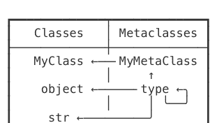
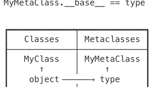
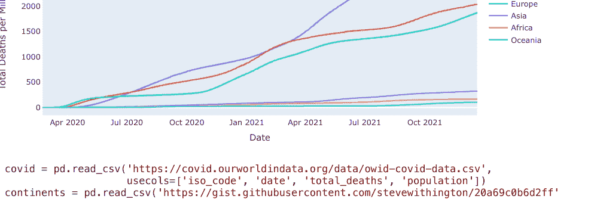
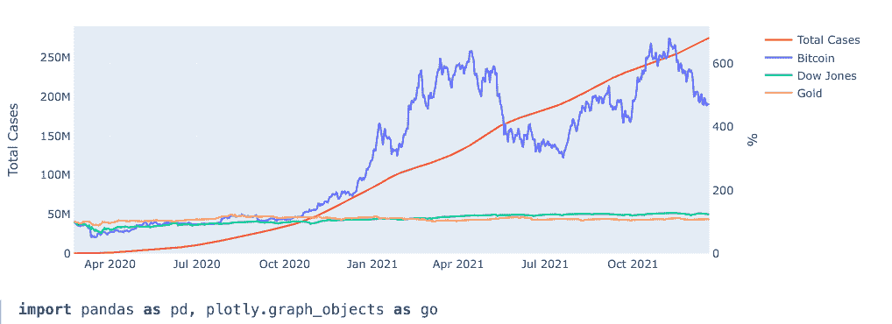

# 综合 Python 速查表

## 目录

```
ToC = {
    '1. 集合类型': [列表, 字典, 集合, 元组, 范围, 枚举, 迭代器, 生成器],
    '2. 类型':     [类型, 字符串, 正则表达式, 格式化, 数字, 组合数学, 日期时间],
    '3. 语法':     [参数, 内联, 导入, 装饰器, 类, 鸭子类型, 枚举, 异常],
    '4. 系统':     [退出, 打印, 输入, 命令行参数, 打开, 路径, 操作系统命令],
    '5. 数据':     [JSON, Pickle, CSV, SQLite, 字节, 结构体, 数组, 内存视图, 双端队列],
    '6. 高级':     [线程, 运算符, 自省, 元编程, 求值, 协程],
    '7. 库':       [进度条, 绘图, 表格, 终端控制, 日志, 网页抓取, Web, 性能分析],
    '8. 多媒体':   [NumPy, 图像, 动画, 音频, Pygame, Pandas, Plotly, PySimpleGUI]
}
```

## 主程序

```
if __name__ == '__main__':    # 如果文件未被导入，则运行 main()。
    main()
```

## 列表

```
<列表> = <列表>[<切片>]              # 或：<列表>[起始索引（包含） : 结束索引（不包含） : ±步长]

<列表>.append(<元素>)                # 或：<列表> += [<元素>]
<列表>.extend(<集合>)                # 或：<列表> += <集合>

<列表>.sort()                        # 按升序排序。
<列表>.reverse()                     # 原地反转列表。
<列表> = sorted(<集合>)              # 返回一个新的已排序列表。
<迭代器> = reversed(<列表>)          # 返回反转迭代器。

元素总和      = sum(<集合>)
逐元素求和    = [sum(pair) for pair in zip(list_a, list_b)]
按第二项排序  = sorted(<集合>, key=lambda el: el[1])
按两项排序    = sorted(<集合>, key=lambda el: (el[1], el[0]))
扁平化列表    = list(itertools.chain.from_iterable(<列表>))
元素乘积      = functools.reduce(lambda out, el: out * el, <集合>)
字符列表      = list(<字符串>)
```

- 关于 `sorted()`、`min()` 和 `max()` 的详细信息，请参见 **可排序**。
- **运算符** 模块提供了 `itemgetter()` 和 `mul()` 函数，其功能与上述 **lambda** 表达式相同。

```
<列表>.insert(<整数>, <元素>)    # 在指定索引处插入元素，并将后续元素向右移动。
<元素>  = <列表>.pop([<整数>])  # 移除并返回指定索引处的元素，或从末尾移除。
<整数> = <列表>.count(<元素>)   # 返回出现次数。也适用于字符串。
<整数> = <列表>.index(<元素>)   # 返回第一次出现的索引，否则引发 ValueError。
<列表>.remove(<元素>)           # 移除第一次出现的元素，否则引发 ValueError。
<列表>.clear()                  # 移除所有元素。也适用于字典和集合。
```

## 字典

```
<视图> = <字典>.keys()                    # 反映更改的键集合。
<视图> = <字典>.values()                  # 反映更改的值集合。
<视图> = <字典>.items()                   # 反映更改的键值对元组集合。

值  = <字典>.get(键, 默认值=None)         # 如果键缺失，返回默认值。
值  = <字典>.setdefault(键, 默认值=None)  # 如果键缺失，返回并写入默认值。
<字典> = collections.defaultdict(<类型>)  # 返回一个默认值为 `<类型>()` 的字典。
<字典> = collections.defaultdict(lambda: 1) # 返回一个默认值为 1 的字典。

<字典> = dict(<集合>)                     # 从键值对集合创建字典。
<字典> = dict(zip(键列表, 值列表))        # 从两个集合创建字典。
<字典> = dict.fromkeys(键列表 [, 值])     # 从键集合创建字典。

<字典>.update(<字典>)                     # 添加项。替换具有匹配键的项。
值 = <字典>.pop(键)                       # 移除项，如果键缺失则引发 KeyError。
{k for k, v in <字典>.items() if v == 值} # 返回指向该值的键的集合。
{k: v for k, v in <字典>.items() if k in 键列表} # 返回按键过滤的字典。
```

### 计数器

```
>>> from collections import Counter
>>> colors = ['blue', 'blue', 'blue', 'red', 'red']
>>> counter = Counter(colors)
>>> counter['yellow'] += 1
Counter({'blue': 3, 'red': 2, 'yellow': 1})
>>> counter.most_common()[0]
('blue', 3)
```

### 集合

```
<集合> = set()                             # `{}` 返回一个字典。

<集合>.add(<元素>)                         # 或：<集合> |= {<元素>}
<集合>.update(<集合> [, ...])              # 或：<集合> |= <集合>

<集合>  = <集合>.union(<集合>)             # 或：<集合> | <集合>
<集合>  = <集合>.intersection(<集合>)      # 或：<集合> & <集合>
<集合>  = <集合>.difference(<集合>)        # 或：<集合> - <集合>
<集合>  = <集合>.symmetric_difference(<集合>) # 或：<集合> ^ <集合>
<布尔值> = <集合>.issubset(<集合>)         # 或：<集合> <= <集合>
<布尔值> = <集合>.issuperset(<集合>)       # 或：<集合> >= <集合>

<元素> = <集合>.pop()                      # 如果为空，引发 KeyError。
<集合>.remove(<元素>)                      # 如果缺失，引发 KeyError。
<集合>.discard(<元素>)                     # 不会引发错误。
```

### 冻结集合

- 不可变且可哈希。
- 这意味着它可以用作字典的键或集合的元素。

```
<冻结集合> = frozenset(<集合>)
```

## 元组

元组是不可变且可哈希的列表。

```
<元组> = ()
<元组> = (<元素>,)
<元组> = (<元素1>, <元素2> [, ...])
```

### 命名元组

具有命名元素的元组子类。

```
>>> from collections import namedtuple
>>> Point = namedtuple('Point', 'x y')
>>> p = Point(1, y=2)
Point(x=1, y=2)
>>> p[0]
1
>>> p.x
1
>>> getattr(p, 'y')
2
```

## 范围

不可变且可哈希的整数序列。

```
<范围> = range(结束)
<范围> = range(开始, 结束)
<范围> = range(开始, 结束, ±步长)
```

```
>>> [i for i in range(3)]
[0, 1, 2]
```

## 枚举

```
for i, el in enumerate(<集合> [, 起始索引]):
    ...
```

## 迭代器

```
<迭代器> = iter(<集合>)
<迭代器> = iter(<函数>, 结束值)
<元素>   = next(<迭代器> [, 默认值])
<列表>   = list(<迭代器>)
```

### 迭代工具

```
import itertools as it
```

```
<迭代器> = it.count(start=0, step=1)
<迭代器> = it.repeat(<元素> [, 次数])
<迭代器> = it.cycle(<集合>)
```

```
<迭代器> = it.chain(<集合>, <集合> [, ...])
<迭代器> = it.chain.from_iterable(<集合>)
```

```
<迭代器> = it.islice(<集合>, 结束值)
<迭代器> = it.islice(<集合>, 起始值（包含）, ...)
```

## 生成器

- 任何包含 `yield` 语句的函数都返回一个生成器。
- 生成器和迭代器可以互换使用。

```
def count(start, step):
    while True:
        yield start
        start += step
```

```
>>> counter = count(10, 2)
>>> next(counter), next(counter), next(counter)
(10, 12, 14)
```

## 类型

- 万物皆对象。
- 每个对象都有一个类型。
- 类型和类是同义词。

```
<类型> = type(<元素>)                # 或：<元素>.__class__
<布尔值> = isinstance(<元素>, <类型>)  # 或：issubclass(type(<元素>), <类型>)
```

```
>>> type('a'), 'a'.__class__, str
(<class 'str'>, <class 'str'>, <class 'str'>)
```

一些类型没有内置名称，因此必须导入：

```
from types import FunctionType, MethodType, LambdaType, GeneratorType, ModuleType
```

### 抽象基类

每个抽象基类都指定了一组虚拟子类。然后，这些类被 `isinstance()` 和 `issubclass()` 识别为 ABC 的子类，尽管它们实际上并不是。ABC 也可以手动决定一个特定类是否是其虚拟子类，通常基于该类实现了哪些方法。例如，Iterable ABC 查找 `iter()` 方法，而 Collection ABC 查找 `iter()`、`contains()` 和 `len()` 方法。

```
>>> from collections.abc import Iterable, Collection, Sequence
>>> isinstance([1, 2, 3], Iterable)
True
```

| | Iterable | Collection | Sequence |
|---|---|---|---|
| list, range, str | ✓ | ✓ | ✓ |
| dict, set | ✓ | ✓ | |
| iter | ✓ | | |

```
>>> from numbers import Number, Complex, Real, Rational, Integral
>>> isinstance(123, Number)
True
```

| | Number | Complex | Real | Rational | Integral |
|---|---|---|---|---|---|
| int | ✓ | ✓ | ✓ | ✓ | ✓ |
| fractions.Fraction | ✓ | ✓ | ✓ | ✓ | |
| float | ✓ | ✓ | ✓ | | |
| complex | ✓ | ✓ | | | |
| decimal.Decimal | ✓ | | | | |

## 字符串

不可变的字符序列。

```
<str>  = <str>.strip()                    # 去除字符串两端的所有空白字符。
<str>  = <str>.strip('<chars>')           # 去除指定的字符。另有 lstrip/rstrip() 方法。
```

```
<list> = <str>.split()                   # 按一个或多个空白字符分割。
<list> = <str>.split(sep=None, maxsplit=-1) # 按 'sep' 字符串分割，最多分割 'maxsplit' 次。
<list> = <str>.splitlines(keepends=False) # 按 [\n\r\f\v\x1c-\x1e\x85\u2028\u2029] 和 \r\n 分割。
<str>  = <str>.join(<coll_of_strings>)   # 使用字符串作为分隔符连接元素。
```

```
<bool> = <sub_str> in <str>              # 检查字符串是否包含子串。
<bool> = <str>.startswith(<sub_str>)     # 传入字符串元组以检查多个选项。
<bool> = <str>.endswith(<sub_str>)       # 传入字符串元组以检查多个选项。
<int>  = <str>.find(<sub_str>)           # 返回第一个匹配项的起始索引，若未找到则返回 -1。
<int>  = <str>.index(<sub_str>)          # 同上，但若未找到会引发 ValueError。
```

```
<str>  = <str>.lower()                   # 更改大小写。另有 upper/capitalize/title() 方法。
<str>  = <str>.replace(old, new [, count]) # 将 'old' 替换为 'new'，最多替换 'count' 次。
<str>  = <str>.translate(<table>)        # 使用 `str.maketrans(<dict>)` 生成转换表。
```

```
<str>  = chr(<int>)                      # 将整数转换为 Unicode 字符。
<int>  = ord(<str>)                      # 将 Unicode 字符转换为整数。
```

- 在比较可能包含如 'Ö' 等字符的字符串之前，请使用 'unicodedata.normalize("NFC", <str>)'，因为它们可能被存储为一个或两个字符。

## 属性方法

```
<bool> = <str>.isdecimal()               # 检查是否为 [0-9]。
<bool> = <str>.isdigit()                 # 检查是否为 [²³¹] 以及 isdecimal()。
<bool> = <str>.isnumeric()               # 检查是否为 [½²³] 以及 isdigit()。
<bool> = <str>.isalnum()                 # 检查是否为 [a-zA-Z] 以及 isnumeric()。
<bool> = <str>.isprintable()             # 检查是否为 [ !#$%...] 以及 isalnum()。
<bool> = <str>.isspace()                 # 检查是否为 [ \t\n\r\f\v\x1c-\x1f\x85\xa0...]。
```

## 正则表达式

用于正则表达式匹配的函数。

```
import re
```

```
<str>   = re.sub(<regex>, new, text, count=0)  # 用 'new' 替换所有出现项。
<list>  = re.findall(<regex>, text)            # 将所有出现项作为字符串返回。
<list>  = re.split(<regex>, text, maxsplit=0)  # 在正则表达式周围添加括号以包含匹配项。
<Match> = re.search(<regex>, text)             # 模式的第一个出现项或 None。
<Match> = re.match(<regex>, text)              # 仅在文本开头搜索。
<iter>  = re.finditer(<regex>, text)           # 将所有出现项作为 Match 对象返回。
```

- 参数 'new' 可以是一个接受 Match 对象并返回字符串的函数。
- 参数 'flags=re.IGNORECASE' 可与所有函数一起使用。
- 参数 'flags=re.MULTILINE' 使 '^' 和 '$' 匹配每行的开头/结尾。
- 参数 'flags=re.DOTALL' 使 '.' 也接受 '\n'。
- 使用 r'\1' 或 '\1' 进行反向引用（'\1' 返回八进制代码为 1 的字符）。
- 在 '*' 和 '+' 后添加 '?' 使其变为非贪婪模式。

## 匹配对象

```
<str>   = <Match>.group()                  # 返回整个匹配项。也等同于 group(0)。
<str>   = <Match>.group(1)                 # 返回第一个括号内的部分。
<tuple> = <Match>.groups()                 # 返回所有括号内的部分。
<int>   = <Match>.start()                  # 返回匹配项的起始索引。
<int>   = <Match>.end()                    # 返回匹配项的结束索引（不包含）。
```

## 特殊序列

```
'\d' == '[0-9]'                     # 匹配十进制数字。
'\w' == '[a-zA-Z0-9_]'              # 匹配字母数字和下划线。
'\s' == '[ \t\n\r\f\v]'             # 匹配空白字符。
```

- 默认情况下，匹配所有字母表中的十进制数字、字母数字和空白字符，除非使用 'flags=re.ASCII' 参数。
- 如上所述，它将所有特殊序列的匹配限制在前 128 个字符内，并阻止 '\s' 接受 '[\x1c-\x1f]'（所谓的分隔符字符）。
- 使用大写字母进行取反（与 ASCII 标志结合使用时，将匹配所有非 ASCII 字符）。

### 格式化

```
<str> = f'{<el_1>}, {<el_2>}'         # 花括号内也可以包含表达式。
<str> = '{}, {}'.format(<el_1>, <el_2>) # 或：'{0}, {a}'.format(<el_1>, a=<el_2>)
<str> = '%s, %s' % (<el_1>, <el_2>)     # 冗余且较差的 C 风格格式化。
```

### 示例

```
>>> Person = collections.namedtuple('Person', 'name height')
>>> person = Person('Jean-Luc', 187)
>>> f'{person.name} is {person.height / 100} meters tall.'
'Jean-Luc is 1.87 meters tall.'
```

## 通用选项

```
{el:<10}                             # '<el>       '
{el:^10}                             # '    <el>    '
{el:>10}                             # '       <el>'
{el:.<10}                            # '<el>.......'
{el:0}                               # '<el>'
```

- 选项可以动态生成：f'{<el>:{<str/int>}[...]}'。
- 在表达式中添加 '=' 会将其前置到输出：f'{1+1=}' 返回 '1+1=2'。
- 在表达式中添加 '!r' 会通过调用对象的 repr() 方法将其转换为字符串。

## 字符串

```
{'abcde':10}                        # 'abcde     '
{'abcde':10.3}                      # 'abc       '
{'abcde':.3}                        # 'abc'
{'abcde'!r:10}                      # "'abcde'   "
```

## 数字

```
{123456:10}                          # '    123456'
{123456:10,}                         # '   123,456'
{123456:10_}                         # '   123_456'
{123456:+10}                         # '   +123456'
{123456:=+10}                        # '+   123456'
{123456: }                           # ' 123456'
{-123456: }                          # '-123456'
```

## 浮点数

```
{1.23456:10.3}                       # '      1.23'
{1.23456:10.3f}                      # '     1.235'
{1.23456:10.3e}                      # ' 1.235e+00'
{1.23456:10.3%}                      # '  123.456%'
```

表示类型的比较：

| | {<float>} | {<float>:f} | {<float>:e} | {<float>:%} |
|---|---|---|---|---|
| 0.000056789 | '5.6789e-05' | '0.000057' | '5.678900e-05' | '0.005679%' |
| 0.00056789 | '0.00056789' | '0.000568' | '5.678900e-04' | '0.056789%' |
| 0.0056789 | '0.0056789' | '0.005679' | '5.678900e-03' | '0.567890%' |
| 0.056789 | '0.056789' | '0.056789' | '5.678900e-02' | '5.678900%' |
| 0.56789 | '0.56789' | '0.567890' | '5.678900e-01' | '56.789000%' |
| 5.6789 | '5.6789' | '5.678900' | '5.678900e+00' | '567.890000%' |
| 56.789 | '56.789' | '56.789000' | '5.678900e+01' | '5678.900000%' |

| | {<float>:.2} | {<float>:.2f} | {<float>:.2e} | {<float>:.2%} |
|---|---|---|---|---|
| 0.000056789 | '5.7e-05' | '0.00' | '5.68e-05' | '0.01%' |
| 0.00056789 | '0.00057' | '0.00' | '5.68e-04' | '0.06%' |
| 0.0056789 | '0.0057' | '0.01' | '5.68e-03' | '0.57%' |
| 0.056789 | '0.057' | '0.06' | '5.68e-02' | '5.68%' |
| 0.56789 | '0.57' | '0.57' | '5.68e-01' | '56.79%' |
| 5.6789 | '5.7' | '5.68' | '5.68e+00' | '567.89%' |
| 56.789 | '5.7e+01' | '56.79' | '5.68e+01' | '5678.90%' |

- '{<float>:g}' 是 '{<float>:.6}' 的变体，会去除末尾的零，且指数从 '1e+06' 开始。
- 当向上舍入和向下舍入都有可能时，会选择使最后一位数字为偶数的结果。这使得 '{6.5:.0f}' 为 '6'，而 '{7.5:.0f}' 为 '8'。
- 此规则仅影响可以精确表示的浮点数（.5, .25, ...）。

## 整数

```
{90:c}                    # 'Z'
{90:b}                    # '1011010'
{90:X}                    # '5A'
```

## 数字

```
<int>     = int(<float/str/bool>)           # 或：math.floor(<float>)
<float>   = float(<int/str/bool>)           # 或：<int/float>e±<int>
<complex> = complex(real=0, imag=0)         # 或：<int/float> ± <int/float>j
<Fraction> = fractions.Fraction(0, 1)       # 或：Fraction(numerator=0, denominator=1)
<Decimal> = decimal.Decimal(<str/int>)      # 或：Decimal((sign, digits, exponent))
```

- 'int(<str>)' 和 'float(<str>)' 在字符串格式错误时会引发 ValueError。
- 十进制数字是精确存储的，不像大多数浮点数那样 '1.1 + 2.2 != 3.3'。
- 浮点数可以使用以下方式比较：'math.isclose(<float>, <float>)'。
- 十进制运算的精度通过以下方式设置：'decimal.getcontext().prec = <int>'。

## 基本函数

```
<num> = pow(<num>, <num>)                   # 或：<num> ** <num>
<num> = abs(<num>)                          # <float> = abs(<complex>)
<num> = round(<num> [, ±ndigits])           # `round(126, -1) == 130`
```

## 数学

```
from math import e, pi, inf, nan, isinf, isnan   # `<el> == nan` 始终为 False。
from math import sin, cos, tan, asin, acos, atan  # 另有：degrees, radians。
from math import log, log10, log2                 # log 可以接受底数作为第二个参数。
```

## 统计

```
from statistics import mean, median, variance    # 另有：stdev, quantiles, groupby。
```

## 随机数

```
from random import random, randint, choice
<float> = random()
<int>   = randint(from_inc, to_inc)
<el>    = choice(<sequence>)
```

```
# 还有：shuffle, gauss, triangular, seed。
# 一个在 [0, 1) 范围内的浮点数。
# 一个在 [from_inc, to_inc] 范围内的整数。
# 保持序列不变。
```

## 二进制，十六进制

```
<int> = ±0b<bin>
<int> = int('±<bin>', 2)
<int> = int('±0b<bin>', 0)
<str> = bin(<int>)
```

```
# 或：±0x<hex>
# 或：int('±<hex>', 16)
# 或：int('±0x<hex>', 0)
# 返回 '[-]0b<bin>'。
```

## 位运算符

```
<int> = <int> & <int>
<int> = <int> | <int>
<int> = <int> ^ <int>
<int> = <int> << n_bits
<int> = ~<int>
```

```
# 与 (0b1100 & 0b1010 == 0b1000)。
# 或 (0b1100 | 0b1010 == 0b1110)。
# 异或 (0b1100 ^ 0b1010 == 0b0110)。
# 左移。使用 >> 进行右移。
# 非。也等同于 -<int> - 1。
```

## 组合数学

```
import itertools as it
```

```
>>> list(it.product([0, 1], repeat=3))
[(0, 0, 0), (0, 0, 1), (0, 1, 0), (0, 1, 1),
 (1, 0, 0), (1, 0, 1), (1, 1, 0), (1, 1, 1)]
```

```
>>> list(it.product('abc', 'abc'))
[('a', 'a'), ('a', 'b'), ('a', 'c'),
 ('b', 'a'), ('b', 'b'), ('b', 'c'),
 ('c', 'a'), ('c', 'b'), ('c', 'c')]
```

```
# a b c
# a x x x
# b x x x
# c x x x
```

```
>>> list(it.combinations('abc', 2))
[('a', 'b'), ('a', 'c'),
 ('b', 'c')]
```

```
# a b c
# a . x x
# b . . x
```

```
>>> list(it.combinations_with_replacement('abc', 2))
[('a', 'a'), ('a', 'b'), ('a', 'c'),
 ('b', 'b'), ('b', 'c'),
 ('c', 'c')]
```

```
# a b c
# a x x x
# b . x x
# c . . x
```

```
>>> list(it.permutations('abc', 2))
[('a', 'b'), ('a', 'c'),
 ('b', 'a'), ('b', 'c'),
 ('c', 'a'), ('c', 'b')]
```

```
# a b c
# a . x x
# b x . x
# c x x .
```

## 日期时间

提供 'date'、'time'、'datetime' 和 'timedelta' 类。所有类都是不可变且可哈希的。

```
# pip3 install python-dateutil
from datetime import date, time, datetime, timedelta, timezone
from dateutil.tz import tzlocal, gettz
```

```
<D>  = date(year, month, day)
<T>  = time(hour=0, minute=0, second=0)
<DT> = datetime(year, month, day, hour=0)
<TD> = timedelta(weeks=0, days=0, hours=0)
```

```
# 仅接受公元 1 年至 9999 年的有效日期。
# 还有：`microsecond=0, tzinfo=None, fold=0`。
# 还有：`minute=0, second=0, microsecond=0, ...`。
# 还有：`minutes=0, seconds=0, microseconds=0`。
```

- 有时区信息的 <a> time 和 datetime 对象具有已定义的时区，而无时区信息的 <n> 对象则没有。如果对象是无时区信息的，则假定其处于系统时区！
- 'fold=1' 表示在时间回跳一小时的情况下进行第二次传递。
- Timedelta 将参数规范化为 ±天、秒（< 86400）和微秒（< 1M）。
- 使用 '<D/DT>.weekday()' 获取星期几的整数表示，其中星期一为 0。

### 当前时间

```
<D/DTn> = D/DT.today()                     # 当前本地日期或无时区信息的 DT。也包括 DT.now()。
<DTa>    = DT.now(<tzinfo>)                 # 从指定时区的当前时间获取有时区信息的 DT。
```

- 要提取时间，请使用 '<DTn>.time()'、'<DTa>.time()' 或 '<DTa>.timetz()'。

### 时区

```
<tzinfo> = timezone.utc                     # 伦敦时间，不考虑夏令时 (DST)。
<tzinfo> = timezone(<timedelta>)             # 与 UTC 有固定偏移的时区。
<tzinfo> = tzlocal()                         # 具有动态偏移的本地时区。也包括 gettz()。
<tzinfo> = gettz('<Continent>/<City>')        # 'Continent/City_Name' 时区或 None。
<DTa>    = <DT>.astimezone([<tzinfo>])        # 将 DT 转换为指定的或本地的固定时区。
<Ta/DTa> = <T/DT>.replace(tzinfo=<tzinfo>)    # 更改对象的时区而不进行转换。
```

- gettz()、tzlocal() 返回的时区以及无时区对象的隐式本地时区，其偏移量会因夏令时和时区基础偏移的历史变化而随时间变化。
- 在 Python 3.9 及更高版本中，可以使用标准库的 zoneinfo.ZoneInfo() 代替 gettz()。在 Windows 上需要 'tzdata' 包。如果省略参数，它不会返回本地时区。

### 编码

```
<D/T/DT> = D/T/DT.fromisoformat(<str>)       # 从 ISO 字符串创建对象。引发 ValueError。
<DT>      = DT.strptime(<str>, '<format>')    # 根据格式从字符串创建 datetime。
<D/DTn>   = D/DT.fromordinal(<int>)          # 从格里高利历元年元旦以来的天数创建 D/DTn。
<DTn>     = DT.fromtimestamp(<float>)        # 从纪元以来的秒数创建本地时间 DTn。
<DTa>     = DT.fromtimestamp(<float>, <tz>)   # 从纪元以来的秒数创建有时区信息的 datetime。
```

- ISO 字符串有以下形式：'YYYY-MM-DD'、'HH:MM:SS.mmmuuu[±HH:MM]'，或两者由任意字符分隔。小时之后的所有部分都是可选的。
- Python 使用 Unix 纪元：'1970-01-01 00:00 UTC'、'1970-01-01 01:00 CET'，...

### 解码

```
<str>    = <D/T/DT>.isoformat(sep='T')        # 还有 `timespec='auto/hours/minutes/seconds/...'`。
<str>    = <D/T/DT>.strftime('<format>')       # 对象的自定义字符串表示。
<int>    = <D/DT>.toordinal()                 # 自格里高利历元年元旦以来的天数，忽略时间和时区。
<float>  = <DTn>.timestamp()                  # 从本地时区的 DTn 获取纪元以来的秒数。
<float>  = <DTa>.timestamp()                  # 从有时区信息的 datetime 获取纪元以来的秒数。
```

### 格式化

```
>>> dt = datetime.strptime('2025-08-14 23:39:00.00 +0200', '%Y-%m-%d %H:%M:%S.%f %z')
>>> dt.strftime("%dth of %B '%y (%a), %I:%M %p %Z")
"14th of August '25 (Thu), 11:39 PM UTC+02:00"
```

## 参数

### 函数调用内部

```
func(<positional_args>)                  # func(0, 0)
func(<keyword_args>)                     # func(x=0, y=0)
func(<positional_args>, <keyword_args>)  # func(0, y=0)
```

### 函数定义内部

```
def func(<nondefault_args>): ...                  # def func(x, y): ...
def func(<default_args>): ...                     # def func(x=0, y=0): ...
def func(<nondefault_args>, <default_args>): ...  # def func(x, y=0): ...
```

- 默认值在函数首次在作用域中遇到时求值。
- 对可变默认值的任何修改都将在调用之间持续存在！

## 星号运算符

### 函数调用内部

星号将集合展开为位置参数，而双星号将字典展开为关键字参数。

```
args   = (1, 2)
kwargs = {'x': 3, 'y': 4, 'z': 5}
func(*args, **kwargs)
```

等同于：

```
func(1, 2, x=3, y=4, z=5)
```

### 函数定义内部

星号将零个或多个位置参数组合成一个元组，而双星号将零个或多个关键字参数组合成一个字典。

```
def add(*a):
    return sum(a)
```

```
>>> add(1, 2, 3)
6
```

合法的参数组合：

```
def f(*args): ...                  # f(1, 2, 3)
def f(x, *args): ...               # f(1, 2, 3)
def f(*args, z): ...               # f(1, 2, z=3)

def f(**kwargs): ...                # f(x=1, y=2, z=3)
def f(x, **kwargs): ...             # f(x=1, y=2, z=3) | f(1, y=2, z=3)

def f(*args, **kwargs): ...         # f(x=1, y=2, z=3) | f(1, y=2, z=3) | f(1, 2, z=3) | f(1, 2, 3)
def f(x, *args, **kwargs): ...      # f(x=1, y=2, z=3) | f(1, y=2, z=3) | f(1, 2, z=3) | f(1, 2, 3)
def f(*args, y, **kwargs): ...      # f(x=1, y=2, z=3) | f(1, y=2, z=3)

def f(*, x, y, z): ...              # f(x=1, y=2, z=3)
def f(x, *, y, z): ...              # f(x=1, y=2, z=3) | f(1, y=2, z=3)
def f(x, y, *, z): ...              # f(x=1, y=2, z=3) | f(1, y=2, z=3) | f(1, 2, z=3)
```

### 其他用途

```
<list> = [*<coll.> [, ...]]    # 或：list(<collection>) [+ ...]
<tuple> = (*<coll.>, [...])    # 或：tuple(<collection>) [+ ...]
<set>   = {*<coll.> [, ...]}   # 或：set(<collection>) [| ...]
<dict>  = {**<dict> [, ...]}   # 或：dict(**<dict> [, ...])

head, *body, tail = <coll.>    # 头部或尾部可以省略。
```

### 内联

### Lambda

```
<func> = lambda: <return_value>                  # 单语句函数。
<func> = lambda <arg_1>, <arg_2>: <return_value>  # 也接受默认参数。
```

### 推导式

```
<list> = [i+1 for i in range(10)]                 # 或：[1, 2, ..., 10]
<iter> = (i for i in range(10) if i > 5)          # 或：iter([6, 7, 8, 9])
<set>  = {i+5 for i in range(10)}                 # 或：{5, 6, ..., 14}
<dict> = {i: i*2 for i in range(10)}              # 或：{0: 0, 1: 2, ..., 9: 18}

>>> [l+r for l in 'abc' for r in 'abc']
['aa', 'ab', 'ac', ..., 'cc']
```

### Map, Filter, Reduce

```
from functools import reduce

<iter> = map(lambda x: x + 1, range(10))          # 或：iter([1, 2, ..., 10])
<iter> = filter(lambda x: x > 5, range(10))      # 或：iter([6, 7, 8, 9])
<obj>  = reduce(lambda out, x: out + x, range(10)) # 或：45
```

### Any, All

```
<bool> = any(<collection>)                        # 是否有任意元素的 `bool(<el>)` 为 True。
<bool> = all(<collection>)                        # 是否所有元素都为 True，或为空。
```

### 条件表达式

```
<obj> = <exp> if <condition> else <exp>           # 只求值一个表达式。

>>> [a if a else 'zero' for a in (0, 1, 2, 3)]    # `any([0, '', [], None]) == False`
['zero', 1, 2, 3]
```

## 导入

```python
import <module>           # 导入内置模块或 '<module>.py' 文件。
import <package>          # 导入内置包或 '<package>/__init__.py' 文件。
import <package>.<module> # 导入内置包中的模块或 '<package>/<module>.py' 文件。
```

- 包是模块的集合，但它也可以定义自己的对象。
- 在文件系统中，这对应于一个包含 Python 文件的目录，以及一个可选的初始化脚本。
- 运行 `import <package>` 不会自动提供对包内模块的访问，除非这些模块在其初始化脚本中被显式导入。

## 闭包

在 Python 中，当我们满足以下条件时，就得到了一个闭包：

- 一个嵌套函数引用了其外层函数的一个值，并且
- 外层函数返回了这个嵌套函数。

```python
def get_multiplier(a):
    def out(b):
        return a * b
    return out
```

```python
>>> multiply_by_3 = get_multiplier(3)
>>> multiply_by_3(10)
30
```

- 如果外层函数内的多个嵌套函数引用了同一个值，那么该值将被共享。
- 要动态访问函数的第一个自由变量，请使用 `<function>.__closure__[0].cell_contents`。

## 偏函数

```python
from functools import partial
<function> = partial(<function> [, <arg_1>, <arg_2>, ...])
```

```python
>>> def multiply(a, b):
...     return a * b
>>> multiply_by_3 = partial(multiply, 3)
>>> multiply_by_3(10)
30
```

- 偏函数在需要将函数作为参数传递的情况下也很有用，因为它允许我们预先设置其参数。
- 一些例子包括：`defaultdict(<func>)`、`iter(<func>, to_exc)` 以及数据类的 `field(default_factory=<func>)`。

## 非局部变量

如果变量在作用域内的任何地方被赋值，它就被视为局部变量，除非它被声明为 `global` 或 `nonlocal`。

```python
def get_counter():
    i = 0
    def out():
        nonlocal i
        i += 1
        return i
    return out
```

```python
>>> counter = get_counter()
>>> counter(), counter(), counter()
(1, 2, 3)
```

## 装饰器

- 装饰器接收一个函数，添加一些功能，然后返回它。
- 它可以是任何可调用对象，但通常实现为一个返回闭包的函数。

```python
@decorator_name
def function_that_gets_passed_to_decorator():
    ...
```

## 调试器示例

一个在每次函数调用时打印函数名称的装饰器。

```python
from functools import wraps

def debug(func):
    @wraps(func)
    def out(*args, **kwargs):
        print(func.__name__)
        return func(*args, **kwargs)
    return out

@debug
def add(x, y):
    return x + y
```

- `wraps` 是一个辅助装饰器，它将被装饰函数（`func`）的元数据复制到它所包装的函数（`out`）上。
- 如果没有它，`add.__name__` 将返回 `'out'`。

## LRU 缓存

一个缓存函数返回值的装饰器。函数的所有参数必须是可哈希的。

```python
from functools import lru_cache

@lru_cache(maxsize=None)
def fib(n):
    return n if n < 2 else fib(n-2) + fib(n-1)
```

- 缓存的默认大小是 128 个值。传递 `maxsize=None` 使其无界。
- CPython 解释器默认将递归深度限制为 1000。要增加它，请使用 `sys.setrecursionlimit(<depth>)`。

## 参数化装饰器

一个接受参数并返回一个接受函数的普通装饰器的装饰器。

```python
from functools import wraps

def debug(print_result=False):
    def decorator(func):
        @wraps(func)
        def out(*args, **kwargs):
            result = func(*args, **kwargs)
            print(func.__name__, result if print_result else '')
            return result
        return out
    return decorator

@debug(print_result=True)
def add(x, y):
    return x + y
```

- 在这里只使用 `@debug` 来装饰 `add()` 函数将不起作用，因为 `debug` 会将 `add()` 函数作为 `print_result` 参数接收。然而，装饰器可以手动检查它接收的参数是否是一个函数，并相应地采取行动。

## 类

```python
class <name>:
    def __init__(self, a):
        self.a = a
    def __repr__(self):
        class_name = self.__class__.__name__
        return f'{class_name}({self.a!r})'
    def __str__(self):
        return str(self.a)

    @classmethod
    def get_class_name(cls):
        return cls.__name__
```

- `repr()` 的返回值应该是明确的，而 `str()` 的返回值应该是可读的。
- 如果只定义了 `repr()`，它也将用于 `str()`。
- 用 `@staticmethod` 装饰的方法不接收 `self` 或 `cls` 作为其第一个参数。

调用 `str()` 方法的表达式：

```python
print(<el>)
f'{<el>}'
logging.warning(<el>)
csv.writer(<file>).writerow([<el>])
raise Exception(<el>)
```

调用 `repr()` 方法的表达式：

```python
print/str/repr([<el>])
print/str/repr({<el>: <el>})
f'{<el>!r}'
Z = dataclasses.make_dataclass('Z', ['a']); print/str/repr(Z(<el>))
>>> <el>
```

### 构造函数重载

```python
class <name>:
    def __init__(self, a=None):
        self.a = a
```

### 继承

```python
class Person:
    def __init__(self, name, age):
        self.name = name
        self.age = age

class Employee(Person):
    def __init__(self, name, age, staff_num):
        super().__init__(name, age)
        self.staff_num = staff_num
```

### 多重继承

```python
class A: pass
class B: pass
class C(A, B): pass
```

MRO（方法解析顺序）决定了在搜索方法或属性时遍历父类的顺序：

```python
>>> C.mro()
[<class 'C'>, <class 'A'>, <class 'B'>, <class 'object'>]
```

## 属性

实现 getter 和 setter 的 Pythonic 方式。

```python
class Person:
    @property
    def name(self):
        return ' '.join(self._name)

    @name.setter
    def name(self, value):
        self._name = value.split()
```

```python
>>> person = Person()
>>> person.name = '\t Guido  van Rossum \n'
>>> person.name
'Guido van Rossum'
```

## 数据类

一个自动生成 `init()`、`repr()` 和 `eq()` 特殊方法的装饰器。

```python
from dataclasses import dataclass, field

@dataclass(order=False, frozen=False)
class <class_name>:
    <attr_name>: <type>
    <attr_name>: <type> = <default_value>
    <attr_name>: list/dict/set = field(default_factory=list/dict/set)
```

- 可以通过 `order=True` 使对象可排序，通过 `frozen=True` 使其不可变。
- 要使对象可哈希，所有属性必须是可哈希的，并且 `frozen` 必须为 `True`。
- 需要 `field()` 函数，因为 `<attr_name>: list = []` 会创建一个在所有实例之间共享的列表。其 `default_factory` 参数可以是任何可调用对象。
- 对于任意类型的属性，请使用 `typing.Any`。

内联方式：

```python
from dataclasses import make_dataclass
<class> = make_dataclass('<class_name>', <coll_of_attribute_names>)
<class> = make_dataclass('<class_name>', <coll_of_tuples>)
<tuple> = ('<attr_name>', <type> [, <default_value>])
```

其余的类型注解（CPython 解释器会忽略它们）：

```python
import collections.abc as abc, typing as tp
<var_name>: list/set/abc.Iterable/abc.Sequence/tp.Optional[<type>] [= <obj>]
<var_name>: dict/tuple/tp.Union[<type>, ...] [= <obj>]
def func(<arg_name>: <type> [= <obj>]) -> <type>: ...
```

## 插槽

一种将对象限制为仅包含 `slots` 中列出的属性并显著减少其内存占用的机制。

```python
class MyClassWithSlots:
    __slots__ = ['a']
    def __init__(self):
        self.a = 1
```

## 鸭子类型

鸭子类型是一种隐式类型，它规定了一组特殊方法。任何定义了这些方法的对象都被视为该鸭子类型的成员。

## 可比较

- 如果未重写 `eq()` 方法，它返回 `id(self) == id(other)`，这与 `self is other` 相同。
- 这意味着所有对象默认比较不相等。
- 只有左侧对象会调用 `eq()` 方法，除非它返回 `NotImplemented`，在这种情况下会咨询右侧对象。如果两者都返回 `NotImplemented`，则返回 `False`。
- `ne()` 会自动在任何定义了 `eq()` 的对象上工作。

```python
class MyComparable:
    def __init__(self, a):
        self.a = a
    def __eq__(self, other):
        if isinstance(other, type(self)):
            return self.a == other.a
        return NotImplemented
```

## 可哈希

- 可哈希对象需要同时实现 `hash()` 和 `eq()` 方法，并且其哈希值应永不改变。
- 比较相等的可哈希对象必须具有相同的哈希值，这意味着返回 `id(self)` 的默认 `hash()` 将不起作用。
- 这就是为什么如果你只实现了 `eq()`，Python 会自动使类不可哈希。

```python
class MyHashable:
    def __init__(self, a):
        self._a = a
    @property
    def a(self):
        return self._a
    def __eq__(self, other):
        if isinstance(other, type(self)):
            return self.a == other.a
        return NotImplemented
    def __hash__(self):
        return hash(self.a)
```

## 可排序

- 使用 `total_ordering` 装饰器，你只需要提供 `eq()` 和 `lt()`、`gt()`、`le()` 或 `ge()` 中的一个特殊方法，其余的将自动生成。
- 函数 `sorted()` 和 `min()` 只需要 `lt()` 方法，而 `max()` 只需要 `gt()`。然而，最好将它们全部定义，以免在其他上下文中产生混淆。
- 当比较两个列表、字符串或数据类时，它们的值会按顺序比较，直到找到一对不相等的值。然后返回这两个值的比较结果。如果所有值都相等，则较短的序列被认为更小。
- 要获得正确的字母顺序，请在运行 `locale.setlocale(locale.LC_COLLATE, "en_US.UTF-8")` 后，将 `key=locale.strxfrm` 传递给 `sorted()`。

```python
from functools import total_ordering

@total_ordering
class MySortable:
    def __init__(self, a):
        self.a = a
    def __eq__(self, other):
        if isinstance(other, type(self)):
            return self.a == other.a
        return NotImplemented
    def __lt__(self, other):
        if isinstance(other, type(self)):
            return self.a < other.a
        return NotImplemented
```

## 迭代器

- 任何拥有 `next()` 和 `iter()` 方法的对象都是迭代器。
- `next()` 应返回下一个元素或引发 `StopIteration` 异常。
- `iter()` 应返回 'self'。

```python
class Counter:
    def __init__(self):
        self.i = 0
    def __next__(self):
        self.i += 1
        return self.i
    def __iter__(self):
        return self
```

```python
>>> counter = Counter()
>>> next(counter), next(counter), next(counter)
(1, 2, 3)
```

Python 有许多不同的迭代器对象：

- 由 `iter()` 函数返回的序列迭代器，例如 `list_iterator` 和 `set_iterator`。
- 由 `itertools` 模块返回的对象，例如 `count`、`repeat` 和 `cycle`。
- 由生成器函数和生成器表达式返回的生成器。
- 由 `open()` 函数返回的文件对象等。

## 可调用对象

- 所有函数和类都有一个 `__call__()` 方法，因此都是可调用的。
- 当本速查表使用 '<function>' 作为参数时，它实际上指的是 '<callable>'。

```python
class Counter:
    def __init__(self):
        self.i = 0
    def __call__(self):
        self.i += 1
        return self.i
```

```python
>>> counter = Counter()
>>> counter(), counter(), counter()
(1, 2, 3)
```

## 上下文管理器

- `with` 语句仅适用于具有 `__enter__()` 和 `__exit__()` 特殊方法的对象。
- `__enter__()` 应锁定资源并可选地返回一个对象。
- `__exit__()` 应释放资源。
- `with` 块内发生的任何异常都会传递给 `__exit__()` 方法。
- `__exit__()` 方法可以通过返回一个真值来抑制异常。

```python
class MyOpen:
    def __init__(self, filename):
        self.filename = filename
    def __enter__(self):
        self.file = open(self.filename)
        return self.file
    def __exit__(self, exc_type, exception, traceback):
        self.file.close()
```

```python
>>> with open('test.txt', 'w') as file:
...     file.write('Hello World!')
>>> with MyOpen('test.txt') as file:
...     print(file.read())
Hello World!
```

## 可迭代鸭子类型

### 可迭代对象

- 唯一必需的方法是 `__iter__()`。它应返回对象元素的迭代器。
- `__contains__()` 会自动在任何定义了 `__iter__()` 的对象上工作。

```python
class MyIterable:
    def __init__(self, a):
        self.a = a
    def __iter__(self):
        return iter(self.a)
    def __contains__(self, el):
        return el in self.a
```

```python
>>> obj = MyIterable([1, 2, 3])
>>> [el for el in obj]
[1, 2, 3]
>>> 1 in obj
True
```

### 集合

- 唯一必需的方法是 `__iter__()` 和 `__len__()`。`__len__()` 应返回元素的数量。
- 本速查表实际上在使用 '<collection>' 时指的是 '<iterable>'。
- 我选择不使用 'iterable' 这个名字，是因为它听起来比 'collection' 更吓人、更模糊。这个决定的唯一缺点是，读者可能会认为某个函数不接受迭代器，而实际上它接受，因为迭代器是唯一可迭代但不是集合的内置对象。

```python
class MyCollection:
    def __init__(self, a):
        self.a = a
    def __iter__(self):
        return iter(self.a)
    def __contains__(self, el):
        return el in self.a
    def __len__(self):
        return len(self.a)
```

### 序列

- 唯一必需的方法是 `__getitem__()` 和 `__len__()`。
- `__getitem__()` 应返回传入索引处的元素或引发 `IndexError`。
- `__iter__()` 和 `__contains__()` 会自动在任何定义了 `__getitem__()` 的对象上工作。
- `__reversed__()` 会自动在任何定义了 `__getitem__()` 和 `__len__()` 的对象上工作。

```python
class MySequence:
    def __init__(self, a):
        self.a = a
    def __iter__(self):
        return iter(self.a)
    def __contains__(self, el):
        return el in self.a
    def __len__(self):
        return len(self.a)
    def __getitem__(self, i):
        return self.a[i]
    def __reversed__(self):
        return reversed(self.a)
```

术语表定义与抽象基类之间的差异：

- 术语表将可迭代对象定义为任何具有 `__iter__()` 或 `__getitem__()` 的对象，将序列定义为任何具有 `__getitem__()` 和 `__len__()` 的对象。它没有定义集合。
- 将 ABC `Iterable` 传递给 `isinstance()` 或 `issubclass()` 会检查对象/类是否具有方法 `__iter__()`，而 ABC `Collection` 则检查 `__iter__()`、`__contains__()` 和 `__len__()`。

### ABC 序列

- 它是比基本序列更丰富的接口。
- 扩展它会生成 `__iter__()`、`__contains__()`、`__reversed__()`、`index()` 和 `count()`。
- 与 'abc.Iterable' 和 'abc.Collection' 不同，它不是鸭子类型。这就是为什么即使 MySequence 定义了所有方法，'issubclass(MySequence, abc.Sequence)' 也会返回 False。然而，它识别 `list`、`tuple`、`range`、`str`、`bytes`、`bytearray`、`array`、`memoryview` 和 `deque`，因为它们被注册为其虚拟子类。

```python
from collections import abc

class MyAbcSequence(abc.Sequence):
    def __init__(self, a):
        self.a = a
    def __len__(self):
        return len(self.a)
    def __getitem__(self, i):
        return self.a[i]
```

必需和自动可用的特殊方法表：

| | Iterable | Collection | Sequence | abc.Sequence |
|---|---|---|---|---|
| `__iter__()` | ! | ! | ✓ | ✓ |
| `__contains__()` | ✓ | ✓ | ✓ | ✓ |
| `__len__()` | | ! | ! | ! |
| `__getitem__()` | | | ! | ! |
| `__reversed__()` | | | ✓ | ✓ |
| `index()` | | | | ✓ |
| `count()` | | | | ✓ |

- 其他生成缺失方法的 ABC 有：`MutableSequence`、`Set`、`MutableSet`、`Mapping` 和 `MutableMapping`。
- 它们必需方法的名称存储在 '<abc>.__abstractmethods__' 中。

## 枚举

```python
from enum import Enum, auto

class <enum_name>(Enum):
    <member_name> = auto()
    <member_name> = <value>
    <member_name> = <value>, <value>
```

- 函数 `auto()` 返回上一个数值的增量或 1。
- 访问以保留关键字命名的成员会导致 `SyntaxError`。
- 方法接收调用它们的成员作为 'self' 参数。

```python
<member> = <enum>.<member_name>           # 返回一个成员。
<member> = <enum>['<member_name>']       # 返回一个成员。引发 KeyError。
<member> = <enum>(<value>)               # 返回一个成员。引发 ValueError。
<str>    = <member>.name                 # 返回成员的名称。
<obj>    = <member>.value                # 返回成员的值。

<list>   = list(<enum>)                  # 返回枚举的成员。
<list>   = [a.name for a in <enum>]      # 返回枚举的成员名称。
<list>   = [a.value for a in <enum>]     # 返回枚举的成员值。
<member> = random.choice(list(<enum>))   # 返回一个随机成员。
```

```python
def get_next_member(member):
    members = list(type(member))
    index = members.index(member) + 1
    return members[index % len(members)]
```

### 内联

```python
Cutlery = Enum('Cutlery', 'FORK KNIFE SPOON')
Cutlery = Enum('Cutlery', ['FORK', 'KNIFE', 'SPOON'])
Cutlery = Enum('Cutlery', {'FORK': 1, 'KNIFE': 2, 'SPOON': 3})
```

用户定义的函数不能作为值，因此必须包装：

```python
from functools import partial
LogicOp = Enum('LogicOp', {'AND': partial(lambda l, r: l and r),
                           'OR':  partial(lambda l, r: l or r)})
```

## 异常

```python
try:
    <code>
except <exception>:
    <code>
```

### 复杂示例

```python
try:
    <code_1>
except <exception_a>:
    <code_2_a>
except <exception_b>:
    <code_2_b>
else:
    <code_2_c>
finally:
    <code_3>
```

- 'else' 块内的代码仅在 'try' 块没有异常时执行。
- 'finally' 块内的代码将始终执行（除非收到信号）。
- 在已执行块中初始化的所有变量在所有后续块中以及 try/except 子句外部都可见（只有函数块界定作用域）。
- 要捕获信号，请使用 'signal.signal(signal_number, <func>)'。

### 捕获异常

```python
except <exception>: ...
except <exception> as <name>: ...
except (<exception>, [...]): ...
except (<exception>, [...]) as <name>: ...
```

- 也会捕获异常的子类。
- 使用 'traceback.print_exc()' 将错误消息打印到标准错误。
- 使用 'print(<name>)' 仅打印异常的原因（其参数）。
- 使用 'logging.exception(<message>)' 记录传递的消息，后跟捕获异常的完整错误消息。

### 引发异常

```python
raise <exception>
raise <exception>()
raise <exception>(<el> [, ...])
```

重新引发捕获的异常：

```python
except <exception> [as <name>]:
    ...
    raise
```

## 异常对象

```
arguments = <name>.args
exc_type  = <name>.__class__
filename  = <name>.__traceback__.tb_frame.f_code.co_filename
func_name = <name>.__traceback__.tb_frame.f_code.co_name
line      = linecache.getline(filename, <name>.__traceback__.tb_lineno)
trace_str = ''.join(traceback.format_tb(<name>.__traceback__))
error_msg = ''.join(traceback.format_exception(type(<name>), <name>, <name>.__traceback__))
```

## 内置异常

```
BaseException
├── SystemExit                  # 由 sys.exit() 函数引发。
├── KeyboardInterrupt           # 当用户按下中断键（ctrl-c）时引发。
└── Exception                   # 用户自定义异常应从此类派生。
    ├── ArithmeticError         # 算术错误的基类，如 ZeroDivisionError。
    ├── AssertionError          # 当 `assert <exp>` 表达式返回假值时引发。
    ├── AttributeError          # 当对象没有请求的属性/方法时引发。
    ├── EOFError                # 当 input() 遇到文件结束条件时引发。
    ├── LookupError             # 当集合无法找到项目时引发的错误的基类。
    │   ├── IndexError          # 当序列索引超出范围时引发。
    │   └── KeyError            # 当字典键或集合元素缺失时引发。
    ├── MemoryError             # 内存不足。可能为时已晚，无法开始删除变量。
    ├── NameError               # 当使用不存在的名称（变量/函数/类）时引发。
    │   └── UnboundLocalError   # 当在定义之前使用局部名称时引发。
    ├── OSError                 # 错误，如 FileExistsError/PermissionError（参见 #Open）。
    │   └── ConnectionError     # 错误，如 BrokenPipeError/ConnectionAbortedError。
    ├── RuntimeError            # 由不属于其他类别的错误引发。
    │   ├── NotImplementedError # 可由抽象方法或未完成的代码引发。
    │   └── RecursionError      # 当超过最大递归深度时引发。
    ├── StopIteration           # 当在空迭代器上运行 next() 时引发。
    ├── TypeError               # 当参数类型错误时引发。
    └── ValueError              # 当参数类型正确但值不恰当时引发。
```

## 集合及其异常：

| | List | Set | Dict |
|---|---|---|---|
| getitem() | IndexError | | KeyError |
| pop() | IndexError | KeyError | KeyError |
| remove() | ValueError | KeyError | |
| index() | ValueError | | |

## 有用的内置异常：

```
raise TypeError('参数类型错误！')
raise ValueError('参数类型正确但值不恰当！')
raise RuntimeError('以上都不是！')
```

## 用户自定义异常

```
class MyError(Exception): pass
class MyInputError(MyError): pass
```

## 退出

通过引发 SystemExit 异常来退出解释器。

```
import sys
sys.exit()                     # 以退出码 0（成功）退出。
sys.exit(<el>)                 # 打印到 stderr 并以 1 退出。
sys.exit(<int>)                # 以传递的退出码退出。
```

## 打印

```
print(<el_1>, ..., sep=' ', end='\n', file=sys.stdout, flush=False)
```

- 对于错误消息，使用 'file=sys.stderr'。
- 使用 'flush=True' 强制刷新流。

## 美化打印

```
from pprint import pprint
pprint(<collection>, width=80, depth=None, compact=False, sort_dicts=True)
```

- 比 'depth' 更深的层级将被 '...' 替换。

## 输入

从用户输入或管道（如果存在）读取一行。

```
<str> = input(prompt=None)
```

- 尾随换行符会被去除。
- 在读取输入之前，提示字符串会打印到标准输出。
- 当用户按下 EOF（ctrl-d/ctrl-z）或输入流耗尽时，引发 EOFError。

## 命令行参数

```
import sys
scripts_path = sys.argv[0]
arguments    = sys.argv[1:]
```

## 参数解析器

```
from argparse import ArgumentParser, FileType
p = ArgumentParser(description=<str>)
p.add_argument('-<short_name>', '--<name>', action='store_true')  # 标志。
p.add_argument('-<short_name>', '--<name>', type=<type>)          # 选项。
p.add_argument('<name>', type=<type>, nargs=1)                    # 第一个参数。
p.add_argument('<name>', type=<type>, nargs='+')                  # 剩余参数。
p.add_argument('<name>', type=<type>, nargs='*')                  # 可选参数。
args  = p.parse_args()                                           # 出错时退出。
value = args.<name>
```

- 使用 'help=<str>' 设置将在帮助消息中显示的参数描述。
- 使用 'default=<el>' 设置参数的默认值。
- 对于文件，使用 'type=FileType(<mode>)'。接受 'encoding'，但 'newline' 为 None。

## 打开

打开文件并返回相应的文件对象。

```
<file> = open(<path>, mode='r', encoding=None, newline=None)
```

- 'encoding=None' 表示使用默认编码，该编码取决于平台。最佳实践是尽可能使用 'encoding="utf-8"'。
- 'newline=None' 表示在读取时，所有不同的行尾组合都会转换为 '\n'，而在写入时，所有 '\n' 字符都会转换为系统默认的行分隔符。
- 'newline=""' 表示不进行转换，但输入仍然会被 readline() 和 readlines() 在每个 '\n'、'\r' 和 '\r\n' 处分割成块。

## 模式

- 'r' - 读取（默认）。
- 'w' - 写入（截断）。
- 'x' - 写入，如果文件已存在则失败。
- 'a' - 追加。
- 'w+' - 读写（截断）。
- 'r+' - 从开头读写。
- 'a+' - 从末尾读写。
- 't' - 文本模式（默认）。
- 'b' - 二进制模式（'br'、'bw'、'bx'、...）。

## 异常

- 使用 'r' 或 'r+' 读取时可能引发 'FileNotFoundError'。
- 使用 'x' 写入时可能引发 'FileExistsError'。
- 任何操作都可能引发 'IsADirectoryError' 和 'PermissionError'。
- 'OSError' 是所有列出异常的父类。

## 文件对象

```
<file>.seek(0)                        # 移动到文件开头。
<file>.seek(offset)                  # 从开头移动 'offset' 个字符/字节。
<file>.seek(0, 2)                    # 移动到文件末尾。
<bin_file>.seek(±offset, <anchor>)   # 锚点：0 开头，1 当前位置，2 末尾。

<str/bytes> = <file>.read(size=-1)   # 读取 'size' 个字符/字节或直到 EOF。
<str/bytes> = <file>.readline()      # 返回一行，或在 EOF 时返回空字符串/字节。
<list>       = <file>.readlines()    # 返回剩余行的列表。
<str/bytes> = next(<file>)           # 使用缓冲区返回一行。不要混合使用。

<file>.write(<str/bytes>)            # 写入字符串或字节对象。
<file>.writelines(<collection>)      # 写入字符串或字节对象的集合。
<file>.flush()                       # 刷新写缓冲区。每 4096/8192 字节运行一次。
```

- 方法不会添加或去除尾随换行符，即使是 writelines() 也不会。

## 从文件读取文本

```
def read_file(filename):
    with open(filename, encoding='utf-8') as file:
        return file.readlines()
```

## 将文本写入文件

```
def write_to_file(filename, text):
    with open(filename, 'w', encoding='utf-8') as file:
        file.write(text)
```

## 路径

```
import os, glob
from pathlib import Path

<str>  = os.getcwd()                  # 返回当前工作目录。
<str>  = os.path.join(<path>, ...)   # 连接两个或多个路径名组件。
<str>  = os.path.realpath(<path>)    # 解析符号链接并调用 path.abspath()。

<str>  = os.path.basename(<path>)    # 返回路径的最后一个组件。
<str>  = os.path.dirname(<path>)     # 返回不带最后一个组件的路径。
<tup.> = os.path.splitext(<path>)    # 在最后一个组件的最后一个句点处分割。

<list> = os.listdir(path='.')        # 返回位于路径的文件名。
<list> = glob.glob('<pattern>')      # 返回匹配通配符模式的路径。

<bool> = os.path.exists(<path>)    # 或：<Path>.exists()
<bool> = os.path.isfile(<path>)   # 或：<DirEntry/Path>.is_file()
<bool> = os.path.isdir(<path>)    # 或：<DirEntry/Path>.is_dir()

<stat> = os.stat(<path>)          # 或：<DirEntry/Path>.stat()
<real> = <stat>.st_mtime/st_size/... # 修改时间、字节大小等。
```

## DirEntry

与 listdir() 不同，scandir() 返回 DirEntry 对象，这些对象缓存了 isfile、isdir 信息，在 Windows 上还缓存了 stat 信息，从而显著提高了需要这些信息的代码的性能。

```
<iter> = os.scandir(path='.')      # 返回位于路径的 DirEntry 对象。
<str>  = <DirEntry>.path           # 以字符串形式返回整个路径。
<str>  = <DirEntry>.name           # 以字符串形式返回最后一个组件。
<file> = open(<DirEntry>)          # 打开文件并返回文件对象。
```

## Path 对象

```
<Path> = Path(<path> [, ...])     # 接受字符串、Path 和 DirEntry 对象。
<Path> = <path> / <path> [/ ...]  # 第一个或第二个路径必须是 Path 对象。
<Path> = <Path>.resolve()         # 返回解析了符号链接的绝对路径。

<Path> = Path()                   # 返回相对的 cwd。也是 Path('.')。
<Path> = Path.cwd()               # 返回绝对的 cwd。也是 Path().resolve()。
<Path> = Path.home()              # 返回用户的主目录（绝对路径）。
<Path> = Path(__file__).resolve() # 如果 cwd 未更改，则返回脚本的路径。

<Path> = <Path>.parent            # 返回不带最后一个组件的 Path。
<str>  = <Path>.name              # 以字符串形式返回最后一个组件。
<str>  = <Path>.stem              # 返回不带扩展名的最后一个组件。
<str>  = <Path>.suffix            # 返回最后一个组件的扩展名。
<tup.> = <Path>.parts             # 以字符串形式返回所有组件。

<iter> = <Path>.iterdir()         # 以 Path 对象形式返回目录内容。
<iter> = <Path>.glob('<pattern>') # 返回匹配通配符模式的 Path。

<str>  = str(<Path>)              # 以字符串形式返回路径。
<file> = open(<Path>)             # 也是 <Path>.read/write_text/bytes()。
```

## 操作系统命令

```
import os, shutil, subprocess

os.chdir(<path>)                  # 更改当前工作目录。
os.mkdir(<path>, mode=0o777)      # 创建目录。权限为八进制。
os.makedirs(<path>, mode=0o777)   # 创建路径的所有目录。也是 'exist_ok=False'。

shutil.copy(from, to)             # 复制文件。'to' 可以存在或是一个目录。
shutil.copy2(from, to)            # 同时复制创建和修改时间。
shutil.copytree(from, to)         # 复制目录。'to' 必须不存在。

os.rename(from, to)               # 重命名/移动文件或目录。
os.replace(from, to)              # 相同，但在 Windows 上也会覆盖文件 'to'。
shutil.move(from, to)             # 如果 'to' 是目录，则移动到其中的 rename()。

os.remove(<path>)                 # 删除文件。
os.rmdir(<path>)                  # 删除空目录。
shutil.rmtree(<path>)             # 删除目录。
```

- 路径可以是字符串、Path 或 DirEntry 对象。
- 函数通过引发 OSError 或其子类之一来报告与操作系统相关的错误。

## Shell 命令

```
<pipe> = os.popen('<command>')      # 在 sh/cmd 中执行命令。返回其标准输出管道。
<str>  = <pipe>.read(size=-1)      # 读取 'size' 个字符或直到 EOF。也可使用 readline/s()。
<int>  = <pipe>.close()            # 关闭管道。成功时返回 None（返回码 0）。
```

将 '1 + 1' 发送到基本计算器并捕获其输出：

```
>>> subprocess.run('bc', input='1 + 1\n', capture_output=True, text=True)
CompletedProcess(args='bc', returncode=0, stdout='2\n', stderr='')
```

将 test.in 发送到以标准模式运行的基本计算器，并将其输出保存到 test.out：

```
>>> from shlex import split
>>> os.popen('echo 1 + 1 > test.in')
>>> subprocess.run(split('bc -s'), stdin=open('test.in'), stdout=open('test.out', 'w'))
CompletedProcess(args=['bc', '-s'], returncode=0)
>>> open('test.out').read()
'2\n'
```

## JSON

用于存储字符串和数字集合的文本文件格式。

```
import json
<str>    = json.dumps(<object>)    # 将对象转换为 JSON 字符串。
<object> = json.loads(<str>)       # 将 JSON 字符串转换为对象。
```

### 从 JSON 文件读取对象

```
def read_json_file(filename):
    with open(filename, encoding='utf-8') as file:
        return json.load(file)
```

### 将对象写入 JSON 文件

```
def write_to_json_file(filename, an_object):
    with open(filename, 'w', encoding='utf-8') as file:
        json.dump(an_object, file, ensure_ascii=False, indent=2)
```

## Pickle

用于存储 Python 对象的二进制文件格式。

```
import pickle
<bytes>  = pickle.dumps(<object>)   # 将对象转换为字节对象。
<object> = pickle.loads(<bytes>)   # 将字节对象转换为对象。
```

## CSV

用于存储电子表格的文本文件格式。

```
import csv
```

### 读取

```
<reader> = csv.reader(<file>)       # 也可：`dialect='excel', delimiter=','`。
<list>    = next(<reader>)           # 将下一行作为字符串列表返回。
<list>    = list(<reader>)           # 返回剩余行的列表。
```

- 文件必须使用 `newline=''` 参数打开，否则嵌入在引号字段中的换行符将无法正确解释！
- 要将电子表格打印到控制台，请使用 Tabulate 库。
- 对于 XML 和二进制 Excel 文件（xlsx、xlsm 和 xlsb），请使用 Pandas 库。
- 读取器接受任何字符串迭代器，而不仅仅是文件。

### 写入

```
<writer> = csv.writer(<file>)       # 也可：`dialect='excel', delimiter=','`。
<writer>.writerow(<collection>)     # 使用 `str(<el>)` 编码对象。
<writer>.writerows(<coll_of_coll>)  # 追加多行。
```

- 文件必须使用 `newline=''` 参数打开，否则在使用 `\r\n` 行尾的平台上，每个 `\n` 前都会添加 `\r`！
- 使用 `mode="w"` 打开现有文件以覆盖它，或使用 `mode="a"` 追加到它。

## 参数

- `dialect` - 设置默认值的主参数。字符串或 `csv.Dialect` 对象。
- `delimiter` - 用于分隔字段的单字符字符串。
- `quotechar` - 用于引用包含特殊字符的字段的字符。
- `doublequote` - 字段内的引号字符是否被加倍或转义。
- `skipinitialspace` - 读取器是否剥离字段开头的空格字符。
- `lineterminator` - 写入器如何终止行。读取器硬编码为 `\n`、`\r`、`\r\n`。
- `quoting` - 0：根据需要，1：全部，2：除作为浮点数读取的数字外全部，3：无。
- `escapechar` - 如果 `doublequote` 为 False，则用于转义引号字符的字符。

### 方言

| | excel | excel-tab | unix |
|---|---|---|---|
| delimiter | `,` | `\t` | `,` |
| quotechar | `"` | `"` | `"` |
| doublequote | True | True | True |
| skipinitialspace | False | False | False |
| lineterminator | `\r\n` | `\r\n` | `\n` |
| quoting | 0 | 0 | 1 |
| escapechar | None | None | None |

### 从 CSV 文件读取行

```
def read_csv_file(filename, dialect='excel', **params):
    with open(filename, encoding='utf-8', newline='') as file:
        return list(csv.reader(file, dialect, **params))
```

### 将行写入 CSV 文件

```
def write_to_csv_file(filename, rows, mode='w', dialect='excel', **params):
    with open(filename, mode, encoding='utf-8', newline='') as file:
        writer = csv.writer(file, dialect, **params)
        writer.writerows(rows)
```

## SQLite

一个无服务器的数据库引擎，将每个数据库存储在单独的文件中。

```
import sqlite3
<conn> = sqlite3.connect(<path>)
<conn>.close()
```

### 读取

```
<cursor> = <conn>.execute('<query>')
<tuple>  = <cursor>.fetchone()
<list>   = <cursor>.fetchall()
```

### 写入

```
<conn>.execute('<query>')
<conn>.commit()
<conn>.rollback()
```

或：

```
with <conn>:
    <conn>.execute('<query>')
```

### 占位符

```
<conn>.execute('<query>', <list/tuple>)
<conn>.execute('<query>', <dict/namedtuple>)
<conn>.executemany('<query>', <coll_of_above>)
```

- 传递的值可以是 str、int、float、bytes、None、bool、datetime.date 或 datetime.datetime 类型。
- 布尔值将作为整数存储和返回，日期将作为 ISO 格式的字符串存储和返回。

### 示例

在此示例中，值实际上并未保存，因为省略了 `conn.commit()`！

```
>>> conn = sqlite3.connect('test.db')
>>> conn.execute('CREATE TABLE person (person_id INTEGER PRIMARY KEY, name, height)')
>>> conn.execute('INSERT INTO person VALUES (NULL, ?, ?)', ('Jean-Luc', 187)).lastrowid
1
>>> conn.execute('SELECT * FROM person').fetchall()
[(1, 'Jean-Luc', 187)]
```

### SqlAlchemy

```
# $ pip3 install sqlalchemy
from sqlalchemy import create_engine, text
<engine> = create_engine('<url>')
<conn>   = <engine>.connect()
<cursor> = <conn>.execute(text('<query>'), ...)
with <conn>.begin(): ...
```

| 方言 | pip3 install | import | 依赖项 |
| --- | --- | --- | --- |
| mysql | mysqlclient | MySQLdb | www.pypi.org/project/mysqlclient |
| postgresql | psycopg2 | psycopg2 | www.pypi.org/project/psycopg2 |
| mssql | pyodbc | pyodbc | www.pypi.org/project/pyodbc |
| oracle | oracledb | oracledb | www.pypi.org/project/oracledb |

## Bytes

字节对象是单个字节的不可变序列。可变版本称为 bytearray。

```
<bytes> = b'<str>'
<int>   = <bytes>[<index>]
<bytes> = <bytes>[<slice>]
<bytes> = <bytes>.join(<coll_of_bytes>)
```

### 编码

```
<bytes> = bytes(<coll_of_ints>)
<bytes> = bytes(<str>, 'utf-8')
<bytes> = <int>.to_bytes(n_bytes, ...)
<bytes> = bytes.fromhex('<hex>')
```

### 解码

```
<list>  = list(<bytes>)
<str>   = str(<bytes>, 'utf-8')
<int>   = int.from_bytes(<bytes>, ...)
'<hex>' = <bytes>.hex()
```

### 从文件读取字节

```
def read_bytes(filename):
    with open(filename, 'rb') as file:
        return file.read()
```

### 将字节写入文件

```
def write_bytes(filename, bytes_obj):
    with open(filename, 'wb') as file:
        file.write(bytes_obj)
```

## Struct

- 在数字序列和字节对象之间执行转换的模块。
- 默认使用系统的类型大小、字节顺序和对齐规则。

```
from struct import pack, unpack
<bytes> = pack('<format>', <el_1> [, ...])
<tuple> = unpack('<format>', <bytes>)
```

```
>>> pack('>hhl', 1, 2, 3)
b'\x00\x01\x00\x02\x00\x00\x03'
>>> unpack('>hhl', b'\x00\x01\x00\x02\x00\x00\x03')
(1, 2, 3)
```

### 格式

对于标准类型大小和手动对齐（填充），格式字符串以以下字符开头：

- '=' - 系统的字节顺序（通常是小端序）。
- '<' - 小端序。
- '>' - 大端序（也用 '!'）。

除了数字，pack() 和 unpack() 还支持字节对象作为序列的一部分：

- 'c' - 包含单个元素的字节对象。填充字节使用 'x'。
- '<n>s' - 包含 n 个元素的字节对象。

整数类型。无符号类型使用大写字母。最小和标准大小在括号中：

- 'b' - char (1/1)
- 'h' - short (2/2)
- 'i' - int (2/4)
- 'l' - long (4/4)
- 'q' - long long (8/8)

浮点类型（struct 始终使用标准大小）：

- 'f' - float (4/4)
- 'd' - double (8/8)

## Array

只能保存预定义类型数字的列表。可用类型及其最小字节大小如上所列。类型大小和字节顺序始终由系统决定，但每个元素的字节可以通过 byteswap() 方法交换。

```
from array import array
<array> = array('<typecode>', <collection>)    # 从数字集合创建数组。
<array> = array('<typecode>', <bytes>)        # 从字节对象创建数组。
<array> = array('<typecode>', <array>)        # 将数组视为数字序列。
<bytes> = bytes(<array>)                      # 或：<array>.tobytes()
<file>.write(<array>)                         # 将数组写入二进制文件。
```

## Memory View

- 指向另一个类字节对象内存的序列对象。
- 每个元素可以引用单个或多个连续字节，具体取决于格式。
- 元素的顺序和数量可以通过切片更改。
- 类型转换仅在 char 和其他类型之间有效，并使用系统大小。
- 字节顺序始终由系统决定。

```
<mview> = memoryview(<bytes/bytearray/array>)  # 如果是 bytes 则不可变，否则可变。
<real>  = <mview>[<index>]                     # 返回 int 或 float。
<mview> = <mview>[<slice>]                     # 重新排列元素的 mview。
<mview> = <mview>.cast('<typecode>')           # 将 memoryview 转换为新格式。
<mview>.release()                              # 释放对象的内存缓冲区。

<bytes> = bytes(<mview>)                       # 返回新的 bytes 对象。
<bytes> = <bytes>.join(<coll_of_mviews>)       # 使用 bytes 对象作为分隔符连接 mviews。
<array> = array('<typecode>', <mview>)         # 将 mview 视为数字序列。
<file>.write(<mview>)                          # 将 mview 写入二进制文件。

<list>  = list(<mview>)                        # 返回 int 或 float 的列表。
<str>   = str(<mview>, 'utf-8')                # 将 mview 视为 bytes 对象。
<int>   = int.from_bytes(<mview>, ...)         # `byteorder='big/little', signed=False`。
'<hex>' = <mview>.hex()                        # 将 mview 视为 bytes 对象。
```

## Deque

一个线程安全的列表，支持从任一端高效地追加和弹出。发音为 "deck"。

```
from collections import deque
<deque> = deque(<collection>)                  # 也可 `maxlen=None`。
<deque>.appendleft(<el>)                       # 如果已满，则丢弃对侧元素。
<deque>.extendleft(<collection>)               # 集合会被反转。
<el> = <deque>.popleft()                       # 如果为空则引发 IndexError。
<deque>.rotate(n=1)                            # 将元素向右旋转。
```

## 线程

CPython 解释器一次只能运行一个线程。使用多个线程并不会加快执行速度，除非其中至少一个线程包含 I/O 操作。

```python
from threading import Thread, Timer, RLock, Semaphore, Event, Barrier
from concurrent.futures import ThreadPoolExecutor, as_completed
```

## 线程

```python
<Thread> = Thread(target=<function>)          # 使用 `args=<collection>` 来设置参数。
<Thread>.start()                             # 启动线程。
<bool> = <Thread>.is_alive()                 # 检查线程是否已完成执行。
<Thread>.join()                              # 等待线程完成。
```

- 使用 `kwargs=<dict>` 向函数传递关键字参数。
- 使用 `daemon=True`，否则程序将无法在线程存活时退出。
- 要延迟线程执行，请使用 `Timer(seconds, <func>)` 代替 Thread()。

## 锁

```python
<lock> = RLock()                             # 只能由获取者释放的锁。
<lock>.acquire()                             # 等待锁可用。
<lock>.release()                             # 使锁再次可用。
```

或者：

```python
with <lock>:                                 # 通过调用 acquire() 进入代码块，
    ...                                      # 并通过 release() 退出，即使在错误时也是如此。
```

## 信号量、事件、屏障

```python
<Semaphore> = Semaphore(value=1)             # 可被 'value' 个线程获取的锁。
<Event>      = Event()                       # wait() 方法会阻塞，直到调用 set()。
<Barrier>    = Barrier(n_times)              # wait() 会阻塞，直到被调用 n_times 次。
```

## 队列

```python
<Queue> = queue.Queue(maxsize=0)             # 一个线程安全的先进先出队列。
<Queue>.put(<el>)                            # 阻塞，直到队列不再满。
<Queue>.put_nowait(<el>)                     # 如果队列已满，则引发 queue.Full 异常。
<el> = <Queue>.get()                         # 阻塞，直到队列不再空。
<el> = <Queue>.get_nowait()                  # 如果队列为空，则引发 queue.Empty 异常。
```

## 线程池执行器

```python
<Exec> = ThreadPoolExecutor(max_workers=None) # 或者：`with ThreadPoolExecutor() as <name>: ...`
<iter> = <Exec>.map(<func>, <args_1>, ...)    # 多线程且非惰性的 map()。保持顺序。
<Futr> = <Exec>.submit(<func>, <arg_1>, ...) # 创建一个线程并返回其 Future 对象。
<Exec>.shutdown()                            # 阻塞，直到所有线程完成执行。
```

```python
<bool> = <Future>.done()                     # 检查线程是否已完成执行。
<obj>  = <Future>.result(timeout=None)       # 等待线程完成并返回结果。
<bool> = <Future>.cancel()                   # 取消线程，如果线程正在运行/已完成则返回 False。
<iter> = as_completed(<coll_of_Futures>)     # Next() 等待下一个完成的 Future。
```

- `map()` 和 `as_completed()` 也接受 `timeout` 参数，如果在 `next()` 被调用后 `timeout` 秒内结果不可用，则会引发 TimeoutError。
- 线程内部发生的异常会在调用 map 迭代器的 `next()` 或调用 Future 的 `result()` 时引发。其 `exception()` 方法返回异常或 None。
- ProcessPoolExecutor 提供真正的并行性，但发送到/从工作进程接收的所有内容都必须是可序列化的。队列必须使用执行器的 `initargs` 和 `initializer` 参数发送。

## 运算符

提供运算符功能的函数模块。函数按运算符优先级排序，从最低绑定开始。

```python
import operator as op
<bool> = op.not_(<obj>)                                    # or, and, not (or/and 缺失)
<bool> = op.eq/ne/lt/le/gt/ge/contains/is_(<obj>, <obj>)   # ==, !=, <, <=, >, >=, in, is
<obj>  = op.or_/xor/and_(<int/set>, <int/set>)             # |, ^, &
<int>  = op.lshift/rshift(<int>, <int>)                    # <<, >>
<obj>  = op.add/sub/mul/truediv/floordiv/mod(<obj>, <obj>) # +, -, *, /, //, %
<num>  = op.neg/invert(<num>)                              # -, ~
<num>  = op.pow(<num>, <num>)                               # **
<func> = op.itemgetter/attrgetter/methodcaller(<obj> [, ...])  # [index/key], .name, .name()
```

```python
elementwise_sum  = map(op.add, list_a, list_b)
sorted_by_second = sorted(<collection>, key=op.itemgetter(1))
sorted_by_both   = sorted(<collection>, key=op.itemgetter(1, 0))
product_of_elems = functools.reduce(op.mul, <collection>)
first_element    = op.methodcaller('pop', 0)(<list>)
```

- 位运算符要求对象具有 `or()`、`xor()`、`and()`、`lshift()`、`rshift()` 和 `invert()` 特殊方法，而逻辑运算符适用于所有类型的对象。
- 另外：`<bool> = <bool> &|^ <bool>` 和 `<int> = <bool> &|^ <int>`。

## 内省

```python
<list> = dir()                          # 局部变量、函数、类等的名称。
<dict> = vars()                         # 局部变量等的字典。也即 locals()。
<dict> = globals()                      # 全局变量等的字典（包括 '__builtins__'）。
```

## 属性

```python
<list> = dir(<object>)                  # 对象属性的名称（包括方法）。
<dict> = vars(<object>)                 # 可写属性的字典。也即 <obj>.__dict__。
<bool> = hasattr(<object>, '<attr_name>') # 检查 getattr() 是否会引发 AttributeError。
value  = getattr(<object>, '<attr_name>') # 如果属性缺失，则引发 AttributeError。
setattr(<object>, '<attr_name>', value)  # 仅对具有 '__dict__' 属性的对象有效。
delattr(<object>, '<attr_name>')         # 同上。也即 `del <object>.<attr_name>`。
```

## 参数

```python
<Sig>  = inspect.signature(<function>)  # 函数的 Signature 对象。
<dict> = <Sig>.parameters               # Parameter 对象的字典。
<memb> = <Param>.kind                   # ParameterKind 枚举的成员。
<obj>  = <Param>.default                # 默认值或 Parameter.empty。
<type> = <Param>.annotation             # 类型或 Parameter.empty。
```

## 元编程

生成代码的代码。

## 类型

类型是根类。如果只传递一个对象，则返回其类型（类）。否则，它会创建一个新类。

```python
<class> = type('<class_name>', <tuple_of_parents>, <dict_of_class_attributes>)
```

```python
>>> Z = type('Z', (), {'a': 'abcde', 'b': 12345})
>>> z = Z()
```

## 元类

创建类的类。

```python
def my_meta_class(name, parents, attrs):
    attrs['a'] = 'abcde'
    return type(name, parents, attrs)
```

或者：

```python
class MyMetaClass(type):
    def __new__(cls, name, parents, attrs):
        attrs['a'] = 'abcde'
        return type.__new__(cls, name, parents, attrs)
```

- `new()` 是一个类方法，在 `init()` 之前被调用。如果它返回其类的实例，则该实例将作为 `self` 参数传递给 `init()`。
- 它接收与 `init()` 相同的参数，除了第一个参数，该参数指定返回实例的所需类型（在我们的例子中是 MyMetaClass）。
- 就像在我们的例子中一样，`new()` 也可以直接调用，通常从子类的 `new()` 方法调用（`def __new__(cls): return super().__new__(cls)`）。
- 上面示例之间的唯一区别是 `my_meta_class()` 返回一个类型为 `type` 的类，而 `MyMetaClass()` 返回一个类型为 `MyMetaClass` 的类。

## 元类属性

在创建类之前，它会检查是否定义了 `metaclass` 属性。如果没有，它会递归检查其任何父类是否定义了该属性，最终会到达 `type()`。

```python
class MyClass(metaclass=MyMetaClass):
    b = 12345
```

```python
>>> MyClass.a, MyClass.b
('abcde', 12345)
```

## 类型图

```python
type(MyClass) == MyMetaClass          # MyClass 是 MyMetaClass 的实例。
type(MyMetaClass) == type             # MyMetaClass 是 type 的实例。
```



## 继承图

```python
MyClass.__base__ == object             # MyClass 是 object 的子类。
MyMetaClass.__base__ == type           # MyMetaClass 是 type 的子类。
```



## 求值

```python
>>> from ast import literal_eval
>>> literal_eval('[1, 2, 3]')
[1, 2, 3]
>>> literal_eval('1 + 2')
ValueError: malformed node or string
```

## 协程

- 协程与线程有很多共同点，但与线程不同，它们只在调用另一个协程时才放弃控制权，并且不会占用太多内存。
- 协程定义以 'async' 开头，其调用以 'await' 开头。
- 'asyncio.run(<coroutine>)' 是异步程序的主要入口点。
- 函数 wait()、gather() 和 as_completed() 可同时启动多个协程。
- Asyncio 模块还提供了自己的 Queue、Event、Lock 和 Semaphore 类。

运行一个终端游戏，你控制一个星号，必须避开数字：

```python
import asyncio, collections, curses, curses.textpad, enum, random

P = collections.namedtuple('P', 'x y')           # Position
D = enum.Enum('D', 'n e s w')                   # Direction
W, H = 15, 7                                    # Width, Height

def main(screen):
    curses.curs_set(0)                           # Makes cursor invisible.
    screen.nodelay(True)                         # Makes getch() non-blocking.
    asyncio.run(main_coroutine(screen))          # Starts running asyncio code.

async def main_coroutine(screen):
    moves = asyncio.Queue()
    state = {'*': P(0, 0), **{id_: P(W//2, H//2) for id_ in range(10)}}
    ai   = [random_controller(id_, moves) for id_ in range(10)]
    mvc  = [human_controller(screen, moves), model(moves, state), view(state, screen)]
    tasks = [asyncio.create_task(cor) for cor in ai + mvc]
    await asyncio.wait(tasks, return_when=asyncio.FIRST_COMPLETED)

async def random_controller(id_, moves):
    while True:
        d = random.choice(list(D))
        moves.put_nowait((id_, d))
        await asyncio.sleep(random.triangular(0.01, 0.65))

async def human_controller(screen, moves):
    while True:
        key_mappings = {258: D.s, 259: D.n, 260: D.w, 261: D.e}
        if d := key_mappings.get(screen.getch()):
            moves.put_nowait(('*', d))
        await asyncio.sleep(0.005)

async def model(moves, state):
    while state['*'] not in (state[id_] for id_ in range(10)):
        id_, d = await moves.get()
        x, y   = state[id_]
        deltas = {D.n: P(0, -1), D.e: P(1, 0), D.s: P(0, 1), D.w: P(-1, 0)}
        state[id_] = P((x + deltas[d].x) % W, (y + deltas[d].y) % H)

async def view(state, screen):
    offset = P(curses.COLS//2 - W//2, curses.LINES//2 - H//2)
    while True:
        screen.erase()
        curses.textpad.rectangle(screen, offset.y-1, offset.x-1, offset.y+H, offset.x+W)
        for id_, p in state.items():
            screen.addstr(offset.y + (p.y - state['*'].y + H//2) % H,
                          offset.x + (p.x - state['*'].x + W//2) % W, str(id_))
        screen.refresh()
        await asyncio.sleep(0.005)

if __name__ == '__main__':
    curses.wrapper(main)
```

## 库

### 进度条

```python
# $ pip3 install tqdm
>>> import tqdm, time
>>> for el in tqdm.tqdm([1, 2, 3], desc='Processing'):
...     time.sleep(1)
Processing: 100%|████████████████████████████| 3/3 [00:03<00:00,  1.00s/it]
```

### 绘图

```python
# $ pip3 install matplotlib
import matplotlib.pyplot as plt
plt.plot/bar/scatter(x_data, y_data [, label=<str>])  # Or: plt.plot(y_data)
plt.legend()                                          # Adds a legend.
plt.savefig(<path>)                                   # Saves the figure.
plt.show()                                            # Displays the figure.
plt.clf()                                             # Clears the figure.
```

### 表格

将 CSV 文件打印为 ASCII 表格：

```python
# $ pip3 install tabulate
import csv, tabulate
with open('test.csv', encoding='utf-8', newline='') as file:
    rows   = csv.reader(file)
    header = next(rows)
    table  = tabulate.tabulate(rows, header)
print(table)
```

### Curses

在控制台中运行一个基本的文件浏览器：

```python
# pip3 install windows-curses
import curses, os
from curses import A_REVERSE, KEY_DOWN, KEY_UP, KEY_LEFT, KEY_RIGHT, KEY_ENTER

def main(screen):
    ch, first, selected, paths = 0, 0, 0, os.listdir()
    while ch != ord('q'):
        height, width = screen.getmaxyx()
        screen.erase()
        for y, filename in enumerate(paths[first : first+height]):
            color = A_REVERSE if filename == paths[selected] else 0
            screen.addnstr(y, 0, filename, width-1, color)
        ch = screen.getch()
        selected += (ch == KEY_DOWN) - (ch == KEY_UP)
        selected = max(0, min(len(paths)-1, selected))
        first += (selected >= first + height) - (selected < first)
        if ch in [KEY_LEFT, KEY_RIGHT, KEY_ENTER, ord('\n'), ord('\r')]:
            new_dir = '..' if ch == KEY_LEFT else paths[selected]
            if os.path.isdir(new_dir):
                os.chdir(new_dir)
                first, selected, paths = 0, 0, os.listdir()

if __name__ == '__main__':
    curses.wrapper(main)
```

### 日志

```python
import logging
```

```python
logging.basicConfig(filename=<path>, level='DEBUG')  # Configures the root logger (see Setup).
logging.debug/info/warning/error/critical(<str>)    # Logs to the root logger.
<Logger> = logging.getLogger(__name__)              # Logger named after the module.
<Logger>.<level>(<str>)                             # Logs to the logger.
<Logger>.exception(<str>)                           # Calls error() with caught exception.
```

### 设置

```python
logging.basicConfig(
    filename=None,                                  # Logs to console (stderr) by default.
    format='%(levelname)s:%(name)s:%(message)s',    # Add '%(asctime)s' for local datetime.
    level=logging.WARNING,                          # Drops messages with lower priority.
    handlers=[logging.StreamHandler(sys.stderr)]    # Uses FileHandler if filename is set.
)
```

```python
<Formatter> = logging.Formatter('<format>')         # Creates a Formatter.
<Handler> = logging.FileHandler(<path>, mode='a')   # Creates a Handler. Also `encoding=None`.
<Handler>.setFormatter(<Formatter>)                 # Adds Formatter to the Handler.
<Handler>.setLevel(<int/str>)                       # Processes all messages by default.
<Logger>.addHandler(<Handler>)                      # Adds Handler to the Logger.
<Logger>.setLevel(<int/str>)                        # What is sent to its/ancestor's handlers.
```

- 父日志记录器可以通过将子日志记录器命名为 '<parent>.<name>' 来指定。
- 如果日志记录器没有设置级别，它会从第一个设置了级别的祖先那里继承。
- Formatter 还接受：pathname、filename、funcName、lineno、thread 和 process。
- 'handlers.RotatingFileHandler' 根据 'maxBytes' 和 'backupCount' 参数创建和删除日志文件。

创建一个日志记录器，将所有消息写入文件，并将它们发送到打印警告或更高级别消息的根处理器：

```python
>>> logger = logging.getLogger('my_module')
>>> handler = logging.FileHandler('test.log', encoding='utf-8')
>>> formatter = logging.Formatter('%(asctime)s %(levelname)s:%(name)s:%(message)s')
>>> handler.setFormatter(formatter)
>>> logger.addHandler(handler)
>>> logging.basicConfig(level='DEBUG')
>>> logging.root.handlers[0].setLevel('WARNING')
>>> logger.critical('Running out of disk space.')
CRITICAL:my_module:Running out of disk space.
>>> print(open('test.log').read())
2023-02-07 23:21:01,430 CRITICAL:my_module:Running out of disk space.
```

### 网页抓取

从 Python 的维基百科页面抓取其 URL 和徽标：

```python
# $ pip3 install requests beautifulsoup4
import requests, bs4, os, sys

try:
    response   = requests.get('https://en.wikipedia.org/wiki/Python_(programming_language)')
    document   = bs4.BeautifulSoup(response.text, 'html.parser')
    table      = document.find('table', class_='infobox vevent')
    python_url = table.find('th', text='Website').next_sibling.a['href']
    logo_url   = table.find('img')['src']
    logo       = requests.get(f'https:{logo_url}').content
    filename   = os.path.basename(logo_url)
    with open(filename, 'wb') as file:
        file.write(logo)
    print(f'{python_url}, file://{os.path.abspath(filename)}')
except requests.exceptions.ConnectionError:
    print("You've got problems with connection.", file=sys.stderr)
```

## Web

Flask 是一个微型 Web 框架/服务器。如果你只是想在网页浏览器中打开一个 HTML 文件，请改用 `webbrowser.open(<path>)`。

```python
# $ pip3 install flask
import flask

app = flask.Flask(__name__)
app.run(host=None, port=None, debug=None)
```

- 在 `http://localhost:5000` 启动应用。使用 `host="0.0.0.0"` 可在外部运行。
- 安装 WSGI 服务器（如 Waitress）和 HTTP 服务器（如 Nginx）以提高安全性。
- 调试模式会在脚本更改时重启应用，并在浏览器中显示错误。

## 静态请求

```python
@app.route('/img/<path:filename>')
def serve_file(filename):
    return flask.send_from_directory('dirname/', filename)
```

## 动态请求

```python
@app.route('/<sport>')
def serve_html(sport):
    return flask.render_template_string('<h1>{{title}}</h1>', title=sport)
```

- 使用 `render_template(filename, <kwargs>)` 渲染位于 templates 目录中的文件。
- 要返回错误代码，请使用 `abort(<int>)`；要重定向，请使用 `redirect(<url>)`。
- `request.args[<str>]` 返回查询字符串（URL 中 '?' 之后的部分）中的参数。
- 使用 `session[key] = value` 存储会话数据，如用户名等。

## REST 请求

```python
@app.post('/<sport>/odds')
def serve_json(sport):
    team = flask.request.form['team']
    return {'team': team, 'odds': [2.09, 3.74, 3.68]}
```

在自己的线程中启动应用并查询其 REST API：

```python
# $ pip3 install requests
>>> import threading, requests
>>> threading.Thread(target=app.run, daemon=True).start()
>>> url = 'http://localhost:5000/football/odds'
>>> request_data = {'team': 'arsenal f.c.'}
>>> response = requests.post(url, data=request_data)
>>> response.json()
{'team': 'arsenal f.c.', 'odds': [2.09, 3.74, 3.68]}
```

## 性能分析

```python
from time import perf_counter
start_time = perf_counter()
...
duration_in_seconds = perf_counter() - start_time
```

## 代码片段计时

```python
>>> from timeit import timeit
>>> timeit('list(range(10000))', number=1000, globals=globals(), setup='pass')
0.19373
```

## 逐行性能分析

```bash
$ pip3 install line_profiler
$ echo '@profile
def main():
    a = list(range(10000))
    b = set(range(10000))
main()' > test.py
$ kernprof -lv test.py
Line #      Hits         Time  Per Hit  % Time  Line Contents
==============================================================
     1                                           @profile
     2                                           def main():
     3         1        253.4    253.4     32.2      a = list(range(10000))
     4         1        534.1    534.1     67.8      b = set(range(10000))
```

## 调用图和火焰图

```bash
$ apt/brew install graphviz && pip3 install gprof2dot snakeviz
$ tail --lines=4 test.py > test.py
$ python3 -m cProfile -o test.prof test.py
$ gprof2dot --format=pstats test.prof | dot -T png -o test.png
$ xdg-open/open test.png
$ snakeviz test.prof
```

## 采样和内存分析器

| pip3 install | 类型 | 目标 | 如何运行 | 实时 |
|---|---|---|---|---|
| pyinstrument | 采样 | CPU | pyinstrument test.py | x |
| py-spy | 采样 | CPU | py-spy top -- python3 test.py | ✓ |
| scalene | 采样 | CPU+内存 | scalene test.py | x |
| memray | 追踪 | 内存 | memray run --live test.py | ✓ |

## NumPy

数组操作微型语言。它比等效的 Python 代码快一百倍。一个更快的替代方案是在 GPU 上运行的 CuPy。

```python
# $ pip3 install numpy
import numpy as np

<array> = np.array(<list/list_of_lists/...>)           # 返回一个 1d/2d/.. NumPy 数组。
<array> = np.zeros/ones/empty(<shape>)                 # 也支持 np.full(<shape>, <el>)。
<array> = np.arange(from_inc, to_exc, ±step)           # 也支持 np.linspace(start, stop, len)。
<array> = np.random.randint(from_inc, to_exc, <shape>) # 也支持 np.random.random(<shape>)。

<view>  = <array>.reshape(<shape>)                     # 也支持 `<array>.shape = <shape>`。
<array> = <array>.flatten()                            # 也支持 `<view> = <array>.ravel()`。
<view>  = <array>.transpose()                          # 或：<array>.T

<array> = np.copy/abs/sqrt/log/int64(<array>)          # 返回相同形状的新数组。
<array> = <array>.sum/max/mean/argmax/all(axis)        # 传递的维度被聚合。
<array> = np.apply_along_axis(<func>, axis, <array>)   # 函数可以返回标量或数组。

<array> = np.concatenate(<list_of_arrays>, axis=0)     # 沿第一个轴（行）链接数组。
<array> = np.row_stack/column_stack(<list_of_arrays>)  # 将 1d 数组视为行或列。
<array> = np.tile/repeat(<array>, <int/list> [, axis]) # 平铺数组或重复其元素。
```

- 形状是一个维度大小的元组。一个 100x50 的 RGB 图像的形状为 (50, 100, 3)。
- 轴是被聚合的维度的索引。最左边的维度索引为 0。沿轴 2 对 RGB 图像求和将返回一个形状为 (50, 100) 的灰度图像。

## 索引

```python
<el>        = <2d_array>[row_index, column_index]    # <3d_a>[table_i, row_i, column_i]
<1d_view>   = <2d_array>[row_index]                # <3d_a>[table_i, row_i]
<1d_view>   = <2d_array>[:, column_index]          # <3d_a>[table_i, :, column_i]
<2d_view>   = <2d_array>[rows_slice, columns_slice] # <3d_a>[table_i, rows_s, columns_s]

<2d_array>  = <2d_array>[row_indexes]              # <3d_a>[table_i/is, row_is]
<2d_array>  = <2d_array>[:, column_indexes]        # <3d_a>[table_i/is, :, column_is]
<1d_array>  = <2d_array>[row_indexes, column_indexes] # <3d_a>[table_i/is, row_is, column_is]
<1d_array>  = <2d_array>[row_indexes, column_index]   # <3d_a>[table_i/is, row_is, column_i]

<2d_bools>  = <2d_array> > <el/1d/2d_array>        # 1d_array 必须具有行的大小。
<1d/2d_a>   = <2d_array>[<2d/1d_bools>]            # 1d_bools 必须具有列的大小。
```

- 索引不应是元组，因为 Python 会将 `obj[i, j]` 转换为 `obj[(i, j)]`！
- `:` 返回所有维度索引的切片。省略的维度默认为 `:`.
- 任何可广播到索引形状的值都可以分配给选择。

## 广播

NumPy 函数在不同大小和/或维度的数组上操作的一组规则。

```python
left  = [[0.1], [0.6], [0.8]]          # 形状：(3, 1)
right = [ 0.1 ,  0.6 ,  0.8 ]          # 形状：(3,)
```

1. 如果数组形状长度不同，则在较短形状的左侧填充 1：

```python
left  = [[0.1], [0.6], [0.8]]          # 形状：(3, 1)
right = [[0.1 ,  0.6 ,  0.8]]          # 形状：(1, 3) <- !
```

2. 如果任何维度大小不同，则通过复制其元素来扩展大小为 1 的维度：

```python
left  = [[0.1,  0.1,  0.1],             # 形状：(3, 3) <- !
          [0.6,  0.6,  0.6],
          [0.8,  0.8,  0.8]]

right = [[0.1,  0.6,  0.8],             # 形状：(3, 3) <- !
          [0.1,  0.6,  0.8],
          [0.1,  0.6,  0.8]]
```

### 示例

对于每个点，返回其最近点的索引（`[0.1, 0.6, 0.8]` => `[1, 2, 1]`）：

```python
>>> points = np.array([0.1, 0.6, 0.8])
[ 0.1,  0.6,  0.8]
>>> wrapped_points = points.reshape(3, 1)
[[ 0.1],
 [ 0.6],
 [ 0.8]]
>>> distances = wrapped_points - points
[[ 0. , -0.5, -0.7],
 [ 0.5,  0. , -0.2],
 [ 0.7,  0.2,  0. ]]
>>> distances = np.abs(distances)
[[ 0. ,  0.5,  0.7],
 [ 0.5,  0. ,  0.2],
 [ 0.7,  0.2,  0. ]]
>>> distances[range(3), range(3)] = np.inf
[[ inf,  0.5,  0.7],
 [ 0.5,  inf,  0.2],
 [ 0.7,  0.2,  inf]]
>>> distances.argmin(1)
[1, 2, 1]
```

## 图像

```python
# $ pip3 install pillow
from PIL import Image, ImageFilter, ImageEnhance
```

```python
<Image> = Image.new('<mode>', (width, height))    # 也支持 `color=<int/tuple/str>`。
<Image> = Image.open(<path>)                    # 根据文件内容识别格式。
<Image> = <Image>.convert('<mode>')              # 将图像转换为新模式。
<Image>.save(<path>)                             # 根据路径扩展名选择格式。
<Image>.show()                                   # 在默认预览应用中打开图像。
```

```python
<int/tuple> = <Image>.getpixel((x, y))           # 返回像素的颜色。
<Image>.putpixel((x, y), <int/tuple>)            # 更改像素的颜色。
<ImagingCore> = <Image>.getdata()                # 返回所有像素的扁平化视图。
<Image>.putdata(<list/ImagingCore>)              # 用序列的副本更新像素。
<Image>.paste(<Image>, (x, y))                   # 在指定位置绘制传递的图像。
```

```python
<Image> = <Image>.filter(<Filter>)               # `<Filter> = ImageFilter.<name>([<args>])`
<Image> = <Enhance>.enhance(<float>)             # `<Enhance> = ImageEnhance.<name>(<Image>)`
```

```python
<array> = np.array(<Image>)                      # 从图像创建 NumPy 数组。
<Image> = Image.fromarray(np.uint8(<array>))     # 使用 <array>.clip(0, 255) 裁剪值。
```

## 模式

- 'L' - 8 位像素，灰度。
- 'RGB' - 3x8 位像素，真彩色。
- 'RGBA' - 4x8 位像素，带透明度掩码的真彩色。
- 'HSV' - 3x8 位像素，色相、饱和度、明度颜色空间。

### 示例

创建一个彩虹渐变的 PNG 图像：

```python
WIDTH, HEIGHT = 100, 100
n_pixels = WIDTH * HEIGHT
hues = (255 * i/n_pixels for i in range(n_pixels))
img = Image.new('HSV', (WIDTH, HEIGHT))
img.putdata([(int(h), 255, 255) for h in hues])
img.convert('RGB').save('test.png')
```

向 PNG 图像添加噪声并显示它：

```python
from random import randint
add_noise = lambda value: max(0, min(255, value + randint(-20, 20)))
img = Image.open('test.png').convert('HSV')
img.putdata([(add_noise(h), s, v) for h, s, v in img.getdata()])
img.show()
```

## 图像绘制

```python
from PIL import ImageDraw, ImageFont
<ImageDraw> = ImageDraw.Draw(<Image>)            # 用于向图像添加二维图形的对象。
<ImageDraw>.point((x, y))                        # 绘制一个点。将浮点数截断为整数。
<ImageDraw>.line((x1, y1, x2, y2 [, ...]))       # 要获得抗锯齿效果，请使用 Image 的 resize()。
<ImageDraw>.arc((x1, y1, x2, y2), deg1, deg2)    # 始终顺时针方向绘制。
<ImageDraw>.rectangle((x1, y1, x2, y2))          # 要旋转，请使用 Image 的 rotate() 和 paste()。
<ImageDraw>.polygon((x1, y1, x2, y2, ...))       # 最后一个点连接到第一个点。
<ImageDraw>.ellipse((x1, y1, x2, y2))            # 要旋转，请使用 Image 的 rotate() 和 paste()。
<ImageDraw>.text((x, y), text, font=<Font>)      # `<Font> = ImageFont.truetype(<path>, size)`
```

- 使用 `fill=<color>` 设置主颜色。
- 使用 `width=<int>` 设置线条或轮廓的宽度。
- 使用 `outline=<color>` 设置轮廓的颜色。
- 颜色可以是整数、元组、'#rrggbb[aa]' 字符串或颜色名称。

## 动画

创建一个弹跳球的 GIF 动画：

```python
# $ pip3 install imageio
from PIL import Image, ImageDraw
import imageio

WIDTH, HEIGHT, R = 126, 126, 10
frames = []
for velocity in range(1, 16):
    y = sum(range(velocity))
    frame = Image.new('L', (WIDTH, HEIGHT))
    draw = ImageDraw.Draw(frame)
    draw.ellipse((WIDTH/2-R, y, WIDTH/2+R, y+R*2), fill='white')
    frames.append(frame)
frames += reversed(frames[1:-1])
imageio.mimsave('test.gif', frames, duration=0.03)
```

## 音频

```python
import wave
```

```python
<Wave_read>  = wave.open('<path>', 'rb')       # 打开 WAV 文件。
framerate    = <Wave_read>.getframerate()       # 每秒的帧数。
nchannels    = <Wave_read>.getnchannels()       # 每帧的采样数。
sampwidth    = <Wave_read>.getsampwidth()       # 采样大小（字节）。
nframes      = <Wave_read>.getnframes()         # 帧数。
<params>     = <Wave_read>.getparams()          # 上述参数的不可变集合。
<bytes>      = <Wave_read>.readframes(nframes)  # 返回接下来的 'nframes' 帧。
```

```python
<Wave_write> = wave.open('<path>', 'wb')       # 截断现有文件。
<Wave_write>.setframerate(<int>)               # CD 为 44100，视频为 48000。
<Wave_write>.setnchannels(<int>)               # 单声道为 1，立体声为 2。
<Wave_write>.setsampwidth(<int>)               # CD 音质为 2。
<Wave_write>.setparams(<params>)               # 设置所有参数。
<Wave_write>.writeframes(<bytes>)              # 将帧追加到文件。
```

- 字节对象包含一系列帧，每帧由一个或多个采样组成。
- 在立体声信号中，一帧的第一个采样属于左声道。
- 每个采样由一个或多个字节组成，当转换为整数时，表示扬声器膜片在给定时刻的位移。
- 如果采样宽度为一个字节，则整数应以无符号方式编码。
- 对于所有其他大小，整数应以小端字节顺序进行有符号编码。

### 采样值

| sampwidth | min | zero | max |
|---|---|---|---|
| 1 | 0 | 128 | 255 |
| 2 | -32768 | 0 | 32767 |
| 3 | -8388608 | 0 | 8388607 |

### 从 WAV 文件读取浮点采样

```python
def read_wav_file(filename):
    def get_int(bytes_obj):
        an_int = int.from_bytes(bytes_obj, 'little', signed=(sampwidth != 1))
        return an_int - 128 * (sampwidth == 1)
    with wave.open(filename, 'rb') as file:
        sampwidth = file.getsampwidth()
        frames = file.readframes(-1)
    bytes_samples = (frames[i : i+sampwidth] for i in range(0, len(frames), sampwidth))
    return [get_int(b) / pow(2, sampwidth * 8 - 1) for b in bytes_samples]
```

### 将浮点采样写入 WAV 文件

```python
def write_to_wav_file(filename, float_samples, nchannels=1, sampwidth=2, framerate=44100):
    def get_bytes(a_float):
        a_float = max(-1, min(1 - 2e-16, a_float))
        a_float += sampwidth == 1
        a_float *= pow(2, sampwidth * 8 - 1)
        return int(a_float).to_bytes(sampwidth, 'little', signed=(sampwidth != 1))
    with wave.open(filename, 'wb') as file:
        file.setnchannels(nchannels)
        file.setsampwidth(sampwidth)
        file.setframerate(framerate)
        file.writeframes(b''.join(get_bytes(f) for f in float_samples))
```

### 示例

将 440 Hz 正弦波保存为单声道 WAV 文件：

```python
from math import pi, sin
samples_f = (sin(i * 2 * pi * 440 / 44100) for i in range(100_000))
write_to_wav_file('test.wav', samples_f)
```

向单声道 WAV 文件添加噪声：

```python
from random import random
add_noise = lambda value: value + (random() - 0.5) * 0.03
samples_f = (add_noise(f) for f in read_wav_file('test.wav'))
write_to_wav_file('test.wav', samples_f)
```

播放 WAV 文件：

```python
# $ pip3 install simpleaudio
from simpleaudio import play_buffer
with wave.open('test.wav', 'rb') as file:
    p = file.getparams()
    frames = file.readframes(-1)
    play_buffer(frames, p.nchannels, p.sampwidth, p.framerate).wait_done()
```

### 文本转语音

```python
# $ pip3 install pyttsx3
import pyttsx3
engine = pyttsx3.init()
engine.say('Sally sells seashells by the seashore.')
engine.runAndWait()
```

## 合成器

播放 Gershon Kingsley 的《爆米花》：

```python
# $ pip3 install simpleaudio
import array, itertools as it, math, simpleaudio

F  = 44100
P1 = '71,69,71,66,62,66,59,'
P2 = '71,73,74,73,74,71,73,71,73,69,71,69,71,67,71,'
get_pause   = lambda seconds: it.repeat(0, int(seconds * F))
sin_f       = lambda i, hz: math.sin(i * 2 * math.pi * hz / F)
get_wave    = lambda hz, seconds: (sin_f(i, hz) for i in range(int(seconds * F)))
get_hz      = lambda key: 8.176 * 2 ** (int(key) / 12)
parse_note  = lambda note: (get_hz(note[:2]), 1/4 if 'J' in note else 1/8)
get_samples = lambda note: get_wave(*parse_note(note)) if note else get_pause(1/8)
samples_f   = it.chain.from_iterable(get_samples(n) for n in f'{P1},{P1},{P2}'.split(','))
samples_i   = array.array('h', (int(f * 30000) for f in samples_f))
simpleaudio.play_buffer(samples_i, 1, 2, F).wait_done()
```

## Pygame

```python
# $ pip3 install pygame
import pygame as pg

pg.init()
screen = pg.display.set_mode((500, 500))
rect = pg.Rect(240, 240, 20, 20)
while not pg.event.get(pg.QUIT):
    deltas = {pg.K_UP: (0, -20), pg.K_RIGHT: (20, 0), pg.K_DOWN: (0, 20), pg.K_LEFT: (-20, 0)}
    for event in pg.event.get(pg.KEYDOWN):
        dx, dy = deltas.get(event.key, (0, 0))
        rect = rect.move((dx, dy))
    screen.fill((0, 0, 0))
    pg.draw.rect(screen, (255, 255, 255), rect)
    pg.display.flip()
```

### 矩形

用于存储矩形坐标的对象。

```python
<Rect> = pg.Rect(x, y, width, height)          # 浮点数会被截断为整数。
<int>  = <Rect>.x/y/centerx/centery/...       # 顶、右、底、左。允许赋值。
<tup.> = <Rect>.topleft/center/...             # 右上、右下、左下。相同。
<Rect> = <Rect>.move((delta_x, delta_y))       # 使用 move_ip() 进行原地移动。

<bool> = <Rect>.collidepoint((x, y))           # 检查矩形是否包含该点。
<bool> = <Rect>.colliderect(<Rect>)            # 检查两个矩形是否重叠。
<int>  = <Rect>.collidelist(<list_of_Rect>)    # 返回第一个碰撞矩形的索引，或 -1。
<list> = <Rect>.collidelistall(<list_of_Rect>) # 返回所有碰撞矩形的索引。
```

### Surface

用于表示图像的对象。

```python
<Surf> = pg.display.set_mode((width, height))  # 打开新窗口并返回其 surface。
<Surf> = pg.Surface((width, height))           # 新的 RGB surface。如果 `flags=pg.SRCALPHA` 则为 RGBA。
<Surf> = pg.image.load(<path/file>)            # 加载图像。格式取决于来源。
<Surf> = pg.surfarray.make_surface(<np_array>) # 同样 `<np_arr> = surfarray.pixels3d(<Surf>)`。
<Surf> = <Surf>.subsurface(<Rect>)             # 从剪切区域创建新的 surface。

<Surf>.fill(color)                             # 元组、Color('#rrggbb[aa]') 或 Color(<name>)。
<Surf>.set_at((x, y), color)                   # 更新像素。同样 <Surf>.get_at((x, y))。
<Surf>.blit(<Surf>, (x, y))                    # 将传入的 surface 绘制到当前 surface。

from pygame.transform import scale, ...
<Surf> = scale(<Surf>, (width, height))        # 返回缩放后的 surface。
<Surf> = rotate(<Surf>, anticlock_degrees)     # 返回旋转并缩放后的 surface。
<Surf> = flip(<Surf>, x_bool, y_bool)          # 返回翻转后的 surface。

from pygame.draw import line, ...
line(<Surf>, color, (x1, y1), (x2, y2), width) # 在 surface 上绘制一条线。
arc(<Surf>, color, <Rect>, from_rad, to_rad)   # 同样 ellipse(<Surf>, color, <Rect>, width=0)。
rect(<Surf>, color, <Rect>, width=0)           # 同样 polygon(<Surf>, color, points, width=0)。
```

### 字体

```python
<Font> = pg.font.Font(<path/file>, size)        # 加载 TTF 文件。传入 None 使用默认字体。
<Surf> = <Font>.render(text, antialias, color)  # 背景色可在末尾指定。
```

### 声音

```python
<Sound> = pg.mixer.Sound(<path/file/bytes>)    # WAV 文件或有符号短整型的字节/数组。
<Sound>.play/stop()                            # 同样 <Sound>.set_volume(<float>)。
```

## 基础马里奥兄弟示例

```python
import collections, dataclasses, enum, io, itertools as it, pygame as pg, urllib.request
from random import randint

P = collections.namedtuple('P', 'x y')           # Position
D = enum.Enum('D', 'n e s w')                   # Direction
W, H, MAX_S = 50, 50, P(5, 10)                  # Width, Height, Max speed

def main():
    def get_screen():
        pg.init()
        return pg.display.set_mode((W*16, H*16))
    def get_images():
        url = 'https://gto76.github.io/python-cheatsheet/web/mario_bros.png'
        img = pg.image.load(io.BytesIO(urllib.request.urlopen(url).read()))
        return [img.subsurface(get_rect(x, 0)) for x in range(img.get_width() // 16)]
    def get_mario():
        Mario = dataclasses.make_dataclass('Mario', 'rect spd facing_left frame_cycle'.split())
        return Mario(get_rect(1, 1), P(0, 0), False, it.cycle(range(3)))
    def get_tiles():
        border = [(x, y) for x in range(W) for y in range(H) if x in [0, W-1] or y in [0, H-1]]
        platforms = [(randint(1, W-2), randint(2, H-2)) for _ in range(W*H // 10)]
        return [get_rect(x, y) for x, y in border + platforms]
    def get_rect(x, y):
        return pg.Rect(x*16, y*16, 16, 16)
    run(get_screen(), get_images(), get_mario(), get_tiles())

def run(screen, images, mario, tiles):
    clock = pg.time.Clock()
    pressed = set()
    while not pg.event.get(pg.QUIT) and clock.tick(28):
        keys = {pg.K_UP: D.n, pg.K_RIGHT: D.e, pg.K_DOWN: D.s, pg.K_LEFT: D.w}
        pressed |= {keys.get(e.key) for e in pg.event.get(pg.KEYDOWN)}
        pressed -= {keys.get(e.key) for e in pg.event.get(pg.KEYUP)}
        update_speed(mario, tiles, pressed)
        update_position(mario, tiles)
        draw(screen, images, mario, tiles, pressed)

def update_speed(mario, tiles, pressed):
    x, y = mario.spd
    x += 2 * ((D.e in pressed) - (D.w in pressed))
    x += (x < 0) - (x > 0)
    y += 1 if D.s not in get_boundaries(mario.rect, tiles) else (D.n in pressed) * -10
    mario.spd = P(x=max(-MAX_S.x, min(MAX_S.x, x)), y=max(-MAX_S.y, min(MAX_S.y, y)))

def update_position(mario, tiles):
    x, y = mario.rect.topleft
    n_steps = max(abs(s) for s in mario.spd)
    for _ in range(n_steps):
        mario.spd = stop_on_collision(mario.spd, get_boundaries(mario.rect, tiles))
        mario.rect.topleft = x, y = x + (mario.spd.x / n_steps), y + (mario.spd.y / n_steps)

def get_boundaries(rect, tiles):
    deltas = {D.n: P(0, -1), D.e: P(1, 0), D.s: P(0, 1), D.w: P(-1, 0)}
    return {d for d, delta in deltas.items() if rect.move(delta).collidelist(tiles) != -1}

def stop_on_collision(spd, bounds):
    return P(x=0 if (D.w in bounds and spd.x < 0) or (D.e in bounds and spd.x > 0) else spd.x,
             y=0 if (D.n in bounds and spd.y < 0) or (D.s in bounds and spd.y > 0) else spd.y)

def draw(screen, images, mario, tiles, pressed):
    def get_marios_image_index():
        if D.s not in get_boundaries(mario.rect, tiles):
            return 4
        return next(mario.frame_cycle) if {D.w, D.e} & pressed else 6
    screen.fill((85, 168, 255))
    mario.facing_left = (D.w in pressed) if {D.w, D.e} & pressed else mario.facing_left
    screen.blit(images[get_marios_image_index() + mario.facing_left * 9], mario.rect)
    for t in tiles:
        screen.blit(images[18 if t.x in [0, (W-1)*16] or t.y in [0, (H-1)*16] else 19], t)
    pg.display.flip()

if __name__ == '__main__':
    main()
```

## Pandas

```python
# $ pip3 install pandas matplotlib
import pandas as pd, matplotlib.pyplot as plt
```

## Series

带名称的有序字典。

```python
>>> pd.Series([1, 2], index=['x', 'y'], name='a')
x    1
y    2
Name: a, dtype: int64
```

```python
<Sr> = pd.Series(<list>)                    # 分配从0开始的RangeIndex。
<Sr> = pd.Series(<dict>)                    # 使用字典的键作为索引。
<Sr> = pd.Series(<dict/Series>, index=<list>) # 仅保留索引中指定的键对应的项。
```

```python
<el> = <Sr>.loc[key]                        # 或：<Sr>.iloc[index]
<Sr> = <Sr>.loc[keys]                       # 或：<Sr>.iloc[indexes]
<Sr> = <Sr>.loc[from_key : to_key_inclusive] # 或：<Sr>.iloc[from_i : to_i_exclusive]
```

```python
<el> = <Sr>[key/index]                      # 或：<Sr>.key
<Sr> = <Sr>[keys/indexes]                   # 或：<Sr>[<keys_slice/slice>]
<Sr> = <Sr>[bools]                          # 或：<Sr>.loc/iloc[bools]
```

```python
<Sr> = <Sr> > <el/Sr>                       # 返回一个布尔Series。
<Sr> = <Sr> + <el/Sr>                       # 键不匹配的项值为NaN。
```

```python
<Sr> = pd.concat(<coll_of_Sr>)              # 将多个Series连接成一个长Series。
<Sr> = <Sr>.combine_first(<Sr>)             # 添加尚未存在的项。
<Sr>.update(<Sr>)                           # 更新已存在的项。
```

```python
<Sr>.plot.line/area/bar/pie/hist()           # 生成一个Matplotlib图表。
plt.show()                                  # 显示图表。也可用plt.savefig(<path>)。
```

### Series – 聚合、转换、映射：

```python
<el> = <Sr>.sum/max/mean/idxmax/all()        # 或：<Sr>.agg(lambda <Sr>: <el>)
<Sr> = <Sr>.rank/diff/cumsum/ffill/interpl() # 或：<Sr>.agg/transform(lambda <Sr>: <Sr>)
<Sr> = <Sr>.fillna(<el>)                     # 或：<Sr>.agg/transform/map(lambda <el>: <el>)
```

```python
>>> sr = pd.Series([2, 3], index=['x', 'y'])
x    2
y    3
```

| | 'sum' | ['sum'] | {'s': 'sum'} |
|---|---|---|---|
| sr.apply(...) | 5 | sum 5 | s 5 |
| sr.agg(...) | | | |

| | 'rank' | ['rank'] | {'r': 'rank'} |
|---|---|---|---|
| sr.apply(...) | | rank | |
| sr.agg(...) | x 1 | x 1 | r x 1 |
| | y 2 | y 2 | y 2 |

- 键/索引/布尔值不能是元组，因为'obj[x, y]'会被转换为'obj[(x, y)]'！
- 方法ffill()、interpolate()、fillna()和dropna()接受'inplace=True'参数。
- 最后一个结果具有层次索引。使用'<Sr>[key_1, key_2]'来获取其值。

## DataFrame

带有标签行和列的表格。

```python
>>> pd.DataFrame([[1, 2], [3, 4]], index=['a', 'b'], columns=['x', 'y'])
   x  y
a  1  2
b  3  4
```

```python
<DF>    = pd.DataFrame(<list_of_rows>)    # 行可以是列表、字典或Series。
<DF>    = pd.DataFrame(<dict_of_columns>) # 列可以是列表、字典或Series。
```

```python
<el>    = <DF>.loc[row_key, column_key]    # 或：<DF>.iloc[row_index, column_index]
<Sr/DF> = <DF>.loc[row_key/s]            # 或：<DF>.iloc[row_index/es]
<Sr/DF> = <DF>.loc[:, column_key/s]      # 或：<DF>.iloc[:, column_index/es]
<DF>    = <DF>.loc[row_bools, column_bools] # 或：<DF>.iloc[row_bools, column_bools]
```

```python
<Sr/DF> = <DF>[column_key/s]             # 或：<DF>.column_key
<DF>    = <DF>[row_bools]                # 保留布尔值指定的行。
<DF>    = <DF>[<DF_of_bools>]            # 将布尔值为False的项赋值为NaN。
```

```python
<DF>    = <DF> > <el/Sr/DF>              # 返回布尔DF。Sr被视为一行。
<DF>    = <DF> + <el/Sr/DF>              # 键不匹配的项值为NaN。
```

```python
<DF>    = <DF>.set_index(column_key)     # 用列的值替换行键。
<DF>    = <DF>.reset_index(drop=False)   # 删除或将行键移动到名为index的列。
<DF>    = <DF>.sort_index(ascending=True) # 按行键排序行。使用`axis=1`排序列。
<DF>    = <DF>.sort_values(column_key/s) # 按指定列排序行。也可用`axis=1`。
```

### DataFrame – 合并、连接、拼接：

```python
>>> l = pd.DataFrame([[1, 2], [3, 4]], index=['a', 'b'], columns=['x', 'y'])
   x  y
a  1  2
b  3  4
>>> r = pd.DataFrame([[4, 5], [6, 7]], index=['b', 'c'], columns=['y', 'z'])
   y  z
b  4  5
c  6  7
```

| | 'outer' | 'inner' | 'left' | 描述 |
|---|---|---|---|---|
| l.merge(r, on='y', how=...) | x y z<br>0 1 2 .<br>1 3 4 5<br>2 . 6 7 | x y z<br>3 4 5 | x y z<br>1 2 .<br>3 4 5 | 如果设置了'on'或'left/right_on'，则按列合并，否则按共享列合并。默认使用'inner'。 |
| l.join(r, lsuffix='l', rsuffix='r', how=...) | x yl yr z<br>a 1 2 . .<br>b 3 4 4 5<br>c . . 6 7 | x yl yr z<br>3 4 4 5 | x yl yr z<br>1 2 . .<br>3 4 4 5 | 按行键合并。默认使用'left'。如果r是Series，则将其视为一列。 |
| pd.concat([l, r], axis=0, join=...) | x y z<br>a 1 2 .<br>b 3 4 .<br>b . 4 5<br>c . 6 7 | y<br>2<br>4<br>4<br>6 | | 在底部添加行。默认使用'outer'。Series被视为一列。要添加一行，请使用pd.concat([l, DF([sr])])。 |
| pd.concat([l, r], axis=1, join=...) | x y y z<br>a 1 2 . .<br>b 3 4 4 5<br>c . . 6 7 | x y y z<br>3 4 4 5 | | 在右侧添加列。默认使用'outer'。Series被视为一列。 |
| l.combine_first(r) | x y z<br>a 1 2 .<br>b 3 4 5<br>c . 6 7 | | | 添加缺失的行和列。同时更新包含NaN的项。参数r必须是DF。 |

### DataFrame – 聚合、转换、映射：

```
<Sr> = <DF>.sum/max/mean/idxmax/all()          # 或：<DF>.apply/agg(lambda <Sr>: <el>)
<DF> = <DF>.rank/diff/cumsum/ffill/interpl()  # 或：<DF>.apply/agg/transform(lambda <Sr>: <Sr>)
<DF> = <DF>.fillna(<el>)                      # 或：<DF>.applymap(lambda <el>: <el>)
```

- 所有操作默认按列进行。传入 `axis=1` 以按行处理。

```
>>> df = pd.DataFrame([[1, 2], [3, 4]], index=['a', 'b'], columns=['x', 'y'])
   x  y
a  1  2
b  3  4
```

| | 'sum' | ['sum'] | {'x': 'sum'} |
|---|---|---|---|
| df.apply(...)<br>df.agg(...) | x 4<br>y 6 | x y<br>sum 4 6 | x 4 |

| | 'rank' | ['rank'] | {'x': 'rank'} |
|---|---|---|---|
| df.apply(...)<br>df.agg(...)<br>df.transform(...) | x y<br>a 1 1<br>b 2 2 | x y<br>rank rank<br>a 1 1<br>b 2 2 | x<br>a 1<br>b 2 |

- 使用 `<DF>[col_key_1, col_key_2][row_key]` 来获取第五个结果的值。

### DataFrame – 绘图、编码、解码：

```
<DF>.plot.line/area/bar/hist/scatter/box()    # 也可：`x=column_key, y=column_key/s`。
plt.show()                                    # 显示图表。也可用 plt.savefig(<path>)。
```

```
<DF> = pd.read_json/html('<str/path/url>')    # 运行 `$ pip3 install beautifulsoup4 lxml`。
<DF> = pd.read_csv('<path/url>')              # 也可用 `names=<list>, parse_dates=False`。
<DF> = pd.read_pickle/excel('<path/url>')     # 使用 `sheet_name=None` 获取所有 Excel 工作表。
<DF> = pd.read_sql('<table/query>', <conn.>)  # SQLite3/SQLAlchemy 连接（参见 #SQLite）。
```

```
<dict> = <DF>.to_dict(['d/l/s/...'])          # 将列返回为字典、列表或 Series。
<str>  = <DF>.to_json/html/csv([<path>])      # 也可用 to_markdown/latex([<path>])。
<DF>.to_pickle/excel(<path>)                  # 运行 `$ pip3 install "pandas[excel]" odfpy`。
<DF>.to_sql('<table_name>', <connection>)     # 也可用 `if_exists='fail/replace/append'`。
```

## GroupBy

根据传入列的值将数据框的行分组的对象。

```
>>> df = pd.DataFrame([[1, 2, 3], [4, 5, 6], [7, 8, 6]], list('abc'), list('xyz'))
>>> df.groupby('z').get_group(6)
   x  y  z
b  4  5  6
c  7  8  6
```

```
<GB> = <DF>.groupby(column_key/s)             # 根据传入的列将 DF 分组。
<DF> = <GB>.apply(<func>)                     # 映射每个组。函数可以返回 DF、Sr 或 el。
<GB> = <GB>[column_key]                       # 单列 GB。所有操作返回一个 Sr。
<Sr> = <GB>.size()                            # 一个包含组大小的 Sr。键是组的“名称”。
```

### GroupBy – 聚合、转换、映射：

```
<DF> = <GB>.sum/max/mean/idxmax/all()         # 或：<GB>.agg(lambda <Sr>: <el>)
<DF> = <GB>.rank/diff/cumsum/ffill()          # 或：<GB>.transform(lambda <Sr>: <Sr>)
<DF> = <GB>.fillna(<el>)                      # 或：<GB>.transform(lambda <Sr>: <Sr>)
```

```
>>> gb = df.groupby('z'); gb.apply(print)
   x  y  z
a  1  2  3
   x  y  z
b  4  5  6
c  7  8  6
```

| | 'sum' | 'rank' | ['rank'] | {'x': 'rank'} |
|---|---|---|---|---|
| gb.agg(...) | x  y<br>z<br>3  1  2<br>6  11  13 | x  y<br>a  1  1<br>b  1  1<br>c  2  2 | x  y<br>rank rank<br>a  1  1<br>b  1  1<br>c  2  2 | x<br>a  1<br>b  1<br>c  2 |
| gb.transform(...) | x  y<br>a  1  2<br>b  11  13<br>c  11  13 | x  y<br>a  1  1<br>b  1  1<br>c  2  2 | | |

## Rolling

用于滚动窗口计算的对象。

```
<RSr/RDF/RGB> = <Sr/DF/GB>.rolling(win_size)   # 也可：`min_periods=None, center=False`。
<RSr/RDF/RGB> = <RDF/RGB>[column_key/s]        # 或：<RDF/RGB>.column_key
<Sr/DF>       = <R>.mean/sum/max()             # 或：<R>.apply/agg(<agg_func/str>)
```

## Plotly

```
# $ pip3 install pandas plotly kaleido
import pandas as pd, plotly.express as ex
<Figure> = ex.line(<DF>, x=<col_name>, y=<col_name>)   # 或：ex.line(x=<list>, y=<list>)
<Figure>.update_layout(margin=dict(t=0, r=0, b=0, l=0), ...)  # `paper_bgcolor='rgb(0, 0, 0)'`。
<Figure>.write_html/json/image('<path>')              # 也可用 <Figure>.show()。
```

显示按洲分组的每百万人口冠状病毒死亡总数的折线图：



```
covid = pd.read_csv('https://covid.ourworldindata.org/data/owid-covid-data.csv',
                    usecols=['iso_code', 'date', 'total_deaths', 'population'])
continents = pd.read_csv('https://gist.githubusercontent.com/stevewithington/20a69c0b6d2ff'
                         '846ea5d35e5fc47f26c/raw/country-and-continent-codes-list-csv.csv',
                         usecols=['Three_Letter_Country_Code', 'Continent_Name'])
df = pd.merge(covid, continents, left_on='iso_code', right_on='Three_Letter_Country_Code')
df = df.groupby(['Continent_Name', 'date']).sum().reset_index()
df['Total Deaths per Million'] = df.total_deaths * 1e6 / df.population
df = df[df.date > '2020-03-14']
df = df.rename({'date': 'Date', 'Continent_Name': 'Continent'}, axis='columns')
ex.line(df, x='Date', y='Total Deaths per Million', color='Continent').show()
```

显示冠状病毒总病例数以及比特币、道琼斯指数和黄金价格变化的多轴折线图：



```
python
import pandas as pd, plotly.graph_objects as go

def main():
    covid, bitcoin, gold, dow = scrape_data()
    display_data(wrangle_data(covid, bitcoin, gold, dow))

def scrape_data():
    def get_covid_cases():
        url = 'https://covid.ourworldindata.org/data/owid-covid-data.csv'
        df = pd.read_csv(url, usecols=['location', 'date', 'total_cases'])
        return df[df.location == 'World'].set_index('date').total_cases
    def get_ticker(symbol):
        url = (f'https://query1.finance.yahoo.com/v7/finance/download/{symbol}?' 
               'period1=1579651200&period2=9999999999&interval=1d&events=history')
        df = pd.read_csv(url, usecols=['Date', 'Close'])
        return df.set_index('Date').Close
    out = get_covid_cases(), get_ticker('BTC-USD'), get_ticker('GC=F'), get_ticker('^DJI')
    return map(pd.Series.rename, out, ['Total Cases', 'Bitcoin', 'Gold', 'Dow Jones'])

def wrangle_data(covid, bitcoin, gold, dow):
    df = pd.concat([bitcoin, gold, dow], axis=1)  # 通过按日期连接列来创建表格。
    df = df.sort_index().interpolate()            # 按日期排序表格并插值 NaN。
    df = df.loc['2020-02-23':]                    # 丢弃 '2020-02-23' 之前的行。
    df = (df / df.iloc[0]) * 100                  # 计算相对于第一天的百分比。
    df = df.join(covid)                           # 添加包含 covid 病例的列。
    return df.sort_values(df.index[-1], axis=1)   # 按最后一天的值对列排序。

def display_data(df):
    figure = go.Figure()
    for col_name in reversed(df.columns):
        yaxis = 'y1' if col_name == 'Total Cases' else 'y2'
        trace = go.Scatter(x=df.index, y=df[col_name], name=col_name, yaxis=yaxis)
        figure.add_trace(trace)
    figure.update_layout(
        yaxis1=dict(title='Total Cases', rangemode='tozero'),
        yaxis2=dict(title='%', rangemode='tozero', overlaying='y', side='right'),
        legend=dict(x=1.08),
        width=944,
        height=423
    )
    figure.show()

if __name__ == '__main__':
    main()
```

## PySimpleGUI

```
python
# $ pip3 install PySimpleGUI
import PySimpleGUI as sg

layout = [[sg.Text("What's your name?")], [sg.Input()], [sg.Button('Ok')]]
window = sg.Window('Window Title', layout)
event, values = window.read()
print(f'Hello {values[0]}!' if event == 'Ok' else '')
```

## 附录

## Cython

将 Python 代码编译成 C 的库。

```
# $ pip3 install cython
import pyximport; pyximport.install()
import <cython_script>
<cython_script>.main()
```

定义：

- 所有 `cdef` 定义都是可选的，但它们有助于加速。
- 脚本需要以 `pyx` 扩展名保存。

```
cdef <ctype> <var_name> = <el>
cdef <ctype>[n_elements] <var_name> = [<el>, <el>, ...]
cdef <ctype/void> <func_name>(<ctype> <arg_name>): ...
```

```
cdef class <class_name>:
    cdef public <ctype> <attr_name>
    def __init__(self, <ctype> <arg_name>):
        self.<attr_name> = <arg_name>
```

```
cdef enum <enum_name>: <member_name>, <member_name>, ...
```

## 虚拟环境

将库直接安装到项目目录的系统。

```
$ python3 -m venv <name>       # 在当前目录创建虚拟环境。
$ source <name>/bin/activate  # 激活 venv。在 Windows 上运行 `<name>\Scripts\activate`。
$ pip3 install <library>      # 将库安装到活动环境中。
$ python3 <path>              # 在活动环境中运行脚本。也可用 `./<path>`。
$ deactivate                  # 停用活动的虚拟环境。
```

## 基本脚本模板

```
#!/usr/bin/env python3
#
# Usage: .py
#

from sys import argv, exit
from collections import defaultdict, namedtuple
from dataclasses import make_dataclass
from enum import Enum
import functools as ft, itertools as it, operator as op, re

def main():
    pass

###
## UTIL
#

def read_file(filename):
    with open(filename, encoding='utf-8') as file:
        return file.readlines()

if __name__ == '__main__':
    main()
```