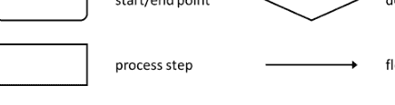
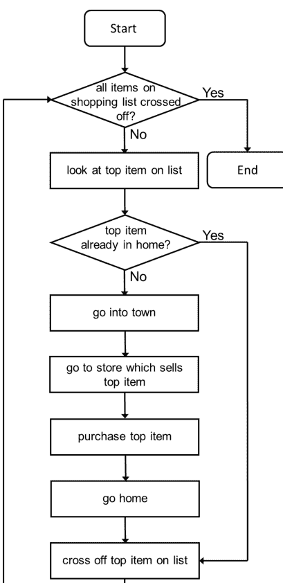
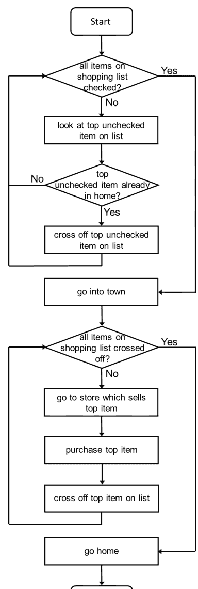
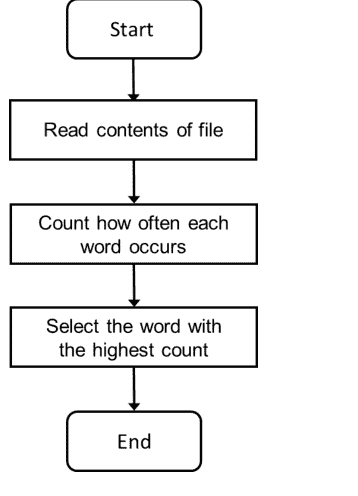

# Python计算思维

Pieter Spronck

版本 1.0.0
2023年6月10日

版权所有 © 2023 Pieter Spronck。

根据知识共享署名-非商业性使用 3.0 未本地化版本许可协议的条款，允许复制、分发和/或修改本文档，该协议可在 https://creativecommons.org/licenses/by-nc/3.0/ 获取。

本书的原始形式是 $\LaTeX$ 源代码。编译此 $\LaTeX$ 源代码会生成教科书的设备无关表示，该表示可以转换为其他格式并打印。

本书的 $\LaTeX$ 源代码（在某个时间点）将可从 http://www.spronck.net/pythonbook 获取。

**本书的最新版本始终可从 http://www.spronck.net/pythonbook 获取。**

## 前言

本课程教材是我的著作《程序员学徒：用Python 3学习编程》的配套读物。

本课程旨在向那些能够学习编程语言元素但在设计算法方面遇到困难的学生传授计算思维技能。其目标是培养学生以能够设计程序解决问题的方式来思考问题。

本课程假设学生了解编程语言的基础知识。课程使用Python 3，但其他编程语言也应该适用。

欢迎您使用本课程并根据自己的需求进行调整，但请在适当的地方注明出处。

欢迎对本课程提供反馈，以修正错误和不一致之处，添加额外信息，并改善学生的学习体验。特别是，我对计算思维的其他方面感兴趣，这些方面可以教授学生实用的方法。

您可以将反馈发送至 pythonbook@spronck.net。请注明您的反馈是关于计算思维书籍，而非Python书籍。

Pieter Spronck
2023年6月9日
荷兰蒂尔堡

Pieter Spronck是荷兰蒂尔堡大学的计算机科学教授。

## 目录

前言 v

1 引言 1

1.1 先决条件和假设 2

1.2 大纲 3

2 日常计算思维 5

2.1 处理购物清单 5

2.2 算法 6

2.3 流程图 6

2.4 购物清单流程图 7

2.5 第二个购物清单流程图 10

2.6 现实生活中的购物 10

3 关于排序的思考 13

3.1 伪代码 13

3.2 现实生活中的排序 14

3.3 对一副扑克牌进行排序 15

3.4 以朴素方式对一副扑克牌排序的效率 15

3.5 以不那么朴素的方式对一副扑克牌排序的效率 17

3.6 更高效的排序 17

3.7 为计算机设计算法 18

## 4 函数

- 4.1 一个简单的函数

## 目录

ix

## 9 实现技巧

59

- 9.1 选择数据结构

## 目录

# 第一章

## 引言

在我多年教授大学生编程的过程中，我发现大多数学生在学习编程语言的语法元素时没有问题，但相当一部分学生在设计算法时却遇到了困难。

编程语言就像一个工具箱。它为程序员提供了指定命令、条件、循环和其他结构的方法。程序员的工作就是以不同的方式组合这些结构，从而让最终的程序解决特定问题。

教授编程语言的课程通常局限于教授不同的语言元素。它们会介绍诸如：什么是循环，该语言提供了哪些不同的方式来编写循环，以及循环具体是如何工作的？然后，学生会练习使用这些语言元素来解决简单、直接的问题。这类课程并不教学生如何解决更复杂的问题——对于这些问题，无法立即明确需要使用哪些语言元素，以及如何、何时使用它们。

设计一种用计算机程序解决问题的方法，可能出乎意料地，不需要编程技能。它需要的是计算思维能力。

什么是计算思维？我发现这个术语有许多不同的定义，它们各不相同，且侧重于不同的方面。总的来说，计算思维涵盖了分析问题所需的能力，以便能够为问题设计一个计算解决方案，即一个由一系列特定步骤组成的解决方案，当这些步骤被精确执行时，就能产生预期的结果。一旦设计出这样的解决方案，就可以将其转化为程序，这时编程技能就派上用场了。

我们谈论的是什么样的技能？显然，逻辑思维和分析能力会有所帮助。识别模式和运用抽象的能力非常有益。区分相关细节与无关细节的能力至关重要。有时，创造力在设计计算解决方案中也扮演着角色。这些技能不仅对于创建解决复杂问题的程序是必要的，而且在处理现实生活中的问题和从事科学研究时也极为可贵。

人们希望这些技能能在中学阶段就被教授，但通常情况恰恰相反。大多数中学教学生以非常特定的方式解决有限的一类问题，导致学生习惯于遵循预定义的步骤来解决问题，而不是自己想出解决方案。中学的一些科目，如数学，会训练学生的计算思维能力——然而，即使对于这些科目，学生如果只是盲目遵循老师的指示，也能获得及格分数。结果就是，许多学生进入大学时只具备有限的计算思维能力。

然而，根据我的经验，大多数学生在练习解决编程问题时能够掌握这些技能。他们起初会很挣扎，但随着时间的推移，通过足够的练习，他们在创建解决方案方面会变得更好。许多学生告诉我，他们曾有过“顿悟”的时刻，之后创建程序变得容易和有趣得多。我遇到过的学生中，只有极少数从未达到掌握必要计算思维能力的阶段。

对我来说，问题是如何向那些仍需进一步发展计算思维能力的学生教授这些技能。直到最近，我唯一的方法是告诉学生去练习：为复杂度递增的问题构建解决方案，在遇到困难时寻求帮助，并在自己设计出解决方案后研究他人的解决方案。我向学生展示我如何一步步处理问题，希望他们通过观察我来掌握我使用的技能。

这种方法效果尚可。大多数在创建编程解决方案方面有困难的学生确实拥有相当多的计算思维能力，但有时这些能力处于休眠状态，因为过去很少有理由使用它们。通过练习，当使用这些技能时，随着时间的推移，使用它们会变得自然。

无论如何，我相信，如果计算思维技能的训练不仅仅依赖于练习创建解决方案，那么训练会更有效。计算思维有一些共同的概念，这些概念可以被明确化并教授给学生，以帮助他们在计算思维过程中。

本课程教授这些共同的概念。

## 1.1 先决条件和假设

本课程假设学生具备基本的编程技能。课程中用于创建解决方案的编程语言是 Python 3，但其他编程语言同样适用。我选择 Python 是因为它在许多大学都有教授，易于使用，同时功能极其强大。它也非常易于阅读，因此那些了解其他编程语言但不了解 Python 的人，通常仍然能够阅读和理解 Python 程序。

本书主要适用于已经学习过以下主题的学生：表达式、变量、函数、条件、迭代、字符串、列表、字典和文本文件。然而，即使是那些在迭代方面进展不多的人，也可能发现书中讨论的一些主题有用。

本书旨在用于自学。如果学生已经能够运用计算思维技能，那么本书的价值就不大。本课程真正面向的是那些了解编程语言元素但在想出编程练习解决方案方面有困难的学生。

## 1.2 大纲

每一章都简要讨论一个关于计算思维实际应用的主题，通常由一个示例引导。解决方案将逐步开发，以展示所讨论的特定计算思维应用是如何实施的。通常，解决方案也会作为一个 Python 程序来开发（需要 Python 3.5 或更高版本）。

章节不长。我特意希望这是一门简短的课程。如果我递给某人一本 200 页的书，他们可能根本不会去读。我希望每一章都能快速解释一个简单的概念，这个概念可以应用于多种方式。学生应该学习这些概念，当他们遇到新问题时，思考哪些概念适用于该问题。这可能有助于创建解决方案。

每一章都以几个练习结束。请注意，这些练习不足以练习所讨论的主题。然而，几乎你在编程课程中做的任何练习都需要计算思维。因此，你可以通过做任何练习来练习所解释的方法。作为入门，本课程的配套书籍《程序员学徒》中的练习适合练习计算思维，尤其是较难的那些。

我想指出，本课程可能并不完整。可能还有更多我可以讨论的主题。因此，我欢迎对进一步主题的建议，然后我可以为此创建新的章节。

# 第二章

## 日常计算思维

我们在日常生活中做了很多计划。要计划得好，就必须使用某种形式的计算思维。大多数人自然而然地这样做。在本章中，我将展示一些例子，以证明无论你认为编程是容易还是困难，计算思维已经是你分析问题时自然的一部分。

## 2.1 处理购物清单

假设你晚上要做饭，需要去购买食材。你查看想要做的食谱，并写下需要购买的食材清单。你的目标是购物结束后家里有所有这些食材。考虑以下方法：

- *方法 1*：你待在家里玩一整天电子游戏。当夜晚来临时，食材神奇地出现在你的冰箱里。
- *方法 2*：你离开家，随意闲逛。如果碰巧遇到清单上的一种食材，你就拿走它。当黄昏降临时，你回家。
- *方法 3*：你带着食材清单进城。在那里，你问每一个你见到的人是否能帮你获取清单上的一件物品。如果他们能，你就按照他们说的做。当商店关门时，你回家。

运用你的计算思维技能分析这些方法，你可能会得出结论：它们都不太可能实现你的目标。第一个方法肯定不行，第二和第三个方法只有在你非常、非常幸运的情况下才会成功。它们绝对不能保证成功。实际上，你不会遵循任何这些方法——你会直接拒绝它们。

以下是一些可能实现你目标的方法。

- *方法 4*：你看清单上的第一项。然后检查你家里是否已经有这件物品。如果没有，你就进城，去卖这件物品的商店，购买它，然后回家。然后你划掉这件物品。你重复这个过程，直到清单上没有物品为止。

## 2.2 算法

算法是一系列定义明确的指令，遵循这些指令可以达成特定目标。计算机程序就是算法的一种实现。

“定义明确”具体指什么，取决于谁或什么需要遵循算法的指令。例如，如果有一个使用上述某种方法处理购物清单的算法，而你是执行该算法的人，那么像“购买一升低脂牛奶”这样的指令可能就足够明确了。然而，像“进城”这样的指令可能就不够明确，因为你可能会疑惑指的是哪个城镇，是否有时间限制，以及应该使用什么交通工具。

不过，为了本章讨论的目的，我不会过多纠结于让指令变得定义明确。稍后，在讨论必须转化为计算机程序的算法时，我们需要考虑这一点，但现在还不需要。

表达算法有多种方式。一种非常具体的方式是使用编程语言编写计算机代码。一种稍微高级一点的方式是使用所谓的“伪代码”，它看起来有点像编程语言，但更通用，因此可以翻译成不同的编程语言。一种非常高级的方式是使用所谓的“流程图”。

## 2.3 流程图

流程图或“框图”由通过线条连接的方框组成。不同形状的方框具有不同的作用。方框内包含指令。连接方框的线条表示指令必须执行的顺序。流程图指定了起点和终点。

## 2.4 购物清单流程图

传统上，流程图被计算机程序员用来在实现程序之前定义他们的程序。由于创建流程图往往是一个非常耗时的过程，除了非常小的程序外，其他程序都显得笨重，因此如今几乎没有人使用它们，除了用于教学目的。为了本课程的目的，在这里解释它们是有意义的。

我们将只使用最基本的流程图元素，如图2.1所示。



起点/终点元素将标有“开始”或“结束”。通常，在流程图中只有一个“开始”点，即算法开始的地方。可能有多个“结束”点；一旦到达其中一个，算法就会结束。

通过遵循流程方向箭头，你就遵循了算法的步骤。你沿着箭头的方向移动。有时，当方向明确时，箭头尖端会被省略（因为在流程图中你不能“逆向流动”）。

“处理步骤”节点表示必须遵循的指令。

“决策”节点有多条方向线从其引出。节点内是一个问题，每条线都标有该问题的可能答案。你需要遵循标有该问题正确答案的方向线。通常问题只有两个答案：“是”或“否”，或者“真”或“假”。不过，拥有两个以上可能答案的决策节点也没有什么问题，只是如果从一个决策节点引出的方向线太多，流程图可能会变得难以阅读。

我现在将使用流程图来示意性地表示上面讨论的一些处理购物清单的方法。

图2.2展示了表示上述方法4的流程图。

为了清楚地说明流程图是如何处理的，假设你有一个包含以下物品的购物清单：

- 意大利面（在超市出售）
- 意面酱（在超市出售）
- 碎肉（在肉店出售）
- 奶酪（在超市出售）

如果你按照这个流程图处理这份购物清单，并且你家里已经有意面酱，那么你将采取以下步骤（如果你在遵循这些步骤时遇到困难，请一步一步地回顾，直到你理解为止）：



图2.2：方法4的流程图。

- 开始
- 购物清单上的所有物品都划掉了吗？：**否**
- 查看清单顶部的物品：**意大利面**
- **意大利面**家里已经有了吗？：**否**
- 进城
- 去出售**意大利面**的商店：**超市**
- 购买**意大利面**
- 回家
- 在清单上划掉**意大利面**
- 购物清单上的所有物品都划掉了吗？：**否**
- 查看清单顶部的物品：**意面酱**
- **意面酱**家里已经有了吗？：**是**
- 在清单上划掉**意面酱**
- 购物清单上的所有物品都划掉了吗？：**否**
- 查看清单顶部的物品：**碎肉**
- **碎肉**家里已经有了吗？：**否**
- 进城
- 去出售**碎肉**的商店：**肉店**
- 购买**碎肉**
- 回家
- 在清单上划掉**碎肉**
- 购物清单上的所有物品都划掉了吗？：**否**
- 查看清单顶部的物品：**奶酪**
- **奶酪**家里已经有了吗？：**否**
- 进城
- 去出售**奶酪**的商店：**超市**
- 购买**奶酪**
- 回家
- 在清单上划掉**奶酪**
- 购物清单上的所有物品都划掉了吗？：**是**
- 结束

关于你在检查这个流程图运行过程时可能注意到的一些事情，有几点说明：

- 虽然方法4中描述的第一步是“查看清单顶部的物品”，但流程图中的第一步是询问购物清单上的所有物品是否都已划掉，而第二步才是“查看清单顶部的物品”。我选择这样绘制流程图的原因是，如果你在使用流程图时碰巧清单上的所有物品都已划掉，那么就没有顶部的物品可以查看，“查看清单顶部的物品”会导致错误。对方法4的这个改动是你在将过程转化为算法时可能需要做的事情的一个例子。算法应该在任何情况下都能“工作”，在这种情况下，即使购物清单是空的。
- 我用具体的值填充了“顶部的物品”和“商店”。对于“顶部的物品”，我用“意大利面”、“意面酱”、“碎肉”和“奶酪”代替；对于商店，我用“超市”和“肉店”代替。这是在流程图中使用“变量”的一个例子。流程图中的指令可能引用某些元素，这些元素在不同的时刻可以取不同的值。
- 虽然流程图包含“循环”（指回流程图早期点的箭头）和“条件”（基于问题的决策点，流程图在此分叉），但当流程图被执行时，它会变成一系列指令。当你检查流程图转换成的指令列表时，很明显这个列表效率低下，因为你往返城镇和家不下三次。

## 2.5 第二个购物清单流程图

图2.3展示了表示上述方法5的流程图。

你可能注意到这个流程图由两部分组成。在第一部分中，检查清单并划掉你家里已经有的物品。在第二部分中，你进城，购买所有需要购买的东西，然后再次回家。这种方法似乎比方法4更高效，事实上，如果你为之前用于检查流程图的购物清单写出步骤序列，你会注意到你只进城一次，而不是三次。

你可能还注意到方法5仍然不是最高效的。在这种方法中，你访问了两次超市，并且在两次访问之间你去了肉店。即使你重新排列购物清单，将碎肉放在顶部或底部，“去出售顶部物品的商店”这条指令对超市也会遇到两次。方法6试图解决这个问题。

此外，方法7引入了另一个优化，这在示例购物清单中没有演示。也就是说，如果你家里已经有清单上的所有物品，那么就完全没有必要进城，因此方法7确保了这种特殊情况也能得到处理。

## 2.6 现实生活中的购物

我毫不怀疑，如果你在现实生活中为食谱的配料去购物，你会使用一系列相当优化的步骤将配料带回家。你不会整天玩电子游戏，指望配料自己出现，也不会使用随机过程，希望它能带来你想要的结果。如果你家里已经有所有配料，你就不会去购物。如果可以避免，你不会多次进城，并且你会尝试在一家商店买完所有东西，然后再去下一家。

这意味着在现实生活中，你完全有能力为“去购物”这项活动设计一个算法，即使你没有将算法写在流程图中。

你可以争辩说你是自动这样做的——你从未花时间“设计购物算法”，你只是去购物，结果发现你做得相对高效。这可能是真的，但你仍然在使用一个算法。此外，你能够识别算法中的低效之处并加以纠正。你适应新的情况。如果你开车进城，发现你一直走的路不通了，你会想办法绕过去。



图 2.3：方法 5 的流程图。

## 练习

**练习 2.1** 为本章开头列出的方法 6 和/或方法 7 创建一个流程图。

**练习 2.2** 使用本章给出的示例购物清单、一个只包含你家中已有物品的购物清单，以及一个空的购物清单，来运行你在练习 2.1 中创建的流程图。

**练习 2.3** 设计一个洗碗的算法。你可以保持相当高的抽象层次。在算法中既要包含你有洗碗机的情况，也要包含你必须手动洗碗的情况。创建一个流程图。

# 第 3 章

## 关于排序的思考

我想在上一章表达的观点是，你能够进行计算思维，设计算法，因为你一直在这样做。然而，作为人类，你有能力在算法有缺陷时即时调整它们。这被称为“即兴发挥”，顺便说一句，这也是计算思维的一种形式。由于你有即兴发挥的能力，你无需真正仔细思考日常生活中使用的算法。对于计算机来说则不同。

计算机的算法必须是精确的。它必须是完整的。它必须能够处理任何不可预见的情况，否则算法将无法达到其预期终点，从而无法产生期望的结果。

编程语言的创建是为了让你能够以计算机能理解的方式指定算法。作为程序员，你有责任确保你呈现给计算机的算法确实能够达到你期望的结果。

在本章中，我将讨论排序这一日常任务，这是你偶尔需要做的事情，通常你会思考如何最高效地完成它。编写计算机程序时也需要这种思考。不过，我将首先讨论伪代码，它可以作为思考算法和将其转化为代码实现之间的中间步骤。

### 3.1 伪代码

本课程假设你能够用 Python 编写代码（即使你在用 Python 设计算法方面并不擅长）。因此，你可以编写程序代码。编写伪代码与编写程序代码非常相似，只是在伪代码中你可以“走捷径”。你的代码不需要能够运行。它只需要提供一个良好的、最好是明确的关于程序应该是什么样子的见解。程序员应该能够将伪代码转换成任何适合实现该算法的计算机语言编写的程序。

通常，在伪代码中，你会明确指出某些代码元素，而这些在你选择的编程语言中并不需要明确指出。例如，在 Python 中，如果我想创建一个变量，我只需引入变量名并为其赋一个初始值，例如，`num = 0` 创建了一个变量 `num`，它是一个数值变量，因为给它赋了一个数值。在其他编程语言中，变量在赋值之前必须声明特定类型。因此，一个懂 C++ 但不懂 Python 的人，当看到伪代码中只写着 `num = 0` 的语句时可能会提出异议，因为在他们看来，算法不知道 `num` 应该是一个整数。因此，在伪代码中，你可能会写 `int num = 0`，以明确 `num` 是一个整数类型的变量，从声明的那一刻起就可以使用。

在伪代码中你经常看到的另一件事是，代码“块”以左花括号开始，以右花括号结束。代码块的缩进仍然像 Python 中那样（因为那样最具可读性），但花括号的存在是为了明确表明其中的语句属于一个代码块，因为大多数编程语言不像 Python 那样对缩进那么挑剔。

最后，在伪代码中，语句通常以分号结束，因为这在大多数编程语言中很常见。

编写伪代码的好处是，你在写什么方面可以相当“宽松”。例如，如果你想在一个语句中按姓氏、然后名字对名为 `personlist` 的人员列表进行排序，你可以直接写 `sort personlist by lastname, firstname`，而无需更具体地说明你实际上如何实现这一点。

虽然上一章的购物清单示例可能不适合伪代码，考虑到你不会在实际程序代码中实现它们，但我可以为我给出的流程图编写伪代码程序。例如，对于第一个流程图（图 2.2），伪代码是：

```
while not all items on the list are crossed off
{
    item topitem = top item on the list;
    if not topitem is in the home
    {
        go into town;
        go to store which sells topitem;
        purchase topitem;
        go home;
    }
    cross off topitem on the list;
}
```

如果你不清楚这段伪代码等同于图 2.2 中的流程图，请研究它直到清楚为止。

### 3.2 现实生活中的排序

我现在将给出一个现实生活中的任务示例，当你遇到它时，你实际上会设计一个算法。假设你有几箱书和一个空书架。你打算把书放到书架上，并希望它们按特定顺序排列，例如按字母顺序。当你搬家时可能会出现这种情况。在书架上整理书籍不是你每天都会做的事情，所以你可能没有一个现成的、不假思索就能应用的算法。那么，你将如何做呢？

假设你想按作者的姓氏对书架上的书进行排序。一个直接的方法是，你开始时把第一本书放在顶层书架的左上角位置，然后你拿起的每一本后续书都插入到你已经放置的书之间的正确位置。虽然这可行，但你会不断地移动书架上的书，因为书架会放满，你必须为新书腾出空间。

一个稍微复杂一点的方法是，你为每个书架分配一个字母范围，这些字母是作者姓名的首字母。例如，顶层书架 A–D（“Aafjes”–“Dyson”），第二层书架 E–H，第三层书架 I–L，等等。然后你做与第一种方法相同的事情，只是你把书放在作者所属的书架上。这将大大减少书籍的移动。这种方法的缺点是，你最终可能会有一些书架没有完全放满，而其他书架则过于拥挤，你将不得不在过程中重新分配字母。

第三种方法，如果你有足够的空间，是首先按作者姓氏的首字母将书分成堆。这样你最终会在地板上得到大约 26 堆书。然后你分别处理每一堆，从姓氏以 A 开头的作者那一堆开始。如果一堆看起来太大，无法一次处理，你可以对那一堆重复这个过程，例如根据作者姓氏的第二个字母将其分成两个或更多更小的堆。

### 3.3 整理一副扑克牌

拿一副扑克牌，洗牌（是的，这是一个练习，所以请做一下）。现在按以下方式整理牌：牌堆顶部是所有的方块牌，从 2（最小）到 A（最大）排序。下面是梅花，同样从 2 到 A 排序。再下面是红桃，最下面是黑桃，同样都是从 2 到 A 排序。如果有任何大小王，把它们放在最下面。完成后，思考一下你使用了哪种算法。

很有可能你首先做了四堆牌，每堆对应一种花色，然后在手中整理每一堆，因为你可能一只手能拿 13 张牌。或者，为了整理一堆牌，你可能只是把它摊在桌子上，挑出 A 放在一边，然后挑出 K 放在 A 上面，然后挑出 Q，等等。

关键在于，你可能不会试图一次整理所有的牌，手里拿着 52 张（或更多，如果有大小王）牌，同时试图移动牌直到它们按正确的顺序排列。你不会那样做，因为你凭直觉知道那会是一个笨拙且低效的过程。

### 3.4 以朴素方式整理一副扑克牌的效率

为了估计整理一副扑克牌的特定方法的效率，我们可以计算你必须查看特定牌的次数。注意：确定一种算法意味着你需要确定其“时间复杂度”（如果涉及算法速度的话）。我不会在此讨论确定时间复杂度的正式方法，而是简单地使用“数一数看了多少张牌”这个宽松的定义，这对于本章的目的来说已经足够了。

一种排序牌组的方法是从上到下搜索整个牌组，找到第一张牌，也就是方块2。找到这张牌后，你把它放在一边，然后在牌组中搜索下一张牌，也就是方块3。找到它后，你把它放在方块2的上面（或下面，取决于你的操作方式）。然后你搜索方块4，接着是方块5，依此类推。你这样做直到牌组排序完成。

假设牌组包含52张牌（没有大小王），使用这种算法排序牌组需要查看多少张牌？这取决于牌组是如何洗牌的。如果洗牌后牌组已经是排好序的，你只需要查看52张牌，因为每次搜索一张牌时，它都是你查看的第一张。这是“最佳情况”。

“最坏情况”是什么？那就是牌组是按相反顺序排列的。使用给定的程序，你需要查看52张牌才能找到方块2，查看51张牌才能找到方块3，查看50张牌才能找到方块4，依此类推。总共你需要查看1378张牌。

在实践中，你可能查看的牌会少一些，因为你找到你要找的牌会比这更早。平均而言，你要找的牌会在剩余牌组的一半位置，所以你可能只需要大约最坏情况一半的查看次数，也就是大约689次查看。

在计算机科学中，这里描述的排序牌组的方法被称为“选择排序”。它被认为是一种效率较低的排序算法，尽管在需要排序的项目数量相对较少时，它工作得很好。

请注意，在选择排序中，你总是在剩余的待排序项目集中寻找“最低”的项目，而不知道那个最低的项目实际上是什么。对于排序牌组，我们知道我们要找的下一张牌是什么，因此可以在找到那张牌时停止搜索。然而，如果牌组中缺少一些牌，搜索特定牌的排序算法将无法给出预期的结果。因此，搜索剩余牌中的“最低”牌可能比搜索特定牌更可取，但这意味着对于每次遍历牌组，你都必须查看每张牌，这将需要最坏情况的查看次数。

选择排序的伪代码描述如下：

```
# selection sort algorithm which sorts a list of items called "items"
list sorteditems = empty set;
while not list items is empty
{
    item lowestitem = the lowest item in list items;
    items.remove(lowestitem);
    sorteditems.append(lowestitem);
}
```

如果你想把这个伪代码转换成实际的Python代码，你应该能够逐步处理它，并用合法的Python替换每一行。如果你认为某一行不能用单行Python实现，你可以用一个函数调用来替换它，然后稍后实现那个函数（下一章会详细讨论）。然而，上面的伪代码可以逐行转换成实际的Python代码。在查看下面的解决方案之前，先试一试。

```
items = [4,7,17,12,0,-3,2,17,5,6,4,1,0,-6,8,23,11,10]

# Here follows a translation to Python of the pseudo code given above.
sorteditems = []
while len( items ) > 0:
    lowestitem = min( items )
    items.remove( lowestitem )
    sorteditems.append( lowestitem )

print( sorteditems )
```

### 3.5 以不那么朴素的方式排序牌组的效率

现在让我们看看用我上面描述的方式排序牌组，即你首先将牌组分成四堆，每堆一种花色，然后对这些堆进行排序，最后再把它们组合起来。

为了创建按花色分堆，你必须查看每张牌一次，也就是52次查看。

现在你需要找到一种方法来对每个堆进行排序。让我们使用上面描述的同样的朴素方法，对于13张牌来说，这感觉比对整个牌组使用它要容易处理得多。在最坏情况下，你用13次查看找到第一张牌，用12次查看找到第二张牌，用11次查看找到第三张牌，依此类推。总共，在最坏情况下，你需要91次查看来排序一个花色。平均大约需要45.5次查看。对于4个花色，总共需要182次查看。

这意味着，使用不那么朴素的方法，你需要52 + 182 = 234次查看。这比我们朴素方法需要的689次查看有了显著的改进。这意味着，如果你确实使用了一种先按花色分类，然后对每个花色的牌进行排序的方法，那么你设计的算法比你天真地为每张牌单独遍历整个牌组要高效得多。

在计算机科学中，这种方法在创建四个堆时被称为“桶排序”，然后对每个堆使用“选择排序”。

### 3.6 更高效的排序

存在比上面描述的两种方法更高效的排序方法。然而在实践中，当你需要排序一副牌时，你不会使用它们。原因是更高效的算法以更复杂的方式分割牌组；举个例子：一个算法可以，例如，指示你将牌组分成三堆，第一堆包含所有方块牌和梅花牌直到梅花8，第二堆包含剩余的梅花牌和红桃牌直到红桃J，第三堆包含所有剩余的牌。对于人类来说，进行这样的分割比仅仅将牌组分成包含不同花色的堆需要更多的注意力。

对于计算机来说，这样的区分无关紧要。因此，当你设计一个计算机应该执行的算法时，有时你可以通过考虑到许多对人类来说困难或不直观的事情实际上对计算机来说很容易，来使算法比你必须手动执行的算法“更好”。

### 3.7 为计算机设计算法

虽然我上面论证了计算机可能运行对人类来说很难使用的算法，但通常当你需要为计算机设计算法时，考虑这个问题是有意义的：“如果我必须手动解决这个问题，我会怎么做？”在思考这个问题时，你不应该因为方法太枯燥或太耗时而拒绝它们。既然你想出的算法将由计算机使用，那么它是否枯燥或耗时并不重要，因为我们可以让计算机为我们做那些枯燥和耗时的事情。只要你设计的算法的步骤能带来预期的结果，原则上你就找到了值得尝试用代码实现的东西。

我的经验是，对于许多学生来说，“想想如果你必须手动完成这项任务你会怎么做”这个提示不足以让他们设计出算法。因此，在接下来的章节中，我将描述你可以用来想出简单算法的方法。我的目标是给你一些抓手，当你需要为第一次遇到的问题编写代码时可以使用。

## 练习

**练习 3.1** 在上一章中，你创建了一个洗碗的流程图（练习2.3）。把这个流程图转换成伪代码。

**练习 3.2** 拿两副牌背颜色不同的牌（或者，如果你没有现成的，想象一下你有）。把两副牌洗在一起。现在按照本章描述的方式（方块、梅花、红桃、黑桃，每个花色内从2到A排序）重新排序，每种牌背的牌各自成堆。你使用什么算法？

**练习 3.3** 在上一个练习中，你可能首先按牌背将牌分到两堆。你能想到一个效率大致相当但使用不同方法的算法吗？

**练习 3.4** 你能想到一种不同于本章讨论的朴素和稍微不那么朴素的方法的排序牌组的方法吗？你能估计这种方法的效率吗？

## 练习 3.5

设计一个算法来玩井字棋。你不必试图赢得比赛，只需走出合法的棋步即可。使用一个有9个编号格子的井字棋棋盘来玩会最简单。至少用英语描述该算法，但如果可以的话，将其转换为流程图或伪代码。或者，作为额外的挑战，编写真正的Python代码。

## 练习 3.6

考虑以下对一副扑克牌进行排序的方法。你首先从牌堆中随机抽取一张牌，例如第一张。然后你遍历整副牌，将所有需要排在你选中的牌之后的牌放在该牌的上面，将所有其他牌放在它的下面。你可以将选中的牌横放，这样你就能看到它的位置。完成此操作后，选中的牌就处于牌堆中的正确位置，尽管其他牌可能尚未就位。现在，你对选中牌上方的牌堆和下方的牌堆重复此过程。你继续对越来越小的牌堆重复此过程，直到整副牌排序完成。在计算机科学中，这被称为“快速排序”。你选择用来分割每个牌堆的牌被称为该算法的“枢轴”。

1.  如果你不理解所描述的算法是如何工作的，那么尝试用一副13张的单花色牌来实践一下。事情很快就会变得清晰。
2.  假设枢轴总是将一堆牌分成大致相等的两堆，你能估算一下这种对一副牌进行排序的方法的效率吗？
3.  如果你将这种方法的效率与本章中讨论的稍微不那么朴素的方法进行比较，你可能会发现它似乎比那种方法效率稍低。然而，假设一副牌由4种花色组成，每种花色25张牌。那么“快速排序”方法是否仍然效率较低？
4.  在现实生活中，你会使用快速排序方法吗？为什么？

# 第4章

## 函数

函数是一种编程构造，它可能接收也可能不接收一些参数，执行一项任务（在其中使用它接收到的参数），并且可能返回也可能不返回（但通常会返回）一个或多个结果值。在Python中，函数使用关键字 **def** 定义。由于本课程假设你了解Python的基础知识，因此它假设你了解函数。然而，你可能还没有意识到如何以及为什么应该使用函数。

### 4.1 一个简单的函数

下面我给出一个函数，它将开尔文温度转换为摄氏温度。这个名为 `kelvin2celsius` 的函数接收一个参数（或实参），即 `kelvin`，这是一个以开尔文为单位的温度。它返回一个浮点值，即对应的摄氏温度。

```python
# kelvin2celsius 将开尔文温度（作为数值参数 "kelvin" 传递给函数，
# 该参数必须至少为零）转换为摄氏温度，并将其作为浮点值返回。
def kelvin2celsius( kelvin ):
    return kelvin - 273.15

temp = 100
print( f"{temp} degrees Kelvin is {kelvin2celsius( temp ):.2f} degrees Celsius" )
```

当你检查这个函数时，你会发现它非常简单：它只是从传递给函数的参数中减去273.15，并返回结果值。也许你知道这个转换有多简单。也许你不知道。拥有函数的一个主要优点是，你不需要知道如何做某事，只要你知道如何使用一个为你做这件事的函数即可。

对于函数 `kelvin2celsius()`，你需要知道：

-   你可以给它一个整数或浮点值的开尔文温度。
-   它将计算对应的摄氏温度。
-   它将把计算出的温度作为浮点值返回。

还有两件事你也应该知道，或者至少意识到：

首先，该函数不会产生任何副作用，即调用该函数不会影响程序中的任何其他内容。注意：如果参数是引用（指针），该函数可能会影响传递给它的参数。然而，这应该在函数描述中明确说明。如果你不理解引用，对于本课程你可以忽略它们，但它们是编程课程中一个重要的高级主题。

其次，如果传递给函数的参数不是合法值，则函数的返回值是未定义的。例如，如果你用-100作为参数调用该函数，它将返回-373.15；然而，由于零开尔文是绝对零度，没有更低的温度，因此返回值不是合法的温度。此外，如果你用一个字符串调用该函数，它将直接导致你的程序崩溃。当然，该函数可以检查给定的参数是否是合法值，并以优雅的方式处理它（例如，在上面的函数中，你可以说如果非法温度作为参数传递，你将返回-10000）。但原则上，除非函数描述说明它会这样做，否则它没有责任这样做。

### 4.2 契约式编程

“契约式编程”是一种编程范式，其中软件设计者不仅针对软件组件（如函数）的功能，而且特别针对前置条件、后置条件和不变式，编写精确的定义。这样的定义被称为“契约”。我不会深入探讨契约式编程的确切技术含义和要求，但我将使用契约的比喻来讨论应该如何思考函数。

前置条件是在调用函数之前程序状态的描述。原则上，函数只能通过传递给它的参数来了解这个状态。虽然在Python中，函数确实可以访问存在于函数外部的全局变量，但强烈建议它不要这样做。因为如果它不这样做，当你调用一个函数时，你确切地知道函数可以使用什么：你传递给它的参数，仅此而已。这使得函数独立于它所在的程序。

从函数的角度来看，前置条件意味着它获得了可以使用的参数。在函数描述中，必须指定函数需要什么参数，例如关于数据类型和值范围。契约只定义了如果参数“合法”，函数将做什么。如果你给函数任何其他东西，函数做什么是未指定的。

函数的后置条件可以解释为其返回值，以及（如果适用）它对你传递给它的数据结构所做的更改。例如，上面的 `kelvin2celsius()` 函数的后置条件是，它向你提供与传递给函数的开尔文温度等效的摄氏温度。它不会对数据结构进行更改。对于一个更改数据结构的函数示例：考虑一个你可以传递数字列表的函数，该函数将对该列表进行排序。一旦函数完成，原始列表已被更改：它现在已排序。

最后，对于函数，主要的不变式应该是，除了函数被赋予访问权限的数据外，程序可访问范围内的任何数据都不会被更改。

实际上，不变式也旨在描述数据之间的某些关系。例如，假设你正在使用一个用于收集订单的程序，就像你在可以在线购物的网站上看到的那样。你有一个要订购的物品列表，你还看到了这些物品的总成本。假设现在有一个函数可以用来向列表中添加一个物品。一个不变式是，列表中物品的价格总和等于显示的总成本，这意味着添加物品的函数也确保在函数结束时总成本得到更新。当你为可能影响程序中数据项之间关系的相当复杂的程序编写函数时，考虑这些关系的不变式是有意义的。

### 4.3 使用函数

你可以使用函数来简化算法思考的两种主要方式。

第一种是，当你思考一个算法时，你可能意识到你需要做几件事，每件事都需要一些不平凡的代码。将所有这些代码放在一起可能会让人感到不知所措。然而，如果你能将整个算法拆分成多个函数调用，它可能会变得更容易、更自然。由于这种函数的使用与问题分解相关，我将把它留到下一章，那一章将专门讨论这个问题。

第二种是，你可以使用一个函数来封装一个你知道需要使用但可以从程序的其余部分中提取出来的功能，这样你就可以单独解决它。这听起来可能有点抽象，所以让我用一个例子来说明。

当你进行文本处理时，你经常需要检查文本中的单个单词。例如，你可能希望计算某个特定单词在文本中出现的次数。现在，要访问单个单词，你需要将文本分割成这些单词。通常编程语言有内置的功能来实现这一点；例如，Python有字符串方法 `split()`，它将字符串分割成单个单词。然而，假设我使用以下代码对特定字符串使用该 `split()` 方法：

```python
drseuss = "You know you're in love when you can't fall asleep because reality is finally better than your dreams."
drseusslist = drseuss.split()
print( drseusslist )
print( f"Number of times \"you\" occurs in this list: {drseusslist.count('you')}" )
```

单词“you”在给定的字符串中出现了多少次？答案是三次，但每一次，它在 `split()` 生成的单词列表中出现的形式都不同。你

### 4.4 使用函数的优势

从上面的例子中，你应该学到使用函数的最大优势在于：

为特定功能创建一个函数，可以让你专注于程序需要解决的问题中的一个小部分。只要你知道该功能需要什么输入（在“清理”示例中：一个字符串——仅此而已），并且你知道该功能需要产生什么输出（在“清理”示例中：输入字符串的清理版本），你就可以专注于开发该功能，而无需考虑程序需要做的所有其他事情。

假设你对需要使用的编程语言有足够的了解，编写一个函数通常是一项相对简短且容易的任务。主要问题在于你需要识别哪些功能适合放入函数中。一般来说，一个函数应该实现一个相对较小、可以从需要解决的问题的其余部分中提取出来的功能，并且不能做“太多”的事情。

### 4.5 一个函数何时做得“太多”？

关于一个函数不应该做“太多”的评论需要进一步探讨。
让我们回到“清理”示例。开发一个计算单词“you”在字符串中出现次数的函数是否有意义？以下是这样一个函数的实现：

```python
def stringcountyou( inputstring ):
    outputstring = ""
    for letter in inputstring.lower():
        if letter >= 'a' and letter <= 'z':
            outputstring += letter
        else:
            outputstring += " "
    return outputstring.split().count("you")

drseuss = "You know you're in love when you can't fall asleep
    because reality is finally better than your dreams."
print( f"Number of times \"you\" occurs in this string: {
    stringcountyou(drseuss)}" )
```

思考一下为什么这个函数 `stringcountyou()` 做得“太多”。
它做得太多的一个主要原因是，如果你还想计算单词“love”在字符串中出现的次数，你就必须为此开发一个单独的函数，这个函数将与第一个函数相同，只是函数的最后一条语句会使用单词“love”而不是“you”。显然这不是一个好主意，因为对于你想计算的每个不同单词，你都需要一段与给定函数非常相似的代码。这个函数过于具体了。
那么，如果我让这个函数更通用一些呢？我不让它计算“you”，而是让它计算任何单词，通过将需要计算的单词作为参数传递。像这样：

```python
def stringcountword( inputstring, word ):
    outputstring = ""
    for letter in inputstring.lower():
        if letter >= 'a' and letter <= 'z':
            outputstring += letter
        else:
            outputstring += " "
    return outputstring.split().count(word)

drseuss = "You know you're in love when you can't fall asleep
    because reality is finally better than your dreams."
for word in ['you', 'love']:
    print( f"Number of times \"{word}\" occurs in this string: { stringcountword(drseuss,word)}" )
```

这无疑改进了这个函数。然而，它是否仍然做得“太多”？

至少有一个理由让你可能认为这个函数仍然做得太多，那就是每次你想计算字符串中某个特定单词出现的次数时，它都会清理原始字符串。实际上，你只需要清理字符串一次，然后在每次想计算单词时使用清理后的字符串。事实上，这个函数不仅清理字符串，还分割它，而你现在对每个单词都进行了分割，而实际上只需要做一次。

我评估这个函数做得太多的最后一个原因是，清理字符串是一个可能有多种用途的功能。你可以用它来计算单词，但你也可以用它来检查句子中有多少单词出现在字典中。或者当你想找出文本中最长的单词有多长时，也可以使用它。如果你将字符串的清理与清理后字符串的使用结合起来（这正是函数 `stringcountword()` 所做的），那么你就降低了功能的通用性。

对于一个只需要计算单词出现次数的程序来说，这个理由可能不成立。然而，一个有经验的程序员可能仍然会考虑到程序以后可能需要修改，而在那种情况下，可能会发现清理代码本应与单词计数代码分离。

### 4.6 一个函数何时做得“太少”？

原则上，一个函数永远不会做得“太少”。

你可能想知道开发一个只包含一行代码的函数是否有意义。我的回答是：如果一行代码就是它所需要的全部，为什么不呢？

例如，本章顶部的 `kelvin2celsius()` 函数。它由一行代码组成，从输入值中减去 273.15。如果你需要在程序中进行这种转换，为什么不直接在主代码中进行这个减法，而是调用一个函数呢？有几个原因说明你应该为此创建一个函数：

- 它使代码具有自文档性。如果我看到调用函数 `kelvin2celsius()`，我立即就能理解代码在做什么。如果我看到的是从另一个数字中减去 273.15，我可能不明白它在做什么。当然，你可以在减法旁边写注释，但我个人更喜欢不需要注释就能理解的代码。
- 它消除了我理解你如何将开尔文转换为摄氏度的必要性。函数调用将这个计算变成了一个“黑盒子”。还有其他更复杂的温度转换，例如将华氏度转换为摄氏度。如果我只是调用这些转换的函数，转换的细节对于理解主程序来说可以被认为是无关紧要的。
- 它允许我轻松地扩展功能而不影响主程序。例如，假设我有一个需要将开尔文转换为摄氏度的 Python 程序，在代码中我通过简单地从开尔文值中减去 273.15 来实现，因为我假设该值始终是合法的。后来发现非法值实际上是可能的，并且应该使用异常来捕获（如果你不知道什么是异常，别担心，这个例子不需要你知道）。如果我在一个函数中进行转换，我只需要修改那个函数。如果我没有用于转换的函数，我就必须在整个程序中搜索从值中减去 273.15 的地方并在那里捕获异常。

### 4.7 需要考虑的事项

总之，当你审视一个问题并想到一个你可能想从问题中提取出来并为其开发单独函数的功能时，请考虑以下几点：

- 该功能是否定义明确？它到底需要做什么？
- 前置条件：该功能需要什么输入？确保你能提供它所需的一切。
- 如果前置条件的要求未满足，应该发生什么？如果该功能产生无意义的结果或导致程序崩溃是可以的，但你至少应该考虑是否能优雅地处理错误输入。
- 后置条件：该功能产生什么？这将定义返回值。
- 该功能是否会对它所属的程序产生副作用？一般来说，不应该，但如果确实有，应该记录下来。
- 该功能是否做得“太多”？如果你能在该功能中识别出多个步骤，其中一些步骤具有超出该功能本身的通用目的，那么你可能处于一种可以进一步拆分该功能的情况。

## 练习

**练习 4.1** 创建一个函数 `celsius2kelvin()`，将给定的摄氏度温度（一个浮点数）转换为开尔文温度。

**练习 4.2** 如果 $F$ 是华氏度温度，$C$ 是摄氏度温度，那么 $C = (5 * (F - 32)/9)$。开发一个函数 `fahrenheit2celsius()`，将华氏度温度转换为摄氏度温度，以及一个函数 `celsius2fahrenheit()`，进行反向转换。

**练习 4.3** 开发函数 `kelvin2fahrenheit()` 和 `fahrenheit2kelvin()`，在华氏度和开尔文度之间进行转换。与其从头开始开发这些函数，不如使用（一些）前面练习中的函数调用。

**练习 4.4** 你需要开发一个程序，该程序接收一个温度作为输入，并显示该温度在开尔文、摄氏度和华氏度下的值。输入温度以

# 第五章

## 问题分解

要成功设计和实现算法，你必须掌握的核心技能是“问题分解”。这意味着你需要能够将一个问题分解成一系列更小、更易管理的问题，每个问题都可以单独解决，而它们共同解决了整体问题。

### 5.1 问题：哪个单词出现次数最多？

考虑以下任务：你有一个文本文件，需要确定文本文件中哪个单词出现次数最多。你将如何完成这个任务？

这是一个非常直接的问题，你可能在考试中见过。在考试中，你通常会得到一些需要完成的代码，可能如下所示：

```
# Function get_word_with_highest_count() gets the name of a text
# file as input, and should return the word that occurs most
# often in this file.
def get_word_with_highest_count( filename ):
    # Write your code here.
    return "<word with highest count>"

print( get_word_with_highest_count( "pc_woodchuck.txt" ) )
```

经验丰富的程序员几乎不会思考这个问题，而是在几分钟内编写出解决方案。这样的程序员所使用的技能来自于多年的编程经验，对于大多数刚开始设计和实现更复杂程序的人来说并非天生具备。缺乏经验的程序员则必须系统地处理这个问题。

如果你作为一个缺乏经验的程序员接到这样的任务，绝对不应该做的是开始输入代码。你应该做的是思考问题并设计一个通用的解决方案。因为整个问题可能看起来太艰巨，你应该做的是将问题分解成更小的问题。



图 5.1：查找出现次数最多的单词的流程图。

### 5.2 问题分解：流程图

为了完成任务，你需要解决哪些更小的问题？显然，你需要读取文件的内容。你需要统计文件中每个单词出现的次数。然后你需要选择出现次数最多的单词。这可以用图 5.1 所示的流程图来表示。

我们可以将此流程图中的每个步骤视为一个函数。函数有一个前置条件/输入（进入函数的内容）和一个后置条件/输出（函数产生什么）。通常，一个步骤的产物是下一个步骤的输入。那么，这些步骤的输入和输出分别是什么？

对于第一步“读取文件内容”，输入是文件的名称。在问题提供的代码中，文件名确实已经给出，因此它是可用的。该步骤应该产生的是“文件的内容”。该步骤没有明确说明这些内容如何表示，但你可能知道，当你读取文件内容时，你会得到一个字符串或一个字符串列表。

无论你如何表示文件内容，它们都是下一步“统计每个单词出现次数”的输入。该步骤应该产生的是某种数据结构，其中包含文件内容中的所有单词，以及每个单词出现的次数。

同样，目前还不清楚如何表示单词及其计数，但它们是最后一步“选择计数最高的单词”的输入。该步骤的输出是一个单词，即出现次数最多的单词，如果你知道文件内容中所有单词及其计数，你确实可以选择它。

### 5.3 选择数据结构

如前所述，你需要两个数据结构来完成图 5.1 流程图中给出的步骤。一个数据结构需要表示文件的内容，第二个数据结构需要表示所有单词及其计数。

你知道，当你读取文件时，你可以得到一个字符串或一个字符串列表。这两种表示方法中，哪一种最适合当前问题？字符串列表主要用于需要处理文件中单独行的情况，但行对于当前问题并不重要。因此，字符串就足够了。所以，我们决定将文件内容表示为一个字符串。

如何表示单词及其计数？由于我们需要存储多个单词——我们还不知道有多少个——我们可能需要一个具有某种重复性的数据结构。Python 中具有这种特性的三种基本数据结构是列表、字典和集合。由于我们需要为每个单词存储一个计数，我们有以下主要可能性：

-   一个元组列表（单词，计数）
-   一个以单词为键、计数为值的字典
-   一个元组集合（单词，计数）

根据一些经验，你可能会意识到字典可能是最佳选择，因为你需要遍历文件内容中的所有单词，并在每次遇到某个单词时更新其计数。在列表中搜索单词很慢（除非列表具有允许快速搜索的结构），而对于字典来说则很快。

元组集合将不起作用，但你需要对集合有一些了解才能明白为什么不行。假设我在集合中存储了单词“you”出现了两次；根据我的描述，这意味着 ("you", 2) 是集合的一个元素。我在文件内容中再次发现了单词“you”，所以我必须从集合中移除元素 ("you", 2)，并添加元素 ("you", 3)。但我实际上并不知道 ("you", 2) 是否在集合中。所以我必须搜索整个集合，看看集合中是否有某个元素的第一个元素是“you”——如果我找到了，我可以读取第二个元素，移除该元素，并添加一个第二个元素加 1 的新元素；否则我将 ("you", 1) 添加到集合中。真的，如果我要费这么大周章，我最好还是使用列表。

目前，我们决定使用字典来存储单词及其计数。

### 5.4 为步骤使用函数

我们现在可以在给定的代码中用注释写出我们需要采取的步骤：

```
def get_word_with_highest_count( filename ):
    # Step 1: Read the contents of filename, and put them in
    # string "contents".
    # Step 2: Build a dictionary "wordcounts" which contains
    # all the different words in "contents" with their counts.
    # Step 3: Select the word with the highest count from
    # "wordcounts".
    return "<word with highest count>"
```

虽然通常你不会为小功能编写额外的函数，但你实际上可以这样做。由于将这些步骤视为函数是有意义的，我将在这里明确地创建这些函数。

```
# Reads the contents of filename and returns those as a string.
def read_contents( filename ):
    return ""

# Builds a dictionary of all the words in the string contents,
#     with their counts.
def build_dictionary( contents ):
    wordcounts = {}
    return wordcounts

# Selects the word with the highest count from dictionary
#     wordcounts.
def select_highest_count( wordcounts ):
    return ""

def get_word_with_highest_count( filename ):
    contents = read_contents( filename )     # Step 1
    wordcounts = build_dictionary( contents ) # Step 2
    return select_highest_count( wordcounts ) # Step 3

print( get_word_with_highest_count( "pc_woodchuck.txt" ) )
```

我们现在可以分别开发这些函数，以便专注于一个小的功能。例如，你可能已经多次见过读取文件内容的代码。如果你有这样的代码可用，你可以直接复制粘贴（可能需要进行小的调整，如果你理解你正在复制/粘贴的内容，就可以进行调整）。以下是完成的 read_contents() 函数（你可以通过打印其返回值来轻松测试它）。

```
def read_contents( filename ):
    with open( filename ) as fp:
        return fp.read()
```

如果我们有一个测试字典可用，我们可能也能相当快地实现 select_highest_count()。然而，第二步，构建字典可能仍然显得相当艰巨。我们需要进一步分解问题。

### 5.5 进一步分解

即使我们觉得我们所做的问题分解似乎是创建解决方案的好方法，我们仍然可能发现解决方案中的某些步骤难以把握。这通常意味着这些步骤试图做太多事情，需要进一步分解。

### 5.6 实现步骤

现在，让我们来考虑实现已区分步骤所需的内容。

`read_contents()` 已经实现。

`split_contents()` 需要将字符串拆分成单个单词，并生成这些单词的列表。如果你不能立即知道如何做到这一点，你可能希望进一步分解这个函数。然而，如果你回想一下上一章，你可能会记得在那一章中我们已经实现了这个功能。因此，通过一些复制粘贴和少量调整，你可以轻松地完成这个功能。请注意，这种复制粘贴也在代码中引入了一个新函数，即我们之前开发的 `stringclean()` 函数。

当我们把这个功能添加到正在开发的代码中时，我们可以在继续实现其余代码之前对其进行测试。以下是 `split_contents()` 函数的代码，如果你想的话可以单独测试：

```python
# Replaces all non-letters in a string with spaces and makes the
# string lowercase.
def stringclean( inputstring ):
    outputstring = ""
    for letter in inputstring.lower():
        if letter >= 'a' and letter <= 'z':
            outputstring += letter
        else:
            outputstring += " "
    return outputstring

# Splits the string contents into a list of individual words.
def split_contents( contents ):
    return stringclean( contents ).split()
```

接下来我们需要考虑的函数是 `update_wordcounts()`。在这个函数中，我们需要在字典中查找一个单词，如果它不在字典中，我们必须添加它并赋值为1；如果它已经在字典中，我们需要将值加1。这是非常标准的代码，你可能已经很熟悉，或者可以在学习材料中快速查到。它只有一行代码。

最后，我们需要实现最后一步，即选择计数最高的单词。我们可以为这个功能做出许多不同的实现。一个简单的实现是处理字典的每个键，并跟踪哪个键的值最高。另一种方法是将字典转换为（键，值）对的元组列表，然后根据值对该列表进行排序。你可能还能想出其他方法。我认为这一步不需要进一步分解，但如果你需要，可以进行这样的进一步分解。

以下是完整的代码：

```python
# Reads the contents of filename and returns those as a string.
def read_contents( filename ):
    with open( filename ) as fp:
        return fp.read()

# Replaces all non-letters in a string with spaces and makes the
# string lowercase.
def stringclean( inputstring ):
    outputstring = ""
    for letter in inputstring.lower():
        if letter >= 'a' and letter <= 'z':
            outputstring += letter
        else:
            outputstring += " "
    return outputstring

# Splits the string contents into a list of individual words.
def split_contents( contents ):
    return stringclean( contents ).split()

# Updates the count of word in the dictionary wordcounts.
def update_wordcounts( wordcounts, word ):
    wordcounts[word] = wordcounts.get( word, 0 )+1

# Builds a dictionary of all the words in the string contents,
# with their counts.
def build_dictionary( contents ):
    wordcounts = {}
    wordlist = split_contents( contents )
    for word in wordlist:
        update_wordcounts( wordcounts, word )
    return wordcounts

# Selects the word with the highest count from dictionary
# wordcounts.
def select_highest_count( wordcounts ):
    highestcount = 0
    highestword = ""
    for word in wordcounts:
        if wordcounts[word] > highestcount:
            highestword = word
            highestcount = wordcounts[word]
    return highestword

def get_word_with_highest_count( filename ):
    contents = read_contents( filename )    # Step 1
    wordcounts = build_dictionary( contents ) # Step 2
    return select_highest_count( wordcounts ) # Step 3

print( get_word_with_highest_count( "pc_woodchuck.txt" ) )
```

### 5.7 这段代码是不是太复杂了？

你可能会想，我们为这个问题编写的代码是否太复杂了。除了我们需要实现的基本函数 `get_word_with_highest_count()` 之外，我们还实现了另外六个函数。其中两个只有一行代码，一个有两行代码。所有函数都非常简单直接。

我的回答是，是的，我认为代码按现在这样写是有点太复杂了。拥有这么多小函数并不会使代码更具可读性。然而，作为问题分解的一个示例，我认为这很有效：你实际上可以看到，解决一个更大、相当困难的问题可以通过解决六个小而简单的问题来完成。

然而，总的来说，对于这个问题，我可能会将 `stringclean()` 函数保留为一个单独的函数（因为它是从别处复制过来的），但将其余代码保留在 `get_word_with_highest_count()` 函数中，也许在流程图的不同步骤之间添加一些注释。代码将如下所示：

```python
def stringclean( inputstring ):
    outputstring = ""
    for letter in inputstring.lower():
        if letter >= 'a' and letter <= 'z':
            outputstring += letter
        else:
            outputstring += " "
    return outputstring

def get_word_with_highest_count( filename ):

    # Read the contents of filename
    with open( filename ) as fp:
        contents = fp.read()

    # Build a dictionary of all the words in the string contents,
    # with their counts.
    wordcounts = {}
    wordlist = stringclean( contents ).split()
    for word in wordlist:
        wordcounts[word] = wordcounts.get( word, 0 )+1

    # Select the word with the highest count from dictionary
    highestcount = 0
    highestword = ""
    for word in wordcounts:
        if wordcounts[word] > highestcount:
            highestword = word
            highestcount = wordcounts[word]
    return highestword

print( get_word_with_highest_count( "pc_woodchuck.txt" ) )
```

### 5.8 如何分解问题

问题分解遵循以下步骤：

- 如果一个问题看起来太大，无法一次性解决，尝试确定解决问题所需的不同步骤。你可以从手动解决问题的方式中获得灵感来确定步骤。最初，为问题绘制流程图或编写伪代码可能会有所帮助。
- 对于每个步骤，确定执行该步骤需要什么，以及该步骤产生什么。确定你是否确实拥有执行该步骤所需的条件。
- 如果某个步骤仍然看起来太大，无法一次性解决，将其进一步分解为更小的步骤。
- 一旦所有步骤都变得足够简单，以至于你无需过多思考就能为它们编写代码，就逐一实现并测试这些步骤。

## 练习

**练习 5.1** 本章开发的程序中未处理几个问题。一个问题是当文件找不到时该怎么办。在这种情况下，程序应返回单词“Error”。另一个问题是可能存在多个出现次数最多的单词。在这种情况下，程序应在这些可能的答案中返回字母表中最早的那个单词。确定你将在哪些步骤中处理这些问题，并相应地调整程序。请注意，良好分解的优势之一是不难找到必须进行调整的位置。

**练习 5.2** 当你统计文件中单词出现的次数时，你会发现有些单词只出现一次，有些出现两次，有些出现三次，等等。设计并实现一个函数，返回文件中只出现一次的单词数量。你可能意识到你可以重用本章给出的大部分代码；你只需要稍微调整最后一步。

**练习 5.3** 延续上一个练习，设计并实现一个函数，返回文件中出现次数最少的单词计数。例如，假设有5个单词出现一次，3个单词出现两次，6个单词出现三次，2个单词出现四次，那么函数返回4，因为出现次数最少的单词计数是4（即它只出现在2个单词中）。如果你基于本章开发的代码来构建这个函数，你将需要重新设计代码的最后一步。在实现之前，用流程图完成这一步。你可能需要在解决方案中从字典 `wordcounts` 构建一个新的数据结构。

**练习 5.4** 取一个数字。如果数字是偶数，将其除以2；否则将其乘以3并加1。用新数字重复此过程。继续重复此过程，直到达到1。例如，如果你从10开始，除以2得到5。乘以3并加1，得到16。16除以2得到8。8除以2得到4。4除以2得到2。2除以2得到1。该过程执行了6次，即5次除以2，一次乘以3并加1。

考拉兹猜想指出，此过程最终必然导致1。虽然该猜想尚未被证明，但已对高达19位的数字进行了验证。

设计并实现一个函数，该函数接受一个数字作为输入，并返回在达到1之前该过程执行了多少次。首先制作一个表示任务分解的流程图。如果你能立即实现这些任务，就这样做。否则，在开始实现之前进行进一步的分解。

**练习 5.5** 在猜单词游戏中，你需要猜一个单词。你通过猜测字母来完成。单词以每个字母一个破折号的形式显示，当你猜对一个字母时，破折号会被正确的字母替换。例如，单词PROGRAMMING在你没有猜对任何字母时显示为-----------，但当你猜对R时，显示为-R--R------，如果你再猜对M，则显示为-R--R--MM--。猜测字母时，“失败”意味着你猜了一个不在单词中的字母。在游戏失败之前，你有有限的失败次数。如果你猜对了单词，你就赢了。

考虑一个由计算机控制的猜单词游戏程序。计算机选择一个单词，并让人类玩家进行猜测。当单词被完整猜出时，游戏以人类玩家获胜结束；当失败次数达到10次时，游戏以人类玩家失败结束。

设计并实现一个猜单词程序。从一个高层流程图开始。流程图中的每个步骤都是一个任务，流程图代表了问题分解。如果某个任务你可以轻松实现一个算法，就编写它。如果不能，则对该任务进行进一步的分解。

一旦你有了一个初始版本的程序，你可能会看到可以进行的进一步改进。例如，如果你的实现让计算机从一个小列表中选择单词，你可以让计算机从存储在文本文件中的字典中选择单词。如果你允许人类重复猜测字母，你可以为此添加一个检查。如果游戏以失败结束时你没有告诉人类实际单词是什么，你可能应该添加这个功能。你可以让人类在选择单词之前指定单词的长度。等等。这可能意味着你定义的一些任务变得更加复杂，你可能需要对任务进行进一步的分解。然而，你应该注意，如果你一开始就进行了良好的问题分解，通常只需要对单个任务进行更改就能添加新功能。

# 第6章

## 自顶向下开发

在上一章中，一个问题被分解为任务，这些任务可以进一步分解为更小的任务，直到所有任务都小到可以处理。这是自顶向下编程的一个例子。所以此时你可能已经理解了如何进行自顶向下编程，但这个主题值得进一步讨论。

### 6.1 自顶向下编程

在自顶向下编程中，我们首先创建一个由某些高级任务组成的程序，如果这些任务被正确实现，它们共同将清晰地解决编程问题。通常，你会为此类编程任务制作的第一个流程图将代表这种自顶向下的视图。

例如，假设我们想实现一个玩“高低猜数”游戏的程序。在这个游戏中，一个玩家记住一个介于1到，比如说，1000之间的数字，另一个玩家必须猜出这个数字。每次第二个玩家说出一个数字时，第一个玩家会说记住的数字是高于、低于还是等于猜测的数字。当数字被正确猜出，或者第二个玩家在没有猜对数字的情况下用了太多次猜测（例如10次猜测）时，游戏结束。

假设计算机记住一个数字，人类玩游戏。图6.1显示了这个游戏的流程图。

如果你不理解为什么这个流程图正确地表示了这个游戏，请研究它直到理解。用（伪）代码形式表示，其中函数 `hi_lo()` 玩游戏，它看起来像这样：

```
def hi_lo():
    number = ...; # 记住一个数字
    guesses = 0;
    while guesses < 10:
        guess = ...; # 让人类进行猜测
        if guess == number:
            print( "You win!" );
            return;
        if guess < number:
            print( "Higher" );
        else:
            print( "Lower" );
        guesses += 1;
    print( "You lose!" );

hi_lo();
```

当你检查流程图中区分的任务时，你可能会对其中一些说“我可以轻松实现它们”，而对另一些则可能说“我需要思考一下如何实现这些任务”。事实上，在伪代码中，我已经实现了胜利和失败的报告、“更高”和“更低”的报告以及猜测次数的增加，因为它们是如此小而简单的任务。

为了论证起见，我们假设两个实现起来更具挑战性的任务是“记住一个数字”和“让人类进行猜测”。

### 6.2 通过函数推迟任务

当你必须实现一个相对复杂的程序时，你不想推迟测试程序直到你实现了一切。使用自顶向下编程，你可以通过将某些功能放入函数中来推迟实现它们。并且让这些函数返回一个合法的返回值，但生成方式非常简单直接——通常这样的函数只是返回一个值，不做其他事情。

对于这些函数中的每一个，你必须定义它需要什么（输入）以及它产生什么（输出）。

我已经完成了上面的伪代码，并通过添加两个被认为具有挑战性的功能的函数，将其转换为可运行的代码。这两个函数似乎都不需要输入，并且输出一个数字。因此，两个函数都只返回一个数字。

```python
def memorize_a_number():
    return 750

def let_human_make_a_guess():
    return 500

def hi_lo():
    number = memorize_a_number()
    guesses = 0
    while guesses < 10:
        guess = let_human_make_a_guess()
        if guess == number:
            print( "You win!" )
            return
        if guess < number:
            print( "Higher" )
        else:
            print( "Lower" )
        guesses += 1
    print( "You lose!" )

hi_lo()
```

你可能注意到你可以运行这段代码，它似乎运行良好——除了它总是使用750作为要猜的数字，并且从不允许人类输入猜测。

在程序当前状态下，你可以逐步开发这些具有挑战性的函数。

第一个函数实际上相当简单。要记住一个数字，必须选择一个1到1000之间的随机整数。这可以通过调用`randint()`函数来完成。

```python
from random import randint

def memorize_a_number():
    return randint( 1, 1000 )
```

第二个函数实际上更难开发，可能需要进一步的任务分解。

### 6.3 开发数字输入函数

你可能一开始认为创建一个从玩家那里获取数字的函数相当简单。你只需调用**input()**函数，将生成的字符串转换为整数并返回它。确实，你可以在给定的函数中构建该实现，它将允许你测试整个程序。然而，你可能也会发现程序的几个部分尚未正常工作。特别是，如果你仔细思考，你的函数应该扩展以下一项或多项内容：

- 玩家必须输入一个1到1000之间的整数
- 如果玩家输入的整数超出给定范围，必须显示错误消息，并且他们必须输入一个新的整数
- 如果玩家输入的不是数字，必须显示错误消息，并且他们必须输入一个新的整数
- 作为对玩家的提示，应该告知他们已经进行了多少次猜测

对于最后一项添加，函数必须知道玩家已经进行了多少次猜测。这个信息可以通过参数提供给函数。

作为练习，你可以仅为**let_human_make_a_guess()**函数制作一个流程图。之后你可以进行你的实现。为了完整起见，我在这里给出了我完成的程序的实现，但使用不同的流程图，实现可能会有所不同。

```python
from random import randint

def memorize_a_number():
    return randint( 1, 1000 )

def let_human_make_a_guess( guesses ):
    print( "Number of guesses until now:", guesses )
    while True:
        strnum = input( "Guess a number between 1 and 1000: " )
        if not strnum.isdigit():
            print( "This is not a positive integer" )
            continue
        num = int( strnum )
        if num < 1 or num > 1000:
            print( "This is not a number between 1 and 1000" )
            continue
        break
    return num

def hi_lo():
    number = memorize_a_number()
    guesses = 0
    while guesses < 10:
        guess = let_human_make_a_guess( guesses )
        if guess == number:
            print( "You win!" )
            return
        if guess < number:
            print( "Higher" )
        else:
            print( "Lower" )
        guesses += 1
    print( "You lose! The correct number was", number )

hi_lo()
```

### 6.4 如何自顶向下实现程序

使用自顶向下编程，你需要经历以下步骤：

- 你制作一个通用的、高层次的程序大纲，由你需要实现以使程序工作所需的任务组成。
- 非常简单的任务你立即实现。对于更复杂的任务，你调用只是返回合法值的函数。
- 你现在应该有一个可以运行和测试的程序，尽管功能非常有限。
- 你现在为每个仍然需要实现的函数创建实现。你逐个函数地进行，如果必要，对每个函数应用进一步的问题分解。

自顶向下编程的最大优势在于第三步：在开发过程的早期，你就有了一个可以测试的工作程序。此外，你通常不必按照程序需要的顺序开发函数：即使一个函数依赖于另一个更早调用的函数的输出，那个函数已经存在并给出合法输出，因此如果你想的话，可以推迟对该函数的更详细实现。

## 练习

**练习 6.1** 假设在Hi-Lo游戏中，你想让可猜测的最大数字不是1000，而是其他某个值。这个值将在程序开始时指定（例如，通过填充变量`maxnum`）。识别程序中哪些地方需要知道这个新的最大值。调整这些地方。如果它在函数中，它必须作为参数传递给函数。

**练习 6.2** 假设在Hi-Lo游戏中，玩家允许进行的猜测次数应由玩家在程序开始时决定。这将是流程图中的一个额外任务。扩展流程图，并将此功能添加到程序中。

**练习 6.3** 将Hi-Lo程序反过来：你作为人类将记住一个数字，而计算机必须猜出它。流程图将与上面给出的几乎相同，但它需要一个非常不同的实现来生成猜测，以及生成“higher”、“lower”或“correct”的响应。此外，计算机必须有能力质疑人类玩家，如果人类玩家给出的响应明显相互矛盾。

使用自顶向下方法设计并实现此程序。

**练习 6.4** 考虑一个跟踪库存的程序。库存由不同的商品组成，这些商品有名称和数量。当你启动程序时，没有库存。你可以给程序三个不同的命令。命令由一个字母组成，后面可能跟着一个逗号、一个单词、另一个逗号和一个整数。

第一个命令是A，代表“添加”，它将商品添加到库存中。它后面跟着一个表示商品名称的单词和一个表示商品数量的整数。这些商品被添加到库存中。例如，“A,apples,100”将100个苹果添加到库存中。如果该商品已经在库存中，你必须将数量添加到该商品在库存中已有的数量中。

第二个命令是R，代表“移除”，它从库存中移除商品。单词是商品，整数是要移除的该商品的数量。例如，“R,apples,50”从库存中移除50个苹果。如果库存中没有足够的该商品，则不进行更改，但会给出错误消息。

第三个命令是L，代表“列出”，它只是列出库存中的所有商品及其数量。

使用自顶向下方法设计此程序。你可能需要区分四个更复杂的任务，你应该使用单独的函数（即获取和解析命令，以及三个不同的命令）。对于库存，你最好使用字典。

# 第7章

## 自底向上开发

在上一章中，我解释了如何使用自顶向下方法快速创建一个尚未完成的工作程序，然后在进一步开发程序时填充不同的功能。然而，有时任务的复杂性使得你无法真正区分可以单独实现的不同步骤。在这种情况下，自底向上方法可能更适合解决问题。

### 7.1 自底向上编程

在自顶向下编程中，我们认识到一个程序由一个简单的任务组成，嵌入在一个更复杂的任务中，而后者又嵌入在一个更复杂的任务中，依此类推。虽然有时自顶向下方法仍然可以用来解决这样的编程问题，但首先实现最简单的任务，然后“向上或向外工作”可能更有意义。

由于这是一个相当令人困惑的解释，一个例子可能有助于澄清我的意思。假设你得到以下编程问题：你掷六个六面骰子；你将所有显示六的骰子放在一边，然后重新掷剩余的骰子；你继续这样做，直到所有骰子都显示六。使用模拟来估计你需要多少次掷骰才能使所有骰子都显示六。

实际上，想象你作为人类如何做到这一点并不难。你会拿六个骰子，开始掷，将所有六放在一边，直到所有骰子都显示六。你记下你需要多少次掷骰。然后你重复这个过程很多次，每次记下所需的掷骰次数。当你认为你已经收集了足够的掷骰次数时，你将它们全部相加，然后除以试验次数。这是一项枯燥的任务，但这就是我们有计算机的原因。

当你思考这个过程时，你可能会认识到它由许多嵌套循环组成。最外层的循环是控制试验的循环。在里面，你有一个控制剩余骰子重新掷骰的循环。在里面，你有一个掷每个单独骰子并跟踪显示六的骰子的循环。

一个有经验的程序员可能看不到任何问题，立即编写整个过程的代码，但对于一个没有经验的程序员来说，这更难。自顶向下方法

### 7.2 掷骰子

在为掷骰子问题创建解决方案时，我们必须确定需要解决的最简单任务是什么。在这个例子中，最简单的任务是掷一个骰子。没有比这更小的任务了。我们首先为这个任务创建代码，即调用 `randint()` 函数。

```python
from random import randint

# Roll a single die
die = randint(1, 6)

print(die)
```

现在单个骰子的投掷已经可以工作了，你必须继续处理投掷多个骰子的情况。题目要求你投掷六个骰子。投掷六个骰子需要在一个循环中完成。

```python
from random import randint

# Roll 6 dice
for i in range(6):
    # Roll a single die
    die = randint(1, 6)
    print(die)
```

下一步是进行一次实际的试验：我们需要将六点筛出，并继续重复投掷剩余的骰子，直到我们得到六个六点。这可能是最难的一步，所以我们可能想再次将其分解为不同的步骤。首先，让我们确定我们已经掷出了多少个六点。

```python
from random import randint

number_of_sixes = 0
# Roll 6 dice
for i in range(6):
    # Roll a single die
    die = randint(1, 6)
    print(die)
    # Count number of sixes
    if die == 6:
        number_of_sixes += 1

print("Number of sixes:", number_of_sixes)
```

上面的代码代表了一次投掷六个骰子。但我们需要重新投掷骰子，直到它们全部显示为6。这意味着我们必须在这段代码周围构建一个循环。要构建这个循环，我们需要意识到两点：(1) 变量 `number_of_sixes` 在我们进行第一次投掷之前被设置为零，并且我们继续投掷骰子直到这个变量变为6；(2) 我们只重新投掷那些没有显示6的骰子，所以我们每次不是投掷六个骰子，而是 `6 - number_of_sixes` 个骰子。这导致了以下代码：

```python
from random import randint

number_of_sixes = 0
while number_of_sixes < 6:
    # Roll all dice which do not show 6 yet
    for i in range(6 - number_of_sixes):
        # Roll a single die
        die = randint(1, 6)
        print(die)
        # Count number of sixes
        if die == 6:
            number_of_sixes += 1
    print("Number of sixes:", number_of_sixes)
```

我们需要计算的是，为了得到六个六点，我们进行了多少次投掷，因此我们必须计算 while 循环重复了多少次。我们通过在开始时将变量 `rolls` 初始化为零，并在每次通过外层循环时增加它来实现这一点。

```python
from random import randint

rolls = 0
number_of_sixes = 0
while number_of_sixes < 6:
    # Roll all dice which do not show 6 yet
    for i in range(6 - number_of_sixes):
        # Roll a single die
        die = randint(1, 6)
        print(die)
        # Count number of sixes
        if die == 6:
            number_of_sixes += 1
    # Count number of rolls
    rolls += 1
    print("Number of sixes:", number_of_sixes)
print("Number of rolls:", rolls)
```

你可以测试这段代码，看看它是否有效。我们已经完成了运行单次试验的代码。我们现在需要将其重复大量次，并计算所需投掷次数的平均值。我通常建议从少量试验开始，因为你还不知道代码有多慢。此外，在添加运行更多试验之前，你应该删除为调试目的而添加的 `print()` 语句，否则输出将难以阅读。

在下面的代码中，添加了一个变量 `total_rolls`，它跟踪所有试验的总投掷次数。在程序结束时，这个总数除以试验次数，以确定估计所需的投掷次数。

```python
from random import randint

total_rolls = 0
for j in range(1000):
    rolls = 0
    number_of_sixes = 0
    while number_of_sixes < 6:
        # Roll all dice which do not show 6 yet
        for i in range(6 - number_of_sixes):
            # Roll a single die
            die = randint(1, 6)
            # Count number of sixes
            if die == 6:
                number_of_sixes += 1
        # Count number of rolls
        rolls += 1
    # Count total number of rolls needed
    total_rolls += rolls

print(total_rolls / 1000)
```

### 7.3 掷骰子程序的改进

虽然我们开发的掷骰子程序可以工作，但我想指出几个潜在的改进点。

第一个改进与所谓的“魔法数字”有关。有时程序包含一些具有任意值的数字，需要解释它们的含义。在开发的程序中，有三个魔法数字：6 是骰子的最大值，6 是骰子的数量，1000 是试验次数。

通常，用常量替换这些魔法数字是有意义的：在 Python 中，这是一个具有固定值的变量，在程序中永远不会改变，并且为了清晰起见，用大写字母书写。这样做有三个优点：(1) 这种值的含义是自文档化的；(2) 如果其中两个魔法数字相同（例如，本程序中的 6），它们在程序中的用途被清晰地区分开来；(3) 如果值发生变化（例如，你想运行更多试验），你只需要在程序中的一个地方更改它。

第二个改进是将运行单次试验打包到一个函数中。虽然当前的程序相当短，可能并不真正需要函数，但对于更复杂的程序，例如需要更深嵌套循环的程序，将一个可以自然区分的任务打包到函数中可以提高可读性并有助于调试。

如果你这样做，你必须考虑函数需要什么（输入）以及它产生什么（输出）。在这种情况下，函数不需要任何输入，但会产生所需的投掷次数，因为这是我们唯一需要知道的试验信息。通过引入这样的函数，你可以提供使其“通用化”的输入参数，以适应不同数量的骰子和不同类型的骰子。

整个程序，包含魔法数字的常量和通用化的试验函数，变为：

```python
from random import randint

# Runs a single trial, in which num_dice dice are rolled, and all
# dice which do not show die_value are rerolled until they all
# show die_value. It returns the number of rolls needed.
def trial(die_value, num_dice):
    rolls = 0
    number_of_die_value = 0
    while number_of_die_value < num_dice:
        # Roll all dice which do not show die_value yet
        for i in range(num_dice - number_of_die_value):
            # Roll a single die
            die = randint(1, die_value)
            # Count number of dice which show die_value
            if die == die_value:
                number_of_die_value += 1
        # Count number of rolls
        rolls += 1
    return rolls

TRIALS = 1000
DIE_VALUE = 6
NUM_DICE = 6

total_rolls = 0
for j in range(TRIALS):
    rolls = trial(DIE_VALUE, NUM_DICE)
    total_rolls += rolls

print(total_rolls / TRIALS)
```

### 7.4 如何自底向上实现程序

使用自底向上编程，你需要执行以下步骤：

- 你识别程序中最简单的任务，并首先实现和测试它们。
- 你围绕已经实现的更简单的任务构建更复杂的任务，并测试它们。
- 当你实现了一个自然可区分的任务时，你考虑将该任务放入一个函数中。这对于避免嵌套过深以至于变得难以阅读的循环特别有用。

自底向上编程对于复杂但不容易按顺序步骤区分的任务最有用。

## 练习

**练习 7.1** 设计并编写一个程序，该程序估计如果你投掷六个普通的六面骰子，骰子总值为 25 或更高的概率。使用自底向上的方法。同时确保程序易于进行以下三项更改：(1) 你投掷不同数量的骰子；(2) 你投掷不同类型的骰子（例如，八面）；(3) 你希望骰子总值高于其他值（而不仅仅是 25）。

**练习 7.2** 列出所有四位数，其各位数字之和等于各位数字之积。使用自底向上的方法。

**练习 7.3** 列出给定范围内（而不仅仅是四位数）所有各位数字之和等于各位数字之积的数字。如果你以通用方式编写了上一个练习的代码，那么你基本上已经解决了这个问题。如果你没有使用通用方式，你可能需要在某个地方添加另一个循环。

# 第八章

## 泛化

在上一章的结尾，我展示了如何创建一个函数，以比解决手头特定问题所需更通用的方式来完成任务。函数（以及其他编程概念，但本课程的重点是函数）的一个典型应用是，对需要相同或非常相似解决方案的多个问题进行泛化。虽然对于较小的问题很少需要这样做，但思考如何以更通用的方式解决问题，有助于培养对编程的“感觉”。

### 8.1 带约束的输入

在前面的章节中，我介绍了一个向用户询问数字的函数，我们用它来询问一个介于1到1000之间的数字。该函数大致如下：

```python
def input_number_between_1_and_1000():
    while True:
        strnum = input( "Give me a number between 1 and 1000: " )
        if not strnum.isdigit():
            print( "This is not an integer" )
            continue
        num = int( strnum )
        if num < 1 or num > 1000:
            print( "This is not a number between 1 and 1000" )
            continue
        break
    return num

num = input_number_between_1_and_1000()
print( "The number is:", num )
```

假设我们需要编写一个程序，向用户询问三个数字。其中一个可以是任何数字，只要它是整数；一个必须介于1到1000之间；最后一个必须介于10到30之间。你可能会这样编写程序：

```python
def input_number():
    while True:
        strnum = input( "Give me a number: " )
        if not strnum.isdigit():
            print( "This is not an integer" )
            continue
        num = int( strnum )
        break
    return num

def input_number_between_1_and_1000():
    while True:
        strnum = input( "Give me a number between 1 and 1000: " )
        if not strnum.isdigit():
            print( "This is not an integer" )
            continue
        num = int( strnum )
        if num < 1 or num > 1000:
            print( "This is not a number between 1 and 1000" )
            continue
        break
    return num

def input_number_between_10_and_30():
    while True:
        strnum = input( "Give me a number between 10 and 30: " )
        if not strnum.isdigit():
            print( "This is not an integer" )
            continue
        num = int( strnum )
        if num < 10 or num > 30:
            print( "This is not a number between 10 and 30" )
            continue
        break
    return num

num1 = input_number()
num2 = input_number_between_1_and_1000()
num3 = input_number_between_10_and_30()
print( f"The numbers are {num1}, {num2}, and {num3}." )
```

虽然这个程序能按预期工作，但我假设你能看出这种方法——你有三个函数，除了某些细节外几乎完全相同——是相当低效的。如果你没看出来，请考虑以下几点：

- 如果你发现其中一个函数有错误，你可能需要在三个地方修复它，而不仅仅是一个地方。
- 如果你必须扩展程序，让它询问一个介于90到250之间的数字、一个小于120的数字，以及一个介于-40到40之间的数字，如果你遵循同样的方法，你必须再复制其中一个函数三次并进行调整。

### 8.2 泛化输入函数

为了让程序更优雅，我们想创建一个通用的数字输入函数。这个函数应该在我们需要数字输入的每种情况下都可用。要泛化一个函数，我们需要识别函数需要处理的不同情况，以及如何让函数根据输入参数来区分这些情况。

首先，让我们考虑函数必须询问某个范围内的数字的情况，比如1到1000之间的数字，以及10到30之间的数字。你可能已经看出，如果我们将范围的最小值和最大值作为参数传递，就可以实现这一点。然后我们得到一个这样的函数：

```python
def input_number_in_range( minvalue, maxvalue ):
    while True:
        strnum = input( f"Give number ({minvalue}-{maxvalue}): " )
        if not strnum.isdigit():
            print( "This is not an integer" )
            continue
        num = int( strnum )
        if num < minvalue or num > maxvalue:
            print( f"Number outside range {minvalue}-{maxvalue}" )
            continue
        break
    return num

num1 = input_number_in_range( 1, 1000 )
num2 = input_number_in_range( 10, 30 )
print( f"The numbers are {num1} and {num2}." )
```

请注意，`minvalue` 和 `maxvalue` 在函数中被使用了三次，分别在提示信息、比较和一条错误消息中。

这个函数有一个小问题：如果程序员调用函数时传入的 `minvalue` 大于 `maxvalue`，那么函数中的循环就会变成无限循环。为了处理这种情况，我们可以让函数生成一个异常（异常生成是一个高级主题，但它意味着如果发生特定条件，程序将以错误消息结束，在这种情况下，当函数被调用时 `minvalue` 大于 `maxvalue`）。函数现在看起来如下：

```python
def input_number_in_range( minvalue, maxvalue ):
    if minvalue > maxvalue:
        raise Exception( f"Error: {minvalue} > {maxvalue}" )
    while True:
        strnum = input( f"Give number ({minvalue}-{maxvalue}): " )
        if not strnum.isdigit():
            print( "This is not an integer" )
            continue
        num = int( strnum )
        if num < minvalue or num > maxvalue:
            print( f"Number outside range {minvalue}-{maxvalue}" )
            continue
        break
    return num
```

在上面的解决方案中，我们可以使用一个函数来询问1到1000之间以及10到30之间的数字。然而，我们还需要能够询问“任意数字”。我们该如何解决这个问题呢？

有多种方法可行。如果存在某个绝对最小值和绝对最大值，我们可以将它们作为参数传递。然而，Python对整数的大小没有任何限制（大多数其他编程语言有，这是此类语言中的常见方法）。我们也可以添加第三个参数，这是一个布尔值，表示是“允许任意数字”还是“只允许某个范围内的数字”。但是，在这种情况下，我们需要使用一个额外的参数，其功能可能会令人困惑。

你可能还会考虑到，只有当 `minvalue` 不大于 `maxvalue` 时，范围才是合法的。因此，我们可以定义：如果你给出的 `minvalue` 大于 `maxvalue`，函数不会引发异常，而是简单地允许任何数字。我们可以为 `minvalue` 和 `maxvalue` 提供默认值，这样当函数在没有这些参数的情况下被调用时，它将允许任何数字，而如果指定了 `minvalue` 和 `maxvalue`，则使用它们来约束输入。

由于函数现在不再局限于一个范围，我们将名称更改为 `input_number()`，如下所示：

```python
def input_number( minvalue=0, maxvalue=-1 ):
    while True:
        prompt = "Give me a number: "
        if minvalue <= maxvalue:
            prompt = f"Give a number ({minvalue}-{maxvalue}): "
        strnum = input( prompt )
        if not strnum.isdigit():
            print( "This is not an integer" )
            continue
        num = int( strnum )
        if minvalue <= maxvalue:
            if num < minvalue or num > maxvalue:
                print( f"Nr outside range {minvalue}-{maxvalue}" )
                continue
        break
    return num
```

### 8.3 抽象

抽象是泛化的一种形式。我在这里提到它，因为它有时会出现，而且对许多人来说，抽象和泛化之间的区别并不清楚。坦率地说，在计算术语中，这种区别也并不完全清晰。

当我们谈论抽象时，指的是我们在程序中处理的一组实体的共同属性。例如，当我们有一个程序处理为与大学有关联的人员创建身份证时，该程序只需要知道一个人的管理编号、名字和姓氏，因为它只需要知道这些特征就能创建一张卡片。当然，人远不止这三个特征，但对于程序来说，一个人的抽象是一个只具有这三个特征的实体。只要给程序一个具有这个人抽象特征的实体，它就可以为该实体创建一张卡片。

因此，无论这个人是学生还是教职员工，他们都可以从程序获得一张卡片。也许过去有一个单独的程序用于为学生创建卡片，另一个用于为教职员工创建卡片，但由于学生和教职员工具有相同抽象人的特征，一个程序就足够了。你可以说程序对人的角色进行了泛化。

抽象对于本课程的内容并不重要，因为它忽略了面向对象，这是一个高级主题。然而，一旦你学习面向对象，你可能会遇到“抽象类”的概念，它们是程序中永远不会被自身实例化的实体，但可以由更具体的类来实现。我在这里不再多说，因为当你学到面向对象时，它会出现。

## 练习

**练习 8.1** 编写一个函数，模拟掷一个六面骰子。调用该函数1000次，并计算这种骰子投掷的平均值（答案应接近3.5）。

**练习 8.2** 虽然六面骰子是最常见的骰子，但也存在2面骰子（基本上是硬币）、3面骰子、4面骰子、8面骰子、10面骰子、12面骰子和20面骰子。调整上一个练习中的函数，使其能够根据你传递给函数的参数来投掷这些骰子中的任何一种。

**练习 8.3** 在某些角色扮演游戏中，你可以“优势”或“劣势”投掷骰子。这意味着你投掷两个骰子，优势时取较高的点数，劣势时取较低的点数。泛化上一个练习中的函数，使其能够进行优势投掷、劣势投掷或正常投掷。

**练习 8.4** 为一些棋盘游戏制作了特殊骰子。例如，游戏“Dead End Drive”使用六面骰子，点数为2–3–3–4–4–5。“Backgammon”使用六面骰子，点数为2–4–8–16–32–64。“Betrayal at House on the Hill”使用六面骰子，点数为0–0–1–1–2–2。“Calendar Dice”是两个六面骰子，一个点数为0–1–2–3–4–5，另一个点数为0–1–2–6–7–8。“Formula D”有七个相当奇怪的骰子：一个四面骰子，点数为1–1–2–2；一个六面骰子，点数为2–3–3–4–4–4；一个八面骰子，点数为4–5–6–6–7–7–8–8；一个十二面骰子，点数为7到12各两次；一个二十面骰子，点数为11到20各两次；一个三十面

# 第9章

## 实现技巧

当学生刚开始学习编程时，他们仍然需要发现某些标准化的实现方式。如果你坚持使用这些标准化的方式，设计程序就会容易得多，因为你不再需要考虑那些对经验丰富的程序员来说显而易见的细节。在本章中，我将讨论其中的一些方法。本章专门针对Python编程，因为其他编程语言可能有其独特之处，使得这里讨论的一些方法不太适用。

### 9.1 选择数据结构

数据结构是允许你存储值的构造。当你学习Python编程时，最初你会关注三种数据结构：单值变量（整数、字符串和浮点数）、列表和字典。你偶尔还会遇到另外两种：元组和集合。对于新手程序员来说，通常不清楚何时应该使用哪种数据结构。有一些简单易行的经验法则可以帮助你在这方面做出决策。

显然，当你需要存储单个值时，你会使用单值变量。这一点很清楚。但是，你什么时候使用列表、字典、元组或集合呢？元组和集合用于特殊情况，所以我们先来看看列表和字典。

*列表*是一种有序的数据结构。这意味着，如果你有一系列需要存储的值，并且你需要能够说出“这是第一个，这是第二个，这是第三个，等等”，那么列表显然是最佳选择。此外，由于列表是有序的，它可以被排序。其他标准数据结构都不能被排序。因此，如果你需要排序，你就需要一个列表。

字典是一种无序的数据结构。它用于存储属于某个“键”的值。因此，当你需要存储一系列值，并且可以根据某个键来查找它们时，你就会使用字典。通常，你将字典视为存储“对”的数据结构，即一个值与一个键相关联。（注意：从Python 3.7开始，字典似乎有了顺序，即保留了插入顺序；然而，内部并没有顺序，你不能应用任何适用于顺序的方法，例如排序。）

为了举例区分两者，假设你必须读取文件中的所有单词，并对它们进行一些操作。你会使用哪种数据结构？答案是：这取决于你需要对它们做什么。例如，如果你需要按字母顺序显示文件中的所有单词，那么你必须在某个时候对它们进行排序，因此列表显然是存储它们的方式。然而，如果你必须计算文件中每个单词出现的次数，你就必须存储一个单词和一个计数器，即你必须存储键值对，所以字典显然是存储它们的方式。

以下是一些同时完成这两项工作的代码（如果你想练习编码，你可能希望在查看我的实现之前自己开发这段代码；我的代码基于问题分解章节中开发的代码）：

```python
def stringclean( inputstring ):
    outputstring = ""
    for letter in inputstring.lower():
        if letter >= 'a' and letter <= 'z':
            outputstring += letter
        else:
            outputstring += " "
    return outputstring

def get_wordlist( filename ):
    with open( filename ) as fp:
        contents = fp.read()
    wordlist = stringclean( contents ).split()
    wordlist.sort()
    return wordlist

def get_wordcounts( filename ):
    with open( filename ) as fp:
        contents = fp.read()
    wordcounts = {}
    wordlist = stringclean( contents ).split()
    for word in wordlist:
        wordcounts[word] = wordcounts.get( word, 0 )+1
    return wordcounts

print( "Word list:" )
wordlist = get_wordlist( "pc_woodchuck.txt" )
print( ", ".join( wordlist ) )
print()
print( "Word counts:" )
worddict = get_wordcounts( "pc_woodchuck.txt" )
for word in worddict:
    print( f"{word}: {worddict[word]}" )
```

如果这个区别已经清楚，那么你可以考虑何时使用集合或元组。

*集合*是无序的，并且集合中的每个项目只能出现一次。你可能已经注意到，在上面的代码中，单词列表中有重复出现的单词。也许你不希望这样。那么你可以考虑使用集合来存储单词，因为它会自动保证每个单词在集合中只出现一次。然而，集合并不适合这种情况，因为我说过单词应该按字母顺序显示。由于集合不能排序，你无法对其进行排序。那么，你什么时候会使用集合呢？

使用集合的主要原因是你必须执行集合操作。你可以创建两个集合的并集，或者创建两个集合的交集。其他集合操作也是可能的。因此，例如，如果我有两个文件，并且被要求列出两个文件中都出现的所有单词，一个好的解决方案是将一个文件的所有单词放入一个集合，将另一个文件的所有单词放入另一个集合，然后创建这两个集合的交集。显然，你很少需要执行这样的操作。因此，集合的应用很少见。

那么，我该如何解决按字母顺序列出文件中的所有单词，但每个单词只列出一次的问题呢？这个问题有很多解决方案，我列出两种。第一种是在将单词存储到列表之前，我检查它是否已经在列表中，只有当它不在列表中时才存储它。这是一个可以接受的解决方案，尽管相对耗时，因为检查列表中是否存在某项是一个开销较大的操作。第二种解决方案是简单地构建列表，然后将列表转换为集合，再将集合转换回列表，然后对列表进行排序。转换为集合是为了去除重复项，转换回列表是因为我需要对列表进行排序。这两种解决方案都在下面的代码中：

```python
def stringclean( inputstring ):
    outputstring = ""
    for letter in inputstring.lower():
        if letter >= 'a' and letter <= 'z':
            outputstring += letter
        else:
            outputstring += " "
    return outputstring

def get_wordlist_with_unique_test( filename ):
    with open( filename ) as fp:
        contents = fp.read()
    words = stringclean( contents ).split()
    wordlist = []
    for word in words:
        if word not in wordlist:
            wordlist.append( word )
    wordlist.sort()
    return wordlist

def get_wordlist_via_set( filename ):
    with open( filename ) as fp:
        contents = fp.read()
    wordlist = stringclean( contents ).split()
    wordset = set( wordlist )
    wordlist = list( wordset )
    wordlist.sort()
    return wordlist
```

```python
wordlist = get_wordlist_with_unique_test( "pc_woodchuck.txt" )
print( ", ".join( wordlist ) )
wordlist = get_wordlist_via_set( "pc_woodchuck.txt" )
print( ", ".join( wordlist ) )
```

你自己也可以想出其他解决方案。例如，你可以思考如何使用带有单词计数的字典来创建一个按字母顺序排列的唯一单词列表。

最后，简单说一下元组。

*元组*是一种有序且不可变的数据结构。你可以认为元组是一个列表，但你不能对那个列表进行更改，例如，你不能对元组进行排序。一般来说，几乎任何使用元组的应用都可以同样使用列表来完成，而且列表可以做比元组多得多的事情。主要的例外情况是，当你必须在某个地方使用不可变的数据结构时。一个很好的例子是，当你想构建一个字典，其中每个键由多个值组成时。由于字典的键必须是不可变的，你不能使用列表作为这样的键；你必须使用元组。然而，这种应用相当高级，所以你现在不需要花太多心思去考虑它。

### 9.2 构建序列上的循环

从功能上讲，循环有两种：一种是遍历一系列项目（如列表中的项目）的循环，另一种是持续不确定时间直到某个条件发生的循环。

第一种循环通常（但不一定）通过**for**循环实现。另一种循环将在下一节讨论。

如果你要处理的项目序列位于顺序数据结构（列表、字典、集合，甚至元组）中，你可以直接写**for** `<item>` **in** `<sequence>`，循环体中的代码将为序列中的每个项目运行。偶尔，你可能需要项目在序列中的索引，在这种情况下，你通常将**for**循环写成使用**range**()处理索引。例如：

```python
sequence = [ 'apple', 'pear', 'banana', 'grape', 'orange' ]

for item in sequence:
    print( item )
print()
for i in range( len( sequence ) ):
    print( sequence[i] )
```

当你运行这段代码时，你会看到两个循环产生相同的输出。然而，第一个循环无法访问列表中项目的索引。

对于第二个循环，请注意以下几点：变量`i`取**range**()产生的值。**range**()的参数是序列的长度。它产生的值是整数0, 1, 2, ...，直到但不包括序列的长度。

### 9.3 构建结束条件不确定的循环

如果你必须在“某个条件发生”时结束循环，但事先无法确定循环代码应运行多少次，就必须使用 while 循环。编写 while 循环主要有两种方式。第一种适用于条件测试相对直接的情况。

例如，假设我正在寻找一个四位数，其各位数字之和等于各位数字之积（这是前一章的一个练习）。我已经编写了两个函数 `sum_of_digits()` 和 `product_of_digits()`，分别用于计算一个数字的各位数字之和与积。我可以使用它们来编写一个 while 循环，其循环条件基本上是：只要尚未找到问题的解，就继续执行循环。我并不确切知道需要循环多少次，但一旦找到解，循环就会结束（实际上，循环体执行了 124 次）。

```python
def sum_of_digits(num):
    strnum = str(num)
    total = 0
    for c in strnum:
        total += int(c)
    return total

def product_of_digits(num):
    strnum = str(num)
    total = 1
    for c in strnum:
        total *= int(c)
    return total

num = 1000
while sum_of_digits(num) != product_of_digits(num):
    num += 1
print(num)
```

现在，这段代码存在一点问题。问题在于，在我找到解之前，我并不知道是否真的存在一个各位数字之和等于各位数字之积的四位数。如果这样的数字不存在，循环将是无尽的！

解决这个问题的一种方法是使用逻辑运算符。如果我在循环条件中增加一个额外的子句，即数字不应高于 9999。这样，我就可以在尚未找到解且数字仍小于 10000 时执行循环。这可以通过逻辑 **与** 运算符来解决。主循环变为：

```python
num = 1000
while sum_of_digits(num) != product_of_digits(num) and num < 10000:
    num += 1
```

虽然在条件中使用一个或多个逻辑运算符来编写循环是可行的，但这种条件往往会很快变得难以阅读。这就是为什么我经常采用不同的写法，即使用 **while True**，这意味着循环是无尽的，但在循环顶部编写条件语句，当满足特定条件时使用 **break** 语句跳出循环。这也往往更容易阅读，因为你可以使用肯定条件而非否定条件，即当找到解时循环结束，而不是只要解未找到就继续循环。以下主循环采用了这种方法：

```python
num = 1000
while True:
    if num > 9999:
        break
    if sum_of_digits(num) == product_of_digits(num):
        break
    num += 1
```

**while True** 结构对学生来说可能令人困惑，但它不过是我上面描述的内容：循环结束的条件写在循环顶部，并使用 **break** 语句来结束循环。如果你必须在测试条件之前执行一个函数或进行计算，这也是一个很好的解决方案。例如，如果你从文件中读取行，并且应该在没有更多内容可读时结束循环，你必须先执行一次 readline()，然后才能得出已完成的结论。例如：

```python
fp = open("pc_woodchuck.txt")
while True:
    buffer = fp.readline()
    if buffer == "":  # 没有更多内容可读了
        break
    print(buffer, end="")
```

### 9.4 初始化与反初始化

通常，当你需要计算某些东西时，你需要进行一些初始化，比如将变量设置为初始值，以及一些反初始化，比如使用你初始化的变量的计算值。我经常看到学生在代码中找不到正确的位置来初始化变量以及在哪里使用它。

如果你知道其中一个的“正确位置”，你通常也知道另一个的正确位置，因为它们往往处于相同的缩进级别。也就是说，如果我进行某种计算，在一个变量中产生一个值，那么我在计算之后立即读取该变量，而该变量的初始化几乎总是必须在计算之前处于相同的缩进级别。

让我们举个例子。假设通过模拟，我想估算五颗六面骰子掷出总值为 15 或更高的百分比。这意味着我必须编写一个嵌套循环。使用自底向上的开发方法，我首先编写内层循环，即掷五颗骰子。

```python
from random import randint

total = 0  # 初始化
for i in range(5):
    total += randint(1, 6)

print(total)  # 反初始化
```

当我想计算掷出的五颗骰子的总值时，我需要掷一颗骰子五次，并将值相加。为此，我需要一个变量来存储总值，我称之为 total。该变量初始化为 0，并且可以在循环完成后读取。在代码中，你可以看到将 total 的值设置为零和让 total 的值成为五颗骰子的总和，处于相同的缩进级别。

现在，我说过我想估算有多少百分比的投掷结果总值为 15 或更高。假设我模拟投掷骰子 1000 次。这意味着我必须在我之前的代码周围构建一个循环，该循环执行该代码 1000 次。我需要跟踪这些投掷中有多少次是 15 或更高。因此，我必须使用第二个变量来跟踪这一点，该变量需要在模拟之前初始化为 0，并且在模拟之后将具有所需的值。因此代码变为：

```python
from random import randint

TRIALS = 1000

over15 = 0  # 初始化 1
for j in range(TRIALS):
    total = 0  # 初始化 2
    for i in range(5):
        total += randint(1, 6)
    if total >= 15:  # 反初始化 2
        over15 += 1

print(over15 / TRIALS)  # 反初始化 1
```

在这段代码中，我不得不将打印 total 值的行改为使用该值来查看是否需要增加 over15，over15 用于跟踪有多少次投掷结果是 15 或更高。对 total 的这种使用（当然）仍然与 total 的初始化处于相同的缩进级别。同样，over15 的初始化与 over15 的使用（在代码的最后一行）处于相同的级别。

我经常看到学生做错。在我上面开发的代码中，两个典型的错误是过早初始化 total 和过晚初始化 total。如果你过早初始化 total，即在你初始化 over15 的同一位置，total 在代码中将永远不会被重置为零，因此会在每次投掷后增加，这意味着你最终会得到 0.999 或 1.000。如果你过晚初始化它，即在 `for i in range(5)` 这行下面，你会在每次单独的骰子投掷前将 total 设置为零，最终得到 0.000。

这是一个几乎总是适用的经验法则，正如我所说，初始化和反初始化处于相同的缩进级别。

### 9.5 捕获错误

在编码过程中，尝试捕获错误。任何可能出错的地方，都应该导致错误消息。即使你认为某件事永远不会出错，也要编写错误消息。如果它没有出错，你将永远看不到该消息，并且它不会占用任何处理时间，但有时你会感到惊讶。

例如，假设你计算一个分数，例如，一个数字列表中所有大于 10 的数字所占的比例。你知道这个分数应该始终在 [0,1] 范围内。然而，如果你打算在程序的后面使用这个分数，并且如果分数超出该范围会导致问题，那么至少在计算分数后立即进行检查以确保它确实在范围内，并在否则的情况下产生错误消息，这是有意义的。

你这样做是因为，即使你是一个经验丰富的程序员，并且确信自己能够正确计算这样的分数，你也可能打错字并产生错误的结果。每个人都会犯这样的错误，所以无论你经验如何，进行这些检查都是有意义的。你可能需要几秒钟来构建它，但它偶尔可能会为你节省数小时的调试时间。

## 练习

**练习 9.1** 你读取一个包含某些内容的文件，并且需要对这些内容进行处理。在以下情况下，你会使用哪种数据结构来存储文件内容？注意：有时你可能希望使用多种数据结构。注意 2：有时存在“最佳答案”，但并非总是如此。

- 文件包含客户订购的物品列表。每个物品都列出了数量和价格。你必须计算订单的总成本。
- 文件包含特定语言中合法的单词列表。你必须使用这些单词对文本进行拼写检查。
- 文件包含电子竞技赛事中的比赛列表。每场比赛列出了参与的两名选手以及谁赢得了比赛。你必须使用比赛信息生成所有选手的排名列表，从得分最高到得分最低。
- 文件包含学士课程列表，每门课程都有课程编号和学分（ECTS）。你有一系列文件，每个文件对应一名学生，其中包含该学生所修课程的列表（按课程编号）以及他们的最终成绩。你必须确定哪些学生已准备好获得学士学位（即哪些学生已通过总计 180 学分的课程）。
- 文件包含文本，其中多处包含指向其他文本的链接，这些链接必须插入到给定文本中。你必须生成文本，其中所有这些链接都被要插入的文本替换。

**练习 9.2** 本练习和本章后续练习都使用一个包含英语单词词典的文件。此类标准词典是文件“wordsEn.txt”，可以在互联网上轻松找到。

文件“wordsEn.txt”包含一个单词列表，每行一个单词。编写一个程序，生成所有包含字母‘x’的 5 字母单词列表。

**练习 9.3** 编写一个程序，使用文件“wordsEn.txt”生成所有字母按字母顺序排列的 5 字母单词列表。例如，单词“abort”的所有字母都按字母顺序排列，因为‘a’ < ‘b’ < ‘o’ < ‘r’ < ‘t’。

**练习 9.4** 编写一个程序，使用文件“wordsEn.txt”生成所有字母按字母顺序排列且没有字母相同或在字母表中相邻的 5 字母单词列表。例如，单词“forty”满足要求，因为字母按字母顺序排列，并且任意两个字母之间在字母表中至少有一个其他字母。

**练习 9.5** 编写一个程序，使用文件“wordsEn.txt”生成所有字母按字母顺序排列且至少有两对字母在字母表中相邻的 5 字母单词列表。例如，单词“ghost”满足要求，因为字母按字母顺序排列，并且‘g’与‘h’相邻，‘s’与‘t’相邻。

**练习 9.6** 编写一个程序，使用文件“wordsEn.txt”生成所有 5 字母单词列表，这些单词也有一个变位词是合法的 5 字母单词。例如，“earth”和“heart”都会出现在列表上，因为它们是彼此的变位词。一个额外的优秀解决方案是将变位词并排显示，因此“crate”、“cater”、“react”、“caret”和“trace”（如果它们在词典中，可能还包括“recta”和“carte”）都在同一行上。

**练习 9.7** 编写一个程序，使用文件“wordsEn.txt”生成所有单词（无论字母数量多少）的列表，这些单词的字母按字母顺序排列。但是，应排除那些是列表中其他单词一部分的单词。例如，单词“most”不应出现在列表上，因为它是单词“almost”的一部分。有许多方法可以解决这个练习。一旦你找到一种方法，看看是否可以使其更高效。

# 第 10 章

## 递归

递归意味着函数可以调用自身，以使某些问题更容易解决。虽然这是一个高级主题，但我认为仍然值得花一章来解释它，试图以一种直观清晰的方式说明递归是什么以及它为什么有效。

### 10.1 现实生活中的递归

在前面的章节中，我讨论了排序。我使用的一个例子是对书架上的书籍进行排序。我解释说，人们通常的做法是首先将书籍分成堆，例如根据字母表的字母。让我们更详细地看一下这个例子。

你有大量的书籍，并且你知道你可以轻松地对 10 本或更少的书籍进行排序。你希望书籍按作者姓氏的字母顺序排列在书架上。因此，你首先根据作者姓氏的第一个字母将书籍分成 26 堆。完成此操作后，其中一些堆将包含 10 本或更少的书籍；例如，标记为 X 的堆可能根本没有书籍，而标记为 U 的堆可能只有几本书。然而，许多堆将包含超过 10 本书。

现在，你对所有包含超过 10 本书的堆重复此过程，这次使用作者姓氏的第二个字母。例如，标记为 S 的堆可能包含超过 10 本书，因此你现在创建堆 Sa、Sb、Sc、...、Sz。其中许多堆将保持为空，其中一些可能包含 10 本或更少的书籍，也许其中一些仍然包含超过 10 本书。

因此，你对那些包含超过 10 本书的堆重复此过程，但这次基于作者姓氏的第三个字母。例如，标记为 St 的堆将被分成堆 Sta、Stb、Stc、... 等。

这个过程何时结束？简单的答案是，当所有堆都包含 10 本或更少的书籍时结束。这个答案有一个小问题，因为可能存在一个包含超过 10 本书的堆，这些书都具有相同的姓氏。如果我们假设在这种情况下我们不想进一步拆分堆，因为我们不再需要进一步排序（这可能实际上并非如此，因为可能有多个作者具有相同的姓氏，我们可能仍然希望进一步拆分，但我将忽略这种可能性），那么答案是，当所有堆都包含 10 本或更少的书籍，或者仅包含具有相同姓氏的书籍时结束。

你可以想象代码如下：

```
function sort_books( books ):
    divide books over piles based on first letter of author name
    for each of the piles do the following:
        if pile contains > 10 books and multiple author names:
            divide books over piles based on 2nd letter of name
            for each of the piles do the following:
                if pile contains > 10 books and multiple author names:
                    divide books over piles based on 3rd letter of name
                    ...etc.
    place the books on the shelves in the order of the piles
```

这段代码的一个大问题是我们不知道需要嵌套多少个循环。如果作者姓氏的最大长度为 20，那么 20 个嵌套就足够了。然而，请注意，我们在每个循环实现中几乎做着相同的事情，即：

- 我们检查是否需要进一步拆分堆，以及
- 如果需要进一步拆分堆，我们基于姓氏的下一个字母进行拆分。

因此，你可以想象你有一个函数，它接收一堆书籍和姓氏字母的编号，并拆分该堆。

```
function split_pile( books, nr_of_letter ):
    split books into piles based on nr_of_letter of author name
    for each pile:
        if pile contains > 10 books and multiple author names:
            split_pile( pile, nr_of_letter + 1 )
```

如你所见，这是一个递归调用，因为函数 split_pile() 调用了自身。

这就是递归的工作原理。你有一个问题，通过将其转化为一个或多个更简单的问题来解决（一大堆书籍被转化为一系列更小的书籍堆）。更简单的问题需要与更难的问题相同的解决方法。如果一个更简单的问题仍然太难，你再次将其转化为一个或多个更简单的问题，这些更简单的问题又需要相同的解决方法。你继续这样做，直到问题变得如此简单，以至于它们基本上已经自行解决。

重要的是，这个过程保证在某个点结束。在我们的例子中，一旦所有堆都包含 10 本或更少的书籍，或者仅包含具有相同姓氏的书籍，该过程就会停止。因为如果一个堆中有多个姓氏，它总是可以进一步拆分，所以这个过程保证会结束。

### 10.2 猜数字

在关于自顶向下编程的章节中，其中一个练习要求你开发一个程序，让计算机猜一个你记住的数字。你必须告诉计算机“更高”、“更低”或“正确”。

### 10.2 猜数字

如果你将这个程序设计得足够智能，它会尝试在每次猜测时排除一半的可能数字。例如，如果数字在1到1000之间，计算机可以先猜500。如果实际数字更小，范围就变为1–499（499个数字）；如果更大，范围则变为501–1000（500个数字）。假设数字更大，那么计算机的下一个猜测将是剩余范围的中间值，即750。如果实际数字更小，范围就变为501–749。接着，计算机询问该范围的中间值，即625。以此类推。这种方法保证计算机所需的猜测次数不超过最大数字的平方根（对于1–1000的范围，最多需要10次猜测）。

你可以用迭代的方式实现这一点。也就是说，你需要跟踪范围的下限和上限。计算机猜测范围的中间值。如果实际数字更小，范围的上限就移动到中间值（减1）。如果实际数字更大，范围的下限就移动到中间值（加1）。你继续这样做，直到猜中数字或范围缩小到只有一个数字。

相关代码如下：

```
def get_answer():
    while True:
        answer = input( "(H)igher, (L)ower, (C)orrect: " ).upper()
        if answer not in "HLC":
            continue
        return answer

print( "Memorize a number between 1 and 100" )
lo = 1
hi = 100
while True:
    if lo > hi:
        raise Exception( "You are trying to cheat." )
    mid = (lo + hi) // 2
    if lo == hi:
        break
    print( "I guess the number is", mid )
    answer = get_answer()
    if answer == 'C':
        break
    elif answer == "H":
        lo = mid + 1
    else:
        hi = mid - 1

print( "The number is", mid )
```

你也可以考虑用递归的方式实现（尽管我必须指出，由于多种原因，这并非首选方法）。

一个“猜数字”函数接收一个可能的数字范围。它会猜测范围的中间值。如果猜对了，函数就结束并返回猜中的数字。如果猜错了，如果实际数字更小，它将在比猜中数字更小的范围内进行“猜数字”（即递归调用）。如果实际数字更大，它将在比猜中数字更大的范围内进行“猜数字”（即递归调用）。在两种猜错的情况下，它都会返回递归调用的返回值。

这个过程保证会结束，因为在每次递归调用时，范围的长度都会减半，而当范围长度为1时，数字就被猜中了（如果人类对猜测给出了错误答案，范围长度可能会在某个时刻变为零）。

在下面的猜数字游戏的递归实现中，我使用一个列表来存储数字，并在每次递归调用时将列表减半。这不是一种高效的编码方式，因为这些列表会占用大量内存，但在我看来，这是解释该示例最清晰的方式。

```
def get_answer():
    while True:
        answer = input( "(H)igher, (L)ower, (C)orrect: " ).upper()
        if answer not in "HLC":
            continue
        return answer

def guess_number( numbers ):
    if len( numbers ) < 1:
        raise Exception( "You are trying to cheat." )
    if len( numbers ) == 1:
        return( numbers[0] )
    mid = len( numbers ) // 2
    print( "I guess the number is", numbers[mid] )
    answer = get_answer()
    if answer == 'C':
        return numbers[mid]
    elif answer == "H":
        return guess_number( numbers[mid+1:] )
    else:
        return guess_number( numbers[:mid] )

print( "Memorize a number between 1 and 100" )
print( "The number is", guess_number( list( range( 1, 101 ) ) ) )
```

## 练习

**练习 10.1** 在“猜数字”游戏中，你能否在不使用全局变量的情况下跟踪猜测次数？提示：让函数返回两个值，即正确的数字和猜测次数，而不是只返回一个。

**练习 10.2** 如果一个列表的前半部分是有序的，后半部分也是有序的，并且前半部分的最后一个元素小于后半部分的第一个元素，那么这个列表就是有序的。当然，只有一个元素的列表也是有序的。这是一个递归定义。编写一个递归函数来检查一个列表是否有序。