# 面向初学者的计算机编程与网络安全

# PYTHON

一份快速轻松掌握最实用高效编程语言所有秘密与工具的分步指南

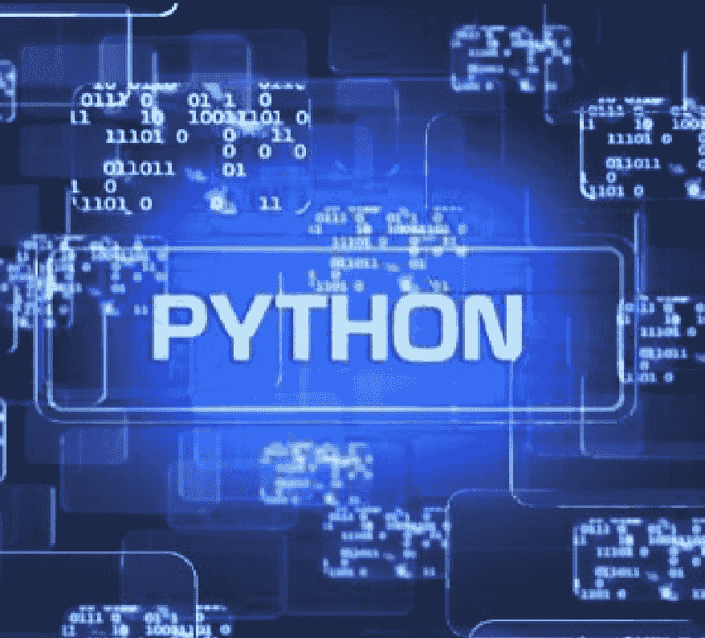


MANUEL MCFEELY

# © 版权所有 2021
保留所有权利。

本文档旨在提供关于所述主题的准确可靠信息。本书的销售即表示出版商没有义务提供会计、法律允许或其他合格的服务。如果需要法律或专业咨询，应咨询经验丰富的专家。

美国律师协会的一个委员会以及出版商和协会委员会认可并批准了《原则宣言》。

本出版物的任何部分不得以任何形式（无论是电子版还是印刷版）进行复制、翻印或传播。严禁录制本出版物，且未经出版商事先同意，不得存储本材料。所有知识产权均予以保留。

此处显示的数据据称是准确且一致的。对于因使用或误用此处包含的任何政策、流程或指示而产生的任何责任，无论是由于疏忽还是其他原因，均由接收读者独自且完全负责。在任何情况下，出版商均不对因包含在本材料中而直接或间接产生的任何赔偿、损害或金钱损失负责。

所有非出版商持有的版权均归作者所有。

此处提供的材料仅供教育目的，因此具有普遍性。信息的呈现不附带任何类型的合同或保证。

商标的使用未经商标所有者的许可或支持，且商标的发布也未经商标所有者的许可或支持。本书中提及的所有商标和品牌均为其各自所有者的财产，与本出版物无关。

# 目录

- 引言
- 第1章：安装 PYTHON
    - 在 WINDOWS 上安装 PYTHON
        - 如何查看您 WINDOWS 系统上的 PYTHON 版本
        - WINDOWS 安装程序的建议
        - 如何从 MICROSOFT 商店获取
        - 如何从完整安装程序安装
    - 如何在 MAC 上设置 PYTHON
        - 在 MAC 上，如何检查您的 PYTHON 版本？
        - MACOS 安装程序建议
        - 如何使用官方安装程序安装
        - 从 HOMEBREW 安装
    - PYTHON 特性
    - 学习 PYTHON 的好处
- 第2章：如何开始使用 PYTHON 编程以及您需要什么？
    - 选择项目平台
- 第3章：PYTHON 命令
    - 基本 PYTHON 命令
    - 中级 PYTHON 命令
    - 高级 PYTHON 命令
- 第4章：创建您的第一个 PYTHON 程序
    - 初级 PYTHON 项目创意
- 第5章：PYTHON 中的函数
- 第6章：数据类型
- 第7章：PYTHON 集合与布尔值及语法
- 第8章：PYTHON 字符串教程 – PYTHON 字符串函数与操作
    - PYTHON 字符串操作
- 第9章：PYTHON 列表示例 – 完整的 PYTHON 列表教程
    - PYTHON 列表操作
    - PYTHON 列表推导式
- 第10章：FROZENSET
- 第11章：字典与元组
    - 字典
- 第12章：PYTHON 变量与数据类型 – 初学者完整指南
    - PYTHON 数据类型
    - PYTHON 局部变量与全局变量
- 第13章：PYTHON 中的模块与包
- 第14章：PYTHON 循环教程 – PYTHON FOR 循环，嵌套 FOR 循环
- 第15章：PYTHON 类教程 – PYTHON 对象与属于类的属性
- 第16章：深入 PYTHON 闭包与装饰器
    - PYTHON 闭包简介
- 第17章：函数式编程
- 第18章：PYTHON 装饰器教程 – 链式装饰器，PYTHON PIE 语法
- 第19章：NUMPY 数组
- 第20章：PYTHON 中的 PANDAS
- 第21章：PYTHON 生成器
- 第22章：PYTHON 函数参数类型、语法与示例
- 第23章：PYTHON 异常 – PYTHON 错误与内置异常
- 第24章：分支
- 第25章：PYTHON 包教程 – 如何创建您的包
- 第26章：实际应用，TWITTER
- 第27章：什么是 PYTHON 日历

# 引言

Python 是一门极佳的编程语言，可用于广泛的软件开发项目。Python 可用于多种任务，包括 Web 开发、数据分析、机器学习和人工智能。

Guido Rossum 于 1989 年设计了 Python，作为一种面向对象的编程语言。它非常适合快速构建复杂应用的原型。它可以扩展到 C 或 C++，并具有与众多操作系统系统调用和库的接口。许多重要公司都使用 Python，包括 NASA、Google、YouTube、BitTorrent 等。

Python 旨在成为一种非常易于理解的语言。它通常使用英语术语而非标点符号，并且比其他语言具有更少的语法结构。

对于希望成为卓越软件工程师的学生和在职专业人士来说，Python 是一项必备技能，尤其是在 Web 开发领域工作的人。

在本课程中，您将学习 Python 编程语言的基础知识以及编程最佳实践。您将学习如何使用 Python 数据类型和变量来表示和存储数据，以及如何使用条件语句和循环来控制应用程序的流程。您将使用复杂的数据结构（如列表、集合、字典和元组）来存储相关数据组。您将编写脚本，定义和记录您独特的自定义函数，并处理错误。最后，您将学习如何使用 Python 标准库和其他第三方库来识别和使用模块。

# 第1章：安装 PYTHON

成为 Python 程序员的第一步是在您的计算机上安装或更新 Python。您可以使用包管理器安装 Python，从 Python.org 获取官方 Python 发行版，或者安装用于科学计算、物联网和嵌入式设备的定制发行版。

本教程侧重于官方版本，因为它们是开始学习 Python 编程的最佳方式。

您将学习如何：

- 检查您的计算机上是否安装了 Python 以及其版本；
- 在 Windows、macOS 和 Linux 上更新或安装 Python；以及
- 在手机和平板电脑等移动设备上使用 Python
- 使用在线解释器在 Web 上使用 Python。

无论您使用什么操作系统，本书都将为您提供帮助。从下面的列表中选择您的操作系统并开始吧！

## 在 WINDOWS 上安装 PYTHON

在 Windows 上，有三种安装选项：

1.  Microsoft Store
2.  完整安装程序
3.  适用于 Windows 的 Linux 子系统

在本章中，您将学习如何检查您的 Windows 机器上安装了哪个版本的 Python。您还将了解这三种安装选项中哪一种最适合您。

### 如何查看您 WINDOWS 系统上的 PYTHON 版本

打开一个命令行应用程序，例如 PowerShell，以查看您的 Windows PC 上是否已安装 Python。

以下是启动 PowerShell 的方法：

1.  按键盘上的 Win 键。
2.  在搜索框中键入 PowerShell。
3.  按 Enter 键。

您也可以右键单击“开始”按钮，然后选择 Windows PowerShell 或 Windows PowerShell（管理员）。

您也可以使用 Windows 终端或 cmd.exe。

在命令提示符下输入此命令并按 Enter：

```
C:\> python –version
Python 3.8.4
```

您可以使用 —version 开关来了解安装的版本。您也可以使用 -V 开关来达到相同的效果：

```
C:\> python –V
Python 3.8.4
```

在任何一种情况下，如果您的安装版本早于 3.8.4（这是撰写本文时的最新版本），您都需要升级您的安装。

注意：如果您没有安装 Python 版本，以下每个语句都将打开 Microsoft Store 并将您带到 Python 程序页面。在下一节中，您将学习如何通过 Microsoft Store 完成安装。

您可以使用 cmd.exe 或 PowerShell 中的 where.exe 命令来查找安装位置：

- C:\> where.exe python
- C:\Users\mertz\AppData\Local\Programs\Python\Python37-32\python.exe

值得注意的是，where.exe 命令仅在您的用户帐户安装了 Python 时才有效。

您的选择是什么？是

在 Windows 上安装官方 Python 发行版有几种方法，如前所述：

1.  **Microsoft Store 包**：在 Windows 上，最基本的安装方式是使用 Microsoft Store 程序。寻求易于设置的交互式体验的 Python 初学者应该尝试此方法。
2.  **完整安装程序**：此方法涉及直接从 Python.org 网站下载 Python。需要对安装过程有更多控制的中级和高级开发者应使用此方法。
3.  **适用于 Linux 的 Windows 子系统 (WSL)**：WSL 使你能够在 Windows 环境中运行 Linux 环境。

本节将仅介绍前两种替代方案，它们是 Windows 系统中最常见的安装技术。

如果你想在 WSL 下安装，请在安装你选择的 Linux 发行版后，直接转到本文的 Linux 部分。

注意：可以使用替代发行版（如 Anaconda）在 Windows 上完成安装；但是，本文仅涵盖官方发行版。Anaconda 是一个著名的用于科学计算和数据科学的 Python 环境。

Windows 上的两个官方 Python 安装程序存在差异。Microsoft Store 包存在一些重大限制。

### Microsoft Store 包的限制

官方 Python 文档对 Microsoft Store 包的描述如下：

Microsoft Store 包是一个用户友好的 Python 解释器，主要设计用于交互式使用，例如学生使用。

最重要的一点是，Microsoft Store 包“主要设计用于交互式使用”。也就是说，Microsoft Store 包是为学生和首次学习 Python 的人设计的。

Microsoft Store 包存在一些限制，使其不适合专业开发环境，并且面向 Python 新手。例如，它没有对共享文件夹（如 TEMP）或注册表的完全写入访问权限。

### Windows 安装程序的建议

如果你是 Python 新手，想学习这门语言而不是构建专业软件，请从 Microsoft Store 安装。这是最简单、最快捷的入门方式，麻烦最少。

另一方面，如果你是一位经验丰富的开发者，希望在 Windows 环境中开发专业软件，那么官方的 Python.org 安装是理想的选择。你不会受到 Microsoft Store 规定的限制，并且可以选择可执行文件的安装位置，以及在需要时将 Python 添加到你的 PATH。

### 如何从 Microsoft Store 获取

如果你是 Python 新手并想快速入门，Microsoft Store 包是最方便的入门技术。通过 Microsoft Store 安装需要两个步骤。

**步骤 1：在 Microsoft Store 中，转到 Python 应用页面。**

在 Microsoft Store 应用中搜索 Python。

你可能会看到几个不同的版本可供选择：

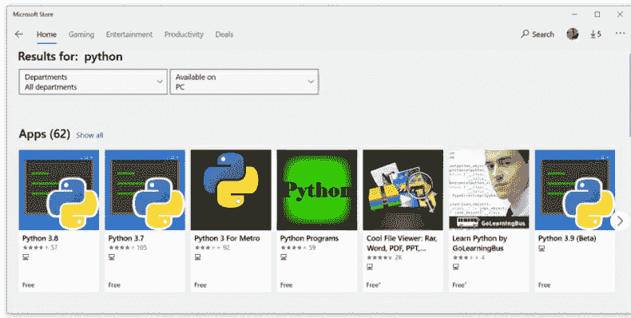

要启动安装屏幕，请选择 Python 3.8 或应用中可用的最高版本号。

警告：请仔细检查你选择的 Python 程序是否来自 Python Software Foundation。官方的 Microsoft Store 包始终是免费的；因此，如果某个应用收费，那它就不是正确的软件。

你也可以启动 PowerShell 并输入以下命令：

```
C:\> python
```

如果你尚未安装任何版本的 Python，按 Enter 键将激活 Microsoft Store，这将带你到可用的最新版本的 Python。

**步骤 2：下载并安装 Python 应用程序。**

决定要安装哪个版本后，请按照以下步骤继续安装：

1.  单击“获取”。
2.  等待应用程序完成下载过程。下载完成后，“获取”按钮将被“在我的设备上安装”按钮取代。
3.  通过单击“在我的设备上安装”选择要完成安装的设备。
4.  要开始安装，请单击“立即安装”，然后单击“确定”。
5.  如果安装顺利，Microsoft Store 页面顶部将显示通知“此产品已安装”。

恭喜！你现在可以使用 Python，包括 pip 和 IDLE！

### 如何从完整安装程序安装

通过完整安装程序安装是需要全功能 Python 编程环境的专家开发者的最佳选择。通过 Microsoft Store 安装提供的自定义和控制较少。

通过完整安装程序，你可以分两步完成安装。

**步骤 1：下载完整安装程序**

要获取完整安装程序，请按照以下步骤操作：

1.  转到 Python.org
2.  在标题“Python Releases for Windows”下，单击“Latest Python 3 Release - Python 3. x.x”的链接。在撰写本文时，Python 3.8.4 是最新版本。
3.  导航到页面底部，选择 64 位 Windows x86-64 可执行安装程序或 32 位 Windows x86 可执行安装程序。

如果你不确定是使用 32 位还是 64 位安装程序，请展开下面的框以获取更多信息。

**32 位还是 64 位 Python？**

显示/隐藏

安装程序下载完成后，进入下一步。

**步骤 2：启动安装程序**

选择并下载安装程序后，双击它以启动。将弹出一个对话框窗口，

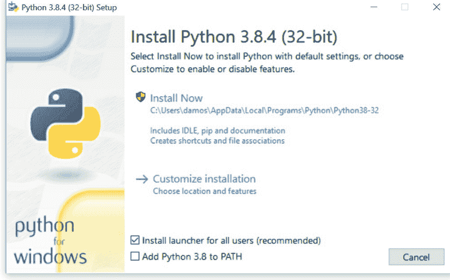

类似于下面的：

查看此对话框时，有 4 件事需要注意：

1.  默认安装路径位于当前 Windows 用户的 AppData/ 目录中。
2.  “自定义安装”按钮允许你自定义安装位置以及安装哪些附加功能，例如 pip 和 IDLE。
3.  默认情况下，“为所有用户安装应用（推荐）”复选框处于启用状态。这意味着 py.exe 启动器将可供计算机上的所有用户访问。可以取消选中此框以将 Python 限制为当前 Windows 用户。
4.  默认情况下，“Add Python 3.8 to PATH”复选框未被选中。有各种原因可能不希望 Python 在你的 PATH 中，因此在选中此选项之前请考虑其后果。

使用完整安装程序，你可以完全控制安装过程。

警告：如果你不熟悉 PATH 这个术语，强烈建议你不要使用完整安装程序。相反，请获取 Microsoft Store 包。

使用对话框上的设置来自定义安装以满足你的需求。然后按“立即安装”按钮。就这么简单！

你现在已经在你的 Windows PC 上安装了最新版本的 Python 3！

## 如何在 Mac 上设置 Python

在以前版本的 macOS 上，预装了 Python 2。从 macOS Catalina 开始，当前版本的 macOS 不再是这种情况。

在 macOS 上，有两种安装选项：

1.  正式安装程序
2.  Homebrew 包管理器

本章将教你如何确定你的 Mac 上安装了哪个版本的 Python。你还将发现这两种安装程序中哪一种最适合你。

### 在 Mac 上，如何检查你的 Python 版本？

打开一个命令行应用程序，例如终端，以查看你的 Mac 上的 Python 版本。

以下是启动终端的方法：

1.  同时按 Cmd+Space 键。
2.  选择终端。
3.  按 Enter 键。

你也可以打开 Finder 并转到“应用程序”“实用工具”“终端”。

在命令提示符下输入以下命令：

```
#### 检查系统 Python 版本
$ python --version
#### 检查 Python 2 版本
$ python2 --version
#### 检查 Python 3 版本
$ python3 --version
```

如果你的机器安装了 Python，这些任务中的一个或多个应该会返回一个版本号。

如果你的计算机上已经安装了 Python 3.6.10，python3 程序将显示以下版本号：

```
$ python3 –version
Python 3.6.10
```

如果以下任何情况适用于你，你应该下载最新版本的 Python：

- 上述任何命令都没有返回版本号。
- 只出现 Python 2. X 系列版本。
- 你没有最新版本的 Python 3，即截至本文撰写时的 3.8.4 版本。

你有哪些选择？在 macOS 上，安装官方 Python 发行版有两个选项：

1.  **官方安装程序如下**：此方法涉及从 Python.org 网站下载并安装官方 Python 安装程序。
2.  **Homebrew 包管理器**：如果你尚未安装，你需要下载并安装 Homebrew 包管理器，然后在终端应用程序中输入一个命令。

Homebrew 包管理器和官方安装程序都可以工作，尽管 Python Software Foundation 仅维护官方安装程序。

注意：可以使用替代发行版（如 Anaconda）在 macOS 上完成安装；但是，本书仅涵盖官方发行版。Anaconda 是一个著名的用于科学计算和数据科学的 Python 环境。查看官方 Anaconda 文档的 macOS 安装说明，了解如何在你的 Mac 上安装 Anaconda。

Homebrew 包管理器和官方安装程序安装的是不同的发行版。从 Homebrew 安装存在各种缺点。

### 安装 Homebrew 有其局限性

Homebrew 上提供的 macOS Python 安装不包含 Tkinter 模块所需的 Tcl/Tk 要求。Tkinter 是一个用于创建图形用户界面的 Python 库模块。它是 Tk GUI 工具包的接口，而 Tk 工具包并未包含在 Python 中。

Homebrew 不安装所需的 Tk GUI 工具包。相反，它使用系统上已安装的版本。由于系统版本的 Tcl/Tk 过时或完全缺失，你可能无法导入 Tkinter 模块。

### macOS 安装程序建议

由于它易于从命令行管理，并且允许命令更新 Python 而无需访问网站，因此 Homebrew 包管理器是在 macOS 上安装 Python 的流行选择。因为 Homebrew 是一个命令行程序，所以可以使用 bash 脚本来自动化它。

另一方面，Homebrew 提供的 Python 发行版不受 Python Software Foundation 的控制，并且可能随时更改。官方安装程序是 macOS 上最可靠的方法，特别是如果你打算使用 Tkinter 进行 Python GUI 编程。

### 如何使用官方安装程序安装

在 macOS 上，通过官方安装程序安装 Python 是最可靠的选择。它包含 Python 应用程序开发所需的所有系统依赖项。

通过官方安装程序，你可以分两步完成安装。

**步骤 1：下载官方安装程序**

要获取完整安装程序，请按照以下步骤操作：

1.  转到 Python.org
2.  单击“Latest Python”的链接
3.  要开始下载，请滚动到底部并单击“macOS 64-bit installer”。

下载完成后，进入下一步。

#### 步骤 2：启动安装程序

启动安装程序。将出现以下窗口：

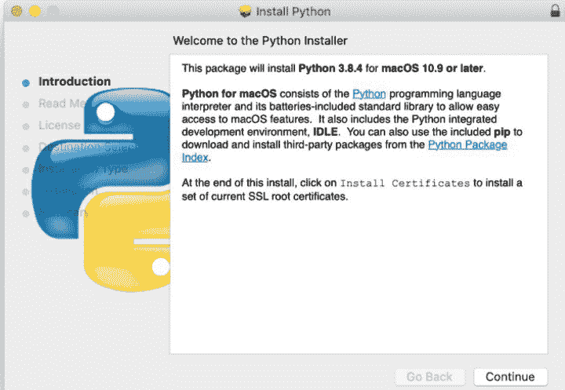

要完成安装，请按照以下步骤操作：

1.  持续点击“继续”，直到提示您接受软件许可协议。之后，点击“同意”。
2.  您将看到一个窗口，显示安装位置和所需空间。您可能不需要修改默认位置，因此点击“安装”开始安装。
3.  安装程序完成文件复制后，点击“关闭”以关闭安装窗口。

现在，您的 Mac 上已安装了最新版本的 Python 3！

### 通过 HOMEBREW 安装

对于需要从命令行安装的用户，Homebrew 包管理器是一个可行的替代方案，特别是如果您不打算使用 Python 通过 Tkinter 模块构建图形用户界面。通过 Homebrew 包管理器，您只需两步即可完成安装。

#### 步骤 1：安装 Homebrew

如果您已安装 Homebrew，可以跳过此步骤。如果尚未安装，请按照以下步骤操作：

1.  启动浏览器并访问 http://brew.sh/。
2.  在页面顶部附近，标题“Install Homebrew”下方，您应该能看到安装 Homebrew 的命令。该命令大致如下：
3.  $ /bin/bash -c "$(curl -fsSL https://raw.githubusercontent.com/Homebrew/install/master/install.sh)"
    要将命令复制到剪贴板，请用光标选中它并按 Cmd+C。
4.  将命令粘贴到终端窗口中并按回车键。这将开始安装 Homebrew。
5.  出现提示时，输入您的 macOS 用户密码。

根据您的网络连接情况，下载所有 Homebrew 必需文件可能需要几分钟时间。安装完成后，您将返回到终端窗口的 shell 提示符。

注意：如果您是第一次使用 macOS，可能会遇到一个弹出窗口，要求您安装 Apple 的命令行开发工具。由于这些工具是安装所必需的，请点击“安装”以批准该对话框。

开发工具安装完成后，您需要点击回车键以继续安装 Homebrew。

Homebrew 安装完成后，您就可以安装 Python 了。

#### 步骤 2：安装 Python

要完成 Homebrew 安装，请按照以下步骤操作：

1.  启动一个终端程序。
2.  要升级 Homebrew，请执行以下命令：
3.  Brew update && brew upgrade ($ brew update && brew upgrade)

现在，使用 Homebrew 安装 Python 3 就像输入 `brew install python3` 一样简单。这将在您的计算机上安装最新版本的 Python。

检查您是否可以从终端访问 Python，以确保一切顺利：

1.  首先，打开一个终端。
2.  输入 `pip3` 后按回车键。
3.  应该会出现 Python 的 pip 包管理器的帮助文本。如果在执行 `pip3` 时收到错误消息，请重复安装步骤直至成功安装。

恭喜，Python 现已安装在您的 Mac 上！

## PYTHON 特性

在某个时期，我们能用手指头数得过来的编程语言数量，大概就是我们所知的全部了。而如今，编程语言数不胜数，各有专长。然而，使一门语言独一无二的，是其特性。最终，正是这些特性决定了它在某个项目中被选用或被淘汰。因此，在我们深入探讨 Python 的高级概念之前，让我们先看看 Python 编程语言的基础知识，这将解释为什么 Python 相较于其他编程语言如此强大。那么，让我们从 Python 编程语言特性开始。

### Python 特性

1.  简单

当我们说“简单”这个词时，我们是在不同的语境下表达它。

-   a. 易于编码

正如我们在前面的课程中所见，Python 非常易于编码。与 C++ 和 Java 等其他常见语言相比，Python 编码更为简单。任何人只需几个小时就能学会 Python 语法。当然，要精通 Python，则需要学习其所有高级概念、包和模块。这需要时间。而且它对程序员很友好。

-   b. 易于阅读

Python 编程有点像英语，因为它是一种高级语言。如果你看看它，就能明白代码应该做什么。它还要求缩进，因为它是动态类型的。这有助于提高可读性。

2.  表达力强

让我们先来了解一下表达力。假设我们有 A 和 B 两种语言，并且可以通过局部转换来生成所有能在 A 中编写的程序。然而，有些程序可以在 B 中通过局部转换编写，却无法在 A 中实现。那么，我们就说 B 比 A 更具表达力。Python 为我们提供了大量的构造，使我们能够更专注于解决方案而非语法。这是 Python 的一个突出特点，它告诉你为什么应该学习 Python。

3.  免费且开源

首先，Python 是免费提供的。可以从 Python 官方网站下载。
其次，它们是开源的。这意味着公众可以访问其源代码。您可以下载、修改、使用和分发它们。这被称为 FLOSS（自由/自由软件和开源）。作为 Python 社区，我们都在朝着一个共同的目标前进——让 Python 变得更好。

4.  高级语言

正如我们在第 2b 点中讨论的，这是一种高质量的词汇。这意味着我们作为程序员不需要记住系统架构。我们也不需要控制内存。这使其对程序员更加友好，也是 Python 的关键特性之一。

5.  可移植

由于其开源特性，Python 已被移植到许多平台（经过修改以在不同硬件上运行）。因此，您可以将 Python 程序从 Linux 移植到 Windows，反之亦然。

6.  可解释

Python 不需要编译。在内部，它将源代码转换为一种称为字节码的中间形式。因此，您只需运行您的 Python 代码，而无需考虑连接库和其他一些事情。

我们所说的解释，是指源代码是逐行运行的，而不是一次性全部运行。因此，调试代码更为简单。解释也使其比 Java 稍慢，但与它带来的优势相比，这并不重要。

#### 7. 面向目标

据说它是一种面向对象的编程语言，可以对现实世界进行建模。它专注于对象，并将数据和函数组合在一起。与此相反，面向过程的语言围绕函数展开，函数是可重用的代码。Python 既支持面向过程编程，也支持面向对象编程，这是 Python 的关键特性之一。与 Java 不同，它还支持多重继承。类是对象的蓝图，就像这样。它是一种抽象的数据类型，不包含任何值。

#### 8. 可扩展

如果需要，您可以将部分 Python 代码用其他语言（如 C++）编写。这使得 Python 成为一种可扩展的语言，意味着它可以扩展以包含其他语言。

240 + Python 教程 – 通过实时和实际项目掌握 Python 编程。

#### 9. 可嵌入

我们刚刚看到，我们可以将其他语言的代码插入到我们的 Python 源代码中。然而，您也可以将我们的 Python 代码引入到另一种语言（如 C++）的源代码中。这使我们能够将脚本功能集成到其他语言程序中。

#### 10. 大型标准库

Python 下载附带一个大型库，因此您不必为每件事都编写自己的代码。库涵盖正则表达式、文档生成、单元测试、Web 浏览器、线程、数据库、CGI、电子邮件、图像处理以及许多其他功能。

#### 11. 可编程 GUI

软件只有在制作了 GUI 之后才算是用户友好的。用户可以通过 GUI 轻松地与软件交互。Python 提供了一系列库来为您的应用程序渲染图形用户界面。您可以使用 Tkinter、wxPython 或 JPython 来实现。这些工具包允许您轻松快速地构建 GUI。

#### 12. 动态类型

Python 是动态类型的。这意味着您在运行时决定值的类型，而不是事先决定。因此，我们在声明时不需要指定数据类型。

Python 编程语言教程特性就是这些。

## 学习 PYTHON 的好处

学习和使用 Python 有许多优势。

例如，学习非常简单，并且可以作为转向其他语言和框架（如 PERL、C、C++ 等）的跳板。如果您是绝对的初学者，并且这是您第一次接触任何类型的编程语言，这当然是您想要的。一旦完成培训，如果需要，您将有充足的机会发展，而不是局限于一种语言。

Python 之所以流行，是因为它被广泛使用。如此受欢迎，以至于像 Instagram、Google、Pinterest、Yahoo 这样的科技巨头都在使用它！——IBM、Disney、Nokia 等。一旦您学会了 Python，使用这项技能的途径将永远不会短缺。您可以成为一名 Python 开发者赚取丰厚的收入，因为许多大公司都依赖这门语言。

许多优势包括：

1.  Python 可用于产品生产，并且由于其易于使用和理解，可以帮助加速设计过程的构思。
2.  Python 非常适合通用任务，例如数据挖掘和大数据处理。
3.  所有能力水平的开发者都倾向于在使用 Python 时保持更高的协调性和效率，相较于 C# 和 Java 等语言。
4.  Python 易于阅读，即使您不是经验丰富的程序员，因此它非常适合在多程序员和大型开发团队中使用，特别是那些有缺乏经验的编码团队成员的团队。

5) Django 是一个基于 Python 的综合性开源 Web 应用框架。框架——如 Ruby on Rails——通过允许开发者使用称为模块的现有代码片段来简化开发过程。这些代码包可以根据需要在多个项目中修改和重新利用。

6) 由于 Python 是一门开源语言且拥有成熟的社区，它拥有庞大的支持基础。数百万志同道合的开发者经常与这门语言互动。此外，社区持续合作以改进核心功能。这也是其他开发者建立人脉的绝佳场所。

# 第二章：Python 编程入门

第一步：明确你为何想学习 Python。

在开始在线学习之前，先评估一下你最初为何想学习 Python。这是因为这将是一段漫长且有时可能不愉快的旅程。如果你没有足够的动力，你将无法坚持下去。找出激励你的因素可以帮助你设定一个长期目标以及一条通往目标的路径，而不会感到厌倦。你不需要开发一个特定的项目来学习 Python，只需要一个大致的兴趣领域。

选择一个你感兴趣的领域，例如：

- 数据科学 / 机器学习
- 移动应用
- 网站
- 游戏
- 数据处理与分析
- 硬件 / 传感器 / 机器人
- 自动化工作的脚本

第二步：掌握基本语法理解

另一方面，这个阶段无法绕过。在深入你选择的领域之前，你必须首先掌握 Python 语法的基础。因为它不是特别鼓舞人心，你应该在上面花费尽可能少的时间。

我再怎么强调在基本语法上花费尽可能少的时间也不为过。如果你尽快开始实践，你会学得更快。如果以后遇到困难，你总可以回过头来查阅语法。你应该只在这个阶段花几周时间，最多不超过一个月。

另外，简要提醒一下：要学习的是 Python 3，而不是 Python 2。不幸的是，许多在线“学习 Python”网站仍然教授 Python 2，而 Python 3 才是正途。Python 2 中的错误和安全漏洞将不会被修复，因为它已不再受支持！

第三步：创建组织良好的项目

一旦掌握了基本语法，你就可以开始独立开发项目了。项目是学习的绝佳方式，因为它们允许你将所学付诸实践。在应用之前，你很难记住所学的信息。项目将帮助你发挥优势、获得新技能，并建立一个作品集来展示给潜在雇主。

然而，在这个阶段，自由形式的项目会很痛苦，因为你会经常遇到困难，需要查阅文档。因此，在你足够自信能够完全独立构建项目之前，最好从更有结构的任务开始。许多学习资源提供结构化项目，让你在感兴趣的领域创建有趣的东西，同时防止你陷入困境。

让我们看看一些在每个领域进行结构化项目的有用资源：

## 机器学习 / 数据科学

- 《Python 数据分析》是学习 Python 数据分析的不错入门，由一个著名的 Python 数据分析库的作者出版。
- Dataquest - 学习 Python 和数据科学的有趣方式。你将研究各种数据集，包括 CIA 文件和 NBA 球员统计数据。最后，创建像神经网络和决策树这样的复杂算法。
- Scikit-learn 文档 —— Scikit-learn 是一个流行的 Python 机器学习包。它包含丰富的文档和教程。
- CS109 是哈佛大学的一门课程，在数据科学环境中教授 Python。他们的一些作品以及其他材料可以在网上找到。

## 移动设备应用

- Kivy 教程 —— Kivy 是一个基于 Python 的工具，用于创建移动应用。他们提供了如何入门的分步教程。

### 网站

- 《如何与 Django 共舞》—— Django 是一个强大的 Python Web 框架的入门介绍。
- Bottle 教程 - Bottle 是另一个 Python Web 框架。这是你应该开始的地方。

## 游戏

- Pygame 教程 —— 这是一个 Pygame 教程列表。Pygame 是一个用于开发游戏的流行 Python 包。
- Codecademy – 指导你完成创建几个简单游戏的过程。
- 《Pygame：制作游戏》—— 这本书向你展示如何用 Python 制作游戏。
- 《用 Python 创造你的电子游戏》—— 一本向你展示如何使用 Python 创建各种游戏的书。


一个使用 Pygame 创建的游戏示例。Phil Hassey 创作了《Barbie Seahorse Adventures 1.0》。

## 机器人/硬件/传感器

- 使用 Arduino 和 Python —— 学习如何使用 Python 控制连接到 Arduino 的传感器。
- 使用 Python 和 Raspberry Pi 构建硬件项目，同时学习 Python。
- Python 机器人学 – 使用 Python 编程机器人。
- 《Raspberry Pi 食谱》—— 学习如何使用 Raspberry Pi 和 Python 制作机器人。

## 让你的工作更自动化的脚本

- 用 Python 自动化日常事务 – 学习如何使用 Python 自动化日常任务。

在完成你所在领域的几个结构化任务后，你应该开始着手你的项目。但首先，你应该花一些时间了解如何解决问题。

第四步：着手你的个人 Python 项目

在完成许多预定义任务后，是时候着手你的项目以扩展你的 Python 专业知识了。你仍然会使用资源并理解概念，并且你将执行你热衷的任务。在开始着手你的项目之前，你应该能够熟练调试应用程序中的错误和问题。你应该熟悉以下资源：

- StackOverflow – 一个程序员可以讨论他们问题的问答平台。可以在这里找到 Python 特定的问题。
- Google —— 每个经验丰富的程序员的首选搜索引擎。在尝试解决问题时，这个工具非常有用。这里有一个例子。
- Python 文档 - 查找 Python 参考资料的绝佳去处。

一旦你掌握了处理问题的技巧，你就可以开始着手你的项目了。着手你感兴趣的问题是个好主意。例如，我在学习编程后很快就着手开发自动股票交易程序。

关于如何找到有趣项目的提示：

- 为你之前正在处理的项目添加更多功能。
- 看看我们的 Python 入门项目。
- 参加当地的 Python 聚会，结识正在从事有趣项目的人。
- 搜索开源项目以做出贡献。
- 查看是否有任何当地非政府组织需要志愿开发者。
- 查看其他人完成的项目，看看你是否可以扩展或改编它们。Github 是寻找它们的好地方。
- 浏览其他人的博客文章以获取项目灵感。
- 考虑哪些工具可以让你的日常生活更轻松，然后创建它们。

永远记住从小处着手。为了获得信心，从简单的事情开始通常是个好主意。开始一个小项目并完成它，比开始一个大项目却永远完成不了要好。我们在 Dataquest 提供指导项目，为你提供小型的数据科学相关任务，你可以在此基础上构建。

找到其他人一起工作也可以帮助你保持动力。

如果你对项目想法感到困惑，这里有一些我们涵盖的每个领域的想法：

### 机器学习 / 数据科学项目概念

- 一张显示各州选举民意调查的地图。
- 一个预测你所在地区天气的算法。
- 一个股票市场预测程序。
- 一个自动总结新闻报道的算法。

### 移动应用项目想法

- 一个跟踪你每天步行距离的应用。
- 一个为你提供天气通知的应用。
- 一个基于位置的实时通信应用。

### 网站项目想法

- 一个帮助你规划每周膳食的网站。
- 一个人们可以评分和评论电子游戏的网站。
- 一个笔记平台。

### Python 游戏项目想法

- 一个基于你位置占领区域的移动游戏。
- 一个你编程解决谜题的游戏。

### 机器人/硬件/传感器项目概念

- 监测你家温度并允许你远程监控的传感器。
- 一个更智能的闹钟。
- 一个能检测障碍物的自动驾驶机器人。

### 工作自动化项目想法

- 一个自动化数据输入的脚本。
- 一个从互联网提取数据的工具。

我的第一个独立尝试是将我基于 R 的自动作文评分程序移植到 Python。它最终看起来并不特别美观，但它给了我一种成功感，并让我踏上了提升技能的道路。

秘诀是选择一个任务并完成它。如果你过于纠结于选择正确的任务，你可能永远无法完成一项工作。

第五步：继续处理更具挑战性的项目。

扩展你任务的范围和难度，以持续挑战自己。如果你对自己所做的一切完全满意，那么是时候尝试新事物了。

如果你想的话，你可以开始一个新项目。

这里有一些建议，供那个时刻到来时参考：

- 教一个初学者如何开发你创建的项目。
- 扩展你的工具的范围是否可行？它能处理更多信息或应对更多流量吗？
- 有没有办法让你的程序运行得更快？
- 你能让你的工具对更广泛的受众更有价值吗？
- 你将如何推广你所创造的东西？

### 展望未来

Python 是一门动态语言。只有少数人能声称完全了解这门语言，他们是那些你必须持续学习并完成作业。如果你做得正确，六个月后回顾自己的代码时，你会觉得它糟糕透顶。

Python是一门非常有趣且令人满足的语言，我相信只要有适当的动力，任何人都能掌握它。

## 选择项目平台

你需要为程序开发一个运行平台，以便让缺乏其他技术知识的人也能使用你的程序。桌面、网页和命令行是你构建项目时可以考虑的三大主要平台。

### 网站

Web应用程序是运行在网页上的应用，无需下载即可在任何设备上访问，前提是能够接入互联网。如果你想让能上网的人访问你的项目，它就需要是一个Web应用程序。

Web应用程序有前端和后端。后端是业务逻辑所在：数据由你的后端代码进行操作和存储。前端是应用程序的界面：你的前端代码决定了Web应用程序的外观。

作为中级Python开发者，你的主要关注点将是后端代码。然而，前端代码同样重要，因此你需要一些CSS、HTML，可能还有JavaScript的知识来构建一个简单的图形用户界面。掌握基础知识就足够了。

另一个选择是使用Python同时处理前端和后端。得益于anvil库，你可以专注于Python代码，无需HTML、JavaScript和CSS。

使用Python，你可以通过Django和Flask等Web框架创建Web应用程序。使用Python构建Web应用的框架列表很长。有很多选择，但最流行的Web框架仍然是Django和Flask。

### 桌面图形界面

无论是在台式机还是笔记本电脑上执行任务，你都是通过应用程序来完成的。作为中级Python开发者，你也可以制作自己的桌面应用程序。

正如你在Web应用程序中看到的，你不必学习任何前端技术来创建图形用户界面应用程序。所有部分都可以使用Python构建。

存在用于构建桌面应用程序的框架。PySimpleGUI就是其中之一，中级Python开发者会觉得它非常用户友好。

像PyQt5这样的高级GUI框架功能强大，但可能学习曲线较陡峭。

你构建的桌面GUI程序可以在Windows、Linux或Mac操作系统上运行。创建项目后，你只需将其编译成适合你首选操作系统的可执行文件即可。

### 命令行

命令行应用程序是在控制台窗口中运行的应用程序。这就是Windows命令提示符，以及Linux和Mac的终端。

你会点击使用Web或GUI应用程序，但对于命令行应用程序，你需要输入命令。命令行软件用户需要具备一定的技术专长，因为他们可能需要使用命令。

命令行应用程序可能不如Web或GUI应用程序美观或用户友好，但这并不意味着它们不如Web或GUI应用程序有效。

- 内容聚合器
- 便签应用
- 测验应用
- 网址缩短器
- 正则表达式查询工具

#### 内容聚合

内容就是黄金。从博客到社交媒体平台，它存在于网络的各个角落。为了跟上潮流，你需要持续检查互联网上的新信息。保持更新的一种方法是手动检查所有网站，查看有哪些新帖子。但这很耗时，而且相当累人。

这就是内容聚合器的用武之地：内容聚合器从网络上的不同地方收集信息，并将所有这些信息汇集到一个地方。因此，要获取最新信息，你不必访问多个网站：一个网站就足够了。

通过内容聚合器，你可以从一个聚合了所有内容的网站获取所有最新信息。

##### 内容聚合器示例

以下是一些内容聚合器实现的思路：

- Hvper
- AllTop

#### 应用信息

这个项目想法的主要目标是聚合内容。接下来，你需要知道你将使用网络聚合器从哪些地方获取网页。然后，你可以使用requests等库提交HTTP请求，使用BeautifulSoup解码并抓取所需页面的内容。

作为后台进程，你的应用程序可以实现其内容聚合功能。因此，像apscheduler或celery这样的库会有所帮助。你可以尝试使用apscheduler。它非常适合后台的小型进程。

从不同网站抓取内容后，你需要将其保存在某个地方。因此，你将使用数据库来保存已抓取的内容。

#### 额外挑战

为了更具挑战性，你可以添加更多网站。这将帮助你学习如何研究网站和提取知识。

你还可以让用户订阅你聚合的某些网站。然后，内容聚合器会在每天结束时将当天的文章发送到用户的电子邮件地址。

#### 正则表达式查询工具

你我每天都在处理文本。本书有其结构，它也是文本。这让你更容易理解。有时，你需要在文本中查找某些信息，而使用文本编辑器中的常规搜索工具可能效率低下。

这就是正则表达式查询工具的用武之地。正则表达式是一组字符串的集合，这意味着正则表达式查询工具可以测试查询的有效性。一旦正则表达式匹配到文本中的模式，它就会告知用户并高亮显示匹配的模式。你的正则表达式查询工具将检查用户传入的正则表达式字符串是否有效。

用户可以通过正则表达式查询工具轻松地在网上检查其正则表达式字符串的有效性。这比使用文本编辑器检查字符串更容易。

##### 例如，正则表达式查询工具

以下是几个正则表达式查询工具的实现：

- RegexTester
- FreeFormatter

#### 应用信息

这类项目的主要目标是告知用户输入的查询字符串是否有效。你可以让它给出肯定或否定的响应，例如“查询字符串有效”和“查询字符串无效”，其中肯定响应用绿色实现，否定响应用红色实现。

查询方法不需要从头构建。你可以使用Python的标准re库，用它来对输入的文本运行查询字符串。当查询字符串没有匹配到任何内容时，re库返回None；如果匹配成功，则返回匹配的字符串。

有些用户可能不完全理解正则表达式，因此你可以创建一个解释正则表达式工作原理的页面。你可以创建足够有趣的文档，让用户对学习和理解正则表达式保持兴趣。

#### 额外挑战

做一个只返回正则表达式有效性的项目是可以的。但你也可以添加替换功能。这意味着应用程序不仅检查正则表达式的有效性，还允许用户将匹配的字符串替换为其他内容。因此，该工具不再仅仅是查找工具，也是替换工具。

#### 网址缩短器

网址可能非常长，不易使用。当人们分享链接甚至试图记住一个网址时，这很困难，因为大多数网址都包含难以理解的字符，无法构成有意义的单词。

这就是网址缩短器的用武之地。网址缩短器减少网址中的字符或字母，使其更易于阅读和记忆。一个类似于xyz.com/wwryb78&svnhkn%sghq?Sfiyh的网址可以缩短为xyz.com/piojwr。

有了网址缩短器，处理网址变得轻松愉快。

##### 例如，网址缩短器

以下是一些网址缩短器的实现：

- Bitly
- MeShort

#### 技术细节

这个项目想法的主要目标是缩短网址。应用程序将执行的主要任务是缩短网址，然后在用户访问缩短后的网址时将其重定向到原始网址。

用户在应用程序中输入原始网址，结果将是新的、缩短后的网址。为此，可以使用random和string模块的组合来生成缩短网址所需的字符。

由于用户可能在几天、几个月或几年后访问缩短后的网址，你需要将原始网址和缩短后的网址保存在数据库中。当请求进入时，应用程序检查该网址是否存在，如果存在则重定向到原始网址，否则重定向到404页面。

#### 额外挑战

创建带有随机字符的缩短网址使其比长网址更短、更好。但你可以让用户的结果更好。为了自定义网址，你可以添加一个功能，让用户可以自己定制创建的网址。

毫无疑问，一个自定义的xyz.com/mysite网址比随机生成的xyz.com/piojwr网址更好。

#### 便签应用

一天中有许多想法和思绪是正常的，但忘记也是正常的。解决遗忘问题的一种方法是在它们消失之前将其记录下来。虽然一些被遗忘的想法和思绪可能无关紧要，但有些可能非常重要。

这就是便签的用武之地：便签是一张背面带有低粘性粘合剂的小纸片，可以粘贴在纸张、墙壁等表面上。便签使记录事情变得更容易。便签项目的想法与此类似。它使用户能够记录事情，并且由于它是一个Web应用程序，可以在任何地方访问。

有了便签，人们现在可以随时随地跟踪物品，不用担心遗漏东西或放错纸条——这对于纸质便签来说是很难的。

##### 便签示例

以下是一些便签应用的实现：

- Note.ly
- Pinup

#### 技术细节

这个项目的主要目标是让用户跟踪想法。这意味着每个用户都会有他们自己的便签，因此应用程序需要具备账户创建功能。这确保了每个用户的便签对其本人保持私密。

Django 自带用户认证系统，因此可能是个不错的选择。你也可以使用 Bottle 或 Flask 等其他框架，但用户认证系统需要自行实现。

由于用户需要将笔记分类到不同部分，如果引入允许用户对笔记进行分类的功能，应用程序将更加实用。

例如，你可能需要算法和数据结构方面的笔记，因此需要能够区分这些类别中的笔记。

你可能需要存储每个用户的详细信息和笔记，因此数据库是这个项目不可或缺的一部分。如果你希望使用 MySQL 数据库，可以使用 MySQLdb 模块；如果使用 PostgreSQL 数据库，则可以使用 psycopg2 模块。你也可以使用其他模块，但这完全取决于你选择使用的数据库。

#### 额外挑战

由于人类会忘记自己的想法，忘记自己曾在某处做过笔记也是人之常情。你可以添加提醒用户笔记的功能。此功能允许用户设置通知时间，应用程序可以在时间到达时通过电子邮件向用户发送提醒。

## 测验应用程序

知识就是力量。世界上有太多东西需要学习，而测验有助于检验对这些概念的理解。作为一名中级 Python 开发者，你不必理解语言的所有方面。找出你尚未完全理解的内容的一种方法是参加测试。

这就是测验问题的由来。测验程序将向用户提问，并要求他们给出正确答案。可以将测验应用程序视为某种问卷。

被称为管理员的特殊用户将被允许使用测验应用程序创建测试，这样普通用户就可以测试他们对测验中主题的理解并回答问题。

### 测验请求类型

以下是测验应用程序概念的几种实现方式：

- myQuiz
- Kahoot

### 应用程序信息

该项目的主要目标是设置测验并让人们回答。因此，用户应该能够提出问题，其他用户应该能够回答这些问题。之后，应用程序将显示最终分数和正确答案。

如果你想让用户能够记录他们的评分，你可能需要整合账户创建功能。

创建测试的用户应该能够通过简单地上传包含问题和答案的文本来创建测试。文本文件将有可供选择的格式，以便应用程序可以将文件转换为测验。

要完成这个项目，你需要实现一个数据库。对于每个用户，数据库将存储问题、可能的答案、正确答案和分数。

#### 额外挑战

你可以允许用户为测验添加计时器，以增加挑战性。这样，测验开发者可以决定用户在测验中回答任何问题所花费的秒数或分钟数。

拥有测验分享功能也会很棒，这样用户就可以在其他平台上与朋友分享有趣的测验。

## 图形用户界面项目创意

在本节中，你将看到图形用户界面的项目创意。这些项目创意可以归类为娱乐、金融和实用工具。

以下是项目背后的创意：

- MP3 播放器
- 闹钟工具
- 电影管理员
- 支出跟踪器

### MP3 播放器

如今，音频与文本同样重要，甚至更重要。由于音频文件是数字文件，你需要一个可播放的工具来播放它们。没有播放器，你永远无法收听音频文件的内容。

这就是 MP3 播放器的用武之地。MP3 播放器是一台可以播放 MP3 和其他数字音频文件的计算机。这个 MP3 播放器图形用户界面项目创意试图模拟物理 MP3 播放器。你可以创建允许你在笔记本电脑或台式机上播放 MP3 文件的应用程序。

构建 MP3 播放器项目后，用户可以播放他们的 MP3 文件和其他数字音频文件，而无需购买物理 MP3 播放器。他们将能够使用计算机播放 MP3 文件。

#### MP3 播放器测试

以下是一些 MP3 播放器实现：

- The MusicBee
- Foobar2000

#### 技术细节

该项目的主要目标是允许用户播放数字音频文件和 MP3。应用程序需要有一个简单但美观的用户界面，以吸引用户。

你可以有一个列出可用 MP3 文件的界面。你也可以给用户列出其他非 MP3 数字音频文件的选项。

用户还期望 MP3 播放器有一个显示正在播放文件信息的界面。你可以包含的一些信息包括文件名、其以分钟和秒为单位的长度、未播放量和已播放量。

Python 有一些库可以在几行代码中播放音频文件，例如 Pygame，它使你能够处理多媒体文件。你也可以查看 Simple Audio 和 Pymedia。

许多数字音频文件都可以由这些库处理。它们可以处理某些类型的文件，而不仅仅是 MP3 文件。

你还可以引入一个允许用户创建播放列表的功能。为此，你需要一个数据库来存储已创建播放列表的信息。Python 的 sqlite3 模块允许你使用 SQLite 数据库。

在这种情况下，SQLite 数据库是更好的选择，因为它比其他 SQL 数据库更基于文件且设置更简单。虽然 SQLite 是基于文件的，但数据保存比普通文件更好。

#### 额外挑战

你可以添加一个功能，允许 MP3 播放器重复当前播放的文件，或随机播放要播放的文件列表，以增加挑战性。

还可以引入一个允许用户增加和减少音频文件播放速度的功能。这对用户很有用，因为他们将能够以比正常更快或更慢的速度播放文件。

### 闹钟工具

俗话说：“潮汐和时间不等人。”但生活中有太多事情发生，很难不忘记时间。需要提醒才能跟踪时间。

这就是闹钟工具的用武之地。闹钟是一种在特定条件下发出音频或视觉信号的设备。这个闹钟工具项目创意是尝试创建一个软件闹钟。当满足特定条件时，闹钟工具会发出音频信号。在这种情况下，设定的时间就是所述状态。

应用程序必须在设定的时间播放提示音，因为它是一个闹钟。有一些音频播放库，例如 Pygame 库。

应用程序必须在代码逻辑中持续检查设定的闹钟时间。当时间到达时，播放闹钟提示音会激活一个功能。

由于应用程序必须搜索固定的闹钟时间，这意味着应用程序将把闹钟保存在数据库中。数据库将存储诸如日期、时间和闹钟位置等项目。

#### 额外挑战

你还可以允许用户设置重复闹钟作为额外功能。他们将能够设置每周特定日期的闹钟，在某个时间响起。例如，可以设置每周一下午 2:00 的闹钟。

你可以添加一个贪睡功能，这样你的用户就可以贪睡闹钟，而不是仅仅关闭它们。

### 文件管理器

普通 PC 用户个人电脑上的文件数量相当多。如果所有这些文件都放在一个目录中，导航和查找文件或目录将会很困难。因此，文件需要正确地排列和管理。

这就是文件管理器的用武之地。文件管理器允许用户通过用户界面访问文件和文件夹。虽然文件可以通过命令行控制，但并非所有用户都知道如何操作。

用户可以使用文件管理器正确地排列、访问和管理他们的文件和目录，而无需知道如何使用命令行。文件管理器执行的一些任务包括复制、移动和重命名文件或目录。

#### 文件管理器中的工具示例

以下是一些文件管理器实现的创意：

- FreeCommander
- Explorer+++

#### 技术细节

文件管理器项目的主要目标是为用户提供一个管理文件的界面。用户希望有一个外观良好且易于使用的文件管理工具。

你可以使用 PySimpleGUI 库，而无需处理大量复杂性，就可以使用强大的小部件创建独特的用户界面。

你的用户应该能够执行简单的任务，例如创建新目录或清空文本文件。他们还应该能够复制目录或文件，并移动它们。

对于这个项目，sys、os 和 Shutil 库将非常有用，因为它们可以用于在用户点击时对上下文文件执行操作。

如今，网格视图和列表视图是常见的视图，因此你可以在应用程序中实现两者。这为用户提供了选择适合他们的视图选项的选项。

#### 额外挑战

为了使文件管理器更高级一些，可以实现搜索功能。这样，用户可以搜索文件和目录，而无需手动查找。

此外，你可以实现排序功能。这将允许用户按顺序对文件进行排序，例如按时间、字母顺序或大小。

### 支出跟踪器

我们有日常开支，从食品到衣物再到账单。开支如此之多，以至于忘记它们并继续消费直到几乎用光现金是很正常的。跟踪器将帮助人们关注他们的开支。

这就是支出跟踪器的用武之地。支出跟踪器是一种使用户能够跟踪其支出的软件工具。根据其先进程度，它还可以分析支出，但让我们现在保持简单。

用户可以使用支出跟踪器设置预算并跟踪他们的支出，以便做出更好的财务决策。

#### 支出跟踪器示例

以下是一些成本跟踪器概念的实现：

#### 技术细节

本项目的主要目标是跟踪用户支出。必须进行一些统计分析，以便用户获得关于其支出的准确信息，并帮助他们更好地消费。

虽然监控支出至关重要，但拥有一个良好的图形用户界面也是必要的。你可以使用 PySimpleGUI 创建一个独特的界面，以提升用户体验。

像 matplotlib 和 pandas 这样的 PyData 库可以帮助创建一个支出跟踪器。

pandas 库可用于数据分析，而 matplotlib 库可用于绘制图表。图表将为用户提供其支出的可视化表示，通常，可视化表示更容易理解。

该应用程序将获取用户数据。这里的数据指的是输入的支出。因此，支出必须存储在数据库中。对于本项目，SQLite 数据库是一个很好的选择，因为它易于设置。SQLite 数据库可以与 sqlite3 模块一起使用。

#### 额外挑战

为了让用户从本项目中受益，他们需要定期输入支出，而这很容易被遗忘。实现一个通知功能可能会对你有所帮助。因此，在一天或一周的特定时间，应用程序将发送通知，提醒他们使用支出跟踪器。

## 命令行项目创意

在本节中，你将看到一些命令行项目创意。这里讨论的项目创意可以归类为实用工具。

以下是项目背后的创意：

-   通讯录
-   文件连通性检查器
-   批量文件重命名工具
-   目录树生成器

### 通讯录

我们每天都会遇到很多人。我们结交朋友和熟人。我们获取他们的联系方式以便日后联系。遗憾的是，保存收到的联系方式可能很困难。一种方法是写下联系方式。但这并不安全，因为你很容易丢失实体书。

这就是通讯录项目派上用场的地方。通讯录是一种保存联系人详细信息的工具，例如姓名、电话号码、地址和电子邮件地址。对于这个通讯录项目，你可以创建一个软件工具，让人们保存和查找联系信息。

用户可以利用通讯录项目的概念保存他们的联系人，这样丢失已保存联系信息的可能性更小。它将始终可以通过他们计算机上的命令行访问。

#### 联系人软件示例

有一些通讯录应用程序，但在命令行上找到通讯录产品很少见，因为大多数是移动端、Web 或图形用户界面应用程序。

以下是一些通讯录实现：

-   Pobuca Connect
-   Simple Contacts

#### 技术细节

本项目的主要目的是保存联系信息。为用户设置输入联系人详细信息的命令。你可以在命令行上使用 argparse 或 click 框架。它们抽象了许多复杂的事情，因此在执行命令时，你只需专注于要运行的逻辑。

你应该实现的一些功能包括删除联系人命令、列出已保存的联系人以及更新联系人信息。你还可以允许用户使用不同的标准列出联系人，例如按字母顺序或联系人创建日期。

由于这是一个命令行项目，SQLite 数据库非常适合保存联系人。SQLite 是一个易于使用的设置。你可以将联系信息保存在文件中，但文件无法提供使用 SQLite 所能获得的优势，例如性能和保护。Python 的 sqlite3 模块在本项目中使用 SQLite 数据库将非常有用。

#### 额外挑战

还记得你是如何将数据库存储在计算机上的吗？如果发生某些事情，比如用户丢失了他们的文件，会怎样？这意味着他们也会丢失联系信息。你也可以挑战自己，将你的账户转移到在线存储站点。为此，你可以在某些时候将数据库文件上传到云端。此外，你可以添加一个命令，允许用户自己备份数据库。这样，如果数据库文件丢失，用户仍然可以访问联系人。你应该记住，可能需要某种形式的身份验证，以便通讯录可以识别哪个数据库文件属于哪个用户。为用户实现身份验证功能是完成此任务的一种方法。

### 站点连通性检查器

当你访问一个 URL 时，你期望你的浏览器能查看请求的链接。但情况并非总是如此。有时网站可能会宕机，因此你无法获得想要的结果。相反，你会收到错误通知。你可以持续尝试访问一个宕机的站点，直到它恢复并获得所需的信息。这就是站点连通性检查器项目的作用。站点连通性检查器访问一个 URL 并返回其状态：它可能是活动的，也可能不是。站点连通性检查器会定期访问 URL，返回每次会话的结果。站点连通性检查器将为你完成所有手动工作，而不是手动访问 URL。因此，你只需获得搜索结果，而无需浪费时间在浏览器上等待网站上线。

#### 站点连通性检查器示例

以下是一些站点连通性检查器的实现创意：

-   Site24x7
-   Ping

#### 应用信息

本项目的主要目标是检查站点的状态。因此，要测试网站的状态，你必须编写代码。你可以选择使用 TCP 或 ICMP 进行连接。socket 模块是一个值得研究的选择。你也可以阅读 Python 中的套接字编程（指南）。你可以附加命令，允许用户通过你选择的系统（无论是 Button、Docopt 还是 Argparse 框架）从待检查站点列表中添加和删除站点。此外，用户应该能够启动工具、停止它并确定检查间隔。由于需要保存待检查的文件列表，你可以通过 sqlite3 模块使用 SQLite 数据库，或者将其保存在文件中（只是一个站点列表）。

#### 额外挑战

该应用程序将监控站点的连接状态，并将结果显示在命令行上。但这将要求用户保持命令行处于验证状态。你将提高难度并实现一个通知功能。通知功能可以是在后台播放的声音，当站点状态改变时提醒用户。要存储站点之前的状态，你需要一个数据库。这是工具能够判断状态变化的唯一方式。

### 批量文件重命名工具

有时，目录中的所有文件都必须按照特定的约定命名。例如，在一个包含 File0001.jpg 的目录中，你可以根据目录中的文件数量，将所有文件命名为数字递增的名称。手动执行此操作可能既费力又重复。批量文件重命名工具使用户能够重命名大量文件，而无需手动重命名文件。这为用户节省了大量时间。它使他们免于进行常规、枯燥的工作并犯错的麻烦。用户可以在几秒钟内使用批量文件重命名工具重命名文件，且不会出错。

#### 批量文件重命名工具示例

以下是批量文件重命名概念的几种实现：

-   Rename
-   Ren

#### 应用信息

这个项目创意的主要目标是重命名文件。因此，应用程序必须找到操作目标文件的方法。os、sys 和 shutil 库对本项目的大部分功能都很有用。

使用命名约定，你的用户将能够重命名目录中的所有文件。因此，他们应该能够传递命名约定的选择。如果你理解正则表达式的工作原理，re 模块可以帮助匹配适当的命名模式。

用户可能希望作为命令的一部分传递一个命名约定，例如 "my files"，并期望该工具将所有文件重命名为 "myfilesXYZ"，其中 XYZ 是一个数字。此外，他们应该能够选择要重命名的文件所在的目录。

#### 额外挑战

本项目的一个大挑战是重命名目录中的所有文件。然而，用户可能只需要重命名特定数量的文件。为了测试你的技能，你可以实现一个功能，允许用户选择要重命名的文件数量，而不是所有文件。

请注意，仅重命名几个文件允许应用程序根据字母顺序、文件大小或文件创建时间来排列文件，具体取决于用户的需求。

### 目录树生成器

目录类似于家谱：每个目录与其他目录都有特殊的关系。除了空的根目录外，没有目录是独立存在的。

在处理文件和目录时，很难看到文件夹之间的联系，因为你只能看到当前目录中的内容。你使用文件管理器，或者从命令行工作。

使用目录树生成器，你可以像树或地图一样查看文件和目录之间的关系。

这使得文件和目录的定位更容易理解。在解释某些概念时，目录树图很重要，而目录树生成器使得获取文件和目录之间关系的可视化表示变得更加容易。

#### 目录树生成器示例

以下是一些目录树生成器的实现：

-   Dirtreex
-   Tree

#### 应用信息

目录树生成器的主要目标是可视化文件和目录之间的连接。os 库对于列出选定目录中的文件和目录非常有用。

使用像 Argparse 或 Docopt 这样的框架有助于抽象大量事物，让你专注于编写应用程序逻辑的代码。

在应用程序的逻辑中，你可以决定要表示哪些文件或目录。使用不同的颜色是一个很好的方法。colored 库可用于以各种颜色打印文件和文件夹。

此外，你可以确定目录树生成器要深入到什么程度。例如，如果一个目录有十二层深的子目录，你可能只决定深入到第五层。

如果你愿意，你也可以让用户决定目录树生成器要深入到什么程度。

#### 额外挑战

由于结果将在生成的目录树的命令行上显示，你可以更进一步。你可以让生成器创建目录树图像，从而本质上将文本转换为图像。

Pillow 库对此会很有用。

## 项目作品提示

从事项目工作可能很艰难。这就是为什么项目动力和兴趣会让它变得不那么令人畏惧的原因之一。

如果你对一个项目感兴趣，你将能够花时间研究，并找到帮助项目的库和工具。

以下是一些提示：

- 考虑激励来源
- 将项目分解为子任务
- 进行一些子任务研究
- 一次一步地完成每个子任务
- 遇到困难时寻求帮助
- 列出子任务

# 第三章：PYTHON 命令

## 基本的 PYTHON 命令

基本命令如下。

- **注释：** 在 Python 中使用 # 符号进行注释。对于多行注释，你需要使用 """ 符号或将注释括在 """ 符号中。

**示例：**
Print "Hello World." # 这是注释部分。

**示例：**
""" 这是一个 Hello world 项目。"""。

- **类型函数：** 这些命令用于通过内置函数确定变量的类型。

**示例：**
type (20)，其类型是 int。
>>> type (20) < type 'int' >

**示例：**
type (-1 +j)，其类型是 complex
>>> type (-1+j)
< type 'complex' >

- **字符串：** 主要用双引号括起来。

**示例：**
type ("hello World")，类型是 string
>>> type ("hello World")
< type 'str' >

- **列表：** 列表主要用方括号括起来。

**示例：**
type ( [ 1, 2 ] )，类型是 list
>>> type ( [ 1, 2, 3 ] )
< type 'List' >

- **元组：** 元组主要用圆括号括起来。

**示例：**
type ( 1, 2, 3)，类型是 tuple。
>>> type ( ( 1, 2, 3) )
<type 'tuple' >

- **Range：** 此函数用于创建整数列表。

**示例：**
>>> range ( 10 )
输出：[0, 1, 2, 3, 4, 5, 6, 7, 8, 9]

**示例：**
>>> range (1,10)
输出：[1, 2, 3, 4, 5, 6, 7, 8, 9]

- **布尔值：** 此数据类型有助于以 True 或 false 形式检索数据。

**示例：**
>>> True
True
>>> type (True)
< type 'bool' >

**示例：**
>>> False
False
>>> type (False)
< type 'bool' >

- **运算符：** 对于不同的函数，如除法、乘法、加法和减法，使用不同的运算符。

**示例：**
>>> 16/2
8

**示例：**
>>> 2 ** ½
1

- **变量和赋值：** 赋值语句中使用 variable = expression。单个 '=' 用于赋值，双等号 '==' 用于相等性测试。

**示例：**
>>> X= 235
>>> print X
235
>>> Z= 2* X
>>> print Z
470

- **比较运算符：** 用于比较值，结果始终是布尔值。

**示例：**
>>> 2 < 3
True

## 中级 PYTHON 命令

中级 Python 命令如下。

- **条件/判断：** 用于在两个或多个值之间进行选择，例如 if-else。

**示例：**
if x=0:
Print "Hello, world."
Else:
Print "Hello, world in Else."

- **For 循环：** 当迭代和操作具有相同的项时，使用此 Python 命令。

**示例：**
for x in [ 1, 2, 3, 4, 5, 6]:
Print x;

- **While 循环：** 如果条件在第一次求值时为 false，则 while 循环将永远不会执行。

**示例：**
x =0
while x<10:
    Print x,
    X= x+2

- **循环中的 Else：** 循环有一个可选的 else 用于执行。

**示例：**
for x in [ 1, 3, 5, 7, 9, 11]:
    Print x
Else:
    Print "In Else"

- **Break 和 continue 语句：** break 语句用于在达到特定输出时退出循环，而 continue 语句继续下一次迭代。

**示例：**
if x==0:
    Print "X is 0"
    Break
Else:
    Print "X is greater than 0."

## 高级 PYTHON 命令

高级 Python 命令如下。

- **列表技术：** 列表中可用于执行函数的不同技术。

**示例：**
X [1, 2,3,4,5]
    - >>> X.append (7)
>>> x
[1, 2, 3, 4, 5, 7]
    - >>>X.insert (0, 0)
>>> x
[0, 1, 2, 3, 4, 5]
    - >>> X.remove (2)
>>> x
[0, 1, 3, 4, 5]
    - >>> X.pop (1)
>>> x
[2,3,4,5]

它们易于使用、编写和理解。它非常适应性强，可以通过多种方式帮助获得所需的结果。Python 是一种通用且成熟的语言，是当今自动化领域使用最广泛的语言之一。以上说明将为您提供 Python 命令可以做什么以及如何使用它们的快速概览。

为了获得有效的结果，它必须被良好地管理和编写。Python 是一种编程语言，背后有一个庞大的社区。无论现在还是未来，它在 IT 行业都有着光明的未来。对于熟悉面向对象编程的人来说，Python 命令是基础且直接的。组织也需要更高水平的 Python 来实现其目标，而拥有这种专业知识的员工正在赚取丰厚的收入。

# 第四章：创建你的第一个 PYTHON 程序

## 初学者级别的 PYTHON 项目创意

我们为初级 Python 开发人员精选了一些 Python 项目。

1.  Mad Libs 生成器

由于它包含了字符串、变量和连接等概念，这个 Python 入门项目是新软件工程师的一个很好的起点。Mad Libs 生成器解释了如何修改用户输入的数据，其中 Mad Libs 指的是用户输入的一组输入。用户的输入可以是代词、形容词甚至动词。在所有材料输入完毕后，应用程序会组织它们以创建一个故事模板。

源代码：

```python
""" Mad Libs Generator
------------------------
"""

### Loop back to this point once code finishes
loop = 1
while (loop < 10):
    # All the questions that the program asks the user
    noun = input("Choose a noun: ")
    p_noun = input("Choose a plural noun: ")
    noun2 = input("Choose a noun: ")
    place = input("Name a place: ")
    adjective = input("Choose an adjective (Describing word): ")
    noun3 = input("Choose a noun: ")
    # Displays the story based on the users input
    print ("---------------------------------------")
    print ("Be kind to your",noun,"- footed", p_noun)
    print ("For a duck may be somebody's", noun2,",")
    print ("Be kind to your",p_noun,"in",place)
    print ("Where the weather is always",adjective,".")
    print ()
    print ("You may think that is this the",noun3,",")
    print ("Well it is.")
    print ("---------------------------------------")
    # Loop back to "loop = 1"
    loop = loop + 1
```

2.  猜数字

这个项目是一个有趣的游戏，适合初学者学习如何玩。该应用程序生成一个介于 1 到 10 之间，或 1 到 100 之间，或用户选择的任何范围内的随机数，用户必须在计算机给出提示后猜出这个数字。当用户的估计错误时，会提供额外的建议来帮助他们预测数字，但这是以分数减少为代价的。任何算术线索都可以用作线索，例如倍数、大于或小于、可整除或它们的组合。该软件还需要例程来确定用户是否提供了真实数字，将输入数字与实际数字进行比较，并计算两个值之间的差异。

**示例代码：**

```python
""" Number Guessing Game
---------------------------------
"""
import random
attempts_list = []
def show_score():
    if len(attempts_list) <= 0:
        print("There is currently no high score, it's yours for the taking!")
    else:
        print("The current high score is {} attempts".format(min(attempts_list)))
def start_game():
    random_number = int(random.randint(1, 10))
    print("Hello traveler! Welcome to the game of guesses!")
    player_name = input("What is your name? ")
    wanna_play = input("Hi, {}, would you like to play the guessing game? (Enter Yes/No) ".format(player_name))
    # Where the show_score function USED to be
    attempts = 0
    show_score()
    while wanna_play.lower() == "yes":
        try:
            guess = input("Pick a number between 1 and 10 ")
            if int(guess) < 1 or int(guess) > 10:
                raise ValueError("Please guess a number within the given range")
            if int(guess) == random_number:
                print("Nice! You got it!")
                attempts += 1
                attempts_list.append(attempts)
                print("It took you {} attempts".format(attempts))
                play_again = input("Would you like to play again? (Enter Yes/No) ")
                attempts = 0
                show_score()
                random_number = int(random.randint(1, 10))
                if play_again.lower() == "no":
                    print("That's cool, have a good one!")
                    break
            elif int(guess) > random_number:
                print("It's lower")
                attempts += 1
            elif int(guess) < random_number:
                print("It's higher")
                attempts += 1
        except ValueError as err:
            print("Oh no!, that is not a valid value. Try again...")
            print("({})".format(err))
    else:
        print("That's cool, have a good one!")
if __name__ == '__main__':
    start_game()
```

3.  石头剪刀布

这个应用程序通常被称为小游戏，是在你没有人一起玩或独自一人在锁着的房间里时创建的。这个程序需要几个函数，所以让我们逐一介绍它们。

- 一个随机生成石头、剪刀和布的函数。
- 验证函数：确保移动是正确的。
- 结果函数用于确定该轮的获胜者。
- 记分员：负责保持分数的人。

该程序需要用户在计算机移动之前先做出移动。在移动被验证后，输入（一个字符串或一个字母）会被评估。在分析输入字符串后，结果函数选择一个获胜者，而记分员函数会更改该轮的分数。

**示例代码：**

### 4. 网站屏蔽器

我们都知道，上网时会出现大量不必要的网站来分散我们的注意力。这个项目在这些场景中很有用，因为它可以被配置为禁止特定网站加载。该软件可以帮助那些容易分心、在处理重要事务时频繁访问社交媒体网站的人。

代码示例：

```python
""" Website Blocker
---------------------------------
"""
import time
from datetime import datetime as dt
hosts_path = r"/etc/hosts"   # r is for raw string
hosts_temp = "hosts"
redirect = "127.0.0.1"
web_sites_list = ["www.facebook.com", "facebook.com"]   # users can modify the list of the websites they want to block
while True:
    if dt(dt.now().year, dt.now().month, dt.now().day, 9) < dt.now() < dt(dt.now().year, dt.now().month, dt.now().day,22):
        print("Working hours")
        with open(hosts_path, "r+") as file:
            content = file.read()
            for website in web_sites_list:
                if website in content:
                    pass
                else:
                    file.write(redirect+" "+website+"\n")
    else:
        print("Fun time")
        with open(hosts_path, "r+") as file:
            content = file.readlines()
            file.seek(0)   # reset the pointer to the top of the text file
            for line in content:
                # here comes the tricky line, basically we overwrite the whole file
                if not any(website in line for website in web_sites_list):
                    file.write(line)
                # do nothing otherwise
            file.truncate()   # this line is used to delete the trailing lines (that contain DNS)
    time.sleep(5)
```

### 5. 二分查找算法

仅从名称就足以了解该项目的概况。该程序要求你创建一个从0到你想要的任意范围的数字列表，其中每个后续数字相差2。

当一个人输入一个要搜索的随机数字时，程序会将列表分成两半开始搜索。如果在第一半中找到了所需的数字，则拒绝搜索另一半，反之亦然。搜索会持续进行，直到子数组的大小达到零或找到该数字。这个Python项目想法也可以帮助你编写在列表中搜索特定元素的软件。

代码示例：

```python
""" Binary Search Algorithm
-----------------------------------
"""
#### iterative implementation of binary search in Python
def binary_search(a_list, item):
    """Performs iterative binary search to find the position of an integer in a given, sorted,
    list.
    a_list -- sorted list of integers
    item -- integer you are searching for the position of
    """
    first = 0
    last = len(a_list) - 1
    while first <= last:
        i = (first + last) / 2
        if a_list[i] == item:
            return ' found at position '.format(item=item, i=i)
        elif a_list[i] > item:
            last = i - 1
        elif a_list[i] < item:
            first = i + 1
        else:
            return ' not found in the list'.format(item=item)

#### recursive implementation of binary search in Python
def binary_search_recursive(a_list, item):
    """Performs recursive binary search of an integer in a given, sorted, list.
    a_list -- sorted list of integers
    item -- integer you are searching for the position of
    """
    first = 0
    last = len(a_list) - 1
    if len(a_list) == 0:
        return ' was not found in the list'.format(item=item)
    else:
        i = (first + last) // 2
        if item == a_list[i]:
            return ' found'.format(item=item)
        else:
            if a_list[i] < item:
                return binary_search_recursive(a_list[i+1:], item)
            else:
                return binary_search_recursive(a_list[:i], item)
```

# 第5章：Python中的函数

在编程中，函数用于将一组你想要重复使用或更好地封装在子程序中的指令分组，并根据需要调用，因为它们很复杂。也就是说，函数是一段为执行特定任务而编写的代码。该函数可能需要也可能不需要多个输入来完成该任务。该函数在任务完成时可能返回也可能不返回一个或多个值。

在Python中，函数分为三类：

- 内置函数，例如用于请求帮助的`help()`、返回最小值的`min()`、将对象打印到终端的`print()`等等... 包含更多此类函数的概述可以在这里找到。
- 用户定义函数（UDFs），是用户创建的用于辅助他们的函数；
- 匿名函数，通常称为lambda函数，不使用传统的`def`关键字声明。

## 方法与函数

属于类的函数称为方法。它通过类实例或对象来访问。此限制不适用于函数：它只涉及单个函数。这意味着虽然所有方法都是函数，但并非所有函数都是方法。

考虑这个例子，你首先定义一个函数`plus()`，然后定义一个带有`sum()`方法的`Summation`类：

```python
### Define a function 'plus()'
def plus(a,b):
    return a + b

### Create a 'Summation' class
class Summation(object):
    def sum(self, a, b):
        self.contents = a + b
        return self.contents
```

在调用`sum()`函数之前，你必须先定义`Summation`类的一个实例或对象。那么，让我们为这样一个对象创建一个定义：

```python
### Instantiate 'Summation' class to call 'sum()'
sumInstance = Summation()
sumInstance.sum(1,2)
```

请记住，在调用函数`plus()`时不需要这个实例化！你应该能够在DataCamp Light代码块中毫无问题地执行`plus(1,2)`！

## 参数与形参

参数是在定义函数和方法时给出的名称，实参被映射到这些名称上。换句话说，实参是传递给函数或方法调用的东西，而函数或方法代码将实参称为形参名称。

考虑以下场景，然后返回到DataCamp Light代码块：即使你创建了三个形参`self`、`a`和`b`，你向`Summation`类的`sum()`方法传递了两个实参。

那么，你发生了什么？

每个类方法的第一个实参引用类的当前实例，即`Summation`。这个参数通常被称为“self”。

因为`self`是一个隐式给定的实参的形参名称，该实参通过调用方法的实例来引用，所以你不需要在这种情况下传递对`self`的引用。它被隐式地放入实参列表中。

### 用户自定义函数：如何定义函数（UDFs）

以下是Python中定义函数的四个步骤：

1.  使用`def`关键字声明函数，后跟函数名。
2.  为函数添加参数，参数应放在函数的括号内。在行末加上冒号。
3.  包含函数应执行的语句。
4.  如果你的函数需要输出内容，请以`return`语句结束。如果函数没有`return`语句，它将返回`None`。

当然，随着你的进步，你的函数会变得更加复杂：你可以添加`for`循环、流程控制等，使其更加精细：

```python
def hello():
    name = str(input("Enter your name: "))
    if name:
        print("Hello " + str(name))
    else:
        print("Hello World")
    return

hello()
```

在上面提到的函数中，你向用户询问姓名。如果未指定姓名，函数将打印"Hello World"。否则，用户将收到个性化的问候。

另外，请记住，你的UDF可以有一个或多个函数参数。当你学习到函数参数部分时，你会了解更多。此外，作为函数的结果，你可以返回一个或多个值。

#### return语句

在你的UDF `hello()`中，你不需要返回任何东西，因为你正在打印内容。这个函数与上面列出的函数之间没有区别：

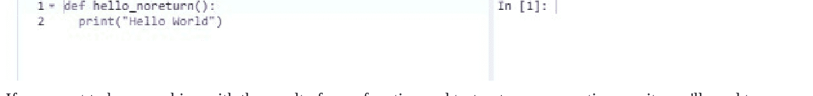

如果你想继续使用函数的结果并在其上测试一些操作，你需要使用`return`语句返回一个值，例如字符串、整数或...考虑以下场景，其中`hello()`返回字符串"hello"，而`hello_no_return()`返回`None`：

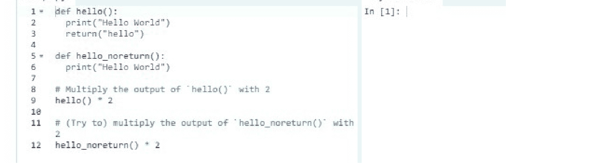

因为`None`不能做任何事情，所以第二种技术会返回错误。你会得到一个`TypeError`，提示`NoneType`（`hello_no_return()`返回的`None`）和`int`的乘法操作无法进行（2）。

当函数遇到`return`语句时，它会立即退出，即使这意味着它不会返回任何值：

```python
##### script.py
def run():
    for x in range(10):
        if x == 2:
            return
    print("Run!")

run()
```

使用`return`语句时，还值得注意的是，你可以利用它返回多个值。元组用于实现这一点。请记住，这种数据结构类似于列表，可以包含多个值。另一方面，元组是不可变的，这意味着你不能更改其中包含的值！你使用双括号`()`将其组合在一起。可以使用逗号和赋值运算符将元组解包为多个变量。要了解你的函数如何返回多个值，请考虑以下示例：

```python
##### script.py
##### Define `plus()`
def plus(a,b):
    sum = a + b
    return (sum, a)

##### Call `plus()` and unpack variables
sum, a = plus(3,4)

##### Print `sum()`
print(sum)
```

`return sum, a`与`return (sum, a)`的结果相同，因为前者在底层将`sum`和`a`打包成一个元组！

### 函数应该叫什么名字？

你在前面的章节中已经看到了很多调用函数的例子。当你调用一个函数时，你是在告诉Python运行你指定的函数，无论是通过另一个函数直接调用，还是从Python提示符调用（如"嵌套函数"部分所述）。只需执行`hello()`即可调用你新定义的函数，如下方DataCamp Light代码块所示：

```python
##### script.py
hello()
```

### 如何在Python函数中包含文档字符串？

编写Python函数的另一个重要部分是使用文档字符串。文档字符串定义了你的函数的行为，例如它执行的计算和返回的结果。这些描述充当你的函数的文档，允许任何阅读函数文档字符串的人无需阅读整个函数定义即可理解其功能。函数文档字符串插入在函数头之后的下一行，位于三引号之间。`'Prints "Hello World"'`是你的`hello()`方法的合适文档字符串。

```python
def hello():
    """Prints "Hello World."

    Returns:
        None
    """
    print("Hello World")
    return
```

值得注意的是，文档字符串可以比这里显示的长得多。如果你想了解更多关于文档字符串的信息，请访问Python库（如sci-kit-learn或pandas）的Github仓库，那里有很多例子！

## Python函数参数

你之前研究了参数和实参的区别。简而言之，实参是传递给任何函数或方法调用的项目，而方法或函数代码将实参称为参数名。Python UDF可以接受四种不同类型的参数：

-   关键字参数
-   可变数量的参数
-   默认参数
-   必需参数

### 默认参数

如果在函数调用期间未指定任何值作为实参，则使用默认参数。要分配此默认值，请使用赋值运算符`=`，如下例所示：

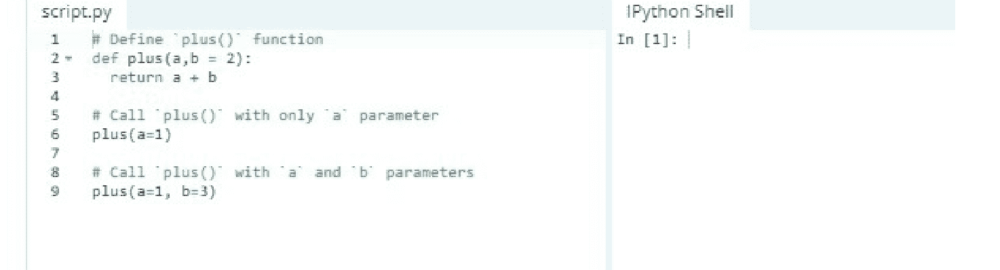

### 必需参数

顾名思义，UDF的必需参数是必须存在的参数。这些参数必须在函数调用期间按正确的顺序给出，如下例所示：

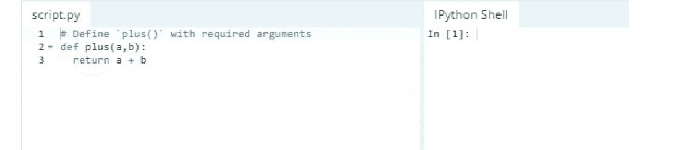

要调用函数而不遇到任何问题，你需要与`a`和`b`参数对应的实参。如果你交换`a`和`b`的顺序，结果不会改变，但如果你将`plus()`修改为以下内容，结果可能会改变：

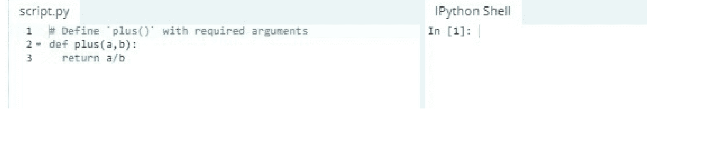

### 关键字参数

你可以在函数调用中使用关键字参数，以确保你按正确的顺序调用所有参数。这些参数用于根据其参数名识别实参。为了更清楚地说明这一点，请考虑以下示例：

值得注意的是，你可以使用关键字参数来更改参数的顺序，并在运行函数时仍然获得相同的结果：

```python
##### script.py
#### Define `plus()` function
def plus(a,b):
    return a + b

#### Call `plus()` function with keyword arguments
plus(b=2, a=1)
```

### 可变数量的参数

如果你不知道要提供给函数的确切实参数量，可以使用`*args`的以下语法：

```python
##### script.py
##### Define `plus()` function to accept a variable number of arguments
def plus(*args):
    return sum(args)

##### Calculate the sum
plus(1,4,5)
```

星号（`*`）放在保存所有非关键字可变参数值的变量名之前。请注意，你可能将`addition()`函数命名为`*variant`、`*var_int_args`或任何其他名称。将`*args`替换为包含星号的不同名称。你会注意到上面的代码仍然有效！你可以看到上面的程序如何使用内置的Python `sum()`函数来累加提供给`plus()`的所有实参。如果你想避免这种情况并完全从头开始创建函数，可以使用此技术：

```python
##### script.py
##### Define `plus()` function to accept a variable number of arguments
def plus(*args):
    total = 0
    for i in args:
        total += i
    return total

##### Calculate the sum
plus(20,30,40,50)
```

## 全局变量与局部变量

在函数体内指定的变量具有局部作用域，而在函数体外定义的变量具有全局作用域。局部变量在函数块内定义，只能在该函数内检索，而全局变量可由脚本中的所有函数访问：

## Python 匿名函数

在 Python 中，匿名函数有时被称为 lambda 函数，因为它们是使用 `lambda` 关键字而非传统的 `def` 关键字来声明的。

```python
double = lambda x: x*2

double(5)
```

DataCamp Light 代码块中的未命名或 lambda 方法是 `lambda x: x*2`。参数是 `x`，然后被求值，返回的表达式或指令是 `x*2`。与你在本函数教程第一部分看到的示例相比，此函数没有名称。如果上述代码必须写成一个用户自定义函数（UDF），它将如下所示：

```python
def double(x):
    return x*2
```

考虑以下接受两个参数的 lambda 函数示例：

```python
### `sum()` lambda 函数
sum = lambda x, y: x + y;

### 调用 `sum()` 匿名函数
sum(4,5)

### "转换"为 UDF
def sum(x, y):
    return x+y
```

当你需要一个在运行时生成的、仅在短时间内使用的无名函数时，你会使用匿名函数。在使用 `filter()`、`map()` 和 `reduce()` 时，这一点尤其重要：

```python
from functools import reduce

my_list = [1,2,3,4,5,6,7,8,9,10]

### 将 lambda 函数与 `filter()` 一起使用
filtered_list = list(filter(lambda x: (x*2 > 10), my_list))

### 将 lambda 函数与 `map()` 一起使用
mapped_list = list(map(lambda x: x*2, my_list))

### 将 lambda 函数与 `reduce()` 一起使用
reduced_list = reduce(lambda x, y: x+y, my_list)

print(filtered_list)
print(mapped_list)
print(reduced_list)
```

顾名思义，`filter()` 函数使用 `>10` 的条件来过滤原始输入列表 `my_list`。使用 `map()`，你可以将一个函数应用于列表 `my_list` 中的所有条目。在此场景中，所有元素都乘以 2。
`reduce()` 方法包含在 `functools` 库中。此函数从左到右累积应用于 `my_list` 中的条目，将序列缩减为单个值，在此例中为 55。

## 使用 main() 作为函数。

如果你使用过其他编程语言，例如 Java，你会知道 main 函数对于函数的执行至关重要。从上面的示例可以看出，Python 并不需要这个。然而，在你的 Python 程序中包含一个 `main()` 函数可能有助于你逻辑地组织代码，因为它包含了最关键的部分。
你可以像调用其他函数一样轻松地创建一个 `main()` 函数并调用它：

```python
### 定义 `main()` 函数
def main():
    hello()
    print("This is a main function")

main()
```

但是，当你将 `main()` 函数作为模块导入时，你的 `main()` 方法的代码将被调用。
当 `__name__ == '__main__'` 时，你调用 `main()` 方法以确保这种情况不会发生。
因此，上述代码块的代码变为：

```python
### 定义 `main()` 函数
def main():
    hello()
    print("This is a main function")

### 执行 `main()` 函数
if __name__ == '__main__':
    main()
```

除了 `__main__` 方法之外，你还有一个 `__init__` 函数，用于初始化一个类或对象实例。简单地说，它的作用类似于构造函数或初始化器，并在创建类的新实例时自动调用。新生成的对象被分配给该函数中的 `self` 参数，你在本课程前面已经见过。考虑以下场景：

```python
class Dog:
    """
    要求：
    legs - 让狗能行走的腿。
    color - 毛发的颜色。
    """

    def __init__(self, legs, color):
        self.legs = legs
        self.color = color

    def bark(self):
        bark = "bark" * 2
        return bark

if __name__ == "__main__":
    dog = Dog(4, "brown")
    bark = dog.bark()
    print(bark)
```

# 第 6 章：数据类型

本教程将教你 Python 中可用的各种数据类型。

Python 有几种数据类型。

在 Python 中，每个值都有一个数据类型。数据类型本质上是类，而变量是这些类的实例（对象），因为 Python 编程中的一切都是对象。

Python 有几种不同的数据类型。以下是一些更重要的类型。

## Python 中的数字

Python 数字包括整数、浮点数和复数。在 Python 中，它们被称为 `int`、`float` 和 `complex` 类。

可以使用 `type()` 方法来确定变量或值属于哪个类。`isinstance()` 函数用于确定一个对象是否属于特定类。

```python
a = 5
print(a, "is of type", type(a))

a = 2.0
print(a, "is of type", type(a))

a = 1+2j
print(a, "is complex number?", isinstance(1+2j,complex))
```

输出

```
5 is of type <class 'int'>
2.0 is of type <class 'float'>
(1+2j) is complex number? True
```

整数可以是任意长度；唯一的限制是可用的内存量。

浮点数最多精确到 15 位小数。小数点分隔整数和浮点数。

`1.0` 是浮点数，而 `1` 是整数。

复数的公式是 `x + yj`，其中 `x` 是实部，`y` 是虚部。这里有几个示例。

```python
>>> a = 1234567890123456789
>>> a
1234567890123456789
>>> b = 0.1234567890123456789
>>> b
0.12345678901234568
>>> c = 1+2j
>>> c
(1+2j)
```

浮点变量 `b` 已被截断。

## Python 中的列表

Python 列表是按特定顺序排列的项目集合。它是一种极其灵活的数据类型，是 Python 中最常用的数据类型之一。列表中的所有项目不必是相同类型。

声明列表相当简单——项目用逗号分隔，并包含在方括号 `[ ]` 中。

```python
a = [1, 2.2, 'python']
```

要从列表中提取一系列项目，我们可以使用切片运算符 `[ ]`。在 Python 中，索引从 0 开始。

```python
a = [5,10,15,20,25,30,35,40]

### a[2] = 15
print("a[2] = ", a[2])

### a[0:3] = [5, 10, 15]
print("a[0:3] = ", a[0:3])

### a[5:] = [30, 35, 40]
print("a[5:] = ", a[5:])
```

输出

```
a[2] = 15
a[0:3] = [5, 10, 15]
a[5:] = [30, 35, 40]
```

列表是可变的，这意味着列表元素的值可以更改。

```python
a = [1, 2, 3]
a[2] = 4
print(a)
```

输出

```
[1, 2, 4]
```

## Python 中的元组

元组与列表一样，是元素的有序序列。元组的不同之处仅在于它们是不可变的。元组一旦生成就无法更改。

元组用于写保护数据，并且因为它们不会动态更改。

它在圆括号 `()` 内定义，各部分之间用逗号分隔。

```python
t = (5,'program', 1+3j)
```

我们可以使用切片运算符 `[]` 提取项目，但不能更改其值。

```python
t = (5, 'program', 1+3j)

### t[1] = 'program'
print("t[1] = ", t[1])

### t[0:3] = (5, 'program', (1+3j))
print("t[0:3] = ", t[0:3])

### 生成错误
### 元组是不可变的
t[0] = 10
```

输出

```
t[1] = program
t[0:3] = (5, 'program', (1+3j))
Traceback (most recent call last):
  File "test.py", line 11, in <module>
    t[0] = 10
TypeError: 'tuple' object does not support item assignment
```

## Python 中的字符串

Python 中的字符串是 Unicode 字符的集合。要表示字符串，我们可以使用单引号或双引号。三引号 `"""` 或 `'''` 可用于表示多行字符串。

```python
s = "This is a string"
print(s)
s = '''A multiline
string'''
print(s)
```

输出

```
This is a string
A multiline
string
```

切片运算符 `[ ]` 可以像用于列表和元组一样用于字符串。然而，字符串是不可变的。

# 第七章：Python 集合与布尔值及语法

到目前为止，我们已经介绍了多种 Python 数据类型。我们处理过的对象包括字符串、数字、列表、元组和字典。

我们还发现，在定义数据时并不需要声明其类型。今天我们将讨论 Python 集合示例和 Python 布尔值。

然后，在后续课程中，我们将探讨 Python 函数。

## 什么是 Python 集合？

我们将开始使用 Python 集合。在 Python 中，集合是一组值的集合。它是有序的，但无法进行索引。

随着我们通过本书深入学习 Python 集合，我们将更好地理解这一点。示例如下。

### 1. 创建 Python 集合

要声明一个集合，必须在花括号内输入一系列用逗号分隔的元素。然后将其赋值给一个 Python 变量。

```python
>>> a={1,3,2}
```

如你所见，我们是按 1、3、2 的顺序编写的。我们将在 b 点访问这个集合，看看会得到什么。

集合中可以包含多种类型的值。

```python
>>> c={1,2.0,'three'}
```

#### a. 重复的元素

集合中不能有任何重复的元素。让我们尝试在另一个集合中放入重复元素，然后从 b 点访问它。

```python
>>> b={3,2,1,2}
```

#### b. 灵活性

集合可以包含可变对象，如列表、集合甚至字典，但它不能包含可变元素。

```python
>>> d={[1,2,3],4}
```

输出

```
Traceback (most recent call last):
  File "<pyshell#9>", line 1, in <module>
    d={[1,2,3],4}
TypeError: unhashable type: 'list'
```

正如我们之前解释的，不存在嵌套的 Python 集合。

```python
>>> d={{1,3,2},4}
```

输出

```
Traceback (most recent call last):
  File "<pyshell#10>", line 1, in <module>
    d={{1,3,2},4}
TypeError: unhashable type: 'set'
```

#### c. Python set() 函数

你可以使用 set() 函数创建一个集合。

```python
>>> d=set()
>>> type(d)
```

输出

```
<class 'set'>
```

这会生成一个空的集合对象。重要的是要记住，如果你这样定义一个空集合，你实际上是在声明一个空字典，而不是一个空集合。我们可以使用 type() 方法来验证这一点。

```python
>>> d={}
>>> type(d)
```

输出

```
<class 'dict'>
```

然而，set() 函数也可以接受一个参数。它应该是一个类似列表的可迭代对象。

```python
>>> d=set([1,3,2])
```

### 2. 使用 Python 访问集合

由于 Python 集合不支持索引，你只能一次访问整个集合。让我们看看能否从 a 点访问这些集合。

```python
>>> a
```

输出

```
{1, 2, 3}
```

你看到元素是如何按升序重新排列的吗？现在让我们看看能否访问集合 c。

```python
>>> c
```

输出

```
{1, 2.0, 'three'}
```

最后，让我们访问集合 b。

```python
>>> b
```

输出

```
{1, 2, 3}
```

如你所见，我们声明集合时有两个 2，但现在只有一个；因此，它自动重新排列了集合。

集合不能被切片，因为它们不支持索引。让我们看看能否切片一个。

```python
>>> b[1:]
```

输出

```
Traceback (most recent call last):
  File "<pyshell#26>", line 1, in <module>
    b[1:]
TypeError: 'set' object is not subscriptable
```

如错误所示，集合对象不可下标访问。

### 3. 在 Python 中删除集合

由于集合没有索引，你不能使用索引来删除元素。因此，必须使用下面列出的方法之一。

必须在集合上调用一个方法，它可以修改集合。让我们从以下情况的数字集合开始。

```python
>>> numbers={3,2,1,4,6,5}
>>> numbers
```

输出

```
{1, 2, 3, 4, 5, 6}
```

#### a. discard()

此方法接受要删除的项目作为参数。

```python
>>> numbers.discard(3)
>>> numbers
```

输出

```
{1, 2, 4, 5, 6}
```

如结果集合所示，项目 3 已被删除。

#### b. remove()

与 discard() 方法类似，remove() 从集合中删除一个项目。

```python
>>> numbers.remove(5)
>>> numbers
```

输出

```
{1, 2, 4, 6}
```

#### discard() 与 remove() 的区别

这两个过程看起来可能相同，但存在区别。discard() 会忽略集合中不存在的项目，而 remove() 会抛出 KeyError。

```python
>>> numbers.discard(7)
>>> numbers
```

输出

```
{1, 2, 4, 6}
```

```python
>>> numbers.remove(7)
```

输出

```
Traceback (most recent call last):
  File "<pyshell#37>", line 1, in <module>
    numbers.remove(7)
KeyError: 7
```

#### c. pop()

你可以在集合上使用 pop() 方法，就像在字典上一样。然而，在这种情况下，它不接受计数器参数。由于集合不允许索引，无法向 pop 方法提供索引。因此，它会返回一个随机项目。此外，被弹出的项目会被打印出来。

```python
>>> numbers.pop()
```

输出

```
1
```

让我们尝试弹出另一个元素。

```python
>>> numbers.pop()
```

输出

```
2
```

让我们在另一个集合上试试。

```python
>>> {2,1,3}.pop()
```

输出

```
1
```

#### d. clear()

与 pop 方法() 类似，字典的 clear() 方法也可以应用于 Python 集合。它会清空 Python 中的集合。

```python
>>> numbers.clear()
>>> numbers
```

输出

```
set()
```

如你所见，使用 set() 来表示空集合，而不是 {}。

### 4. 使用 Python 更新集合

我们已经看到，Python 集合是可变的。然而，正如我们所示，我们不能使用索引重新赋值它。

```python
>>> numbers={3,1,2,4,6,5}
>>> numbers[3]
```

输出

```
Traceback (most recent call last):
  File "<pyshell#56>", line 1, in <module>
    numbers[3]
TypeError: 'set' object does not support indexing
```

因此，我们为此使用两种方法：add() 和 update()。update() 方法已在元组、列表和字符串上使用过。

#### a. add()

它接受要添加到集合中的项目作为参数。

```python
>>> numbers.add(3.5)
>>> numbers
```

输出

```
{1, 2, 3, 4, 5, 6, 3.5}
```

当你向集合添加一个已存在的项目时，它对集合的其余部分没有影响。

```python
>>> numbers.add(4)
>>> numbers
```

输出

```
{1, 2, 3, 4, 5, 6, 3.5}
```

#### b. update()

此方法接受多个输入，可以一次向集合添加多个项目。

```python
>>> numbers.update([7,8],{1,2,9})
>>> numbers
```

输出

```
{1, 2, 3, 4, 5, 6, 3.5, 7, 8, 9}
```

如图所示，我们可以传递一个列表和一个集合作为参数。这是因为这与创建一个集合不同。

### 5. Python 集合函数

函数是可以应用于 Python 集合并在其上执行操作然后返回值的代码。让我们回顾一下集合可以执行的一些函数。为了演示，我们将使用一个新集合。

```python
>>> days={'Monday','Tuesday','Wednesday','Thursday','Friday','Saturday','Sunday'}
```

#### a. len()

len() 方法返回集合的长度。这是元素的总数。

```python
>>> len(days)
```

输出

```
7
```

### b. max()

此函数返回集合中值最高的项目。

```python
>>> max({3,1,2})
```

输出

```
3
```

```python
>>> max(days)
```

输出

```
'Wednesday'
```

对于字符串也可以进行类似的类比。因为在 M、T、W、F 和 S 中，W 的 ASCII 值最大，所以 Python 方法返回了 'Wednesday'。然而，我们无法比较不同类型的值。

```python
>>> max({1,2,'three','Three'})
```

输出

```
Traceback (most recent call last):
  File "<pyshell#69>", line 1, in <module>
    max({1,2,'three','Three'})
TypeError: '>' not supported between instances of 'str' and 'int'
```

### c. min()

min() 函数与 max() 函数类似，返回 Python 集合中值最低的项目。

```python
>>> min(days)
```

输出

```
'Friday'
```

在 M、T、W、F 和 S 中，F 的 ASCII 值最低。

### d. sum()

Python 集合中的 sum() 函数返回集合中所有项目的算术和。

```python
>>> sum({1,2,3})
```

输出

```
6
```

### 输出

6

然而，你不能将其应用于包含字符串的集合。

```
>>> sum(days)
```

### 输出

```
Traceback (most recent call last):
  File "<pyshell#72>", line 1, in <module>
    sum(days)
TypeError: unsupported operand type(s) for +: 'int' and 'str'
```

### e. any()

即使集合中只有一个项目的布尔值为 True，此函数也会返回 True。

```
False
```

```
1. >>> any({0, '0'})
```

### 输出

```
True
```

### f. all()

与 any() 函数不同，all() 仅在 Python 集合中所有项目的布尔值均为 True 时才计算为 True。否则，返回 False。

```
>>> all({0, '0'})
```

### 输出

```
False
```

```
>>> all(days)
```

### 输出

```
True
```

### g. sorted()

sorted() 函数将返回一个排序后的 Python 集合到列表。它会重新计算，但原始集合不受影响。

```
1. >>> numbers={1, 2, 3, 4, 5, 6, 3.5}
2. >>> sorted(numbers)
```

### 输出

```
[1, 2, 3, 3.5, 4, 5, 6]
```

## 6. Python 集合技术

技术与 Python 集合中的函数不同，它可以改变集合的状态。必须在集合上调用它，以对其进行一系列操作。

到目前为止，我们已经介绍了 add()、clear()、discard()、pop()、remove() 和 update() 技术。现在将从数学角度介绍更多技术。

### a. union()

此技术对两个或多个 Python 集合执行并集操作。它返回属于这些集合中任何一个的所有对象。

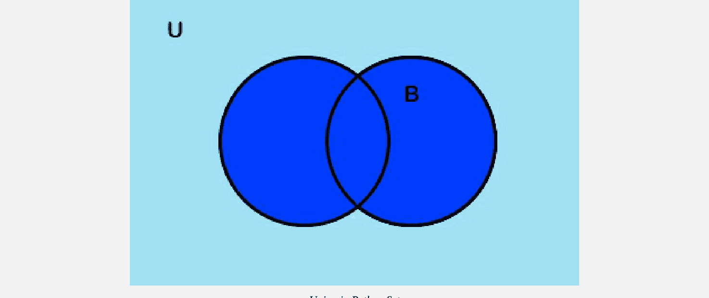

```
>>> set1,set2,set3={1,2,3},{3,4,5},{5,6,7}
>>> set1.union(set2,set3)
Output
{1, 2, 3, 4, 5, 6, 7}
>>> set1
Output
{1, 2, 3}
```

如你所见，set1 没有被改变。在 Python 中，技术并不总是会改变集合。

### b. intersection()

此技术接受集合作为参数，并返回所有集合共有的元素。

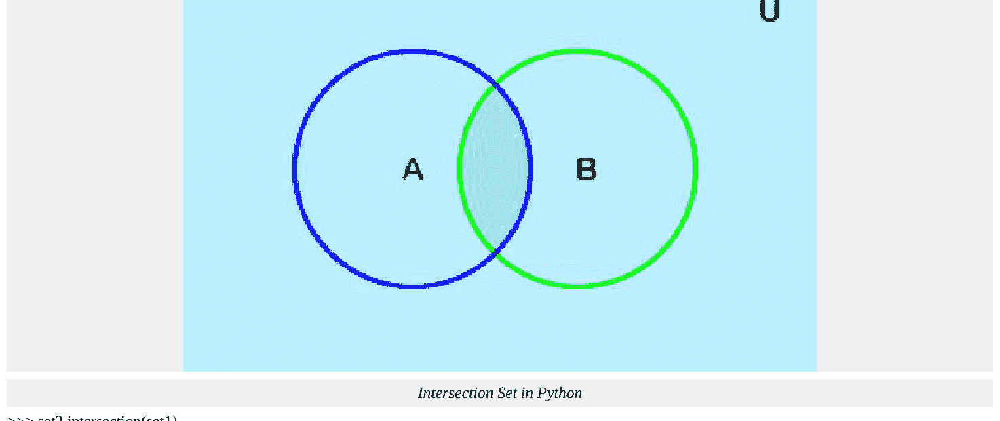

```
>>> set2.intersection(set1)
```

### 输出

{3}

让我们求三个集合的交集。

```
>>> set2.intersection(set1,set3)
```

### 输出

```
set()
```

因为这三个集合没有共同元素，所以返回了一个空集。

### c. difference()

difference() 技术比较两个或多个集合并返回差集。它给你一个结果集合。

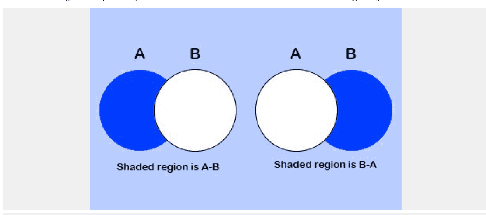

```
>>> set1.difference(set2)
```

输出

```
{1, 2}
```

这返回了在 set1 中但不在 set2 中的元素。

```
>>> set1.difference(set2,set3)
```

输出

```
{1, 2}
```

### d. symmetric_difference()

此技术返回每个集合中独有的所有元素。

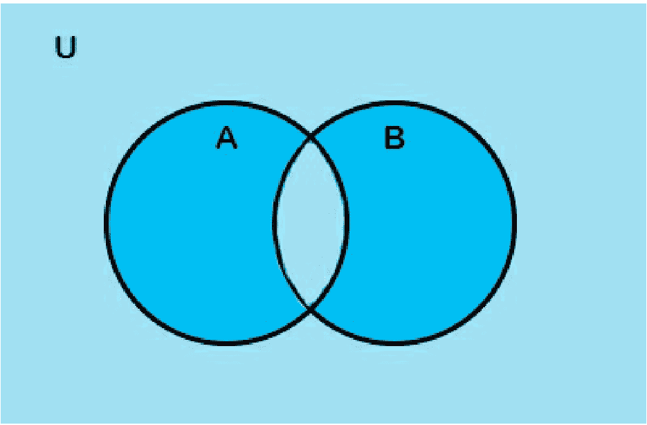

Python 中的对称差集

```
>>> set1.symmetric_difference(set2)
```

### 输出

```
{1, 2, 4, 5}
```

它们在 set1 中但不在 set2 中；它返回了 1 和 2。它也返回了 4 和 5，它们在 set2 中但不在 set1 中。因为 3 存在于两个集合中，所以没有返回。

### e. intersection_update()

正如我们在 intersection() 中看到的，它不会更新调用它的集合。intersection_update() 技术用于此目的。

```
>>> set1.intersection_update(set2)
>>> set1
```

### 输出

```
{3}
```

它只在 set1 中存储了 3，因为那是 set1 和 set2 唯一的共同元素。

### f. difference_update()

此技术与 intersection_update() 类似，将差集添加到 Python 集合中。

```
>>> set1={1,2,3}
>>> set2={3,4,5}
>>> set1.difference_update(set2)
>>> set1
```

### 输出

```
{1, 2}
```

### g. symmetric_difference_update()

与前两个过程类似，它用对称差集更新调用它的集合。

```
>>> set1={1,2,3}
>>> set2={3,4,5}
>>> set1.symmetric_difference_update(set2)
>>> set1
```

### 输出

{1, 2, 4, 5}

### h. copy()

copy() 技术创建 Python 集合的浅拷贝。

```
1. >>> set4=set1.copy()
2. >>> set1,set4
```

### 输出

```
({1, 2, 4, 5}, {1, 2, 4, 5})
```

### i. isdisjoint()

如果两个集合的交集为空，此技术返回 True。

```
>>> {1,3,2}.isdisjoint({4,5,6})
```

### 输出

True

然而，它只能接受一个参数。

```
1. >>> {1,3,2}.isdisjoint({3,4,5},{6,7,8})
```

### 输出

```
Traceback (most recent call last):
  File "<pyshell#111>", line 1, in <module>
    {1,3,2}.isdisjoint({3,4,5},{6,7,8})
TypeError: isdisjoint() takes exactly one argument (2 given)
```

### j. issubset()

如果参数中的集合包含此集合，此技术返回 true。

```
1. >>> {1,2}.issubset({1,2,3})
```

### 输出

True

```
1. >>> {1,2}.issubset({1,2})
```

### 输出

True

### k. issuperset()

与 issubset() 技术类似，如果此集合包含参数中的集合，则返回 True。

```
>>> {1,3,4}.issuperset({1,2})
```

### 输出

False

```
>>> {1,3,4}.issuperset({1})
```

### 输出

True

## 7. Python 集合操作

我们现在将探讨可以应用于集合的操作。

### a. 成员资格

Python 运算符 'in' 和 'not in' 可以用于集合中的元素。这告诉我们它们是否是集合的一部分。

```
>>> 'p' in {'a','p','p','l','e'}
```

### 输出

True

```
>>> 0 not in {'0','1'}
```

### 输出

True

## 8. 在 Python 中迭代集合

我们可以像迭代列表和元组一样，在 for 循环中迭代集合。

```
>>> for i in {1,3,2}:
    print(i)
```

### 输出

1
2
3

如你所见，尽管顺序是 1,3,2，但它按升序打印。

## 9. frozenset

实际上，frozenset 是一个不可变集合。它的值不能被更改。另一方面，集合不能用作字典键，而 frozenset 可以。

```
>>> {{1,2}:3}
```

### 输出

```
Traceback (most recent call last):
  File "<pyshell#123>", line 1, in <module>
    {{1,2}:3}
TypeError: unhashable type: 'set'
```

现在让我们尝试用 frozenset 来做这件事。

```
1. >>> {frozenset(1,2):3}
```

### 输出

```
Traceback (most recent call last):
  File "<pyshell#124>", line 1, in <module>
    {frozenset(1,2):3}
TypeError: frozenset expected at most 1 arguments, got 2
```

正如你将看到的，只需要一个参数。现在让我们看看正确的语法。

```
>>> {frozenset([1,2]):3}
```

输出

{frozenset({1, 2}): 3}

## Python 中的布尔值？

最后，让我们谈谈布尔值。布尔数据类型是另一种 Python 数据类型。

+   1. 布尔表达式的值

正如我们之前看到的，布尔值可以是 True 或 False。例如，isalpha() 和 issubset() 产生布尔值。

什么是布尔值。

+   2. 声明布尔表达式

你可以像声明整数一样声明布尔值。

```
>>> days=True
```

如你所见，我们不需要使用引号来分隔 True 值。如果你这样做，你会得到一个字符串而不是布尔值。

此外，我们将一个布尔值重新分配给了之前是一个集合的变量。

```
>>> type('True')
```

输出

<class 'str'>

+   3. bool() 函数

正如我们之前看到的，bool() 函数将另一个值转换为布尔类型。

```
>>> bool('Wisdom')
```

输出

True

```
>>> bool([])
```

输出

False

+   4. 不同构造的布尔值

不同的值具有不同的布尔等效值。要找到此示例中的值，我们使用 bool() Python 集合技术。

例如，0 的布尔值是 False。

```
>>> bool(0)
```

### 输出

```
False
```

1 的布尔值是 True，0.00000000001 也是。

```
>>> bool(0.00000000001)
```

### 输出

```
True
```

字符串的布尔值是 True，但空字符串是 False。

```
>>> bool(' ')
输出
True
>>> bool('')
输出
False
```

任何空构造的布尔值都是 False，非空构造的布尔值是 True。

```
>>> bool(())
输出
False
>>> bool((1,3,2))
输出
True
```

## (5) 布尔运算

### a. 算术算法

集合可以进行一些数学运算。它将 False 的值取为 0，True 的值取为 1，然后将运算符应用于两者。

+   - 加法

两个或多个布尔值可以相加。让我们看看这是如何进行的。

```
>>> True+False #1+0
```

# 第8章：Python字符串教程 – Python字符串函数与操作

本Python字符串指南将通过示例教你什么是Python字符串以及如何使用它。
你还将学习如何在Python中声明和切片字符串，以及如何使用Python字符串函数和操作。
最后，你将学习Python转义序列。
让我们开始这个Python字符串教程。

究竟什么是Python字符串？
Python中的字符串是字符的集合。为了处理Python字符串，有一个名为`str`的内置类。
可以使用`type()`方法来演示这一点。

```
>>> type('Dogs are love')
```

输出

```
<class 'str'>
```

Python缺少C++和Java中存在的`char`数据类型。
如何声明Python字符串？
可以使用单引号或双引号来声明Python字符串。

```
>>> a='Dogs are love'
>>> print(a)
```

输出

```
Dogs are love
```

```
>>> a="Dogs are love"
>>> print(a)
```

输出

```
Dogs are love
```

你不能以单引号开始字符串并以双引号结束，反之亦然。

```
>>> a='Dogs are love"
```

输出

```
SyntaxError: EOL while scanning string literal
```

## 如何在Python字符串中放入引号？

因为引号用于界定字符串，所以在字符串内使用它们时需要注意一些事项。

```
>>> a="Dogs are "love""
```

输出

```
SyntaxError: invalid syntax
```

如果你在Python字符串内使用双引号，请使用单引号来界定字符串。

```
>>> a='Dogs are "love"'
>>> print(a)
```

输出

```
Dogs are "love."
```

如果你需要在字符串内使用单引号，请用双引号将它们分开。

```
>>> a="Dogs are 'love'"
>>> print(a)
```

输出

```
'Dogs are 'love''
```

## 跨行字符串

你可以使用三引号将Python字符串分布在多行上。

```
>>> a="""Hello
Welcome"""
>>> print(a)
```

输出

```
Hello
Welcome
```

与使用反斜杠不同，它还会保留换行符。

```
>>> a="Hello\n    Welcome"
>>> print(a)
```

输出

```
Hello     Welcome
```

## 如何获取Python字符串？

字符串不能被修改；它是不可变的。

```
>>> a="Dogs"
>>> a[0]="H"
```

输出

```
Traceback (most recent call last):
  File "<pyshell#22>", line 1, in <module>
    a[0]="H"
TypeError: 'str' object does not support item assignment
```

但你可以访问字符串。

```
>>> a="Dogs are love"
>>> a
```

输出

```
'Dogs are love.'
```

```
>>> print(a)
```

输出

```
Dogs are love
```

1. 显示单个字符
将字符串中单个字符的索引放在方括号中以显示它。索引从零开始。

```
>>> a[1]
```

输出

```
'o'
```

2. 切片字符串
有时你可能只想显示字符串的一部分。为此，请使用切片运算符`[]`。

```
>>> a[3:8]
```

输出

```
' are'
```

这里，它打印了索引3到7的字符，索引从0开始。

```
>>> a[:8]
```

输出

```
'Dogs are'
```

这打印了从第一个到第七个字符。

```
>>> a[8:]
```

输出

```
' love'
```

这打印了从第8个字符到字符串末尾的字符。

```
>>> a[:]
```

输出

```
'Dogs are love.'
```

这打印了整个字符串。

```
>>> a[:-2]
```

输出

```
'Dogs are lo'
```

这打印了从开头到字符串末尾前两个字符的字符。

```
>>> a[-2:]
```

输出

```
've'
```

这打印了从字符串末尾前两个字符到末尾的字符。

```
>>> a[-3:-2]
```

输出

```
'o'
```

这打印了从字符串末尾前三个字符到末尾前两个字符的字符。

以下代码返回空字符串。

```
>>> a[-2:-2]
```

输出

```
''
```

```
>>> a[2:2]
```

输出

```
''
```

## Python字符串连接

连接是将两个或多个对象连接在一起的技术。可以使用连接运算符`+`来连接Python字符串。

```
>>> a='Do you see this,'
>>> b='$$?'
>>> a+b
```

输出

```
'Do you see this, $$?'
```

让我们再看一个例子。

```
>>> a='10'
>>> print(2*a)
```

输出

```
1010
```

```
>>> '10'+10
```

输出

```
Traceback (most recent call last):
  File "<pyshell#49>", line 1, in <module>
    '10'+10
TypeError: must be str, not int
```

## Python字符串格式化器

有时你可能想在字符串旁边打印变量。你可以使用逗号或字符串格式化器来实现相同的结果。

```
>>> city='Ahmedabad'
>>> print("Age",21,"City",city)
```

输出

```
Age 21 City Ahmedabad
```

1. f-strings
字母`f`放在字符串前面，变量在各自的位置用花括号括起来。

```
>>> name='Ayushi'
>>> print(f"It isn't {name}'s birthday")
```

输出

```
It isn't Ayushi's birthday
```

因为我们想在字符串中使用两个单引号，所以我们用双引号来界定整个字符串。

2. format()方法
你可以使用`format()`方法做同样的事情。它跟在字符串后面，变量作为参数用逗号分隔。
要将变量放在字符串中的位置，请使用花括号。你可以在花括号内放入`0,1,...`或变量名。
使用后者时，你必须使用格式化方法为它们赋值。

```
>>> print("I love {0}".format(a))
```

输出

```
I love dogs
```

```
>>> print("I love {a}".format(a='cats'))
```

输出

```
I love cats
```

变量不必在print语句之前定义。

### 输出

我爱雪貂

### 3. % 运算符

在字符串中，百分号运算符放置在变量所在的位置。字母 `s` 在百分号中代表字符串。
字符串后面跟着括号/元组中的变量和运算符。

```
1. >>> b='ferrets'
2. >>> print("I love %s and %s" %(a,b))
```

### 输出

我爱狗和猫

其他选项包括：
- %f – 用于浮点数
- %d – 用于整数

## Python 中的转义序列

你可能希望在 Python 字符串中包含制表符、换行符或其他字符。这可以通过转义序列实现。
根据你的需求，转义序列是一个回车符后跟一个字符。
Python 可以处理以下序列。

- \n – 换行符
- \t – 制表符

```
>>> print("hell\to")
```

### 输出

hell    o

- \ – 反斜杠

反斜杠本身可以是转义序列的一部分。因此，它也必须用反斜杠进行转义。

- ' – 反斜杠可用于转义单引号。这允许你在字符串中自由使用单引号。
- " – 双引号与单引号一样，也可以被转义。

你对 Python 字符串和 Python 字符串操作与函数有什么疑问吗？

## Python 中的字符串函数

Python 中的一组函数可用于修改或创建字符串。

### 1. len()

`len()` 函数返回字符串的长度。

```
1. >>> a='book'
2. >>> len(a)
```

### 输出

```
4
```

你也可以用它来查找字符串切片的长度。

```
1. >>> len(a[2:])
```

### 输出

```
2
```

### 2. str()

此函数可以将任何数据类型转换为字符串。

```
>>> str(2+3j)
输出
'(2+3j)'
>>> str(['red','green','blue'])
输出
"['red', 'green', 'blue']"
```

### 3. lower() 和 upper()

这些方法分别返回小写和大写的字符串。

```
1. >>> a='Book'
2. >>> a.lower()
```

### 输出

```
'book'
```

```
1. >>> a.upper()
```

### 输出

```
'BOOK'
```

### 4. strip()

移除字符串开头和结尾的空白字符。

```
1. >>> a=' Book '
2. >>> a.strip()
```

### 输出

```
'Book'
```

### 5. isdigit()

如果字符串中的所有元素都是数字，则返回 True。

```
1. >>> a='777'
2. >>> a.isdigit()
```

### 输出

```
True
```

```
1. >>> a='77a'
2. >>> a.isdigit()
```

```
False
```

### 6. isalpha()

如果字符串中的所有元素都代表字母字符，则返回 True。

```
>>> a='abc'
>>> a.isalpha()
```

### 输出

```
True
```

```
1. >>> a='ab7'
2. >>> a.isalpha()
```

### 输出

False

### 7. isspace()

如果字符串中的所有元素都是空格，则返回 True。

```
1. >>> a=' '
2. >>> a.isspace()
```

### 输出

```
True
```

```
1. >>> a='\''
2. >>> a.isspace()
```

### 输出

```
False
```

### 8. startswith()

它接受一个字符串作为输入，如果应用它的字符串以该字符串开头，则返回 True。

```
>>> a.startswith('un')
```

### 输出

```
True
```

### 9. endswith()

它接受一个字符串作为参数，如果应用它的字符串确实与参数中的字符串相同，则返回 True。

```
>>> a='therefore'
>>> a.endswith('fore')
```

### 输出

True

### 10. find()

它接受一个参数并在应用它的字符串中查找它。
然后返回子字符串的索引。

```
>>> 'homeowner'.find('meow')
```

### 输出

```
2
```

如果字符串不存在于主字符串中，则它返回的索引是 -1。

```
>>> 'homeowner'.find('wow')
```

### 输出

-1

### 11. replace()

需要两个参数。第一个是要替换的子字符串。第二个是替换子字符串。

```
>>> 'banana'.replace('na','ha')
```

### 输出

```
'bahaha'
```

### 12. split()

它只接受一个参数。之后，字符串围绕参数的每个实例进行分割。

```
>>> 'No. Okay. Why?'.split('.')
```

### 输出

```
['No', ' Okay', ' Why?']
```

### 13. join()

它接受一个列表作为参数，并使用应用它的字符串连接列表的组件。

```
>>> "*".join(['red','green','blue'])
```

### 输出

```
'red*green*blue'
```

## PYTHON 字符串操作

### 1. Python 中的比较操作

Python 字符串可以使用关系运算符进行比较。

```
>>> 'hey'<'hi'
```

### 输出

True

'True，从字典序上看，'hey' 小于 'hi'（因为我在字典中 e 之后）'

```
1. >>> a='check'
2. >>> a=='check'
```

### 输出

True

```
>>> 'yes'!='no'
```

### 输出

True

### 2. Python 算术操作

字符串可用于进行一些算术操作。

```
>>> 'ba'+'na'*2
```

### 输出

```
'banana'
```

### 3. Python 成员操作

Python 的成员运算符可用于确定一个字符串是否是另一个字符串的子字符串。

```
>>> 'na' in 'banana'
```

### 输出

True

```
>>> 'less' not in 'helpless'
```

### 输出

False

### 4. Python 身份操作

Python 的身份运算符 `is` 和 `is not` 可以用于字符串。

```
>>> 'Hey' is 'Hi'
```

### 输出

False

```
>>> 'Yo' is not 'yo'
```

### 输出

True

### 5. Python 逻辑操作

Python 中的 `and`、`or` 和 `not` 运算符也可以使用。空字符串的布尔值为 False。

a. 如果左边的值为 True，则返回右边的值。
否则，左边的值为 False，它返回 False。

```
>>> "" and '1'
```

### 输出

''

```
>>> '1' and ""
```

### 输出

''

b. or- 如果左边的值为 True，则返回 True。否则，返回最右边的值。
c. not- 如前所述，空字符串的布尔值为 False。

```
>>> not('1')
```

### 输出

False

```
>>> not("")
```

### 输出

True

这就是关于 Python 字符串教程的全部内容。希望你喜欢学习 Python 字符串。

# 第 9 章：带示例的 PYTHON 列表 – 完整的 PYTHON 列表教程

我们将在今天的课程中学习 Python 列表。我们将介绍如何使用 Python 构建、访问、切片和重新赋值列表。然后我们将看看如何在它们上面使用函数。我们还将讨论 Python 列表操作和连接。

让我们开始 Python 列表教程。

Python 列表到底是什么？

Python 编程语言与 C++ 或 Java 不同，不支持数组。它提供了 `list` 类来保存一系列值。Python 列表可以被认为是一组值。

## 1. 如何创建 Python 列表？

要创建一个 Python 项目列表，请将元素放在方括号中，用逗号分隔。这是你必须使用的 Python 语法。之后，你可以将其分配给一个变量。请记住，Python 是动态类型的；因此，你不需要定义数据类型。

```
>>> colors=['red','green','blue']
```

一个 Python 列表可以包含多种类型的值。

```
>>> days=['Monday', 'Tuesday', 'Wednesday',4,5,6,7.0]
```

一个列表可以包含一个 Python 列表。

```
>>> languages=[['English'],['Gujarati'],['Hindi'],'Romanian','Spanish']
>>> languages
```

### 输出

```
[['English'], ['Gujarati'], ['Hindi'], 'Romanian', 'Spanish']
```

```
>>> type(languages[0])
```

### 输出

```
<class 'list'>
```

```
>>> languages=[('English','Albanian'),'Gujarati','Hindi','Romanian','Spanish']
>>> languages[0]
```

### 输出

```
('English', 'Romanian')
```

```
>>> type(languages[0])
```

### 输出

```
<class 'tuple'>
```

```
>>> languages[0][0]='Albanian'
```

### 输出

```
Traceback (most recent call last):
  File "<pyshell#24>", line 1, in <module>
    languages[0][0]='Albanian'
TypeError: 'tuple' object does not support item assignment
```

### 2. 如何获取 Python 列表？

你只需要一个 Python 列表的名称就可以整体访问它。

```
>>> days
```

### 输出

```
['Monday', 'Tuesday', 'Wednesday', 4, 5, 6, 7.0]
```

你也可以在 print 语句中包含它。

```
>>> languages=[['English'],['Gujarati'],['Hindi'],'Romanian','Spanish']
>>> print(languages)
```

### 输出

```
[['English'], ['Gujarati'], ['Hindi'], 'Romanian', 'Spanish']
```

要访问单个元素，请在列表名称后的方括号中使用其索引。索引从 0 开始。

```
>>> languages[0]
```

### 输出

```
['English']
```

索引不能是浮点值。

```
>>> languages[1.0]
```

## 英文

索引不能是浮点值。

```python
>>> languages[1.0]
```

### 输出

```
Traceback (most recent call last):
  File "<pyshell#70>", line 1, in <module>
    languages[1.0]
TypeError: list indices must be integers or slices, not float
```

(Last call) Traceback (most recent call): Line 1 of file "pyshell#70>" in "module> languages" .0]
List indices must be integers or slices, not float

+   3. TypeError: Integers or slices, not floats, must be used as list indices 3. 使用Python切片列表

切片操作符 [ 可用于提取Python列表的一部分。

```python
>>> indices=['zero','one','two','three','four','five']
>>> indices[2:4]
```

### 输出

```
['two', 'three']
```

这将返回从索引2到索引4-1（即3）的元素。

```python
>>> indices[:4]
```

### 输出

```
['zero', 'one', 'two', 'three']
```

这将返回从列表开头到索引3的元素。

```python
>>> indices[4:]
```

### 输出

```
['four', 'five']
```

它返回从索引4到列表末尾的元素。

```python
>>> indices[:]
```

### 输出

```
['zero', 'one', 'two', 'three', 'four', 'five']
```

这将返回整个列表。

负索引- 我们讨论过的索引也可以是负数。负索引表示应从列表末尾开始遍历。

```python
>>> indices[:-2]
```

### 输出

```
['zero', 'one', 'two', 'three']
```

这将返回从列表开头到倒数第二个元素。

```python
>>> indices[1:-2]
```

### 输出

```
['one', 'two', 'three']
```

它返回从索引1处的第一个元素到倒数第二个元素。

```python
>>> indices[-2:-1]
```

### 输出

```
['four']
```

这将返回从倒数第二个到倒数第一个的元素。

```python
>>> indices[-1:-2]
```

### 输出

```
[]
```

因为遍历的起点在终点之前，所以这将返回一个空的Python列表。

## 重新赋值Python列表是第四步（可变）

在Python中，列表是可变的。你可以重新赋值单个元素或整个列表。让我们从一个新的列表开始。

```python
>>> colors=['red','green','blue']
```

a. 重新赋值整个Python列表
可以通过像赋值新列表一样重新赋值Python列表。

```python
>>> colors=['caramel','gold','silver','occur']
>>> colors
```

### 输出

```
['caramel', 'gold', 'silver', 'occur']
```

c. 更改几个项目的顺序
在Python中，你也可以重新赋值列表的切片。

```python
>>> colors=['caramel','gold','silver','occur']
>>> colors[2:]=['bronze','silver']
>>> colors
```

### 输出

```
['caramel', 'gold', 'bronze', 'silver']
```

考虑一下，如果我们只在左边两个值中给出一个，可能会发生什么。

```python
1. >>> colors=['caramel','gold','silver','occur']
2. >>> colors[2:3]=['bronze','silver']
3. >>> colors
```

### 输出

```
['caramel', 'gold', 'bronze', 'silver', 'occur']
```

colors[2:3]重新赋值了索引2处的值，即第三个元素。
2:2也是一个可行的选项。

```python
1. >>> colors[2:2]=['occur']
2. >>> colors
```

### 输出

```
['caramel', 'gold', 'occur', 'bronze', 'silver']
```

c. 重新赋值单个元素
你也可以重新赋值单个元素。

```python
>>> colors=['caramel','gold','silver','occur']
>>> colors[3]='bronze'
>>> colors
```

### 输出

```
['caramel', 'gold', 'silver', 'bronze']
```

如果我们向列表中添加另一个名为“holographic”的项目，我们无法以传统方式完成。

```python
colors[4]='holographic'
```

File "pyshell#2>", line 1, in "module>" 输出 Traceback (most recent call last):

```
colors[4]='holographic.'
```

列表赋值索引超出范围，这会导致IndexError。

因此，你需要重新赋值整个列表。

```python
>>> colors=['caramel','gold','silver','bronze','holographic']
>>> colors
```

### 输出

```
['caramel', 'gold', 'silver', 'bronze', 'holographic']
```

## 3. 如何删除Python列表？

可以删除Python列表、其部分组件或单个元素。

a. 完全删除Python列表

为此，使用del关键字。

```python
>>> del colors
>>> colors
```

File "pyshell#51>", line 1, in "module>" 输出 Traceback (most recent call last):

```
colors
```

NameError: 'colors' is not a valid name.

b. 删除几个项目

要删除Python中的切片，请使用切片操作符。

```python
>>> colors=['caramel','gold','silver','bronze','holographic']
>>> del colors[2:4]
>>> colors
```

### 输出

```
['caramel', 'gold', 'holographic']
```

```python
>>> colors[2]
```

### 输出

```
'holographic'
```

'Holographic'现在位于第二位。

d. 删除单个项目

使用Python列表的索引删除单个条目。

```python
>>> del colors[0]
>>> colors
```

### 输出

```
['gold', 'holographic']
```

```python
>>> a[0][1][1]
```

### 输出

```
[[[1, 2], [3, 4], 5], [6, 7]]
```

我们在这里将代码输入shell以获取第四个元素。

```python
>>> a[0][1][1]
```

### 输出

## 4 Python列表连接

也可以使用连接操作符连接列表。它允许我们在保持顺序的同时连接两个列表。

```python
>>> a,b=[3,1,2],[5,4,6]
>>> a+b
```

### 输出

```
[3, 1, 2, 5, 4, 6]
```

## PYTHON列表操作

a. 乘法

这是算术运算的结果。当你将Python列表乘以一个整数时，你会得到多个元素的副本，同时保持顺序。

```python
>>> a*=3
>>> a
```

### 输出

```
[3, 1, 2, 3, 1, 2, 3, 1, 2]
```

但是，你不能将其乘以浮点数。

```python
>>> a*3.0
```

### 输出

```
Traceback (most recent call last):
  File "<pyshell#89>", line 1, in <module>
    a*3.0
TypeError: can't multiply sequence by non-int of type 'float'
```

b. 成员资格

你可以在Python列表上使用‘in’和‘not in’操作符。

```python
>>> 1 in a
```

### 输出

```
True
```

```python
>>> 2 not in a
```

### 输出

```
False
```

## 遍历列表

Python中的for循环可用于遍历列表。

```python
>>> for i in [1,2,3]:
    if i%2==0:
        print(f"{i} is composite\n")
```

### 输出

```
Two is composite
```

## PYTHON列表推导式

你可以像在数学中一样创建一个新的列表。为此，在方括号内输入一个表达式，后跟一个for语句。它可以赋值给一个变量。让我们构建一个包含1到20范围内所有偶数的列表。

```python
>>> even=[2*i for i in range(1,11)]
>>> even
```

### 输出

```
[2, 4, 6, 8, 10, 12, 14, 16, 18, 20]
```

如果需要，你可以使用if语句过滤项目。如果我们希望将此列表限制为1到20中能被3整除的偶数，我们可以使用以下代码。

```python
>>> even=[2*i for i in range(1,11) if i%3==0]
>>> even
```

### 输出

```
[6, 12, 18]
```

## 内置列表函数

Python中有几个内置函数可用于python列表。

+   a. len()
它计算列表的长度。

```python
>>> len(even)
```

### 输出

```
3
```

### b. max()

它返回列表中值最大的项目。

```python
1. >>> max(even)
```

### 输出

```
18
```

如果你的列表中所有项目都是字符串，它将进行比较。

```python
>>> max(['1','2','3'])
```

### 输出

```
'3'
```

但当一些是数字，一些是字符串时，它在python中会失败。

```python
>>> max([2,'1','2'])
```

### 输出

```
Traceback (most recent call last):
  File "<pyshell#116>", line 1, in <module>
    max([2,'1','2'])
TypeError: '>' not supported between instances of 'str' and 'int'
```

### c. min()

它返回Python列表中值最小的项目。

```python
>>> min(even)
```

### 输出

```
6
```

### d. sum()

它返回列表中所有元素的总和。

```python
>>> sum(even)
```

### 输出

```
36
```

但是，Python列表必须全部是数值才能工作。

```python
1. >>> a=['1','2','3']
2. >>> sum(a)
```

### 输出

```
Traceback (most recent call last):
  File "<pyshell#112>", line 1, in <module>
    sum(a)
TypeError: unsupported operand type(s) for +: 'int' and 'str'
```

它适用于浮点数。

```python
>>> sum([1.1, 2.2, 3.3])
```

### 输出

```
6.6
```

### e. sorted()

它返回列表的排序版本，但不更改原始列表。

```python
>>> a=[3,1,2]
>>> sorted(a)
```

### 输出

```
[1, 2, 3]
```

```python
>>> a
```

### 输出

```
[3, 1, 2]
```

如果Python列表成员是字符串，它将根据其ASCII值进行排序。

```python
>>> sorted(['hello', 'hell', 'Hello'])
```

### 输出

```
['Hello', 'hell', 'hello']
```

H首先出现，因为它的ASCII值是72。

### f. list()

它从不同的数据类型创建一个列表。

```python
>>> list("abc")
```

### 输出

```
['a', 'b', 'c']
```

它不能将单个int转换为列表；它只能转换可迭代对象。

### g. any()

如果Python列表中的任何一项具有True值，则返回True。

```python
>>> any(['', '', '1'])
```

**输出**

```
True
```

对于空的可迭代对象，它返回False。

```python
>>> any([])
```

**输出**

```
False
```

### h. all()

如果列表中的所有条目都具有True值，则返回True。

```python
>>> all(['', '', '1'])
```

**输出**

```
False
```

对于空的可迭代对象，它返回True。

```python
>>> all([])
```

**输出**

```
True
```

## 内置技术

技术是你用来构建和改变它的方法，而函数可以应用于它并获得结果。点运算符用于在构造上调用技术（.）。Python有一些内置方法用于改变Python列表。

### a. append()

它将一个新项目添加到列表的末尾。

```python
>>> a
```

**输出**

```
[2, 1, 3]
```

```python
>>> a.append(4)
>>> a
```

**输出**

```
[2, 1, 3, 4]
```

### b. insert()

它将一个项目放置在特定位置。

```python
>>> a.insert(3,5)
>>> a
```

**输出**

```
[2, 1, 3, 5, 4]
```

结果是，元素5被放置在索引3处。

### c. remove()

它从Python列表中移除一个项目的第一个实例。

```python
>>> a=[2,1,3,5,2,4]
>>> a.remove(2)
>>> a
```

**输出**

```
[1, 3, 5, 2, 4]
```

值得注意的是，有两个2，但只有第一个被消除了。

### d. pop()

它在移除指定索引处的元素后，将其打印到屏幕上。

```python
>>> a.pop(3)
```

**输出**

```
2
```

```python
>>> a
```

**输出**

```
[1, 3, 5, 4]
```

### e. clear()

它清空Python列表。

```python
>>> a.clear()
>>> a
```

**输出**

```
[]
```

它现在具有False值。

```python
>>> bool(a)
```

**输出**

```
False
```

### f. index()

返回所提供项目的第一个匹配索引。

```python
>>> a=[1,3,5,3,4]
>>> a.index(3)
```

**输出**

```
1
```

### g. count()

它给你所选对象的计数。

```python
>>> a.count(3)
```

**输出**

```
2
```

### h. sort()

它按升序对列表进行排序。

```python
>>> a.sort()
>>> a
```

**输出**

```
[1, 3, 3, 4, 5]
```

### i. reverse()

它反转Python列表中元素的顺序。

```python
>>> a.reverse()
>>> a
```

**输出**

```
[5, 4, 3, 3, 1]
```

这次我们讨论的都是关于Python列表的内容。

## 基于列表的Python面试问题

- 4. 什么是Python列表？用一个例子来证明你的观点。
- 5. 在Python中，如何获取列表的元素？
- 6. 如何在Python中构造一个列表？
- 7. 列表在Python中的目的是什么？
- 8. 在Python中如何引用列表？

信息是不是很多？让我们快速回顾一下，这样你就不会忘记任何东西。

在这个Python列表课程中，我们研究了如何声明和访问列表。这包括了Python列表切片。之后，我们研究了如何删除和重新分配元素以及整个列表。

接着，我们学习了多维列表和理解。我们学习了如何遍历Python列表、连接它们以及对它们执行操作。

# 第10章：FROZENSET

## Python frozenset()

frozenset()函数从指定可迭代对象的元素创建一个不可变的frozenset对象。

frozenset是一个不可变的Python集合对象。虽然集合的部件可以随时更改，但frozenset的元素在创建后不会更改。

因此，frozenset可以用作字典键或其他集合的元素。然而，它的组织方式与集合不同（元素可以设置在任何索引处）。

frozenset()函数的语法如下：

```python
frozenset([iterable])
```

### frozenset() 参数

frozenset()函数只有一个参数：

- iterable（可选） - 可迭代对象包含用于初始化frozenset的元素。

存在集合、字典、元组和其他类型的可迭代对象。

### frozenset() 的返回值

frozenset()函数从指定可迭代对象的项创建一个不可变的frozenset。

如果未提供参数，则返回一个空的frozenset。

### 示例1：Python frozenset() 的工作原理

```python
#### 元音字母的元组
vowels = ('a', 'e', 'i', 'o', 'u')

fSet = frozenset(vowels)
print('The frozen set is:', fSet)
print('The empty frozen set is:', frozenset())

#### frozensets是不可变的
fSet.add('v')
```

**输出**

```
The frozen set is: frozenset({'a', 'o', 'u', 'i', 'e'})
The empty frozen set is: frozenset()
Traceback (most recent call last):
  File "<string>", line 8, in <module>
    fSet.add('v')
AttributeError: 'frozenset' object has no attribute 'add'
```

### 示例2：字典 frozenset()

当你将字典仅用作frozenset的可迭代对象时，只有字典的键用于生成集合。

```python
#### 随机字典
person = {"name": "John", "age": 23, "sex": "male"}

fSet = frozenset(person)
print('The frozen set is:', fSet)
```

**输出**

```
The frozen set is: frozenset({'name', 'sex', 'age'})
```

### Frozenset 操作

与普通集合一样，frozenset可以执行多种操作，如复制、差集、对称差集、交集和并集。

```python
#### Frozensets
#### 初始化 A 和 B
A = frozenset([1, 2, 3, 4])
B = frozenset([3, 4, 5, 6])

#### 复制一个frozenset
C = A.copy()  # 输出: frozenset({1, 2, 3, 4})
print(C)

#### 并集
print(A.union(B))  # 输出: frozenset({1, 2, 3, 4, 5, 6})

#### 交集
print(A.intersection(B))  # 输出: frozenset({3, 4})

#### 差集
print(A.difference(B))  # 输出: frozenset({1, 2})

#### 对称差集
print(A.symmetric_difference(B))  # 输出: frozenset({1, 2, 5, 6})
```

**输出**

```
frozenset({1, 2, 3, 4})
frozenset({1, 2, 3, 4, 5, 6})
frozenset({3, 4})
frozenset({1, 2})
frozenset({1, 2, 5, 6})
```

类似地，其他集合技术如issubset、isdisjoint和issuperset也可用。

```python
#### Frozensets
#### 初始化 A, B 和 C
A = frozenset([1, 2, 3, 4])
B = frozenset([3, 4, 5, 6])
C = frozenset([5, 6])

#### isdisjoint() 方法
print(A.isdisjoint(C))  # 输出: True

#### issubset() 方法
print(C.issubset(B))  # 输出: True

#### issuperset() 方法
print(B.issuperset(C))  # 输出: True
```

**输出**

```
True
True
True
```

# 第11章：字典和元组

## 元组和字典

除了列表，Python还提供了另外两种可以存储多个对象的数据结构。这些数据结构是字典和元组。首先，我们将讨论元组。

### 元组

元组是不可更改的列表。列表的元素可以更改，但元组的元素只能访问，不能更改。术语“元组”并不意味着这种数据结构只能保存两个值。

在Python中，元组通过将组件括在括号（）中并用逗号分隔来创建。以下语句使用整数3、4和5创建一个元组。

```python
>>> t_var = (3,4,5)
>>> t_var
(3, 4, 5)
```

注意列表的元素可以更改：

```python
>>> l_var = [3,4,5] # 一个列表
>>> l_var[0]= 8
>>> l_var
[8, 4, 5]
```

元组的元素不能更新。如果你尝试为元组中的某个元素分配新值，会返回一个错误。

```python
>>> t_var = (3,4,5) # 一个元组
>>> t_var[0]= 8
>>> t_var
```

'tuple'对象不允许项分配，这是一个TypeError。

要创建一个只包含一个数值的元组，数字后面必须跟一个逗号。如果没有逗号，变量被定义为一个数字。

```python
>>> num = (5)
>>> type(num)
int
```

当数字后添加逗号时，变量被归类为元组。

```python
>>> t_var = (5,)
>>> type(t_var)
tuple
```

### 字典

字典的基本构建块是键：值对。Python中的列表和元组是根据它们的位置进行组织和检索的。Python中的字典是使用键和值来组织和检索的。Python字典中一对键和值存储在哪里并不重要。

Python中使用花括号定义字典。字典由逗号分隔的键值对组成。每个键值对由冒号：连接。

让我们将两个人的年龄放入一个字典中。这两个人是Gabby和Maelle。Gabby八岁，Maelle五岁。值得注意的是，Gabby的名字是一个字符串，她的年龄是一个整数。

```python
>>> age_dict = {"Gabby": 8 , "Maelle": 5}
>>> type(age_dict)
dict
```

字典中存储的值使用以下语法进行调用和赋值：

```python
dict_name[key] = value
>>> age_dict = {"Gabby": 8 , "Maelle": 5}
>>> age_dict["Gabby"]
8
```

我们可以使用以下命令向我们的age_dict添加一个新的人：

```python
>>> age_dict = {"Gabby": 8 , "Maelle": 5}
>>> age_dict["Peter"]= 40
>>> age_dict
{'Gabby': 8, 'Maelle': 5, 'Peter': 40}
```

字典可以通过调用.items()、.keys()和.values()技术转换为列表。

```python
>>> age_dict = {"Gabby": 8 , "Maelle": 5}
>>> whole_list = list(age_dict.items())
>>> whole_list
[('Gabby', 8), ('Maelle', 5)]
>>> name_list = list(age_dict.keys())
>>> name_list
['Gabby', 'Maelle']
>>> age_list = list(age_dict.values())
>>> age_list
[8, 5]
```

可以使用.pop()技术从字典中删除项目。提供给.pop()技术的字典键（及其关联值）将从字典中移除。

# 第12章：Python变量与数据类型——初学者完全指南

在本Python教程中，我们将介绍不同的Python变量和数据类型。
我们还将学习如何在Python中将一种数据类型转换为另一种，以及如何使用局部和全局变量。
那么，让我们开始学习Python中的变量和数据类型教程。
什么是Python变量，以及如何使用它们？
变量是值的容器。你可以给它一个名称，以便在程序的后续部分中引用它。
解释器根据分配的值确定数据类型。变量始终可以更改为不同的类型。
例如，如果你将7保存在一个变量中，之后可以存储‘恐龙’。

## 1. Python变量的命名指南
命名变量（称为标识符）有一定的指南。

- Python变量只能以字母（A-Z/a-z）或下划线（_）开头。

```
>>> 9lives=9

Output
SyntaxError: invalid syntax

>>> flag=0
>>> flag
>>> _9lives='cat'
>>> _9lives

Output
‘cat’
```

- 标识符中的其余字符可以是字母（A-Z/a-z）、下划线（_）或整数（0-9）。

```
>>> year2='Sophomore'
>>> year2

Output
‘Sophomore’

>>> _$$=7

Output
SyntaxError: invalid syntax
```

- Python和Python标识符区分大小写。术语“name”和“Name”不可互换。

```
>>> name='Ayushi'
>>> name

Output
‘Ayushi’

>>> Name

Output
Traceback (most recent call last):
  File "<pyshell#21>", line 1, in <module>
    Name
NameError: name 'Name' is not defined
```

- 保留字（关键字）不能用作标识符名称。

| and | def | False | import | not | True |
| --- | --- | --- | --- | --- | --- |
| as | del | finally | in | or | try |
| assert | elif | for | is | pass | while |
| break | else | from | lambda | print | with |
| class | except | global | None | raise | yield |
| continue | exec | if | nonlocal | return | |

### 2. 赋值和重新赋值Python变量

你不需要声明Python变量的类型就可以给它赋值。
你给它一个遵循第2a节指南的名称，然后在等号（=）后输入值。

```
>>> age=7
>>> print(age)
Output
7
>>> age='Dinosaur'
>>> print(age)
Output
Dinosaur
```

另一方面，Age=Dinosaur是不合逻辑的。此外，在给Python变量赋值之前，你不能使用它们。

```
>>> name
Output
Traceback (most recent call last):
  File "<pyshell#8>", line 1, in <module>
    name
NameError: name 'name' is not defined
```

但是，标识符不能放在等号的右侧。下面的代码会产生错误。

```
>>> 7=age
Output
SyntaxError: can't assign to literal
```

你也不能将Python变量附加到关键字上。

```
>>> False=choice
Output
SyntaxError: can't assign to keyword
```

### 3. 多重赋值

你可以在一行中为多个Python变量赋值。

```
>>> age,city=21,'Indore'
>>> print(age,city)
```

**输出**
**21 Indore**

或者，你可以使用相同的Python变量为多个变量赋相同的值。

```
>>> age=fav=7
>>> print(age,fav)
```

**输出**
7 7

这就是Python变量赋值的方式。

### 4. 交换变量

交换意味着互换值。要交换Python变量，你不需要做太多。

```
>>> a,b='red','blue'
>>> a,b=b,a
>>> print(a,b)
```

输出
blue red

### 5. 删除变量

你也可以使用关键字‘del’删除Python变量。

```
>>> a='red'
>>> del a
>>> a
```

**输出**

```
Traceback (most recent call last):
  File "<pyshell#39>", line 1, in <module>
    a
NameError: name 'a' is not defined
```

## PYTHON变量与数据类型

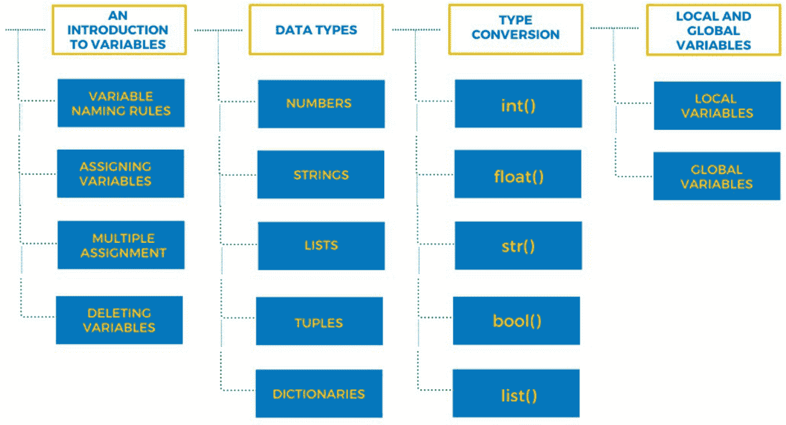

## PYTHON数据类型

一个值有一个类型，即使我们不必为Python变量声明一个。解释器需要这些信息。
Python支持以下数据类型。

### 1. Python数字
Python有四种数字数据类型。

a. 整数是一种数据。有符号整数存储在这种Python数据类型中。可以使用type()函数来确定它所属的类。

```
>>> a=-7
>>> type(a)
```

输出

```
<class 'int'>
```

整数大小的唯一限制是可用内存的大小。

```
>>> a=

### 输出

```
<class 'float'>
```

c. long
任意长度的长整数都可以存储在这种 Python 数据类型中。然而，在 Python 3.x 中，这种构造不存在。

d. complex
复数存储在这种 Python 数据类型中。以下是复数的一个示例：a+bj。该数字的实部和虚部分别是 a 和 b。

```
>>> a=2+3j
>>> type(a)
```

### 输出

```
<class 'complex'>
```

要确定 Python 变量是否属于特定类，请使用 isinstance() 函数。变量/值和类是两个参数。

```
>>> print(isinstance(a,complex))
```

### 输出

```
True
```

2. 字符串
术语“字符串”意味着一系列字符。与 C++ 或 Java 不同，Python 没有 char 数据类型。要分割字符串，请使用单引号或双引号。

```
>>> city='Ahmedabad'
>>> city
```

### 输出

```
'Ahmedabad'
```

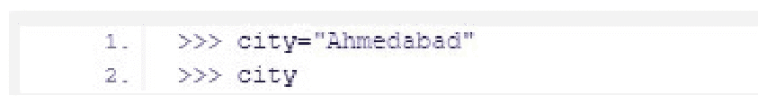

### 输出

```
'Ahmedabad'
```

a. 跨行字符串
你可以使用三引号将字符串分布在多行上。


### 输出

```
'If\n\tonly'
```

```
>>> print(var)
```

### 输出

If
Only

```
>>> """If
only"""
```

### 输出

```
'If\n\tonly'
```

如你所见，格式在引号中得以保留（`\n` 是换行的转义序列，`\t` 是制表符）。

### b. 显示字符串的一部分

可以通过利用字符串中的索引来显示字符串中的一个字符。请记住，索引从零开始。

```
1. >>> lesson='disappointment'
2. >>> lesson[0]
```

### 输出

```
'd'
```

切片运算符 `[` 也可以用来显示一串字符。

```
1. >>> lesson[5:10]
```

### 输出

```
'point'
```

这会打印从 5 到 9 的字符。

### c. 字符串格式化器

我们可以使用字符串格式化器同时打印字符和值。可以使用百分号运算符。

```
1. >>> x=10;
2. >>> printer="Dell"
3. >>> print("I just printed %s pages to the printer %s" % (x, printer))
```

或者你可以使用格式化技术。

```
1. >>> print("I just printed {0} pages to the printer {1}".format(x, printer))
2. >>> print("I just printed {x} pages to the printer {printer}".format(x=7, printer="Dell"))
```

第三种选择是使用 f-strings。

```
1. >>> print(f"I just printed {x} pages to the printer {printer}")
```

### d. 字符串连接

你可以连接（拼接）字符串。

```
1. >>> a='10'
2. >>> print(a+a)
```

### 输出

```
1010
```

但是，你不能连接不同类型的值。

```
1. >>> print('10'+10)
```

### 输出

```
Traceback (most recent call last):
  File "<pyshell#89>", line 1, in <module>
    print('10'+10)
TypeError: must be str, not int
```

### 3. Python 列表

列表是具有相同值的项目的集合。请记住，它可以包含各种值。用逗号分隔的值必须用方括号括起来才能定义列表。列表不需要声明类型。

```
>>> days=['Monday','Tuesday',3,4,5,6,7]
>>> days
```

### 输出

```
['Monday', 'Tuesday', 3, 4, 5, 6, 7]
```

#### a. 列表切片

切片运算符可以用来切片列表，就像切片字符串一样。

```
>>> days[1:3]
```

```
['Tuesday', 3]
```

与字符串一样，列表的索引从 0 开始。Python 中不存在数组。

#### c. 列表长度

Python 中的一个内置函数可以计算列表的长度。

```
>>> len(days)
```

### 输出

```
7
```

#### c. 重新分配列表元素

列表可以更改。这意味着你以后可以重新分配元素。

```
>>> days[2]='Wednesday'
>>> days
```

### 输出

```
['Monday', 'Tuesday', 'Wednesday', 4, 5, 6, 7]
```

#### d. 遍历列表

可以使用 for 循环遍历列表。我们可以通过迭代逐一访问列表的每个元素，这在我们需要对列表的每个元素执行操作时非常有用。

```
nums = [1,2,5,6,8]
for n in nums:
    print(n)
```

### 输出

```
1
2
5
6
8
```

#### e. 多维列表

```
>>> a=[[1,2,3],[4,5,6]]
>>> a
```

### 输出

```
[[1, 2, 3], [4, 5, 6]]
```

### 4. Python 元组

元组类似于列表。你使用圆括号来声明它。

```
>>> subjects=('Physics','Chemistry','Maths')
>>> subjects
```

### 输出

```
>>> subjects
('Physics', 'Chemistry', 'Maths')
```

a. 切片和访问元组

访问元组的方式与使用列表的方式相同。切片也是一样。

```
>>> subjects[1]
```

### 输出

'Chemistry'

```
>>> subjects[0:2]
```

### 输出

```
>>> subjects[0:2]
('Physics', 'Chemistry')
```

b. 元组是不可变的

Python 中的元组是不可变的。一旦声明，你就不能更改已声明对象的元素大小。

```
>>> subjects[2]='Biology'
```

### 输出

```
Traceback (most recent call last):
  File "<pyshell#107>", line 1, in <module>
    subjects[2]='Biology'
TypeError: 'tuple' object does not support item assignment
```

```
>>> subjects[3]='Computer Science'
```

### 输出

```
Traceback (most recent call last):
  File "<pyshell#108>", line 1, in <module>
    subjects[3]='Computer Science'
TypeError: 'tuple' object does not support item assignment
```

### 5. 字典

字典是键值对的集合。使用花括号声明它，并用逗号分隔对。键和值应使用冒号 (`:`) 分隔。

```
1. >>> person={'city':'Ahmedabad','age':7}
2. >>> person
```

### 输出

```
>>> person
{'city': 'Ahmedabad', 'age': 7}
```

type() 函数也适用于字典。

```
>>> type(person)
```

### 输出

```
<class 'dict'>
```

#### a. 访问值

要访问值，请在方括号中提及键。

```
1. >>> person['city']
```

### 输出

```
'Ahmedabad'
```

#### b. 更改元素

你可以更改键的值。

```
1. >>> person['age']=21
2. >>> person['age']
```

### 输出

```
21
```

#### c. 键列表

要获取字典中的键列表，请使用 keys() 函数。

```
>>> person.keys()
```

### 输出

```
dict_keys(['city', 'age'])
```

### 6. bool

布尔值可以是 False 或 True。

```
1. >>> a=2>1
2. >>> type(a)
```

### 输出

```
<class 'bool'>
```

### 7. 集合

集合可以包含一个值列表。使用花括号来定义它。

```
>>> a={1,2,3}
>>> a
```

### 输出

```
{1, 2, 3}
```

它只返回任何多次出现的值的一个实例。

```
1. >>> a={1,2,2,3}
2. >>> a
```

### 输出

```
{1, 2, 3}
```

另一方面，集合是无序的，因此不支持索引。

```
1. >>> a[2]
```

### 输出

```
Traceback (most recent call last):
  File "<pyshell#127>", line 1, in <module>
    a[2]
TypeError: 'set' object does not support indexing
```

它也是可变的。你可以编辑或添加其元素。为此，请使用 add() 和 remove() 方法。

```
>>> a={1,2,3,4}
>>> a
```

### 输出

```
{1, 2, 3, 4}
>>> a.remove(4)
>>> a
```

### 输出

```
{1, 2, 3}
>>> a.add(4)
>>> a
```

### 输出

```
{1, 2, 3, 4}
```

## 类型转换

因为 Python 是动态类型的，所以你可能想要更改值的类型。Python 有几个函数可以用来完成此操作。

- 1. int()
它将值转换为 int。

```
>>> int(3.7)
```

### 输出

```
3
```

值得注意的是，它截断了 0.7，而不是将其四舍五入为 4。布尔值也可以转换为整数。

```
>>> int(True)
```

### 输出

```
1
>>> int(False)
```

另一方面，字符串不能转换为 int。它会产生错误。

```
>>> int("a")
```

### 输出

```
Traceback (most recent call last):
  File "<pyshell#135>", line 1, in <module>
    int("a")
ValueError: invalid literal for int() with base 10: 'a'
```

但是，如果字符串只包含数字，你就可以这样做。

```
>>> int("77")
```

### 输出

```
77
```

- 2. float()
它将值转换为浮点数。

```
>>> float(7)
```

### 输出

```
7.0
>>> float(7.7)
```

### 输出

```
7.7
>>> float(True)
```

### 输出

```
1.0
>>> float("11")
```

### 输出

```
11.0
```

你也可以使用 'e' 来表示指数数字。

```
>>> float("2.1e-2")
```

### 输出

```
0.021
>>> float(2.1e-2)
```

### 输出

```
0.021
```

然而，即使没有 float() 函数，这个数字也有效。

```
>>> 2.1e-2
```

### 输出

```
0.021
```

### 3. str()

它将值转换为字符串。

### 4. bool()

它将值转换为布尔值。

```
>>> bool(3)
Output
True
>>> bool(0)
Output
False
>>> bool(True)
Output
True
>>> bool(0.1)
Output
True
```

你可以将列表转换为布尔值。

```
>>> bool([1,2])
Output
True
```

对于空的构造，该函数返回 False。

```
>>> bool()
Output
False
>>> bool([])
Output
False
>>> bool({})
Output
False
```

None 是 Python 中的一个关键字，表示值的缺失。

```
>>> bool(None)
Output
False
```

### 5. set()

它将值转换为集合。

```
>>> set([1,2,2,3])
Output
{1, 2, 3}
>>> set({1,2,2,3})
Output
{1, 2, 3}
```

### 6. list()

它将值转换为列表。

```
>>> del list
>>> list("123")
Output
['1', '2', '3']
>>> list({1,2,2,3})
Output
[1, 2, 3]
>>> list({"a":1,"b":2})
Output
['a', 'b']
```

然而，以下操作会引发错误。

```
>>> list({a:1,b:2})
```

**输出**

```
Traceback (most recent call last):
  File "<pyshell#173>", line 1, in <module>
    list({a:1,b:2})
TypeError: unhashable type: 'set'
```

### 7. tuple()

它将值转换为元组。

```
>>> tuple({1,2,2,3})
```

**输出**

**(1, 2, 3)**

你可以尝试自己的组合。也试试复合函数。

```
>>> tuple(list(set([1,2])))
```

**输出**

**(1, 2)**

# PYTHON 局部变量和全局变量

另一种对 Python 变量进行分类的方式是根据其作用域。

## 1. Python 局部变量

在函数、类或其他作用域中声明的变量仅在该作用域内可见。如果你在该作用域外调用它，会得到一个“未定义”的错误。

```
>>> def func1():
    uvw=2
    print(uvw)
>>> func1()
```

**输出**

**2**

```
>>> uvw
```

**输出**

```
Traceback (most recent call last):
  File "<pyshell#76>", line 1, in <module>
    uvw
NameError: name 'uvw' is not defined
```

在这种情况下，变量 uvw 是函数 func1 的局部变量。

## 2. 全局变量

在任何上下文/作用域之外声明的变量在整个程序中都可见。

```
>>> xyz=3

>>> def func2():
    xyz=0
    xyz+=1
    print(xyz)

>>> func2()
```

**输出**

```
1
```

```
>>> xyz
```

**输出**

```
3
```

在局部作用域中，可以使用 'global' 关键字将变量视为全局变量。

```
>>> foo=1

>>> def func2():
    global foo
    foo=3
    print(foo)

>>> func2()
```

**输出**

```
3
```

```
>>> foo
```

**输出**

```
3
```

# 第13章：PYTHON 运算符 – PYTHON 中的运算符类型

在本 Python 运算符课程中，我们将探讨什么是运算符以及如何在 Python 编程语言中使用它。

我们将介绍以下 Python 运算符的语法和示例：算术、关系、赋值、逻辑、成员、身份和位运算符。

让我们开始 Python 运算符教程。

Python 运算符意味着什么？

Python 中的运算符是一个符号，它对一个或多个操作数执行任务。被操作的变量或值称为操作数。

Python 运算符有七种类型：

- Python 关系运算符
- Python 算术运算符
- Python 赋值运算符
- Python 成员运算符
- Python 逻辑运算符
- Python 身份运算符
- Python 位运算符

## 1. Python 中的算术运算符

此 Python 算术运算符列表中包含了用于基本数学运算的 Python 运算符。

### a. 加法(+)
将运算符两侧的值相加。

```
>>> 3+4
Output
7
```

### b. 减法(-)
从左侧值中减去右侧值。

```
>>> 3-4
Output
-1
```

### c. 乘法(*)
将运算符两侧的值相乘。

```
>>> 3*4
Output
12
```

### d. 除法(/)
用左侧值除以右侧值。值得注意的是，除法产生一个浮点数值。

```
>>> 3/4
Output
0.75
```

### e. 幂运算(**)
倾向于将第一个数提升到第二个数的幂。

```
>>> 3**4
Output
81
```

### f. 整除(//)
将商除以整数并返回结果。它会丢弃小数点后的数字。

```
>>> 3//4
>>> 4//3
Output
1
>>> 10//3
Output
3
```

### g. 取模(%)
除以余数并返回结果。

```
>>> 3%4
Output
3
>>> 4%3
Output
1
>>> 10%3
Output
1
>>> 10.5%3
Output
1.5
```

## 2. Python 关系运算符
Python 关系运算符执行操作数之间的比较。

它们指示一个操作数是大于、小于、等于，还是这三者的组合。

### a. 小于(<)
此运算符确定左侧的值是否小于右侧的值。

```
>>> 3<4
Output
True
```

### b. 大于(>)
它确定运算符左侧的值是否大于右侧的值。

```
>>> 3>4
Output
False
```

### c. 小于或等于(<=)
它确定运算符左侧的值是否小于或等于右侧的值。

```
>>> 7<=7
Output
True
```

### d. 大于或等于(>=)
它检查运算符左侧的值是否大于或等于右侧的值。

```
>>> 0>=0
Output
True
```

### e. 等于(==)
此运算符确定运算符左侧的值是否等于运算符右侧的值。
布尔值 True 等于 1 但不等于 2。此外，0 等于 False。

```
>>> 3==3.0
Output
True
>>> 1==True
Output
True
>>> 7==True
Output
False
>>> 0==False
Output
True
>>> 0.5==True
Output
False
```

### f. 不等于(!=)
它确定运算符左侧的值是否与右侧的值不同。
Python 运算符 <> 执行相同的功能。但是，它在 Python 3 中已被弃用。
当关系运算符的条件满足时，它返回 True。否则，返回 False。此返回值可用于另一个语句或表达式。

```
>>> 1!=1.0
```

**输出**

False

```
>>> -1<>-1.0
```

#这会导致语法错误

## 3. Python 赋值运算符

Python 赋值运算符为变量赋值。在分配值之前，它可能通过一个因子对其进行修改。
总共有八个赋值运算符：一个普通的和七个用于七种算术 Python 运算符的。

### a. 赋值(=)
将值赋给左侧的表达式。值得注意的是，== 用于比较，而 = 用于赋值。

```
>>> a=7
>>> print(a)
Output
7
```

### b. 加并赋值(+=)
将两侧的值相加并赋给左侧的表达式。表达式 a+=10 等同于 a=a+10。
以下所有赋值运算符同理。

```
>>> a+=2
>>> print(a)
Output
9
```

### c. 减并赋值(-=)
从左侧值中减去右侧值。然后将其赋给左侧的表达式。

```
>>> a-=2
>>> print(a)
Output
7
```

### d. 除并赋值(/=)
用左侧值除以右侧值。然后将其赋给左侧的表达式。

```
>>> a/=7
>>> print(a)
Output
1.0
```

### e. 乘并赋值(*=)
将两侧的值相乘。然后将其赋给左侧的表达式。

```
>>> a*=8
>>> print(a)
Output
8.0
```

### f. 取模并赋值(%=)
对等式两侧执行取模运算。然后将其赋给左侧的表达式。

```
>>> a%=3
>>> print(a)
Output
2.0
```

### g. 幂并赋值(**=)
对等式两侧执行幂运算。然后将其赋给左侧的表达式。

```
>>> a**=5
>>> print(a)
Output
32.0
```

### h. 整除并赋值(//=)
对两侧的值应用整除。然后将其赋给左侧的表达式。

```
>>> a//=3
>>> print(a)
Output
10.0
```

这是重要的 Python 运算符之一。

## 4. Python 逻辑运算符

这些是可用于将两个或多个条件连接在一起的连接词。

我们有 3 个 Python 逻辑运算符：and、or 和 not，都包含在 Python 运算符类别中。

### a. Python 中的 and 运算符

如果运算符两侧的条件都为真，则整个表达式为真。

## 5. Python 成员运算符

这些运算符用于判断一个值是否属于一个序列。列表、元组或字符串都可以用来表示序列。
`in` 和 `not in` 是两个 Python 成员运算符。

### a. Python 的 in 运算符

此运算符用于判断一个值是否属于一个序列。
我们可以看到，在我们的例子中，字符串 `'fox'` 不属于宠物列表。然而，它属于字符串 `'cat'`，因此返回 `True`。
此外，单词 `'me'` 是单词 `'disappointment'` 的子串。因此，它返回 `True`。

```python
>>> pets=['dog','cat','ferret']
>>> 'fox' in pets
Output
False
>>> 'cat' in pets
Output
True
>>> 'me' in 'disappointment'
Output
True
```

### b. Python 中的 not in 运算符

与 `in` 不同，`not in` 检查一个值是否不是序列的成员。

```python
>>> 'pot' not in 'disappointment'
Output
True
```

对任何 Python 运算符还有疑问吗？请评论。

## 6. Python 身份运算符

让我们继续了解 Python 身份运算符。
这些运算符用于判断两个操作数是否具有相同的身份。`is` 和 `is not` 是两个身份运算符。

### a. Python 中的 is 运算符

如果两个操作数具有相同的身份，则返回 `True`。否则，返回 `False`。因为 2 不等于 20，所以结果是 `False`。
同样，数字 `"2"` 和 `"2"` 是相同的。引号的不同并不能区分它们。因此，返回 `True`。

```python
>>> 2 is 20
Output
False
>>> '2' is "2"
Output
True
```

### b. Python 中的 is not 运算符

`'2'` 是一个字符串，而 `2` 是一个数字。因此，它返回 `True`。

```python
>>> 2 is not '2'
Output
True
```

## 7. Python 位运算符

现在让我们看看 Python 位运算符。
这些运算符对操作数进行逐位操作。

### a. Python 中的按位与(&)运算符

它对两个值执行逐位与操作。2 的二进制值是 10，而 3 的二进制值是 11。当你将它们进行 `&` 运算时，得到 10，这是二进制的 2。
同样，将 011(3) 和 100(4) 进行 `&` 运算得到 000 (0)。

```python
>>> 2&3
Output
2
>>> 3&4
Output
0
```

### b. Python 的按位或(|)运算符

它对两个值执行逐位或操作。当你将 10(2) 和 11(3) 进行 `|` 运算时，得到 11 (3)。

```python
>>> 2|3
Output
3
```

### c. Python 按位异或(^)运算符

它对两个值执行逐位异或（XOR）操作。在这种情况下，将 10(2) 和 11(3) 进行异或运算得到 01 (1)。

```python
>>> 2^3
Output
1
```

### d. Python 中的按位取反(~)

它返回一个数字的二进制按位取反。位被翻转。2 的二进制代码是 00000010。按位取反是 11111101。
这是二进制的 -3。因此，结果是 -3。同样，`~1` 的结果是 -2。

```python
>>> ~-3
Output
2
```

-3 的补码是 2，再次说明。

### e. Python 的按位左移(<<)运算符

左操作数的值根据右操作数指定的位数向左移动。
在这种情况下，2 的二进制是 10，将其向左移动两位。这得到 1000，这是数字 8 的二进制等价形式。

```python
>>> 2<<2
Output
8
```

### f. Python 按位右移(>>)

左操作数的值根据右操作数指定的位数向右移动。
这里，3 的二进制是 11。`3>>2` 将其向右移动两位。这得到数字 00，这是二进制的零。
同样，`3>>1` 将其向右移动一位。这得到数字 01，这是二进制的一。

```python
>>> 3>>2
Output
0
>>> 3>>1
Output
1
```

以上就是关于 Python 运算符教程的全部内容。

## Python 面试中关于 Python 运算符的问题

1. 在 Python 中，`not` 运算符是什么？
2. Python 中有几种类型的关系运算符？
3. Python 中的 `!=` 是什么意思？
4. 描述 Python 中不同类型的位运算符。
5. 描述 Python 的地板除和赋值运算符。

最后，我们在本课程中探讨了七种不同类型的 Python 运算符。
为了了解它们如何工作，我们在 Python Shell (IDLE) 中运行了它们。这个运算符也可以用于条件判断和组合条件。
请继续尝试一些不同的组合。

# 第 13 章：PYTHON 中的模块与包

本书汇编了 Python 模块和包中最重要的变化。许多程序员在确定何时以及何处使用模块或包时感到困难。
本文将展示一组清晰的区别，使编码器能够更高效地使用模块和包。

## 什么是 Python 模块？

一个包含多个函数的 Python 语句被称为模块。模块在代码中充当预定义库，编码器和用户都可以访问。
在代码执行期间，Python 模块还会保存库中的预定义函数。

**Python 模块示例：**

```python
import math

from math import pow

pow(2,8)

print(pow)
```

**输出：**

```
<built-in function pow>
>>>
```

## 什么是 Python 包？

包是帮助初始化程序的工具集合。对于任何源代码，Python 包都充当用户变量接口。这使得 Python 包在特定时刻的运行时适用于每个功能代码。

**Python 包示例：**

```python
import math

print("math package")
```

**输出：**

```
math package
>>>
```

## Python 模块和包有什么区别？

1. 每个面向用户的代码都包含在一个包中，该包包含文件 `__init__.py`。然而，这不适用于运行时模块中的任何用户特定代码。

2. 模块是一个包含 Python 代码的文件，这些代码在后台为用户特定的编程运行。包也会修改用户解释的代码，以便在运行时可以轻松执行。

Python "模块" 由一个单元命名空间和本地提取的变量组成。还有一些解析函数，例如：

- 变量和常量
- 类的属性定义
- 任何旧值或新值。
- 通常，一个模块对应于单个文件。
- 在用户界面库中，一个调试工具。

一些常用的工具帮助编码器创建一个使用模块的新平台，以实现高效的代码执行。在运行时，这还会在整个库中安装和分发包。

包的良好结构和标准布局使得使用用户特定工具变得简单。它也使运行时执行更容易。

## 什么区分了 Python 包和 Python 模块？

什么区分了 Python 包和模块是一个经常被问到的问题。Python 包是一个库，它将代码定义为任何给定函数的单一单元。另一方面，模块是一个具有内置功能的独立库。由于其可重用性，包比模块更可取。

### 显式命名空间

这是一种显式定义的命名空间。
在首次处理的代码中，这提供了默认命名空间。在代码识别中，这些命名空间充当源代码。另一方面，新开发人员可以使用库来导入它们。然而，了解通用命名空间对于正确的代码执行总是一个好主意。

```python
def thisistech():
    a='Greetings!'

thisistech()
```

**输出：**

```
>>> thisistech
<function thisistech at 0x030BFCD0>
>>>
```

### 便捷 API

这是一种在代码中为特定对象命名空间的机制。它将用户直接带到代码的核心，使问题易于发现。这也有助于解析代码，以便在运行时用作用户界面代码。

```python
import hello

hello.hey()
```

**输出：**

```
'Hey, there!'
```

# 第14章：Python循环教程 – Python for循环、嵌套for循环

在本Python循环教程中，我们将学习几种形式的Python循环。我们将探讨Python for循环、Python while循环、Python循环控制语句以及嵌套for循环的子类、语法和示例。那么，让我们开始Python循环教程吧。

什么是Python循环？如果你想让语句运行100次，你不会重复写100遍。考虑一下你需要打印从1到99的数字的情况。或者你可能想向99个人问好。在这种情况下，你可以使用Python循环。我们将在这里介绍四种不同形式的Python循环：

- Python for循环
- Python while循环
- Python循环控制语句
- Python中的嵌套for循环

## Python中的while循环

在Python中，while循环会迭代直到条件变为False。换句话说，当它接受的条件为True时，它会执行语句。

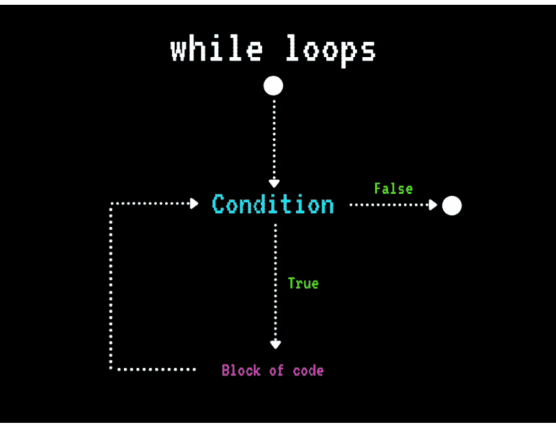

当程序控制到达while循环时，会验证条件。如果条件为真，则运行其后的代码块。请记住，循环内的所有语句都要同等缩进。然后再次检查条件。此过程会重复，直到条件不再为真。然后执行循环后的第一条语句（如果有的话）。

```python
>>> a=3
>>> while(a>0):
    print(a)
    a-=1
```

输出：
```
3
2
1
```

此循环打印数字3到1。`a--`在Python中不起作用。出于同样的原因，我们使用`a-=1`。

### 1. 无限循环

使用while循环时要小心，因为如果你忘记在Python中递增计数器变量或编写了错误的逻辑，条件可能永远不会变为假。在这种情况下，循环将无限运行，循环后的条件将无法执行。按Ctrl+C可以停止程序运行。

然而，无限循环可能也有优势。这在客户端/服务器编程或需要信号量时很有用。信号量是一个主要用于同步对共享资源访问的变量。

### 2. while循环的else语句

while循环之后可以有一个else语句。当条件变为假时，执行else表达式下的代码块。但是，如果你退出循环或抛出异常，它不会执行。

```python
>>> a=3
>>> while(a>0):
    print(a)
    a-=1
else:
    print("Reached 0")
```

输出：
```
3
2
1
Reached 0
```

在下面的代码中，我们在while循环体中为`a==1`放置了一个break语句。因此，当这种情况发生时，else块中的语句不会执行。

```python
>>> a=3
>>> while(a>0):
    print(a)
    a-=1
    if a==1: break;
else:
    print("Reached 0")
```

输出：
```
3
2
```

### 3. 单语句while

如果while的主体中只有一条语句，我们可以像if语句一样，将所有内容写在一行中。

```python
>>> a=3
>>> while a>0: print(a); a-=1;
```

输出：
```
3
2
1
```

虽然while的主体有两条语句，但我们使用分号来分隔它们。如果没有第二条语句，它将产生一个无限循环。

## Python中的for循环

Python可以遍历元素列表。在Python中，for循环的结构与C++或Java不同。也就是说，`for(int i=0;i<n;i++)`在这种情况下不起作用。Python使用‘in’关键字。让我们看一个Python循环的例子。

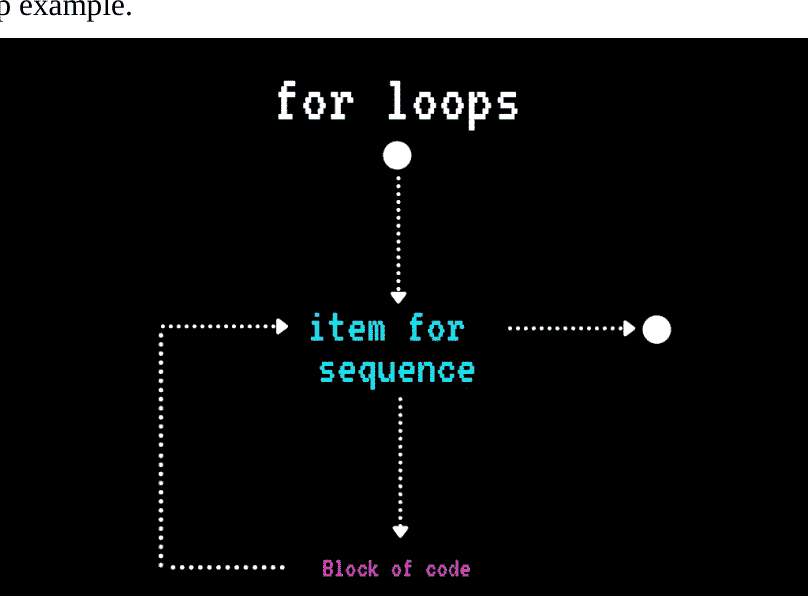

```python
>>> for a in range(3):
    print(a)
```

输出：
```
0
1
2
```

如果我们想打印1到3，我们可以编写以下代码。

```python
>>> for a in range(3):
    print(a+1)
```

输出：
```
1
2
3
```

首先是`range()`函数。此函数返回一个数字序列。当只用一个参数（比如n）调用时，它会创建一个从0到n-1的数字序列。

```python
>>> list(range(10))
```

输出：
```
[0, 1, 2, 3, 4, 5, 6, 7, 8, 9]
```

为了将range对象转换为list对象，我们使用list函数。当你用两个参数调用它时，它会生成一个从第一个参数到第二个参数的数字序列。

```python
>>> list(range(2,7))
```

输出：
```
[2, 3, 4, 5, 6]
```

你也可以传递三个参数。第三个参数是间隔。

```python
>>> list(range(2,12,2))
```

输出：
```
[2, 4, 6, 8, 10]
```

记住，间隔也可以是负数。

```python
>>> list(range(12,2,-2))
```

输出：
```
[12, 10, 8, 6, 4]
```

然而，以下代码将产生一个空列表。

```python
>>> list(range(12,2))
```

输出：
```
[]
```

```python
>>> list(range(2,12,-2))
```

输出：
```
[]
```

```python
>>> list(range(12,2,2))
```

输出：
```
[]
```

### 2. 遍历列表或类似结构

但是，你不必使用`range()`函数。你可以使用循环来遍历列表或类似的东西。

```python
>>> for a in [1,2,3]:
    print(a)
```

输出：
```
1
2
3
```

```python
>>> for i in {2,3,3,4}:
    print(i)
```

输出：
```
2
3
4
```

你也可以遍历一个字符串。

```python
>>> for i in 'wisdom':
    print(i)
```

输出：
```
w
i
s
d
o
m
```

### 3. 遍历列表或类似结构的索引

`len()`方法返回列表的长度。当你在它上面使用`range()`函数时，它会返回一个包含列表索引的range对象。你可以遍历它。

```python
>>> list=['Romanian','Spanish','Gujarati']
>>> for i in range(len(list)):
    print(list[i])
```

输出：
```
Romanian
Spanish
Gujarati
```

### 4. for循环的else语句

与while循环一样，for循环之后也可以有一个else语句。当循环完成时，执行else语句下的代码块。

```python
>>> for i in range(10):
    print(i)
else:
    print("Reached else")
```

输出：
```
0
1
2
3
4
5
6
7
8
9
Reached else
```

就像在while循环中一样，如果你跳出循环或引发异常，它不会执行。

```python
>>> for i in range(10):
    print(i)
    if(i==7): break
else:
    print("Reached else")
```

输出：
```
0
1
2
3
4
5
6
7
```

## Python中的嵌套for循环

一个循环也可以嵌套在另一个循环内部。for循环可以放在while内部，while放在for内部，for放在for内部，或者while放在while内部。你也可以在一个循环内部创建一个循环。你可以随心所欲地嵌套。

```python
>>> for i in range(1,6):
    for j in range(i):
        print("*",end=' ')
    print()
```

输出：
```
* 
* * 
* * * 
* * * * 
* * * * * 
```

让我们看一些嵌套的while循环来打印相同的模式。

```python
>>> i=6
>>> while(i>0):
    j=6
    while(j>i):
        print("*",end=' ')
        j-=1
    i-=1
    print()
```

输出：
```
* 
* * 
* * * 
* * * * 
* * * * * 
```

## Python中的循环控制语句

有时你可能想跳出循环的正常执行。Python为此提供了三个关键字：break、continue和pass。

### 1. break语句

当你在循环体中添加break语句时，它会导致循环停止，控制权转移到循环外的第一条语句。你可以使用for或while循环来实现它。

```python
>>> for i in 'break':
    print(i)
    if i=='a': break;
```

输出：
```
b
r
e
a
```

### 2. continue语句

当控制流程到达continue语句时，它之后的语句会被跳过。然后程序继续处理序列中的下一个项目，并执行相应的代码块。它可以与for和while循环一起使用。

```python
>>> i=0
>>> while(i<8):
    i+=1
    if(i==6): continue
    print(i)
```

输出：
```
1
2
3
4
5
7
8
```

如果条件满足，迭代`i+=1`打印5，程序进入无限循环。

```python
>>> i=0
>>> while(i<8):
    if(i==6): continue
    print(i)
    i+=1
```

输出：
```
0
1
2
3
4
5
```
Traceback (most recent call last):
  File "<pyshell#14>", line 1, in <module>
    while(i<8):
KeyboardInterrupt
```

通过使用Ctrl+C，你可以退出无限循环。

### 3. pass语句

为了在Python中实现存根，我们使用pass语句。当我们确实需要代码中的特定循环、类或函数，但不知道里面放什么时，我们使用pass语句。该语句是空的。解释器不会忽略它，但它也不会做任何事情（空操作）。

```python
>>> for i in 'selfhelp':
    pass
>>> print(i)
```

输出：
```
p
```

要运行此代码，请将其保存在.py文件中，然后按F5。它会导致shell中出现语法错误。

## Python循环面试题

6. 什么是Python循环？用一个例子来证明你的观点。
7. Python中for循环的语法是什么？
8. 如何创建一个Python循环？
9. Python中有多少种不同类型的循环？
10. Python中循环的目的是什么？

# 第15章：Python类教程 – Python对象与类的属性

在本Python类课程中，我们将学习Python类、它们的工作原理以及如何访问它们。另一方面，我们将探讨Python对象以及不同的Python类属性。在本课中，我们将了解如何在Python中删除对象、其属性或类。

正如我们已经指出的，Python是一种面向对象的语言。这意味着它更关注对象而非过程。一个对象可以用来模拟现实世界。让我们开始Python类和对象教程。

## 什么是Python类？

类是对象的蓝图；一个类可以包含任意数量的相同类型的对象。它也被称为抽象数据类型。有趣的是，它本身没有任何值，但它充当对象的原型。让我们更深入地了解Python类。

## Python类语法

### 1. 在Python中定义Python类

在Python编程中，使用`class`关键字来定义类。在Python中，我们使用`def`关键字来定义函数。与函数类似，Python3类也可以有一个文档字符串。这可以用来编写几行描述类功能的文字。目前，我们将在其主体中使用`pass`语句，以专注于语法。

```python
>>> class fruit:
    """
    This Python3 class creates instances of fruits
    """
    pass
```

输出：
Pass

一旦我们指定了一个类，就会创建一个Python类对象。然而，正如我们在Python变量教程中所述，你只能根据标识符命名规则来命名一个类。

```python
>>> fruit
```

输出：
<class ‘__main__.fruit’> #The class object

一个Python3类可以有属性和在该数据上执行的方法。我们以通常的方式声明/定义这些。让我们看一个例子。

```python
>>> class fruit:
    """
    This class creates instances of fruits
    """
    color=""
    def sayhi(self):
        print("Hi")
>>> orange=fruit()
```

`color`是一个属性，`sayhi()`是一种在fruit对象上调用的方法。在Python类中，标准的一级函数可以在方法内部定义，但不能在方法外部定义。

```python
>>> class try1:
    def mymethod(self):
        def sayhello():
            print("Hello")
        print("Hi")
        sayhello()

>>> obj1=try1()
>>> obj1.mymethod()
```

输出：
Hi
Hello

你也可以动态创建一个属性。

```python
>>> orange.shape='Round'
>>> orange.shape
```

输出：
'Round'

### 2. 获取Python类成员列表

使用点运算符来访问Python类的成员。让我们为我们的fruit类创建一个orange对象。

```python
>>> orange=fruit()
```

现在让我们看看orange的color属性。

```python
>>> orange.color
```

输出：
""

因为我们在类定义中指定了一个空字符串，所以这会产生一个空字符串。

```python
>>> orange.sayhi()
```

输出：
Hi

这里，我们在orange上调用了方法`sayhi()`。如果定义得当，一个方法可以接受参数。

```python
>>> class fruit:
    def size(self,x):
        print(f"I am size {x}")
>>> orange=fruit()
>>> orange.size(7)
```

输出：
I am size 7

一个Python类也可以有特殊属性，比如用于文档字符串的`__doc__`。

```python
>>> fruit.__doc__
```

输出：
'\n\tThis class creates instances of fruits\n\t'

如果你想了解更多关于Python方法的知识，Python方法是一个很好的起点。但现在，我们将使用`self`参数和`__init__()`魔术方法作为例子。

```python
>>> class fruit:
    def size(self,x):
        print(f"I am size {x}")

>>> orange=fruit()
>>> orange.size(7)
```

输出：
I am Orange and a size 7

如你所见，`__init__()`方法在C++或Java中与构造函数相同。每次创建类对象时都会调用它。另一方面，`self`参数指示解释器处理当前对象。这类似于Java关键字`this`。但它不必被称为`self`；它可以是任何名称。对象作为第一个参数提供，对应于单词`self`。

在这种情况下，`fruit.salutation()`等同于`orange.salutation()`（即`orange`）。此外，`salutation`是一个方法对象，例如，对于`orange`，而不是Python类的函数对象。

```python
>>> fruit.salutation
```

输出：
<function fruit.salutation at 0x0628FE40>

```python
>>> orange.salutation
```

输出：
<bound method fruit.salutation of <__main__.fruit object at 0x062835F0>>

你可以将一个方法对象存储到一个变量中以备后用。

```python
>>> sayhi=orange.salutation
>>> sayhi()
```

输出：
I am Orange and a size 7

## Python对象到底是什么？

如果一个Python3类没有对象，那它有什么用？如果类是一个概念，那么对象就是该概念的实现。对象的`__init__()`方法在创建时被调用。正如我们之前提到的，对象通过函数使用`self`关键字传递给类。

```python
>>> orange=fruit('Orange',7)
```

对于`color`和`size`属性，我们使用了值`'Orange'`和`7`。我们也可以动态地为对象声明属性。看看怎么做。

```python
>>> orange.shape='Round'
>>> orange.shape
```

输出：
'Round'

在Python中，你可以将一个对象的值赋给另一个对象。

```python
>>> apple=orange
>>> apple.color
```

输出：
'Orange'

## 属于Python类的属性

我们将重新定义Python类`fruit`来演示这一点。

```python
>>> class fruit:
    size='Small'
    def __init__(self,color,shape):
        self.color=color
        self.shape=shape
    def salutation(self):
        print(f"I am {self.color} and a shape {self.shape}")
```

输出：
'Small'

```python
>>> orange=fruit('Orange','Round')
>>> orange.size
```

输出：
'Small'

因为我们重新定义了类，所以我们必须重新声明对象。一个函数也可以包含在Python类中。

```python
>>> class fruit:
    size='Small'
    def __init__(self,color,shape):
        self.color=color
        self.shape=shape
    def salutation():
        print(f"I am happy")
>>> fruit.salutation()
```

输出：
I am happy

```python
>>> fruit.salutation
```

输出：
<function fruit.salutation at 0x030C8390>

## 如何删除Python属性、类和对象？

使用`del`关键字来删除属性、对象或类。

```python
>>> del orange.shape
>>> orange.shape
```

输出：
Traceback (most recent call last):
  File "<pyshell#118>", line 1, in <module>
    orange.shape
AttributeError: 'fruit' object has no attribute 'shape.'

让我们尝试删除一个对象。

```python
>>> del orange
>>> orange
```

输出：
Traceback (most recent call last):
  File "<pyshell#120>", line 1, in <module>
    orange
NameError: name 'orange' is not defined

```python
>>> fruit
<class '__main__.fruit'>
>>> del fruit
>>> fruit
```

输出：
Traceback (most recent call last):
  File "<pyshell#133>", line 1, in <module>
    fruit
NameError: name 'fruit' is not defined

## Python类面试问题

- 1. 什么是Python类？请举例说明。
- 2. 在Python中，如何调用一个类？
- 3. Python类是否运行缓慢？
- 4. 何时应该使用Python类？
- 5. 在Python中，如何定义一个类？

# 第16章：深入Python闭包与装饰器

闭包是一类非常优雅的Python构造。在本文中，我们将了解它们、如何定义闭包，以及为什么和何时使用闭包。然而，在理解闭包之前，我们必须首先理解什么是嵌套函数以及作用域约束如何应用于它。那么，让我们开始吧。

## Python作用域规则与嵌套函数

当一个函数运行时，一个新的本地命名空间反映了本地环境，并包含函数参数和在函数体内部赋值的变量的名称。一个命名空间可以比作一个字典，其中键是对象名称，值是对象本身。

在解析名称时，解释器首先搜索本地命名空间。如果没有找到匹配项，则搜索全局命名空间，即定义该函数的模块。如果没有找到匹配项，则在引发`NameError`异常之前检查内置命名空间。下图说明了这一点：

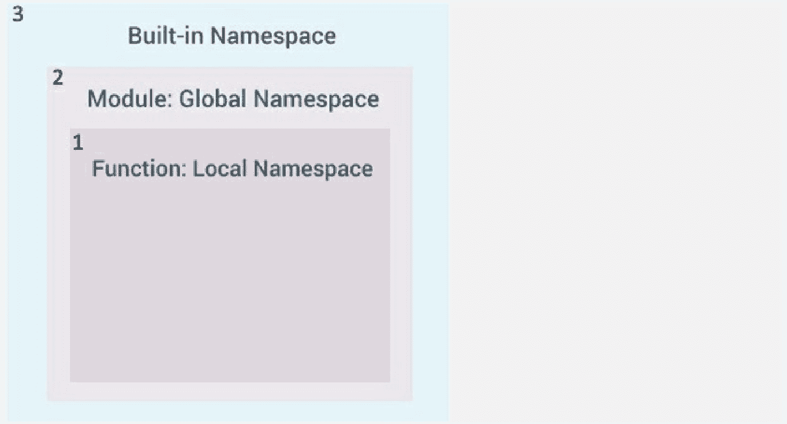

让我们考虑下面的例子：

```python
age = 27
def birthday():
    age = 28
birthday()
print(age) # age will still be 27
>>
27
```

在函数内部给出的变量始终绑定到函数的本地命名空间；因此，方法体中的变量`age`指的是一个值为28的新对象，而不是外部变量。可以使用`global`语句来改变这种行为。如下例所示：

```python
age = 27
name = "Sarah"
def birthday():
    global age    # 'age' is in the global namespace
    age = 28
```

### 定义闭包函数

如果函数 `countdown()` 的最后几行是返回 `display` 函数，而不是像前一个示例中那样调用它，会怎么样？这表明该函数是这样编写的：

```python
def countdown(start):
    # 这是外部封闭函数
    def display():
        # 这是嵌套函数
        n = start
        while n > 0:
            n -= 1
            print('T-minus %d' % n)
    return display

### 现在让我们尝试调用这个函数。
counter1 = countdown(2)
counter1()
```
```
T-minus 2
T-minus 1
```

以值二作为参数调用了 `countdown()` 函数，并将得到的函数命名为 `counter1`。当调用 `counter1()` 时，会使用传递给 `countdown` 的 `start` 的值。因此，即使我们之前已经完成了 `countdown()` 函数的执行，在调用 `counter1()` 时仍然记住了该值。

闭包是 Python 中用于将一些数据（本例中为 2）附加到代码上的术语。

即使变量超出作用域或函数从当前命名空间中移除，也会记住周围作用域中的值。为确保这一点，让我们运行以下代码：

```python
>>> del countdown
>>> counter1()
T-minus 2
T-minus 1
>>> countdown(2)
Traceback (most recent call last):
  ...
NameError: name 'countdown' is not defined
```

何时应该使用闭包？

当类中只实现了少数几个方法（通常只有一个）时，闭包可以提供一种替代且更优雅的方式。在编写使用惰性或延迟求值思想的代码时，闭包和嵌套函数也特别有益。以下是一个示例：

```python
from urllib.request import urlopen

def page(url):
    def get():
        return urlopen(url).read()
    return get
```

前面示例中的 `page()` 函数不执行任何计算。相反，它只是生成并返回函数 `get()`，该函数在被调用时获取网页的内容。因此，当 `get()` 被求值时，`get()` 执行的计算在程序中被推迟。考虑以下场景：

```python
>>> url1 = page("http://www.google.com")
>>> url2 = page("http://www.bing.com")
>>> url1
<function page.<locals>.get at 0x10a6054d0>
>>> url2
<function page.<locals>.get at 0x10a6055f0>

>>> gdata = url1()    # 获取 http://www.google.com
>>> bdata = url2()    # 获取 http://www.bing.com
>>>
```

可以确定闭包函数中封闭的值。
如果一个函数是闭包函数，它有一个 `__closure__` 属性，该属性返回一个单元对象的元组。从前面的示例中我们知道 `url1` 和 `url2` 是闭包函数。

```python
>>> page.__closure__    # 返回 None，因为不是闭包
>>> url1.__closure__
(<cell at 0x10a5f1250: str object at 0x10a5f3120>,)
```

封闭的值存储在单元对象的 `cell_contents` 属性中。

```python
>>> url1.__closure__[0].cell_contents
'http://www.google.com'
>>> url2.__closure__[0].cell_contents
'http://www.bing.com'
```

在 Python 中，当嵌套函数引用其封闭作用域中的值时，它就是封闭的。闭包有助于在一定程度上隐藏数据。闭包也可以是维护多次函数调用状态一致性的有用工具。
按照以下步骤在 Python 中创建闭包函数：

- 我们需要一个嵌套函数。
- 封闭函数必须返回嵌套函数，并且嵌套函数必须引用在封闭函数中定义的值。

# 第 17 章：函数式编程

函数式编程是一种使用函数来定义计算的编程范式。函数式编程的一个显著特征是状态不变的概念。

在命令式编程（这可能是你更熟悉的更普遍的编程范式）中，计算是通过语句执行的。这些是改变变量值并因此改变计算状态的命令。例如，一个 `for` 循环可以多次执行一条语句，每次修改一个变量的值，如下所示：

```python
counter = 0
for i in range(10):
    counter += 1
```

在循环的每次迭代中，当计数器的值增加一时，计算的状态就会发生变化，使其更接近最终状态。

另一方面，函数式编程摒弃了状态的概念。函数式编程只处理不可变数据类型，而不是改变变量值。我们只处理原始数据结构的副本，因为不可变数据类型的值无法更改。在 Python 中，`map`、`filter` 和 `reduce` 函数都以相同的方式工作：它们构建并处理新的数据集，同时保持原始数据不变。

在函数式编程中，函数被视为一等公民。在 Python 命令式编程中，我们通常为循环和列表推导式修改数据，但在函数式编程中，我们只能使用函数。这产生了优雅的解决方案，以及诸如更高的模块化和并行程序执行效率等优势。

在我们深入探讨 Python 中 `map()`、`filter()` 和 `reduce()` 函数的示例之前，我们需要回顾另一个概念：高阶函数。

## 高阶函数

高阶函数是我们在函数式编程中定义计算的主要工具。这些是接受函数作为参数并返回另一个函数的函数。Python 中三个最重要的高阶方法是 `reduce()`、`map()` 和 `filter()`。当与更简单的函数结合使用时，它们可以用于执行复杂的操作。

在下面的代码示例中，说明了一个高阶函数。`greeting()` 接受两个参数：一个函数 `f` 和一个名称 `n`，并返回函数 `f(n)`。

```python
>>> def greet(name):
...     return "Hello, {}!".format(name)
...
>>> def print_greeting(f, n):
...     print(f(n))
...
>>> print_greeting(greet, "Governor")
Hello, Governor!
```

## 匿名函数

在上一节中，我们看到了一个函数接受另一个函数作为输入的例子。`map()`、`filter()` 和 `reduce()` 函数都做同样的事情：每个函数接受一个函数和一个元素列表，然后返回将该函数应用于列表中每个元素的结果。在上面的两个例子中，我们使用 Python 的 `def` 关键字来定义我们的函数。这会生成一个可调用的 Python 对象，当被调用时，会执行其描述中提供的语句。

匿名函数（也称为 lambda 函数）在函数式编程中很受欢迎。它们被称为匿名是因为它们没有名称，这与函数式编程的无状态性一致。Lambda 函数与普通 Python 函数的不同之处在于，它们计算单个表达式并返回一个函数，而标准 Python 函数不需要这样做。因此，Lambda 函数不能使用诸如条件语句甚至 `return` 关键字之类的语句。Lambda 函数看起来像这样：

```python
>>> (lambda n: n*n)(5)
25
```

我们也可以使用 `def` 关键字来指定此操作并获得相同的结果：

```python
>>> def square(n):
...     return n * n
...
>>> square(5)
25
```

在第一个代码片段中，我们使用 lambda 内联定义了函数，然后使用输入 `n=5` 调用了它。它被立即求值以生成结果。与第二个示例不同，lambda 函数没有附加到关键字，因此如果我们想再次使用它，就必须重新创建代码。
Lambda 对于 `map()`、`filter()` 和 `reduce()` 很有用，因为我们提供给它们的输入通常是短函数，在我们的程序中只会使用一次；因此，存储它们是没有意义的。与必须声明并保存在内存中的传统函数不同，匿名函数是短小且一次性的。
既然我们已经介绍了基础知识，让我们更仔细地看看 Python 的 `map()`、`filter()` 和 `reduce()` 方法。

## map()

Python 的 `map()` 函数具有以下语法：

```python
map(function, *sequence)
```

`map()` 将作为参数传递的函数应用于每个序列元素，并返回结果。在下面的示例中，我们创建一个数字列表，然后使用 `map()` 和 Python 的 `str()` 函数将每个整数转换为字符串。结果是一个字符串列表。

```python
>>> sequence = list(range(10))
>>> list(map(str, sequence))
['0', '1', '2', '3', '4', '5', '6', '7', '8', '9']
```

注意我们如何使用列表包装 `map()` 方法的结果。因为在 Python 中 `map()` 返回的是结果映射生成器对象的内存地址，所以我们这样做。

```python
>>> map(str, sequence)
<map at 0x7feff2999ef0>
```

惰性求值是 Python 生成器使用的一种方法，这意味着 Python 在我们需要对象之前不会对它们求值。虽然这可能看起来矛盾，但立即求值对象并不总是最佳解决方案，因为并非所有表达式都值得求值。通过避免不必要的处理，惰性求值提高了效率。这就是为什么我们将映射生成器包装在列表中：它对生成器表达式求值，并将输出保存在一个易于访问的列表对象中。
从生成器获取结果的另一种方法是使用 `for` 循环遍历它：

## map()

Python 中的 `map()` 函数也可与列表推导式一起使用。与生成器不同，Python 会立即解析列表推导式。下面是一个示例。

```
[function(element) for element in sequence]
```

## filter()

Python 的 `filter()` 函数具有以下语法：

```
filter(function, *sequence)
```

`filter()` 接受一个称为谓词的函数，如果元素满足谓词的条件则返回 "True"，否则返回 "False"。`filter()` 函数返回原始序列中通过条件的项目。

在下面的代码中，我们对国家列表使用 `filter()` 技术，过滤掉名称中不包含字符串 "and" 的国家。

```
>>> countries = ['Bosnia and Herzegovina', 'Finland', 'Germany', 'Ireland',
'Sweden', 'Turkey', 'United Kingdom']
>>> list(filter(lambda x: "and" in x, countries))
['Bosnia and Herzegovina', 'Finland', 'Ireland']
```

波斯尼亚和黑塞哥维那、芬兰和爱尔兰是 lambda 函数返回 "True" 的国家。这些是 `filter()` 函数保留的国家；其余的序列被丢弃。

列表推导式也可用于过滤序列中的元素。这被认为是一种更 Pythonic 的方法。

```
>>> [country for country in countries if "and" in country]
['Bosnia and Herzegovina', 'Finland', 'Ireland']
```

值得注意的是，我们可以在同一个调用中使用 `map()`、`filter()` 和 `reduce()` 函数。假设我们想过滤掉名称中不包含 "land" 一词的国家，然后将剩余国家的名称转换为大写。我们可以通过在 Python 中组合 `filter()` 和 `map()` 函数来实现，如下所示：

```
>>> list(map(lambda x: x.upper(), filter(lambda x: "land" in x,
countries)))
['FINLAND', 'IRELAND']
```

## reduce()

与 `map()` 和 `filter()` 不同，`reduce()` 不返回新序列。相反，它返回一个单一的值。与其他两个函数类似，语法如下：

```
reduce(function, *sequence)
```

`reduce()` 从左到右将函数应用于序列的成员，从头两个元素开始。我们将对序列的前两个元素应用函数的结果与第三个元素组合，并将它们传递给另一个函数调用。此操作重复进行，直到可迭代对象结束，并且可迭代对象被缩减为单个值。

考虑以下示例，其中 `reduce()` 被传递一个 lambda 函数，该函数依次乘以两个数字：

```
>>> numbers = list(range(1,10,2)) # 我们创建一个奇数列表
>>> numbers
[1, 3, 5, 7, 9]
>>> reduce(lambda x, y: x*y, numbers)
945
```

数字 945 是序列中所有数字相乘的结果。

以下两个表达式是等效的：

```
multiply(multiply(multiply(multiply(1, 3), 5), 7), 9)
```

```
reduce(multiply, [1, 3, 5, 7, 9])
```

请注意，要在 Python 3.x 中使用 `reduce`，必须使用以下导入语句导入它：

```
from functools import reduce
```

# 第18章：Python 装饰器教程 – 链式装饰器，Python Pie 语法

本 Python 装饰器教程将探讨什么是装饰器以及为什么我们在 Python 中使用嵌套函数。

函数在 Python 中是一等对象。这意味着你可以轻松地共享它。你可以返回它或将其用作另一个程序中的参数。Python 函数也可以嵌套在另一个函数内部。

让我们开始这个 Python 装饰器教程。

什么是 Python 装饰器，它是如何工作的？

Python 中的装饰器函数为另一个函数提供功能，而不改变它。换句话说，Python 装饰器是一个包装另一个函数的函数。在现实生活中，这看起来像礼品包装。这被称为元编程，因为程序的一部分试图在编译过程中修改另一部分。

在本课程的其余部分，我们将深入探讨 Python 装饰器语法。当你想为函数添加功能但又不想改变它时，这是一个很好的选择。

让我们仔细看看。

## 一个简单的 Python 装饰器

第一次讨论 Python 装饰器时，可能会令人困惑。因此，我们将从一个没有参数的非常简单的例子开始。

以这段代码为例。

```
>>> def decor(func):
    def wrap():
        print("$$$$$$$$$$$$$$$$$$$$")
        func()
        print("$$$$$$$$$$$$$$$$$$$$")
    return wrap

>>> def sayhello():
    print("Hello")

>>> newfunc=decor(sayhello)
>>> newfunc()
```

### 输出

```
$$$$$$$$$$$$$$$$$$$$
Hello
$$$$$$$$$$$$$$$$$$$$
```

让我们逐一查看语法的每个部分。

### 1. Python 装饰器函数

首先，我们创建一个名为 `sayhello()` 的简单函数，它打印 "Hello"。在 Python 中，我们现在将定义装饰器函数。

这可以被命名为任何名字；不一定非要叫 "decor"。这是一个高阶函数。值得注意的是，这些函数的相对顺序无关紧要。

无论你是在 `decor()` 之前还是之后定义 `sayhello()`，都没有关系。让我们仔细看看 `decor` 函数。

```
def decor(func):
```

首先要注意的是它接受一个函数作为参数。这是我们想要修饰的函数。

我们将称它为 `func`，但你可以随心所欲地称呼它。我们在这个函数内部嵌套一个函数，我们称之为 `wrap()`。

同样，你可以自由地给它贴上任何标签。

### 2. 嵌套的 wrap 函数

我们将额外的功能放在这个函数中，我们也称之为要修饰的函数。

```
def wrap():
    print("$$$$$$$$$$$$$$$$$$$$")
    func()
    print("$$$$$$$$$$$$$$$$$$$$")
```

在这个例子中，我们使用了 print 语句。它也可以是其他东西，比如一个 if 块。

最后，我们从 `decor()` 方法返回 `wrap` 函数。

```
return wrap
```

是什么促使我们这样做？我们将在本课程中更详细地讨论这一点。

### 3. 调用和赋值

最后，我们将这个 Python 装饰器赋值给一个变量，并调用要修饰的函数作为输入。

```
newfunc=decor(sayhello)
```

然后在 Python 中，使用括号调用装饰器赋值给的变量后的函数。

```
newfunc()
```

然而，你可以将其赋值给要修饰的函数。这将导致它被重新赋值。让我们也看看这个。

```
>>> def sayhello():
    print("Hello")

>>> def decor(func):
    def wrap():
        print("$")
        func()
        print("$")
    return wrap

>>> sayhello=decor(sayhello)
>>> sayhello()
```

### 输出

```
$
Hello
$
```

为什么你想使用 Python 嵌套函数？

当我在学习 Python 装饰器时，这个问题让我感到困惑。使用 `wrap` 函数然后返回它的目的是什么？

难道不能直接在 `decor` 函数内部编写代码吗？结果，我发现自己在解释器上测试它。

```
>>> def decor(func):
    print("$")
    func()
    print("$")

>>> def sayhello():
    print("Hello")
```

在这个例子中，新功能直接写在我们的 `decor()` 函数内部。现在让我们尝试将其赋值给一个变量。

```
>>> newfunc=decor(sayhello)
```

### 输出

```
$
Hello
$
```

哇。打印它的意义是什么？这是因为 `decor()` 调用了一个函数（这里是 `func`），而不是返回一个值。

当我们返回时，我们可以将 `wrap`（或你想叫的任何名字）保存在一个变量中。然后我们可以随时使用该名称调用修饰后的函数。

现在让我们使用 `newfunc()` 函数。

```
>>> newfunc()
```

### 输出

```
Traceback (most recent call last):
  File "<pyshell#70>", line 1, in <module>
    newfunc()
TypeError: 'NoneType' object is not callable
```

如你所见，赋值行没有将修饰后的函数赋值给 `newfunc`，因为 `decor` 没有返回值。这就是为什么它不能被调用。

因此，除了以下过程外，无法再次访问此 Python 装饰器：

```
>>> decor(sayhello)
```

### 输出

```
$
Hello
$
```

最后，让我们尝试调用我们原来的函数 `sayhello()`。

```
>>> sayhello()
```

### 输出

```
Hello
```

它完美运行。如你所见，`decor()` 没有影响 `sayhello()`。

我们全程使用相同的例子，这样你就可以专注于所讲的内容，而不是试图解读代码。

## 带参数的 Python 装饰器

到目前为止，我们在 Python 中遇到的装饰器只是标准的 print 语句。现在让我们进入正题。

我们将使用一个除以两个数字的函数的例子来展示装饰器如何处理参数。我们的函数只返回两个数字相除的结果。

然而，当我们修饰它时，我们添加了处理分母为零的功能。看看怎么做。

```
>>> def divide(a,b):
    return a/b
>>> def decorator(func):
    def wrapper(a,b):
        if b==0:
            print("Can't divide by 0!")
            return
        return func(a,b)
    return wrapper
```

如你所见，Python 中的装饰器函数只需要一个参数：要修饰的函数。包装器接受与修饰函数相同的输入。

最后，我们返回要修饰的函数，而不是执行它。这是因为我们需要从 `divide()` 返回一个值到 `wrapper()`，再到 `decorator()`。

### 1. Python 闭包

当我们调用 `func` 时，它会记住来自 `decorator` 函数参数的 `func` 的值。在 Python 中，这被称为闭包。

这里再举一个例子帮助你理解。

```python
>>> msg="Hello"
>>> def func1(msg):
    def func2():
        print(msg)
    func2()
>>> func1(msg)
```

### 输出

```
Hello
```

另外，请注意，如果我们调用 `func(a,b)` 而不是返回它，我们会得到：

```python
>>> divide(2,3)
>>> print(divide(2,3))
```

### 输出

```
None
```

现在，让我们赋值并调用。

```python
>>> divide=decorator(divide)
>>> divide(2,3)
```

### 输出

```
0.6666666666666666
```

```python
>>> divide(2,0)
```

### 输出

```
Can't divide by 0!
```

问题解决了。

### 2. *args 和 **kwargs

如果你不想为这两个语句填写完整的参数列表，可以使用 `*args` 和 `**kwargs` 来代替。

```python
>>> def divide(a,b):
    return a/b
>>> def decorate(func):
    def wrapper(*args,**kwargs):
        if args[1]==0:
            print("Can't divide by 0!")
            return
        return func(*args,**kwargs)
    return wrapper
>>> divide=decorate(divide)
>>> divide(2,0)
```

### 输出

```
You can't divide by 0!
```

如你所见，它起作用了。`**kwargs` 是一个关键字参数的字典，而 `*args` 是一个参数的元组。

## Python 中的 Pie 语法

如果你觉得赋值和调用语句不必要，我们为你准备了 Pie 语法。

这很简单，只需将装饰函数命名为 `@` 符号，并将其放在被装饰函数之前即可。

这里有一个例子。

```python
>>> @decor
def sayhello():
    print("Hello")
>>> sayhello()
```

### 输出

```
Hello
```

## Python 中的链式装饰器

你不仅限于使用一个 Python 装饰器。这正是 Pie 语法大放异彩的地方。让我们看看如何实现。

```python
>>> def decor1(func):
    def wrap():
        print("$$$$$$$$$$$$$$$$")
        func()
        print("$$$$$$$$$$$$$$$$")
    return wrap

>>> def decor2(func):
    def wrap():
        print("###############")
        func()
        print("###############")
    return wrap
```

现在，让我们定义 `sayhello()` 函数。我们将使用 `decor1` 和 `decor2` 来装饰它。

```python
>>> @decor1
@decor2
def sayhello():
    print("Hello")

>>> sayhello()
```

### 输出

```
$$$$$$$$$$$$$$$$
###############
Hello
###############
$$$$$$$$$$$$$$$$
```

注意井号 (`#`) 是如何被美元符号 (`$`) 夹在中间的吗？

这揭示了一个关键细节：在 Python 的 Pie 语法中，装饰器的顺序很重要。我们先看到美元符号是因为我们先使用了 `decor1`。

本文的主题是 Python 装饰器教程。

## 与装饰器相关的 Python 面试问题

- 1. 什么是 Python 装饰器？请举例说明你的观点。
- 2. 在 Python 中，如何制作一个装饰器？
- 3. 在 Python 中，如何装饰一个类？
- 4. Python 装饰器有哪些应用？
- 5. Python 中装饰器的功能是什么？

总结一下，我们在这个 Python 带参数装饰器简单示例教程中所涵盖的内容：装饰器允许我们在不改变函数本身的情况下为其添加新功能。

为此，我们观察了 Pie 语法。现在你知道了，任何困扰你的事情都可以通过直面它来克服，因为你不可能永远逃避。

# 第 19 章：NUMPY 数组

我们之前的 Python 库教程的主题是 Python SciPy。现在我们将看看 NumPy，一个 Python 包。
在这个 NumPy 教程中，我们将介绍 NumPy 的特性、安装以及 NumPy ndarray。
此外，我们将介绍 NumPy 的数据类型和数组。让我们开始 Python NumPy 教程。

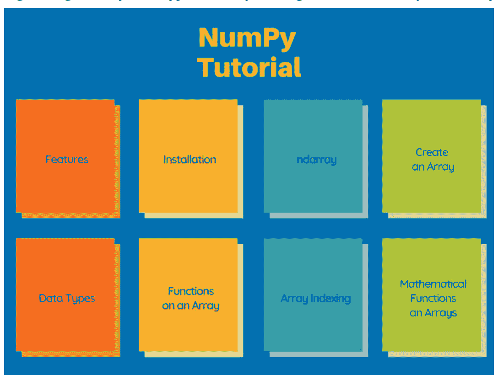

## NumPy 到底是什么？

NumPy 是一个 Python 包，允许你处理大型多维矩阵和数组。
它还包括一些高级函数，用于对这些结构执行数学运算。
Python NumPy 是一个跨平台的 Python 解释器，采用 BSD 许可证。它通常与 Matplotlib 和 SciPy 一起使用。
这可以被视为 MATLAB 的替代品。'Numpy' 这个词是 'NUMerical' 和 'PYthon' 两个词的组合。

## Numpy 教程 - Numpy 特性

在这个 Python NumPy 教程中，我们将介绍以下 NumPy 特性：

- NumPy 基于 CPython，这是一个未优化的字节码解释器。
- 多维数组。
- 这些数组的函数和操作
- Python 是 MATLAB 的替代品。
- ndarray 是 n 维数组的缩写。
- 形状操作和傅里叶变换
- 线性代数和随机数生成

## 如何在 Numpy 教程中安装 NumPy

Numpy 可以使用 pip 安装。

- 使用 pip 安装 numpy

然后你可以这样导入它：

```python
>>> import NumPy as np
```

## NumPy ndarray Numpy 教程

这是 numpy 最重要的特性之一。ndarray 是一个 n 维数组，它是一个相似值的网格。
这个元组由一个非负整数元组索引。数组中的维度数量决定了它的秩。
让我们看几个例子。

```python
>>> a=np.array([1,2,3])
>>> type(a)
```

### 输出

```
<class 'numpy.ndarray'>
```

```python
>>> a.shape
```

### 输出

```
(3,)
```

```python
>>> a[0],a[2]
```

### 输出

```
(1, 3)
```

```python
>>> a[1]=5
>>> a
```

### 输出

```
array([1, 5, 3])
```

如你所见，数组的形状是矩形的 (3,)。当我们创建一个多维数组时会发生什么？让我们看看。

```python
>>> b=np.array([[2,7,9],[5,1,3]])
>>> b
```

### 输出

```
array([[2, 7, 9],
       [5, 1, 3]])
```

```python
>>> b[0,1]
```

### 输出

```
7
```

```python
>>> b.shape
```

### 输出

```
(2, 3)
```

```python
>>> b.size
```

### 输出

```
6
```

### 1. 如何创建 NumPy 数组？

接下来的代码行构建了更多数组：

```python
>>> np.arange(7) #这类似于 Python 中的 range
```

### 输出

```
array([0, 1, 2, 3, 4, 5, 6])
```

```python
>>> np.random.random((3,3)) #填充随机值
```

### 输出

```
array([[0.56074267, 0.67303599, 0.65973007],
       [0.37222497, 0.13230271, 0.40858618],
       [0.74455771, 0.52119999, 0.6927821 ]])
```

```python
>>> np.ones((2,3))
```

### 输出

```
array([[1., 1., 1.],
       [1., 1., 1.]])
```

```python
>>> np.zeros((1,2))
```

### 输出

```
array([[0., 0.]])
```

```python
>>> np.eye(3) #单位矩阵
```

### 输出

```
array([[1., 0., 0.],
       [0., 1., 0.],
       [0., 0., 1.]])
```

```python
>>> np.full((3,2),7) #常数矩阵
```

### 输出

```
array([[7, 7],
       [7, 7],
       [7, 7]])
```

```python
>>> np.linspace(1,2,4) #在 1 和 2 之间（包括 1 和 2）均匀间隔的 4 个值。
```

### 输出

```
array([1. , 1.33333333, 1.66666667, 2. ])
```

```python
>>> np.empty([2,3]) #空数组
```

### 输出

```
array([[1., 0., 3.],
       [0., 4., 0.]])
```

### 3. 一些参数

```python
>>> np.array([1,3,4],ndmin=3) #最小维度
```

### 输出

```
array([[[1, 3, 4]]])
```

```python
>>> np.array([1,3,4],dtype=complex) #数据类型
```

### 输出

```
array([1.+0.j, 3.+0.j, 4.+0.j])
```

## Numpy 教程 – 数据类型

如前所述，NumPy 数组包含相同类型的成员。
如果你在创建 NumPy 数组时没有提供数据类型，NumPy 会为你决定。

以下数据类型可用：
`bool_`, `int_`, `intc`, `intp`, `int8`, `int16`, `int32`, `int64`, `uint8`, `uint16`, `uint32`, `uint64`, `float_`, `float16`, `float32`, `float64`, `complex_`, `complex64`, `complex128`

我们可以确认：

```python
>>> np.dtype(np.int32)
```

### 输出

```
dtype('int32')
```

```python
>>> np.dtype('i4')
```

### 输出

```
dtype('int32')
```

```python
>>> np.dtype('i8')
```

### 输出

```
dtype('int64')
```

## NumPy 数组的函数

让我们看看我们可以用数组完成什么，以及我们还能从中学到什么。

```python
>>> a=np.array([[1,2,3],[4,5,6]])
>>> a.reshape(3,2)
```

### 输出

```
array([[1, 2],
       [3, 4],
       [5, 6]])
```

```python
>>> a.ndim #数组维度数量
```

### 输出

```
2
```

```python
>>> np.array([[1,2,3],[4,5,6]]).itemsize #每个元素的长度（以字节为单位）
```

### 输出

```
4
```

```python
>>> np.array([[1,2,3],[4,5,6]],dtype=np.int8).itemsize
```

### 输出

```
1
```

```python
>>> a
```

### 输出

```
array([[1, 2, 3],
       [4, 5, 6]])
```

```python
>>> a.flags
```

### 输出

```
C_CONTIGUOUS: True
F_CONTIGUOUS: False
OWNDATA: True
WRITEABLE: True
ALIGNED: True
WRITEBACKIFCOPY: False
UPDATEIFCOPY: False
```

## Numpy 数组索引

NumPy 数组可以被切片，多维数组有多种切片方式。

```python
>>> a=np.array([[1,2,3],[4,5,6],[7,8,9]])
>>> b=a[:2,1:3]
>>> b
```

### 输出

```
array([[2, 3],
       [5, 6]])
```

```python
>>> a[1,2]
```

### 输出

```
6
```

```python
>>> b[0,0]=79
>>> a
```

### 输出

```
array([[ 1, 79,  3],
       [ 4,  5,  6],
       [ 7,  8,  9]])
```

如你所见，对切片的更改会改变原始数组。

```python
>>> a[1,:]
```

### 输出

```
array([4, 5, 6])
```

```python
>>> a[1:2,:]
```

### 输出

```
array([[4, 5, 6]])
```

```python
>>> a[:,1]
```

### 输出

```
array([79, 5, 8])
```

### 1. 整数索引

可以从另一个数组创建一个数组。

```python
>>> a=np.array([[1,2],[3,4],[5,6]])
>>> a[[0,1,2],[0,1,0]] #打印位于 [0,0]、[1,1] 和 [2,0] 的元素
```

### 输出

### 2. 布尔索引

这将允许你选择满足一组条件的元素。

```python
>>> a=np.array([[1,2],[3,4],[5,6]])
>>> boolean=(a>3)
>>> boolean
```

输出

```
array([[False, False],
       [False, True],
       [ True, True]])
```

```python
>>> a[boolean]
```

输出

```
array([4, 5, 6])
```

## NumPy 中数组的数学函数

现在让我们看看一些可以与数组一起使用的数学函数。

```python
>>> a=np.array([[1,2,3],[4,5,6]])
>>> b=np.array([[7,8,9],[10,11,12]])
>>> np.add(a,b) #a+b 效果相同
```

输出

```
array([[ 8, 10, 12],
       [14, 16, 18]])
```

```python
>>> np.subtract(a,b) #与 a-b 相同
```

输出

```
array([[-6, -6, -6],
       [-6, -6, -6]])
```

```python
>>> np.multiply(a,b) #a*b 也可以
```

输出

```
array([[ 7, 16, 27],
       [40, 55, 72]])
```

```python
>>> np.divide(a,b) #与 a/b 相同
```

输出

```
array([[0.14285714, 0.25 , 0.33333333],
       [0.4 , 0.45454545, 0.5 ]])
```

```python
>>> np.sqrt(a) #计算平方根
```

输出

```
array([[1. , 1.41421356, 1.73205081],
       [2. , 2.23606798, 2.44948974]])
```

```python
>>> np.sum(a,axis=0) #每列之和
```

输出

```
array([4, 6])
```

```python
>>> np.sum(a,axis=1) #每行之和
```

输出

```
array([3, 7])
```

要转置这个矩阵：

```python
>>> a.T
```

输出

```
array([[1, 3],
       [2, 4]])
```

```python
>>> np.array([1,3,2]).T #无效
```

输出

```
array([1, 3, 2])
```

```python
>>> x=np.array([[1,2],[3,4]])
>>> y=np.array([[5,6],[7,8]])
>>> v=np.array([9,10])
>>> w=np.array([11,12])
>>> v.dot(w) #与 np.dot(v,w) 相同
```

输出

```
219
```

```python
>>> x.dot(v)
```

输出

```
array([29, 67])
```

```python
>>> x.dot(y)
```

输出

```
array([[19, 22],
       [43, 50]])
```

以上就是 Python NumPy 教程的全部内容。希望我们的解释对你有所帮助。

## NumPy Python 面试题

1.  Python 中的 NumPy 数组是什么？
2.  NumPy 在 Python 中的功能是什么？
3.  Python 的 Pandas 和 NumPy 之间有什么区别？
4.  NumPy 的 Python 实现是什么？
5.  NumPy 提供了哪些 Python 函数？

## 结论

因此，在这个 Python NumPy 教程中，我们了解了如何安装 NumPy 以及如何使用 NumPy ndarray。我们还讨论了 NumPy 数组及其函数和数据类型。这就是 NumPy 的全部内容。

# 第 20 章：PYTHON 中的 PANDAS

基于 Python 的数据分析工具箱 pandas（全小写）可以使用 `import pandas as PD` 导入。它包含各种工具，从解析多种文件格式到将整个数据表转换为 NumPy 矩阵数组。因此，pandas 是数据科学和机器学习中可靠的伙伴。

与 NumPy 类似，Pandas 主要处理一维和二维数组中的数据，但两者的处理方式不同。

## Series

一维数组在 pandas 中被称为 series。使用 `PD.Series` 构造函数来生成 series，该构造函数包含许多可选参数。`data` 参数是最常用的，因为它提供了 series 的组成部分。

与 NumPy 数组类似，pandas series 使用 `dtype` 关键字进行手动类型转换。

```python
import pandas as pd
import numpy as np
ser = pd.Series()
print('{}\n'.format(ser))
ser = pd.Series(10)
print('{}\n'.format(ser))
ser = pd.Series([0, 10, 20, 30, 40, 50, 60, 70, 80, 90])
print('{}\n'.format(ser))
ser = pd.Series([20, 15.7, '10'])
print('{}\n'.format(ser))
### 从 numpy 数组创建 series
arr = np.array([0, 10, 20, 30, 40, 50])
ser = pd.Series(arr, dtype = np.double)
print('{}\n'.format(ser))
ser = pd.Series([[15, 4], [89, 23.5], [21, 22]])
print('{}\n'.format(ser))
```

在上面的代码中，Series 元素的左侧是整数。这些整数的集合就是 series 的索引。

## 索引

只要索引与 Series 长度相同，就可以创建它。

```python
import pandas as pd
ser = pd.Series([1, 2, 3], index = ['first', 'second', 'third'])
print('{}\n'.format(ser))
ser = pd.Series([50.45, 71, 90], index = [-7, 'second', 18.7])
print('{}\n'.format(ser))
```

## DataFrame

DataFrame 本质上是一个二维数组。它使用 `PD.DataFrame` 构造函数创建，该构造函数接受与 `PD.Series` 构造函数相同的参数。但是，DataFrame 不能从标量（表示单个值的 Series）构建。
可以在构造函数中指定 DataFrame 的索引（行）和列标签。

```python
import pandas as pd
df = pd.DataFrame()
print('{}\n'.format(df))
df = pd.DataFrame([20, 100, -30])
print('{}\n'.format(df))
df = pd.DataFrame([[18, -12], [54, 72]])
print('{}\n'.format(df))
df = pd.DataFrame([[18, -12], [54, 72]],
                  index=['row1', 'row2'],
                  columns=['column1', 'column2'])
print('{}\n'.format(df))
df = pd.DataFrame({'a': [18, -12], 'b': [54, 72]},
                  index=['x', 'y'])
print('{}\n'.format(df))
```

## 修改和删除

可以使用 `append` 方法向 DataFrame 添加行，该方法接受一个 series 或另一个 DataFrame。处理 series 时，我们必须指定索引或使用 `ignore_index` 关键字。如果设置 `ignore_index=True`，行标签将被整数索引替换。

`append` 方法不会修改原始 DataFrame。相反，它会生成一个带有附加行的新 DataFrame。

## 删除过程

在 DataFrame 中，我们可以使用 `drop` 方法删除列和行。可以通过以下两种方法之一完成：

1.  使用 `labels` 选项指定要删除的行/列的标签。使用 `labels` 关键字参数与 `axis` 关键字参数（默认值为 0）来指定从行轴还是列轴删除。
2.  使用 `index` 或 `columns` 关键字参数直接给出行或列的标签，无需使用 `axis`。

```python
import pandas as pd
df = pd.DataFrame([[10, 20, 30], [40, 50, 60]])
ser = pd.Series([70, 80, 90], name='new row')
print('{}\n'.format(df))
df2 = df.append(ser)
print('{}\n'.format(df2))
df3 = df.append(ser, ignore_index = True)
print('{}\n'.format(df3))
df3 = pd.DataFrame([[100, 110, 120],[120, 120, 130]])
df4 = df.append(df3)
print('{}\n'.format(df4))
```

与 `append` 类似，`drop` 也会创建一个新的 DataFrame。

可以使用 `Concat` 函数将多个 DataFrame 连接在一起。`Merge` 通过使用两个 DataFrame 所有共同的列标签来合并它们。

## 附加服务

Pandas 包含大量数据分析工具，使我们能够聚合、排序、过滤和描述数据集。也可以使用 pyplot API 来可视化 DataFrame。

# 第 21 章：PYTHON 生成器

## Python 的生成器

在 Python 中构建迭代器需要大量工作。我们必须创建一个包含 `__iter__()` 和 `__next__()` 方法的类，跟踪内部状态，并在没有值可返回时引发 `StopIteration`。
这既冗长又令人困惑。在这种情况下，生成器就派上用场了。
使用 Python 生成器可以轻松创建迭代器。上述所有工作都通过 Python 生成器自动完成。
简单来说，生成器是一个返回对象（迭代器）的函数，我们可以对其进行迭代（一次一个值）。

## 在 Python 中创建生成器

在 Python 中创建生成器非常简单。这与创建普通函数相同；只是你将使用 `yield` 语句而不是 `return` 语句。
假设其中至少有一个 `yield` 语句（它也可以有其他 `yield` 或 `return` 语句）。`yield` 和 `return` 都会从函数返回一个值。区别在于 `return` 语句会完全关闭函数，而 `yield` 语句会暂停函数并保存其所有状态，然后在后续调用时继续。
生成器和普通函数有什么区别？
生成器函数与普通函数有以下不同之处。

-   生成器函数中可以找到一个或多个 `yield` 语句。
-   被调用时，它返回一个对象（迭代器），但不会立即开始执行。
-   `__iter__()` 和 `__next__()` 等方法会自动实现。因此，我们可以使用 `next` 来迭代对象。
-   当函数 yield 时，它会暂停，并将控制权交给调用者。
-   在调用之间，会记住局部变量及其状态。
-   最后，当函数结束时，后续调用会自动引发 `StopIteration`。

下面是一个示例，说明了所有上述概念。`my_gen()` 是一个包含多个 `yield` 语句的生成器函数。

```python
### 一个简单的生成器函数
def my_gen():
    n = 1
    print('This is printed first')
    # 生成器函数包含 yield 语句
    yield n

    n += 1
    print('This is printed second')
    yield n

    n += 1
    print('This is printed at last')
    yield n
```

下面是在解释器中的交互式运行。在 Python shell 中运行这些以查看输出。

## Python 生成器

```python
>>> # 它返回一个对象，但不会立即开始执行。
>>> a = my_gen()

>>> # 我们可以使用 next() 遍历各项。
>>> next(a)
This is printed first
1
>>> # 一旦函数 yield，函数就会暂停，控制权被转移

>>> # 局部变量及其状态在连续调用之间会被记住。
>>> next(a)
This is printed second
2

>>> next(a)
This is printed at last
3

>>> # 最后，当函数终止时，会自动在 next(a) 上引发 StopIteration
>>> next(a)
Traceback (most recent call last):
  ...
StopIteration
>>> next(a)
Traceback (most recent call last):
  ...
StopIteration
```

值得注意的是，在前面的例子中，变量 `n` 的值在调用之间得以保持。与常规函数不同，当函数 yield 时，局部变量不会被销毁。此外，生成器对象只能被迭代一次。要重新启动该过程，请使用类似 `a = my_gen()` 的方式来生成一个新的生成器对象。最后但同样重要的是，生成器可以直接与 for 循环一起使用。这是因为 for 循环接受一个迭代器并使用 `next()` 函数来遍历它。当引发 `StopIteration` 时，它会自动结束。要了解 for 循环在 Python 中是如何实现的，请参见此处。

```python
### 一个简单的生成器函数
def my_gen():
    n = 1
    print('This is printed first')
    # 生成器函数包含 yield 语句
    yield n

    n += 1
    print('This is printed second')
    yield n

    n += 1
    print('This is printed at last')
    yield n

### 使用 for 循环
for item in my_gen():
    print(item)
```

当你运行程序时，输出将是：

```
This is printed first
1
This is printed second
2
This is printed at last
3
```

## Python 中使用循环的生成器

前面的例子用处不大，我们查看它只是为了理解后台发生了什么。生成器函数通常使用带有适当结束条件的循环来构建。让我们以一个反转字符串的生成器为例。

```python
def rev_str(my_str):
    length = len(my_str)
    for i in range(length - 1, -1, -1):
        yield my_str[i]

### 使用 for 循环反转字符串
for char in rev_str("hello"):
    print(char)
```

输出：

```
o
l
l
e
h
```

在这个例子中，`range()` 函数被用于通过 for 循环以相反的顺序获取索引。这个生成器函数不仅适用于字符串，也适用于其他类型的可迭代对象，如列表、元组等。

## Python 表达式生成器

生成器表达式使得即时设计简单的生成器变得简单。它简化了创建生成器的过程。生成器表达式的工作方式类似于 lambda 函数，因为它们构造匿名生成器函数。Python 中生成器表达式的语法与列表推导式相同。但是，它使用圆括号而不是方括号。列表推导式和生成器表达式的主要区别在于，前者创建完整的列表，而后者一次产生一个项目。它们在执行时是惰性的（仅在被请求时才产生项目）。因此，生成器表达式比列表推导式使用更少的内存。

```python
### 初始化列表
my_list = [1, 3, 6, 10]

### 使用列表推导式对每个项求平方
list_ = [x**2 for x in my_list]

### 使用生成器表达式可以做同样的事情
### 生成器表达式被圆括号 () 包围
generator = (x**2 for x in my_list)

print(list_)
print(generator)
```

输出：

```
[1, 9, 36, 100]
<generator object <genexpr> at 0x7f5d4eb4bf50>
```

从上面的例子可以看出，生成器表达式没有立即给出所需的输出。相反，它返回了一个生成器对象，该对象仅在被请求时才生成对象。以下是我们如何开始从生成器接收内容的方式：

```python
### 初始化列表
my_list = [1, 3, 6, 10]

a = (x**2 for x in my_list)
print(next(a))

print(next(a))

print(next(a))

print(next(a))

next(a)
```

当我们运行上述程序时，我们收到以下输出：

```
1
9
36
100
Traceback (most recent call last):
  File "<string>", line 15, in <module>
StopIteration
```

生成器表达式可以用作函数参数。以这种方式使用时，可以省略圆括号。

```python
>>> sum(x**2 for x in my_list)
146

>>> max(x**2 for x in my_list)
100
```

## Python 生成器的利用

生成器是一种强大的实现，原因多种多样。

### 1. 易于实现

与它们的迭代器类表亲相比，生成器可以被直接而简洁地构建。以下是使用迭代器类实现二的幂序列的一个例子。

```python
class PowTwo:
    def __init__(self, max=0):
        self.n = 0
        self.max = max

    def __iter__(self):
        return self

    def __next__(self):
        if self.n > self.max:
            raise StopIteration

        result = 2 ** self.n
        self.n += 1
        return result
```

前面的展示冗长且令人困惑。让我们尝试用生成器函数重新实现。

```python
def PowTwoGen(max=0):
    n = 0
    while n < max:
        yield 2 ** n
        n += 1
```

实现变得简洁且干净得多，因为生成器自动处理了信息。

### 2. 内存高效

返回序列的常规函数在返回结果之前会在内存中构建完整的序列。如果序列中的元素数量巨大，这是过度的。使用生成器来实现这样的序列可以节省内存，并且是首选，因为它一次只产生一个项目。

### 3. 表示无限流

生成器非常适合表示无限的数据流。无限流无法存储在内存中，但生成器可以表示无限的数据流，因为它们一次只产生一个项目。下面的生成器函数可以生成所有偶数（至少在理论上）。

```python
def all_even():
    n = 0
    while True:
        yield n
        n += 2
```

### 4. 管道化生成器

可以使用多个生成器将一组过程管道化。一个例子是展示这一点的最佳方式。假设我们有一台生成斐波那契数列数字的机器。我们还有一个对数字求平方的生成器。如果我们希望计算斐波那契数列中整数的平方和，我们可以使用以下技术将生成器函数的输出管道化在一起。

```python
def fibonacci_numbers(nums):
    x, y = 0, 1
    for _ in range(nums):
        x, y = y, x+y
        yield x

def square(nums):
    for num in nums:
        yield num**2

print(sum(square(fibonacci_numbers(10))))
```

输出：

```
4895
```

这种管道化高效且易于阅读（更不用说酷多了！）。

# 第 22 章：带类型、语法和示例的 Python 函数参数

在这个 Python 函数参数教程中，我们将探讨 Python 的几种函数参数类型，包括 Python 关键字参数、Python 默认参数和 Python 任意参数。

让我们开始使用 Python 函数参数。

Python 函数到底是什么？

Python 函数是一组按特定顺序执行并被赋予名称的语句。因此，我们可以重用代码。关键字 `def` 用于定义函数。让我们看一个例子。

```python
>>> def sayhello():
    """
    This prints Hello
    """
    print("Hello")
```

然后我们只需将函数名放在括号中即可调用它。也要注意文档字符串。

```python
>>> sayhello()
```

输出：

```
Hello
```

这个函数不接受任何参数。让我们看一个带有 Python 函数参数的例子。

```python
>>> def sum(a,b):
    return a+b
>>> sum(2,3)
```

输出：

```
5
```

如果只传递一个参数，解释器会报错。

```python
>>> sum(3)
Traceback (most recent call last):
  File "<pyshell#44>", line 1, in <module>
    sum(3)
```

输出：

```
TypeError: sum() missing 1 required positional argument: 'b'
```

Python 函数使用不同类型的参数来处理这种情况。

## Python 函数参数类型

Python 函数参数有多种形式。让我们逐一介绍：

### 1. 带有默认值的 Python 函数参数

Python 函数参数可以有默认值。Python 中的赋值运算符 (`=`) 用于为参数分配默认值。当调用函数时未提供某个参数的值，则使用默认值（如前所述）。

## 3. Python 任意参数

你永远不知道会面临多少场辩论——在这种情况下，会在参数名前使用一个星号（*）。

```python
>>> def sayhello(*names):
        for name in names:
            print(f"Hello, {name}")
```

当你用多个参数调用函数时，这些参数会被包装成一个 Python 元组。Python 中的 for 循环用于遍历它们。

```python
>>> sayhello('Ayushi','Leo','Megha')
```

**输出：**
```
Hello, Ayushi
Hello, Leo
Hello, Megha
```

本章的重点是 Python 函数参数。

## Python 函数参数面试题

- 1. 什么是 Python 函数参数？
- 2. 在 Python 中，如何创建一个函数参数？
- 3. 在 Python 中，如何判断一个函数是否是一个参数？
- 4. 什么是 Python 参数？请给出一个具体例子。
- 5. Python 函数参数有哪些不同的形式？

因此，我们可以得出结论：Python 函数参数及其三种类型。参数有三种类型：默认参数、关键字参数和任意参数。关键字参数允许我们使用任何顺序，而默认参数帮助我们处理值缺失的情况。最后，当我们不知道会收到多少个参数时，任意参数在 Python 中就派上了用场。

# 第 23 章：PYTHON 正则表达式函数

Python 中的正则表达式是我最喜欢的话题之一。让我们立即开始 Python 正则表达式教程，不再浪费任何时间。

我们将在这里讨论 Python 正则表达式的元字符、示例和功能。我们还将介绍 Python 的 find all 和 Python 多行匹配。

让我们从一个快速的 Python 正则表达式速查表开始。

## 什么是 Python 中的正则表达式（Regex）？

Python 正则表达式本质上是一个定义搜索模式的字符字符串。在字符串搜索技术中使用此模式，我们可以“查找”或“查找并替换”字符串。此功能在 Microsoft Word 中也可用。

在这个 Python 正则表达式课程中，我们将学习 Python 中正则表达式的基础知识。我们将为此使用 `re` 模块。在开始之前，让我们先导入它。

```python
>>> import re
```

## Python 正则表达式中的元字符

在 Python 正则表达式中，每个字符要么是元字符，要么是普通字符。元字符具有独特的含义，而普通字符则是其自身的镜像。

Python 中可用的元字符如下：

| 元字符 | 描述 |
| :--- | :--- |
| ^ | 匹配字符串的开头 |
| . | 匹配除换行符外的单个字符。但在方括号内使用时，匹配点本身。 |
| [] | 方括号表达式匹配其内部字符中的一个。[abc] 匹配 ‘a’、‘b’ 和 ‘c’。[a-z] 匹配从 ‘a’ 到 ‘z’ 的字符。[a-cx-z] 匹配 ‘a’、‘b’、‘c’、‘x’、‘y’ 和 ‘z’。 |
| [^ ] | 匹配除方括号中提到的字符之外的单个字符。[^abc] 匹配除 ‘a’、‘b’ 和 ‘c’ 之外的所有字符。 |
| () | 圆括号定义一个标记子表达式，也称为块或捕获组。 |
| \t, \n, \r, \f | 制表符、换行符、回车符、换页符。 |
| * | 匹配前面的字符零次或多次。ab*c 匹配 ‘ac’、‘abc’、‘abbc’ 等。[ab]* 匹配 ‘’、‘a’、‘b’、‘ab’、‘ba’、‘aba’ 等。(ab)* 匹配 ‘’、‘ab’、‘abab’、‘ababab’ 等。 |
| {m,n} | 匹配前面的字符最少 m 次，最多 n 次。a{2,4} 匹配 ‘aa’、‘aaa’ 和 ‘aaaa’。 |
| {m} | 精确匹配前面的字符 m 次。 |
| ? | 匹配前面的字符零次或一次。ab?c 匹配 'ac' 或 'abc'。 |
| + | 匹配前面的字符一次或多次。ab+c 匹配 'abc'、'abbc'、'abbbc' 等，但不匹配 'ac'。 |
| \| | 选择运算符匹配其前面的表达式或后面的表达式。abc\|def 匹配 'abc' 或 'def'。 |
| \w | 匹配单词字符（a-zA-Z0-9）。\W 匹配单个非单词字符。 |
| \b | 匹配单词字符和非单词字符之间的边界。 |
| \s | 匹配单个空白字符。\S 匹配单个非空白字符。 |
| \d | 匹配单个十进制数字字符（0-9）。 |
| \ | 单个反斜杠抑制字符的特殊性。示例：\. \* 当不确定字符是否有特殊含义时，在其前面加一个 \：\@ |
| $ | 美元符号匹配字符串的结尾。 |

原始字符串字面量不会以任何特殊方式处理反斜杠。要这样做，请在模式开头添加一个 'r'。如果没有这个，你可能需要使用 '\' 来表示单个反斜杠字符。但是，对于这个，你只需要 r""。

## 匹配的规则

那么，这在实践中是如何运作的呢？必须遵循以下准则：

- 1. 搜索从字符串的开头到结尾遍历。
- 2. 必须匹配整个模式，而不是整个字符串。
- 3. 搜索在第一次匹配后结束。

如果发现匹配，group() 方法返回匹配的短语。如果没有，则返回 None。

```python
>>> print(re.search('na', 'no'))
```

**输出：**
```
None
```

现在让我们看几个关键函数。

## Python 中的正则表达式函数

有几个例程可用于帮助使用 Python 正则表达式。

- 1. match ()

将一个模式和一个字符串发送给 match()。如果它们匹配，它返回字符串。否则，它将返回 None。

让我们看一些 Python 中的正则表达式匹配示例。

```python
>>> print(re.match('center','centre'))
```

**输出：**
```
None
```

```python
>>> print(re.match('...\w\we','centre'))
```

**输出：**
```
<_sre.SRE_Match object; span=(0, 6), match='centre'>
```

- 2. search()

与 match() 类似，search() 接受两个参数：一个模式和一个要搜索的字符串。让我们看几个例子。

```python
>>> match=re.search('aa?yushi','ayushi')
>>> match.group()
```

**输出：**
```
'ayushi'
```

```python
>>> match=re.search('aa?yushi?','ayush ayushi')
>>> match.group()
```

**输出：**
```
'ayush'
```

```python
>>> match=re.search('\w*end','Hey! What are your plans for the weekend?')
>>> match.group()
```

**输出：**
```
'weekend'
```

```python
>>> match=re.search('^\w*end','Hey! What are your plans for the weekend?')
>>> match.group()
```

**输出：**
```
Traceback (most recent call last):
  File "<pyshell#337>", line 1, in <module>
    match.group()
AttributeError: 'NoneType' object has no attribute 'group'
```

因为没有匹配，所以抛出了 AttributeError。这是由于我们指定了此模式必须匹配字符串的开头。

## Python 中的正则表达式示例

让我们尝试在 Python 中创建一个电子邮件地址正则表达式。那么，它看起来是什么样的呢？它看起来像这样：abc-def@ghi.com
让我们看看下面的代码：

```
>>> match=re.search(r'[\w.-]+@[\w-]+\.[\w]+', 'Please mail it to ayushiwasthere@gmail.com')
>>> match.group()
```

### 输出

```
'ayushiwasthere@gmail.com'
```

它运行得非常完美！

在这里，如果你输入的是 `[\w-.]` 而不是 `[\w.-]`，它会引发以下错误：

```
>>> match=re.search(r'[\w-.]+@[\w-]+\.[\w]+', 'Please mail it to ayushiwasthere@gmail.com')
```

```
Traceback (most recent call last):
  File "<pyshell#347>", line 1, in <module>
    match=re.search(r'[\w-.]+@[\w-]+\.[\w]+','Please mail it to ayushiwasthere@gmail.com')
  File "C:\Users\lifei\AppData\Local\Programs\Python\Python36-32\lib\re.py", line 182, in search
    return _compile(pattern, flags).search(string)
  File "C:\Users\lifei\AppData\Local\Programs\Python\Python36-32\lib\re.py", line 301, in _compile
    p = sre_compile.compile(pattern, flags)
  File "C:\Users\lifei\AppData\Local\Programs\Python\Python36-32\lib\sre_compile.py", line 562, in compile
    p = sre_parse.parse(p, flags)
  File "C:\Users\lifei\AppData\Local\Programs\Python\Python36-32\lib\sre_parse.py", line 856, in parse
    p = _parse_sub(source, pattern, flags & SRE_FLAG_VERBOSE, False)
  File "C:\Users\lifei\AppData\Local\Programs\Python\Python36-32\lib\sre_parse.py", line 415, in _parse_sub
    items.append(_parse(source, state, verbose))
  File "C:\Users\lifei\AppData\Local\Programs\Python\Python36-32\lib\sre_parse.py", line 547, in _parse
    raise source.error(msg, len(this) + 1 + len(that))
sre_constants.error: bad character range \w-. at position 1
```

这是因为我们通常用连字符（-）来表示一个范围。

## 分组提取

让我们暂时继续使用电子邮件示例。如果你只需要用户名怎么办？
你可以通过向 `group()` 方法传递一个输入（例如索引）来实现。
看看下面的例子：

```
>>> match=re.search(r'([\w.-]+)@([\w-]+)\.([\w]+)','Please mail it to ayushiwasthere@gmail.com')
>>> match.group()
```

### 输出

```
'ayushiwasthere@gmail.com'
```

```
>>> match.group(1)
```

### 输出

```
'ayushiwasthere'
```

```
>>> match.group(2)
```

### 输出

```
'gmail'
```

```
>>> match.group(3)
```

### 输出

```
'com'
```

你可以使用圆括号来提取你想要的部分。注意，我们使用了圆括号将模式分成组：
`r'([\w.-]+)@([\w-]+)\.([\w]+)'`

## Python findall()

正如我们上面看到的，Python 的正则表达式 `search()` 在找到第一个匹配项后就会终止。
然而，Python 中的 `findall()` 会提供一个包含所有找到的匹配项的列表。

```
>>> match=re.findall(r'advi[cs]e','I could advise you on your poem, but you would disparage my advice')
```

```
>>> for i in match:
    print(i)
```

### 输出

```
advise
advice
```

```
>>> type(match)
```

### 输出

```
<class 'list'>
```

### findall() 与文件

我们之前处理过文件，并且知道如何读写它们。为什么不利用 Python 的 `findall()` 函数来搜索所有文件，从而让你的生活更轻松呢？

为了进入桌面，我们将首先使用 `os` 模块。让我们看看会发生什么。

```
>>> import os
>>> os.chdir('C:\Users\lifei\Desktop')
>>> f=open('Today.txt')
```

我们的桌面上有一个名为 `Today.txt` 的文件。它的内容如下：

- DS, DBMS, ADA, OS
- CSS, HTML, jQuery, JavaScript
- C++, Python, Java
- This sem's subjects

现在，让我们调用 `findall()`。

```
>>> match=re.findall(r'Java[\w]*',f.read())
```

最后，让我们再遍历一遍。

```
>>> for i in match:
    print(i)
```

### 输出

```
JavaScript
Java
```

### findall() 与分组

我们学习了如何使用圆括号将模式分成组。看看当我们使用 Python 正则表达式 `findall()` 时会发生什么。

```
>>> match=re.findall(r'([\w]+)\s([\w]+)', 'Ayushi Sharma, Fluffy Sharma, Leo Sharma, Candy Sharma')
>>> for i in match:
    print(i)
```

### 输出

```
('Ayushi', 'Sharma')
('Fluffy', 'Sharma')
('Leo', 'Sharma')
('Candy', 'Sharma')
```

## Python 正则表达式选项

可以向我们描述的函数传递可选参数。以下是可能的选项：

1. Python 正则表达式 IGNORECASE

在匹配时，此 Python 正则表达式忽略大小写。

考虑以下 Python 正则表达式 IGNORECASE 示例：

```
>>> match=re.findall(r'hi', 'Hi, did you ship it, Hillary?', re.IGNORECASE)
>>> for i in match:
    print(i)
```

### 输出

```
Hi
hi
Hi
```

2. Python MULTILINE

处理多行字符串时，这允许 `^` 和 `$` 匹配每一行的开头和结尾，而不是整个字符串。

```
>>> match=re.findall(r'^Hi', 'Hi, did you ship it, Hillary?\nNo, I didn\'t, but Hi', re.MULTILINE)
>>> for i in match:
    print(i)
```

### 输出

```
Hi
Hi
```

3. Python DOTALL

`.*` 只匹配第一行；它不会扫描整个字符串。这是因为 `.` 不匹配换行符。

我们使用 `DOTALL` 来使其成为可能。

```
>>> match=re.findall(r'.*','Hi, did you ship it, Hillary?\nNo, I didn\'t, but Hi',re.DOTALL)
>>> for i in match:
    print(i)
```

### 输出

```
Hi, did you ship it, Hillary?No, I didn't, but Hi
```

## 贪婪与非贪婪

元字符 `*`、`+` 和 `?` 是贪婪的。这意味着它们会持续搜索。让我们举个例子。

```
>>> match=re.findall(r'(<.*>)','<em>Strong</em> <i>Italic</i>')
>>> for i in match:
    print(i)
```

### 输出

```
<em>Strong</em> <i>Italic</i>
```

这给了我们整个字符串，因为它贪婪地持续搜索。如果我们只想要开始和结束标签呢？看：

```
>>> match=re.findall(r'(<.*?>)','<em>Strong</em> <i>Italic</i>')
>>> for i in match:
    print(i)
```

### 输出

```
<em>
</em>
<i>
</i>
```

`.*` 是贪婪的，而 `?` 使其变为非贪婪。
或者，我们也可以这样做：

```
>>> match=re.findall(r'</?\w+>','<em>Strong</em> <i>Italic</i>')
>>> for i in match:
    print(i)
```

### 输出

```
<em>
</em>
<i>
</i>
```

这是另一个例子：

```
>>> match=re.findall('(a*?)b','aaabbc')
>>> for i in match:
    print(i)
```

### 输出

```
a
a
a
```

在这种情况下，`?` 使 `*` 变为非贪婪。此外，如果 `?` 后面的 `b` 被跳过，结果将是一个空字符串。
`?` 后面必须有一个字符来停止。`*?`、`+?` 和 `??` 都适用于此方法。
类似地，`{m,n}?` 使其变为非贪婪，并匹配尽可能少的实例。

## 替换

`sub()` 函数可用于将字符串的一部分替换为另一部分。`sub()` 的三个输入是 `pattern`、`substring` 和 `string`。

```
>>> re.sub('^a','an','a apple')
```

### 输出

```
'an apple'
```

在这里，我们使用了 `^`，所以它不会将 `apple` 改为 `an apple`。语法警察表示赞同。

## Python 中的正则表达式应用

那么，既然我们已经学习了很多关于 Python 正则表达式的知识，我们在哪里使用它们呢？它们在以下地方很有用：

- 互联网搜索引擎
- 在文字处理器和文本编辑器中使用“查找和替换”对话框。
- 文本处理工具，如 `sed` 和 `AWK`
- 词法分析

这就是完整的 Python 正则表达式教程。

## Python 正则表达式面试问题

1. 在 Python 中，什么是正则表达式？用一个例子来证明你的观点。
2. 正则表达式和 Python 中的正则表达式有什么区别？
3. Python 正则表达式中的问号是什么意思？
4. 在 Python 中，如何分割正则表达式？
5. 查看正则表达式是否在 Python 中的最佳方法是什么？
6. 这些是 Python 中正则表达式的基础。老实说，我们认为在我们的工具库中有这样的工具是非常酷的。

# 第23章：PYTHON异常 – PYTHON错误与内置异常

## 1. Python错误 – 目标
在本Python错误教程中，我们将探讨语法错误及其修复方法。同时，我们还将了解Python异常、错误信息以及Python编程语言中的内置异常。
本教程将涵盖所有可能出现的Python错误和异常，以帮助您顺利运行Python代码，因为学习Python的理由有很多。
那么，让我们开始学习Python错误和异常吧。

## 2. Python中的语法错误
当您在代码中违反Python语法规则时，代码将无法运行。使用以下代码时会发生语法错误。

```
>>> if 2>1 print("2")
```

无效语法导致了SyntaxError。
由于条件`2>1`后面没有冒号，此代码无法运行。
当语法错误被识别为解析错误时，会出现消息‘Syntax Error: invalid syntax’。

## 3. 什么是Python异常？
在使用Python代码之前，识别其中的缺陷可能很有用。但这并非总是如此。有时错误在运行代码时出现；有时则在运行过程中出现。
Python异常是程序执行期间发生的错误。它可能对程序是致命的，尽管并非总是如此。让我们看看最常见的情况。

```
>>> a,b=1,0
>>> print(a/b)
Traceback (most recent call last):
  File "<pyshell#208>", line 1, in <module>
    print(a/b)
ZeroDivisionError: division by zero
```

到目前为止，在我们的Python教程中，您已经遇到过TypeError、NameError等术语。是时候弄清楚它们是什么了。

## 4. Python错误和Python异常信息
如果Python错误或异常未被处理，它会在屏幕上打印四行警告信息。
第一行表明这是一个回溯（traceback）。这意味着解释器正在查找Python异常的来源。
第二行数字是抛出异常的Python代码的行号。在我们的例子中是第1行，这意味着这是我们自打开解释器以来运行的第208条语句。
第三行标识了抛出Python异常的行（或语句）。
第四行最终指定了发生的Python异常类型。其后是发生情况的摘要。

## 5. 内置Python异常
既然我们了解了什么是异常，接下来我们将介绍一系列Python内置异常。在阅读列表时，请尝试回忆您是否遇到过其中任何一种Python异常。请在评论区告诉我们。

### a. Python中的断言错误（AssertionError）
当assert语句失败时，会抛出此Python异常。它也被称为Python raise expression。

以下是一个成功的assert语句示例：

```
>>> assert(1==1)
```

但当我们编写以下代码时，会得到AssertionError：

```
>>> assert(1==2)
```

Traceback (most recent call last):

File "<pyshell#213>", line 1, in <module>

assert(1==2)

AssertionError

我们将在后续课程中详细讨论assert语句。

### b. Python中的属性错误（AttributeError）
当属性赋值或引用失败时，会发生此错误。让我们以类'fruit'为例。'fruit.'

```
>>> class fruit:
    pass
>>> fruit.size
```

(Last call) Traceback (most recent call):
Line 1 of the file "pyshell#223>" in the module "fruit. size"
AttributeError: The type object 'fruit' does not have a size attribute.
在这种情况下，属性size不存在。因此，它会抛出AttributeError。

### c. Python中的EOF错误（EOFError）
当input()函数遇到文件结束条件时，会抛出此Python异常。

### d. Python中的浮点错误（FloatingPointError）
当浮点运算失败时，会发生此Python错误。

### e. Python中的生成器退出（GeneratorExit）
当调用生成器的close()方法时，会引发此异常。

### f. Python导入错误（ImportError）
当找不到导入的模块时，会发生ImportError。

```
>>> from math import ppi
```

File "<pyshell#234>", line 1, in <module>
from math import PPI."
ImportError: The name 'ppi' could not be imported.

### g. Python中的索引错误（IndexError）
当您尝试访问序列中超出范围的索引时，会发生IndexError。

```
>>> list=[1,2,3]
>>> list[3]
```

File "<pyshell#236>", line 1, in <module>
list[3]
IndexError: list index out of range

### h. Python中的键错误（KeyError）
当在字典中找不到键时，会引发KeyError。

```
>>> dict1={1:1,2:2}
>>> dict1[3]
```

Traceback (most recent call last):
File "<pyshell#239>", line 1, in <module>
dict1[3]
KeyError: 3

### i. Python中的键盘中断（KeyboardInterrupt）
当用户按下中断键（Ctrl + C）时，会发生此异常。

```
>>> while True: print("Hello")
Hello
Hello
Hello
Hello
Hello
Hello
Hello
Hello
Hello
Hello
Hello
Hello
Hello
Hello
Hello
Hello
Hello
Hello
Hello
Hello
Hello
Hello
Hello
```

Traceback (most recent call last):
File "<pyshell#244>", line 1, in <module>
while True: print("Hello")
KeyboardInterrupt

### j. Python中的内存错误（MemoryError）
当操作耗尽内存时，

### k. Python模块未找到错误（ModuleNotFoundError）
当您导入一个不存在的模块时，会抛出ModuleNotFoundError。

```
>>> import maths
```

Traceback (most recent call last):
File "<pyshell#233>", line 1, in <module>
import mathematics
ModuleNotFoundError: There is no such module as ‘maths.’

### l. Python中的名称错误（NameError）
当在作用域中找不到名称时，会发生NameError。

```
>>> eggs
```

Traceback (most recent call last):
File "<pyshell#245>", line 1, in <module>
eggs
NameError: name 'eggs' is not defined

### m. Python中的未实现错误（NotImplementedError）
当使用抽象方法时，会抛出NotImplementedError。

### n. Python中的操作系统错误（OSError）
当系统操作导致与系统相关的错误时，现在会引发此标志。

### o. Python中的溢出错误（OverflowError）
当算术运算的结果太大而无法表示时，会发生错误。

### p. Python中的引用错误（ReferenceError）
当使用弱引用代理访问已垃圾回收的引用对象时，会引发此错误。

### q. Python中的运行时错误（RuntimeError）
RuntimeError是不属于任何其他类别的错误。

### r. Python中的停止迭代（StopIteration）
next()函数设置StopIteration以指示迭代器将不再返回任何项目。

```
>>> def countdown():
    n=4
    while(n>0):
        yield n
        n-=1
>>> c=countdown()
>>> next(c)
4
>>> next(c)
3
>>> next(c)
2
>>> next(c)
1
>>> next(c)
Traceback (most recent call last):
  File "<pyshell#23>", line 1, in <module>
    next(c)
StopIteration
```

### s. Python中的缩进错误（IndentationError）
当缩进不正确时，会抛出IndentationError。

### t. Python中的制表符错误（TabError）
当制表符和空格的缩进不正确时，会发生TabError。

### u. Python中的系统错误（SystemError）
当解释器识别到内部错误时，会发生系统错误。

### v. Python中的系统退出（SystemExit）
这是由sys.exit()函数引发的。

### w. Python中的类型错误（TypeError）
当函数或操作应用于错误类型的对象时，会发生TypeError。

```
>>> '10'+10
(Last call) Traceback (most recent call):
Line 1 of the file "pyshell#38>" in the module "pyshell#38>"
'10'+10
TypeError: str, not int, must be used
```

### x. Python中的未绑定本地错误（UnboundLocalError）
当您尝试访问未赋值的局部变量时，会得到UnboundLocalError。

```
>>> def sayhi():
    m+=1
    print(m)
>>> sayhi()
```

```
Traceback (most recent call last):

File "<pyshell#53>", line 1, in <module>

sayhi()

File "<pyshell#52>", line 2, in sayhi

m+=1

UnboundLocalError: local variable 'm' referenced before assignment
```

### y. Python中的Unicode错误（UnicodeError）
当发生与Unicode相关的编码/解码错误时，会得到UnicodeError异常。

### z. Python中的Unicode编码错误（UnicodeEncodeError）
这是编码过程中的Unicode错误。

### aa. Python中的Unicode解码错误（UnicodeDecodeError）
解码过程中的Unicode错误称为UnicodeDecodeError。

### ab. Python中的Unicode转换错误（UnicodeTranslateError）
在翻译过程中会发生UnicodeTranslateError。

### ac. Python中的值错误（ValueError）
当您传入类型正确但值不正确的参数时，会得到ValueError。

```
>>> int(input())
3.5
Traceback (most recent call last):
File "<pyshell#55>", line 1, in <module>
int(input())
ValueError: invalid literal for int() with base 10: '3.5'
```

### ad. Python中的零除错误（ZeroDivisionError）
最后，ZeroDivisionError是我们在第3节中见过的。当除法的分母为0时，会引发此Python异常。这不一定违反语法。

```
>>> print(1/0)
```

# 第24章：分支

条件分支是编程的基本方面。当程序进行分支时，它会决定是否执行某个操作。

创建分支：如果你使用Python，请研究其逻辑。

程序不会仅仅凭一时冲动来决定是否执行某个操作：我们依赖的是可靠的逻辑领域。

强大的“if”语句是一切的起点。条件在外观上类似于循环，但它只执行一次。如果条件为True，if语句会检查它。如果为真，则执行以下缩进的代码（记住，我们使用四个空格而不是制表符来缩进代码）：

```
if it's true, print ("Hello World")
```

运行此程序时，它将显示消息“Hello World”。将if条件更改为False：

```
if the answer is False:
    to be printed ("Hello World")
```

...结果将是什么也不会发生。

当然，你不能直接输入True或False。相反，你需要定义一个求值为True或False的条件；等号（==）是一个常见的例子。这用于确定两侧的两个事物是否相同。创建一个新文件并将password1.py代码粘贴进去。

**Password.py**

```
password = "qwerty"
attempt = input("Enter password: ")
if attempt == password:
    print("Welcome")
```

这段代码是一个基本程序，要求你输入密码；如果你输入正确的密码‘qwerty’，它会显示‘Welcome’。确保不要将等于逻辑运算符==与单个等号=混淆。双等号确保两侧相等，而单个等号确保两侧相等。对于新开发者来说，混淆==和=是一个常见的错误。

在Python中，分支是通过使用If Else语句来完成的。

接下来要学习的条件分支控制是‘else’。这个命令是if的伴侣，它充当替代方案。当if分支为True时执行，而当它为False时执行另一个分支。

```
if True:
    print("The first branch ran")
else:
    print("The second branch ran")
```

运行此程序，你会看到‘The first branch ran’。但将True改为False：

```
if False:
    print("The first branch ran")
else:
    print("The second branch ran")
```

...你会看到‘The second branch ran’。让我们用这个来扩展我们的密码程序。输入password2.py中的代码。**Password2.py**

```
password = "qwerty"
attempt = input("Enter password: ")

if attempt == password:
    print("welcome")
else:
    print("Incorrect password!")
```

重新启动程序。现在如果你输入正确的密码，你会得到欢迎消息。如果输入错误，你会得到一个错误通知，显示“密码不正确”。

使用If、Else和Elif编写更智能的代码。

‘elif’是你应该知道的第三个分支语句。这个语句位于if和else语句之间，代表“else if”。考虑以下elif语句。请输入以下代码：

```
if False:
    print("The first block of code ran")
elif True:
    print("The second block of code ran")
else:
    print("The third block of code ran")
```

运行此程序时，你会注意到它跳过了第一个if表达式，而是执行了elif语句。你会得到一条消息，显示“The second block of code ran”。otherwise语句没有True或False条件；只要if和elif语句都不为True，它就会执行。（注意else语句是可选的；你可以只使用if和elif。）如果if和elif条件都设置为True会发生什么？试一试，看看是只运行if、elif，还是两者都运行。尝试删除else语句，看看会发生什么。这将帮助你理解if、elif和其他表达式。

工作场所分支：用于制作FizzBuzz的Python代码

我们将向你展示一个在计算机编程面试中常用的软件。它叫做‘FizzBuzz’，用于证明你知道if、else和elif语句是什么。首先，你必须理解取模运算符（百分号）。这类似于除法运算符，用于获取除法的余数。考虑以下函数：

```
10 / 4 == 2.5
```

如果我们使用取模，我们会得到：

```
10 % 4 == 2
```

取模在很多方面都很有用。你可以使用% 2来判断一个数字是奇数还是偶数：

```
10 % 2 == 0 # this is even
11 % 2 == 1 # this is odd
```

这个程序判断一个数字是偶数还是奇数：

```
number = 10

if number % 2 == 0:
    print("The number is even")
else:
    print("The number is odd")
```

用Python编写你的FizzBuzz程序

我们的FizzBuzz任务是打印从1到100的数字。如果数字能被3整除（例如6、3或9），则打印‘Fizz’而不是数字；如果数字能被5整除，则打印‘Buzz’而不是数字。

然而，如果一个数字能同时被3和5整除，例如15，你应该打印‘FizzBuzz’。

在FizzBuzz中，我们向你介绍一个新元素：‘and’语句。这用于判断两个条件是否都满足：数字能同时被3和5整除。如果两个条件都为真，则返回True。

And、or和not是三个主要的逻辑运算符。前两个相当不言自明，但‘not’运算符起初可能有点令人困惑。不要担心；通过练习，你会掌握它的感觉。

使用fizzbuzz.py代码练习使用逻辑运算符以及if、else和elif部分。

```
fizzbuzz.py

count = 1
end = 100

while count <= end:
    if count % 5 == 0 and count % 3 == 0:
        print("FizzBuzz")
    elif count % 3 == 0:
        print("Fizz")
    elif count % 5 == 0:
        print("Buzz")
    else:
        print(count)

    count += 1
```

Python的逻辑运算符

逻辑运算符可用于组合条件。你有三个逻辑运算符可用：

and：当两个操作数都为True时为True。

or：当任一操作数为True时为True：(a) 或 (b) 为真。

not：检查某事是否为真：如果a和b都为False，则not (a and b)为True。

学习如何为你的Python代码添加注释。

在程序中使用注释是优秀程序员的标志。多亏了注释，人类可以理解你程序的部分内容。计算机完全忽略它们。在Python中，使用井号（#）开始注释行。它可以在自己的行上，也可以紧跟在代码行之后。Python一旦遇到#，就会停止将之后的任何内容翻译成机器码。

```
## This is a comment. The whole line is ignored by the program
## The print statement will run, as it has no comment

print("Hello World")

print("Goodbye World") # This is also a comment. But print() runs
```

# 第25章：PYTHON包教程——如何创建你的包

什么是Python包？
我们的文件在计算机系统中是分层组织的。我们不会把它们都放在一个地方。同样，随着程序的扩展，我们将它们分成包。
现实世界项目中的程序比我们在Python学习路径中处理的要大得多。我们可以将类似的模块放在一个包中。
一个包可以包含子包和模块，就像一个目录可以包含子目录和文件一样。在之前的课程中，我们广泛使用了模块。
你还记得你的math、os和collections课程吗？所有这些模块都包含在官方Python发行版中。在下一节课中，我们将探讨模块和包之间的区别。
但现在，让我们先看看Python包。

Python包结构
如前所述，一个包可以包含额外的Python包和模块。但什么使一个包不同于普通目录？一个Python包必须在其目录中包含一个名为init.py的文件。
你可以将其留空或填充启动代码。但是，如果你的目录缺少init.py文件，它就不是一个包；它只是一组Python脚本。将init.py留空是一个很好的实践。
看看以下游戏结构：
在这个例子中，Game是根包。它包括Sound、Image和Level子包，以及文件init.py。除了文件init.py，sound有load、play和pause模块。
除了initing.py，Image有open、edit和shut模块。除了init.py，Level提供了start、load和over模块。

在Python中，如何从包中导入模块？
一个Python包中可以找到多个模块。你必须使用点运算符将其中一个导入到你的程序中（.）
在上面的例子中，只需在Python程序的顶部输入以下内容，即可从子包sound导入load模块：
import Game.Sound.load
我们不输入扩展名，因为我们不是通过那个名称引用模块。子包Level中也有一个load模块，但这里没有冲突。
这是因为我们通过完整名称引用模块。
我们可以将模块导入为别名，以避免每次使用时都输入那么多：
import Game.Sound.Load as load_game
（如果你作为解释器工作，也可以这样做：
loadgame=Game.Sound.load
这也是可以接受的。）
或者，你可以：
from Game.Sound import load
现在，如果Sound子包提供了一个volume_up()函数，我们这样调用它：
load_game.volume_up(7)
如果我们这样做，我们就能：

`import volume_up() as volup from Game.Sound.load`

无需提供完整限定名，我们可以直接调用该函数：

`volup(7)`

但不建议这样做，因为它可能导致命名空间冲突。

**附加说明**

导入包时，只会导入紧邻其下的模块，不会导入子包。

```
>>> import one

>>> one.two
```

### 输出

```
Traceback (most recent call last):File "<pyshell#488>", line 1, in <module>one.two.evenoddAttributeError: module 'one' has no attribute 'two'
```

另外，如果你想查看 Python 包的创建位置，你的路径会类似这样：

```
C:\Users\lifei\AppData\Local\Programs\Python\Python36-32\Lib\site-packages
```

**如何创建你的 Python 包？**

现在到了最激动人心的部分。如前所述，Python 包不过是一个包含子包和模块的字典，以及一个 `__init__.py` 文件。

这是我们在示例中建立的层级结构：

这是 `evenodd.py` 中的内容：

```
1. def check():
2.     a=int(input('Enter a number'))
3.     if a%2==0: print("Even")
4.     else: print("Odd")
```

同时，我们保持每个 `__init__.py` 文件为空。

现在，我们这样导入并使用它：

```
1. >>> from one.two.evenodd import check as check
2. >>> check()
```

### 输出

```
Enter a number7
Odd
```

>>> check()

### 输出

```
Enter a number0
Even
```

以上就是关于 Python 包的全部内容。希望我们的解释对你有所帮助。

**Python 面试中关于 Python 包的问题**

- 1. 什么是 Python 包？
- 2. 有多少个 Python 包？
- 3. 你所说的 Python Dist 包是什么意思？
- 4. 创建 Python 包的最佳方式是什么？
- 5. 使用 Python 包有什么好处？

# 第 26 章：实际应用。TWITTER

**创建 Twitter 应用**

一旦你的 Twitter 开发者账户获得批准，你将收到一封包含指向 Twitter 开发者门户链接的电子邮件。你将为你的应用命名并获取 API 密钥。之后，你将进入应用设置页面。

在应用设置中编辑你的应用权限。

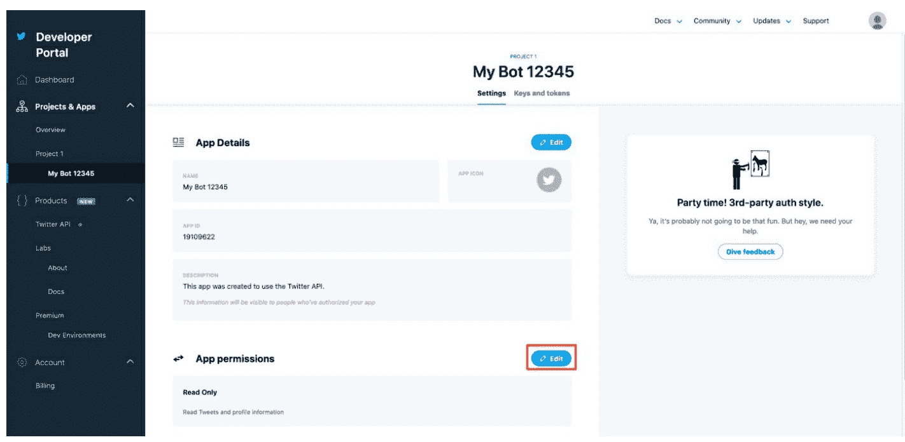

将你的应用权限从“读取”更改为“读取和写入”，并保存更改。

## 编辑应用权限

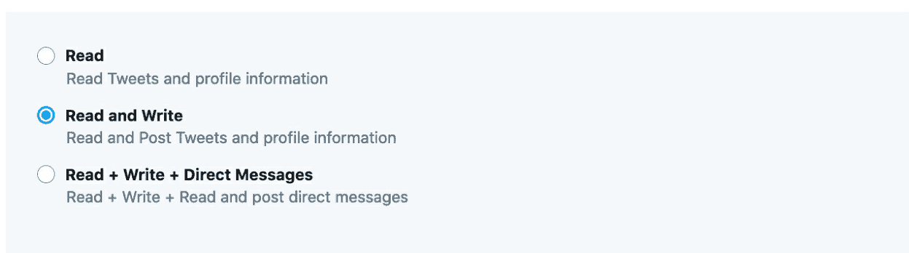

了解更多关于[应用权限](https://developer.twitter.com/en/docs/authentication)的信息。

更新应用权限后，转到“密钥和令牌”部分。在那里，你需要生成访问令牌和密钥，并重新生成 API 密钥和密钥。


你需要这些凭证来自动化访问你的 Twitter 账户。请将它们存放在安全的位置。

就是这样。你已经准备就绪。是时候在你的本地机器上开始构建你的机器人了。

在你的本地机器上创建你的机器人。

你将在本地处理你的机器人，以便快速测试和进行更改。一旦你对其行为感到满意，你将对其进行打包并作为 AWS Lambda 函数部署。你将利用一个包含一些有用脚本的仓库来帮助你打包机器人。

要设置你的本地开发环境，请按照以下步骤操作：

- 1. 将此仓库下载到你的电脑并克隆它。
- 2. 在项目根目录中创建一个虚拟环境并激活它：

```
bash
$ python3 -m venv venv
$ source venv/bin/activate
```

- 3. 使用 pip 在你的虚拟环境中安装必要的库：

```
bash
(venv) $ pip install -r requirements.txt
```

- 4. 在你的项目根目录中，创建一个名为 `.env` 的文件。将你的 Twitter 应用密钥和令牌放在以下位置：

```

ACCESS_TOKEN=<YOUR_ACCESS_TOKEN_HERE>
ACCESS_TOKEN_SECRET=<YOUR_ACCESS_TOKEN_SECRET_HERE>
CONSUMER_KEY=<YOUR_CONSUMER_KEY_HERE>
CONSUMER_SECRET=<YOUR_CONSUMER_SECRET_KEY_HERE>
```

你的项目结构现在应该如下所示：

```
twitter-bot-python-lambda/
├── venv/
├── src/
│   ├── lambda_function.py
│   └── tweets.csv
├── .env
├── buildpackage.sh
├── createlambdalayer.sh
├── entrypoint.py
├── LICENSE
├── README.md
└── requirements.txt
```

以下是每个文件的用途：

`venv/`：包含项目所需库的虚拟环境。

`src/lambda_function.py`：包含你的机器人逻辑的 Python 脚本。此代码将被打包并上传到 AWS Lambda 函数。

`src/tweets.csv`：你的机器人将发布的预定义推文列表。这也包含在将上传到 Lambda 函数的包中。

`.env`：包含你的 Twitter API 认证凭证的文件。用于在本地对你的机器人进行测试。

`buildpackage.sh`：一个实用函数，将 `src/` 的内容压缩为 `lambda_function.zip` 文件。此文件将上传到 Lambda 函数。

`createlambdalayer.sh`：一个实用函数，从 `requirements.txt` 中提供的库创建 `layer.zip` 文件。此文件将上传到 Lambda 层。

`entrypoint.py`：一个 Python 脚本，你将使用它在本地测试你的机器人的依赖项。

`LICENSE` 和 `README.md`：指定项目所使用库的标准方式。

`README.md`：仓库的许可证和描述。

`lambda_function.py` 是仓库中最重要的文件。你将在这里定义你的机器人的逻辑：

```
python
import os
import random
import json
from pathlib import Path
import tweepy
import csv

ROOT = Path(__file__).resolve().parents[0]

def get_tweet(tweets_file, excluded_tweets=None):
    """从 CSV 文件获取要发布的推文"""
    with open(tweets_file) as csvfile:
        reader = csv.DictReader(csvfile)
        possible_tweets = [row["tweet"] for row in reader]

    if excluded_tweets:
        recent_tweets = [status_object.text for status_object in excluded_tweets]
        possible_tweets = [tweet for tweet in possible_tweets if tweet not in recent_tweets]

    selected_tweet = random.choice(possible_tweets)

    return selected_tweet

def lambda_handler(event, context):
    print("获取凭证")
    consumer_key = os.getenv("CONSUMER_KEY")
    consumer_secret = os.getenv("CONSUMER_SECRET")
    access_token = os.getenv("ACCESS_TOKEN")
    access_token_secret = os.getenv("ACCESS_TOKEN_SECRET")

    print("进行身份验证")
    auth = tweepy.OAuthHandler(consumer_key, consumer_secret)
    auth.set_access_token(access_token, access_token_secret)
    api = tweepy.API(auth)

    print("从 csv 文件获取推文")
    tweets_file = ROOT / "tweets.csv"
    recent_tweets = api.user_timeline()[:3]
    tweet = get_tweet(tweets_file)

    print(f"发布推文: {tweet}")
    api.update_status(tweet)

    return {"statusCode": 200, "tweet": tweet}
```

这就是 `lambda_function.py` 的代码。它包含三个部分：导入库、`get_tweet` 函数和 `lambda_handler` 函数。

第一步是导入必要的库。除了常规库外，你还需要导入用于与 Twitter API 通信的 `tweepy`。然后，你将 `lambda_function.py` 的路径存储在一个名为 `ROOT` 的变量中。

```
python
import os
import random
import json
from pathlib import Path
import tweepy
import csv

ROOT = Path(__file__).resolve().parents[0]
```

然后你定义 `get_tweet`。它接受两个参数，并返回你的机器人将要发布的推文文本。查看下图了解其工作原理：

```
python
def get_tweet(tweets_file, excluded_tweets=None):
    """从 CSV 文件获取要发布的推文"""

    with open(tweets_file) as csvfile:
        reader = csv.DictReader(csvfile)
        possible_tweets = [row["tweet"] for row in reader]

    if excluded_tweets:
        recent_tweets = [status_object.text for status_object in excluded_tweets]
        possible_tweets = [tweet for tweet in possible_tweets if tweet not in recent_tweets]

    selected_tweet = random.choice(possible_tweets)

    return selected_tweet
```

`get_tweet` 返回你的机器人将要发布的推文文本。它的第一个参数 `tweets_file` 指定了包含预配置推文列表的 CSV 文件的位置。第二个参数 `excluded_tweets` 是从 Twitter API 获取的推文列表，可用于防止发送最近的推文。

最后，定义了 `lambda_handler` 函数：

```
python
def lambda_handler(event, context):
    print("获取凭证")
    consumer_key = os.getenv("CONSUMER_KEY")
    consumer_secret = os.getenv("CONSUMER_SECRET")
    access_token = os.getenv("ACCESS_TOKEN")
    access_token_secret = os.getenv("ACCESS_TOKEN_SECRET")

    print("进行身份验证")
    auth = tweepy.OAuthHandler(consumer_key, consumer_secret)
    auth.set_access_token(access_token, access_token_secret)
    api = tweepy.API(auth)

    print("从 csv 文件获取推文")
    tweets_file = ROOT / "tweets.csv"
    recent_tweets = api.user_timeline()[:3]
    tweet = get_tweet(tweets_file)

    print(f"发布推文: {tweet}")
    api.update_status(tweet)

    return {"statusCode": 200, "tweet": tweet}
```

当 AWS Lambda 函数被调用时，`lambda_handler` 会被调用。它从环境变量中获取你的 Twitter 凭证，使用 Twitter API 对你的机器人进行身份验证，获取最近三条推文，并发布由 `get_tweet` 返回的推文。

你不需要详细了解其余文件。如果你感兴趣，欢迎自行查看。

既然你已经完成了所有设置，接下来只需遵循以下开发流程：

- 在 `lambda_function.py` 中，定义你的机器人逻辑。
- 从项目根目录执行 `$ python entrypoint.py` 来测试修改。
- 一旦你对机器人的性能感到满意，就按如下方式打包代码：
    - 将你使用的任何额外库添加到 `requirements.txt` 中。
    - 从项目根目录运行 `sh create-lambda-layer.sh 3.8`。它会将 `requirements.txt` 中指定的库打包到 `layer.zip` 中，适用于 Python 3.8+ 运行时。
    - 从项目根目录运行 `sh build-package.sh`。它会创建一个名为 `lambda_function.zip` 的压缩文件，其中包含你的 Lambda 函数代码。

下一步是将你的机器人集成到 AWS Lambda 函数中。

### 为你的机器人创建 AWS Lambda 函数

将你的机器人设置为 Lambda 函数很简单，但你必须按正确的顺序执行步骤。让我们看看具体细节。

1. 首先，使用机器人代码中用到的库（你之前生成的 `layer.zip` 文件）创建一个 Lambda Layer。
2. 其次，创建一个 Lambda 函数，提交你的机器人代码（`lambda_function.zip`），并添加你创建的层。
3. 最后，你将设置一个触发器，以便每天上午 10 点（UTC）运行你的 Lambda 函数。

让我们从创建 Lambda Layer 开始。

在服务下拉菜单中，找到 Lambda。选择第一个选项（Lambda）。

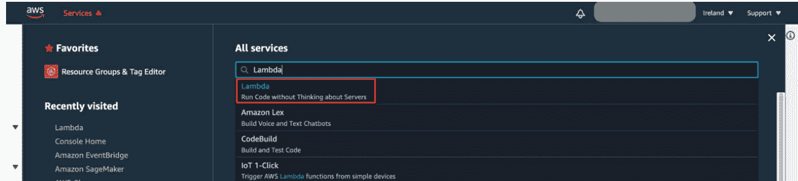

在侧边栏中，从“其他资源”部分选择“层”。然后选择“创建”。

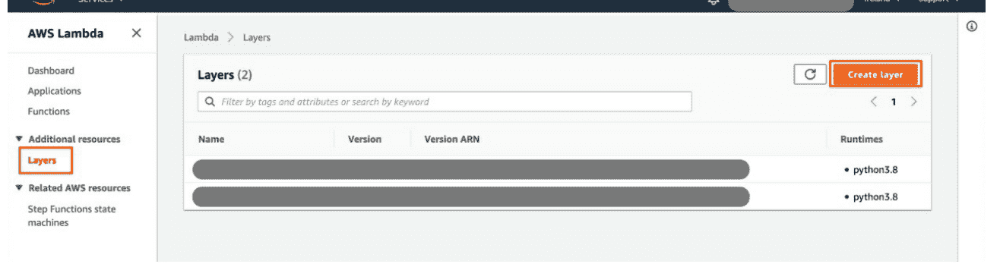

在“创建层”部分为你的层选择一个名称，然后上传你之前创建的 `layer.zip` 文件，并选择 Python 3.8 运行时。

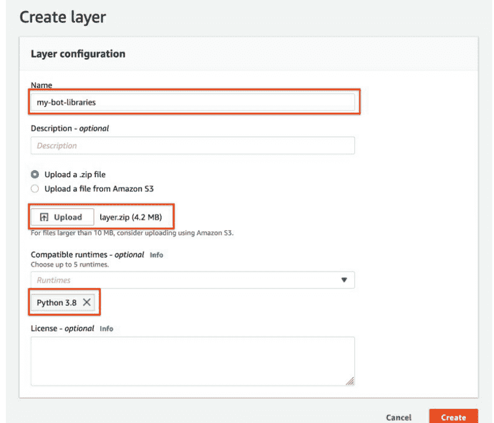

我们的讨论到此结束。你刚刚完成了 Lambda Layer 的创建。这不是很棒吗？

下一步是创建一个新的 Lambda 函数。

在侧边栏中，单击“函数”。然后选择“创建函数”。

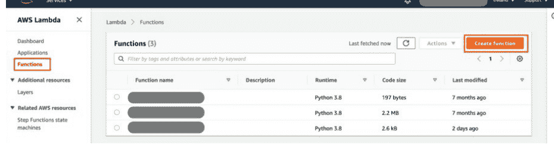

然后，为你的函数命名并选择 Python 3.8 运行时。

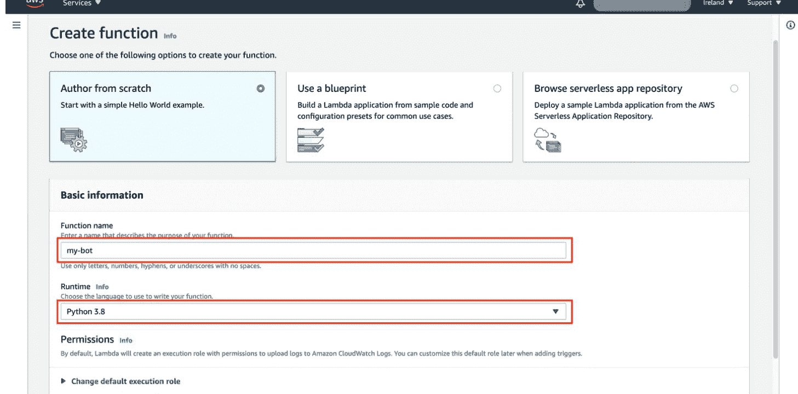

你已经搞定了！

之后，你将上传代码，将 Lambda Layer 添加到你的技术中，并创建一个计划触发器。

要上传代码，请导航到“函数代码”框，选择“操作”，然后选择“上传 `.zip` 文件”。上传 `lambda_function.zip` 并保存你的更改。

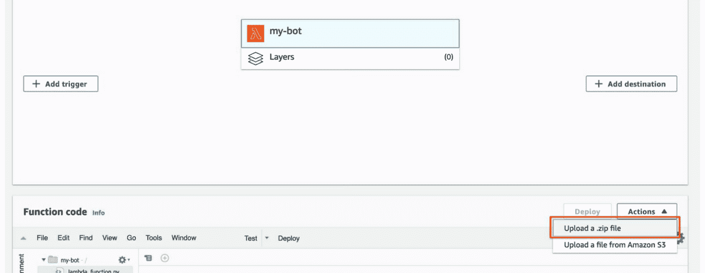

除了代码之外，你还需要将 Twitter API 密钥作为环境变量添加。通过单击“编辑”并将以下变量作为键值对添加到“环境变量”中：

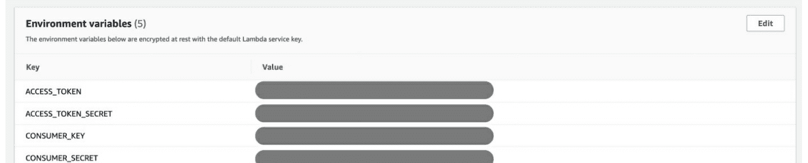

然后，你的函数将添加一个 Lambda Layer。

选择“层”，然后选择“添加层”。

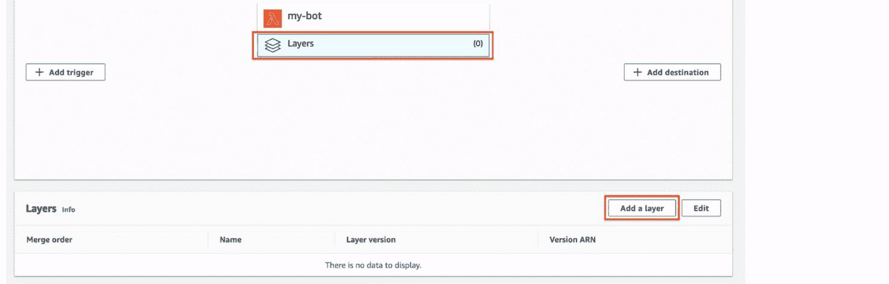

在下一个屏幕上，选择“自定义层”并找到你创建的层。然后选择“添加”。

### 添加层

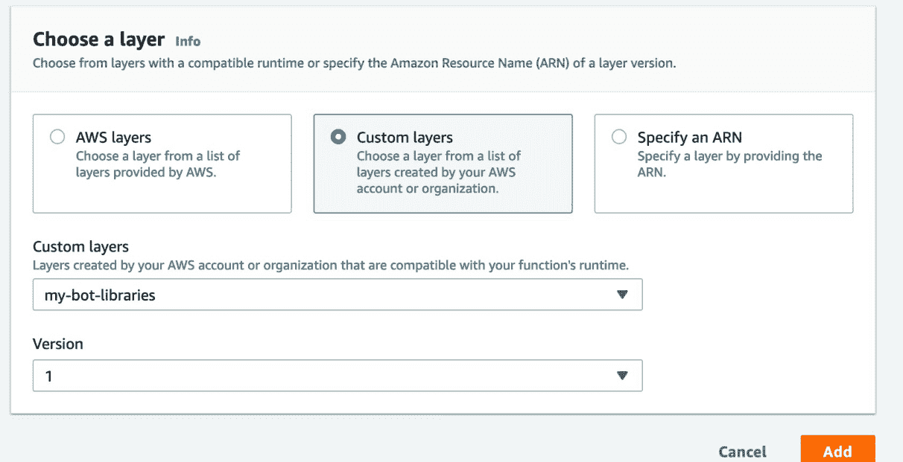

到目前为止，你已经上传了代码，建立了环境变量，并插入了层。你唯一缺少的是让函数运行的触发器。

首先选择“添加触发器”选项来添加触发器。

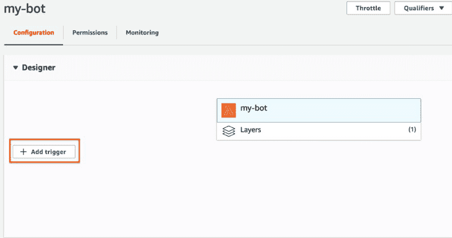

在下一个屏幕中，按如下方式填写必填字段：

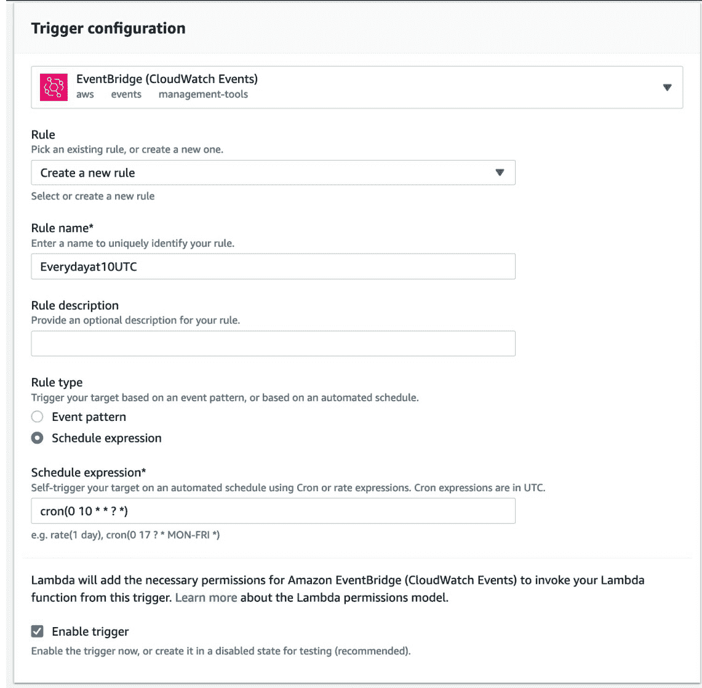

此触发器将每天上午 10 点（UTC）运行你的 Lambda 函数。如果你想添加不同的触发器，请查看“计划表达式”文档。

现在唯一剩下的就是测试你的 Lambda 函数。单击“测试”按钮开始。它会提示你创建一个测试事件，你可以保持其默认设置。

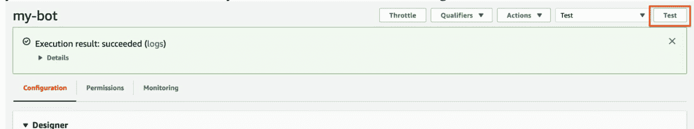

测试函数后，如果一切顺利，你应该会看到一个绿色横幅，显示“执行结果：成功”。否则，请返回前面的步骤并仔细检查一切是否正常。

你做得非常出色！你的 Twitter 机器人已经启动并运行，或者我应该说正在发推文 ;)

你从头到尾经历了创建和部署 Twitter 机器人的整个过程。这是一段漫长的旅程，你构建并配置了一个 Twitter 应用程序，在本地机器上开发了机器人的逻辑，并使用 AWS Lambda 函数部署了你的机器人。

# 第 27 章：什么是 Python 日历

Python 日历模块允许你打印日历以及执行与日历相关的操作。这些日历的开始和结束日期是星期一（day=0）和星期日（day=6）。

这个 Python 日历教程将使用公历作为基本日历，它可以向两个方向无限调整。

ISO 8601 标准规定了如何解释零年和负年。第 0 年被称为“公元前 1 年”，第 1 年被称为“公元前 2 年”，依此类推。

此模块包含 Calendar 类，它提供了许多日期和时间操作功能。除此之外，TextCalendar 和 HTMLCalendar 类可用于提供预格式化的输出。

此 Python 日历模块可以这样导入：

```python
>>> import calendar as cd
```

## Python 中的 Calendar 类

Calendar 是我们要看的第一个类。它具有以下构造函数语法：`class calendar.Calendar(firstweekday=0)`

这会创建一个 Calendar 对象，它从我们指定的星期几开始。默认情况下，它从星期一开始，参数值为 0。

如前所述，星期日是 6。我们使用本课中教授的原则来格式化日历。

Calendar 实例将提供以下方法：

### 1. iterweekdays() — 星期几

这返回一个迭代器，用于一周的星期几数字。我们设置为第一个工作日的数字是此迭代器返回的第一个数字。

```python
>>> import calendar as cd

>>> c=cd.Calendar(firstweekday=1)

>>> for i in c.iterweekdays():
        print(i)
```

输出

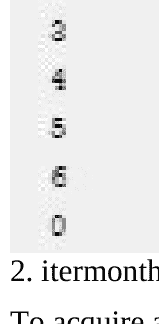

### 2. itermonthdates(year, month) – 月份日期

为了获得完整的一周，这会为一个月的所有日期以及该月之前或之后的任何日期生成一个迭代器。让我们把星期一作为第一个工作日。

```python
>>> c=cd.Calendar(firstweekday=0)

>>> for i in c.itermonthdates(2018,12):
        print(i)
```

输出

2018-11-26
2018-11-27
2018-11-28
2018-11-29
2018-11-30
2018-12-01
2018-12-02
2018-12-03
2018-12-04
2018-12-05
2018-12-06
2018-12-07
2018-12-08
2018-12-09
2018-12-10
2018-12-11
2018-12-12
2018-12-13
2018-12-14
2018-12-15
2018-12-16
2018-12-17
2018-12-18
2018-12-19
2018-12-20
2018-12-21
2018-12-22
2018-12-23
2018-12-24
2018-12-25
2018-12-26
2018-12-27
2018-12-28
2018-12-29
2018-12-30
2018-12-31
2019-01-01
2019-01-02
2019-01-03
2019-01-04
2019-01-05
2019-01-06

### 3. itermonthdays(year, month) – 月份天数

因此，我们有一个名为“月份天数”的月份迭代器。在我们提供的月份之外，天数返回 0。

```python
>>> for i in c.itermonthdays(2018,12):
        print(i)
```

输出

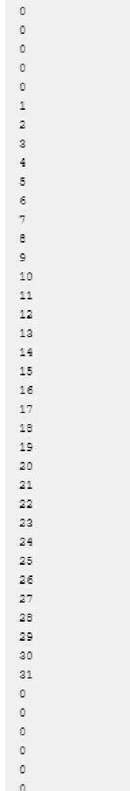

你注意到十一月和一月之间的天数是如何变成 0 的了吗？

### 4. itermonthdays2(year, month) - 月份和星期几

此函数类似于 itermonthdays()，但它生成月份和星期几的元组。

```python
>>> for i in c.itermonthdays2(2018,12):
        print(i)
```

输出

```
(0, 0)
(0, 1)
(0, 2)
(0, 3)
(0, 4)
(1, 5)
(2, 6)
(3, 0)
(4, 1)
(5, 2)
(6, 3)
(7, 4)
(8, 5)
(9, 6)
(10, 0)
(11, 1)
(12, 2)
(13, 3)
(14, 4)
(15, 5)
(16, 6)
(17, 0)
(18, 1)
(19, 2)
(20, 3)
(21, 4)
(22, 5)
(23, 6)
(24, 0)
(25, 1)
(26, 2)
(27, 3)
(28, 4)
(29, 5)
(30, 6)
(31, 0)
(0, 1)
(0, 2)
(0, 3)
(0, 4)
(0, 5)
(0, 6)
```

### 5. itermonthdays3(year, month) – 年、月、日

这与前两个类似，但它返回一个包含年、月和日的元组。这是 Python 3.7 中的一个全新功能。

```python
>>> for i in c.itermonthdays3(2018,12):
        print(i)
```

输出

6. itermonthdays4(year, month) – 年、月、日、星期

与其他方法类似，此方法生成一个包含年、月、日和星期的元组。自 Python 3.7 起，此功能一直如此。

```
>>> for i in c.itermonthdays4(2018,12):
    print(i)
```

输出

```
(2018, 11, 26, 0)
(2018, 11, 27, 1)
(2018, 11, 28, 2)
(2018, 11, 29, 3)
(2018, 11, 30, 4)
(2018, 12, 1, 5)
(2018, 12, 2, 6)
(2018, 12, 3, 0)
(2018, 12, 4, 1)
(2018, 12, 5, 2)
(2018, 12, 6, 3)
(2018, 12, 7, 4)
(2018, 12, 8, 5)
(2018, 12, 9, 6)
(2018, 12, 10, 0)
(2018, 12, 11, 1)
(2018, 12, 12, 2)
(2018, 12, 13, 3)
(2018, 12, 14, 4)
(2018, 12, 15, 5)
(2018, 12, 16, 6)
(2018, 12, 17, 0)
(2018, 12, 18, 1)
(2018, 12, 19, 2)
(2018, 12, 20, 3)
(2018, 12, 21, 4)
(2018, 12, 22, 5)
(2018, 12, 23, 6)
(2018, 12, 24, 0)
(2018, 12, 25, 1)
(2018, 12, 26, 2)
(2018, 12, 27, 3)
(2018, 12, 28, 4)
(2018, 12, 29, 5)
(2018, 12, 30, 6)
(2018, 12, 31, 0)
(2019, 1, 1, 1)
(2019, 1, 2, 2)
(2019, 1, 3, 3)
(2019, 1, 4, 4)
(2019, 1, 5, 5)
(2019, 1, 6, 6)
```

7. monthdatescalendar(year,month) – 月份中的周列表

此方法为我们提供所需月份中完整周的列表。每周提供一个包含七个日期时间对象的列表。

```
>>> for i in c.monthdatescalendar(2018,12):
    print(i)
```

输出

```
[datetime.date(2018, 11, 26), datetime.date(2018, 11, 27), datetime.date(2018, 11, 28), datetime.date(2018, 11, 29), datetime.date(2018, 11, 30), datetime.date(2018, 12, 1), datetime.date(2018, 12, 2)]
[datetime.date(2018, 12, 3), datetime.date(2018, 12, 4), datetime.date(2018, 12, 5), datetime.date(2018, 12, 6), datetime.date(2018, 12, 7), datetime.date(2018, 12, 8), datetime.date(2018, 12, 9)]
[datetime.date(2018, 12, 10), datetime.date(2018, 12, 11), datetime.date(2018, 12, 12), datetime.date(2018, 12, 13), datetime.date(2018, 12, 14), datetime.date(2018, 12, 15), datetime.date(2018, 12, 16)]
[datetime.date(2018, 12, 17), datetime.date(2018, 12, 18), datetime.date(2018, 12, 19), datetime.date(2018, 12, 20), datetime.date(2018, 12, 21), datetime.date(2018, 12, 22), datetime.date(2018, 12, 23)]
[datetime.date(2018, 12, 24), datetime.date(2018, 12, 25), datetime.date(2018, 12, 26), datetime.date(2018, 12, 27), datetime.date(2018, 12, 28), datetime.date(2018, 12, 29), datetime.date(2018, 12, 30)]
[datetime.date(2018, 12, 31), datetime.date(2019, 1, 1), datetime.date(2019, 1, 2), datetime.date(2019, 1, 3), datetime.date(2019, 1, 4), datetime.date(2019, 1, 5), datetime.date(2019, 1, 6)]
```

检查 2018 年 12 月的日期，以星期一为第一天，以确保正确性：
各周分别从 26 日、3 日、10 日、17 日、24 日和 31 日开始。

monthdays2calendar(year,month) – 返回月份的日期和星期列表。
此方法为我们提供一个周列表，每周包含七个元组，每个元组代表月份中的日期和星期几。

```
>>> for i in c.monthdays2calendar(2018,12):
    print(i)
```

输出

```
[[(0, 0), (0, 1), (0, 2), (0, 3), (0, 4), (1, 5), (2, 6)]]
[[(3, 0), (4, 1), (5, 2), (6, 3), (7, 4), (8, 5), (9, 6)]]
[[(10, 0), (11, 1), (12, 2), (13, 3), (14, 4), (15, 5), (16, 6)]]
[[(17, 0), (18, 1), (19, 2), (20, 3), (21, 4), (22, 5), (23, 6)]]
[[(24, 0), (25, 1), (26, 2), (27, 3), (28, 4), (29, 5), (30, 6)]]
[[(31, 0), (0, 1), (0, 2), (0, 3), (0, 4), (0, 5), (0, 6)]]
```

每个元组中的第二个值是星期几，范围从 0 到 6，第一个值是月份中的日期，范围从 0 到 31。

9. monthdayscalendar(year,month) – 月份中的日期列表
此方法为我们提供一个周列表，每周代表一个月的日期。

```
>>> for i in c.monthdayscalendar(2018,12):
    print(i)
```

输出

```
[0, 0, 0, 0, 1, 2]
[3, 4, 5, 6, 7, 8, 9]
[10, 11, 12, 13, 14, 15, 16]
[17, 18, 19, 20, 21, 22, 23]
[24, 25, 26, 27, 28, 29, 30]
[31, 0, 0, 0, 0, 0, 0]
```

10. yeardatescalendar(year,width=3) – 月份行列表

我们现在有一个月份行的列表。`width` 参数允许我们指定每个月行包含多少个月，默认为 3。日期采用日历格式。

```
>>> for j in c.yeardatescalendar(2018,2):
    print(j)
```

11. yeardays2calendar(year,width=3) – 月份日期和星期列表

此方法为我们提供一个周列表，每周是月份日期和星期几的元组。

```
>>> for i in c.yeardays2calendar(2018,2):
    print(i)
```

12. yeardayscalendar(year,width=3) – 月份日期列表

此方法为我们提供一个周列表，每周是月份日期。

```
>>> for j in c.yeardayscalendar(2018,2):
    print(j)
```

输出

```
[[[1, 2, 3, 4, 5, 6, 7], [8, 9, 10, 11, 12, 13, 14], [15, 16, 17, 18, 19, 20, 21], [22, 23, 24, 25, 26, 27, 28], [29, 30, 31, 0, 0, 0, 0]], [[0, 0, 0, 1, 2, 3, 4], [5, 6, 7, 8, 9, 10, 11], [12, 13, 14, 15, 16, 17, 18], [19, 20, 21, 22, 23, 24, 25], [26, 27, 28, 0, 0, 0, 0]]]
[[[0, 0, 0, 1, 2, 3, 4], [5, 6, 7, 8, 9, 10, 11], [12, 13, 14, 15, 16, 17, 18], [19, 20, 21, 22, 23, 24, 25], [26, 27, 28, 29, 30, 31, 0]], [[0, 0, 0, 0, 0, 0, 1], [2, 3, 4, 5, 6, 7, 8], [9, 10, 11, 12, 13, 14, 15], [16, 17, 18, 19, 20, 21, 22], [23, 24, 25, 26, 27, 28, 29], [30, 0, 0, 0, 0, 0, 0]]]
[[[0, 1, 2, 3, 4, 5, 6], [7, 8, 9, 10, 11, 12, 13], [14, 15, 16, 17, 18, 19, 20], [21, 22, 23, 24, 25, 26, 27], [28, 29, 30, 31, 0, 0, 0]], [[0, 0, 0, 0, 1, 2, 3], [4, 5, 6, 7, 8, 9, 10], [11, 12, 13, 14, 15, 16, 17], [18, 19, 20, 21, 22, 23, 24], [25, 26, 27, 28, 29, 30, 0]]]
[[[0, 0, 0, 0, 0, 0, 1], [2, 3, 4, 5, 6, 7, 8], [9, 10, 11, 12, 13, 14, 15], [16, 17, 18, 19, 20, 21, 22], [23, 24, 25, 26, 27, 28, 29], [30, 31, 0, 0, 0, 0, 0]], [[0, 0, 1, 2, 3, 4, 5], [6, 7, 8, 9, 10, 11, 12], [13, 14, 15, 16, 17, 18, 19], [20, 21, 22, 23, 24, 25, 26], [27, 28, 29, 30, 31, 0, 0]]]
[[[0, 0, 0, 0, 0, 1, 2], [3, 4, 5, 6, 7, 8, 9], [10, 11, 12, 13, 14, 15, 16], [17, 18, 19, 20, 21, 22, 23], [24, 25, 26, 27, 28, 29, 30]], [[1, 2, 3, 4, 5, 6, 7], [8, 9, 10, 11, 12, 13, 14], [15, 16, 17, 18, 19, 20, 21], [22, 23, 24, 25, 26, 27, 28], [29, 30, 31, 0, 0, 0, 0]]]
[[[0, 0, 0, 1, 2, 3, 4], [5, 6, 7, 8, 9, 10, 11], [12, 13, 14, 15, 16, 17, 18], [19, 20, 21, 22, 23, 24, 25], [26, 27, 28, 29, 30, 0, 0]], [[0, 0, 0, 0, 0, 1, 2], [3, 4, 5, 6, 7, 8, 9], [10, 11, 12, 13, 14, 15, 16], [17, 18, 19, 20, 21, 22, 23], [24, 25, 26, 27, 28, 29, 30], [31, 0, 0, 0, 0, 0, 0]]]
```

## Python TextCalendar 类

此类允许我们生成纯文本日历。其构造函数的语法如下：
class calendar.TextCalendar(firstweekday=0)

查看可用的方法：

+   1. formatmonth([w=0,l=0], year, month) - 多行字符串格式的月份
作为多行字符串，我们现在有了一个月的日历。`w` 和 `l` 是可选参数，分别决定居中日期列的宽度和每周的行数。要运行此方法，我们需要知道第一个工作日的值。
>>> t=cd.TextCalendar(0)
>>> t.formatmonth(2018,12)
输出
` December 2018\nMo Tu We Th Fr Sa Su\n 1 2\n 3 4 5 6 7 8 9\n10 11 12 13 14 15 16\n17 18 19 20 21 22 23\n24 25 26 27 28 29 30\n31\n`
>>> print(t.formatmonth(2018,12))
2. prmonth(year, month, [w=0,l=0]) – 打印月份的日历。
我们可以像之前一样使用 `prmonth()` 方法。
t.prmonth(2018,12)
3. formatyear([w=2,l=1,c=6,m=3], year) - 多行字符串格式的年份日历
作为多行字符串，此方法返回一个包含 `m` 列的全年日历。可选参数：`w` 指定日期列的宽度，`l` 指定每周的行数，`c` 指定月份列之间的空格数。

我们需要第一个工作日来实现此功能。您的平台决定了可以创建日历的最早年份。

```
>>> print(t.formatyear(2018,5)) #设置 w=5，m 默认为 3
>>> print(t.formatyear(2018,m=5))
```

4.  pryyear(theyear,[w=2,l=1,c=6,m=3]) – 打印年历

这与前一个命令打印的内容相同。

```
>>> t.pryyear(2018,m=5)
```

## Python 中的 HTMLCalendar

最后，让我们谈谈允许我们创建 HTML 日历的 Python 类。其构造函数具有以下语法：

```
class calendar.HTMLCalendar(firstweekday=0)
```

HTML Python 日历中使用了以下策略：

1.  月历 HTML 表格格式 month(theyear, themonth, withyear=True)

这会生成一个月的日历作为 HTML 表格。

```
>>> h=cd.HTMLCalendar()
>>> print(h.formatmonth(2018,12))
```

### 输出

```
<table border="0" cellpadding="0" cellspacing="0" class="month">
<tr><th colspan="7" class="month">December 2018</th></tr>
<tr><th class="mon">Mon</th><th class="tue">Tue</th><th class="wed">Wed</th><th class="thu">Thu</th><th class="fri">Fri</th><th class="sat">Sat</th><th class="sun">Sun</th></tr>
<tr><td class="noday">&nbsp;</td><td class="noday">&nbsp;</td><td class="noday">&nbsp;</td><td class="noday">&nbsp;</td><td class="noday">&nbsp;</td><td class="sat">1</td><td class="sun">2</td></tr>
<tr><td class="mon">3</td><td class="tue">4</td><td class="wed">5</td><td class="thu">6</td><td class="fri">7</td><td class="sat">8</td><td class="sun">9</td></tr>
<tr><td class="mon">10</td><td class="tue">11</td><td class="wed">12</td><td class="thu">13</td><td class="fri">14</td><td class="sat">15</td><td class="sun">16</td></tr>
<tr><td class="mon">17</td><td class="tue">18</td><td class="wed">19</td><td class="thu">20</td><td class="fri">21</td><td class="sat">22</td><td class="sun">23</td></tr>
<tr><td class="mon">24</td><td class="tue">25</td><td class="wed">26</td><td class="thu">27</td><td class="fri">28</td><td class="sat">29</td><td class="sun">30</td></tr>
<tr><td class="mon">31</td><td class="noday">&nbsp;</td><td class="noday">&nbsp;</td><td class="noday">&nbsp;</td><td class="noday">&nbsp;</td><td class="noday">&nbsp;</td><td class="noday">&nbsp;</td></tr>
</table>
```

2.  年历的 HTML 表格格式 year(the year, width=3)

这会为完整的日历年生成一个 HTML 表格。`width` 指定一行中的月份数，默认设置为 3。

```
>>> print(h.formatyear(2018,5))
```

3.  formatyearpage(theyear, width=3, css='calendar.css', encoding=None)

这会生成一个宽度为 3 的完整年份日历作为 HTML 页面。如果不使用层叠样式表，可以使用 `None`。

```
>>> print(h.formatyearpage(2018, css=None))
```

Python 中的日历模块有许多函数。

TextCalendar 和 HTMLCalendar 是我们到目前为止研究过的 Python 日历类的两个子类。让我们看看 Python 日历模块提供的所有函数。

1.  calendar.setfirstweekday(weekday) – 选择一周的第一天。

这允许我们选择希望一周开始的星期几。星期一是 0，而星期日是 6。

```
>>> t.setfirstweekday(cd.SUNDAY)
>>> print(t.formatyear(2018,5))
```

2.  calendar.firstweekday - 一周的第一天

一周的第一天由此确定。

```
>>> t.firstweekday
```

输出

6

3.  calendar.isleap(year) — 判断一年是否为闰年。

这判断一年是否为闰年。

```
>>> cd.isleap(2018)
```

输出

False

4.  numberofleapyears(y1, y2) – 范围内的闰年数。

这告诉我们从 y1 年到 y2 年的闰年数量。

```
>>> cd.leapdays(1995,2018)
```

输出

6

5.  calendar.weekday(year, month, day) – 星期几

```
>>> cd.weekday(2018,12,31)
```

输出

0

6.  calendar.weekheader(n) – 缩写的星期名称

我们现在有了一个包含较短星期名称的表头。一个星期的字符宽度为 w。

```
>>> cd.weekheader(1)
```

**输出**

'S M T W T F S'

```
>>> cd.weekheader(2)
```

**输出**

'Su Mo Tu We Th Fr Sa'

```
>>> cd.weekheader(3)
```

**输出**

'Sun Mon Tue Wed Thu Fri Sat'

7.  calendar.monthrange(year, month) – 月份的第一天和该月的天数。

这给出了月份的第一天和该月的天数。

```
>>> cd.monthrange(2018,12)
```

输出

(5, 31)

8.  calendar.monthcalendar(year, month) – 月历矩阵

这给出了一个月的日历矩阵。

```
>>> for i in cd.monthcalendar(2018,12):
    print(i)
```

输出

```
[0, 0, 0, 0, 0, 0, 1]
[2, 3, 4, 5, 6, 7, 8]
[9, 10, 11, 12, 13, 14, 15]
[16, 17, 18, 19, 20, 21, 22]
[23, 24, 25, 26, 27, 28, 29]
[30, 31, 0, 0, 0, 0, 0]
```

9.  calendar.prmonth(theyear, themonth, w=0, l=0) – 打印多行月份

这打印 `calendar.month` 给我们的月份。

```
>>> cd.prmonth(2018,12)
```

10. calendar.month(theyear, themonth, w=0, l=0) – 多行月份字符串

这以多行字符串的形式显示一个月的日历。为此，它使用了 TextCalendar 中的 `formatmonth()` 方法。

```
>>> cd.month(2018,12)
```

输出

```
    December 2018
Su Mo Tu We Th Fr Sa
                   1
 2  3  4  5  6  7  8
 9 10 11 12 13 14 15
16 17 18 19 20 21 22
23 24 25 26 27 28 29
30 31
```

11. calendar.prcal(year, w=0, l=0, c=6, m=3) – 打印年历

这打印整个年份的日历——即 `calendar.calendar` 返回的内容。

```
>>> cd.prcal(2018)
```

12. calendar.calendar(year, w=2, l=1, c=6, m=3) – 多行字符串年历

这以多行字符串的形式显示一个 3 列的年历。为此，它使用了 TextCalendar 中的 `formatyear()` 方法。

```
>>> cd.calendar(2018)
```

输出

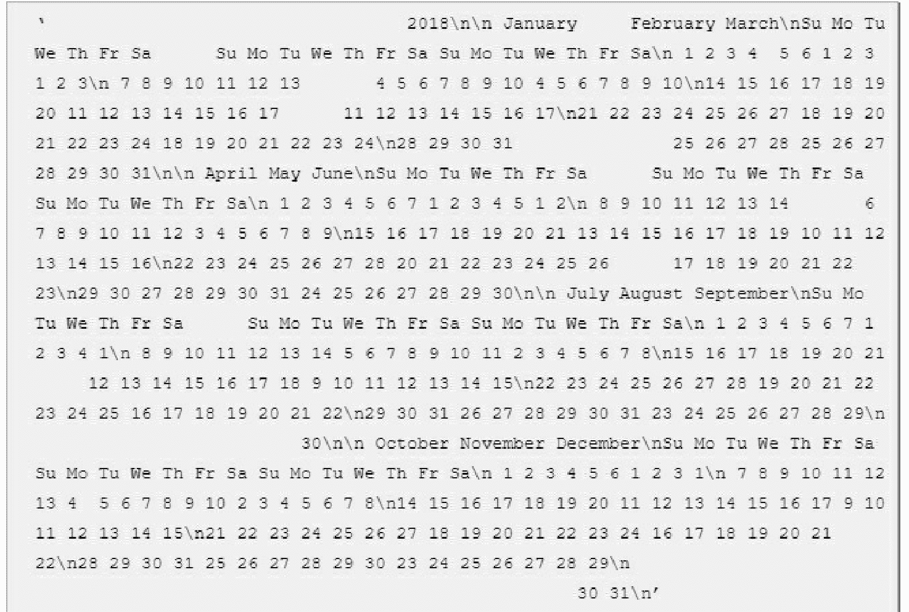

13. calendar.timegm(tuple) – 从时间元组获取时间戳值

这接受一个时间元组，并返回一个时间戳值，其纪元为 1970 年，并使用 POSIX 编码。这是 `time.gmtime()` 的逆操作。

```
>>> import time
>>> cd.timegm(time.gmtime(30000))
```

**输出**

30000

希望您喜欢我们的解释。

## Python 中的日历模块面试问题

1.  什么是 Python 日历模块？
2.  什么是 Python 日历模块，我该如何使用它？
3.  如何在 Python 中打印全年的日历？
4.  如何编写 Python 日历程序？
5.  将日历模块导入 Python 的最佳方式是什么？

因此，我们在这个 Python 日历教程中了解了 Python 日历模块。此外，我们还回顾了一个 Python 日历示例，以帮助您掌握该模块。

在 Python 中，我们还研究了 TextCalendar 和 HTML Calendar。最后，我们学习了如何使用 Python 日历模块的函数。

## 结论

现在是学习 Python 的时候了，因为这样做有诸多好处。基础知识将帮助您在所选择的有趣领域中获得丰富的经验和良好的职位。数据科学可能是您最好的选择，但 Python 编程是您可以在任何地方学习的技能。