# 迪伦·马赫

## 计算机编程

### 入门指南


4合1：Linux命令行 + Python编程 + 网络技术 + Kali Linux渗透测试

### Linux命令行

### Python编程

### 网络技术

### Kali Linux渗透测试

迪伦·马赫

迪伦·马赫

迪伦·马赫

迪伦·马赫

1

2

3

4

# # 计算机编程
### 入门指南

4合1：
*Linux命令行入门*，
*Python编程入门*
*网络技术入门*，
*Kali Linux渗透测试*
*网络安全、无线技术、LTE、网络与渗透测试*

作者：迪伦·马赫

# © 版权所有 2020 迪伦·马赫 - 保留所有权利。

未经作者或出版商直接书面许可，不得复制、转载或传播本书所含内容。

在任何情况下，出版商或作者均不对因本书所含信息直接或间接造成的任何损害、赔偿或金钱损失承担任何责任或法律责任。

# 法律声明：

本书受版权保护。仅供个人使用。未经作者或出版商同意，不得修改、分发、销售、使用、引用或转述本书任何部分或内容。

# 免责声明：

请注意，本文档所含信息仅供教育和娱乐目的。我们已尽力提供准确、最新、可靠且完整的信息。不作任何明示或暗示的保证。读者承认作者不提供法律、财务、医疗或专业建议。本书内容源自多种来源。在尝试本书概述的任何技术之前，请咨询持证专业人士。

阅读本文档即表示读者同意，在任何情况下，作者均不对因使用本文档所含信息而产生的任何直接或间接损失负责，包括但不限于——错误、遗漏或不准确之处。

# Linux命令行入门

从零开始学习Linux到Bash脚本与Shell编程的全面分步指南

作者：迪伦·马赫


© 版权所有 2019 迪伦·马赫 - 保留所有权利。

未经作者或出版商直接书面许可，不得复制、转载或传播本书所含内容。

在任何情况下，出版商或作者均不对因本书所含信息直接或间接造成的任何损害、赔偿或金钱损失承担任何责任或法律责任。

**法律声明：**

本书受版权保护。仅供个人使用。未经作者或出版商同意，不得修改、分发、销售、使用、引用或转述本书任何部分或内容。

**免责声明：**

请注意，本文档所含信息仅供教育和娱乐目的。我们已尽力提供准确、最新、可靠且完整的信息。不作任何明示或暗示的保证。读者承认作者不提供法律、财务、医疗或专业建议。本书内容源自多种来源。在尝试本书概述的任何技术之前，请咨询持证专业人士。

阅读本文档即表示读者同意，在任何情况下，作者均不对因使用本文档所含信息而产生的任何直接或间接损失负责，包括但不限于——错误、遗漏或不准确之处。

## 目录

- [引言](#)
- **第1章：什么是Linux以及为何使用它？**
  - [什么是Linux操作系统？](#)
  - [为何使用Linux？](#)
  - [众多不同的发行版](#)
  - [Linux等同于自由](#)
  - [Linux可靠性出色](#)
  - [Linux为你省钱](#)
  - [你可以轻松尝试Linux](#)
  - [Linux可在旧系统上运行](#)
  - [比以往更成熟](#)
- **第2章：Linux发行版与安装类型**
  - [多用途Linux发行版](#)
  - [高级用户最佳Linux发行版](#)
  - [旧电脑最佳Linux发行版](#)
  - [最佳Linux服务器发行版](#)
  - [初学者最佳Linux发行版](#)
  - [服务器角色与安装类型](#)
- **第3章：Linux内核与操作系统简介**
  - [系统准备](#)
- **第4章：在虚拟机上安装Linux**
  - [VMware Workstation Player安装](#)
  - [虚拟机的重要性](#)
- **第5章：Linux用户管理与系统管理**
  - [如何作为Linux管理员管理用户和组](#)
  - [Linux组](#)
  - [Linux文件系统](#)
- **第6章：Linux目录结构**
  - [文件系统的基本功能](#)
  - [Linux目录结构](#)
- **第7章：磁盘、媒体与数据文件操作（gzip – tar）**
  - [使用这些命令分析Linux磁盘空间和硬盘分区](#)
  - [Linux数据操作](#)
  - [从命令行创建用于Tar GZip的文件](#)
- **第8章：文件、目录管理器、权限、网络与SSH**
  - [SSH命令](#)
- **第9章：Linux终端、编辑器与Shell**
- **第10章：基础Linux Shell命令**
  - [Shell命令](#)
  - [其他语言](#)
- **第11章：Shell脚本**
  - [Shell脚本的特性](#)
- **第12章：构建脚本**
  - [错误](#)
- **第13章：基础Bash Shell命令**
- **第14章：高级Bash Shell命令**
- [结论](#)

## 引言

祝贺你购买了《Linux命令行入门：从零开始学习Linux到Bash脚本与Shell编程的全面分步指南》，并感谢你的选择。

Linux几乎存在于我们今天使用的所有设备中。如果你是初学者，或者刚开始学习关于Linux操作系统的一切，你很快就会意识到，下载这本电子书是清晰理解Linux世界及其多种发行版的明智方式。通常，浏览Linux命令行可能相当棘手。在本书中，你将看到多种方法，可以借鉴以实现与Linux的顺畅操作。此外，某些Linux发行版不仅适合初学者使用，即使在旧系统上也能良好运行。最终，本书更进一步分析了基础Linux Shell命令以及Shell脚本。

为此，本书部分章节将讨论Linux用户管理与管理，探讨Linux系统管理员的部分职责，包括广泛处理目录、用户和文件、基础Bash命令、root或超级用户管理等等。此外，本书还将讨论Linux文件功能，并定义Linux文件所有权的三种类型、权限和SSH命令。你将了解其他SSH命令、Linux终端、编辑器和Shell。

在清晰理解了目录、文件管理器和编辑器之后，本书将讨论如何从命令行创建用于tar gzip的文件、如何挂载和卸载媒体，以及Linux数据操作。

市面上有许多关于Linux命令行的书籍，感谢你选择本书。我们致力于确保本书为你提供成功所需的所有实用且必要的信息。再次感谢！

## 第一章：什么是 Linux 以及为何使用它？

Linux 是一种标准的操作系统，广泛应用于手机、服务器和个人电脑等几乎所有领域。事实上，在全球范围内，无数人在你能想象到的各个领域和应用中使用着 Linux。Linux 自上世纪 90 年代以来就已存在。从电视棒到冰箱，再到各种设备，Linux 驱动着一切。互联网的很大一部分也依赖于 Linux 的支持。由于计算机操作系统推动了许多创新，许多科学突破也离不开 Linux。尽管几十年来，Linux 一直提供着安全、可靠的操作系统服务，但“Linux”这个词对普通大众来说却并不熟悉。

但 Linux 操作系统无处不在，从企业服务器到家庭桌面、家用电器、超级计算机、汽车和智能手机。无论在哪里，你都能找到 Linux，它存在于你的电视、Roku 设备、冰箱和恒温器中。作为最轻松、最安全可靠的操作系统之一，Linux 自豪地成为全球嵌入式系统、服务器和桌面平台的首选。

### 什么是 Linux 操作系统？

首先，你对操作系统（OS）的理解是什么？在物理计算机中，管理硬件是被称为操作系统的计算机代码的职责。操作系统作为硬件和软件之间的一层存在。此外，用汇编语言与显卡通信或寻址 CPU 并不是大多数人想知道的。而像 Windows 或 Linux 这样的操作系统则充当了中间人的角色。

因此，Linux 与 Mac OS、iOS 和 Windows 一样，是一种操作系统。本质上，Linux 操作系统驱动着 Android，这是世界上最流行的平台。没有操作系统，软件很可能无法运行，因为作为操作系统，Linux 管理着硬件和软件之间的通信。

Linux 操作系统包含许多不同的组成部分，它们是：

- **应用程序** – 并非桌面环境提供的所有完整应用程序。因此，你可以像在 macOS 和 Windows 上一样，通过 Linux 快速找到并安装数千种高质量软件。大多数现代 Linux 发行版在应用程序安装方面都力求简洁和集中。例如，Ubuntu Linux 的 Ubuntu Software Center（类似于 GNOME Software）就提供了一个集中平台，帮助用户从数千个应用中快速发现和安装所需软件。
- **桌面环境** – 用户可以与这一部分进行交互。你可以从多种桌面环境中选择，如 Xfce、KDE、Enlightenment、Pantheon、Mate、Cinnamon、GNOME 等。每个桌面环境都包含内置应用程序，如游戏、网络浏览器、配置工具和文件管理器。
- **图形服务器** – 这个子系统会在你的显示器上提供图形显示。许多人称其为 X 或 X-server。
- **守护进程** – 这些是在登录桌面或启动过程中运行的后台服务，例如调度、声音、打印等。
- **Init 系统** – 这个子系统引导用户空间，并负责控制守护进程。因此，systemd 作为最具争议性的一个，是目前使用最广泛的 init 系统。当引导加载程序（如统一引导加载程序或 GRUB）处理初始启动时，init 系统则管理启动过程。
- **操作系统内核** – 内核可以被称为一个完整的部分，即 Linux，它负责管理外围设备、内存、CPU，而系统的核心就是内核。
- **引导加载程序** – 这个软件管理计算机的启动过程。对大多数用户来说，它就是在操作系统启动时弹出并很快消失的启动画面。
- **操作系统 Shell** – Shell 是我们用来告诉操作系统我们想让它做什么的工具。许多人称之为命令行，你使用文本指令来操作操作系统。然而，命令行的代码并不为很多人所知。因此，这导致人们远离使用 Linux。现代 Linux 发行版改变了这一点，因为就像 Windows 一样，Linux 也会使用桌面。

### 为何使用 Linux？

大多数人几乎总是在问这个问题。当几乎所有服务器、笔记本电脑和桌面电脑都预装的操作系统运行良好时，为什么还要费心去学习一个完全不同的计算环境呢？这个问题的答案与其说是一个回答，不如说是另一个问题：你对自己当前操作系统的运行状况满意吗？或者你是否在为许可费、昂贵的维修、崩溃、变慢、恶意软件和病毒而烦恼？如果你发现自己正与上述问题作斗争，那么 Linux 可能就是你的完美平台。目前，Linux 是地球上最可靠的计算机生态系统。对于桌面平台来说，将这种零成本与可靠性相结合，你将拥有一个完美的解决方案。由于服务器许可或软件无需支付任何费用，你可以随心所欲地在任意多台计算机上安装 Linux。而且，你无需支付任何费用即可访问 Linux。

除此之外，如果你不介意零成本的含义，那么拥有一个可以长期使用、轻松稳定的操作系统怎么样呢？二十多年来，无论是服务器平台还是桌面平台，许多使用 Linux 的人都没有遇到过病毒、恶意软件或勒索软件的问题。事实是，这类攻击对 Linux 无能为力。只有在更新内核时，服务器才需要重启。Linux 服务器连续数年不重启也并非罕见。只要严格遵循推荐的更新，你一定能享受到可靠性和稳定性。

此外，我们的计算机大多使用桌面操作系统，而更换操作系统是我们很少考虑的事情。更重要的是，学习一个新的操作系统并不是大多数人愿意做的事情。然而，以下是你需要尝试 Linux 的一些原因：

### 众多不同的发行版

Linux 的不同发行版或版本存在差异。有些用于服务器软件，而另一些则专为桌面使用而设计。有些是为初学者设计的，而另一些则专注于高级用户。大多数 Linux 版本（也称为发行版）使用 USB 驱动器、光盘安装，或者可以免费下载。Linux 发行版数不胜数。虽然一些流行的选择是 openSUSE 和 Debian，但桌面用户的默认偏好通常是 Linux Mint、Arch 和 Fedora。得益于 Ubuntu Unity，Ubuntu 成为最现代的 Linux 发行版之一。通过包含 openSUSE，你可以获得更传统的 KDE 外观的 Linux。此外，如果你在寻找服务器 Linux 操作系统的列表，那也会是一个相当长的列表。CentOS、SUSE Enterprise、Ubuntu Server 和 Red Hat 是一些最著名的发行版。但是，使用某些 Linux 服务器发行版可能需要投入一些资金，因为使用 Red Hat 可能需要许可。然而，对于你的业务来说，通过许可费获得的支持是至关重要的。

### Linux 等同于自由

需要将开源定义为与 Linux 等同。任何软件都遵循一套原则，例如：

- 对于你修改的任何软件，其副本将不受限制。
- 软件分发将不受限制。
- 将允许你进行任何所需的更改、检查以及研究和反汇编软件。
- 无论你的目标或动机如何，都拥有运行软件的完全自由。

首先，开源软件并不等同于一个社区，你需要明白这一点。Linux 由这个社区构建，并且 Linux 从该社区获得了强大的维护。因此，如果你想知道 Linux 是什么，那么可以说 Linux 是由人们为世界其他人创造的软件。

是什么让Linux如此流行？这一切都源于其开源的理念。

### Linux在可靠性方面表现卓越

由于其可靠性极高，系统管理员使用Linux时工作会轻松许多。因此，你无需每天监控服务器，运行时也无需担忧。此外，得益于Linux的构建方式，你可以在不影响整个Linux操作系统的情况下，经常重启单独的服务。按照惯例，你必须依赖一个称为操作系统的工具。如果成本不是你最看重的因素，那么Linux带来的可靠性将产生变革性的影响。那么，Linux操作系统最大的好处是什么？采用Linux的最大原因在于，它对操作系统随机问题、恶意软件和病毒具有全面的免疫力，并且其固有的可靠性极高。

### Linux为你节省开支

由于Linux具有协作和开源的特性，你无需支付任何费用即可尝试使用。无需支付许可费用，无论你有多少台计算机，都可以自由地在它们上面安装操作系统。对于许多Linux发行版，无论是桌面版还是服务器版，情况都是如此。例如，仅就2012年版本的软件安装而言，使用微软的Windows Server就需要花费1,200美元。如果你希望多个客户端访问它，还需要支付额外的客户端访问许可费用。那么，运行基于Web、Windows的服务等所需的许可费用呢？与此相反，Linux发行版中包含了免费的开源服务器软件。此外，无需支付任何许可费用，你就可以使用多个网页。只需点击几下，你就可以启动并运行一个完全高效的Linux Web服务器。

### 你可以轻松尝试Linux

当你准备好尝试时，Linux非常容易上手。如果你感到犹豫，没有必要抛弃你的Windows。在将Linux发行版安装到电脑硬盘之前，你可能想通过Live DVD或驱动器先体验一下首选的操作系统。你需要在Linux发行版上安装一个可启动的闪存驱动器或DVD。然后，将你的系统配置为从该驱动器启动，而不是从你的硬盘启动。当你快速试用一些Linux操作系统时，麻烦和混乱非常少，并且由于它不会触及你的主存储驱动器，所以你的数据是安全的。

### Linux可以在过时的系统上运行

不久前，Windows XP已被淘汰，Windows Vista也迅速走向终结。然而，一些过时的PC仍在被许多人使用。如果你选择一个专为老旧PC设计的轻量级发行版，它可以为你的计算机注入新的活力，并为你的系统更新操作系统。对于老旧的PC，你可以选择Lubuntu或Puppy Linux。你还会发现过渡过程毫无压力。由于它们是为Windows XP用户设计的，因此有大量的Linux替代品可供选择。为了模仿备受推崇的微软操作系统的外观和感觉，这些发行版提供了专门的“Windows XP模式”。

### 比以前更成熟

大多数主流Linux发行版都遵循桌面的基本价值。因此，像Linux Mint和Fedora这样的发行版对现有的PC界面进行了精心打磨，而微软的Windows 8灾难则激怒了全世界。如果Windows 7和Windows XP是你的首选，那么人们可以理解一些Linux发行版。由于使用Windows 8或Windows 10需要学习曲线，他们通常会转向Linux。Linux Mint的开始菜单也与长期存在的Windows开始菜单相似。最重要的是，在与PC硬件配合使用时，Linux消除了普遍的不兼容性，特别是音频组件和网络。即使启用了英特尔的安全启动，在你的系统上安装Linux需要执行额外的步骤，但大多数Linux操作系统都能与广泛的PC硬件和现代PC兼容。更好的是，在你进行任何安装之前，你可以先在你的系统上测试Linux发行版，以了解它是否能正常工作，并记住你的偏好。

有几个令人信服的理由，你可能想考虑在你的计算机上尝试Linux，或者至少，进行一次轻松的试用。如果你决定继续，我们将在下一章讨论Linux发行版以及如何推进并正确安装Linux。

## 第2章：Linux发行版和安装类型

如果你在询问最佳的Linux发行版，你可能没有明确的答案，因为Linux发行版数量众多，而且很难给出一个确切的数字。其中一些看起来很独特，而另一些则只是彼此的克隆。好吧，这就是Linux的魅力所在，即使它有点混乱。然而，你不必担心，因为下面你会找到最佳Linux发行版的列表，即使周围有成千上万种。由于总有一款适合每个人，我们必须对这些发行版进行分类。

### 多用途Linux发行版

对于服务器和桌面，你可以使用一些Linux发行版作为高级/初学者友好的操作系统。因此，你将在下面阅读到关于这些发行版的单独部分，它们是：

**Debian：**
Debian本身就是一个优秀的发行版，Ubuntu就是基于它构建的。Debian不仅适用于桌面，也适用于服务器。虽然通过浏览官方文档可以快速入门，但它可能不是初学者的理想操作系统。Debian 10 Buster的最新版本引入了一些必要的增强和多项更改。所以，试用一下看看吧！

**Manjaro：**
Manjaro源自Arch Linux。Manjaro使得新手也能轻松使用Arch Linux，尽管它是为高级用户量身定制的。所以不用担心。这个Linux发行版确实对初学者友好且简单易用。它内置了许多有用的GUI应用程序，以及出色的用户界面。下载Manjaro时，可以选择桌面环境。对于Manjaro，大多数人更喜欢KDE桌面。

**Fedora：**
Fedora提供两个独立的版本。它提供服务器版，也提供笔记本电脑/桌面版。它们是Fedora Server和Fedora Workstation。好吧，如果你希望选择一个用户友好且可能需要学习曲线的快速桌面操作系统，Fedora可能是你的选择。无论如何，如果你正在寻找一个Linux操作系统，选择Fedora可以让你的服务器焕然一新。

### 高级用户最佳Linux发行版

首先，在你开始探索专为高级用户设计的Linux发行版之前，你需要熟悉如何通过不同的包命令和管理器来解决问题。确实，如果你是专业人士，你可能需要收集特定的要求。但是，如果你是一个已经使用Linux一段时间的标准用户，那么查看这些发行版是值得的。

**Slackware：**
Slackware是最古老的Linux发行版之一，至今仍受到许多人的青睐。如果你打算开发或编译软件，你可能想考虑使用Slackware来为自己搭建一个理想的环境。尽管使用它的开发者和用户数量大幅减少，但Slackware仍然是高级用户的一个绝佳选择。此外，根据最新的消息，Slackware获得了Patreon页面，人们相信它将继续作为最好的Linux发行版之一保持其旗舰地位。

**Gentoo：**
对于任何知道如何编译源代码的人来说，Gentoo Linux是相当必要的。虽然需要必要的技术知识才能使其工作，但Gentoo是一个轻量级的发行版。如果你需要了解一些相关信息，可以通过官方手册获取。但是，如果你不确定自己在做什么，要充分利用它可能需要花费你很多时间。

**Arch Linux：**
这个发行版虽然功能强大且简单，但学习曲线很大。与其它发行版不同，它可能不会一次性安装你需要的所有内容。你必须在配置系统时添加所需的包。此外，在安装Arch Linux时，没有图形用户界面，你需要遵循一系列命令。而且，它可能相当

在安装 Arch Linux 后，若希望继续使用，必须清楚了解一些关键事项。除了其简洁性和多功能性之外，Arch Linux 背后还有一个活跃的社区，这确实很有用。因此，即使遇到问题，你也无需担心。

### 适合老旧计算机的 Linux 发行版

如果你不想升级系统，或者手头有一台旧电脑，可以利用一些最佳的 Linux 发行版。以下是一些适合老旧计算机的发行版。

**Sparky Linux：**
Sparky Linux 基于 Debian，是低端系统的完美 Linux 发行版。不同的用户可以享受 Sparky Linux 提供的多个特别版本或变体，以及快速流畅的体验。例如，它为特定用户群提供滚动发布版本，同时提供带有变体的稳定版本。对于游戏玩家来说，他们熟悉的一个版本是 Sparky Linux GameOver，因为它包含大量预装游戏。

**antiX：**
antiX 是一款轻量级 Linux 发行版，也是 MX Linux 的部分贡献者，新旧计算机均可使用。虽然运行相当正常，但 antiX 的用户界面并不那么令人印象深刻。无需安装，antiX 可作为实时 CD 发行版使用，它基于 Debian。为了不在每次重启时丢失设置，你可以保存设置，这与其他一些发行版不同。不仅如此，利用其“Live persistence”功能，你还可以保存根目录的一些更改。因此，如果你想在旧硬件上使用实时 USB 发行版提供流畅的用户体验，antiX 可以是你的选择。

**Bodhi：**
虽然它在旧配置上运行良好，但与 Ubuntu 不同，Bodhi Linux 是基于 Ubuntu 设计和构建的。作为 Enlightenment 17 桌面的延续，Bodhi Linux 的 Moksha Desktop 是其主要亮点。用户使用它时将获得快速直观的流畅体验。即使人们对它的评价是不适合个人使用，你也可以在旧系统上尝试一下。

**Solus Budgie：**
这是一款令人印象深刻的轻量级桌面操作系统，最近的主要版本是 Solus 4 Fortitude。当你想选择 MATE 或 GNOME 等桌面环境时，这很自然。然而，作为一款适合初学者的全功能 Linux 发行版，Solus Budgie 在系统资源占用方面很轻量，因此成为许多人的最爱之一。

**Puppy Linux：**
Puppy Linux 是你能找到的最小的发行版之一。如果你想让过时的系统快速执行，可以尝试一下。随着一些新的有用功能的添加，用户体验多年来得到了改善。

至于一些轻量级 Linux 发行版，你还可以尝试这个类别中的其他选项，如 Peppermint、Lubuntu 和 Linux Lite。

### 最佳 Linux 服务器发行版

在选择服务器的 Linux 发行版时，企业支持、性能和稳定性都是必不可少的。然而，无论目的是用于关键任务还是 Web 服务器，在安装时你都需要注意这些建议。

**CentOS：**
对于 RHEL，你需要订阅。然而，由于 Red Hat Linux 的源代码源自它，RHEL 的社区版与 CentOS 非常相似。此外，它也是免费和开源的。一段时间以来，它一直是一个极好的选择。使用它的托管提供商数量相当可观。然而，人们对 CentOS 的评价是可靠的 Linux 发行版，因为它的软件包是最新的。在多个云平台上都可以找到 CentOS 镜像。如果你没有，你也可以选择它提供的自托管 CentOS 镜像。

**SUSE Linux 企业服务器：**
需要将此发行版与 OpenSuSE 区分开来，因此无需担心。OpenSUSE 是一个由社区维护的开源发行版，即使一切都属于标准品牌“SUSE”。对于基于云的服务器，SUSE Linux 企业服务器是最受欢迎的解决方案之一。为了管理你的开源解决方案并获得优先支持，你可能需要订阅。

**Linux Red Hat：**
对于组织和企业来说，Linux Red Hat 是顶级平台。就服务器而言，如果按数量计算，最流行的可能不是 Red Hat。然而，例如，联想等公司依赖 RHEL 作为企业用户的主要选择。从技术上讲，Red Hat 和 Fedora 之间存在关联。为了在 RHEL 上拥有它，Red Hat 支持的任何内容都会在 Fedora 上进行测试。为了确保它适合你的需求，值得查看该发行版的官方文档。

**Ubuntu 服务器：**
你的服务器可以根据你想要的位置获得独特的选项。Ubuntu Cloud 可能是运行 Google Cloud Platform、Azure、AWS 等优化解决方案的完美理想。在任何一种情况下，如果你想选择 Ubuntu Server 包，都可以将其安装在服务器上。然而，从数量上看，在云部署方面，最流行的 Linux 发行版是 Ubuntu。除非你有特定要求，否则推荐使用 LTS 版本。

作为上述一些发行版的选项，Debian 和 Fedora 是一些值得探索的发行版。

### 适合初学者的 Linux 发行版

本节涉及一些非常易于使用的发行版列表。无需了解任何技巧或命令，你可以立即开始使用，无需深入挖掘。

**Pop!_OS：**
计算机科学专业人士或开发者将体验到 System76 从 Pop!_OS 中精选的优秀产品。如果你刚开始使用 Linux，它也是一个非常不错的选择，因为它不仅限于程序员。虽然用户界面感觉流畅且更加直观，但它基于 Ubuntu。此外，除了用户界面外，它还默认强制执行全盘加密。

**Zorin OS：**
Zorin OS 是另一款基于 Ubuntu 的发行版，是桌面系统中最直观、最漂亮的操作系统之一。值得注意的是，在 Zorin OS 15 发布后，对于没有任何 Linux 背景的用户，推荐使用此发行版。它还内置了许多基于 GUI 的应用程序。不过，请确保选择“Lite”版本，因为它也可以安装在旧 PC 上。还有“Ultimate”、“Education”和“Core”版本。但是，如果你想帮助改进 Zorin 并支持开发者，请考虑获取 Ultimate 版本。否则，选择免费的 Core 版本。

**MX Linux：**
MX Linux 已经存在一段时间了。目前，在 Distrowatch.com 上，MX Linux 是一个非常受欢迎的 Linux 发行版。如果你以前没有使用过它，你会惊讶于你将如何熟悉它。MX Linux 基于 Debian，使用 Xfce 作为桌面环境，与 Ubuntu 不同，它是一个日益流行的 Linux 发行版。此外，由于它打包了多个 GUI 工具以及出色的稳定性，任何 Mac/Windows 用户都可以轻松使用它。此外，为了便于一键安装，包管理器是为此量身定制的。作为包管理器中已有的来源之一，你会在那里看到 Flathub，搜索 Flatpak 包后，你可以立即安装它。

**elementary OS：**
elementary OS 是一款优雅的 Linux 发行版。如果你已经使用过 Mac 系统，很容易适应它，因为用户界面与 MacOS 有相似之处。在保持性能的同时，尽可能保持美观，这款基于 Ubuntu 的发行版专注于提供用户友好的 Linux 环境。

**Linux Mint：**
在初学者中，另一个受欢迎的 Linux 是 Linux Mint Cinnamon。当 Windows XP 停止使用时，许多用户选择了它，因为 Windows XP 和默认的 Cinnamon 桌面有相似之处。由于 Linux Mint 基于 Ubuntu，它拥有 Ubuntu 可用的应用程序。由于其易用性和简洁性，它成为 Linux 新用户的突出选择。

**Ubuntu：**毫无疑问，最受欢迎的Linux发行版之一是Ubuntu，在一些笔记本电脑上，你甚至可以找到预装的Ubuntu。你会习惯它的用户界面。根据你的需求，如果你愿意尝试，可以轻松自定义其外观。主要来说，主题安装也是另一个选择。当你想开始使用Ubuntu时，你需要了解更多关于它的信息。此外，Ubuntu用户有一个庞大的社区，除了官方提供的资源外，你还可以在社区中找到帮助。所以，如果你遇到任何问题，可以去相关的子版块或论坛寻求帮助。你需要在网上查看一些关于Ubuntu的报道，以防他们需要立即提供直接的解决方案。

最终，你可以尝试上面推荐的一些发行版。老实说，即使有很多值得提及的Linux发行版，选择也会因个人偏好而异。

### 服务器角色和安装类型

由于更多操作系统与它有很强的关联，这是Linux的一个独特特性。因此，你可以让其他操作系统与Linux并行运行。在安装Linux时，如果系统中已有其他操作系统，通常的安装过程是重新安装Linux。当你这样做时，计算机将100%的资源专用于运行Linux。然而，作为计算机上可获得的操作系统序列的一部分，安装Linux并不太难。此外，作为一种可以在计算机上运行或安装任何Linux发行版的方法，你可以使用以下一些方法；

#### 全新安装Linux
这是一种流行的安装方法。使用这种方法时，你会从DVD/CD安装Linux，并在安装前格式化计算机的硬盘驱动器。然后，Linux将仅在你的计算机操作系统上运行。可用的安装方法包括：

- PXE
- Kickstart
- 通过HTTP、FTP或NFS进行网络安装
- 硬盘驱动器
- CD-ROM

#### 在另一个操作系统中作为虚拟机运行Linux
如果你希望运行你喜欢的开源软件，或者想要一种简单的方式访问Linux桌面，即使你喜欢当前的非Linux桌面操作系统，你也可以考虑在另一个操作系统中将Linux作为虚拟机运行。你需要下载并安装一个虚拟服务器应用程序，这是一个简单的步骤，尽管有多种方法可以实现。然后，在主机软件下安装你的Linux发行版。这样，你可以在Linux上执行你在其他操作系统上能做的一切。即使你的其他操作系统不提供某些功能，Linux也能为你提供很多东西。

#### 通过Live DVD/CD启动Linux
当你想保留主要操作系统并想看看是否喜欢Linux时，你可以选择从Live DVD/CD尝试Linux。作为Live CD，一些Linux安装提供这种运行或下载方式。这样，Linux将从DVD/CD作为一个完全可启动的操作系统运行。你不是在硬盘驱动器上运行它，而是将文件加载到计算机的内存中。这意味着，你可以从DVD/CD运行Linux，然后在重启计算机时取出DVD/CD，系统将毫无变化地返回到原来的旧操作系统。在你找到首选之前，你可以轻松地试用一些Linux发行版。

#### 双重启动
当你想安装Linux并同时保留现有操作系统时，你将拥有一个双重启动系统。然后，你需要在启动过程中决定你想启动哪个操作系统，因为你的PC可以使用两个不同的操作系统。

到现在为止，你一定对Linux以及一些可用的发行版有了一定的了解。现在，是时候进一步深入，向你介绍Linux内核以及操作系统了。

## 第三章：Linux内核和操作系统简介

计算机是如何以如此高的准确性和效率管理最复杂的任务的？嗯，简短而简单的答案是，计算机在操作系统的帮助下完成一切。操作系统使生活更轻松，并通过高效利用硬件资源执行不同的任务。从高层次来看，我们可以将操作系统分为两个部分。第一部分是实用程序，另一部分是内核。内核响应各种用户空间进程的请求，提供一些系统资源服务，如网络连接、内存、存储、CPU等。在Linux/GNU中，本专栏将探讨可加载内核模块。由于整个操作系统完全运行在监督模式下，这使得Linux内核是单体式的。尽管内核是一个单一进程，但它由多个子系统组成，每个子系统负责执行特定的任务。广义上，任何内核都执行以下任务。

### 动态可加载内核模块
为了确保我们的系统是最新的，我们通常会安装安全补丁和内核更新。在MS Windows的情况下，通常需要重新启动。然而，这远非理想。例如，当它在生产服务器上时，机器不能重新启动。那么，在不重新启动系统的情况下，动态地从内核中移除或添加功能不是更理想吗？对于内核模块，Linux内核支持动态卸载和加载。在运行时，任何代码片段都可以作为内核模块添加到内核中。在系统运行时，你可以在没有任何中断的情况下卸载和加载模块。你可以使用`insmod`命令将内核模块动态链接到正在运行的内核，也可以使用`rmmod`命令将其作为对象代码取消链接。

### 网络
操作系统的重要部分之一是网络，因为它处理主机之间的数据传输并允许通信。它启用了路由功能，网络数据包也是通过它进行传输、识别和收集的。

### 设备控制
任何计算机系统都需要多个设备。然而，为了使设备层提供功能，需要设备驱动程序使设备可用。视频/音频驱动程序、蓝牙驱动程序、图形驱动程序等是存在的一些驱动程序类型。

### 文件系统
文件系统对Linux/GNU系统有重大影响。在Linux/GNU中，几乎所有东西都是一个文件。此外，该子系统控制着数据的层次组织、日志记录和压缩、文件的删除和创建等存储相关需求。Linux内核支持所有主要文件系统，如MS Windows NTFS。

### 内存管理
这个子系统处理所有相关请求。页面是从可用内存中划分的固定大小的块，可以根据任何需求从进程中分配或释放。它通过内存管理单元（MMU）映射进程虚拟地址，从而为物理地址空间创建连续的足够地址空间的错觉。

### 进程管理
这个子系统处理进程的生命周期。它通过进程间通信允许进程之间的数据共享和连接，同时它也创建和销毁进程。此外，它还启用资源共享，并在进程调度器的帮助下调度进程。

### 一些有用的实用程序
为了提供有关内核模块的有用信息，Linux/GNU提供了几个用户空间实用程序。现在，让我们深入了解它们。

*dmesg*：尽管内核使用不同的方法，但任何用户空间程序都在标准输出流（即/dev/stdout）上显示其输出。为了管理环形缓冲区的内容，内核使用dmesg命令将其输出附加到环形缓冲区。

*modinfo*：作为命令行参数，传递给该命令的模块显示其信息。如果参数不是文件名，它会搜索/lib/modules/<version>目录。此外，`modinfo` 以 `field:value` 格式显示模块的每个属性。
必须注意的是，内核版本是 `<version>`，我们可以通过执行 `uname –r` 命令来获取它。

`rmmod`：当你想从内核中卸载模块时，可以使用此命令。只有当当前模块未被使用时，你才能卸载它。`rmmod` 也支持使用 `–force` 或 `–f` 选项来强制卸载模块。然而，使用此选项极其危险，要移除模块，你仍然可以使用更安全的方式。`rmmod` 会等待模块不再被使用，它通过 `--wait` 或 `–w` 选项来隔离模块。

### 系统准备

现在，是行动的时候了。我们需要创建一个开发环境。我们将安装一个基于 Debian 的 Linux/GNU 发行版（如 Ubuntu）或一个基于 RPM 的 Linux/GNU 发行版（如 CentOS），并安装所需的软件包。

### CentOS 安装

作为 root 用户，第一步是安装 `GCC` 编译器，执行以下命令：

```
[root]# yum –y install GCC
```

接下来，安装内核开发包：

```
[root]# yum –y install kernel-devel
```

最后，安装 `make` 工具：

```
[root]# yum –y install make
```

### Ubuntu 安装

首先安装 `GCC` 编译器：

```
[mickey] sudo apt-get install gcc
```

然后，安装内核开发包：

```
[mickey] sudo apt-get install kernel-package
```

接着，安装 `make` 工具：

```
[mickey] sudo apt-get install make
```

这样，我们就有了内核模块。

现在，我们的系统已经准备就绪。接下来，我们需要编写一个初始的内核模块。使用以下内容，在你最喜欢的文本编辑器中打开并保存为 *hello.c* 文件：

```c
#include <linux/kernel.h>
#include <linux/module.h>

int init_module(void)
{
    printk(KERN_INFO "Hello, World !!!\n");

    return 0;
}

void cleanup_module(void)
{
    printk(KERN_INFO "Exiting ...\n");
}

MODULE_LICENSE("GPL");
MODULE_AUTHOR("Narendra Kangralkar.");
MODULE_DESCRIPTION("Hello world module.");
```

至少，任何模块都有两个函数。第一个是清理函数，第二个是初始化函数。因此，清理工具是 *cleanup_module()*，而初始化函数是 *init_module()*。一旦你加载模块，在模块被卸载之前，会先调用初始化函数，然后调用清理函数。其他宏以及 *MODULE_LICENSE* 都很容易理解。与用户空间的 *printf()* 语法相对应的是 *printk()*。然而，在常规的生产环境中，它不像 *printf()* 那样直接打印消息。相反，它将消息追加到内核的环形缓冲区中。每个 *printk()* 声明都有一个优先级。在示例中，使用了 *KERN_INFO* 优先级。在格式字符串和 *KERN_INFO* 之间，你看不到任何逗号 (,)。如果没有指定无条件优先级，你可以使用 *DEFAULT_MESSAGE_LOGLEVEL* 优先级。在 *init_module()* 的最后声明中，`return 0` 表示成功。

*cleanup_module()* 和 *init_module()* 是清理和初始化函数的名称。然而，对于新内核（>= 2.3.13），我们可以使用任何名称来替代清理和初始化函数。为了向后兼容，仍然支持这些旧名称。内核提供的宏 *module_exit* 和 *module_init* 用于替代清理和初始化函数的注册。现在，让我们使用我们偏好的清理和初始化函数名称来重写同一个模块：

```c
#include <linux/kernel.h>
#include <linux/module.h>

static int __init hello_init(void)
{
    printk(KERN_INFO "Hello, World !!!\n");
    return 0;
}

static void __exit hello_exit(void)
{
    printk(KERN_INFO "Exiting ...\n");
}

module_init(hello_init);
module_exit(hello_exit);
MODULE_LICENSE("GPL");
MODULE_AUTHOR("Narendra Kangralkar.");
MODULE_DESCRIPTION("Hello world module.");
MODULE_VERSION("1.0");
```

这里的关键点是，清理和初始化函数使用了 _exit 和 _init 关键字。

### 模块加载与编译

现在，需要理解模块编译的过程。我们将使用内核的构建系统来编译内核模块。在将其保存为 Makefile 之前，你可能想再次打开你最喜欢的文本编辑器，写下编译过程。这里需要注意，你必须将模块的 Makefile 和 hello.c 放在类似的目录中。

我们需要内核头文件来构建模块。上述 makefile 会调用内核的构建系统（来自内核源码），最终，内核的 makefile 可能会调用我们的 Makefile 来完成模块的构建。由于我们现在已经拥有了构建模块的所有要求，你可以将开发的内核模块完成并命名为 hello.ko。

第一个内核模块的首次编译现在成功了。现在，是时候研究如何在内核中卸载和加载这个模块了。你必须注意，要卸载或加载内核模块，我们需要获取 root 用户权限。当你切换到超级用户模式以加载模块时，你需要执行 `insmod` 命令，如下所示：

```
[root]# insmod hello.ko
```

*insmod* 已经成功完成了工作。然而，我们需要找到输出。输出被追加到内核的环形缓冲区中。我们可以通过执行 *dmesg* 命令来查看：

```
[root]# dmesg
Hello, World !!!
```

此外，我们可以使用 *lsmod* 命令来验证模块是否已加载：

```
[root]# lsmod | grep hello
hello 859 0
```

当你执行 *rmmod* 命令时，你只需要检查 *dmesg* 命令的输出即可。如下所示，从内核中卸载模块。现在，通过清理函数，你将看到来自 *dmesg* 的消息。模块内的一些宏为我们提供了模块信息。命令 *modinfo* 会以如下这种美观的配置样式显示信息。

### 如何识别进程的 PID

为了识别一个进程 ID，即现有进程的 PID，我们可能需要再编写一个内核模块。在头文件 *<linux/sched.h>* 中定义的 *task_struct* 结构体中，内核存储了所有进程的相关信息。它提供了一个 *existing* 变量作为现有进程的指示器。你只需要打印 *current->pid* 变量的值，就可以识别当前进程的 PID。下面将给出一个完整的可工作代码 *(pid.c)*。

*Makefile* 与原始 *makefile* 类似，只是对目标文件的名称进行了轻微修改。插入模块后，使用 *dmesg* 命令查看输出，然后进行编译。

### 用模块桥接多个文件

我们已经探讨了从单个文件编译模块。然而，在大型项目中，将模块分成多个文件可能非常方便，对于单个模块，我们可能有多个源文件。为了构建一个跨越两个文件的模块，我们必须理解这个过程。从文件 *hello.c* 中，我们可以将清理和初始化函数分成两个独立的文件，例如 *cleanup.c* 和 *startup.c*。*cleanup.c* 的更改将如下所示。然后，我们将处理关于两个模块的有趣部分，即 *Makefile*。*Makefile* 本身是不言自明的。现在，在我们的方案中：使用 *cleanup.o* 和 *startup.o* 来构建最终的内核对象。是时候编译和测试模块了。当我们使用 *modinfo* 命令时，可以显示模块信息。通过 *modinfo* 命令，现在可以显示每个模块的作者相关信息、许可证、描述和版本。现在是时候通过卸载和加载 *final.ko* 模块来验证输出了。

了解更多关于模块的最佳地方是内核源代码。当你上网时，可以下载最新的源代码。现在，我们将继续详细讨论如何在虚拟机上安装 Linux。让我们开始吧！

## 第四章：在虚拟机上安装Linux

即使通过Live CD/DVD尝试安装Linux后，你可能仍对双启动方案感到不确定。使用虚拟机（VM）来安装你偏好的Linux操作系统会非常实用。这意味着硬件环境的条件被复制为软件环境。其限制仅来自虚拟机内部的组件，而物理PC的硬件构成了基础环境。例如，若处理器仅有双核，则无法虚拟出四核CPU。然而，在配备多核CPU的计算机上，虚拟化效果可能远超预期，且许多系统都支持虚拟化。由于Windows平台存在多种虚拟化工具，为便于安装Linux操作系统，VMware是其中能提供功能显著完善的虚拟机应用的代表。现在，让我们借助VMware Workstation Player，探索在Windows系统中安装Linux的流程。

### VMware Workstation Player安装

首先，你需要访问VMware官网下载最新版本的VMware Workstation Player工具。12.5版本的64位安装包约80MB。作为评估版本，VMware Workstation Player可免费用于家庭、个人及非商业用途。对于非营利组织和学生而言，VMware乐于通过免费版本提供价值。在功能方面，VMware Workstation Player涵盖了标准虚拟机任务的所有功能。而针对各级企业用户，VMware则提供了丰富的虚拟化解决方案。

下载完成后即可开始安装。标准安装向导将引导你完成安装过程，其中会提供“增强型键盘驱动程序”安装选项。该功能支持处理国际键盘布局，即使你可能暂时不需要，也值得安装。安装过程中若提示重启Windows，请按向导指引操作。

### 选择目标Linux操作系统

你可能已确定想尝试的Linux发行版。在虚拟机中，某些Linux发行版可能不完全适配，而另一些则能良好运行。通常情况下，VMware无法运行针对ARM架构（如树莓派）设计的Linux发行版。因此，对于x64和x86架构，你可能无法虚拟化ARM系统。此时可考虑使用QEMU工具。

### 虚拟机配置

下载Linux操作系统后，即可开始配置虚拟机。启动VMware Workstation Player时，系统会提示输入电子邮件地址——这是获取免费软件并加入VMware邮件列表的必要步骤。完成该步骤后，VMware Workstation Player主界面将加载。接下来需要创建虚拟机账户。默认选择ISO安装光盘镜像文件。请注意，也可选择“稍后安装操作系统”选项，仅创建空白磁盘来构建虚拟系统。选择目标操作系统后点击“下一步”，系统将通过VMware Easy Install功能自动安装所选客户操作系统。

### 创建账户

在下一界面中，你需要输入密码、用户名和首选名称，为虚拟机命名后点击“下一步”。操作系统名称通常采用默认设置，你也可为虚拟机选择存储位置。再次点击“下一步”后，需选择虚拟机磁盘容量。该虚拟硬盘将以文件或文件集形式保存在物理磁盘中，两种存储方式均可选择。同时，你可以调整或接受虚拟硬盘的推荐容量——适当增大容量通常是更安全的选择。无论选择何种配置，最终都会进入“准备创建虚拟机”界面。点击“完成”按钮后，虚拟机将启动。创建完成后运行虚拟机，系统会通过提示建议安装VMware Tools for Linux工具包。虽然这不是Easy Installation流程的必要步骤，但接受安装也无妨。

### 虚拟硬件自定义

在“准备创建...”界面中，你还可以选择“自定义硬件”选项。除了硬盘配置外，你可能需要调整虚拟机的硬件设置。可配置选项包括网络适配器、处理器和内存等。在处理器设置界面中，右侧窗格会显示“虚拟化引擎”选项。该选项默认处于自动模式，通常无需为Linux系统特别调整。但若遇到问题，可手动设置为Intel VT-x或其他模式。在内存设置界面中，你可以针对性能问题进行专项调整。界面会显示虚拟机内存的推荐最大值和最小值示意图，建议遵循这些推荐值。内存设置过高可能影响从虚拟机软件到系统任务的整体运行速度，而设置过低则可能导致性能不足。

最后，显示设置需要稍作调整。你可以选择在虚拟机中配置多显示器，或直接使用主机计算机的显示器设置，同时支持3D加速功能切换。与系统内存类似，界面会显示客户操作系统的推荐显存容量，你也可以手动调整图形内存大小。

### 安装后在VMware Workstation Player中使用Linux

与物理桌面机类似，虚拟机中的操作系统通常从ISO镜像启动。你可以通过Easy Install功能自动化整个安装过程，并应用Windows主机操作系统的配置来设置虚拟操作系统。若选择“稍后安装操作系统”选项，则需要手动控制整个安装流程。使用Easy Install完成安装后，你即可登录并开始使用客户操作系统——操作非常简单！此外，你也可以通过虚拟机菜单启动已创建的虚拟机。

### 虚拟机的重要性

2005年对Linux硬件而言是个重要转折点。当时用户常遇到USB设备、显卡、蓝牙甚至无线网络的兼容性问题。每当新技术出现，用户都需费力寻找适配的包装器和驱动程序。由于虚拟机尚未普及，Linux用户必须直接与“真实”硬件交互才能解决问题。但如今情况已大为改观：目前大多数硬件都能在Linux系统上即插即用。发行版的重心已从硬件支持转向特色功能开发。如果你能轻松体验多个发行版，或是虚拟机的重度用户，完全可以在相同硬件上测试不同系统。

现在，让我们探讨虚拟机对Linux新用户的价值——尽管虚拟机在企业领域已得到广泛应用。

### 谁需要使用虚拟机？

由于某些专有服务和软件仅支持Windows系统（例如多国政府使用的税务申报软件），部分Linux用户不得不采用双启动方案。使用虚拟机可以避免双启动的复杂性，轻松运行Windows软件。但虚拟机在游戏场景中可能表现不佳，尤其是运行《孤岛危机》等资源密集型游戏时，需要直接调用物理内存、GPU和CPU才能获得理想体验。由于硬件与应用之间存在虚拟层，视频和音频编辑工作也可能受影响。但除此之外，虚拟机在其他大多数场景中都能出色运行。

对于非Linux用户而言，虚拟机也是尝试新系统的理想工具。无论是计划转向Linux、重装原有操作系统，还是单纯体验Linux，虚拟机都能提供安全的实验环境。当用户做好准备后，他们将更有信心完成系统迁移。

### 要使用的虚拟机类型

你有多种选择，包括 VirtualBox、Xen、KVM、Qemu、VMware 等等。它们各有优缺点。不过，像 KVM 这样的解决方案往往相当高效且功能更强大，即使你偏好 VirtualBox。作为 Linux 新用户，你会发现 VirtualBox 易于使用。即使没有可能相当硬核的技术知识，你也能访问其海量的功能和特性。由于 VirtualBox 可以安装在 Mac、Windows 和 Linux 上，其跨平台支持是其最显著的优势。

## 第五章：Linux 用户管理与系统管理

在计算技术领域，Linux 是主要力量。Linux 驱动着众多云服务器、超级计算机、个人电脑、手机和网络服务器。除了使用命令行界面工具和 Linux 工具进行备份、创建、增强和维护用户报告或账户外，管理计算机系统的运行是 Linux 系统管理员的工作。Linux 之所以能驱动大多数计算设备，是因为其开源环境、高安全性和高稳定性。了解并理解 Linux 系统管理员的具体素质至关重要：

-   处理用户、目录和文件
-   基本的 bash 命令
-   管理超级用户或 root 用户
-   文件系统层次结构
-   Linux 文件系统

### Linux 管理员的职责

对于需要优秀 IT 基础设施的机构或组织来说，系统管理员是一个可靠的衡量标准。因此，对高效 Linux 管理员的需求将是持续不断的。由于每个组织对该角色可能有额外的职责和责任，工作概况可能会有所不同。以下是 Linux 管理员的一些职责：

-   当服务器出现问题时，管理员负责进行故障排除。
-   基本的安全工具和系统安装。管理员与数据网络工程师及其他部门或人员合作，在分析硬件需求后提出必要的建议。
-   从登录问题到灾难恢复，Linux 管理员检测并解决服务问题。
-   为 Linux 环境及其用户创建、维护和增强所需的工具。
-   Linux 管理员的特质之一是始终以专业、有教养的方式与客户、供应商和员工沟通。
-   除了为 ISP、网络托管和局域网客户提供关于解决所有增加的支持问题的出色客户支持外，Linux 管理员还修复和分析所有错误日志。
-   职责的一部分是列出备份、创建新的存储过程以及定期备份数据。
-   互联网请求维护，例如 PHP、MySQL、Apache、RADIUS 和 DNS。

### Linux 系统管理员职业发展路径

-   学习如何安装和使用 Linux 环境
-   获得 Linux 管理认证
-   成为文档专家
-   通过加入本地 Linux 用户社区或小组寻求帮助和支持

当然，进行备份和管理操作（例如检查硬件和软件系统）是 Linux 系统管理员的一些角色。此外，管理员必须能够非常深刻地描述对技术知识的理解。

### 如何作为 Linux 管理员管理用户和组

同时，由于 Linux 是一个多用户操作系统，多个用户可以同时使用它。为了管理系统中的用户，Linux 提供了一个出色的机制。因此，与系统中的组和用户打交道是系统管理员最重要的功能。我们将使用 CentOS Linux 发行版来讨论下面使用的所有命令。

### Linux 用户

唯一标识号 UID 是一个二进制数字，用于唯一标识系统中用户账户。普通用户和超级用户或 root 用户是两种类型的用户。普通用户对文件的访问权限有限，而超级用户或 root 用户则可以完全访问所有数据。超级用户可以修改、删除或添加用户账户。完整的账户信息存储在 /etc/passwd/ 文件中，哈希密码存储在 /etc/shadow/ 文件中。

### 使用默认设置创建用户

在命令提示符下，通过运行 *useradd* 命令可以添加用户。创建用户后，使用 *passwd* 工具设置密码，如下所示：

```
[root@localhost handy32]# useradd enirban
[root@localhost handy32]# passwd anirban
Changing password for user anirban.
New password:
Retype new password:
passwd: all authentication tokens updated successfully.
```

系统将自动将默认 shell 设置为 /bin/bash，创建主目录（/home/<username>），并分配一个 UID。每当系统添加新用户并使用用户名作为组名时，*useradd* 命令会创建一个用户私有组。创建用户时，指定用户的全名。作为系统管理员，使用带 -c 选项的 *useradd* 来指定用户的全名：

```
[root@localhost handy32]# useradd -c "Anirban Choudhury" handy32
```

### 使用 UID 创建用户

使用 -u 选项和自定义 UID，可以这样创建用户：

```
[root@localhost handy32]# useradd -u 1036 handy32
```

### 使用非默认主目录创建用户

通过以下操作，你可以设置一个非默认的主目录：

```
[root@localhost handy32]# useradd -d /home/test handy32
```

### 将用户添加到补充组和主组

通过指定 -G 和 -g 选项，管理员可以指定补充组和主组。

```
[root@localhost handy32]# useradd -g "head" -G "faculty" handy32
```

### 用户锁定和解锁

超级用户可以锁定或解锁用户账户。使用 -l 选项，只需调用 *passwd* 即可锁定账户。

```
[root@localhost handy32]# passwd -l handy32
Locking password for user handy32.
passwd: Success
```

要解锁账户，可以使用 *passwd* 和 -u 选项：

```
[root@localhost handy32]# passwd -u handy32
Unlocking password for user handy32.
passwd: Success
```

### 更改用户名

要更改用户名登录，使用带 -l 选项的 *usermod* 命令：

```
[root@localhost handy32]# usermod -l "nishant" handy32
```

### 用户删除

使用主目录和带有`$-r$`选项的`$userdel$`命令来删除用户：

```
[root@localhost handy32]# userdel -r handy32
```

### Linux 组

用于收集和组织用户的机制是 Linux 组。组 ID（GID）是每个组的唯一关联 ID，类似于用户 ID。我们有补充组和主组两种类型。主组属于每个用户，并且可以有零个或多个补充组。组的信息存储在`$/etc/group/$`中，相应的密码则存储在`$/etc/gshadow$`文件中。

### 使用默认设置创建组

作为 root 用户，使用默认设置运行`$groupadd$`命令来添加新组：

```
[root@localhost handy32]# groupadd employee
```

使用组名，如果你想添加密码，可以输入`$gpasswd$`：

```
[root@localhost handy32]# gpasswd employee
For group employee, changing the password
New Password:
Re-enter new password:
```

### 使用指定的 GID 创建组

使用`$-g$`选项，执行`$groupadd$`命令来明确指定组的 GID：

```
[root@localhost handy32]# groupadd -g 1200 manager
```

### 组密码删除

使用正确的组名，运行`$gpasswd -r$`来删除组密码：

```
[root@localhost handy32]# gpasswd -r employee
```

### 更改组名

作为超级用户，在运行`groupmod`命令时使用`-n`选项来更改组名：

```
[root@localhost handy32]# groupmod -n hrsupervisor employee
```

### 更改组的 GID

使用`-g`选项，运行`groupmod`命令来更改组的 GID：

```
[root@localhost handy32]# groupmod -g 1050 manager
```

### 删除组

在删除主组之前，你需要先删除该主组的用户。使用组名，运行`groupdel`命令来删除组：

```
[root@localhost handy32]# groupdel employee
```

### Linux 的文件系统

在硬盘上存储文件的技术是文件系统。Linux 支持多种类型的文件系统，包括：

-   专用文件系统：debugfs、tmpfs、sysfs、procfs 等。
-   闪存存储文件系统：YAFFS、JFFS2、ubifs 等。
-   传统磁盘文件系统：NTFS、JFS、Btrfs、XFS、ext4、ext3、ext2 等。

### 文件系统的层次结构标准

文件系统层次结构是用于存储 Linux 系统文件的标准布局。以下是一些最常见的 Linux 目录结构：

### Linux 的在线手册页

Linux 的每个命令都有帮助或支持，这是 Linux 的关键特性之一。要访问 Linux 的手册页，你需要输入以下命令：

```
[handy32@localhost~]$man /s
```

执行此操作后，将提供手册的命令页面。

### Root 或超级用户

为了能够对 Linux 的服务或程序进行任何更改并拥有所有权限，这个账户是一种特殊的用户账户。要成为 root 或超级用户，你将使用 *su* 命令，只需输入以下命令并输入 root 密码即可：

```
[handy32@localhost~]$su
```

### 目录和文件处理

在 Linux 中，一切都是文件。因此，在处理设备文件或标准文本文件时，通过文件操作相关命令与它们进行交互。以下是对文件的一些操作：

#### 文件创建：

创建文件需要两个非常必要的命令，它们是 *cat* 和 *touch*。要创建一个空文件，你可以按照下面的示例使用 *touch*：

```
[handy32@localhost~]$touch file1
```

要查看或创建文件，你可以使用 *cat*，步骤如下：

```
[handy32@localhost~]$cat>file1
```

此外，你可以使用以下命令查看文件类型：

```
[handy32@localhost~]$cat file1
```

#### 复制文件：

要将文件从一个位置复制到另一个位置，你可以使用 `cp` 命令，如下所示：

```
[handy32@localhost~]$cp file1 /home/sandra/Documents/
```

此命令会将当前工作目录复制到 `/home/bhargab/Documents/`。

#### 删除文件：

你可以输入以下命令来删除文件：

```
[handy32@localhost~]$rm file1
```

#### 移动或重命名文件：

要重命名或移动文件；你可以使用 `mv` 命令。使用以下命令将文件从一个地方移动到另一个地方：

```
[handy32@localhost~]$mv file /home/sandra/Document
```

使用上述命令后，`/home/sandra/` 下的 Document 目录将获得 file1。然后，要将文件从 file1 重命名为 file2，你可以执行以下命令。

```
[handy32@localhost~]$mv file1 file2
```

#### 目录和文件列表：

`ls` 列出的是指定目录或当前目录的目录和文件的内容。要显示当前目录的内容，请使用以下命令：

```
[handy32@localhost~]$ls
```

此命令将列出目录名以及文件名。你可以使用以下命令列出所有隐藏文件以及你的主目录中的所有文件：

```
[handy32@localhost~]$ls -a
```

使用 `-l` 选项，输入 *ls* 以长列表格式查看文件：

```
[handy32@localhost~]$ls -l
```

下面，你将看到输出的一部分：

```
Total of 48
drwxr-xr-x. 2 handy32 handy32 4096 Jan 25 21:32 Desktop
drwxr-xr-x. 2 handy32 handy32 4096 Apr 24 16:33 Documents
drwxr-xr-x. 6 handy32 handy32 4096 Jan 20 23:55 Downloads
-rw-rw-r--. 1 handy32 handy32  1024 Apr 28 22:18 file1
-rw-rw-r--. 1 handy32 handy32  1024 Apr 28 22:01 file2
-rw-rw-r--. 1 handy32 handy32  1024 Apr 28 22:01 file3
drwxr-xr-x. 2 handy32 handy32 4096 Dec 20 08:48 Music
drwxr-xr-x. 2 handy32 handy32 4096 Dec 20 08:48 Pictures
drwxr-xr-x. 2 handy32 handy32 4096 Dec 20 08:48 Public
drwxr-xr-x. 2 handy32 handy32 4096 Dec 20 08:48 Videos
```

总计 48 表示磁盘块的总数。每一行有九列，每一列代表不同的权限，包括文件名、日期和时间、字节大小、组名和链接数。权限字段有 10 个子字段，第一个字段代表文件类型。(u) 权限表示接下来的三个字段，而组 (g) 权限由第七、第六和第五字段表示。(o) 权限在最后三个字段中表示，其中 (r) 表示读权限，(x) 表示执行权限，(w) 表示写权限。

#### 软链接和硬链接

在硬盘上，实际数据和文件名之间的连接是一个链接，这些链接分为软链接和硬链接。当你执行以下命令时，可以创建一个硬链接：

```
[handy32@localhost~]$ln file1 file2
```

执行以下命令可以创建一个软链接：

```
[handy32@localhost~]$ln -s file1 file3
```

#### 更改权限：

在 Linux 中，每个文件都有三种关联的权限，它们是 (x) 执行、(w) 写和 (r) 读。通过超级用户或文件所有者，可以轻松更改现有文件的权限。要向组添加 *写* 权限，请使用以下命令：

```
[handy32@localhost~]$chmod g+w file1
```

此外，使用以下命令为其他用户添加执行权限：

```
[handy32@localhost~]$chmod o+x file1
```

如果你想从组中移除执行权限，可以使用以下命令：

```
[handy32@localhost~]$chmod g-x file1
```

#### 当前工作目录：

下面，你将看到通过 *pwd* 命令显示的当前工作目录：

```
[sandrahandy32@localhost~]$pwd
/home/sandra
```

因此，*/home/sandra/* 是当前工作目录。

#### 目录创建：

要创建目录，你可以使用 *mkdir* 命令，如下所示：

```
[sandrahandy32@localhost~]$mkdir myDir
```

将在 */home/sandra/* 下创建一个目录。

#### 目录删除：

要删除一个空目录，你将使用 *rmdir* 命令，如下所示：这个：

```
[sandrahandy32@localhost~]$rmdir MyDir
```

使用 *rmdir* 的 *-p* 选项，你还可以删除父目录，而不仅仅是指定的目录。

```
[handy32@localhost~]$rmdir -p myDir
```

到目前为止，我们已经广泛地讨论了系统管理和 Linux 用户管理的诸多方面。你可能需要花些时间回头通读它们，以熟悉本节讨论的一些内容。当你完成后，就可以进入下一节，我们将深入探讨 Linux 目录结构。

## 第 6 章：Linux 目录结构

每台通用计算机都需要在 HDD（硬盘驱动器）上存储数据，这些硬盘有几种类型，或有一些相似之处，包括 USB。这些需求有几个原因。首先，任何时候关闭计算机，RAM 的内容都可能丢失。至于固态驱动器和 USB 内存棒的使用，在断电后，它们存储数据的维护往往是非易失性 RAM 类型的功能。闪存 RAM 比其他相关类别（如易失性、标准 RAM，例如 DDR3）要贵得多。磁盘空间不像标准 RAM 那么昂贵，因为硬盘的数据存储往往是第二个原因。就每字节成本而言，RAM 仍然更有用。磁盘和 RAM 的价值都迅速下降。根据快速计算每字节成本，以 2TB 硬盘的成本对比 16GB RAM，硬盘每单位成本大约比 RAM 便宜 71 倍。

在一些令人困惑和不同的方式中，许多方面对文件系统进行了大量讨论。就文档或分析的角度而言，你需要区分确切的含义，因为这个词本身可能有多种含义。为了在不同条件下使用它，并基于人们的观察，让我们尝试定义“文件系统”这个术语的几个含义。目的是使这个定义基于其多种处理方式，同时我们努力适应传统的官方含义。

1.  使用特定类型的文件系统，一个格式化的逻辑或分区卷，在 Linux 文件系统上，可以挂载到指定的点。
2.  一种特定的格式化数据存储，如 XFS、BTRFS、EXT4、EXT#、EXT2 等。Linux 支持 100 种文件系统类型，包括最新的和最旧的。为了定义访问和存储数据，这些文件系统类型通过其元数据结构来运作。
3.  整个 Linux 目录结构的起点是顶层（/）根目录。

### 文件系统的基本功能

磁盘存储必然包含一些特定且引人入胜的细节。本质上，提供非易失性数据存储是文件系统的最终功能和目的之一。然而，从这个需求出发，还有一些其他基本功能。提供命名空间是所有文件系统必须执行的；一种组织和命名的方法。从所有可用的字符集中，这个过程定义了你可以命名文件的方式，特别是你可以用作文件名的字符子集和文件名的长度。此外，在磁盘之上，它定义了数据的逻辑结构，包括将文件链接在一个巨大的单一集合中，以及使用目录来组织文件。为了提供该命名空间的逻辑基础，元数据结构是相当必要的，当命名空间被定义后。因此，为了支持分类的目录结构，必须添加数据结构。这些结构决定了磁盘上已使用的空间块以及可用的空间块。至于维护目录名称和文件，这些结构允许这样做，并且还包含关于数据位置或位置的统计信息，这些位置在磁盘上属于该文件夹，最后访问或修改的时间，以及它们创建的时间和大小。为了存储磁盘细分的复杂材料，它们使用其他元数据，包括逻辑分区和卷。它代表了结构和更复杂的元数据，这些元数据与文件系统元数据分离且独立，限制了在分区或驱动器上累积的文件系统数据。

此外，为了提供对控制文件系统对象（如目录和文件）的系统调用功能的访问，文件系统也需要 API（应用程序编程接口）。API 提供了删除、移动和创建文件的任务。包括你在文件系统上放置文件的位置，API 提供的部分内容是确定事物的算法。为了最小化和加速磁盘碎片，这些算法的目的可能是目标。作为目录和文件访问权限定义的模式，现代文件系统还提供了一个安全模型。作为用户，你可以通过 Linux 文件系统安全模型访问其他人的文件或操作系统。为了实现这些目的，所需的软件是最终的构建块。作为提高程序员效率和系统效率的技术，Linux 使用两部分软件的应用。Linux 虚拟文件系统是这个实现的第一部分。这个虚拟文件系统为所有类型的文件系统提供访问，并为开发者和内核提供单一的命令集。虚拟文件系统软件会调用特定所需设备的驱动程序来与各种文件系统接口。执行的第二部分是文件系统特定设备的驱动程序。设备驱动程序解释文件系统命令的标准集，这些命令针对逻辑或分区卷以及特定于文件系统类型的命令。

### Linux 目录结构

如果你来自 Windows，Linux 的文件系统结构可能看起来特别陌生。现在主要是三个字母的名称，那些听起来神秘的目录和 / 选项已经取代了被遗忘的驱动器字母以及 C:\ 驱动器。定义其他一些 Unix 相关操作系统和 Linux 文件系统结构的是 FHS（文件系统层次结构标准）。然而，Linux 文件系统中还包含一些尚未被标准定义的目录。

**/var – 可变数据文件**
由于它在正常操作中必须是只读的，/var 目录是 /usr 目录的可写对应部分。在正常操作期间，我们可以将日志文件以及所有通常会写入 /usr 的其他内容写入 /var 目录。例如，在 /var/log 中可以找到日志文件。

**/usr – 只读数据和用户二进制文件**
与系统使用的文件和应用程序相反，用户使用的文件和应用程序包含在 /usr 目录中。例如，非基本系统管理二进制文件的位置在 /sbin 目录，而非必要应用程序的位置在 /usr/bin 目录内。/usr 目录还包含其他目录，包括架构无关的文件夹，如图形，它们共享 /usr/ 中的位置。这个过程防止它们搞乱系统的其余部分，其中本地目录 usr/ 默认情况下安装在本地编译的应用程序中。

### /tmp – 临时文件

每当你的系统重新启动时，由于应用程序存储的临时文件位于 /tmp 目录中，像 tmpwatch 这样的实用程序会随时删除这些文件。

### /srv – 服务数据

/srv 目录包含“系统提供的服务的数据”。如果你使用 Apache HTTP 服务器来托管网站，你可能会将网站文件存储在 /srv 目录内的一个目录中。

### /selinux SELinux 虚拟文件系统

如果出于安全目的，你的 Linux 发行版（如 Red Hat 和 Fedora）使用 SELinux，那么 /selinux 目录包含特殊文件。它与 /proc 相同。在 Ubuntu 上，这个文件夹的存在似乎是一个错误，因为 Ubuntu 不使用 SELinux。

### /sbin – 系统管理二进制文件

/bin 目录与 /sbin 目录平行。它通常包含基本二进制文件，旨在由 root 用户运行以进行系统管理。

### /run – 状态文件应用程序

/run 目录为存储瞬态位置（如进程 ID 和套接字）的需求提供了一个标准位置，因为它相当新。由于 /tmp 中的文件可能会被删除，/tmp 无法存储这些文件。

### /root – Root 的主目录

/root 目录是 root 操作员的主目录。作为系统根目录，其位置在 /root，而不是 /home/root。

### /proc – 内核和进程文件

/proc 目录与 /dev 目录相同，因为它不包含标准文件。它只包含用于处理和表示信息的特殊文件。

### /opt – 可选软件包

对于可选的软件包，这些目录包含在 `/opt` 目录中。由于标准文件系统层次结构中没有其对应位置，专有软件通常会使用它。例如，在安装时，它可能会将专有程序的文件转储到 `/opt/application` 中。

### /mnt – 临时挂载点

在使用时，系统管理员挂载临时文件系统的目录是 `/mnt`。例如，为了执行一些文件恢复操作，你可能希望将 Windows 分区挂载到 `/mnt/`。但是，要挂载其他系统文件，你可以选择系统上的任何空间。

### /media – 可移动媒体

插入计算机的设备被挂载的位置是包含 `/media` 目录的子目录。例如，当你将 CD 插入 Linux 系统时，`/media` 目录内会自动创建一个目录。在这个目录内，你可以访问 CD 的内容。

### /lost+found – 已恢复的文件

Linux 的每个文件系统中都有一个 `lost+found` 目录。因此，如果文件系统崩溃，将在下次启动时执行文件系统检查。为了进行广泛的数据恢复，任何发现的损坏文件都将被放置在 `lost+found` 目录中。

### /lib – 基本共享库

`/sbin` 和 `/bin` 目录中所需的基本二进制文件所需的库包含在 `/lib` 目录中。`/usr/bin` 文件夹中的库所需的二进制文件位于 `/usr/lib` 中。

### /home – 主目录文件

对于每个用户，`/home` 目录包含一个主目录文件。例如，如果你的用户名是 Greg，`/home/greg` 将是主文件夹的位置。此主文件夹包含用户特定的配置文件和用户的数据文件。在系统上，即使用户只有对其主文件夹的写入权限，每个用户也需要获得提升的权限才能以超级用户身份修改其他文件。

### /etc. – 配置文件

虽然可以使用文本编辑器轻松编辑，但 `/etc` 目录包含配置文件的维护。请注意，`/etc/` 目录包含系统范围的配置文件，而用户特定的配置文件位于每个用户的主目录中。

### /dev – 设备文件

Linux 将设备暴露为文件。因此，`/dev` 目录是表示某些特殊文件的设备。虽然它们看起来像文件，但我们不能称它们为原始文件。例如，在系统中，主 SATA 驱动器由 `/dev/sda` 表示。如果你想将其分区为没有硬件关联的虚拟设备，你可以启动一个分区编辑器来编辑 `/dev/sda`。此外，此目录包含伪设备。例如，`/dev/random` 只产生随机数。由于它不产生输出，`/dev/null` 是一个特殊的设备，当命令的输出通过管道传输到 `/dev/null` 时，它会本能地丢弃所有输入。

### /cdrom – CD-ROM 历史挂载点

`/cdrom` 目录不属于 FHS 标准。但是，当你使用 Ubuntu 和其他操作系统时，你会发现它。对于插入系统的 CD-ROM，它是一个临时位置。但是，临时媒体的标准位置在 `/media` 目录内。

### /boot – 静态引导文件

`/boot` 目录包含引导系统所需的文件。例如，你的 Linux 内核和 GRUB 引导加载程序的文件存储在此处。虽然它们的位置与其他文件一起在 `/etc` 目录中，但引导加载程序的配置文件不在此处。

### /bin – 基本用户二进制文件

当系统以单用户模式挂载时，`/bin` 目录包含基本用户二进制文件，也称为必须存在的程序。像 Firefox 这样的应用程序存储在 `/usr/bin` 中，而像 bash shell 这样的重要实用程序和系统程序位于 `/bin` 目录中。你也可以将 `/usr` 目录存储在另一个分区中。但是，即使没有挂载其他文件系统，当你将这些文件放在 `/bin` 目录中时，你也可以确保拥有这些基本实用程序。由于它包含系统管理的关键二进制文件，`/sbin` 目录与之类似。

### / - 根目录

被称为根目录，你可以在 `/` 目录下找到 Linux 系统上的所有内容。在 Windows 上，`C:\` 目录与 `/` 目录非常相似。但是，由于 Linux 没有驱动器号，这并不完全正确。在 Windows 上，`D:\` 是另一个分区的位置，而在 Linux 上，另一个分区将出现在 `/` 目录下的另一个文件夹中。

## 第 7 章：使用磁盘、媒体和数据文件（gzip – tar）

在使用它们之前，你必须构建存储设备，如 USB 驱动器和硬盘驱动器，因为 Linux 中的常规做法是删除和创建分区。*分区*通常在设备被划分后托管具有相当存储容量的独立部分。此外，你可以使用分区将硬盘驱动器划分为独立的部分，每个部分都作为一个独立的硬盘驱动器运行。如果你管理多个操作系统，分区可能特别有用。在 Linux 中，也称为磁盘分区操作，你可以使用几个强大的工具来删除或创建它。因此，具有大磁盘的设备以及多个磁盘分区都可以受益，我们将深入探讨如何使用 `parted` 命令。以下是一些常用命令，如 `cfdisk` 和 `fdisk`，以及与 `parted` 的区别。

- **可靠性**：在 DOS 分区中，只存储分区表的一个副本。GPT 在磁盘的末尾和开头保留分区表的两个副本。此外，GPT 使用 CRC 校验和来检查分区表完整性，这是 DOS 分区完成的。
- **更多分区**：DOS 分区表仅允许使用扩展和主分区创建 16 个分区。你可以选择更多，默认情况下，GPT 最多可以创建 128 个分区。
- **更大的磁盘**：在某些情况下，即使 DOS 表的分区倾向于格式化最多 2TB 的磁盘空间，也可能达到 16TB。但是，GPT 分区表最多可以寻址 8ZiB 的空间。
- **GPT 格式**：虽然 `cfdisk` 和 `fdisk` 仅限于 DOS 分区表，但 `parted` 命令可以创建全局唯一标识符分区表（GPT）。

建议使用 `parted` 来处理磁盘分区，因为在当今更大的磁盘上，处理它们需要更多的灵活性。通常，操作系统安装过程的一部分是创建磁盘分区。当现有系统添加存储设备时，直接使用 `parted` 命令最为有用。

### 使用这些命令分析 Linux 上的磁盘空间和硬盘分区

为了检查系统上的分区，你可以使用一些命令。这些命令可能执行的部分操作是检查每个软盘上存在哪些分区，以及其他一些详细信息，如文件系统、已用空间、总大小等。虽然它们也可以修改分区，但有一些分区工具可以显示分区信息，包括 `cfdisk`、`sfdisk` 和 `fdisk`。

**hwinfo**
你可以使用 `hwinfo` 作为通用硬件信息工具来打印分区和磁盘列表。但是，与其他命令一样，输出不会打印每个分区的详细信息。

**blkid**
虽然它不报告分区上的空间，但 `blkid` 打印块设备、存储和分区媒体的属性，如 `uuid` 和文件系统类型。

**lsblk**
`lsblk` 列出光驱和磁盘分区，以及所有存储块。如果有的话，它会列出挂载点，最重要的是，列出块/分区的总大小。它不报告分区上的已用/可用空间。如果没有 MOUNTPOINT，则表示文件系统尚未挂载。此外，这意味着 DVD/CD 没有磁盘。`lsblk` 能够显示更多设备信息，如型号和标签。

**pydf**
`pydf` 是用 Python 编写的改进版本，它以易于阅读的方式打印出所有硬盘分区。此外，`pydf` 仅限于显示已挂载的文件系统。

**df**
此命令仅打印有关已挂载文件系统的详细信息，即使它并非分区工具。即使是那些并非真实磁盘分区的文件系统，也会出现在 `df` 命令生成的列表中。当你使用它时，会发现实际的分区或设备仅限于以 `/dev` 开头的文件系统。要筛选出真正的硬盘分区或文件系统，可以使用 `grep`。然后，使用 `df` 仅显示实际的磁盘分区及其分区类型。

### parted

如有需要，此工具会修改列表，因为它本身也是列出分区的另一个命令行实用程序。

### cfdisk

基于 `ncurses` 的交互式用户界面，Linux 的分区编辑器是 `cfdisk`。除了列出分区外，还可以用它来修改或创建当前分区。`cfdisk` 一次只能处理一个分区，因此，如果需要查看特定磁盘的详细信息，请将设备名称传递给 `cfdisk`。

### sfdisk

除了具有与 `fdisk` 类似的目标外，`sfdisk` 是另一个具有附加功能的实用程序。它可以以 MB 为单位显示每个分区的大小。

### fdisk

用于检查磁盘上分区的最常用命令是 `fdisk`。与文件系统类型类似，你可以使用 `fdisk` 命令获取分区及其详细信息的显示。然而，`fdisk` 可能无法提供每个分区的大小报告。

### Linux 数据操作

如果你是习惯于 Windows 的用户，Linux 世界可能会让你感到困惑。没有图像、链接或任何可点击的东西，提示很少，没有向导等等。而且，在做任何事情之前，你需要知道你想要什么。让我们假设，尽管与你的兴趣相悖，你别无选择，只能使用 Linux 的 shell 提示符，并且学习那个痛苦、晦涩的程序（xkcd 就以此为基础）与你强烈的愿望不符。然而，为了处理你的数据，使用命令行可能有其充分的理由。即使新技术提供了数太字节的数字数据和更多提供数字输出的工具，试图使用 Excel 来处理这些数据可能也不合适。使用 CSV 文件也可能运气不佳。然而，使用 Linux 上免费且相当简单的实用程序，这些可以轻松管理。选择这条路径的另一个原因是，Linux 上强大的主流工具是免费的。

尽管我们可能想忽略其中的大部分，但是，SAS、Mathematica、MATLAB 等已经被移植到 Linux，并且是一些优秀的品牌工具。由于它在 Linux 上运行得更好，并且在 Linux 上如同第二天性，我们可能并不意味着使用原生应用程序和实用程序在 Windows 上表现不佳。此外，还有一个持续的保证，即在 Linux 上，它总是能正常工作。由于 Apple 和 Microsoft 通过发布又一个毫无意义的升级来增加利润，你需要为此支付金钱和时间，你不需要每 6 个月就学习一个新的界面。

### 识别文件类型

即使数据可能是在实验室中生成的，你可能也不知道它是什么类型的数据。文件本身可以提供一些帮助，尽管并非万无一失。它倾向于给出的回应来自这个问题：“它是什么文件类型？”如果存在任何诊断特征，文件会窥视内部以查看它们，这与 Windows 的文件名映射方法（将 filename.typ 映射到特定类型）的文件名结尾不同。如果文件在传输过程中被名称混淆或重命名，这可能会非常有帮助。

### 假设

假设安装了 Linux 标准的著名实用程序，包括 $R$，我们假设在 Linux 上，你可以访问 bash shell。对于这个练习，可以创建一个目录。对于 DataDir，你可以将其命名为 $DDIR$，尽管你可以给它任何你喜欢的名字。并且，你可以将实际术语分配给 shell 的 DDIR 变量：

```
Export DDIR=/stephen/leo/
```

bash> 是 shell 命令的前缀，要测试你的 shell，包括带有嵌入注释（以 # 为前缀；你也可以忽略它们）的命令，可以将其输入。此外，你可能想忽略前缀 `bash>`。另外，在 UC Irvine 和交互式 BDUC 的集群节点上，所有定义的实用程序都可以在这里访问。对于任何 Linux 发行版，你都可以免费获得它们，除非它们另有说明。

### 文件大小

我们将使用一个名为 `red+blue_all.txt.gz` 的 25MB 制表符分隔的数据文件。在 Firefox 中右键单击链接，你可以下载它并点击“保存”。对于这个练习，使用目录 `$DDIR` 来保存它。然后，使用 `gunzip blue+red_all.txt.gz` 来解压它。之后，使用 `ls` 将获得整个字节数的结果。

### 使用 Linux 挂载和卸载媒体

使用 Linux 操作系统，你可以通过此过程挂载和卸载媒体。你必须意识到，此过程使用的是默认的 Red Hat 安装，因此，使用其他 Linux 操作系统类型时，命令、结构和文件名可能不同。现在，让我们开始吧！

如果你要挂载 CD，请按照以下步骤操作：

1.  确保你的服务器上存在 `/nt/cdrom` 目录。如果此目录不存在，你可以输入 `mkdir/mnt/cdrom`。然后，按“回车”键。
2.  然后，输入 `mount/dev/scd0 –t iso9660 –o ro /mnt/cdrom` 来挂载 CD。再次，按“回车”键。

如果磁盘是你想要挂载的设备，你可以按照以下命令操作：

1.  确保服务器上有 `/mnt/floppy` 目录。如果此目录不存在，你可能需要输入以下命令：
    `mkdir/mnt/disk`
    再次，按“回车”键。
2.  你可以输入以下命令来挂载磁盘：
    ```
    mount/dev/sda –o auto/mnt/disk
    ```
    然后，按“回车”键。

要卸载媒体，你可以按照以下命令操作：

1.  输入 CD 并按回车。
2.  按照以下命令操作：
    - 如果你要卸载的是 CD，可以输入以下命令：
      `unmounts /mnt/cdrom`
    - 如果你要卸载的是磁盘，可以输入以下命令：
      `unmounts mnt/floppy`
    然后，按“回车”键。

再次，按“回车”键。

### 从命令行创建用于 Tar GZip 的文件

如果你正在管理 Time Machine 之外的备份，或者你想传输文件组，制作 zip 文件可能是你正在做的事情。如果你更喜欢更好的压缩以及使用用户友好且易于访问的 GUI zip 工具之外的其他高级选项，命令行可以成为你制作 gzip 和 tar 归档文件的绝佳选择。并且，作为 Linux 元素的典型特征，即使在 Mac OS X 中，语法也是相似的。

**创建 tar gzip 归档包**
你可以使用（终端/应用程序/）命令行中的语法。例如，你可以通过输入一些特定命令来压缩 jpg 文件目录。

这里，通配符是 *，这意味着你可以压缩任何扩展名为 .jpg 的文件，仅此而已。尽管 tar 包本身提供压缩，但它将一组文件打包成一个单一文件，从而产生两个不同的产品：.tar.gz 文件。因此，gzip 压缩对于补充 tar 压缩非常有价值。如果你愿意，你可以在运行它们时将它们作为不同的命令。然而，由于 tar 命令提供了 -z 标志，可以自动将 tar 文件进行 gzip 压缩，因此没有太多必要这样做。

## 第 8 章：文件、目录管理器、权限、网络和 SSH

作为处理存储上数据定位的一层，Linux 上的任何文件系统通常都是操作系统。即使你发现任何不受支持的文件系统类型，没有它，你也不会知道哪个文件从哪里开始，哪些文件在哪里结束。对于能够处理它的软件，你甚至可以下载它。那么，Linux 文件系统类型有哪些呢？当你尝试安装 Linux 时，你会注意到它提供了几种文件系统，例如以下几种：swap、btrfs、jfs、ext4、ext3、ext2、ext

那么，Linux 提供的这些文件系统是什么？

**Btrfs**
这是 Oracle 开发的，在某些发行版中，它不像 Ext 那样完全稳定。但是，如果必须的话，你可以认为它是 Ext 的替代品，并且它具有出色的性能。

**XFS**
这是一个旧的文件系统，与小文件一起使用时，它运行缓慢。

**JFS**
这是 IBM 开发的旧文件系统，无论文件大小如何，它都运行得相当好。然而，根据报告，长时间后它会失败，文件会损坏。

**Ext4**
它支持大文件，并且速度显著。如果你正在寻找 SSD 磁盘的选项，你可能想选择这个，它是安装 Linux 时你会看到的建议默认文件系统。

**Ext3**
它具有向后兼容性和升级功能，源自 Ext2。并且由于此文件系统不支持磁盘快照或文件恢复，服务器不再使用这种类型的文件系统。

**Ext2**
作为 Linux 的第一个文件系统，它允许最多 2 太字节的数据。

### 扩展

由于存在局限性，人们已不再使用这种旧格式。

### 高层解释

既然你已经熟悉了Linux文件系统，现在是时候从高层视角了解这些文件系统内部是什么了。如果你来自Windows环境，你可能会安装像D:\和C:\这样的分区，通常是C:\，因为Windows有类似的分区。尽管我们在前面的章节中讨论过，但Linux的文件系统结构是怎样的呢？当你导航到根分区（即 /）时，你会看到Linux的文件系统层次结构。

### Linux目录管理命令

为了在IP地址和域名之间进行转换，我们使用域名系统（DNS）。例如，在Linux系统上，你可以使用`host`命令或`dig`命令进行DNS查询。同样，人们引用Linux文件时，依据的是文件名而非inode号。那么，目录的实际功能是什么？它根据你的使用习惯来组织文件。例如，你可以在`/etc/`目录下存储所有配置文件。因此，目录的目的是在文件名及其关联的inode号之间建立联系。你会发现每个目录中都包含两个名为：

1. `..`（双点号） – 指向上一级目录的指针，即你当前所在目录的上一级目录。除了根目录外，每个目录中都有“..”。并且“..”总是指向与“.”相同的inode。
2. `.`（单点号） – 表示当前目录

为了列出目录和文件，我们可以使用`ls`命令，包括Linux中的`..`和`.`目录。

```
ls –la
```

## 目录

一个目录可以包含另一个子目录。最终，这些目录会形成一个树状结构，要查看目录树结构，可以使用`tree`命令：

```
$ tree /etc | less
```

与文件类似，目录也有一个inode。由于它将每个名称与一个inode号连接起来，它是一个包含记录的特殊格式文件。在ext2/3文件系统下，需要注意以下目录限制：

- 在Ext4和其他现代Linux文件系统中，子目录的数量可以是无限的
- 在单个目录中，文件数量的软上限约为10-15k
- 在单个目录中，子目录数量的上限是32768

然而，根据ext2/3文件系统的官方文档，使用正在开发中的哈希目录索引，可以在单个目录中无任何问题地存放100k-1M+个文件。与目录相关，以下是一些bash shell别名命令：

```
alias ..='cd..'
alias d='ls -l | grep -E "^d"'
```

### Linux目录管理命令

为了让你能够操作文件和目录，以下是标准的Linux命令列表：

| 命令 | 描述 | 示例 |
|---|---|---|
| diff命令 | 比较任意两个文件的内容 | diff old.c new.c |
| egrep命令 | 虽然支持扩展正则表达式，但与grep相同 | egrep -I 'err\|cri\|warn\|' /var/log/messages |
| grep命令 | 在特定文件中查找特定的搜索字符串 | grep "nameserver" /etc/resolv.conf |
| more命令 | 一次显示一屏文本，作为分页过滤器。 | more /etc/hosts |
| less命令 | 查看指定文件的内容。 | `less resume.txt` |
| cat命令 | 显示文件的内容 | `cat data.txt` |
| file命令 | 检测指定文件的内容。 | `file /etc/resolv.conf` |
| find命令 | 在给定目录中搜索文件 | `find $HOME –name “hello.c”` |
| locate命令 | 查找指定文件所在的目录 | `locate file!` |
| chmod命令 | 更改访问权限 | `chmod 0444 dir1` |
| chgrp命令 | 使用指定的组名，将给定文件的组所有权转移给该组。 | `chgrp dir1` |
| chown命令 | 使用指定的用户名，转移文件的所有权。 | `chown username file` |
| ln命令 | 从源创建指向目标的内部链接 | `ln –s /etc/hosts/tmp/link` |
| rm命令 | 从文件系统中删除指定的文件，除非使用`-r`选项，否则rm不会删除目录 | `rm files!`<br>`rm –r dir1` |
| cp命令 | 将源复制到目标 | `cp –r dir1 /path/to/dir2` |
| mv命令 | 复制到目标后删除源 | `mv dir1 dir2` |
| cd命令 | 没有参数时，cd切换到用户的主目录 | `cd` |
| pwd命令 | 此命令显示工作目录或当前目录的名称。 | `pwd` |
| cd ..命令 | 返回上一级目录。 | `cd ..` |
| cd命令 | 更改当前目录 | `cd /etc/` |
| rmdir命令 | 如果目录已为空，则删除指定目录。 | `rmdir dir1` |
| mkdir命令 | 通过此命令创建一个新目录。 | `mkdir dir1` |

### 管理目录

既然你可以从Nautilus复制、移动、删除或创建目录，你必须学会像处理文件一样对待目录，并通过shell提示符使用命令来操作与文件相关的目录。

### 创建目录

要创建一个新的子目录，你必须拥有写入权限。大多数用户在`/temp/`目录、主目录及其子目录中拥有这些权限。要使用Nautilus创建一个新目录，你需要导航到你的新目录。在窗口的空白区域，右键单击并选择创建文件夹。然后，使用带有高亮文本的“未命名文件夹”，会出现一个新的文件夹图标。在按下“回车”键之前，请记得为这个新文件夹命名。当你尝试使用shell提示符创建一个新目录时，你只需要使用`mkdir`命令。你可以通过输入：`mkdir <directory-name>`来替换`<directory-name>`，其中包含新目录的预期名称。

### 删除目录

要从Nautilus删除一个目录，你可以点击桌面上的图标然后**移到回收站**，或者右键单击它然后选择移到回收站。要从shell提示符删除一个空目录，你需要输入`rmdir`命令。要删除一个可能非空的目录以及其中的所有内容，你需要使用`rm -rf <directory>`命令。

### 点目录

点文件也是由“点”目录创建的应用程序的一部分。此外，应用程序所需的其他文件、一个隐藏的配置目录，就是一个点目录，这些文件是一个单独的隐藏配置文件。通常，这些目录是特定于用户的非配置文件，只有安装它们的用户才能访问。

### Linux文件权限

由于Linux是UNIX的克隆，它是一个多用户操作系统，多个用户可以同时访问。此外，任何人都可以在服务器和大型机上使用Linux，无需任何修改。然而，由于恶意或未经授权的个人可能会删除、更改或损坏重要数据，这种情况引发了安全问题。因此，Linux为了充分的安全性，将授权分为两个级别，它们是：

1. 权限
2. 所有权

在Linux中，所有权和权限是一个关键概念。我们将从所有权开始讨论，因为两者都将被探讨。

### Linux文件所有权

你的Linux系统上的每个目录和文件都被分配了3种类型的所有者。

### 组：

一个用户组包含多个用户。同样，属于一个组的所有用户将被赋予对文件的相似访问权限。如果你有一个项目，需要多个人访问一个文件。你可以将所有用户添加到一个组中，而不是手动为每个用户分配权限。然后，当你为文件分配组权限时，其他人就无法修改或读取这些文件。

### 用户：

文件的所有者是一个用户，如果你是创建文件的人，那么你就是所有者。因此，作为所有者，你也可以被称为用户。

### 其他：

这种情况指的是任何其他用户对文件的访问。这类用户不属于拥有该文件或创建该文件的用户组。大多数情况下，这可以是任何其他人。因此，当你为“其他”设置权限时，也被称为为“所有人”设置权限。

最终，区分的问题出现了。你如何在不将重要信息从一个组暴露给另一个组的情况下，区分这三种用户类型？这就像在你的Linux电脑上工作的同事隐藏你电脑上的图片一样。现在，这是权限的情况，你可以通过用户行为来定义它。为了全面掌握Linux上的权限系统，我们可能需要进一步讨论。

### 权限

对于上述讨论的所有三个所有者，以下三个权限定义了 Linux 系统中的每个目录和文件。

- **执行**：如果你能有效地运行它，你在 Windows 中有一个扩展名为“.exe”的可执行程序。但是，除非在 Linux 中设置了执行权限，否则你将无法运行应用程序。并且，即使你设置了写入和读取权限，虽然你无法运行它，你可能仍然能够修改或查看程序代码。
- **写入**：通过写入权限，你将能够编辑文件的内容。此外，在目录中，你可以重命名、删除和添加文件，这是你从写入权限获得的权限的一部分。你可以假设文件存储的位置，对目录没有权限，但对文件有写入权限。你可以修改文件内容。但是，你将无法从目录中删除、移动或重命名文件。
- **读取**：通过此权限赋予你的权限，你可以读取和打开文件。此外，由于你拥有读取权限，你可以列出目录的内容。

### SSH 命令

主要地，`ssh` 命令包含在每个 Linux 系统中。SSH 客户端通过此命令启动，并在远程机器上启用与 SSH 服务器的安全连接。从远程机器登录时，`ssh` 命令用于在远程设备上执行命令以及在两台计算机之间传输文件。

### Linux 中的 SSH 命令

`ssh` 命令在不安全的网络和两个主机之间提供安全的加密连接。此外，它还可以用于文件传输和终端访问，以及隧道其他应用程序。从远程位置，你可以通过 SSH 安全地运行图形 X11 应用程序。

### 其他 SSH 命令

除了客户端 `ssh` 之外，还有其他 SSH 命令，每个命令都有自己的页面。

- sshd – OpenSSH 服务器
- sftp – 具有 FTP 相关命令接口的文件传输
- scp – 具有 RCP 相关命令接口的文件传输
- ssh-add – 将密钥添加到代理的工具
- ssh-agent – 用于保存私钥以实现单点登录的代理
- ssh-copy-id – 将公钥配置为服务器上的授权密钥
- ssh-keygen – 创建用于公钥认证的密钥对

## 第 9 章：Linux 终端、编辑器和 Shell

无论你是已经使用 Linux 一段时间还是 Linux 的新用户，你都可以找到帮助来开始使用终端。毫无疑问，终端是一个功能强大且价值巨大的工具，它并不是什么可怕的东西。仅仅通过阅读一本书或一篇文章，你无法学到关于终端的所有知识。首先，要熟练使用终端需要经验。

### 终端的基本用法

当你启动终端时，你会在桌面应用程序菜单上看到 bash shell。默认情况下，bash 是大多数 Linux 发行版使用的 shell，尽管还有其他 shell。在提示符下，通过键入程序名称，你可以启动一个程序。然后，从命令行实用程序到图形应用程序（如 Firefox），你在这里启动的所有东西都是一个程序。虽然这些功能是程序的典型特征，但对于基本的文件管理，bash 有一些内置命令。并且，与 Windows 不同，你可能不需要键入程序的完整路径来启动它。例如，在 Windows 上，当你尝试打开 Firefox 时，你必须键入 Firefox 的 .exe 文件的完整路径。你可以在 Linux 上键入以下命令：

```
firefox
```

要运行它，在键入命令后，按“回车”。在 Linux 上，程序没有文件扩展名，不需要添加 .exe 或其他任何东西。此外，接受参数是终端命令的一部分。你可以根据程序使用特定类型的参数。例如，Firefox 接受网络地址作为参数。

### 安装软件

从终端安装软件是最有效的事情之一。一些终端命令使用的花哨前端（如 Ubuntu 软件中心）是软件管理应用程序，它们在后台运行。然后，你可以通过终端后台安装它们，而不是通过选择和点击应用程序一个接一个地安装。此外，你可以使用一个不同的命令安装多个应用程序。由于你可以看到其他发行版的包管理系统，当你打算在 Ubuntu 上安装新的软件包时，你可以遵循以下命令：

```
sudo apt-get install packagename
```

虽然它的工作原理与上面的 Firefox 命令类似，但它可能看起来有点复杂。在启动 apt-get 之前，使用 sudo（root/管理员权限），你可以启动上面的行。apt-get 程序将读取参数 packagename 来安装名为 packagename 的包。然而，你也可以指定多个包作为参数。例如，你可以执行以下命令来安装 Pidgin 即时通讯软件和 Chromium 网页浏览器：

```
sudo apt-get install chromium-browser pidgin
```

此外，如果你想在安装 Ubuntu 后安装所有你喜欢的软件，你可以像上面那样用一个命令完成。你只需要知道你喜欢的程序的包名，你就可以合理快速地猜出它们。此外，在制表符补全技巧的帮助下，你可以完善你的猜测。

### Linux 桌面的文本编辑器

一些文本编辑器也兼作 IDE，这使得它们非常有用。此外，它们是默认的编辑器。在 Linux 环境和 Linux 桌面环境中开发应用程序时，这些非常有帮助。尽管市面上有很多文本编辑器，但我们将重点介绍几个文本编辑器。那么，让我们直接进入它们：

#### GNU Emacs

对于 Linux 环境，GNU Emacs 是最古老的文本编辑器之一，它已经存在了相当长的时间。GNU 项目的创始人 Richard Stallman 开发了它。全世界成千上万的 Linux 程序员都自豪地使用它作为他们首选和最喜欢的文本编辑器。他们使用 C 和 LISP 开发了它。要在 Linux Mint 或 Ubuntu 上安装 emacs，你可以使用以下命令：

```
linuxtechi@linuxtechi:~/Downloads$ sudo apt-get update
linuxtechi@linuxtechi:~/Downloads$ sudo apt-get install emacs
```

GNU Emacs 包含一些独特的功能，包括：

- 广泛的支持和文档
- 调试器接口扩展
- 新闻和邮件选项

除了这些文本编辑器之外，Atom 和 *notepadqq* 也可以作为 Linux 桌面的 IDE 和文本编辑器。

#### Nano

在 UNIX 操作系统中，另一个流行的文本编辑器是 Nano。它于 2000 年发布，与 Pico 文本编辑器相同。此外，为了使其成为高级且功能强大的文本编辑器，它附带了一些额外的功能。它只能在命令行界面中运行。以下是 Nano 的一些独特功能：

- Autoconf 支持
- 制表符补全
- 自动缩进
- 区分大小写的搜索

#### Kwrite

Kwrite 于 2000 年首次向公众发布，KDE 开发了这个文本编辑器。它完全基于 KDE 的 Kate 文本编辑器和 KParts 技术。通过安装额外的插件，你可以在很大程度上扩展 Kwrite 的功能，使其成为更强大的开发环境。此外，它可以用于编辑远程文件，同时对文件进行编码。要在 Linux Mint 或 Ubuntu 上安装 kwrite，请使用以下命令：

```
linuxtechi@linuxtechi:~/Downloads$ sudo apt-get install kwrite
```

Kwrite 的一些独特功能包括：

- vi 输入模式
- 语法高亮
- 自动缩进
- 单词补全

#### Eclipse

Eclipse 编辑器可以作为前端设计师和开发人员的高级且强大的代码/文本编辑器的合适选择。由于它包含许多支持轻松开发和编写 Java 应用程序的功能，它完全是用 JAVA 开发的。它在 Java 开发人员中也很受欢迎。如果需要额外的语言支持，可能需要额外的插件。当你通过额外的插件插入它们时，编辑器可以具有多种高级功能，Eclipse IDE 变得更加强大。你也可以用它来开发 COBOL、Ruby on Rails、C++、C、Python 和 PHP 的程序。要在 Linux Mint 或 Ubuntu 上安装 eclipse，请使用以下命令：

```
linuxtechi@linuxtechi:~$ sudo apt update
linuxtechi@linuxtechi:~$ sudo apt install eclipse
```

Eclipse 的一些独特功能包括：

- 插件支持
- 包含用于 Java 开发的工具
- 开源且免费的文本编辑器

#### Kate

作为 Kubuntu 环境中加载的默认编辑器，如果你熟悉 Kubuntu，你可能需要了解 Kate 文本编辑器。

#### Kate

桌面环境。鉴于你可以将其用作强大的集成开发环境（IDE），同时它也是一个易于使用的轻量级文本编辑器，你还有机会同时处理多个文件。使用以下命令在 Linux Mint 或 Ubuntu 上安装 Kate：

```
linuxtechi@linuxtechi:~$ sudo apt-get install kate
```

Kate 具有一些卓越的特性，它们是：

- 自动设置文档缩进
- 自动检测语言
- 支持多种语言
- 强大的集成开发环境

#### Gedit

Gedit 作为 GNOME 桌面环境中的默认文本编辑器预装。Gedit 遵循类似的目标，它提供简洁干净的用户界面，并且是轻量级的，正如 GNOME 的目标始终是提供直接且简洁的功能。在 GNOME 桌面环境中，直到 2000 年才向公众开放访问。它完全使用 C 语言开发，完全支持国际化文本。Gedit 拥有一些独特的特性，它们是：

- 支持多种编程语言
- 支持国际化文本
- 语法高亮

#### Brackets

对于 Linux 环境，Brackets 于 2014 年由 Adobe 作为文本编辑器推出。它拥有令人兴奋的丰富功能，作为一款开源文本编辑器，使用它工作充满乐趣。它界面简洁，同时也简单易用。它被设计为代码编辑器和文本编辑器，旨在为程序员和网页设计师提供所需的帮助。它完全使用 JavaScript、CSS 和 HTML 开发。凭借其精良的特性，即使它属于轻量级，一些优质的文本编辑器可能也不具备它所有的功能。要在 Linux Mint 或 Ubuntu 上安装，你可以使用以下命令：

```
linuxtechi@linuxtechi:~$ sudo add-apt-repository ppa:webupd8team/brackets
linuxtechi@linuxtechi:~$ sudo apt-get update
linuxtechi@linuxtechi:~$ sudo apt-get install brackets
```

Brackets 文本编辑器具有一些独特的特性，它们是：

- 专注的可视化工具 预处理器支持
- 内联编辑
- 实时预览

#### Sublime text editor

对于 Linux 环境，一款备受推崇的文本编辑器是 Sublime Text 编辑器。你可以将其用作开发环境以及文本编辑器；它集成了多种功能。除了各种标记语言外，它还支持大量编程语言。此外，通过大量可用的插件极大地扩展了其功能，使这款文本编辑器更加精良。你可以借助“Goto Anything”功能导航到系统中的任何文件或轻松导航到代码部分，这是该文本编辑器的一个显著亮点。在 Linux Mint 或 Ubuntu 上安装稳定版本的 Sublime Text 编辑器，你只需参考一些特定的命令。Sublime Text 编辑器的一些独特元素是：

- 项目特定的首选项
- 代码并行编辑
- 基于 Python 的插件 API
- 出色的命令面板

#### Geany

对于 Linux 环境，一款相对知名且集成了 GTK+ 工具包的文本编辑器是 Geany。对于开发者和程序员，Geany 也可以作为一个卓越的开发环境。如果你想要一个开发环境和一个文本编辑器，Geany 可能是你的合适选择。它支持几乎所有主要的编程语言，并且是轻量级的，无需安装其他包即可运行良好。要在 Linux Mint 或 Ubuntu 上安装 Geany，你只需参考一个特定的命令。Geany 有一些独特的特性，它们是：

- 易于插拔的界面
- 用于轻松跟踪代码的行号
- 大量自定义选项
- 用于轻松开发的语法高亮
- 简洁易用的界面

#### VIM

如果你喜欢在高级文本编辑器中拥有众多选项和强大性能来编辑文本，Vim 将是你的最佳选择，因为 Linux 中的默认“vi”编辑器可能会让你感到乏味。正如其名所示，Vim 是“vi improved”（vi 改进版），是默认 Linux 文本编辑器的高级版本。他们在设计它时考虑到了开发者的特定需求。此外，由于其高度可配置的选项，它被称为程序员编辑器。你可以将其用作独立的 GUI 应用程序或命令行实用程序，这与 Vi 编辑器相同。以下是 VIM 的一些独特特性：

- 自动命令
- 双字节输入
- 分屏
- 会话屏幕
- 制表符扩展
- 标签系统
- 语法着色

### Linux Shell 简介

如果你使用任何主要的操作系统，你都在间接地与 shell 交互。如果你运行 Linux Mint、Ubuntu 或任何其他 Linux 发行版，每次使用终端时，你都在与 shell 交互。在我们继续之前，有一些术语相当重要，我们将在下一章深入讨论它们。

## 第 10 章：基本 Linux Shell 命令

在 Linux 上，用于分析的命令是 shell。在终端仿真窗口中，用户与之交互的程序是 shell。在 Linux 上，工作站的 `mate-terminal` GUI 是仿真窗口。此外，它也是一个应用程序，比如 `PuTTY` 或安全 shell 客户端；`SSH` 安全地在 Windows 系统上，你可以通过网络登录到 Linux。在一些商业或组织环境中，他们使用 Bourne Again Shell，即 `bash`。如果你愿意，你可以从一些可用的 shell 中选择，比如 TC-Shell、C-Shell 以及 Bourne Shell。由于特定功能适用于它们中的每一个，它们都具有相同的特性。以下特性属于 bash：

- 由于它记住最后几条命令，shell 的历史记录机制确实非常实用。除了参考编号外，要列出之前的几条命令，你可以使用 `history` 命令。为了重新运行命令，你可以从工作站终端仿真窗口的历史记录中剪切和粘贴。此外，要重新运行历史记录中的任何命令，可以使用符号“i”。

- shell 还有“作业控制”，你可以在后台运行任何不需要终端交互的程序。shell 和程序 `sort` 在后台立即可用于其他命令。在这种情况下，shell 会打印作业控制号“1”以及进程标识号“3470”。由于它在前台运行，你也可以使用特殊字符 Ctrl + z 来挂起程序。然后你可以使用 `fg` 在前台继续它，甚至使用 `bg` 命令将程序置于后台。如果后台或挂起的程序有多个，你可以通过它们的作业号来引用它们。因此，使用 `jobs` 命令列出所有停止或后台作业的状态，以查看你的作业及其作业号。

- 你可以编写 shell 命令脚本，类似于编译程序，你可以通过简单地命名它们来调用它们。例如，我们可以首先在 ~/bin 中创建一个包含特定命令的文件，以创建一个脚本，该脚本计算当前目录中 C 程序文件的数量。在像平常一样运行它之前，我们可以使用 `chmod` 命令使文件可执行。

- bash 是一种解释型编程语言，具有 *if-then-else* 语句、*for* 循环和 *while* 循环。当你输入以下命令时，你将获得更多关于 Linux 在线文档的详细信息。shell 拥有数字和字符串值变量。主目录的目录是预设的 `$HOME`，要查看已分配变量的列表，请输入 `set` 命令。

- 你可能会发现输入或频繁执行特定命令或命令组很麻烦；你可能想要分配 *别名*。例如，在当前目录中，要计算 C 程序文件的数量，我们可以为使用 `wc` 计算行数输出和使用 `ls` 列出文件分配一个别名“countc”。

- shell 拥有将一个程序的输出*管道*传输到另一个程序输入的功能。“|”是管道符号。例如，在 `wc` 程序中，我们可能在 `cat` 文件后将输出管道传输，以便我们计算文件 A 中的单词数。

- *标准输出*和*标准输入*是大多数 Linux 程序和命令遵循的概念。程序写入的大量输出是标准输出，程序读取的大量数据是标准输入。大多数时候，终端伴随着这些，因此你的屏幕可以获得此输出，而输入则来自你的键盘。你可以通过 shell 将标准*重定向*到输出和输入。

### Shell 命令

以下，你将找到可用命令的摘要。对于每个命令，手册页上的参考信息可以为你提供更多细节。在你偏好的命令名称后使用 `man` 命令，即可查看这些在线手册。

在你最近的目录中，为了匹配文件名，shell 会扩展通配符。例如，你可以使用特定命令来列出文件名为“*anything.c*”的文件目录列表。文件名由命令的*参数*字符串表示。例如，在你的主目录中，该命令可以将当前目录更改为“*bin*”，而*波浪号*的含义是 shell 指向你的主目录。

为了识别它，该过程涉及验证以发现内置元素是否与命令相关联，然后可以通过输入命令名称来探索一组目录。这就是*搜索路径*的含义，当前目录包含在搜索路径中，其子目录“bin”，以及你的主目录。并且通过输入它们的名称，你可以在编写完程序后调用它们。无论你当前目录是什么，如果你将这样的程序存放在该目录中，它将被找到然后运行。

通过命名它们，你可以调用命令。大多数 Linux 命令只是 shell 执行的程序。例如，命令 *ls* 可以列出其文件的名称，并读取最近的目录，就像你运行它时得到特定结果一样。

shell 有一个关联的当前目录，类似于其他程序。在定位文件时，作为起点，在 Linux 上运行的程序使用当前目录。在 Linux 的文件系统中，通过使用 shell 的 `cd` 命令更改最近的目录，可以到达不同的位置。

用户可以配置这个命令提示符。默认提示符是“bash”后跟美元符号，以及 bash 程序的版本号。

通过使用上箭头键盘，你可以借助 bash 的额外机制来编辑和召回之前的命令。在终端顶部，一旦你按下上箭头，最后一条命令将重新出现，要获取更早的命令，再次按下上箭头。按“RETURN”键以重放命令。你可以通过使用左箭头键重新定位光标，在命令中插入字符或删除字符，或者从末尾使用删除键删除字符，以在重新运行之前修改命令。

### 数据库管理

可用的有 Oracle 和 MySQL。

| 命令 | 描述 |
|---|---|
| MySQL-workbench | MySQL 的图形用户界面 |
| Sqldeveloper | Oracle SQL Developer 图形用户界面 |
| Mysql | 运行 MySQL SQL 接口 |
| Sqlplus | 运行 Oracle SQL 解释器 |

### 文字处理

可用的有 LibreOffice，它与 Microsoft Office 兼容。

| 命令 | 描述 |
|---|---|
| LibreOffice | 启动 LibreOffice 应用程序 |

在 Antichi Colli EURU1269036 上加载，为了使用 Linux 或其他操作系统开发高质量的印刷文档，TeX 是一种广泛使用的排版语言。当你打算格式化手册页时，标准的典型 Linux 文本格式化程序是另一个基于 Troff 构建的程序集合。

### TeX

| 命令 | 描述 |
|---|---|
| Dvips | 将 DVI 文件转换为 POST SCRIPT |
| Xdvi | DVI 预览器 |
| Pdflatex | 带 PDF 输出的 latex 格式化器 |
| latex | latex 格式化器 |
| tex | 文本格式化和排版 |

### Troff

| 命令 | 描述 |
|---|---|
| Pic | 用于绘图的 troff 预处理器 |
| groff | 用于激光打印的 GNU troff 接口 |
| nroff | 文本格式化语言 |
| troff | 文本格式化和排版语言 |
| Grap | 用于绘制图形的 pic 预处理器 |
| tbl | 为 nroff 或 troff 准备表格 |
| eqn | 用于 troff 的数学预处理器 |

### 通用命令

| 命令 | 描述 |
|---|---|
| aspell | 交互式拼写检查器 |
| spell | 检查文本中的拼写错误 |
| acroread | PDF 查看器 |
| evince | GNOME PostScript 预览器 |
| fmt | 简单的文本格式化器 |

### 编程

可用的有这些语言和编程工具。

#### FORTRAN

| 命令 | 描述 |
|---|---|
| f95 | GNU Fortran 95 编译器 |

#### JAVA

| 命令 | 描述 |
|---|---|
| eclipse | Linux 上的 Java 集成开发环境 |
| javac | JAVA 编译器 |
| appletviewer | JAVA 小程序查看器 |

#### C++

| 命令 | 描述 |
|---|---|
| g++ | GNU C++ 编译器 |

#### C

| 命令 | 描述 |
|---|---|
| cxref | 生成 C 程序交叉引用 |
| indent | 缩进和格式化 C 程序源代码 |
| ctrace | C 程序调试器 |
| gcc | GNU ANSI C 编译器 |
| cb | C 程序美化器 |

#### 通用

| 命令 | 描述 |
|---|---|
| strip | 移除符号表和可重定位位 |
| nm | 打印程序的名称列表 |
| Size | 打印程序的大小 |
| make | 维护程序组 |

#### 其他语言（并非所有系统都可用）

| 命令 | 描述 |
|---|---|
| asp | 网页嵌入式语言 |
| mathematica | 符号数学软件包 |
| php | 网页嵌入式语言 |
| squeak | Smalltalk |
| python | 面向对象编程语言 |
| perl | 通用语言 |
| gcl | GNU Common Lisp |
| mattab | 数学软件包 |
| bc | 交互式算术语言处理器 |

### 网络

| 命令 | 描述 |
|---|---|
| google-chrome | 网页浏览器 |
| firefox | 网页浏览器 |
| curl | 从 URL 传输数据 |
| rsh | 远程 shell |
| rlogin | 通过远程访问 Linux 主机 |
| ssh | 安全 shell 终端或命令连接 |
| telnet | 通过终端连接到另一个主机 |
| wget | 非交互式网络下载器 |
| scp | 安全 shell 的远程文件复制 |
| rcp | 远程文件复制 |
| sftp | 安全 shell 中的文件传输程序 |
| tftp | 简单文件传输程序 |
| ftp | 文件传输程序 |

### 用户间消息

Linux 系统支持向其他用户发送屏幕消息和全球电子邮件。

| 命令 | 描述 |
|---|---|
| thunderbird | Linux 上的图形用户界面邮件处理工具 |
| Mail | 用于轻松读取或发送的邮件程序 |
| pine | 基于 VDU 的邮件实用程序 |
| wall | 向所有本地用户发送消息 |

### 打印

大多数可用于打印文件的命令都期望在 -p 参数后给出打印机名称。文件可以作为简单文本文件发送到打印机，或者对于激光打印机；它们可以以各种方式处理。

| 命令 | 描述 |
|---|---|
| a2ps-Pprinter | 将文本文件格式化为 PostScript 并在激光打印机上打印 |
| dvips-Pprinter | 将 TeX 文件后处理为 PostScript 并在激光打印机上打印 |
| LPR-Pprinter | 将文件发送到打印机 |

你可以直接从某些应用程序或使用图形用户界面打印管理器；也可以使用 shell 来打印文件。你需要通过名称指定打印机，其中一些是：

| 打印机名称 | 位置 |
|---|---|
| tl4_lw | 教学实验室 4 (C/2.10) 激光打印机 |
| tl2_lw | 教学实验室 2 (C/2.05) 激光打印机 |
| tl3_lw | 教学实验室 3 (C/2.08) 激光打印机 |
| tl1_lw | 教学实验室 1 (C/2.04) 激光打印机 |

### 状态

这些命令用于更改或列出有关系统的信息。

| 命令 | 描述 |
|---|---|
| printenv | 显示 shell 变量的值 |
| who | 列出已登录的用户 |
| w | 显示已登录用户正在做什么 |
| netstat | 显示网络状态 |
| vmstat | 报告虚拟内存统计信息 |
| lun | 列出用户名或登录 ID |
| users | 打印已登录用户的名称 |
| last | 显示用户的最后登录信息 |
| uptime | 显示系统状态 |
| kill | 向进程发送信号 |
| Tty | 打印当前终端名称 |
| iostat | 报告 I/O 统计信息 |
| homequota | 显示配额和文件使用情况 |
| time | 计时命令 |
| groups | 显示组成员关系 |
| stty | 设置终端选项 |
| script | 保存终端会话的脚本 |
| du | 打印磁盘使用量 |
| reset | 重置终端模式 |
| quota –v | 显示磁盘使用情况和限制 |
| date | 打印日期 |
| ps | 打印进程状态统计信息 |

### 信息

以下是一些提供信息的 shell 命令。

| 命令 | 描述 |
|---|---|
| yelp | GNOME 帮助查看器 |
| info | 在线显示命令信息页 |
| man | 在线显示手册页 |
| apropos | 通过关键字查找定位命令 |

### 压缩文件

为了节省空间，你可能需要压缩文件。你可以使用以下命令来检查和创建压缩文件。

| 命令 | 描述 |
|---|---|
| zcmp, zdiff | 比较压缩文件 |
| gunzip | 解压缩 gzipped 文件 |
| zcat | 连接压缩文件 |
| uncompress | 解压缩文件 |
| zmore | 用于 CRT 查看压缩文本的文件审阅过滤器 |

### gzip 压缩文件

### 操作数据

你可以使用以下命令来修改或比较文件内容。

| 命令 | 描述 |
|---|---|
| wc | 统计字符数、行数和单词数 |
| look | 在已排序的数据中查找行 |
| join | 根据某个公共字段连接文件 |
| uniq | 报告文件中的重复行 |
| gawk | 模式处理和扫描语言 |
| tr | 转换字符 |
| expand, unexpand | 将制表符扩展为空格，反之亦然 |
| split | 将文件分割成更小的文件 |
| diff | 差异文件比较器 |
| sort | 对文件数据进行排序 |
| cut | 剪切文件的每一行中的选定字段 |
| sed | 流文本编辑器 |
| comm | 比较已排序的数据 |
| paste | 合并文件数据 |
| cmp | 比较两个文件的内容 |
| perl | 数据处理语言 |
| awk | 模式处理和扫描语言 |

### 文件编辑器

你可以使用编辑器来修改和创建文件。

| 命令 | 描述 |
|---|---|
| vi, vim | 标准文本编辑器 |
| gedit | GNOME 文本编辑器 |
| pluma | Mate GUI 文本编辑器 |
| pico | 用于 VDUs 的简易文本编辑器 |
| ex, edit | 行编辑器 |
| xemacs | 带鼠标操作的 emacs |
| emacs | GNU 项目 Emacs |

### 文件目录

你可以通过这些命令来处理文件和创建文件目录。

| 命令 | 描述 |
|---|---|
| lpq | 后台队列检查程序 |
| touch | 更新文件的修改和访问时间 |
| just | 文本对齐程序 |
| tail | 打印文件的最后几行 |
| head | 显示文件的前几行 |
| rm, rmdir | 删除（取消链接）目录或文件 |
| grep | 在文件中搜索正则表达式 |
| pwd | 打印当前工作目录 |
| find | 查找文件 |
| mv | 重命名或移动文件类型 |
| file | 确定文件类型 |
| more, page | 在终端上显示文件数据 |
| cp | 复制文件数据 |
| mkdir | 创建新目录 |
| chmod | 更改文件模式 |
| ls | 列出文件并生成统计信息 |
| chgrp | 更改文件所属组 |
| lprm, cancel | 从行式打印机队列中移除作业 |
| cd | 更改当前目录 |
| lpr | 将文件放入后台队列进行行式打印 |

### 注销

| 命令 | 描述 |
|---|---|
| logout | 从 Linux 终端注销 |

你必须注意，你需要退出的是桌面环境，而不是 Linux 工作站。

## 第 11 章：Shell 脚本

对于基于 Linux 的操作系统，包含命令序列的文本文件就是 shell 脚本。shell 脚本的命令序列需要一次一个地通过键盘输入到单个脚本中。作为你用来与系统通信的命令集的解释器，shell 是 CLI（命令行界面）的操作系统。为了节省时间，用户必须重复使用 shell 脚本的命令序列。shell 需要遵循子命令、注释和参数，就像其他程序一样。用户可以通过在 shell 的命令行中输入文件名来启动命令序列。shell 脚本在 DOS 操作系统中被称为批处理文件，在 IBM 大型机 VM 操作系统中也被称为 EXEC。

由于 shell 程序位于 Linux 操作系统内，你可以输入命令供系统执行。在 Linux 计算机上，当打开一个终端窗口时，shell 程序将启动，提供通过界面输入命令的机会。人们将这个界面称为命令行界面。在屏幕上，你可以看到输出的显示，当输入命令时，shell 会执行它。此外，除了能够交互式地执行和接受命令外，shell 还可以执行存储在文件中的一些命令。这种执行方式被称为 shell 脚本。

### Shell 脚本的工作原理

shell 脚本编写涉及一些基本步骤，包括赋予 shell 执行权限、使脚本可被 shell 访问以及编写脚本。由于 shell 脚本包含 ASCII，你可以使用图形用户界面（GUI）、文字处理器或文本编辑器来编写它。shell 可以解释脚本内容中的一系列命令语言。shell 脚本支持一些功能，例如快捷方式、数组、*if/then/else* 语句、变量和循环。完成后，你可以使用 .sh 或 .txt 扩展名将文件保存在 shell 可访问的位置。

### Shell 的背景

在 1970 年代，Ken Thomson 开发了 V6 Shell，这是 Unix 的第一个 shell 程序。尽管它具有交互功能，但其脚本能力相当欠缺。1977 年，Bourne Shell 问世，并作为 root 账户的默认 shell 至今仍在使用。多年来，它通过其脚本能力一直非常有用。到了 80 年代，Korn Shell 和 C-Shell 成为广受欢迎的 shell 变体，引起了公众的关注。这些 shell 中的每一个都带来了特定的语法，与原始 shell 有着显著的差异。因此，Bash 是当今非常突出的 shell。作为独特的 Bourne Shell 的大幅增强版本，它代表 Bourne-Again-Shell。

### Shell 脚本应用示例

当你使用 shell 脚本时，通过一次输入一行，你可以节省大量执行重复任务的时间。以下是一些你可以使用 shell 脚本的应用示例：

- 监控系统
- 执行常规备份
- 将现有程序链接在一起
- 操作文件
- 完成批处理
- 创建程序或运行编程环境
- 自动化代码编译过程

### Shell 脚本执行

如果你想执行一个 shell 脚本，你所要做的就是将脚本路径作为 shell 的参数传递。你需要注意的是，shell 要求使用 LF 字符（换行符）来终止行。如果你在 Linux 系统上尝试立即执行 shell 脚本或在 Windows 上编写它，很容易遇到错误。Windows 使用 CR-LF（回车换行）组合作为行终止符，你需要将其转换为仅 LF。关于如何实现这一点，你可以查看你的 Windows 编辑器。

另一种方法是，shell 脚本可以作为命令直接执行。你可以在 shell 脚本的第一行插入以下 *hashbang* 声明：

```
#!/bin/bash
```

然后，你可以执行一些命令使你的脚本文件可执行。现在，无需显式引用 shell，你就可以直接执行脚本文件。

### Shell 脚本的优点

使用 shell 脚本时，事情本应高效且简单。它消除了任何解释问题，因为它在脚本中使用的语法与在 shell 命令行中使用的语法相似。此外，与其他编程语言相比，它需要的学习曲线更少，并且编写 shell 脚本代码也更快。然而，如果未被注意，shell 脚本中的错误可能会被证明极其昂贵。此外，shell 脚本可能与不同平台不兼容，并且与单个命令相比，shell 脚本的执行速度也可能更慢。尽管如此，以下是 shell 脚本的更多优点。

#### 可移植性：

当 shell 本身存在时，你可以将 shell 脚本转移到另一个 Unix 和 Unix 相关的操作系统。此外，当你在不同架构（如 Sparc、MIPS、x86 等）之间转移 shell 脚本时，shell 脚本比 C/C++ 程序更具可移植性。要转移和使用 C/C++ 程序，你必须尝试运行 C/C++、构建程序并复制源代码。然后，如果它使用特定于架构的代码，它可能无法按预期工作。

#### 透明性：

由于它是一个文本文件，你可以通过查看它轻松地了解 shell 脚本正在执行的操作。相比之下，对于像 C/C++ 这样的语言，只有当你有权访问源代码或源代码想要告诉你时，你才能知道程序的类型。例如，你可以找出 shell 脚本是否正在删除任何文件，然后如果你需要这些文件，可以将它们复制到另一个地方。此外，因为你可能有权查看源代码，shell 脚本的诊断可能比常规程序简单得多。尽管如此，为了避免此类错误，创建和检查程序是合规 shell 脚本的一些职责。你也可以在查看脚本代码时创建目录。

#### 更易于开发：

在用C/C++编写的常规程序中，你可以高效地执行与shell脚本类似的操作。然而，shell脚本的调试和编写比C/C++这样的程序要容易得多。通过重定向输出、删除目录和文件以及执行外部命令，shell非常适合所有这些特定的系统管理任务以及更多任务。对于更底层的操作，包括操作数据结构、调用系统调用等，C/C++程序往往更适合。

#### 多命令组合：

shell脚本的好处之一是你可以拥有多个不同的命令序列，以及自动化频繁执行的任务。对你来说，记住执行多个命令的方向可能比执行单个命令更具挑战性。Linux操作系统的启动序列就是一个完美的例子。为了使系统进入正常状态，操作系统在启动过程中会执行一系列命令。存在于`/etc`目录中的shell脚本就是这些命令。如果没有shell脚本，你最终可能需要手动执行该过程，而如果你查看这些shell脚本类型，就会意识到系统启动过程的复杂性。`/etc/profile`就是一个shell脚本的例子，当用户访问系统时，它就会被执行。

#### 任务自动化：

当你使用shell脚本时，你执行的任务可以频繁地自动化，这是它的第一个好处。假设你每天需要执行一组任务。当你每天需要在Linux上执行多个命令时，你可以将这些命令存储在文件中，然后在脚本上运行它们。例如：

- 当满足特定条件时，触发短信或电子邮件，例如在解析获取的数据或获取股票价格时，价格过低或过高。
- 由于某些日志文件似乎每天都在增长，你可以压缩它们。
- 你可以每天将文件夹或文件上传并归档到云存储设施，例如S3。

### Shell脚本的特性

**Shell脚本功能强大**
对于每一个基于Linux的操作系统，你几乎都可以毫无怨言地获得帮助，而且它很方便。当你将其与标准的可访问工具（如`sed`、`grep`和`awk`）结合使用时，你将拥有一个极好的基础。

**可读性**
用shell脚本开发任何不可读的东西的可能性要低得多。你当然可以利用shell的一些独特功能，而其他人可能不知道这些功能。

**常规可访问性**
在你遇到的所有程序中，你总是可以使用shell脚本。通过自动化重复步骤，它使你的生活变得相当轻松。你所要做的就是将你首选的命令插入文件中，使其可执行后愉快地运行它。由于它易于掌握，所以学习起来相当简单。

**重复使用**
在你的shell脚本中，你不需要每天重复类似的语句。创建一组强大的函数，并将其包含在你现有的和新的shell脚本中。虽然你可以将你的函数命名为“Display”，但当你准备使用“echo”时，请克制一下。

**结论**
shell脚本的范围是为epsilon、ETL和许多其他工具编写工作流程以节省时间，这对许多组织非常有用。并且通过使用任何shell脚本，想要在Linux上自动化任务的专业人士和Linux用户是学习shell脚本技术的目标受众。对于包含有限函数、循环和语句的条件程序，shell脚本可以帮助创建这些复杂的程序。此外，你可以使用shell脚本存储数据。

## 第12章：构建脚本

使用shell的编程语言是简短的程序，而解释可以通过shell脚本和shell进程来实现。在Linux和其他操作系统上，它们非常适合任务自动化。对于Unix相关操作系统，提供纯文本、传统界面的程序是shell程序。你可以读取你输入到终端窗口（作为全文本模式窗口）以及控制台（一种全文本显示模式）中的命令，然后运行其主要功能。非常常见、用途广泛且高度使用的*bash*是Linux上的默认shell，它是一组你可以翻译的命令，这些命令被编译或解释成机器语言形式，并且可以被系统的CPU（中央处理器）完全理解。你使用人工的、精确的语言编写计算机程序，这就是编程语言。

要创建shell脚本，shell脚本语言或shell编程语言是bash的功能，而其他Unix相关操作系统使用的shell各自包含具有内置功能的编程语言。你可以轻松创建shell脚本，当你上网时，以及在几本书中，都可以找到全面的选择，无论是否带有通知。这些因素是使用shell脚本的一些优势。此外，在Unix相关操作系统的默认安装中，shell脚本被广泛使用。

### 第一个脚本

在这里，你将通过以下示例看到关于shell脚本处理和创建的有用介绍。该脚本清除你显示器屏幕上的所有先前行，并在其上写入文本*Good morning, world*。当你想创建这个脚本时，你可能不需要文字处理器，只需要打开一个像*vi*或*gedit*这样的文本编辑器。

此外，使用标准键盘的复制和粘贴功能，你可以复制上面的代码，打开文本编辑器，并将其粘贴进去。然后，在你给文件命名并保存这个纯文本之后，脚本就完成了，并且非常接近运行它。通过在正斜杠和点之后输入文件名，中间没有空格，然后按“回车”键，你就可以运行脚本了。例如，如果你将上面的脚本保存为*morning*，你可以使用下面的命令来尝试运行它：

```
./morning
```

然而，由于你必须首先将文件设置为*可执行*，因此在屏幕上，你会看到错误消息。在这种情况下，脚本将不会运行。对于新文件，默认情况下它们只有*写*和*读*权限。使用其选项755，你可以利用`chmod`命令轻松解决这个问题。使用此命令，然而在与下面相同的目录中，你将不仅能够读写文件，还可以执行它：

```
chmod 755 morning
```

然后，在同一目录中，通过输入下面的命令，你可以准备运行脚本。要继续，请按“回车”键：

```
./morning
```

### 操作过程

前三行将告诉操作系统用于解释脚本的shell类型以及定位shell。由于目录`/bin`是它的位置，shell是bash，因此该行包含`/bin/bash`。为了使操作系统接收到它提供shell位置和名称以及其他脚本语言的信号，一个感叹号和一个井号总是位于此指令之前。

第二行告诉shell执行命令`clear`。通过这个简单的命令，你可以从终端或控制台窗口中移除所有先前的输出和命令。shell从第三行获取屏幕上的短语*Good morning, world*。为了重复shell指令之后的任何内容，它使用`echo`命令。在更高级的脚本中，引号可能会产生很大的差异，即使它们可能不是必需的，但将其用作有用的编程练习。从稍微更技术性的角度来看，*Good morning, world*是命令`echo`接收的输入数据，一个*参数*。此外，人们自由使用的脚本是`echo`和`clear`，其他命令也是如此。例如，当你在屏幕上输入`clear`并按“回车”键时，你会得到提示输入下一个命令，并且你会移除所有先前的输出和命令。

### 它不工作！

短语*Good morning, world*没有出现在屏幕顶部可能有一些原因，其中一些是：

## 第13章：基础Bash Shell命令

1. 对于文件的*所有者*，他们忘记将权限更改为*可执行*。
2. 在同一目录中，命令未在文件所在位置发出。
3. 使用文字处理器而非文本编辑器创建文件，因此该文件不是纯文本文件。
4. 在斜杠或句点后插入了空格。
5. 在命令中，你省略或颠倒了正斜杠或句点。
6. 文件名与命令中使用的名称存在差异。例如，可能存在大小写、拼写甚至多余或微小空格的差异。
7. 你省略了`echo`一词，结果在尝试复制代码时出错。

作为管理员用户或root用户，至关重要的是不要随意执行和编写脚本。编写不当的脚本可能会损坏操作系统。此外，在最坏的情况下，这可能导致必须重新安装整个操作系统，并造成宝贵数据的丢失。由于这个原因，如果计算机上尚不存在普通用户账户，你可以轻松使用`adduser`之类的命令快速创建一个。

### 实验

在转向更复杂的示例之前，如果你是一个好奇的用户，可以进行各种有指导意义的简单实验。根据以下建议，它们包括代码修改、使用不同的文件名或类似文件名保存更改，然后根据上述解释执行它们。

1. 尝试修改一些措辞。例如，将行更改为“*早上好，各位！*”`echo`。
2. 对于你将在屏幕上写的行，你可以添加一行或多行额外的行，每行开头都有`echo`一词，无论情况如何，它们之间都跟一个水平空格。
3. 关于`echo`的两行，你也可以留一个空行。虽然通过输入`echo`可以创建一个空行，但仅此而已。可以看到这不会影响结果。
4. 然后，插入空白水平空格。根据你在主要参考标记之前还是之后输入，结果会有所不同。
5. 为文件执行设置不同的位置目录。因此，当发出命令时，你必须在命令名称开头添加可执行脚本路径。例如，如果你将文件移动到子目录`test`，你将使用`./test/morning`。
6. 作为另一个实验，你想在脚本文件中添加一些其他命令，例如显示磁盘空间使用情况的`df`、提供系统硬件和软件信息的`uname`、告知当前目录的`pwd`以及解释系统当前进程的`ps`。至关重要的是要理解，你可以使用这些以及其他命令，并带有适当的参数或选项。

### Hello, World!

为了创建shell脚本：

1. `vi`是适合你使用的文本编辑器，在文件中，你需要包含Linux的逻辑和命令。
2. 你需要退出`vi`，在此之前，保存文件后关闭。
3. 脚本的可执行形式至关重要。
4. 然后，在测试脚本后，如果输出令你满意，你可以进入生产环境。
5. Bash中的一行是一个简单的程序，它通知计算机一个命令。因此，使用你首选的文本编辑器（如vi）来启动它。

### vi的必要命令：

- 退出vi：
  ```
  按ESC后输入:q
  ```
- 搜索字符串：
  ```
  按ESC后输入/要搜索的词
  ```
- 跳转到某行：
  ```
  按ESC后输入:行号
  ```
- 保存文件后退出：
  ```
  按ESC后输入:x
  ```
  或
  ```
  按ESC后输入:wq
  ```
- 保存文件：
  ```
  按ESC后输入:w 文件名
  ```
- 进入命令模式：
  ```
  按ESC
  ```
- 进入编辑模式：
  ```
  按ESC后输入I
  ```
- 打开文件：
  ```
  vi 文件名
  ```

### 保存后运行脚本

`./hello.sh`命令在屏幕上显示了一条错误消息。由于你尚未为`hello.sh`脚本设置执行权限，它可能最终无法运行脚本。

### Chmod命令

要更改文件的访问权限，你可以使用`chmod`命令。语法如下：

```
chmod ugo+rwx 文件名
```

其中：

- x：执行权限
- w：写权限
- r：读权限
- =：覆盖当前权限
- -：移除权限
- +：添加权限
- o：其他用户
- g：用户组
- u：用户

以下是如何用数字方式表示权限：

- 0：完全没有权限
- 7：读、写和执行权限
- 1：执行权限
- 2：写权限
- 4：读权限

### 错误

程序的*健壮性*通常是用来区分良好程序和不足程序的标准。因此，当事情出错时，这是程序处理这些情况的能力。

**退出状态**
当程序完成时，每个编写良好的程序都会返回退出状态。当程序成功完成时，退出状态为零。然后，如果退出状态不是零，则程序以某种方式失败。对于你调用的脚本中的程序退出状态，检查它们至关重要。此外，当它们完成时，你的脚本的退出状态必须有一个有意义的返回值。Unix的系统管理员可以编写特定的代码行，如`$some_directory`，用于创建系统。

如果一切顺利，这可能不是错误的方法。这两行将工作目录更改为`$some_directory`包含的名称，并在该目录中删除文件。这是预期的操作。如果`$some_directory`中指定的目录不存在，会发生什么？然后，脚本将在当前工作目录上执行`rm`命令，而`cd`命令将失败。确实，这不是计划的操作！

### 退出状态检查

为了响应并获取程序的退出状态，你可以使用几种方法。首先，环境变量`$?`及其内容需要充分观察，因为`$?`将包含上一个命令的退出状态。

除了分别返回零和一的退出状态外，`false`和`true`命令是保持休眠状态的程序。对于上一个程序，`$?`环境变量包含退出状态。因此，检查退出状态至关重要。

在这个例子中，我们检查`cd`命令的退出状态，如果它不是零，我们可以在标准错误上打印错误消息，并以1作为退出状态终止脚本。然而，即使这确实是危机的有效解决方案，我们也可以通过使用一些更聪明的技术来节省一些输入工作。由于它评估给定命令的退出状态，我们可以使用`if`语句作为下一个尝试的方法。

如果`cd`命令成功，我们可以在这里检查。对于指示错误发生的代码，程序退出码为1。对于输出是错误消息，然后你可以执行`rm`。

在一种情况下，目录可能是一个*根目录*，因为它没有父目录，或者在单个其他目录中，它是一个被称为“父目录”的*子目录*。因此，现代文件系统具有文件夹或目录树。你总是可以通过从子目录到父目录来到达根目录，这是典型的向后遍历文件树。虽然Unix和类Unix系统只有一个根目录，如Windows的驱动器：*A:\*、*C:\*等，但一些文件系统有多个根目录。

### pwd / ls / cd

当我们提到*工作目录*或当前目录时，用户在文件系统中工作时总是在某个目录中。使用`pwd`打印用户的工作目录。使用`ls`列出文件和子目录等，即此目录的内容。在这里，你需要注意以下几点：

- 有时可以链接标志，如`ls -la`，而不是`ls -1 -a`
- 组合多个标志，如`ls -l -a`
- 使用`ls -l`显示文件详细信息
- 使用`ls -a`显示隐藏（“点”）文件

使用cd（更改目录）更改为不同的目录和父目录，`cd`的简写是`cd`。要进入主目录（通常是/home/username或类似目录），`cd ~`或简单`cd`的简写是`cd`。对于这个目录，`cd.`可能没有太大影响，因为.是简写。使用`cd -`返回到最近的目录。通过使用`cd ../`等，你可以跳转多个目录级别。对于主目录用户，`cd ~user`意味着`cd`。

### ; / && / &

命令是你在命令行中输入并存储在计算机某处的东西；它们总是执行一些机器代码。有时，这是内置的Linux命令，有时

此外，这可能是你自己编写的一些代码，甚至可能是一个应用程序。偶尔，我们会在一个命令之后紧接着运行另一个命令，这时可以使用“;”（分号）来实现：
分号的含义是*ls*先列出工作目录的内容，然后*pwd*打印其位置。接着，&&可以用来链接命令，这是另一个有用的工具。如果左侧的命令失败，右侧的命令将不会运行。在同一行中，你可以多次使用&&和;。
即使第一个命令失败，使用;时第二个命令仍会运行。&虽然看起来与&&相似，但它实现的功能完全不同。通常，在执行一个长时间运行的命令时，命令行会等待该命令完成，然后才允许你输入另一个命令。使用&可以让你在旧命令仍在运行时执行新命令，并且可以防止这种情况发生。
必须知道，当我们使用&将命令置于后台以隐藏它时，我们假设该进程或作业是“*后台化*”的。然后，使用`jobs`命令查看当前正在运行的后台作业。

### 获取帮助

*man*
要获取该命令的手册（使用`q`退出*man*），在几乎任何命令前输入man。
*-h*
要获取该命令的帮助菜单，输入`--help`或`-h`。

### 查看和编辑文件

*nano / nedit*
对于想要学习大量快捷键的人或初学者来说，`nano`是一个极好的编辑器，它是一个具有极简特性的命令行文本编辑器。在编程生涯的头几年，它对任何开发者或程序员来说都足够了。`nedit`则打开一个X窗口，作为一个小型图形编辑器，它允许语法高亮、拖放、点击编辑。当你计划对脚本进行一些更改然后重新运行时，你可能想使用`nedit`。Atom、Notepad++、gedit、vim、vi、emacs以及其他一些常见的编辑器，如图形用户界面（GUI）或命令行界面（CLI）。其他还有VS Code、Light Table和Micro。语法高亮、搜索和替换以及其他一些功能是所有现代编辑器提供的基本便利。虽然`nano`和`nedit`没有emacs和vi(m)那么多的功能，但它们的学习曲线往往要陡峭得多。在尝试了几种不同的编辑器后，你会发现适合你的那一个。

*head / tail / cat / less*
文件的前几行是`head`的输出。虽然默认是10行，但可以通过`-n`标志指定要显示的行数。文件的最后几行是`tail`的输出。使用`tail -n +N`可以从第*N*行开始，获取文件的末尾，或者像上面一样，获取最后*n*行。通常，终端会将文件发送到标准输出流并连接文件列表，这就是`cat`的作用。你可以用它快速查看文件，对于多个文件或单个文件，你都可以使用`cat`。但是，这里要注意；如果你这样使用`cat`，可能会被指责为UUOC（无用的Cat使用）。你不必太担心这个，因为这不是什么大问题。

另一个快速查看文件的工具是`less`，它打开一个类似vim的只读窗口。`more`是另一个命令。然而，`less`比`more`更受推荐，因为它提供了`more`功能的超集。你可以在它们的`man`页面中了解`more`和`less`。

### 创建和删除目录及文件

*mkdir / rm / rmdir*
要创建新的空目录，可以使用`mkdir`。由于这是不可恢复的，你需要谨慎使用`rm`，因为它可以删除任何文件。然后，使用`-i`标志，可以移除“*你确定吗？*”的提示。使用`rmdir`可以删除一个空目录。然后，当你在空目录中执行`ls -a`时，你可以看到对其父目录（..）的引用以及对目录本身（.）的引用。`rmdir`只删除空目录。

然而，使用`rm -rf`（`-r` = 递归，`-f` = 强制）可以删除一个目录及其所有内容。

*touch`
`touch`是为了修改文件时间戳而创建的。但是，你也可以用它创建一个空文件，就像`nano`一样，通过用文本编辑器打开它来创建新文件。你也可以编辑文件。此外，`touch`也可以使用。注意：`^z`（Ctrl+z）是将进程置于后台。然后，在编辑文件时按`^z`。使用`kill %N`来终止后台进程，其中`N`是作业索引，由`jobs`命令显示。当进程正在运行时，按`^c`（Ctrl+c）可以终止当前（前台）进程。

### 命令历史、链接创建、复制和创建文件

`mv / cp / ln`
要重命名或移动文件，使用`mv`。你可以`mv`一个文件到新文件以重命名它，或者保持相同文件，或者`mv`一个文件到新目录。然后，使用`cp`复制文件。要创建文件的硬链接，使用`ln`。此外，你可以使用`ln -s`创建文件的软链接。硬链接引用内存中包含文件的相同实际字节，而软链接则指向原始文件名。

### 命令历史

为了能够重新运行和完成命令，你可以从`bash`获得两个主要功能。*Tab补全*是第一个功能。要猜测你试图执行的精确操作，你只需在输入命令的第一部分后按`<tab>`键。然后，在输入`ls t`后按TAB键，你将完成命令。注意，如果出现歧义情况，可能需要你按几次`<tab>`。至于你之前输入的命令，你可以获得它们的简短历史记录，因为bash会保存它们，通过输入`^r`（Ctrl+r），你将有机会搜索这些命令。如果你想查看命令历史搜索，按`^r`（Ctrl+r）。

### 进程、磁盘使用和目录树

`ps / du / df`
如果你想了解你的文件占用了多少空间，`df`会显示给你。如果你执行这个命令，你会注意到`-h`的含义是“人类可读”而不是“帮助”。一些命令使用G表示千兆字节，K表示千字节来显示磁盘或文件大小，而不是写出整数、巨大的字节数。`du`显示特定目录的子目录的文件空间使用情况。你可以使用`df`来发现特定硬盘的可用空间。此外，使用`du`可以让你了解目录的空间量。`du`接受标志--max-depth=N，从指定目录开始，向下N级或更少的目录。`ps`显示当前用户运行的进程。

*tree / mkdir –p*
默认情况下，`mkdir`只创建一个目录。因此，仅使用`mkdir`，你可能很难创建d/e/f，因为d/e目录不存在。同样，如果它们不存在，当我们向`mkdir`传递–p时，路径中的所有目录都可以被创建。此外，当我们有一个格式良好的目录打印时，我们可以通过tree的帮助更好地可视化目录的结构。对于指定的目录，它首先打印整个树的结构。然而，使用标志–L，你将能够将其限制在特定数量的级别。然后，使用–prune，可以在tree的输出中隐藏空目录。你必须知道，这个命令也会删除不是空的或“递归空”的目录，但其中包含其他递归空目录或其他空目录。

### 杂项

*exit / logout / passwd*
你可以使用passwd来更改你的账户密码。为了验证，你可能需要提供当前使用的密码。然后，为了防止任何拼写错误的情况，它会要求你输入新密码两次。如果你只有一个用户账户，使用logout将退出你登录的shell。要退出任何shell，则使用exit。

*clear / \**
要将新的终端行移动到屏幕顶部，然后运行clear。此命令将在当前提示行下方添加空行。因此，你可以用这个来清除你的工作区。在寻找特定文件的情况下，通配符，也称为Kleene

### 处理器使用、内存与磁盘

htop / top

最近运行的进程及其内存使用情况、所有者等信息可以通过 `top` 命令显示。`top` 的一个交互式增强变体是 `htop`。你需要知道，通过传递 `-u username` 标志，可以将显示的进程限制为仅属于该用户名的所有者。

ncdu

`ncdu` 提供了一种增强型的 `du`，它是一个可导航的文件空间使用概览。此外，它还能打开一个类似 `vim` 的只读窗口。要退出时，按 `q` 键。

### REPL（交互式解释器）

虽然它们用于特定的编程语言，但命令行的典型代表是“读取-求值-打印”循环，即 REPL。你可以使用 `quit()` 函数退出 Python REPL，而使用 `python` 命令可以打开它。同样，使用 `R` 命令可以打开 R REPL，并使用 `q()` 函数退出。使用 `scala` 命令可以打开 Scala REPL，退出时使用 `:quit` 命令。对于 Java REPL，你可以使用 `jshell` 命令打开它，并使用 `/exit` 命令退出。或者，使用 `^d`（即 Ctrl+d）可以退出任何 REPL。因为 `^d` 在 Unix 上表示输入结束，它也是文件结束符（EOF）的标记。

-v / --version / -version

大多数程序和命令都通过 `--version` 或 `-version` 标志来显示软件版本。尽管对大多数人来说这不太直观，但大多数应用程序都很容易获取此信息。你需要注意，有些程序使用 `-v` 作为版本标志，而另一些程序则用 `-v` 表示“详细模式”，这可能会在调试信息或打印多个诊断信息时运行应用程序。

### 环境变量

在你的 `bash` shell 中，你可以使用和创建的持久变量就是环境变量，简称“env vars”。你可以使用美元符号（$）来引用它们，它们的定义使用等号（=）。使用 `printenv` 可以查看所有最近定义的环境变量。使用等号（=）可以设置新的环境变量。你必须注意，等号前后不能有空格。使用 `echo` 命令并在前面加上美元符号（$），可以将特定的环境变量打印到终端。尝试用引号（“…”）将环境变量周围的其他空白或所有空格括起来。另外，要小心，因为重新赋值可能会覆盖一个环境变量，而你不会收到任何警告。除了上述方法，你还可以使用 `export` 命令来定义环境变量。当你以这种方式定义时，它们对于从该 shell 调用的子进程（即命令）也是可用的。使用 `unset` 命令或将等号右侧留空，可以取消设置环境变量。

## 第14章：高级 Bash Shell 命令

Shell 不仅是连接用户与操作系统内核的适当接口，它本身也是一种相当强大的编程语言和命令解释器。通过*粘合*编译后的二进制文件、实用程序、工具和系统调用，你可以通过一个称为脚本的简单设备在 shell 程序内构建应用程序。通过 shell 脚本，整个 Unix 工具、实用程序和命令目录确实都可以被调用。如果这还不够，通过外部 shell 命令（如循环和测试结构），还可以为脚本增加额外的灵活性和功能。Shell 脚本特别适用于系统管理任务以及其他重复性工作，而无需使用一种功能齐全、设计紧凑的编程语言。

### 正则表达式简介

一个字符序列就是一个表达式。元字符是那些具有超出其实际含义之外解释的字符。例如，某人的演讲可能用引号符号表示，后续的符号也具有类似的元含义。指定或匹配模式的元字符或字符就是正则表达式。以下是正则表达式包含的一些组件：

- **修饰符。** 通过修改，它们可以缩小或扩展正则表达式要匹配的文本范围。反斜杠、方括号和星号是一些修饰符。
- **锚点。** 它指定了文本行与正则表达式之间匹配的位置。例如，锚点是 `$` 和 `^`。
- **字符集。** 这些字符保留其字面意义。没有元字符的字符集是最简单的正则表达式类型。

正则表达式的主要应用是字符串操作和文本搜索，它匹配一个字符集或单个字符的字符串的一部分。

- 转义的“尖括号” -- `\<...\>` -- 标记单词边界。

因为否则它们只具有字面字符和意义，所以尖括号需要转义。
单词“the”匹配“\<the\>”，而不匹配“others”、“there”、“them”等词。确保特定正则表达式有效的唯一方法是测试它。

- 反斜杠 -- `\` -- 当它转义一个特殊字符时，其字符会被解释。

“\$”恢复其字面意义“$”，而不是正则表达式中行尾的含义。同样，“\”的字面意义是“\”。

- 方括号 – `[...]` – 为单个正则表达式匹配，括起一组字符。

通过括号字符序列的组合，可以匹配常见的单词模式。“there”与“*yes*”、“*Yes*”、“*YES*”、“*yEs*”等匹配，即“[Yy][Ee][Ss]”。另一个匹配任何社会保障号码的是“[0-9][0-9][0-9][0-9][0-9][0-9][0-9][0-9][0-9]”。
除了范围 *b* 到 *d* 之外的所有字符都匹配“[^b-d]”。取反或否定 `^` 是正则表达式含义的一个典型实例（在不同上下文中，其作用类似于 `!`）。
任何数字或小写字母匹配“[a-z0-9]”。
在范围 *k* 到 *y* 和 *b* 到 *P* 中，任何字符匹配“[B-Pk=y]”。
在范围 *c* 到 *n* 中，任何字符匹配“[c-n]”。
字符 *x*、*y* 或 *z* 匹配“[xyz]”。

- 美元符号 -- `$` -- 匹配正则表达式的行尾。

“^$”匹配空行。
“XXX$”匹配行尾的 XXX。

- 脱字符 -- `^` -- 匹配行的开头，有时根据上下文否定正则表达式中字符集的含义。
- 点号 -- `.` -- 匹配除换行符外的任何单个字符。

虽然不是缺少13个额外字符，但“13”匹配13加上至少一个任何字符（包括空格）：1133、11333。

- 星号 -- `*` -- 匹配正则表达式或字符串的零次或多次重复。

“1133*”匹配11加上一个或多个3：113、1133、1133333等。

- 扩展正则表达式。基本集合之外的附加字符。Perl、awk 和 egrep 中使用它们。
- 加号 -- `+` -- 匹配前一个正则表达式的一次或多次出现。虽然它不匹配零次出现，但它与 `*` 的作用相同。
- 问号 -- `?` -- 匹配前一个正则表达式的零次或一次出现。通常用于匹配单个字符。
- 转义的“花括号” -- `\{\}` – 表示前一个正则表达式要匹配的出现次数。

因为否则它们只具有字面字符意义，所以转义花括号非常重要。从技术上讲，基本正则表达式结构与此用法不相关。

“[0-9]\{5}”精确匹配0到9范围内的五个数字。

注意：作为非 POSIX 兼容的经典 awk 版本，正则表达式中不支持花括号。但是，gawk 的选项 `--re-interval` 允许它们不被转义。有些版本不需要转义花括号。

### **egrep** 与 **perl**。

-   圆括号 – () – 其内部包含一组正则表达式。在子串提取中使用 `expr` 时，配合运算符“|”会非常有用。
-   正则表达式或 `-- | --`（交替字符集）用于匹配。

与 GNU 工具类似，上述描述中冗长的正则表达式转义版本在 *ex*、*ed* 和 *sed* 的某些版本中也得到支持。

-   POSIX 字符类。[: class :]

这是识别字符范围匹配的另一种方法。

-   [: xdigit :] 匹配十六进制数字。这等同于 0-9A-Fa-f。
-   [: upper :] 匹配字母的大写字符。因此，A-Z 通常与之相同。
-   [: space :] 匹配空白字符（水平制表符和空格）。
-   [:print:]（可打印字符）在 ASCII 32 – 126 的范围内匹配字符。虽然包含了空格字符，但这与下面的 [: graph :] 类似。
-   [: lower :] 匹配字母的小写字符。a-z 与之非常相似。
-   [: graph :]（图形可打印字符）。虽然不包括空格字符，但在 ASCII 33 – 126 的范围内匹配字符。这与上面的 [: print :] 类似。
-   [: digit :] 匹配（十进制）数字。这等同于 0-9。
-   [: cntrl :] 匹配控制字符。
-   [: blank :] 匹配制表符或空格。
-   [: alpha :] 匹配字母字符。这等同于 A-Za-z。
-   [: alnum :] 匹配数字或字母字符。这等同于 A-Za-z0-9。

### 结论

感谢您阅读完 *《Linux 命令行初学者指南：从零开始学习 Linux、Bash 脚本和 Shell 编程的全面分步入门指南》*，希望本书内容详实，并能为您提供实现目标所需的所有工具，无论您的目标是什么。

如果您能读到这里，很可能是因为您想了解如何在 Linux 操作系统中导航，同时清晰掌握各种命令行及其最佳使用方法。您能读到这里，是因为您想了解 Linux 操作系统包含的所有不同部分，以及如何安装不同的 Linux 发行版。

您将看到，您可以处理服务器的各种安装类型及其角色。通读本书，您已经了解了如何在另一个操作系统中将 Linux 作为虚拟机使用，什么是双启动，以及如何使用 live CD/DVD 启动 Linux。

在本书中，您已经了解了 Linux 内核与操作系统、Linux 目录结构、一些基本的 Linux shell 命令、如何处理磁盘、媒体和数据等等。为了让您理解如何理想地使用 Linux 及其相关程序，本书对必要的终端、编辑器和 shell 进行了充分的阐述。

# Python 编程初学者指南

学习 Python 计算机语言更快更轻松的终极速成课程

机器学习与人工智能入门

作者：Dylan Mach

© 版权所有 2019 Dylan Mach - 保留所有权利。
未经作者或出版商直接书面许可，不得复制、转载或传播本书包含的内容。
在任何情况下，出版商或作者均不对因本书包含的信息（直接或间接）造成的任何损害、赔偿或金钱损失承担任何责任或法律责任。

**法律声明：**
本书受版权保护。本书仅供个人使用。未经作者或出版商同意，不得修改、分发、销售、使用、引用或转述本书的任何部分或内容。

**免责声明：**
请注意，本文档包含的信息仅供教育和娱乐目的。已尽一切努力提供准确、最新、可靠和完整的信息。不声明或暗示任何类型的保证。读者承认作者不提供法律、财务、医疗或专业建议。本书内容源自各种来源。在尝试本书概述的任何技术之前，请咨询有执照的专业人士。
阅读本文档即表示读者同意，在任何情况下，作者均不对因使用本文档包含的信息而造成的任何直接或间接损失负责，包括但不限于错误、遗漏或不准确之处。


## 目录

-   [结论](Conclusion)
-   [引言](Introduction)
-   [第 1 章：Python 简介](Chapter 1: Introduction to Python)
-   [第 2 章：变量](Chapter 2: Variables)
-   [第 3 章：运算符](Chapter 3: Operators)
-   [第 4 章：循环](Chapter 4: Loops)
-   [第 5 章：函数](Chapter 5: Functions)
-   [第 6 章：面向对象编程-OOP](Chapter 6: Object-Oriented Programming-OOP)
-   [第 7 章：模块](Chapter 7: Modules)
-   [第 8 章：文件处理](Chapter 8: File handling)
-   [结论](Conclusion)

## 引言

恭喜您购买了 *《Python 编程初学者指南：学习 Python 计算机语言更快更轻松的终极速成课程》*，并感谢您的选择。

在本书中，您将找到许多非常重要和基础的理论，这些理论将帮助您开始学习 Python 编程语言。此外，您还将找到许多示例，这些示例将帮助您以更直观的方式理解我们在此解释的内容。

在接下来的章节中，您将找到关于编程语言起源、Python 的发明者、当今谁在使用 Python，以及从零开始学习 Python 所需的所有信息的简要介绍，例如变量、运算符、数据类型、函数、循环、语句、异常、如何创建类、模块、一整章关于面向对象编程（也称为 OOP）的内容、.txt、.PDF、.xlsx 的文件处理，以及许多能让您成为 Python 程序员的信息。

我们强烈建议阅读此处编写的代码，分析它们，理解它们，然后尝试使用每个代码编写一个示例，以便轻松记住它们。因为正如您将看到的，有大量命令和语句，如果不使用，将很难学习和记住。

市场上有很多关于这个主题的书籍，再次感谢您选择本书！我们已尽一切努力确保本书包含尽可能多的有用信息，请尽情阅读吧！

## 第 1 章：Python 简介

我们可以将编程定义为设计、编码、调试和维护计算机程序源代码的过程，这意味着，我们规定了创建计算机程序源代码的步骤。

编程语言，是用于创建程序的所有规则、法规、符号和特定词汇，并以此为特定问题提供解决方案。最著名的编程语言有：Basic (1964)、C++ (1983)、Python (1991)、Java (1995)、C# (2000) 等。

编程是软件开发的阶段之一；编程规定了程序的结构和行为，验证其是否正常工作。编程包括算法的规范，算法被定义为程序为解决问题必须执行的步骤和操作序列，为了使算法工作，程序必须在兼容且正确的语言中实现。

我们甚至可以认为编程比学习一门新语言更容易，因为编程语言将受一套规则的约束，这些规则通常总是相似的，因此可以说它可能被视为一种自然语言。

为了更好地理解编程主题，我们可以从编程的起源以及我们今天所知的整个语言和程序宇宙是如何开始的说起。我们可以说编程始于十五世纪第一台计算机的诞生，当时出现了一台能够执行基本运算和平方根的机器（戈特弗里德·威廉·冯·莱布尼茨），尽管实际上对第一台计算机的创建产生巨大影响的是差分机，用于计算多项式，得到了艾达·洛芙莱斯伯爵夫人（1815-1852）的支持，她被认为是编程领域的先驱，编程语言ADA的名称便源于她，该语言由美国国防部（DoD）在20世纪70年代创建。

最初，计算机使用二进制代码（bi=2）进行编程，换句话说，它由0和1的字符串组成，这是计算机直接理解的语言，即所谓的机器语言，这种语言被认为是计算机能够解释所供给信息的基础。后来出现了高级语言，使用英语单词来下达指令，并在语言和计算机之间使用中间过程，这个过程可以是编译器或解释器。

这些编程语言的语法比我们的自然语言简单得多，使用的词汇和规则集也小得多。总而言之，我们可以说编程是一组用编程语言编写的句子，通过一系列详细描述过程的指令，告诉计算机要执行什么任务以及按什么顺序执行。

在编程语言的世界里，我们能找到解释型语言，比如javascript，其中一种叫做解释器的程序在读取包含语句的文本文件时执行它们，因此这些程序通常也被称为脚本。

另一方面，我们有编译型语言，比如Java，在这种情况下，我们必须先通过一个叫做编译器的程序将文本文件“翻译”成另一种形式，生成的文件才是最终在计算机上运行的文件。

在本书中，我们将专门讨论Python编程语言，这是一种解释型语言，其主要且最重要的特点是采用有利于编写可读代码的语法。我们可以说，解释器是一种直接执行代码的程序，也就是说，它不需要被编译，而我们的目标语言正是如此。

### 什么是Python？

Python是当今最重要的编程语言之一，是一种通用语言。在本书中，你将学习这门语言的基础知识，以便开始使用它。使用这门语言，你可以创建大量且种类繁多的应用程序，因为它允许你创建不同类型的应用程序，没有特定的用途限制。

### Python的历史

这门语言由Guido Van Rossum在20世纪90年代初创建于荷兰数学与计算机科学研究所（CWI），具体是在1989年，正如Van Rossum本人在一次采访中解释的那样：

> “1989年12月，我正在寻找一个业余编程项目，以便在圣诞周期间有事可做。我的办公室会关闭，家里除了电脑什么也没有。我决定为我最近一直在构思的一种新的脚本语言编写一个解释器：一种Unix/c黑客会喜欢的ABC后继语言。我为这个项目选择了Python这个名字，当时我有点玩世不恭（而且是蒙提·派森的飞行马戏团的忠实粉丝）。”

它于1989年12月开始实现，并于1990年2月发布了第一个公开版本，版本0.9.0。版本1.0于1994年1月发布，版本2.0于2000年10月发布，版本3.0于2008年12月发布。

这门编程语言的基本理念是拥有有利于编写可读代码的语法，它是一种高级语言，可以用C或C++扩展，它拥有多个编程环境，允许编辑程序、与解释器交互、开发项目、调试等，并且目前得到了一个庞大社区的支持，这促进了它的学习，并在其已知的新版本中推动着新的进展。

Python是一种高级、解释型、多用途的编程语言，目前是软件开发中使用最广泛的编程语言之一。近年来，它已成为编程领域一个非常有价值的工具。这门语言采用自由软件许可，即经OSI（开放系统互连）批准的开源许可，因此它是一个可以自由使用和分发的程序，无论是个人还是商业用途。Python软件基金会的宗旨是“推广、保护和推进Python编程语言，并支持和促进一个多元化、国际化的Python程序员社区的成长”。

开放和自由技术的主要优势在于，使用它无需支付许可费用。自由软件是21世纪最受欢迎的技术运动之一。

这门语言可以从任何环境执行，并根据用户的意愿进行分发，必要时可以修改，从而拥有一个快速、便捷的基础工具来构建程序。

要理解为什么我们必须学习Python，有必要了解这门语言的主要特点，这就是为什么我们将从它的主要特点开始讨论：

-   它是一种多范式编程语言，这意味着我们不必局限于单一的编程方式，而是可以进行面向对象编程、迭代式编程和函数式编程，因此我们不必局限于单一范式，故得名多范式。
-   它是一种跨平台语言，这表明我们可以在不同的环境或操作系统上编程，例如Windows、Linux等。
-   它是一门非常容易学习的语言，因为它简单且极简，这是大多数人决定将Python作为第一门编程语言的主要原因之一，因为它拥有最简单的语法，是一门解释型语言，我们的意思是，当执行一个程序时，它将能够逐条指令地执行自身。
-   它使用动态类型，可以这样解释：当我们创建一个变量并为其存储一种初始数据类型时，动态类型意味着在整个程序中，这个变量可以改变并存储另一种数据类型的值，我们稍后会详细讨论这一点。
-   目前，我们还可以指出，这门语言在TIOBE指数中排名第四，该指数根据当前流行度对语言进行分类，Java排名第一，其次是C语言，第三是C++语言，第四是Python，这表明它在当今非常流行且被广泛使用。

现在，了解了这门语言的特点，重要的是要区分为什么我们应该学习Python以及它将如何帮助我们，我们能用它编程什么。嗯，作为一种通用语言，几乎可以用它编程任何东西：例如，带有图形界面和数据库的桌面应用程序、Web应用程序、游戏、定制应用程序、作为您企业的销售点系统，例如人工智能等等。

现在我们将讨论这门语言的开发环境，我们可以说开发环境是一个文本编辑器，我们可以在其中复制所有Python代码、运行我们的程序、进行测试等等。我们将提到其中一些编辑器，例如PyCharm、PyDev、Sublime Text 3、ATOM、VIM，以及许多其他编辑器，在本书中，我们将使用Visual Studio Code。

### 我能用Python做什么？

由于它是一门易于学习的语言，意味着它具有相当高的学习曲线，就像许多现代语言一样，同时拥有非常清晰和简单的语法，如上所述，它是一门非常通用的语言，因为借助它和标准库，我们可以编写桌面应用程序和Web应用程序。Python对面向对象编程（OOP）有出色的支持，这门语言唯一的限制是你的想象力。这门编程语言的构建方式使得总能找到一种更优化的方式用于执行任务。这种语言也用于人工智能或机器人技术，目前其最主要的应用领域是大数据，因为它是一种能够处理大量数据和复杂操作的语言。

### 在电子游戏领域：

电子游戏领域有其优缺点。Python作为一种解释型语言，其运行速度比Java、C++或C#等编译型语言慢两倍（或更多）；你可以使用Pygame、SDL2（绑定）、OpenGL（绑定）等库在Python中创造出令人惊叹的游戏，只是你的游戏不会像用C++制作的可执行文件那样运行，而是需要通过Python解释器来运行。但你将获得一门拥有大量支持和文档、且代码行数极少的优秀语言。

最后，我们可以提一下科学领域，这正是Python大放异彩的地方。Python的语法及其默认提供的大量库使其非常适合科学编程，此外，在Python社区中，存在着用于数学及其相关领域的庞大库。

### 为什么我们应该使用Python作为编程语言？

主要来说，我们应该使用它是因为它是一门非常通用且用途广泛的语言，这意味着如果你的应用领域尚未明确，你可以使用这门语言创建大量的应用程序。假设你的主要目标是创建一个Web应用程序，用Python可以实现；但也许明天你的兴趣会转向科学应用，因为用Python同样可以做到。事实上，这门语言的主要开发领域就是科学领域。相反，如果你想开发底层应用，或者希望将其用于硬件，因为使用这门编程语言也完全可以做到，这绝对是可能的。这就是为什么我们说它是一门通用语言，因为它没有严格限定的应用范围。

### 如今谁在使用Python？

目前，这门编程语言被广泛使用，此外，它的应用范围非常广泛，从数据的编译和处理到计算机学习，这就是为什么许多重要的公司目前都在使用这门通用的编程语言。我们将提到其中一些公司：

- 1. 谷歌；这是一家从Python诞生之初就使用这门语言的公司，事实上，其创始人在一次采访中解释道，“在能用Python的地方就用Python，在必须用C++的地方就用C++”。这让我们想到，当内存控制至关重要时，谷歌会使用C++。因此，它目前是该公司的官方语言之一，与C++、Java和Go并列，后三者是公司使用的其他三种语言。值得一提的是，Guido van Rossum本人曾在2005年至2012年间在谷歌工作，这表明了Python对谷歌的重要性。

- 2. 脸书；在这家公司，Python也是这个重要社交网络的一部分，其使用率仅次于C++，位居第三；例如，在这家公司，处理着超过五千项服务确认以及诸如基础设施管理、二进制分发、硬件镜像和运营自动化等实用程序。正如我们之前提到的，Python库的易用性帮助工程师避免维护大量代码，从而更容易专注于品牌优化。

- 3. Spotify；当今最重要的音乐公司之一，是Python的重度使用者，因为使用它编写和编码速度非常快。为了向所有用户提供建议和推荐，Spotify严重依赖于大量的数据分析，并拥有Luigi，这是一个与Hadoop同步的Python模块。

- 4. Netflix；这家公司使用Python的方式与Spotify类似，因为它依赖这门语言来增强其服务器端分析。为这家公司工作的大多数工程师可以自由选择工作语言，而他们中的大多数人选择这门语言进行编码。

- 5. Dropbox；这个基于云的存储系统在其客户端桌面中使用这门语言。2012年，Rossum加入了这家公司，条件是允许他只做一名工程师，而不是领导者或管理者。在公司期间，他帮助实现了在Dropbox社区内与其他用户共享数据仓库的功能。

- 6. 工业光魔（ILM）是一个特效中心，由乔治·卢卡斯本人于1975年创立，为著名的《星球大战》电影制作特效。ILM选择了Python 1.4，因为它能更快地集成到其现有基础设施中，此外，Python与C和C++的轻松互操作性使得ILM能够轻松地将Python导入其专利照明软件。

通过这种方式，我们可以看到Python如何出现在越来越多的地方，使用这门语言来封装软件组件、扩展图形应用以及其他技能，它拥有广泛的代码库，并且在开发领域更为敏感。

### 我如何知道应该使用哪个Python版本？

在Python中，目前有两个版本彼此不兼容，这给任何开始编程的用户，甚至是任何刚开始学习这门语言的用户带来了很大的困惑。这些版本被称为Python 2.x，于2000年发布，并一直更新到2010年；然而，3.x版本于2008年发布，目前正处于新版本和命令改进的全面开发中。

### 但是，这些版本包含相同的工具吗？

嗯，Python的每个版本之间存在很大差异，其中突出的一点是，在Python 3.x中，print语句被视为一个函数，因此需要调用它并将要打印的内容括在括号中。这与2.x版本不同，后者打印时不需要括号。

当你在Python 2.x版本中迭代一个字典时，键值对元素通过items()和iteritems()方法使用。在当前的Python 3.x版本中，此操作仅通过items()、keys()和values()方法完成，并且当使用iteritems()方法时，我们将获得一个AttributeError类型的异常。

input函数也有变化，在Python 2.x版本中，它接收数据时不转换变量类型。在这个版本中，如果我们输入一个整数变量，其输入将是“int”类型，如果我们希望它被视为字符串，就必须调用“raw_input”函数，因为该函数负责将“int”数据转换为字符串。

在Python 3.x版本中，这向前迈进了一大步，因为“raw_input”函数被取消了，任何转换都可以通过input()函数轻松完成。

### 既然我知道该使用哪个版本了，如何根据我的操作系统安装Python？

Python编程语言在Mac OS和Linux操作系统中默认包含，唯一需要做的就是根据你拥有的版本进行更新；然而，对于Windows用户，必须安装该程序，因为它未包含在系统中。

### 在Windows上安装Python

访问 https://www.python.org/downloads/

选择你偏好的版本进行安装：2.x和3.x。总是建议新用户使用最新版本的Python（3.x），这得益于其简化的工具，有助于理解。但是，如果你使用的是回收的代码，建议使用编写该代码时的版本。

下载完成后，运行程序。

如果你是新用户，建议使用默认设置安装Python。如果你是有经验的语言用户，可以进行自定义安装。

验证程序及其解释器是否正常工作。

### 为Mac OS安装或升级Python

OS X默认附带Python 2.7版本。如果你需要将版本升级到3.x，只需按照以下步骤操作：

在你的计算机上输入python.org/downloads，链接将自动检测你拥有的操作系统，并向你显示与计算机兼容的文件以开始下载。

点击PKG文件开始安装，如果你是新用户。

通过在终端输入“Python3”来启动Python程序，以启动这个新版本的界面。

### 为Linux安装或升级Python

在几乎所有Linux发行版中，Python都已预先安装，因此不一定需要安装，而更可能是需要更新。唯一的细节是，由于安装策略问题，绝大多数发行版预装的是Python 2.x而非Python 3.x，这本应是Python 3.x，特别是考虑到大多数现代应用程序都需要或推荐使用3.x版本进行编译。

要升级Python，只需遵循以下步骤：

检查你当前的Python版本，因为Linux操作系统自带该程序，但其版本可能有所不同。

在Linux终端输入"sudo apt-get install Python"。

然后在同一终端输入"sudo yum install Python"。

以root用户身份输入"pacman -S python"。

最后，启动程序并检查其是否正常工作，以便你可以开始编程。

### 学习使用Python

下载Python后，你将需要一个代码编辑器，以便解释和编写程序代码。编辑器种类繁多，这取决于用户的偏好和编程经验水平，因为它将成为你编程时的得力助手。

最知名的编辑器包括：

**Visual Studio Code：** 这是一个具有深色界面的多平台源代码编辑器；它拥有优化的用户界面。该编辑器提供多种工具，甚至允许在编译时实时更新我们的代码。你不需要一个完整的IDE，并且可以通过其自带的主题更改界面外观。

Visual Studio Code支持多种语言，包括Python、Php、Java、C++、Ruby、Go、C、SQL、JavaScript、Batch和Objective-C。

**Sublime text：** 这是一个具有深色界面的多平台编辑器，允许在多个标签页中执行各种文档，并提供全屏模式，从而方便用户在计算机上的视觉空间。它有一个面板，允许你快速轻松地浏览代码。Sublime text能够解释多种编程语言，如Python、CSS、C++、HTML、Matlab、R、SQL、C、Php，并具有自动保存功能。该编辑器的另一个事实和优势是，它允许通过键盘快捷键Ctrl+B运行Python文件。

**Geany：** 这是一个Linux操作系统的多平台代码编辑器，非常适合应用程序开发，甚至适用于该操作系统的软件开发，并且可以在Windows、Mac OS或任何其他支持GTK库的操作系统上运行。此外，该编辑器以快速和轻量级著称，完全独立，并支持HTML、C++、JAVA、PHP、PYTHON和C等语言。

**Wing：** 这是另一个用于Python的付费集成开发环境，由Wingware公司拥有。它主要为专业开发人员创建。它提供了一套用于Python编程的必要工具和功能，兼容Windows、OS X和Linux，并适用于Python 3.x版本。Wing有一个免费的基础版本、一个个人版和一个专业版，在创建程序时可以被认为非常强大。

**Komodo Edit**：这是一个面向动态语言的开源编辑器，包括Python、JavaScript、HTML、CSS、Perl、NodeJS。Komodo被认为是当今应用程序中最受欢迎的代码编辑器之一，还有一个高级套餐，包含许多有用的工具，例如允许编写代码并实时协作开发其他代码、探索数据库、消除错误。它主要面向小型项目开发人员。

**Ninja IDE**：这是一个用于开发的文本编辑器，它只允许我们创建Python项目，同时运行它们，以便在任何时候纠正可能出现的任何错误。

### Python的关键字：

众所周知，在每种编程语言中，都有一系列以保留方式存在的单词和命令，除了履行其功能外，不能用于其他任何目的。在Python中也有一组单词，这些被称为：保留字或关键字，它们不过是一组单词，其中每个元素都包含特殊含义，并且是其语言语法中不可或缺的一部分，以确保代码的正确开发。

这些单词必须完全按照下表所示编写，该表将包含该语言的一些保留字。如果不这样做，程序将无法识别它们，并可能生成一种称为NameError的异常，这是因为Python不区分大小写，或者正式称为：大小写敏感。

如果我们写false，Python解释器将无法理解我们指的是False运算符，并将抛出一个错误，因为这是未定义的。

下表将显示Python 3.x版本（我们将在接下来的程序中使用的版本）的关键字集合，该版本定义了大约33个保留字；这些保留字构成了该编程语言语法的核心。

| "and" | "def" | "finally" | "in" | "or" | "while" |
|---|---|---|---|---|---|
| "as" | "del" | "for" | "is" | "pass" | "with" |
| "assert" | "elif" | "from" | "lambda" | "raise" | "yield" |
| "break" | "else" | "global" | "None" | "return" | |
| "class" | "except" | "if" | "nonlocal" | "True" | |
| "continue" | "False" | "import" | "not" | "try" | |

在这个组中，有一定数量的单词被认为是“基本的”，这些可能是我们将最常使用的，我们将在接下来的章节中深入解释它们。

True & False：这些表达式是程序在评估逻辑表达式后向我们抛出的值。

and & or：这些表达式是我们用作逻辑表达式（True & False）的连接器，以便能够创建更复杂的表达式。

if, elif & else：这些表达式用于构建条件块，以便在程序内部做出某些决策。

For & while：这些表达式用于构建循环或正式地：重复块。

Def & return：这些表达式代表指令，将用于定义我们自己的函数。换句话说：这些表达式代表一系列指令，负责执行指定的某项任务。

Import & from：这些表达式用于添加额外的功能。

如果你正在使用用Python 2.x版本编写的代码，或者你只是想从这个版本开始，我们可以看到，与Python 3.x版本不同，这个版本只有31个保留字或关键字。

| "and" | "def" | "finally" | "in" | "print" | "yield" |
|---|---|---|---|---|---|
| "as" | "del" | "for" | "is" | "raise" | |
| "assert" | "elif" | "from" | "lambda" | "return" | |
| "break" | "else" | "global" | "not" | "try" | |
| "class" | "except" | "if" | "or" | "while" | |
| "continue" | "exec" | "import" | "pass" | "with" | |

Python 2.x和Python 3.x在关键字方面有什么区别？

下面，我们将提到那些乍看之下无法注意到的重要区别：

- Python 3.x包含了单词"True"、"False"和"None"。
- 在Python 2.x中，作为关键字一部分的单词"exec"和"print"，在Python 3.x中成为集成了exec()和print()语法的函数。

### 如何找到这些单词？

在Python中，有一个模块，其名称被称为标准库的keyword模块，它负责导出一个名为kwlist的列表。该列表包含我们编程语言Python中所有保留的关键字。

另一种更简单的方法是通过help()命令来查询这些关键字，这只是一个集成的函数，方便我们查询信息、文档，并获得关于我们程序组件的更清晰的帮助。

如果在任何给定情况下你需要快速查询特定关键字（仅限Python编程语言）的操作或含义，你可以通过help()命令来完成，输入该命令后，你必须输入要查询的关键字，屏幕上将立即显示所请求单词的所有信息。

### Python语法及其重要性

现在我们将谈论最重要的事情，它将使我们能够在代码和一般编程中取得进展：语法；我们非常清楚Python是一种解释型编程语言，但这到底意味着什么？

我们的Python编程语言通过制表符工作，这非正式地被称为缩进或空格。这意味着，在执行程序时，它将遵循一个解释顺序，该顺序通过我们键盘上的Tab键工作，该键正是位于Caps Lock上方的带有箭头的键，这些制表符在每个循环或条件语句中工作。

当我们有正确的缩进时，我们可以避免使用键和括号，我们甚至可以避免一些保留字来开始和结束标记代码块的程序。这允许程序有更好的使用和操作。

拥有良好的缩进也有助于使我们的代码看起来统一，以便于阅读并为任何第三方提供舒适感。

无论是谁阅读它，甚至是我们自己，都能有效且快速地定位错误。

需要强调的是，代码的第一行绝不应缩进，缩进应始终在其之后，并使用4个空格。

物理行和逻辑行：Python程序由一组逻辑行组成，它们由一定数量的物理行构成。
但是...什么是物理行？

物理行是指用于在代码编辑器中编号的行，或者更正式地描述为以输入行结束符"\n"结束的字符序列。

那么逻辑行是什么？

逻辑行是那些遵循Python语法逻辑组件的行，其结束由NEWLINE标记决定，该标记确定每行的结束并开始新的一行。

这些物理行可以通过一种称为"隐式行合并"的操作合并成单个逻辑行，使用括号()、方括号[]和花括号{}等字符。

如果我们以起始字符如"("、"["、"{"开始一个逻辑行，它将延伸通过所有必要的逻辑行，直到以其闭合符号")"、"]"、"}"结束。

Python中有两种类型的语句：

简单语句：这些类型的语句必须在单个逻辑行中完成。例如：

在程序中打印对象：print()

生成异常：raise EndSearch (location)

访问属性：from sys import stdin

访问模块：import sys

通过表达式执行函数：log.write()

复合语句：这些类型的语句必须以复合语句子句开始，后跟下一行的包含语句。这必须正确缩进，因为它将成为我们代码主体的一部分。它总是以关键字开始，以冒号":"结束。

复合语句的一个例子是序列和迭代for、else、else、if、elif、循环while和else。

在代码中添加注释：Python中的注释指的是一组不可执行的字符，它们在我们程序的文本行中。注释用井号字符(#)表示。在编程时，注释可以非常有用，能够向代码外的人甚至我们自己详细解释程序代码中执行的每个操作。

### 我们的第一个程序：Hello world

一旦我们安装了首选的代码编辑器，并且对Python编程语言语法有了一定了解，我们就可以开始编写我们的第一个程序：Hello world。

如果你已经有编程经验，你可能会问自己："为什么"Hello World"总是任何编程语言的第一个程序？嗯，简单的短语Hello World的特点是代码极其简单，尤其是在运行时，可以作为测试来确保我们正确安装了程序及其解释器。这样，在处理大型程序时，我们将确信一切都会正常工作。

从现在开始，所有示例都将基于3.x版本以便更好地理解。

我们将用于此代码的语法是：print("Hello World");

### 在Linux上运行程序

1. 在主用户的桌面上创建一个名为projects的目录
2. 创建一个名为：Helloworld.py的纯文本文件
3. 输入代码的语法
4. 运行以下命令：Home/projects/Helloworld.py。
5. 完成后，你的代码应按指示显示。

### 在Windows上运行：

1. 在C盘创建一个名为projects的目录
2. 在此目录内，我们需要创建一个纯文本文件
3. 编写代码语法
4. 将文件保存为Helloworld.py（名称可以根据你的偏好更改）
5. 从MS-DOS控制台运行：C:Python27\Python C:\Projects\Helloworld.py，或者也可以从同一程序Visual Studio中，你可以按F5。
6. 完成后，你的代码应按指示显示在屏幕上。

### 在Mac OsX上运行程序

1. 在新的浏览器窗口中单击文件。
2. 创建一个你偏好的名称的文件夹，你将在其中保存未来的项目。
3. 在此文件夹内，我们需要创建一个名为Projects的新文件夹（所有程序将存储在此处）。
4. 单击应用程序，然后单击TextEdit。
5. 选择纯文本。
6. 输入程序的语法。
7. 从TextEdit的文件菜单中单击"另存为"。
8. 将文件保存为：Helloworld.py（或你偏好的名称）并选择前面提到的文件夹。
9. 选择应用程序，然后选择实用工具和终端。
10. 选择你保存程序的文件夹。
11. 运行cd到该文件夹。
12. 执行ls，屏幕上应显示文件Helloworld.py
13. 输入以下命令：Helloworld.py

完成后，你的代码应按指示显示。

## 第2章：变量

### 流程控制

什么是流程图？

它们是用于任何类型编程语言的工具，用于表示或创建程序或算法的结构。

流程图或也称为流程图，是一种以图形方式表示算法（程序中执行的步骤）的方法，便于人们理解。

算法或程序结构的创建可以被视为算法开发的第一部分，也是为最重要的步骤——编码做准备。

在编写程序时，建议制作流程图，以便任何人都能简单地理解算法的功能。目前，有各种软件和在线工具可以方便地制作这些图表。

主要图形及其含义：

| 符号 | 描述 |
| :--- | :--- |
|  | 开始/结束：表示图表的开始或结束 |
|  | 数据输入/输出：这些是在代码开始和结束时分配给输入和输出变量的数据。 |
|  | 处理：这是执行操作顺序的部分 |
|  | 决策：表示流程图中的一个位置，用于逻辑表达式。在这种情况下，序列将分为两种情况，一种是正向，一种是负向。这也用于应用条件语句 |
|  | 文档：通常用于制作文档 |
|  | 检查：用于需要检查的一些情况。 |
|  | 流程线：用于指示图表的方向 |

例如：

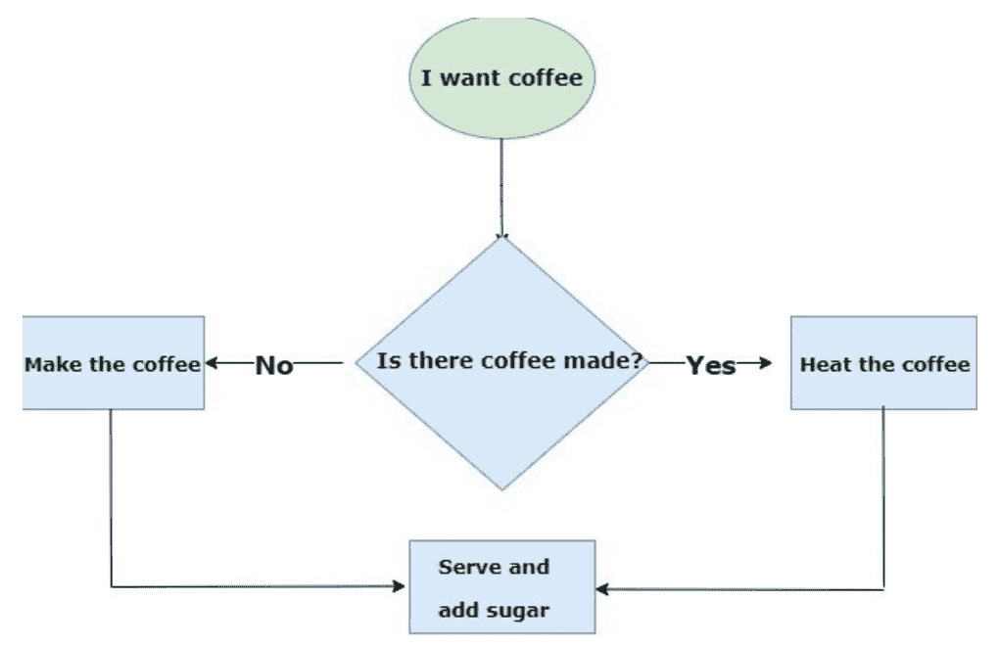

### 变量

Python中的变量是什么？

可以肯定的是，我们一直听到数学中的变量概念，因为它们被定义为由字母(x, y, z, i, n)表示的未知符号，这些符号（主要）存储数值。

在这种情况下，当我们谈论编程中的变量时，它们代表程序或计算机内存中保留的空间，可以修改和多次使用。这些变量具有非常相似的表示和含义；因为它们代表一个能够存储值的盒子。与数学变量不同，这些变量可以存储复杂的单词，如城市、名称、密码、简单字母和年龄。

在Python中，变量可以被解释为存储数据信息的盒子的"标签"，这些数据可以被理解为对象。Python还能够区分大小写字母（正如我们之前提到的，这被称为大小写敏感），这意味着调用一个名为Song的变量与调用一个名为song的变量是不同的。

我们不能忘记，由于Python是一种面向对象的编程语言，我们程序的数据结构将基于这些对象，因此，我们给变量起的标签不能与命令的名称匹配，否则它会给我们抛出错误。

### 在Python中声明变量

Python具有作为动态编程语言的优势；这意味着我们不需要指定我们将使用的数据类型，因为它的解释器能够推断要使用的数据类型。与C++不同，在C++中，声明变量时必须指定变量将存储在内存中的数据类型，以便其编译器能够解释它。

例如：

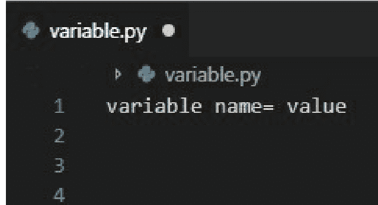

如我们所见，Python 使用符号 "=" 将值赋给变量，一旦完成此操作，变量就从该值开始，因为没有可能在没有任何初始值的情况下声明变量。

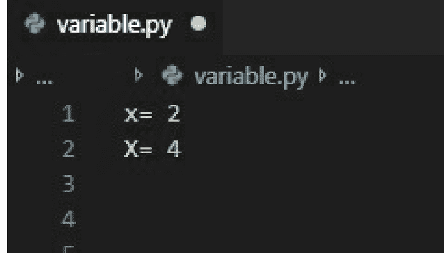

我们可以在这个例子中观察到两个名为 x 的变量的声明，它们具有不同的值，这完全有效，因为正如我们所观察到的，一个变量用小写字母编写，另一个变量用大写字母编写。

重要的是要记住，在 Python 中，有些操作在定义时不允许在不兼容的类型（类）之间进行，因此当每个数据被识别时，它就成为其所属数据类型的继承对象。

要声明一个变量，它必须从左到右进行，否则将导致语法错误。

```
variable.py
1  2 = x
2  4 = X
3
4  SyntaxError: can't assign to literal
```

变量名必须以字母或下划线开头（名称的其余部分可以包含字母、数字和下划线）。

```
variable.py
1  X= 2 # Valid #
2  _X= 4 #Valid#
3
4  2x = 4 #Error, starts with numeral data #
    SyntaxError: invalid syntax
    !x - False # Error, starts with symbol #
    SyntaxError: invalid syntax
```

也可以在一行中为多个变量赋多个值，只要左右两边的参数数量相同即可。

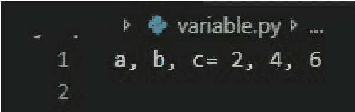

### 数据类型

- 整数：Python 中的整数数据可以识别十进制、二进制、十六进制或八进制类型的整数。

有两种方法将变量声明为整数：在变量名之前放置一个 int，如下所示：

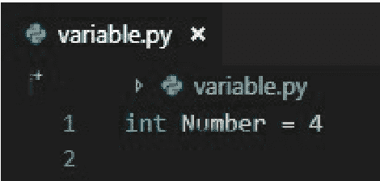

另一种方法是最常见的，我们只写要声明的变量的名称。

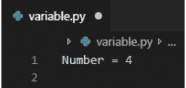

- 浮点数：浮点类型的数据负责覆盖所有实数集，例如：3.14、21、-85.6。当我们使用浮点类型数据执行操作时，它并不总是给我们一个精确数字的结果，很多时候它可能是一个近似值，其声明与整数类型变量的声明非常相似。

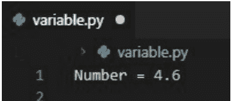

- 复数：复数类型的数据涉及复数的运算集，这些数据表示为由操作数符号分隔的浮点类型数据，第一个数字将表示实数，其虚部将通过字母 j 来标识。在声明复数类型的变量时，必须按以下方式声明：

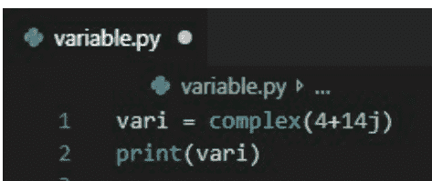

- 字符串：字符串类型的数据是指用撇号或引号括起来的字符序列或字符串。

字符串类型：
": 双引号。
\': 单引号。
\n: 换行。
\t: 水平制表符。

示例：

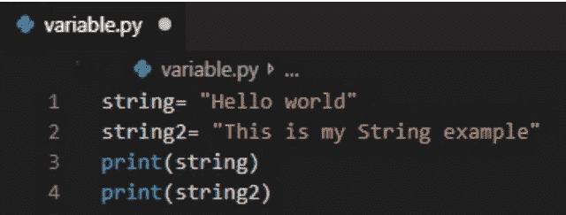

- 布尔值：布尔数据仅由两个（2）数字组成，用于评估逻辑表达式。这对于未来的章节非常重要，因为它将使我们能够理解条件语句或循环。

如果逻辑表达式为真，其数值将为 1。

如果逻辑表达式为假，其数值将为 0。

- 列表：列表类型数据允许程序在其中存储某些任何不同数据类型的项目，以及能够拥有重复的项目。这些项目用花括号编写。

```
python
a = 2
b = 4
string = "Hello people"
bool= True

list=[a, b, string, bool, 3, False, "good luck"]

print(list)
```

- 元组：元组类型数据能够在其中存储多个项目，这种数据类型可能类似于列表，但在以下方面有所不同：它们的声明使用括号 ()，而列表使用方括号 [] 声明；当我们声明元组时，它们是不可变的，而列表在声明时可以更改；最后，由于它们是不可变的，它们的数据搜索比列表更有效。

其声明如下：

```
python
a = 2
b = 4
string = "Tuple"
bool= True

Tup=(a, b, string, bool)

print(Tup)
```

- 集合：Python 中的这种数据类型基于一种数据结构，该结构可以由多个元素组成，这些元素在集合中的顺序是未定义的。集合能够添加、删除和迭代集合的元素，以及执行常见操作，如区分、验证元素是否属于集合、区分和相交。

要定义一个集合，我们只需要命名函数 set ()。如果它有一个列表、元组或字符串，它将返回一个元素的复合体。示例：

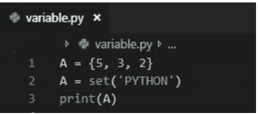

- 字典：这种数据类型被定义为具有某些特殊特征的结构，这些特征允许我们存储任何整数值、列表、字符串甚至函数。字典允许我们通过键来标识每个元素。

重要的是要记住，使用字典时，'键'不能是重复的数据，同样，不能通过其关联值访问键。同样重要的是要知道，这些数据不遵循特定的顺序，但这种数据类型是由键引导的。

为了定义一个字典，我们用花括号 {} 括起要输入的值列表。每个键值对用逗号分隔，键和值用冒号分隔。例如：

```
python
user = {'name' : 'John', 'Age' : 20, 'Knowledge': ['Python programming','C++ programming','JavaScript']}

print (user['name'])
print (user['Age'])
print (user['Knowledge'])
```

这将打印：

```
John
20
['Python programming', 'C++ programming', 'JavaScript']
```

在这里我们可以看到，我们已经创建了字典，并且程序向我们展示了我们已经分别访问了每个键。

### 字典方法：

**get():** 此方法接收一个键作为参数并返回其值。如果找不到值，则返回一个 none 类型的对象。例如：

```
python
user={'name' : 'John', 'age' : 20, 'knowledge': ['Python programming','C++ programming','JavaScript'] }
print(user.get('name'))
```

在这种情况下，它将返回 name 的值，在这种情况下将是 John。

**Item():** 这种方法负责返回一个元组列表，其中每个元组由两个元素组成，第一个元素是键，第二个元素是其值。例如：

```
python
user={'name' : 'John', 'age' : 20, 'knowledge': ['Python programming','C++ programming','JavaScript'] }
print(user.items())
```

**Keys():** 这种方法只返回我们字典的键。示例：

```
python
user={'name' : 'John', 'age' : 20, 'knowledge': ['Python programming','C++ programming','JavaScript'] }
print(user.keys())
```

**Values():** 这种方法只返回我们字典中各自键的值。

```
python
user={'name' : 'John', 'age' : 20, 'knowledge': ['Python programming','C++ programming','JavaScript'] }
print(user.values())
```

**Clear():** 此方法删除所有项目并使我们的字典为空。例如：

```
python
user={'name' : 'John', 'age' : 20, 'knowledge': ['Python programming','C++ programming','JavaScript'] }
print(user.clear())
```

**Copy():** 此方法返回原始字典的副本。例如：

```
python
user={'name' : 'John', 'age' : 20, 'knowledge': ['Python programming','C++ programming','JavaScript'] }
print(user.copy())
```

### 在 Python 中重新声明变量：

Python 的一个巨大优势是它能够以简单的方式允许重新声明变量，从更改其值到更改变量类型而不会产生复杂情况。例如：在上一个示例中，我们可以观察到变量 "a" 的第一次声明被赋值为 4，这是一个整数，然后该变量被重新声明并赋值为 8，因此，此时该变量是整数类型，接着我们再次重新声明该变量并将其转换为布尔值，因为我们给它赋值了 True。最后，我们给变量赋值了一个字符串，我们可以看到它是一个名为 "Julia" 的名字，所以此时该变量是字符串类型。

### 连接字符串

要连接字符串，我们只需要使用加法运算符（+）。需要注意的是，你必须明确地、显式地标记出我们想要留出空格的位置。

```python
a = "Hello world"
b = " this is an example"
c = a + b
print(c)
```

正如我们在上一个示例中看到的，创建了变量 "a"，它包含值 "Hello world"，然后创建了变量 "b"，它包含值 "this is an example"，最后创建了最终的变量 "c"，这个变量负责执行 "a" 和 "b" 的连接。

变量的连接也可以用整数和布尔值来完成，但为此你必须事先将这些变量转换为字符串。怎么做呢？很简单，我们通过调用函数 `str()` 来实现。例如：

```python
string = "class of "
date = 2019
date = str(date)
final = string + date
print(final)
```

正如我们在示例中看到的，我们创建了一个字符串变量，它包含值 "class of "，然后创建了整数类型的 date 变量，它包含值 "2019"。接着我们使用函数 `str()` 将变量 date 重新声明为字符串类型。

另一个非常常见的例子是连接列表，我们通过函数 `extend()` 来实现，例如：

```python
lunch = ["Sanwich", "pizza", "Burger", "meat"]
snack = ["ice cream", "cookie", "brownie", "cake"]
lunch.extend(snack)
print(lunch)
```

在前面的示例中，我们可以看到创建了一个包含一些午餐选项的列表；然后创建了另一个包含一些零食选项的列表，最后，命令 `lunch.extend(snack)` 将列表 1 与列表 2 连接起来。

### 全局变量

全局变量是在整个程序中使用的变量；一旦声明，它们可以作为主函数或任何其他类型的函数使用。

这种类型的变量可以在程序的任何部分进行修改，这看起来可能是一个优点，但它也可能给程序员或其他要阅读程序的外部人员带来困惑。关于全局变量的另一个可能被认为是负面的点是，它们可能比普通变量占用更多的空间，因为它们在函数运行结束时不能被销毁，另一方面，这不允许代码被重用；这使得 Python 编程语言成为最具吸引力的语言之一。

总的来说，使用全局变量被认为是一种不好的做法，但拥有完整的知识总没有坏处。接下来，我们将看到如何声明一个全局变量。

为此，需要使用 `global` 命令：

正如我们在上一个示例中看到的，调用或声明一个全局变量并不复杂。我们可以说它与我们之前看到的声明变量类似；唯一的区别是，从现在开始变量 "var" 将具有全局特性，这样任何函数都可以简单地访问它。

### 局部变量

局部变量是仅在一个函数中使用的变量，当其执行完成时，它们会从内存中删除。与全局变量不同，局部变量允许我们节省代码行数，使模块化编程更加敏捷和容易，从而允许代码重用，这使得 Python 成为最引人注目的编程语言之一。

在 Python 程序中使用局部变量的主要优点是它便于阅读代码，使其易于理解；全局变量允许更有效、更轻松地修复任何错误。由于代码行数减少，在解释代码时产生混淆的可能性非常小。

在编程时使用局部变量被认为是一种好的做法，因为现在人们希望获得更简单的代码，以便没有太多编程经验的用户也能理解。

为了更好地理解这一点，我们将举一个例子，清楚地解释在编程时使用这些变量的情况。

示例：我们将创建一个问题，该问题必须负责从一个人那里获取以下数据：

1.  姓名
2.  年龄
3.  原籍国

```python
full_name = input("Full name: ")
age = input("Age: ")
country_origin = input("country of origin: ")
print("Full name" + full_name + "\n" + "Age" + age + "\n" + "Country of origin" + country_origin)
```

我们可以观察到，语法主要集中在 `input()` 命令上，这是什么意思？这只是允许用户与程序进行交互的函数。这样，变量 "full_name"、"age" 和 "country_origin" 将拥有用户在控制台输入时的值。

```
Full name: Python programmer
Age: 100
country of origin: Worldwide
```

## 第三章：运算符

运算符是在操作数之间执行特定操作的数学符号，运算符可以接收变量作为操作数。操作数是运算符为了执行其功能而接收的参数。因此，我们可以得出结论，运算符是能够执行逻辑和算术运算的特殊符号。

运算符类型：

-   逻辑运算符。
-   算术运算符。
-   比较运算符。
-   赋值运算符。
-   特殊运算符。

### 逻辑或条件运算符

这类运算符通常用于分组、否定和排除我们代码中的一些表达式。

1.  `not` 运算符：这种运算符负责否定或返回与布尔值相反的值。

    `not True` = `False`。
    `not False` = `True`。

2.  `Or` 运算符：这种运算符评估右侧和左侧的值，以便在至少满足一个条件时最终返回一个真值。

    `False or True` = `True`
    `True or False` = `True`
    `True or True` = `True`
    `False or False` = `False`

3.  `And` 运算符：这种运算符负责评估左侧值和右侧值之间的条件是否正确满足：

    `True and False` = `False`
    `True and True` = `True`
    `False and True` = `False`
    `False and False` = `False`

### 比较运算符

这类运算符是我们用来比较（顾名思义）程序中存储的一些值，以便在编译时，我们可以返回一个 `True`/`False` 类型的值作为满足条件的结果。

1.  `!=` 运算符：这种运算符负责评估这些存储的值是否不同，并根据分析结果，它将给我们一个 `True`/`False`。例如。

    `20 != 20` 结果将是 `False`
    `14 != 15` 结果将是 `True`

2.  `==` 运算符：这种运算符负责评估这些值对于不同类型的数据是否相同，并根据其分析获得的结果，其结果将给我们一个 `True`/`False`。例如。

    `19 == 19` 结果将是 `True`
    `10 == 5` 结果将是 `False`

3.  `>` 运算符：这种运算符负责评估左侧输入的值是否大于右侧值的位置。例如。

    `30 > 25` 结果将是 `True`
    `9 > 28` 结果将是 `False`

4.  `<` 运算符：这种运算符将评估左侧输入的值是否小于右侧值的位置。例如。

    `26 < 9` 结果将是 `False`
    `14 < 22` 结果将是 `True`

5.  `>=` 运算符：这种运算符负责评估左侧输入的值是否大于或等于右侧值的位置。例如。

    `30 >= 25` 结果将是 `True`
    `9 >= 28` 结果将是 `False`
    `20 >= 20` 结果将是 `True`

6.  `<=` 运算符：这种运算符负责评估左侧输入的值是否小于或等于右侧值的位置。例如。

    `26 <= 9` 结果将是 `False`
    `14 <= 22` 结果将是 `True`
    `20 <= 20` 结果将是 `True`

### 运算符 <=：此类运算符用于评估左侧输入的值是否小于或等于右侧的值。例如：

20 < 11 结果为 False

16 < 25 结果为 True

15 <= 15 结果为 True

### 赋值运算符：这类运算符在程序中用于将值赋给变量（顾名思义），在这种情况下，这些运算符后面会跟一个等号（ = ）

#### 1. 等号运算符（ = ）：此类运算符被认为是主要的，并且总是位于变量的左侧。例如：

> A= 10 → A 的值将为 10

#### 2. 加等运算符（ += ）此类运算符负责将左侧变量的值与右侧的值相加。例如：

> A= 10; A += 8 → A= 18

这等同于表达：A=10; A + 8 → A=18

#### 3. 减等运算符（ -= ）此类运算符负责从左侧变量的值中减去右侧的值。例如：

> A= 10; A -= 8 → A= 2

这等同于表达：A=10; A - 8 → A= 2

#### 4. 取模等运算符（ %= ）此类运算符负责返回左侧值除以右侧值的余数。

> A= 10; A %= 8 → A = 2

这等同于表达 A= 10; A % 8 → A= 2

#### 5. 整除等运算符（ // ）此类运算符负责计算左侧变量与右侧值的整数除法。

> A= 10; A //= 8 → A= 1

这等同于表达 A= 10; A // 8 → A= 1

#### 6. 乘等运算符（ *= ）此类运算符负责将左侧变量的值与右侧的值相乘。例如：

> A= 10; A *= 8 → A = 80

这等同于表达：A=10; A * 8 → A= 80

#### 7. 除等运算符（ /= ）此类运算符负责将左侧变量的值除以右侧的值。例如：

> A= 10; A /= 8 → A= 1.25

这等同于表达 A= 10; A / 8 → A= 1.25

#### 8. 幂等运算符（ **= ）此类运算符负责计算左侧变量的值的幂，指数为右侧的值。例如：

> A= 10; A **= 8 → A = 100000000

这等同于表达 A= 10; A ** 8 → A= 100000000

### 特殊运算符：这类运算符通常用于程序循环中，以检查重复变量，甚至用于判断一个元素是否存储在其他元素中。

#### 1. In 运算符：如果一个元素存储在另一个元素内部，此运算符将返回 'True'。例如：

A= [80, 40] 80 in A

将要返回的结果将是 True 类型，因为值 80 位于 A 中

#### 2. Is 运算符：如果变量中存储的值相同，此类运算符将返回 True。例如：

X= 80; Y= 80. → X is Y

将要返回的结果将是 True 类型，因为两个变量包含相同的存储值。

### 3. Not in 运算符：如果一个元素未存储在另一个元素内部，此类运算符将返回 True。例如：

A= [80, 40] 40 not in A.

将要返回的结果将是 False 类型，因为值 40 确实位于 A 中。

#### 4. Not is 运算符：如果变量中存储的值不相等，此类运算符将返回 True。例如：

X= 80; Y=40. → X not is Y

将要返回的结果将是 True 类型，因为两个变量包含不同的存储值，因此它们是不同的。

### 算术运算符：这类运算符用于执行简单的数学运算。

#### 1. 加法运算符（ + ）：此类运算符将对数值类型的值进行加法运算。例如：

40 + 40 = 80

#### 2. 减法运算符（ - ）：此类运算符将对数值类型的值进行减法运算。例如：

40 – 40 = 0

#### 3. 乘法运算符（ * ）：此类运算符将对数值类型的值进行乘法运算。例如：

40 * 40 = 1600

#### 4. 除法运算符（ / ）：此类运算符将负责对数值类型的值进行除法运算。例如：

10 / 2 = 5

#### 5. 幂运算符（ ** ）：此类运算符将计算两个数值数据类型值之间的幂运算。例如：

4** 2 = 16

#### 6. 整除运算符（ // ）：此类运算符负责计算两个数值数据类型值之间的整数除法，只返回整数部分。例如：

5 // 2 = 2

注意：需要注意的是，当使用两个整数类型的操作数时，程序将假定你希望变量产生整数类型的结果。例如：

如果我们计算 A= 7 // 2 = 我们的结果将是 3。

如果你想得到小数部分，如第一个示例所示，只需在任一操作数中添加至少一个小数值即可。例如：

G = 7.0 / 2 = 3.5

#### 7. 取模运算符：此类运算符负责返回两个操作数之间除法的余数。例如：

7 % 2 = 1。取模结果为 1

算术运算符的优先级顺序如下：

1. 幂运算（ ** ）
2. 乘法（ * ）、除法（ / ）、整除（ // ）、取模（ % ）

在第 2 行中，我们可以看到其余的运算符被归为一组，这意味着它们都具有相同的优先级顺序，但在运算时将按照该优先级顺序进行解析。

示例：
当计算：8*10/2

这意味着运算将按以下方式进行：
8*10= 80 / 2 = 40。我们运算的结果是 40。

另一方面，可以通过使用括号 () 来操纵此优先级顺序。

示例：
当计算 80*(10/2)

这意味着运算将按以下方式进行：
10/2= 5 * 4 = 20。

让我们做两个使用运算符的小例子，一个计算矩形的面积，另一个检查密钥是否正确。

第一个例子，矩形的面积：

```
b=int(input("Please enter the base: "))
h=int(input("Please enter the height: "))
print("The area is "+str(b*h))
```

在这个例子中，我们首先做的是声明变量，第一个是变量 b，它与底边相关，它经历了几个阶段，但我们将其放在一行中以节省空间。

为了更好地解释，我们首先可以观察到在 b 和 h 的声明中都有一个 input，这是一个输入类型，因此它将被保存为字符串，这就是为什么我们还可以观察到 int 函数，它将把该字符串转换为整数，以便能够对它们进行运算。你知道为什么吗？

因为将两个字符串相加是不可能的，因为将 1 + 1 与 "1" + "1" 相加非常不同，因为第一个是整数的加法，其结果将等于 2，但第二个我们不知道，因为它是 ASCII 字符的加法。而且，正如你所看到的，变量 h 也做了同样的事情，因此，b 和 h 是用户输入的两个整数。

下一个操作是在屏幕上打印以下字符串 "The area is" 与底边和高度乘积相关的字符串连接，因为无法将字符串与整数连接，这就是为什么使用了 str() 函数。

正如你所看到的，这是一个非常基础的例子，这里有一个问题，如果你输入一个负值会发生什么？例如，如果你输入 -5 和 2，返回的值将是 -10，这是一个大错误，因为面积不能为负，因此，这是我们的程序存在的一个错误。这些错误可以通过使用条件语句或异常处理来解决，因为它们会考虑到这些情况。

第二个例子，密钥验证：

### 条件语句

借助逻辑运算符，以及广义上的逻辑，我们将以此为基础来使用指令，因为它们允许我们设定条件，从而编写更复杂的程序。比如什么呢？例如：

如果今天下雨，我就带上毛衣；如果不下雨，我就不带。

条件语句的工作方式与此类似：当满足特定条件时，将执行某个操作；但如果预期情况未发生，则会执行其他操作。

在条件语句中，我们会遇到 `if`、`else` 和 `elif`；此外还有使用异常的情况，异常用于防止程序崩溃。

-   **if 语句：** 这是一个简单的条件语句。如果满足特定条件，将执行某个操作；否则，不会发生任何事情，程序将继续按照通常或预期的流程运行。这可以用于简单的程序，例如年龄限制访问。如何实现？嗯，如果客户年龄不足，程序将不允许其进入。

`if` 条件语句的流程图如下：


现在，Python 中 `if` 的语法如下：

-   **If + 条件：** 在这个代码块内部，通过必要的缩进，将执行以下命令——当然，前提是条件得到满足。

在编写 `if` 代码块时，关于语法需要记住一些重要事项：

-   第一行始终是 `if + 条件`，后跟一个冒号（ : ），因为这样可以明确表示一个代码块的开始。
-   后续行表示将要执行的指令，但当然，显然只有在条件为真时才会执行。
-   最后，是指令代码块必须具有的缩进，因为如果缩进不正确，程序将无法理解你的具体意图，结果可能是它不会执行你请求的操作，或者直接关闭程序。

一个更清晰的语法示例如下，它将显示学生是否通过了考试：

```python
note=input("Put your note here: ")
if(int(note)<5):
    print("You didn't pass, try again")
```

正如我们在这里看到的，创建了一个 `note` 变量，它与 `input` 函数相关联，用于接收用户输入的成绩，该变量是字符串类型。

随后，我们进入条件部分，具体是 `if`，要比较的条件是：如果用户输入的成绩低于五分，那么将在屏幕上打印用户未通过，需要再次尝试。如你所见，在 `if` 条件部分，使用了 `int()` 函数，这是必要的，因为 `note` 变量是字符串，而数字与字符串无法进行比较，因此需要将字符串变量的类型更改为整数，以便进行相应的比较。

但如果条件为假呢？可以执行另一个操作吗？嗯，可以，因为还有另一个语句，即 `else`，它用于当 `if` 的条件为假且需要执行另一个操作时，然后返回到常规流程。如果你想更好地理解这个语句，请阅读以下段落，这些段落将负责解释该语句。

-   **else + 条件：** `else` 条件用于当 `if` 条件为假时。这是什么意思？这无非是如果条件子句未满足，程序将自动关闭；为了防止这种情况发生，我们使用 `else` 指令，它将告诉程序执行另一个操作。

`else` 条件语句的流程图如下：

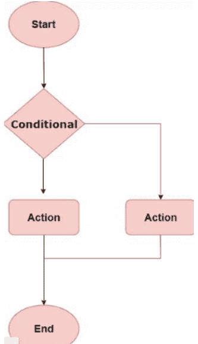

我们可以观察到，`else` 条件语句的语法与 `if` 条件语句的语法非常相似，只是在这种情况下，不需要放置条件，但保持正确的缩进至关重要。

为了详细观察 `else` 条件语句的编程，我们将创建一个测试程序，这样我们就能清楚地看到条件语句之间的区别。

这将是对之前程序的一个修改，目的是展示使用条件语句可以变得多么强大。

```python
note=input("Put your note here: ")
if(int(note)<5):
    print("You didn't pass")
else:
    print("Congratulations, you pass")
```

在这个例子中，我们可以看到创建了 `note` 变量，这是一个用户将选择的输入，嗯，在这种情况下，他将输入他的成绩，以便程序随后会说明他的成绩是否足以通过。因此，为了向用户明确他必须输入成绩，屏幕上将打印以下字符串 "Put your note here"，这样用户就知道他需要在程序中输入他的成绩。

之后，放置了条件代码块，其中的条件意味着：如果用户输入的成绩转换为整数后小于五分，屏幕上将打印 "You didn't pass"，然后程序将结束，因为不会进入 `else` 代码块，因为条件为真。但如果条件不为真，则会进入 `else`，它将在屏幕上打印下一个字符串 "Congratulations, you passed"，以向用户展示他们的成绩是否通过了考试。

正如你可能观察到的，`if` 和 `else` 的使用非常有用，我们可以说至关重要，因为，多亏了它，你可以使程序能够产生不同的结果，而不是只有一个简单的流程，因为你可以猜到，那种没有逻辑分支的程序并不广泛使用。

我们可以看到的另一个例子是除法，通过它，我们可以看到条件语句的另一个非常重要的用途，因为分母不能等于零，因为除以零是未定义的，会是一个数学错误。

```python
num=input("Select the number of the numerator: ")
den=input("Select the number of the denominator: ")
if(den=="0"):
    print("Zero can't be denominator")
else:
    num=int(num)
    den=int(den)
    result=num/den
    print("The result is "+str(result))
```

在这里，我们可以看到除法的例子，因为我们有前面解释过的问题。

首先要做的是创建变量 `num`，它将与除法的分子相关联，它将与一个 `input` 函数一起声明，以便用户输入他想要的值。然后，将对与除法分母相关的变量 `den` 执行相同的操作。

然后我们将进入条件代码块，我们要寻找的条件是变量 `den` 是否等于字符串 "0"，以了解在进行除法时是否可以。如果条件为真，屏幕上将打印以下字符串 "Zero can't be denominator"，以向用户展示他作为分母输入的数字不符合数学要求。但是，在条件不等于零的情况下，可以进行除法，因此，我们进入 `else` 代码块；我们首先做的是将变量 `num` 和变量 `den` 转换为整数，然后执行除法并将其存储在 `result` 变量中，最后，我们在屏幕上打印结果。

变量 den，但在这段代码中这样做的目的是什么？嗯，为了能够进行数学运算，num 和 den 都必须是整数，但这部分是在 else 语句中完成的，作为代码优化的一部分，因为如果分母为零，就会在不必要的指令上浪费时间，因为不会执行任何操作，正如你已经知道的，除以零是不允许的。此时，你可能会说在这里做不做没有区别，但确实有区别，想象一下你需要做一百万次，这将在不会被使用的东西上产生巨大的计算开销，这就是为什么进行这种推理总是很重要的，以使程序尽可能优化。

下一步操作是进行分子和分母的除法，这个值将存储在 result 变量中，最后在屏幕上打印获得的结果。

如果你稍微懂一点编程，或者已经知道如何用 C 或 Arduino 编程（举几个语言为例），你可能会在这些条件语句的解释中，等待关于如何在这里使用 switch 的解释，因为在 Python 中找不到这些，在 Python 中使用的是 elif，其解释可以在下面看到。

-   elif + 条件：我们使用 elif 条件作为将 else 与 elif 结合的更快、更有效的方式，当有多个条件时。例如：在其他编程语言中，使用 switch() 条件处理多个条件非常常见。在 Python 的情况下，这被 elif() 替代，这不过是在 else 上添加一个额外的条件以获得多个情况。

当你有多个条件，并且有许多不同的执行方式时，这通常被使用。

现在，我们将看一个例子，以便非常清楚地理解这是如何工作的，这样，我们将进入条件语句。

```python
option=input("Please enter your option,for your message: \n1)Español \n2)English \n3)Deutsh \n")
if(option=="1"):
    print("Hola")
elif(option=="2"):
    print("Hello")
elif(option=="3"):
    print("Halo")
else:
    print("Bad option")
```

在 elif 示例中，我们可以看到已经创建了 option 变量，它与用户想要输入到程序中的选项相关，如代码所示，选项 1 表示回答是西班牙语，2 表示回答是英语，最后 3 表示程序的回答是德语。

进入条件块时，我们首先看到的是 if，它将有一个条件，即变量 option 与字符串 "1" 严格相同，如果为真，字符串 "Hola" 将显示在屏幕上；然后，如果此选项不满足，它将进入第一个 elif，它将有一个不同的条件，在这种情况下，它说变量 option 与字符串 "2" 严格相同，如果此选项为真，那么它将在屏幕上显示消息，上面写着 "Hello"；最后一个 elif 有条件，表明变量 option 必须与字符串 "3" 严格相同，如果为真，它将发送一条德语消息，内容如下："Halo"。但如果没有任何情况满足，它将进入 else 块，这表明它将在控制台打印一条消息，上面写着 "Bad option"。

因此，我们可以看到程序有三个选项，每个选项都是一条消息，将向用户显示不同语言的问候语，如西班牙语、德语和英语。

正如我们所看到的条件语句示例，我们可以看到它们在编程中的巨大用处，因为它们允许我们为程序放置一系列选项，并且它们根据情况以不同的方式响应。

但这些条件语句并不是我们可以用于特殊条件的唯一工具，另一个非常有用的工具，在编程中经常使用，是异常，因为它们捕获任何错误，使程序能够正确运行，此外，在除以零的示例中，你可以使用这个工具，但不仅用于除以零，还有更多时候，你唯一需要的是你将在下面看到的工具。

### 异常处理：

当我们编程时，在程序执行过程中遇到错误是非常常见的。我们可能遇到的两种非常常见的错误类型是语法错误和异常。正如我们已经看到的，语法错误是当我们错误地输入代码时发生的。

在异常的情况下，呈现的语法错误是不同的。怎么会这样？嗯，它们发生在程序执行期间发生意外情况时。例如，假设一个程序，我们要求用户输入一个数字来填写一个要求。现在想象一下，当用户要输入数据时，他写了一个字符串而不是数字，程序将自动显示一个 TypeError 错误。

当我们没有正确处理异常时，我们的程序将立即关闭，因为解释器不知道在这样的特殊情况下该做什么。

回到上面显示的例子，我们知道只要我们输入一个整数值作为输入值，我们的程序就会正常工作。然而，如果我们输入一个字符串，另一种类型的错误将是 ValueError 类型的异常。

一些最常见的异常是：

-   NameError：NameError 类型的异常，是当程序无法找到全局或本地名称时发生的。当程序将向我们显示它无法找到时，它将在消息中包含错误的名称。
-   TypeError：TypeError 类型的异常，是当一个不合适的对象作为其参数传递给函数时发生的。当程序将向我们显示已出现的错误类型时，它将详细包含使用参数的正确方式。
-   ValueError：ValueError 类型的异常，是当函数的参数包含其正确定义的类型，但其值不适当的时候发生的。
-   NotImplementedError：NotImplementedError 类型的异常，是当支持操作的对象尚未实现时发生的。这些类型的错误被认为在函数支持输入参数时不使用，最合适的是使用 TypeError 类型的异常。
-   ZeroDivisionError：ZeroDivisionError 类型的异常，是在除法运算或模运算中向参数（如分母）提供零类型数据时发生的。
-   FileNotFoundError：FileNotFoundError 异常类型，是当请求的字典或文件在程序中不存在时发生的。

处理异常：众所周知，在每种编程语言中，都有一定数量的保留字，它们使我们更容易处理编程时可能出现的任何异常。这样，我们可以迅速采取行动，防止程序被中断。

在 Python 中，当我们处理异常时，我们执行称为“块”的操作，这些块将主要与 try、except 和 finally 语句一起使用。

那么这是如何工作的呢？

引发异常将以以下方式发生：在 try 块中，你将找到所有可能引发异常的代码。（程序员知道 raise 这个术语，作为生成异常的动作。）

一旦完成，异常块将被定位，这个块将负责捕获异常，以便有机会通过发送特定的示例消息来处理它。

最后，我们有 finally 块，我们将用它来执行一个操作。无论异常是否发生，这都将完成，这样无论之前的条件如何，块都将被执行。

当我们编程异常时，finally 语句总是被认为非常有用，但很多时候没有太多强调它的importance.

什么是 finally 块？它有什么用途？它是基于什么原理？

假设我们在 try 块中编写了代码，它将处理某个任务并使用大量资源，这些资源在不再使用时必须被释放。这些资源将通过 finally 子句被清除或释放，无论 try 块是否成功抛出了它原本可能引发的异常，代码都会被执行。

众所周知，除以零是不可能的，因此我们将使用一个类似的例子来向您展示使用异常处理是多么有用。

```python
num=input("Please enter the numerator: ")
den=input("Please enter the denominator: ")
den= int(den)
num=int(num)
try:
    result=num/den
    print("The result is: "+ str(result))
except:
    print("Invalid values")
```

首先，我们声明变量 `num`，它与 `input` 函数相关联，它将等待用户输入数据，以便将一个十进制值存储在 `num` 中；类似地，变量 `den` 也以相同方式处理，它被设计为除法的分母。

接下来的操作是改变每个变量的数据类型，为此我们使用 `int()` 函数，将变量 `num` 和 `den` 转换为整数，因为它们与 `input` 相关联，所以它们将以字符串形式存储，无法对它们进行算术运算，因此，它们被转换为 `int` 类型的变量。

现在我们进入异常处理部分，首先我们进入 `try` 块，顾名思义，它负责尝试执行某些操作，前提是**没有异常发生**；我们的意思是，在这种情况下，如果 `den` 不等于零，则不应发生异常，因此，`num` 和 `den` 相除的值应存储在变量 `result` 中，然后将其值打印到屏幕上。

但是，如果发生某些错误，具体来说是某些异常，它将进入 `except` 块，并继续在屏幕上打印输入的值无效。

另一个我们必须展示的例子，是使用了 `finally` 块的例子，这样我们就能看到它的功能。为此，我们将继续使用除法的例子，但现在我们将设置两个异常：一个是在输入的值不是十进制数的情况下出现，因此无法将这些数据转换为整数，因此将触发第一个异常。然后将验证分母是否等于零，如果为真，则必须抛出另一个异常。

```python
num=input("Please enter the numerator: ")
den=input("Please enter the denominator: ")
try:
    den= int(den)
    num=int(num)
except:
    print("Error, you put a ASCII data, please try again")
    num=int(input("Please enter the numerator: "))
    den=int(input("Please enter the denominator: "))
try:
    result=num/den
    print("The result is: "+str(result))
except:
    print("Error, the den has a value equal to zero")
finally:
    print("Thanks for use this program")
```

在这里我们可以更好地看到这个例子。我们首先看到的，也是我们预期的，是变量 `num` 和变量 `den` 都使用了 `input()` 函数，该函数负责接收用户想要的值，在这种情况下，分别是分子和分母的值。

然后我们进入第一个指令块，在这一部分我们尝试做什么？首先，是将 `num` 和 `den` 这两个字符串转换为整数变量，以便继续进行相关的数学运算，因此，进行类型转换很重要，因为如您所知，不可能用一个字母除以另一个字母，因为这在数学上没有意义。首先是 `try` 块，顾名思义，它将尝试做一些事情，如果没有产生错误的东西，那么它将毫无问题地执行，但如果无法执行，那么它将进入 `except` 块内部，该块负责处理异常。如果发现错误，该块将开始工作，因为它将尝试修复发现的错误，它要做的第一件事是在屏幕上显示错误，它会告诉您放置了错误的 ASCII 数据，请重试。然后变量 `num` 将被重新声明，它将是 `input` 类型，因为它将等待用户输入的值，然后它将被转换为整数类型变量，变量 `den` 也将进行相同的操作。

之后，将进入另一个异常块，我们在其中找到的第一条指令是声明 `result` 变量，它将是 `num` 和 `den` 的除法结果；然后将除法结果放在屏幕上。好吧，如您所知，这个块将尝试执行此操作，但存在出错的可能性，但可能是什么错误呢？嗯，主要是除以零，这与其说是编程错误，不如说是数学错误，因此，这个块无法执行，将进入异常部分。异常部分将尝试向用户传达存在错误，此消息将告诉用户分母的值等于零，因此无法执行除法。

最后，我们将进入 `finally` 块，无论发生什么，无论 `try` 块还是 `except` 块是否执行，它都将执行一条指令。在这个例子中，它将打印一条消息，感谢使用这个程序。

但是，如果您验证之前的例子和这个例子，`finally` 块并没有做任何非常特别的事情，但它确实做了，区别在于它总是会执行。现在，如果您想看一个使用更多且更重要的 `finally` 的例子，当您使用数据库时就会看到，因为无论发生什么，关闭与数据库的连接都是至关重要的，因为如果不这样做，可能会导致任何程序员都不想遇到的错误。

## 第4章：循环

### 什么是循环？

循环（或周期）是一种控制结构，负责在满足某个条件时重复执行一个指令块，在循环中，我们还有所谓的无限循环，其条件永远不满足。与大多数编程语言一样，Python 有 `while` 和 `for` 循环。

- 1. For 循环：Python 的 `for` 语句遍历任何序列（列表、字符串或字典）的项，按照它们在序列中出现的顺序。其中代码被称为“循环体”，其重复称为“迭代”。

迭代被定义为执行一定次数的重复操作。`for` 循环负责遍历这些操作，以寻找满足某些条件且同时可以执行指定指令的元素。因此，所有这些元素都必须是可迭代的。

`for` 循环的语法如下：
`for` 变量 + 一个可迭代元素（列表、字符串、范围等） :
循环体。

需要指定一个变量来保存元素的项，然后我们编写带有变量的 `for` 语句，该变量将存储项，最后我们编写要迭代的元素。

只要满足条件，循环就会执行，因此一旦迭代完成，循环就会停止。

示例：

```python
x=0
for x in range(4):
    print(x)
print("End")
```

我们首先看到的是定义了变量 `x`，它从零开始，这是因为它将进行迭代，并且必须从零开始。

然后我们完全进入 `for` 循环，如您所见，它指定变量 `x` 将在 4 的范围内迭代，这是什么意思？嗯，`x` 将迭代四次，并取值零、一、二和三。

下一部分是 `for` 循环内部的块，它是一个简单的 `print`，它将向我们显示 `x` 在 `for` 循环的每个部分的值，直到它达到值四，当它具有该值时，它将自动退出循环。

最后，将打印 `End` 以显示程序已完成并且循环已退出。

### for 循环的类型：

- 1. 带列表的 "for" 循环：您可以使用列表进行 `for` 循环，在这种情况下，它将遍历列表中的每个值。
为了更好地理解我们正在讨论的内容，我们将为每种使用 `for` 的方式制作一些示例。
    a. 带列表和 `range` 函数的 "for" 循环；在此循环中呈现列表数据类型，并借助 `len()` 函数以及 range()，可以用来构建 for 循环，这对打印数据非常有用。

-   range() 是一个函数，如上所述，它返回一个整数列表，接受列表的起始值、结束值以及元素之间的增量作为参数。我们也可以省略其中一两个参数，如下所述；
-   range(n)；这种形式的函数负责返回一个从 0 开始、到 n-1 结束的整数列表。
-   range(起始值, 结束值)；这种形式的函数负责返回介于起始值和结束值之间的整数列表，不包括结束值本身。
-   range(起始值, 结束值, 步长)；这种形式的函数负责返回整数列表，与前一种情况类似，只是起始值与下一个元素之间存在步长的差值，依此类推。

我们来做两个例子，一个不使用 range 函数，另一个使用它。

1) 使用 for 循环和列表，不使用 range：

```python
sports=['soccer', 'baseball','tennis','polo']
for x in sports:
    print(x)
print("End")
```

如示例所示，首先创建了一个名为 sports 的列表，其包含不同的运动项目，如足球、棒球、网球和马球。

随后定义了 for 循环，那么这次变量 x 的作用是什么？它的作用是在 sports 列表内进行迭代，因此 x 将取列表中每个项目的值。

接下来是定义 for 代码块，记住缩进很重要，因为如果不这样做，将不会执行任何操作，因为 Python 对此非常严格。既然我们已经设置了缩进，我们定义了代码块，这是一个简单的打印操作，它的作用是打印 x 的值，而正如我们已经解释过的，x 将取相关列表中项目的值。

最后，将在屏幕上打印 "End"，以表明程序已正确结束并退出了循环。

2) 使用 for 循环和列表，使用 range：

```python
sports=['soccer', 'baseball','tennis','polo']
for x in range(len(sports)):
    print("The sport "+str(x+1)+" is "+sports[x])
print("End")
```

在这个例子中，我们可以看到一个变化；第一个变化是这里我们使用了 range，但我们将逐步解释代码，使其非常简单。

首先，正如我们已经看到的，是创建一个列表，在本例中，与前一个示例相同的列表，这意味着前一个示例的项目将与当前的项目相同。

然后，我们定义 for 循环，在本例中，我们放置了 range，这意味着 x 从零迭代到 len 函数返回给我们的数字范围，但是，这是什么意思？嗯，x 将在一个长度由 len 函数告诉我们的列表内迭代，因此，如果 len 返回的值是四，那么变量 x 将从零迭代到三，取值零、一、二、三，如你所见，它将迭代四次，正如 len 函数所说的，当然，如果它给我们的值是四。

之后，我们编写了 for 代码块，这是一个打印操作，但在本例中，打印了 "The sport"，然后与函数 str(x+1) 返回的字符串进行了拼接，但是，为什么是 x+1？因为 x 从零变化到 range 函数给我们的数字，运动的第一个位置将是零，因此，我们加了一，这样屏幕上就会显示，第一个运动在位置一。之后，它与 " is " 拼接，也与 sports[x] 拼接，在本例中，由于它是一个列表，它与列表中位置 x 的项目拼接，这些位置从零到 range 的值 n-1。

最后，在屏幕上打印了 "End"，以表明程序已结束，并且 for 循环已正确完成。

重要的是要记住，为了使变量 x 变化，它必须在一个列表内迭代，正如之前所说，range 函数返回一个包含 m 个数字的列表，因此如果我们说 a = range(10)，我们可以得到 a 将等于 [0, 1, 2, 3, 4, 5, 6, 7, 8, 9]，因此，变量 x 将从零变化到九。

b. 使用元组的 "for" 循环；元组是序列对象，具体来说，它是一种不可变的列表数据类型，因此在创建后无法修改。这种类型的程序设计并不太难，因为，使用元组和循环进行编程，其方式与使用列表类似，唯一的细节是要注意列表和元组之间的区别。

同样将展示两个例子，第一个将使用 range，另一个将省略这个函数。

1) 使用元组和 range 的 for 循环：

```python
foods=("pizza", "hot dog", "sushi")
x=0
for food in range(len(foods)):
    print("The x value is: "+str(x))
    print("The food value is: "+str(food))
    print("The foods item is: "+foods[food])
    x+=1
print("End")
```

这里我们首先看到的是创建了元组 foods，其中包含一些项目，包括字符串 "pizza"、"hot dog" 和 "sushi"，正如你应该知道的，创建元组后，它不能被修改、更改或进行任何类似操作。

然后声明了一个变量 x，其赋值为零。

下一步是声明 for 循环，如你所见，在本例中，它不会迭代变量 x，而是一个 food 变量，它将在 range 函数将返回的列表内迭代，该列表应该包含三个元素，那么，为什么是三个元素？嗯，正如你已经知道的，len 函数返回列表或元组的长度值，在本例中，元组 foods 有三个元素，因此 range 函数应该创建一个从零到二的元组。

然后，为了更清楚地看到变量 food 如何迭代，编写了以下指令：首先打印了变量 x 在那一刻的值，然后打印了 food 在那一刻的值，目的是验证它们是否具有相同的值，正如你已经知道的，为了将整数与字符串拼接，使用了 str 函数。接下来的操作是打印相应的 food 项目，因此将 "The food item is: " 与 foods[food] 拼接，因为我们可以选择元组 foods 的一个特定值，在本例中，它将是位于 food 位置的那个。最后但同样重要的是，x 将被更新为下一个值。

为了结束代码，将在控制台打印字符串 "End"，以明确表明程序已结束并以正确的方式终止。

2) 使用元组和不使用 range 的 for 循环：

```python
messages=("Hello", "my", "name", "is", "Marco")
for message in messages:
    print(message)
print("End")
```

在这个例子中，我们可以看到它非常简洁，因为我们用元组发送了一条消息，但这是如何工作的？嗯...

首先，我们创建了元组 messages，它包含以下项目："Hello"、"my"、"name"、"is"、"Marco"，如我们所见，这是一个包含五个项目的元组，因此它的长度为五。

下一步是创建 for 循环，在本例中，变量 message 将在元组 messages 内迭代；然后将打印变量 message，打印它所在的位置，由此你可以推断出每条消息将被打印并换行。

最后，正如在前面的示例中所做的那样，将在控制台打印 "End"，以表明它已退出循环并且程序已完成。

c. 使用字典的 "for" 循环；字典定义了键和值之间的一对一关系，字典类型的对象允许使用 Python 解释器中集成的一系列运算符进行管理。

类似于上面解释的循环，这个使用字典的 "for" 循环的工作方式非常相似，因为所有这些数据类型都是相似的。但值得一提的是，它们是不同的类型，并且以不同的方式处理，因此，即使它们的处理方式相似，也绝不应忘记它们是不同类型的数据。

示例：

```python
clothes={"shirt":"red", "shoes":"black","pant":"blue"}
for key in clothes:
    print(key)
clothe=input("Choose one of them: ")
if(clothe in clothes):
    print("Your clothe is "+clothe+ " of color "+clothes[clothe])
else:
    print("Error")
```

在这个例子中，我们可以看到如何使用字典；使用我们创建的名为 clothes 的变量，如你所知，它是一个字典。它包含项目 "shirt"，其关联的值为 "red"，还有

### “While”循环

它允许我们执行循环或周期性序列，使我们能够连续多次执行操作。只要while条件为真，此循环将允许我们持续执行一个代码块，这里的“真”指的是布尔值“True”。此循环将负责评估条件，如果条件正确，则执行循环，并在结束时再次检查条件；如果条件仍为“True”，程序将再次执行；如果条件不正确（即“False”），则跳过循环，继续执行程序的后续部分。

“while”循环有几种类型；例如由计数控制的“while”循环、无限while循环等；它们在特定条件下都非常有用。

其语法非常简单，如下所示：

```
While (condition):
    循环内的指令块
```

现在让我们看一个简单的例子，该例子将包括循环打印一个数字，次数由用户决定。

示例：

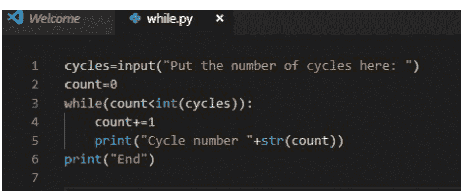

在这个例子中，我们可以观察到几点：首先，我们创建了一个变量`cycles`，它是一个输入，允许我们作为用户输入我们希望在此程序中执行的循环次数。当然，永远不要忘记这种类型的输入是一个字符串，因此，要进行数学运算，必须转换这种输入类型。

然后，将创建另一个名为`count`的变量，它具有一个基本功能，即作为我们程序的循环计数器，我们定义它从零开始，以便开始计数。

下一个操作是开始while循环，正如我们在前面解释的语法中看到的，首先声明我们将要创建一个while，然后在括号内是条件。

#### a. 由计数控制的“while”循环

在此循环中，有一个计数器，该计数器将随着循环的执行而增加，此过程将根据需要重复多次，直到达到预期的数字。通过接下来的例子，我们将更好地理解这个循环。

虽然我们已经看到了一个由计数控制的while的例子，即上一个例子，但再举一个例子也无妨，同样是通过计数方法，在这种情况下，我们将让计数器从高到低递减，如下所示。

```
cycles=input("Put the number of cycles here: ")
a=int(cycles)
while(0<a):
    a-=1
    print("Cycles to end "+str(a))
print("End")
```

在这个例子中，我们做了一个180度的转变，因为计数器不必达到最大值，而是从最大值开始递减。

首先，创建一个名为`cycles`的变量，它与用户将写入的输入相关联，用户将在其中输入他想要执行的循环次数。接下来的操作是创建一个变量`a`，它需要`int()`函数，因为它将变量`cycles`转换为整数，因为如你所知，变量`cycles`是一个字符串，因为输入是以这种方式保存的，而字符串无法执行算术运算。

在下一行，我们声明while循环，如前所述，条件是零必须严格小于`a`，因此，当`a`等于零时，将退出循环并执行下一条指令。

然后，在循环内的指令块中，变量`a`必须递减，这是通过指令`a-=1`完成的，这等同于说`a = a - 1`，可以很容易地观察到变量`a`减少了1个单位。

下一条指令是在屏幕上打印以下消息“Cycles to end”，并连接剩余循环次数。

最后，在屏幕上放置字符串“End”，表示程序已结束并且while已正确退出。

这种按计数的循环非常有用，我们将首先使用那些计数器需要增长的循环，我们首先想到的用途是制作一个编程计时器，这样当达到最大值时，它将退出循环并在屏幕上显示所需时间已满足。现在，还有其他用途，例如检查已知长度的列表，因此我们将逐项移动；尽管这最后一个用途很容易被for循环替代。现在，按计数的while循环，但在这种情况下，计数器递减，可用于制作倒计时以触发警报或类似的事情。

#### b. 无限“while”循环

这种类型的while非常有用，在指令累积执行次数不确定的情况下，这意味着我们不知道它将执行多少次，因此程序员将条件设为`while( True)`，当然，如你所见，布尔值`True`允许while持续工作。

让我们编写两个例子，一个我们严格使用无限while，另一个不那么严格，尽管程序员不知道将执行的循环次数，但不使用`True`条件来强制代码块无限重复。

示例：

1) 带有True条件的While：

```
import time
x=1
while(True):
    print(x)
    x+=1
    time.sleep(1)
```

我们观察到的第一个不同之处是导入了`time`模块，但这些是我们稍后会看到的问题，目前这不是非常重要。

现在真正让我们感兴趣的是将变量`x`声明为1，因为它将充当一种计数器，所以它将逐渐增加。

下一步是创建或更准确地说，声明while，如你所见，while内部的条件是`True`，因此，它将始终满足，这意味着循环将一直重复，除非声明了某些语句，我们稍后会看到。

在while块内，变量`x`将被打印在屏幕上，这就是使用`x`作为计数器的意义所在，因为它将允许我们在控制台中看到程序开始后经过的具体秒数。然后增加`x`的值，因为正如我们已经说过的，它具有计数器功能，它将逐个增加。

最后，我们使用`time`库，它将产生一秒的延迟，这就是为什么我们的程序像一个计时器一样工作，它将在屏幕上显示我们运行代码后的秒数，并且每秒更新一次。

### while循环中使用的语句

#### 1. Break语句

单词`break`用于中断循环或在循环未完成时退出循环，即使while的求值表达式仍为真。为了能够评估和理解此语句，让我们看下面的例子。

```
while True:
    x=input("Put one to break of the while cycle: ")
    if(x=="1"):
        break
    print("You dont put the one, please try again")
print("End")
```

在这个例子中，我们看到如何实现无限while循环，因为如你所见，在第一行，while内部的条件将始终为真，因此我们面对的是一个无限循环。

然后，我们声明变量`x`，它与`input`函数相关联，该函数将等待用户输入任何值，具体来说，需要输入一个1才能退出循环，如果用户输入的不是指定值，则循环将重复。

#### 2. continue 语句：这个语句在编程中非常有用，应用它时，我们将跳过循环中该语句之后的内容。也就是说，如果我们满足了某些前置条件，例如，在多个 "if" 或 else 或其他步骤之后，我们成功到达了一个 continue 语句，我们将跳过循环的其余指令，然后进行下一次迭代。我们可以总结为，循环内的 continue 指令会强制解释器返回到循环的开头，忽略其中的所有指令和交互。

下一个示例将展示一个 while 循环，它将跳过那些是五的倍数的值，如果这些值是倍数，那么它们将不会被打印到屏幕上，并且将自动进行下一次迭代。

```python
cycles=input("Please put the numer of cycles: ")
count=1
while(count-1<int(cycles)):
    a=count
    count+=1
    if(a%5 == 0):
        print("Error, continue")
        continue
    else:
        print("Not is multiple of 5")
    print(a)
print("End")
```

首先，创建变量 cycles，它是一个输入，要求用户输入他想要执行的循环次数，并且，众所周知，cycles 是一个字符串。

接下来，创建变量 count，它是整数类型，将起到计数器的作用，用于知道我们当前处于哪个循环，直到达到用户想要的最大次数。

现在我们将创建 while 循环，它指定 count-1 必须小于 cycles，那么，为什么是 count -1 呢？嗯，为了满足用户的要求；因为如果条件是小于或等于 cycles，代码将不够优化，因此，只使用严格小于，并且由于计数器从一开始，需要减去一个单位以满足相应的循环次数。

在下一行，声明变量 a，它具有与 count 相同的值，因为要知道循环的当前值，并且，很明显，计数器通过第五行的指令 count += 1 增加一个单位。

随后，进入条件块，在这种情况下，条件是 a% 5 ==0，但这是什么意思呢？嗯，a 除以五的余数必须严格等于零，才能进入 if。如果条件为真，将执行 if 块中的指令，这些指令如下；首先是在屏幕上打印出错信息，然后将使用 continue 语句。如果此条件为假，则将执行 else 块中的指令，该指令基于通知该循环是五的倍数。

在条件块结束时，将循环次数打印到屏幕上，以知道我们在程序中的位置。

最后，放置一个屏幕打印以显示程序已完成并正确退出了循环。

现在，我们可以从这个程序中学到什么？首先是 continue 的使用，因为它的功能，具体来说是直接进入下一个 while 循环，跳过该块的其他行，嗯，在这种情况下，是一样的，因为当到达 continue 时，我们进入下一个循环，但如果找不到此语句，a 的值将被打印，正如你所看到的，它是条件块之后的下一条指令，但这种类型的语句会中断程序的自然流程，对于处理循环内发生的某些异常非常有用。

#### 3. pass 语句：它是一个空表达式，换句话说，这个语句什么都不做，但它允许我们创建一个循环而不在其主体中放置代码，以便以后添加并以这种方式用作临时填充物，我们的意思是向程序添加某种类型的延迟；或者就像在使用汇编器或处理器管理编程的情况下一样，这是一种制作 nop 的方式。它是一个不会以任何方式影响代码行为的语句，并且应该注意，它不仅可以在循环中使用，也可以在代码中的任何地方使用而没有任何问题，我们的意思是，该语句也可以在普通函数中使用而没有任何麻烦，但这还不值得一提，因为我们还没有看到函数，但知道 pass 可以与函数一起实现并不过分。我们可以说，建立一个区别，continue 将负责结束当前交互，但将继续该循环的下一次迭代，返回到开头，而 pass 不会做任何事情，只是继续执行以下指令而不返回到开头。接下来，让我们看看一个例子。

```python
cycles=input("Please put the numer of cycles: ")
count=1
while(count-1<int(cycles)):
    a=count
    count+=1
    if(a%5 == 0):
        print("Error, continue")
        pass
    else:
        print("Not is multiple of 5")
    print(a)
print("End")
```

通过查看前面的示例，我们可以看到我们如何声明变量 cycles，它将等待用户指定要使用多少个循环，输入将是字符串类型。

然后将创建计数器 count，它将从一开始以方便起见，但具有知道循环当前位置的功能。

下一条指令是创建 while 循环，条件是 count-1 必须严格小于 int( cycles)，值得注意的是使用 int() 函数，因为 cycles 变量是字符串类型，并且与字符串和整数进行比较是不可能的，因为它们是不同类型的数据。count-1 的原因在前面的例子中已经解释过，所以我们不必重复，但请记住，我们是从零开始进行比较，这就是为什么比较是严格小于而不是小于或等于，因为我们会多做一个循环。

接下来的指令是声明变量 a，它将被赋予 count 的值，这是为了能够对该值进行操作而不丢失它；然后 count 的值将增加一个单位，因为如果不增加这个变量，我们将无限地做同样的事情。

下一部分是条件阶段，负责验证它是否是五的倍数，我们通过使用 "%" 运算符来实现，因为它将返回我们放置的除法的余数，因此，如果我们放置，例如 10% 3，它将返回值 1，即余数；类似地，这里也是这样做的，因为当放置以下指令 a% 5 时，我们是在询问这些值之间的余数，并且要知道一个数是否是另一个数的倍数，因为两者之间的余数应该为零，因此，严格等于零，如果条件满足，因为我们将面对一个能被五整除的数，或者是五的倍数，这些正是我们要找的数字。

现在，如果满足 if 条件，我们将执行一系列指令，相同的是，在屏幕上打印出错信息并将继续，然后，下一条指令是 pass 语句，它不会做任何事情，就像在程序中造成一个小延迟，这取决于我们机器处理器的时钟频率，但这些是我们不太关心的主题。但是，如果条件为假，那么它将进入 else 块，这只会打印该循环次数不是五的倍数。

现在，在条件块结束的那一刻，因此，无论条件是真还是假，都将通过命令 print( a) 将我们所在的循环次数打印到屏幕上，因为 a 是当前位置。

最后，当退出while循环时，屏幕上将打印出"End"字符串，这表明已正确退出while循环，程序已完成。

现在，当试图为pass语句寻找实用工具时，你实际上找不到太多尚未见过的函数，因为现在它只是一个延迟，但这个延迟用户无法察觉，因为计算机的时钟频率是GHz级别的，因此速度快到无法感知。但当你看到这些函数时，在开发复杂程序时，可能会遇到某些部分尚未创建，但为了程序运行，必须已经创建了这些函数，只是函数体尚未开发完成。这就是为什么使用这些语句很重要，可以这样说，是为了让我们的软件不会崩溃。

## 第5章：函数

函数基本上是一段可重用的代码块，用于执行特定任务。它是一个带有相关名称的代码块，接收参数作为输入，此外，它遵循一系列语句，执行所需操作，然后返回一个值并执行任务。这个代码块可以在需要时被调用，这可以被视为一个巨大的优势。Python语言在创建这些函数时为我们提供了极大的灵活性。

使用这些函数是结构化编程范式中的一个重要组成部分，因此具有以下几个优点：

- 它允许在不同程序中重用相同的函数，因此，在创建函数时，不需要重复编写大量代码。
- 它允许将复杂程序分割成更简单的模块，这样，我们将拥有更简单的编程，以及更便捷的调试。正如俗话所说，"分而治之"，因此，这是一种非常常用的技术。

Python编程语言拥有我们称之为语言内置函数的功能，这允许我们创建用户自定义函数，以便在自己的程序中稍后使用。这些函数如下所示：

| 函数 | 用途 | 示例 | 结果 |
| :--- | :--- | :--- | :--- |
| Print() | 此函数允许程序在屏幕上打印所需的参数 | Print("Hello") | "Hello" |
| Len() | 此函数允许你确定字符串包含的字符长度 | Len("Hello world") | 11 |
| Join() | 此函数允许你使用"-"将一个字符串转换为另一个字符串 | List=['Python', 'is'] '- '.join(List) | 'Python-is' |
| Split() | 此函数将允许你将字符串转换为列表 | a=("This will be a list") List2=a.split() | a=['This', 'will', 'be', 'a', 'list'] |
| Replace() | 此函数，顾名思义，将允许你将一个字符串替换为另一个字符串 | Text="The house is green" Print(Text) Text=Text.replace("green", "yellow") Print(Text) | "The house is green" "The house is yellow" |
| Upper() 和 lower() | 此函数允许我们将字符串中的所有字母转换为大写或小写 | Text="The house is green" Text.upper() Print(Text) Text.lower() Print(Text) | "THE HOUSE IS GREEN" "the house is green" |
| Ord() | 此函数将允许你使用ASCII数据类型 | Print(ord('A')) | 65 |
| Tuple() | 此函数将把字符串转换为元组 | Words=tuple("I am old") Print(Words) | ('I', 'a', 'm', 'o', 'l', 'd') |
| Type() | 此函数将返回元素的数据类型 | x=5 Print(type(x)) | <class 'int'> |
| List() | 此函数将允许你从一个元素创建列表 | Word=list('Hello') Print(Word) | ['H', 'e', 'l', 'l', 'o'] |
| Round() | 此函数将把数字的小数部分四舍五入到最接近的整数 | Print(round(15.746)) | 16 |
| Str() | 此函数将把数值转换为字符串 | x=5 a=str(x) Print(a) | "5" |
| Range() | 此函数将创建一个包含n个元素的列表。它主要用于for循环 | x=range(3) Print(x) | [0, 1, 2] |
| Float() | 此函数将允许我们将任何值转换为十进制类型值 | a=float("5.55") Print(a) | 5.55 |
| Max() 和 Min() | 这些函数将确定一组数字中的最大值和最小值 | x=[2, 6, 3, 8, 0] Print(max(x)) Print(min(x)) | 8 0 |
| Sum() | 此函数将对一组数字求和 | x=[3, 1, 6] Print(sum(x)) | 10 |
| Int() | 此函数将把任何值转换为整数 | a=("35") Print(int(a)) | 35 |

### 定义函数需要遵循哪些规则？

- 输入参数必须在函数的括号内定义。
- 当我们编写代码时，必须非常正确地识别缩进（4个空格）。
- 函数的代码将始终在我们放置冒号":"之后开始。

需要注意的是，函数在被调用之前不会执行，而要调用一个函数，必须通过其名称来调用。例如：

```python
a=[1, 2, 3, 4, 5]
b=[1, 0, 1, 0, 1]
num="5 6 7 8 9"
c=num.split()
print(c)
e=[]
for x in c:
    d=int(x)
    e.append(d)
c=e
d=[]
for x in range(len(a)):
    e=a[x]+b[x]+c[x]
    d.append(e)
e=min(d)
f=max(d)
g=sum(d)
print(a)
print(b)
print(c)
print(d)
print(e)
print(f)
print(g)
```

正如我们在这个相当完整的示例中看到的，首先我们创建了变量a和b，它们是列表，其中包含整数值，具体来说是五个元素。a是一个从一到五的数字列表，而b是一个由1和0组成的值的迭代。

其次，是创建变量num，它是一个字符串，其中写着"5 6 7 8 9"，正如我们之前看到的，split()函数创建一个字符串数组，每个元素将是一个由空格分隔的单词。在代码中，具体在第四行，我们使用了这个函数，将变量c转换为一个字符串列表，其形式应为["5", "6", "7", "8", "9"]，但无法对这种类型的数据进行数学运算，因为它们本质上是字符串。因此，我们将继续把这些元素全部转换为整数。为了验证我们所说的是否属实，我们使用print打印列表c，以便你可以看到这个字符串列表。

为了实现我们的目标，首先我们将变量e声明为一个空列表，然后使用一个for循环，其中变量x将在数组c中迭代，其元素是字符串。因此，在变量d中，存储的是对列表c中当前元素应用int()函数后得到的整数。然后，将d的值添加到列表e中，直到迭代次数结束。接下来的操作是将存储在e中的列表赋值给c，以便更好地组织变量。

随后，将变量d赋值为一个空列表，以便在其中存储数据。然后，在一个for循环的帮助下，该循环将迭代与列表a中元素数量相同的次数，因为我们必须遍历其所有元素，因为我们要创建另一个列表，其中包含a、b和c的和。因此，在同一个循环中，e将等于列表a、b和c中位置x处元素的和。将三个元素相加后，将使用append函数将获得的值添加到列表d中。

### 如何创建自己的函数？

要创建自己的函数，我们必须遵循"def"语句，然后为其命名，只是这次它不是预定义函数的名称，而是由我们自己创建的名称。

### 如何调用函数？

要调用一个函数，我们只需在代码开始时声明它。这是基本的，因为无法调用一个尚未创建的函数。示例：

### 参数

我们将参数定义为在调用函数时输入到函数中的值类型，一个函数可以接收一个或多个参数。这些参数必须用逗号","分隔才能被调用。
示例：

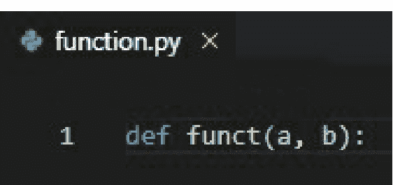

正如你在这个小示例中看到的，因为它非常简单，实际上只是为了展示函数的第一部分应该如何定义。

定义函数时永远不能缺少的语句是def，它指定了将要创建一个函数，或者更准确地说，表示正在定义一个函数。

然后我们可以看到后面跟着一个单词，在这个例子中是funct，这个单词就是为我们的函数命名，然后你会看到一个括号，里面有两个字母 a 和 b，这意味着它们将是我们的函数将接收以进行工作的参数。

### 我们如何定义实参和形参？

正如我们已经知道的，我们将函数在定义时接收的值称为形参。当函数被调用时，这些值被称为实参，并根据其类型进行划分。

这些实参被分为几种类型：

#### 按名称传递的实参：

当我们调用一个函数时，必须在实参中指明每个形参将包含的值，从其名称开始。

```python
def funct(a, b):
    return a+b

c=funct(b=5, a=3)
print(c)
```

正如我们所看到的，我们继续使用 funct 函数，在这种情况下，我们仍然有相同的形参 a 和 b，我们也看到定义完全相同，唯一的区别在第二行，因为它表明将返回 a 与 b 的和。return 语句将在后面解释，但这并不是什么太复杂的东西，它的名字就告诉了我们它的作用，即返回一个值。

然后在接下来的几行中，创建了变量 c，它将等于我们创建的函数返回的值，正如我们之前所说，它将等于其形参 a 和 b 的和。如你所见，当在第四行调用函数时，首先写函数的名称，在这种情况下是 funct，而要传递的实参，之前已经用名称指定了，如你所见，值为五的实参，被指定为 funct 函数的形参 b，类似地对形参 a 也这样做。

最后，将 c 的值打印在屏幕上，以便你可以直观地看到结果是正确的。

#### 按位置传递的实参：

当我们向函数发送一个实参时，它们按顺序接收定义的形参。

```python
def hello(name, color):
    print("Hello "+name+ " your favorite color is "+color)

a=input("What is your name? ")
b=input("What is your favorite color? ")
hello(a,b)
```

在这个例子中，将创建另一个函数，名为 hello，其形参为 name 和 color，此函数的创建是为了在屏幕上显示一条消息，其中用户将被以其名字问候，并且还会被告知他最喜欢的颜色是什么。

要调用此函数，首先需要声明两个变量，第一个是变量 a，它负责存储与用户名相关的字符串值，而 b 负责存储与用户最喜欢的颜色相关的字符串，这些变量与 input 函数相关，这意味着它们将等待用户输入他想要的值。

最后，调用 hello 函数，使用其名称，但在这种情况下，实参是按顺序传递的，而不是按名称，因此你必须非常注意正确的顺序，因为如果这里出现错误，程序很容易崩溃或无法完成所需的操作。

正如你所看到的，传递实参的方式是不同的，你可以使用你喜欢的那一种，这取决于你的偏好；如果你觉得按位置传递更容易或更快，那就那样做，但要记住你必须注意实参在正确的形参位置，但如果你更喜欢按名称传递，那就那样做，当然，你也必须注意你正确地书写了形参名称。

#### 无实参调用

当我们调用一个定义了某些形参的函数时，如果没有正确传递这些形参，将会产生错误。

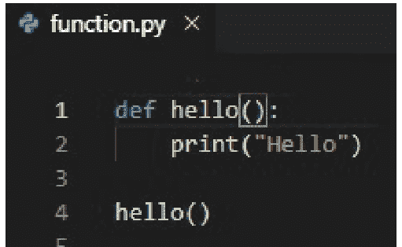

在这个例子中，创建了 hello 函数，它将没有形参，它只会在屏幕上打印消息 "Hello"。
然后，要调用它，只需用括号写出函数的名称，如下所示 name()。

#### return 语句

正如我们之前所看到的，大多数 Python 函数将包含一个返回值，这个返回值可以是显式的或隐式的。

我们知道 return 是一个保留字，其目的是结束某个函数的执行，然后返回作为结果获得的值。如果你想查看一个这样的例子，你可以查看按位置传递实参中的那个，因为可以观察到函数有 return 语句，它将返回 a 加 b 的和的值；而且，正如你在这个例子中观察到的，该值存储在变量 c 中，然后打印它。

#### Lambda 函数

我们将 lambda 函数定义为一种特殊类型的函数，它是 Python 中预定义函数的一部分。我们这样说是什么意思？这种函数主要以“专有”而著称，因为它允许我们快速创建“匿名”函数，因为它有一种有点专有的语法。

lambda 函数能够执行一个表达式并返回其结果，它可以在其结构中包含可选的参数，但是，这个函数有其自身的限制。

#### Lambda 函数的语法

Python 中 lambda 函数的语法非常简单，因为它仅基于编写保留字 lambda，后跟操作所带的参数，最后用相应的冒号 ":" 分隔。

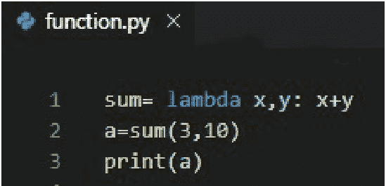

在这个例子中，我们看到了 lambda 函数的使用，在这种情况下，对于变量 sum，我们使用了 lambda 语句，目的是创建一个函数，其目的是对两个数字 x 和 y 求和。因此，我们观察到我们拥有的形参是 x 和 y；然后在函数块内，返回两者的和。

最后，要调用函数，对于我们将 a 声明的变量，我们分配了 sum 返回的值，然后，为了确保结果是正确的，我们继续在屏幕上打印变量 a 存储的值，如果你运行这个程序，你将能够观察到它将给出 13。

Lambda 函数通常在你需要短时间调用一个函数时使用（此函数不需要名称），并且主要与内置函数 filter()、map() 一起使用。

#### Filter() 函数

filter() 函数是（正如其名称所示）负责过滤的。这是什么意思？此函数接受一个序列作为实参，可以是列表或迭代器，然后它将返回一个可迭代对象，其中包含已过滤的元素（如果满足条件，这将返回 True）。

```python
def pair(n):
    if(n>0 and n%2==0):
        return True
    else:
        return False

numbers=[]
for x in range(25):
    numbers.append(x)

pairs=filter(pair, numbers)

for x in pairs:
    print("The number "+str(x)+" is pair")
```

对于这个例子，我们首先需要的是一个条件函数，以了解我们将要过滤什么，在我们的例子中，我们将创建 pair 函数，它将有一个形参，即整数 n，然后我们进入一个条件块，在 if 部分，条件将是 n 必须大于零，因为零不是一个偶数，同时必须满足的另一个条件是，n 除以二的余数必须严格等于零，因为如你所知，这是一个偶数的定义。

下一步是填充我们要过滤的数字数组，为此我们创建变量 numbers，它将是一个空列表。然后进入一个 for 循环，其中变量 x 将从零变化到 24，正如你在第 8 行所看到的，这要归功于 range 函数，它给了我们 for 的界限。接下来要做的是填充我们的列表，这是通过使用 append 函数在 numbers 变量中完成的，如果你记得的话，它是一个空列表，在填充之后，它就变成了一个以整数值作为元素的列表。

我们已经能够过滤列表了，我们通过创建一个名为 pairs 的列表来实现，它将使用 filter 函数，该函数将返回数组中函数返回为 True 的值，例如 2，因为它大于零且其除以二的模等于零，因此，它满足要求。

最后一步是在屏幕上打印所有获得的偶数，我们在另一个 for 循环的帮助下完成，其中变量 x 将遍历整个列表，并打印出这些数字是偶数。

#### map() 函数

map() 函数是负责对列表或元组中的每个元素执行操作，以便返回一个元素序列，该序列将是操作的结果。

```python
def sum(a, b):
    return a + b

list1 = [1, 0, 1, 0, 1]
list2 = [0, 2, 0, 2, 0]
c = map(sum, list1, list2)
print(list(c))

string1 = ["Hello, ", "are "]
string2 = ["how ", "you"]
c = map(sum, string1, string2)
print(list(c))
```

在这个例子中，我们可以看到前几行定义了一个名为 `sum` 的函数，其参数变量 `a` 和 `b` 不必是整数，它们可以是字符串或任何其他数据类型。它将返回 `a + b`，无论是字符串连接还是数值相加。

接着，我们创建了两个列表，“List1” 和 “List2”，它们都是包含数字迭代的列表。对于 List1，迭代的是 1 和 0；对于 List2，情况类似，但迭代的是 2 和 0。

然后，我们声明了一个变量 `c`，它将使用 `map` 函数，并接收 `sum` 函数、`list1` 和 `list2` 作为参数。其作用是创建一个列表，该列表存储在特定的内存地址中，其元素是 `list1` 和 `list2` 对应元素的和。要打印 `c` 中的内容，使用 `list()` 语句很重要，因为如果想显示所需的数据，我们必须告诉程序我们想查看该内存地址中的列表。

之后，定义了两个变量，第一个是 `string1`，第二个是 `string2`，它们包含一些字符串。声明之后，使用了 `map` 变量，它接收 `sum` 函数、`string1` 和 `string2` 作为参数。在这种情况下，我们做的是将每个列表中作为元素的字符串进行连接。最后，我们将在屏幕上打印地址 `c` 中列表的值。

### lambda 函数与使用 "def" 语句定义的函数有什么区别？

我们知道，使用 lambda 函数创建的函数也可以使用 "def" 语句创建。这意味着什么？这意味着使用这两种语句中的任何一种来创建函数都被认为是正确的操作。这是因为通过这两种方法，你都可以得到相同的结果，只是选项更简单。

我们可以将此视为一条路径，两者都到达同一个目的地，区别在于一个更长、更复杂，而另一个则简单得多。这正是 lambda 函数的用途——使我们代码中的函数更易于使用。

当我们创建一个 lambda 类型的函数时，它只专注于使用单行代码，从而最小化代码中可能使用的行数，这与 `def` 语句不同，后者通常占用多行代码。

使用 `lambda` 关键字时，我们创建一个对象或函数，它不需要用名称定义，而 `def` 语句必须在程序开头定义，以便程序能够解释它。

尽管使用 lambda 函数对代码来说简单得多，但很多时候 `def` 语句对于刚开始成为程序员的用户，甚至对于那些有编程知识但经验不多的用户来说，更容易理解。

在使用 lambda 函数时，必须将其赋值给一个变量，这一点至关重要。因为如果不这样做，它只会在定义它的那一行起作用。

## 第六章：面向对象编程 - OOP

在这个阶段，我们已经能够基于函数来设计程序，从而能够使用操作数据的语句。在这种编程语言中，我们可以找到面向过程编程和面向对象编程，后者使用程序员定义的类型来组织代码和数据。

### 什么是 OOP，它有什么优势？

它是现代语言使用的一种编程形式，其核心是将现实世界中对象的行为转移到编程代码中。这是一种通过将数据和功能包装在称为“对象”的东西中来组织程序的方式。使用这种面向对象范式的编程语言包括 Python、C++、Java、Visual 等。

其优势包括：

- 我们可以将程序划分为片段、部分、模块或类，这个概念在编程中称为模块化。
- 代码可以重用，这与面向过程编程不同。因此，如果我们使用这种面向对象程序创建了一个应用程序，之后想制作另一个类似的应用程序，我们可以重用这段代码。为了能够将一个应用程序的代码重用到另一个应用程序中，我们必须了解并理解“继承”的概念。
- 如果某行代码出现故障，程序仍会继续运行。出错的那行代码可能无法执行预期任务，但程序的其余部分会正常运行。
- 封装。

面向对象编程负责应用以下编程技术：

#### a. 抽象

抽象指的是设计和解释的过程，它专注于识别对象的重要特征；从而过滤并忽略那些不被认为重要的细节。

抽象专注于定义对象的特征，这些特征将其与其他类型区分开来。它关注对象是什么，而不是它做什么，然后指定应该实现什么。

例如：我们将对花朵应用抽象。
对象：花朵
特征：
- 颜色
- 叶子
- 花蜜
- 根
功能：
- 产生种子和果实
- 授粉
- 繁殖

#### b. 继承

一些对象与其他对象共享相同的属性和方法，并添加新的属性和方法。我们称之为继承，一个类继承自另一个类，就像在现实生活中，家庭中的一个孩子继承了父母的肤色一样，他继承了父母的特征或属性，但也与父母有共同之处。编程中也是如此。

这是什么意思？简单来说，当我们创建一个新类时，可以实现基类的相同数据。这个新类将拥有比原始类更具体的数据，而原始类包含更通用的视图。

在 Python 中，当一个类不继承另一个类时，它必须继承自 `object`，这是定义对象的 Python 主类。

一旦创建了对象，或者完成了类实例化，就可以访问其方法和属性。Python 使用非常简单的语法：对象名称，后跟点号和要访问的属性或方法。

Python 还支持有限形式的多重继承。

### 继承的类型：

- 基本继承：当一个类只继承一个基类时发生。
- 多重继承：当一个类继承两个或更多基类时发生。
- 多态：指的是那些不同的行为，它们与不同的对象相关联，但可能共享相同的名称。当你通过名称调用一个对象（该名称有多个对象）时，其行为将基于你当前使用的对象。

### 多态的类型：

- 参数多态：参数多态允许以泛型方式编写函数和类，这样可以在不考虑其类型的情况下操作数据。
- 子类型多态：子类型多态是指一个类型（类）的子类型允许用自己的实现替换原始类型函数的行为。
- 特设多态：特设多态指的是那些根据其接收的参数类型而改变行为的函数。

### 我们在 OOP 中将使用什么术语或词汇？

我们将提及最常用的词汇，以便更好地理解这段代码：
```

### 类

类是构建对象的模型，即描述一组对象共同特征的模型。为了更好地理解这个概念，我们将通过类比来说明。例如，如果我们有一辆汽车，那么类就是底盘和车轮，因为它们是汽车这一组对象的共同特征。如果我们想创建一个构建汽车的Python应用程序，首先要做的是创建一个类，该类定义了我们想要制造的汽车的共同特征，并且这个类必须在其内部定义底盘的构造和四个车轮的构造。

在这种情况下，为了展示另一种抽象，让我们举一个类的例子，但这次类将是一所房子。

```python
class house():
    color="red"
    doors=6
    kitchen=True
    bathroom=3
    levels=2

house1=house()
print("We create a house")
```

正如我们在示例中看到的，首先要做的就是使用保留字`class`声明`house`是一个类。在类内部，它有一些属性，例如颜色是红色，有六扇门，有厨房，有三个卫生间和两层楼。

现在下一步是创建一个变量并将其转换为一个类。为此，可以放置任何名称，然后输入类名和括号。如示例所示，`house1`是一个对象，它属于`house`类，并具有之前解释的所有属性。

最后，为了验证类是否创建正确，我们在控制台中打印输出以验证程序的正常运行。

### 类的实例

类的实例，与谈论类的实例、属于类的对象是同一个意思；这意味着，实例、实例和类的对象是同义词；一个实例就是一个属于某个类的对象或实例。例如，继续以汽车为例，我们已经谈到类定义了其共同特征，并定义了我们将要使用的对象。我们看到，在我们的例子中，类由底盘和车轮组成，但属于该类的对象可以是不同的汽车型号，它们共享一个共同特征，即拥有相同的底盘（需要注意的是，有些汽车尽管属于其他品牌，但使用的是完全相同的底盘）和四个车轮。因此，我们可以有两辆具有各自特征的汽车，这些特征在对象本身（汽车）内部定义，例如颜色、型号、重量、座椅、方向盘。那么我们可以说，一辆特定的汽车是一个属于该类的对象，一个类的实例，或者说它是类的一个实例；而另一辆不同品牌的汽车将是属于同一类的另一个不同对象，同一类的另一个不同实例，或同一类的另一个不同实例。

### 模块化

当我们创建一个应用于对象的复杂应用程序（例如Python）时，最常见的情况是该应用程序由多个类组成，而不是单个类（单个类的情况也可能发生，但通常如果应用程序复杂，它将由多个类组成）。模块化的概念源于一个应用程序可以由多个类组成。例如，将其应用于现实对象，如果我们想象一个老式的音响系统，它们由多个模块组成：卡带模块、均衡器、收音机和唱片机，这意味着该对象由多个模块组成。这些模块的优势在于可以独立工作，也就是说，当收音机损坏时，我们可以使用卡带模块。在编程中，这带来了一个优势：如果你有一个用Python编写的程序，它被划分为多个模块，其中一个类由于任何原因出现故障，最可能的情况是程序继续运行，只是出现问题的那个类将无法执行其任务，这与音响设备的类比类似。

### 封装

我们面向对象程序中一个完整类的功能是被封装的，这意味着其他类不会处理彼此的任何信息。回到之前音响设备的类比，如果我们取音响设备的均衡器模块，均衡器的内部功能仅对应于均衡器本身，这意味着卡带模块对均衡器模块一无所知或不理解，这就是所谓的封装。在某种程度上，所有类都是连接的，以便它们像设备一样工作，但同时，每个类都被封装，以便该类的内部功能无法从外部访问。程序的不同部分被连接起来，以便它们通过一种称为访问方法的东西形成一个团队。通过创建访问方法，我们可以将一个类与另一个类连接起来，使它们作为一个单元或团队工作，但这些访问方法只能访问每个类的某些特征。你可以从一个类访问另一个类，使它们相互连接，但每个类的某些特征是被封装的，因此不可访问。

### 我们如何在Python中构建类、对象，以及如何访问对象的属性和特征？

要访问对象的属性和特征，我们使用所谓的点号命名法，这在面向对象编程中常用。为了解释它是什么，我们将基于一个例子来说明。

假设我们给对象起了一个名字，我们称它为`myCar`。所有对象、实例或示例都必须有一个名称。为了在程序中访问汽车的属性，我们使用点号命名法：
例如 语法：对象名称.属性 = 新值
`myCar.color="red"`

这是在Python中我们必须遵循的语法，如果我们想访问对象的属性，我们使用点号命名法。要从代码中访问对象的行为，我们也使用点号命名法。
例如 语法：对象名称.行为
`myCar.starts()`
`myCar.stops()`

在下面的示例中，你将学习如何通过点号命名法访问类的属性，以便你能更好地理解。

```python
class house():
    color="red"
    doors=6
    kitchen=True
    bathroom=3
    levels=2

house1=house()
print("The house color is "+house1.color+", have "+str(house1.doors)+" doors")
print("The house have "+str(house1.levels)+" levels, and "+str(house1.bathroom)+" bathrooms")
```

在这个例子中，我们首先看到的是`house`类的创建，它具有自己的属性，比如颜色（在这种情况下是红色）、门（有六扇）或楼层（有两层）。

然后，我们可以看到我们如何创建`house1`实例，它是`house`类型的。但我们不仅想停留在类的创建上，我们还想访问这些类所拥有的数据，因此我们将打印输出房子具有的属性。如你所见，我们接下来要做的是将我们编写的字符串与我们想要的属性连接起来。现在，要访问它，我们必须命名实例，并通过点号命名法访问我们想要的属性。

现在我们将讨论如何构建一个类的代码；类是基础，之后才能创建属于该类的对象、示例或实例。

```python
class obj():
    <statement 1>
    .
    .
    .
    .
    .
    <statement n>

a=obj()
```

这与其说是一个例子，不如说是对类声明语法的解释，因为，尽管我们听起来有些重复，但它们的声明在面向对象编程中是基础性的，因为正如你可能已经猜到的，它是基础。因此，第一件事是声明类`nameobject():`，通过这个，我们正在创建一个名为`nameobject`的类。然后，在其内部，有一系列语句，负责为实例的属性赋值并处理方法，这些方法将在后面解释。

有些情况下你会问自己，但所有的房子都是红色的吗？或者所有的植物都有三片叶子吗？嗯，显然答案是否定的。为此，我们将使用构造函数，它们将允许我们赋予实例独特性。这些是方法，但现在说这些还为时过早，因为正是它们允许我们在初始化每个实例时赋予不同的值，我们稍后会看到它们。

虽然你应该已经知道什么是属性，因为我们已经在本章中，我们之前已经与它们合作过，现在我们将正式解释它们。

### 属性：
我们将属性定义为每个对象中变量所具有的值。这是什么意思呢？让我们想象一下学校教室的情况；每个教室可能拥有的一个属性是学生所在的年级或他们的年龄。

属性这个词在某个点之后可以用于任何事物，例如，如果我们有表达式 z.real，real 就是对象 z 的一个属性，我们之前称之为点的命名法。

属性可以是只读的，也可以是只写的。在后一种情况下，可以对属性进行赋值。模块的属性可以写成：module.the_answer = 42，这些属性也可以在需要时使用 del 指令删除。例如：del module.the_answer 将删除名为 module 的对象的 the_answer 属性。

```python
class house():
    color="red"
    dors=6
    kitchen=True
    bathroom=3
    levels=2

house1=house()
house1.color="green"
print(house1.color)
```

在这个例子中，我们首先做的是定义 house() 类，并在其中定义它的每个属性，比如 color、bathroom、kitchen 等等。

下一步是创建 house1 实例，它是 house 类型的，正如你可能预料的那样，但如果你想给房子上色，我们将通过指令 house1.color = "green" 来访问属性，这样，house1 的颜色就被更改为 "green"。

为了确保颜色已正确更改，我们使用点的命名法打印 house1 实例的 color 属性。

### 方法：
既然我们已经看到每个对象都有某些具有特定行为的属性；现在我们将把每个类中创建的每个函数称为方法。这是怎么回事呢？那么让我们回到上一个教室的例子，它有两个方法或动作，即学习和上课。

要创建一个方法，我们使用我们已经知道的 def 关键字，但当我们写它时，有一个关键字我们不能忘记，那就是方法的一个参数，这个词是 self，它用于能够访问类的属性。我们可以观察到方法和函数之间的区别在于，方法是属于正在创建的类的特殊函数，而函数不属于任何类。

方法的特征是保留字 def、函数的名称、一个名为 self 的默认参数。

通常，方法的第一个参数被称为 self。这仅仅是一个约定；名字 self 对 Python 来说没有任何意义，也就是说，把它放在第一个或最后一个参数位置都无所谓（因为位置不重要，但必须是 self 这个词），但如果你不遵循这个约定，你的代码对其他 Python 程序员来说可读性可能会降低。

如果属性的概念已经被很好地理解，我们将能够观察到使用方法非常简单，只是在使用它们时，我们必须考虑到这意味着为对象添加行为，以便在访问方法时可以更改属性或返回某个值。

```python
class house():
    color="red"
    dors=6
    kitchen=True
    bathroom=3
    levels=2

    def open(self):
        print("The door is open")
house1=house()
house1.color="White"
print(house1.color)
house1.open()
```

在这个例子中，我们再次看到如何创建 house 类，但它与其他类不同，因为它创建了一个不同的方法，称为 open，如你所见，它使用了 def 语句，然后我们将放置方法的名称，接着，在一些括号内放置参数，总是，但总是我们必须将 self 作为参数，你也可以添加其他参数，但 self 不能缺少。之后，它就像一个普通函数一样处理，如你所见，该方法负责发送一条消息，传达门已打开的信息。

稍后你可以看到如何创建实例 house1，它是 house 类，对 house1 执行的操作之一是更改它的颜色，新颜色是白色，另一个重要的操作是访问方法，如你所见，这也是通过点的命名法完成的。

### 构造函数：
既然你已经具备了类的基础知识，你应该问自己，一个类的所有实例是否都与其他实例相同，因为如果这是真的，一切都会非常单调，面向对象编程也不会像它实际那样强大，因此，构造函数被创建出来，用程序员想要的值初始化类。

构造函数是创建或为实例的初始属性赋值的东西，为此，需要使用一个方法，此外，构造函数是一个类的方法，要使用它，我们使用保留字 __init__(self, a, b, c, ...)，其中 a、b、c 是我们想要初始化的参数，因为它们是我们可以作为用户引入的值，从而能够为属性赋值，以实现我们对象的多样性。

```python
class house():
    def __init__(self, color, dors, kitchen, bathroom, levels):
        self.color=color
        self.dors=dors
        self.kitchen=kitchen
        self.bathroom=bathroom
        self.levels=levels

    def open(self):
        print("The door is open")

    def paint(self, c):
        self.color=c
house1=house("blue", 5, True, 2, 1)
print(house1.color)
house1.paint("black")
print(house1.color)
house1.open()
```

在这个例子中，我们已经可以看到事情如何改变并变得更有趣，首先使用了构造函数，它有参数 self、color、dors、kitchen 等等。在构造函数语句之后，我们使用 self 关键字并放置相应的值，如你所见，在第 3 行到第 7 行之间，例如，在第 3 行的指令中，意思是该特定实例的 color 变量将具有实例初始化时参数所赋予的值。

然后你可以看到如何创建 open 方法，该方法仅在屏幕上显示门已打开；创建的另一个方法，在这种情况下，是一个名为 paint 的方法，它负责更改该实例的颜色，这是通过使用 self.color 语句来指定要更改的实例来完成的。

随后，创建了 house1 实例，并向构造函数传递了参数 "blue"、5、True、2、1，以便它用这些特定值初始化其属性，从而消除我们之前的单调性。

创建实例后，将房子的颜色打印在屏幕上，或者更准确地说，是 house1 实例的颜色，此时，应该打印字符串 "blue"，然后，使用 paint 方法将实例的颜色更改为黑色，为了验证颜色是否已正确更改，将 house1 实例的颜色打印在屏幕上，在这种情况下，控制台应该出现字符串 "black"。

最后，使用 open 方法，以便在屏幕上显示门已打开。

既然我们知道如何使用构造函数，我们可以应用之前应用的继承概念，以便一个相关的类继承其父类的行为和属性。

```python
class house():
    def __init__(self, color, dors, kitchen, bathroom, levels):
        self.color=color
        self.dors=dors
        self.kitchen=kitchen
        self.bathroom=bathroom
        self.levels=levels

    def open(self):
        print("The door is open")

    def paint(self, c):
        self.color=c
class apartment(house):
    def __init__(self, color, dors, kitchen, bathroom, levels, stairs, elevator):
        house.__init__(self, color, dors, kitchen, bathroom, levels)
        self.stairs=stairs
        self.elevator=elevator
    def elevatoron(self):
        if(self.elevator==True):
            print("The elevator is in PB")
        else:
            print("You dont have elevator")
house1=house("blue", 5, True, 2, 1)
print(house1.color)
house1.paint("black")
print(house1.color)
house1.open()
apartment1=apartment("orange", 2, True, 2, 1, True, True)
apartment1.elevatoron()
apartment1.open()
```

在这个例子中，我们可以看到继承是如何工作的，因为我们已经看过代码的前几行，没有必要深入解释它们，因为我们做的是创建 house 类，初始化 house 构造函数并创建一些方法，如 paint 和 open。

然后，我们定义第二个类，即 apartment。为什么我们说它是 house 类的子类呢？嗯，我们已经知道公寓是一种房子，但房子不一定是公寓，它可以是豪宅或联排别墅，因此它不一定是公寓，而在相反的情况下，这总是成立的。

正如我们所见，在定义 apartment 类时，我们

## 第7章：模块

模块是扩展名为.py的文件（我们至今一直在使用），此外，模块除了具有扩展名.py外，还可以具有扩展名.pyc；（这将是编译后的Python文件），对于使用CPython的用户来说，模块也可以是完全用C编写的文件。

模块拥有自己的命名空间，此外，它们还可以包含变量、函数、类，甚至可以包含其他模块，即一个模块内嵌另一个模块或子模块。

### 模块有什么用？

模块主要用于组织和重用代码，这引出了面向对象编程（OOP）中两个基本概念：模块化和重用。

当我们想要构建一个复杂的应用程序，并且需要重用之前在另一个应用程序中编写过的代码时，这就是模块的优势之一，它们允许我们在不同的应用程序中重用我们的代码。

模块化，在这种情况下，我们将模块划分为代码，分成小的部分，当我们实现一个复杂的应用程序时，我们可以在一个包含数千行代码的单个文件中完成，或者我们可以将其分成小的部分，分成行数较少的小文件，因为这样总是更容易处理。

### 我们如何在Python中创建一个模块？

我们可以通过文件扩展名.py轻松创建一个模块，一旦创建了文件，我们可以将其保存在任何我们想要的地方，这就是我们所知的导入。

Python在其标准库中为我们提供了大量的模块，在Python官方手册中，我们可以通过以下链接找到这个库：http://docs.python.org/modindex.html。

在一个模块内部，其名称在全局变量`__name__`的值中可用。

### 导入语句

一个模块可以包含可执行语句和函数定义；通过这些语句，我们能够初始化模块。它们仅在模块首次出现在导入语句中时执行。

模块可以导入其他模块。实际上，通常将所有导入声明放在模块（或脚本）的开头。导入的模块的名称将被放置在导入模块的全局命名空间中。

导入语句具有以下语法。一旦解释器找到导入语句，如果模块存在于搜索路径中，它将导入该模块，搜索路径无非是解释器在导入模块之前搜索的目录列表。

## 第8章：文件处理

Python编程语言允许我们在涉及文件系统和目录时在两个不同的层次上工作。其中之一是通过`os`模块，它使我们能够在操作系统本身的层面上处理整个文件和目录系统。

第二个层次是允许我们处理文件，这是通过在应用程序级别操作其读写，并将每个文件视为一个对象来完成的。

在Python中，就像在任何其他语言中一样，文件分三步操作：首先打开，然后进行操作或编辑，最后关闭。

### 什么是文件？

Python文件是一组字节，它们由一个结构组成，在这个结构中，我们在头部找到所有文件数据的处理，例如，我们正在处理的文件的名称、大小和类型；数据是文件主体的一部分，其中编辑器处理写入的内容，最后是文件结束，我们通过这个语句通知代码我们已到达文件末尾。这样，我们可以描述文件的结构。

文件的结构由以下方式组成：

- 文件头：这些是文件将包含的数据（名称、大小、类型）
- 文件数据：这将是文件的主体，将包含程序员编写的一些内容。
- 文件结束：这个语句将指示文件已到达其末尾。

我们的文件将如下所示：


### 我如何访问一个文件？

有两种非常基本的方式来访问文件，一种是将其用作文本文件，逐行处理；另一种是将其视为二进制文件，逐字节处理。

现在，要为变量分配一个文件类型的值，我们将需要使用`open()`函数，该函数将允许我们打开一个文件。

### open()函数

要在Python中打开一个文件，我们必须使用`open()`函数，因为它将接收文件的名称和文件将被打开的方式作为参数。如果未输入文件打开模式，它将以默认方式打开为只读文件。

我们必须记住，打开文件的操作是有限的，因为无法读取仅为写入而打开的文件，也无法写入仅为读取而打开的文件。

`open()`函数由两个参数组成：

- 它是我们想要打开的文件的路径。
- 它是我们可以打开它的模式。

其语法如下：

```
function = open("file.txt", "w")
function.write()
function.close()
```

其中参数：

File：这是一个参数，提供我们想要用`open()`函数访问的文件的名称，这将是我们的文件的路径。

参数file被认为是一个基本参数，因为它是主要的（允许我们打开文件），而其余参数可以是可选的，并且具有预定的值。

Mode：访问模式负责定义文件将被打开的方式（可以是读取、写入、编辑）。

有多种访问模式，如下：

| 模式 | 描述 |
|---|---|
| r | 这是默认的打开模式。以只读方式打开文件 |
| r+ | 此模式打开文件以进行读写 |

### 文件操作模式

| 模式 | 描述 |
| :--- | :--- |
| rb | 此模式以二进制格式打开文件，仅用于读取。 |
| w | 此模式打开文件仅用于写入。如果文件不存在，此模式会创建它。 |
| w+ | 此模式类似于 w 模式，但允许读取文件。 |
| wb | 此模式类似于 w 模式，但以二进制格式打开文件。 |
| wb+ | 此模式类似于 wb 模式，但允许读取文件。 |
| a | 此模式打开文件以进行追加。文件从末尾开始写入。 |
| ab | 此模式类似于 a 模式，但以二进制格式打开文件。 |
| a+ | 此模式与 a 模式非常相似，但允许我们读取文件。 |

总结一下，我们有三个字母，或三种主要模式：r、w 和 a。以及两个子模式：+ 和 b。

在 Python 中，有两种类型的文件：文本文件和二进制文件。指定文件将以何种格式打开非常重要，以避免代码中出现任何错误。

### 读取文件

有三种读取文件的方法：

1. read([n])
2. readlines()
3. readline([n])

此时我们可能会有疑问，括号和方括号中的字母 n 是什么意思？很简单，字母 n 将通知文件要读取和解释的字节数。

### read() 方法

```python
myfile = open("D:\pythonfile\mypythonfile.txt", "r")
myfile.read(9)
```

我们可以看到，在 read() 内部有一个数字 9，它将告诉 Python 只读取文件的前九个字母。

### readline(n) 方法

readline 方法是从文件中读取一行，以便读取的字节可以以字符串形式返回。readline 方法无法读取超过一行的代码，即使字节 n 超过了行数。

其语法与 read() 方法的语法非常相似。

```python
myfile = open("D:\pythonfile\mypythonfile.txt", "r")
myfile.readline()
```

### readlines(n) 方法

readlines 方法读取文件的所有行，以便读取的字节可以以字符串形式再次获取。与 readline 方法不同，此方法能够读取所有行。

与 read() 方法和 readline() 方法一样，其语法非常相似：

```python
myfile = open("D:\pythonfile\mypythonfile.txt", "r")
myfile.readlines()
```

一旦我们打开了一个文件，就有许多类型的信息（属性）我们可以用来更多地了解我们的文件。这些属性是：

- File.name：这是一个属性，将返回文件的名称。
- File.mode：这是一个属性，将返回我们打开文件时使用的访问模式。
- file.closed：这是一个属性，如果我们要处理的文件已关闭，它将返回 "True"；如果文件仍然打开，它将返回 "False"。

### close() 函数

close 函数是消除程序内存中已写入的任何类型信息的方法，以便继续关闭文件。但这并不是关闭文件的唯一方式；我们也可以在将对象从一个文件重新分配给另一个文件时关闭它。

close 函数的语法如下：

```python
mvfile.close()
```

### 什么是缓冲区？

我们可以将缓冲区定义为在 RAM 内存中临时使用的文件；它将包含构成操作系统中文件序列的数据片段。当我们处理不知道存储大小的文件时，我们经常使用缓冲区。

重要的是要记住，如果文件的大小超过了我们设备拥有的 RAM 内存，其处理单元将无法正确执行程序和工作。

缓冲区的大小有什么用？缓冲区的大小将指示我们使用文件时的可用存储空间。通过函数：io.DEFAULT_BUFFER_SIZE，程序将以预定方式显示我们文件在平台上的大小。

我们可以更清楚地观察到这一点：

```python
import io
print("Default buffer size:", io.DEFAULT_BUFFER_SIZE)
file = open("Myfile.txt", mode="r", buffering=6)
print(file.line_buffering)
file_contents = file.buffer
for line in file_contents:
    print(line)
```

### 错误处理

在我们的文件中，我们将找到一个字符串（可选类型），它将指定我们处理程序中编码错误的方式。

错误只能在 txt 模式文件中使用。
它们如下：

| 错误处理函数 | 描述 |
| :--- | :--- |
| Ignore_errors() | 这将避免错误或未知格式的注释。 |
| Strict_errors() | 如果代码文件中出现任何错误或失败，这将生成 UnicodeError 的子类。 |

### 编码

字符串编码在我们处理数据存储时经常使用，这不过是字符编码的表示，其系统基于位和字节作为相同字符的表示。

它表示如下：

```python
string.encode(encoding="UTF-8", errors="strict")
```

### 换行符

换行符模式是控制新行功能的模式，可以是 '\r'、" "、None、'\n' 和 '\r\n'。

换行符是通用的，可以看作是解释代码文本序列的一种方式。

1. Windows 中的行尾语句："\r\n"。
2. Mac OS 中的行尾语句："\r"。
3. UNIX 中的行尾语句："\n"

输入：如果换行符是 None 类型，则自动激活通用换行符模式。

输入行可以以 "\r"、"\n" 或 "\r\n" 结尾，并在程序返回之前自动转换为 "\n"。如果满足编码时各自的合法参数，行的输入将仅由给定的字符串结束，并且在返回时其最终行不会被转换。

输出：如果换行符是 None 类型，任何已写入的 "\n" 字符都将被转换为称为 "os.linesep" 的行分隔符。

如果换行符是 " " 类型，则不会进行任何类型的转换，并且如果换行符满足代码考虑的任何合法值，它们将自动转换为字符串。

换行符读取示例，使用 " "：

```python
string.encode(mode="r", newline=" ")
```

换行符读取示例，使用 None：

```python
string.encode(mode="w", newline="none")
```

### 通过 "os" 模块管理文件

"os" 模块允许我们执行某些操作，这些操作将取决于操作系统（例如启动进程、列出文件夹中的文件、结束进程等操作）。

使用 "os" 模块有多种方法可以管理文件，它们是：

| 方法 | 描述 |
| :--- | :--- |
| os.makedirs() | “os” 模块的此方法将创建一个新文件。 |
| os.path.getsize() | “os” 模块的此方法将以字节为单位显示文件的大小。 |
| os.remove(file_name) | “os” 模块的此方法将删除文件或程序。 |
| os.getcwd() | “os” 模块的此方法将显示我们将从哪个实际目录开始工作。 |
| os.listdir() | “os” 模块的此方法将列出我们文件中任何文件夹的所有内容。 |
| os.rename(current, new) | “os” 模块的此方法将重命名文件。 |
| os.path.isdir() | “os” 模块的此方法将程序的参数传递给文件夹。 |
| os.chdir() | “os” 模块的此方法将更改或更新任何文件夹或目录的方向。 |
| os.path.isfile() | “os” 模块的此方法将参数转换为文件。 |

**Xlsx 文件：** xlsx 文件是您使用电子表格处理的文件，这是怎么回事？嗯，这不过是使用像 Excel 这样的程序。

例如，如果我们的计算机上有 Windows 操作系统，我们在处理此类文件时有一个优势，即其重量将比其他类型的文件轻得多。

xlsx 类型的文件在处理数据库、统计、计算、数值类型数据、图形甚至某些类型的自动化时非常有用。

在本章中，我们将学习处理此类文件的基本功能，包括创建文件、打开文件和修改文件。

要开始此操作，首先我们必须安装必要的库；我们通过在 Python 终端中执行命令 "pip3 install openpyxl" 来完成此操作。

执行此命令后，它将下载并安装 openpyxl 模块到我们的 Python 文件中，我们也可以查找文档以获取有关此模块的必要信息。

创建 xlsx 文件：要使用此模块创建文件，让我们使用 openpyxl() Workbook() 函数。

```python
from openpyxl import Workbook

def xlsxdoc():
    wb = Workbook()
    sheet = wb.active
    name = "test.xlsx"
    wb.save(name)

xlsxdoc()
```

这是我们管理xlsx类型文件的第一步，我们可以看到，首先我们通过导入openpyxl模块的Workbook函数创建了文件；接着，我们将Workbook()函数赋值给变量wb，这表示我们将要操作的文档（我们创建了一个该格式的工作表对象）。完成这些后，我们激活名为wb的对象，以便为其命名并最终保存文件。

### 使用此模块向文件添加信息：

为了向文件中添加信息，我们需要使用对象附带的另一类函数，其中之一是append函数。

```python
from openpyxl import Workbook
def xlsxdoc():
    wb = Workbook()
    sheet = wb.active
    sheet["B4"] = "Goodnight"
    name = "test.xlsx"
    wb.save(name)
xlsxdoc()
```

我们可以观察到，这与我们之前创建文档的示例类似，为此我们执行了常规步骤：在函数xlsxdoc()中创建了对象wb，激活了该对象，并在其中添加了信息。在这个新空间中，我们需要知道要写入的具体位置，在本例中，我们将在第二行的第四个单元格“B4”中写入，并将其与字符串“goodnight”匹配。最后的步骤与上一个示例完全相同，因此，我们将放置名称并使用save命令保存。

有一种更简单的写入和输入数据的方法，我们可以通过append()函数实现：

```python
from openpyxl import Workbook
def xlsxdoc():
    wb = Workbook()
    sheet = wb.active
    messages = ("Hello", "good morning", "goodnight")
    sheet.append(messages)
    name = "test.xlsx"
    wb.save(name)
xlsxdoc()
```

我们可以观察到，我们按照之前解释的步骤创建了文档“test.xlsx”，我们创建了一个名为messages的元组，该元组包含三个项目：

"Hello"、"good morning"、"goodnight"。

元组创建后，我们使用append函数，它允许我们附加元组messages中包含的所有信息，最后使用save函数保存文档。

append()函数只接受可迭代数据，这是什么意思？这指的是数组、元组类型的数据，因为如果不是以这种方式输入，我们的程序将返回错误。

### 读取xlsx文档

```python
from openpyxl import load_workbook
name = "test.xlsx"
def xlsxdoc():
    wb = load_workbook(name)
    sheet = wb.active
    file1 = sheet["C1"].value
    file2 = sheet["C2"].value
    file3 = sheet["C3"].value
    print(file1)
    print(file2)
    print(file3)
xlsxdoc()
```

让我们回到第一个示例，从xlsx文件中获取信息，我们可以看到，为此我们导入了load_workbook类。首先我们需要知道要打开的文件的名称，为此我们创建了带有名称的变量。

重要的是，文件必须位于程序存储的同一文件夹中，否则程序将抛出错误。在函数xlsxdoc()内部，我们将创建对象wb，它将是我们要操作的对象，接着创建对象“sheet”，它将代表我们要使用的工作表。

完成所有这些后，我们将请求特定单元格“C1”、“C2”、“C3”的信息，旁边是value函数，为了验证我们获取的信息是真实的，我们打印所有请求的信息。

### 处理PDF文件

众所周知，这类文件的缩写是：“Portable Document Format”（便携式文档格式），多年来其使用量显著增长，主要用于商业和教育领域。这是因为它提供了大量好处，其中安全性尤为突出，允许添加访问密钥以控制谁可以编辑文档，甚至可以添加水印以避免信息剽窃。

其他突出的数据是，这些文档可以从任何设备上查看，因为不需要特定程序；此外，文件的重量要轻得多，因为这些文本是压缩的，与Word文档不同。

PDF文件的一个缺点可能是，一旦创建，它们就不容易编辑。

在本章中，我们将只学习如何创建PDF文件。
要创建PDF文件，我们首先必须通过命令“Pip3 install fpdf”下载库，然后我们可以开始创建文档：

```python
from fpdf import FPDF

pdfdoc = FPDF()
pdfdoc.set_font('Times New Roman', 'B', 12)
pdfdoc.add_page()
pdfdoc.cell(12, 10, "First PDF program", 5, 6, "C")
pdfdoc.output("first.pdf", 'F')
```

这是一个简单级别的示例，但同时，它比其他类型的文件要困难得多。要开始一个文档，需要很多命令，为此我们将从fpdf库导入FPDF类，然后创建pdfdoc对象，这将是pdf文档。创建此文档后，我们必须自定义格式、大小和我们将要使用的字母样式。为此，我们使用set_font命令。

在本例中，我们将使用的字体类型是Times New Roman，粗体样式，大小为12。

接着，我们将通过add_page()命令添加一页，因为我们需要一个页面来书写，而fpdf函数默认不创建空白页。然后，我们将使用cell()函数插入信息，该函数包含一组非常重要的参数。

cell函数将包含单元格将占据的宽度和高度，它必须包含将以字符串格式写入的消息，如果需要边缘带有某些细节，我们必须添加1，因为0是默认值，不允许插入任何内容。

如果想在下方或右侧添加单元格，放置0，否则放置1，如果希望文本居中向右、向左、向上或向下，将放置一个字符串，如果希望居中，则写C。

最后，我们必须通过output()命令保存文档，其参数将是文件的名称（包含“.pdf”，因为我们想要一个pdf文件），然后是一个字符串“F”。

### 管理BIN文件

正如我们之前看到的，并非所有文件都是文本文件。这些文件可以通过行处理，甚至存在某些文件在处理时，每个字节对程序都具有特定含义；因此，它们需要以其特定格式进行操作。

一个明显的例子是二进制文件，要处理此类文件，只需在参数模式的位置添加一个b。

例如：

```python
with open("pythonfile", "rb") as f:
    byte = f.read(4)
    while byte:
        byte = f.read(4)
```

当我们处理二进制文件时，了解我们需要修改的数据的当前位置非常重要。如果不知道当前位置，file.tell()函数将指示自我们开始文件以来已过去的字节数。

如果要修改文件中的当前位置，我们使用file.seek(start, from)函数，它允许我们从start到finish移动一定数量的字节。

### 结论

感谢你坚持读完*Python编程初学者指南：学习Python计算机语言更快更简单的终极速成课程*，我们真心希望你觉得它内容丰富，并且能够运用这里提供的所有工具来实现你学习Python编程语言的目标。

既然你已经完成了这本书，你应该能够为不同情况编写很多程序。下一步是继续大量练习，以成为Python大师。在编程时，有时你可能会认为有些事情无法编码，或者你不够好去做这些事情。但事实并非如此；你只需要多思考才能实现。同时，在编程时，你可能会发现你的代码或程序无法运行，不要担心，即使是最聪明的人最初编写的代码也可能无法运行。你只需要继续尝试。

如你所知，如今技术无处不在，编程也是如此，我们的建议是，你尝试编写代码并解决日常活动中的问题，以拓宽你的视野，因为所有电子产品都有成百上千行代码。

祝你编程顺利！！

```python
if you_have_doubts:
    print("Read_The_Book_Again")
else:
    print("GOODBYE")
```

# 初学者网络指南

轻松学习基础/高级计算机网络、硬件、无线和布线。LTE、互联网与网络安全

作者：Dylan Mach


© 版权所有 2019 Dylan Mach - 保留所有权利。

未经作者或出版商直接书面许可，不得复制、转载或传播本书所含内容。
在任何情况下，出版商或作者均不对因本书所含信息直接或间接造成的任何损害、赔偿或金钱损失承担任何责任或法律责任。

**法律声明：**
本书受版权保护。本书仅供个人使用。未经作者或出版商同意，不得修改、分发、销售、使用、引用或转述本书任何部分或内容。

**免责声明：**
请注意，本文档所含信息仅供教育和娱乐目的。已尽一切努力提供准确、最新、可靠且完整的信息。不声明或暗示任何类型的保证。读者承认作者不提供法律、金融、医疗或专业建议。本书内容源自多种来源。在尝试本书概述的任何技术之前，请咨询持证专业人士。
阅读本文档即表示读者同意，在任何情况下，作者均不对因使用本文档所含信息而造成的任何直接或间接损失负责，包括但不限于——错误、遗漏或不准确之处。

## 目录

- [引言](Introduction)
- [第1章：机器学习与计算机网络简介](Chapter%201:%20Introduction%20to%20Machine%20Learning%20and%20Computer%20Networking)
  - [计算机网络](Computer%20Networking)
  - [计算机网络的历史](History%20of%20Computer%20Networks)
  - [计算机网络的组成部分](Components%20of%20Computer%20Networking)
  - [路由器](Routers)
  - [网络接口卡](Network%20Interface%20Card)
  - [协议](Protocols)
  - [计算机网络的类型](Types%20of%20Computer%20Networks)
  - [局域网 (LAN)](Local%20Area%20Network%20(LAN))
  - [个人区域网 (PAN)](Personal%20Area%20Network%20(PAN))
  - [城域网 (MAN)](Metropolitan%20Area%20Network%20(MAN))
  - [广域网 (WAN)](Wide%20Area%20Network%20(WAN))
  - [机器学习](Machine%20Learning)
  - [机器学习 vs. 计算机编程](Machine%20Learning%20Vs.%20Computer%20Programming)
  - [机器学习的一般步骤](General%20Steps%20in%20Machine%20Learning)
  - [数据的收集与准备](Collection%20and%20Preparation%20of%20Data)
  - [指导模型的选择](Selection%20of%20Instructing%20Models)
  - [模型评估](Evaluation%20of%20Models)
  - [机器学习算法的类型](Types%20of%20Machine%20Learning%20Algorithms)
  - [监督算法](Supervised%20Algorithms)
  - [无监督算法](Unsupervised%20Algorithms)
  - [强化算法](Reinforcement%20Algorithms)
  - [机器学习的应用](Applications%20of%20Machine%20Learning)
- [第2章：计算机网络的特性](Chapter%202:%20Properties%20of%20a%20Computer%20Network)
  - [计算机网络的特性](Properties%20of%20Computer%20Network)
  - [计算机网络的用途](Uses%20of%20Computer%20Networks)
  - [在商业应用中的使用](Use%20in%20Business%20Applications)
  - [计算机网络：移动用户](Computer%20Networks:%20Mobile%20Users)
  - [关于计算机网络类型的更多信息](More%20Information%20on%20Types%20of%20Computer%20Networks)
  - [计算机网络的基本要素](Basic%20Elements%20of%20Computer%20Networks)
  - [选择合适的计算机网络](Choosing%20a%20Suitable%20Computer%20Network)
- [第3章：轻松学习基础计算机网络](Chapter%203:%20Easy%20Guide%20to%20Learn%20Basic%20Computer%20Network)
  - [计算机网络的重要组成部分](The%20Important%20Components%20of%20a%20Computer%20Network)
  - 计算机网络的分类
  - 基于地理位置
  - 基于访问类型
  - 基于终端设备之间的关系
  - 互联网

## 第4章：什么是网络安全基础？

- 什么是网络安全？
- 僵尸网络攻击
- 加密货币劫持
- 勒索软件
- 网络钓鱼
- 社会工程攻击
- 网络安全的历史
- 网络安全的重要性
- 什么是网络安全基础？

## 第5章：网络概念是什么？

- 网络组成部分
- 基于访问类型的分类
- 基于相关设备关系的分类
- 网络规划
- 网络类型与结构
- 网络布局与拓扑
- 网络拓扑——逻辑与物理
- 计算机网络的分类
- 基于地理位置的分类
- 网络层与协议
- 传输控制协议

## 第6章：信息技术指南

- 理解信息技术
- 硬件
  1. CPU
  2. 外围设备
- 无线与LTE
- LTE（长期演进）
- LTE概述
- LTE要求
- 无线与LTE的标准定义
- 布线
- 电缆网络类型
- 选择电缆网络
- 布线网络的优势
- 网络安全
- 网络安全的重要性
- 如何管理网络安全
- 网络地址
- IP协议的功能
- 私有与公共IP地址
- IP地址分配
- 数据传输
- 网络的重要性
- 其他相似之处

## 第7章：最佳网络监控工具是什么？

- 计算机网络基础
- 互联网协议
- 理解网络安全

## 第8章：防火墙类型

- 防火墙如何工作？
- 防火墙的类型
- 此类防火墙的应用
- 状态多层防火墙
- 代理防火墙
- 软件防火墙
- 硬件防火墙
- 应用防火墙
- 下一代防火墙
- 状态检测防火墙
- 电话相关防火墙

## 第9章：理解网络安全

- 网络安全的重要性
- 数据安全措施及其重要性
- 数据安全意味着什么？
- 数据安全技术
- 数据安全的类型
- 保护数据
- 数据安全的重要性

## 第10章：网络攻击类型及如何预防

- 网络攻击类型
- 恶意软件攻击
- 窃听攻击
- 跨站脚本攻击
- 密码攻击
- 浏览器漏洞攻击
- 网络钓鱼攻击
- 中间人攻击
- SQL注入攻击
- 如何预防网络攻击

## 引言

恭喜您下载《初学者网络指南》，感谢您的选择。世界正在数字化，每个人都必须跟上不断涌现的新技术。然而，在不了解基础知识的情况下，您无法参与任何类型的技术。也就是说，在深入计算机编程等复杂活动之前，您必须首先学习不同计算机组件的原理。

接下来的章节将讨论您在计算世界中需要了解的关于网络的所有知识，这对于那些进入该行业的人来说至关重要。有些人可能对网络了解有限，但使用本指南后，您很可能会很快成为专家。因此，您将了解网络中使用的不同协议，以及互连和互联网等。网络中有基本概念，也可能包括与计算机网络相关的其他形式的操作。也就是说，您将了解计算机网络，并理解现代电信网络如何促进机器之间的资源共享。网络是计算机研究的一个基础领域，它使计算机能够在全球范围内互连。此外，您还将了解机器学习作为一种算法和统计方法，机器如何获得执行特定任务的能力。机器学习是一个广泛的主题，但对初学者来说至关重要，特别是当他们想了解计算机如何像人类一样在各种情况下做出决策时。

市场上有很多关于这个主题的书籍，再次感谢您选择本书！我们已尽一切努力确保本书包含尽可能多的有用信息。请尽情阅读！

## 第一章：机器学习与计算机网络导论

机器学习与计算机网络都是计算领域的重要研究方向，但它们涉及不同的概念。也就是说，它们虽然代表了相似的研究领域，却涵盖了计算机系统的不同方面。具体而言，机器学习涉及计算机算法和统计模型，这些模型有助于机器从输入数据中学习、识别合适的模式，并选择最优结果。另一方面，计算机网络则处理全球范围内不同计算机之间的连接与互联，从而实现数据共享、资源管理和用户应用。

### 计算机网络

计算机网络是研究和分析相互连接或互联的计算设备或系统之间通信技术的计算学科。因此，计算机网络被定义为一组相互连接以进行通信、共享数据和资源的计算机。计算机网络完全依赖于计算机工程、科学以及电信和信息技术的理论与实践应用。要在机器之间构建计算机网络，个人需要拥有路由器、网卡和特定的协议。

### 计算机网络的历史

计算机网络始于20世纪50年代计算机兴起之时，但最初使用的是军方采用的封闭网络系统。与现代网络系统不同，20世纪50年代末出现了军用雷达的使用，后来演变为包含收发器、路由器、电信电路和基站模块的MOS晶体管。不同的开发者提出了各种形式的计算机网络，包括1965年西电公司引入的电话交换机。计算机网络的第一个重大进展始于20世纪70年代，期间对当今用于促进网络化的设备进行了多次改进。其中包括施乐帕洛阿尔托研究中心（Xerox PARC）引入的以太网、用于扩展IP网络覆盖范围的X.25协议以及主机的创建。从1969年提供的50kb/s电路到目前的10mb/s至100mb/s，网络行业经历了显著变化。然而，预计未来改进将持续，最快网络模式将出现，从而推动计算机网络领域的发展。此外，系统更高速度的体验已在2018年实现。这是因为通过使用以太网光纤电缆引入了高达400 GB/s的速率。

### 计算机网络的组成部分

### 路由器

路由器是最常见的网络设备，其主要功能是在计算机网络中转发数据包并引导互联网流量。诸如网页之类的数据包从一个路由器传输到另一个路由器，构成一个互联网络，同时等待到达期望的节点目的地。路由器通常用于家庭和小型网络，使用网络电缆而非安装驱动程序，并通过USB或特定线路连接到计算机。路由器可以是无线的，也可以包含通过端口连接的电缆，以允许设备连接到互联网。它们通常连接到调制解调器（例如光纤和DSL）或通过网络电缆连接到广域网（WAN）端口以促进连接。根据您期望的网络连接，您的网络速度会有所不同，有些路由器会调节您从每个路由器接收的速率。此外，路由器可能遵循特定的IP地址，具体取决于互联网连接，而私有地址是网络中不同设备的主要默认网关。连接到一个路由器的多个链接（包括无线和有线设备）使每个设备都能自由通信，例如共享打印机。

#### 网络接口卡

网卡是一种将计算机连接到网络（通常是局域网（LAN））的电子设备。大多数现代计算机在主板上嵌入了网络接口卡，而不是使用外部芯片来连接网络。当计算机使用给定协议（如CSMA/CD）与计算机网络交换数据时，这些卡至关重要。以前使用的网卡版本包含诸如1977年引入的ARCNET等协议，但如今大多数计算机使用以太网。随着计算机网络的逐年革新，以太网网卡的使用最为普遍。

互联网速度通常因网络接口卡支持的协议标准而异。以前的以太网卡支持高达10mb/s的速度，而当前的适配器支持从100mb/s到1000mb/s的速度。网卡不一定支持无线连接，但路由器也包含这些卡，这决定了给定计算机网络的速度。预计在不久的将来，随着以太网网卡的使用，速度将进一步提高。在这种情况下，未来几年速度将增长，速率将是当前数字的三倍。这归因于多年来计算机网络在不同平台上的使用扩展，从小型企业到商业应用。

#### 协议

计算机网络还包括连接协议，这些协议包含两个或多个系统交换数据的规则。除了规定外，协议还包括语法、通信同步和语义，以及错误恢复技术，用于计算机连接的硬件和软件中。换句话说，协议是一组规则，无论基础设施、设计和标准如何变化，都能将服务器连接到路由器。为了交换信息，双方必须接受内置于硬件、软件或两者中的协议。

网络协议通常伴随相似的语言，以促进两台计算机在信息交换中的交互。网络协议通常使用开放系统互连（OSI）模型，该模型用于将复杂过程分解为易于定义的功能和操作。计算机网络中使用多种协议，包括传输控制协议（TCP）、用户数据报协议（UDP）、网际协议（IP）、超文本传输协议（HTTP）和文件传输协议（FTP）等。

### 计算机网络的类型

### 局域网（LAN）

局域网，通常缩写为LAN，是一组在给定小区域（如办公室或住宅楼）内使用和共享特定互联网连接的计算机系统。LAN连接通常通过通信介质（例如，两台或多台个人计算机使用的同轴电缆）进行。这种类型的计算机网络通常比其他类型更便宜，由区域内的人访问，并使用适配器和以太网电缆等硬件。数据传输通常非常快，安全性也相当高。该连接仅支持区域内的人，外部人员往往无法传输信息。

### 个人区域网（PAN）

这是一种在10米范围内布置的私人网络类型，通常用于个人使用，连接给定范围内的设备。个人区域网最初由托马斯·齐默尔曼（Thomas Zimmerman）研究并引入，他确立了个人可以使用30英尺内的设备与社区建立连接。有线和无线PAN都可以用于此类网络，以连接源周围的设备。源可能来自媒体播放器、笔记本电脑和手机。无线通常使用热点、蓝牙和Wi-Fi连接到给定范围内的设备。有线PAN通过USB电缆连接，以促进给定网络的连接。个人区域网总是随身携带，可以包括离线系统，并用于在小型家庭网络中使用VPN连接设备。

### 城域网（MAN）

城域网是一种通过互联多个LAN连接来覆盖广泛地理区域的计算机网络。这种类型的计算机网络通常被政府机构用于连接不同的联邦设施以及其公民和私营组织。MAN中的一些协议包括ISDN、帧中继和OC-3等，它们通过交换线路连接到不同的LAN。这种形式的计算机网络用于比LAN更大的区域，例如航空公司预订、军事通信、大学以及

### 广域网（WAN）

广域网是覆盖广阔地理区域（如州际或跨国）的扩展计算机网络。它比局域网和城域网范围更广，不局限于单一领域，而是通过卫星连接或光纤电缆覆盖整个更大的区域。广域网是世界上规模最大的计算机网络，广泛应用于企业、政府运作和教育领域。广域网的一些优势包括集中式数据管理、快速消息传输、覆盖完整地理区域、更高带宽以及支持全球业务。另一方面，广域网在遭遇安全漏洞时可能成为劣势；它需要防火墙和严格的防病毒软件，设置成本高昂，并且由于其覆盖范围更广，问题修复也更为困难。

### 机器学习

如前所述，机器学习是计算机进行数据分析的方法，其中算法和统计模型使机器能够从数据和模式中学习，然后在无需人类交互的情况下做出决策。自20世纪50年代末被引入以来，机器学习日益普及，已成为计算领域的一个庞大主题。它是人工智能的一个分支，使计算机能够在有限的人类交互下提供关于未来的分析信息。因此，机器学习可以根据个人选择的不同方向以不同方式进行学习。机器学习的理念借鉴了人脑的形式，包括神经元以及它们如何促进信息吸收、思考和决策。当这一概念于1943年首次引入计算机时，它专注于神经网络，使机器能够根据输入的信息自主学习。也就是说，机器能够观察、学习、理解、分析并基于事件做出决策，而无需依赖个人指令。然而，当时计算机发展的缓慢增加了机器学习的挑战，与当今时代相比尤为明显。正如人类有能力发展和扩展他们对事件或首次接触或学习的事物的知识，同样的技术也促进了机器学习。此外，人类依赖大脑中的神经元网络，而计算机则利用类似的模式。因此，采用相同技术的机器能够在没有任何人类交互的情况下做出决策和结论。然而，计算机做出的决策广泛基于数学和算法，这些算法已扩展到能够预测尚未发生的事情的结果。目前，已采用不同的方法使计算机能够学习特定信息；因此，能够基于特定数据集提供预测、结论和决策。

### 机器学习与计算机编程

机器学习常与计算机语言编程混淆，但两者存在显著差异。如前所述，机器学习是关于机器接收特定数据集、选择最可靠的算法、学习并确定结果，而无需任何人类交互。因此，它在分析信息、学习和产生积极结果时交互有限。相反，计算机编程需要人类交互，首先选择要使用的数据集并将其写入机器。然后执行代码以创建特定程序，这便是结果。在编程中，机器很少学习，而是根据人类提供的指令生成结果。

### 机器学习的一般步骤

#### 数据的收集与准备

人类若不进行交互或理解基础知识，就无法学习和获得关于某事的知识。同样，机器也面临类似的挑战，它们必须在详细学习之前获取相关信息。因此，机器学习的第一步是收集必要的数据，并以符合给定标准的方式进行准备。收集包括获取关于特定元素的详细信息并开始理解它。然后计算机准备系统以在提供所需知识之前内化信息。

#### 指导模型的选择

人类也会通过试错来为手头的问题找到有效的解决方案。机器学习也会根据输入的指令创建多个模型，以提供最适合解决给定问题的模型。在这种情况下，计算机使用自引入以来经过不同修改的算法。多年来，已开发出更多模型，旨在使机器在某些专业领域更加专精。在这一步骤中，计算机选择最适合给定数据集的模型，并通过学习更多关于手头信息来自我训练。这确保了输入的信息和结果更有可能变得有益并提供预期的解决方案。

#### 模型的评估

最后一步是将选定的模型付诸实践，尝试确定该模型是否能使机器在无需人类交互的情况下学习和决策。机器能够轻松地从输入的信息中学习并创建模式，其工作方式类似于我们在头脑中处理新知识的行为。也就是说，当提供经过充分测试的细节时，机器将提供出色的结果，而测试不足则会导致模糊和有害的结果。在这一步骤中，您需要向计算机提供相关的模型和数据，这些模型和数据提供算法，机器将遵循该算法并交付有效结果。因此，测试数据和模型，以确保能够交付卓越的结果。

### 机器学习算法的类型

#### 监督算法

如前所述，机器学习包含多种类型，具体取决于输入数据如何产生结果。其中一种模型是监督算法，其中数据集经过一组给定的参数，这些参数反过来决定结果。机器最初将数据指定为标签以及包含的训练数据。在这种情况下，数据首先经过测试以确定其结果，从而控制结果。这种类型的算法通常具有可管理性，因为结果通常是预期的。监督算法进一步细分为分类算法和回归算法。

分类算法使用K近邻分类算法，负责将数据分类到各个标签中。数据根据变量之间的相似性或输入到机器中的信息进行分类。另一方面，回归算法侧重于数学关系和变量的依赖性。也就是说，它提供对具有相似性的数值数据集的即时分析，这对于预测未来至关重要。回归算法根据输入的信息包括两种形式：线性回归模型和逻辑回归模型。

#### 无监督算法

这与监督算法相反，包含未标记的数据集，在大多数情况下，结果是不确定的。无监督算法分为K均值聚类、循环神经网络和人工神经网络。人工神经网络类似于大脑神经元，它们相互连接以增强学习、思考和决策，无需任何干预。K均值聚类涉及将相似数据分组到簇中，以促进机器学习。而循环神经网络利用计算机神经元节点中的内存来分析序列信息，以促进设备中的决策制定。

#### 强化算法

强化算法是机器在特定上下文中确定数据集中的特定信息。作为机器学习算法的一种类型，强化模型最为有益，因为学习特定数据集可以最大化结果。然而，如果错误的数据集输入到机器中，可能会导致严重的惩罚或其他相关危险。但是，当使用正确的参数时，设备将进行必要的纠正并产生积极的结果。此外，这种类型的机器学习算法使您能够快速进行纠正、修改或更改结果，如果您觉得未来结果可能变得不理想。

### 机器学习的应用

自机器学习引入计算行业以来，不同领域在其运营中已显著受益。此外，它在开发者以及其他用户中广受欢迎，使其适用于不同领域。在这种情况下，机器学习的应用范围从小型技术企业到商业用途。其中一个常见领域包括社交媒体，如Facebook和Twitter，用于情感分析、垃圾邮件过滤、面部识别等。它也应用于电子商务领域，向特定客户展示他们最常搜索的商品。机器学习还用于交通、健康、交易、视觉辅助和金融服务等领域。

## 第2章：计算机网络的特性

计算机网络被定义为一种数字电信网络，允许节点之间共享资源。电信网络是由多个终端节点和连接链路组成的网络，这些链路使得某些终端之间能够进行电信通信。网络中的传输链路充当节点之间的连接。电信网络允许在长距离上进行交互和信息传输。计算机网络涉及通过通信信道连接计算机系统和计算机硬件设备。通信信道使得许多用户之间能够进行通信和资源共享。节点之间的连接被称为数据链路。数据链路的建立通常来自有线介质，包括光缆或电线，以及无线介质，包括Wi-Fi。网络节点是发起、路由和终止数据的网络计算机设备。通常，节点通过网络地址来标识，通常包括电话、个人计算机、网络硬件和服务器等元素。只要其中一个设备能够与其他设备交换信息，这些设备就可以轻松地组网。这些设备之间可以有直接连接，也可以没有直接连接。计算机网络支持广泛的服务和应用程序。其中一些包括访问数字音频、数字视频、万维网、存储服务器的通用使用、应用程序、传真机和打印机。它还可能包括即时消息和电子邮件应用程序的使用。计算机网络与其他电信网络的不同之处在于它们传输信号所使用的介质、用于组织网络流量的协议、网络的规模、控制流量的机制、组织意图和拓扑结构。最常见的计算机网络之一是互联网。计算机网络自20世纪50年代末就已存在。在此期间，计算机网络涉及半自动地面环境。SAGE是美国军方使用的雷达系统。后来在1959年计划进行了一次重组。它基于OGAS的网络，即计算中心网络。1959年，Dawon Kahng和Mohamed Atalla在贝尔实验室发明了MOS晶体管。这种导体是迈向计算机网络通信基础设施的重要一步之一。它包括基站模块、路由器、内存芯片、电信电路、微处理器、收发器和射频功率放大器。

SABRE是商业航空预订系统中的一个系统，于1960年成功上线，连接了两台大型计算机。后来在1963年发明了星际计算机网络。它允许许多计算机用户之间进行通用通信。1964年，一些研究人员提出了一种操作，其中一台计算机用于路由和管理电话之间的连接。

分组交换的概念在整个20世纪60年代得到发展。它允许信息通过网络在计算机之间传输。电话也被用于实现计算机的精确控制。后来发表了一篇关于广域网的论文，该网络允许计算机共享时间。

到1973年，法国CYCLADES主机开发完成。这些主机负责可靠地传输数据，而不是将服务集中在网络上。同年，撰写了一份正式备忘录，描述了以太网。以太网是当今世界上最常见的网络系统之一。Robert Metcalfe从1979年开始致力于使以太网成为开放标准。在20世纪80年代，以太网继续升级到10Mbit/s协议。

到1995年，以太网已支持千兆位速度。根据2018年的记录，其传输速度可达400Gbit/s。以太网的持续使用源于其适应性和易于扩展的能力。

### 计算机网络的特性

计算机网络被认为是电子工程、计算机工程、计算机科学、电气工程、信息技术或电信的一个分支。这是因为计算机网络的实践和理论与这些领域密切相关。计算机网络允许用户之间进行高效的人际沟通。他们可以通过视频电话、电话、在线聊天、即时消息、视频会议和电子邮件进行有效沟通。它还允许用户之间共享网络和计算资源。通过网络上的设备，访问和使用资源变得更加容易。例如，用户可以共享打印机和存储设备。数据、文件和其他形式的信息也可以通过计算机网络有效共享。

### 计算机网络的用途

如果它没有益处，人们就不会考虑通过网络在计算机之间建立连接。当今世界有许多计算机网络用户。从长远来看，它们被用于使个人和公司受益。

### 在商业应用中的使用

- **资源共享**

计算机网络的主要目标是确保业务的所有内容对所有参与者都可用。计算机网络通过使所有设备、数据和程序对使用网络的任何人都可用来实现这种访问。无论物理位置如何，任何用户都可以访问计算机网络的使用。

- **服务器-客户端模型**

在这种模型中，有关业务的信息存储在服务器上，服务器是功能强大的计算机。服务器集中放置，并由系统管理员进行维护。业务员工通常拥有客户端，即他们办公桌上的简单机器。服务器-客户端模型允许这些员工更轻松地访问远程数据和信息。

- **通信媒介**

在商业环境中，员工需要定期就影响业务运营的各种问题进行沟通。因此，计算机网络为员工之间的沟通提供了强大的媒介。几乎所有公司都有几台登录了电子邮件的计算机。员工每天使用这些计算机进行大量沟通。雇主可以发送一条消息，所有参与业务运营的人都可以轻松接收。

### 电子商务

每个企业最重要的目标之一是能够通过互联网与潜在客户开展业务。在现代世界，大多数客户更喜欢在家购物。许多企业，如音乐供应商、书店和食品店，已考虑使用计算机网络来满足客户的需求。

### 由于数据替代来源而具有的高可靠性

计算机网络通过提供众多数据源来提供更高的可靠性。这意味着通用文件可以复制到多台机器上。当其中一台机器不可用时，可以使用另一台机器访问相同的信息。可靠性概念在银行、军事、核反应堆安全和军事中非常重要。这是因为这些领域即使在硬件和软件故障的情况下也需要持续运行。

### 节省资金

计算机网络是许多公司和企业财务方面的一个重要概念。这是因为它节省了大量资金。计算机网络提供了使用个人计算机而不是相当昂贵的大型计算机的选择。公司可以通过将所有个人计算机联网来有效地使用点对点模型。组织中的每个人都可以访问网络进行许多

### 计算机网络：家庭应用

家庭用户出于各种原因也考虑使用计算机网络。其中一些原因包括：
-   访问远程信息 - 人们连接他们的设备以便更容易地获取有用信息。
-   人际沟通 - 这种沟通包括发送电子邮件或其他形式的通信。远程用户能够轻松地与他人沟通。他们能够看到和听到远离他们的人，且没有延迟。视频会议是最受欢迎的人际沟通方式之一，用于远程学校，或从远处的医疗从业者那里获取医疗意见。人们还考虑使用计算机网络轻松访问全球新闻组发布的信息。通过这些网络，人们无论身处何地都能轻松地提供反馈。
-   互动娱乐 - 计算机网络允许更轻松地访问视频点播、多人模拟游戏，以及参与电视直播节目，如讨论和问答。正是通过这些网络，人们可以在舒适的家中享受娱乐。人们还将计算机网络用作家庭应用进行电子商务。

### 计算机网络：移动用户

移动计算机包括个人数字助理和笔记本电脑。它们是计算机行业中增长非常迅速的一个细分市场。移动计算机的拥有者通常在办公室拥有台式电脑，并更喜欢将它们与家中的便携式电脑连接起来。计算机网络允许无线连接到这些设备，即使在飞机或汽车中也是如此。人们连接这些移动计算机的一个主要原因是允许他们接收电话和消息、发送传真、电子邮件、访问远程文件以及浏览网页。人们能够在远离办公室的任何地方完成所有这些操作。

### 关于计算机网络类型的更多信息

计算机网络基本上用于当今世界的众多任务。其中一些任务包括下载附件和打印文档。这是通过参考房间内的多个设备并将它们分布到整个世界来完成的。这可以根据它们的目的或大小来定义。以下是一些常见的计算机网络类型。

#### 个人区域网络 (PAN)

个人区域网络是最基本和最小的计算机网络类型。它由一台或多台计算机、电话、平板电脑、打印机和无线调制解调器组成。PAN围绕建筑物内的单个人展开。这些网络通常用于住宅和小型办公室。它们的管理由一个组织或一个人从一台设备控制。

#### 局域网 (LAN)

局域网是当今世界人们广泛讨论的网络。它们是最原始、最简单和最常见的计算机网络类型之一。它们用于连接多台计算机和低压设备。这些设备通常在短距离内，例如建筑物内的不同房间或彼此靠近的几栋建筑物。它们有助于在连接的设备之间共享资源和信息。LAN计算机网络通常被企业使用。它们易于管理和维护。

#### 无线局域网 (WLAN)

WLAN网络的功能与LAN网络类似。这些网络使用无线网络技术。其中一些包括Wi-Fi。WLAN网络不需要设备在连接时具有物理电缆。

#### 校园区域网络

校园区域网络比局域网大得多，但比城域网小。CAN通常用于小型企业、大学、学院和大型学区。校园区域网络分布在彼此靠近的多栋建筑物中。它们允许不同建筑物中的任何用户连接和共享资源。

#### 城域网

城域网比局域网大，但比广域网小。它们包含了这两种计算机网络的元素。MAN计算机网络可以覆盖整个地理区域，如城市或城镇。计算机网络的所有权和管理通常由一家公司（如地方议会）或一个人（如特定公司的所有者）负责。

#### 广域网

广域网与局域网相比相当复杂。WAN计算机网络可以轻松地与远距离位置的计算机建立连接。低压设备以及计算机通过单个大型网络相互创建远程连接，即使距离很远也能进行通信。WAN计算机网络有不同的类别，其中互联网是最基本的类型。互联网允许连接全球的计算机。许多公共和行政实体通常拥有WAN计算机网络。这得益于其更广泛的覆盖范围。

#### 存储区域网络 (SAN)

SAN计算机网络是高速且专用的。它们在共享存储设备源和各种服务器之间建立连接。SAN网络不依赖于WAN和LAN。这些计算机网络通常将存储设备从计算机网络中移出，并将其放置在高性能网络上。这些计算机网络的访问方式类似于连接到服务器的驱动器。存储区域网络的一些类型包括统一SAN和融合虚拟SAN。

#### 系统区域网络

这种类型的计算机网络相当新，也缩写为SAN。这些计算机网络基本上用于定义相对本地网络。这些网络被设计用于涉及服务器、处理器以及存储区域网络的应用程序中的高速连接。计算机连接到这种类型的网络，作为单个系统运行，并提供非常快的速度。

#### 无源光局域网 (POLAN)

POLAN计算机网络被用作传统基于交换机的以太网LAN的替代品。POLAN计算机网络中使用的技术被添加到结构化布线中。集成的原因是克服对传统网络应用程序和以太网协议支持的担忧。POLAN中使用光分路器来增强从单根光纤分光。单模光纤被转换成多个信号，为设备和用户提供服务。

#### 企业专用网络 (EPN)

企业专用网络由通常构建它们的企业拥有。企业更喜欢这种类型的计算机网络，作为保护共享网络的不同位置之间连接的一种方式。

#### 虚拟专用网络 (VPN)

虚拟专用网络使得私有网络在整个互联网上的扩展成为可能。VPN计算机网络也使得在连接的设备之间发送和接收信息和数据成为可能。当用户使用未直接连接的设备时，此过程也是可能的。通过称为点对点的连接，也可以访问远程私有网络。

### 计算机网络的基本要素

计算机网络包含通过这些系统在众多节点之间创建连接。链路帮助它们共享资源和信息。计算机网络元素是计算机网络中使用的基本对象。基本上，计算机网络有四个重要元素。这些包括计算机、传输介质、协议和网络软件。为了使计算机网络成功运行，所有元素必须协调工作。

#### 计算机

计算机是可以接受数据形式的输入、通过使用数据结构和预定义算法进行处理、并以输出形式执行任务的数字设备。该过程可以定义为将原始数据转换为有用信息。提供的输出包括执行多个物理任务以及存储数据、转换数据以及在需要时检索数据。计算机创建网络以允许利用分布式编程模型和交换数据，从而允许进行等效处理。

#### 传输介质

传输介质是用户将数据从一个地方发送到新地方的路径。当表示数据时，计算机和电信设备利用信号进行通信。信号从一个设备传输到另一个设备通常通过电磁能量实现。它们通过空气、真空以及不同的模式从发送方传输到接收方。传输介质分为两种类型。有线传输介质包括光纤电缆、双绞线电缆和同轴电缆。无线传输介质包括红外线、无线电波和微波。

#### 协议

协议是指导计算机网络设备之间通信的既定约定和规则。计算机网络协议包括用于相互识别和建立连接的设备机制。形式化规则用于指定以接收和发送消息形式封装数据的方法。协议分为三种类型：互联网协议、无线网络协议和网络路由协议。

互联网协议是为通过互联网或另一个网络发送数据的格式而制定的规则。它们是用于在互联网上寻址和路由数据的标准。互联网协议完全依赖于数据包头部的地址，将数据包从主机传送到目标主机。无线网络协议涉及一组无线设备和笔记本电脑通过无线电波进行通信。另一方面，计算机网络路由协议用于指定路由器之间相互通信的方法。它们通过分发信息来实现这一点，使它们能够在计算机网络中的节点之间选择路由。在确定特定路由时使用路由算法。计算机网络路由协议能够动态调整以适应不断变化的条件，包括禁用的计算机和数据线路。

### 网络软件

计算机网络将网络软件作为所有网络的基础元素。网络软件帮助管理员部署、管理和监控任何网络。许多传统网络由特殊硬件组成，包括集成了网络软件的交换机和路由器。网络软件包含用于设计、实现、操作和监控计算机网络的各种软件。大多数传统计算机网络基于硬件，但嵌入在软件中。定义网络（Defined Networking）这种类似软件的出现导致了软件与硬件的分离。这种分离使网络软件更能适应计算机网络不断发展的特性。

### 选择合适的计算机网络

在为组织选择计算机网络类型时，应考虑以下因素：

-   **组织** - 应考虑了解该组织所处的经济部门、提供的产品或服务、雇佣人数以及他们从事的工作。
-   **现有系统** - 检查现有的计算机网络组件、网络操作系统、网络架构、传输介质和拓扑结构至关重要。
-   **用户数量** - 在为组织选择计算机网络之前，检查用户数量至关重要。这是因为组织往往有用户在独立和共享的工作站上工作。
-   **功能性** - 考虑检查网络用户执行的任务以及用于执行任务的软件应用程序。
-   **预算** - 考虑选择在预算范围内的计算机网络运营商。这有助于保证网络的成功实施和维护。

## 第三章：轻松学习基础计算机网络指南

本文讨论了计算机网络的基本组件以及学习它们的简单方法。它还广泛讨论了计算机网络的高级功能以及如何学习和应用它们。继续阅读以了解详情！

计算机网络已经存在相当长一段时间了，随着时间的推移，技术变得更快、更经济实惠。这些网络由各种设备和组件构建而成，包括计算机、路由器和交换机，它们通过无线信号或电缆连接在一起。学习如何组装这些网络和连接对于创建可用于多种用途的网络至关重要。

为了将这个庞大的主题分解，让我们首先讨论任何计算机网络的基本组件。

### 计算机网络的重要组件

这是学习计算机网络时首先需要关注的内容。任何计算机网络都由四个非常重要的组件组成：介质、网络设备、协议和终端设备。让我们讨论每个基本组件。

#### 终端设备

这是一种在特定网络内发送或接收一组数据或信息的设备。终端设备可以是笔记本电脑、智能手机、PC或任何具有在连接的网络内接收或发送数据集能力的机器。供您参考，构建一个网络至少需要两个设备。

终端设备有两种类型：客户端终端设备和服务器端设备。服务器端设备负责提供服务或数据。另一方面，客户端终端设备负责接收从前者（服务器端设备）提供的数据。

#### 介质

这是计算机网络中一个非常重要的组件，为终端设备提供连接和链路。除非通过某种介质连接，否则终端设备无法交换服务或数据。目前，主要存在两类或两种类型的介质：有线介质和无线介质。

在使用无线介质时，无线信号主要用于在终端设备之间传输数据和信息。然而，在有线介质中，则使用电缆代替。

上述类型的介质根据数据传输速度、长度、频带等因素进一步细分为各种子类型。这些子类型通常称为介质标准。流行且广泛应用的介质标准是IEEE802.11（也称为Wi-Fi标准）和以太网。

这两种介质标准扮演着不同的重要角色。以太网负责定义有线介质的标准，而IEEE802.11则负责定义无线介质的标准。

#### 协议

与前两者一样，这是计算机网络中一个非常重要的组件。协议负责相关终端设备（可能是两个或更多）之间的通信；协议被定义为一组规则，这些规则突出并指定了特定或所有通信阶段的标准。

以下是协议所扮演的一些已知角色。

-   启动和结束通信过程。
-   在传输任何数据之前进行加密和压缩。
-   将数据封装成能够在网络中传输的格式。
-   建立和提供逻辑地址。
-   执行纠错过程。
-   执行介质认证。

两种流行的网络模型描述了大多数常见协议的功能：TCP/IP模型和OSI参考模型。这些模型将整个通信过程分为逻辑层。它们进一步解释了每个协议在每一层如何工作，从而实现通信过程。

#### 网络设备

这是计算机网络中一个重要的组件，工作在终端设备之间。它负责控制数据的顺畅流动。根据其功能，网络设备分为三种不同类型：转发设备、连接设备和安全设备。下面我们讨论每种设备的功能。

-   **连接设备：** 它负责连接两种或更多类型的协议和介质。当两个终端设备位于不同的地理网络或通过不同类型的介质连接时，它们将需要一个连接设备来执行数据交换。此功能可以通过多层交换机和路由器提供。
-   **安全设备：** 此设备负责保护数据免受任何未经授权的访问。每当接收到数据包时，安全设备会根据预定义的规则进行安全检查。然后根据做出的决定转发或拒绝它。一些执行这些功能的常见设备是NAT和防火墙。
-   **转发设备：** 这是一种负责转发数据的设备。它有多个部分和端口，主要用于在一个网络中连接两个或更多终端设备。两种常见的设备是功能包括集线器、以太网交换机和网桥交换机。

在了解了计算机网络的四个基本组成部分之后，我们接下来讨论在计算机网络中具有重要意义的其他特性。路由器、交换机和无线接入点在计算机网络中扮演着非常重要的角色。下面，我们将讨论这是如何实现的。

### 交换机

这些是大多数商业网络的基本要求。正如我们大多数人所知，交换机充当控制器，在计算机网络内连接打印机、计算机和服务器。它们使网络内的设备能够相互通信，并建立一个通常共享资源的网络。

交换机通过资源分配和共享节省了大量资金。它们还提高了生产率。在计算机网络中存在两种常见的交换机类型：可管理交换机和不可管理交换机。不可管理类型的交换机是能够开箱即用且无法配置的交换机。家庭中建立的网络设备专门提供不可管理交换机。另一方面，可管理交换机是可以配置的。它使你能够调整和监控网络流量的进展。因此，它让你对整个网络过程有更多控制。

### 路由器

这些是负责连接多个网络组的基本组件。它们还负责将给定网络内的计算机连接到可运行的互联网。它们使所有联网设备或计算机能够共享一个互联网连接，从长远来看，这可以为你节省资金。

路由器充当调度员。它们分析通过给定网络发送的数据，找到数据可以传输的最快路径，并通过该路径发送数据。它们能够将你的业务连接到外部世界，保护重要信息免受威胁，甚至决定哪些计算机有资格获得更多关注。

除了它们已知的网络角色外，路由器还配备了一系列更多功能，使网络过程更加容易和安全。根据你的需求，例如，你可以购买一个带有虚拟专用网络（通常称为VPN）、防火墙或互联网协议（通常称为IP）的路由器。

### 接入点

这是计算机网络的另一个基本方面，它使设备能够无需使用电缆即可连接到网络（无线网络）。无线网络使邀请新设备加入在线网络变得更容易，并为远程工作者提供灵活形式的支持。

它们充当计算机网络的放大器。虽然路由器提供带宽，但接入点以网络能够支持大量设备的方式扩展所提供的带宽。这些设备随后可以从远离路由器位置的地方访问互联网。

然而，你应该知道的是，接入点不仅仅扩展Wi-Fi覆盖范围。它还提供有关连接到网络的设备的重要信息；它还提供主动安全措施并发挥其他关键功能。

此外，接入点可以支持各种IEEE标准。正如我们之前讨论的，每个标准都是经过一段时间批准的一组集合。这些标准在不同的频率集上运行，产生不同的带宽集，并从多个不同的通道提供所需的帮助。

### 无线网络

在创建无线网络时，你可以选择四种不同类型的部署。每种部署形式都具有在各种解决方案搜索任务中表现更好的特性。

- **思科移动性快速部署：** 思科移动性是一种简单、性能最佳的无线解决方案，旨在帮助中小型公司。它配备了思科的完整功能，通常预配置了思科高级的最佳实践。创建的默认设置将使Wi-Fi能够快速轻松地部署，并在几分钟内运行。这是最推荐的模块，特别适用于小型计算机网络业务。

- **集中式部署：** 常见的计算机网络系统类型是集中式部署。它们基本上用于建筑物彼此靠近的学习机构。这种部署涉及一个无线网络，该网络简化了升级并确保无线网络的高级功能。这些设备的控制器基于本地安装，并主要设置在中心位置。

- **融合部署：** 这种部署主要在小型邻近机构中进行，如小型校园或分支机构。它提供有线和无线连接的一致性。融合部署将有线和无线连接重定向到单个网络上，然后执行交换机和无线控制器的双重角色。

- **基于云的部署：** 这种部署方法利用云来运行部署在不同位置现场的设备。这种解决方案需要思科Meraki云管理设备，该设备通过可视化仪表板提供计算机网络的完整视图。

### 计算机网络的分类

在了解了计算机网络的基本细节之后，现在是时候讨论计算机网络的分类了。对于任何寻求学习计算机网络的人来说，这是一个非常重要的话题。计算机网络根据各种因素进行分类，即：地理位置、设备之间的关系和访问类型。让我们看看每个标准，并详细找出其凭证。

### 基于地理位置

当使用地理覆盖范围标准时，网络设备细分为三种不同类型：MAN、WAN和LAN。分布在较小、中等和更广泛地理区域的网络分别称为WAN、LAN和MAN工作网络。

### 基于访问类型

当基于允许不同用户访问网络资源时，网络可以分为三种不同类型：内联网、外联网，最后是互联网。内联网是指任何私有网络。在这种网络中，外部用户无法访问提供的网络资源。外联网与内联网几乎相似，因为它是一个私有网络。然而，在这种网络中，外部用户在经过适当审查和授权后，可以访问一小部分互联网资源。另一方面，互联网是一个公共网络。任何个人或用户都可以访问它，只要他们拥有可以访问它的设备。

### 基于终端设备之间的关系

在这个标准中，互联网被分为两组：客户端/服务器网络和点对点网络。在点对点网络中，所有可用的终端设备都具有公平、平等的权利。然而，在客户端/服务器网络中，哪个客户端将获得什么权利的决定权掌握在服务器手中。接下来，我们看看各种类型的计算机网络。这也是一个非常重要的领域，作为学习计算机网络的人，你需要了解。

计算机网络按其大小进行分类。主要有四种类型的计算机网络，即：WAN（广域网）、MAN（城域网）、PAN（个人区域网）和LAN（局域网）。让我们广泛讨论这些网络中的每一个，并找出它们包含的内容。

### 局域网（LAN）

LAN是指在像房子或办公室这样的小空间内链接并相互连接的多台计算机。局域网主要用于通过通信通道（如同轴电缆和双绞线）连接两台或多台计算机。LAN更便宜，因为它使用负担得起的硬件构建，包括以太网电缆、网络适配器以及集线器。数据在LAN中的传输速度比任何其他网络都快。局域网提供更安全的网络选项。

### 个人区域网（PAN）

这是一种围绕个人安排的网络，更具体地说，在十米范围内。PAN主要用于连接主要用于个人使用的计算机设备。研究科学家托马斯·齐默尔曼首先提出了个人区域网的概念。这种网络可以覆盖多达30英尺的区域。你可以使用个人计算机来开发这种网络。这类计算机包括手机、笔记本电脑、台式机、游戏机和媒体播放器。

截至今天，存在两种类型的个人区域网：有线个人区域网和无线个人区域网。无线个人区域网是通过使用蓝牙和Wi-Fi等无线技术创新开发的。这通常是一个低范围网络。另一方面，有线网络是通过使用USB电缆构建的。

### PAN示例

**体域网：** 这是一种随人移动的网络。例如，移动网络是

### 城域网（MAN）

MAN是一种通过连接不同类型的局域网来创建更大网络，从而覆盖广阔地理区域的网络。城域网主要用于政府机构以及私营企业，以连接市民。在这种网络中，有几个局域网通过电话线连接。城域网中常用的一些协议包括ATM、帧中继、ADSL等。与局域网相比，MAN具有更广的覆盖范围和距离。

### MAN的用途

-   用于建立城市内金融机构（如银行）之间的通信。
-   MAN可用于航空公司的预订系统。
-   此外，城域网用于位于城市内的教育机构。它也用于创建军事通信模块。

### 广域网（WAN）

WAN是一种覆盖非常大的地理区域和区域（如国家或州）的网络。与局域网相比，WAN非常庞大。它不局限于单一位置，而是可以通过光纤电缆或卫星链路分布在广大区域。供您参考，互联网是WAN的最佳形式之一。广域网广泛应用于教育、商业和政府领域。

#### WAN的示例

-   **移动宽带：** 在这种网络中，4G网络在全国范围内普遍使用。
-   **最后一公里互联网：** 这是指电信公司通过光纤互联网连接用户住所，向不同地点的用户提供互联网服务的情况。
-   **专用网络：** 银行提供一套可以连接多达四十四个办公室的专用网络。专用网络通常使用负责的电信公司提供的电话线构建。

#### WAN的优势

以下重点介绍WAN的一些优势。

-   **地理覆盖范围：** WAN比任何其他网络覆盖的地理范围都大。例如，如果某个办公室的分支机构位于不同的城镇或城市，您可以通过广域网连接到它。互联网提供了一种途径，使您能够连接到位于不同地点的分支机构。
-   **提供集中化数据：** 数据在广域网中是集中存储的。因此，您不需要拥有电子邮件或其他备份系统。
-   广域网提供了更新的文件。各种软件组织在实时服务器上完成工作。这意味着程序员能够在几秒钟内访问更新的文件。
-   WAN网络支持消息交换，消息传输速度快。您可以通过Facebook和Skype等网络应用程序在现实生活中看到这一点，这些应用程序允许您与亲人交流。
-   WAN支持资源共享和软件共享：使用广域网时，您可以共享软件以及RAM等大量其他资源。
-   此外，WAN使您能够在大型全球区域开展业务。
-   最后，广域网具有更高的带宽。如果您决定使用为公司租用的线路，WAN会为您提供最高的带宽。更高的带宽能够提高数据传输速率，从而提高组织的生产力。

### 互联网络

这可以定义为使用设备连接并通过基本寻址机器配置的多个计算机网络、WAN或LAN。完成所有这些过程的过程称为互连。商业、公共和专用计算机网络之间的互连也可以称为互联网络。大多数情况下，互联网络使用互联网协议。开放系统互连（OSI）是互联网络中使用的参考模型。

## 第4章：什么是基本的网络安全基础？

网络安全是互联网和其他技术进步领域的热门名称。由于网络威胁和攻击的增加，它最近受到了许多关注。原因很简单；更多的系统正成为更复杂攻击策略的目标。这是一个对小型和大型企业、个人、组织、学校、工作场所等都有影响的威胁。我们所有人都必须理解网络安全以及我们可以发明哪些措施来解决任何威胁和攻击，这一点非常重要。

最近，个人、企业、组织或企业使用移动银行、社交网络和在线购物的情况有所增长。尽管这是一种获取服务的便捷方式，但它也可能带来很多危险。原因很简单，所有这些服务都可以在线获取，而这正是网络犯罪分子等待在您的系统上设下陷阱的绝佳场所。为了安全起见，您可能需要具备网络安全基础知识。

### 什么是网络安全？

它是保护程序、计算机系统、网络、敏感信息和软件应用程序的过程。它涉及使用多种技术、实践和程序来防御网络攻击、破坏或未经授权的访问。

网络安全是任何组织的一个重要方面，因为它保证了其数据的安全。然而，在某些情况下，由于系统不足、高级威胁和攻击者，解决网络攻击威胁很棘手。尽管如此，这并不意味着完全不可能让系统运行并不惜一切代价保护您的信息。让我们看看一些影响信息的攻击和威胁：

### 僵尸网络攻击

最初，僵尸网络指的是连接在同一网络上以协同工作的设备网络或组。然而，这被错误地利用了。黑客和其他网络犯罪分子已经将目标转向制造混乱。他们通过注入恶意软件或其他恶意代码来破坏其正常功能。这是由于窃取敏感和机密数据或电子邮件以及传播垃圾邮件造成的。在大多数情况下，这些攻击容易针对拥有大量数据的大型组织。这些黑客利用并操纵系统以谋取私利，并在组织内制造混乱。

### 加密货币劫持

最近，数字货币和挖矿的使用有所增加。它在商业世界中非常普遍，网络犯罪分子也是如此。他们正在发明新的方法，以破坏性和有害的方式利用加密货币挖矿为自己谋利。他们使用加密黑客程序，该程序被注入挖矿系统。然后，它会静默访问受影响系统的CPU、GPU和电力资源，以挖掘Monero币形式的加密货币。这是一种高级威胁，让黑客使用您的互联网和电力等资源。这个过程本身很复杂，会轻松磨损您的系统，然后影响其功能。在大多数情况下，加密货币交易者及其投资者面临重大风险。

### 勒索软件

它是一种软件加密程序文件，使用独特、强大的加密算法加密目标系统上的数据。这种威胁使得难以查看任何应用程序上的任何文件。这种威胁的作者拥有用于受影响系统的独特解密密钥，他们通过远程服务器清除这些系统。在这种情况下，参与其创建的黑客将向受影响者索要赎金，以解密其数据并保存其系统。然而，这并不能保证您在支付赎金后能找回所有数据。

#### 网络钓鱼

这是一种典型的攻击，涉及通过模仿合法来源向个人或组织发送垃圾邮件。大多数通过这种欺诈性方式往往具有安全附件，以迷惑你，让你误以为它们来自真实的人。例如，它们可能包含来自知名公司或组织的活跃工作机会、发票、优惠和促销活动，或者可能是来自组织高层官员或政府官员的电子邮件。
然而，这些电子邮件的主要目的是窃取敏感且有价值的数据，例如银行账户详情、信用卡号码、登录凭证、公司财务审计信息等等。为了排除它们，你需要了解网络钓鱼电子邮件活动及其解决方案。你还可以考虑使用电子邮件过滤选项来阻止这些攻击。

### 社会工程攻击

这是网络攻击者用来收集个人或组织所有敏感信息的一种新型攻击。它以展示诱人奖品、巨额优惠和促销活动、广告的形式出现。你会立即成为受害者。你提供了你的银行账户详情。你在这里提供的所有详细信息都将被克隆，并用于欺诈性金融交易、身份欺诈、犯罪等。
自2007年以来，ZEUS病毒作为一种社会工程攻击被用于从世界各地毫无戒心的人们那里窃取银行账户详情和其他银行相关详情。它们不仅带来财务问题，还可能导致下载对你的系统具有高度破坏性的威胁，这可能影响其功能和能力。

### 网络安全的历史

网络安全在技术领域并不算古老，它大约可以追溯到40年前，当时蠕虫、间谍软件、恶意软件或病毒等词汇意味着不同的东西。不仅在信息技术领域，对于商业领域、组织等任何普通人来说也是如此。自诞生以来，它带来了褒贬不一的反应，因为它源于一个研究项目。这是20世纪70年代一个奇妙的事实。罗伯特·托马斯当时是马萨诸塞州剑桥市BBN技术公司的研究员，他创建了被称为“爬行者”的计算机蠕虫。在那个时期，“爬行者”通过攻击一台又一台计算机来感染多台计算机，并显示信息：“我是爬行者：有本事就来抓我。”这是一种具有侵略性的威胁。随后，电子邮件的发明者和创造者雷·汤姆林森创建了一个类似的程序，称为“收割者”。它本应是一种杀毒软件，用于删除和清除“爬行者”。在20世纪80年代末，一个名叫罗伯特·莫里斯的人创造了另一个东西，他的想法是测试互联网的规模。然后他编写了一个程序，该程序会侵入网络、UNIX终端并复制自身。这个计划被称为莫里斯蠕虫。它是一种极具侵略性的蠕虫，它禁用并减慢了计算机的功能，使其无法使用。他是第一个根据计算机欺诈和滥用法案被定罪的人。从那时起，就出现了具有侵入性、侵略性和最致命的计算机病毒，这些病毒难以治愈，也难以控制和检测。这就是催生网络安全理念的主要原因，旨在帮助保护数据免受这些致命攻击。

### 网络安全的重要性

网络安全在组织或工作场所中至关重要，因为其缺失所带来的后果是令人不快的。最近，威胁的增加导致个人和组织遭受了大量损失。处理这种网络威胁很困难，需要付出大量努力以确保所有数据安全并受到保护，免受未经授权人员的访问。有必要确保你拥有正确的策略来保护你的数据免受威胁，并在发生攻击时将损害降至最低。然而，为了更安全，你需要很好地掌握网络安全基础知识。以下是为什么需要广泛实施网络安全的原因：

- 威胁和网络攻击呈急剧上升趋势。因此，大多数组织发现有必要升级其网络安全，以免成为这些攻击的受害者。这是一个普遍问题，正在对个人、组织、银行、商业信息造成严重影响，最终导致损失和破坏。这在几个国家都已目睹，给予其应有的关注将为你节省很多。已有案例显示，网络犯罪和攻击每年给人们造成高达数十亿先令的损失，这是非常令人震惊的。
- 网络攻击者在接触其目标对象时所使用的技术和策略有所增加。他们正在使用更先进的方式进行攻击，这已被证明更具破坏性。他们了解了现代技术以及如何很好地创建其恶意威胁来影响数据以获取利润。这就是为什么你需要学习网络安全及其实施以跟上发展的原因。掌握所有防护措施并不容易，但学习如何很好地保护你的数据免受攻击者侵害，可以让你更长久地保持安全。
- 来自GDR的数据保护有新的法规，他们期望每个组织保护其掌握的数据。由于威胁的增加，确保你的敏感数据受到保护和妥善处理至关重要。最近，由于许多威胁案例，法院在数据盗窃方面有了新的发展。为了安全起见，保护你的信息比在法庭上浪费大量时间更为重要。
- 网络攻击要求很高。一旦你受到威胁或攻击，它将对你的资源和组织造成严重影响。有些情况下你需要支付赎金以清除风险，但无法确保你的信息完好无损。根据谁获取了你的数据，你最终可能会面临声誉受损以及业务上的全面财务问题等等。你可以通过采取正确的预防措施并确保你的数据受到保护来防止所有这些情况。

### 什么是网络安全基础知识？

为了彻底分析网络安全，它遵循三个基本概念，称为“CIA三元组”，包括机密性、完整性和可用性。该模型旨在为组织、机构或公司提供指导，以制定有效的安全策略。它们至关重要，因为它们协同工作将确保你在解决与信息安全相关的网络安全问题时获得最佳结果。这些包括：

- **机密性**

这个概念在限制任何信息的访问方面很有用。它用于限制敏感和易受攻击的信息被第三方（如黑客和网络攻击者）访问。例如，在任何组织中，都有必要保护个人信息以便轻松访问，因为如果被泄露可能会引起问题。因此，组织和机构避免共享信息，并教育他们的员工或同事了解影响以及如何使用安全和强密码来保护他们所持有的数据。
你可以通过不同地处理数据来轻松保护它。你不必让任务过于复杂。让组织中的人员了解将你的信息暴露给他人访问的危险性，可以极大地帮助。然而，在某些时候，这可能最初被证明是一项艰巨的任务，但通过与受影响的人分享经验，可以大大改善。
为了确保机密性，你可以使用数据分类、数据加密、生物识别验证、双因素分类以及安全令牌。

- **完整性**

完整性为你提供准确、可信、正确且一致的数据保证，这些数据在一段时间内保持不变。为了保护你在传输过程中免受第三方用户的数据被更改、修改、删除或允许非法访问，确保其原始性，即数据未被更改、修改、删除或允许非法访问。数据的安全始于与你共享。让他人接触你的信息风险极高。在你的工作场所、机构或组织中建立适当的数据保护和安全措施，将确保你的数据安全。为此，需要制定用户访问规则和控制措施，以及文件权限，以避免数据泄露和共享。确保由可信的系统或人员处理数据文件。并非所有人都能以相同方式处理你的信息；有些人可能别有用心。

有必要监控你的数据，以防盗窃、威胁和泄露。所有这些都需要先进的工具和设备。这些工具确保你的信息始终完好无损，如果检测到任何风险，组织将知晓并制定修正问题的方法。在大多数情况下，组织倾向于使用诸如加密校验和与校验和等工具来验证其数据和信息的完整性。

此外，某些攻击或威胁可能导致数据丢失或损坏。为此，需要一个有效且可靠的备份计划。在大多数情况下，云备份是目前最受信赖的首选解决方案。

### 可用性

在这种情况下，你需要确保你的系统处于良好状态。这包括软件、硬件、设备、网络和安全设备。为了达到最佳效果，它们应保持最新并得到良好维护。这将确保你拥有适当的功能，并能轻松访问所需的所有数据，没有任何障碍。它还将保证系统内的健康通信，拥有可靠的带宽。

你还需要寻找对灾难管理有效的设备类型。在发生灾难、系统攻击或威胁的情况下，需要有工具和实用程序来帮助你解决问题。在这种情况下，灾难恢复计划、防火墙、有效的备份计划和代理服务器是你可考虑作为攻击解决方案的最佳服务之一。

为了使这些实用程序正常运行，它们应经过多层安全检查，以确定网络安全组成部分的安全性。在大多数情况下，此功能涉及网络、计算机、硬件系统或通过它们共享数据的软件程序。

为了使组织获得安全可靠的数据存储和保护成果，需要两端的支持。例如，在一个组织中，一个实际的网络方法需要涉及人员、计算机、网络、流程以及技术，无论规模大小或单独运作。实现一个网络攻击和威胁更少的未来，需要更好的组织和协同工作的支持系统。你可能也会惊讶于你能想出多少解决方案来检测威胁并解决它们。

## 第5章：网络的概念是什么？

网络是一系列全球计算机互联形成的总体结构或系统。网络的基础或核心包括：计算机网络类型、网络设备/硬件类型、以太网、无线局域网、互联网服务提供商、TCP/IP以及其他互联网协议和网络路由、交换和桥接。

有三种基于地理位置的关键计算机网络类型。这些包括局域网、广域网和城域网。局域网涉及特定区域内计算机的互联，覆盖较小的地理区域。它主要在建筑物内。局域网技术进一步分为三种类型，包括以太网、令牌环和光纤分布式数据互连。这三类局域网基于计算机网络中元素的特定排列。以太网局域网基于总线拓扑和广播通信。令牌环局域网基于环形拓扑。光纤分布式数据互连使用光纤和改进的令牌环机制，基于两个反向流动的环。广域网是计算机互联，覆盖比局域网更大的地理区域，可能在城市和国家之间。在这里，数据通常使用光纤电缆和卫星等介质传输。它基于分组交换技术，其中通过数字网络传输的信息被分成数据包。广域网技术的例子包括异步传输模式和综合业务数字网。城域网是计算机互联，覆盖比广域网大得多的地理区域。这里的互联主要在大陆之间。在这种情况下，将数据发送到任何重要距离的设备可能是在将其发送到小型计算机或大型计算机。数据使用个人计算机上的终端仿真软件传输。这是因为更广泛的网络设计为由终端访问。个人计算机模拟或模仿终端。

没有网络，我们将无法完成太多事情。正如人际网络使我们更高效一样，计算机网络也是如此。在商业中，网络极其重要。所有业务运营都依赖于各种形式的网络。网络帮助组织节省时间和金钱。它还帮助组织和个人创造新的收入来源。有些概念塑造了网络。乍一看，这些概念可能显得复杂。但如果你熟悉计算机网络的原理，它会变得更容易。

现实是网络无处不在，我们都在其中工作。你对它们习以为常，甚至没有意识到。在本文中，我们将重点介绍网络的概念。我们的主要目标是帮助你更好地掌握网络。

网络是一组以某种方式连接的多个实体。这可以是物体或人。它允许信息在相关实体之间流动。然而，这必须在一套明确的准则下进行。

在本文中，我们将重点关注计算机网络。一台单独的计算机可以帮助你完成特定的基本任务。它无疑能提高你的生产力。但当你使用多台连接的计算机时，你的生产力会变得更高。

计算机使用数据网络来处理和共享重要信息。十名员工可以同时访问重要信息，而无需共享一台计算机。网络使他们能够在不同的计算机上做到这一点。这是通过一组互联的计算机实现的。它无疑增强了为共同目标工作的团队内部的协调。

想象一下没有网络会发生什么。团队将不得不完全依赖一台计算机来完成工作。这可能会大大降低团队的生产力。团队需要大量时间来完成简单的任务。

因此，计算机网络最好被描述为一组连接在一起的计算机。连接可以通过物理线路完成。最终目标是实现信息在速度和便利性方面的高效交换。

当一台计算机连接到另一台时，输出会增加。当多个网络连接在一起时，它们会形成一个强大的网络。这有助于员工访问更大的信息库。拥有这样的资源，你可以放心，他们能够完成更多工作。

### 网络组件

计算机网络有四个基本组件。这些是网络设备、终端设备、协议和介质。

- **终端设备**

网络在设备之间进行。终端设备扮演数据传输的角色。它们发送或接收各种类型的数据。这些是笔记本电脑、个人电脑、手机或平板电脑。网络至少需要两台设备才能运行。有负责提供数据的服务器设备，以及依赖所提供数据的客户端设备。

- **介质**

设备必须通过特殊的介质连接。这种介质被称为介质。介质有两种形式。即有线介质和无线介质。无线介质使用信号，而有线介质使用电缆。

- **协议**

协议是网络中的重要规则。它们有助于设备之间的通信，并设定通信标准。通常，协议可以启动和终止设备之间的任何形式的通信。此外，它们在数据发送前对其进行加密。数据被打包成可以在相关信道内传输的形式。

- **网络设备**

在设备之间，有一个网络设备。网络设备的主要作用是控制终端设备之间的数据流。它还转发数据。该设备分为三类。即连接设备、安全设备和转发设备。

### 基于访问类型的分类

基于访问类型的分类包括内网、外网和互联网。

- **内网**

内网是一个私有网络。外部用户完全无法访问此网络，除非他们使用一些不正当手段。

- **外网**

外网也是一个私有网络。该网络内的资源不对公众开放。外部用户仅通过严格的授权流程获得访问权限。外部用户不会被授予完全访问权限，他们获得的任何访问权限都是部分的。

- **互联网**

互联网是一个开放网络，任何拥有计算机的人都可以访问。它拥有公众可以利用的庞大资源。

### 基于相关设备间关系的分类

这种分类基于终端设备之间的关系。网络被分为两类，即对等网络和客户端-服务器网络，后者将在后面详细介绍。

### 网络规划

在创建计算机网络时，你应该有一个网络规划。这是因为使用了大量的计算机，因此需要管理它们。同时，你也希望确保信息被限制在特定范围内。

连接应该经过规划以控制信息流。员工应该只能访问与其职责相关的信息。计算机网络并不意味着组织中的每个人都可以访问所有可用信息。

规划应明确指导各类信息应存储在何处。规划还应定义员工在特定时间可以访问哪些信息。

### 网络类型与结构

网络类型结构各不相同。它们可以是**有线**的，也可以是**无线**的，或者是两者的组合。大约十年前，大多数网络都是有线的。计算机网络格局自此发生了变化。现代网络混合了有线和无线连接。有线网络使用以太网技术。

### 有线网络的优势

- 有线网络不仅可靠，而且速度快、安全性高。
- 大多数计算设备（包括笔记本电脑和台式机）都配有以太网端口。

### 有线网络的劣势

- 有线网络必须使用电缆，而铺设电缆成本高昂。
- 在建筑物内使用有线网络具有挑战性，这是由于其复杂的基础设施。需要在建筑物之间铺设多条电缆。
- 有线网络不支持智能手机和平板电脑等设备。

### 无线网络

无线网络不依赖电缆。这些网络使用 Wi-Fi 协议传输数据。

### 无线网络的优势

- 它们易于设置，而且你不需要从一个点到另一个点铺设多条电缆。
- 无线网络提供了极大的灵活性和便利性。它们可以在公共场所、办公室和家庭中使用。移动设备使用无线网络，因此你可以方便地使用所有支持互联网的设备。

### 无线网络的劣势

- 无线网络的安全性肯定不如**有线网络**。
- 无线网络通常还受到范围的限制。一旦超出规定范围，你就无法使用它。
- 无线网络速度慢得多。其连接速度不如**有线网络**快。

### 网络布局与拓扑结构

要扩展网络，必须连接节点。在你的小办公室里可能不需要这个，但随着扩展，你肯定需要它。虽然连接这些节点的方法有很多，但一些最常见的方法包括蓝牙、Wi-Fi 等。

这些连接方法建立在不同的拓扑结构之上。常见的有：

- 环形
- 总线型
- 网状
- 混合型
- 星型

每种拓扑结构都有其优点和缺点。Wi-Fi 和现代以太网使用混合拓扑结构。混合拓扑是总线型和星型的组合。蓝牙和 Wi-Fi 也可以在网状拓扑上运行。

### 网络拓扑 – 逻辑与物理

网络节点的物理连接并不一定决定它们如何通信。通常，小型办公室和家庭网络使用物理总线拓扑。

#### 对等网络

在对等网络中，所有涉及的节点都被视为平等的。所有节点都可以自由相互通信。在这种网络中，没有具有特殊职责的高级节点。

#### 对等网络的优势

- 对等网络不依赖于单个节点。因此，单个节点的故障不太可能破坏整个网络。
- 此外，对等网络并不复杂，这使其易于设置。
- 对等网络相当可靠且具有弹性。它不会无缘无故地崩溃。
- 这种网络具有出色的数据流量分布，这使其非常高效。
- 对等网络中使用的硬件价格低廉，因此运行此网络的初始成本是可负担的。
- 大多数网络需要强大的中央管理员。然而，对等网络不依赖中央管理员。

#### 劣势

- 保护对等网络的安全具有挑战性，这使其容易受到威胁。
- 每个网络都需要备份。尽管如此，对等网络很难备份。
- 在对等网络上定位信息并不容易。

### 客户端-服务器

客户端-服务器网络基于一个高级服务器。服务器承担着特殊的角色，例如，它可以是控制服务器或 Web 服务器。客户端必须连接到服务器才能使用某些服务。这种网络类型的一个例子是互联网 Web。

#### 优势

- 客户端-服务器网络管理极其容易。
- 它有一个专门的节点，使信息定位变得极其容易。
- 客户端-服务器具有出色的安全级别。
- 这种网络易于管理。

#### 劣势

- 服务器可能会发生故障。当它们发生故障时，网络就会受到威胁。这些是单点故障，会严重破坏整个网络。
- 客户端-服务器硬件并不便宜。它需要大量的投资，这对于家庭和小型办公室所有者来说可能难以承受。
- 这种网络在某些时候可能会变得集中，这可能导致网络内的一些停机时间。
- 客户端-服务器网络的现代最佳示例包括 Twitter、Facebook 和 Google Search。

### 计算机网络的分类

计算机网络被分为不同的类别。分类基于地理位置、所用设备之间的关系以及访问类型。

### 基于地理位置的分类

**LAN-局域网：** 它连接一个办公室或多个办公室内的设备。以太网和令牌环属于此类别。

**MAN-城域网：** 这是一个稍大的网络，能够连接跨建筑物的设备。

**WAN-广域网：** 这是一个庞大的网络，将设备连接到多个国家的多个设备。WAN 网络的一个很好的例子包括异步传输模式和综合业务数字网。

**PAN-个人区域网：** 这种网络用于个人区域内连接设备。它就是你用来将笔记本电脑连接到打印机的那种网络。

### 网络层与协议

协议是一组预定义的准则，规定了计算机之间应如何通信。HTTP 是流行的协议之一，你可能在与计算机交互时遇到过。该协议支持特定 Web 浏览器与其服务器之间的通信。

数据链路协议的好例子包括 Wi-Fi 和以太网。这些协议塑造了数据在介质上的呈现形式。两者都使用称为 MAC 地址的物理地址。它具有 48 位的容量。其他流行的 MAC 地址包括具有 64 位的 EUI 64。

网络可以分为多个层或级别。有使用七层模型的 OSI 网络。还有常见的 TCP/IP 网络，它使用四层模型。以下是 TCP/IP 网络的四个级别及其各自的示例：

- 数据链路层-以太网或 Wi-Fi。
- 传输层-UDP 或 TCP。
- 网络层-IP
- 应用层-HTTP

随着发送过程的进行，这些层会向数据添加一个独特的头部。然后，当数据向其目的地移动时，这些头部会被系统地移除。

### 传输控制协议

TCP 提供了一种安全的数据传输模式。传输通过 IP 数据包进行。这些数据包具有准确的错误检测能力。所有以数据包形式传输的数据都能按原样到达目的地。数据不会以任何方式被意外更改。你可以放心，数据

## 第六章：信息技术指南

在当今世界，计算机技术以多种方式协助并连接着人们。笔记本电脑、台式机和手机通过网络连接在一起，同时执行多项操作。政府、个人和组织都依赖这些设备来处理娱乐、食品生产、通信、教育、医疗和交通等基本事务。

### 理解信息技术

信息技术——它是指利用计算机、网络、存储及其他设备，安全地处理、创建、存储电子数据或信息，并交换各类电子数据。计算机技术是研究计算机网络和开发多种软件程序的学科。它包括计算机数据库设计、编程和网络技术。所有这些程序相互关联，以确保计算机正常运行。

计算机是一种可编程设备，旨在执行用户指定的算术和逻辑运算，并提供所需的处理输出。计算机主要分为两大类：硬件和软件。硬件由计算机所有物理和有形组件构成，例如CPU（中央处理器）、键盘、显示器、鼠标和主板。而软件是存储在计算机中用于运行硬件的指令，这些指令指挥计算机执行特定任务，此类软件包括操作系统和应用程序。

计算机技术是指任何接收指令并相应执行计算的机器；其操作可以是记录保存、制表、规划和交易。所有这些操作都在根据其功能定制的商用机器中进行。我们日常过程中常见的此类机器包括加油站泵、ATM机、条形码扫描仪和GPS设备。然而，这些机器中的每一个都依赖电路板和数字数据来满足客户的需求。

大多数客户通过互联网改善了服务获取方式，例如订购产品、发送电子邮件、通过智能手机扫描条形码，以及在网站上购买任何东西之前阅读评论。电视中的大多数节目在制作过程中都使用了音频、视频、动画和特效。视听游戏采用计算机创建的图形，并插入笔记本电脑或家庭娱乐设备中，玩家可以自己玩，也可以通过互联网与他人一起玩。

在手机上使用应用程序可以在以下方面带来便利：
- 在餐厅点餐
- 在酒店预订
- 预约医生
- 购买电影票，通常可以节省排队等候的时间。

### 硬件

计算机硬件是计算机的物理、有形组件，包括：显示器、控制单元（CU）、键盘、鼠标、主板、中央处理器（CPU）、硬盘驱动器、随机存取存储器（RAM）和电源。

#### 1. CPU

它被认为是计算机的“大脑”，执行各种操作，如数据处理、数据存储和指令执行。CPU控制构成计算机的所有活动。CPU有三个组成部分：

- **ALU（算术逻辑单元）**
  它是计算机CPU中的逻辑部分。当您需要在计算机中执行数学或逻辑判断时，信息由ALU处理。ALU以位（bits）的形式处理信息。位是二进制逻辑0和1。它们由CPU内置的称为寄存器的存储器构成，用于保存数据，此时的数据被分类为二进制信息。它们根据指令进行相应处理。

- **CU（控制单元）**
  它是计算机CPU中指导处理器操作的组件。它与计算机内存、输出和输入设备以及ALU通信，告知它们如何响应数据库指令，但不处理任何数据。

- **存储器**
  存储器是计算机中存储运行所需数据和信息的部分。存储器有两种类型：
  - **RAM** – 随机存取存储器是CPU的内部存储器，负责存储数据、程序和应用程序的结果。存储器可读可写，因此是易失性的，意味着在计算机工作时存储数据。当机器关闭时，数据会丢失或被擦除。RAM的例子包括动态随机存取存储器（DRAM）——这是个人计算机中使用的物理存储器。这种类型的存储器必须持续刷新，否则会丢失其内容，且它经济实惠。静态随机存取存储器（SRAM）——这种存储器比DRAM更快且不易失，因此需要更多电力，非常昂贵，且不需要刷新。同步动态随机存取存储器——这种存储器具有更高的处理速度。
  - **只读存储器（ROM）** – 这种存储器只能读取，不能写入。这种存储器是非易失性的。存储在此存储器中的信息是永久的，存储器存储启动计算机或引导所需的指令。ROM有多种类型。例如MROM（掩模ROM）、可编程只读存储器、可擦除可编程只读存储器和EPROM。

#### 2. 外围设备

这些是外部连接到计算机的设备，当这些设备断开连接时，计算机仍能运行，但外围设备执行的功能将不可用。外围设备的例子包括：

- **显示器**
  显示器是视觉显示单元，是计算机的主要输出设备。它们显示由称为像素的小点组成的图像，这些像素在计算机中以矩形排列，使图像清晰。图像的大小取决于所使用的像素数量。

- **键盘**
  它是一种输入设备，用于向计算机输入数据。它由负责向计算机输入字母、数字和特殊字符的按键组成。它们也可以使用键盘导航，在计算机中执行特定的快捷操作。

- **鼠标**
  它是一种使用光标的指针设备。它是一个控制设备，底部有一个带滚轮的小盒子，用于感知鼠标的移动并将信号发送给CPU进行数据处理。

- **打印机**
  它是一种输出设备，用于将处理后的数据打印到纸上。打印机的例子包括：击打式打印机——它们通过撞击色带将数据写在通常压在文档上的色带上进行打印。非击打式打印机——这种打印机不使用色带打印字符。它们一次打印整页纸。例如激光打印机、页式打印机或喷墨打印机。

- **操纵杆**
  这种外围设备将光标移动到显示器上的特定位置，用于计算机辅助设计（CAD）。

- **扫描仪**
  该设备允许用户扫描印刷文件，并将其转换为可在计算机设备中使用的文件。

### 无线和LTE

这些是将电信号转换为波的设备；它们使用Wi-Fi连接有线网络。无线设备主要有三种类型：WAN、PAN和LAN。无线广域网（WAN）由通过使用手机信号。它们由移动电话服务提供商创建和维护。无线局域网使用无线电波，但这些网络的主干是通过电缆维持的，无线接入点将网络连接起来。这种无线技术可以从一个房间使用，扩展到整个大学或医院。无线个人区域网络（WPAN）是一种短距离的网络形式。它们使用蓝牙技术，通常在中心位置附近互连兼容设备。WPAN的范围大约为三十英尺。

网络使用的设备包括计算机、平板电脑、手机和笔记本电脑，并被称为客户端。当通过热点或使用办公室或家中的路由器访问网络时，该设备被称为客户端。一些路由器可以作为客户端运行；这发生在计算机中的网卡连接到其他接入点或连接到更独立的应用程序时。这些应用程序可以是独立的设备，在无线和以太网之间进行桥接，也可以是路由器。这些应用程序可以根据计算机的功率和设备使用的天线类型，使用无线网络覆盖广泛的区域。

一些手机、笔记本电脑或无线路由器可以支持一种称为Ad-Hoc的模式，该模式允许设备直接相互连接，而无需控制连接的接入点。并非所有计算机都具有Ad-Hoc功能，有些是隐藏的。支持Ad-Hoc的设备创建一个网络网格，当它们启用时被称为网格节点。

连接远距离区域（如两栋建筑）的无线网络需要更集中的天线，例如碟形天线。碟形天线将细束网络信号发送到特定方向。这种远距离覆盖称为点对点连接；这意味着两个点被连接起来。该过程需要两个设备，一个配置为接入点，另一个作为客户端。

### LTE（长期演进）

这个术语通常被称为4G LTE，是标准的无线数据。这种传输允许人们在线观看他们喜欢的纪录片，或者快速下载并稍后观看。4G无线通信由第三代合作伙伴计划开发，它在手机上提供了比3G网络快十倍的速度。

4G技术旨在提供基于IP地址的数据、语音和多媒体流。

### LTE概述

这是3GPP演进的标准要求的名称，旨在应对市场提供的不断增长的数据吞吐量。该小组于2004年底开始与3GPP RAN合作制定LTE标准化，到2017年，所有与LTE功能相关的特性都已完成。2018年初，大多数性能规范和协议已完成并发布。

### LTE要求

要求是书面形式，并从零开始定义概念，采用绝对方式，其他则与UTRA命名法相关。以下是LTE设计参数：

-   移动性高达350公里/小时
-   频谱灵活性，与其他先前技术无缝共存，从而降低灵活性和成本
-   所有系统应支持在20MHz带宽内，下行链路数据速率为100 Mbps，上行链路数据速率为50 Mbps，或频谱效率值分别为5 bps/Hz和2.4 bps/Hz。
-   下行链路和上行链路使用CDF的5%点处的每MHz吞吐量

4G比3G快十倍，可以以22和5 Mbps的速度下载东西，而4G是3G的重大改进。大多数蜂窝手机携带并宣传其网络为4G LTE，因为它听起来与4G相同，一些手机显示4G LTE。4G和4G LTE的区别；
消费者可以通过下载东西的速度来区分4G和LTE。移动电话公司一直在更新其蜂窝LTE网络，并正在缩小4G和LTE之间的差距。LTE-A是目前可用的最快选项。

### 无线和LTE的标准定义

**天线** – 将电信号转换为无线电波，通常连接到无线电设备，该设备将消息传输到无线电接收器，并作为无线电中电信号与通过空中传输的信号运动之间的接口。
**Ad-Hoc网络** – 这是一种设备网络，可在笔记本电脑或计算机机器连接中使用，并显示为计算机到计算机的网络。Ad-hoc可以是无计划或去中心化的网络连接。
**AP（接入点）** – 这些是允许其他无线设备使用Wi-Fi连接到有线网络的设备。
**以太网** – 这是一种网络协议类型，定义了用于将设备连接在一起的某些电缆和连接。在大多数情况下，以太网电缆分为五类或六类，例如手机、计算机或平板电脑。
**节点** – 这是网络网格中的单个设备。
**以太网供电** – 这些描述为在以太网电缆上传输电力控制和数据的系统。

### 布线

有线网络是一种服务交付，为用户提供其订阅的计算机、电视或笔记本电脑节目的设备。此类服务的可用性取决于当地特许经营区域。可用频道和网络的数量将取决于一些因素。普通有线电视观众可以选择通过有线订阅观看超过150个网络。有线系统管理员决定在特定地点传输的频道和网络。频道和网络的选择基于观众分析和与观众的特许经营协议。

### 有线网络的类型

有三种不同类型的有线网络：
基本、付费和按次付费。基本网络以最低价格提供，对于预算有限的人非常受欢迎。至少有60个有线频道可以定义为第一个有线网络。
付费有线网络是那些收取固定月费的网络。固定费率是必需的，因为网络不播放任何电视广告。因此，他们需要一些月费来为公司盈利。电影电视台是这种网络的一个很好的例子。
按次付费有线网络是为观看的每个单独节目收费的电视频道。按次付费节目是显示可租借和观看的电影的网络。其他节目允许客户去其他地方观看节目，比如电影院。

### 选择有线网络

您只能选择一个有线网络；每个有线提供商倾向于提供提供不同级别节目的有线套餐。例如，基本有线网络可能提供60个频道，而高级套餐提供超过100个应用程序。只有您才能选择最适合您预算的套餐。

### 布线网络的优势

在安装前评估有线网络至关重要。与无线网络技术相比，使用物理布线的网络将更加稳健和安全。
**安全性** – 这是最重要的优势，因为有线网络比无线网络提供更高水平的安全性。然而，保护措施将包括受保护的Wi-Fi网络和有助于提高无线网络安全性的密码。因此，它们永远无法比有线网络更安全。
**速度** – 并非所有有线网络都会提供快速连接，但较新的双绞数据电缆类型可以运行高达10千兆比特。例如，光纤电缆传输光而不是标准数据信息，使其成为高速和远距离传输的最佳选择。
**减少干扰** – 通过正确安装，布线网络将有助于减少由电气故障（称为电气、机械障碍和射频）引起的干扰。另一方面，无线网络更容易受到射频干扰。
**一致的连接** – 与无线连接相比，布线在连接方面更加一致。当数据在无线中传输时连接，网络连接会因电气干扰而出现中断。

**可扩展性** – 每个路由器或集线器最多可支持255个设备。

### 网络安全

网络安全是一种旨在保护网络程序、设备和数据免受攻击、未经授权访问或损坏的过程或实践。

### 网络安全的重要性

大多数公司和组织在存储设备中收集和存储大量数据。大量数据可能包含大量敏感信息。组织和政府机构在开展业务时，会通过某些网络和其他设备传输大量原始数据。网络安全致力于保护信息、程序以及用于存储数据的系统。对这些数据的监视是国家不安全因素，并可能导致恐怖主义。

为了使组织有效运作和协调，他们需要有效的网络安全。优秀的网络安全包含几个要素，它们是：

- 卓越的数据安全
- 应用程序安全
- 网络安全
- 云安全
- 端点安全
- 移动安全
- 灾难恢复连续性计划
- 最终用户安全教育

建议组织推广主动措施，并采用更多网络安全方法。美国国家标准与技术研究院发布了关于风险的必要指南和一个框架，该框架建议转向持续监控和数据聚焦的方法来遏制网络安全。

### 如何管理网络安全

美国国家网络安全联盟建议采用自上而下的网络安全方法，由组织领导层领导并优先管理网络安全。美国国家网络安全联盟建议所有组织为任何可能发生的情况做好准备。应建立网络风险评估，以防任何影响组织运作的行为。组织应概述在遭受网络攻击时可能遭受的损失。网络风险评估应考虑任何影响组织收集、存储和保护数据方式的法规。

拥有最佳网络安全或结合网络安全措施并对员工进行网络攻击教育，是组织遏制网络攻击所能做的最佳努力。这可能看起来像一项艰巨的任务，但最好从小处着手，专注于保护最敏感的信息，从而逐步扩展到保护所有数据。

总之，信息技术帮助组织、个体企业和政府提高效率，并在有效处理信息方面取得改进。它帮助消费者购买和销售新的相关技术设备，从而创造一个充满商业头脑的人的世界。此外，技术通过购买和安装闭路电视摄像头创造了一个安全的环境。尽管如此，对创新技术解决方案的需求持续存在，为进步留下了空间。

### 网络地址

网络配有IP地址。连接到网络的所有设备都有一个IP地址。你可以使用其IP地址来定位设备。

IP地址以数字形式分配给每个设备。这适用于参与计算活动的每个设备。然而，设备必须依赖于互联网协议。

IPv6和IPv4是互联网协议的两个常见版本。IPv4自互联网诞生以来一直被使用。它既用于企业网络，也用于互联网。网络专家预测，它将来会被IPv6取代。这归因于IPv6具有更大的容量。IPv4只有32位，而IPv6是128位。这意味着它可以轻松容纳更多设备。

### IP协议的功能

在发送数据时，初始数据被分解为数据报。每个数据报都有一个报头。报头由目标端口号和IP地址组成。

数据报被发送到特定的网关。这个过程是连续的，因为网关从一个网关发送到另一个网关。这个过程一直持续到数据报到达预期的网关。

### 私有和公共IP地址

你可能听说过私有IP地址。这类地址是不可路由的。它们可以在企业和家庭网络中使用。

另一方面，公共IP地址是可路由的。它们在互联网上传输。

### IP地址的分配

如果你想知道IP地址是如何分配的，我们会告诉你。

对于现代网络，IP地址是自动分配的。这发生在DHCP下。这并不意味着它们不能手动分配。这是可能的，但只是在极少数情况下。

### 域名和IP地址

人们更喜欢使用名称作为地址形式。名称容易记住。但计算机使用数字。如果你在网页浏览器中输入域名，系统会将其转换为IP地址。互联网上的DNS服务器负责翻译过程。

### 数据传输

网络内部发生大量数据传输。它是如何发生的？数据传输通过分组交换完成。消息首先被分割成称为数据包的段。然后数据包从一台计算机传输到下一台。在传输后，数据从每个数据包中提取出来。然后重建原始消息。

数据包结构良好。它们有一个数据区域和一个报头。报头包含两个地址。即源地址和目标地址。此外，报头携带有助于重建原始消息的排序信息。

### 网络的重要性

计算机机器的唯一目的是处理数据。当计算机连接在一起时，就能完成伟大的事情。网络在人们之间共享信息和其他资源方面发挥着重要作用。这些资源包括互联网、文件共享和应用程序。

网络使同事能够通过电子邮件或互联网上可用的其他平台轻松沟通。工业计算机也是如此，因为信息必须不断共享。

网络使企业能够节省资金。例如，你不必为所有员工购买打印机，而是可以使用网络将一台打印机连接到多台计算机。这允许所有员工有效地共享一台打印机。

### 不同类型网络之间的相似之处

尽管存在各种类型的网络，但它们之间存在相似之处。例如，网络共享服务器。这些是被赋予特定网络内可共享资源的计算机。

### 其他相似之处

服务器为客户端服务。客户端是依赖于服务器上所持有信息的计算机。它们都访问网络服务器提供的信息池。

一种增强网络内多台计算机连接的连接介质。

另一个相似之处是计算机外围设备。打印机和文件也在不同的网络中使用。

如你所见，计算机网络是一个结构良好的过程，使工作变得容易。政府机构和商业组织使用网络来简化其功能。网络每年为这些组织节省数百万美元。

除此之外，网络帮助组织更高效地工作。当团队联网时，他们可以更轻松地处理各种项目。

网络有助于相关方之间共享重要信息。组织存储大量信息。手动存储、管理和处理这些数据是困难的。此外，组织规模庞大。所有收集和使用的数据可能令人难以承受。

除了通过网络简化了复杂职责外，还有其他次要但同样重要的功能。例如，网络有助于办公室内各种计算机的配置。这使得员工能够通过网络共享传真机或打印机。
受益于网络的不仅仅是大型组织。在这个数字时代，所有类型的企业都依赖于网络。因此，熟悉网络概念非常重要。

## 第7章：什么是最佳的网络监控工具？

网络也被称为计算机网络。它是一个术语，指的是在信息系统中通过通用媒介在节点之间传输和交换数据。网络涉及使用网络、设计构建、管理、维护和操作网络软件、基础设施和策略。
网络允许在局域网或更大的网络上连接设备和端点。这是世界各地的企业主可以利用的最有效的服务之一。计算机网络为组织或企业内部的资源和信息共享提供了有效且可靠的方式。它帮助人们从其信息技术设备和系统中受益。
网络的主要好处包括：
- **文件共享** – 数据可以在不同用户之间轻松共享。当数据存储在其他连接的设备上时，也可以远程访问。
- **资源共享** – 计算机网络有助于在连接到网络的不同外围设备之间共享资源。它们包括复印机、扫描仪和打印机。资源共享有助于节省成本，因为软件也可以在不同用户之间共享。
- **共享一个互联网连接** – 拥有一个互联网连接具有成本效益，并且在网络安全得到充分保障时，可以增强系统的保护。
- **增加存储容量** – 网络允许访问多媒体和重要文件，当它们远程存储在其他网络连接的存储设备和机器中时。
计算机网络还改善了沟通，因为客户、员工和供应商可以轻松地共享信息并保持联系。它允许所有对业务感兴趣的人访问公共数据库，从而避免数据重复、防止错误并节省时间。网络还使组织员工更容易处理查询，从而提供更好的服务标准。这些改进之所以可能，是因为客户数据通过网络共享。

计算机网络在成本方面也有着不可思议的好处。信息存储在一个标准的集中式数据库中，从而提高了驱动器的效率并降低了成本。员工能够在短时间内处理许多客户，因为他们都在访问产品和客户数据库。由于网络管理可以有效地集中，因此也需要最少的IT支持。共享互联网访问和外围设备共享也有助于降低成本。

提高一致性和减少错误是计算机网络的另一个重要好处。这是因为企业或组织中的所有员工都在访问来自单一来源的类似信息。它允许更容易地制作标准版本的手册和目录，供每位员工访问。根据计划从各个点备份数据提供了一致性。

操作计算机网络所需的技能完全取决于网络的复杂性。例如，大型企业可能由于多个节点而具有更多的安全要求。因此，此类公司需要经验丰富的网络管理员来成功管理和维护网络。这可能与涉及较少节点、因此需要较少安全性的较小组织不同。

### 计算机网络基础

计算机网络已经存在了相当长的时间，并且随着时间的推移，进步不断。网络涉及多个设备，如路由器、计算机和交换机，通过无线信号或电缆相互连接。构建无线网络需要了解加入网络的所有基础知识。

许多人有成为专业IT技术人员的目标，仅了解硬件可能对他们没有太大帮助。许多人由于误解而卡在网络这一点上。以下段落将解释一些网络的基本原理。它们将提供对计算机如何通过网络进行通信的理解。理解计算机之间的交互和通信对于任何想要成为网络管理员的人来说都是至关重要的。

网络协议对于处理使用JAVA或基于Socket的编程（如bash或python）的服务器相关应用程序的开发人员以及系统管理员至关重要。计算机网络通过不同的IP协议套件完成。最常用的协议包括IP和TCP。IP是Internet Protocols的缩写。每个协议都有独特的架构以及不同的功能。

### 互联网协议

互联网协议定义了网络通信协议的原理。它有助于通过网络边界中继许多数据报。互联网协议的主要目的是提供路由功能，有助于建立互联网络连接，从而实现互联网。其主要功能是根据现有的IP地址将数据包从一个主机传送到另一个主机。IP地址位于数据包的头部。
互联网协议有四层，每一层都有一组要执行的指令。这四层包括应用层、数据链路层、网络层和传输层。

#### 1. 网络层的基本原理 – 应用层

应用层位于网络中IP和TCP协议的最顶层。该层的主要目的是通过计算机将数据从一个特定端点传输到另一个端点。应用层与使用传输层协议的进程和应用程序协同工作。这些进程和应用程序传输明确的指令，有助于执行任务并增强与第二层的通信。应用层协议具有以下元素。
- **超文本传输**协议，通常应用于现代网络。它为万维网的建立提供了基础。该协议以请求和响应的形式运作。它为客户端参与多项活动。
- **文件传输协议**参与向多个网络传输数据。其主要任务涉及使用客户端和服务器架构模型在计算机之间传输和控制数据。在许多情况下，该协议可以使用密码进行身份验证，也可以匿名且自动地连接。
- **简单邮件传输**协议用于传输电子邮件。该协议基于文本。它由三个元素组成：MAIL确定返回地址，RCPT允许与收件人连接，DATA作为消息的正文。
- **简单网络管理**协议基于IP地址。其主要功能是从不同机器上持续收集有关IP地址的信息。有许多设备支持使用简单网络管理协议。该特定协议也有许多不同的版本。

#### 2. 网络的基本原理 – 表示层

表示层负责翻译或转换数据，例如，在软件应用程序和网络设备之间进行字符编码和数据压缩。在处理安全交易（如资金转账和银行）时，它被认为是高效的。它很有用，因为它允许对此类可靠数据进行加密和解密。表示层还有助于格式转换。

#### 3. 网络会话层

作为网络的基本原理，网络会话层负责打开、关闭和管理最终用户应用程序的会话。会话可以包括软件内部发生的许多请求和响应。该层还促进数据包的组合以及按适当顺序对它们进行排序。

#### 4. 传输层

传输层的任务是与应用层通信，将数据传输到必要的主机。在执行其角色时，传输层在大多数情况下使用传输控制协议，因为它具有可靠性。控制协议有助于将来自应用层的数据传输成更小的数据块，然后将它们逐一传输到网络。当人们想要下载和上传大文件时，通常使用它。它确保没有数据包丢失，否则可能导致下载和上传的数据损坏。

#### 5. 网络层

网络层也被称为互联网层。其主要目的是在网络上传输数据。互联网协议用于区分地址。互联网控制消息协议通常用于命令ping以检查主机是否处于活动状态。它还通过网络发送错误消息，描述主机是否不

#### 6. 网络数据链路层

它也被称为网络接口层。其主要功能是为操作系统中发现的各种设备提供驱动程序。这些驱动程序负责与网络通信并传输数据。网络接口卡促进了设备之间的通信。数据传输可以通过有线电缆，也可以通过路由器和Wi-Fi进行无线传输。在数据传输中使用的重要协议包括地址解析协议和点对点协议。

#### 7. 网络物理层

物理网络层是OSI计算机网络模型中的一个关键层。它由网络硬件组成。由于可用的网络设备种类繁多，它被认为是网络中最复杂的一层。其主要功能是通过用于连接的节点，在物理硬件上传输原始比特流。它包括硬件，如由Wi-Fi、连接器、电缆和网络接口卡组成的无线硬件。

### 理解网络安全

网络安全也被称为计算机安全或信息技术安全。它是指保护计算机系统免受其软件、硬件和电子数据的损坏或盗窃的行为。它还意味着防止计算机系统偏离其负责提供的服务，以及防止服务中断。

对计算机系统、无线网络和互联网的依赖日益增加，使得网络安全领域日益普及。由于网络攻击和威胁案件的不断增长，它已成为当代世界最受关注的问题之一。由于其复杂性，网络安全也已成为当今技术领域面临的挑战之一。

网络攻击者正在使用更精细的技术来针对和攻击计算机系统。小型和大型组织以及个人都受到这些网络威胁和攻击的影响。他们已将网络安全视为日常运营中的优先事项。重点是制定最佳措施来控制和消除网络威胁和攻击。组织中的员工正在接受关于应对网络攻击最佳措施的培训。我们今天所做的几乎一切都与互联网相连，从而增加了漏洞、缺陷和违规的可能性。

网络安全被定义为保护敏感数据、网络、计算机系统和软件应用程序免受潜在网络攻击的过程和技术。网络攻击是一个涵盖多个主题的术语。网络攻击涵盖的大多数常见问题包括：资源利用、干扰企业和相关流程的正常运作、篡改系统及其存储的数据、未经授权访问敏感信息和目标系统，以及使用勒索软件攻击加密数据并勒索受害者钱财。

网络攻击一直相当具有创新性，攻击者可以破坏安全并入侵计算机系统。因此，企业必须制定战略，以有效反击这些危险的攻击。理解网络安全的重要性需要认识到一些常见的攻击和威胁形式。

**勒索软件** – 这是一种涉及文件加密的软件程序。它使用特殊的算法进行强加密，对目标系统内的文件进行加密。勒索软件威胁作者为每个目标应用一个独特的密钥，并将其保存在远程服务器上。因此，用户无法通过任何应用程序访问这些文件。攻击者利用这种情况，向受害者勒索钱财以解密数据或提供解密代码。

**僵尸网络攻击** – 设计僵尸网络的主要目的是让它们以组的形式执行特定任务。然而，网络攻击者正将其用于所有错误的目的。他们通过访问和注入恶意软件或恶意代码来破坏网络功能。常见的僵尸网络包括传播垃圾邮件、窃取个人数据和分布式拒绝服务攻击。大型组织和企业是僵尸网络攻击的主要受害者，因为其数据访问量巨大。

**社会工程攻击** – 网络犯罪分子正在使用社会工程攻击策略来获取计算机用户的敏感信息。该策略涉及通过诱人的奖品、广告、巨额优惠来诱骗用户，并要求用户提供其机密信息和银行账户信息。用户提供的信息被克隆并用于身份和金融欺诈。

**加密货币劫持** – 加密货币劫持是现代网络世界中的新增内容。数字挖矿和货币的进步导致了网络犯罪的增加。网络犯罪分子正在想出从加密货币中获利的方法。专注于加密货币的交易者和投资者正成为这种攻击形式的主要软目标。劫持过程包括设计和静默地向计算机系统注入挖矿代码。加密劫持者利用目标系统的电力资源、GPU和CPU来挖掘加密货币。门罗币特别使用这种技术进行挖掘。目标受害者通常会承担巨额的互联网和电费。受害设备的使用寿命也会缩短。

**网络钓鱼** – 这是一种常见的网络攻击，攻击者发送垃圾邮件并试图模仿任何合法来源。通过网络钓鱼发送的邮件通常包含强烈的信息，并附有附件，如大型工作机会和发票。攻击者的目的是窃取机密和敏感数据。他们能够收集信用卡号码、登录凭证和银行账户信息等信息。电子邮件过滤技术可以帮助人们避免此类攻击。

在当今大多数组织和企业中，遭受网络攻击已变得非常普遍。研究正在应用的技术以及避免这些攻击的措施至关重要。了解网络安全的基础知识及其应用也可以降低被攻击的风险。

网络安全是一个基于三个主要概念的广义术语。这些概念被称为“CIA三元组”。这意味着它包括机密性、完整性和可用性。该模型旨在作为企业和组织在信息技术网络安全关键政策方面的指南。

#### 1. 机密性

这些是提供访问信息限制的规则。机密性包括采取适当措施，消除机密和敏感信息被网络黑客和攻击者访问的风险。在大多数组织和大型企业中，根据信息的分类，人们要么被拒绝访问，要么被允许访问信息。每个部门的合适人员被授权访问信息。还对这些人进行适当的培训，教导他们使用强密码来保护其账户和共享信息。通过改变数据处理方式来加强数据保护。

#### 2. 完整性

完整性保证数据在一段时间内的准确性、可信度和一致性。它确保传输中的数据不被更改、删除、修改或非法访问。采取适当措施确保数据安全。通过用户访问和文件权限控制措施来控制数据泄露。通过使用适当的技术和工具可以检测特定数据的更改或泄露。定期备份有助于应对潜在的数据丢失、意外删除或网络攻击。

#### 3. 可用性

可用性意味着所有关键组件，如设备、网络、软件、硬件和安全工具，都应得到充分维护和持续升级。这有助于确保正常运行和数据访问不受中断。它还意味着通过提供足够的带宽来提供多个组件之间的一致通信。可用性还意味着在发生任何网络攻击时提供多样化的安全设备。灾难恢复计划、合理的备份解决方案、防火墙和代理服务器是应对网络攻击的有效工具。

## 第八章：防火墙类型

防火墙是一种网络安全工具，用于保护计算机网络免受篡改或入侵：防止黑客从外部试图突破系统。防火墙可以有多种形式；它可以是计算机上的软件或硬件形式。为了使防火墙高效工作，它必须连接到至少两个网络接口，其中一个受到保护，另一个则暴露于攻击或威胁之下。因此，您可以将防火墙视为安装在两组网络之间的一种网关形式。

### 防火墙如何工作？

了解了防火墙是什么以及它们的作用之后，现在是时候了解它们如何工作了！防火墙通过检查所有通过它们的数据包，评估这些数据包是否符合访问控制列表（ACL）制定的指南和规则，以及网络管理员创建的规则。如果数据包符合ACL设定的规则，它们将被允许在连接内部传输。

此外，防火墙在记录网络内发生的关键程序和活动方面也起着至关重要的作用。同样，必要的操作仅由管理员识别。然后，他根据重要性级别配置相关防火墙以保存日志。

日志过滤过程可以根据多种因素进行，包括数据包属性、地址、状态和协议。然而，防火墙仅在屏幕上显示数据包头。

了解了防火墙的工作原理后，我们接下来讨论防火墙的类型。继续阅读以了解详情！

### 防火墙的类型

防火墙被分为不同的类型。这是根据它们提供的安全级别和先进程度来划分的。下面，我们将详细讨论当今存在的防火墙类型。

#### 数据包过滤防火墙

这是一种通常安装在连接内部网络和互联网的路由器上的防火墙。数据包过滤防火墙仅在网络层的OSI模型上实现。它基于访问控制列表定义的规则工作。数据包过滤防火墙通过检查提供的整组数据包，并根据管理员通过ACL提供的指令集进行验证来工作。如果数据包不符合管理员定义的规则集，该数据包将立即被丢弃，并相应地通知和更新日志。使用数据包过滤防火墙时，管理员可以根据协议、地址和数据包属性构建自己的ACL。

**数据包过滤防火墙的优点**

- 数据包过滤防火墙的一个显著优点是它们非常经济实惠。
- 数据包过滤防火墙还需要较低的资源使用量，使其具有成本效益。
- 此外，它们最适合我们中那些拥有较小网络的人。

**数据包过滤防火墙的缺点**

- 正如我们之前提到的，数据包过滤防火墙仅在网络层工作，它们无法处理基于复杂指令的模型。
- 此外，数据包过滤防火墙也非常脆弱，尤其是在大多数情况下容易受到欺骗攻击。

#### 电路级网关防火墙

这是一种安装在任何OSI模型会话层的防火墙。它们用于监控事件和会话，例如TCP三次握手，以确定请求的连接是否合法。在电路级网关防火墙中，重要且关键的筛选发生在连接建立之前。通过电路级网关传输到网络另一端计算机设备的信息看起来像是来自一个门户。这一功能在为私有网络建立隐蔽性以抵御陌生人方面起着至关重要的作用。

**电路级网关防火墙的优点**

- 与数据包过滤防火墙一样，电路级网关防火墙也非常经济实惠且成本友好。
- 电路级网关防火墙还为私有网络提供匿名性，使其免受威胁和黑客攻击。

**电路级网关防火墙的缺点**

- 电路级网关防火墙的一个显著缺点是它们无法过滤单个数据包。这使得它们非常脆弱，因为一旦连接建立，黑客就可以利用它。

#### 这类防火墙的应用

电路级网关防火墙在当今世界的许多技术领域都有应用。例如，应用层网关用于OSI工具的应用层，并可以为特定协议的应用层提供安全和保护。应用层网关防火墙的一个很好的例子是代理服务器。然而，这种防火墙只能与突出显示的协议一起工作。一个很好的例子是，如果您基于防火墙安装了一个Web应用程序，它将只能启用HTTP协议数据。电路级网关防火墙旨在理解特定于应用程序的命令，如HTTP: POST和HTTP: GET，这些命令安装在特殊协议的应用层上。

此外，应用层防火墙还可以用作缓存服务器，在提高网络性能方面发挥着重要作用，使记录流量级别变得更容易。

#### 状态多层防火墙

这种防火墙由我们迄今为止讨论的所有防火墙组合而成。它们是非常先进的防火墙，同样也很复杂。状态多层检测防火墙可用于通过使用ACL在网络层过滤数据包。此外，状态多层检测防火墙还会检查会话层上提供的单个会话，并评估ALG上的数据包。这种类型的防火墙兼容透明模式，能够实现服务器和客户端之间的直接链接和连接，这在几年前是不可能的。状态多层检测防火墙实现了协议指定的算法和关键安全模型；因此，从长远来看，使数据传输和连接更容易且更安全。

### 代理防火墙

这类防火墙在应用层运行，主要目的是过滤当前网络和流量源之间的传入流量；这就是“代理防火墙”名称的由来。代理防火墙通过基于云的工具或不同的代理元素传输。它不允许流量直接连接，而是首先识别与流量源的关系或连接，并验证传入的数据包。这种检查可以与状态多层检测防火墙相媲美，因为它同时关注TCP三次握手协议和数据包。然而，代理防火墙还可以执行深层数据包检查和检查，验证信息承载包的真实内容，以确保其没有恶意软件。检查和数据完成后，数据包被放行前往目的地；代理防火墙将其传输出去。此过程在您网络上运行的各个设备和客户端之间建立了另一层间隔或分离。这使它们能够建立另一层匿名性，从而保护您的网络。代理防火墙的主要优点是，由于创建了额外的匿名层，它们更加安全。它们也很经济实惠。如果使用代理防火墙有任何缺点，那就是它们可能会减慢整个互联网的速度，因为它们在数据包传输过程中需要更多的步骤。

### 软件防火墙

这指的是安装在本地设备上而非独立硬件设备上的任何防火墙。软件防火墙的一个显著优势在于，它们通过隔离各个网络端点，在防御措施中至关重要。

然而，软件防火墙的一个主要缺点是，在不同设备组上维护它们可能既耗时又极其困难。此外，网络连接上的某些工具可能与任何软件防火墙都不兼容。在这种情况下，你将不得不为每个资产使用不同的软件防火墙。

### 硬件防火墙

这是世界上最流行的防火墙类型之一。硬件防火墙主要应用于现代网络中，作为局域网网络或边界设备（用于保护从互联网或任何其他未经授权网络获取的内部局域网网络），或保护大型企业中的内部系统。硬件防火墙通常具有许多物理网络属性，可用于创建与第三层元素不同的各种安全区域。每个物理工具都可以进一步细分为子接口，如果配置得当，可以帮助扩展安全区域。

当硬件防火墙在其独立的硬件应用上运行时，它可以处理大量的数据包以及数百万的网络连接。硬件防火墙在通常高性能的机器上运行效果最佳。使硬件防火墙成为最佳防火墙之一的特点是其能够将黑客和威胁拒之门外。它们非常先进，可以向管理员警报任何潜在风险以及如何应对这些风险。然而，与其他防火墙相比，硬件防火墙更昂贵。

一些使用硬件防火墙的最知名品牌包括 FortiGate、Checkpoint、Sonic Wall 和 Palo Alto。

### 应用防火墙

顾名思义，应用防火墙是一种在操作系统模型第七层运行的防火墙。其主要功能是在每个应用层控制和检查数据包。这种防火墙了解典型应用应具备的内容以及恶意使用所包含的内容。因此，它能够很好地过滤掉任何未经授权的访问。

例如，保护网站服务器的应用防火墙了解与网络相关的 HTTP 攻击，如跨站脚本攻击，并通过检查 HTTP 应用流量来保护应用程序免受此类威胁。一些使用应用防火墙的流行元素是 Web 应用防火墙。网站应用防火墙保护来自互联网用户流向计算机网络的流量。应用防火墙因其价格实惠而迅速普及。它也是最有效的防火墙之一，有助于将威胁和黑客拒之门外。

### 下一代防火墙

下一代防火墙是制造商主要用来指代一种先进且使用高科技标准的防火墙品牌。这意味着下一代防火墙结合了我们上面讨论的几乎所有防火墙。它是一种最先进的防火墙，提供应用级检查和保护。

下一代防火墙提供全面的分析和检查，可以在 OSI 模型的所有层以及任何相关层中定位损坏的流量。它包含许多高级功能，包括防病毒功能、入侵检测和预防等。然而，这些功能是单独授权的，迫使任何感兴趣的买家花费更多的钱来激活所有保护。许多下一代防火墙使用制造商的云服务安全进行通信，以从安全云获取威胁级别信息。

使下一代防火墙非常高效的原因是它们结合了其他非常先进的功能，能够处理潜在威胁和传入的黑客检测。使下一代防火墙成为最佳防火墙之一的特点是即使检测到最轻微的恶意活动也能检测到安全威胁。它们非常先进，可以向管理员警报任何系统故障以及如何应对这些故障。然而，与其他防火墙相比，下一代防火墙更昂贵。然而，其背后的原因是它们比任何其他防火墙更先进和复杂。

### 状态检测防火墙

大多数现代防火墙都使用状态检测功能。这可能难以理解，下面的例子将帮助你理解它。

在服务器和客户端之间的通信介质中（例如，一个拥有网站浏览器的人与 Web 服务器进行对话），指定的客户端浏览器将与在端口 80 上提供网站的服务器发起 HTTP 通信。现在假设这个防火墙（状态检测防火墙）允许传输的 HTTP 流量通过它，那么数据包将能够到达服务器，服务器将像每个 TCP 通信模型一样发起即时回复。

状态检测防火墙将客户端和服务器之间存在的初始链接存储在称为状态表的内容中。该表将包含有关详细信息，例如目标 IP、源 IP、TCP 标志和目标端口。这意味着任何来自外部 Web 服务器的回复，如果与之前建立的连接相似，都必须首先通过防火墙，然后才能到达指定的服务器，而无需额外配置。上述过程使设置更容易，因为用户无需在防火墙上应用任何规则集来回复传入的数据包。上述数据包将仅在它们与从客户端到服务器的已建立网络连接相关联时才被自动允许。

使状态检测防火墙成为最佳防火墙之一的特点是即使检测到最轻微的恶意活动也能检测到安全威胁。它们非常先进，可以向管理员警报任何系统故障以及如何应对这些故障。然而，与其他防火墙相比，状态检测防火墙更昂贵。然而，其背后的原因是它们比大多数防火墙更先进和复杂。

### 电话相关防火墙

顾名思义，电话相关防火墙是一种在操作系统模型第七层运行的防火墙。电话相关防火墙的主要功能是在每个应用层控制和检查数据包。这种防火墙了解常规应用应具备的内容以及恶意使用所包含的内容。因此，它能够很好地过滤掉任何未经授权的访问。

例如，保护网站服务器的应用防火墙了解与网络相关的 HTTP 攻击，如跨站脚本攻击，并通过检查 HTTP 应用流量来确保应用程序免受此类威胁。一些使用应用防火墙的流行元素是 Web 应用防火墙。网站应用防火墙保护来自互联网用户流向计算机网络的流量。应用防火墙因其价格实惠而迅速普及。它也是最有效的防火墙之一，有助于将威胁和黑客拒之门外。

## 第九章：理解网络安全

网络安全是指保护计算机、移动设备、服务器、网络、数据和电子系统免受网络攻击和恶意病毒侵害。网络安全也可称为信息技术安全。网络安全旨在保护和维护存储在互联网连接系统中的数据的机密性。组织应对网络攻击具备安全有效的响应能力。安装此类安全措施的目的是防止数据泄露和身份盗窃。网络安全分为以下几类：

- **信息安全**

保护数据免受未授权人员访问。保护数据的目标是确保数据的机密性，并维护信息在存储或传输过程中的完整性。

- **应用安全**

在应用程序中开发、添加和测试安全功能的过程，以防止针对机会性恶意软件的安全攻击。一个被攻破的应用程序可能会提供对旨在保护设备的信息的访问权限。充分的安全性始终始于应用程序的设计阶段，甚至在应用程序安装之前。

- **网络安全**

为阻止和监控计算机或移动网络免受未授权访问、修改和滥用而实施的策略和实践。网络安全主要涉及授权人员访问信息，通常由管理员控制。网络用户通过密码和权限信息被分配访问其安全许可范围内的数据和程序。

- **运营安全**

运营安全包括识别和确定关键信息的过程，并确定如果这些信息被恶意个人访问，是否可能对他们有用。运营安全还执行和选择措施，以消除对有用信息的任何利用。

- **灾难恢复与业务连续性**

这是一种规划策略，能够在系统在灾难期间被入侵或破坏时，恢复数据和关键信息。在保护数据时，了解和规划至关重要。该计划在灾难发生后的应用程序和信息使用方面发挥作用。业务连续性包括确保业务在灾难后继续运营的策略和行动。

- **最终用户教育**

网络安全始于您的员工。最终用户是指在硬件设备或软件程序安装到机器后使用它们的特定人员。确保您就有关软件程序或设备的问题对员工或自己进行教育。最终用户教育在保护组织信息方面起着至关重要的作用。最终用户是抵御网络攻击的第一道防线。

### 网络安全的重要性

网络安全对组织、政府、机构和个人都至关重要。保护家人和所爱之人免受网络欺诈和身份盗窃至关重要。大多数网络攻击的发生是由于缺乏意识。自计算机被发现以来，网络安全一直在不断演变。现代网络攻击者改进了他们破坏系统的策略，同时安装的互联网也得到了改进，使得攻击企业变得更加容易。攻击者开发了旨在利用计算机或移动设备弱点的工具。大多数黑客不攻击网络，而是攻击组织或个人的网站或服务器。黑客发现入侵网络很困难，因为大多数组织的网络都安装了防火墙，因此他们难以访问。以下是网络安全的要求：

- 防火墙
- 网页过滤软件
- 端点保护
- 入侵防御系统
- RADIUS 服务器
- 日志记录软件
- 加密

当组织和企业未能有效保护和处理机密数据时，可能会遭受巨额损失。有多种方法可以确保您的数据安全。例如，加固，这意味着将机密数据存储在结构的角落，即存储在无法破解的坚硬外壳内的信息。放置日志记录软件，任何试图访问加固网络中信息的黑客都将被记录和追踪。安装和使用 VPN 和加密链接使得黑客更难访问您的数据。大多数黑客不会投入太多资源来入侵新的安全系统。入侵系统需要时间，从而增加了被抓获的机会。蜜罐是另一种网络安全方法。在系统中放置合适的软件，任何进出网络的连接都可以被快速追踪。网络的这一区域是故意设置的，使网络看起来很脆弱。当黑客攻击系统时，他们会直接攻击网络的脆弱区域。当他们到达那里时，他们会窃取文件，后来发现数据是空的，并留下他们攻击系统的痕迹。当网络网络安全得到保障时，攻击者会使用社会工程学方法。社会工程学是发送电子邮件告诉他们点击这里的方法。社会工程学已经从被告知点击这里演变为在互联网浏览中发生。黑客应用以下策略：网络钓鱼、语音钓鱼、短信钓鱼和鲸钓。由于数据似乎是自愿提供的，因此很难访问丢失的信息。在社会工程学中，即使是向用户账户提供密码的最小错误，也足以让黑客入侵数据和有关组织的机密信息。萨拉米网络攻击黑客从多家银行窃取少量金钱，导致巨额损失。由于此类网络犯罪的性质，这些攻击可能未被发现。应制定电子协议以实时检测恶意软件。启发式分析的使用是观察应用程序或程序的行为，以保护其免受改变形状的病毒侵害。组织应培训和教育员工，使他们了解自己在保护组织数据方面的作用，并报告任何恶意活动。组织应制定计划以有效应对任何攻击，并敏锐地响应以减少攻击对业务的影响。

### 数据安全措施及其重要性

我们生活在一个大多数人在几乎每笔交易和事务中都使用电子设备和系统的世界。技术导致了许多计算机网络和电子系统的出现，而且它们确实都在处理数据。您可能不知道的是，数据被认为是非常有价值的元素，互联网用户非常关注他们的信息和个人数据是如何被处理的。因此，数据是一项宝贵的资产，可能对人们产生巨大影响。它需要严格的保护措施来确保信息安全，这引出了我们将在本文中讨论的内容：数据安全及其重要性。

### 数据安全意味着什么？

数据安全是指保护数据并防止其被损坏和未授权访问的技术过程。并非所有类型的数据都是重要和敏感的，但其他数据是宝贵和重要的。让未授权人员访问此类信息可能会导致很多问题，因为他们可以利用这些信息做他们不被允许做的事情。因此，数据安全是一种防御措施，旨在帮助保护数据安全并防止任何未授权访问。正如我们下面讨论的那样，有很多方法可以保护数据。任何数据安全系统的基本概念是机密性、完整性，最后是可用性。这三个概念通常缩写为 CIA。这是指导组织和公司保护其宝贵数据免受未授权人员和黑客侵害的基础安全模型。现在让我们分解每个概念，了解它们的含义。

- 机密性是一个概念，确保数据可供具有授权访问权限的个人使用，而不会落入错误的人手中。
- 完整性确保数据准确且可靠。
- 另一方面，可用性是一种美德，确保数据易于访问以满足客户需求。

那么，在设置数据安全时应该考虑什么？下面讨论的是在制定安全模型时您应该考虑的一些重要事项。宝贵的数据放置或位于何处？如果您不知道某物放在哪里，就不能说您正在保护它。您应该考虑的另一件事是谁可以访问您的敏感数据？如果您没有记录允许访问敏感数据的人员，那么如果未授权个人访问，您将面临高风险。了解谁有权访问您的数据，因为这将让您了解您正在处理的人员类型，并使您更容易识别任何未授权访问。您是否实现了对数据的持续检查和即时警报？激活实时警报并建立持续监控过程将确保安全覆盖所有高警戒区域。实时警报在检测任何恶意活动、未经授权访问方面发挥作用，并在为时已晚之前提醒用户。下面我们来看看数据安全的类型，让我们讨论一些用于数据安全的技术。

### 数据安全技术

以下将讨论当今数据安全领域应用的一些技术。这些技术旨在降低相关风险并防止安全漏洞的发生。

- **数据审计**

在发生安全漏洞时对数据进行审计，对于防止其再次发生起着至关重要的作用。数据审计有助于发现可能导致违规行为的关键细节。它揭示了在安全漏洞发生期间哪些人有权访问数据、漏洞是如何发生的，以及访问文件时所遵循的路径。因此，这类技术在调查过程中扮演着至关重要的角色。除此之外，当实施了先进的数据审计解决方案后，信息技术管理员就能获得关键的可视性，从而有效阻止未经授权的访问。

- **实时数据警报**

在当今世界的典型情况下，一家公司可能需要数月时间才能发现自己已被入侵。一个可悲的事实是，大多数公司是从客户或其他渠道得知发生安全漏洞的，而不是从其信息技术部门获得信息。实时数据警报技术和对数据活动的持续监控，使你能够更容易地检测到安全漏洞、意外破坏以及对关键个人数据的未经授权访问。

- **数据风险评估技术**

鉴于我们之前讨论的内容，数据风险评估技术在帮助组织了解其最脆弱的数据类型并提供如何修复的信息方面发挥着至关重要的作用。此过程首先从识别非常重要、脆弱且易于访问的数据开始。风险评估技术会提供所有已发现细节的摘要，给出关于脆弱性水平的复杂反馈，并提醒你需要优先处理的地方。

- **最小化数据**

在信息技术发展的过去十年中，人们对数据的看法发生了重大转变。过去，人们倾向于拥有更多数据而非更少。你拥有的数据越多，你就越领先。然而，在当今世界，数据更多地被视为一种负担。潜在的数十亿先令损失、可能摧毁整个公司声誉的安全漏洞，以及与收集超出推荐量数据相关的巨额罚款，都使得数据成为一项风险极高的资产。

因此，建议只保留你需要的数据。当你只需要人们的身份证号码时，就不要索要他们的电话号码和家庭住址。

了解了数据保护技术后，我们接下来探讨数据保护的类型。继续阅读以了解详情！

### 数据安全类型

正如我们之前所学，数据安全旨在保护敏感和脆弱的数据免受未经授权的访问。当今世界，几乎一切都围绕着计算机和互联网。音乐和娱乐、交通和基础设施、医疗保健、购物以及其他社会方面都已数字化。银行也在在线平台上进行交易。

这种对互联网的高度依赖，应该让我们质疑所共享信息和数据的脆弱性。关键数据在未经授权的情况下能被多容易地访问？这样的问题自然会引出实施安全措施的必要性。

以下讨论一些可以帮助保护敏感数据的数据安全类型。

- **关键安全基础设施**

这类数据涉及我们在现代社会所依赖的先进网络安全系统。让我们进一步分解，并列举一些关键基础设施的例子：交通灯、购物中心以及电网。拥有这些关键基础设施中的任何一个，都使其容易成为未经授权访问和网络攻击的目标。例如，电网很容易成为网络攻击的目标。

因此，其数据涉及关键基础设施的公司和组织应采取措施保护其数据，防止落入错误之手。他们需要理解所处理信息的敏感性，因为这是社会福祉的关键因素。

此外，那些不直接涉及关键基础设施的公司也应制定防御措施来保护它，因为对其的攻击可能会对包括他们在内的每个人产生重大影响。

- **应用安全**

这是你应该考虑的必备数据安全措施之一。它利用硬件和软件技术来处理可能针对任何敏感数据出现的安全威胁。

将实用信息保存在应用程序中风险很高，因为它们很容易通过互联网被访问，黑客会获取它。只有在采取了充分的安全措施以确保数据免受未经授权访问的情况下才应这样做。

防病毒程序是应用安全类型之一。此类保护措施有助于确保数据不被未经授权访问。此外，这些措施还为公司提供检测任何可疑活动并实施防御性反击的能力。

- **网络安全**

了解数据安全更关注来自外部的威胁后，网络安全旨在保护你的数据免受任何可能怀有恶意意图的人的未经授权访问。网络安全系统通过规范谁有权访问数据并设置安全措施来保护数据安全；它还能检测谁进行了未经授权的访问。

随着当前技术的进步，安全措施正变得越来越复杂，引入了机器学习来规范任何异常流量并尽早检测威胁。这种数据保护类型不断实施有助于防止数据被不当访问和利用的程序和策略。

网络安全实施的例子包括受监控的互联网访问、强密码和软件加密防火墙。

- **云安全**

云是有效安全措施的成果。这是一种基于软件的数据安全类型。它监控和保护云资源中的数据。云安全公司持续实施和开发新的云安全工具，这些工具在保护数据安全方面发挥着关键作用。

关于云计算存在一个特定的迷思，即认为它比其他数据安全措施更不安全。人们认为手动存储数据更安全，因为你可以控制它。然而，研究表明，将数据存储在云中比物理存储在硬盘中更安全。控制存储在云中的数据也更容易。

2018年，Alert进行的一项研究显示，本地存储的数据平均遭受62次攻击，而存储在云中的数据平均遭受25次攻击。

将数据存储在云中更安全，省去了你定期检查的麻烦，而且非常经济实惠。强烈建议使用云作为你的数据存储平台。得益于持续的技术进步，云安全的未来甚至更加光明。

- **物联网安全**

物联网指的是各种关键的网络物理元素，包括打印机、Wi-Fi路由器和闭路电视摄像头。物联网是一种更侧重于网络、消费设备和其他数据存储地点的数据安全类型。存在许多容易受到安全漏洞影响的物联网设备。因此，这需要所有相关用户采取严格的保护措施。

根据研究，安全是企业对购买物联网设备犹豫不决的最大原因。他们担心将其纳入业务，因为敏感数据可能会被未经授权的人员访问。因此，需要每个人共同努力，制定如何通过物联网保护数据和信息的措施。否则，我们将把关键信息和数据丢失给会破坏它们的未经授权人员。

如果你的业务是在线上平台运营的，那么就有可能有人入侵你的系统，免费获取你的产品。他们还可能盗走你的资金，让你陷入财务危机。这凸显了数据安全的重要性。
接下来，我们将讨论在保护数据时应采取的一些步骤。请继续阅读以了解详情！

### 保护数据

数据安全不仅对企业机构至关重要，对普通计算机用户也同样重要。我们已经讨论了数据对我们至关重要的各种方式，以及为什么我们需要保护它。丢失银行账户详情、支付信息以及客户信息等宝贵信息，可能非常难以弥补。你可以想象，如果这些信息落入不法之手，会造成多大的损害。
因火灾或洪水等自然灾害而丢失数据是毁灭性的，且大多无法控制，但因恶意软件感染或黑客攻击而丢失此类敏感数据，则可能导致如此严重的后果。然而，好消息是，你可以控制和预防网络安全攻击。下面将讨论你需要采取的保护数据的措施。

#### 评估风险

任何数据安全措施都始于评估现有风险水平。这在很大程度上有助于你识别可能的风险，以及如果因系统崩溃或恶意软件感染而丢失敏感数据，可能会发生什么情况。
在风险评估期间，你可能还会识别出以下其他威胁：

-   自然灾害，如洪水、火灾和恶意破坏。
-   被授权访问数据的人员。
-   识别经常使用互联网和电子邮件系统的人员，包括那些被允许访问敏感数据的人和不被允许的人。
-   密码的使用以及你将如何维护它们。
-   你将使用哪种防火墙和恶意软件解决方案？
-   教育和提醒与你共事的人员，当面临安全漏洞时应如何应对。

在仔细分析了高潜在安全威胁之后，继续识别更严重的风险并确定其优先级。同样建议制定一个业务连续性计划，以便你的团队在系统崩溃时使用。你还应经常检查安全实施情况，确保它们符合你不断发展的业务标准。

### 保护你的数据

在仔细评估了你的数据面临的安全威胁之后，下一步应该是制定防御措施来防止这些威胁发生。鉴于敏感信息在现代世界面临的威胁的严重性，你能采取的最好措施来阻止入侵者，应该包括先进技术、物理预防工具以及受过教育的员工的结合。确保你在明确的政策下运作，并让你的员工了解这些政策。下面重点介绍你可以采取的一些保护数据的步骤。
数据安全不仅对企业机构至关重要，对普通计算机用户也同样重要。我们已经讨论了数据对我们至关重要的各种方式，以及为什么我们需要保护它。丢失银行账户详情、支付信息以及客户信息等宝贵信息，可能非常难以弥补。你可以想象，如果这些信息落入不法之手，会造成多大的损害。

-   在你的数据中心或办公室安装警报器和监控摄像头。
-   不允许公众访问包含管理敏感数据的计算机。
-   制定主动的安全措施来限制互联网访问。
-   始终更新反恶意软件系统。过时的系统形同虚设。
-   此外，确保操作系统配备了最新的功能。
-   通过安装入侵检测软件来防止黑客攻击。
-   确保你的系统有可靠的电源供应。

### 确保移动数据安全

在当今世界，手持设备已成为存储数据和通信的流行方式。然而，令人担忧的是，数据通过此类设备丢失的情况。手持设备非常容易因损坏或被盗而导致数据窃取。因此，你需要采取不同的措施来确保数据的安全和保护。以下是你能做的一些事情。

-   始终将数据备份到可移动设备上，并存储多个副本。
-   每当设备被留在某处时，始终激活密码保护。
-   当你在公共场所时，务必确保不要将设备留在家中，它可能会被偷。
-   移动设备非常脆弱；务必确保保护它们免受即将发生的物理损坏。

保护数据免受攻击和网络威胁需要付出很多努力。在某些情况下，这可能成本高昂，但每一分钱都是值得的。因黑客攻击而丢失敏感数据可能是你永远无法恢复的事情。在你能保护数据的时候保护好它！

### 数据安全的重要性

从文章开头到现在，你现在已经意识到数据承载的重大意义以及为什么我们应该保护它。我相信这一点已经得到了很好的阐述。接下来，我们将讨论数据的重要性以及为什么应该防止它落入不法之手。以下是数据的许多重要用途中的一部分。

#### 数据是一种资产

我们这些从事商业行业的人会理解数据对我们的重要性，以及将其称为资产意味着什么。关于所提供的产品和服务类型的信息至关重要。例如，在商业中，你不能与竞争对手分享你的战略计划和财务目标，他们会利用这些信息来对付你，你将处于不利地位。其他形式的重要数据，如客户信息，也是非常宝贵的。当此类信息被泄露并落入黑客手中时，将让你付出巨大代价。客户不仅会起诉你，还会严重影响公司的形象。因此，建议你使用本文前面讨论的方法来保护信息和数据的安全，否则就有失去一切的风险。因此，需要每个人共同努力，制定通过物联网来保护数据和信息的措施。否则，我们将把关键信息和数据丢失给未经授权的人，他们会破坏它。

#### 它维护商业声誉

几乎所有类型的企业都向其客户或顾客提供产品和服务。当顾客走进你的企业并使用信用卡购买产品或服务时，他们将敏感信息托付给了你。因此，你有责任保护此类敏感数据的安全，防止其落入未经授权的人员手中。任何类型的安全漏洞，无论多小，只要可能导致信息泄露，都可能对你的业务声誉造成严重损害。数据泄露的客户可能会对你的企业采取法律行动，相信我，你不会喜欢这个后果。因此，建议所有公司和企业认真对待数据安全。它不仅会通过玷污声誉对你的业务产生负面影响，还会让你因应对法庭诉讼和针对你企业的其他法律行动而产生额外费用。

## 第十章：网络攻击的类型及其预防方法

在计算领域，存在敏感信息可能面临被不必要人员访问威胁的情况。计算机和计算机网络是这些数据可能被利用并用于各种目的的关键点。获得这些信息访问权限的人通常会试图窃取、获利、破坏、暴露、修改、禁用或控制。这种访问通常是未经授权的，针对计算机基础设施、网络、信息系统和私人数据。因此，网络攻击可以被称为由个人、团体、组织或社会进行的网络恐怖主义或网络战争。

因此，网络攻击是通过使用恶意数据集或代码，故意访问计算机网络、系统和其他技术设备的未授权信息。其结果通常是信息的中断和泄露，导致重要数据丢失和身份盗窃等。网络攻击也被称为计算机网络攻击，始于20世纪80年代，并在随后的几年中不断上升。然而，尤其是在政府和机构数据方面，已经实施了措施来确保此类信息的安全。在这种情况下，攻击者是个人、团体或访问受限信息的数据过程。

网络攻击在全球不同地区已变得猖獗，2017年，被盗数据高达20亿条，勒索软件支付金额达到20亿美元。一些网络攻击针对私人设备，因此导致身份盗窃，尤其是针对银行和信用卡。其他攻击则关注用户敏感细节以访问中央数据库。另一方面，世界也经历了全球性的网络攻击，病毒被植入计算机中。此类攻击背后的个人通常会提出他们的要求，并在条件满足后提供杀毒软件。因此，根据攻击者和受威胁的特定数据，存在多种类型的网络攻击。

### 网络攻击的类型

### 拒绝服务攻击

拒绝服务攻击也包括分布式拒绝服务攻击，是指攻击者针对计算机的资源系统，使其无法响应服务请求。然而，分布式拒绝服务攻击源自攻击者通过恶意软件破坏的不同主机。这种网络攻击不一定能给攻击者带来直接利益。它只是阻止了整个过程，如果该系统属于商业竞争对手，这可能变得相当有利。此外，当攻击者想要发起攻击时，拒绝服务攻击可能会派上用场，因此会停止资源系统，包括安全和防火墙，然后发起攻击。

拒绝服务攻击也可能以不同形式出现，例如 TCP SYN 洪泛攻击、僵尸网络、死亡之 ping、smurf 和 teardrop。TCP SYN 洪泛攻击是指攻击者在系统等待队列中的连接请求时，针对传输控制协议进行攻击，并在连接初始化期间使其无响应。Teardrop 通过使顺序 IP 数据包重叠来攻击它们，从而混淆系统并导致其崩溃。Smurf 攻击使用 IP 欺骗，而死亡之 ping 也专注于 IP 数据包。另一方面，僵尸网络则大不相同，它们涉及数百万台受恶意软件影响的计算机，黑客可以选择攻击哪些目标，因为他或她控制着所有系统。

### 恶意软件攻击

这是另一种网络攻击类型，包括在所有者不知情的情况下将不需要的软件安装到计算机系统中。在大多数情况下，当个人在线或拥有连接时，黑客可以访问他们的计算机，从而建立该软件。此外，恶意软件攻击根据其意图造成损害的位置而以不同形式出现。大多数恶意软件附着在原始代码上并传播以模拟应用程序或互联网。常见的恶意软件攻击类型包括宏病毒、文件和系统感染器、隐形和多态病毒、逻辑炸弹、特洛伊木马、勒索软件、蠕虫和释放器。

病毒是最常见的恶意软件攻击，具体取决于它们感染给定系统的方式。宏病毒专门用于在初始化时影响计算机应用程序，例如 Microsoft Word 和 Excel。多态病毒专注于加密和解密，尤其是在使用解密程序时，而隐形病毒则负责破坏恶意软件检测应用程序并隐藏受感染文件的范围。文件和系统感染器包括使用病毒感染计算机特定区域（如文件的可执行代码和硬盘中的记录）的网络攻击。特洛伊木马是隐藏在基本系统应用程序中但附带恶意功能的程序。在这种情况下，特洛伊木马允许黑客打开并访问必要的文件，而无需与已安装的安全系统交互。蠕虫也是一种恶意软件攻击，通常通过电子邮件附件传输，并在邮件打开时激活。释放器是另一种形式的恶意软件，但用于传播和隐藏病毒，使扫描过程难以识别恶意软件。勒索软件是最危险的恶意软件类型，因为它阻止用户访问信息；因此，它可能被用作满足特定要求的威胁。

### 窃听攻击

这些是当攻击者拦截网络流量并获取关键数据（如密码和其他通过连接传输的机密信息）时发生的网络攻击。研究人员将窃听分为两类：主动窃听和被动窃听。被动窃听涉及攻击者监控和监听传输的消息并了解其内容。主动窃听涉及黑客通过向发送者请求消息来物理伪装成对用户有益的一方，该过程称为探测或扫描。被动窃听是最危险的形式，因为与主动窃听相比，它们通常不会被察觉。避免窃听攻击的最佳技术是通过数据加密。

### 跨站脚本攻击

在某些情况下，攻击者可能使用跨站脚本通过第三方网络资源访问敏感数据。也就是说，攻击者首先确定目标信息或系统，并在网站数据库中引入包含恶意 JavaScript 的内容。这个恶意程序将保留在数据库中，直到受害者选择请求网页。网站会将内容与嵌入在 HTML 正文中的页面一起发送到受害者的浏览器。当页面完成加载时，恶意脚本将执行，允许攻击者访问计算机。

在某些情况下，黑客可能选择附带其他漏洞，这些漏洞提供了更多漏洞来访问计算机的不同区域。然后黑客将能够收集所有需要的信息，包括控制机器。跨站脚本可能采取多种形式，但 JavaScript 是当今网络上最支持和标准使用的。然而，跨站脚本不仅会影响一个受害者，还会影响其他加载类似网站的人。为了避免这种类型的网络攻击，请确保所有网络信息首先经过过滤和验证，并防止向资源发送特定信息。此外，您可以禁用客户端脚本，使用户能够控制通过网络资源共享的信息。

### 密码攻击

密码是受害者最常见的攻击，因为它们是验证用户在特定区域访问数据的唯一机制。获取某人的密码最可取的方法是窥视他们的设备或 ATM 或其他窥视点。然而，这不是网络攻击，因为黑客通常会访问计算机并收集这些密码，以通过计算机连接打开私人账户。与大多数网络攻击一样，密码攻击有多种形式，包括密码解密、访问数据库、直接猜测和社会工程学。

其中最常见的是暴力破解密码访问，即猜测不同的可能单词或数字作为密码，意图是其中一个正确。另一种形式是通过字典攻击，黑客尝试访问连接和计算机，复制加密文件并将其与具有类似和可能密码格式的字典进行比较。有些人可能会继续解密密码并获得访问权限。避免密码攻击的主要对策之一是引入账户锁定策略，在特定密码尝试后自动锁定。

### 漏洞利用攻击

这是另一种常见的网络攻击类型，攻击者可以通过不安全的网站轻松传播恶意软件。也就是说，他们快速在一个或多个网页的 HTTP 或 PHP 代码中安装恶意脚本，针对访问这些网站的受害者。漏洞利用脚本可能直接将恶意软件安装到受害者的计算机中，或者将他们重定向到黑客的网站。在这种情况下，恶意软件可以在网页加载或访问给定网站或弹出页面时立即下载。这种网络攻击不依赖于用户点击任何内容或接受任何下载。这将使攻击者能够在未经您同意的情况下感染您的计算机。当安装到您的系统中时，漏洞利用攻击可能会感染程序、整个操作系统或存在安全问题的浏览器。这种网络攻击的主要解决方案是保持您的计算机浏览器、操作系统和应用程序更新。您还可以远离看起来可疑或包含可能导致感染的必要恶意代码的网站。但是，请理解任何网站都可能被黑客入侵并损害您计算机的安全。此外，删除任何不必要的或多余的应用程序和程序，因为它们使您的设备更容易受到威胁。换句话说，您拥有的插件越多，您就越容易受到漏洞利用网络攻击的影响。

### 钓鱼攻击

网络钓鱼和鱼叉式网络钓鱼是向受害者发送电子邮件以获取其个人信息或说服他们做某事的过程。这些电子邮件通常是伪造的，但看起来很真实，并附带恶意软件，当您打开附件时，恶意软件会快速加载到您的系统中。一些有用的链接指向某些网站，诱使您遵循给定的说明，最终将私人数据提交给攻击者。所使用的诡计通常结合社会工程学和相关技术，以确保受害者受到充分影响，接受所强调的条款。攻击者通常对受害者有更深入的了解，因此创建适合其个性和相关性的内容。识别这些形式的网络攻击对受害者来说通常很棘手，因此很难防御或抵制交出关键数据，尤其是当黑客使用电子邮件欺骗时。其他人使用网站克隆，这通常会欺骗受害者相信电子邮件是合法的，并且来自可信来源。有几种方法可以减少和保护自己免受网络钓鱼攻击，其中之一是通过使用批判性思维。

通过花时间仔细阅读并理解发件人信息来识别威胁。另一种形式是悬停在链接上，通过解析URL来理解其内容，但绝不轻易点击。你还可以通过分析邮件头信息，了解域名背景，并通过沙箱测试来判断邮件的合法性。

### 中间人攻击

中间人网络攻击发生在攻击者介入受害者与服务器之间的连接时。这种攻击也有多种形式，包括会话劫持、IP欺骗和重放攻击。IP欺骗是指攻击者让你的计算机相信它正在与一个合法实体通信，从而获得访问权限。类似地，攻击者发送的数据包其IP源地址伪装成主机地址，而非原始IP源地址，使得系统接受并执行其指令。重放攻击是指攻击者通过保存旧消息并在截获后不久重新发送来冒充受害者。然而，重放攻击对黑客来说并不总是有效，因为受害者可以通过随机数和时间戳轻松防范。会话劫持是指攻击者在受信任的客户端和服务器之间的会话中进行干预，此时原始IP地址被替换，而服务器继续维持会话。客户端首先连接到服务器，当劫持发生时，攻击者通过断开服务器与客户端的连接来获取控制权。然后，它替换IP地址，并继续与服务器和客户端进行会话。由于针对中间人网络攻击的对策有限，数据加密和使用数字证书可能在防范这些威胁方面发挥重要作用。你应该知道，要察觉攻击者何时潜入特定服务总是很困难；因此，时刻保持对中间人网络攻击的防护至关重要。

### SQL注入攻击

这是一种针对数据库驱动网站的攻击，当攻击者通过客户端的数据输入在特定数据库中执行SQL查询时发生。命令被注入到数据平面以执行预定义的SQL指令。如果注入成功，SQL查询就能从数据库中访问机密和其他敏感信息，使攻击者能够达到其目的。在这种情况下，数据对攻击者开放，他可以读取、更改、执行操作、复制、恢复并在操作系统内发出命令。
例如，一个网站表单可能要求用户提供账户名或密码，这些信息可以很容易地从数据库中提取。当此类人员成功使用SQL注入时，它允许信息从数据库中被提取并立即发送给攻击者，因为它已经掌握了受害者的详细信息。这些漏洞通常源于SQL无法区分控制平面和数据平面，因此对于动态SQL、PHP和ASP至关重要。为了保护自己免受此类网络攻击，请使用最小权限模型，该模型有助于管理数据库中的权限。此模型允许稳定的代码仅通过存储过程和预处理语句来验证应用程序的输入数据。

### 如何防范网络攻击

- **限制访问你系统的人员**

如前所述，网络攻击的主要原因之一是公共计算机网络的使用和通信设备的共享。这被发现是当今常见的网络威胁和攻击的诱因。为了遏制这一点，你可以从限制访问你系统的人员数量开始，特别是陌生人和未邀请的人。你可以通过更新软件、使用杀毒软件以及更新操作系统来保护你的计算机，从而实现这一点。你还可以使用公司批准的程序和应用程序，而不是从第三方购买。这种预防方法非常有用，尤其是当你对可能威胁你文件的人和来源有疑虑时。

- **了解网络攻击**

你永远无法开始保护自己免受你不了解其工作原理的东西的侵害；因此，有必要学习基础知识。最好的方法之一是通过学习网络攻击，了解它们如何运作以及如何危害计算机。拥有通用知识使你能够在威胁和伴随的攻击发生时，找出处理方法以及缓解措施。这将带来显著的效果，尤其是当你收到不认识的邮件时，你会选择去理解它，而不是点击看到的每一个链接。搜索相关信息，并随着时间的推移不断获取更多知识，因为攻击者的策略也会随时间改变。

- **管控系统入侵**

恶意软件很常见，有时避免它们可能成为一项挑战；因此，它们会持续感染全球更多的计算机。然而，你可以通过及时管控恶意软件的入侵来防止此类网络攻击。为此，请确保插入计算机的任何设备都没有病毒等恶意软件。你可以在离线状态下检查它，以避免通过你的网络传播。同时，确保没有第三方访问你的计算机并输入未知数据，因为有些数据可能会植入特定指令，允许他们远程控制你的系统。

- **加强物理防护**

除了关注在线、计算机程序和应用程序的安全性外，你还应该考虑物理计算机本身的保护。首先，设置一个长度不少于八个字符、包含大小写字母、数字和符号的强密码。在需要验证数据时，尤其是在为机密信息提供安全保障时，使用身份证件认证。始终保护所有这些安全措施，不留可能危及你网络安全措施的漏洞。

- **隔离网络**

计算机网络攻击的另一个主要来源是通过连接不同设备到服务器的网络。主机通常对你的系统威胁有限，但第三方，即黑客，可能会利用你的连接作为入口点来访问你的数据。因此，你必须隐藏这些漏洞，因为它们助长了网络攻击的威胁。一种做法是通过保护促进文件共享的站点，防止他人的设备访问私有网络。另一种形式是变得非常谨慎，尤其是在你在线分享的内容上，因为你分享的一些信息可能会被用来对付你。此外，确保避免在包含关键和敏感数据的设备上使用公共网络，因为大多数黑客可能会利用并从你的错误中获益。

- **持续更新你的安全措施**

通常，防范网络攻击的最佳方法是确保你的系统安装了所有有助于提供必要保护的应用程序、软件和程序。许多人未能理解的是，网络攻击，尤其是恶意软件，会随时间变化，如果你不进行更新，你的安全措施可能无法保护系统。在这种情况下，处理这些攻击的最佳方法是确保杀毒软件、反间谍软件、防火墙和操作系统中的软件得到更新。定期进行这些更新，以确保你拥有最新版本的安全措施。你应该意识到，黑客也明白这一点，任何更新的延迟都可能让你付出代价。因此，确保在更新可用时立即进行更新。

# 使用Kali Linux进行黑客攻击

初学者学习基础黑客技术、网络安全、无线网络和渗透测试的综合指南

作者：Dylan Mach


© 版权所有 2019 Dylan Mach - 保留所有权利。
未经作者或出版商直接书面许可，不得复制、转载或传播本书包含的内容。
在任何情况下，出版商或作者均不对因本书包含的信息而直接或间接造成的任何损害、赔偿或金钱损失承担任何责任。

**法律声明：**
本书受版权保护。仅供个人使用。未经作者或出版商同意，不得修改、分发、销售、使用、引用或转述本书的任何部分或内容。

**免责声明：**
请注意，本文档包含的信息仅供教育和娱乐目的。已尽一切努力提供准确、最新、可靠和完整的信息。不声明或暗示任何类型的保证。读者承认作者不提供法律、财务、医疗或专业建议。本书内容源自各种来源。在尝试本书概述的任何技术之前，请咨询有执照的专业人士。
阅读本文档即表示读者同意，在任何情况下，作者均不对因使用本文档包含的信息而造成的任何直接或间接损失负责，包括但不限于错误、遗漏或不准确之处。

## 目录

**引言**

**第一章：黑客的定义与黑客类型**

- 黑客的目的
- 黑客类型
- 黑客行动主义者
- 灰帽黑客
- 道德黑客
- 破解者
- 黑客攻击类型
- DNS欺骗
- Cookie盗窃
- UI重放攻击
- 病毒
- 网络钓鱼
- 黑客如何入侵计算机系统
- 防范黑客攻击

**第二章：网络安全**

- 网络威胁等级
- 网络安全的发展
- 保护终端用户

**第三章：网络攻击类型**

- 生日攻击
- 窃听攻击
- XSS，跨站脚本攻击
- SQL注入攻击
- 密码攻击
- 浏览器漏洞利用攻击
- 网络钓鱼与鱼叉式网络钓鱼攻击
- 中间人攻击
- 重放攻击
- IP欺骗
- 会话劫持
- 拒绝服务攻击与分布式拒绝服务攻击
- 僵尸网络
- 死亡之Ping攻击
- Smurf攻击
- 泪滴攻击
- TCP SYN洪泛攻击

**第四章：恶意软件类型**

- 间谍软件
- 广告软件
- 勒索软件
- 释放器
- 蠕虫
- 逻辑炸弹
- 特洛伊木马
- 隐蔽病毒
- 多态病毒
- 系统或引导记录感染
- 文件感染型病毒
- 宏病毒

**第五章：黑客攻击流程如何运作**

- 准备阶段

**第六章：为何黑客使用Linux**

- 黑客为何偏爱Linux操作系统
- 易于使用
- 内存占用少
- Linux是未来趋势
- 无需驱动程序
- 高度重视隐私
- 黑客工具通常为Linux编写
- 多种编程语言得到Linux支持
- 漏洞较少
- 成本低廉
- 灵活性高
- 易于维护
- 便携且轻量
- 命令行界面
- 多任务处理
- 网络友好
- 稳定性强

**第七章：Kali Linux安装与更新**

- Kali Linux安装
- 安装要求
- 安装过程
- 更新Kali Linux

**第八章：在虚拟机上安装Kali Linux**

**第九章：如何组织Kali Linux**

- 桌面概览
- Apache网页服务器
- 屏幕录制
- 位置菜单
- 工作区
- 窗口自动最小化
- 命令行工具
- 应用程序菜单
- 收藏夹栏

**第十章：扫描（nmap, massscan, hping3）与网络管理（Wireshark）**

- 有效使用nmap
- 使用Massscan枚举大量主机
- Massscan功能
- Masscan的用途
- Hping3作为数据包生成器与网络扫描工具
- hping网络扫描工具的部分用途
- 使用Wireshark保护与监控你的网络
- Wireshark安装

**第十一章：防火墙**

- 防火墙的功能
- 个人防火墙的定义
- 个人防火墙的必要性
- 使用个人防火墙进行防御
- 防火墙类型
- SMLI，状态多层检测防火墙
- NAT，网络地址转换防火墙
- 代理防火墙
- NGFW，下一代防火墙

**第十二章：获取用户信息：Maltego, Scraping, Shodan/Censys.io**

- Maltego架构
- 启动Maltego
- 使用Python进行网页抓取
- Shodan与Censys

**第十三章：在树莓派等便携设备上使用Kali Linux**

- 步骤1：在树莓派上安装Kali
- 将Kali安装到Windows SD卡
- 在OS X SD卡中安装Kali
- 步骤2：连接显示器
- 步骤3：连接所有设备并启动
- 步骤4：登录时启用Wi-Fi

**第十四章：MalDuino**

- 精英版
- 轻量版
- 硬件
- 设置
- 软件
- 保护自己免受MalDuino攻击
- 管理员权限锁定
- Duckhunt
- 物理防护

**第十五章：Kismet**

- 使用Kismet监控Wi-Fi用户活动
- 我们能从Wi-Fi获取什么
- 基本工具

**第十六章：绕过隐藏SSH**

**第十七章：绕过MAC地址认证与开放认证**

**第十八章：破解WPA与WPA2**

**第十九章：使用Tor、代理链和VPN实现安全匿名**

- 什么是Tor
- 使用代理链
- VPN

**第二十章：IP欺骗**

**第二十一章：使用Metasploit进行渗透测试**

**结论**

**引言**

恭喜你购买了《使用Kali Linux进行黑客攻击》，感谢你的选择。

接下来的章节将讨论在涉及黑客攻击理念以及使用Kali Linux完成所有工作时，我们需要深入了解的所有不同部分。在黑客攻击方面，我们能够使用许多不同的工具，但能够将这一理念变为现实的最佳操作系统之一就是Kali Linux系统。本指南将花一些时间详细介绍所有这些内容，并深入了解如何使其运作。

本指南的开始将探讨黑客攻击的一些基础知识，我们为何要花时间研究黑客攻击并将其用于我们自己的网络，以及深入了解道德黑客、不道德黑客以及介于两者之间的所有人的区别。

接下来，我们将探讨一些网络安全和网络攻击的内容。在当今现代世界，如此多的人在线并不断尝试分享和查看信息，难怪黑客们试图寻找方法进入计算机和网络，随时窃取个人和财务信息。这就是为什么我们要花一些时间研究如何通过网络安全来保护我们的网络，同时了解哪些类型的网络攻击最有可能发生。

现在是时候进一步深入，更多地了解黑客攻击将如何运作。我们将更详细地探讨黑客攻击过程，同时研究恶意软件，以及它和其他一些类型的攻击将如何发挥作用，帮助我们真正看到结果。

然后，是时候转向我们可以使用Kali Linux系统做的一些事情了。这通常被认为是最佳的编码操作系统之一，我们将花时间了解它的特点以及如何根据我们的需求使用它。在这一部分，我们将探讨人们喜欢使用Linux的原因，如何设置Kali Linux，如果虚拟机是最佳选择，如何在虚拟机中使用Kali，甚至如何组织Kali Linux，使其为我们要进行的攻击做好准备。

这只是我们能够进行的黑客攻击的开始。既然我们已经搭建了舞台，并且准备好进行一些工作，是时候更进一步，看看我们可以使用Kali Linux帮助我们完成的一些巧妙事情。我们将研究如何扫描和管理我们的网络，防火墙的重要性，如何在需要时获取用户信息，在我们想要使用的便携设备上使用Kali Linux，甚至如何使用MalDuino和Kismet。

但这还不是全部。我们将探讨在入侵我们选择的网络并收集我们想要的信息时，我们能够采取的更多步骤。为了结束本指南，我们还将花一些时间研究如何绕过隐藏的SSH，如何入侵WPA和WPA2无线系统，如何使用一些不同的工具确保你保持隐藏且无人能将攻击追溯到你，以及如何使用Metasploit帮助我们完成自己的渗透测试。

正如我们在本指南中看到的，有许多不同的部分需要发挥作用，以便我们真正完成我们想要进行的攻击。所有这些都是黑客——无论是新手还是经验丰富的老手——能够做到的不同方法。当你想要保护自己的网络或他人的网络，或者你想要入侵另一个网络时，你会很高兴拥有所有这些工具来帮助你完成这项工作。在涉及黑客攻击过程时，我们能够做很多很酷的事情，将所有这些准备就绪可以成为保护你自己网络的最佳方法之一。当你准备好了解更多关于黑客攻击以及我们能够与Kali Linux系统一起使用的所有工具和技术时，请务必查看本指南开始学习。

市场上有很多关于这个主题的书籍，再次感谢你选择这一本！我们尽一切努力确保它包含尽可能多的有用信息；请尽情享受吧！

## 第一章：黑客的定义与黑客类型

黑客入侵的过程涉及未经授权访问计算机系统或一组计算机系统。黑客通过破解代码或密码来获取系统访问权限。黑客用于获取代码或密码的技术称为破解，而执行黑客入侵过程的人则被称为黑客。黑客可以入侵电子邮件账户、社交媒体网站、网站、整个局域网或一组系统。最终，黑客是通过密码算法程序获取密码访问权限的。为了满足日常需求，个人和企业都会使用笔记本电脑或计算机。为了确保业务应用和信息的顺畅流动，许多组织都拥有广域网、网站或域名，或计算机网络。因此，这些网络面临着来自黑客以及外部黑客世界的高风险暴露。

### 黑客入侵的目的

通常，一些黑客的目标是通过恶意或犯罪意图对实体、团体或个人造成声誉或财务损害。他们通过散布恶意或错误的谣言来实现这一目的，这些谣言可能导致业务中断，之后他们挪用资金或窃取机密数据。公司可能会因这些误导性信息而陷入一些对社会有害的境地。此外，黑客入侵是一种受法律惩罚的互联网或网络犯罪形式。然而，政府执法机构和特定认证机构在专业层面上从事黑客入侵的另一面。在这种情况下，他们的意图是防止个人造成任何伤害或反击黑客的错误意图。此外，这种类型的黑客入侵是为了保护和拯救公民及整个社会。

### 黑客类型

了解黑客的类型对于区分黑客的目标和角色至关重要，以便获取上述讨论目标的详细信息。

#### 黑客活动家

这类黑客的重点是在他们入侵的网站上留下有争议的信息。他们这样做是为了传播宗教、社会和政治信息。此外，这些黑客也可能针对其他国家。

#### 灰帽黑客

这类黑客在未经授权访问系统时没有欺诈意图。他们介于黑帽和白帽黑客之间。这些黑客的目标是向系统的利益相关者展示其部分弱点和漏洞。

#### 道德黑客

这类黑客的目标是消除和识别可疑弱点。他们通过以官方和认可的身份访问系统来评估系统，他们也被称为白帽黑客。他们还做的一些事情包括获取安全所需的关键信息、破解反社会或非法设置的代码以及漏洞评估。他们是受薪、认证和受过培训的专家。

道德黑客是唯一被允许合法进行此类黑客入侵的个体。他们知道与黑帽黑客相同的规则，并且会使用一些相同的想法。但他们通常已获得许可来执行这些操作，而不是试图这样做以获取个人利益。

对于道德黑客来说，目标是在整个过程中尽可能保持系统的安全。他们想要保护自己的网络，或者保护其他知道他们在这里的人的网络。这将使他们更容易进入网络，而不会以非法方式进行。

这些黑客将使用许多与其他类型黑客相同的攻击方法。这意味着他们将依赖渗透测试、绘制攻击图等。但他们这样做是为了帮助他们找出系统中的漏洞，而不是寻找利用这些漏洞的方法。

#### 破解者

这些是黑帽黑客。他们通过未经授权的方式以及恶意意图进入网站或计算机网络。他们的意图还涉及通过侵犯隐私权来获取个人利益，以造福犯罪组织、从在线银行账户窃取资金、窃取机密组织信息等。如今，这些黑客以隐蔽的方式进行活动，他们属于这一类别。

### 黑客入侵类型

网站必须应对的威胁是一些最常见的黑客入侵威胁。黑客通过使用未经授权访问来公开或更改网站内容。反对社会或政治组织的个人或团体通常会针对他们的网站。此外，他们入侵国家或政府信息网站，这非常普遍。以下是他们对网站使用的一些常见黑客入侵方法：

#### DNS欺骗

有时，用户可能会忘记域名或网站的缓存数据，这种黑客入侵方法使用这些缓存数据。然后，它将数据指向另一个恶意网站。

#### Cookie盗窃

Cookie包含登录密码、机密信息等，黑客使用恶意代码访问网站以窃取Cookie。当合法公司使用这些时，它们将帮助他们为你提供更好的服务。但它确实存储了大量关于你和你的系统的额外信息，如果黑客能够窃取这些Cookie，他们将能够以任何他们想要的方式使用它们。这可能是危险的，这也是为什么最好首先关闭和禁用Cookie使用的一个重要原因。

#### UI重定向

黑客通过创建假用户界面来使用这种方法。因此，当用户点击特定网站时，他们会被定向到另一个完全不同的网站。

#### 病毒

当黑客访问特定网站时，他们会在网站文件中释放病毒。他们的目标是破坏该网站上的资源或信息。我们可能会遇到许多不同类型的病毒，它们可以通过电子邮件附件、已被入侵的网站等传播。

这些病毒可以接管计算机，关闭文件，窃取信息，甚至传播到你系统上的一些联系人，以获取黑客想要的信息。这就是为什么仔细对待你打开的网站类型，并确保你不会访问可能损害你计算机的网站如此重要的原因。

#### 网络钓鱼

他们使用这种方法来复制原始网站，因此黑客可以轻松获取和滥用不知情用户的信息，如信用卡详情、账户密码等。

很多时候，这些将通过电子邮件发送。电子邮件将看起来像是来自合法来源，例如你的银行或你经常访问的另一个网站，要求你查看消息或更改用户名和密码。

由于黑客在隐藏事物和使其看起来官方方面做得很好，人们很快就会上当。甚至网站看起来也是合法的，因此很容易点击不同的项目并输入信息。如果有人确实上当，黑客就能够获取所有这些信息，并利用它们实际进入他们想要的你的账户。

### 黑客如何获取计算机系统的访问权限

我们可以通过与计算机世界中的一些好人合作和交流来获取信息，他们创建了网络。然后，出于各种原因，我们有一些不那么好的个体，他们使用计算机来蠕动进入这些网络，从而制造麻烦。这些个体是黑客，他们参与的部分活动包括：- 通过制造大量流量使网站瘫痪
- 获取信用卡信息
- 获取密码
- 窃取机密

无论是通过扰乱正常业务运营还是窃取信息以谋利，黑客们始终在活动。时不时总会有关于他们的新闻，在某个时刻，你可能很想知道黑客们究竟在做什么。他们总是通过窃取密码进入系统。为了破解网络的安全防护，他们的第一步就是找出密码。因此，为了让你的密码难以被任何人破解，定期更换密码是相当有用的。为了让你了解当人们讨论黑客时他们在做什么，这里有一些你可能听到的关键术语：

- **特洛伊木马**：这种技术伪装成一个有用的程序，诱骗用户点击并打开它。但这类用户的电脑可能会遭受意想不到的攻击，这些攻击可能在幕后或不易察觉。因为这些恶意程序会通过秘密方式潜入电脑，例如伪装成看似合法的程序，所以很难检测到它们。但当特洛伊木马进入系统后，它可以打开后门和其他东西，帮助黑客获取他们想要的信息。
- **会话劫持**：这种技术涉及黑客在互联网连接上的实际数据传输中插入恶意数据包。
- **脚本小子**：这是指技术不成熟或年轻的黑客，他们使用黑客工具，表现得像真正的黑客。这些人不太关心学习如何进行黑客攻击。他们想完成一次攻击，但并不真正关心相关的基础知识或需要使用的代码。相反，他们会直接使用一些现成的工具和程序来帮助自己。他们只想完成黑客攻击并获取信息，而不必担心在此过程中学习任何技术。
- **根套件**：入侵者可以使用这套工具来伪装并扩大其对您系统的控制。
- **根访问权限**：对于任何黑客来说，要完全控制系统，根访问权限是最高级别的访问权限。根访问权限是严肃的黑客最渴望获得对计算机系统的控制权。
- **电子邮件蠕虫**：黑客使用看似正常的电子邮件消息，向毫无戒心的受害者发送一个小程序或携带病毒的脚本。
- **拒绝服务攻击**：黑客使用这种方法向网站发送大量虚假流量，从而阻止受害者的系统或使其无法处理正常流量。这将使特定公司的服务器宕机，并可能使合法用户根本无法访问系统。这使得黑客有机会在该网络上留下特洛伊木马、后门或其他东西。
    - **分布式拒绝服务攻击**：这与前者有些不同，因为它会利用多台计算机进行攻击。在DoS攻击中，黑客只使用一台计算机，防火墙通常可以看到该IP地址并停止允许来自该地址的服务。而在DDoS攻击中，黑客使用许多不同的计算机来执行此过程，这使得防火墙更难阻止攻击。
- **缓冲区溢出**：黑客使用这种方法，通过溢出应用程序缓冲区来向系统传递恶意命令。
- **后门**：黑客使用这个秘密通道访问计算机系统。特洛伊木马、病毒和其他类型的恶意软件能够进入并利用此选项帮助它们进入系统，并可以随意来回多次。如果您试图保护自己的计算机或其他系统，请确保在完成所有操作后，修复所有潜在的后门，以防黑客入侵。

### 防范黑客攻击

一个持续影响国家及其公民安全的持久威胁就是黑客攻击。在个人层面，当黑客抹去某人辛苦赚来的全部积蓄时，可能导致无法估量的财务损失。同样，在组织层面，通过数据窃取，也可能导致长期影响和重大财务损失。必须阻止这种恶性威胁并加以防范。

有很多方法可以确保您能够保护自己的网络免受其他黑客的攻击。正确设置并谨慎对待您自己网络的行为，对于将黑客拒之门外至关重要。为了防范任何试图进入您网络的黑客，您可以采取的一些不同步骤包括：

1.  注意您使用的电子邮件。本指南中我们将探讨的许多攻击都将通过电子邮件激活。虽然并非总是如此，但如果您对打开的某些电子邮件，特别是附件保持警惕，那么您就可以避免许多来自黑客的此类攻击。
2.  选择一些更难猜测或难以通过暴力破解攻击破解的强密码。选择长密码，使用字母、数字和符号的组合，并且这些密码不要与您相关或容易被猜到。许多黑客会从尝试攻击您的密码开始，因为这是您安全防护中的一个弱点。您可以通过使用强密码来解决这个问题。
3.  进行渗透测试以查找系统上的一些漏洞。我们稍后将了解如何进行渗透测试，但这是找出黑客可能试图利用哪些地方进入您网络的好方法。自己进行一次测试将有助于保护您的网络。
4.  定期更改密码。当您定期更改密码时，黑客更难猜出密码是什么，或者更难使用其他密码破解方法来破解密码。
5.  不要与任何人分享有关网络的信息。任何关于您网络的重要和敏感信息都需要保密和隐藏。知道您网络的人越多，信息泄露的可能性就越大，黑客就越有可能利用这一点。
6.  考虑对您在通信中发送给他人的信息进行加密。这使得任何没有正确密钥的人都难以读取您发送的任何信息，即使信息被截获。
7.  选择一个强大的安全协议来保护您的网络。确保您不使用WEP选项，因为黑客通常更容易破解它。虽然WPA和WPA2仍然是容易受到攻击的选项，但它们要强大得多，并且可以在过程中为您提供更好的保护。
8.  使用反恶意软件和防病毒软件。这些软件将使黑客试图发送给您的任何攻击更难成功。
9.  确保您根据需要经常更新您的软件和操作系统。这些更新将有助于消除您使用的操作系统和其他软件中发现的一些漏洞，因此进行更新将使黑客更难进入您的系统。

如您所见，与可能向您袭来的某些黑客攻击相比，在保护您的计算机时，您有很多选择可以使用。确保使用其中一些选项，您会发现黑客更难进入您的系统并利用它为自己谋利。

## 第二章：网络安全

网络安全是指保护数据、网络、电子系统、移动设备、服务器和计算机免受恶意攻击的实践。它也被称为电子信息安全或信息技术安全。常见的类别也可以归入这些术语以及各种环境中，从移动计算到商业计算。

- 最不可预测的网络安全因素是最终用户教育。当人们未能遵循健康的安全实践时，他们可能会意外地将病毒引入原本安全的系统。因此，教育员工不要插入不明USB驱动器并删除可疑的电子邮件附件，对于任何组织的安全都至关重要。
- 对于任何导致数据丢失或运营中断的原因，组织对网络安全事件的响应方式就是业务连续性和灾难恢复。而为了让组织恢复到事件发生前的运营能力，规定组织如何恢复其信息和运营的过程就是灾难恢复策略。当组织试图在没有特定资源的情况下运营时，它有一个可以依靠的计划，这就是业务连续性。
- 保护和处理数据资产的决策和程序是运营安全。此过程涵盖确定数据可以共享或存储的位置和方式，以及用户访问网络时的权限等活动。
- 当数据在传输或存储中时，数据的隐私和完整性受到信息安全的保护。
- 应用程序安全的重点是确保设备和软件不受威胁。尽管其设计目的是保护数据，但一个被攻破的应用程序可能会提供对数据的访问。在部署设备或程序之前，设计阶段是成功安全的起点。
- 无论攻击是否可能来自机会主义

### 网络威胁规模

美国政府每年在网络安全上花费约190亿美元。然而，网络攻击的演变速度相当快。根据美国国家标准与技术研究院的建议，应对所有电子资源进行实时监控，以协助早期检测并对抗恶意代码的扩散。网络安全应对三重威胁，它们分别是：

1.  网络恐怖主义旨在破坏电子系统，其意图是制造恐惧或恐慌。
2.  大多数情况下，网络攻击涉及出于政治动机的信息收集。
3.  为了经济利益或制造混乱，团体或个人行为者可能通过网络犯罪针对系统发起攻击。

勒索软件、特洛伊木马、间谍软件、蠕虫和病毒是攻击者用来控制网络或计算机的一些常用技术。他们利用特洛伊木马和间谍软件进行秘密数据收集，使用蠕虫或病毒来破坏或自我复制系统或文件。勒索软件会加密用户的所有信息，伺机而动，用户若想访问其加密信息，将被要求支付赎金。一个看似合法的下载可能包含恶意软件载荷，他们利用它以及未经请求的电子邮件附件来传播恶意代码。

无论规模大小，所有行业都面临着各自的网络安全挑战。近年来，政府、金融、制造业和医疗保健是报告网络攻击最多的行业。由于这些行业收集医疗和财务数据，其中多个领域对网络犯罪分子更具吸引力。然而，他们也可能针对所有使用网络进行客户攻击、企业间谍活动和窃取客户数据的企业。

世界比以往任何时候都更依赖技术。因此，数字数据的创建激增。如今，政府和企业使用计算机存储大量数据，并通过网络将其传输到其他计算机。设备及其底层系统存在漏洞，一旦被利用，会损害组织的目标和健康。对于任何企业来说，数据泄露可能带来一系列毁灭性后果。通过失去合作伙伴和消费者的信任，数据泄露可能摧毁公司的声誉。公司可能因失去关键数据（如知识产权或源文件）而丧失竞争优势。此外，由于不符合数据保护法规，数据泄露可能影响公司收入。数据泄露给受影响组织造成的平均成本约为360万美元。鉴于备受瞩目的数据泄露事件成为媒体头条新闻，组织实施并采用强大的网络安全方法至关重要。

### 网络安全的发展

传统网络安全的重点是在明确的边界周围实施防御措施。自带设备和远程工作人员是近期的赋能举措，它们扩大了攻击面，降低了对网络活动的可见性，并消除了边界。如今，尽管安全支出达到创纪录水平，但数据泄露事件却迅速增加。对于全球性组织，重点转向以人为中心的网络安全。这是一种新方法，它不关注呈指数级增长的威胁数量，而是关注用户行为的变化。以人为中心的网络安全将安全控制扩展到数据所在的所有系统，并提供关于最终用户与数据交互方式的洞察，即使组织并非完全控制。最终，这种方法旨在识别行为异常，以减少威胁检测和调查时间，并优先处理和呈现最严重的威胁。

### 保护最终用户

那么，网络安全为系统和用户提供了哪些安全措施？首先，网络安全依赖加密协议来加密文件、电子邮件和其他重要数据。这项技术不仅防止盗窃或丢失，还保护传输中的信息。此外，最终用户安全软件会扫描计算机中的恶意代码片段，隔离这些代码，然后将其从系统中删除。对于隐藏在主引导记录中的恶意代码，其特定设计旨在擦除或加密计算机硬盘驱动器中的数据，安全程序在检测到它们后也能将其移除。电子安全协议还侧重于实时恶意软件检测。为了防御每次执行时都会改变形态的变形和多态恶意软件（如特洛伊木马和病毒），一些程序利用行为分析和启发式方法来监控程序及其代码的行为。安全程序可以将用户网络中潜在的恶意程序限制在虚拟气泡中，以学习如何更好地检测新感染并分析其行为。随着网络安全专家识别出应对新威胁的新方法，安全程序也在不断发展新的防御措施。

## 第三章：网络攻击类型

任何针对个人、计算机设备、基础设施或计算机信息系统的、旨在破坏、篡改或窃取信息或数据系统的定向攻击行动，都是网络攻击。事不宜迟，以下是一些当今常见的网络攻击：

### 生日攻击

生日攻击是针对哈希算法开发的，人们使用哈希算法来确认数字签名、软件或消息的完整性。经过处理的哈希函数消息会产生一个固定长度的消息摘要，该摘要与输入消息长度无关。消息具有此消息摘要的唯一特征。生日攻击的参考是找到两条随机消息的概率，当它们经过哈希函数处理时，会生成相同的消息摘要。如果攻击者为消息计算出与用户相同的消息摘要，他就可以安全地替换用户的消息。即使他们比较消息摘要，接收者也无法检测到替换。

### 窃听攻击

窃听攻击的发生是因为攻击者拦截了网络流量。通过窃听，攻击者可以获取用户可能通过网络发送的某些机密信息，例如信用卡号和密码。窃听攻击者有两种类型，分别是主动和被动：

-   主动窃听：攻击者将伪装成友好单元，通过向发送器发送查询来主动获取信息。他们将此过程称为篡改、扫描或探测。
-   被动窃听：当攻击者监听网络中的消息传输时，他们将检测到信息。

此外，由于在主动攻击之前进行被动窃听要求攻击者获得有关友好单元的知识，因此检测被动窃听攻击比发现主动攻击更为关键。为了防范窃听，最好的对策是数据加密。

### XSS，跨站脚本攻击

XSS攻击利用第三方Web资源在受害者的Web浏览器中运行可脚本化的应用程序或脚本。本质上，攻击者将通过向网站数据库注入载荷来使用恶意JavaScript。当受害者向网站请求页面时，网站会将攻击者的载荷作为HTML主体的一部分传输到受害者的浏览器以执行恶意脚本。例如，攻击者可以在提取出受害者的cookie后，使用来自攻击者服务器的cookie进行会话劫持。当他们利用XSS来利用更多漏洞时，可能会产生最危险的后果。攻击者可以通过这些漏洞远程控制和访问受害者的机器，收集他们发现的网络信息，截取屏幕截图，或记录按键，此外还能窃取cookie。由于JavaScript在网络上得到广泛支持，它是最常被滥用的，而攻击者也可以在Flash、ActiveX和VBScript中利用XSS。

为了防御XSS攻击，开发者可以在用户通过HTTP请求提交数据输入时对其进行清理，并在将其反射回用户之前，确保所有数据（包括搜索期间的查询参数值）都经过转义、过滤和验证。特殊字符如 >、<、/、&、?、空格可以转换为其各自的HTML URL编码等效项。用户可以选择禁用客户端脚本。

### SQL注入攻击

对于数据库驱动的网站，一个常见问题是SQL注入。当恶意行为者通过输入数据向数据库执行SQL查询时，这个过程就会发生。为了运行预定义的SQL命令，可以将SQL命令插入到数据平面输入中，例如，代替密码或登录名。成功的SQL注入可以从数据库中窃取敏感数据。此外，它还可以向操作系统发出命令、恢复给定文件的内容、执行管理操作（如关闭数据库），以及修改（删除、更新或插入）数据库数据。例如，网站上的网页表单可以请求用户账户信息，然后使用动态SQL调出关联的账户数据并发送至数据库。即使用户正确输入了账户信息，此过程仍可能为攻击者留下漏洞。

针对此类网络安全攻击的漏洞，数据平面与控制平面之间并无明确区分。因此，若网站使用动态SQL，SQL注入攻击大多能够奏效。此外，由于旧式功能接口的普遍性，SQL注入在ASP和PHP应用中相当常见。而由于程序化接口的特性，ASP.NET和J2EE则较不易受到SQL注入攻击。在数据库中，应采用最小权限模型来保护自身免受SQL注入攻击。至关重要的是，在遵循流程和使用预处理语句的参数化查询时，不得包含任何动态SQL。为防止注入攻击，需要为执行代码建立强大的数据库防护。同时，在应用层面，必须根据白名单验证输入数据。

### 密码攻击

获取密码往往是有效且常见的攻击方式，因为密码是用户身份认证最常用的机制。攻击者可通过直接猜测、访问密码数据库、利用社会工程学、通过嗅探网络连接获取未加密密码，或翻查他人办公桌等方式获取密码。随后，他们可能以系统化或随机方式执行最后一种攻击手段。

- 使用**字典攻击**时，攻击者通过常用密码字典尝试访问用户的网络或计算机。攻击者可能将常用密码字典进行类似加密处理后，与复制的加密密码文件进行比对。
- 攻击者可能希望通过随机猜测不同密码来找到有效密码，此过程称为**暴力破解**。当攻击者利用目标的爱好、头衔、职业、姓名等信息猜测相关密码时，此过程往往具有逻辑性。

账户锁定策略（在多次无效密码尝试后锁定账户）是防范暴力破解和字典攻击的必要措施。

### 漏洞利用攻击

传播恶意软件的常见技术是漏洞利用下载攻击。攻击者会在某个网页的PHP或HTTP代码中植入恶意脚本。该脚本可能将受害者重定向至黑客控制的网站，或直接在访客计算机上安装恶意软件。漏洞利用下载可能发生在查看弹出窗口、电子邮件或访问网站时。即使未打开恶意邮件附件或点击下载按钮，仍可能感染漏洞利用攻击。启用攻击时，用户可能无需执行任何操作，这使得漏洞利用攻击与其他网络安全攻击有所不同。由于更新缺失或更新失败，漏洞利用下载可利用Web浏览器、操作系统或应用程序中的安全漏洞。为防范漏洞利用攻击，应避免访问可能包含恶意代码的网站，并保持操作系统或浏览器更新。即使某些网站易受攻击，也应尽量坚持使用常用网站。同时，应定期删除设备中不必要的应用程序或程序。系统中插件越多，漏洞利用攻击可利用的漏洞就越多。

### 网络钓鱼与鱼叉式网络钓鱼攻击

网络钓鱼攻击的目的是通过发送看似来自可信来源的电子邮件，诱使用户执行操作或获取个人信息。此类攻击利用技术欺骗和社会工程学手段。恶意软件可能通过邮件附件加载到计算机中，也可能通过指向非法网站的链接诱骗用户泄露个人信息或下载恶意软件。鱼叉式网络钓鱼是针对性极强的网络钓鱼活动。攻击者会对目标进行少量研究，然后创建相关且个性化的消息。鱼叉式网络钓鱼极难识别，防范难度也更大。电子邮件欺骗是黑客实施鱼叉式网络钓鱼攻击的最简单方法之一。他们通过伪造邮件“发件人”栏信息，使邮件看似来自合作伙伴或管理层等熟人。此外，网站克隆是骗子增强可信度的另一种手段，他们会诱骗您输入登录凭证或个人身份信息（PII）。以下是降低网络钓鱼风险的一些方法：

- **沙箱环境**：可利用沙箱环境测试邮件内容、点击邮件内链接或记录打开附件时的日志活动。
- **邮件头分析**：邮件头用于显示邮件如何到达您的地址。根据邮件内容，“返回路径”和“回复至”参数的域名应保持一致。
- **悬停链接**：将鼠标悬停在链接上时切勿点击。通过悬停可查看链接实际指向地址，需运用批判性思维解析URL。
- **批判性思维**：即使收件箱中有200封未读邮件，或您处于压力/忙碌状态，也应保持警惕。建议花时间仔细分析邮件内容。

### 中间人攻击（MitM）

当黑客将自身植入服务器与通信链路之间时，即发生中间人攻击。中间人攻击的类型包括：

#### 重放攻击

攻击者通过拦截并保存旧消息，冒充通信参与者之一并在后续发送，从而实施重放攻击。可使用随时间变化的字符串或随机数（nonce）及会话时间戳来轻松防御此类攻击。

#### IP欺骗

当系统误以为攻击者是可信实体而允许其访问时，即发生IP欺骗。攻击者向目标主机发送数据包，使用可信主机的IP源地址而非自身真实IP地址。目标主机接受数据包后可能执行相应操作。

#### 会话劫持

在此类中间人攻击中，攻击者可劫持网络服务器与可信客户端之间的会话。服务器误以为仍在与客户端通信，而攻击计算机的IP地址已替换可信客户端的IP地址。攻击过程示例如下：

1. 客户端连接至服务器。
2. 攻击者计算机获取客户端控制权。
3. 攻击者计算机将客户端与服务器断开连接。
4. 攻击者使用自身IP地址替换客户端IP地址，从而伪造客户端序列号。
5. 攻击者计算机持续与服务器对话，服务器误认为通信仍在与客户端进行。

目前尚无单一配置或技术能完全防范所有中间人攻击。总体而言，数字证书和加密是防范中间人攻击的有效措施，可确保通信的完整性和机密性。然而，加密可能无法有效防御攻击者实施的中间人攻击。例如，一个名叫格雷格的人的公钥可能被攻击者截获，从而将其替换为攻击者的密钥。这样，任何人都可能在不知情的情况下使用被攻击者替换的公钥，误以为他们正在向格雷格发送加密消息。因此，原本发给格雷格的消息会被攻击者读取，然后攻击者使用格雷格的真实加密密钥将消息转发给格雷格，而格雷格永远不会察觉消息已被泄露。此外，在将消息发送给格雷格之前，攻击者还可以修改消息内容。最终，由于中间人攻击，格雷格会认为他的信息是受保护的，因为他使用了加密技术。

那么，如何区分两者之间公钥的所有权呢？解决此类问题推动了哈希函数和证书颁发机构的发展。当有人希望确保攻击者无法看到他们想发送给格雷格的消息，并且消息确实未经攻击者任何修改时，可以采用以下技术：

1.  发送方创建对称密钥后，会用自己的公钥对其进行加密。
2.  然后，发送方将加密后的对称密钥转发给格雷格。
3.  接着，发送方对其计算出的消息哈希值进行数字签名。
4.  然后，使用对称密钥，发送方加密已签名的哈希消息和他们的原始消息，并将整个内容发送给格雷格。
5.  由于只有格雷格拥有解密的私钥，格雷格才能从发送方那里接收到对称密钥。
6.  由于他拥有对称密钥，唯一能解密已签名的哈希值和加密消息的人就是格雷格。
7.  并且因为格雷格可以将接收到的消息哈希值与数字签名的哈希值进行比较，并能计算接收到的消息的哈希值，格雷格可以确认消息未被篡改。
8.  由于只有发送方才能签署哈希值以供其公钥验证，格雷格也可以向自己证明发送方就是消息的发送者。

### DoS、拒绝服务攻击与DDoS分布式拒绝服务攻击

当系统资源无法响应服务请求时，意味着拒绝服务攻击已经压垮了该系统。虽然攻击者控制着他们感染在大量其他主机上的恶意软件，但DDoS攻击同样针对的是系统资源。与旨在提升或获取访问权限的攻击不同，攻击者不会从拒绝服务攻击中获得直接利益。DoS攻击满足了部分攻击者的需求。然而，如果被攻击的资源属于商业竞争对手，攻击者可能会获得足够实际的利益。此外，攻击者为了发起新型攻击，往往会先通过DoS攻击使系统离线。以下是一些常见的DDoS和DoS攻击类型：

### 僵尸网络

为了实施DDoS攻击，黑客可以使用僵尸网络让数百万系统感染恶意软件。他们利用这些“肉鸡”或僵尸系统对目标系统发起攻击。大多数情况下，这会耗尽目标系统的处理能力和带宽。由于僵尸网络的位置分散，追踪这些DDoS攻击可能很困难。缓解僵尸网络攻击可以通过以下方式：

-   使用黑洞过滤。在流量进入受保护网络之前，丢弃不良流量。在检测到DDoS攻击时，边界网关协议主机需要将路由更新转发给ISP路由器。在下一跳，null0接口将接收所有流向受害者服务器的流量。
-   使用RFC3704过滤来拒绝来自伪造地址的流量，该过滤可以追踪流量的正确源网络。例如，来自 bogon 列表地址的数据包将被RFC3704过滤丢弃。

### 死亡之Ping攻击

死亡之Ping攻击利用超过65,535字节最大限制的IP数据包大小，通过IP数据包对目标系统进行ping操作。攻击者会分片这种超大IP数据包，因为这种大小的IP数据包是不被允许的。然后，当目标系统重组数据包时，可能会导致其他崩溃以及缓冲区溢出。使用防火墙可以阻止死亡之Ping攻击，因为防火墙会检查分片IP数据包的最大尺寸。

### Smurf攻击

攻击者在此攻击中使用ICMP流量淹没目标网络，并结合IP欺骗。攻击者使用ICMP回显请求针对广播IP地址。因此，这些ICMP请求的来源是伪造的受害者地址。例如，如果预定受害者地址是10.0.0.10，攻击者会伪造一个来自10.0.0.10的ICMP回显请求，向广播地址10.255.255.255发送。该范围内的所有IP地址都会收到此请求，由于所有响应都返回到10.0.0.10，这将使网络不堪重负。这种方法不仅能产生大量网络拥塞，而且由于其可重复性，可以实现自动化。您可能需要在路由器上禁用IP定向广播，以保护您的设备免受此攻击。然后，您将能够在网络设备上保护ICMP回显广播请求。此外，另一个选择是配置终端系统，使其不响应来自广播地址的ICMP数据包。

### 泪滴攻击

攻击者使用此方法通过使连续的Internet协议数据包的分片和长度在受攻击主机上相互重叠，来偏移数据包中的字段。虽然攻击会失败，但在过程中，受攻击系统会尝试重组数据包。然后，系统最终会因混乱而崩溃。如果您没有补丁，您可能需要阻止端口445和139，并禁用SMBv2，以防范这种DoS攻击。

### TCP SYN洪泛攻击

攻击者利用TCP会话初始化握手过程中的缓冲区空间使用来实施此攻击。如果目标系统的小型进程队列被攻击者设备的连接请求淹没。然而，当目标系统回复这些请求时，攻击者设备并不响应。在等待攻击者设备响应的过程中，会导致目标系统超时。最终，当连接队列被填满时，系统将变得不可用或崩溃。为了应对TCP SYN洪泛攻击，以下是一些预防措施：

-   减少开放连接的超时时间，并增加连接队列的大小。
-   为了阻止入站SYN数据包，将服务器置于配置好的防火墙之后。

## 第4章：恶意软件类型

未经同意安装在您系统中的不需要的软件，就是恶意软件的准确定义。这种软件可能有合法的附件用于传播和编码，这意味着它可以跨互联网自我复制或潜伏在有用的应用程序中。一些常见的恶意软件类型包括：

### 间谍软件

他们使用间谍软件收集用户的浏览习惯、计算机信息以及他们的个人信息。间谍软件在您不知情的情况下跟踪您所做的一切，远程用户会获取这些数据。此外，间谍软件可以从互联网安装或下载恶意程序。当您安装另一个免费软件应用程序时，间谍软件通常是一个在不知情的情况下安装的独立程序，其工作原理与广告软件非常相似。

### 广告软件

公司使用广告软件，这是一种用于营销目的的软件应用程序。当任何程序运行时，都会显示广告横幅。当您浏览任何网站时，广告软件可以自动下载到您的计算机上。您可以通过工具栏或弹出窗口在计算机屏幕上查看它。

### 勒索软件

这种类型的恶意软件在阻止受害者访问数据后，威胁要删除或发布受害者的数据，除非受害者支付赎金。更先进的恶意软件利用加密病毒勒索技术。这样做会加密受害者的文件，没有解密密钥，几乎无法恢复。对于知识渊博的人来说，使用一些简单的计算机勒索软件来逆转系统锁定可能相当困难。

### 释放器

他们使用一种称为释放器的程序在计算机上安装病毒。病毒扫描软件无法检测到释放器，因为它是

## 第五章：黑客攻击流程解析

系统信息泄露是早期黑客活动的主要用途。近年来，由于一些恶意行为者的存在，“黑客”一词被赋予了负面含义。另一方面，为了确保自身系统的弱点和优势，各类公司会雇佣黑客进行安全评估。他们通过建立积极的信任关系获得丰厚的报酬，并且清楚知道何时该停止。那么，事不宜迟，让我们深入探讨黑客这门艺术。

### 准备阶段

此阶段对编程语言有很高要求。虽然你会看到一些基本指南，但切勿将自己局限于特定语言。这个阶段需要相当的耐心，因为学习编程语言可能需要时间。

- 必须了解汇编语言。尽管存在多种变体，但你的处理器只理解这种语言。此外，若不懂汇编，可能无法利用程序漏洞。
- 你还需要掌握bash脚本。这将使你能够轻松操作Linux/Unix系统，包括通过编写脚本自动完成大部分工作。
- 由于大多数Web应用程序使用PHP，你必须尝试学习PHP；同时，在这个领域，perl也是一个合理的选择。
- 你还可以使用Ruby和Python等强大的高级脚本语言来自动化多项任务。
- 构建Windows和Linux所使用的语言是C++和C。尤其重要的是，它能教你内存的工作原理以及汇编语言。

接下来，你的目标需要纳入视野。这个过程称为枚举，即收集关于目标的关键信息。提前了解目标越多，遇到的意外就越少。

现在，黑客攻击过程可以开始了。对于你的命令，请使用*nix终端。对于Windows用户，可以通过Cygwin使用*nix进行模拟。Nmap不需要Cygwin，因为它可以在Windows上运行并使用WinPCap。然而，由于缺乏原始套接字，Nmap在Windows系统上运行不佳。此外，由于其灵活性，BSD和Linux必须在你的考虑范围内。许多Linux发行版预装了多种工具。或者，在Windows 10秋季创意者更新或更高版本中，你可以通过Windows商店找到*nix终端，并借助Windows Linux子系统模拟Linux命令行。

现在，第一步是保护你的系统。为了给自己提供足够的保护，你需要充分理解所有常见技术。你需要获得目标的授权才能开始攻击，从基础做起。你可以通过使用虚拟机搭建实验室、向目标获取书面许可，甚至攻击自己的网络来实现。如果你试图攻击网络，无论其内容如何，都是非法的，你会惹上麻烦。

下一个阶段是测试你的目标。你能否访问远程系统？虽然ping工具是大多数操作系统使用的，但用它来确认目标是否存活的结果可能并不十分可靠。系统管理员可以轻易关闭它，因为它依赖于ICMP协议。然后，你需要确定操作系统。当你打算运行端口扫描时，可以尝试使用nmap或pOf。这样你就可以制定行动计划：扫描端口将告诉你目标使用的路由器或防火墙类型，并显示操作系统和机器上开放的端口。然后，你可以使用-0开关在nmap中激活操作系统检测。到目前为止，你可能已经发现了一个开放端口或系统中的一个路径。通常，某些端口如HTTP（80）和FTP（20）有很强的保护。

- 目标上运行安全shell（SSH）服务的证据是开放的22端口，这有时可以通过暴力破解。
- 你的目标可能忘记了其他UDP和TCP端口，包括为局域网游戏和Telnet保留的多个开放UDP端口。

下一个过程是在你破解密码后进行身份验证。暴力破解是你可以用来破解密码的几种技术之一。你可以尝试暴力破解软件预定义字典中包含的每个潜在密码。

- 大多数时候，即使不破解密码，进入系统也往往容易得多。
- 为了将其上传到安全站点，你可以选择TCP扫描安装或获取已root的平板电脑。然后，当IP地址打开时，你会使密码出现在你的代理上。
- 尝试使用每个可能的密码登录远程机器可能不是个好主意。虽然可能需要一些时间才能完成，但它可能会污染系统日志，并且入侵检测系统可以很容易地检测到它。
- 为了快速破解密码，你可能会使用彩虹表。你需要明白，只有当你拥有密码的哈希值时，密码破解才是一个好方法。
- 由于速度快数千倍，使用显卡的新技术是另一种选择。
- 通过切割MD5算法并利用大多数哈希算法的弱点，你可以获得巨大的速度提升，因为它们通常很弱，这可以显著提高破解速度。
- 由于用户使用强密码，暴力破解可能需要大量时间。然而，暴力破解技术已经随着几次重大改进而提升。

现在你需要获取超级用户的权限。如果你试图破解的是Windows系统，你需要管理员权限；如果你的目标是*nix机器，你需要root权限。

- 你可能无法访问获得连接的所有功能。但是，如果你有root访问权限，你可以做任何事情。

### 蠕虫

蠕虫是独立的程序，在计算机和网络中传播，由于它们不依附于宿主文件，因此与病毒不同。它们使用电子邮件附件传播蠕虫，当你打开程序时就会被激活。除了进行恶意活动外，蠕虫还可以将自身的副本发送到受感染计算机电子邮件地址的所有联系人。然后，当蠕虫在互联网上传播并使电子邮件服务器过载时，可能会发生针对网络节点的拒绝服务攻击。

### 逻辑炸弹

逻辑炸弹是一种附加到应用程序上的恶意软件。它由特定事件触发，例如特定的时间和日期或逻辑条件。

### 特洛伊木马

通常，特洛伊木马具有恶意功能，并隐藏在有用的程序中。由于特洛伊木马不复制，这一主要特征将其与病毒区分开来。此外，攻击者可以利用特洛伊木马建立的后门对系统发起攻击。例如，黑客可以编程特洛伊木马打开一个高位端口，以便在使用它进行监听后执行攻击。

### 隐身病毒

为了隐藏自身，隐身病毒接管系统的功能。软件报告为未受感染，因为它们已经破坏了恶意软件检测。它们更改文件最后修改的时间和日期，并隐藏受感染文件大小的任何增加。

### 多态病毒

当病毒改变解密和加密周期时，它们使用这个过程来隐藏自己。因此，最初由解密程序解密的是一个连接的变异引擎和加密病毒。加密病毒将因此感染一个代码区域。然后，变异引擎将开发一个新的解密例程。使用与新解密例程对应的算法，病毒将加密病毒和变异引擎的副本。然后，新的代码将附加加密的病毒和变异引擎包。因此，这个过程会不断重复。检测这种病毒相当棘手。然而，由于其源代码的多次修改，它们具有很高的熵值。为了快速检测，你可以使用Process Hacker。

### 系统或引导记录感染

病毒会附加到主引导记录上，从而在硬盘上留下引导记录。因此，它可以传播到其他计算机和磁盘，当你启动系统时，它会查看引导扇区并将病毒加载到内存中。

### 文件感染型病毒

这类病毒将自己与可执行代码（如.exe文件）关联起来。当代码加载时，病毒将被安装。另一种文件感染型病毒会创建一个具有相同名称（.exe扩展名）的病毒文件，并将其自身与文件连接。因此，当文件被打开时，病毒代码将执行。

### 宏病毒

受这些病毒感染的是Excel或Microsoft Word等应用程序。宏病毒附加到应用程序的初始化序列中。在将控制权转移给应用程序之前，当应用程序打开时，病毒会执行指令。在计算机系统中，病毒会在附加到其他代码之前进行复制。

## 第六章：为何黑客偏爱Linux

Linux操作系统具备多项特殊功能，使其比其他任何操作系统更具主导地位。作为Unix的衍生版本，Linux操作系统属于开源软件。如今Linux的使用正日益普及。相较于Mac或Windows等其他操作系统，黑客更青睐Linux，这是因为Linux操作系统相比其他系统具有额外优势。Linux操作系统拥有卓越的特性，使其比其他系统更具主导性——即便其他系统的用户界面更为友好。

### 黑客为何偏爱Linux操作系统

出于挑战性以及希望利用自身黑客技能获利的目的，黑客会入侵计算机网络或独立个人计算机系统。为了测试自身技能，黑客需要能提供最高安全性的操作系统。因此，Linux成为黑客的最佳选择，因为它能在所有活动中为他们提供更强的安全性。如今，Linux库和应用程序已包含数百万行代码。这种高度模块化的开发方式使其能够融入各种不同的项目。例如，你可以将某个库的部分功能用作网络劫持代码，甚至能通过它嗅探网络以实现主动性能监控。同时，网络安全也能被轻易破解。由于其灵活性，黑客有机会在Linux平台上施展各种时髦的操作。此外，Linux对黑客而言相当易于理解、学习和使用，因为他们可以运用渗透测试方法来检测是否存在安全隐患。Linux具有极高的安全性，因为当出现问题时，黑客能够修补系统——他们有能力审查Linux的每一行代码。它不仅可供企业组织中的程序员使用，任何用户都能随时使用。以下是Linux相比其他系统的一些优势：

### 易于使用

普遍认为Linux仅适用于黑客和程序员，这已成为广泛流传的误解。然而，这种观点与事实相去甚远。如果你使用过一段时间Linux，就能轻松掌握其基础知识。它与Windows操作系统不同。因此，当我们切换到不同操作系统时可能会感到棘手。你会发现Linux比Windows更用户友好、更便捷。

### 内存占用少

Linux占用更少的处理资源和内存，且所需磁盘空间更小，因为它非常轻量。因此，你可以同时安装Windows和OS X等其他操作系统。

### Linux代表未来

首先，Android基于Linux构建；其次，Linux操作系统因其健壮性、灵活性和稳定性，成为网络服务器的首选。

### 无需驱动程序

使用Linux无需单独安装驱动程序。在Linux内核中，安装时已包含所有必要的驱动程序。因此，安装硬件驱动时不再需要光盘。

### 重视隐私保护

互联网上许多人讨论Windows 10的隐私问题。通常，Windows 10会收集用户数据。然而，使用Linux操作系统时，不存在他人为牟利而收集你信息和数据的情况。

### 黑客工具常为Linux编写

Nmap和Metasploit等流行黑客工具虽已移植到Windows，但Linux拥有更优秀的工具，且内存管理更出色，并非所有功能都能从Linux完全移植。

### 多种编程语言受Linux支持

大多数编程语言在Linux上获得充分支持。Perl、Python、Ruby、PHP、Java和C++/C在Linux上都能完美运行。使用Linux进行脚本语言开发既高效又简单。

### 漏洞更少

几乎所有操作系统都存在大量漏洞，Linux除外。Linux漏洞较少，并以此自豪地成为最安全的操作系统。

### 成本低廉

众所周知，Linux是开源操作系统，因此你可以免费在线获取，并自由安装和使用所有应用程序，无需任何付费。

### 灵活性强

Linux可用于高性能桌面和服务器应用，以及嵌入式系统。

### 易于维护

Linux操作系统维护相当简单。你可以轻松安装所有软件。由于每个Linux变体都有中央软件仓库，查找软件更加便捷。

### 便携且轻量

黑客可以从几乎任何Linux发行版创建定制的实时启动驱动器和磁盘。由于资源消耗少，安装速度快。资源占用少的特性使Linux保持轻量化。

### 命令行界面

Windows和Mac不具备Linux引以为傲的专门设计、高度集成且强大的命令行界面。其他Linux用户和黑客能通过更高级的访问权限控制系统。

### 多任务处理

Linux设计支持同时运行多个任务。例如，后台进行大型打印作业时，其他工作不会出现任何延迟。同时进行多项工作时，主要进程也不会受到干扰。

### 网络友好

Linux能有效管理网络，因为它提供黑客用于测试网络渗透的多种命令和库。作为开源操作系统，贡献者通过互联网网络协作开发。此外，作为可靠的操作系统，Linux比其他系统能更快完成网络备份。

### 稳定性

若要维持性能水平，Linux是唯一无需定期重启的操作系统。内存泄漏问题也不会导致其变慢或死机。你可以持续使用此操作系统多年。

由于黑客能在此操作系统上提升黑客技能并测试能力，Linux成为他们的最佳选择。安装程序和安装过程用户友好，且多个Linux发行版提供工具使更多软件的安装更加便捷。

## 第七章：Kali Linux 的安装与更新

在信息安全领域寻求职业发展时，一个专注于安全的操作系统是最基本的必备工具之一。借助合适的操作系统，你可以高效地完成那些繁琐且耗时的任务。目前，Linux 操作系统确实数不胜数。然而，最佳选择之一便是 Kali Linux。网络安全专业人士使用它来评估网络安全、进行道德黑客攻击和渗透测试。

当谈及攻击型 Linux 发行版、黑客技术和渗透测试时，Kali Linux 往往是首批被提及的名字之一。Linux 预装了多种命令行黑客工具，可用于执行各种信息安全任务，例如应用安全、计算机取证、网络安全和渗透测试。从根本上说，当你尝试进行道德黑客攻击时，Linux 操作系统是终极解决方案。

### Kali Linux 的安装

安装 Kali Linux 的过程可以相当简单，并且有多种安装选项可供选择。大多数人偏好的技术包括：

- 1. 使用操作系统进行双启动安装 Kali Linux
- 2. 使用 VirtualBox 或 VMware 等虚拟化软件
- 3. 为 Kali Linux 安装硬盘
- 4. 在安装 Kali Linux 的同时制作可启动的 USB 驱动器

尽管有多种选项可用，但重点将放在使用虚拟化软件来安装 Kali Linux 上。为了让你能够使用所有必要的工具进行全面的渗透测试，你可以按照以下步骤设置你的机器。

### 安装要求

- USB 支持 / DVD-CD 驱动器
- 使用 VirtualBox 或 VMware 时，建议内存约为 4 GB
- 硬盘建议至少有 20 GB 的可用空间

### 安装过程

**步骤 1：VMware 安装：**
首先，运行 Kali Linux 需要一种虚拟化软件。对许多人来说，即使可以从 Oracle 的 VirtualBox 等多个选项中选择，他们也更倾向于使用 VMware。安装完成后，从你的应用程序文件夹中启动 VMware。

**步骤 2：Kali Linux 下载与镜像完整性检查：**
访问官方下载页面下载 Kali Linux 时，你可以选择最适合你需求的版本。此外，下载页面上还有一些十六进制数字。它们并非至关重要。同样，Kali Linux 的设计初衷是用于安全相关任务。因此，强烈建议你对下载的镜像进行完整性检查。你需要检查文件的 SHA-256 指纹，并与你下载网站上提供的指纹进行比对。

**步骤 3：启动新的虚拟机：**
进入 VMware Workstation Pro 主页后，点击“创建新的虚拟机”按钮。在配置虚拟机详细信息之前，你必须先选择 Kali Linux 的 iso 文件，然后选择客户操作系统。选择 Kali Linux 虚拟机以启动虚拟机，然后点击带有“开机”字样的绿色按钮。你将看到机器启动！

**安装过程**
机器启动后，在 GRUB 菜单中，系统会提示你选择首选的安装模式。在继续之前，请选择图形安装。你将被带到另一个页面，系统会提示你选择键盘布局、所在国家/地区以及首选语言。完成本地信息设置后，加载程序将在安装额外组件后配置相关的网络设置。然后，安装程序会提示你为此安装设置一个域名和主机名。在继续安装之前，你必须为环境提供相应的信息。为 Kali Linux 机器设置密码后，点击继续。这里有一个重要提示：请务必妥善保管你的密码！设置密码后，安装程序会提示你设置时区。在磁盘分区步骤，安装程序会暂停。从磁盘分区界面，安装程序将为你提供四个选项。其中，“引导 - 使用整个磁盘”是最简单的选项。对于需要更精细配置选项的用户，只能使用“手动”分区方法。如果你是新用户，建议在选择分区磁盘时选择“所有文件”，然后点击“继续”。接着，你可以在主机上确认所有要进行的更改。这里必须小心，因为如果继续，可能会擦除磁盘上的数据。因此，当你确认分区更改后，安装程序将运行文件安装过程。由于此过程可能需要几分钟，安装将自动完成。如果你希望获取未来的更新和软件，系统将在必要文件安装完成后询问是否设置网络镜像。如果你想使用 Kali 的软件源，请确保启用此功能。然后，将配置包管理器的相关文件。接下来，系统会要求你安装 GRUB 引导加载程序。选择“是”，由于启动 Kali 需要它，你将选择将引导加载程序的重要信息写入硬盘的设备。当 GRUB 安装到磁盘完成后，点击“继续”按钮以完成安装。然后，将安装最终阶段的特定文件。现在，请做好准备，因为你已成功安装 Kali，探索 Kali Linux 的旅程才刚刚开始。

### 更新 Kali Linux

更新 Kali Linux 系统的第一步是更新软件包索引列表。打开终端后，输入以下命令：

```
$ sudo apt update
```

作为选项，你可以显示所有计划更新的软件包。在此阶段，你可以使用 `apt install 软件包名称` 一次性升级所有软件包，也可以单独升级某个软件包。现在，你已经完全升级了你的 Kali Linux。

## 第八章：在虚拟机上安装 Kali Linux

在你当前拥有的类似硬件上，你可以通过多种方式运行不同的操作系统。一些可用的选项包括硬盘、USB 和 DVD。在本章中，我们假设你没有专用计算机来运行 Kali Linux，因此我们将使用虚拟 PC 或虚拟化环境来运行它。在我们开始之前，你的计算机上必须已安装 VirtualBox。如果你的系统中没有，可以免费从 VirtualBox 官方网站下载。这款软件将模拟我们将用于安装 Kali Linux 的硬件。众所周知，除非你能访问软件，否则下载此类软件可能相当棘手。因此，你需要从 Kali Linux 官方页面下载其 ISO 镜像。如果你想跟着操作，我们将使用 Kali Linux KDE 64 位版本。其下载大小约为 3.2 GB，下载可能需要一些时间。处理完下载后，你需要将 .ISO 镜像挂载到虚拟机中。如果你打算在另一台机器上使用，可以将其刻录到 USB 或可启动 DVD 中。不过，你可能需要考虑某些注意事项。镜像下载完成后，你可以打开 VirtualBox。现在，你将点击“新建”按钮来创建一个新的虚拟机，这是你要做的第一件事。然后，在自然操作系统中，你必须指定此机器的服务文件文件的存在位置。你可以选择类型为 Linux，因为 Kali 是基于 Linux 构建的。对于版本，选择 Ubuntu 64 位。虽然指定版本和类型并不能保证它能完美运行，但这是让 Kali 在 VirtualBox 上运行的理想默认设置。接下来，系统会提示你输入所需的内存大小。你可以选择 2GB，即使 1GB 也能工作。或者，如果你有足够的内存，可以随意分配更多。接下来是硬盘设置，VirtualBox 会询问你。你可以选择使用现有硬盘或创建一个。为了避免在多个模拟器之间来回切换，选择硬盘文件类型后，你可以选择 VirtualBox 磁盘映像。例如，如果你使用 VMware，一个更合适的选择将是VHD。之后，物理硬盘上的存储分配是下一个需要选择的选项。然后，你可以选择动态分配。接下来，你需要选择这台机器的分配量。在执行此操作之前，你必须考虑检查有多少可用内存。你可以在VirtualBox内指定希望保存虚拟磁盘的位置。然后，你可以继续点击“创建”按钮。但是，这还不是过程的结束。为了确保我们能够理解它们，我们可能需要尝试主要设置。为了将来参考，你将有自由处理虚拟环境，这是非常重要的。你可能想阅读更多关于虚拟机设置的主题，因为它是一个广泛的主题。你也可以继续进行系统设置，因为在创建过程中，你已经涵盖了一些项目。如果你没有软盘驱动器，你可以在系统下移除软盘。你可以提示VirtualBox在启动顺序中首先检查DVD播放器中是否有任何媒体。了解在初始安装中，这是我们Kali镜像的基础，这很有用。如果有必要，你可能想稍后检查，但你可以为基本内存分配2MB。根据上图，确保你镜像了扩展功能。然后，当你转到“显示”时，你可以将镜像的内存提升到大约128MB。此外，如果你想对特定图形进行一些操作，你可以启用3D加速。如果你在旧硬件上运行，你可能会有烧毁一些电路的风险，不要给它过多的视频内存。之后，你可以进行最重要的设置之一，即检查存储。确保你从Kali Linux官方页面下载的镜像文件指向空的CD-ROM驱动器。此外，为了让你可以选择你的.ISO文件，你可以通过点击属性下的光盘图标来实现。现在，由于驱动器代表.ISO镜像，我们相信你已经挂载了CD-ROM镜像。你可以将实时DVD/CD复选框保留为默认值，不要勾选它。你将需要通过检查网络设置来关注主要配置。其中一些是：

- 通用网络
- 仅主机网络
- 内部网络
- 桥接网络
- NAT网络
- 网络地址转换，NAT
- 未连接

你可以访问VirtualBox的官方页面以了解有关每种模式的更多信息。并且，如果你的互联网连接是有线的，如果你只想在客户机内查看电子邮件、下载文件和浏览网页，这种默认模式可能就足够了。由于它是为初学者准备的，你现在可以使用NAT。当你启动机器时，如果你通过以太网电缆连接，一切应该都能正常工作。没有接口卡，如果你没有有线连接，你可能无法访问网络。然后，如果你打算在虚拟环境中运行Kali，你只需点击“启动”即可启动操作系统。

## 第9章：如何组织Kali Linux

Kali 2.0是Offensive Security在十年的进化后推出的。在所有的Kali/Backtrack版本中，迄今为止最容易使用的是Kali 2.0。如果你习惯了原来的Kali，新的Kali有一些新功能。然而，没有比这更好的了！他们已经完全简化和重组了菜单，并有一个有用的图标代表许多工具。以下是关于Kali 2.0的一些新内容：

- 内置屏幕录制
- 桌面通知
- 为了更快的Metasploit加载，有一个原生的Ruby 2.0
- 新的类别和菜单
- 新的用户界面

他们已经很好地简化了Kali 2.0，与早期版本的Backtrack/Kali相比；布局流程相当好。由于它以简洁明了的方式布局，感觉一切都触手可及。为了组织你的Kali，你可以遵循以下方法，同时我们检查它的一些组件。

### 桌面概述

再次，你所需要的一切都在桌面上触手可及，感觉和外观都相当好。

### Apache Web服务器

目前，他们似乎已经从Kali 2.0中移除了Apache Web服务器的重启、启动和停止服务图标。好吧，如果你想从终端提示符启动它们，你可能想使用以下命令：

- 要重启——你可以使用“/etc/init.d/apache2 restart”或“service apache2 restart”
- 要停止——你可以使用“/etc/init.d/apache2 stop”或“service apache2 stop”
- 要启动——你可以使用“/etc/init.d/apache2 start”或“service apache2 start”

你会注意到与Kali 1相比默认网页的变化，因为你现在可以浏览Kali的Web服务器。现在，位于一个名为HTTP的文件夹中，根网站也有一层更深。因此，当你使用Apache服务器时，你可以将网站的文件夹或页面放入目录“/var/www/html/”，而不是旧的目录“/var/www/”。

### 屏幕录制

你现在可以使用屏幕录制，因为Kali 2.0中有一个内置的屏幕录制功能。你有能力实时记录你的安全测试的冒险经历。

### 位置菜单

在你的Kali中，位置菜单中包含指向各种位置的链接。

### 工作区

在早期版本的Backtrack/Linux中也有工作区。工作区是你可以在不知道工作区的情况下使用的额外桌面屏幕。对于你打开的所有窗口，你可以使用“super键”获得它们的概览。此外，如果你有触摸屏显示器，你可以打开工作区菜单。在工作区之间，你将能够拖放特定的运行程序。

### 自动最小化窗口

有时，一些窗口会消失或自动最小化，这是新的Kali 2.0中的另一件事。在收藏栏上，当窗口最小化时，你会在相关图标的左侧看到一个白色圆圈。如果你点击终端图标一次，第一个终端窗口将出现，如果你点击两次，两个最小化的终端窗口将重新出现。此外，要查看最小化的窗口，你可以按“Alt-tab”。然后，要查看其他窗口，当你按住“alt-tab”时，你可以使用箭头键。

### 命令行工具

大多数工具安装在目录“/usr/share”中。当你在终端中输入这些工具的名称时，你可以运行这些工具以及菜单中的其他工具。为了让你熟悉共享目录和菜单系统，你可能需要花一些时间。

### 应用程序菜单

在应用程序菜单下，你会看到一个常见程序收藏夹列表的位置。并且按类型，工具有一个逻辑布局。例如，如果你想查看最常见的Web应用程序测试工具，你所要做的就是点击Web应用程序分析菜单项。你会看到特定类别所有工具的列表。这是因为菜单系统显示了顶级工具，而在Kali中，并非所有工具都可用。本质上，Kali菜单系统中只有一部分安装的工具可用，大多数工具只能从命令行获得。

### 收藏栏

在桌面的左侧，你会在新的Kali中看到一个可自定义的“收藏栏”。通过这个，你可以快速进入操作，因为你可以通过这个菜单列表获得你最常使用的应用程序。通过所需的依赖项，你只需点击一下就可以自动启动代表的工具。例如，在启动Metasploit之前，如果你想确保你已经创建了默认数据库，你可以通过点击Metasploit的按钮来预启动数据库软件。然后，你可以通过点击“显示应用程序”在收藏栏底部看到各种应用程序。

文件夹，你可以按类型排列程序。如果找不到所需的应用，也可以使用搜索栏输入关键词进行查找。

## 第10章：扫描（nmap、massscan、hping3）与网络管理（Wireshark）

在渗透测试过程中，一个非常核心的主机探测和网络扫描工具是网络映射器，即nmap。主要来说，他们将nmap用作安全扫描器和漏洞探测器，这使其成为一个强大的工具，同时也用于枚举和收集信息。由于它可以在多种不同的操作系统上运行，如Mac、BSD、Linux和Windows，这使得nmap成为一个多用途工具。他们使用nmap实现多种强大功能，包括：

-   发现漏洞和检测弱点，例如nmap脚本
-   操作系统检测、软件版本和硬件地址
-   服务发现，即检测相应端口的版本和软件
-   端口枚举和发现；检测主机上开放的端口
-   主机发现；检测网络上的活跃主机

作为一个常用工具，nmap既提供图形用户界面，也提供命令行界面。为了执行扫描，nmap利用多种方法，其中一些包括FTP反弹扫描、TCP反向ident扫描、TCP connect()扫描等等。

### 有效使用nmap

由于高级扫描和基础、简单扫描之间存在差异，目标机器对nmap的使用方式有很大依赖。为了绕过入侵防御/检测软件和防火墙并获得正确结果，需要使用高级技术。你将在下面看到一些基本命令及其用法的示例：

在目标系统上，如果你想扫描特定端口，例如仅扫描目标计算机上的Telnet、FTP和HTTP，那么你需要使用相应的参数来执行nmap命令。此外，如果你要排除的IP地址列表包含在一个文件中，你也可以在exclude参数中调用该文件。另一种情况是，由于扫描整个子网可能对你来说很危险，你可能希望排除特定的IP地址。因此，在使用nmap命令时，请使用排除参数。如果你想查看正在扫描的所有主机的完整列表，你需要在命令中添加–sL参数。

### 使用Massscan枚举大量主机

massscan已经存在一段时间了，世界各地的渗透测试人员都在使用它。作为侦察工具，massscan每秒可以发送多达1000万个数据包。Massscan利用自定义的IP/TCP协议栈和异步传输，使用不同的线程处理数据包的接收和发送。

你可以使用massscan快速枚举大量主机。根据该工具的作者所述，本质上，massscan可以在短短6分钟内扫描整个互联网。由于其高传输速率，他们也使用massscan进行压力测试。要达到如此高的速率，需要特殊的驱动程序，如网卡和PF_RING。由于它与nmap的使用方式类似，这一点使其成为一个便捷的工具。

### Massscan特性

-   自定义IP/TCP协议栈
-   基础漏洞扫描，如心脏出血漏洞
-   横幅抓取
-   Nmap风格的目标选项和规范
-   Nmap风格的输出
-   超高速端口扫描：传输速率高达每秒1000万个数据包（需要PF_RING驱动程序和性能足够的网卡）

### Masscan的用途

-   出于知识或娱乐目的的随机扫描
-   互联网枚举
-   枚举组织内的多个子网
-   枚举大量主机
-   用于网络映射，massscan可作为首个侦察工具

### Hping3作为数据包生成器和网络扫描工具

hping是一个网络扫描工具，它是Antirez发行版中用于IP/TCP协议的免费分析器和数据包生成器。对于网络安全而言，hping3是一种测试工具，也是网络和防火墙安全测试与审计的事实标准工具之一。他们还利用它实现空闲扫描方法，该方法现已在nmap安全扫描器中实现。作为IP/TCP数据包的分析器/汇编器，hping是一个面向命令行的网络扫描工具。即使hping的功能远不止发送ICMP回显请求，其界面也受到了ping(8) Unix命令的启发。其功能包括通过隐蔽通道发送文件、具备路由跟踪模式，以及支持RAW-IP、ICMP、UDP和TCP协议。过去，hping仅被用作网络扫描工具。然而，现在有些人以多种方式使用它来测试主机和网络。

### hping网络扫描工具的部分用途

-   网络扫描工具
-   使用Tk界面，是简单易用的网络实用工具
-   原型入侵检测系统
-   在模拟复杂IP/TCP行为时进行安全和网络研究
-   概念漏洞利用验证
-   自动化防火墙测试
-   编写与IP/TCP安全和测试相关的实际应用程序
-   学习IP/TCP
-   网络研究
-   利用已识别的IP/TCP协议栈漏洞
-   测试入侵检测系统
-   测试防火墙规则
-   执行空闲扫描（在nmap中具有易于使用的实现界面）
-   使用标准实用工具网络扫描工具探测/ ping/路由跟踪被阻止尝试的防火墙后面的主机
-   学习IP/TCP的学生也可以通过hping获得足够的知识
-   审计IP/TCP协议栈
-   远程运行时间猜测
-   远程操作系统指纹识别
-   高级路由跟踪，支持所有协议
-   手动路径MTU发现
-   使用分片、TOS和不同协议进行网络测试
-   高级端口扫描
-   防火墙测试

### 使用Wireshark保护和监控你的网络

网络安全分析师的工具包中最强大的工具之一是Wireshark，人们以前也称之为Ethereal。作为一个网络数据包分析器，Wireshark可以深入网络内部，从组成单个数据包的比特到连接信息，通过多个层次检查流量的详细信息。Wireshark可以排查设备网络中的安全问题，并通过其深入灵活的检查来分析安全事件。由于它是免费的，Wireshark的价格也非常实惠！

### Wireshark安装

安装Wireshark非常简单。对于Mac OS X或Windows，你可以下载二进制版本。此外，对于大多数Unix/Linux发行版，可以通过标准软件分发系统获取Wireshark。在其他操作系统上，源代码可用于安装。对于Windows版本，Wireshark开发团队将其构建在WinPcap数据包捕获库之上。如果你的Windows系统中尚未安装WinPcap，你可能需要先安装它才能运行Wireshark。这里有一个注意事项：在运行Wireshark安装程序之前，你可以通过控制面板中的“添加/删除程序”手动移除旧版本的WinPcap。安装过程与基于向导的序列相同，使用两个主要提示：启动时，它会询问你是否打算启动WinPcap Netgroup Packet Filter（NPF）服务，以及是否要安装WinPcap。为了捕获数据包，你可以选择前者，即使你没有管理员权限，它也允许你这样做。只有管理员才能在启用此服务的情况下运行Wireshark。

## 第11章：防火墙

基于一组安全规则，当你打算阻止或允许数据包以及监控出站和入站网络流量时，可以使用的一种网络安全设备是防火墙。为了使防火墙能够阻止恶意流量，如黑客和病毒，你需要在来自外部来源的入站流量和内部网络之间建立一道屏障。当你使用防火墙等工具时，可以改善计算机连接的安全性，例如互联网或局域网。防火墙是你网络安全框架不可或缺的一部分。通过使用一个检查每个到达数据包的代码墙，防火墙在系统的两侧，无论是出站还是入站，来决定是允许其通过还是阻止，从而将你的计算机与互联网完全隔离。当它能够对能够访问网络资源的系统进程和功能类型进行细粒度控制时，你可以通过防火墙的能力进一步增强安全性。为了拒绝或允许流量，这些防火墙使用多种主机条件和签名。即使听起来复杂，你也可以相对容易地操作、设置和安装防火墙。有些人认为，当他们安装了防火墙时，通过网络段的流量就会得到控制。然而，基于主机的防火墙可能更适合你。你可以在你的计算机上执行它们，包括与Internet Connection Firewall（ICF）一起使用。从根本上说，这两种防火墙的功能有相似之处：阻止入侵并提供强大的访问控制策略技术。简单来说，作为访问控制策略执行点，防火墙是一个保护你计算机的系统。

### 防火墙的功能

本质上，以下是防火墙的一些基本功能：

-   充当中介
-   报告和记录事件
-   控制和管理网络流量
-   验证访问

### 个人防火墙的定义

在安全计算的世界里，理解你对防火墙的需求至关重要。由于这有助于我们理解防火墙如何满足这些需求，我们需要了解信息安全的目标。

### 个人防火墙的必要性

在高速互联网接入的时代，你将通过电子方式将计算机连接到一个广阔的网络。除非你安装了个人防火墙，否则你的保护或控制将是有限的。任何高速连接都有一些缺点，这是其他任何事物的典型特征。具有讽刺意味的是，使高速连接变得脆弱的特性，也正是使其具有吸引力的原因。在某些方面，连接到高速互联网可能就像让你家前门未锁且敞开一样。高速互联网连接的一些特点包括：

-   持续活跃连接——这意味着当你的计算机连接到互联网时，它始终处于易受攻击的状态
-   高速访问——这意味着入侵者可以相当快地闯入你的计算机
-   固定IP——一旦入侵者发现了你，他们将更容易一次又一次地找到你的计算机

### 使用个人防火墙进行防御

与普通的56Kbps连接相比，现在你清楚了，当你在高速互联网连接上在线时，你是多么脆弱。现在，你已经了解了这种连接带来的威胁，以及你需要知道如何进行自我防御。以下是使用个人防火墙的一些关键原因：

-   由于大多数个人防火墙具有高度可配置性，你可以轻松地制定适合个人需求的安全策略
-   当你计算机上的程序尝试连接到互联网时，你希望得到通知
-   你运行的家庭网络需要你将其与互联网隔离
-   当你在机场、咖啡馆或公园使用公共WiFi网络连接到互联网时
-   当你在家使用“始终在线”的宽带连接上网时

### 防火墙类型

虽然两者都适用，但防火墙可以是硬件或软件。通过在计算机上安装软件防火墙程序，你可以使用端口应用程序和编号来调节流量；而硬件防火墙类型则安装在网关和你的网络之间。最常见的防火墙类型是包过滤防火墙，如果它们与已建立的安全规则集不匹配，它们会在检查数据包后阻止其通过。这些防火墙类型的目的是分析数据包的目标和源IP地址。因此，如果数据包匹配防火墙上的“允许”规则，它将被信任进入网络。

包过滤防火墙分为无状态和有状态两类。无状态防火墙是黑客容易攻击的目标，因为它们通过独立检查每个数据包而缺乏上下文。另一方面，有状态防火墙往往更加安全，因为它们会记住先前通过的数据包的信息。尽管包过滤防火墙最终提供的保护相当基础且往往不足，但它们确实可以有效。例如，对于它们来说，确定请求内容所到达的应用程序的不利影响可能相当困难。因此，如果防火墙允许一个恶意请求，它将无法知道何时可能从一个被误解的可信来源删除数据库。能够检测此类威胁的是代理防火墙和下一代防火墙。

### SMLI，有状态多层检测防火墙

虽然这些防火墙将数据包与可信数据包进行比较，但它们在应用层、传输层和网络层过滤数据包。此外，即使数据包单独通过了各层，SMLI也只会在检查整个数据包后才允许其通过，这是NGFW防火墙的典型特征。它们通过确定通信状态并检查数据包，确保所有发起的通信仅与可信来源进行。

### NAT，网络地址转换防火墙

这些防火墙在通过单个IP地址连接到互联网时，隐藏了各个IP地址，允许多个具有独立网络地址的设备共享。因此，它们提供了更强的攻击防御能力，因为攻击者在扫描网络以获取IP地址时无法捕获特定细节。这些防火墙位于外部流量和一组计算机之间，代理防火墙与NAT防火墙有相似之处。

### 代理防火墙

在应用层，这些防火墙过滤网络。它们被植入两个终端系统之间，这与基本防火墙不同。防火墙必须接收来自客户端的请求，并使用一组安全规则进行评估，然后阻止或允许。本质上，代理防火墙监控第7层协议（如FTP和HTTP），并且为了检测恶意流量，它们利用深度数据包检查和有状态检查。

### NGFW，下一代防火墙

这些防火墙将额外功能与传统防火墙技术相结合，如防病毒、入侵防御系统、加密流量检查等。本质上，它包含了DPI，即深度数据包检查。深度数据包检查检查的是数据包本身内部的数据，而基本防火墙只查看数据包头。通过这个过程，用户可以有效地阻止、分类和识别包含恶意数据的数据包。

## 第12章：获取用户信息：Maltego、网络爬虫、Shodan/Censys.io

Maltego是一个取证和开源应用程序，它揭示了信息之间如何相互关联。几种信息类型之间的关系有助于识别未知关系，并更好地描绘它们之间的联系。当你使用Maltego时，你将能够利用收集到的信息关系，找到关系以及人与人之间的联系，例如共同好友、社交资料、网站和公司。如果你打算收集有关任何基础设施的信息，你可能需要收集网络块、DNS名称和域名之间的连接。

### Maltego的架构

种子服务器通过HTTPS以XML格式接收来自Maltego客户端的请求。然后，TAS服务器从种子服务器获取请求，之后服务提供商再获取请求。然后，Maltego客户端将获得请求的结果。为了更高的隐私性，你可能需要考虑拥有自己的TAS服务器。目前，Maltego有基础版和专业版两种类型，两者的主要区别在于模块的可用性。基础版服务器拥有CTAS，而专业版服务器则包含PTTAS、SQLTAS和CTAS。

通过PTTAS，你可以在Maltego内部执行多项与渗透测试相关的任务，包括横幅抓取、端口扫描等。此外，通过SQLTAS，TAS可以访问SQL数据库。你还可以使用此模块执行多个SQL查询并获取结果。支持的类型包括Postgress、Oracle、DB2、MSSQL和MySQL。然后，商业TAS中包含的转换在公共服务器上可用。

### 启动Maltego

要启动Maltego，你需要进入应用程序并找到backtrack。在那里，你会找到信息收集，然后进入网络分析，你会看到DNS分析。从那里，你将进入Maltego。如果是首次访问，系统会提示你注册产品。如果你已经注册了账户，只需输入你的电子邮件地址和密码。验证登录后，它将更新转换。

转换更新后，点击“调查”选项卡，从调色板中，你可以选择所需的选项。在调色板中，你会看到两个主要类别：个人和基础设施。此外，其他实体也可以导入到调色板中，例如Shodan实体。借助它们的横幅，你可以通过像Shodan这样的搜索引擎找到特定的交换机、路由器、服务器等。

### 使用Python进行网络爬虫

假设你想尽快从网站上快速提取大量数据，如何在不逐个访问网站的情况下完成这一壮举？简短的答案是网络爬虫。为了让你打算做的事情更快更容易，你可能需要借助网络爬虫。如果你想从网站收集数据，并且数据量很大，你可以使用网络爬虫。然而，是什么促使一个人想要从网站收集大量数据呢？讨论网络爬虫的应用对于理解其原因至关重要：

-   **职位列表**：网站上关于面试、职位空缺等的详细信息，用户可以轻松访问，因为这些信息集中在一个地方。
-   **开发与研究**：他们通过使用网络爬虫从网站收集温度、一般信息、统计数据等大量信息，然后分析结果用于研发或进行调查。
-   **社交媒体爬虫**：通过网络爬虫从Twitter等社交媒体网站收集数据，以了解当前趋势。
-   **收集电子邮件地址**：网络爬虫被许多

### Shodan 与 Censys

我们正生活在物联网时代。从街头安防摄像头和交通信号灯管理系统，到家用WiFi路由器，连接到互联网的设备无处不在。由于它们都具备网络连接，我们既能在网络上也能在现实世界中找到它们。除了谷歌能帮助你发现网络上的目标数据，你还可以借助一些特殊的搜索引擎来发现这些联网设备。
让我们来认识一下 Shodan 和 Censys！
作为物联网领域最早出现、也是首个专用搜索引擎，Shodan 已存在约7年。其名称灵感来源于一个名为 Shodan 的高度邪恶人工智能，它是《系统震撼》系列游戏中的主要反派。尽管现实中 Shodan 搜索引擎不具备破坏能力，但它的功能依然强大。在讨论其潜在风险之前，我们先来了解它的工作原理。
Shodan 就像一个在社区里挨家挨户敲门的人。不过，它敲的不是某个城市的门，而是遍历整个互联网，敲开每一个 IPv4 地址。如果你询问关于社区特定区域或特定类型门的信息，这个人会提供相关数据。他会告诉你门的数量、开门的人以及他们的回应。对于物联网设备，你可以从 Shodan 获取它们的信息，包括是否有可用的Web界面、设备类型和名称。虽然 Shodan 相对便宜，但它并非完全免费，你需要订阅才能使用。

除了某些门没有锁之外，你可能觉得敲门本身并不奇怪。但对于坏人来说，闯入并非不可能。在物联网世界中，那些使用默认密码和登录凭据的系统——包括IP摄像头和未受保护的路由器——就是这类“门”的代表。当你进入它们的Web界面并成功破解密码和登录信息后，你将获得完全访问权限。由于这些默认信息很容易在制造商网站上找到，一切都不再是难事。如果设备是IP摄像头，你可以控制甚至查看所有内容；如果是路由器，你可以修改设置；如果是婴儿监视器，你甚至可以用可怕的声音与可怜的宝宝说话。这一切都取决于你的道德标准。

## 第13章：在树莓派等便携设备上使用Kali Linux

测试网络、伪造账户或破解WiFi密码可能很有趣。但如果你想带着这套工具到处走，就需要一个便携的设备。于是，树莓派和Kali Linux应运而生。Kali Linux是专为网络渗透测试设计的操作系统。你可以在笔记本电脑上运行它，测试蓝牙漏洞、伪造网络、破解WiFi密码等众多功能。需要提醒的是，如果你利用这些知识入侵受保护的网络，可能会因违反《计算机安全法》而面临重罪指控和逮捕。这些知识只能用于你控制的网络、学习目的或正当用途。既然我们已经详细讨论过Kali Linux，为了避免重复，接下来我们将重点介绍如何搭建树莓派以及选择哪个版本。让我们开始吧！

树莓派作为信用卡大小的小型计算机，功耗很低。结合Kali Linux和树莓派，你将获得一个超级便携的系统测试设备，可以轻松随身携带。

### 基本准备

- 用于初始安装的台式电脑
- 便携式小型无线键盘（带触摸板），可放入小包一侧
- 树莓派保护壳（可选但实用，方便随身携带）
- 适用于树莓派2或更新版本的显示屏（注意：新版本可能无法完全贴合）
- 8GB SD卡
- WiFi网卡
- 一组5V移动电源（带USB接口，适用于智能手机）
- 树莓派2型或B/B+型（如果不想进行额外步骤，建议选择B+型）

### 步骤1：在树莓派上安装Kali Linux

首先需要为树莓派下载并安装带触摸屏支持的Kali Linux版本。安装过程与其他树莓派操作系统类似。以下是快速安装指南：

### 在Windows系统下将Kali安装到SD卡

1. 下载适用于你硬件的Kali Linux树莓派镜像。树莓派2用户选择Pi 2版本，B/B++型用户选择TFT版本。下载后解压img文件。注意：如果不使用触摸屏，需下载标准版Kali Linux。
2. 下载Win32DiskImager后，解压应用程序（.exec文件）。
3. 使用读卡器将SD卡插入Windows电脑。
4. 双击刚下载的Win32DiskImager.exe应用程序。
5. 如果应用程序未自动识别SD卡，点击右上角下拉菜单从列表中选择。
6. 在应用程序的镜像部分点击文件夹图标，找到刚下载的Raspbian .img文件。
7. 点击“写入”按钮后等待Win32DiskImager完成操作。完成后安全弹出SD卡，即可插入树莓派。

### 在OS X系统下将Kali安装到SD卡

1. 首先下载适用于你硬件的Kali Linux树莓派镜像。树莓派2用户选择Pi 2版本，B/B++型用户选择TFT版本。如果使用屏幕显示，需下载标准版Kali Linux。
2. 下载RPi-sd card builder后，根据你的OS X版本选择相应版本解压应用程序。
3. 使用读卡器将SD卡插入Mac。
4. 打开RPi-sd card builder，程序会立即提示选择Raspbian镜像。选择之前下载的文件即可。
5. 程序会询问SD卡连接状态。由于之前已插入，直接点击“继续”。然后会显示SD卡选项，如果只插入一张卡，它会被自动选中；否则点击要使用的卡并确认。
6. 输入管理员密码并按回车键。
7. 如果SD卡被弹出，会出现另一个提示。程序需要卸载SD卡才能直接复制，这很正常。在Finder中双击SD卡图标使其不再可用。注意：切勿从USB端口直接拔出SD卡。确认后点击继续。
8. RPi-sd card builder将完成SD卡准备工作。完成后即可将其插入树莓派。

### 步骤二：显示屏连接

触摸屏与树莓派所具备的通用输入输出接口配合得天衣无缝。你将看到其理想的工作方式，因为在角落处，正是树莓派上的一组引脚。点击进入树莓派的显示屏。

### 步骤三：连接所有部件并启动

在此阶段，你需要通过附带的显示屏连接所有部件。将你的Wi-Fi适配器插入USB端口。之后，将树莓派接入电池组。在此，你可能会体验到一个笨拙而缓慢的启动过程。如果耗时较长，请勿惊慌。首先，在启动过程开始前的一小段时间里，你会看到一个白色屏幕。最终，一个登录界面将迎接你。为了让你的屏幕正常工作，如果你使用的是树莓派2，可能需要进行一些设置。如果你使用的是B+型号，则可能只需进入下一步即可。主要来说，要让屏幕运行起来，当前的树莓派2可能需要一些必要的步骤。初次启动时，一个白色、令人沮丧的屏幕会迎接你。然而，让屏幕工作起来并非难事。不幸的是，树莓派附件可能不需要HDMI显示器，或者通过此部分，你可能需要通过SSH访问。那么，只需连接其中一种方式即可启动你的树莓派。

### 步骤四：登录时启用Wi-Fi

为了使用Kali Linux中的工具，你需要在登录时启用Wi-Fi网卡。你的Wi-Fi网卡将被树莓派自动识别。然而，接入你的网络至关重要。Kali Linux的用户界面首先需要被启动。最后，在进行任何其他操作之前，你必须更改设备的密码。如果不这样做，你的设备可能会被另一个具有黑客技能的人控制。

## 第14章：MalDuino

MalDuino是一款由Arduino驱动的USB设备，具备键盘注入功能。MalDuino将以超乎人类的速度，在通电时模拟键盘输入和键盘命令。MalDuino无所不能，因为你可以更改桌面壁纸或获取反向shell。此外，MalDuino非常适合恶作剧者、爱好者和渗透测试人员。MalDuino旨在提供最佳的BadUSB体验。在软件方面，他们通过Arduino IDE使用开源库对MalDuino进行编程。你可以将用DuckyScript编写的脚本转换为MalDuino能够理解的代码。这使得专家级的Arduino爱好者可以像编程普通Arduino一样对其进行编程，同时也使其对新手友好。MalDuino有两个版本：Lite和Elite。

### Elite

此版本拥有四个DIP开关和一个Micro-SD卡读卡器，体积相对较大。你可以从卡中选择要运行的脚本。此外，除了仅需一次固件烧录外，你还可以编程存储在Micro-SD卡上的按键注入脚本。这个过程与Lite版本相反，后者在需要运行不同脚本时需要重新刷写。由于这两个MalDuino都是直接从Arduino编程而来，因此你可以完全丢弃、重新利用或重新编程所有这些功能。尽管你可能只有几个引脚可以玩，但你可以购买一个并简单地将其用作普通的Arduino。特别是考虑到它提供的自由度，你可能会被提示参与众筹活动。

### Lite

Lite版本除了USB连接器外还有一个开关，体积相当小巧。该开关的功能允许你在编程模式和运行模式之间切换，并通过一个LED指示脚本是否运行完毕。Lite在其32KB的板载内存上存储一个脚本，空间对于大多数脚本来说绰绰有余。你可以使用文本编辑器编写脚本，然后使用脚本转换器将其转换为malduino友好的代码。接着，你也可以通过Arduino IDE上传脚本。拔下MalDuino Lite后，使用背面的开关可以将其切换到就绪模式。然后，你就可以开始使用它了！

### 硬件

Elite版本的电路板尺寸约为4.6厘米 x 1.1厘米，大致相当于1.8英寸 x 0.43英寸，你可以使用旧的外壳来安装它。对于Micro-SD卡和DIP开关，你可能需要为它们开一些孔。在你查阅了用户手册并摆弄了这些开关之后，你可能会意识到它出厂时附带的固件可能就是某种针对DIP开关的质量控制测试。根据哪些开关处于开启状态，这些功能会使MalDuino输出数字1到4。

### 设置

要设置MalDuino，你的Arduino IDE不仅必须已安装，而且必须是最新的。因为Elite被编程为运行在8 MHz和3.3V的‘Sparkfun Pro Micro’，所以你需要安装Sparkfun开发板并打开开发板管理器。接下来，你需要访问Malduino脚本转换器的在线门户，因为它服务于多种目的，例如：

- 自动生成Arduino项目供你导入IDE
- 你可以自由选择键盘布局的语言
- 你可以在Elite和Lite版本之间转换脚本

在正常操作中，你只需刷写一次MalDuino，然后使用Micro-SD卡存储新脚本。对于Elite版本，你可以清空脚本以下载项目或创建一个简单的脚本。

### 软件

由于你运行的是Linux，运行命令的一个快捷方式是组合键ALT-F2。因此，你可以将脚本编写到一个文件中，然后将其保存为1111.txt。接着，如果你将DIP开关4和2打开，Elite将在Micro-SD卡上搜索与当前DIP开关状态对应的文件。因此，软件将尝试解析内容并找到名为0101.txt的文件，即不是数字4和2的二进制表示，而是按DIP开关顺序1、2、3、4排列的表示。完成后，红色LED会快速闪烁。可能只有ALT-F2组合键能准确执行命令，几乎所有命令都有效。因此，没有ALT-F2，你将无法获得任何运行命令窗口。

### 保护自己免受MalDuino侵害

MalDuino属于一个更广泛的USB设备家族，称为BadUSB，它们是键盘注入工具。它们能够利用键盘输入作为与计算机交互的可信方法，执行多种恶意操作。那么，你可以采取哪些措施来防范MalDuino呢？你可以通过以下3种方式来减轻或保护自己免受BadUSB攻击的危险：

#### 管理员权限锁定

无论你是否担心BadUSB攻击，这样做都非常有用。如果你想进行管理员级别的更改，在Windows 10上，你只需提供“是”或“否”的提示即可进行需要管理员权限的更改。即使此人是管理员，你也会发现给予某人这种级别的控制权是错误且愚蠢的。在交出“城堡钥匙”之前，你可以通过注册表级别的编辑来更改此设置，使操作系统要求你输入管理员密码。

#### Duckhunt

此技术适用于Windows。GitHub上有一个小型应用程序，可以作为后台进程运行。它持续监控你按键的速率。当检测到异常的打字速度时，它将阻止所有HID（人机接口设备）。然而，攻击的前几个字符可能仍然会通过，这是它唯一的缺点。

#### 物理保护

这只是一个通用的解决方案，至关重要的是不要允许未经授权的设备插入你的系统。你可以投资购买一些端口阻塞器设备，从物理上阻止对USB端口的所有访问。在关键基础设施的情况下，你可能需要更深入地研究。尽管如此，当你在公共场合时，使用它可以防止任何攻击。

## 第15章：Kismet

作为一款无线入侵检测框架，Kismet 是一款无线网络探测工具、嗅探器、设备检测器和无线网络分析器。虽然 Kismet 兼容 RTLSDR 等硬件以及一些专用捕获硬件，但它也能与某些软件定义无线电、蓝牙接口和 Wi-Fi 接口协同工作。在一定程度上，并且在 WSL 框架下，Kismet 也能在 Windows 上运行，但在 OS X 和 Linux 上运行效果更佳。Kismet 在 Linux 上支持蓝牙和 Wi-Fi 接口以及其他硬件设备。其内置的 Wi-Fi 接口使其能在 OS X 上运行，并支持在 Windows 10 上进行远程捕获。

### 使用 Kismet 监控 Wi-Fi 用户活动

借助视线和定向 Wi-Fi 天线，即使隔着隐私墙壁，也能检测到穿过你家墙壁的 Wi-Fi 信号。人们可以从这些信息中获取大量数据，例如附近设备的制造商、居民的活动轨迹，以及他们在特定时间使用的网络。对于固定目标，在固定场景下使用 Kismet 可以获取更细致的信息。因此，它非常适合展示设备随时间变化的关系，而不仅仅是寻找那里的接入点。当我们使用 Kismet 监控用户时，其吸引力源于信号情报方法，即我们希望通过它传递的信号来了解我们看不见的事物。在这里，Wi-Fi 是我们处理的对象，而某人拥有的设备、人类活动、已连接设备和路由器是我们试图观察的事物。这样做极大地激发了你的想象力。如果你能发现有人可以看到你是在使用笔记本电脑还是在玩 PlayStation，以及你是否在家，你将更倾向于关闭未使用设备的 Wi-Fi 并切换到有线网络。使用无线网络时，他们通过将 Kismet 置于监控模式来静默扫描所有可用的 Wi-Fi 信道，以捕获无线数据包并发挥其魔力。你可以看到自动信标帧，这些数据包可以由无线接入点每秒广播数次。此外，还有尚未连接的探测帧和已连接设备交换的数据包。Kismet 能够可视化与特定网络相关的设备活动以及网络本身。

### 我们能从 Wi-Fi 中获取什么

那么，我们如何处理这种情况呢？当你确定了一个想要监控的网络后，你可以深入探索其细微的细节。你可能想查找诸如某人或某个组织的硬件和电子设备的网络连接等细节。你将能够了解某些设备的配置类型，并识别各种设置类型的指纹。不仅笔记本电脑和智能手机对你来说一目了然，你还能看到连接的水培系统或 3D 打印机等设备。

现在，你是什么样的人很大程度上取决于这些信息的实用性。对于想要通过窥探无线范围内所有家庭来发现昂贵电子设备的小偷来说，这很有用。使用干扰攻击，你可以潜在地针对一个目标或完全避开一个目标，因为无线安全摄像头可以被 Kismet 检测到。当家里没人时，我们很容易推断出来，因为我们可以看到客户端设备何时使用数据、消失和出现。此外，通过使用 Wi-Fi 信号数据，黑客可以通过在社区周围进行无线探测来结合 GPS 数据。这样做，黑客在构建地图时就能获取每个无线网络的地址。本质上，由于 Google 和 Wigle Wifi 已经绘制了网络地图，这些数据可能已经存在。在社区中，人们也可以将其用作邻里守望，以检测可疑的无线活动。

### 基本工具

遵循本指南需要一些东西。你需要 Kismet 来运行 Linux 系统，并且为了扫描，你还需要一个与 Kali 兼容的无线网络适配器。在这里，我们将讨论稳定的老版本，尽管不同的无线网卡（如 macOS）可以在最新版本的 Kismet 上运行。如果你希望它在树莓派上运行，Kismet 在 Kali-Pi 安装或虚拟机上都能完美运行。

**步骤 1：安装 Kismet：**

在 Kali Linux 上安装 Kismet 之前，需要克隆 git 仓库。根据你使用的操作系统类型，你可能不需要担心任何依赖项。但是，为了 Kismet 平稳运行，可能需要安装稍长的依赖项列表。因为你需要处理、登录、解码和检测大量的无线数据，所以它们相当必要。此外，你还需要安装许多库，因为你将控制无线网卡。然后，你需要通过导航到 Kismet 目录来配置安装。对于你的特定操作系统发行版，此过程将配置安装。然后，在该过程完成后，你可以创建安装。你将使用 *suidinstall* 选项，通过运行生成的文件来完成安装。然后，你将安装 Kismet。安装后，你需要通过将自己添加到 Kismet 组来以非 root 用户身份捕获数据包。确保在“YourUsername”处替换为你实际的用户名。

**步骤 2：将你的无线网卡设置为监控模式：**

通过 USB 设置，你将无线网卡连接到虚拟机或你的计算机。可以使用命令 *ifconfig* 或 *ip a* 来找到你的网卡。你可以使用“wlan0”或“wlan1”来命名你的网卡。命名后，你就可以将网卡置于监控模式。在网卡名称的末尾，你会看到一个“mon”，因为此过程会重命名它。要启动 Kismet，你将使用这个名称。

**步骤 3：启动 Kismet：**

开始使用 Kismet 很简单。对于你已置于无线监控模式的网卡，确保将该术语放在 –c 之后，因为 Kismet 使用 –c 来指定其捕获的源。然后，Kismet 启动后将开始捕获数据包。然后，你可以返回菜单进行一些自定义设置。

当你启动 Kismet 时，你将能够检测到附近的几个 Wi-Fi 设备。根据你使用的是 5 GHz、2.4 GHz 还是两者都用，你可以检测到的设备数量会有所不同。

## 第16章：绕过隐藏的 SSH

现在我们需要花点时间来看看如何绕过一个 SSH 登录。我们将通过将自己的密钥添加到远程服务器来实现这一点，从而获得我们想要的访问权限。因此，如果我们想设置 SSH 密钥，以便能够快速高效地无需密码登录，我们可以用一条命令完成。这将是一个简单的过程。

SSH 被称为安全外壳，它是一种加密网络协议，有助于我们在不安全的网络上安全地操作网络服务。我们通常看到的典型应用包括使用命令行登录和远程命令执行等选项，但任何你想使用的网络都可能通过 SSH 协议得到保护。

此过程的第一步是确保我们已经能够运行 keygen 命令来生成密钥。如果你已经生成了一些密钥，那么我们可以跳过这些步骤。我们可以使用的代码如下

```
ssh-keygen -t rsa
```

然后我们可以使用这个特定的命令来推送密钥，使其连接到远程服务器。这将是我们可以修改以匹配服务器用户名和主机名的内容。我们将能够使用下面的代码来实现这一点。

```
cat ~/.ssh/id_rsa.pub | ssh user@hostname 'cat >> .ssh/authorized_keys'
```

第一次复制这些密钥时，我们需要输入密码以帮助程序设置并准备就绪。但在第一次之后，我们应该能够无需密码登录，甚至可以使用 rsync 或 scp 而完全无需输入密码。你可以使用以下命令进行测试：

## 第17章：绕过MAC地址认证与开放认证

在黑客技术中，我们能够做的另一件事是绕过MAC地址认证，以便接入我们想要使用的网络。这将是我们在MAC地址中发现的一项功能，它允许我们进入系统并按照我们希望的方式使用它。这将确保我们能够在网络运行不佳时接入我们的网络，或者接入我们想要使用的其他选项，例如入侵另一台计算机。让我们来看看这是如何工作的。

媒体访问控制地址，即MAC地址，之所以有趣，是因为它能够唯一标识网络中出现的每个节点。它将采用六对十六进制数字的形式，这些数字可以包括0到9以及所有字母A到F，并通过破折号或冒号分隔。

这个MAC地址通常与网络适配器或具有某些网络功能的设备相关联。因此，在许多情况下，它被称为物理地址。地址中的前三对数字被称为组织唯一标识符，我们需要花些时间研究它们，因为它们帮助我们识别销售或制造该设备的公司。然后，最后三对数字将是特定于该设备的编号，可以类似于整个过程的序列号。

考虑到这一点，我们将花些时间研究并查看我们需要使用的一些步骤，以便绕过我们一些无线网络上的MAC地址过滤。我们需要处理的第一步是考虑我们将要使用一个已经配置了MAC过滤的路由器。我们可以说我们的MAC地址将是AA-BB-OO-11-22。这是在我们自己的无线网络上使用MAC过滤时允许出现的地址。

然后是时候继续了。我们可以登录到我们用于Kali Linux的机器，然后将该Wi-Fi适配器设置为允许其监控周围环境的模式。这将通过airmon-ng完成，可以通过下面的简单命令在终端中执行：

```
Airmon-ng start wlan0
```

现在，当你这样做时，Kali Linux中的一些进程可能会显示一些错误。如果你最终遇到一些问题或错误消息，那么你需要终止该程序中似乎有问题的进程。你可以使用下面的命令来完成此操作：

```
Kill [pid]
```

现在是时候继续并启动此过程的另一部分，即Airodum-ng。这将帮助我们定位我们想要使用的无线网络，甚至可以帮助我们查看在此过程中哪些客户端已连接。我们能够用来实现此目的的命令如下：

```
airodump-ng –c [channel] –bssid [target router MAC Address] –i wlan0mon
```

这应该会在终端底部显示连接到此设备的所有客户端的完整列表。然后第二列将列出所有已连接客户端的MAC地址，我们现在可以伪造这些地址，以便对该无线网络进行身份验证，从而执行我们想要的操作。

此时需要注意的一点是，只有当确实有人连接到我们正在查看的无线网络时，你才会在此步骤中获得列表。如果当前没有设备连接到该设备，那么你此时将不会获得列表。

现在是我们进入下一步的时候了。在能够找到你想要使用的MAC地址之后，是时候使用MacChanger来伪造我们想要使用的MAC地址了。我们将花时间伪造你的无线适配器的MAC地址，但在此之前，我们需要做的第一件事是关闭名为wlan0mon和wlan0的监控接口。这将允许我们对MAC地址进行一些更改。我们可以通过以下命令来完成此操作，使事情变得简单一些：

```
Airmon-ng stop wlan0mon
```

当该过程完成后，我们可以通过以下命令关闭我们要伪造其MAC地址的无线接口：

```
Ifconfig wlan0 down
```

然后这将带我们进入MacChanger。我们可以使用此工具来更改MAC地址。我们可以使用的代码如下：

```
Macchanger -m [New MAC Address] wlan0
```

然后我们想要继续并重新启动所有内容。记住，在上面的几个步骤中，我们关闭了系统以便更改我们的地址并让自己进入此选项。但现在我们想要重新启动所有内容。我们可以使用的代码包括：

```
Ifconfig wlan0 up
```

现在我们已经能够将无线适配器上的MAC地址更改为另一个网络允许的白名单MAC地址，我们可以尝试与网络进行身份验证，看看这是否有效，以及我们是否能够连接到该过程。

这就是完成此操作的全部内容。请记住，如果你一开始没有找到网络上的某人，这个过程可能需要一些时间。你可能需要对此保持耐心，以确保它能够按照你希望的方式工作，并确保你能够找到与该路由器配合使用的正确MAC地址。

但一旦你能够更改你的MAC地址，使其与属于该无线网络的其他选项之一配合良好，以便你也能够接入。这个简单的过程将帮助我们更多地了解该过程，以及我们如何能够在此过程中接入我们想要的网络。

## 第18章：破解WPA和WPA2

无线网络的世界对许多消费者来说将是极好的。它为过去的网络增加了很多保护，并且对于帮助我们在移动时使用无线网络而无需一直连接到电缆非常重要。WPA和WPA2选项在保护你的信息安全方面将是最好的选择之一，但如果黑客有耐心并准备好努力工作，他们有可能进入这些网络。这就是为什么我们将在本章中花些时间研究破解这两个无线网络所需的步骤。

我们需要研究的第一件事是准备我们的攻击。我们需要首先更好地了解何时可以合法地入侵Wi-Fi网络。在大多数地区，你能够合法入侵这些网络的唯一时间是当网络属于你时，或者当它属于已给予我们书面许可入侵网络的人时，以便你可以检查并确保它免受黑客攻击。入侵不符合上述标准的网络，那么入侵过程是非法的，如果你被当场抓获，可能被称为联邦犯罪。

现在这一点已经明确，是时候下载Kali Linux的磁盘映像了。这将是破解这些网络时首选的工具之一。你可以通过以下步骤下载安装映像，也称为ISO：

1.  我们将要处理的第一步是在你需要的网络浏览器中访问[https://www.kali.org/downloads/](https://www.kali.org/downloads/)。
2.  单击你想要使用的任何版本旁边的HTTP。
3.  等待文件完成下载过程。

从这里，我们希望能够将闪存驱动器连接到我们正在使用的计算机。我们使用的闪存驱动器需要具有4GB或更高的空间才能完成此过程。

然后我们可以将U盘设置为可启动盘。完成剩余的步骤，以便在你自己的计算机上设置并准备好Kali Linux系统。

当Kali Linux系统设置并准备就绪后，就是开始我们想要完成的实际攻击的时候了。我们可以通过在你的计算机上打开Kali Linux的终端来做到这一点。你可以找到并点击这个终端应用程序图标，它看起来像一个带有白色“>_”的黑色方框。你也可以直接点击Alt、Ctrl、T来打开这个终端。

现在是时候安装Aircrack来帮助进行攻击了。你可以输入下面的命令来开始安装：

```
sudo apt-get install aircrack-ng
```

当出现提示时，你需要输入密码。你可以输入你最初用于登录该计算机的密码。然后按回车键。这将确保root访问权限被启用，以便你能够在终端中执行任何其他命令。如果你此时决定打开另一个终端窗口（这是可能的），请记住你可能需要使用sudo前缀运行命令，或者选择再次向系统输入密码以获得最佳结果。

这就是我们将能够安装之前讨论过的Aircrack-ng程序的地方。当它提示你时，你应该按Y，然后等待程序完成整个安装。当安装完成后，是时候打开airmon-ng了。输入命令执行此操作，然后按回车键继续。

然后，我们需要找到我们要使用的监视器的名称。你会在“接口”列中的某个位置找到它。如果你正在对自己的网络进行此攻击，那么它将被命名为wlan0。如果你根本没有看到监视器的名称，那么请注意，你特定的Wi-Fi卡根本不支持这种类型的监控。

现在，是时候开始监控我们的网络了。你可以使用下面的命令来完成此操作，完成后按回车键：

```
airmon-ng start wlan0
```

确保你按下了你想要监控的网络的正确名称。如果你是在监控自己的网络，那么你会添加wlan0。但如果你试图监控另一台计算机的无线网络，那么你需要进行一些更改以处理此问题，并确保你实际上正在管理你想要的不同网络。

然后，我们需要为此启用一个监视模式接口。当我们找到它时，我们可以输入以下命令来帮助我们进行设置：

```
iwconfig
```

现在，可能会出现几个不同的进程，其中一些可能会向我们返回错误。如果发生这种情况，那么我们将需要终止任何会向我们返回错误的进程。当Wi-Fi卡与计算机上运行的某些服务冲突时，通常会发生这种情况。当你使用下面的命令时，你可以终止这些进程：

```
airmon-ng check kill
```

既然我们在这里，我们想检查一下监视器接口的名称。在大多数情况下，名称会相当简单，比如mon0或wlan0mon。我们还需要确保告诉计算机，是时候监听一些附近的路由器了。要获取与你处于同一范围内的路由器列表，你可以输入以下命令：

```
airodump-ng mon0
```

确保你将mon0替换为正确的部分。我们希望将其填写为我们上一步中使用的监视器接口的名称，否则它将无法按我们希望的方式工作。

当你在搜索时，我们需要确保我们正在这里进行一些搜索。我们需要能够找到我们最想破解的路由器。在每一串文本的末尾，你会看到一个名称。你需要浏览这个列表，找到属于你最想破解的网络的那个。

在此过程中，我们需要确保我们正在使用正确的路由器，并且我们选择的是具有WPA或WPA2安全性的路由器。如果你在网络名称的左侧看到其中一个，那么就可以继续了。否则，这将不是你能够破解的网络。

这就是我们能够记录我们想要使用的路由器的MAC地址和信道号的地方。这些将是我们应该在网络名称左侧注意到的信息。MAC地址将是我们将在路由器行的最左侧找到的数字行。另一方面，信道将是在WPA或WPA2标签左侧找到的某个数字。

在这一部分，我们将能够监控选定的网络，直到我们看到握手。当某个项目连接到网络，或者当计算机能够连接到路由器时，就会发生这种情况。输入下面的代码，以确保我们使用网络信息替换命令中必要的组件：

```
airodump-ng -c channel --bssid MAC -w /root/Desktop/ mon0
```

在这个命令中，会发生几件事。首先，我们可以将channel替换为我们能够在其他步骤中找到的信道号。然后，我们希望将MAC替换为我们计划使用或在此处监视的MAC地址。请记住，我们还需要将mon0替换为你想要使用的接口的任何名称。

当这一切都就位后，我们只需等待一段时间，看看握手是否出现。一旦你看到一行带有WPA握手标签，并且后面跟着一个出现在屏幕右上角的MAC地址，那么就可以继续了。我们也可以不一直等待，而是通过使用取消认证攻击来强制握手，然后再继续这一部分。

当是时候获取那个握手时，只要对方当时没有在其网络上设置适当的安全措施，你就可以进入网络并查看发生了什么。然后你将能够突破一些安全协议，这使你可以四处查看、阅读并更改显示的一些数据包等等。你需要使用一些工具来实现这一点，但这可以成为完成你想要完成的攻击的成功方法。

## 第19章：使用Tor、代理链和VPN实现安全和匿名

在某些情况下，你可能希望进入网络并执行一些你想做的工作，而其他人无法追踪你的去向。在线安全和匿名是许多人在工作中追求的目标，有时很难确保你能达到这一点并保持这种秘密性。这就是为什么我们将花一些时间研究我们能够用来在上网时隐藏和保护自己的不同方法。

### 什么是Tor

Tor是一种互联网网络协议，旨在匿名化通过它传输的数据。使用此软件将使窥探者至少很难（如果不是不可能的话）进入网络并查看你的社交媒体帖子、搜索历史记录、网络邮件以及你尝试进行的其他在线活动。他们还会发现，仅通过分析你的IP地址，很难弄清楚你来自哪个国家。这对许多想上网的人来说很有用。

当你运行此服务时，一些较大的数据收集器，如Google Ads和其他选项，将无法执行他们想要的某些流量分析，也无法收集有关你在线习惯的数据。这也使得黑客更难收集这些信息。

Tor网络的有趣之处在于，它将通过遍布全球的数千名志愿者的服务器运行。你使用的数据将在进入此网络时被打包成加密的数据包。然后，与我们传统的互联网连接不同，Tor将能够剥离数据包头部的一部分，这部分是寻址信息的一部分，可以帮助我们了解有关发送者的一些信息，例如此消息最初发送自哪个操作系统。

最后，Tor将能够加密其余的信息，我们

### 使用代理链

我们在这里可以用来确保信息在传输过程中保持安全和保密的另一个选项是使用代理链。这将使黑客更难找到我们以及我们正在做的事情。它将利用一台中间机器，其IP地址将留在其他系统上，而不是我们自己的IP地址。代理系统被设置为使这一切得以运作。

代理链将用于帮助我们接受自己的流量，然后将其转发给应该接收它的目标。代理将花费时间记录我们想要在任一方向发送的所有流量，但好消息是，如果有人想查看此日志，他们需要获得搜查令或传票才能这样做，这使得我们更难在不被任何人发现的情况下进入其他网络。

如果我们能够运用一些编程技能，将多个代理串联成一个链，那么其他计算机将更难检测到我们想要使用的原始IP地址。另一方面，如果发现其中一个代理位于受害者的管辖范围之外，那么任何流量实际上返回到我们自己的IP地址的可能性就非常小。

好消息是，如果你想在代理的帮助下保持隐藏，BackTrack和Kali Linux都将提供一些很好的工具来帮助完成这个过程，这被称为代理链。你需要自行确定这是否是保持你的网络秘密和隐藏的正确选项。

### VPN

当我们需要保护网络安全时，我们可以使用的另一个工具是VPN。这代表虚拟专用网络，它将允许你通过互联网创建到另一个网络的安全连接。在某些情况下，当我们想要访问基于你所在地区受限的网站、帮助你的浏览活动不被他人看到等时，这些可能是一个很好的选择。

然而，这些VPN非常流行，尽管它们在许多情况下并不用于其最初设计的目的。它们最初是为了帮助通过互联网连接企业网络，或者允许你在家中访问企业网络。

为了尽可能简单地说明，VPN将能够将你的计算机、平板电脑或智能手机连接到互联网上某处的另一台计算机或服务器，你可以通过该连接浏览互联网以确保安全。因此，如果你看到该服务器位于另一个国家，它将看起来好像你实际上在那个公司，并允许我们获取我们通常根本无法访问的信息和服务。

在使用VPN时，我们能够受益的很多好方法包括：

- 1. 将帮助我们绕过网站或流式传输我们想要获取的一些视频和音频时的一些位置限制。
- 2. 它可以使我们更容易在Hulu和Netflix上流式传输我们想要的一些内容。
- 3. 将使你更容易保护自己免受窥探或Wi-Fi热点问题的影响，从而使黑客更难获得他们想要的访问权限。
- 4. 将帮助我们在上网时至少获得一点匿名性，并且可以真正向他人隐藏我们的真实位置。
- 5. 使你在进行种子下载时更容易保护自己免受记录。

人们通常在想要绕过一些地理限制以观看他们想要在不同国家观看的节目和电影，甚至帮助进行种子下载时，会使用VPN和其他服务。然而，当你想要进行黑客攻击时，这可能特别有用，因为它使其他人更难找到你并首先弄清楚所有攻击来自哪里。

## 第20章：IP欺骗

我们需要在这里花一点时间讨论的下一个主题是IP欺骗的概念。这将是一个过程，我们能够创建具有修改后的源地址的Internet协议数据包，以帮助我们隐藏发送信息的人的身份，帮助我们冒充另一个计算机系统，有时两者兼而有之。这通常是黑客想要对目标设备或周围基础设施执行DDoS攻击时使用的技术。

发送和接收这些数据包将是这些联网计算机和设备进行通信的主要方法之一，并且它将是现代互联网工作方式的基础。所有这些IP数据包都将带有一个头部，然后是数据包的正文，并将包含一些重要的路由信息，如源地址。在正常的数据包中，即黑客没有篡改过的数据包中，源IP地址只是发送数据包的人的地址。但如果黑客能够欺骗数据包，那么地址将是伪造的。

IP欺骗类似于攻击者向某人发送一个包裹，上面列出了错误的退回地址。如果收到包裹的人想要阻止发送者发送这个包裹，阻止所有来自该地址的包裹不会有太大作用，因为退回地址也可以更改。

同样的道理，如果接收者想要能够响应他们在数据包上看到的退回地址，他们的响应包裹将不会发送给真正的发送者。相反，它将发送给黑客窃取使用的任何IP地址。欺骗数据包地址的能力将是我们将在DDoS攻击中看到的最大漏洞之一。

例如，DDoS攻击将依赖于欺骗，目的是用流量淹没目标，同时掩盖其来源的身份。如果源的IP地址是假的，并且是持续随机变化的，那么任何缓解工作都将变得更加困难，阻止恶意请求将变得更加困难。因此，IP欺骗将使网络安全团队和执法部门非常难以追踪是谁在发起攻击。

同样，我们会发现欺骗也将用于帮助我们在需要时伪装成另一台设备。这样，随之而来的响应将被发送到我们正在针对的设备，而不是发送给我们。一些攻击，包括像DNS放大这样的容量攻击，将依赖于这种漏洞。我们修改源IP的能力将是我们在TCP/IP协议设计中看到的一个重要部分，这意味着我们将始终必须担心这里发生的事情。

与我们之前讨论的DDoS攻击相关，欺骗的整个目的是隐藏并假装成另一台设备。这将允许黑客介入并绕过身份验证，并获取或劫持另一个用户的会话。然后，黑客能够通过这个网络做他们想做的任何事情，这将使他们能够造成一些损害并攻击网络，而没有人能够将其追溯到他们。

## 第21章：使用Metasploit进行渗透测试

我们接下来要探讨的是如何进行渗透测试，以及如何利用Metasploit系统来帮助我们完成所有这些工作。渗透测试（或称pen test）是一个过程，它涉及以类似于攻击者对你系统的方式，攻击某些信息系统。这有助于我们在黑客得手之前，发现系统中的一些漏洞并将其修复。

我们将发现渗透测试的一个显著特点是，它不会对系统造成任何损害，并且系统所有者会在你开始之前提供必要的同意。我们将看到的漏洞被定义为系统安全中的一个弱点，它存在于我们系统的某个部分，将为黑客提供一个入口点，使其能够开始攻击。这些漏洞可能出现在许多地方，例如设计错误、程序缺陷等。

这些攻击最常见的入口点以及我们需要在黑客得手之前检查的地方包括：浏览器、SQL注入、Flash、ActiveX和社会工程学。

由于可能导致攻击的场景不同，因此需要不同类型的渗透测试。我们可以研究的三种测试类型包括：白盒测试、黑盒测试和灰盒测试。当我们从黑盒测试开始时，不会向执行测试的人员提供任何关于该系统的信息。测试人员有责任收集他们应该攻击的系统的相关信息。

然后我们可以进行白盒测试。这很有帮助，因为它从一开始就提供关于目标系统的完整信息。这很有用，因为它帮助我们理解对网络进行内部攻击可能产生的一些影响。

最后我们还有灰盒攻击。在这种情况下，测试人员将获得关于该系统的一些信息，但不是全部。这些测试将最有用，帮助我们更好地理解这些外部攻击可能发生的情况及其主要影响。

因此，我们需要完成渗透测试和Metasploit流程中将发生的四个阶段。我们将关注的第一个阶段是规划我们要使用的测试。其目标是帮助我们确定范围，甚至是我们想要执行此测试的策略。此测试的范围将根据当前实践的策略和标准来确定。

我们能够进行的第二个阶段被称为发现。在这里我们可以做三件事。第一件事是收集系统及其所持数据的一些信息。这被称为指纹识别。然后我们进行第二项活动，即扫描甚至探测系统端口。最后，第三项活动将帮助我们识别系统可能存在的任何漏洞。

此测试的第三阶段将完全围绕攻击展开。此阶段将帮助我们识别漏洞的利用程序。利用程序是一个计算机程序，其目标是利用漏洞以获得对系统的必要访问权限。在黑客获得此访问权限后，有效载荷将是帮助他们获得对受损系统必要控制权的软件。执行利用程序是为了帮助传递我们在此处理的有效载荷。

然后我们进入第四阶段。这个阶段经常被遗忘，但如果你是为别人执行此过程，那么你会希望关注它以帮助他们。此阶段被称为报告。我们将看到此阶段的目标是，它帮助我们创建一份详细报告，报告系统已识别的一些漏洞、它们对我们业务的影响以及一些必要的解决方案。

尽管有许多不同的工具可以帮助完成此过程，但Metasploit将是使用最广泛的工具之一。这就是为什么我们将花一些时间研究如何执行此类过程、渗透测试的过程，以及如何使用Metasploit来完成它。

首先，我们必须认识到Metasploit是一个被组织成模块的框架。第一种类型是利用程序。这些类型的模块被设计成能够利用系统中发现的任何弱点。这些将是诸如代码注入、应用程序利用和缓冲区溢出之类的东西。

然后会有一些辅助模块。这些模块将执行一些操作，但这些操作并非旨在直接利用系统上的一些弱点。例如，这些可以是诸如服务拒绝和扫描之类的东西。

在此系统上找到的第三种模块类型将是后利用模块。这些也很重要，因为它们的主要重点将是帮助我们收集有关一些目标系统的信息。

最后，我们将找到有效载荷模块。这些模块可以在成功利用弱点后运行。有效载荷将提供一种手段，帮助我们控制我们能够利用的系统。通过此有效载荷，更容易打开meterpreter以帮助编写DLL文件。

因此，现在我们需要花一点时间下载此系统以使其启动并运行。我们将在此处通过Windows安装来完成它，但你也可以进行更改并完成一些你希望防止其他问题的工作，并且它在其他系统上的工作方式类似。你只需访问Metasploit网站，然后单击你想要进行Windows安装。

从这里，你将需要下载安装程序，然后会出现一些提示，帮助你完成此安装。为了帮助确认安装成功，你需要启动命令提示符，确保你是管理员，然后使用命令“msfvenom.bat -help”。如果你得到输出，那么这将向你显示它已工作，并且应该列出你可以从此部分使用的所有不同选项。

我们在这里可以使用一些选项。例如，如果我们希望能够列出所有可用的有效载荷，我们可以使用命令“msfvenom.bat -list payloads”。这可能是一个很长的列表，但它仍然向我们展示了这里可用的内容。

如果你想启动Metasploit提供的控制台，你需要使用命令msfconsole.bat。然后你将能够访问msf控制台，这将是我们可以用于与此程序一起工作的命令行工具。

我们接下来可以关注的是，我们需要使用命令help search列出所有可用的利用程序。如果我们想搜索特定的利用程序，你需要使用CVE编号、平台或名称。假设我们想要列出2018年发生的所有利用程序。为此，我们需要使用命令“search cve:2018”，这应该列出我们需要的所有部分。

要完成此过程并收集有关已发生利用程序的一些信息，我们需要传递该利用程序的url并确保它在info命令中。我们能够用来实现此目的的代码包括：

```
exploit/multi/browser/java_jre17_exec
```

在我们查看列表并找到我们想要使用的有趣利用程序后，是时候使用我们上面使用的命令了。在我们发出要使用该特定利用程序的命令后，我们可以使用set命令设置一些我们想要使用的选项。这可能是设置本地端口和本地主机之类的事情。我们能够用来实现此目的的命令包括以下内容：

```
set SRVHOST 0.0.0.0
set SRVPORT 8080
```

如果你想检查我们正在使用的变量，你可以使用命令“show options”来查看当前设置。

能够设置时，我们希望使用该命令，并显示选项以完成操作。当所使用的漏洞利用程序有多个目标时，我们可以通过为`set target`命令指定一个ID来设置特定目标。我们希望使用的一些可用目标将通过`show targets`命令列出。

使用Metasploit程序将使我们更容易完成自己的渗透测试。这将使我们更容易深入了解我们的系统，找出一些最常见的漏洞可能出现的位置，以及我们如何能够修补它们并阻止黑客入侵。

### 结论

感谢您阅读完《使用Kali Linux进行黑客攻击》，希望本书内容丰富，能够为您提供实现目标所需的所有工具，无论您的目标是什么。

下一步是花一些时间了解更多关于黑客世界的知识，以及我们如何利用它来满足自身需求。无论您是想保护自己的网络，确保黑客无法进入系统，还是对入侵另一个网络并获取信息（正如我们讨论的，这是非法的）更感兴趣，您都可以利用本指南中的许多技术和方法。

在尝试进行黑客攻击时，有许多不同的部分需要结合，而Kali Linux将成为帮助我们完成这些黑客攻击的重要资源，并确保我们能够完成所有工作。我们花了一些时间研究如何设置Kali Linux系统，使其准备好并帮助我们完成沿途想要进行的所有黑客攻击。

除了能够使用Kali Linux系统完成一些黑客攻击外，我们还需要花一些时间研究一些其他可用的黑客技术。我们将花一些时间研究如何进行渗透测试、一些中间人攻击、拒绝服务攻击、如何接入一些无线网络，以及渗透测试的重要性。

然后我们花了一些时间研究能够帮助我们保护网络安全的不同部分。例如，在良好防火墙的帮助下，使用渗透测试，甚至VPN和其他类似选项来保持在线时的匿名性，您将能够使黑客更难找到您，这使您更容易尽可能安全地保护所有信息。

黑客世界涉及许多部分，学习一些相关的方法和技术以保持有序并阻止黑客入侵非常重要。当您准备好了解更多关于黑客攻击以及它如何满足我们的一些需求时，请务必查阅本指南以帮助您入门。