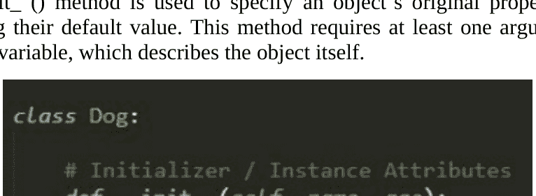
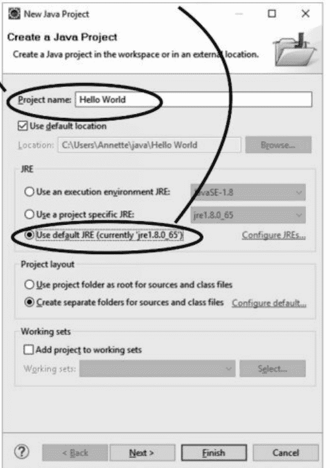
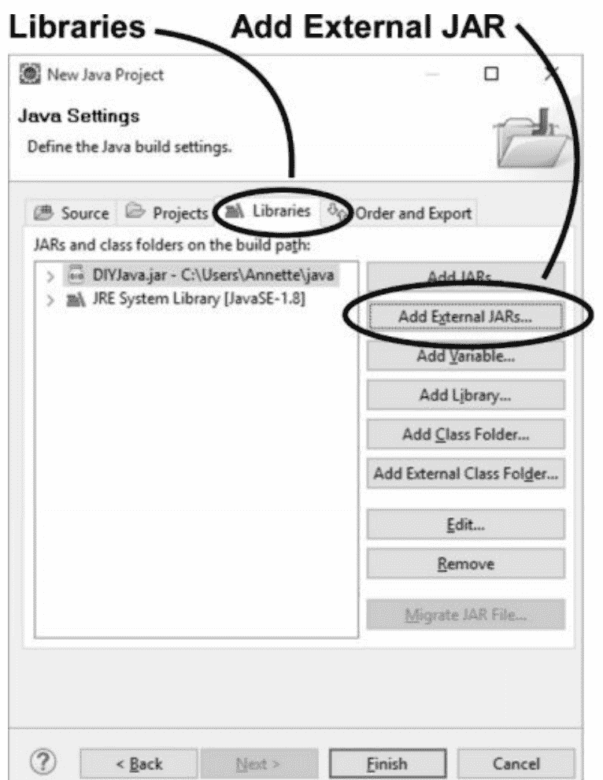
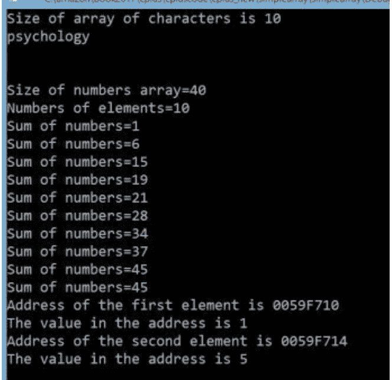
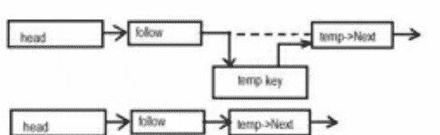
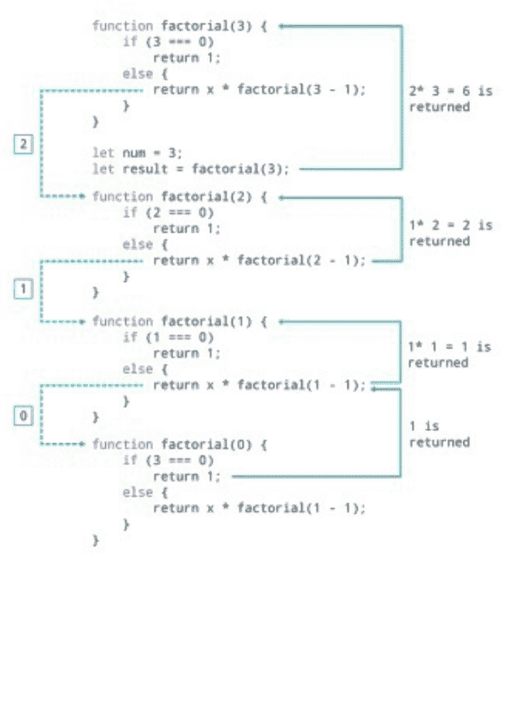

# 面向初学者的计算机编程与网络安全

4合1手册
终极指南，逐步学习如何专业编程并保护您的数据。本书涵盖：Python、Java、C++和网络安全

ALAN GRID

# JAVA编程

ALAN GRID

# PYTHON编程

ALAN GRID

# C++编程

ALAN GRID

## 网络安全

ALAN GRID

# 面向初学者的计算机编程与网络安全

4合1手册：
终极指南，逐步学习如何专业编程并保护您的数据。本书涵盖：Python、Java、C++和网络安全

ALAN GRID

# 本书包含

第一册：

# PYTHON编程

最简单的Python速成课程，深入探索Web开发、数据分析和数据科学（包括机器学习）等主要应用领域

第二册：

# JAVA编程

学习如何使用面向对象程序进行编码，以提升您的软件工程技能。熟悉虚拟机、JavaScript和机器码

第三册：

# C++编程

面向初学者的分步指南，学习多范式编程语言的基础知识，并开始管理数据，包括如何编写您的第一个程序

第四册：

## 网络安全

学习信息技术安全：如何在使用智能设备、PC或电视浏览互联网时，保护您的电子数据免受黑客攻击

# © 版权所有 2020 - 保留所有权利。

未经作者或出版商直接书面许可，不得复制、转载或传播本书所含内容。在任何情况下，出版商或作者均不对因本书所含信息直接或间接造成的任何损害、赔偿或金钱损失承担任何责任。

**法律声明：** 本书受版权保护。仅供个人使用。未经作者或出版商同意，不得修改、分发、出售、使用、引用或转述本书任何部分或内容。

**免责声明：** 请注意，本文档所含信息仅供教育和娱乐目的。已尽一切努力提供准确、最新、可靠且完整的信息。不声明或暗示任何类型的保证。读者承认作者不提供法律、金融、医疗或专业建议。本书内容源自多种来源。在尝试本书概述的任何技术之前，请咨询持证专业人士。

阅读本文档即表示读者同意，在任何情况下，作者均不对因使用本文档所含信息而造成的任何直接或间接损失负责，包括但不限于——错误、遗漏或不准确之处。

# PYTHON编程

## 目录

- [简介](#)
- [第1章：Python基础](#)
- [第2章：条件语句](#)
- [第3章：数据结构](#)
- [第4章：Python中的局部变量与全局变量](#)
- [第5章：Python中的模块](#)
- [第6章：面向对象编程与文件处理](#)
- [第7章：开发工具](#)
- [第8章：正确安装](#)
- [第9章：数据科学](#)
- [第10章：机器学习](#)
- [结语](#)

# JAVA编程

## 目录

- [简介](#)
- [第1章：Java基础](#)
- [第2章：变量](#)
- [第3章：Java基础](#)
- [第4章：Java环境](#)
- [第5章：对象与类](#)
- [第6章：正确的代码示例](#)
- [第7章：面向对象编程](#)
- [第8章：决策与循环控制](#)
- [第9章：ADT、数据结构与Java集合](#)
- [第10章：文件处理](#)
- [第11章：集合](#)
- [结语](#)

# C++编程

## 目录

- [简介](Introduction)
- [第1章：如何编写您的第一个程序](Chapter 1: How To Work On Your First Program)
- [第2章：基本设施](Chapter 2: Basic Facilities)
- [第3章：二叉树](Chapter 3: Binary Trees)
- [第4章：继承](Chapter 4: Inheritance)
- [第5章：高级基础](Chapter 5: Advanced Basics)
- [第6章：STL容器与迭代器](Chapter 6: STL Containers And Iterators)
- [第7章：STL算法](Chapter 7: STL Algorithm)
- [第8章：库函数](Chapter 8: Library Functions)
- [第9章：I/O](Chapter 9: I/O)
- [第10章：内存与资源](Chapter 10: Memory And Resources)
- [结语](Conclusion)

## 网络安全

## 目录

- [简介](Introduction)
- [第1章：常见网络攻击](Chapter 1: Common Cyberattacks)
- [第2章：网络安全](Chapter 2: Cybersecurity)
- [第3章：提升您的安全性](Chapter 3: Improving Your Security)
- [第4章：加强物理安全](Chapter 4: Enhancing Physical Security)
- [第5章：保护您的小型企业](Chapter 5: Securing Your Small Business)
- [第6章：恶意软件](Chapter 6: Malware)
- [第7章：网络攻击](Chapter 7: Cyber Attacks)
- [第8章：网络战争](Chapter 8: Cyberwar)
- [第9章：道德黑客](Chapter 9: Ethical Hacking)
- [第10章：网络安全中的常见错误](Chapter 10: Mistakes Made In Cybersecurity)
- [第11章：网络安全的经济影响](Chapter 11: Economic Impact Of Cybersecurity)
- [结语](Conclusion)

# PYTHON编程

最简单的Python速成课程，深入探索Web开发、数据分析和数据科学（包括机器学习）等主要应用领域

ALAN GRID

# 简介

技术，尤其是计算机的引入，以不同方式影响了我们的行为。有些人将大部分时间花在计算机上，创建程序和网站以谋生，而另一些人则摆弄计算机，试图了解关于机器工作原理的许多不同事情。编程是网络领域中大多数人关注的收入来源之一。他们可以在公司或计算机维修部门工作，保护计算机免受黑客或病毒等攻击。

最先进的编程工具之一是Python，因为任何人，包括初学者或专家，都可以轻松使用和阅读它。使用Python的秘诀在于你可以阅读它，因为它包含语法，允许你作为程序员表达你的概念，而不必创建一个编码页面。这就是为什么Python比其他代码（包括C++和Java）更容易使用和阅读的原因。总的来说，Python因其可用性和可读性而成为最适合你的语言。因此，我们相信，在本课程期间和之后创建你的第一个程序时，你将能够轻松阅读和理解你输入的所有代码。

# Python的特性

Python具有以下特点：

-   庞大的库：它可与其他编程项目配合使用，例如文本搜索、连接Web服务器和交换文件。
-   交互式：使用Python非常简单，因为你可以轻松测试代码以确定它们是否有效。
-   它是免费软件；因此，你总是可以从互联网上用你的计算机下载它。
-   Python编程语言可以扩展到其他模块，例如C++和C。
-   拥有优雅的语法，使初学者易于阅读和使用。

## Python 的历史

Python 编程语言由 Guido Van Rossum 于 1989 年在荷兰 CWI 研究所进行一个项目时发现，但该项目后来被终止。Guido 成功地使用了一些基础语言，即所谓的 ABC 语言，来开发 Python。根据 Van Rossum 的说法，Python 语言的优势在于，你可以保持其简单性，也可以将其扩展到更多平台，以同时支持多个平台。这种设计使得系统能够轻松地与库和各种文件格式进行通信。

自推出以来，世界上许多程序员现在都在使用 Python，事实上，其中包含了许多工具来提高操作效率。许多程序员采取了各种举措，向大家普及如何使用 Python 编程语言，以及它如何帮助缓解对复杂计算机代码的恐惧。

然而，Python 在几年前由 Van Rossum 开源，允许所有程序员访问甚至对其进行修改。这在编程领域带来了很大变化。例如，Python 2.0 发布了。Python 2.0 是面向社区的，使其在开发过程中保持透明。虽然许多人不使用 Python，但仍有一些程序员和组织使用该版本的部分功能。

Python 3 是一个独特的版本，于 2008 年发布。尽管该版本具有许多不同的功能，但它与前两个版本完全不同，并且程序不容易更新。虽然此版本不向后兼容，但它有一个小型创建器来显示上传文件时需要更改的内容。

## 为什么你应该使用 Python

世界上有许多类型的计算机编码程序，每种都有其优点和缺点。然而，Python 已被证明是多种原因下的最佳选择，例如可读性，并且可以在许多平台上使用而无需更改内容。使用 Python 具有以下优势：

- **可读性**

由于它是用英语设计的，初学者会发现它易于阅读和使用。还有一些规则可以帮助程序员理解如何格式化所有内容，这使得程序员可以创建简单的代码，其他人在使用他们的项目时可以遵循。

- **社区**

如今，世界各地有许多 Python 研讨会。初学者可以访问线上、线下或两者兼有的研讨会，以了解更多关于 Python 的信息，甚至寻求澄清。此外，线上和线下研讨会可以提高你对 Python 的理解以及你的社交技能。它最适合个人计算机，因为它可以在许多不同的平台上成功运行。事实上，所有初学者都发现编码或向专家学习很容易。

- **库**

25 年来，程序员一直使用 Python 来教初学者如何使用用它编写的不同代码。该系统对程序员非常开放，他们可以无限期地使用可用的代码。事实上，学生可以下载并安装该系统，并将其用于个人用途，例如编写你的代码和完成产品。

## Python 中的通用术语

理解 Python 中使用的标准术语对你至关重要。它使你在开始时了解一切变得容易。以下是 Python 编程语言中最常见的术语：

- **函数**：指当程序员使用调用程序时被调用的代码块。目标也是提供免费服务和精确计算。
- **类**：用于开发用户定义对象的模板。它对每个人都很友好且易于使用，包括初学者。
- **不可变**：指具有固定值并包含在代码中的对象。这些可以是数字、字符串或元组。这样的对象无法更改。
- **文档字符串**：指在函数、类定义和模块中显示的字符串。此对象始终在文档工具中可用。
- **列表**：指 Python 内置的数据类型，包含排序后的值。这些值包括字符串和数字。
- **IDLE**：代表集成开发环境，允许用户在同一窗口中输入代码，同时进行解释和编辑。最适合初学者，因为它是代码的绝佳示例。
- **交互式**：由于其交互性，Python 已成为最适合初学者的编程语言。作为初学者，你可以在 IDLE（解释器）中尝试许多事情，以查看它们的响应和效果。
- **三引号字符串**：该字符串帮助个人在字符串中使用单引号和双引号，使其易于浏览不同的代码行。
- **对象**：指处于某种状态的所有数据，如属性、方法、定义的行为或值。
- **类型**：指编程语言中的一组数据类别，以及属性、函数和方法的差异。
- **元组**：指 Python 内置的数据类型，是一个不变的值集合，尽管它包含一些可变的值。

## Python 语言的优势

使用 Python 程序比其他编程语言（如 C++ 和 Java）有许多优势。你会很高兴看到 Python 程序的可用性以及学习和使用的便捷性。理想情况下，这些是你现在可以使用的最佳编程语言，尤其是如果你是初学者。以下是使用 Python 语言的一些优势：

- **易于使用、编写和阅读**

许多程序员在使用 Java 和 C++ 等编程语言时面临一些挑战。由于它们的设计，它们很难查看。一个人必须花很多时间学习如何使用括号，并且不容易识别这些编程语言中使用的一些单词。这样的单词可能会吓到你，尤其是如果你刚开始接触编程语言。与 Java 和 C++ 语言不同，Python 不使用复杂的括号。它只使用缩进，使得阅读页面变得容易。它使用英语，使得理解字符变得容易。

除了使用缩进，Python 还使用大量空格，使得学习和阅读所需内容变得容易。它包含许多带有注释的地方，以便你在程序让你困惑时理解或获得澄清。所以，试试看，你会发现使用 Python 编程语言是多么容易。

- **它使用英语作为主要语言**

使用 Python 很容易，因为主要语言是英语。作为初学者，你将花费更少的时间来阅读和理解在 Python 中编程时使用的基本单词。因此，无论你是以英语为母语还是非母语，Python 都最适合你，因为大多数单词都很简单且易于理解。

- **Python 已经预装在一些计算机上**

一些计算机，如 macOS 系统和 Ubuntu，预装了 Python。在这种情况下，你只需要下载文本解释器就可以开始使用 Python 编程。但是，如果你使用的是 Windows 计算机，则必须在你的计算机上下载该程序。事实上，即使你一开始没有安装 Python，它也能正常工作。

- **Python 可以与其他编程语言完美配合**

第一次，你将单独使用 Python。然而，随着你继续编程，你会意识到 Python 可以与其他语言一起工作。你可以与 Python 一起使用的一些编程语言包括 C++ 和 JavaScript。尝试了解更多关于 Python 的信息以及它实际能做什么。随着时间的推移，你将能够发现许多事情。

- **Python 可以用来测试许多东西**

一旦你下载了 Python，你需要下载测试解释器。测试解释器在使 Python 能够读取信息方面发挥着重要作用。最好使用 Windows 中可用的简单产品（如记事本）或其他解释器。

## 使用 Python 编程的缺点

虽然使用 Python 有许多优点，但认识到使用它的一些负面影响也很重要。一些人更喜欢使用其他编程语言（如 C++ 和 JavaScript）而不是 Python，原因如下：

- **Python 速度较慢**

虽然 Python 可以与其他编程语言很好地配合，并且适合初学者，但不幸的是，Python 对于寻求高速程序的程序员来说并不理想，因为它比其他选项是更慢的翻译语言。速度水平取决于你翻译的内容，因为一些使用 Python 代码的基准测试比其他代码运行得更快。目前，世界各地的许多程序员正在尝试通过提高解释速度来解决这个问题。希望 Python 能够很快以与 C 和 C++ 相同甚至更快的速度运行。

- **Python 在大多数移动浏览器中不可用**

虽然 Python 对于拥有普通计算机的人来说运行良好，并且可以在许多服务器平台和桌面上访问，以帮助个人创建他们正在寻找的代码，但它尚未准备好用于移动计算。程序员正在尝试将程序过渡到移动计算，以满足当今大量使用手机的人群。

- **设计有限**

Python 程序对于寻求具有许多设计选项的程序的程序员来说不是一个更好的选择。例如，设计语言在其他一些选项中不可用；因此，你将需要更多时间来测试，并且有时在运行程序时可能会发生很多错误。

# 第一章：Python 基础

一旦你在系统上安装了软件，就该开始你的 Python 编程冒险了。我将从基础开始，例如变量、字符串和关键字。现在，你将学习并编写你的第一个 Python 程序，了解你可以处理的不同数据、如何使用变量和关键字。让我们从基础开始，立即开始你的编码之旅。

## 关键字

| async | assert | as | and |
| def | from | nonlocal | while |
| continue | for | lambda | try |
| elif | if | or | yield |
| else | import | pass | |
| global | not | with | del |
| in | raise | false | await |
| return | none | break | except |
| true | class | finally | Is |

让我们从基础的“Hello”程序开始，这是任何程序员的第一步。

```
Print (“Hello, Welcome to Python Programming!”)
```

当这段程序代码运行时，你的输出将是：

```
Hello, Welcome to Python Programming!
```

Python 程序总是以扩展名 .py 结尾。让我们将这个程序保存为 Hello.py。请始终记住使用其名称保存每个示例，以便在需要时回忆它们。当你使用编辑器或 IDE 时，文件通过解释器运行，解释器随后确定程序中使用的词语。例如，在下面的程序中，解释器将看到括号中圈出的词语，并打印括号内的内容。在编写 Python 代码的过程中，编辑器可能会突出显示程序的某些部分。例如，它识别出 print () 是一个函数名，并使用特定颜色来区分它。然而，当它遇到“Hello Welcome to Python Programming!”这个词语时，它识别出这是一个 Python 程序代码。因此，它使用不同的颜色将其与其他代码区分开来。这个独特的功能被称为语法高亮，对初学者很有用。

## 缩进和行

在 Python 中，没有像大括号那样表示函数和类的代码块。通常，一个代码块由一行缩进表示，这种缩进被强制执行。重要的是，缩进中的空格数量可以不同；但是，块中的每个语句必须具有相同数量的缩进。例如，

```
if False:
    print "False"
else:
    print "True"
```

然而，下面语句的块将生成错误

```
if False:
print "Result"
print "False"
else:
    print "Result"
    print "True"
```

因此，所有使用相同数量空格缩进的连续行将形成一个块。让我们用另一个例子来展示各种语句块。我建议你不要试图理解程序的逻辑。然而，你的目标是理解各种块，无论它们的结构如何。

```
import sys

try:
    # open file stream
    file = open(fileName, "w")
except IOError:
    print "Error when writing to," fileName
    sys.exit()

print "Enter '," fileFinish,
print "" When finished"

while fileText != fileFinish:
    fileText = real_input("Enter text you want: ")
    if fileText == fileFinish:
        # close the file
        file.close
        break
    file.write(file_text)
    file.write("\n")
    file.close()
    fileText = real_input("Enter filename: ")
    if len(fileName) == 0:
        print "Next time input something"
        sys.exit()
    try:
        file = open(fileName, "r")
    except IOError:
        print "Error reading file requested"
        sys.exit()
    fileText = file.read()
    file.close()
    print fileText
```

## 多行语句

这些语句通常以新行结束。不过，它允许你使用特殊字符（\）来继续一个语句。查看下面的代码：

```
Total_Number = number1 + \
    number2 + \
    number3
```

尽管如此，如果这些语句包含括号，如 (), {}, 或 []，则存在例外情况。例如；

```
months = ['December', 'November', 'October', 'September', 'August',
          'July', 'June', 'May', 'April', 'March', 'February',
          'January']
```

## 变量

变量是一个存储位置，它被分配了一个名称。在 Python 中，我们可以为变量赋值并回忆这些变量。我相信一个例子会让事情更清楚。记住我们的第一个程序（hello.py），让我们添加额外的两行。考虑下面的程序：

```
outcome= "Hello, Welcome to Python Programming!"

print(outcome)
```

当你运行程序时，你的输出将与之前相同，即：

```
Hello, Welcome to Python Programming!
```

唯一的区别是我们添加了一个名为“outcome”的变量。每个变量总是被分配一个值。在这种情况下，“outcome”的值是“Hello Welcome to Python Programming!”

让我们在之前的代码中添加两行。但是，请确保在添加新代码之前在第一段代码中插入一个空行。

```
outcome= "Hello, Welcome to Python Programming!"

print(outcome)
outcome = "Hello, Welcome to Learning Python!"
print(outcome)
```

添加两行后，保存文件并再次运行程序。你的输出将如下所示：

```
Hello, Welcome to Python Programming!
Hello, Welcome to Learning Python!
```

## 变量命名规则

在 Python 中命名变量时，有重要的规则需要遵守。如果你违反了任何这些规则，你将收到错误消息。因此，在编写程序时请务必记住它们。

- 变量名只能包含数字、下划线和字母。你可以以下划线或字母开头命名变量；但是，它不能以数字开头。例如，你的变量名可以是 outcome_1，但使用 1_outcome 是完全错误的。
- 变量名之间不能包含空格。不过，你可以使用下划线来分隔两个单词。例如，outcome_program 可以工作；但是，outcome program 会导致程序错误。
- 避免使用函数名和关键字作为变量名。
- 变量名在使用时必须简短且具有描述性。例如，score 比使用 s 更可取，serial_name 比 sn 更好。

## 避免变量名错误

作为初学者，你会犯错误。专业人士也不例外，但他们知道如何有效地处理这些错误。让我们看看你在开始 Python 编程课程时可能犯的一个更常见的错误。我将故意通过拼错“outcome”这个词来编写一个错误代码。

```
outcome = “Hello, Welcome to Learning Python!”
#program will generate an error
print(outcom)
```

当发生此类错误时，Python 解释器会找出解决问题的最佳方法。一旦程序无法成功运行，它会提供回溯信息。不是很多编程语言都有这个功能来追溯错误。让我们看看解释器将如何响应我们上面的程序

```
Trackback (most recent call last):
    1. File “hello.py,” line 3, in <module>
    2. Print(outcom)
    3. NameError: name ‘outcome’ is not defined
```

第 1 行报告了文件名“hello.py”第 3 行存在错误，但是，解释器很快识别出错误并告诉我们第 3 行具体是什么类型的错误。在这种情况下，它将表示一个名称错误。此外，它会报告我们的变量没有被正确定义。每当你看到名称错误时，就意味着有拼写错误，或者我们没有为变量设置值。然而，在这个例子中，是拼写错误，我们没有在变量名中包含字母“e”。

```
outcom= “Hello, Welcome to Python Programming!”
print(outcome)
outcom = "Hello, Welcome to Learning Python!"
print(outcome)
```

程序输出将是：

```
Hello, Welcome to Python Programming!
Hello, Welcome to Learning Python!
```

你必须明白，编程语言是严格的；但是，它们不区分拼写的好坏。因此，在创建变量名时，你不需要考虑语法和拼写规则。

## 练习尝试

编写一个旨在执行以下操作的程序。确保保存文件并遵循变量命名规则。

- 编写一个程序，将一条消息分配给你选择的变量名，并打印该消息。
- 在第二个程序中，更改值并使用新消息。然后打印该消息。
- 从下面的列表中勾选错误的变量名
    - 1_school
    - Fred Love
    - Fred_love
    - _exercises
    - Firsttwoletters

## Python 中的数据类型

编写代码时，我们需要将数据存储到内存中。这些数据不能存储在相同的内存中，因为数字将不同于

## 字符串

字符串是一系列字符，被引号包围。在 Python 中，任何被引号包围的内容都被视为一个独立的字符序列。在 Python 中，单引号和双引号都可以用来构成字符串。

```
'Hello World'
"Hello World"
```

如果我们运行这两条语句，它们将产生相同的输出。

## 在字符串中使用引号

在 Python 编程中使用字符串时，开始的引号必须与结束的引号匹配。当你用双引号开始一个字符串时，Python 会将下一个双引号视为字符串的结束。单引号也是如此。

如果你决定在字符串内部使用双引号，你必须将它们放在单引号内。下面的例子会更好地说明这一点。

```
statement = 'Fred is "a boy that lives in New York"'
```

假设你想在一个字符串中同时使用单引号和双引号。在这种情况下，你必须使用反斜杠（\）来转义单引号和双引号。下面的例子将进行演示。

```
statement_in_single = 'Fred "own\'s a wonderful car in his garage"'
statement_in_double = "Fred 'own's a wonderful car in his garage"
```

## 使用方法更改字符串大小写

使用字符串时，你可以执行的一个简单任务是更改特定单词的大小写。你认为下面代码的输出会是什么？

```
full_name = "johnson boris"
print(full_name.title())
```

编写代码后，在运行之前将文件保存为 name.py。输出将如下所示：

```
Johnson Boris
```

如果你观察一下，变量 full_name 指向的是全小写的字符串 "johnson boris"。变量名后面跟着方法 title()。在 Python 中，方法是对数据执行特定操作的动作。此外，变量名后面的点（.）告诉解释器允许 title() 方法与我们的变量名交互。方法后面总是跟着括号，因为它们需要额外的信息来执行其功能。title() 方法的功能是将每个单词的首字母改为大写。此外，Python 允许我们将字符串全部改为小写或大写。

```
full_name = "Johnson Boris"
print(full_name.lower())
print(full_name.upper())
```

输出将如下所示：

```
johnson boris
JOHNSON BORIS
```

## 在字符串中使用变量

在某些情况下，你可能决定使用一个变量，该变量包含一个字符串值。例如，你可能想使用两个变量分别保存一个人的名字和姓氏。此外，这两个变量必须组合起来才能产生这个人的全名。让我们看看在 Python 中如何实现这一点。

```
first_name = "johnson"
last_name = "boris"
full_name = f"{first_name} {last_name}"
print(full_name)
```

如果你想将变量值插入字符串，你必须在开头的引号前直接添加字母 "f"。

考虑下面的代码：

```
state = 'United Nation!' #将变量 "state" 赋值为字符串 'New York'
print(state) # 打印完整字符串
print(state[0]) # 打印字符串的第一个字符
print(state[0:4]) # 打印从第1个到第4个字符
print(state[3:]) # 打印从第4个字符开始的字符串
print(state * 3) # 打印字符串三次
print(state + " United State") # 打印连接后的字符串
```

输出将是：

| |
|---|
| United Nation! |
| U |
| United |
| Nations! |
| United Nation! United Nation! |
| United Nation! United State |

# 第二章：条件语句

现在，是时候讨论条件语句了，它们也可以被称为决策控制语句。这些语句将允许计算机根据用户的输入以及你希望程序如何运行来做出一些决策。在你的程序中，你会有很多次希望计算机在你不在时做出一些决策并自行完成。如果你正在编写一个代码，希望用户输入他们的答案，而不是给他们两个选项来选择，那么这些决策控制语句将是一个很好的选择。

在编写这些条件语句时，你可以使用几种不同的选项。最常见的三种包括 if 语句、if-else 语句和 elif 语句。作为初学者，我们将从 if 语句的基础开始，以很好地理解它们如何工作，然后我们将逐步理解使用这些条件语句可以完成的一些更复杂的事情。

我们要看的第一个选项是 if 语句。if 语句将基于这样的理念工作：用户给计算机的答案要么是真，要么是假。如果用户输入的信息根据你的代码被视为真，那么解释器可以继续执行程序，并显示你希望的语句或信息。但是，如果用户在程序中输入的内容与你的代码不匹配，并且被视为假，那么程序将自动结束。

好消息是，我们稍后可以探讨一些步骤，以确保无论用户给出什么答案，程序都能做出响应，但这并不是 if 语句的重点。我们现在需要看看这个简化形式，然后在此基础上构建。为了帮助我们理解当用户与 if 语句交互时它应该是什么样子，你需要使用以下代码：

```
age = int(input("Enter your age:"))

if (age <= 18):
    print("You are not eligible for voting, try next election!")
    print("Program ends")
```

一旦你将这个条件语句添加到你的编译器中，我们需要探讨上面的代码会发生什么。如果用户确实进入了程序的这一部分，并且他们说自己未满 18 岁，那么屏幕上会出现一条消息。在这种情况下，我们写的消息是：“You are not eligible for voting, try next election!” 然后程序，因为我们这里目前没有其他代码部分，将会结束。但是，这就引出了一个问题：如果用户说自己超过 18 岁，这个特定的代码会发生什么？

当计算机程序员使用 if 语句时，如果用户输入的年龄超过 18 岁，那么什么都不会发生。if 语句是你只希望用户选择你的代码中指定为真的那个答案时使用的选项。在这种情况下，用户必须说自己未满 18 岁，否则程序将结束。

可以想象，这会给我们带来一些问题。你很可能希望允许用户输入任何适合他们的年龄。一些使用这个程序的用户可能会超过 18 岁，你不希望程序因为他们的年龄超过这个范围而没有任何输出就结束。这会在你希望之前结束程序，而且当代码结束时，你正在编写的程序看起来也不那么专业。这就是为什么你不会经常看到 if 语句的一个重要原因。

但这就是我们将引入 if-else 语句并使用它们来解决这个问题的地方。这些语句采用了我们正在讨论的理念，我们提出的问题，并帮助我们处理它们。假设你正在使用我们之前的代码，并且你想确保你的程序能够给出一个结果，无论用户决定输入什么答案。你可以编写一个 if-else 语句，这样就能为18岁以下的用户提供一个答案，而为18岁及以上的用户提供另一个答案。这段代码扩展了我们之前讨论过的选项，但这里有一个你可以使用的示例。

```
age = int(input("Enter your age:"))

if (age <= 18):
    print("You are not eligible for voting, try next election!")
else:
    print("Congratulations! You are eligible to vote. Check out your local polling station to find out more information!")

print("Program ends")
```

这段代码将对你的努力以及你希望代码实现的功能更加有用，并且它比之前提供了更多的选项。最重要的是，你的代码不会因为用户输入了年龄就结束。它会根据用户输入的年龄在屏幕上提供相应的陈述。

如果你愿意，这段代码也可以扩展以包含更多可能性。上面的例子只有两个选项：18岁以下和18岁及以上。但如果适合你的程序，你可以有更多选项。例如，如果你愿意，可以更细致地划分年龄范围。也许你想知道谁在18岁以下，谁在20多岁，谁在30多岁，以及谁超过40岁。你可以使用同样的想法，添加更多行，利用 if-else 语句来满足你程序的需求。

另一个你可能想在 if-else 语句中使用的例子是，当你让程序挑选他们最喜欢的颜色时。你可能不想编写足够的代码来处理世界上存在的每一种颜色，但你会留出空间，让用户输入与他们最喜欢的颜色相对应的信息。

对于这段代码，你可以选择在代码中写出六种颜色的列表（你可以根据需要选择更多或更少），然后为这六种颜色设置相应的消息。你可以选择黄色、橙色、绿色、蓝色、紫色和红色。然后，你可以添加一个 else 语句，以便用户可以选择不同的颜色。如果用户决定选择白色作为他们最喜欢的颜色，那么第七个，也就是最后一条消息就会出现。这条最后的消息对于任何不属于原始六种颜色的颜色都是相同的。

在代码末尾添加这个 else 语句，或者说“兜底”语句，是你需要考虑的重要事项。你不可能列出用户可能选择的所有不同颜色。你可能会花时间输入一百种不同的颜色（但这需要大量的时间和代码，你不会想这样做），但用户可能会选择你忘记的那一种颜色。如果你不在末尾添加这个 else 语句，那么程序将不知道在这种情况下该如何表现。

else 语句很好，因为它可以用来捕获用户的多个结果，并且可以捕获所有你未考虑到但用户可能选择的答案。如果你不在代码中添加这个语句，那么当用户输入那个答案时，你的程序将不知道如何表现。

## Elif 语句

条件语句的另外两个选项对于你想要编写的许多代码都很重要。if 语句是初学者学习这些语句的好起点，它们将帮助你大致了解条件语句应该如何工作。这些 if 语句将基于答案要么为真要么为假的概念。

在这种情况下，如果根据你添加到代码中的条件，从用户收到的答案被视为真，那么程序将识别这一点并继续执行。但如果条件被视为假，那么程序将没有任何设置，它将结束。这是一个简单的概念，是学习更多关于条件语句的好方法，但对于你想用 Python 编写的许多代码来说，它不会给你想要的结果。

然后我们看了 if-else 语句。这些语句将这个概念更进一步，它理解原始 if 语句附带的想法可能过于简单。这些 if-else 语句可以帮助我们处理用户将给系统的任何答案，并确保程序不会只是停止。我们甚至看了一个示例代码，展示了这类语句是如何工作的。

从这里开始，我们需要花一些时间研究 elif 语句。这将与前两种语句的处理方式有些不同，但它仍然很有用，并且可以为你的代码增添一些趣味和不同的元素。elif 语句将给用户一个机会，从你呈现给他们的几个选项中进行选择。然后，用户选择的答案将为他们提供你添加到代码中的预定陈述。

你可以在不同的地方看到这些条件语句。elif 语句是 Python 语言特有的代码，它通常用于许多游戏，或者用于你希望为用户提供菜单式选择的不同程序。如果计算机程序员希望为用户提供一些选项而不仅仅是一两个，那么这些语句将最常被使用。

# 第三章：数据结构

Python 基于三种引用结构：元组、列表和字典。这些结构实际上是可能包含其他对象的对象。它们具有相当不同的用途，并允许你存储各种类型的信息。

这些结构有许多共同特点：

- 要从结构中提取一个或多个对象，我们总是使用 []
- 对于数字索引结构（元组和列表），结构索引从0开始（第一个位置是位置0）

### 元组

这是一种将多个对象按索引顺序分组的结构。其形式一旦创建就不可修改（不可变），并使用圆括号定义。它只有一维。任何类型的对象都可以存储在元组中。例如，如果你想创建一个包含不同对象的元组，我们使用：

```
tup1 = (1, True, 7.5, 9)
```

你也可以使用 tuple() 函数来创建元组。访问元组的值是通过结构的经典索引完成的。因此，如果我们想访问元组的第三个元素，我们使用：

```
In []: tup1[2]
Out []: 7.5
```

元组可能很有趣，因为它们占用的内存很少。另一方面，它们被用作返回多个值的函数的输出。作为结构的元组是对象。它们有简洁的方法。对于元组来说，这些方法很少：

```
In []: tup1.count(9)
Out []: 1
```

我们通常更喜欢更灵活的列表。

## 列表

列表是 Python 中的参考结构。它是可修改的，可以包含任何对象。

#### 创建列表

我们使用方括号创建列表：

```
list1 = [3, 5, 6, True]
```

你也可以使用 list() 函数。列表的结构是可编辑的。它有许多方法：

- .append()：在列表末尾添加值
- .insert(i, val)：将值插入到索引 i 处
- .pop(i)：检索索引 i 处的值
- .reverse()：反转列表
- .extend()：用一个值列表扩展列表

注意——所有这些方法都会修改列表，用经典代码表示等价于：

```
liste1.extend(list2)
等价于
list1 = list1 + list2
```

列表还有其他方法，包括：

- .index(val)：返回值 val 的索引
- .count(val)：返回 val 出现的次数

## 从列表中提取元素

如上所示，可以使用方括号提取元素：

```
list1[0]
```

我们通常对提取多个元素感兴趣。这可以通过使用冒号来完成：

```
list1[0:2] 或 list1[:2]
```

在此示例中，我们看到该系统提取了两个元素：索引为0的元素和索引为1的元素。因此，我们有一个规则：`i: j` 从包含元素 `i` 到不包含元素 `j`。以下是一些其他示例：

```
### 提取最后一个元素
list1[-1]
```

提取最后3个元素：

```
list1[-3:-1] 或 list1[-3:]
```

## 一个具体示例

假设我们想创建一个国家列表。这些国家在列表中按人口排序。我们将尝试提取前三个和后三个。

```
In []: country_list = ["China", "India", "United States", "France", "Spain", "Switzerland"]
In []: print(country_list[:3])
['China', 'India', 'United States']
In []: print(country_list[-3:])
['France', 'Spain', 'Switzerland']
In []: country_list.reverse()
```

```
print(country_list)
['Switzerland', 'Spain', 'France', 'United States', 'India', 'China']
```

## 列表推导式

这些是迭代构建的列表。它们通常非常有用，因为它们比使用循环构建列表更高效。这里有一个简单的例子：

```
In []: list_init = [4, 6, 7, 8]
       list_comp = [val ** 2 for val in list_init if val % 2 == 0]
```

列表 `list_comp` 允许你存储 `list_init` 中偶数元素的平方。

我们将得到：

```
In []: print(list_comp)
[16, 36, 64]
```

列表推导式的概念非常有效。它避免了无用的代码（对列表的循环），并且比迭代创建列表性能更好。它也存在于字典中，但不存在于不可变的元组中。我们将在操作数据表的框架中使用列表推导式。

## 字符串——字符列表

Python中的字符串默认（自Python 3起）以Unicode编码。你可以通过三种方式声明一个字符串：

```
string1 = "Python for the data scientist"
string2 = 'Python for the data scientist'
string3 = """ "Python for the data scientist" """
```

最后一种允许多行字符串。我们最常使用第一种。字符串实际上是一个字符列表，我们可以像处理列表元素一样处理字符串的元素：

```
In []: print(string1[:6])
       print(string1[-14:])
       print(string1[3:20])
```

## 面向数据科学家的Python

数据字符串可以轻松转换为列表：

```
In []: # 我们使用空格分隔元素
       list1 = string1.split()
       print(list1)
       ['Python', 'for', 'the', 'Data', 'Scientist']
In []: # 我们用空格连接元素
       string1bis = "".join(list1)
       print(string1bis)
```

## 字典

字典构成了Python中需要掌握的第三个核心结构。它们允许键值存储。到目前为止，我们使用的是基于数字索引的项目。因此，在列表中，你使用其位置 `list1[0]` 访问元素。在字典中，我们将使用创建字典时定义的键来访问元素。我们用花括号定义字典：

```
dict1 = {"cle1": value1, "cle2": value2, "cle3": value3}
```

这种结构不要求值具有任何类型同质性。因此，我们可以有一个像 `value1` 这样的列表，一个像 `value2` 这样的布尔值，以及一个像 `value3` 这样的整数。

要访问字典的元素，我们使用：

```
In []: dict1["cle2"]
Out []: value2
```

要显示字典的所有键，我们使用：

```
In []: dict1.keys()
Out []: ("cle1", "cle2", "cle3")
```

要显示字典的所有值，我们使用：

```
In []: dict1.items()
Out []: (value1, value2, value3)
```

可以轻松修改或向字典添加键：

```
In []: dict1["key4"] = value4
```

你也可以删除字典中的一个键（及其关联的值）：

```
In []: del dict1["cle4"]
```

一旦你对Python更有经验，你会更多地使用字典。起初，我们倾向于使用列表，因为它们通常更直观（使用数字索引）。然而，更专业的Python开发者会很快意识到字典的实用性。特别是，我们将能够以非常简单的方式存储数据以及模型的参数。此外，Python的for循环的灵活性非常适合字典，并且在构建良好时使它们非常有效。

## 编程

### 条件语句

Python中的条件语句非常容易实现；它是一个关键字。如前所述，Python语言基于代码的缩进。我们将使用四个空格作为此缩进的偏移量。幸运的是，像Spyder或Jupyter notebooks这样的工具会自动生成此缩进。

这是我们的第一个条件语句，意思是“如果a为真，则显示‘it is true’”：

```
if a is True:
    print("it's true")
```

条件语句没有退出；是缩进来管理它。通常，我们也对这个条件的补集感兴趣；我们将为此使用 `else`：

```
if a is True:
    print("it's true")
else:
    print("it's not true")
```

如果我们的变量 `a` 不一定是布尔值，我们可以有另一种情况，我们使用 `elif`：

```
if a is True:
    print("it's true")
elif a is False:
    print("it's wrong")
else:
    print("it's not a boolean")
```

### 循环

循环是大多数编程语言的核心元素。Python也不例外。然而，对于像Python这样的解释型语言，你必须非常小心。实际上，Python中循环的处理很慢，我们将在迭代次数较少的循环中使用它。我们避免创建在数据数组的行上重复数千次的循环。然而，我们可以在数据表的列上使用循环，列数为几十列。

### for循环

Python循环有一种稍微特定的格式；它是对结构元素的循环。我们将写：

```
for elem in [1, 2]:
    print(elem)
```

这段代码将允许你显示1和2。因此，循环的迭代器（在我们的例子中是 `elem`）取第二个位置（在 `in` 之后）的结构元素的值。这些元素可能在不同的结构中，但通常首选列表。

### range、zip和enumerate函数

这三个函数是非常有用的函数，它们允许创建特定对象，这些对象可能在你的代码中用于循环。`range()` 函数用于生成一个数字序列，从给定的数字或默认的0开始，到不包含的数字结束：

```
In []: print(list(range(5)))
[0, 1, 2, 3, 4]
In []: print(list(range(2, 5)))
[2, 3, 4]
In []: print(list(range(2, 15, 2)))
[2, 4, 6, 8, 10, 12, 14]
```

我们在这里看到，创建的range对象可以很容易地用 `list()` 转换为列表。

在循环中，这给出：

```
for i in range(11):
    print(i)
```

`zip` 和 `enumerate` 函数也是循环中有用的函数，它们使用列表。

`enumerate()` 函数返回列表的索引和元素。如果我们使用之前使用的国家列表：

```
In []: for i, a in enumerate(country_list):
           print(i, a)
```

```
0 Switzerland
1 Spain
2 France
3 United States
4 India
5 China
```

`zip` 函数将允许链接多个列表并同时迭代这些列表的元素。

例如，如果我们想同时增加天数和天气，我们可以使用：

```
In []: for day, weather in zip(["Monday", "Tuesday"], ["beautiful", "bad"]):
           print("%s, it will make %s" % (day.capitalize(), weather))
```

```
Monday, it will be beautiful
Tuesday, it will be bad
```

在此代码中，我们使用 `zip()` 在每次迭代中取一对值。第二部分是字符串操作。如果其中一个列表比另一个长，循环将在到达其中一个列表的末尾时停止。

我们可以在一个代码中链接 `enumerate` 和 `zip`，例如：

```
In []: for i, (day, weather) in enumerate(zip(["Monday", "Tuesday"],
           ["good", "bad"])):
           print("%i: %s, it will make %s" % (i, day.capitalize(), weather))
```

```
0: Monday, it will be good
1: Tuesday, it will be bad
```

我们在这里看到 `i` 是元素的位置。

注意——在字符串中替换。

## While 循环

Python 也允许你使用 while 循环，这种循环使用较少，但看起来与我们在其他语言中遇到的 while 循环非常相似。要退出此循环，我们可以使用带有条件的 break 语句。注意，我们必须在循环中递增索引，否则可能会陷入无限循环。

我们可以这样写：

```python
i = 1

while i < 100:
    i += 1
    if i > val_stop:
        break
    print(i)
```

这段代码在每次循环中将 i 加一，并在 i 达到 val_stop（即 100）时停止。

注意——Python 中的递增可以有多种形式：`i = i + 1` 或 `i += 1`。

这两种方式在性能上是等价的；选择最适合你的那种即可。

# 第四章：处理 Python 中的局部变量与全局变量

现在我们需要了解在 Python 中处理变量时可以使用的几种不同类型。我们将在这门语言中处理的两种主要变量类型包括局部变量和全局变量。

在讨论这些变量时，会出现一些重大差异。首先是全局变量。这主要意味着我们关注的是程序其余部分或任何部分都能够声明的变量。无论程序的那部分位于何处，只要需要，它都能使用和依赖该全局变量。

有时这是件好事，它允许你的模块声明它们想要的变量，即使它们彼此不相邻。但有时，这会导致一些问题。如果代码的错误部分试图声明一些它不应该声明的变量，可能会导致代码行为不符合预期，并且一些变量可能会在错误的时间被声明。这从来都不是好事，如果你想避免这个问题，就需要承担一些风险。

这个问题的解决方案将是局部变量。这些变量无法在整个代码中访问。它们只会在你预先确定的特定方法或函数中被声明。这将确保变量只以你希望的方式使用，而不会在其他地方使用。

### 局部变量

我们将花时间研究的第一个选项是局部变量。这将类似于我们在其他语言中看到的局部变量，它是在变量应局部化的代码块开头声明的变量。

它也可以在我们使用语句、switch 语句等时出现，具体取决于你的需求。

局部变量将有一个声明，可以显式定义已声明变量的类型，以及一些同时命名该变量的标识符。我们将局部变量识别为一种变量，其作用域和范围在声明它的方法或语句块内。

我们可以将这些局部变量更多地用作 foreach 语句中的迭代变量、特定 catch 子句中的异常变量，以及使用 using 语句时的资源变量。它也可以用作一种常量，其值在声明它的方法或语句块内无法修改。

隐式类型的局部变量，其类型将由计算机从其右侧的表达式推断出来，当你想处理语言集成查询时会很有用。这些查询将为我们返回一些匿名类型，为每个结果集创建自定义类型。

你会发现这种变量的内存分配通常基于你正在处理的变量类型。如果你处理的是整数或结构体之类的东西，那么全部内容将存储在栈中。但如果你使用的是引用类型变量，它将被放置在栈的引用部分，而内容将位于与之关联的堆中。

局部变量需要在代码中任何位于其声明语句之前的位置都不被引用。此外，我们必须记住，当我们在一个代码块中时，不可能有两个同名的变量。这样做会导致错误出现，并基本上混淆你正在处理的代码。但是，可以声明多个相同类型的局部变量，并且可以在单个语句中初始化它们。

在类的方法中，如果你发现其中一个局部变量的命名方式与其字段相似，你会发现局部变量将隐藏该字段，同时仍能在方法内访问它。通常，使用局部变量比使用字段更高效。

### 查看全局变量

我们需要在这里研究的另一件事是全局变量是什么。这是一种我们将在任何函数之外声明的变量类型，这意味着你编写的程序中的所有函数都可以轻松访问它。一组这样的变量被称为全局环境或全局状态，因为当它们组合在一起时，它们将定义程序运行时程序或环境的各个方面。

全局变量是在所有其他函数之上声明的变量，通常最好将其保持在最低限度。这是因为所有函数都能够在程序运行时操作这些变量。对于你想用这种语言处理的大多数程序来说，这可能是危险的，因为它们有可能被意外更改，从而导致系统出现错误。

顾名思义，全局变量是我们可以在全局范围内或整个程序中访问的变量。一旦我们完成声明过程，它们将在程序运行期间一直保留在内存中。这意味着我们可以在程序运行时的任何时间，通过任何我们想要的函数来更改它们，这肯定会对整个程序造成一些问题。

在计算机可以使用的早期，内存有限，这些全局变量被视为不良做法，因为它们会占用大量有价值的信息和内存，程序员更容易失去对他们所处理的值的跟踪，尤其是在较长的程序中。基本上，它给程序带来了很多难以定位和修复的错误。

当元素的作用域有限时，源代码总是更容易使用和理解。当我们使用全局变量时，这很难做到，因为它们不是局部的，很难弄清楚这些变量在哪里被更改，甚至最初更改的原因。

即使有这种污名，当我们处理不具有称为调用者和被调用者关系的函数时，这些全局变量仍然非常有价值。这意味着该函数不会有信号处理程序或任何类型的并发线程。除了那些在受保护内存中声明为只读值的全局变量外，代码需要确保能够部署适当的封装，以便在过程中被视为线程安全。

正如我们在这里看到的，使用这种变量有一些好处，甚至也有一些缺点。仍然有一些使用它的情况，这就是为什么我们花了一些时间来研究它们并弄清楚它们为什么重要，但在大多数情况下，局部变量更好，并且会在你编写的代码中保持更多的控制。

### 综合运用

一开始这可能看起来有点混乱，但好消息是，当需要处理这两种变量时，我们可以做很多事情。为了帮助我们更好地理解全局变量和局部变量在下面程序中的区别：

- 1. 变量“f”将是一个具有全局作用域的变量，它将被赋值为 101，并在输出中打印。
- 2. 变量 f 也将在一个函数中被声明，并假设为局部作用域。它将被赋值，在这种情况下，它将被赋值为“I am learning Python.”，然后将作为输出打印出来。这个变量与我们在上一步中尝试定义的全局变量 f 不同。
- 3. 一旦我们能够调用该函数，局部变量 f 将被销毁。在第 12 行，当我们再次打印 f 的值时，它将向我们显示全局变量 f = 101。

然后我们可以使用 `global` 关键字，这将确保我们能够在函数内部引用全局变量。以下是我们将能够遵循的一些要点：

1.  变量“f”将具有全局作用域，并被赋予值 101，该值将作为输出打印。
2.  当我们使用 `global` 关键字时，将声明同一个变量。这不是这里的局部变量，而是我们之前能够声明的同一个全局变量。这意味着当我们打印该值时，得到的输出将是 101。
3.  然后我们在函数内部更改了“f”的值。一旦函数调用完成，变量“f”的更改值将持续存在。在第 12 行，当我们再次打印“f”的值时，我们将得到的值是“changing a global variable”。

很多时候，你将能够使用全局变量和局部变量的概念。了解它们各自如何工作，以及在需要时哪个是最重要的部分。

# 第五章：Python 中的模块

### 什么是模块？

在 Python 中，模块是程序的一部分（一个扩展文件），可以通过其他程序调用，而无需在每个使用的程序中编写它们。此外，它们可以定义类和变量。这些模块包含相互关联的语句，并且可以随时使用。模块的使用基于使用一个已经存储在其中的代码（程序主体、函数、变量），称为 `import`。通过使用模块，可以观察到 Python 允许大大简化程序，因为它允许我们将问题分解成更小的部分，使代码更短，这样程序员在编写代码时就不会在数百行代码中迷失方向。

### 如何创建模块？

在 Python 中创建模块不需要很多东西；它非常简单。

例如：如果你想创建一个打印城市的模块，我们在编辑器中编写代码并将其保存为“mycity.py”。

完成后，我们将知道这将是我们的模块名称（省略 .py 后缀），它将被分配给全局变量 `__city__`。

但是，除此之外，我们可以看到文件“mycity.py”非常简单，一点也不复杂，因为里面只有一个名为“print_city”的函数，它将一个字符串作为参数，它的作用是打印“Hello, welcome to,”，然后与作为参数输入的字符串连接。

### 定位模块

导入模块时，解释器会自动搜索当前地址的同一模块，如果不可用，Python（或其解释器）将在 `PYTHONPATH` 环境变量中执行搜索，该变量不过是一个包含目录名称的列表，语法与环境变量相同。

如果在任何特定情况下，这些先前的操作失败，Python 将查找默认的 UNIX 路径（在 Windows 上位于 /user/local/lib/python）。

模块在变量 `sys.path` 给出的目录列表中搜索。

此变量包含当前目录、`PYTHONPATH` 目录以及安装中默认附带的所有目录。

### Import 语句

此语句用于导入模块。通过任何 Python 代码文件，其过程如下：Python 解释器在文件系统中搜索执行它的当前目录。然后，解释器在其配置中搜索其预定义路径。

当遇到第一个匹配项（模块名称）时，解释器会自动从头到尾执行它。第一次导入模块时，Python 将生成一个编译后的 .pyc 扩展文件。此扩展文件将用于该模块的后续导入。当解释器检测到模块自上次生成以来已被修改时，它将生成一个新模块。

你必须将导入的文件保存在 Python 使用 `import` 语句的同一目录中，以便 Python 能够找到它。

正如我们在示例中看到的，导入模块允许我们通过外部文件改进程序的功能。

现在，让我们看一些例子。第一个是一个计算器，我们将创建一个执行所有数学函数的模块和另一个运行计算器本身的程序。

我们做的第一件事是模块“calculator.py”，它负责执行所有必要的操作。其中包括加法、减法、除法和乘法，如你所见。

我们包含了条件语句的使用，如 `if`、`else` 和 `elif`。我们还包含了异常的使用，这样程序就不会在用户每次为除法输入错误值时卡住。

之后，我们将创建一个程序，该程序必须导入前面提到的模块，以便它能够执行所有相关的数学函数。

但此时，你可能认为唯一存在的模块是程序员创建的。答案是否定的，因为 Python 有集成的模块。

通过它们，我们将制作另外两个程序：第一个是我们刚刚完成的程序的改进版，第二个将是一个警报器，它将定期在屏幕上打印一个字符串。

示例：

创建一个名为 dummymodule.py 的 python 模块，并在其中写入以下内容

```
def testF():
    print("this is a module, goodbuy")
```

将模块保存在 python 安装目录中。

在 shell 中

```
import dummymodule
```

现在调用函数

```
dummymodule.testF()
```

你已经使用了你的第一个模块。

### 模块示例一

首先做的是创建模块，但乍一看，我们有一个惊喜，那就是导入了 `math`。

这对我们意味着什么？

嗯，这意味着我们正在获取 Python 中默认附带的 `math` 模块的属性。

我们看到创建了 `calculator` 函数，它有几个选项。

如果 `op` 值等于 1，则执行加法运算。

如果等于 2，则执行减法运算，依此类推。

但 `op` 等于 5 是新的，因为如果这是肯定的，那么它将通过使用 `math.sqrt(num1)` 返回 `num1` 和 `num2` 的平方根值，该函数返回平方根的结果。

然后，如果 `op` 等于 6，使用函数 `math.radians()`，这意味着 `num1` 或 `num2` 将转换为弧度，因为这是函数 `math.sin()` 接受的值类型，这意味着将返回 `num1` 和 `num2` 的正弦值，这些值将是用户任意输入的数字，它们将被转换为弧度，然后是相应的正弦值。

最后一件事是创建主程序，如下所示：

这里，我们可以看到一个简单的程序，因为它只导入了模块“calculator.py”，然后通过使用 `input` 为变量 `num1` 和 `num2` 赋值。

最后，选择要执行的操作，并调用计算器模块的 `calculator` 函数，我们将向其传递三个参数。

### 模块示例二

我们将创建一个模块，其中包含一个充当计时器的函数，以便在时间结束时返回 true。

在这个模块中，如你所见，导入了另一个模块，称为“time”，顾名思义，它包含用于处理时间的函数，并且具有广泛的函数范围，从返回日期和时间到帮助创建计时器等。

我们做的第一件事是创建 `cron()` 函数，它开始声明 `startAlarm` 变量将等于 `time.time`，这意味着我们正在为这个函数赋予一个初始值，以了解函数被初始化的确切时刻，然后进入无限循环。

由于限制条件始终为真，因此，这个循环将永远不会结束，除非其中包含 break 命令。

然后，在 while 循环中，有几条指令。

第一条是最终变量等于 `time.time()`，以考虑我们所处的具体时刻，从而监控时间。

之后，创建另一个名为 `times` 的变量，该变量的值为 `final` 减去 `start Alarm`。

但你可能会想知道 `round` 函数的作用。它对值进行四舍五入；我们这样做是为了更轻松地工作。但这还不够；因此，我们使用一个 `if` 语句，因为，如果结束和开始之间的差值大于或等于 60，则表示一分钟已完成，那么会发生什么？

为什么是 60？

这是因为 `time` 模块以秒为单位工作，要经过一分钟，必须经过 60 秒；因此，结束和开始之间的差值必须大于或等于 60，在肯定的情况下，将返回 `True`，最后，我们将退出无限循环。

一旦 `alarm` 模块完成，我们继续制作程序，如下所示：

我们可以看到程序导入了两个模块，我们创建的 `alarm` 模块和 `time` 模块。

我们做的第一件事是创建变量 `s` 作为输入，它告诉用户是否要开始。

如果答案是肯定的，那么代表时间的变量 `h` 将等于 `"time.strftime ("%H:%M:%S")"`，这意味着我们正在使用 `time` 模块的一个函数，该函数以指定格式返回小时，以便之后可以使用 `print` 函数打印。

下一个操作是使用 `alarm` 模块，使用命令 `alarm.cron()`，这意味着正在调用 `cron()` 函数。

当此函数完成时，时间将再次分配给变量 `h`，以完成打印并能够观察其正确运行。

作为本章的结论，我们可以说模块对于程序员的正常运行至关重要，因为它们允许使代码更具可读性，此外，它允许细分问题，逐一解决，从而轻松完成任务。

# 第 6 章：面向对象编程和文件处理

面向对象编程是一个广泛的概念，用于创建强大的应用程序。数据科学家需要构建应用程序来处理数据等。本章将探讨 Python 中面向对象编程的基础知识。

面向对象编程缩写为 OOP，与其他设计模式相比具有几个优势。开发过程更快、更便宜，并具有良好的软件可维护性。这反过来又导致更好的软件，该软件也充满了新的属性和方法。然而，学习曲线很复杂。对于新手来说，这个想法可能很复杂。在计算方面，OOP 较慢并消耗大量内存，因为编写了更多的代码行。

面向对象编程依赖于重要的编程概念，该概念使用语句来改变程序的状态。它集中于说明程序应如何运行。命令式编程语言的示例包括 Java、C++、C、Ruby 和 Python。这与声明式编程不同，声明式编程处理应实现的计算机程序类型，而不详细说明如何实现。示例包括数据库查询语言，如 XQuery 和 SQL。

OOP 依赖于类和对象的属性。类可以被视为对象的“蓝图”。这些可以具有它们自己的特征和它们执行的方法。

### OOP 示例

以 `Dog` 类为例。不要将其视为特定的狗或你自己的狗。我们正在描述狗的一般含义以及它能做什么。狗有年龄和名字。这些是实例属性。狗也会吠叫；这是一个方法。

当你讨论某只狗时，你在编程中会有一个对象：对象是类的实例。这是面向对象编程所依赖的基本状态。

现在让我们看看 Python 语言中的 OOP。

Python 是一种强大的编程语言，允许 OOP。你将使用 Python 语言定义一个具有属性和方法的类，你稍后将调用它。Python 比其他语言有额外的好处。首先，该语言是动态的和高级数据类型。这意味着开发比 Java 更快。它不需要程序员声明变量类型和参数。这使得 Python 对初学者来说易于学习。它的代码更直观且可读。

重要的是要记住，类基本上提供了结构。这是一个蓝图，概述了如何定义某些内容。但是，它不提供任何实际内容。例如，`shape()` 类可能指定形状的大小和名称，但它不会指示形状的确切名称。

你可以将类视为如何执行某些内容的概念。

### Python 对象

虽然类是蓝图，但对象或实例是给定类的成员。它不再是一个概念。它是一个实际的形状，比如一个有三条边的三角形。

换句话说；类就像一个问卷。它将定义所需的信息。一旦你填写了表格，你的实际副本就是类的一个实例。它包含与你相关的原始信息。

你可以填写不同的副本以获得多个实例，但如果没有表格，你会迷失方向，不知道需要哪种信息。因此，在创建单个对象之前，你需要定义类的要求。

### 在 Python 中定义类

以下是 Python 中的一个简单类定义：

```python
class Dog(object):
    pass
```

在 Python 中定义类时，你以 `class` 关键字开始，表示你正在编写一个类，然后是类的名称。在上面的示例中，`Dog` 是类的名称。上面的类定义有 Python 关键字 `pass`；这通常用作代码最终将放置的占位符。使用此关键字是为了避免代码抛出错误。

括号中的 `object` 部分表示你正在继承的父类。但这在 Python 3 中不再需要，因为它是隐式默认值。

### 对象属性

所有类都定义对象，所有对象都有称为属性的属性。`__init__()` 方法用于通过概述其默认值来指定对象的原始属性。此方法至少需要一个参数作为 `self` 变量，该变量描述对象本身。



在下面的示例中，每只狗都有一个唯一的名称和年龄，这在开始定义不同的狗时至关重要。不要忘记类只是定义 `Dog`，而不是创建具有唯一名称和年龄的单个狗的对象。

同样，`self` 变量也属于类的实例。因为类实例具有不同的值，所以你可以写 `Dog.name = name` 而不是 `self.name = name`。

### 类属性

虽然实例属性对每个对象都是唯一的，但类的特征对所有实例都是相同的。在这种情况下，所有狗。

### 方法

当你拥有属于类的属性时，你可以继续定义将访问类属性的函数。这些函数称为方法。声明方法时，你需要使用 `self` 关键字为方法提供第一个参数。

例如，你可以定义一个 `Snake` 类，其中包含属性 `name` 和方法 `change_name`。方法 `change_name` 将接受一个参数 `new_name` 加上关键字 `self`。

现在，你可以用变量 `snake` 实例化此类，并使用方法 `change_name` 更改名称。

```python
>>> # 实例化类
>>> snake = Snake()

>>> # 打印当前对象名称
>>> print(snake.name)
python

>>> # 使用 change_name 方法更改名称
>>> snake.change_name("anaconda")
>>> print(snake.name)
anaconda
```

### 实例属性和 init 方法

你仍然可以在运行时提供属性的值。这是通过在 `init` 方法中定义属性来实现的。查看下面的示例：

## 文件处理

Python 提供了一项关键功能，用于从文件读取数据和将数据写入文件。

在大多数编程语言中，所有值或数据都存储在某些易失性变量中。

由于数据仅在运行时存储在这些变量中，并且在程序执行结束后就会消失，因此最好使用文件将这些数据永久保存。

一旦你将数据存储在文件中，下一个重要的事情是其检索过程，因为它以 1 和 0 的比特形式存储，如果检索不顺利，那么它就变得完全无用，该数据被称为已损坏。

## Python 如何处理文件？

如果你正在处理一个执行大量数据的大型软件应用程序，那么我们不能期望这些数据被保存在变量中，因为变量是易失性的。

因此，当你想处理这些情况时，文件的作用就会显现出来。

由于文件本质上是非易失性的，数据将永久保留在硬盘等辅助设备中，并且可以使用 Python 在你的应用程序中处理这些文件。

## 你考虑过 Python 将如何处理这些文件吗？

让我们假设普通人将如何处理这些文件。如果你想从文件读取数据或将数据写入文件，那么你需要打开文件，或者如果文件不存在则创建一个新文件，然后执行正常的读/写操作，保存文件并关闭它。

同样，借助内置应用程序，Python 中也完成了相同的操作。

## Python 中的文件类型

有两种文件：

- 1. 文本文件
- 2. 二进制文件

内容可以使用文本编辑器检查的文件称为文本文件。文本文件指的是 ASCII 字符序列。Python 程序就是文本文件的例子。

二进制文件以与内存中存储相同的方式存储数据。mp3 文件、Word 文档是二进制文件的一些例子。你无法使用文本编辑器读取二进制文件。

在 Python 语言中，文件处理采取以下步骤。

- 打开一个文件，返回一个文件句柄。
- 使用该句柄进行读取或写入操作。
- 关闭文件句柄。

在你对 Python 中的文件执行读或写操作之前，你必须先打开它。并且当读/写事务完成时，你应该关闭它以释放与文件相关的资源。

现在让我们详细看看每个步骤。

Access_mode：这用一个整数表示，例如读取、写入和追加。默认设置是只读 `<r>`。

Buffering：缓冲的默认值为 0。零值表示不会发生缓冲。如果值为 1，则在访问文件时会发生行缓冲。如果大于 1，则缓冲操作将根据大小进行。

File_name：这是一个字符串，表示你要访问的文件的名称。

## Python 语言中的文件打开模式

- `<r>`
- `<rb+>`
- `<rb>`
- `<w+>`
- `<wb+>`
- `<r+>`
- `<w>`
- `<wb>`

## Python 文件对象属性

一旦你调用 Python 的 `open()` 函数，它会返回一个对象，即文件句柄。此外，你需要了解 Python 文件具有不同的特性。你可以利用文件句柄来列出它所属文件的特性。

## 在 Python 中关闭文件

完成工作后，最好始终关闭文件。然而，Python 有一个垃圾收集器来清理未使用的对象。但是，你需要自己完成，而不是留给 GC。

## Close 方法

Python 提供了 `<close()>` 方法来关闭文件。

当你关闭文件时，系统会释放分配给它的资源。这很容易完成。

关闭文件会释放重要的系统资源。如果你忘记关闭文件，Python 会在程序结束或文件对象在程序内不再被引用时自动关闭它。但是，如果你的程序很大，并且你正在读取或写入多个文件，这可能会消耗系统上的大量资源。如果你继续不加注意地打开新文件，你可能会耗尽资源。

# 第 7 章：开发工具

## 如何运行 Python

现在，在我们开始运行第一个 Python 程序之前，重要的是我们要了解如何运行 Python 程序。运行、执行、部署或启动程序简单来说就是让计算机处理指令/代码行。

例如，如果代码行（程序）要求计算机显示一些消息，那么它就应该显示。以下是运行 Python 程序的方式或模式。解释器是在安装 Python 包时安装的一个特殊程序，它有助于将文本代码转换为计算机可以理解并执行的语言（执行）。

## 即时模式

这是一种运行未写入文件的 Python 程序的方式。我们通过在命令行中输入单词 python 进入即时模式，这将触发解释器切换到即时模式。即时模式允许直接输入表达式，按回车键会生成输出。下面的符号是 Python 提示符：

```
>>>
```

Python 提示符指示解释器接受用户的输入。例如，输入 2+2 并按回车键将显示 4 作为输出。在某种程度上，这个提示符可以用作计算器。如果你需要退出即时模式，请输入 `quit()` 或 `exit()`。

现在输入 5 +3，然后按回车键，输出应该是 8。下一个模式是脚本模式。

## 脚本模式

脚本模式用于运行写在文件中的 Python 程序；该文件称为脚本。

脚本可以保存到外部存储（如磁盘）以供以后使用。所有 Python 脚本都有文件扩展名 `.py`，这意味着文件名以 `.py` 结尾。一个例子是 `myFirstProg.py`。我们稍后将解释如何编写 Python 脚本。

## 什么是 IDE？

IDE 提供了一种编写和运行 Python 程序的便捷方式。你也可以使用文本编辑器而不是 IDE 来创建 Python 脚本文件，方法是编写代码行并将文件保存为 `.py` 扩展名。但是，使用 IDE 可以简化编写和运行 Python 程序的过程。Python 包中附带的 IDLE 就是一个带有图形用户界面的 IDE 示例，它随 Python 语言一起安装。IDE 的优点包括帮助消除重复性任务并简化初学者的编码。IDE 提供语法高亮、代码提示和语法检查等功能。还有一些商业 IDE，例如 PyScripter IDE，可以执行大多数上述功能。

IDE 对于我们能够在语言内部做什么将很重要。你需要有某种 IDE 或环境来处理任何编码。没有这个，你会发现程序将无法工作。

好消息是 IDE 很容易安装，并且使用起来不会太困难。而且有许多 Python IDE 可供你选择。这通常取决于你希望选择的环境具有的功能和其他附加组件。

请记住，其中一些会根据设计者和你发现的功能类型而花费一些钱。你可以选择这些功能对你想要做的事情是否重要。

如果你想降低成本，同时仍然确保获得一个具有所有你需要的功能甚至更多的良好 IDE，你可以访问 www.python.org 网站。这将确保，连同 Python 下载，你获得 IDE 和所有其他文件，使 Python 编码变得容易。

Python 皆有可能。而且它将免费完成所有这些工作，帮助你节省成本！

## 你的第一个 Python 程序

接下来的示例将假设你是在 Windows 环境中运行 Python 程序。

- 启动 IDLE
- 转到“文件”菜单并点击“新建窗口”
- 输入以下内容：

    print("Hello World!")

- 在“文件”菜单上，点击“保存”。输入文件名 myProgram1.py
- 转到“运行”并点击“运行模块”以运行程序。

我们编写的第一个程序被称为“Hello World!”，它不仅用于介绍一种新的计算机编程语言，还用于测试集成开发环境的基本配置。程序的输出是“Hello World!”。以下是发生的过程：`print()` 是一个内置函数；它是预先编写并为你预加载的，用于显示包含在 `()` 中的任何内容，只要它位于双引号之间。计算机将显示双引号内写入的任何内容。

练习任务：现在编写并运行以下 Python 程序：

- print("I am now a Python Language Coder!")
- print("This is my second simple program!")
- print("I love the simplicity of Python")
- print("I will display whatever is here in quotes such as owyhen2589gdbnz082")

现在我们需要编写一个包含数字的程序，但在编写这样的程序之前，我们需要学习一些关于变量和类型的知识。

记住，Python 是面向对象的，并且不是静态类型语言，这意味着我们不需要在使用变量之前声明它们或指定它们的类型。让我们解释一下这个说法；面向对象的语言简单来说就是该语言支持将现实场景视为组和子组来查看和操作，这些组和子组可以链接和共享，模仿事物的自然秩序和交互。并非所有编程语言都是面向对象的；例如，Visual C 编程语言就不是面向对象的。在编程中，声明变量意味着我们明确说明变量的性质。变量可以被声明为整数、长整数、短整数、浮点数、字符串或字符，包括它是局部可访问还是全局可访问。变量是一个存储位置，其值根据条件而变化。

例如，`number1` 可以取从 0 到无穷大的任何数字。然而，如果我们明确指定 `int number1`，那么这意味着该存储位置将只接受整数而不接受分数。幸运的是，或者不幸的是，Python 不需要我们明确说明存储位置的性质（声明变量），因为这留给 Python 语言本身去处理。

在处理变量类型和变量编写规则之前，让我们运行一个简单的程序来帮助我们理解如何实现这一点。

- a. 启动 IDLE
- b. 转到“文件”菜单并点击“新建窗口”
- c. 输入以下内容：

    num1=4
    num2=5
    sum=num1+num2
    print(sum)

- d. 在“文件”菜单上，点击“保存”。输入文件名 myProgram2.py
- e. 转到“运行”并点击“运行模块”以运行程序。

该程序的预期输出应为“9”，不带双引号。

此时，你渴望理解刚刚发生了什么，以及为什么 `print(sum)` 没有像我们编写的第一个程序那样使用双引号。以下是解释。

第一行 `num1=4` 意味着变量 `num1`（我们书写 `number1`、第一个数字的缩写方式）在程序运行前已被赋值为 4。

第二行 `num2=5` 意味着变量 `num2`（我们书写 `number2`、第二个数字的缩写方式）在程序运行前已被赋值为 5。

计算机解释这些指令并存储给定的数字。

第三行 `sum=num1+num2` 告诉计算机将 `num1` 被赋予的值与 `num2` 被赋予的值相加。换句话说，就是对 `num1` 和 `num2` 的值求和。

第四行 `print(sum)` 意味着显示 `sum` 的内容。如果我们给 `sum` 加上双引号，计算机将只显示单词 `sum`，而不是两个数字的和！记住那句老话：计算机是垃圾进，垃圾出。它们遵循你给它们的指令！

现在，在我们解释变量类型之前，让我们尝试三个涉及数字的练习。记住变量的值是变化的，例如，`num1` 可以取 3、8、1562、1。

按照打开 Python IDE 的步骤并执行以下操作：

- f. 输出应为 54

    ```
    num1=43
    num2=11
    sum=num1+num2
    print(sum)
    ```

- g. 输出应为 167

    ```
    num1=101
    num2=66
    sum=num1+num2
    print(sum)
    ```

- iii. 输出应为 28

    ```
    num1=9
    num2=19
    sum=num1+num2
    print(sum)
    ```

# 第 8 章：正确安装

### 安装 Python (Windows)

开始使用 Python 的一部分是在你的 Windows 上安装 Python。安装的第一步，你需要从以下链接下载你首选版本的安装包：https://www.python.org/downloads/

访问此链接，你将被引导到一个页面。在该页面上，你需要在 Python 2 和 3 的两个最新版本之间做出选择：Python 3.8.1 和 Python 2.7.17。

或者，如果你正在寻找特定版本，你可以浏览该页面以找到早期版本的下载链接。通常，你会选择下载最新版本，即 Python 3.8.1——它于 2019 年 10 月 14 日发布——或者下载 Python 2 的最新版本 2.7.17。然而，你下载的版本必须基于你想要做的项目类型、兼容性以及对更新的支持。

下载完成后，你可以通过点击下载的 `.exe` 文件继续安装。标准安装必须包含 `pip`、`IDLE` 和基本文档。

### 安装 Python (Mac)

如果你使用的是 Mac，你可以从以下链接下载安装包：https://www.python.org/downloads/mac-osx/

学习的进程是进一步深入 Python 编程语言。实际上，Python 是一种适应性强且功能强大的语言，可以从多个角度使用。这仅仅意味着当需要逐行测试代码或语句，或者当你正在研究其特性时，Python 可以被智能地使用。令人难以置信的是，Python 可以在命令行模式下使用，特别是当你想要解释整个语句文件或应用程序时。

然而，使用 Python 需要极其谨慎——尤其是在你与之交互或连接时。这种谨慎对于每种编程语言也是如此。为了智能地与 Python 交互，可以使用命令行窗口或 IDLE 开发环境。

由于你通常是编程新手或 Python 使用新手，关于如何与 Python 编程语言交互和协作，会有不同的方法。以下是与 Python 快速交互的基本操作要点：

### 命令行交互

连接到命令行是作为初学者使用 Python 最简单的方法。通过观察 Python 如何响应在 `>>>` 提示符上输入的每个完成的命令，可以简单地了解它的工作原理。命令行可能不是与 Python 交互的首选方式；然而，多年来，它已被证明是初学者探索 Python 工作原理的最简单方法。

### 使用命令行启动 Python

如果你使用的是 macOS、GNU/Linux 和 UNIX 系统，你应该运行终端工具来访问命令行。另一方面，如果你使用的是 Windows，你可以通过右键单击“开始”菜单并启动 Windows PowerShell 来访问 Python 命令行。

由于编程指令需要输入命令，当你需要 Python 为你做某事时，你将通过输入它知道的指令来指示它产生相同的输出。指令的改变可能会产生理想的输出；请小心。

通过这种方式，Python 将把这些指令翻译成你的计算机或设备可以理解和执行的指令。

让我们看一些示例来了解 Python 的工作原理。注意你可以使用 print 命令来打印完整的程序 "Heydays, Savants!"

1.  首先，打开 Python 的命令行。
2.  然后，在 >>> 提示符下，输入以下内容（注意 print 和括号之间不要留空格）：print("Heydays, Savants!")
3.  现在，你需要按回车键，以告诉 Python 你已经完成了这个指令。很快，命令行窗口就会显示 Heydays, Savants! 与此同时，Python 已经按照它能理解的书面格式做出了响应。另一方面，为了看看当你使用错误的 print 命令语法要求它打印相同的字符串时，它会如何错误地响应，请在 Python 命令提示符下输入并执行以下指令：Print("Heydays, Savants!")

结果将是：Syntax error: invalid language structure

这是一个当你使用无效或不完整的描述时会得到的例子。请注意，Python 是一种区分大小写的编程语言，所以当你收到错误信息时，可能是因为你将 print 的首字母大写了。当然，print 命令有一个选项；你可以直接将你的语句放在引号内，像这样："Primes, Savants!" 请注意，语句是你希望在执行命令后显示的文字；可以放入的词语并不限于此处给出的示例。

## 如何退出 Python 命令行

要退出 Python，你可以输入以下任一命令：quit() 或 exit()。然后，按住 Control-Z，再按回车键；Python 应该会退出。

你对 Python 编程的熟悉程度现在应该变得有趣了；还有很多东西要学，耐心会有回报。

## IDLE 的领域：Python 的集成开发环境 (IDE)

Python 最有趣的部分之一是 IDLE（集成开发和学习环境）工具。尽管这个特定的工具包含在 Python 的安装包中，你也可以下载更复杂的第三方 IDE。IDLE 工具为你提供了一个更强大的平台来编写代码并与 Python 进行有趣的交互。要访问 IDLE，你可以通过找到命令行图标的同一个文件夹，或者在开始菜单中（正如你从命令行交互中学到的那样）。当你点击 IDLE 图标时，你将被引导到 Python Shell 窗口。这将带我们进入与 Python Shell 窗口交互的部分。

## 与 Python Shell 窗口交互

当你处于 Python Shell 窗口时，你会看到一个下拉菜单和一个类似于你在命令行窗口（前面讨论的第一个链接）中看到的 >>> 提示符。IDLE 有一个特定的功能，可以编辑过去的命令。现在，你将使用相同的 IDLE 编辑菜单来回顾你之前的指令，剪切、复制和粘贴过去的语句，并总体上进行任何形式的编辑。显然，IDLE 更像是从命令行交互的一次飞跃。令人惊讶的是，在 Python Shell 窗口的下拉菜单中有以下菜单项：File、Windows、Help、Shell、Options、Edit 和 Debug。所有这些菜单都有不同的功能。Shell 和 Debug 菜单在创建更大的项目时使用，因为它们提供了对过程的访问功能。然而，Shell 菜单允许你重启 shell 或查看 shell 的日志以获取最新的重置信息，而 Debug 菜单则有许多有用的项目，用于跟踪异常的源文件并突出显示错误行。通过 Debugger 选项，你将能够安装一个交互式调试器窗口，该窗口将允许你停止并检查 Python 上正在运行的程序。窗口的 Options 菜单允许你编辑和设置 IDLE 以适应你个人的 Python 工作偏好。

此外，在 Help 菜单中，你可以选择 Python 帮助和文档。

使用 File 窗口菜单，你将能够创建一个新文件、打开一个模块、打开一个旧文件，以及通过访问此菜单时自动创建的基本项目来保存你的会话。通过 'New File' 选项，你将能够创建代码，只需点击它即可。当你这样做时，你将被带到一个带有简单且标准的文字处理器的新窗口，你可以在其中输入或编辑你的代码。你会看到文件是 'untitled'，不要惊慌；这是文件的初始名称，当你保存代码时会改变。File 窗口菜单的一个很棒的地方是它拒绝同时包含 'Shell' 和 'Menu' 选项，因此菜单栏与 Shell 窗口相比只有轻微的变化。发生的情况是，在 Shell 窗口中，引入了两个新的菜单，即：Run 和 Format 菜单。每当你需要运行你在文件窗口中编写的代码时，输出将单独在 Shell 窗口中给出。

在本节的开头，你被告知 Python 可以在脚本模式下使用。你如何做到这一点？在这种情况下，获得结果的方式非常不同。在脚本模式下工作时，你得到的结果不会像在交互或连接模式下那样是自动的。你应该从你的代码中调用它们。要在此模式下获得输出，请运行脚本或通过代码中的 print() 函数来命令它。

总结本章，你已经了解了 Python 编程语言的两种基本模式；交互或连接模式和脚本模式。无论如何，请知道主要的区别在于一个结果的获取依赖于命令，而另一个是自动的。

# 第 9 章：数据科学

## 数据科学及其重要性

数据科学在过去几年中取得了长足的进步，因此，它成为理解多家公司运作的重要因素。以下是几个解释，证明数据科学仍将是全球市场不可或缺的一部分。

1.  公司将能够在数据科学的帮助下，以更高效和高级的方式了解他们的客户。满意的客户是每家公司的基础，他们在公司的成功或失败中扮演着重要角色。数据科学允许公司以先进的方式与客户互动，从而证明产品性能和实力的提升。
2.  数据科学使品牌能够提供强大且引人入胜的视觉效果。这是它出名的原因之一。当产品和公司充分利用这些数据时，他们可以与受众分享他们的经验，从而与产品建立更好的关系。
3.  也许数据科学的一个重要特征是其结果可以推广到几乎所有类型的行业，例如旅游、医疗保健和教育。公司可以在数据科学的帮助下快速确定他们的问题，并且也能充分解决这些问题。
4.  目前，数据科学几乎在所有行业中都可用，如今，世界上存在着大量的数据，如果使用得当，它可能导致任何项目的成功或失败。如果数据使用得当，它将在未来对于实现产品目标至关重要。
5.  大数据总是在增长和发展。大数据使企业能够处理复杂的业务、人力资本和
6.  数据科学在每个其他领域都迅速普及，因此在每个产品的运作和性能中都扮演着重要角色。因此，数据科学家的角色也得到了提升，因为他们将执行管理数据和提供特定问题解决方案的基本功能。
7.  计算机技术也影响了超市行业。为了理解这一点，让我们举个例子，老年人与当地卖家有过很棒的互动。此外，卖家能够以个性化的方式满足客户的需求。但由于超市连锁店的出现和增加，这种关注现在消失了。但卖家能够借助数据分析与他们的客户进行沟通。
8.  数据科学帮助公司建立那种客户联系。公司及其产品将能够在数据科学的帮助下，更好地、更深入地了解客户如何使用他们的服务。

数据技术的未来：像其他领域一样，数据技术的重要性也在不断增长。数据科学影响了不同的领域。它的影响可以在许多行业中看到，例如零售、医疗保健和教育。在医疗保健领域，新的治疗方法和技术正在不断被发现，并且需要高质量的病人护理。医疗保健行业可以在数据科学技术的帮助下找到解决方案，帮助病人进行护理。教育是另一个可以清楚看到数据科学优势的领域。现在，像手机和平板电脑这样的新创新已经成为教育系统的一个基本特征。此外，在数据科学的帮助下，学生正在创造更大的机会，从而提高他们的知识。

### 数据结构

在计算机编程中，可以选择或设计一种数据结构来存储数据，以便对其使用不同的算法。每个其他数据结构都包括数据值、数据关系和函数。

## 数据结构的特性

有时，数据结构会根据其特性进行分类。可能的功能包括：

-   线性或非线性：此特性定义了数据对象是按顺序系列（如列表）还是无序序列（如表格）组织。
-   同质或异质：此功能定义了集合中的所有数据对象是相同类型还是不同类型。
-   静态或动态：此技术决定了如何组装数据结构。静态数据结构在编译时具有固定的大小、结构和内存中的位置。动态数据类型的维度、机制和内存位置可能会根据应用程序而收缩或扩展。

## 数据结构类型

数据结构的类型取决于需要执行何种操作或实现何种算法。这包括：

数组：数组在相邻位置存储一系列内存项。同类组件位于一起，因为每个元素的位置可以轻松计算或访问。数组可以是固定大小的，也可以是灵活长度的。

栈：栈以线性顺序保存一组对象，添加到操作中。此顺序可以是后进先出（LIFO）或先进先出（FIFO）。

队列：队列存储类似栈的元素选择；但是，活动的顺序只能是先进先出。

链表：链表以线性顺序存储一组项目。在链表中，每个单元或节点包含一个数据项以及对列表中下一个元素的引用或关系。

树：树存储抽象的、分层的项目集合。每个节点连接到其他节点，并且可以有多个子值，也称为子节点。

图：图存储非线性设计组的项目。图由有限数量的节点（也称为顶点）和连接它们的线（也称为边）组成。它们对于描述现实生活中的过程非常有用，例如联网的计算机。

字典树：字典树或查询树通常是一种将字符串存储为数据文件的数据结构，这些文件可以排列在可视图中。

哈希表：哈希表或哈希图包含在将键标记到变量的关系列表中。哈希表使用哈希算法将索引转换为包含所需数据项的容器数组。这些数据系统被称为复杂的，因为它们可以包含大量相互关联的数据。原始或基本数据结构的示例包括整数、浮点数、布尔值和字符。

## 数据结构的利用

数据结构通常用于将数据类型以物理形式整合。这可以解释为广泛的应用，包括显示数据库表的二叉树。数据结构在编程语言中用于组织数字存储中的代码和信息。Python数据库和字典，或JavaScript数组和对象，是用于收集和分析数据的流行编码系统。此外，数据结构是高效软件设计的重要组成部分。

数据库的重要性：数据系统对于有效处理大量数据是必要的，例如存储在图书馆或索引服务中的数据。

准确的数据配置管理需要内存分配标识符、数据互连和数据处理，所有这些都支持数据结构。此外，不仅使用数据结构很重要，而且为每个任务选择正确的数据结构也很重要。

选择不令人满意的数据结构可能导致运行时间缓慢或代码混乱。选择数据系统时需要注意的任何考虑因素包括应处理何种类型的信息、新数据将放置在何处、数据将如何组织以及为数据分配多少空间。

## Python对数据科学的重要性有多大？

-   高效且易于使用——Python被认为是初学者的工具，任何只有基本理解的学生或研究人员都可以开始使用它。调试代码和不同项目管理约束所花费的时间和金钱也降至最低。与C、Java和C#等其他编程语言相比，代码实现的时间更少，这使得开发人员和软件工程师可以花更多时间在他们的算法上。
-   库选择——Python提供了庞大的库和机器学习及人工智能数据库。Scikit Learn、TensorFlow、Seaborn、Pytorch、Matplotlib等是最受欢迎的库。
-   可扩展性——它提供了灵活性来解决其他计算机语言无法解决的问题。许多公司使用它来开发各种快速技术和系统。
-   可视化统计和图形——Python提供了许多可视化工具。Matplotlib库提供了一个可靠的框架，其他库如ggplot、pandas绘图、PyTorch等都是在此基础上开发的。这些服务有助于创建图形、准备用于Web的绘图线、可视化布局等。

## Python如何用于数据科学

第一阶段——首先，我们需要学习和理解数据采取何种形式。如果我们认为数据是一个巨大的Excel表，有数十万列和行，那么也许你应该知道该怎么做？你需要通过执行一些操作和搜索特定类型的数据，将信息收集到每一行和每一列中。完成这种计算任务可能需要大量的时间和辛勤工作。因此，你可以使用Python的库，如Pandas和Numpy，它们可以通过使用并行计算快速完成任务。

第二阶段——下一个障碍是获取所需的数据。由于数据并不总是容易获得，我们需要根据需要从网络转储数据。这里Python的Scrap和BeautifulSoup库可以使我们能够从互联网检索数据。

第三阶段——我们必须在此步骤中获取数据的模拟或可视化表示。当板上有太多数字时，获取见解变得困难。正确的做法是以图形、图表和其他布局的形式表示数据。Python的Seaborn和Matplotlib库用于执行此操作。

第四阶段——下一阶段是机器学习，这是大规模复杂的计算。它包括数学工具，如概率、微积分和数十万行和列的矩阵运算。使用Python的机器学习库Scikit-Learn，所有这些都将变得非常简单和有效。

# 第10章：学习机器

计算机已成为现代生活中几乎所有领域不可或缺的一部分。教计算机如何操作并逐步改进功能需要不同的方法。机器学习的类型根据基础问题或预期结果分为分类法。这些类型的机器学习允许计算机学习模式和规律性，这些在现代世界的各种商业和健康相关领域都很有用。以下是一些在机器学习过程中有用的算法类型。

## 监督学习

监督学习发生在算法创建一个将原始数据映射到所需输出的函数时。监督学习是机器学习最常见的范例之一。它易于理解。监督学习的实施过程可以通过来自训练数据集的系统来实现。训练数据或示例包含多个输入和所需的输出。输出也称为调节信号，在数学模型中表示。一组向量表示训练示例。当提供以插图形式的数据时，算法可能有助于预测每个名称。预测发生在给出响应以确定答案是否正确的过程中。该方法允许算法有机会学习进行近似，从而区分标签和示例。该方法使监督学习成为寻找解决方案过程中的常见选择。

最常见的监督学习方法包括分类和回归。在分类的情况下，监督学习的使用发生在输出可能限制在固定数量的值时。分类通常涉及在给定数据集中识别具有将新观察结果纳入此类别的视角。另一方面，当输出在给定子集内具有广泛的数值范围时，会使用回归。这两个例子的目标都是确保机器学习利用一组固定的训练示例，对给定子集中数据集合的相似性或差异性进行必要的比较。此类数据集中的最佳场景确保算法能够确定该子组内所有未见实例的类别标签。

## 无监督学习

机器学习可以通过无监督聚类分析来实现。该方法涉及使用一组由输入组成的数据，这对于构建结构是必要的。数据点的聚类就是无监督学习的一个例子。与监督学习的情况不同，无监督学习中的测试数据没有标签，也不属于特定的分类。无监督学习不响应反馈，而是专注于共性。该方法旨在识别给定数据集中存在共性的可能性，并利用这些共性来开发模式。本质上，这意味着目标是让计算机在没有提供实现该任务的逻辑方法的情况下，学习如何做某事。因此，无监督方法比监督过程更复杂、更复杂。这种方法意味着使用奖励方法来确认任务完成的成功，而不必提供如何实现既定目标的明确说明。

无监督方法的目的更倾向于决策过程，而不是仅仅对这些数据进行分类。无监督学习训练代理根据随时间建立的奖励系统或惩罚来行动或响应任务。计算机在没有预期结果的先验信息的情况下，逐渐学会如何导航过去的命令。这种方法可能耗时且繁琐。但无监督学习可能很强大，因为它从试错的角度出发，这可能会产生发现。无监督学习不考虑任何预先分类的信息，因此从发明的角度出发。

无监督学习方法在世界上大多数数据集都未标记的世界中至关重要。这一不可否认的现实意味着，拥有能够利用数太字节未标记数据并理解此类信息的智能算法至关重要。在未来，将有不同的实例，其中无监督学习将成为一个关键的关注领域。推荐系统将是未来无监督学习可以应用的一个重要领域。推荐系统允许建立独特的关系链接，从而轻松地根据共同喜好对内容进行分类和推荐。

## 强化学习

当精确模型不切实际时，强化学习很有用，因为它们很少假设拥有精确数学模型的知识。该方法侧重于机器应如何操作以最大化累积奖励的某些方面。在现代研究中，强化学习的应用是从行为心理学的角度观察到的。因此，该方法通过与直接环境的交互来运作。正如我们之前指出的，监督学习基于现有示例运作。在强化学习的情况下，与情境的交互使用表明了两种方法之间的差异。

强化学习在人工智能领域的应用表明，机器能够通过与直接环境的交互来学习和适应新任务。算法根据对情境设置的观察来调整采取特定行动。对环境刺激的行为反应模式表明，学习过程已成为人工智能的代名词。强化学习中的每个行动都对操作环境有直接影响，这种反应为机器提供了接收反馈的机会，这在学习过程中至关重要。强化学习往往依赖于时间相关的序列或标签。在强化学习的情况下，结果取决于代理与环境背景之间的联系。然后给代理一组对环境有直接影响的任务。然后该方法批准一个特定的强化信号，该信号根据工作和预期结果提供负面或正面反馈。

## 半监督机器学习

当标记数据量少而未标记数据量巨大时，使用半监督学习算法至关重要。该方法利用标记和未标记数据的组合。因此，程序员使用两种数据类型来识别模式。推导出的模型成为关系目标变量的基础，数据示例变得易于识别和分析。该方法被称为半监督学习，因为它利用来自标记和未标记示例的数据，并且仍然能够从这些信息中得出意义。因此，半监督学习是监督和无监督学习方法的混合。在这种情况下使用半结构化数据，因为它不遵循数据模型的正式结构。半监督方法中使用的标签和其他指标有助于分离语义元素。当缺乏足够的示例来开发精确模型时，这一点至关重要。当缺乏足够的资源和有限的能力来增加可用数据示例时，半结构化模型通常具有关键意义。

该方法允许对定义的数据进行标记过程；然后，它使用训练好的模型根据特定模型对其他数据进行分类。在某些情况下，你可能会发现你拥有大量已知结果的数据，但同时也拥有另一组未识别的数据。使用半监督机器学习允许该过程利用已知的数据模型来构建一个序列，该序列在为其余数据集制作标签的过程中可以是有效的。因此，与其他模型相比，这种方法提供了最佳选择，因为它节省时间，并且大大减少了实现预期结果所使用的总体资源。在使用半监督方法时创建适当的函数，可能是在现代环境中，未标记数据可能在分类过程中超过标记数据的关键解决方案。在标准消息中使用半监督方法进行垃圾邮件识别和检测是现代世界中最现实的例子。使用人类知识来筛选此类消息否则是不可能实现的。使用半监督技术有助于解决通常影响分类过程的高维性问题。

## 结论

你正在上班的路上，听着你最喜欢的 Spotify 播放列表，浏览着你的 Instagram 动态。一到办公室，你就走向咖啡机，在等待每日提神饮料时，你查看了你的 Facebook 通知。最后，你走向你的办公桌，喝了一口咖啡，心想：“嘿，我应该用谷歌搜索一下 Python 是用来做什么的。” 此时，你意识到你刚刚使用的每一项技术都包含了一点 Python。

Python 几乎用于所有事情，无论是初创公司创建的简单应用程序，还是像 Google 这样的大公司。让我们简要列出所有可以使用 Python 的方式。

总之，Python 和大数据在数据分析平台上提供了计算方面最强大的能力之一。如果这是你第一次接触数据编程，Python 将比任何其他语言都更容易学习，并且用户友好得多。

就这样，我们来到了本书的结尾，本书旨在让你体验使用 Python 进行基础之外的数据分析技术和可视化。Python 是用于数据目的的绝佳工具，我希望本指南在你将其用于自身目的时能对你有所帮助。

我试图在本书中更深入地探讨，为你提供更多关于数据科学基础的信息，以及许多你可以尝试的实用、实用的例子。

请根据需要经常阅读本指南，并在完全理解一章内容之前不要继续下一章。并且一定要尝试包含的示例——如果你实际去做，而不仅仅是阅读理论，你会学到更多。

这只是一个概述，回顾你在第一本书中学到的内容，涵盖了 pandas 中的数据类型及其使用方式。我们还研究了清理数据和操作数据以处理缺失值以及进行一些字符串操作。

市面上还有许多其他编程语言可供选择，但Python是初学者程序员的最佳选择之一，它兼具强大功能和易用性，正是你刚开始接触这类编程语言时所寻求的。本指南将深入探讨Python的工作原理，以及你可以用它进行的不同类型的编程。

除了展示大量Python编程示例以及如何用这种语言创建程序外，我们还花了一些时间探讨如何在机器学习、人工智能和数据分析领域使用Python。这些是当前蓬勃发展的技术主题和领域，许多程序员都在努力学习相关知识。借助本指南，即使你是Python初学者，也能掌握所有这些内容。

当你准备好进一步了解如何使用Python编程语言，并确保能够将Python应用于数据分析、人工智能和机器学习时，请务必再次查阅本指南，以帮助你顺利入门。

# JAVA编程

学习如何使用面向对象程序进行编码，以提升你的软件工程技能。熟悉虚拟机、JavaScript和机器码。

ALAN GRID

## 引言

Java是一种广泛应用于网络和计算领域的编程语言。它提供免费下载解决方案，允许用户访问最新版本并实施更新。这种特定的编程语言存在于当今大多数网络应用和计算技术中。Java的可扩展特性使其适用于广泛的应用部署，包括小型电子设备（如手机）的应用程序，以及大规模运营（如数据中心）的软件解决方案。Java日益普及的部署趋势，归功于其强大的功能特性和可靠的安全保障。

Java是由Sun Microsystems开发的编程语言，后来被Oracle公司收购。它被设计为在任何支持Java的操作系统上运行。正是这一点使得该语言如此受欢迎，因为开发者只需编写一次程序，该程序就可以在任何操作系统上运行，无需程序员修改代码。

当今世界构建的大多数现代应用程序都是由Java编程语言开发的。大多数主要应用程序的服务器端和业务逻辑组件都是基于Java编程语言构建的。

在本书的整个学习过程中，你将学习如何编写上述程序，并掌握高级概念，从而开始编写完整的应用程序。

以下是Java的一些设计目标：

-   该语言旨在编写一次，即可在任何操作系统上运行。
-   该语言应提供对众多软件工程原则的支持。

可移植性是一个重要因素。这就是为什么Java能够在Windows、Linux和MacOS操作系统上运行。

对国际化支持非常重要。

Java旨在适用于为托管系统和嵌入式系统编写应用程序。

接下来讨论其他设计目标：

### 强类型检查

Java是一种强类型语言。定义的每个变量都需要关联一个数据类型。

你现在不需要理解整个程序，但让我们快速查看两行代码。

```
1)  int i=5;
```

这里我们定义了一个称为变量的东西，用于存储一个值。可以存储的值取决于数据类型。在这个例子中，我们说‘i’的类型是‘int’或整数，这是一个数值数据类型。

### 数组边界检查

在运行时，Java会检查数组是否定义了所需数量的值。如果尝试访问超出数组边界的值，将抛出异常。

你现在不需要理解整个程序，但让我们快速查看以下几行代码。

```
1)  int[] array1 = new int[2];
```

这里我们声明了一个数组，它是一组整数值。‘2’的值意味着我们只能在数组中存储两个值。

```
2)  array1[0] = 1;
    array1[1] = 2;
    array1[2] = 3;
```

通过这段代码，我们可以看到我们正在为数组赋值3个值。当你运行这个程序时，你会得到一个错误，因为程序会看到数组已经超出了其最大允许边界2。你将在运行时得到以下错误。

```
Exception in thread "main" java.lang.ArrayIndexOutOfBoundsException: 2
at HelloWorld.main(HelloWorld.java:8)
```

### 为什么Java很重要？

其次，Java的语法和特性类似于其他编程语言，如C和C++。如果你有任何先前的编程经验，你会发现学习Java轻而易举。即使你完全编程新手，也可以放心，Java被设计为一种相对容易学习的语言。大多数程序员发现学习Java比学习C或C++更容易。

Java还被设计为平台无关的。如前所述，Java代码首先被编译成字节码，然后可以在任何拥有Java虚拟机的机器上运行。

因此，使用Java，你可以编写一次代码，然后在任何你想要的地方运行它。

### 为什么选择Java？

当然，使用Java的关键原因之一是它对面向对象编程的关注。

面向对象编程，或称“OOP”，是一种编程语言模型，它允许程序的代码围绕数据组织，而不是围绕函数和逻辑（这被称为过程式编程）。

这些“数据簇”被组织成称为“对象”的东西，因此得名“面向对象编程”。

这些对象是由称为“类”的东西创建的，这里理解为传统的类概念：对象的类型，允许程序员根据两个主要标准对它们进行“分类”：属性和方法。

类的属性是创建对象的原始数据：这些是它的描述符，例如它拥有的值，以及其他构成对象的相关数据。第二个标准是对象的“方法”。

这个“方法”是行为，或类中包含的逻辑序列，描述它如何交互或如何被原生交互。

# 第1章：Java基础

当然，使用Java的关键原因之一是它对面向对象编程的关注。面向对象编程，或称“OOP”，是一种编程语言模型，它允许程序的代码围绕数据组织，而不是围绕函数和逻辑（这被称为过程式编程）。

这些对象是由称为“类”的东西创建的，这里理解为传统的类概念：对象的类型，允许程序员根据两个主要标准对它们进行“分类”：属性和方法。

类的属性是创建对象的原始数据：这些是它的描述符，例如它拥有的值，以及其他构成对象的相关数据。

第二个标准是对象的“方法”。

为了更清楚地说明这一点，假设有一个类“Human”。这个“类”将具有身高、体重、性别和种族等属性。“Human”类还可以具有“run”、“walk”、“talk”等方法。这些理论组件构成了“Human”类，即对象的蓝图。

现在类已经定义好了，程序员如果愿意，可以使用“Human”类作为蓝图来创建一个对象。

他们可以调用“Human”类并“填充”其属性，赋予它特定的身高、体重、性别和种族。此外，对象已经内置了“run”、“walk”和“talk”等函数，因此在创建一个对象时，假设名为“Mike”，来自“Human”类，它已经包含了跑步、走路和说话的功能，无需程序员再次编写这些特定函数，因为它们已经“固有”于创建的对象中。简而言之，这就是面向对象编程的意义所在：一种允许程序员调用预定义类的编程方式，从而更方便地描述这些类，并使用其内部或内置函数来操作它们。

假设读者并非编程完全新手，且已通过C语言或其他过程式语言接触过编程世界，那么下一个合乎逻辑的问题便是：为何要使用面向对象编程？

嗯，其主要优势之一在于长远来看，它能节省时间。

在处理较简单的算法和程序时，过程式编程通常更快捷、更直接；程序员无需构建和定义类，也无需基于该类创建对象，只需简单地声明必要的变量、编写函数，并创建算法来解决代码需要处理的问题即可。

然而，当涉及更复杂的程序、需要更复杂的解决方案时，这正是面向对象编程开始大放异彩、展现其优势之处。

在许多程序中，时常会有多个“对象”或数据簇需要被归为一组，并以特定方式处理。

这正是“类”旨在解决的问题。

程序员无需为每个数据簇声明一组新变量，只需调用一个预制的“类”并创建一个新的“对象”即可。

让我们看看这在实践中如何运作。

如果程序员以过程式方式编写国际象棋游戏，那么他们必须手动描述每一个棋子：全部十六个兵、四个象、四个马、四个车、两个后和两个王。此外，他们还必须编写允许每个棋子以各自独特方式移动的函数。

然而，如果程序员使用面向对象编程，则无需编写十六个兵、四个象、四个马、四个车、两个后和两个王的代码，只需编写六个类：一个类来描述棋盘上的每种棋子。

程序员现在可以简单地将移动函数包含在每个类中，并通过属性描述其位置：无论是白方国王的兵，还是黑方王后的兵，这些都可以通过“兵”类的“属性”部分插入。程序员只需处理六段代码，而非三十二段。

现在这变得容易得多、简洁得多，也优雅得多。

## Java 令牌

Java 令牌是比其他整数更小的值。

这些数字的值将介于 -32768 和 32767 之间。

我之前使用的代码不适用于 short 类型，因此我需要使用 short 函数，以确保值落在设定的限制范围内。

较大的值将与浮点值一起存储在 double 值中。

如果可以使用浮点数，则不必使用 double。由于我存储的是浮点变量。

我需要在数值末尾添加一个字母。

这个值应该是 f，因为它是一个浮点数。

## 关键字

在 Java 中，布尔类型指的是 false 或 true 值。Java 使用保留关键字来判断其是 true 还是 false。因此，布尔表达式类型将取这些值之一。

一个示例说明如下：

关于此程序有几点需要注意。

首先，println() 显示一个布尔值。其次，布尔值控制 if 语句的流程。

你无需这样编写布尔类型：if (b == true)

运算符（如 <）显示的结果是布尔值。这就是为什么表达式 11 > 8 显示值 true 的原因之一。

此外，11 > 8 附近的另一对括号很重要，因为加法运算符优先级高于 >。

## 标识符

上图的顶层用于标识符或名称。

这一层是你赋予类的名称。该名称应具体标识并描述用户所见或所体验的对象类型。

简而言之，名称或标识符应能标识该类。

## 运算符

Java 拥有广泛的运算符环境。

如果你想知道运算符是什么，可以将其视为向编译器传达特定信息以执行逻辑或数学运算的符号。在 Java 中，你将与四类运算符交互。

这四类包括：

- 逻辑运算符
- 位运算符
- 关系运算符
- 算术运算符

与其他计算机语言一样，Java 有一组定义好的附加运算符，用于处理某些特定场景。

在学习 JAVA 编程语言或任何编程语言时，开始之前必须理解五个基本概念。

这五个基本概念包括：

- 变量
- 数据结构
- 控制结构
- 语法
- 工具

每个概念都将在初学者水平上进行详细解释，以确保理解。

## 分隔符

它们不适合高级抽象：请注意，许多程序使用主要用于低级抽象的低级构造。

这些编程语言的通常方法是关注机器——如何让计算机执行某事，而不是这些功能如何帮助解决用户的问题。

这些语言处理微小细节，这已经超出了高级抽象的范围，而高级抽象是我们今天更常见的方法。

在低级抽象中，数据结构和算法是分开处理的，而在高级抽象中，它们被视为一个整体。

## 字面量

在 Java 中，字面量指的是以人类可读形式出现的固定值。我们可以说数字 200 是字面量。大多数情况下，字面量可以是常量。

字面量在程序中很重要。事实上，大多数 Java 程序都使用字面量。我们已经讨论过的一些程序也使用了字面量。

Java 中的字面量可以属于各种基本数据类型。

每个字面量的显示方式由其类型决定。正如之前提到的，我们将字符常量用单引号括起来，例如 'c' 和 '%'。

我们在整数中定义字面量时不涉及小数部分。例如，12 和 -30 是整数字面量。浮点字面量应包含小数点和小数部分。12.389 是一个浮点字面量。

Java 进一步允许对浮点字面量使用科学记数法。

整数字面量包含 int 值，任何人都可以用 short、byte 和 char 类型的变量来初始化它们。

## 注释

当这种情况发生时，我们称之为灰色注释。在程序运行阶段，灰色注释（注释）是无效的。

这意味着你可以使用注释功能来陈述或解释你正在创建的代码想要实现什么。

你可以通过输入两个斜杠然后输入注释来实现这一点。这是一个示例。

```
//在此处放置单行注释
```

你可以通过以下任一方式拥有多行注释：

```
//我们将
//注释分成两行
```

或者

```
/*
此注释跨越两行
*/
```

如果你查看上面的注释，你会注意到它以 /* 开头，但以 */ 结尾。

此外，如果你查看前面的图片（图 8），你会注意到有些注释以单个正斜杠和两个星号（/**）开头，但以一个星号和一个正斜杠结尾；这被称为 Javadoc 注释。

# 第 2 章：变量

## 什么是变量？

另一方面，变量是一个包含特定数据类型并被赋值或接收值的“对象”。它被称为变量，因为其包含的值可以根据代码中的使用方式、编码者如何声明其值，甚至程序用户如何选择与之交互而改变。简而言之，变量是数据类型的存储单元。使用变量使程序员能够方便地标记和调用手头的存储值。

## Java 中的变量类型

Java 要求程序员使用声明语句，即用于声明变量并通过指定特定数据类型和名称来定义它们的代码行。Java 以特定方式处理变量，将变量定义为包含特定类型和值信息的容器，这与某些语言（如 Python）不同，后者只需声明变量，变量即可动态改变其类型；Java 变量是静态的，一旦声明就保留其类型。

```
Int number = 20;

Boolean completed = true;

String hello = “Hello World!”
```

声明语法在前面的示例中可见，变量类型在前，然后是变量名，最后是值。还需注意，声明语句可以在一行中包含多个声明，如下例所示：

```
Int number = 20, Boolean completed = true, string hello = “Hello World!”;
```

Java 变量在开始时可以不声明任何值；在这种情况下，Java 会选择为这些变量赋予一个特定的默认值，例如：

```
Byte a;
Short num;
Boolean answer;
```

将分别产生值 0、0 和 false。更完整的默认值列表如下：byte、short、int 和 long 数据类型的默认值均为 0，而 float 和 double 数据类型的默认值为 0.0，char 数据类型的默认值为 ‘\u0000’，字符串或任何其他对象的默认值为 null，所有布尔值的默认值均为 false。

在 Java 中，变量在声明时是静态的，这意味着程序员必须定义变量将包含的数据类型。举例来说，如果我们希望使用变量 `num` 来存储一个数字，我们必须首先声明该变量："int num"，然后才能为其赋值，例如 "num = 10"。

上述过程通常被称为“赋值语句”，即为程序员声明的变量赋予一个值。然而，关于 Java 以及实际上大多数编程语言的工作方式，一个显著的特点是，在赋值语句中，例如我们的例子 `num = 10`，实际存储的值是等号右边的值，即 10，而 `num` 只是调用该存储值的“标记”。这就是为什么许多 Java 程序员倾向于使用“获取”值而不是“赋值”这个术语，尽管在大多数情况下，它们可以互换使用，并且在一些罕见场景之外，功能基本相同。

但请注意，一旦为变量赋值，就需要执行函数才能改变该变量内部数据的数据类型。

## 命名变量

创建变量是一项简单的任务，特别是考虑到 Java 程序员倾向于根据数据类型或变量将存储的用途来创建和命名它们。然而，在命名这些变量时有一些规则，否则 Java 将无法识别它，并导致错误消息。变量名的主要限制是它不应以特殊字符开头，例如下划线或数字。但是，变量名可以由字母和数字等字符组成，甚至可以包含下划线，只要下划线不在开头即可。不能使用其他字符，例如 # 或 $，因为这些特殊字符在 Java 中有不同的用途，因此不会在变量名中被识别。

虽然这些是主要规则，但这里有一些关于命名变量的技巧。变量名应该是描述性的，因为在较长的代码中，可能很难回忆起 "x" 是什么用途。拥有像 "count" 或 "output" 这样的变量名比使用通用的 "x" 或 "y" 更容易回忆，并有助于避免混淆。除了具有描述性之外，如果变量名保持相当简短，使用起来也会更容易。虽然像 banking information account records 这样的变量名非常具有描述性，但在程序中根据需要反复输入它会变得很累，并且较长的变量名会增加打字错误的机会，这将导致代码中的错误，从而导致运行时错误或代码无法按预期工作，或者虽然能工作但会引入错误。还要注意，Java 变量通常用全小写字母书写，虽然对大小写没有限制，但保持小写可以简化事情，因为漏掉大写可能导致变量无法被识别，因为 Java 将大写字母视为与小写字母完全不同的字符。

## Java 基本类型

## 方法命名约定

我们将重新审视 Java 中的命名约定，因为您将使用成员方法。Java 编程中的方法执行操作，它们也接收调用者提供的任何参数，并且还可以将操作结果返回给调用者。以下是声明方法的语法：

```
[访问控制修饰符] 返回类型 方法名 ([参数集]) {
    // 方法体

    ......
}
```

在为您将编写的方法命名时，请记住以下几条规则。方法名始终是动词，或者更具体地说是动词短语（这意味着您可以使用多个单词来命名它们）。方法名的第一个单词应全部使用小写字母，而其余单词应遵循驼峰命名格式。以下是一个示例：

```
writeMethodNamesThisWay( )
```

现在，您应该记住，动词用于方法名，它们表示一个动作，而名词用于变量名，它们表示某个属性。

遵循声明方法的语法以及此 Java 构造的命名约定，以下是可用于计算圆面积的示例代码。

```
public double computeCircleArea() {

return radius * radius * Math.PI;

}
```

## 在代码中使用构造函数

我们将简要介绍一些与面向对象编程相关的额外细节。如前所述，构造函数看起来像一个方法，您当然可以将其视为 Java 编程中一种特殊类型的方法。

然而，构造函数在几个方面仍然与方法不同。构造函数的名称将与类名相同。使用关键字或运算符 "new" 来创建构造函数的新实例并对其进行初始化。以下是使用类 "Employee" 以及在代码中初始化它的多种方式的示例：

```
Employee payrate1 = new Employee( );

Employee payrate2 = new Employee(2.0);

Employee payrate3 = new Employee(3.0, “regular”);
```

构造函数还会隐式返回 void——这仅仅意味着它没有返回类型。您不能在构造函数体内放置 return 语句，因为编译器会将其标记为错误。调用构造函数的唯一方法是通过使用 "new" 语句。我们已经在上面的示例中给出了几种调用构造函数的方法。

最后一个区别是构造函数不能被继承。让我们回到上面提供的示例——第一行包含 "Employee( );"——这被称为默认构造函数。如您所见，它没有任何参数。默认构造函数的工作只是将成员变量初始化为特定的默认值。在上面的示例中，成员变量 payrate1 被初始化为其默认工资率和员工状态。

构造函数也可以重载吗？是的，它们可以。构造函数的行为也像方法，这意味着您可以像重载方法一样重载构造函数。以下是您可以重载构造函数的一些示例。我们使用 Employee 类并使用不同的参数对其进行重载。

```
Employee( )

Employee(int r)

Employee(int r, String b)
```

## 如何初始化变量

现在我们知道了如何声明变量，并且知道我们可以使用的各种类型的变量，接下来要做的是学习如何在所谓的“表达式”中使用这些变量。表达式是 Java 程序最常用的构建块，通常旨在产生一个新值作为结果，尽管在某些情况下，表达式用于为变量赋予新值。通常，表达式由值、变量、运算符和方法调用等组成。也有一些表达式不产生结果，而是影响另一个变量。一个例子是基于操作改变变量值的表达式：没有新值输出，也没有真正的新值“赋值”，而是产生所谓的副作用，导致变量值改变。

我们介绍的 "Hello World" 打印程序将原始值引入打印函数，也称为“硬编码”输出。然而，此时，我们应该尝试结合我们所学的关于变量的知识。变量的操作方式与原始值非常相似，因为它们只是引用计算机先前存储的值，因此程序员可以使用变量名而不是值。为了演示这一点，让我们回顾一下之前的 "Hello World" 程序：

```
print ("Hello World") ;

input ("\n\nPlease press the return key to close this window.") ;
```

现在，我们不再硬编码 "Hello World" 字符串，而是可以简单地将其声明为一个变量，并让程序输出该变量。这最终应该看起来像：

```
String string = "Hello World" ;

print(string) ;

input ("\n\nPlease press the return key to close this window.") ;
```

这应该产生与之前程序相同的结果，看起来类似于：

Hello World

Please press the return key to close this window.

# 第三章：Java 基础

## Java 开发工具包

JDK 提供了构建、测试和监控健壮的 Java 应用程序所需的工具。它允许开发者在 Java 编程操作期间访问软件组件并编译应用程序。例如，开发者需要一个 JDK 支持的环境才能编写小程序或实现方法。

由于 JDK 在不同程度上执行了软件开发工具包（SDK）的操作，人们很容易混淆这两者的范围和操作。JDK 专门针对 Java 编程语言，而 SDK 的适用范围更广。但在程序开发环境中，JDK 仍然作为 SDK 的一个组件运行。这意味着开发者仍然需要一个 SDK 来提供某些具有更广泛操作特性且在 JDK 领域内不可用的工具。开发者文档和调试工具，以及应用服务器，是 SDK 为 Java 编程环境提供的一些关键工具。

JDK 的部署范围取决于手头任务的性质、支持的版本以及正在使用的 Java 版本。例如，Java 平台标准版（Java SE）开发工具包设计用于与 Java 标准版一起使用。Java 平台企业版（Java EE）和 Java 平台微型版（Java ME）是 JDK 的其他主要子集。每个 Java 版本的详细信息将在下面的子主题中详细描述。自 2007 年上传到 OpenJDK 门户以来，JDK 一直是一个免费平台。其开源状态促进了协作，并允许软件开发者社区克隆、修改或贡献想法以进行改进和升级。

## Java SE

Java SE 支持各种桌面和服务器应用程序。它支持在这些应用程序的开发环境中测试和部署 Java 编程语言。与 Java SE 最近版本相关的一些文档包括高级管理控制台功能和一套更新的 Java 部署规则。在撰写本书时，Java SE 13.0.1 是 Java SE 平台的最新 JDK 版本。

Java SE SDK 配备了核心 JRE 功能，以及一系列专为桌面应用程序开发设计的工具、类库和实现技术。这些工具范围从用于 Java 程序实现的简单对象和类型，到适用于构建具有网络功能和强大安全特性的应用程序的高级类参数。Java 程序员也可以将这个特定的 JDK 应用于开发用于简化数据库访问或增强 GUI 属性的 Java 应用程序。

## Java EE

Java EE 平台是一个开源产品，由全球 Java 社区成员协作开发。Java EE 与 Java SE 密切相关，因为前者建立在后者之上。这个特定的软件集成了旨在用于企业解决方案的变革性创新。新版本中引入的功能和改进通常反映了 Java 社区成员的意见、需求和请求。Java EE 实际上提供了二十多种符合 Java 编程标准的实现。

Java EE SDK 旨在用于构建大规模操作的应用程序。顾名思义，这个特定的 Java SDK 是为了支持企业软件解决方案而创建的。JDK 具有强大的 API 和运行时特性，Java 程序员需要这些来构建具有可扩展性和网络功能的应用程序。需要开发多层应用程序的开发者也会发现这个 JDK 很有用。

在撰写本书时，Java EE 8 是最新版本。Java EE 的修订设计为企业解决方案提供了增强的技术，以及用于安全和管理目的的现代化应用程序。该版本包含多项改进，包括通过客户端、JSON 绑定、Servlet 和安全 API 提供的更强大的 REST API 功能。根据 Oracle 公司网站截至 2019 年 12 月发布的信息，此版本还具有日期和时间 API 以及流 API。

## Java ME

Java ME 平台部署了简单性、可移植性和动态性，为构建小型小工具和设备的应用程序提供了一个多功能环境。Java ME 以其出色的应用程序开发环境而闻名，这得益于其交互式和用户友好的导航界面，以及实现网络概念的内置功能。它主要与物联网（IoT）相关，在构建为内置技术或连接设备设计的应用程序时非常有用，这些设备可用于发明或实现未来概念。Java ME 的可移植性和运行时属性使其适用于可穿戴设备、手机、相机、传感器和打印机等软件应用程序。

Java ME SDK 配备了在独立环境中开发软件应用程序、测试功能和实施设备模拟所需的必要工具。根据 Oracle 公司网站截至 2019 年发布的信息，此 JDK 非常适合容纳“连接受限设备配置（CLDC）”技术以及“连接设备配置（CDC）”功能。这为开发应用程序提供了一个单一且多功能的环境。

还有其他几种 Java ME 解决方案支持在应用程序中部署 Java 编程语言。Java ME Embedded 提供了一个将 IoT 功能集成到设备中的运行时环境，而 Java ME embedded client 则有助于构建运行和优化内置程序功能的软件解决方案。Java for Mobile 利用 CLDC 和 Java ME 开发者工具栈为移动设备创建创新功能。

## Java 运行时环境

请记住，Java 应用程序要高效运行，必须满足某些条件。JRE 包含负责创建这些必要条件的要素。这包括 JVM 及其相应的文件和类属性。虽然 JRE 作为 JDK 的一个组件运行，但它能够独立运行，特别是当任务仅限于运行而非构建应用程序指令时。

JRE 为 Java 编程生态系统中的不同程序提供了重要的操作属性。例如，如果一个程序在其内部运行一个独立的 JRE，则该程序被认为是自包含的。这意味着该程序不依赖其他程序来访问 JRE。这种独立性使得程序能够与不同的操作系统平台兼容。

## Java 虚拟机

JVM 作为在计算机程序中实现 Java 的规范运行。它是 Java 语言平台无关性特征的驱动力。JVM 作为由其他程序执行的程序这一地位，更加突显了这一状态。编写与 JVM 交互并执行 JVM 的程序将其视为一台机器。正是由于这个原因，编写 Java 程序时使用了类似的集合、库和接口，以便能够将每个 JVM 实现与特定的操作系统相匹配。这促进了将 Java 程序翻译或解释为本地操作系统中的运行时指令，从而消除了 Java 编程中对平台依赖性的需求。

作为开发者，你必须警惕你的开发环境和应用程序容易受到网络攻击和其他威胁的漏洞。JVM 提供了增强的安全功能来保护你免受此类威胁。其坚实的安全基础归功于其内置在类文件操作代码中的语法和结构限制。但这并不意味着 JVM 可以容纳的类文件范围受到限制。JVM 实际上接受各种类文件，只要它们可以被验证为安全可靠。因此，JVM 是用其他编程语言开发软件的一个可行的补充替代方案。

语言。

JVM 通常作为移植功能包含在各种软件应用和硬件安装中。它通过 Oracle 或任何其他提供商确定的算法来实现。因此，JVM 提供了一个开放的实现平台。JVM 实际上包含运行时实例作为其命令操作的核心属性。例如，创建一个 JVM 实例只需在命令提示符中编写一条指令，该指令随后运行 Java 的类属性。

Java 程序员需要熟悉 JVM 的关键领域，例如用于运行时操作的类加载器和数据区，以及负责执行程序的引擎。还有一些与性能相关的组件，例如垃圾收集器和堆维度工具，它们对 JVM 的部署同样重要。JVM 与字节码之间存在着密切的关联。

## 字节码

字节码本质上是 JVM 命令，包含在类文件中，连同其他信息（如符号表）。它们作为后台语言程序运行，负责促进 JVM 操作的解释和执行。字节码实际上是本地代码的替代品，因为 Java 不提供后者。JVM 寄存器的结构使其包含方法，而这些方法又容纳字节码流——即 JVM 的指令集。换句话说，每个 Java 类内部都有方法，而类文件加载过程会为任何给定方法执行单个字节码流。当程序开始运行时，方法的激活会自动触发一个字节码。

字节码的另一个重要特性是即时编译器，它在运行时操作期间运行，用于编译可执行的代码。该特性实际上作为 HotSpot JIT 编译器存在于 JVM 生态系统中。它与 Java 运行时操作并发执行代码，因为它能够在优化级别上执行，并具有扩展和适应不断增长的指令流量的灵活性。以前，JIT 编译器需要频繁调优以消除冗余程序并刷新其内存。调优是一个必要的过程，以确保 JIT 编译器提供最佳性能。然而，Java 新版本中的频繁升级逐渐引入了自动内存刷新机制，消除了定期调优的需要。

字节码可以是原始类型、灵活类型或基于堆栈的。根据 Venners (1996) 的说法，有七种原始数据参数，包括 byte、char、double、float、int、long 和 short。布尔参数也是一种广泛使用的原始类型，使总数达到八种。这八种参数中的每一种都旨在帮助开发人员部署可被字节码操作的变量。字节码流实际上以操作数的形式表达这些原始类型的参数。这最终将更大、更强大的参数分配到字节层次结构的较高层级，而较小的参数则按降序占据层次结构的较低层级。

Java 操作码同样是原始类型的关键组件，这得益于它们对操作数进行分类的作用。这一作用确保操作数保持其状态，从而消除了 JVM 中对操作数识别接口的需求。JVM 能够加速进程，因为它能够进行多任务处理，同时容纳多个将本地变量传递到堆栈的操作码。操作码对于处理和定义基于堆栈的字节码的值参数也很有用。根据 Venners (1996) 的说法，这可以是一个隐式常量值、一个操作数值，或一个从常量池派生的值。

# 第四章：Java 环境

### 在编辑器中编写程序

要编写程序，你可以使用简单的编辑器，如记事本，或者使用功能齐全的集成开发环境。以下是一些最受欢迎的 Java IDE 及其相关功能的列表。

### Eclipse

这个 IDE 已经存在了相当长的时间，在 Java 开发社区中非常流行和广泛使用。该 IDE 的一些核心功能是：

- 它是免费和开源的。因此，有许多开发者持续为该 IDE 做出贡献。
- 它可用于开发其他语言的应用程序，如 C++、Ruby、HTML5 和 PHP。
- 它拥有丰富的客户端平台。
- 它提供代码重构的能力。
- 它有助于代码补全。
- 它拥有各种扩展和插件。
- 它还支持大多数源代码版本控制系统。

### IntelliJ IDEA

这是 Java 开发社区使用的另一个流行的 IDE。该 IDE 的一些核心功能是：

- 社区版是免费和开源的。
- 付费版提供了更多功能，并允许开发者使用 Java 企业版构建企业应用程序。
- 它提供代码重构的能力。
- 它有助于代码补全。
- 它拥有各种扩展和插件。
- 它还支持大多数源代码版本控制系统。

### Netbeans

NetBeans 是强烈推荐给 Java 语言初学者的 IDE。它是一个强大且快速的 IDE，支持所有 Java 平台以及移动应用程序。它可以在多种平台上运行，如 Windows、Linux、Mac OS X 和 Solaris。它还支持 HTML5、C/C++ 和 PHP 等语言。

### Java 的优点

- Java 体现了编程的简洁性，这得益于其用户友好的界面，便于学习、编写、部署和实现。
- Java 的核心架构旨在促进开发环境中的轻松集成和使用便利性。
- Java 是平台无关且易于移植的，使其适用于多任务处理和跨软件应用程序使用。
- Java 的面向对象特性支持创建具有标准特性和可重新部署代码的程序。
- Java 的网络功能使程序员更容易为共享计算环境创建软件解决方案。
- Java 与 C++ 和 C 语言之间的密切关系使得任何了解其他两种语言的人都更容易学习 Java。
- Java 的自动垃圾收集提供持续的内存保护，使程序员在编写代码时能够方便地消除安全漏洞。
- Java 的架构灵活，便于实现多线程程序。
- Java 易于重用，这得益于使用接口或继承特性重新部署类的能力。

### Java 的缺点

- 由于 Java 不是本地应用程序，与其他编程语言相比，它的运行速度较慢。
- Java 在图形处理和显示方面也可能缺乏一致性。例如，基于 Java 的应用程序中的图形用户界面的外观与本地软件应用程序的 GUI 输出相比，相当不同且标准较低。
- Java 的垃圾收集（一种管理内存效率的功能）在作为后台应用程序运行时，可能会干扰速度和性能。

# 第五章：对象和类

最后，我们将探讨类和对象。

Java 中的对象必须有一个状态，该状态将存储在字段中，以及一个行为，由方法表示。类是一种映射，如果你愿意，可以称之为蓝图，对象就是从它创建的。类看起来像这样：

```java
public class Dog {
    String breed;
    int age;
    String color;
    void barking() {
    }
    void whining() {
    }
    void sleeping() {
    }
}
```

一个类可以有以下任何一种变量类型：

- 局部变量——在构造函数、块或方法内定义。变量在方法内声明并初始化，方法结束后销毁。
- 实例变量——在类中定义，但在方法之外。在类实例化时初始化，并且可以从

## 构造方法

每个类都会有一个构造方法；如果你省略它，编译器会自动生成一个默认构造方法。当你创建一个新对象时，至少必须调用一个构造方法。通常，构造方法的名称必须与类名相同，并且一个类可以有任意多个构造方法。

构造方法的示例如下：

```java
public class Puppy {

    public Puppy() {

    }

    public Puppy(String name) {

        // 此构造方法有一个名为 name 的参数。

    }

}
```

### 创建对象

我们已经知道类是创建对象的蓝图，因此对象是从类创建的，这是不言而喻的。要创建一个新对象，我们需要使用 `new` 关键字。

从类创建对象需要以下三个步骤：

- 声明——必须声明一个变量，指定其名称和对象类型
- 实例化——使用 `new` 关键字创建对象
- 初始化——调用构造方法，对对象进行初始化。

下一个示例展示了如何创建对象：

```java
public class Puppy {
    public Puppy(String name) {
        // 此构造方法包含一个名为 name 的参数。
        System.out.println("Passed Name is :" + name );
    }

    public static void main(String []args) {
        // 下一条语句将创建一个名为 myPuppy 的对象
        Puppy myPuppy = new Puppy( "fluffy" );
    }
}
```

运行此代码，看看会发生什么。

## 访问实例变量和方法

当我们需要访问实例变量和方法时，可以使用对象；
此示例展示了如何访问实例变量：

```java
/* 首先我们创建对象 */
ObjectReference = new Constructor();

/* 现在我们调用变量，像这样 */
ObjectReference.variableName;

/* 现在调用类方法，像这样 */
ObjectReference.MethodName();
```

接下来，我们可以看到如何访问类中的实例变量和方法：

```java
public class Puppy {
    int PuppyAge;
    public Puppy(String name) {
        // 此构造方法包含一个名为 name 的参数。
        System.out.println("Name chosen is :" + name );
    }
    public void setAge(int age) {
        PuppyAge = age;
    }
    public int getAge() {
        System.out.println("Puppy's age is :" + PuppyAge );
        return PuppyAge;
    }
    public static void main(String[] args) {
        /* 创建对象 */
        Puppy myPuppy = new Puppy( "fluffy" );
        /* 现在我们调用类方法来设置小狗的年龄 */
        myPuppy.setAge(2);
        /* 接下来，我们调用另一个类方法来获取小狗的年龄 */
        myPuppy.getAge();
        /* 我们通过这种方式访问实例变量 */
        System.out.println("Variable Value :" + myPuppy.PuppyAge );
    }
}
```

运行此代码，看看会发生什么。

### 导入语句

需要记住的一个重要事项是，路径必须是完全限定的，这包括类名和包名。否则，编译器将难以加载源代码和类。要限定路径，我们需要使用导入语句，在此示例中，我们看到编译器如何将请求的类加载到我们指定的目录中：

```java
import java.io.*;
```

接下来，我们需要创建两个类，一个名为 `Employee`，另一个名为 `EmployeeTest`。我们使用以下代码来完成此操作——请记住 `Employee` 是类名，并且它是一个公共类。执行此操作后保存文件，将其命名为 `Employee.java`。

还要注意，这里有四个实例变量——`age`、`name`、`designation` 和 `salary`，以及一个显式定义的、接受一个参数的构造方法：

```java
public class Employee {

    String name;

    int age;

    String designation;

    double salary;

    // 这是名为 Employee 的类的构造方法

    public Employee(String name) {

        this.name = name;

    }

    // 我们将 Employee 的年龄赋值给名为 age 的变量。
    public void empAge(int empAge) {
        age = empAge;
    }

    /* 我们将职位赋值给名为 designation 的变量。*/
    public void empDesignation(String empDesig) {
        designation = empDesig;
    }

    /* 我们将薪水赋值给名为 salary 的变量。*/
    public void empSalary(double empSalary) {
        salary = empSalary;
    }

    /* 打印 Employee 详情 */
    public void printEmployee() {
        System.out.println("Name:"+ name );
        System.out.println("Age:" + age );
        System.out.println("Designation:" + designation );
        System.out.println("Salary:" + salary);
    }
}
```

代码处理从 `main` 方法开始，因此你需要确保你的代码有一个 `main` 方法，并且我们需要创建一些对象。我们将首先创建一个名为 `EmployeeTest` 的类，它将创建 `Employee` 类的几个实例。必须调用每个对象的方法，以便将值分配给变量。将此代码保存在 `EmployeeTest` 中：

```java
public class EmployeeTest {
    public static void main(String args[]) {
        /* 使用构造方法创建两个对象 */
        Employee empOne = new Employee("Bobby Bucket");
        Employee empTwo = new Employee("Shelley Mary");
        // 调用我们创建的每个对象的方法
        empOne.empAge(28);
        empOne.empDesignation("Senior Software Developer");
        empOne.empSalary(1500);
        empOne.printEmployee();
        empTwo.empAge(22);
        empTwo.empDesignation("Software Developer");
        empTwo.empSalary(850);
        empTwo.printEmployee();
    }
}
```

现在需要编译这些类，并运行 `EmployeeTest`；执行此操作，看看你会得到什么。

你应该会看到这个：

输出

```
C:\> javac Employee.java
C:\> javac EmployeeTest.java
C:\> java EmployeeTest
```

Name: Bobby Bucket

Age:28

Designation: Senior Software Developer

Salary:1850.000

Name: Shelley Mary

Age:22

Designation: Software Developer

Salary:850.00

# 第 6 章：规范的可运行代码示例

传统上，每个人的第一个程序都会打印 "Hello World"。这个第一个程序演示了如何创建、保存和运行一个程序。它还展示了所有 Java 程序中使用的基本结构。

这是 Hello World 程序创建的窗口截图：


## 第 1 课——Java 项目和包

程序首先按 Java 项目组织，然后按 Java 项目中的包组织。你将为本书中的每个程序创建一个 Java 项目。

包包含通常一起使用的程序文件。因为本书中的程序都很小，所以你创建的大多数 Java 项目将只有一个包。

在本课中，你将为你的第一个程序创建一个 Java 项目和一个包。

## 动手试试

创建你的第一个 Java 项目，名为 Hello World：

1. 如果 Eclipse 不再打开：
   a. 双击你桌面上创建的 Eclipse 快捷方式。
   b. 单击“确定”以使用你的 Java 工作文件夹作为工作空间。
2. 在“包资源管理器”窗格中右键单击，然后选择“新建/Java 项目”。
3. 将 Java 项目命名为 Hello World，如果 JRE 版本为 1.7 或更高，则选择“使用默认 JRE”，然后单击“下一步”，如下图所示。如果默认 JRE 低于 1.7，请选择“使用执行环境 JRE 1.7 或更高版本”的选项。

### 命名项目
使用默认 JRE（1.7 或更高版本）



4. 单击“库”，然后单击“添加外部 JAR...”，如下图所示。



5. 浏览并选择你安装在 Java 工作文件夹中的 `DIYJava.jar`，然后单击“打开”。
6. 单击“完成”。

“包资源管理器”窗格现在列出了一个项目（Hello World）以及添加的 JAR 文件（DIYJava.jar），如图所示：

## 为你的 Hello World 项目中的 Hello World 程序创建一个包：

1.  右键单击 Hello World 项目，然后选择“新建/包”。
2.  将包命名为 __________.__________.helloworld，如下图所示。请使用你自己的名字作为包名的一部分。我使用了 annette.godtland.helloworld 作为我的包名。

## 命名包

3.  单击“完成”。

包资源管理器窗格现在会显示你在 Hello World 项目中创建的包，如下图所示：

## 关键点与更多内容

-   在包资源管理器窗格中右键单击以创建 Java 项目和包。
-   为每个程序创建一个不同的 Java 项目。
-   Eclipse 将在你的计算机上创建一个与 Java 项目同名的文件夹。为你想要的计算机文件夹命名你的 Java 项目。
    -   你现在在你的 Java 工作文件夹中有一个名为 Hello World 的文件夹。
    -   例如，将每个单词的首字母大写，并在每个单词之间加一个空格，就像 Hello World 项目一样。
-   在本书的帮助下，将 DIYJava.jar 添加到你创建的 Java 项目中。
    -   DIYJava.jar 是一个外部 JAR 文件。
    -   DIYJava.jar 使得编写将文本打印到窗口的程序变得容易。
-   将你的程序文件组织到 Java 项目中的包里。
-   将通常一起使用的程序文件放入一个包中。
    -   因为你的程序会很小，所以你的大多数程序将只有一个包。
-   包名规则：
    -   使你的包名与任何其他人的包名不同。Java 程序员传统上使用他们的名字或公司名称作为包名的第一部分。
    -   使用全小写字母，不带空格。
    -   在包名的不同类别之间使用句点。例如，如果包名标识了谁创建了包以及包的用途，请在创建者和其目的之间放置一个句点。
-   确保在本书中创建 Java 项目时，你选择了“使用执行环境 JRE 为 JavaSE-1.7 或更高版本”的选项。一旦你为创建项目选择了此选项，Eclipse 将默认为所有未来的 Java 项目使用该选项。
-   Java 项目用于 Eclipse；包用于 Java。因为你正在使用 Eclipse，所以你将同时使用 Java 项目和包。如果你要在没有 Eclipse 的情况下创建 Java 程序，你可能只会使用包。

## 第 2 课——类、超类和程序

Java 程序由一个或多个类组成。类包含实际的程序代码：这些指令按顺序运行时，执行所需的任务。

每个类必须将某个其他类命名为其超类。例如，旨在在窗口中运行的程序必须将某种类型的窗口类命名为其超类。

在本课中，你将创建你的第一个类：一个在 DIYWindow 中运行的程序。

## 动手试试

使用 DIYWindow 类作为超类创建你的第一个类：

1.  在包资源管理器窗格中右键单击你的包，然后选择“新建 / 类”。
2.  输入 HelloWorld 作为类名，如下图所示。（提示：“Hello”和“World”之间没有空格。）
3.  单击“浏览超类”。
    a. 输入“diy”作为类型，选择 DIYWindow，如下图所示，然后单击“确定”。
4.  你想创建哪些方法存根？选择以下选项，如下图所示：
    a. Public static void main (String[] args)。
    b. 来自超类的构造函数。
    c. 第三个选项“继承抽象方法”是否选中并不重要。
5.  单击“完成”以创建该类。

Eclipse 将为 HelloWorld 类创建如下所示的代码。

如果你将电子阅读器设置为较小的字体以最小化换行，你可能会发现阅读本书中的代码清单更容易。

清单 1-1，来自 HelloWorld.java

```
package annette.godtland.helloworld;

import com.godtsoft.diyjava.DIYWindow;

public class HelloWorld extends DIYWindow {
    public HelloWorld() {
        // TODO Auto-generated constructor stub
    }

    public static void main(String[] args) {
        // TODO Auto-generated method stub
    }
}
```

Eclipse 添加了你不需要的注释代码。注释是以 // 开头的行或以 /* 开头并以 */ 结尾的行组。

1.  从此类中删除自动生成的注释行，如下清单中所示（此处已删除代码）。

清单 1-2，来自 HelloWorld.java

```
package annette.godtland.helloworld;
import com.godtsoft.diyjava.DIYWindow;
public class HelloWorld extends DIYWindow {
    public HelloWorld() {

(Code was removed from here.)
    }
    public static void main(String[] args) {

(Code was removed from here.)
}
}
```

为你为本书创建的每个类删除程序代码中的自动生成注释。你将在后面的课程中添加自己的注释。

单击任何“已完成”清单链接以查看如何完成代码。但是，如果你在查看答案之前尝试自己完成代码，你将学到更多。

以 public static void main 开头的代码块称为主方法（main() method）。以 public HelloWorld() 开头的代码块称为构造函数。

现在，添加你的第一行代码：

1.  完全按照此处所示向构造函数和 main() 方法添加代码。对代码的更改在清单中始终以粗体显示。

清单 1-3，来自 HelloWorld.java

```
package annette.godtland.helloworld;

import com.godtsoft.diyjava.DIYWindow;

public class HelloWorld extends DIYWindow {
    public HelloWorld() {
        print("Hello World");
    }

    public static void main(String[] args) {
        new HelloWorld();
    }
}
```

1.  按 Ctrl-S 保存程序。
2.  单击“运行”按钮，如下图所示，运行程序：

发生了什么？

应该会打开一个显示“Hello World”的窗口，如下图所示：

1.  你需要更改类中的什么才能让它向你问好？

清单 1-4，来自 HelloWorld.java

```
...

public HelloWorld() {

    print("Hello");
}
...
```

1.  保存程序并运行它。

如果你犯了错误会发生什么？

1.  错误地输入单词“print”并保存程序。

清单 1-5，来自 HelloWorld.java

```
...
public HelloWorld() {
    print
ttt
("Hello Annette");
}
...
```

发生了什么？

出现许多错误指示器，如下图所示：

1.  双击 Eclipse “问题”窗格中的“错误”计数以查看找到的错误列表。
2.  双击“问题”窗格中的“错误描述”以将光标移动到有错误的行。
3.  将光标放在实际错误上（在上图中显示“Error”的位置）。Eclipse 将列出修复问题的方法，如下图所示。Eclipse 的此功能称为“快速修复”。

## 快速修复

4.  单击名为“更改为‘print(...)’”的快速修复。

该操作将为你修复错误。

1.  保存更改。

所有错误指示器都应消失。

现在，打印更多内容：

1.  更改代码以使你的程序显示以下内容：

Hello, earthling.

Take me to your leader.

清单 1-6，来自 HelloWorld.java

```
...
public HelloWorld() {
    print("Hello, earthling.");
    print("Take me to your leader.");
}
    ...
```

在整个课程中，除非有语法错误，否则在每次代码更改后保存更改并运行程序。

它打印了正确的行吗？如果没有，请修复代码并重试。

1.  你认为你需要打印什么才能在两个句子之间放置一个空行，如下所示。（提示：你希望该行不打印任何内容。）

Hello, earthling.

Take me to your leader.

清单 1-7，来自 HelloWorld.java

```
...
    public HelloWorld() {
        print("Hello, earthling.");
        print("");
        print("Take me to your leader.");
    }
    ...
```

## 关键点与更多内容

-   Java 程序由类组成。每个程序都需要在其某个类中有一个 main() 方法。
    -   main() 方法必须写成 public static void main(String[] args)。后面的课程将解释

# 第七章：面向对象编程

你之前已经了解到，Java 是一种面向对象编程语言。因此，它支持这种编程范式的基本原则。

对象指的是现实世界中的实体，如包、汽车、椅子或笔。面向对象编程语言允许程序员设计使用对象和类的程序。它们提供并支持能够简化软件开发和维护的功能。这种编程范式最重要的概念如下：

- 对象
- 类
- 方法
- 实例
- 继承
- 抽象
- 多态
- 消息解析
- 封装

## 对象

在现实世界中，你会遇到诸如人、狗、汽车和猫等对象。这些对象具有状态和行为。例如，当你想到一只猫时，它的状态可以包括其品种、颜色或名字。它的行为可能包括奔跑、跳跃或摇尾巴。

软件对象在这些特征方面类似于现实世界的对象。其状态保存在字段中，其行为通过方法来展现。

在开发中，方法作用于对象的内部状态，并且方法促进了对象之间的通信。

## 类

类用于为对象设定定义。这些规范作为创建对象的蓝图。虽然它们在创建类时不会立即应用，但这些定义在类的对象被实例化时可用。一个对象或类在程序中可以有多个副本或实例。

以下是名为 Cat 的类的类定义示例：

```java
public class Cat {
    String breed;
    int age;
    String color;

    void running() {
    }

    void sleeping() {
    }

    void jumping() {
    }
}
```

一个类可以包含以下类型的变量：

### 类变量

类变量是在类内部使用 static 修饰符声明，并且在任何方法之外的变量。

### 局部变量

局部变量是在方法、块或构造函数内定义的变量。这些变量在方法内部声明和实例化，并在方法执行完毕后被销毁。

### 实例变量

实例变量是在类内部但在方法之外的变量。它们在类初始化的同时被初始化。可以从该特定类的方法、块或构造函数中访问它们。

一个类可以包含任意数量的方法以获取其所需的值。例如，Cat 类有三个方法：running()、sleeping() 和 jumping()。

### 构造函数

构造函数是用于初始化对象的方法。一个类必须至少包含一个构造函数。

以下是构造函数的重要规则：

- 构造函数的名称应与类的名称匹配。
- 它不应有显式的返回类型。

### 构造函数的类型

- 默认或无参构造函数
- 带参构造函数

#### 默认构造函数

没有参数的构造函数称为默认构造函数。

语法如下：

```java
<class_name>(){ }
```

#### 带参构造函数

带参构造函数是带有参数的构造函数。它用于为特定对象提供值。

以下示例展示了两种类型的构造函数。第一个是默认构造函数，它没有任何参数。第二个构造函数有一个参数，即名字。

```java
public class Kitten {
    public Kitten() {
    }

    public Kitten(String name) {
        // 此构造函数有一个参数，name。
    }
}
```

### 创建对象

类为对象提供了模板。对象基本上是从类创建的。要创建新对象，你将使用 'new' 关键字。

从类创建新对象需要采取以下步骤：

- 声明——这指的是变量声明，你将写下变量的名称及其对象类型。
- 实例化——要创建一个新对象；你将使用 'new' 关键字。
- 初始化——在 'new' 关键字之后调用一个构造函数，并初始化一个新对象。

以下示例展示了从类创建新对象的不同步骤：

```java
public class Kitten {
    public Kitten(String name) {
        // 此构造函数包含一个参数，name。
        System.out.println("Passed Name is:" + name);
    }

    public static void main(String[] args) {
        // 以下语句将创建一个对象 myKitten
        Kitten myKitten = new Kitten("spotty");
    }
}
```

输出如下：

```
Passed Name is: spotty
```

### 如何访问方法和实例变量

创建的对象用于访问方法和实例变量。要访问实例变量，你将使用以下步骤：

首先，你必须创建一个对象：

```java
ObjectName = new Constructor();
```

接下来，调用一个变量，如：

```java
ObjectName.variableName;
```

要调用一个类方法：

```java
ObjectName.MethodName();
```

## Java 包

包只是将接口和类分组的一种方式。Java 包作为类的容器。分组的通常依据是功能。使用包有助于代码重用。当接口和类被分类到包中时，你可以轻松地访问它们以在其他程序中使用。使用包还有助于防止类和接口之间的名称冲突。

要创建一个包，请在包名之前使用 package 语句作为第一条语句。

示例如下：

```java
package mypack;
public class students
{
    ...语句;
}
```

### 导入语句

你可以使用 import 关键字将包导入到你的源文件中。导入语句使编译器更容易找到类或源代码的位置。

你可能只想从一个包中导入一个类。你可以使用点运算符来指定包和类。例如：

```java
import java.util.Date;
class MyDate extends Date
{
    //语句。
}
```

要从一个包中导入所有类，你可以在点运算符后使用通配符 *。例如：

```java
import java.util.*;
```

## 修饰符

修饰符是用于改变代码中定义含义的关键字。Java 提供了多种修饰符。

## 访问修饰符

访问修饰符用于定义方法、变量、类和构造方法的访问级别。

### Private（私有）—仅在类内部可访问

当方法、变量、类或构造方法被声明为私有时，意味着它仅在该类内部可用。但是，如果该类具有公共的 getter 方法，你可能能够在类外部访问私有变量。`private` 关键字表示最高的访问限制。请注意，你不能将接口和类声明为私有。

### Public（公共）—可被外部访问

被定义为公共的方法、接口、构造方法、类等，可以从其他类访问。类似地，在公共类内部定义的代码块、方法或字段，也可以从 Java 类访问。只要它们在同一个包内，此规则就适用。如果你想从另一个包访问公共类，你需要导入该公共类。根据类继承的概念，子类会继承父类的所有公共变量和方法。

请注意，应用程序的 `main()` 方法必须声明为公共，Java 解释器才能调用它来运行该类。

### Protected（受保护）—可被所有子类和包内访问

在超类中将方法、变量或构造方法声明为受保护，使其仅对其所在包内的类或其在其他包中的子类可访问。如果你想允许子类使用变量或辅助方法，同时防止不相关的类使用它们，可以使用这种访问类型。接口及其下的字段和方法不应声明为受保护，但接口外部的字段和方法可以声明为受保护。类不应声明为受保护。

### 默认：未提供修饰符时适用—可被包内访问

未使用修饰符声明的方法或变量，可被同一包内的其他类访问。

下表总结了不同的访问修饰符及其效果：

| 修饰符 | 类内部 | 包内部 | 包外部（子类） | 包外部 |
| :--- | :---: | :---: | :---: | :---: |
| Private | Y | N | N | N |
| Public | Y | Y | Y | Y |
| Protected | Y | Y | Y | N |
| 默认 | Y | Y | N | N |

## 非访问修饰符

非访问修饰符可用于访问 Java 中的各种功能。

### Final（最终）—用于确定变量、方法和类的最终实现

#### Final 变量

你只能显式初始化一个 final 变量一次。当你将变量声明为 final 时，你将永远无法将其重新赋值给另一个对象。但请注意，你仍然可以更改存储在对象内部的数据。这意味着虽然你可以更改对象的状态，但你无法更改引用。`final` 修饰符通常与 `static` 结合使用，从常量值创建类变量。

#### Final 方法

子类。

#### Final 类

`final` 修饰符用于防止其他类从声明为 final 的类继承任何特性。

### Static（静态）—用于创建类方法或变量

你可以使用此关键字创建一个独立于类其他实例存在的唯一变量（称为静态变量或类变量）。你不能将局部变量声明为静态。

你也可以使用 `static` 关键字创建一个独立于类其他实例存在的方法（称为静态方法或类方法）。静态方法仅识别并处理给定参数的数据，而不考虑变量。

你可以通过在类名后加上点号（`.`）再写变量或方法名来访问类方法和类变量。

### Abstract（抽象）—用于创建抽象方法或类

#### 抽象类

当一个类被声明为抽象时，意味着你永远无法实例化该类。将类声明为抽象的唯一原因是为了扩展该类。你不能将一个类同时声明为 final 和 abstract，因为你不可能扩展一个 final 类。使用抽象方法的类必须声明为抽象类。否则将导致编译错误。

#### 抽象方法

由于抽象方法声明时没有实现，其方法体由子类提供。抽象方法不能声明为 strict 或 final。除非它本身也是一个抽象类，否则扩展抽象类的类必须采用超类的抽象方法。包含至少一个抽象方法的类应声明为抽象类。另一方面，抽象类不一定需要有抽象方法。

示例：

```java
abstract class Car {
    private double price;
    private String type;
    private String year;
    public abstract void goFast(); // abstract method
    public abstract void changeColor();
}
```

### Synchronized（同步）

`synchronized` 修饰符用于指示在任何给定时间只有一个线程可以访问一个方法。你可以将此关键字与任何访问级别修饰符一起使用。

示例：

```java
public synchronized void showInfo() {
    .......
}
```

### Volatile（易变）

此关键字用于指示访问 volatile 变量的线程应将其私有副本与存储在内存中的主副本合并。实际上，它将变量的所有缓存副本与主内存同步。你只能使用此修饰符定义私有或对象类型的实例变量。

示例：

```java
public class MyRunnable implements Runnable {
    private volatile boolean active;

    public void run() {
        active = true;
        while (active) { // line 1
            // code here
        }
    }

    public void stop() {
        active = false; // line 2
    }
}
```

### Transient（瞬态）

`transient` 关键字用于告诉编译器在序列化包含标记变量的对象时跳过该实例变量。

示例：

```java
public transient int limit = 50; // will not persist
```

# 第 8 章：决策与循环控制

决策结构用于需要在条件为真时执行一组指令，而在条件为假时执行另一组指令的情况。Java 中有几种可用于编程此类场景的结构。这些结构包括—

### If 语句

此语句用于需要测试条件的情况，如果条件为真，则执行此语句后面的代码块。此结构的语法为—

```java
if(condition){

/*Body*/

}
```

此结构的示例实现如下—

```java
public class ifDemo {

public static void main(String args[]) {

int i = 10;

int j = 1;

if(i>j){

System.out.print(i);

}
}
}
```

### If else 语句

此语句用于需要测试条件的情况，如果条件为真，则执行此语句后面的代码块，否则执行 else 语句后面的代码块。此结构的语法为—

```java
if(condition){
/*Body*/
}
else{
/*Body*/
}
```

此结构的示例实现如下—

```java
public class ifElseDemo {
public static void main(String args[]) {
int i = 1;
int j = 0;
if(i>j){
System.out.print(i);
}
else{
System.out.print(j);
}
}
}
```

### 嵌套 if 语句

此语句用于需要测试条件的情况，如果条件为真，则执行此语句后面的代码块，否则测试下一个条件。如果此条件为真，则执行此条件对应的 if 语句的代码块。如果所有条件都不为真，则执行 else 语句后面的代码块。可以使用嵌套 if 语句测试多个条件。此结构的语法为—

```java
if(condition1) {

/*Body*/

}

else if (condition2) {

/*Body*/

}

else {

/*Body*/

}
```

此结构的示例实现如下—

```java
public class nestedIfDemo {

public static void main(String args[]) {

int i = 0;

int j = 0;

if(i>j){
```

## Switch 语句

如果你有一个变量，并且需要根据该变量的不同值执行不同的代码块，那么理想的结构就是使用 switch 语句。该结构的语法如下——

```
switch(variable){
case <value1>:
/*body*/
break;
case <value2>:
/*body*/
break;
case <value3>:
/*body*/
break;
default:
/*body*/
break;
}
```

该结构的示例实现如下——

```
public class switchDemo {
    public static void main(String args[]) {
        int i = 5;
        switch (i) {
            case 0:
                System.out.print(0);
                break;
            case 2:
                System.out.print(2);
                break;
            case 5:
                System.out.print(5);
                break;
            default:
                System.out.print(999);
                break;
        }
    }
}
```

## 条件运算符

Java 还支持条件运算符，也称为 ?: 运算符。此运算符用于替代 ‘if else’ 结构。其语法如下——

表达式1? 表达式2: 表达式3

这里，表达式1 是要测试的条件。如果条件为真，则执行表达式2，否则执行表达式3。

## 循环控制

在许多情况下，你需要多次迭代同一组指令。例如，如果你需要对一组数字进行排序，你将需要多次扫描和重新排列这组数字以获得所需的排列顺序。这种执行流程被称为循环控制。

简单来说，循环是一种允许多次执行一块代码的结构。Java 支持多种可用于实现循环的结构。这些包括 while 循环、for 循环和 do while 循环。

while 循环会迭代执行一块代码，直到为 while 循环指定的条件为真。一旦该条件不满足，while 循环就会停止。

for 循环允许程序员在同一个结构中操作条件和循环变量。因此，你可以初始化一个循环变量，对其进行递增/递减，并在此变量满足某个条件之前一直运行循环。

do while 循环与 while 循环类似。然而，在 while 循环中，条件是在执行代码块之前检查的。另一方面，在 do while 循环中，代码块先被执行，然后才检查条件。如果条件满足，则再次启动循环执行，否则终止循环。可以说，do while 循环一旦实现，至少会执行一次。

## 循环语句

有两个关键字专门用于与循环相关，它们也被称为控制语句，因为它们允许将控制权从代码的一个部分转移到另一个不同的部分。这些关键字是——

### Break

此关键字在循环内部使用，用于在你希望执行流终止循环并直接从循环后的第一条指令开始执行的位置。

### Continue

此关键字在循环内部使用，用于程序员希望计算机忽略循环的其余部分并将控制权转移到循环的第一条语句的位置。

为了帮助你理解循环是如何执行的，让我们举一个例子，并使用所有三种类型的循环控制来实现它。

### For 循环实现

```
public class forDemo {
    public static void main(String args[]) {
        int [] numberArray = {100, 300, 500, 700, 900};
        for(int i=0; i<5; i++) {
            System.out.print(numberArray[i]);
            System.out.print(",");
        }
        System.out.print("\n");
    }
}
```

### While 循环实现

```
public class whileDemo {
    public static void main(String args[]) {
        int [] numberArray = {100, 300, 500, 700, 900};
        int i = 0;
        while(i<5) {
            System.out.print(numberArray[i]);
            System.out.print(",");
            i++;
        }
        System.out.print("\n");
    }
}
```

### Do While 循环实现

```
public class doWhileDemo {
    public static void main(String args[]) {
        int [] numberArray = {100, 300, 500, 700, 900};
        int i = 0;
        do {
            System.out.print(numberArray[i]);
            System.out.print(",");
            i++;
        } while (i<5);
        System.out.print("\n");
    }
}
```

## 增强型 For 循环

Java 还支持一种增强型循环结构，可用于数组元素。此循环结构的语法如下——

```
for(declaration : expression) {
    /*Body*/
}
```

增强型 for 循环的声明部分用于声明一个变量。此变量应局部于 ‘for 循环’，并且必须与数组元素的类型相同。该变量的当前值始终等于循环中正在遍历的数组元素。表达式是一个数组或返回数组的方法调用。

增强型 for 循环的示例实现如下——

```
public class forArrayDemo {
    public static void main(String args[]) {
        int [] numberArray = {100, 300, 500, 700, 900};
        for(int i : numberArray ) {
            System.out.print( i );
            System.out.print(",");
        }
        System.out.print("\n");
    }
}
```

## 异常层次结构

Java 有一个名为 java.lang.Exception 的内置类，所有异常都属于此类。所有异常类都是此类的子类。此外，Throwable 类是异常类的超类。Throwable 类的另一个子类是 Error 类。所有错误，如上所述的栈溢出，都属于此 Error 类。

Exception 类有两个子类，即 RuntimeException 类和 IOException 类。以下是 Throwable 类中定义的方法列表。

```
public String getMessage()
```

调用时，此消息返回所遇到异常的详细描述。

```
public Throwable getCause()
```

调用此方法时，返回包含异常原因的消息。

```
public String toString()
```

此方法返回异常的详细描述与类名的连接。

```
public void printStackTrace()
```

可以通过调用此方法将 toString() 的结果以及堆栈跟踪打印到标准错误流 System.err。

```
public StackTraceElement [] getStackTrace()
```

在某些情况下，你可能需要访问堆栈跟踪的不同元素。此方法返回一个数组，其中堆栈跟踪的每个元素都保存到数组的不同元素中。数组的第一个元素包含堆栈跟踪的顶部元素，而堆栈跟踪的底部则保存到数组的最后一个元素。

```
public Throwable fillInStackTrace()
```

将堆栈跟踪中的先前信息与当前堆栈跟踪内容连接起来，并将其作为数组返回。

## 捕获异常

捕获异常的标准方法是使用 ‘try and catch’ 关键字及其代码实现。此 try and catch 块需要以这样的方式实现：它包含预期会引发异常的代码。这里还需要提及的是，预期会引发异常的代码被称为受保护代码。try and catch 块实现的语法如下——

```
try {
    /*Protected code*/
}catch(ExceptionName exc1) {
    /*Catch code*/
}
```

预期会引发异常的代码放在 try 块内。如果引发异常，则在 catch 块中实现异常处理的相应操作。每个 try 块都必须有一个 catch 块或一个 finally 块。

作为 catch 语句的一部分，需要声明预期引发的异常。如果发生异常，执行将转移到 catch 块。如果引发的异常与 catch 块中定义的异常匹配，则执行 catch 块。

try and catch 块的示例实现如下。该代码实现了一个包含 2 个元素的数组。然而，代码试图访问不存在的第三个元素。结果，引发了一个异常。

```
import java.io.*;

public class demoException {
    public static void main(String args[]) {
```

## 实现多个 catch 块

一段代码可能会引发多种异常。为了满足这一需求，也允许实现多个 catch 块。这种实现的语法如下所示。

```java
try {
    /*Protected Code*/
} catch(ExpType1 exp1) {
    /*Catch block 1*/
} catch(ExpType2 exp2) {
    /*Catch block 2*/
} catch(ExpType3 exp3) {
    /*Catch block 3*/
}
```

上面的语法展示了三个 catch 块的实现。但是，你可以根据需要实现任意数量的 catch 块。

当执行此代码时，受保护的代码会被执行。如果发生异常，异常类型会与第一个 catch 块的异常类型进行匹配。但是，如果异常类型不匹配，则会忽略 catch 块 1，并尝试与第二个 catch 块的异常类型进行匹配。无论哪个 catch 块与引发的异常具有相同的异常类型，相应的 catch 块就会被执行。

# 第 9 章：抽象数据类型、数据结构与 Java 集合

### 抽象数据类型（ADT）

抽象数据类型（ADT）是对数据及其允许操作的逻辑描述。ADT 被定义为用户视角下的数据。ADT 关注数据的可能取值及其暴露的接口。ADT 不关心数据结构的实际实现。

例如，用户想要存储一些整数并求它们的平均值。该数据结构的 ADT 将支持两个功能：一个用于添加整数，另一个用于获取平均值。该数据结构的 ADT 不涉及它将如何具体实现。

### 数据结构

数据结构是数据的具体表示，被定义为程序员视角下的数据。数据结构表示数据将如何存储在内存中。所有数据结构都有各自的优缺点。根据问题的类型，我们选择最适合它的数据结构。

例如，我们可以将数据存储在数组、链表、栈、队列、树等结构中。

注意：在本章中，我们将学习各种数据结构及其 API。以便用户可以在不了解其内部实现的情况下使用它们。

### JAVA 集合框架

JAVA 编程语言提供了一个 JAVA 集合框架，它是一套高质量、高性能且可复用的数据结构和算法。

使用 JAVA 集合框架有以下优点：

- 1. 程序员不必反复实现基本的数据结构和算法。从而避免了重复造轮子。因此，程序员可以将更多精力投入到业务逻辑中。
- 2. JAVA 集合框架的代码是经过充分测试、高质量、高性能的代码。使用它们可以提高程序的质量。
- 3. 由于集合框架中实现的基本数据结构和算法可以被复用，因此降低了开发成本。
- 4. 由于大多数 Java 开发者都使用集合框架，因此更容易审查和理解其他开发者编写的程序。此外，集合框架有完善的文档。

## 数组

数组表示同一数据类型的多个元素的集合。

### 数组 ADT 操作

以下是数组的 API：

- 1. 在第 k 个位置添加元素。值可以在 O(1) 常数时间内存储在数组的第 K 个位置。我们只需要将值存储在 arr[k] 中。
- 2. 读取存储在第 k 个位置的值。访问数组中某个索引处存储的值也是 O(1) 常数时间。我们只需要读取存储在 arr[k] 中的值。
- 3. 用新值替换存储在第 k 个位置的值。时间复杂度：O(1) 常数时间。

示例：

```java
public class ArrayDemo {
    public static void main(String[] args) {
        int[] arr = new int[10];
        for (int i = 0; i < 10; i++)
        {
            arr[i] = i;
        }
    }
}
```

JAVA 标准数组是固定长度的。有时我们不知道需要多少内存，所以会创建一个更大尺寸的数组。从而浪费了空间。如果数组已满，而我们想添加更多值，就需要创建一个有足够空间的新数组，然后将旧数组复制到新数组。为了避免这种手动重新分配和复制，我们可以使用 JAVA 集合框架的 ArrayList 或链表来存储数据。

### JAVA 集合中的 ArrayList 实现

JAVA 集合中的 ArrayList<E> 是一种实现了 List<E> 接口的数据结构，这意味着它可以包含重复元素。ArrayList 是作为动态数组实现的，可以根据需要增长或缩小。（内部使用数组，当数组满时，会分配一个更大的数组，并将旧数组的值复制到其中）。

示例：

```java
import java.util.ArrayList;

public class ArrayListDemo {
    public static void main(String[] args) {
        ArrayList<Integer> al = new ArrayList<Integer>();
        al.add(1); // add 1 to the end of the list
        al.add(2); // add 2 to the end of the list
        System.out.println("Contents of Array: " + al);
        System.out.println("Array Size: " + al.size());
        System.out.println("Array IsEmpty: " + al.isEmpty());
        al.remove(al.size() -1); // last element of array is removed.
        al.removeAll(al); // all the elements of array are removed.
        System.out.println("Array IsEmpty: " + al.isEmpty());
    }
}
```

输出：

Contents of Array: [1, 2]

Array Size: 2

Array IsEmpty: false

Array IsEmpty: true

### 链表

链表是一种动态数据结构，内存是在运行时分配的。链表的概念不是连续存储数据。链表的节点包含一个指向列表中下一个元素的链接。

从性能上讲，链表比数组慢，因为无法直接访问链表元素。当我们事先不知道要存储的元素数量时，链表是一种有用的数据结构。链表有多种类型：线性链表、循环链表、双向链表、双向循环链表等。

### 链表 ADT 操作

以下是链表的 API。

Insert(k)：将 k 添加到列表的开头

在列表的开头插入一个元素。只需创建一个新元素并移动指针。使这个新元素成为列表的第一个元素。此操作将花费 O(1) 常数时间。

Delete()：删除列表开头的元素

删除列表开头的元素。我们只需要移动一个指针。此操作也将花费 O(1) 常数时间。

PrintList()：显示列表的所有元素。

从第一个元素开始，然后跟随指针。此操作将花费 O(N) 时间。

Find(k)：查找值为 k 的元素的位置

从第一个元素开始，跟随指针直到找到我们要找的值或到达列表末尾。此操作将花费 O(N) 时间。

注意：二分查找不适用于链表。

FindKth(k)：查找位置 k 处的元素

从第一个元素开始，跟随链接直到到达第 k 个元素。此操作将花费 O(N) 时间。

IsEmpty()：检查列表中的元素数量是否为零。

只需检查列表的头指针，如果为 Null，则列表为空，否则不为空。此操作将花费 O(1) 时间。

### JAVA 集合中的 LinkedList 实现

JAVA 集合中的 LinkedList<E> 也是一种实现了 List<E> 接口的数据结构。

示例：

```java
import java.util.LinkedList;

public class LinkedListDemo {
    public static void main(String[] args) {
        LinkedList<Integer> ll = new LinkedList<Integer>();
        ll.addFirst(2); // 8 is added to the list
        ll.addLast(10); // 9 is added to last of the list.
        ll.addFirst(1); // 7 is added to first of the list.
        ll.addLast(11); // 20 is added to last of the list
        System.out.println("Contents of Linked List: " + ll);
        ll.removeFirst();
        ll.removeLast();
    }
}
```

## 栈

栈是一种特殊的数据结构，遵循后进先出（LIFO）策略。这意味着最后添加的元素将最先被移除。

栈的各种应用包括：

-   递归：递归调用通过系统栈实现。
-   表达式的后缀求值。
-   使用栈实现回溯。
-   树和图的深度优先搜索。
-   将十进制数转换为二进制数等。

## 栈抽象数据类型操作

-   Push(k)：将值 k 添加到栈顶。
-   Pop()：移除栈顶元素并返回其值。
-   Top()：返回栈顶元素的值。
-   Size()：返回栈中元素的数量。
-   IsEmpty()：判断栈是否为空。如果栈为空则返回 true，否则返回 false。

注意：所有上述栈操作的时间复杂度均为 O(1)。

## JAVA 集合中的栈实现

栈通过调用 `Stack<T>` 类的 push 和 pop 方法来实现。

示例：

```java
public class StackDemo {
    public static void main(String[] args) {
        Stack<Integer> stack = new Stack<Integer>();
        int temp;
        stack.push(1);
        stack.push(2);
        stack.push(3);
        System.out.println("Stack : "+stack);
        System.out.println("Stack size : "+stack.size());
        System.out.println("Stack pop : "+stack.pop());
        System.out.println("Stack top : "+stack.peek());
        System.out.println("Stack isEmpty : "+stack.isEmpty());
    }
}
```

输出：

Stack : [1, 2, 3]

Stack size : 3

Stack pop : 3

Stack top : 2

Stack isEmpty : false

栈也可以通过调用 `ArrayDeque<T>` 类的 push 和 pop 方法来实现。

JDK 同时提供了 `ArrayDeque<T>` 和 `Stack<T>`。我们可以使用这两个类。但 `ArrayDeque<T>` 有一些优势。

-   第一个原因是 `Stack<T>` 没有继承 Collection 接口。
-   第二个原因是 `Stack<T>` 继承自 `Vector<T>`，因此支持随机访问，这破坏了栈的抽象性。
-   第三个原因是 `ArrayDeque` 比 `Stack<T>` 更高效。

## 队列

队列是一种先进先出（FIFO）的数据结构。最先添加到队列的元素将最先被移除，依此类推。

队列的应用场景包括：

-   访问共享资源（例如，打印机）
-   多道程序设计
-   消息队列
-   BFS，图或树的广度优先遍历使用队列实现。

队列抽象数据类型操作：

-   Add(K)：将新元素 k 添加到队列尾部。
-   Remove()：移除队列头部的元素并返回其值。
-   Front()：返回队列头部元素的值。
-   Size()：返回队列中元素的数量。
-   IsEmpty()：如果队列为空则返回 1，否则返回 0。

注意：所有上述队列操作的时间复杂度均为 O(1)。

## JAVA 集合中的队列实现

`ArrayDeque<T>` 是双端队列的类实现。如果我们使用 `add()`、`remove()` 和 `peek()` 方法，它的行为就像一个队列。（此外，如果我们使用 `push()`、`pop()` 和 `peekLast()` 方法，它的行为就像一个栈。）

示例：

```java
import java.util.ArrayDeque;

public class QueueDemo {
    public static void main(String[] args) {
        ArrayDeque<Integer> que = new ArrayDeque<Integer>();
        que.add(1);
        que.add(2);
        que.add(3);
        System.out.println("Queue : "+que);
        System.out.println("Queue size : "+que.size());
        System.out.println("Queue peek : "+que.peek());
        System.out.println("Queue remove : "+que.remove());
        System.out.println("Queue isEmpty : "+que.isEmpty());
    }
}
```

输出：

Queue : [1, 2, 3]

Queue size : 3

Queue peek : 1

Queue remove : 1

Queue isEmpty : false

# 第10章：文件处理

本章详细讨论文件的读取、写入、创建和打开。有各种各样的文件 I/O 类和方法可供选择。

## 读取文本文件

读取文本文件是 Java 中的一项关键能力，具有许多实际应用。`FileReader`、`BufferedReader` 和 `Scanner` 是在 Java 中读取纯文本文件的有用类。它们各自具有特定的特性，使其在处理特定情况时具有独特的优势。

## BufferedReader

此技术从字符输入流中读取文本。它缓冲字符、数组和行，以便高效读取。你可以指定缓冲区类型或使用标准类型。对于大多数情况，默认缓冲区大小已经足够。特别是，从 Reader 产生的每个读取请求都会导致底层字符或字节流执行相应的读取请求。因此，建议将 `BufferedReader` 包装在任何读取操作（如 `FileReader` 和 `InputStreamReader`）可能开销较大的 Reader 周围。

例如：

```java
BufferedReader in = new BufferedReader(Reader in, int size)
```

## FileReader

用于读取字符文件的便捷类。此类的构造方法假定使用默认字符集，并且默认的字节缓冲区大小是合适的。

## Scanner

一个简单的文本扫描器，使用正则表达式解析基本类型和字符串。`Scanner` 使用分隔符模式将其输入分解为标记，默认情况下按空白字符分割。使用不同的 `next` 方法，生成的标记可以转换为不同类型的值。

```java
import java.io.File;
import java.util.Scanner;
public class ReadFromFileUsingScanner {
    public static void main(String[] args) throws Exception {
        // filepath is set as a parameter now so that it can be scanned
        File example = new File("C:\\Users\\userName\\Desktop\\example.txt");
        Scanner example1 = new Scanner(example);
        while (example1.hasNextLine())
            System.out.println(example1.nextLine());
    }
}
```

使用 Scanner 类但不使用循环：

```java
import java.io.File;
import java.io.FileNotFoundException;
import java.util.Scanner;
public class example {
    public static void main(String[] args) throws FileNotFoundException {
        File example = new File("C:\\Users\\userName\\Desktop\\example.txt");
        Scanner example1 = new Scanner(example);
        // we will use \Z as a delimiter
        example1.useDelimiter("\\Z");
        System.out.println(example1.next());
    }
}
```

在 Java 中将文本文件读取为 String

```java
package io;
import java.nio.file.*;
public class example {
    public static String example(String fileName) throws Exception {
        String example1 = "";
        example1 = new String(Files.readAllBytes(Paths.get(fileName)));
        return example1;
    }
    public static void main(String[] args) throws Exception {
        String example1 = example("C:\\Users\\userName\\Desktop\\example.java");
        System.out.println(example1);
    }
}
```

## 写入文本文件

你可以使用以下写入方法之一将字节或行写入文件。写入方法包括：

-   `Write(Path, byte[], OpenOption...)`
-   `Write(Path, Iterable< extends CharSequence>, Charset, OpenOption...)`

## 重命名和删除文件

### 重命名

在 Java 中，`File` 类中有一个名为 `renameTo(fileName)` 的方法，我们可以用它来重命名文件。

### 删除文件

使用 Java 程序保存的文件将被永久删除，而不会移动到回收站。使用 `java.io.File.delete` 会从文件系统中删除此抽象路径名所表示的文件或目录。使用 `java.nio.file.Files.deleteIfExists` 会删除文件（如果存在）。如果文件未被锁定，它也会删除路径中列出的文件夹。

# Java 高级主题

## 泛型

在任何非平凡的软件项目中，缺陷只是生活的一部分。仔细的规划、编程和测试可能有助于减少它们的普遍性，但不知何故，它们总会找到进入你系统的方法。随着新功能的引入以及代码库规模和复杂性的增加，这一点变得尤为明显。

幸运的是，检测某些缺陷比检测其他缺陷更容易。例如，编译时缺陷可以很快被识别出来；你可以使用编译器的错误代码来确定问题所在并立即解决。然而，运行时缺陷可能要困难得多；它们并不总是立即发生，当它们可能位于程序中远离问题真正原因的位置。泛型通过在编译时识别更多错误，帮助稳定你的软件。

简而言之，泛型允许在定义类、接口和方法时为类型（类和对象）设置参数。就像在方法声明中更常见的形式参数一样，类型参数为你提供了重用相同代码的不同输出。区别在于，值是形式参数的输入，而类型是类型参数的答案。使用泛型的代码比非泛型代码具有许多优势。通过使用泛型，程序员可以引入泛型算法，这些算法可以操作不同类型的集合，可以定制，并且安全且更易于阅读。

## 泛型类型

泛型类型是类型参数化的泛型类或接口。可以通过修改一个简单的盒子类来展示这个概念。考虑一个非泛型的盒子类，它可以处理任何类型的对象。它只需要提供两个方法：`set`（向盒子中添加一个项目）和`get`（检索它）。因为它们的方法接受或返回一个对象，你可以自由地传入任何你想要的东西，只要它不是原始类型之一。在编译时无法检查类的使用方式。程序的一部分可能将一个整数放入盒子中并期望从中取出整数，而程序的另一部分可能错误地传入一个字符串，导致运行时错误。

类型参数部分，由尖括号（`< >`）表示，显示类的标题。它表示形式的参数（也称为类型的因子）T1、T2，直到T。通过将文件“`public class Box`”更改为“`public class Box<T>`”来更新盒子类以使用泛型，从而生成泛型类型声明。这引入了类型变量T，可以在类内部的任何地方使用。这将所有`Object`实例替换为T。你指定的任何非原始类型都可以是类型变量：任何类型的类、任何类型的接口、任何类型的数组，甚至是其他类型变量。可以将同样的方法应用于泛型接口。类型名称按惯例是单个大写字母。这与你已经了解的变量命名惯例形成鲜明对比，并且有充分的理由：如果没有这个惯例，很难区分类型变量和普通类或对象名称。

最常用的类型参数名称是：

-   E - 元素（在Java集合框架中广泛使用）
-   K - 键
-   N - 数字
-   T - 类型
-   V - 值
-   S、U、V等——第2、第3、第4种类型

你会在整个JDK和API中看到这些名称的使用。

## 调用和实例化泛型类型

要在你的程序中引用泛型盒子类，必须执行泛型类型调用，将T替换为某个具体的值，例如`Integer`：

```
Box<Integer> integerBox;
```

你可能认为泛型类型的调用类似于普通的过程调用，但不是向过程添加断言，而是向盒子类本身传递一个类型参数——在这种情况下是`Integer`。

许多设计者互换使用“类型参数”和“类型声明”这两个词，但它们的定义并不相同。在编码时，为了生成参数化类型，需要提供类型参数。因此，`Foo<T>`中的`T`是类型参数，而`Foo<String> f`是类型声明。在使用这些术语时，本类遵循这一概念。

像任何其他变量声明一样，这段代码不会生成盒子的新实例。它只是声明`integerBox`将引用一个“`Integer Box`”，这就是`Box<Integer>`的读法。泛型类型调用通常被称为参数化类型。

要实例化这个类，像往常一样使用`new`关键字，但在类名和括号之间放置`<Integer>`：

```
Box<Integer> integerBox = new Box<Integer>();
```

## 菱形操作符

在最新版本的Java中，只要编译器能够确定或从上下文中推断出类型参数，就可以用空的类型参数集（`< >`）替换调用泛型类构造函数所需的类型参数。这对尖括号`< >`被称为“菱形操作符”。例如，你可以使用前面的声明来生成`Box<Integer>`的实例：

```
Box<Integer> integerBox = new Box<>();
```

## 泛型方法

泛型方法是实现自己类型参数的方法。这类似于泛型类型声明，但类型参数的范围仅限于声明它的方法。除了泛型类构造函数外，还允许静态和非静态泛型方法。

泛型方法的语法涉及在尖括号内的类型参数列表，该列表出现在方法的返回类型之前。对于静态泛型方法，类型参数部分必须出现在方法的返回类型之前。`Util`类包含一个泛型方法`compare`，用于比较两个`Pair`对象。

```
Pair<Integer, String> ex1 = new Pair<>(49, "string1");
Pair<Integer, String> ex2 = new Pair<>(64, "string2");
boolean comparison = Util.<Integer, String>compare(ex1, ex2);
```

## 有界类型参数

有时你希望限制可以在参数化类型中用作形式参数的类型。例如，一个处理数字的方法可能只接受`Number`实例或其子类。这就是有界类型参数的用途。

要指定有界类型参数，请列出类型参数的名称，后跟`extends`关键字，然后是上界，在本例中是`Number`。注意，在此上下文中，`extends`通常表示“扩展”（如类）或“实现”（如接口）。

## 多重边界

类型参数可以有多个边界。具有多个边界的类型变量是所有边界中列出的类型的子类型。如果其中一个边界是类，则必须首先指定它。例如：

```
class X { /* ... */ }

interface Y { /* ... */ }

interface Z { /* ... */ }

class R <T extends X & Y & Z> { /* ... */ }
```

如果未首先指定边界`X`，则会出现编译时错误：

```
class R <T extends Y & X & Z> { /* ... */ } // 编译时错误
```

# 第11章：集合

## 集合的函数化

当我们外部化代码时，我们暴露了每一步。这是命令式编程的标志。然而，函数式编程的一个反复出现的主题是做完全相反的事情：内部化代码。内部化代码的行为是将细节隐藏在函数内部。但函数式编程更进一步，将日常编程的微模式转化为函数。例如，遍历数据，无论是使用迭代器、for循环还是while循环，都是这些微模式之一。函数式编程改变了我们思考它们的方式。

Java的函数化努力如果不对其集合库（即`Collection`、`Map`、`List`和`Set`接口）进行彻底改革，就不算完整。这是因为迭代通常是在集合上进行的，它们是Java程序的基本结构。这是函数化努力发生的自然场所。但进行任何重大更改，例如向`Collection`接口添加新方法，都会破坏所有在Java 8之前编写的程序的向后兼容性。这不仅包括JDK自身扩展`Collection`接口的层次结构，还包括任何开源或闭源的第三方库和内部类。Java的设计者过去没有，将来也不会采用这样的策略。然而，更改是必要的；该库于1998年引入，在软件行业年份中是很久以前的事了，并且显示出其年代感。

引入默认方法的动机是由于需要现代化和函数化集合库。默认方法正是合适的良药，因为它们允许在层次结构的根部添加行为，而不会干扰依赖类。子类可以继承或覆盖该行为。与添加新的接口方法不同，子类可以自动接受新的默认方法，而无需重新编译。即时兼容性得以实现。默认方法它们本身已被证明是有用的，但其存在归功于对集合库进行功能化的需求。

函数式编程的第二个反复出现的主题是并行化。简单来说，函数式编程为并行处理提供了更好的解决方案。因此，集合库得到了增强，以便在处理集合时能够利用多核 CPU 的优势。与流（Streams）一起，集合库在将函数式风格的并行处理引入 Java 方面处于核心地位。

既然我们已经研究了 Java 的标准函数式接口，我们就可以开始将这些知识应用到集合中。让我们看看 Java 8 中集合库发生了哪些变化。

## Collection 接口

我们首先来看 Collection 接口中一个全新的默认方法，该方法可用于列表和集合。这就是 `forEach()` 方法：

```
// 在 Iterable 接口中定义，并在 Collection 中扩展
default void forEach(Consumer<? super T> action)
```

此方法遍历整个集合，让 `Consumer` 决定对每个元素执行什么操作。这是内部迭代的概念，也是声明式编程的一种体现。如何迭代的细节并未指定。这与外部迭代相反，在外部迭代中，如何迭代以及对每个元素执行什么操作的细节都在代码中指定。

我们将使用好莱坞电影黄金时代的滑稽喜剧三人组——来自“三个臭皮匠”（The Three Stooges）的拉里（Larry）、莫（Moe）和柯利（Curly）——来展示这些功能化集合方法的示例。首先，让我们打印一个集合的内容：

```
Collection<String> stooges = Arrays.asList("Larry", "Moe", "Curly");
// 打印 stooges 集合的内容
stooges.forEach(System.out::println);
```

`forEach()` 方法的适用范围非常广泛。它是一种更方便的遍历集合的方式，应该成为你的事实标准。然而，作为一种声明式构造，有些事情你将无法做到。最值得注意的是，你无法像在 `while` 循环中那样更改变量的状态。算法必须以函数式的方式重新思考。目前，只需知道 `forEach()` 非常适合不改变状态的迭代。

我们现在来看 Collection 中另一个可用的新方法：

```
default boolean removeIf(Predicate<? super E> filter)
```

`removeIf()` 方法将整个迭代、测试和移除的过程内部化。它只需要被告知移除的条件是什么。

使用现在熟悉的谓词（Predicate）函数式接口，我们可以轻松地确定使用哪种 lambda 表达式。

```
// 移除所有不属于“三个臭皮匠”喜剧三人组的人
List<String> theThreeStooges = new ArrayList<>
    (Arrays.asList("Larry", "Moe", "Curly", "Tom", "Dick", "Harry"));

// 创建用于判断谁是“臭皮匠”的谓词
Predicate<String> isAStooge =
    s -> "Larry".equals(s) || "Moe".equals(s) || "Curly".equals(s);

// 对条件取反以移除非“臭皮匠”
theThreeStooges.removeIf(isAStooge.negate());
```

要替换列表的所有内容，我们可以使用 `replaceAll()`：

```
List<String> theThreeStooges = new ArrayList<>
    (Arrays.asList("Larry", "Moe", "Curly"));

// 创建用于将名字女性化的 lambda 表达式
UnaryOperator<String> feminize =
    s -> "Larry".equals(s) ? "Lara" : "Moe".equals(s) ? "Maude" : "Shirley";

// 将所有男性名字替换为对应的女性名字
theThreeStooges.replaceAll(feminize);
```

`replaceAll()` 使用 `UnaryOperator` 作为其函数式接口，它是 `Function` 的一个子接口。

`removeIf()` 和 `replaceAll()` 都可用于所有子类，但有一个注意事项：底层类必须支持移除，否则将抛出异常。

这些示例展示了函数式编程的简洁性。大部分工作由函数完成，lambda 表达式提供细节。

## Map 接口

在映射（Map）中使用列表作为值时，最大的烦恼之一是在添加、更新或移除元素之前，需要不断检查映射是否存在。首先，你必须尝试提取列表，如果未找到则创建它。例如，假设我们有一个更新电影数据库的方法，该数据库实现为一个 Map。映射的键是电影的年份，值是该年份的电影列表。在 Java 8 之前，代码可能如下所示：

```
private Map<Integer, List<String>> movieDatabase = new HashMap<>();

private void addMovie(Integer year, String title) {
    List<String> movies = movieDatabase.get(year);

    if (movies == null) {
        // 如果列表尚不存在，则需要创建 ArrayList
        movies = new LinkedList<String>();
        movieDatabase.put(year, movies);
    }

    movies.add(title);
}
```

Java 8 通过以下默认方法提供了更好的替代方案：

```
default V compute
    (K key,
     BiFunction<? super K, ? super V, ? extends V> remappingFunction)

default V computeIfPresent
    (K key,
     BiFunction<? super K, ? super V, ? extends V> remappingFunction)

default V computeIfAbsent
    (K key,
     Function<? super K, ? extends V> mappingFunction)

default V getOrDefault(Object key, V defaultValue);

default V putIfAbsent(K key, V value);

default V merge
    (K key, V value,
     BiFunction<? super V, ? super V, ? extends V> remappingFunction)
```

让我们从 `compute` 方法开始。每个变体都允许映射的值由映射函数生成。对于 `computeIfPresent()` 和 `computeIfAbsent()`，映射是条件性发生的。因此，使用这些方法，我们可以重构之前的代码示例：

```
private Map<Integer, List<String>> movieDatabase = new HashMap<>();

private void addMovie(Integer year, String title) {
    movieDatabase.computeIfAbsent(year, k -> new LinkedList<>());
    movieDatabase.compute(year,
        (k, v) -> {
            // K 是映射的键（年份）
            // V 是包含字符串列表（标题）的值
            v.add(title);
            return v;
        });
}
```

请注意，列表的创建由 `computeIfAbsent()` 的 lambda 表达式处理。当需要通过 `compute()` 方法将电影添加到列表时，`add()` 永远不会抛出 `NullPointerException`，因为列表保证已被创建。

在这种情况下，使用 `computeIfAbsent()` 方法有些大材小用，我们最好使用 `putIfAbsent()`：

```
movieDatabase.putIfAbsent(year, new LinkedList<>());
```

此方法无需 lambda 表达式，它期望直接提供一个值——而不是计算得出。尽管没有使用 lambda 表达式，这仍然是一个函数式风格的方法。它证明了你可以以函数式的方式表达代码，而不必一定使用 lambda 表达式。

如果你仍然需要提取数据，可以使用 `getOrDefault()` 方法，这是一种更函数式的方法：

```
movieDatabase.getOrDefault(year, new LinkedList<>());
```

你也可以使用 `merge()` 方法作为替代方案。它便于检查列表是否存在。在下面的示例中，如果键（年份）在映射中不存在，它会将值（标题）放入映射。如果存在，它允许一个 `BiFunction` 来决定如何处理这两个列表：

```
private Map<Integer, List<String>> movieDatabase = new HashMap<>();

private void addMovies(Integer year, List<String> titles) {
    // 将当前键为 year 的列表内容与 titles 合并
    movieDatabase.merge(year, titles,
        (t1, t2) -> {
            // 将 titles 追加到当前列表 - 仅当此键存储了值时才会调用。
            // 否则，titles 将被存储。
            t1.addAll(t2);
            return t1;
        });
}
```

它可以这样使用：

```
List<String> titles = new ArrayList<>(
    Arrays.asList("Meet the Baron", "Nertsery Rhymes"));

movieDatabase.merge(1933, titles,
    // 将 t2 追加到 t1 的 BiFunction
    (t1, t2) -> {t1.addAll(t2); return t1;});
```

`BiFunction` 也可以返回 `null`，这会告诉 `merge` 删除该键。关键点在于，我们已经移除了检查的开销代码……

元素的存在性，现在可以专注于真正重要的事情：定义如何创建列表以及如何向列表中添加元素。

Map 接口已通过 `forEach()`、`replace()` 和 `replaceAll()` 等其他函数式方法得到丰富，并使用了相同的代码内化原则。完整列表请参阅附录。

## Spliterator

集合库在并发访问方面仍然受到相同的约束。与往常一样，你必须选择符合线程安全要求的集合库类。这是因为上面展示的新方法只是基于相同底层数据结构的函数式抽象。这些方法并不特别适合函数式编程对并行处理的看法，因为它们仍然基于多线程修改集合和同步访问底层数据的概念。然而，存在一种新的、兼容的 Java 8 抽象。它旨在并行迭代数据。这个想法由 Spliterator 接口体现。该接口的前提是将数据分区，并将数据块交给不同的线程。Spliterator 可以从 Collection 接口获取，包括子接口 List 和 Set。

Spliterator 接口的核心是这三个方法：

```
Spliterator<T> trySplit();

default void forEachRemaining(Consumer<? super T> action) {...}

boolean tryAdvance(Consumer<? super T> action);
```

`trySplit()` 方法将底层数据分成两部分。它创建一个包含一半数据的新 Spliterator，并将另一半保留在原始实例中。每个实例都可以交给一个线程，该线程随后使用 `forEachRemaining()` 迭代分区数据。`tryAdvance()` 方法是一个逐个处理的变体，返回下一个元素，如果列表已耗尽则返回 null。

Spliterator 本身不处理并行处理，而是提供进行并行处理的抽象。以下是实际应用的概念：

```
public static boolean isMovieInList(String title, List<String> movieList)
    throws InterruptedException {
    // 从电影列表中获取一个 spliterator
    Spliterator<String> s1 = movieList.spliterator();

    // 将原始列表分成两半。
    // 现在 s1 和 s2 各包含列表的一半。
    Spliterator<String> s2 = s1.trySplit();

    BooleanHolder booleanHolder = new BooleanHolder();
    if (s2 != null) {
        Consumer<String> finder =
            movie -> {if (movie.equals(title)) booleanHolder.isFound = true;};

        // 每个线程并行搜索电影列表
        Thread t1 = new Thread(() -> s1.forEachRemaining(finder));
        Thread t2 = new Thread(() -> s2.forEachRemaining(finder));

        t1.start();
        t2.start();
        t1.join();
        t2.join();
    }

    return booleanHolder.isFound;
}

private static class BooleanHolder {
    public boolean isFound = false;
}
```

给定一个标题和一个电影列表，`isMovieInList()` 方法并行化搜索以确定它是否包含在列表中。如果找到，它会将 `booleanHolder` 中的标志设置为 true。它从列表中获取一个 Spliterator 实例，将其分成两半，并将一半交给每个线程。如果有更多线程可用，可以重复分割过程。

Spliterator 也可以从其他集合类型以及 JDK 中的其他库获取。有许多针对不同特性设计的实现，包括有限/无限、有序/无序、排序/未排序以及可变/不可变。它们继承了其底层数据结构的特性。

Spliterator 是一种更底层的抽象，旨在让你对并行迭代进行更细粒度的控制。然而，该 API 缺少实现函数式友好算法所需的一些改进。在上面的例子中，我们需要将状态存储在 BooleanHolder 中以进行搜索。

## 总结

这完成了我们对新的、改进的 Java 8 集合库以及标准函数式接口的概述。正如标准 JDK 库中已有许多变化以支持函数式概念一样，预计第三方 API 也会发生重大变化。但最大的变化尚未到来。

## 关键点

- 新的 `java.util.function` 包包含一组函数式接口。这些接口分为四个家族，每个家族由其原型表示：Consumer、Function、Predicate 和 Supplier。
- 每个函数式接口家族都定义了在类型和元数上特化的变体。
- 函数式接口还定义了支持函数组合的方法。多个不同的 lambda 可以融合形成看起来像一个的超级函数。
- 集合库已经过改造并实现了函数化。这是通过在层次结构的顶层使用默认方法实现的，从而确保了向后兼容性。
- 集合、列表、集合和映射中的新函数式方法在设计时考虑了内部迭代。以 lambda 和方法引用形式出现的行为参数被传递给迭代集合并对每个元素进行操作的方法。
- 内部迭代是函数式编程基础的一种声明式编程形式。它使开发人员无需描述“如何”做，而是专注于“做什么”。
- Spliterator 旨在用于集合的并行迭代。数据被分区，每个数据块被交给不同的线程进行并行处理。

一个数大于一且不是质数。

## 结论

JDK 是 Java 开发工具包，它是编译、记录和打包 Java 程序所必需的工具。与 JRE 一起，JDK 内置了解释器或加载器、名为 javac 的编译器、归档工具（JAR）、Javadoc 文档生成器以及许多其他成功进行 Java 开发所需的工具。

JRE 是 Java 运行时环境。它是可以执行 Java 字节码的环境，用于实现 Java 虚拟机。JRE 还为我们提供了 JVM 运行时所需的所有类库和许多其他支持文件。基本上，它是一个软件包，为我们提供了运行 Java 程序所需的一切，是 Java 虚拟机的物理实现。

JVM 代表 Java 虚拟机。JVM 是一个抽象机器，一个规范，它为我们提供了执行字节码的 JRE。JVM 必须遵循这些规范——规范，描述 JVM 如何实现的文档；实现，满足 JVM 规范要求的程序；以及运行时实例，每当使用命令提示符编写 Java 命令并运行类时创建的 JVM 实例。

这三者密不可分，每个都依赖于其他才能工作。

借此，我想感谢您选择我的 Java 编程指南。如您所见，它是一门简单而复杂的语言，有许多不同的方面需要学习。到现在，您应该对 Java 编程的核心概念以及如何使用它有了很好的理解。

您的下一步很简单，就是练习。并且持续练习。您不可能只读一遍本指南就认为自己已经掌握了全部。我敦促您花时间仔细阅读；仔细遵循教程，在完全理解任何部分及其含义之前不要继续前进。

为了帮助您，网上可以找到一些有用的 Java 论坛，里面有很多人准备并愿意帮助您并为您指明正确的方向。还有许多在线课程，有些是免费的，有些需要付费，但它们都很有用，可以帮助您将学习提升到一个新的水平。

您喜欢本指南吗？我希望它正是您想要的，甚至更多，并且它已经让您走上了获得梦想工作的正确道路！

我希望您觉得我对计算机编程的介绍很有帮助。这是一个非常基础的开始，但它应该让您对如何开始有了一些了解。它也应该向您展示，计算机编程其实并没有那么困难，而且可能相当令人兴奋，特别是当您开始在屏幕上看到您的结果，并看到您的计算机，简而言之，按照它的指示去做时！

如果您觉得这让您对预期有了很好的了解，那么您可能想继续学习您选择的语言的更高级编程。这里有一个警告：不要试图一次学习多种语言；否则，您会发现自己陷入混乱。在这个阶段，我给您的唯一其他建议是练习……并且持续练习。您做得越多，您学到的就越多，您想学的也就越多。

感谢您下载我的书；如果您觉得它有帮助，请考虑在 Amazon.com 上为我留下评论。

# C++ 编程

**一份循序渐进的入门指南，助你掌握这门多范式编程语言的基础，并开始管理数据，包括如何编写你的第一个程序**

艾伦·格里德

## 引言

编程语言种类繁多，而 C++ 通常不被列入易于上手的语言之列。我们可能会发现使用这类语言有诸多好处，但与其它一些语言相比，它往往被认为更难掌握。

正如我们将在本指南中探讨的，你会发现 C++ 实际上是一门非常出色的编程语言。它将为我们提供所需的一些最佳技巧和窍门，并向我们展示如何实际编写该语言中所需的各种代码。如果你正在寻找一种功能强大、可用于 Web 应用、游戏等众多领域的编程语言，并且希望今天就学会如何使用它，那么这本指南就是为你准备的。

在本书中，我们将学习关于 C++ 语言编程所需的一切知识。我们将从使用这门语言的一些基础知识开始，例如这门语言是什么、与其它语言相比使用它的一些优势，以及了解这门语言的一些历史背景。

一旦我们掌握了 C++ 语言的一些基础知识，你就可以继续探索更多我们需要了解的内容。我们将深入研究这门语言的语法和基础知识。它与其它一些编程语言有些不同，因此学习如何掌握它非常重要，然后在此基础上编写我们的代码。我们还将探讨一些流行且与 C++ 语言配合良好的不同库，这些库可以扩展我们能够看到的该语言的一些功能。

至此，我们已经掌握了 C++ 编程的一些基础知识，并且对这门语言有了更全面的了解。现在是时候深入了解如何进行我们想要的一些编码了。我们能够专注于许多不同类型的代码，也能够使用这门语言处理许多不同的事情，我们将探讨这些内容、与之相关的代码等等。

我们将在本指南的最后探讨如何进行这种语言所需的一些基本调试。有时，尤其是作为这门语言的初学者，代码可能无法按你希望的方式运行，或者会出现需要修复的错误。这对初学者来说可能很困难，因为他们希望能够处理这些代码并让程序运行起来，但可能不确定如何修复一些出现的错误。

## 什么是 C++？

许多初学者将 C++ 归类为一门复杂的编程语言。无论原因如何，C++ 并非一门复杂的语言，而是一门对初学者缺乏优质资源的计算机语言。之所以如此，是因为它是一门在过去四十年中从另一门主要编程语言（C 编程语言）演化而来的编程语言。

> “C++ 是一门从 C 编程语言衍生出来的编程语言，增加了面向对象的原则，如继承和多态。C++ 是 C 的一个子集语言，它演变成了一个比预期更大的实例。”

## C++ 的历史

在最初阶段，C++ 只是作为 C 的一个分支语言使用，并且在编译前需要转换回 C，因为当时没有直接的编译器。一个名为 Cfront 的编译器以完成这项工作而闻名。然而，几年后，使用 C++ 的人们发现，在没有实际编译器的语言中编写代码太困难了。因此，一些开发者开始开发编译器，最终由比雅尼·斯特劳斯特鲁普完成了一个可工作的 C++ 编译器。

在几年内实现了严格的语法结构后，C++ 于 1998 年被 ISO（国际标准化组织）认可。第一个更新版本在同年发布，人们对 C++ 开始提供的新附加功能感到惊讶。它开始使用先进的图灵技术来减少编译时间，并在第一个版本中引入了模板。所有这些强大的新功能帮助 C++ 开发了支持系统编程的复杂软件。几年内，C++ 得到了极大的改进，并包含了许多可用于创建通用应用程序的高级功能。

值得赞赏的是微软对 C++ 作为编程语言突然崛起的贡献。微软开始在其开发软件 Visual C++ 中使用 C++。许多为微软系统开发应用程序的程序员开始发现 C++ 的可靠性和易用性。到 2009 年，C++ 标准库已经更新了各种复杂的系统、数学和时间函数。

## 为什么 C++ 取得了成功？

C++ 的成功主要归功于其面向对象的特性。在 20 世纪 80 年代初，面向对象编程范式席卷了科技界。人们对其提供的适应性和简洁性印象深刻。当时许多内置的 C 库可以轻松转换为 C++ 函数库。

所有这些因素共同帮助 C++ 成为这十年来最受欢迎的高级编程语言之一。据估计，到 2025 年，15% 的机器人应用程序将使用 C++ 作为开发其资源的主要语言。

## 为不同操作系统设置 C++ 环境

所有用于创建 C++ 软件的软件都包含一个代码编辑器和一个内置调试器，用于显示可能的错误。如果你是一个守旧的人，你可以简单地使用文本编辑器，并通过命令行环境运行程序。它仍然可以完美运行。然而，在本节中，我们将讨论可用于创建 C++ 程序的高级集成开发环境软件。

## IDE 是如何工作的？

IDE 结合了编辑程序、编译器链机制和调试功能来创建高效的程序。

注意：

请记住，如果你尝试在命令行执行程序上工作，C++ 不提供解释器。

C++ 以其高级功能和简单的语法而闻名于程序员。即使受到 Java 和 Python 等高级编程语言的影响，C++ 也没有失去其魅力。本章对 C++ 编程语言及其历史进行了全面介绍，将帮助你详细理解这门流行编程语言的重要性和起源。在本书中，我们用通俗易懂的语言解释了各种复杂的编程主题。为了理解和欣赏大部分信息，理解 C++ 作为一门编程语言的重要性至关重要。现在让我们详细了解一下 C++。

## 新版 C++ 有什么特别之处？

较新版本的 C++ 是为了支持那些试图实现复杂现实世界项目的开发者而开发的。以下是 C++ 提供的一些值得注意的高级功能。

### a) 高级数据结构实现

像树和链表这样的简单数据结构可以通过基本的 C++ 版本轻松实现。然而，使用旧版本无法实现像图和二叉树这样的高级数据结构。另一方面，较新的 C++ 版本提供了标准库，帮助我们实现映射和哈希值，这些可以进一步用于实现高级数据结构。

### b) 密码学功能

较新版本的 C++ 提供了专用库，可用于在 Web 和移动应用程序中实现复杂的密码学功能。这些库也可用于创建处理密码和隐写术的软件。

### c) Lambda 实现

Lambda 实现对于运行数据科学和机器学习应用程序至关重要。例如，当代的深度伪造软件使用 C++

### d) 高级面向对象特性

我们都知道C++是一种面向对象的语言。基础版本仅支持单继承，而较新的版本则能为你的项目提供多重继承功能。借助新版本，我们还能使用多重运算符重载和复杂的多态特性。

# 第一章：如何编写你的第一个程序

一旦下载了你想要使用的C++环境，我们就可以立即开始编写你的第一个代码。要实现这一功能，你需要使用以下代码：

```cpp
#include <iostream>

using namespace std;

int main ()
{
    cout << "Use This One!";
    return 0;
}
```

在编写这段代码时，你有几种选择。你可以选择在编译器中编写，编译器通常包含在你的环境中；或者你也可以选择编写后将其保存到计算机上。第二种选择有时更方便，因为这样代码就保存下来了，你可以在需要时随时复制粘贴到你的代码中。

无论采用哪种方式，你都应该仔细考虑想要使用的文本编辑器类型。大多数编辑器都是特定于设备的，因此你需要寻找与你的特定计算机兼容的编辑器。你可以选择的编辑器包括Windows记事本、vim、vi、Brief和EMACS。如果你想要一个兼容多个平台的编辑器，那么vim和vi是最佳选择。

当你编写自己的代码时，应该先在文本编辑器中写出草稿，然后再将其转移到编译器中。这样可以让你更容易检查工作，并避免当前代码中的错误。

## C++编译器

与文本编辑器一样，市面上有许多可供使用的编译器。问题在于，虽然你有很多选择，但其中许多编译器相当昂贵。这是因为你遇到的大多数编译器都是为那些已经掌握了低级编译器知识、现在希望更上一层楼的精英黑客们设计的。

好消息是，有一些编译器是免费的。你只需要小心谨慎，确保选择的是优质且具备你所需所有功能的编译器。GNU是一个非常适合C++且适合初学者使用的编译器。它在Linux系统上使用效果最佳，你的系统上可能已经安装了它。要检查GNU编译器是否在你的系统上可用，请使用以下代码：

```bash
$ g++ -v
```

## 基本语法

C++语言可以定义为一种使用对象来帮助组织一切、并允许代码通过各种方法进行通信和完成其他功能的程序。C++语言包含四个重要部分：

- **类**：这些是语言的组织工具。它们可以被视为能够容纳或存储对象并对其进行分类的盒子。你可以将类命名为任何你喜欢的名称，但良好的编码实践是将具有相似特征的对象放入同一个类中。

- **对象**：对象是代码中具有状态和行为的事物。这些可能是颜色、纹理、形状等。你通常会将这些对象分类到具有相似对象的类中。因此，如果你有一个关于狗的类，你可能会将不同类型的狗放在同一个类中。

- **方法**：这是编码中用于表示行为的术语。你可以根据需要使用任意数量的方法。这是你操作数据的方式，操作将根据你正在使用的方法来执行。如果不使用正确的方法，你的程序将不知道它应该做什么。

- **实例变量**：这些指的是你正在处理的单个对象。每个对象都使用一组唯一的变量进行分类，这些变量就像指纹一样用于识别你的对象。你可以在创建对象时使用一些值来分配正确的变量。

这就是用C++编写代码的基础知识。你应该花一些时间在编译器中编写上面的代码，以获得一些实践，理解你应该在这里做什么。我们稍后会看看你可以用这些代码做些什么，但这是一个很好的起点。

## C++数据类型

就像你可能想要使用的其他一些编程语言一样，C++代码中也会出现相当多的数据点。例如，你经常会使用变量，这些变量只是你在计算机内存中预留的位置，以便代码的不同部分保持安全。在使用C++语言时，我们可以关注很多数据点，包括：

1. 布尔型
2. 双精度浮点型
3. 浮点型
4. 整型
5. 字符型
6. 无值型
7. 宽字符型

## C++函数

我们还需要看看在使用C++语言时会遇到的一些函数。函数很简单，只是一组用于执行任务的语句。你想要编写的每个C++程序至少有一个函数，即main()函数，但你可能需要添加更多函数才能让代码按我们希望的方式工作。

你可以通过多种不同的方式来实现这一点。首先，我们可以选择根据我们希望看到的工作方式将代码分成几个函数。如何划分代码以及使用多少函数取决于你，以及你试图在代码中编写什么。但大多数程序员会以每个函数处理自己的任务的方式来划分代码。

函数声明将告诉编译器函数名称、函数的参数以及我们将看到的返回类型。但请记住，我们将在函数的实际主体中找到函数的定义。

C++标准库将为我们提供许多已经内置在程序中的函数，我们可以随时调用它们。例如，如果我们使用strcat()函数，它可以帮助我们连接两个字符串。然后我们可以使用memcpy()来帮助我们将一个内存位置的内容复制到另一个位置。这些只是你可以使用的几种不同类型的函数，你会发现它们的工作方式都类似。

考虑到这一点，我们需要进一步了解如何在C++中应用函数。你将能够用来定义函数的代码包括：

```cpp
Return type function name (parameter list) {

Body of the function

}
```

这些函数定义将由函数头和函数体组成。函数的各部分包括：

- **返回类型**：你正在处理的函数可能会返回一个值，你将使用返回类型的值来获取返回的内容。有些函数可以在不返回值的情况下执行你想要的操作。使用我们上面使用的语法，你最终会得到一个void的答案。
- **函数名**：这是你将给函数的名称。当你将函数名与参数一起添加时，你会得到所谓的函数签名。
- **参数**：参数是一个占位符。当你调用函数时，你会将一个值传递给参数。这个值将被称为实际参数或实参。参数列表将能够引用函数参数的数量、顺序和类型。可以处理一个没有任何参数的函数。
- **函数体**：最后，函数体将包含一组能够定义函数功能的语句。

很多时候，我们将能够使用函数来帮助我们完成代码的某些部分，并确保我们将其全部设置好并准备好处理。请确保练习这些函数，看看它们如何满足我们的需求。

## 修饰符类型

任何时候当你使用C++中的一些代码时，你会发现你可以使用char、double和int来允许出现在它们前面的修饰符。修饰符我们在此讨论的内容，将用于帮助我们调整基本类型的意义，使其能够适应我们试图创建的任何程序或情境。我们将能够使用不同类型的**数据修饰符**。这些修饰符包括`signed`、`unsigned`、`long`和`short`。

这四种修饰符将适用于我们拥有的任何整数基本类型。例如，你可以使用`signed`和`unsigned`来处理`char`，而`long`则可以用于`double`。C++还将使我们更容易使用简写符号来处理这些整数。这意味着我们可以直接使用这些关键字，而无需添加“int”部分，因为在编码中这总是隐含的。

为了使你的C++代码正常工作，还有不同类型的**限定符**。你将能够使用以下类型的限定符，为前面的变量提供一些额外信息：

-   `Const`：具有“const”属性的对象在程序执行期间将无法被程序更改。
-   `Volatile`：`volatile`修饰符将告诉编译器，你可以更改该值，但这些更改可能未被程序明确指定。
-   `Restrict`：一个被`restrict`限定的指针，最初是访问其指向对象的唯一方式。

# 第2章：基本设施

## 数组

数组是一种数据结构，用于存储相同数据类型的元素的顺序集合。

例如，在下面的代码中，我声明了两个不同数据类型的数组：一个字符数组和一个整数数组。

```cpp
#include "stdafx.h"
#include <iostream>

int main(int argc, char* argv[])
{
    int i;
    int length;
    int sum = 0;
    char char_array[10] = { 'p', 's', 'y', 'c', 'h', 'o', 'l', 'o', 'g', 'y' };
    // total number of bytes allocated for that array
    //one char is one byte: the number of elements = number of bytes
    length = sizeof(char_array);
    std::cout << "Size of array of characters is " << length << std::endl;
    for (i = 0; i<length; i++)
    std::cout << char_array[i];
    std::cout << '\n';
    std::cout << '\n';
    std::cout << '\n';
    int numbers[10] = { 1, 5, 9, 4, 2, 7, 6, 3, 8, 0 };
    //the total number of bytes allocated for that array.
    length = sizeof(numbers);
    std::cout << "Size of numbers array=" << length << std::endl;
    //the total number of bytes allocated for array/number of bytes allocated for one element
    length = sizeof(numbers) / sizeof(numbers[0]);
    std::cout << "Numbers of elements=" << length << std::endl;
    for (i = 0; i<length; i++)
    {
        sum = sum + numbers[i];
        std::cout << "Sum of numbers=" << sum << std::endl;
    }
    int *p = numbers;
    std::cout << "Address of the first element is " << p << std::endl;
    std::cout << "The value in the address is " << *p << std::endl;
    p++; //move pointer to the next element
    std::cout << "Address of the second element is " << p << std::endl;
    std::cout << "The value in the address is " << *p << std::endl;
    int hold = 1;
    std::cin >> hold;
    return 0;
}
```

`sizeof`函数返回为数组分配的字节数。由于`char`数据类型占用一个字节，`sizeof`函数返回的字节数等于字符数组的元素数量。

整数数据类型在内存中占用4个字节，一个包含10个整数的数组存储在40个字节中。因此，对于包含10个元素的整数数组，`sizeof`数组函数返回40个字节。

要计算数组中存储了多少个元素，我们可以将为整个数组分配的字节数除以为数组的一个元素分配的字节数：

```cpp
length=sizeof(numbers) / sizeof(numbers[0]);
```

```
40 / 4 = 10
```

要访问单个元素的值，我们必须使用数组索引。C++中数组的索引从0开始。

第一个元素的索引是0，第二个元素的索引是1，依此类推。

要访问数组的所有元素，我们必须使用`for`循环。

```cpp
for(i=0; i<length; i++)
```

```cpp
cout<<char_array[i];
```

如果我们声明一个指针并将数组赋值给该指针，该指针将保存数组第一个元素的地址：

```cpp
int *p =numbers;
```

```cpp
cout<<"Address of the first element is "<<p<<endl;
```

该行代码的输出为：

Address of the first element is 0059F710

要使用指针访问存储在数组第一个元素地址中的值，请运行以下代码行：

```cpp
cout<<"The value in the address is "<<*p<<endl;
```

代码的输出为：

The value in the address is 1.

要移动到数组的下一个元素，你必须增加`p`的值。

```cpp
p++;
```

现在它将指向数组的第二个元素：

```cpp
cout<<"Address of the second element is " <<p<<endl;
```

```cpp
cout<<"The value in the address is"<<*p<<endl;
```

输出为：

The address of the second element of the numbers array on my PC is 0059F714

The value in the address of the second element is 5.



图 数组程序输出。

## 字符串

### 字符串函数

我将向你展示如何使用一些字符串函数。

`strcpy_s()` - 将一个字符串的内容复制到另一个字符串。

`strcat_s()` - 将源字符串的副本追加到目标字符串。

`strlen()` - 返回字符串的长度。

我们的应用程序将从用户输入读取字符串，将其复制到另一个字符串，然后将原始字符串的字符按相反顺序复制到临时字符串，并将副本和反转的副本连接成一个字符串。

例如，如果用户输入字符串‘Concatenation’，那么应用程序将输出

‘ConcatenationnoitanetacnoC’

必须在`main.cpp`文件中包含以下头文件：

```cpp
#include "stdafx.h"
#include <stdio.h>
#include <cctype>
#include <iostream>
#include <cstring>
```

字符串函数`strcpy_s()`、`strcat_s()`和`strlen()`需要`<cstring>`头文件。`toupper()`函数需要`cctype`头文件。

我想解释一下我是如何将字符从原始字符串按相反顺序复制到临时字符串的。

首先，我使用`strlen()`函数获取原始字符串的长度。

```cpp
length=strlen(aWord);
```

然后在循环中，我将原始字符串的最后一个字符复制到临时字符串的第一个位置，依此类推。

让我们检查循环中的代码。

```cpp
for(i=0; i <length; i++)
temp[i]=aWord[length-(i+1)];
```

如果用户输入单词‘Concatenation’，那么单词长度将是13。字符串中第一个字符的索引是0，那么字符串最后一个字符的索引将是12。这意味着最后一个字符的索引是`length -1`。

我在循环中放置的一行代码是

```cpp
temp[i]=aWord[length-(i+1)];
```

当`i =0`时，`temp[i]`将引用`temp`字符串的第一个字符。

同时（当`i =0`时），`aWord [length-(i+1)]`将引用`aWord[13 – (0 + 1)]`字符，它将是`aWord[12]`，即‘Concatenation’字符串的最后一个字符。

当`i=1`时，`temp [1]`将引用`temp`字符串的第二个字符，而`aWord [13-(1+1)]`将引用‘Concatenation’字符串的倒数第二个字符。

这样，我们就可以按相反顺序复制所有字符。

当我们已经将所有字符从原始字符串复制到`temp`字符串后，我们需要在`temp`字符串末尾添加空字符，因为C++中的字符串必须以空字符结尾。

代码行`temp[length]='\0';`将完成这项工作。

整个代码包含在[visual_studio_2017.zip](visual_studio_2017.zip)中。

```cpp
#include "stdafx.h"
#include <stdio.h>
#include <cctype>
#include <cstring>
#include <iostream>

int main()
{
    char more = 'Y';
    char prompt1[] = "\nEnter a word not more than 20 characters and press enter.\n";
    char prompt3[] = "\nDo you want to continue? Y/N\n";
    char aWord[20];
    char aCopy[40];
    int length = 0;
```

## 列表

让我们想象一个谜题。你有一排盒子，每个盒子里都有一张写有字母的卡片。你需要找出这些字母的顺序，让它们组成一个单词。


## 图 链表

在上表中，你可以看到每个盒子都有一个编号。你可能会猜这些编号是解开谜题的关键。第一个盒子里有字母 T，正面写着数字 5。取出写有字母 T 的卡片放在一边。数字 5 可能指向下一个字母。数盒子，第五个盒子里有字母 ‘E’。取出写有 ‘E’ 的卡片放在 T 旁边，你会得到 "TE"。装有字母 ‘E’ 的盒子侧面写着数字 2。所以，取出第 2 个盒子里的卡片放在 "TE" 旁边，你会得到 "TEC"。

装有字母 ‘C’ 的盒子写着数字 10，所以取出第 10 个盒子里的卡片，你会得到 "TECH"。装有字母 ‘H’ 的盒子写着数字 4，所以取出第 4 个盒子里的卡片，你会得到 "TECHN"。继续按照数字找下去，你会得到整个单词：TECHNOLOGY。

这就是链表的工作原理。它由节点组成。每个节点至少有一个变量用于存储数据（文本、数字或对象），还有一个变量（指针）用于存储下一个节点的地址。这个系统就像你在谜题中做的那样遍历节点列表。最后一个节点的指针值为 null，或者它可能指向第一个节点，这样我们就得到了一个循环链表。

## 添加节点

如果你想在链表末尾添加一个新节点，你需要创建一个新节点。然后将最后一个节点的指针指向新节点的地址，并将新节点的指针赋值为 null。


图 在链表末尾添加节点。

如果你想在链表开头添加一个新节点，你需要创建一个新节点。将新节点的指针指向第一个节点，就这样。


图 在链表头部添加节点。

如果你需要在链表中间添加一个节点，你需要创建一个新节点，然后断开链条：将断点前的节点重定向到新节点，并将新节点的指针指向断点后的下一个节点。


图 在链表中间添加节点。

## 删除节点

要删除具有特定键的节点，你需要遍历列表直到找到该键。然后将键节点赋值给临时节点。接着将键节点前的节点指向键节点后的节点。参见图 60。结果，临时键节点就从列表中孤立出来了。现在你可以删除临时节点。



图 删除节点。

下面是 Node 类的代码。为简单起见，我创建了一个存储整数和指向下一个节点的节点指针的节点。两个类成员变量都声明为私有。不使用全局变量是良好的编程实践，因为私有成员在类外部不可见。我们仍然需要设置和读取这些私有成员变量。公共函数 set 和 get 将完成这项工作。

# 第三章：二叉树

二叉树是所有基本数据结构中最有用的之一，也是迄今为止最有趣的。它们是递归和指针如何用于完成一些非常有用任务的完美示例。

创建事物列表的最佳技术之一是链表，但在列表中查找元素可能需要一些时间。而且，如果你有大量非结构化数据，数组也帮不上多大忙。你可以尝试对数组进行排序，但即便如此，向其中插入项目仍然很困难。如果你想保持数组有序，插入新元素将需要大量调整！尽可能快地在列表中查找事物非常重要，尤其是在以下场景中：

- 你正在构建一个 MMORPG 游戏，玩家需要能够快速登录——这涉及快速查找玩家
- 你正在构建处理信用卡的软件，每小时需要处理数百万笔交易——需要非常快速地找到信用卡余额
- 你正在使用低功耗设备，如平板电脑或智能手机，并向用户显示通讯录。你不希望用户因为你的数据结构缓慢而一直等待。

本节将讨论克服这些问题所需的工具以及更多内容。

解决方案的想法是能够像链表一样将元素存储在结构中，使用指针帮助组织内存，但比链表更简单。这样做要求内存具有比简单列表更多的结构。

那么，组织数据意味着什么？当我们开始这段旅程时，我们只有数组，但这些数组从未真正给我们提供除顺序列表之外使用数据结构的能力。链表使用指针逐步增长顺序列表，但没有利用指针的灵活性来构建更复杂的结构。

内存中这些更复杂的结构是什么？在任何给定时间持有多个“下一个节点”的结构就是一个很好的例子。但为什么你会想要这个？很简单。如果你有两个“下一个节点”，一个可以用来表示比当前元素更大的元素。这被称为二叉树。

它们之所以得名，是因为每个节点总有一个或两个分支。每个下一个节点都是子节点，链接到子节点的节点是父节点。

二叉树可能看起来像这样：

```
10

6 14

5 8 11 18
```

在树中，每个元素的左子节点小于该元素，右子节点大于该元素。10 是整棵树的父节点，6 和 14 的子节点都是各自小树的父节点，称为子树。

二叉树有一个非常重要的特性：每个子节点都是一棵完整的树。结合左子节点较小、右子节点较大的规则，你就有了一个定义算法来定位树中特定节点的简单方法。

首先，查看当前节点值。如果它等于搜索目标，就完成了。如果它大于搜索目标，向左走；否则，向右走。这之所以有效，是因为树中每个节点左侧的值都小于当前节点值，右侧的值都大于当前节点值。

在理想情况下，你的二叉树将是平衡的，两侧的节点数量完全相同。在这种情况下，每个子树大约占整棵树的 50%，当你搜索树中的值时，每次到达子节点时都可以消除 50% 的结果。所以，如果你有一棵包含 1000 个元素的树，500 个元素会被立即排除。再次搜索该树（现在只有 500 个元素），你可以再次减少大约 50%。这样，找到你想要的值就不需要很长时间了。

那么，一棵树需要细分多少次才能到达一个元素？答案是 log2n（n 是树中元素的数量）。即使你的树很大，这也是一个很小的值——如果你的树有，比如说，320 亿个元素，这个值将是 32；这比搜索包含 40 亿个元素的链表快了近 1 亿倍，因为链表中的每个元素都必须被评估。

如果树不平衡，你将无法消除大约一半的元素；最坏的情况下，每个节点只有一个子节点，这使得树只不过是一个带有一些额外指针的链表，因此需要你搜索所有元素。

所以，当一棵树大致平衡时，搜索节点比在链表上进行相同的搜索要快得多，也容易得多。这是因为你可以按照你想要的方式组织内存。

## 实现二叉树

要实现二叉树，首先声明节点结构：

```
Struct node
{
    int key_value;
    node *p_left;
    node *p_right;
};
```

节点可以存储简单的整数值 key_value，并有两个子树——p_left 和 p_right。

对于二叉树，你通常需要一些常见功能：插入、查找、删除和销毁：

```
node* insert (node* p_tree, int key);
node *search (node* p_tree, int key);
void destroyTree (node* p_tree);
node *remove (node* p_tree, int key);
```

## 插入

我们将使用递归算法将节点插入树中。递归对于树结构来说非常出色，因为每棵树都包含两棵更小的子树；这使得整个树本质上具有递归性。该函数接受一个键值和一个已存在的树（即使是空树），并返回一棵包含插入值的新树。

```
node* insert (node *p_tree, int key)
{
    // 基本情况——我们到达了一个空树，需要在此处插入新节点
    if ( p_tree == NULL )
    {
        node* p_new_tree = new node;
        p_new_tree->p_left = NULL;
        p_new_tree->p_right = NULL;
        p_new_tree->key_value = key;
        return p_new_tree;
    }
    // 根据节点值决定——插入到左子树还是右子树
    if( key < p_tree->key_value )
    {
        // 从 p_tree->left 构建一棵新树，并添加键值
        // 用指向新树的指针替换现有的 p_tree->left 指针。
        // 设置 p_tree->p_left 指针，以防 p_tree->left 为 NULL。
        // （如果它不是 NULL，p_tree->p_left 不会改变，但设置它只是为了确保。）
        p_tree->p_left = insert( p_tree->p_left, key );
    }
    else
    {
        // 插入到右侧与插入到左侧是对称的
        p_tree->p_right = insert( p_tree->p_right, key );
    }
    return p_tree;
}
```

这里的基本逻辑是：如果你有一棵空树，就创建一棵新树。否则，如果要插入的值大于当前节点，则将其插入左子树，然后用新树替换左子树。否则，将其插入右子树并替换。

当实际操作时，将一棵空树构建成包含几个节点的树。如果将值 10 插入空树（NULL），我们将立即命中基本情况，结果将是一棵这样的树：

1

并且两个子树都将指向 NULL。

然后将 5 插入树中，并进行以下调用：

```
insert(一棵有父节点的树, 5)
```

因为 5 小于 10，所以对左子树的调用是递归的：

```
insert( NULL, 5 )
```

调用

```
insert( NULL, 5 )
```

创建并返回一棵新树

5

当返回的树被接收后，insert(,5) 将树连接起来。在这个例子中，10 的左子节点之前是 NULL。因此，10 的左子节点被建立为一棵新树：

1

5

如果我们现在添加 7，我们得到：

```
insert( NULL, 7 )
```

```
insert(一棵有父节点的树, 7 )
```

所以，首先，

```
insert( NULL, 7 )
```

将返回一棵新树：

7

然后

```
insert(一棵有父节点的树, 7 )
```

将以这种方式连接到 7 的子树：

5

7

最后，树被返回到：

```
insert(一棵有父节点的树, 7)
```

这将把它连接回去：

10

5

7

因为已经有一个从 10 到节点 5 的指针，所以实际上没有必要将 10 的左子节点重新链接到以 5 为父节点的树，但这确实省去了一个检查子树是否为空的条件判断。

## 销毁

这也应该是一个递归函数。在删除当前节点之前，算法会销毁当前节点处的两个子树。

```
void destroy_tree (node *p_tree)
{
    if ( p_tree != NULL )
    {
        destroy_tree( p_tree->p_left );
        destroy_tree( p_tree->p_right );
        delete p_tree;
    }
}
```

为了更好地理解这一点，假设在删除节点之前打印了节点的值：

```
void destroy_tree (node *p_tree)
{
    if ( p_tree != NULL )
    {
        destroy_tree( p_tree->p_left );
        destroy_tree( p_tree->p_right );
        cout << "Deleting node: " << p_tree->key_value;
        delete p_tree;
    }
}
```

如你所见，树是从下往上删除的。节点 5 和 8 先被删除，然后是 6，接着移动到另一侧删除 11 和 18，然后是 14。最后，10 将被删除。树的值并不重要；重要的是节点的位置。在下面的二叉树中，我们使用删除顺序而不是节点值：

7

3 6

1 2 4 5

手动在几棵树上逐步执行代码会很有帮助，这样你可以看得更清楚。

从树中删除是递归算法的一个绝佳例子，它不容易用迭代方式实现。首先，你需要一个可以同时处理树两侧的循环。你需要能够在删除一个子树的同时跟踪下一个子树，并且每一层都需要这样做。使用栈，你可以更容易地保持你的位置。最好的可视化方式是说每个栈帧将存储已经被删除或销毁的树分支：

```
destroy_tree( )
```

destroy_tree( )——知道子树是左子树还是右子树

每个栈帧都知道树的哪些部分必须被销毁，因为它知道函数执行应该从哪个点继续。当第一次调用销毁树时，栈帧通知程序在第二次调用 destroy_tree 时继续执行。当进行第二次调用时，程序被告知继续删除树。因为每个函数都有自己的栈帧，它可以跟踪树销毁的当前状态，一次一个树层级。

以非递归方式实现这一点需要一个保留相同数量和类型信息的数据结构。例如，你可以编写一个函数，使用链表来模拟列表。该链表将包含正在被销毁的子树和待销毁的树。然后可以编写一个基于循环的算法，将子树添加到列表中，并在它们完全销毁后将其移除。基本上，递归让你使用内置的栈数据结构，而不需要自己编写。

# 第四章：继承

示例：

```
#include <iostream>
using namespace std;
// 定义一个简单的学生类，包含2个成员
class Student
{
public:
    int studentID;
    string studentName;
    // 显示类成员的函数
    void Display()
    {
        cout<<"Student ID "<<studentID<<endl;
        cout<<"Student Name "<<studentName;
    }
};
int main () {
    Student stud1;
    // 为类的属性赋值
    stud1.studentID=1;
    stud1.studentName="John";
    stud1.Display();
    return 0;
}
```

使用上述程序：

- 我们有一个名为‘Student’的类，它有2个成员，一个是‘studentID’，另一个是‘studentName’。
- 然后我们定义了一个名为‘Display()’的成员函数，它将‘studentID’和‘studentName’输出到控制台。
- 然后我们可以在主程序中从对象调用该成员函数。

使用此程序，输出如下：

Student ID 1

Student Name John

### 那么什么是继承？

继承是一种概念，我们可以定义一个类来继承另一个类的属性和方法。这有助于避免重新定义类或重新定义属性和方法。

假设我们有一个名为‘Person’的类，它有一个‘Name’属性和一个‘Display’方法。那么通过继承，我们可以定义一个名为Student的类，它可以继承Person类。Student类将自动获得ID成员和Display函数。然后，Student类可以根据需要定义自己的附加成员。

要定义一个继承类，我们使用以下语法。

派生类:基类

这里‘派生类’是将继承另一个类（称为‘基类’）属性的类。

所以如果我们有一个基类，包含一个属性和一个函数，如下所示。

基类

```
{
Public 或 protected:
属性1;
}
```

那么当我们从基类定义派生类时，派生类将能够访问该属性。注意属性和函数需要有public或protected访问修饰符。我们稍后将更详细地讨论访问修饰符。

派生类: 基类

```
{
// 不需要定义属性1，它将自动继承这些。
}
```

现在让我们通过代码看一个简单的继承示例。

示例2：以下程序用于展示如何使用一个简单的继承类。

```
#include <iostream>
using namespace std;

// 定义一个简单的Person类，具有Name属性
class Person
{
```

public:
    string Name;
};
// 这里我们定义了派生类。它为ID定义了另一个属性
class Student:public Person
{
public:
    int ID;
// 用于显示ID和Name的函数。由于Name可以从Person基类获得，
// 我们能够在这里访问它。
void Display()
    {
        cout<<"Student ID "<<ID<<endl;
        cout<<"Student Name "<<Name;
    }
};
int main () {
Student stud1;
    stud1.ID=1;
    stud1.Name="John";
    stud1.Display();
    return 0;
}

通过上述程序：

- 我们定义了一个名为‘Person’的类，它有一个名为‘Name’的成员。
- 然后我们使用继承来定义‘Student’类。注意我们现在定义了另一个名为‘ID’的属性。
- 在‘Display’函数中，注意我们可以使用‘Name’属性，而无需在‘Student’类中再次定义它。

通过这个程序，输出如下：

Student ID 1

Student Name John

现在我们已经了解了如何使用派生类和基类，这也被称为继承。

## 1.2 派生类中的函数

我们也可以定义可以从基类继承的函数。让我们看看如何实现这一点。

例如，如果我们有一个基类，它包含一个属性和一个函数，如下所示。

```
基类
{
Public 或 protected:
属性1;
函数1;
}
```

当我们从基类定义派生类时，派生类也将能够访问该属性和函数。注意，属性和函数需要具有public或protected访问修饰符。

派生类: 基类

```
{
    // 无需定义属性1和函数1，它将自动继承这些。
}
```

现在让我们看一个可以在派生类中使用函数的例子。

示例3：以下程序用于展示如何使用带有函数的继承类。

```
#include <iostream>
using namespace std;

// 定义一个简单的Person类，具有Name、ID属性以及一个名为Display的函数。
class Person
{
public:
    string Name;
    int ID;
    void Display()
    {
        cout<<"ID "<<ID<<endl;
        cout<<"Name "<<Name;
    }
};

// Student类直接从Person基类派生
class Student:public Person {
};

int main () {
    // 由于派生类可以访问基类的属性和函数，因此可以通过Student对象访问它们
    Student stud1;
    stud1.ID=1;
    stud1.Name="John";
    stud1.Display();
    return 0;
}
```

通过这个程序，输出如下：

ID 1
Name John

我们也可以在Student类中重新定义Display函数。但如果你看上面的例子，你会注意到Person类中的Display函数显示的文本是ID和Name。但假设我们希望在学生类中显示名称为Student ID和Student name，我们可以重新定义Display函数。让我们看一个这样的例子。

示例4：以下程序展示了如何使用带有重新定义函数的继承类。

```
#include <iostream>

using namespace std;

class Person
{
public:
    string Name;
    int ID;
    void Display()
    {
        cout<<"ID "<<ID<<endl;
        cout<<"Name "<<Name;
    }
};

class Student:public Person {
public:
// 这里我们重新定义了Display函数
    void Display()
    {
        cout<<"Student ID "<<ID<<endl;
        cout<<"Student Name "<<Name;
    }
};

int main () {
Student stud1;
    stud1.ID=1;
    stud1.Name="John";
    stud1.Display();
    return 0;
}
```

通过这个程序，输出如下：

Student ID 1

Student Name John

## 1.3 多重继承

我们也可以让派生类从多个基类继承。这有助于一次性从多个类中获得更多功能。

派生类: 基类1, 基类2... 基类N

这里你只需要用逗号分隔基类。

所以如果我们有一个基类，它包含一个属性和一个函数，如下所示。

```
基类1
{
Public 或 protected:
属性1;
函数1;
}
```

以及另一个基类如下。

```
基类2
{
Public 或 protected:
属性2;
函数2;
}
```

那么当我们从这两个基类定义派生类时，派生类将能够访问两个类的属性和函数。

派生类: 基类1, 基类2

```
{
// 无需定义属性1、属性2和函数1、函数2，它将自动继承这些。
}
```

再次注意，属性和函数需要具有public或protected访问修饰符。让我们看一个多重派生类的例子。

示例5：以下程序用于展示如何使用多重派生类。

```
#include <iostream>
using namespace std;
// 定义第一个基类Person
class Person
{
public:
    string Name;
    int ID;
    void Display()
    {
        cout<<"ID "<<ID<<endl;
        cout<<"Name "<<Name;
    }
};
// 定义第二个基类Marks
class Marks
{
public:
    int marks1,marks2;
    void Sum()
    {
        cout<<marks1+marks2;
    }
};
// 派生类同时继承自Person和Marks基类。
class Student:public Person,public Marks {
public:
    void Display()
    {
        cout<<"Student ID "<<ID<<endl;
        cout<<"Student Name "<<Name<<endl;
    }
};
int main () {
Student stud1;
    stud1.ID=1;
    stud1.Name="John";
    stud1.Display();
    stud1.marks1=5;
    stud1.marks2=10;
    stud1.Sum();
    return 0;
}
```

通过上述程序：

- 我们定义了2个基类，一个叫做‘Person’，另一个叫做‘Marks’。
- 派生类‘Student’继承了这两个类，并且能够使用这两个类的成员。

通过这个程序，输出如下：

Student ID 1

Student Name John

15

## 1.4 访问控制

类修饰符可用于定义类中属性和方法的可见性。以下是可用的各种修饰符。

- Private（私有）— 使用private，属性和方法仅对类本身可用。
- Protected（保护）— 使用protected，属性和方法仅对类本身和从该类派生的子类可用。
- Public（公有）— 使用public，属性和方法对所有类都可用。

假设我们有一个类的结构如下。

```
类 类名
{
Private:
属性1;
函数1;
}
```

‘属性1’和‘函数1’将无法在定义它的类之外的任何地方访问。如果你尝试从主程序访问这些属性或函数中的任何一个，你将得到一个编译时错误。

现在让我们定义下面的类，但这次我们将使用protected访问修饰符。

```
类 类名1
{
Protected:
属性1;
函数1;
}
```

现在‘属性1’和‘函数1’可以从上述类以及任何从它派生的其他类中访问。

所以如果我们有下面的派生类定义，我们将在派生类中能够访问‘属性1’和‘函数1’。但请注意，我们无法在任何其他非派生类中使用这些属性。

```
类 派生类名: 类名1
{
}
```

让我们看另一个访问修饰符的例子。

示例6：以下程序用于展示如何使用访问修饰符。

```
#include <iostream>

using namespace std;

class Person
{
public:
    int ID;
protected:
    // 注意我们将Name属性定义为protected
    string Name;
    void Display()
    {
        cout<<"ID "<<ID<<endl;
        cout<<"Name "<<Name;
    }
    // 注意我们将city属性定义为private
private:
    string city;
};

class Student:public Person {
public:
    void Display()
    {
        cout<<"Student ID "<<ID<<endl;
        cout<<"Student Name "<<Name<<endl;
    }
};

int main () {
Student stud1;
    stud1.ID=1;
    stud1.Name="John";
    stud1.Display();
    return 0;
}
```

通过这个程序，输出如下：

error: 'std::__cxx11::string Person::Name' is protected

为什么我们会得到这个错误？‘Person’类有两个名为ID和Name的属性。Name具有protected访问修饰符，这意味着它只能在派生类中访问。但我们试图在主类中访问它，这是错误的。因此，正确的实现方式如下。

示例7：以下程序展示了如何正确使用访问修饰符。

```
#include <iostream>
```

## 第五章：

## 进阶基础

## 指针

指针之前已经提及，它们是变量的内存地址，这很像一个人的房屋地址。这些地址可以作为参数传递，并允许实现前面提到的按引用传递的效果。

下面的程序将显示一个变量的地址：

```cpp
#include <stdio.h>

int main()
{
    int var;
    printf("The address is: %x\n", &var);
    return 0;
}
```

输出：

> The address is: 10ffa2c

注意：每次运行时，这个地址几乎都会不同。

注意高亮显示的语句，`&`（取地址运算符）用于返回变量的内存位置，并允许某些语句访问该位置的数据。使用`%x`是因为内存位置是以十六进制表示的。

要创建一个指针，我们使用解引用运算符（`*`），这将创建一个旨在保存内存地址的指针变量。下面是一个程序，它创建一个指针，并使用取地址运算符（`&`）将另一个常规变量的地址存储在新创建的指针中。解引用运算符（`*`）也用于访问或更改该内存位置中的实际数据。

- 解引用运算符（`*`）用于创建指针，也用于更改实际值。
- 取地址运算符（`&`）用于获取指针的内存位置。

```cpp
//常规变量
int var = 10;
//指针
int* pointer;
//存储 var 的内存位置
pointer = &var;
//指针现在实际上就是 'var'，所以
//可以发生这样的事情
*pointer = 20;
printf("Var's value is now: %d", var);
```

输出：

> Var's value is now: 20

## 空指针

当你创建一个指针时，它最初没有指向任何东西，这是危险的，因为指针在创建时引用的是随机内存，更改该内存位置的数据可能会导致程序崩溃。为了防止这种情况，我们在创建指针时将其赋值为 `NULL`，如下所示：

```cpp
int* pointer = NULL;
```

这意味着指针的地址为 `0`，这是一个保留的内存位置，用于标识空指针。空指针可以通过 `if` 语句来检查：

```cpp
if (pointer){}
```

如果指针不为空，此语句将成功执行。

## 使用指针

现在，指针的一些实际用途是将它们作为参数传递，并有效地按引用传递。下面的示例将展示其效果：

```cpp
void Change_Value(int* reference)
{
    //更改内存位置中的值
    *reference = 20;
}
```

```cpp
int main()
{
    //创建指向变量的指针
    int var = 10;
    int* pointer = &var;
    printf("The value before call: %d\n", var);
    //方法调用
    Change_Value(pointer);
    //打印新值
    printf("The value after call: %d\n", var);
    return 0;
}
```

输出：

> The value before call: 10
> The value after call: 20

这传递的是内存位置，而不是变量的值，这意味着你拥有可以进行更改的位置。

注意参数是 `int*`，这是指针类型，因此，例如指向 `char` 的指针将是 `char*`。

## 指针算术

有时，将指针移动到另一个内存位置可能很有用；这就是指针算术的用武之地。如果我们执行 `ptr++`，并且 `ptr` 是一个整型指针，那么它现在将向前移动 4 字节（`int` 的大小），如果我们再次运行它，它将再移动 4 字节，依此类推。这意味着指针（如果指向有效的数组结构）可以表现得非常像数组。下面是一个示例：

```cpp
int arrayInt[] = { 10, 20, 30 };

size_t arrayInt_Size = 3;

//将指向第一个数组索引
int* ptr = &arrayInt;

for (int i = 0; i < arrayInt_Size; i++)
{
    //记住，*ptr 获取内存位置中的值
    printf("Value of arrayInt[%d] = %d\n", i, *ptr);
    ptr++;
}
```

输出：

> Value of arrayInt[0] = 10
> Value of arrayInt[1] = 20
> Value of arrayInt[2] = 30

这表明，指向数组第一个地址的指针可以沿着数组的地址递增（记住，数组的每个值都存储在相邻的内存位置中）。

你也可以做相反的操作，即递减指针，也就是使指针的值减小。

还可以使用关系运算符（如 `==`、`<` 和 `>`）来比较指针。最常见的用途是检查两个指针是否指向同一个位置：

```cpp
int value;

//将 ptr1 和 ptr2 赋值为相同的值
int* ptr1 = &value;
int* ptr2 = &value;

//ptr3 被赋值为另一个值
int* ptr3 = NULL;

if (ptr1 == ptr2)
{
    printf("ptr1 and ptr2 are equal!\n");
}

if (!ptr1 == ptr3)
{
    printf("ptr1 is not equal to ptr3\n");
}
```

这检查了各个指针是否相等。使用 `>` 和 `<` 也可以进行类似的操作。

## 函数指针

就像你可以对变量做的那样，你也可以对函数做同样的事情；下面是一段代码片段，展示了函数指针的定义。关键部分将被高亮显示：

```cpp
void printAddition(int value1, int value2)
{
    int result = value1 + value2;
    printf("The result is: %d", result);
}

int main()
{
    //函数指针定义
    //<返回类型>(*<名称>)(<参数>)
    void(*functionPtr)(int, int);
    functionPtr = &printAddition;
    //调用指针函数
    (*functionPtr)(100, 200);
    return 0;
}
```

定义函数指针的基本结构如下：

```
<返回类型> (*<名称>) (<参数>)
```

在本例中：

<返回类型> = void

<名称> = functionPtr

<参数> = int, int

这个函数指针现在可以作为参数传递，并在你希望改变代码行为但使用几乎相同代码的情况下使用。

一个例子可以是动态选择计算器应该执行的操作（注意：这是复杂的代码，应作为粗略示例使用，所以如果你不完全理解，请不要担心）：

```cpp
void calculator(int value1, int value2, int(*opp)(int,int))
{
    int result = (*opp)(value1, value2);
    printf("The result from the operation: %d\n", result);
}
```

```cpp
//将两个值相加
int add(int num1, int num2)
{
    return num1 + num2;
}
```

```cpp
//将两个值相减
int sub(int num1, int num2)
{
    return num1 - num2;
}
```

int main()
{
    calculator(10, 20, &add);
    calculator(10, 20, &sub);
    return 0;
}

这里发生的是，我们将函数 `add` 和 `sub` 作为参数传递给 `calculator` 函数。如你从高亮部分所见，函数参数的定义方式如上所示，包括返回类型、名称和参数。传递给 `calculator` 的全部内容是函数指针 `&add` 和 `&sub`。然后 `calculator` 函数会调用该指针，传入数值并返回结果。

## 存储分类

在 C 语言中，每个变量都可以被赋予一个存储类，以定义其特定特性。

这些分类包括：

-   自动变量
-   静态变量
-   寄存器变量
-   外部变量

## 自动变量

到目前为止我们定义的每个变量都是自动变量；它们在函数被调用时创建，并在函数退出时自动销毁。这些变量也被称为局部变量。

```
auto int value;
```

与以下写法等同：

```
int value;
```

## 静态变量

当你希望变量在离开其作用域后不被销毁时，可以使用 `static`；该变量将持续存在，直到程序结束。静态变量在整个程序生命周期中只创建一次。以下是使用静态变量的示例：

```
void tick()
{
    //This will run once
    static int count = 0;
    count++;
    printf("The count is now: %d\n", count);
}

int main()
{
    tick();
    tick();
    tick();
}
```

输出：
> The count is now: 1
> The count is now: 2
> The count is now: 3

高亮部分是静态定义，只会运行一次。

## 寄存器变量

`register` 用于定义一个存储在寄存器内存而非普通内存中的变量。寄存器内存的优势在于访问速度极快；然而，其空间只能容纳少量变量。

定义寄存器变量的方式如下：

```
register int value;
```

## 外部变量

我们之前提到过，全局变量是指未在任何作用域内定义的变量，因此可以在任何地方使用。外部变量是指在另一个位置（如另一个文件）定义的变量，`extern` 关键字用于表示该变量位于另一个文件中。你可以通过在文件顶部放置以下内容来引用另一个文件：

```
#include "FileName.c"
```

这用于告知程序也要引用此文件。请注意，这些文件需要位于同一位置。

程序 1 [File_2.c]

```
#include <stdio.h>
#include "C_TUT.c"
int main()
{
    extern int globalValue;
    printf("The global variable is: %d", globalValue);
}
```

程序 2（内容较少）[C_TUT.c]

```
#include <stdio.h>
int globalValue = 1032;
```

运行 File_2.c 的输出：

> The global variable is: 1032

这表明 `globalValue` 是从 `C_TUT.c` 中引用的，并通过使用 `extern` 关键字在另一个文件中使用。

我们在教程的基础部分提到了递归，它再次指的是函数任务的定义中包含对自身的引用。如前所述，下面将解释几个递归的示例：

```
int factorial(int x)
{
    int r;
    //Stopping condition
    if (x == 1)
    {
        //Has a conclusion so looping stop
        return 1;
    }
    else
    {
        //Recursive definition
        return r = x * factorial(x - 1);
    }
}

int main()
{
    puts("Please enter a number: ");
    //Reads in user input
    int a, b;
    scanf("%d", &a);
    //Starts the execution
    b = factorial(a);
    printf("The factorial is: %d", b);
}
```

这是世界著名的递归示例，用于计算一个数的阶乘（3 的阶乘是 3x2x1）。它通过上面的递归返回语句工作；当遇到没有递归定义的返回语句时停止，即当 x = 1 时，函数直接返回 1；这意味着调用栈可以回溯并找到答案。下面是一个流程图：

## 递归

递归是一个复杂的概念，这里仅作简要介绍，其实际应用和功能将在高级部分解释。

递归是指函数命令的定义中包含对自身的引用，是的，我知道这很令人困惑，但我用一些例子来解释。

```
const int maxLoops = 5;
void Sequence(int previous, int now, size_t loopCount)
{
    //Works out next value
    int next = previous + now;
    //Prints new value
    printf("New value: %d\n", next);
    //Increments counts
    loopCount++;
    //Stopping condition to make sure infinite looping doesn't occur
    if (loopCount < maxLoops)
    {
        //Recursive call
        Sequence(now, next, loopCount);
    }
}

int main()
{
    Sequence(1, 1, 0);
}
```

输出：
> New value: 2
> New value: 3
> New value: 5
> New value: 8
> New value: 13

有几点需要注意：首先是缺少迭代循环，递归本质上会导致循环。第二点是标记为“停止条件”的 `if` 语句，如果递归设置没有停止循环的条件，它们将永远循环下去，因此这是有效使用递归的关键要素。

我们在教程的基础部分提到了递归，它再次指的是函数任务的定义中包含对自身的引用。如前所述，下面将解释几个递归的示例：

```
int factorial(int x)
{
    int r;
    //Stopping condition
    if (x == 1)
    {
        //Has a conclusion so looping stop
        return 1;
    }
    else
    {
        //Recursive definition
        return r = x * factorial(x - 1);
    }
}

int main()
{
    puts("Please enter a number: ");
    //Reads in user input
    int a, b;
    scanf("%d", &a);
    //Starts the execution
    b = factorial(a);
    printf("The factorial is: %d", b);
}
```

这是世界著名的递归示例，用于计算一个数的阶乘（3 的阶乘是 3x2x1）。它通过上面的递归返回语句工作；当遇到没有递归定义的返回语句时停止，即当 x = 1 时，函数直接返回 1；这意味着调用栈可以回溯并找到答案。下面是一个流程图：



# 第 6 章：

## STL 容器与迭代器

### 容器

容器是 STL 的主要贡献，用于保存和访问一系列对象。STL 提供了不同类型的容器，如 `vector`、`list`、`map` 和哈希表。然而，根据数据排列的特性，STL 容器被分为三大类：

1.  序列容器，如 `vector`、固定大小数组、`list`、`forward_list` 和 `deque`；
2.  关联容器：
    a) 有序（已排序）关联容器，如 `set`、`multiset`、`map` 和 `multimap`；
    b) 无序（未排序）关联容器，如 `unordered_set`、`unordered_multiset`、`unordered_map` 和 `unordered_multimap`；以及
3.  容器适配器，如 `stack`、`queue` 和 `priority_queue`。

除了这些完全合格的容器外，C++ 还提供了三个几乎合格的容器，即 `string`、内置数组和 `valarray`。

每个容器都是复杂的模板类，具有默认构造函数、参数构造函数、拷贝构造函数、赋值运算符和明确的析构函数。除此之外，大多数容器定义了自己的迭代器，并且每个容器都有自己的操作成员函数。

### 容器迭代器

从这些部分我们知道，每个容器都提供自己的迭代器，并使用该迭代器对容器的元素执行操作。

在五类迭代器中，每个容器定义以下三类之一：

前向迭代器：

-   可读；
-   可写；
-   可在单个位置重复读/写；
-   可向前移动（++），但不能向后移动，因此得名前向迭代器；以及
-   用于：无序关联容器和前向列表，它们提供最佳的空间效率存储。

双向迭代器：

-   与前向迭代器相同，但它也可以向后移动（因此，++ 和 --），因此得名双向；以及
-   用于容器：`list`、`set`、`map`、`multiset` 和 `multimap`。

随机访问迭代器：

-   与双向迭代器相同，但它可以跳跃（+=N 或 -=N，其中 N 是整数）而不是（+=1 或 -=1，其中 +=1 是 ++，-=1 是 --），因此得名随机访问迭代器（跳跃迭代器）；以及
-   用于容器：`vector`、`string`、`deque` 和 `array<T,N>`。

除了帮助 STL 算法在容器中的操作外，迭代器还有助于执行容器的内部操作（成员函数）。

一些内部操作对所有序列和关联容器都是通用的，它们是：

O(1)：

`begin()`, `end()`, `cbegin()`, `cend()`, `rbegin()`*, `rend()`*, `crbegin()`*, `crend()`*, `empty()`, `swap()`, `size()`†, `max_size()`, `shrink_to_fit()`‡, `emplace()` 和 `emplace_back()`*;

O(n)：

## 赋值运算符：=

关系运算符：

!=, ==, <, <=, > 和 >=，以及 clear();

O（变量）：

- Insert()、erase() 和 emplace()（它们在基于节点的容器中速度快，但在连续内存容器的（中间部分）速度慢）；以及
- 构造函数（通常是类的组合，或者
- 它们的默认构造函数具有常数复杂度，但所有其他构造函数和析构函数可能具有线性复杂度）。

注意：

a) 前向列表和无序关联容器使用前向迭代器，因此它们没有反向迭代器操作：emplace_back()、rbegin()、rend()、crbegin() 和 crend()。

b) 关联容器支持反向迭代器，但它们不支持 emplace_back。这是因为关联容器保持其元素处于排序状态，因此它不接受命令 emplace_back()，该命令坚持将新元素放置在容器的末尾。

†前向列表：

1. 不支持运算符 size()；
2. 它提供 insert_after()、erase_after() 和 emplace_after()，而不是 insert()、erase() 和 emplace()；
3. 具有特殊的迭代器 before_begin()、cbefore_begin()，使得

- 前向列表中的一个操作：
- my_fwd_list.insert_after
- (my_fwd_list.before_begin(), inv_data.gold);
- 等效于列表中的以下操作：
- my_list.insert
- (my_list.begin(), inv_data.gold);
- 注意：
- 没有容器可以在 end() 之外进行写入或读取，即，
- my_fwd_list.insert_after
- (my_fwd_list.end(), inv_data.gold); 是一个错误！

‡ shrink_to_fit() 请求移除未使用的内存容量，它仅适用于 vector、deque 和 string。

†† 无序容器不支持关系运算符：<、<=、> 和 >=。

在上面的运算符列表中，O 代表复杂度。简而言之，尽管复杂度意味着函数的时间和/或空间复杂度，但在容器中它是时间复杂度；

- O(1) 代表常数时间复杂度；
- O(log n) 代表对数时间复杂度；
- O(n) 代表线性时间复杂度；

相比之下，O(n) > O(log n) > O(1)，这意味着 O(1) 是最快的操作；并且注意：这些是预期的或平均复杂度，标准库文档引用了某些运算符的最坏情况复杂度。

有一些容器不支持迭代器，它们是：容器适配器、bitset 和 valarray。注意：C++11 为 valarray 定义了迭代器 begin() 和 end()。

# STL 迭代器

迭代器、容器和算法是标准模板库的组成部分，由惠普公司的 Alexander Stepanov 等人在 1990 年代初编写，随后在标准库中合并并发展。

迭代器是专门指针的抽象，它对给定容器（如 vector、map 和用户创建的容器类）的元素进行解引用。

每个容器类都包含用于生成迭代器的成员函数，例如，成员 begin() 和 end() 将分别返回第一个元素和最后一个元素之后的迭代器。

下图描述了迭代器（*it）与其容器（vector<int> data {1111, 1134, 1134, 1124, 1124, 1134, 1111, 1176, 1124, 1134, 1176}）之间的关系。

然后，迭代器可以在算法操作（如 sort、accumulate 和用户创建的算法函数）中包含容器的这些元素。

换句话说，迭代器将容器与算法关联起来。

最常用的迭代器来自 begin() 和 end()。这在下图中进行了说明：

如图所示，data[0] 和 data.begin() 表示相同的元素，即元素 1，但 data[N] 和 data.end() 表示“无人区”，访问它可能导致运行时错误。然而，成员函数 end() 在迭代语句中制定条件时非常有用。

以下代码说明了迭代器的这一基本属性：

```cpp
// iterators.cpp
#include "..\..\my_essentials.hpp"

void illustrate_iterators()
{
    int arr[] = {1111, 1134, 1134, 1124, 1124, 1134, 1111, 1176, 1124, 1134, 1176};
    vector<int> data(arr, arr + sizeof(arr)/sizeof(arr[0]));
    // vector<int> data2{1111, 1134, 1134, 1124, 1124, 1134, 1111, 1176, 1124, 1134, 1176}; // fine with gcc4.7.0

    cout << "\n Illustration of iterators: \n"
         << "\n Given vector: data =\n\t( ";
    for(auto element: data) // 'the range-based for' do not work with VC10.
        cout << element << "; ";
    cout << ")\n\n Let us define an iterator, say *it for this vector.\n";
    vector<int>::iterator it = data.begin();
    /*
    Note:
    In STL containers, each container template class
    defines its own iterator member class, so that
    vector<int>::iterator is different from the
    list<int>::iterator.
    */
    cout << " Thus,\t\t*it = " << *it << " that is data[0]\n Iterators can be incremented, i.e, ++it;\n";
    ++it;
    cout << " After ++\t*it = " << *it << " that is data[1]\n Therefore, iterator *it dereferences through vector data.\n So, let us express the entire vector using the iterator: \n\t( ";
    for(auto it = data.begin(); it != data.end(); ++it)
        cout << *it << "; ";
    cout << ")\n";
    cout << "\n Task: Since, this vector has repeated numbers,\n Can we keep only one copy of each number and remove the duplicates?\n Yes, we can!\n For that, we pass the iterator through three type of STL algorithms as shown below:\n";
    cout << "\n Step.1 Sort in ascending order:\n";
    sort(data.begin(), data.end());
    cout << " After the iterator has passed through sort(): \n\t( ";
    for(auto element: data)
        cout << element << "; ";
    cout << ")\n\n Step.2 Move the adjacent repeated elements to the left hand side:\n";
    auto my_unique = unique(data.begin(), data.end());
    cout << " After the iterator has passed through unique(): \n\t( ";
    for(auto element: data)
        cout << element << "; ";
    /*
    The function unique() has returned an iterator to the identifier "my_unique" starting from which the repeated elements are pushed up to one before the end().

    Note: The STL algorithms can displace the elements but it cannot erase them, however each stl container template class has a member function called "erase()" operation for erasing the specified elements.

    In other words, iterators can modify elements in containers but not the containers themselves.

    Therefore, to remove the duplicates, we apply the operation erase() from the iterator "my_unique" till the end().
    */
    cout << ")\n\n Step.3 Erase out those repeated elements:\n";
    data.erase(my_unique, data.end());
    cout << " After the iterator has passed through erase() i.e., \n Final:\t( ";
    for(auto element: data)
        cout << element << "; ";
    cout << ")\n";
}

int main()
{
    illustrate_iterators();
    just_pause();
}
```

输出：

迭代器的说明：

给定向量：data =

( 1111; 1134; 1134; 1124; 1124; 1134; 1111; 1176; 1124; 1134; 1176; )

让我们为此向量定义一个迭代器，比如 *it。

因此，*it = 1111，即 data[0]。

迭代器可以递增，即 ++it。

递增后 *it = 1134，即 data[1]

因此，迭代器 *it 通过向量 data 进行解引用。

所以，让我们使用迭代器表示整个向量：

( 1111; 1134; 1134; 1124; 1124; 1134; 1111; 1176; 1124; 1134; 1176; )

任务：由于此向量有重复的数字，

我们能否只保留每个数字的一个副本并删除重复项？

是的，我们可以！

为此，我们将迭代器传递给三种类型的 STL 算法，如下所示：

步骤 1. 按升序排序：

迭代器通过 sort() 后：

( 1111; 1111; 1124; 1124; 1124; 1134; 1134; 1134; 1134; 1176; 1176; )

步骤 2. 将相邻的重复元素移动到左侧：

迭代器通过 unique() 后：

( 1111; 1124; 1134; 1176; 1124; 1134; 1134; 1134; 1134; 1176; 1176; )

步骤 3. 擦除那些重复的元素：

迭代器通过 erase() 后，即，

最终：( 1111; 1124; 1134; 1176; )

上面介绍的程序演示了迭代器在算法中包含容器数据的有用性。

正如我们所看到的，迭代器可用于打印容器的内容，因此让我们在头文件“my_essentials.hpp”中编写一个与容器无关的代码。这用于轻松打印具有一个类型名称的容器，如 vector<T>、list<T>、set<T>、multiset<T>、deque<T> 和固定大小数组<T,N>，但不适用于具有两个类型名称的容器，如 map<T1,T2> 和 unordered_multimap<T1,T2>。

# 第7章：STL算法

STL算法位于`<algorithms>`头文件中，因此我们需要在程序中包含它。这些算法可以分为：

- 非修改算法：例如 `for_each`、`count`、`search` 等。
- 修改算法：例如 `copy`、`transform` 等。
- 删除算法：`remove`、`remove_if` 等。
- 变换算法：`reverse`、`rotate` 等。
- 排序算法：`sort`、`partial_sort` 等。
- 已排序范围算法：`binary_search`、`merge` 等。
- 数值算法：`accumulate`、`partial_sum`、`inner_product` 等。

以下示例展示了 `sort()` 函数如何对数组进行操作。

### 程序 13.11：使用 sort 算法对数组排序

```cpp
#include <iostream>
#include <algorithm>
using namespace std;

int main()
{
    int a[] = {3,5,7,2,9};
    sort(a, a + 5);
    cout << "Sorted Array:" << endl;
    for (int i = 0; i < 5; i++)
        cout << a[i] << " ";
    return 0;
}
```

输出：
Sorted Array:
2 3 5 7 9

在上面的例子中，当我们传递数组名 `a` 作为参数时，我们是在告诉函数从数组的开头开始排序。如果我们想从数组的第三个元素开始排序，可以使用：

```cpp
sort(a+3, a+5);
```

我们使用了 `a+5` 作为第二个参数，这指定了我们希望排序到数组的最后一个元素。

现在，类似的 `sort()` 函数也可以用于 vector 容器，如下面的程序所示。这表明 STL 算法是通用的。

### 程序 13.12：使用 sort 算法对 vector 排序

```cpp
#include <iostream>
#include <algorithm>
#include <vector>
using namespace std;

int main()
{
    int a[] = {5,3,7,6,2,9};
    vector<int> v(a, a+6);
    sort(v.begin(), v.end());
    for (int i = 0; i != v.size(); i++)
        cout << v[i] << " ";
    cout << endl;
    return 0;
}
```

输出：2 3 5 6 7 9

如你所见，排序函数的工作方式与在数组上几乎相同。`sort()` 的第一个参数接受一个指向第一个元素的迭代器，使用 `begin()` 因为它返回一个指向第一个元素的迭代器。所以它将从 vector 的第一个元素开始排序。同样，`end()` 返回一个指向容器中最后一个元素之后位置的迭代器。请注意，排序函数会排序到但不包括我们作为第二个参数传递的位置。

### find() 和 count() 算法

`find()` 算法有助于在容器中查找特定值。`count()` 用于计算特定值在容器中出现的次数。

### 程序 13.13：使用 find 算法在 vector 中查找值

```cpp
#include <iostream>
#include <algorithm>
#include <vector>
using namespace std;

int main()
{
    vector<int> v;
    for(int i = 0; i < 10; i++)
        v.push_back(i);

    int a = 5;
    vector<int>::iterator it;
    it = find(v.begin(),v.end(),a);
    if(it != v.end()) {
        cout << "found " << a << endl;
    }
    else {
        cout << "could not find " << a << endl;
    }

    int c = count(v.begin(), v.end(), 6);
    cout << "Number of 6 stored in vector:" << c;
    return 0;
}
```

输出：found 5
Number of 6 stored in vector: 1

### for_each()

此算法将指定的函数对象应用于容器中的每个元素。容器中的原始值不会改变，但它用于显示修改后的元素。它接受前两个参数作为起始和结束范围。第三个参数是一个函数对象的地址。

例如，`for_each()` 算法将数组的所有元素平方并显示它们。

### 程序 13.14：使用 for_each 算法对数组所有元素求平方

```cpp
#include <iostream>
#include <vector>
#include <algorithm>
using namespace std;

void square(int a)
{
    cout << a*a << endl;
}

int main()
{
    int s[] = {1,2,3,4};
    for_each(s, s+4, square);
    return 0;
}
```

输出：
1
4
9
16

# 第8章：库函数

### C++中的库函数和用户自定义函数

**学习目标**

完成本主题后，你应该能够简要说明C++中的库函数和用户自定义函数。

#### 1. 库函数的引入

C++程序员可以使用大量的库函数。

你只需包含包含相应函数原型的头文件名，就可以使用库中的任何函数。

通常，库函数在一对文件中指定。

函数定义包含在源文件中，该文件通常具有 `.c` 或 `.cpp` 文件扩展名。

**注意**

通常，编译器不会提供库函数的源代码。

相反，你会获得预编译的目标文件，这些文件可以链接到你的程序中。

函数原型包含在头文件中，头文件可能以 `.h`、`.hpp` 或 `.hxx` 文件扩展名区分。

**注意**

头文件还包含这些函数所需的各种数据类型和常量的定义。

虽然不是强制性的，但以与提供的库函数相同的方式组织你自己的函数是一个好主意。

这允许你在多个程序中使用这些函数，而无需重新指定代码。

为了在程序中调用库函数，你必须指定包含相应函数原型的头文件。

这通常在源文件的开头完成。

但它必须在程序使用该函数之前完成。

可以通过使用 `#include` 预处理指令将头文件包含在程序中。

这告诉预处理器打开指定的头文件并将其内容插入到 `#include` 语句出现的位置。

```cpp
#include <string>
#include "myfuncs.h"
```

你可以在 `#include` 语句中以两种方式命名文件，即使用双引号或尖括号（`<>`）。

尖括号中的文件名告诉预处理器在环境中指定的搜索路径中查找。

```cpp
#include <string>
#include "myfuncs.h"
```

双引号中的文件名告诉预处理器首先搜索当前目录，然后搜索指定的搜索路径。

如果找不到文件，将报告错误。

```cpp
#include <string>
#include "myfuncs.h"
```

链接器总是搜索任何函数的编译版本

在包含的头文件中指定。

## 可用文件

C标准库提供了一系列用于执行常见任务的函数，例如：

- 字符串处理
- 字符和类型转换
- 数学运算
- 输入和输出

同样也提供了各种各样的C++库文件。

C++库的ANSI标准于1998年获得批准。

iostream文件可能是所有C++库文件中最常见和通用的。

大多数C++程序都包含这个头文件。

iostream文件提供了大量的输入/输出函数和其他I/O流信息。

例如，cin和cout的数据和函数原型就在这里定义。

## 注意

C++的I/O以字节流的形式进行，其中流就是一系列字节。

程序员可以使用多种不同的C++库。

这些库源自多个来源。

例如，一些库随C++应用开发软件一起提供。

C++函数库也可能由设备驱动程序制造商、C++编程网站和公告板等来源提供。

你最好的参考来源通常是随C++应用开发软件一起提供的手册和帮助文件。

还有一些参考书籍可供选择，其中一些涵盖了特定的编译器。

## 库函数的使用

为了演示标准库函数的使用，让我们考虑一个执行以下操作的程序：

- 获取数字-55的绝对值

```cpp
#include <iostream>
using namespace std;
#include <cmath>
void main(void)
{
    cout <<"The absolute value of -55 is "<<abs(-55)<< "\n";
```

- 计算100的平方根

```cpp
cout <<"The square root of 100 is "<<sqrt(100.0)<< "\n";
```

- 计算10的5次方

```cpp
cout<<"10 to the power of 5 is"<<pow(10, 5)<< "\n";
```

每次计算的结果都输出到屏幕上。

## 注意

这个程序没有使用任何用户定义的函数。

标准数学库包含了执行所需三个计算的函数。

它们是：

- abs()
- sqrt()
- pow()

```cpp
#include <iostream>
using namespace std;
#include <cmath>
void main(void)
{
    cout <<"The absolute value of -55 is "<<abs(-55)<< "\n";
    cout <<"The square root of 100 is "<<sqrt(100.0)<< "\n";
    cout <<"10 to the power of 5 is "<<pow(10,5)<< "\n";
}
```

编写这个程序时，首先要决定包含哪些头文件。

要调用abs()、sqrt()和pow()，你需要在预处理指令中包含头文件cmath。

你还需要包含头文件iostream，以便可以使用cin和cout语句。

```cpp
#include <iostream>
using namespace std;
#include <cmath>
void main(void)
{
    cout <<"The absolute value of -55 is "<<abs(-55)<< "\n";
    cout <<"The square root of 100 is "<<sqrt(100.0)<< "\n";
    cout <<"10 to the power of 5 is "<<pow(10,5)<< "\n";
}
```

**注意**

函数abs()也包含在stdlib.h头文件中。

完成预处理指令后，你就可以开始编写main()函数了。

```cpp
#include <iostream>
using namespace std;
#include <cmath>
void main(void)
{
    cout <<"The absolute value of -55 is "<<abs(-55)<< "\n";
    cout <<"The square root of 100 is "<<sqrt(100.0)<< "\n";
    cout <<"10 to the power of 5 is "<<pow(10,5)<< "\n";
}
```

三个函数的返回值通过三个独立的cout语句直接显示在屏幕上。

你可以在cout语句中显示常量、数据类型和表达式值的组合，前提是每个唯一的项都由插入运算符（<<）分隔。

```cpp
#include <iostream>
using namespace std;
#include <cmath>
void main(void)
{
    cout <<"The absolute value of -55 is "<<abs(-55)<< "\n";
    cout <<"The square root of 100 is "<<sqrt(100.0)<< "\n";
    cout <<"10 to the power of 5 is "<<pow(10,5)<< "\n";
}
```

在第一个cout语句中，显示的第一个值是一个常量字符串。然后通过调用函数显示数学库函数abs()的返回值。

```cpp
#include <iostream>
using namespace std;
#include <cmath>
void main(void)
{
    cout <<"The absolute value of -55 is "<<abs(-55)<< "\n";
    cout <<"The square root of 100 is "<<sqrt(100.0)<< "\n";
    cout <<"10 to the power of 5 is "<<pow(10,5)<< "\n";
}
```

abs()函数计算作为其函数参数传递的整数的绝对值。该函数返回一个int类型的值。在这个例子中，参数是一个常量，而不是一个int类型的变量。

```cpp
#include <iostream>
using namespace std;
#include <cmath>
void main(void)
{
    cout <<"The absolute value of -55 is "<<abs(-55)<< "\n";
    cout <<"The square root of 100 is "<<sqrt(100.0)<< "\n";
    cout <<"10 to the power of 5 is "<<pow(10,5)<< "\n";
}
```

当cout语句执行时，函数被调用，数字55显示在屏幕上。

```cpp
#include <iostream>
using namespace std;
#include <cmath>
void main(void)
{
    cout <<"The absolute value of -55 is "<<abs(-55)<< "\n";
    cout <<"The square root of 100 is "<<sqrt(100.0)<< "\n";
    cout <<"10 to the power of 5 is "<<pow(10,5)<< "\n";
}
```

接下来的两行代码以与第一行相同的方式执行函数调用。

函数sqrt()接受一个double类型的参数，并返回一个double类型的值。

在这个例子中，数字10显示在屏幕上。

```cpp
#include <iostream>
using namespace std;
#include <cmath>
void main(void)
{
    cout <<"The absolute value of -55 is "<<abs(-55)<< "\n";
    cout <<"The square root of 100 is "<<sqrt(100.0)<< "\n";
    cout <<"10 to the power of 5 is "<<pow(10,5)<< "\n";
}
```

## 注意

如果参数是负数，则会发生定义域错误。
库函数pow()接受两个double类型的参数，并返回一个double类型的值。
当cout语句执行时，显示数字100000。

```cpp
#include <iostream>
using namespace std;
#include <cmath>
void main(void)
{
    cout <<"The absolute value of -55 is "<<abs(-55)<< "\n";
    cout <<"The square root of 100 is "<<sqrt(100.0)<< "\n";
    cout <<"10 to the power of 5 is "<<pow(10,5)<< "\n";
}
```

# 第9章：I/O

### I/O基础知识

- C++和C都没有在语言中内建输入和输出。它们使用语言库中的函数（C）或其他I/O对象（C++）。
- C++ I/O类和头文件

1. Iofs代表三个头文件`<iostream>`、`<fstream>`和`<sstream>`。`<iostream>`自动包含`<ios>`。它们是你应该在C++应用程序中包含的三个主要头文件。
2. 类：iostream(streambuf)、fstream(filebuf)、stringstream(stringbuf)和四个预定义对象：cin、cout、clog和cerr。
3. clog就像cerr一样，但它会缓冲其输出。
4. C++通常在你按回车键时刷新输入缓冲区。对于输出到显示器，C++程序通常在传输换行字符或到达输入语句时刷新输出缓冲区。
5. `>>`和`<<`不需要格式化字符串，C++会自动转换它。这比C语言中的printf和scanf更好。
6. 通过继承，fstream和cin(cout)共享相同的用法。所有知识都可以直接在fstream中使用。这是我最喜欢的。

### 输入基础知识

- 对于输入，你需要掌握一个基本思想、两种语言和三种数据类型。
- 一个基本思想：为了进行连续输入，你需要使用`while(inputMethod)`。当发生两件事时：
    1. 用户想要结束输入（ctrl+D）或读取到文件末尾；
    2. 读取失败（例如，`cin >> int`，但输入字母'a'）。

`inputMethod`将返回false。然后你需要在while循环内部使用一些标志或状态来区分EOF和错误。

- 两种语言是C和C++，它们使用不同的输入方法。三种数据类型是：数字和单词（中间无空格）、字符（空白）和字符串（包含中间空格）。
- 两种语言常用的输入方法：

| 数据类型 | C | C++ |
| :--- | :--- | :--- |
| 数字和非空白字符单词 | `scanf("%d %f %c %s", &i, &f, &c);` | `cin >> i >> f >> c >> w;` |
| 字符（包括空白字符） | `int a = getchar();` | `cin.get(char & c);`<br>`ch = cin.get();` |
| 字符串（行） | `fgets(stdin, char *p, n)` | `cin.get(char *p, n);`<br>`cin.getline(char *p, n);`<br>`getline(cin, string);` |

- 在scanf中，读取时需要指定确切的数据类型。
    1. `h`：short int或short unsigned。例如：`%hd`或`%hu`。
    2. `l`：long int或long unsigned，或double（用于`%f`转换）。例如：`%ld`、`%lu`或`%lf`。
    3. `L`：要解析的值对于整数类型是long，对于浮点类型是long double。例如：`%Ld`、`%Lu`或`%Lf`。
    4. `*`：告诉scanf()执行指定的转换，但不将其存储在任何地方。如果你想让scanf()忽略

## 输入模式

- 在条件/循环语句的外部测试流，然后在内部进行读写操作，这种做法是不妥的。因为读取操作可能会使流进入错误状态。通常更好的做法是将读取操作作为测试的一部分。

```cpp
while(!cin.fail()){ // 这是不良的编程风格
    cin>>i; // 此处可能导致流失败().
    ..... // 此时 i 不是有效值
}
```

- 如果你只想输入，不想处理 EOF 或 failbit，可以使用以下方式：

```cpp
while(scanf("%d",&i) != 1)
while((int c = getchar())!=EOF)
while( fgets(line, sizeof(line), fp) != NULL )
// 在 C 语言中，使用这些方式退出循环！
while(cin>>input)
while(cin.get(p, 20) )
while(getline(ifstream, string)) {
// 在 C++ 语言中，使用布尔运算符退出循环。
// 执行一些有用的操作。 // 输入正确。
}
```

- 如果你想处理 EOF 或错误，可以使用下面的代码。当你按下回车键时，读取会结束。当你输入字母时，它会丢弃这个字母，直到你输入数字。

```cpp
while(true) // 使用 break 退出循环；
{
    cin>>i; // 或 getline(ifstream, string);
    if(cin.eof()){ // 如果是 EOF
        cout<<"遇到 EOF"<<endl;
        //break;
    }
    if(cin.fail()) // 处理无效输入
    {
        cin.clear(); // 重要。清除状态和缓冲区
        while(cin.get()!='\n') // 丢弃行中剩余部分，
            continue ;
        cout<<"请输入一个数字"<<endl;
        continue;
    }
    ... // 输入正确。执行一些有用的操作。
}
```

- 在前面的例子中，为什么我们需要区分 EOF 和 fail？当 fail 发生时，缓冲区中可能有无效字符。清除缓冲区后，我可以继续从输入缓冲区读取输入。三种清除缓冲区中无效字符的方法。

```cpp
cin.clear(); // 重要。清除状态和缓冲区

while(cin.get()!='\n')
    continue ; // 方法 1

while(!isspace(cin.get()))
    continue; // 方法 2

basic_istream& ignore(streamsize _Count = 1, int_type _Delim = traits_type::eof()); // 方法 3

cin.ignore(5, 'a');

cin.ignore(numeric_limits<streamsize>::max(), '\n');
```

- 你可以使用 istream_iterator，它可以省去你判断 EOF 的一些麻烦。

```cpp
class A{
private:
    int x,y;
    friend istream& operator>>(istream& in, A&);
    friend ostream& operator<<(ostream& out, const A&);
};
istream& operator>>(istream& in, A& a){
    in>>a.x>>a.y;
    return in;
}
ostream& operator<<(ostream& out, const A& a){
    out<<a.x<< " " <<a.y;
    return out;
}
vector<A> v;
copy(istream_iterator<A>(cin), istream_iterator<A>(),
     back_inserter(v));
copy(v.begin(), v.end(),ostream_iterator<A>(cout, "\n"));
```

- 总之，最好只使用判断来退出循环。如果你需要针对 EOF 或错误采取不同的具体操作，可以使用 while(true)，然后在 C++ 和 C 中使用 eof() 或 feof()、fail() 或 clear() 函数来处理并跳出循环；

## 输出

- 对于 cout，它可以自动识别类型，并且是可扩展的，你可以重定义 << 运算符，以便 cout 能识别你的数据类型。

```cpp
class Foo{
    friend ostream & operator<<(ostream& s,const Foo &r);
};

ostream & operator<<(ostream& s, const Foo &r){
    s<<Foo.a<<Foo.b<<endl;
}
```

- 在 C 和 C++ 中如何打印指针地址？

```cpp
char* amount = "dozen";

cout<< amount ; // 打印 "dozen" 字符串

cout<<(void*) amount;// 打印指针的地址
```

```cpp
printf("%p", (void*) p);
```

- 格式是输出的关键。你需要了解常见的操纵符来控制输出格式。
- 数字进制操纵符：hex、oct 和 dec；字段宽度：Width、fill、precision、Setf()
- 你不需要了解细节，只需知道它们的名称。当你想使用它们时，去参考网站查找。详细的格式操纵符可以在 C++ Primer 第 1090 页看到。你需要包含 `<iomanip>`
- `<<` 在 C 语言中是按位左移运算符，但在 C++ 中，我们在 ostream 类中重载了它，cout 是 ostream 的一个对象。
- 你可以使用 `cout<<flush` 来强制刷新输出缓冲区。
- `cout.write` 可以用来输出字符串；它会输出指定长度的字符串，即使到达字符串末尾。

## 其他流

## 文件

- 当你很好地掌握了 cin 和 cout 后，你会发现文件操作非常简单。只需将 cin 或 cout 替换为你的 ifstream、ofstream 或 fstream 对象。

```cpp
std::fstream ifs;

ifs.open ("test.txt", ios_base::in| ios_base::binary);

if(!ifs.is_open())

    exit(1);

char c = ifs.get();

// 使用之前所有的输入方法

ifs.close();
```

- 只读用 ifstream；只写用 ofstream；读写用 fstream

fstream.

- 对于 `ios_base::binary` 模式，使用 `write()` 和 `read()` 函数。
- 写入时，请注意 `ios_base::trunc` 和 `ios_base::app` 之间的区别。
- 随机访问主要用于二进制文件。因为可以精确定位位置。`seekg()` 用于输入，`seekp()` 用于输出。（p 代表 put，g 代表 get）它移动指针。`tellp()` 和 `tellg()` 函数。它告知指针的位置。

## 缓冲区和字符串缓冲区

- `stringstream` 是一种方便的方式，可以像操作独立 I/O 设备一样操作字符串。有时使用 `stringstream` 在字符串和其他数值类型之间进行转换非常方便。`stringstream` 的用法与 `iostream` 非常相似，因此学习起来并不困难。
- 你需要从一个字符串构建一个 `stringstream`，或者将一个 `stringstream` 转换回一个字符串。

1.  `stringstream outstr;`
2.  `outstr<<"salary _ value"<<123333.00<<endl;`
3.  `string str = outstr.str() //转换为字符串`
4.  `istringstream Instr(str);`
5.  `while(instr>>number)`
6.  `cout<<number<<endl`
7.  `char sentence []="Yan _ is _ 41 _ years _ old";`
8.  `char str [20];`
9.  `int i;`
10. `sscanf (sentence,"%s _ %*s _ %d", str, &i);`
11. `sprintf(...);`

第 1 到 3 行：将数字转换为文本。

第 5 到 7 行：将文本转换为数字。

第 9 行到结束：C 语言方法。在第 12 行，你可以看到 `*s`，这意味着输入将被忽略。所以 `str = Yan`，`i = 41`。

## 操作流

1.  `Peek` 返回输入流中的下一个字符，但不从输入流中提取。例如，你想读取输入直到第一个换行符或句点。

```
char input[80];
int i = 0;
while( (ch=cin.peek()) != '.' && ch != '\n')
    cin.get(input[i++]);
input[i] = '\0';
```

2.  `gcount()` 方法返回上次未格式式化提取方法读取的字符数。这意味着由 `get()`、`getline()`、`ignore()` 或 `read()` 读取的字符，但不包括提取运算符。
3.  `putback()` 函数将一个字符插回输入缓冲区。

# 第 10 章：内存和资源

## 内存管理

C++ 编程语言在管理执行程序所使用的内存方面为用户提供了许多选择。在本章中，我们将探讨其中一些常用选项。我们还将介绍一些旨在减少过去困扰 C++ 项目的内存管理问题的现代技术。

## C++ 程序可用的内存

现代操作系统通常为其内存保留一部分用于执行程序，以允许操作系统同时管理多个程序的执行。不同的操作系统以不同的方式布局执行程序的内存。然而，布局通常包括以下四个部分。

-   代码：程序的编译可执行指令存储在代码段内存中。在程序执行期间，代码段的内容应永不改变。同样，在程序执行期间，代码段也不会改变。
-   数据：持久变量和全局变量存储在内存的数据段中，就像静态局部变量一样。在执行程序的整个生命周期内，数据段的变量都会存在。然而，除非数据是常量，否则执行程序可以自由地更改其值。尽管在程序执行期间，数据段中变量存储的值可能会改变，但数据段的大小在程序执行期间不会改变。这是因为程序的源代码精确定义了全局和静态局部变量的数量。编译器也有可能计算出数据段的确切大小。
-   堆：执行程序获取动态内存的部分称为堆。使用 `new` 运算符从堆中获取内存，而 `delete` 运算符将先前分配的内存返回给堆。堆的大小在程序执行期间会收缩和增长，因为程序使用 `delete` 和 `new` 来释放和分配动态内存。
-   栈：函数参数和局部变量总是存储在栈中。函数参数和局部变量在函数返回时消失，在函数被调用时出现。栈的大小在程序执行期间也会随着各种函数的执行而收缩和增长。

通常，操作系统会限制栈的大小。深度递归会消耗大量的栈空间。例如，让我们考虑一个编写不当的递归函数，它省略了基本情况，从而表现出“无限”递归，这将消耗栈上所有可用的空间。这种情况被称为栈溢出。现代操作系统会终止任何消耗大量栈空间的进程。然而，在一些嵌入式系统上，这种栈溢出可能无法被检测到。通常，堆空间是充足的，操作系统可以使用虚拟内存为执行程序提供比实际内存中可用的更多的空间。虚拟内存的额外空间来自磁盘驱动器，操作系统根据执行程序的需要将数据从磁盘传输到实际内存。使用虚拟内存的程序比使用少量虚拟内存的程序运行得慢得多。

## 手动内存管理

使用 `delete` 和 `new` 时频繁出现的内存管理问题主要是难以找到和修复逻辑错误的根源。程序员必须严格遵守以下原则：

-   每次调用 `new` 时，只要分配的内存不再需要，就应该始终有一个相关的 `delete` 调用。这听起来很简单，但并不总是清楚何时应该使用 `delete`，但下面的函数显示了一个内存泄漏：

```
void calc(int n) {

// ...

// 做一些事情

// ...

int *x = new int[n];

// ...

// 对 x 做一些事情

// ...

// 退出函数而不删除 x 的内存

}
```

假设程序多次调用 `calc` 函数，程序最终将耗尽内存。在 `calc` 函数中，`x` 是一个局部变量。从这个角度看，`x` 存在于栈上。因此，当用户使用特定调用完成 `calc` 时，函数的清理代码会自动释放变量 `x` 所持有的空间。因为所有函数都会自动管理其局部和参数变量的内存。`x` 的问题在于它通过 `new` 被赋值为指向从堆分配的内存，而不是栈。函数执行结束后，`x` 所指向的内存不会被自动释放。

-   `delete` 运算符绝不应用于释放未通过先前调用 `new` 分配的内存。下面的代码片段说明了这样一个例子：

```
int list[10], *x = list; // x 指向 list

// ...

// 做一些事情

// ... delete [ ] x; // 逻辑错误，尝试释放 x 的内存
```

指针 `x` 引用的空间不是由 `new` 运算符分配的，因此不应使用 `delete` 运算符尝试释放内存。当你尝试删除未通过 `new` 分配的内存时，会导致未定义行为，这证明是一个逻辑错误。

-   `delete` 运算符不得用于多次释放同一块内存。当两个指针引用同一块内存时，这种情况很常见。这样的指针被称为别名。下面的代码片段更好地说明了这种情况：

```
int *p = new int[10], *y = x; // y 是 x 的别名

// ...

// 对 x 和/或 y 做一些事情

// ...

delete [ ] x; // 释放 x 的内存

// ...

// 做一些其他事情

// ...

delete [ ] y; // 逻辑错误，y 的内存已经释放！
```

由于指针 `x` 和指针 `y` 指向同一块内存，因此 `x` 和 `y` 彼此是别名。如果你释放了其中一个引用的内存，那么另一个内存也会被释放，因为它们是同一块内存。

-   当你使用 `delete` 释放先前的内存后，绝不应再访问它们。当你尝试访问已删除的内存时，会导致未定义行为，这代表一个逻辑错误。

int *list = new int[10];

// ... // 使用 list，然后

// ... delete [ ] list;

// 释放 list 的内存

// ... // 过一段时间后

// ... int x = list[2]; // 逻辑错误，但有时能运行！

上面的代码片段说明了这种情况是如何发生的。为了提高效率，delete 运算符在释放堆空间时不会修改内存中的内容。

## 资源管理

程序员在完成链表对象的使用后，必须调用 clear 方法。请看以下定义：

```
void x() {

IntList1 my_list; // 此处调用构造函数

// 向列表中添加一些数字

my_list.insert(12);

my_list.insert(7);

my_list.insert(-14);

// 打印列表

my_list.print();

} // 糟糕！忘记调用 my_list.clear 了！
```

在上面的代码中，变量 my_list 是函数 x 的局部变量。当函数 x 执行完毕时，变量 my_list 将超出其作用域。此时，为名为 my_list 的局部 IntList1 变量分配的栈空间将被回收。尽管列表头节点分配的元素空间仍然存在，但程序访问该内存的唯一途径是通过 my_list.head，而 my_list 已经不存在了。这是一个典型的内存泄漏示例。请注意，到目前为止，除了 IntList1，我们设计的其他类都没有这个问题。然而，C++ 为类设计者提供了一种方法，可以指定在对象生命周期结束时必须执行的操作。在对象存在开始时执行代码的构造函数被称为析构函数。析构函数是一种特殊的方法，在对象停止存在之前立即执行。析构函数也可以与其类同名，但带有波浪号 ~ 前缀。此外，析构函数不接受参数。代码 9.2 展示了如何向代码中添加析构函数，以及之前建议的 length 和 clear 方法的优化。

代码 9.2

```
// Code9.2

class Code9.2 {

// 之前的嵌套私有 Node 类

struct Node {

int data; // 列表的数据元素

Node *next; // 列表中此节点之后的节点

Node(int d); // 构造函数

};

Node *head; // 指向列表中的第一个元素

Node *tail; // 指向列表中的最后一个元素

int len; // 列表中的元素数量

public:

// 构造函数创建一个初始为空的列表

IntList2();

// 析构函数回收列表的内存

~ Code9.2(); // 将 n 插入到列表末尾。

void insert(int n);

// 打印整数链表的内容。

void print() const;

// 返回链表的长度。

int length() const;

// 移除链表中的所有元素。

void clear();

};
```

## 结论

在带你了解了 C++ 十个必知主题之后，现在就看你自己如何提升技能了。关于语言，无论是英语、法语还是编程语言，熟能生巧。我们在本书中教给你的知识，可以比作学习英语字母和一些基本单词。因此，我们建议你多加练习。集中精力理解我们为什么使用某些语句；我们想要获得的结果。

上网去，下载所有你认为容易使用的必要应用程序，如果需要付费，就购买它。当你一切准备就绪后，选择一个项目开始学习。你可以构建自己的小项目，或者选择一个现有的项目尝试复制它。如果在任何地方遇到困难，你总是可以回过头来查看程序员是如何构建和推进项目的。但总要努力挑战自己的极限，在查看答案之前深入思考。

选择其他真正好的书籍来获取对 C++ 某个部分的不同见解，以拓宽你的理解，这也会对你大有帮助。尽管我们可以向你保证本书的质量足以让你走上 C++ 成功之路，但我们还是建议你阅读其他关于这门编程语言的书籍。

此外，你可以考虑选择一门不同于 C++ 的语言与 C++ 一起学习。学习一门新语言是更深入理解 C++ 的有效方法。一门新语言能带来对编程语言更全面的理解。它还能拓宽你解决问题的思维，从而凸显出主要 C++ 语言的特性。即使你可能不会在 C++ 中使用这门新语言的代码，它也能让你接触到可以移植到 C++ 中的成熟思想。我们建议你与 C++ 一起学习的编程语言是 Haskell。你也可以学习 Java，因为它比 C++ 更接近我们日常使用的英语，对你来说会更容易理解。你也可以查阅我们关于 Java 的书籍。

此外，始终努力保持与时俱进。跟上现代 C++ 的特性，如 C++11、C++14、C++17 以及标准库中的许多其他新特性。它的一些最新特性，如 lambda 表达式，很容易掌握。你所需要的只是好的资源和时间，很快你就会发现自己精通它们了。那么，何不泡杯茶，找个舒适放松、更容易集中注意力的地方开始呢？就像那句名言所说：“千里之行，始于足下。”所以，今天就迈出那一步，让我们成为引导你走上正轨的向导。

## 网络安全

学习信息技术安全：如何在使用智能设备、PC 或电视浏览互联网时保护你的电子数据免受黑客攻击

# 艾伦·格里德

## 引言

自计算机技术诞生以来，它已经发展到了难以想象的复杂和创新程度。互联网的大部分进步、覆盖范围和影响力都促进了信息技术的普及。如今，几乎任何行业或个人都在某种程度上使用计算机系统和网络。

为保护计算机系统、网络和设备免受网络攻击而采取的措施被归类为网络安全。尽管计算机技术已经突飞猛进，但网络安全却未能同步发展。

网络攻击变得越来越复杂和具有欺骗性，技术高超的网络犯罪分子投入大量的时间、资源和精力来发动严重的网络攻击。然而，保护个人和组织免受此类攻击的手段却进展缓慢。

本书详细讨论了各种安全措施，包括正确使用密码和 PIN 码、创建例行备份、连接公共网络时保持谨慎等等。讨论还包括如何在不影响个人生活方式、生产力和预算的情况下实施这些对策。

互联网改变了公司的经营方式。计算机和网络改变了企业的许多流程，从制造、运营、通信到财务、分销、营销和客户服务。在几乎所有与业务相关的过程中，几乎都能发现计算机系统和互联网的使用。

计算机技术的进步、更便宜的硬件以及互联网的普及，为技术领域的下一个重大发展铺平了道路：物联网。过去“愚笨”且需要人工干预的物体，通过赋予其收集和传输数据以及响应远程命令的能力，变得“智能”起来。据预测，物联网将继续快速发展，同时改变人类的日常生活和企业的运营。

物联网设备连接到互联网以执行其职责。因此，它们已成为具有不同动机的网络攻击的目标。物联网是一项相对较新的技术，这意味着物联网设备尚未配备计算机所具有的网络安全措施。此外，物联网设备被用于执行要求苛刻的任务，包括访问控制和辅助医疗保健。

## 什么是网络安全？

保护计算机系统或网络免受诸如计算机硬件、软件、数据或这些元素提供的服务被盗或损坏等不利影响，被称为网络安全。网络安全也称为计算机安全和 IT 安全（信息技术安全）。由于互联网、计算机和无线网络的使用和依赖性迅速增加，网络安全领域多年来发展迅速。

使用容易受到网络攻击的设备，如智能手机、智能电视以及属于“物联网”（IoT）类别的设备，也促进了网络安全快速发展的需求。围绕互联网、计算机、网络和智能设备使用的技术和政治非常复杂，给网络安全领域带来了许多挑战。

由于技术和其他因素的快速变化，网络安全始终在发展。因此，网络安全方法、工具、风险管理方法、技术、最佳实践和培训也在不断变化。网络安全威胁也随着技术的发展以及容易受到这些威胁的设备、软件和网络的使用而不断演进。许多组织甚至个人都高度重视网络安全，以保护其宝贵的硬件、软件、数据、服务和组织目标。

由于数据泄露可能在多方面对企业造成严重打击，网络安全一直是企业关注的重点。此类泄露通常会导致高度敏感数据的丢失，使公司损失收入和竞争力。优势、声誉和消费者信任。据估计，一次数据泄露会给公司造成约360万美元的损失，这使得网络安全成为任何企业的重中之重。

## 网络攻击与漏洞

计算机、硬件、智能设备、软件或网络的设计、实施、内部控制或运营中的弱点，会导致其暴露于网络攻击之下。**通用漏洞披露**是一个记录此类已知网络威胁漏洞的数据库。至少存在一个活跃攻击或利用的漏洞被称为可利用漏洞。人们使用各种手动和自动工具来识别网络攻击的漏洞。

就计算机和网络而言，攻击主要试图暴露、禁用、篡改、窃取、破坏资产或获取资产的使用权。任何试图针对计算机系统、网络、基础设施和个人设备的此类攻击性操作，都可以称为网络攻击。网络攻击可以由个人或怀有恶意的团体实施，使硬件、数据和功能面临风险。

根据攻击的性质和威胁程度，网络攻击可以归类为网络战争或网络恐怖主义。此外，网络攻击可以由各种在匿名状态下运作的团体和主权国家实施。在一次网络攻击中，易受攻击的系统和设备被入侵，以实现攻击者或攻击者们的恶意意图。网络攻击的规模也可能各不相同，从以单个计算机、设备、个人或公司为主要目标，到以整个国家的基础设施为目标。

## 信息安全文化

员工的行为在建立公司网络安全方面起着关键作用。公司文化和实践的变革与改进可以帮助员工有效地为实现信息安全做出贡献。员工有时没有意识到，他们是公司为达到满意网络安全水平所做努力中不可或缺的一部分。因此，他们的行为有时可能与公司的网络安全目标不一致。

公司应持续改进其信息安全文化，同时确保员工理解他们需要扮演的角色。这个过程永无止境，是一个持续的变革、评估和维护循环。管理公司信息安全文化的五个步骤是：预评估、战略规划、运营规划、实施和后评估。

预评估使人们了解公司当前的信息安全文化和政策，同时突出可能使其在网络威胁面前变得脆弱的行为。该过程的下一步是战略规划，它创建一个提高意识的计划，并设定一个公司要实现的明确目标。运营规划涉及通过改善内部沟通、安全意识和培训来建立更好的文化。

实施是一个包含四个阶段的步骤，即管理层的承诺、与员工的沟通、为员工提供课程以及员工的承诺。管理者首先承诺在公司内部实施更好的信息安全实践，然后向员工传达公司的意图。接着，员工接受关于信息安全的教育和培训。

最后，公司的员工致力于带来改进和令人满意的信息信息安全文化。最后一步是后评估，评估规划和实施的效果，并找出任何尚未解决的问题。

## 易受网络攻击的系统

依赖计算机系统的个人、企业和组织数量迅速增长。这导致面临网络攻击风险的系统数量不断增加。这些易受攻击的实体遍布各行各业，几乎所有行业都在不同程度上存在漏洞。

### 金融系统

金融机构和监管机构的计算机系统面临被黑客攻击的高风险。美国证券交易委员会、投资银行和商业银行是寻求非法利益和市场操纵的黑客的主要目标。此外，任何存储或接受信用卡号、银行账户信息和经纪账户的网站或移动应用程序也面临被黑客攻击的风险。

黑客和黑客组织对攻击这些机构的网络和网站非常感兴趣，因为他们可以通过购物、转账以及将获取的数据出售给黑市上的相关方来获得即时的经济利益。自动取款机和店内支付系统也成为黑客的目标，他们旨在收集客户的个人识别码和账户详情。

### 暗网

暗网听起来很可怕，几乎让大多数人不寒而栗。暗网因窝藏许多人不愿参与的非法活动而闻名。我们脑海中开始盘旋这样的问题：如果暗网是一个从事非法活动的地方，那么它最初为什么会存在？是谁允许它在没有任何限制的情况下运行？暗网的存在和繁荣背后是否有任何目的，还是这个地方被一群强大的人控制着？互联网主要有三个部分，被称为深网、表层网和暗网。让我逐一详细讨论每种类型。

表层网约占整个互联网的百分之十，它包括谷歌和其他搜索引擎等事物。你可以使用关键词搜索不同的内容来阅读、出售或购买。然后是深网，这是你可以存储大多数用户无法访问的信息的地方。这包括你通过密码保护的内容，例如银行账户、订阅服务以及某些医疗信息。大部分网络空间由这类信息组成。第三个是暗网，标准互联网用户无法访问。你无法通过Firefox、Opera和Google Chrome访问这个网络空间，它可以包含任何类型的信息。这个词之所以被称为“暗”，是因为其访问受限。

你可能想知道暗网对普通用户来说是否完全非法。幸运的是，答案是否定的。仅仅进入暗网并不算非法活动，但你在暗网中的行为可以被归类为合法或非法。你可以通过Tor匿名浏览器访问暗网。你可以像下载Google Chrome和Firefox一样下载它。不同之处在于它的工作方式不同。当你使用Tor或洋葱路由器时，你必须穿越不同的覆盖网络。就像洋葱一样，它有多层需要穿越。Tor的速度通常比其他浏览器慢。如果你能获得一个虚拟专用网络，最好用来确保最大安全性。

为了澄清长期以来的困惑，Tor不是暗网，而是访问暗网的工具。此外，Tor可以用于访问谷歌和雅虎等通用网络空间，你在表层网上的浏览将更加安全。暗网与其说是非法活动的场所，不如说是一个高度在线隐私的地方。你可以在暗网上购买非法药物，并将其送到你的邮政地址，而不会让任何人知道包裹里是什么。使用暗网要实现的最终目标取决于你的需求，以及你是否愿意承担从事非法活动的风险。

在像伊朗这样政府对互联网的控制达到极端水平的国家，暗网成为一种必需品。这些国家的居民通过暗网访问Facebook和Twitter。他们登录为受审查用户正式推出的洋葱版本。

# 第一章：常见网络攻击

随着黑客不断推出最新且创新的攻击方法，威胁不同计算机网络的安全，网络攻击正变得高度复杂。这些攻击变得如此复杂，以至于越来越难以检测。因此，这些攻击比以往任何时候都更具致命性。

网络安全并不取决于你组织的规模。无论你是初创企业还是价值数百万美元的公司，你都应该意识到网络攻击可能带来的风险有多大。网络攻击的兴起引出了一个问题：黑客为什么要攻击网络空间？这种恶性攻击背后的动机是什么？普遍的看法是，经济利益驱使他们对大公司的计算机系统进行高调的网络攻击。有些人这样做也是出于间谍目的。本章将揭示黑客渗透个人计算机或企业计算机背后的动机。

大多数情况下，攻击是一种旨在渗透信用卡和借记卡详细信息的入侵行为。这些信息随后在暗网上出售，以获取巨额利润。故事并未就此结束。在大多数情况下，利润只是掩盖更大、更深层次问题的烟幕。

间谍活动也与公司或国家官方网站的数据泄露有关。这类攻击通常旨在从受害者那里获取信息。在通过网络攻击进行间谍活动方面，有许多事情保持不变，包括监控网络空间上的通信。间谍活动中还有另一种流行的技术，称为窃取机密。早些时候，这项任务属于那些物理渗透到空间并破坏组织内部某些资产的个人领域。为了让你了解这一切是如何发生的，我将举一个好莱坞的例子。如果你是汤姆·克鲁斯及其间谍惊悚片的粉丝，你肯定熟悉伊森这个角色，他总是执行某种任务，渗透到某个设施并窃取一些可能扭转局势的重要文件。他们用“间谍”这个词来称呼这种人。如今，情况不同了。物理领域几乎没有什么东西了。窃取重要信息群的技术更多是关于电子化的。计算机有能力处理数十亿个曾经存储在公司账簿和大量纸张上的文件。

## 间谍活动

如今，间谍攻击正变得越来越复杂。其中大多数是国家资助的或由企业部门资助的。一些专业团体作为独立承包商为利润而进行间谍活动。间谍活动被认为是一种秘密活动，攻击者制定计划以避免被发现，并实现收集有关目标公司或个人的重要信息的目标。间谍是最持久的攻击者，他们会一直工作直到实现目标。他们会尝试多种技术，直到完成任务。即使被发现，他们也不会停止活动，而是继续进行直到任务完成。

在大多数情况下，最初的工作者是间接的，例如一个可信赖的第三方，形式是拥有你想要攻击的计算机系统访问权限的员工。一旦攻击者获得系统内部访问权限，他就必须穿过组织的系统，并找到通往公司数据存储的路径。如果你经营一家金融咨询公司，最重要的数据应该是关于你公司客户的信息。一旦攻击者获得文件访问权限，他就能够勒索你。

## 利润

黑客的第二个最常见动机是经济利益。他们旨在通过攻击获取巨额利润。利润驱动的攻击者的方法各不相同。通常，如果被盗数据涉及信用卡和借记卡详细信息，可以理解网络犯罪的目的是经济利益。网络罪犯窃取的信息随后在暗网上出售，以获取巨额利润。这是当今世界最大的驱动力，在这个世界里，确定每个人的净资产如此容易。金融交易和细节的透明度使得金钱成为网络攻击的唯一最重要目标。每个人都需要钱，没有哪个网络罪犯会犹豫分享金钱的一份。

不同的黑客使用不同类型的手段来获取一些经济利益。网络罪犯使用各种方法，利用金融恶意软件如Dridex、Shifu、Carbanak和Rovnix，从受害者的银行账户中窃取大量财物。另一种抢劫受害者的方法是使用勒索软件，如Tesla。拒绝服务攻击（DDoS）是另一种利润驱动的攻击，近年来变得非常流行。

无论你是咨询公司的所有者还是服装零售商，如果你在线进行交易，你都面临严重的网络威胁的高风险。他们总是追逐用户和财务详细信息，这些信息可能引导他们找到你的财务来源以及你客户的财务来源。如果他们抢劫你，你会崩溃，因为你将没有宝贵的资金来维持业务。如果他们抢劫你的客户，你将失去辛苦赢得的市场声誉，这对你的业务同样具有毁灭性。无论哪种方式，你都面临失去业务的巨大风险。攻击者在愤怒的顶峰，可以使用针对你销售点（POS）系统的恶意软件。

有时，利润本身是攻击者的唯一目标。例如，你的公司获得了五角大楼的合同来生产精密武器，你正在生产过程中。黑客可以针对你公司的数据库，破坏可能对攻击者具有战略和警察用途的敏感信息。攻击者可能是一个需要这些战略信息来更新其国防资产的国家。它也可以被政客用来塑造他们的政治竞选活动。国家资助这种攻击的可能性很高。通常，国家通过国家支持的资源进行这种机密任务，但有时资源不足会阻碍他们，他们不得不将这种任务外包给专家。让我们看看全球最容易受到攻击的行业。

几乎所有业务都面临网络攻击的相当大的风险，但某些行业似乎比其他行业更容易受到这些网络攻击。这些公司持有的数据类型使它们更容易受到网络攻击。首当其冲的是医疗行业。

## 医疗

医疗行业在美国网络攻击中名列前茅，这有一些充分的理由。医疗行业包含个人信息，如姓名、地址、人们收入信息、社会保障号码和电子邮件ID。黑客闯入医院的数据库并访问这些信息，以便以后利用。他们的攻击模式是获得对医疗计划的某种未经授权访问，并努力获取处方药。大多数威胁源于组织内部，而一些攻击是由于某种人为错误，如医院员工泄露患者信息。员工可能没有怀疑这些信息可能被个人或组织操纵。

## 公共部门

第二个脆弱的部门是公共管理。公共管理部门，如政府部门，包含员工的详细信息，如姓名、地址、银行账户号码和其他个人信息，如果落入坏人手中，这些信息可能被破坏和滥用。黑客高度针对公共部门的另一个原因是，它在网络安全领域缺乏资金，这使其变得脆弱，成为网络罪犯的潜在目标。高层人士的个人信息和机密信息是黑客待办事项清单的首要内容。机密信息可以在暗网上以高价出售。它也可以出售给一个国家以获取更大的利润。

## 金融部门

金融部门是另一个最容易受到网络攻击的领域。黑客喜欢拥有巨额银行账户的所有者的个人信息。此外，他们可以获取金融公司客户的信用卡信息。

## 食品行业

食品行业同样属于极易遭受网络攻击的行业之一。这些企业由于始终收集客户的信用卡信息、姓名和地址，因此在某些数据泄露事件中显得尤为脆弱。一旦这些信息被盗，黑客便可利用这些宝贵数据窃取客户身份，并未经授权访问其银行账户。

# 第二章：网络安全

### 网络安全的类型

是否感觉如今一切都依赖于计算机和互联网？娱乐、通信、交通、医疗、购物等等，甚至银行机构也在网上运营业务。

认识到地球上的大部分事物都依赖于互联网，这应该激励我们反思自己：

- 我一生中有多少时间是由网络驱动的？
- 我有多少个人信息存储在网络上？
- 我有多少业务可以通过网络访问？
- 我有多少客户信息可以通过网络访问？

如此高度依赖计算机系统，在企业中忽视网络犯罪的可能性是极其危险的，很可能对你、你的企业、你的员工和你的买家造成不利影响。

如果没有安全感，你的企业将面临极高的网络攻击风险。

以下是几种你需要了解的网络安全类型。这有助于你为制定完善的安全策略奠定良好基础。

### 1. 关键基础设施安全

关键基础设施安全包括现代社会所依赖的网络物理系统。

关键基础设施的常见示例：

- 电网
- 饮用水净化
- 交通信号灯

购物中心、医院，将能源电网等基础设施联网，使其容易受到网络攻击。

任何负责关键基础设施的企业都必须尽职调查，以识别漏洞并保护其企业免受攻击。关键基础设施的保护及其韧性，对于社会的福祉和安全至关重要。

然而，那些不负责关键基础设施，但其部分业务依赖于它的企业，应通过分析对其所依赖的关键基础设施的攻击可能如何影响自身，来制定应急计划。

### 2. 应用程序安全

你必须将应用程序保护作为保护设备所采用的必备安全方法之一。软件安全使用软件和硬件措施来应对外部威胁，这些威胁可能在应用程序的开发阶段形成。

应用程序更容易通过网络访问，这使得在开发阶段采取保护措施成为项目的关键步骤。

应用程序安全的类型：

- 防病毒程序
- 防火墙
- 加密

这些措施有助于确保避免未经授权的访问。企业同样可以检测到极其脆弱的特定资产，并通过应用于这些数据集的特定系统安全程序来保护它们。

### 3. 网络安全

由于网络安全涉及外部威胁，网络安全旨在防止恶意入侵者未经授权侵入你的内部网络。

网络安全通过保护基础设施并阻止对其的访问，来确保内部网络受到保护。

为了帮助你更好地管理网络安全监控，安全团队目前使用机器学习来标记异常访客，并及时发出威胁警报，这是非常有效的。网络管理员持续应用策略和程序，以防止未经授权的访问、修改和利用系统。

网络安全实施的常见示例：

- 额外登录
- 强密码
- 系统安全
- 防病毒程序
- 反间谍软件
- 加密
- 防火墙
- 监控互联网访问

### 4. 云安全

增强的网络安全是云计算兴起的主要原因之一。

云保护是一种基于软件的保护工具，用于保护和监控你云资源中的数据。云服务提供商不断开发和使用新的安全工具，以帮助企业用户更好地保护其信息。关于云计算的一个误解是它比传统方法安全性低。人们可能认为，信息存储在你拥有和控制的物理设备和服务器上会更安全。然而，云安全已经证明，控制并不等同于安全，而且信息的可访问性比其物理位置更重要。Alert's Logic 云安全报告发现，本地环境计算机用户经历的安全事件比服务提供商环境用户多得多。

该报告进一步发现，服务提供商环境用户平均遭受 27.8 次攻击。云计算安全与传统的本地信息中心相当，只是无需花费时间和费用维护大型数据中心，并且降低了安全漏洞的风险。

### 5. 物联网安全

物联网涉及多个非关键和关键的网络物理系统，如电器、传感器、电视、Wi-Fi 路由器、打印机和安全摄像头。

根据贝恩公司的预测，物联网的综合市场将在 2021 年创造约 15200 亿美元的收入；是 2017 年 12350 亿美元投资额的两倍多。

物联网的数据中心、分析、消费设备、网络、传统嵌入式系统和连接器将是物联网市场的主要技术。

物联网解决方案通常处于易受攻击的状态，并且几乎不提供或根本不提供安全补丁。这给所有用户带来了独特的安全挑战。

### 6. 信息安全

这指的是保护信息和数据免受盗窃、未经授权访问、泄露等，以维护用户隐私并防止身份盗窃。

### 7. 灾难恢复

这需要进行准备和规划，使企业能够从网络安全/IT 灾难中恢复。这包括风险评估、分析、优先级排序，并制定灾难响应和恢复方法。这使组织能够更快地从灾难中恢复并减少损失。

### 8. 网站安全

这用于防止和保护网站免受互联网上的网络安全风险。各种网站保护计划旨在保护网站的信息源、应用程序、源代码和文件。通常，过去几年网站数据泄露的数量持续增加，导致身份盗窃、停机、财务损失、声誉和品牌形象损失等。其主要原因仍然是网站所有者的一种误解，即认为他们的网站受到网站托管提供商的保护。因此，这使他们容易受到网络攻击。用于网站安全的一些主要技术和工具包括网站监控和恶意软件清除、网站计划防火墙、应用程序安全测试等。

### 9. 终端安全

这使组织能够保护其服务器、移动设备和工作站免受远程和本地网络攻击。由于系统上的产品相互连接，它往往成为威胁和漏洞的入口点。终端保护通过阻止试图访问这些入口点的尝试，有效地保护设备。文件完整性监控、反恶意软件程序和防病毒软件等是使用的主要方法。

### 网络安全工具的类型

#### 1. IBM QRadar Advisor 和 Watson

这无疑是企业使用的最佳保护程序。Watson 使用人工智能（AI），是一个自我学习和自我进化的系统。它能够在威胁被检测到之前就将其消除。其运作方式如下：IBM QRadar

## 2. Wireshark

它是最受欢迎的社区协议分析器之一。它评估用户工作设备上的易受攻击区域。Wireshark 可以收集或查看设备上数据和活动的记录。可以查看传入和传出的数据包以及传输中使用的协议。它能够捕获实时数据，并创建一个传统的分析表，有助于进行跟踪。

## 3. Cryptostopper

它是目前网络上防止勒索软件或恶意软件攻击产品的最佳工具之一。Crypto stopper 的作用是查找加密文档的机器人并将其删除。它创建一个模式或欺骗方法，让威胁有机会将自己锁定在设备上；当它锁定自身时，crypto stopper 会检测并删除该代码。Cryptostopper 的制造者倾向于承诺在九秒内完成威胁检测和消除挑战。它隔离工作站和设备的受影响区域，使勒索软件无法影响越来越多的区域。

## 4. N MAP

它是为网络安全创建的众多主要开源实用程序之一。NMAP 不仅适用于小型网络，也适用于大型网络。它识别设备上的主机和接收器。此外，它还使用操作系统的分布。它能够在一次操作中扫描成百上千台设备。

## 5. Burp Suite

这是另一个网络扫描算法安全程序，允许你浏览在线应用。这个特定工具的主要原因是检查和渗透受损的方法。它检查可能受影响的表面以及发送方和目的地的响应和请求是否存在风险。如果发现任何威胁，它可以被隔离或消除。

## 6. OpenVAS

Nessus 的一个实用程序，但与 Nessus 和 Metasploit 相当不同，尽管它们做的是同样的事情，但各有特点。它被认为是目前网络上最稳定、漏洞最少、使用最广泛的网络安全工具之一。

OpenVAS 有两个主要组件。

-   扫描器：它经历不安全区域，并向其主管发送一份包含大部分内容的汇编报告。
-   管理器：它汇编从扫描器获得的请求，然后，它能够生成所有此类事件的报告。

## 7. Nessus

Nessus 是另一个检查恶意黑客的单元。它检查设备上的计算机，查找试图利用来自网络信息的未授权黑客。通常，人们认为 Nessus 会扫描未授权访问 1200 次。

与其他工具不同，它不假设特定端口仅用于 Web 服务器，例如端口 80 仅用于 Web 服务器。

此外，它是一个开源单元，提供一个不安全的补丁援助中心，这进一步有助于为受影响区域提供可行的解决方案。

## 8. Metasploit Framework

由位于马萨诸塞州波士顿的 Rapid7 创建。它被认为是用于检查漏洞的最佳开源框架。它是一个命令 shell，因为它在 UNIX 中运行；因此用户能够使用他们的手和自动指南来检查和运行脚本。Metasploit Framework 有一些内置的，也有一些第三方接口，可用于利用受影响区域。

## 9. SolarWinds Mail Assure

它是一个多功能应用程序，解决了绝大多数电子邮件安全问题。它拥有来自 80 多个国家近 200 万个域名的信息。它同样以软件即服务（SAAS）的形式提供。它可以帮助保护用户的应用程序免受垃圾邮件、病毒、网络钓鱼和恶意软件的侵害。

还有许多其他网络保护工具可以帮助消除上述列表中的风险。它们如下：

-   Aircrack-ng
-   Call Manager
-   MailControl

# 第三章：提高你的安全性

## 保护无线网络

因此，人们学习如何保护他们的无线网络至关重要，以确保他们的机密信息不会落入错误的人手中。本章将简要介绍如何保护个人无线网络以及如何操作。在大多数示例中，将使用 NETGEAR 路由器。如果用户使用不同的路由器，请记住有些事情会有所不同。

## 加密

让我们从讨论基本加密开始。加密，当涉及通过网络的数据移动时，是将明文转换为混乱字符混合的过程。这降低了通过加密网络发送的信息被用于恶意目的的可能性。至于涉及无线路由器的加密，它是每次输入正确的登录凭据时生成加密身份验证密钥的过程，从而允许访问网络。更简单地说，每次用户登录到安全路由器时，都会生成一个唯一的密钥，该密钥允许访问该互联网连接。

## WPA

Wi-Fi 保护访问或 WPA 是一种旨在取代 WEP 安全性的安全工具。有两种类型：WPA 和 WPA2。区别在于 WPA2 是 WPA 的更新、更安全的版本。每当用户必须登录无线网络时，无论是在家里还是在学校，他们很可能登录的是 WPA/WPA2 加密网络。这些安全功能通过检查输入的登录凭据是否正确来工作，如果正确，则会生成该特定登录的唯一加密身份验证密钥。一旦生成此密钥，相应的网络就会对其进行检查，假设登录凭据匹配，则允许开始数据传输。现在我们已经了解了 WPA 加密的基础知识，我们将讨论一些可以采取的基本步骤来保护个人无线网络。

## 无线路由器凭据

当无线路由器首次设置时，更改默认登录凭据非常重要。大多数个人无线路由器都带有标准的登录用户名和密码，例如：

用户名：admin
密码：password

黑客知道这些默认登录凭据，这意味着立即更改它们至关重要。使用包含大小写字母组合的长密码将为用户提供可靠的安全凭据。

## 服务集标识符

服务集标识符（SSID）是指无线网络名称的计算机语言。例如，亚利桑那大学的无线网络被称为“UAWifi”。将个人网络的名称从默认值更改非常重要，因为黑客可能会针对具有默认名称的无线网络，认为它不太安全。为了进一步提高安全性，可以关闭 SSID 广播。这意味着网络对外部人员将不可见。它仍然存在，如果搜索特定的 SSID，可以找到它。但是，任何扫描要连接的网络的人都将无法看到这个隐藏的网络。当你的邻居试图访问你的个人网络时，这尤其有用。

## 媒体访问控制

媒体访问控制（MAC）是一组用于标识特定设备的数字。每个设备，无论是计算机、平板电脑还是手机，都有一个唯一的 MAC 地址。为了更好地保护网络，可以将路由器设置为仅允许特定的 MAC 地址连接到该网络。这通过仅允许特定设备连接，为你的网络增加了另一层安全性。

虽然这是一个有用的安全功能，但至少需要提及的是，目前有软件程序允许黑客伪造MAC地址，使他们能够伪装成你网络上的同一设备。

我们提供的最后一个保护路由器的建议是保持个人网络安全最有效的方法：关闭路由器。

如果你要度假或长时间不使用网络，关闭路由器是避免黑客入侵网络的最佳方式。他们无法访问未通电且未传输数据的设备。

## 保护移动设备

本章将解释移动设备面临的安全风险，以及如何更好地保护手机或平板电脑上的数据。

## 安全风险

移动设备主要有三种安全风险：物理盗窃、网络盗窃和应用程序权限。

## 物理盗窃

设备的物理盗窃可能使他人能够访问设备并窥探存储的所有个人信息。

这可能包括密码、短信、照片、电子邮件等任何内容。

## 网络盗窃

这适用于在移动设备上浏览互联网时被窃取或看到的任何数据，无论是在无线网络还是移动运营商服务上。

## 应用程序权限

这可能是移动设备所有者面临的最大安全威胁，原因很简单：人们在下载应用程序时不会阅读应用程序拥有的权限。《商业内幕》最近发表的一项研究发现，2017年，90%的消费者在未阅读的情况下接受了法律条款和条件。这就是安全风险所在。

## 基础知识

以下列出了六种可用于更好地保护移动设备安全的方法：保持操作系统最新、应用程序权限、地理定位感知、锁屏、Wi-Fi或蓝牙安全以及互联网浏览。

## 操作系统

操作系统是移动设备的基础，管理所有网络和软件。例如，苹果使用iOS，而安卓使用安卓操作系统。保持所有类型移动操作系统的软件更新有助于使移动设备更安全。当这些操作系统的开发者发现安全漏洞时，会进行修补，并向全球发送更新。这是保护自己免受即将到来的恶意软件或安全漏洞影响的最简单方法之一。

## 应用程序

我们都喜欢应用程序，无论它们来自苹果应用商店还是谷歌Play商店，但大多数人不知道的是，这些应用程序可以通过用户的手机访问哪些信息。大多数人在下载新的Candy Crush游戏或更新Instagram应用程序时，从不费心阅读细则。因此，手机成为黑客极其容易的目标。

许多应用程序从手机请求过多的数据，这些数据甚至可能与应用程序的实际目的无关。例如，在Candy Crush的许可协议第10节中，明确规定开发者可以以任何符合其隐私政策的方式使用收集的任何个人数据。他们还进一步声明，如果用户将其账户链接到社交媒体网站，他们也将使用这些网站上所有可用的个人数据来识别用户。

## 地理定位

大多数移动设备用户完全不知道他们的位置被多么频繁地定位并存储在公司的服务器上。苹果应用商店或谷歌Play商店中可供下载的许多免费应用程序实际上并非免费。应用程序开发者越来越多地使用手机或平板电脑的GPS系统收集您的位置信息，这被称为地理定位。这些信息被大量收集，并被大型商业实体购买，他们利用这些数据来研究和准确预测消费者行为。

广告商总是在寻找新的方式来吸引您的注意力，以便您购买他们的产品。如果应用程序开发者每天收集个人的GPS位置，他或她可能会查看并说：“哇，这个人似乎每天开车经过某家商店。”然后，该应用程序开发者将此信息出售给该人每天经过的商店，以便该人可以被定向投放广告。这些广告可能以电子邮件或垃圾短信的形式出现。这些商店如何知道如何向特定个人定向投放广告？答案是，不仅仅是个人的位置数据可用于营销。该应用程序开发者可能拥有权限，可以访问手机的个人信息，如联系人、电子邮件等。这使得应用程序开发者不仅可以出售个人的日常出行路线，还可以出售广告商专门联系他们所需的信息。

## 密码

这是保护手机上数据最简单的方法之一。简单的锁屏密码可以防止他人在设备被盗时访问您的手机或平板电脑。想想一个人手机或平板电脑上的所有应用程序、短信、电子邮件和照片。然后想想有人甚至不需要密码就能访问所有这些信息。

## Wi-Fi安全

为避免黑客看到从用户移动设备发送的信息，用户在使用Wi-Fi时需要小心。根据律师专业赔偿公司（LAWPRO）的建议，以下是一些方法：

- 1. 首先，只使用已知和受信任的无线网络。如果可能，完全避免公共无线网络。公共网络通常不安全，使得同一网络上的某人可以轻松获取您发送的信息。
- 2. 如果必须使用公共网络，请登录虚拟专用网络（VPN）以保护您传输的数据。VPN通过安全隧道发送加密数据，防止同一网络上的任何人访问。
- 3. 确保使用的网络运行某种形式的WPA加密。大多数家庭公司网络运行WPA2加密，而公共网络则完全没有安全性。
- 4. 如果您连接到非自己的网络，请确保设备共享设置已关闭，以避免未知设备与您的设备连接。这会在设备之间创建一个旨在更轻松共享数据的链接。然而，这也是黑客连接到用户设备的一种简单方式。

## 蓝牙安全

- 1. 大多数支持蓝牙的设备在出厂时处于未保护模式，也称为“发现模式”。此模式允许设备被他人看到，使其更容易连接。
- 2. 如果您不使用蓝牙，请确保将其关闭，以避免与任何其他不需要的设备建立连接。在不使用时关闭蓝牙可以消除攻击者设备连接到您的设备的所有可能性。
- 3. 如果可能，更改设备设置，使其在与另一设备配对之前需要用户确认。这消除了另一设备秘密连接的可能性。
- 4. 不要连接到未知设备。只与已知和受信任的设备配对。
- 5. 蓝牙连接的最大范围可能因设备本身的功率而异，将范围设置为尽可能低的设置可以降低攻击者到达设备的风险。

## 互联网浏览

- 1. 即使在iPad上，互联网浏览仍然可能很危险。以下是McAfee安全建议中心关于在移动设备上浏览网页的一些注意事项：
- 2. 如果可能，安装防病毒软件，对设备上下载的任何内容进行扫描。
- 3. 始终查看您访问的网页的URL。确保检查https安全功能。
- 4. 虚假网站往往有一些错误，从页面的整体外观到语法不当。
- 5. 如果您要访问的网站的URL是已知的，请直接输入以避免任何可能的虚假副本。
- 6. 避免点击广告，因为这些广告可能指向旨在在您的设备上安装危险软件的恶意网站。

# 第四章：增强物理安全

## 早期检测是改变游戏规则的关键

由雷神公司赞助、彭博研究所独立进行的《全球网络安全宏观趋势研究》，通过网络安全前线人员的视角，对未来三年最关键的网络威胁趋势提供了新的见解。

该研究调查了全球超过1,110名高级信息技术从业人员。

研究揭示了专家从业者对未来三年的关键见解和预测，例如：

影响股东价值的网络勒索和数据泄露事件将会增加。

- 67%的受访者表示，网络勒索（如勒索软件）的风险在频率和支付金额上都将增加。
- 60%的受访者预测，国家级攻击将变得更加严重。
- 仅有41%的受访者表示其组织能够将物联网（IoT）风险降至最低。

网络勒索、国家级攻击以及针对工业控制系统的攻击频率预计将呈两位数增长。

- 19%的受访者表示网络勒索目前非常频繁，而42%的受访者表示这种威胁在未来三年内将非常频繁。
- 26%的受访者表示国家级攻击目前非常频繁，而45%的受访者表示这在未来三年内将非常频繁。
- 40%的受访者表示针对工业控制系统和监控与数据采集（SCADA）系统的攻击目前非常频繁，而54%的受访者表示这在未来三年内将非常频繁。

来自不安全物联网（IoT）设备的数据丢失或被盗很可能发生，并且是一个重大的网络安全挑战。

- 82%的受访者表示，其组织因不安全的物联网设备或应用程序导致数据丢失或被盗的可能性非常大、大或较大。
- 80%的受访者表示，与不安全的物联网设备或应用程序相关的安全事件可能是灾难性的。

总而言之，雷神公司和彭博研究所的《全球网络安全宏观趋势研究》提供了全球网络安全从业者的多项预测，他们每天都在前线抵御网络攻击者。其中，即使未来三年网络安全支出增加：

- 网络勒索和数据泄露的频率将大幅增加。这一趋势主要由复杂的国家级网络攻击者或有组织的团体驱动。
- 物联网设备尤其容易受到攻击，将成为被利用的目标。

因此，问题不在于网络攻击者是否会入侵，而在于何时入侵。而当网络攻击者入侵时，他们可能会在数月内不被发现。

网络攻击者未被发现的中位数或平均天数因来源而异。例如：

- Mandiant的M-Trends报告；
- Verizon的数据泄露调查报告；
- IBM和彭博研究所的数据泄露成本研究。

然而，有一点是肯定的。网络攻击者能够隐藏数月之久，而检测到网络攻击者所需的时间越长，组织最终遭受的损失就越大。

基于对大量案例的研究，我在网络攻击链中识别出了每个组织都应了解和寻找的信号。在研究这些案例时，很明显，在每个案例中，网络攻击者采取的步骤都符合我概述的网络攻击链中的某个步骤。同样明显的是，在每个步骤中，都有网络攻击者活动的信号，但这些信号并未被组织检测到。

现在是每个组织理解什么是网络攻击信号，并将其作为网络安全计划的一部分加以实施的时候了。通过这样做，他们将把防御转变为进攻，并尽早检测到网络攻击者。网络攻击信号是网络攻击者活动的高概率信号，他们在试图隐藏和避免检测的同时，执行网络攻击链中的某项任务。他们的目标是实现其最终目的——窃取数据或知识产权（IP），或其他形式的破坏、损害或干扰。网络攻击信号侧重于网络攻击者的行为。我识别出了15个网络攻击信号，每个组织至少应将其监控重点放在这些信号上。这15个主要信号与网络攻击者的行为有关。它们是及时的信号，在网络攻击执行之前出现，发生在网络攻击链的入侵、横向移动或命令与控制步骤中，因此具有最大价值。这不是一个详尽的列表，根据组织的风险状况和“皇冠上的宝石”，可能还有其他与组织相关的信号可以表明网络攻击者正在活动。因此，每个组织都应根据自身情况定制其用于监控的网络攻击信号列表。

## 入侵

### 补丁窗口

这是漏洞未修补的时间段，也是攻击者可能利用它的方式，提供关于“皇冠上的宝石”可能受影响、可能的攻击时间线以及预期攻击者行为的警报。

### Web shell

这是尝试安装或已安装Web shell到Web服务器的行为。

它将利用服务器或应用程序漏洞或配置弱点进行入侵。

## 横向移动

### 异常登录

这些是与正常登录模式相比的登录异常。

### 特权用户行为

这些是特权用户（具有更高访问级别和能力的用户）行为与正常行为相比的异常。

### WMI异常

这是与Windows管理规范（WMI）相关的异常活动，WMI是一组供系统管理员本地和远程管理Windows系统的工具。

### 内部侦察信号

这些是在电子邮件、Web和文件服务器或域控制器或主机上运行的脚本或批处理脚本的异常，或服务器和端口的扫描。

### 恶意软件信号

这些是用户、文件、进程、任务、来源和目的地方面偏离正常行为模式的异常，表明初始恶意软件安装或传播。

### 勒索软件信号

这是表明初始勒索软件安装或传播的异常活动，例如安装新的.dll文件或尝试与TOR网站（即TOR网络上的服务器，一种用于在互联网上提供匿名性的服务）通信。

### 恶意PowerShell

这是与PowerShell相关的异常活动，PowerShell是一种供系统管理员自动化任务的脚本语言，例如脚本中添加了奇怪的字符（如 + ‘$ %），异常用户在异常时间或位置使用“powershell.exe”，或脚本包含命令参数。

### RDP信号

这些是与远程桌面协议（RDP）相关的异常，RDP使用户（例如帮助台人员）能够使用图形界面连接到网络中的另一台计算机，例如异常的RDP用户、来源或目的地登录。

### SMB异常

这些是与服务器消息块（SMB）相关的异常，SMB是Microsoft Windows中的一种协议，支持远程管理文件、文件共享、打印和目录共享以及网络中的其他功能。

### 异常日志行为

这些是事件日志中的异常，例如事件日志被删除、停止或清除，并包含详细信息（用户详细信息、日期、时间、日志类型、执行的命令、受影响的资产、来源和目的地）。

## 命令与控制

### C&C通信

这是表明尝试与命令与控制（C&C）服务器进行通信或已进行通信的异常活动，例如请求异常域名或一次性域名，请求将数字IP地址作为主机的域名，以特定频率（每小时、每天或其他）请求某些IP地址或主机。

### ICMP数据包

这些是与Internet控制消息协议（ICMP）数据包相关的异常，例如异常的大小、频率、来源或目的地。

### 隐藏隧道

# 第五章：保障您的小型企业计算机与网络安全

随着互联网在过去十年的演进，黑客技术也在不断发展。由于计算机网络的持续增长，网络安全已成为企业考虑的最关键因素之一。

像微软这样的大公司不断设计和构建软件产品，这些产品需要防范黑客和外部攻击者，因为这些人会不择手段地达到目的。

个人拥有的网络安全措施越多，黑客访问其数据和文件的机会就越少。

网络安全是指采取措施防止未经授权访问、滥用或修改通过网络传输的信息的过程。换言之，网络安全简单来说就是确保任何访问私有网络的计算机都受到保护，免受任何形式的网络盗窃或操纵。

## 网络安全

有三种方法可以更好地保护网络；它们是入侵检测系统、WPA/WPA2（代表“无线保护访问”）和安全套接层（SSL）。

### 入侵检测系统

这些系统是旨在保护网络的软件程序。它们旨在监控服务器通道并检测通过这些服务器发送的恶意程序。IDS系统有两种类型。第一种是主动型IDS，这是一种更安全的软件，它不仅监控服务器通道，还能阻止并清除其检测到的任何恶意程序。

这种类型的IDS系统无需人工干预即可保护计算机或网络。第二种IDS的保护性较弱，因为它只监控服务器，并在发现威胁时向用户发出警报。这些程序不会销毁或隔离任何恶意软件。

### 无线保护访问

无线保护访问，也称为“WPA”，是一种网络加密形式。这种安全系统有两种类型：WPA和WPA2。两者都比旧路由器上传统的WEP安全更安全，而WPA2是最安全的。如今商店中大多数现代路由器都提供WPA2加密级别。这两种安全功能之所以有用，是因为它们使攻击者更难进入无线网络。WPA2通过使用不同的密钥设置进行网络访问，提供了更高、更复杂的安全层。这意味着WPA2使得攻击者更难破解无线网络的密码。

### 安全套接层

安全套接层（SSL）是一种通过加密提供的互联网保护形式。其目的是加密您通过网络发送的任何数据，以防止网络上的其他人看到传输的实际信息。SSL对于在网站上输入私人信息的任何人来说都非常重要。它们通过验证所谓的网站证书来工作。证书是网站用来验证自身的工具。当您连接到一个网站时，该网站运行的服务器会向您发送其证书以验证其真实性。网站只能通过申请来获得这些证书，并且必须遵循一套严格的安全准则。

因此，为了不让事情变得复杂，如果一个网站拥有使用SSL的可信网站证书，您从该网站发送或接收的任何信息都将被加密，并免受任何可能的攻击者侵害。

此外，您可以通过查看互联网浏览器顶部URL中的https来判断网站是否安全。

## 计算机安全

另一方面，计算机安全是指对物理存储在计算机上的数据的保护。这包括采取措施防止在信息安全三要素（也称为CIA：机密性、完整性和可用性）下的攻击。

以下一些基本方法涉及计算机安全，将涵盖密码、软件更新、防火墙、防病毒或反恶意软件程序、广告拦截器、电子邮件加密和数据备份。

### 设置强密码

一个强密码由三个基本要素组成：其长度、使用的字符以及大小写字母的组合。密码越长，就越难破解。一些黑客试图使用算法发送大量组合，希望其中一个能匹配秘密密码。通过增加密码的长度，其被破解的机会会降低。

字母和符号（如感叹号）的混合有助于保护您的密码不被窃取。这也适用于在密码中加入大写字母。像“password1”这样的密码与“PasSWord2018!”这样的密码相比非常弱。大写字母和符号的组合降低了密码被暴力破解的可能性。

您可以用来创建极其安全密码的另一种方法是使用像“LastPass”或“Password Boss”这样的程序。这些程序会随机生成一个极其安全的密码。使用这样的程序将为个人使用的每样东西提供一个唯一的密码。这意味着如果黑客能够进入个人的一个账户，他们将无法获得其他程序或网络服务的密码。

### 软件更新

软件更新非常重要，因为它们可以保护您的计算机或移动设备。软件更新用于修补操作系统中发现的漏洞或错误，这将使您的设备更安全。经常检查您的操作系统是否有新的更新可用。一些操作系统软件会自动更新。

### 防火墙

防火墙是计算机的绝佳保护，因为它们可以阻止不需要的数据到达您的计算机。它们监控传入数据的流动，并进行检查以确定即将被您的计算机接收的信息是否有害。例如，每当用户从网站下载内容时，防火墙都会扫描相关文件并确定其是否为恶意文件。并非所有的防火墙都相同。大多数操作系统都带有内置防火墙，因此几乎没有理由安装额外的防火墙。此外，这些操作系统公司不断更新其安全功能，使其更加可靠。防火墙防止未经授权访问私有网络或从私有网络向外访问。

### 防病毒软件

处理恶意软件最有效和最常见的方法之一是反恶意软件软件。像Windows Essentials、McAfee和Bitdefender这样的程序允许用户对系统运行扫描以查找受感染的文件。如果发现任何文件已损坏，这些程序会提醒操作员，允许他或她删除相关文件。

这类软件也非常有用，因为它可以在允许用户下载之前扫描任何下载的项目或电子邮件附件。这是一个关键的保护屏障，因为它可以防止任何恶意程序在设备上安装自身。

这类软件还可以分析是哪种病毒、蠕虫或木马感染了相关计算机。

这种保护软件会自动从计算机中删除任何恶意内容，但无法识别勒索软件或键盘记录器等威胁。

### 广告拦截器

大多数浏览器都有可以添加到浏览器的扩展程序，用于阻止烦人的广告。例如，Google Chrome网上应用店有各种额外的扩展程序，用户可以在使用浏览器时下载和运行（并非所有都是广告拦截器）。

Chrome有一个专门为Chrome浏览器制作的广告拦截器，它可以限制您访问网站时弹出的广告数量。广告拦截器也可以直接下载到计算机的硬盘驱动器上，而不是网络浏览器上。

### 电子邮件加密

加密通过使电子邮件内容对除预期收件人以外的任何实体都不可读来保护电子邮件。像Gmail这样的流行电子邮件服务已在其网络中添加了电子邮件加密。但是，它只保护其服务器上的数据。这意味着数据在其他互联网网络上跳转时仍然容易受到攻击，除非用户实施客户端加密。大多数允许此操作的方法都是复杂的过程，需要与所有将要相互接收或发送电子邮件的人交换证书。

幸运的是，有一个名为Virtru的替代方案，它适用于Gmail账户以及Outlook。这允许用户进行真正的客户端加密，而无需经历交换证书的漫长过程。Virtru是一个插件，用户可以将其下载到他们的网络浏览器上，以便自由地从Outlook或Gmail账户发送和接收电子邮件，而不会出现任何兼容性问题。

## 数据备份

数据备份是计算机安全的一个重要但常被忽视的方面。通过对计算机上所有重要数据进行定期备份，用户可以保护自己免受崩溃或病毒导致重要数据丢失的风险。数据备份通常将数据上传到外部源，可以是云存储服务器或存储设备。

任何未备份的数据在计算机硬件故障或数据损坏时都可能完全丢失。正如那句老话所说：“防患于未然总比事后后悔好。”

## 安全失败

如果两种安全类型都失败了，什么可能会面临风险？黑客可能试图窃取的信息类型分为两类：个人和财务。关于个人信息，黑客可以利用它来创建虚假的网络账户、社交媒体账户或全新的身份。如今身份盗窃的猖獗是由可以从互联网收集的大量信息所助长的。根据身份

## 身份盗窃

根据身份保护服务LifeLock的数据，2017年有1670万人成为身份盗窃的受害者，导致168亿美元被盗。2016年，有1540万人受害，造成162亿美元的损失。在过去三年中，身份盗窃受害者人数增加了360万。

涉及财务信息时，一切都关乎个人的资金。黑客可以利用窃取的财务信息进行在线购物、申请贷款，甚至以受害者的名义申报纳税。确保这两种信息都得到保护和准确无误至关重要。

根据美国政府的说法，普通公众可能成为以下几种不同类型身份盗窃的受害者：

### 儿童身份盗窃

儿童身份盗窃是一种可能隐藏多年、直到孩子成年后才被发现的盗窃类型。到那时，盗窃对其身份造成的损害已经造成。

### 税务身份盗窃

当社会安全号码被盗并被非号码所有者用于申报纳税时，就会发生这种情况。

### 医疗身份盗窃

当有人窃取他人的医疗信息或健康保险数据以获取医疗服务，或向保单持有人的公司开具虚假账单时，就会发生此类盗窃。

### 社交身份盗窃

如今被称为“网络钓鱼”，这种盗窃发生在有人窃取他人的姓名、照片和其他个人信息以创建虚假社交媒体账户时。

# 第六章：恶意软件

让我们想象一个场景：客户提交了一个文件，但他们不确定这是否是恶意软件，以及它具有什么功能。

### 这种恶意软件在攻击链中处于什么位置？

它是初始的“零号病人”机器，会上网下载更多恶意代码吗？这种恶意软件样本的能力是什么？

了解恶意软件的功能是恶意软件分析或逆向工程的主要目的之一。你还必须问：攻击者的意图是什么？

如果它是专门用于勒索的恶意软件，他们试图加密文件并索要赎金。如果其目的是安装其他窃取的个人身份信息数据，那么其意图就不仅仅是快速获取经济利益。了解攻击者的意图有助于你理解这种恶意软件还在哪些地方感染了你的环境。

### 恶意软件的类型

恶意软件是一个非常广泛的类别，其中包含几个子类型：

#### 勒索软件

这种恶意软件旨在冻结文件，并如其名称所示，向受害者索要赎金以换取数据的释放；成功的攻击者意识到他们可以更进一步，要求付款但不释放数据。相反，攻击者要求再次付款，如此循环往复。

支付赎金似乎是处理勒索软件的唯一解决方案，但事实是，一旦你支付了，攻击者就会不断要求更多。

#### 广告软件

这是一种在下载、收集和展示不需要的广告或数据的同时，将搜索重定向到某些网站的软件。

#### 机器人

机器人是接管你系统的自动脚本。你的计算机被用作“僵尸”来在线发起攻击。大多数时候，你并没有意识到你的计算机正在执行这些攻击。

#### Rootkit

当系统被入侵时，rootkit旨在隐藏你存在恶意软件的事实。Rootkit通过模仿正常文件，使恶意软件能够在公开环境下运行。

#### 间谍软件

间谍软件在目标不知情的情况下从硬盘传输数据，窃取信息。

#### 远程访问工具

在你的系统被入侵后，RAT帮助攻击者留在你的系统和网络中。RAT帮助犯罪分子获取你的按键记录、用你的摄像头拍照和/或扩展到其他机器。这种类型的一个主要特征是允许恶意软件以受保护的方式将所有这些信息从受害者传输给攻击者，以至于你甚至没有意识到自己正在被监视。

#### 病毒

病毒将自身的副本推送到设备中，并成为另一个计算机程序的一部分。它可以在计算机之间传播，在传播过程中留下感染。

#### 蠕虫

与病毒类似，蠕虫可以自我复制，但它们不需要宿主程序或人类来传播。蠕虫利用目标系统中的漏洞，或利用社会工程学欺骗用户执行程序。

# 第七章：网络攻击

### Web攻击

#### SQL注入

SQL注入也称为SQLI。SQL注入是一种特定类型的攻击，它使用恶意代码来操纵后端数据库，以获取不希望显示的数据。此类数据可能包含各种项目，例如私人客户详细信息、公司私人数据和用户列表。

SQLI可能对企业造成破坏性影响。一次有效的SQLI攻击可能导致整个表被删除、未经授权检查用户列表，在少数情况下，攻击者可以获得数据库的管理访问权限，这对企业极具破坏性。在计算SQLI的预期成本时，我们必须考虑客户对个人信息的信心损失，例如信用卡详细信息、地址和电话号码被盗。尽管SQLI可用于攻击任何SQL数据库，但犯罪分子经常针对网站。

#### 跨站脚本攻击

跨站脚本攻击是一种注入漏洞，犯罪分子将恶意代码注入到原本可信的网站内容中。当不受信任的来源被允许将其自身的（恶意）代码附加到不同的Web应用程序中时，就会发生此类事件，使得恶意代码与其他内容捆绑在一起，然后被定向到受害者的浏览器。

攻击者通常以受害者浏览器执行的JavaScript代码片段的形式发送恶意代码。漏洞利用包括各种语言（如HTML、Java、Flash和Ajax）中的恶意可执行脚本。跨站脚本攻击可能极具破坏性；然而，处理允许此类攻击的漏洞相对简单。

#### 分布式拒绝服务攻击

拒绝服务攻击的目的是关闭服务或网络，使其无法被目标用户访问。攻击者通过用流量负载压垮受害者或用数据淹没它来达到目的，从而导致崩溃。在这两种情况下，DoS攻击都拒绝了真正的用户，如账户持有人和公司员工。

DDoS攻击的目标通常是知名组织（如政府和贸易组织、商业、媒体公司和银行）的Web服务器。尽管此类攻击不会导致关键数据或其他资产的盗窃或丢失，但此类攻击仍可能耗费目标大量时间和金钱来缓解。DDoS经常与其他攻击结合使用，以转移对其他网络攻击的注意力。

#### 密码攻击

密码攻击是试图获取或解密用户密码并带有恶意意图的行为。破解者在密码攻击中使用不同的技术，例如字典攻击、密码嗅探器和破解程序。尽管存在一些防御此类攻击的机制，但通常采用的方法是灌输密码策略，其中包括最小长度、扭曲的单词和频繁更改。

密码恢复通常通过使用计算机算法持续猜测密码来完成。计算机反复尝试各种组合，直到成功发现密码。

#### 窃听攻击

这些攻击始于对网络流量的干扰。窃听漏洞的另一个术语是嗅探或窥探。它是一种网络安全攻击，攻击者试图窃取计算机、智能手机或其他数字设备发送或接收的数据。

攻击之所以难以检测，是因为它们不会引起异常的数据传输。
窃听攻击旨在截获服务器与客户端之间衰减的传输信号，使攻击者能够获取网络传输数据。攻击者可以在服务器上安装不同的网络监控器（如嗅探器）来实施窃听攻击并拦截数据。任何位于传输和接收网络内的设备都是一个漏洞点，包括初始设备和终端设备。防范此类攻击的一种方法是掌握连接到特定网络的设备信息以及这些设备上运行的软件信息。

## 暴力破解与字典网络攻击

暴力破解和字典攻击是一种网络攻击，攻击者通过系统性地检查并穷举所有可能的密码，直到找到正确的密码，从而尝试登录用户账户。
实施此类攻击的常见方式是通过“前门”，因为我们必须有一种登录技术。如果我们拥有必要的凭证，就可以作为普通用户登录，而不会引起可疑日志、触发入侵检测系统（IDS）特征，或需要未修补的入口。
暴力破解的含义是通过重复尝试来压倒系统。在密码破解过程中，暴力破解需要字典软件，该软件将字典单词与数百种不同的变体相结合。这个过程相当缓慢。暴力破解字典攻击每分钟可以尝试100到1000次。
经过数小时甚至数天的尝试，此类攻击最终可以破解任何密码。这些攻击再次强调了密码最佳实践的重要性，尤其是在路由器、网络交换机和服务器等关键资源上。

## 内部威胁

攻击并不总是由组织外部的人员执行。有时，恶意攻击是由任何被授权访问系统的个人对网络或计算机系统实施的。执行此类攻击的内部人员比外部攻击者更具优势，因为他们拥有授权的系统访问权限。此外，他们很可能了解网络架构和系统策略。
此外，通常对内部攻击的安全防护较少，因为大多数组织的重点是防御外部攻击。内部威胁可能影响计算机安全的所有方面。此类攻击的范围可以从注入特洛伊木马病毒到从系统或网络中窃取私人信息。

## 中间人（MITM）攻击

中间人（缩写为MITM）攻击是一种网络安全漏洞，允许攻击者/破解者窃听两个实体之间的通信。攻击发生在两个真实通信方之间，使攻击者能够捕获他们原本无法访问的通信内容。这给了此类攻击者“中间人”的名称。入侵者通过捕获公钥消息传输来“监听”通信，然后重新传输密钥消息，同时用自己的密钥替换所需的密钥。
通信双方继续正常通信，完全不知道发送消息的人是一个未知的罪犯，该罪犯试图在消息传输给接收者之前对其进行篡改和访问。因此，入侵者以这种方式控制了整个通信。

## 人工智能驱动的攻击

计算机程序自主学习、构建知识并在此过程中变得更加复杂的想法听起来很可怕（Adams 2017）。我们很容易将人工智能视为另一个科技流行词。然而，目前它正借助一种称为机器学习的算法过程应用于日常应用中。机器学习软件旨在训练计算机系统自主执行特定任务。计算机通过反复执行任务来完成训练，从而获得关于可能阻碍它们的特定障碍的知识。
黑客可以利用人工智能入侵各种系统，如自主无人机和车辆，将其转变为潜在的武器。人工智能使许多网络攻击（如密码破解、拒绝服务攻击、身份盗窃）自动化、更高效且更强大。人工智能甚至可以用来伤害或杀害他人，或造成他们情感困扰或窃取他们的钱财。大规模攻击可能影响国家安全，切断整个地区的电力供应，并可能关闭医院。

# 第8章：网络战争

考虑一下员工的W-2表格。在2000年代之前，这张表格上的信息价值微乎其微，接近于其印刷纸张的价格。没有简单的方法将被盗的W-2表格变现。如今，个人身份信息的黑市交易十分活跃。截至2017年，一份W-2的市价在4美元到20美元之间，具体取决于工资收入者的收入水平。这看起来可能不多，但这比几十年前印刷的W-2价值两美分有了巨大的增长。当攻击者来自一个20美元就是一天工资的国家时，即使窃取一份W-2也是有意义的。对于世界各地的犯罪分子来说，使用自动化攻击针对大量毫无防备且未做好准备的小企业，窃取数百或数千份W-2表格更有意义。

既然我们已经确定了黑客为何要窃取你的数据，让我们来看看他们发动攻击时造成的损害。以W-2盗窃为例，州和联邦法律要求雇主报告网络盗窃，也称为数据泄露。未能披露泄露事件将为集体诉讼打开大门，陪审团可能会因你的疏忽而判给受害者无限赔偿。披露泄露事件有助于保护你和组织免受疏忽指控，并在某些情况下可以防止集体诉讼。然而，组织并不能完全摆脱责任。即使你赢了，为非集体诉讼辩护也将花费数万美元。
额外的成本包括如果员工的身份被用于以其名义开设信贷、耗尽其银行账户等，员工将遭受的损失。更糟糕的是，身份盗窃的威胁将永远伴随着他们。相关的间接成本包括如果员工辞职需要替换员工，以及同事员工士气下降。招聘优秀人才可能变得更难、更昂贵，而听到泄露事件的客户可能会转向他们认为更警惕的竞争对手。

一份被盗的W-2可能让攻击者获利20美元，但你的组织和员工可能需要承担数万或数十万美元的损害赔偿。而这仅仅是网络攻击如何对组织造成严重破坏的一个例子。黑市和网络间谍活动使得看似平凡的数据值得窃取和利用。商业秘密、银行账户访问权限和私人通信是非常有利可图的目标。有时，目标不是你自己的数据，而是通过你或你的员工可以访问的客户数据。

我们高度互联的数字世界已经迎来了网络犯罪的新时代。这是一个快速发展且不断变化的时代。那些把头埋在沙子里、试图隐瞒数据泄露、将网络安全视为仅仅是IT问题，或等待政府保护的高管们将付出沉重的代价。
20世纪90年代的许多高管坚称计算机是一种新奇的开支，永远不会为他们的商业模式增加真正的价值。将计算机讨论提升到高管层面的想法就像自己打电子邮件一样荒谬。坚持这种观点的高管注定会让他们的公司在竞争对手中失去优势，因为那些具有前瞻性思维的高管将技术提升到了董事会讨论的层面。如今，网络安全就是当时的计算机。历史在重演，我们已经知道谁会赢。由愿意打破传统思维并应对网络安全“狂野西部”的高管领导的组织将脱颖而出。

如今，过时的观点认为网络安全是一个技术问题，最好委托给信息技术（IT）专家。这与网络安全仅涉及通过预测攻击并实施尽可能多的威慑措施来预防攻击的观点密不可分。相比之下，现代网络安全观认识到，为了实现完美安全而对抗每一次可能的攻击在经济上是不可行的。这种新思维还考虑了攻击发生时会发生什么，因为攻击总会发生。精明的高管意识到，将每一分钱都花在预防上是徒劳的，并采取更全面的视角来看待这个问题。

在各种预防和准备措施之间找到正确的平衡，就像建立一个由股票、债券和房地产组成的投资组合。正确的组合取决于外部市场的表现以及你的风险偏好。

为了承担风险。随着时间的推移，市场会发生变化，你的生活状况也会改变。投资组合中的资产配置需要相应调整。本书旨在指导你在网络安全领域进行投资，以反映外部威胁态势、内部业务战略以及组织的风险承受能力。

尽管拥有出色的网络安全团队和数百万美元的预算，大型企业已经认识到，网络安全是一个必须从高层管理的业务问题。他们意识到，在制定全面的网络安全计划并随着内外部环境变化保持其更新时，外包和授权的作用是有限的。在可预见的未来，将网络安全作为业务问题进行管理的重任将落在高层管理者肩上。除非你接受这一新角色，否则在客户和供应商日益关注数据隐私和安全的时代，你的组织将成为网络安全方面的落后者。

如果你不挺身而出会怎样？根据一份2017年的报告，近四分之一遭受勒索软件攻击的小型企业被迫立即停止运营。如果创收业务突然停止，而工资和其他支出仍在继续，你的组织能生存多久？这对客户对你组织提供不间断服务能力的认知将造成长期怎样的损害？

精明的竞争对手只会坐等你的市场份额因你的疏忽而出现。另一方面，有效管理网络安全对于与具有前瞻性的竞争对手保持同等水平也是必要的。制定全面的网络安全计划可以使你的公司在遭受同样会使同行破产（或严重扰乱）的攻击时得以幸存。当这种情况发生时，你可以夺取他们的市场份额并发展你的公司。

在高管层面认真对待网络安全的另一个原因是，规模更大、精通网络的公司通常是直接或间接的客户，他们非常重视其供应链的安全。研究表明，多达63%的数据泄露事件与第三方有关，因为薄弱的下游供应商为原本安全的系统提供了绝佳的后门。为此，NIST网络安全框架（一份技术实施指南）最近进行了修订，强调了供应链审查的重要性，白宫的一项行政命令也向政府机构强调了这一点。政府、其下游承包商以及大型私营企业将开始淘汰松懈的供应商，并将业务授予那些证明他们认真对待网络安全的供应商。那些从核心层面解决网络安全问题的灵活高管将获得优势——这种优势使公司能够区别于竞争对手，并可能获得溢价。如果你坚持认为你现有的管理工作已经让你分身乏术，你将错失超越竞争对手的机会，就像那些拒绝将技术视为不仅仅是开支的老派高管一样。

消费者也对网络安全变得相当敏感，这反映在他们的购买习惯中。具有前瞻性的高管也可以利用这一趋势。一个突出的例子是苹果公司在FBI要求其解锁一起恐怖事件中使用的iPhone时对个人隐私的立场。强调他们在加密方面的投入，并在最糟糕的时刻表现出对客户的忠诚，有助于巩固消费者对苹果产品的信任。我们绝不主张与FBI进行边缘政策，但苹果的回应是赢得消费者信心的绝妙方式。学会从商业角度管理网络安全意味着你也能发现并利用这样的机会。

# 第9章：道德黑客

当谈到安全时，“黑客”是最常用的术语之一。它无处不在，甚至娱乐业和许多作者也经常在他们的电影、书籍、电视节目和其他媒体形式中使用它。

因此，“黑客”这个词通常被视为一个不好的职业，总是与黑暗或真实的犯罪活动联系在一起。所以，当人们听说某人参与黑客活动时，他们立刻会认为这个人没有善意。

他们通常被描绘成“来自阴影的操作者”，甚至是反社会的。另一方面，他们也被视为社会活动家。

在维基解密等事件之后，这个标签变得尤其流行。许多黑客参与获取了来自政府、政客和公司的许多重要文件，这些文件显示的信息与提供给公众的信息大相径庭。

像匿名者（Anonymous）或蜥蜴小队（Lizard Squad）这样的有组织团体近年来也对黑客体验产生了巨大影响。

### 例子：恶作剧还是犯罪？

- 黑客绝非一夜之间出现的现象。它以各种形式存在，并从20世纪60年代一路演变而来。然而，起初它从未被视为犯罪活动。我们将通过一些案例来更仔细地审视一些攻击，以及逐渐改变这种局面的通用例子。
- 访问你无权使用的服务或资源。这通常被称为窃取用户名和密码。在某些情况下，未经许可获取这些信息被视为网络犯罪，即使你没有使用它，或者这些账户属于朋友或家庭成员。
- 有一种数字攻击形式被称为网络入侵，也被视为网络犯罪。本质上，与普通犯罪一样，这意味着你未经许可进入（或在此情况下访问）了某个地方。因此，如果有人未经许可访问了一个系统或一组系统，我们可以说这个人侵犯了网络，从而犯下了网络犯罪。然而，一些网络入侵可以在不使用黑客工具的情况下发生。有时，未经事先许可登录访客账户也可能被视为网络犯罪。
- 最复杂但也最简单的黑客形式之一是针对系统中最脆弱的元素——人。这种类型的网络犯罪被称为社会工程学，我们说它可能很简单，因为人是系统中比任何其他部分都更容易接触和处理的部分。然而，人们可能提供难以理解的线索，无论是否说出口，这使得黑客难以获得他们需要的信息。
- 发布或发送非法材料的问题通常变得难以处理，尤其是在过去十年。社交媒体受到了广泛关注，许多其他与互联网相关的服务的使用和普及程度也有所提高。这使得许多非法材料能够在最短的时间内从一个地方转移到另一个地方，使其传播得非常快。
- 欺诈也很常见，尤其是在互联网上，也被视为网络犯罪。就像原始术语一样，网络空间中的欺诈也意味着一方或多方通常被误导以获取经济利益或造成损害。

### 成为道德黑客意味着什么？

本章前面提到的所有内容都是指一般的黑客。然而，真正的目标是学习如何成为一名道德黑客，并探索你应该具备的技能。

道德黑客通常是受雇于组织来测试其安全性的人员。他们通常通过直接雇佣或临时合同工作。关键在于，他们使用与其他所有黑客相同的技能，但有一个很大的区别：他们被允许直接从系统所有者那里攻击系统。此外，道德黑客意味着你只向所有者（而不是其他人）透露你所评估系统的弱点（因为世界上每个系统都有弱点）。此外，雇佣道德黑客的组织或个人使用非常严格的合同，明确规定系统的哪些部分被授权攻击，哪些部分被禁止。道德黑客的角色也取决于他或她被赋予的工作，即雇主的需求。如今，一些组织拥有常设员工团队，他们的工作就是进行道德黑客活动。

黑客可以分为5类。请记住，这种分类可能有所不同，但我们可以说这些是最常见的：

- 第一类也被称为“脚本小子”。这些黑客通常没有受过培训，或者培训非常有限。他们只知道如何使用一些基本的黑客工具和技术，而且由于能力不足，他们有时可能无法完全理解他们的活动或其工作的后果。
- 第二类涉及被称为“白帽黑客”的黑客。他们攻击计算机系统，但他们是好人，这意味着他们的工作不会造成伤害。这类黑客通常是道德黑客，但他们也可以是渗透测试者。
- “灰帽黑客”是第三类黑客。顾名思义，他们介于好与坏之间，但他们的最终决定是选择正确的一方。尽管如此，这类黑客很难获得信任，因为他们可能令人怀疑。
- 我们在本节中提到的第四类被称为“黑帽黑客”。这一类别指的是我们在本章前面提到的那些黑客。这些人通常在法律的“对立面”活动，并且通常与犯罪活动有关。

-   最后但同样重要的是“自杀式黑客”。他们之所以被称为“自杀式”，是因为他们的目标是证明某个观点，这就是他们想要摧毁目标的原因。这些黑客不必担心被抓住，因为他们的目标不是隐藏，而是证明，所以他们更容易被发现。

## 道德黑客的职责

道德黑客应该学习并永远铭记的最重要的事情是，他或她应该始终为任何类型的系统攻击获得许可。作为道德黑客，你必须在每项任务中实施的道德准则规定，如果你不拥有或没有获得许可，就不应测试或针对任何网络或系统。否则，你可能会被认定犯有在此期间可能发生的多项罪行。首先，这会损害你的职业生涯；其次，如果事情非常严重，甚至可能威胁到你的自由。

最明智的做法是在你测试或攻击所需目标的那一刻，就从你的雇主那里获得一份合同。合同是书面授权，但你应该记住，你只应检查合同中指定的系统部分。因此，如果你的雇主想给你许可去入侵系统的其他部分，或者取消对某些部分的授权，他应该首先修改合同，在你获得新的许可之前，你不应继续工作。请注意，区分道德黑客和网络犯罪分子的唯一东西就是合同。因此，你应该始终特别注意与隐私和保密问题相关的词汇，因为你经常会遇到客户的私人信息，无论是商业信息还是个人信息。

这也是为什么你的合同应该包括你可以与谁讨论你在研究系统时发现的事情，以及谁被禁止从你那里听取更新信息的另一个原因。通常，客户通常希望成为唯一知道你最终发现的所有事情的人。

一个名为EC-Council（国际电子商务顾问委员会）的组织在规范这些问题方面是最重要的组织之一。根据他们的规定，道德黑客应将工作中获得的所有信息保密，并将其视为机密信息。特别是对于客户的个人信息，这意味着你不允许转让、给予、出售、收集或对客户的任何信息进行任何操作，例如社会保障号码、电子邮件地址、家庭地址、唯一标识、姓名等。你将此类信息提供给第三方的唯一方式是获得雇主（客户）的书面许可。

虽然有些人可能会争论黑客和道德黑客之间的区别，但这种划分相当简单：黑客是根据他们的意图来区分的。这意味着那些计划造成伤害并使用他们的技能在未经许可的情况下访问数据的人被标记为黑帽，而那些在客户许可下工作的人被认为是白帽黑客。将这两个类别命名为“坏人”和“好人”可能是有争议的，因此我们将尝试遵循以下方式来使用这些表达：

-   黑帽通常在法律之外活动，这意味着他们没有获得被称为“客户”的人的许可来同意他们的活动。

相反，白帽拥有被称为“客户”的人的许可和授权，他们甚至将他们拥有的信息仅保留在客户和白帽之间。

另一方面，灰帽则涉足两个领域，并在不同时期使用两种类型的行动。

黑客行动主义者是我们之前没有提到的一类黑客。他们属于被称为黑客行动主义的运动，该运动指的是黑客用来通过推广特定政治议程来影响公众的行动。到目前为止，黑客行动主义者已经与机构、大公司和政府有关联。

## 黑客道德与行为准则

与任何其他职业一样，黑客也有其行为准则，该准则制定了规则，可以帮助客户（个人或组织）评估与他们的网络和计算机系统交互的人是否通常可靠。实施此准则的组织已被确定，即EC-Council。从EC-Council获得CEH认证意味着你完全理解你必须满足的期望。我们提供了一些准则的部分内容，因此请确保你阅读并熟悉它。

-   你在专业工作中获得的信息应保密和私密（尤其是个人信息）
-   除非你获得客户的许可，否则你不得给予、转让或出售客户的家庭地址、姓名或其他唯一识别信息。
-   你必须通过使用你自己获得的技能来保护知识产权，无论是你自己的还是他人的，以便所有利益都归原始创作者所有。
-   务必向授权人员披露你怀疑可能来自互联网社区、电子交易或其他硬件和软件指标的任何危险。
-   确保你提供的服务在你的专业领域内，以便你在诚实工作的同时意识到可能因你的教育或经验而产生的任何限制。
-   你只能从事你有资格的项目，并执行与你的培训、教育和工作经验技能相匹配的任务。
-   你不得故意使用非法获得或不道德存储的软件。
-   你不得参与可能被视为误导性的财务行为，例如重复计费、贿赂等。
-   确保你正确使用客户的财产，不超过合同中设定的限制。
-   你必须向所有相关方披露潜在的利益冲突，特别是如果该冲突无法避免。
-   确保你管理你正在从事的整个项目，包括推广和风险披露活动。

# 第10章：网络安全中的错误

被盗的信息和数据不会导致业务终结。这对业务来说也不是一个好迹象。研究和调查表明，组织网络中的数据泄露可能导致1540万美元的损失，而且这个数字每年都在增加。人们不想因为系统中的一些问题或漏洞而损失他们的钱，对吗？确实，企业和组织不能犯错误。这些错误可能导致数据丢失，但一个大型组织不可避免地会犯这样的错误。组织必须做的是从这些错误中学习。你不能指望你的组织一遍又一遍地做同样的事情，仅仅因为结果可能会在某个时候改变。本章涵盖了组织犯下的不同错误。你必须保护你的组织在此期间不犯此类错误。

## 未能映射数据

每个组织都必须专注于理解数据如何以及在哪里流动。它还应该查看数据保存在哪里。记住，数据是公司的命脉。只有当你评估并识别数据的流动时，你才能看到它必须受到保护的地方。你必须知道数据是否正在流出你的组织，以及它与谁共享。当你有可见性时，你就会知道黑客可以攻击哪些端点。你也会知道在哪里可以抓住黑客。

## 忽视安全测试

漏洞将存在于数据库、系统、应用程序和网络中。这些漏洞现在扩展到各种设备，如物联网或智能手机。组织必须定期测试这些设备和连接，以扫描任何漏洞。你也可以执行一些渗透测试来了解漏洞。记住，你无法凭空猜测漏洞，只有在测试时才能发现它们。

## 关注错误的方面

诚然，预防措施并非过时之举。随着技术进步，威胁也随之演变。请记住，黑客总会找到入侵的途径。如果员工缺乏安全意识，防火墙也无法始终保护你的系统。一旦黑客潜入系统，便能获取机密信息，甚至冒充组织内部员工。黑客可能长期规避所有安全扫描。若具备更强的监控能力，你就能发现黑客踪迹，降低数据泄露风险。

## 忽视基础措施

往往正是简单的措施能帮助你抵御系统威胁。必须对所有员工进行培训，帮助他们理解应使用的密码类型，并确保其执行正确的操作。唯有如此，你才能妥善维护网络组件，最大限度降低数据丢失风险。同时应配置数据保护机制，防止任何未授权的更改。

## 回避培训

请务必培训员工掌握防范攻击的必要知识。最常见的黑客手段是社会工程学攻击——黑客会伪装恶意信息源，使其看似合法，进而利用员工输入的信息攻击系统与网络配置。务必让员工学会保护系统及识别社会工程学攻击。

## 安全监控

多数企业因预算限制无法建立安全运营中心或卓越中心。但这并不意味着你无法监控系统与网络的安全状况。必须持续排查网络，寻找潜在威胁或漏洞。通过这些方法，可以最大限度降低攻击对数据和安全的影响。

## 回避供应商风险评估

如前所述，供应商风险是导致众多数据泄露事件的主因。黑客可能通过供应商的应用程序或网络入侵企业系统。因此必须制定计划评估第三方系统风险，也可研读供应商发布的系统报告以深入了解其安全状况。

## 忽视影子IT

请记住，网络终端通常连接其他网络，这使得数据流控制变得困难。多数员工会通过笔记本电脑和台式机访问影子设备和应用程序。大多数组织的IT部门并不支持此类应用的使用。若无法阻止，至少应设法隐藏——可屏蔽相关应用和网站。

## 不仅仅是恶意软件

多数黑客使用恶意软件在系统或网络中建立据点。一旦入侵成功，他们会采用不同策略实施攻击并在网络中横向移动。因此需要以合法方式渗透系统进行检测，从而发现潜在漏洞。

## 泄露不会发生

这是多数企业最大的认知误区。某些组织因认为网络犯罪分子会心存怜悯而不采取防护措施。这绝无可能——网络犯罪分子会攻击任何规模的企业。必须建立防御体系并制定攻击响应方案，这将帮助你在威胁来临时最小化损害并快速反应。

## 忽视管理层面

必须认识到安全建设需要持续成熟，这是信息安全专业人员的首要目标。在某些达到高成熟度的企业中，安全已成为组织文化的一部分。在调查攻击或系统前，必须获得管理层的许可与批准。

## 单打独斗

无论你是小微企业还是缺乏安全技能的大型组织成员，都必须寻找专业人员协助测试网络和系统。可聘请道德黑客进行测试，或与安全服务提供商合作。也可与管理层沟通聘请专业人才，或对内部员工进行培训。若想提升组织系统与网络的安全性，必须避免这些常见错误。

## 保障组织安全的建议

本章将介绍一些帮助组织避免成为受害者的建议。请与IT专业人员及其他利益相关者沟通，了解可采取的防范网络攻击措施。

## 制定信息安全策略

每个企业都必须制定明确的安全策略，该策略应说明组织内每位员工必须遵循的流程和操作。必须强制执行此策略并培训员工正确操作。信息安全策略应包含以下内容：
- 加密最佳实践
- 密码要求
- 设备使用规范
- 电子邮件访问权限

需定期更新策略，并确保每位员工知晓变更内容。

## 员工教育

这是至关重要的环节。若仅有安全策略而员工不知如何执行，则形同虚设。需帮助员工理解必须遵守的不同协议，通过培训使其明确职责。这是保护数据最简便的方式之一。

## 使用安全密码

密码对维护网络安全至关重要。指导员工选择难以猜测的密码，避免使用日期和姓名（黑客易将这些信息与个人关联）。应要求定期更换密码，也可采用多因素认证系统为账户增加额外保护层。

## 确保软件更新

系统中过时的软件会带来安全风险。应及时安装最新补丁更新软件。例如使用Windows操作系统时，必须允许更新运行以修补漏洞或缺陷。

## 加固网络

必须使用防火墙保护系统网络，采用加密技术增加黑客或未授权用户访问数据的难度。

使用Wi-Fi时需格外谨慎（多数黑客针对此类连接），应告知员工避免使用公共Wi-Fi。要求使用VPN连接保障数据传输安全，并使用强密码保护路由器。

## 数据备份

无论多么警惕，黑客仍可能选择攻击你的系统或网络。应将数据存储于磁盘以备攻击发生，让系统自动将数据备份至安全位置，也可考虑使用独立数据中心存储。

## 访问控制

必须对员工使用的设备保持控制。员工应注意屏幕信息，切勿让设备处于未锁定状态。离开座位时必须注销系统。由于笔记本电脑易被盗取，应告诫员工切勿将其置于无人看管状态。随着平板电脑和智能手机承载更多业务，这些设备也成为黑客目标。员工必须保护手机数据，使用密码锁屏，并及时报告设备丢失或被盗情况。

## 网络安全培训

组织可通过员工培训降低网络攻击风险。可采用Target Solutions网络安全培训课程，该培训材料提供动态课程以检验用户的网络安全知识水平。

# 第十一章：网络安全的经济影响

## 网络安全业务

为更高水平的网络安全提供资金是高管必须解决的业务问题之一。中小企业通常利润微薄。因此，确保每一笔网络安全资金都花得明智至关重要。这样做不仅会在安全方面留下缺口，而且过度支出可能会破坏成本上的竞争优势。在分配资金时，重要的是要决定哪些网络安全费用被视为销售成本，哪些被视为提高利润和赢得市场份额的投资。这与几十年前计算机和互联网兴起时高管们面临的问题相同：“这些新奇的东西应该被视为开支还是投资？”我们认为两者兼而有之，并将帮助你理解这两个方面。

对于繁忙的小公司领导者来说，优先考虑风险管理规划尤其困难。他们希望直接跳到购买网络安全解决方案的部分，并尽快回到业务运营中。对于小公司来说，花时间思考战略似乎是在浪费时间，因为还有客户等着服务。但事实远非如此，我们也理解，当一切都如此技术化时，思考网络安全可能会令人望而生畏。我们使用“战略”和“战术”这两个术语来区分需要你关注的领域和可以考虑委托或外包的领域。

在我们深入逐步解释你的角色之前，让我们先看看高管参与的几项贡献和益处。这些职能大多无法外包，因为它们需要只有高层管理人员才具备的专业知识和权威。这并不意味着你不能使用工具和顾问来帮助你；这只是意味着你不能放弃对它们的责任。

**确定和控制方向。** 目标设定始于高层，并反映业务需求。目标和目的为战术规划提供了背景，并将其清晰地传达给由专家战术顾问组成的多元化团队，使每个人保持专注，并保持一致。

**分配预算。** 企业主明白网络安全措施需要时间和金钱，作为高管，你有责任决定资金的去向。你的IT专家推荐一个新的防火墙。然后你的保险代理人建议增加一份网络安全保险。如果你两者都购买（你应该两者都购买），你如何在所有可能的解决方案之间分配有限的预算？如果网络安全仅仅被降级为一个战术性的IT问题，你将拥有一个出色的防火墙，但当黑客找到绕过它的方法时，你将没有任何保护。

**授权全公司范围的政策。** 无论是强制执行自带设备政策还是使用强密码，都应该有人控制正在做的事情以及政策的执行情况。在任何组织中，授权新网络安全措施的能力都来自高层。网络安全中以人为本的方面绝对是一个业务问题，你作为最高管理者需要监督。

**保持合规性。** 一旦授权，政策和程序就必须执行。未能这样做将被视为疏忽，这会导致起诉和监管罚款。网络安全保险，引用“未能遵守”除外责任，如果你未能维护自己的安全标准，也会拒绝承保。你的权威和你建立合规文化的能力对于避免这些灾难性错误至关重要。

**危机中的同理心。** 当数据泄露发生时，尽管尽了一切努力去预防，但如果客户和员工相信高层管理人员在关注并努力，他们会更加宽容。即使泄露的责任可以追溯到个人或外部行为者，客户和员工也想知道你一直在保持警惕。

**证明支出的合理性。** 网络安全的投资回报率是模糊的。很难衡量如果你没有投资于预防或减少损失的东西，情况会有多糟糕，但这并不意味着这是不可能的。已经适应网络安全的风险管理工具和技术可以合理化支出。无论你是向自己还是公司的其他利益相关者汇报，当你能够阐明价值时，你就可以自信地投资。

我们将不会深入探讨可以委托给员工和供应商的战术细节，尽管我们会解释它们是什么以及如何使用它们，以便你可以有效地管理它们。

## 附加内容：如何在Facebook和其他社交媒体上防止身份盗窃

分享是社交媒体的核心价值，也是Facebook、Twitter、YouTube和LinkedIn等公司迅猛增长和成功的关键原因。对我们中的一些人来说，为朋友和社交媒体关注者发布评论、文章、照片和视频很有趣。许多人被动地参与，观看和阅读他人的帖子，但很少分享自己的内容。人类从未如此开放和轻松地讲述个人故事或分享想法、经历和感受。

但就像互联网的许多方面一样，所有这些分享都可能引起不必要的危险关注。你不希望“坏人”盯着你。你使用的任何社交媒体平台都可能将你与数量惊人的用户联系起来。全球有超过十亿人拥有Facebook账户，3.07亿人活跃使用Twitter，Instagram用户数量超过5亿。这就是为什么你必须完全控制你的数字生活，而你在社交媒体上通过密切关注隐私设置来做到这一点。几乎所有社交媒体网站都允许你控制谁可以看到你的信息。当你定期审查你的隐私控制时，你就能确保你拥有最强的安全保障。

## 谁能看到你的个人资料？

社交媒体网络持续增长，让你能够与家人、朋友、同事和同学建立联系，但不假思索地分享你的信息只会招来麻烦。

我们经常问遇到的人他们最近是否检查过他们的社交媒体隐私设置——许多人不知道。这通常意味着公众可以查看他们的公开资料——帖子、照片、点赞、朋友和其他活动。你可能对这种开放性没问题，但你应该感到担忧。

骗子可以“抓取”或复制你的个人资料，更多地了解你，并利用这些信息实施各种诈骗、欺诈和黑客攻击。例如，假设你发布了一张你家后院狗的照片，并写了一个标题，比如“看看巴迪在晒太阳。”一个读到这个帖子的骗子现在很有可能回答你电子邮件账户的密码重置问题，如果你选择了：“你的宠物叫什么名字？”一个公开的个人资料为黑客提供了入侵你生活所需的重要细节——无论是窃取你的电子邮件账户、冒充你的身份进行信用卡欺诈，还是破解你的银行账户。强大的隐私设置可以阻止黑客查看你的个人资料。

## 了解你的隐私设置和你的朋友

你仍然可以享受社交媒体并保持良好的安全性；你只需要通过了解不同网站的隐私设置如何运作来找到正确的平衡。在网站名称和“隐私设置”上进行简单的Google搜索将帮助你入门。所有社交媒体网站都会让你在一定程度上控制谁可以看到你的个人资料和活动。你最大的决定将是选择一个安全级别，让你既能与朋友分享，又能保护你的隐私。幸运的是，这不需要太多努力。

除了加强你的隐私设置外，你还需要审查你的“朋友”，以确保你仍然希望他们看到你的社交媒体活动。例如，朋友的朋友是否应该知道你什么时候在度假，因为他们可以看到你的照片？重要的是要记住，你的帖子受众比你想象的要广泛。此外，社交媒体公司经常更改其隐私政策和默认设置。注意你从Facebook和其他网站收到的隐私更新：它们不仅仅是“细则”，通常包含重要的更改，如果你想在社交媒体上保持强大的隐私，就需要你的关注。

我们认为大多数人应该遵循这个规则：不要让你的个人资料对所有人开放。杀毒软件公司Norton的一项研究发现，每十个社交媒体用户中就有四个遭受过欺诈。公开的个人资料基本上毫不费力地将你的个人信息交给了骗子和黑客。不要让他们的工作变得容易。三思而后行，考虑你分享什么以及与谁分享——这是让你生活免受黑客攻击的关键规则。

## 结论

美国曾抱怨俄罗斯黑客干预了2016年的总统选举。这是一起重大事件。俄罗斯黑客入侵了民主党全国委员会，并在2016年美国总统大选期间公布了一些相当机密的电子邮件。这一事件在美国立法机构中引起了相当大的轰动。人们重新审视了网络安全的力量和影响，提升了网络安全的重要性，并且首次从国际关系的视角来看待网络安全。该事件非同寻常，因为它有可能将两国推向某种冲突。这次攻击的规模不仅在美国，而且在全球范围内都是前所未有的。人们开始从不同的角度看待网络安全。索尼影业事件在许多人心中开始发酵，他们的反应褒贬不一。有些人表现出些许惊讶，有些人则表现出极度担忧，而少数人则毫无反应。

过去，在索尼影业娱乐公司遭受攻击后，美国曾指责某个国家发动了网络攻击，但这次攻击的规模和影响是前所未有的。这意味着任何拥有计算机的人都可以改变世界上最强大国家的选举进程。但对于经验丰富的网络安全专家来说，这一发展并不新鲜。自20世纪90年代中期互联网出现以来，网络空间见证了惊人的增长，快速商业化让数百万人腰包鼓了起来，但也让人们陷入了危机的深渊。网络安全现在已经登上了新的台阶，达到了国家元首的高度，他们开始以不同的方式看待世界安全。国际关系学者将这一新学科视为安全研究的一个分支领域，特别关注技术对国际安全的影响。这考虑到了其对主权、权力和世界治理的影响。

过去几年，网络安全受到了相当大的关注，其背后的原因是攻击者通常不为人知。这造成了许多混乱和猜疑，对和平的国际环境非常不利。大国有时会利用代理人发动网络攻击，然后将其标记为流氓行为，以避免与他们所对抗的势力发生直接对抗。我们在朝鲜对索尼影业的攻击中看到了这一点。朝鲜谴责了这次攻击，但称赞他们的行为是爱国的。同样，当俄罗斯黑客干预美国大选时，俄罗斯总统弗拉基米尔·普京否认国家参与了这次攻击，但在讲话的最后补充说，一些具有爱国情怀的俄罗斯黑客可能犯下了这一行为。他似乎是在赞赏黑客们对这个与俄罗斯有着长期敌对历史的国家所做的事情。

如果普京宣称这次攻击，那么这两个超级大国之间将会爆发全面战争。网络安全在国际关系中扮演着至关重要的角色，因为核战争的威胁以及由此产生的相互确保毁灭对世界战略格局产生了负面影响。人类天性好斗，无法没有竞争。由于核战争的威胁始终笼罩在战争参与者头上，物理战争是不可能的。我们在次大陆可以看到这一点，印度和巴基斯坦这两个核大国已使该地区成为核热点。尽管冲突的可能性仍然很高，但两国通常不会追求热战。因此，如果国家必须发生冲突，它们会选择网络领域来相互对抗。网络战争是冷战的一种高级模式。我举了一个例子，在普尔瓦马袭击事件发生后，印度以黑客攻击作为回应。同样，朝鲜通过网络安全漏洞攻击了索尼影业，因为它没有能力对抗美国，而且它必须对索尼影业制作那部恶搞金正恩暗杀企图的电影做出相称的回应。

网络安全问题正变得日益致命，它是否有助于改善国际关系仍值得怀疑。到目前为止，它在复杂化和破坏国际关系方面表现出了巨大的潜力。

本书详细阐述了网络安全主题的所有必要细节。你已经了解了网络安全的基础知识。你也了解了网络犯罪行为背后的一般动机。我详细讨论了什么是社会工程学，以及恶意黑客如何利用它来渗透设施。然后我继续解释网络恐怖主义、其类型及其对现代世界的不利影响，例如国家间的关系和国家的普遍和平。