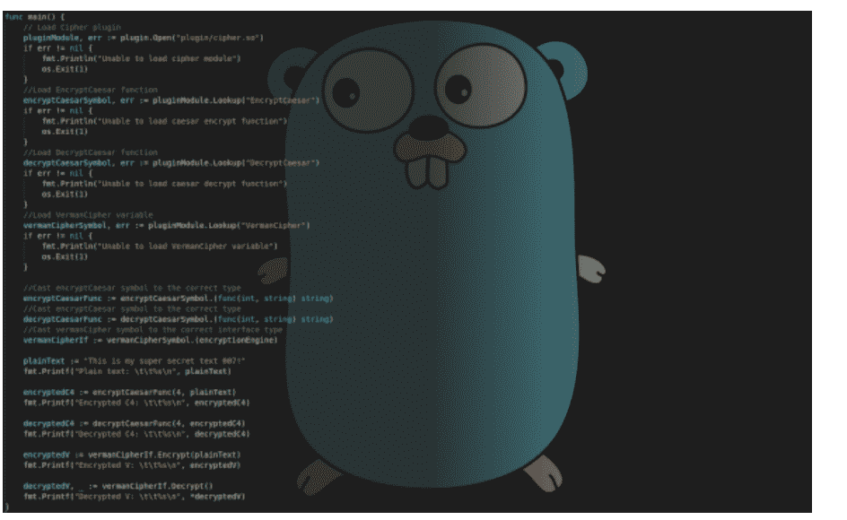

# 目录

计算机编程、Python、机器学习、JavaScript、Swift、Golang：

2020

描述

# 计算机编程、Python、机器学习、JavaScript、Swift、Golang

从入门到精通的逐步指南，助你从新手蜕变为高手

# 2020

James Morris

版权所有 2019

# 免责声明

本电子书的唯一目的是提供关于特定主题的相关信息，为此已尽一切合理努力确保其准确性和合理性。然而，购买本电子书即表示您同意，无论本书中可能做出何种声明，作者和出版商均非本书所含主题的专家。因此，书中提出的任何建议或推荐纯粹出于娱乐价值。建议您在采用本书讨论的任何建议或技术之前，始终咨询专业人士。

这是一份具有法律约束力的声明，被出版商协会委员会和美国律师协会视为有效且公平，并应在美国境内被视为具有法律约束力。

未经出版商事先明确同意，复制、传输和复制本书中的任何内容，包括任何特定或扩展信息，无论信息最终采取何种形式，均属非法行为。这包括作品的实体、数字和音频副本。保留所有其他权利。

此外，在所述页面中可找到的信息在陈述事实时应被视为准确和真实。因此，对所提供信息的任何使用，无论正确与否，都将使出版商对其直接管辖范围之外采取的行动不承担责任。无论如何，在任何情况下，原作者或出版商均不能以任何方式对因本书讨论的任何信息可能导致的任何损害或困难负责。

此外，以下页面中的信息仅用于提供信息，因此应被视为通用信息。鉴于其性质，本书在呈现时未对其长期有效性或临时质量提供任何保证。提及的商标未经书面同意，绝不能被视为商标持有者的认可。

# 描述

本书《计算机编程 Python 机器学习 Swift Golang》精选了未来最值得掌握的绝佳编程语言。这是单本书中编程语言的最佳选择。它包含了每位程序员在面试前都应掌握的主要核心语言，如 Python 和 JavaScript。但它也包含了一些你可能没听说过的、鲜为人知的新语言，这些语言易于学习、用途广泛且跨平台，预计在不久的将来会人气爆棚。稍后将详细介绍。

如果你阅读本书并学习这些语言，那么你的未来将由你自己掌控。想象一下，你可以从容不迫、毫无顾虑地参加工作面试。届时，被面试的将是潜在雇主。他可能显得有点急切、过于迁就，以至于你知道这将是那种面试：他要么在20分钟后站起来，主动与你握手并当场提供工作机会；要么面试变成人力资源面试，根据你的申请材料，你已被默认录用，只需办理文书手续、了解公司福利和政策。无论哪种情况，根据你的意愿，你可以接受或拒绝这份工作，因为你拥有选择权。这与被告知“几周内会给你打电话”或“别联系我们，我们会联系你”的情况截然不同。

关于这些语言。

Python：使用 Python 的公司包括 Google、Facebook、Instagram、NASA、Mozilla、Firefox、Dropbox、IBM、Reddit 和 Quora。Python 正在成为世界上最流行的编程语言之一。

JavaScript 的用户包括 PayPal、Netflix、Uber、Groupon、Facebook、Google、eBay、Airbnb、Stack、Slack 和 Instagram。

机器学习（AI）是什么？它有什么用途？它可以与 Python 一起使用，因为它被用于 Google 搜索和自动补全功能。它有助于预测你接下来会搜索什么。机器学习（AI）被应用于许多不同的领域和应用，包括自动驾驶/停车汽车、面部识别、医学 X 光图像解读、无人机以及许多许多其他应用。

Swift 也是一门值得学习的好语言，因为一切都必须随着资金转移而发展。Android 和 iOS 的应用程序创建使用 Swift。这也是一种跨平台语言。

GO Golang（Go 语言）最后但同样重要的是，GO 是我仅次于 Python 或 JavaScript 的第二喜欢的语言。这种新的编程语言不太为人所知，但它被设计得超级易于学习，并融合了许多顶级语言的最佳特性。它也是一种非常用户友好的跨平台语言，在其众多新的精简特性中，它内置了垃圾回收器。

由 Google 开发，它被称为 Google 语言。它是一种开源语言。使用 GO 的公司包括 Uber、Twitch、Daily motion、纽约证券交易所、Send Grid、Fabric、Medium。如果你学习这门语言，你基本上就是在学习下一个 Python。

# 目录

# 免责声明

- 引言
- 描述
- 第一章：计算机编程的奇妙世界
  - 什么是计算机编程？
  - 编码与编程
  - 学习计算机编程的优势
  - 优秀编程语言的特性
- 第二章：帮助你用 Python 编程的基本代码
  - 为什么选择 Python？
  - Python 代码基础
  - 编写你自己的类
  - 理解函数
  - 引发异常
  - 处理 Python 循环
  - Python 中的条件语句
- 第三章：关于机器学习我需要知道什么？
  - 机器学习：定义
  - 机器学习的方法
  - 基于计算机的系统与手动流程规划
  - 机器学习的应用
  - 机器学习的优点
  - 补充数据挖掘
  - 任务自动化
  - 机器学习的局限性
  - 学习中的时间限制
  - 验证问题
  - 机器学习的未来
  - 机器学习的危险
- 第四章：JavaScript 与 Python 的比较及这种编码语言的基础
  - 什么是 JavaScript？详细解释
  - 我如何使用 JavaScript
  - JavaScript 基本部分
  - 正确放置脚本
  - 创建变量
  - 条件语句
  - 创建函数
- 第五章：什么是 Swift 技术，它能为你的业务做什么？
  - SWIFT 系统如何工作
  - SWIFT 交易内部
  - 为什么 SWIFT 是如此主导的选择？
  - 谁使用 SWIFT？
  - SWIFT 提供的服务
  - SWIFT 如何产生收入
  - SWIFT 系统面临的挑战
  - 我的业务如何使用 SWIFT？
- 第六章：Golang 技术入门指南
  - Go 的历史
  - 为什么学习 Go 很重要？
  - 编写你的第一行代码
  - Golang 变量
  - Golang 中的数据类型
  - 条件语句
  - Golang 接口
  - 公司如何使用 Golang
- 第七章：GoLang 与 Python 的比较
- 结论

# 引言

恭喜您购买了*《计算机编程：Python、机器学习、JavaScript、SWIFT与Golang》*，并感谢您的选择。

接下来的章节将讨论我们开始学习计算机编程所需了解的所有主题。许多公司经常使用计算机编程。他们希望确保能够创建一些不同的代码，以帮助他们在行业中取得领先，并确保能够完成任务。这本指南就是我们完成所有这些工作的必备工具。

在本指南的开始，我们将探讨计算机编程的基础知识。这是一个重要的话题，因为它将帮助我们了解计算机编程的工作原理、为何如此重要等等。这为我们后续处理编码工作奠定了基础，并能让我们更容易理解为何这个主题对企业如此重要。

一旦我们掌握了计算机编程的一些基础知识，接下来就该了解商业世界中首先需要的编程语言之一。那就是Python编程语言。当您需要处理通用编程以及一些数据科学和分析工作时，它是首选语言。

在本指南的这一部分，我们将花时间深入探讨Python语言的相关内容，包括该语言的一些编码基础，以及更多关于入门编码的信息。这些主题旨在帮助我们更多地了解Python编码是什么样的，我们将能够很快学会编写我们的第一段代码。

完成之后，就该进入第三部分，探讨机器学习的基础知识。无论您目前处于哪个行业，花时间探索机器学习及其能为我们带来的需求都很重要。机器学习是当前商业领域的热门话题，当您能够将其与Python的基础知识，甚至我们即将讨论的其他一些编程语言结合起来时，您会发现处理数据科学所需的所有模型和算法比以往任何时候都更容易。

本指南接下来将深入探讨JavaScript语言的工作原理。我们会发现这种语言非常适合帮助我们处理在线工作和网站中的HTML等内容。在本节中，我们将探讨使用这种语言时能够处理的一些不同代码部分，包括基本函数、如何使用条件语句、循环等等。

接下来，我们将稍微偏离主题，探讨SWIFT技术及其相关内容。当您需要处理在全球范围内发送安全快速的交易信息所需的工作时，这是一个很好的选择。我们将探讨使用SWIFT的一些不同优势，以及借助这种编程语言，我们能够如何专注于解决许多常见的商业问题。

本指南的最后将花一些时间专注于Golang语言，以及我们如何将其引入我们的业务以获得出色的结果。Golang语言可能比我们能找到的其他一些选项更新一些，但它易于使用，并且省去了一些不必要的部分，这些部分只会拖慢我们编码工作的速度。我们还将探讨Python和Golang之间的一些比较。

正如我们所看到的，计算机编程能够处理许多我们希望通过编码和其他类似技术来处理的业务事项。本指南将花时间介绍所有不同的编码语言和流程，我们可以利用它们来发挥优势。当您准备好学习如何使用Python、机器学习、JavaScript、SWIFT和Golang，并了解这些语言能为您的业务带来什么时，请务必查阅本指南以开始学习。

市场上有很多关于这个主题的书籍，再次感谢您选择这一本！我们已尽最大努力确保本书包含尽可能多的有用信息，请尽情阅读吧！

# 第一章：计算机编程的奇妙世界

编程是一种创造性的过程，它能够帮助我们指导计算机如何完成任务。现实情况可能不如我们在电影中看到的那么有趣，也可能不如我们希望的那样光鲜亮丽，但这项工作将产生重大影响，并帮助您的企业完成许多不同的任务和应用程序。

计算机被设计成可以执行任何被告知的事情。而指令通常以人类程序员能够编写的程序形式出现。许多最精通计算机的程序员会以人类易于阅读但计算机不易阅读的方式读取源代码。在许多情况下，源代码会被编译，以便将其转换为机器代码。

当这个过程发生时，计算机就能够通过编译器读取代码，而不是保留人类能够翻译的版本。我们可以使用的编译型计算机编程语言包括SWIFT、Python、Pascal、C#、C++、C和Visual Basic。

不过您会发现，有一些编程语言我们不需要单独编译。相反，它们会遵循一个称为即时处理的过程，在运行它们的计算机上执行。这些程序更常被称为解释型程序。一些最常见和流行的此类编程语言包括Python、Ruby、PHP、Perl和JavaScript等选项。

编程语言要使其工作，在开始之前都需要了解其词汇和规则。我们将花一些时间解释几种不同的编码语言以及一些您可以遵循的规则，以帮助我们完成任务。学习一门新的编程语言需要一些时间，这与学习一门新的口语语言类似。

## 什么是计算机编程？

从更基本的角度来看，程序是为了处理文本和数字而设置的。这些将是您所有程序的一些构建块。编程语言将让您通过使用数字和文本，并将数据存储在磁盘上以供以后使用，以各种方式处理它们。

这些数字和文本是您将使用的所有编码语言的重要组成部分，我们将它们称为变量。您可以选择以单个或结构化集合的方式处理它们。例如，在C++中，变量将以某种方式用于计数数字。我们代码中的结构体变量将能够以以下格式保存其员工的工资单详细信息，例如包括社会安全号码、总税款、公司ID号、薪资和姓名。

您能够使用的数据库有能力保存数百万条这样的记录，并且能够快速地为您获取它们。以正确的方式设置数据库非常重要，这样您才能使用您想要的编程语言快速高效地找到信息。

我们必须记住，程序是为操作系统编写的，而操作系统本身就是一个程序。运行在我们计算机上的程序必须与您使用的操作系统兼容。您可以使用许多不同类型的操作系统，包括Android、Unix、MacOS、Linux和Windows。

在Java语言引入之前，程序必须以能够与每个不同操作系统兼容的方式编写。一个能够与Linux操作系统良好运行的程序将无法在其他选项上运行。借助Java，我们可以编写一次程序，然后它就可以在所有操作系统上使用。每个操作系统都配置了为其编写的Java解释器，能够读取和解释Java的字节码。

这对许多计算机程序员来说是个好消息。它使他们能够真正使用所有想要的编码，并且知道它几乎可以与他们想要使用的任何操作系统配合使用，无论该操作系统是什么。这消除了过去在使用许多不同操作系统和程序时遇到的一些挑战和不利因素。

你能够用计算机编程做的大部分事情，将有助于我们更新一些我们将依赖的现有应用程序和操作系统。程序将使用该特定操作系统提供的功能，无论它是什么类型，当这些功能发生更改时，程序也必须随之更改。

在这个过程中，有时你会想要分享你创建的一些代码。许多程序员会很乐意将他们使用的软件作为一种创造性的出口写出来。网络上将充满许多网站，上面有业余程序员编写的源代码，他们只是为了好玩而做这项工作，并准备与他人分享。Linux操作系统就是这样开始的，因为Linus Torvalds分享了他编写的一些代码，这些代码成为了该操作系统的基础。

编写一个小型或中型程序所需的智力努力，与作家写一本书时会发生的情况相似。只是对于一本书，你根本不需要调试它。计算机程序员在发现新方法来实现某事或想要解决代码中那个非常困难的问题时，会找到很多乐趣。

正如你在这里可以想象的，我们有很多不同的方式来处理计算机编程。有一些选项你可以使用，以确保你选择正确的编程语言，并且能够掌握你想要处理的项目。学习计算机编程如何工作以及哪些部分组合在一起或不组合在一起，是那些希望将计算机编程用于自身需求的企业所看到的核心。

## 编码与编程

编码只是编程的一部分，它涉及编写一系列代码行，但另一方面，编程是整个过程，它既包括输入也包括输出，其中，算法过程、编码、分析、实施、理解数据结构和解决问题等，都得到了充分的执行。

因此，编码涉及使用计算机编程语言的过程，以便让计算机按照程序员期望的方式运行。在这个平台上，每一行代码都有一条信息，它告诉计算机该做什么。因此，充满这些代码行的文档通常被称为脚本。在这种情况下，每个脚本都设计用于在计算机上执行特定功能。它可能是获取一张图像并修改其大小以适应特定规格。有些代码也被设计用来播放某些类型的音乐或曲目。编码的另一个很好的例子是在社交媒体上。

当你在某人的社交媒体页面上点击点赞按钮时，这是一个借助脚本实现的功能。与我们人类的功能方式不同，计算机被设计成精确执行所需的功能。这真是太棒了，不是吗？然而，这个高尚的功能也有其缺点，因为它也可能在过程中引起问题。如果你指示计算机开始向上计数，并且在这个过程中没有指示它停止，它将继续计数！因此，一个经验丰富且优秀的程序员应该知道正确的指令代码来输入计算机。

## 学习计算机编程的好处

许多人乐于让别人处理编码和所有需要完成的编程工作，而自己则忽略学习如何去做。他们认为这样更容易处理，如果他们不必做这项工作，他们就不会如此深陷其中。但是，计算机编程以及学习如何自己做一些工作会带来许多好处。我们可以寻找的一些好处包括：

-   **工作满意度：** 计算机编程是一项满意度非常高的工作，因为它为程序员提供了利用他们的创造力和思维来获得更好结果的绝佳机会。因此，这些程序员拥有开发自己软件产品的自由。在计算机编程方面，一个人能做什么是没有限制的。特别是对于那些有专注力、热情和奉献精神的人。因此，这些有才华、充满热情且勤奋的程序员有机会将他们的创造力提升到一个新的水平，成为每个人一直期待的下一个大事件。

-   **报酬：** 这是一份报酬丰厚的工作。作为一名计算机程序员，你可以有许多职业选择。这是因为计算机编程有能力为任何渴望加入这个领域或已经在这里工作的人做好准备。还有其他与计算机编程相关的领域。因此，许多程序员可以在各种头衔下工作，他们可以在系统分析师、Web程序员和应用程序程序员等领域工作。作为计算机程序员工作的最大好处是薪酬问题。他们的工作伴随着丰厚的福利。

-   **创造力：** 编码员的工作是编写代码，使计算机能够执行其核心功能和分配给这些机器的特定任务。因此，职业程序员有机会在工程、医疗和教育等行业工作。

-   **工作空间：** 计算机编程带来的美妙之处在于，作为一名程序员，你可以在任何地方工作。无需租赁办公空间，或永久驻扎在不方便的地方。你可以在任何地方执行任务，特别是如果你有一台笔记本电脑和互联网接入，可以让你愉快地执行任务。因此，你可以轻松地在任何地方工作。

此外，如今有无数的短期课程可供有抱负的程序员参加。这是因为有些培训只需六个月。这些课程的入学要求也非常低。因此，如果你想成为一名程序员，你可以激励自己。你可以自学一些计算机编程基础知识。因此，工作保障是一个关键好处，大多数计算机程序员都可以享受。

-   **技术进步：** 随着技术的不断进步，对程序员的需求也在增加。只要这是趋势，计算机程序员就总有事情可做。

## 优秀编程语言的特征

当我们进行编程工作时，我们希望确保我们以正确的方式进行。如果设置不当，那么我们将遇到计算机不理解正在发生什么或无法读取我们编写的代码的麻烦。在为企业选择好的计算机语言时，我们需要寻找的一些最佳特征包括：

-   **可移植性：** 这是指软件能够在多个操作系统上运行的能力，没有任何困难或需要进行任何更改，无论是重大的还是最小的。如今，成千上万执行不同功能的软件正在不断开发并投放市场。因此，看到一个程序很快过时也就不足为奇了。这就是为什么如果一个程序被开发来执行特定角色，它必然会影响其保质期。

-   **可读性：** 用于编写程序的语言应该易于理解和轻松遵循。此外，一个结构良好的程序能够激励其他计算机程序员更好地理解如何改进他们自己的程序。如果你需要分离一些功能，以便程序能更好地运行，那么以更友好的方式来做这件事就很重要，如果你要保持其核心功能的话。

-   **效率：** 每个程序通常需要足够的时间和内存来处理其与数据相关的功能。这是因为对于计算机程序来说，其处理能力和内存是计算机功能的关键组成部分。因此，计算机程序的结构应该能够充分利用这些功能，而不会花费太多时间来处理信息和内存。

在程序员开始开发程序之前，首先要做的就是将所有内容分解成独立的小的子部分。每个子任务都应独立运行，彼此不依赖。此外，结构正确的程序更易读、更易理解。测试和处理它的人员也会发现工作变得轻松许多。一个优点是它同时具备可靠性和灵活性。我的意思是，它应能轻松应对任何调整，而无需完全重写。在编程世界中，大多数软件通常在特定时间段内运行，之后需要适时修改。一个最好的例子是薪资系统管理。随着时间推移，一些员工可能离开组织，而另一些人可能加入。因此，该软件应能轻松处理所有这些变化，而无需对其本身进行任何修改。

除了灵活性，一个好的程序还必须具备通用性。这个术语在计算机编程中的真正含义是，不同的程序是为特定功能开发的，但也应能执行同一类别的其他类似任务。如果一个程序是为某个组织执行特定任务而开发的，那么它也应能处理不同组织中的类似任务。文档是计算机编程中最重要的组成部分之一。软件开发时必须考虑到最终用户。否则，无论开发得多么完善，它都无法履行其使命。最终用户应能毫无障碍地使用它。

# 第2章：帮助你用Python编程的基础代码

既然我们对计算机编程及其内涵有了更多了解，现在是时候回归基础，更多地了解使用Python语言进行编程了。当你想学习如何为你的业务编写一些代码时，无论是帮助你创建自己的网站，还是有兴趣更进一步，用机器学习处理一些数据科学和数据分析，Python语言都将是最佳选择。

一旦你准备好开始编写自己的代码，无论问题多么简单或复杂，Python都将是你的业务所需的答案。考虑到这一点，我们将探讨一些你可以用Python语言编写的基础代码，以及你需要了解的其他部分，以便开始使用这种语言进行编程。

## 为什么选择Python？

可能有很多编程语言可供你使用，但没有一种能像Python语言那样为你提供你所寻求的力量和强度。对于那些过去从未使用过编程语言，并有兴趣第一次尝试的人来说，这是最好的起点。使用Python编程语言的一些主要优势包括：

**它拥有简洁优雅的语法。**
这是使用Python如此有趣的原因之一。Python代码对任何用户来说都更容易编写和理解。这种程序的语法自然而然。让我们看下面的源代码示例。即使是从未接触过编程的人也能轻松操作Python。

**Python不是过于严格。**
使用此程序时，你无需为此软件定义变量类型。此外，使用这种程序时，你甚至不需要在任何语句末尾添加分号。Python还鼓励用户遵循良好的实践，包括正确的缩进。这些方面在普通人看来可能无关紧要，然而，它们可以大大提高初学者轻松学习的能力。

**语言的表达能力。**
你还可以使用Python编写具有更高功能百分比的代码，同时使用更少的代码行。

**强大的社区和支持。**
Python拥有一个非常庞大的社区支持基础。这就是为什么你会发现许多活跃的在线论坛，当你在网上查找内容遇到困难时，它们可以提供很大帮助。Google就是这样一个平台。

## Python代码基础

Python代码有许多不同的部分可供我们使用。这些部分帮助我们处理编码的各个方面，并使编写我们需要的程序和其他内容变得更容易。这就是为什么我们将本部分的第一节专门用于介绍我们需要关注的一些Python代码基础部分。

首先，我们需要讨论Python关键字。这些关键字将用于告诉编译器你想要使用的命令。它们需要放在代码的正确位置，以帮助向编译器发出命令，并确保程序能按我们期望的方式继续运行。移动它们或以不恰当的方式使用它们会使编译器混淆，并导致出现错误信息，你需要返回并进行一些调整。

在编写Python语言代码时，为你的标识符命名将非常重要。使用这类代码并不意味着困难，但我们希望确保以合理的方式命名不同的部分，并允许我们以后能够再次找到它们。

在Python语言中，有许多标识符可供你使用。你会发现它们可以是类、实体、变量和函数。好消息是，无论你选择使用哪种标识符，你都将遵循相同的通用命名规则。作为初学者，这将是一个好消息，可以帮助你更好地处理工作，并更容易地保持工作进度。

首先需要记住的规则是命名这些标识符时。在命名标识符时，你有很多选择。例如，你可以使用大写和小写字母、任何数字以及下划线符号进行命名。你也可以将它们组合在一起。这里要记住的一件事是，名称不能以数字开头，单词之间不应有空格。所以，你不能将3words作为名称，但可以写成words3或threewords。确保不要使用我们上面讨论过的任何一个关键字，否则你最终会得到一个错误。

当你选择标识符名称时，可以遵循上述规则，并尝试选择一个你能记住的名称。以后编写代码时，你需要再次引用它，如果你给它起了一个难以记住的名称，你可能会遇到问题或引发错误，因为内容没有按你期望的方式显示。除了这些规则之外，你可以随意命名标识符。

另一个我们需要了解的是你可以在代码中编写的注释。在编写代码时，你可能会遇到这样的情况：你想在编写的代码中留下解释或注释，以帮助他人了解代码中该部分发生了什么。你在Python中编写的任何注释都需要在前面加上#符号。这将确保编译器识别出这是一个注释，而不会尝试读取和执行它。编译器看到这个符号后，会跳过这段代码，继续处理下一部分。

使用Python，你可以编写任意多的注释来解释你编写的代码，并确保它尽可能有意义。如果你愿意，你可以在代码的每一行都添加这些注释。话虽如此，最好还是尽量减少注释，因为太多注释会使代码看起来复杂且难以阅读。

变量是代码中另一个你需要了解的部分，因为它们在你的代码中非常常见。变量用于帮助存储你放在代码中的一些值，帮助它们保持有序和整洁。你可以通过使用等号轻松地将一些值添加到正确的变量中。你甚至可以将两个值添加到同一个变量中，如果你愿意的话，你会在我们本指南中讨论的一些代码中看到这种情况。变量非常常见，你会在我们展示的示例中轻松看到它们。

即使在我们使用Python编写的一些更复杂的代码中，你也会发现可以使用这些基础知识来完成任务。在我们学习Python语言的以下命令和部分时，请留意其中的一些。
## 编写你自己的类

你会注意到Python程序的一个重要部分是它被划分为类。这将为你提供一种在Python中工作的绝佳方法，因为它可以帮助你组织你拥有的代码，并尽可能保持一切井然有序。Python 的妙处在于它支持这些类，并让你有机会编写易于使用的代码，这些代码能够良好运行，而不会像其他一些编程语言那样带来混乱和复杂性。

在 Python 中，我们将学习如何使用一些自己的类，这主要是因为它是 Python 自带的组织结构，将帮助我们添加一些条理性，并确保代码中的任何内容都不会丢失。然而，要创建一个这样的类，我们需要选择正确的关键字，就像我们之前讨论过的那样。你可以给类起任何你喜欢的名字，只要它容易记住，然后确保它在你需要的关键字之后出现在代码中。

在我们完成了处理类所需的步骤之后，我们还需要为自己的子类命名。这个子类将出现在一些括号中。在末尾添加分号，以保持我们需要的一些编程规范。

此时编写类听起来可能比实际需要的更复杂一些。这就是为什么我们需要停下来，仔细看看一个示例，了解这种编码在 Python 中是如何工作的。然后我们稍后可以进一步讨论不同部分的含义以及它们为何重要。首先，你可以用来创建自己的 Python 类的代码将包括：

```
class Vehicle(object):
    #constructor
    def __init__(self, steering, wheels, clutch, breaks, gears):
        self._steering = steering
        self._wheels = wheels
        self._clutch = clutch
        self._breaks = breaks
        self._gears = gears
    #destructor
    def __del__(self):
        print("This is destructor....")
    #member functions or methods
    def Display_Vehicle(self):
        print('Steering:', self._steering)
        print('Wheels:', self._wheels)
        print('Clutch:', self._clutch)
        print('Breaks:', self._breaks)
        print('Gears:', self._gears)
#instantiate a vehicle option
myGenericVehicle = Vehicle('Power Steering', 4, 'Super Clutch', 'Disk Breaks', 5)
myGenericVehicle.Display_Vehicle()
```

如果你愿意，可以尝试运行这段代码。只需打开你的文本编辑器并输入代码。在编写过程中，你会注意到我们在这本指南中已经讨论过的一些主题出现在这段代码中。一旦你有机会编写并执行这段代码，让我们将其分解，看看上面发生了什么。

在此，我们需要探讨一下访问类中各种成员的重要性。你需要设置好，以便文本编辑器和编译器都能识别你想要创建的任何类。这将使它们能够以正确的方式执行代码。为此，请确保你的代码设置正确。

好消息是，我们将能够使用多种方法来确保我们可以访问类成员，并且一切都能按照我们希望的方式进行。我们将使用的方法被称为访问器方法。这是你最常见的方法，它将是高效完成工作的有效方法。

为了帮助你更好地理解访问你创建的类的各种成员的一些方法，我们需要查看以下代码：

```
class Cat(object):
    itsAge = None
    itsWeight = None
    itsName = None
    #set accessor function use to assign values to the fields or member vars
    def setItsAge(self, itsAge):
        self.itsAge = itsAge
    def setItsWeight(self, itsWeight):
        self.itsWeight = itsWeight
    def setItsName(self, itsName):
        self.itsName = itsName

    #get accessor function use to return the values from a field
    def getItsAge(self):
        return self.itsAge
    def getItsWeight(self):
        return self.itsWeight
    def getItsName(self):
        return self.itsName

objFrisky = Cat()
objFrisky.setItsAge(5)
objFrisky.setItsWeight(10)
objFrisky.setItsName("Frisky")
print("Cats Name is:", objFrisky.getItsName())
print("Its age is:", objFrisky.getItsAge())
print("Its weight is:", objFrisky.getItsWeight())
```

在我们继续之前，请将此代码输入你的编译器。如果你运行这段代码，屏幕上会立即显示一些结果。这将包括猫的名字是 Frisky（或者你可以将名字改为其他），年龄是 5，体重是 10。这是输入到代码中的信息，因此编译器会将其提取出来，为你提供所需的结果。你可以花些时间在代码中添加不同的选项，看看它如何随时间变化。

虽然这种编码需要采取多个步骤，但类并不难处理。它们也将是代码的完美部分，帮助你处理信息并保持其条理性，使其更有意义。你可以选择创建任何你想要使用的类，并用最适合你需求的对象填充它。

## 理解函数

函数是你尝试用 Python 语言编写的代码的另一个重要部分。这些函数将是一组基本的表达式，也称为语句，它们将被赋予名称或保持匿名。它们将是你想要使用的类的一些首批对象，这意味着你不必花时间处理限制或其他问题。你可以像使用其他对象和值（包括字符串和数字）一样使用这些函数，它们具有一些我们可以在 `dir` 前缀的帮助下提取的属性。

你会发现，在使用 Python 的许多不同选项时，函数将是多样化的，并且在创建这些函数时会使用各种各样的属性。你的函数的一些不同选择将包括以下内容：

- **__doc__**：这将返回你请求的函数的文档字符串。
- **Func_default**：这将返回默认参数值的元组。
- **Func_globals**：这将返回一个引用，指向保存该函数全局变量的字典。
- **Func_dict**：这负责返回支持所有任意函数属性的命名空间。
- **Func_closure**：这将返回一个元组，包含所有保存函数内部自由变量绑定的单元。

你可以对函数执行不同的操作，例如在需要时将其作为参数传递给另一个函数。任何能够接受新函数作为参数的函数都将被视为代码中的高阶函数。这些值得学习，因为它们对你的代码很重要。

## 引发异常

在学习 Python 编码时，我们能够处理的另一个选项是异常。Python 语言已经识别了许多异常，或者你也可以创建一些自己的异常。这有助于确保程序能够处理你想要的一些工作，并且你也能够阻止一些你正在处理的错误。

Python 库中会自动找到一些异常。花些时间浏览它们并识别这些异常总是一个好主意，以便你能够在以后根据需要使用它们。Python 库中一些最常见的异常，你需要确保能够使用，包括：

- **Finally**：这是你想要用来执行清理操作的操作，无论异常是否发生。
- **Assert**：此条件将触发代码中的异常。
- **Raise**：`raise` 命令将在代码中手动触发异常。
- **Try/except**：这是当你想要尝试一段代码，然后由于你或 Python 代码引发的异常而恢复时使用。

首先是如何引发这些异常。我们还可以看看当我们在编写的代码中看到这种异常时可以采取的一些步骤。如果你正在编写一些自己的代码，并且开始看到你认为会出现的问题，那么编译器很可能会引发其中一个异常。好消息是，对于在大多数情况下，你遇到的异常问题会很容易解决，但有时也需要你投入一些精力去修复。一个很好的例子可以说明如何引发这类异常：

```
x = 10
y = 10
result = x/y #trying to divide by zero
print(result)
```

当你尝试让解释器执行这段代码时，你将得到的输出是：

```
>>>
Traceback (most recent call last):
File "D:\Python34\tt.py", line 3, in
result = x/y
ZeroDivisionError: division by zero
>>>
```

看一下这个例子，程序会引发一个异常，因为你试图将一个数除以零，而Python代码不允许你这样做。如果你保持原样并尝试运行程序，最终可能会得到一条错误信息。代码会告诉用户问题所在，但用户很可能完全不明白问题是什么。你可以对这些异常进行一些修改，并添加最适合当前情况的消息。

以我们刚才看过的示例为例，你需要添加一条消息，帮助我们告诉用户为什么首先会引发这个异常。这将使对方更容易理解发生了什么，而不是面对一堆谁也看不懂的随机字母和数字。下面是一个例子，展示了我们如何修改上面的消息，使其更有意义：

```
x = 10
y = 0
result = 0
try:
    result = x/y
    print(result)
except ZeroDivisionError:
    print("You are trying to divide by zero.")
```

看看上面的两段代码。我们刚写的这段看起来和上面那段有点相似，但这段里面包含了一条消息。当用户引发这个特定异常时，这条消息就会显示出来。你不会再得到那串毫无意义的字母和数字，通过这种方式，用户就能确切知道哪里出了问题，并可以修复这个错误。

到目前为止，在本节中，我们花了一些时间研究如何处理Python库中已有的异常。但在某些情况下，你可能需要创建自己的代码并引发自定义异常。也许你想创建一个新代码来挑选特定的数字，当用户选择了错误的数字时，你就想引发一个异常。这在你想制作的游戏中将是一个很好的选择。你可以设置它只允许用户在游戏中尝试三次，或者在代码继续执行之前只允许挑选一个数字。

对于这类异常，你会发现编译器不会自动识别你给出的答案是否有问题。从技术上讲，如果没有这个异常，代码对用户来说运行得很好，他们可以随意添加信息或猜测。但你不希望你的代码因为用户不知道答案而卡住或停止。你能够创建一个异常，并在用户尝试超过三次时引发它。

你会发现这些异常对于你将要处理的代码类型来说是非常独特的。如果你不花时间将它们写入代码，编译器将不会按照你期望的方式运行。你可以添加你想要的异常类型，也可以像我们上面看到的那样添加一条消息。实现这种功能的代码如下所示：

```
class CustomException(Exception):
    def __init__(self, value):
        self.parameter = value
    def __str__(self):
        return repr(self.parameter)

try:
    raise CustomException("This is a CustomError!")
except CustomException as ex:
    print("Caught:", ex)
```

在这段代码中，你已经成功设置了自定义异常，每当用户引发其中一个异常时，屏幕上就会出现“Caught: This is a CustomError!”的消息。这是向用户展示你在程序中添加了自定义异常的最佳方式，特别是如果这只是你为这部分代码亲自创建的，而不是编译器本身能识别的那种。

就像我们之前看过的其他示例一样，我们使用了一些通用措辞来展示异常是如何工作的。你可以轻松地进行修改，为你编写的代码获得一条独特的消息，并在用户看到错误消息时向他们解释发生了什么。

随着你编写更多代码并尝试一些更高级的选项，处理异常将会在你的更多代码中出现。很多时候，我们能够使用自己创建的异常或代码中已有的异常。请务必尝试本章中的一些代码，看看为什么Python语言是一个很好的选择。

## 处理Python循环

既然我们谈到了Python语言，我们需要花一些时间来看看Python中的循环以及它们如何满足我们的需求。在编写我们想要的Python代码时，循环是一件有趣的事情。循环将帮助我们清理一些正在编写的代码，这将有助于确保大量内容出现在我们的代码中，而我们不必花费所有时间来编写这些代码。

有些任务我们必须花很多时间来编写各个部分。但有时我们能够将代码转换成循环，只需几行代码就能让它工作。例如，如果我们正在处理一个乘法表，我们可以将所有工作——根据表格大小可能有数百行——合并成仅仅几行代码。我们将在本节稍后部分详细探讨这一点。

这里有几种类型的循环我们可以关注，但对我们讨论最重要的是for循环、while循环和嵌套循环。所有这些循环的目标都是帮助使我们用Python编写的一些代码更简单、更紧凑，但它们的工作方式略有不同。让我们看看每种循环是如何工作的，以及我们如何根据需要使用它们。

在这些循环中，我们首先要关注的是while循环。当你事先知道希望循环执行多少次代码迭代时，你会选择使用它。例如，用它来完成从1数到10。这种循环需要在末尾设置一个条件，以帮助确保循环会停止，而不会一直运行并导致计算机卡死。这也是当你想确保代码至少执行一次迭代，而不是可能跳过这部分代码时需要选择的选项。

了解了这些介绍后，我们可以看一些使用while循环的代码示例，以进行一些实践：

```
#calculation of simple interest. Ask user to input principal, rate of interest, number of years.
counter = 1
while(counter <= 3):
    principal = int(input("Enter the principal amount:"))
    numberofyears = int(input("Enter the number of years:"))
    rateofinterest = float(input("Enter the rate of interest:"))
    simpleinterest = principal * numberofyears * rateofinterest/100
    print("Simple interest = %.2f" %simpleinterest)
    #increase the counter by 1
    counter = counter + 1
print("You have calculated simple interest for 3 times!")
```

这个示例允许你的用户输入与他们相关的信息到程序中。然后代码将根据用户提供的信息计算利率。在这个例子中，我们在代码开头设置了while循环，并告诉它只执行三次循环。你可以根据需要更改它，让它执行任意多次。

我们也可以使用另一种类型的循环，称为for循环。当你想使用或处理for循环时，与我们之前所做的相比会有一些不同，但它仍然是一个循环，将会非常实用，许多程序员会根据自己的需求使用它。事实上，当需要进行循环时，`for`循环通常被视为传统形式，并且在需要时往往能够替代`while`循环。

当你使用`for`循环时，用户不会向代码提供信息然后循环才开始。相反，对于`for`循环，Python会按照屏幕上显示的顺序遍历迭代。无需用户输入，因为它会持续遍历迭代直到结束。以下是一个展示`for`循环工作原理的代码示例：

```
# 测量一些字符串：
words = ['apple', 'mango', 'banana', 'orange']
for w in words:
    print(w, len(w))
```

花点时间将这段代码写入你的文本编辑器，然后执行它。`for`循环将确保上面一行中的所有单词都显示在你的计算机屏幕上，并且它们按照你最初编写的顺序显示。请记住，一旦程序开始运行，你就无法更改顺序。在编写代码时，你需要按照正确的顺序进行。

最后，我们将在这里花时间讨论的第三种循环是嵌套循环。任何时候当你使用嵌套循环时，你基本上是将一个循环放在另一个循环内部。这将允许两个循环根据需要同时运行。嵌套循环在两个循环都完全完成之前不会停止。

有很多时候你会想要使用这个嵌套循环来帮助你完成想要处理的项目。回到我们本节前面讨论的乘法表，借助嵌套循环的一些工作，我们可以用几行代码完成一个复杂的表格。你需要用来创建自己的嵌套循环的代码将包括：

```
# 编写一个从1到10的乘法表
for x in xrange(1, 11):
    for y in xrange(1, 11):
        print '%d * %d = %d' % (x, y, x*y)
```

当你得到这个程序的输出时，它看起来会类似于这样：

```
1*1 = 1
1*2 = 2
1*3 = 3
1*4 = 4
一直到 1*10 = 10
然后它会继续进行二的乘法表，像这样：
2*1 = 2
2*2 = 4
```

以此类推，直到你最终得到 10*10 = 100 作为序列中的最后一个位置。

任何时候你需要让一个循环在另一个循环内部运行，嵌套循环都能帮助你完成。你可以根据代码内部想要完成的任务，将`for`循环、`while`循环或它们的任意组合结合起来使用。但这确实向你展示了这些循环在代码中可以节省多少时间和空间。上面的乘法表只用了四行代码就写出来了，你就得到了一个巨大的表格。想想如果你必须写出表格的每一部分，这会花多长时间！

## Python中的条件语句

在Python语言编码方面，我们需要了解的最后一件事是条件语句。这些语句可以用来确保Python语言按照我们想要的方式运行，而无需我们亲自在场。基本上，我们正在设置程序，使其能够自主学习，完全不需要我们的任何干预。这使得使用编码语言更容易，并确保无论用户决定输入什么，程序都能够响应。

有很多不同的程序会使用Python中的这些条件语句来完成工作，我们只需要选择何时使用它们以及哪一个最适合我们的需求。有三种语句属于这一类别，包括`if`语句、`if else`语句和`elif`语句。让我们看看这是如何工作的，以及我们可以采取的一些不同步骤来确保在代码中正确使用它们：

我们将要查看的第一个条件语句是`if`语句。这被认为是所有三种语句的基本版本，它更多地被用作训练条件语句的方式，而不是一种经常使用的语句。在我们学习的过程中，你会发现这个语句有一些局限性，这可能会使它难以像你希望的那样频繁使用。

使用`if`语句，我们会发现程序只有在用户根据你编写的代码给出被认为是正确答案的答案时才会给出答案并继续前进。如果用户输入一个答案，然后程序确定该答案是错误的，那么你将看到屏幕上没有任何变化。但是，如果根据你决定设置的条件，用户的答案是错误的，那么程序将继续执行你决定的任务。

你可能已经猜到这会对大多数代码造成一些问题，但了解如何使用这些语句仍然很重要。一个你可以用来处理这些条件语句的简单代码包括：

```
age = int(input("Enter your age:"))
if (age <= 18):
    print("You are not eligible for voting, try next election!")
    print("Program ends")
```

这段代码会显示一些内容。如果用户进入程序并说明他们的年龄在18岁以下，那么程序将运行并显示那里列出的消息。用户可以阅读此消息，然后立即结束程序。

但是，如果用户输入他们的年龄在18岁以上，事情可能会出错。这对用户来说是真实的，但因为它不符合你编写的条件，程序会将其视为错误。根据当前编写的代码，什么都不会发生，因为它没有设置来处理这种情况。每当用户输入超过18岁的年龄时，他们只会看到一个空白屏幕。

现在我们可以继续这些想法，并转向一个略有不同的条件语句版本，它能够比以前更好地处理我们上面遇到的一些问题。`if`语句在编码方面是很好的学习和练习对象，但与其它语句相比，你可能不会在编码中经常看到它们出现。

当你编写一些自己的代码时，你可能希望程序上显示一些内容，而不是屏幕只显示空白。当我们使用上面的例子时，如果你在程序中说明正确的年龄，你可能会得到一个答案，但如果你说你的年龄高于该语句中的数字，那么什么都不会显示。我们希望确保无论用户给我们什么年龄，屏幕上都会显示一个结果。这就是`if else`语句的工作方式。

使用`if else`语句，我们能够比`if`语句更进一步。对于这个语句，我们安排整个事情，以便无论用户决定使用什么答案，他们都会在屏幕上得到一个答案。这使得程序整体上更加用户友好，并可以帮助程序根据你设置的条件以适当的方式继续。

对于上面的投票示例，你可以实现以下代码来创建一个`if else`语句：

```
age = int(input("Enter your age:"))
if (age <= 18):
    print("You are not eligible for voting, try next election!")
else:
    print("Congratulations! You are eligible to vote. Check out your local polling station to find out more information!")
print("Program ends")
```

使用这个选项，你添加了`else`语句，它将涵盖所有不属于18岁以下的年龄。这样，如果用户确实将年龄列为他们的年龄，屏幕上仍然会为他们显示一些内容。这可以为你在编写代码时提供更多自由，你甚至可以为此添加更多层次。如果你想将其划分，以便你得到四到五个年龄段，每个年龄段得到不同的响应，你只需要添加更多的 `if` 语句来实现这一点。`else` 语句放在最后，用于捕获所有其他情况。

例如，我们可以使用上面编写的代码，提出一个不同的问题，比如该用户最喜欢的颜色是什么。然后你可以写出几个 `if` 语句来涵盖几种基本颜色（你不想遍历并考虑所有可能的颜色，因为那太耗时且可能毫无意义），但你可以挑选出五到六种最受欢迎的颜色，并用 `if` 语句添加它们。

如果用户决定选择你选择的六种颜色之一，那么当他们选择时，相应的语句就会显示出来。但如果他们选择了不在你列表中的另一种颜色，这就是这里的 `else` 语句要处理的内容。这有助于我们捕获某人可能尝试使用的任何其他颜色。也许你选择了粉色、蓝色、红色、黄色、橙色和绿色，但用户决定紫色是他们最喜欢的颜色。`else` 语句将被设置为捕获该颜色并仍然给出响应。

最后，我们需要看的第三种条件语句是 `elif` 语句。`elif` 语句很好，因为它们将允许我们使用 Python 将编码提升到另一个层次，但我们仍然发现它们对我们来说相当容易使用。你可以选择在代码中添加任意数量的这些语句，然后在最后添加 `else` 语句。这确保了无论用户喜欢使用哪些选项，所有决策都被涵盖。

思考这些语句的一个好方法就像在一个带有选项菜单的老游戏中。该游戏的用户将能够根据这个选项菜单做出决策，然后游戏将根据这些信息继续进行。这将与我们将看到的 `elif` 语句类似。

你可以使用 `elif` 语句拥有任意少或多的选项。你可以选择只添加两三个，或者你可以将其扩展到二十个或更多。但是，你拥有的选项越少，编写你想要使用的代码就越容易。使用 `elif` 语句的一个好程序示例如下：

```
print("Let's enjoy a Pizza! Ok, let's go inside Pizzahut!")
print("Waiter, Please select Pizza of your choice from the menu")

pizzachoice = int(input("Please enter your choice of Pizza:"))
if pizzachoice == 1:
    print('I want to enjoy a pizza napoletana')
elif pizzachoice == 2:
    print('I want to enjoy a pizza rustica')
elif pizzachoice == 3:
    print('I want to enjoy a pizza capricciosa')
else:
    print("Sorry, I do not want any of the listed pizza's, please bring a Coca Cola for me.")
```

通过这个选项，用户能够选择他们想要享用的披萨类型，但你可以将相同的语法用于代码中需要的任何内容。如果用户在代码中按下数字 2，他们将得到一份 pizza rustica。如果他们不喜欢任何选项，那么他们就是在告诉程序他们只想喝点东西，在这种情况下，是一杯可口可乐。

这是一种使用 `elif` 语句为用户提供一组选择的简单方法。在其他选项中，用户可以添加他们想要的任何选择，但在 `elif` 语句中，他们要么选择你提供的选择之一，要么必须选择最后的默认选项。这对于你可能想选择的许多游戏、一些在线测试以及其他你希望限制用户在代码中选择的选择的程序来说，效果很好。

正如我们所看到的，在使用 Python 语言方面，我们能够做很多巧妙的事情。你能够在这方面进行的练习越多，对你和你的业务就越好。一旦你掌握了其中的一些基础知识，你就可以无限轻松地挑选出哪些代码和概念你想在使用 Python 处理业务中更复杂的部分时使用。


# 第三章：关于机器学习我需要知道什么？

当我们谈论 Python 编程时，我们接下来要讨论的主题通常是机器学习。许多公司正在转向 Python，因为他们知道它可以创建一些最好的机器学习算法和模型。这些是完成数据分析所必需的，使用像 Python 这样的简单语言将确保我们能够承担这里需要的所有工作，并从我们的数据中得出一些答案和结果。

但在我们深入探讨数据科学及其能为你的业务带来的所有奇妙之处之前，是时候让我们更深入地了解机器学习以及这个过程能为我们做什么了。考虑到这一点，让我们来看看机器学习以及它如何帮助我们取得成功！

### 机器学习：定义

机器学习（M.L.）涉及使用人工智能（AI）为系统提供自动学习能力。此外，这些系统被赋予了在没有编程辅助的情况下从这些经验中学习和改进的能力。这类程序的主要重点是它有助于开发能够访问数据、在没有任何监督的情况下自行使用这些数据的计算机程序。

这个过程通常从观察或数据收集的活动和过程开始。例子包括指令或直接经验，以便寻找数据模式，以帮助在未来更好地决策。通过机器学习，计算机和系统等机器被赋予自主操作的能力。在没有人类输入的情况下，这些计算机和系统将从它们的经验中学习，并根据当前需求调整它们的行为。

机器学习将是人工智能的一种类型。机器学习将是一种数据分析方法，它能够自动化你在构建自己的分析模型时必须承担的一些过程。它将是人工智能的一个分支，完全基于系统能够从它们呈现的数据中学习的理念。它们还能够在最少或没有人类干预的情况下做出一些重大决策并识别模式。

许多不同的企业已经准备好处理机器学习及其能为他们做的一切。得益于大数据以及数据分析所需的所有不同部分，了解机器学习及其带来的内容变得更加重要。通过数据挖掘和数据分析的过程，机器学习正在疯狂增长，我们能够使用它来帮助我们用正确的算法创建所需的模型非常重要。

这些模型对于机器学习来说将非常重要，因为它们能够分析更大、更复杂的数据，并将提供比以往更快、更准确的结果。这可以在你想要的任何规模上完成。当一个公司能够建立一些精确的模型时，一个组织将能够更好地识别最有利可图的机会。

根据你如何使用这些模型和算法，你可以使用数据来找出可能在某个时候攻击你的业务的一些未知风险。每个企业都会在某个时候经历风险。但能够提前了解风险并创建一个可以用来提前处理这些风险的计划，我们能够确保风险对我们的整体业务影响最小。

现在，除了机器学习之外，还会有很多部分参与其中。但这是大多数企业会感到兴奋的部分。当他们使用机器学习时，他们实际上能够整理这些数据，并在此过程中学习一些创造性的信息。他们最终能够获取他们一段时间以来一直在收集、清理和组织的所有数据，并实际查看其中的内容以供使用。这可能是一个激动人心的时刻，因为如果你创建、训练和测试模型和算法，以恰当的方式使用，它将在许多方面对你大有裨益。

在机器学习领域，你还可以使用多种不同的编程语言。Python 是其中最流行的一种，上一章我们花了一些时间探讨了这些语言，并研究了其中一些可用于机器学习的代码。还有一些其他语言也可以单独或与 Python 配合使用，根据你想要处理的算法类型，它们可能是不错的选择。

正如我们在本节中提到的，从事机器学习意味着你需要运用大量不同的算法。这些算法与各种工具配合使用效果最佳，但选择正确的机器学习算法并确保其经过适当训练，将对你所能获得的结果以及预测或洞察的准确性产生重大影响。机器学习中可供选择的一些算法包括决策树、随机森林、神经网络、支持向量机、KNN、K-Means 聚类和神经网络。

## 机器学习的方法

实现机器学习所使用的算法分为无监督或监督算法。

**监督算法。** 在这一类别中，开发者应用他们在过去机器与相同数据交互时所学到的知识。这是通过使用分类示例来预测未来实现的。该算法可用于预测未来的事件和行为，因为它分析训练数据集并推断未来行为。它也可用于发现错误，这些错误可用于根据所需规格对模型进行进一步修改。

这种方法需要程序员付出一些努力。他们需要用计算机能够学习的示例来训练计算机，然后将其应用于用户稍后提供的其他输入。

相反，如果训练数据集缺少标记或分类选项，则可以使用**无监督**学习。在这种类型的学习中，我们通常研究如何提示系统，以便它们通过使用未标记或未分类的数据来清晰地描述隐藏结构，从而推断出一个函数。这是因为系统无法正确识别正确的输出，但它能够探索数据，因此能够从数据集中得出推断，以描述隐藏在未标记数据中的结构。

**半监督**类别算法介于监督和无监督算法之间。它是一种混合方法，可以同时使用标记和未标记的数据集。使用此类算法的系统可以提高其效率和准确性，从而在更大程度上提升其学习能力。获取的未标记数据不需要任何额外的资源来进行训练。

这有点像是两者的结合。当你希望使用标记数据，但标记数据处理成本过高时，你会想要使用这种方法。你可以结合使用标记和未标记的数据来处理这个问题，使工作更容易完成且成本更低。

**强化算法。** 一种与环境交互的学习方法。由此，它会产生某些提示，从而可能导致发现错误或获得奖励。试错搜索实例以及延迟奖励是与强化学习相关的最常见特征之一。同样，这种技术最能让机器和软件代理在特定环境中自动确定理想的行为参数，以充分发挥其潜力。而在需要简单奖励反馈以帮助代理确定哪些行为最适合特定功能的领域，这被称为强化信号。

在了解了上述内容之后，我们现在可以放心地说，机器学习用于分析非常大量的数据。另一个积极的方面是，在大多数情况下，它能够提供更快、更准确的反馈。因此，此类数据可用于区分机遇与风险。不利的一面是，你可能需要更多的时间和资源来根据其功能对其进行适当训练。机器学习的另一个显著特点是，当你将机器学习与人工智能和认知技术相结合时，你就为更有效、更快速地处理大量数据打开了大门。

## 基于计算机的系统与手动过程规划

与基于经验的手动过程规划相比，将计算机用于规划目的具有以下优势：

- 计算机系统能够以系统且一致的方式提供非常准确的反馈。
- 它还能在很大程度上降低间接成本，从而实现及时的规划和流程，进而使组织利润最大化。
- 因此，开发可行的加工计划所需的过程规划师技能要求大大降低。
- 计算机还能使软件界面在交货期估算、制造和成本方面的流程成为现实。此外，软件界面还能促进工作标准的改进。
- 提高过程规划师的生产力。这是因为，随着计算机辅助机器的出现，组织能够有效地提高其生产目标。

## 机器学习的应用

在教育领域，教师可以利用机器学习的概念来检查学生在特定时间内可以学习的课程数量。它还可用于确定他们如何应对学业，是觉得轻松应对还是不堪重负。这反过来将使这些学校的教学和管理人员能够提出解决此类问题的方法。这些程序还可以在某种程度上帮助学习缓慢或处于风险中的学生跟上同伴的学习进度。从长远来看，这可能会使他们免于落后或完全辍学。

众所周知，如今像谷歌这样的搜索引擎主要依赖机器学习来为用户提供最佳服务。因此，谷歌实施的一些惊人服务，如图像搜索、语音识别以及许多其他此类服务，使用户能够轻松浏览。然而，只有时间才能告诉我们未来将推出哪些类型的功能，以及具体由谁推出。

机器学习在营销方面可以发挥出色作用。这本质上是机器学习最重要的方面所在。在此类平台上，机器学习允许用户和软件之间进行更相关和互动的会话。因此，通过这些会话，公司可以与客户进行非常互动的交流。通过复杂的细分过程，他们可以更专注于在正确的时间提供正确的客户服务，并传递正确的信息。

该算法还使公司能够收集有关其客户的关键数据，这些数据可用于在做出非常重要的决策时使用。你可以使用 Nova，它利用机器学习，可以作为向客户撰写个性化销售电子邮件的平台。这是因为，从技术上讲，该软件确切知道哪些类型的电子邮件在使用时带来了更好的结果。因此，它可以对这些销售电子邮件进行所需的更改。

得益于技术进步，医疗保健领域各部门的服务也更上一层楼。尽管在过去 2-3 年里，这仍然是一个激烈辩论的话题，但这个关键领域的一些初创公司并没有落后，他们正在提出解决困扰医疗保健领域挑战的方法。

迄今为止，已介绍的初创公司包括：Sentient、Nervanasys（后被英特尔收购）、Ayasdi、Digital Reasoning System，以及其他一些前景广阔的新兴初创公司。

此类技术论坛和机器学习算法领域的主要驱动力纯粹是计算机视觉，因为它使用了深度学习。这款活跃的医疗保健应用是微软内部Eye项目（始于2010年）的产物。它席卷了医疗保健行业，可以说正在开发一种图像诊断工具。

## 机器学习的优势

### 补充数据挖掘

这是对数据库内部数据进行检查的过程。此外，它也是检查多个数据库以处理或分析数据从而生成信息的过程。

它也可以指发现通常与数据集相关的属性。机器学习在数据挖掘过程中的参与，就是从中学习并对所述数据做出可靠的预测。

### 任务自动化

有助于开发自主计算机、软件程序。这些包括。自动驾驶技术、人脸识别是此类别中的一些例子。

## 机器学习的局限性

### 学习的时间限制

使用机器学习时，通常很难立即做出准确的预测。此外，你应该记住，这类算法是通过使用历史数据来学习的。并且已经确定，它在处理大量数据时效果最好，接触此类数据的时间越长，性能越好。

### 验证问题

与机器学习相关的另一个问题是缺乏验证。确实如此，要证明该算法做出的预测是否普遍适用总是非常困难的。

## 机器学习的未来

任何使用机器学习的公司或实体都可以比其他公司拥有竞争优势。无论是初创公司还是大型组织，最好尽早采用机器学习的概念，因为它是当今的未来。我之所以这么说，是因为就目前情况而言，许多现在手动完成的事情，明天将由机器完成。因此，机器学习革命将颠覆我们的日常生活，并将与我们长期共存，这就是对未来的预测。

机器学习的未来很可能在未来几年内突飞猛进。我们已经看到机器学习能够以多种方式帮助企业成长，从自动化我们执行的许多流程，到告诉我们何时需要更换机器，再到协助营销活动等等。而这很可能只是机器学习所能做的一切的冰山一角。

随着时间的推移，机器学习将成为许多企业依赖其完成工作的常见功能。他们可以出于上述许多原因以及更多原因使用它。这种技术能够做的事情太多了，花时间了解更多关于它的知识确实可以帮助我们看到一些伟大的成果。

## 机器学习的危险

在计算机科学领域，机器学习专注于将类似人类的人工智能赋予机器。机器学习由Arthur Samuel于1956年提出，它使用算法赋予机器与人类相关的更高功能，如学习和分析数据以做出预测。作为革新人工智能学术知识的先驱，Arthur Samuel设想了一个机器拥有自主权和智能，无需人类协助即可做出决策的世界（Langford, 2018）。

机器学习完全是关于通过一系列步骤（也称为算法）来模仿人类学习的过程。可能存在监督学习、无监督学习或强化学习（Gupta, 2018）。在过去的十年里，机器学习已经发展成为一门更先进的科学，称为深度学习。这种进化转变旨在让计算机根据算法输入的具体示例来执行任务，而不是按照预设规则运行。这些计算技术和人工智能的进步可能预示着计算机的新纪元。当融入主流社会时，这些进步可能会彻底改变我们的世界，并可能对人类产生重大影响（Langford, 2018）。

公司越来越多地使用机器学习来执行关键任务，包括数据分析和解释，以识别和纠正错误。这在评估法律合同和员工绩效评估时尤为重要。通过分析与客户以及其他员工的沟通记录，可以检测到员工的不当行为。微软和亚马逊网络服务公司等公司正在开发越来越多用户友好的新机器学习工具。这些新工具更易于使用，不需要太多的技术知识（Debrusk, 2018）。

机器学习（ML）有其自身的优势；机器学习使用户能够使用过去的数据集预测结果，通过机器学习过程，当有变化时，可以用新的数据集训练系统。在传统编程中，可能需要编写全新的程序或修改业务规则，而机器学习算法则致力于以多种方式优化整个决策过程。

机器学习可用于医院环境，以高精度和成功率诊断和促进疾病治疗。这个新系统通过审查患者数据来实现这一功能。此外，该系统可以利用数据通过识别高风险个体来预防自杀（Langford, 2018）。

此外，配备人工智能的汽车能够以显著的准确度预测其他道路使用者改变车道的可能性。这类汽车配备了高分辨率摄像头和传感器。它们利用这些特性来掌握周围环境。这些能力有可能将交通事故减少相当大的比例。


# 第四章：JavaScript与Python的比较及这门编程语言的基础知识

这可以定义为一种脚本语言，通常用于创建和控制在线内容。该程序的一个复杂工作示例是，它用于刷新、移动或对计算机屏幕施加某些更改，而无需手动重新加载页面来完成。这些功能包括：动画图形、交互式表单、照片幻灯片和自动完成文本建议。

这个程序起初看起来可能非常容易理解，然而，为了更好地理解它，最好深入挖掘它的整个部分。这是因为，在所有令人兴奋的功能（如自动完成和动画）之下，还有更多内容。让我们开始学习JavaScript吧。

### 什么是JavaScript？详细解释

HTML和CSS是初学者最常见的脚本语言。之后，他们可以转向JavaScript。这是因为这两者是基础，能让人们了解JavaScript的工作原理，并且它们也是相辅相成的。此外，这三者是网页设计的坚实基础。

简单来说，就是特定网页在标题、正文、文本或任何其他可能包含在此类别中的图像方面的结构方式。其次，用于控制特定页面的布局。换句话说，当你想自定义字体、背景颜色等时，可以使用这个程序。最后，是它们中的王者。使用JavaScript语言为你的项目或网站增添动态感。此外，为了美观和结构化，可以考虑使用CSS和HTML。

### 我如何使用JavaScript

我们之前已经介绍过这部分内容，但值得将其分解成详细的段落以便更好地理解。以下是一些在可靠的JavaScript程序帮助下可以完成的事情。

**网站交互性。** 现代网站具有多种功能。除了显示信息或允许信息访问外，当今的网站还是交互式平台，只需点击按钮即可用于实时通信和信息共享。此外，它们还带有聊天和消息传递等新功能。JavaScript允许网络开发人员在开发应用程序和网站时实现这种交互性。

**移动应用** JavaScript脚本语言的使用范围很广。它的使用不仅限于网站。它在创建手机应用程序时也很有用。

**基于网页浏览器的游戏创作。** 当今的网页浏览器设计目标之一是利用电脑游戏的流行度。它们内置了游戏，用户可以直接玩。JavaScript 是创建这些游戏所使用的脚本语言。它也可以用来驱动此类活动。

**后端网页开发** 这仍然是 JavaScript 的工作范畴。你在每个屏幕上看到的内容，大多属于前端。然而，如果没有一种足够动态和通用的脚本语言（它也能在后端基础设施上工作），这一切都不会发生。

## JavaScript 基础部分

我们将要学习的第一个 JavaScript 基础部分是**值**。在使用这种编程语言时，我们将主要关注两种类型的值。它们将被称为**固定值**或**变量值**。如果你处理的是语言中的一些字面量，那么你基本上处理的是一个固定的值；而变量值则会根据需要移动和变化。

在开始之前，我们需要学习一些规则，以便更容易地写出 JavaScript 中的固定值或变量值。首先，数字可以定义为带小数点或不带小数点的形式；然后出现的字符串将是文本，其周围会有单引号或双引号。

变量是另一种与 JavaScript 语言配合良好的元素。当你使用 `var` 关键字时，它们将被识别出来，这样程序就会知道这是我们想要处理的那种值。当你专注于这些变量值时，你会想要给它赋一个值，而使用等号（=）是完成此操作的最佳方式。

接下来要介绍的是**运算符**。在处理我们想要用 JavaScript 完成的一些工作时，它们将占据一个特殊的位置。它们将帮助我们将值赋给变量，并且也能帮助我们处理代码中一些基本的数学部分。在 JavaScript 中，我们将找到两种需要使用的基本运算符类型，包括：

-   **赋值运算符**——这是你用来将一个或多个值赋给变量的运算符。你将使用等号（=）来表示这种关系。
-   **算术运算符**——这些是用于程序中各种算术运算的运算符，包括减法、加法、除法和乘法。你将使用符号（+ - * /）来表示它们。

在此过程中，我们还需要使用一个称为**表达式**的选项。表达式是当你将值、变量和运算符组合在一起，以生成你想要的代码时形成的。表达式是独特的，因为它们会包含一些其他的变量值，包括字符串和数字。例如，你可以写出 `"Java" + "Script"`，然后它的计算结果将是 `JavaScript`。一个用代码形式写出时看起来如何的好例子将包括以下内容：

```html
<html>
<body>
<script>
var a = 400;
var b = 1;
var str1 = "Java";
var str2 = "Script";
document.write("Addition of a + b = " + (a + b) + "<br>");
document.write("Concat of str1 + str2 = " + (str1 + str2));
</script>
</body>
</html>
```

当你执行我们刚刚编写的代码时，你将得到输出：
Addition of a + b = 401
Concat of str1 + str2 = JavaScript

你总是可以在处理这段代码时添加一些内容或更改一些内容。你可以添加一些不同的单词或输出整个字符串，以编写任何你想要的内容。在使用代码时，你能做的事情非常多，所以不要觉得我们在这里写的内容限制了你。

## 正确放置脚本

当你使用这种代码时，在选择将代码放置在 HTML 文档中的位置时会有一定的灵活性。有几种方法可以将你想要使用的代码放置在该语言中，其中一些方法包括以下内容：

这是大多数人喜欢包含其代码的方式。你将能够将函数放在 `<head>` 部分，然后在网页上访问这些函数。一种实现方式如下所示：

```html
<html>
<head>
<script type="text/javascript">
function showAlert() {
    alert("This is an alert from the Head section.");
}
</script>
</head>
<body>
<input type="button" onclick="showAlert();" value="Call JavaScript"/>
</body>
</html>
```

当我们借助 HTML 执行这种代码时，你将得到一个警报消息作为输出。这个警报消息将显示“This is an alert from the Head section.”。当你点击网页上的按钮时，你将能够看到这条消息。当然，你可以更改你想要的消息，将其设置为最适合你想要编写的代码的内容。

## 在 body 部分中的 JavaScript

虽然 `<head>` 是程序员放置 JavaScript 代码最常见的地方之一，但也可以将其放置在 HTML 代码的 `<body>` 部分中的某个位置。但请记住，虽然这是你可以做的事情，但它并不是大多数程序员首选的方法。尽管这不是大多数人喜欢使用的方法，但你确实可以选择几乎任何你想要的编码方式。为了开始添加此代码使其位于页面主体部分，你可以使用的语法将包括：

```html
<html>
<body>
<script type="text/javascript">
document.write("Welcome to JavaScript Tutorials!");
</script>
<p>Body section of the HTML document.</p>
</body>
</html>
```

当你将其添加到 HTML 程序的主体部分时，你将得到的输出是“Welcome to JavaScript Tutorials!”显示在屏幕上你放置该代码的位置。

## 将 JavaScript 同时放入 head 和 body 部分

当我们需要处理一些 JavaScript 代码时，第三个可以考虑的地方是将其同时放在 `<head>` 部分和 `<body>` 部分。你可以对任何你想要的 HTML 文档执行此操作。我们需要用来实现此目的的代码将包括：

```html
<html>
<head>
<script type="text/javascript">
function showAlert() {
    alert("This is an alert from the Head section!");
}
</script>
</head>
<body>
<script type="text/javascript">
document.write("Welcome to JavaScript Tutorials!");
</script>
<p>Body section of the HTML document.</p>
<input type="button" onclick="showAlert();" value="Call JavaScript"/>
</body>
</html>
```

当我们使用这种方法在 HTML 文档中执行代码时，我们将能够得到一个新的警报框。这个警报框将显示“This is an alert from the Head section!”。在警报框后面的屏幕上，你将在一行上看到“Welcome to JavaScript Tutorials!”，然后在另一行上看到“Body section of the HTML document”。这只是将 JavaScript 代码放置在 HTML 主体不同部分时你能做的事情的一个例子。

## 将 JavaScript 添加到外部文件，然后引入到 heading 部分

这实际上是你将代码添加到网页的最佳方式之一。使用扩展名为 `.jscode.js` 的外部文件。然后你可以将其添加到 HTML 文档的 `<head>` 部分。此文件中的所有函数都可以被 HTML 文档主体中的不同网页元素调用。在文档的 heading 文件中添加外部文件的方法如下所示：

```html
<html>
<head>
<script type="text/javascript" src="jscode.js"></script>
</head>
<body>
<p>Body section of the HTML document.</p>
<input type="button" onclick="showAlert();" value="Call JavaScript"/>
</body>
</html>
```

让我们花点时间看看这段代码试图告诉我们什么。当你尝试存储变量的值时，你正在执行一个称为**变量初始化**的过程。你可以在创建变量时随时执行此过程，甚至在你想要使用变量的时候也可以。

例如，在上面的代码中，有四个不同的变量可用，每个变量都被赋予了一个值。其中一个变量被赋值为 `salary = 10000`，另一个被赋值为 `name = "Appy"`。

所以当程序执行时，屏幕上将显示的信息将是：

```
Name: Appy  Age: 21
Salary: 10000  Expenses: 12000
```

当你准备声明这个关键字时，你只需要将其引出一次，而不是多次。你会发现代码不会允许你在该代码中多次重新声明变量的机会。幸运的是，你将能够改变一些你希望获得不同结果的作用域。但我们需要确保以正确的方式进行，以获得我们想要的结果。

## 条件语句

就像我们之前讨论过的 Python 语言一样，JavaScript 语言也将允许我们使用条件语句。这些语句将包括一些略有不同的变体，但它们的工作方式与我们之前讨论的类似。我们将花一些时间来了解这些语句在这个编程语言中是如何工作的以及它们的含义。

首先，这些条件语句中的 if 语句将是第一种类型，就像之前一样。这是我们用来根据沿途满足的某些条件来帮助执行语句的语句。如果条件被视为真，那么语句将为我们执行。但如果语句最终为假，那么系统将以结束命令的方式设置。还有许多其他语句你可以使用，它们将防止程序在此处以假情况结束，但我们稍后会讨论这些。一个你可以使用的语法示例，展示了 if 语句，将包括：

```
html>
```

我们位于 body 部分...

当你将此放入 HTML 程序时，将会发生两种情况之一。如果你的语句为真，文本：“请要么开始赚更多钱，要么少花钱！”将显示在屏幕上。但如果条件未满足，例如此人赚的钱比花的多，程序将直接结束，因为你没有为这个假语句设置任何内容。

现在我们能够继续讨论一些关于 if else 语句的信息。当我们查看这些语句时，你只能在条件被视为真时获得结果。然后你将获得代码内部的短语。但如果此人能够获得不错的薪水，并且他们非常擅长预算，因此与支出相比，他们没有用完所有收入。当你使用之前的 if 语句时，这不是程序能够处理的事情。

好消息是，我们可以引入 if else 语句来处理这个问题。使用这种代码，我们将有几个选项可以放在屏幕上使用，并且它确保无论根据你的条件答案被视为真还是假，程序都会发生一些事情。一个我们可以用来处理这种编码的语法示例将包括：

```
html>
```

我们位于 body 部分...

使用此选项，你可以有两个不同的输出。如果条件最终为真，并且用户花费的钱比他们赚的多，第一个语句将出现在屏幕上。但如果他们擅长预算，那么他们有一个假条件，他们将获得第二个语句。你可以在程序中根据需要多次执行此操作，因此你可以轻松地根据你在程序中的操作设置五个或更多这样的语句。

这些是我们在使用 JavaScript 时能够使用的两种最常见的条件语句类型，确保它以正确的方式设置，并且你知道何时使用它们对于帮助你进行自己的编码至关重要。有一些变体可以使用我们之前的编码。但花时间处理这些并在正确的时间将它们添加到我们的编译器中，将对我们能够获得的结果产生影响。

## 创建函数

在本章中，我们将要研究的关于学习如何使用 JavaScript 语言的最后一件事是函数的概念。我们需要从学习更多关于这些函数附带的定义开始。基本上，函数将是一个在代码中可用的点，一个你可以放置在代码中任何位置的点。你只需要定义该点一次即可使用它。

在 JavaScript 中，你会发现使用关键字定义函数很容易，然后是函数的名称、你希望函数具有的参数（如果你不想有参数，可以留空），以及你将用花括号包围的语句块。

在大多数情况下，你需要花一些时间设置要与函数一起使用的参数。然后你将能够将各种参数传递给函数，同时仍然调用它。这些传递参数的值将是唯一的，因为它们在你的函数中可用，并且你可以以任何你想要的方式操作它们。

现在，请记住，使用参数并不总是必要的，因此如果这不适用于你想要做的一些编码，那么不用担心。如果你确实有一个参数，甚至多个参数需要与同一个函数一起使用，我们需要确保每个参数都用逗号正确分隔，以便于编译器处理。一个你可以为此语言中的函数设置参数的示例将包括：

```
html?

type = "button"
onclick = "sayHelloToJavaScript"
('Welcome', 'World', 'JavaScript');" value = "Call JavaScript" />
```

HTML 文档的 body 部分。

当你将此放入 HTML 程序时，你将获得的输出是一个操作框，上面写着“欢迎来到 JavaScript 的世界。”你总是可以更改所说的内容，并使用此函数作为编写自己的代码的方式，让它说出任何你想要的内容！

使用 JavaScript 是处理业务的一个令人兴奋的部分。你会发现有很多时候你会想要使用这种编程语言来帮助你为许多项目做好准备，并帮助你完成一些你想在线完成的工作。即使你过去从未创建过网站或类似的东西，你也会发现这种语言将拥有你完成工作所需的所有工具，并且尽可能简单。


# 第 5 章：什么是 Swift 技术，它能为你的业务做什么？

现在我们对 Python 语言和 JavaScript 有了一些了解，是时候看看这项工作的一些更实际的用途了。我们将花一些时间研究 SWIFT 技术。

在大多数情况下，SWIFT 系统将用于帮助处理一些你可以使用的电子资金转账。很多时候，企业需要向海外汇款，无论是为你合作的另一家企业，还是你需要与你的客户合作。当你需要以电子方式汇款时，有无数种方式，这将根据你想要做的业务类型而有所不同。

你的企业需要向海外转账吗？今天，走进银行然后将钱发送到世界任何地方真的很容易。但你是否停下来看看这是如何发生的？在大多数国际货币和证券转账背后，将有一个名为 SWIFT 的系统，即环球银行金融电信协会。SWIFT 将是一个庞大的消息网络，被许多大型银行和其他金融机构使用，以帮助我们安全、准确、快速地发送和接收信息。虽然这可能是你想要的任何信息，但这通常将包括转账指令。

每天，大约有 10,000 家 SWIFT 成员机构通过网络发送 2400 万条消息。想想这是多少，以及有多少信息需要定期通过系统发送。这就是为什么我们将花一些时间来探索 SWIFT 的功能、它的工作原理以及它如何为我们赚钱。

## SWIFT 系统如何工作

今天，当你想向海外汇款时，你会怎么做？在全球范围内从一个账户发送和转账到另一个账户已经变得非常容易。虽然有时你必须亲自去银行办理交易，但技术进步使得此类交易更快。许多银行还提供移动或电汇，客户可以在方便的地方进行。这怎么可能？你可能会问。

这非常简单。SWIFT 是全球金融行业的主要参与者之一，它使得这种方便快捷的汇款成为可能。SWIFT 是一个巨大的消息平台。全球众多金融机构利用它来发送和接收信息。在资金转账的情况下，信息还会包含给汇款人的转账指令。该平台以快速、准确和安全的服务为特点。

SWIFT成员机构每天通过该网络发送数百万条消息。这些消息以代码形式呈现。这些代码可使用成员机构现有的技术进行读取。SWIFT系统于1977年在比利时成立，目前拥有来自180多个国家的6,500多家活跃成员。这些成员以合作社形式运营并共同拥有该系统。成员资格包括跨国公司（如银行和证券公司）以及不同国家的中央银行。

## SWIFT交易内部

一个由8到11个字符组成的唯一代码，也称为SWIFT ID、银行识别码（BIC）、ISO 9362代码或SWIFT代码，被分配给使用该服务的各成员金融机构。为了更好地理解这些代码是如何分配的，我们将以总部位于米兰的意大利联合信贷银行（UniCredit Banca）为例进行说明。该银行被分配了一个八位数的SWIFT代码。其代码大致为UNCRITMM。

前四个字母包含银行代码UNCR。这代表银行名称：UniCredit Banca。
字符“IT”是国家代码，代表金融机构的来源国。在此例中，IT是意大利的代码。
另外两个字母“MM”用作银行所在城市的唯一代码。对于UniCredit Banca，MM是米兰的代码。
尽管是可选的，最后三个字符被SWIFT成员用作其分支机构的唯一标识符。例如，分配给位于威尼斯的UniCredit Banca分行的代码可能类似于：UNCRITMMZZZ。

尽管SWIFT看起来功能强大，但请记住它只是一个消息系统或平台。该协会缺乏执行关键金融管理相关活动的能力，例如持有资金或证券。SWIFT也没有管理个人客户账户的授权。

## SWIFT交易内部

我们将首先了解如何处理一笔SWIFT交易。SWIFT将是一个消息网络，金融机构将使用它通过标准化的代码系统安全地传输信息和指令。
SWIFT将为每个希望使用它的金融公司分配一个由八个或十一个字符组成的唯一代码。该代码可互换地称为SWIFT ID、SWIFT代码或银行识别码。为了理解这种代码将如何分配给您的企业，我们将以一家银行为例，看看他们是如何获得这种号码的。我们将看看位于米兰的联合信贷银行。该银行将拥有一个8个字符的SWIFT代码UNCRITMM。其分配方式包括：

前四个字符将包含机构代码。对于联合信贷银行，这是UNCR。
接下来的两个字符将是国家代码。由于这是一家位于意大利的银行，代码将是IT。
接下来的两个字符将是位置或城市代码（如果该地区足够大）。由于这家银行位于米兰，您将在这里看到MM。
在某些情况下，会有额外的三个字符。这是可选的，通常由在同一地区拥有多个分支机构的银行使用，以帮助他们整理一切。

假设有一位客户希望与位于纽约的美国银行（Bank of America）进行业务。他们希望向位于威尼斯的联合信贷银行分行的朋友汇款。这位纽约客户可以前往他们在纽约的分行，手持朋友的账户号码以及该威尼斯分行的唯一SWIFT代码。

如果一切顺利，美国银行将通过SWIFT提供的安全网络向威尼斯的联合信贷银行发送一条支付转账SWIFT消息。一旦联合信贷银行收到这条关于 incoming payment 的消息，它将进行清算，然后将这笔钱贷记到意大利朋友的账户中。尽管我们将看到SWIFT功能强大，但请记住这主要只是一个消息系统。SWIFT不会为您持有任何证券或资金，也不会管理客户的账户。

在这种系统建立之前，电传（Telex）是处理国际资金转账时唯一的消息确认方式。这并不是最好的方式，因为它会受到速度慢、安全问题以及自由消息格式的困扰。这意味着它确实没有像我们将看到的SWIFT那样统一的代码来帮助命名银行并描述一些交易。电传发送者必须用句子描述每一笔交易，然后由接收者解释和执行。由于存在不同的语言等等，您可以想象这会导致各种人为错误。

为了帮助解决这个问题，SWIFT系统于1974年成立。七家主要的国际银行决定成立这个合作社，以便我们拥有一个能够及时、安全地传输金融消息的全球网络。

## 为什么SWIFT是如此主导的选择？

仅仅三年时间，就有来自五个国家的230家银行加入。尽管当时还有其他选择，包括CHIPS、Ripple和Fedwire，但SWIFT从一开始就能够在市场上保持一定的主导地位。这一成功归功于它能够不断向代码添加新消息，并根据需要传输不同的金融交易。

虽然SWIFT最初主要用于发送关于支付的简单指令，但它现在能够为各种操作发送许多不同类型的消息。这可以包括资金交易和证券交易。但大约一半在SWIFT上发生的流量将是基于支付的消息，但现在大约43%将是证券交易，其余将是资金交易。

## 谁使用SWIFT？

最初成立时，开发该程序的人也设计了该网络，严格用于促进资金和其他代理行交易的沟通。情况并非如此，因为消息格式的健壮性极大地为大量交易提供了空间，SWIFT有机会逐步扩展，为以下实体提供服务：

- 存款机构
- 外汇和货币经纪商
- 银行

金融服务领域的其他参与者，如证券交易商、交易所和经纪机构，也使用SWIFT作为首选的资金转账系统之一。资产管理公司、资金市场专家、企业实体和清算所也加入了SWIFT平台。

起初，SWIFT的创立者设计这个网络是为了帮助促进仅关于资金和代理行交易的沟通。这种消息格式的健壮性将允许通过SWIFT逐步扩展到许多不同的服务和不同的公司。最有可能与SWIFT合作的地方包括：

- 银行
- 外汇和货币经纪商。
- 资金市场的参与者及其服务提供商。
- 企业公司
- 交易所
- 存款机构
- 资产管理公司。

## SWIFT提供的服务

SWIFT系统将为我们提供许多服务，以帮助企业和个人完成无缝且准确的商业交易。通过这种网络提供的一些服务将包括：

应用程序：SWIFT连接将使我们能够访问许多不同的应用程序。这可以包括一些用于资金和外汇交易的实时指令匹配，用于帮助我们处理银行间支付指令的银行市场基础设施，以及用于帮助我们处理证券、衍生品和支付的证券服务。当我们根据自己的需求使用SWIFT程序时，将会有许多不同的应用程序可用。

商业智能是SWIFT技术将帮助我们业务的另一个领域。最近，该网络引入了报告工具和其他仪表板，使客户能够动态、实时地查看消息状态、交易流、活动以及我们需要了解的任何报告。该报告将很有帮助，因为它帮助我们根据地区、消息类型、国家以及与消息相关的任何其他参数进行过滤。

在许多公司中，遵守正确的合规措施将变得至关重要。而SWIFT系统能够帮助我们处理这一问题。SWIFT旨在提供有助于金融犯罪合规的服务，它将为我们提供包括制裁和反洗钱在内的一些实用工具和报告功能。

接下来要讨论的是SWIFT将如何帮助我们处理消息传递、连接性以及我们正在寻找的其他一些软件解决方案。SWIFT业务的核心在于能够为客户提供一个安全、可靠且可扩展的网络，以确保所有消息的顺畅流动。通过其提供的各种消息处理中心，以及所使用的网络连接和软件，SWIFT将支持众多产品和服务，使最终客户能够发送和接收交易相关的所有必要信息。

正如我们所见，从长远来看，SWIFT已经能够以多种不同的方式为我们带来诸多益处。全球许多银行和金融机构都使用它来进行彼此之间以及全球范围内的交易。它们将能够收付款项。而且，随着时间的推移，随着更多应用程序的使用，你将能够更多地使用SWIFT。

## SWIFT如何创收

如前所述，SWIFT作为一个合作社会运作。其成员是信息交换系统的所有者。SWIFT的会员资格和所有权基于所持有的股份。这用于将所有者划分为不同的类别。SWIFT享有的收入来源之一是成员支付的会员费。这是一次性付款，还包括每年需支付的支持费用。

这些集群用于确定不同成员支付的支持费用金额。SWIFT还通过信息交换费产生收入。成员需为接收和发送的消息支付此费用。然而，费用根据发送或接收消息的长度和类型而有所不同。此外，消息量的收费也是分层的，以确保考虑到金融机构接收的消息量。

此外，SWIFT还从其最近推出的多项附加服务中获得了收入。这些服务也得到了其历史数据的支持，而这些数据反过来又由SWIFT维护。这些服务属于商业智能、参考数据和合规服务类别。事实证明，这些服务是SWIFT收入板块的重要贡献者。

SWIFT将被视为一个由其成员拥有的合作社会。成员将根据其股份所有权被划分为不同的类别。所有成员在加入时需支付一次性费用，之后还需要支付一些费用以支持网络运营，这些费用将根据其成员类别而有所不同。

SWIFT还将根据消息的长度和共享的消息类型，对发送的每条消息收取一定的费用。这些费用将根据银行的使用量而变化。根据银行产生的消息量或发送这些消息的频率，将实行不同的收费层级。

此外，SWIFT还推出了几项不同的附加服务供其客户使用。这些服务将得到SWIFT长期维护的历史数据的支持。这些服务可以包括合规服务、参考数据和商业智能等。它们都可以用来帮助改善你的业务，同时为SWIFT网络提供其他收入来源。

企业能够利用提供的各种服务来帮助他们取得成功。仅仅允许人们通过SWIFT向其他国家汇款就可能带来益处，并成为一个很好的卖点。但在SWIFT提供的商业智能和其他服务的帮助下，你的企业有可能以过去认为不可能的方式取得成功。

## SWIFT系统面临的挑战

在这个平台上，你可能会发现大多数SWIFT客户都有大量的交易，手动输入指令在实践中是不可行的。因此，需要实现SWIFT代码的自动化。这是由于创建、处理和传输的需求正在快速增长。因此，需要解决这些积压问题。然而，解决这些积压问题对SWIFT来说具有财务影响。该实体将不得不投入资金来扩展其流程。此外，这种扩展过程将影响当前运营，导致收入损失。

大多数与SWIFT合作的客户将处理大量大型交易和大量交易量，手动输入指令并不十分可行。拥有自动化的方式来创建这些SWIFT消息非常重要，处理和传输也同样重要。

然而，这将带来成本，通常体现在运营开销上。尽管SWIFT在提供相关软件方面取得了成功，但这同样需要付出成本。SWIFT可能需要找出一些方法来解决这些问题领域，以满足其客户群的需求，并为其他竞争对手进入市场留下空间。该领域的自动化解决方案可以为SWIFT带来新的收入流，并有助于长期保持客户参与度。

该领域的自动化解决方案对于这项技术的未来至关重要。它将确保SWIFT未来的收入流，并有助于长期保持客户参与度，使其能够继续成为客户使用的服务。

尽管SWIFT通过提供软件来解决这个问题取得了成功，但这同样需要付出成本。因此，对于SWIFT来说，找出解决这些问题的方法非常重要。这些问题继续困扰着其大多数客户群。因此，如果它能提供实现自动化服务的解决方案，那么在此期间，新的收入渠道可能会打开，使客户长期依赖SWIFT，同时他们能够始终轻松地进行交易。

## 我的企业如何使用SWIFT？

有许多企业需要与全球各地的银行和其他金融机构交换财务信息。无论你是否是一家全球性企业，你都会发现能够与世界各地的人互动将对你所能取得的成功产生重大影响。能够使用SWIFT技术及其所能提供的一切，对于你取得多大的成功、能够为客户提供什么等等，都至关重要。

任何公司在决定使用这种技术时都能发现许多好处。这将确保你为客户提供最好的服务，并尽可能多地赚钱。你必须以正确的方式使用它，但只要事情组织得当，加上这项服务带来的安全性等，你就准备好了。让我们来看看使用SWIFT技术的一些好处，以及你的企业，无论是否属于银行业，将如何受益。

它可以帮助你安全快速地发送付款。无论你需要向世界各地汇款，还是有兴趣为你的客户提供这项服务，你都会发现你的企业能够通过与SWIFT合作而受益。这让你更容易专注于将转账信息从一个地方转移到另一个地方，而不必依赖邮件安全送达。

同样，SWIFT非常适合在世界各地发送你需要的安全可靠的消息，无论对方身在何处。这在许多商业情况下都很重要，尤其是那些需要快速处理的情况。这有助于避免一些可能出现的混乱，并确保各方无论身处何地，都能收集到所需的信息。

它可以为你提供数据以帮助进行数据分析。许多公司正倾向于需要与数据分析合作。他们知道这是了解更多关于客户、自身业务、竞争对手以及如何取得领先的最好方法之一。目前，关于任何你能想象到的任何主题，而这正是使用SWIFT的公司能够为其自身需求所利用的优势。

数据分析的第一步是企业需要能够收集必要的数据并将其用于各种目的。过程中还有其他步骤，例如清理数据、组织数据、通过算法模型处理数据，以及对数据进行可视化。但第一步是收集数据，而SWIFT能够在这方面提供帮助。

仅凭SWIFT在全球范围内发送安全信息的工作，他们就能收集大量关于发送量、发送者（例如人口统计特征和对您的业务重要的其他特征）等信息。许多公司发现，在SWIFT的帮助下开始数据分析，确实能对整个数据分析过程的成功程度产生重大影响。

确保您在所在行业中的合规性。许多行业必须采取特殊预防措施，以确保遵守管理它们的规则和法规。这在银行和金融行业尤为重要，但对其他行业也可能变得重要。与SWIFT合作的好处在于，它将承担部分帮助您在所在行业保持合规的工作，因此您完全无需为此担心。

这意味着当您使用SWIFT完成部分所需工作时，它将确保您井然有序，并且所有项目都符合您所在行业的要求。这使得跟踪事务更加容易，也意味着您无需时刻监督公司，以确保没有遗漏事项或陷入麻烦。这种安全性和安心感对许多企业来说非常有益。

不断有新产品发布，能够使您的企业受益。您会发现，随着时间的推移，越来越多的公司准备加入使用SWIFT和其他类型技术的行列，届时将会有越来越多的产品可供您依赖。思考一下基于其现有工作方式的所有可能用途，不久之后其中一些就会成为现实。

随着SWIFT技术能够承担更多产品并为客户提供更多服务，对您的需求而言只有更多益处。这可能需要您一些时间来实现，您可能需要等待一些您最喜爱的功能，但这项技术已经提供了许多出色的选择，您肯定能够在业务中使用它并看到惊人的效果。

SWIFT是市面上帮助您更好地了解客户的最佳技术之一，并且无论客户位于世界何处，都能更轻松地向他们发送安全信息和交易。当您需要一个安全且优质的选项来发送这些信息并从工作中获得更多价值时，请务必考虑它。



# 第6章：Golang技术入门指南

我们需要了解第三种编程语言，它将能够帮助我们完成许多希望为业务开展的工作。我们已经了解了Python如何工作，以及它作为一种出色的通用语言如何能迅速完成我们的工作。接下来我们将稍微关注JavaScript语言，因为使用它确实可以完成大量在线工作等。但现在是时候让我们专注于Golang编程语言，以及它将如何为我们服务。

### Go的历史

Go是一种非常友好的编程语言。自最初推向市场以来，它一直能够保持对所有程序员的友好性，同时保持良好的一致性水平。这种语言由Go语言（或Golang）的三位创造者创建。他们包括Ken Thompson、Rob Pike和Robert Griesemer，于2007年开发了这种语言。

与我们之前接触的另外两种语言一样，Golang是一种开源编程语言，与Google合作，旨在帮助我们创建高效、健壮且可靠的软件。同样重要的是要注意，那些创造这种语言的人最初在编程领域就是有影响力的人物。他们了解如何在这个行业工作，了解其他程序员在编程中喜欢和想要什么等等。这帮助他们开始开发这种语言，并创造出其他人乐于使用的东西。

Golang于2009年11月出现在Google开源博客上，被揭示为一种非常强大的编程语言，具有创建快速软件应用程序所需的开发速度。并且它将具备一些底层编译语言的安全性和性能。这种语言背后有良好的研究支撑，团队花了大约2年时间完成这种语言的开发才将其发布。

这种程序的灵感以及开发的灵感将源自我们在其他编程语言中看到的一些优点，包括Alef、C、Pascal和Oberon等。具体来说，Golang的创建是为了解决当时在Google遇到的一些语言层面的问题。换句话说，在创建这种Golang时，现代软件工程指导了语言的设计，以帮助我们解决构建软件时遇到的一些更困难和更复杂的问题。

这种语言在最初创建时包含许多不同的特性，这些特性包括：

-   一个丰富且具有许多实用功能的标准库。
-   能够处理一些所需的垃圾回收。
-   具有许多与C语言相同的特性。
-   内置并发性，这将是一个加分特性。
-   过程中语义清晰。
-   清晰的依赖关系可供依赖。
-   编译器速度非常快。
-   原生二进制文件。这将使我们能够为大多数操作系统进行交叉编译，特别是大多数用户使用的主要操作系统。
-   语法清晰易学。
-   静态类型。

### 为什么学习Go很重要？

既然我们已经在这本指南中讨论了两种优秀的语言，那么自然会想为什么我们还要学习另一种编程语言呢？学习使用Go语言有很多好处，我们将探讨这种语言的一些不同优势，以及为什么您的企业也能够使用它。当我们开始使用Golang编程语言时，将看到的一些好处包括：

已经有许多不同的公司依赖这种编程语言，其中许多是您已经熟悉和喜爱的公司。这包括Facebook、Twitter、IBM、《纽约时报》、《经济学人》、BBC、Docker、Dropbox、Apple、YouTube和Google等选项。

Golang也有许多良好的资质。它将由Google资助。其创造者为许多其他编程语言甚至Unix操作系统做出了贡献，因此我们知道他们完全有能力创建一种优秀的编程语言选项。Golang最初被创建为一种更具前瞻性的语言。这意味着它不仅能很好地应对您的企业当前面临的一些挑战，还能处理未来预期的挑战。

它是开源的：当您使用某种编程语言工作时，您希望确保该语言是开源的。这使其更干净、更好，并具有您所寻求的效率。如果开源程序中的代码确实存在一些缺陷，gophers（即Golang的开发者）将能够发现并消除一些问题，从而使代码按照您期望的方式工作。

Golang被视为快速：Go被设置为具有简单的结构和不需要太多额外内容的语法。它将避免一些更复杂的问题，如继承和类。相反，这种语言将更多地基于函数，因此我们会发现它整体上简单且易于学习。它还以一种方式编译，为我们提供更短的产品上市时间、更快的反馈，并将为我们节省更多时间和金钱。它很简单，因此更容易维护，在此基础上进行的开发将更便宜、更快。

Golang 被视为支持并发：并发在当下将变得至关重要。它将允许我们同时运行多个进程，同时保持高效。Golang 将具备高效的并发能力，就像我们在 Java、C++ 和 C 中看到的那样，而且得益于垃圾回收、通道和 goroutine，Go 中的并发实现将变得容易得多。

Golang 将被视为跨平台：它将用于不同的平台，包括 BSD、Unix、Linux 和 Windows，甚至一些移动设备。它甚至可以很好地与你想处理的一些 Mac 操作系统配合工作。

它自带垃圾回收器；这一点我们本章还没怎么讨论过，或者在其他一些编程语言中也尚未涉及，因为它们还没有这个功能。但对于 Golang 来说，这将是其流程中的一个重要部分，设置好它将确保你在这里获得最佳结果。我们这里的意思是，Golang 将拥有自动内存管理，这将对性能产生重大影响，并有助于我们整体上使并发更加高效。

Golang 可以帮助我们远离 bug：由于它被认为是一种编译型语言，具有非常严格的类型系统，并且是静态类型的，开发者将会更加专注和精确。这确保了代码在过程中会更安全、更整洁。

现在，使用这种语言会遇到一些问题，所以我们需要谨慎使用。例如，你会发现 Golang 编程语言不像动态类型语言那样灵活。它还会缺少一些其他语言可用的第三方模块，这导致我们无法实现一些想要的功能。

在使用这种语言时，我们还会看到一些其他缺点。它与一些基于 C 的语言差异很大，并且不提供泛型。这些泛型有时很有用，因为它们允许我们编写一些可重用的代码。有时这是一件好事，因为它可以节省我们编写代码的时间和大量精力。

尽管有这些缺点，我们仍然会发现 Golang 是一种非常适合我们使用的语言。它对计算机来说将是快速高效的，就像我们在 C 和 C++ 中看到的那样，而且对开发者来说使用起来既快速又有趣。在使用 Golang 时，我们可能会错过一些东西，但你会发现它是完成许多任务的最佳语言之一。

## 编写你的第一个代码

将 Golang 代码下载到你的计算机上很容易。你只需要找到 Golang 的官方网站，并根据你想要使用的操作系统类型按照安装说明进行操作。请记住，Golang 的设置是为了与许多主要和一些次要的操作系统配合工作，因此很容易让它在任何你正在处理的系统上显示和工作。给它几分钟时间安装并准备就绪，然后我们将看看处理这种语言编码所需的一些步骤。

使用 Golang 时，我们需要关注的第一个任务是编写一个简单的程序。我们将使用的程序将帮助我们在 Go 中显示 Hello, World! 功能。与其他编程语言一样，使用这种编码将帮助我们说明这种语言的一些核心结构，以及如何编写该语言的基本语法。是的，我们能够用代码编写更复杂和更复杂的东西，但这是学习一些基础知识的好方法，如果你从未用这种语言做过任何事情，这是一个很好的起点。

你会发现 Go 中这种类型的整个代码结构可以用复杂或简单的方式编写。然而，我们当然希望采用简单的方法来编写代码，使用 Golang 选项，我们将发现这个简单的步骤包含三个主要步骤。

为了帮助我们编写这段代码，我们需要打开 Go 的代码编辑器或 IDE。你可以选择多种选项，因此如果你计划将此语言用于自己的业务需求，请考虑这些选项。你也可以考虑使用 Golang Playground。这实际上是测试一些代码的最佳且最简单的方法之一，因为你不需要花时间设置任何东西。

编写这段代码将很简单，但我们将从使用命令提示符（CMD）和 Visual Studio Code 开始编写，以使其更容易。转到 Golang 程序的搜索按钮，然后输入 CMD。然后，当命令提示符出现在你的页面上时，单击它。确保你位于显示 C:\ 的部分。如果你在 C:\ 后面还有内容，那么你已经走得太远了。你只需要退后一步，继续输入该命令，直到你到达后面没有任何内容的 C:\。

这里需要注意的一点是，这将是一个简单的练习。我们不会在这里介绍 Git，也不需要使用它。这里的 Git 可以是属于此类别的任何产品，包括 BitBucket、Gitlab 或 Github。你当然可以将其用于其他一些选项和其他项目，但对于这个简单的过程，我们不需要它。

一旦我们将代码返回到 C:\ 部分，就该输入 mkdir hello 了。这将帮助我们创建一个新的 hello 目录，我们可以在编码中使用它。创建该目录后，就该输入 cd hello 来切换到该目录。此时我们将看到我们位于目录 C:\hello 中。

到现在为止，我们应该已经下载并安装了 Visual Studio Code。如果你还没有，那么你需要尽快确保它已设置并准备就绪。然后你可以打开它，因为它将是我们在这个项目以及许多其他选项中使用的 IDE。要在控制台中打开 Visual Studio，我们可以输入“code”然后加一个空格。代码将如下所示：

```
C:\hello> code
```

这将打开我们的 Visual Studio IDE，并确保我们直接进入 hello go 目录。当我们在这里时，就该创建一个新文件了。我们可以通过单击系统中的文件，然后再次单击新建文件来完成此操作。确保我们将正在处理的新文件保存为 hello.go。

现在是时候开始使用这种语言进行一些有趣的编码了。你可以在 Visual Studio Code IDE（我们也可以称之为 vscode）中输入下面的代码，以便让这个第一个程序为我们工作：

```
package main
import "fmt"
func main(){
    fmt.Println("Hello World!")
}
```

现在，我们将转到自己的命令提示符并运行我们刚刚创建的新代码。在控制台中，我们要确保输入以下内容：

```
C:\hello> go run test.go
```

Hello World!

如果你正确执行了其他步骤，你会发现这将在你的计算机上打印出 Hello World! 这几个字。如果这确实出现在你的屏幕上，那么你已经成功运行了你的第一个 Go 程序。要构建二进制文件，你可以使用类似的方法。只需使用我们上面的代码，但避免添加第二行 Hello World。这将创建你想要的二进制文件，并确保你能够看到保存和使用整个代码所期望的一些结果。

## Golang 变量

既然我们已经能够探索 Golang 以及如何编写一些自己的程序，我们需要看的下一个主题是 Golang 中的变量。这些变量将以更明确的方式声明方式。Go 将成为一门静态类型语言。这意味着变量在声明时就会被检查。我们可以轻松声明任何想要使用的变量，具体代码如下：

```
var a int
```

在上面的例子中，我们会看到值被设置为 0。你可以在上面的代码中添加任何数字来决定变量的值。这使得更容易对想要使用的变量命名进行一些控制。例如，使用上面的代码，如果我们想让变量的值为 2，只需输入 `var a = 2`。

## Golang 中的数据类型

就像其他一些可用的编程语言一样，你会发现 Golang 将支持多种数据结构，具体取决于你想要进行的编码类型。本节我们将专门学习这些数据结构的工作原理以及我们为何要使用它们。

首先要介绍的是布尔值、字符串和数字。我们能够使用的一些支持的数字类型包括 int、int8、int16、uint、uint8、uint16 等等。然后我们可以使用字符串，它们对我们的代码很重要，因为它们将为我们存储一个字节序列。它将被表示，并使用关键字 `string` 来声明。

布尔值是独特的，因为它们将根据代码中该部分的条件告诉我们答案是真还是假。我们将使用简单的关键字 `bool` 来存储这些值。当你想要比较代码的不同部分时，这在你的某些代码中也很重要。

Golang 网站还将使用映射、切片和数组。首先，数组将只是一系列具有相同数据类型的元素。数组将有一个在声明时定义的固定长度，因此我们无法将其扩展到超过该长度。我们可以轻松地使用代码 `var a [5] int` 来声明我们想要使用的数组。

在学习过程中，我们可以根据需要将数组设为多维。当我们希望限制数组值在运行时发生变化的情况时，数组将在许多情况下使用。如果我们想要，数组不会提供我们拥有子数组的能力。这时我们需要使用 Golang 中称为切片的不同数据类型。

Golang 中的切片很重要，因为它将存储一系列元素，并且可以随时扩展。切片声明将类似于我们能够用数组声明所做的，但我们完全没有定义它的能力。我们可以使用代码 `var b [] int` 来声明它。

这将为我们创建一个长度和容量都为零的切片。我们可以根据是否希望切片具有一些长度和容量来进行一些更改。切片是我们能够在数组中看到的一种抽象。切片将依赖于一个数组作为底层结构。然后切片将包含三个对我们需要看到发生的事情很重要的组件。这三个组件将被称为指针、长度和容量。

最后，我们将看一下称为映射的数据类型。Go 能够使用它来将键映射到值。我们可以使用下面的命令来定义我们的映射：

```
var m map[string] int
```

这里 `m` 将是我们的映射的新变量，它将具有我们想要用作字符串的键，然后我们在这里使用的所有值都是整数。然后我们能够向映射中添加我们想要使用的值和键。当我们需要创建其中一个映射时，我们能够使用的代码将包括以下内容：

```go
package main
import (
    "fmt"
)
func main() {
    m := make(map[string]int)
    // 添加键/值
    m["clarity"] = 2
    m["simplicity"] = 3
    // 打印值
    fmt.Println(m["clarity"]) // -> 2
    fmt.Println(m["simplicity"]) // -> 3
}
```

## 条件语句

我们不能在学习过程中忘记语言中的条件语句！尽管这些条件语句可能与我们在 Python 甚至 JavaScript 语言形式中发现的有所不同，但我们花些时间探索它们的工作原理以及我们能够用它们做什么仍然很重要。

在 Go 中使用条件语句时，第一个重要的条件语句是 if else 语句。请记住，这些语句允许我们的系统根据我们设置的条件做出决策，无论用户给我们什么输入。它们在 Golang 中也运行良好，我们只需要确保以正确的方式编写代码，并且花括号与条件在同一行。我们能够用来实现这一点的代码包括：

```go
package main
import (
    "fmt"
)
func increment(i *int) {
    *i++
}
func main() {
    if num := 9; num < 0 {
        fmt.Println(num, "是负数")
    } else if num < 10 {
        fmt.Println(num, "有 1 位数字")
    } else {
        fmt.Println(num, "有多位数字")
    }
}
```

Golang 语言提供的另一个我们可以使用的条件语句部分是使用 switch case。这与我们能够在本指南的其他两种编码语言中讨论的有些不同，但我们将看到它对我们想要关注的一些工作非常有益。switch case 在这里将很有帮助，因为它确保我们能够在有多个区域时组织一些条件语句。一个简单的 switch case 语句如何为我们工作的例子包括：

```go
package main
import (
    "fmt"
)
func increment(i *int) {
    *i++
}
func main() {
    i := 2
    switch i {
    case 1:
        fmt.Println("一")
    case 2:
        fmt.Println("二")
    default:
        fmt.Println("无")
    }
}
```

## Golang 接口

到目前为止，我们已经在本指南中花了一些时间研究了我们将要研究的一些不同内容，以了解如何使这门语言工作。现在我们将更进一步，看看如何使用接口。Golang 接口将被称为方法的集合。这些接口将非常棒，因为它们将帮助我们将某种类型的属性分组在一起。例如，我们可以创建一个关于动物的接口。动物将是我们能够使用的一种接口类型。我们的目标是创建两种不同类型的动物，我们可以在动物接口类型中实现它们。我们需要用来开始的代码包括：

```go
package main
import (
    "fmt"
)
type animal interface {
    description() string
}
type cat struct {
    Type  string
    Sound string
}
type snake struct {
    Type      string
    Poisonous bool
}
func (s snake) description() string {
    return fmt.Sprintf("有毒: %v", s.Poisonous)
}
func (c cat) description() string {
    return fmt.Sprintf("声音: %v", c.Sound)
}
func main() {
    var a animal
    a = snake{Poisonous: true}
    fmt.Println(a.description())
    a = cat{Sound: "喵!!!"}
    fmt.Println(a.description())
}
//=> 有毒: true
//=> 声音: 喵!!!
```

在我们这里用作主函数的函数中，我们能够创建一个具有动物类型的变量。通过上面的代码，我们将为动物分配一个蛇和一个猫的类型，然后我们可以使用 Println 函数来帮助我们打印描述。由于我们已经实现了以不同方式描述我们正在处理的两种类型的方法，我们将能够打印我们想要处理的动物的描述。

## 公司如何使用 Golang

与一些其他语言相比，使用 Golang 语言有很多好处，但你可能在这里最好奇的是为什么你想为自己的企业使用这门语言。已经有很多不同的公司在使用这种编程语言，因为它易于使用，并且有所有可用的选项，你的企业也可以从中受益。让我们看看许多行业领导者已经在使用这门语言，看看你也能受益的一些方式。

首先是 Uber。事实上，Uber 已经能够使用 Golang 编写了一百个服务。Geobase 将是这些服务中最新的一个。此功能将帮助将乘客与合适的司机匹配，跨许多机器。事实上，Golang 驱动着 Uber 依赖的大多数 GPS 服务来完成工作。

Google 将在其许多内部项目中使用 Go。负责运行 dl.google.com 的服务——该服务将成为 Android、Earth 和 Chrome 以及其他一些 Google 大型下载的来源——已被重写为使用 Go 语言。Google 的几个面向用户的主要服务，包括 YouTube，也将使用这种语言。这并不意味着 Golang 只会用于一些大型项目。Google 也保留这种语言来帮助完成一些较小的项目，包括 Google App Engine。

Dailymotion 是一个视频分享网站，托管在法国。该网站将类似于我们看到的 YouTube，用户可以上传自己的视频。Dailymotion 将使用 Golang 来帮助完成一些必要的 API 自动化和端到端测试用例。他们将在 Golang 的帮助下每月完成数百个自动化测试，并将选择它来完成许多所需的自动化测试。这是由于其强大的功能和速度。Dailymotion 也能够使用 Golang 处理其大部分后端项目，因为它简单、具有静态类型检查和高性能。

我们还将看到的另一个此类服务选项是 Twitch。这是另一个专注于视频游戏直播的直播视频平台。它也是 Amazon 的子公司之一。当我们使用这个网站时，它将播放各种音乐广播、创意内容等。与 Twitch 配合使用的转码系统将获取来自广播者的 RTMP 流，然后将其转码为许多不同的 HLS 流。这一切都将使用 Golang 编码完成。

我们也可以在处理 SendGrid 相关工作时使用 Golang。这将是一个基于云的电子邮件服务，我们可以用它以可靠的方式大量发送电子邮件。这通常代表世界上许多最大的公司完成，包括 Spotify、Airbnb 和 Uber。SendGrid 可定制、可扩展且可靠的 API 是使用 Golang 开发的。这些电子邮件应用程序将能够在正确的时间为正确的用户提供最相关的内容。

最后，我们可以看看 Medium 公司。Medium 是一个在线内容发布平台，将大量使用 Golang。他们的数据库将由一个用 Go 编写的服务来管理。这个数据库将被称为 GoSocial。Medium 将进一步利用 Golang，使其与图像处理以及我们需要处理的其他一些后端服务协同工作。

正如我们在这里看到的，作为企业，我们有很多方式可以使用 Golang 语言，学习如何根据我们的需求实现这一点，并了解其所有不同的用途，将帮助我们学习一些不同的工作，这些工作可以帮助我们获得更多成功，并确保我们能够推动自己走向未来。


# 第 7 章：GoLang 与 Python 的比较

对于程序员来说，找到一种合适的、可扩展的编程语言，以满足日益增长的向使用具有更大缓存和更多核心的处理器的转变，是一种受欢迎的缓解。这是因为，除了这些硬件改进之外，许多硬件制造商也在越来越多地开发具有并发和超线程或多线程能力的系统。如果在开发兼容软件时没有使用正确的编程语言，这些改进可能会减慢计算机系统的速度。尽管来自不同的计算时代，Python 和 GoLang 编程语言因其独特的特性而在编程界获得了突出地位。虽然它们有一些相似之处，但这两种语言具有不同的特性和属性，使它们与众不同。

GoLang 编程也被称为 Go，是编程领域的新秀之一。GoLang 于 2009 年推出，是 Google 的智慧结晶。作为 Google 的专有编程语言，GO 专门开发为一种新一代语言，旨在推动编程的范式转变。它由 Google 程序员 Ken Thompson、Robert Griesemer 和 Rob Pike 开发。该语言的各个方面都是围绕这个目标设计的。Go 的一个定义性特征是内置的并发性。

这允许程序员通过访问在系统开发中越来越多地使用的多核处理器的改进功能来轻松开发并发程序。并发性是通过使用 goroutines 实现的，goroutines 可以数百万次地旋转，而对内存的影响最小。这是因为 goroutines 消耗更少的内存，并且具有用于通信的内置通道。这导致 Go 的运行时更快，因为计算完成得更快。此外，它们的分段轨道是可扩展的，从而实现高效的内存使用。程序员管理内存，并可以根据需要自定义程序运行。

另一方面，1991 年发布的 Python 编程语言缺乏内置的并发性。相反，并发应用程序的开发是通过多线程实现的。这消耗了堆大小内存的很大一部分。由此产生的内存压力导致系统关闭。用于使用 Python 语言实现并发的扭曲线程缺乏在并发应用程序之间有效传输数据的通道。这使得 Python 的并发能力有限，从而导致更慢的计算和运行时。程序员无法自定义程序运行，因为 Python 没有内存管理选项。

Python 和 Go 都使用简单的语法，通过减少复杂性和混乱来实现更高的可读性。GoLang 的大多数高级类型对应于 Python 的语法。尽管两种语言在语法的简单性原则上存在这种相似性，但它们的语法存在根本差异。Go 依赖于静态类型，这导致编写代码的速度相对较慢。代码块使用开括号和闭括号表示。使用 GoLang 的程序员还享受更多的新字符。相比之下，Python 的动态类型在编写代码时更快，使用缩进来标记代码块。此外，字符较少，这使其容易出现编码错误。使用 Python 时，编写代码的速度也得到了提高，因为它使用的是解释型语言，这很简单，不像 Go 复杂的编译型语言。

两种语言都可用于 Web 应用程序编程。GoLang 的内存管理选项使其成为一种更面向系统的编程语言，不像 Python 那样面向 Web 应用程序。然而，它具有一个内置的语言核心，拥有众多用于构建 Web 应用程序的工具和框架。它们是独立的，并包含从内置库中收集的复杂框架，这些库来自互联网等来源。

Golang 全面的标准库提供了程序员构建基于网络的程序和真实世界 Web 所需或要求的所有核心包。这些包默认设置为应用程序的设置，但是，开发人员和其他软件只有在获得合法许可证和许可后才能更改每个包提供的内容。在更改 Golang 的默认设置之前，从 Google 获取上述文件在道德上是合法的。

Python 也有一个庞大但标准的框架库，适用于 Web 应用程序。但它依赖第三方库来创建 Web 应用程序。因此，生成的 Web 应用程序可能缺乏与 GoLang 相关的复杂性。它们也容易受到诸如库过度实现功能导致的膨胀等挑战的影响。此外，Python Web 应用程序容易依赖第三方库。

虽然两种语言都是面向对象的，但 Go 排除了一些面向对象编程语言的常见特性。GoLang 编程语言在其语言核心中排除了继承，以便于代码修改和维护。其他包括构造函数、类和泛型等。然而，Python 保留了这些特性。这使得使用 Python 编写代码比 Go 更简洁。这是一个通过其简单、用户友好的语法增强的功能。然而，由此产生的简单性使得 Python 更适合不需要编写复杂代码的基础编程。另一方面，GoLang 广泛的库包含复杂的框架和工具、静态类型语言和众多字符，使其适合复杂的编程。

GoLang 具有基本的安全特性，使其与 Python 区分开来。使用 GoLang 编写的代码更安全，因为静态类型减少了复杂和隐藏错误的发生。由于消除了继承和其他面向对象特性而缺乏泛型，确保程序员编写出干净的代码。此外，Go 有一个内置的垃圾回收机制可保护编写的代码免受系统内存的污染。

垃圾回收机制高效运行，为用户提供闪电般的速度体验。运行时，垃圾回收造成的停顿可低至100微秒。与其他语言相比，这带来了显著更好的性能，为应用程序提供持续的性能提升和快速的加载时间。这对设备和机械程序员来说受益最大。Golang还具有强大的内置错误类型，该类型使用错误值来指示编码中的异常行。此功能在编写代码时出现错误时会触发，错误类型可以识别导致故障的错误并将其高亮显示。

使用Python进行编程时，此类故障不会被自动检测。识别过程繁琐，可能导致重复操作。相比之下，保留各种面向对象的特性使其容易受到隐藏错误导致的代码污染。Python的通用代码也可能包含来自不同来源的错误，包括内存甚至第三方库。由于内存和代码容易出错，Python可能不适合需要免受错误污染的可信应用程序。特别是那些用于机器学习的应用程序，如果其编码或算法存在错误，就容易发生故障，正如谷歌和亚马逊的创新AI系统案例所示。

尽管是一门相对年轻的编程语言，谷歌的GoLang（Go）拥有独特的特性和能力，使其跻身编程世界的更高层次。其中最关键的是其并发机制，这使其更适合现代计算机系统，这些系统配备了具有多核和缓存的处理器。其goroutines在语言核心内独特构建，以促进更快的计算并减少运行时间，同时消除系统变慢或关闭的机会。其语法简单易读且易于维护，因为移除了与面向对象语言相关的特性，如继承。

相比之下，Python缺乏并发机制，依赖于多线程，由于内存负担而减慢系统速度。由于缺乏消息传递通道和内存负担，Python编译速度较慢。然而，两种语言都使用简单的语法编写代码。它们都是面向对象的，因此可用于创建Web应用程序。

Golang具有可移植性，并以其兼容性功能为荣。谷歌的golang软件会与设备的架构（设备到golang以及golang到设备）进行适配，运行起来非常流畅。其兼容性允许您作为用户可以在任何操作系统上使用它。例如，使用golang，您只需使用Mac就能为Windows或Linux进行交叉编译和操作。该语言在云操作中的表现与其在操作系统中的表现一样出色。简而言之，golang语言是跨平台的。这意味着它在各种平台上都能完美运行。这包括广泛的当前操作系统。虽然Python易于使用，但缺乏这种级别的兼容性和可移植性。这正日益成为这两种编程语言之间的竞争平台。

golang的创建者确保该软件既有趣又易于操作。他们确实做得非常出色，因为golang非常易于使用，可用于从业余开发项目到更复杂和全面的任务。golang具有良好的并发设计结构，易于理解。其目标不仅是让golang对活件或用户来说快速、简单、有趣和可靠，而且还要让它成为对计算机软件和硬件来说也快速高效的软件。这又回到了我之前提到的设备兼容性方面。作为谷歌支持的项目，golang从其母公司采纳了一些理想的特性，即其闪电般的处理速度和兼容的框架。这一特性使得golang在移动和Web应用程序设计与开发中具有市场竞争力。

谷歌的golang软件允许用户、软件工程师、程序员和开发人员创建一种软件语言，这种语言反过来会富有成效，同时不会失去对其根源的底层编程架构的访问权限，这些架构在项目进行过程中可能至关重要或可能被需要。

Golang内置了独特的编程习惯用法，使开发者的语言富有成效、有趣且易于使用。正如上文第六节（第6点）所述，Golang允许活件创建一种有益且实用的语言，而不会丢失底层程序构建架构中的关键信息。Web开发人员和负载均衡器往往能从这一特性中获益匪浅。

## 结论

感谢您阅读完*《计算机编程、Python、机器学习、JavaScript、SWIFT》*，希望本书内容丰富，能够为您提供实现目标所需的所有工具，无论您的目标是什么。

下一步是开始在您的企业中应用计算机编程时，实施这些不同的选项。许多公司会认识到了解一些计算机编程的价值，但他们可能担心从哪里开始、哪种语言最好，以及他们需要采取哪些步骤来开始这一过程。这正是本指南将发挥作用，帮助您的企业的地方。

我们在本指南中花了一些时间探讨了当您需要为企业添加一些计算机编程时需要关注的所有不同部分。无论您是想为企业的特定选项学习一种新的编码语言，还是想获得关于计算机编程的良好整体知识，那么本指南都是您的正确选择。

除了讨论计算机编程，我们还花了一些时间研究了企业正在转向的最佳和最流行的编码语言。无论您是想要像Python这样的通用语言来处理您想要完成的许多不同代码，还是想要一种能够处理大量在线和网站工作的语言，如JavaScript，或者一种像Golang这样易于上手并能处理您想要完成的大量工作的简单语言。

这三种语言对于帮助您完成计算机编程所需的一些工作都很重要，并将确保您能够完成项目，无论我们是在研究数据分析、发送安全交易还是其他内容。我们甚至研究了一些关于SWIFT技术的信息，以及如何将其用于在全球范围内为您的企业发送安全可靠的消息。

当您准备好将企业的计算机编程提升到新的水平并改善您的利润时，那么是时候了解更多关于编码语言以及您可以使用的技术的不同部分了。当您准备好学习如何使用Python、JavaScript、Golang等时，请务必查看本指南以开始。

最后，如果您觉得本书对您有任何帮助，请留下评论。