# 从零开始学计算机科学

用Python构建解释器、艺术、模拟器与机器学习

大卫·科佩克


# 从零开始学计算机科学

用Python构建解释器、艺术、模拟器与机器学习

作者：大卫·科佩克


no starch press®

旧金山

# 从零开始学计算机科学。版权所有 © 2025 大卫·科佩克。

保留所有权利。未经版权所有者和出版商事先书面许可，不得以任何形式或任何方式（电子或机械，包括影印、录制或任何信息存储或检索系统）复制或传播本作品的任何部分。

首次印刷

29 28 27 26 25 1 2 3 4 5

ISBN-13: 978-1-7185-0430-1 (印刷版)
ISBN-13: 978-1-7185-0431-8 (电子书)


由 No Starch Press®, Inc. 出版
地址：245 8th Street, San Francisco, CA 94103
电话：+1.415.863.9900
网站：www.nostarch.com；邮箱：info@nostarch.com

出版人：威廉·波洛克
执行编辑：吉尔·富兰克林
制作经理：萨布丽娜·普洛米塔洛-冈萨雷斯
制作编辑：詹妮弗·开普勒
开发编辑：内森·海德尔伯格
封面插画：乔什·肯布尔
内页设计：章鱼工作室
技术审阅：迈克尔·肯尼迪
文字编辑：奥黛丽·多伊尔
校对：塞琳·帕伦

以下图片经许可转载：图6-2、6-4、6-5和6-6由nesdev.org用户Damian Yerrick创建。图6-7由nesdev.org用户Persune创建。nesdev.org上的所有信息均发布至公共领域。

美国国会图书馆控制号：2025016217

客户服务咨询，请联系 info@nostarch.com。有关分销、批量销售、企业销售或翻译的信息：sales@nostarch.com。翻译本作品的许可：rights@nostarch.com。举报盗版或盗版副本：counterfeit@nostarch.com。欧盟产品安全与合规的授权代表是 EU Compliance Partner, Pärnu mnt. 139b-14, 11317 Tallinn, Estonia, hello@eucompliancepartner.com, +3375690241。

No Starch Press 和 No Starch Press 铁质标志是 No Starch Press, Inc. 的注册商标。本文提及的其他产品和公司名称可能是其各自所有者的商标。我们仅以编辑方式使用这些名称，旨在为商标所有者带来利益，无意侵犯商标权。

本书中的信息按“原样”基础分发，不作任何保证。虽然在准备本作品时已采取一切预防措施，但作者和 No Starch Press, Inc. 均不对任何个人或实体因其中包含的信息直接或间接造成的任何损失或损害承担责任。

献给我的母亲西尔维娅，她与我分享每一次胜利，并帮助我度过每一次失败。

## 关于作者

大卫·科佩克是奥尔布赖特学院的计算机科学副教授。他在担任软件开发人员（专注于iOS应用开发）后，于2016年加入学术界。他是四本技术书籍的作者，其中包括*《Python经典计算机科学问题》*，该书已被翻译成八种语言并在全球出版。科佩克是一位狂热的应用开发者和播客主持人，与妻子和三个孩子住在宾夕法尼亚州的怀奥米辛。

## 关于技术审阅

迈克尔·肯尼迪通过他在*《Talk Python to Me》*和*《Python Bytes》*播客中的工作在Python领域广为人知，这些播客近10年来涵盖了Python社区的重要主题和新闻。他是Talk Python Training的创始人，该机构提供许多在线开发者课程，并且是Python软件基金会会士。肯尼迪居住在俄勒冈州的波特兰。当他不编程或与家人共度时光时，你可能会发现他骑着摩托车探索当地的山脉。

## 简要目录

致谢 . . . . . . . . . . . . . . . . . . . . . . . . . . . . . . . . . . . . . . . . . . . . . . . . . . . . . . . . . . . . . . . . . . . . . . . . . . . . . . . . . . . . . . . . . . . . . . . . . . . . . . . . . . . . . . . . . . . . . . . . . . . . . . . . . . . . . . . . . . . . . . . . . . . . . . . . . . . . . . . . . . . . . . . . . . . . . . . . . . . . . . . . . . . . . . . . . . . . . . . . . . . . . . . . . . . . . . . . . . . . . . . . . . . . . . . . . . . . . . . . . . . . . . . . . . . . . . . . . . . . . . . . . . . . . . . . . . . . . . . . . . . . . . . . . . . . . . . . . . . . . . . . . . . . . . . . . . . . . . . . . . . . . . . . . . . . . . . . . . . . . . . . . . . . . . . . . . . . . . . . . . . . . . . . . . . . . . . . . . . . . . . . . . . . . . . . . . . . . . . . . . . . . . . . . . . . . . . . . . . . . . . . . . . . . . . . . . . . . . . . . . . . . . . . . . . . . . . . . . . . . . . . . . . . . . . . . . . . . . . . . . . . . . . . . . . . . . . . . . . . . . . . . . . . . . . . . . . . . . . . . . . . . . . . . . . . . . . . . . . . . . . . . . . . . . . . . . . . . . . . . . . . . . . . . . . . . . . . . . . . . . . . . . . . . . . . . . . . . . . . . . . . . . . . . . . . . . . . . . . . . . . . . . . . . . . . . . . . . . . . . . . . . . . . . . . . . . . . . . . . . . . . . . . . . . . . . . . . . . . . . . . . . . . . . . . . . . . . . . . . . . . . . . . . . . . . . . . . . . . . . . . . . . . . . . . . . . . . . . . . . . . . . . . . . . . . . . . . . . . . . . . . . . . . . . . . . . . . . . . . . . . . . . . . . . . . . . . . . . . . . . . . . . . . . . . . . . . . . . . . . . . . . . . . . . . . . . . . . . . . . . . . . . . . . . . . . . . . . . . . . . . . . . . . . . . . . . . . . . . . . . . . . . . . . . . . . . . . . . . . . . . . . . . . . . . . . . . . . . . . . . . . . . . . . . . . . . . . . . . . . . . . . . . . . . . . . . . . . . . . . . . . . . . . . . . . . . . . . . . . . . . . . . . . . . . . . . . . . . . . . . . . . . . . . . . . . . . . . . . . . . . . . . . . . . . . . . . . . . . . . . . . . . . . . . . . . . . . . . . . . . . . . . . . . . . . . . . . . . . . . . . . . . . . . . . . . . . . . . . . . . . . . . . . . . . . . . . . . . . . . . . . . . . . . . . . . . . . . . . . . . . . . . . . . . . . . . . . . . . . . . . . . . . . . . . . . . . . . . . . . . . . . . . . . . . . . . . . . . . . . . . . . . . . . . . . . . . . . . . . . . . . . . . . . . . . . . . . . . . . . . . . . . . . . . . . . . . . . . . . . . . . . . . . . . . . . . . . . . . . . . . . . . . . . . . . . . . . . . . . . . . . . . . . . . . . . . . . . . . . . . . . . . . . . . . . . . . . . . . . . . . . . . . . . . . . . . . . . . . . . . . . . . . . . . . . . . . . . . . . . . . . . . . . . . . . . . . . . . . . . . . . . . . . . . . . . . . . . . . . . . . . . . . . . . . . . . . . . . . . . . . . . . . . . . . . . . . . . . . . . . . . . . . . . . . . . . . . . . . . . . . . . . . . . . . . . . . . . . . . . . . . . . . . . . . . . . . . . . . . . . . . . . . . . . . . . . . . . . . . . . . . . . . . . . . . . . . . . . . . . . . . . . . . . . . . . . . . . . . . . . . . . . . . . . . . . . . . . . . . . . . . . . . . . . . . . . . . . . . . . . . . . . . . . . . . . . . . . . . . . . . . . . . . . . . . . . . . . . . . . . . . . . . . . . . . . . . . . . . . . . . . . . . . . . . . . . . . . . . . . . . . . . . . . . . . . . . . . . . . . . . . . . . . . . . . . . . . . . . . . . . . . . . . . . . . . . . . . . . . . . . . . . . . . . . . . . . . . . . . . . . . . . . . . . . . . . . . . . . . . . . . . . . . . . . . . . . . . . . . . . . . . . . . . . . . . . . . . . . . . . . . . . . . . . . . . . . . . . . . . . . . . . . . . . . . . . . . . . . . . . . . . . . . . . . . . . . . . . . . . . . . . . . . . . . . . . . . . . . . . . . . . . . . . . . . . . . . . . . . . . . . . . . . . . . . . . . . . . . . . . . . . . . . . . . . . . . . . . . . . . . . . . . . . . . . . . . . . . . . . . . . . . . . . . . . . . . . . . . . . . . . . . . . . . . . . . . . . . . . . . . . . . . . . . . . . . . . . . . . . . . . . . . . . . . . . . . . . . . . . . . . . . . . . . . . . . . . . . . . . . . . . . . . . . . . . . . . . . . . . . . . . . . . . . . . . . . . . . . . . . . . . . . . . . . . . . . . . . . . . . . . . . . . . . . . . . . . . . . . . . . . . . . . . . . . . . . . . . . . . . . . . . . . . . . . . . . . . . . . . . . . . . . . . . . . . . . . . . . . . . . . . . . . . . . . . . . . . . . . . . . . . . . . . . . . . . . . . . . . . . . . . . . . . . . . . . . . . . . . . . . . . . . . . . . . . . . . . . . . . . . . . . . . . . . . . . . . . . . . . . . . . . . . . . . . . . . . . . . . . . . . . . . . . . . . . . . . . . . . . . . . . . . . . . . . . . . . . . . . . . . . . . . . . . . . . . . . . . . . . . . . . . . . . . . . . . . . . . . . . . . . . . . . . . . . . . . . . . . . . . . . . . . . . . . . . . . . . . . . . . . . . . . . . . . . . . . . . . . . . . . . . . . . . . . . . . . . . . . . . . . . . . . . . . . . . . . . . . . . . . . . . . . . . . . . . . . . . . . . . . . . . . . . . . . . . . . . . . . . . . . . . . . . . . . . . . . . . . . . . . . . . . . . . . . . . . . . . . . . . . . . . . . . . . . . . . . . . . . . . . . . . . . . . . . . . . . . . . . . . . . . . . . . . . . . . . . . . . . . . . . . . . . . . . . . . . . . . . . . . . . . . . . . . . . . . . . . . . . . . . . . . . . . . . . . . . . . . . . . . . . . . . . . . . . . . . . . . . . . . . . . . . . . . . . . . . . . . . . . . . . . . . . . . . . . . . . . . . . . . . . . . . . . . . . . . . . . . . . . . . . . . . . . . . . . . . . . . . . . . . . . . . . . . . . . . . . . . . . . . . . . . . . . . . . . . . . . . . . . . . . . . . . . . . . . . . . . . . . . . . . . . . . . . . . . . . . . . . . . . . . . . . . . . . . . . . . . . . . . . . . . . . . . . . . . . . . . . . . . . . . . . . . . . . . . . . . . . . . . . . . . . . . . . . . . . . . . . . . . . . . . . . . . . . . . . . . . . . . . . . . . . . . . . . . . . . . . . . . . . . . . . . . . . . . . . . . . . . . . . . . . . . . . . . . . . . . . . . . . . . . . . . . . . . . . . . . . . . . . . . . . . . . . . . . . . . . . . . . . . . . . . . . . . . . . . . . . . . . . . . . . . . . . . . . . . . . . . . . . . . . . . . . . . . . . . . . . . . . . . . . . . . . . . . . . . . . . . . . . . . . . . . . . . . . . . . . . . . . . . . . . . . . . . . . . . . . . . . . . . . . . . . . . . . . . . . . . . . . . . . . . . . . . . . . . . . . . . . . . . . . . . . . . . . . . . . . . . . . . . . . . . . . . . . . . . . . . . . . . . . . . . . . . . . . . . . . . . . . . . . . . . . . . . . . . . . . . . . . . . . . . . . . . . . . . . . . . . . . . . . . . . . . . . . . . . . . . . . . . . . . . . . . . . . . . . . . . . . . . . . . . . . . . . . . . . . . . . . . . . . . . . . . . . . . . . . . . . . . . . . . . . . . . . . . . . . . . . . . . . . . . . . . . . . . . . . . . . . . . . . . . . . . . . . . . . . . . . . . . . . . . . . . . . . . . . . . . . . . . . . . . . . . . . . . . . . . . . . . . . . . . . . . . . . . . . . . . . . . . . . . . . . . . . . . . . . . . . . . . . . . . . . . . . . . . . . . . . . . . . . . . . . . . . . . . . . . . . . . . . . . . . . . . . . . . . . . . . . . . . . . . . . . . . . . . . . . . . . . . . . . . . . . . . . . . . . . . . . . . . . . . . . . . . . . . . . . . . . . . . . . . . . . . . . . . . . . . . . . . . . . . . . . . . . . . . . . . . . . . . . . . . . . . . . . . . . . . . . . . . . . . . . . . . . . . . . . . . . . . . . . . . . . . . . . . . . . . . . . . . . . . . . . . . . . . . . . . . . . . . . . . . . . . . . . . . . . . . . . . . . . . . . . . . . . . . . . . . . . . . . . . . . . . . . . . . . . . . . . . . . . . . . . . . . . . . . . . . . . . . . . . . . . . . . . . . . . . . . . . . . . . . . . . . . . . . . . . . . . . . . . . . . . . . . . . . . . . . . . . . . . . . . . . . . . . . . . . . . . . . . . . . . . . . . . . . . . . . . . . . . . . . . . . . . . . . . . . . . . . . . . . . . . . . . . . . . . . . . . . . . . . . . . . . . . . . . . . . . . . . . . . . . . . . . . . . . . . . . . . . . . . . . . . . . . . . . . . . . . . . . . . . . . . . . . . . . . . . . . . . . . . . . . . . . . . . . . . . . . . . . . . . . . . . . . . . . . . . . . . . . . . . . . . . . . . . . . . . . . . . . . . . . . . . . . . . . . . . . . . . . . . . . . . . . . . . . . . . . . . . . . . . . . . . . . . . . . . . . . . . . . . . . . . . . . . . . . . . . . . . . . . . . . . . . . . . . . . . . . . . . . . . . . . . . . . . . . . . . . . . . . . . . . . . . . . . . . . . . . . . . . . . . . . . . . . . . . . . . . . . . . . . . . . . . . . . . . . . . . . . . . . . . . . . . . . . . . . . . . . . . . . . . . . . . . . . . . . . . . . . . . . . . . . . . . . . . . . . . . . . . . . . . . . . . . . . . . . . . . . . . . . . . . . . . . . . . . . . . . . . . . . . . . . . . . . . . . . . . . . . . . . . . . . . . . . . . . . . . . . . . . . . . . . . . . . . . . . . . . . . . . . . . . . . . . . . . . . . . . . . . . . . . . . . . . . . . . . . . . . . . . . . . . . . . . . . . . . . . . . . . . . . . . . . . . . . . . . . . . . . . . . . . . . . . . . . . . . . . . . . . . . . . . . . . . . . . . . . . . . . . . . . . . . . . . . . . . . . . . . . . . . . . . . . . . . . . . . . . . . . . . . . . . . . . . . . . . . . . . . . . . . . . . . . . . . . . . . . . . . . . . . . . . . . . . . . . . . . . . . . . . . . . . . . . . . . . . . . . . . . . . . . . . . . . . . . . . . . . . . . . . . . . . . . . . . . . . . . . . . . . . . . . . . . . . . . . . . . . . . . . . . . . . . . . . . . . . . . . . . . . . . . . . . . . . . . . . . . . . . . . . . . . . . . . . . . . . . . . . . . . . . . . . . . . . . . . . . . . . . . . . . . . . . . . . . . . . . . . . . . . . . . . . . . . . . . . . . . . . . . . . . . . . . . . . . . . . . . . . . . . . . . . . . . . . . . . . . . . . . . . . . . . . . . . . . . . . . . . . . . . . . . . . . . . . . . . . . . . . . . . . . . . . . . . . . . . . . . . . . . . . . . . . . . . . . . . . . . . . . . . . . . . . . . . . . . . . . . . . . . . . . . . . . . . . . . . . . . . . . . . . . . . . . . . . . . . . . . . . . . . . . . . . . . . . . . . . . . . . . . . . . . . . . . . . . . . . . . . . . . . . . . . . . . . . . . . . . . . . . . . . . . . . . . . . . . . . . . . . . . . . . . . . . . . . . . . . . . . . . . . . . . . . . . . . . . . . . . . . . . . . . . . . . . . . . . . . . . . . . . . . . . . . . . . . . . . . . . . . . . . . . . . . . . . . . . . . . . . . . . . . . . . . . . . . . . . . . . . . . . . . . . . . . . . . . . . . . . . . . . . . . . . . . . . . . . . . . . . . . . . . . . . . . . . . . . . . . . . . . . . . . . . . . . . . . . . . . . . . . . . . . . . . . . . . . . . . . . . . . . . . . . . . . . . . . . . . . . . . . . . . . . . . . . . . . . . . . . . . . . . . . . . . . . . . . . . . . . . . . . . . . . . . . . . . . . . . . . . . . . . . . . . . . . . . . . . . . . . . . . . . . . . . . . . . . . . . . . . . . . . . . . . . . . . . . . . . . . . . . . . . . . . . . . . . . . . . . . . . . . . . . . . . . . . . . . . . . . . . . . . . . . . . . . . . . . . . . . . . . . . . . . . . . . . . . . . . . . . . . . . . . . . . . . . . . . . . . . . . . . . . . . . . . . . . . . . . . . . . . . . . . . . . . . . . . . . . . . . . . . . . . . . . . . . . . . . . . . . . . . . . . . . . . . . . . . . . . . . . . . . . . . . . . . . . . . . . . . . . . . . . . . . . . . . . . . . . . . . . . . . . . . . . . . . . . . . . . . . . . . . . . . . . . . . . . . . . . . . . . . . . . . . . . . . . . . . . . . . . . . . . . . . . . . . . . . . . . . . . . . . . . . . . . . . . . . . . . . . . . . . . . . . . . . . . . . . . . . . . . . . . . . . . . . . . . . . . . . . . . . . . . . . . . . . . . . . . . . . . . . . . . . . . . . . . . . . . . . . . . . . . . . . . . . . . . . . . . . . . . . . . . . . . . . . . . . . . . . . . . . . . . . . . . . . . . . . . . . . . . . . . . . . . . . . . . . . . . . . . . . . . . . . . . . . . . . . . . . . . . . . . . . . . . . . . . . . . . . . . . . . . . . . . . . . . . . . . . . . . . . . . . . . . . . . . . . . . . . . . . . . . . . . . . . . . . . . . . . . . . . . . . . . . . . . . . . . . . . . . . . . . . . . . . . . . . . . . . . . . . . . . . . . . . . . . . . . . . . . . . . . . . . . . . . . . . . . . . . . . . . . . . . . . . . . . . . . . . . . . . . . . . . . . . . . . . . . . . . . . . . . . . . . . . . . . . . . . . . . . . . . . . . . . . . . . . . . . . . . . . . . . . . . . . . . . . . . . . . . . . . . . . . . . . . . . . . . . . . . . . . . . . . . . . . . . . . . . . . . . . . . . . . . . . . . . . . . . . . . . . . . . . . . . . . . . . . . . . . . . . . . . . . . . . . . . . . . . . . . . . . . . . . . . . . . . . . . . . . . . . . . . . . . . . . . . . . . . . . . . . . . . . . . . . . . . . . . . . . . . . . . . . . . . . . . . . . . . . . . . . . . . . . . . . . . . . . . . . . . . . . . . . . . . . . . . . . . . . . . . . . . . . . . . . . . . . . . . . . . . . . . . . . . . . . . . . . . . . . . . . . . . . . . . . . . . . . . . . . . . . . . . . . . . . . . . . . . . . . . . . . . . . . . . . . . . . . . . . . . . . . . . . . . . . . . . . . . . . . . . . . . . . . . . . . . . . . . . . . . . . . . . . . . . . . . . . . . . . . . . . . . . . . . . . . . . . . . . . . . . . . . . . . . . . . . . . . . . . . . . . . . . . . . . . . . . . . . . . . . . . . . . . . . . . . . . . . . . . . . . . . . . . . . . . . . . . . . . . . . . . . . . . . . . . . . . . . . . . . . . . . . . . . . . . . . . . . . . . . . . . . . . . . . . . . . . . . . . . . . . . . . . . . . . . . . . . . . . . . . . . . . . . . . . . . . . . . . . . . . . . . . . . . . . . . . . . . . . . . . . . . . . . . . . . . . . . . . . . . . . . . . . . . . . . . . . . . . . . . . . . . . . . . . . . . . . . . . . . . . . . . . . . . . . . . . . . . . . . . . . . . . . . . . . . . . . . . . . . . . . . . . . . . . . . . . . . . . . . . . . . . . . . . . . . . . . . . . . . . . . . . . . . . . . . . . . . . . . . . . . . . . . . . . . . . . . . . . . . . . . . . . . . . . . . . . . . . . . . . . . . . . . . . . . . . . . . . . . . . . . . . . . . . . . . . . . . . . . . . . . . . . . . . . . . . . . . . . . . . . . . . . . . . . . . . . . . . . . . . . . . . . . . . . . . . . . . . . . . . . . . . . . . . . . . . . . . . . . . . . . . . . . . . . . . . . . . . . . . . . . . . . . . . . . . . . . . . . . . . . . . . . . . . . . . . . . . . . . . . . . . . . . . . . . . . . . . . . . . . . . . . . . . . . . . . . . . . . . . . . . . . . . . . . . . . . . . . . . . . . . . . . . . . . . . . . . . . . . . . . . . . . . . . . . . . . . . . . . . . . . . . . . . . . . . . . . . . . . . . . . . . . . . . . . . . . . . . . . . . . . . . . . . . . . . . . . . . . . . . . . . . . . . . . . . . . . . . . . . . . . . . . . . . . . . . . . . . . . . . . . . . . . . . . . . . . . . . . . . . . . . . . . . . . . . . . . . . . . . . . . . . . . . . . . . . . . . . . . . . . . . . . . . . . . . . . . . . . . . . . . . . . . . . . . . . . . . . . . . . . . . . . . . . . . . . . . . . . . . . . . . . . . . . . . . . . . . . . . . . . . . . . . . . . . . . . . . . . . . . . . . . . . . . . . . . . . . . . . . . . . . . . . . . . . . . . . . . . . . . . . . . . . . . . . . . . . . . . . . . . . . . . . . . . . . . . . . . . . . . . . . . . . . . . . . . . . . . . . . . . . . . . . . . . . . . . . . . . . . . . . . . . . . . . . . . . . . . . . . . . . . . . . . . . . . . . . . . . . . . . . . . . . . . . . . . . . . . . . . . . . . . . . . . . . . . . . . . . . . . . . . . . . . . . . . . . . . . . . . . . . . . . . . . . . . . . . . . . . . . . . . . . . . . . . . . . . . . . . . . . . . . . . . . . . . . . . . . . . . . . . . . . . . . . . . . . . . . . . . . . . . . . . . . . . . . . . . . . . . . . . . . . . . . . . . . . . . . . . . . . . . . . . . . . . . . . . . . . . . . . . . . . . . . . . . . . . . . . . . . . . . . . . . . . . . . . . . . . . . . . . . . . . . . . . . . . . . . . . . . . . . . . . . . . . . . . . . . . . . . . . . . . . . . . . . . . . . . . . . . . . . . . . . . . . . . . . . . . . . . . . . . . . . . . . . . . . . . . . . . . . . . . . . . . . . . . . . . . . . . . . . . . . . . . . . . . . . . . . . . . . . . . . . . . . . . . . . . . . . . . . . . . . . . . . . . . . . . . . . . . . . . . . . . . . . . . . . . . . . . . . . . . . . . . . . . . . . . . . . . . . . . . . . . . . . . . . . . . . . . . . . . . . . . . . . . . . . . . . . . . . . . . . . . . . . . . . . . . . . . . . . . . . . . . . . . . . . . . . . . . . . . . . . . . . . . . . . . . . . . . . . . . . . . . . . . . . . . . . . . . . . . . . . . . . . . . . . . . . . . . . . . . . . . . . . . . . . . . . . . . . . . . . . . . . . . . . . . . . . . . . . . . . . . . . . . . . . . . . . . . . . . . . . . . . . . . . . . . . . . . . . . . . . . . . . . . . . . . . . . . . . . . . . . . . . . . . . . . . . . . . . . . . . . . . . . . . . . . . . . . . . . . . . . . . . . . . . . . . . . . . . . . . . . . . . . . . . . . . . . . . . . . . . . . . . . . . . . . . . . . . . . . . . . . . . . . . . . . . . . . . . . . . . . . . . . . . . . . . . . . . . . . . . . . . . . . . . . . . . . . . . . . . . . . . . . . . . . . . . . . . . . . . . . . . . . . . . . . . . . . . . . . . . . . . . . . . . . . . . . . . . . . . . . . . . . . . . . . . . . . . . . . . . . . . . . . . . . . . . . . . . . . . . . . . . . . . . . . . . . . . . . . . . . . . . . . . . . . . . . . . . . . . . . . . . . . . . . . . . . . . . . . . . . . . . . . . . . . . . . . . . . . . . . . . . . . . . . . . . . . . . . . . . . . . . . . . . . . . . . . . . . . . . . . . . . . . . . . . . . . . . . . . . . . . . . . . . . . . . . . . . . . . . . . . . . . . . . . . . . . . . . . . . . . . . . . . . . . . . . . . . . . . . . . . . . . . . . . . . . . . . . . . . . . . . . . . . . . . . . . . . . . . . . . . . . . . . . . . . . . . . . . . . . . . . . . . . . . . . . . . . . . . . . . . . . . . . . . . . . . . . . . . . . . . . . . . . . . . . . . . . . . . . . . . . . . . . . . . . . . . . . . . . . . . . . . . . . . . . . . . . . . . . . . . . . . . . . . . . . . . . . . . . . . . . . . . . . . . . . . . . . . . . . . . . . . . . . . . . . . . . . . . . . . . . . . . . . . . . . . . . . . . . . . . . . . . . . . . . . . . . . . . . . . . . . . . . . . . . . . . . . . . . . . . . . . . . . . . . . . . . . . . . . . . . . . . . . . . . . . . . . . . . . . . . . . . . . . . . . . . . . . . . . . . . . . . . . . . . . . . . . . . . . . . . . . . . . . . . . . . . . . . . . . . . . . . . . . . . . . . . . . . . . . . . . . . . . . . . . . . . . . . . . . . . . . . . . . . . . . . . . . . . . . . . . . . . . . . . . . . . . . . . . . . . . . . . . . . . . . . . . . . . . . . . . . . . . . . . . . . . . . . . . . . . . . . . . . . . . . . . . . . . . . . . . . . . . . . . . . . . . . . . . . . . . . . . . . . . . . . . . . . . . . . . . . . . . . . . . . . . . . . . . . . . . . . . . . . . . . . . . . . . . . . . . . . . . . . . . . . . . . . . . . . . . . . . . . . . . . . . . . . . . . . . . . . . . . . . . . . . . . . . . . . . . . . . . . . . . . . . . . . . . . . . . . . . . . . . . . . . . . . . . . . . . . . . . . . . . . . . . . . . . . . . . . . . . . . . . . . . . . . . . . . . . . . . . . . . . . . . . . . . . . . . . . . . . . . . . . . . . . . . . . . . . . . . . . . . . . . . . . . . . . . . . . . . . . . . . . . . . . . . . . . . . . . . . . . . . . . . . . . . . . . . . . . . . . . . . . . . . . . . . . . . . . . . . . . . . . . . . . . . . . . . . . . . . . . . . . . . . . . . . . . . . . . . . . . . . . . . . . . . . . . . . . . . . . . . . . . . . . . . . . . . . . . . . . . . . . . . . . . . . . . . . . . . . . . . . . . . . . . . . . . . . . . . . . . . . . . . . . . . . . . . . . . . . . . . . . . . . . . . . . . . . . . . . . . . . . . . . . . . . . . . . . . . . . . . . . . . . . . . . . . . . . . . . . . . . . . . . . . . . . . . . . . . . . . . . . . . . . . . . . . . . . . . . . . . . . . . . . . . . . . . . . . . . . . . . . . . . . . . . . . . . . . . . . . . . . . . . . . . . . . . . . . . . . . . . . . . . . . . . . . . . . . . . . . . . . . . . . . . . . . . . . . . . . . . . . . . . . . . . . . . . . . . . . . . . . . . . . . . . . . . . . . . . . . . . . . . . . . . . . . . . . . . . . . . . . . . . . . . . . . . . . . . . . . . . . . . . . . . . . . . . . . . . . . . . . . . . . . . . . . . . . . . . . . . . . . . . . . . . . . . . . . . . . . . . . . . . . . . . . . . . . . . . . . . . . . . . . . . . . . . . . . . . . . . . . . . . . . . . . . . . . . . . . . . . . . . . . . . . . . . . . . . . . . . . . . . . . . . . . . . . . . . . . . . . . . . . . . . . . . . . . . . . . . . . . . . . . . . . . . . . . . . . . . . . . . . . . . . . . . . . . . . . . . . . . . . . . . . . . . . . . . . . . . . . . . . . . . . . . . . . . . . . . . . . . . . . . . . . . . . . . . . . . . . . . . . . . . . . . . . . . . . . . . . . . . . . . . . . . . . . . . . . . . . . . . . . . . . . . . . . . . . . . . . . . . . . . . . . . . . . . . . . . . . . . . . . . . . . . . . . . . . . . . . . . . . . . . . . . . . . . . . . . . . . . . . . . . . . . . . . . . . . . . . . . . . . . . . . . . . . . . . . . . . . . . . . . . . . . . . . . . . . . . . . . . . . . . . . . . . . . . . . . . . . . . . . . . . . . . . . . . . . . . . . . . . . . . . . . . . . . . . . . . . . . . . . . . . . . . . . . . . . . . . . . . . . . . . . . . . . . . . . . . . . . . . . . . . . . . . . . . . . . . . . . . . . . . . . . . . . . . . . . . . . . . . . . . . . . . . . . . . . . . . . . . . . . . . . . . . . . . . . . . . . . . . . . . . . . . . . . . . . . . . . . . . . . . . . . . . . . . . . . . . . . . . . . . . . . . . . . . . . . . . . . . . . . . . . . . . . . . . . . . . . . . . . . . . . . . . . . . . . . . . . . . . . . . . . . . . . . . . . . . . . . . . . . . . . . . . . . . . . . . . . . . . . . . . . . . . . . . . . . . . . . . . . . . . . . . . . . . . . . . . . . . . . . . . . . . . . . . . . . . . . . . . . . . . . . . . . . . . . . . . . . . . . . . . . . . . . . . . . . . . . . . . . . . . . . . . . . . . . . . . . . . . . . . . . . . . . . . . . . . . . . . . . . . . . . . . . . . . . . . . . . . . . . . . . . . . . . . . . . . . . . . . . . . . . . . . . . . . . . . . . . . . . . . . . . . . . . . . . . . . . . . . . . . . . . . . . . . . . . . . . . . . . . . . . . . . . . . . . . . . . . . . . . . . . . . . . . . . . . . . . . . . . . . . . . . . . . . . . . . . . . . . . . . . . . . . . . . . . . . . . . . . . . . . . . . . . . . . . . . . . . . . . . . . . . . . . . . . . . . . . . . . . . . . . . . . . . . . . . . . . . . . . . . . . . . . . . . . . . . . . . . . . . . . . . . . . . . . . . . . . . . . . . . . . . . . . . . . . . . . . . . . . . . . . . . . . . . . . . . . . . . . . . . . . . . . . . . . . . . . . . . . . . . . . . . . . . . . . . . . . . . . . . . . . . . . . . . . . . . . . . . . . . . . . . . . . . . . . . . . . . . . . . . . . . . . . . . . . . . . . . . . . . . . . . . . . . . . . . . . . . . . . . . . . . . . . . . . . . . . . . . . . . . . . . . . . . . . . . . . . . . . . . . . . . . . . . . . . . . . . . . . . . . . . . . . . . . . . . . . . . . . . . . . . . . . . . . . . . . . . . . . . . . . . . . . . . . . . . . . . . . . . . . . . . . . . . . . . . . . . . . . . . . . . . . . . . . . . . . . . . . . . . . . . . . . . . . . . . . . . . . . . . . . . . . . . . . . . . . . . . . . . . . . . . . . . . . . . . . . . . . . . . . . . . . . . . . . . . . . . . . . . . . . . . . . . . . . . . . . . . . . . . . . . . . . . . . . . . . . . . . . . . . . . . . . . . . . . . . . . . . . . . . . . . . . . . . . . . . . . . . . . . . . . . . . . . . . . . . . . . . . . . . . . . . . . . . . . . . . . . . . . . . . . . . . . . . . . . . . . . . . . . . . . . . . . . . . . . . . . . . . . . . . . . . . . . . . . . . . . . . . . . . . . . . . . . . . . . . . . . . . . . . . . . . . . . . . . . . . . . . . . . . . . . . . . . . . . . . . . . . . . . . . . . . . . . . . . . . . . . . . . . . . . . . . . . . . . . . . . . . . . . . . . . . . . . . . . . . . . . . . . . . . . . . . . . . . . . . . . . . . . . . . . . . . . . . . . . . . . . . . . . . . . . . . . . . . . . . . . . . . . . . . . . . . . . . . . . . . . . . . . . . . . . . . . . . . . . . . . . . . . . . . . . . . . . . . . . . . . . . . . . . . . . . . . . . . . . . . . . . . . . . . . . . . . . . . . . . . . . . . . . . . . . . . . . . . . . . . . . . . . . . . . . . . . . . . . . . . . . . . . . . . . . . . . . . . . . . . . . . . . . . . . . . . . . . . . . . . . . . . . . . . . . . . . . . . . . . . . . . . . . . . . . . . . . . . . . . . . . . . . . . . . . . . . . . . . . . . . . . . . . . . . . . . . . . . . . . . . . . . . . . . . . . . . . . . . . . . . . . . . . . . . . . . . . . . . . . . . . . . . . . . . . . . . . . . . . . . . . . . . . . . . . . . . . . . . . . . . . . . . . . . . . . . . . . . . . . . . . . . . . . . . . . . . . . . . . . . . . . . . . . . . . . . . . . . . . . . . . . . . . . . . . . . . . . . . . . . . . . . . . . . . . . . . . . . . . . . . . . . . . . . . . . . . . . . . . . . . . . . . . . . . . . . . . . . . . . . . . . . . . . . . . . . . . . . . . . . . . . . . . . . . . . . . . . . . . . . . . . . . . . . . . . . . . . . . . . . . . . . . . . . . . . . . . . . . . . . . . . . . . . . . . . . . . . . . . . . . . . . . . . . . . . . . . . . . . . . . . . . . . . . . . . . . . . . . . . . . . . . . . . . . . . . . . . . . . . . . . . . . . . . . . . . . . . . . . . . . . . . . . . . . . . . . . . . . . . . . . . . . . . . . . . . . . . . . . . . . . . . . . . . . . . . . . . . . . . . . . . . . . . . . . . . . . . . . . . . . . . . . . . . . . . . . . . . . . . . . . . . . . . . . . . . . . . . . . . . . . . . . . . . . . . . . . . . . . . . . . . . . . . . . . . . . . . . . . . . . . . . . . . . . . . . . . . . . . . . . . . . . . . . . . . . . . . . . . . . . . . . . . . . . . . . . . . . . . . . . . . . . . . . . . . . . . . . . . . . . . . . . . . . . . . . . . . . . . . . . . . . . . . . . . . . . . . . . . . . . . . . . . . . . . . . . . . . . . . . . . . . . . . . . . . . . . . . . . . . . . . . . . . . . . . . . . . . . . . . . . . . . . . . . . . . . . . . . . . . . . . . . . . . . . . . . . . . . . . . . . . . . . . . . . . . . . . . . . . . . . . . . . . . . . . . . . . . . . . . . . . . . . . . . . . . . . . . . . . . . . . . . . . . . . . . . . . . . . . . . . . . . . . . . . . . . . . . . . . . . . . . . . . . . . . . . . . . . . . . . . . . . . . . . . . . . . . . . . . . . . . . . . . . . . . . . . . . . . . . . . . . . . . . . . . . . . . . . . . . . . . . . . . . . . . . . . . . . . . . . . . . . . . . . . . . . . . . . . . . . . . . . . . . . . . . . . . . . . . . . . . . . . . . . . . . . . . . . . . . . . . . . . . . . . . . . . . . . . . . . . . . . . . . . . . . . . . . . . . . . . . . . . . . . . . . . . . . . . . . . . . . . . . . . . . . . . . . . . . . . . . . . . . . . . . . . . . . . . . . . . . . . . . . . . . . . . . . . . . . . . . . . . . . . . . . . . . . . . . . . . . . . . . . . . . . . . . . . . . . . . . . . . . . . . . . . . . . . . . . . . . . . . . . . . . . . . . . . . . . . . . . . . . . . . . . . . . . . . . . . . . . . . . . . . . . . . . . . . . . . . . . . . . . . . . . . . . . . . . . . . . . . . . . . . . . . . . . . . . . . . . . . . . . . . . . . . . . . . . . . . . . . . . . . . . . . . . . . . . . . . . . . . . . . . . . . . . . . . . . . . . . . . . . . . . . . . . . . . . . . . . . . . . . . . . . . . . . . . . . . . . . . . . . . . . . . . . . . . . . . . . . . . . . . . . . . . . . . . . . . . . . . . . . . . . . . . . . . . . . . . . . . . . . . . . . . . . . . . . . . . . . . . . . . . . . . . . . . . . . . . . . . . . . . . . . . . . . . . . . . . . . . . . . . . . . . . . . . . . . . . . . . . . . . . . . . . . . . . . . . . . . . . . . . . . . . . . . . . . . . . . . . . . . . . . . . . . . . . . . . . . . . . . . . . . . . . . . . . . . . . . . . . . . . . . . . . . . . . . . . . . . . . . . . . . . . . . . . . . . . . . . . . . . . . . . . . . . . . . . . . . . . . . . . . . . . . . . . . . . . . . . . . . . . . . . . . . . . . . . . . . . . . . . . . . . . . . . . . . . . . . . . . . . . . . . . . . . . . . . . . . . . . . . . . . . . . . . . . . . . . . . . . . . . . . . . . . . . . . . . . . . . . . . . . . . . . . . . . . . . . . . . . . . . . . . . . . . . . . . . . . . . . . . . . . . . . . . . . . . . . . . . . . . . . . . . . . . . . . . . . . . . . . . . . . . . . . . . . . . . . . . . . . . . . . . . . . . . . . . . . . . . . . . . . . . . . . . . . . . . . . . . . . . . . . . . . . . . . . . . . . . . . . . . . . . . . . . . . . . . . . . . . . . . . . . . . . . . . . . . . . . . . . . . . . . . . . . . . . . . . . . . . . . . . . . . . . . . . . . . . . . . . . . . . . . . . . . . . . . . . . . . . . . . . . . . . . . . . . . . . . . . . . . . . . . . . . . . . . . . . . . . . . . . . . . . . . . . . . . . . . . . . . . . . . . . . . . . . . . . . . . . . . . . . . . . . . . . . . . . . . . . . . . . . . . . . . . . . . . . . . . . . . . . . . . . . . . . . . . . . . . . . . . . . . . . . . . . . . . . . . . . . . . . . . . . . . . . . . . . . . . . . . . . . . . . . . . . . . . . . . . . . . . . . . . . . . . . . . . . . . . . . . . . . . . . . . . . . . . . . . . . . . . . . . . . . . . . . . . . . . . . . . . . . . . . . . . . . . . . . . . . . . . . . . . . . . . . . . . . . . . . . . . . . . . . . . . . . . . . . . . . . . . . . . . . . . . . . . . . . . . . . . . . . . . . . . . . . . . . . . . . . . . . . . . . . . . . . . . . . . . . . . . . . . . . . . . . . . . . . . . . . . . . . . . . . . . . . . . . . . . . . . . . . . . . . . . . . . . . . . . . . . . . . . . . . . . . . . . . . . . . . . . . . . . . . . . . . . . . . . . . . . . . . . . . . . . . . . . . . . . . . . . . . . . . . . . . . . . . . . . . . . . . . . . . . . . . . . . . . . . . . . . . . . . . . . . . . . . . . . . . . . . . . . . . . . . . . . . . . . . . . . . . . . . . . . . . . . . . . . . . . . . . . . . . . . . . . . . . . . . . . . . . . . . . . . . . . . . . . . . . . . . . . . . . . . . . . . . . . . . . . . . . . . . . . . . . . . . . . . . . . . . . . . . . . . . . . . . . . . . . . . . . . . . . . . . . . . . . . . . . . . . . . . . . . . . . . . . . . . . . . . . . . . . . . . . . . . . . . . . . . . . . . . . . . . . . . . . . . . . . . . . . . . . . . . . . . . . . . . . . . . . . . . . . . . . . . . . . . . . . . . . . . . . . . . . . . . . . . . . . . . . . . . . . . . . . . . . . . . . . . . . . . . . . . . . . . . . . . . . . . . . . . . . . . . . . . . . . . . . . . . . . . . . . . . . . . . . . . . . . . . . . . . . . . . . . . . . . . . . . . . . . . . . . . . . . . . . . . . . . . . . . . . . . . . . . . . . . . . . . . . . . . . . . . . . . . . . . . . . . . . . . . . . . . . . . . . . . . . . . . . . . . . . . . . . . . . . . . . . . . . . . . . . . . . . . . . . . . . . . . . . . . . . . . . . . . . . . . . . . . . . . . . . . . . . . . . . . . . . . . . . . . . . . . . . . . . . . . . . . . . . . . . . . . . . . . . . . . . . . . . . . . . . . . . . . . . . . . . . . . . . . . . . . . . . . . . . . . . . . . . . . . . . . . . . . . . . . . . . . . . . . . . . . . . . . . . . . . . . . . . . . . . . . . . . . . . . . . . . . . . . . . . . . . . . . . . . . . . . . . . . . . . . . . . . . . . . . . . . . . . . . . . . . . . . . . . . . . . . . . . . . . . . . . . . . . . . . . . . . . . . . . . . . . . . . . . . . . . . . . . . . . . . . . . . . . . . . . . . . . . . . . . . . . . . . . . . . . . . . . . . . . . . . . . . . . . . . . . . . . . . . . . . . . . . . . . . . . . . . . . . . . . . . . . . . . . . . . . . . . . . . . . . . . . . . . . . . . . . . . . . . . . . . . . . . . . . . . . . . . . . . . . . . . . . . . . . . . . . . . . . . . . . . . . . . . . . . . . . . . . . . . . . . . . . . . . . . . . . . . . . . . . . . . . . . . . . . . . . . . . . . . . . . . . . . . . . . . . . . . . . . . . . . . . . . . . . . . . . . . . . . . . . . . . . . . . . . . . . . . . . . . . . . . . . . . . . . . . . . . . . . . . . . . . . . . . . . . . . . . . . . . . . . . . . . . . . . . . . . . . . . . . . . . . . . . . . . . . . . . . . . . . . . . . . . . . . . . . . . . . . . . . . . . . . . . . . . . . . . . . . . . . . . . . . . . . . . . . . . . . . . . . . . . . . . . . . . . . . . . . . . . . . . . . . . . . . . . . . . . . . . . . . . . . . . . . . . . . . . . . . . . . . . . . . . . . . . . . . . . . . . . . . . . . . . . . . . . . . . . . . . . . . . . . . . . . . . . . . . . . . . . . . . . . . . . . . . . . . . . . . . . . . . . . . . . . . . . . . . . . . . . . . . . . . . . . . . . . . . . . . . . . . . . . . . . . . . . . . . . . . . . . . . . . . . . . . . . . . . . . . . . . . . . . . . . . . . . . . . . . . . . . . . . . . . . . . . . . . . . . . . . . . . . . . . . . . . . . . . . . . . . . . . . . . . . . . . . . . . . . . . . . . . . . . . . . . . . . . . . . . . . . . . . . . . . . . . . . . . . . . . . . . . . . . . . . . . . . . . . . . . . . . . . . . . . . . . . . . . . . . . . . . . . . . . . . . . . . . . . . . . . . . . . . . . . . . . . . . . . . . . . . . . . . . . . . . . . . . . . . . . . . . . . . . . . . . . . . . . . . . . . . . . . . . . . . . . . . . . . . . . . . . . . . . . . . . . . . . . . . . . . . . . . . . . . . . . . . . . . . . . . . . . . . . . . . . . . . . . . . . . . . . . . . . . . . . . . . . . . . . . . . . . . . . . . . . . . . . . . . . . . . . . . . . . . . . . . . . . . . . . . . . . . . . . . . . . . . . . . . . . . . . . . . . . . . . . . . . . . . . . . . . . . . . . . . . . . . . . . . . . . . . . . . . . . . . . . . . . . . . . . . . . . . . . . . . . . . . . . . . . . . . . . . . . . . . . . . . . . . . . . . . . . . . . . . . . . . . . . . . . . . . . . . . . . . . . . . . . . . . . . . . . . . . . . . . . . . . . . . . . . . . . . . . . . . . . . . . . . . . . . . . . . . . . . . . . . . . . . . . . . . . . . . . . . . . . . . . . . . . . . . . . . . . . . . . . . . . . . . . . . . . . . . . . . . . . . . . . . . . . . . . . . . . . . . . . . . . . . . . . . . . . . . . . . . . . . . . . . . . . . . . . . . . . . . . . . . . . . . . . . . . . . . . . . . . . . . . . . . . . . . . . . . . . . . . . . . . . . . . . . . . . . . . . . . . . . . . . . . . . . . . . . . . . . . . . . . . . . . . . . . . . . . . . . . . . . . . . . . . . . . . . . . . . . . . . . . . . . . . . . . . . . . . . . . . . . . . . . . . . . . . . . . . . . . . . . . . . . . . . . . . . . . . . . . . . . . . . . . . . . . . . . . . . . . . . . . . . . . . . . . . . . . . . . . . . . . . . . . . . . . . . . . . . . . . . . . . . . . . . . . . . . . . . . . . . . . . . . . . . . . . . . . . . . . . . . . . . . . . . . . . . . . . . . . . . . . . . . . . . . . . . . . . . . . . . . . . . . . . . . . . . . . . . . . . . . . . . . . . . . . . . . . . . . . . . . . . . . . . . . . . . . . . . . . . . . . . . . . . . . . . . . . . . . . . . . . . . . . . . . . . . . . . . . . . . . . . . . . . . . . . . . . . . . . . . . . . . . . . . . . . . . . . . . . . . . . . . . . . . . . . . . . . . . . . . . . . . . . . . . . . . . . . . . . . . . . . . . . . . . . . . . . . . . . . . . . . . . . . . . . . . . . . . . . . . . . . . . . . . . . . . . . . . . . . . . . . . . . . . . . . . . . . . . . . . . . . . . . . . . . . . . . . . . . . . . . . . . . . . . . . . . . . . . . . . . . . . . . . . . . . . . . . . . . . . . . . . . . . . . . . . . . . . . . . . . . . . . . . . . . . . . . . . . . . . . . . . . . . . . . . . . . . . . . . . . . . . . . . . . . . . . . . . . . . . . . . . . . . . . . . . . . . . . . . . . . . . . . . . . . . . . . . . . . . . . . . . . . . . . . . . . . . . . . . . . . . . . . . . . . . . . . . . . . . . . . . . . . . . . . . . . . . . . . . . . . . . . . . . . . . . . . . . . . . . . . . . . . . . . . . . . . . . . . . . . . . . . . . . . . . . . . . . . . . . . . . . . . . . . . . . . . . . . . . . . . . . . . . . . . . . . . . . . . . . . . . . . . . . . . . . . . . . . . . . . . . . . . . . . . . . . . . . . . . . . . . . . . . . . . . . . . . . . . . . . . . . . . . . . . . . . . . . . . . . . . . . . . . . . . . . . . . . . . . . . . . . . . . . . . . . . . . . . . . . . . . . . . . . . . . . . . . . . . . . . . . . . . . . . . . . . . . . . . . . . . . . . . . . . . . . . . . . . . . . . . . . . . . . . . . . . . . . . . . . . . . . . . . . . . . . . . . . . . . . . . . . . . . . . . . . . . . . . . . . . . . . . . . . . . . . . . . . . . . . . . . . . . . . . . . . . . . . . . . . . . . . . . . . . . . . . . . . . . . . . . . . . . . . . . . . . . . . . . . . . . . . . . . . . . . . . . . . . . . . . . . . . . . . . . . . . . . . . . . . . . . . . . . . . . . . . . . . . . . . . . . . . . . . . . . . . . . . . . . . . . . . . . . . . . . . . . . . . . . . . . . . . . . . . . . . . . . . . . . . . . . . . . . . . . . . . . . . . . . . . . . . . . . . . . . . . . . . . . . . . . . . . . . . . . . . . . . . . . . . . . . . . . . . . . . . . . . . . . . . . . . . . . . . . . . . . . . . . . . . . . . . . . . . . . . . . . . . . . . . . . . . . . . . . . . . . . . . . . . . . . . . . . . . . . . . . . . . . . . . . . . . . . . . . . . . . . . . . . . . . . . . . . . . . . . . . . . . . . . . . . . . . . . . . . . . . . . . . . . . . . . . . . . . . . . . . . . . . . . . . . . . . . . . . . . . . . . . . . . . . . . . . . . . . . . . . . . . . . . . . . . . . . . . . . . . . . . . . . . . . . . . . . . . . . . . . . . . . . . . . . . . . . . . . . . . . . . . . . . . . . . . . . . . . . . . . . . . . . . . . . . . . . . . . . . . . . . . . . . . . . . . . . . . . . . . . . . . . . . . . . . . . . . . . . . . . . . . . . . . . . . . . . . . . . . . . . . . . . . . . . . . . . . . . . . . . . . . . . . . . . . . . . . . . . . . . . . . . . . . . . . . . . . . . . . . . . . . . . . . . . . . . . . . . . . . . . . . . . . . . . . . . . . . . . . . . . . . . . . . . . . . . . . . . . . . . . . . . . . . . . . . . . . . . . . . . . . . . . . . . . . . . . . . . . . . . . . . . . . . . . . . . . . . . . . . . . . . . . . . . . . . . . . . . . . . . . . . . . . . . . . . . . . . . . . . . . . . . . . . . . . . . . . . . . . . . . . . . . . . . . . . . . . . . . . . . . . . . . . . . . . . . . . . . . . . . . . . . . . . . . . . . . . . . . . . . . . . . . . . . . . . . . . . . . . . . . . . . . . . . . . . . . . . . . . . . . . . . . . . . . . . . . . . . . . . . . . . . . . . . . . . . . . . . . . . . . . . . . . . . . . . . . . . . . . . . . . . . . . . . . . . . . . . . . . . . . . . . . . . . . . . . . . . . . . . . . . . . . . . . . . . . . . . . . . . . . . . . . . . . . . . . . . . . . . . . . . . . . . . . . . . . . . . . . . . . . . . . . . . . . . . . . . . . . . . . . . . . . . . . . . . . . . . . . . . . . . . . . . . . . . . . . . . . . . . . . . . . . . . . . . . . . . . . . . . . . . . . . . . . . . . . . . . . . . . . . . . . . . . . . . . . . . . . . . . . . . . . . . . . . . . . . . . . . . . . . . . . . . . . . . . . . . . . . . . . . . . . . . . . . . . . . . . . . . . . . . . . . . . . . . . . . . . . . . . . . . . . . . . . . . . . . . . . . . . . . . . . . . . . . . . . . . . . . . . . . . . . . . . . . . . . . . . . . . . . . . . . . . . . . . . . . . . . . . . . . . . . . . . . . . . . . . . . . . . . . . . . . . . . . . . . . . . . . . . . . . . . . . . . . . . . . . . . . . . . . . . . . . . . . . . . . . . . . . . . . . . . . . . . . . . . . . . . . . . . . . . . . . . . . . . . . . . . . . . . . . . . . . . . . . . . . . . . . . . . . . . . . . . . . . . . . . . . . . . . . . . . . . . . . . . . . . . . . . . . . . . . . . . . . . . . . . . . . . . . . . . . . . . . . . . . . . . . . . . . . . . . . . . . . . . . . . . . . . . . . . . . . . . . . . . . . . . . . . . . . . . . . . . . . . . . . . . . . . . . . . . . . . . . . . . . . . . . . . . . . . . . . . . . . . . . . . . . . . . . . . . . . . . . . . . . . . . . . . . . . . . . . . . . . . . . . . . . . . . . . . . . . . . . . . . . . . . . . . . . . . . . . . . . . . . . . . . . . . . . . . . . . . . . . . . . . . . . . . . . . . . . . . . . . . . . . . . . . . . . . . . . . . . . . . . . . . . . . . . . . . . . . . . . . . . . . . . . . . . . . . . . . . . . . . . . . . . . . . . . . . . . . . . . . . . . . . . . . . . . . . . . . . . . . . . . . . . . . . . . . . . . . . . . . . . . . . . . . . . . . . . . . . . . . . . . . . . . . . . . . . . . . . . . . . . . . . . . . . . . . . . . . . . . . . . . . . . . . . . . . . . . . . . . . . . . . . . . . . . . . . . . . . . . . . . . . . . . . . . . . . . . . . . . . . . . . . . . . . . . . . . . . . . . . . . . . . . . . . . . . . . . . . . . . . . . . . . . . . . . . . . . . . . . . . . . . . . . . . . . . . . . . . . . . . . . . . . . . . . . . . . . . . . . . . . . . . . . . . . . . . . . . . . . . . . . . . . . . . . . . . . . . . . . . . . . . . . . . . . . . . . . . . . . . . . . . . . . . . . . . . . . . . . . . . . . . . . . . . . . . . . . . . . . . . . . . . . . . . . . . . . . . . . . . . . . . . . . . . . . . . . . . . . . . . . . . . . . . . . . . . . . . . . . . . . . . . . . . . . . . . . . . . . . . . . . . . . . . . . . . . . . . . . . . . . . . . . . . . . . . . . . . . . . . . . . . . . . . . . . . . . . . . . . . . . . . . . . . . . . . . . . . . . . . . . . . . . . . . . . . . . . . . . . . . . . . . . . . . . . . . . . . . . . . . . . . . . . . . . . . . . . . . . . . . . . . . . . . . . . . . . . . . . . . . . . . . . . . . . . . . . . . . . . . . . . . . . . . . . . . . . . . . . . . . . . . . . . . . . . . . . . . . . . . . . . . . . . . . . . . . . . . . . . . . . . . . . . . . . . . . . . . . . . . . . . . . . . . . . . . . . . . . . . . . . . . . . . . . . . . . . . . . . . . . . . . . . . . . . . . . . . . . . . . . . . . . . . . . . . . . . . . . . . . . . . . . . . . . . . . . . . . . . . . . . . . . . . . . . . . . . . . . . . . . . . . . . . . . . . . . . . . . . . . . . . . . . . . . . . . . . . . . . . . . . . . . . . . . . . . . . . . . . . . . . . . . . . . . . . . . . . . . . . . . . . . . . . . . . . . . . . . . . . . . . . . . . . . . . . . . . . . . . . . . . . . . . . . . . . . . . . . . . . . . . . . . . . . . . . . . . . . . . . . . . . . . . . . . . . . . . . . . . . . . . . . . . . . . . . . . . . . . . . . . . . . . . . . . . . . . . . . . . . . . . . . . . . . . . . . . . . . . . . . . . . . . . . . . . . . . . . . . . . . . . . . . . . . . . . . . . . . . . . . . . . . . . . . . . . . . . . . . . . . . . . . . . . . . . . . . . . . . . . . . . . . . . . . . . . . . . . . . . . . . . . . . . . . . . . . . . . . . . . . . . . . . . . . . . . . . . . . . . . . . . . . . . . . . . . . . . . . . . . . . . . . . . . . . . . . . . . . . . . . . . . . . . . . . . . . . . . . . . . . . . . . . . . . . . . . . . . . . . . . . . . . . . . . . . . . . . . . . . . . . . . . . . . . . . . . . . . . . . . . . . . . . . . . . . . . . . . . . . . . . . . . . . . . . . . . . . . . . . . . . . . . . . . . . . . . . . . . . . . . . . . . . . . . . . . . . . . . . . . . . . . . . . . . . . . . . . . . . . . . . . . . . . . . . . . . . . . . . . . . . . . . . . . . . . . . . . . . . . . . . . . . . . . . . . . . . . . . . . . . . . . . . . . . . . . . . . . . . . . . . . . . . . . . . . . . . . . . . . . . . . . . . . . . . . . . . . . . . . . . . . . . . . . . . . . . . . . . . . . . . . . . . . . . . . . . . . . . . . . . . . . . . . . . . . . . . . . . . . . . . . . . . . . . . . . . . . . . . . . . . . . . . . . . . . . . . . . . . . . . . . . . . . . . . . . . . . . . . . . . . . . . . . . . . . . . . . . . . . . . . . . . . . . . . . . . . . . . . . . . . . . . . . . . . . . . . . . . . . . . . . . . . . . . . . . . . . . . . . . . . . . . . . . . . . . . . . . . . . . . . . . . . . . . . . . . . . . . . . . . . . . . . . . . . . . . . . . . . . . . . . . . . . . . . . . . . . . . . . . . . . . . . . . . . . . . . . . . . . . . . . . . . . . . . . . . . . . . . . . . . . . . . . . . . . . . . . . . . . . . . . . . . . . . . . . . . . . . . . . . . . . . . . . . . . . . . . . . . . . . . . . . . . . . . . . . . . . . . . . . . . . . . . . . . . . . . . . . . . . . . . . . . . . . . . . . . . . . . . . . . . . . . . . . . . . . . . . . . . . . . . . . . . . . . . . . . . . . . . . . . . . . . . . . . . . . . . . . . . . . . . . . . . . . . . . . . . . . . . . . . . . . . . . . . . . . . . . . . . . . . . . . . . . . . . . . . . . . . . . . . . . . . . . . . . . . . . . . . . . . . . . . . . . . . . . . . . . . . . . . . . . . . . . . . . . . . . . . . . . . . . . . . . . . . . . . . . . . . . . . . . . . . . . . . . . . . . . . . . . . . . . . . . . . . . . . . . . . . . . . . . . . . . . . . . . . . . . . . . . . . . . . . . . . . . . . . . . . . . . . . . . . . . . . . . . . . . . . . . . . . . . . . . . . . . . . . . . . . . . . . . . . . . . . . . . . . . . . . . . . . . . . . . . . . . . . . . . . . . . . . . . . . . . . . . . . . . . . . . . . . . . . . . . . . . . . . . . . . . . . . . . . . . . . . . . . . . . . . . . . . . . . . . . . . . . . . . . . . . . . . . . . . . . . . . . . . . . . . . . . . . . . . . . . . . . . . . . . . . . . . . . . . . . . . . . . . . . . . . . . . . . . . . . . . . . . . . . . . . . . . . . . . . . . . . . . . . . . . . . . . . . . . . . . . . . . . . . . . . . . . . . . . . . . . . . . . . . . . . . . . . . . . . . . . . . . . . . . . . . . . . . . . . . . . . . . . . . . . . . . . . . . . . . . . . . . . . . . . . . . . . . . . . . . . . . . . . . . . . . . . . . . . . . . . . . . . . . . . . . . . . . . . . . . . . . . . . . . . . . . . . . . . . . . . . . . . . . . . . . . . . . . . . . . . . . . . . . . . . . . . . . . . . . . . . . . . . . . . . . . . . . . . . . . . . . . . . . . . . . . . . . . . . . . . . . . . . . . . . . . . . . . . . . . . . . . . . . . . . . . . . . . . . . . . . . . . . . . . . . . . . . . . . . . . . . . . . . . . . . . . . . . . . . . . . . . . . . . . . . . . . . . . . . . . . . . . . . . . . . . . . . . . . . . . . . . . . . . . . . . . . . . . . . . . . . . . . . . . . . . . . . . . . . . . . . . . . . . . . . . . . . . . . . . . . . . . . . . . . . . . . . . . . . . . . . . . . . . . . . . . . . . . . . . . . . . . . . . . . . . . . . . . . . . . . . . . . . . . . . . . . . . . . . . . . . . . . . . . . . . . . . . . . . . . . . . . . . . . . . . . . . . . . . . . . . . . . . . . . . . . . . . . . . . . . . . . . . . . . . . . . . . . . . . . . . . . . . . . . . . . . . . . . . . . . . . . . . . . . . . . . . . . . . . . . . . . . . . . . . . . . . . . . . . . . . . . . . . . . . . . . . . . . . . . . . . . . . . . . . . . . . . . . . . . . . . . . . . . . . . . . . . . . . . . . . . . . . . . . . . . . . . . . . . . . . . . . . . . . . . . . . . . . . . . . . . . . . . . . . . . . . . . . . . . . . . . . . . . . . . . . . . . . . . . . . . . . . . . . . . . . . . . . . . . . . . . . . . . . . . . . . . . . . . . . . . . . . . . . . . . . . . . . . . . . . . . . . . . . . . . . . . . . . . . . . . . . . . . . . . . . . . . . . . . . . . . . . . . . . . . . . . . . . . . . . . . . . . . . . . . . . . . . . . . . . . . . . . . . . . . . . . . . . . . . . . . . . . . . . . . . . . . . . . . . . . . . . . . . . . . . . . . . . . . . . . . . . . . . . . . . . . . . . . . . . . . . . . . . . . . . . . . . . . . . . . . . . . . . . . . . . . . . . . . . . . . . . . . . . . . . . . . . . . . . . . . . . . . . . . . . . . . . . . . . . . . . . . . . . . . . . . . . . . . . . . . . . . . . . . . . . . . . . . . . . . . . . . . . . . . . . . . . . . . . . . . . . . . . . . . . . . . . . . . . . . . . . . . . . . . . . . . . . . . . . . . . . . . . . . . . . . . . . . . . . . . . . . . . . . . . . . . . . . . . . . . . . . . . . . . . . . . . . . . . . . . . . . . . . . . . . . . . . . . . . . . . . . . . . . . . . . . . . . . . . . . . . . . . . . . . . . . . . . . . . . . . . . . . . . . . . . . . . . . . . . . . . . . . . . . . . . . . . . . . . . . . . . . . . . . . . . . . . . . . . . . . . . . . . . . . . . . . . . . . . . . . . . . . . . . . . . . . . . . . . . . . . . . . . . . . . . . . . . . . . . . . . . . . . . . . . . . . . . . . . . . . . . . . . . . . . . . . . . . . . . . . . . . . . . . . . . . . . . . . . . . . . . . . . . . . . . . . . . . . . . . . . . . . . . . . . . . . . . . . . . . . . . . . . . . . . . . . . . . . . . . . . . . . . . . . . . . . . . . . . . . . . . . . . . . . . . . . . . . . . . . . . . . . . . . . . . . . . . . . . . . . . . . . . . . . . . . . . . . . . . . . . . . . . . . . . . . . . . . . . . . . . . . . . . . . . . . . . . . . . . . . . . . . . . . . . . . . . . . . . . . . . . . . . . . . . . . . . . . . . . . . . . . . . . . . . . . . . . . . . . . . . . . . . . . . . . . . . . . . . . . . . . . . . . . . . . . . . . . . . . . . . . . . . . . . . . . . . . . . . . . . . . . . . . . . . . . . . . . . . . . . . . . . . . . . . . . . . . . . . . . . . . . . . . . . . . . . . . . . . . . . . . . . . . . . . . . . . . . . . . . . . . . . . . . . . . . . . . . . . . . . . . . . . . . . . . . . . . . . . . . . . . . . . . . . . . . . . . . . . . . . . . . . . . . . . . . . . . . . . . . . . . . . . . . . . . . . . . . . . . . . . . . . . . . . . . . . . . . . . . . . . . . . . . . . . . . . . . . . . . . . . . . . . . . . . . . . . . . . . . . . . . . . . . . . . . . . . . . . . . . . . . . . . . . . . . . . . . . . . . . . . . . . . . . . . . . . . . . . . . . . . . . . . . . . . . . . . . . . . . . . . . . . . . . . . . . . . . . . . . . . . . . . . . . . . . . . . . . . . . . . . . . . . . . . . . . . . . . . . . . . . . . . . . . . . . . . . . . . . . . . . . . . . . . . . . . . . . . . . . . . . . . . . . . . . . . . . . . . . . . . . . . . . . . . . . . . . . . . . . . . . . . . . . . . . . . . . . . . . . . . . . . . . . . . . . . . . . . . . . . . . . . . . . . . . . . . . . . . . . . . . . . . . . . . . . . . . . . . . . . . . . . . . . . . . . . . . . . . . . . . . . . . . . . . . . . . . . . . . . . . . . . . . . . . . . . . . . . . . . . . . . . . . . . . . . . . . . . . . . . . . . . . . . . . . . . . . . . . . . . . . . . . . . . . . . . . . . . . . . . . . . . . . . . . . . . . . . . . . . . . . . . . . . . . . . . . . . . . . . . . . . . . . . . . . . . . . . . . . . . . . . . . . . . . . . . . . . . . . . . . . . . . . . . . . . . . . . . . . . . . . . . . . . . . . . . . . . . . . . . . . . . . . . . . . . . . . . . . . . . . . . . . . . . . . . . . . . . . . . . . . . . . . . . . . . . . . . . . . . . . . . . . . . . . . . . . . . . . . . . . . . . . . . . . . . . . . . . . . . . . . . . . . . . . . . . . . . . . . . . . . . . . . . . . . . . . . . . . . . . . . . . . . . . . . . . . . . . . . . . . . . . . . . . . . . . . . . . . . . . . . . . . . . . . . . . . . . . . . . . . . . . . . . . . . . . . . . . . . . . . . . . . . . . . . . . . . . . . . . . . . . . . . . . . . . . . . . . . . . . . . . . . . . . . . . . . . . . . . . . . . . . . . . . . . . . . . . . . . . . . . . . . . . . . . . . . . . . . . . . . . . . . . . . . . . . . . . . . . . . . . . . . . . . . . . . . . . . . . . . . . . . . . . . . . . . . . . . . . . . . . . . . . . . . . . . . . . . . . . . . . . . . . . . . . . . . . . . . . . . . . . . . . . . . . . . . . . . . . . . . . . . . . . . . . . . . . . . . . . . . . . . . . . . . . . . . . . . . . . . . . . . . . . . . . . . . . . . . . . . . . . . . . . . . . . . . . . . . . . . . . . . . . . . . . . . . . . . . . . . . . . . . . . . . . . . . . . . . . . . . . . . . . . . . . . . . . . . . . . . . . . . . . . . . . . . . . . . . . . . . . . . . . . . . . . . . . . . . . . . . . . . . . . . . . . . . . . . . . . . . . . . . . . . . . . . . . . . . . . . . . . . . . . . . . . . . . . . . . . . . . . . . . . . . . . . . . . . . . . . . . . . . . . . . . . . . . . . . . . . . . . . . . . . . . . . . . . . . . . . . . . . . . . . . . . . . . . . . . . . . . . . . . . . . . . . . . . . . . . . . . . . . . . . . . . . . . . . . . . . . . . . . . . . . . . . . . . . . . . . . . . . . . . . . . . . . . . . . . . . . . . . . . . . . . . . . . . . . . . . . . . . . . . . . . . . . . . . . . . . . . . . . . . . . . . . . . . . . . . . . . . . . . . . . . . . . . . . . . . . . . . . . . . . . . . . . . . . . . . . . . . . . . . . . . . . . . . . . . . . . . . . . . . . . . . . . . . . . . . . . . . . . . . . . . . . . . . . . . . . . . . . . . . . . . . . . . . . . . . . . . . . . . . . . . . . . . . . . . . . . . . . . . . . . . . . . . . . . . . . . . . . . . . . . . . . . . . . . . . . . . . . . . . . . . . . . . . . . . . . . . . . . . . . . . . . . . . . . . . . . . . . . . . . . . . . . . . . . . . . . . . . . . . . . . . . . . . . . . . . . . . . . . . . . . . . . . . . . . . . . . . . . . . . . . . . . . . . . . . . . . . . . . . . . . . . . . . . . . . . . . . . . . . . . . . . . . . . . . . . . . . . . . . . . . . . . . . . . . . . . . . . . . . . . . . . . . . . . . . . . . . . . . . . . . . . . . . . . . . . . . . . . . . . . . . . . . . . . . . . . . . . . . . . . . . . . . . . . . . . . . . . . . . . . . . . . . . . . . . . . . . . . . . . . . . . . . . . . . . . . . . . . . . . . . . . . . . . . . . . . . . . . . . . . . . . . . . . . . . . . . . . . . . . . . . . . . . . . . . . . . . . . . . . . . . . . . . . . . . . . . . . . . . . . . . . . . . . . . . . . . . . . . . . . . . . . . . . . . . . . . . . . . . . . . . . . . . . . . . . . . . . . . . . . . . . . . . . . . . . . . . . . . . . . . . . . . . . . . . . . . . . . . . . . . . . . . . . . . . . . . . . . . . . . . . . . . . . . . . . . . . . . . . . . . . . . . . . . . . . . . . . . . . . . . . . . . . . . . . . . . . . . . . . . . . . . . . . . . . . . . . . . . . . . . . . . . . . . . . . . . . . . . . . . . . . . . . . . . . . . . . . . . . . . . . . . . . . . . . . . . . . . . . . . . . . . . . . . . . . . . . . . . . . . . . . . . . . . . . . . . . . . . . . . . . . . . . . . . . . . . . . . . . . . . . . . . . . . . . . . . . . . . . . . . . . . . . . . . . . . . . . . . . . . . . . . . . . . . . . . . . . . . . . . . . . . . . . . . . . . . . . . . . . . . . . . . . . . . . . . . . . . . . . . . . . . . . . . . . . . . . . . . . . . . . . . . . . . . . . . . . . . . . . . . . . . . . . . . . . . . . . . . . . . . . . . . . . . . . . . . . . . . . . . . . . . . . . . . . . . . . . . . . . . . . . . . . . . . . . . . . . . . . . . . . . . . . . . . . . . . . . . . . . . . . . . . . . . . . . . . . . . . . . . . . . . . . . . . . . . . . . . . . . . . . . . . . . . . . . . . . . . . . . . . . . . . . . . . . . . . . . . . . . . . . . . . . . . . . . . . . . . . . . . . . . . . . . . . . . . . . . . . . . . . . . . . . . . . . . . . . . . . . . . . . . . . . . . . . . . . . . . . . . . . . . . . . . . . . . . . . . . . . . . . . . . . . . . . . . . . . . . . . . . . . . . . . . . . . . . . . . . . . . . . . . . . . . . . . . . . . . . . . . . . . . . . . . . . . . . . . . . . . . . . . . . . . . . . . . . . . . . . . . . . . . . . . . . . . . . . . . . . . . . . . . . . . . . . . . . . . . . . . . . . . . . . . . . . . . . . . . . . . . . . . . . . . . . . . . . . . . . . . . . . . . . . . . . . . . . . . . . . . . . . . . . . . . . . . . . . . . . . . . . . . . . . . . . . . . . . . . . . . . . . . . . . . . . . . . . . . . . . . . . . . . . . . . . . . . . . . . . . . . . . . . . . . . . . . . . . . . . . . . . . . . . . . . . . . . . . . . . . . . . . . . . . . . . . . . . . . . . . . . . . . . . . . . . . . . . . . . . . . . . . . . . . . . . . . . . . . . . . . . . . . . . . . . . . . . . . . . . . . . . . . . . . . . . . . . . . . . . . . . . . . . . . . . . . . . . . . . . . . . . . . . . . . . . . . . . . . . . . . . . . . . . . . . . . . . . . . . . . . . . . . . . . . . . . . . . . . . . . . . . . . . . . . . . . . . . . . . . . . . . . . . . . . . . . . . . . . . . . . . . . . . . . . . . . . . . . . . . . . . . . . . . . . . . . . . . . . . . . . . . . . . . . . . . . . . . . . . . . . . . . . . . . . . . . . . . . . . . . . . . . . . . . . . . . . . . . . . . . . . . . . . . . . . . . . . . . . . . . . . . . . . . . . . . . . . . . . . . . . . . . . . . . . . . . . . . . . . . . . . . . . . . . . . . . . . . . . . . . . . . . . . . . . . . . . . . . . . . . . . . . . . . . . . . . . . . . . . . . . . . . . . . . . . . . . . . . . . . . . . . . . . . . . . . . . . . . . . . . . . . . . . . . . . . . . . . . . . . . . . . . . . . . . . . . . . . . . . . . . . . . . . . . . . . . . . . . . . . . . . . . . . . . . . . . . . . . . . . . . . . . . . . . . . . . . . . . . . . . . . . . . . . . . . . . . . . . . . . . . . . . . . . . . . . . . . . . . . . . . . . . . . . . . . . . . . . . . . . . . . . . . . . . . . . . . . . . . . . . . . . . . . . . . . . . . . . . . . . . . . . . . . . . . . . . . . . . . . . . . . . . . . . . . . . . . . . . . . . . . . . . . . . . . . . . . . . . . . . . . . . . . . . . . . . . . . . . . . . . . . . . . . . . . . . . . . . . . . . . . . . . . . . . . . . . . . . . . . . . . . . . . . . . . . . . . . . . . . . . . . . . . . . . . . . . . . . . . . . . . . . . . . . . . . . . . . . . . . . . . . . . . . . . . . . . . . . . . . . . . . . . . . . . . . . . . . . . . . . . . . . . . . . . . . . . . . . . . . . . . . . . . . . . . . . . . . . . . . . . . . . . . . . . . . . . . . . . . . . . . . . . . . . . . . . . . . . . . . . . . . . . . . . . . . . . . . . . . . . . . . . . . . . . . . . . . . . . . . . . . . . . . . . . . . . . . . . . . . . . . . . . . . . . . . . . . . . . . . . . . . . . . . . . . . . . . . . . . . . . . . . . . . . . . . . . . . . . . . . . . . . . . . . . . . . . . . . . . . . . . . . . . . . . . . . . . . . . . . . . . . . . . . . . . . . . . . . . . . . . . . . . . . . . . . . . . . . . . . . . . . . . . . . . . . . . . . . . . . . . . . . . . . . . . . . . . . . . . . . . . . . . . . . . . . . . . . . . . . . . . . . . . . . . . . . . . . . . . . . . . . . . . . . . . . . . . . . . . . . . . . . . . . . . . . . . . . . . . . . . . . . . . . . . . . . . . . . . . . . . . . . . . . . . . . . . . . . . . . . . . . . . . . . . . . . . . . . . . . . . . . . . . . . . . . . . . . . . . . . . . . . . . . . . . . . . . . . . . . . . . . . . . . . . . . . . . . . . . . . . . . . . . . . . . . . . . . . . . . . . . . . . . . . . . . . . . . . . . . . . . . . . . . . . . . . . . . . . . . . . . . . . . . . . . . . . . . . . . . . . . . . . . . . . . . . . . . . . . . . . . . . . . . . . . . . . . . . . . . . . . . . . . . . . . . . . . . . . . . . . . . . . . . . . . . . . . . . . . . . . . . . . . . . . . . . . . . . . . . . . . . . . . . . . . . . . . . . . . . . . . . . . . . . . . . . . . . . . . . . . . . . . . . . . . . . . . . . . . . . . . . . . . . . . . . . . . . . . . . . . . . . . . . . . . . . . . . . . . . . . . . . . . . . . . . . . . . . . . . . . . . . . . . . . . . . . . . . . . . . . . . . . . . . . . . . . . . . . . . . . . . . . . . . . . . . . . . . . . . . . . . . . . . . . . . . . . . . . . . . . . . . . . . . . . . . . . . . . . . . . . . . . . . . . . . . . . . . . . . . . . . . . . . . . . . . . . . . . . . . . . . . . . . . . . . . . . . . . . . . . . . . . . . . . . . . . . . . . . . . . . . . . . . . . . . . . . . . . . . . . . . . . . . . . . . . . . . . . . . . . . . . . . . . . . . . . . . . . . . . . . . . . . . . . . . . . . . . . . . . . . . . . . . . . . . . . . . . . . . . . . . . . . . . . . . . . . . . . . . . . . . . . . . . . . . . . . . . . . . . . . . . . . . . . . . . . . . . . . . . . . . . . . . . . . . . . . . . . . . . . . . . . . . . . . . . . . . . . . . . . . . . . . . . . . . . . . . . . . . . . . . . . . . . . . . . . . . . . . . . . . . . . . . . . . . . . . . . . . . . . . . . . . . . . . . . . . . . . . . . . . . . . . . . . . . . . . . . . . . . . . . . . . . . . . . . . . . . . . . . . . . . . . . . . . . . . . . . . . . . . . . . . . . . . . . . . . . . . . . . . . . . . . . . . . . . . . . . . . . . . . . . . . . . . . . . . . . . . . . . . . . . . . . . . . . . . . . . . . . . . . . . . . . . . . . . . . . . . . . . . . . . . . . . . . . . . . . . . . . . . . . . . . . . . . . . . . . . . . . . . . . . . . . . . . . . . . . . . . . . . . . . . . . . . . . . . . . . . . . . . . . . . . . . . . . . . . . . . . . . . . . . . . . . . . . . . . . . . . . . . . . . . . . . . . . . . . . . . . . . . . . . . . . . . . . . . . . . . . . . . . . . . . . . . . . . . . . . . . . . . . . . . . . . . . . . . . . . . . . . . . . . . . . . . . . . . . . . . . . . . . . . . . . . . . . . . . . . . . . . . . . . . . . . . . . . . . . . . . . . . . . . . . . . . . . . . . . . . . . . . . . . . . . . . . . . . . . . . . . . . . . . . . . . . . . . . . . . . . . . . . . . . . . . . . . . . . . . . . . . . . . . . . . . . . . . . . . . . . . . . . . . . . . . . . . . . . . . . . . . . . . . . . . . . . . . . . . . . . . . . . . . . . . . . . . . . . . . . . . . . . . . . . . . . . . . . . . . . . . . . . . . . . . . . . . . . . . . . . . . . . . . . . . . . . . . . . . . . . . . . . . . . . . . . . . . . . . . . . . . . . . . . . . . . . . . . . . . . . . . . . . . . . . . . . . . . . . . . . . . . . . . . . . . . . . . . . . . . . . . . . . . . . . . . . . . . . . . . . . . . . . . . . . . . . . . . . . . . . . . . . . . . . . . . . . . . . . . . . . . . . . . . . . . . . . . . . . . . . . . . . . . . . . . . . . . . . . . . . . . . . . . . . . . . . . . . . . . . . . . . . . . . . . . . . . . . . . . . . . . . . . . . . . . . . . . . . . . . . . . . . . . . . . . . . . . . . . . . . . . . . . . . . . . . . . . . . . . . . . . . . . . . . . . . . . . . . . . . . . . . . . . . . . . . . . . . . . . . . . . . . . . . . . . . . . . . . . . . . . . . . . . . . . . . . . . . . . . . . . . . . . . . . . . . . . . . . . . . . . . . . . . . . . . . . . . . . . . . . . . . . . . . . . . . . . . . . . . . . . . . . . . . . . . . . . . . . . . . . . . . . . . . . . . . . . . . . . . . . . . . . . . . . . . . . . . . . . . . . . . . . . . . . . . . . . . . . . . . . . . . . . . . . . . . . . . . . . . . . . . . . . . . . . . . . . . . . . . . . . . . . . . . . . . . . . . . . . . . . . . . . . . . . . . . . . . . . . . . . . . . . . . . . . . . . . . . . . . . . . . . . . . . . . . . . . . . . . . . . . . . . . . . . . . . . . . . . . . . . . . . . . . . . . . . . . . . . . . . . . . . . . . . . . . . . . . . . . . . . . . . . . . . . . . . . . . . . . . . . . . . . . . . . . . . . . . . . . . . . . . . . . . . . . . . . . . . . . . . . . . . . . . . . . . . . . . . . . . . . . . . . . . . . . . . . . . . . . . . . . . . . . . . . . . . . . . . . . . . . . . . . . . . . . . . . . . . . . . . . . . . . . . . . . . . . . . . . . . . . . . . . . . . . . . . . . . . . . . . . . . . . . . . . . . . . . . . . . . . . . . . . . . . . . . . . . . . . . . . . . . . . . . . . . . . . . . . . . . . . . . . . . . . . . . . . . . . . . . . . . . . . . . . . . . . . . . . . . . . . . . . . . . . . . . . . . . . . . . . . . . . . . . . . . . . . . . . . . . . . . . . . . . . . . . . . . . . . . . . . . . . . . . . . . . . . . . . . . . . . . . . . . . . . . . . . . . . . . . . . . . . . . . . . . . . . . . . . . . . . . . . . . . . . . . . . . . . . . . . . . . . . . . . . . . . . . . . . . . . . . . . . . . . . . . . . . . . . . . . . . . . . . . . . . . . . . . . . . . . . . . . . . . . . . . . . . . . . . . . . . . . . . . . . . . . . . . . . . . . . . . . . . . . . . . . . . . . . . . . . . . . . . . . . . . . . . . . . . . . . . . . . . . . . . . . . . . . . . . . . . . . . . . . . . . . . . . . . . . . . . . . . . . . . . . . . . . . . . . . . . . . . . . . . . . . . . . . . . . . . . . . . . . . . . . . . . . . . . . . . . . . . . . . . . . . . . . . . . . . . . . . . . . . . . . . . . . . . . . . . . . . . . . . . . . . . . . . . . . . . . . . . . . . . . . . . . . . . . . . . . . . . . . . . . . . . . . . . . . . . . . . . . . . . . . . . . . . . . . . . . . . . . . . . . . . . . . . . . . . . . . . . . . . . . . . . . . . . . . . . . . . . . . . . . . . . . . . . . . . . . . . . . . . . . . . . . . . . . . . . . . . . . . . . . . . . . . . . . . . . . . . . . . . . . . . . . . . . . . . . . . . . . . . . . . . . . . . . . . . . . . . . . . . . . . . . . . . . . . . . . . . . . . . . . . . . . . . . . . . . . . . . . . . . . . . . . . . . . . . . . . . . . . . . . . . . . . . . . . . . . . . . . . . . . . . . . . . . . . . . . . . . . . . . . . . . . . . . . . . . . . . . . . . . . . . . . . . . . . . . . . . . . . . . . . . . . . . . . . . . . . . . . . . . . . . . . . . . . . . . . . . . . . . . . . . . . . . . . . . . . . . . . . . . . . . . . . . . . . . . . . . . . . . . . . . . . . . . . . . . . . . . . . . . . . . . . . . . . . . . . . . . . . . . . . . . . . . . . . . . . . . . . . . . . . . . . . . . . . . . . . . . . . . . . . . . . . . . . . . . . . . . . . . . . . . . . . . . . . . . . . . . . . . . . . . . . . . . . . . . . . . . . . . . . . . . . . . . . . . . . . . . . . . . . . . . . . . . . . . . . . . . . . . . . . . . . . . . . . . . . . . . . . . . . . . . . . . . . . . . . . . . . . . . . . . . . . . . . . . . . . . . . . . . . . . . . . . . . . . . . . . . . . . . . . . . . . . . . . . . . . . . . . . . . . . . . . . . . . . . . . . . . . . . . . . . . . . . . . . . . . . . . . . . . . . . . . . . . . . . . . . . . . . . . . . . . . . . . . . . . . . . . . . . . . . . . . . . . . . . . . . . . . . . . . . . . . . . . . . . . . . . . . . . . . . . . . . . . . . . . . . . . . . . . . . . . . . . . . . . . . . . . . . . . . . . . . . . . . . . . . . . . . . . . . . . . . . . . . . . . . . . . . . . . . . . . . . . . . . . . . . . . . . . . . . . . . . . . . . . . . . . . . . . . . . . . . . . . . . . . . . . . . . . . . . . . . . . . . . . . . . . . . . . . . . . . . . . . . . . . . . . . . . . . . . . . . . . . . . . . . . . . . . . . . . . . . . . . . . . . . . . . . . . . . . . . . . . . . . . . . . . . . . . . . . . . . . . . . . . . . . . . . . . . . . . . . . . . . . . . . . . . . . . . . . . . . . . . . . . . . . . . . . . . . . . . . . . . . . . . . . . . . . . . . . . . . . . . . . . . . . . . . . . . . . . . . . . . . . . . . . . . . . . . . . . . . . . . . . . . . . . . . . . . . . . . . . . . . . . . . . . . . . . . . . . . . . . . . . . . . . . . . . . . . . . . . . . . . . . . . . . . . . . . . . . . . . . . . . . . . . . . . . . . . . . . . . . . . . . . . . . . . . . . . . . . . . . . . . . . . . . . . . . . . . . . . . . . . . . . . . . . . . . . . . . . . . . . . . . . . . . . . . . . . . . . . . . . . . . . . . . . . . . . . . . . . . . . . . . . . . . . . . . . . . . . . . . . . . . . . . . . . . . . . . . . . . . . . . . . . . . . . . . . . . . . . . . . . . . . . . . . . . . . . . . . . . . . . . . . . . . . . . . . . . . . . . . . . . . . . . . . . . . . . . . . . . . . . . . . . . . . . . . . . . . . . . . . . . . . . . . . . . . . . . . . . . . . . . . . . . . . . . . . . . . . . . . . . . . . . . . . . . . . . . . . . . . . . . . . . . . . . . . . . . . . . . . . . . . . . . . . . . . . . . . . . . . . . . . . . . . . . . . . . . . . . . . . . . . . . . . . . . . . . . . . . . . . . . . . . . . . . . . . . . . . . . . .

### 详细目录

**致谢**

**引言**

-   本书的目标读者
-   本书内容
-   本书的方法
-   关于代码
-   勘误与评论

### 第一部分：解释器

#### 1 最小的编程语言

-   什么是 Brainfuck？
-   什么使一种语言成为图灵完备的？
-   Brainfuck 如何工作
-   解释器的结构
-   用 Python 实现 Brainfuck
    -   获取源文件
    -   编写解释器
-   运行解释器
-   测试解释器
-   实际应用
-   练习
-   注释

#### 2 编写一个基础解释器

-   理解 NanoBASIC
    -   BASIC 历史
    -   NanoBASIC 的范式、语法和语义
    -   NanoBASIC 风格与细节
    -   一个 NanoBASIC 程序示例
-   形式化 NanoBASIC 的语法
-   NanoBASIC 的实现
    -   词法分析器
    -   节点
    -   错误
    -   语法分析器
    -   运行时
-   运行程序
-   测试 NanoBASIC
-   实际应用

#### 实现

实现 . . . . . . . . . . . . . . . . . . . . . . . . . . . . . . . . . . . . . . . . . . . . . . . . . . . . . . . . . . . . . . . . . . . . . . . . . . . . . . . . . . . . . . . . . . . . . . . . . . . . . . . . . . . . . . . . . . . . . . . . . . . . . . . . . . . . . . . . . . . . . . . . . . . . . . . . . . . . . . . . . . . . . . . . . . . . . . . . . . . . . . . . . . . . . . . . . . . . . . . . . . . . . . . . . . . . . . . . . . . . . . . . . . . . . . . . . . . . . . . . . . . . . . . . . . . . . . . . . . . . . . . . . . . . . . . . . . . . . . . . . . . . . . . . . . . . . . . . . . . . . . . . . . . . . . . . . . . . . . . . . . . . . . . . . . . . . . . . . . . . . . . . . . . . . . . . . . . . . . . . . . . . . . . . . . . . . . . . . . . . . . . . . . . . . . . . . . . . . . . . . . . . . . . . . . . . . . . . . . . . . . . . . . . . . . . . . . . . . . . . . . . . . . . . . . . . . . . . . . . . . . . . . . . . . . . . . . . . . . . . . . . . . . . . . . . . . . . . . . . . . . . . . . . . . . . . . . . . . . . . . . . . . . . . . . . . . . . . . . . . . . . . . . . . . . . . . . . . . . . . . . . . . . . . . . . . . . . . . . . . . . . . . . . . . . . . . . . . . . . . . . . . . . . . . . . . . . . . . . . . . . . . . . . . . . . . . . . . . . . . . . . . . . . . . . . . . . . . . . . . . . . . . . . . . . . . . . . . . . . . . . . . . . . . . . . . . . . . . . . . . . . . . . . . . . . . . . . . . . . . . . . . . . . . . . . . . . . . . . . . . . . . . . . . . . . . . . . . . . . . . . . . . . . . . . . . . . . . . . . . . . . . . . . . . . . . . . . . . . . . . . . . . . . . . . . . . . . . . . . . . . . . . . . . . . . . . . . . . . . . . . . . . . . . . . . . . . . . . . . . . . . . . . . . . . . . . . . . . . . . . . . . . . . . . . . . . . . . . . . . . . . . . . . . . . . . . . . . . . . . . . . . . . . . . . . . . . . . . . . . . . . . . . . . . . . . . . . . . . . . . . . . . . . . . . . . . . . . . . . . . . . . . . . . . . . . . . . . . . . . . . . . . . . . . . . . . . . . . . . . . . . . . . . . . . . . . . . . . . . . . . . . . . . . . . . . . . . . . . . . . . . . . . . . . . . . . . . . . . . . . . . . . . . . . . . . . . . . . . . . . . . . . . . . . . . . . . . . . . . . . . . . . . . . . . . . . . . . . . . . . . . . . . . . . . . . . . . . . . . . . . . . . . . . . . . . . . . . . . . . . . . . . . . . . . . . . . . . . . . . . . . . . . . . . . . . . . . . . . . . . . . . . . . . . . . . . . . . . . . . . . . . . . . . . . . . . . . . . . . . . . . . . . . . . . . . . . . . . . . . . . . . . . . . . . . . . . . . . . . . . . . . . . . . . . . . . . . . . . . . . . . . . . . . . . . . . . . . . . . . . . . . . . . . . . . . . . . . . . . . . . . . . . . . . . . . . . . . . . . . . . . . . . . . . . . . . . . . . . . . . . . . . . . . . . . . . . . . . . . . . . . . . . . . . . . . . . . . . . . . . . . . . . . . . . . . . . . . . . . . . . . . . . . . . . . . . . . . . . . . . . . . . . . . . . . . . . . . . . . . . . . . . . . . . . . . . . . . . . . . . . . . . . . . . . . . . . . . . . . . . . . . . . . . . . . . . . . . . . . . . . . . . . . . . . . . . . . . . . . . . . . . . . . . . . . . . . . . . . . . . . . . . . . . . . . . . . . . . . . . . . . . . . . . . . . . . . . . . . . . . . . . . . . . . . . . . . . . . . . . . . . . . . . . . . . . . . . . . . . . . . . . . . . . . . . . . . . . . . . . . . . . . . . . . . . . . . . . . . . . . . . . . . . . . . . . . . . . . . . . . . . . . . . . . . . . . . . . . . . . . . . . . . . . . . . . . . . . . . . . . . . . . . . . . . . . . . . . . . . . . . . . . . . . . . . . . . . . . . . . . . . . . . . . . . . . . . . . . . . . . . . . . . . . . . . . . . . . . . . . . . . . . . . . . . . . . . . . . . . . . . . . . . . . . . . . . . . . . . . . . . . . . . . . . . . . . . . . . . . . . . . . . . . . . . . . . . . . . . . . . . . . . . . . . . . . . . . . . . . . . . . . . . . . . . . . . . . . . . . . . . . . . . . . . . . . . . . . . . . . . . . . . . . . . . . . . . . . . . . . . . . . . . . . . . . . . . . . . . . . . . . . . . . . . . . . . . . . . . . . . . . . . . . . . . . . . . . . . . . . . . . . . . . . . . . . . . . . . . . . . . . . . . . . . . . . . . . . . . . . . . . . . . . . . . . . . . . . . . . . . . . . . . . . . . . . . . . . . . . . . . . . . . . . . . . . . . . . . . . . . . . . . . . . . . . . . . . . . . . . . . . . . . . . . . . . . . . . . . . . . . . . . . . . . . . . . . . . . . . . . . . . . . . . . . . . . . . . . . . . . . . . . . . . . . . . . . . . . . . . . . . . . . . . . . . . . . . . . . . . . . . . . . . . . . . . . . . . . . . . . . . . . . . . . . . . . . . . . . . . . . . . . . . . . . . . . . . . . . . . . . . . . . . . . . . . . . . . . . . . . . . . . . . . . . . . . . . . . . . . . . . . . . . . . . . . . . . . . . . . . . . . . . . . . . . . . . . . . . . . . . . . . . . . . . . . . . . . . . . . . . . . . . . . . . . . . . . . . . . . . . . . . . . . . . . . . . . . . . . . . . . . . . . . . . . . . . . . . . . . . . . . . . . . . . . . . . . . . . . . . . . . . . . . . . . . . . . . . . . . . . . . . . . . . . . . . . . . . . . . . . . . . . . . . . . . . . . . . . . . . . . . . . . . . . . . . . . . . . . . . . . . . . . . . . . . . . . . . . . . . . . . . . . . . . . . . . . . . . . . . . . . . . . . . . . . . . . . . . . . . . . . . . . . . . . . . . . . . . . . . . . . . . . . . . . . . . . . . . . . . . . . . . . . . . . . . . . . . . . . . . . . . . . . . . . . . . . . . . . . . . . . . . . . . . . . . . . . . . . . . . . . . . . . . . . . . . . . . . . . . . . . . . . . . . . . . . . . . . . . . . . . . . . . . . . . . . . . . . . . . . . . . . . . . . . . . . . . . . . . . . . . . . . . . . . . . . . . . . . . . . . . . . . . . . . . . . . . . . . . . . . . . . . . . . . . . . . . . . . . . . . . . . . . . . . . . . . . . . . . . . . . . . . . . . . . . . . . . . . . . . . . . . . . . . . . . . . . . . . . . . . . . . . . . . . . . . . . . . . . . . . . . . . . . . . . . . . . . . . . . . . . . . . . . . . . . . . . . . . . . . . . . . . . . . . . . . . . . . . . . . . . . . . . . . . . . . . . . . . . . . . . . . . . . . . . . . . . . . . . . . . . . . . . . . . . . . . . . . . . . . . . . . . . . . . . . . . . . . . . . . . . . . . . . . . . . . . . . . . . . . . . . . . . . . . . . . . . . . . . . . . . . . . . . . . . . . . . . . . . . . . . . . . . . . . . . . . . . . . . . . . . . . . . . . . . . . . . . . . . . . . . . . . . . . . . . . . . . . . . . . . . . . . . . . . . . . . . . . . . . . . . . . . . . . . . . . . . . . . . . . . . . . . . . . . . . . . . . . . . . . . . . . . . . . . . . . . . . . . . . . . . . . . . . . . . . . . . . . . . . . . . . . . . . . . . . . . . . . . . . . . . . . . . . . . . . . . . . . . . . . . . . . . . . . . . . . . . . . . . . . . . . . . . . . . . . . . . . . . . . . . . . . . . . . . . . . . . . . . . . . . . . . . . . . . . . . . . . . . . . . . . . . . . . . . . . . . . . . . . . . . . . . . . . . . . . . . . . . . . . . . . . . . . . . . . . . . . . . . . . . . . . . . . . . . . . . . . . . . . . . . . . . . . . . . . . . . . . . . . . . . . . . . . . . . . . . . . . . . . . . . . . . . . . . . . . . . . . . . . . . . . . . . . . . . . . . . . . . . . . . . . . . . . . . . . . . . . . . . . . . . . . . . . . . . . . . . . . . . . . . . . . . . . . . . . . . . . . . . . . . . . . . . . . . . . . . . . . . . . . . . . . . . . . . . . . . . . . . . . . . . . . . . . . . . . . . . . . . . . . . . . . . . . . . . . . . . . . . . . . . . . . . . . . . . . . . . . . . . . . . . . . . . . . . . . . . . . . . . . . . . . . . . . . . . . . . . . . . . . . . . . . . . . . . . . . . . . . . . . . . . . . . . . . . . . . . . . . . . . . . . . . . . . . . . . . . . . . . . . . . . . . . . . . . . . . . . . . . . . . . . . . . . . . . . . . . . . . . . . . . . . . . . . . . . . . . . . . . . . . . . . . . . . . . . . . . . . . . . . . . . . . . . . . . . . . . . . . . . . . . . . . . . . . . . . . . . . . . . . . . . . . . . . . . . . . . . . . . . . . . . . . . . . . . . . . . . . . . . . . . . . . . . . . . . . . . . . . . . . . . . . . . . . . . . . . . . . . . . . . . . . . . . . . . . . . . . . . . . . . . . . . . . . . . . . . . . . . . . . . . . . . . . . . . . . . . . . . . . . . . . . . . . . . . . . . . . . . . . . . . . . . . . . . . . . . . . . . . . . . . . . . . . . . . . . . . . . . . . . . . . . . . . . . . . . . . . . . . . . . . . . . . . . . . . . . . . . . . . . . . . . . . . . . . . . . . . . . . . . . . . . . . . . . . . . . . . . . . . . . . . . . . . . . . . . . . . . . . . . . . . . . . . . . . . . . . . . . . . . . . . . . . . . . . . . . . . . . . . . . . . . . . . . . . . . . . . . . . . . . . . . . . . . . . . . . . . . . . . . . . . . . . . . . . . . . . . . . . . . . . . . . . . . . . . . . . . . . . . . . . . . . . . . . . . . . . . . . . . . . . . . . . . . . . . . . . . . . . . . . . . . . . . . . . . . . . . . . . . . . . . . . . . . . . . . . . . . . . . . . . . . . . . . . . . . . . . . . . . . . . . . . . . . . . . . . . . . . . . . . . . . . . . . . . . . . . . . . . . . . . . . . . . . . . . . . . . . . . . . . . . . . . . . . . . . . . . . . . . . . . . . . . . . . . . . . . . . . . . . . . . . . . . . . . . . . . . . . . . . . . . . . . . . . . . . . . . . . . . . . . . . . . . . . . . . . . . . . . . . . . . . . . . . . . . . . . . . . . . . . . . . . . . . . . . . . . . . . . . . . . . . . . . . . . . . . . . . . . . . . . . . . . . . . . . . . . . . . . . . . . . . . . . . . . . . . . . . . . . . . . . . . . . . . . . . . . . . . . . . . . . . . . . . . . . . . . . . . . . . . . . . . . . . . . . . . . . . . . . . . . . . . . . . . . . . . . . . . . . . . . . . . . . . . . . . . . . . . . . . . . . . . . . . . . . . . . . . . . . . . . . . . . . . . . . . . . . . . . . . . . . . . . . . . . . . . . . . . . . . . . . . . . . . . . . . . . . . . . . . . . . . . . . . . . . . . . . . . . . . . . . . . . . . . . . . . . . . . . . . . . . . . . . . . . . . . . . . . . . . . . . . . . . . . . . . . . . . . . . . . . . . . . . . . . . . . . . . . . . . . . . . . . . . . . . . . . . . . . . . . . . . . . . . . . . . . . . . . . . . . . . . . . . . . . . . . . . . . . . . . . . . . . . . . . . . . . . . . . . . . . . . . . . . . . . . . . . . . . . . . . . . . . . . . . . . . . . . . . . . . . . . . . . . . . . . . . . . . . . . . . . . . . . . . . . . . . . . . . . . . . . . . . . . . . . . . . . . . . . . . . . . . . . . . . . . . . . . . . . . . . . . . . . . . . . . . . . . . . . . . . . . . . . . . . . . . . . . . . . . . . . . . . . . . . . . . . . . . . . . . . . . . . . . . . . . . . . . . . . . . . . . . . . . . . . . . . . . . . . . . . . . . . . . . . . . . . . . . . . . . . . . . . . . . . . . . . . . . . . . . . . . . . . . . . . . . . . . . . . . . . . . . . . . . . . . . . . . . . . . . . . . . . . . . . . . . . . . . . . . . . . . . . . . . . . . . . . . . . . . . . . . . . . . . . . . . . . . . . . . . . . . . . . . . . . . . . . . . . . . . . . . . . . . . . . . . . . . . . . . . . . . . . . . . . . . . . . . . . . . . . . . . . . . . . . . . . . . . . . . . . . . . . . . . . . . . . . . . . . . . . . . . . . . . . . . . . . . . . . . . . . . . . . . . . . . . . . . . . . . . . . . . . . . . . . . . . . . . . . . . . . . . . . . . . . . . . . . . . . . . . . . . . . . . . . . . . . . . . . . . . . . . . . . . . . . . . . . . . . . . . . . . . . . . . . . . . . . . . . . . . . . . . . . . . . . . . . . . . . . . . . . . . . . . . . . . . . . . . . . . . . . . . . . . . . . . . . . . . . . . . . . . . . . . . . . . . . . . . . . . . . . . . . . . . . . . . . . . . . . . . . . . . . . . . . . . . . . . . . . . . . . . . . . . . . . . . . . . . . . . . . . . . . . . . . . . . . . . . . . . . . . . . . . . . . . . . . . . . . . . . . . . . . . . . . . . . . . . . . . . . . . . . . . . . . . . . . . . . . . . . . . . . . . . . . . . . . . . . . . . . . . . . . . . . . . . . . . . . . . . . . . . . . . . . . . . . . . . . . . . . . . . . . . . . . . . . . . . . . . . . . . . . . . . . . . . . . . . . . . . . . . . . . . . . . . . . . . . . . . . . . . . . . . . . . . . . . . . . . . . . . . . . . . . . . . . . . . . . . . . . . . . . . . . . . . . . . . . . . . . . . . . . . . . . . . . . . . . . . . . . . . . . . . . . . . . . . . . . . . . . . . . . . . . . . . . . . . . . . . . . . . . . . . . . . . . . . . . . . . . . . . . . . . . . . . . . . . . . . . . . . . . . . . . . . . . . . . . . . . . . . . . . . . . . . . . . . . . . . . . . . . . . . . . . . . . . . . . . . . . . . . . . . . . . . . . . . . . . . . . . . . . . . . . . . . . . . . . . . . . . . . . . . . . . . . . . . . . . . . . . . . . . . . . . . . . . . . . . . . . . . . . . . . . . . . . . . . . . . . . . . . . . . . . . . . . . . . . . . . . . . . . . . . . . . . . . . . . . . . . . . . . . . . . . . . . . . . . . . . . . . . . . . . . . . . . . . . . . . . . . . . . . . . . . . . . . . . . . . . . . . . . . . . . . . . . . . . . . . . . . . . . . . . . . . . . . . . . . . . . . . . . . . . . . . . . . . . . . . . . . . . . . . . . . . . . . . . . . . . . . . . . . . . . . . . . . . . . . . . . . . . . . . . . . . . . . . . . . . . . . . . . . . . . . . . . . . . . . . . . . . . . . . . . . . . . . . . . . . . . . . . . . . . . . . . . . . . . . . . . . . . . . . . . . . . . . . . . . . . . . . . . . . . . . . . . . . . . . . . . . . . . . . . . . . . . . . . . . . . . . . . . . . . . . . . . . . . . . . . . . . . . . . . . . . . . . . . . . . . . . . . . . . . . . . . . . . . . . . . . . . . . . . . . . . . . . . . . . . . . . . . . . . . . . . . . . . . . . . . . . . . . . . . . . . . . . . . . . . . . . . . . . . . . . . . . . . . . . . . . . . . . . . . . . . . . . . . . . . . . . . . . . . . . . . . . . . . . . . . . . . . . . . . . . . . . . . . . . . . . . . . . . . . . . . . . . . . . . . . . . . . . . . . . . . . . . . . . . . . . . . . . . . . . . . . . . . . . . . . . . . . . . . . . . . . . . . . . . . . . . . . . . . . . . . . . . . . . . . . . . . . . . . . . . . . . . . . . . . . . . . . . . . . . . . . . . . . . . . . . . . . . . . . . . . . . . . . . . . . . . . . . . . . . . . . . . . . . . . . . . . . . . . . . . . . . . . . . . . . . . . . . . . . . . . . . . . . . . . . . . . . . . . . . . . . . . . . . . . . . . . . . . . . . . . . . . . . . . . . . . . . . . . . . . . . . . . . . . . . . . . . . . . . . . . . . . . . . . . . . . . . . . . . . . . . . . . . . . . . . . . . . . . . . . . . . . . . . . . . . . . . . . . . . . . . . . . . . . . . . . . . . . . . . . . . . . . . . . . . . . . . . . . . . . . . . . . . . . . . . . . . . . . . . . . . . . . . . . . . . . . . . . . . . . . . . . . . . . . . . . . . . . . . . . . . . . . . . . . . . . . . . . . . . . . . . . . . . . . . . . . . . . . . . . . . . . . . . . . . . . . . . . . . . . . . . . . . . . . . . . . . . . . . . . . . . . . . . . . . . . . . . . . . . . . . . . . . . . . . . . . . . . . . . . . . . . . . . . . . . . . . . . . . . . . . . . . . . . . . . . . . . . . . . . . . . . . . . . . . . . . . . . . . . . . . . . . . . . . . . . . . . . . . . . . . . . . . . . . . . . . . . . . . . . . . . . . . . . . . . . . . . . . . . . . . . . . . . . . . . . . . . . . . . . . . . . . . . . . . . . . . . . . . . . . . . . . . . . . . . . . . . . . . . . . . . . . . . . . . . . . . . . . . . . . . . . . . . . . . . . . . . . . . . . . . . . . . . . . . . . . . . . . . . . . . . . . . . . . . . . . . . . . . . . . . . . . . . . . . . . . . . . . . . . . . . . . . . . . . . . . . . . . . . . . . . . . . . . . . . . . . . . . . . . . . . . . . . . . . . . . . . . . . . . . . . . . . . . . . . . . . . . . . . . . . . . . . . . . . . . . . . . . . . . . . . . . . . . . . . . . . . . . . . . . . . . . . . . . . . . . . . . . . . . . . . . . . . . . . . . . . . . . . . . . . . . . . . . . . . . . . . . . . . . . . . . . . . . . . . . . . . . . . . . . . . . . . . . . . . . . . . . . . . . . . . . . . . . . . . . . . . . . . . . . . . . . . . . . . . . . . . . . . . . . . . . . . . . . . . . . . . . . . . . . . . . . . . . . . . . . . . . . . . . . . . . . . . . . . . . . . . . . . . . . . . . . . . . . . . . . . . . . . . . . . . . . . . . . . . . . . . . . . . . . . . . . . . . . . . . . . . . . . . . . . . . . . . . . . . . . . . . . . . . . . . . . . . . . . . . . . . . . . . . . . . . . . . . . . . . . . . . . . . . . . . . . . . . . . . . . . . . . . . . . . . . . . . . . . . . . . . . . . . . . . . . . . . . . . . . . . . . . . . . . . . . . . . . . . . . . . . . . . . . . . . . . . . . . . . . . . . . . . . . . . . . . . . . . . . . . . . . . . . . . . . . . . . . . . . . . . . . . . . . . . . . . . . . . . . . . . . . . . . . . . . . . . . . . . . . . . . . . . . . . . . . . . . . . . . . . . . . . . . . . . . . . . . . . . . . . . . . . . . . . . . . . . . . . . . . . . . . . . . . . . . . . . . . . . . . . . . . . . . . . . . . . . . . . . . . . . . . . . . . . . . . . . . . . . . . . . . . . . . . . . . . . . . . . . . . . . . . . . . . . . . . . . . . . . . . . . . . . . . . . . . . . . . . . . . . . . . . . . . . . . . . . . . . . . . . . . . . . . . . . . . . . . . . . . . . . . . . . . . . . . . . . . . . . . . . . . . . . . . . . . . . . . . . . . . . . . . . . . . . . . . . . . . . . . . . . . . . . . . . . . . . . . . . . . . . . . . . . . . . . . . . . . . . . . . . . . . . . . . . . . . . . . . . . . . . . . . . . . . . . . . . . . . . . . . . . . . . . . . . . . . . . . . . . . . . . . . . . . . . . . . . . . . . . . . . . . . . . . . . . . . . . . . . . . . . . . . . . . . . . . . . . . . . . . . . . . . . . . . . . . . . . . . . . . . . . . . . . . . . . . . . . . . . . . . . . . . . . . . . . . . . . . . . . . . . . . . . . . . . . . . . . . . . . . . . . . . . . . . . . . . . . . . . . . . . . . . . . . . . . . . . . . . . . . . . . . . . . . . . . . . . . . . . . . . . . . . . . . . . . . . . . . . . . . . . . . . . . . . . . . . . . . . . . . . . . . . . . . . . . . . . . . . . . . . . . . . . . . . . . . . . . . . . . . . . . . . . . . . . . . . . . . . . . . . . . . . . . . . . . . . . . . . . . . . . . . . . . . . . . . . . . . . . . . . . . . . . . . . . . . . . . . . . . . . . . . . . . . . . . . . . . . . . . . . . . . . . . . . . . . . . . . . . . . . . . . . . . . . . . . . . . . . . . . . . . . . . . . . . . . . . . . . . . . . . . . . . . . . . . . . . . . . . . . . . . . . . . . . . . . . . . . . . . . . . . . . . . . . . . . . . . . . . . . . . . . . . . . . . . . . . . . . . . . . . . . . . . . . . . . . . . . . . . . . . . . . . . . . . . . . . . . . . . . . . . . . . . . . . . . . . . . . . . . . . . . . . . . . . . . . . . . . . . . . . . . . . . . . . . . . . . . . . . . . . . . . . . . . . . . . . . . . . . . . . . . . . . . . . . . . . . . . . . . . . . . . . . . . . . . . . . . . . . . . . . . . . . . . . . . . . . . . . . . . . . . . . . . . . . . . . . . . . . . . . . . . . . . . . . . . . . . . . . . . . . . . . . . . . . . . . . . . . . . . . . . . . . . . . . . . . . . . . . . . . . . . . . . . . . . . . . . . . . . . . . . . . . . . . . . . . . . . . . . . . . . . . . . . . . . . . . . . . . . . . . . . . . . . . . . . . . . . . . . . . . . . . . . . . . . . . . . . . . . . . . . . . . . . . . . . . . . . . . . . . . . . . . . . . . . . . . . . . . . . . . . . . . . . . . . . . . . . . . . . . . . . . . . . . . . . . . . . . . . . . . . . . . . . . . . . . . . . . . . . . . . . . . . . . . . . . . . . . . . . . . . . . . . . . . . . . . . . . . . . . . . . . . . . . . . . . . . . . . . . . . . . . . . . . . . . . . . . . . . . . . . . . . . . . . . . . . . . . . . . . . . . . . . . . . . . . . . . . . . . . . . . . . . . . . . . . . . . . . . . . . . . . . . . . . . . . . . . . . . . . . . . . . . . . . . . . . . . . . . . . . . . . . . . . . . . . . . . . . . . . . . . . . . . . . . . . . . . . . . . . . . . . . . . . . . . . . . . . . . . . . . . . . . . . . . . . . . . . . . . . . . . . . . . . . . . . . . . . . . . . . . . . . . . . . . . . . . . . . . . . . . . . . . . . . . . . . . . . . . . . . . . . . . . . . . . . . . . . . . . . . . . . . . . . . . . . . . . . . . . . . . . . . . . . . . . . . . . . . . . . . . . . . . . . . . . . . . . . . . . . . . . . . . . . . . . . . . . . . . . . . . . . . . . . . . . . . . . . . . . . . . . . . . . . . . . . . . . . . . . . . . . . . . . . . . . . . . . . . . . . . . . . . . . . . . . . . . . . . . . . . . . . . . . . . . . . . . . . . . . . . . . . . . . . . . . . . . . . . . . . . . . . . . . . . . . . . . . . . . . . . . . . . . . . . . . . . . . . . . . . . . . . . . . . . . . . . . . . . . . . . . . . . . . . . . . . . . . . . . . . . . . . . . . . . . . . . . . . . . . . . . . . . . . . . . . . . . . . . . . . . . . . . . . . . . . . . . . . . . . . . . . . . . . . . . . . . . . . . . . . . . . . . . . . . . . . . . . . . . . . . . . . . . . . . . . . . . . . . . . . . . . . . . . . . . . . . . . . . . . . . . . . . . . . . . . . . . . . . . . . . . . . . . . . . . . . . . . . . . . . . . . . . . . . . . . . . . . . . . . . . . . . . . . . . . . . . . . . . . . . . . . . . . . . . . . . . . . . . . . . . . . . . . . . . . . . . . . . . . . . . . . . . . . . . . . . . . . . . . . . . . . . . . . . . . . . . . . . . . . . . . . . . . . . . . . . . . . . . . . . . . . . . . . . . . . . . . . . . . . . . . . . . . . . . . . . . . . . . . . . . . . . . . . . . . . . . . . . . . . . . . . . . . . . . . . . . . . . . . . . . . . . . . . . . . . . . . . . . . . . . . . . . . . . . . . . . . . . . . . . . . . . . . . . . . . . . . . . . . . . . . . . . . . . . . . . . . . . . . . . . . . . . . . . . . . . . . . . . . . . . . . . . . . . . . . . . . . . . . . . . . . . . . . . . . . . . . . . . . . . . . . . . . . . . . . . . . . . . . . . . . . . . . . . . . . . . . . . . . . . . . . . . . . . . . . . . . . . . . . . . . . . . . . . . . . . . . . . . . . . . . . . . . . . . . . . . . . . . . . . . . . . . . . . . . . . . . . . . . . . . . . . . . . . . . . . . . . . . . . . . . . . . . . . . . . . . . . . . . . . . . . . . . . . . . . . . . . . . . . . . . . . . . . . . . . . . . . . . . . . . . . . . . . . . . . . . . . . . . . . . . . . . . . . . . . . . . . . . . . . . . . . . . . . . . . . . . . . . . . . . . . . . . . . . . . . . . . . . . . . . . . . . . . . . . . . . . . . . . . . . . . . . . . . . . . . . . . . . . . . . . . . . . . . . . . . . . . . . . . . . . . . . . . . . . . . . . . . . . . . . . . . . . . . . . . . . . . . . . . . . . . . . . . . . . . . . . . . . . . . . . . . . . . . . . . . . . . . . . . . . . . . . . . . . . . . . . . . . . . . . . . . . . . . . . . . . . . . . . . . . . . . . . . . . . . . . . . . . . . . . . . . . . . . . . . . . . . . . . . . . . . . . . . . . . . . . . . . . . . . . . . . . . . . . . . . . . . . . . . . . . . . . . . . . . . . . . . . . . . . . . . . . . . . . . . . . . . . . . . . . . . . . . . . . . . . . . . . . . . . . . . . . . . . . . . . . . . . . . . . . . . . . . . . . . . . . . . . . . . . . . . . . . . . . . . . . . . . . . . . . . . . . . . . . . . . . . . . . . . . . . . . . . . . . . . . . . . . . . . . . . . . . . . . . . . . . . . . . . . . . . . . . . . . . . . . . . . . . . . . . . . . . . . . . . . . . . . . . . . . . . . . . . . . . . . . . . . . . . . . . . . . . . . . . . . . . . . . . . . . . . . . . . . . . . . . . . . . . . . . . . . . . . . . . . . . . . . . . . . . . . . . . . . . . . . . . . . . . . . . . . . . . . . . . . . . . . . . . . . . . . . . . . . . . . . . . . . . . . . . . . . . . . . . . . . . . . . . . . . . . . . . . . . . . . . . . . . . . . . . . . . . . . . . . . . . . . . . . . . . . . . . . . . . . . . . . . . . . . . . . . . . . . . . . . . . . . . . . . . . . . . . . . . . . . . . . . . . . . . . . . . . . . . . . . . . . . . . . . . . . . . . . . . . . . . . . . . . . . . . . . . . . . . . . . . . . . . . . . . . . . . . . . . . . . . . . . . . . . . . . . . . . . . . . . . . . . . . . . . . . . . . . . . . . . . . . . . . . . . . . . . . . . . . . . . . . . . . . . . . . . . . . . . . . . . . . . . . . . . . . . . . . . . . . . . . . . . . . . . . . . . . . . . . . . . . . . . . . . . . . . . . . . . . . . . . . . . . . . . . . . . . . . . . . . . . . . . . . . . . . . . . . . . . . . . . . . . . . . . . . . . . . . . . . . . . . . . . . . . . . . . . . . . . . . . . . . . . . . . . . . . . . . . . . . . . . . . . . . . . . . . . . . . . . . . . . . . . . . . . . . . . . . . . . . . . . . . . . . . . . . . . . . . . . . . . . . . . . . . . . . . . . . . . . . . . . . . . . . . . . . . . . . . . . . . . . . . . . . . . . . . . . . . . . . . . . . . . . . . . . . . . . . . . . . . . . . . . . . . . . . . . . . . . . . . . . . . . . . . . . . . . . . . . . . . . . . . . . . . . . . . . . . . . . . . . . . . . . . . . . . . . . . . . . . . . . . . . . . . . . . . . . . . . . . . . . . . . . . . . . . . . . . . . . . . . . . . . . . . . . . . . . . . . . . . . . . . . . . . . . . . . . . . . . . . . . . . . . . . . . . . . . . . . . . . . . . . . . . . . . . . . . . . . . . . . . . . . . . . . . . . . . . . . . . . . . . . . . . . . . . . . . . . . . . . . . . . . . . . . . . . . . . . . . . . . . . . . . . . . . . . . . . . . . . . . . . . . . . . . . . . . . . . . . . . . . . . . . . . . . . . . . . . . . . . . . . . . . . . . . . . . . . . . . . . . . . . . . . . . . . . . . . . . . . . . . . . . . . . . . . . . . . . . . . . . . . . . . . . . . . . . . . . . . . . . . . . . . . . . . . . . . . . . . . . . . . . . . . . . . . . . . . . . . . . . . . . . . . . . . . . . . . . . . . . . . . . . . . . . . . . . . . . . . . . . . . . . . . . . . . . . . . . . . . . . . . . . . . . . . . . . . . . . . . . . . . . . . . . . . . . . . . . . . . . . . . . . . . . . . . . . . . . . . . . . . . . . . . . . . . . . . . . . . . . . . . . . . . . . . . . . . . . . . . . . . . . . . . . . . . . . . . . . . . . . . . . . . . . . . . . . . . . . . . . . . . . . . . . . . . . . . . . . . . . . . . . . . . . . . . . . . . . . . . . . . . . . . . . . . . . . . . . . . . . . . . . . . . . . . . . . . . . . . . . . . . . . . . . . . . . . . . . . . . . . . . . . . . . . . . . . . . . . . . . . . . . . . . . . . . . . . . . . . . . . . . . . . . . . . . . . . . . . . . . . . . . . . . . . . . . . . . . . . . . . . . . . . . . . . . . . . . . . . . . . . . . . . . . . . . . . . . . . . . . . . . . . . . . . . . . . . . . . . . . . . . . . . . . . . . . . . . . . . . . . . . . . . . . . . . . . . . . . . . . . . . . . . . . . . . . . . . . . . . . . . . . . . . . . . . . . . . . . . . . . . . . . . . . . . . . . . . . . . . . . . . . . . . . . . . . . . . . . . . . . . . . . . . . . . . . . . . . . . . . . . . . . . . . . . . . . . . . . . . . . . . . . . . . . . . . . . . . . . . . . . . . . . . . . . . . . . . . . . . . . . . . . . . . . . . . . . . . . . . . . . . . . . . . . . . . . . . . . . . . . . . . . . . . . . . . . . . . . . . . . . . . . . . . . . . . . . . . . . . . . . . . . . . . . . . . . . . . . . . . . . . . . . . . . . . . . . . . . . . . . . . . . . . . . . . . . . . . . . . . . . . . . . . . . . . . . . . . . . . . . . . . . . . . . . . . . . . . . . . . . . . . . . . . . . . . . . . . . . . . . . . . . . . . . . . . . . . . . . . . . . . . . . . . . . . . . . . . . . . . . . . . . . . . . . . . . . . . . . . . . . . . . . . . . . . . . . . . . . . . . . . . . . . . . . . . . . . . . . . . . . . . . . . . . . . . . . . . . . . . . . . . . . . . . . . . . . . . . . . . . . . . . . . . . . . . . . . . . . . . . . . . . . . . . . . . . . . . . . . . . . . . . . . . . . . . . . . . . . . . . . . . . . . . . . . . . . . . . . . . . . . . . . . . . . . . . . . . . . . . . . . . . . . . . . . . . . . . . . . . . . . . . . . . . . . . . . . . . . . . . . . . . . . . . . . . . . . . . . . . . . . . . . . . . . . . . . . . . . . . . . . . . . . . . . . . . . . . . . . . . . . . . . . . . . . . . . . . . . . . . . . . . . . . . . . . . . . . . . . . . . . . . . . . . . . . . . . . . . . . . . . . . . . . . . . . . . . . . . . . . . . . . . . . . . . . . . . . . . . . . . . . . . . . . . . . . . . . . . . . . . . . . . . . . . . . . . . . . . . . . . . . . . . . . . . . . . . . . . . . . . . . . . . . . . . . . . . . . . . . . . . . . . . . . . . . . . . . . . . . . . . . . . . . . . . . . . . . . . . . . . . . . . . . . . . . . . . . . . . . . . . . . . . . . . . . . . . . . . . . . . . . . . . . . . . . . . . . . . . . . . . . . . . . . . . . . . . . . . . . . . . . . . . . . . . . . . . . . . . . . . . . . . . . . . . . . . . . . . . . . . . . . . . . . . . . . . . . . . . . . . . . . . . . . . . . . . . . . . . . . . . . . . . . . . . . . . . . . . . . . . . . . . . . . . . . . . . . . . . . . . . . . . . . . . . . . . . . . . . . . . . . . . . . . . . . . . . . . . . . . . . . . . . . . . . . . . . . . . . . . . . . . . . . . . . . . . . . . . . . . . . . . . . . . . . . . . . . . . . . . . . . . . . . . . . . . . . . . . . . . . . . . . . . . . . . . . . . . . . . . . . . . . . . . . . . . . . . . . . . . . . . . . . . . . . . . . . . . . . . . . . . . . . . . . . . . . . . . . . . . . . . . . . . . . . . . . . . . . . . . . . . . . . . . . . . . . . . . . . . . . . . . . . . . . . . . . . . . . . . . . . . . . . . . . . . . . . . . . . . . . . . . . . . . . . . . . . . . . . . . . . . . . . . . . . . . . . . . . . . . . . . . . . . . . . . . . . . . . . . . . . . . . . . . . . . . . . . . . . . . . . . . . . . . . . . . . . . . . . . . . . . . . . . . . . . . . . . . . . . . . . . . . . . . . . . . . . . . . . . . . . . . . . . . . . . . . . . . . . . . . . . . . . . . . . . . . . . . . . . . . . . . . . . . . . . . . . . . . . . . . . . . . . . . . . . . . . . . . . . . . . . . . . . . . . . . . . . . . . . . . . . . . . . . . . . . . . . . . . . . . . . . . . . . . . . . . . . . . . . . . . . . . . . . . . . . . . . . . . . . . . . . . . . . . . . . . . . . . . . . . . . . . . . . . . . . . . . . . . . . . . . . . . . . . . . . . . . . . . . . . . . . . . . . . . . . . . . . . . . . . . . . . . . . . . . . . . . . . . . . . . . . . . . . . . . . . . . . . . . . . . . . . . . . . . . . . . . . . . . . . . . . . . . . . . . . . . . . . . . . . . . . . . . . . . . . . . . . . . . . . . . . . . . . . . . . . . . . . . . . . . . . . . . . . . . . . . . . . . . . . . . . . . . . . . . . . . . . . . . . . . . . . . . . . . . . . . . . . . . . . . . . . . . . . . . . . . . . . . . . . . . . . . . . . . . . . . . . . . . . . . . . . . . . . . . . . . . . . . . . . . . . . . . . . . . . . . . . . . . . . . . . . . . . . . . . . . . . . . . . . . . . . . . . . . . . . . . . . . . . . . . . . . . . . . . . . . . . . . . . . . . . . . . . . . . . . . . . . . . . . . . . . . . . . . . . . . . . . . . . . . . . . . . . . . . . . . . . . . . . . . . . . . . . . . . . . . . . . . . . . . . . . . . . . . . . . . . . . . . . . . . . . . . . . . . . . . . . . . . . . . . . . . . . . . . . . . . . . . . . . . . . . . . . . . . . . . . . . . . . . . . . . . . . . . . . . . . . . . . . . . . . . . . . . . . . . . . . . . . . . . . . . . . . . . . . . . . . . . . . . . . . . . . . . . . . . . . . . . . . . . . . . . . . . . . . . . . . . . . . . . . . . . . . . . . . . . . . . . . . . . . . . . . . . . . . . . . . . . . . . . . . . . . . . . . . . . . . . . . . . . . . . . . . . . . . . . . . . . . . . . . . . . . . . . . . . . . . . . . . . . . . . . . . . . . . . . . . . . . . . . . . . . . . . . . . . . . . . . . . . . . . . . . . . . . . . . . . . . . . . . . . . . . . . . . . . . . . . . . . . . . . . . . . . . . . . . . . . . . . . . . . . . . . . . . . . . . . . . . . . . . . . . . . . . . . . . . . . . . . . . . . . . . . . . . . . . . . . . . . . . . . . . . . . . . . . . . . . . . . . . . . . . . . . . . . . . . . . . . . . . . . . . . . . . . . . . . . . . . . . . . . . . . . . . . . . . . . . . . . . . . . . . . . . . . . . . . . . . . . . . . . . . . . . . . . . . . . . . . . . . . . . . . . . . . . . . . . . . . . . . . . . . . . . . . . . . . . . . . . . . . . . . . . . . . . . . . . . . . . . . . . . . . . . . . . . . . . . . . . . . . . . . . . . . . . . . . . . . . . . . . . . . . . . . . . . . . . . . . . . . . . . . . . . . . . . . . . . . . . . . . . . . . . . . . . . . . . . . . . . . . . . . . . . . . . . . . . . . . . . . . . . . . . . . . . . . . . . . . . . . . . . . . . . . . . . . . . . . . . . . . . . . . . . . . . . . . . . . . . . . . . . . . . . . . . . . . . . . . . . . . . . . . . . . . . . . . . . . . . . . . . . . . . . . . . . . . . . . . . . . . . . . . . . . . . . . . . . . . . . . . . . . . . . . . . . . . . . . . . . . . . . . . . . . . . . . . . . . . . . . . . . . . . . . . . . . . . . . . . . . . . . . . . . . . . . . . . . . . . . . . . . . . . . . . . . . . . . . . . . . . . . . . . . . . . . . . . . . . . . . . . . . . . . . . . . . . . . . . . . . . . . . . . . . . . . . . . . . . . . . . . . . . . . . . . . . . . . . . . . . . . . . . . . . . . . . . . . . . . . . . . . . . . . . . . . . . . . . . . . . . . . . . . . . . . . . . . . . . . . . . . . . . . . . . . . . . . . . . . . . . . . . . . . . . . . . . . . . . . . . . . . . . . . . . . . . . . . . . . . . . . . . . . . . . . . . . . . . . . . . . . . . . . . . . . . . . . . . . . . . . . . . . . . . . . . . . . . . . . . . . . . . . . . . . . . . . . . . . . . . . . . . . . . . . . . . . . . . . . . . . . . . . . . . . . . . . . . . . . . . . . . . . . . . . . . . . . . . . . . . . . . . . . . . . . . . . . . . . . . . . . . . . . . . . . . . . . . . . . . . . . . . . . . . . . . . . . . . . . . . . . . . . . . . . . . . . . . . . . . . . . . . . . . . . . . . . . . . . . . . . . . . . . . . . . . . . . . . . . . . . . . . . . . . . . . . . . . . . . . . . . . . . . . . . . . . . . . . . . . . . . . . . . . . . . . . . . . . . . . . . . . . . . . . . . . . . . . . . . . . . . . . . . . . . . . . . . . . . . . . . . . . . . . . . . . . . . . . . . . . . . . . . . . . . . . . . . . . . . . . . . . . . . . . . . . . . . . . . . . . . . . . . . . . . . . . . . . . . . . . . . . . . . . . . . . . . . . . . . . . . . . . . . . . . . . . . . . . . . . . . . . . . . . . . . . . . . . . . . . . . . . . . . . . . . . . . . . . . . . . . . . . . . . . . . . . . . . . . . . . . . . . . . . . . . . . . . . . . . . . . . . . . . . . . . . . . . . . . . . . . . . . . . . . . . . . . . . . . . . . . . . . . . . . . . . . . . . . . . . . . . . . . . . . . . . . . . . . . . . . . . . . . . . . . . . . . . . . . . . . . . . . . . . . . . . . . . . . . . . . . . . . . . . . . . . . . . . . . . . . . . . . . . . . . . . . . . . . . . . . . . . . . . . . . . . . . . . . . . . . . . . . . . . . . . . . . . . . . . . . . . . . . . . . . . . . . . . . . . . . . . . . . . . . . . . . . . . . . . . . . . . . . . . . . . . . . . . . . . . . . . . . . . . . . . . . . . . . . . . . . . . . . . . . . . . . . . . . . . . . . . . . . . . . . . . . . . . . . . . . . . . . . . . . . . . . . . . . . . . . . . . . . . . . . . . . . . . . . . . . . . . . . . . . . . . . . . . . . . . . . . . . . . . . . . . . . . . . . . . . . . . . . . . . . . . . . . . . . . . . . . . . . . . . . . . . . . . . . . . . . . . . . . . . . . . . . . . . . . . . . . . . . . . . . . . . . . . . . . . . . . . . . . . . . . . . . . . . . . . . . . . . . . . . . . . . . . . . . . . . . . . . . . . . . . . . . . . . . . . . . . . . . . . . . . . . . . . . . . . . . . . . . . . . . . . . . . . . . . . . . . . . . . . . . . . . . . . . . . . . . . . . . . . . . . . . . . . . . . . . . . . . . . . . . . . . . . . . . . . . . . . . . . . . . . . . . . . . . . . . . . . . . . . . . . . . . . . . . . . . . . . . . . . . . . . . . . . . . . . . . . . . . . . . . . . . . . . . . . . . . . . . . . . . . . . . . . . . . . . . . . . . . . . . . . . . . . . . . . . . . . . . . . . . . . . . . . . . . . . . . . . . . . . . . . . . . . . . . . . . . . . . . . . . . . . . . . . . . . . . . . . . . . . . . . . . . . . . . . . . . . . . . . . . . . . . . . . . . . . . . . . . . . . . . . . . . . . . . . . . . . . . . . . . . . . . . . . . . . . . . . . . . . . . . . . . . . . . . . . . . . . . . . . . . . . . . . . . . . . . . . . . . . . . . . . . . . . . . . . . . . . . . . . . . . . . . . . . . . . . . . . . . . . . . . . . . . . . . . . . . . . . . . . . . . . . . . . . . . . . . . . . . . . . . . . . . . . . . . . . . . . . . . . . . . . . . . . . . . . . . . . . . . . . . . . . . . . . . . . . . . . . . . . . . . . . . . . . . . . . . . . . . . . . . . . . . . . . . . . . . . . . . . . . . . . . . . . . . . . . . . . . . . . . . . . . . . . . . . . . . . . . . . . . . . . . . . . . . . . . . . . . . . . . . . . . . . . . . . . . . . . . . . . . . . . . . . . . . . . . . . . . . . . . . . . . . . . . . . . . . . . . . . . . . . . . . . . . . . . . . . . . . . . . . . . . . . . . . . . . . . . . . . . . . . . . . . . . . . . . . . . . . . . . . . . . . . . . . . . . . . . . . . . . . . . . . . . . . . . . . . . . . . . . . . . . . . . . . . . . . . . . . . . . . . . . . . . . . . . . . . . . . . . . . . . . . . . . . . . . . . . . . . . . . . . . . . . . . . . . . . . . . . . . . . . . . . . . . . . . . . . . . . . . . . . . . . . . . . . . . . . . . . . . . . . . . . . . . . . . . . . . . . . . . . . . . . . . . . . . . . . . . . . . . . . . . . . . . . . . . . . . . . . . . . . . . . . . . . . . . . . . . . . . . . . . . . . . . . . . . . . . . . . . . . . . . . . . . . . . . . . . . . . . . . . . . . . . . . . . . . . . . . . . . . . . . . . . . . . . . . . . . . . . . . . . . . . . . . . . . . . . . . . . . . . . . . . . . . . . . . . . . . . . . . . . . . . . . . . . . . . . . . . . . . . . . . . . . . . . . . . . . . . . . . . . . . . . . . . . . . . . . . . . . . . . . . . . . . . . . . . . . . . . . . . . . . . . . . . . . . . . . . . . . . . . . . . . . . . . . . . . . . . . . . . . . . . . . . . . . . . . . . . . . . . . . . . . . . . . . . . . . . . . . . . . . . . . . . . . . . . . . . . . . . . . . . . . . . . . . . . . . . . . . . . . . . . . . . . . . . . . . . . . . . . . . . . . . . . . . . . . . . . . . . . . . . . . . . . . . . . . . . . . . . . . . . . . . . . . . . . . . . . . . . . . . . . . . . . . . . . . . . . . . . . . . . . . . . . . . . . . . . . . . . . . . . . . . . . . . . . . . . . . . . . . . . . . . . . . . . . . . . . . . . . . . . . . . . . . . . . . . . . . . . . . . . . . . . . . . . . . . . . . . . . . . . . . . . . . . . . . . . . . . . . . . . . . . . . . . . . . . . . . . . . . . . . . . . . . . . . . . . . . . . . . . . . . . . . . . . . . . . . . . . . . . . . . . . . . . . . . . . . . . . . . . . . . . . . . . . . . . . . . . . . . . . . . . . . . . . . . . . . . . . . . . . . . . . . . . . . . . . . . . . . . . . . . . . . . . . . . . . . . . . . . . . . . . . . . . . . . . . . . . . . . . . . . . . . . . . . . . . . . . . . . . . . . . . . . . . . . . . . . . . . . . . . . . . . . . . . . . . . . . . . . . . . . . . . . . . . . . . . . . . . . . . . . . . . . . . . . . . . . . . . . . . . . . . . . . . . . . . . . . . . . . . . . . . . . . . . . . . . . . . . . . . . . . . . . . . . . . . . . . . . . . . . . . . . . . . . . . . . . . . . . . . . . . . . . . . . . . . . . . . . . . . . . . . . . . . . . . . . . . . . . . . . . . . . . . . . . . . . . . . . . . . . . . . . . . . . . . . . . . . . . . . . . . . . . . . . . . . . . . . . . . . . . . . . . . . . . . . . . . . . . . . . . . . . . . . . . . . . . . . . . . . . . . . . . . . . . . . . . . . . . . . . . . . . . . . . . . . . . . . . . . . . . . . . . . . . . . . . . . . . . . . . . . . . . . . . . . . . . . . . . . . . . . . . . . . . . . . . . . . . . . . . . . . . . . . . . . . . . . . . . . . . . . . . . . . . . . . . . . . . . . . . . . . . . . . . . . . . . . . . . . . . . . . . . . . . . . . . . . . . . . . . . . . . . . . . . . . . . . . . . . . . . . . . . . . . . . . . . . . . . . . . . . . . . . . . . . . . . . . . . . . . . . . . . . . . . . . . . . . . . . . . . . . . . . . . . . . . . . . . . . . . . . . . . . . . . . . . . . . . . . . . . . . . . . . . . . . . . . . . . . . . . . . . . . . . . . . . . . . . . . . . . . . . . . . . . . . . . . . . . . . . . . . . . . . . . . . . . . . . . . . . . . . . . . . . . . . . . . . . . . . . . . . . . . . . . . . . . . . . . . . . . . . . . . . . . . . . . . . . . . . . . . . . . . . . . . . . . . . . . . . . . . . . . . . . . . . . . . . . . . . . . . . . . . . . . . . . . . . . . . . . . . . . . . . . . . . . . . . . . . . . . . . . . . . . . . . . . . . . . . . . . . . . . . . . . . . . . . . . . . . . . . . . . . . . . . . . . . . . . . . . . . . . . . . . . . . . . . . . . . . . . . . . . . . . . . . . . . . . . . . . . . . . . . . . . . . . . . . . . . . . . . . . . . . . . . . . . . . . . . . . . . . . . . . . . . . . . . . . . . . . . . . . . . . . . . . . . . . . . . . . . . . . . . . . . . . . . . . . . . . . . . . . . . . . . . . . . . . . . . . . . . . . . . . . . . . . . . . . . . . . . . . . . . . . . . . . . . . . . . . . . . . . . . . . . . . . . . . . . . . . . . . . . . . . . . . . . . . . . . . . . . . . . . . . . . . . . . . . . . . . . . . . . . . . . . . . . . . . . . . . . . . . . . . . . . . . . . . . . . . . . . . . . . . . . . . . . . . . . . . . . . . . . . . . . . . . . . . . . . . . . . . . . . . . . . . . . . . . . . . . . . . . . . . . . . . . . . . . . . . . . . . . . . . . . . . . . . . . . . . . . . . . . . . . . . . . . . . . . . . . . . . . . . . . . . . . . . . . . . . . . . . . . . . . . . . . . . . . . . . . . . . . . . . . . . . . . . . . . . . . . . . . . . . . . . . . . . . . . . . . . . . . . . . . . . . . . . . . . . . . . . . . . . . . . . . . . . . . . . . . . . . . . . . . . . . . . . . . . . . . . . . . . . . . . . . . . . . . . . . . . . . . . . . . . . . . . . . . . . . . . . . . . . . . . . . . . . . . . . . . . . . . . . . . . . . . . . . . . . . . . . . . . . . . . . . . . . . . . . . . . . . . . . . . . . . . . . . . . . . . . . . . . . . . . . . . . . . . . . . . . . . . . . . . . . . . . . . . . . . . . . . . . . . . . . . . . . . . . . . . . . . . . . . . . . . . . . . . . . . . . . . . . . . . . . . . . . . . . . . . . . . . . . . . . . . . . . . . . . . . . . . . . . . . . . . . . . . . . . . . . . . . . . . . . . . . . . . . . . . . . . . . . . . . . . . . . . . . . . . . . . . . . . . . . . . . . . . . . . . . . . . . . . . . . . . . . . . . . . . . . . . . . . . . . . . . . . . . . . . . . . . . . . . . . . . . . . . . . . . . . . . . . . . . . . . . . . . . . . . . . . . . . . . . . . . . . . . . . . . . . . . . . . . . . . . . . . . . . . . . . . . . . . . . . . . . . . . . . . . . . . . . . . . . . . . . . . . . . . . . . . . . . . . . . . . . . . . . . . . . . . . . . . . . . . . . . . . . . . . . . . . . . . . . . . . . . . . . . . . . . . . . . . . . . . . . . . . . . . . . . . . . . . . . . . . . . . . . . . . . . . . . . . . . . . . . . . . . . . . . . . . . . . . . . . . . . . . . . . . . . . . . . . . . . . . . . . . . . . . . . . . . . . . . . . . . . . . . . . . . . . . . . . . . . . . . . . . . . . . . . . . . . . . . . . . . . . . . . . . . . . . . . . . . . . . . . . . . . . . . . . . . . . . . . . . . . . . . . . . . . . . . . . . . . . . . . . . . . . . . . . . . . . . . . . . . . . . . . . . . . . . . . . . . . . . . . . . . . . . . . . . . . . . . . . . . . . . . . . . . . . . . . . . . . . . . . . . . . . . . . . . . . . . . . . . . . . . . . . . . . . . . . . . . . . . . . . . . . . . . . . . . . . . . . . . . . . . . . . . . . . . . . . . . . . . . . . . . . . . . . . . . . . . . . . . . . . . . . . . . . . . . . . . . . . . . . . . . . . . . . . . . . . . . . . . . . . . . . . . . . . . . . . . . . . . . . . . . . . . . . . . . . . . . . . . . . . . . . . . . . . . . . . . . . . . . . . . . . . . . . . . . . . . . . . . . . . . . . . . . . . . . . . . . . . . . . . . . . . . . . . . . . . . . . . . . . . . . . . . . . . . . . . . . . . . . . . . . . . . . . . . . . . . . . . . . . . . . . . . . . . . . . . . . . . . . . . . . . . . . . . . . . . . . . . . . . . . . . . . . . . . . . . . . . . . . . . . . . . . . . . . . . . . . . . . . . . . . . . . . . . . . . . . . . . . . . . . . . . . . . . . . . . . . . . . . . . . . . . . . . . . . . . . . . . . . . . . . . . . . . . . . . . . . . . . . . . . . . . . . . . . . . . . . . . . . . . . . . . . . . . . . . . . . . . . . . . . . . . . . . . . . . . . . . . . . . . . . . . . . . . . . . . . . . . . . . . . . . . . . . . . . . . . . . . . . . . . . . . . . . . . . . . . . . . . . . . . . . . . . . . . . . . . . . . . . . . . . . . . . . . . . . . . . . . . . . . . . . . . . . . . . . . . . . . . . . . . . . . . . . . . . . . . . . . . . . . . . . . . . . . . . . . . . . . . . . . . . . . . . . . . . . . . . . . . . . . . . . . . . . . . . . . . . . . . . . . . . . . . . . . . . . . . . . . . . . . . . . . . . . . . . . . . . . . . . . . . . . . . . . . . . . . . . . . . . . . . . . . . . . . . . . . . . . . . . . . . . . . . . . . . . . . . . . . . . . . . . . . . . . . . . . . . . . . . . . . . . . . . . . . . . . . . . . . . . . . . . . . . . . . . . . . . . . . . . . . . . . . . . . . . . . . . . . . . . . . . . . . . . . . . . . . . . . . . . . . . . . . . . . . . . . . . . . . . . . . . . . . . . . . . . . . . . . . . . . . . . . . . . . . . . . . . . . . . . . . . . . . . . . . . . . . . . . . . . . . . . . . . . . . . . . . . . . . . . . . . . . . . . . . . . . . . . . . . . . . . . . . . . . . . . . . . . . . . . . . . . . . . . . . . . . . . . . . . . . . . . . . . . . . . . . . . . . . . . . . . . . . . . . . . . . . . . . . . . . . . . . . . . . . . . . . . . . . . . . . . . . . . . . . . . . . . . . . . . . . . . . . . . . . . . . . . . . . . . . . . . . . . . . . . . . . . . . . . . . . . . . . . . . . . . . . . . . . . . . . . . . . . . . . . . . . . . . . . . . . . . . . . . . . . . . . . . . . . . . . . . . . . . . . . . . . . . . . . . . . . . . . . . . . . . . . . . . . . . . . . . . . . . . . . . . . . . . . . . . . . . . . . . . . . . . . . . . . . . . . . . . . . . . . . . . . . . . . . . . . . . . . . . . . . . . . . . . . . . . . . . . . . . . . . . . . . . . . . . . . . . . . . . . . . . . . . . . . . . . . . . . . . . . . . . . . . . . . . . . . . . . . . . . . . . . . . . . . . . . . . . . . . . . . . . . . . . . . . . . . . . . . . . . . . . . . . . . . . . . . . . . . . . . . . . . . . . . . . . . . . . . . . . . . . . . . . . . . . . . . . . . . . . . . . . . . . . . . . . . . . . . . . . . . . . . . . . . . . . . . . . . . . . . . . . . . . . . . . . . . . . . . . . . . . . . . . . . . . . . . . . . . . . . . . . . . . . . . . . . . . . . . . . . . . . . . . . . . . . . . . . . . . . . . . . . . . . . . . . . . . . . . . . . . . . . . . . . . . . . . . . . . . . . . . . . . . . . . . . . . . . . . . . . . . . . . . . . . . . . . . . . . . . . . . . . . . . . . . . . . . . . . . . . . . . . . . . . . . . . . . . . . . . . . . . . . . . . . . . . . . . . . . . . . . . . . . . . . . . . . . . . . . . . . . . . . . . . . . . . . . . . . . . . . . . . . . . . . . . . . . . . . . . . . . . . . . . . . . . . . . . . . . . . . . . . . . . . . . . . . . . . . . . . . . . . . . . . . . . . . . . . . . . . . . . . . . . . . . . . . . . . . . . . . . . . . . . . . . . . . . . . . . . . . . . . . . . . . . . . . . . . . . . . . . . . . . . . . . . . . . . . . . . . . . . . . . . . . . . . . . . . . . . . . . . . . . . . . . . . . . . . . . . . . . . . . . . . . . . . . . . . . . . . . . . . . . . . . . . . . . . . . . . . . . . . . . . . . . . . . . . . . . . . . . . . . . . . . . . . . . . . . . . . . . . . . . . . . . . . . . . . . . . . . . . . . . . . . . . . . . . . . . . . . . . . . . . . . . . . . . . . . . . . . . . . . . . . . . . . . . . . . . . . . . . . . . . . . . . . . . . . . . . . . . . . . . . . . . . . . . . . . . . . . . . . . . . . . . . . . . . . . . . . . . . . . . . . . . . . . . . . . . . . . . . . . . . . . . . . . . . . . . . . . . . . . . . . . . . . . . . . . . . . . . . . . . . . . . . . . . . . . . . . . . . . . . . . . . . . . . . . . . . . . . . . . . . . . . . . . . . . . . . . . . . . . . . . . . . . . . . . . . . . . . . . . . . . . . . . . . . . . . . . . . . . . . . . . . . . . . . . . . . . . . . . . . . . . . . . . . . . . . . . . . . . . . . . . . . . . . . . . . . . . . . . . . . . . . . . . . . . . . . . . . . . . . . . . . . . . . . . . . . . . . . . . . . . . . . . . . . . . . . . . . . . . . . . . . . . . . . . . . . . . . . . . . . . . . . . . . . . . . . . . . . . . . . . . . . . . . . . . . . . . . . . . . . . . . . . . . . . . . . . . . . . . . . . . . . . . . . . . . . . . . . . . . . . . . . . . . . . . . . . . . . . . . . . . . . . . . . . . . . . . . . . . . . . . . . . . . . . . . . . . . . . . . . . . . . . . . . . . . . . . . . . . . . . . . . . . . . . . . . . . . . . . . . . . . . . . . . . . . . . . . . . . . . . . . . . . . . . . . . . . . . . . . . . . . . . . . . . . . . . . . . . . . . . . . . . . . . . . . . . . . . . . . . . . . . . . . . . . . . . . . . . . . . . . . . . . . . . . . . . . . . . . . . . . . . . . . . . . . . . . . . . . . . . . . . . . . . . . . . . . . . . . . . . . . . . . . . . . . . . . . . . . . . . . . . . . . . . . . . . . . . . . . . . . . . . . . . . . . . . . . . . . . . . . . . . . . . . . . . . . . . . . . . . . . . . . . . . . . . . . . . . . . . . . . . . . . . . . . . . . . . . . . . . . . . . . . . . . . . . . . . . . . . . . . . . . . . . . . . . . . . . . . . . . . . . . . . . . . . . . . . . . . . . . . . . . . . . . . . . . . . . . . . . . . . . . . . . . . . . . . . . . . . . . . . . . . . . . . . . . . . . . . . . . . . . . . . . . . . . . . . . . . . . . . . . . . . . . . . . . . . . . . . . . . . . . . . . . . . . . . . . . . . . . . . . . . . . . . . . . . . . . . . . . . . . . . . . . . . . . . . . . . . . . . . . . . . . . . . . . . . . . . . . . . . . . . . . . . . . . . . . . . . . . . . . . . . . . . . . . . . . . . . . . . . . . . . . . . . . . . . . . . . . . . . . . . . . . . . . . . . . . . . . . . . . . . . . . . . . . . . . . . . . . . . . . . . . . . . . . . . . . . . . . . . . . . . . . . . . . . . . . . . . . . . . . . . . . . . . . . . . . . . . . . . . . . . . . . . . . . . . . . . . . . . . . . . . . . . . . . . . . . . . . . . . . . . . . . . . . . . . . . . . . . . . . . . . . . . . . . . . . . . . . . . . . . . . . . . . . . . . . . . . . . . . . . . . . . . . . . . . . . . . . . . . . . . . . . . . . . . . . . . . . . . . . . . . . . . . . . . . . . . . . . . . . . . . . . . . . . . . . . . . . . . . . . . . . . . . . . . . . . . . . . . . . . . . . . . . . . . . . . . . . . . . . . . . . . . . . . . . . . . . . . . . . . . . . . . . . . . . . . . . . . . . . . . . . . . . . . . . . . . . . . . . . . . . . . . . . . . . . . . . . . . . . . . . . . . . . . . . . . . . . . . . . . . . . . . . . . . . . . . . . . . . . . . . . . . . . . . . . . . . . . . . . . . . . . . . . . . . . . . . . . . . . . . . . . . . . . . . . . . . . . . . . . . . . . . . . . . . . . . . . . . . . . . . . . . . . . . . . . . . . . . . . . . . . . . . . . . . . . . . . . . . . . . . . . . . . . . . . . . . . . . . . . . . . . . . . . . . . . . . . . . . . . . . . . . . . . . . . . . . . . . . . . . . . . . . . . . . . . . . . . . . . . . . . . . . . . . . . . . . . . . . . . . . . . . . . . . . . . . . . . . . . . . . . . . . . . . . . . . . . . . . . . . . . . . . . . . . . . . . . . . . . . . . . . . . . . . . . . . . . . . . . . . . . . . . . . . . . . . . . . . . . . . . . . . . . . . . . . . . . . . . . . . . . . . . . . . . . . . . . . . . . . . . . . . . . . . . . . . . . . . . . . . . . . . . . . . . . . . . . . . . . . . . . . . . . . . . . . . . . . . . . . . . . . . . . . . . . . . . . . . . . . . . . . . . . . . . . . . . . . . . . . . . . . . . . . . . . . . . . . . . . . . . . . . . . . . . . . . . . . . . . . . . . . . . . . . . . . . . . . . . . . . . . . . . . . . . . . . . . . . . . . . . . . . . . . . . . . . . . . . . . . . . . . . . . . . . . . . . . . . . . . . . . . . . . . . . . . . . . . . . . . . . . . . . . . . . . . . . . . . . . . . . . . . . . . . . . . . . . . . . . . . . . . . . . . . . . . . . . . . . . . . . . . . . . . . . . . . . . . . . . . . . . . . . . . . . . . . . . . . . . . . . . . . . . . . . . . . . . . . . . . . . . . . . . . . . . . . . . . . . . . . . . . . . . . . . . . . . . . . . . . . . . . . . . . . . . . . . . . . . . . . . . . . . . . . . . . . . . . . . . . . . . . . . . . . . . . . . . . . . . . . . . . . . . . . . . . . . . . . . . . . . . . . . . . . . . . . . . . . . . . . . . . . . . . . . . . . . . . . . . . . . . . . . . . . . . . . . . . . . . . . . . . . . . . . . . . . . . . . . . . . . . . . . . . . . . . . . . . . . . . . . . . . . . . . . . . . . . . . . . . . . . . . . . . . . . . . . . . . . . . . . . . . . . . . . . . . . . . . . . . . . . . . . . . . . . . . . . . . . . . . . . . . . . . . . . . . . . . . . . . . . . . . . . . . . . . . . . . . . . . . . . . . . . . . . . . . . . . . . . . . . . . . . . . . . . . . . . . . . . . . . . . . . . . . . . . . . . . . . . . . . . . . . . . . . . . . . . . . . . . . . . . . . . . . . . . . . . . . . . . . . . . . . . . . . . . . . . . . . . . . . . . . . . . . . . . . . . . . . . . . . . . . . . . . . . . . . . . . . . . . . . . . . . . . . . . . . . . . . . . . . . . . . . . . . . . . . . . . . . . . . . . . . . . . . . . . . . . . . . . . . . . . . . . . . . . . . . . . . . . . . . . . . . . . . . . . . . . . . . . . . . . . . . . . . . . . . . . . . . . . . . . . . . . . . . . . . . . . . . . . . . . . . . . . . . . . . . . . . . . . . . . . . . . . . . . . . . . . . . . . . . . . . . . . . . . . . . . . . . . . . . . . . . . . . . . . . . . . . . . . . . . . . . . . . . . . . . . . . . . . . . . . . . . . . . . . . . . . . . . . . . . . . . . . . . . . . . . . . . . . . . . . . . . . . . . . . . . . . . . . . . . . . . . . . . . . . . . . . . . . . . . . . . . . . . . . . . . . . . . . . . . . . . . . . . . . . . . . . . . . . . . . . . . . . . . . . . . . . . . . . . . . . . . . . . . . . . . . . . . . . . . . . . . . . . . . . . . . . . . . . . . . . . . . . . . . . . . . . . . . . . . . . . . . . . . . . . . . . . . . . . . . . . . . . . . . . . . . . . . . . . . . . . . . . . . . . . . . . . . . . . . . . . . . . . . . . . . . . . . . . . . . . . . . . . . . . . . . . . . . . . . . . . . . . . . . . . . . . . . . . . . . . . . . . . . . . . . . . . . . . . . . . . . . . . . . . . . . . . . . . . . . . . . . . . . . . . . . . . . . . . . . . . . . . . . . . . . . . . . . . . . . . . . . . . . . . . . . . . . . . . . . . . . . . . . . . . . . . . . . . . . . . . . . . . . . . . . . . . . . . . . . . . . . . . . . . . . . . . . . . . . . . . . . . . . . . . . . . . . . . . . . . . . . . . . . . . . . . . . . . . . . . . . . . . . . . . . . . . . . . . . . . . . . . . . . . . . . . . . . . . . . . . . . . . . . . . . . . . . . . . . . . . . . . . . . . . . . . . . . . . . . . . . . . . . . . . . . . . . . . . . . . . . . . . . . . . . . . . . . . . . . . . . . . . . . . . . . . . . . . . . . . . . . . . . . . . . . . . . . . . . . . . . . . . . . . . . . . . . . . . . . . . . . . . . . . . . . . . . . . . . . . . . . . . . . . . . . . . . . . . . . . . . . . . . . . . . . . . . . . . . . . . . . . . . . . . . . . . . . . . . . . . . . . . . . . . . . . . . . . . . . . . . . . . . . . . . . . . . . . . . . . . . . . . . . . . . . . . . . . . . . . . . . . . . . . . . . . . . . . . . . . . . . . . . . . . . . . . . . . . . . . . . . . . . . . . . . . . . . . . . . . . . . . . . . . . . . . . . . . . . . . . . . . . . . . . . . . . . . . . . . . . . . . . . . . . . . . . . . . . . . . . . . . . . . . . . . . . . . . . . . . . . . . . . . . . . . . . . . . . . . . . . . . . . . . . . . . . . . . . . . . . . . . . . . . . . . . . . . . . . . . . . . . . . . . . . . . . . . . . . . . . . . . . . . . . . . . . . . . . . . . . . . . . . . . . . . . . . . . . . . . . . . . . . . . . . . . . . . . . . . . . . . . . . . . . . . . . . . . . . . . . . . . . . . . . . . . . . . . . . . . . . . . . . . . . . . . . . . . . . . . . . . . . . . . . . . . . . . . . . . . . . . . . . . . . . . . . . . . . . . . . . . . . . . . . . . . . . . . . . . . . . . . . . . . . . . . . . . . . . . . . . . . . . . . . . . . . . . . . . . . . . . . . . . . . . . . . . . . . . . . . . . . . . . . . . . . . . . . . . . . . . . . . . . . . . . . . . . . . . . . . . . . . . . . . . . . . . . . . . . . . . . . . . . . . . . . . . . . . . . . . . . . . . . . . . . . . . . . . . . . . . . . . . . . . . . . . . . . . . . . . . . . . . . . . . . . . . . . . . . . . . . . . . . . . . . . . . . . . . . . . . . . . . . . . . . . . . . . . . . . . . . . . . . . . . . . . . . . . . . . . . . . . . . . . . . . . . . . . . . . . . . . . . . . . . . . . . . . . . . . . . . . . . . . . . . . . . . . . . . . . . . . . . . . . . . . . . . . . . . . . . . . . . . . . . . . . . . . . . . . . . . . . . . . . . . . . . . . . . . . . . . . . . . . . . . . . . . . . . . . . . . . . . . . . . . . . . . . . . . . . . . . . . . . . . . . . . . . . . . . . . . . . . . . . . . . . . . . . . . . . . . . . . . . . . . . . . . . . . . . . . . . . . . . . . . . . . . . . . . . . . . . . . . . . . . . . . . . . . . . . . . . . . . . . . . . . . . . . . . . . . . . . . . . . . . . . . . . . . . . . . . . . . . . . . . . . . . . . . . . . . . . . . . . . . . . . . . . . . . . . . . . . . . . . . . . . . . . . . . . . . . . . . . . . . . . . . . . . . . . . . . . . . . . . . . . . . . . . . . . . . . . . . . . . . . . . . . . . . . . . . . . . . . . . . . . . . . . . . . . . . . . . . . . . . . . . . . . . . . . . . . . . . . . . . . . . . . . . . . . . . . . . . . . . . . . . . . . . . . . . . . . . . . . . . . . . . . . . . . . . . . . . . . . . . . . . . . . . . . . . . . . . . . . . . . . . . . . . . . . . . . . . . . . . . . . . . . . . . . . . . . . . . . . . . . . . . . . . . . . . . . . . . . . . . . . . . . . . . . . . . . . . . . . . . . . . . . . . . . . . . . . . . . . . . . . . . . . . . . . . . . . . . . . . . . . . . . . . . . . . . . . . . . . . . . . . . . . . . . . . . . . . . . . . . . . . . . . . . . . . . . . . . . . . . . . . . . . . . . . . . . . . . . . . . . . . . . . . . . . . . . . . . . . . . . . . . . . . . . . . . . . . . . . . . . . . . . . . . . . . . . . . . . . . . . . . . . . . . . . . . . . . . . . . . . . . . . . . . . . . . . . . . . . . . . . . . . . . . . . . . . . . . . . . . . . . . . . . . . . . . . . . . . . . . . . . . . . . . . . . . . . . . . . . . . . . . . . . . . . . . . . . . . . . . . . . . . . . . . . . . . . . . . . . . . . . . . . . . . . . . . . . . . . . . . . . . . . . . . . . . . . . . . . . . . . . . . . . . . . . . . . . . . . . . . . . . . . . . . . . . . . . . . . . . . . . . . . . . . . . . . . . . . . . . . . . . . . . . . . . . . . . . . . . . . . . . . . . . . . . . . . . . . . . . . . . . . . . . . . . . . . . . . . . . . . . . . . . . . . . . . . . . . . . . . . . . . . . . . . . . . . . . . . . . . . . . . . . . . . . . . . . . . . . . . . . . . . . . . . . . . . . . . . . . . . . . . . . . . . . . . . . . . . . . . . . . . . . . . . . . . . . . . . . . . . . . . . . . . . . . . . . . . . . . . . . . . . . . . . . . . . . . . . . . . . . . . . . . . . . . . . . . . . . . . . . . . . . . . . . . . . . . . . . . . . . . . . . . . . . . . . . . . . . . . . . . . . . . . . . . . . . . . . . . . . . . . . . . . . . . . . . . . . . . . . . . . . . . . . . . . . . . . . . . . . . . . . . . . . . . . . . . . . . . . . . . . . . . . . . . . . . . . . . . . . . . . . . . . . . . . . . . . . . . . . . . . . . . . . . . . . . . . . . . . . . . . . . . . . . . . . . . . . . . . . . . . . . . . . . . . . . . . . . . . . . . . . . . . . . . . . . . . . . . . . . . . . . . . . . . . . . . . . . . . . . . . . . . . . . . . . . . . . . . . . . . . . . . . . . . . . . . . . . . . . . . . . . . . . . . . . . . . . . . . . . . . . . . . . . . . . . . . . . . . . . . . . . . . . . . . . . . . . . . . . . . . . . . . . . . . . . . . . . . . . . . . . . . . . . . . . . . . . . . . . . . . . . . . . . . . . . . . . . . . . . . . . . . . . . . . . . . . . . . . . . . . . . . . . . . . . . . . . . . . . . . . . . . . . . . . . . . . . . . . . . . . . . . . . . . . . . . . . . . . . . . . . . . . . . . . . . . . . . . . . . . . . . . . . . . . . . . . . . . . . . . . . . . . . . . . . . . . . . . . . . . . . . . . . . . . . . . . . . . . . . . . . . . . . . . . . . . . . . . . . . . . . . . . . . . . . . . . . . . . . . . . . . . . . . . . . . . . . . . . . . . . . . . . . . . . . . . . . . . . . . . . . . . . . . . . . . . . . . . . . . . . . . . . . . . . . . . . . . . . . . . . . . . . . . . . . . . . . . . . . . . . . . . . . . . . . . . . . . . . . . . . . . . . . . . . . . . . . . . . . . . . . . . . . . . . . . . . . . . . . . . . . . . . . . . . . . . . . . . . . . . . . . . . . . . . . . . . . . . . . . . . . . . . . . . . . . . . . . . . . . . . . . . . . . . . . . . . . . . . . . . . . . . . . . . . . . . . . . . . . . . . . . . . . . . . . . . . . . . . . . . . . . . . . . . . . . . . . . . . . . . . . . . . . . . . . . . . . . . . . . . . . . . . . . . . . . . . . . . . . . . . . . . . . . . . . . . . . . . . . . . . . . . . . . . . . . . . . . . . . . . . . . . . . . . . . . . . . . . . . . . . . . . . . . . . . . . . . . . . . . . . . . . . . . . . . . . . . . . . . . . . . . . . . . . . . . . . . . . . . . . . . . . . . . . . . . . . . . . . . . . . . . . . . . . . . . . . . . . . . . . . . . . . . . . . . . . . . . . . . . . . . . . . . . . . . . . . . . . . . . . . . . . . . . . . . . . . . . . . . . . . . . . . . . . . . . . . . . . . . . . . . . . . . . . . . . . . . . . . . . . . . . . . . . . . . . . . . . . . . . . . . . . . . . . . . . . . . . . . . . . . . . . . . . . . . . . . . . . . . . . . . . . . . . . . . . . . . . . . . . . . . . . . . . . . . . . . . . . . . . . . . . . . . . . . . . . . . . . . . . . . . . . . . . . . . . . . . . . . . . . . . . . . . . . . . . . . . . . . . . . . . . . . . . . . . . . . . . . . . . . . . . . . . . . . . . . . . . . . . . . . . . . . . . . . . . . . . . . . . . . . . . . . . . . . . . . . . . . . . . . . . . . . . . . . . . . . . . . . . . . . . . . . . . . . . . . . . . . . . . . . . . . . . . . . . . . . . . . . . . . . . . . . . . . . . . . . . . . . . . . . . . . . . . . . . . . . . . . . . . . . . . . . . . . . . . . . . . . . . . . . . . . . . . . . . . . . . . . . . . . . . . . . . . . . . . . . . . . . . . . . . . . . . . . . . . . . . . . . . . . . . . . . . . . . . . . . . . . . . . . . . . . . . . . . . . . . . . . . . . . . . . . . . . . . . . . . . . . . . . . . . . . . . . . . . . . . . . . . . . . . . . . . . . . . . . . . . . . . . . . . . . . . . . . . . . . . . . . . . . . . . . . . . . . . . . . . . . . . . . . . . . . . . . . . . . . . . . . . . . . . . . . . . . . . . . . . . . . . . . . . . . . . . . . . . . . . . . . . . . . . . . . . . . . . . . . . . . . . . . . . . . . . . . . . . . . . . . . . . . . . . . . . . . . . . . . . . . . . . . . . . . . . . . . . . . . . . . . . . . . . . . . . . . . . . . . . . . . . . . . . . . . . . . . . . . . . . . . . . . . . . . . . . . . . . . . . . . . . . . . . . . . . . . . . . . . . . . . . . . . . . . . . . . . . . . . . . . . . . . . . . . . . . . . . . . . . . . . . . . . . . . . . . . . . . . . . . . . . . . . . . . . . . . . . . . . . . . . . . . . . . . . . . . . . . . . . . . . . . . . . . . . . . . . . . . . . . . . . . . . . . . . . . . . . . . . . . . . . . . . . . . . . . . . . . . . . . . . . . . . . . . . . . . . . . . . . . . . . . . . . . . . . . . . . . . . . . . . . . . . . . . . . . . . . . . . . . . . . . . . . . . . . . . . . . . . . . . . . . . . . . . . . . . . . . . . . . . . . . . . . . . . . . . . . . . . . . . . . . . . . . . . . . . . . . . . . . . . . . . . . . . . . . . . . . . . . . . . . . . . . . . . . . . . . . . . . . . . . . . . . . . . . . . . . . . . . . . . . . . . . . . . . . . . . . . . . . . . . . . . . . . . . . . . . . . . . . . . . . . . . . . . . . . . . . . . . . . . . . . . . . . . . . . . . . . . . . . . . . . . . . . . . . . . . . . . . . . . . . . . . . . . . . . . . . . . . . . . . . . . . . . . . . . . . . . . . . . . . . . . . . . . . . . . . . . . . . . . . . . . . . . . . . . . . . . . . . . . . . . . . . . . . . . . . . . . . . . . . . . . . . . . . . . . . . . . . . . . . . . . . . . . . . . . . . . . . . . . . . . . . . . . . . . . . . . . . . . . . . . . . . . . . . . . . . . . . . . . . . . . . . . . . . . . . . . . . . . . . . . . . . . . . . . . . . . . . . . . . . . . . . . . . . . . . . . . . . . . . . . . . . . . . . . . . . . . . . . . . . . . . . . . . . . . . . . . . . . . . . . . . . . . . . . . . . . . . . . . . . . . . . . . . . . . . . . . . . . . . . . . . . . . . . . . . . . . . . . . . . . . . . . . . . . . . . . . . . . . . . . . . . . . . . . . . . . . . . . . . . . . . . . . . . . . . . . . . . . . . . . . . . . . . . . . . . . . . . . . . . . . . . . . . . . . . . . . . . . . . . . . . . . . . . . . . . . . . . . . . . . . . . . . . . . . . . . . . . . . . . . . . . . . . . . . . . . . . . . . . . . . . . . . . . . . . . . . . . . . . . . . . . . . . . . . . . . . . . . . . . . . . . . . . . . . . . . . . . . . . . . . . . . . . . . . . . . . . . . . . . . . . . . . . . . . . . . . . . . . . . . . . . . . . . . . . . . . . . . . . . . . . . . . . . . . . . . . . . . . . . . . . . . . . . . . . . . . . . . . . . . . . . . . . . . . . . . . . . . . . . . . . . . . . . . . . . . . . . . . . . . . . . . . . . . . . . . . . . . . . . . . . . . . . . . . . . . . . . . . . . . . . . . . . . . . . . . . . . . . . . . . . . . . . . . . . . . . . . . . . . . . . . . . . . . . . . . . . . . . . . . . . . . . . . . . . . . . . . . . . . . . . . . . . . . . . . . . . . . . . . . . . . . . . . . . . . . . . . . . . . . . . . . . . . . . . . . . . . . . . . . . . . . . . . . . . . . . . . . . . . . . . . . . . . . . . . . . . . . . . . . . . . . . . . . . . . . . . . . . . . . . . . . . . . . . . . . . . . . . . . . . . . . . . . . . . . . . . . . . . . . . . . . . . . . . . . . . . . . . . . . . . . . . . . . . . . . . . . . . . . . . . . . . . . . . . . . . . . . . . . . . . . . . . . . . . . . . . . . . . . . . . . . . . . . . . . . . . . . . . . . . . . . . . . . . . . . . . . . . . . . . . . . . . . . . . . . . . . . . . . . . . . . . . . . . . . . . . . . . . . . . . . . . . . . . . . . . . . . . . . . . . . . . . . . . . . . . . . . . . . . . . . . . . . . . . . . . . . . . . . . . . . . . . . . . . . . . . . . . . . . . . . . . . . . . . . . . . . . . . . . . . . . . . . . . . . . . . . . . . . . . . . . . . . . . . . . . . . . . . . . . . . . . . . . . . . . . . . . . . . . . . . . . . . . . . . . . . . . . . . . . . . . . . . . . . . . . . . . . . . . . . . . . . . . . . . . . . . . . . . . . . . . . . . . . . . . . . . . . . . . . . . . . . . . . . . . . . . . . . . . . . . . . . . . . . . . . . . . . . . . . . . . . . . . . . . . . . . . . . . . . . . . . . . . . . . . . . . . . . . . . . . . . . . . . . . . . . . . . . . . . . . . . . . . . . . . . . . . . . . . . . . . . . . . . . . . . . . . . . . . . . . . . . . . . . . . . . . . . . . . . . . . . . . . . . . . . . . . . . . . . . . . . . . . . . . . . . . . . . . . . . . . . . . . . . . . . . . . . . . . . . . . . . . . . . . . . . . . . . . . . . . . . . . . . . . . . . . . . . . . . . . . . . . . . . . . . . . . . . . . . . . . . . . . . . . . . . . . . . . . . . . . . . . . . . . . . . . . . . . . . . . . . . . . . . . . . . . . . . . . . . . . . . . . . . . . . . . . . . . . . . . . . . . . . . . . . . . . . . . . . . . . . . . . . . . . . . . . . . . . . . . . . . . . . . . . . . . . . . . . . . . . . . . . . . . . . . . . . . . . . . . . . . . . . . . . . . . . . . . . . . . . . . . . . . . . . . . . . . . . . . . . . . . . . . . . . . . . . . . . . . . . . . . . . . . . . . . . . . . . . . . . . . . . . . . . . . . . . . . . . . . . . . . . . . . . . . . . . . . . . . . . . . . . . . . . . . . . . . . . . . . . . . . . . . . . . . . . . . . . . . . . . . . . . . . . . . . . . . . . . . . . . . . . . . . . . . . . . . . . . . . . . . . . . . . . . . . . . . . . . . . . . . . . . . . . . . . . . . . . . . . . . . . . . . . . . . . . . . . . . . . . . . . . . . . . . . . . . . . . . . . . . . . . . . . . . . . . . . . . . . . . . . . . . . . . . . . . . . . . . . . . . . . . . . . . . . . . . . . . . . . . . . . . . . . . . . . . . . . . . . . . . . . . . . . . . . . . . . . . . . . . . . . . . . . . . . . . . . . . . . . . . . . . . . . . . . . . . . . . . . . . . . . . . . . . . . . . . . . . . . . . . . . . . . . . . . . . . . . . . . . . . . . . . . . . . . . . . . . . . . . . . . . . . . . . . . . . . . . . . . . . . . . . . . . . . . . . . . . . . . . . . . . . . . . . . . . . . . . . . . . . . . . . . . . . . . . . . . . . . . . . . . . . . . . . . . . . . . . . . . . . . . . . . . . . . . . . . . . . . . . . . . . . . . . . . . . . . . . . . . . . . . . . . . . . . . . . . . . . . . . . . . . . . . . . . . . . . . . . . . . . . . . . . . . . . . . . . . . . . . . . . . . . . . . . . . . . . . . . . . . . . . . . . . . . . . . . . . . . . . . . . . . . . . . . . . . . . . . . . . . . . . . . . . . . . . . . . . . . . . . . . . . . . . . . . . . . . . . . . . . . . . . . . . . . . . . . . . . . . . . . . . . . . . . . . . . . . . . . . . . . . . . . . . . . . . . . . . . . . . . . . . .

### 8 使用K近邻进行回归

- KNN回归的工作原理
- 使用KNN实现回归
  - 预测鱼的重量
  - 预测手写数字的剩余部分
- 实际应用
- 练习
- 注释

## 后记

- 我们做了什么以及下一步计划
- 关于学习计算机科学
- 解释器
- 计算艺术
- 模拟器
- 机器学习

### 附录：位运算

- 二进制回顾
- 常见位运算
  - 左移 (<<)
  - 右移 (>>)
  - 或 (|)
  - 与 (&)
  - 异或 (^)
  - 取反 (~)

# 索引

### 致谢

最重要的是，我要感谢你，读者，购买了这本书。你很可能在网上找到本书大多数主题的教程，但它们不太可能像本书这样经过严格审查、结构连贯且编排精良。至少我是这么认为的，这也是我写这本书的原因。你的购买不仅支持了本书的开发，也支持了出版类似书籍的行业的持续发展。

接下来，我要感谢尚普兰学院，它在我服务七年后为我提供了休假。如今很少有行业能让人休假近一年去追求与工作相关的兴趣，并为此支付报酬。有时，美好的事物正是从这样的时间和空间中诞生的。完成这本书就是我的休假项目。

我要感谢我的家人，他们支持我追求这个项目，特别是我的母亲西尔维娅和我的妻子丽贝卡。我的孩子们，丹尼尔、维拉和露西尔，年纪还小，无法真正理解写一本技术书籍意味着什么，但如果丽贝卡没有照顾他们，我就无法完成这本书，所以与其感谢他们，我再次感谢我的妻子。

我要感谢No Starch Press对这本书的信任。我带着一份完整的初稿找到他们，这对技术书籍来说有点不寻常，但他们相信其内容，并投入资源进行打磨以供你阅读。特别要感谢我的开发编辑内森·海德尔伯格，他花时间设身处地为读者着想，从大处和小处着手改进这本书。当然，我还要感谢No Starch Press团队的其他成员，他们帮助本书完成了开发和制作。我还要感谢我的技术审稿人迈克尔·肯尼迪，他提出了很好的建议。

最后但同样重要的是，我要感谢所有公开评论我之前书籍的人。如果你没有对我的前作给予积极评价并花时间记录下来，这本书就永远不会获得起飞的动力。如果你正在阅读这段话，也请花时间评论一下这本书吧！

### 引言


编程语言是如何工作的？一台简单的计算机是如何组织的？我属于那种喜欢从第一性原理出发、通过实践来学习新学科的人。我想要的不仅仅是高层次的概述。如果你也是这种学习者，那么你找对了资源。通过本书中的七个Python项目，你将建立起对计算机科学领域一些基本概念的理解。

### 本书适合谁

本书适合中级和高级Python程序员。如果你是初学者，可能应该晚些时候再回来阅读本书。在整本书中，我假设读者了解Python的语法和语义，能够编写中等复杂度的程序，知道如何安装Python库，并理解列表、集合和字典等基本数据结构。

虽然我确实假设读者有一些编程经验，但我并不假设读者具备计算机科学或高等数学知识。本书专为那些要么缺乏正规计算机科学教育，要么想填补知识空白的人设计。例如，如果你有兴趣编写自己的编程语言但从未上过编译器课程，本书是一个很好的起点。如果你想编写视频游戏机模拟器，本书会告诉你如何做到。它甚至包含了非常易于理解的机器学习入门介绍。

书中的具体项目本身可能不是你的最终目标，但这不是重点。把它们看作是解锁关于算法思维和软件工作原理更深层知识的手段，以及你自己探索的起点。

### 本书内容

除第7章和第8章共同构成一个项目外，每一章都构成一个完整的项目。书中的七个项目从简单（第1章的Brainfuck解释器）到困难（第6章的NES模拟器）不等，但由于提供了所有源代码，你永远不会卡住而无法继续。

每个项目都从一些理论开始——刚好足够理解我们将要实现的内容，而不会陷入细节——然后逐步讲解代码。各章还包括我个人如何对该主题产生兴趣的故事、所实现的算法或计算技术在现实世界中的应用讨论，以及供读者扩展所提供代码的挑战。

本书分为四个部分。在第一部分，我们将通过创建两种简单编程语言的实现来探索解释器的世界。

**第1章：最小的编程语言** Brainfuck是一种极简的编程语言，因其简单性常用于教学——整个语言仅由八个字符组成。我们将通过实现一个可以运行任何Brainfuck程序的解释器来学习一个非常简单的解释器是如何工作的。我们还将了解一种语言是图灵完备意味着什么。

**第2章：编写一个BASIC解释器** BASIC编程语言及其精简方言Tiny BASIC在20世纪70年代末的个人电脑革命期间非常流行。我们将为一个稍微简化的Tiny BASIC变体NanoBASIC实现一个解释器。这样做将展示更复杂解释器的组成部分，包括词法分析器、语法分析器和运行时环境。

在第二部分，我们将进入充满活力的计算艺术世界。

**第3章：复古图像处理** 当显示技术较简单时，抖动算法对于在使用有限调色板的设备上适配图像是必要的。我们将实现一个抖动算法，能够在原始Macintosh的黑白屏幕上显示现代彩色照片。然后，我们将使用行程长度编码压缩算法，将抖动后的图像转换为与经典MacPaint应用程序兼容的格式。我们输出的图像可以在真正的20世纪80年代Macintosh硬件上显示。

**第4章：随机绘画算法** 一个相对简单的算法能创造出复杂的抽象艺术吗？我们将使用一种随机技术，通过将随机形状与底层图像匹配来生成现有图像的“印象”，并看看爬山算法如何帮助优化结果。

第三部分全部关于模拟器——允许一种类型的计算机伪装成另一种类型的计算机的程序。

**第5章：构建CHIP-8虚拟机** CHIP-8是一种虚拟机规范，最初用于20世纪70年代的视频游戏开发。构建CHIP-8虚拟机通常被认为是进入模拟器世界的最佳第一步：它相对简单，但仍然涉及创建模拟器所需的所有步骤。我们的CHIP-8虚拟机将能够运行20世纪70年代机器上的所有CHIP-8游戏。

**第6章：模拟NES游戏机** NES是有史以来最畅销的视频游戏机之一。我们将创建一个能够运行真实NES游戏的模拟器。它将没有声音，速度相当慢，不完全准确或普遍兼容，但它仍然是学习模拟器以及计算机底层工作原理的好方法。

最后，第四部分使用*k*近邻算法对机器学习世界进行非常温和的介绍。

**第7章：使用K近邻进行分类** 我们将学习KNN，也许是机器学习中最简单的算法，并将其作为理解一些入门级ML主题的门户。我们将使用KNN对鱼以及手写数字图像进行分类。令人惊讶的是，它将以98%的准确度完成后者任务。

**第8章：使用K近邻进行回归** 我们将把KNN提升到一个新的水平，不仅用它将项目分类到不同类别，还用于预测数据点的未知属性。在本章最后，我们将用它来预测用户绘制的数字图像中缺失的像素。

除了主要章节，后记部分提供了一些关于本书主题的进一步学习资源建议，附录涵盖了Python中底层位操作的基础知识，这是几个项目的重要组成部分。

### 本书的方法

我力求让我的书尽可能简洁。我珍视你的时间。我采用类似教程、以代码为中心的形式进行教学，并尽可能让代码自己说话。

这不是一本教科书。你会发现一些理论，尤其是在每章的开头，但很快我们就会接触到代码。这里的信息刚好足够帮助你理解每个项目是如何工作的，并提供足够的指引，让你知道如果想深入了解任何涵盖的主题，下一步该去哪里。

我并非声称自己是解释器、计算艺术、模拟器或机器学习方面的专家。这听起来可能很奇怪，因为我是写这些主题的书的作者，但这是事实。我不是专家；我是一名教师。我曾担任过软件开发人员，也在一所教学型大学担任过计算机科学教师。我的主张是，我能够编写清晰的代码，并以一种异常易于理解的方式向你解释这些代码。而且，既然我不是专家，我不会对你居高临下。在这段共同的旅程中，我会把你当作我的同行来对待。这就是我希望在自己尝试做这些领域的项目时能拥有的指南。

### 关于代码

本书中的所有源代码都可在配套的 GitHub 仓库中找到，地址是 https://github.com/davecom/ComputerScienceFromScratch。代码是针对 Python 3.12 和 3.13 版本创建和测试的。由于使用了 Python 3.12 的一些与类型提示相关的特性，部分代码无法在更早版本的 Python 上运行（但在可预见的未来，可能适用于任何新版本的 Python）。但是，如果你移除类型提示，绝大多数代码可以在 Python 3.10 及更高版本上运行。

我在整个源代码中使用了 Python 类型提示（或“类型注解”），因为我相信它们通过告诉你函数的参数和返回类型，而无需你仔细研究代码或注释，从而提高了可读性。如果你不喜欢它们，可以忽略它们；它们不会改变代码的任何工作方式。我尽量不过度使用类型提示，因为有些人觉得它们太冗长了。例如，我很少在函数体内使用它们，但我在每个函数签名中都使用它们。我在本书写作时，使用当时的 Pyright 最新版本对所有源代码进行了类型检查。

本书中的几个项目使用了外部库。你应该在为本书源代码创建的虚拟环境或你的系统 Python 解释器中安装 Pygame、NumPy 和 Pillow。对于大多数读者来说，安装它们应该就像运行 `pip install pygame, numpy, pillow` 一样简单。本书的源代码仓库中包含了一个 pip 可以使用的 `requirements.txt` 文件。

### 更正与评论

本书的 GitHub 仓库是提出问题（如果你认为发现了错误）的好地方。你也可以通过电子邮件 csfromscratch@oaksnow.com 或通过 X @davekopec 联系我。我欢迎你的反馈，无论是正面的还是负面的。如果你喜欢这本书，也请考虑在亚马逊或你购买它的地方留下评论。

# 第一部分

### 解释器

### 1

#### 最小的可能编程语言


最小的、仍然可以用来解决实际问题的编程语言是什么？当然，Brainfuck 是这个奖项的候选者之一，它是一种由 Urban Müller 于 1993 年开发的深奥编程语言。在本章中，我们将开发一个 Brainfuck 解释器。Brainfuck 可能是最容易编写解释器的编程语言——你会惊讶于我们的解释器是多么简洁。在本章结束时，你不仅将了解 Brainfuck 的工作原理，还将了解任何解释器的核心原则。

#### 什么是 Brainfuck？

Brainfuck 只有八个命令（+, -, ., ,, >, <, [, ]），每个命令都是一个字符。以下是 Brainfuck 中的“Hello World!”：¹

```
++++++++[>++++>+++++++>+++>+++>+++>+++>+++>+++>+++>+++>+++>+++>+++>+++>+++>+++>+++>+++>+++>+++>+++>+++>+++>+++>+++>+++>+++>+++>+++>+++>+++>+++>+++>+++>+++>+++>+++>+++>+++>+++>+++>+++>+++>+++>+++>+++>+++>+++>+++>+++>+++>+++>+++>+++>+++>+++>+++>+++>+++>+++>+++>+++>+++>+++>+++>+++>+++>+++>+++>+++>+++>+++>+++>+++>+++>+++>+++>+++>+++>+++>+++>+++>+++>+++>+++>+++>+++>+++>+++>+++>+++>+++>+++>+++>+++>+++>+++>+++>+++>+++>+++>+++>+++>+++>+++>+++>+++>+++>+++>+++>+++>+++>+++>+++>+++>+++>+++>+++>+++>+++>+++>+++>+++>+++>+++>+++>+++>+++>+++>+++>+++>+++>+++>+++>+++>+++>+++>+++>+++>+++>+++>+++>+++>+++>+++>+++>+++>+++>+++>+++>+++>+++>+++>+++>+++>+++>+++>+++>+++>+++>+++>+++>+++>+++>+++>+++>+++>+++>+++>+++>+++>+++>+++>+++>+++>+++>+++>+++>+++>+++>+++>+++>+++>+++>+++>+++>+++>+++>+++>+++>+++>+++>+++>+++>+++>+++>+++>+++>+++>+++>+++>+++>+++>+++>+++>+++>+++>+++>+++>+++>+++>+++>+++>+++>+++>+++>+++>+++>+++>+++>+++>+++>+++>+++>+++>+++>+++>+++>+++>+++>+++>+++>+++>+++>+++>+++>+++>+++>+++>+++>+++>+++>+++>+++>+++>+++>+++>+++>+++>+++>+++>+++>+++>+++>+++>+++>+++>+++>+++>+++>+++>+++>+++>+++>+++>+++>+++>+++>+++>+++>+++>+++>+++>+++>+++>+++>+++>+++>+++>+++>+++>+++>+++>+++>+++>+++>+++>+++>+++>+++>+++>+++>+++>+++>+++>+++>+++>+++>+++>+++>+++>+++>+++>+++>+++>+++>+++>+++>+++>+++>+++>+++>+++>+++>+++>+++>+++>+++>+++>+++>+++>+++>+++>+++>+++>+++>+++>+++>+++>+++>+++>+++>+++>+++>+++>+++>+++>+++>+++>+++>+++>+++>+++>+++>+++>+++>+++>+++>+++>+++>+++>+++>+++>+++>+++>+++>+++>+++>+++>+++>+++>+++>+++>+++>+++>+++>+++>+++>+++>+++>+++>+++>+++>+++>+++>+++>+++>+++>+++>+++>+++>+++>+++>+++>+++>+++>+++>+++>+++>+++>+++>+++>+++>+++>+++>+++>+++>+++>+++>+++>+++>+++>+++>+++>+++>+++>+++>+++>+++>+++>+++>+++>+++>+++>+++>+++>+++>+++>+++>+++>+++>+++>+++>+++>+++>+++>+++>+++>+++>+++>+++>+++>+++>+++>+++>+++>+++>+++>+++>+++>+++>+++>+++>+++>+++>+++>+++>+++>+++>+++>+++>+++>+++>+++>+++>+++>+++>+++>+++>+++>+++>+++>+++>+++>+++>+++>+++>+++>+++>+++>+++>+++>+++>+++>+++>+++>+++>+++>+++>+++>+++>+++>+++>+++>+++>+++>+++>+++>+++>+++>+++>+++>+++>+++>+++>+++>+++>+++>+++>+++>+++>+++>+++>+++>+++>+++>+++>+++>+++>+++>+++>+++>+++>+++>+++>+++>+++>+++>+++>+++>+++>+++>+++>+++>+++>+++>+++>+++>+++>+++>+++>+++>+++>+++>+++>+++>+++>+++>+++>+++>+++>+++>+++>+++>+++>+++>+++>+++>+++>+++>+++>+++>+++>+++>+++>+++>+++>+++>+++>+++>+++>+++>+++>+++>+++>+++>+++>+++>+++>+++>+++>+++>+++>+++>+++>+++>+++>+++>+++>+++>+++>+++>+++>+++>+++>+++>+++>+++>+++>+++>+++>+++>+++>+++>+++>+++>+++>+++>+++>+++>+++>+++>+++>+++>+++>+++>+++>+++>+++>+++>+++>+++>+++>+++>+++>+++>+++>+++>+++>+++>+++>+++>+++>+++>+++>+++>+++>+++>+++>+++>+++>+++>+++>+++>+++>+++>+++>+++>+++>+++>+++>+++>+++>+++>+++>+++>+++>+++>+++>+++>+++>+++>+++>+++>+++>+++>+++>+++>+++>+++>+++>+++>+++>+++>+++>+++>+++>+++>+++>+++>+++>+++>+++>+++>+++>+++>+++>+++>+++>+++>+++>+++>+++>+++>+++>+++>+++>+++>+++>+++>+++>+++>+++>+++>+++>+++>+++>+++>+++>+++>+++>+++>+++>+++>+++>+++>+++>+++>+++>+++>+++>+++>+++>+++>+++>+++>+++>+++>+++>+++>+++>+++>+++>+++>+++>+++>+++>+++>+++>+++>+++>+++>+++>+++>+++>+++>+++>+++>+++>+++>+++>+++>+++>+++>+++>+++>+++>+++>+++>+++>+++>+++>+++>+++>+++>+++>+++>+++>+++>+++>+++>+++>+++>+++>+++>+++>+++>+++>+++>+++>+++>+++>+++>+++>+++>+++>+++>+++>+++>+++>+++>+++>+++>+++>+++>+++>+++>+++>+++>+++>+++>+++>+++>+++>+++>+++>+++>+++>+++>+++>+++>+++>+++>+++>+++>+++>+++>+++>+++>+++>+++>+++>+++>+++>+++>+++>+++>+++>+++>+++>+++>+++>+++>+++>+++>+++>+++>+++>+++>+++>+++>+++>+++>+++>+++>+++>+++>+++>+++>+++>+++>+++>+++>+++>+++>+++>+++>+++>+++>+++>+++>+++>+++>+++>+++>+++>+++>+++>+++>+++>+++>+++>+++>+++>+++>+++>+++>+++>+++>+++>+++>+++>+++>+++>+++>+++>+++>+++>+++>+++>+++>+++>+++>+++>+++>+++>+++>+++>+++>+++>+++>+++>+++>+++>+++>+++>+++>+++>+++>+++>+++>+++>+++>+++>+++>+++>+++>+++>+++>+++>+++>+++>+++>+++>+++>+++>+++>+++>+++>+++>+++>+++>+++>+++>+++>+++>+++>+++>+++>+++>+++>+++>+++>+++>+++>+++>+++>+++>+++>+++>+++>+++>+++>+++>+++>+++>+++>+++>+++>+++>+++>+++>+++>+++>+++>+++>+++>+++>+++>+++>+++>+++>+++>+++>+++>+++>+++>+++>+++>+++>+++>+++>+++>+++>+++>+++>+++>+++>+++>+++>+++>+++>+++>+++>+++>+++>+++>+++>+++>+++>+++>+++>+++>+++>+++>+++>+++>+++>+++>+++>+++>+++>+++>+++>+++>+++>+++>+++>+++>+++>+++>+++>+++>+++>+++>+++>+++>+++>+++>+++>+++>+++>+++>+++>+++>+++>+++>+++>+++>+++>+++>+++>+++>+++>+++>+++>+++>+++>+++>+++>+++>+++>+++>+++>+++>+++>+++>+++>+++>+++>+++>+++>+++>+++>+++>+++>+++>+++>+++>+++>+++>+++>+++>+++>+++>+++>+++>+++>+++>+++>+++>+++>+++>+++>+++>+++>+++>+++>+++>+++>+++>+++>+++>+++>+++>+++>+++>+++>+++>+++>+++>+++>+++>+++>+++>+++>+++>+++>+++>+++>+++>+++>+++>+++>+++>+++>+++>+++>+++>+++>+++>+++>+++>+++>+++>+++>+++>+++>+++>+++>+++>+++>+++>+++>+++>+++>+++>+++>+++>+++>+++>+++>+++>+++>+++>+++>+++>+++>+++>+++>+++>+++>+++>+++>+++>+++>+++>+++>+++>+++>+++>+++>+++>+++>+++>+++>+++>+++>+++>+++>+++>+++>+++>+++>+++>+++>+++>+++>+++>+++>+++>+++>+++>+++>+++>+++>+++>+++>+++>+++>+++>+++>+++>+++>+++>+++>+++>+++>+++>+++>+++>+++>+++>+++>+++>+++>+++>+++>+++>+++>+++>+++>+++>+++>+++>+++>+++>+++>+++>+++>+++>+++>+++>+++>+++>+++>+++>+++>+++>+++>+++>+++>+++>+++>+++>+++>+++>+++>+++>+++>+++>+++>+++>+++>+++>+++>+++>+++>+++>+++>+++>+++>+++>+++>+++>+++>+++>+++>+++>+++>+++>+++>+++>+++>+++>+++>+++>+++>+++>+++>+++>+++>+++>+++>+++>+++>+++>+++>+++>+++>+++>+++>+++>+++>+++>+++>+++>+++>+++>+++>+++>+++>+++>+++>+++>+++>+++>+++>+++>+++>+++>+++>+++>+++>+++>+++>+++>+++>+++>+++>+++>+++>+++>+++>+++>+++>+++>+++>+++>+++>+++>+++>+++>+++>+++>+++>+++>+++>+++>+++>+++>+++>+++>+++>+++>+++>+++>+++>+++>+++>+++>+++>+++>+++>+++>+++>+++>+++>+++>+++>+++>+++>+++>+++>+++>+++>+++>+++>+++>+++>+++>+++>+++>+++>+++>+++>+++>+++>+++>+++>+++>+++>+++>+++>+++>+++>+++>+++>+++>+++>+++>+++>+++>+++>+++>+++>+++>+++>+++>+++>+++>+++>+++>+++>+++>+++>+++>+++>+++>+++>+++>+++>+++>+++>+++>+++>+++>+++>+++>+++>+++>+++>+++>+++>+++>+++>+++>+++>+++>+++>+++>+++>+++>+++>+++>+++>+++>+++>+++>+++>+++>+++>+++>+++>+++>+++>+++>+++>+++>+++>+++>+++>+++>+++>+++>+++>+++>+++>+++>+++>+++>+++>+++>+++>+++>+++>+++>+++>+++>+++>+++>+++>+++>+++>+++>+++>+++>+++>+++>+++>+++>+++>+++>+++>+++>+++>+++>+++>+++>+++>+++>+++>+++>+++>+++>+++>+++>+++>+++>+++>+++>+++>+++>+++>+++>+++>+++>+++>+++>+++>+++>+++>+++>+++>+++>+++>+++>+++>+++>+++>+++>+++>+++>+++>+++>+++>+++>+++>+++>+++>+++>+++>+++>+++>+++>+++>+++>+++>+++>+++>+++>+++>+++>+++>+++>+++>+++>+++>+++>+++>+++>+++>+++>+++>+++>+++>+++>+++>+++>+++>+++>+++>+++>+++>+++>+++>+++>+++>+++>+++>+++>+++>+++>+++>+++>+++>+++>+++>+++>+++>+++>+++>+++>+++>+++>+++>+++>+++>+++>+++>+++>+++>+++>+++>+++>+++>+++>+++>+++>+++>+++>+++>+++>+++>+++>+++>+++>+++>+++>+++>+++>+++>+++>+++>+++>+++>+++>+++>+++>+++>+++>+++>+++>+++>+++>+++>+++>+++>+++>+++>+++>+++>+++>+++>+++>+++>+++>+++>+++>+++>+++>+++>+++>+++>+++>+++>+++>+++>+++>+++>+++>+++>+++>+++>+++>+++>+++>+++>+++>+++>+++>+++>+++>+++>+++>+++>+++>+++>+++>+++>+++>+++>+++>+++>+++>+++>+++>+++>+++>+++>+++>+++>+++>+++>+++>+++>+++>+++>+++>+++>+++>+++>+++>+++>+++>+++>+++>+++>+++>+++>+++>+++>+++>+++>+++>+++>+++>+++>+++>+++>+++>+++>+++>+++>+++>+++>+++>+++>+++>+++>+++>+++>+++>+++>+++>+++>+++>+++>+++>+++>+++>+++>+++>+++>+++>+++>+++>+++>+++>+++>+++>+++>+++>+++>+++>+++>+++>+++>+++>+++>+++>+++>+++>+++>+++>+++>+++>+++>+++>+++>+++>+++>+++>+++>+++>+++>+++>+++>+++>+++>+++>+++>+++>+++>+++>+++>+++>+++>+++>+++>+++>+++>+++>+++>+++>+++>+++>+++>+++>+++>+++>+++>+++>+++>+++>+++>+++>+++>+++>+++>+++>+++>+++>+++>+++>+++>+++>+++>+++>+++>+++>+++>+++>+++>+++>+++>+++>+++>+++>+++>+++>+++>+++>+++>+++>+++>+++>+++>+++>+++>+++>+++>+++>+++>+++>+++>+++>+++>+++>+++>+++>+++>+++>+++>+++>+++>+++>+++>+++>+++>+++>+++>+++>+++>+++>+++>+++>+++>+++>+++>+++>+++>+++>+++>+++>+++>+++>+++>+++>+++>+++>+++>+++>+++>+++>+++>+++>+++>+++>+++>+++>+++>+++>+++>+++>+++>+++>+++>+++>+++>+++>+++>+++>+++>+++>+++>+++>+++>+++>+++>+++>+++>+++>+++>+++>+++>+++>+++>+++>+++>+++>+++>+++>+++>+++>+++>+++>+++>+++>+++>+++>+++>+++>+++>+++>+++>+++>+++>+++>+++>+++>+++>+++>+++>+++>+++>+++>+++>+++>+++>+++>+++>+++>+++>+++>+++>+++>+++>+++>+++>+++>+++>+++>+++>+++>+++>+++>+++>+++>+++>+++>+++>+++>+++>+++>+++>+++>+++>+++>+++>+++>+++>+++>+++>+++>+++>+++>+++>+++>+++>+++>+++>+++>+++>+++>+++>+++>+++>+++>+++>+++>+++>+++>+++>+++>+++>+++>+++>+++>+++>+++>+++>+++>+++>+++>+++>+++>+++>+++>+++>+++>+++>+++>+++>+++>+++>+++>+++>+++>+++>+++>+++>+++>+++>+++>+++>+++>+++>+++>+++>+++>+++>+++>+++>+++>+++>+++>+++>+++>+++>+++>+++>+++>+++>+++>+++>+++>+++>+++>+++>+++>+++>+++>+++>+++>+++>+++>+++>+++>+++>+++>+++>+++>+++>+++>+++>+++>+++>+++>+++>+++>+++>+++>+++>+++>+++>+++>+++>+++>+++>+++>+++>+++>+++>+++>+++>+++>+++>+++>+++>+++>+++>+++>+++>+++>+++>+++>+++>+++>+++>+++>+++>+++>+++>+++>+++>+++>+++>+++>+++>+++>+++>+++>+++>+++>+++>+++>+++>+++>+++>+++>+++>+++>+++>+++>+++>+++>+++>+++>+++>+++>+++>+++>+++>+++>+++>+++>+++>+++>+++>+++>+++>+++>+++>+++>+++>+++>+++>+++>+++>+++>+++>+++>+++>+++>+++>+++>+++>+++>+++>+++>+++>+++>+++>+++>+++>+++>+++>+++>+++>+++>+++>+++>+++>+++>+++>+++>+++>+++>+++>+++>+++>+++>+++>+++>+++>+++>+++>+++>+++>+++>+++>+++>+++>+++>+++>+++>+++>+++>+++>+++>+++>+++>+++>+++>+++>+++>+++>+++>+++>+++>+++>+++>+++>+++>+++>+++>+++>+++>+++>+++>+++>+++>+++>+++>+++>+++>+++>+++>+++>+++>+++>+++>+++>+++>+++>+++>+++>+++>+++>+++>+++>+++>+++>+++>+++>+++>+++>+++>+++>+++>+++>+++>+++>+++>+++>+++>+++>+++>+++>+++>+++>+++>+++>+++>+++>+++>+++>+++>+++>+++>+++>+++>+++>+++>+++>+++>+++>+++>+++>+++>+++>+++>+++>+++>+++>+++>+++>+++>+++>+++>+++>+++>+++>+++>+++>+++>+++>+++>+++>+++>+++>+++>+++>+++>+++>+++>+++>+++>+++>+++>+++>+++>+++>+++>+++>+++>+++>+++>+++>+++>+++>+++>+++>+++>+++>+++>+++>+++>+++>+++>+++>+++>+++>+++>+++>+++>+++>+++>+++>+++>+++>+++>+++>+++>+++>+++>+++>+++>+++>+++>+++>+++>+++>+++>+++>+++>+++>+++>+++>+++>+++>+++>+++>+++>+++>+++>+++>+++>+++>+++>+++>+++>+++>+++>+++>+++>+++>+++>+++>+++>+++>+++>+++>+++>+++>+++>+++>+++>+++>+++>+++>+++>+++>+++>+++>+++>+++>+++>+++>+++>+++>+++>+++>+++>+++>+++>+++>+++>+++>+++>+++>+++>+++>+++>+++>+++>+++>+++>+++>+++>+++>+++>+++>+++>+++>+++>+++>+++>+++>+++>+++>+++>+++>+++>+++>+++>+++>+++>+++>+++>+++>+++>+++>+++>+++>+++>+++>+++>+++>+++>+++>+++>+++>+++>+++>+++>+++>+++>+++>+++>+++>+++>+++>+++>+++>+++>+++>+++>+++>+++>+++>+++>+++>+++>+++>+++>+++>+++>+++>+++>+++>+++>+++>+++>+++>+++>+++>+++>+++>+++>+++>+++>+++>+++>+++>+++>+++>+++>+++>+++>+++>+++>+++>+++>+++>+++>+++>+++>+++>+++>+++>+++>+++>+++>+++>+++>+++>+++>+++>+++>+++>+++>+++>+++>+++>+++>+++>+++>+++>+++>+++>+++>+++>+++>+++>+++>+++>+++>+++>+++>+++>+++>+++>+++>+++>+++>+++>+++>+++>+++>+++>+++>+++>+++>+++>+++>+++>+++>+++>+++>+++>+++>+++>+++>+++>+++>+++>+++>+++>+++>+++>+++>+++>+++>+++>+++>+++>+++>+++>+++>+++>+++>+++>+++>+++>+++>+++>+++>+++>+++>+++>+++>+++>+++>+++>+++>+++>+++>+++>+++>+++>+++>+++>+++>+++>+++>+++>+++>+++>+++>+++>+++>+++>+++>+++>+++>+++>+++>+++>+++>+++>+++>+++>+++>+++>+++>+++>+++>+++>+++>+++>+++>+++>+++>+++>+++>+++>+++>+++>+++>+++>+++>+++>+++>+++>+++>+++>+++>+++>+++>+++>+++>+++>+++>+++>+++>+++>+++>+++>+++>+++>+++>+++>+++>+++>+++>+++>+++>+++>+++>+++>+++>+++>+++>+++>+++>+++>+++>+++>+++>+++>+++>+++>+++>+++>+++>+++>+++>+++>+++>+++>+++>+++>+++>+++>+++>+++>+++>+++>+++>+++>+++>+++>+++>+++>+++>+++>+++>+++>+++>+++>+++>+++>+++>+++>+++>+++>+++>+++>+++>+++>+++>+++>+++>+++>+++>+++>+++>+++>+++>+++>+++>+++>+++>+++>+++>+++>+++>+++>+++>+++>+++>+++>+++>+++>+++>+++>+++>+++>+++>+++>+++>+++>+++>+++>+++>+++>+++>+++>+++>+++>+++>+++>+++>+++>+++>+++>+++>+++>+++>+++>+++>+++>+++>+++>+++>+++>+++>+++>+++>+++>+++>+++>+++>+++>+++>+++>+++>+++>+++>+++>+++>+++>+++>+++>+++>+++>+++>+++>+++>+++>+++>+++>+++>+++>+++>+++>+++>+++>+++>+++>+++>+++>+++>+++>+++>+++>+++>+++>+++>+++>+++>+++>+++>+++>+++>+++>+++>+++>+++>+++>+++>+++>+++>+++>+++>+++>+++>+++>+++>+++>+++>+++>+++>+++>+++>+++>+++>+++>+++>+++>+++>+++>+++>+++>+++>+++>+++>+++>+++>+++>+++>+++>+++>+++>+++>+++>+++>+++>+++>+++>+++>+++>+++>+++>+++>+++>+++>+++>+++>+++>+++>+++>+++>+++>+++>+++>+++>+++>+++>+++>+++>+++>+++>+++>+++>+++>+++>+++>+++>+++>+++>+++>+++>+++>+++>+++>+++>+++>+++>+++>+++>+++>+++>+++>+++>+++>+++>+++>+++>+++>+++>+++>+++>+++>+++>+++>+++>+++>+++>+++>+++>+++>+++>+++>+++>+++>+++>+++>+++>+++>+++>+++>+++>+++>+++>+++>+++>+++>+++>+++>+++>+++>+++>+++>+++>+++>+++>+++>+++>+++>+++>+++>+++>+++>+++>+++>+++>+++>+++>+++>+++>+++>+++>+++>+++>+++>+++>+++>+++>+++>+++>+++>+++>+++>+++>+++>+++>+++>+++>+++>+++>+++>+++>+++>+++>+++>+++>+++>+++>+++>+++>+++>+++>+++>+++>+++>+++>+++>+++>+++>+++>+++>+++>+++>+++>+++>+++>+++>+++>+++>+++>+++>+++>+++>+++>+++>+++>+++>+++>+++>+++>+++>+++>+++>+++>+++>+++>+++>+++>+++>+++>+++>+++>+++>+++>+++>+++>+++>+++>+++>+++>+++>+++>+++>+++>+++>+++>+++>+++>+++>+++>+++>+++>+++>+++>+++>+++>+++>+++>+++>+++>+++>+++>+++>+++>+++>+++>+++>+++>+++>+++>+++>+++>+++>+++>+++>+++>+++>+++>+++>+++>+++>+++>+++>+++>+++>+++>+++>+++>+++>+++>+++>+++>+++>+++>+++>+++>+++>+++>+++>+++>+++>+++>+++>+++>+++>+++>+++>+++>+++>+++>+++>+++>+++>+++>+++>+++>+++>+++>+++>+++>+++>+++>+++>+++>+++>+++>+++>+++>+++>+++>+++>+++>+++>+++>+++>+++>+++>+++>+++>+++>+++>+++>+++>+++>+++>+++>+++>+++>+++>+++>+++>+++>+++>+++>+++>+++>+++>+++>+++>+++>+++>+++>+++>+++>+++>+++>+++>+++>+++>+++>+++>+++>+++>+++>+++>+++>+++>+++>+++>+++>+++>+++>+++>+++>+++>+++>+++>+++>+++>+++>+++>+++>+++>+++>+++>+++>+++>+++>+++>+++>+++>+++>+++>+++>+++>+++>+++>+++>+++>+++>+++>+++>+++>+++>+++>+++>+++>+++>+++>+++>+++>+++>+++>+++>+++>+++>+++>+++>+++>+++>+++>+++>+++>+++>+++>+++>+++>+++>+++>+++>+++>+++>+++>+++>+++>+++>+++>+++>+++>+++>+++>+++>+++>+++>+++>+++>+++>+++>+++>+++>+++>+++>+++>+++>+++>+++>+++>+++>+++>+++>+++>+++>+++>+++>+++>+++>+++>+++>+++>+++>+++>+++>+++>+++>+++>+++>+++>+++>+++>+++>+++>+++>+++>+++>+++>+++>+++>+++>+++>+++>+++>+++>+++>+++>+++>+++>+++>+++>+++>+++>+++>+++>+++>+++>+++>+++>+++>+++>+++>+++>+++>+++>+++>+++>+++>+++>+++>+++>+++>+++>+++>+++>+++>+++>+++>+++>+++>+++>+++>+++>+++>+++>+++>+++>+++>+++>+++>+++>+++>+++>+++>+++>+++>+++>+++>+++>+++>+++>+++>+++>+++>+++>+++>+++>+++>+++>+++>+++>+++>+++>+++>+++>+++>+++>+++>+++>+++>+++>+++>+++>+++>+++>+++>+++>+++>+++>+++>+++>+++>+++>+++>+++>+++>+++>+++>+++>+++>+++>+++>+++>+++>+++>+++>+++>+++>+++>+++>+++>+++>+++>+++>+++>+++>+++>+++>+++>+++>+++>+++>+++>+++>+++>+++>+++>+++>+++>+++>+++>+++>+++>+++>+++>+++>+++>+++>+++>+++>+++>+++>+++>+++>+++>+++>+++>+++>+++>+++>+++>+++>+++>+++>+++>+++>+++>+++>+++>+++>+++>+++>+++>+++>+++>+++>+++>+++>+++>+++>+++>+++>+++>+++>+++>+++>+++>+++>+++>+++>+++>+++>+++>+++>+++>+++>+++>+++>+++>+++>+++>+++>+++>+++>+++>+++>+++>+++>+++>+++>+++>+++>+++>+++>+++>+++>+++>+++>+++>+++>+++>+++>+++>+++>+++>+++>+++>+++>+++>+++>+++>+++>+++>+++>+++>+++>+++>+++>+++>+++>+++>+++>+++>+++>+++>+++>+++>+++>+++>+++>+++>+++>+++>+++>+++>+++>+++>+++>+++>+++>+++>+++>+++>+++>+++>+++>+++>+++>+++>+++>+++>+++>+++>+++>+++>+++>+++>+++>+++>+++>+++>+++>+++>+++>+++>+++>+++>+++>+++>+++>+++>+++>+++>+++>+++>+++>+++>+++>+++>+++>+++>+++>+++>+++>+++>+++>+++>+++>+++>+++>+++>+++>+++>+++>+++>+++>+++>+++>+++>+++>+++>+++>+++>+++>+++>+++>+++>+++>+++>+++>+++>+++>+++>+++>+++>+++>+++>+++>+++>+++>+++>+++>+++>+++>+++>+++>+++>+++>+++>+++>+++>+++>+++>+++>+++>+++>+++>+++>+++>+++>+++>+++>+++>+++>+++>+++>+++>+++>+++>+++>+++>+++>+++>+++>+++>+++>+++>+++>+++>+++>+++>+++>+++>+++>+++>+++>+++>+++>+++>+++>+++>+++>+++>+++>+++>+++>+++>+++>+++>+++>+++>+++>+++>+++>+++>+++>+++>+++>+++>+++>+++>+++>+++>+++>+++>+++>+++>+++>+++>+++>+++>+++>+++>+++>+++>+++>+++>+++>+++>+++>+++>+++>+++>+++>+++>+++>+++>+++>+++>+++>+++>+++>+++>+++>+++>+++>+++>+++>+++>+++>+++>+++>+++>+++>+++>+++>+++>+++>+++>+++>+++>+++>+++>+++>+++>+++>+++>+++>+++>+++>+++>+++>+++>+++>+++>+++>+++>+++>+++>+++>+++>+++>+++>+++>+++>+++>+++>+++>+++>+++>+++>+++>+++>+++>+++>+++>+++>+++>+++>+++>+++>+++>+++>+++>+++>+++>+++>+++>+++>+++>+++>+++>+++>+++>+++>+++>+++>+++>+++>+++>+++>+++>+++>+++>+++>+++>+++>+++>+++>+++>+++>+++>+++>+++>+++>+++>+++>+++>+++>+++>+++>+++>+++>+++>+++>+++>+++>+++>+++>+++>+++>+++>+++>+++>+++>+++>+++>+++>+++>+++>+++>+++>+++>+++>+++>+++>+++>+++>+++>+++>+++>+++>+++>+++>+++>+++>+++>+++>+++>+++>+++>+++>+++>+++>+++>+++>+++>+++>+++>+++>+++>+++>+++>+++>+++>+++>+++>+++>+++>+++>+++>+++>+++>+++>+++>+++>+++>+++>+++>+++>+++>+++>+++>+++>+++>+++>+++>+++>+++>+++>+++>+++>+++>+++>+++>+++>+++>+++>+++>+++>+++>+++>+++>+++>+++>+++>+++>+++>+++>+++>+++>+++>+++>+++>+++>+++>+++>+++>+++>+++>+++>+++>+++>+++>+++>+++>+++>+++>+++>+++>+++>+++>+++>+++>+++>+++>+++>+++>+++>+++>+++>+++>+++>+++>+++>+++>+++>+++>+++>+++>+++>+++>+++>+++>+++>+++>+++>+++>+++>+++>+++>+++>+++>+++>+++>+++>+++>+++>+++>+++>+++>+++>+++>+++>+++>+++>+++>+++>+++>+++>+++>+++>+++>+++>+++>+++>+++>+++>+++>+++>+++>+++>+++>+++>+++>+++>+++>+++>+++>+++>+++>+++>+++>+++>+++>+++>+++>+++>+++>+++>+++>+++>+++>+++>+++>+++>+++>+++>+++>+++>+++>+++>+++>+++>+++>+++>+++>+++>+++>+++>+++>+++>+++>+++>+++>+++>+++>+++>+++>+++>+++>+++>+++>+++>+++>+++>+++>+++>+++>+++>+++>+++>+++>+++>+++>+++>+++>+++>+++>+++>+++>+++>+++>+++>+++>+++>+++>+++>+++>+++>+++>+++>+++>+++>+++>+++>+++>+++>+++>+++>+++>+++>+++>+++>+++>+++>+++>+++>+++>+++>+++>+++>+++>+++>+++>+++>+++>+++>+++>+++>+++>+++>+++>+++>+++>+++>+++>+++>+++>+++>+++>+++>+++>+++>+++>+++>+++>+++>+++>+++>+++>+++>+++>+++>+++>+++>+++>+++>+++>+++>+++>+++>+++>+++>+++>+++>+++>+++>+++>+++>+++>+++>+++>+++>+++>+++>+++>+++>+++>+++>+++>+++>+++>+++>+++>+++>+++>+++>+++>+++>+++>+++>+++>+++>+++>+++>+++>+++>+++>+++>+++>+++>+++>+++>+++>+++>+++>+++>+++>+++>+++>+++>+++>+++>+++>+++>+++>+++>+++>+++>+++>+++>+++>+++>+++>+++>+++>+++>+++>+++>+++>+++>+++>+++>+++>+++>+++>+++>+++>+++>+++>+++>+++>+++>+++>+++>+++>+++>+++>+++>+++>+++>+++>+++>+++>+++>+++>+++>+++>+++>+++>+++>+++>+++>+++>+++>+++>+++>+++>+++>+++>+++>+++>+++>+++>+++>+++>+++>+++>+++>+++>+++>+++>+++>+++>+++>+++>+++>+++>+++>+++>+++>+++>+++>+++>+++>+++>+++>+++>+++>+++>+++>+++>+++>+++>+++>+++>+++>+++>+++>+++>+++>+++>+++>+++>+++>+++>+++>+++>+++>+++>+++>+++>+++>+++>+++>+++>+++>+++>+++>+++>+++>+++>+++>+++>+++>+++>+++>+++>+++>+++>+++>+++>+++>+++>+++>+++>+++>+++>+++>+++>+++>+++>+++>+++>+++>+++>+++>+++>+++>+++>+++>+++>+++>+++>+++>+++>+++>+++>+++>+++>+++>+++>+++>+++>+++>+++>+++>+++>+++>+++>+++>+++>+++>+++>+++>+++>+++>+++>+++>+++>+++>+++>+++>+++>+++>+++>+++>+++>+++>+++>+++>+++>+++>+++>+++>+++>+++>+++>+++>+++>+++>+++>+++>+++>+++>+++>+++>+++>+++>+++>+++>+++>+++>+++>+++>+++>+++>+++>+++>+++>+++>+++>+++>+++>+++>+++>+++>+++>+++>+++>+++>+++>+++>+++>+++>+++>+++>+++>+++>+++>+++>+++>+++>+++>+++>+++>+++>+++>+++>+++>+++>+++>+++>+++>+++>+++>+++>+++>+++>+++>+++>+++>+++>+++>+++>+++>+++>+++>+++>+++>+++>+++>+++>+++>+++>+++>+++>+++>+++>+++>+++>+++>+++>+++>+++>+++>+++>+++>+++>+++>+++>+++>+++>+++>+++>+++>+++>+++>+++>+++>+++>+++>+++>+++>+++>+++>+++>+++>+++>+++>+++>+++>+++>+++>+++>+++>+++>+++>+++>+++>+++>+++>+++>+++>+++>+++>+++>+++>+++>+++>+++>+++>+++>+++>+++>+++>+++>+++>+++>+++>+++>+++>+++>+++>+++>+++>+++>+++>+++>+++>+++>+++>+++>+++>+++>+++>+++>+++>+++>+++>+++>+++>+++>+++>+++>+++>+++>+++>+++>+++>+++>+++>+++>+++>+++>+++>+++>+++>+++>+++>+++>+++>+++>+++>+++>+++>+++>+++>+++>+++>+++>+++>+++>+++>+++>+++>+++>+++>+++>+++>+++>+++>+++>+++>+++>+++>+++>+++>+++>+++>+++>+++>+++>+++>+++>+++>+++>+++>+++>+++>+++>+++>+++>+++>+++>+++>+++>+++>+++>+++>+++>+++>+++>+++>+++>+++>+++>+++>+++>+++>+++>+++>+++>+++>+++>+++>+++>+++>+++>+++>+++>+++>+++>+++>+++>+++>+++>+++>+++>+++>+++>+++>+++>+++>+++>+++>+++>+++>+++>+++>+++>+++>+++>+++>+++>+++>+++>+++>+++>+++>+++>+++>+++>+++>+++>+++>+++>+++>+++>+++>+++>+++>+++>+++>+++>+++>+++>+++>+++>+++>+++>+++>+++>+++>+++>+++>+++>+++>+++>+++>+++>+++>+++>+++>+++>+++>+++>+++>+++>+++>+++>+++>+++>+++>+++>+++>+++>+++>+++>+++>+++>+++>+++>+++>+++>+++>+++>+++>+++>+++>+++>+++>+++>+++>+++>+++>+++>+++>+++>+++>+++>+++>+++>+++>+++>+++>+++>+++>+++>+++>+++>+++>+++>+++>+++>+++>+++>+++>+++>+++>+++>+++>+++>+++>+++>+++>+++>+++>+++>+++>+++>+++>+++>+++>+++>+++>+++>+++>+++>+++>+++>+++>+++>+++>+++>+++>+++>+++>+++>+++>+++>+++>+++>+++>+++>+++>+++>+++>+++>+++>+++>+++>+++>+++>+++>+++>+++>+++>+++>+++>+++>+++>+++>+++>+++>+++>+++>+++>+++>+++>+++>+++>+++>+++>+++>+++>+++>+++>+++>+++>+++>+++>+++>+++>+++>+++>+++>+++>+++>+++>+++>+++>+++>+++>+++>+++>+++>+++>+++>+++>+++>+++>+++>+++>+++>+++>+++>+++>+++>+++>+++>+++>+++>+++>+++>+++>+++>+++>+++>+++>+++>+++>+++>+++>+++>+++>+++>+++>+++>+++>+++>+++>+++>+++>+++>+++>+++>+++>+++>+++>+++>+++>+++>+++>+++>+++>+++>+++>+++>+++>+++>+++>+++>+++>+++>+++>+++>+++>+++>+++>+++>+++>+++>+++>+++>+++>+++>+++>+++>+++>+++>+++>+++>+++>+++>+++>+++>+++>+++>+++>+++>+++>+++>+++>+++>+++>+++>+++>+++>+++>+++>+++>+++>+++>+++>+++>+++>+++>+++>+++>+++>+++>+++>+++>+++>+++>+++>+++>+++>+++>+++>+++>+++>+++>+++>+++>+++>+++>+++>+++>+++>+++>+++>+++>+++>+++>+++>+++>+++>+++>+++>+++>+++>+++>+++>+++>+++>+++>+++>+++>+++>+++>+++>+++>+++>+++>+++>+++>+++>+++>+++>+++>+++>+++>+++>+++>+++>+++>+++>+++>+++>+++>+++>+++>+++>+++>+++>+++>+++>+++>+++>+++>+++>+++>+++>+++>+++>+++>+++>+++>+++>+++>+++>+++>+++>+++>+++>+++>+++>+++>+++>+++>+++>+++>+++>+++>+++>+++>+++>+++>+++>+++>+++>+++>+++>+++>+++>+++>+++>+++>+++>+++>+++>+++>+++>+++>+++>+++>+++>+++>+++>+++>+++>+++>+++>+++>+++>+++>+++>+++>+++>+++>+++>+++>+++>+++>+++>+++>+++>+++>+++>+++>+++>+++>+++>+++>+++>+++>+++>+++>+++>+++>+++>+++>+++>+++>+++>+++>+++>+++>+++>+++>+++>+++>+++>+++>+++>+++>+++>+++>+++>+++>+++>+++>+++>+++>+++>+++>+++>+++>+++>+++>+++>+++>+++>+++>+++>+++>+++>+++>+++>+++>+++>+++>+++>+++>+++>+++>+++>+++>+++>+++>+++>+++>+++>+++>+++>+++>+++>+++>+++>+++>+++>+++>+++>+++>+++>+++>+++>+++>+++>+++>+++>+++>+++>+++>+++>+++>+++>+++>+++>+++>+++>+++>+++>+++>+++>+++>+++>+++>+++>+++>+++>+++>+++>+++>+++>+++>+++>+++>+++>+++>+++>+++>+++>+++>+++>+++>+++>+++>+++>+++>+++>+++>+++>+++>+++>+++>+++>+++>+++>+++>+++>+++>+++>+++>+++>+++>+++>+++>+++>+++>+++>+++>+++>+++>+++>+++>+++>+++>+++>+++>+++>+++>+++>+++>+++>+++>+++>+++>+++>+++>+++>+++>+++>+++>+++>+++>+++>+++>+++>+++>+++>+++>+++>+++>+++>+++>+++>+++>+++>+++>+++>+++>+++>+++>+++>+++>+++>+++>+++>+++>+++>+++>+++>+++>+++>+++>+++>+++>+++>+++>+++>+++>+++>+++>+++>+++>+++>+++>+++>+++>+++>+++>+++>+++>+++>+++>+++>+++>+++>+++>+++>+++>+++>+++>+++>+++>+++>+++>+++>+++>+++>+++>+++>+++>+++>+++>+++>+++>+++>+++>+++>+++>+++>+++>+++>+++>+++>+++>+++>+++>+++>+++>+++>+++>+++>+++>+++>+++>+++>+++>+++>+++>+++>+++>+++>+++>+++>+++>+++>+++>+++>+++>+++>+++>+++>+++>+++>+++>+++>+++>+++>+++>+++>+++>+++>+++>+++>+++>+++>+++>+++>+++>+++>+++>+++>+++>+++>+++>+++>+++>+++>+++>+++>+++>+++>+++>+++>+++>+++>+++>+++>+++>+++>+++>+++>+++>+++>+++>+++>+++>+++>+++>+++>+++>+++>+++>+++>+++>+++>+++>+++>+++>+++>+++>+++>+++>+++>+++>+++>+++>+++>+++>+++>+++>+++>+++>+++>+++>+++>+++>+++>+++>+++>+++>+++>+++>+++>+++>+++>+++>+++>+++>+++>+++>+++>+++>+++>+++>+++>+++>+++>+++>+++>+++>+++>+++>+++>+++>+++>+++>+++>+++>+++>+++>+++>+++>+++>+++>+++>+++>+++>+++>+++>+++>+++>+++>+++>+++>+++>+++>+++>+++>+++>+++>+++>+++>+++>+++>+++>+++>+++>+++>+++>+++>+++>+++>+++>+++>+++>+++>+++>+++>+++>+++>+++>+++>+++>+++>+++>+++>+++>+++>+++>+++>+++>+++>+++>+++>+++>+++>+++>+++>+++>+++>+++>+++>+++>+++>+++>+++>+++>+++>+++>+++>+++>+++>+++>+++>+++>+++>+++>+++>+++>+++>+++>+++>+++>+++>+++>+++>+++>+++>+++>+++>+++>+++>+++>+++>+++>+++>+++>+++>+++>+++>+++>+++>+++>+++>+++>+++>+++>+++>+++>+++>+++>+++>+++>+++>+++>+++>+++>+++>+++>+++>+++>+++>+++>+++>+++>+++>+++>+++>+++>+++>+++>+++>+++>+++>+++>+++>+++>+++>+++>+++>+++>+++>+++>+++>+++>+++>+++>+++>+++>+++>+++>+++>+++>+++>+++>+++>+++>+++>+++>+++>+++>+++>+++>+++>+++>+++>+++>+++>+++>+++>+++>+++>+++>+++>+++>+++>+++>+++>+++>+++>+++>+++>+++>+++>+++>+++>+++>+++>+++>+++>+++>+++>+++>+++>+++>+++>+++>+++>+++>+++>+++>+++>+++>+++>+++>+++>+++>+++>+++>+++>+++>+++>+++>+++>+++>+++>+++>+++>+++>+++>+++>+++>+++>+++>+++>+++>+++>+++>+++>+++>+++>+++>+++>+++>+++>+++>+++>+++>+++>+++>+++>+++>+++>+++>+++>+++>+++>+++>+++>+++>+++>+++>+++>+++>+++>+++>+++>+++>+++>+++>+++>+++>+++>+++>+++>+++>+++>+++>+++>+++>+++>+++>+++>+++>+++>+++>+++>+++>+++>+++>+++>+++>+++>+++>+++>+++>+++>+++>+++>+++>+++>+++>+++>+++>+++>+++>+++>+++>+++>+++>+++>+++>+++>+++>+++>+++>+++>+++>+++>+++>+++>+++>+++>+++>+++>+++>+++>+++>+++>+++>+++>+++>+++>+++>+++>+++>+++>+++>+++>+++>+++>+++>+++>+++>+++>+++>+++>+++>+++>+++>+++>+++>+++>+++>+++>+++>+++>+++>+++>+++>+++>+++>+++>+++>+++>+++>+++>+++>+++>+++>+++>+++>+++>+++>+++>+++>+++>+++>+++>+++>+++>+++>+++>+++>+++>+++>+++>+++>+++>+++>+++>+++>+++>+++>+++>+++>+++>+++>+++>+++>+++>+++>+++>+++>+++>+++>+++>+++>+++>+++>+++>+++>+++>+++>+++>+++>+++>+++>+++>+++>+++>+++>+++>+++>+++>+++>+++>+++>+++>+++>+++>+++>+++>+++>+++>+++>+++>+++>+++>+++>+++>+++>+++>+++>+++>+++>+++>+++>+++>+++>+++>+++>+++>+++>+++>+++>+++>+++>+++>+++>+++>+++>+++>+++>+++>+++>+++>+++>+++>+++>+++>+++>+++>+++>+++>+++>+++>+++>+++>+++>+++>+++>+++>+++>+++>+++>+++>+++>+++>+++>+++>+++>+++>+++>+++>+++>+++>+++>+++>+++>+++>+++>+++>+++>+++>+++>+++>+++>+++>+++>+++>+++>+++>+++>+++>+++>+++>+++>+++>+++>+++>+++>+++>+++>+++>+++>+++>+++>+++>+++>+++>+++>+++>+++>+++>+++>+++>+++>+++>+++>+++>+++>+++>+++>+++>+++>+++>+++>+++>+++>+++>+++>+++>+++>+++>+++>+++>+++>+++>+++>+++>+++>+++>+++>+++>+++>+++>+++>+++>+++>+++>+++>+++>+++>+++>+++>+++>+++>+++>+++>+++>+++>+++>+++>+++>+++>+++>+++>+++>+++>+++>+++>+++>+++>+++>+++>+++>+++>+++>+++>+++>+++>+++>+++>+++>+++>+++>+++>+++>+++>+++>+++>+++>+++>+++>+++>+++>+++>+++>+++>+++>+++>+++>+++>+++>+++>+++>+++>+++>+++>+++>+++>+++>+++>+++>+++>+++>+++>+++>+++>+++>+++>+++>+++>+++>+++>+++>+++>+++>+++>+++>+++>+++>+++>+++>+++>+++>+++>+++>+++>+++>+++>+++>+++>+++>+++>+++>+++>+++>+++>+++>+++>+++>+++>+++>+++>+++>+++>+++>+++>+++>+++>+++>+++>+++>+++>+++>+++>+++>+++>+++>+++>+++>+++>+++>+++>+++>+++>+++>+++>+++>+++>+++>+++>+++>+++>+++>+++>+++>+++>+++>+++>+++>+++>+++>+++>+++>+++>+++>+++>+++>+++>+++>+++>+++>+++>+++>+++>+++>+++>+++>+++>+++>+++>+++>+++>+++>+++>+++>+++>+++>+++>+++>+++>+++>+++>+++>+++>+++>+++>+++>+++>+++>+++>+++>+++>+++>+++>+++>+++>+++>+++>+++>+++>+++>+++>+++>+++>+++>+++>+++>+++>+++>+++>+++>+++>+++>+++>+++>+++>+++>+++>+++>+++>+++>+++>+++>+++>+++>+++>+++>+++>+++>+++>+++>+++>+++>+++>+++>+++>+++>+++>+++>+++>+++>+++>+++>+++>+++>+++>+++>+++>+++>+++>+++>+++>+++>+++>+++>+++>+++>+++>+++>+++>+++>+++>+++>+++>+++>+++>+++>+++>+++>+++>+++>+++>+++>+++>+++>+++>+++>+++>+++>+++>+++>+++>+++>+++>+++>+++>+++>+++>+++>+++>+++>+++>+++>+++>+++>+++>+++>+++>+++>+++>+++>+++>+++>+++>+++>+++>+++>+++>+++>+++>+++>+++>+++>+++>+++>+++>+++>+++>+++>+++>+++>+++>+++>+++>+++>+++>+++>+++>+++>+++>+++>+++>+++>+++>+++>+++>+++>+++>+++>+++>+++>+++>+++>+++>+++>+++>+++>+++>+++>+++>+++>+++>+++>+++>+++>+++>+++>+++>+++>+++>+++>+++>+++>+++>+++>+++>+++>+++>+++>+++>+++>+++>+++>+++>+++>+++>+++>+++>+++>+++>+++>+++>+++>+++>+++>+++>+++>+++>+++>+++>+++>+++>+++>+++>+++>+++>+++>+++>+++>+++>+++>+++>+++>+++>+++>+++>+++>+++>+++>+++>+++>+++>+++>+++>+++>+++>+++>+++>+++>+++>+++>+++>+++>+++>+++>+++>+++>+++>+++>+++>+++>+++>+++>+++>+++>+++>+++>+++>+++>+++>+++>+++>+++>+++>+++>+++>+++>+++>+++>+++>+++>+++>+++>+++>+++>+++>+++>+++>+++>+++>+++>+++>+++>+++>+++>+++>+++>+++>+++>+++>+++>+++>+++>+++>+++>+++>+++>+++>+++>+++>+++>+++>+++>+++>+++>+++>+++>+++>+++>+++>+++>+++>+++>+++>+++>+++>+++>+++>+++>+++>+++>+++>+++>+++>+++>+++>+++>+++>+++>+++>+++>+++>+++>+++>+++>+++>+++>+++>+++>+++>+++>+++>+++>+++>+++>+++>+++>+++>+++>+++>+++>+++>+++>+++>+++>+++>+++>+++>+++>+++>+++>+++>+++>+++>+++>+++>+++>+++>+++>+++>+++>+++>+++>+++>+++>+++>+++>+++>+++>+++>+++>+++>+++>+++>+++>+++>+++>+++>+++>+++>+++>+++>+++>+++>+++>+++>+++>+++>+++>+++>+++>+++>+++>+++>+++>+++>+++>+++>+++>+++>+++>+++>+++>+++>+++>+++>+++>+++>+++>+++>+++>+++>+++>+++>+++>+++>+++>+++>+++>+++>+++>+++>+++>+++>+++>+++>+++>+++>+++>+++>+++>+++>+++>+++>+++>+++>+++>+++>+++>+++>+++>+++>+++>+++>+++>+++>+++>+++>+++>+++>+++>+++>+++>+++>+++>+++>+++>+++>+++>+++>+++>+++>+++>+++>+++>+++>+++>+++>+++>+++>+++>+++>+++>+++>+++>+++>+++>+++>+++>+++>+++>+++>+++>+++>+++>+++>+++>+++>+++>+++>+++>+++>+++>+++>+++>+++>+++>+++>+++>+++>+++>+++>+++>+++>+++>+++>+++>+++>+++>+++>+++>+++>+++>+++>+++>+++>+++>+++>+++>+++>+++>+++>+++>+++>+++>+++>+++>+++>+++>+++>+++>+++>+++>+++>+++>+++>+++>+++>+++>+++>+++>+++>+++>+++>+++>+++>+++>+++>+++>+++>+++>+++>+++>+++>+++>+++>+++>+++>+++>+++>+++>+++>+++>+++>+++>+++>+++>+++>+++>+++>+++>+++>+++>+++>+++>+++>+++>+++>+++>+++>+++>+++>+++>+++>+++>+++>+++>+++>+++>+++>+++>+++>+++>+++>+++>+++>+++>+++>+++>+++>+++>+++>+++>+++>+++>+++>+++>+++>+++>+++>+++>+++>+++>+++>+++>+++>+++>+++>+++>+++>+++>+++>+++>+++>+++>+++>+++>+++>+++>+++>+++>+++>+++>+++>+++>+++>+++>+++>+++>+++>+++>+++>+++>+++>+++>+++>+++>+++>+++>+++>+++>+++>+++>+++>+++>+++>+++>+++>+++>+++>+++>+++>+++>+++>+++>+++>+++>+++>+++>+++>+++>+++>+++>+++>+++>+++>+++>+++>+++>+++>+++>+++>+++>+++>+++>+++>+++>+++>+++>+++>+++>+++>+++>+++>+++>+++>+++>+++>+++>+++>+++>+++>+++>+++>+++>+++>+++>+++>+++>+++>+++>+++>+++>+++>+++>+++>+++>+++>+++>+++>+++>+++>+++>+++>+++>+++>+++>+++>+++>+++>+++>+++>+++>+++>+++>+++>+++>+++>+++>+++>+++>+++>+++>+++>+++>+++>+++>+++>+++>+++>+++>+++>+++>+++>+++>+++>+++>+++>+++>+++>+++>+++>+++>+++>+++>+++>+++>+++>+++>+++>+++>+++>+++>+++>+++>+++>+++>+++>+++>+++>+++>+++>+++>+++>+++>+++>+++>+++>+++>+++>+++>+++>+++>+++>+++>+++>+++>+++>+++>+++>+++>+++>+++>+++>+++>+++>+++>+++>+++>+++>+++>+++>+++>+++>+++>+++>+++>+++>+++>+++>+++>+++>+++>+++>+++>+++>+++>+++>+++>+++>+++>+++>+++>+++>+++>+++>+++>+++>+++>+++>+++>+++>+++>+++>+++>+++>+++>+++>+++>+++>+++>+++>+++>+++>+++>+++>+++>+++>+++>+++>+++>+++>+++>+++>+++>+++>+++>+++>+++>+++>+++>+++>+++>+++>+++>+++>+++>+++>+++>+++>+++>+++>+++>+++>+++>+++>+++>+++>+++>+++>+++>+++>+++>+++>+++>+++>+++>+++>+++>+++>+++>+++>+++>+++>+++>+++>+++>+++>+++>+++>+++>+++>+++>+++>+++>+++>+++>+++>+++>+++>+++>+++>+++>+++>+++>+++>+++>+++>+++>+++>+++>+++>+++>+++>+++>+++>+++>+++>+++>+++>+++>+++>+++>+++>+++>+++>+++>+++>+++>+++>+++>+++>+++>+++>+++>+++>+++>+++>+++>+++>+++>+++>+++>+++>+++>+++>+++>+++>+++>+++>+++>+++>+++>+++>+++>+++>+++>+++>+++>+++>+++>+++>+++>+++>+++>+++>+++>+++>+++>+++>+++>+++>+++>+++>+++>+++>+++>+++>+++>+++>+++>+++>+++>+++>+++>+++>+++>+++>+++>+++>+++>+++>+++>+++>+++>+++>+++>+++>+++>+++>+++>+++>+++>+++>+++>+++>+++>+++>+++>+++>+++>+++>+++>+++>+++>+++>+++>+++>+++>+++>+++>+++>+++>+++>+++>+++>+++>+++>+++>+++>+++>+++>+++>+++>+++>+++>+++>+++>+++>+++>+++>+++>+++>+++>+++>+++>+++>+++>+++>+++>+++>+++>+++>+++>+++>+++>+++>+++>+++>+++>+++>+++>+++>+++>+++>+++>+++>+++>+++>+++>+++>+++>+++>+++>+++>+++>+++>+++>+++>+++>+++>+++>+++>+++>+++>+++>+++>+++>+++>+++>+++>+++>+++>+++>+++>+++>+++>+++>+++>+++>+++>+++>+++>+++>+++>+++>+++>+++>+++>+++>+++>+++>+++>+++>+++>+++>+++>+++>+++>+++>+++>+++>+++>+++>+++>+++>+++>+++>+++>+++>+++>+++>+++>+++>+++>+++>+++>+++>+++>+++>+++>+++>+++>+++>+++>+++>+++>+++>+++>+++>+++>+++>+++>+++>+++>+++>+++>+++>+++>+++>+++>+++>+++>+++>+++>+++>+++>+++>+++>+++>+++>+++>+++>+++>+++>+++>+++>+++>+++>+++>+++>+++>+++>+++>+++>+++>+++>+++>+++>+++>+++>+++>+++>+++>+++>+++>+++>+++>+++>+++>+++>+++>+++>+++>+++>+++>+++>+++>+++>+++>+++>+++>+++>+++>+++>+++>+++>+++>+++>+++>+++>+++>+++>+++>+++>+++>+++>+++>+++>+++>+++>+++>+++>+++>+++>+++>+++>+++>+++>+++>+++>+++>+++>+++>+++>+++>+++>+++>+++>+++>+++>+++>+++>+++>+++>+++>+++>+++>+++>+++>+++>+++>+++>+++>+++>+++>+++>+++>+++>+++>+++>+++>+++>+++>+++>+++>+++>+++>+++>+++>+++>+++>+++>+++>+++>+++>+++>+++>+++>+++>+++>+++>+++>+++>+++>+++>+++>+++>+++>+++>+++>+++>+++>+++>+++>+++>+++>+++>+++>+++>+++>+++>+++>+++>+++>+++>+++>+++>+++>+++>+++>+++>+++>+++>+++>+++>+++>+++>+++>+++>+++>+++>+++>+++>+++>+++>+++>+++>+++>+++>+++>+++>+++>+++>+++>+++>+++>+++>+++>+++>+++>+++>+++>+++>+++>+++>+++>+++>+++>+++>+++>+++>+++>+++>+++>+++>+++>+++>+++>+++>+++>+++>+++>+++>+++>+++>+++>+++>+++>+++>+++>+++>+++>+++>+++>+++>+++>+++>+++>+++>+++>+++>+++>+++>+++>+++>+++>+++>+++>+++>+++>+++>+++>+++>+++>+++>+++>+++>+++>+++>+++>+++>+++>+++>+++>+++>+++>+++>+++>+++>+++>+++>+++>+++>+++>+++>+++>+++>+++>+++>+++>+++>+++>+++>+++>+++>+++>+++>+++>+++>+++>+++>+++>+++>+++>+++>+++>+++>+++>+++>+++>+++>+++>+++>+++>+++>+++>+++>+++>+++>+++>+++>+++>+++>+++>+++>+++>+++>+++>+++>+++>+++>+++>+++>+++>+++>+++>+++>+++>+++>+++>+++>+++>+++>+++>+++>+++>+++>+++>+++>+++>+++>+++>+++>+++>+++>+++>+++>+++>+++>+++>+++>+++>+++>+++>+++>+++>+++>+++>+++>+++>+++>+++>+++>+++>+++>+++>+++>+++>+++>+++>+++>+++>+++>+++>+++>+++>+++>+++>+++>+++>+++>+++>+++>+++>+++>+++>+++>+++>+++>+++>+++>+++>+++>+++>+++>+++>+++>+++>+++>+++>+++>+++>+++>+++>+++>+++>+++>+++>+++>+++>+++>+++>+++>+++>+++>+++>+++>+++>+++>+++>+++>+++>+++>+++>+++>+++>+++>+++>+++>+++>+++>+++>+++>+++>+++>+++>+++>+++>+++>+++>+++>+++>+++>+++>+++>+++>+++>+++>+++>+++>+++>+++>+++>+++>+++>+++>+++>+++>+++>+++>+++>+++>+++>+++>+++>+++>+++>+++>+++>+++>+++>+++>+++>+++>+++>+++>+++>+++>+++>+++>+++>+++>+++>+++>+++>+++>+++>+++>+++>+++>+++>+++>+++>+++>+++>+++>+++>+++>+++>+++>+++>+++>+++>+++>+++>+++>+++>+++>+++>+++>+++>+++>+++>+++>+++>+++>+++>+++>+++>+++>+++>+++>+++>+++>+++>+++>+++>+++>+++>+++>+++>+++>+++>+++>+++>+++>+++>+++>+++>+++>+++>+++>+++>+++>+++>+++>+++>+++>+++>+++>+++>+++>+++>+++>+++>+++>+++>+++>+++>+++>+++>+++>+++>+++>+++>+++>+++>+++>+++>+++>+++>+++>+++>+++>+++>+++>+++>+++>+++>+++>+++>+++>+++>+++>+++>+++>+++>+++>+++>+++>+++>+++>+++>+++>+++>+++>+++>+++>+++>+++>+++>+++>+++>+++>+++>+++>+++>+++>+++>+++>+++>+++>+++>+++>+++>+++>+++>+++>+++>+++>+++>+++>+++>+++>+++>+++>+++>+++>+++>+++>+++>+++>+++>+++>+++>+++>+++>+++>+++>+++>+++>+++>+++>+++>+++>+++>+++>+++>+++>+++>+++>+++>+++>+++>+++>+++>+++>+++>+++>+++>+++>+++>+++>+++>+++>+++>+++>+++>+++>+++>+++>+++>+++>+++>+++>+++>+++>+++>+++>+++>+++>+++>+++>+++>+++>+++>+++>+++>+++>+++>+++>+++>+++>+++>+++>+++>+++>+++>+++>+++>+++>+++>+++>+++>+++>+++>+++>+++>+++>+++>+++>+++>+++>+++>+++>+++>+++>+++>+++>+++>+++>+++>+++>+++>+++>+++>+++>+++>+++>+++>+++>+++>+++>+++>+++>+++>+++>+++>+++>+++>+++>+++>+++>+++>+++>+++>+++>+++>+++>+++>+++>+++>+++>+++>+++>+++>+++>+++>+++>+++>+++>+++>+++>+++>+++>+++>+++>+++>+++>+++>+++>+++>+++>+++>+++>+++>+++>+++>+++>+++>+++>+++>+++>+++>+++>+++>+++>+++>+++>+++>+++>+++>+++>+++>+++>+++>+++>+++>+++>+++>+++>+++>+++>+++>+++>+++>+++>+++>+++>+++>+++>+++>+++>+++>+++>+++>+++>+++>+++>+++>+++>+++>+++>+++>+++>+++>+++>+++>+++>+++>+++>+++>+++>+++>+++>+++>+++>+++>+++>+++>+++>+++>+++>+++>+++>+++>+++>+++>+++>+++>+++>+++>+++>+++>+++>+++>+++>+++>+++>+++>+++>+++>+++>+++>+++>+++>+++>+++>+++>+++>+++>+++>+++>+++>+++>+++>+++>+++>+++>+++>+++>+++>+++>+++>+++>+++>+++>+++>+++>+++>+++>+++>+++>+++>+++>+++>+++>+++>+++>+++>+++>+++>+++>+++>+++>+++>+++>+++>+++>+++>+++>+++>+++>+++>+++>+++>+++>+++>+++>+++>+++>+++>+++>+++>+++>+++>+++>+++>+++>+++>+++>+++>+++>+++>+++>+++>+++>+++>+++>+++>+++>+++>+++>+++>+++>+++>+++>+++>+++>+++>+++>+++>+++>+++>+++>+++>+++>+++>+++>+++>+++>+++>+++>+++>+++>+++>+++>+++>+++>+++>+++>+++>+++>+++>+++>+++>+++>+++>+++>+++>+++>+++>+++>+++>+++>+++>+++>+++>+++>+++>+++>+++>+++>+++>+++>+++>+++>+++>+++>+++>+++>+++>+++>+++>+++>+++>+++>+++>+++>+++>+++>+++>+++>+++>+++>+++>+++>+++>+++>+++>+++>+++>+++>+++>+++>+++>+++>+++>+++>+++>+++>+++>+++>+++>+++>+++>+++>+++>+++>+++>+++>+++>+++>+++>+++>+++>+++>+++>+++>+++>+++>+++>+++>+++>+++>+++>+++>+++>+++>+++>+++>+++>+++>+++>+++>+++>+++>+++>+++>+++>+++>+++>+++>+++>+++>+++>+++>+++>+++>+++>+++>+++>+++>+++>+++>+++>+++>+++>+++>+++>+++>+++>+++>+++>+++>+++>+++>+++>+++>+++>+++>+++>+++>+++>+++>+++>+++>+++>+++>+++>+++>+++>+++>+++>+++>+++>+++>+++>+++>+++>+++>+++>+++>+++>+++>+++>+++>+++>+++>+++>+++>+++>+++>+++>+++>+++>+++>+++>+++>+++>+++>+++>+++>+++>+++>+++>+++>+++>+++>+++>+++>+++>+++>+++>+++>+++>+++>+++>+++>+++>+++>+++>+++>+++>+++>+++>+++>+++>+++>+++>+++>+++>+++>+++>+++>+++>+++>+++>+++>+++>+++>+++>+++>+++>+++>+++>+++>+++>+++>+++>+++>+++>+++>+++>+++>+++>+++>+++>+++>+++>+++>+++>+++>+++>+++>+++>+++>+++>+++>+++>+++>+++>+++>+++>+++>+++>+++>+++>+++>+++>+++>+++>+++>+++>+++>+++>+++>+++>+++>+++>+++>+++>+++>+++>+++>+++>+++>+++>+++>+++>+++>+++>+++>+++>+++>+++>+++>+++>+++>+++>+++>+++>+++>+++>+++>+++>+++>+++>+++>+++>+++>+++>+++>+++>+++>+++>+++>+++>+++>+++>+++>+++>+++>+++>+++>+++>+++>+++>+++>+++>+++>+++>+++>+++>+++>+++>+++>+++>+++>+++>+++>+++>+++>+++>+++>+++>+++>+++>+++>+++>+++>+++>+++>+++>+++>+++>+++>+++>+++>+++>+++>+++>+++>+++>+++>+++>+++>+++>+++>+++>+++>+++>+++>+++>+++>+++>+++>+++>+++>+++>+++>+++>+++>+++>+++>+++>+++>+++>+++>+++>+++>+++>+++>+++>+++>+++>+++>+++>+++>+++>+++>+++>+++>+++>+++>+++>+++>+++>+++>+++>+++>+++>+++>+++>+++>+++>+++>+++>+++>+++>+++>+++>+++>+++>+++>+++>+++>+++>+++>+++>+++>+++>+++>+++>+++>+++>+++>+++>+++>+++>+++>+++>+++>+++>+++>+++>+++>+++>+++>+++>+++>+++>+++>+++>+++>+++>+++>+++>+++>+++>+++>+++>+++>+++>+++>+++>+++>+++>+++>+++>+++>+++>+++>+++>+++>+++>+++>+++>+++>+++>+++>+++>+++>+++>+++>+++>+++>+++>+++>+++>+++>+++>+++>+++>+++>+++>+++>+++>+++>+++>+++>+++>+++>+++>+++>+++>+++>+++>+++>+++>+++>+++>+++>+++>+++>+++>+++>+++>+++>+++>+++>+++>+++>+++>+++>+++>+++>+++>+++>+++>+++>+++>+++>+++>+++>+++>+++>+++>+++>+++>+++>+++>+++>+++>+++>+++>+++>+++>+++>+++>+++>+++>+++>+++>+++>+++>+++>+++>+++>+++>+++>+++>+++>+++>+++>+++>+++>+++>+++>+++>+++>+++>+++>+++>+++>+++>+++>+++>+++>+++>+++>+++>+++>+++>+++>+++>+++>+++>+++>+++>+++>+++>+++>+++>+++>+++>+++>+++>+++>+++>+++>+++>+++>+++>+++>+++>+++>+++>+++>+++>+++>+++>+++>+++>+++>+++>+++>+++>+++>+++>+++>+++>+++>+++>+++>+++>+++>+++>+++>+++>+++>+++>+++>+++>+++>+++>+++>+++>+++>+++>+++>+++>+++>+++>+++>+++>+++>+++>+++>+++>+++>+++>+++>+++>+++>+++>+++>+++>+++>+++>+++>+++>+++>+++>+++>+++>+++>+++>+++>+++>+++>+++>+++>+++>+++>+++>+++>+++>+++>+++>+++>+++>+++>+++>+++>+++>+++>+++>+++>+++>+++>+++>+++>+++>+++>+++>+++>+++>+++>+++>+++>+++>+++>+++>+++>+++>+++>+++>+++>+++>+++>+++>+++>+++>+++>+++>+++>+++>+++>+++>+++>+++>+++>+++>+++>+++>+++>+++>+++>+++>+++>+++>+++>+++>+++>+++>+++>+++>+++>+++>+++>+++>+++>+++>+++>+++>+++>+++>+++>+++>+++>+++>+++>+++>+++>+++>+++>+++>+++>+++>+++>+++>+++>+++>+++>+++>+++>+++>+++>+++>+++>+++>+++>+++>+++>+++>+++>+++>+++>+++>+++>+++>+++>+++>+++>+++>+++>+++>+++>+++>+++>+++>+++>+++>+++>+++>+++>+++>+++>+++>+++>+++>+++>+++>+++>+++>+++>+++>+++>+++>+++>+++>+++>+++>+++>+++>+++>+++>+++>+++>+++>+++>+++>+++>+++>+++>+++>+++>+++>+++>+++>+++>+++>+++>+++>+++>+++>+++>+++>+++>+++>+++>+++>+++>+++>+++>+++>+++>+++>+++>+++>+++>+++>+++>+++>+++>+++>+++>+++>+++>+++>+++>+++>+++>+++>+++>+++>+++>+++>+++>+++>+++>+++>+++>+++>+++>+++>+++>+++>+++>+++>+++>+++>+++>+++>+++>+++>+++>+++>+++>+++>+++>+++>+++>+++>+++>+++>+++>+++>+++>+++>+++>+++>+++>+++>+++>+++>+++>+++>+++>+++>+++>+++>+++>+++>+++>+++>+++>+++>+++>+++>+++>+++>+++>+++>+++>+++>+++>+++>+++>+++>+++>+++>+++>+++>+++>+++>+++>+++>+++>+++>+++>+++>+++>+++>+++>+++>+++>+++>+++>+++>+++>+++>+++>+++>+++>+++>+++>+++>+++>+++>+++>+++>+++>+++>+++>+++>+++>+++>+++>+++>+++>+++>+++>+++>+++>+++>+++>+++>+++>+++>+++>+++>+++>+++>+++>+++>+++>+++>+++>+++>+++>+++>+++>+++>+++>+++>+++>+++>+++>+++>+++>+++>+++>+++>+++>+++>+++>+++>+++>+++>+++>+++>+++>+++>+++>+++>+++>+++>+++>+++>+++>+++>+++>+++>+++>+++>+++>+++>+++>+++>+++>+++>+++>+++>+++>+++>+++>+++>+++>+++>+++>+++>+++>+++>+++>+++>+++>+++>+++>+++>+++>+++>+++>+++>+++>+++>+++>+++>+++>+++>+++>+++>+++>+++>+++>+++>+++>+++>+++>+++>+++>+++>+++>+++>+++>+++>+++>+++>+++>+++>+++>+++>+++>+++>+++>+++>+++>+++>+++>+++>+++>+++>+++>+++>+++>+++>+++>+++>+++>+++>+++>+++>+++>+++>+++>+++>+++>+++>+++>+++>+++>+++>+++>+++>+++>+++>+++>+++>+++>+++>+++>+++>+++>+++>+++>+++>+++>+++>+++>+++>+++>+++>+++>+++>+++>+++>+++>+++>+++>+++>+++>+++>+++>+++>+++>+++>+++>+++>+++>+++>+++>+++>+++>+++>+++>+++>+++>+++>+++>+++>+++>+++>+++>+++>+++>+++>+++>+++>+++>+++>+++>+++>+++>+++>+++>+++>+++>+++>+++>+++>+++>+++>+++>+++>+++>+++>+++>+++>+++>+++>+++>+++>+++>+++>+++>+++>+++>+++>+++>+++>+++>+++>+++>+++>+++>+++>+++>+++>+++>+++>+++>+++>+++>+++>+++>+++>+++>+++>+++>+++>+++>+++>+++>+++>+++>+++>+++>+++>+++>+++>+++>+++>+++>+++>+++>+++>+++>+++>+++>+++>+++>+++>+++>+++>+++>+++>+++>+++>+++>+++>+++>+++>+++>+++>+++>+++>+++>+++>+++>+++>+++>+++>+++>+++>+++>+++>+++>+++>+++>+++>+++>+++>+++>+++>+++>+++>+++>+++>+++>+++>+++>+++>+++>+++>+++>+++>+++>+++>+++>+++>+++>+++>+++>+++>+++>+++>+++>+++>+++>+++>+++>+++>+++>+++>+++>+++>+++>+++>+++>+++>+++>+++>+++>+++>+++>+++>+++>+++>+++>+++>+++>+++>+++>+++>+++>+++>+++>+++>+++>+++>+++>+++>+++>+++>+++>+++>+++>+++>+++>+++>+++>+++>+++>+++>+++>+++>+++>+++>+++>+++>+++>+++>+++>+++>+++>+++>+++>+++>+++>+++>+++>+++>+++>+++>+++>+++>+++>+++>+++>+++>+++>+++>+++>+++>+++>+++>+++>+++>+++>+++>+++>+++>+++>+++>+++>+++>+++>+++>+++>+++>+++>+++>+++>+++>+++>+++>+++>+++>+++>+++>+++>+++>+++>+++>+++>+++>+++>+++>+++>+++>+++>+++>+++>+++>+++>+++>+++>+++>+++>+++>+++>+++>+++>+++>+++>+++>+++>+++>+++>+++>+++>+++>+++>+++>+++>+++>+++>+++>+++>+++>+++>+++>+++>+++>+++>+++>+++>+++>+++>+++>+++>+++>+++>+++>+++>+++>+++>+++>+++>+++>+++>+++>+++>+++>+++>+++>+++>+++>+++>+++>+++>+++>+++>+++>+++>+++>+++>+++>+++>+++>+++>+++>+++>+++>+++>+++>+++>+++>+++>+++>+++>+++>+++>+++>+++>+++>+++>+++>+++>+++>+++>+++>+++>+++>+++>+++>+++>+++>+++>+++>+++>+++>+++>+++>+++>+++>+++>+++>+++>+++>+++>+++>+++>+++>+++>+++>+++>+++>+++>+++>+++>+++>+++>+++>+++>+++>+++>+++>+++>+++>+++>+++>+++>+++>+++>+++>+++>+++>+++>+++>+++>+++>+++>+++>+++>+++>+++>+++>+++>+++>+++>+++>+++>+++>+++>+++>+++>+++>+++>+++>+++>+++>+++>+++>+++>+++>+++>+++>+++>+++>+++>+++>+++>+++>+++>+++>+++>+++>+++>+++>+++>+++>+++>+++>+++>+++>+++>+++>+++>+++>+++>+++>+++>+++>+++>+++>+++>+++>+++>+++>+++>+++>+++>+++>+++>+++>+++>+++>+++>+++>+++>+++>+++>+++>+++>+++>+++>+++>+++>+++>+++>+++>+++>+++>+++>+++>+++>+++>+++>+++>+++>+++>+++>+++>+++>+++>+++>+++>+++>+++>+++>+++>+++>+++>+++>+++>+++>+++>+++>+++>+++>+++>+++>+++>+++>+++>+++>+++>+++>+++>+++>+++>+++>+++>+++>+++>+++>+++>+++>+++>+++>+++>+++>+++>+++>+++>+++>+++>+++>+++>+++>+++>+++>+++>+++>+++>+++>+++>+++>+++>+++>+++>+++>+++>+++>+++>+++>+++>+++>+++>+++>+++>+++>+++>+++>+++>+++>+++>+++>+++>+++>+++>+++>+++>+++>+++>+++>+++>+++>+++>+++>+++>+++>+++>+++>+++>+++>+++>+++>+++>+++>+++>+++>+++>+++>+++>+++>+++>+++>+++>+++>+++>+++>+++>+++>+++>+++>+++>+++>+++>+++>+++>+++>+++>+++>+++>+++>+++>+++>+++>+++>+++>+++>+++>+++>+++>+++>+++>+++>+++>+++>+++>+++>+++>+++>+++>+++>+++>+++>+++>+++>+++>+++>+++>+++>+++>+++>+++>+++>+++>+++>+++>+++>+++>+++>+++>+++>+++>+++>+++>+++>+++>+++>+++>+++>+++>+++>+++>+++>+++>+++>+++>+++>+++>+++>+++>+++>+++>+++>+++>+++>+++>+++>+++>+++>+++>+++>+++>+++>+++>+++>+++>+++>+++>+++>+++>+++>+++>+++>+++>+++>+++>+++>+++>+++>+++>+++>+++>+++>+++>+++>+++>+++>+++>+++>+++>+++>+++>+++>+++>+++>+++>+++>+++>+++>+++>+++>+++>+++>+++>+++>+++>+++>+++>+++>+++>+++>+++>+++>+++>+++>+++>+++>+++>+++>+++>+++>+++>+++>+++>+++>+++>+++>+++>+++>+++>+++>+++>+++>+++>+++>+++>+++>+++>+++>+++>+++>+++>+++>+++>+++>+++>+++>+++>+++>+++>+++>+++>+++>+++>+++>+++>+++>+++>+++>+++>+++>+++>+++>+++>+++>+++>+++>+++>+++>+++>+++>+++>+++>+++>+++>+++>+++>+++>+++>+++>+++>+++>+++>+++>+++>+++>+++>+++>+++>+++>+++>+++>+++>+++>+++>+++>+++>+++>+++>+++>+++>+++>+++>+++>+++>+++>+++>+++>+++>+++>+++>+++>+++>+++>+++>+++>+++>+++>+++>+++>+++>+++>+++>+++>+++>+++>+++>+++>+++>+++>+++>+++>+++>+++>+++>+++>+++>+++>+++>+++>+++>+++>+++>+++>+++>+++>+++>+++>+++>+++>+++>+++>+++>+++>+++>+++>+++>+++>+++>+++>+++>+++>+++>+++>+++>+++>+++>+++>+++>+++>+++>+++>+++>+++>+++>+++>+++>+++>+++>+++>+++>+++>+++>+++>+++>+++>+++>+++>+++>+++>+++>+++>+++>+++>+++>+++>+++>+++>+++>+++>+++>+++>+++>+++>+++>+++>+++>+++>+++>+++>+++>+++>+++>+++>+++>+++>+++>+++>+++>+++>+++>+++>+++>+++>+++>+++>+++>+++>+++>+++>+++>+++>+++>+++>+++>+++>+++>+++>+++>+++>+++>+++>+++>+++>+++>+++>+++>+++>+++>+++>+++>+++>+++>+++>+++>+++>+++>+++>+++>+++>+++>+++>+++>+++>+++>+++>+++>+++>+++>+++>+++>+++>+++>+++>+++>+++>+++>+++>+++>+++>+++>+++>+++>+++>+++>+++>+++>+++>+++>+++>+++>+++>+++>+++>+++>+++>+++>+++>+++>+++>+++>+++>+++>+++>+++>+++>+++>+++>+++>+++>+++>+++>+++>+++>+++>+++>+++>+++>+++>+++>+++>+++>+++>+++>+++>+++>+++>+++>+++>+++>+++>+++>+++>+++>+++>+++>+++>+++>+++>+++>+++>+++>+++>+++>+++>+++>+++>+++>+++>+++>+++>+++>+++>+++>+++>+++>+++>+++>+++>+++>+++>+++>+++>+++>+++>+++>+++>+++>+++>+++>+++>+++>+++>+++>+++>+++>+++>+++>+++>+++>+++>+++>+++>+++>+++>+++>+++>+++>+++>+++>+++>+++>+++>+++>+++>+++>+++>+++>+++>+++>+++>+++>+++>+++>+++>+++>+++>+++>+++>+++>+++>+++>+++>+++>+++>+++>+++>+++>+++>+++>+++>+++>+++>+++>+++>+++>+++>+++>+++>+++>+++>+++>+++>+++>+++>+++>+++>+++>+++>+++>+++>+++>+++>+++>+++>+++>+++>+++>+++>+++>+++>+++>+++>+++>+++>+++>+++>+++>+++>+++>+++>+++>+++>+++>+++>+++>+++>+++>+++>+++>+++>+++>+++>+++>+++>+++>+++>+++>+++>+++>+++>+++>+++>+++>+++>+++>+++>+++>+++>+++>+++>+++>+++>+++>+++>+++>+++>+++>+++>+++>+++>+++>+++>+++>+++>+++>+++>+++>+++>+++>+++>+++>+++>+++>+++>+++>+++>+++>+++>+++>+++>+++>+++>+++>+++>+++>+++>+++>+++>+++>+++>+++>+++>+++>+++>+++>+++>+++>+++>+++>+++>+++>+++>+++>+++>+++>+++>+++>+++>+++>+++>+++>+++>+++>+++>+++>+++>+++>+++>+++>+++>+++>+++>+++>+++>+++>+++>+++>+++>+++>+++>+++>+++>+++>+++>+++>+++>+++>+++>+++>+++>+++>+++>+++>+++>+++>+++>+++>+++>+++>+++>+++>+++>+++>+++>+++>+++>+++>+++>+++>+++>+++>+++>+++>+++>+++>+++>+++>+++>+++>+++>+++>+++>+++>+++>+++>+++>+++>+++>+++>+++>+++>+++>+++>+++>+++>+++>+++>+++>+++>+++>+++>+++>+++>+++>+++>+++>+++>+++>+++>+++>+++>+++>+++>+++>+++>+++>+++>+++>+++>+++>+++>+++>+++>+++>+++>+++>+++>+++>+++>+++>+++>+++>+++>+++>+++>+++>+++>+++>+++>+++>+++>+++>+++>+++>+++>+++>+++>+++>+++>+++>+++>+++>+++>+++>+++>+++>+++>+++>+++>+++>+++>+++>+++>+++>+++>+++>+++>+++>+++>+++>+++>+++>+++>+++>+++>+++>+++>+++>+++>+++>+++>+++>+++>+++>+++>+++>+++>+++>+++>+++>+++>+++>+++>+++>+++>+++>+++>+++>+++>+++>+++>+++>+++>+++>+++>+++>+++>+++>+++>+++>+++>+++>+++>+++>+++>+++>+++>+++>+++>+++>+++>+++>+++>+++>+++>+++>+++>+++>+++>+++>+++>+++>+++>+++>+++>+++>+++>+++>+++>+++>+++>+++>+++>+++>+++>+++>+++>+++>+++>+++>+++>+++>+++>+++>+++>+++>+++>+++>+++>+++>+++>+++>+++>+++>+++>+++>+++>+++>+++>+++>+++>+++>+++>+++>+++>+++>+++>+++>+++>+++>+++>+++>+++>+++>+++>+++>+++>+++>+++>+++>+++>+++>+++>+++>+++>+++>+++>+++>+++>+++>+++>+++>+++>+++>+++>+++>+++>+++>+++>+++>+++>+++>+++>+++>+++>+++>+++>+++>+++>+++>+++>+++>+++>+++>+++>+++>+++>+++>+++>+++>+++>+++>+++>+++>+++>+++>+++>+++>+++>+++>+++>+++>+++>+++>+++>+++>+++>+++>+++>+++>+++>+++>+++>+++>+++>+++>+++>+++>+++>+++>+++>+++>+++>+++>+++>+++>+++>+++>+++>+++>+++>+++>+++>+++>+++>+++>+++>+++>+++>+++>+++>+++>+++>+++>+++>+++>+++>+++>+++>+++>+++>+++>+++>+++>+++>+++>+++>+++>+++>+++>+++>+++>+++>+++>+++>+++>+++>+++>+++>+++>+++>+++>+++>+++>+++>+++>+++>+++>+++>+++>+++>+++>+++>+++>+++>+++>+++>+++>+++>+++>+++>+++>+++>+++>+++>+++>+++>+++>+++>+++>+++>+++>+++>+++>+++>+++>+++>+++>+++>+++>+++>+++>+++>+++>+++>+++>+++>+++>+++>+++>+++>+++>+++>+++>+++>+++>+++>+++>+++>+++>+++>+++>+++>+++>+++>+++>+++>+++>+++>+++>+++>+++>+++>+++>+++>+++>+++>+++>+++>+++>+++>+++>+++>+++>+++>+++>+++>+++>+++>+++>+++>+++>+++>+++>+++>+++>+++>+++>+++>+++>+++>+++>+++>+++>+++>+++>+++>+++>+++>+++>+++>+++>+++>+++>+++>+++>+++>+++>+++>+++>+++>+++>+++>+++>+++>+++>+++>+++>+++>+++>+++>+++>+++>+++>+++>+++>+++>+++>+++>+++>+++>+++>+++>+++>+++>+++>+++>+++>+++>+++>+++>+++>+++>+++>+++>+++>+++>+++>+++>+++>+++>+++>+++>+++>+++>+++>+++>+++>+++>+++>+++>+++>+++>+++>+++>+++>+++>+++>+++>+++>+++>+++>+++>+++>+++>+++>+++>+++>+++>+++>+++>+++>+++>+++>+++>+++>+++>+++>+++>+++>+++>+++>+++>+++>+++>+++>+++>+++>+++>+++>+++>+++>+++>+++>+++>+++>+++>+++>+++>+++>+++>+++>+++>+++>+++>+++>+++>+++>+++>+++>+++>+++>+++>+++>+++>+++>+++>+++>+++>+++>+++>+++>+++>+++>+++>+++>+++>+++>+++>+++>+++>+++>+++>+++>+++>+++>+++>+++>+++>+++>+++>+++>+++>+++>+++>+++>+++>+++>+++>+++>+++>+++>+++>+++>+++>+++>+++>+++>+++>+++>+++>+++>+++>+++>+++>+++>+++>+++>+++>+++>+++>+++>+++>+++>+++>+++>+++>+++>+++>+++>+++>+++>+++>+++>+++>+++>+++>+++>+++>+++>+++>+++>+++>+++>+++>+++>+++>+++>+++>+++>+++>+++>+++>+++>+++>+++>+++>+++>+++>+++>+++>+++>+++>+++>+++>+++>+++>+++>+++>+++>+++>+++>+++>+++>+++>+++>+++>+++>+++>+++>+++>+++>+++>+++>+++>+++>+++>+++>+++>+++>+++>+++>+++>+++>+++>+++>+++>+++>+++>+++>+++>+++>+++>+++>+++>+++>+++>+++>+++>+++>+++>+++>+++>+++>+++>+++>+++>+++>+++>+++>+++>+++>+++>+++>+++>+++>+++>+++>+++>+++>+++>+++>+++>+++>+++>+++>+++>+++>+++>+++>+++>+++>+++>+++>+++>+++>+++>+++>+++>+++>+++>+++>+++>+++>+++>+++>+++>+++>+++>+++>+++>+++>+++>+++>+++>+++>+++>+++>+++>+++>+++>+++>+++>+++>+++>+++>+++>+++>+++>+++>+++>+++>+++>+++>+++>+++>+++>+++>+++>+++>+++>+++>+++>+++>+++>+++>+++>+++>+++>+++>+++>+++>+++>+++>+++>+++>+++>+++>+++>+++>+++>+++>+++>+++>+++>+++>+++>+++>+++>+++>+++>+++>+++>+++>+++>+++>+++>+++>+++>+++>+++>+++>+++>+++>+++>+++>+++>+++>+++>+++>+++>+++>+++>+++>+++>+++>+++>+++>+++>+++>+++>+++>+++>+++>+++>+++>+++>+++>+++>+++>+++>+++>+++>+++>+++>+++>+++>+++>+++>+++>+++>+++>+++>+++>+++>+++>+++>+++>+++>+++>+++>+++>+++>+++>+++>+++>+++>+++>+++>+++>+++>+++>+++>+++>+++>+++>+++>+++>+++>+++>+++>+++>+++>+++>+++>+++>+++>+++>+++>+++>+++>+++>+++>+++>+++>+++>+++>+++>+++>+++>+++>+++>+++>+++>+++>+++>+++>+++>+++>+++>+++>+++>+++>+++>+++>+++>+++>+++>+++>+++>+++>+++>+++>+++>+++>+++>+++>+++>+++>+++>+++>+++>+++>+++>+++>+++>+++>+++>+++>+++>+++>+++>+++>+++>+++>+++>+++>+++>+++>+++>+++>+++>+++>+++>+++>+++>+++>+++>+++>+++>+++>+++>+++>+++>+++>+++>+++>+++>+++>+++>+++>+++>+++>+++>+++>+++>+++>+++>+++>+++>+++>+++>+++>+++>+++>+++>+++>+++>+++>+++>+++>+++>+++>+++>+++>+++>+++>+++>+++>+++>+++>+++>+++>+++>+++>+++>+++>+++>+++>+++>+++>+++>+++>+++>+++>+++>+++>+++>+++>+++>+++>+++>+++>+++>+++>+++>+++>+++>+++>+++>+++>+++>+++>+++>+++>+++>+++>+++>+++>+++>+++>+++>+++>+++>+++>+++>+++>+++>+++>+++>+++>+++>+++>+++>+++>+++>+++>+++>+++>+++>+++>+++>+++>+++>+++>+++>+++>+++>+++>+++>+++>+++>+++>+++>+++>+++>+++>+++>+++>+++>+++>+++>+++>+++>+++>+++>+++>+++>+++>+++>+++>+++>+++>+++>+++>+++>+++>+++>+++>+++>+++>+++>+++>+++>+++>+++>+++>+++>+++>+++>+++>+++>+++>+++>+++>+++>+++>+++>+++>+++>+++>+++>+++>+++>+++>+++>+++>+++>+++>+++>+++>+++>+++>+++>+++>+++>+++>+++>+++>+++>+++>+++>+++>+++>+++>+++>+++>+++>+++>+++>+++>+++>+++>+++>+++>+++>+++>+++>+++>+++>+++>+++>+++>+++>+++>+++>+++>+++>+++>+++>+++>+++>+++>+++>+++>+++>+++>+++>+++>+++>+++>+++>+++>+++>+++>+++>+++>+++>+++>+++>+++>+++>+++>+++>+++>+++>+++>+++>+++>+++>+++>+++>+++>+++>+++>+++>+++>+++>+++>+++>+++>+++>+++>+++>+++>+++>+++>+++>+++>+++>+++>+++>+++>+++>+++>+++>+++>+++>+++>+++>+++>+++>+++>+++>+++>+++>+++>+++>+++>+++>+++>+++>+++>+++>+++>+++>+++>+++>+++>+++>+++>+++>+++>+++>+++>+++>+++>+++>+++>+++>+++>+++>+++>+++>+++>+++>+++>+++>+++>+++>+++>+++>+++>+++>+++>+++>+++>+++>+++>+++>+++>+++>+++>+++>+++>+++>+++>+++>+++>+++>+++>+++>+++>+++>+++>+++>+++>+++>+++>+++>+++>+++>+++>+++>+++>+++>+++>+++>+++>+++>+++>+++>+++>+++>+++>+++>+++>+++>+++>+++>+++>+++>+++>+++>+++>+++>+++>+++>+++>+++>+++>+++>+++>+++>+++>+++>+++>+++>+++>+++>+++>+++>+++>+++>+++>+++>+++>+++>+++>+++>+++>+++>+++>+++>+++>+++>+++>+++>+++>+++>+++>+++>+++>+++>+++>+++>+++>+++>+++>+++>+++>+++>+++>+++>+++>+++>+++>+++>+++>+++>+++>+++>+++>+++>+++>+++>+++>+++>+++>+++>+++>+++>+++>+++>+++>+++>+++>+++>+++>+++>+++>+++>+++>+++>+++>+++>+++>+++>+++>+++>+++>+++>+++>+++>+++>+++>+++>+++>+++>+++>+++>+++>+++>+++>+++>+++>+++>+++>+++>+++>+++>+++>+++>+++>+++>+++>+++>+++>+++>+++>+++>+++>+++>+++>+++>+++>+++>+++>+++>+++>+++>+++>+++>+++>+++>+++>+++>+++>+++>+++>+++>+++>+++>+++>+++>+++>+++>+++>+++>+++>+++>+++>+++>+++>+++>+++>+++>+++>+++>+++>+++>+++>+++>+++>+++>+++>+++>+++>+++>+++>+++>+++>+++>+++>+++>+++>+++>+++>+++>+++>+++>+++>+++>+++>+++>+++>+++>+++>+++>+++>+++>+++>+++>+++>+++>+++>+++>+++>+++>+++>+++>+++>+++>+++>+++>+++>+++>+++>+++>+++>+++>+++>+++>+++>+++>+++>+++>+++>+++>+++>+++>+++>+++>+++>+++>+++>+++>+++>+++>+++>+++>+++>+++>+++>+++>+++>+++>+++>+++>+++>+++>+++>+++>+++>+++>+++>+++>+++>+++>+++>+++>+++>+++>+++>+++>+++>+++>+++>+++>+++>+++>+++>+++>+++>+++>+++>+++>+++>+++>+++>+++>+++>+++>+++>+++>+++>+++>+++>+++>+++>+++>+++>+++>+++>+++>+++>+++>+++>+++>+++>+++>+++>+++>+++>+++>+++>+++>+++>+++>+++>+++>+++>+++>+++>+++>+++>+++>+++>+++>+++>+++>+++>+++>+++>+++>+++>+++>+++>+++>+++>+++>+++>+++>+++>+++>+++>+++>+++>+++>+++>+++>+++>+++>+++>+++>+++>+++>+++>+++>+++>+++>+++>+++>+++>+++>+++>+++>+++>+++>+++>+++>+++>+++>+++>+++>+++>+++>+++>+++>+++>+++>+++>+++>+++>+++>+++>+++>+++>+++>+++>+++>+++>+++>+++>+++>+++>+++>+++>+++>+++>+++>+++>+++>+++>+++>+++>+++>+++>+++>+++>+++>+++>+++>+++>+++>+++>+++>+++>+++>+++>+++>+++>+++>+++>+++>+++>+++>+++>+++>+++>+++>+++>+++>+++>+++>+++>+++>+++>+++>+++>+++>+++>+++>+++>+++>+++>+++>+++>+++>+++>+++>+++>+++>+++>+++>+++>+++>+++>+++>+++>+++>+++>+++>+++>+++>+++>+++>+++>+++>+++>+++>+++>+++>+++>+++>+++>+++>+++>+++>+++>+++>+++>+++>+++>+++>+++>+++>+++>+++>+++>+++>+++>+++>+++>+++>+++>+++>+++>+++>+++>+++>+++>+++>+++>+++>+++>+++>+++>+++>+++>+++>+++>+++>+++>+++>+++>+++>+++>+++>+++>+++>+++>+++>+++>+++>+++>+++>+++>+++>+++>+++>+++>+++>+++>+++>+++>+++>+++>+++>+++>+++>+++>+++>+++>+++>+++>+++>+++>+++>+++>+++>+++>+++>+++>+++>+++>+++>+++>+++>+++>+++>+++>+++>+++>+++>+++>+++>+++>+++>+++>+++>+++>+++>+++>+++>+++>+++>+++>+++>+++>+++>+++>+++>+++>+++>+++>+++>+++>+++>+++>+++>+++>+++>+++>+++>+++>+++>+++>+++>+++>+++>+++>+++>+++>+++>+++>+++>+++>+++>+++>+++>+++>+++>+++>+++>+++>+++>+++>+++>+++>+++>+++>+++>+++>+++>+++>+++>+++>+++>+++>+++>+++>+++>+++>+++>+++>+++>+++>+++>+++>+++>+++>+++>+++>+++>+++>+++>+++>+++>+++>+++>+++>+++>+++>+++>+++>+++>+++>+++>+++>+++>+++>+++>+++>+++>+++>+++>+++>+++>+++>+++>+++>+++>+++>+++>+++>+++>+++>+++>+++>+++>+++>+++>+++>+++>+++>+++>+++>+++>+++>+++>+++>+++>+++>+++>+++>+++>+++>+++>+++>+++>+++>+++>+++>+++>+++>+++>+++>+++>+++>+++>+++>+++>+++>+++>+++>+++>+++>+++>+++>+++>+++>+++>+++>+++>+++>+++>+++>+++>+++>+++>+++>+++>+++>+++>+++>+++>+++>+++>+++>+++>+++>+++>+++>+++>+++>+++>+++>+++>+++>+++>+++>+++>+++>+++>+++>+++>+++>+++>+++>+++>+++>+++>+++>+++>+++>+++>+++>+++>+++>+++>+++>+++>+++>+++>+++>+++>+++>+++>+++>+++>+++>+++>+++>+++>+++>+++>+++>+++>+++>+++>+++>+++>+++>+++>+++>+++>+++>+++>+++>+++>+++>+++>+++>+++>+++>+++>+++>+++>+++>+++>+++>+++>+++>+++>+++>+++>+++>+++>+++>+++>+++>+++>+++>+++>+++>+++>+++>+++>+++>+++>+++>+++>+++>+++>+++>+++>+++>+++>+++>+++>+++>+++>+++>+++>+++>+++>+++>+++>+++>+++>+++>+++>+++>+++>+++>+++>+++>+++>+++>+++>+++>+++>+++>+++>+++>+++>+++>+++>+++>+++>+++>+++>+++>+++>+++>+++>+++>+++>+++>+++>+++>+++>+++>+++>+++>+++>+++>+++>+++>+++>+++>+++>+++>+++>+++>+++>+++>+++>+++>+++>+++>+++>+++>+++>+++>+++>+++>+++>+++>+++>+++>+++>+++>+++>+++>+++>+++>+++>+++>+++>+++>+++>+++>+++>+++>+++>+++>+++>+++>+++>+++>+++>+++>+++>+++>+++>+++>+++>+++>+++>+++>+++>+++>+++>+++>+++>+++>+++>+++>+++>+++>+++>+++>+++>+++>+++>+++>+++>+++>+++>+++>+++>+++>+++>+++>+++>+++>+++>+++>+++>+++>+++>+++>+++>+++>+++>+++>+++>+++>+++>+++>+++>+++>+++>+++>+++>+++>+++>+++>+++>+++>+++>+++>+++>+++>+++>+++>+++>+++>+++>+++>+++>+++>+++>+++>+++>+++>+++>+++>+++>+++>+++>+++>+++>+++>+++>+++>+++>+++>+++>+++>+++>+++>+++>+++>+++>+++>+++>+++>+++>+++>+++>+++>+++>+++>+++>+++>+++>+++>+++>+++>+++>+++>+++>+++>+++>+++>+++>+++>+++>+++>+++>+++>+++>+++>+++>+++>+++>+++>+++>+++>+++>+++>+++>+++>+++>+++>+++>+++>+++>+++>+++>+++>+++>+++>+++>+++>+++>+++>+++>+++>+++>+++>+++>+++>+++>+++>+++>+++>+++>+++>+++>+++>+++>+++>+++>+++>+++>+++>+++>+++>+++>+++>+++>+++>+++>+++>+++>+++>+++>+++>+++>+++>+++>+++>+++>+++>+++>+++>+++>+++>+++>+++>+++>+++>+++>+++>+++>+++>+++>+++>+++>+++>+++>+++>+++>+++>+++>+++>+++>+++>+++>+++>+++>+++>+++>+++>+++>+++>+++>+++>+++>+++>+++>+++>+++>+++>+++>+++>+++>+++>+++>+++>+++>+++>+++>+++>+++>+++>+++>+++>+++>+++>+++>+++>+++>+++>+++>+++>+++>+++>+++>+++>+++>+++>+++>+++>+++>+++>+++>+++>+++>+++>+++>+++>+++>+++>+++>+++>+++>+++>+++>+++>+++>+++>+++>+++>+++>+++>+++>+++>+++>+++>+++>+++>+++>+++>+++>+++>+++>+++>+++>+++>+++>+++>+++>+++>+++>+++>+++>+++>+++>+++>+++>+++>+++>+++>+++>+++>+++>+++>+++>+++>+++>+++>+++>+++>+++>+++>+++>+++>+++>+++>+++>+++>+++>+++>+++>+++>+++>+++>+++>+++>+++>+++>+++>+++>+++>+++>+++>+++>+++>+++>+++>+++>+++>+++>+++>+++>+++>+++>+++>+++>+++>+++>+++>+++>+++>+++>+++>+++>+++>+++>+++>+++>+++>+++>+++>+++>+++>+++>+++>+++>+++>+++>+++>+++>+++>+++>+++>+++>+++>+++>+++>+++>+++>+++>+++>+++>+++>+++>+++>+++>+++>+++>+++>+++>+++>+++>+++>+++>+++>+++>+++>+++>+++>+++>+++>+++>+++>+++>+++>+++>+++>+++>+++>+++>+++>+++>+++>+++>+++>+++>+++>+++>+++>+++>+++>+++>+++>+++>+++>+++>+++>+++>+++>+++>+++>+++>+++>+++>+++>+++>+++>+++>+++>+++>+++>+++>+++>+++>+++>+++>+++>+++>+++>+++>+++>+++>+++>+++>+++>+++>+++>+++>+++>+++>+++>+++>+++>+++>+++>+++>+++>+++>+++>+++>+++>+++>+++>+++>+++>+++>+++>+++>+++>+++>+++>+++>+++>+++>+++>+++>+++>+++>+++>+++>+++>+++>+++>+++>+++>+++>+++>+++>+++>+++>+++>+++>+++>+++>+++>+++>+++>+++>+++>+++>+++>+++>+++>+++>+++>+++>+++>+++>+++>+++>+++>+++>+++>+++>+++>+++>+++>+++>+++>+++>+++>+++>+++>+++>+++>+++>+++>+++>+++>+++>+++>+++>+++>+++>+++>+++>+++>+++>+++>+++>+++>+++>+++>+++>+++>+++>+++>+++>+++>+++>+++>+++>+++>+++>+++>+++>+++>+++>+++>+++>+++>+++>+++>+++>+++>+++>+++>+++>+++>+++>+++>+++>+++>+++>+++>+++>+++>+++>+++>+++>+++>+++>+++>+++>+++>+++>+++>+++>+++>+++>+++>+++>+++>+++>+++>+++>+++>+++>+++>+++>+++>+++>+++>+++>+++>+++>+++>+++>+++>+++>+++>+++>+++>+++>+++>+++>+++>+++>+++>+++>+++>+++>+++>+++>+++>+++>+++>+++>+++>+++>+++>+++>+++>+++>+++>+++>+++>+++>+++>+++>+++>+++>+++>+++>+++>+++>+++>+++>+++>+++>+++>+++>+++>+++>+++>+++>+++>+++>+++>+++>+++>+++>+++>+++>+++>+++>+++>+++>+++>+++>+++>+++>+++>+++>+++>+++>+++>+++>+++>+++>+++>+++>+++>+++>+++>+++>+++>+++>+++>+++>+++>+++>+++>+++>+++>+++>+++>+++>+++>+++>+++>+++>+++>+++>+++>+++>+++>+++>+++>+++>+++>+++>+++>+++>+++>+++>+++>+++>+++>+++>+++>+++>+++>+++>+++>+++>+++>+++>+++>+++>+++>+++>+++>+++>+++>+++>+++>+++>+++>+++>+++>+++>+++>+++>+++>+++>+++>+++>+++>+++>+++>+++>+++>+++>+++>+++>+++>+++>+++>+++>+++>+++>+++>+++>+++>+++>+++>+++>+++>+++>+++>+++>+++>+++>+++>+++>+++>+++>+++>+++>+++>+++>+++>+++>+++>+++>+++>+++>+++>+++>+++>+++>+++>+++>+++>+++>+++>+++>+++>+++>+++>+++>+++>+++>+++>+++>+++>+++>+++>+++>+++>+++>+++>+++>+++>+++>+++>+++>+++>+++>+++>+++>+++>+++>+++>+++>+++>+++>+++>+++>+++>+++>+++>+++>+++>+++>+++>+++>+++>+++>+++>+++>+++>+++>+++>+++>+++>+++>+++>+++>+++>+++>+++>+++>+++>+++>+++>+++>+++>+++>+++>+++>+++>+++>+++>+++>+++>+++>+++>+++>+++>+++>+++>+++>+++>+++>+++>+++>+++>+++>+++>+++>+++>+++>+++>+++>+++>+++>+++>+++>+++>+++>+++>+++>+++>+++>+++>+++>+++>+++>+++>+++>+++>+++>+++>+++>+++>+++>+++>+++>+++>+++>+++>+++>+++>+++>+++>+++>+++>+++>+++>+++>+++>+++>+++>+++>+++>+++>+++>+++>+++>+++>+++>+++>+++>+++>+++>+++>+++>+++>+++>+++>+++>+++>+++>+++>+++>+++>+++>+++>+++>+++>+++>+++>+++>+++>+++>+++>+++>+++>+++>+++>+++>+++>+++>+++>+++>+++>+++>+++>+++>+++>+++>+++>+++>+++>+++>+++>+++>+++>+++>+++>+++>+++>+++>+++>+++>+++>+++>+++>+++>+++>+++>+++>+++>+++>+++>+++>+++>+++>+++>+++>+++>+++>+++>+++>+++>+++>+++>+++>+++>+++>+++>+++>+++>+++>+++>+++>+++>+++>+++>+++>+++>+++>+++>+++>+++>+++>+++>+++>+++>+++>+++>+++>+++>+++>+++>+++>+++>+++>+++>+++>+++>+++>+++>+++>+++>+++>+++>+++>+++>+++>+++>+++>+++>+++>+++>+++>+++>+++>+++>+++>+++>+++>+++>+++>+++>+++>+++>+++>+++>+++>+++>+++>+++>+++>+++>+++>+++>+++>+++>+++>+++>+++>+++>+++>+++>+++>+++>+++>+++>+++>+++>+++>+++>+++>+++>+++>+++>+++>+++>+++>+++>+++>+++>+++>+++>+++>+++>+++>+++>+++>+++>+++>+++>+++>+++>+++>+++>+++>+++>+++>+++>+++>+++>+++>+++>+++>+++>+++>+++>+++>+++>+++>+++>+++>+++>+++>+++>+++>+++>+++>+++>+++>+++>+++>+++>+++>+++>+++>+++>+++>+++>+++>+++>+++>+++>+++>+++>+++>+++>+++>+++>+++>+++>+++>+++>+++>+++>+++>+++>+++>+++>+++>+++>+++>+++>+++>+++>+++>+++>+++>+++>+++>+++>+++>+++>+++>+++>+++>+++>+++>+++>+++>+++>+++>+++>+++>+++>+++>+++>+++>+++>+++>+++>+++>+++>+++>+++>+++>+++>+++>+++>+++>+++>+++>+++>+++>+++>+++>+++>+++>+++>+++>+++>+++>+++>+++>+++>+++>+++>+++>+++>+++>+++>+++>+++>+++>+++>+++>+++>+++>+++>+++>+++>+++>+++>+++>+++>+++>+++>+++>+++>+++>+++>+++>+++>+++>+++>+++>+++>+++>+++>+++>+++>+++>+++>+++>+++>+++>+++>+++>+++>+++>+++>+++>+++>+++>+++>+++>+++>+++>+++>+++>+++>+++>+++>+++>+++>+++>+++>+++>+++>+++>+++>+++>+++>+++>+++>+++>+++>+++>+++>+++>+++>+++>+++>+++>+++>+++>+++>+++>+++>+++>+++>+++>+++>+++>+++>+++>+++>+++>+++>+++>+++>+++>+++>+++>+++>+++>+++>+++>+++>+++>+++>+++>+++>+++>+++>+++>+++>+++>+++>+++>+++>+++>+++>+++>+++>+++>+++>+++>+++>+++>+++>+++>+++>+++>+++>+++>+++>+++>+++>+++>+++>+++>+++>+++>+++>+++>+++>+++>+++>+++>+++>+++>+++>+++>+++>+++>+++>+++>+++>+++>+++>+++>+++>+++>+++>+++>+++>+++>+++>+++>+++>+++>+++>+++>+++>+++>+++>+++>+++>+++>+++>+++>+++>+++>+++>+++>+++>+++>+++>+++>+++>+++>+++>+++>+++>+++>+++>+++>+++>+++>+++>+++>+++>+++>+++>+++>+++>+++>+++>+++>+++>+++>+++>+++>+++>+++>+++>+++>+++>+++>+++>+++>+++>+++>+++>+++>+++>+++>+++>+++>+++>+++>+++>+++>+++>+++>+++>+++>+++>+++>+++>+++>+++>+++>+++>+++>+++>+++>+++>+++>+++>+++>+++>+++>+++>+++>+++>+++>+++>+++>+++>+++>+++>+++>+++>+++>+++>+++>+++>+++>+++>+++>+++>+++>+++>+++>+++>+++>+++>+++>+++>+++>+++>+++>+++>+++>+++>+++>+++>+++>+++>+++>+++>+++>+++>+++>+++>+++>+++>+++>+++>+++>+++>+++>+++>+++>+++>+++>+++>+++>+++>+++>+++>+++>+++>+++>+++>+++>+++>+++>+++>+++>+++>+++>+++>+++>+++>+++>+++>+++>+++>+++>+++>+++>+++>+++>+++>+++>+++>+++>+++>+++>+++>+++>+++>+++>+++>+++>+++>+++>+++>+++>+++>+++>+++>+++>+++>+++>+++>+++>+++>+++>+++>+++>+++>+++>+++>+++>+++>+++>+++>+++>+++>+++>+++>+++>+++>+++>+++>+++>+++>+++>+++>+++>+++>+++>+++>+++>+++>+++>+++>+++>+++>+++>+++>+++>+++>+++>+++>+++>+++>+++>+++>+++>+++>+++>+++>+++>+++>+++>+++>+++>+++>+++>+++>+++>+++>+++>+++>+++>+++>+++>+++>+++>+++>+++>+++>+++>+++>+++>+++>+++>+++>+++>+++>+++>+++>+++>+++>+++>+++>+++>+++>+++>+++>+++>+++>+++>+++>+++>+++>+++>+++>+++>+++>+++>+++>+++>+++>+++>+++>+++>+++>+++>+++>+++>+++>+++>+++>+++>+++>+++>+++>+++>+++>+++>+++>+++>+++>+++>+++>+++>+++>+++>+++>+++>+++>+++>+++>+++>+++>+++>+++>+++>+++>+++>+++>+++>+++>+++>+++>+++>+++>+++>+++>+++>+++>+++>+++>+++>+++>+++>+++>+++>+++>+++>+++>+++>+++>+++>+++>+++>+++>+++>+++>+++>+++>+++>+++>+++>+++>+++>+++>+++>+++>+++>+++>+++>+++>+++>+++>+++>+++>+++>+++>+++>+++>+++>+++>+++>+++>+++>+++>+++>+++>+++>+++>+++>+++>+++>+++>+++>+++>+++>+++>+++>+++>+++>+++>+++>+++>+++>+++>+++>+++>+++>+++>+++>+++>+++>+++>+++>+++>+++>+++>+++>+++>+++>+++>+++>+++>+++>+++>+++>+++>+++>+++>+++>+++>+++>+++>+++>+++>+++>+++>+++>+++>+++>+++>+++>+++>+++>+++>+++>+++>+++>+++>+++>+++>+++>+++>+++>+++>+++>+++>+++>+++>+++>+++>+++>+++>+++>+++>+++>+++>+++>+++>+++>+++>+++>+++>+++>+++>+++>+++>+++>+++>+++>+++>+++>+++>+++>+++>+++>+++>+++>+++>+++>+++>+++>+++>+++>+++>+++>+++>+++>+++>+++>+++>+++>+++>+++>+++>+++>+++>+++>+++>+++>+++>+++>+++>+++>+++>+++>+++>+++>+++>+++>+++>+++>+++>+++>+++>+++>+++>+++>+++>+++>+++>+++>+++>+++>+++>+++>+++>+++>+++>+++>+++>+++>+++>+++>+++>+++>+++>+++>+++>+++>+++>+++>+++>+++>+++>+++>+++>+++>+++>+++>+++>+++>+++>+++>+++>+++>+++>+++>+++>+++>+++>+++>+++>+++>+++>+++>+++>+++>+++>+++>+++>+++>+++>+++>+++>+++>+++>+++>+++>+++>+++>+++>+++>+++>+++>+++>+++>+++>+++>+++>+++>+++>+++>+++>+++>+++>+++>+++>+++>+++>+++>+++>+++>+++>+++>+++>+++>+++>+++>+++>+++>+++>+++>+++>+++>+++>+++>+++>+++>+++>+++>+++>+++>+++>+++>+++>+++>+++>+++>+++>+++>+++>+++>+++>+++>+++>+++>+++>+++>+++>+++>+++>+++>+++>+++>+++>+++>+++>+++>+++>+++>+++>+++>+++>+++>+++>+++>+++>+++>+++>+++>+++>+++>+++>+++>+++>+++>+++>+++>+++>+++>+++>+++>+++>+++>+++>+++>+++>+++>+++>+++>+++>+++>+++>+++>+++>+++>+++>+++>+++>+++>+++>+++>+++>+++>+++>+++>+++>+++>+++>+++>+++>+++>+++>+++>+++>+++>+++>+++>+++>+++>+++>+++>+++>+++>+++>+++>+++>+++>+++>+++>+++>+++>+++>+++>+++>+++>+++>+++>+++>+++>+++>+++>+++>+++>+++>+++>+++>+++>+++>+++>+++>+++>+++>+++>+++>+++>+++>+++>+++>+++>+++>+++>+++>+++>+++>+++>+++>+++>+++>+++>+++>+++>+++>+++>+++>+++>+++>+++>+++>+++>+++>+++>+++>+++>+++>+++>+++>+++>+++>+++>+++>+++>+++>+++>+++>+++>+++>+++>+++>+++>+++>+++>+++>+++>+++>+++>+++>+++>+++>+++>+++>+++>+++>+++>+++>+++>+++>+++>+++>+++>+++>+++>+++>+++>+++>+++>+++>+++>+++>+++>+++>+++>+++>+++>+++>+++>+++>+++>+++>+++>+++>+++>+++>+++>+++>+++>+++>+++>+++>+++>+++>+++>+++>+++>+++>+++>+++>+++>+++>+++>+++>+++>+++>+++>+++>+++>+++>+++>+++>+++>+++>+++>+++>+++>+++>+++>+++>+++>+++>+++>+++>+++>+++>+++>+++>+++>+++>+++>+++>+++>+++>+++>+++>+++>+++>+++>+++>+++>+++>+++>+++>+++>+++>+++>+++>+++>+++>+++>+++>+++>+++>+++>+++>+++>+++>+++>+++>+++>+++>+++>+++>+++>+++>+++>+++>+++>+++>+++>+++>+++>+++>+++>+++>+++>+++>+++>+++>+++>+++>+++>+++>+++>+++>+++>+++>+++>+++>+++>+++>+++>+++>+++>+++>+++>+++>+++>+++>+++>+++>+++>+++>+++>+++>+++>+++>+++>+++>+++>+++>+++>+++>+++>+++>+++>+++>+++>+++>+++>+++>+++>+++>+++>+++>+++>+++>+++>+++>+++>+++>+++>+++>+++>+++>+++>+++>+++>+++>+++>+++>+++>+++>+++>+++>+++>+++>+++>+++>+++>+++>+++>+++>+++>+++>+++>+++>+++>+++>+++>+++>+++>+++>+++>+++>+++>+++>+++>+++>+++>+++>+++>+++>+++>+++>+++>+++>+++>+++>+++>+++>+++>+++>+++>+++>+++>+++>+++>+++>+++>+++>+++>+++>+++>+++>+++>+++>+++>+++>+++>+++>+++>+++>+++>+++>+++>+++>+++>+++>+++>+++>+++>+++>+++>+++>+++>+++>+++>+++>+++>+++>+++>+++>+++>+++>+++>+++>+++>+++>+++>+++>+++>+++>+++>+++>+++>+++>+++>+++>+++>+++>+++>+++>+++>+++>+++>+++>+++>+++>+++>+++>+++>+++>+++>+++>+++>+++>+++>+++>+++>+++>+++>+++>+++>+++>+++>+++>+++>+++>+++>+++>+++>+++>+++>+++>+++>+++>+++>+++>+++>+++>+++>+++>+++>+++>+++>+++>+++>+++>+++>+++>+++>+++>+++>+++>+++>+++>+++>+++>+++>+++>+++>+++>+++>+++>+++>+++>+++>+++>+++>+++>+++>+++>+++>+++>+++>+++>+++>+++>+++>+++>+++>+++>+++>+++>+++>+++>+++>+++>+++>+++>+++>+++>+++>+++>+++>+++>+++>+++>+++>+++>+++>+++>+++>+++>+++>+++>+++>+++>+++>+++>+++>+++>+++>+++>+++>+++>+++>+++>+++>+++>+++>+++>+++>+++>+++>+++>+++>+++>+++>+++>+++>+++>+++>+++>+++>+++>+++>+++>+++>+++>+++>+++>+++>+++>+++>+++>+++>+++>+++>+++>+++>+++>+++>+++>+++>+++>+++>+++>+++>+++>+++>+++>+++>+++>+++>+++>+++>+++>+++>+++>+++>+++>+++>+++>+++>+++>+++>+++>+++>+++>+++>+++>+++>+++>+++>+++>+++>+++>+++>+++>+++>+++>+++>+++>+++>+++>+++>+++>+++>+++>+++>+++>+++>+++>+++>+++>+++>+++>+++>+++>+++>+++>+++>+++>+++>+++>+++>+++>+++>+++>+++>+++>+++>+++>+++>+++>+++>+++>+++>+++>+++>+++>+++>+++>+++>+++>+++>+++>+++>+++>+++>+++>+++>+++>+++>+++>+++>+++>+++>+++>+++>+++>+++>+++>+++>+++>+++>+++>+++>+++>+++>+++>+++>+++>+++>+++>+++>+++>+++>+++>+++>+++>+++>+++>+++>+++>+++>+++>+++>+++>+++>+++>+++>+++>+++>+++>+++>+++>+++>+++>+++>+++>+++>+++>+++>+++>+++>+++>+++>+++>+++>+++>+++>+++>+++>+++>+++>+++>+++>+++>+++>+++>+++>+++>+++>+++>+++>+++>+++>+++>+++>+++>+++>+++>+++>+++>+++>+++>+++>+++>+++>+++>+++>+++>+++>+++>+++>+++>+++>+++>+++>+++>+++>+++>+++>+++>+++>+++>+++>+++>+++>+++>+++>+++>+++>+++>+++>+++>+++>+++>+++>+++>+++>+++>+++>+++>+++>+++>+++>+++>+++>+++>+++>+++>+++>+++>+++>+++>+++>+++>+++>+++>+++>+++>+++>+++>+++>+++>+++>+++>+++>+++>+++>+++>+++>+++>+++>+++>+++>+++>+++>+++>+++>+++>+++>+++>+++>+++>+++>+++>+++>+++>+++>+++>+++>+++>+++>+++>+++>+++>+++>+++>+++>+++>+++>+++>+++>+++>+++>+++>+++>+++>+++>+++>+++>+++>+++>+++>+++>+++>+++>+++>+++>+++>+++>+++>+++>+++>+++>+++>+++>+++>+++>+++>+++>+++>+++>+++>+++>+++>+++>+++>+++>+++>+++>+++>+++>+++>+++>+++>+++>+++>+++>+++>+++>+++>+++>+++>+++>+++>+++>+++>+++>+++>+++>+++>+++>+++>+++>+++>+++>+++>+++>+++>+++>+++>+++>+++>+++>+++>+++>+++>+++>+++>+++>+++>+++>+++>+++>+++>+++>+++>+++>+++>+++>+++>+++>+++>+++>+++>+++>+++>+++>+++>+++>+++>+++>+++>+++>+++>+++>+++>+++>+++>+++>+++>+++>+++>+++>+++>+++>+++>+++>+++>+++>+++>+++>+++>+++>+++>+++>+++>+++>+++>+++>+++>+++>+++>+++>+++>+++>+++>+++>+++>+++>+++>+++>+++>+++>+++>+++>+++>+++>+++>+++>+++>+++>+++>+++>+++>+++>+++>+++>+++>+++>+++>+++>+++>+++>+++>+++>+++>+++>+++>+++>+++>+++>+++>+++>+++>+++>+++>+++>+++>+++>+++>+++>+++>+++>+++>+++>+++>+++>+++>+++>+++>+++>+++>+++>+++>+++>+++>+++>+++>+++>+++>+++>+++>+++>+++>+++>+++>+++>+++>+++>+++>+++>+++>+++>+++>+++>+++>+++>+++>+++>+++>+++>+++>+++>+++>+++>+++>+++>+++>+++>+++>+++>+++>+++>+++>+++>+++>+++>+++>+++>+++>+++>+++>+++>+++>+++>+++>+++>+++>+++>+++>+++>+++>+++>+++>+++>+++>+++>+++>+++>+++>+++>+++>+++>+++>+++>+++>+++>+++>+++>+++>+++>+++>+++>+++>+++>+++>+++>+++>+++>+++>+++>+++>+++>+++>+++>+++>+++>+++>+++>+++>+++>+++>+++>+++>+++>+++>+++>+++>+++>+++>+++>+++>+++>+++>+++>+++>+++>+++>+++>+++>+++>+++>+++>+++>+++>+++>+++>+++>+++>+++>+++>+++>+++>+++>+++>+++>+++>+++>+++>+++>+++>+++>+++>+++>+++>+++>+++>+++>+++>+++>+++>+++>+++>+++>+++>+++>+++>+++>+++>+++>+++>+++>+++>+++>+++>+++>+++>+++>+++>+++>+++>+++>+++>+++>+++>+++>+++>+++>+++>+++>+++>+++>+++>+++>+++>+++>+++>+++>+++>+++>+++>+++>+++>+++>+++>+++>+++>+++>+++>+++>+++>+++>+++>+++>+++>+++>+++>+++>+++>+++>+++>+++>+++>+++>+++>+++>+++>+++>+++>+++>+++>+++>+++>+++>+++>+++>+++>+++>+++>+++>+++>+++>+++>+++>+++>+++>+++>+++>+++>+++>+++>+++>+++>+++>+++>+++>+++>+++>+++>+++>+++>+++>+++>+++>+++>+++>+++>+++>+++>+++>+++>+++>+++>+++>+++>+++>+++>+++>+++>+++>+++>+++>+++>+++>+++>+++>+++>+++>+++>+++>+++>+++>+++>+++>+++>+++>+++>+++>+++>+++>+++>+++>+++>+++>+++>+++>+++>+++>+++>+++>+++>+++>+++>+++>+++>+++>+++>+++>+++>+++>+++>+++>+++>+++>+++>+++>+++>+++>+++>+++>+++>+++>+++>+++>+++>+++>+++>+++>+++>+++>+++>+++>+++>+++>+++>+++>+++>+++>+++>+++>+++>+++>+++>+++>+++>+++>+++>+++>+++>+++>+++>+++>+++>+++>+++>+++>+++>+++>+++>+++>+++>+++>+++>+++>+++>+++>+++>+++>+++>+++>+++>+++>+++>+++>+++>+++>+++>+++>+++>+++>+++>+++>+++>+++>+++>+++>+++>+++>+++>+++>+++>+++>+++>+++>+++>+++>+++>+++>+++>+++>+++>+++>+++>+++>+++>+++>+++>+++>+++>+++>+++>+++>+++>+++>+++>+++>+++>+++>+++>+++>+++>+++>+++>+++>+++>+++>+++>+++>+++>+++>+++>+++>+++>+++>+++>+++>+++>+++>+++>+++>+++>+++>+++>+++>+++>+++>+++>+++>+++>+++>+++>+++>+++>+++>+++>+++>+++>+++>+++>+++>+++>+++>+++>+++>+++>+++>+++>+++>+++>+++>+++>+++>+++>+++>+++>+++>+++>+++>+++>+++>+++>+++>+++>+++>+++>+++>+++>+++>+++>+++>+++>+++>+++>+++>+++>+++>+++>+++>+++>+++>+++>+++>+++>+++>+++>+++>+++>+++>+++>+++>+++>+++>+++>+++>+++>+++>+++>+++>+++>+++>+++>+++>+++>+++>+++>+++>+++>+++>+++>+++>+++>+++>+++>+++>+++>+++>+++>+++>+++>+++>+++>+++>+++>+++>+++>+++>+++>+++>+++>+++>+++>+++>+++>+++>+++>+++>+++>+++>+++>+++>+++>+++>+++>+++>+++>+++>+++>+++>+++>+++>+++>+++>+++>+++>+++>+++>+++>+++>+++>+++>+++>+++>+++>+++>+++>+++>+++>+++>+++>+++>+++>+++>+++>+++>+++>+++>+++>+++>+++>+++>+++>+++>+++>+++>+++>+++>+++>+++>+++>+++>+++>+++>+++>+++>+++>+++>+++>+++>+++>+++>+++>+++>+++>+++>+++>+++>+++>+++>+++>+++>+++>+++>+++>+++>+++>+++>+++>+++>+++>+++>+++>+++>+++>+++>+++>+++>+++>+++>+++>+++>+++>+++>+++>+++>+++>+++>+++>+++>+++>+++>+++>+++>+++>+++>+++>+++>+++>+++>+++>+++>+++>+++>+++>+++>+++>+++>+++>+++>+++>+++>+++>+++>+++>+++>+++>+++>+++>+++>+++>+++>+++>+++>+++>+++>+++>+++>+++>+++>+++>+++>+++>+++>+++>+++>+++>+++>+++>+++>+++>+++>+++>+++>+++>+++>+++>+++>+++>+++>+++>+++>+++>+++>+++>+++>+++>+++>+++>+++>+++>+++>+++>+++>+++>+++>+++>+++>+++>+++>+++>+++>+++>+++>+++>+++>+++>+++>+++>+++>+++>+++>+++>+++>+++>+++>+++>+++>+++>+++>+++>+++>+++>+++>+++>+++>+++>+++>+++>+++>+++>+++>+++>+++>+++>+++>+++>+++>+++>+++>+++>+++>+++>+++>+++>+++>+++>+++>+++>+++>+++>+++>+++>+++>+++>+++>+++>+++>+++>+++>+++>+++>+++>+++>+++>+++>+++>+++>+++>+++>+++>+++>+++>+++>+++>+++>+++>+++>+++>+++>+++>+++>+++>+++>+++>+++>+++>+++>+++>+++>+++>+++>+++>+++>+++>+++>+++>+++>+++>+++>+++>+++>+++>+++>+++>+++>+++>+++>+++>+++>+++>+++>+++>+++>+++>+++>+++>+++>+++>+++>+++>+++>+++>+++>+++>+++>+++>+++>+++>+++>+++>+++

一门编程语言需要具备哪些特性才能成为图灵完备的？正如艾伦·塔克和罗伯特·努南在其著作《*编程语言：原理与范式*》中所解释的，这并不需要太多：

> 如果一门编程语言包含整数变量、值和运算，并且具有赋值语句以及语句顺序、条件和分支等控制结构，那么它就是图灵完备的。所有其他语句形式（如 while 和 for 循环、case 选择、过程声明和调用等）以及数据类型（如字符串、浮点值等）在现代语言中只是为了增强编写各种复杂应用程序的便利性而提供的。³

让我用更简单的语言进一步简化这个描述。一门编程语言要成为图灵完备的，需要整数变量、一种改变与这些变量关联值的方法、类似 if 语句的东西，以及类似 goto 语句（“跳转”）的东西。这并不多。而且，如果你仔细想想，你可以想象这些简单的构造如何映射到图灵机的元素。整数变量是单元格上的字符，改变变量是磁头在单元格上写入，而 if 和 goto 语句代表磁头的分支。

任何图灵完备的编程语言都可以实现与任何其他图灵完备的编程语言相同的算法。你可以在 C 中实现快速排序，但也可以在 Brainfuck 中实现快速排序。你可以在 Python 中编写 JSON 解析器，但也可以在 Brainfuck 中编写 JSON 解析器。从这个意义上说，尽管 Brainfuck 是一种“玩具”编程语言，但它也是一种“真正的”编程语言。

#### Brainfuck 的工作原理

Brainfuck 程序中的主要状态是一个整数数组。数组中的每个槽位称为一个*单元格*。单元格数组可以类比为图灵机中的纸带。不同的是，单元格上读取或写入的是整数，而不是字符。Brainfuck 中的命令允许程序员向前移动一个单元格（›）、向后移动一个单元格（‹）、增加单元格的值（+）、减少单元格的值（-）、输出单元格（.）、向单元格输入数据（,），以及在特定单元格非零时循环（[ 和 ]）。其中一些操作直接映射到图灵机的操作，因此 Brainfuck 是图灵完备的。

在 Python 中，我们需要两个变量来包含单元格的状态：所有单元格的列表（cells）和一个表示当前单元格索引的整数（cell_index）。此外，我们需要跟踪我们在 Brainfuck 源文件中的位置。我们将用另一个整数来处理这个问题，称为 instruction_index。

##### C 与 Python 的对比

在 C 实现的 Brainfuck 解释器中，单元格可以通过一个指向整数数组的指针来管理。该指针可用于初始化单元格的内存并在单元格之间移动，并且可以解引用来更改单元格的值。

你们中的一些人可能不了解 C，但我包含这一点是为了说明编程语言之间的差异。在 C 中，得益于指针的强大功能，我们有一个单一的变量构造，而在我们的 Python Brainfuck 解释器中，为了实现相同的功能，我们需要多个变量。

C 指针很强大，但它们也很危险，并且对于新程序员来说难以掌握。当然，不同的编程语言在实现解释器时有不同的权衡。C 的 Brainfuck 解释器也会比 Python 的 Brainfuck 解释器快得多。Python 本身的主要解释器 CPython 就是用 C 编写的。

表 1-1 基于穆勒在 2017 年的一次演讲中的表格，描述了每个字符代表的命令。⁴ 我已经使用刚刚讨论的变量名将 C 描述翻译成了 Python。

##### 表 1-1：Brainfuck 命令

| 命令 | Python 等效代码 | 描述 |
| :--- | :--- | :--- |
| `>` | `cell_index += 1` | 向右移动一个单元格。 |
| `<` | `cell_index -= 1` | 向左移动一个单元格。 |
| `+` | `cells[cell_index] += 1` | 增加当前单元格的值。 |
| `-` | `cells[cell_index] -= 1` | 减少当前单元格的值。 |
| `.` | `print(chr(cells[cell_index]), end='', flush=True)` | 打印当前单元格的 ASCII 值。 |
| `,` | `cells[cell_index] = int(input())` | 读取当前单元格的值。 |
| `[` | `if cells[cell_index] == 0: instruction_index = self.find_bracket_match(instruction_index, True)` | 如果单元格为零，则移动到对应的右括号。 |
| `]` | `if cells[cell_index] != 0: instruction_index = self.find_bracket_match(instruction_index, False)` | 如果单元格非零，则移动到对应的左括号。 |

使用表 1-1，我们有足够的信息来逐步执行一个 Brainfuck 程序并理解它在做什么。我们将考虑一个简单的程序，该程序输出一个用户指定的单个字符，重复用户指定的次数。以下是整个程序，每个命令都标有索引，以便我们稍后引用（你可以在本书的源代码仓库中找到这个程序，位于 *Brainfuck/Examples/repeat.bf*）：

```
>,>[<.>-]
012345678
```

让我们一次一个命令地讨论这个程序。我们将描述每个命令如何工作，并使用表格说明其对程序状态的影响。该程序只需要两个单元格，加上一个单元格索引和一个指令索引。表格最初如下所示：

| 单元格 0 | 单元格 1 | 单元格索引 | 指令索引 |
|---|---|---|---|
| 0 | 0 | 0 | 0 |

这是第一个命令（为了清晰起见，我们将在每个命令前加上其指令索引和冒号）：

```
0: ,
```

用户输入被检索并存储在单元格 0 中，因为单元格索引最初为 0。对于我们的示例，假设用户输入了 88（大写字母 X 的 ASCII 字符代码）。命令运行后，指令索引递增。

| 单元格 0 | 单元格 1 | 单元格索引 | 指令索引 |
|---|---|---|---|
| 88 | 0 | 0 | 1 |

```
1: >
```

单元格索引递增，然后指令索引递增。

| 单元格 0 | 单元格 1 | 单元格索引 | 指令索引 |
|---|---|---|---|
| 88 | 0 | 1 | 2 |

```
2: ,
```

用户输入被输入到单元格 1 中。假设用户输入了 10。然后，指令索引递增。

| 单元格 0 | 单元格 1 | 单元格索引 | 指令索引 |
|---|---|---|---|
| 88 | 10 | 1 | 3 |

```
3: [
```

一个循环可能开始。由于当前单元格索引处的值不是 0（它是 10），我们不是跳转到匹配的右括号，而是简单地将指令索引增加 1 以进入下一个命令。

| 单元格 0 | 单元格 1 | 单元格索引 | 指令索引 |
|---|---|---|---|
| 88 | 10 | 1 | 4 |

```
4: <
```

单元格索引递减。然后指令索引递增。

| 单元格 0 | 单元格 1 | 单元格索引 | 指令索引 |
|---|---|---|---|
| 88 | 10 | 0 | 5 |

```
5: .
```

当前单元格索引处单元格的 ASCII 值被输出到控制台——在这种情况下，是一个 X。然后，指令索引递增。

| 单元格 0 | 单元格 1 | 单元格索引 | 指令索引 |
|---|---|---|---|
| 88 | 10 | 0 | 6 |

```
6: >
```

单元格索引递增。然后，指令索引递增。

| 单元格 0 | 单元格 1 | 单元格索引 | 指令索引 |
|---|---|---|---|
| 88 | 10 | 1 | 7 |

```
7: -
```

当前单元格索引处的值递减。指令索引递增。

| 单元格 0 | 单元格 1 | 单元格索引 | 指令索引 |
|---|---|---|---|
| 88 | 9 | 1 | 8 |

```
8: ]
```

如果当前单元格索引处的值非零，我们跳转到匹配的左括号。在这种情况下，单元格 1 是 9，所以我们跳转，这意味着指令索引变为 3。

| 单元格 0 | 单元格 1 | 单元格索引 | 指令索引 |
|---|---|---|---|
| 88 | 9 | 1 | 3 |

现在我们已经完成了循环的第一次迭代，该循环将重复九次以总共打印 10 个 X。指令 3 到 8 将重复九次，直到单元格 1 为 0，此时右括号（索引 8）处的检查将结束重复，程序将结束。

为了给这个程序一个完整的结束，让我们跳到前面，实际通过我们的解释器运行它：

```
% python3 -m Brainfuck Brainfuck/Examples/repeat.bf
88
10
XXXXXXXXXX
```

我们的 Brainfuck 解释器只接受整数作为输入。这些整数可以对应 ASCII 字符代码，88 是 X 的 ASCII 字符代码。因此，预期的输出是 10 个 X。完成本章后，你将能够自己运行该程序以及任何其他 Brainfuck 程序。

#### 解释器的结构

解释器通常至少有三个部分：

- 一个*分词器*（有时称为*词法分析器*），它接受原始源代码并将其划分为编程语言中允许的最小可识别构造。这些被称为*词法单元*。对于代码 a + 2，词法单元可能是 a、+ 和 2。
- 一个*解析器*，它接受彼此相邻的词法单元并弄清楚它们的含义（即它们形成的表达式或语句）。解析器通常生成一个节点树，表示表达式、语句和字面值之间的相对关系。这棵树称为*抽象语法树（AST）*。例如，如果 Python 解释器看到词法单元 a 后跟词法单元 + 后跟词法单元 2，它可能会构造一个算术表达式节点，并将其连接到 a 和 2 的节点。
- 一个*运行时环境*，它遍历 AST 的节点并运行适当的操作以执行其中固有的含义。对于我们 a + 2 的算术表达式节点，这意味着查找 a 表示的值并将其加 2。

Brainfuck 的美妙之处在于每个语句只是一个符号，因此我们获取词法单元所需做的就是从源文件中读取一个字符。而每个词法单元本身已经代表了一个有意义的节点。这使得为 Brainfuck 编写解释器比为几乎任何其他编程语言编写解释器更容易。我们可以将分词器、解析器和运行时合并到一个循环中，将这三个概念融合在一起。

我们将在第2章重新讨论独立的词法分析器、语法分析器和运行时的概念，届时我们将为一种稍复杂的语言NanoBASIC构建一个解释器。观察在Brainfuck解释器中融合在一起的各个部分如何在NanoBASIC解释器中被拆分开来，将具有启发意义。

Brainfuck解释器不仅易于编写，而且非常紧凑。受另一种名为FALSE的深奥语言启发，穆勒设计Brainfuck的目标是创建一种极简语言，他无疑做到了这一点。他最初为这种仅包含八条命令的语言编写的解释器只有240字节。更令人印象深刻的是，有一个用x86汇编语言编写的Brainfuck解释器，只有69字节。⁵我们不会达到69字节，但我们的Python Brainfuck解释器的核心将只有25行代码和几个辅助函数。而这25行代码将能够运行任何Brainfuck程序，因此也能运行任何计算机算法。

穆勒最初的Brainfuck实现有一些限制，我们的解释器将沿用这些限制。与图灵机的无限磁带不同，最初的Brainfuck限制为30,000个单元格。每个单元格只能存储一个8位无符号整数。

#### 在Python中实现Brainfuck

在进入主要解释器实现之前，我们先做一些准备工作。本书中的每个项目都将被构建为一个Python包。每个包将位于自己的文件夹中，其中包含一个`__main__.py`文件，当从命令行运行项目时，该文件将启动执行。你可以在本书的GitHub仓库`https://github.com/davecom/ComputerScienceFromScratch`中找到所有代码。但是，除非另有说明，你也会在本书中直接找到所有必要的代码。每个代码清单都附有其关联的Python文件名，因此你可以在本书的仓库中定位代码。

#### 获取源文件

我们的`__main__.py`文件负责接收包含Brainfuck源文件路径的命令行参数，并将其传递给主解释器：

```python
### Brainfuck/__main__.py
from argparse import ArgumentParser
from Brainfuck.brainfuck import Brainfuck

if __name__ == "__main__":
    # Parse the file argument
    file_parser = ArgumentParser("Brainfuck")
    file_parser.add_argument("brainfuck_file",
                             help="A file containing Brainfuck source code.")
    arguments = file_parser.parse_args()
    Brainfuck(arguments.brainfuck_file).execute()
```

ArgumentParser标准库类使得处理命令行参数变得简单。我们将在本书的每个项目中使用它。在这个代码片段中，我们创建了一个命令行参数`brainfuck_file`，它代表我们要加载Brainfuck源代码的文件路径。该参数的默认类型是字符串，因此我们最终将传递一个路径字符串给我们的Brainfuck类，该类将负责读取其内容。

> **注意** 要了解更多关于ArgumentParser的信息，请参阅官方argparse文档：https://docs.python.org/3/library/argparse.html。

#### 编写解释器

我们的解释器负责维护Brainfuck状态（单元格、`cell_index`和`instruction_index`）。它还需要读取源文件中的每个有效Brainfuck命令，并根据该命令更改状态或完成输入/输出操作。因为Brainfuck命令只是一个字符，所以读取它们很简单。而每个字符的“实际操作”与表1-1几乎完全相同。这就是为什么我们最终只有一个25行代码的函数（`execute()`）。

```python
### Brainfuck/brainfuck.py
from pathlib import Path

class Brainfuck:
    def __init__(self, file_name: str | Path):
        # Open text file and store in instance variable
        with open(file_name, "r") as text_file:
            self.source_code: str = text_file.read()

    def execute(self):
        # Setup state
        cells: list[int] = [0] * 30000
        cell_index = 0
        instruction_index = 0
        # Keep going as long as there are potential instructions left
        while instruction_index < len(self.source_code):
            instruction = self.source_code[instruction_index]
            match instruction:
                case ">":
                    cell_index += 1
                case "<":
                    cell_index -= 1
                case "+":
                    cells[cell_index] = clamp0_255_wraparound(cells[cell_index] + 1)
                case "-":
                    cells[cell_index] = clamp0_255_wraparound(cells[cell_index] - 1)
                case ".":
                    print(chr(cells[cell_index]), end='', flush=True)
                case ",":
                    cells[cell_index] = clamp0_255_wraparound(int(input()))
                case "[":
                    if cells[cell_index] == 0:
                        instruction_index = self.find_bracket_match(instruction_index, True)
                case "]":
                    if cells[cell_index] != 0:
                        instruction_index = self.find_bracket_match(instruction_index, False)
            instruction_index += 1
```

每个命令的实现都直接来自表1-1，由对三个状态变量的简单操作组成。对于那些没有跟上最新Python版本的读者，`match`语句是在Python 3.10中添加的，可以看作是其他语言中`switch`语句的强大版本。它执行与被匹配变量中的值相匹配的代码段（或case）。在我们的程序中，case对应于`instruction`的可能值。

> ### 类型提示

你可能注意到我在一些局部变量上使用了类型提示。在本书中，我认为能增加清晰度的地方我会使用，但我不会拘泥于此。例如，我认为明确`cells`是`list[int]`是有意义的，因为有些人可能不记得我使用的列表初始化语法。但根据上下文，很明显`instruction`将是一个`str`，所以我没有为它提供类型提示。类型提示允许我做的另一件事是运行静态类型检查器，以帮助验证本书中所有代码的正确性。我总是发现这很有帮助。

关于`__init__()`签名中使用的类型提示语法`file_name: str | Path`的简要说明：该语法意味着提供的参数预期是`str`类型或`Path`类型。两种类型都是可接受的。我们的ArgumentParser提供字符串形式的文件路径，而我们的单元测试将提供`Path`对象。`__init__()`中使用路径的`open()`函数可以接受任一种。

表1-1中缺少两个辅助函数：`find_bracket_match()`和`clamp0_255_wraparound()`。首先，让我们看看`find_bracket_match()`，它帮助从一个类似if语句的括号命令跳转到其配对的括号。这个函数被实现为Brainfuck类的一个方法，因为它需要访问`self.source_code`：

```python
### Find the location of the corresponding bracket to the one at *start*.
### If *forward* is true go to the right looking for a matching "]".
### Otherwise do the reverse.
def find_bracket_match(self, start: int, forward: bool) -> int:
    in_between_brackets = 0
    direction = 1 if forward else -1
    location = start + direction
    start_bracket = "[" if forward else "]"
    end_bracket = "]" if forward else "["
    while 0 <= location < len(self.source_code):
        if self.source_code[location] == end_bracket:
            if in_between_brackets == 0:
                return location
            in_between_brackets -= 1
        elif self.source_code[location] == start_bracket:
            in_between_brackets += 1
        location += direction
    # Didn't find a match
    print(f"Error: could not find match for {start_bracket} at {start}.")
    return start
```

为了找到匹配的括号，我们对Brainfuck源代码执行线性搜索，一次查看一个后续字符。如果`forward`为True，我们向右搜索；如果为False，则向左搜索。`direction`变量成为`forward`的代理，通过递增或递减`location`来向右或向左移动❶。

搜索匹配括号时的干扰因素是*中间括号*，即出现在起始括号和目标括号之间的一组括号。例如，假设我们正在搜索以下Brainfuck代码片段中第一个括号的匹配括号（为清晰起见，我已用索引标记了字符）：

```
[++[--]<<]
0123456789
```

索引0处的开括号的匹配项是索引9处的闭括号。然而，如果我们天真地接受找到的第一个闭括号，我们的搜索将得出结论：索引0的匹配项是索引6处的闭括号。实际上，那个闭括号匹配的是索引3处的开括号。

解决方法很简单，就是计算中间括号的数量。每次遇到一对中间括号的开始时，我们递增`in_between_brackets`计数器❸。每次遇到一对中间括号的结束时，我们递减`in_between_brackets`，除非`in_between_brackets`为0，这意味着没有更多的中间括号，并且已经找到了目标括号❷。

> ### 括号查找的替代方法

解决中间括号问题的另一种方法是使用栈。每次遇到开括号时，将其位置压入栈中。每次遇到闭括号时，弹出栈。得到的两个括号位置（遇到的闭括号的位置和弹出的开括号的位置）是一对。

*(续)*

#### 运行解释器

让我们尝试运行一些 Brainfuck 代码。本书仓库中的 *Brainfuck* 文件夹有一个 *Examples* 子文件夹，其中包含一些可供解释的示例程序，包括用于生成斐波那契数列前几项的 *fibonacci.bf*，以及包含本章前面所示 "Hello World!" 程序的 *hello_world_verbose.bf*。以下是我从仓库主目录运行这些程序的情况：

```
% python3 -m Brainfuck Brainfuck/Examples/fibonacci.bf
1, 1, 2, 3, 5, 8, 13, 21, 34, 55, 89
% python3 -m Brainfuck Brainfuck/Examples/hello_world_verbose.bf
Hello World!
```

你必须使用 `-m` 选项执行这些命令，该选项表示应将 Brainfuck 视为一个模块。否则，你会收到导入错误。还需注意，从 shell 访问 Python 的方式会因操作系统和 Python 安装类型而异。在我的系统上，Python 解释器的别名是 `python3`，路径使用正斜杠。你的系统可能使用 `python` 和反斜杠（Windows 风格）。

看起来我们的解释器可以工作，但我们应该创建一些测试来确认。

#### 测试解释器

让我们编写一些测试来确保我们的解释器正常工作。我们可以从编写一些 *单元测试* 开始，以确认解释器的每个单独命令都能按预期工作。`+` 是否正常工作？`.` 是否正常工作？然而，为了简洁起见（也因为解释器非常简单），我们将改为编写一些 *集成测试*。这些测试检查整个 Brainfuck 程序是否通过解释器正确运行并产生预期输出。

为了使持续集成设置更简单，整本书的测试位于主仓库根目录下的一个单独文件夹中，名为 *tests*。我们对 Brainfuck 的测试将通过解释器运行整个 Brainfuck 程序，捕获其文本输出，并将该输出与已知的预期输出进行比较。

```python
import unittest
import sys
from pathlib import Path
from io import StringIO
from Brainfuck.brainfuck import Brainfuck

### 对 Brainfuck 程序进行词法分析、解析和解释；
### 将输出存储在字符串中并返回
def run(file_name: str | Path) -> str:
    output_holder = StringIO()
    sys.stdout = output_holder
    Brainfuck(file_name).execute()
    return output_holder.getvalue()
```

`run()` 函数使用位于 `file_name` 的文件初始化 `Brainfuck` 类。它还使用 `output_holder` 来捕获并返回标准输出，这意味着运行程序的输出不会发送到控制台，而是被赋值给一个变量。这让我们可以在每个测试中调用 `run()` 后，以编程方式将实际输出与预期输出进行比较：

```python
class BrainfuckTestCase(unittest.TestCase):
    def setUp(self) -> None:
        self.example_folder = (Path(__file__).resolve().parent.parent
                               / 'Brainfuck' / 'Examples')
```

```python
    def test_hello_world(self):
        program_output = run(self.example_folder / "hello_world_verbose.bf")
        expected = "Hello World!\n"
        self.assertEqual(program_output, expected)

    def test_fibonacci(self):
        program_output = run(self.example_folder / "fibonacci.bf")
        expected = "1, 1, 2, 3, 5, 8, 13, 21, 34, 55, 89"
        self.assertEqual(program_output, expected)

    def test_cell_size(self):
        program_output = run(self.example_folder / "cell_size.bf")
        expected = "8 bit cells\n"
        self.assertEqual(program_output, expected)

    def test_beer(self):
        program_output = run(self.example_folder / "beer.bf")
        with open(self.example_folder / "beer.out", "r") as text_file:
            expected = text_file.read()
            self.assertEqual(program_output, expected)

if __name__ == "__main__":
    unittest.main()
```

每个测试都获取 *Examples* 目录中的一个 Brainfuck 程序，使用 `run()` 执行它，并通过 `assertEqual()` 将最终输出与某些预期输出进行比较。让我们尝试从仓库主目录运行所有测试：

```
% python3 -m tests.test_brainfuck
....
----------------------------------------------------------------------
Ran 4 tests in 0.689s
OK
```

如果我们的 Brainfuck 解释器能够成功运行四个彼此差异很大的程序，那么它很可能工作正常。在本书的在线仓库中，我设置了持续集成，以便在代码更改时自动运行这些测试。本书的大多数章节都有单元测试或集成测试，这些测试也会自动运行。

> **代码遇见生活**

我很久以前就听说过 Brainfuck，当时只是觉得它是个新奇事物，但在 2018 年，当我准备在尚普兰学院教授一门名为“新兴语言”的课程时，我开始对它产生了真正的兴趣。这是一门编程语言理论课程，但有一个特别之处：我们使用在 2018 年刚刚开始在行业中变得相关的语言——即 Go、Swift 和 Clojure——来阐述编程思想。

我和一位名叫 Josh Auerbach 的同事一起开发了这门课程。我负责课程的 Go 和 Swift 部分，Josh 负责 Clojure 部分。

我们都喜欢布置一个 Brainfuck 作业的想法，因为它是一个很好的教育工具，可以帮助理解一个简单的解释器是如何工作的。Josh 想到了利用 Brainfuck 作业的一部分来教授 Clojure 宏。我们使用 Clojure 宏来阐明 Lisp（Clojure 是 Lisp 的一种方言）中的 *同像性* 概念——即“代码即数据”的概念。在 Clojure 宏中，你可以在代码运行之前操作它，将其视为 Clojure 程序中的任何其他数据。学生们在 Josh 的作业中开发的宏允许直接在 Clojure 中编写 Brainfuck 代码，并使其像原生代码一样执行。你可以在 Clojure 程序的中间直接编写类似这样的内容：

`(bf +++++++.+++.,>,<.+++,------.,--------.,>+,>++.)`

我在教授这门课程时仍然使用这个作业（Josh 已经离开了学术界），但我承认有时我很难记住编写 Clojure 宏的语法。编写 Brainfuck 解释器甚至比编写宏更容易。这就是为什么 Brainfuck 是教育工作者的一个好工具。

#### 现实世界应用

本书的每一章都以一些现实世界应用结尾，但不幸的是，Brainfuck 没有现实世界应用。它是一种出于好奇而设计的语言，对于学习计算机科学的一些基本思想很有用。因此，也许我们可以说 Brainfuck 的现实世界应用在于教育。

更广泛地说，解释器是关键的计算基础设施，具有许多现实世界应用。正如你可能知道的，Python 本身就是一个解释型语言。编程语言从文本文件到机器代码的方式有很多种，但我们可以将大多数编程语言实现大致分为解释型、预编译型或即时编译型。一些编程语言甚至同时拥有这三种类型的实现。例如，有 Java 解释器、Java 预编译器，而最流行的 Java 实现是即时编译的。

一般来说，解释型编程语言实现往往比编译型编程语言实现慢。那么你可能会问，为什么现实世界中人们使用的任何编程语言会以解释器的形式实现？以 Python 为例：为什么它使用解释器而不是编译器来实现？我们都知道 Python 是一种相对较慢的语言，如果它被编译，肯定会更快。

答案是，Python的许多运行时动态特性在解释器之外几乎不可能实现，或者至少会非常困难。虽然有一些尝试（例如PyPy），但它们要正确实现要困难得多。

此外，解释器比编译器更容易实现，因为它们缺少编译器中负责生成机器代码的整个后端阶段。因此，许多语言最初都是作为解释器实现的，因为这是让实现快速启动和运行的最简单方式。例如，Java的第一个版本是解释型的，过了几年才出现即时编译版本。

简而言之，解释器之所以存在，是因为它们比编译器更容易实现，并且能够支持某些强大的动态运行时特性。如果你正在考虑实现一种新的编程语言，尤其是动态语言，最简单的起点可能就是从解释器开始。

#### 练习

1.  编写一个Brainfuck到Python的转译器。*转译器*类似于编译器，但它不是将高级语言编写的源代码转换为机器代码，而是将一种高级语言的源代码转换为另一种高级语言。你可以重用Brainfuck解释器的大部分结构。你不必执行每条Brainfuck命令，而是可以将一些等效的Python代码输出到一个字符串列表中。你程序的最终输出应该是保存到文件中的等效Python代码。最棘手的部分将是弄清楚如何处理方括号。
2.  为解释器添加一个调试模式，允许你逐条命令地单步执行Brainfuck程序。每条命令之后，向控制台输出一个表格，其中包含Brainfuck解释器的所有状态，类似于本章开头用于逐步执行“repeat”程序的表格。
3.  编写一个Brainfuck程序，读取两个数字，比较它们，并输出较大的数字。在Python中编写一个测试，验证该程序能正确处理随机生成的数字。提示：你可能需要像我们在`run()`函数中为测试修改`sys.stdout`那样修改`sys.stdin`。

#### 注释

1.  “Brainfuck,” Esolangs.org, accessed May 22, 2024, https://esolangs.org/wiki/Brainfuck#Hello.2C_World.21.
2.  Terrence W. Pratt and Marvin V. Zelkowitz, *Programming Languages: Design and Implementation*, 3rd ed. (Prentice Hall, 1996), 409.
3.  Allen B. Tucker and Robert E. Noonan, *Programming Languages: Principles and Paradigms*, 1st ed. (McGraw-Hill, 2002), 84.
4.  Urban Müller, “Brainfuck, or How I Learned to Change the Problem,” lecture at Tamedia TX 2017, Zurich, Switzerland, June 13, 2017, accessed June 10, 2022, YouTube, 3:50:11, https://youtu.be/gjm9rBs96U?t=8610.
5.  “bf core,” Esolangs.org, accessed May 22, 2024, https://esolangs.org/wiki/Bf_core.

### 2

#### 编写一个基础解释器

在第1章中，我们为Brainfuck这种极简的、深奥的语言构建了一个简单的解释器。但Brainfuck只是一个玩具；虽然我们*可以*用Brainfuck解决实际问题，但我们实际上并不*想*这样做。还有其他一些编程语言，它们并不比Brainfuck复杂多少，但在“真实”意义上，普通程序员确实使用它们来完成日常工作。在本章中，我们将为这样一种语言——NanoBASIC——构建一个解释器，并在此过程中了解更多关于解释器工作原理的知识。

Brainfuck只有八条命令，而NanoBASIC作为一种精简的BASIC方言，只有六种语句类型。公平地说，每种语句的功能都比Brainfuck命令多，但仍然不算多。它的复杂程度刚好能让我们探索解释器的几个方面，而这些方面在我们的Brainfuck实现中是混在一起的。特别是，我们将编写一个独立的词法分析器、解析器和运行时，而我们的Brainfuck解释器同时处理了所有这三个任务。我们将对每个组件采用可扩展的方法，这意味着我们在这里所做的可以扩展到处理更大的语言。

#### 理解NanoBASIC

凭借其简单的语法和无处不在的存在，BASIC（初学者通用符号指令代码）使计算世界民主化，并成为个人计算机革命的事实标准语言。NanoBASIC是BASIC编程语言的一个版本，源自1970年代微型计算机上流行的一种方言，称为Tiny BASIC。NanoBASIC甚至比Tiny BASIC更简单（或者更小，如果你愿意的话），因此得名Nano。

NanoBASIC与Tiny BASIC几乎完全相同，但我做了一些改动：它缺少几个语句，并且在变量名和整数宽度方面有一些细微差别。当我们讨论这门语言时，你可能会对其一些深奥的语法或限制感到疑惑。这些特性是有意为之的，因为NanoBASIC旨在与Tiny BASIC保持很大程度的兼容性。在本章结束时，你将能够获取网上找到的实际Tiny BASIC程序，并在我们的NanoBASIC解释器中运行它们。因此，你将实现一种在现实世界中使用过的语言。

你只需几分钟就能了解关于NanoBASIC所需知道的一切。你还记得学习Python花了多长时间吗？在本节结束时，你将完全有能力用NanoBASIC编写程序。

#### BASIC历史

BASIC最初于1964年由达特茅斯学院的John Kemeny和Thomas Kurtz开发，旨在使计算机更易于访问，包括那些不攻读科学或数学专业的学生。¹ 事实上，是本科生与Kemeny和Kurtz一起构建了第一个BASIC实现。当个人计算机革命在1970年代中期开始时，BASIC非常适合那些购买第一台机器的爱好者和其他“普通人”。因此，从1970年代中期到1980年代中期，它成为个人计算机最受欢迎的高级编程语言。那个时代的常见计算机，如Commodore 64和Apple II，都内置了BASIC解释器。因此，BASIC是许多人与早期个人计算机交互的方式。例如，BASIC是Linus Torvalds在1981年使用Commodore VIC-20时学习的第一门编程语言。²

有趣的是，微软在1975年起步，当时Bill Gates和Paul Allen为最早的个人计算机之一Altair 8800开发了一个BASIC解释器。³ 当他们将解释器移植到1970年代末的其他机器上时，他们的公司蓬勃发展。Microsoft BASIC随许多个人计算机一起提供，并成为BASIC的事实标准方言。最终，微软在1981年凭借DOS进入了操作系统业务，运行在最初的IBM PC上，但BASIC是该公司的起点。现在你也将开发一个BASIC解释器！

Tiny BASIC（NanoBASIC是其一种形式）的出现，反过来也是因为微软。许多参与Tiny BASIC早期开发的人，部分动机是由于微软解释器的高昂成本。⁴ 他们中的一些人进一步认为，人们应该可以自由地按照自己的意愿分享软件。这是自由软件运动的早期形式。除了规避微软的高额费用外，开发人员还希望一种语言足够小，能够适应当时微型计算机（通常只有4千字节[KB]）的极端内存限制，并且足够可移植，以便程序可以在多种机器上运行。最终，Tiny BASIC被移植到各种不同的个人计算机上，跨越多种不同的微处理器架构，并被广泛使用。

#### NanoBASIC的范式、语法和语义

正如你所读到的，BASIC旨在让非技术人员易于使用，并且许多BASIC被设计为在内存受限的环境中工作。因此，BASIC往往是功能相对较少的精简语言，即使与当时的其他语言相比也是如此。我们正在开发的方言NanoBASIC是命令式的，但我们甚至几乎不会称其为过程式的。让我们回顾一下这些术语的含义。

*命令式*语言是你提供详细指令，告诉计算机你希望它如何完成任务的语言。这与*声明式*语言形成对比，后者专注于你“想要做什么”，而不是“如何去做”。假设我想让你在一张方格纸的中心画一个正方形。命令式的方法是告诉你：“从点(4, 4)开始，向上画一条5个单位的线。然后，向右画一条5个单位的线。然后，向下画一条5个单位的线。然后，向左画一条5个单位的线。”声明式的方法则是说：“在纸的中间画一个5×5的正方形。”在声明式的世界里，我声明我想要什么，然后让你（或计算机）去弄清楚如何实现的具体细节。

现代命令式编程语言通常分为两个主要子范式：过程式和面向对象。*过程式*编程语言使用子程序/过程/函数（这些术语通常，但并非总是，可以互换使用）作为主要的抽象点。代码被分解成多个函数，每个函数都有特定的目的，并协同工作形成整个程序。*面向对象*编程使用对象作为主要的抽象点，既然你是一个中级或高级Python程序员，我假设你知道这意味着什么。当然，Python可以用这两种风格进行编程。

> 注意：最受欢迎的声明式编程子范式是函数式和逻辑编程。深入探讨这些内容超出了本章的范围。

NanoBASIC 显然不是一种声明式编程语言。它坚定地属于命令式编程阵营。它也绝对不是面向对象的。但它是过程式的吗？虽然从技术上讲，它确实有一种通过 GOSUB 语句调用子程序的方式（我们稍后会讨论），但没有任何类似于现代函数的东西，即具有参数和返回值。这就是为什么我写道我们“几乎不能称其为过程式”。

一些版本的 BASIC，如 Tiny BASIC 和 NanoBASIC，不仅没有函数的概念，也没有循环或其他现代控制结构。相反，所有控制都通过 GOTO 和 GOSUB 处理，它们触发到程序特定行号的直接跳转。这些语句，加上 if 语句，是控制 Tiny BASIC 或 NanoBASIC 程序的唯一方式。早期的 BASIC 因鼓励“意大利面条式代码”而闻名，这是由于程序各部分之间的显式跳转以及糟糕的组织机制。这种批评是完全公正的。没有函数或对象作为组织机制，命令式语言不可避免地会退化成意大利面条式代码。当我们开始编写一些 NanoBASIC 代码时，看到一些“意大利面条”请不要感到惊讶！

现在，让我们深入了解 NanoBASIC 的语法及其六条语句的工作方式。

#### 注释和行号

NanoBASIC 中的注释以 REM 标识符开头，可以以任何字符串结束。解释器根本不会处理注释。

NanoBASIC 中的每个非注释行都以行号开头，后跟一条语句。程序员可以选择任何任意的行号，只要它们从源文件顶部到底部按递增顺序排列即可。例如，以下行号是有效的：

```
10 PRINT "Hello"
REM This is a comment
20 PRINT "Goodbye"
30 PRINT "WOW"
```

相比之下，这些行号无效，因此程序的行为是未定义的：

```
10 PRINT "Hello"
REM This is a comment
40 PRINT "Goodbye"
30 PRINT "WOW"
```

包含 GOTO 或 GOSUB 语句且行号顺序错误的程序将无法正常工作。

在 NanoBASIC 中，只有六种方式可以开始一条语句：PRINT、IF、GOTO、GOSUB、RETURN 和 LET。如果你知道这六种语句类型，你基本上就了解了整个语言。这就是为什么如果你已经知道另一种编程语言，你可以在几分钟内学会 NanoBASIC。

#### LET、变量和数学表达式

LET 语句将一个值绑定到一个变量。所有变量都表示整数。没有其他变量类型。最初的 Tiny BASIC 仅限于 26 个单字母变量名（A 到 Z）。在 NanoBASIC 中，这扩展到包括由字母和下划线组成的任意长度的标识符。以下语句将变量 A 设置为 5：

```
10 LET A = 5
```

LET 关键字后面必须跟一个变量名和一个等号（=）。之后，可以出现任何数学表达式。NanoBASIC 数学表达式可以由变量、整数字面量、加法（+）、减法（-）、乘法（*）和除法（/）运算符以及括号（( 和 )）组成。此外，在 NanoBASIC 中，你可以用负号（-）对任何数学值取反。所有数学运算都在有符号整数的范围内进行。从现在开始，我们将数学表达式简称为*表达式*。以下是 LET 的所有有效用法：

```
20 LET B = A
30 LET C = 23 - A
40 LET D = 5 * (24 + 25)
50 LET E = -(24 + 23 - (2 * (5 + 3)))
```

由于机器限制，大多数 Tiny BASIC 实现仅限于 16 位整数。我们的变量在幕后由 Python 整数支持，这些整数具有任意精度，因此不受 16 位的限制。这一点，以及任意长度的变量名，是 NanoBASIC 优于 Tiny BASIC 而不仅仅是其子集的少数几个方面。

#### PRINT 语句

任何字符串字面量或表达式都可以通过 PRINT 输出到控制台。NanoBASIC 字符串字面量是位于双引号（"）之间的任何字符。不幸的是，NanoBASIC 中没有办法在字符串中包含实际的双引号。换句话说，没有转义机制。我将把它作为本章末尾的一个练习。以下是一些包含字符串字面量的有效 PRINT 语句：

```
10 PRINT "What a nice program"
20 PRINT "Who said sit down?"
30 PRINT "6734 spells HELP upside down sorta"
```

如前所述，PRINT 也可以打印任何表达式的结果：

```
REM This was the first thing Paul Allen ran on the Altair 8800
70 PRINT 2 + 2
```

你还可以向 PRINT 提供一个逗号分隔的项目列表（字符串字面量和表达式）。所有打印的项目之间将用制表符分隔，并且 PRINT 总是以插入换行符结束打印。例如：

```
30 PRINT "2 plus 2 is", 2 + 2, "and 3 times 5 is", 3 * 5
```

这将输出如下所示的文本：

```
2 plus 2 is  4  and 3 times 5 is  15
```

请注意，表达式之间的空格是由制表符引起的。由于各种控制台设置，它们在你的终端中可能看起来不同。

#### IF 语句和布尔表达式

NanoBASIC IF 语句类似于其他语言中的 if 语句，但它们更简单、更简洁。它们只能有一个布尔表达式（例如，没有 and 或 or 运算符），并且没有 else 子句。最后，如果条件为真，它们只能执行一条语句。要执行的语句总是以字面量 THEN 开头。例如：

```
500 IF N < 10 THEN PRINT "Small Number"
700 IF V >= 34 THEN GOTO 20
```

布尔表达式主要涉及你期望的比较，但运算符与标准 C 风格运算符略有不同。例如，在 NanoBASIC 中，*不等于*可以是 <> 或 ><，而*等于*是 =，而不是 ==。

#### GOTO、GOSUB 和 RETURN 语句

GOTO 直接跳转到一个行号，无法返回。GOSUB 跳转到一个行号，但匹配的 RETURN 语句会将程序发送回 GOSUB 最初调用之后的那一行。以下是一个示例：

```
10 GOTO 50
20 LET A = 10
40 RETURN
50 LET A = 5
60 GOSUB 20
REM RETURN returns to here; we expect A to be 10
70 PRINT A
```

这个程序最终将输出 10 到控制台。

#### NanoBASIC 风格和细节

通常认为将 BASIC 关键字全部大写是良好的风格。因为 NanoBASIC 没有很好的组织设施，所以在整个程序中包含注释来解释正在发生的事情也是一个好主意。

不幸的是，BASIC 代码很快就会充满 GOTO 语句并变成“意大利面条式代码”是正常的。这是意料之中的事，如果你想编写任何中等复杂度的程序，在 NanoBASIC 中你对此无能为力。最终，对 GOTO 风格编程不满意的人们创建了*结构化编程*运动。例如，Edsger Dijkstra 著名地写了一封名为“Go To Statement Considered Harmful”的信。⁵

以下是关于 NanoBASIC 的其他一些你应该知道的事情：

- NanoBASIC 不区分大小写。这意味着 LET A = 5 与 let a = 5 相同。
- 本章未描述的行为是未定义的。

最终，NanoBASIC 是故意设计成有缺陷的，因为我想保持解释器简单，并提供一个现实世界的类似物——Tiny BASIC——使本章的工作感觉更“真实”。我还认为 NanoBASIC 基于一种真实语言并能够运行互联网上找到的真实 Tiny BASIC 程序这一事实，使得编写解释器更有趣。然而，对我们来说，让语言更强大是相当简单的。我们将把它留作练习。

#### 一个 NanoBASIC 程序示例

几个 NanoBASIC 示例程序包含在配套代码库的 *NanoBASIC/Examples* 目录中。其中一个程序打印斐波那契数列中所有小于 100 的数字。斐波那契数列是一个渐进的数字序列，其中每个数字（除了特殊的前两个）是前两个数字的和。它以数字 0 和 1 开始。然后 0 + 1 = 1，所以序列中的下一个数字是 1。然后，1 + 1 = 2，所以下一个数字是 2。它继续是 3、5、8、13，依此类推。

这是 *fib.bas*，NanoBASIC 斐波那契程序：

```
NanoBASIC/Examples/fib.bas
REM Printing the Fibonacci numbers less than 100
REM A is the last number
10 LET A = 0
REM B is the next number
11 LET B = 1
20 PRINT A
21 PRINT B
REM C is last + next
30 LET C = A + B
31 LET A = B
32 LET B = C
40 IF B < 100 THEN GOTO 21
```

以 Tiny BASIC 的风格，我们只使用单个大写字母作为变量名。这突出了大量注释的重要性。如前所述，只要行号按递增顺序排列，选择的值就是任意的。在第 10 行和第 11 行，我们开始这个序列使用硬编码的初始值0和1。在第30行，我们通过将前两个数字相加来形成序列中的下一个数字C。第21行到第40行通过第40行的IF和GOTO语句构成了一种循环。一些后来的Tiny BASIC版本有实际的循环语句，如FOR，但最早的版本都使用类似于此的语法来实现所有循环，这与大多数汇编语言中循环的工作方式非常相似。

当你完成本章时，你将能够使用如下命令自己运行这个程序：

```
% python3 -m NanoBASIC NanoBASIC/Examples/fib.bas
0
1
1
2
3
5
8
13
21
34
55
89
```

看起来是正确的。

我们几乎准备好编写NanoBASIC的实现了，但在开始之前，更正式地指定该语言的语法非常重要。我们可以直接使用该规范来编写我们的实现。

#### 形式化NanoBASIC的语法

编程语言的语法通过*文法*来正式定义。巴科斯-范式（BNF）是指定编程语言文法的典型方式。BNF有许多扩展和增强；我们将使用一种我认为对中级程序员来说非常清晰的形式，因为它包含一些类似正则表达式的语法。

文法由一组产生式规则组成，这些规则定义了编程语言中允许的语法。术语*产生式规则*听起来很花哨，但它只是一种用一个东西替换另一个东西的方式。假设我正在为一种只能由字母A和B以及数字1和2组成的语言创建文法。它的产生式规则可能如下所示：

```
<expression> ::= (<letter> | <number>)*
<letter> ::= 'A' | 'B'
<number> ::= '1' | '2'
```

用尖括号括起来的标识符，如`<expression>`，是一个*非终结符*。这是文法中的一个项目，当展开时，会被其他东西替换。它被替换为什么由其产生式规则的右侧指定。在产生式规则中，`::=`符号将非终结符与其替换内容分开。替换内容可以由非终结符或终结符组成。

*终结符*是以其字面形式出现在语言中的东西。它不会被进一步展开。在我们的语法中，终结符用单引号括起来，如'A'。我们的语法还使用|表示*或*。*或*意味着该部分的产生式有多个选项可供选择。我们使用括号进行分组，*表示某物的零次或多次重复。

考虑到这一点，我们可以将前面显示的三个产生式规则解读为：

1.  一个*表达式*是零个或多个字母或数字。
2.  一个*字母*是A或B。
3.  一个*数字*是1或2。

我们可以通过简单地遵循其产生式规则来使用文法检查特定文本字符串是否是语言的有效语法。例如，我们的文法指定“AAA21B”是有效语法，但“AB123”不是。可以有多个文法指定同一种语言。非终结符名称在很大程度上是任意的，应该选择最符合人类理解的名称。例如，没有理由在我们的文法中将字母和数字分开。我们可以将文法简化为：

```
<expression> ::= <character>*
<character> ::= 'A' | 'B' | '1' | '2'
```

我们甚至可以完全消除第二个产生式规则：

```
<expression> ::= ('A' | 'B' | '1' | '2')*
```

我们通常不应该使用不必要的产生式规则，因为它们会使文法过于复杂。然而，如果额外的非终结符代表多个可能的终结符，并且它将在文法的其他地方再次使用，那么给它自己的产生式规则而不是重复一长串终结符是有意义的。当我们处理具有更丰富结构的更大文法时，这一点将变得更加清晰。这类似于编程，拥有许多可重用的小函数可能比只有几个大函数风格更好。

让我们看另一个例子。假设我正在为编号列表指定产生式规则。它可能看起来像这样：

```
<list> ::= <item>*
<item> ::= <number>'.' <text>'\n'
<number> ::= <digit><digit>*
<digit> ::= '0' | '1' | ... | '8' | '9'
<text> ::= .*
```

我们引入了几个特殊形式。...符号表示终结符列表以隐含的方式继续（这不是很正式，但它节省了空间），.仅表示任何用户可想象的终结符，就像在正则表达式中一样。让我们再次将这个文法的五条规则用更像英语的形式表达出来：

1.  一个*列表*由零个或多个项目组成。
2.  一个*项目*是一个数字后跟一个句点、一些文本和一个换行符。
3.  一个*数字*是一个或多个数字。
4.  一个*数字*是字符0到9中的一个。
5.  一个*文本*是任何任意字符串。

你注意到这个文法在处理数字方面的问题了吗？像0020这样带前导零的数字是被允许的，但这在编号列表中没有意义。如何修复它？我将把它作为读者的练习。如果你能修复它，你可能对终结符和非终结符有相当好的理解。

用BNF描述的文法被称为*上下文无关*的，这意味着每个产生式规则可以独立地用于出现在更大字符串中的非终结符。在没有关于字符串其余部分的任何上下文的情况下，产生式规则仍然可以为所讨论的单个非终结符展开。换句话说，在上下文无关文法中，每个非终结符不依赖于其周围的其他非终结符来展开。

NanoBASIC的文法基于Dennis Allison（第一个Tiny BASIC实现的创建者）于1976年发布的原始Tiny BASIC文法。⁶ 它看起来像这样：

```
❶ <line> ::= <number> <statement> '\n' | 'REM' .*'\n'

❷ <statement> ::= 'PRINT' <expr-list> |
    'IF' <boolean-expr> 'THEN' <statement> |
    'GOTO' <expression> |
    'LET' <var> '=' <expression> |
    'GOSUB' <expression> |
    'RETURN'

❸ <expr-list> ::= (<string> | <expression>) (',' (<string> | <expression>))*

❹ <expression> ::= <term> (('+'|'-') <term>)*

❺ <term> ::= <factor> (('*'|'/') <factor>)*

❻ <factor> ::= ('-'|ε) <factor> | <var> | <number> | '(' <expression> ')'

    <var> ::= ('_'|<letter>) ('_'|<letter>)*

    <number> ::= <digit> <digit>*

    <digit> ::= '0' | '1' | ... | '8' | '9'

    <letter> ::= 'a'|'b'| ... |'y'|'z'|'A'|'B'| ... |'Y'|'Z'

<relop> ::= '<' ('>'|'='|ε) | '>' ('<'|'='|ε) | '='

⑦ <boolean-expr> ::= <expression> <relop> <expression>

<string> ::= '"' .* '"'
```

完整的NanoBASIC文法中唯一的新语法是epsilon字符（ε）。它表示它出现的位置可能什么都没有（“空”）。它总是作为*或*的一部分出现，意味着可能有东西，也可能什么都没有。

NanoBASIC文法看起来比前两个示例复杂得多——毕竟它是一整个编程语言——但实际上它很容易解析：

1.  一个*行*要么是一个数字（行号）后跟一个语句，要么是一个注释（REM在所有注释之前）❶。
2.  一个*语句*是我们学过的六种语句之一（PRINT、IF、GOTO、LET、GOSUB、RETURN）❷。这是我们第一次看到一种递归：IF语句在其THEN子句中包含另一个语句，因此六种语句中的任何一种都可以出现在THEN之后。
3.  一个*表达式列表*（expr-list）是一个以逗号分隔的字符串或表达式列表❸。从前面产生式规则的PRINT部分可以看出，表达式列表仅用于PRINT语句。这也是唯一与字符串连接的规则。因此，字符串只能用作PRINT语句表达式列表的一部分。我们称之为列表，但实际上表达式列表可能只有一个表达式或字符串。如果有更多，那么我们就利用文法的*部分，它附加在逗号和随后的表达式或字符串选择之后。
4.  一个*表达式*是与算术有关的东西。它可能是将一些数字相加，将一些数字相乘，或者只是从变量中检索一个值。表达式产生式规则本身只包括加法或减法的可能性❹。
5.  表达式由*项*组成。表达式产生式规则处理加法和减法，而项产生式规则处理乘法和除法❺。这样做的原因与优先级有关：当我们最终将此文法转换为可工作的语言时，我们在非终结符的“路径”上走得越“深”，运算符的优先级就越高。这就是为什么你发现乘法和除法在加法和减法之后。
6.  优先级也是为什么你在*因子*的产生式规则❻中找到括号，而不是在表达式或项的产生式规则中找到括号的原因。括号在任何算术运算符中具有最高的优先级。我们可能用因子替换的另一件事是一个变量（在运行时将提取其值）、一个数字字面量或一个否定（前导-的选项）。
7.  *变量*、*数字*、*数字*、*字母*、*关系运算符*（relops）和*字符串*的规则在很大程度上是不言自明的。注意扩展它有多容易允许作为变量标识符的字符：我们允许使用一个或多个下划线或字母，这与原始 Tiny BASIC 只允许单个字母不同。早期的个人电脑内存确实非常有限，以至于不得不将变量名限制为仅 26 个单字母。

8. 一个*布尔表达式*只是两个数值表达式之间用关系运算符连接⑦。由于 NanoBASIC 没有 `and` 或 `or` 运算符，因此这里不需要像加法和乘法等算术运算那样使用 `*` 特殊形式。

这个语法为我们实现解释器的词法分析器和语法分析器提供了蓝图。如果你还记得第 1 章中这些组件是什么，你现在可能就能看出语法中的终结符将如何成为词法分析器读取的标记。这里还有一个更有用的地方：非终结符的产生式规则最终将各自映射到我们的递归下降解析器中的一个函数。我们稍后会回到这一点。不过，最终，语法规定了编程语言的*语法*，但它并没有赋予语言每个元素*意义*。这将是我们解释器的魔力所在。

#### NanoBASIC 的实现

既然我们已经讨论了 NanoBASIC 及其语法的指定方式，现在终于可以开始编写我们的实现了。你可能还记得第 1 章中，一个基本的解释器至少包含三个部分：

- 一个*词法分析器*（有时称为*词法器*），它接收原始源代码并将其划分为编程语言中允许的最小可识别结构。这些被称为*标记*。对于代码 `a + 2`，标记可能是 `a`、`+` 和 `2`。
- 一个*语法分析器*，它接收相邻的标记并弄清楚它们的含义（即它们形成的表达式或语句）。语法分析器通常生成一个节点树，表示表达式、语句和字面值之间的相对关系。这棵树被称为*抽象语法树*（AST）。例如，如果一个 Python 解释器看到标记 `a` 后跟标记 `+` 再跟标记 `2`，它可能会构建一个算术表达式节点，并将其连接到 `a` 和 `2` 的节点。
- 一个*运行时环境*，它遍历 AST 的节点并执行适当的操作来执行其中固有的含义。对于我们 `a + 2` 的算术表达式节点，这意味着查找 `a` 所代表的值并将其加上 2。

我们将按顺序构建这三个部分，但在我们甚至可以开始词法分析器之前，我们需要能够打开一个 NanoBASIC 代码文件：

```
NanoBASIC/__main__.py
from argparse import ArgumentParser
from NanoBASIC.executioner import execute

if __name__ == "__main__":
    # Parse the file argument
    file_parser = ArgumentParser("NanoBASIC")
    file_parser.add_argument("basic_file",
                             help="A text file containing NanoBASIC code.")
    arguments = file_parser.parse_args()
    execute(arguments.basic_file)
```

我们根据命令行参数加载源代码文件，这与我们在 Brainfuck 解释器中所做的非常相似，并将其传递给一个名为 `execute()` 的函数。该函数位于一个单独的文件中，以便于我们的测试访问。它整合了词法分析器、语法分析器和解释器（运行时）组件。一个组件的输出作为另一个组件的输入（源代码 ▶ 词法分析器 ▶ 语法分析器 ▶ 解释器）：

```
NanoBASIC/executioner.py
from pathlib import Path
from NanoBASIC.tokenizer import tokenize
from NanoBASIC.parser import Parser
from NanoBASIC.interpreter import Interpreter

def execute(file_name: str | Path):
    # Load the text file from the argument
    # Tokenize, parse, and execute it
    with open(file_name, "r") as text_file:
        tokens = tokenize(text_file)
        ast = Parser(tokens).parse()
        Interpreter(ast).run()
```

`execute()` 中的每一行代码都将我们从解释器的一个主要部分带到下一个部分。词法分析器的结果传递给语法分析器，语法分析器的结果传递给运行时环境。在本章的其余部分，我们将按顺序构建这些组件中的每一个。

#### 词法分析器

词法分析器接收一串源代码（文本文件的内容）并将其转换为标记。标记代表程序中所有可以处理的最小独立块。NanoBASIC 中的有效标记直接来自上一节描述的 NanoBASIC 语法中的终结符。

我们将使用正则表达式模式来查找标记：我们将为每种类型的标记关联一个正则表达式模式，然后一次搜索一个。这种设置的难点在于我们需要小心搜索发生的顺序。如果两个正则表达式可以匹配同一个标记，那么顺序就很重要。例如，在我们的词法分析器中，用于变量名的正则表达式也可能匹配标记 `PRINT`（或任何其他语句名称），因此搜索变量名标记特意放在最后。

我们将通过将所有不同类型的标记定义为枚举用例来开始我们的词法分析器。每个用例都将附加一个用于查找它的正则表达式。一些标记还将具有与之关联的用户指定值，由每个枚举用例末尾的 `True` 或 `False` 表示。例如，一个变量标记将具有与之关联的实际变量名作为关联值。我们的 `TokenType` 枚举如下所示：

```
NanoBASIC/tokenizer.py
from enum import Enum
from typing import TextIO
import re
from dataclasses import dataclass

class TokenType(Enum):
    COMMENT = (r'rem.*', False)
    WHITESPACE = (r'[ \t\n\r]', False)
    PRINT = (r'print', False)
    IF_T = (r'if', False)
    THEN = (r'then', False)
    LET = (r'let', False)
    GOTO = (r'goto', False)
    GOSUB = (r'gosub', False)
    RETURN_T = (r'return', False)
    COMMA = (r',', False)
    EQUAL = (r'=', False)
    NOT_EQUAL = (r'<>|><', False)
    LESS_EQUAL = (r'<=', False)
    GREATER_EQUAL = (r'>=', False)
    LESS = (r'<', False)
    GREATER = (r'>', False)
    PLUS = (r'\+', False)
    MINUS = (r'-', False)
    MULTIPLY = (r'\*', False)
    DIVIDE = (r'/', False)
    OPEN_PAREN = (r'\(', False)
    CLOSE_PAREN = (r'\)', False)
    VARIABLE = (r'[A-Za-z_]+', True)
    NUMBER = (r'-?[0-9]+', True)
    STRING = (r'".*"', True)

    def __init__(self, pattern: str, has_associated_value: bool):
        self.pattern = pattern
        self.has_associated_value = has_associated_value

    def __repr__(self) -> str:
        return self.name
```

`TokenType` 枚举仅描述了标记的种类。除了标记的种类，我们还想知道它在源代码文件中的出现位置。这将很有用，这样我们就可以精确定位语法错误的位置并将该信息报告给程序员。我们将使用 `Token` 来包含所有这些信息，这是一个组合类型，结合了标记的种类、位置以及（如果适用）关联值：

```
@dataclass(frozen=True)
class Token:
    kind: TokenType
    line_num: int
    col_start: int
    col_end: int
    associated_value: str | int | None
```

`associated_value` 属性的类型 `str | int | None` 使用了 Python 3.10 通过 PEP 604 引入的增强类型提示语法。我在第 1 章中简要提到过它，这里我们将更正式地讨论一下。这是一种创建联合类型的方法。声明为联合类型的变量可以引用构成联合的任何类型的值。在 Python 3.10 之前的版本中，你需要从 `typing` 导入 `Union`，类型提示将类似于 `Union[str, int, None]`。这种新语法显然简洁得多。简而言之，这意味着 `associated_value` 可以是字符串、整数或 `None`。

我们准备好读取源代码文件并使用 `tokenize()` 函数将其分解为组成标记：

```
def tokenize(text_file: TextIO) -> list[Token]:
    tokens: list[Token] = []
    for line_num, line in enumerate(text_file.readlines(), start=1):
        col_start: int = 1
```

该函数接收一个 `TextIO` 对象，这是一种表示可以充当文本流的对象的类型。我们初始化 `tokens` 列表，用于收集整个文件中的所有标记。然后，我们遍历文件的每一行。因为我们希望向用户报告行号和列号，就像他们在文本编辑器中看到的那样，所以我们让两者都从 1 开始。接下来，我们提取所有标记：

```
while len(line) > 0:
    found: re.Match | None = None
    for possibility in TokenType:
        # Try each pattern from the beginning, case-insensitive
        # If it’s found, store the match in *found*
        found = re.match(possibility.pattern, line, re.IGNORECASE)
        if found:
            col_end: int = col_start + found.end() - 1
            # Store tokens other than comments and whitespace
            if (possibility is not TokenType.WHITESPACE
                    and possibility is not TokenType.COMMENT):
                associated_value: str | int | None = None
                if possibility.has_associated_value:
                    if possibility is TokenType.NUMBER:
                        associated_value = int(found.group(0))
                    elif possibility is TokenType.VARIABLE:
                        associated_value = found.group()
                    elif possibility is TokenType.STRING:
                        # Remove quote characters
                        associated_value = found.group(0)[1:-1]
```

tokens.append(Token(possibility, line_num, col_start,
    col_end, associated_value))
### 从行中令牌后的位置继续搜索
line = line[found.end():]
col_start = col_end + 1
break  # 再次循环以处理下一个令牌
### 如果遍历所有令牌后都没有匹配项
### 那么这一定是一个无效令牌
if not found:
    print(f"Syntax error on line {line_num} column {col_start}")
    break
return tokens
```

我们从左到右扫描文件的每一行，按顺序查找每个可能的令牌模式的匹配项❶。当我们找到一个不是空白或注释的匹配项时（这些会被忽略）❷，我们检查它是否是一个具有关联值的令牌类型。如果是，我们就存储关联值。我们创建一个包含匹配的令牌类型、其位置以及任何关联值的令牌，并将其添加到我们的令牌集合中❸。这个过程确实就像执行这个线性过程一样简单。如果我们找到一段文本，它不匹配NanoBASIC的任何已知令牌类型，那就是一个语法错误，我们会提醒用户❹。最后，返回tokens❺。

词法分析器是我们解释器中最简单的部分。它负责将原始源代码文件转换为语言的有效令牌集合。这些令牌接下来会被传递给解析器。但在我们查看解析器之前，让我们先看看解析器将为解释器运行时生成的构建块：节点。

#### 节点

我们的解析器最终将生成一个抽象语法树（AST），其中包含代表程序每个有意义部分的节点。例如，每个IF语句将是一个节点，每次检索变量的值也将是一个节点。由于它是一棵树，AST将所有节点链接成一个层次关系。为了说明这个概念，让我们看看我们解释器中AST的一个真实潜在分支（使用实际的节点名称）。这个分支将代表IF语句 `IF A < 10 THEN GOTO 40`。

该分支的根节点将是一个IfStatement。该IfStatement节点将链接到一个BooleanExpression节点（`A < 10`）和一个GoToStatement节点（`GOTO 40`）。BooleanExpression节点将有一个内部变量来表示其运算符的令牌类型（`<`），一个链接到VarRetrieve节点（`A`），以及一个链接到NumberLiteral节点（`10`）。GoToStatement节点将链接到一个单独的NumberLiteral节点（`40`）。图2-1说明了这种结构。请注意，箭头上的标签代表代码中节点之间链接的实际名称。

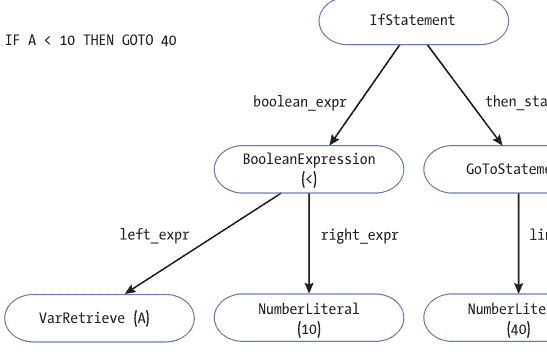

图2-1：`IF A < 10 THEN GOTO 40` 的节点

我们解析器的工作是将有意义的相邻令牌集合转换为AST节点。在我们解释器的最后阶段，AST节点将被“遍历”，这涉及按顺序完成每个节点所连接的任何操作。我们AST中可以出现的每个节点在*nodes.py*中都有自己的类。所有节点都继承自Node类。每个Node都跟踪其在原始源代码文件中的位置，以便调试：

```python
from dataclasses import dataclass
from NanoBASIC.tokenizer import TokenType

### 为了调试目的，我们需要知道所有节点的位置
@dataclass(frozen=True)
class Node:
    line_num: int
    col_start: int
    col_end: int
```

现在让我们定义Statement节点：

```python
### NanoBASIC中的所有语句都有一个行号标识符
### 程序员在语句前输入（*line_id*）。
### 这有点令人困惑，因为还有一个“物理”
### 行号（*line_num*），即语句在文件中实际出现的行数。
@dataclass(frozen=True)
class Statement(Node):
    line_id: int
```

NanoBASIC中的每个语句都出现在用户定义的行号之后。这是为了GOTO和GOSUB调用。我们不应该将这些行号与每个Node对象的line_num混淆，line_num是Node在源代码文件中出现的位置。为了清晰起见，我们在Statement类中将用户定义的行号称为line_id。例如，如果我的源代码文件的第一行是 `23 PRINT "HELLO"`，那么line_id是23，但line_num是1。

NumericExpression是一种可以在求值时产生单个整数的节点类型。它可能是一个二元运算、一元运算、数字字面量或变量查找，因此我们将所有这些节点声明为NumericExpression的子类：

```python
### 数值表达式是可以计算为数字的东西。
### 这是字面量、变量和简单算术运算的超类。
@dataclass(frozen=True)
class NumericExpression(Node):
    pass

### 具有两个操作数的数值表达式，如 2 + 2 或 8 / 4
@dataclass(frozen=True)
class BinaryOperation(NumericExpression):
    operator: TokenType
    left_expr: NumericExpression
    right_expr: NumericExpression

    def __repr__(self) -> str:
        return f"{self.left_expr} {self.operator} {self.right_expr}"

### 具有一个操作数的数值表达式，如 -4
@dataclass(frozen=True)
class UnaryOperation(NumericExpression):
    operator: TokenType
    expr: NumericExpression

    def __repr__(self) -> str:
        return f"{self.operator}{self.expr}"

### NanoBASIC代码中写出的整数
@dataclass(frozen=True)
class NumberLiteral(NumericExpression):
    number: int

### 将检索其值的变量*名称*
@dataclass(frozen=True)
class VarRetrieve(NumericExpression):
    name: str
```

为了能够被求值，这些不同类型的数值表达式需要保存一些信息。例如，VarRetrieve需要保存正在查找其值的变量的名称。同样，BinaryOperation（也可以看作是算术运算）需要存储实际执行的算术运算（加法、减法、乘法或除法），因此我们存储运算符令牌。

虽然NumericExpression解析为整数，但BooleanExpression用于生成布尔值。它接受两个NumericExpression节点，并使用布尔运算符（存储为令牌）进行比较：

```python
### 布尔表达式可以计算为真或假值。
### 它接受两个数值表达式，*left_expr* 和 *right_expr*，并使用
### 布尔*运算符*对它们进行比较。
@dataclass(frozen=True)
class BooleanExpression(Node):
    operator: TokenType
    left_expr: NumericExpression
    right_expr: NumericExpression

    def __repr__(self) -> str:
        return f"{self.left_expr} {self.operator} {self.right_expr}"
```

其余节点用于表示六种类型的NanoBASIC语句：

```python
### 表示一个LET语句，将*name*设置为*expr*
@dataclass(frozen=True)
class LetStatement(Statement):
    name: str
    expr: NumericExpression

### 表示一个GOTO语句，将控制转移到*line_expr*
@dataclass(frozen=True)
class GoToStatement(Statement):
    line_expr: NumericExpression

### 表示一个GOSUB语句，将控制转移到*line_expr*
### 返回行ID不保存在此处，它将由栈维护
@dataclass(frozen=True)
class GoSubStatement(Statement):
    line_expr: NumericExpression

### 表示一个RETURN语句，将控制转移到最后一个GOSUB语句之后的行
@dataclass(frozen=True)
class ReturnStatement(Statement):
    pass

### 一个PRINT语句，包含所有要打印的内容（逗号分隔）
@dataclass(frozen=True)
class PrintStatement(Statement):
    printables: list[str | NumericExpression]

### 一个IF语句
### *then_statement* 是如果*boolean_expression*为真时将执行的语句
@dataclass(frozen=True)
class IfStatement(Statement):
    boolean_expr: BooleanExpression
    then_statement: Statement
```

这些节点的属性反映了每种语句类型所需的数据部分。例如，由于LET语句将要将值赋给变量，一个 LetStatement 节点需要一个字符串变量名和一个表示该值的 NumericExpression。

#### 错误

让我们稍作停顿，讨论一下解释器中的错误处理。编程时最烦人的事情莫过于糟糕的错误信息。当你在代码中犯错时，你希望知道发生了什么以及错误发生在哪里。作为编程语言的创建者，你有责任为你的用户（NanoBASIC 程序员）提供良好的错误信息。

NanoBASIC 将报告两种主要类型的错误：解析器错误和解释器错误。*解析器错误*可以理解为语法错误，例如当标记的顺序错误时。例如，GOTO 之后需要一个数字表达式（表示行号），但 IF 语句之后则不需要。*解释器错误*是语义错误。它们发生在程序试图执行某些无意义的操作时，例如在变量初始化之前就尝试使用它。我们将为这两种错误定义错误类：

```python
from NanoBASIC.tokenizer import Token
from NanoBASIC.nodes import Node

class NanoBASICError(Exception):
    def __init__(self, message: str, line_num: int, column: int):
        super().__init__(message)
        self.message = message
        self.line_num = line_num
        self.column = column

    def __str__(self):
        return (f"{self.message} Occurred at line {self.line_num} "
                f"and column {self.column}")

class ParserError(NanoBASICError):
    def __init__(self, message: str, token: Token):
        super().__init__(message, token.line_num, token.col_start)

class InterpreterError(NanoBASICError):
    def __init__(self, message: str, node: Node):
        super().__init__(message, node.line_num, node.col_start)
```

ParserError 和 InterpreterError 都是 NanoBASICError 的子类，而 NanoBASICError 本身又是 Exception 的子类，Exception 是一个内置的 Python 类，你可以重写它来创建自定义异常并在程序中抛出。这些类报告与错误相关联的消息以及错误在原始程序中的发生位置。例如，假设我们有以下程序：

```basic
10 PRINT(A)
```

这将导致报告以下错误：

```
NanoBASIC.errors.InterpreterError: Var A used before initialized. Occurred at line 1 and column 10
```

这个错误发生是因为变量 A 从未使用 LET 语句进行初始化。在接下来的章节中，你会看到许多 ParserError 和 InterpreterError 的抛出。

#### 解析器

解析器接收来自词法分析器的标记，并尝试将它们转换为对解释程序有意义的结构。解析是计算机科学中一个被深入研究的领域，有许多不同的解析算法。甚至有一些程序可以为你生成解析器。毫不奇怪，它们被称为*解析器生成器*。解析器生成器可以接受 BNF 形式的语法并生成一个解析器。

我们当然可以在这里使用解析器生成器，但这不如自己编写解析器有教育意义。虽然有许多解析算法，但事实证明，最简单的算法之一也是最有效、最可定制和最广泛使用的算法之一。它被称为*递归下降*，它是世界上两个最流行的编译器 GCC 和 Clang 中 C/C++ 解析器的基础。它也是 Dennis Allison 在 Tiny BASIC 原始版本中使用的技术。

在递归下降中，通常语法中定义的每个非终结符都变成一个函数。该函数负责检查它正在分析的标记序列是否遵循语法中指定的产生式规则。解析器通过顺序查看标记来检查它们。如果正在分析的标记被期望是另一个产生式规则的一部分，递归下降解析器只需调用代表该另一个产生式规则的函数。递归下降函数在成功时返回相应的节点——*成功*意味着函数确实找到了它期望的标记。

递归下降是一种*自顶向下*的解析技术，意味着解析从语法的“开始”（在我们的情况下是 `<line>`）开始，并“下降”直到达到必要的最具体点。这是*下降*部分，但*递归*部分需要更多的可视化。想象我们正在解析一个 IF 语句。IF 语句是一种语句类型，每个非终结符，包括“语句”和“IF 语句”，都可能在我们的递归下降解析器中获得一个对应的函数。IF 语句有一个 THEN 子句，它也是一个语句。因此，当我们解析 IF 语句时，我们可能再次调用我们的函数来解析 THEN 子句的语句——这个函数与调用我们的函数来解析 IF 语句的函数是同一个！这是一种递归。我们最终调用了调用我们当前所在函数的函数。

随着我们深入研究 Parser 类的代码，*下降*和*递归*都会变得更加清晰：

```python
### NanoBASIC/parser.py
from NanoBASIC.tokenizer import Token
from typing import cast
from NanoBASIC.nodes import *
from NanoBASIC.errors import ParserError

class Parser:
    def __init__(self, tokens: list[Token]):
        self.tokens = tokens
        self.token_index: int = 0

    @property
    def out_of_tokens(self) -> bool:
        return self.token_index >= len(self.tokens)

    @property
    def current(self) -> Token:
        if self.out_of_tokens:
            raise (ParserError(f"No tokens after "
                               f"{self.previous.kind}", self.previous))
        return self.tokens[self.token_index]

    @property
    def previous(self) -> Token:
        return self.tokens[self.token_index - 1]
```

Parser 类接收来自词法分析器的标记集合。随着解析的进行，一个内部的 token_index 跟踪我们当前所在的标记。我们还定义了一些便捷属性来获取当前或上一个标记。

consume() 辅助方法检查当前标记是否是期望的标记，递增 token_index，并返回被检查的标记。如果标记不是期望的标记，我们抛出一个 ParserError：

```python
def consume(self, kind: TokenType) -> Token:
    if self.current.kind is kind:
        self.token_index += 1
        return self.previous
    raise ParserError(f"Expected {kind} after {self.previous}"
                      f"but got {self.current}.", self.current)
```

像 consume() 这样的辅助函数（有时也称为 eat() 或 accept()）在解析器中很常见，因为检查一个标记是否是期望的标记并在它是时继续前进，这是一个非常常见的模式。如果我们没有 consume()，你会看到很多不必要的重复代码。

我们的解析器的目标是生成一个 AST，运行时可以遍历它来执行 NanoBASIC 程序。AST 的根将是一个语句列表。另一种思考方式是，NanoBASIC 程序只是一个语句列表，按照从源代码文件顶部到底部的顺序编写。最终，我们的运行时将一次执行这些语句。因此，我们的递归下降解析器从 parse() 开始，它将“下降”通过其他解析器方法，最后返回语句列表：

```python
def parse(self) -> list[Statement]:
    statements: list[Statement] = []
    while not self.out_of_tokens:
        statement = self.parse_line()
        statements.append(statement)
    return statements
```

每条语句必须写在自己的行上，旁边有一个行标识符，因此下降的第一步是解析一行：

```python
def parse_line(self) -> Statement:
    number = self.consume(TokenType.NUMBER)
    return self.parse_statement(cast(int, number.associated_value))
```

我们期望行标识符位于行的开头。因此，parse_line() 首先尝试消费一个 NUMBER 标记。如果成功，我们继续解析语句本身。这里使用 cast() 是为了类型检查。如果你还记得词法分析器的代码（如果需要，可以回去看看），一个标记的 associated_value 可以是整数、字符串或 None。我们知道 NUMBER 的 associated_value 永远只会是整数，所以转换为 int 是安全的。像 mypy 或 Pyright 这样的类型检查器可以利用这个转换。

注意 parse_line() 方法如何对应语法中的 `<line>` 非终结符。从这一点开始，我们的许多方法将直接对应语法中的非终结符或它们各自的产生式规则（可以回去看看语法作为指导）。例如，我们的下一个方法 parse_statement() 对应于 `<statement>` 非终结符：

```python
def parse_statement(self, line_id: int) -> Statement:
    match self.current.kind:
        case TokenType.PRINT:
            return self.parse_print(line_id)
        case TokenType.IF_T:
            return self.parse_if(line_id)
        case TokenType.LET:
            return self.parse_let(line_id)
        case TokenType.GOTO:
            return self.parse_goto(line_id)
        case TokenType.GOSUB:
            return self.parse_gosub(line_id)
        case TokenType.RETURN_T:
            return self.parse_return(line_id)
    raise ParserError("Expected to find start of statement.",
                      self.current)
```

此方法负责确定NanoBASIC中的六种语句中哪一种出现在接下来的几个词法单元中。幸运的是，NanoBASIC中的每种语句都可以通过其唯一的起始词法单元（PRINT、IF、LET、GOTO、GOSUB或RETURN）来识别，因此我们只需将当前词法单元与这六种可能性进行匹配即可。

为了组织方便，我将每种语句类型拆分到各自的方法中，尽管这些方法并不直接对应非终结符。相反，你可以将`<statement>`的每条产生式规则都视为拥有自己的方法。我们从PRINT语句开始，这是解析起来较为棘手的语句之一，因为它的`<expr-list>`中可以包含多种不同的逗号分隔类型。

```python
### PRINT "COMMA",SEPARATED,7154
def parse_print(self, line_id: int) -> PrintStatement:
    print_token = self.consume(TokenType.PRINT)
    printables: list[str | NumericExpression] = []
    last_col: int = print_token.col_end
    while True:  # keep finding things to print
        if self.current.kind is TokenType.STRING: ❶
            string = self.consume(TokenType.STRING)
            printables.append(cast(str, string.associated_value))
            last_col = string.col_end
        elif (expression := self.parse_numeric_expression()) is not None: ❷
            printables.append(expression)
            last_col = expression.col_end
        else: ❸
            raise ParserError("Only strings and numeric expressions "
                              "allowed in print list.", self.current)
        # Comma means there's more to print
        if not self.out_of_tokens and self.current.kind is TokenType.COMMA: ❹
            self.consume(TokenType.COMMA)
            continue
        break
    return PrintStatement(line_id=line_id, line_num=print_token.line_num,
                          col_start=print_token.col_start, col_end=last_col,
                          printables=printables)
```

我们将要打印的项目保存在`printables`这个Python列表中。为了收集它们，我们持续向前推进（使用循环），逐个词法单元地检查，寻找字符串❶或数值表达式❷。只要找到其中一种，并且后面跟着一个逗号❹，我们就继续循环。如果找到既不是字符串也不是数值表达式的东西❸，我们就抛出一个`ParserError`。在循环过程中，我们还跟踪最后一个项目的列结束位置，以便调试。最终返回的`PrintStatement`节点需要知道它的起始和结束位置；它从`PRINT`词法单元的起始位置开始，结束于表达式列表中最后一个项目的最后一列的末尾。

接下来，让我们看看`parse_if()`方法，它很好地展示了递归下降解析的递归特性：

```python
### IF BOOLEAN_EXPRESSION THEN STATEMENT
def parse_if(self, line_id: int) -> IfStatement:
    if_token = self.consume(TokenType.IF_T)
    boolean_expression = self.parse_boolean_expression()
    self.consume(TokenType.THEN)
    statement = self.parse_statement(line_id)
    return IfStatement(line_id=line_id, line_num=if_token.line_num,
                       col_start=if_token.col_start, col_end=statement.col_end,
                       boolean_expr=boolean_expression, then_statement=statement)
```

正如我们讨论过的，`IF`语句的`THEN`子句是另一个语句。为了解析`THEN`子句，我们调用`parse_statement()`，这个方法在调用链的更高层正是引导我们来到`parse_if()`的同一个方法。不过，我们首先解析`IF`语句开头的布尔表达式。我们稍后会讨论如何做到这一点。

在目前讨论的所有解析方法中，请注意我们如何调用其他解析方法并假设它们能正常工作。其他方法负责自己的错误处理，并通常通过调用`consume()`来持续移动`token_index`。这种模式在其他四种语句类型的方法中继续存在：

```python
### LET VARIABLE = VALUE
def parse_let(self, line_id: int) -> LetStatement:
    let_token = self.consume(TokenType.LET)
    variable = self.consume(TokenType.VARIABLE)
    self.consume(TokenType.EQUAL)
    expression = self.parse_numeric_expression()
    return LetStatement(line_id=line_id, line_num=let_token.line_num,
                        col_start=let_token.col_start, col_end=expression.col_end,
                        name=cast(str, variable.associated_value), expr=expression)
```

```python
### GOTO NUMERIC_EXPRESSION
def parse_goto(self, line_id: int) -> GoToStatement:
    goto_token = self.consume(TokenType.GOTO)
    expression = self.parse_numeric_expression()
    return GoToStatement(line_id=line_id, line_num=goto_token.line_num,
                         col_start=goto_token.col_start, col_end=expression.col_end,
                         line_expr=expression)
```

```python
### GOSUB NUMERIC_EXPRESSION
def parse_gosub(self, line_id: int) -> GoSubStatement:
    gosub_token = self.consume(TokenType.GOSUB)
    expression = self.parse_numeric_expression()
    return GoSubStatement(line_id=line_id, line_num=gosub_token.line_num,
                          col_start=gosub_token.col_start,
                          col_end=expression.col_end,
                          line_expr=expression)
```

```python
### RETURN
def parse_return(self, line_id: int) -> ReturnStatement:
    return_token = self.consume(TokenType.RETURN_T)
    return ReturnStatement(line_id=line_id, line_num=return_token.line_num,
                           col_start=return_token.col_start,
                           col_end=return_token.col_end)
```

这四个解析方法彼此非常相似。在每种情况下，我们都期望一个特定的起始词法单元（例如`LET`或`GOTO`），然后我们解析创建该类型语句节点所需的一些信息。例如，`LET`语句需要一个变量和一个数值表达式，而`GOTO`语句只需要一个数值表达式（要跳转到的行号）。最简单的语句是`RETURN`，因为`RETURN`之后没有任何内容。

如前所述，这是`parse_boolean_expression()`方法：

```python
### NUMERIC_EXPRESSION BOOLEAN_OPERATOR NUMERIC_EXPRESSION
def parse_boolean_expression(self) -> BooleanExpression:
    left = self.parse_numeric_expression()
    if self.current.kind in {TokenType.GREATER, TokenType.GREATER_EQUAL, TokenType.EQUAL,
                             TokenType.LESS, TokenType.LESS_EQUAL, TokenType.NOT_EQUAL}:
        operator = self.consume(self.current.kind)
        right = self.parse_numeric_expression()
        return BooleanExpression(line_num=left.line_num,
                                 col_start=left.col_start, col_end=right.col_end,
                                 operator=operator.kind, left_expr=left, right_expr=right)
    raise ParserError(f"Expected boolean operator but found "
                      f"{self.current.kind}.", self.current)
```

布尔表达式必须包含两个数值表达式和一个允许的运算符词法单元。我们将运算符词法单元之前的数值表达式称为`left`，之后的称为`right`。运算符词法单元存储在`BooleanExpression`节点中，以便我们可以在运行时进行适当的比较。

解析数值表达式紧密遵循语法中非终结符的层次结构，从`<expression>`到`<term>`再到`<factor>`，每个层次都有一个对应的方法。`<factor>`可以包含`<var>`或`<number>`，但这些在`parse_factor()`中直接处理，因为它们所需的信息已经包含在各自的词法单元中：

```python
def parse_numeric_expression(self) -> NumericExpression:
    left = self.parse_term()
    # Keep parsing +s and -s until there are no more
    while True:
        if self.out_of_tokens:  # what if expression is end of file?
            return left
        if self.current.kind is TokenType.PLUS:
            self.consume(TokenType.PLUS)
            right = self.parse_term()
            left = BinaryOperation(line_num=left.line_num, col_start=left.col_start,
                                   col_end=right.col_end, operator=TokenType.PLUS,
                                   left_expr=left, right_expr=right)
        elif self.current.kind is TokenType.MINUS:
            self.consume(TokenType.MINUS)
            right = self.parse_term()
            left = BinaryOperation(line_num=left.line_num, col_start=left.col_start,
                                   col_end=right.col_end, operator=TokenType.MINUS,
                                   left_expr=left, right_expr=right)
```

else:
    break  # 没有更多了，表达式必须结束了
return left

def parse_term(self) -> NumericExpression:
    left = self.parse_factor()
    # 持续解析 * 和 /，直到没有更多为止
    while True:
        if self.out_of_tokens:  # 如果表达式在文件末尾结束怎么办？
            return left
        if self.current.kind is TokenType.MULTIPLY:
            self.consume(TokenType.MULTIPLY)
            right = self.parse_factor()
            left = BinaryOperation(line_num=left.line_num, col_start=left.col_start,
                                   col_end=right.col_end, operator=TokenType.MULTIPLY,
                                   left_expr=left, right_expr=right)
        elif self.current.kind is TokenType.DIVIDE:
            self.consume(TokenType.DIVIDE)
            right = self.parse_factor()
            left = BinaryOperation(line_num=left.line_num, col_start=left.col_start,
                                   col_end=right.col_end, operator=TokenType.DIVIDE,
                                   left_expr=left, right_expr=right)
        else:
            break  # 没有更多了，表达式必须结束了
    return left

def parse_factor(self) -> NumericExpression:
    if self.current.kind is TokenType.VARIABLE:
        variable = self.consume(TokenType.VARIABLE)
        return VarRetrieve(line_num=variable.line_num,
                           col_start=variable.col_start, col_end=variable.col_end,
                           name=cast(str, variable.associated_value))
    elif self.current.kind is TokenType.NUMBER:
        number = self.consume(TokenType.NUMBER)
        return NumberLiteral(line_num=number.line_num,
                             col_start=number.col_start, col_end=number.col_end,
                             number=int(cast(str, number.associated_value)))
    elif self.current.kind is TokenType.OPEN_PAREN:
        self.consume(TokenType.OPEN_PAREN)
        expression = self.parse_numeric_expression()
        if self.current.kind is not TokenType.CLOSE_PAREN:
            raise ParserError("Expected matching close parenthesis.", self.current)
        self.consume(TokenType.CLOSE_PAREN)
        return expression
    elif self.current.kind is TokenType.MINUS:
        minus = self.consume(TokenType.MINUS)
        expression = self.parse_factor()
        return UnaryOperation(line_num=minus.line_num,
                              col_start=minus.col_start, col_end=expression.col_end,
                              operator=TokenType.MINUS, expr=expression)
    raise ParserError("Unexpected token in numeric expression.", self.current)

注意这里的优先级顺序。在算术中，我们期望除法的优先级高于减法，而括号的优先级高于任何其他运算。正如我们在首次讨论 NanoBASIC 语法时所暗示的，这可以通过非终结符的解析顺序在递归下降中建模。你下降得越深，优先级就越高。在这种情况下，在 `parse_term()` 中处理的任何内容的优先级都会高于 `parse_numeric_expression()` 中的任何内容，而在 `parse_factor()` 中处理的任何内容的优先级又会高于 `parse_numeric_expression()` 或 `parse_term()` 中的任何内容。这也是为什么 `-` 和 `+` 出现在同一个产生式规则中，而 `/` 和 `*` 出现在“更深层”的原因。

每次我们需要在 `parse_numeric_expression()` 或 `parse_term()` 中获取表达式的左侧或右侧时，我们都会下降。例如，`parse_numeric_expression()` 从不调用 `parse_numeric_expression()`。相反，它调用 `parse_term()`。这可能看起来违反直觉，因为你可能想知道如何处理连续的多个加法。关键在于 `parse_numeric_expression()` 和 `parse_term()` 都使用循环，就像我们在 `parse_print()` 中为了处理任意数量的算术运算（例如多个加法操作）所做的那样。一种思考方式是，我们下降并处理任何更高优先级的内容，然后如果还有更多的加法或减法标记，则返回到 `parse_numeric_expression()` 中继续循环。

让我们尝试解析一个例子。假设我们正在解析表达式 `2 + 3 * 4 + 5`。`parse_numeric_expression()` 中 `left` 的初始化调用 `parse_term()`，后者调用 `parse_factor()`，后者返回一个表示 `2` 的 `NumberLiteral`。然后，我们将 `2` 一路返回到 `parse_numeric_expression()`，并将其存储在 `left` 中。接下来，遇到一个 `+` 标记，并调用 `parse_term()`。它通过多次调用 `parse_factor()` 来解析 `3 * 4`。我们最终回到 `parse_numeric_expression()`，得到一个表示 `3 * 4` 的 `BinaryOperation` 节点，称为 `right`。然后，`left` 和 `right` 被组合成一个新的 `BinaryOperation` 并关联到 `left`（为其创建一个新的绑定）。最后，遇到最后一个 `+` 标记，`5` 以与 `2` 类似的方式解析（一路下降到 `parse_factor()`）并关联到 `right`。`left` 和 `right` 再次组合在一起，作为 `parse_numeric_expression()` 的最终返回值。

尝试自己处理一些算术例子，以更好地理解下降到更深层次的运算符具有更高的优先级。在操作时，你可能需要打开解析器代码。循环的组合和为不同节点重用变量可能很难推理，但一旦你处理了几个例子，它就开始变得有意义了。你也可以尝试在各种方法中添加一些 `print()` 调用，以说明解析过程。如果你还没有完成输入整个程序，你可以省略在 `executioner.py` 中通过运行时运行 AST 的调用。

> 注意：解析算术表达式有更高效的方法。Dijkstra 发现的一种流行方法称为调度场算法。像调度场这样更高效的算法有时会与递归下降解析器结合，用于算术表达式部分，形成一种混合模型。

#### 运行时

我们解析器的最终结果是一组 AST 语句节点，存储为一个列表，运行时可以逐步执行。我将遍历 AST 的类命名为 `Interpreter`，尽管我意识到这可能会有点令人困惑，因为整个章节都是关于构建解释器的。是的，分词器和解析器是整个解释器的一部分，但这个 `Interpreter` 类是语言实际被解释的地方，即成为节点的标记被转换为有意义的东西——一个执行并产生输出的程序。无论它是否是一个好名字，`Interpreter` 类提供了一个运行时环境，并理解如何根据它遇到的语句和表达式节点来修改环境或提供输出。

`Interpreter` 类的开始与 `Parser` 类似：

```
from NanoBASIC.nodes import *
from NanoBASIC.errors import InterpreterError
from collections import deque

class Interpreter:
    def __init__(self, statements: list[Statement]):
        self.statements = statements
        self.variable_table: dict[str, int] = {}
        self.statement_index: int = 0
        self.subroutine_stack: deque[int] = deque()

    @property
    def current(self) -> Statement:
        return self.statements[self.statement_index]
```

与 `Parser` 类中的标记列表不同，`Interpreter` 接收一个语句列表。还有一个 `current` 属性，方便访问当前语句。运行时环境包括语句、一个 `statement_index`、一个用于跟踪每个变量值的 `variable_table`，以及一个 `subroutine_stack`，它将帮助我们在 `GOSUB` 和 `RETURN` 对之后到达正确的位置。

接下来，我们需要一种将行标识符连接到语句索引的方法。考虑以下 NanoBASIC 程序：

```
27 PRINT "HELLO"
38 GOTO 50
45 PRINT "NEVER"
50 PRINT "BYE"
```

当执行 `GOTO 50` 时，解释器需要找到与行标识符 `50` 关联的语句，并从那里继续运行。在 NanoBASIC 中，程序员可以为任何行任意选择任何行标识符，只要所有行标识符都是递增的整数，那么我们如何找到 `50` 呢？我们需要在语句列表中搜索它。由于这些行必须按顺序排列，我们的 `find_line_index()` 方法可以执行二分查找：

```
### 使用二分查找返回 *line_id* 的索引，
### 如果未找到则返回 None；假设 statements 列表已排序
def find_line_index(self, line_id: int) -> int | None:
    low: int = 0
    high: int = len(self.statements) - 1
    while low <= high:
        mid: int = (low + high) // 2
        if self.statements[mid].line_id < line_id:
            low = mid + 1
        elif self.statements[mid].line_id > line_id:
            high = mid - 1
        else:
            return mid
    return None
```

接下来，`run()` 方法按顺序执行 `statements` 中的语句：

```
def run(self):
    while self.statement_index < len(self.statements):
        self.interpret(self.current)
```

注意，我们使用的是由 `statement_index` 控制的 `while` 循环，而不是 `for...in` 循环。这是因为由于 `GOTO` 和 `GOSUB`，我们实际上可能会跳转、跳过或重复某些语句。换句话说，当我们在循环中解释各种语句时，`statement_index` 可能会被修改。

`interpret()` 方法是解释器的核心。它解释语句节点，并根据每个特定语句的含义修改运行时环境或创建一些输出：

```
def interpret(self, statement: Statement):
    match statement:
        case LetStatement(name=name, expr=expr):
            value = self.evaluate_numeric(expr)
            self.variable_table[name] = value
            self.statement_index += 1
        case GoToStatement(line_expr=line_expr):
            go_to_line_id = self.evaluate_numeric(line_expr)
            if (line_index := self.find_line_index(go_to_line_id)) is not None:
                self.statement_index = line_index
            else:
                raise InterpreterError("No GOTO line id.", self.current)
        case GoSubStatement(line_expr=line_expr):
            go_sub_line_id = self.evaluate_numeric(line_expr)
            if (line_index := self.find_line_index(go_sub_line_id)) is not None:
                self.subroutine_stack.append(self.statement_index + 1)  # 为 RETURN 做准备
                self.statement_index = line_index
            else:
                raise InterpreterError("No GOSUB line id.", self.current)
        case ReturnStatement():
            if not self.subroutine_stack:  # 检查栈是否为空
                raise InterpreterError("RETURN without GOSUB.", self.current)
            self.statement_index = self.subroutine_stack.pop()
        case PrintStatement(printables=printables):
            accumulated_string: str = ""
            for index, printable in enumerate(printables):
                if index > 0:  # 在列表项之间放置制表符
                    accumulated_string += "\t"
                if isinstance(printable, NumericExpression):
                    accumulated_string += str(self.evaluate_numeric(printable))
                else:  # 否则，它是一个字符串
                    accumulated_string += str(printable)
            print(accumulated_string)
            self.statement_index += 1
        case IfStatement(boolean_expr=boolean_expr, then_statement=then_statement):
            if self.evaluate_boolean(boolean_expr):
                self.interpret(then_statement)
            else:
                self.statement_index += 1
        case _:
            raise InterpreterError(f"Unexpected item {self.current} "
                                   f"in statement list.", self.current)
```

遍历 AST 证明比构建它容易得多，因为我们可以利用 Python `match` 语句提供的结构化模式匹配。在每种情况下（除了没有属性的 `ReturnStatement`），我们都会捕获正在匹配的 `Statement` 子类的一些属性。例如，`case LetStatement(name=name, expr=expr):` 这一行表示，假设 `statement` 是一个 `LetStatement`，`statement.name` 将存储在局部变量 `name` 中，`statement.expr` 将存储在局部变量 `expr` 中。

其中三种情况在完成操作后通过递增 `statement_index` 使解释器继续前进。`GoToStatement`、`GoSubStatement` 和 `ReturnStatement` 情况则不会，因为它们通过直接修改 `statement_index` 在代码中跳转。每次遇到 `GoSubStatement` 时，我们需要知道当下次执行 `ReturnStatement` 时要返回到哪里——可以将其视为一种书签。这就是 `subroutine_stack` 的目的。在 `GoSubStatement` 情况下，我们将 `statement_index + 1` 存储在栈上，以避免无限循环（返回到 `GOSUB` 的源位置）；然后，在 `ReturnStatement` 情况下，我们从栈中弹出。

请注意，如果 `IfStatement` 节点的 `boolean_expr` 求值为 `True`，则会递归调用 `interpret()`，并且 `statement_index` 不会递增。这是因为与 `THEN` 子句关联的语句本身会修改 `statement_index`。

对数值表达式求值主要就是执行正确的 Python 运算符以匹配 NanoBASIC 算术运算符标记，或者从 `variable_table` 中检索变量：

```
def evaluate_numeric(self, numeric_expression: NumericExpression) -> int:
    match numeric_expression:
        case NumberLiteral(number=number):
            return number
        case VarRetrieve(name=name):
            if name in self.variable_table:
                return self.variable_table[name]
            else:
                raise InterpreterError(f"Var {name} used "
                                       f"before initialized.", numeric_expression)
        case UnaryOperation(operator=operator, expr=expr):
            if operator is TokenType.MINUS:
                return -self.evaluate_numeric(expr)
            else:
                raise InterpreterError(f"Expected - "
                                       f"but got {operator}.", numeric_expression)
        case BinaryOperation(operator=operator, left_expr=left, right_expr=right):
            if operator is TokenType.PLUS:
                return self.evaluate_numeric(left) + self.evaluate_numeric(right)
            elif operator is TokenType.MINUS:
                return self.evaluate_numeric(left) - self.evaluate_numeric(right)
            elif operator is TokenType.MULTIPLY:
                return self.evaluate_numeric(left) * self.evaluate_numeric(right)
            elif operator is TokenType.DIVIDE:
                return self.evaluate_numeric(left) // self.evaluate_numeric(right)
            else:
                raise InterpreterError(f"Unexpected binary operator "
                                       f"{operator}.", numeric_expression)
        case _:
            raise InterpreterError("Expected numeric expression.",
                                   numeric_expression)
```

注意 `evaluate_numeric()` 中所有的递归调用。当你刚开始学习用 Python 这样的命令式语言编程时，递归可能看起来是一个深奥的主题。当你晋升为中级或高级程序员时，你开始看到它的用处。这个项目就是一个很好的例证。我们已经在 `Parser` 和 `Interpreter` 类中看到，递归对于以算法方式表达我们的想法是多么有用。

信不信由你，有些编程语言（主要在函数式范式中）根本没有循环，只有递归。这听起来可能很极端，而且只使用递归编写 Python 代码肯定是一种糟糕的方式，因为它会使你的代码对其他 Python 程序员来说可读性大大降低，并带来一些性能损失。但它强调了递归可以是一种多么强大的技术。任何你能用循环完成的事情，你也可以用递归来完成，但神奇之处在于递归实际上能帮助你更好地表达自己，就像在这个项目中一样。特别是，在处理像 AST 这样的层次数据结构时，递归真的非常有帮助。

对布尔表达式求值与对数值表达式求值非常相似。这是从 NanoBASIC 运算符到 Python 运算符的转换：

```
def evaluate_boolean(self, boolean_expression: BooleanExpression) -> bool:
    left = self.evaluate_numeric(boolean_expression.left_expr)
    right = self.evaluate_numeric(boolean_expression.right_expr)
    match boolean_expression.operator:
        case TokenType.LESS:
            return left < right
        case TokenType.LESS_EQUAL:
            return left <= right
        case TokenType.GREATER:
            return left > right
        case TokenType.GREATER_EQUAL:
            return left >= right
        case TokenType.EQUAL:
            return left == right
        case TokenType.NOT_EQUAL:
            return left != right
        case _:
            raise InterpreterError(f"Unexpected boolean operator "
                                   f"{boolean_expression.operator}.", boolean_expression)
```

就是这样！运行一个 NanoBASIC 程序比解析它容易得多。

> 注意：如果这是一个简单的编译器而不是一个简单的解释器，那么在遇到每个节点时，我们将生成机器代码，而不是遍历 AST 并执行一些操作。

#### 运行程序

现在我们的 NanoBASIC 解释器已经完成，我们可以运行一些 NanoBASIC 程序了。你可以在网上找到可以在 NanoBASIC 中运行的 Tiny BASIC 程序（或者如果它们使用了 NanoBASIC 没有的 `INPUT` 或其他功能，则进行修改）。你也可以编写自己的 NanoBASIC 程序，这实际上是测试你的解释器的好方法。如前所述，我还在项目的 *Examples* 文件夹中提供了几个简单的 NanoBASIC 程序。例如，我们在本章早期看到了 *fib.bas*。另一个示例 *gcd.bas* 查找源代码中指定的两个数的最大公约数。以下是它查找 350 和 539 的最大公约数：

```
% python3 -m NanoBASIC NanoBASIC/Examples/gcd.bas
7
```

同样，如第 1 章所述，运行程序的命令假设你位于仓库的主目录中。不要忘记使用 `-m` 选项将程序作为模块运行。

#### 测试 NanoBASIC

与 Brainfuck 一样，拥有一些集成测试来确保我们的解释器正常运行是有帮助的。NanoBASIC 测试与 Brainfuck 测试非常相似。我们劫持标准输出并确保*Examples* 文件夹中许多程序的预期输出与实际输出相同：

```
tests/test_nano basic.py
import unittest
import sys
from pathlib import Path
from io import StringIO
from NanoBASIC.executioner import execute

### Tokenizes, parses, and interprets a NanoBASIC
### program; stores the output in a string and returns it
def run(file_name: str | Path) -> str:
    output_holder = StringIO()
    sys.stdout = output_holder
    execute(file_name)
    return output_holder.getvalue()

class NanoBASICTestCase(unittest.TestCase):
    def setUp(self) -> None:
        self.example_folder = (Path(__file__).resolve().parent.parent
                               / 'NanoBASIC' / 'Examples')

    def test_print1(self):
        program_output = run(self.example_folder / "print1.bas")
        expected = "Hello World\n"
        self.assertEqual(program_output, expected)

    def test_print2(self):
        program_output = run(self.example_folder / "print2.bas")
        expected = "4\n12\n30\n7\n100\t9\n"
        self.assertEqual(program_output, expected)

    def test_print3(self):
        program_output = run(self.example_folder / "print3.bas")
        expected = "E is\t-31\n"
        self.assertEqual(program_output, expected)

    def test_variables(self):
        program_output = run(self.example_folder / "variables.bas")
        expected = "15\n"
        self.assertEqual(program_output, expected)

    def test_goto(self):
        program_output = run(self.example_folder / "goto.bas")
        expected = "Josh\nDave\nNanoBASIC ROCKS\n"
        self.assertEqual(program_output, expected)

    def test_gosub(self):
        program_output = run(self.example_folder / "gosub.bas")
        expected = "10\n"
        self.assertEqual(program_output, expected)

    def test_if1(self):
        program_output = run(self.example_folder / "if1.bas")
        expected = "10\n40\n50\n60\n70\n100\n"
        self.assertEqual(program_output, expected)

    def test_if2(self):
        program_output = run(self.example_folder / "if2.bas")
        expected = "GOOD\n"
        self.assertEqual(program_output, expected)

    def test_fib(self):
        program_output = run(self.example_folder / "fib.bas")
        expected = "0\n1\n1\n2\n3\n5\n8\n13\n21\n34\n55\n89\n"
        self.assertEqual(program_output, expected)

    def test_factorial(self):
        program_output = run(self.example_folder / "factorial.bas")
        expected = "120\n"
        self.assertEqual(program_output, expected)

    def test_gcd(self):
        program_output = run(self.example_folder / "gcd.bas")
        expected = "7\n"
        self.assertEqual(program_output, expected)

if __name__ == "__main__":
    unittest.main()
```

NanoBASIC 测试的另一个特点是，许多测试都隔离了单一的语句类型。例如，*print2.bas* 只使用 PRINT 语句和数值表达式，因此即使 GOTO 不能正常工作，test_print2() 仍然可以通过（但希望 GOTO 错误会被其他测试捕获）。这种隔离主义方法提供了更细粒度的测试结果，但我们仍然需要更全面的集成测试，如 *fib.bas*，以确保各语句能够协同正确工作。一套更健壮的单元测试还应包括独立检查词法分析器、语法分析器和解释器的测试。

你应该会发现所有测试都通过了。你也可以尝试添加一个自己编写的 BASIC 程序作为额外的测试。

> **代码遇见生活**

我的父亲丹尼·科佩克（Danny Kopec）¹⁰ 是一位计算机科学教授，他在达特茅斯学院学习编程，并在那里选修了由达特茅斯学院校长约翰·凯梅尼（John Kemeny）¹¹ 教授的 BASIC 课程，凯梅尼是该语言的创造者之一。大约在 20 世纪 90 年代中期，当我八岁左右刚开始学习编程时，他给我买了一本 True BASIC¹²，这是由凯梅尼和 BASIC 的共同创造者托马斯·库尔茨（Thomas Kurtz）¹³ 创立的公司发布的“官方”BASIC。到 1995 年，BASIC 有点过时了，但当时我并不知道。我花了很多时间用 True BASIC 制作游戏，尽管我觉得我从未真正学会子程序。我想我当时写的是意大利面条式代码。

*（续）*

和我父亲一样，我最终也去了达特茅斯读本科（主修经济学），在华尔街一份我讨厌的工作短暂工作后，我申请了计算机科学的研究生项目。始于 BASIC 的编程线索仍然在我心中。一个没有计算机科学学位的人如何能进入计算机科学研究生院？我在本科阶段选修了五门计算机科学课程，大部分成绩都不错，并在业余时间发布了一些项目，这足以让我进入几个研究生项目。我最终回到了达特茅斯攻读硕士学位。对于任何考虑这条路线的人，我想说，没有完整的计算机科学本科学位，过渡到硕士课程会相当困难。我不建议在没有大量自学的情况下，跨专业攻读研究生学位。

为了继续加倍我的错误，在硕士课程的第一个学期，我决定选修一门棘手的编译器课程。这门课最终成了我研究生生涯中成绩最低的一门课。这门课涉及一个大型项目：用 C 语言构建一个 C 编译器（缺少一些功能）。我有一个项目搭档，我们将工作分解为编译器的几个阶段，类似于我们在本章中讨论的阶段（词法分析器、语法分析器、代码生成器等）。只有所有阶段都正常工作，编译器才能工作。到了学期最后一周，我为我的阶段写了数千行代码，而我的搭档尽管我不断催促，却只写了不到 100 行。今天，当我给学生布置小组项目时，我经常想起那段经历：有时当他们责怪搭档时，他们说的是实话。毫无疑问，我的代码也不怎么样，但至少我写了。

我们疯狂地赶工，熬了几个通宵才让程序运行起来，将我搭档那点可怜的代码与我的代码结合起来，并写了更多代码来填补所有空白。最终，我们的编译器能正确完成一些基本功能，但未能通过教授的大部分自动化测试。

一个差点在编译器课程上不及格的人，怎么会最终写出关于解释器的这一章？八年后，在我从事计算机科学教育工作几年后，我回想起了我使用 BASIC 的经历。我在成长过程中还使用过一种名为 Logo¹⁴ 的儿童编程语言，这两种语言是儿童学习编程的绝佳方式。作为对自己的一个挑战，我决定构建一个介于 BASIC 和 Logo 之间的儿童编程语言。这不是一个新颖的想法——许多人做过类似的项目——但我想制作一个精致的产品，并向自己证明，编译器课程并不一定是我编程语言开发的终点。

结果是一个名为 SeaTurtle¹⁵ 的产品，卖出了几百份。几百份，不是几千份。它不会让我致富，但它向我证明，我可以编写一种人们真正想购买的编程语言。一种真正的编程语言。好吧，一种真正的“儿童”编程语言。

在 SeaTurtle 的那段经历促使我为我的新兴语言课程（在第 1 章的“代码遇见生活”框中提到）创建了 NanoBASIC，作为一个 Swift 项目。而那段经历又引导我写出了这一章。NanoBASIC 非常简单，但它是真实的，一旦你构建了真实的东西，你离构建有趣的东西就不远了。最终，我从所有这些经历中获得的视角，包括痛苦的编译器课程，使我成为撰写本章的合适人选。既然你已经读完了，希望你不必像我在那门课上那样挣扎。

#### 现实世界应用

正如之前在第 22 页的“BASIC 历史”中讨论的，BASIC 是个人计算革命的标准语言。数百万程序员从编写 BASIC 开始起步，而 Tiny BASIC 是 BASIC 的一种真实且广泛使用的方言。Tiny BASIC 的一些先驱开创了自由软件运动。得益于他们的开放许可，Tiny BASIC 被移植到各种平台，其简单性实际上成为了一个优势。它可以在内存非常有限的机器上运行，这些机器无法运行比 Tiny BASIC 复杂得多的语言。

这看起来可能不算什么，但对于早期没有其他选择（由于成本或可用性）且内存有限的个人计算机用户来说，Tiny BASIC 相比于必须编写机器代码是一个巨大的改进。由于它是自由许可的，并且被移植到如此多的平台，它也为用它编写的程序提供了一种可移植性。如果一台机器能运行 Tiny BASIC，那么它就能运行你的程序。

Tiny BASIC 至今仍在使用。像 Brainfuck 一样，它作为一种教育工具，但它的用途不止于此。截至本文撰写时，一家德国公司正在销售运行 Tiny BASIC 版本的微控制器。¹⁶

你会发现运行现代流行编程语言的解释器比我们在本章构建的解释器复杂得多，但它们具有相同的基本构建块——词法分析器、语法分析器、像 AST 这样的中间表示以及运行时环境。增加的复杂性通常是为了支持额外的功能或性能，但本章中相对简单的技术足以构建一种新语言的工作原型，甚至为你工作构建一个生产就绪的领域特定语言（DSL）。通常，DSL 不需要高性能。

许多成功的现实世界编程语言都是从相当简单的实现开始，并随着时间的推移而演进。例如，Ruby 最初是一个像 NanoBASIC 一样的 AST 遍历解释器。Ruby 后来编译为在虚拟机上执行的字节码（关于虚拟机将在第 5 章中介绍），而更新版本的 Ruby 已经集成了即时（JIT）编译器。

无论语言实现是遍历 AST、使用字节码还是拥有 JIT 编译器，它都需要我们本章涵盖的原理。

#### 练习

1.  使转义的双引号字符能够出现在 NanoBASIC 字符串中。这需要学习一些关于正则表达式的知识。
2.  通过实现 `INPUT` 语句，将 NanoBASIC 转变为 Tiny BASIC，该语句允许用户输入一个数值并将其存储在变量中。这足以实现“基线”Tiny BASIC（并能够使用你的解释器运行你在网上找到的 Tiny BASIC 程序），但许多实际版本还有扩展功能，例如一种生成随机数的方法，称为 `RND()`。
3.  Tiny BASIC 在交互模式下运行，支持以下命令（在原始语法中视为语句）：`CLEAR`、`LIST`、`RUN` 和 `END`。以行号开头的行会被存储。这些存储的内容可以被清除、列出或运行。程序也可以被终止。为 NanoBASIC 创建一个交互模式（本质上是一个 REPL），包含这四个相同的命令。我之前说练习 2 会将 NanoBASIC 转变为 Tiny BASIC，但有了这个交互模式，你将真正实现 Tiny BASIC。
4.  为 NanoBASIC 添加字符串插值支持。当字符串中的标识符前包含一个美元符号时，检查该标识符是否在变量表中定义，并将其值输出到该位置。例如，如果变量 `X` 的值为 24，那么 `"The value of X is $X"` 将打印出 `The value of X is 24`。这将需要修改词法分析器、解析器和运行时。
5.  编写一个 NanoBASIC 程序，做一些有趣的事情并测试解释器中的每条语句。将此视为最终的集成测试。

#### 注释

1.  “BASIC Begins at Dartmouth,” BASIC at 50, 2014, accessed May 22, 2024, https://www.dartmouth.edu/basicfifty/basic.html.
2.  Linus Torvalds and David Diamond, Just for Fun (HarperCollins, 2001), 7–8.
3.  James Wallace and Jim Erickson, Hard Drive: Bill Gates and the Making of the Microsoft Empire (HarperBusiness, 1993).
4.  Tom Pittman, “Itty Bitty Computers & Tiny Basic,” Itty Bitty Computers, 2004, last modified July 10, 2017, accessed May 22, 2024, http://www.ittybittycomputers.com/IttyBitty/TinyBasic.
5.  Edsger Dijkstra, “Letters to the Editor: Go To Statement Considered Harmful,” Communications of the ACM 11, no. 3 (1968): 147–148, https://dl.acm.org/doi/10.1145/362929.362947.
6.  Dennis Allison, “Design Notes for Tiny BASIC,” Dr. Dobb’s Journal of Computer Calisthenics and Orthodontia 1 (1976): 9, https://archive.org/details/dr_dobbs_journal_vol_01/page/n9/mode/2up.
7.  参见 https://peps.python.org/pep-0604.
8.  Joseph Sibony, “GCC vs. Clang: Battle of the Behemoths,” Incredibuild, May 27, 2021, https://www.incredibuild.com/blog/gcc-vs-clang-battle-of-the-behemoths.
9.  Tom Pittman, “Tiny Basic Experimenter’s Kit,” 1977, accessed December 4, 2024, http://www.ittybittycomputers.com/IttyBitty/TinyBasic/TBEK.txt.
10. 参见 https://en.wikipedia.org/wiki/Danny_Kopec.
11. 参见 https://en.wikipedia.org/wiki/John_G._Kemeny.
12. 参见 https://en.wikipedia.org/wiki/True_BASIC.
13. 参见 https://en.wikipedia.org/wiki/Thomas_E._Kurtz.
14. 参见 https://en.wikipedia.org/wiki/Logo_(programming_language).
15. 参见 https://oaksnow.com/seaturtle.
16. 参见 https://www.tinybasic.de.

# 第二部分

### 计算艺术

### 3

#### 复古图像处理


当你需要在颜色比图像本身少的显示器上显示图像时，你会怎么做？解决这个问题属于抖动算法的范畴，它通过策略性地使用有限的调色板来创造更多颜色的错觉。在本章中，我们将编写一个程序，它可以接收任何现代照片并将其显示在经典的单色 Macintosh 上。它会将照片转换为抖动的 1 位黑白版本，并将其导出为早期 Macintosh 可以读取的格式：MacPaint。在此过程中，我们将学习一种抖动算法、一种压缩算法以及一些关于文件格式的知识。

#### 什么是抖动？

*抖动算法* 以特定方式故意向图像中引入噪声，使图像看起来具有比实际更高的颜色深度。这种对人眼的欺骗既有实际应用，也有艺术应用。如果你曾经在 1990 年代早期的游戏机或电脑上看到过全动态图形，那么你可能对抖动的样子有所了解。这种技术在 GIF 动画中也很普遍，因为 GIF 只能支持 256 种颜色。（有一种变通方法可以在 GIF 中获得超过 256 种颜色，但大多数导出程序不支持。）

如果你看图 3-1，你会看到同一张图像的 JPEG 和 GIF 格式。JPEG 有 45,807 种颜色，而 GIF 只有 256 种。得益于抖动，差异并不像你想象的那么容易察觉。（如果你在阅读本书的印刷版，请参阅本书 GitHub 仓库的 *figures* 目录以获取图像的彩色版本。）

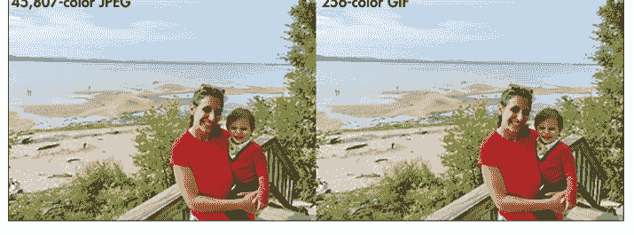

抖动及其类似技术的另一个常见用途是使黑白图像看起来具有灰度。报纸长期以来一直使用类似抖动的技术（称为 *半色调*）来让其纯黑白打印机复制照片。在计算设备上，抖动允许图像具有深度，即使在只能显示两种颜色（通常是黑色和白色）的 1 位屏幕上也是如此。这项技术在今天仍然具有相关性。例如，2022 年发布的游戏机 Panic Playdate 就有一个 1 位黑白屏幕。大多数亚马逊 Kindle 设备支持 16 级灰度，因此在 Kindle 上显示的许多书籍封面和照片必须通过抖动来近似（尽管不是 1 位抖动）。

最初的 1984 年 Apple Macintosh 有一个 1 位黑白屏幕，随后的几个型号也是如此。事实上，Apple 一直销售 1 位 Macintosh，直到 1993 年 Classic II 停产，并且该公司直到 2001 年才停止为 Classic II 提供用户支持。在那 17 年的支持期内，第三方开发者为单色 Macintosh 创建了许多酷炫的图形，他们使用的就是抖动算法。

我们的项目将针对那些经典的单色 Macintosh 以及它们运行的一个备受喜爱的图形编辑器 MacPaint。图 3-2 显示了最终结果：图 3-1 中的图像在 Mac Plus 模拟器上运行的 MacPaint 中显示。（1986 年的 Mac Plus 是 1984 年初代 Macintosh 的轻微升级版，但具有相同的屏幕限制。）该图是使用本章构建的程序创建的。

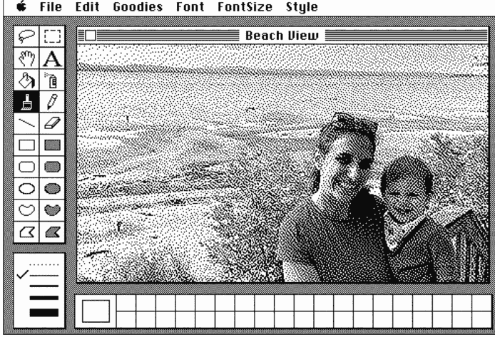

图 3-2：图 3-1 中的海滩场景，由我们的程序转换后在 MacPaint 中显示

你可能注意到图 3-2 中的海滩场景比图 3-1 中更“放大”。对于图 3-1，我首先将场景缩放到较低的分辨率，以便两个版本可以并排放在同一张图中（我使用软件计算了较低分辨率版本的颜色）。对于图 3-2，我运行了原始全分辨率图像，通过我们的程序将其转换为 MacPaint。MacPaint 限制文档宽度为 576 像素，高度为 720 像素，因此正如我们将看到的，我们的程序将始终首先调整图像大小以适应此限制。然而，Mac Plus 上的 MacPaint 显示窗口更小，因为 Mac Plus 显示器只有 512 像素宽，并且其中一些像素被工具栏占用。因此，在图 3-2 中，我们只能看到 576 像素宽度中大约 400 像素。图像的完整高度也被遮挡了。

#### 开始

我们的项目将遵循的流程非常直接：

1.  从磁盘读取图像。
2.  调整其大小并将其转换为灰度。
3.  将其抖动为黑白。
4.  以 MacPaint 格式将其写入磁盘。

项目中独特且有趣的部分是步骤 3 和 4，因此我们将使用一个库来完成步骤 1 和 2。Python 世界中最流行的图像库可能是 Pillow。安装它应该像 `pip install pillow` 一样简单。

Pillow 可以用一行代码读取任何流行格式的图像，只需再加几行代码就可以调整图像大小并将其转换为灰度。我们将在 `__main__.py` 文件中完成这个简单的准备工作，就像在前两个项目中一样处理命令行参数。让我们从调整大小和转换为灰度的代码开始，这些代码出现在一个恰如其分地命名为 `prepare()` 的函数中：

```
### RetroDither/__main__.py
from PIL import Image
from argparse import ArgumentParser
from RetroDither.dither import dither
from RetroDither.macpaint import MAX_WIDTH, MAX_HEIGHT, write_macpaint_file

def prepare(file_name: str) -> Image.Image:
    with open(file_name, "rb") as fp:
        image = Image.open(fp)
        # 将尺寸调整到 MacPaint 最大限制范围内
        if image.width > MAX_WIDTH or image.height > MAX_HEIGHT:
            desired_ratio = MAX_WIDTH / MAX_HEIGHT
            ratio = image.width / image.height
            if ratio >= desired_ratio:
                new_size = (MAX_WIDTH, int(image.height * (MAX_WIDTH / image.width)))
            else:
                new_size = (int(image.width * (MAX_HEIGHT / image.height)), MAX_HEIGHT)
            image.thumbnail(new_size, Image.Resampling.LANCZOS)
        # 转换为灰度
        return image.convert("L")
```

如前所述，MacPaint 图像的分辨率限制为宽度 576 像素，高度 720 像素。我们在 `macpaint.py` 中将这些值定义为常量。在 `prepare()` 中，如果图像太大，我们会按比例缩放。为此，我们计算图像宽度与高度的比率，并将其与 MacPaint 最大尺寸的比率进行比较。通过将一个维度缩放到 MacPaint 允许的最大尺寸，并根据适当的比率缩放另一个维度，我们得到一个在 MacPaint 中尽可能大的最终图像，且没有任何部分被裁剪。为了找出调整大小的公式，我在纸上做了一些非常简单的交叉乘法代数运算。如果你好奇这是如何工作的，我建议你也这样做。

就像读取图像文件一样，在 Pillow 中调整大小是一个简单的单行代码，使用 `image.thumbnail()` 方法。它提供了多种内置算法来实际计算调整大小后每个像素的颜色；LANCZOS 可能是质量最高的（但会有一些性能成本）。最后，`image.convert("L")` 将图像转换为灰度。灰度模式的 "L" 代表*luminance* 的缩写，在计算机图形学中有时也称为 *luma*。
现在让我们来处理命令行参数：

```python
if __name__ == "__main__":
    argument_parser = ArgumentParser("RetroDither")
    argument_parser.add_argument("image_file", help="Input image file.")
    argument_parser.add_argument("output_file", help="Resulting MacPaint file.")
    argument_parser.add_argument('-g', '--gif', default=False, action='store_true',
                                help='Create an output gif as well.')
    arguments = argument_parser.parse_args()
    original = prepare(arguments.image_file)
    dithered_data = dither(original)
    if arguments.gif:
        out_image = Image.frombytes('L', original.size, dithered_data.tobytes())
        out_image.save(arguments.output_file + ".gif")
    write_macpaint_file(dithered_data, arguments.output_file, original.width, original.height)
```

至此，在我们的第三个项目中，我们已经多次见过 `ArgumentParser`。对于 Retro Dither，与之前的项目相比，我们多了几个命令行选项。其中一个，`output_file`，是让用户指定结果的输出文件名和路径。可选的 `-g` 或 `--gif` 参数是让用户指定是否在 MacPaint 输出之外，还要生成 GIF 输出。如果用户请求 GIF 输出，我们使用 Pillow 来写入抖动图像的 GIF 版本。
Pillow 是一个功能非常全面且强大的库。在本章中，我们不会用到它的很多功能，但如果你需要在 Python 中进行图像处理，投入时间学习它是非常值得的。我们将在下一章再次看到它。更多信息，请查阅 Pillow 文档：https://pillow.readthedocs.io。

#### 抖动算法

有许多不同的抖动算法，其中最受欢迎的一类被称为 *误差扩散* 算法。这种算法会取像素最终位置与起始位置之间差异的一部分（*误差*），并将其扩散（*扩散*）到附近的像素中。最流行的误差扩散抖动算法是 Floyd-Steinberg 抖动（由 Robert Floyd 和 Louis Steinberg 于 1976 年发明）。事实上，Pillow 内置了对 Floyd-Steinberg 抖动的支持。
仅仅使用 Pillow 来做抖动会很无趣，而且我们在这个过程中也学不到任何东西。相反，我们将实现一个 Pillow 没有的算法：Atkinson 抖动算法。它由 Bill Atkinson 于 1984 年专门为原始 Macintosh 上的软件（如 MacPaint，Atkinson 是其作者）创建。因此，Atkinson 抖动在单色 Mac 上流行也就不足为奇了。它将使我们的结果看起来更真实。与 Floyd-Steinberg 一样，Atkinson 抖动也是一种误差扩散算法。正如我们将看到的，从一个误差扩散算法转换到另一个只需要做少量的更改。

在深入探讨 Atkinson 抖动的具体细节之前，让我们更一般地谈谈误差扩散抖动算法。大多数这类算法从左上角到右下角逐个查看图像的像素。移动方向是每行从左到右，然后在每行完成后向下移动一行。对于处理的每个像素，会发生以下步骤：

1.  找出它最接近的输出颜色。（在抖动中，输出颜色是预先指定的，例如黑色和白色。）
2.  找出输出颜色与像素原始颜色之间的差异。
3.  将差异的一部分添加到当前像素右侧和下方的一些像素中。

让我们将这些通用步骤应用到我们的具体场景中，即像素通过 Atkinson 抖动从灰度转换为黑白：

1.  找出黑色或白色哪个更接近像素中的灰色。这将基于某种阈值。例如，如果灰度存储为 8 位无符号整数，可能有 256 个灰度级，编号从 0 到 255，我们的阈值可能是 127。任何大于 127 的像素可能被标记为白色（在此方案中为 255），任何小于或等于 127 的像素可能被标记为黑色（0）。
2.  计算新像素颜色与其原始颜色之间的差异。假设原始灰色是 204。差异将是 255 - 204 = 51。这就是我们的误差。
3.  将误差的八分之一添加到靠近原始像素的六个特定像素中。这是扩散步骤。在这种情况下，51 // 8 = 6（我们需要进行整数除法）。被调整的像素是：右边一个，右边两个，左下方对角线一个，右下方对角线一个，正下方一个，以及下方两个。

Floyd-Steinberg 抖动和 Atkinson 抖动之间只有步骤 3 不同。你会注意到，由于我们将误差的八分之一分配给六个像素，我们总共只分配了八分之六或四分之三的总误差。在 Floyd-Steinberg 抖动中，*所有*误差都分配给四个附近的像素。这种误差分配方式的差异使得 Atkinson 抖动看起来似乎强调对比度的变化，而 Floyd-Steinberg 抖动则可能具有更平滑的外观。图 3-3 展示了一张原始图像（第一面板）、Atkinson 抖动（第二面板）和 Floyd-Steinberg 抖动（第三面板）。

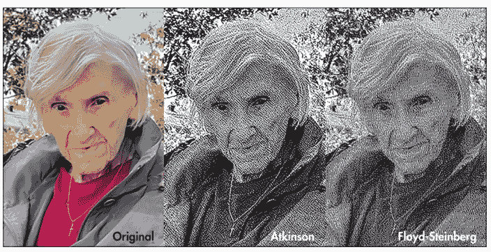

图 3-3：作者祖母的肖像，展示了各种颜色之间的良好对比度，说明了边缘在抖动中的呈现方式

表 3-1 和表 3-2 分别包含表示 Atkinson 抖动和 Floyd-Steinberg 抖动中误差扩散的矩阵。X 表示原始像素位置，列和行标题表示远离原始像素的列或行移动。

**表 3-1：Atkinson 抖动中的误差扩散**

| Δ | -1 | 0 | +1 | +2 |
|---|---|---|---|---|
| 0 | | X | 1/8 | 1/8 |
| +1 | 1/8 | 1/8 | 1/8 | |
| +2 | | 1/8 | | |

**表 3-2：Floyd-Steinberg 抖动中的误差扩散**

| Δ | -1 | 0 | +1 |
|---|---|---|---|
| 0 | | X | 7/16 |
| +1 | 3/16 | 5/16 | 1/16 |

尽管我们将实现 Atkinson 抖动，但我们会以一种易于插入不同矩阵的方式保持矩阵分离。例如，你可以轻松地将代码更改为 Floyd-Steinberg 抖动或其他误差扩散变体，或者你可以尝试自己的方法。事实上，这样做是本章末尾的练习之一。

我们的抖动代码从定义一些常量开始：

```python
from PIL import Image
from array import array
from typing import NamedTuple

THRESHOLD = 127

class PatternPart(NamedTuple):
    dc: int  # change in column
    dr: int  # change in row
    numerator: int
    denominator: int

ATKINSON = [PatternPart(1, 0, 1, 8), PatternPart(2, 0, 1, 8),
            PatternPart(-1, 1, 1, 8), PatternPart(0, 1, 1, 8),
            PatternPart(1, 1, 1, 8), PatternPart(0, 2, 1, 8)]
```

我们按照算法描述将 `THRESHOLD` 设置为 127（大约是 0 和 255 的中点）。在 `ATKINSON` 中，我们将 Atkinson 抖动矩阵展平为六个 `PatternPart` 命名元组，每个元组指定了被更改的像素之一相对于原始像素的位置，以及应将其误差的多少分数添加到该像素。

接下来，我们将开始定义一个 `dither()` 函数，抖动将在此进行：

```python
### Assumes we are working with a grayscale image (Mode "L" in Pillow)
### Returns an array of dithered pixels (255 for white, 0 for black)
def dither(image: Image.Image) -> array:
    # Distribute error among nearby pixels
    def diffuse(c: int, r: int, error: int, pattern: list[PatternPart]):
        for part in pattern:
            col = c + part.dc
            row = r + part.dr
            if col < 0 or col >= image.width or row >= image.height:
                continue
            current_pixel: float = image.getpixel((col, row))  # type: ignore
            # Add *error_part* to the pixel at (*col*, *row*) in *image*
            error_part = (error * part.numerator) // part.denominator
            image.putpixel((col, row), current_pixel + error_part)
```

`dither()` 函数以一个 `diffuse()` 辅助函数开始，该函数接收误差并将其按照模式（即 `PatternPart` 元组列表）指定的部分分配给附近的像素。我们遍历模式中的每个 `PatternPart`，找到与该部分关联的像素，并将其误差的分数添加到该像素。如前所述，模式是使一个误差扩散算法区别于另一个的核心。请注意，这里所有的算术都是整数算术。这是因为像素值存储为整数。

#### 一些低效之处

Pillow 文档指出，`getpixel()` 和 `putpixel()` 方法相当慢。Pillow 提供了直接访问数组中像素数据的替代方案。此外，遍历所有 `PatternPart` 元组的效率低于存储一个原始位置数组。事实上，由于在阿特金森抖动中，每个 `error_part` 恰好是总误差的八分之一，我们只需将误差除以 8 一次，就能节省大量计算。然而，这段代码的目的并非追求最高效率，而是为了在一本教授该算法的书中尽可能保持可读性。我们还希望能够插入不同的扩散抖动算法，其中 `error_part` 可能并不总是相同的。

尽管存在这些低效之处，但由于我们首先需要将每张图像缩放以适应 MacPaint 的限制，整个程序的性能几乎是即时的。如果我们处理的是更大的图像，这里所做的妥协可能会成为问题。

在 `dither()` 函数的其余部分，我们遍历图像中的每个像素，根据 `THRESHOLD` 将其更改为黑色或白色，计算与原始灰度的差异，并使用 `diffuse()` 辅助函数将误差扩散到附近的像素：

```
result = array('B', [0] * (image.width * image.height))
for y in range(image.height):
    for x in range(image.width):
        old_pixel: float = image.getpixel((x, y))  # type: ignore
        # Every new pixel is either solid white or solid black
        # since this is all that the original Macintosh supported
        new_pixel = 255 if old_pixel > THRESHOLD else 0
        result[y * image.width + x] = new_pixel
        difference = int(old_pixel - new_pixel)
        # Disperse error among nearby upcoming pixels
        diffuse(x, y, difference, ATKINSON)

return result
```

`ATKINSON` 模式目前是硬编码的，但这里有一个简单的钩子可以更改为不同的模式。请注意，`result` 变量实际上是一个像素数组，而不是另一个 Pillow Image。这是因为我们需要进一步处理抖动图像的原始像素数据，以便将其保存为 MacPaint 格式。在 Python 标准库的 `array` 类型中，使用类型码 `'B'` 定义的数组保存无符号字节。由于我们将操作大量原始字节，我们将在本章以及后续关于模拟器的章节中反复看到这种数组类型。

令人困惑的是，Python 提供了至少三种不同的类型来处理原始字节：`bytes`、`bytearray` 和 `array("B")`。你最终可以使用其中任何一种来编写代码。`array` 类型特别适合紧凑表示和处理文件。

#### MacPaint 文件格式

在它之前就有绘画程序，但对于之后出现的所有程序，MacPaint 设定了标准。它由 Bill Atkinson 编写，并于 1984 年由 Apple 与初代 Macintosh 一起发布。尽管早于 Xerox Star 和 Apple Lisa，但 Macintosh 是第一款广泛可用的、配备鼠标和图形用户界面（GUI）的个人电脑。MacPaint 是展示鼠标和 GUI 强大功能的示范软件之一。《纽约时报》的一位评论家说：“它比个人电脑上提供的同类产品好 10 倍。”¹ MacPaint 中首次出现的许多工具和图形处理技术至今仍存在于现代图形软件中。

我鼓励你试用一下 MacPaint 以感受它。互联网档案馆上有它的在线演示，² 但为了从本章获得最大的满足感，你可能需要花时间下载一个模拟器，以便可以直接在 MacPaint 中加载我们程序将要输出的实际图像。你甚至可以在 eBay 上找一台旧的 Mac！我自己已经收集了太多了。

尽管具有革命性，但 MacPaint 受限于其开创性平台的硬件。与初代 Macintosh 一样，MacPaint 仅支持黑白。如前所述，其文档也限制为固定的 576 像素宽、720 像素高。初代 Macintosh 甚至没有硬盘；磁盘空间有限，因为一切都必须从软盘运行。为了适应这种空间限制，MacPaint 使用了一种称为*行程长度编码*的简单压缩方案。我们稍后会回到这些特性。

我们项目的下一步是编写代码，将图像的抖动像素转换为 MacPaint 格式。我的经验是，针对二进制文件格式进行编程，只需要非常仔细地遵循规范文档。不幸的是，MacPaint 格式在今天有些晦涩，因此找到规范文档需要费点功夫。Apple 自己在技术说明 PT24 中记录了该格式。³ 然而，我发现的最易获取且最全面的描述是在一个名为 FileFormat.info 的网站上。⁴

表面上看，MacPaint 文件相当简单。它由一个 512 字节的头部和使用行程长度编码压缩的像素数据组成。在进行行程长度编码之前，每个像素存储为一个位，1 表示黑色，0 表示白色。这一切听起来都很直接。然而，有一个特殊之处：与几乎所有其他操作系统不同，经典 Mac 操作系统将文件存储在两个“分支”中。我们稍后会深入探讨这一点，但简而言之，在经典 Mac OS 之外的操作系统上传输或创建的 MacPaint 文件，应该编码为一种称为 *MacBinary* 的特殊格式，以使其元数据在传输过程中得以保留。因此，我们也需要通过添加一个特殊的附加头部，将我们的输出文件转换为 MacBinary 文件。

我们将逐步处理这个深奥的文件格式。首先，我们将处理像素数据。然后，我们将实现行程长度编码。最后，我们将创建 MacPaint 和 MacBinary 头部。在处理过程中，我们将需要使用各种位运算，包括移位、或（OR）和与（AND）。如果这种底层的位操作对你来说是新的，或者你只是有点生疏，请参阅本书的附录，了解 Python 中位运算的概述。

#### 将字节转换为位

在“L”模式下，我们的 Pillow Image 使用每像素 1 字节进行编码。然而，在 MacPaint 位图中，像素使用每像素 1 位进行编码，这意味着每个字节代表八个像素。这对于黑白图像来说是一个巨大的节省，而且完全合理，因为我们只需要两个值（1 和 0）来表示两种颜色。在定义一些常量之后，我们在 *macpaint.py* 中的第一个函数是一个转换器，它接受从 `dither()` 得到的字节数组，并将其转换为“位数组”：

```
from array import array
from pathlib import Path
from datetime import datetime

MAX_WIDTH = 576
MAX_HEIGHT = 720
MACBINARY_LENGTH = 128
HEADER_LENGTH = 512

### Convert an array of bytes where each byte is 0 or 255
### to an array of bits where each byte that is 0 becomes a 1
### and each byte that is 255 becomes a 0
def bytes_to_bits(original: array) -> array:
    bits_array = array('B')

    for byte_index in range(0, len(original), 8):
        next_byte = 0
        for bit_index in range(8):
            next_bit = 1 - (original[byte_index + bit_index] & 1)
            next_byte = next_byte | (next_bit << (7 - bit_index))
            if (byte_index + bit_index + 1) >= len(original):
                break
        bits_array.append(next_byte)
    return bits_array
```

这里的循环一次遍历原始数组中的 8 个字节，检查每个字节是白色（255）还是黑色（0）。MacPaint 的位图格式对此进行了反转，使白色像素为 0，黑色像素为 1。`next_bit = 1 - (original[byte_index + bit_index] & 1)` 这一行执行了反转。请注意，我们实际上并不检查值是否等于 255，而是倾向于只检查第一位（`& 1`），因为这使代码更紧凑、性能更高。我们知道在调用 `bytes_to_bits()` 之前，数组中只存储了 255 和 0，所以不用担心会意外捕获中间值；如果字节中任何位置有 1，它一定是 255。这 8 位通过将每个位放入适当位置并使用或（OR）操作编码到 `next_byte` 中：`next_byte = next_byte | (next_bit << (7 - bit_index))`。然后我们将 `next_byte` 追加到 `bits_array`。

我们不会一次性对所有像素数据调用 `bytes_to_bits()`，因为 MacPaint 位图需要在每一行像素数据未填满整行时，用白色像素（0）进行填充。我们通过 `prepare()` 函数来处理填充：

```python
### Convert the array of bytes into bits using the helper function.
### Pad any missing spots with white bits due to the original
### image having a smaller size than 576x720.
def prepare(data: array, width: int, height: int) -> array:
    bits_array = array('B')
    for row in range(height):
        image_location = row * width
        image_bits = bytes_to_bits(data[image_location:(image_location + width)])
        bits_array += image_bits
        remaining_width = MAX_WIDTH - width
        white_width_bits = array('B', [0] * (remaining_width // 8))
        bits_array += white_width_bits
    remaining_height = MAX_HEIGHT - height
    white_height_bits = array('B', [0] * ((remaining_height * MAX_WIDTH) // 8))
    bits_array += white_height_bits
    return bits_array
```

我们逐行查看从 `dither()` 传来的原始像素数据，并使用 `bytes_to_bits()` 将该行转换为比特。如果该行未填满 MacPaint 文档的完整宽度，我们就为该行添加白色像素。对于像素数据下方的所有完整行，我们也进行同样的处理。

#### 实现行程编码

将像素存储为单独的比特而非字节可以节省大量空间，但这还不够。当 MacPaint 在 1984 年推出时，最初的 Macintosh 配备的软盘仅支持 400KB 的数据。当时没有硬盘，标准配置只有一个软驱。试想一下，如果不压缩，一个 MacPaint 文件会有多大。一行中的 576 个像素占用 576 比特，即 72 字节。共有 720 行，因此 720 乘以 72 字节等于 51,840 字节。加上 512 字节的文件头，一个未压缩的 MacPaint 文件将达到 52,352 字节。这意味着一张软盘甚至无法存储八个 MacPaint 文件！

为了解决磁盘空间问题，MacPaint 文件格式采用了一种称为行程编码的简单压缩方案。在这种方案中，你不是重复相同的内容，而是说明它应该重复多少次。例如，假设我们要存储字符串 `AAAAAABCCCCCABBBB`。如果每个字符使用 1 字节，它将是 17 字节。说“七个 A”而不是重复 A 七次，或者说“五个 C”，岂不是更高效？

假设我们在一个字符前使用最多 1 字节来存储其重复次数。那么该字符串可以编码为 `6AB5CA4B`，即 8 字节。然而，这种方案存在一个问题。记住，在计算机内存中，这些将是原始字节。我们如何知道 B 是一个字符，而不是表示下一个字符重复一定次数的字节？换句话说，*B* 很可能使用其 ASCII/Unicode 码 66 存储在内存中。我们的程序可能会将其解释为表示下一个字符重复 66 次，而不是单个字母 *B*。

我们可以采用另一种方案，即每个字符前都带有一个数字，即使是单个字符也是如此。这将把编码字符串变为 *6A1B5C1A4B*。这是 10 字节，比原始字符串节省了 7 字节，这是很显著的。

这种编码方案是行程编码的一种形式，但它很快就会失效：对于许多字符串，它实际上比直接存储原始字符效率更低。例如，字符串 *ABC* 会变成 *1A1B1C*。大小翻倍了。

有一个折中方案。你可以采用一种编码方案，其中每个数字表示重复次数或一定数量的字面字符。然后，*ABC* 变成 *3ABC*。这仍然更长，但对于更复杂的情况，这种新方案可能是一个很好的折中。例如，字符串 *AAAAAABCBCAAAAAA* 会变成 *5A4BCBC6A*。

这个版本接近 MacPaint 文件格式使用的编码方案，但仍然存在一个问题：你怎么知道 5 表示五个 *A*，而 4 表示四个字面字符（*BCBC*）而不是四个 *B*？你可能会说，“嗯，你可以向前读两个字符，看到 *C* 不是数字，所以 4 不可能表示四个 *B*”，但即使这样也不行，因为（同样）在计算机内存中，*C* 是以数字形式存储的。我们需要进一步改进。

MacPaint 通过使用有符号的 1 字节整数来表示两者，从而消除了表示字面序列的数字和表示重复序列的数字之间的歧义。介于 0 到 127 之间的数字 *n* 表示后面跟着 *n* + 1 个字面字节。介于 -1 到 -127 之间的数字 *n* 表示下一个字节重复 1 - *n* 次。数字 -128 不使用。这种压缩方案被称为 *PackBits*⁵，它不仅用于 MacPaint，还用于其他几种流行的文件格式。

实际上，经典版本的 Mac OS 内置了 PackBits 函数。根据 Apple 自己关于此主题的技术说明，“典型的 MacPaint 文档使用 PackBits 压缩后约为 10K”。⁶ 表 3-3 总结了 PackBits 编码方案。

**表 3-3：PackBits 编码方案（有符号）**

| *n* 的值 | 含义 |
| :--- | :--- |
| 0 到 127 | 后面跟着 *n* + 1 个字面字节。 |
| -1 到 -127 | 下一个字节重复 1 - *n* 次。 |
| -128 | 跳过。 |

我们将使用无符号整数，因此重写表格比对每个字节进行有符号到无符号的转换（或考虑二进制补码）更方便。表 3-4 是将字节转换为无符号整数后的编码方案。

**表 3-4：PackBits 编码方案（无符号）**

| n 的值 | 含义 |
|---|---|
| 0 到 127 | 后面跟着 n + 1 个字面字节。 |
| 129 到 255 | 下一个字节重复 257 – n 次。 |
| 128 | 跳过。 |

你想过这种方案的局限性吗？如果一个序列中有超过 128 个字节怎么办？谢天谢地，在编码 MacPaint 文件时我们不会遇到这个问题，因为它们是逐行编码的。MacPaint 中的一行只能是 576 个像素，存储为 72 字节。由于 72 小于 128，我们无需担心这个限制。

为了检验你的理解，尝试使用 Apple 在技术说明 TN1023 中提供的一个例子。为了方便你，我在表 3-5 中将其从十六进制转换为十进制。一行是未压缩的数据，另一行是压缩后的数据。尝试参考表 3-4，根据未压缩数据重新构建压缩数据。然后，将你的结果与表 3-5 中的压缩数据进行核对。

**表 3-5：PackBits 示例**

| 类型 | 字节 |
|---|---|
| 未压缩 | 170, 170, 170, 128, 0, 42, 170, 170, 170, 170, 128, 0, 42, 34, 170, 170, 170, 170, 170, 170, 170, 170, 170 |
| 压缩后 | 254, 170, 2, 128, 0, 42, 253, 170, 3, 128, 0, 42, 34, 247, 170 |

让我们来实现一个 PackBits 编码器。函数 `run_length_encode()` 接受一个字节数组，并返回一个使用 PackBits 方案进行行程编码的字节数组。它从一个内部辅助函数 `take_same()` 开始，该函数可以找到重复值的序列并返回其长度：

```python
### MacPaint expects RLE to happen on a per-line basis (MAX_WIDTH).
### In other words there are line boundaries.
def run_length_encode(original_data: array) -> array:
    # Find how many of the same bytes are in a row from *start*
    def take_same(source: array, start: int) -> int:
        count = 0
        while (start + count + 1 < len(source)
               and source[start + count] == source[start + count + 1]):
            count += 1
        return count + 1 if count > 0 else 0
```

要找到一个序列，`take_same()` 只需反复检查当前字节之后的字节是否与之相同。它还小心地不会超出源数组的末尾。每次找到匹配项时，我们增加 count，但由于第一个检查的字节（start 处的字节）本身不是与前一个字节的匹配，因此 count 总是比序列中的项目数少一。因此，如果找到任何匹配项，则返回 count + 1，否则返回 0。这使得不可能出现只有一个相同字符的重复序列：那只是一个单独的字符，它将是字面序列的一部分，因为在 PackBits 中没有办法“重复一次”。换句话说，`take_same()` 的定义域是 0 和所有大于或等于 2 的整数。

`run_length_encode()` 函数继续进行一些设置：

```python
rle_data = array('B')
### Divide data into MAX_WIDTH size boundaries by line
for line_start in range(0, len(original_data), MAX_WIDTH // 8):
    data = original_data[line_start:(line_start + (MAX_WIDTH // 8))]
```

输出将存储在 `rle_data` 中。我们逐行遍历 `original_data` 数组。MacPaint 文件格式规定每一行都单独进行行程编码，而不是一次性对所有像素进行行程编码。`data` 变量表示一行准备进行行程编码的像素数据。下一步是查找重复序列和字面序列：

```python
index = 0
while index < len(data):
    not_same = 0
    while (((same := take_same(data, index + not_same)) == 0)
           and (index + not_same < len(data))):
        not_same += 1
```

我们逐字节遍历每一行的数据，`index` 跟踪当前正在检查的字节。收集两个计数：`same`（使用所谓的海象运算符 `:=` 动态初始化）是一行中相同项目的数量，`not_same` 是字面序列的长度。它们在 while 循环中的计算方式如下：

1. 我们尝试使用 `take_same()` 查找重复序列。
2. 如果尝试失败（`same` 为 0），那么这一定是一个字面序列，因此 `not_same` 递增。
3. 步骤 1 和 2 重复，直到找到重复序列（`same` 不等于 0）或正在查看的字节（`index + not_same`）超出该行的末尾。

此循环之后有三种可能性：

1. 立即找到重复序列（`same` 此时不等于 0），且 `not_same` 从未递增，意味着它等于 0。
2. 最初找到一个字面序列，`not_same` 递增直到找到重复序列，从而填充 `same`。
3. 最初找到一个一直延伸到行尾的字面序列，由于 `index + not_same < len(data)` 不再成立，循环退出。

由于第二种可能性的存在，可能会出现 `same` 和 `not_same` 都大于 0 的情况。在检查此函数的剩余代码时，请记住这一点：

```
if not_same > 0:
    rle_data.append(not_same - 1)
    rle_data += data[index:index + not_same]
    index += not_same
if same > 0:
    rle_data.append(257 - same)
    rle_data.append(data[index])
    index += same
return rle_data
```

这部分代码将 PackBits 编码的数据写入数组。这些模式直接来自表 3-4。由于在循环的单次迭代中可能同时找到 `not_same` 和 `same` 运行，因此这里使用了两个 `if` 语句，而不是一个 `else` 子句。此外，由于内部 `while` 循环的结构方式，`not_same` 运行总是先于 `same` 运行被找到。这就是为什么 `not_same` 的 `if` 语句出现在前面。如果每种运行各有一个，那么索引会通过 `not_same` 增加正确的量，从而处于编码 `same` 运行的正确位置。

##### 一种替代实现

你觉得 `run_length_encode()` 函数是优雅还是过于取巧？我尝试了几次，想用更紧凑、更可读的形式重写我的原始版本，最终结果就是你现在看到的。我发现以 `take_same()` 为中心，只在它失败时计数，比同时尝试建立 `same` 和 `not_same` 运行更具可读性。然而，它比我原始版本的效率低，后者使用了更多的条件判断；代码稍长一些；并且没有内部函数。如果你不喜欢这个版本，我在 GitHub 源文件底部的注释中保留了我的原始版本。你可以在 https://github.com/davecom/ComputerScienceFromScratch/blob/main/RetroDither/macpaint.py 找到该文件。

#### 测试游程编码

当我尝试用几种不同的方式重写 `run_length_encoding()` 以使其更具可读性时，我意识到需要一种快速的方法来确保我的新实现是正确的，因此我编写了一些单元测试。与本书的所有测试一样，这些测试文件出现在源代码仓库根目录的 `tests` 目录中。

```
### tests/test_retrodither.py
import unittest
from array import array
from RetroDither.macpaint import run_length_encode

class RetroDitherTestCase(unittest.TestCase):
    # Example from
    # web.archive.org/web/20080705155158/http://developer.apple.com/technotes/tn/tn1023.html
    def test_apple_rle_example(self):
        unpacked = array("B", [0xAA, 0xAA, 0xAA, 0x80, 0x00, 0x2A, 0xAA, 0xAA, 0xAA, 0xAA,
                               0x80, 0x00, 0x2A, 0x22, 0xAA, 0xAA, 0xAA, 0xAA, 0xAA, 0xAA,
                               0xAA, 0xAA, 0xAA, 0xAA])
        packed = run_length_encode(unpacked)
        expected = array("B", [0xFE, 0xAA, 0x02, 0x80, 0x00, 0x2A, 0xFD, 0xAA, 0x03, 0x80,
                              0x00, 0x2A, 0x22, 0xF7, 0xAA])
        self.assertEqual(expected, packed)

    # Example where packed data is longer than unpacked data
    def test_longer_rle(self):
        unpacked = array("B", [0x55, 0x55, 0xBB, 0xBB, 0x55, 0xBB, 0xBB, 0x55])
        packed = run_length_encode(unpacked)
        expected = array("B", [0xFF, 0x55, 0xFF, 0xBB, 0x00, 0x55, 0xFF, 0xBB, 0x00, 0x55])
        self.assertEqual(expected, packed)

    def test_simple_literal(self):
        unpacked = array("B", [0x00, 0x01, 0x02, 0x03, 0x04])
        packed = run_length_encode(unpacked)
        expected = array("B", [0x04, 0x00, 0x01, 0x02, 0x03, 0x04])
        self.assertEqual(expected, packed)

    def test_simple_literal2(self):
        unpacked = array("B", [0x00])
        packed = run_length_encode(unpacked)
        expected = array("B", [0x00, 0x00])
        self.assertEqual(expected, packed)

    def test_simple_same(self):
        unpacked = array("B", [0x11, 0x11, 0x11, 0x11])
        packed = run_length_encode(unpacked)
        expected = array("B", [0xFD, 0x11])
        self.assertEqual(expected, packed)

    def test_simple_same2(self):
        unpacked = array("B", [0x11, 0x11, 0x11, 0x11, 0x22, 0x22, 0x22, 0x22])
        packed = run_length_encode(unpacked)
        expected = array("B", [0xFD, 0x11, 0xFD, 0x22])
        self.assertEqual(expected, packed)

if __name__ == "__main__":
    unittest.main()
```

这些测试确保了游程编码正常工作，并结束了我们对 MacPaint 文件格式的实现。要让我们的抖动图片在复古 Mac 上可用，只剩下最后一步了。

#### 转换为 MacBinary

在大多数操作系统上，文件只是一个单独的数据块。文件系统或操作系统可能保存有关每个文件的一些元数据，但文件本身是独立的。在经典 Mac OS 上情况并非如此，许多文件有两个分支。*数据分支*保存文件的主要数据，而*资源分支*可能保存辅助数据，如位图、声音甚至可执行代码。资源分支可以在一个地方保存许多不同类型的数据，因此它有点像资源数据库。这是该操作系统的特性之一，它允许许多应用程序完全自包含——一个可执行文件可以作为一个图标拖放，无需额外文件。

不幸的是，由于资源分支在其他操作系统上不存在，经典 Mac 文件在传输到或从其他操作系统传输时经常会出错。需要小心处理。这是一个从一开始就存在的问题，因此很快开发了“捆绑”文件格式。其中最受欢迎且标准化程度最高的一种是 MacBinary。在 MacBinary 文件中，一个特殊的头部后面紧跟着数据分支和资源分支。

我们需要将我们的 MacPaint 文件打包为 MacBinary 文件，以便它们能在经典 Mac OS 上正常工作，并默认在 MacPaint 中打开。具有讽刺意味的是，MacPaint 文件实际上没有资源分支，它只有数据分支。但 MacBinary 文件也捆绑了存储在经典 Mac OS 文件系统（MFS/HFS/HFS+）中的元数据。重要的部分是*类型*和*创建者代码*。经典 Mac OS 不使用文件扩展名来将文件与应打开它的程序关联起来。相反，它使用类型和创建者代码，这对用户来说基本上是透明的。这允许用户将文件命名为任何他们想要的名字，同时文件仍然可以“双击打开”。在经典 Mac OS 上，由我们程序创建的 MacBinary 文件被 MacBinary（或 Stuffit 等其他程序）解包后，生成的 MacPaint 文件在双击时应该会打开 MacPaint。

幸运的是，MacBinary 文件格式相当简单。为了符合 MacBinary 规范，我们的程序需要：

1. 在文件的其余部分（由于我们没有资源分支，所以只是数据分支）之前添加 128 字节的 MacBinary 头部。
2. 在几个指定位置用正确的值填充 MacBinary 头部。
3. 确保文件以 128 字节的倍数结束，必要时在末尾填充。

MacBinary 有一个由相关方委员会批准的官方规范。⁷ 然而，我们的 MacBinary 文件只需要填写几个字段就能被正确识别。（头部的其余部分应为 0。）表 3-6 列出了这些值、它们的长度以及它们在 128 字节头部中的各自偏移量。

##### 表 3-6：必需的 MacBinary 头部字段

| 偏移量 | 长度 | 类型 | 值 |
|---|---|---|---|
| 1 | 1 | 整数 | 文件名长度（最多 63） |
| 2 | 1 到 63 | MacRoman | 文件名 |
| 65 | 4 | MacRoman | 文件类型（应为 “PNTG”） |
| 69 | 4 | MacRoman | 文件创建者（应为 “MPNT”） |
| 83 | 4 | 整数 | 数据分支长度 |
| 91 | 4 | 整数 | 创建时间（自 1904 年 1 月 1 日起的秒数） |
| 95 | 4 | 整数 | 修改时间（自 1904 年 1 月 1 日起的秒数） |

请注意，值以大端序存储，因为经典 Mac OS 运行在大端序微处理器上。（如果这对您没有意义，请参阅“大端序与小端序”框。）MacRoman 是经典 Mac OS 上使用的字符编码。⁸

`macbinary_header()` 函数是表 3-6 的代码化：

```
def macbinary_header(outfile: str, data_size: int) -> array:
    macbinary = array('B', [0] * MACBINARY_LENGTH)
    filename = Path(outfile).stem
    filename = filename[:63] if len(filename) > 63 else filename  # limit to 63 characters max
    macbinary[1] = len(filename)  # filename length
    macbinary[2:(2 + len(filename))] = array("B", filename.encode("mac_roman"))  # filename
    macbinary[65:69] = array("B", "PNTG".encode("mac_roman"))  # file type
    macbinary[69:73] = array("B", "MPNT".encode("mac_roman"))  # file creator
    macbinary[83:87] = array("B", data_size.to_bytes(4, byteorder='big'))  # size of data fork
    timestamp = int((datetime.now() - datetime(1904, 1, 1)).total_seconds())  # Mac timestamp
    macbinary[91:95] = array("B", timestamp.to_bytes(4, byteorder='big'))  # creation stamp
    macbinary[95:99] = array("B", timestamp.to_bytes(4, byteorder='big'))  # modification stamp
    return macbinary
```

任何超过 63 个字符的文件名，其末尾都会被截断。

##### 大端序与小端序

表示一段数据（例如一个数字）的字节应该以什么顺序存储？这是一个备受争议的问题，计算机科学界分为两个阵营：大端序和小端序。

想一想我们在日常生活中如何表示数字。如果你来自使用阿拉伯数字系统的文化，比如英语世界，你可能习惯于从左到右书写数字，从代表数字最大部分的数字开始

*(续)*

然后从那里开始递减。例如，数字450以4开头，代表百位，然后是5代表十位，接着是0代表个位。4代表数字中最大的部分（400），因此排在最前面。将4放在首位的决定是很久以前做出的，很大程度上是任意的。理论上，我们可以有一个数字系统，将450从小到大写成054，但显然我们没有这样做。

数字450在二进制中需要2个字节来表示：00000001和11000010。如果你了解二进制，你就知道每个1代表一个2的幂次，将这些“开启”的2的幂次相加，就得到了最终的数字。第一个字节00000001将其唯一的1放在2⁸位，代表256。第二个字节11000010代表数字194，因为2¹（2）、2⁶（64）和2⁷（128）对应的1是开启的，而128 + 64 + 2 = 194。我们有代表256和194的字节，而256 + 194 = 450。

由于我们从大到小书写450，你可能会假设你的计算机也会类似地先存储代表450较大部分的字节，当字节组合在一起时得到0000000111000010。这被称为*大端序*，但这并不是当今大多数计算机实际的工作方式。典型的现代计算机使用采用两种架构之一的微处理器构建：x86-64（Intel、AMD）或ARM64（Apple、Qualcomm等）。由于技术和历史原因，这些架构以*小端序*存储数字，其中代表数字最小端的字节排在前面。在小端序系统中，2字节数字450存储为1100001000000001。了解使用的是哪种系统很重要，因为如果将小端序的1100001000000001误认为是大端序来解释，会导致完全不同的值。

虽然小端序在当今计算机架构中占主导地位，但某些系统，例如运行在68K微处理器架构（最初由摩托罗拉开发）上的系统——包括最初的Macintosh——以大端序存储它们的数字。是的，在最初的Macintosh上，450以“正确的方式”存储为0000000111000010，但在你面前的计算机上，它可能存储为1100001000000001。更复杂的是，大多数通过互联网传输的数据都是以大端序发送的。当你在x86-64或ARM64微处理器上浏览网页时，后台正在进行字节序转换。

#### 综合运用

要将我们的MacPaint文件打包为MacBinary文件，我们需要从`dither()`获取像素数组，然后：

1.  调用`prepare()`将其从字节转换为比特，并用0填充。
2.  调用`run_length_encode()`对比特数组进行游程编码。
3.  调用`macbinary_header()`将结果与MacBinary头组合。
4.  添加一个512字节的MacPaint头。
5.  在最终结果末尾用0填充，直到达到128字节的倍数，以遵循MacBinary规范的要求。

这主要只是调用我们已有的函数：

```python
### Writes array *data* to *out_file*
def write_macpaint_file(data: array, out_file: str, width: int, height: int):
    bits_array = prepare(data, width, height)
    rle = run_length_encode(bits_array)
    data_size = len(rle) + HEADER_LENGTH  # header requires this
    output = macbinary_header(out_file, data_size) + array('B', [0] * HEADER_LENGTH) + rle
    output[MACBINARY_LENGTH + 3] = 2  # Data Fork Header Signature ❶
    # MacBinary format requires that there be padding of 0s up to a
    # multiple of 128 bytes for the data fork
    padding = 128 - (data_size % 128)
    if padding > 0:
        output += array('B', [0] * padding)
    with open(out_file + ".bin", "wb") as fp:
        output.tofile(fp)
```

这段代码中我们尚未讨论的部分是512字节的MacPaint头。MacPaint主要使用此头来存储用户定义的图案数据。导出到MacPaint的程序通常没有任何用户定义的图案，因为它们是用户在MacPaint中创建的产物。因此，我们可以将MacPaint头的大部分保留为0。我们必须做的唯一事情是在MacPaint头的第3字节放入一个小签名，该字节始终设置为2 ❶。

#### 结果

要运行该程序，你需要指定一个输入文件和一个输出文件。例如：

```
% python3 -m RetroDither -g /Users/dave/Downloads/IMG_0892.jpeg /Users/dave/Downloads/AmericanFlag
```

程序会自动为输出文件添加`.bin`扩展名。图3-4展示了使用我们的程序创建的一张图片，我认为它具有不错的艺术质感。

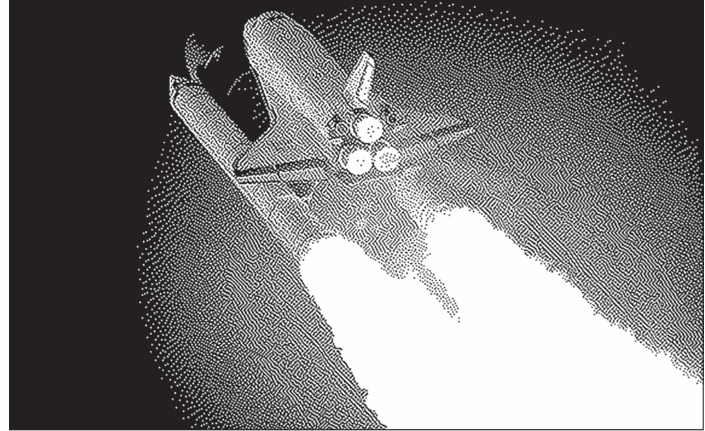

图3-4：航天飞机起飞

但你如何查看自己的结果呢？当然是在老式Mac上！MacPaint可以在运行System 1一直到Mac OS 9的机器上运行。你应该能找到一台运行这些操作系统之一的真实经典Mac来显示你的照片。你还需要一个用于解包MacBinary文件的程序。有一个名为MacBinary的程序可以下载。Stuffit Expander，一个非常流行的经典Mac OS解压缩应用程序，也可以打开MacBinary文件。两者都是作为免费软件分发的。你在野外找到的大多数1990年代的Mac电脑上已经安装了Stuffit Expander。

我意识到并非每个人都会对这个项目投入足够精力去寻找一台真正的复古计算机。没问题——你仍然可以通过模拟器体验你的劳动成果。苹果公司多年前就开始免费分发早期版本的Mac OS以及MacPaint（通过发布完整的MacPaint源代码）。你可以合法且免费地获得所需的所有软件，在模拟器中创建一个真正的复古Macintosh体验。

有几种模拟器可用，但可能最具复古感的是Mini vMac，⁹我用它创建了本章中的一些截图。设置Mini vMac或其他几种流行的经典Mac模拟器（如Basilisk II、SheepShaver等）超出了本书的范围，但我认为，作为一名程序员，你会发现这相当容易。每个模拟器都有不同的机制将文件从你的机器传输到模拟环境。无论具体细节如何，这可能都比弄一台旧Mac并让那台Mac联网或为你的现代机器找一个软盘驱动器要省事得多。话虽如此，旧Mac很有趣！或者也许那种乐趣只是我伴随它们成长而产生的怀旧之情。

#### 代码遇见生活

自从1990年我爸爸带回一台Macintosh LC以来，我就一直在使用MacPaint。我当时才三岁，但显然我已经足够熟练地使用它，以至于他带我去他在缅因大学教的课上做演示。部分原因可能是出于新奇，或者想法是：“这太简单了，三岁小孩都能做！”无论如何，他一直相信我。

我仍然保存着一些童年时保存在磁盘上的画作，这让我最近对文件格式产生了兴趣。令人惊讶的是，我在我的现代Mac上找不到任何可以打开经典MacPaint格式的程序。我不得不求助于LibreOffice或将文件传输到旧Mac上查看。

然后，我在一张属于我哥哥30年前的软盘上发现了一些神秘的MacPaint文件，这进一步激发了我的兴趣。它们包含奇怪的艺术作品，对于1980年代末或1990年代初来说相当复杂，将数字化的（1980年代对扫描和抖动处理的称呼）现实世界物体与纯粹的数字绘画混合在一起。我最终得出结论，它们很可能要么是美国著名艺术家Robert W. Fichter¹⁰的作品，要么是某个仰慕他的人的作品。它们有一些与Fichter已发表作品相同的主题和完全相同的文字。

我是否拥有一件被时间遗忘的珍贵数字艺术遗物？我哥哥是如何得到这些MacPaint文件的？我打电话给他。他已经几十年没想过它们了，但他说他是在高中时从缅因大学的某个学生那里得到的。他不知道它们的确切来源，但那个学生告诉他它们非常重要，并且有隐藏的含义。这张磁盘来自一所大学是有道理的。也许Fichter在那里做过讲座，或者它们是在sneakernet（这是在联网普及之前的时代）上被复制传播的。我试图联系Fichter本人，但没有成功。不幸的是，他在2023年去世了。在撰写本文时，我仍然不知道这些文件是否是Robert W. Fichter的原始数字艺术作品。如果你是研究他作品的专家或认识他，请与我联系！

大约在同一时间，在Hacker News上看到John Earnest关于Atkinson抖动的文章¹¹后，我正在考虑为这本书做一个抖动项目。我决定单凭抖动算法对于一个书章来说太简单了，但后来我有了一个想法：我最近如此感兴趣的MacPaint格式也是Bill Atkinson的产物，它包含了另一个有趣的算法——游程编码。为什么不将两者结合成一个单一项目呢？

我没有止步于此。在编写了本章的代码后，我决定应该让MacPaint对现代Mac用户更易于访问。我将代码以及一些额外的抖动算法移植到Swift，并围绕它创建了一个漂亮的基于AppKit的用户界面。我在Mac App Store上将该软件作为Retro Dither出售。¹²作为一名技术作者，通常你作为专业或业余项目所做的事情会变成一本书的素材；事情反过来发生的情况并不常见。

#### 现实世界的应用

阿特金森抖动和 MacPaint 只是比尔·阿特金森用来让初代 Macintosh 图形栩栩如生的几项技术。他还是 QuickDraw 的创造者，该图形系统为所有 Lisa 和经典 Macintosh 电脑提供了图形原语。他的巨大贡献远不止于图形领域。他对我们现在视为图形用户界面标准部件的多个元素进行了改进。阿特金森还是 HyperCard 的创造者，这是最早广泛分发的超文本平台之一。你可以将其视为 1980 年代末的非网络版万维网。它极具影响力。

你可能很好奇比尔·阿特金森最初开发阿特金森抖动是为了什么。我也很好奇，因此我找到了一本名为《*Inside MacPaint*》的稀有书籍，作者是杰弗里·S·杨，由微软出版社于 1985 年出版。我并没有完全找到答案，但找到了一个可能的答案。原来阿特金森曾为早期 Macintosh 开发过一种数字化仪。它基本上是一种扫描仪，允许你在 MacPaint 中处理真实世界的图像。虽然书中没有明确说明它使用了阿特金森抖动，但我无法想象这是巧合。很可能阿特金森抖动的第一个现实世界应用就是数字化仪。

抖动是 1980 年代和 1990 年代游戏机和电脑上广泛使用的技术，这些设备功能足够强大以支持数字图像，但通常调色板有限。而像亚马逊 Kindle 和 Panic Playdate 这样调色板有限的设备，至今仍是抖动技术的重要阵地。如前所述，抖动也是动画 GIF 看起来能显示远超其原生支持颜色数量的原因。没有这些技巧，GIF 仅限于 256 种颜色。

当然，行程编码并不仅限于 MacPaint。它是一种广泛使用的压缩技术。任何具有大量重复字符的数据格式都是行程编码的候选对象。除了 MacPaint，它在 1980 年代的其他几种位图图像格式中也被用作主要压缩技术。它有时也与其他压缩技术结合，形成更复杂的元算法。例如，ZIP 文件中使用的 DEFLATE 算法的一个组件就利用了行程编码。

最后，我引用比尔·阿特金森在《*Inside MacPaint*》中接受采访时的一段话。杰弗里·杨问他：“你认为创造一个伟大程序的关键是什么？”

> 设计一个好程序的全部诀窍在于决定要剔除哪些东西。我剔除了一些强大的功能，以使 MacPaint 更干净、更简单、更易上手、更不吓人。我可能剔除的代码比保留的还多。我的目标是精简、高效、干净的设计。典型的编程过程是 95% 的调试和仅 5% 的真正创造。很多错误只是简单的拼写错误，或者编译器程序真正能帮上忙的地方。我喜欢将目光更多地集中在整体算法上，因为那是我获得巨大收益的地方。

我把编程比作用黏土建模。当你在拉坯机上制作陶罐时，你会希望在烧制之前尽可能长时间地保持其柔软和可塑。因为一旦烧制完成，陶罐就很难再刮削成型了。¹³

#### 练习

- 1. 添加一个命令行选项，将我们的程序改为使用 Floyd-Steinberg 抖动。
- 2. 尝试创建你自己的误差扩散抖动模式。
- 3. 编写一个程序，实现反向转换，将 MacPaint 文件转换为 GIF 或 PNG。
- 4. 如果你完成了练习 3，编写集成测试，检查转换为 GIF 或 PNG 的 MacPaint 文件是否保留了与原始文件相同的像素数据。

#### 注释

- 1. Erik Sandberg-Diment, “Software for the Macintosh: Plenty on the Way,” *New York Times*, January 31, 1984.
- 2. 参见 https://archive.org/details/mac_Paint_2.
- 3. “Technical Note PT24: MacPaint Document Format,” Apple, October 1, 1988, accessed August 5, 2022, https://web.archive.org/web/20040626093131/http://developer.apple.com/technotes/pt/pt_24.html.
- 4. 参见 https://www.fileformat.info/format/macpaint/egff.htm.
- 5. 参见 https://en.wikipedia.org/wiki/PackBits.
- 6. “Technical Note TN1023: Understanding PackBits,” Apple, November 1, 1987, accessed August 4, 2022, https://web.archive.org/web/20030218001420/http://developer.apple.com/technotes/tn/tn1023.html.
- 7. “MacBinary II Standard,” Stairways.com, July 24, 1987, accessed May 27, 2024, https://files.stairways.com/other/macbinaryii-standard-info.txt.
- 8. 参见 https://en.wikipedia.org/wiki/Mac_OS_Roman.
- 9. 参见 https://www.gryphel.com/c/minivmac/index.html.
- 10. 参见 https://en.wikipedia.org/wiki/Robert_W._Fichter.
- 11. John Earnest, “Atkinson Dithering,” *Beyond Loom*, March 29, 2020, https://beyondloom.com/blog/dither.html.
- 12. 参见 https://oaksnow.com/retrodither/.
- 13. Jeffrey S. Young, *Inside MacPaint: Sailing Through the Sea of FatBits on a Single-Pixel Raft* (Microsoft Press, 1985), 320.

### 4

#### 一种随机绘画算法


本书所有其他章节都遵循某种规范，例如编程语言语法、文件格式或机器架构。本章则不同。在本章中，我们将要创造艺术。而且这将是主观的。一个简单的随机算法能否使用随机生成的形状来创作出类似人类艺术作品的图画？我认为答案是肯定的，但在你看到程序的一些输出后，你将不得不自己判断。

#### 工作原理

本章的程序通过尝试从头开始重绘一张照片来工作。我们从一张空白画布开始。我们尝试绘制一个随机大小和位置的彩色形状。如果这个形状使画布看起来更像照片，我们就保留它。否则，我们就尝试另一个不同的形状。我们重复这个过程，直到达到指定的迭代次数。这就是整个算法。

如果听起来很简单，那是因为它确实如此。当然，还有很多更复杂的细节需要填充，但它们并不改变程序的整体思路。“看起来像”是如何衡量的？是否应该修改一个形状以尝试改善其匹配度？形状的颜色是如何选择的？应该使用什么样的形状？

最后一个问题将导致我们的“绘画”呈现出许多不同的抽象外观。例如，图 4-1 使用椭圆来近似一张热气球的照片。（对于印刷版读者，请参阅配套仓库的 *figures* 目录以获取本章图像的彩色版本。）

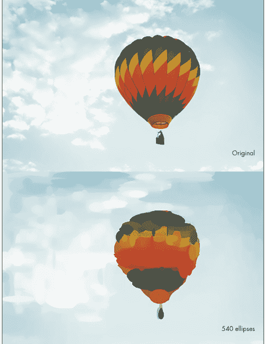

图 4-1：一个由 540 个椭圆构成的热气球

该图展示了原始照片以及我们的程序使用 540 个椭圆经过 100,000 次迭代创建的“印象”，在我的笔记本电脑上耗时 104 秒完成。我认为它看起来相当不错。几乎是印象派风格。

在我看来，椭圆给人一种彩色玻璃的感觉。如果所使用的形状在某种程度上类似于原始照片中主体的轮廓，会有所帮助，比如用于热气球的椭圆。图 4-2 展示了使用 307 个三角形经过 100,000 次迭代绘制的同一张照片，在我的笔记本电脑上耗时 109 秒。以我的主观意见来看，它看起来没那么好。


*图 4-2：一个由 307 个三角形构成的热气球*

虽然热气球弯曲的外部轮廓无法被三角形很好地填充，但蝴蝶则表现得好得多。图 4-3 是一张蝴蝶照片的印象，使用了 573 个三角形，通过 100 万次迭代生成，耗时 4,512 秒。


图 4-3：一个由 573 个三角形构成的蝴蝶

蝴蝶图像的生成时间比平均的百万次迭代图像稍长，因为我使用了“最常见颜色”方法而不是“平均颜色”方法——稍后会详细介绍。结果是每个形状中的颜色更鲜明，混合得更少。

通过使用更多形状并进行更多迭代（因此需要更多时间），输出通常可以得到改善。然而，由于这是基于一个随机（随机确定）的过程，结果会有很大差异——即使对于同一张图片使用相同的设置也是如此。我在这里展示的例子是精心挑选的。

细节丰富的照片需要最多的时间才能以合理的精度绘制出来。使用这样的工具，你必须在抽象性和可识别性之间取得平衡。如果图像太抽象，它将无法被识别。但如果图像细节如此之多，以至于几乎是原始图像的完美复制品，那么它作为“艺术品”的吸引力就会丧失。对于人物图像，这种平衡尤其难以实现。例如，图 4-4 是我的两位朋友在加利福尼亚州圣莫尼卡海滩上的照片。它由 4,212 个椭圆组成，通过 1000 万次迭代生成，耗时 8,262 秒。我的朋友们作为抽象印象看起来还行，但海滩看起来棒极了！

#### 命令行选项

这是一个高度可配置的程序，具有许多不同的功能和可调整的参数。除了输入和输出文件路径外，我们的 `ArgumentParser` 还需要处理表 4-1 中的所有命令行选项。

表 4-1：Impressionist 的命令行选项

| 选项 | 扩展形式 | 可选值 | 默认值 | 描述 |
| :--- | :--- | :--- | :--- | :--- |
| -t | --trials | 整数 | 10000 | 要运行的试验次数 |
| -m | --method | 'random', 'average', 'common' | 'average' | 确定形状颜色的方法 |
| -s | --shape | 'ellipse', 'triangle', 'quadrilateral', 'line' | 'ellipse' | 要使用的形状类型 |
| -l | --length | 整数 | 256 | 最终图像的长度（高度），单位为像素 |
| -v | --vector | 布尔值 | False | 是否创建矢量输出？ |
| -a | --animate | 整数 | 0 | 如果提供大于 0 的数字，将创建一个动画 GIF，每帧间隔提供的毫秒数，展示图像逐个形状构建的过程 |

我们的主文件只是表 4-1 的代码化体现。所有选项都传递给 `Impressionist` 类的构造函数，我们稍后会再讨论它。

```
### Impressionist/__main__.py
from argparse import ArgumentParser
from Impressionist.impressionist import Impressionist, ColorMethod, ShapeType

if __name__ == "__main__":
    # Parse the file argument
    argument_parser = ArgumentParser("Impressionist")
    argument_parser.add_argument("image_file", help="The input image")
    argument_parser.add_argument("output_file", help="The resulting abstract art")
    argument_parser.add_argument('-t', '--trials', type=int, default=10000,
                                help='The number of trials to run (default 10000).')
    argument_parser.add_argument('-m', '--method',
                                choices=['random', 'average', 'common'], default='average',
                                help='Shape color determination method (default average).')
    argument_parser.add_argument('-s', '--shape', choices=['ellipse', 'triangle',
                                                          'quadrilateral', 'line'],
                                default='ellipse', help='The shape type (default ellipse).')
    argument_parser.add_argument('-l', '--length', type=int, default=256,
                                help='The length of the final image in pixels (default 256).')
    argument_parser.add_argument('-v', '--vector', default=False, action='store_true',
                                help='Create vector output. A SVG file will also be output.')
    argument_parser.add_argument('-a', '--animate', type=int, default=0,
                                help='If greater than 0, will create an animated GIF '
                                'with the number of milliseconds per frame provided.')
    arguments = argument_parser.parse_args()
    method = ColorMethod[arguments.method.upper()]
    shape_type = ShapeType[arguments.shape.upper()]
    Impressionist(arguments.image_file, arguments.output_file, arguments.trials, method,
                  shape_type, arguments.length, arguments.vector, arguments.animate)
```

`-v` 选项指示程序以矢量格式输出结果。在我们的实现中，我们将以 SVG 文件为目标。在深入探讨应用程序的主算法之前，让我们先稍微绕个弯，看看如何支持这个功能。

#### SVG 格式

SVG 代表可缩放矢量图形。它是一种基于 XML 的格式，用于指定矢量图像。所有现代主流网页浏览器和矢量绘图程序都支持它。我们不会使用第三方库来写入 SVG，而是编写自己的简短类来完成。SVG 规范很庞大，但我们只需要其中很小的一个子集来支持程序将要输出的形状，因此任务会相对容易。

XML 是一种基于文本的格式，由于我们是输出它而不是解析它，我们的程序甚至不需要真正理解 XML 的结构。我们只需要将代表各个 XML 元素的字符串拼接成一个字符串。虽然这种方法限制了 SVG 编写器的可测试性和模块化，但我们实现的 SVG 标准部分非常少，以至于手动检查正确性几乎是微不足道的。话虽如此，这种方法并不适合生产环境。

在开始编写代码之前，这里有一个我们程序可以输出的简单 SVG 文件示例。这个文件只包含一个使用 `polygon` 元素构建的三角形，加上背景矩形（为了可读性，我稍微改进了格式，添加了几个缩进）：

```
<?xml version="1.0" encoding="utf-8"?>
<svg version="1.1" baseProfile="full" width="342" height="256"
     xmlns="http://www.w3.org/2000/svg">
    <rect width="100%" height="100%" fill="rgb(108, 98, 91)" />
    <polygon points="201,3 24,9 162,182 " fill="rgb(128, 120, 112)" />
</svg>
```

如果你将这段代码保存为扩展名为 `.svg` 的文本文件，你可以使用网页浏览器或矢量图像编辑器打开它，查看生成的三角形。在我们逐步创建 SVG 类的过程中，请记住这个示例，以可视化不同元素如何组合形成一个完整的 SVG 文件。

SVG 文件以声明它是一个 XML 文件开始，然后第一个元素是 `svg` 元素，它描述了 SVG 规范的版本以及图像的宽度和高度。此外，我们程序生成的每个图像都由一个包含图像平均颜色的大矩形作为背景。这有助于算法更好地融合。因此，我们的 SVG 文件也以一个大的 `rect` 元素开始：

```
### Impressionist/svg.py
class SVG:
    def __init__(self, width: int, height: int, background_color: tuple[int, int, int]):
        self.content = '<?xml version="1.0" encoding="utf-8"?>\n' \
            f'<svg version="1.1" baseProfile="full" width="{width}" ' \
            f'height="{height}" xmlns="http://www.w3.org/2000/svg">\n' \
            f'<rect width="100%" height="100%" fill="rgb{background_color}" />'
```

正如构造函数中的 `background_color` 属性所示，颜色是用一个包含三个整数的元组来表示的。这些是 RGB 颜色代码。每个元素都是一个介于 0 到 255 之间的整数，代表输出中相应原色（红、绿或蓝）的量。例如，“纯”红色是 (255, 0, 0)，而紫色可能是 (128, 0, 128)，它是红色和蓝色的混合。

绘制我们的程序支持的三种形状（椭圆、线段和多边形）只是将相应的椭圆、线段或多边形 SVG 元素放入输出文本文件的问题：

```python
def draw_ellipse(self, x1: int, y1: int, x2: int, y2: int, color: tuple[int, int, int]):
    self.content += f'<ellipse cx="{(x1 + x2) // 2}" cy="{(y1 + y2) // 2}" '
                   f'rx="{abs(x1 - x2) // 2}" ry="{abs(y1 - y2) // 2}" '
                   f'fill="rgb{color}" />\n'

def draw_line(self, x1: int, y1: int, x2: int, y2: int, color: tuple[int, int, int]):
    self.content += f'<line x1="{x1}" y1="{y1}" x2="{x2}" y2="{y2}" stroke="rgb{color}" '
                   f'stroke-width="1px" shape-rendering="crispEdges" />\n'

def draw_polygon(self, coordinates: list[int], color: tuple[int, int, int]):
    points = ""
    for index in range(0, len(coordinates), 2):
        points += f"{coordinates[index]},{coordinates[index + 1]} "
    self.content += f'<polygon points="{points}" fill="rgb{color}" />\n'
```

最后，为了输出 SVG 文件，我们关闭在构造函数中开始的 svg 元素，并将合并后的字符串写入磁盘：

```python
def write(self, path: str):
    self.content += '</svg>\n'
    with open(path, 'w') as f:
        f.write(self.content)
```

如果你查看官方的 SVG 规范，可能会觉得它令人望而生畏，但不必感到畏惧。正如本节所希望展示的，从像 SVG 这样的大型标准中获取价值并不一定需要太多东西。仅仅 20 行代码，我们就编写了一个功能非常有限但实用的 SVG 创建器。

#### 算法

生成这些（有时）美丽的抽象照片印象的算法非常简单。简而言之，它尝试绘制随机大小和位置的形状，一次一个形状。如果添加的形状使抽象图像看起来更像原始照片，则保留它。通过调整形状的大小（即移动其每个点）可以进一步优化改进。如果添加的形状使图像看起来更不像原始照片，则将其丢弃并尝试新的形状。

以下是该算法更详细的步骤说明：

1.  创建一个与原始照片大小相同的空白画布，背景颜色与原始照片的平均颜色相同。
2.  尝试在画布上随机位置绘制一个随机大小的形状。使用原始照片对应区域的平均颜色、该区域最常见的颜色或随机颜色为形状着色。
3.  比较画布（添加形状后）的像素颜色与原始照片的像素颜色。如果添加的形状使整个画布的像素与原始照片的像素更相似，则保留添加的形状。
4.  尝试逐像素修改形状的每个点（扩大或收缩）。持续移动点，以进一步减少整个画布的像素与原始照片的像素之间的差异。当移动不再改善差异时停止。
5.  重复步骤 2、3 和 4，进行指定次数的试验。
6.  在指定次数的实验后，输出在画布上创建的最终图像。

该算法有许多可配置的参数。应该使用什么样的形状？应该运行多少次试验？如何为每个形状选择颜色？还有几个子问题需要解决。如何计算两个图像之间的差异？如何找到包含形状的区域中的像素？

#### 主要实现

不包括注释，我们绘画算法的主要实现不到 150 行 Python 代码。这种简洁性很大程度上归功于强大的 Pillow 库，这在第 3 章中已经讨论过。Pillow 处理各种位图图像格式的读写。它还提供了绘制简单图元（如我们需要的形状）的功能。最后，Pillow 有计算图像之间差异和计算图像区域平均颜色的函数。这些将是我们的程序的关键辅助函数，使我们能够专注于核心算法，而将繁琐的工作交给 Pillow。这就是一个优秀库的作用。

#### 设置

我们从一些基本的导入、一些所需类型的定义、一个常量和一个辅助函数开始：

```python
from enum import Enum
from PIL import Image, ImageDraw
from PIL import ImageChops, ImageStat
import random
from math import trunc
from timeit import default_timer as timer
from Impressionist.svg import SVG

ColorMethod = Enum("ColorMethod", "RANDOM AVERAGE COMMON")
ShapeType = Enum("ShapeType", "ELLIPSE TRIANGLE QUADRILATERAL LINE")
CoordList = list[int]
MAX_HEIGHT = 256

def get_most_common_color(image: Image.Image) -> tuple[int, int, int]:
    colors = image.getcolors(image.width * image.height)
    return max(colors, key=lambda item: item[0])[1]
```

`ColorMethod` 枚举控制我们将如何计算区域中的颜色——即形状将用什么颜色填充。`ShapeType` 枚举设置我们将要绘制的形状。当前版本的程序在每幅画中只绘制一种类型的形状，但修改代码以启用多种类型的形状很容易。我将其留作练习。`CoordList` 类型适用于定义一个形状的坐标。

运行算法时，为了性能，我们需要处理有限数量的总像素。最简单的方法是，如果输入图像的高度超过 `MAX_HEIGHT`，则对其进行缩放。换句话说，`MAX_HEIGHT` 是缩放后图像的最大高度。请注意，从技术上讲，我们也应该定义一个最大宽度，但实际上，图像的宽高比使得仅限制一个维度就足够的情况非常罕见（没有很多图像超级宽但高度很小）。为了简单起见，我们只定义了一个最大维度。

`get_most_common_color()` 方法找出图像中最常出现的颜色。它使用 Pillow 的 `getcolors()` 方法，该方法返回图像中所有颜色及其计数。然后，它使用 Python 内置的 `max()` 函数提取最频繁的颜色。

`Impressionist` 类的构造函数负责设置算法特定运行的唯一参数、打开输入图像文件、缩放它、创建输出图像的初始背景、调用方法运行算法的实际迭代，以及调用方法输出最终文件。这听起来可能很多，但算法的核心在其他方法中。构造函数只是一个启动点，它调用 Pillow 库的方法和我们即将介绍的其他方法来完成实际工作。以下是构造函数的开始部分：

```python
class Impressionist:
    def __init__(self, file_name: str, output_file: str, trials: int, method: ColorMethod,
                 shape_type: ShapeType, length: int, vector: bool, animation_length: int):
        self.method = method
        self.shape_type = shape_type
        self.shapes = []
        # 打开图像文件并存储在实例变量中，执行算法
        with open(file_name, "rb") as fp:
            self.original = Image.open(fp).convert('RGB')
        # 缩小图像以加快处理速度，最大高度像素维度为 256
        width, height = self.original.size
        aspect_ratio = width / height
        new_size = (int(MAX_HEIGHT * aspect_ratio), MAX_HEIGHT)
        self.original.thumbnail(new_size, Image.Resampling.LANCZOS)
```

构造函数首先设置一些参数并缩放输入图像。生成的画作应与原始图像具有相同的宽高比，因此保留了宽高比。Pillow 的 `thumbnail()` 方法是进行缩放的便捷方式。

以下是构造函数的下一部分：

```python
        # 以原始图像所有像素的平均颜色作为背景开始生成图像
        average_color = tuple((round(n) for n in ImageStat.Stat(self.original).mean))
        self.glass = Image.new("RGB", new_size, average_color)
```

Pillow 的 `ImageStat` 模块可用于查找图像中的平均颜色。它查看图像中每个像素的 RGB 值，并分别对红色、绿色和蓝色分量求平均值。我们获取得到的平均颜色，并将其设置为算法工作图像（`self.glass`）的背景。换句话说，原始图像的平均颜色将是工作图像中每个像素的起始颜色。

> **注意** *工作图像的变量名为 `glass`，因为我最初将此程序命名为“彩色玻璃”。重新命名后，我仍然觉得变量名 `glass` 解释了这是一个提供原始图像过滤印象的表面。*

构造函数继续：

```python
        # 跟踪进度、我们目前的最佳结果以及处理过程中经过的时间
        self.best_difference = self.difference(self.glass)
        last_percent = 0
        start = timer()
        for test in range(trials):
            self.trial()
            percent = trunc(test / trials * 100)
            if percent > last_percent:
                last_percent = percent
                print(f"{percent}% Done, Best Difference {self.best_difference}")
        end = timer()
        print(f"{end-start} seconds elapsed. {len(self.shapes)} shapes created.")
        self.create_output(output_file, length, vector, animation_length)
```

算法的核心在 `trial()` 方法中，该方法尝试绘制一个形状，看看该形状是否能改善工作图像与原始图像之间的相似度得分。在这里，`trial()` 被调用了 `trials` 次。随着试验的执行，我们跟踪进度我们是谁，以及程序运行了多长时间。最终，借助 `create_output()` 输出完成的工作图像。

#### 实用方法

在进入 `trial()` 之前，我们需要一些辅助方法。绘图算法的一个关键部分是验证每个新增的形状是否使工作图像更接近原始图像。`difference()` 方法计算两张图像的相似度得分，衡量它们彼此之间的相似程度：

```python
def difference(self, other_image: Image.Image) -> float:
    diff = ImageChops.difference(self.original, other_image)
    stat = ImageStat.Stat(diff)
    diff_ratio = sum(stat.mean) / (len(stat.mean) * 255)
    return diff_ratio
```

Pillow 的 `ImageChops` 模块有一个内置的 `difference()` 方法。它逐像素地找出两张图像之间的差异。换句话说，两张图像中相同位置的两个像素彼此有何不同？差异仅仅是每个像素中每个颜色通道相减的绝对值。例如，一个颜色为 (10, 100, 50) 的 RGB 像素与另一个颜色为 (10, 40, 20) 的像素之间的差异将是 (0, 60, 30)。然而，这对于我们的算法来说还不够。我们需要一个单一的数字，一个得分，来表达两张图像的相似程度。在逐像素找出差异后，我们可以通过对所有差异取平均值将其压缩为一个数字。我们使用与在构造函数中求平均颜色相同的 `ImageStat` 模块来完成此操作。最后，虽然不是严格必要的（像素平均值也可以作为得分），但我们除以可能的最大差异，以比率形式得到得分。

每次生成一个新形状时，它都会被放置在屏幕上的随机位置。我们使用 `random_coordinates()` 计算这些随机坐标：

```python
def random_coordinates(self) -> CoordList:
    num_coordinates = 4  # ellipse or line
    if self.shape_type == ShapeType.TRIANGLE:
        num_coordinates = 6
    elif self.shape_type == ShapeType.QUADRILATERAL:
        num_coordinates = 8
    coordinates = []
    for d in range(num_coordinates):
        if d % 2 == 0:  # x coordinates
            coordinates.append(random.randint(0, self.original.width))
        else:  # y coordinates
            coordinates.append(random.randint(0, self.original.height))
    return coordinates
```

不同类型的形状需要不同数量的坐标。例如，一个三角形有六个坐标，因为它有三个点，每个点有一个 x 坐标和一个 y 坐标。坐标必须是有效的——也就是说，它们必须位于图像表面的某个位置。该方法通过确保随机坐标不低于 0 或不高于图像的宽度或高度来强制执行此要求。

我们还需要一种方法来查看与工作图像中某个形状相对应的原始照片的“区域”，以便我们可以分析该区域的颜色。找到任意形状下方的确切像素在计算上代价高昂。相反，我们将使用 `bounding_box()` 静态方法来识别包含该形状的矩形区域：

```python
@staticmethod
def bounding_box(coordinates: CoordList) -> tuple[int, int, int, int]:
    xcoords = coordinates[::2]
    ycoords = coordinates[1::2]
    x1 = min(xcoords)
    y1 = min(ycoords)
    x2 = max(xcoords)
    y2 = max(ycoords)
    return x1, y1, x2, y2
```

边界框是一个轴对齐的矩形（意味着其边缘与图像的边缘平行），围绕给定形状，根据该形状的最小和最大 x 和 y 坐标确定。我们将该矩形传递给 Pillow 的内置 `crop()` 方法，将原始图像裁剪到仅所需区域。我们将把提取原始图像更窄定义区域的替代技术留作练习。

#### 尝试

算法的核心是 `trial()` 方法。每次尝试都是在工作图像中放置一个形状的尝试。如果新形状使工作图像更接近原始图像，则保留它。如果通过微调其坐标可以进一步改善差异得分，则微调该形状的坐标。该方法首先使用 `random_coordinates()` 为新形状找到一个位置，并找到这些坐标的支撑区域：

```python
def trial(self):
    while True:
        coordinates = self.random_coordinates()
        region = self.original.crop(self.bounding_box(coordinates))
        if region.width > 0 and region.height > 0:
            break
```

这里有一个不美观的 `while` 循环，以应对随机坐标全部沿任一轴对齐的不太可能的情况。在这种情况下，我们需要重新生成坐标。本章末尾有一个练习来移除这个循环。该方法的下一部分为形状选择颜色：

```python
if self.method == ColorMethod.AVERAGE:
    color = tuple((round(n) for n in ImageStat.Stat(region).mean))
elif self.method == ColorMethod.COMMON:
    color = get_most_common_color(region)
else:  # must be random
    color = tuple(random.choices(range(256), k=3))
original = self.glass
```

根据 `ColorMethod`，我们选择支撑区域的平均颜色（再次使用 `ImageStat`），选择支撑区域中最常见的颜色，或者简单地选择一个随机颜色。然后，我们将工作图像（`self.glass`）的当前状态保存在局部变量 `original` 中，以便在尝试坐标微调时重用（我们尝试在各个方向上稍微大一点或小一点地重绘形状，因此我们需要它绘制在其上的原始画布）。现在我们准备好尝试绘制一个形状：

```python
def experiment() -> bool:
    new_image = original.copy()
    glass_draw = ImageDraw.Draw(new_image)
    if self.shape_type == ShapeType.ELLIPSE:
        glass_draw.ellipse(self.bounding_box(coordinates), fill=color)
    else:  # must be triangle or quadrilateral or line
        glass_draw.polygon(coordinates, fill=color)
    new_difference = self.difference(new_image)
    if new_difference < self.best_difference:
        self.best_difference = new_difference
        self.glass = new_image
        return True
    return False
```

一个内部函数 `experiment()` 在尝试绘制新形状成功降低工作图像与原始图像之间的差异时返回 `True`。Pillow 中的 `ImageDraw` 模块负责实际的绘图。差异使用先前定义的 `difference()` 方法计算，并与迄今为止找到的最佳差异进行比较。如果形状改善了图像，则工作图像将被包含新形状的图像替换。

`trial()` 的最后一部分尝试通过微调每个形状的坐标来进行增量改进。如果微调与形状原始坐标的版本相比改善了差异得分，则保留该微调，并尝试在相同方向上进行另一次微调：

```python
if experiment():
    # Try expanding every direction, keep going in better directions
    for index in range(len(coordinates)):
        for amount in (-1, 1):
            while True:
                old_coordinates = coordinates.copy()
                coordinates[index] = coordinates[index] + amount
                if not experiment():
                    coordinates = old_coordinates
                    break
self.shapes.append((coordinates, color))
```

这段代码是一种*爬山算法*，我们持续朝同一方向前进以解决问题（在这种情况下，优化差异），只要解决方案持续改善。当它停止改善时，我们停止。这可能导致局部最大值，但它是改进现有解决方案的一种简单而有效的方法。在这种情况下，我们有一个现有的解决方案，因为我们只保留那些最初改善了差异的形状（由 `experiment()` 返回 `True` 表示）。有关此类算法工作原理的更多信息，请参阅“爬山”框。

整体算法在没有微调过程的情况下也能工作，但微调改善了每个形状的拟合度。这反过来又改善了最终绘画的整体外观，并减少了达到合理结果所需的形状数量。

一旦最终形状在任何微调后确定，我们就将其坐标和颜色添加到形状列表中。维护此列表（与在工作图像中绘制形状分开）对于生成最终输出是必要的。

##### 爬山

*爬山*是一种简单的优化技术，旨在通过在搜索似乎“改善”时持续朝同一方向前进来找到函数的最大值或最小值。在这种技术的经典解释中，你被要求想象你蒙着眼睛站在一座你想爬的山脚下。你可以用脚感受周围地面的坡度。每一步，无论哪个方向似乎产生最陡的上升坡度，都会感觉是你应该走的方向，如果你想最快到达山顶。只要你能用脚感觉到你在爬坡，你就可以持续选择朝这个方向前进。最终你会到达一个点，无论你下一步朝哪个方向，你都不再爬坡，然后你就可以停下来了。

你会到达山顶吗？当然有可能，特别是如果这座山只有一个山峰。但也有可能这座山有多个山峰，而你只是到达了其中一个较小的山峰。这被称为陷入*局部最大值*。爬山总会找到一个局部最大值，但它可能找不到全局最大值。

爬山在人工智能中是一种流行的技术，因为它非常简单。它是许多问题的良好起点。在我们的程序中，我们持续朝同一方向微调坐标，直到与起始图像的差异不再改善。这是一种爬山：我们只是持续前进沿着相同方向持续调整，直到效果不再改善。当然，初始形状的放置可能本身就存在错误，与其他可能的放置方案相比并不理想，而我们的微调只是将我们引向一个局部最优解的“兔子洞”。对于如此简单的算法，我们无法确切知道结果。

#### 输出

工作图像被缩放至最大高度，但最终输出图像应采用用户指定的高度（同样，为简化起见，我们让用户仅设置高度而非宽度）。我们不能简单地“拉伸”位图而不产生像素化。相反，我们使用形状列表中的数据重新绘制工作图像，每个形状都按适当比例缩放。输出图像的方法还包含了输出矢量文件（利用之前的SVG类）和通过Pillow输出动画GIF的选项。这显著增加了代码长度。以下是`create_output()`方法的开头：

```python
def create_output(self, out_file: str, height: int, vector: bool, animation_length: int):
    average_color = tuple((round(n) for n in ImageStat.Stat(self.original).mean))
    original_width, original_height = self.original.size
    ratio = height / original_height
    output_size = (int(original_width * ratio), int(original_height * ratio))
    output_image = Image.new("RGB", output_size, average_color)
    output_draw = ImageDraw.Draw(output_image)
```

我们首先根据用户指定的高度参数创建一个适当大小的新图像。我们用原始图像的平均颜色填充初始输出图像，这与处理工作图像时的方法相同。该方法继续：

```python
svg = SVG(*output_size, average_color) if vector else None
animation_frames = [] if animation_length > 0 else None
for coordinate_list, color in self.shapes:
    coordinates = [int(x * ratio) for x in coordinate_list]
```

输出图像将通过迭代地在正确比例下重现形状列表中的每个形状来生成❶。为了同时创建SVG或动画GIF输出，在生成输出图像的同时，每个步骤都会在svg对象上重复执行，或作为图片复制到构成动画GIF“电影”的animation_frames列表中：

```python
if self.shape_type == ShapeType.ELLIPSE:
    output_draw.ellipse(self.bounding_box(coordinates), fill=color)
    if svg:
        svg.draw_ellipse(*coordinates, color)  # type: ignore
else:  # must be triangle or quadrilateral or line
    output_draw.polygon(coordinates, fill=color)
    if svg:
        if self.shape_type == ShapeType.LINE:
            svg.draw_line(*coordinates, color)  # type: ignore
        else:
            svg.draw_polygon(coordinates, color)
if animation_frames is not None:
    animation_frames.append(output_image.copy())
output_image.save(out_file)
if svg:
    svg.write(out_file + ".svg")
if animation_frames is not None:
    animation_frames[0].save(out_file + ".gif", save_all=True,
                             append_images=animation_frames[1:], optimize=False,
                             duration=animation_length, loop=0,
                             transparency=0, disposal=2)
```

该方法的其余部分只是在输出图像上绘制形状并将文件写入磁盘。

#### 结果

这150行代码中蕴含了丰富的内容。该程序具有随机试验、对如何猜测每个形状颜色的几点见解、一点爬山法以及一个优秀库的使用。计算机科学中酷炫的结果更多地取决于算法和技术，而非代码行数。但这个算法也出奇地简单——却极其有效。不，输出结果虽然不如最新的神经网络那样令人印象深刻，但一项简单的技术能将程序带向如此远，这确实令人惊叹。

该算法的主要缺点是速度慢且具有随机性。你可以用相同的参数对同一张图片多次尝试，得到不同的结果。而且你可能需要等待很长时间才能得到这些多变的、有时并不理想的结果。

然而，我有一些令人印象深刻（尽管承认是精心挑选的）的结果要与你分享。首先是罗德岛州纽波特市图罗公园的几个场景。我喜欢线条形状赋予每幅画的那种近乎油画般的感觉。图4-7是公园的全景，右侧是著名的纽波特塔。

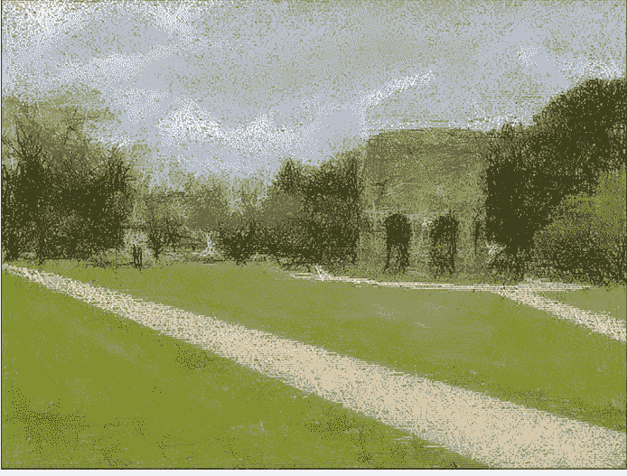

图4-7：图罗公园，使用了19,578条线

图4-8是纽波特塔的特写。

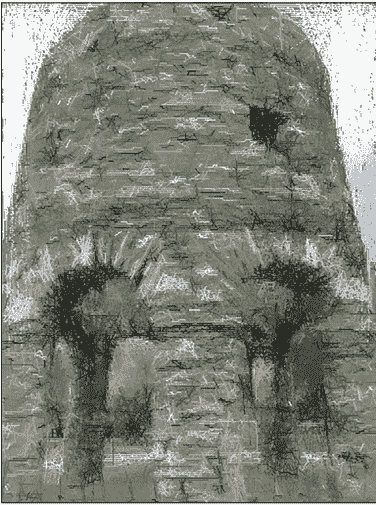

图4-8：纽波特塔，使用了11,409条线

图4-9展示了一只我发现正在路面上打滚的猫。椭圆形状赋予了猫一种漂亮的抽象感。这会不会是印象派画家的作品？

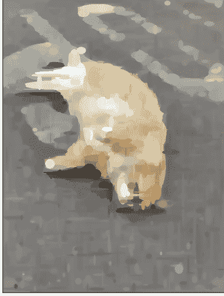

图4-9：一只在路面上打滚的猫，使用椭圆

最后，我在图4-10中呈现一个万圣节场景。

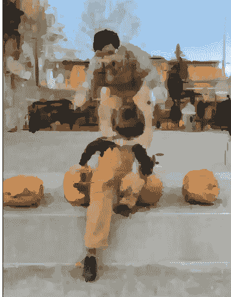

图4-10：一个万圣节场景，使用椭圆

我和儿子当时正在一个公共南瓜展上奔跑。我喜欢背景中的葫芦和人物用椭圆呈现出来的效果。

#### 代码与生活

在2010年代中期，我第一次考虑使用遗传算法创建一个类似本章的程序。我做了一些研究，发现已经有多人捷足先登。然而，在研究过程中，我也接触到了迈克尔·福格尔曼的Primitive项目。¹ 他创建了一个生成抽象艺术的程序，类似于使用遗传算法的早期程序，但采用了一种更简单的技术，称为模拟退火。

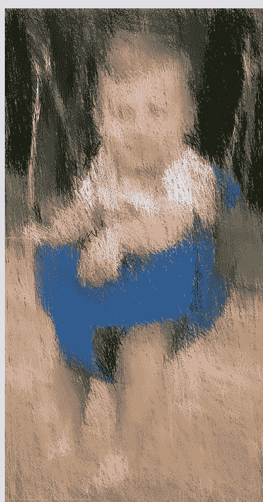

我想花点时间感谢迈克尔，他对我的编程生涯产生了深远的影响。迈克尔是一位非常有才华的程序员，但除了才华横溢，他还编写了极其易读的代码。而且他恰好在许多我感兴趣的领域创建项目。你将在本书的模拟部分听到更多关于迈克尔另一个项目的内容。

虽然这个项目与迈克尔的Primitive没有共享任何代码，但他能够使用如此简单的算法将照片转化为抽象艺术，这激励我相信我也可以使用我自己更简单的技术做到这一点。我开始尝试将我的算法实现为一个iOS应用。我基本成功了，但不幸的是，2017年的iPhone速度不够快，无法在合理的时间内运行我的程序。我尝试优化它，但问题在于我的算法，而非实现。与此同时，基于机器学习的有趣艺术照片转换应用开始在iOS上出现，我意识到我更慢、更简单的技术无法与之竞争。然而，它仍然可以作为一个很酷的演示，当我在构思本书的项目时，我想起了它。我认为它很好地说明了随机算法和爬山法的力量。

在我将Swift代码移植到Python用于本书后，我决定在朋友中测试它，在Facebook上发布了一张我一岁儿子丹尼尔在秋千上的照片。

我那位具有相当艺术眼光的姑姑以为我开始画画了。那时我知道这个程序相当不错。

#### 现实世界应用

除了看起来有点酷之外，这个程序的输出并没有太多实际应用。然而，用于构建它的技术确实有实际应用。它们属于一个称为*随机优化*的总称。假设你有一个想要解决的优化问题，但你不知道有确定性算法（一种每次遵循相同步骤都给出相同结果的算法）来解决它。在这种情况下，可能需要一种涉及随机（随机）试验的技术。

可能不太明显，但本章的挑战是优化问题的一个例子。我们的程序试图优化出尽可能接近原始照片的绘图。目标函数（检查我们是否朝着正确方向前进的东西）是`difference()`方法。差异越低，特定图像所代表的潜在解决方案就越优化。

随机优化算法有用的一个著名实际领域是经典的旅行商问题。该问题要求旅行者以尽可能短的路线访问地图上每个指定地点一次并返回起点。这是快递卡车（想想FedEx或UPS）每天都在做的事情，因此它具有非常实际的应用。不幸的是，对于大量地点，没有已知的确定性算法能在合理时间内最优地解决旅行商问题。相反，随机优化技术（如遗传算法）提供了一种有用的方式来解决该问题，但它们的解决方案可能不是最优的。遗传算法可能并不总能为旅行商问题提供完美的解决方案，但它几乎总能提供一个足够好的解决方案。

我们的程序还使用了爬山法。尽管这是最简单的局部搜索过程之一（如果某个方向有效就继续朝那个方向前进），但它是一种非常常见的技术，并且在许多场景中表现得与更先进的技术一样好。爬山法也构成了其他更复杂算法的基础。例如，用于解决线性规划问题的单纯形算法就利用了爬山法。²

#### 练习

1.  修改程序，使其能在同一幅画中绘制多种形状。例如，最终输出可以同时包含椭圆和三角形。
2.  由于用于计算新形状颜色的像素是基于边界框而非形状下方的精确区域，因此结果可能不准确。修改 `trial()` 函数，尝试不仅进行坐标微调，还进行颜色微调。这可能会产生更匹配的颜色。
3.  修改 `trial()` 函数，使用形状下方的精确像素来确定该形状的颜色。这具有挑战性。一种方法是使用一些几何计算来确定每种形状对应的正确像素。这很可能比原始程序简单地裁剪边界框的计算效率低得多。可以考虑改用 Pillow 库中的蒙版功能。
4.  `trial()` 函数开头的 `while True` 循环感觉像是代码异味。请在不使用它的情况下重写 `trial()` 的开头部分。

#### 注释

1.  Michael Fogleman, “Primitive,” 访问于 2023 年 1 月 9 日, https://www.michaelfogleman.com/#primitive.
2.  Steven S. Skiena, “Combinatorial Search and Heuristic Methods,” 载于 *Algorithm Design Manual*, 第 2 版 (Springer, 2008), 252–253.

# 第三部分

### 模拟器

### 5

#### 构建 CHIP-8 虚拟机


在本章中，我们将开发一个名为 CHIP-8 的虚拟机版本。CHIP-8 是个人计算早期时代的一个平台，主要用于游戏。尽管我们的程序将能够运行 CHIP-8 游戏，但吸引我们的并非游戏本身——而是构建 CHIP-8 虚拟机能让我们学到关于底层编程以及计算机在寄存器和指令层面如何工作的知识。这些见解使得构建 CHIP-8 虚拟机成为进入编程模拟器世界的一个常见入门步骤。

#### 虚拟机

可以将*虚拟机*（VM）想象成一台完全由软件定义的计算机。设计为在 VM 中运行的程序可以在任何实现了该 VM 的平台上运行。这样，VM 实现了真正的可移植软件。

VM 与模拟器密切相关。*模拟器*是一种假装成硬件的软件。这使得为该硬件编写的程序可以在缺乏该硬件的其他机器上运行。模拟器必须严格遵循原始硬件的规范，以便重新创建运行在模拟器上的、不知情的程序所期望的所有功能。我说*不知情*是因为运行在模拟器上的软件根本不知道它没有运行在真实硬件上；如果程序要正常工作，模拟器最好能完全像原始硬件一样工作。

VM 也是一种紧密遵循软件运行环境规范的软件。区别在于，模拟器遵循的是硬件规范，而 VM 遵循的规范可能完全以软件术语抽象定义。

尽管一个是硬件规范，一个是软件规范，但实现一个简单的模拟器与实现一个简单的 VM 非常相似。事实上，它们如此相似，以至于虽然本章完成的项目在技术上是一个 VM 项目，但它通常被推荐作为第一个模拟项目。如果你是模拟器开发社区的新手，询问应该从哪里开始，CHIP-8 几乎总是答案。

也许最著名的 VM 是 Java 虚拟机（JVM）。当 Java 在 1990 年代中期首次推出时，其“一次编写，到处运行”的理念被大肆宣传。JVM 为所有主要操作系统（Windows、Linux、Mac OS 等）开发，相同的 Java 程序可以编译成 JVM 的原生字节码格式，并在任何装有 JVM 的计算机上无需更改即可运行，无论底层平台如何。这在今天仍然成立，但 Java 最初的一次编写到处运行的利基市场已在很大程度上被 Web 应用程序所取代。

CHIP-8 VM 来自更早的时代。在 1970 年代，Joseph Weisbecker 是一位开创性的工程师，他开发了最早的 8 位微处理器之一——RCA 1802。他和 RCA 使用他的发明构建了一台早期的个人电脑。¹ 他希望有一种方法能用比机器码更高级的语言为这台机器编写游戏程序，因此他开发了 CHIP-8（及其配套的操作码语言）。他的女儿 Joyce Weisbecker 后来使用 CHIP-8 成为第一位发表作品的女性电子游戏开发者。² 在 1980 年代，CHIP-8 被移植到许多其他平台，包括许多图形计算器。因此，它成为了一个真正可移植的 VM，类似于我们今天对 VM 的早期思考形式。

#### CHIP-8 虚拟机

CHIP-8 VM 最初是为 1970 年代末资源极其有限的个人电脑设计的，例如 COSMAC VIP。COSMAC VIP 于 1977 年发布，配备了一个运行频率低于 2 兆赫（MHz）的 RCA 1802 8 位微处理器、2KB RAM（可扩展至 4KB）和一个 512 字节的 ROM。它还有用于显示高达 64×128 分辨率的 1 位图形、读写盒式磁带以及播放蜂鸣声的专用芯片。³

以今天的标准来看，在像 COSMAC VIP 这样的机器上能编程出有价值的东西是令人惊讶的，然而它就是为电子游戏设计的。事实上，这些游戏甚至通过另一层抽象——CHIP-8 VM 来运行。那个时代最受欢迎的游戏机 Atari 2600 也是在 1977 年发布的，其规格也在同一范围内。这些限制在当时是家常便饭。

在编程 VM 或模拟器时，你所使用工具的性能是至关重要的。VM 或模拟器在程序和硬件之间增加了另一层抽象，而每一层抽象通常都会带来一些性能成本。为了达到原始系统的预期速度，必须将开销保持在最低限度，而某些编程语言（或者更确切地说，某些编程语言的主要运行时实现）会成为障碍。这就是为什么通常看到 VM 和模拟器是用 C、C++ 和 Rust 等低级语言编写的原因。话虽如此，考虑到 CHIP-8 原始目标硬件的局限性，在任何现代系统上创建一个高性能的 CHIP-8 VM 并不困难。即使是像 CPython 这样相对较慢的编程语言运行时也足够了。你不会想用 Python 或 JVM 来编写一个尖端的游戏机模拟器。但 CHIP-8 呢？Python 完全可以胜任。

要理解 CHIP-8，让我们首先讨论它的寄存器和内存布局。然后，在深入实现细节之前，我将概述 VM 可以执行的指令。

#### 寄存器和内存

在物理微处理器上，*寄存器*是可用的绝对最快的存储器。它们直接位于微处理器内部，不需要访问另一块芯片的延迟。将数据放入寄存器通常是操作数据的唯一方式，因为微处理器支持的大多数数据操作指令（例如算术运算）都在寄存器内的数据上操作。单独的加载/存储指令在寄存器和外部 RAM 之间传输数据。

在寄存器方面，存在一个经典的时间与空间权衡：寄存器是保存数据的最快存储位置，但它们的容量极其有限。例如，1970 年代末的一个典型 8 位微处理器可能只有几个 8 位寄存器（是的，每个只能保存一个字节），但它可以寻址数十千字节的外部 RAM。

大多数 VM，如 CHIP-8，也有寄存器，但这些寄存器并不总是直接映射到微处理器上的物理硬件寄存器。因此，它们不一定比 RAM 更快。这可能看起来很奇怪，但寄存器为指令操作提供了一个基础。也没有什么能阻止 VM 的特定实现将虚拟寄存器映射到真实的硬件寄存器以获得性能提升——只要虚拟寄存器的数量不超过物理寄存器的数量。

> 注意：在以下讨论中，用于指代 CHIP-8 寄存器的名称与实现中 Python 代码将使用的名称相同。

CHIP-8 VM 有 16 个通用的 8 位寄存器，称为 v[0] 到 v[15]。它们可以用于任何类型的数据，所有主要的算术和逻辑指令都在这些寄存器上操作。在这些通用寄存器中，v[15]（或十六进制的 v[0xf]）是特殊的，因为它用于保存标志。索引寄存器 i 用于同时操作多个内存位置，并指示需要绘制到屏幕的数据在内存中的位置。程序计数器 pc 是一个特殊寄存器，用于跟踪下一条要执行的指令的内存地址。

vs、i 和 pc 构成了主要寄存器，但它们由几个用于计时的伪寄存器支持。这两个字节 delay_timer 和 sound_timer 用于实现游戏中的暂停或指示蜂鸣声应播放多长时间。有专门的指令用于修改这些计时器。所有寄存器列于表 5-1。这些寄存器最初在 RCA COSMAC VIP CDP18S711 指令手册中描述。⁴

##### 表 5-1：CHIP-8 寄存器和伪寄存器

| 寄存器 | 名称 | 描述 |
|---|---|---|
| v[0] 到 v[14] | 通用寄存器 | 每个可以保存任何类型的 8 位数据。 |
| v[15] | 标志寄存器 | 在某些操作后存储一个标志（1 或 0），例如加法后的进位标志。 |
| pc | 程序计数器 | 跟踪当前正在执行的指令在内存中的 16 位地址。 |
| i | 内存索引寄存器 | 存储一个 16 位地址，用于完成跨越内存中多个连续位置的指令。 |
| delay_timer | 延迟计时器 | 存储一个 8 位值，每秒递减 60 次，直到达到 0。 |
| sound_timer | 声音计时器 | 存储一个 8 位值，每秒递减 60 次，直到达到 0；当其值大于 0 时，计算机扬声器会播放蜂鸣声。 |

一个典型的 CHIP-8 虚拟机拥有 4KB 的通用 RAM。这与加载了扩展内存的 COSMAC VIP 一致。然而，这里有个问题：在 VIP 上，内存的前 512 字节必须包含 CHIP-8 虚拟机本身的代码（是的，整个虚拟机仅用 512 字节的机器码就装下了——在编写我们自己的版本时可以思考一下这一点）。这只剩下 3.5KB 的可用 RAM。为了向后兼容，我们的虚拟机也必须保留 RAM 的前 512 字节。

#### 指令

CHIP-8 虚拟机主要用于编写游戏程序，因此它包含用于移动精灵、播放蜂鸣声等操作的专用指令。这些指令与你在任何微处理器指令集或低级编程语言中都能找到的那些普通的、实用的指令并存——用于操作内存、执行算术运算、控制流程、处理定时器以及管理显示的指令。总共，我们将实现 35 条指令。所有指令都以十六进制指定——关于该编号系统的更多信息，请参见“十六进制”框。

> 十六进制

十六进制，或称基数-16，是计算系统中用于处理低级字节（如 RAM 地址、CPU 指令等）的典型数制。与二进制或标准十进制（基数-10，我们习惯使用的数制）相比，它能更紧凑、更一致地表示字节中的值。例如，你可以用两个十六进制数字表示任何 8 位数字，而且很有帮助的是，当用二进制写出时，这两个数字中的每一个都恰好对应字节的一半（字节的一半称为半字节）。如果你是 1970 年代或 1980 年代的程序员，你会经常使用十六进制，但如今，普通的 Python 开发者除了在低级编程中很少使用它。

在十六进制中，除了 10 个符号 0–9 外，还提供了六个额外的符号 A–F，对应十进制值 10–15。在 Python 中，十六进制字面量以 0x 前缀开头。例如，0xFF 等同于十进制数 255，或二进制数 0b11111111。十六进制版本中的一个 F 指的是二进制版本中第一组 1（1111），另一个 F 指的是第二组 1（1111）。这是 1 字节的最大值。为了更清楚地说明转换过程，十六进制数 0xF0 可以写成二进制 0b11110000，其中 F 对应 1111，0 对应 0000。

要将十六进制转换为十进制，请从右到左将每个十六进制数字乘以 16 的幂，从 16⁰ 开始。例如，0xFF 可以重写为 (15 × 16⁰) + (15 × 16¹)。右边的数字 (F) 变成 15 × 1 = 15，左边的数字变成 15 × 16 = 240，240 + 15 = 255。再举一个例子：0xA5B 是 (11 × 16⁰) + (5 × 16¹) + (10 × 16²)。这等同于十进制的 2,651。

这里列出指令是为了快速参考，并让你对“全局情况”有所了解。我们将在代码中深入探讨每条指令的工作原理，但现实情况是，根据指令描述，大部分代码是相当不言自明的。绝大多数指令只需几行 Python 代码即可实现。

我花了很多时间思考如何为本次讨论对指令进行分组。最终，我决定按数字顺序排列它们，以便它们在此处的顺序与代码中的顺序相同。CHIP-8 中的每条指令都是 16 位，换句话说，是 2 字节或 4 个半字节，因此它转换为四个十六进制数字。指令中任何大写的十六进制数字 0–F 都是字面量。任何小写字母表示将用作指令实现一部分的值。下划线 (_) 表示该半字节是任意的。这些指令最初在 RCA COSMAC VIP CDP18S711 指令手册中描述。⁵

> 注意：此处列出的一些指令在原始 CHIP-8 规范中并不存在（例如，8x_6 和 8x_E）。它们的功能在不同的 CHIP-8 实现中有时会有所不同。

#### 清屏和基本跳转

第一组指令用于一次性清除整个屏幕，以及从程序的一部分移动到另一部分。

- 00E0 清除屏幕。
- 00EE 从子程序返回。
- 0nnn 调用地址为 nnn 的程序，重置定时器和寄存器，并清除屏幕。
- 1nnn 跳转到地址 nnn，不重置。
- 2nnn 调用地址为 nnn 的子程序。

#### 条件跳过

下一组指令用于在特定条件为真时跳转到程序的另一部分。

- 3xnn 如果 v[x] 等于 nn，则跳过下一条指令。
- 4xnn 如果 v[x] 不等于 nn，则跳过下一条指令。
- 5xy_ 如果 v[x] 等于 v[y]，则跳过下一条指令。

#### 通用寄存器调整、算术运算和位操作

接下来是标准指令，这些指令在任何 CPU 或虚拟机中都能找到，用于执行数学运算、设置寄存器和移位等操作。

- 6xnn 将 v[x] 设置为 nn。
- 7xnn 将 nn 加到 v[x] 上。
- 8xy0 将 v[x] 设置为 v[y]。
- 8xy1 将 v[x] 设置为 v[x] | v[y]（按位或）。
- 8xy2 将 v[x] 设置为 v[x] & v[y]（按位与）。
- 8xy3 将 v[x] 设置为 v[x] ^ v[y]（按位异或）。
- 8xy4 将 v[y] 加到 v[x] 上，并设置进位标志。
- 8xy5 从 v[x] 中减去 v[y]，并设置借位标志。
- 8x_6 将 v[x] 右移一位，并将标志设置为最低有效位。
- 8xy7 从 v[y] 中减去 v[x]，并将结果存储在 v[x] 中；设置借位标志。
- 8x_E 将 v[x] 左移一位，并将标志设置为最高有效位。

#### 杂项指令

这些指令没有统一的主题领域，但它们的 opcode 在数字上彼此接近。

- 9xy0 如果 v[x] 不等于 v[y]，则跳过下一条指令。
- Annn 将 i 设置为 nnn。
- Bnnn 跳转到 nnn + v[0]。
- Cxnn 将 v[x] 设置为一个随机整数 (0–255) & nn（按位与）。
- Dxyn 在 (v[x], v[y]) 处绘制一个高度为 n 的精灵；如果发生碰撞则设置标志。

#### 按键和定时器指令

下一批指令用于操作虚拟机的定时器，以及检查各种按键的状态或等待特定按键被按下。

- Ex9E 如果按键 v[x] 被设置（按下），则跳过下一条指令。
- ExA1 如果按键 v[x] 未被设置（未按下），则跳过下一条指令。
- Fx07 将 v[x] 设置为延迟定时器的值。
- Fx0A 等待直到下一个按键被按下，然后将该键存储在 v[x] 中。
- Fx15 将延迟定时器设置为 v[x]。
- Fx18 将声音定时器设置为 v[x]。

#### 寄存器 i 指令

最后一组中的所有指令都与内存索引寄存器 (i) 相关。

- Fx1E 将 v[x] 加到 i 上。
- Fx29 将 i 设置为字体集中字符 v[x] 的位置。
- Fx33 将 v[x] 中的二进制编码十进制 (BCD) 值存储在内存位置 i、i + 1 和 i + 2。（有关更多信息，请参见第 122 页的“二进制编码十进制”框。）
- Fx55 将寄存器 v[0] 到 v[x] 的内容转储到内存中，从 i 开始。
- Fx65 将内存中从 i 到 i + x 的内容存储到寄存器 v[0] 到 v[x] 中。

思考一下这些指令听起来多么普通。你真的不需要任何复杂的机制就能拥有一台可工作的“计算机”。将此处描述的 35 条 CHIP-8 指令与我们在第 1 章实现的 Brainfuck 的 8 条指令进行对比。两者都是内存受限的图灵机，它们之间的差异并不像其表面上的指令语法所显示的那么大。

> ### 二进制编码十进制

二进制编码十进制 (BCD) 是一种以二进制形式存储十进制数的方法。它在今天并不广泛使用，但在早期计算机中很常见。例如，1970 年代的几款微处理器包含了用于 BCD 算术的显式指令，这在处理十进制舍入时提供了更高的精度，并在某种程度上使机器码更具可读性。对于现代普通程序员来说，学习 BCD 除了作为一项好奇心外，价值不大。存在多种不同的 BCD 方案，坦率地说，我认为学习 CHIP-8 虚拟机中使用的特定方案并不是本书中我们篇幅的宝贵用途。

#### 实现

现在我们已经了解了 CHIP-8 架构，我们准备好实现我们的虚拟机了。文件 `__main__.py` 将包含主运行循环，该循环处理用户输入、更新显示、管理定时器，最重要的是，告诉虚拟机执行下一条指令。该文件也是解析指定 ROM 文件的命令行参数的地方。同时，`vm.py` 是实际的虚拟机。

> ### ROM

你是否曾想知道为什么在模拟器中使用的游戏文件被称为 ROM？ROM 代表只读存储器。大多数早期的视频游戏系统使用塑料卡带，这些卡带本质上是 ROM 芯片的载体，直接插入游戏机。当游戏被转换为模拟器文件时，有人必须将 ROM 芯片插入连接到计算机的专用设备，并从 ROM 芯片中“提取”数据以存储在文件中。该文件将包含 ROM 芯片上数据的精确副本，可能根据模拟生态系统包含一些额外的头信息。

虽然原始的ROM芯片无法修改其数据，但这些“ROM文件”就像其他任何文件一样，可以被修改以改变游戏内容。因此，诞生了*ROM修改*这一亚文化，开发者们借此修改旨在模拟器上运行的游戏的图形或玩法。

在我们的实现中，我们将使用两个外部库。Pygame是一个专为游戏开发设计的Python库，它提供了一种简便的方式来在屏幕上创建窗口、用我们虚拟机显示的像素填充该窗口，以及处理键盘输入。NumPy是一个数值计算库，可用于创建作为Pygame窗口像素后备缓冲区的二维数组。这个数组将充当我们虚拟机的“显存”。Pygame原生支持NumPy数组，并且NumPy数组在表示此缓冲区方面比Python标准库中的任何东西都更高效。请确保在运行程序之前已安装Pygame和NumPy。

与第3章中复制文件格式类似，实现虚拟机或模拟器需要相当多的底层位操作。请参阅附录以了解Python的位运算符。

#### 运行循环

运行循环负责将虚拟机推进一条指令、重绘屏幕、处理任何事件（将按键传递给虚拟机）、播放蜂鸣声以及更新CHIP-8的两个定时器。Pygame使得绘图、播放声音和读取键盘输入变得几乎轻而易举；它是一个非常易于使用的库。让我们从一些初始化代码开始，一直讲到运行循环的开始：

```python
import sys
from argparse import ArgumentParser
from Chip8.vm import VM, SCREEN_WIDTH, SCREEN_HEIGHT
from Chip8.vm import TIMER_DELAY, FRAME_TIME_EXPECTED, ALLOWED_KEYS
import pygame
from timeit import default_timer as timer
import os

def run(program_data: bytes, name: str):
    # 启动Pygame，创建窗口，并加载声音
    pygame.init()
    screen = pygame.display.set_mode((SCREEN_WIDTH, SCREEN_HEIGHT),
                                    pygame.SCALED)
    pygame.display.set_caption(f"Chip8 - {os.path.basename(name)}")
    bee_sound = pygame.mixer.Sound(os.path.dirname(os.path.realpath(__file__))
                                   + "/bee.wav")
    currently_playing_sound = False
    vm = VM(program_data) # 用程序数据加载虚拟机
    timer_accumulator = 0.0 # 用于将定时器限制在60 Hz
    # 主虚拟机循环
    while True:
        frame_start = timer()
        vm.step()
        if vm.needs_redraw:
            pygame.surfarray.blit_array(screen, vm.display_buffer)
            pygame.display.flip()
```

在运行循环的开始，通过`frame_start = timer()`记录时间，以测量循环每次迭代的持续时间。这是因为CHIP-8的定时器需要每秒递减60次（如果它们大于零）。然后通过`vm.step()`指示虚拟机执行一条指令（从而移动到下一条指令）。如果`vm.needs_redraw`指示需要重绘，则通过两个简单的Pygame调用重绘显示。一个将虚拟机的显示缓冲区复制到屏幕，另一个将其显示出来。

请注意，代码中使用的术语*帧*与通常的用法略有不同。在大多数程序中，一帧是程序整个图形输出的完整刷新，但在此上下文中，我们的运行循环不一定每次迭代都重绘图形，因为`vm.needs_redraw`可能并不总是为True。

每“帧”肯定会发生的是，由于调用了`vm.step()`，将执行一条指令。因此，我考虑过在代码的这一部分使用*指令*而不是*帧*，例如，`instruction_start`而不是`frame_start`。然而，运行循环中发生的不仅仅是执行一条指令——还有图形输出、键盘处理和声音输出——所以*指令*听起来太局限了。但话说回来，*帧*也不完全准确。他们说的没错：计算机科学中最难的问题之一就是命名。

运行循环通过处理键盘事件、在虚拟机的布尔值`vm.play_sound`指示时播放声音以及处理计时来结束：

```python
    # 处理键盘事件
    for event in pygame.event.get():
        if event.type == pygame.KEYDOWN:
            key_name = pygame.key.name(event.key)
            if key_name in ALLOWED_KEYS:
                vm.keys[ALLOWED_KEYS.index(key_name)] = True
        elif event.type == pygame.KEYUP:
            key_name = pygame.key.name(event.key)
            if key_name in ALLOWED_KEYS:
                vm.keys[ALLOWED_KEYS.index(key_name)] = False
        elif event.type == pygame.QUIT:
            sys.exit()

    # 声音
    if vm.play_sound:
        if not currently_playing_sound:
            bee_sound.play(-1)
            currently_playing_sound = True
    else:
        currently_playing_sound = False
        bee_sound.stop()

    # 处理计时
    frame_end = timer()
    frame_time = frame_end - frame_start # 以秒为单位的时间
    timer_accumulator += frame_time
    # 每1/60秒递减定时器
    if timer_accumulator > TIMER_DELAY:
        vm.decrement_timers()
        timer_accumulator = 0
    # 将整个机器的速度限制在每秒500“帧”
    if frame_time < FRAME_TIME_EXPECTED:
        difference = FRAME_TIME_EXPECTED - frame_time
        pygame.time.delay(int(difference * 1000))
        timer_accumulator += difference
```

尽管我们没有使用帧来测量传统的每秒帧数（FPS），就像你在游戏中可能熟悉的那样，但每次迭代的计时仍然很重要。我们需要跟踪时间，以确保虚拟机的倒计时定时器按照CHIP-8规范的要求每1/60秒递减一次❶，并限制虚拟机的整体速度❷。如果虚拟机运行得太快，游戏将无法玩，因为它们是为1970年代的慢速计算机设计的。你可以通过更改vm.py中的FRAME_TIME_EXPECTED常量来调整虚拟机的速度，从而调整其上运行的任何软件的速度。在测试中，我发现每秒500“帧”，或者换句话说，每“帧”大约1/500秒，对于大多数游戏来说是一个可靠的速度。

#### 命令行参数

与之前的程序一样，我们使用ArgumentParser来处理命令行参数：

```python
if __name__ == "__main__":
    # 解析文件参数
    file_parser = ArgumentParser("Chip8")
    file_parser.add_argument("rom_file",
                             help="包含Chip-8游戏的文件。")
    arguments = file_parser.parse_args()
    with open(arguments.rom_file, "rb") as fp:
        file_data = fp.read()
    run(file_data, arguments.rom_file)
```

在这种情况下，我们只有一个命令行参数——包含CHIP-8虚拟机程序数据的文件名。文件的原始字节被读取并传递给run()，然后它们又被传递给VM的构造函数。

#### 虚拟机设置和辅助函数

我们准备好进行实际的虚拟机实现了。我们像往常一样从一些常量开始：

```python
from array import array
from random import randint
import numpy as np
import pygame
import sys

RAM_SIZE = 4096  # 以字节为单位，即4千字节
SCREEN_WIDTH = 64
SCREEN_HEIGHT = 32
SPRITE_WIDTH = 8
WHITE = 0xFFFFFFFF
BLACK = 0
TIMER_DELAY = 1/60  # 以秒为单位...大约60 Hz
FRAME_TIME_EXPECTED = 1/500  # 用于限制虚拟机速度
ALLOWED_KEYS = ["0", "1", "2", "3", "4", "5", "6", "7", "8", "9",
                "a", "b", "c", "d", "e", "f"]

### 字体集，硬编码
FONT_SET = [
    0xF0, 0x90, 0x90, 0x90, 0xF0,  # 0
    0x20, 0x60, 0x20, 0x20, 0x70,  # 1
    0xF0, 0x10, 0xF0, 0x80, 0xF0,  # 2
    0xF0, 0x10, 0xF0, 0x10, 0xF0,  # 3
    0x90, 0x90, 0xF0, 0x10, 0x10,  # 4
    0xF0, 0x80, 0xF0, 0x10, 0xF0,  # 5
    0xF0, 0x80, 0xF0, 0x90, 0xF0,  # 6
    0xF0, 0x10, 0x20, 0x40, 0x40,  # 7
    0xF0, 0x90, 0xF0, 0x90, 0xF0,  # 8
    0xF0, 0x90, 0xF0, 0x10, 0xF0,  # 9
    0xF0, 0x90, 0xF0, 0x90, 0x90,  # A
    0xE0, 0x90, 0xE0, 0x90, 0xE0,  # B
    0xF0, 0x80, 0x80, 0x80, 0xF0,  # C
    0xE0, 0x90, 0x90, 0x90, 0xE0,  # D
    0xF0, 0x80, 0xF0, 0x80, 0xF0,  # E
    0xF0, 0x80, 0xF0, 0x80, 0x80   # F
]
```

这些常量大多不言自明，并且符合原始的CHIP-8规范。虚拟机拥有4KB的主内存。它以64×32分辨率的黑白输出图像形式指定图形。定时器每秒更新60次。原始的CHIP-8系统在控制器上有16个可按下的键。我们或许可以通过将它们映射到其他键来以更符合人体工程学的方式排列它们以用于游戏，但在我们的实现中，我们将保持它们在键盘上的原始位置。

这里最不寻常的常量可能是FONT_SET。这是用于显示数字0-9和字母A-F的80字节图形数据。每个字符由表示其像素的位指定，这些位决定了字符是否在屏幕上显示。可以将其想象成一个仅包含16个字符的原始字体。一些游戏期望这些数据位于内存的前80字节中，以便它们能在屏幕上向用户显示消息。

接下来，我们有一个与虚拟机状态无关的辅助函数：

```python
def concat_nibbles(*args: int) -> int:
    result = 0
    for arg in args:
        result = (result << 4) | arg
    return result
```

`concat_nibbles()`函数接受任意数量的整数，并通过将每个整数左移4位并与下一个整数进行按位或运算，将它们依次拼接起来。这仅在整数本身为4位时才有用。假设我们有一个整数0111。将其左移4位会导致原始4位后跟四个零，即01110000。现在假设我们有另一个4位整数1010。如果将其与01110000进行或运算，我们将得到结果01111010，即原始两个4位整数的拼接。我们可以对任意数量的4位整数重复此操作，将它们拼接在一起。

回想一下，一个4位整数被称为一个*nibble*（半字节）。CHIP-8中的16位指令被分为四个nibble，每个nibble通常具有单独的含义。默认情况下，我们将每条指令划分为其四个组成nibble，但对于少数指令，我们需要使用几个组合nibble的值。因此，`concat_nibbles()`辅助函数非常有用。

VM类以一个构造函数开始，该构造函数初始化其所有可变状态，包括寄存器、RAM、栈、显示缓冲区（即我们今天所说的VRAM或视频RAM）、定时器以及其他几个辅助变量：

```python
class VM:
    def __init__(self, program_data: bytes):
        # Initialized registers and memory constructs
        # General Purpose Registers - CHIP-8 has 16 of these registers
        self.v = array('B', [0] * 16)
        # Index Register
        self.i = 0
        # Program Counter
        # Starts at 0x200 because addresses below that were
        # used for the VM itself in the original CHIP-8 machines
        self.pc = 0x200
        # Memory - the standard 4k on the original CHIP-8 machines
        self.ram = array('B', [0] * RAM_SIZE)
        # Load the font set into the first 80 bytes
        self.ram[0:len(FONT_SET)] = array('B', FONT_SET)
        # Copy program into RAM starting at byte 512 by convention
        self.ram[512:(512 + len(program_data))] = array('B', program_data)
        # Stack - in real hardware this is typically limited to
        # 12 or 16 PC addresses for jumps, but since we're on modern hardware,
        # ours can just be unlimited and expand/contract as needed
        self.stack = []
        # Graphics buffer for the screen - 64 x 32 pixels
        self.display_buffer = np.zeros((SCREEN_WIDTH, SCREEN_HEIGHT),
                                      dtype=np.uint32)
        self.needs_redraw = False
        # Timers - really simple registers that count down to 0 at 60 hertz
        self.delay_timer = 0
        self.sound_timer = 0
        # These hold the status of whether the keys are down
        # CHIP-8 has 16 keys
        self.keys = [False] * 16
```

其中一些状态变量具有重要的默认值。例如，程序计数器（pc）应始终设置为位置0x200（十进制512），因为在原始CHIP-8机器中，内存的前512字节最初用于存储CHIP-8虚拟机本身。这意味着CHIP-8程序无法使用该内存，必须从字节512开始。我在构造函数中添加了大量注释，以解释每个变量的声明。请注意，我们的虚拟机绝大多数只使用Python标准库来实现，除了display_buffer，它是一个NumPy数组。这是Pygame所期望的格式。

接下来，我们有一个简单的辅助方法`decrement_timers()`和一个简单的动态属性`play_sound`：

```python
def decrement_timers(self):
    if self.delay_timer > 0:
        self.delay_timer -= 1
    if self.sound_timer > 0:
        self.sound_timer -= 1

@property
def play_sound(self) -> bool:
    return self.sound_timer > 0
```

`decrement_timers()`和`play_sound`都在我们之前在`__main__.py`中看到的运行循环中使用。

#### 图形

CHIP-8将屏幕视为一个64×32像素的平面，采用笛卡尔坐标系，原点（位置(0,0)）位于左上角，y轴向下。换句话说，x坐标从左到右增加，y坐标从上到下增加。因此，右下角的像素位于位置(63,31)。没有负坐标，也无法访问屏幕之外的像素位置。

每个像素在内存中用单个位表示。在我们的实现中，1表示白色像素，0表示黑色像素。图形内存（或“缓冲区”）与主程序内存分开，只能通过CHIP-8指令间接操作。Pygame使用32位整数以RGBA格式（*A*代表*alpha*，即透明度）表示屏幕上的像素，因此当我们将其存储在display_buffer中时，每个1位像素值必须转换为32位整数。

CHIP-8使用*精灵*（sprites）进行绘制，这些精灵是小的位图（或图像，如果你愿意的话），可以在屏幕上移动。CHIP-8中的每个精灵宽度为8像素，高度可以在1到15像素之间。图5-1展示了一个8×3的精灵，代表单词*HI*，绘制在屏幕位置(28,15)。

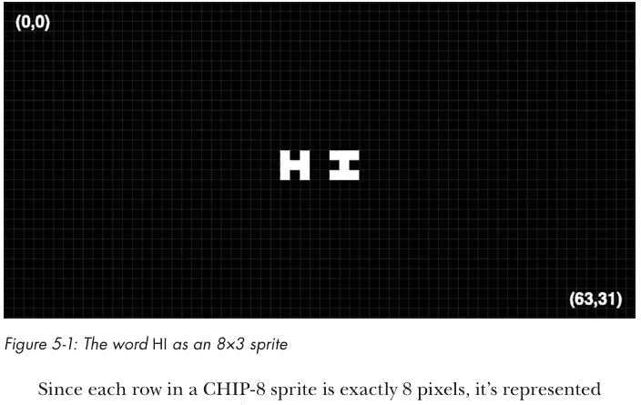

由于CHIP-8精灵中的每一行正好是8像素，因此它用8位表示。由于8位是1字节，因此精灵的每一行可以用单个字节表示。由于*HI*精灵有三行高，因此可以用3个字节表示。以二进制表示，这3个字节如下所示：

```
10100111
11100010
10100111
```

注意每个1如何映射到白色像素，每个0如何映射到黑色像素。有了这些信息，希望我们之前定义的字体集现在也更有意义了：字体集中的每个字符只是一个8×5的精灵。

绘制精灵是修改显示缓冲区的唯一方式（除了清除它），因此CHIP-8虚拟机有一条绘制指令Dxyn。它绘制一个位于i寄存器指定的内存位置、具有指定高度的精灵。指令中的D是常量nibble，x和y nibble表示v寄存器中精灵左上角x和y坐标的索引。换句话说，x坐标从寄存器v[x]获取，y坐标从寄存器v[y]获取。n nibble表示精灵的高度。这就是为什么精灵不能高于15像素：一个nibble是4位，4位最多只能表示数字15。

Dxyn的nibble对应于`draw_sprite()`辅助方法的参数：

```python
### Draw a sprite at *x*, *y* using data at *i* with a height of *height*
def draw_sprite(self, x: int, y: int, height: int):
    flipped_black = False  # did drawing this flip any pixels?
    for row in range(0, height):
        row_bits = self.ram[self.i + row]
        for col in range(0, SPRITE_WIDTH):
            px = x + col
            py = y + row
            if px >= SCREEN_WIDTH or py >= SCREEN_HEIGHT:
                continue  # ignore off-screen pixels
            new_bit = (row_bits >> (7 - col)) & 1
            old_bit = self.display_buffer[px, py] & 1
            if new_bit & old_bit:  # if both set, flip white -> black
                flipped_black = True
            # CHIP-8 draws by XORing
            new_pixel = new_bit ^ old_bit
            self.display_buffer[px, py] = WHITE if new_pixel else BLACK
    # Set flipped flag for collision detection
    self.v[0xF] = 1 if flipped_black else 0
```

CHIP-8使用XOR操作绘制精灵。*XOR*，或*异或*，是一种按位运算，当两个位不同时返回1，相同时返回0。Python使用`^`运算符进行XOR。表5-2显示了XOR的真值表。

##### 表5-2：XOR真值表

| 0 ^ 0 | 0 ^ 1 | 1 ^ 0 | 1 ^ 1 |
| :---: | :---: | :---: | :---: |
|   0   |   1   |   1   |   0   |

CHIP-8绘制指令获取一个精灵，并将其像素与屏幕上指定位置已有的像素进行XOR。如果该屏幕位置全是黑色像素，这实际上只会绘制精灵。但是，如果屏幕位置包含一些白色像素（1），则在精灵的白色像素与屏幕的白色像素重叠的地方将绘制黑色像素。这是因为1 XOR 1等于0。CHIP-8绘制指令会跟踪是否发生任何此类重叠（屏幕上的白色像素因绘制精灵而变为黑色像素）。如果发生，它会设置标志寄存器（v[0xF]）。

`draw_sprite()`方法是此过程的代码化。我们遍历从寄存器i指定的内存位置开始的精灵的所有行和列，使用右移操作提取精灵的每个像素并将其存储在`new_bit`中。对输入`new_bit`的数据进行`&`操作确保只有移位操作的最后一位存储在`new_bit`中。我们将每个`new_bit`与屏幕上已有的位`old_bit`进行比较，如果`old_bit`将从白色翻转为黑色，我们就设置标志寄存器。我们通过取`new_bit`和`old_bit`的XOR来更改显示缓冲区。

为什么我们需要一个标志来追踪绘制精灵是否会导致先前点亮的屏幕像素被关闭？这实际上是一种碰撞检测形式。如果精灵击中了屏幕上已有的东西，在游戏中知道这一点特别有帮助。例如，如果你正在编写一个网球游戏，你会想知道球何时移动并击中屏幕上已有的球拍。

#### 指令执行

现在到了虚拟机的核心部分。我们还剩下一个方法，但它是个大工程：我们需要实现虚拟机的所有指令。这与我们在第1章和第2章解释器中执行语句并无不同。无论是执行解释器语句、虚拟机指令，还是模拟器中的微处理器操作码，我们需要做的事情相当简单：识别下一条指令是什么，然后根据其预期操作执行不同的几行代码来操纵虚拟机的状态。

例如，如果我们看到一个加法指令，我们应该将两个指定的数字相加，并将结果存储在指定位置。如果我们看到一个跳转指令，我们应该将执行移动到内存中的指定位置。这实际上就是识别正在执行的指令，并根据该指令更改代表内存、寄存器等的几个状态变量。最简单的方法是使用大量的if语句。伪代码可能如下所示：

```
if instruction == ADD:
    add some numbers together and store the sum
elif instruction == JUMP:
    jump to a location by changing the program counter
elif instruction == DRAW:
    draw the sprite where specified by changing the display buffer
etc.
```

除了使用一堆if语句外，编写执行指令的代码还有三种常见模式。第一种是巨大的switch语句，这是一种在许多语言中都存在的结构，但在Python中并不完全以相同形式存在。我假设大多数读者以前在C或Java等语言中见过switch语句。如果你没见过，可以把它想象成Python的match语句的原始形式，就像我们在第1章和第2章中使用的那样。执行哪个switch语句的case取决于指令。这与刚才展示的伪代码有些相似。事实上，在Python 3.10引入match语句之前，在Python中实现这种模式确实是使用大量的if和elif子句。这是实现指令执行最简单的方法，但对于大型指令集来说可能会变得笨重。

下一种模式是使用跳转表，它由一个函数指针数组组成。我们根据指令索引到数组中，然后执行返回的相应函数。指令只是整数，这就是为什么它们可以用作数组索引。如果指令出于某种原因是字符串，我们可以改用字典，其中键是指令，值是函数指针，尽管这效率稍低。因为这种模式将工作分配给许多辅助函数，所以它通常比巨大的switch语句产生更整洁的代码，并且对于较大的指令集可能更受青睐。

第三种模式是使用*动态重编译*，我们将每条指令翻译成底层硬件理解的指令（或可以进一步翻译成此类指令的东西）。例如，如果我们在x86微处理器上运行的虚拟机中有一条加法指令，我们可能会将虚拟机的加法指令翻译成等效的x86加法指令的机器码。这是最复杂的模式，因为它不仅需要深入了解原始指令集，还需要了解要翻译成的指令集。然而，它将带来最快的性能。

在这个程序中，我们将使用巨大的match语句，因为CHIP-8的指令集相对较小。当我们下一章创建NES模拟器时，我们将使用跳转表，因为6502微处理器的指令集大约是其两倍（尽管仍然比几乎任何其他微处理器小得多）。动态重编译是一种明显更复杂的技术，超出了本书的范围。

step()方法负责执行指令，但首先该方法需要检索要执行的下一条指令：

```
def step(self):
    # We look at the opcode in terms of its nibbles (4 bit pieces)
    # Opcode is 16 bits made up of next two bytes in memory
    first2 = self.ram[self.pc]
    last2 = self.ram[self.pc + 1]
    first = (first2 & 0xF0) >> 4
    second = first2 & 0xF
    third = (last2 & 0xF0) >> 4
    fourth = last2 & 0xF

    self.needs_redraw = False
    jumped = False
```

下一条指令位于程序计数器（pc）存储的内存地址处。由于指令由16位组成，我们检索pc处的下2个字节并将其存储在first2和last2中。如前所述，将每条CHIP-8指令视为四个半字节的组合很方便，因为每个单独的半字节对许多指令都有意义。我们将半字节存储在first、second、third和fourth中。我们所有指令的模式匹配都将以半字节的形式进行。

在执行指令时，我们还将通过needs_redraw跟踪它是否需要任何重绘，以及它是否通过jumped修改了pc。运行循环使用needs_redraw作为优化。当没有任何变化时，为什么要进行任何绘图呢？跟踪jumped允许一些通用代码位于step()的底部，减少一点代码重复。

现在我们到达了实际的指令。巨大的match语句就在我们面前。我们的实现利用了Python优雅的match语法来捕获执行指令所需的半字节到临时变量中。每条指令执行的细节直接遵循本章前面的描述。许多指令只需一行代码即可实现。逐一描述它们将极其枯燥。相反，以下是step()其余部分的复制，注释提供了一些额外的上下文。

不过，在查看代码之前，这是一个停下来尝试自己实现指令的好地方。你不必使用match语句。你可以使用一系列if...elif语句，就像我在Python 3.9中match语句存在之前所做的那样。（我测试过，两者之间几乎没有性能差异。）你已经拥有了所有必要的设置，可以专注于每条指令应该做什么，而不是配置系统的内存或寄存器表示。你不需要考虑加载ROM文件或某些常量应该是什么。只需考虑逻辑以及每个操作如何修改虚拟机的状态。

本章前面的一些指令描述相当简短，但你可以在网上众多的CHIP-8参考资料中找到更详细的指令。不过，不要在单个指令上花费太多时间。如果你遇到困难，总是可以查看这里的实现。在尝试编写自己的指令实现后，你可以返回本书的代码来仔细检查你的工作。首先自己完成这项工作会让你很好地了解编写一个简单的虚拟机或模拟器需要什么。不要害怕：你会惊讶于实现许多指令是多么简单。记住，最初的CHIP-8虚拟机仅适合512字节的内存！

```
match (first, second, third, fourth):
    case (0x0, 0x0, 0xE, 0x0):  # display clear
        self.display_buffer.fill(0)
        self.needs_redraw = True
    case (0x0, 0x0, 0xE, 0xE):  # return from subroutine
        self.pc = self.stack.pop()
        jumped = True
    case (0x0, n1, n2, n3):  # call program
        self.pc = concat_nibbles(n1, n2, n3)  # go to start
        # Clear registers
        self.delay_timer = 0
        self.sound_timer = 0
        self.v = array('B', [0] * 16)
        self.i = 0
        # Clear screen
        self.display_buffer.fill(0)
        self.needs_redraw = True
        jumped = True
    case (0x1, n1, n2, n3):  # jump to address
        self.pc = concat_nibbles(n1, n2, n3)
        jumped = True
    case (0x2, n1, n2, n3):  # call subroutine
        self.stack.append(self.pc + 2)  # put return place on stack
        self.pc = concat_nibbles(n1, n2, n3)  # goto subroutine
        jumped = True
```

case (0x3, x, _, _):  # 条件跳过：若 v[x] 等于 last2
    if self.v[x] == last2:
        self.pc += 4
        jumped = True
case (0x4, x, _, _):  # 条件跳过：若 v[x] 不等于 last2
    if self.v[x] != last2:
        self.pc += 4
        jumped = True
case (0x5, x, y, _):  # 条件跳过：若 v[x] 等于 v[y]
    if self.v[x] == self.v[y]:
        self.pc += 4
        jumped = True
case (0x6, x, _, _):  # 将 v[x] 设置为 last2
    self.v[x] = last2
case (0x7, x, _, _):  # 将 last2 加到 v[x]
    self.v[x] = (self.v[x] + last2) % 256
case (0x8, x, y, 0x0):  # 将 v[x] 设置为 v[y]
    self.v[x] = self.v[y]
case (0x8, x, y, 0x1):  # 将 v[x] 设置为 v[x] | v[y]
    self.v[x] |= self.v[y]
case (0x8, x, y, 0x2):  # 将 v[x] 设置为 v[x] & v[y]
    self.v[x] &= self.v[y]
case (0x8, x, y, 0x3):  # 将 v[x] 设置为 v[x] ^ v[y]
    self.v[x] ^= self.v[y]
case (0x8, x, y, 0x4):  # 带进位标志的加法
    try:
        self.v[x] += self.v[y]
        self.v[0xF] = 0  # 表示无进位标志
    except OverflowError:
        self.v[x] = (self.v[x] + self.v[y]) % 256
        self.v[0xF] = 1  # 设置进位标志
case (0x8, x, y, 0x5):  # 带借位标志的减法
    try:
        self.v[x] -= self.v[y]
        self.v[0xF] = 1  # 表示无借位（是的，奇怪的是用1表示）
    except OverflowError:
        self.v[x] = (self.v[x] - self.v[y]) % 256
        self.v[0xF] = 0  # 表示发生了借位
case (0x8, x, _, 0x6):  # v[x] >> 1，v[f] = 最低有效位
    self.v[0xF] = self.v[x] & 0x1
    self.v[x] >>= 1
case (0x8, x, y, 0x7):  # 带借位标志的减法（y - x 结果存入 x）
    try:
        self.v[x] = self.v[y] - self.v[x]
        self.v[0xF] = 1  # 表示无借位（是的，奇怪的是用1表示）
    except OverflowError:
        self.v[x] = (self.v[y] - self.v[x]) % 256
        self.v[0xF] = 0  # 表示发生了借位
case (0x8, x, _, 0xE):  # v[x] << 1，v[f] = 最高有效位
    self.v[0xF] = (self.v[x] & 0b10000000) >> 7
    self.v[x] = (self.v[x] << 1) & 0xFF
case (0x9, x, y, 0x0):  # 条件跳过：若 v[x] != v[y]
    if self.v[x] != self.v[y]:
        self.pc += 4
        jumped = True
case (0xA, n1, n2, n3):  # 将 i 设置为地址 n1n2n3
    self.i = concat_nibbles(n1, n2, n3)
case (0xB, n1, n2, n3):  # 跳转到 n1n2n3 + v[0]
    self.pc = concat_nibbles(n1, n2, n3) + self.v[0]
    jumped = True
case (0xC, x, _, _):  # v[x] = 随机数 (0-255) & last2
    self.v[x] = last2 & randint(0, 255)
case (0xD, x, y, n):  # 在 (vx, vy) 处绘制高度为 n 的精灵
    self.draw_sprite(self.v[x], self.v[y], n)
    self.needs_redraw = True
case (0xE, x, 0x9, 0xE):  # 条件跳过：若 keys(v[x]) 为真
    if self.keys[self.v[x]]:
        self.pc += 4
        jumped = True
case (0xE, x, 0xA, 0x1):  # 条件跳过：若 keys(v[x]) 为假
    if not self.keys[self.v[x]]:
        self.pc += 4
        jumped = True
case (0xF, x, 0x0, 0x7):  # 将 v[x] 设置为 delay_timer
    self.v[x] = self.delay_timer
case (0xF, x, 0x0, 0xA):  # 等待下一个按键，然后存入 v[x]
    # 在此等待下一个按键，然后继续
    while True:
        event = pygame.event.wait()
        if event.type == pygame.QUIT:
            sys.exit()
        if event.type == pygame.KEYDOWN:
            key_name = pygame.key.name(event.key)
            if key_name in ALLOWED_KEYS:
                self.v[x] = ALLOWED_KEYS.index(key_name)
                break
case (0xF, x, 0x1, 0x5):  # 将 delay_timer 设置为 v[x]
    self.delay_timer = self.v[x]
case (0xF, x, 0x1, 0x8):  # 将 sound_timer 设置为 v[x]
    self.sound_timer = self.v[x]
case (0xF, x, 0x1, 0xE):  # 将 vx 加到 i
    self.i += self.v[x]
case (0xF, x, 0x2, 0x9):  # 将 i 设置为字符 v[x] 的位置
    self.i = self.v[x] * 5  # 内置字体集每个字符间隔5字节
case (0xF, x, 0x3, 0x3):  # 将 v[x] 的 BCD 存储到 i, i+1, i+2
    self.ram[self.i] = self.v[x] // 100  # 百位数字
    self.ram[self.i + 1] = (self.v[x] % 100) // 10  # 十位数字
    self.ram[self.i + 2] = (self.v[x] % 100) % 10  # 个位数字
case (0xF, x, 0x5, 0x5):  # 从 v0 到 vx 的寄存器转储，起始地址为 i
    for r in range(0, x + 1):
        self.ram[self.i + r] = self.v[r]
case (0xF, x, 0x6, 0x5):  # 将 i 到 i+r 的内容存入 v0 到 vr
    for r in range(0, x + 1):
        self.v[r] = self.ram[self.i + r]
case _:
    print(f"Unknown opcode ({hex(first), hex(second),
                            hex(third), hex(fourth)})!")

if not jumped:
    self.pc += 2  # 递增程序计数器

在 `step()` 方法的末尾，如果我们没有发生跳转，就递增程序计数器。这确保了下次调用 `step()` 时，我们已经移动到下一条指令。由于每条 CHIP-8 指令长度为 2 字节，程序计数器递增 2。如果发生了跳转，那么执行流会直接移动到内存中其他位置的特定指令。

#### 测试虚拟机

测试虚拟机最细粒度的方式是为每条指令编写我们自己的单元测试。对于每个测试，我们会尝试运行一条指令，然后验证虚拟机随后的内部状态是否正确。虽然这是理想的做法，但考虑到时间和篇幅，我们将采用更接近集成测试的方式：我们将观察我们的虚拟机运行真实的 CHIP-8 程序时的表现。它们能正确运行吗？

事实上，甚至有一些测试 ROM 提供了一种一站式测试 CHIP-8 虚拟机的方法。本书源代码仓库的 *Chip8/Tests* 子目录中包含了两个这样的测试 ROM。这两个测试 ROM 均由其开发者在开放许可证下发布，这些许可证也包含在子目录中。让我们从仓库的主目录运行第一个测试 ROM：

```
% python3 -m Chip8 Chip8/Tests/chip8-test-rom/test_opcode.ch8
```

如果虚拟机工作正常，你应该会看到一个满是 "OK" 的屏幕，如图 5-2 所示。

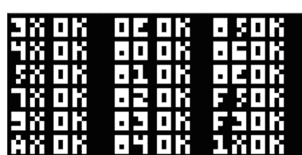

现在让我们用第二个测试 ROM 来检查我们的工作：

```
% python3 -m Chip8 Chip8/Tests/chip8-test-rom-2/chip8-test-rom.ch8
```

这个测试 ROM 只在左上角显示一次 "OK"（见图 5-3）。


图 5-3：运行第二个测试 ROM

这些测试并不全面，但它们是一个良好的起点。现在是时候进行终极集成测试了：我们的虚拟机能准确地运行游戏吗？

#### 运行游戏

本书仓库的 *Chip8/Games* 子目录包含了一系列已进入公共领域的 CHIP-8 ROM。如果你觉得其中一些游戏的控制方案有点笨拙，可以考虑更改默认的按键绑定。目前，`ALLOWED_KEYS` 是直接从各自的按键读取的，因此虚拟机中的 *A* 就是键盘上的 *A* 键。然而，这些游戏最初运行的系统可能有完全不同的键盘布局，因此对于某些游戏来说，不同的方案可能更好。

大多数游戏都非常简单，考虑到虚拟机最初设计运行的硬件限制，这是合理的。也有一些为功能更强大的系统制作的流行游戏的克隆版。首先我们有 *BLINKY*，一种 *Pac-Man* 的克隆版（图 5-4）。

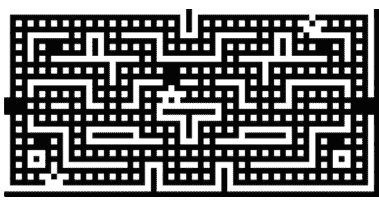

图 5-4：在虚拟机上运行的 BLINKY 游戏

*INVADERS* 是 *Space Invaders* 的克隆版（图 5-5）。

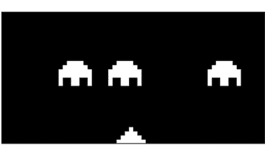

图 5-5：在虚拟机上运行的 INVADERS 游戏

VBRIX 是 *Breakout* 的垂直版本（图 5-6）。

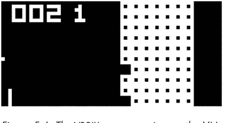

图 5-6：在虚拟机上运行的 VBRIX 游戏

然后是 *PONG*（图 5-7）。

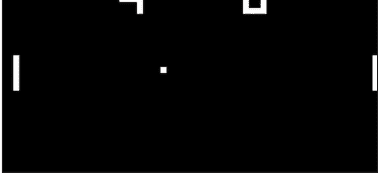

图 5-7：在虚拟机上运行的 PONG 游戏

源代码仓库中还捆绑了更多游戏供你探索。注意文件大小：这些游戏中大多数都在 500 字节或更小！最大的 *BLINKY* 也只有 2KB。

> 代码遇见生活

我一直对开发自己的模拟器感兴趣，但直到编程生涯的后期，我才觉得有足够的信心去构建一个。当我开始研究如何编写模拟器时，我发现的标准建议是首先尝试编写一个 CHIP-8 虚拟机，因为这样做比编写几乎任何其他模拟器都容易，但需要所有相同的元素（处理操作码、模拟内存和寄存器、图形等等）。

我找到了一个相当不错的在线教程。不过，我想让它更具挑战性一点，所以我用当时新的 Swift 语言开发了我最初的 CHIP-8 虚拟机，那时我正用它进行大量的专业工作。这是一个周末项目，是我开始开发模拟器的起点。

#### 现实世界的应用

虚拟机在历史和现代软件开发中无处不在。它们的主要优势是可移植性。为虚拟机编写的程序可以在任何拥有该虚拟机实现的平台上运行。虚拟机还提供了基础设施，通过消除实现常见语言运行时特性（如垃圾回收）的需要，减轻了语言作者的负担。

一个早期的例子是 1970 年代和 1980 年代一些编译器将 Pascal 编译成所谓的 *p-code*（一种字节码），然后在 p-code 虚拟机上运行。两个著名的现代虚拟机环境是本章前面提到的 JVM，以及微软的竞争产品公共语言运行时（CLR），它是其 .NET 平台的一部分。JVM 和 CLR 都是多种流行编程语言的目标平台。例如，C#、F# 和 Visual Basic 是通常以 CLR 为目标的语言，但也有像 Python 和 Swift 这样的流行语言的 CLR 实现。

为什么这些语言实现要编译成 CLR 的字节码而不是机器码？一旦编译完成，该字节码就可以在任何安装了 CLR 的平台上运行。这是一种编译后的即时可移植性。此外，像 CLR 这样复杂的虚拟机将提供语言服务，如垃圾回收、多线程和安全机制。最后，当像CLR这样的虚拟机将中间代码即时（JIT）编译为机器码时，它会应用语言设计者无需考虑的优化。

除了作为语言运行时的抽象机器外，*虚拟机*这个术语也令人困惑地用于指代整个硬件的软件实现——换句话说，就是模拟器。构建模拟器是下一章的主题。

#### 练习

- 1. 尝试使用三种不同的方法来测量主要操作码解释器代码的性能：已实现的match语句、一系列if…elif语句和跳转表。使用分析器或简单的计时器来确定哪种方法最快。为此，你可能需要关闭主运行循环中的计时代码，或者可以使用一组单元测试来完成。
- 2. CHIP-8有一个略微扩展的版本，称为SCHIP（超级芯片）。它需要实现更多的操作码，并更改原始CHIP-8虚拟机的一些元素，例如其分辨率。查阅SCHIP的文档，并尝试将我们的CHIP-8虚拟机转换为SCHIP虚拟机。然后，尝试玩一些SCHIP游戏！
- 3. 尝试编写一个非常简单的游戏，仅使用CHIP-8的机器码指令在屏幕上显示几个字母。你需要一个十六进制编辑器来完成此操作。看到你编写的二进制代码在你理解的虚拟机中运行，是令人满足的。

#### 注释

- 1. Joe Weisbecker, “A Practical, Low-Cost, Home/School Microprocessor System,” *Computer* 7, no. 08 (August 1974): 20–31.
- 2. Kiatanne Williams, “Joyce Weisbecker: The First Indie Game Developer,” *IEEE Women in Engineering Magazine* 16, no. 2 (December 2022): 15–20, doi:10.1109/MWIE.2022.3203181.
- 3. RCA COSMAC VIP CDP18S711 Instruction Manual (RCA Corporation, 1978).
- 4. RCA COSMAC VIP CDP18S711 Instruction Manual (RCA Corporation, 1978).
- 5. RCA COSMAC VIP CDP18S711 Instruction Manual (RCA Corporation, 1978).

### 6
#### 模拟NES游戏机


在本章中，我们将为一款深受喜爱的1980年代视频游戏机——任天堂娱乐系统（NES）构建一个有限的模拟器。

换句话说，我们将创建一个软件，它假装是NES硬件，以便为NES编写的软件可以被“欺骗”到现代平台上运行。构建这个项目提供了模拟完整计算机系统的经验。虽然NES是一个相对简单的计算机，但它具有与更复杂的模拟项目相同的所有基本组件（微处理器、内存、图形等）。而且与第5章的CHIP-8不同，我们将模拟的不仅仅是一个软件规范——我们将模拟真实的硬件！

我们的模拟器不会是原始硬件的100%准确重新实现。为了在一本书的章节中使构建模拟器变得可管理，我们将进行一些简化。尽管有这些简化，我们的模拟器仍然能够运行一些基本的NES游戏，包括书中源代码仓库中包含的一些爱好者免费和开源游戏。我们不会用任何商业游戏来测试我们的模拟器，尽管它能够运行一些简单的游戏。我们的动机是学习模拟器，而不是实现完整的游戏兼容性。我将把进一步增强模拟器的游戏兼容性作为读者的练习。

我们将用纯Python构建模拟器，在撰写本文时，它在现代PC上的速度不足以全速模拟NES。我们生成的代码可以用Cython、C扩展或其他类型的原生代码层来增强，以全速运行。这也将留给读者作为练习。

这是本书中最具挑战性的项目。我在本章中假设你已经完成了第1、2章，特别是第5章的项目。在开始本章之前，你至少应该完成第5章的CHIP-8项目，但几乎所有前面章节中解释的概念都会在这个项目中出现。

> **警告** *如果你对完成此项目有法律方面的顾虑，请研究你所在地区的法律或咨询律师。请注意，本章中用于开发NES模拟器的信息并非基于任何专有的任天堂文档。请记住，大多数商业游戏的ROM文件都受版权法保护。无需下载任何受保护的ROM文件来测试你的模拟器，因为本书的源代码仓库包含几个非商业ROM，它们采用开源许可或已发布到公共领域。*

#### 关于NES

NES是有史以来最畅销的视频游戏机之一。它于1983年首次在日本以Famicom的名义发布，1985年国际发布时吸引了全球一代游戏玩家。¹ 在其首次亮相时，视频游戏产业只有大约十年的历史。视频游戏机中的微处理器和其他硬件仍然相当原始。尽管如此，NES还是实现了60帧每秒的彩色精灵和背景，播放了朗朗上口的芯片音乐，并且是一些最具标志性游戏的主机平台。

> **注意** *本章中介绍的许多NES硬件规格和关于其功能的大部分信息来自NesDev，这是一个由NES自制开发者和模拟器编写者组成的社区，网址为https://www.nesdev.org。虽然我认为本章是关于如何编写NES模拟器的最佳概述和教程，但我强烈建议查看NesDev网站以获取详细信息。为了代替对该网站的大量引用，我在此向你提供这个显著的说明。此外，本章中的几张图片也来自NesDev，并已发布到公共领域，如本书版权页所述。感谢NesDev的各位，他们是一个极好的资源，并将如此多的参考资料发布到公共领域。*

#### 硬件

NES中的中央处理器（CPU）是理光制造的MOS Technology 6502微处理器的克隆，运行频率略低于2 MHz。6502是当时流行家用电脑（如Apple II和Commodore 64）中使用的同一款微处理器。它由大约3500个晶体管构成，是一款特别简单的微处理器；例如，它缺少乘法和除法指令。² 这些算术运算必须通过许多更简单的指令（如加法、减法和位移）在软件中实现。当你想到6502与现代微处理器相比是多么缓慢和简单时，用它所取得的成就令人难以置信。

NES上的6502与音频芯片封装在同一封装中。在NES开发术语中，该芯片被称为*音频处理单元（APU）*。APU支持五个不同的声音通道。为了保持简单，我们不会在模拟器中实现APU。在实现音频时，时序至关重要，而我们的模拟器在时序上并不精确。

NES的CPU可以访问机器内置的2KB RAM。是的，你没看错。NES CPU的工作内存只有2KB，甚至不足以存储本章这一节的文本。它也比CHIP-8系统通常具有的RAM少，而CHIP-8系统是在前一个十年推出的。一些卡带包含额外的RAM。

NES性能的关键是*图像处理单元（PPU）*，由理光制造，型号为2C02，基于德州仪器的早期设计。PPU不仅可以输出平铺背景图形，还内置了对精灵的支持。它具有2KB的内存用于背景图块信息，256字节的内存用于跟踪最多64个精灵，以及28字节用于存储调色板信息。NES支持54种不同的颜色，但同时只能使用25种。PPU甚至具有一些原始的碰撞检测支持。

CPU通过*内存映射硬件寄存器*与APU和PPU通信。这些是特定的内存地址，当写入时，可能会修改其他硬件芯片的操作，或者当读取时，将提供其他芯片当前标志或状态的更新。例如，CPU可以将数据写入PPU寄存器以更改精灵的位置。之后，它可以从不同的PPU寄存器读取，以查看精灵是否与任何东西碰撞。CPU还有用于读取游戏控制器的内存映射寄存器。

让我用一个例子来具体说明内存映射寄存器的概念。当游戏需要检查第一个游戏手柄（玩家1的控制器）的状态时，它使用一个内存映射寄存器。该寄存器位于内存地址0x4016。如果游戏从0x4016读取，它会得到1个字节，该字节指示游戏手柄上的特定按钮是否被按下。内存地址 `0x4016` 不能用于其他任何用途；它在硬件上直接连接到来自游戏手柄的线路。为了正常工作，我们的模拟器需要在读取或写入这些特殊内存地址时执行正确的操作。有些是只读的，有些是只写的，有些则可读可写。这些就是内存映射的硬件寄存器。

NES 硬件的另一个关键部分是游戏卡带。游戏卡带，尤其是早期的，主要由一个包含游戏图形和程序代码的大型 ROM 芯片组成。游戏卡带也可以包含 RAM（有时由电池供电以保存游戏状态）、简单的逻辑芯片，甚至所谓的“银行切换”技术，以允许总内存（RAM + ROM）超过 6502 在默认配置下可寻址的范围。因此，那个 2KB RAM 的数字有点误导性，因为程序的代码会驻留在 ROM 卡带上，而不是游戏机有限的内存中。相反，那 2KB 的内存几乎可以完全用于保存状态。早期的游戏卡带通常包含 24KB 到 40KB 的 ROM，而后期的游戏卡带可能拥有大约 128KB 的 ROM 和 8KB 的 RAM。NES 最大的主流卡带拥有 768KB 的内存。³

#### 软件

NES 没有 BIOS 或操作系统。裸机 NES 硬件不附带任何软件。所有软件都由游戏卡带提供。游戏卡带上的程序将直接控制 CPU、PPU 和 APU，它们与硬件之间没有任何抽象层。

NES 游戏通常是用 6502 汇编语言编写的。这听起来可能很硬核，但在那个时代是典型的；直到 1990 年代初，大多数需要在个人电脑或游戏机上实现高性能的程序都是用汇编语言编写的。除了汇编器，开发工具通常是内部构建的。没有可以下载的 NES 游戏制作器。

事实上，那是一个下载尚未普及的时代。NES 比任何具有互联网连接功能的主机早了几代。第一款内置调制解调器的主流主机是世嘉 Dreamcast，它在 1990 年代末推出。NES 卡带上发布的是游戏的最终版本；不会有更新。如果有 bug，那就是 bug，所以游戏的 1.0 版本必须近乎完美。与之相比，你今天购买的典型游戏，开发者通常在游戏发布前就在开发第一个主要补丁了。那时，需要对细节有更高程度的关注，但另一方面，游戏比今天简单得多。

令人惊叹的是，在这个原始的环境中，一些最具影响力和定义类型的游戏被开发出来。团队中程序员所需的技术能力与今天游戏开发者所处的领域非常不同。如今，大多数游戏都是使用预包装的框架或引擎（如 Unreal 或 Unity）构建的。开发者可以将大部分时间用于编写特定于游戏的机制。

NES 开发者必须用汇编语言编写自己的引擎。他们必须直接管理 APU 来播放每一个声音，管理 PPU 来显示每一个图形，并且必须榨干 CPU 的每一个周期来完成任何事情。较大的公司会构建自己的内部框架和工具，可以在不同游戏之间重复使用，但程序员仍然在相对较低的层次上工作。

#### 构建模拟器

是时候写一些代码了。不过，在我们开始之前，关于方向和管理预期有一个说明：我们正在编写的模拟器在每个环节都进行了简化。如前所述，由于 PPU 非常简化，它将与许多游戏不兼容。它也不会有任何声音，因为我们没有实现 APU。而且它运行得不够快，无法以游戏预期的速度运行。然而，它将运行真正的游戏，并且它们将是可玩的。我们在这里的工作也将为进行改进和添加更多功能（如果你选择这样做）提供坚实的基础。

#### 规划结构

模拟器执行的总体计划与第 5 章的 CHIP-8 虚拟机并无不同。与 CHIP-8 一样，我们将从 ROM 文件中逐条读取每条指令并进行解释。与 CHIP-8 一样，我们将使用 Pygame 来显示图形和处理用户输入。与 CHIP-8 一样，我们将有一个大的循环来获取每条指令并响应每个事件。然而，代码的结构将更加复杂。特别是，我们将模拟器分为三个类，每个类代表硬件的一个物理组件。我们将有 CPU、PPU 和卡带的类。以下是我们将编写的每个文件及其用途的细分：

- `__main__.py` 处理命令行参数并实现主模拟器循环，该循环分发指令、显示图形并响应用户输入。
- `rom.py` 读取 ROM 文件并模拟卡带。
- `cpu.py` 维护 CPU 状态、解释指令并处理主内存访问。
- `ppu.py` 管理 PPU 状态并绘制背景和精灵。

我们将按照这里列出的顺序处理这些文件。

#### 创建主循环

我们的主文件（`__main__.py`）是系统各个组件（CPU、PPU、卡带）汇聚的地方。它的“运行循环”通过保持一切向前推进并协调不同组件之间的交互，根据需要委托给 Pygame 来显示图形和读取用户输入，从而赋予模拟器生命。`run()` 函数接收一个 ROM 对象和 ROM 文件名作为参数。在我们的第一个代码片段中，我们初始化 Pygame，在屏幕上获取一个窗口，并创建 CPU 和 PPU 对象：

```python
NESEmulator/__main__.py
import sys
from argparse import ArgumentParser
from NESEmulator.rom import ROM
from NESEmulator.ppu import PPU, NES_WIDTH, NES_HEIGHT
from NESEmulator.cpu import CPU
import pygame
from timeit import default_timer as timer
import os

def run(rom: ROM, name: str):
    pygame.init()
    screen = pygame.display.set_mode((NES_WIDTH, NES_HEIGHT), 0, 24)
    pygame.display.set_caption(f"NES Emulator - {os.path.basename(name)}")
    ppu = PPU(rom)
    cpu = CPU(ppu, rom)
    ticks = 0
    start = None
```

正如它们的构造函数调用所表明的那样，PPU 和 CPU 都需要访问 ROM。CPU 需要读取程序指令，PPU 需要读取图形数据。CPU 还需要访问 PPU，因为当读取或写入某些内存地址时，它们实际上是 PPU 寄存器的代理。

`ticks` 变量跟踪 CPU 运行了多少个周期。对于每个 CPU 周期，PPU 恰好运行三个周期。换句话说，PPU 的时钟速度是 CPU 的三倍，所以 CPU 大约是 1.8 MHz，而 PPU 大约是 5.4 MHz。我们的代码需要模拟这一点，所以在下一个代码片段（即主游戏循环）中，我们跟踪每条 CPU 指令需要多少个周期（不同的指令需要不同数量的周期），然后让 PPU 运行该数量的三倍周期：

```python
while True:
    cpu.step()
    new_ticks = cpu.cpu_ticks - ticks
    # 3 PPU cycles for every CPU tick
    for _ in range(new_ticks * 3):
        ppu.step()
        # Draw, once per frame, everything onto the screen
        if (ppu.scanline == 240) and (ppu.cycle == 257): ❶
            pygame.surfarray.blit_array(screen, ppu.display_buffer)
            pygame.display.flip()
            end = timer()
            if start is not None:
                print(end - start)
            start = timer()
    if (ppu.scanline == 241) and (ppu.cycle == 2) and ppu.generate_nmi:
        cpu.trigger_NMI() ❷
    ticks += new_ticks
```

在每一帧结束时，用户看到的图形通过与我们在第 5 章使用的相同 Pygame 方法进行更新。但我们如何知道一帧结束了？NES 的分辨率为 256 像素宽，240 像素高。每一行像素被称为一条 *扫描线*，这个术语来自 NES 将连接的阴极射线管（CRT）电视。在真实的 NES 上，每个 PPU 周期会更新一个像素。因为 PPU 的运行速度是 CPU 的三倍（5.4 MHz 对 1.8 MHz），所以对于每个 CPU 周期，PPU 绘制三个点。当我们到达第 240 条扫描线的第 257 个点时，我们应该就完成了一帧 ❶。

高精度的 NES 模拟器通过执行 PPU 每个周期应该做的事情来模拟真实硬件的行为：计算下一个点的颜色。我们使用一种简单得多的技术，即每帧只在正确的位置绘制所有正确的图块和精灵一次。换句话说，我们不是考虑每个周期一个点，而是每帧只考虑整个屏幕应该是什么样子。虽然这种技术更快，并且不需要我们模拟 PPU 内部工作的许多细节，但它并不适用于所有游戏。更高级的 NES 游戏甚至在帧被绘制到屏幕上的过程中（即在扫描线之间甚至点之间）也会对图形进行更改。

请注意，PPU 实际上在扫描线之间执行额外的处理。这段时间被称为 *hblank*。更重要的是，PPU 有额外的非屏幕扫描线（它一直延伸到第 261 条扫描线，将第一条计为第 0 条）。处理这些额外的非渲染扫描线的时间被称为 *vblank*。在 vblank 期间，CPU 可以安全地修改 PPU 的任何内存，因为 PPU 的内存没有被主动访问来渲染可见扫描线。PPU 在 vblank 开始时（在完成所有可见扫描线之后）向 CPU 发送一个信号，用于此目的 ❷。该信号是一种 *不可屏蔽中断*（NMI）。

可以将 NMI 视为对程序的一种无法停止的中断。换句话说，它是一个信号，告诉微处理器：“立即停止你正在做的事情，因为我们现在要做另一件事。”在 NES 的情况下，另一件事是更新游戏的图形显示。每个 NES 游戏都有一个 NMI 处理程序，在 vblank 期间更新游戏的图形。

循环的其余部分只是处理事件：

```python
for event in pygame.event.get():
    if event.type == pygame.QUIT:
        sys.exit()
    # Handle keyboard events as joypad changes
    if event.type not in {pygame.KEYDOWN, pygame.KEYUP}:
        continue
    is_keydown = event.type == pygame.KEYDOWN
    match event.key:
        case pygame.K_LEFT:
            cpu.joypad1.left = is_keydown
```

我们识别某些按键的按下，将其等同于NES手柄上的按钮。我们标记被按下的按钮，以便CPU能够读取它们。我们的主文件通过处理一个命令行参数来读取ROM文件，从而完成任务。实际的读取工作由ROM类完成，我们接下来将介绍它。

#### 模拟卡带

NES游戏卡带主要由塑料外壳中的ROM芯片组成。这些ROM芯片存储了游戏的代码和图形资源。代码存储在一个称为PRG ROM的ROM芯片中，而图形则存储在一个称为CHR ROM的ROM芯片中。虽然卡带主要由ROM芯片组成，但它们也可能包含更多内容。正如之前暗示的，最常见的增强功能之一是逻辑芯片，它们实现了*bank switching*（存储体切换），这是一种让ROM容量超过NES通常可寻址范围的技术，但通过一种切换方案，程序可以访问特定的内存映射地址并说：“我已经用完了CHR ROM的前8KB，请将我的内存读取切换到下一个8KB。”

一些卡带甚至更进一步，提供额外的RAM来补充主CPU仅有的2KB内存。这被称为PRG RAM。一些卡带甚至装有电池，这样当控制台关闭时，RAM的内容就不会被擦除。在NES上没有其他方法可以永久存储用户数据，因为它没有磁盘。电池支持的RAM使得更长的游戏成为可能。没有人愿意玩一个40小时的游戏，却在关闭控制台后进度被擦除。

NES在市场上存在的时间越长，卡带就越复杂。同样先进的卡带设计会被制造出来，并在许多游戏中重复使用。作为模拟器作者，要支持所有游戏，你需要支持卡带可能包含的所有不同芯片组。然而，有几种特别流行的芯片组设计，它们占据了所有游戏的大多数。

这些卡带芯片组设计中的每一种在NES模拟器世界中都被称为*mapper*（映射器），因为卡带芯片组的主要用途是在不同的内存库之间切换，在编程术语中可以认为是将地址映射到一个库。最早开发的NES模拟器之一，由Marat Fayzullin开发的iNES，⁴为众多映射器定义了一种编号方案。此外，iNES定义了一种ROM文件格式，如今几乎所有的NES模拟器都在使用。

与CHIP-8不同，其ROM文件只包含原始游戏内存，NES由于其游戏卡带的多样性，需要更复杂的文件格式。特别是，iNES格式定义了一个头部，我们在读取ROM文件时必须注意。幸运的是，由于我们在第3章处理MacBinary头部的工作，我们已经有了处理头部的经验。iNES文件格式的头部定义在表6-1中。⁵

表6-1：iNES文件格式头部

| 字节 | 描述 |
|---|---|
| 0–3 | 常量 0x4E45531A（ASCII “NES”后跟MS-DOS文件结束符） |
| 4 | PRG ROM大小，以16KB为单位 |
| 5 | CHR ROM大小，以8KB为单位（值0表示电路板使用CHR RAM） |
| 6 | 标志6：映射器、镜像、电池、训练器 |
| 7 | 标志7：映射器、VS/Playchoice、NES 2.0 |
| 8 | 标志8：PRG RAM大小（很少使用的扩展） |
| 9 | 标志9：电视系统（很少使用的扩展） |
| 10 | 标志10：电视系统、PRG RAM存在（非官方，很少使用的扩展） |
| 11–15 | 未使用的填充（应填充为零，但一些提取工具会在此处放入它们的名字） |

如你所见，头部的一部分定义了游戏的映射器编号。每个标志字节可以包含多个单独的标志位，这就是为什么一些描述列出了多个项目。我们的模拟器不会使用标志8、9或10中的任何信息。

> 注意：iNES文件格式已被一种称为NES 2.0的更新格式扩展。iNES头部的许多字段在NES 2.0中仍然有效，字节11到15中有额外信息，标志字节也有一些变化。

我们在本章构建的模拟器只能使用最简单的映射器（映射器0，称为NROM）来玩游戏。NROM卡带没有存储体切换，因此它们最容易模拟。NROM卡带始终具有16KB或32KB的PRG ROM和8KB的CHR ROM。它可以选择性地具有PRG RAM。

在我们的代码中，我们定义了一个名为Header的命名元组来保存ROM文件头部的内容，并声明了一些标准常量：

```python
NESEmulator/rom.py
from pathlib import Path
from struct import unpack
from collections import namedtuple
from array import array

Header = namedtuple("Header", "signature prg_rom_size chr_rom_size "
                    "flags6 flags7 flags8 flags9 flags10 unused")

HEADER_SIZE = 16
TRAINER_SIZE = 512
PRG_ROM_BASE_UNIT_SIZE = 16384
CHR_ROM_BASE_UNIT_SIZE = 8192
PRG_RAM_SIZE = 8192
```

ROM类的构造函数首先利用struct标准库模块中的unpack()函数从ROM文件中读取头部，并将其分配到适当大小的字段中，这些字段由格式字符串指定：

```python
class ROM:
    def __init__(self, file_name: str | Path):
        with open(file_name, "rb") as file:
            # 读取头部并检查签名 "NES"
            self.header = Header._make(unpack("!LBBBBBBB5s",
                                            file.read(HEADER_SIZE)))
```

命名元组上的._make()类方法可用于从一个可迭代对象（如我们从unpack()获得的那个）构造该命名元组的实例。unpack()格式字符串中的具体项目类型列在表6-2中。格式字符串中的每个项目对应于表6-1中的一个头部元素。有关格式字符串的更多详细信息，请参阅struct模块的文档：https://docs.python.org/3/library/struct.html#struct-format-strings。

表6-2：struct模块的格式字符串字符

| 项目 | 字节数 | C类型 | Python类型 |
| :--- | :--- | :--- | :--- |
| ! | 不适用 | 表示后续内容为大端格式 | 不适用 |
| L | 4 | unsigned long | int |
| B | 1 | unsigned char | int |
| 5s | 5 | char[] | bytes |

经过这番处理，self.header包含了iNES头部的正确部分，并带有清晰标记的段。接下来，我们检查头部中的几条信息：

```python
if self.header.signature != 0x4E45531A:
    print("Invalid ROM Header Signature")
else:
    print("Valid ROM Header Signature")
    # 解析映射器 - flags6中的一个半字节和flags7中的一个半字节
    self.mapper = (self.header.flags7 & 0xF0) | (
        (self.header.flags6 & 0xF0) >> 4)
    print(f"Mapper {self.mapper}")
    if self.mapper != 0:
        print("Invalid Mapper: Only Mapper 0 is Implemented")
```

每个iNES头部都应该以相同的4字节签名开头。同时，映射器编号由标志7和8的部分构成。我们的模拟器只适用于使用映射器0的游戏。以下是构造函数的其余部分：

```python
self.read_cartridge = self.read_mapper0
self.write_cartridge = self.write_mapper0
### 检查是否有训练器（标志6的第4位）并读取它
self.has_trainer = bool(self.header.flags6 & 4)
if self.has_trainer:
    self.trainer_data = file.read(TRAINER_SIZE)
### 从标志6的第0位检查镜像模式
self.vertical_mirroring = bool(self.header.flags6 & 1)
print(f"Has vertical mirroring {self.vertical_mirroring}")
### 读取PRG_ROM和CHR_ROM，分别是16K和8K的倍数
self.prg_rom = file.read(PRG_ROM_BASE_UNIT_SIZE *
    self.header.prg_rom_size)
self.chr_rom = file.read(CHR_ROM_BASE_UNIT_SIZE *
    self.header.chr_rom_size)
self.prg_ram = array('B', [0] * PRG_RAM_SIZE)  # RAM
```

这段代码负责设置游戏卡带的其他属性。我们如何读取和写入它（这可能因映射器而异，尽管我们只支持映射器0）？它是否有训练器（一个我们将忽略的冷门功能）？它是否使用特定类型的图形镜像？最后，根据头部指示的大小，读取PRG ROM、CHR ROM和（可选的）PRG RAM的相应数量的数据。

注意read_cartridge和write_cartridge是如何被分配为read_mapper0()和write_mapper0()方法的别名的。如果我们支持多个映射器，我们会以不同的方式处理这个问题。目前，以下是映射器0方法的定义：

```python
def read_mapper0(self, address: int) -> int:
    if address < 0x2000:
        return self.chr_rom[address]
    elif 0x6000 <= address < 0x8000:
        return self.prg_ram[address % PRG_RAM_SIZE]
    elif address >= 0x8000:
        if self.header.prg_rom_size > 1:
            return self.prg_rom[address - 0x8000]
        else:
            return self.prg_rom[(address - 0x8000) % PRG_ROM_BASE_UNIT_SIZE]
```

else:
    raise LookupError(f"尝试在无效地址 {address:X} 处读取")

def write_mapper0(self, address: int, value: int):
    if address >= 0x6000:
        self.prg_ram[address % PRG_RAM_SIZE] = value

查看 `read_mapper0()`，你会注意到卡带上有三个不同的内存区域。地址低于 `0x2000` 的部分映射到 CHR ROM，由 PPU 直接访问。CPU 通过大于或等于 `0x8000` 的地址访问 PRG ROM，并且可以通过大于或等于 `0x6000` 但低于 `0x8000` 的地址读写 PRG RAM（如果卡带有的话）。

至此，我们代码中的卡带部分就介绍完了。简而言之，ROM 文件被转换为 CHR ROM 和 PRG ROM 区域，分别供我们的 PPU 和 CPU 访问。这就是为什么我们模拟器中的 PPU 和 CPU 类都需要能够访问 ROM 类。

#### 模拟 CPU

CPU 最终可以被视为复杂的有限状态机。它们通过寄存器和有限的可访问内存来维持状态。它们通过能够处理的指令进行状态转换。这一见解解释了我们的 CPU 模拟器需要做的关键工作：维护寄存器、访问内存，并根据指令正确修改寄存器和内存。

6502 是曾被广泛工业接受的最简单的 CPU 核心之一，而 NES 中的 6502 版本甚至比标准 6502 更简单。它缺少大多数 6502 所具有的 BCD 指令。我们只需要实现 56 种不同类型的指令就能拥有一个可工作的 NES CPU，其中许多指令只需几行代码即可实现。此外，6502 只有三个主要寄存器（A、X 和 Y）以及一些专用寄存器（SP、PC 和各种标志）。6502 唯一真正的复杂性来自于各种指令可以使用的多种不同的内存访问方法，但我们将通过一个辅助函数将它们抽象掉。

#### 设置

我们的 6502 实现代码从设置一些辅助结构和常量开始：

```
NESEmulator/
    cpu.py
from __future__ import annotations
from enum import Enum
from dataclasses import dataclass
from array import array
from typing import Callable
from NESEmulator.ppu import PPU, SPR_RAM_SIZE
from NESEmulator.rom import ROM
MemMode = Enum("MemMode", "DUMMY ABSOLUTE ABSOLUTE_X ABSOLUTE_Y ACCUMULATOR "
                  "IMMEDIATE IMPLIED INDEXED_INDIRECT INDIRECT "
                  "INDIRECT_INDEXED RELATIVE ZEROPAGE ZEROPAGE_X "
                  "ZEROPAGE_Y")

InstructionType = Enum("InstructionType", "ADC AHX ALR ANC AND ARR ASL AXS "
                       "BCC BCS BEQ BIT BMI BNE BPL BRK "
                       "BVC BVS CLC CLD CLI CLV CMP CPX "
                       "CPY DCP DEC DEX DEY EOR INC INX "
                       "INY ISC JMP JSR KIL LAS LAX LDA "
                       "LDX LDY LSR NOP ORA PHA PHP PLA "
                       "PLP RLA ROL ROR RRA RTI RTS SAX "
                       "SBC SEC SED SEI SHX SHY SLO SRE "
                       "STA STX STY TAS TAX TAY TSX TXA "
                       "TXS TYA XAA")

@dataclass(frozen=True)
class Instruction:
    type: InstructionType
    method: Callable[[Instruction, int], None]
    mode: MemMode
    length: int
    ticks: int
    page_ticks: int

@dataclass
class Joypad:
    strobe: bool = False
    read_count: int = 0
    a: bool = False
    b: bool = False
    select: bool = False
    start: bool = False
    up: bool = False
    down: bool = False
    left: bool = False
    right: bool = False

STACK_POINTER_RESET = 0xFD
STACK_START = 0x100
RESET_VECTOR = 0xFFFC
NMI_VECTOR = 0xFFFA
IRQ_BRK_VECTOR = 0xFFFE
MEM_SIZE = 2048
```

`MemMode` 枚举列出了 6502 中所有不同的内存访问方案。在一些基本的微处理器上，从内存中检索一个字节就像指定一个地址并获取存储在那里的字节一样简单。例如，如果我说“读取 `0x1940`”，我会得到存储在内存地址 `0x1940` 处的字节。6502 可以通过其 `ABSOLUTE` 内存模式做到这一点，但它还有其他在某些情况下有用的内存模式。其中一些模式访问的内存地址是动态计算的，而不是字面指定的。例如，`ABSOLUTE_X` 模式将 X 寄存器中的值加到提供的地址上，并访问结果内存位置。在这种模式下，如果我们递增 X 后再次执行相同的指令，我们将自动读取内存中的下一个字节。在底层编程时，这确实很方便，如果硬件针对某些访问模式进行了优化，甚至可以提高性能。我们将在本章后面更详细地讨论 NES 内存模式——幸运的是，其中许多模式彼此非常相似。

`InstructionType` 枚举列出了 6502 可以处理的所有不同类型的指令。其中一些指令类型用于 BCD 操作，如前所述，NES 版本的 6502 没有这些操作。其中一些是“非官方”指令类型，实际上并未作为 6502 的一部分记录在案，而是通过反复试验发现存在的。很少有游戏使用它们。剩下的 56 种是我们实际要实现的指令类型。我们在这个枚举中列出了所有可能的指令类型——甚至是未实现的那些——因为我们将使用一个自动生成的包含所有 256 种可能的 6502 操作码的表，并且我们希望表中的每个条目都有一个有效的指令类型值。

`Instruction` 指的是 6502 可能理解的 256 种操作码之一。每个指令都有关于其类型（`type`）、我们程序中处理它的关联函数（`method`）、其内存访问模式（`mode`）、预期的字节数（`length`）、运行所需的 CPU 周期数（`ticks`），以及在执行期间跨越内存页面时运行所需的额外周期数（`page_ticks`）的信息。内存页是内存控制器可以快速连续访问其任何部分的 RAM 的一部分。在 6502 中，内存页是 256 字节。如果指令跨越这些 256 字节的边界，执行可能需要更长时间。

每个指令都有一个关联的处理函数，这一事实暗示我们将使用与 CHIP-8 项目中相当不同的设计。对于 CHIP-8 虚拟机，我们使用了一个巨大的 `match` 语句来处理每条指令，但对于 6502 及其稍微复杂一点的指令集，我们将采用更清晰的设计。我们不会对每条指令进行切换，而是根据其操作码在数组中查找它，然后执行关联的函数。这种设计是称为跳转表的常见模式的一种变体。本质上，我们通过操作码索引到指令数组中，以找到要跳转到的函数。

`Joypad` 类表示程序执行期间游戏手柄的状态。CPU 可以通过几个内存映射寄存器直接轮询游戏手柄，因此将其放在这里的 cpu 模块中似乎是合适的。回想一下，我们的主循环根据 Pygame 检测到的事件设置游戏手柄的状态。

以下是前面代码清单中剩余辅助常量的分解：

**STACK_POINTER_RESET** CPU 的堆栈指针最初指向的内存地址。

**STACK_START** 堆栈在内存中的起始位置，有趣的是，它与 `STACK_POINTER_RESET` 是不同的地址。

**RESET_VECTOR** 内存中的一个地址，该地址包含程序执行开始的另一个内存地址。每个 NES 游戏的 PRG ROM 在 `RESET_VECTOR` 列出的地址处都有某种启动代码来启动程序。

**NMI_VECTOR** 与 `RESET_VECTOR` 相同，但用于 NMI 和垂直空白。当垂直空白到来时，控制权将转移到 `NMI_VECTOR` 列出的内存地址。

**IRQ_BRK_VECTOR** 一个较少使用的中断类型的地址，不会影响我们用程序测试的游戏。这里包含它是为了完整性。

**MEM_SIZE** NES CPU 可访问的主 RAM 的大小（以字节为单位）。

接下来，让我们看看 CPU 类构造函数的开头，它设置其内存、寄存器和可配置的状态变量：

```
class CPU:
    def __init__(self, ppu: PPU, rom: ROM):
        # 与控制台其他部分的连接
        self.ppu: PPU = ppu
        self.rom: ROM = rom
        # CPU 上的内存
        self.ram = array('B', [0] * MEM_SIZE)
        # 寄存器
        self.A: int = 0
        self.X: int = 0
        self.Y: int = 0
        self.SP: int = STACK_POINTER_RESET
        self.PC: int = self.read_memory(RESET_VECTOR, MemMode.ABSOLUTE) | \
                      (self.read_memory(RESET_VECTOR + 1,
                                       MemMode.ABSOLUTE) << 8)
        # 标志
        self.C: bool = False  # 进位
        self.Z: bool = False  # 零
        self.I: bool = True  # 中断禁用
        self.D: bool = False  # 十进制模式
        self.B: bool = False  # 中断命令
        self.V: bool = False  # 溢出
        self.N: bool = False  # 负数
        # 杂项状态
        self.jumped: bool = False
        self.page_crossed: bool = False
        self.cpu_ticks: int = 0
        self.stall: int = 0  # 停滞的周期数
        self.joypad1 = Joypad()
```

为了更好地理解这段设置代码，让我们深入了解一下 6502 的寄存器。表 6-3 列出了所有寄存器。

表 6-3：6502 寄存器

| 名称 | 大小（字节） | 用途 |
| :--- | :--- | :--- |
| A | 1 | 用于算术运算的主寄存器。有时也称为 *累加器*。 |
| X | 1 | 一个 *索引寄存器*，通常用作循环计数器。它也可以用作通用寄存器，尽管并非所有指令都能像对 A 那样对它进行操作。 |
| Y | 1 | 与 X 相同。 |
| PC | 2 | *程序计数器*，用于跟踪内存中下一条要执行的指令的位置。它是 2 字节，因为 6502 最多可以寻址 64KB 的内存（不使用 bank switching）。 |
| SP | 1 | *栈指针*，用于跟踪程序当前在栈上的位置。由于它只有 1 字节，栈最多只能容纳 256 字节。 |
| P | 1 | *状态* 或 *标志* 寄存器。它的各个位表示不同的信息，例如关于算术运算的某些情况（例如，结果是否为零？）或者是否发生了中断以及中断是否启用（IRQ）。 |

由于 Python 对所有整数无论大小都只使用一种类型，我们使用 `int` 类型来表示除标志位以外的所有这些寄存器。我们不直接操作状态寄存器中每个标志位的各个位，而是使用 6502 文档中常见的字母命名法将它们分成独立的布尔值。这些是 C、Z、I、D、B、V 和 N 成员变量。它们中的大多数是作为算术运算的结果而设置的，I 在程序希望不被 IRQ 信号中断时设置，B 在中断指令后标志位被压入栈时设置。D 标志用于 BCD 码，与 NES 无关，因为 NES 没有 BCD 指令。

`jumped` 变量用于跟踪跳转指令是否修改了 PC 寄存器，而 `page_crossed` 用于在访问跨内存页的内存时进行记账，正如之前讨论的，这可能比访问附近的内存开销更大。NES CPU 可能需要等待一定数量的周期来完成某些任务。这就是 `stall` 的用途。在我们的模拟器中，它仅在发生直接内存访问（DMA）传输时使用，用于将大量数据从主内存发送到对象属性内存（OAM），PPU 在那里存储关于精灵的信息。

#### 跳转表

接下来，我们将声明跳转表，即包含 6502 可以处理的所有潜在指令的列表。由于 6502 使用 1 字节的操作码，而一个字节有 256 种可能的值，因此潜在地有 256 条不同的指令。稍后，在我们的 `step()` 方法中，我们将索引到这个列表中，以获取给定操作码的特定指令及其对应的函数。我们实际上不会实现每条指令（有些是 BCD 或非官方指令），因此有些指令被关联到 `self.unimplemented()` 方法。

为了完整性，这里包含了跳转表的所有 256 行：

```
self.instructions = [
    Instruction(InstructionType.BRK, self.BRK, MemMode.IMPLIED, 1, 7, 0),  # 00
    Instruction(InstructionType.ORA, self.ORA, MemMode.INDEXED_INDIRECT, 2, 6, 0),
    Instruction(InstructionType.KIL, self.unimplemented, MemMode.IMPLIED, 0, 2, 0),
    Instruction(InstructionType.SLO, self.unimplemented, MemMode.INDEXED_INDIRECT, 0, 8, 0),
    Instruction(InstructionType.NOP, self.NOP, MemMode.ZEROPAGE, 2, 3, 0),  # 04
    Instruction(InstructionType.ORA, self.ORA, MemMode.ZEROPAGE, 2, 3, 0),  # 05
    Instruction(InstructionType.ASL, self.ASL, MemMode.ZEROPAGE, 2, 5, 0),  # 06
    Instruction(InstructionType.SLO, self.unimplemented, MemMode.ZEROPAGE, 0, 5, 0),
    Instruction(InstructionType.PHP, self.PHP, MemMode.IMPLIED, 1, 3, 0),  # 08
    Instruction(InstructionType.ORA, self.ORA, MemMode.IMMEDIATE, 2, 2, 0),  # 09
    Instruction(InstructionType.ASL, self.ASL, MemMode.ACCUMULATOR, 1, 2, 0),  # 0a
    Instruction(InstructionType.ANC, self.unimplemented, MemMode.IMMEDIATE, 0, 2, 0),
    Instruction(InstructionType.NOP, self.NOP, MemMode.ABSOLUTE, 3, 4, 0),  # 0c
    Instruction(InstructionType.ORA, self.ORA, MemMode.ABSOLUTE, 3, 4, 0),  # 0d
    Instruction(InstructionType.ASL, self.ASL, MemMode.ABSOLUTE, 3, 6, 0),  # 0e
    Instruction(InstructionType.SLO, self.unimplemented, MemMode.ABSOLUTE, 0, 6, 0),
    Instruction(InstructionType.BPL, self.BPL, MemMode.RELATIVE, 2, 2, 1),  # 10
    Instruction(InstructionType.ORA, self.ORA, MemMode.INDIRECT_INDEXED, 2, 5, 1),
    Instruction(InstructionType.KIL, self.unimplemented, MemMode.IMPLIED, 0, 2, 0),
    Instruction(InstructionType.SLO, self.unimplemented, MemMode.INDIRECT_INDEXED, 0, 8, 0),
    Instruction(InstructionType.NOP, self.NOP, MemMode.ZEROPAGE_X, 2, 4, 0),  # 14
    Instruction(InstructionType.ORA, self.ORA, MemMode.ZEROPAGE_X, 2, 4, 0),  # 15
    Instruction(InstructionType.ASL, self.ASL, MemMode.ZEROPAGE_X, 2, 6, 0),  # 16
    Instruction(InstructionType.SLO, self.unimplemented, MemMode.ZEROPAGE_X, 0, 6, 0),
    Instruction(InstructionType.CLC, self.CLC, MemMode.IMPLIED, 1, 2, 0),  # 18
    Instruction(InstructionType.ORA, self.ORA, MemMode.ABSOLUTE_Y, 3, 4, 1),  # 19
    Instruction(InstructionType.NOP, self.NOP, MemMode.IMPLIED, 1, 2, 0),  # 1a
    Instruction(InstructionType.SLO, self.unimplemented, MemMode.ABSOLUTE_Y, 0, 7, 0),
    Instruction(InstructionType.NOP, self.NOP, MemMode.ABSOLUTE_X, 3, 4, 1),  # 1c
    Instruction(InstructionType.ORA, self.ORA, MemMode.ABSOLUTE_X, 3, 4, 1),  # 1d
    Instruction(InstructionType.ASL, self.ASL, MemMode.ABSOLUTE_X, 3, 7, 0),  # 1e
    Instruction(InstructionType.SLO, self.unimplemented, MemMode.ABSOLUTE_X, 0, 7, 0),
    Instruction(InstructionType.JSR, self.JSR, MemMode.ABSOLUTE, 3, 6, 0),  # 20
    Instruction(InstructionType.AND, self.AND, MemMode.INDEXED_INDIRECT, 2, 6, 0),
    Instruction(InstructionType.KIL, self.unimplemented, MemMode.IMPLIED, 0, 2, 0),
    Instruction(InstructionType.RLA, self.unimplemented, MemMode.INDEXED_INDIRECT, 0, 8, 0),
    Instruction(InstructionType.BIT, self.BIT, MemMode.ZEROPAGE, 2, 3, 0),  # 24
    Instruction(InstructionType.AND, self.AND, MemMode.ZEROPAGE, 2, 3, 0),  # 25
    Instruction(InstructionType.ROL, self.ROL, MemMode.ZEROPAGE, 2, 5, 0),  # 26
    Instruction(InstructionType.RLA, self.unimplemented, MemMode.ZEROPAGE, 0, 5, 0),
    Instruction(InstructionType.PLP, self.PLP, MemMode.IMPLIED, 1, 4, 0),  # 28
    Instruction(InstructionType.AND, self.AND, MemMode.IMMEDIATE, 2, 2, 0),  # 29
    Instruction(InstructionType.ROL, self.ROL, MemMode.ACCUMULATOR, 1, 2, 0),  # 2a
    Instruction(InstructionType.ANC, self.unimplemented, MemMode.IMMEDIATE, 0, 2, 0),
    Instruction(InstructionType.BIT, self.BIT, MemMode.ABSOLUTE, 3, 4, 0),  # 2c
    Instruction(InstructionType.AND, self.AND, MemMode.ABSOLUTE, 3, 4, 0),  # 2d
    Instruction(InstructionType.ROL, self.ROL, MemMode.ABSOLUTE, 3, 6, 0),  # 2e
    Instruction(InstructionType.RLA, self.unimplemented, MemMode.ABSOLUTE, 0, 6, 0),
    Instruction(InstructionType.BMI, self.BMI, MemMode.RELATIVE, 2, 2, 1),  # 30
    Instruction(InstructionType.AND, self.AND, MemMode.INDIRECT_INDEXED, 2, 5, 1),
    Instruction(InstructionType.KIL, self.unimplemented, MemMode.IMPLIED, 0, 2, 0),
    Instruction(InstructionType.RLA, self.unimplemented, MemMode.INDIRECT_INDEXED, 0, 8, 0),
    Instruction(InstructionType.NOP, self.NOP, MemMode.ZEROPAGE_X, 2, 4, 0),  # 34
    Instruction(InstructionType.AND, self.AND, MemMode.ZEROPAGE_X, 2, 4, 0),  # 35
    Instruction(InstructionType.ROL, self.ROL, MemMode.ZEROPAGE_X, 2, 6, 0),  # 36
    Instruction(InstructionType.RLA, self.unimplemented, MemMode.ZEROPAGE_X, 0, 6, 0),
    Instruction(InstructionType.SEC, self.SEC, MemMode.IMPLIED, 1, 2, 0),  # 38
    Instruction(InstructionType.AND, self.AND, MemMode.ABSOLUTE_Y, 3, 4, 1),  # 39
    Instruction(InstructionType.NOP, self.NOP, MemMode.IMPLIED, 1, 2, 0),  # 3a
    Instruction(InstructionType.RLA, self.unimplemented, MemMode.ABSOLUTE_Y, 0, 7, 0),
    Instruction(InstructionType.NOP, self.NOP, MemMode.ABSOLUTE_X, 3, 4, 1),  # 3c
    Instruction(InstructionType.AND, self.AND, MemMode.ABSOLUTE_X, 3, 4, 1),  # 3d
    Instruction(InstructionType.ROL, self.ROL, MemMode.ABSOLUTE_X, 3, 7, 0),  # 3e
    Instruction(InstructionType.RLA, self.unimplemented, MemMode.ABSOLUTE_X, 0, 7, 0),
    Instruction(InstructionType.RTI, self.RTI, MemMode.IMPLIED, 1, 6, 0),  # 40
    Instruction(InstructionType.EOR, self.EOR, MemMode.INDEXED_INDIRECT, 2, 6, 0),
    Instruction(InstructionType.KIL, self.unimplemented, MemMode.IMPLIED, 0, 2, 0),
    Instruction(InstructionType.SRE, self.unimplemented, MemMode.INDEXED_INDIRECT, 0, 8, 0),
    Instruction(InstructionType.NOP, self.NOP, MemMode.ZEROPAGE, 2, 3, 0),  # 44
    Instruction(InstructionType.EOR, self.EOR, MemMode.ZEROPAGE, 2, 3, 0),  # 45
    Instruction(InstructionType.LSR, self.LSR, MemMode.ZEROPAGE, 2, 5, 0),  # 46
    Instruction(InstructionType.SRE, self.unimplemented, MemMode.ZEROPAGE, 0, 5, 0),
    Instruction(InstructionType.PHA, self.PHA, MemMode.IMPLIED, 1, 3, 0),  # 48
    Instruction(InstructionType.EOR, self.EOR, MemMode.IMMEDIATE, 2, 2, 0),  # 49
    Instruction(InstructionType.LSR, self.LSR, MemMode.ACCUMULATOR, 1, 2, 0),
    Instruction(InstructionType.ALR, self.unimplemented, MemMode.IMMEDIATE, 0, 2, 0),
    Instruction(InstructionType.JMP, self.JMP, MemMode.ABSOLUTE, 3, 3, 0),  # 4c
    Instruction(InstructionType.EOR, self.EOR, MemMode.ABSOLUTE, 3, 4, 0),  # 4d
    Instruction(InstructionType.LSR, self.LSR, MemMode.ABSOLUTE, 3, 6, 0),  # 4e
    Instruction(InstructionType.SRE, self.unimplemented, MemMode.ABSOLUTE, 0, 6, 0),
    Instruction(InstructionType.BVC, self.BVC, MemMode.RELATIVE, 2, 2, 1),  # 50
    Instruction(InstructionType.EOR, self.EOR, MemMode.INDIRECT_INDEXED, 2, 5, 1),
    Instruction(InstructionType.KIL, self.unimplemented, MemMode.IMPLIED, 0, 2, 0),
    Instruction(InstructionType.SRE, self.unimplemented, MemMode.INDIRECT_INDEXED, 0, 8, 0),
    Instruction(InstructionType.NOP, self.NOP, MemMode.ZEROPAGE_X, 2, 4, 0),  # 54
    Instruction(InstructionType.EOR, self.EOR, MemMode.ZEROPAGE_X, 2, 4, 0),  # 55
    Instruction(InstructionType.LSR, self.LSR, MemMode.ZEROPAGE_X, 2, 6, 0),  # 56
    Instruction(InstructionType.SRE, self.unimplemented, MemMode.ZEROPAGE_X, 0, 6, 0),
    Instruction(InstructionType.CLI, self.CLI, MemMode.IMPLIED, 1, 2, 0),  # 58
    Instruction(InstructionType.EOR, self.EOR, MemMode.ABSOLUTE_Y, 3, 4, 1),  # 59
    Instruction(InstructionType.NOP, self.NOP, MemMode.IMPLIED, 1, 2, 0),  # 5a
    Instruction(InstructionType.SRE, self.unimplemented, MemMode.ABSOLUTE_Y, 0, 7, 0),
    Instruction(InstructionType.NOP, self.NOP, MemMode.ABSOLUTE_X, 3, 4, 1),  # 5c
    Instruction(InstructionType.EOR, self.EOR, MemMode.ABSOLUTE_X, 3, 4, 1),  # 5d
    Instruction(InstructionType.LSR, self.LSR, MemMode.ABSOLUTE_X, 3, 7, 0),  # 5e
    Instruction(InstructionType.SRE, self.unimplemented, MemMode.ABSOLUTE_X, 0, 7, 0),
    Instruction(InstructionType.RTS, self.RTS, MemMode.IMPLIED, 1, 6, 0),  # 60
    Instruction(InstructionType.ADC, self.ADC, MemMode.INDEXED_INDIRECT, 2, 6, 0),
    Instruction(InstructionType.KIL, self.unimplemented, MemMode.IMPLIED, 0, 2, 0),
    Instruction(InstructionType.RRA, self.unimplemented, MemMode.INDEXED_INDIRECT, 0, 8, 0),
    Instruction(InstructionType.NOP, self.NOP, MemMode.ZEROPAGE, 2, 3, 0),  # 64
    Instruction(InstructionType.ADC, self.ADC, MemMode.ZEROPAGE, 2, 3, 0),  # 65
    Instruction(InstructionType.ROR, self.ROR, MemMode.ZEROPAGE, 2, 5, 0),  # 66
    Instruction(InstructionType.RRA, self.unimplemented, MemMode.ZEROPAGE, 0, 5, 0),
    Instruction(InstructionType.PLA, self.PLA, MemMode.IMPLIED, 1, 4, 0),  # 68
```

指令(指令类型.ADC, self.ADC, 内存模式.立即数, 2, 2, 0),  # 69
指令(指令类型.ROR, self.ROR, 内存模式.累加器, 1, 2, 0),  # 6a
指令(指令类型.ARR, self.unimplemented, 内存模式.立即数, 0, 2, 0),
指令(指令类型.JMP, self.JMP, 内存模式.间接, 3, 5, 0),  # 6c
指令(指令类型.ADC, self.ADC, 内存模式.绝对, 3, 4, 0),  # 6d
指令(指令类型.ROR, self.ROR, 内存模式.绝对, 3, 6, 0),  # 6e
指令(指令类型.RRA, self.unimplemented, 内存模式.绝对, 0, 6, 0),
指令(指令类型.BVS, self.BVS, 内存模式.相对, 2, 2, 1),  # 70
指令(指令类型.ADC, self.ADC, 内存模式.间接索引, 2, 5, 1),
指令(指令类型.KIL, self.unimplemented, 内存模式.隐含, 0, 2, 0),
指令(指令类型.RRA, self.unimplemented, 内存模式.间接索引, 0, 8, 0),
指令(指令类型.NOP, self.NOP, 内存模式.零页X, 2, 4, 0),  # 74
指令(指令类型.ADC, self.ADC, 内存模式.零页X, 2, 4, 0),  # 75
指令(指令类型.ROR, self.ROR, 内存模式.零页X, 2, 6, 0),  # 76
指令(指令类型.RRA, self.unimplemented, 内存模式.零页X, 0, 6, 0),
指令(指令类型.SEI, self.SEI, 内存模式.隐含, 1, 2, 0),  # 78
指令(指令类型.ADC, self.ADC, 内存模式.绝对Y, 3, 4, 1),  # 79
指令(指令类型.NOP, self.NOP, 内存模式.隐含, 1, 2, 0),  # 7a
指令(指令类型.RRA, self.unimplemented, 内存模式.绝对Y, 0, 7, 0),
指令(指令类型.NOP, self.NOP, 内存模式.绝对X, 3, 4, 1),  # 7c
指令(指令类型.ADC, self.ADC, 内存模式.绝对X, 3, 4, 1),  # 7d
指令(指令类型.ROR, self.ROR, 内存模式.绝对X, 3, 7, 0),  # 7e
指令(指令类型.RRA, self.unimplemented, 内存模式.绝对X, 0, 7, 0),
指令(指令类型.NOP, self.NOP, 内存模式.立即数, 2, 2, 0),  # 80
指令(指令类型.STA, self.STA, 内存模式.索引间接, 2, 6, 0),
指令(指令类型.NOP, self.NOP, 内存模式.立即数, 0, 2, 0),  # 82
指令(指令类型.SAX, self.unimplemented, 内存模式.索引间接, 0, 6, 0),
指令(指令类型.STY, self.STY, 内存模式.零页, 2, 3, 0),  # 84
指令(指令类型.STA, self.STA, 内存模式.零页, 2, 3, 0),  # 85
指令(指令类型.STX, self.STX, 内存模式.零页, 2, 3, 0),  # 86
指令(指令类型.SAX, self.unimplemented, 内存模式.零页, 0, 3, 0),
指令(指令类型.DEY, self.DEY, 内存模式.隐含, 1, 2, 0),  # 88
指令(指令类型.NOP, self.NOP, 内存模式.立即数, 0, 2, 0),  # 89
指令(指令类型.TXA, self.TXA, 内存模式.隐含, 1, 2, 0),  # 8a
指令(指令类型.XAA, self.unimplemented, 内存模式.立即数, 0, 2, 0),
指令(指令类型.STY, self.STY, 内存模式.绝对, 3, 4, 0),  # 8c
指令(指令类型.STA, self.STA, 内存模式.绝对, 3, 4, 0),  # 8d
指令(指令类型.STX, self.STX, 内存模式.绝对, 3, 4, 0),  # 8e
指令(指令类型.SAX, self.unimplemented, 内存模式.绝对, 0, 4, 0),
指令(指令类型.BCC, self.BCC, 内存模式.相对, 2, 2, 1),  # 90
指令(指令类型.STA, self.STA, 内存模式.间接索引, 2, 6, 0),
指令(指令类型.KIL, self.unimplemented, 内存模式.隐含, 0, 2, 0),
指令(指令类型.AHX, self.unimplemented, 内存模式.间接索引, 0, 6, 0),
指令(指令类型.STY, self.STY, 内存模式.零页X, 2, 4, 0),  # 94
指令(指令类型.STA, self.STA, 内存模式.零页X, 2, 4, 0),  # 95
指令(指令类型.STX, self.STX, 内存模式.零页Y, 2, 4, 0),  # 96
指令(指令类型.SAX, self.unimplemented, 内存模式.零页Y, 0, 4, 0),
指令(指令类型.TYA, self.TYA, 内存模式.隐含, 1, 2, 0),  # 98
指令(指令类型.STA, self.STA, 内存模式.绝对Y, 3, 5, 0),  # 99
指令(指令类型.TXS, self.TXS, 内存模式.隐含, 1, 2, 0),  # 9a
指令(指令类型.TAS, self.unimplemented, 内存模式.绝对Y, 0, 5, 0),
指令(指令类型.SHY, self.unimplemented, 内存模式.绝对X, 0, 5, 0),
指令(指令类型.STA, self.STA, 内存模式.绝对X, 3, 5, 0),  # 9d
指令(指令类型.SHX, self.unimplemented, 内存模式.绝对Y, 0, 5, 0),
指令(指令类型.AHX, self.unimplemented, 内存模式.绝对Y, 0, 5, 0),
指令(指令类型.LDY, self.LDY, 内存模式.立即数, 2, 2, 0),  # a0
指令(指令类型.LDA, self.LDA, 内存模式.索引间接, 2, 6, 0),
指令(指令类型.LDX, self.LDX, 内存模式.立即数, 2, 2, 0),  # a2
指令(指令类型.LAX, self.unimplemented, 内存模式.索引间接, 0, 6, 0),
指令(指令类型.LDY, self.LDY, 内存模式.零页, 2, 3, 0),  # a4
指令(指令类型.LDA, self.LDA, 内存模式.零页, 2, 3, 0),  # a5
指令(指令类型.LDX, self.LDX, 内存模式.零页, 2, 3, 0),  # a6
指令(指令类型.LAX, self.unimplemented, 内存模式.零页, 0, 3, 0),
指令(指令类型.TAY, self.TAY, 内存模式.隐含, 1, 2, 0),  # a8
指令(指令类型.LDA, self.LDA, 内存模式.立即数, 2, 2, 0),  # a9
指令(指令类型.TAX, self.TAX, 内存模式.隐含, 1, 2, 0),  # aa
指令(指令类型.LAX, self.unimplemented, 内存模式.立即数, 0, 2, 0),
指令(指令类型.LDY, self.LDY, 内存模式.绝对, 3, 4, 0),  # ac
指令(指令类型.LDA, self.LDA, 内存模式.绝对, 3, 4, 0),  # ad
指令(指令类型.LDX, self.LDX, 内存模式.绝对, 3, 4, 0),  # ae
指令(指令类型.LAX, self.unimplemented, 内存模式.绝对, 0, 4, 0),
指令(指令类型.BCS, self.BCS, 内存模式.相对, 2, 2, 1),  # b0
指令(指令类型.LDA, self.LDA, 内存模式.间接索引, 2, 5, 1),
指令(指令类型.KIL, self.unimplemented, 内存模式.隐含, 0, 2, 0),
指令(指令类型.LAX, self.unimplemented, 内存模式.间接索引, 0, 5, 1),
指令(指令类型.LDY, self.LDY, 内存模式.零页X, 2, 4, 0),  # b4
指令(指令类型.LDA, self.LDA, 内存模式.零页X, 2, 4, 0),  # b5
指令(指令类型.LDX, self.LDX, 内存模式.零页Y, 2, 4, 0),  # b6
指令(指令类型.LAX, self.unimplemented, 内存模式.零页Y, 0, 4, 0),
指令(指令类型.CLV, self.CLV, 内存模式.隐含, 1, 2, 0),  # b8
指令(指令类型.LDA, self.LDA, 内存模式.绝对Y, 3, 4, 1),  # b9
指令(指令类型.TSX, self.TSX, 内存模式.隐含, 1, 2, 0),  # ba
指令(指令类型.LAS, self.unimplemented, 内存模式.绝对Y, 0, 4, 1),
指令(指令类型.LDY, self.LDY, 内存模式.绝对X, 3, 4, 1),  # bc
指令(指令类型.LDA, self.LDA, 内存模式.绝对X, 3, 4, 1),  # bd
指令(指令类型.LDX, self.LDX, 内存模式.绝对Y, 3, 4, 1),  # be
指令(指令类型.LAX, self.unimplemented, 内存模式.绝对Y, 0, 4, 1),
指令(指令类型.CPY, self.CPY, 内存模式.立即数, 2, 2, 0),  # c0
指令(指令类型.CMP, self.CMP, 内存模式.索引间接, 2, 6, 0),
指令(指令类型.NOP, self.NOP, 内存模式.立即数, 0, 2, 0),  # c2
指令(指令类型.DCP, self.unimplemented, 内存模式.索引间接, 0, 8, 0),
指令(指令类型.CPY, self.CPY, 内存模式.零页, 2, 3, 0),  # c4
指令(指令类型.CMP, self.CMP, 内存模式.零页, 2, 3, 0),  # c5
指令(指令类型.DEC, self.DEC, 内存模式.零页, 2, 5, 0),  # c6
指令(指令类型.DCP, self.unimplemented, 内存模式.零页, 0, 5, 0),
指令(指令类型.INY, self.INY, 内存模式.隐含, 1, 2, 0),  # c8
指令(指令类型.CMP, self.CMP, 内存模式.立即数, 2, 2, 0),  # c9
指令(指令类型.DEX, self.DEX, 内存模式.隐含, 1, 2, 0),  # ca
指令(指令类型.AXS, self.unimplemented, 内存模式.立即数, 0, 2, 0),
指令(指令类型.CPY, self.CPY, 内存模式.绝对, 3, 4, 0),  # cc
指令(指令类型.CMP, self.CMP, 内存模式.绝对, 3, 4, 0),  # cd
指令(指令类型.DEC, self.DEC, 内存模式.绝对, 3, 6, 0),  # ce
指令(指令类型.DCP, self.unimplemented, 内存模式.绝对, 0, 6, 0),
指令(指令类型.BNE, self.BNE, 内存模式.相对, 2, 2, 1),  # d0
指令(指令类型.CMP, self.CMP, 内存模式.间接索引, 2, 5, 1),
指令(指令类型.KIL, self.unimplemented, 内存模式.隐含, 0, 2, 0),
指令(指令类型.DCP, self.unimplemented, 内存模式.间接索引, 0, 8, 0),
指令(指令类型.NOP, self.NOP, 内存模式.零页X, 2, 4, 0),  # d4

指令(InstructionType.CMP, self.CMP, MemMode.ZEROPAGE_X, 2, 4, 0),  # d5
指令(InstructionType.DEC, self.DEC, MemMode.ZEROPAGE_X, 2, 6, 0),  # d6
指令(InstructionType.DCP, self.unimplemented, MemMode.ZEROPAGE_X, 0, 6, 0),
指令(InstructionType.CLD, self.CLD, MemMode.IMPLIED, 1, 2, 0),  # d8
指令(InstructionType.CMP, self.CMP, MemMode.ABSOLUTE_Y, 3, 4, 1),  # d9
指令(InstructionType.NOP, self.NOP, MemMode.IMPLIED, 1, 2, 0),  # da
指令(InstructionType.DCP, self.unimplemented, MemMode.ABSOLUTE_Y, 0, 7, 0),
指令(InstructionType.NOP, self.NOP, MemMode.ABSOLUTE_X, 3, 4, 1),  # dc
指令(InstructionType.CMP, self.CMP, MemMode.ABSOLUTE_X, 3, 4, 1),  # dd
指令(InstructionType.DEC, self.DEC, MemMode.ABSOLUTE_X, 3, 7, 0),  # de
指令(InstructionType.DCP, self.unimplemented, MemMode.ABSOLUTE_X, 0, 7, 0),
指令(InstructionType.CPX, self.CPX, MemMode.IMMEDIATE, 2, 2, 0),  # e0
指令(InstructionType.SBC, self.SBC, MemMode.INDEXED_INDIRECT, 2, 6, 0),
指令(InstructionType.NOP, self.NOP, MemMode.IMMEDIATE, 0, 2, 0),  # e2
指令(InstructionType.ISC, self.unimplemented, MemMode.INDEXED_INDIRECT, 0, 8, 0),
指令(InstructionType.CPX, self.CPX, MemMode.ZEROPAGE, 2, 3, 0),  # e4
指令(InstructionType.SBC, self.SBC, MemMode.ZEROPAGE, 2, 3, 0),  # e5
指令(InstructionType.INC, self.INC, MemMode.ZEROPAGE, 2, 5, 0),  # e6
指令(InstructionType.ISC, self.unimplemented, MemMode.ZEROPAGE, 0, 5, 0),
指令(InstructionType.INX, self.INX, MemMode.IMPLIED, 1, 2, 0),  # e8
指令(InstructionType.SBC, self.SBC, MemMode.IMMEDIATE, 2, 2, 0),  # e9
指令(InstructionType.NOP, self.NOP, MemMode.IMPLIED, 1, 2, 0),  # ea
指令(InstructionType.SBC, self.SBC, MemMode.IMMEDIATE, 0, 2, 0),  # eb
指令(InstructionType.CPX, self.CPX, MemMode.ABSOLUTE, 3, 4, 0),  # ec
指令(InstructionType.SBC, self.SBC, MemMode.ABSOLUTE, 3, 4, 0),  # ed
指令(InstructionType.INC, self.INC, MemMode.ABSOLUTE, 3, 6, 0),  # ee
指令(InstructionType.ISC, self.unimplemented, MemMode.ABSOLUTE, 0, 6, 0),
指令(InstructionType.BEQ, self.BEQ, MemMode.RELATIVE, 2, 2, 1),  # f0
指令(InstructionType.SBC, self.SBC, MemMode.INDIRECT_INDEXED, 2, 5, 1),
指令(InstructionType.KIL, self.unimplemented, MemMode.IMPLIED, 0, 2, 0),
指令(InstructionType.ISC, self.unimplemented, MemMode.INDIRECT_INDEXED, 0, 8, 0),
指令(InstructionType.NOP, self.NOP, MemMode.ZEROPAGE_X, 2, 4, 0),  # f4
指令(InstructionType.SBC, self.SBC, MemMode.ZEROPAGE_X, 2, 4, 0),  # f5
指令(InstructionType.INC, self.INC, MemMode.ZEROPAGE_X, 2, 6, 0),  # f6
指令(InstructionType.ISC, self.unimplemented, MemMode.ZEROPAGE_X, 0, 6, 0),
指令(InstructionType.SED, self.SED, MemMode.IMPLIED, 1, 2, 0),  # f8
指令(InstructionType.SBC, self.SBC, MemMode.ABSOLUTE_Y, 3, 4, 1),  # f9
指令(InstructionType.NOP, self.NOP, MemMode.IMPLIED, 1, 2, 0),  # fa
指令(InstructionType.ISC, self.unimplemented, MemMode.ABSOLUTE_Y, 0, 7, 0),
指令(InstructionType.NOP, self.NOP, MemMode.ABSOLUTE_X, 3, 4, 1),  # fc
指令(InstructionType.SBC, self.SBC, MemMode.ABSOLUTE_X, 3, 4, 1),  # fd
指令(InstructionType.INC, self.INC, MemMode.ABSOLUTE_X, 3, 7, 0),  # fe
指令(InstructionType.ISC, self.unimplemented, MemMode.ABSOLUTE_X, 0, 7, 0),
]

手动编写这个跳转表会极其繁琐。相反，我编写了一个外部脚本，从公共来源自动生成该表。这个脚本是我临时拼凑出来生成表格的，所以我没有将其包含在代码库中。不过，有时这些快速而粗糙的脚本能为你节省大量输入工作！

#### 指令

接下来，我们需要声明所有让 6502 指令得以执行的方法。如前所述，我们有 56 个独特的方法需要实现，按字母顺序从 ADC 到 TYA，处理诸如算术运算、控制流等任务。

与 CHIP-8 项目一样，这是一个让你停下来，在查看这里的实现之前，尝试自己编写一些方法的好地方。为此，你需要一份好的 6502 指令参考手册。网上有很多可用资源，前述的 https://nesdev.org 链接到了几个。一份好的参考手册应包括以下内容：

- 指令的名称，包括其常用助记符
- 指令各种形式的操作码
- 它支持的内存模式
- 指令影响的标志位（如果有）
- 所需的周期数
- 它操作的寄存器
- 一个说明其功能的示例

如果你选择自己实现这些指令，你首先需要浏览 CPU 类的其余部分，看看有哪些辅助方法可用。有用于修改栈、从内存读取和写入内存的方法，还有一些其他实用方法。关于这些方法，请参见第 170 页的“内存访问”和第 175 页的“辅助方法”。

你会发现许多指令非常简单。例如，AND 正是你所期望的逻辑与运算。我们取累加器（self.A），将其与从内存读取的任何内容进行按位与运算，然后将结果存回累加器：

```
def AND(self, instruction: Instruction, data: int):
    src = self.read_memory(data, instruction.mode)
    self.A = self.A & src
    self.setZN(self.A)
```

注意有两件事被抽象掉了。从内存读取由另一个方法 `self.read_memory()` 完成，该方法接收指令的内存模式。我们稍后会回到该方法的实现。其次，许多不同的指令会影响标志位，所以我们有像 `self.setZN()` 这样的方法来处理标志位变化。这就是经典的“不要重复自己”（DRY）原则。

以下是所有 56 个所需方法的实现。我们用 Python 编写 6502 在硬件中会执行的操作，这真的不是什么高深莫测的事情。Python 有运算符来完成大多数任务。另一项对此类工作最有帮助的技能是对比特运算符的深入理解，因为有几处指令明确要求使用它们，或者我们需要截断结果以确保它仍然是 8 位，以便能放入寄存器中。我们在附录中介绍了这些比特运算符的工作原理。

```
### 将内存值加到累加器并加上进位
def ADC(self, instruction: Instruction, data: int):
    src = self.read_memory(data, instruction.mode)
    signed_result = src + self.A + self.C
    self.V = bool(~(self.A ^ src) & (self.A ^ signed_result) & 0x80)
    self.A = (self.A + src + self.C) % 256
    self.C = signed_result > 0xFF
    self.setZN(self.A)

### 与累加器进行按位与运算
def AND(self, instruction: Instruction, data: int):
    src = self.read_memory(data, instruction.mode)
    self.A = self.A & src
    self.setZN(self.A)

### 算术左移
def ASL(self, instruction: Instruction, data: int):
    src = self.A if instruction.mode == MemMode.ACCUMULATOR else (
        self.read_memory(data, instruction.mode))
    self.C = bool(src >> 7)  # 进位标志设置为第7位
    src = (src << 1) & 0xFF
    self.setZN(src)
    if instruction.mode == MemMode.ACCUMULATOR:
        self.A = src
    else:
        self.write_memory(data, instruction.mode, src)

### 进位标志为0时分支
def BCC(self, instruction: Instruction, data: int):
    if not self.C:
        self.PC = self.address_for_mode(data, instruction.mode)
        self.jumped = True

### 进位标志为1时分支
def BCS(self, instruction: Instruction, data: int):
    if self.C:
        self.PC = self.address_for_mode(data, instruction.mode)
        self.jumped = True

### 结果为零时分支
def BEQ(self, instruction: Instruction, data: int):
    if self.Z:
        self.PC = self.address_for_mode(data, instruction.mode)
        self.jumped = True

### 测试内存位与累加器
def BIT(self, instruction: Instruction, data: int):
    src = self.read_memory(data, instruction.mode)
    self.V = bool((src >> 6) & 1)
    self.Z = ((src & self.A) == 0)
    self.N = ((src >> 7) == 1)
```

#### 结果为负时分支
def BMI(self, instruction: Instruction, data: int):
    if self.N:
        self.PC = self.address_for_mode(data, instruction.mode)
        self.jumped = True

#### 结果非零时分支
def BNE(self, instruction: Instruction, data: int):
    if not self.Z:
        self.PC = self.address_for_mode(data, instruction.mode)
        self.jumped = True

#### 结果为正时分支
def BPL(self, instruction: Instruction, data: int):
    if not self.N:
        self.PC = self.address_for_mode(data, instruction.mode)
        self.jumped = True

#### 强制中断
def BRK(self, instruction: Instruction, data: int):
    self.PC += 2
    # 将PC压入堆栈
    self.stack_push((self.PC >> 8) & 0xFF)
    self.stack_push(self.PC & 0xFF)
    # 将状态压入堆栈
    self.B = True
    self.stack_push(self.status)
    self.B = False
    self.I = True
    # 将PC设置为复位向量
    self.PC = (self.read_memory(IRQ_BRK_VECTOR, MemMode.ABSOLUTE)) | \
             (self.read_memory(IRQ_BRK_VECTOR + 1, MemMode.ABSOLUTE) << 8)
    self.jumped = True

#### 溢出标志清零时分支
def BVC(self, instruction: Instruction, data: int):
    if not self.V:
        self.PC = self.address_for_mode(data, instruction.mode)
        self.jumped = True

#### 溢出标志置位时分支
def BVS(self, instruction: Instruction, data: int):
    if self.V:
        self.PC = self.address_for_mode(data, instruction.mode)
        self.jumped = True

#### 清除进位标志
def CLC(self, instruction: Instruction, data: int):
    self.C = False

#### 清除十进制模式标志
def CLD(self, instruction: Instruction, data: int):
    self.D = False

#### 清除中断禁止标志
def CLI(self, instruction: Instruction, data: int):
    self.I = False

#### 清除溢出标志
def CLV(self, instruction: Instruction, data: int):
    self.V = False

#### 累加器比较
def CMP(self, instruction: Instruction, data: int):
    src = self.read_memory(data, instruction.mode)
    self.C = self.A >= src
    self.setZN(self.A - src)

#### X寄存器比较
def CPX(self, instruction: Instruction, data: int):
    src = self.read_memory(data, instruction.mode)
    self.C = self.X >= src
    self.setZN(self.X - src)

#### Y寄存器比较
def CPY(self, instruction: Instruction, data: int):
    src = self.read_memory(data, instruction.mode)
    self.C = self.Y >= src
    self.setZN(self.Y - src)

#### 内存值递减
def DEC(self, instruction: Instruction, data: int):
    src = self.read_memory(data, instruction.mode)
    src = (src - 1) & 0xFF
    self.write_memory(data, instruction.mode, src)
    self.setZN(src)

#### X寄存器递减
def DEX(self, instruction: Instruction, data: int):
    self.X = (self.X - 1) & 0xFF
    self.setZN(self.X)

#### Y寄存器递减
def DEY(self, instruction: Instruction, data: int):
    self.Y = (self.Y - 1) & 0xFF
    self.setZN(self.Y)

#### 累加器与内存值异或
def EOR(self, instruction: Instruction, data: int):
    self.A ^= self.read_memory(data, instruction.mode)
    self.setZN(self.A)

#### 内存值递增
def INC(self, instruction: Instruction, data: int):
    src = self.read_memory(data, instruction.mode)
    src = (src + 1) & 0xFF
    self.write_memory(data, instruction.mode, src)
    self.setZN(src)

#### X寄存器递增
def INX(self, instruction: Instruction, data: int):
    self.X = (self.X + 1) & 0xFF
    self.setZN(self.X)

#### Y寄存器递增
def INY(self, instruction: Instruction, data: int):
    self.Y = (self.Y + 1) & 0xFF
    self.setZN(self.Y)

#### 跳转
def JMP(self, instruction: Instruction, data: int):
    self.PC = self.address_for_mode(data, instruction.mode)
    self.jumped = True

#### 跳转到子程序
def JSR(self, instruction: Instruction, data: int):
    self.PC += 2
    # 将PC压入堆栈
    self.stack_push((self.PC >> 8) & 0xFF)
    self.stack_push(self.PC & 0xFF)
    # 跳转到子程序
    self.PC = self.address_for_mode(data, instruction.mode)
    self.jumped = True

#### 将内存值加载到累加器
def LDA(self, instruction: Instruction, data: int):
    self.A = self.read_memory(data, instruction.mode)
    self.setZN(self.A)

#### 将内存值加载到X寄存器
def LDX(self, instruction: Instruction, data: int):
    self.X = self.read_memory(data, instruction.mode)
    self.setZN(self.X)

#### 将内存值加载到Y寄存器
def LDY(self, instruction: Instruction, data: int):
    self.Y = self.read_memory(data, instruction.mode)
    self.setZN(self.Y)

#### 逻辑右移
def LSR(self, instruction: Instruction, data: int):
    src = self.A if instruction.mode == MemMode.ACCUMULATOR else (
        self.read_memory(data, instruction.mode))
    self.C = bool(src & 1)  # 进位标志设置为第0位
    src >>= 1
    self.setZN(src)
    if instruction.mode == MemMode.ACCUMULATOR:
        self.A = src
    else:
        self.write_memory(data, instruction.mode, src)

#### 空操作
def NOP(self, instruction: Instruction, data: int):
    pass

#### 累加器与内存值或运算
def ORA(self, instruction: Instruction, data: int):
    self.A |= self.read_memory(data, instruction.mode)
    self.setZN(self.A)

#### 累加器压入堆栈
def PHA(self, instruction: Instruction, data: int):
    self.stack_push(self.A)

#### 状态寄存器压入堆栈
def PHP(self, instruction: Instruction, data: int):
    # https://nesdev.org/the%20'B'%20flag%20&%20BRK%20instruction.txt
    self.B = True
    self.stack_push(self.status)
    self.B = False

#### 从堆栈弹出累加器
def PLA(self, instruction: Instruction, data: int):
    self.A = self.stack_pop()
    self.setZN(self.A)

#### 从堆栈弹出状态寄存器
def PLP(self, instruction: Instruction, data: int):
    self.set_status(self.stack_pop())

#### 循环左移一位
def ROL(self, instruction: Instruction, data: int):
    src = self.A if instruction.mode == MemMode.ACCUMULATOR else (
        self.read_memory(data, instruction.mode))
    old_c = self.C
    self.C = bool((src >> 7) & 1)  # 进位标志设置为第7位
    src = ((src << 1) | old_c) & 0xFF
    self.setZN(src)
    if instruction.mode == MemMode.ACCUMULATOR:
        self.A = src
    else:
        self.write_memory(data, instruction.mode, src)

#### 循环右移一位
def ROR(self, instruction: Instruction, data: int):
    src = self.A if instruction.mode == MemMode.ACCUMULATOR else (
        self.read_memory(data, instruction.mode))
    old_c = self.C
    self.C = bool(src & 1)  # 进位标志设置为第0位
    src = ((src >> 1) | (old_c << 7)) & 0xFF
    self.setZN(src)
    if instruction.mode == MemMode.ACCUMULATOR:
        self.A = src
    else:
        self.write_memory(data, instruction.mode, src)

#### 从中断返回
def RTI(self, instruction: Instruction, data: int):
    # 弹出状态寄存器
    self.set_status(self.stack_pop())
    # 弹出PC
    lb = self.stack_pop()
    hb = self.stack_pop()
    self.PC = ((hb << 8) | lb)
    self.jumped = True

#### 从子程序返回
def RTS(self, instruction: Instruction, data: int):
    # 弹出PC
    lb = self.stack_pop()
    hb = self.stack_pop()
    self.PC = ((hb << 8) | lb) + 1  # 指向最后一条指令的下一条
    self.jumped = True

#### 带进位减法
def SBC(self, instruction: Instruction, data: int):
    src = self.read_memory(data, instruction.mode)
    signed_result = self.A - src - (1 - self.C)
    # 设置溢出标志
    self.V = bool((self.A ^ src) & (self.A ^ signed_result) & 0x80)
    self.A = (self.A - src - (1 - self.C)) % 256
    self.C = not (signed_result < 0)  # 设置进位标志
    self.setZN(self.A)

#### 设置进位标志
def SEC(self, instruction: Instruction, data: int):
    self.C = True

#### 设置十进制模式标志
def SED(self, instruction: Instruction, data: int):
    self.D = True

#### 设置中断禁止标志
def SEI(self, instruction: Instruction, data: int):
    self.I = True

#### 将累加器存入内存
def STA(self, instruction: Instruction, data: int):
    self.write_memory(data, instruction.mode, self.A)

#### 将X寄存器存入内存
def STX(self, instruction: Instruction, data: int):
    self.write_memory(data, instruction.mode, self.X)

#### 将Y寄存器存入内存
def STY(self, instruction: Instruction, data: int):
    self.write_memory(data, instruction.mode, self.Y)

#### 将累加器值传送到X寄存器
def TAX(self, instruction: Instruction, data: int):
    self.X = self.A
    self.setZN(self.X)

#### 将 A 传输到 Y
def TAY(self, instruction: Instruction, data: int):
    self.Y = self.A
    self.setZN(self.Y)

#### 将栈指针传输到 X
def TSX(self, instruction: Instruction, data: int):
    self.X = self.SP
    self.setZN(self.X)

#### 将 X 传输到 A
def TXA(self, instruction: Instruction, data: int):
    self.A = self.X
    self.setZN(self.A)

#### 将 X 传输到 SP
def TXS(self, instruction: Instruction, data: int):
    self.SP = self.X

#### 将 Y 传输到 A
def TYA(self, instruction: Instruction, data: int):
    self.A = self.Y
    self.setZN(self.A)

def unimplemented(self, instruction: Instruction, data: int):
    print(f"{instruction.type.name} is unimplemented.")

虽然大多数指令都相当简单，但我发现处理带进位加法（ADC）和带借位减法（SBC）有点棘手。6502 的主要寄存器只有 8 位，所以进位会经常发生，你需要正确设置标志位。但我们有一个技巧：Python 的 int 类型不限于 8 位。因此，我们可以像处理普通 int 值一样进行算术运算，然后只需对超过 255 的部分取模即可。

#### step() 方法

在实现了所有指令之后，我们就可以逐步执行实际的 6502 机器码了。step() 方法在 PC 处读取下一个操作码，并从跳转表中获取指令。以下是该方法的开头部分：

```
def step(self):
    if self.stall > 0:
        self.stall -= 1
        self.cpu_ticks += 1
        return

    opcode = self.read_memory(self.PC, MemMode.ABSOLUTE)
    self.page_crossed = False
    self.jumped = False
    instruction = self.instructions[opcode]
    data = 0
    for i in range(1, instruction.length):
        data |= (self.read_memory(self.PC + i,
                                 MemMode.ABSOLUTE) << ((i - 1) * 8))
```

大多数 6502 指令还附带一些数据，字节数各不相同。例如，TAY 指令（将 A 传输到 Y）不带数据，所以它只有 1 字节，但任何从内存读取的指令都需要额外的数据来指定内存地址。要读取的数据量由 instruction.length 指定。

step() 方法继续如下：

```
    instruction.method(instruction, data)

    if not self.jumped:
        self.PC += instruction.length
    elif instruction.type in {InstructionType.BCC, InstructionType.BCS,
                             InstructionType.BEQ, InstructionType.BMI,
                             InstructionType.BNE, InstructionType.BPL,
                             InstructionType.BVC, InstructionType.BVS}:
        # 分支指令如果成功则 +1 ticks
        self.cpu_ticks += 1
    self.cpu_ticks += instruction.ticks
    if self.page_crossed:
        self.cpu_ticks += instruction.page_ticks
```

我们调用指令的实际方法来执行该指令，然后根据需要递增程序计数器。最后，我们进行一些关于 ticks（CPU 周期）的簿记工作。

#### 内存访问

接下来我们要编写的几个方法有助于读写内存。内存访问是 6502 中比较复杂的领域之一，因为它有十几种不同的内存访问模式。address_for_mode() 方法负责根据指令的模式（MemMode）将与指令关联的数据转换为特定的内存地址：

```
def address_for_mode(self, data: int, mode: MemMode) -> int:
    def different_pages(address1: int, address2: int) -> bool:
        return (address1 & 0xFF00) != (address2 & 0xFF00)

    address = 0
    match mode:
        case MemMode.ABSOLUTE:
            address = data
        case MemMode.ABSOLUTE_X:
            address = (data + self.X) & 0xFFFF
            self.page_crossed = different_pages(address, address - self.X)
        case MemMode.ABSOLUTE_Y:
            address = (data + self.Y) & 0xFFFF
            self.page_crossed = different_pages(address, address - self.Y)
        case MemMode.INDEXED_INDIRECT:
            # 0xFF 用于接下来两行中的零页环绕
            ls = self.ram[(data + self.X) & 0xFF]
            ms = self.ram[(data + self.X + 1) & 0xFF]
            address = (ms << 8) | ls
        case MemMode.INDIRECT:
            ls = self.ram[data]
            ms = self.ram[data + 1]
            if (data & 0xFF) == 0xFF:
                ms = self.ram[data & 0xFF00]
            address = (ms << 8) | ls
        case MemMode.INDIRECT_INDEXED:
            # 0xFF 用于接下来两行中的零页环绕
            ls = self.ram[data & 0xFF]
            ms = self.ram[(data + 1) & 0xFF]
            address = (ms << 8) | ls
            address = (address + self.Y) & 0xFFFF
            self.page_crossed = different_pages(address, address - self.Y)
        case MemMode.RELATIVE:
            address = (self.PC + 2 + data) & 0xFFFF if (data < 0x80) \
                else (self.PC + 2 + (data - 256)) & 0xFFFF  # 有符号
        case MemMode.ZEROPAGE:
            address = data
        case MemMode.ZEROPAGE_X:
            address = (data + self.X) & 0xFF
        case MemMode.ZEROPAGE_Y:
            address = (data + self.Y) & 0xFF
    return address
```

要理解这段代码，以下是 6502 内存访问模式及其与指令关联数据关系的分解：

- **ABSOLUTE** 地址就是 data。
- **ABSOLUTE_X** X 寄存器与 data 相加形成地址。
- **ABSOLUTE_Y** Y 寄存器与 data 相加形成地址。
- **ACCUMULATOR** 使用的是 A 寄存器，而不是内存。我们在各个指令方法中直接处理此模式，因此它不会出现在 address_for_mode() 中。
- **IMMEDIATE** data 是最终项；我们实际上并不访问内存。我们在读写内存的方法中直接处理此模式。
- **INDEXED_INDIRECT** 2 字节地址位于 RAM 中 data + X 的位置。
- **INDIRECT** 2 字节地址位于 RAM 中 data 的位置。
- **INDIRECT_INDEXED** RAM 中 data 处的地址与 Y 寄存器相加形成最终地址。
- **RELATIVE** data 与 PC 相加形成地址。
- **ZEROPAGE** 类似于 ABSOLUTE，但在内存的前 256 字节（零页）内。
- **ZEROPAGE_X** 类似于 ABSOLUTE_X，但在内存的前 256 字节内。
- **ZEROPAGE_Y** 类似于 ABSOLUTE_Y，但在内存的前 256 字节内。

ZEROPAGE 模式相对于 ABSOLUTE 模式可能看起来有些冗余，但这里有一个很好的优化：由于内存中的零页只有 256 字节，因此只需一个数据字节即可指定其中的地址。这在执行使用零页的指令时节省了一个 CPU 周期（不需要获取第二个地址字节）。因此，ZEROPAGE 模式的指令比访问内存的其他指令更快。事实上，6502 程序员有时将零页中的 256 个内存槽视为额外的寄存器，因为它们的读写速度非常快。这有助于弥补 6502 实际寄存器数量少的不足。

现在我们可以形成内存地址了，我们离读写内存更近了一步，但我们还需要了解 NES 不同内存区域的知识——哪些地址映射到 RAM，哪些映射到 PPU 等等。需要注意的是，许多 NES 内存区域包含大量的镜像。例如，内存映射中的前 2KB，或十六进制地址高达 0x8000，映射到 CPU 的 RAM，但任何低于 0x2000 的访问地址都会映射到相同的 RAM，因为这 2KB 在 0x2000 之前重复了四次。换句话说，地址 0x801 与地址 0x001 相同，地址 0x1001 和 0x1801 也是如此（十六进制中 2 × 0x800 是 0x1000，3 × 0x800 是 0x1800）。

这种镜像是 NES 硬件特性为了降低成本而产生的结果。例如，并非 6502 的所有内存硬件线路（你可以将其视为导线）都需要用来寻址那区区 2KB 的 RAM，因此一些硬件线路被简单地忽略了。举例来说，0x800 是十进制的 2,048，二进制的 10000000000。二进制中的每一位数字都可以看作是硬件线路承载的信号。要寻址前 2,048 个地址，你只需要 11 条硬件线路，这对应于我们数字中末尾的 11 个 0。这 11 条硬件线路足以表示 2,048 个不同的值，即十进制值 0 到 2,047。第 12 条硬件线路，由二进制中的 1 表示，可以被忽略。换句话说，0x800 映射到 12 条硬件线路，但其中只有 11 条实际存在，所以 0x800 本质上与 0x0 相同。

表 6-4 显示了我们的模拟器所看到的 NES CPU 内存映射。它包括区域和单个内存映射地址。我们的模拟器忽略或未实现的区域和地址未显示。该表还指明了区域或地址是可读、可写还是两者兼有。最后，它提到了是否存在任何镜像。

表 6-4 中缺少许多地址和细节。例如，我们简单的模拟器没有 APU，但真正的 NES 在 0x4000 范围内有用于 APU 和其他 I/O 设备（如第二个手柄）的内存映射地址。我们也没有指定 0x2000 到 0x2007 之间的各个 PPU 寄存器，我们将在实现 PPU 时再回到这一点。卡带内存空间可能因映射器不同而有很大差异。这超出了本节的范围；我们讨论了一些

#### 表 6-4：简化的 NES 内存映射

| 地址或区域 | 长度 | 描述 | 读/写 | 镜像？ |
|---|---|---|---|---|
| 0x0000–0x1FFF | 0x800 | CPU 主内存 2KB | RW | 是，前 0x800 镜像至 0x2000 |
| 0x2000–0x3FFF | 0x8 | 8 个 PPU 寄存器 | 不定 | 0x2000 到 0x2007 每 8 字节镜像一次 |
| 0x4014 | 0x1 | 精灵数据 DMA 传输 | W | 否 |
| 0x4016 | 0x1 | 手柄 1 状态 | RW | 否 |
| 0x6000–0xFFFF | 因卡带而异 | 卡带内存 | 不定 | 不定 |

卡带内存的具体细节在第 148 页的“模拟卡带”中。最后，CPU 仅有的 2KB RAM 实际上有两个重要的子区域：前面讨论过的从 0x0000 到 0x00FF 的快速零页区域，以及通常用于栈的从 0x0100 到 0x01FF 的空间。

既然我们对内存的划分有了一些了解，就可以看看读写内存的方法了。我们将从 `read_memory()` 方法开始。它接受一个读取位置和一个内存模式，并返回该位置的一个字节（在 Python 中表示为 int）：

```python
def read_memory(self, location: int, mode: MemMode) -> int:
    if mode == MemMode.IMMEDIATE:
        return location  # location is actually data in this case
    address = self.address_for_mode(location, mode)

    # Memory map at https://wiki.nesdev.org/w/index.php/CPU_memory_map
    if address < 0x2000:  # main RAM 2KB goes up to 0x800
        return self.ram[address % 0x800]  # mirrors for next 6KB
    elif address < 0x4000:  # 2000-2007 is PPU, mirrors every 8 bytes
        temp = ((address % 8) | 0x2000)  # get data from PPU register
        return self.ppu.read_register(temp)
    elif address == 0x4016:  # joypad 1 status
        if self.joypad1.strobe:
            return self.joypad1.a
        self.joypad1.read_count += 1
        match self.joypad1.read_count:
            case 1:
                return 0x40 | self.joypad1.a
            case 2:
                return 0x40 | self.joypad1.b
            case 3:
                return 0x40 | self.joypad1.select
            case 4:
                return 0x40 | self.joypad1.start
            case 5:
                return 0x40 | self.joypad1.up
            case 6:
                return 0x40 | self.joypad1.down
            case 7:
                return 0x40 | self.joypad1.left
            case 8:
                return 0x40 | self.joypad1.right
            case _:
                return 0x41
    elif address < 0x6000:
        return 0  # unimplemented other kinds of IO
    else:  # addresses from 0x6000 to 0xFFFF are from the cartridge
        return self.rom.read_cartridge(address)
```

如果内存模式是 IMMEDIATE，这意味着与指令相关的实际数据就是需要“读取”的内容。记住，我们的代码已经抽象到单个指令的方法应该能与任何内存模式配合工作。在 IMMEDIATE 模式下，我们不需要进行任何实际的查找，所以直接返回与指令相关的数据。（这里的 `location` 名称有点奇怪，但对于除 IMMEDIATE 模式之外的所有情况，它都是个好名字。）否则，与指令关联的位置会使用 `address_for_mode()` 转换为内存地址。

获得内存地址后，我们使用一系列 if 语句来确定实际应该从哪里读取内存，如表 6-4 所示。我们通过使用取模运算来处理镜像。根据区域不同，可能会访问 CPU、PPU、手柄或卡带。NES 读取手柄的方式很特别。每次读取地址 0x4016 时，都会返回手柄上不同按钮的状态。因此，你需要完成八次读取才能知道每个按钮的状态。

接下来，让我们看看写入内存：

```python
def write_memory(self, location: int, mode: MemMode, value: int):
    if mode == MemMode.IMMEDIATE:
        self.ram[location] = value
        return

    address = self.address_for_mode(location, mode)
    # Memory map at https://wiki.nesdev.org/w/index.php/CPU_memory_map
    if address < 0x2000:  # main RAM 2KB goes up to 0x8000
        self.ram[address % 0x800] = value  # mirrors for next 6KB
    elif address < 0x3FFF:  # 2000-2007 is PPU, mirrors every 8 bytes
        temp = ((address % 8) | 0x2000)  # write data to PPU register
        self.ppu.write_register(temp, value)
    elif address == 0x4014:  # DMA transfer of sprite data
        from_address = value * 0x100  # address to start copying from
        for i in range(SPR_RAM_SIZE):  # copy all 256 bytes to sprite RAM
            self.ppu.spr[i] = self.read_memory((from_address + 1),
                                               MemMode.ABSOLUTE)
        # Stall for 512 cycles while this completes
        self.stall = 512
    elif address == 0x4016:  # joypad 1
        if self.joypad1.strobe and (not bool(value & 1)):
            self.joypad1.read_count = 0
        self.joypad1.strobe = bool(value & 1)
        return
    elif address < 0x6000:
        return  # unimplemented other kinds of IO
    else:  # addresses from 0x6000 to 0xFFFF are from the cartridge
        # We haven't implemented support for cartridge RAM
        return self.rom.write_cartridge(address, value)
```

`write_memory()` 方法与 `read_memory()` 非常相似。它处理 IMMEDIATE 模式，然后将位置转换为其他模式的地址，并写入相应的位置。

#### 辅助方法

我们将用一系列辅助方法来完善 CPU 类，从这三个开始：

```python
def setZN(self, value: int):
    self.Z = (value == 0)
    self.N = bool(value & 0x80) or (value < 0)

def stack_push(self, value: int):
    self.ram[(0x100 | self.SP)] = value
    self.SP = (self.SP - 1) & 0xFF

def stack_pop(self) -> int:
    self.SP = (self.SP + 1) & 0xFF
    return self.ram[(0x100 | self.SP)]
```

许多指令需要设置零标志（Z）和负数标志（N）。我们没有在指令方法中重复那几行代码，而是有了 `setZN()`。`stack_push()` 方法将一个新值压入栈中。这涉及将值放入栈的写入地址并移动栈指针。类似地，`stack_pop()` 从栈指针获取一个值，移动栈指针，并返回该值。

为了方便，我们的 CPU 类将各种状态标志存储在七个独立的布尔变量中，但真正的 6502 有一个 8 位的状态寄存器，每个标志是其中的一位。BRK、PHP、PLP 和 RTI 指令需要以位为中心的格式与状态寄存器交互，因此接下来的方法 `status()` 和 `set_status()` 使用位运算在两种格式之间进行转换：

```python
@property
def status(self) -> int:
    return (self.C | self.Z << 1 | self.I << 2 | self.D << 3 |
            self.B << 4 | 1 << 5 | self.V << 6 | self.N << 7)

def set_status(self, temp: int):
    self.C = bool(temp & 0b00000001)
    self.Z = bool(temp & 0b00000010)
    self.I = bool(temp & 0b00000100)
    self.D = bool(temp & 0b00001000)
    # https://nesdev.org/the%20'B'%20flag%20&%20BRK%20instruction.txt
    self.B = False
    self.V = bool(temp & 0b01000000)
    self.N = bool(temp & 0b10000000)
```

最后，我们有一个方法来处理 NMI 触发时发生的情况，以及一个用于调试的 `log()` 方法：

```python
def trigger_NMI(self):
    self.stack_push((self.PC >> 8) & 0xFF)
    self.stack_push(self.PC & 0xFF)
    # https://nesdev.org/the%20'B'%20flag%20&%20BRK%20instruction.txt
    self.B = True
    self.stack_push(self.status)
    self.B = False
    self.I = True
    # Set PC to NMI vector
    self.PC = (self.read_memory(NMI_VECTOR, MemMode.ABSOLUTE)) | \
             (self.read_memory(NMI_VECTOR + 1, MemMode.ABSOLUTE) << 8)

def log(self) -> str:
    opcode = self.read_memory(self.PC, MemMode.ABSOLUTE)
    instruction = self.instructions[opcode]
    data1 = "  " if instruction.length < 2 else f"{self.read_memory(self.PC + 1,
                                                                MemMode.ABSOLUTE):02X}"
    data2 = "  " if instruction.length < 3 else f"{self.read_memory(self.PC + 2,
                                                                MemMode.ABSOLUTE):02X}"
    return f"{self.PC:04X}  {opcode:02X} {data1} {data2}  {instruction.type.name}{29 * ' '}" \
           f"A:{self.A:02X} X:{self.X:02X} Y:{self.Y:02X} P:{self.status:02X} SP:{self.SP:02X}"
```

NMI 将执行跳转到 `NMI_VECTOR` 中指定地址的代码块。当 NMI 触发时，类似于 BRK 和 JSR 指令，我们需要留下一个书签，以便在 NMI 将我们带走后能够返回到之前的位置。这就是将 PC 和状态压入栈的目的。

实现 CPU 涉及根据规范编写大量代码——规范虽然冗长，但由许多小而相对容易理解的部分组成。我们需要实现的模拟器的最后一部分是 PPU，它会感觉非常不同。仍然有一个包含大量细节的规范，但这些细节结合起来本质上只做两件大事：绘制背景图块和绘制精灵。

#### 理解 PPU

实现 PPU 是 NES 模拟项目中最复杂的部分。PPU 负责在屏幕上绘制图形。就我们简单的模拟器而言，我们可以将图形看作有两个方面：背景和精灵。

背景是图形的后层，其中的各个部分通常要么完全不动，要么作为一个整体一起滚动。NES硬件使用*图块*来绘制背景。例如，在平台游戏中，一个图块可能是平台的一部分、艺术背景的一部分（比如一座山）、一个梯子或一扇门。这些元素通常不能独立移动。

相比之下，*精灵*是可以在屏幕上独立移动到任何位置的单个游戏对象。想想平台游戏中的玩家和敌人。NES有专门的硬件来处理屏幕上同时出现的最多64个8×8或8×16（以像素为单位）的精灵。

实现PPU的方式有很多种。最精确的方式是模拟真实PPU的工作方式：逐个生成屏幕上的每个像素。如果这种实现方式做得正确，那么为NES编写的任何游戏都应该能正常工作。这种方法也是性能要求最高的。一种流行的替代方案是逐扫描线实现图形。更新不是针对每个像素进行，而是在每条扫描线的处理完成时发生。

我们不会采用这两种方法中的任何一种。如前所述，我们将采用更简单的方法来实现PPU，即逐帧更新整个屏幕。这是最不精确的技术，因为如果游戏在像素之间或扫描线之间以某种方式更改了图形，这些更新将不会显示。兼容性仍然会很好，但不会扩展到所有游戏。

虽然我们的方法与真实PPU的工作方式相去甚远，但它是性能最高的技术，因为它每帧需要的更新最少（只需一次大更新，而不是许多小更新）。它也是概念上最简单的，因为它不需要理解真实PPU工作方式的所有细节。因为我们的模拟器是用相对较慢的编程语言Python编写的，并且旨在尽可能简单以用于演示目的，所以逐帧渲染可以说是最佳选择。

虽然我们不需要理解PPU的每一个细节来实现我们的逐帧方法，但我们仍然需要理解一些关于背景和精灵数据来源的基本原理。我们将在接下来的章节中深入探讨这一点。其中一些信息已经分散在本章前面的部分，但在这里，它将与许多新的想法和细节交织在一起，以连贯地解释PPU是如何运作的。

#### CHR ROM

背景图块和精灵的数据最初位于卡带上的一个称为CHR ROM的内存区域中。这个内存的大小可能差异很大。早期的游戏通常只有8KB的CHR ROM，但后来带有映射器的游戏可能有数百KB，并且能够将任何其他8KB区域交换进来以替换第一个，从而与PPU硬件的期望保持兼容（PPU硬件只能直接寻址8KB的CHR ROM）。

一些游戏用CHR RAM取代了CHR ROM，CHR RAM在游戏运行期间是可修改的。然而，大多数游戏使用的是固定的CHR ROM。如果一个游戏有CHR RAM，游戏就必须根据需要从PRG ROM将图形加载到CHR RAM中，而不是图形始终在那里。一些罕见的游戏在不同的存储体中同时拥有CHR ROM和CHR RAM。

#### 图案表和图块

在任何给定时间，PPU都可以“连接”到卡带上CHR ROM的两个4KB部分中的任何一个。这些部分被称为*图案表*。NES从选定的图案表中提取给定帧的所有图形数据。请注意，一些文档将所有8KB的可寻址CHR ROM称为一个整体图案表，而不是将每个4KB部分称为单独的图案表。

每个图案表被分成256个16字节的图块，每个图块定义了屏幕上一个8×8像素区域的潜在图形。图案表中预定义的图块共同代表了你在游戏中可能看到的所有不同事物。例如，图6-1显示了Aleff Correa的开源游戏*BrickBreaker*的图案表，我们将在本章后面在我们的模拟器中运行它。

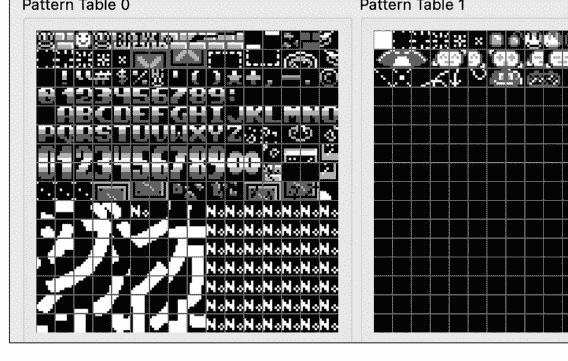

*图6-1：BrickBreaker的图案表，由FCEUX模拟器的PPU查看器显示*

你可以看到图案表中的一些图块代表精灵，一些代表文本，一些代表背景图案。图案表中的许多图块是空白的，因为*BrickBreaker*不需要使用它们（它在CHR ROM中用于图形资源的空间比实际需要的要多）。

> 图6-1是使用FCEUX模拟器的PPU查看器功能生成的，该功能允许你查看CHR ROM的内容，与实际游戏分开。在编写模拟器时，添加调试功能（如图案表查看器）会非常有帮助。例如，你可以将你的PPU输出与像FCEUX这样的成熟模拟器进行比较。

如前所述，图案表中的每个图块是16字节。16字节定义8×8 = 64个像素，这意味着每个像素只有2位，而2位只能表示四个不同的值（00、01、10、11）。因此，PPU在给定的图块内只支持四种颜色。事实上，其中一种总是预设的背景色或透明色（00），所以实际上只有三种程序员选择的颜色可以出现在特定的图块中。这个调色板是为四个图块的区域同时设置的，并且由与图案表本身分开的内存部分控制。这就是为什么图6-1中的所有图块都显示为灰度；每个图块的调色板不是由图案表决定的。我们稍后会回到如何选择颜色的问题。

不幸的是，图块变得有点复杂：定义每个像素的2位值不是按顺序排列的。相反，每个像素的第0位排列在图块的前8个字节中，每个像素的第1位排列在图块的后8个字节中。每个8字节形成一个*位平面*，两个平面组合在一起，每次两位，来确定每个像素的颜色。

让我换一种方式表达。一个图块的前8个字节（第一个位平面）可以看作是8×8图块中64个像素颜色值的64个半值。它们是按顺序排列的。第二个8字节位平面定义了相同64个像素颜色值的另外64个半值。它们也是按顺序排列的。两个平面需要组合起来才能得到64个最终的颜色值。例如，考虑以下16字节的图块数据：⁶

```
位平面 1
字节 1  01000001
字节 2  11000010
字节 3  01000100
字节 4  01001000
字节 5  00010000
字节 6  00100000
字节 7  01000000
字节 8  10000000
位平面 2
字节 9  00000001
字节 10 00000010
字节 11 00000100
字节 12 00001000
字节 13 00010110
字节 14 00100001
字节 15 01000010
字节 16 10000111
```

```
像素图案
01000003
11000030
01000300
01003000
00030220
00300002
03000020
30000222
```

两个位平面中匹配的位组合在一起，形成了清单中显示并在图6-2中说明的像素图案：一个分数1/2的图像。

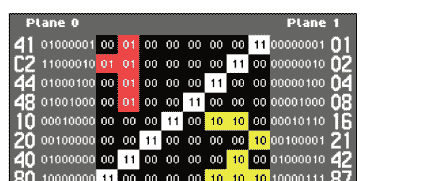

当第一个位平面中是1而第二个位平面中是0时，这些位组合形成01，即颜色方案中的颜色1。同样，第一个位平面中的0和第二个位平面中的1形成10，即颜色2，而两个位平面中都是1则得到11，即颜色3。

#### 命名表

命名表是屏幕背景的实际图块布局所在的地方。屏幕的背景现在是什么样子？它由哪些图块组成，每个图块使用什么颜色？这就是命名表及其随附的属性表（接下来讨论）的工作。

每个命名表代表游戏的一个屏幕，宽度为32个图块，高度为30个图块。命名表中的每个图块由单个字节指定——当前图案表中图块的索引。通过这种方式，图案表中的图块直接映射到命名表，因此你可以将命名表视为图案表中图块的特定排序。

命名表有多大？嗯，32 × 30 = 960，所以命名表中有960个位置。表中的每个位置都被一个1字节的索引占据，所以命名表是960字节。

我们现在有足够的信息来理解为什么NES的分辨率为256×240。每个图块宽8像素，高8像素。如果命名表代表屏幕的背景，并且宽度为32个图块，那么8 × 32 = 256。屏幕的高度（以像素为单位）是8 × 30 = 240。

PPU只有2KB的内存，这只够容纳两个命名表（及其属性表）。这两个命名表可以被镜像，因此总共有四个逻辑命名表。图6-3显示了*BrickBreaker*标题屏幕的命名表布局。

#### 调色板与属性表

PPU 拥有用于四种不同背景调色板的*调色板内存*。回顾第178页的“图案表与图块”一节，每个图块由四种颜色之一的像素组成，其中一种是背景色或透明色。这意味着实际上只有三种颜色是特定于某个图块的。因此，PPU 调色板内存中的每个调色板定义了一组三种颜色。（我们将在下一节进一步讨论调色板内存。）

为了指定哪个调色板应用于哪个图块，每个命名表后都跟着一个*属性表*。属性表是 8×8 的，每个条目仅占 1 字节。既然有 960 个图块，为何只有 64 个 1 字节的属性表条目？每个条目实际上定义了一个 2×2 *区域*集合的颜色，而每个区域代表一个 2×2 的图块网格。因此，属性表中的每个 1 字节条目实际上覆盖了 16 个图块。这是如何实现的呢？

该 1 字节条目中的每 2 位用于一个区域，2 位最多可以表示四个值。每个 2 位值是在四种不同背景调色板之一之间进行选择的指示器。因此，屏幕上每个 2×2 的图块区域都可以从四种可能的背景调色板中选择一个。这意味着每个区域中的所有四个图块必须使用相同的三种颜色（以及背景/透明色）。
这并非易事。为 NES 制作图形的艺术家必须仅使用三种非背景色来绘制屏幕的重要区域（四图块区域）。然后，每个使用三种非背景色的区域还必须与可能使用不同三色调色板的相邻区域融合。
图 6-4、6-5 和 6-6 是为 https://nesdev.org 制作的，展示了属性表的实际应用。（如果您在阅读印刷版，请参阅配套仓库的 figures 目录以获取彩色版本的图像。）首先，图 6-4 展示了一个游戏（Damian Yerrick 的 Thwaite）的背景被分解为属性表可以选择颜色的区域。

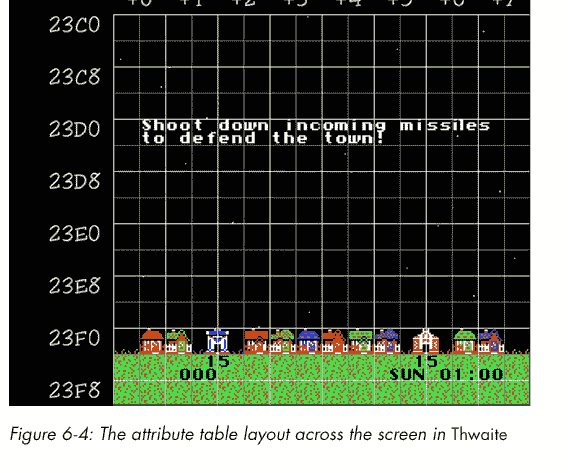

图 6-4：Thwaite 中屏幕上的属性表布局

图 6-5 显示了图 6-4 中每个区域的实际调色板选择（哪个背景调色板，0–3）。

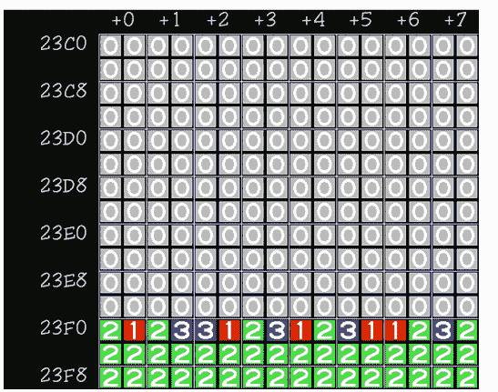

图 6-5：Thwaite 中的属性表调色板映射

最后，图 6-6 显示了可选择的四种背景调色板。调色板之间存在一些颜色重叠，这使得屏幕的不同区域能够相互融合。

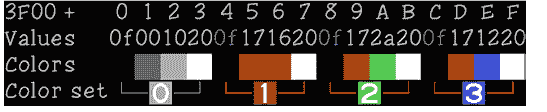

图 6-6：Thwaite 中的背景调色板

每个属性表是 64 字节，每个命名表是 960 字节。因此，一个命名表及其对应的属性表总共占用 960 + 64 = 1,024 字节，即 1KB。这就是 PPU 上 2KB RAM 如何被两个图案表/属性表组合填满的方式。

#### 调色板内存

PPU 的调色板内存有空间容纳四个背景调色板和四个精灵调色板。正如我们讨论过的，一个调色板由三种颜色（加上背景/透明色）组成。它可以用于绘制屏幕上的一个四图块背景区域（参见上一节关于属性表的内容）或一个精灵。换句话说，背景的每个四图块区域可以使用四种调色板之一进行着色，每个精灵也可以使用四种调色板之一进行着色。

一个调色板使用 3 字节定义。每个字节指定调色板的三种颜色之一，尽管每个字节实际上只有 6 位用于选择颜色。由于 6 位可以从 64 个值中选择，这告诉我们 NES 艺术家只有 64 种颜色可用。实际上，这 64 种可能颜色中有 10 种本质上是黑色，所以实际上 NES 有 54 种颜色。图 6-7 显示了 NTSC NES 的这些颜色。PAL NES 机器的颜色略有不同。（不同国家使用不同的视频标准——例如，北美使用 NTSC，而欧洲和亚洲大部分地区使用 PAL——这会影响 NES 的 PPU 运作方式。）

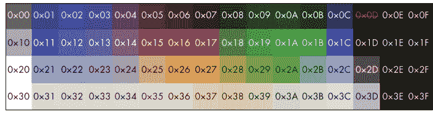

举个例子，假设你的背景区域使用背景调色板 1 绘制，而背景调色板 1 指定了颜色 0x11、0x0A 和 0x3D。这意味着你可以使用蓝色、绿色和灰色的色调以及背景色来绘制该区域。

#### 对象属性内存

OAM 存储有关屏幕上精灵的信息。精灵本质上是游戏中的移动对象——例如，玩家、敌人和投射物。NES 同时支持 64 个精灵，并使用 4 字节来描述每个精灵，因此 OAM 有 256 字节。

精灵的图像来自与背景图块相同的卡带 CHR ROM——即图案表。然而，与背景不同，精灵不受图块位置的限制；它们可以绘制在屏幕上的任何位置。每个精灵还可以水平或垂直翻转，放置在背景之前或之后，并使用四种不同调色板中的任何一种进行着色。每个精灵的 4 字节及其功能简要描述在表 6-5 中。

表 6-5：OAM 中的精灵规范

| 字节编号 | 描述 |
|---|---|
| 0 | 精灵的 y 轴位置 |
| 1 | 精灵图形数据所在的图案表索引 |
| 2 | 精灵属性，包括调色板（位 0–1）、前景或背景（位 5）、水平翻转（位 6）和垂直翻转（位 7） |
| 3 | 精灵的 x 轴位置 |

为什么 y 轴位置和 x 轴位置的字节不相邻，这是我向 NES 创造者提出的问题。也许这与 PPU 中线路的物理接线顺序有关。

#### 帧创建与计时

真实 NES 中的 PPU 从左上角到右下角逐像素绘制屏幕。这反映了 NES 所连接的 CRT 电视中的“电子枪”。它的电子束从左到右、从上到下逐扫描线“射击”屏幕背面。NTSC NES 每秒绘制整个屏幕 60 次（每秒 60 帧，或 60 FPS）。PAL NES 以较慢的 50 FPS 绘制。*帧*是电子枪完成其在整个屏幕上的旅程。正如本章前面提到的，电子枪有时也会在水平消隐（扫描线之间）和垂直消隐（帧之间）期间暂时离开屏幕。因此，这些是 NES 程序更改像素读取内存的最安全时间。

由于 NES 分辨率为 256×240，我们知道每条扫描线必须至少绘制 256 个点，总共有 240 条扫描线。有一条预渲染扫描线，我们称之为扫描线 0。然后，扫描线 1 到 240 是“可见”扫描线，代表程序实际显示在屏幕上的内容。扫描线 241 到 261 处于垂直消隐阶段。因此，本章前面提到的 NMI 在扫描线 241 开始时触发，以告知程序现在可以安全地更改 PPU 内存。点 0 到 255 代表每条扫描线上的 256 个可见点。点 256 到 340 是“静默”点，期间发生扫描线之间的水平消隐阶段。

每个点代表一个 PPU 周期。如果你计算一下，每条扫描线 341 个点乘以 262 条扫描线，意味着绘制每帧需要 89,342 个 PPU 周期。回想一下，每 1 个 CPU 周期对应 3 个 PPU 周期。如果我们用 PPU 周期除以 3 并四舍五入，得到每帧 29,781 个 CPU 周期。NES 中的 CPU 以大约 1.79 MHz 的频率运行，即每秒 1,790,000 个周期。如果你用 1,790,000 除以 29,781，你会得到一个接近 60 的数字。这就是每秒 60 帧！

为了创建一个周期精确的 NES 模拟器，理解 PPU 如何逐像素确定每个像素颜色的细节非常重要。由于我们采用的是更简单但不够精确的逐帧绘制方法，我们可以将这些细节排除在项目范围之外。根据刚才讨论的计时，我们确实知道的是，在每 89,342 个 PPU 周期中的某个时刻，我们需要绘制整个帧。对我来说，执行此操作的逻辑时间是在可见扫描线完成时。因此，在我们稍后将看到的代码中，你会看到所有背景和所有精灵在扫描线 240、点 256（最后一条可见扫描线上的最后一个可见点）的计时点一次性绘制。我们的简化渲染器除了在该 PPU 周期内（每帧一次）外，不进行任何绘制。

#### 实现 PPU

实现我们的 PPU 从一些重要的常量开始，包括各种内存大小、屏幕分辨率和完整的可用颜色调色板：

```python
NESEmulator/ppu.py
from array import array
from NESEmulator.rom import ROM
import numpy as np
```

SPR_RAM_SIZE = 256
NAMETABLE_SIZE = 2048
PALETTE_SIZE = 32
NES_WIDTH = 256
NES_HEIGHT = 240
NES_PALETTE = [0x7C7C7C, 0x0000FC, 0x0000BC, 0x4428BC, 0x940084, 0xA80020,
              0xA81000, 0x881400, 0x503000, 0x007800, 0x006800, 0x005800,
              0x004058, 0x000000, 0x000000, 0x000000, 0xBCBCBC, 0x0078F8,
              0x0058F8, 0x6844FC, 0xD800CC, 0xE40058, 0xF83800, 0xE45C10,
              0xAC7C00, 0x00B800, 0x00A800, 0x00A844, 0x008888, 0x000000,
              0x000000, 0x000000, 0xF8F8F8, 0x3CBCFC, 0x6888FC, 0x9878F8,
              0xF878F8, 0xF85898, 0xF87858, 0xFCA044, 0xF8B800, 0xB8F818,
              0x58D854, 0x58F898, 0x00E8D8, 0x787878, 0x000000, 0x000000,
              0xFCFCFC, 0xA4E4FC, 0xB8B8F8, 0xD8B8F8, 0xF8B8F8, 0xF8A4C0,
              0xF0D0B0, 0xFCE0A8, 0xF8D878, 0xD8F878, 0xB8F8B8, 0xB8F8D8,
              0x00FCFC, 0xF8D8F8, 0x000000, 0x000000]

颜色以十六进制RGB值指定。不同的网站对确切的颜色值可能有细微的差异，并且在不同的NES硬件变体（例如NTSC与PAL）之间，这些颜色也确实存在差异。因此，同一个游戏在不同的NES硬件或不同的模拟器上运行时，颜色可能会略有不同。

PPU类拥有用于其精灵内存（OAM）、命名表内存和调色板内存的实例变量：

```
class PPU:
    def __init__(self, rom: ROM):
        self.rom = rom
        # PPU memory
        self.spr = array('B', [0] * SPR_RAM_SIZE)  # sprite RAM
        self.nametables = array('B', [0] * NAMETABLE_SIZE)  # nametable RAM
        self.palette = array('B', [0] * PALETTE_SIZE)  # palette RAM
```

PPU类构造函数的其余部分为其各种可编程PPU寄存器和许多辅助变量设置了默认值（随着我们实现的深入，我们将更详细地介绍其中一些的用途）：

```
### Registers
self.addr = 0  # main PPU address register
self.addr_write_latch = False
self.status = 0
self.spr_address = 0
### Variables controlled by PPU control registers
self.nametable_address = 0
self.address_increment = 1
self.spr_pattern_table_address = 0
self.background_pattern_table_address = 0
self.generate_nmi = False
self.show_background = False
self.show_sprites = False
self.left_8_sprite_show = False
self.left_8_background_show = False
### Internal helper variables
self.buffer2007 = 0
self.scanline = 0
self.cycle = 0
### Pixels for screen
self.display_buffer = np.zeros((NES_WIDTH, NES_HEIGHT), dtype=np.uint32)
```

接下来，我们有渲染方法 `step()`：

```
def step(self):
    # Our simplified PPU draws just once per frame
    if (self.scanline == 240) and (self.cycle == 256):
        if self.show_background:
            self.draw_background()
        if self.show_sprites:
            self.draw_sprites(False)
    if (self.scanline == 241) and (self.cycle == 1):
        self.status |= 0b10000000  # set vblank
    if (self.scanline == 261) and (self.cycle == 1):
        # Vblank off, clear sprite zero, clear sprite overflow
        self.status |= 0b00011111

    self.cycle += 1
    if self.cycle > 340:
        self.cycle = 0
        self.scanline += 1
        if self.scanline > 261:
            self.scanline = 0
```

从模拟器主循环中每次调用 `step()` 代表一个PPU周期。因为我们的策略是每帧绘制所有内容一次，而不是追求像素或扫描线级别的精确，所以 `step()` 非常简单。它只是在每帧可见部分结束时一次性绘制背景和精灵。它还在垂直空白（vblank）开始和结束时设置状态寄存器，以便CPU可以与PPU协调。最后，它进行一些簿记工作，以跟踪当前扫描线和每个扫描线上的当前周期。

繁重的工作由 `draw_background()` 和 `draw_sprites()` 方法完成，它们由 `step()` 调用。接下来我们将看看这些方法。

#### 绘制背景

我们从计算属性表的地址开始 `draw_background()` 背景方法：

```
def draw_background(self):
    attribute_table_address = self.nametable_address + 960
```

属性表总是紧跟在命名表之后，回想一下本章前面的内容，命名表是960字节。我在本章前面也提到过，命名表由960字节组成，因为它使用1字节来表示960个图块中每个图块的索引。屏幕是32个图块宽，30个图块高，每个图块代表一个8×8像素的区域。我们从屏幕的左上角到右下角绘制这些图块，一次一行，从左到右：

```
for y in range(30):
    for x in range(32):
        tile_address = self.nametable_address + y * 32 + x
        nametable_entry = self.read_memory(tile_address)
```

每个 `tile_address` 是通过将基础 `nametable_address` 加上当前图块的偏移量来计算的。因为每行有32个图块长，所以我们用行号（y）乘以32再加上x分量（可以看作是列）。为了获取实际的索引字节（`nametable_entry`），我们在 `tile_address` 处读取一个字节的内存。在方法的后面，我们将使用 `nametable_entry` 从模式表中检索图块的像素内容。

接下来，我们获取与当前命名表条目对应的属性表条目：

```
attrx = x // 4
attry = y // 4
attribute_address = attribute_table_address + attry * 8 + attrx
attribute_entry = self.read_memory(attribute_address)
```

因为8×8属性表中的每个条目对应16个图块，所以我们用x和y都除以4来获取与相关图块连接的属性条目。（请参阅第181页的“颜色调色板和属性表”以更好地理解此代码。）由于每个 `attribute_entry` 对应四个2×2的图块区域（因此总共16个图块），我们需要深入到特定的图块区域：

```
block = (y & 0x02) | ((x & 0x02) >> 1)
attribute_bits = 0
if block == 0:
    attribute_bits = (attribute_entry & 0b00000011) << 2
elif block == 1:
    attribute_bits = (attribute_entry & 0b00001100)
elif block == 2:
    attribute_bits = (attribute_entry & 0b00110000) >> 2
elif block == 3:
    attribute_bits = (attribute_entry & 0b11000000) >> 4
else:
    print("Invalid block")
```

`attribute_entry` 是1字节，该字节的每2位对应一个不同的图块区域。变量 `block` 代表当前图块的图块区域；它可以是0、1、2或3。根据 `block` 的值，我们使用适当的位运算从 `attribute_entry` 中检索该图块区域的两个特定位，并将它们存储在 `attribute_bits` 中。

现在我们需要从模式表中检索每个图块的各个像素：

```
for fine_y in range(8):
    low_order = self.read_memory(self.background_pattern_table_address +
                                nametable_entry * 16 + fine_y)
    high_order = self.read_memory(self.background_pattern_table_address +
                                 nametable_entry * 16 + 8 + fine_y)

    for fine_x in range(8):
        pixel = ((low_order >> (7 - fine_x)) & 1) | (
                ((high_order >> (7 - fine_x)) & 1) << 1) | attribute_bits
```

回想一下第178页的“模式表和图块”，每个模式表由16字节的图块组成。因此，要计算一个图块的地址，我们需要将其索引（`nametable_entry`）乘以16并将其加到 `background_pattern_table_address` 上。此外，模式表图块被分成两个位平面，每种颜色占2位，并且这2位在不同的平面中相隔8字节（见图6-2）。

我们的策略是读取2个字节，一个用于 `low_order` 平面，一个用于 `high_order` 平面。每个字节保存图块一行的一半像素条目。我们使用 `fine_y` 表示图块的每一行，然后使用 `fine_x`（表示每一列）来聚焦于各个位。每个平面的位与 `attribute_bits` 的组合产生一个调色板内存中的地址，当前像素的颜色存储在那里。

最后，我们使用 `NES_PALETTE` 中预定义的颜色，在适当的屏幕位置逐个绘制图块的每个像素：

```
x_screen_loc = x * 8 + fine_x
y_screen_loc = y * 8 + fine_y
transparent = ((pixel & 3) == 0)
### If the background is transparent, use the first color in the palette
color = self.palette[0] if transparent else self.palette[pixel]
self.display_buffer[x_screen_loc, y_screen_loc] = NES_PALETTE[color]
```

为屏幕设置像素意味着在 `display_buffer` 中设置值，这是一个NumPy数组，因为Pygame接受它。

#### 绘制精灵

绘制精灵与绘制背景图块有一些相似之处。然而，我们不是从命名表读取，而是从OAM（`self.spr`）读取。每个精灵在内存中的条目是4字节，代表精灵的y位置、模式表索引、属性和x位置（见表6-5）。OAM中最多可容纳64个精灵条目。如果y位置是0xFF，则该条目未被使用。我们通过每次在OAM中移动4字节来查找所有有效条目，从而开始 `draw_sprites()`：

```
def draw_sprites(self, background_transparent: bool):
    for i in range(SPR_RAM_SIZE - 4, -4, -4):
        y_position = self.spr[i]
```

#### 访问寄存器

PPU（图像处理单元）拥有多个内存映射寄存器，在读写这些寄存器时存在一些技术细节和特殊之处。我们将通过 `read_register()` 和 `write_register()` 方法来处理这些问题。在 `read_register()` 中，我们首先处理地址 `0x2002`，该地址用于读取状态寄存器：

```python
def read_register(self, address: int) -> int:
    if address == 0x2002:
        self.addr_write_latch = False
        current = self.status
        self.status &= 0b01111111  # clear vblank on read to 0x2002
        return current
```

当读取状态寄存器时，`self.addr_write_latch` 会被设置为 `False`，这会改变向 `0x2006` 写入地址的方式（稍后介绍）。此外，读取状态寄存器时会清除垂直空白（vblank）标志。接下来，可以通过 `0x2004` 读取 OAM（对象属性内存）中当前的 `self.spr_address`：

```python
elif address == 0x2004:
    return self.spr[self.spr_address]
```

PPU 内存中 `self.addr` 处的内容可以通过寄存器 `0x2007` 进行读写。但读取操作是通过缓冲区（`self.buffer2007`）进行的，具体细节取决于读取的地址：

```python
elif address == 0x2007:
    if (self.addr % 0x4000) < 0x3F00:
        value = self.buffer2007
        self.buffer2007 = self.read_memory(self.addr)
    else:
        value = self.read_memory(self.addr)
        self.buffer2007 = self.read_memory(self.addr - 0x1000)
    # Every read to 0x2007 there is an increment
    self.addr += self.address_increment
    return value
else:
    raise LookupError(f"Error: Unrecognized PPU read {address:X}")
```

请注意，每次读取后，`self.address_increment` 都会加到 `self.addr` 上。这使得后续读取可以自动获取下一个条目，无论是相隔 1 字节还是 32 字节。

在 `write_register()` 中，我们通过向 PPU 的各种内存映射寄存器写入值来改变其操作。首先，寄存器 `0x2000` 和 `0x2001` 被称为控制寄存器。它们用于改变 PPU 实现中已经使用过的各种内部值：

```python
def write_register(self, address: int, value: int):
    if address == 0x2000:  # Control1
        self.nametable_address = (0x2000 + (value & 0b00000011) * 0x400)
        self.address_increment = 32 if (value & 0b00000100) else 1
        self.spr_pattern_table_address = (((value & 0b00001000) >> 3) * 0x1000)
        self.background_pattern_table_address = (((value & 0b00010000) >> 4) * 0x1000)
        self.generate_nmi = bool(value & 0b10000000)
    elif address == 0x2001:  # Control2
        self.show_background = bool(value & 0b00001000)
        self.show_sprites = bool(value & 0b00010000)
        self.left_8_background_show = bool(value & 0b00000010)
        self.left_8_sprite_show = bool(value & 0b00000100)
```

接下来，我们处理寄存器 `0x2003` 到 `0x2007`：

```python
elif address == 0x2003:
    self.spr_address = value
elif address == 0x2004:
    self.spr[self.spr_address] = value
    self.spr_address += 1
elif address == 0x2005:  # scroll
    pass
elif address == 0x2006:
    # Based on https://wiki.nesdev.org/w/index.php/PPU_scrolling
    if not self.addr_write_latch:  # first write
        self.addr = (self.addr & 0x00FF) | ((value & 0xFF) << 8)
    else:  # second write
        self.addr = (self.addr & 0xFF00) | (value & 0xFF)
    self.addr_write_latch = not self.addr_write_latch
elif address == 0x2007:
    self.write_memory(self.addr, value)
    self.addr += self.address_increment
else:
    raise LookupError(f"Error: Unrecognized PPU write {address:X}")
```

寄存器 `0x2003` 设置 `self.spr_address`。寄存器 `0x2004` 在 `self.spr_address` 处设置值，然后将 `self.spr_address` 加 1。寄存器 `0x2005` 是滚动寄存器；在我们这个简单的 PPU 中尚未实现，但完整的实现需要它。就目前而言，我们的模拟器无法运行需要滚动功能的游戏。寄存器 `0x2006` 用于修改 `self.addr`。这就是 `self.addr_write_latch` 的用武之地：我们需要这个锁存器，因为 `self.addr` 是 16 位（2 字节），但一次只能写入 1 字节。最后，`0x2007` 用于向 `self.addr` 写入数据。

#### 访问内存

我们的 PPU 实现基本完成，但我们需要用于读写 PPU 内存的辅助方法。这些 `read_memory()` 和 `write_memory()` 方法与 CPU 中的类似方法非常相似：

```python
def read_memory(self, address: int) -> int:
    address = address % 0x4000  # mirror >0x4000
    if address < 0x2000:  # pattern tables
        return self.rom.read_cartridge(address)
    elif address < 0x3F00:  # nametables
        address = (address - 0x2000) % 0x1000  # 3000-3EFF is a mirror
        if self.rom.vertical_mirroring:
            address = address % 0x0800
        else:  # horizontal mirroring
            if (address >= 0x400) and (address < 0xC00):
                address = address - 0x400
```

#### 测试模拟器

许多测试 ROM 已被创建出来，供开发 NES 模拟器的人员使用。本书的仓库中包含了一些。这些 ROM 可以测试 6502 CPU 以及 PPU。感谢 Shay Green 和 Kevin Horton 开发了这些测试。

我们的 10 个单元测试会运行这些 ROM，然后根据测试 ROM 创建者指定的值，检查虚拟 NES 内存中的某些值是否设置正确。与本书的所有测试一样，这些单元测试的文件位于源代码仓库根目录的 *tests* 目录中：

```python
### tests/test_nesemulator.py
import unittest
from pathlib import Path
from NESEmulator.cpu import CPU
from NESEmulator.ppu import PPU
from NESEmulator.rom import ROM

class CPUTestCase(unittest.TestCase):
    def setUp(self) -> None:
        self.test_folder = (Path(__file__).resolve().parent.parent
                            / 'NESEmulator' / 'Tests')

    def test_nes_test(self):
        # Create machinery that we are testing
        rom = ROM(self.test_folder / "nestest" / "nestest.nes")
        ppu = PPU(rom)
        cpu = CPU(ppu, rom)
        # Set up tests
        cpu.PC = 0xC000  # special starting location for tests
        with open(self.test_folder / "nestest" / "nestest.log") as f:
            correct_lines = f.readlines()
        log_line = 1
        # Check every line of the log against our own produced logs
        while log_line < 5260:  # go until first unofficial opcode test
            our_line = cpu.log()
            correct_line = correct_lines[log_line - 1]
            self.assertEqual(correct_line[0:14], our_line[0:14],
                             f"PC/Opcode doesn't match at line {log_line}")
            self.assertEqual(correct_line[48:73], our_line[48:73],
                             f"Registers don't match at line {log_line}")
            cpu.step()
            log_line += 1

    def test_blargg_instr_test_v5_basics(self):
        # Create machinery that we are testing
        rom = ROM(self.test_folder / "instr_test-v5" / "rom_singles" / "01-basics.nes")
        ppu = PPU(rom)
        cpu = CPU(ppu, rom)
        # Tests run as long as 0x6000 is 80, and then 0x6000 is result code; 0 means success
        rom.prg_ram[0] = 0x80
        while rom.prg_ram[0] == 0x80:  # go until first unofficial opcode test
            cpu.step()
        self.assertEqual(0, rom.prg_ram[0],
                         f"Result code of basics test is {rom.prg_ram[0]} not 0")
        message = bytes(rom.prg_ram[4:]).decode("utf-8")
        print(message[0:message.index("\0")])  # message ends with null terminator

    def test_blargg_instr_test_v5_implied(self):
        # Create machinery that we are testing
        rom = ROM(self.test_folder / "instr_test-v5" / "rom_singles" / "02-implied.nes")
        ppu = PPU(rom)
        cpu = CPU(ppu, rom)
        # Tests run as long as 0x6000 is 80, and then 0x6000 is result code; 0 means success
        rom.prg_ram[0] = 0x80
        while rom.prg_ram[0] == 0x80:  # go until first unofficial opcode test
            cpu.step()
        self.assertEqual(0, rom.prg_ram[0],
                         f"Result code of implied test is {rom.prg_ram[0]} not 0")
        message = bytes(rom.prg_ram[4:]).decode("utf-8")
        print(message[0:message.index("\0")])  # message ends with null terminator

    def test_blargg_instr_test_v5_branches(self):
        # Create machinery that we are testing
        rom = ROM(self.test_folder / "instr_test-v5" / "rom_singles" / "10-branches.nes")
        ppu = PPU(rom)
        cpu = CPU(ppu, rom)
        # Tests run as long as 0x6000 is 80, and then 0x6000 is result code; 0 means success
        rom.prg_ram[0] = 0x80
        while rom.prg_ram[0] == 0x80:  # go until first unofficial opcode test
            cpu.step()
        self.assertEqual(0, rom.prg_ram[0],
                         f"Result code of branches test is {rom.prg_ram[0]} not 0")
        message = bytes(rom.prg_ram[4:]).decode("utf-8")
        print(message[0:message.index("\0")])  # message ends with null terminator

    def test_blargg_instr_test_v5_stack(self):
        # Create machinery that we are testing
        rom = ROM(self.test_folder / "instr_test-v5" / "rom_singles" / "11-stack.nes")
        ppu = PPU(rom)
        cpu = CPU(ppu, rom)
        # Tests run as long as 0x6000 is 80, and then 0x6000 is result code; 0 means success
        rom.prg_ram[0] = 0x80
        while rom.prg_ram[0] == 0x80:  # go until first unofficial opcode test
            cpu.step()
        self.assertEqual(0, rom.prg_ram[0],
                         f"Result code of stack test is {rom.prg_ram[0]} not 0")
        message = bytes(rom.prg_ram[4:]).decode("utf-8")
        print(message[0:message.index("\0")])  # message ends with null terminator

    def test_blargg_instr_test_v5_jmp_jsr(self):
        # Create machinery that we are testing
        rom = ROM(self.test_folder / "instr_test-v5" / "rom_singles" / "12-jmp_jsr.nes")
        ppu = PPU(rom)
        cpu = CPU(ppu, rom)
        # Tests run as long as 0x6000 is 80, and then 0x6000 is result code; 0 means success
        rom.prg_ram[0] = 0x80
        while rom.prg_ram[0] == 0x80:  # go until first unofficial opcode test
            cpu.step()
        self.assertEqual(0, rom.prg_ram[0],
                         f"Result code of jmp_jsr test is {rom.prg_ram[0]} not 0")
        message = bytes(rom.prg_ram[4:]).decode("utf-8")
        print(message[0:message.index("\0")])  # message ends with null terminator

    def test_blargg_instr_test_v5_rts(self):
        # Create machinery that we are testing
        rom = ROM(self.test_folder / "instr_test-v5" / "rom_singles" / "13-rts.nes")
        ppu = PPU(rom)
        cpu = CPU(ppu, rom)
        # Tests run as long as 0x6000 is 80, and then 0x6000 is result code; 0 means success
        rom.prg_ram[0] = 0x80
        while rom.prg_ram[0] == 0x80:  # go until first unofficial opcode test
            cpu.step()
        self.assertEqual(0, rom.prg_ram[0],
                         f"Result code of rts test is {rom.prg_ram[0]} not 0")
        message = bytes(rom.prg_ram[4:]).decode("utf-8")
        print(message[0:message.index("\0")])  # message ends with null terminator

    def test_blargg_instr_test_v5_rti(self):
        # Create machinery that we are testing
        rom = ROM(self.test_folder / "instr_test-v5" / "rom_singles" / "14-rti.nes")
        ppu = PPU(rom)
        cpu = CPU(ppu, rom)
        # Tests run as long as 0x6000 is 80, and then 0x6000 is result code; 0 means success
        rom.prg_ram[0] = 0x80
        while rom.prg_ram[0] == 0x80:  # go until first unofficial opcode test
            cpu.step()
        self.assertEqual(0, rom.prg_ram[0],
                         f"Result code of rti test is {rom.prg_ram[0]} not 0")
        message = bytes(rom.prg_ram[4:]).decode("utf-8")
        print(message[0:message.index("\0")])  # message ends with null terminator

    def test_blargg_instr_test_v5_brk(self):
        # Create machinery that we are testing
        rom = ROM(self.test_folder / "instr_test-v5" / "rom_singles" / "15-brk.nes")
        ppu = PPU(rom)
        cpu = CPU(ppu, rom)
        # Tests run as long as 0x6000 is 80, and then 0x6000 is result code; 0 means success
        rom.prg_ram[0] = 0x80
        while rom.prg_ram[0] == 0x80:  # go until first unofficial opcode test
            cpu.step()
        message = bytes(rom.prg_ram[4:]).decode("utf-8")
        print(message[0:message.index("\0")])  # message ends with null terminator
        self.assertEqual(0, rom.prg_ram[0],
                         f"Result code of brk test is {rom.prg_ram[0]} not 0")

    def test_blargg_instr_test_v5_special(self):
        # Create machinery that we are testing
        rom = ROM(self.test_folder / "instr_test-v5" / "rom_singles" / "16-special.nes")
        ppu = PPU(rom)
        cpu = CPU(ppu, rom)
        # Tests run as long as 0x6000 is 80, and then 0x6000 is result code; 0 means success
        rom.prg_ram[0] = 0x80
        while rom.prg_ram[0] == 0x80:  # go until first unofficial opcode test
            cpu.step()
        message = bytes(rom.prg_ram[4:]).decode("utf-8")
        print(message[0:message.index("\0")])  # message ends with null terminator
        self.assertEqual(0, rom.prg_ram[0],
                         f"Result code of special test is {rom.prg_ram[0]} not 0")

if __name__ == "__main__":
    unittest.main()
```

在开发模拟器时，拥有这样的自动化测试非常重要。即使你认为你的CPU是完美的，也可能遗漏了一个小错误，导致整个程序出错。你还需要知道，更改模拟器的一部分不会破坏另一部分。

#### 玩游戏

单元测试是一回事，但我们模拟器的真正考验是它能否运行真正的NES软件。出于法律原因，我们不会在NES模拟器中测试任何商业软件。由于其简单性，我们的模拟器也无法运行大多数NES游戏库。相反，本书的源代码仓库包含几个开源或公共领域的游戏，我们的模拟器能够运行这些游戏。这些是真正的游戏，因为它们可以在真正的NES主机上运行。

让我们从*BrickBreaker*开始，这是我之前提到的由Aleff Correa制作的类似Breakout的游戏。假设你已经安装了Pygame和NumPy，你只需从仓库的主目录运行以下命令就可以玩这个游戏：

```
% python3 -m NESEmulator NESEmulator/Games/brix.nes
```

它看起来相当不错（见图6-8）。

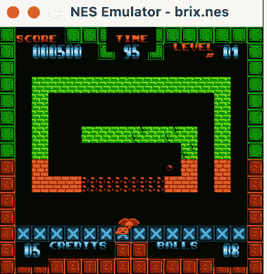

接下来，让我们试试Shiru的*Chase*：

```
% python3 -m NESEmulator NESEmulator/Games/Chase.nes
```

图6-9展示了这个游戏。

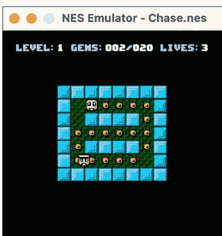

图6-9：Shiru的Chase

最后，让我们试试Shiru的*Lan Master*：

```
% python3 -m NESEmulator NESEmulator/Games/LanMaster.nes
```

这是一个益智游戏，如图6-10所示。

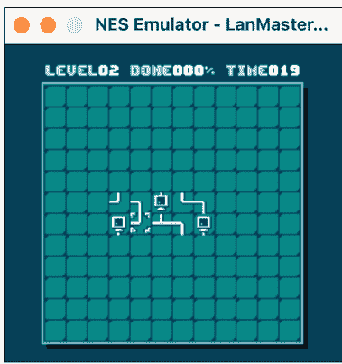

图6-10：Shiru的Lan Master

*Lan Master*在我们的模拟器上非常可玩，但另外两个则不然。为什么？嗯，你可能已经注意到它们都运行得相当慢。例如，在我的运行CPython 3.13的M1 MacBook Air上，它们大约以14 FPS的速度运行。这大约是真实NES速度的四分之一。我们的模拟器正确地运行了这些游戏，只是非常慢。

教训是什么？Python，特别是主线版本的Python——CPython，速度很慢。近年来，人们一直在努力提高CPython的性能，但与大多数其他编程语言实现相比，它仍然非常慢，并且开箱即用并未针对编写模拟器等底层程序进行优化。要编写性能更高的程序，你需要费些周折：你可以使用用低级语言实现的特定库，使用Cython，编写C扩展，或者使用像PyPy这样的替代Python解释器。

我将使用像Cython这样的东西来加速模拟器作为读者的练习。我相信通过正确的解决方案，你可以让这个NES模拟器达到真实NES的60 FPS。

> 代码遇见生活

当我通过用Swift编写一个CHIP-8 VM开始我的模拟器编程之旅时，我真正的梦想是为我童年时拥有的第一台游戏机——NES编写一个模拟器。两年后，我做到了，用C编写了一个没有声音的基本NES模拟器。虽然CHIP-8 VM花了我一两天时间，但NES模拟器花了我大约30天，分散在一年的断断续续的研究和编程时间里。我发现编写CPU部分相当直接，但编写像素完美的背景渲染器则更具挑战性。我最终将Michael Fogleman优秀的NES模拟器⁷的PPU背景渲染器从Go移植到C，并将其与我自己的精灵渲染代码结合起来。

如果NES模拟器花了我大约30天编写，而CHIP-8 VM花了大约两天，那么这个项目是否难了15倍？我不这么认为。我在编写PPU时的挑战是同时记住所有技术细节。我过于专注于编写像素完美的渲染器，而我应该像本章中那样从逐帧渲染器开始。当时也没有很好的教程，尽管NesDev上的文档非常宝贵。我十几岁时就想编写NES模拟器，所以完成它是一个梦想成真，即使它相当基础且没有声音。（我后来添加了声音，以及比NROM更多的映射器。）

在本章中，我试图提供我希望在开发NES模拟器时拥有的教程。我知道像素完美的渲染对于第一次编写模拟器的人来说太复杂了，而且充满了深奥的内部寄存器细节，所以我回头用尽可能简单的方式重写了我的C NES模拟器的PPU。这就是我为本章移植到Python的渲染器。

完成NES模拟器后，我继续为最初的IBM PC编写模拟器。那是一个明显更复杂的项目，主要是因为Intel 8088/8086比MOS 6502复杂得多。在那个项目中，没有尽早编写自动化测试给我带来了麻烦。最终我让它在基本层面上工作了，但我应该更早地编写测试。你模拟的微处理器越复杂，你就越需要尽早进行自动化测试。

#### 现实世界的应用

模拟器可能最常用于玩不再生产的系统的游戏，但它们也长期用于计算历史的关键时刻。例如，当比尔·盖茨和保罗·艾伦在1975年通过为Altair 8800编写BASIC解释器创立微软时，正如第2章所讨论的，他们实际上并没有Altair 8800可用。相反，他们在哈佛大学的一台小型计算机上为Altair的Intel 8080微处理器编写了一个模拟器，当时盖茨正在那里上学。⁸

苹果公司已经三次转换了其Macintosh系列计算机使用的微处理器系列：从Motorola 68K到Motorola/IBM PowerPC，从PowerPC到Intel x86，最后从Intel x86到苹果自己的基于ARM的Apple Silicon。这是否意味着苹果不得不让开发者多次重新编译或重写他们所有的软件？从长远来看，是的，但在过渡期间的短期内，苹果提供了模拟器。PowerPC Mac可以运行68K Mac软件，Intel Mac（在开始时）可以运行PowerPC Mac软件，Apple Silicon Mac也可以运行Intel Mac软件。苹果是一个了不起的模拟器开发者。事实上，PowerPC Mac运行68K软件比68K Mac更快。Apple Silicon Mac运行Intel软件有时也是如此。

模拟器对于软件的保存也很重要。当很难获得编写软件的原始硬件时会发生什么？在这些情况下，模拟器可能是唯一的选择。另一方面，模拟器有时用于新计算平台的设计阶段。在平台存在之前，设计者可能会利用模拟器来模拟它将是什么样子，并帮助在现实环境中充实其功能。

最后，编写模拟器非常有教育意义。这是教授计算机在底层如何工作的最佳方式之一，我希望你在本章中发现了这一点。

#### 练习

1. 尝试将我们的模拟器的性能提高到真实NES的水平——换句话说，60 FPS。你可能需要使用像Cython这样的东西，或者Python与C或Rust等低级语言通过扩展结合使用。在CPython 3.13和2025年时代的微处理器上，纯Python几乎不可能达到60 FPS。
2. 使用https://nesdev.org上的文档为我们的模拟器添加滚动支持。
3. 实现另一个映射器。目前我们的模拟器只实现了NROM，这是最基本的映射器。另外两个流行的映射器是MMC1和UxROM。
4. 现在是最大的挑战：尝试为我们的模拟器编写一个APU，这样你就可以玩有声音的游戏了。

#### 注释

1. David Sheff, *Game Over: How Nintendo Conquered the World* (GamePress, 1999).
2. Russ Cox, "The MOS 6502 and the Best Layout Guy in the World," *research!rsc*, January 3, 2011, https://research.swtch.com/6502.
3. Steven Collier, "What Was the Biggest NES Game Ever Made?," DKoldies, March 24, 2016, https://www.dkoldies.com/blog/what-was-the-biggest-nes-game-ever-made/.
4. Marat Fayzullin, "iNES," accessed April 19, 2024, http://fms.komkon.org/iNES.
5. 表6-1基于NesDev.org发布的公共领域信息。参见https://www.nesdev.org/wiki/INES。
6. 该示例借用自NesDev.org的用户Damian Yerrick。NesDev.org上的所有信息均发布为公共领域。参见https://www.nesdev.org/wiki/PPU_pattern_tables。
7. 参见https://github.com/fogleman/nes。
8. James Wallace and Jim Erickson, *Hard Drive: Bill Gates and the Making of the Microsoft Empire* (HarperBusiness, 1993).

## 第四部分

### 超级简单的机器学习

#### 7

##### 使用K近邻进行分类

本章将介绍*k近邻*（KNN）算法，这是一种极其简单的机器学习算法，在某些应用中却能非常有效。KNN最早开发于20世纪50年代和60年代，¹ 既可用于*分类*（决定某物属于哪个类别），也可用于*回归*（预测一个数值）。对于那些被机器学习复杂性吓到的读者来说，KNN提供了一个易于上手且贴近实际的入门途径。在本章中，我们将使用KNN以高准确度解决两个分类问题：区分不同类型的鱼和识别手写数字。然后，在第8章中，我们将把KNN扩展到一些相关的回归问题。

##### 机器学习的兴起

回到20世纪50年代，传统的人工智能（AI）研究主要关注利用算法来模拟人类智能。然而，从20世纪90年代开始，特别是自2000年代GPU计算支持的神经网络出现以来，AI研究和产品化的大部分焦点已转向机器学习这一子领域。机器学习使用大型数据集来训练模型，这些模型无需参考人类解决问题的方法就能做出决策。要理解这种转变，可以想想两种国际象棋程序的区别：一种基于大师们广为人知的启发式规则来评估局面，另一种则基于从数百万局棋局的统计分析中自动调整的权重来评估局面。确实，机器学习在很大程度上基于统计学。

我们熟悉的所有令人兴奋的机器学习应用，包括大语言模型、图像识别和数字助手，都是使用在GPU或专用神经处理器上训练的复杂多层神经网络构建的。这被称为*深度学习*。要从头开始编程一个深度学习框架，你需要对微积分和统计学都有相当深入的理解。即使你通过使用库来避开其中一些内容，你通常仍然需要一个庞大的数据集（这通常很难获得）和强大的硬件。

由于这些障碍，有兴趣开始学习机器学习的程序员有时会感到畏惧。他们担心数学会太难，或者缺乏开发他们感兴趣的应用程序所需的资源。此外，一些学习编程的人喜欢从头开始构建他们的项目；他们不想仅仅通过`pip install`来获得一个解决方案，而对底层实际工作原理一无所知。

然而，正如你将在本章中看到的，如果你不直接跳入深度学习的深水区，机器学习可以有一个非常平易近人的起点。你可以从头开始编写KNN算法，并用它来解决实际问题，而且你不需要超出初中水平的数学背景就能理解你在做什么。实现KNN所需的唯一统计概念是均值（平均值）的想法，你需要的唯一另一个公式是勾股定理，用于计算两点之间的欧几里得距离。这要求不高，对吧？

> 注意：如果你想了解更多关于神经网络的知识，可以查看我之前的书《Python经典计算机科学问题》（Manning，2019年）的第7章“相当简单的神经网络”。

##### KNN的工作原理

KNN算法基于一个简单的假设：一个数据点的邻居很可能是与它有最多共同点的其他数据点。例如，如果我试图确定病人患了什么疾病，那么具有相同症状和相同生命体征的其他病人可能是最好的线索。顺便说一句，这就是为什么你可能不想要一个刚从医学院毕业的医生。更有经验的医生可以使用“我以前见过类似病人”这种明显的启发式方法，为你提供更好的初步指导。

换一种说法，最接近未知值的数据点最有可能告诉我们这个未知值是什么。也许你是一个汽车经销商，你想知道是否应该花更多的营销费用，通过向潜在的回头客发送更多邮件来吸引她。这位客户填写了一份客户满意度调查，评估了你业务的各个方面。你有很多先前客户填写同一份调查的数据，并且你知道他们最终是否又在你这里买了车。你可以将这位潜在回头客的调查评分与先前客户的评分进行比较，找到在倾向上与她最相似的客户。如果那些评分相似的先前客户最终又买了一辆车，你就知道花钱给她发送更多营销材料可能是值得的。这本质上就是KNN所做的分析：它让先前的数据为与某些新数据相关的可能值“投票”。

让我们从两个维度直观地看一下最后一个例子。图7-1是一个虚构的数据集，显示了受访者在经销商调查中对“汽车满意度”和“经销商满意度”的评分。叉号代表从经销商那里又购买了一辆车的受访者，三角形代表没有购买的受访者，圆点代表新的受访者。

图7-1：汽车经销商调查受访者数据

我们将如何分类我们的新受访者？她是否可能再买一辆车？使用KNN，我们首先需要为*k*（*元启发式*）选择一个值。这仅仅是我们要查看的邻居数量。如果我们将*k*设置为1，那么我们只查看最接近未知值的数据点。在图7-1中，我们的受访者位于(6, 8)，下一个最接近的可比较数据点位于(7, 8)，那是一个又买了一辆车的人。因此，如果*k*设置为1，我们会得出结论：值得花钱给我们的新受访者发送更多营销材料。

但如果*k*设置为大于1的数字呢？KNN算法中的典型解决方案是“投票”。例如，如果在我们的场景中*k*是3，你可以看到三个最接近的数据点中有两个买了新车，一个没有买。由于大多数买了另一辆车，我们仍然会得出结论：值得花钱向新的受访者进行营销。如果*k*设置为2，我们就会遇到问题，因为一个决定再买一辆车，一个没有。那么，我们就需要某种打破平局的标准。

就是这样。这就是用于分类的整个KNN算法。我们查看与所讨论数据点接近的$k$个数据点，并让它们对我们的未知值应该是什么进行投票。因此，我们可以将用于分类的KNN算法总结如下：

1.  选择$k$，即要与未分类数据点进行比较的邻居数量。
2.  找到数据点的$k$个最近邻。
3.  根据$k$个最近邻的类别对数据点的分类进行投票。

这个简单的算法需要三点澄清：什么是“最近”邻居？如何确定投票的获胜者？以及$k$的合适值是多少？所有这些问题对于KNN的不同应用可能有不同的答案。

“最近”最常用欧几里得距离来确定。换句话说，如果我们在图7-1中在未分类点（圆点）和图上所有其他数据点之间画直线，最短的线将决定邻居。然而，对于一些没有数值数据点的应用，可能适用类似*汉明距离*（计算差异）的方法。除欧几里得距离之外的距离函数超出了本章的范围。

投票通常意味着确定最近邻中多数属于哪个类别。即使你坚持使用奇数作为$k$，你也需要某种打破平局的标准。这是因为许多应用有超过两个类别。例如，如果你有三个类别，而$k$设置为5呢？你可能最终得到两个最近邻属于A类，两个属于B类，一个属于C类。那么所讨论的数据点应该被分类为A还是B？

确定$k$的合适值实际上相当直接。除非我们有特定的领域知识告诉我们其他情况，否则我们应该使用在测试中发现最准确的值。我们可以用特定的数据集和一组测试点，用几个不同的$k$值测试KNN，看看哪个值最有用。

以上就是使用KNN进行分类的基础知识。显然，在这个简单的大纲之外还有很多选项和增强功能可以实现，但你已经知道足够多来实现KNN了！

##### 实现KNN分类

与算法本身一样，我们实现KNN的代码也将相当简单。但在我们开始算法之前，我们需要一个通用类型来表示数据点。我们将创建一个`DataPoint`类，它是一个*协议*，这意味着不会有这个类型本身的实例，而只有其子类的实例。它是一个抽象模板，概述了更具体的数据点类型必须具备的功能：

```python
KNN/knn.py
from pathlib import Path
import csv
from typing import Protocol, Self
from collections import Counter
import numpy as np

class DataPoint(Protocol):
    kind: str

    @classmethod
    def from_string_data(cls, data: list[str]) -> Self: ...

    def distance(self, other: Self) -> float: ...
```

我们的协议规定，一个数据点应该有一个 `kind` 属性（或者用分类学的术语来说，是一个类别），一个 `from_string_data()` 方法用于将 CSV（逗号分隔值）文件中的一行转换为该类的一个实例，以及一个 `distance()` 方法用于计算两个同类数据点之间的距离。我们将为本章中使用的两个具体数据集创建 `DataPoint` 的子类。

我们的主要 KNN 实现是通过一个毫不意外地名为 `KNN` 的类：

```python
class KNN[DP: DataPoint]:
    def __init__(self, data_point_type: type[DP], file_path: str | Path,
                 has_header: bool = True) -> None:
        self.data_point_type = data_point_type
        self.data_points = []
        self._read_csv(file_path, has_header)

    # Read a CSV file and return a list of data points
    def _read_csv(self, file_path: str | Path, has_header: bool) -> None:
        with open(file_path, 'r') as f:
            reader = csv.reader(f)
            if has_header:
                _ = next(reader)
            for row in reader:
                self.data_points.append(
                    self.data_point_type.from_string_data(row))
```

类型提示语法 `class KNN[DP: DataPoint]:` 表示一个泛型类型 `DP` 与 `KNN` 相关联，并且 `DP` 必须是 `DataPoint` 的子类。我们将从 CSV 文件加载所有数据集。我们的 `KNN` 类的 `_read_csv()` 方法利用 Python 内置的 `csv` 模块来加载这些文件。CSV 文件中的每一行都通过其 `from_string_data()` 类方法来初始化我们的一个 `DataPoint` 子类。我们稍后在查看第一个数据集时，会再详细讨论 CSV 文件的具体内容。

现在我们已经将数据集加载到 `KNN` 类中，可以开始实现实际的 KNN 算法了。从哪里开始呢？给定一个我们想要分类的点，首先需要识别它的 $k$ 个最近邻。我们所有的数据点都有内置的 `distance()` 方法，因此我们只需计算未分类数据点到数据集中每个数据点的距离，然后找出最近的 $k$ 个：

```python
def nearest(self, k: int, data_point: DP) -> list[DP]:
    return sorted(self.data_points, key=data_point.distance)[:k]
```

是的，这是一行代码。我们只需使用 `distance()` 方法的结果对所有数据点进行排序，然后保留 `k` 个最小值（即与 `data_point` 距离最近的点）。KNN 算法的核心确实就这么简单。

这是找到最近邻的最有效方法吗？不是。排序是一个 $O(n \log n)$ 操作，其中 $n$ 是数据集中的数据点数量。如果数据集非常大，这将是一个显著的瓶颈。我们可以通过编写代码手动评估所有数据点的距离，并利用辅助数据结构仅保留 `k` 个最小值来稍作改进。为了进一步提高性能，我们可能需要比无序列表更复杂的数据结构来存储数据集。简而言之，这里存在算法性能和数据结构复杂性之间的权衡。

另一种选择是不实际每次搜索整个数据集来寻找邻居。有各种方法可以限制搜索范围，例如通过预计算一个代表整体的更有限的数据点子集，或者在搜索过程中对数据集进行采样，即所谓的*近似搜索*。^2 也就是说，我们简单的排序技术对于我们的应用来说已经足够快，并且符合本书这部分的标题“超简单机器学习”。

接下来，我们需要进行“投票”。这涉及统计最近邻中每个类别（或种类）的数量，并返回数量最多的类别：

```python
def classify(self, k: int, data_point: DP) -> str:
    neighbors = self.nearest(k, data_point)
    return Counter(neighbor.kind for neighbor in neighbors).most_common(1)[0][0]
```

首先，我们找到邻居。然后，我们使用 Python 内置的 `Counter` 集合类型来找出邻居中最常见的种类。`most_common(1)` 调用返回 `Counter` 中最常见的单个项目，而 `[0][0]` 表示从集合中检索第一个项目并获取其 `kind` 标签。`Counter` 内部将被构造为类似 `[("amphibian", 3), ("reptile", 4), ("mammal", 1)]` 的键值对。在这个例子中，该行将找到值最高的键值对 `("reptile", 4)`，并仅返回其键 `"reptile"`。我们这里没有以任何系统的方式处理平局情况——我们只是将其交给 `Counter` 的随机性。再次记住本部分的标题。

就是这样。得益于一些优秀的 Python 标准库例程，KNN 背后的实际算法工作实际上只是 `nearest()` 和 `classify()` 之间的三行代码。我告诉过你它会是“超简单”的。算法就位后，现在让我们将 KNN 应用于两个分类问题。

#### 鱼类分类

假设你是一家为钓鱼者制造寻鱼设备的公司的程序员。该设备由一根杆子末端的摄像头组成，杆子在船下移动。它内置了图像识别功能，因此当一条鱼经过水下摄像头时，它可以自动拍摄照片并识别照片中包含鱼的矩形区域。它还可以估计照片中鱼的尺寸。你的任务是在这个图像识别系统之上编写一层软件，告诉钓鱼者这是什么类型的鱼。毕竟，并非所有的鱼都是合法捕捞的。

幸运的是，我们有一个公共领域的数据集可以帮助我们完成这个鱼类分类任务。它最初来自 1917 年 Pekka Brofeldt 的一篇芬兰论文，英文名为“Contribution to the Knowledge of Fish Stocks in Dangerous Lakes”。^3 它包含了一个湖泊中 159 条鱼的尺寸和重量，按物种分类（因此我们的程序可能只在那个湖泊中有效）。图 7-2 显示了我们数据集中的鱼，仅按高度和宽度两个维度展示。

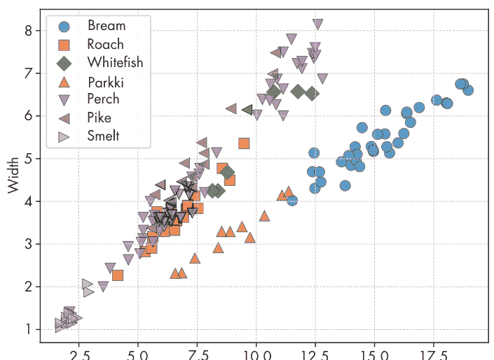

正如你可能预料的那样，相似物种的鱼在高度和宽度方面往往靠得很近。这是一个很好的指标，表明 KNN 可能是解决这个问题的有用算法。

让我们看看原始数据是什么样子。以下是 *fish.csv* 前几行的样本：

```
Species,Weight,Length1,Length2,Length3,Height,Width
Bream,242,23.2,25.4,30,11.52,4.02
Bream,290,24,26.3,31.2,12.48,4.3056
Bream,340,23.9,26.5,31.1,12.3778,4.6961
Bream,363,26.3,29,33.5,12.73,4.4555
```

第一行是描述每列的标题。三个长度维度（代表从每条鱼的鼻子到身体不同部位的距离）以厘米为单位，重量以克为单位。关于高度和宽度的单位，来源中存在一些模糊性。然而，只要样本之间的单位一致，即使我们不知道它是厘米、某种百分比还是其他单位，数据仍然有用。

#### 鱼类

为了实现我们的鱼类分类器，我们需要构建一个 `DataPoint` 的子类来表示一条鱼：

```python
### KNN/fish.py
from dataclasses import dataclass
from KNN.knn import DataPoint
from typing import Self

@dataclass
class Fish(DataPoint):
    kind: str
    weight: float
    length1: float
    length2: float
    length3: float
    height: float
    width: float

    @classmethod
    def from_string_data(cls, data: list[str]) -> Self:
        return cls(kind=data[0], weight=float(data[1]), length1=float(data[2]),
                   length2=float(data[3]), length3=float(data[4]),
                   height=float(data[5]), width=float(data[6]))

    def distance(self, other: Self) -> float:
        return ((self.length1 - other.length1) ** 2 +
                (self.length2 - other.length2) ** 2 +
                (self.length3 - other.length3) ** 2 +
                (self.height - other.height) ** 2 +
                (self.width - other.width) ** 2) ** 0.5
```

从技术上讲，我们不需要在 Python 类型提示中显式地将 `Fish` 设为 `DataPoint` 的子类以符合协议。通过满足 `DataPoint` 协议的所有要求，`Fish` 可以替代 `DataPoint`，甚至无需继承它，这得益于隐式子类型的概念。^4 尽管如此，我们还是声明了将 Fish 显式定义为 DataPoint 的子类，是因为这能为代码读者提供清晰性，并有助于类型检查。
KNN 类提供的 CSV 每一行数据，都是一个字符串列表，由 Fish 类将其转换为一个 Fish 实例。`from_string_data()` 方法执行此转换。`distance()` 方法计算当前实例与另一个 Fish 之间的欧几里得距离。我们计算数据集中每个维度的差值，对这些差值求平方，然后求和。接着，我们返回该和的平方根（`** 0.5`）。请注意，我们并未将数据集中的 weight 属性作为比较的一部分。这是因为我们将在下一章使用鱼的尺寸来预测其重量，因此对于待分类的鱼来说，重量将是未知的。

#### 单元测试

我们编写了单元测试，以确保我们的鱼类检测器能获得预期结果。我们从一个测试开始，检查与样本鱼最近的鱼是否符合预期：

```python
### tests/test_knn.py
import unittest
from pathlib import Path
import csv
from KNN.knn import KNN
from KNN.fish import Fish
from KNN.digit import Digit

class FishTestCase(unittest.TestCase):
    def setUp(self) -> None:
        self.data_file = (Path(__file__).resolve().parent.parent
                          / "KNN" / "datasets" / "fish" / "fish.csv")

    def test_nearest(self):
        k: int = 3
        fish_knn = KNN(Fish, self.data_file)
        test_fish: Fish = Fish("", 0.0, 30.0, 32.5, 38.0, 12.0, 5.0)
        nearest_fish: list[Fish] = fish_knn.nearest(k, test_fish)
        self.assertEqual(len(nearest_fish), k)
        expected_fish = [Fish('Bream', 340.0, 29.5, 32.0, 37.3, 13.9129, 5.0728),
                         Fish('Bream', 500.0, 29.1, 31.5, 36.4, 13.7592, 4.368),
                         Fish('Bream', 700.0, 30.4, 33.0, 38.3, 14.8604, 5.2854)]
        self.assertEqual(nearest_fish, expected_fish)
```

接下来，我们尝试对一条样本鱼进行分类：

```python
    def test_classify(self):
        k: int = 5
        fish_knn = KNN(Fish, self.data_file)
        test_fish: Fish = Fish("", 0.0, 20.0, 23.5, 24.0, 10.0, 4.0)
        classify_fish: str = fish_knn.classify(k, test_fish)
        self.assertEqual(classify_fish, "Parkki")
--snip--
```

为了运行这些单元测试，我们使用了标准的测试运行代码：

```python
if __name__ == "__main__":
    unittest.main()
```

请注意，我们跳过了 *test_knn.py* 文件中大约 40 行的内容，其中包含将在本章和下一章中出现的更多测试。

#### 手写数字分类

光学字符识别（OCR）涉及使用计算机来识别打印或手写文本图像中的字符。例如，邮局使用 OCR 来自动读取信封上地址的分拣机。多种技术已成功应用于执行 OCR，KNN 便是其中之一。在本节中，我们将使用 KNN 来开发一个手写数字识别器，该识别器将在一个重要的测试集样本上达到 98% 的准确率。

我们将使用的数据集由 Cenk Kaynak 和 Ethem Alpaydin 于 1998 年在土耳其伊斯坦布尔的博阿齐奇大学开发，后来以知识共享署名 4.0 国际许可协议提交给加州大学欧文分校机器学习库。它包含 5,620 个由 43 个不同的人创建的手写数字（0-9）位图。数字图像被缩小到 8×8 像素，在 CSV 文件中，每个像素由一个 0 到 16 之间的整数表示，指示其灰度级别。CSV 中的每一行包含 64 个整数，代表手写数字图像中的 64 个像素，外加第 65 个整数，表示该图像应被分类为哪个数字（0-9）。图 7-3 展示了这些数字的样本。

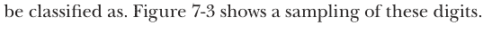

图中的数字被人为地放大了一点，但你可以看到，缩小到 8×8 会导致一些细节损失。这种较低的细节水平，以及因此数据集中较低的维度，使我们的程序执行得更快。比较图像之间的 64 个像素显然比比较 1,024 个像素快得多（它们在缩小之前是 32×32）。

#### Digit 类

为了表示每个数字，我们定义了 DataPoint 的另一个子类：

```python
from dataclasses import dataclass
from KNN.knn import DataPoint
from typing import Self
import numpy as np

@dataclass
class Digit(DataPoint):
    kind: str
    pixels: np.ndarray

    @classmethod
    def from_string_data(cls, data: list[str]) -> Self:
        return cls(kind=data[64],
                   pixels=np.array(data[:64], dtype=np.uint32))

    def distance(self, other: Self) -> float:
        tmp = self.pixels - other.pixels
        return np.sqrt(np.dot(tmp.T, tmp))
```

我们将像素数据存储为 NumPy 数组。这很方便，因为在下一章中，我们将使用 Pygame 来处理我们自己手写的数字涂鸦，而 Pygame 可以直接与 NumPy 数组交互。由于 `distance()` 方法在 NumPy 数组上进行计算，我们使用内置的 NumPy 函数来实现一种欧几里得距离。

#### 单元测试

数据集分为训练集中的 3,823 个数字图像和测试集中的 1,797 个数字图像。我们将使用训练集作为 KNN 实现进行预测的数据集，并测试测试集中有多少数字可以被正确识别。让我们在 `test_knn.py` 中定义另一个测试用例，放在 Fish 测试用例之后，但在 `if __name__ == "__main__"` 行之前：

```python
tests/test_knn.py
class DigitsTestCase(unittest.TestCase):
    def setUp(self) -> None:
        self.data_file = (Path(__file__).resolve().parent.parent
                          / "KNN" / "datasets" / "digits" / "digits.csv")
        self.test_file = (Path(__file__).resolve().parent.parent
                          / "KNN" / "datasets" / "digits" / "digits_test.csv")

    def test_digits_test_set(self):
        k: int = 1
        digits_knn = KNN(Digit, self.data_file, has_header=False)
        test_data_points: list[Digit] = []
        with open(self.test_file, 'r') as f:
            reader = csv.reader(f)
            for row in reader:
                test_data_points.append(Digit.from_string_data(row))
        correct_classifications = 0
        for test_data_point in test_data_points:
            predicted_digit: str = digits_knn.classify(k, test_data_point)
            if predicted_digit == test_data_point.kind:
                correct_classifications += 1
        correct_percentage = (correct_classifications
                              / len(test_data_points) * 100)
        print(f"Correct Classifications: "
              f"{correct_classifications} of {len(test_data_points)} "
              f"or {correct_percentage}%")
        self.assertGreater(correct_percentage, 97.0)
```

此测试将训练数据集（*digits.csv*）加载到 KNN 类的一个实例中。然后，它打开测试集（*digits_test.csv*）并将 CSV 数据转换为数据点列表 *test_data_points*。接着，它尝试逐个对每个数据点进行分类，并记录正确分类的数量。最后，它报告该百分比，如果准确率低于 97%，则测试失败。

让我们运行所有测试，看看结果如何。结合鱼类和 OCR 测试，这将花费一点时间。在我的笔记本电脑上，对这 1,797 个数字图像进行分类大约需要 11 秒：

```
% python3 -m tests.test_knn
Correct Classifications: 1761 out of 1797 or 97.996611018364%
....
--------------------------------------------------------------------
Ran 4 tests in 10.826s

OK
```

根据 OCR 数据集附带的文档（参见 *KNN/datasets/digits/readme.txt* 底部），我们知道作者使用不同 *k* 值的 KNN 自己测试了数据集的准确率。他们发现当 *k* 设置为 1 时，准确率最高，达到 98%。我们分类器的测试输出与之相符。这意味着它有效！

> ### 代码遇见生活

几年前，我发现自己在给一群大四学生教授人工智能入门课程。我把课程分为两半。前半部分涵盖了我们在本章开头所称的“传统 AI”，包括 A* 和 MiniMax 等算法（你都可以在我之前的书《Python 经典计算机科学问题》中找到）以及专家系统等概念。后半部分则专注于机器学习。我使用 KNN 作为机器学习算法的第一个例子，因为它极其简单。它作为进入机器学习世界的绝佳过渡，这就是为什么我相信它也能为本书的读者起到同样的作用。

从那时起，我们系就使用 KNN 作为教学演示主题，用于面试来校应聘计算机科学新教职的候选人。他们至少在来校前一周被告知演示主题，并有机会准备。KNN 非常适合作为此目的的主题，因为尽管核心算法有许多可能的扩展和改进，但核心算法本身的解释不应该花费很长时间，即使是不熟悉的教职员工或一年级学生也应该能够理解它。这是衡量某人是否准备好成为一名优秀教师的重要标准。

*(续)*

顺便说一句，你可能会惊讶于许多拥有机器学习背景的博士，竟然无法就KNN这样的主题进行一场出色的入门讲座。值得记住的是，博士学位是研究型学位，而非教学型学位。这就是为什么，当你为孩子选择大学时，应该考虑教学型大学。在大型研究型大学，学生可能由不关心教学的研究型教员授课，或是由兼职教学的兼职教员授课，最糟糕的情况是，由经验非常不足的研究生授课。当教员们更关心研究经费而非教学时，拥有一批拥有博士学位的教员对本科生的入门课程体验意义不大。相比之下，在教学型大学，你拥有整个全职教员团队（大多数也拥有博士学位），他们被聘用是因为他们完全致力于教学艺术，并且通常确实喜欢在入门课堂上授课。你失去的是与前沿研究的联系，但对于本科生来说，这种联系通常不会对他们的轨迹产生最大影响。不过，对我所说的话要持保留态度，因为我在过去九年里一直在教学型大学工作。

#### 现实世界的应用

KNN在现实世界中已被广泛应用于从光学字符识别到推荐系统，从文本分类到金融建模等各个领域。其简单性和广泛的适用性使其在机器学习中被普遍教授。

然而，在实践中使用KNN时，必须克服本章已经提到的几个问题。首先是为*k*找到合适的值。这通常通过使用测试数据集进行交叉验证来完成。哪个*k*值在测试数据上效果最好？使用过小的值可能导致*过拟合*，即模型过于贴近某个特定数据集。同时，过大的值可能导致*欠拟合*，即模型过于远离测试数据的指导。⁶

下一个挑战是基本算法在处理高维大型数据集时的性能影响。如本章前面所述，解决此问题的两种方法是设计更好的数据结构来存储数据集，或使用近似搜索。加速查找最近邻的最流行数据结构之一是k-d树。⁷ 然而，这是一种相当复杂的数据结构，只有在性能至关重要时才值得费心。

选择正确的距离函数也至关重要。欧几里得距离适用于许多应用，但汉明距离适用于布尔维度，其他距离函数在研究文献中也有充分研究。正确的距离函数取决于具体应用；没有一刀切的解决方案。通常，你还必须对数据进行归一化，以消除不同单位或量级影响结果的可能性。我们在本章的鱼类示例中没有对数据进行归一化，OCR示例中的数据都处于相同的单位和尺度，因此不需要归一化。

虽然我们看到从头实现KNN几乎微不足道，但许多流行的Python机器学习库无论如何都有高度优化的内置KNN函数。例如，scikit-learn的实现被广泛使用。

#### 练习

- 1. 找到另一个你自己感兴趣的、我们的KNN实现可以准确分类的数据集。
- 2. 尝试通过提高Digit类的distance()方法的性能来加快单元测试速度，同时保持测试98%的准确率。如果你愿意，可以不再使用NumPy数组。你甚至可以不再使用纯欧几里得距离。也许你甚至不需要比较每个像素？
- 3. 使用scikit-learn库重新实现我们的分类器。将我们的分类器与scikit-learn内置的KNN分类器进行性能比较。

#### 注释

- 1. Thomas Cover and Peter E. Hart, "Nearest Neighbor Pattern Classification," *IEEE Transactions on Information Theory* 13, no. 1 (January 1967): 21–27.
- 2. Shichao Zhang, "Challenges in KNN Classification," *IEEE Transactions on Knowledge and Data Engineering* 34, no. 10 (October 2022): 4663–4675, https://doi.org/10.1109/tkde.2021.3049250.
- 3. Pekka Brofeldt, "Bidrag till kaennedom on fiskbestondet i vaara sjoear Laengelmaevesi," T.H.Jaervi: Finlands Fiskeriet Band 4, Meddelanden utgivna av fiskerifoereningen i Finland, Helsingfors, 1917.
- 4. "Protocols," typing Documentation, accessed May 8, 2024, https://typing.readthedocs.io/en/latest/spec/protocol.html#explicitlydeclaring-implementation.
- 5. Ethem Alpaydin and Cenk Kaynak, "Optical Recognition of Handwritten Digits," UCI Machine Learning Repository, accessed December 10, 2024, https://doi.org/10.24432/C50P49.
- 6. Stuart Russell and Peter Norvig, *Artificial Intelligence: A Modern Approach*, 4th ed. (Pearson, 2021), 688.
- 7. Russell and Norvig, *Artificial Intelligence*.

### 8

#### 使用K近邻进行回归


在本章中，我们将扩展KNN实现以执行回归。就我们的目的而言，*回归*仅仅意味着预测一个数值。通过对第7章代码的一些小改动，我们可以使用相同的KNN类不仅进行分类，还可以对数据集中的任何数值属性值进行预测。

我们将把回归应用于前一章的两个KNN示例。首先，我们将重新审视鱼类数据集，并使用回归根据鱼的尺寸预测其重量。然后，我们将编写一个程序，允许用户绘制数字的一部分，然后预测其余部分可能的样子。

与本书其他章节不同，本章并非独立存在。它建立在前一章的基础上。在深入本章之前，请确保你已经完成了第7章。

#### KNN回归的工作原理

在KNN分类中，我们试图预测数据点所属的类别或类别，从有限的选项集中选择适当的类别。在KNN回归中，我们不是预测类别，而是试图预测属性值。这些属性值通常是数值型的，这意味着可能有无限的值范围可以分配。当然，如果属性值是我们想要预测的东西，那么它缺失是合理的。

举个例子，假设我们是一家医院，正在为病人分配房间。我们可能想知道病人可能需要住院多少天。我们可以查看具有相似诊断、症状和生命体征的过去病人的数据来进行预测。让我们用一个沿两个维度的散点图来直观地看这个例子（图8-1）。

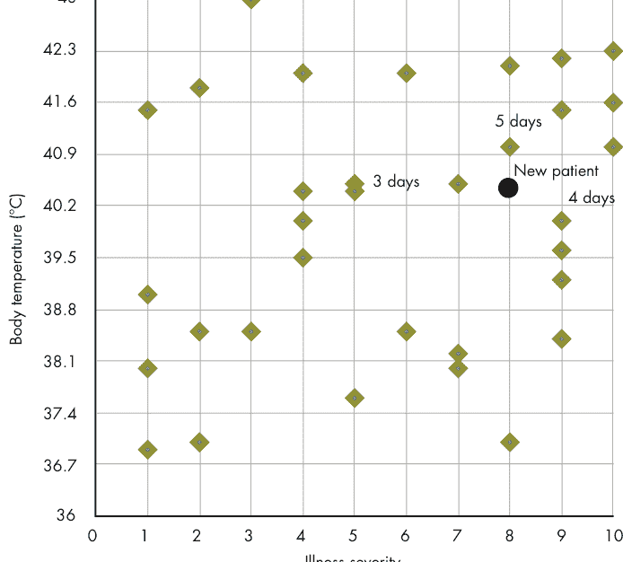

图8-1：基于体温和疾病严重程度的流感住院时长

假设图8-1中的菱形代表过去因流感入院的病人。他们的疾病由医生在1到10的严重程度量表上进行评分，并且记录了入院时的体温。我们还有关于他们最终住院时长的数据。

圆点代表刚刚入院的病人。我们有他们的严重程度评分和体温，我们想预测他们最终会在医院住多久，以便将他们安排到合适的房间。如果我们使用欧几里得距离的KNN并将$k$设置为3，那么我们将查看过去数据中在散点图上离新病人点最近的三个病人。图中注明他们的住院时长分别为三天、四天和五天。使用这种方法估计新病人的住院时长可以简单地取三个最近邻的平均值。这个平均值（无论是均值还是中位数）将是四天，因此我们将预测新病人将在医院住四天。

更广泛地说，以下是使用KNN执行回归的步骤：

- 1. 选择$k$，即与具有缺失属性的数据点进行比较的邻居数量。
- 2. 找到数据点的$k$个最近邻。
- 3. 对$k$个最近邻的相应属性值取平均值，以预测该数据点的缺失属性值应该是多少。

如你所见，使用KNN进行回归与使用KNN进行分类非常相似。实际上只是最后一步不同。关于这个算法，我们有一些与前一章相同的问题和答案：$k$的合适值是多少？我们如何计算距离？有关这些问题的讨论，请参见第7章。

我们还有一个新问题：取平均值意味着什么？通常这是均值或中位数。就像关于正确距离函数的问题一样，取平均值的最佳方式可能取决于具体应用。通常需要一些领域知识才能做出最佳判断。

#### 实现KNN回归

为了执行回归，我们只需要在第7章的KNN类中添加两个方法。一个预测标量数值属性，另一个预测属性为数字数组。我们将使用后者来处理手写示例，以便我们可以预测像素。以下是更新内容：

```
### KNN/knn.py
### 基于k个最近邻预测数据点的数值属性。
### 从邻居中找到该属性的平均值并返回。
def predict(self, k: int, data_point: DP, property_name: str) -> float:
    neighbors = self.nearest(k, data_point)
    return (sum([getattr(neighbor, property_name) for neighbor in neighbors])
            / len(neighbors))
```

#### 预测鱼的重量

让我们为 FishTestCase 添加一个单元测试，以确保我们新的 predict() 方法正常工作。我们想回答这个问题：“如果我们知道一条鱼的尺寸，能否对其重量做出合理的推测？”答案当然是肯定的：

```python
def test_predict(self):
    k: int = 5
    fish_knn = KNN(Fish, self.data_file)
    test_fish: Fish = Fish("", 0.0, 20.0, 23.5, 24.0, 10.0, 4.0)
    predict_fish: float = fish_knn.predict(k, test_fish, "weight")
    self.assertEqual(predict_fish, 165.0)
```

在这个方法中，我们创建了一条未指定重量（0.0）的 test_fish，并将其与在解剖尺寸（长度1、长度2、长度3、宽度和高度）上最接近它的五条鱼进行比较。（回想一下前一章，我们在 distance() 方法中不比较鱼的重量。）然后，我们通过计算这五个最近邻居的重量平均值来预测其重量。再次运行单元测试，你应该会发现鱼的重量被正确预测了。为了更普遍地测试这种预测方法是否准确，我们可以尝试在整个鱼类数据集上运行它。由于数据集包含了每个样本的已知重量，我们可以衡量我们的 KNN 结果与实际鱼重量相比的准确度。

#### 预测手写数字的其余部分

在前一章中，我们使用 KNN 正确分类了 98% 的测试集手写数字图像（与训练集同为 8×8 像素图像）。在这个最后的 KNN 示例中，我们将对用户绘制的 8×8 数字进行分类，甚至预测图像其余像素可能的样子。我们不会将其作为另一组单元测试来实现，而是使用 Pygame 创建一个有趣的交互式程序，允许用户在一个包含 8×8 网格的窗口中绘图。

这是我们正在构建的程序的预览。图 8-2 显示了绘图窗口，其中我尝试画了一个歪歪扭扭的 7。我按下了 C 键，程序正确地将其分类为 7（显示在终端中，未在图中显示）。

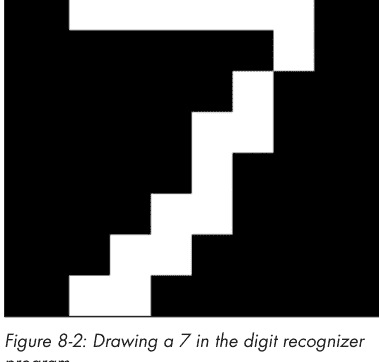

图 8-2：在数字识别程序中绘制 7

图 8-3 显示了按下 P 键后的窗口，这会根据九个最近邻居像素的平均值，预测数字其余像素可能的样子。

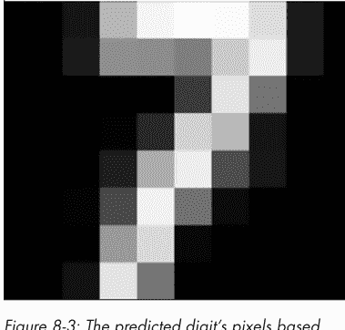

图 8-3：基于最近邻居像素的预测数字像素

在我们的简单程序中，我们只能用白色绘图。预测结果产生了一个更好看的 7，因为它可以使用更多级别的灰色。我们以一些导入和常量开始我们的程序：

```python
from KNN.knn import KNN
from KNN.digit import Digit
from pathlib import Path
import sys
import pygame
import numpy as np

PIXEL_WIDTH = 8
PIXEL_HEIGHT = 8
P_TO_D = 16 / 255  # pixel to digit scale factor
D_TO_P = 255 / 16  # digit to pixel scale factor
K = 9
WHITE = (255, 255, 255)
```

PIXEL_WIDTH 和 PIXEL_HEIGHT 常量是一张图像的大小。P_TO_D 常量用于在我们将要处理的像素表示中的 255 级灰色和源数据集中的 16 级灰色之间进行转换；D_TO_P 是其逆转换。我们将 K（KNN 考虑的邻居数量）设置为 9，WHITE 是 RGB 像素格式中白色颜色的常量。

这是一个简短的程序。我们只有一个核心的 run() 函数，它在处理用户界面和运行 KNN 上花费的时间一样多。以下是该函数的开头：

```python
def run():
    # Create a 2D array of pixels to represent the digit
    digit_pixels = np.zeros((PIXEL_HEIGHT, PIXEL_WIDTH, 3),
                            dtype=np.uint32)
    # Load the training data
    digits_file = (Path(__file__).resolve().parent
                   / "datasets" / "digits" / "digits.csv")
    digits_knn = KNN(Digit, digits_file, has_header=False)
    # Start up Pygame, create the window
    pygame.init()
    screen = pygame.display.set_mode(size=(PIXEL_WIDTH, PIXEL_HEIGHT),
                                    flags=pygame.SCALED | pygame.RESIZABLE)
    pygame.display.set_caption("Digit Recognizer")
```

在最初的几行中，我们创建了像素数组，加载了数据集，并初始化了 Pygame。主窗口被初始化为一个“拉伸”的 8×8 像素。你可以调整窗口大小，它将保持其 8×8 的尺寸。这是通过 set_mode() 标志（flags=pygame.SCALED | pygame.RESIZABLE）设置的。

接下来，我们需要设置主循环：

```python
while True:
    pygame.surfarray.blit_array(screen, digit_pixels)
    pygame.display.flip()
```

由于这是一个使用 Pygame 的 GUI 程序，我们实际上有一个事件循环。它监听用户的某些操作，然后做出响应。这个操作可能是键盘或鼠标事件。为了保持屏幕同步，我们在循环开始时不断地将 digit_pixels 绘制到屏幕上。然后，我们处理键盘事件：

```python
for event in pygame.event.get():
    if event.type == pygame.KEYDOWN:
        key_name = pygame.key.name(event.key)
        if key_name == "c":  # classify the digit
            pixels = digit_pixels.transpose((1, 0, 2))[:, :, 0].flatten() * P_TO_D
            classified_digit = digits_knn.classify(K, Digit("", pixels))
            print(f"Classified as {classified_digit}")
```

我们从用于分类的 C 键开始。这与我们在前一章中所做的分类类似。结果被打印到控制台。唯一棘手的部分是将表示图像的像素转换为我们的分类器可以使用的形式。本质上，我们是从 255 级灰色和多维的像素格式转换为 16 级灰色的扁平数组。键盘处理程序继续：

```python
elif key_name == "e":  # erase the digit
    digit_pixels.fill(0)
elif key_name == "p":  # predict what the digit should look like
    pixels = digit_pixels.transpose((1, 0, 2))[:, :, 0].flatten() * P_TO_D
    predicted_pixels = digits_knn.predict_array(K, Digit("", pixels), "pixels")
    predicted_pixels = predicted_pixels.reshape((
        PIXEL_HEIGHT, PIXEL_WIDTH)).transpose((1, 0)) * D_TO_P
    digit_pixels = np.stack((predicted_pixels, predicted_pixels,
                             predicted_pixels), axis=2)
```

E 键只是擦除像素数组。P 键是预测部分。首先，我们再次将像素数组转换为 KNN 类可以使用的形式，就像之前一样。接下来，我们使用 predict_array() 方法获取预测的 _pixels，这些像素是我们训练集中九个最接近条目的像素平均值。然后，我们将这些结果转换回可以在 Pygame 中显示的形式。这不仅涉及重塑为二维数组，还涉及更改为 RGB 格式，其中相同的灰色级别在三个颜色通道中重复。reshape() 和 transpose() 链从一维变为二维，而 stack() 调用创建了一个第三维，其所有值都相同——例如，灰色级别 128 变为 RGB 的 (128, 128, 128)。

代码的其余部分会在用户点击的任何位置绘制白色像素，在用户关闭窗口时退出，并在执行 `__main__.py` 时调用 `run()` 函数：

```python
elif ((event.type == pygame.MOUSEBUTTONDOWN) or
      (event.type == pygame.MOUSEMOTION and pygame.mouse.get_pressed()[0])):
    x, y = event.pos
    if x < PIXEL_WIDTH and y < PIXEL_HEIGHT:
        digit_pixels[x][y] = WHITE
elif event.type == pygame.QUIT:
    sys.exit()

if __name__ == "__main__":
    run()
```

使用我们现有的 KNN 类创建一个基于图形用户界面的手写数字识别器，只需大约 50 行实际代码。Python 就是如此简洁！试试看：它并不完美，但能正确识别我大部分潦草的字迹。

> **代码遇见生活**

2016 年，我参与了一个名为 SwiftSimpleNeural Network¹ 的简单教育项目，这是为我的第二本书 *Classic Computer Science Problems in Swift* 中关于从零开始用 Swift 构建神经网络的章节做准备。我使用该框架实现了手写数字识别，但它极其缓慢。公平地说，当时没有任何优化，应用程序完全是单线程且受 CPU 限制。令人惊讶的是，本章中同样未经优化但简单得多的 KNN 算法实现，在速度和准确性上都超越了它。

这个轶事说明了两个重要的教训：对于特定应用，更复杂的算法并不总是更好的算法；并且进行一些研究，充分了解哪些算法用于哪些应用，这很重要。这就是为什么我在本书的每一章末尾都包含了“现实世界应用”部分。

了解你的算法选择在许多领域都很重要。为此，阅读像本书这样的综述书籍的好处之一，就是它能向你介绍你可能以前不知道的新算法和技术。这样，当你遇到它们适用的问题时，你就能做好准备。

#### 现实世界应用

KNN 可以是尝试进行回归时的一个很好的起点，因为它非常易于使用。与神经网络不同，它几乎不需要调整，而且由于实际上不涉及训练，基于 KNN 的应用程序很容易搭建。

研究人员确实使用 KNN 来预测住院时间，正如本章开头所述。Pei、Lin 和 Chen 发现，KNN 在预测 COVID-19 患者住院时间方面，其准确性与更复杂的技术（如逻辑回归或随机森林）大致相当。² 我在同一领域找到了多项其他使用 KNN 的研究。KNN 回归也已应用于文本挖掘、农业和金融市场等领域。³ 这在直觉上是合理的——与当前情况最相似的过去事件或数据点，可能在预测中最有帮助。

由于性能问题，当数据有噪声或数据集在点数和维度上过大时，KNN 效果不佳。然而，对于大多数应用来说，它是一个合理的起点。

#### 练习

1.  通过在整个鱼类数据集上运行 KNN 并将 KNN 结果与数据集中的已知重量进行比较，证明（或反驳）KNN 对鱼类重量预测是有效的。平均而言，KNN 预测的准确性如何？
2.  将我们的数字识别器程序改为使用更大的网格，例如 64×64 而不是 8×8。这将允许用户绘制更流畅的数字。你需要找到一种方法，将 64×64 的绘图准确地缩小到 8×8，以便与训练数据集一起使用。
3.  使用我们实现的 KNN 回归或来自 scikit-learn 等库的实现，尝试使用你自己感兴趣的数据集进行预测。

#### 注释

1.  参见 https://github.com/davecom/SwiftSimpleNeuralNetwork。
2.  Jianing Pei, Xin Lin, and Qixuan Chen, “Prediction of Patients’ Length of Stay at Hospital During COVID-19 Pandemic,” *Journal of Physics: Conference Series* 1802 (March 2021): https://doi.org/10.1088/1742-6596/1802/3/032038.
3.  Sadegh Bafandeh Imandoust and Mohammad Bolandraftar, “Application of K-Nearest Neighbor (KNN) Approach for Predicting Economic Events: Theoretical Background,” *Journal of Engineering Research and Applications* 3, no. 5 (2013): 605–610, https://www.ijera.com/papers/Vol3_issue5/DI35605610.pdf.

## 后记


感谢阅读 *Computer Science from Scratch*。这篇后记根据本书的四个主题（解释器、计算艺术、模拟器和机器学习）为你提供更多资源。我选择突出介绍非学术但备受推崇的资源，这些资源是我个人发现有用的——这里没有象牙塔。但在我们开始之前，我想与你分享一些关于我们所完成工作的想法。

### 我们做了什么以及下一步是什么

通过完成本书中的项目，你接触了计算机科学几个不同领域的广泛概述。你现在是这些领域的专家吗？当然不是。但你已经掌握了足够的知识，可以在你设计的这四个领域中的任何一个开始一个项目。更重要的是，你处于一个很好的位置来进一步学习这些主题。

我们在第一部分完成的解释器很简单，但 NanoBASIC 具备任何真实世界解释器的组成部分（词法分析器、解析器、运行时环境）。你现在就可以在没有任何进一步研究的情况下，为一种更复杂的语言构建一个解释器。棘手的地方在于你想让那种语言性能更高时。这可能需要更高级的技术，比如实现一个虚拟机或编译器，或者添加内置的运行时优化。

我将在本后记的后面分享一些关于解释器的更深入资源，但重点是你可以立即开始。你是否曾想创建自己的编程语言？现在你可以了。我并不是说你必须这样做，但你可以。

我们在第二部分开发的计算机艺术程序引入了各种有趣的算法技术，但除了像素之外，并没有一个真正的统一主题。你现在知道如何操作像素了。如果你有关于如何让像素变化的想法，你可能就能做到。更广泛的计算机图形学充满了更广泛的思想，如果你想进一步探索操作像素，这将是你的下一站。

第三部分的 NES 模拟器是本书中迄今为止最大、最复杂的项目。一个很好的下一步是为模拟器添加更多兼容性（如第 6 章练习所述），或者尝试模拟另一个系统。Game Boy 的复杂性相似，世嘉 Master System 也是如此。正如本章所讨论的，用 Python 编写模拟器在性能方面具有挑战性。如果你不懂 C 或 C++，编写你的下一个模拟器可能是学习它们的好机会。

在第四部分，我们迈入了机器学习世界的一小步。KNN 可能是整个人工智能中最简单的算法。它在合适的应用中效果很好，但你需要学习其他几种技术，以便知道在特定情况下应该使用哪些。希望第四部分超级简单的性质让这个通常看起来令人生畏的领域对你来说感觉更平易近人。你不需要成为机器学习专家就能使用机器学习技术。如今，一切都只需一个库调用。然而，你确实需要知道该调用哪个库调用。

我希望通过完成本书中的项目，你觉得在这四个领域都有了一个很好的开端。现在，如果你想深入自己的项目或完成更多训练，就取决于你了。在本后记的其余部分，我建议了每个领域的一些资源，我认为它们能很好地衔接本书。所有这些资源都经过了我的审核。我确实阅读了我推荐给你的书。

### 关于学习计算机科学

你不需要正规的大学教育来学习计算机科学。这本书是一个很好的开始。就像几乎所有学科一样，你需要的一切都在在图书馆和互联网上都可以免费获取。它只需要毅力（学习时间、项目时间）。

我属于那种尽可能从基本层面理解事物运作原理的人。我遇到过其他类似的人，这可能只是一种性格特质。即使你不是这样的人，也让我试着说服你，为什么学习一些计算机科学知识能真正让你理解事物“底层”的运作方式。

首先，作为程序员，计算机科学是我们理解可用于解决程序所需问题的技术的基础。当然，如果我们只是构建通用的CRUD应用，它可能不会显得非常有用，但如果你想做一些新颖或复杂的事情，计算机科学就真的派上用场了。

其次，即使我们能想出解决问题的方法，它是最有效的方法吗？它会产生性能问题吗？理解一些计算机科学基础知识确实可以帮助你提高代码的性能。

最后，理解计算机科学将对你的职业生涯有所帮助。你会理解你的同事在谈论什么。你会在更根本的层面上“理解”软件技术。你会成为一个更好的技术沟通者。而且它会帮助你应对技术面试。不幸的是，仍然有太多公司要求候选人在白板上解决数据结构和算法问题。我不同意这种做法，但毫无疑问，那些学习过计算机科学的人在这些面试中会占据优势。

计算机科学是一个庞大的学科。不要被吓倒。如果你有兴趣进一步学习通用的计算机科学知识，这里有一些友好的书籍，我认为它们能很好地补充本书。

**《算法图解（第2版）》，作者：阿迪蒂亚·Y·巴尔加瓦**
这是一本关于算法的、极其易读的书。它比一般的算法教科书更容易理解。它数学内容较少，并包含Python示例来说明每个概念。我自己在教授大学水平的数据结构和算法课程时，就用它来代替传统教科书。

**《Python经典计算机科学问题》，作者：大卫·科佩克**
我写《经典计算机科学问题》是为了以代码优先、教程式的方式，对有趣的算法主题进行概述。它涵盖了从搜索算法到图算法，甚至一些入门级AI材料的所有内容。它是本书的完美补充，两者之间没有内容重叠，因为它们涵盖了计算机科学的不同领域。本书由更大、更有趣的项目组成，而《经典计算机科学问题》则更侧重于算法本身以及适合它们的特定问题。

### 解释器

十年前，几乎没有非学术性的书籍可以推荐给普通程序员读者来学习编写解释器。今天，我们很幸运在这个领域有几本很棒的书，其中我强烈推荐两本：

**《Crafting Interpreters》，作者：罗伯特·尼斯特伦**
这是一本绝对精彩的书，无论是在教学法还是代码方面。关于解释器和编译器的旧经典书籍极其学术化，甚至有些刻板（比如所谓的“龙书”）。如果你在本书的Brainfuck和NanoBASIC项目中激发了兴趣后，想编写更大的实用解释器，那么《Crafting Interpreters》是这个领域的必读书。

**《Writing an Interpreter in Go》，作者：托尔斯滕·鲍尔**
我自己读过这本书，是为了准备编写一种名为SeaTurtle的解释型编程语言，以帮助孩子们学习编程（参见第2章的“代码遇见生活”框）。它不如《Crafting Interpreters》全面，而且有点小众，是用Go语言写的。然而，如果你对更简洁的内容感兴趣，或者你是Go程序员，那么这是一个很好的选择。它写得很好，附带的代码也很棒。

### 计算艺术

我主要通过简短的在线文章学习了本书两章计算艺术中的技术，所以很遗憾，我没有全面的资源可以分享，但我想提到迈克尔·福格尔曼的Primitive项目。它是印象派章节（第4章）的灵感来源，尽管那个程序使用了不同的算法。Primitive的GitHub仓库（https://github.com/fogleman/primitive）有一些易于阅读的Go源代码，迈克尔也为该项目建立了一个网站（https://www.michaelfogleman.com/#primitive）。

### 模拟器

可能有一些关于编写模拟器的好书，但我个人并不知道。相反，我分享一些我发现有用的在线资源：

**EmuDev**
这个subreddit（https://www.reddit.com/r/EmuDev）是我遇到的关于模拟器开发最活跃的社区之一，构建你能想象到的各种模拟器的人们在这里分享他们的见解。还有一个配套的Discord，可以实时解答问题。

**NesDev**
https://www.nesdev.org 上的wiki文档和论坛在我开发第一个NES模拟器以及为本书编写模拟器时都对我非常有价值。不幸的是，尽管NES模拟是一个流行的项目，但关于它的优秀教程或资源却非常少（这也是我写这本书的部分原因）。NesDev是目前最好的资源，如果你想在第6章的基础上进一步发展你的NES开发（比如添加更多映射器或更精确的PPU），这个网站将是你的首选资源。

### 机器学习

关于机器学习的资源太多了，甚至决定从哪一个开始都可能让人不知所措。也就是说，如果你喜欢第7章和第8章中介绍的简单算法，并且喜欢我们从头开始开发它的方式，那么我有两个特别直接的资源，可以用来学习其他你可以实现的机器学习算法：

*《百页机器学习书》，作者：安德烈·布尔科夫*
这本书直截了当。你只需学习足够的理论和其他信息来实现算法，没有任何技术书籍的华丽包装。虽然它没有包含很多代码，但它是一个很好的讲解者，可以通过优秀的在线课程或YouTube频道进一步学习。

*《Python经典计算机科学问题》，作者：大卫·科佩克*
是的，我第二次推荐我自己的书。这有点自利，但如果我不认为它真的是一个很好的资源，我就不会写它。事实上，这本书的九章中有五章可以说是关于人工智能的，其中两章专门讨论机器学习。你想学习如何用Python从头开始编写神经网络（不使用任何库）吗？查看《Python经典计算机科学问题》的第7章。你在本书中学习了如何使用KNN编写简单的分类器和回归器。在《Python经典计算机科学问题》的第6章，你还将学习如何使用另一个简单的算法k-means来构建聚类程序。

### 在社交媒体上关注我

- X: https://x.com/davekopec
- GitHub: https://github.com/davecom
- LinkedIn: https://www.linkedin.com/in/dkopec
- YouTube: https://www.youtube.com/c/DavidKopec09
- 我的网站: https://davekopec.com
- Kopec Explains Software，一个播客: http://kopec.live

## 附录
位运算


对位的底层操作对于本书中一半的项目至关重要。如果你没有位运算的背景知识，本附录提供了一个概述，包括最基本的位运算的作用、如何在Python中使用它们，以及一些它们用途的示例。

### 二进制复习

我假设大多数读者作为中级或高级程序员，熟悉二进制。如果你是这样，并且只想快速复习一下位运算，你可以跳过本节。但是，如果你不熟悉二进制，本节将帮助你入门，尽管它并不全面。

计算机中的所有信息都存储为1和0。这很方便，因为用于构建计算机的硬件类型可以物理地能够非常方便地表示1和0。例如，如果存在电流（或“信号”），我们可以说这代表1，而没有电信号则代表0。二进制也在现已过时的CD和DVD技术中物理地体现出来。它们的读取器有一个激光器在光盘表面移动。当激光器因为光盘上有一个微小的凹坑而没有反射回来时，这代表0。如果激光器因为没有凹坑而反射回来，这代表1。最后一个物理例子是二维码。黑点的存在可以是1，不存在可以是0。二进制有许多便捷的物理表现形式。

所有这些1和0是如何转换成信息的呢？一串1和0在二进制中代表一个数字。一旦我们有了数字，我们就可以表示任何其他类型的信息。一个特定的数字可以代表电子文档中的一个特定字母。或者它可以代表一种特定的颜色。另一个数字可以代表在屏幕上放置该颜色的位置。很快我们就有了像素。

然而，一串1和0如何表示1或0以外的数字呢？这就是二进制数制，也称为*基数2*发挥作用的地方。

日常使用的典型数字是*基数10*，即*十进制*。这意味着数字中的每个数位可以有10个不同的值（0-9），并且每个数位本身代表10的一个幂。例如，数字427实际上是(4×10²) + (2×10¹) + (7×10⁰)。同样，二进制数中的每个数位可以有两个不同的值（0或1），并且每个数位本身代表2的一个幂。数字427的二进制是110101011，即(1×2⁸) + (1×2⁷) + (0×2⁶) + (1×2⁵) + (0×2⁴) + (1×2³) + (0×2²) + (1×2¹) + (1×2⁰)。1代表“开启”的2的幂，0代表“关闭”的2的幂。

为了测试你的理解，尝试将几个数字从十进制转换为二进制，反之亦然。73的二进制是什么？11000的十进制是什么？再试几个你选择的数字。你可以用Python检查你的工作，其中二进制数通过使用0b前缀表示为字面量，例如十进制数3表示为0b11：

```
>>> value = 0b11
>>> value
3
```

同时，Python的bin()函数接受一个整数并返回一个格式化为二进制等效值的字符串：

```
>>> bin(3)
'0b11'
```

每个存储的二进制1或0在计算中被称为*比特*。一个标准的*字节*是8位。所有现代计算机都使用8位字节作为其标准存储单位。一个字节可以存储的最大值（当表示无符号整数时）是255，因为八个1，或二进制的11111111，是十进制的255。这也意味着一个字节可以存储256个不同的可能值（从0到255的所有值）。

当一个字节被写出时，*最低有效位*——即代表最小2的幂的位——通常写在最右边（位0，代表2⁰）。*最高有效位*——代表最大2的幂的位——通常写在最左边（位7代表2⁷）。例如，在10000000中，1代表2⁷被开启，所以该字节的十进制值是128。这假设我们处理的是*无符号*整数——不能为负数的整数。符号超出了这个二进制基础介绍的范围。

一些数据类型使用多个字节表示。例如，在像可能驱动你计算机的64位微处理器上，整数通常使用64位（8字节）存储。64位二进制数的最大值是：

```
1111111111111111111111111111111111111111111111111111111111111111
```

这转换为十进制是18,446,744,073,709,551,615。

对于本书中的几个项目，我们需要在比特级别操作字节。本附录的其余部分涵盖了一些常见的操作方法。

#### 常见的位运算

*位运算*在单个二进制数字级别操作值。这意味着处理1和0。所有微处理器都包含执行位运算的指令，Python有运算符来利用这些微处理器指令。*真值表*显示了基于不同输入组合的逻辑函数的真/假结果，有助于理解位运算。为了使其更实用并适用于我们在Python中使用这些操作，每个操作附带的表格将显示二进制值而不是真和假。

#### 左移（<<）

暂时不要将我们的二进制数据视为数字，而是将其视为1和0的集合。想象0是空位，1是填充位。如果我们想将所有1向左移动一个位置怎么办？这就是*左移*的工作，在Python中用<<运算符表示。

左移在最低有效位（位位置0）留下一个空隙。在Python的左移中，我们用0填充这个空隙。因为Python整数是任意长度的（没有最大长度），我们不能通过向左移动将1移出末尾。数字只会增加一位。例如，1010左移1位变成10100，而不是0100。我们也可以左移多位，所以1010左移3位变成1010000。表A-1显示了一些左移的结果。

表A-1：左移示例

| A | A << 1 | A << 3 |
|---|---|---|
| 0 | 0 | 0 |
| 1 | 10 | 1000 |
| 1010 | 10100 | 1010000 |

在表格的第一行，0被移动，你可能认为它会变成00和0000，但实际上这些与0相同。相反，你可以认为左移只是移动1。如果没有1，那么移动基本上什么也不做。

Python的左移运算符前面是要移动的东西，后面是一个整数表示要移动多少位。这是一个使用它的快速示例：

```
>>> bin(0b1010 << 3)
'0b1010000'
```

移位运算符通常用于将一个或多个比特与另一个二进制值对齐，结合我们即将学习的其他位运算符。

#### 右移（>>）

右移与左移非常相似，只是1向右移动而不是向左。如果一个1移出末尾（超过0位位置），那么它就“丢失”了。没有循环。例如，1001右移1位变成100，而不是1100。我们也可以右移多位，所以1001右移3位变成1。

Python有>>运算符执行右移。表A-2显示了一些右移示例。

表A-2：右移示例

| A | A >> 1 | A >> 3 |
|---|---|---|
| 0 | 0 | 0 |
| 1 | 0 | 0 |
| 1010 | 101 | 1 |

在表格的第二行，1被“移出末尾”，没有1剩下，所以结果是0。

#### 或（|）

对两个值进行按位或运算，如果任一值为1，则结果为1。如果两个值都不是1，则结果为0。该操作在两个值中相同数位上的二进制数字上执行，一次一个数位。想象数字上下对齐。然后，对每一列执行或运算，一次一列，像这样：

```
1010
0110
----
1110
```

尝试按照前一段的规则自己计算最后一行。这些规则也总结在表A-3中。

表A-3：或运算示例

| A | B | A \| B |
|---|---|---|
| 0 | 0 | 0 |
| 0 | 1 | 1 |
| 1 | 0 | 1 |
| 1 | 1 | 1 |
| 1010 | 0110 | 1110 |

Python有|运算符执行按位或。这是一个在Python中对几个二进制数使用它的快速示例：

```
>>> bin(0b1010 | 0b0110)
'0b1110'
```

按位或运算在低级编程中的一个常见用途是结合移位运算符将两个值合并在一起。例如，假设我们有一个半字节（一个半字节是4位）代表字节的一半，另一个半字节代表字节的另一半。我们想将它们合并在一起以产生完整的字节。也许半字节A是1001，半字节B是0110，我们希望半字节A是结果字节的前半部分，半字节B是后半部分。合并它们的代码可能如下所示：

```
>>> a = 0b1001
>>> b = 0b0110
>>> c = (a << 4) | b
>>> bin(c)
'0b10010110'
```

通过(a << 4) | b，我们将a左移4位，然后将其值与b进行或运算。记住，当我们向左移动时，0从右边填充，所以

#### 与运算（&）

*按位与*运算在两个操作数均为1时返回1；否则返回0。以下是使用与按位或运算相同操作数的示例：

```
1010
0110
----
0010
```

只有与两个1对齐的位才得到1。表A-4总结了按位与的工作原理。

表A-4：与运算示例
| A | B | A & B |
|---|---|---|
| 0 | 0 | 0 |
| 0 | 1 | 0 |
| 1 | 0 | 0 |
| 1 | 1 | 1 |
| 1010 | 0110 | 0010 |

Python提供了`&`运算符来执行按位与运算。以下是在几个二进制数上使用它的快速示例：

```
>>> bin(0b1010 & 0b0110)
'0b10'
```

请注意，输出结果截断了前导0，因为它们对于表示结果数字（十进制中的2）并非必需。换句话说，二进制中的0010等于十进制中的2，正如二进制中的10等于十进制中的2一样。

按位与运算在底层编程中的一个常见用途是确保最终结果仅包含先前结果中的某些位。例如，假设我们只关心字节10011110中最右边的4位。我们可以将该字节与1111进行与运算，以确保最终结果中只包含最右边的4位。代码可能如下所示：

```
>>> a = 0b10011110
>>> b = 0b1111
>>> c = a & b
>>> bin(c)
'0b1110'
```

让我们看看位对齐后的这个运算：

```
10011110
   1111
---------
   1110
```

在模拟器项目中处理标志位时，我们经常使用这种技术来处理单个位。我们只需要知道单个标志位以及它是1还是0（真或假）。

#### 异或运算（^）

按位异或（“异或”）运算在操作数不同时（一个为1，一个为0）返回1；否则返回0。以下是使用与按位或和与运算相同操作数的示例：

```
1010
0110
----
1100
```

表A-5总结了异或运算的工作原理。

表A-5：异或运算示例
| A | B | A ^ B |
|---|---|---|
| 0 | 0 | 0 |
| 0 | 1 | 1 |
| 1 | 0 | 1 |
| 1 | 1 | 0 |
| 1010 | 0110 | 1100 |

Python提供了`^`运算符来执行按位异或运算。以下是在Python中对几个二进制数使用它的快速示例：

```
>>> bin(0b1010 ^ 0b0110)
'0b1100'
```

异或是一种功能强大的运算。它是被称为*一次性密码本*的不可破解加密方案的基础。你也可以通过与1进行异或来翻转位：如果你将1与1异或，它会变成0；但如果你将0与1异或，它会变成1。任何与1异或的位都会变成其之前的相反值。这就是第5章CHIP-8项目中屏幕绘制的工作原理。

#### 取反运算（~）

*取反*是所有按位运算中最简单的：它将所有1切换为0，所有0切换为1，如表A-6所示。

表A-6：取反运算示例

| A | ~A |
|---|---|
| 1 | 0 |
| 0 | 1 |
| 1010 | 0101 |
| 011010 | 100101 |

Python提供了`~`运算符来执行二进制取反。我们在本书中很少使用取反运算，除了第6章NES模拟器中的一个小地方。

# 索引

## 符号

- &（与运算符），242–243
- ~（取反运算符），244
- <<（左移运算符），239–240
- -（减号），79
- |（或运算符），240–242
- >>（右移运算符），240
- :=（海象运算符），77
- ^（异或运算符），130，243–244

## A

- 抽象，23
- 抽象语法树，9，32–33，39，42–48
    - 层次结构，117
- ADC指令（6502），163
- 寻址模式（6502），153–154，170–172
- 提前编译，17
- 算法
    - 抖动，67–72
    - 爬山算法，105
    - KNN，207–218，222–224
        - 准确性，218
        - 机器学习，206–218
        - 性能，211
    - 随机优化，111
    - 随机绘画，89–95
- 艾伦，保罗，22–23，201
- 艾利森，丹尼斯，30，42
- 与运算符（&），242–243
- 动画GIF，64，86
- APU（音频处理单元），143，145
- ArgumentParser，11–12，33，66，95–96，146
- 人工智能（AI），206
- ASL指令（6502），163
- AST（抽象语法树），9，32–33，39，42–48
- 阿特金森，比尔，67，86
- 阿特金森抖动，67–72，86
- 属性表（NES），180–183
- NES上的音频，143

## B

- 背景（NES），177，187–189
- 巴科斯-瑙尔范式（BNF），28–32
- 存储体切换（NES），144，148–149
- BASIC，21–59
    - 方言，22–23
    - 历史，22–23
    - 变量，25
- BCC指令（6502），163
- BCS指令（6502），163
- BEQ指令（6502），163
- 大端序，81–82
- 二进制
    - 运算，239–244
    - 复习，237–239
- 二进制编码十进制（BCD），121
- BIT指令（6502），163
- 位平面，179–180
- 位，179，238
    - 每像素位数，181
- 按位运算，237–244
- BMI指令（6502），164
- BNE指令（6502），164
- BNF（巴科斯-瑙尔范式），28–32
- BASIC中的布尔表达式，26，31
    - NanoBASIC中的解析，46
- boolean_expr产生式规则，32
- BPL指令（6502），164
- Brainfuck，3–19
    - 描述，4
    - 示例程序，6–9
    - 历史，3–4
    - 实现，10–14
    - 测试解释器，15–16
- BRK指令（6502），164
- 布罗费尔特，佩卡，212
- 缓冲区溢出保护，112
- 字节码，17，116，139
- 字节，238–239

## C

- C（编程语言），6
- 卡带（NES），144，148–152
- 终结符和非终结符中的字符，29

## CHIP-8

- 描述，115–117
- 历史，116–117
- 实现，122–136
- 指令，119–122
- 内存和寄存器，117–119
- 在其上玩游戏，137–138
- 测试虚拟机，136–137

- CHR RAM（NES），149，177–178
- CHR ROM（NES），149，177–178
- 分类
    - 数字，215–217
    - 鱼类，212–214
    - 使用KNN，205–219
- CLC指令（6502），164
- CLD指令（6502），164
- CLI指令（6502），165
- CLR（公共语言运行时），139–140
- CLV指令（6502），165
- CMP指令（6502），165
- 碰撞检测（NES），191
- 颜色抖动算法，63–72
    - 在MacPaint中，180–182
    - 在NES中，183–184
    - 在随机绘画算法中，90–95
- 公共语言运行时（CLR），139–140
- 编译，17，57
- 编译器，17
- 取反（~）运算符，244
- 计算艺术，63–112
    - 创作抽象印象，89–112
- consume()函数，42
- COSMAC VIP，117
- Counter（Python），211
- CPM指令（6502），165
- CPU（中央处理单元）在NES中，143，152–176
- CPX指令（6502），165
- CPY指令（6502），165
- 交叉验证，218
- CRT电视机，147，185
- CSV文件，210，212–213，215

## D

- 数据分支，80
- DataPoint类，209–211
- 数据点，209–211
- DEC指令（6502），165
- 声明式语言与命令式语言，23
- DEFLATE算法，86
- DEX指令（6502），165
- DEY指令（6502），165
- 数字艺术，85
- Digit类，215–216
- 数字分类，215–217
    - 手写数字，215–217，224–228
    - 数字回归，224–228
- 迪杰斯特拉，艾兹赫尔，27，48
- 抖动，63–87
    - 算法，67–72
    - 阿特金森抖动，67–72，86
    - 解释，64–65
    - 弗洛伊德-斯坦伯格抖动，67–69，86
- DMA（直接内存访问），156，174
- 领域特定语言（DSL），57
- 绘图
    - 背景（NES），187–189
    - 使用CHIP-8，128–130
    - 使用Pygame，224–228
- 动态重编译，132

## E

- EOR指令（6502），165
- 误差扩散抖动，67–69
- 错误处理
    - 在BASIC解释器中，40–41
    - 在CHIP-8虚拟机中，126
- 奇异编程语言，3，10
- 欧几里得距离，206，209，211，218

## F

- 法祖林，马拉特，149
- 斐波那契数列，27–28，135

## G

游戏
- *BrickBreaker*，178，181，198
- *Chase*，198
- *Lan Master*，199
- *Thwaite*，182

盖茨，比尔，22–23，201

getattr() 函数，224

getcolors() 方法（Pillow），100

getpixel() 方法（Pillow），71

GIF，64，86，96，107，227–228

GOSUB 语句（BASIC），24，26

GOTO 语句（BASIC），24，26–27

语法
- BASIC 的语法，28–32
- 上下文无关语法，30
- 形式化定义，28–32

图形
- 在 CHIP-8 上，128–130
- 在 NES 上，176–185
- 在复古图像处理中，63–87
- 在随机绘画算法中，89–112

灰度，64–66，215

## H

半色调，64

汉明距离，209，218

hblank（NES），147，185

爬山算法，105–106

自制游戏，143

## I

IBM PC，23，200

IF 语句（BASIC），26
- 在 NanoBASIC 中的解析，43–44

IfStatement 节点，36–37

IF...THEN 语句，26

图像处理，63–87

命令式与声明式语言，23

印象派，90

INC 指令（6502），165

索引寄存器，118

iNES 文件格式，149

继承，37–39

InterpreterError 类，40–41

解释器，3–59
- Brainfuck，3–19
- 组件，9，32–33
- 实现，10–14
- NanoBASIC，21–59
- 概述，17–18
- 解析器，9，41–48
- 结构，9
- 运行时，9，49–53
- 词法分析器，9，33–36

INX 指令（6502），166

INY 指令（6502），166

## J

Java，17，18，116，117，139

JIT（即时）编译，17，140

JMP 指令（6502），166

Joypad 类，154，173–174

JSR 指令（6502），166

跳转表，131–132，157–161

即时（JIT）编译，17，140

## K

k-d 树，218

凯梅尼，约翰，22，55

k-均值聚类，235

KNN（k-近邻），205–229
- 算法解释，207–209
- 分类，205–219
- 历史，205
- 实现，209–212
- 回归，221–229

科佩克，丹尼，55

库尔茨，托马斯，22，55

## L

LDA 指令（6502），166

LDX 指令（6502），166

LDY 指令（6502），166

左移（<<）运算符，239–240

LET 语句（BASIC），25，45
- 在 NanoBASIC 中的解析，45

LetStatement 节点，39

库
- Pillow，66–67，71–72，82–84，99–102
- Pygame，123–124，126，146–147，216，224–228

行号（BASIC），24

线条（随机绘画），93–95

LineStatement 节点，39

Lisp，17

小端序，82

LLM（大语言模型），206

逻辑编程，23

Logo（编程语言），56

LSR 指令（6502），166

## M

MacBinary，80–83

机器学习，205–299
- 历史，206
- KNN 算法，207–218
- 使用 KNN 进行回归，221–229

Macintosh，63–65，80–82，201

Mac OS，80–82

MacPaint，63–87
- 文件格式，72–87
- 游程编码，73–79

映射器（NES），149，201

match 语句，12，48，132，151

MemMode 枚举，153–154，170–172

内存访问模式（6502），153–154，170–172

CHIP-8 中的内存，117–119

内存映射寄存器，143，172–173

内存页，154

微处理器，143，152–153

微软，22–23，140，201

减号（-），79

镜像（NES），172–174，180–181

MOS 6502，200

穆勒，厄本，3–4，6，10

## N

命名表（NES），180–181

NanoBASIC，21–59
- 描述，22–24
- 示例程序，27–28
- 形式化语法，28–32
- 实现，32–53
- 解析器，41–48
- 运行程序，53
- 风格与语法，24–27
- 测试，53–57
- 词法分析器，33–36

nearest() 方法，211

NES（任天堂娱乐系统），141–201
- 背景绘制，187–189
- 卡带，148–152
- 颜色，183–184
- CPU 模拟，152–176
- 描述，142–144
- 模拟器结构，145
- 帧与计时，185
- 硬件，143–144
- 历史，142–143
- 指令执行，130–136
- 主循环，145–148
- 内存访问，170–175
- PPU 模拟，176–195
- 软件，144–145
- 精灵绘制，189–191
- 测试模拟器，194–197

NesDev，142–143，183，234–235

神经网络，206，228，235

半字节，119

非终结符，28

NOP 指令（6502），166

NROM 映射器，149

NumPy，123，146，189，216，223–224

尼斯特罗姆，罗伯特，234

## O

面向对象编程（OOP），23

OCR（光学字符识别），215

一次性密码本，244

操作码
- CHIP-8，119–122
- 6502，152–169

OR（|）运算符，240–242

ORA 指令（6502），166

过拟合，218

## P

PackBits 算法，75–77

调色板（NES），180–184

Panic Playdate，64，86

ParserError 类，40–41

解析器，9，41–48
- 递归下降，41–48

图案表（NES），178–180

PHA 指令（6502），167

PHP 指令（6502），167

图像处理单元。*参见* PPU

Pillow 库，66–67，71–72，82–84，99–102

像素
- 在 CHIP-8 中，128–130
- 在抖动中，63–87
- 在 NES 中，176–195
- 在随机绘画中，89–112

PLA 指令（6502），167

play_sound 属性，125

PLP 指令（6502），167

PPU（图像处理单元），143，145，176–195
- 访问内存，193–194
- 访问寄存器，191–193
- 描述，176–185
- 绘制背景，187–189
- 绘制精灵，189–191
- 实现，185–194

PRG RAM（NES），148–149，151

PRG ROM（NES），148–149，151

PRINT 语句（BASIC），25–26
- 在 NanoBASIC 中的解析，44

PrintStatement 节点，39

产生式规则，28–32

程序计数器，118

编程语言
- BASIC，21–59
- Brainfuck，3–19
- C，6
- 创建你自己的语言，234
- Logo，56
- NanoBASIC，21–59
- 范式，23–24
- 图灵完备，4–5

putpixel() 方法（Pillow），71

Pygame，123–124，126，146–147，216，224–228

Python
- Counter，211
- match 语句，12，48，132，151
- 性能，199–200
- Protocol，209–210
- struct 模块，150
- 类型提示，12，35
- 海象运算符，77

## Q

二维码，238

## R

RAM
- 在 CHIP-8 中，117–119
- 在 NES 中，143，148–149，151

RAM 大小，143，151

random() 函数，103

递归，52

递归下降解析，41–48

寄存器
- 在 CHIP-8 中，117–119
- 在 6502 中，155–156

回归
- 数字回归，224–228
- 使用 KNN，221–229
- 预测鱼的重量，224

分辨率
- CHIP-8 游戏，128
- MacPaint，72
- NES，180

资源分支，80

复古计算，63–87

Retro Dither，85

RETURN 语句（BASIC），26

ReturnStatement 节点，39

RETURN_T 令牌，45

右移（>>）运算符，240

RLE（游程编码），73–79

ROL 指令（6502），167

ROM 文件，122，144–145，149–152

ROR 指令（6502），167

RTI 指令（6502），167–168

RTS 指令（6502），168

游程编码（RLE），73–79
- 实现，99–107
- 结果，107–110

字符串，转义，58

struct 模块，150

STX 指令（6502），168

STY 指令（6502），168

SVG（可缩放矢量图形），97–98

switch 语句，131

System 1（Mac OS），84

## S

SBC 指令（6502），168

扫描线，147，185

滚动（NES），201

SeaTurtle，56，234

SEC 指令（6502），168

SED 指令（6502），168

SEI 指令（6502），168

setZN() 方法，175

调度场算法，48

6502 微处理器，143，152–176
- 寻址模式，153–154，170–172
- CPU 模拟，152–176
- 寄存器，155–156

声音
- 在 CHIP-8 上，125
- 在 NES 上，143，201

速度
- NES 模拟器，199–200
- 随机绘画，95

精灵
- 在 CHIP-8 上，129–130
- 在 NES 上，177，189–191

栈，155，175

栈指针，156

STA 指令（6502），168

标准库，11，71

Statement 节点，37

静态类型检查，12

状态寄存器（6502），156，175–176

step() 方法，132，169，187

随机优化，111

随机绘画，89–112
- 算法解释，98–99

## T

take_same() 函数，76–77

TAX 指令（6502），168

TAY 指令（6502），169

终结符，29

测试
- Brainfuck 解释器，15–16
- CHIP-8 虚拟机，136–137
- 抖动，78–79
- NanoBASIC 解释器，53–57
- NES 模拟器，194–197
- 使用 KNN 进行 OCR，216–217

文本处理，229

Thwaite（游戏），182

图块（NES），178–180

定时器
- 在 CHIP-8 中，118，125
- 在 NES 中，185

词法分析器，9，33–36

托瓦兹，林纳斯，22

转译器，18

TSX 指令（6502），169

TXA 指令（6502），169

TXS 指令（6502），169

TYA 指令（6502），169

类型提示，12，35

## U

欠拟合，218

单元测试，15–16，78–79，194–197，213–217，224

unpack() 函数，150

## V

BASIC 中的变量，25

变量表，49–51

vblank（NES），147，185

矢量图形，94，97–98

虚拟机（VMs），115–140

- CHIP-8，115–140
- 与模拟器的比较，116
- 历史，116–117
- Java，116
- 运行时环境，139–140

## W

海象运算符（:=），77

约瑟夫·魏斯贝克，116

write_memory() 方法，174–175

## X

XML，97

异或（^）运算符，130，243–244

*《从零开始的计算机科学》* 使用 New Baskerville、Futura、Dogma 和 TheSansMono Condensed 字体排版。

## 资源

访问 https://nostarch.com/computer-science-from-scratch 获取勘误表和更多信息。

NO STARCH PRESS 出版的更多实用书籍

| | | |
|---|---|---|
| 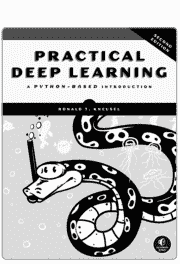 | 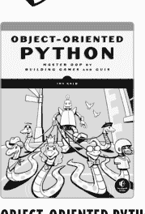 | 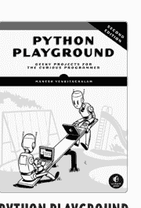 |
| **《实用深度学习，第2版》**<br>基于 Python 的入门指南<br>作者：罗纳德·T·克诺塞尔<br>584 页，69.99 美元<br>ISBN 978-1-7185-0420-2 | **《面向对象的 Python》**<br>通过构建游戏和图形用户界面掌握面向对象编程<br>作者：艾尔夫·卡尔布<br>416 页，44.99 美元<br>ISBN 978-1-7185-0206-2 | **《Python 游乐场，第2版》**<br>为好奇的程序员准备的极客项目<br>作者：马赫什·文基塔查拉姆<br>448 页，44.99 美元<br>ISBN 978-1-7185-0304-5 |
| 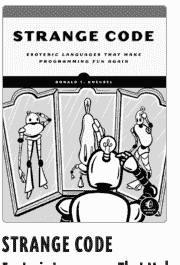 | 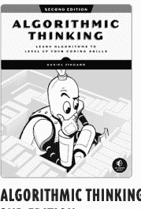 | 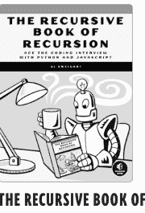 |
| **《奇异代码》**<br>让编程再次变得有趣的冷门语言<br>作者：罗纳德·T·克诺塞尔<br>496 页，49.99 美元<br>ISBN 978-1-7185-0240-6 | **《算法思维，第2版》**<br>学习算法以提升你的编程技能<br>作者：丹尼尔·津加罗<br>480 页，49.99 美元<br>ISBN 978-1-7185-0322-9 | **《递归之书》**<br>用 Python 和 JavaScript 搞定编码面试<br>作者：阿尔·斯威加特<br>328 页，39.99 美元<br>ISBN 978-1-7185-0202-4 |

电话：800.420.7240 或 415.863.9900

邮箱：SALES@NOSTARCH.COM

网站：WWW.NOSTARCH.COM

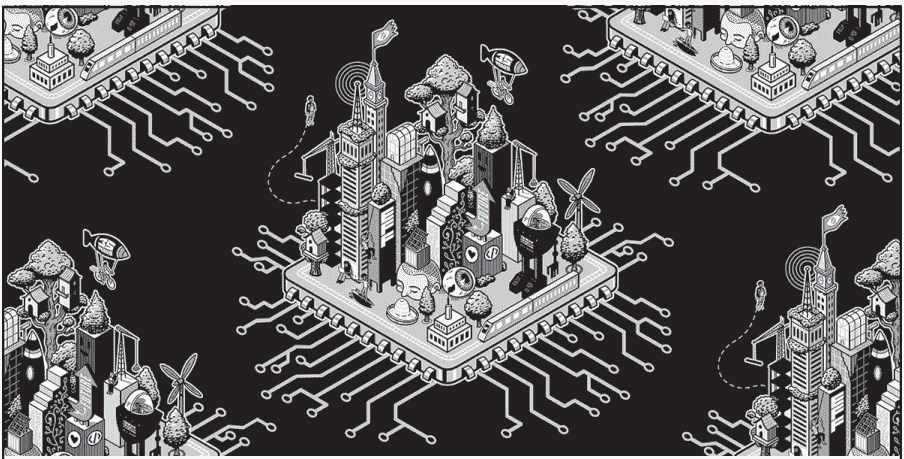

世界从未像现在这样如此依赖互联网来保持联系和获取信息。这使得电子前沿基金会的使命——确保技术为所有人支持自由、正义和创新——比以往任何时候都更加紧迫。

35 年多来，EFF 一直通过行动主义、法庭诉讼以及开发软件来捍卫你的权利，因为我们相信一个更美好的未来——在这个未来，你的设备真正属于你，你可以自由发言而不受监视，技术帮助你与关心的人建立联系。在你的帮助下，我们可以共同实现这个更光明世界的愿景。


了解更多信息并加入 EFF：[EFF.ORG/NOSTARCH](https://eff.org/nostarch)


# 你已经会写 Python 了。现在来掌握让它运作的计算机科学。

如果你已经编程一段时间，你可能发现自己想知道代码背后的更深层原理。编程语言是如何实现的？解释器到底做了什么？微处理器在基本层面是如何执行指令的？机器学习算法是如何做出决策的？

这些项目不是关于构建工具——它们是结构化的课程，使用代码来揭示计算机的工作原理。每章都以现实世界的背景、深思熟虑的扩展和练习结束，以加深你的理解。

*《从零开始的计算机科学》* 面向有经验的 Python 程序员，他们希望填补这些知识空白——不是通过抽象的讲座，而是通过精心设计的项目，将核心计算机科学概念生动地呈现出来。理解这些基本构建块将使你成为一个更全面、更高效的程序员。

本书由计算机科学教授、广受欢迎的《经典计算机科学问题》系列作者大卫·科佩克撰写，这不是一本初学者的书，也不是一本理论厚重的学术著作。这是一本实用的、代码驱动的计算机科学核心思想和机制入门书——为那些想要超越语法的程序员而写。

每章都呈现一个专注的、动手实践的项目，教授计算机科学的一个基本思想：

如果你一直在写 Python，并准备好探索计算的基础，这本书将引导你到达那里——清晰、深入且有目的地。

- **解释器：** 通过编写一个 BASIC 解释器来理解语法、解析和求值。
- **模拟器：** 通过从头构建一个 NES 模拟器来学习计算机体系结构。
- **图形：** 通过计算机图形项目探索图像处理和算法艺术。
- **机器学习：** 通过实现一个简单、可读的 KNN 模型来揭开分类的神秘面纱。

## 关于作者

大卫·科佩克是阿尔布莱特学院的计算机科学副教授。他是五本编程书籍的作者，包括《经典计算机科学问题》系列，并曾担任初创公司的 iOS 开发者数年。除了教学工作，大卫还是一位热情的播客主播和独立应用开发者，拥有达特茅斯学院的计算机科学硕士学位和 Quantic 的 EMBA 学位。