## 在 Google COLAB 中概念化 Python

Poornima G. Naik 博士
Girish R. Naik 博士
M. B. Patil 先生

© 版权所有 2021 作者

保留所有权利。未经作者事先书面同意，不得以任何形式或任何方式（电子或机械，包括影印、录制或任何信息存储或检索系统）复制或传播本书的任何部分。

本书中表达的观点/内容仅为作者个人观点，不代表 Shashwat Publication 的观点/立场/思想。对于因使用本书中任何信息（无论是个人还是其他信息，直接或间接）而对人员或财产造成的任何伤害、损害或经济损失，出版商不承担任何责任或义务。尽管已尽一切努力确保本书信息的可靠性和准确性，但对于因使用、误用或滥用本文材料中包含的任何方法、策略、指令或想法而产生的所有责任（无论是疏忽还是其他），均由读者自行承担。非出版商持有的任何版权均归其各自作者所有。本书中的所有信息均为概括性信息，仅以“原样”提供，不作任何形式的明示或暗示保证或担保。

本书中提及的所有商标和品牌仅用于说明目的，属于其各自所有者的财产，与本出版物无任何关联。未经许可使用商标并不授权其与本书的关联或赞助。

ISBN: 978-93-93557-43-8
定价: 250.00
出版年份 2021

出版与印刷:
**Shashwat Publication**
办公地址: Ram das Nagar,
Bilaspur, Chhattisgarh – 495001
电话: +91 9993608164 +91 9993603865
邮箱: contact.shashwatpublication@gmail.com
网站: www.shashwatpublication.com
印度印刷

## 致谢

本书的编写得到了许多人的帮助。我们向已故的 A.D. Shinde 教授致以诚挚的谢意，他是创始人兼执行董事，也是我们整个职业生涯中持续不断的灵感来源。他的支持确实是我们前进的动力。同时，我们要感谢 Kolhapur CSIBER 的尊敬的秘书 R.A. Shinde 博士，感谢他全心全意的支持和持续的鼓励。我们感谢 Kolhapur CSIBER 的主任 C.S. Dalvi 博士提供的宝贵指导。我们借此机会感谢 Kolhapur CSIBER 的前主任兼理事成员 V.M. Hilage 博士、主席 Bharat Patil 先生、副主席 Sunil Kulkarni 先生和秘书 Deepak Chougule 先生，感谢他们对本书事宜表现出的浓厚兴趣，并为本书的及时完成提供了所有支持设施。最后但同样重要的是，我们要感谢 Kolhapur CSIBER 计算机研究系和 Kolhapur KIT 工程学院生产工程系的所有教职员工和非教学人员，他们直接或间接地为本书做出了贡献。

**Poornima G. Naik 博士**
**Girish R. Naik 博士**
**M.B.Patil 先生**

## 前言

我们非常荣幸地推出名为‘*在 Google COLAB 中概念化 Python*’的这本书。本书的目标是向您介绍该主题，并让您开始使用 Python 进行应用开发的旅程。关于 Python，有许多书籍、网站、在线课程、教程等。本书的不同之处在于，它没有提供冗长的教程来介绍 Python 的某个特定方面，而是以简单有效的方式提供学习 Python 的实用输入。本书提供了对 Python 语言以及为使其安全、简洁和健壮而添加的新构造的直接了解。它旨在提供关于 Python 的全面材料。

**本书的组织结构：**
本书可作为研究生的教材和任何计算机专业毕业生的参考书。它还将为希望开始使用 Python 从事机器学习职业的计算机专业人士提供便捷的参考。本书精确地组织为十二章。每一章都在多个已实现概念的帮助下精心编写。我们付出了专门的努力，以确保本书中讨论的每个 Python 概念都通过相关命令进行解释，并包含了输出的屏幕截图。**第 1 章** 重点介绍 Google COLAB 提供的开发环境。**第 2 至 4 章** 涵盖 Python 语言基础，重点介绍控制和迭代语句、运算符及其在基本程序中的应用。Python 采用混合编程范式，兼具过程式、面向对象和函数式。所有编程语言的最佳部分都集中在一个平台上。**第 5 章** 重点介绍 Python 中的函数，特别强调 Lambda 函数。**第 6 章和第 7 章** 深入介绍了高级 Python 编程概念，如迭代器、闭包、装饰器和生成器。良好且深入的异常处理知识有助于编写可靠且健壮的代码。为了满足这一需求，**第 8 章** 揭示了 Python 中异常处理的显著特点。**第 9 章** 涵盖了通过文件处理实现的数据持久化。由于正则表达式在模式匹配中的广泛应用，**第 10 章** 完全致力于理解 Python 中的正则表达式。**第 11 章** 总结了在执行 Python 程序时可能出现的不同类型的常见错误。最后的 **第 12 章** 致力于在 Python 中实现面向对象的概念。基于面向对象概念的案例研究在 **附录 A** 中进行了深入讨论和实现。
本书的部分内容源自不同来源，这些来源列在末尾的‘*参考文献*’部分。

**Poornima G. Naik 博士**
**Girish R. Naik 博士**
**M.B.Patil 先生**

## 目录

| 章节 | 页码 |
| :--- | :--- |
| 1. Google COLAB 简介 | 1 |
| 2. Python 语言基础实验作业 | 33 |
| 3. Python 运算符和控制语句实验作业 | 102 |
| 4. 基本程序实验作业 | 117 |
| 5. Python 函数实验作业 | 130 |
| 6. Python 高级概念实验作业 - I（涵盖迭代器、闭包、装饰器和生成器） | 142 |
| 7. Python 高级概念实验作业 - II | 157 |
| 8. Python 异常处理实验作业 | 170 |
| 9. Python 文件处理实验作业 | 204 |
| 10. Python 正则表达式实验作业 | 228 |
| 11. Python 语言基础和错误处理实验作业 | 251 |
| 12. Python 面向对象编程实验作业 | 257 |
| 参考文献 | 303 |
| 附录 A - 面向对象编程案例研究 | 304 |

# 第 1 章

## Google COLAB 简介

Colaboratory，简称‘*Colab*’，是 Google Research 的产品。Colab 允许任何人通过浏览器编写和执行任意 Python 代码，特别适合机器学习、数据分析和教育。

如果您正在探索机器学习，但在海量数据集上进行模拟时遇到困难，或者您是渴望额外计算能力的机器学习专家，Google Colab 是您的完美解决方案。Google Colab 或‘*the Colaboratory*’是 Google 提供的免费云服务，旨在鼓励机器学习和人工智能研究，而学习和成功的障碍通常是需要巨大的计算能力。

如果您想创建机器学习模型，但没有能够承担工作负载的计算机，Google Colab 就是适合您的平台。即使您有 GPU 或一台好的计算机，使用 anaconda 创建本地环境、安装包和解决安装问题也是一件麻烦事。

Colaboratory 是 Google 提供的免费 Jupyter 笔记本环境，您可以使用免费的 GPU 和 TPU，这可以解决所有这些问题。它包含了数据分析所需的几乎所有模块。这些工具包括但不限于 Numpy、Scipy、Pandas 等。甚至深度学习框架，如 Tensorflow、Keras 和 Pytorch 也包含在内。

## COLAB 的优势

Colab 是一个完全在云端运行的免费 Jupyter 笔记本环境。
除了易于使用外，Colab 在配置上相当灵活，并为您完成了大部分繁重的工作。它不需要设置。

- 支持 Python 2.7 和 Python 3.6

## 在 Google COLAB 中理解 Python

- 免费 GPU 加速
- 预装库：所有主要的 Python 库，如 TensorFlow、Scikit-learn、Matplotlib 等，均已预装并可直接导入。
- 构建于 Jupyter Notebook 之上
- 协作功能（像 Google Docs 一样与团队协作）：Google Colab 允许开发者相互使用和共享 Jupyter notebook，无需下载、安装或运行除浏览器以外的任何东西。笔记本可以在团队成员之间共享。
- 支持 bash 命令
- Google Colab 笔记本存储在云端硬盘中

## COLAB 为你提供什么？

作为程序员，你可以使用 Google Colab 执行以下操作。

- 用 Python 编写和执行代码
- 记录你的代码，支持数学方程式
- 创建/上传/共享笔记本
- 从 Google Drive 导入/保存笔记本
- 从 GitHub 导入/发布笔记本
- 导入外部数据集，例如来自 Kaggle
- 集成 PyTorch、TensorFlow、Keras、OpenCV
- 免费的云服务，提供免费 GPU

## COLAB 入门

要开始使用 Colab，你首先需要登录你的 Google 帐户，然后访问此链接 [https://colab.research.google.com](https://colab.research.google.com)。

由于 Colab 隐式使用 Google Drive 存储你的笔记本，请确保在继续操作之前已登录你的 Google Drive 帐户。

## 在 Google COLAB 中理解 Python


## 什么是 Jupyter Notebook

Jupyter Notebook 是一个开源的 Web 应用程序，允许你创建和共享包含实时代码、方程式、可视化和叙述性文本的文档。用途包括：数据清理和转换、数值模拟、统计建模、数据可视化、机器学习等等。

## 打开 Jupyter Notebook：

打开网站后，你将看到一个包含以下选项卡的弹出窗口 –


## 在 Google COLAB 中理解 Python

打开网站后，你将看到一个包含以下选项卡的弹出窗口 –

> **示例：** 包含多个各种示例的 Jupyter notebook。
> **最近：** 你最近使用过的 Jupyter notebook。
> **GOOGLE DRIVE：** 你 Google 云端硬盘中的 Jupyter notebook。
> **GITHUB：** 你可以从 GitHub 添加 Jupyter notebook，但首先需要将 Colab 与 GitHub 连接。
> **上传：** 从本地目录上传。

打开网站后，你将看到一个包含以下选项卡的弹出窗口 –
或者，你可以通过点击右下角的“新建 Python3 Notebook”或“新建 Python2 Notebook”来*创建一个新的 Jupyter notebook*。


创建新笔记本时，它将创建一个名为 Untitled0.ipynb 的 Jupyter notebook，并将其保存到你的 Google 云端硬盘中名为“**Colab Notebooks**”的文件夹中。
你可以点击文件名并按如下所示进行更改。文件的扩展名是 **.ipynb**。


## 在 Google COLAB 中理解 Python

## 输入代码

现在你将在代码窗口中输入一个简单的 Python 代码并执行它。
在代码窗口中输入以下两条 Python 语句 –
*import time*
*print(time.ctime())*

## 执行代码

要执行代码，请点击代码窗口左侧的箭头。

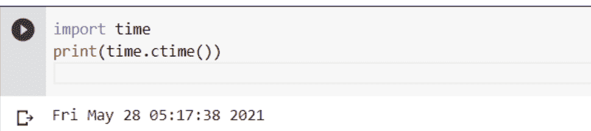

## 清除输出

你可以随时通过点击输出显示左侧的图标来清除输出。

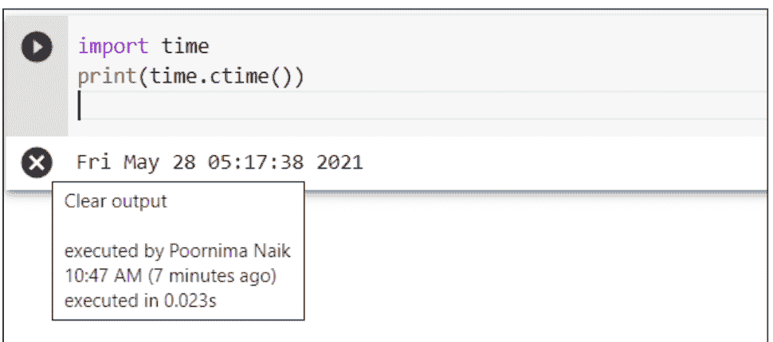

## 添加新单元格

要向笔记本添加更多代码，请选择以下**菜单**选项 –

## 在 Google COLAB 中理解 Python

**插入 / 代码单元格**

或者，只需将鼠标悬停在代码单元格的底部中心。当“*代码*”和“*文本*”按钮出现时，点击“*代码*”以添加新单元格。如下图所示 –

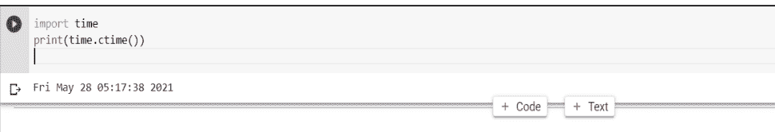

## 更改运行时环境：

点击“*运行时*”下拉菜单。选择“*更改运行时类型*”。从“*运行时类型*”下拉菜单中选择 python2 或 3。

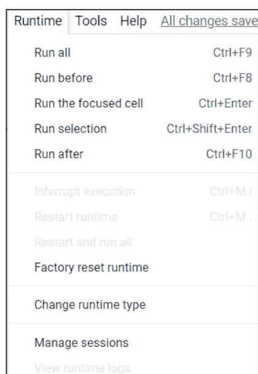

## 在 Google COLAB 中理解 Python

## 什么是 GPU？

图形处理单元，一种专门设计用于加速图形渲染的处理器。**GPU** 可以同时处理大量数据，使其在机器学习、视频编辑和游戏应用中非常有用。选择 *'更改运行时类型'*。Colab 提供 *Tesla K80 GPU*。


## 验证 GPU

在单元格中输入以下代码并执行。

```
import tensorflow as tf
tf.test.gpu_device_name()
```

- 如果 gpu 已连接，它将输出以下内容 –
  
  '/device:GPU:0'
  
- 否则，它将输出以下内容

## 在 Google COLAB 中理解 Python

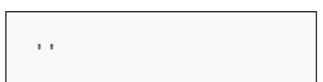

## 什么是 TPU？

**TPU** 是 Google 开发的张量处理单元，用于加速 Tensorflow 图上的操作。每个 **TPU** 在单个板卡上集成了高达 180 teraflops 的浮点性能和 64 GB 的高带宽内存。

## 验证 TPU

在单元格中输入以下代码并执行。

```
import os
if 'COLAB_TPU_ADDR' not in os.environ:
    print('Not connected to TPU')
else:
    print("Connected to TPU")
```

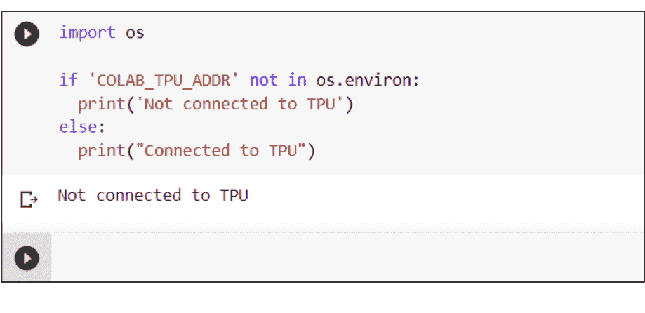

## 验证 TPU

选择选项 *运行时* → *更改运行时类型*，并从“*硬件选择器*”下拉列表中选择“*TPU*”，然后重新执行程序。

## 在 Google COLAB 中理解 Python


## 验证 TPU

显示以下输出。

```
[1] import os

if 'COLAB_TPU_ADDR' not in os.environ:
    print('Not connected to TPU')
else:
    print("Connected to TPU")

Connected to TPU
```

## 安装 Python 包 –

你可以使用 `pip` 安装任何包。例如：
要安装包 `pandas`，请输入以下命令：
`pip install pandas`

## 在 Google COLAB 中理解 Python

显示以下输出：

```
[2] pip install pandas

Requirement already satisfied: pandas in /usr/local/lib/python3.7/dist-packages (1.1.5)
Requirement already satisfied: pytz>=2017.2 in /usr/local/lib/python3.7/dist-packages (from pandas) (2018.9)
Requirement already satisfied: numpy>=1.15.4 in /usr/local/lib/python3.7/dist-packages (from pandas) (1.19.5)
Requirement already satisfied: python-dateutil>=2.7.3 in /usr/local/lib/python3.7/dist-packages (from pandas) (2.8.1)
Requirement already satisfied: six>=1.5 in /usr/local/lib/python3.7/dist-packages (from python-dateutil>=2.7.3->pandas) (1.15.0)
```

## 在 COLAB 中上传文件

要上传文件，请输入以下代码：

```
from google.colab import files
uploaded = files.upload()
```

“选择文件”按钮出现，如下所示：


选择文件后，文件将上传到云端硬盘，并生成以下输出：

```
[3] from google.colab import files
    uploaded = files.upload()

Choose Files admission_sheet.xlsx
• admission_sheet.xlsx(application/vnd.openxmlformats-officedocument.spreadsheetml.sheet) - 10689 bytes, last modified: 7/29/2020 - 100% done
Saving admission_sheet.xlsx to admission_sheet.xlsx
```

## 挂载云端硬盘

- Unix 系统具有单一的目录树。所有可访问的存储必须在此单一目录树中有一个关联的位置。这与 Windows 不同，在 Windows 中（使用最常见的文件路径语法）每个存储组件（驱动器）都有一个目录树。
- 挂载是将存储设备关联到目录树中特定位置的行为。例如，当系统启动时，一个特定的存储设备（通常称为主分区）与目录树的根目录关联，即该存储设备挂载在 /（根目录）上。

- 假设你现在想访问 CD-ROM 上的文件。你必须将 CD-ROM 挂载到目录树中的一个位置（当你插入 CD 时，这可能会自动完成）。假设 CD-ROM 设备是 /dev/cdrom，选择的挂载点是 /media/cdrom。相应的命令是

```
mount /dev/cdrom /media/cdrom
```

- 运行该命令后，CD-ROM 上位置为 /dir/file 的文件现在可以在你的系统上作为 /media/cdrom/dir/file 访问。使用完 CD 后，运行命令

```
umount /dev/cdrom or umount /media/cdrom
```

（两者都有效；典型的桌面环境会在你点击“弹出”或“安全移除”按钮时执行此操作）。

- 挂载适用于任何可以作为文件访问的内容，而不仅仅是实际的存储设备。例如，所有 Linux 系统都在 /proc 下挂载了一个特殊的文件系统。该文件系统（称为 proc）没有底层存储：其中的文件提供有关运行进程和各种其他系统信息；这些信息直接由内核从其内存数据结构中提供。

## 上传文件：

上传的文件可以保存在数据框中，如下所示：

```
import io
df2 = pd.read_csv(io.BytesIO(uploaded['file_name.csv']))
```

## 通过挂载 Google Drive 上传文件：

要将你的云端硬盘挂载到‘mntDrive’文件夹中，请执行以下操作 –

```
from google.colab import drive
drive.mount('/mntDrive')
```

## 在 Google COLAB 中概念化 Python

```python
from google.colab import drive
drive.mount('/mntDrive')

Drive already mounted at /mntDrive; to attempt to forcibly remount, call drive.mount("/mntDrive", force_remount=True).
```

## 上传文件

然后你会看到一个链接，点击该链接，接着允许访问，复制弹出的代码，将其粘贴到“Enter your authorization code:”处。

现在，要查看 Google 云端硬盘中的所有数据，你需要执行以下命令：

**! ls "/mntDrive/My Drive"**

可视化挂载云端硬盘


## 运行单元格

确保运行时已连接。笔记本右上角会显示一个绿色对勾和“*已连接*”。

在“*运行时*”中有各种运行时选项。

或者

要运行当前单元格，请按 SHIFT + ENTER。


## 运行单元格

```bash
!cat /proc/cpuinfo
!cat /proc/meminfo
```

```bash
!cat /proc/cpuinfo
!cat /proc/meminfo

processor		: 0
vendor_id		: GenuineIntel
cpu family		: 6
model			: 85
model name		: Intel(R) Xeon(R) CPU @ 2.00GHz
stepping		: 3
microcode		: 0x1
cpu MHz			: 2000.174
cache size		: 39424 KB
physical id		: 0
siblings		: 2
core id			: 0
cpu cores		: 1
apicid			: 0
initial apicid	: 0
fpu				: yes
fpu_exception	: yes
cpuid level		: 13
wp				: yes
flags			: fpu vme de pse tsc msr pae mce cx8 apic sep mtrr pge mca cmov pat ps
bugs			: cpu_meltdown spectre_v1 spectre_v2 spec_store_bypass l1tf mds swapgs
bogomips		: 4000.34
clflush size	: 64
cache_alignment: 64
address sizes	: 46 bits physical, 48 bits virtual
power management:
```

## 保存到 Google 云端硬盘

Colab 允许你将工作保存到 Google 云端硬盘。要保存你的笔记本，请选择以下菜单选项 –

**文件 / 在云端硬盘中保存副本...**

你将看到以下屏幕 –

此操作将创建笔记本的副本并将其保存到你的云端硬盘。之后，你可以根据自己的选择重命名该副本。

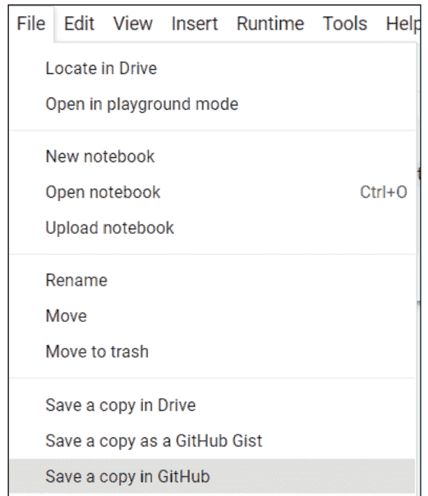

你也可以通过选择以下菜单选项将工作保存到你的 GitHub 仓库 –

**文件 / 在 GitHub 中保存副本...**

菜单选择如下图所示，供你快速参考 –

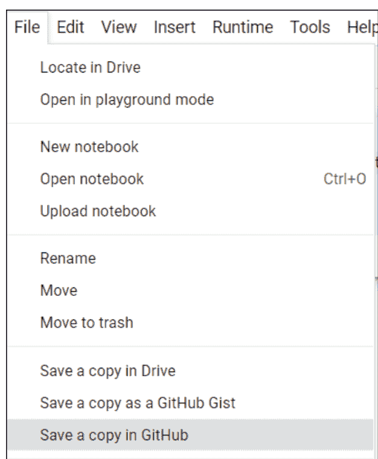

你必须等到看到 GitHub 的登录屏幕。现在，输入你的凭据。如果你没有仓库，请创建一个新仓库并保存你的项目。

## 为你的代码添加文档

- 由于代码单元格支持完整的 Python 语法，你可以在代码窗口中使用 Python **注释**来描述你的代码。然而，很多时候你需要的不仅仅是基于简单文本的注释来说明机器学习算法。机器学习大量使用数学，为了向读者解释这些术语和方程，你需要一个支持 *LaTeX - 一种用于数学表示的语言* 的编辑器。Colab 提供了 **文本单元格** 来实现此目的。
- 下面的截图显示了一个包含机器学习中常用的一些数学方程式的文本单元格 –

文本单元格使用 **markdown** - 一种简单的标记语言进行格式化。现在让我们看看如何向笔记本添加文本单元格，并添加一些包含数学方程式的文本。

## Markdown 示例

让我们看几个标记语言语法的示例，以展示其功能。
在文本单元格中输入以下文本。

*这是 **粗体**。*
*这是 *斜体*。*
*这是 ~删除线~。*

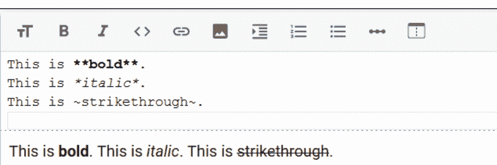

## 数学方程式

向你的笔记本添加一个文本单元格，并在文本窗口中输入以下 markdown 语法 –
$\sqrt{3x-1}+(1+x)^2$
你将看到 markdown 代码在文本单元格的右侧面板中立即渲染。如下图所示 –

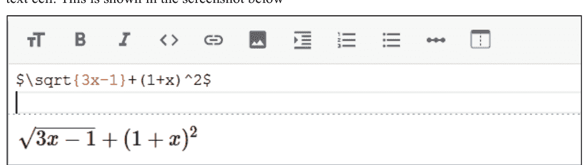

按 **Enter** 键，markdown 代码将从文本单元格中消失，只显示渲染后的输出。

让我们尝试另一个更复杂的方程式，如下所示 –
$e^x = \sum_{i = 0}^{\infty} \frac{1}{i!}x^i$

渲染后的输出如下所示，供你快速参考。

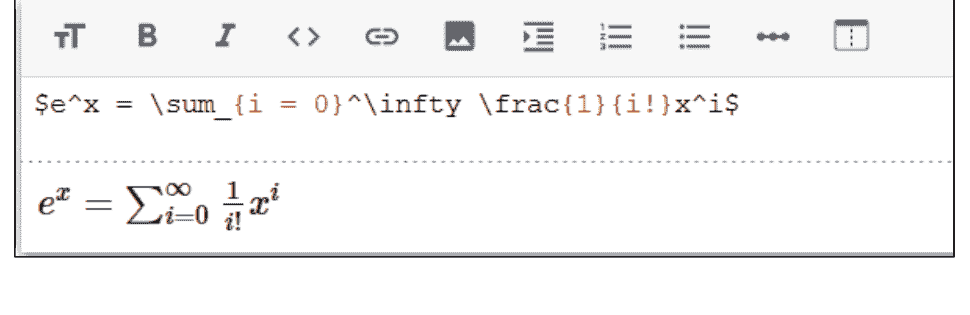

约束条件为

- $3x_1 + 6x_2 + x_3 \leq 28$
- $7x_1 + 3x_2 + 2x_3 \leq 37$
- $4x_1 + 5x_2 + 2x_3 \leq 19$
- $x_1, x_2, x_3 \geq 0$

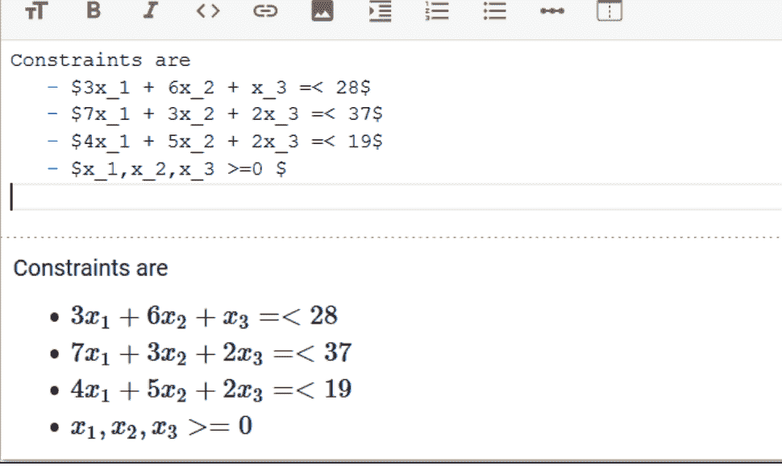

## 什么是 LaTeX？

LaTeX 是一个文档准备系统和文档标记语言。LaTeX 不是某个特定编辑程序的名称，而是指在 LaTeX 文档中使用的编码或标记约定。

| LaTeX 数学结构 | | |
|---|---|---|
| $\frac{abc}{xyz}$ \frac{abc}{xyz} | $\overline{abc}$ \overline{abc} | $\overrightarrow{abc}$ \overrightarrow{abc} |
| $f'$ f' | $\underline{abc}$ \underline{abc} | $\overleftarrow{abc}$ \overleftarrow{abc} |
| $\sqrt{abc}$ \sqrt{abc} | $\widehat{abc}$ \widehat{abc} | $\overbrace{abc}$ \overbrace{abc} |
| $\sqrt[n]{abc}$ \sqrt[n]{abc} | $\widetilde{abc}$ \widetilde{abc} | $\underbrace{abc}$ \underbrace{abc} |

## Google Colab - 共享笔记本

- 要与其它共同开发者共享你创建的笔记本，你可以共享你在 Google 云端硬盘中制作的副本。
- 要向普通受众发布笔记本，你可以从你的 GitHub 仓库共享它。

还有一种共享工作的方式，那就是点击 Colab 笔记本右上角的 **共享** 链接。这将打开如下所示的共享框


你可以输入你希望共享当前文档的人的电子邮件 ID。你可以通过从上图所示的三个选项中选择来设置访问权限。点击“获取可共享链接”选项以获取笔记本的 URL。你会发现以下共享选项 –

- 指定的人员组
- 你组织中的同事
- 任何拥有链接的人
- 网络上的所有公众

现在，你知道如何创建/执行/保存/共享笔记本了。在代码单元格中，我们到目前为止使用的是 Python。

## 获取远程数据

让我们看另一个从远程服务器加载数据集的示例。在你的代码单元格中输入以下命令 –

```bash
!wget http://mlr.cs.umass.edu/ml/machine-learning-databases/adult/adult.data -P "/content/drive/My Drive/app"
```

## 克隆 Git 仓库

你可以使用 **git** 命令将整个 GitHub 仓库克隆到 Colab 中。例如，要克隆 keras 教程，请在代码单元格中输入以下命令 –

```bash
!git clone https://github.com/wxs/keras-mnist-tutorial.git
```

## 什么是 Git？

*Git* 是一个免费且开源的分布式版本控制系统，旨在以速度和效率处理从小型到非常大型的项目。

## Google Colab - 图形输出

Colab 还支持丰富的输出，例如图表。在代码单元格中输入以下代码。

```python
import numpy as np
from matplotlib import pyplot as plt

y = np.random.randn(100)
x = [x for x in range(len(y))]

plt.plot(x, y, '-')
plt.fill_between(x, y, 200, where = (y > 195), facecolor='g', alpha=0.6)

plt.title("Sample Plot")
plt.show()
```

```python
import numpy as np
from matplotlib import pyplot as plt

y = np.random.randn(100)
x = [x for x in range(len(y))]

plt.plot(x, y, '-')
plt.fill_between(x, y, 200, where = (y > 195), facecolor='g', alpha=0.6)

plt.title("Sample Plot")
plt.show()
```

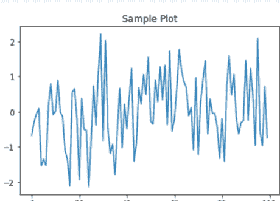

## 代码编辑帮助

当今的开发者严重依赖于对语言和库语法的上下文敏感帮助。这就是为什么 IDE 被广泛使用。Colab 笔记本编辑器提供了此功能。

## 在 Google COLAB 中概念化 Python

**步骤 1** – 打开一个新的笔记本，并在代码单元格中输入以下代码 –
```python
import numpy
```

**步骤 2** – 通过点击代码单元格左侧面板上的运行图标来运行代码。添加另一个代码单元格，并输入以下代码 –
```python
numpy.
```

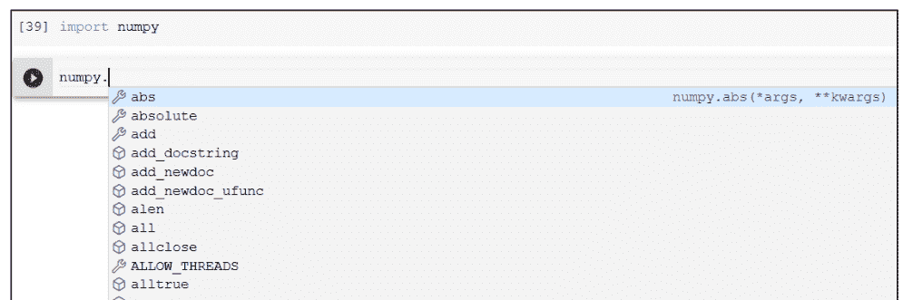

注意：如果你没有运行包含 `import` 的单元格，则不会显示上下文帮助。

## 函数文档

Colab 会以**上下文敏感帮助**的形式为你提供任何**函数**或**类**的文档。

在你的代码窗口中输入以下代码 –
```python
import numpy as np
```
在一个单元格中运行它，然后在另一个单元格中输入以下代码。
```python
np.add(
```
现在，按下 **TAB** 键，你将在弹出窗口中看到关于 **cos** 的文档，如这里的截图所示。注意，你需要在按下 TAB 键之前输入**左括号**。

## 在 Google COLAB 中概念化 Python

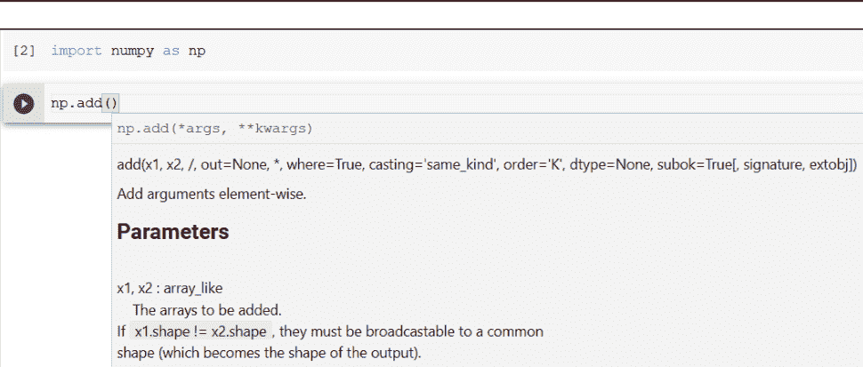

## Google Colab – Magics

Magics 是一组系统命令，提供了一个小型的扩展命令语言。
Magics 有两种类型 –

- 行魔法
- 单元格魔法

顾名思义，行魔法由单行命令组成，而单元格魔法则覆盖整个代码单元格的内容。
对于行魔法，命令前需要加上一个 *百分号字符 (%)*，而对于单元格魔法，则需要加上 *两个百分号字符 (%%)*。
让我们看一些两者的例子来说明这些。

## 行魔法

在你的代码单元格中输入以下代码 –

```
%ldir
```

上述命令显示当前工作目录的内容。

```
%ldir

drwx------ 5 root 4096 May 28 16:25 drive/
drwxr-xr-x 1 root 4096 May  6 13:44 sample_data/
```

```
%history
```

这会显示你之前执行过的所有命令的完整历史记录。

```
%history

import numpy as np
import numpy as np
%ldir
%history
```

## 单元格魔法

在你的代码单元格中输入以下代码 –

```
%%html
<marquee style='width: 50%; color: Green;'>Welcome to CSIBER!</marquee>
```

现在，如果你运行代码，你将在屏幕上看到滚动的欢迎消息，如这里所示 –

```
%%html
<marquee style='width: 50%; color: Green;'>Welcome to CSIBER!</marquee>

Welcome to CSIBER!
```

要获取支持的魔法的完整列表，请执行以下命令 –

```
%lsmagic
```

```
%lsmagic

Available line magics:
%alias %alias_magic %autocall %automagic %autosave %bookmark %cat %cd %clear %colors %config %connect_info %cp %debug

Available cell magics:
%%! %%HTML %%SVG %%bash %%bigquery %%capture %%debug %%file %%html %%javascript %%js %%latex %%perl %%prun %%pypy

Automagic is ON, % prefix IS NOT needed for line magics.
```

## 在 Google COLAB 中概念化 Python

## 添加表单

用于接受用户输入。

点击右上角垂直的“*选项*”菜单。


将显示以下菜单：

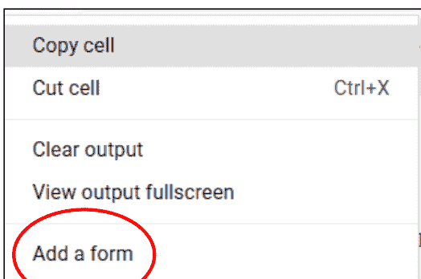

现在，选择“*添加表单*”选项。它会将表单添加到你的代码单元格中，并带有一个默认标题，如这里的截图所示 –

```
#@title Default title text
```

要更改表单的标题，请点击“*设置*”按钮（右侧的铅笔图标）。它将弹出一个设置屏幕，如这里所示：

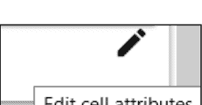

“*编辑表单属性*”对话框将出现，如下所示：

## 在 Google COLAB 中概念化 Python

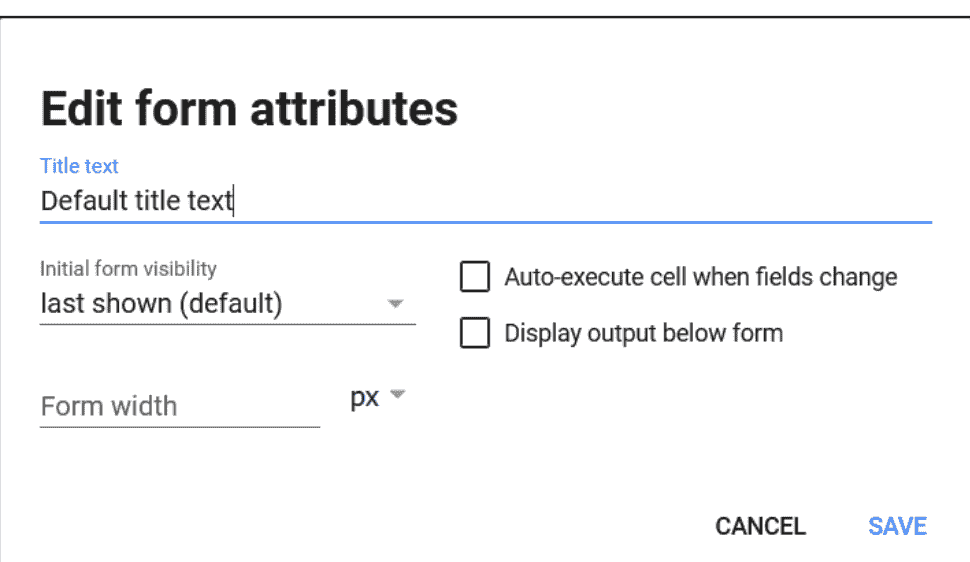

## 添加表单字段

要添加表单字段，请点击代码单元格中的“选项”菜单，然后点击“表单”以显示子菜单。屏幕将如下所示 –

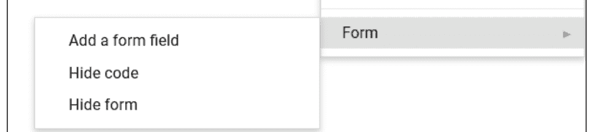

选择“添加表单字段”菜单选项。将弹出一个对话框，如这里所示 –

添加表单字段 –

## 在 Google COLAB 中概念化 Python

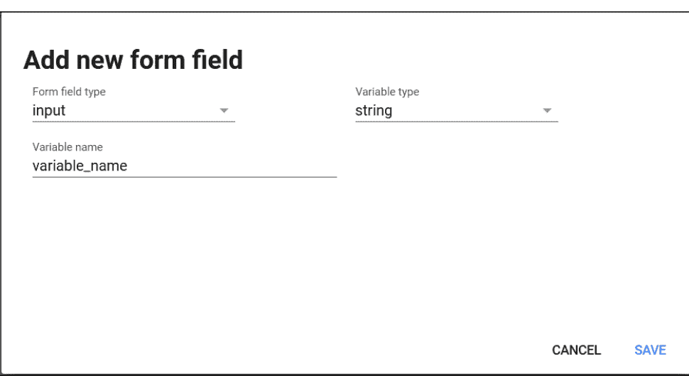

将 *表单字段类型* 保留为“*input*”。将“*变量名*”更改为“*num*”，并将“*变量类型*”设置为“*number*”。点击 **保存** 按钮以保存更改。

你的屏幕现在将如下所示，其中“*num*”变量已添加到代码中。

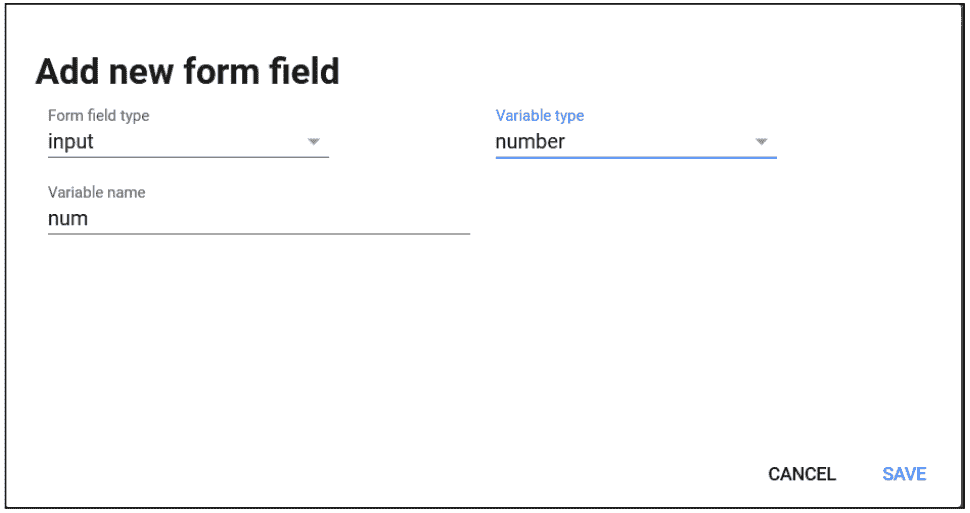

你的屏幕现在将如下所示，其中“*num*”变量已添加到代码中。

## 在 Google COLAB 中概念化 Python

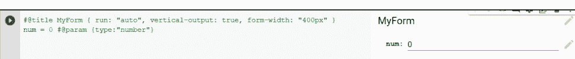

## 测试表单

在表单单元格下方添加一个新的代码单元格。使用下面给出的代码 –

```python
import time

print(time.ctime())

time.sleep(num)

print (time.ctime())
```

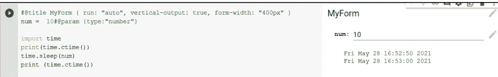

输出显示在表单控件下方。

如下所示编辑表单：

将变量类型更改为“string”，变量名更改为“name”。

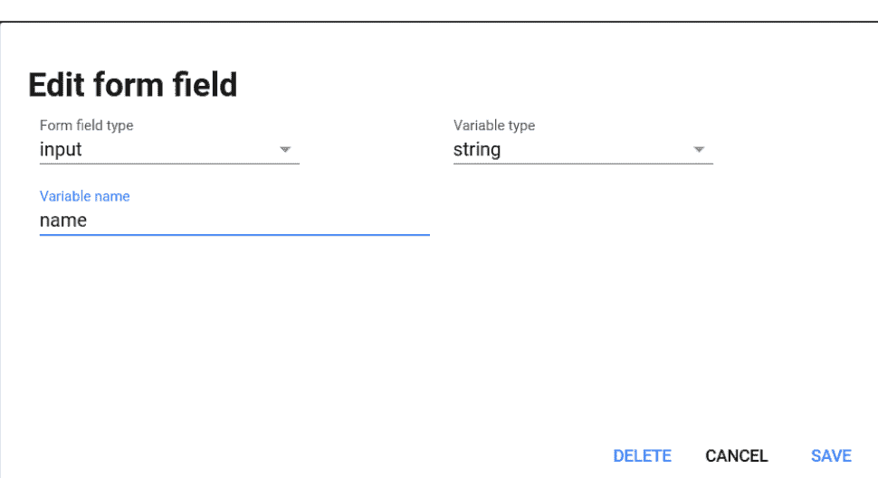

## 在 Google COLAB 中概念化 Python

如下所示编辑表单代码：

```python
print("Hello",name)
```

将显示以下输出：

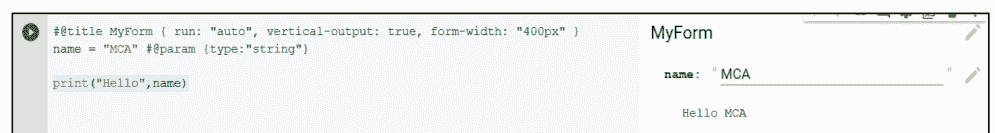

## 使用下拉列表

- 点击“*表单字段类型*”下拉菜单，并从显示的列表中选择“*dropdown*”。
- 将变量类型输入为“*string*”，变量名输入为“*course*”

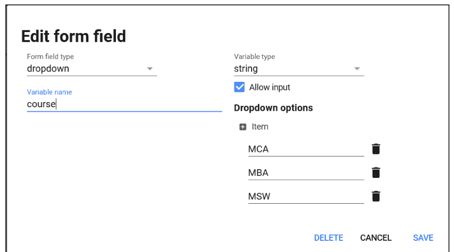

- 如果选中了“*允许输入*”复选框，那么如果列表中不存在相应的项目，用户将能够输入新项目。

## 向下拉列表添加项目

- 要向列表中添加新项目，请点击项目旁边的“+”图标，并在出现的文本框中输入项目的名称。

## 在 Google COLAB 中概念化 Python

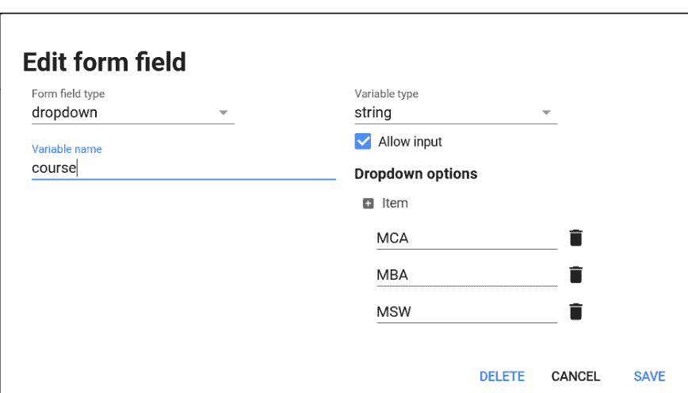

如下所示编辑表单代码：

```python
print("You Selected - ",course)
```

将显示以下输出：

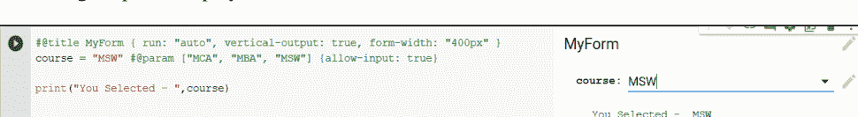

由于当从下拉列表中选择新项目时，选项 `Allow-execute cell when fields change` 被选中，单元格中的代码会自动执行，并且输出会刷新。

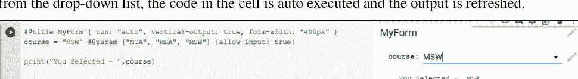

## 在 Google COLAB 中概念化 Python

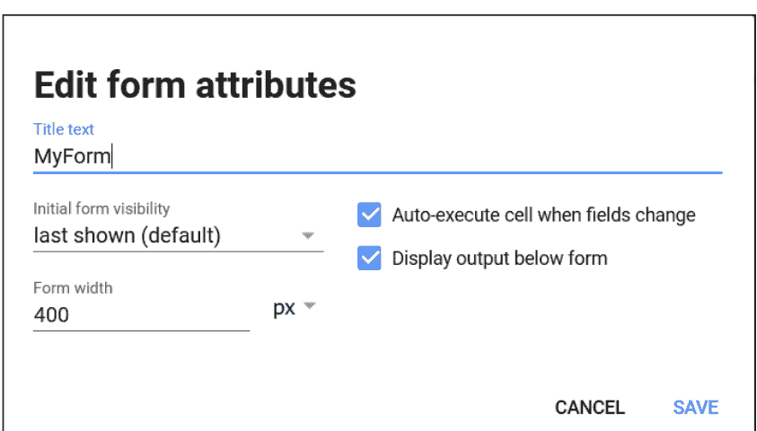

## 日期输入

Colab 表单允许你在代码中接受带有验证的日期。

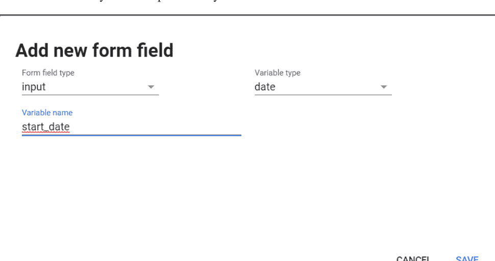

Colab 表单允许你在代码中接受带有验证的日期。使用以下代码在你的代码中输入日期。

## 在 Google COLAB 中概念化 Python

```python
#@title Default title text
start_date = "2021-05-29" #@param {type:"date"}
print(start_date)
```

表单屏幕如下所示。

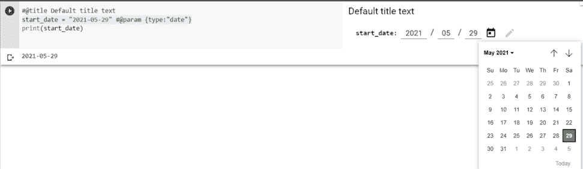

## 安装 ML 库

Colab 支持市场上大多数机器学习库。让我们快速概览一下如何在你的 Colab 笔记本中安装这些库。
要安装库，你可以使用以下任一选项 —

```
!pip install
或
!apt-get install
```

## Keras

Keras 用 Python 编写，运行在 TensorFlow、CNTK 或 Theano 之上。它支持神经网络应用程序的轻松快速原型设计。它支持卷积网络（CNN）和循环网络，以及它们的组合。它无缝支持 GPU。
要安装 Keras，请使用以下命令 –

```
!pip install -q keras
```

## PyTorch

PyTorch 非常适合开发深度学习应用程序。它是一个优化的张量库，并支持 GPU。要安装 PyTorch，请使用以下命令 –

```
!pip3 install torch torchvision
```

## 在 Google COLAB 中概念化 Python

## MxNet

Apache MxNet 是另一个灵活高效的深度学习库。要安装 MxNet，请执行以下命令 –

```
!apt install libnvrtc8.0
!pip install mxnet-cu80
```

## OpenCV

OpenCV 是一个开源计算机视觉库，用于开发机器学习应用程序。它拥有超过 2500 个优化算法，支持多种应用，如人脸识别、物体识别、跟踪移动物体、图像拼接等。Google、Yahoo、Microsoft、Intel、IBM、Sony、Honda、Toyota 等巨头都使用这个库。它非常适合开发实时视觉应用程序。要安装 OpenCV，请使用以下命令 –

```
!apt-get -qq install -y libsm6 libxext6 && pip install -q -U opencv-python
```

## XGBoost

XGBoost 是一个分布式梯度提升库，可在 Hadoop 等主要分布式环境中运行。它高效、灵活且可移植。它在梯度提升框架下实现了 ML 算法。要安装 XGBoost，请使用以下命令 –

```
!pip install -q xgboost==0.4a30
```

## GraphViz

Graphviz 是一个用于图形可视化的开源软件。它用于网络、生物信息学、数据库设计等领域的可视化，以及任何需要数据可视化界面的领域。要安装 GraphViz，请使用以下命令 –

```
!apt-get -qq install -y graphviz && pip install -q pydot
```

开发机器学习模型需要高处理能力。Colab 为你的笔记本提供免费的 GPU。

## 在 Google COLAB 中概念化 Python

## 第二章

Python 语言基础实验作业

难度 – 基础

## Python 变量

Python 变量区分大小写。在以下程序中，‘course’ 和 ‘Course’ 被视为两个不同的变量，如下所示：

```
course="MCA"
Course="MSc"
print(course)
print(Course)

MCA
MSc
```

## 检查变量类型

Python 是动态类型语言。变量的类型在运行时根据赋给它的值的类型来决定。在以下程序中，变量 ‘x’ 被初始化为值 10，因此 ‘x’ 的类型为 ‘int’。在后续语句中，‘x’ 的值被更改为 ‘CSIBER’，这使得 ‘x’ 的类型从 ‘int’ 变为 ‘str’，如下所示：

```
x=10
print(type(x))
x="CSIBER"
print(type(x))

<class 'int'>
<class 'str'>
```

## Python 中标识符的大小

Python 语言中未定义标识符的最大可能长度。它可以是任意长度。

## 确定 Python 中变量的大小

在 Python 中，`int` 是一个功能完整的对象，涉及额外的开销，用于存储引用计数、对象类型等。下图显示了 int 类和 int 类实例的大小。

```
import sys
print(sys.getsizeof(int))
print(sys.getsizeof(int()))

400
24
```

如下图所示，`int` 数据类型的大小每增加 2^30 倍就增加 4 字节，这解释了 `int` 数据类型可以存储大数值的原因。

```
import sys
print(sys.getsizeof(0))
print(sys.getsizeof(1))
print(sys.getsizeof(2**30-1))
print(sys.getsizeof(2**30))
print(sys.getsizeof(2**60-1))
print(sys.getsizeof(2**60))

24
28
28
32
32
36
```

## Python 中布尔值的存储方式

与 C 和 C++ 等编程语言类似，Python 使用数值 0 和 1 分别存储布尔值 ‘**False**’ 和 ‘**True**’。

```
print(bool(0))
print(bool(1))

False
True
```

因此，‘**True**’ 和 ‘**False**’ 值在 Python 中分别使用数值 1 和 0 存储。

## 变量初始化问题

Python 不会自动将变量初始化为默认值。尝试在未初始化的情况下使用变量将生成 ‘**NameError**’，如下所示：

```
print(institute)

NameError Traceback (most recent call last)
<ipython-input-6-4eac1f623e49> in <module>()
----> 1 print(institute)

NameError: name 'institute' is not defined

SEARCH STACK OVERFLOW
```

## 变量的数据类型 – type() 函数

Python 支持 type() 函数来确定变量的运行时实例。type() 函数接受一个参数，即要确定其类型的变量，如下所示：

```
x=10
print(type(x))

x=10.20
print(type(x))

x="CSIBER"
print(type(x))

<class 'int'>
<class 'float'>
<class 'str'>
```

## 检查变量的类型 – isinstance()

Python 支持一个函数 **isinstance()** 用于在运行时检查变量的实例，如下图所示。**isinstance()** 函数接受两个参数：

- 第一个参数是变量的名称，第二个参数是类

```
i=10
print(isinstance(i,int))
print(isinstance(i,str))

True
False
```

在上面的程序中，‘i’ 是类型 ‘int’ 的实例。因此，第一个 print 语句显示 ‘**True**’，第二个 print 语句显示 ‘**False**’。

## 隐式类型转换

Python 自动将较小的数据类型转换为较大的数据类型，即 ‘**int**’ 和 ‘**float**’ 值相加的结果是 ‘**float**’，如下所示：

```
x=10
y=10.20
z=x+y
print(z)
print(type(z))

20.2
<class 'float'>
```

## 单条语句中的多重赋值

Python 允许在单条语句中使用 ‘=’ 运算符初始化多个值。‘=’ 运算符是右结合的，即从右向左计算表达式。在以下程序中，常量 ‘1’ 被赋给变量 ‘c’，然后依次赋给 ‘a’ 和 ‘b’。

```
a=b=c=1
print(a)
print(b)
print(c)

1
1
1
```

在以下程序中，变量 ‘a’、‘b’ 和 ‘c’ 在单条语句中被初始化为字符串常量 ‘CSIBER’。

```
a=b=c="CSIBER"
print(a)
print(b)
print(c)

CSIBER
CSIBER
CSIBER
```

## 在 Python 中删除变量（NameError）

可以使用 ‘del’ 运算符删除对变量的引用。使用 ‘del’ 运算符的语法如下所示：

```
del <var_1>[, <var_2>, . . . <var_N>]
```

尝试在程序中稍后访问已删除的变量将生成 ‘NameError’，如下所示：

```
a=b=c="CSIBER"
del a,b
print(c)
print(a)

CSIBER
NameError                                 Traceback (most recent call last)
<ipython-input-5-8e185d6c1196> in <module>()
      2 del a,b
      3 print(c)
----> 4 print(a)

NameError: name 'a' is not defined

SEARCH STACK OVERFLOW
```

在上面的程序中，变量 ‘a’ 和 ‘b’ 被删除。尝试访问已删除的变量将生成 ‘NameError’，如上所示：

## 在字符串中使用转义字符

转义字符用于对字符串执行特定操作。例如，‘\n’ 字符用于在字符串末尾添加换行符。‘\t’ 用于在单词之间使用制表符空格，如下所示：

```
print("This is first line\nThis is second line")

This is first line
This is second line
```

```
print("Rollno\tName\tDivision")
Rollno Name Division
```

## 原始字符串

可以通过在字符串前添加字符 ‘r’ 来显示原始字符串。原始字符串显示转义字符而不进行任何解释，如下所示：

```
print(r"This is first line\nThis is second line")
This is first line\nThis is second line
```

```
print(r"Rollno\tName\tDivision")
Rollno\tName\tDivision
```

## 字符串重复运算符

* 运算符用于将字符串重复指定次数。在以下示例中，字符串 ‘CSIBER’ 重复 5 次。

```
print(5*"CSIBER ")
CSIBER CSIBER CSIBER CSIBER CSIBER
```

## 字符串索引

Python 允许使用正索引和负索引分别双向遍历字符串。对于长度为 ‘n’ 的字符串，两个方向的索引如下表所示：

| 0 | 1 | 2 | 3 | 4 | 5 | 6 | .. | n |
|---|---|---|---|---|---|---|----|---|
| -n | 1-n | 2-n | 3-n | 4-n | 5-n | 6-n | .. | -1 |

```
str1="SIBER"
for i in range(5):
    print(i,str1[i])
print("\n")
for i in range(-5,0,1):
    print(i,str1[i])
```

```
0 S
1 I
2 B
3 E
4 R

-5 S
-4 I
-3 B
-2 E
-1 R
```

在上面的示例中，使用正向和反向索引机制双向遍历字符串 ‘CSIBER’ 的不同字符。

## 字符串的边界检查

Python 对数组和字符串执行严格的边界检查。尝试访问超出限制的元素将生成 ‘IndexError’，如下所示：

```
str1="SIBER"
print(str1[5])

IndexError Traceback (most recent call last)
<ipython-input-27-b1e0a12b045f> in <module>()
      1 str1="SIBER"
----> 2 print(str1[5])

IndexError: string index out of range
```

## 一种特殊的数据类型 – None

‘None’ 用于定义空值。在 Python 中，变量在未初始化的情况下不能使用。使用未初始化的变量将生成 ‘NameError’，如下所示：

```
print(x)

NameError Traceback (most recent call last)
<ipython-input-5-fc17d851ef81> in <module>()
----> 1 print(x)

NameError: name 'x' is not defined
```

如果变量的值在声明时未知，则可以用 ‘None’ 关键字初始化。‘None’ 不同于零、False 或空字符串。‘None’ 是 ‘NoneType’ 类的实例，如下所示：

```
print(type(None))

<class 'NoneType'>
```

## 在 Google COLAB 中概念化 Python

```python
x = None
if x is None:
    print("x is not initialized")
else:
    print("x is initialized and has value ",x)

x=10
if x is None:
    print("x is not initialized")
else:
    print("x is initialized and has value ",x)
```

x is not initialized
x is initialized and has value  10

注意：如果一个函数没有返回任何值，那么它返回的是‘None’。在下面的程序中，f 是一个不返回任何值的函数。程序中的最后一条语句打印了函数 f() 返回的值，即‘None’。

```python
def f():
    print("No return value")
print(f())
```

No return value
None

```python
list1=[1,2,2,3,4,4,5]
set1=set(list1)
print(list1)
print(set1)
```

[1, 2, 2, 3, 4, 4, 5]
{1, 2, 3, 4, 5}

## Python 中的列表

列表是一种数据结构，它包含由逗号分隔的异构元素，这些元素被包含在一对方括号（[]）内。

列表的特性：

- 列表是可变的。
- 列表保持插入顺序。
- 列表是可迭代的。
- 列表是有序的。

## 列表操作

### 切片运算符

切片运算符用于从列表中选择多个连续的元素。要从列表‘list1’中检索索引位置‘i’到‘j’的元素，请使用以下语法：
*list1[ i : j+1]*

```python
l=[10, 20.30, "Python", 'c', 23]
l1=['Msc','CSIBER']
print(l[0])
print(l[1:3])
print(l[:2])
print(l[2:])
print(l*2)
print(l+l1)
```

10
[20.3, 'Python']
[10, 20.3]
['Python', 'c', 23]
[10, 20.3, 'Python', 'c', 23, 10, 20.3, 'Python', 'c', 23]
[10, 20.3, 'Python', 'c', 23, 'Msc', 'CSIBER']

### 负索引

要从列表‘list1’的右侧检索 m 个元素，请使用以下语法：
list1[ -m-1 : -1]

示例：

要从下面显示的‘l’中检索最后两个元素，

m=2

-m-1 = -2-1 = -3

list1[-3, -1]

```python
l=[10, 20.30, "Python", 'c', 23]
print(l[-3:-1])
```

['Python', 'c']

要从列表中检索最后四个元素，请使用以下语句：

l[-5 : -1]

```python
l=[10, 20.30, "Python", 'c', 23]
print(l[-5:-1])
```

[10, 20.3, 'Python', 'c']

```python
l=[10, 20.30, "Python", 'c', 23]
print(l[-1])
print(l[-3:-1])
print(l[-2:])
print(l[:-3])
```

23
['Python', 'c']
['c', 23]
[10, 20.3]

### 使用正索引和负索引检索元素

长度为 10 的列表的正索引和负索引位置如下图所示：

| 0 | 1 | 2 | 3 | 4 | 5 | 6 | 7 | 8 | 9 |
|---|---|---|---|---|---|---|---|---|---|
| -10 | -9 | -8 | -7 | -6 | -5 | -4 | -3 | -2 | -1 |

正索引和负索引之间的关系由下式给出：

l[n]=l[n-s]

其中 s 是列表的大小。

要使用正索引从列表‘list1’中检索索引位置‘i’到‘j’的元素，请使用以下语法：

**list1[ i : j+1]**

要使用负索引从列表‘list1’中检索索引位置‘i’到‘j’的元素，请使用以下语法：

**list1[ i - s : j + 1 - s]**

其中，s 是列表的大小。

示例：

要使用正索引检索索引位置 1 到 3 的元素，请使用以下语句：

l[1:4]

```python
l=[10, 20.30, "Python", 'c', 23]
print(l[1:4])
```

[20.3, 'Python', 'c']

要使用负索引检索索引位置 1 到 3 的元素，请使用以下语句：

l[-4:-1]

```python
l=[10, 20.30, "Python", 'c', 23]
print(l[-4:-1])
```

[20.3, 'Python', 'c']

### 字符串切片运算符

切片运算符也可用于从给定字符串中提取子字符串，使用与上述相同的语法。

```python
str="Hello World"
print(str[0])
print(str[2:5])
print(str[:4])
print(str[4:])
print(str*4)
print(str+ " and Planet")
```

H
llo
Hell
o World
Hello WorldHello WorldHello WorldHello World
Hello World and Planet

### 列表是可变的

列表是可变的意味着列表的元素可以在创建列表后进行修改。

```python
l=[10, 20.30, "Python", 'c', 23]
print(l)
l[2]="Java"
print(l)
```

[10, 20.3, 'Python', 'c', 23]
[10, 20.3, 'Java', 'c', 23]

### 列表是可迭代的

可以使用 for 循环遍历列表的不同元素，如以下程序所示：

```python
list1=[1,2,3,4,5]
for i in list1:
    print(i)
```

1
2
3
4
5

### 列表是有序的

当且仅当两个列表包含相同的元素且顺序也相同时，它们才被认为是相等的。在下面的程序中，list1、list2 和 list3 包含相同的元素。然而，list1 和 list3 以相同的顺序包含元素，而 list1 和 list2 以不同的顺序包含相同的元素。因此，list1 和 list3 被认为是相等的，而 list1 和 list2 不相等，如下例所示：

```python
list1=[1,2,3,4,5]
list2=[5,4,3,2,1]
list3=[1,2,3,4,5]
if (list1==list2):
    print("list1 and list2 are equal")
else:
    print("list1 and list2 are not equal")

if (list1==list3):
    print("list1 and list3 are equal")
else:
    print("list1 and list3 are not equal")
```

list1 and list2 are not equal
list1 and list3 are equal

### 列表连接

可以使用‘+’运算符连接两个列表，如以下程序所示：

```python
list1=[1,2,3,4,5]
list2=[6,7,8,9,10]
list3=list1+list2
print(list1)
print(list2)
print(list3)
```

[1, 2, 3, 4, 5]
[6, 7, 8, 9, 10]
[1, 2, 3, 4, 5, 6, 7, 8, 9, 10]

**规则 1：** 列表和元组不能连接。

尝试将元组与列表连接将生成 `TypeError`。

```python
list1=[1,2,3,4,5]
tuple1=(6,7,8,9,10)
list3=list1+tuple1
print(list1)
print(tuple1)
print(list3)
```

TypeError Traceback (most recent call last)
<ipython-input-17-6888cb91ade7> in <module>()
      1 list1=[1,2,3,4,5]
      2 tuple1=(6,7,8,9,10)
----> 3 list3=list1+tuple1
      4 print(list1)
      5 print(tuple1)

TypeError: can only concatenate list (not "tuple") to list

SEARCH STACK OVERFLOW

**规则 2：** 单个元素不能添加到列表中，因为 `int` 类型不可迭代。这样做将生成 `TypeError`，如下图所示：

```python
list1=[1,2,3,4,5]
list2=list1+10
print(list1)
print(list2)
```

TypeError Traceback (most recent call last)
<ipython-input-18-213ca2f7495d> in <module>()
      1 list1=[1,2,3,4,5]
----> 2 list2=list1+10
      3 print(list1)
      4 print(list2)

TypeError: can only concatenate list (not "int") to list

然而，以下程序可以成功编译。

```python
list1=[1,2,3,4,5]
list2=list1+[10]
print(list1)
print(list2)
```

[1, 2, 3, 4, 5]
[1, 2, 3, 4, 5, 10]

### 检查元素是否存在于列表中

成员运算符‘in’可用于测试元素是否存在于列表中，如以下程序所示：

在下面的程序中，从最终用户那里接受选修科目，然后测试其在‘electives’列表中的可用性。

```python
electives=["Machine Learning","Big Data Analytics","Kotlin","MEAN Stack"]
elective=input("Choose Elective")
if (elective in electives):
    print(elective, " is offered as an elective subject")
else:
    print(elective, " is not offered as an elective subject")
```

Choose ElectiveMEAN Stack
MEAN Stack  is offered as an elective subject

```python
electives=["Machine Learning","Big Data Analytics","Kotlin","MEAN Stack"]
elective=input("Choose Elective")
if (elective in electives):
    print(elective, " is offered as an elective subject")
else:
    print(elective, " is not offered as an elective subject")
```

Choose ElectiveBlockchain
Blockchain  is not offered as an elective subject

### 确定列表的大小 – len() 函数

*len()* 函数可用于确定列表的大小，它返回列表中可用元素的数量。

```python
electives=["Machine Learning","Big Data Analytics","Kotlin","MEAN Stack"]
print("No of electives offered is : ",len(electives))
```

No of electives offered is :  4

### 向列表追加元素 –append() 方法

*append()* 方法可用于向列表追加单个元素，如以下程序所示：

## 在 Google COLAB 中理解 Python

```python
list1=[1,2,3,4,5]
print("Before Appending : ",list1)
list1.append(6)
print("After Appending : ",list1)

Before Appending :  [1, 2, 3, 4, 5]
After Appending :  [1, 2, 3, 4, 5, 6]
```

## extend() 方法

若要一次性追加多个元素，可以改用 `extend()` 方法。该方法接受一个列表作为参数，遍历该列表，并将每个元素追加到调用 `extend()` 的列表中。

```python
list1=[1,2,3,4,5]
print("Before Appending : ",list1)
list1.extend([6,7,8,9,10])
print("After Appending : ",list1)

Before Appending :  [1, 2, 3, 4, 5]
After Appending :  [1, 2, 3, 4, 5, 6, 7, 8, 9, 10]
```

如果向列表的 *extend()* 方法传递一个不可迭代的参数，将会生成‘TypeError’，如下列程序所示：

```python
list1=[1,2,3,4,5]
print("Before Appending : ",list1)
list1.extend(6)
print("After Appending : ",list1)

Before Appending :  [1, 2, 3, 4, 5]
---------------------------------------------------------------------------
TypeError                                 Traceback (most recent call last)
<ipython-input-6-e8c375987729> in <module>()
      1 list1=[1,2,3,4,5]
      2 print("Before Appending : ",list1)
----> 3 list1.extend(6)
      4 print("After Appending : ",list1)

TypeError: 'int' object is not iterable
```

## append() 和 extend() 方法的区别

**append()** 方法用于向列表追加单个元素，并接受一个参数，即要追加到列表的元素。相反，**extend()** 方法接受一个列表作为其唯一参数，并通过遍历该列表将其所有元素追加到列表中。

当向列表的 **append()** 方法传递另一个列表作为参数时，传入的列表将作为一个元素被追加到列表中，从而创建一个嵌套列表，如下列程序所示：

```python
electives=["Machine Learning","Big Data Analytics","Kotlin","MEAN Stack"]
electives.append(["Cyber Security"])
print(electives)

['Machine Learning', 'Big Data Analytics', 'Kotlin', 'MEAN Stack', ['Cyber Security']]
```

如果修改上述程序，向 `append()` 方法传递一个字符串，则该字符串将被追加到列表中，如下所示：

```python
electives=["Machine Learning","Big Data Analytics","Kotlin","MEAN Stack"]
electives.append("Cyber Security")
print(electives)

['Machine Learning', 'Big Data Analytics', 'Kotlin', 'MEAN Stack', 'Cyber Security']
```

如果向 `extend()` 方法传递一个字符串参数，则字符串的各个字符将被追加到列表中，如下图所示：

```python
electives=["Machine Learning","Big Data Analytics","Kotlin","MEAN Stack"]
electives.extend("Cyber Security")
print(electives)

['Machine Learning', 'Big Data Analytics', 'Kotlin', 'MEAN Stack', 'C', 'y', 'b', 'e', 'r', ' ', 'S', 'e', 'c', 'u', 'r', 'i', 't', 'y']
```

要将字符串追加到列表，可按如下方式修改上述程序。

```python
electives=["Machine Learning","Big Data Analytics","Kotlin","MEAN Stack"]
electives.extend(["Cyber Security"])
print(electives)

['Machine Learning', 'Big Data Analytics', 'Kotlin', 'MEAN Stack', 'Cyber Security']
```

```python
numbers=[10, 20, 30, 40]
numbers.extend(50)
print(numbers)

TypeError Traceback (most recent call last)
<ipython-input-32-dec628aaf039> in <module>()
      1 numbers=[10, 20, 30, 40]
----> 2 numbers.extend(50)
      3 print(numbers)

TypeError: 'int' object is not iterable
```

## 克隆列表

将一个列表赋值给另一个列表只是复制了一个引用，并不会生成一个新列表。一个列表被两个不同的引用所引用。可以通过这两个引用中的任何一个来修改列表。在下面的程序中，引用 `numbers` 和 `numbers1` 指向同一个列表 [10, 20, 30, 40]。索引位置 0 和 3 的元素是通过引用 `numbers1` 修改的。

```python
numbers=[10, 20, 30, 40]
numbers1=numbers
print(numbers)
print(numbers1)
numbers1[0]=100
numbers1[3]=400
print("After modifying numbers1 list : ")
print(numbers)
print(numbers1)

[10, 20, 30, 40]
[10, 20, 30, 40]
After modifying numbers1 list :
[100, 20, 30, 400]
[100, 20, 30, 400]
```

## 对象克隆 – copy() 方法

Python 支持 *copy()* 方法，通过复制内容来克隆对象。*copy()* 方法通过复制内容创建对象的精确副本，并返回对新创建对象的引用。这使得两个副本可以独立地进行操作。在下面的程序中，变量 `numbers` 和 `numbers1` 引用两个不同的对象。因此，修改 `numbers1` 引用的对象不会修改 `numbers` 引用的对象。

```python
numbers=[10, 20, 30, 40]
numbers1=numbers.copy()
print(numbers)
print(numbers1)
numbers1[0]=100
numbers1[3]=400
print("After modifying numbers1 list : ")
print(numbers)
print(numbers1)

[10, 20, 30, 40]
[10, 20, 30, 40]
After modifying numbers1 list : 
[10, 20, 30, 40]
[100, 20, 30, 400]
```

## 使用 ‘is’ 运算符测试对象等价性

‘is’ 运算符接受两个操作数，如果两个引用指向同一个对象，则返回‘True’，否则返回‘False’。

```python
list1=[1,2,3,4,5]
list2=list1
list3=[1,2,3,4,5]
print(list1)
print(list1 is list2)
print(list1 is list3)

[1, 2, 3, 4, 5]
True
False
```

在上面的程序中，`list1` 和 `list2` 是两个不同的引用，它们引用同一个列表对象。相反，`list2` 和 `list3` 是两个不同的引用，它们引用不同的列表对象。

## 浅拷贝与深拷贝

### 浅拷贝

浅拷贝只复制外层结构，即外层列表的元素和对内层列表（如果有的话）的引用。因此，在浅拷贝一个嵌套列表时，外层列表的元素可以独立操作，而内层列表是共享的。在下面的程序中，‘numbers’ 是一个嵌套列表，它使用 *copy()* 方法克隆到一个新的引用 ‘*numbers1*’ 中。内层列表使用引用 ‘*numbers1*’ 进行操作。由于是浅拷贝，‘*numbers*’ 列表反映了 ‘*numbers1*’ 所做的更改，如下列程序所示：

```python
numbers=[10, 20, 30, 40, [50, 60, 70]]
numbers1=numbers.copy()
print(numbers)
print(numbers1)
numbers1[4][0]=500
numbers1[4][1]=600
numbers1[4][2]=700
print("After modifying numbers1 list : ")
print(numbers)
print(numbers1)

[10, 20, 30, 40, [50, 60, 70]]
[10, 20, 30, 40, [50, 60, 70]]
After modifying numbers1 list :
[10, 20, 30, 40, [500, 600, 700]]
[10, 20, 30, 40, [500, 600, 700]]
```

### 深拷贝

对于深拷贝嵌套列表，Python 支持 *deepcopy()* 方法，它创建整个嵌套结构的精确副本，如下列程序所示。在下面的例子中，上述程序被重写以演示列表的深拷贝。因此，使用引用 ‘*numbers1*’ 操作内层列表不会修改 ‘*numbers*’ 引用的列表。

```python
import copy
numbers=[10, 20, 30, 40, [50, 60, 70]]
numbers1=copy.deepcopy(numbers)
print(numbers)
print(numbers1)
numbers1[4][0]=500
numbers1[4][1]=600
numbers1[4][2]=700
print("After modifying numbers1 list : ")
print(numbers)
print(numbers1)

[10, 20, 30, 40, [50, 60, 70]]
[10, 20, 30, 40, [50, 60, 70]]
After modifying numbers1 list :
[10, 20, 30, 40, [50, 60, 70]]
[10, 20, 30, 40, [500, 600, 700]]
```

## 列表排序

Python 支持 `sort()` 方法对列表进行排序。*sort()* 方法返回 ‘*None*’。调用该方法的列表会被排序，并且不会创建新列表，如下列程序所示。

```python
numbers=[1,6,344,22,17]
sorted_numbers=numbers.sort()
print(type(sorted_numbers))

<class 'NoneType'>
```

```python
numbers=[1, 6, 344, 22, 17]
print(id(numbers))
sorted_numbers=numbers.sort()
print(type(sorted_numbers))
print(id(numbers))
print(numbers)
print(sorted_numbers)

140356966316944
<class 'NoneType'>
140356966316944
[1, 6, 17, 22, 344]
None
```

从上面生成的输出可以看出，排序前后列表 ‘numbers’ 的 ‘id’ 是相同的。因此没有创建新列表。原始列表被重新组织。下面的程序使用 `sort()` 方法将包含选修科目的列表按升序排序。

```python
import copy
electives=["PHP", "Python","Java","Kotlin","MEAN Stack"]
print("Before sorting : ")
print(electives)
electives.sort()
print("After sorting : ")
print(electives)

Before sorting :
['PHP', 'Python', 'Java', 'Kotlin', 'MEAN Stack']
After sorting :
['Java', 'Kotlin', 'MEAN Stack', 'PHP', 'Python']
```

## 升序和降序排序 – sorted() 方法

Python 支持 *sorted()* 方法对元素进行双向排序。它可以用于将元素按升序或降序排序。与列表类的 *sort()* 方法不同，*sorted()* 方法接受一个列表引用作为参数，创建一个新的已排序列表并返回该列表。

## 在 Google COLAB 中理解 Python

```python
numbers=[1,6,344,22,17]
print(id(numbers))
sorted_numbers=sorted(numbers)
print(type(sorted_numbers))
print(id(sorted_numbers))
print(numbers)
print(sorted_numbers)
```

```
140356966293664
<class 'list'>
140356966858992
[1, 6, 344, 22, 17]
[1, 6, 17, 22, 344]
```

从上面生成的输出可以看出，原始列表和排序后列表的‘id’是不同的。因此，排序后会创建一个新列表。以下程序使用 `sorted()` 方法对包含选修科目的列表进行升序和降序排序。

```python
import copy
electives=["PHP", "Python","Java","Kotlin","MEAN Stack"]
print("Before sorting : ")
print(electives)
print()
asorted_electives=sorted(electives)
dsorted_electives=sorted(electives,reverse=True)
print("After sorting in Ascending Order : ")
print(asorted_electives)
print()
print("After sorting in Descending Order : ")
print(dsorted_electives)
```

```
Before sorting :
['PHP', 'Python', 'Java', 'Kotlin', 'MEAN Stack']

After sorting in Ascending Order :
['Java', 'Kotlin', 'MEAN Stack', 'PHP', 'Python']

After sorting in Descending Order :
['Python', 'PHP', 'MEAN Stack', 'Kotlin', 'Java']
```

## 删除列表元素 – del 方法

`del` 方法可用于以下目的之一：

-   从列表中删除单个元素。
-   删除一系列元素。
-   删除整个列表及其引用。

## 使用 del 方法从列表中删除单个元素

*del* 方法用于从列表中删除单个或一系列元素。尝试访问已删除的元素会生成‘*NameError*’。

```python
list1=[1,2,3,4,5]
print("List Size Before Deletion :",len(list1))
del list1[0]
print(list1[0])
print("List Size After Deletion :",len(list1))
```

```
List Size Before Deletion : 5
2
List Size After Deletion : 4
```

## 使用 del 方法从列表中删除一系列元素

使用正向索引删除索引位置 n-m 处元素的语法是

*del[n:m+1]*

以下程序使用正向索引的 `del` 方法删除索引位置 2 到 4 的元素。

```python
list1=[1,2,3,4,5]
print("List Size Before Deletion :",len(list1))
print(list1)
del list1[2:5]
print("List Size After Deletion :",len(list1))
print(list1)
```

```
List Size Before Deletion : 5
[1, 2, 3, 4, 5]
List Size After Deletion : 2
[1, 2]
```

使用负向索引删除索引位置 n-m 处元素的语法是

**del[n-s:m-s+1]**

其中 s 是列表的大小。

在以下示例中，使用负向索引重写了上述程序。

对于以下列表

[1, 2, 3, 4, 5]

s=5 n=2 且 m=4

因此 n – s = 2 – 5 = -3 且

m-s+1 = 4-5+1 = 0

```python
list1=[1,2,3,4,5]
print("List Size Before Deletion :",len(list1))
print(list1)
del list1[-3:]
print("List Size After Deletion  :",len(list1))
print(list1)
```

```
List Size Before Deletion : 5
[1, 2, 3, 4, 5]
List Size After Deletion  : 2
[1, 2]
```

## 使用 clear() 方法删除列表所有元素但保留引用

`clear()` 方法用于删除列表中的所有元素，同时保留引用。调用 `clear()` 方法时，列表引用不会被删除，而是指向一个空列表，如下所示：

```python
list1=[1,2,3,4,5]
print("List Size Before Deletion :",len(list1))
print(list1)
del list1[:]
print("List Size After Deletion  :",len(list1))
print(list1)
```

```
List Size Before Deletion : 5
[1, 2, 3, 4, 5]
List Size After Deletion  : 0
[]
```

## 删除列表所有元素及其引用

`del` 方法可用于删除整个列表及其引用。尝试访问已删除的列表会生成‘*NameError*’，如下所示：

```python
list1=[1,2,3,4,5]
print("List Size Before Deletion :",len(list1))
print(list1)
del list1
print("List Size After Deletion  :",len(list1))
print(list1)
```

```
List Size Before Deletion : 5
[1, 2, 3, 4, 5]
---------------------------------------------------------------------------
NameError                                 Traceback (most recent call last)
<ipython-input-18-60733a935b78> in <module>()
      3 print(list1)
      4 del list1
----> 5 print("List Size After Deletion  :",len(list1))
      6 print(list1)

NameError: name 'list1' is not defined
```

## 使用 pop() 方法删除列表元素

`pop()` 方法可用于删除最高索引位置的元素。

```python
list1=[1,2,3,4,5]
print("List Before pop operation : ", list1)
list1.pop()
print("List After pop operation : ",list1)
```

```
List Before pop operation :  [1, 2, 3, 4, 5]
List After pop operation :  [1, 2, 3, 4]
```

`pop()` 方法也接受要删除元素的索引，这是一个默认参数。当不带任何参数调用时，`pop()` 方法会删除最高索引位置的元素。

```python
list1=[1,2,3,4,5]
print("List Before pop operation : ", list1)
list1.pop(0)
print("List After pop operation : ",list1)
```

```
List Before pop operation :  [1, 2, 3, 4, 5]
List After pop operation :  [2, 3, 4, 5]
```

## del list1[:] 与 del list1 的区别

`list1[:]` 会删除 `list1` 中的所有元素，同时保留引用，而 `del list1` 会删除列表本身、`list1` 的所有元素及其引用，如下所示：

```python
list1=[1,2,3,4,5]
del list1[:]
print(list1)

list2=[1,2,3,4,5]
del list2
print(list2)
```

```
[]
---------------------------------------------------------------------------
NameError                                 Traceback (most recent call last)
<ipython-input-20-ead63effa09e> in <module>()
      5 list2=[1,2,3,4,5]
      6 del list2
----> 7 print(list2)

NameError: name 'list2' is not defined
```

## 使用 remove() 方法删除列表元素

*remove()* 方法接受要删除元素的名称。如果找到该元素，则将其删除，其余元素将重新索引。如果指定的元素在列表中不存在，则会生成‘*ValueError*’，如下所示：

```python
list1=[1,2,3,4,5]
print("List Size Before Deletion :",len(list1))
print(list1)
list1.remove(1)
print(list1[0])
print("List Size After Deletion  :",len(list1))
print(list1)
```

```
List Size Before Deletion : 5
[1, 2, 3, 4, 5]
2
List Size After Deletion  : 4
[2, 3, 4, 5]
```

```python
list1=[1,2,3,4,5]
print("List Size Before Deletion :",len(list1))
print(list1)
list1.remove(10)
print(list1[0])
print("List Size After Deletion  :",len(list1))
print(list1)
```

```
List Size Before Deletion : 5
[1, 2, 3, 4, 5]
---------------------------------------------------------------------------
ValueError                                Traceback (most recent call last)
<ipython-input-23-058f0819a63e> in <module>()
      2 print("List Size Before Deletion :",len(list1))
      3 print(list1)
----> 4 list1.remove(10)
      5 print(list1[0])
      6 print("List Size After Deletion  :",len(list1))

ValueError: list.remove(x): x not in list
```

如果列表包含多个与传递给 `remove()` 方法的名称相同的元素，则只会删除该元素的第一次出现。在以下程序中，元素 1 分别在索引位置 0、2 和 4 出现了三次。`remove()` 方法只删除索引位置 0 的元素。

```python
list1=[1,2,1,4,1]
print("List Size Before Deletion :",len(list1))
print(list1)
list1.remove(1)
print("List Size After Deletion  :",len(list1))
print(list1)
```

```
List Size Before Deletion : 5
[1, 2, 1, 4, 1]
List Size After Deletion  : 4
[2, 1, 4, 1]
```

要删除给定元素的所有出现，请使用以下逻辑：代码遍历列表并删除所有值为 1 的元素。

```python
list1=[1,2,1,4,1]
print("List Size Before Deletion :",len(list1))
print(list1)
while (True):
    try:
        list1.remove(1)
    except:
        break
print("List Size After Deletion  :",len(list1))
print(list1)
```

```
List Size Before Deletion : 5
[1, 2, 1, 4, 1]
List Size After Deletion  : 2
[2, 4]
```

上述程序使用 lambda 函数重写如下：

```python
list1=[1,2,1,4,1]
print("List Size Before Deletion :",len(list1))
print(list1)
list1=list(filter(lambda x: x != 1, list1))
print("List Size After Deletion  :",len(list1))
print(list1)
```

```
List Size Before Deletion : 5
[1, 2, 1, 4, 1]
List Size After Deletion  : 2
[2, 4]
```

## 在 Google COLAB 中理解 Python

## 使用 reverse() 方法反转列表

Python 支持使用 `reverse()` 方法来反转列表中的元素。`reverse()` 方法不会创建一个新列表，而是返回同一个列表，但其元素顺序是反转的。

```python
list1=[1,2,3,4,5]
print("List Before reverse operation : ", list1)
list1.reverse()
print("List After reverse operation : ",list1)
```

```
List Before reverse operation :  [1, 2, 3, 4, 5]
List After reverse operation :  [5, 4, 3, 2, 1]
```

从程序执行生成的输出可以看出，反转前后列表的 `id` 是相同的。因此，没有创建新的列表。

```python
list1=[1,2,3,4,5]
print("id of the list before reversing : ",id(list1))
list2=list1.reverse()
print("id of the list after reversing : ",id(list1))
print(list2)
```

```
id of the list before reversing :  140416040961360
id of the list after reversing  :  140416040961360
None
```

## 使用 index() 方法查找元素的索引

Python 支持 *index()* 函数，该函数返回传入元素的索引。在下面的程序中，使用 `index()` 方法检索元素 'PHP' 和 'Python' 的索引。

```python
list1=["C","Python","PHP","Java"]
print("Index of PHP    : ", list1.index("PHP"))
print("Index of Python : ", list1.index("Python"))
```

```
Index of PHP    :  2
Index of Python :  1
```

## 在 Google COLAB 中理解 Python

## 嵌套列表

一个列表可以嵌套在另一个列表内部，达到任意层级，从而创建嵌套列表结构。考虑以下嵌套到第 3 级的列表：

```python
list1 = [[[1, 2], [3, 4], 5], [6, 7]]
```

list1 的不同层级嵌套在下图中进行了描绘：

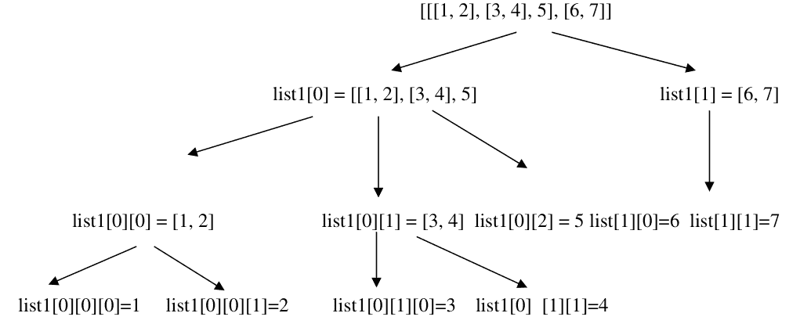

以下程序访问 list1 的不同元素并显示它们：

```python
list1 = [[[1, 2], [3, 4], 5], [6, 7]]
print(list1[0][0][0])
print(list1[0][0][1])
print(list1[0][1][0])
print(list1[0][1][1])
print(list1[0][2])
print(list1[1][0])
print(list1[1][1])
```

```
1
2
3
4
5
6
7
```

## 在 Google COLAB 中理解 Python

## Python 中的元组

元组是一种数据结构，它包含由逗号分隔的异构元素，并被一对圆括号 `()` 括起来。

## 元组的特性：

-   元组是不可变的。
-   元组保持插入顺序。
-   元组是可迭代的。
-   元组是有序的。

## 元组上的操作

为了提取元组的元素，上面为列表讨论的切片运算符、正向和负向索引机制也适用于元组。以下程序使用切片运算符来提取元组的不同元素。

```python
t=(10, 20.30, "Python", 'c', 23)
t1=('Msc','CSIBER')
print(t[0])
print(t[1:3])
print(t[:2])
print(t[2:])
print(t*2)
print(t+t1)
```

```
10
(20.3, 'Python')
(10, 20.3)
('Python', 'c', 23)
(10, 20.3, 'Python', 'c', 23, 10, 20.3, 'Python', 'c', 23)
(10, 20.3, 'Python', 'c', 23, 'Msc', 'CSIBER')
```

## 在 Google COLAB 中理解 Python

## 元组是不可变的

元组是不可变的，这意味着一旦元组被创建，其元素就不能被修改。尝试修改元组的元素会生成 `TypeError`，如下图所示：

```python
t=(10, 20.30, "Python", 'c', 23)
print(t)
t[2]="Java"
print(t)
```

```
(10, 20.3, 'Python', 'c', 23)
---------------------------------------------------------------------------
TypeError                                 Traceback (most recent call last)
<ipython-input-16-3adf4f94e366> in <module>()
      1 t=(10, 20.30, "Python", 'c', 23)
      2 print(t)
----> 3 t[2]="Java"
      4 print(t)

TypeError: 'tuple' object does not support item assignment

SEARCH STACK OVERFLOW
```

然而，元组连接是明确定义的，两个元组的连接会生成一个新的元组，如下例程序所示。在下面的程序中，元组 `t` 与元组 `(6, 7)` 连接，生成了一个新的元组，这可以从其 `id` 得到确认。

```python
t=(1,2,3,4,5)
print(t)
print(id(t))
t=t+(6,7)
print(id(t))
print(t)
```

```
(1, 2, 3, 4, 5)
140081540476176
140081478906800
(1, 2, 3, 4, 5, 6, 7)
```

## 在 Google COLAB 中理解 Python

## 元组打包与解包

## 元组打包

元组打包是指在单个语句中为元组的不同元素赋值。元组打包的语法如下所示：

### 语法：

```python
var = (ele1, ele2, . . . . , eleN)
```

执行上述语句后，元组的元素被赋值给 `var`，可以使用索引访问，如下所示：

```python
var[0]=ele1
var[1]=ele2
.
.
.
var[n-1]=eleN
```

```python
var1, var2, var3, . . . ,varN = value1, value2, value3, . . . ,valueN.
```

变量和值之间存在一一对应的关系。在上面的语法中，`var1`、`var2` 等分别被初始化为 `value1`、`value2` 等。
为了使元组打包正常工作，表达式右侧指定的值的数量必须与表达式左侧的值的数量完全相等。

```python
stud_info=(1,"Maya","A")
print("Roll no   :",stud_info[0])
print("Name      :",stud_info[1])
print("Division  :",stud_info[2])
```

```
Roll no   : 1
Name      : Maya
Division  : A
```

## 在 Google COLAB 中理解 Python

## 元组解包

元组解包与元组打包正好相反，其中变量列表使用元组的元素进行初始化。

```python
x, y, z=10, 20, 30
print(x)
print(y)
print(z)
```

```
10
20
30
```

如果变量的数量少于值的数量，会生成 `ValueError`，并显示消息 `too many values to unpack`，如下图所示：

```python
x, y, z=10, 20, 30, 40, 50
print(x)
print(y)
print(z)
```

```
---------------------------------------------------------------------------
ValueError                                Traceback (most recent call last)
<ipython-input-23-4a8f2a2c4c35> in <module>()
----> 1 x, y, z=10, 20, 30, 40, 50
      2 print(x)
      3 print(y)
      4 print(z)
      5 
ValueError: too many values to unpack (expected 3)

SEARCH STACK OVERFLOW
```

如果值的数量少于变量的数量，会生成 `ValueError`，并显示消息 `not enough values to unpack`，如下图所示：

## 在 Google COLAB 中理解 Python

```python
x,y,z=10,20
print(x)
print(y)
print(z)
```

```
ValueError Traceback (most recent call last)
<ipython-input-24-a5bc6f7212ac> in <module>()
----> 1 x,y,z=10,20
      2 print(x)
      3 print(y)
      4 print(z)
      5

ValueError: not enough values to unpack (expected 3, got 2)

SEARCH STACK OVERFLOW
```

在下面的程序中，`stud_info` 是一个包含学生学号、姓名和班级信息的元组。该元组被解包，以便在三个不同的变量中提取学号、姓名和班级。

```python
stud_info=(1,"Maya","A")
rollno,name,division=stud_info
print("Roll no :",rollno)
print("Name :",name)
print("Division :",division)
```

```
Roll no : 1
Name : Maya
Division : A
```

## 元组是可迭代的

元组的不同元素可以使用 `for` 循环进行遍历，如下例程序所示：

```python
t=(1,2,3,4,5)
for ele in t:
    print(ele)
```

```
1
2
3
4
5
```

## 在 Google COLAB 中理解 Python

## 元组是有序的

当且仅当两个元组包含相同的元素且顺序也相同时，它们才被认为是相等的。在下面的程序中，`t1`、`t2` 和 `t3` 包含相同的元素。然而，`t1` 和 `t2` 中的元素顺序相同，而 `t1` 和 `t3` 中的元素顺序不同。因此，`t1` 和 `t2` 被认为是相等的，而 `t1` 和 `t3` 不相等，如下例所示：

```python
t1=(1,2,3,4,5)
t2=(1,2,3,4,5)
t3=(5,4,3,2,1)
print(t1==t2)
print(t1==t3)
```

```
True
False
```

```python
tuple1=(1,2,3,4,5)
tuple2=(5,4,3,2,1)
tuple3=(1,2,3,4,5)
if (tuple1==tuple2):
    print("tuple1 and tuple2 are equal")
else:
    print("tuple1 and tuple2 are not equal")

if (tuple1==tuple3):
    print("tuple1 and tuple3 are equal")
else:
    print("tuple1 and tuple3 are not equal")
```

```
tuple1 and tuple2 are not equal
tuple1 and tuple3 are equal
```

## 元组是可哈希的

由于元组是不可变的，因此它可以用作字典的键。由于列表是可变的，因此它不能用作字典的键。尝试将列表用作字典的键会生成 `TypeError`，如下图所示：

## 在 Google COLAB 中概念化 Python

```python
l = [1, 2, 3]
t = (1, 2, 3)
x = {l: 'a list', t: 'a tuple'}
```

```
TypeError Traceback (most recent call last)
<ipython-input-1-f1be5784a0c4> in <module>()
      1 l = [1, 2, 3]
      2 t = (1, 2, 3)
----> 3 x = {l: 'a list', t: 'a tuple'}

TypeError: unhashable type: 'list'
```

```python
t1=(1,2,3,4,5)
t2=(1,2,3,4,5)
t3=(5,4,3,2,1)
print(t1.__hash__())
print(t2.__hash__())
print(t3.__hash__())
```

```
8315274433719620810
8315274433719620810
3518382336826571994
```

```python
t1=(1,2,3,4,5)
t2=(1,2,3,4,5)
t3=(5,4,3,2,1)
print(id(t1))
print(id(t2))
print(id(t3))
```

```
140081477922448
140081478067408
140081478090096
```

## id、value 和 hash 之间的区别

## 对象 id

如果两个不同的引用指向同一个对象，那么它们的‘id’是相同的。‘is’运算符比较两个操作数的‘id’。因此，`obj1 is obj2` 等价于 `id(obj1) == id(obj2)`。这在下面的程序中得到了演示：

```python
list1 = [1,2,3]
list2 = [1,2,3]
list3 = list1
print()
if (id(list1)==id(list2)):
    print("list1 and list2 refer same objects")
else:
    print("list1 and list2 do not refer same objects")

if (id(list1)==id(list3)):
    print("list1 and list3 refer same objects")
else:
    print("list1 and list3 do not refer same objects")
```

```
list1 and list2 do not refer same objects
list1 and list3 refer same objects
```

值指的是通过 `==` 运算符比较的对象内容。如果类重写了 `__eq__()` 方法，那么当使用 `==` 运算符时会调用 `__eq__()` 方法。如果类没有重写 `__eq__()` 方法，那么会调用从 object 类继承的方法，其中实例将仅通过它们的标识进行比较。

```python
list1 = [1,2,3]
list2 = [1,2,3]
list3 = list1
print()
if (list1.__eq__(list2)):
    print("list1 and list2 have same content")
else:
    print("list1 and list2 do not have same content")

if (list1.__eq__(list3)):
    print("list1 and list3 have same content")
else:
    print("list1 and list3 do not have same content")
```

```
list1 and list2 have same content
list1 and list3 have same content
```

某些对象以哈希值为特征，这意味着它们可以用作字典中的键。这类对象的特征是，它们的值在对象的生命周期内保持不变，因此对象必须是不可变的。

**注意：** 如果你在自定义类中编写了 `__eq__` 方法，Python 将禁用此默认哈希实现，因为你的 `__eq__` 函数将为其实例定义新的值含义。如果你希望你的类仍然是可哈希的，你还需要编写一个 `__hash__` 方法。如果你继承自一个可哈希的类但自己不想是可哈希的，你可以在类体中设置 `__hash__ = None`。

如果两个对象具有相同的内容，`__hash__()` 函数、`value()` 函数和相等运算符（`==`）返回 `True`，否则返回 `False`。相反，如果两个对象相同，`id()` 函数和‘is’运算符返回 `True`，否则返回 `False`。

## 删除元组

元组不支持删除单个元素。这样做会产生‘TypeError’，如下面的程序所示。

```python
t=(1,2,3,4,5)
del t[0]
print(t)
```

```
TypeError Traceback (most recent call last)
<ipython-input-13-df8988992d1f> in <module>()
      1 t=(1,2,3,4,5)
----> 2 del t[0]
      3 print(t)

TypeError: 'tuple' object doesn't support item deletion
```

然而，‘del’函数可用于删除整个元组，如下所示：

```python
t=(1,2,3,4,5)
del t
print(t)
```

```
NameError                                Traceback (most recent call last)
<ipython-input-14-d2fd83e9e986> in <module>()
      1 t=(1,2,3,4,5)
      2 del t
----> 3 print(t)

NameError: name 't' is not defined
```

## 不适用于元组的操作

由于元组是不可变的，以下操作不能在元组上执行：

- append()
- insert()
- clear()
- pop()
- remove()
- copy()
- sort()
- reverse()

## 嵌套在列表中的元组

元组可以嵌套在列表中。元组是不可变的，不能被更改，但是列表可以被操作。尝试更改列表元素的元组元素会产生‘TypeError’，如下图所示：

```python
students=[(1,"Maya","A"),(2,"Milan","B"),(3,"Asha","C")]
students[0][1]="Sachin"
print(students[0][1])
```

```
TypeError
Traceback (most recent call last)
<ipython-input-17-46e1b841162d> in <module>()
      1 students=[(1,"Maya","A"),(2,"Milan","B"),(3,"Asha","C")]
----> 2 students[0][1]="Sachin"
      3 print(students[0][1])

TypeError: 'tuple' object does not support item assignment
```

但是，可以直接操作列表元素，如下所示：

```python
students=[(1,"Maya","A"),(2,"Milan","B"),(3,"Asha","C")]
students[0]=(1,"Sachin","A")
print(students)
```

```
[(1, 'Sachin', 'A'), (2, 'Milan', 'B'), (3, 'Asha', 'C')]
```

## 嵌套在元组中的列表

列表可以嵌套在元组中。元组是不可变的，不能被更改，但是列表可以被操作。尝试更改元组元素会产生 **TypeError**，如下图所示：

```python
students=([1,"Maya","A"],[2,"Milan","B"],[3,"Asha","C"])
students[0]=[1,"Sachin","A"]
print(students)
```

```
TypeError
Traceback (most recent call last)
<ipython-input-20-ba4fe87aeff1> in <module>()
      1 students=([1,"Maya","A"],[2,"Milan","B"],[3,"Asha","C"])
----> 2 students[0]=[1,"Sachin","A"]
      3 print(students)

TypeError: 'tuple' object does not support item assignment
```

但是，可以直接操作列表元素，如下所示：

```python
students=([1,"Maya","A"],[2,"Milan","B"],[3,"Asha","C"])
students[0][1]="Sachin"
print(students)
```

```
([1, 'Sachin', 'A'], [2, 'Milan', 'B'], [3, 'Asha', 'C'])
```

## Python 中的字典

字典用花括号（`{ }`）括起来，可以使用方括号（`[]`）分配和访问值。它们类似于包含键/值对的哈希表。字典键可以是几乎任何 Python 类型，但通常是数字或字符串。另一方面，值可以是任何任意的 Python 对象。

## 字典上的操作

## 访问字典的键

‘dict’类支持 `keys()` 和 `values()` 方法，它们分别返回一个包含字典中键列表的元组和一个包含值列表的元组，如下面的程序所示：

```python
dict={}
dict["course"]="M.Sc"
dict[2]="Two"
print(dict)
print(dict["course"])
print(dict[2])
print(dict.keys())
print(dict.values())
```

```
{'course': 'M.Sc', 2: 'Two'}
M.Sc
Two
dict_keys(['course', 2])
dict_values(['M.Sc', 'Two'])
```

## dict 类的 fromkeys() 方法

‘dict’类的 `fromkeys()` 方法可用于创建字典的元素，如下程序所示。`fromkeys()` 方法接受两个参数，第一个参数是包含键的列表，第二个参数是一个值。

```python
students={}.fromkeys(["rollno"],1)
print(students)
```

```
{'rollno': 1}
```

## 遍历字典的元素

有三种方法可以遍历字典的元素。

### 方法 1：

使用‘dict’类的 `keys()` 方法。

```python
student={"rollno":1,"name":"Maya","division":"A"}
for k in student.keys():
    print(student[k])
```

```
1
Maya
A
```

### 方法 2：

使用‘dict’类的 `values()` 方法。

```python
student={"rollno":1,"name":"Maya","division":"A"}
for v in student.values():
    print(v)
```

```
1
Maya
A
```

### 方法 3：

使用 `dict` 类的 `items()` 方法。`dict` 类的 `items()` 方法返回字典中每个元素的键/值对。

```python
student={"rollno":1,"name":"Maya","division":"A"}
for (k,v) in student.items():
    print(k,v)
```

```
rollno 1
name Maya
division A
```

## 字典是可变的

在字典中，键是唯一的。字典创建后，键的值可以更改。

```python
student={"rollno":1,"name":"Maya","division":"A"}
print(student)
student["rollno"]=2
student["name"]="Milan"
print(student)
```

```
{'rollno': 1, 'name': 'Maya', 'division': 'A'}
{'rollno': 2, 'name': 'Milan', 'division': 'A'}
```

## 在 Google COLAB 中概念化 Python

## 两个字典的连接

两个字典的连接操作未定义。尝试将两个字典相加会生成‘TypeError’，如下列程序所示：

```
students={"rollno":1,"name":"Maya","division":"A"}
student2={"rollno":2,"name":"Milan", "division":"B"}
students=students+student2

TypeError Traceback (most recent call last)
<ipython-input-35-55fb4c94887d> in <module>()
      1 students={"rollno":1,"name":"Maya","division":"A"}
      2 student2={"rollno":2,"name":"Milan", "division":"B"}
----> 3 students=students+student2

TypeError: unsupported operand type(s) for +: 'dict' and 'dict'

SEARCH STACK OVERFLOW
```

## update() 方法

*update()* 方法可用于根据传递给它的另一个字典的内容来更新字典。

```
students={"rollno":1,"name":"Maya","division":"A"}
student2={"rollno":2,"name":"Milan", "division":"B"}
students.update(student2)
print(students)

{'rollno': 2, 'name': 'Milan', 'division': 'B'}
```

如果键已存在于字典中，则会更新相应的值；否则，会向字典添加一个新的键/值对，如下所示：

```
students={"rollno":1,"name":"Maya"}
students1={"rollno":2,"division":"A"}
print("Before Updation : ",students)
students.update(students1)
print("After Updation : ",students)

Before Updation :  {'rollno': 1, 'name': 'Maya'}
After Updation :  {'rollno': 2, 'name': 'Maya', 'division': 'A'}
```

## 字典中的成员测试

‘in’ 运算符用于测试键是否存在于字典中，如下列程序所示：

```
student={"rollno":1,"name":"Maya","division":"A"}
if ("division" in student):
    print(student["division"])
else:
    print("Key does not exist")

A
```

## 删除字典元素

### 方法 1：使用 pop() 方法

dict 类的 pop() 方法接受要删除的字典元素的键，如下列程序所示：

```
student={"rollno":1,"name":"Maya","division":"A"}
print(student)
if ("division" in student):
    student.pop("division")
else:
    print("Key does not exist")
print(student)

{'rollno': 1, 'name': 'Maya', 'division': 'A'}
{'rollno': 1, 'name': 'Maya'}
```

### 方法 2：使用 del 方法

del 方法也可用于删除字典的元素，如下所示：

```
student={"rollno":1,"name":"Maya","division":"A"}
print(student)
if ("division" in student):
    del student["division"]
else:
    print("Key does not exist")
print(student)

{'rollno': 1, 'name': 'Maya', 'division': 'A'}
{'rollno': 1, 'name': 'Maya'}
```

## Python 中的集合

与字典类似，{} 字符用于包围集合的元素。集合只能包含不可变元素。向集合添加可变元素会生成 `TypeError`，如下列程序所示：

```
s={[1,2],3,4,5}

TypeError                                 Traceback (most recent call last)
<ipython-input-1-c5647b504393> in <module>()
----> 1 s={[1,2],3,4,5}

TypeError: unhashable type: 'list'

SEARCH STACK OVERFLOW
```

```
s={{"one":1},3,4,5}

TypeError                                 Traceback (most recent call last)
<ipython-input-3-27abaeaf8462> in <module>()
----> 1 s={{"one":1},3,4,5}

TypeError: unhashable type: 'dict'

SEARCH STACK OVERFLOW
```

```
s={(1,2),3,4,5}
print(s)

{(1, 2), 3, 4, 5}
```

## 集合的特性：

- 集合是不可变的。
- 集合元素是唯一的。
- 集合元素没有索引。
- 集合不保持插入顺序。
- 集合是可迭代的。
- 集合是无序的。

## 集合是不可变的

集合是不可变的意味着一旦创建集合，其元素就不能被修改。尝试修改集合的元素会生成‘TypeError’，如下图所示：

```
s={(1,2),3,4,5}
s[0]=1

TypeError Traceback (most recent call last)
<ipython-input-6-d3d9429d76ac> in <module>()
      1 s={(1,2),3,4,5}
----> 2 s[0]=1

TypeError: 'set' object does not support item assignment

SEARCH STACK OVERFLOW
```

## 集合元素是唯一的

向集合添加任何重复元素都会被集合丢弃，如下例所示：

```
s={1,2,3,1,2,3}
print(s)

{1, 2, 3}
```

## 集合元素没有索引 – 集合不保持插入顺序

多次显示未排序的集合，每次显示的元素顺序都不同。如果对集合进行排序，则顺序会保持不变，如下所示：

```
s={1,2,3,4,5,6,7,8}
print(s)
print(s)

{1, 2, 3, 4, 5, 6, 7, 8}
{1, 2, 3, 4, 5, 6, 7, 8}
```

集合中元素的顺序是不可预测的。

```
s={11,2,34,5,12,67,55}
print(s)

{2, 34, 67, 5, 11, 12, 55}
```

集合元素没有索引。尝试使用索引访问集合的元素会生成‘TypeError’，如下列程序所示：

```
s1={1,2,3}
print(s1[0])

TypeError
Traceback (most recent call last)
<ipython-input-17-a5a8309882c8> in <module>()
      1 s1={1,2,3}
----> 2 print(s1[0])

TypeError: 'set' object is not subscriptable
```

## 集合是可迭代的

可以使用 for 循环遍历集合的不同元素，如下列程序所示：

```
s1={1,2,3}
for ele in s1:
    print(ele)

1
2
3
```

## 连接两个集合

两个集合的连接操作未定义。尝试将两个集合相加会生成 **'TypeError'**，如下列程序所示：

```
s1={1,2,3}
s2={4,5,6}
s3=s1+s2
print(s3)

TypeError
Traceback (most recent call last)
<ipython-input-14-50a40a8a7a55> in <module>()
      1 s1={1,2,3}
      2 s2={4,5,6}
----> 3 s3=s1+s2
      4 print(s3)

TypeError: unsupported operand type(s) for +: 'set' and 'set'
```

由于连接操作是在两个列表上定义的，因此要连接两个集合，需要执行以下操作：

- 使用 list() 方法将两个集合转换为列表
- 连接两个列表
- 将列表转换回集合

如下列程序所示：

```
s1={1,2,3}
print("Set 1",s1)
s2={4,5,6}
print("Set 2",s2)
s3=set(list(s1)+list(s2))
print("Set 3",s3)

Set 1 {1, 2, 3}
Set 2 {4, 5, 6}
Set 3 {1, 2, 3, 4, 5, 6}
```

## 对集合进行排序

由于集合中元素的顺序无关紧要，对集合的元素进行排序和反转不会创建新的集合。但是，集合支持 **sorted()** 方法，而不支持 **reversed()** 方法。**sorted()** 方法返回列表，如下列程序所示：

```
s={1,24,3,44,33}
print("Unsorted Set : ",s)
print("Sorted Set : ",sorted(s))
print(type(sorted(s)))

Unsorted Set :  {1, 33, 3, 44, 24}
Sorted Set :  [1, 3, 24, 33, 44]
<class 'list'>
```

## 集合不可反转

由于集合是不可变的，因此无法反转集合的元素。这样做会生成 **'TypeError'**，如下列程序所示：

```
s={1,24,3,44,33}
print("Original Set : ",s)
print("Reversed Set : ",reversed(s))
print(type(reversed(s)))
```

```
Original Set :  {1, 33, 3, 44, 24}
---------------------------------------------------------------------------
TypeError                                 Traceback (most recent call last)
<ipython-input-2-ddd6abe7549b> in <module>()
      1 s={1,24,3,44,33}
      2 print("Original Set : ",s)
----> 3 print("Reversed Set : ",reversed(s))
      4 print(type(reversed(s)))

TypeError: 'set' object is not reversible
```

```
SEARCH STACK OVERFLOW
```

## 使用 == 运算符检查集合相等性

相等运算符 == 可用于比较两个集合的内容。如果两个集合具有相同的内容，则 == 返回‘True’，否则返回‘False’。

```
s1={1,2, 3, 4, 5}
s2={1,2, 3, 4, 5}
s3=s1
if (s1==s2):
    print("s1 is equal to s2")
else:
    print("s1 is not equal to s2")
if (s1==s3):
    print("s1 is equal to s3")
else:
    print("s1 is not equal to s3")
```

```
s1 is equal to s2
s1 is equal to s3
```

## 使用 ‘is’ 运算符检查集合等价性

‘is’ 运算符在两个引用指向同一个集合对象时返回‘True’，否则返回‘False’。

## 在 Google COLAB 中概念化 Python

```python
s1={1, 2, 3, 4, 5}
s2={1, 2, 3, 4, 5}
s3=s1
if (s1 is s2):
    print("s1 is s2")
else:
    print("s1 is not s2")
if (s1 is s3):
    print("s1 is s3")
else:
    print("s1 is not s3")
```

```
s1 is not s2
s1 is s3
```

## 在列表中插入单个元素 – add() 方法

如果列表是有序的，那么 `add()` 方法会将元素插入到适当的位置，如下图所示：

```python
s1={1, 2, 3, 4, 5, 6, 7, 8, 9, 10}
print("Before Insertion", s1)
s1.add(100)
print("After Insertion", s1)
```

```
Before Insertion {1, 2, 3, 4, 5, 6, 7, 8, 9, 10}
After Insertion {1, 2, 3, 4, 5, 6, 7, 8, 9, 10, 100}
```

```python
s1={1, 2, 3, 4, 5, 6, 7, 8, 9, 50}
print("Before Insertion", s1)
s1.add(40)
print("After Insertion", s1)
```

```
Before Insertion {1, 2, 3, 4, 5, 6, 7, 8, 9, 50}
After Insertion {1, 2, 3, 4, 5, 6, 7, 8, 9, 40, 50}
```

如果集合是无序的，那么 `add()` 方法会将元素插入到随机位置，如下所示：

```python
s1={1, 20, 3, 45, 15, 6, 57, 33, 11}
print("Before Insertion", s1)
s1.add(100)
print("After Insertion", s1)
```

```
Before Insertion {1, 33, 3, 6, 11, 45, 15, 20, 57}
After Insertion {1, 33, 3, 100, 6, 11, 45, 15, 20, 57}
```

## 在列表中插入多个元素 – update() 方法

要插入多个元素，可以使用 **update()** 方法，该方法接受一个可迭代对象（列表、元组或集合作为其唯一参数），如下列程序所示：

### 使用列表向集合中插入元素

`update()` 方法接受一个可迭代对象，遍历所有元素并将每个元素添加到集合中。在下面的示例中，一个包含五个元素的列表被传递给 `update()` 方法，该方法将列表的所有元素插入到集合中。

```python
s1={1, 2, 3, 4, 5}
print("Before Insertion", s1)
s1.update([6, 7, 8, 9, 10])
print("After Insertion", s1)
```

```
Before Insertion {1, 2, 3, 4, 5}
After Insertion {1, 2, 3, 4, 5, 6, 7, 8, 9, 10}
```

### 使用元组向集合中插入元素

在下面的示例中，一个包含五个元素的元组被传递给 `update()` 方法，该方法将元组的所有元素插入到集合中。

```python
s1={1, 2, 3, 4, 5}
print("Before Insertion", s1)
s1.update((6, 7, 8, 9, 10))
print("After Insertion", s1)
```

```
Before Insertion {1, 2, 3, 4, 5}
After Insertion {1, 2, 3, 4, 5, 6, 7, 8, 9, 10}
```

### 使用集合向集合中插入元素

在下面的示例中，一个包含五个元素的集合被传递给 `update()` 方法，该方法将目标集合的所有元素插入到源集合中。

```python
s1={1, 2, 3, 4, 5}
print("Before Insertion", s1)
s1.update({6, 7, 8, 9, 10})
print("After Insertion", s1)
```

```
Before Insertion {1, 2, 3, 4, 5}
After Insertion {1, 2, 3, 4, 5, 6, 7, 8, 9, 10}
```

## 从集合中删除元素 – remove() 方法

```python
s1={1, 2, 3, 4, 5}
print("Before Deletion", s1)
s1.remove(3)
print("After Deletion", s1)
```

```
Before Deletion {1, 2, 3, 4, 5}
After Deletion {1, 2, 4, 5}
```

如果元素在集合中不存在，那么 `remove()` 方法会生成 `KeyError`，如下列程序所示：

```python
s1={1, 2, 3, 4, 5}
print("Before Deletion", s1)
s1.remove(6)
print("After Deletion", s1)
```

```
Before Deletion {1, 2, 3, 4, 5}
---------------------------------------------------------------------------
KeyError                                  Traceback (most recent call last)
<ipython-input-15-38c9f99a673c> in <module>()
      1 s1={1, 2, 3, 4, 5}
      2 print("Before Deletion", s1)
----> 3 s1.remove(6)
      4 print("After Deletion", s1)

KeyError: 6
```

## 从集合中删除元素 – discard() 方法

```python
s1={1, 2, 3, 4, 5}
print("Before Deletion", s1)
s1.discard(3)
print("After Deletion", s1)
```

```
Before Deletion {1, 2, 3, 4, 5}
After Deletion {1, 2, 4, 5}
```

如果元素在集合中不存在，与 `remove()` 方法不同，`discard()` 方法不会产生任何错误，如下列程序所示：

```python
s1={1, 2, 3, 4, 5}
print("Before Deletion", s1)
s1.discard(6)
print("After Deletion", s1)
```

```
Before Deletion {1, 2, 3, 4, 5}
After Deletion {1, 2, 3, 4, 5}
```

## 从集合中删除元素 – pop() 方法

`pop()` 方法不接受任何参数，它会删除列表中的第一个元素并返回被删除的元素，如下列程序所示：

```python
s1={1, 2, 3, 4, 5}
print("Before Deletion", s1)
ele=s1.pop()
print("After Deletion of element ", ele, " set is ", s1)
```

```
Before Deletion {1, 2, 3, 4, 5}
After Deletion of element  1  set is  {2, 3, 4, 5}
```

`remove()` 和 `discard()` 方法不返回任何值。

```python
s1={1, 2, 3, 4, 5}
print("Before Deletion ", s1)
print(s1.discard(3))
print("After Deletion ", s1)
```

```
Before Deletion  {1, 2, 3, 4, 5}
None
After Deletion  {1, 2, 4, 5}
```

```python
s1={1, 2, 3, 4, 5}
print("Before Deletion ", s1)
print(s1.remove(3))
print("After Deletion ", s1)
```

```
Before Deletion  {1, 2, 3, 4, 5}
None
After Deletion  {1, 2, 4, 5}
```

## 从集合中删除所有元素 – clear() 方法

```python
s1={1, 2, 3, 4, 5}
print("Before Deletion ", s1)
print(s1.clear())
print("After Deletion ", s1)
```

```
Before Deletion  {1, 2, 3, 4, 5}
None
After Deletion  set()
```

`clear()` 方法不返回任何值。

## 使用 del 方法删除集合

由于集合没有索引，`del` 方法不能用于删除集合的元素。这样做会生成 `TypeError`，如下列程序所示：

```python
s1={1, 2, 3, 4, 5}
print("Before Deletion ", s1)
del s1[:]
print("After Deletion ", s1)
```

```
Before Deletion  {1, 2, 3, 4, 5}
---------------------------------------------------------------------------
TypeError                                 Traceback (most recent call last)
<ipython-input-27-9b480505f625> in <module>()
      1 s1={1, 2, 3, 4, 5}
      2 print("Before Deletion ", s1)
----> 3 del s1[:]
      4 print("After Deletion ", s1)

TypeError: 'set' object does not support item deletion
```

然而，`del` 方法可以用于删除整个集合，如下列程序所示：

```python
s1={1, 2, 3, 4, 5}
print("Before Deletion ", s1)
del s1
print("After Deletion ", s1)
```

```
Before Deletion  {1, 2, 3, 4, 5}
---------------------------------------------------------------------------
NameError                                 Traceback (most recent call last)
<ipython-input-28-5e2b5beea38d> in <module>()
      2 print("Before Deletion ", s1)
      3 del s1
----> 4 print("After Deletion ", s1)

NameError: name 's1' is not defined
```

## 克隆集合

```python
s1={(1, 2, 3), (4, 5, 6)}
s2=s1.copy()
print("s1 : ", s1)
print("s2 : ", s2)
s1.update((7, 8, 9))
print("s1 : ", s1)
print("s2 : ", s2)
```

```
s1 : {(4, 5, 6), (1, 2, 3)}
s2 : {(4, 5, 6), (1, 2, 3)}
s1 : {7, 8, 9, (1, 2, 3), (4, 5, 6)}
s2 : {(4, 5, 6), (1, 2, 3)}
```

## 集合聚合函数 – max(), min(), sum()

聚合函数 `max()`、`min()`、`sum()` 可用于查找集合中所有元素的最大值、最小值和总和，如下列程序所示：

```python
s1={1, 2, 3, 4, 5}
print("Maximum : ", max(s1))
print("Minimum : ", min(s1))
print("Sum     : ", sum(s1))
```

```
Maximum : 5
Minimum : 1
Sum     : 15
```

```python
s1={(10, 2, 2), (4, 5, 6)}
print(max(s1))
```

```
(10, 2, 2)
```

## 集合操作

不同的集合操作，如并集、交集、差集、对称差集等，定义在两个集合上。

### 两个集合的并集

两个集合的并集是一个包含两个集合中所有元素的集合，如果存在重复元素则只保留一个，如下列程序所示。集合支持 `union()` 方法来实现此目的。使用 `|` 运算符也可以达到相同的结果。

```python
s1={1, 2, 3, 4, 5}
s2={3, 4, 5, 6, 7}
print("s1 : ", s1)
print("s2 : ", s2)
s3=s1.union(s2)
s4=s1 | s2
print("s1 U s2 : ", s3)
print("s1 U s2 : ", s4)
```

```
s1 :  {1, 2, 3, 4, 5}
s2 :  {3, 4, 5, 6, 7}
s1 U s2 :  {1, 2, 3, 4, 5, 6, 7}
s1 U s2 :  {1, 2, 3, 4, 5, 6, 7}
```

### 两个集合的交集

两个集合的交集是一个包含两个集合共有元素的集合，如下列程序所示。集合支持 `intersection()` 方法来实现此目的。使用 `&` 运算符也可以达到相同的结果。

```python
s1={1, 2, 3, 4, 5}
s2={3, 4, 5, 6, 7}
print("s1 : ", s1)
print("s2 : ", s2)
s3=s1.intersection(s2)
s4=s1 & s2
print("s1 ∩ s2 : ", s3)
print("s1 ∩ s2 : ", s4)
```

```
s1 :  {1, 2, 3, 4, 5}
s2 :  {3, 4, 5, 6, 7}
s1 ∩ s2 :  {3, 4, 5}
s1 ∩ s2 :  {3, 4, 5}
```

## 在 Google COLAB 中理解 Python

## 集合差集

两个集合的差集是一个包含第一个集合中存在但第二个集合中不存在的元素的集合，如下列程序所示。集合支持 `difference()` 方法来实现此目的。使用 `-` 运算符也可以达到相同的结果。

```
s1={1,2,3,4,5}
s2={3,4,5,6,7}
print("s1 : ",s1)
print("s2 : ",s2)
s3=s1.difference(s2)
s4=s2.difference(s1)
print("s1 - s2 : ",s3)
print("s2 - s1 : ",s4)

s1 :  {1, 2, 3, 4, 5}
s2 :  {3, 4, 5, 6, 7}
s1 - s2 :  {1, 2}
s2 - s1 :  {6, 7}
```

## 集合对称差集

两个集合的对称差集是一个包含来自两个集合的元素的集合，这些元素是通过计算它们各自的差集得到的，如下列程序所示。集合支持 `symmetric_difference()` 方法来实现此目的。使用以下操作也可以达到相同的结果：

s1 ~ s2 = (s1 – s2) U (s2 – s1)

```
s1={1,2,3,4,5}
s2={3,4,5,6,7}
print("s1 : ",s1)
print("s2 : ",s2)
s3=s1.symmetric_difference(s2)
s4=s2.symmetric_difference(s1)
print("(s1 - s2) U (s2 - s1) : ",s3)
print("(s2 - s1) U (s1 - s2) : ",s4)

s1 :  {1, 2, 3, 4, 5}
s2 :  {3, 4, 5, 6, 7}
(s1 - s2) U (s2 - s1) :  {1, 2, 6, 7}
(s2 - s1) U (s1 - s2) :  {1, 2, 6, 7}
```

## isdisjoint() 方法

如果两个集合没有共同的元素，则认为它们是不相交的。`set` 类支持一个布尔方法 `isdisjoint()` 来检查两个集合是否不相交。

```
s1={1,2,3}
s2={3,4,5}
s3={4,5,6}
print("s1 and s2 are disjoint : ",s1.isdisjoint(s2))
print("s1 and s3 are disjoint : ",s1.isdisjoint(s3))

s1 and s2 are disjoint :  False
s1 and s3 are disjoint :  True
```

## 检查集合关系 – issubset(), issuperset()

如果集合 A 至少包含集合 B 的所有元素，则认为集合 A 是集合 B 的子集。B 被认为是 A 的超集。`set` 类支持两个布尔方法 `issubset()` 和 `issuperset()` 来检查调用集合是否是作为参数传递的集合的子集/超集。

```
s1={1,2,3}
s2={1,2}
print("s2 is subset of s1   : ",s2.issubset(s1))
print("s1 is superset of s2 : ",s1.issuperset(s2))

s2 is subset of s1   :  True
s1 is superset of s2 :  True
```

```
s1={1,2,3}
s2={1,2,5}
print("s2 is subset of s1   : ",s2.issubset(s1))
print("s1 is superset of s2 : ",s1.issuperset(s2))

s2 is subset of s1   :  False
s1 is superset of s2 :  False
```

## 重新审视集合差集 - difference() 方法

集合差集包含第一个集合中存在但第二个集合中不存在的所有元素，但它不会更新第一个集合，如下所示：

```
s1={1,2,3}
s2={1,2,5}
s3=s1.difference(s2)
print("s1 : ",s1)
print("s2 : ",s2)
print("s3 : ",s3)

s1 :  {1, 2, 3}
s2 :  {1, 2, 5}
s3 :  {3}
```

## difference_update() 方法

相反，*difference_update()* 方法计算集合差集并更新调用集合。

```
s1={1,2,3}
s2={1,2,5}
s3=s1.difference_update(s2)
print("s1 : ",s1)
print("s2 : ",s2)
print("s3 : ",s3)

s1 :  {3}
s2 :  {1, 2, 5}
s3 :  None
```

## intersection_update() 方法

*intersection_update()* 方法计算集合交集，并用集合交集的结果更新调用集合。

```
s1={1,2,3}
s2={1,2,5}
s3=s1.intersection_update(s2)
print("s1 : ",s1)
print("s2 : ",s2)
print("s3 : ",s3)

s1 :  {1, 2}
s2 :  {1, 2, 5}
s3 :  None
```

## symmetric_difference_update() 方法

*symmetric_difference_update()* 方法计算两个集合之间的对称差集，并用集合差集的结果更新调用集合。

```
s1={1,2,3}
s2={1,2,5}
s3=s1.symmetric_difference_update(s2)
print("s1 : ",s1)
print("s2 : ",s2)
print("s3 : ",s3)

s1 :  {3, 5}
s2 :  {1, 2, 5}
s3 :  None
```

## 冻结集合

集合是可变的。冻结集合是集合的不可变版本。由于集合是可变的，它不可哈希，因此不能用作字典的键，而冻结集合可以。

## 将集合转换为冻结集合

可以使用 *frozenset()* 方法将集合转换为冻结集合，如下列程序所示。该程序证实了集合不可哈希，而冻结集合可以。将集合转换为冻结集合后，修改集合元素的方法（如 *add()*、*clear()*、*update()* 等）将不再适用于冻结集合。

```
set1 = {1,2,3}
try:
    print(hash(set1))
except TypeError:
    print("Set is not Hashable")

fset1=frozenset(set1)
try:
    print("Hash Value of Frozen Set : ",hash(fset1))
except TypeError:
    print("Object is not Hashable")

Set is not Hashable
Hash Value of Frozen Set :  -272375401224217160
```

## 集合的应用

### 查找两个列表之间的差异。

`List` 类不支持使用 `-` 运算符来查找两个列表之间的差异，但 `Set` 类支持。

```
list1=[1,2,3,4,5]
list2=[1,3,5]
list3=list1-list2
print(list1)
print(list2)
print(list3)

TypeError Traceback (most recent call last)
<ipython-input-14-12565556f06f> in <module>()
      1 list1=[1,2,3,4,5]
      2 list2=[1,3,5]
----> 3 list3=list1-list2
      4 print(list1)
      5 print(list2)

TypeError: unsupported operand type(s) for -: 'list' and 'list'

SEARCH STACK OVERFLOW
```

因此，可以使用 `Set` 类来计算 `list1` 和 `list2` 元素之间的差异，如下列程序所示：

```
list1=[1,2,3,4,5]
list2=[1,3,5]
list3=list(set(list1)-set(list2))
print(list1)
print(list2)
print(list3)

[1, 2, 3, 4, 5]
[1, 3, 5]
[2, 4]
```

## 第三章

## Python 运算符和控制语句实验作业

## 级别 – 基础

Python 语言支持以下类型的运算符。

- 算术运算符
- 比较（关系）运算符
- 赋值运算符
- 逻辑运算符
- 位运算符
- 成员运算符
- 身份运算符

## Python 算术运算符

Python 语言支持的不同算术运算符如下表所示：
假设变量 a 的值为 10，变量 b 的值为 20，则 –

| 运算符 | 描述 | 示例 |
| :--- | :--- | :--- |
| + 加法 | 将运算符两侧的值相加。 | a + b = 30 |
| - 减法 | 从左操作数中减去右操作数。 | a – b = -10 |
| * 乘法 | 将运算符两侧的值相乘 | a * b = 200 |
| / 除法 | 用左操作数除以右操作数 | b / a = 2 |
| % 取模 | 用左操作数除以右操作数并返回余数 | b % a = 0 |
| ** 指数 | 对运算符执行指数（幂）计算 | a**b =10 的 20 次方 |
| // | 整除 - 操作数相除，结果为商，其中小数点后的数字被移除。但如果其中一个操作数为负数，则结果向下取整，即向远离零的方向取整（向负无穷方向） – | 9//2 = 4 且 9.0//2.0 = 4.0, -11//3 = -4, -11.0//3 = -4.0 |

## 整除运算符

Python 支持整除运算符，它执行整数除法，如下列程序所示：

```
a=30
b=20
print(a/b)
print(a//b)

1.5
1
```

## Python 赋值运算符

Python 语言支持的不同赋值运算符如下表所示：

假设变量 a 的值为 10，变量 b 的值为 20，则 –

| 运算符 | 描述 | 示例 |
| :--- | :--- | :--- |
| = | 将右侧操作数的值赋给左侧操作数 | c = a + b 将 a + b 的值赋给 c |
| += 加后赋值 | 将右操作数加到左操作数，并将结果赋给左操作数 | c += a 等价于 c = c + a |
| -= 减后赋值 | 从左操作数中减去右操作数，并将结果赋给左操作数 | c -= a 等价于 c = c - a |
| *= 乘后赋值 | 将右操作数与左操作数相乘，并将结果赋给左操作数 | c *= a 等价于 c = c * a |
| /= 除后赋值 | 用左操作数除以右操作数，并将结果赋给左操作数 | c /= a 等价于 c = c / a |
| %= 取模后赋值 | 使用两个操作数取模，并将结果赋给左操作数 | c %= a 等价于 c = c % a |
| **= 指数后赋值 | 对运算符执行指数（幂）计算，并将值赋给左操作数 | c **= a 等价于 c = c ** a |
| //= 整除后赋值 | 对运算符执行整除，并将值赋给左操作数 | c //= a 等价于 c = c // a |

## Python 比较运算符

比较或关系运算符比较两个操作数的值。Python 语言支持的不同关系运算符如下表所示：

假设变量 a 的值为 10，变量 b 的值为 20，则 –

## 在 Google COLAB 中概念化 Python

| 运算符 | 描述 | 示例 |
| --- | --- | --- |
| == | 如果两个操作数的值相等，则条件为真。 | (a == b) 为假。 |
| != | 如果两个操作数的值不相等，则条件为真。 | (a != b) 为真。 |
| <> | 如果两个操作数的值不相等，则条件为真。 | (a <> b) 为真。这与 != 运算符类似。 |
| > | 如果左操作数的值大于右操作数的值，则条件为真。 | (a > b) 为假。 |
| < | 如果左操作数的值小于右操作数的值，则条件为真。 | (a < b) 为真。 |
| >= | 如果左操作数的值大于或等于右操作数的值，则条件为真。 | (a >= b) 为假。 |
| <= | 如果左操作数的值小于或等于右操作数的值，则条件为真。 | (a <= b) 为真。 |

## Python 位运算符

Python 语言支持的不同位运算符如下表所示：

| 运算符 | 描述 | 示例 |
| --- | --- | --- |
| & 按位与 | 如果两个操作数中都存在该位，则将该位复制到结果中。 | (a & b) (表示 0000 1100) |
| \| 按位或 | 如果任一操作数中存在该位，则将其复制。 | (a \| b) = 61 (表示 0011 1101) |
| ^ 按位异或 | 如果该位在一个操作数中设置而不在另一个中设置，则将其复制。 | (a ^ b) = 49 (表示 0011 0001) |
| ~ 按位取反 | 它是一元运算符，具有“翻转”位的效果。 | (~a) = -61 (由于是有符号二进制数，以二进制补码形式表示为 1100 0011)。 |
| << 左移 | 左操作数的值按右操作数指定的位数向左移动。 | a << 2 = 240 (表示 1111 0000) |
| >> 右移 | 左操作数的值按右操作数指定的位数向右移动。 | a >> 2 = 15 (表示 0000 1111) |

位运算符作用于位并执行逐位操作。假设 a = 60；b = 13；那么它们的二进制格式值将分别是 0011 1100 和 0000 1101。下表列出了 Python 语言支持的位运算符，并为每个运算符提供了一个示例，我们使用上述两个变量（a 和 b）作为操作数 –

| | 128 | 64 | 32 | 16 | 8 | 4 | 2 | 1 |
|---|---|---|---|---|---|---|---|---|
| 60 | 0 | 0 | 1 | 1 | 1 | 1 | 0 | 0 |
| 13 | 0 | 0 | 0 | 0 | 1 | 1 | 0 | 1 |
| 60 & 13 = 12 | 0 | 0 | 0 | 0 | 1 | 1 | 0 | 0 |
| 60 \| 13 = 61 | 0 | 0 | 1 | 1 | 1 | 1 | 0 | 1 |
| 60 ^ 13 = 49 | 0 | 0 | 1 | 1 | 0 | 0 | 0 | 1 |

```
a      = 0011 1100
b      = 0000 1101
a&b    = 0000 1100
a|b    = 0011 1101
a^b    = 0011 0001
~a     = 1100 0011
```

以下程序演示了对操作数 60 和 13 的不同位运算：

```
a = 60
b = 13
print(a & b)
print(a | b)
print(a ^ b)
print(~a)

12
61
49
-61
```

## 左移和右移运算符

```
a = 8
print(a >> 1)
print(a << 1)

4
16
```

## Python 逻辑运算符

Python 语言支持的不同逻辑运算符如下表所示：

假设变量 a 保存 10，变量 b 保存 20，则

| 运算符 | 描述 | 示例 |
| :--- | :--- | :--- |
| and 逻辑与 | 如果两个操作数都为真，则条件为真。 | (a and b) 为真。 |
| or 逻辑或 | 如果两个操作数中任何一个非零，则条件为真。 | (a or b) 为真。 |
| not 逻辑非 | 用于反转其操作数的逻辑状态。 | Not(a and b) 为假。 |

## 短路求值

### 在求值 ‘and’ 条件时

以下程序演示了 Python 中 ‘and’ 条件的短路求值。在以下程序中，在 ‘if’ 条件中，第一个条件求值为真，因此求值第二个条件，该条件调用 *display()* 方法，打印 ‘*Inside display*’，如下所示：

```
def display():
    print("Inside display")

x=20
if (x>10 and display()):
    print("TRUE")

Inside display
```

当 ‘x’ 的值更改为 2 时，‘if’ 语句中的第一个条件求值为假，因此由于 Python 采用的短路求值，第二个条件不会被求值。

```
def display():
    print("Inside display")

x=2
if (x>10 and display()):
    print("TRUE")
```

### 在求值 ‘or’ 条件时

以下程序演示了 Python 中 ‘or’ 条件的短路求值。在以下程序中，在 ‘if’ 条件中，第一个条件求值为假，因此求值第二个条件，该条件调用 *display()* 方法，打印 ‘*Inside display*’，如下所示：

```
def display():
    print("Inside display")

x=2
if (x>10 or display()):
    print("TRUE")

Inside display
```

当 ‘x’ 的值更改为 20 时，‘if’ 语句中的第一个条件求值为真，因此由于 Python 采用的短路求值，第二个条件不会被求值。

```
def display():
    print("Inside display")

x=20
if (x>10 or display()):
    print("TRUE")

TRUE
```

```
def display():
    print("Inside display")
    return True

x=2
if (x>10 or display()):
    print("TRUE")

Inside display
TRUE
```

```
def display():
    print("Inside display")
    return False

x=2
if (x>10 or display()):
    print("TRUE")

Inside display
```

## Python 成员运算符

Python 的成员运算符用于测试序列中的成员资格，例如字符串、列表或元组。有两个成员运算符，如下所述 –

| 运算符 | 描述 | 示例 |
| :--- | :--- | :--- |
| in | 如果在指定序列中找到变量，则求值为真，否则为假。 | x in y，如果 x 是序列 y 的成员，则此处 in 结果为 1。 |
| not in | 如果在指定序列中未找到变量，则求值为真，否则为假。 | x not in y，如果 x 不是序列 y 的成员，则此处 not in 结果为 1。 |

以下程序演示了 Python 中成员运算符的使用：

```
x = ["apple", "banana"]
print("banana" in x)

True
```

```
x = ["apple", "banana"]
print("pineapple" in x)

False
```

```
x = ["apple", "banana"]
print("pineapple" not in x)

True
```

## Python 身份运算符 (is)

身份运算符比较两个对象的内存位置。有两个身份运算符，如下所述 –

| 运算符 | 描述 | 示例 |
| :--- | :--- | :--- |
| is | 如果运算符两侧的变量指向同一个对象，则求值为真，否则为假。 | x is y，如果 id(x) 等于 id(y)，则此处 **is** 结果为 1。 |
| is not | 如果运算符两侧的变量指向同一个对象，则求值为假，否则为真。 | x is not y，如果 id(x) 不等于 id(y)，则此处 **is not** 结果为 1。 |

在以下程序中，‘x’ 和 ‘y’ 是两个不同的列表对象，而 ‘x’ 和 ‘z’ 是指向同一个列表对象的两个不同引用。因此，x、y 和 z 都具有相同的内容，并且对它们使用 == 运算符求值为 ‘True’。而对操作数 ‘x’ 和 ‘y’ 使用 ‘is’ 运算符求值为 ‘False’。因此 == 运算符检查传递给它的两个操作数的内容，而 ‘is’ 运算符检查对象变量引用的对象。

```
x = ["apple", "banana"]
y = ["apple", "banana"]
z = x
print(x is z)
print(x is y)
print(x == z)
print(x == z)

True
False
True
True
```

注意：is 比较对象引用，而 == 比较对象内容。

## Python 运算符优先级

下表列出了从最高优先级到最低优先级的所有运算符。

| 序号 | 运算符与描述 |
|---|---|
| 1 | ** 指数（幂运算） |
| 2 | ~ + - 按位取反、一元正号和负号（后两者的函数名分别为 +@ 和 -@） |
| 3 | * / % // 乘法、除法、取模和整除 |
| 4 | + - 加法和减法 |
| 5 | >> << 按位右移和左移 |
| 6 | & 按位 ‘与’ |
| 7 | ^ \| 按位异或和按位或 |

## 在 Google COLAB 中概念化 Python

| 8 | <= < > >= 比较运算符 |
| --- | --- |
| 9 | <> == != 等值运算符 |
| 10 | = %= /= //= -= += *= **= 赋值运算符 |
| 11 | is is not 身份运算符 |
| 12 | in not in 成员运算符 |
| 13 | not or and 逻辑运算符 |

## 接受用户输入

`input()` 函数用于从键盘接受输入，它返回一个字符串值，对应于用户输入的内容，如下图所示：

```
inst=input("Enter institute name :")
print(inst)
print(type(inst))

Enter institute name :
```

```
inst=input("Enter institute name :")
print(inst)
print(type(inst))

Enter institute name :SIBER
SIBER
<class 'str'>
```

要将输入转换为所需的数据类型，请使用类型转换函数之一，如 `int()`、`float()`、`bool()` 等。在下面的程序中，从用户处接受 'age' 并将其转换为 'int'。

```
age=int(input("Enter age :"))
print(age)
print(type(age))

Enter age :20
20
<class 'int'>
```

## 字符串格式化（格式字符串 %）

`%` 运算符用于将一组包含在“元组”中的变量与格式字符串一起进行格式化，该格式字符串包含普通文本以及与特殊符号（如 `%s` 和 `%d`）对应的“参数说明符”或“参数占位符”，如下列程序所示：

```
course="MSc"
inst="SIBER"
print("I am pursuing %s at CSIBER" % course )

I am pursuing MSc at CSIBER
```

```
course="MSc"
inst="SIBER"
print("I am pursuing %s at %s" % (course,inst) )

I am pursuing MSc at SIBER
```

Python 支持的不同格式代码在下表中列出：

| 格式代码 | 描述 |
|---|---|
| 'd' | 用于整数 |
| 'f' | 用于浮点数 |
| 'b' | 用于二进制数 |
| 'o' | 用于八进制数 |
| 'x' | 用于十六进制数 |
| 's' | 用于字符串 |
| 'e' | 用于指数格式的浮点数 |

## 使用 format() 格式化输出

`format()` 方法在 Python3 中引入，包含用一对花括号括起来的占位符。占位符与传递给 `format()` 方法的参数之间存在一一对应关系，如下列程序所示：

```
course="MSc"
inst="SIBER"
print('I am pursuing {0} at {1}'.format(course, inst))

I am pursuing MSc at SIBER
```

## 字符串模板 – 使用 F-字符串

F-字符串提供了一种简洁方便的方式，将 Python 表达式嵌入字符串字面量中进行格式化。它也被称为“*字面字符串插值*”。要创建 F-字符串，请在字符串前加上字符 'F'。变量是字符串的一部分，并用一对花括号括起来，如下列程序所示：

```
course="MSc"
inst="SIBER"
print(f"I am pursuing {course} at {inst}.")

I am pursuing MSc at SIBER.
```

```
course="MSc"
inst="SIBER"
print("I am pursuing {course} at {inst}.")

I am pursuing {course} at {inst}.
```

```
a = 5
b = 10
print(f"He said his age is {2 * (a + b)}.")

He said his age is 30.
```

## 在同一行生成输出

默认情况下，`print()` 函数在单独的行中生成输出，如下列程序所示：

```
print("Python is interpreted ")
print("and object-oriented")

Python is interpreted
and object-oriented
```

要在同一行产生输出，请使用 `print()` 函数中的第二个命名参数，指定行终止符，默认情况下是换行符 '\n'。上面的程序被重写以在同一行产生输出。

```
print("Python is interpreted ",end="")
print("and object-oriented")

Python is interpreted and object-oriented
```

# 第 4 章

## 基础程序实验作业

级别 – 基础

### 程序 1：检查给定数字是正数、负数还是零

```
num=float(input("Enter a no. : "))
if (num > 0):
    print("Positive No.")
elif(num==0):
    print("Zero")
else:
    print("Negative No.")

Enter a no. : 10
Positive No.
```

```
num=float(input("Enter a no. : "))
if (num > 0):
    print("Positive No.")
elif(num==0):
    print("Zero")
else:
    print("Negative No.")

Enter a no. : -20
Negative No.
```

```
num=float(input("Enter a no. : "))
if (num > 0):
    print("Positive No.")
elif(num==0):
    print("Zero")
else:
    print("Negative No.")

Enter a no. : 0
Zero
```

使用嵌套 if

```
num=float(input("Enter a no. : "))
if (num >= 0):
    if (num > 0):
        print("Positive No.")
    else:
        print("Zero")
else:
    print("Negative No.")

Enter a no. : 10
Positive No.
```

```
num=float(input("Enter a no. : "))
if (num >= 0):
    if (num > 0):
        print("Positive No.")
    else:
        print("Zero")
else:
    print("Negative No.")

Enter a no. : -10
Negative No.
```

```
num=float(input("Enter a no. : "))
if (num >= 0):
    if (num > 0):
        print("Positive No.")
    else:
        print("Zero")
else:
    print("Negative No.")

Enter a no. : 0
Zero
```

### 程序 2：检查给定数字是偶数还是奇数

```
num=int(input("Enter a no. : "))
if (num % 2) == 0:
    print("{0} is Even".format(num))
else:
    print("{0} is Odd".format(num))

Enter a no. : 8
8 is Even
```

```
num=int(input("Enter a no. : "))
if (num % 2) == 0:
    print("{0} is Even".format(num))
else:
    print("{0} is Odd".format(num))

Enter a no. : 5
5 is Odd
```

### 程序 3：找出两个数中最大的数

```
num1=int(input("Enter first no. : "))
num2=int(input("Enter second  no. : "))
if (num1>num2):
    print("{0} is largest".format(num1))
else:
    print("{0} is largest".format(num2))

Enter first no. : 10
Enter second  no. : 20
20 is largest
```

```
num1=int(input("Enter first no. : "))
num2=int(input("Enter second  no. : "))
if (num1>num2):
    print("{0} is largest".format(num1))
else:
    print("{0} is largest".format(num2))

Enter first no. : 50
Enter second  no. : 10
50 is largest
```

找出三个数中最大的数

```
num1=int(input("Enter first no. : "))
num2=int(input("Enter second  no. : "))
num3=int(input("Enter third  no. : "))
if (num1>num2 and num1>num3):
    print("{0} is largest".format(num1))
elif(num2>num1 and num2>num3):
    print("{0} is largest".format(num2))
else:
    print("{0} is largest".format(num3))

Enter first no. : 10
Enter second  no. : 20
Enter third  no. : 30
30 is largest
```

```
num1=int(input("Enter first no. : "))
num2=int(input("Enter second  no. : "))
num3=int(input("Enter third  no. : "))
if (num1>num2 and num1>num3):
    print("{0} is largest".format(num1))
elif(num2>num1 and num2>num3):
    print("{0} is largest".format(num2))
else:
    print("{0} is largest".format(num3))
```

```
Enter first no. : 20
Enter second  no. : 10
Enter third  no. : 4
20 is largest
```

```
num1=int(input("Enter first no. : "))
num2=int(input("Enter second  no. : "))
num3=int(input("Enter third  no. : "))
if (num1>num2 and num1>num3):
    print("{0} is largest".format(num1))
elif(num2>num1 and num2>num3):
    print("{0} is largest".format(num2))
else:
    print("{0} is largest".format(num3))
```

```
Enter first no. : 10
Enter second  no. : 30
Enter third  no. : 20
30 is largest
```

使用嵌套 if

```
num1=int(input("Enter first no. : "))
num2=int(input("Enter second  no. : "))
num3=int(input("Enter third  no. : "))
if (num1>num2):
    if(num1>num3):
        print("{0} is largest".format(num1))
    else:
        print("{0} is largest".format(num3))
else:
    if(num2>num3):
        print("{0} is largest".format(num2))
    else:
        print("{0} is largest".format(num3))
```

```
Enter first no. : 10
Enter second  no. : 20
Enter third  no. : 30
30 is largest
```

```
num1=int(input("Enter first no. : "))
num2=int(input("Enter second  no. : "))
num3=int(input("Enter third  no. : "))
if (num1>num2):
    if(num1>num3):
        print("{0} is largest".format(num1))
    else:
        print("{0} is largest".format(num3))
else:
    if(num2>num3):
        print("{0} is largest".format(num2))
    else:
        print("{0} is largest".format(num3))
```

```
Enter first no. : 10
Enter second  no. : 30
Enter third  no. : 20
30 is largest
```

## 在 Google COLAB 中理解 Python

```python
num1=int(input("Enter first no. : "))
num2=int(input("Enter second  no. : "))
num3=int(input("Enter third  no. : "))
if (num1>num2):
    if(num1>num3):
        print("{0} is largest".format(num1))
    else:
        print("{0} is largest".format(num3))
else:
    if(num2>num3):
        print("{0} is largest".format(num2))
    else:
        print("{0} is largest".format(num3))
```

Enter first no. : 30
Enter second  no. : 20
Enter third  no. : 10
30 is largest

## 程序 4：检查给定数字是否为素数。

```python
num=int(input("Enter any number :"))
flag=False
if (num > 1):
    for i in range(2,num):
        if (num % i)==0:
            flag=True
            break
if flag:
    print(num, " is not a Prime No.")
else:
    print(num, " is a Prime No.")
```

Enter any number :17
17  is a Prime No.

## 在 Google COLAB 中理解 Python

```python
num=int(input("Enter any number :"))
flag=False
if (num > 1):
    for i in range(2,num):
        if (num % i)==0:
            flag=True
            break
if flag:
    print(num, " is not a Prime No.")
else:
    print(num, " is a Prime No.")
```

Enter any number :10
10 is not a Prime No.

## 程序 5：计算给定数字的阶乘。

```python
n=int(input("Enter ay no."))
fact=1
if ( n < 0):
    print("Enter Positive no...")
elif ( n < 0):
    print("Factorial of 0 is 1")
else:
    for i in range (1,(n+1)):
        fact*=i
    print("Factorial of %d is %d " % (n,fact))
```

Enter ay no.5
Factorial of 5 is 120

## 在 Google COLAB 中理解 Python

```python
n=int(input("Enter ay no."))
fact=1
if ( n < 0):
    print("Enter Positive no...")
elif ( n < 0):
    print("Factorial of 0 is 1")
else:
    for i in range (1,(n+1)):
        fact*=i
    print("Factorial of %d is %d " % (n,fact))
```

Enter ay no.-4
Enter Positive no...

```python
n=int(input("Enter ay no."))
fact=1
if ( n < 0):
    print("Enter Positive no...")
elif ( n < 0):
    print("Factorial of 0 is 1")
else:
    for i in range (1,(n+1)):
        fact*=i
    print("Factorial of %d is %d " % (n,fact))
```

Enter ay no.0
Factorial of 0 is 1

## 程序 6：显示乘法表的 Python 程序

```python
n=int(input("Enter any no."))
print("Multiplication Table for %d" % n)
for i in range(1,11):
    print("%2d x %d = %d" % (n,i,(n*i)))
```

Enter any no.5
Multiplication Table for 5
 5 x 1 = 5
 5 x 2 = 10
 5 x 3 = 15
 5 x 4 = 20
 5 x 5 = 25
 5 x 6 = 30
 5 x 7 = 35
 5 x 8 = 40
 5 x 9 = 45
 5 x 10 = 50

## 在 Google COLAB 中理解 Python

## 程序 7：打印斐波那契数列的 Python 程序

```python
terms=int(input("Enter no. of terms"))
print("%d Term(s) of Fibonacii Sequence" % terms)
n1=0
n2=1
count=0
if (terms < 0):
    print("Enter positive terms")
elif (terms==1):
    print(0)
else:
    print(0)
    while(count < terms-1):
        term=n1+n2
        print(term)
        n1=n2
        n2=term
        count+=1
```

Enter no. of terms7
7 Term(s) of Fibonacii Sequence
0
1
1
2
3
5
8
13

## 程序 8：检查给定数字是否为阿姆斯特朗数的 Python 程序

```python
n=int(input("Enter any no."))
sum=0
temp=n
if (n<0):
    print("Enter positive no.")
else:
    while(temp > 0):
        rem=temp % 10
        sum+=rem*rem*rem
        temp //= 10
if (sum==n):
    print("%d is an Armstrong No." % n )
else:
    print("%d is not an Armstrong No." % n )
```

Enter any no.407
407 is an Armstrong No.

## 在 Google COLAB 中理解 Python

```python
n=int(input("Enter any no."))
sum=0
temp=n
if (n<0):
    print("Enter positive no.")
else:
    while(temp > 0):
        rem=temp % 10
        sum+=rem*rem*rem
        temp //= 10
if (sum==n):
    print("%d is an Armstrong No." % n )
else:
    print("%d is not an Armstrong No." % n )
```

Enter any no.123
123 is not an Armstrong No.

## 程序 9：反转给定数字的 Python 程序

```python
n=int(input("Enter any no."))
temp=n
rev=0
if (n < 0):
    print("Enter positive No.")
else:
    while (temp > 0):
        rem=temp % 10
        rev=rev*10+rem
        temp=temp//10
print("Reverse of the No. %d is %d " % (n,rev))
```

Enter any no.123456
Reverse of the No. 123456 is 654321

## 在 Google COLAB 中理解 Python

程序 10：

```python
z = "xyz"
j = "j"
if j in z:
    print(j, end=" ")
```

此语句的输出是什么？

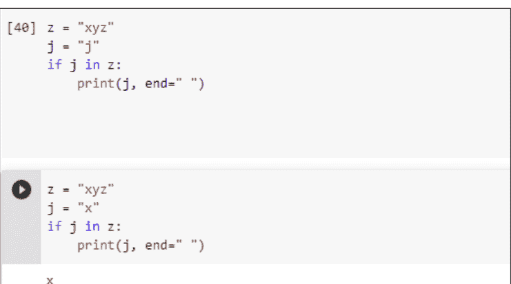

程序 11

在 Python 中执行以下程序时，输出是什么？

```python
x = 'pqrs'

for i in range(len(x)):
    x[i].upper()

print (x)
```

## 在 Google COLAB 中理解 Python

```python
x = 'pqrs'
for i in range(len(x)):
    x[i].upper()
print (x)
```

pqrs

```python
x = 'pqrs'
for i in range(len(x)):
    print(x[i].upper(), end='')
```

PQRS

## 程序 12

执行 `'2' == 2` 时会发生什么？

```python
print('2' == 2)
```

False

## 在 Google COLAB 中理解 Python

# 第 5 章

## Python 函数实验作业

## 级别 – 基础

函数是一段有组织的、可重用的代码，可用于执行单个相关操作。函数为你的应用程序提供了更好的模块化和高度的代码重用性。

## 定义函数

在 Python 中定义函数的规则如下所列：

- 函数块以关键字 `def` 开头，后跟函数名和括号 `( )`。
- 任何输入参数或实参都应放在这些括号内。你也可以在这些括号内定义参数。
- 函数的第一条语句可以是可选语句——函数的文档字符串或 docstring。
- 每个函数内的代码块以冒号 `:` 开头并缩进。
- 语句 `return [expression]` 退出函数，可选择将表达式返回给调用者。没有参数的 `return` 语句与 `return None` 相同。

在 Python 中定义函数的语法如下所示：

### 语法：

```python
def <function_name>(<parameter-list>):
    "function_docstring"
    function_suite
    return <expression>
```

## 在 Google COLAB 中理解 Python

### 示例：

在以下示例中，`printme()` 是一个接受单个字符串参数并打印该字符串的函数。

```python
def printme(str):
    "Function Demo"
    print(str)
    return

printme("Welcome to Python Programming")
```

Welcome to Python Programming

## 按值调用与按引用调用

由于 Python 中的一切都是对象，传递给函数的参数是对象引用，可以在函数体内进行操作，如以下程序所示。在以下程序中，列表 `l` 被传递给 `change()` 方法，该方法将另一个列表附加到作为参数传递的列表中。

```python
def change(list):
    "Call By Reference"
    list.append([1,2,3,4])
    return

l=[10,20,30,40]
print("List Before Calling change function")
print(l)
change(l)
print("List After Calling change function")
print(l)
```

List Before Calling change function
[10, 20, 30, 40]
List After Calling change function
[10, 20, 30, 40, [1, 2, 3, 4]]

## 在 Google COLAB 中理解 Python

## 按值调用

在以下程序中，`list` 是 `change()` 方法的局部变量，在 *change()* 方法内初始化和打印。传递给 *change()* 方法的列表未在函数中使用。

```python
def change(list):
    "Call By Reference"
    list=[1,2,3,4]
    print("List inside Function ")
    print(list)
    return

list=[10,20,30,40]
change(list)
print("List outside function")
print(list)
```

List inside Function
[1, 2, 3, 4]
List outside function
[10, 20, 30, 40]

## 函数参数

函数可以通过以下类型的形式参数调用：

- 必需参数
- 关键字参数
- 默认参数
- 可变长度参数

## 具有必需参数的函数

必需参数必须以正确的顺序传递给函数。这里，函数调用中的参数数量应与函数定义完全匹配。在以下程序中，`add()` 函数接受两个必需参数 `num1` 和 `num2`。所有必需参数必须按正确的顺序传递给函数，如下所示：

## 在 Google COLAB 中概念化 Python

```python
def add(num1,num2):
    sum=num1+num2
    return sum

n1=int(input("Enter first no : "))
n2=int(input("Enter second no : "))
sum=add(n1,n2)
print("Sum of %d and %d is %d" % (n1,n2,sum))

Enter first no : 10
Enter second no : 20
Sum of 10 and 20 is 30
```

## 带关键字参数或命名参数的函数

与必需参数相比，关键字或命名参数在函数调用中无需保持其位置或顺序，这使得在函数调用时可以跳过某些具有默认值的参数。当您在函数调用中使用关键字参数时，调用者通过参数名来识别参数。下面的程序使用命名参数重写了上述程序。在函数定义中，参数‘num1’出现在参数‘num2’之前。另一方面，在函数调用中，参数‘num2’出现在参数‘num1’之前，如下所示：

```python
def add(num1,num2):
    sum=num1+num2
    return sum

n1=int(input("Enter first no : "))
n2=int(input("Enter second no : "))
sum=add(num2=n2,num1=n1)
print("Sum of %d and %d is %d" % (n1,n2,sum))

Enter first no : 100
Enter second no : 200
Sum of 100 and 200 is 300
```

## 命名参数

以下程序演示了 Python 中命名参数的使用。当使用不同的必需参数和命名参数调用函数时，输出中会显示‘a’、‘b’和‘c’的值。

```python
def func(a, b=5, c=10):
    print('a is', a, 'and b is', b, 'and c is', c)

func(3, 7)
func(25, c = 24)
func(c = 50, a = 100)

a is 3 and b is 7 and c is 10
a is 25 and b is 5 and c is 24
a is 100 and b is 5 and c is 50
```

## 带默认参数的函数

在函数定义期间，可以为函数参数分配某些默认值，如果在函数调用中未指定相应的参数，则可以使用这些默认值。在下面的示例中，上述程序被重写，其中 add() 函数为其参数‘num1’和‘num2’分别分配了默认值 10 和 20。如果在调用 add() 函数时未提供一个或两个参数，则将使用默认值，如下所示：

```python
def add(num1=10,num2=20):
    sum=num1+num2
    return sum

sum=add()
print("Sum of %d and %d is %d" % (10,20,sum))

n1=int(input("Enter first no : "))
sum=add(n1)
print("Sum of %d and %d is %d" % (n1,20,sum))

n1=int(input("Enter first no : "))
n2=int(input("Enter second no : "))
sum=add(n1,n2)
print("Sum of %d and %d is %d" % (n1,n2,sum))

Sum of 10 and 20 is 30
Enter first no : 100
Sum of 100 and 20 is 120
Enter first no : 100
Enter second no : 200
Sum of 100 and 200 is 300
```

## 带可变数量参数的函数

Python 支持可变数量的参数，如果在设计时不知道要传递给函数的参数数量，可以使用此功能。在保存所有非关键字可变参数值的变量名前放置一个星号 (*)。如果在函数调用期间未指定其他参数，则此元组保持为空。在下面的示例中，terms 是一个可变数量的参数。add() 函数必须至少使用两个必需参数调用。

```python
def add(num1, num2, *terms):
    sum = num1 + num2
    for x in terms:
        sum += x
    return sum

sum = add(10, 20)
print("Sum is %d" % (sum))

sum = add(10, 20, 30, 40)
print("Sum is %d" % (sum))

sum = add(10, 20, 30, 40, 50, 60)
print("Sum is %d" % (sum))

# Output:
# Sum is 30
# Sum is 100
# Sum is 210
```

## 匿名函数或 Lambda 函数

在 Python 中，匿名函数是未定义名称的函数。普通函数使用‘def’关键字定义，而匿名函数使用 lambda 关键字定义。Lambda 函数可以接受任意数量的参数，但只能有一个表达式。定义 lambda 函数的语法如下所示：

### 语法：

```python
lambda <argument_list>:expression
```

### 定义 Lambda 函数的规则：

设计 lambda 函数时需遵守以下规则：

- 使用‘lambda’关键字代替‘def’关键字来定义 lambda 函数。
- ‘lambda’函数是匿名的，这意味着函数在没有名称的情况下定义。
- Lambda 形式可以接受任意数量的参数，但只能以表达式的形式返回一个值。它们不能包含命令或多个表达式。
- Lambda 函数有自己的本地命名空间，无法访问其参数列表和全局命名空间中的变量以外的变量。

以下示例分别演示了用于计算两个数字之和、将数字加倍以及找出传递给函数的两个数字中最大值的 lambda 函数。

```python
sum=lambda num1,num2:num1+num2
print(sum(10,20))

30
```

```python
double=lambda num:num * 2
print("Double of %d is %d" % (10,double(10)))

Double of 10 is 20
```

```python
max=lambda x,y:x if x>y else y
print("Maximum of 100 and 200 is : ",max(100,200))

Maximum of 100 and 200 is : 200
```

### 示例：

编写一个 lambda 函数，将值增加 10。

```python
x = lambda a : a + 10
print(x(5))

15
```

编写一个 lambda 函数，将两个数字相乘。

```python
product = lambda a,b : a * b
print(product(4,5))

20
```

编写一个 lambda 函数，打印一个字符串。

```python
(lambda str : print(str))("Hello lambda Function")

Hello lambda Function
```

## 带默认参数的 Lambda

Lambda 函数可以接受默认参数。在下面的示例中，定义了一个 lambda 函数，它有三个参数 x、y 和 z，分别被分配了默认值 10、20 和 30。

```python
sum=lambda x=10,y=20, z=30 : x+y+z
print("Sum of 10, 20 and 30    :",sum())
print("Sum of 100, 20 and 30   :",sum(100))
print("Sum of 100, 200 and 30  :",sum(100,200))
print("Sum of 100, 200 and 300 :",sum(100,200,300))

Sum of 10, 20 and 30    : 60
Sum of 100, 20 and 30   : 150
Sum of 100, 200 and 30  : 330
Sum of 100, 200 and 300 : 600
```

## Lambda 函数的应用

Lambda 函数可以在任何需要短时间使用无名函数的地方使用。在 Python 中，我们通常将其用作高阶函数（接受其他函数作为参数的函数）的参数。Lambda 函数与 filter()、map() 等内置函数一起使用。

### filter() 函数

Python 中的 filter() 函数接受一个函数和一个列表作为参数。该函数会调用列表中的所有项，并返回一个新列表，其中包含函数计算结果为 True 的项。以下是使用 filter() 函数从列表中仅筛选出偶数的示例。

```python
list1=[1,2,3,4,5,6,7,8,9,10]
even_list=__builtins__.list(filter(lambda x:(x%2==0),list1))
print("Original List : ",list1)
print("Even list      : ",even_list)

Original List :  [1, 2, 3, 4, 5, 6, 7, 8, 9, 10]
Even list       :  [2, 4, 6, 8, 10]
```

在下面的示例中，filter() 函数用于从列表 list1 中筛选出所有偶数和奇数。

```python
list1=[1,2,3,4,5,6,7,8,9,10]
even_list=__builtins__.list(filter(lambda x:(x%2==0),list1))
odd_list=__builtins__.list(filter(lambda x:(x%2!=0),list1))
print("Original List : ",list1)
print("Even list      : ",even_list)
print("Odd list       : ",odd_list)

Original List :  [1, 2, 3, 4, 5, 6, 7, 8, 9, 10]
Even list       :  [2, 4, 6, 8, 10]
Odd list        :  [1, 3, 5, 7, 9]
```

### map() 函数

Python 中的 map() 函数接受一个函数和一个列表。该函数会调用列表中的所有项，并返回一个新列表，其中包含该函数为每个项返回的项。以下是使用 map() 函数将列表中所有项加倍的示例。

```python
list1=[1,2,3,4,5,6,7,8,9,10]
doubled_list=__builtins__.list(map(lambda x:2*x,list1))
print("Original List : ",list1)
print("Doubled list   : ",doubled_list)

Original List :  [1, 2, 3, 4, 5, 6, 7, 8, 9, 10]
Doubled list   :  [2, 4, 6, 8, 10, 12, 14, 16, 18, 20]
```

使用 lambda 函数将列表的每个元素映射为其平方。

## 在 Google COLAB 中概念化 Python

```python
numbers = [1, 2, 3, 4, 5]
squares = list(map(lambda x: x * x, numbers))
print("original No.s : ", numbers)
print("Square No.s : ", squares)
```

```
original No.s :  [1, 2, 3, 4, 5]
Square No.s :  [1, 4, 9, 16, 25]
```

## 高阶函数

在 Python 中，一个函数可以返回另一个函数，并且一个函数可以将函数作为参数。这类函数被称为‘*高阶函数*’。在下面的例子中，`myfun()` 是一个高阶函数，它接受一个参数并返回一个接受一个参数的 lambda 函数。因此，`myfun()` 可以通过不同的值调用，以创建用于数字翻倍、三倍等的不同函数，如下所示：

```python
def myfun(n):
    return lambda a: a * n

mydoubler = myfun(2)
print(mydoubler(10))

mytripler = myfun(3)
print(mytripler(10))
```

```
20
30
```

### 示例：

在下面的例子中，`arithmetic()` 函数接受三个参数。第一个参数是一个函数，该函数恰好接受两个参数。接下来的两个参数是传递给 `arithmetic()` 函数第一个参数的函数的参数。`add()`、`subtract()`、`multiply()` 和 `divide()` 是恰好接受两个参数的函数，因此可以作为第一个参数传递给 `arithmetic()` 函数，以对两个数字执行不同的算术运算。

```python
def arithmetic(funct, num1, num2):
    return funct(num1, num2)

def add(num1, num2):
    return num1 + num2

def subtract(num1, num2):
    return num1 - num2

def multiply(num1, num2):
    return num1 * num2

def divide(num1, num2):
    return num1 / num2

print("Sum of 10 and 20          : ", arithmetic(add, 10, 20))
print("Difference of 10 and 20   : ", arithmetic(subtract, 10, 20))
print("Multiplication of 10 and 20 : ", arithmetic(multiply, 10, 20))
print("Division of 10 and 20     : ", arithmetic(divide, 10, 20))
```

```
Sum of 10 and 20          :  30
Difference of 10 and 20   :  -10
Multiplication of 10 and 20 :  200
Division of 10 and 20     :  0.5
```

## 具有可变参数数量的高阶函数

以下程序演示了一个高阶函数 `arithmetic()`，它接受两个参数：第一个参数是一个函数，该函数接受可变数量的参数作为其唯一参数；第二个参数是传递给该函数的可变数量的参数。`arithmetic` 函数通过传递 `add()` 函数作为其第一个参数和可变数量的参数来调用，如下所示：

```python
def arithmetic(func, *num):
    return add(*num)

def add(*num):
    sum = 0
    for ele in num:
        sum += ele
    print(sum)

arithmetic(add, 10, 20)
arithmetic(add, 10, 20, 30)
arithmetic(add, 10, 20, 30, 40)
```

```
30
60
100
```

# 第 6 章

Python 高级概念实验作业 - I

（涵盖迭代器、闭包、装饰器和生成器）

难度 – 中级

## 使用迭代器

迭代器在 for 循环、推导式、生成器等中被优雅地实现。Python 中的迭代器是一个可以被迭代并返回数据的对象，一次返回一个元素。迭代器对象实现了两个特殊方法 `__iter__()` 和 `__next__()`，它们统称为‘迭代器协议’。

## 可迭代对象

如果一个对象支持返回迭代器的 `__iter__()` 方法，则称该对象是可迭代的。Python 中大多数内置类，如列表、元组、集合、字符串，都是可迭代的。

## 迭代器的 `__next__()` 方法

迭代器支持 `__next__()` 方法来手动遍历迭代器的项。当迭代结束且没有更多数据时，`__next__()` 方法会抛出 ‘StopIteration’ 异常，如下所示：

```python
mylist = [1, 2]
myiter = mylist.__iter__()
print(myiter.__next__())
print(myiter.__next__())
```

```
1
2
```

```python
mylist = [1, 2]
myiter = mylist.__iter__()
print(myiter.__next__())
print(myiter.__next__())
print(myiter.__next__())
```

```
1
2

StopIteration Traceback (most recent call last)
<ipython-input-11-81d21eefe3b6> in <module>()
      3 print(myiter.__next__())
      4 print(myiter.__next__())
----> 5 print(myiter.__next__())

StopIteration:
```

## 使用 for 循环遍历列表

遍历迭代器最优雅的方式是使用 for 循环，它依次调用迭代器的 `__next__()` 方法来遍历元素，并在迭代器的所有元素耗尽时处理 ‘StopIteration’ 异常。以下程序演示了使用 for 循环遍历列表。

```python
mylist = [1, 2]
for ele in mylist:
    print(ele)
```

```
1
2
```

## for 循环的实现 - 处理 StopIteration 异常

以下程序演示了 for 循环遍历列表的实际实现。使用无限 while 循环来遍历元素，其中封装了 try..except 块用于异常处理。当抛出 ‘StopIteration’ 异常且迭代器中不再有元素时，在 ‘except’ 块中使用 ‘break’ 语句来跳出循环。

```python
mylist = [1, 2, 3, 4, 5]
myiter = mylist.__iter__()
while True:
    try:
        print(myiter.__next__())
    except StopIteration:
        break
```

```
1
2
3
4
5
```

## Python 中的嵌套函数

在 Python 中，一个函数可以嵌套在另一个函数内部，以创建嵌套函数结构，如下所示。如程序所示，嵌套函数可以访问外部作用域的变量，这些变量是函数的非局部成员。在下面的程序中，`greet()` 是一个嵌套在 `greetings()` 函数内部的函数，并存在于 `greetings()` 函数的作用域内。`greet()` 函数可以访问外部函数的参数 ‘nm’，如下所示：

```python
def greetings(nm):
    def greet():
        print("Hello " + nm)
    greet()

greetings("Student")
greetings("MSc")
```

```
Hello Student
Hello MSc
```

这种将某些数据（本例中为 ‘Student’ 或 ‘MSc’）附加到代码上的技术在 Python 中称为闭包。即使变量超出作用域或函数本身从当前命名空间中移除，外部作用域中的这个值也会被记住。

此外，嵌套函数可以修改非局部变量，如下所示：

```python
def greetings(nm):
    def change():
        nm = "New Name"
        print(nm)
    change()

greetings("Old Name")
```

```
New Name
```

如上面的程序所示，嵌套的 `change()` 函数能够访问外部函数的非局部 ‘nm’ 变量。

## 闭包函数

当嵌套函数引用其外部作用域中的值时，我们就有了 Python 中的闭包。

## 闭包的条件

在 Python 中创建闭包必须满足的条件列举如下：

- 我们必须有一个嵌套函数（函数内部的函数）。
- 嵌套函数必须引用在外部函数中定义的值。
- 外部函数必须返回嵌套函数。

对于闭包函数，一个函数嵌套在外层函数的作用域内，并由外层函数返回，如下所示。在下面的程序中，`greetings()` 函数是公开可见的，它返回一个嵌套的 ‘greet’ 函数。

```python
def greetings(nm):
    def greet():
        print("Hello " + nm)
    return greet

func = greetings("Student")
func()
```

```
Hello Student
```

在上面的程序中，`greetings()` 函数被调用时传入字符串 ‘Student’，返回的函数被绑定到变量 ‘func’。调用 `func()` 时，‘nm’ 仍然被记住，尽管我们已经执行完了 `greetings()` 函数。

在 Python 中，一切都是对象，包括函数。因此，函数引用可以存储在变量中，然后可以调用任意次，如下所示：

```python
def greeting1():
    print("Hello from python")

greeting2 = greeting1
greeting3 = greeting1

greeting1()
greeting2()
greeting3()
```

```
Hello from python
Hello from python
Hello from python
```

在上面的程序中，‘greeting2’ 和 ‘greeting3’ 都引用同一个函数对象。

在下面的程序中，‘greetings’ 函数返回的 ‘greet’ 函数引用在删除 ‘greetings’ 函数之前存储在变量 ‘func’ 中。

```python
def greetings(nm):
    def greet():
        print("Hello " + nm)
    return greet

func = greetings("Student")
func()
del greetings
func()
```

```
Hello Student
Hello Student
```

这里，即使原始函数被删除，返回的函数仍然有效。

## 在 Google COLAB 中概念化 Python

```python
def greetings(nm):
    def greet():
        print("Hello "+nm)
    return greet

func=greetings("Student")
func()
del greetings
del greet
```

```
Hello Student
NameError                                 Traceback (most recent call last)
<ipython-input-3-3be216244024> in <module>()
      7 func()
      8 del greetings
----> 9 del greet

NameError: name 'greet' is not defined
```

```python
def greetings(nm):
    def greet():
        print("Hello "+nm)
    return greet

func=greetings("Student")
func()
del greetings
del func
```

```
Hello Student
```

## 闭包函数示例：

在以下示例中，`make_multiplier_of()` 是一个接受参数 `n` 的函数，它创建一个带有参数 `m` 的 `multiplier()` 函数，并将传递给它的参数与 `n` 相乘。

```python
def make_multiplier_of(n):
    def multiplier(m):
        return m*n
    return multiplier

multiplier2=make_multiplier_of(2)
print(multiplier2(10))

multiplier3=make_multiplier_of(3)
print(multiplier3(10))

multiplier4=make_multiplier_of(4)
print(multiplier4(10))
```

```
20
30
40
```

## 闭包的应用

闭包可以避免使用全局值，并提供某种形式的数据隐藏。它还可以为问题提供面向对象的解决方案。

## 高阶函数

Python 中的函数可以接受其他函数作为参数并返回一个函数。这样的函数被称为高阶函数。在下面的程序中，`change()` 函数接受两个参数，第一个参数是要调用的函数的名称，该函数恰好接受一个参数，第二个参数是要传递给该函数的参数。`inc()` 和 `dec()` 是恰好接受一个参数的函数，因此可以传递给 `change()` 函数。`inc()` 函数增加传递给它的参数的值，`dec()` 函数减少传递给它的参数的值。

```python
def inc(x):
    return x+1

def dec(x):
    return x-1

def change(func, x):
    return func(x)

y=change(inc,10)
print(y)

y=change(dec,10)
print(y)
```

```
11
9
```

上面的程序在下面重写，其中 `inc()` 和 `dec()` 函数现在接受两个参数：原始数字和数字应增加或减少的值。

```python
def inc(x,m):
    return x+m

def dec(x,m):
    return x-m

def change(func, x,y):
    return func(x,y)

y=change(inc,10,5)
print(y)

y=change(dec,10,5)
print(y)
```

```
15
5
```

在以下示例中，`C_called()` 是一个高阶函数，它创建并返回一个函数 `Python_returned()`。

```python
def C_called():
    def Python_returned():
        print("Hello from Python")
    return Python_returned

func=C_called()
func()
```

```
Hello from Python
```

函数 `C_called()` 可以直接调用，而无需将其分配给变量，如下面的程序所示：

```python
def C_called():
    def Python_returned():
        print("Hello from Python")
    return Python_returned

C_called()()
```

```
Hello from Python
```

## Python 中的装饰器

Python 中的装饰器是一个函数，它接受一个函数作为其参数，添加一些功能并返回它。这也被称为“*元编程*”，因为程序的一部分试图在编译时修改程序的另一部分。在下面的程序中，***`decorated_greetings()`*** 是一个装饰器，它在调用传递给它的函数之前和之后显示一个装饰的起始行。

```python
def decorated_greetings(func):
    print("***************************")
    func()
    print("***************************")

def ordinary_greetings():
    print("Hello from python")

ordinary_greetings()
print("\n")
decorated_greetings(ordinary_greetings)
```

```
Hello from python

***************************
Hello from python
***************************
```

在下面的程序中，函数 **`decorated_greetings()`** 被绑定到一个变量 `decorated`，该变量传递一个函数 **`ordinary_greetings()`** 进行装饰。最后，调用装饰后的函数 **`decorated()`**。**`ordinary_greetings()`** 函数被装饰，返回的函数被命名为 `decorated`。

```python
def decorated_greetings(func):
    def inner():
        print("***************************")
        func()
        print("***************************")
    return inner

def ordinary_greetings():
    print("Hello from python")

decorated=decorated_greetings(ordinary_greetings)
decorated()
```

```
***************************
Hello from python
***************************
```

## 可调用对象

函数和方法被称为可调用对象，因为它们可以被调用。
事实上，任何实现了特殊 `__call__()` 方法的对象都被称为可调用对象。因此，在最基本的意义上，装饰器是一个返回可调用对象的可调用对象。

```python
def greetings(nm):
    def greet():
        print("Hello "+nm)
    return greet

greetings.__call__("SIBER")
```

```
<function __main__.greetings.<locals>.greet>
```

## 使用注解

这是一个常见的构造，因此，Python 有一种语法来简化它。要装饰的函数可以用包含 `@` 符号和要传递给的装饰器函数名称的头部进行修改。

```python
@decorator_func
def ordinary_func():
    #函数体
```

等同于

```python
decorator_func(ordinary_func)
```

在以下示例中，`ordinary_greetings()` 函数被传递给装饰器 `decorated_greetings()`。因此，在调用 `ordinary_greetings()` 函数时，会自动调用 `decorated_greetings()` 函数，并将 `ordinary_greetings()` 函数作为其参数传递。

```python
def decorated_greetings(func):
    def inner():
        print("***************************")
        func()
        print("***************************")
    return inner

@decorated_greetings
def ordinary_greetings():
    print("Hello from python")

ordinary_greetings()
```

```
***************************
Hello from python
***************************
```

装饰器也使用闭包。在以下示例中，`outer_func()` 是一个函数，它是 `test()` 函数的装饰器，接受两个参数。`outer_func()` 定义了一个嵌套函数 `inner_func()`，它接受两个参数并打印它们。由于嵌套函数可以访问外部函数的参数，因此传递给函数 `func()` 的参数由 `inner_func()` 访问并打印。

```python
def outer_func(func):
    def inner_func(a,b):
        print(a)
        print(b)
    return inner_func

@outer_func
def test(a,b):
    print("Test")

test(10,20)
```

```
10
20
```

传递给要装饰的函数的参数数量必须与嵌套函数的参数数量完全匹配。

```python
def outer_func(func):
    def inner_func(a,b):
        print(a)
        print(b)
    return inner_func

@outer_func
def test(a,b):
    print("Test")

test(10,20,30)
```

```
TypeError
Traceback (most recent call last)
<ipython-input-54-c4939c451cc5> in <module>()
     10
     11
---> 12 test(10,20,30)

TypeError: inner_func() takes 2 positional arguments but 3 were given

SEARCH STACK OVERFLOW
```

## 应用于除法

在以下示例中，`divide()` 是一个函数，它接受两个参数，将第一个参数除以第二个参数并返回结果。

```python
def divide(a,b):
    return a/b

divide(10,5)
```

```
2.0
```

当通过传递 0 作为第二个参数调用 `divide()` 函数时，会抛出异常 `ZeroDivisionError`，如下图所示：

```python
def divide(a,b):
    return a/b

divide(10,0)
```

```
ZeroDivisionError Traceback (most recent call last)
<ipython-input-30-55af3e76ae8e> in <module>()
      2     return a/b
      3 
----> 4 divide(10,0)
      5 

<ipython-input-30-55af3e76ae8e> in divide(a, b)
      1 def divide(a,b):
----> 2     return a/b
      3 
      4 divide(10,0)
      5 

ZeroDivisionError: division by zero
```

这个问题可以使用装饰器来解决。在下面的程序中，`smart_divide()` 是 `divide()` 函数的装饰器，它在将第一个参数除以第二个参数之前检查第二个参数。如果第二个参数为零，则打印消息 `Cannot Divide a by 0` 并返回函数。如果第二个参数不为零，则通过传递两个参数调用 `divide()` 函数，如以下程序所示：

```python
def smart_divide(func):
    def inner(a,b):
        print("Division of a by b")
        if (b==0):
            print("Cannot Divide a by 0")
            return
        return func(a,b)
    return inner

@smart_divide
def divide(a,b):
    print(a/b)

divide(20,10)
```

```
Division of a by b
2.0
```

## 在 Google COLAB 中概念化 Python

```python
def smart_divide(func):
    def inner(a,b):
        print("Division of a by b")
        if (b==0):
            print("Cannot Divide a by 0")
            return
        return func(a,b)
    return inner

@smart_divide
def divide(a,b):
    print(a/b)

divide(20,0)
```

```
Division of a by b
Cannot Divide a by 0
```

注意：装饰器内部嵌套的 `inner()` 函数的参数与其装饰的函数的参数相同。

# 第 7 章

## Python 高级概念实验作业 - II

难度 – 中级

## 列表推导式

列表推导式提供了一种更简洁的语法，用于根据条件从现有列表的值创建新列表。如果条件求值为 `True`，则从指定列表中选择该元素；否则，该元素将被丢弃。列表推导式的语法如下所示：

### 语法：

```python
newlist = [expression for item in iterable if condition == True]
```

返回值是一个新列表，原列表保持不变。

## 不使用列表推导式的代码

以下程序基于列表 `fruits` 创建一个新列表，该列表包含所有名称中包含字母 'a' 的元素，但未使用列表推导式。

```python
fruits = ["apple", "banana", "cherry", "kiwi", "mango"]
newlist = []
for x in fruits:
    if "a" in x:
        newlist.append(x)
print(newlist)
```

```
['apple', 'banana', 'mango']
```

## 使用列表推导式的代码

在以下示例中，上述程序使用列表推导式重写，使代码更加紧凑。

```python
fruits = ["apple", "banana", "cherry", "kiwi", "mango"]
newlist = [x for x in fruits if "a" in x]
print(newlist)
```

```
['apple', 'banana', 'mango']
```

## 示例

将新列表中的所有值设置为 'mango'：

```python
newlist = ['mango' for x in fruits]
```

表达式也可以包含条件，但不像过滤器那样，而是作为一种操作结果的方式：

## 示例

返回 "orange" 而不是 "banana"：（将 banana 替换为 orange）

```python
newlist = [x if x != "banana" else "orange" for x in fruits]
```

上面示例中的表达式可以解释为：

> ‘如果项目不是 banana，则返回该项目；如果是 banana，则返回 orange’。

条件是可选的，可以省略，如下所示：

不使用 if 语句：

```python
newlist = [x for x in fruits]
```

上面的代码通过复制列表 `fruits` 的所有元素来创建一个新列表。

### 示例：

以下程序演示了使用 `range()` 函数和过滤列表元素的条件，通过列表推导式选择给定范围内的元素。

```python
newlist = [x for x in range(10) if x < 5]
print(newlist)
```

```
[0, 1, 2, 3, 4]
```

```python
n=10
newlist = [x for x in range(100) if x < n]
print(newlist)
```

```
[0, 1, 2, 3, 4, 5, 6, 7, 8, 9]
```

## 修改输出

在生成新列表时，可以修改原始列表的元素。以下程序使用列表推导式生成一个新列表，其中包含原始列表中所有元素的平方根。

```python
alist = [4, 16, 64, 256]
out = [a**(1/2) for a in alist]
print(out)
```

```
[2.0, 4.0, 8.0, 16.0]
```

在以下程序中，基于 `result` 列表的内容生成了一个新列表 `result1`，该列表将元素 'p' 和 'f' 分别映射为 'Pass' 和 'Fail'。

```python
result = ['p', 'p', 'f', 'f']
result1 = ['Pass' if x=='p' else 'Fail' for x in result]
print(result1)
```

```
['Pass', 'Pass', 'Fail', 'Fail']
```

## 生成器函数

生成器函数的定义与普通函数类似，但每当它需要生成一个值时，它使用 `yield` 关键字而不是 `return`。如果 `def` 的函数体包含 `yield`，则该函数自动成为生成器函数。在以下示例中，`gen_fun()` 是一个生成器函数，它生成四个值 1、2、3 和 4。类似于列表、元组、集合等可迭代对象，生成器函数可以在 `for` 循环中使用以检索其元素，这会在每次迭代中调用生成器函数对象的 `__next__()` 方法。与可迭代对象类似，当在生成器函数上调用 `__next__()` 方法且没有值被生成时，会抛出 `StopIteration` 异常。

```python
def gen_fun():
    yield 1
    yield 2
    yield 3
    yield 4
for ele in gen_fun():
    print(ele)
```

```
1
2
3
4
```

## Return 与 Yield

`return` 是函数的最终语句。它提供了一种将某些值发送回去的方式。在返回时，其本地栈也会被刷新。任何新的调用都将从第一条语句开始执行。

相反，`yield` 保留了后续函数调用之间的状态。它从将控制权交还给调用者的位置恢复执行，即就在最后一个 `yield` 语句之后。

## 生成器对象

生成器函数返回一个可迭代的生成器对象。生成器函数生成的值可以通过以下方法之一访问：

### 方法 1：

在 `for in` 循环中使用生成器对象。

### 方法 2：

在生成器对象上调用 `__next__()` 方法，如以下程序所示：

```python
def gen_fun() :
    yield 1
    yield 2
    yield 3
    yield 4
obj=gen_fun()
print(obj.__next__())
print(obj.__next__())
print(obj.__next__())
print(obj.__next__())
```

```
1
2
3
4
```

在生成器对象上尝试调用 `__next__()` 方法，如果已超过生成的元素，将抛出 `StopIteration` 异常，如以下程序所示：

```python
def gen_fun():
    yield 1
    yield 2
    yield 3
    yield 4
obj=gen_fun()
print(obj.__next__())
print(obj.__next__())
print(obj.__next__())
print(obj.__next__())
print(obj.__next__())
```

```
1
2
3
4

StopIteration                         Traceback (most recent call last)
<ipython-input-15-28dec8095e1d> in <module>()
      9 print(obj.__next__())
     10 print(obj.__next__())
---> 11 print(obj.__next__())

StopIteration: 
```

## 生成器生成元组

`yield` 语句可以一次返回多个值，以元组形式返回，如以下程序所示。在以下示例中，`*gen()*` 是一个生成器函数，它生成两个元组，每个元组包含两个元素。

```python
def gen():
    x, y = 1, 2
    yield x, y
    x += 1
    yield x, y
g = gen()
print(next(g))
print(next(g))
try:
    print(next(g))
except StopIteration:
    print("Iteration finished")
```

```
(1, 2)
(2, 2)
Iteration finished
```

## Python 生成器表达式

生成器表达式类似于列表推导式。区别在于生成器表达式返回的是一个生成器，而不是一个列表。

生成器表达式使用圆括号创建。在这种情况下创建列表推导式效率会非常低，因为示例会不必要地占用大量内存。相反，我们创建一个生成器表达式，它按需惰性地生成值。

### 示例：

```python
n = (e for e in range(50) if not e % 3)
i = 0
for e in n:
    print(e)
    i += 1
    if i > 100:
        raise StopIteration
```

```python
n = (e for e in range(50) if not e % 3)
for e in n:
    print(e)
```

## 生成器表达式

```python
# 演示 Python 生成器表达式

# 定义列表
alist = [4, 16, 64, 256]

# 使用生成器函数求平方根
out = (a**(1/2) for a in alist)

for e in out:
    print(e)
```

```python
alist = [4, 16, 64, 256]
# 使用列表推导式求平方根
out = [a**(1/2) for a in alist]
print(type(out))

alist = [4, 16, 64, 256]
# 使用列表推导式求平方根
out = (a**(1/2) for a in alist)
print(type(out))
```

```
<class 'list'>
<class 'generator'>
```

```python
# 生成器 next() 方法演示
alist = ['Python', 'Java', 'C', 'C++', 'CSharp']
def list_items():
    for item in alist:
        yield item
gen = list_items()
iter = 0
while iter < len(alist):
    print(next(gen))
    iter += 1
```

```
Python
Java
C
C++
CSharp
```

让我们以一个反转字符串的生成器为例。

```python
def rev_str(my_str):
    length = len(my_str)
    for i in range(length - 1, -1, -1):
        yield my_str[i]
# 使用 for 循环反转字符串
for char in rev_str("hello"):
    print(char)
```

```
o
l
l
e
h
```

## 在 Google COLAB 中概念化 Python

```python
a = (x*x for x in range(10))
print(sum(a))

285
```

## 闭包函数

以下程序演示了一个闭包函数，其中**‘外部’**函数返回一个**‘内部’**函数。

```python
def outer(num1):
    def inner():
        print(num1)
    inner()
outer(10)

10
```

在闭包中，外部函数无法访问内部函数的参数。尝试在外部函数内部访问内部函数的参数会生成**‘NameError’**。

```python
def outer(num1):
    print(num2)
    def inner(num2):
        print(num1)
    inner(20)
outer(10)

NameError                                 Traceback (most recent call last)
<ipython-input-2-287ec29d7544> in <module>()
      4     print(num1)
      5     inner(20)
----> 6 outer(10)

<ipython-input-2-287ec29d7544> in outer(num1)
      1 def outer(num1):
----> 2     print(num2)
      3     def inner(num2):
      4         print(num1)
      5     inner(20)

NameError: name 'num2' is not defined

SEARCH STACK OVERFLOW
```

## 在 Google COLAB 中概念化 Python

然而，内部函数可以访问外部函数的参数，如以下程序所示：

```python
def outer(num1):
    def inner(num2):
        print(num1)
        print(num2)
    inner(20)
outer(10)

10
20
```

以下程序演示了生成器函数如何产出列表的元素。

```python
alist = ['Python', 'Java', 'C', 'C++', 'CSharp']
def list_items():
    for item in alist:
        yield item
gen = list_items()
iter = 0
while iter < len(alist):
    print(next(gen))
    iter += 1

Python
Java
C
C++
CSharp
```

以下程序演示了使用生成器函数反转字符串。

```python
def rev_str(my_str):
    length = len(my_str)
    for i in range(length - 1, -1, -1):
        yield my_str[i]

# For loop to reverse the string
for char in rev_str("hello"):
    print(char,end='')

olleh
```

## 在 Google COLAB 中概念化 Python

以下程序创建一个元组，其中包含 0 到 9 范围内元素的平方。聚合函数 `sum()` 用于计算 0 到 9 范围内自然数平方的和。

```python
a = (x*x for x in range(10))
print(sum(a))

285
```

## 生成器管道

具有不同功能的生成器函数可以管道化连接在一起，以产生累积效果。在以下示例中，定义了三个生成器函数：
`even_filter` → 它接受一个列表，并仅产出列表中的偶数。
`multiply_by_three` → 它接受一个列表，将列表的每个元素乘以 3 并产出。
`convert_to_string` → 它接受一个列表，并产出列表中每个元素的字符串表示。

```python
def even_filter(nums):
    for num in nums:
        if num % 2 == 0:
            yield num
def multiply_by_three(nums):
    for num in nums:
        yield num * 3
def convert_to_string(nums):
    for num in nums:
        yield 'The Number: %s' % num
nums = [1, 2, 3, 4, 5, 6, 7, 8, 9, 10]
pipeline = convert_to_string(multiply_by_three(even_filter(nums)))
for num in pipeline:
    print(num)

The Number: 6
The Number: 12
The Number: 18
The Number: 24
The Number: 30
```

## 在 Google COLAB 中概念化 Python

在主程序中，定义了一个列表，该列表作为参数传递给生成器函数 `even_filter`，以从列表中提取所有偶数。`even_filter` 生成器函数的输出成为 `multiply_by_three` 生成器函数的输入，该函数将每个元素乘以 3，然后作为输入传递给第三个生成器函数，该函数显示每个数字并在其前面加上字符串 ‘The Number: ‘。整个生成器管道如下图所示：

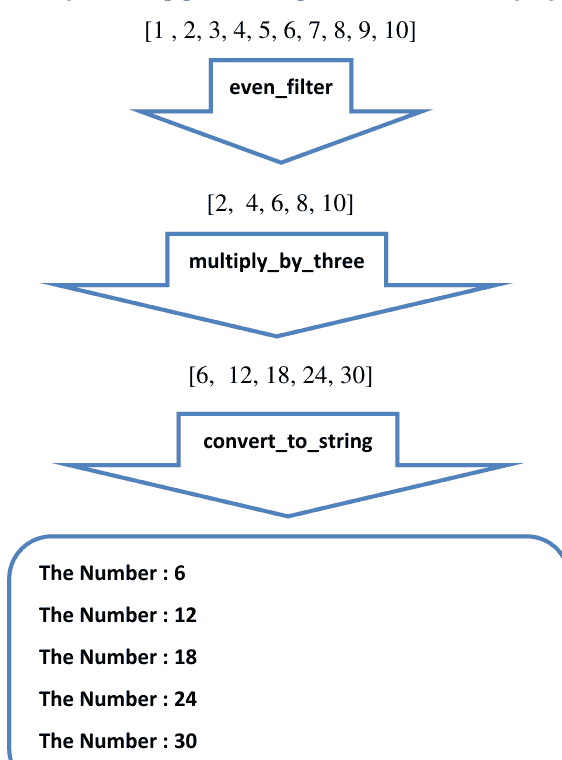

以下示例演示了生成器管道的另一个实例。生成器函数 *pass_filter()* 接受一个分数列表，并仅产出分数大于等于 40 的值。*pass_filter()* 生成器的输出作为输入传递给 *add_bonus()* 生成器函数，该函数为每个及格的学生增加 10 分奖励分。接下来，‘*for*’ 循环遍历列表并打印元素。

## 在 Google COLAB 中概念化 Python

```python
def pass_filter(marks):
    for mark in marks:
        if mark >= 40:
            yield mark

def add_bonus(marks):
    for mark in marks:
        yield mark+10

marks = [35,40,30,55,60]
pipeline = add_bonus(pass_filter(marks))
for mark in pipeline:
    print(mark)

50
65
70
```

整个生成器管道如下图所示：

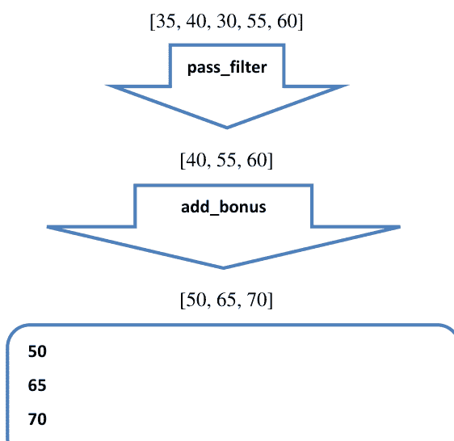

## 在 Google COLAB 中概念化 Python

# 第 8 章

Python 异常处理实验作业

难度 – 中级

## 异常

一个典型的程序可能包含以下类型的错误之一：

- 逻辑错误
- 编译器错误
- 链接器错误
- 运行时错误

逻辑错误可以通过详尽的测试用例来捕获。编译器错误由编译器跟踪并可以修复，链接器错误也是如此。如果程序包含运行时错误，那么它将成功编译。然而，在执行期间会产生错误。这种运行时错误被称为‘*异常*’。

异常可以定义为程序中的一种异常情况，程序无法处理，导致程序流程中断。

程序可以采用以下方法之一：

- 在程序中预测并处理异常，并采取纠正措施
- 将其留给系统处理

## Python 中的标准或预定义异常

标准异常列表如下表所示：

## 在 Google COLAB 中概念化 Python

| 序号 | 异常名称与描述 |
|---|---|
| 1 | **Exception**<br>所有异常的基类 |
| 2 | **StopIteration**<br>当迭代器的 next() 方法不指向任何对象时引发。 |
| 3 | **SystemExit**<br>由 sys.exit() 函数引发。 |
| 4 | **StandardError**<br>除 StopIteration 和 SystemExit 外所有内置异常的基类。 |
| 5 | **ArithmeticError**<br>所有数值计算错误的基类。 |

| 序号 | 异常名称与描述 |
|---|---|
| 6 | **OverflowError**<br>当计算超出数值类型的最大限制时引发。 |
| 7 | **FloatingPointError**<br>当浮点计算失败时引发。 |
| 8 | **ZeroDivisionError**<br>当所有数值类型发生除以零或取模运算时引发。 |
| 9 | **AssertionError**<br>当 Assert 语句失败时引发。 |
| 10 | **AttributeError**<br>当属性引用或赋值失败时引发。 |

## 在 Google COLAB 中概念化 Python

| 11 | **EOFError**<br>当从 raw_input() 或 input() 函数没有输入且到达文件末尾时引发。 |
| 12 | **ImportError**<br>当 import 语句失败时引发。 |
| 13 | **KeyboardInterrupt**<br>当用户中断程序执行时引发，通常是通过按 Ctrl+c。 |
| 14 | **LookupError**<br>所有查找错误的基类。 |
| 15 | **IndexError**<br>当在序列中找不到索引时引发。 |

| 16 | **KeyError**<br>当在字典中找不到指定的键时引发。 |
| 17 | **NameError**<br>当在局部或全局命名空间中找不到标识符时引发。 |
| 18 | **UnboundLocalError**<br>当尝试访问函数或方法中的局部变量但尚未为其赋值时引发。 |
| 19 | **EnvironmentError**<br>所有在 Python 环境之外发生的异常的基类。 |
| 20 | **IOError**<br>当输入/输出操作失败时引发，例如 print 语句或 open() 函数尝试打开不存在的文件时。 |

## 在 Google COLAB 中概念化 Python

| 21 | **IOError**<br>因操作系统相关错误而引发。 |
| 22 | **SyntaxError**<br>当 Python 语法中存在错误时引发。 |
| 23 | **IndentationError**<br>当缩进未正确指定时引发。 |
| 24 | **SystemError**<br>当解释器发现内部问题时引发，但遇到此错误时 Python 解释器不会退出。 |
| 25 | **SystemExit**<br>当使用 sys.exit() 函数退出 Python 解释器时引发。如果在代码中未处理，将导致解释器退出。 |

| 26 | **TypeError**<br>当尝试对指定数据类型无效的操作或函数时引发。 |
| 27 | **ValueError**<br>当数据类型的内置函数具有有效的参数类型，但参数具有无效的指定值时引发。 |
| 28 | **RuntimeError**<br>当生成的错误不属于任何类别时引发。 |
| 29 | **NotImplementedError**<br>当需要在继承类中实现的抽象方法实际上未实现时引发。 |

## 在 Google COLAB 中概念化 Python

## 未处理的异常

当程序中引发异常且程序未处理该异常时，它将被发送给系统处理，这将导致程序异常终止。程序将停止继续执行，如下列程序所示。在以下示例中，语句 3 在尝试将数字除以零时抛出 `ZeroDivisionError`，系统不会处理该错误，最终由运行时系统处理。

```
a = 10
b = 0
c = a/b
print(c)

ZeroDivisionError Traceback (most recent call last)
<ipython-input-1-16fdd7ba8379> in <module>()
     1 a = 10
     2 b = 0
----> 3 c = a/b
     4 print(c)

ZeroDivisionError: division by zero

SEARCH STACK OVERFLOW
```

## 异常处理

以下程序是上述程序的异常处理重写版本。所有需要监控异常的语句都包含在 `try` 块中，其后是 `except` 块。如果在 `try` 块中引发异常，则它将在后续的 `except` 块中处理，程序执行将继续正常进行。如果在 `try` 块中未引发异常，则 `except` 块将被跳过，程序执行将继续正常进行。无论哪种情况，程序执行都将继续正常进行，如下列程序所示。异常处理块的结构如下所示：

```
try:
    .
    .
except ExceptionI:
    .
    .
except ExceptionII:
    .
    .
except ExceptionN:
    .
    .
else:
    .
    .
```

```
try:
    a = 10
    b = 0
    c = a/b
    print(c)
except:
    print("Cannot Divide with Zero")
print("Normal Exit")

Cannot Divide with Zero
Normal Exit
```

## else 块

程序也可以包含 `else` 块，如果在 `try` 块中未引发异常，则执行该块，如下列程序所示：

```
try:
    a = 10
    b = 5
    c = a/b
    print(c)
except:
    print("Cannot Divide with Zero")
else:
    print("Division Successful")
print("Normal Exit")

2.0
Division Successful
Normal Exit
```

```
try:
    a = 10
    b = 0
    c = a/b
    print(c)
except:
    print("Cannot Divide with Zero")
else:
    print("Division Successful")
print("Normal Exit")

Cannot Divide with Zero
Normal Exit
```

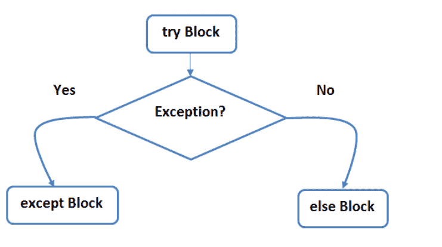

关于上述语法，有几点重要说明：

-   单个 `try` 语句可以有多个 `except` 语句。当 `try` 块包含可能抛出不同类型异常的语句时，这很有用。
-   你也可以提供一个通用的 `except` 子句，它处理任何异常（捕获所有块）。
-   在 `except` 子句之后，你可以包含一个 `else` 子句。如果 `try:` 块中的代码没有引发异常，则执行 `else` 块中的代码。
-   `else` 块是放置不需要 `try:` 块保护的代码的好地方。

## 显示描述性错误消息

当程序中引发异常时，会实例化一个适当异常类型的对象并使其可供程序使用。程序可以使用以下语法访问异常对象：

```
except <exception_class> as <instance_name>
```

如果你编写代码来处理单个异常，可以在 `except` 语句中的异常名称后跟一个变量。如果你捕获多个异常，可以在异常元组后跟一个变量。

此变量接收异常的值，主要包含异常的原因。该变量可以接收单个值或多个值（以元组形式）。此元组通常包含错误字符串、错误编号和错误位置。

异常实例可用于显示描述性错误消息，如下列程序所示：

```
try:
    a = 10
    b = 0
    c = a/b
    print(c)
except Exception as e:
    print("Cannot Divide with Zero")
    print(e)
print("Normal Exit")

Cannot Divide with Zero
division by zero
Normal Exit
```

## 处理多种错误

在 `try` 块中可以引发多种类型的异常，程序可以包含不同的 `except` 块来处理每种类别的异常，如下列程序所示：

```
try:
    fh = open("nofile", "r")
    a = 10
    b = 0
    c = a/b
    print(c)
except Exception as e:
    print("Generic Exception")
    print(e)
except IOError as e:
    print("IO Error")
    print(e)
print("Normal Exit")

Generic Exception
[Errno 2] No such file or directory: 'nofile'
Normal Exit
```

```
try:
    fh = open("nofile", "r")
    a = 10
    b = 0
    c = a/b
    print(c)
except IOError as e:
    print("IO Error")
    print(e)
except Exception as e:
    print("Generic Error")
    print(e)
print("Normal Exit")

IO Error
[Errno 2] No such file or directory: 'nofile'
Normal Exit
```

注意：如果将通用 `except` 块 `Exception` 放在开头，所有异常都会在那里被处理，后续的异常块将变得不可达。

## 默认 except

当 `except` 未指定异常类的名称时，它被称为 **“默认 except”**。默认的 `except:` 块（如果存在）必须是最后一个 `except` 块，否则将产生编译器错误，如下列程序所示：

```
try:
    fh = open("nofile", "r")
    a = 10
    b = 0
    c = a/b
    print(c)
except:
    print("Cannot Divide with Zero")
except IOError as e:
    print("IO Error")
    print(e)
print("Normal Exit")

File "<ipython-input-9-28f2066a897b>", line 6
    print(c)
    ^
SyntaxError: default 'except:' must be last
```

Python 提供了另一种处理多个异常的语法，如下所示：

语法：

`except(exception_name1, exception_name2, . . . , exception_nameN)`

所有预期的异常都可以用逗号分隔符包含在一对括号中。

```
try:
    fh = open("nofile", "r")
    a = 10
    b = 0
    c = a/b
    print(c)
except(IOError, Exception) as e:
    print(e)
print("Normal Exit")

[Errno 2] No such file or directory: 'nofile'
Normal Exit
```

```
try:
    fh = open("nofile", "r")
    a = 10
    b = 0
    c = a/b
    print(c)
except(Exception, IOError) as e:
    print(e)
print("Normal Exit")

[Errno 2] No such file or directory: 'nofile'
Normal Exit
```

注意：异常的顺序无关紧要。

## finally 演示

`try` 或 `except` 块之前可以紧跟 `finally` 块，该块保证在所有情况下执行，并包含必须执行的代码。`finally` 块在以下条件下执行：

-   未抛出异常时
-   抛出异常时
-   函数返回时

不同情况如下所示：

```
def test_finally(var):
    try:
        x=int(var)
        print(x)
        return
    except ValueError as Argument:
        print("The argument does not contain numbers\n",Argument)
    finally:
        print("End of Program")

test_finally("100")
test_finally("xyz")

100
End of Program
The argument does not contain numbers
invalid literal for int() with base 10: 'xyz'
End of Program
```

情况 1：未引发异常

```
try:
    print("Inside try")
    result=10/5
except ZeroDivisionError:
    print("Division By Zero")
except IOError:
    print("Cannot Open File")
except NameError:
    print("Variable Not Defined")
except Exception:
    print("Unknown Error")
else:
    print("Inside else")
finally:
    print("Inside finally")
print("Exiting...")

Inside try
Inside else
Inside finally
Exiting...
```

情况 2：在 `try` 块中抛出 `Division By Zero` 异常。

```
try:
    print("Inside try")
    result=10/0
except ZeroDivisionError:
    print("Division By Zero")
except IOError:
    print("Cannot Open File")
except NameError:
    print("Variable Not Defined")
except Exception:
    print("Unknown Error")
else:
    print("Inside else")
finally:
    print("Inside finally")
print("Exiting...")

Inside try
Division By Zero
Inside finally
Exiting...
```

## 在 Google COLAB 中概念化 Python

案例 3：在 `try` 块中抛出 `NameError` 异常。

```python
try:
    print("Inside try")
    x=y
except ZeroDivisionError:
    print("Division By Zero")
except IOError:
    print("Cannot Open File")
except NameError:
    print("Variable Not Defined")
except Exception:
    print("Unknown Error")
else:
    print("Inside else")
finally:
    print("Inside finally")
print("Exiting...")
```

```
Inside try
Variable Not Defined
Inside finally
Exiting...
```

案例 4：在 `try` 块中抛出 `KeyError` 异常。

```python
try:
    print("Inside try")
    dict={"rollno":1,"name":"Maya"}
    print(dict["division"])
except ZeroDivisionError:
    print("Division By Zero")
except IOError:
    print("Cannot Open File")
except NameError:
    print("Variable Not Defined")
except Exception:
    print("Unknown Error")
else:
    print("Inside else")
finally:
    print("Inside finally")
print("Exiting...")
```

```
Inside try
Unknown Error
Inside finally
Exiting...
```

下表总结了不同的情况：

| try 块 | except ZeroDivisionError 块 | except IOError 块 | except NameError 块 | except Exception 块 | else 块 | finally 块 | 下一条语句 |
| :--- | :--- | :--- | :--- | :--- | :--- | :--- | :--- |
| 无异常 | | | | | | | |
| result = 10 / 0 | | | | | | | |
| x=y | | | | | | | |
| KeyError | | | | | | | |

## 嵌套 try 块

一个 `try` 块可以完全嵌套在另一个 `try` 块内，并且可以嵌套到任意层级。在这种情况下，如果异常在最内层的 `try` 块中抛出，首先会检查所有匹配的 `except` 块。如果找到匹配的 `except` 块，则处理该异常，程序继续执行；否则，会检查外层 `try` 块对应的所有 `except` 块。这个过程会持续进行，直到检查完最外层的 `except` 块。如果最终没有找到匹配的 `except` 块，那么异常将由运行时系统处理，导致程序异常终止。

注意：如果异常是在外层 `try` 块中引发的，即使存在匹配的内层 `except` 块，也不会在那里处理该异常。

在下面的程序中，外层 `try` 块中引发了 `ArithmeticError`，并在外层 `except` 块中处理。

```python
try:
    list1=[1]
    a=10/0
    it=iter(list1)
    next(it)
    next(it)
    try:
        a=10/0
        fh = open("nofile", "r")
        x=int("xyz")
        xx=yy
    except(ArithmeticError, StopIteration, ValueError) as e:
        print("Caught in Inner except",e)
except(ArithmeticError, NameError) as e:
    print("Caught in Outer except",e)
```

```
Caught in Outer except division by zero
```

在下面的程序中，外层 `try` 块中引发了 **StopIteration** 异常，但没有匹配的外层 `except` 块。因此，它由运行时系统处理。
注意：即使内层 `except` 块存在以处理 **StopIteration** 异常，也不会在那里处理它。

```python
try:
    list1=[1]
    a=10/5
    it=iter(list1)
    next(it)
    next(it)
    try:
        a=10/0
        fh = open("nofile", "r")
        x=int("xyz")
        xx=yy
    except(ArithmeticError, StopIteration, ValueError) as e:
        print("Caught in Inner except",e)
except(ArithmeticError, NameError) as e:
    print("Caught in Outer except",e)
```

```
StopIteration Traceback (most recent call last)
<ipython-input-16-877d01b298b3> in <module>()
      4     it=iter(list1)
      5     next(it)
----> 6     next(it)
      7     try:
      8         a=10/0

StopIteration:
```

在下面的程序中，内层 `*try*` 块中引发了 `*ArithmeticError*`，并在 `except` 中处理。

内层和外层 `except` 块都存在以处理 `*ArithmeticError*`。在这种情况下，采用以下规则：“如果 `ArithmeticError` 异常在内层 `*try*` 块中引发，则将在内层 `*except*` 块中处理；如果 `ArithmeticError` 异常在外层 `*try*` 块中引发，则将在外层 `*except*` 块中处理。”

```python
try:
    list1=[1]
    a=10/5
    it=iter(list1)
    next(it)
    #next(it)
    try:
        a=10/0
        fh = open("nofile", "r")
        x=int("xyz")
        xx=yy
    except(ArithmeticError, StopIteration, ValueError) as e:
        print("Caught in Inner except",e)
except(ArithmeticError, NameError) as e:
    print("Caught in Outer except",e)
```

```
Caught in Inner except division by zero
```

在下面的程序中，内层 `try` 块中引发了 `FileNotFoundError` 异常。没有内层或外层 `except` 块来处理该异常。因此，它将由运行时系统处理。

```python
try:
    list1=[1]
    a=10/5
    it=iter(list1)
    next(it)
    #next(it)
    try:
        a=10/5
        fh = open("nofile", "r")
        x=int("xyz")
        xx=yy
    except(ArithmeticError, StopIteration, ValueError) as e:
        print("Caught in Inner except",e)
except(ArithmeticError, NameError) as e:
    print("Caught in Outer except",e)
```

```
---------------------------------------------------------------------------
FileNotFoundError                         Traceback (most recent call last)
<ipython-input-19-6aa7113507d6> in <module>()
      7 try:
      8     a=10/5
----> 9     fh = open("nofile", "r")
     10     x=int("xyz")
     11     xx=yy

FileNotFoundError: [Errno 2] No such file or directory: 'nofile'
```

在下面的程序中，内层 `try` 块中引发了 `ValueError` 异常，并在内层 `except` 块中处理。

```python
try:
    list1=[1]
    a=10/5
    it=iter(list1)
    next(it)
    #next(it)
    try:
        a=10/5
        #fh = open("nofile", "r")
        x=int("xyz")
        xx=yy
    except(ArithmeticError, StopIteration, ValueError) as e:
        print("Caught in Inner except",e)
except(ArithmeticError, NameError) as e:
    print("Caught in Outer except",e)
```

```
Caught in Inner except invalid literal for int() with base 10: 'xyz'
```

在下面的程序中，内层 `try` 块中引发了 `NameError`，并且没有内层 `except` 块来处理它。但是，存在外层 `except` 块来处理 `NameError`。因此，错误在外层 `except` 块中处理。

```python
try:
    list1=[1]
    a=10/5
    it=iter(list1)
    next(it)
    #next(it)
    try:
        a=10/5
        #fh = open("nofile", "r")
        #x=int("xyz")
        xx=yy
    except(ArithmeticError, StopIteration, ValueError) as e:
        print("Caught in Inner except",e)
except(ArithmeticError, NameError) as e:
    print("Caught in Outer except",e)
```

```
Caught in Outer except name 'yy' is not defined
```

## 嵌套 try 块中的控制流

### 案例 1：未引发异常

```python
try:
    print("Inside Outer try block...")
    x=50/10
    print(x)
    #x=y
    try:
        print("Inside Inner try block...")
        x=50/25
        print(x)
        #x=y
        #f=open("nofile.txt","r")
        #n=int("xyz")
    except ZeroDivisionError:
        print("Zero Division Error Processed in inner except block...")
    except NameError:
        print("Name Error Processed in inner except block...")
    else:
        print("Inside Inner else block...")
    finally:
        print("Inside Inner finally block...")
except ZeroDivisionError:
    print("Zero Division Error Processed in outer except block...")
except IOError:
    print("I/O Error Processed in outer except block...")
else:
    print("Inside Outer else block...")
finally:
    print("Inside Outer finally block...")
```

执行后生成以下输出：

```
Inside Outer try block...
5.0
Inside Inner try block...
2.0
Inside Inner else block...
Inside Inner finally block...
Inside Outer else block...
Inside Outer finally block...
```

## 在 Google COLAB 中理解 Python

## 情况 2：外部 try 块中引发 ZeroDivisionError 异常

按如下方式修改外部 try 块：

```python
try:
    print("Inside Outer try block...")
    x=50/0
    print(x)
    #x=y
```

执行后生成以下输出：

```
Inside Outer try block...
Zero Division Error Processed in outer except block...
Inside Outer finally block...
```

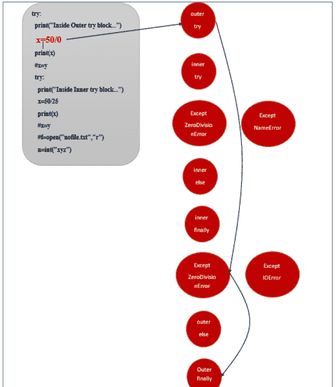

## 在 Google COLAB 中理解 Python

## 情况 3：内部 try 块中引发 ZeroDivisionError 异常

按如下方式修改外部和内部 try 块：

```python
try:
    print("Inside Outer try block...")
    x=50/10
    print(x)
    #x=y
    try:
        print("Inside Inner try block...")
        x=50/0
        print(x)
        #x=y
        #f=open("nofile.txt","r")
        #n=int("xyz")
```

执行后生成以下输出：

```
Inside Outer try block...
5.0
Inside Inner try block...
Zero Division Error Processed in inner except block...
Inside Inner finally block...
Inside Outer else block...
Inside Outer finally block...
```

## 在 Google COLAB 中理解 Python

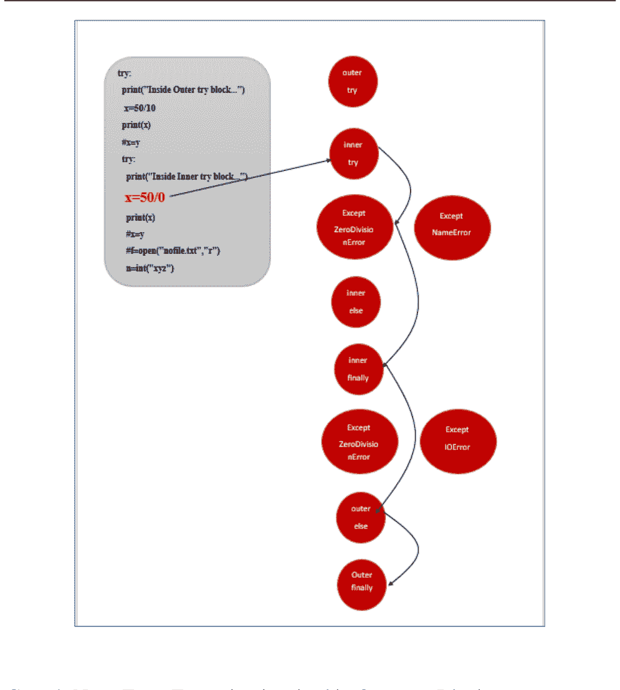

## 情况 4：外部 try 块中引发 NameError 异常

按如下方式修改外部和内部 try 块：

```python
try:
    print("Inside Outer try block...")
    x=50/10
    print(x)
    x=y
    try:
        print("Inside Inner try block...")
        x=50/25
        print(x)
        #x=y
        #f=open("nofile.txt","r")
        #n=int("xyz")
    except ZeroDivisionError:
        print("Zero Division Error Processed in inner except block...")
    except NameError:
        print("Name Error Processed in inner except block...")
    else:
        print("Inside Inner else block...")
    finally:
        print("Inside Inner finally block...")
except ZeroDivisionError:
    print("Zero Division Error Processed in outer except block...")
except IOError:
    print("I/O Error Processed in outer except block...")
else:
    print("Inside Outer else block...")
finally:
    print("Inside Outer finally block...")
```

执行后生成以下输出：

```
Inside Outer try block...
5.0
Inside Outer finally block...
---------------------------------------------------------------------------
NameError                                Traceback (most recent call last)
<ipython-input-13-d80d1b7c188d> in <module>()
      3     x=50/10
      4     print(x)
----> 5     x=y
      6     try:
      7         print("Inside Inner try block...")

NameError: name 'y' is not defined
```

## 在 Google COLAB 中理解 Python

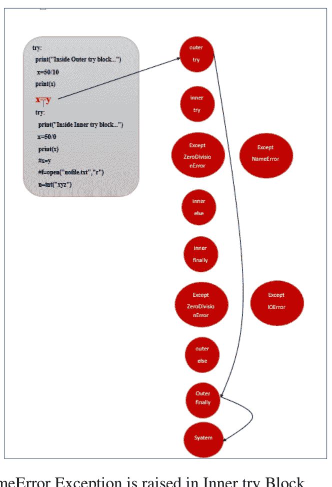

## 情况 5：内部 try 块中引发 NameError 异常

按如下方式修改外部和内部 try 块：

```python
try:
    print("Inside Outer try block...")
    x=50/10
    print(x)
    #x=y
    try:
        print("Inside Inner try block...")
        x=50/25
        print(x)
        x=y
        #f=open("nofile.txt","r")
        #n=int("xyz")
```

执行后生成以下输出：

```
Inside Outer try block...
5.0
Inside Inner try block...
2.0
Name Error Processed in inner except block...
Inside Inner finally block...
Inside Outer else block...
Inside Outer finally block...
```

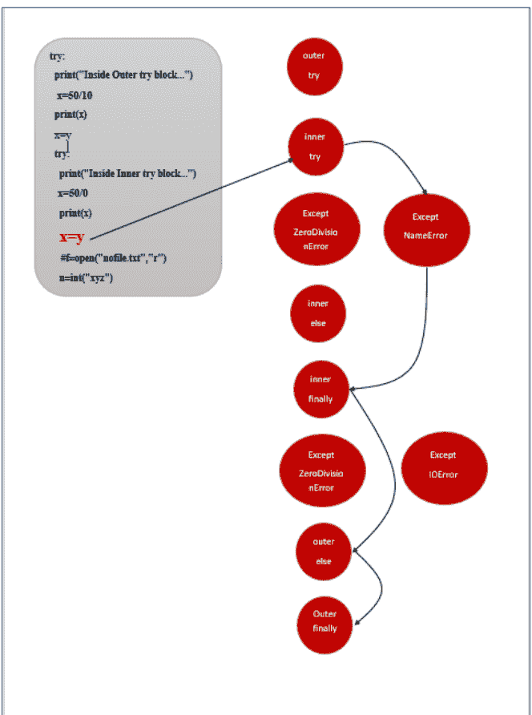

## 在 Google COLAB 中理解 Python

## 情况 6：内部 try 块中引发 IOError 异常

按如下方式修改外部和内部 try 块：

```python
try:
    print("Inside Outer try block...")
    x=50/10
    print(x)
    #x=y
    try:
        print("Inside Inner try block...")
        x=50/25
        print(x)
        #x=y
        f=open("nofile.txt","r")
        #n=int("xyz")
```

执行后生成以下输出：

```
Inside Outer try block...
5.0
Inside Inner try block...
2.0
Inside Inner finally block...
I/O Error Processed in outer except block...
Inside Outer finally block...
```

## 在 Google COLAB 中理解 Python

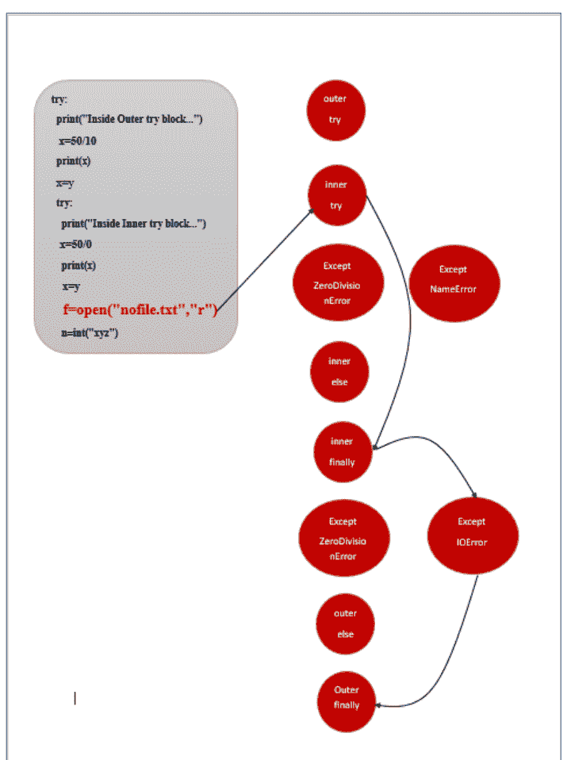

## 情况 7：内部 try 块中引发 ValueError 异常

按如下方式修改外部和内部 try 块：

```python
try:
    print("Inside Outer try block...")
    x=50/10
    print(x)
    #x=y
    try:
        print("Inside Inner try block...")
        x=50/25
        print(x)
        #x=y
        #f=open("nofile.txt","r")
        n=int("xyz")
```

执行后生成以下输出：

```
Inside Outer try block...
5.0
Inside Inner try block...
2.0
Inside Inner finally block...
Inside Outer finally block...
---------------------------------------------------------------------------
ValueError                                Traceback (most recent call last)
<ipython-input-16-59d909f4df81> in <module>()
     10     #x=y
     11     #f=open("nofile.txt","r")
---> 12     n=int("xyz")
     13 except ZeroDivisionError:
     14     print("Zero Division Error Processed in inner except block...")

ValueError: invalid literal for int() with base 10: 'xyz'

SEARCH STACK OVERFLOW
```

## 在 Google COLAB 中理解 Python

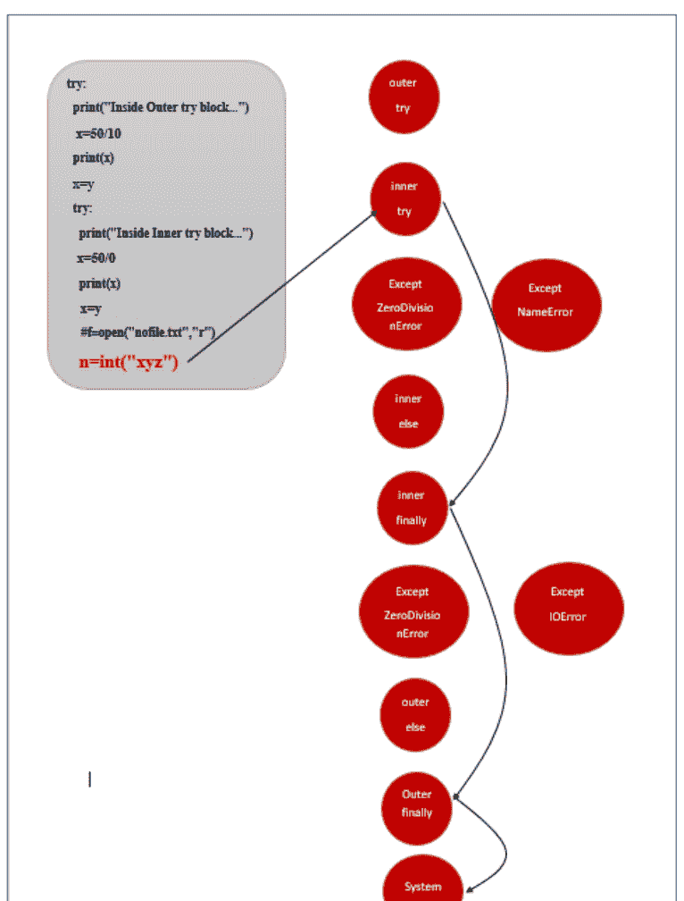

## 在 Google COLAB 中理解 Python

## 有效的异常处理结构

规则 1：`try` 块后面必须跟 `except` 或 `finally` 块。

```python
try:
    print("10")
```

```
File "<ipython-input-22-c7c1dbe7293b>", line 2
    print("10")
        ^
SyntaxError: unexpected EOF while parsing

SEARCH STACK OVERFLOW
```

```python
try:
    print(10)
finally:
    print("End")
```

```
10
End
```

规则 2：如果存在 `else` 块，应将其放在 `finally` 块之前。

```python
try:
    print(10)
except:
    print("Error")
finally:
    print("End")
else:
    print("No Error")
```

```
File "<ipython-input-26-052a494e89f0>", line 7
    else:
        ^
SyntaxError: invalid syntax

SEARCH STACK OVERFLOW
```

## 在 Google COLAB 中理解 Python

规则 3：默认的 `except` 块（如果存在）必须是最后一个 `except` 块。

找出输出：

```python
try:
    x=int("xxx")
except:
    x=10/0
except ZeroDivisionError:
    print("Zero Division Error")
```

```
File "<ipython-input-27-8804b0c59968>", line 2
    x=int("xxx")
    ^
SyntaxError: default 'except:' must be last
```

```python
try:
    x=int("xxx")
except ValueError:
    print("Caught: Value Error")
    x=10/0
except:
    print("Division By Zero Error")
```

```
Caught: Value Error
---------------------------------------------------------------------------
ValueError                                Traceback (most recent call last)
<ipython-input-28-4e9a767a760e> in <module>()
      1 try:
----> 2     x=int("xxx")
      3 except ValueError:

ValueError: invalid literal for int() with base 10: 'xxx'

During handling of the above exception, another exception occurred:

ZeroDivisionError                         Traceback (most recent call last)
<ipython-input-28-4e9a767a760e> in <module>()
      3 except ValueError:
      4     print("Caught: Value Error")
----> 5     x=10/0
      6 except:
      7     print("Division By Zero Error")

ZeroDivisionError: division by zero
```

## 在 Google COLAB 中理解 Python

规则 4：当单个 `except` 块中指定了多个异常时，所有异常必须包含在一对括号内。

```python
try:
    a=10/0
except ArithmeticError, IOError:
    print("Arithmetic Exception")
else:
    print("Successfully Done")
```

```
File "<ipython-input-29-30a0c08e36ac>", line 3
    except ArithmeticError, IOError:
          ^
SyntaxError: invalid syntax

SEARCH STACK OVERFLOW
```

注意：指定多个异常时，需要使用括号。

```python
try:
    a=10/0
except (ArithmeticError, IOError):
    print("Arithmetic Exception")
else:
    print("Successfully Done")
```

```
Arithmetic Exception
```

以下 Python 代码的输出是什么？

```python
def foo():
    try:
        return 1
    finally:
        return 2

k = foo()
```

## 在 Google COLAB 中概念化 Python

```python
def foo():
    try:
        return 1
    finally:
        return 2
k = foo()
print(k)
```

即使 `try` 块中存在 `return` 语句，`finally` 块也会被执行。

执行上述程序后，将生成以下输出：

```
2
```

以下 Python 代码的输出会是什么？

```python
def foo():
    try:
        print(1)
    finally:
        print(2)
foo()
```

`try` 块中没有发生错误，因此打印 1。然后执行 `finally` 块，打印 2。

执行上述程序后，将生成以下输出：

```
1
2
```

# 第 9 章

## Python 文件处理实验作业

难度 – 中级

### 在 Colab 中上传文件

要在 Colab 中上传文件，请点击“上传文件”图标，浏览本地文件系统并选择要上传的文件，如下图所示：

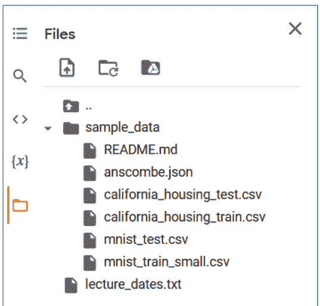

### 复制文件路径

要复制文件的路径，请在 Colab 中选中并右键单击该文件，然后从快捷菜单中选择“复制路径”选项，如下所示：

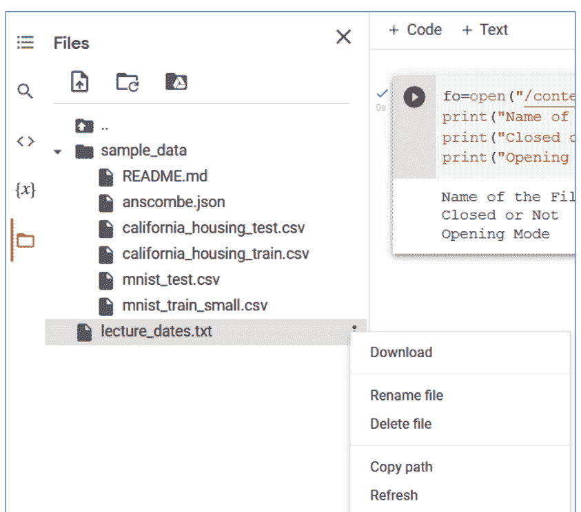

### 基本文件操作

### 打开文件进行 IO

在读取或写入文件之前，你必须使用 Python 内置的 **open()** 函数打开它。此函数创建一个文件对象，该对象将用于调用与其关联的其他支持方法。open() 函数的语法如下所示：

```python
file_object = open(file_name,[,access_mode],[,buffering])
```

不同参数的含义如下表所示：

| 参数 | 含义 |
| :--- | :--- |
| file_name | 一个字符串值，包含要访问的文件的名称。 |
| access_mode | 它确定文件需要以何种模式打开，这取决于要对文件执行的操作类型。这是一个可选参数，默认的文件访问模式是读取 (r)。 |
| buffering | 它可以取正值、负值或零值。默认值为负值，表示系统默认值。如果缓冲值设置为 0，则不进行缓冲。如果缓冲值为 1，则在访问文件时执行行缓冲。如果你将缓冲值指定为大于 1 的整数，则使用指定的缓冲区大小执行缓冲操作。 |

### 文件访问模式

以下是打开文件的不同模式列表 –

| 序号 | 模式与描述 |
| :--- | :--- |
| 1 | **r**<br>以只读方式打开文件。文件指针置于文件的开头。这是默认模式。 |
| 2 | **rb**<br>以二进制格式打开文件进行只读。文件指针置于文件的开头。这是默认模式。 |
| 3 | **r+**<br>打开文件进行读写。文件指针置于文件的开头。 |
| 4 | **rb+**<br>以二进制格式打开文件进行读写。文件指针置于文件的开头。 |
| 5 | **w**<br>打开文件进行只写。如果文件存在，则覆盖该文件。如果文件不存在，则创建一个新文件用于写入。 |
| 6 | **wb**<br>以二进制格式打开文件进行只写。如果文件存在，则覆盖该文件。如果文件不存在，则创建一个新文件用于写入。 |
| 7 | **w+**<br>打开文件进行读写。如果文件存在，则覆盖现有文件。如果文件不存在，则创建一个新文件用于读写。 |
| 8 | **wb+**<br>以二进制格式打开文件进行读写。如果文件存在，则覆盖现有文件。如果文件不存在，则创建一个新文件用于读写。 |
| 9 | **a**<br>打开文件进行追加。如果文件存在，文件指针位于文件末尾。也就是说，文件处于追加模式。如果文件不存在，则创建一个新文件用于写入。 |
| 10 | **ab**<br>以二进制格式打开文件进行追加。如果文件存在，文件指针位于文件末尾。也就是说，文件处于追加模式。如果文件不存在，则创建一个新文件用于写入。 |
| 11 | **a+**<br>打开文件进行追加和读取。如果文件存在，文件指针位于文件末尾。文件以追加模式打开。如果文件不存在，则创建一个新文件用于读写。 |
| 12 | **ab+**<br>以二进制格式打开文件进行追加和读取。如果文件存在，文件指针位于文件末尾。文件以追加模式打开。如果文件不存在，则创建一个新文件用于读写。 |

### *file* 对象属性

一旦文件被打开并且你拥有一个 *file* 对象，你就可以获取与该文件相关的各种信息。

以下是与文件对象相关的所有属性列表 –

| 序号 | 属性与描述 |
| :--- | :--- |
| 1 | **file.closed**<br>如果文件已关闭则返回 true，否则返回 false。 |
| 2 | **file.mode**<br>返回打开文件时使用的访问模式。 |
| 3 | **file.name**<br>返回文件的名称。 |
| 4 | **file.softspace**<br>如果 print 需要显式空格则返回 false，否则返回 true。 |

以下程序演示了使用 open() 函数打开的文件的不同文件属性。

```python
fo=open("/content/lecture_dates.txt","wb")
print("Name of the File : ",fo.name)
print("Closed or Not    : ",fo.closed)
print("Opening Mode     : ",fo.mode)
```

```
Name of the File :  /content/lecture_dates.txt
Closed or Not    :  False
Opening Mode     :  wb
```

### 关闭文件

### *close()* 方法

*file* 对象的 **close()** 方法会刷新任何未写入的信息并关闭文件对象，之后将无法再进行写入。

当文件的引用对象被重新分配给另一个文件时，Python 会自动关闭文件。使用 close() 方法关闭文件是一个好习惯。关闭文件的语法如下所示：

### 语法

```python
<file_object>.close()
```

Python 支持一个 tell() 函数来查询文件指针的位置。以下程序显示了当文件以上述指定的不同模式打开以写入文件和读取文件内容时，文件指针的位置。

```python
f=open("test.txt","w")
print(f.tell())
f=open("test.txt","wb")
print(f.tell())
f=open("test.txt","w+")
print(f.tell())
f=open("test.txt","wb+")
print(f.tell())
```

```
0
0
0
0
```

```python
f=open("test.txt","r")
print(f.tell())
f=open("test.txt","rb")
print(f.tell())
f=open("test.txt","r+")
print(f.tell())
f=open("test.txt","rb+")
print(f.tell())
```

```
0
0
0
0
```

### FileNotFoundError 异常

当文件以 ‘r’ 模式打开且指定位置不存在该文件时，会引发 **FileNotFoundError** 异常。如果文件以 ‘w’ 模式打开且文件不存在，则会创建新文件。

```python
f=open("noname.txt","r")
f.close()
```

```
FileNotFoundError                         Traceback (most recent call last)
<ipython-input-32-f6e7c556f546> in <module>()
----> 1 f=open("noname.txt","r")
      2 f.close()

FileNotFoundError: [Errno 2] No such file or directory: 'noname.txt'
```

```python
f=open("noname.txt","w")
f.close()
```

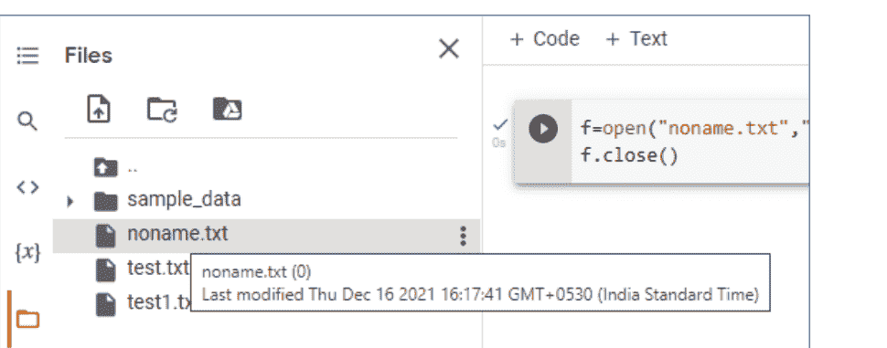

### 创建文件并写入内容

### 文件 I/O

文件对象提供了一组访问方法来执行文件 I/O，用于将内容写入文件和从文件读取内容。

### write() 方法

*write()* 方法将一个字符串写入以 ‘w’、‘w+’、‘a’ 或 ‘a+’ 模式打开的文件，该字符串作为参数传递给它。需要注意的是，Python 字符串可以包含二进制数据，而不仅仅是文本。

*write()* 方法不会在字符串末尾添加换行符 (‘\n’)。write() 方法的语法如下所示：

### 语法：

```python
<file_object>.write(<string>)
```

以下程序创建一个名为 ‘foo.txt’ 的新文件（如果该名称的文件尚不存在），或者如果文件已存在则擦除其内容，并将传递给 write() 方法的内容写入。写入操作完成后，文件将被关闭。

## 在 Google COLAB 中理解 Python

```python
fo=open("/content/foo.txt","w")
fo.write("Python is great language.\nPython is interesting.\nPython is easy")
print("File created successfully...")
fo.close()

File created successfully...
```

在下面的程序中，文件 ‘test.txt’ 以 ‘w’ 模式打开，并将字符串 ‘MCA’ 写入文件。

```python
f=open("test.txt","w")
f.write("MCA")
print("MCA written to the file test.txt...")
f.close()

MCA written to the file test.txt...
```

## 刷新文件

要查看 Colab 的 ‘Files’ 选项卡中的更改，请点击顶部的 ‘Refresh’ 按钮。

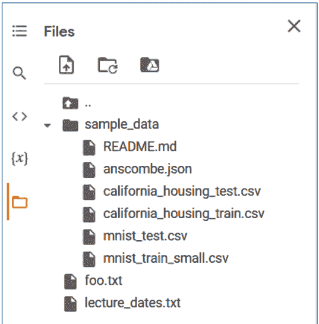

## 在 Google COLAB 中理解 Python

### 读取文件内容

### read() 方法

**read()** 方法从一个打开的文件中读取一个字符串。需要注意的是，Python 字符串除了文本数据外，还可以包含二进制数据。**read()** 方法的语法如下所示：

### 语法：

```python
<file_object>.read([<bytes>])
```

这里，传递给 read 方法的参数指定了要从打开的文件中读取的字节数。此方法从文件的开头开始读取，如果未指定 count，则它会尝试尽可能多地读取，直到文件末尾。

在下面的程序中，文件 **'test.txt'** 以 **'r'** 模式打开，文件的全部内容被读入一个字符串变量 **'data'** 中。

```python
f=open("test.txt","r")
data=f.read()
print("test.txt file contains...",data)
f.close()

test.txt file contains... MCA
```

```python
fo=open("/content/foo.txt","r+")
str=fo.read(7)
print(str)
fo.close()

Python
```

### 读取文件的全部内容

如果未向 read() 方法传递任何参数，则会读取文件的全部内容，如下所示：

```python
fo=open("/content/foo.txt","r+")
str=fo.read()
print(str)
fo.close()

Python is great language.
Python is interesting.
Python is easy
```

### 跟踪文件指针

### 文件位置

*tell()* 方法告诉你文件指针在文件中的当前位置；换句话说，下一次读取或写入将发生在距离文件开头该字节数的位置。

*seek(offset[, from])* 方法更改当前文件位置。offset 参数表示要移动的字节数。from 参数指定要移动字节的参考位置。

如果 from 设置为 **0**，表示使用文件开头作为参考位置；**1** 表示使用当前位置作为参考位置；如果设置为 **2**，则文件末尾将被视为参考位置。

### 查询文件指针位置

文件对象的 *tell()* 方法返回文件指针距离文件开头的当前位置，该位置指定了下一次读取或写入操作将开始的字节。

```python
fo=open("/content/foo.txt","r+")
position=fo.tell()
print("Position of File Pointer",position)
fo.close()

Position of File Pointer 0
```

## 在 Google COLAB 中理解 Python

### 重新定位文件指针

在下面的程序中，seek() 方法用于将文件指针定位到距离文件开头 10 字节的位置，然后读取文件中的接下来 15 个字节。

```python
fo=open("/content/foo.txt","r+")
fo.seek(10,0)
str=fo.read(15)
print(str)
fo.close()

great language.
```

如下面的程序所示，当文件以 ‘r’ 模式打开时，不能为相对于末尾的查找指定负值。而当文件以 ‘rb’ 模式打开时，它工作正常，如下所示：

```python
import os

file1=open("test1.txt","r")
file1.seek(-1,2)
data=file1.read()
print(data)
file1.close()

---------------------------------------------------------------------------
UnsupportedOperation                  Traceback (most recent call last)
<ipython-input-38-be91bc75848c> in <module>()
      2 
      3 file1=open("test1.txt","r")
----> 4 file1.seek(-1,2)
      5 data=file1.read()
      6 print(data)

UnsupportedOperation: can't do nonzero end-relative seeks

SEARCH STACK OVERFLOW
```

```python
file1=open("test1.txt","rb")
file1.seek(-3,2)
data=file1.read().decode()
print(data)
file1.close()
```

在下面的程序中，文件 ‘test.txt’ 以 ‘w+’ 模式打开，用于执行读写操作。将 ‘MCA’ 写入文件后，文件指针位于文件末尾。seek() 方法用于将指针重新定位到文件开头，文件的全部内容被读入变量 ‘data’ 并打印出来。
接下来，文件指针移动一个字节，并将 ‘MCA’ 中的字符 ‘C’ 替换为字符 ‘B’。
文件关闭后以 ‘r’ 模式重新打开，文件的全部内容被读入变量 ‘data’ 并打印出来。

```python
f=open("test.txt","w+")
f.write("MCA")
f.seek(0)
data=f.read()
print("test.txt file contains...",data)

f.seek(1)
f.write("B")
f.close()

f=open("test.txt","r")
data=f.read()
print("test.txt file now contains...",data)
f.close()
```

test.txt file contains... MCA
test.txt file now contains... MBA

```python
f=open("test.txt","w")
f.write("MCA")
f.close()

f=open("test.txt","r")
data=f.read()
print("test.txt file contains...",data)
f.close()

f=open("test.txt","r+")
f.seek(1,0)
f.write("B")
f.close()

f=open("test.txt","r")
data=f.read()
print("test.txt file now contains...",data)
f.close()

test.txt file contains... MCA
test.txt file now contains... MBA
```

### w 和 wb 的区别

当文件以 ‘wb’ 模式打开以二进制格式写入时。向文件对象的 **write()** 方法传递字符串会抛出 **‘TypeError’** 异常，如下图所示：

```python
import os
file1=open("test1.txt","w")
file1.write("Python")
file1.close()

file2=open("test2.txt","wb")
file2.write("Python")
file2.close()

print(os.path.getsize("test1.txt"))
print(os.path.getsize("test2.txt"))

---------------------------------------------------------------------------
TypeError                                 Traceback (most recent call last)
<ipython-input-27-dacf44996180> in <module>()
      5 
      6 file2=open("test2.txt","wb")
----> 7 file2.write("Python")
      8 file2.close()
      9 
TypeError: a bytes-like object is required, not 'str'

SEARCH STACK OVERFLOW
```

要修复此错误，请使用 ‘str’ 类的 **encode()** 方法，如下所示：

```python
import os
file1=open("test1.txt","w")
file1.write("Python")
file1.close()

file2=open("test2.txt","wb")
file2.write("Python".encode())
file2.close()

print(os.path.getsize("test1.txt"))
print(os.path.getsize("test2.txt"))
```

6
6

### r 和 rb 的区别

```python
import os

file1=open("test1.txt","r")
data=file1.read()
print(data)
file1.close()

file2=open("test2.txt","rb")
data=file2.read()
print(data)
file2.close()

print(os.path.getsize("test1.txt"))
print(os.path.getsize("test2.txt"))
```

Python
b'Python'
6
6

使用 read() 方法读取二进制文件时，写入文件的文本被包含在 b'' 中。要读取文本，请使用 decode() 方法，如下所示：

```python
import os

file1=open("test1.txt","r")
data=file1.read()
print(data)
file1.close()

file2=open("test2.txt","rb")
data=file2.read().decode()
print(data)
file2.close()

print(os.path.getsize("test1.txt"))
print(os.path.getsize("test2.txt"))

Python
Python
6
6
```

### w 和 w+ 的区别

‘w’ 模式会创建一个新文件（如果指定的文件不存在），或者截断文件（如果文件已存在）。

### r 和 r+ 的区别

‘r’ 模式以读取模式打开文件，并将文件指针置于文件开头。‘r+’ 模式打开文件以进行读写操作，如果文件已存在，则不会截断文件内容。

### r+ 和 w+ 的区别

‘r+’ 和 ‘w+’ 模式都以读写模式打开文件。区别在于，如果文件已存在，‘w+’ 会删除内容，而 ‘r+’ 不会删除内容，而是覆盖它。
在下面的程序中，执行了以下任务：

- 文件 ‘test.txt’ 以 ‘w’ 模式打开，用于写入内容 ‘MCA in SIBER’。
- 然后文件关闭并以 ‘r’ 模式重新打开以读取内容。
- 接下来，文件以 ‘w+’ 模式打开，将新内容 ‘MBA’ 写入文件，

## 在 Google COLAB 中概念化 Python

- 使用 `seek()` 方法将文件指针定位到文件开头，然后读取并显示内容。

```python
f=open("test.txt","w")
f.write("MCA in SIBER")
f.close()

f=open("test.txt","r")
data=f.read()
print("test.txt file contains...",data)
f.close()

f=open("test.txt","w+")
f.write("MBA")
f.seek(0)
data=f.read()
print("test.txt file contains...",data)
f.close()
```

test.txt file contains... MCA in SIBER
test.txt file contains... MBA

```python
f=open("test.txt","w")
f.write("MCA in SIBER")
f.close()

f=open("test.txt","r")
data=f.read()
print("test.txt file contains...",data)
f.close()

f=open("test.txt","r+")
f.write("MBA")
f.seek(0)
data=f.read()
print("test.txt file contains...",data)
f.close()
```

test.txt file contains... MCA in SIBER
test.txt file contains... MBA in SIBER

## 追加模式

追加模式允许在文件现有内容后追加新内容，同时保留文件的原始内容。在以下程序中，

- 字符串 ‘MCA in SIBER’ 通过以 ‘w’ 模式打开文件 ‘test.txt’ 并写入。
- 文件关闭后，以 ‘a+’ 模式重新打开，用于追加内容 ‘MBA in SIBER’。
- 使用 `seek()` 方法将文件指针重新定位到文件开头，然后将整个文件内容读入变量 ‘data’ 并打印。

```python
f=open("test.txt","w")
f.write("MCA in SIBER")
f.close()

f=open("test.txt","a+")
f.write(" MBA in SIBER")
f.seek(0)
data=f.read()
print("test.txt file contains...",data)
f.close()
```

test.txt file contains... MCA in SIBER MBA in SIBER

在文本文件（模式字符串中不包含 `b` 的文件）中，只允许相对于文件开头的定位（例外情况是使用 `seek(0, 2)` 定位到文件末尾）。

这是因为文本文件在编码字节与其表示的字符之间没有一一对应关系，因此 `seek` 无法确定在文件中跳转到何处以移动一定数量的字符。

如果你的程序可以处理原始字节，可以将程序更改为：

```python
fo=open("/content/foo.txt", "rb")
fo.seek(-7,2)
str=fo.read()
print(str)
fo.close()
```

b'is easy'

刷新文件

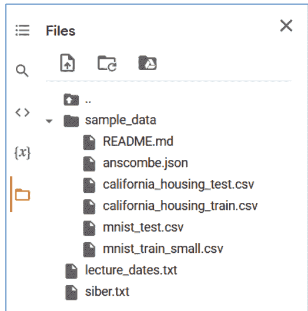

## 管理文件系统

Python 的 ‘os’ 模块提供了帮助你执行文件处理操作的方法，例如重命名和删除文件。

要使用此模块，你需要先导入它，然后才能调用任何相关函数。

### 重命名文件

#### rename() 方法

`rename()` 方法接受两个参数：当前文件名和新文件名。`rename()` 函数的语法如下所示：

### 语法

os.rename(<old_filename>,<new_filename>)

```python
import os
os.rename("foo.txt","siber.txt")
print("File Renamed Successfully...")
```

File Renamed Successfully...

### 删除文件

#### remove() 方法

你可以使用 `remove()` 方法通过提供要删除的文件名作为参数来删除文件。`remove()` 方法的语法如下所示：

### 语法

os.remove(<file_name>)

```python
import os
os.remove("siber.txt")
print("File Deleted Successfully...")
```

File Deleted Successfully...

刷新文件

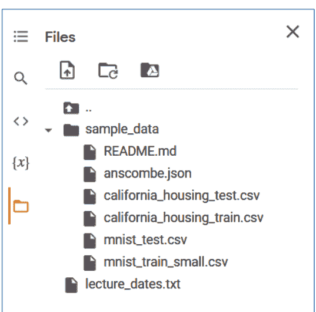

### Python 中的目录

所有文件都包含在各种目录中，Python 处理这些目录也没有问题。`os` 模块有几种方法可以帮助你创建、删除和更改目录。

#### mkdir() 方法

你可以使用 `os` 模块的 `mkdir()` 方法在当前目录中创建目录。你需要为此方法提供一个参数，该参数包含要创建的目录的名称。该方法的语法如下所示：

语法：

```python
os.mkdir(<dir_name>)
```

### 创建目录

```python
import os
os.mkdir("python")
print("Directory Created Successfully...")
```

Directory Created Successfully...

#### chdir() 方法

你可以使用 `chdir()` 方法更改当前目录。`chdir()` 方法接受一个参数，即你想要设为当前目录的目录名称。该方法的语法如下所示：

### 语法：

os.chdir(<dir_name>)

刷新文件

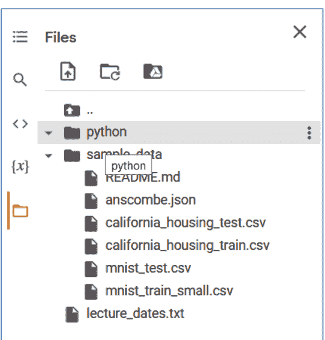

### 打印当前工作目录

#### getcwd() 方法

`getcwd()` 方法显示当前工作目录。该方法的语法如下所示：

### 语法：

os.getcwd()

```python
import os
print(os.getcwd())
```

/content

### 删除目录

#### rmdir() 方法

`rmdir()` 方法删除作为参数传递给该方法的目录。

在删除目录之前，应先删除其中的所有内容。该方法的语法如下所示：

### 语法：

os.rmdir(<dir_name>)

```python
import os
os.rmdir("python")
print("Folder 'python' deleted successfully...")
```

Folder 'python' deleted successfully...

刷新文件

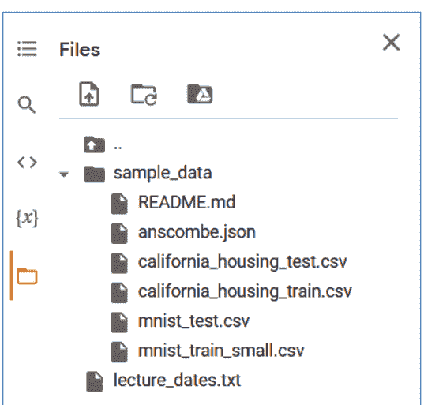

# 第 10 章

Python 正则表达式实验作业

难度 – 中级

## 正则表达式

正则表达式是定义搜索模式的字符和元字符序列，主要用于字符串的模式匹配。

## 正则表达式的应用

正则表达式广泛应用于，

- 模式匹配
- 数据验证
- 文本搜索
- URL 匹配等。

## Python 中的 ‘re’ 模块

Python 有一个名为 ‘re’ 的模块用于处理正则表达式。‘re’ 模块中一些重要的函数如下所列：

### re.match() 函数

`re.match()` 函数用于在 test_string 中搜索模式。它接受两个参数：

- 第一个参数是正则表达式模式，
- 第二个参数是要测试的字符串。

如果搜索成功，该方法返回一个匹配对象。否则，返回 None。

### re.findall()

`re.findall()` 方法返回一个包含所有匹配项的字符串列表。

示例 1：re.findall()

如果未找到模式，`re.findall()` 返回一个空列表。

#### 查找模式的多次出现

```python
import re
string='hello 12 hi 89 howdy 34'
pattern='\d+'
result=re.findall(pattern,string)
print(result)
print(type(result))
```

['12', '89', '34']
<class 'list'>

### re.split()

`re.split` 方法在匹配处拆分字符串，并返回一个包含拆分结果的字符串列表。

如果未找到模式，`re.split()` 返回一个包含原始字符串的列表。

```python
import re
string='one:1 two:2 three:3 four:4'
pattern='\d+'
result=re.split(pattern,string)
print(result)
```

['one:', ' two:', ' three:', ' four:', '']

### re.sub()

`re.sub()` 的语法是：

re.sub(pattern, replace, string)

该方法返回一个字符串，其中匹配的出现项被 replace 变量的内容替换。

如果未找到模式，`re.sub()` 返回原始字符串。

#### 用单个空格替换多个空格

在以下程序中，使用 `re.sub()` 方法将多个空白字符替换为单个空格。

```python
import re
string='SIBER          IS AN      AUTONOMOUS    INSTITUTE'
pattern='\s+'
replace=' '
result=re.sub(pattern,replace,string)
print(result)
```

SIBER IS AN AUTONOMOUS INSTITUTE

#### 从字符串中删除空格

在以下程序中，使用 `re.sub()` 方法删除字符串中的所有空格。

```python
import re
string='SIBER IS AN AUTONOMOUS INSTITUTE'
pattern='\s+'
replace=''
result=re.sub(pattern,replace,string)
print(result)
```

SIBERISANAUTONOMOUSINSTITUTE

### re.subn()

`re.subn()` 与 `re.sub()` 类似，不同之处在于它返回一个包含两个项目的元组：新字符串和进行的替换次数。

在上面的程序中，如果将语句 `re.sub()` 替换为 `re.subn()`，则返回一个包含结果字符串和出现次数的元组，如下所示：

## 在 Google COLAB 中概念化 Python

```python
import re
string='SIBER    IS AN    AUTONOMOUS            INSTITUTE'
pattern='\s+'
replace=' '
result=re.subn(pattern,replace,string)
print(result)

('SIBER IS AN AUTONOMOUS INSTITUTE', 4)
```

以下程序查询 `re.subn()` 方法的返回类型。

```python
import re
string='SIBER    IS AN    AUTONOMOUS            INSTITUTE'
pattern='\s+'
replace=' '
result=re.subn(pattern,replace,string)
print(result)
print(type(result))

('SIBER IS AN AUTONOMOUS INSTITUTE', 4)
<class 'tuple'>
```

你可以将 `count` 作为第四个参数传递给 `re.sub()` 方法。如果省略，其默认值为 0。这将替换所有出现的匹配项。以下程序仅将字符串中多个空格的第一次出现替换为单个空格。

```python
import re
string='SIBER    IS AN    AUTONOMOUS            INSTITUTE'
pattern='\s+'
replace=' '
result=re.subn(pattern,replace,string,1)
print(result)
print(type(result))

('SIBER IS AN    AUTONOMOUS            INSTITUTE', 1)
<class 'tuple'>
```

## re.search()

`re.search()` 方法接受两个参数：一个模式和一个字符串。该方法查找正则表达式模式与字符串匹配的第一个位置。
如果搜索成功，`re.search()` 返回一个匹配对象；如果不成功，则返回 `None`。
*match = re.search(pattern, str)*

### 示例：

此处，变量 `found` 包含一个匹配对象。在以下程序中，在给定字符串中搜索字符串 'SIBER'。由于搜索成功，返回了 `re.Match` 对象，如下图所示：

```python
import re
string='SIBER IS AN AUTONOMOUS INSTITUTE'
sstring='SIBER'
found=re.search(sstring,string)
if found:
    print("Search string found")
else:
    print("Search string not found")
print(type(found))

Search string found
<class 're.Match'>
```

由于在给定字符串中未找到字符串 'CSIBER'，`re.search()` 方法返回 'NoneType'，如下程序所示：

```python
import re
string='SIBER IS AN AUTONOMOUS INSTITUTE'
sstring='CSIBER'
found=re.search(sstring,string)
if found:
    print("Search string found")
else:
    print("Search string not found")
print(type(found))

Search string not found
<class 'NoneType'>
```

## 匹配对象

你可以使用 `dir()` 函数获取匹配对象的方法和属性，如下程序所示：

```python
import re
print(dir(re.Match))
['__class__', '__copy__', '__deepcopy__', '__delattr__', '__dir__', '__doc__', '__eq__', '__format__', '__ge__', '__getattribute__', '
```

匹配对象的一些常用方法和属性如下：
`match.group()`

`group()` 方法返回字符串中匹配的部分。

```python
import re
string='123-45 777-88'
pattern='(\d{3})-(\d{2})'
match=re.search(pattern, string)
if match:
    print(match.group())
else:
    print("Match not found")

123-45
```

此处，`match` 变量包含一个匹配对象。

我们的模式 `(\d{3})-(\d{2})` 有两个子组 `(\d{3})` 和 `(\d{2})`。你可以获取这些带括号子组的字符串部分。方法如下：

```python
import re
string='123-45 777-88'
pattern='(\d{3})-(\d{2})'
match=re.search(pattern, string)
print(match.group(1))
print(match.group(2))
print(match.group(1, 2))
print(match.groups())

123
45
('123', '45')
('123', '45')
```

`match.start()`、`match.end()` 和 `match.span()`
`start()` 函数返回匹配子字符串的起始索引。类似地，`end()` 返回匹配子字符串的结束索引。

```python
import re
string='123-45 777-88'
pattern='(\d{3})-(\d{2})'
match=re.search(pattern, string)
print(match.start())
print(match.end())

0
6
```

`span()` 函数返回一个包含匹配部分起始和结束索引的元组。

```python
import re
string='123-45 777-88'
pattern='(\d{3})-(\d{2})'
match=re.search(pattern, string)
print(match.span())
print(type(match.span()))

(0, 6)
<class 'tuple'>
```

## 在正则表达式前使用 r 前缀

当在正则表达式前使用 `r` 或 `R` 前缀时，它表示原始字符串。例如，`'\n'` 是一个换行符，而 `r'\n'` 表示两个字符：一个反斜杠 `\` 后跟一个 `n`。

反斜杠 `\` 用于转义各种字符，包括所有元字符。然而，使用 `r` 前缀使得 `\` 被视为普通字符。

### 示例：

使用 `r` 前缀的原始字符串

```python
import re
string='Python is easy\n Python is interesting \n Python is open source'
match=re.findall(r"\n", string)
print(match)
lines=len(match)+1
print("No. of Lines is a string : ",lines)

['\n', '\n']
No. of Lines is a string :  3
```

## match.re 和 match.string

匹配对象的 `re` 属性返回一个正则表达式对象。类似地，`string` 属性返回传入的字符串。

```python
import re
string='123-45 777-88'
pattern='(\d{3})-(\d{2})'
match=re.search(pattern,string)
print(match.re)
print(match.string)

re.compile('(\d{3})-(\d{2})')
123-45 777-88
```

## 元字符

元字符是正则表达式引擎以特殊方式解释的字符。以下是常用元字符的列表：

[] . ^ $ * + ? {} () \ |

## 搜索模式

### 元字符 .（单个字符）

```python
import re
pattern='^a...s$'
test_string='abyss'
result=re.match(pattern,test_string)
if result:
    print("Search Successful..")
else:
    print("Search Unsuccessful..")

Search Successful..
```

```python
import re
pattern='^a...s$'
test_string='ass'
result=re.match(pattern,test_string)
if result:
    print("Search Successful..")
else:
    print("Search Unsuccessful..")

Search Unsuccessful..
```

如下所示替换模式并重新执行：

pattern=':\d+'

```python
import re
string='one:1 two:2 three:3 four:4'
pattern=':\d+'
result=re.split(pattern,string)
print(result)

['one', ' two', ' three', ' four', '']
```

## 字符重复

以下字符用于指定字符串中字符的重复：

| 元字符 | 含义 |
|---|---|
| * | 前一个字符出现零次或多次 |
| + | 前一个字符出现一次或多次 |
| ? | 字符出现零次或一次 |
| . | 恰好一个字符 |

### * 元字符（零次或多次出现）

模式 'c*' 匹配无限数量的模式，即包含 ' '、'c'、'cc'、'ccc'、... 等的字符串。
以下程序演示了测试给定字符串是否匹配模式 'c*'
正则表达式 `ab+c` 将匹配 `ac`、`abc`、`abbc`、`abbbc`、... 等。

```python
import re
pattern='c*'
test_string='csiber'
result=re.match(pattern,test_string)
if result:
    print("Search Successful..")
else:
    print("Search Unsuccessful..")

Search Successful..
```

```python
import re
pattern='c*'
test_string='c'
result=re.match(pattern,test_string)
if result:
    print("Search Successful..")
else:
    print("Search Unsuccessful..")

Search Successful..
```

### ? 元字符（零次或一次出现）

模式 'c?' 匹配两种搜索模式，即包含 ' ' 和 'c' 的字符串。以下程序演示了测试给定字符串是否匹配模式 'c?'

```python
import re
pattern='c?'
test_string='csiber'
result=re.match(pattern,test_string)
if result:
    print("Search Successful..")
else:
    print("Search Unsuccessful..")

Search Successful..
```

搜索模式 'docx?'（x 是可选的）匹配 'doc' 或 'docx' 之一。

```python
import re
pattern='docx?'
test_string='doc'
result=re.match(pattern,test_string)
if result:
    print("Search Successful..")
else:
    print("Search Unsuccessful..")

Search Successful..
```

```python
import re
pattern='docx?'
test_string='docx'
result=re.match(pattern,test_string)
if result:
    print("Search Successful..")
else:
    print("Search Unsuccessful..")

Search Successful..
```

### + 元字符（一次或多次出现）

模式 'c+' 匹配无限数量的模式，即包含 'c'、'cc'、'ccc'、... 等的字符串。以下程序演示了测试给定字符串是否匹配模式 'c+'

元字符 '*' 和 '+' 之间的关系是：

{*} = {} U {+}

因此 'c*' 模式除了包含 ' ' 之外，还包含 'c+' 的所有字符串。

正则表达式 `ab+c` 将匹配 `abc`、`abbc`、`abbbc`、... 等。

## 在 Google COLAB 中概念化 Python

```python
import re
pattern='c+'
test_string='c'
result=re.match(pattern,test_string)
if result:
    print("Search Successful..")
else:
    print("Search Unsuccessful..")

Search Successful..
```

```python
import re
pattern='c+'
test_string=''
result=re.match(pattern,test_string)
if result:
    print("Search Successful..")
else:
    print("Search Unsuccessful..")

Search Unsuccessful..
```

```python
import re
pattern='c*'
test_string=''
result=re.match(pattern,test_string)
if result:
    print("Search Successful..")
else:
    print("Search Unsuccessful..")

Search Successful..
```

## 花括号 {...}：

它指示将前面的字符（或字符集）重复括号内的值所指定的次数。

示例：

{2} 表示前面的字符需要重复 2 次，{min,} 表示前面的字符匹配 min 次或更多次。{min, max} 表示前面的字符至少重复 min 次，最多重复 max 次。

## 字符类

字符类匹配一组字符中的任意一个。它用于匹配语言的最基本元素，如字母、数字、空格、符号等。下表描述了可以在正则表达式中使用的不同字符类：

| 字符类 | 含义 |
|---|---|
| \s | 匹配任何空白字符，如空格和制表符 |
| \S | 匹配任何非空白字符 |
| \d | 匹配任何数字字符 |
| \D | 匹配任何非数字字符 |
| \w | 匹配任何单词字符（基本上是字母数字） |
| \W | 匹配任何非单词字符 |
| \b | 匹配任何单词边界（这包括空格、破折号、逗号、分号等） |

## 设置匹配位置

### ^（字符串开头）

^ 符号告诉计算机匹配必须从字符串或行的开头开始。
模式 `'^\d{3}'` 被解释为在字符串开头恰好有 3 个数字。

```python
import re
pattern='^\d{3}'
test_string='012Employee'
result=re.match(pattern,test_string)
if result:
    print("Search Successful..")
else:
    print("Search Unsuccessful..")

Search Successful..
```

```python
import re
pattern='^\d{3}'
test_string='01Employee'
result=re.match(pattern,test_string)
if result:
    print("Search Successful..")
else:
    print("Search Unsuccessful..")

Search Unsuccessful..
```

```python
import re
pattern='^\d{3}'
test_string='0123Employee'
result=re.match(pattern,test_string)
if result:
    print("Search Successful..")
else:
    print("Search Unsuccessful..")

Search Successful..
```

### $（字符串结尾）

$ 符号告诉计算机匹配必须发生在字符串的末尾，或在行或字符串末尾的 \n 之前。模式 `'-\d{3}$'` 被解释为字符 '-' 后跟恰好 3 个数字位于字符串末尾。

```python
import re
pattern='-\d{3}$'
test_string='-456'
result=re.match(pattern,test_string)
if result:
    print("Search Successful..")
else:
    print("Search Unsuccessful..")

Search Successful..
```

```python
import re
pattern='-\d{3}$'
test_string='-456-'
result=re.match(pattern,test_string)
if result:
    print("Search Successful..")
else:
    print("Search Unsuccessful..")

Search Unsuccessful..
```

## 字符类 [] – 字符集

[set_of_characters] – 匹配 set_of_characters 中的任何单个字符。默认情况下，匹配区分大小写。

示例：

[abc] 将匹配任何字符串中的字符 a、b 和 c。

[^set_of_characters] – 否定：匹配任何不在 set_of_characters 中的单个字符。默认情况下，匹配区分大小写。

示例：

[^abc] 将匹配除 a、b、c 之外的任何字符。

[first-last] – 字符范围：匹配从 first 到 last 范围内的任何单个字符。

示例：

[a-zA-Z] 将匹配从 a 到 z 或从 A 到 Z 的任何字符。

你也可以在方括号内使用 - 来指定字符范围。

- [a-e] 与 [abcde] 相同。
- [1-4] 与 [1234] 相同。
- [0-39] 与 [01239] 相同。

## 转义符号：\

如果你想按字面意思匹配实际的 '+'、'.' 等字符，而不是使用其特殊含义，请在该字符前添加反斜杠 (\)。这将告诉计算机将后续字符视为搜索字符，并将其视为匹配模式，如以下程序所示。在以下程序中，字符 '+' 和 '*' 被按字面意思解释，而不是作为元字符。

```python
import re
pattern='\d+[\+\-x\*]\d+'
test_string='2+2'
result=re.match(pattern,test_string)
if result:
    print("Search Successful..")
else:
    print("Search Unsuccessful..")

Search Successful..
```

```python
import re
pattern='\d+[\+\-x\*]\d+'
test_string='3*9'
result=re.match(pattern,test_string)
if result:
    print("Search Successful..")
else:
    print("Search Unsuccessful..")

Search Successful..
```

## 分组字符

正则表达式的一组不同符号可以组合在一起作为一个单元并作为一个块运行，为此，你需要将正则表达式包裹在圆括号 ( ) 中。

示例：

([A-Z]\w?) 包含两个不同的正则表达式元素组合在一起。此表达式将匹配任何包含大写字母后跟任何可选字符的模式。（w 代表单词字符，字母数字）

不带圆括号的模式

[A-Z]\w?

代表

'A 到 Z 范围内的任意一个字符后跟一个可选的空白字符'

### a(bc)* 和 abc* 的区别

模式 a(bc)* 匹配字符串 a、abc、abcbc、abcbcbc、...，而模式 abc* 匹配字符串 ab、abc、abcc、abccc、... 等。

## 交替 ( | )：

匹配由竖线 (|) 字符分隔的任意一个元素。

示例：

th(e|is|at) 将匹配单词 - the、this 和 that。

```python
import re
pattern='th(e|is|at)'
test_string='the'
result=re.match(pattern,test_string)
if result:
    print("Search Successful..")
else:
    print("Search Unsuccessful..")

Search Successful..
```

```python
import re
pattern='th(e|is|at)'
test_string='this'
result=re.match(pattern,test_string)
if result:
    print("Search Successful..")
else:
    print("Search Unsuccessful..")

Search Successful..
```

```python
import re
pattern='th(e|is|at)'
test_string='that'
result=re.match(pattern,test_string)
if result:
    print("Search Successful..")
else:
    print("Search Unsuccessful..")

Search Successful..
```

## 
umber：

反向引用：

它允许在同一个正则表达式中后续识别先前匹配的子表达式（被捕获或包含在圆括号中的表达式）。\n 表示包含在第 n<sup>个</sup> 括号中的组将在当前位置重复。

示例：

([a-z])\1 将匹配 "Seek" 中的 "ee"，因为第二个位置的字符与匹配中第一个位置的字符相同。

示例：

| 正则表达式 | 含义 |
|---|---|
| abc* | 匹配一个字符串，该字符串具有 ab 后跟零个或多个 c |
| abc+ | 匹配一个字符串，该字符串具有 ab 后跟一个或多个 c |
| abc? | 匹配一个字符串，该字符串具有 ab 后跟零个或一个 c |
| abc{2} | 匹配一个字符串，该字符串具有 ab 后跟 2 个 c |
| abc{2,} | 匹配一个字符串，该字符串具有 ab 后跟 2 个或更多 c |
| abc{2,5} | 匹配一个字符串，该字符串具有 ab 后跟 2 到 5 个 c |
| a(bc)* | 匹配一个字符串，该字符串具有 a 后跟零个或多个序列 bc 的副本 |
| a(bc){2,5} | 匹配一个字符串，该字符串具有 a 后跟 2 到 5 个序列 bc 的副本 |

括号表达式—[]

| 正则表达式 | 含义 |
|---|---|
| [abc] | 匹配一个字符串，该字符串具有 a 或 b 或 c，与 a|b|c 相同 |
| [a-c] | 匹配一个字符串，该字符串具有 a 或 b 或 c |
| [a-fA-F0-9] | 一个表示单个十六进制数字的字符串，不区分大小写 |
| [0-9]% | 一个字符串，该字符串在 % 符号前有一个从 0 到 9 的字符 |
| [^a-zA-Z] | 一个字符串，该字符串没有从 a 到 z 或从 A 到 Z 的字母。在这种情况下，^ 用作表达式的否定 |

## 在 Google COLAB 中理解 Python

## 前瞻与后顾 — (?=) 和 (?<=)

`d(?=r)` 仅当 `d` 后面跟着 `r` 时才匹配 `d`，但 `r` 不会成为整体正则表达式匹配的一部分。

`(?<=r)d` 仅当 `d` 前面是 `r` 时才匹配 `d`，但 `r` 不会成为整体正则表达式匹配的一部分。

你也可以使用否定运算符！

`d(?!r)` 仅当 `d` 后面不是 `r` 时才匹配 `d`，但 `r` 不会成为整体正则表达式匹配的一部分。

`(?<!r)d` 仅当 `d` 前面不是 `r` 时才匹配 `d`，但 `r` 不会成为整体正则表达式匹配的一部分。

## 使用正则表达式验证十六进制数

```python
import re
pattern='^[A-Fa-f0-9]*$'
test_string='0A1B'
result=re.match(pattern,test_string)
if result:
    print("Search Successful..")
else:
    print("Search Unsuccessful..")

Search Successful..
```

```python
import re
pattern='^[A-Fa-f0-9]*$'
test_string='0A1Z'
result=re.match(pattern,test_string)
if result:
    print("Search Successful..")
else:
    print("Search Unsuccessful..")

Search Unsuccessful..
```

## 在 Google COLAB 中理解 Python

## 字符验证

```python
import re
pattern='^[A-Za-z]*$'
test_string='MCA'
result=re.match(pattern,test_string)
if result:
    print("Search Successful..")
else:
    print("Search Unsuccessful..")

Search Successful..
```

```python
import re
pattern='^[A-Za-z]*$'
test_string='MCA1'
result=re.match(pattern,test_string)
if result:
    print("Search Successful..")
else:
    print("Search Unsuccessful..")

Search Unsuccessful..
```

## 正则表达式练习

为以下内容提供正则表达式

- i. 非数字字符 `[^0-9]`
- ii. 单词首字母大写 `[A-Z]\w+`
- iii. 所有以 ab 开头的单词 `^ab.*`
- iv. 所有以 ab 开头并以 cd 结尾的单词 `^ab.*cd$`
- v. 任意位数的整数 `\d+`

## 在 Google COLAB 中理解 Python

给出以下模式的含义：

```
^a...b$
```

一个恰好包含五个字符的字符串，以‘a’开头，以‘b’结尾，且‘a’和‘b’之间有任意三个字符。

```
[0-9]{2, 4}
```

匹配至少2位但不超过4位的数字。

```
^([a-zA-Z0-9_\-\.]+)@([a-zA-Z0-9_\-\.]+)\.([a-zA-Z]{2,5})$
```

用于电子邮件地址的正则表达式。

## 在 Google COLAB 中理解 Python

# 第 11 章

## Python 语言基础与错误处理实验作业

难度 – 中级

## 程序 1：变量的作用域

## 局部作用域

在函数内部声明的变量对于声明它的函数是局部的。在下面的程序中，‘x’ 在不同的作用域中使用：

- 全局作用域
- 局部函数作用域
- 函数的参数

即使变量名是‘x’，其作用域也不同。在下面的程序中，x 被声明为一个全局变量，初始化为 50。在函数 func() 内部声明了同名变量。然而，其作用域仅限于声明它的函数。当函数返回时，该变量就超出了作用域。

```python
x = 50
def func(x):
    print('x is', x)
    x = 2
    print('Changed local x to', x)
func(x)
print('x is now', x)

x is 50
Changed local x to 2
x is now 50
```

## 在 Google COLAB 中理解 Python

## 全局作用域

在任何函数外部声明的变量具有全局作用域，并在同一程序的所有函数之间共享。当函数有一个与全局变量同名的局部变量时，局部变量优先。要在函数内部访问全局变量，请使用 **'global'** 关键字，如下面的程序所示：

```python
x = 50
def func():
    global x
    print('x is', x)
    x = 2
    print('Changed global x to', x)
func()
print('Value of x is', x)

x is 50
Changed global x to 2
Value of x is 2
```

## 练习 1：

执行以下代码时会发生什么错误？

`MANGO = APPLE`

执行上述程序时，会显示 **'NameError'**，消息为 **'name APPLE is not defined'**，如下面的程序所示，因为在 Python 中，变量在未初始化的情况下不能使用。

```
MANGO=APPLE

NameError Traceback (most recent call last)
<ipython-input-15-cca103bec844> in <module>()
----> 1 MANGO=APPLE

NameError: name 'APPLE' is not defined

SEARCH STACK OVERFLOW
```

## 在 Google COLAB 中理解 Python

## 练习 2：

以下 Python 代码的输出是什么？

```python
lst = [1, 2, 3]
lst[3]
```

执行上述代码时，会显示 `IndexError`，消息为 `list index out of range`，如下图所示。Python 对列表、元组等数据结构执行边界检查。

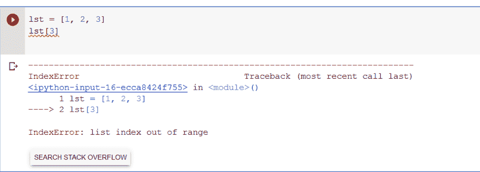

## 练习 3：

以下 Python 代码的输出是什么？

```python
t[5]
```

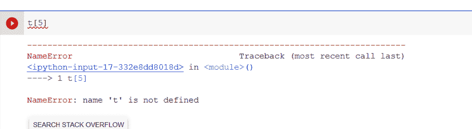

## 在 Google COLAB 中理解 Python

在声明一个名为‘t’的列表（包含三个元素）后，会引发‘*IndexError*’异常，消息为‘*list index out of range*’，如下图所示：

```python
t=[1,2,3]
t[5]

IndexError                                Traceback (most recent call last)
<ipython-input-2-1202e68c67f9> in <module>()
      1 t=[1,2,3]
----> 2 t[5]

IndexError: list index out of range
```

如下面所示，向列表中添加三个更多元素后，程序将成功执行：

```python
t=[1,2,3,4,5,6]
t[5]

6
```

## 练习 4：

如果 time 模块已经导入，以下 Python 代码的输出是什么？
`4 + '3'`
执行上述语句时，会生成‘*TypeError*’，消息为‘*unsupported operand types*’，如下图所示：

```python
4 + '3'

TypeError                                 Traceback (most recent call last)
<ipython-input-18-23fdc3378411> in <module>()
----> 1 4 + '3'

TypeError: unsupported operand type(s) for +: 'int' and 'str'
```

## 在 Google COLAB 中理解 Python

## 练习 5：

以下 Python 代码的输出是什么？

```python
int('65.43')
```

执行上述程序时，会生成‘*ValueError*’，消息为‘*Invalid literal for int()*’，如下图所示：

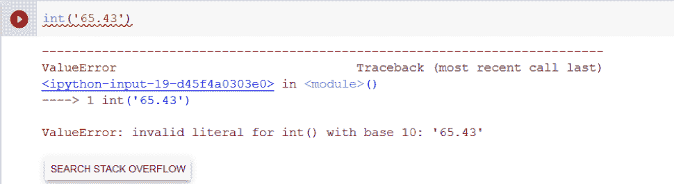

## 练习 6：

以下 Python 代码的输出是什么？

```python
student={"rollno":1,"name":"Maya"}
print(student["division"])
```

执行上述程序时，会生成‘KeyError: division’错误，因为在‘student’字典中没有名为‘division’的键。

## KeyError

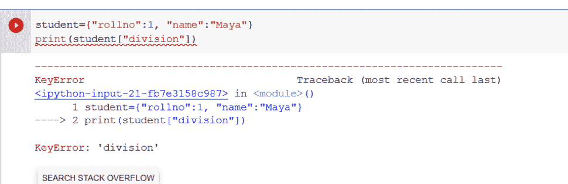

## 在 Google COLAB 中理解 Python

## IndentationError

Python 使用缩进来定义称为‘*Suite*’的代码块。当空格或制表符放置不正确时，会发生缩进错误。

```python
student={"rollno":1, "name":"Maya"}
    print(student["rollno"])

File "<ipython-input-23-5280d887c348>", line 2
    print(student["rollno"])
    ^
IndentationError: unexpected indent

SEARCH STACK OVERFLOW
```

## 在 Google COLAB 中理解 Python

# 第 12 章

## Python 面向对象编程实验作业

## 难度 – 中级

Python 是一种面向对象的编程语言。Python 中几乎一切都是对象，具有其属性和方法。

## 类和对象

类是创建对象的模板或蓝图。对象是类变量或类的运行时实例。

## 在 Python 中创建类

*class* 语句用于创建新的类定义。类的名称紧跟在关键字 *class* 之后，后跟冒号，如下所示 – 在 Python 中创建类的语法如下所示：

```python
class ClassName:
    'Optional class documentation string'
    class_suite
```

类有一个文档字符串，可以通过 *ClassName.__doc__* 访问。
*class_suite* 包含定义类成员、数据属性和函数的所有组件语句。

```python
class fruit:
    "Test Class"
print(fruit)

<class '__main__.fruit'>
```

## 在 Google COLAB 中概念化 Python

## 显示文档字符串

每个 Python 类都有一个成员 `__doc__()`，可用于访问类的文档字符串，如下列程序所示：

```
class fruit:
    "Test Class"
print(fruit)
print(fruit.__doc__)

<class '__main__.fruit'>
Test Class
```

## Python 中的 'self' 关键字

`self` 关键字用于引用类的数据成员。没有 `self` 关键字，变量将被视为局部变量。此外，类的每个成员函数都必须将 `self` 作为其第一个参数，如下列程序所示。然而，在调用方法时并不使用 `self`。

```
class fruit:
    "Test Class"
    def sayhi(self):
        print("Hi")
f=fruit()
f.sayhi()
fruit.sayhi

Hi
<function __main__.fruit.sayhi>
```

## Python 中的对象创建

`__new__` 是一个静态类方法，它让我们能够控制对象的创建。每当我们调用类构造函数时，它都会调用 `__new__`。在内部，`__new__` 是构造函数，它返回一个有效且未填充的对象，以便在其上调用 `__init__`。

## 构造函数

**__init__()** 方法用于在 Python 中定义构造函数，它接受 '*self*' 作为其第一个参数。Python 将名称 `__init__` 重新绑定到 `__new__` 方法。这意味着在下面的程序中，该方法的第一个声明现在无法访问。

```
class Person:
    def __init__(self):
        print("I am first constructor")

    def __init__(self):
        print("I am second constructor")

p1 = Person()

I am second constructor
```

## 类实例化

要创建类的实例，你需要使用类名调用该类，并传入其 `__init__` 方法接受的任何参数。实例化类对象的语法如下所示：

### 语法：

*<实例名> = <类名>(<参数列表>)*

```
class Person:
    def __init__(self):
        print("I am first constructor")

    def __init__(self,name):
        print(self.name)
        print("I am second constructor")

p1 = Person("MCA")

AttributeError Traceback (most recent call last)
<ipython-input-8-2357c96d7b16> in <module>()
      8 
      9 
----> 10 p1 = Person("MCA")

<ipython-input-8-2357c96d7b16> in __init__(self, name)
      4 
      5     def __init__(self,name):
----> 6         print(self.name)
      7         print("I am second constructor")
      8 

AttributeError: 'Person' object has no attribute 'name'
```

在上面的程序中，名为 `name` 的数据成员未定义。该错误在下面的程序中得到修复。传递给类构造函数的 `name` 参数用于初始化类的数据成员 `name`。

```
class Person:
    def __init__(self):
        print("I am first constructor")

    def __init__(self,name):
        self.name=name
        print(self.name)

p1 = Person("MCA")

MCA
```

在下面的程序中，`empCount` 是一个静态变量，由 `employee` 类的所有实例共享。然而，`name` 和 `salary` 是类的数据成员或实例成员。该类有一个双参数构造函数 `__init__()`，用于初始化类的数据成员。该类有两个成员函数 `displayCount()` 和 `displayEmployee()`，用于显示员工总数和员工信息。

```
class Employee:
    'Common base class for all employees'
    empCount = 0

    def __init__(self, name, salary):
        self.name = name
        self.salary = salary
        Employee.empCount += 1

    def displayCount(self):
        print("Total Employee %d" % Employee.empCount)

    def displayEmployee(self):
        print("Name : ", self.name,  ", Salary: ", self.salary)

emp1 = Employee("Zara", 2000)
emp2 = Employee("Manni", 5000)
emp1.displayEmployee()
emp2.displayEmployee()
print("Total Employee %d" % Employee.empCount)

Name :  Zara , Salary:  2000
Name :  Manni , Salary:  5000
Total Employee 2
```

**注意：** 在类内部，局部变量直接引用，而类变量使用以下语法（使用类名）引用：

`<类名>.<类变量名>` 以及

数据成员使用以下语法引用：

`self.<数据成员名>` 以及

一个类中只能有一个 `__init__()` 方法。如果类包含多个 `__init__()` 方法，那么**最后一个 `__init__()`** 方法将生效，覆盖之前的 `__init__()` 方法（如果有的话），如下列程序所示。在下面的程序中，‘Person’ 类包含三个 `__init__()` 方法，其中最后一个 `__init__()` 方法将被用于对象创建。尝试使用单个 ‘name’ 参数创建 ‘Person’ 对象会生成 ‘TypeError’，消息为 ‘`__init__()` missing one required positional parameter ‘age’`，如下所示：

```
class Person:
    def __init__(self):
        name=""
        age=0
    def __init__(self,name):
        age=0
    def __init__(self, name, age):
        self.name = name
        self.age = age

p1 = Person("John", 36)
print(p1.name)
print(p1.age)
p1 = Person(name="Jack")
print(p1.name)
print(p1.age)

John
36
---------------------------------------------------------------------------
TypeError                                 Traceback (most recent call last)
<ipython-input-5-6327588f3cc8> in <module>()
     12 print(p1.name)
     13 print(p1.age)
----> 14 p1 = Person(name="Jack")
     15 print(p1.name)
     16 print(p1.age)

TypeError: __init__() missing 1 required positional argument: 'age'

SEARCH STACK OVERFLOW
```

## 默认参数

构造函数可以接受默认参数。构造函数重载可以使用构造函数中的默认参数来模拟，如下列程序所示。在下面的示例中，‘Person’ 类有一个双参数构造函数，用于初始化 ‘name’ 和 ‘age’ 数据成员，它提供了三种不同的方式来创建 ‘Person’ 类的对象，如下所述：

### 方法 1：使用默认构造函数

**p1 = Person()**
上面的语句创建一个 ‘Person’ 对象，其中 name=’xyz’ 且 age=20。

### 方法 2：使用单参数构造函数

p1 = Person(name="Jack")

上面的语句创建一个 ‘Person’ 对象，其中 name=’Jack’ 且 age=20。

p1 = Person(age=30)

上面的语句创建一个 ‘Person’ 对象，其中 name=’xyz’ 且 age=30。

### 方法 3：使用双参数构造函数

p1 = Person(name="John",36)

上面的语句创建一个 ‘Person’ 对象，其中 name=’John’ 且 age=36。

```
class Person:
    def __init__(self,name="xyz",age=20):
        self.name = name
        self.age = age

p1 = Person("John", 36)
print(p1.name)
print(p1.age)

p1 = Person(name="Jack")
print(p1.name)
print(p1.age)

p1 = Person()
print(p1.name)
print(p1.age)

John
36
Jack
20
xyz
20
```

带默认参数的构造函数

在下面的程序中，类 ‘one’ 的构造函数接受两个参数 ‘a’ 和 ‘b’，其默认值分别为 1 和 2。

```
class one:
    def __init__(self,a=1,b=2):
        print(a+b)
o=one(2)
o1=one(2,3)
o2=one()

4
5
3
```

## 销毁对象（垃圾回收）

Python 中的内存管理是自动的。Python 会自动删除不需要的对象（内置类型或类实例）以释放内存空间。Python 定期回收不再使用的内存块的过程称为垃圾回收。

Python 采用引用计数机制来识别不需要的对象。Python 的垃圾收集器在程序执行期间运行，并在对象的引用计数达到零时触发。对象的引用计数会随着指向它的别名数量的变化而变化。未被引用的对象被称为‘垃圾’。

当一个对象被赋予新名称或放入容器（列表、元组或字典）中时，其引用计数会增加。当对象被 *del* 删除、其引用被重新赋值或其引用超出作用域时，其引用计数会减少。当对象的引用计数达到零时，Python 会自动回收它。

你通常不会注意到垃圾收集器何时销毁孤立实例并回收其空间。但一个类可以实现特殊方法 `__del__()`，称为析构函数，该方法在实例即将被销毁时被调用。此方法可用于清理实例使用的任何非内存资源。

在下面的程序中，‘Point’ 对象被三个引用 ‘pt1’、‘pt2’ 和 ‘pt3’ 引用。使用 ‘sys’ 类的 `getrefcount()` 方法来显示引用计数，该方法接受一个参数，即引用的名称。每次为现有对象创建新引用时，引用计数都会增加。

## 在 Google COLAB 中概念化 Python

‘Point’ 类对象的引用计数每次增加 1，直到达到 3。在后续语句中，引用 ‘pt1’、‘pt2’ 和 ‘pt3’ 按顺序被删除。当 ‘Point’ 对象不再有任何引用时，它将被垃圾回收，并且在此之前会调用 `__del__()` 方法，显示消息 ‘Point Destroyed’。

```python
import sys
class Point:
    def __init__(self, x=0, y=0):
        self.x = x
        self.y = y
    def __del__(self):
        class_name = self.__class__.__name__
        print(class_name, "destroyed")

pt1 = Point()
print("Reference Count : ", sys.getrefcount(pt1)-1)
pt2 = pt1
print("Reference Count : ", sys.getrefcount(pt1)-1)
pt3 = pt1
print("Reference Count : ", sys.getrefcount(pt1)-1)
del pt3
print("Reference Count : ", sys.getrefcount(pt1)-1)
del pt2
print("Reference Count : ", sys.getrefcount(pt1)-1)
del pt1
```

```
Reference Count :  1
Reference Count :  2
Reference Count :  3
Reference Count :  2
Reference Count :  1
Point destroyed
```

## 类 ID

`id()` 函数返回指定对象的唯一 ID。Python 中的所有对象都有其自己的唯一 ID。ID 在对象创建时分配给它。在下面的示例中，‘Point’ 类有一个构造函数 `__init__()`，带有两个用于初始化 x 和 y 坐标的默认参数，以及一个析构函数 `__del__()`。`pt1`、`pt2` 和 `pt3` 是指向同一个 ‘Point’ 对象的三个引用。因此，所有引用的 ‘id’ 都相同，如执行上述程序生成的输出所示：

```python
class Point:
    def __init__(self, x=0, y=0):
        self.x = x
        self.y = y
    def __del__(self):
        class_name = self.__class__.__name__
        print(class_name, "destroyed")

pt1 = Point()
pt2 = pt1
pt3 = pt1
print(id(pt1), id(pt2), id(pt3)) # prints the ids of the objects
del pt1
del pt2
del pt3
```

```
140374062186448 140374062186448 140374062186448
Point destroyed
```

当使用 ‘del’ 函数删除对象时，会调用析构函数 `__del__()`。

```python
class Point:
    def __init__(self, x=0, y=0):
        self.x = x
        self.y = y
    def __del__(self):
        class_name = self.__class__.__name__
        print(class_name, "destroyed")

pt1 = Point()
pt2 = Point()
pt3 = pt1
print(id(pt1), id(pt2), id(pt3)) # prints the ids of the objects
del pt1
del pt2
del pt3
```

```
140374061767696 140374061767824 140374061767696
Point destroyed
Point destroyed
```

## 访问类成员

除了使用普通语句访问属性外，您还可以使用下表中描述的函数：

| 函数名 | 描述 |
|---|---|
| `getattr(obj, name[, default])` | 访问对象的属性。<br><br>示例：<br>`getattr(emp1, 'age')`<br>返回 ‘emp1’ 实例的 ‘age’ 属性的值。 |
| `hasattr(obj, name)` | 检查属性是否存在。<br><br>示例：<br>`hasattr(emp1, 'age')`<br>如果 ‘emp1’ 所属类中存在 ‘age’ 属性，则返回 true。 |
| `setattr(obj, name, value)` | 设置属性。如果属性不存在，则会创建它。<br><br>示例：<br>`setattr(emp1, 'age', 8)`<br>将 ‘emp1’ 实例的 ‘age’ 属性设置为 8。 |
| `delattr(obj, name)` | 删除属性。<br><br>示例：<br>`delattr(emp1, 'age')`<br>删除 ‘emp1’ 所属类的 ‘age’ 属性。 |

## 内置类属性

每个 Python 类都保留以下内置属性，如下表所示，可以使用点运算符像访问任何其他属性一样访问它们。

| 属性名 | 描述 |
|---|---|
| `__dict__` | 包含类命名空间的字典。 |
| `__doc__` | 类文档字符串，如果未定义则为 none。 |
| `__name__` | 类名。 |
| `__module__` | 定义类的模块名。在交互模式下，此属性为 “__main__”。 |
| `__bases__` | 一个可能为空的元组，包含基类，按其在基类列表中出现的顺序排列。 |

上述属性针对 ‘Employee’ 类的访问方式如下图所示：

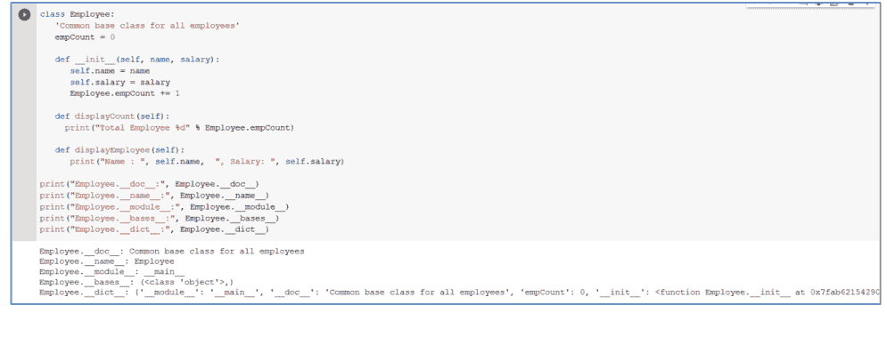

## 类继承

继承有助于代码重用。如果两个类具有共同特征，那么无需从头开始创建类，而是可以从另一个类简单地继承。新类继承自的类称为 ‘Base’ 类或 ‘Super’ 类，而创建的新类称为 ‘Derived’ 或 ‘Sub’ 类。‘Sub’ 类可以执行以下操作之一：

- 继承基类的成员
- 重写基类的成员
- 向类添加新的数据成员或功能

类继承的语法如下所示：

### 语法

派生类的声明方式与父类类似；但是，在类名之后给出了要继承的基类列表 —

```python
class SubClassName (ParentClass1[, ParentClass2, ...]):
    'Optional class documentation string'
    class_suite
```

由于 Python 支持多重继承，因此可以在括号中列出多个基类。

在下面的示例中，`Child` 是 `Parent` 的派生类，它继承了 `Parent` 类的成员，并添加了一个名为 `childMethod()` 的新成员函数。

```python
class Parent:       # define parent class
    parentAttr = 100
    def __init__(self):
        print("Calling parent constructor")

    def parentMethod(self):
        print('Calling parent method')

    def setAttr(self, attr):
        Parent.parentAttr = attr

    def getAttr(self):
        print("Parent attribute :", Parent.parentAttr)

class Child(Parent): # define child class
    def __init__(self):
        print("Calling child constructor")

    def childMethod(self):
        print('Calling child method')

c = Child()           # instance of child
c.childMethod()       # child calls its method
c.parentMethod()      # calls parent's method
c.setAttr(200)        # again call parent's method
c.getAttr()           # again call parent's method
```

执行上述程序后，生成以下输出：

```
Calling child constructor
Calling child method
Calling parent method
Parent attribute : 200
```

## 方法重写

子类可以重写父类的功能，以在派生类中定义不同的功能。在下面的示例中，从 ‘Parent’ 类继承的 `myMethod()` 方法在 ‘Child’ 类中被重写。

```python
class Parent:        # define parent class
    def myMethod(self):
        print('Calling parent method')

class Child(Parent): # define child class
    def myMethod(self):
        print('Calling child method')

c = Child()          # instance of child
c.myMethod()         # child calls overridden method
```

```
Calling child method
```

修改上述程序，使用 ‘Parent’ 类的引用初始化变量 ‘c’，并重新执行程序，如下所示：

```python
class Parent:        # define parent class
    def myMethod(self):
        print('Calling parent method')

class Child(Parent): # define child class
    def myMethod(self):
        print('Calling child method')

c = Parent()         # instance of parent
c.myMethod()         # child calls overridden method
```

```
Calling parent method
```

## Python 中的访问修饰符：Public、Private 和 Protected

各种面向对象语言（如 C++、Java、Python）控制访问修饰符，用于限制对类变量和方法的访问。大多数编程语言有三种形式的访问修饰符，即类中的 **Public**、**Protected** 和 **Private**。Python 使用 ‘_’ 符号来确定对类的特定数据成员或成员函数的访问控制。Python 中的访问说明符在保护数据免受未经授权访问和防止其被利用方面发挥着重要作用。

Python 中的类有三种类型的访问修饰符 –

- Public 访问修饰符
- Protected 访问修饰符
- Private 访问修饰符

### Public 访问修饰符：

声明为 public 的类成员可以从程序的任何部分轻松访问。类的所有数据成员和成员函数默认都是 public 的。

### 说明类中 Public 访问修饰符的程序

## 在 Google COLAB 中概念化 Python

```python
class Student:

    # 构造函数
    def __init__(self, name, rollno):

        # 公有数据成员
        self.name = name
        self.rollno = rollno

    # 公有成员函数
    def displayRollno(self):
        # 访问公有数据成员
        print("Rollno : ", self.rollno)

# 创建类的对象
obj = Student("Milan", 1)

# 访问公有数据成员
print("Name: ", obj.name)

# 调用类的公有成员函数
obj.displayRollno()

Name:  Milan
Rollno :  1
```

在上面的程序中，‘name’ 和 ‘rollno’ 是公有数据成员，而 *displayRollno()* 方法是类 ‘*Student*’ 的一个公有成员函数。类 ‘*Student*’ 的这些数据成员可以从程序中的任何地方访问。

## 受保护访问修饰符：

类中声明为受保护的成员只能被其派生类访问。类的数据成员通过在该类的数据成员前添加单个下划线 ‘_’ 符号来声明为受保护。

## 说明类中受保护访问修饰符的程序

在下面的程序中，*_name*、*_roll* 和 *_elective* 是受保护的数据成员，*_displayRollAndElective()* 方法是超类 Student 的一个受保护方法。*displayDetails()* 方法是类 ‘*MCAStudent*’ 的一个公有成员函数，该类派生自 ‘*Student*’ 类，‘*MCAStudent*’ 类中的 *displayDetails()* 方法访问了 Student 类的受保护数据成员。

```python
# 超类
class Student:
    # 受保护的数据成员
    _name = None
    _roll = None
    _elective = None

    # 构造函数
    def __init__(self, name, roll, elective):
        self._name = name
        self._roll = roll
        self._elective = elective

    # 受保护的成员函数
    def _displayRollAndElective(self):

        # 访问受保护的数据成员
        print("Roll : ", self._roll)
        print("Elective : ", self._elective)
```

```python
class MCAStudent(Student):
    # 构造函数
    def __init__(self, name, roll, elective):
        Student.__init__(self, name, roll, elective)

    # 公有成员函数
    def displayDetails(self):

        # 访问超类的受保护数据成员
        print("Name : ", self._name)

        # 访问超类的受保护成员函数
        self._displayRollAndElective()

# 创建派生类的对象
obj = MCAStudent("Milan", 1, "Machine Learning with Python")

# 调用类的公有成员函数
obj.displayDetails()

Name : Milan
Roll : 1
Elective : Machine Learning with Python
```

## 私有访问修饰符：

类中声明为私有的成员只能在类内部访问，私有访问修饰符是最安全的访问修饰符。类的数据成员通过在该类的数据成员前添加双下划线 ‘__’ 符号来声明为私有。

在下面的程序中，_name、_roll 和 _elective 是私有成员，__displayDetails() 方法是一个私有成员函数（只能在类内部访问），而 accessPrivateFunction() 方法是类 ‘Student’ 的一个公有成员函数，可以从程序中的任何地方访问。accessPrivateFunction() 方法访问了类 ‘Student’ 的私有成员。

```python
class Student:
    # 私有成员
    __name = None
    __roll = None
    __elective = None

    # 构造函数
    def __init__(self, name, roll, elective):
        self.__name = name
        self.__roll = roll
        self.__elective = elective

    # 私有成员函数
    def __displayDetails(self):
        # 访问私有数据成员
        print("Name : ", self.__name)
        print("RollNo : ", self.__roll)
        print("Elective : ", self.__elective)

    # 公有成员函数
    def accessPrivateFunction(self):
        # 访问私有成员函数
        self.__displayDetails()

# 创建对象
obj = Student("Milan", 1, "Android Development with Kotlin")

# 调用类的公有成员函数
obj.accessPrivateFunction()
```

以下程序说明了在 Python 中使用类的所有上述三种访问修饰符（公有、受保护和私有）：

在下面的程序中，x、_y 和 __z 是 ‘Super’ 类的公有、受保护和私有数据成员。该类有一个三参数构造函数用于初始化这些数据成员。此外，该类还有以下成员函数：

- display_public() → 用于显示公有数据成员 x
- display_protected() → 用于显示受保护数据成员 _y
- display_private() → 用于显示私有数据成员 __z。
- access_private() → 用于在类外部访问类的私有数据成员。

‘*Derived*’ 类有一个三参数构造函数，它调用超类构造函数来初始化类的数据成员。超类构造函数可以通过以下方式之一调用：

## 方法 1：使用超类名称

```python
<superclass_name>.__init__(self,x,y,z)
Super.__init__(self,x,y,z)
```

使用类名时，‘self’ 参数应作为第一个参数。

## 方法 2：使用 super() 方法

```python
super().__init__(x,y,z)
```

使用 super() 时，‘self’ 不作为方法调用的第一个参数使用。

```python
class Super:
    x = None
    _y = None
    __z=None
    def __init__(self, x, y, z):
        self.x=x
        self._y=y
        self.__z=z
    def display_public(self):
        print("Public Member    : ",self.x)
    def display_protected(self):
        print("Protected Member : ",self._y)
    def display_private(self):
        print("Private Member   : ",self.__z)
    def access_private(self):
        self.display_private()

class Derived(Super):
    def __init__(self, x, y, z):
        Super.__init__(self,x,y,z)
    def access_protected(self):
        self.display_protected()
obj=Derived(10,20,30)
obj.display_public()
obj.access_protected()
obj.access_private()
```

```
Public Member    :  10
Protected Member :  20
Private Member   :  30
```

上面的程序可以使用 super() 函数重写，以访问超类功能，如下所示：

```python
class Super:
    x = None
    _y = None
    __z=None
    def __init__(self, x, y, z):
        self.x=x
        self._y=y
        self.__z=z
    def display_public(self):
        print("Public Member    : ",self.x)
    def display_protected(self):
        print("Protected Member : ",self._y)
    def display_private(self):
        print("Private Member   : ",self.__z)
    def access_private(self):
        self.display_private()

class Derived(Super):
    def __init__(self, x, y, z):
        super().__init__(x,y,z)
    def access_protected(self):
        super().display_protected()
obj=Derived(10,20,30)
obj.display_public()
obj.access_protected()
obj.access_private()
```

```
Public Member    :  10
Protected Member :  20
Private Member   :  30
```

`Derived` 类可以直接访问成员 x 和 _y。

```python
obj=Derived(10,20,30)
print("Public Member    : ",obj.x)
print("Protected Member : ",obj._y)
obj.display_private()
```

```
Public Member    :  10
Protected Member :  20
Private Member   :  30
```

```python
obj=Super(10,20,30)
print("Public Member    : ",obj.x)
print("Protected Member : ",obj._y)
#print("Private Member   : ",obj.__z)
obj.display_private()
```

```
Public Member    :  10
Protected Member :  20
Private Member   :  30
```

在类外部尝试访问私有数据成员会生成 ‘*AttributeError*’，如下所示。在 Python 中，受保护的成员仍然可以访问。

```python
obj=Super(10,20,30)
print("Public Member    : ",obj.x)
print("Protected Member : ",obj._y)
print("Private Member   : ",obj.__z)
#obj.display_private()
```

```
Public Member    :  10
Protected Member :  20
---------------------------------------------------------------------------
AttributeError                          Traceback (most recent call last)
<ipython-input-25-de8c65643508> in <module>()
     24 print("Public Member    : ",obj.x)
     25 print("Protected Member : ",obj._y)
----> 26 print("Private Member   : ",obj.__z)
     27 #obj.display_private()
     28 
AttributeError: 'Super' object has no attribute '__z'

SEARCH STACK OVERFLOW
```

## issubclass() 和 isinstance() 方法

你可以使用 **issubclass()** 或 **isinstance()** 函数来检查两个类和实例之间的关系。

- **issubclass(sub, sup)** 布尔函数在给定的子类 ‘**sub**’ 确实是超类 ‘**sup**’ 的子类时返回 true。
- **isinstance(obj, Class)** 布尔函数在 ‘**obj**’ 是类 ‘**Class**’ 的实例或是 Class 的子类的实例时返回 true。

## 在 Google COLAB 中概念化 Python

以下程序演示了这些方法：

```python
class Parent:
    def myMethod(self):
        print('Calling parent method')

class Child(Parent):
    def myMethod(self):
        print('Calling child method')

c = Child()
print(issubclass(Child,Parent))
print(issubclass(Parent,Child))
```

```
True
False
```

## isinstance() 方法演示

以下程序演示了 **isinstance()** 方法的使用。**isinstance()** 方法在传递给它的第一个参数是传递给该方法的第二个参数的类的实例，以及该类在类层次结构中所有上级类的实例时，返回‘True’。在下面的程序中，变量‘c’是‘Child’类的实例，而‘Child’类是‘Parent’类的派生类。因此，以下两个语句都返回‘True’。

**isinstance(c,Parent)**
**isinstance(c,Child)**

然而，语句
**isinstance(c,Student)** 返回‘False’，因为‘Student’和‘Child’没有关联。

```python
class Parent:
    def myMethod(self):
        print('Calling parent method')

class Child(Parent):
    def myMethod(self):
        print('Calling child method')

class Student:
    "Test Student Class"

c = Child()
print(isinstance(c,Parent))
print(isinstance(c,Child))
print(isinstance(c,Student))
```

```
True
True
False
```

## 基本重载方法

下表列出了一些通用功能，你可以在自己的类中重写它们：

| 序号 | 方法、描述与示例调用 |
| :--- | :--- |
| 1 | **__init__ ( self [,args...] )**<br>构造函数（带任何可选参数）<br>示例调用：*obj = className(args)* |
| 2 | **__del__( self )**<br>析构函数，删除一个对象<br>示例调用：*del obj* |
| 3 | **__repr__( self )**<br>可求值的字符串表示<br>示例调用：*repr(obj)* |
| 4 | **__str__( self )**<br>可打印的字符串表示<br>示例调用：*str(obj)* |
| 5 | **__cmp__( self, x )**<br>对象比较<br>示例调用：*cmp(obj, x)* |

## __str__ → 可打印的字符串表示

当一个类的实例传递给 print() 方法时，模块和类名会与对象的哈希码一起显示，如下图所示：

```python
class Vector:
    def __init__(self, a, b):
        self.a = a
        self.b = b

v = Vector(2,10)
print(v)
```

```
<__main__.Vector object at 0x7fab62177e90>
```

然而，__str__() 方法可以在类中被重写，当对象传递给 print() 方法以所需的字符串格式显示对象时，该方法将被调用。在下面的例子中，__str__() 方法在‘Vector’类中被重写，以在括号中显示向量的 x 和 y 坐标。

```python
class Vector:
    def __init__(self, a, b):
        self.a = a
        self.b = b
    def __str__(self):
        return 'Vector (%d, %d)' % (self.a, self.b)

v = Vector(2,10)
print(v)
```

```
Vector (2, 10)
```

在下面的例子中，__str__() 方法在‘Rational’类中被重写，以所需的格式显示有理数的分子和分母。

```python
class Rational:
    def __init__(self, nr, dr):
        self.nr = nr
        self.dr = dr
    def __str__(self):
        return str(self.nr) + "/" + str(self.dr)

r = Rational(2,5)
print(r)
```

```
2/5
```

在下面的例子中，__str__() 方法在‘Complex’类中被重写，以所需的格式显示有理数的实部和虚部。

```python
class Complex:
    def __init__(self, real, img):
        self.real = real
        self.img = img
    def __str__(self):
        return str(self.real) + "+" + str(self.img) + "i"

c = Complex(2,5)
print(c)
```

```
2+5i
```

## 对象比较

在 Python 中，当使用 == 运算符比较两个引用变量时，比较的是两个对象的地址，而不是内容。在下面的例子中，‘n1’和‘n2’是‘Number’类的引用。即使它们的内容相同，它们的比较也会失败，如下图所示：

```python
class Number:
    def __init__(self, val):
        self.val = val

    def __str__(self):
        return str(self.val)

n1 = Number(2)
n2 = Number(2)

if (n1==n2):
    print("Equal")
else:
    print("Not Equal")
```

```
Not Equal
```

为了比较两个对象的内容，必须在类中重写 __eq__() 方法。下面的程序展示了上述程序的重写版本，它重写了 __eq__() 方法来比较两个‘Number’类对象的内容。当类中重写了 __eq__() 方法时，== 运算符就被映射到该方法进行对象比较。

```python
class Number:
    def __init__(self, val):
        self.val = val

    def __str__(self):
        return str(self.val)

    def __eq__(self, x):
        return self.val==x.val

n1 = Number(2)
n2 = Number(2)

if (n1==n2):
    print("Equal")
else:
    print("Not Equal")
```

```
Equal
```

在上面的程序中，语句

**n1==n2** 被转换为语句

**n1.__eq__(n2)**

## 运算符重载

运算符重载意味着赋予运算符超出其预定义操作含义的扩展意义。例如，运算符 + 用于将两个整数相加，也用于连接两个字符串和合并两个列表。这是可以实现的，因为‘+’运算符被 int 类和 str 类重载了。相同的内置运算符或函数对不同类的对象表现出不同的行为，这被称为*运算符重载*。

## Python 中用于运算符重载的魔术方法或特殊函数

## 如何在 Python 中重载运算符？

我们可以重载所有现有的运算符，但不能创建新的运算符。为了执行运算符重载，Python 提供了一些特殊函数或魔术函数，当它们与特定运算符关联时，会自动调用。例如，当我们使用 + 运算符时，魔术方法 __add__ 会被自动调用，其中定义了 + 运算符的操作。

下表描述了可以重载的运算符及其对应的魔术方法。

| 运算符 | 魔术方法 |
| :--- | :--- |
| + | `__add__(self, other)` |
| - | `__sub__(self, other)` |
| * | `__mul__(self, other)` |
| / | `__truediv__(self, other)` |
| // | `__floordiv__(self, other)` |
| % | `__mod__(self, other)` |
| ** | `__pow__(self, other)` |
| >> | `__rshift__(self, other)` |
| << | `__lshift__(self, other)` |
| & | `__and__(self, other)` |
| \| | `__or__(self, other)` |
| ^ | `__xor__(self, other)` |

### 比较运算符：

| 运算符 | 魔术方法 |
| :--- | :--- |
| < | `__lt__(self, other)` |
| > | `__gt__(self, other)` |
| <= | `__le__(self, other)` |
| >= | `__ge__(self, other)` |
| == | `__eq__(self, other)` |
| != | `__ne__(self, other)` |

### 赋值运算符：

| 运算符 | 魔术方法 |
| :--- | :--- |
| -= | `__isub__(self, other)` |
| += | `__iadd__(self, other)` |
| *= | `__imul__(self, other)` |
| /= | `__idiv__(self, other)` |
| //= | `__ifloordiv__(self, other)` |
| %= | `__imod__(self, other)` |
| **= | `__ipow__(self, other)` |
| >>= | `__irshift__(self, other)` |
| <<= | `__ilshift__(self, other)` |
| &= | `__iand__(self, other)` |
| \|= | `__ior__(self, other)` |
| ^= | `__ixor__(self, other)` |

### 一元运算符：

| 运算符 | 魔术方法 |
| :--- | :--- |
| - | `__neg__(self)` |
| + | `__pos__(self)` |
| ~ | `__invert__(self)` |

## 在 Vector 类中重载二元 + 运算符

当我们在用户定义的数据类型上使用运算符时，与该运算符关联的特殊函数或魔术函数会自动调用。改变运算符的行为就像改变方法或函数的行为一样简单。你在类中定义方法，运算符根据方法中定义的行为工作。当我们使用 + 运算符时，魔术方法 __add__ 会被自动调用，其中定义了 + 运算符的操作。通过更改这个魔术方法的代码，我们可以赋予 + 运算符额外的意义。在下面的例子中，__add__() 方法在‘Vector’类中被重载，用于定义两个向量类对象的加法操作。

## 在 Google COLAB 中理解 Python

```python
class Vector:
    def __init__(self, a, b):
        self.a = a
        self.b = b

    def __str__(self):
        return 'Vector (%d, %d)' % (self.a, self.b)

    def __add__(self, other):
        return Vector(self.a + other.a, self.b + other.b)

v1 = Vector(2, 10)
v2 = Vector(5, -2)
print(v1 + v2)

# 输出: Vector (7, 8)
```

## 在 Python 中重载二元 + 运算符：

在下面的例子中，二元运算符‘+’被重载，以定义‘*Test*’类两个对象的加法运算，该类用于测试两个数字和字符串的相加。

```python
class Test:
    def __init__(self, x):
        self.x = x
    def __add__(self, obj):
        return self.x + obj.x

obj1 = Test(10)
obj2 = Test(20)
print(obj1 + obj2)

obj1 = Test("Python")
obj2 = Test(" Programming")
print(obj1 + obj2)

# 输出:
# 30
# Python Programming
```

## 在 Google COLAB 中理解 Python

在下面的程序中，‘*Complex*’类中的二元 + 运算符被重载，以定义‘*Complex*’类两个对象的加法运算。

```python
class Complex:
    def __init__(self, real, img):
        self.real = real
        self.img = img
    def __str__(self):
        return "(" + str(self.real) + ", " + str(self.img) + ")"
    def __add__(self, obj):
        return self.real + obj.real, self.img + obj.img

obj1 = Complex(10, 20)
obj2 = Complex(30, 40)
print("Complex No.1 : ", obj1)
print("Complex No.2 : ", obj2)
print("Sum          : ", obj1 + obj2)

# 输出:
# Complex No.1 :  (10, 20)
# Complex No.2 :  (30, 40)
# Sum          :  (40, 60)
```

## 重载比较运算符的 Python 程序

以下程序演示了类‘A’中比较运算符的重载。

```python
class A:
    def __init__(self, a):
        self.a = a
    def __gt__(self, other):
        if(self.a > other.a):
            return True
        else:
            return False

ob1 = A(2)
ob2 = A(3)
if(ob1 > ob2):
    print("ob1 is greater than ob2")
else:
    print("ob2 is greater than ob1")

# 输出: ob2 is greater than ob1
```

## 在 Google COLAB 中理解 Python

## 重载相等和小于运算符的 Python 程序

以下程序演示了类‘A’中相等和‘小于’运算符的重载。

```python
class A:
    def __init__(self, a):
        self.a = a
    def __lt__(self, other):
        if(self.a < other.a):
            return "ob1 is lessthan ob2"
        else:
            return "ob2 is less than ob1"
    def __eq__(self, other):
        if(self.a == other.a):
            return "Both are equal"
        else:
            return "Not equal"

ob1 = A(2)
ob2 = A(3)
print(ob1 < ob2)

ob3 = A(4)
ob4 = A(4)
print(ob1 == ob2)

# 输出:
# ob1 is lessthan ob2
# Not equal
```

## 数据隐藏

对象的属性在类定义外部可能可见也可能不可见。你需要用双下划线前缀命名属性，这样这些属性就不会被外部直接访问。

在下面的例子中，属性‘secretCount’以两个下划线为前缀，因此在类外部不可见。在类外部尝试访问它会生成‘AttributeError’，如下面的程序所示：

## 在 Google COLAB 中理解 Python

```python
class JustCounter:
    __secretCount = 0

    def count(self):
        self.__secretCount += 1
        print(self.__secretCount)

counter = JustCounter()
counter.count()
counter.count()
print(counter.__secretCount)

# 输出:
# 1
# 2
# ---------------------------------------------------------------------------
# AttributeError                            Traceback (most recent call last)
# <ipython-input-25-57ff337a14cf> in <module>()
# 9 counter.count()
# 10 counter.count()
# ----> 11 print(counter.__secretCount)
#
# AttributeError: 'JustCounter' object has no attribute '__secretCount'
```

然而，变量 `secretCount` 可以在类外部使用 `_JustCounter` 来访问，如下面的程序所示：

```python
class JustCounter:
    __secretCount = 0

    def count(self):
        self.__secretCount += 1
        print(self.__secretCount)

counter = JustCounter()
counter.count()
counter.count()
print(counter._JustCounter__secretCount)

# 输出:
# 1
# 2
# 2
```

## 在 Google COLAB 中理解 Python

## Python 中的多态

面向对象编程语言中的多态函数使得相同的方法调用能够根据上下文和引用初始化方式的不同而做出不同的响应。相同的方法调用呈现出不同的形式。

多态的基本形式是通过函数重载实现的。在 Python 中，函数重载可以通过默认参数来模拟。在下面的例子中，add() 方法接受三个参数。前两个参数是必需参数，最后一个参数是默认参数。因此，add() 函数可以用两个或三个参数调用，如下面的程序所示：

```python
def add(x, y, z = 0):
    return x + y + z

# 驱动代码
print(add(2, 3))
print(add(2, 3, 4))

# 输出:
# 5
# 9
```

## 内置多态函数示例：

在下面的例子中，内置函数 len() 用于查找字符串的长度和列表的长度。因此，len() 是一个多态函数。

```python
# len() 函数用于查找字符串的长度
print(len("Python Programming"))

# len() 函数用于查找列表的长度
print(len([1, 2, 3, 4, 5]))

# 输出:
# 18
# 5
```

## 在 Google COLAB 中理解 Python

## 使用类方法实现多态：特设多态

类方法可用于在 Python 中实现多态。根据对象变量的类型，在运行时调用相应版本的方法。

在下面的例子中，‘*India*’ 和 ‘*USA*’ 类各有三个成员函数：***capital()*, *language()* 和 *type()***。两个类都被实例化，for 循环遍历包含这些实例的元组。根据调用方法的对象类型，调用相应版本的方法，如下面的程序所示：

```python
class India():
    def capital(self):
        print("New Delhi is the capital of India.")

    def language(self):
        print("Hindi is the most widely spoken language of India.")

    def type(self):
        print("India is a developing country.")

class USA():
    def capital(self):
        print("Washington, D.C. is the capital of USA.")

    def language(self):
        print("English is the primary language of USA.")

    def type(self):
        print("USA is a developed country.")

obj_ind = India()
obj_usa = USA()
for country in (obj_ind, obj_usa):
    country.capital()
    country.language()
    country.type()
```

执行上述程序后，生成以下输出：

```
New Delhi is the capital of India.
Hindi is the most widely spoken language of India.
India is a developing country.
Washington, D.C. is the capital of USA.
English is the primary language of USA.
USA is a developed country.
```

## 在 Google COLAB 中理解 Python

## 使用继承实现多态：经典多态

在 Python 中，多态允许我们在子类中定义与父类中同名的方法。在继承中，子类继承父类的方法。然而，可以修改子类从父类继承的方法。这在从父类继承的方法不完全适合子类的情况下特别有用。在这种情况下，我们在子类中重新实现该方法。这个在子类中重新实现方法的过程被称为**方法重写**。

在下面的程序中，Bird 是‘sparrow’和‘ostrich’类的基类，它们重写了‘flight’方法。当对象变量用‘sparrow’和‘ostrich’类的实例初始化时，调用重写的方法，如下面的程序所示：

```python
class Bird:
    def intro(self):
        print("There are many types of birds.")

    def flight(self):
        print("Most of the birds can fly but some cannot.")

class sparrow(Bird):
    def flight(self):
        print("Sparrows can fly.")

class ostrich(Bird):
    def flight(self):
        print("Ostriches cannot fly.")

obj_bird = Bird()
obj_spr = sparrow()
obj_ost = ostrich()

obj_bird.intro()
obj_bird.flight()

obj_spr.intro()
obj_spr.flight()

obj_ost.intro()
obj_ost.flight()
```

执行上述程序后，生成以下输出：

## 在 Google COLAB 中概念化 Python

```
There are many types of birds.
Most of the birds can fly but some cannot.
There are many types of birds.
Sparrows can fly.
There are many types of birds.
Ostriches cannot fly.
```

## 使用函数和对象实现多态：

也可以创建一个可以接受任何对象的函数，从而实现多态。

在下面的程序中，*func()* 是一个接受单个参数的函数，该参数是实现了 *capital()*、*language()* 和 *type()* 方法的类的有效实例。根据传递给 func() 方法的对象类型，相应类的 *capital()*、*language()* 和 *type()* 方法将被调用，如下所示：

```
class India():
    def capital(self):
        print("New Delhi is the capital of India.")

    def language(self):
        print("Hindi is the most widely spoken language of India.")

    def type(self):
        print("India is a developing country.")

class USA():
    def capital(self):
        print("Washington, D.C. is the capital of USA.")

    def language(self):
        print("English is the primary language of USA.")

    def type(self):
        print("USA is a developed country.")

def func(obj):
    obj.capital()
    obj.language()
    obj.type()

obj_ind = India()
obj_usa = USA()

func(obj_ind)
func(obj_usa)
```

执行上述程序后，将生成以下输出：

```
New Delhi is the capital of India.
Hindi is the most widely spoken language of India.
India is a developing country.
Washington, D.C. is the capital of USA.
English is the primary language of USA.
USA is a developed country.
```

## 使用 super

Python 的 super() 函数为我们提供了显式引用父类的功能。它主要用于需要调用超类函数的情况。它返回一个代理对象，允许我们通过 'super' 来引用父类。

### 示例：

在下面的示例中，类 'A' 有一个数据成员 'x' 和一个 **display()** 方法来显示 'x' 的值。'B' 是 'A' 的派生类，具有新的数据成员 'y'。因此，类 'B' 可以访问两个数据成员：

- 从类 'A' 继承的 'x'
- 类 'B' 新添加的 'y'

类 'B' 有 display() 方法来显示 'x' 和 'y' 的值，它使用 'super' 关键字调用父类 'A' 的 display() 方法，然后显示 'y' 的值。

'C' 是 'B' 的派生类，具有新的数据成员 'z'。因此，类 'C' 可以访问三个数据成员：

- 从类 'A' 继承的 'x'
- 从类 'A' 继承的 'y'
- 类 'C' 新添加的 'z'

类 'C' 有 display() 方法来显示 'x'、'y' 和 'z' 的值，它使用 'super' 关键字调用父类 'B' 的 display() 方法来显示 'x' 和 'y' 的值，然后显示 'z' 的值。

因此，每个类都负责执行分配给它的任务。程序的完整源代码如下所示：

```
class A:
    def __init__(self,x):
        self.x=x
    def display(self):
        print("x :",self.x)

class B(A):
    def __init__(self,x,y):
        A.__init__(self,x)
        self.y=y
    def display(self):
        super().display()
        print("y :",self.y)

class C(B):
    def __init__(self,x,y,z):
        B.__init__(self,x,y)
        self.z=z
    def display(self):
        super().display()
        print("z :",self.z)

obj1=C(10,20,30)
obj1.display()

x : 10
y : 20
z : 30
```

## 复数类的实现

在下面的程序中，复数类实现了以下功能：

- 重载 == 运算符 (__eq__)
- 重载 + 运算符 (__add__)
- 重载 - 运算符 (__sub__)
- 将对象转换为字符串 (__str__)

```
class Complex:
    def __init__(self, real, img):
        self.real = real
        self.img = img
    def __str__(self):
        return str(self.real) + "+" + str(self.img) + "i"

    def __add__(self,c):
        return str(self.real+c.real) + "+" + str(self.img+c.img) + "i"

    def __sub__(self,c):
        return str(self.real-c.real) + "+" + str(self.img-c.img) + "i"

    def __eq__(self,c):
        return self.real == c.real and self.img == c.img

c1 = Complex(2,5)
c2 = Complex(3,6)
c3 = c1 + c2
c4 = c1 - c2

c5 = Complex(3,6)
print(c1)
print(c2)
print(c3)
print(c4)
if (c2==c5):
    print("c2 and c5 are equal")
else:
    print("c2 and c5 are not equal")
```

```
if (c1==c2):
    print("c1 and c2 are equal")
else:
    print("c1 and c2 are not equal")

2+5i
3+6i
5+11i
-1+-1i
c2 and c5 are equal
c1 and c2 are not equal
```

## 案例研究：

有理数的比较 –

比较两个有理数时，需要考虑以下情况。有理数的分子和分母可能具有不同的符号。因此，需要对两个待比较的有理数进行标准化。两个待比较的有理数的分母可能不同，因此需要进行归一化。需要处理的不同情况如下所示：

- 情况 1：如果符号不相等，则正数大于负数
- 情况 2：符号相等且均为正数，分母相等。
- 情况 3：符号相等且均为正数，分母不相等。
- 情况 4：符号相等且均为负数，分母相等。
- 情况 5：符号相等且均为负数，分母不相等。
- 情况 6：如果符号不相等且分母相等
- 情况 7：如果符号不相等且分母不相等

测试用例 1：

- i. 2/3 和 -4/5
- ii. -2/3 和 4/5

测试用例 2：

2/3 和 4/3

测试用例 3：

2/3 和 4/5

测试用例 4：

-2/3 和 -4/3

测试用例 5：

-2/3 和 -4/5

测试用例 6：

2/3 和 -4/3

测试用例 7：

2/3 和 -4/5

## 有理数的标准化

以下代码描述了在比较两个有理数之前的标准化过程。如果有理数的分母为负数，则分子和分母的符号将被反转。

```
class Rational:
    def __init__(self, nr, dr):
        self.nr = nr
        self.dr = dr
    def __str__(self):
        return str(self.nr) + "/" + str(self.dr)
    def __gt__(self,r):
        if (self.dr < 0):
            self.nr=-self.nr
            self.dr=-self.dr
        if (r.dr < 0):
            r.nr=-r.nr
            r.dr=-r.dr
        print("After Standardization : ",self)
        print("After Standardization : ",r)

r1 = Rational(2,-3)
r2 = Rational(-4,-5)
r1>r2
```

标准化后：-2/3
标准化后：4/5

## 有理数的归一化

以下代码描述了两个分母不同的有理数的归一化过程。如果 nr1 和 dr1 是第一个有理数的分子和分母，nr2 和 dr2 是第二个有理数的分子和分母，并且如果 dr1 不等于 dr2，则第一个有理数的分子和分母都乘以 dr2，第二个有理数的分子和分母都乘以 dr1。因此，第一个有理数变为

$\frac{nr1 * dr2}{dr1 * dr2}$

第二个有理数变为
$\frac{nr2 * dr1}{dr2 * dr1}$
现在，两个有理数的分母相等，可以通过比较它们各自的分子直接进行比较。
上述案例研究实现的完整源代码如下所示，并附有各个用例的执行结果。

```
class Rational:
    def __init__(self, nr, dr):
        self.nr = nr
        self.dr = dr
    def __str__(self):
        return str(self.nr) + "/" + str(self.dr)
    def __gt__(self,r):
        if (self.dr < 0):
            self.nr=-self.nr
            self.dr=-self.dr
        if (r.dr < 0):
            r.nr=-r.nr
            r.dr=-r.dr
        print("After Standardization : ",self)
        print("After Standardization : ",r)
        if (self.dr==r.dr):
            if(self.nr > r.nr):
                return True
                #print(self," is greater than ",r)
            else:
                return False
                #print(r," is greater than ",self)
        else:
            dr=self.dr
            self.nr=self.nr*r.dr
            self.dr=self.dr*r.dr
            r.nr=r.nr*dr
            r.dr=r.dr*dr
            print("After Normalization : ",self)
            print("After Normalization : ",r)
            if(self.nr > r.nr):
                return True
```

## 在 Google COLAB 中概念化 Python

```python
#print(self," is greater than ",r)
else:
    return False
    #print(r," is greater than ",self)

r1 = Rational(2,5)
r2 = Rational(-4,5)
if (r1>r2):
    print(r1, " is greater than ",r2)
else:
    print(r2, " is greater than ",r1)
```

```
标准化后：  2/5
标准化后：  -4/5
2/5  大于  -4/5
```

测试用例 1：

```
标准化后：  2/3
标准化后：  -4/5
归一化后：  10/15
归一化后：  -12/15
10/15  大于  -12/15
```

```
标准化后：  -2/3
标准化后：  4/5
归一化后：  -10/15
归一化后：  12/15
12/15  大于  -10/15
```

测试用例 2：

```
标准化后：  2/3
标准化后：  4/3
4/3  大于  2/3
```

测试用例 3：

```
标准化后：  2/3
标准化后：  4/5
归一化后：  10/15
归一化后：  12/15
12/15  大于  10/15
```

测试用例 4：

```
标准化后：  -2/3
标准化后：  -4/3
-2/3  大于  -4/3
```

测试用例 5：

```
标准化后：  -2/3
标准化后：  -4/5
归一化后：  -10/15
归一化后：  -12/15
-10/15  大于  -12/15
```

测试用例 6：

```
标准化后：  2/3
标准化后：  -4/3
2/3  大于  -4/3
```

测试用例 7：

```
标准化后：  2/3
标准化后：  -4/5
归一化后：  10/15
归一化后：  -12/15
10/15  大于  -12/15
```

参考资料：

1.  https://docs.python.org/3/tutorial/
2.  https://www.tutorialspoint.com/python/index.htm
3.  https://www.w3schools.com/python/
4.  https://www.javatpoint.com/python-tutorial
5.  https://www.programiz.com/python-programming
6.  https://www.learnpython.org/
7.  https://www.geeksforgeeks.org/python-programming-language/learn-python-tutorial/
8.  https://realpython.com/tutorials/python/
9.  https://colab.research.google.com/?utm_source=scs-index

# 附录 A

## 面向对象编程案例研究

级别 – 中级

## 自定义有符号数类的实现

问题定义：

定义一个名为‘*Number*’的类，包含以下数据成员 –

-   value
-   sign

重载构造函数以创建‘Number’类的有符号和无符号对象，如下所示 –

-   0（无符号）
-   +10
-   -20

在‘*Number*’类的对象上定义以下操作 –

-   `__str__()` 方法，用于显示带有正确符号的值
-   递增
-   递减
-   加法
-   减法
-   乘法
-   除法
-   最大值
-   最小值

## ‘Number’类对象的加法操作

情况 1 –
如果两个‘Number’对象的‘sign’属性均为正，则结果为两个值的和，符号为正。

情况 2 –
如果两个‘Number’对象的‘sign’属性均为负，则结果为两个值的和，符号为负。

情况 3 –
如果‘Number’对象的‘sign’属性不同，则结果为两个值的绝对差，符号等于‘value’属性较大的‘Number’对象的‘sign’属性。如果值为零，则符号为空。

## ‘Number’类对象的递增操作

情况 1 –
如果‘Number’对象的‘sign’属性为正，则结果为值属性加一，符号为正。

情况 2 –
如果‘Number’对象的‘sign’属性为负，则结果为值属性减一，如果‘value’属性非零，则符号为负，否则符号为空。

情况 3 –
如果‘Number’对象的值属性为零，则结果为一个值属性等于 1、符号属性等于正的 Number 对象。

测试用例 –
+1    +2
-1    0
-2    -1
0    +1

## ‘Number’类对象的递减操作

情况 1 –
如果‘Number’对象的‘sign’属性为正，则结果为值属性减一，符号为正。

情况 2 –
如果‘Number’对象的‘sign’属性为负，则结果为值属性减一，如果‘value’属性非零，则符号为负，否则符号为空。

## ‘Number’类对象的最大值操作

测试用例 –
+1    +2
-1    0
+1    0
-2    -1
+2    -1
-2    +1
0    +1
0    -1

注意 – 返回最大的‘Number’类对象

## 解决方案：

解决方案 – Number 类

```python
class Number:
    def __init__(self,value=0,sign=""):
        self.value=value
        self.sign=sign
    def __str__(self):
        return self.sign+str(self.value);

obj=Number()
print(obj)
obj1=Number(10,"+")
print(obj1)
obj2=Number(20,"-")
print(obj2)
```

```
0
+10
-20
```

## 加法操作的实现

```python
class Number:
    def __init__(self,value=0,sign=""):
        self.value=value
        self.sign=sign
    def __str__(self):
        return self.sign+str(self.value);

    def __add__(self,other):
        if (self.sign=="+" and other.sign=="+"):
            return Number(self.value+other.value,"+")
        elif(self.sign=="-" and other.sign=="-"):
            return Number(self.value+other.value,"-")
        else:
            value=abs(self.value-other.value)
            if (self.value>other.value):
                sign=self.sign
            else:
                sign=other.sign
            return Number(value,sign)
    obj1=Number(10,"+")
    obj2=Number(20,"+")
    obj3=obj1+obj2
    print(obj3)
```

```python
obj4=Number(10,"-")
obj5=Number(20,"-")
obj6=obj4+obj5
print(obj6)
obj7=Number(10,"-")
obj8=Number(20,"+")
obj9=obj7+obj8
print(obj9)
obj10=Number(10,"+")
obj11=Number(20,"-")
obj12=obj10+obj11
print(obj12)
```

```python
class Number:
    def __init__(self,value=0,sign=""):
        self.value=value
        self.sign=sign
    def __str__(self):
        return self.sign+str(self.value);

    def __add__(self,other):
        if (self.sign=="+" and other.sign=="+"):
            return Number(self.value+other.value,"+")
        elif(self.sign=="-" and other.sign=="-"):
            return Number(self.value+other.value,"-")
        else:
            value=abs(self.value-other.value)
            if (self.value>other.value):
                sign=self.sign
            else:
                sign=other.sign
            return Number(value,sign)
```

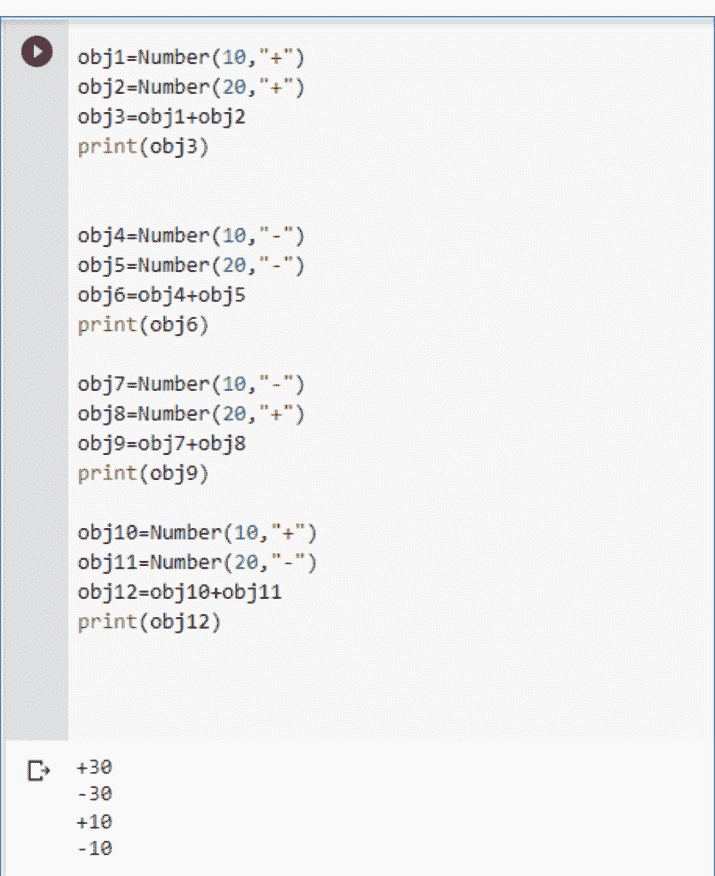

## 递增操作的实现

```python
class Number:
    def __init__(self,value=0,sign=""):
        self.value=value
        self.sign=sign
    def __str__(self):
        return self.sign+str(self.value)
```

```python
def increment(self):
    if(self.sign=="+"):
        self.value=self.value+1
    elif (self.sign=="-" and self.value==1):
        self.sign=""
        self.value=0
    elif (self.sign=="-"):
        self.sign="-"
        self.value=self.value-1
    elif (self.value==0):
        self.sign="+"
        self.value=1

obj=Number(10,"+")
obj.increment()
print(obj)

obj1=Number(1,"-")
obj1.increment()
print(obj1)

obj2=Number(2,"-")
obj2.increment()
print(obj2)

obj3=Number(0,"")
obj3.increment()
print(obj3)
```

```python
class Number:
    def __init__(self,value=0,sign=""):
        self.value=value
        self.sign=sign
    def __str__(self):
        return self.sign+str(self.value)

    def increment(self):
        if(self.sign=="+"):
            self.value=self.value+1
        elif (self.sign=="-" and self.value==1):
            self.sign=""
            self.value=0
        elif (self.sign=="-"):
            self.sign="-"
            self.value=self.value-1
        elif (self.value==0):
            self.sign="+"
            self.value=1
```

```
obj=Number(10,"+")
obj.increment()
print(obj)

obj1=Number(1,"-")
obj1.increment()
print(obj1)

obj2=Number(2,"-")
obj2.increment()
print(obj2)

obj3=Number(0,"")
obj3.increment()
print(obj3)
```

```
+11
0
-1
+1
```

## 在 Google COLAB 中概念化 Python

## 最大值操作的实现

```python
class Number:
    def __init__(self, value=0, sign=""):
        self.value = value
        self.sign = sign
    def __str__(self):
        return self.sign + str(self.value)

    def max(self, other):
        if (self.value == 0 and other.value == 0):
            return self
        elif (self.sign == "+" and other.sign == "+"):
            if (self.value > other.value):
                value = self.value
            else:
                value = other.value
            sign = "+"
            return Number(value, sign)
        elif (self.value == 0):
            if (other.value > 0 and other.sign == "+"):
                return other
            if (other.value > 0 and other.sign == "-"):
                return self
        elif (other.value == 0):
            if (self.value > 0 and self.sign == "+"):
                return self
            if (self.value > 0 and self.sign == "-"):
                return other
        elif (self.sign == "-" and other.sign == "-"):
            if (self.value < other.value):
                return self
            else:
                return other
        elif (self.sign != other.sign):
            if (self.sign == "+"):
                return self
            else:
                return other

obj1 = Number(10, "+")
obj2 = Number(20, "+")
obj3 = obj1.max(obj2)
print(obj3)

obj4 = Number(0, "")
obj5 = Number(10, "+")
obj6 = obj4.max(obj5)
print(obj6)

obj7 = Number(0, "")
obj8 = Number(10, "-")
obj9 = obj7.max(obj8)
print(obj9)

obj10 = Number(10, "+")
obj11 = Number(0, "")
obj12 = obj10.max(obj11)
print(obj12)

obj13 = Number(10, "-")
obj14 = Number(0, "")
obj15 = obj13.max(obj14)
print(obj15)

obj16 = Number(0, "")
obj17 = Number(0, "")
obj18 = obj16.max(obj17)
print(obj18)

obj19 = Number(10, "-")
obj20 = Number(20, "-")
obj21 = obj19.max(obj20)
print(obj21)

obj22 = Number(10, "+")
obj23 = Number(20, "-")
obj24 = obj22.max(obj23)
print(obj24)

obj25 = Number(10, "-")
obj26 = Number(20, "+")
obj27 = obj25.max(obj26)
print(obj27)
```

+20
+10
0
+10
0
0
-10
+10
+20

## 案例研究 2 的思考 -

RationalNumber 类 – 建模 Number 与 RationalNumber 类之间的关系

Number 和 RationalNumber 类之间是什么关系？

继承

委托？

委托

分子和分母是 `Number` 类的对象。

将操作委托给 `Number` 类的对象。

Number nr

Number dr

2/3 4/5

r1.nr/ r1.dr

r2.nr/r2.dr

第二个案例研究 –

```python
class Number:
    def __init__(self, value=0, sign=""):
        self.value = value
        self.sign = sign
    def display(self):
        print(self.sign + str(self.value), end="")

class Rational:
    def __init__(self, nr, nr_sign, dr, dr_sign):
        self.nr = Number(nr, nr_sign)
        self.dr = Number(dr, dr_sign)
    def display(self):
        self.nr.display()
        print("/", end="")
        self.dr.display()

r1 = Rational(10, "+", 20, "-")
r1.display()
```

```python
class Number:
    def __init__(self, value=0, sign=""):
        self.value = value
        self.sign = sign
    def display(self):
        print(self.sign + str(self.value), end="")

class Rational:
    def __init__(self, nr, nr_sign, dr, dr_sign):
        self.nr = Number(nr, nr_sign)
        self.dr = Number(dr, dr_sign)
    def display(self):
        self.nr.display()
        print("/", end="")
        self.dr.display()

r1 = Rational(10, "+", 20, "-")
r1.display()
```

```
+10/-20
```

```python
class Number:
    def __init__(self, value=0, sign=""):
        self.value = value
        self.sign = sign
    def __str__(self):
        return self.sign + str(self.value)

class Rational:
    def __init__(self, nr, nr_sign, dr, dr_sign):
        self.nr = Number(nr, nr_sign)
        self.dr = Number(dr, dr_sign)
    def __str__(self):
        print(self.nr, end="")
        print("/", end="")
        print(self.dr)
        return ""

r1 = Rational(10, "+", 20, "-")
print(r1)
```

```python
class Number:
    def __init__(self, value=0, sign=""):
        self.value = value
        self.sign = sign
    def __str__(self):
        return self.sign + str(self.value)

class Rational:
    def __init__(self, nr, nr_sign, dr, dr_sign):
        self.nr = Number(nr, nr_sign)
        self.dr = Number(dr, dr_sign)
    def __str__(self):
        print(self.nr, end="")
        print("/", end="")
        print(self.dr)
        return ""

r1 = Rational(10, "+", 20, "-")
print(r1)
```

```
+10/-20
```

## 关于本书

本书可作为研究生的教材，也可作为任何计算机专业毕业生的参考书。它还将为希望使用 Python 开始其机器学习职业生涯的计算机专业人士提供便捷的参考。本书精确地组织为十二章。每一章都在若干已实现概念的帮助下精心编写。我们付出了专门的努力，以确保本书中讨论的每个 Python 概念都通过相关命令进行了解释，并包含了输出的截图。第 1 章重点介绍了 Google COLAB 提供的开发环境。第 2 至 4 章涵盖了 Python 语言基础，重点是控制和迭代语句、运算符及其在基本程序中的应用。Python 采用混合编程范式，兼具过程式、面向对象和函数式的特点。所有编程语言的最佳部分都集中在一个平台上。第 5 章重点介绍了 Python 中的函数，特别强调了 Lambda 函数。第 6 章和第 7 章深入介绍了高级 Python 编程概念，如迭代器、闭包、装饰器和生成器。良好且深入的异常处理知识有助于编写可靠且健壮的代码。为了满足这一需求，第 8 章详细介绍了 Python 中异常处理的显著特点。第 9 章涵盖了通过文件处理实现的数据持久化。由于正则表达式在模式匹配中的广泛应用，第 10 章完全致力于理解 Python 中的正则表达式。第 11 章总结了在 Python 程序执行过程中可能出现的不同类型的常见错误。最后一章第 12 章致力于 Python 中面向对象概念的实现。基于面向对象概念的案例研究在附录 A 中进行了深入讨论和实现。

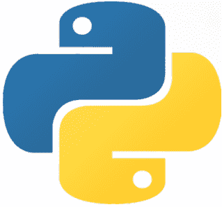


