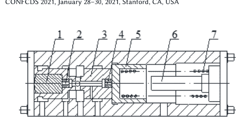
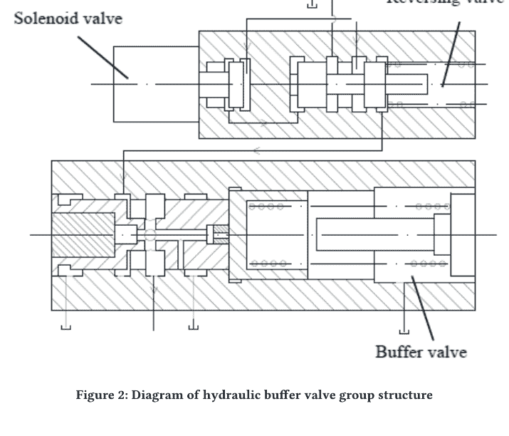

# 基于Python的缓冲阀设计程序研究

李梅花
江西理工大学理学院，赣州，中国
limeihua@jxust.edu.cn

吴克庆
江西理工大学理学院，赣州，中国，wukeqing@jxust.edu.cn，
通讯作者

陈一鸣
江西理工大学教育信息技术中心，赣州，中国
chenyiming@jxust.edu.cn

## 摘要

缓冲阀是车辆传动装置中控制离合器油压的重要部件。其结构多样，但不同的缓冲阀具有相似的结构。在缓冲阀设计中，相似的计算过程不可避免。为了简化设计过程，本文对缓冲阀进行了分类，并从同类型缓冲阀中提取了关键结构参数。基于AMESim平台建立了阀仿真模型库。利用Python基于AMESim提供的API函数开发了缓冲阀设计程序。结果表明，所开发的程序可以简化模型的仿真研究，解决重复计算问题，提高科研工作效率并缩短设计周期。通过试验验证了缓冲阀的AMESim模型。试验和仿真的缓冲阶段时间分别为1.062秒和1.032秒，相对误差为2.9%。缓冲后，与阀输出压力相比，试验和仿真结果分别为2.053 MPa和2.103 MPa，相对误差为5%。

## CCS概念

- 计算方法学 → 建模与仿真；模型开发与分析；建模方法学。

## 关键词

Python, AMESim, 缓冲阀, 设计

ACM参考格式：
李梅花，吴克庆，陈一鸣。2021。基于Python的缓冲阀设计程序研究。载于*第二届计算与数据科学国际会议（CONF CDS 2021）*，2021年1月28–30日，美国加利福尼亚州斯坦福。ACM，美国纽约州纽约市，6页。https://doi.org/10.1145/3448734.3450466

## 1 引言

车辆换挡时，换挡冲击可能导致车速过渡不稳定，使乘客感到不适。通常，在大功率自动变速器中引入液压缓冲阀来调节离合器中的油压，使压力变化缓慢以减少冲击，从而提高车辆的换挡质量[1]。换挡缓冲阀在大功率自动变速器中起着至关重要的作用，因此换挡缓冲阀的设计也直接影响车辆的换挡质量。

传统设计方法采用稳态设计方法[2]，即对缓冲阀进行理论分析，得到关键参数的计算表达式，最终通过计算得到相应的值。这种方法需要对不同类型的缓冲阀进行理论分析和计算，通常工作量大，开发周期长。随着计算机技术的发展，计算机辅助设计已广泛应用于液压领域，特别是各种商业软件的引入，如Matlab、ANSYS和AMESim。这些软件为液压阀的设计提供了完善的功能[3-5]，也得到了科研人员的认可。

燕山大学的吴等人使用Matlab设计了一种新型液压缓冲阀[6]。精工液压公司的王也使用Matlab辅助设计和计算先导缓冲阀[7]。北京工业大学的龚等人基于AMESim设计了一种电控液压缓冲阀[8]。浙江高宇公司的蔡等人使用AMESim对装载机缓冲阀进行了结构改进设计[9]。在这些文献中，仅使用软件来模拟、设计和分析某一类型的缓冲阀，通过这种方式，不同类型缓冲阀的设计需要经过许多相似的研究过程，而这些过程可以通过计算机软件来完成，从而减少工作量并提高效率。

Python是近年来广泛使用的语言，不受操作系统限制。AMESim将完整的Python软件嵌入平台，不仅可以使用脚本命令[10-11]进行批处理或后处理结果，还可以用于二次开发以开发完整的应用程序[12]。

## 2 缓冲阀的结构与工作原理

缓冲阀类型多样，从传统的液压换挡缓冲阀到电液缓冲阀[13-14]。本文主要讨论传统的液压换挡缓冲阀。传统的换挡缓冲阀也有很多类型，但可分为减压型[15]和溢流型[16]。同类型缓冲阀的结构通常相似，本文以减压型换挡缓冲阀为例。

允许为个人或课堂使用制作本作品全部或部分的数字或硬拷贝副本，前提是副本不出于营利或商业优势而制作或分发，且副本在第一页包含此通知和完整引用。必须尊重本作品中由ACM以外的其他方拥有的组件的版权。允许进行带署名的摘要。要以其他方式复制、重新出版、发布在服务器上或重新分发到列表，需要事先获得特定许可和/或费用。请求许可请联系 permissions@acm.org。
CONF CDS 2021，2021年1月28–30日，美国加利福尼亚州斯坦福
© 2021 计算机协会。
ACM ISBN 978-1-4503-8957-0/21/01...$15.00
https://doi.org/10.1145/3448734.3450466

换挡液压缓冲阀组由液压缓冲阀、液压控制换向阀和电磁阀组成。液压缓冲阀的通断由液压控制换向阀控制，电磁阀控制液压控制换向阀的通断。根据阀组结构，利用AMESim仿真平台建立了换挡液压缓冲阀组的模型。模型如图3所示。

## 3 缓冲阀设计程序

以上是减压缓冲阀的结构组成和仿真模型，溢流缓冲阀仿真模型的建立过程与之类似，此处不再重复。在AMESim软件中建立了这两种换挡液压缓冲阀的仿真模型，形成模型库。基于Python语言建立缓冲阀设计程序以调用模型库，并通过人机交互进行换挡缓冲阀的正向设计。

### 2.1 缓冲阀的结构

传统减压缓冲阀的结构如图1所示。当车辆换挡时，压力在缓冲阀芯1、缓冲弹簧7和柱塞5的配合下在控制阀出口A处变化，从而控制离合器中的油压以实现平稳换挡。

### 2.2 缓冲阀的AMESim仿真模型

液压缓冲阀是离合器压力控制回路的重要部件。由于其常开，应与其他液压阀配合使用。通常，这些液压阀被设计为插件以形成阀组。图2显示了当前车辆中使用的阀块结构。

### 3.1 程序的整体结构

程序整体采用模块化设计，通过模块划分来管理和应用各种功能。程序的功能框架如图4所示。换挡缓冲阀的设计程序整体上包括四个模块：模型库模块、参数设置模块、计算运行模块和数据处理模块。模型库模板可以导入各种类型的换挡缓冲阀，主要包括

包括压力释放缓冲阀和溢流缓冲阀。参数设置模块用于设置导入的AMESim模型的仿真参数。计算运行模块通过调用函数来计算模型，并保存计算数据。

### 3.2 主要模块设计

- **模型库**
模型库模块是程序的基础，是对底层数据的收集和整理。这部分工作最为复杂和关键。需要对现有的缓冲阀进行分析和建模，工作流程如图5所示。分析阀的结构以获取所设计阀的关键结构参数。此过程是参数设置模块中的关键。

- **参数设置**
参数设置模块是本程序中人机交互的重要模块之一。它是输入数据与仿真模型中参数设置之间的接口。将阀的关键结构参数设置为仿真模型的关键变量。这些关键变量需要设置为全局变量，在使用python编程时可以保存在字典中。以图2中的缓冲阀为例，设置该阀的关键变量如表1所示。

- **其他模块**
AMESim不仅提供了完整的python软件，还提供了python API（应用程序接口），可以使用其他python编程平台（如PyCharm）进行编写。在使用AMESim提供的API进行编程时，首先初始化接口，并在主文件中导入ame_apy模块。ame_apy模块包含了AMESim软件提供的python接口，例如计算模块中使用的AMESetRunParameter()函数和AMERunSimulation()函数。AMESetRunParameter()函数用于设置仿真计算的运行参数，包括仿真时间、步长、误差等；AMERunSimulation()函数用于计算仿真模型；在数据处理模块中，AMEGetVariableValues()函数用于获取计算结果，并将获得的结果保存在字典中，便于绘图和生成设计报告。报告生成的流程图如图6所示。

## 表1：缓冲阀关键参数对比表

| 阀结构参数 | 对应模型的全局变量名 | 单位 |
| :--- | :--- | :--- |
| 缓冲阀参数 | 阀芯质量 | CusMass_OF | g |
| | 阀芯直径 | CusDiam_OF | mm |
| | 弹簧刚度 | CusStif_OF | N/m |
| | 弹簧预紧力 | CusPreF_OF | N |
| | 节流孔直径 | CusHolD_OF | mm |
| | 初始覆盖量 | CusCove_OF | mm |
| 液压控制阀参数 | 阀芯质量 | RevMass_OF | g |
| | 阀芯直径 | RevDiam_OF | mm |
| | 弹簧预紧力 | RevPreF_OF | N |
| | 弹簧刚度 | RevStif_OF | N/m |

## 4 程序示例与模型试验验证

### 4.1 程序示例

缓冲阀设计程序基于AMESim平台，底层语言使用python，图形用户界面（GUI）使用Qt库，这是一个跨平台的GUI应用开发框架，拥有丰富的可视化工具包和应用类，结合python语言，大大提高了开发效率。基于这些平台，本文开发的缓冲阀设计程序界面如图7所示。程序界面包括减压和溢流缓冲阀的设计。示例以减压缓冲阀为例。减压缓冲阀的设计界面包含4个标签页，即“模型选择”、“系统参数”、“阀参数”和“结果分析”。模型选择标签页用于选择冲击阀仿真模型，界面如图8所示。在“模型选择”设置界面中，可以选择不同结构类型的减压缓冲阀的仿真模型，也可以扩展仿真模型。“系统参数”设置主要是设置仿真模型中涉及的液压泵、电磁阀等组件的参数，如图9所示。系统参数设置完成后，需要设置缓冲阀的参数，包括液压缓冲阀和缓冲阀的参数。设置界面如图7所示。设置仿真模型参数后，运行仿真并显示结果，如图10所示。结果分析界面显示缓冲阀仿真模型的计算进度，并将显示仿真结果曲线，还可以导入试验结果数据并绘图，以便比较仿真和试验结果。缓冲阀结构确定后，不同的关键参数会获得不同的缓冲特性，因此需要确定各关键参数的大小。使用设计程序研究结构参数对缓冲阀缓冲特性的影响，从而确定参数的设置范围。

### 4.2 仿真模型试验验证

该程序基于缓冲阀组的AMESim模型。因此，一方面为了验证设计程序的可行性，另一方面为了验证仿真模型的准确性，搭建了缓冲阀试验台。缓冲阀特性试验方案示意图如图11所示。试验中，缓冲阀的进口连接到系统溢流阀的出口。溢流阀的压力设置为2MPa，压力可从压力表1读出。缓冲阀的出口连接到压力传感器。传感器将信号传输到示波器，可通过示波器显示和记录。试验结果与程序仿真结果的对比如图12所示。从图12可以看出，缓冲阀缓冲特性的试验与仿真结果一致，该仿真模型能够反映阀的特性。分析了缓冲阀在缓冲阶段的时间数据，实测值为1.062s，仿真值为1.032s，相对误差为2.9%。缓冲结束后，比较阀的输出压力，试验值为2.053MPa，仿真结果为2.103MPa，相对误差为5%。

## 5 结论

本文描述了设计程序的开发过程和组成模块。在AMESim平台下，使用HCD（液压元件设计）库构建了液压缓冲阀模型。使用python语言开发了阀设计程序，并通过试验验证了缓冲阀AMESim模型的正确性。得出以下结论：

- 1) 使用python基于AMESim提供的API函数进行编程，构建了缓冲阀的设计程序，用于研究结构参数对阀缓冲特性的影响，并设计出满足要求的缓冲阀。
- 2) 程序中的结果分析模块可以对数据进行对比分析，比较仿真与试验结果的数据。本文通过试验验证了缓冲阀的AMESim模型。缓冲阀的缓冲阶段时间分别为1.062s和1.032s，相对误差为2.9%。缓冲结束时，比较阀的输出压力，试验与仿真结果分别为2.053MPa和2.103MPa，相对误差为5%。
- 3) 对不同类型缓冲阀的AMESim仿真模型进行处理，使设计程序能够读取仿真模型，从而扩展程序的使用范围，增强程序的通用性。基于Python的设计程序对于研究缓冲阀的特性也具有重要意义，不仅可以简化模型的仿真，还能提高科研效率。

## 参考文献

[1] Q.H. Zhang, W. Xiong, J. Ruan et al. "Research on a new type of buffering valve for vehicle shifting," The Journal of Engineering, issue 9, pp. 783-788, 2020.
[2] B.Ma, X.L. Sun, J.W. Chen et al. "Design and test analysis of hydraulic buffer valve for shift clutch," Journal of Machine Design, issue 12, pp. 13-15, 1997.
[3] Q.H. Zhang, W. Xiong, Q.H. Xiong, et al. "Simulation Based on PyQt for a Shift Hydraulic Circuit of Heavy Vehicle," Chinese Hydraulics & Pneumatics, issue 03, pp. 57-60, 2017.
[4] H.L. Ren, T.L. Lin, and C. Miu, "Design and dynamic performance analysis of the normally-closed high speed on-off valve," Journal of Machine Design, vol. 34, issue 9, pp. 28-31, 2017.
[5] M.F. Li, Y. Wu, Y. Tian, et al. "Simulation and Research Based on AMESim for Electro-hydraulic Directional Control Valve with Damping," Chinese Hydraulics & Pneumatics, issue 02, pp. 79-81, 2015.
[6] X.M. Wu, M. Gao, and H.M.Sun, "Design And Analysis of a New Kind of Hydraulic Buffering Valve," Machine Tool & Hydraulics, issue 10, pp. 197-198, 2004.
[7] K.L. Wang, "Design and Application of New Pilot Cushion Valve," Fluid Power Transmission & Control, issue 4, pp. 34-37, 2016.
[8] P. Gong, H.Y. Chen, and J. Wang, "Design of Electric Hydraulic Damping Valve for Shifting Clutch," Chinese Hydraulics & Pneumatics, issue 5, pp. 20-22, 2007.
[9] Z. Cai, C.Q. Pan, X.C. Chen et al. "The structural design of the new variable speed control valve on loader," Construction Machinery, issue 15, pp. 110-112, 2012.
[10] L.X. Xue, S. Wu, Y.Z. Xu, et al. "A Simulation-Based Multi-Objective Optimization Design Method for Pump-Driven Electro-Hydrostatic Actuators," Processes, issue 5, pp. 274-287, 2019.
[11] Q.T. Meng, S. Wu, and Y.X. Shang, "Simulation and optimization of large aircraft landing gear system based on amesim and python script," IEEE Proceedings of the 8th International Conference on Fluid Power and Mechatronics, pp. 1328-1333, 2019.
[12] J. Yu, Y.Q. Wang, "Machining Deformation Prediction of Large Curved Thin-walled Parts Based on Secondary Development of ABAQUS," Machine Tool & Hydraulics, vol. 46, issue 11, pp. 172-175, 2018.
[13] Q.H. Zhang, W. Xiong, J. Ruan, et al. "Research on 2D Digital Buffering Valve for Vehicle Shift," Journal of Mechanical Engineering, vol. 54, issue 20, pp. 206-212, 2018.
[14] F. Meng, G. Tao, and H.Y. Chen, "A Study on the Dynamic Response Characteristics of Electro-hydraulic Proportional Valve for the Shift of Automatic Transmission," Automotive Engineering, vol. 35, issue 3, pp. 229-233, 2013.
[15] G.B. Feng, Y.J. Hou, and H.G. Sun, "Simulation Analysis of the Gear Shift Buffer of the Armored Vehicles," Computer Simulation, vol. 35, issue 11, pp. 7-11, 2018.
[16] Q.H. Zhang, W. Xiong, Q.H. Xiong, et al. "Optimization Design for Hydraulic Buffering Valve of Vehicle Shift," Chinese Hydraulics & Pneumatics, issue 12, pp. 65-69, 2017.