控制与信号处理高级教材

长原正明
东俊一
安孝成

## 多智能体系统控制

基于Python的理论与仿真


## 控制与信号处理高级教材

**丛书编辑**

迈克尔·J·格林布尔，英国格拉斯哥斯特拉斯克莱德大学电子与电气工程系

洛伦佐·马尔科尼，意大利博洛尼亚大学电气、电子与信息工程系

**控制与信号处理高级教材**是一套旨在以适合高年级本科生和研究生课程师生的方式呈现这些学科思想的丛书。主题内容可以是理论或应用，但必须适合该层次的学习——这些书籍通常不包含最新的前沿研究，而是更多地从长远角度审视一个学科的整体，并处理通用领域而非特定的细分领域。

本丛书中的各卷旨在被采纳为课堂教材，并通常辅以可从网络获取的辅助材料。这些材料可以是任何内容，从MATLAB®文件到可在课堂上投影作为教学辅助的PDF幻灯片。可供班级讲师下载的解答手册PDF是常见的补充，并且书籍经过同行评审，以考虑课堂教学的要求。

本丛书中的书名长度应在200至500页之间，并应包含帮助学生的教学材料：习题（最好附有单独的PDF解答）；示例；学习计划；案例研究；详尽的背景参考文献列表；等等。

希望向本丛书提交提案的作者应联系

### 丛书编辑

**迈克尔·J·格林布尔**教授，英国格拉斯哥G1 1XW，乔治街204号皇家学院大楼，电子与电气工程系

**电子邮箱：** [m.j.grimble@strath.ac.uk](mailto:m.j.grimble@strath.ac.uk)

**洛伦佐·马尔科尼**教授，意大利博洛尼亚40126，赞博尼街33号，"古列尔莫·马尔科尼"电气、电子与信息工程系，博洛尼亚大学

**电子邮箱：** [lorenzo.marconi@unibo.it](mailto:lorenzo.marconi@unibo.it)

或

### 内部编辑

**奥利弗·杰克逊**先生，英国伦敦N1 9XW，克里南街4号，施普林格伦敦

**电子邮箱：** [oliver.jackson@springer.com](mailto:oliver.jackson@springer.com)

由SCOPUS和工程索引收录。

### 出版伦理：

研究人员应从研究提案到出版，始终遵循相关专业机构和/或国家及国际监管机构的最佳实践和行为准则进行研究。有关个人伦理事项的更多详情，请参见：[https://www.springer.com/gp/authors-editors/journal-author/journal-author-helpdesk/publishing-ethics/14214](https://www.springer.com/gp/authors-editors/journal-author/journal-author-helpdesk/publishing-ethics/14214)

长原正明 · 东俊一 · 安孝成

## 多智能体系统控制

基于Python的理论与仿真


长原正明
广岛大学
先进科学与工程研究生院
日本广岛市东区

东俊一
京都大学
信息学研究生院
日本京都市

安孝成
光州科学技术院（GIST）
机械工程学院
韩国光州

ISSN 1439-2232
控制与信号处理高级教材
ISBN 978-3-031-52980-1
https://doi.org/10.1007/978-3-031-52981-8

ISSN 2510-3814（电子版）
ISBN 978-3-031-52981-8（电子书）

数学学科分类：68W15, 93C05, 34H05, 90C35

© 编者（如适用）和作者，根据与施普林格自然瑞士股份有限公司的独家许可，2024

本作品受版权保护。所有权利均由出版商独家和完全授权，无论涉及材料的全部还是部分，特别是重印、插图重用、朗诵、广播、在微缩胶片或任何其他物理方式上复制，以及信息存储和检索、电子改编、计算机软件，或通过现在已知或将来开发的类似或不同方法进行传输的权利。
在本出版物中使用通用描述性名称、注册名称、商标、服务标志等，即使没有具体声明，也并不意味着这些名称不受相关保护性法律法规的约束，因此可以自由使用。
出版商、作者和编辑有理由相信，本书中的建议和信息在出版之日是真实和准确的。无论是出版商还是作者或编辑，都不对本文所含材料或可能存在的任何错误或遗漏提供任何明示或暗示的保证。出版商对已出版地图中的管辖权主张和机构隶属关系保持中立。

本施普林格印记由注册公司施普林格自然瑞士股份有限公司出版
注册公司地址为：瑞士楚格6330，格韦尔贝街11号

本产品中的纸张可回收利用。

### 丛书编辑前言

自动控制学科的魅力在于其广泛的应用领域和多样的研究方法。该领域包括纯粹数学背景的科学家，他们在控制理论的背景下找到了自己的位置；也包括在控制使能技术方面经验更丰富的工程师；以及对在众多工程和非工程应用领域实施自动控制感兴趣的研究人员。*控制与信号处理高级教材*系列旨在为所有这些构成自动控制领域的专业人士提供一个出版领域，既强调新兴领域，也关注更传统的方面，或许是以现代方式重新审视，并侧重于创新方面和工具。该系列的目标受众也是多样化的，既面向渴望熟悉以前从未涉及的主题的年轻人，也面向更专业的读者。通常，如下文介绍的文本所示，该系列的各卷也强调实现和数值方面，展示抽象理论如何在仿真层面产生直接结果，从而扩大感兴趣的潜在读者群体。

近几十年来日益普及的一个领域是多智能体控制系统，这也是本卷的主题。其背景是多个动态系统根据特定的互连结构，通过交换可能有限的信息相互作用。目标是分析相互作用产生的集体行为，并可能通过以分散方式作用于各个子系统来影响其整体性能。在许多工程、自然和社会领域都存在这种集体行为，需要严格的理论和适当的工具来充分理解由相互作用产生的现象，无论是积极的还是潜在灾难性的。在这方面值得注意的是最近COVID-19大流行的惨痛经历。并非巧合的是，网络系统控制理论领域通常采用的工具使得科学地模拟病毒传播现象并提出遏制病毒的解决方案成为可能。另一个高度相关的应用领域是机器学习，其中图神经网络的研究可以借助多智能体系统的典型工具来探讨。

在本卷中，作者长原正明（广岛大学）、东俊一（京都大学）和安孝成（光州科学技术院）以非常清晰、严谨和全面的方式处理了多智能体系统这一主题。多智能体系统的主题涵盖了众多不同的子领域，从所谓的“一致性控制”（其中智能体的预定输出必须达到共同模式），到“覆盖控制”（其中智能体必须根据一定的均匀性和密度覆盖预定区域），再到“编队控制”（将智能体视为一个机器人舰队，后者必须被控制以遵循预定轨迹，同时保持所需的空间模式）。该主题通常还包括被称为“分布式优化”的领域，其中通过适当控制以实现局部最优的各个智能体，合作实现全局系统“最优”。作者在本卷中处理了所有这些子领域，在多智能体系统的共同框架下，从数学和阐述的角度，以非重复的方式为每个子领域分配了一章。本书还通过增加最后一章而显得非常与时俱进，该章介绍了能够描述病毒传播复杂动态的数学模型，科学地展示了互连结构在传播或遏制病毒方面的强大影响。

在数学层面上，本书是完全自包含的，呈现了所有用于开发算法和证明文本中结果的线性代数和图论工具。正如标题所强调的，本书的特色在于强调通过开源工具Python呈现文本中大多数工具和算法的实现代码。这使得文本即使对于那些更注重实践和实现的读者也特别有趣，同时对于更关注形式和方法方面的读者仍然保持极大的吸引力。这些元素使得本书的受众非常广泛。当然，该文本非常适合控制系统、计算机科学和工程学的一年级研究生。我期望学生、研究人员、讲师和工程师会发现本卷对于研究多智能体系统具有巨大价值，作为丛书的编辑，我非常高兴地欢迎这一新的贡献。

2024年1月

洛伦佐·马尔科尼
博洛尼亚大学
意大利博洛尼亚

# 前言

过去几十年来，多智能体系统的控制一直是一个快速发展的研究领域。该主题也被称为协同控制、分布式控制、网络化控制或集群控制，旨在设计算法和框架来协调相互连接的多个智能体的行为，这些智能体通常具有有限的计算和通信资源。该理论在多个工程领域都有应用，例如车辆编队、无人机集群、传感器网络、物联网（IoT）、信息物理系统和智能电网等等。最近，该理论已被应用于社会和人类网络，并被认为是解决社会问题的强大工具，例如，防止COVID-19等病毒在人类网络中传播。

本书的目标是全面介绍多智能体系统的控制。它首先回顾了线性代数和图论的基础知识，然后介绍了为多智能体系统设计控制算法的技术。本书涵盖了共识、覆盖和编队控制算法，以及它们在分布式优化和病毒传播中的应用。除了这些理论基础外，本书还包括许多数值示例，其中一些通过Python代码进行演示。Python是一种流行的编程语言，广泛应用于计算机科学和人工智能领域。通过使用Python，读者将深入理解书中介绍的原理和方法。我们还包含了练习题，让读者能够以实践的方式应用他们的知识和技能。

本书面向控制系统、计算机科学和工程领域的一年级研究生。阅读本书只需要线性代数和微积分的基础知识。它也适合对这个迷人且快速发展的研究领域感兴趣的研究人员和工程师。

本书的组织结构如下：

**第1章：** 在建立多智能体系统模型后，我们展示了多智能体系统与控制中的主要主题。

**第2章：** 我们回顾了后续章节中使用的线性代数和图论的数学基础。我们还介绍了Python编程。

**第3章：** 我们展示了共识控制，这是多智能体系统控制中的基本问题之一。

**第4章：** 我们介绍了基于梯度控制的覆盖控制及其在多智能体显示中的应用。

**第5章：** 我们利用图刚性的概念研究编队控制。

**第6章：** 作为第3章共识控制的应用，我们介绍了分布式优化算法。

**第7章：** 我们利用多智能体系统的概念分析病毒传播现象。

这些章节之间的关系如下图所示：

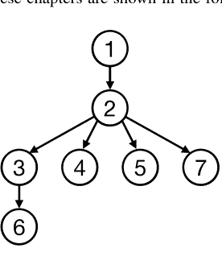

在此图中，节点是本书的章节，箭头表示章节之间的依赖关系。例如，如果你想快速学习第6章的分布式优化，你可以从第1章开始，然后阅读第2、3和6章。如果你是一位教师，想使用本书开设一门总计30学时的学期课程，你可以使用此图，通过“深度优先搜索”或“广度优先搜索”来设计你的课程。

最后，本书基于作者数十年的研究和教学，特别是2015年由日本Corona Publishers出版的日文版《多智能体系统控制》一书。第二作者在出版本书时得到了JST FOREST项目JPMJFR2123的支持。我们衷心感谢同事和导师对我们工作的支持。

采用本书作为课程教材的教师，可以从 https://sites.google.com/springernature.com/extramaterial/lecturer-material 下载章节习题的**PDF解答手册**以及用于课程幻灯片的所有图表。

日本广岛东广岛
日本京都
韩国光州

长原正明
东俊一
安孝杓

# 目录

## 1 引言

- 1.1 什么是多智能体系统？
- 1.2 现实世界中的多智能体系统
    - 1.2.1 传感器网络
    - 1.2.2 系统生物学
    - 1.2.3 集群机器人学
    - 1.2.4 集体行为
    - 1.2.5 无人机
    - 1.2.6 人类社会
- 1.3 多智能体系统的控制：系统与控制中的新兴主题
    - 1.3.1 共识控制
    - 1.3.2 覆盖控制
    - 1.3.3 编队控制
    - 1.3.4 网络的可控性
    - 1.3.5 模型预测控制
    - 1.3.6 事件触发与稀疏控制
- 1.4 其他重要研究领域中的多智能体系统
    - 1.4.1 图信号处理
    - 1.4.2 机器学习
    - 1.4.3 分布式优化
    - 1.4.4 布尔网络
    - 1.4.5 群体智能
    - 1.4.6 同步
- 1.5 总结
- 参考文献

## 2 线性代数与图论及Python实现

- 2.1 Python简介
    - 2.1.1 Python概述
    - 2.1.2 Python环境
    - 2.1.3 Hello World
    - 2.1.4 使用Python进行数值计算
- 2.2 线性代数
    - 2.2.1 符号表示
    - 2.2.2 矩阵的秩
    - 2.2.3 正矩阵与非负矩阵
    - 2.2.4 特征值
    - 2.2.5 Jordan标准形与谱分解
    - 2.2.6 谱映射定理
    - 2.2.7 Gershgorin圆盘定理
    - 2.2.8 Perron-Frobenius理论
    - 2.2.9 定矩阵
    - 2.2.10 线性系统与矩阵指数
- 2.3 线性代数的Python代码
    - 2.3.1 Python代码2.1：Gershgorin圆盘
    - 2.3.2 Python代码2.2：常微分方程
- 2.4 图论
    - 2.4.1 什么是图？
    - 2.4.2 连通性
    - 2.4.3 生成树
    - 2.4.4 图拉普拉斯矩阵
    - 2.4.5 Perron矩阵
    - 2.4.6 使用图拉普拉斯矩阵和Perron矩阵进行图连通性分析
    - 2.4.7 与图相关的动力系统
- 2.5 图论的Python代码
    - 2.5.1 Python代码2.3：图绘制
    - 2.5.2 Python代码2.4：有向树
    - 2.5.3 Python代码2.5：生成树
    - 2.5.4 Python代码2.6：邻接矩阵
    - 2.5.5 Python代码2.7：平衡图的Perron矩阵
    - 2.5.6 Python代码2.8：图拉普拉斯矩阵
- 2.6 总结
- 2.7 练习题
- 参考文献

## 3 共识控制

- 3.1 共识问题
- 3.2 共识控制
    - 3.2.1 积分器智能体的共识控制器
    - 3.2.2 共识条件
- 3.3 离散时间情形
- 3.4 共识控制器的性能

# 目录

3.5 Python 代码 80
3.5.1 Python 代码 3.1：连续时间一致性控制 80
3.5.2 Python 代码 3.2：离散时间一致性控制 81
3.6 总结 82
3.7 习题 82
参考文献 84

## 4 覆盖控制

4.1 覆盖问题 85
4.2 泰森多边形 87
4.2.1 定义 87
4.2.2 与覆盖的关系 91
4.3 覆盖控制 93
4.3.1 梯度系统 93
4.3.2 积分器智能体的覆盖控制器 95
4.3.3 定理 4.1 的证明 100
4.4 在多智能体显示中的应用 104
4.5 Python 代码 104
4.5.1 Python 代码 4.1：泰森多边形及其质心的计算 104
4.5.2 Python 代码 4.2：覆盖控制 107
4.6 总结 108
4.7 习题 108
4.8 附录 109
4.8.1 非线性系统唯一解的存在性 109
4.8.2 拉萨尔不变性原理 110
参考文献 112

# 5 编队控制

5.1 分布式编队控制 113
5.2 刚性理论 115
5.2.1 距离刚性 118
5.2.2 方位刚性 123
5.2.3 弱刚性（角度刚性） 127
5.3 基于刚性的编队控制 134
5.3.1 基于距离的编队控制 135
5.3.2 基于方位的编队控制 143
5.3.3 基于角度的编队控制 145
5.4 Python 代码 148
5.4.1 Python 代码 5.1：基于距离的编队控制 148
5.4.2 Python 代码 5.2：基于方位的编队控制 150
5.4.3 Python 代码 5.3：基于角度的编队控制 152
5.5 总结 155
5.6 习题 156
参考文献 157

## 6 分布式优化 159

6.1 凸优化 159
6.2 组测试 162
6.3 基于梯度的算法 166
6.3.1 梯度下降算法 167
6.3.2 梯度投影算法 169
6.3.3 次梯度方法 172
6.4 近端算法 175
6.4.1 近端算子 175
6.4.2 近端梯度算法 178
6.4.3 ADMM 182
6.5 分布式优化 183
6.5.1 分布式次梯度算法 183
6.5.2 分布式 ADMM 188
6.5.3 带正则化的分布式 ADMM 192
6.6 Python 代码 194
6.6.1 Python 代码 6.1：使用 CVXPY 进行组测试 194
6.6.2 Python 代码 6.2：使用梯度投影进行组测试 196
6.6.3 Python 代码 6.3：使用次梯度方法进行组测试 197
6.6.4 Python 代码 6.4：使用 FISTA 进行组测试 198
6.6.5 Python 代码 6.5：使用分布式次梯度投影进行组测试 199
6.6.6 Python 代码 6.6：使用分布式 ADMM 进行组测试 200
6.6.7 Python 代码 6.7：使用带正则化的分布式 ADMM 进行组测试 201
6.7 总结 203
6.8 习题 203
参考文献 205

## 7 病毒传播现象 207

7.1 复杂网络上的病毒传播现象 207
7.2 病毒传播现象的数学模型 208
7.2.1 SI 模型 208
7.2.2 SIS 模型 209
7.2.3 SIR 模型 211
7.3 复杂网络上的传播现象 212
7.3.1 随机网络 213
7.3.2 随机网络上的病毒传播 215
7.3.3 病毒传播的多智能体仿真 217
7.4 Python 代码 219
7.4.1 Python 代码 7.1：SI 模型 219
7.4.2 Python 代码 7.2：SIS 模型 219
7.4.3 Python 代码 7.3：SIR 模型 220
7.4.4 Python 代码 7.4：Erdős–Rényi 随机图 221
7.4.5 Python 代码 7.5：无标度网络 222
7.4.6 Python 代码 7.6：复杂网络上的多智能体仿真 222
7.5 总结 223
7.6 习题 224
参考文献 224

## 索引

索引 225

## 数学符号

$\mathbb{Z}$ 整数集
$\mathbb{R}$ 实数集
$\mathbb{N}$ 包含0的自然数集，即 $\mathbb{N} = \{0, 1, 2, \dots\}$
$\mathbb{C}$ 复数集
$\mathbb{R}_+$ 正数集
$\mathbb{R}_{0+}$ 非负数集
j 虚数单位
$|z|$ $z \in \mathbb{C}$ 的绝对值
$\text{Re}(z)$ $z \in \mathbb{C}$ 的实部
$\text{Im}(z)$ $z \in \mathbb{C}$ 的虚部
$\emptyset$ 空集
$\mathbf{S}^{m \times n}$ 元素属于集合 $\mathbf{S}$ 的 $m \times n$ 矩阵的集合
$\mathbf{S}^n$ 元素属于集合 $\mathbf{S}$ 的 $n$ 维向量的集合
$\mathbf{S}^\infty$ 序列 $(x_1, x_2, \dots)$ 的集合，其中 $x_i \in \mathbf{S}$，$i = 1, 2, \dots$
$\text{int}(\mathbf{S})$ 集合 $\mathbf{S}$ 的内部
$\text{bd}(\mathbf{S})$ 集合 $\mathbf{S}$ 的边界
$\text{cl}(\mathbf{S})$ 集合 $\mathbf{S}$ 的闭包
$|\mathbf{S}|$ 有限集合 $\mathbf{S}$ 的元素个数
$\text{dim}(\mathbf{S})$ 线性空间 $\mathbf{S}$ 的维数
$\mathbf{S}^\perp$ 线性空间 $\mathbf{S}$ 的正交补
$\mathbf{S}_1 \subset \mathbf{S}_2$ $\mathbf{S}_1$ 是 $\mathbf{S}_2$ 的真子集（即 $\mathbf{S}_1 \neq \mathbf{S}_2$）
$\mathbf{S}_1 \subseteq \mathbf{S}_2$ $\mathbf{S}_1$ 是 $\mathbf{S}_2$ 的子集
$\mathbf{S}_1 \cup \mathbf{S}_2$ $\mathbf{S}_1$ 与 $\mathbf{S}_2$ 的并集
$\bigcup_{i=1}^n \mathbf{S}_i$ $\mathbf{S}_1, \mathbf{S}_2, \dots, \mathbf{S}_n$ 的并集
$\mathbf{S}_1 \cap \mathbf{S}_2$ $\mathbf{S}_1$ 与 $\mathbf{S}_2$ 的交集
$\bigcap_{i=1}^n \mathbf{S}_i$ $\mathbf{S}_1, \mathbf{S}_2, \dots, \mathbf{S}_n$ 的交集
$\mathbf{S}_1 \setminus \mathbf{S}_2$ $\mathbf{S}_1$ 与 $\mathbf{S}_2$ 的差集，即 $\mathbf{S}_1 \setminus \mathbf{S}_2 \triangleq \{x \in \mathbf{S}_1 : x \notin \mathbf{S}_2\}$
$\mathbf{1}_n$ 所有元素均为1的 $n$ 维向量
$\langle x, y \rangle$ 向量 $x, y \in \mathbb{R}^n$ 的欧几里得内积，即 $\langle x, y \rangle \triangleq y^\top x$
$\|x\|$ $x \in \mathbb{R}^n$ 的欧几里得范数，即 $\|x\| \triangleq \sqrt{\langle x, x \rangle}$
$\|x\|_p$ $x \in \mathbb{R}^n$ 的 $\ell^p$ 范数（$1 \le p < \infty$），即 $\|x\|_p \triangleq \left\{ \sum_{i=1}^n |x_i|^p \right\}^{1/p}$。若 $p = 2$，我们省略下标，写作 $\|x\|$
$\|x\|_\infty$ $x \in \mathbb{R}^n$ 的 $\ell^\infty$ 范数，即 $\|x\|_\infty \triangleq \max\{|x_1|, |x_2|, \dots, |x_n|\}$
$\mathbf{B}(c, r)$ 以 $c$ 为中心、$r$ 为半径的欧几里得范数开球，即 $\{x \in \mathbb{R}^n : \|x - c\| < r\}$
$\overline{\mathbf{B}}(c, r)$ 闭球 $\{x \in \mathbb{R}^n : \|x - c\| \le r\}$
$\mathbf{B}_p(c, r)$ 以 $c$ 为中心、$r$ 为半径的 $\ell^p$ 范数开球，即 $\{x \in \mathbb{R}^n : \|x - c\|_p < r\}$
$\overline{\mathbf{B}}_p(c, r)$ 闭球 $\{x \in \mathbb{R}^n : \|x - c\|_p \le r\}$。单位球 $\mathbf{B}_p(0, 1)$ 有时简记为 $\mathbf{B}_p$
$x \perp y$ 向量 $x, y \in \mathbb{R}^n$ 正交，即 $\langle x, y \rangle = 0$
$\text{span}(x_1, x_2, \dots, x_n)$ 向量 $x_1, x_2, \dots, x_n$ 的线性张成
$\text{span}(A)$ 矩阵 $A = [a_1, a_2, \dots, a_n] \in \mathbb{R}^{m \times n}$ 的列向量 $a_1, a_2, \dots, a_n$ 的线性张成
$I_n$ $\mathbb{R}^{n \times n}$ 中的单位矩阵。若维度明确，下标 $n$ 可省略
$0_{m,n}$ 大小为 $m \times n$ 的零向量（或零矩阵）。我们常省略下标 $m, n$，直接写作 $0$
$[x_i]$ 以 $x_i$ 为第 $i$ 个元素的列向量
$[x_i]_{i \in \mathbf{I}}$ 以 $i \in \mathbf{I}$ 的 $x_i$ 为元素的列向量
$[a_{ij}]$ 以 $a_{ij}$ 为第 $(i, j)$ 个元素的矩阵
$[a_{ij}]_{(i,j) \in \mathbf{E}}$ 以 $(i, j) \in \mathbf{E}$ 的 $a_{ij}$ 为元素的矩阵
$A^\top$ 矩阵 $A$ 的转置
$\text{abs}(A)$ 绝对值矩阵，定义为 $\text{abs}(A) \triangleq [[|a_{ij}|]]$，其中 $A = [a_{ij}]$
$\text{ker}(A)$ 矩阵 $A$ 的核（或零空间）
$\text{imag}(A)$ 矩阵 $A$ 的像
$\text{rank}(A)$ 矩阵 $A$ 的秩
$\text{det}(A)$ 方阵 $A$ 的行列式
$A^{-1}$ 方阵 $A$ 的逆矩阵（若存在）
$A \otimes B$ 矩阵 $A$ 和 $B$ 的克罗内克积
$\text{diag}(A_1, A_2, \dots, A_n)$ 矩阵 $A_1, A_2, \dots, A_n$ 的块对角矩阵
$A > 0$ $A$ 是正定矩阵
$A \ge 0$ $A$ 是半正定矩阵
$A < 0$ $A$ 是负定矩阵
$A \le 0$ $A$ 是半负定矩阵
$A > 0$ $A$ 是正矩阵
$A \ge 0$ $A$ 是非负矩阵
$\rho(A)$ 矩阵 $A$ 的谱半径，即 $A$ 的最大特征值绝对值
$\delta_{ij}$ 克罗内克δ函数，即当 $i = j$ 时 $\delta_{ij} = 1$，否则 $\delta_{ij} = 0$
$o(g(x))$ Bachmann–Landau符号，即对于连续函数 $f(x)$ 和 $g(x)$，若 $\lim_{x \to a} |f(x)/g(x)| = 0$ 成立，则当 $x \to a$ 时，我们写作 $f(x) = o(g(x))$
$\frac{\partial f}{\partial x}(x)$ 可微函数 $f : \mathbb{R}^n \to \mathbb{R}$ 的梯度向量，即
$$\frac{\partial f}{\partial x}(x) \triangleq \left[ \frac{\partial f}{\partial x_1}(x) \frac{\partial f}{\partial x_2}(x) \cdots \frac{\partial f}{\partial x_n}(x) \right]^\top.$$
我们也用 $\nabla f$ 表示 $f$ 的梯度向量。对于 $f : \mathbb{R}^n \to \mathbb{R}^m$，$\frac{\partial f}{\partial x}$ 是雅可比矩阵
$f^{-1}$ 函数 $f : X \to Y$ 的逆像，即
$$f^{-1}(y) \triangleq \{x \in X : f(x) = y\},$$
其中 $y \in Y$
$\text{dom}(f)$ 函数 $f : \mathbb{R}^n \to \mathbb{R} \cup \{\infty\}$ 的有效定义域，即 $\{x \in \mathbb{R}^n : f(x) < \infty\}$
$\text{epi}(f)$ 函数 $f$ 的上图
$\text{prox}_{\gamma f}$ 函数 $f$ 关于参数 $\gamma > 0$ 的近端算子
$x(t) \to \mathbf{S}$ 函数 $x(t)$ 收敛到集合 $\mathbf{S}$。即对于任意 $\varepsilon > 0$，存在 $\tau > 0$，使得对任意 $t \in [\tau, \infty)$，$\inf_{z \in \mathbf{S}} \|x(t) - z\| < \varepsilon$ 成立
$x[k] \to \mathbf{S}$ 序列 $\{x[k] : k = 0, 1, \dots\}$ 收敛到集合 $\mathbf{S}$
$\Pi_C$ 到 $\mathbf{C}$ 上的投影算子

## 引言

### 1.1 什么是多智能体系统？

如果存在多个智能体，它们可以构成一个多智能体系统。你可以将一组移动机器人、一群鸟、一群人视为一个多智能体系统。多智能体系统的学术定义如下：*多智能体系统*，简称MAS，是一个由多个智能体组成的系统，这些智能体能够通过局部交互自主决策以完成全局任务。我们在周围可以发现很多多智能体系统。我们将在第1.2节展示现实世界中多智能体系统的重要实例。

为了获得多智能体系统的数学模型，应考虑以下*三个基本要素*：

- (i) 描述智能体运动的**动力学**
- (ii) 展示智能体如何通过局部交互相互连接的**网络**
- (iii) 每个智能体为使多智能体系统具有韧性并实现全局目标而采取的**控制**

对于任何多智能体系统的数学模型，你都可以找到这三个基本要素。具体的例子将在下一节展示。当你考虑一个多智能体系统时，请仔细检查这三个基本要素是什么，它们如何用数学表示，以及你可以设计哪些要素。在本书中，我们主要研究第三个要素，控制。

### 1.2 现实世界中的多智能体系统

#### 1.2.1 传感器网络

现实世界中多智能体系统的第一个例子是*传感器网络* [81,82]。传感器网络是分布在环境中的多个传感器组成的群体

#### 1.2.1 传感器网络

传感器网络用于测量温度、声音、振动和压力等物理量。在传感器网络中，传感器连接到无线网络以传输和交换数据。每个传感器通过精心设计的控制算法，利用此类交互更新其状态，例如估计的温度。通过使用传感器网络，我们可以构建低成本、高精度的感知系统。

在无线传感器网络中，*多跳通信*常用于将数据传输到远距离的传感器节点。为了节约传感器网络消耗的能量、避免数据丢失并减少传输延迟，应精心设计多跳最优路由。

传感器网络有两种类型：集中式和分布式网络。如图1.1a所示的*集中式传感器网络*有一个称为数据中心的特殊节点，它从所有传感器节点收集数据并一次性处理*大数据*。另一方面，如图1.1b所示的*分布式传感器网络*没有数据中心。取而代之的是，每个传感器节点都有一个小型嵌入式计算机，它利用通过网络从邻近传感器发送的数据，对观测数据进行降噪、插值和估计处理。对于分布式传感器网络，精心设计在每个传感器节点上执行的分布式算法以实现全局目标至关重要。其设计理论与多智能体系统的*一致性控制*相关，这将在第3章讨论，同时也与第6章讨论的分布式优化相关。

#### 1.2.2 系统生物学

系统生物学是一个旨在从系统角度理解、分析和合成生物系统的学术领域。随着测量技术（如微阵列技术）的快速发展，系统生物学自20世纪90年代末以来备受关注。

系统生物学已从不同方面进行研究。其主要目标之一是生物网络（例如，参见[5]），如基因调控网络、代谢网络和神经网络。在此类网络中，节点是动态系统，它们之间的交互表现出复杂的行为。从这个意义上说，生物网络被视为一类多智能体系统。

生物网络的一个重要课题是吸引子的分析与设计。系统的吸引子是系统状态最终从初始状态到达的一组状态值。例如，平衡点集合就是一个吸引子。其他重要课题是关于生物学上可能的输入和输出节点的可控性和可观测性。这三个课题是控制理论中的基本问题，但其问题设定与典型问题相当不同。特别是，由于难以获得生物网络的精确数学模型，这些问题通常在假设模型不可用但输出时间序列数据可用的情况下进行公式化[11,55,76]。另一方面，生物网络的网络结构已被识别并包含在多个数据库中（例如，KEGG [39]）。考虑到这一点，这些问题在仅提供网络结构信息的情况下得以解决[9,10,12,16]。

#### 1.2.3 群体机器人学

群体机器人学是一门工程学科，研究在有限信息流（如机器人之间的局部交互以及机器人组与环境之间的交互）下多个机器人的集体行为。图1.2展示了一个群体机器人系统的例子。群体机器人学通常受到自然界中群体的启发，如鸟群、蚁群和物质的自组织，这些为设计群体机器人系统提供了线索。

由此产生的多个机器人有望扩展或创造出单个机器人无法实现的新功能，例如容错性、能源效率和负载均衡。本书涵盖的主题是实现这些功能的基础。有关群体机器人学的概述，请参见[29]。

图1.2 京都大学机械系统控制实验室的群体机器人系统

图1.3 自然界中集体行为的例子

(a) 鸟群编队飞行。(b) 植物的集体行为。

#### 1.2.4 集体行为

多智能体系统理论可用于分析集体行为的动力学（例如，参见图1.3中的例子）。最著名的模型之一是在[75]中开发的，其中动物的群体行为通过分布式模型进行模拟。该模拟使用了三个不同的规则：(1) 碰撞避免，(2) 速度匹配，和 (3) 聚集中心。另一方面，在[17]中，开发了两个不同的规则：(1) 个体智能体试图保持最小的智能体间距离，和 (2) 如果智能体未执行第一条规则，它们倾向于相互吸引并尝试与邻近智能体对齐。这两个规则通过动态方程建模。保持智能体间距离的尝试可以重新表述为基于距离的编队控制，这将在第5章研究。

在[36]中开发了一个简单但先进的动态模型。他们考虑了一个简单的交互规则以在状态值上达成一致。[36]中的规则是一种一致性算法，将在第3章讨论。在[68]中开发了用于聚集行为的广义动态规则，为各种动态运动提供了数学证明。因此，我们可以看到，集体行为的动力学最初受到真实动物运动的启发，但已逐渐发展为数学模型。这些数学模型已在控制系统领域得到广泛分析。值得注意的是，早期的工作是在集中式仿真设置中进行的。也就是说，在这些早期工作中，状态值是在一个共同的全局坐标系中定义的；然而，随着理论的进步，状态值是在局部坐标系中定义的[2]。为了解释动物的复杂运动，在局部坐标系中定义集体行为的状态非常重要；因此，多智能体系统理论可以很好地应用于分析动物的运动。本书的第3、4和5章将为此主题提供理论背景。

#### 1.2.5 无人机

多智能体系统理论最有前景的应用之一是无人机。尽管实际实现与理论之间仍存在一些差距，但随着通信、传感器、执行器和机载处理技术的进步，多无人机的编队飞行或协调控制已逐渐成为现实。多无人机控制的目标可以是多种多样的，例如监视、农业、机载成像、自组织通信网络[32]和表演展示[42]。图1.4展示了一些多无人机编队飞行的应用。

**图1.4** 多智能体设置下无人机飞行的例子

(a) 用于监视的无人机飞行。(b) 无人机的LED表演。

为了在多智能体设置中实现无人机，无人机需要以自主方式飞行。也就是说，不应有集中控制器，它们需要在自组织网络中进行通信。如果无人机与中央协调器通信，这可能被称为*集中式实现*。如果没有中央计算机或没有用于无人机操作的集中协调器，这可能被称为*分散式*或*分布式实现*。每种实现方式都有其优缺点。集中式实现可以相当安全地处理一些紧急情况，并可以根据操作员的需要实时更新命令信号。然而，其操作范围有限，通信负担可能很重。另一方面，分散式或分布式实现所需的通信信号较少，且操作范围比集中式实现要广得多。

在本书中，作为多无人机控制的理论背景，第5章提供了完全分布式的编队控制理论。此外，为了进行最优任务规划（例如，轨迹规划或任务分配），无人机可能需要以分布式方式计算决策值。这种分布式计算可以通过分布式优化获得。本书在第6章提供了一些分布式优化的基本理论背景。根据应用，最优分配可以通过覆盖控制方案（如Voronoi图）实现。覆盖控制方案将在第4章提供。此外，为了保持编队，无人机的航向角需要对齐。这种对齐可以通过一致性方案实现，这将在第3章介绍。

#### 1.2.6 人类社会

*人类社会*是一个由相互互动的个体组成的群体。这些个体共享共同的价值观、信仰和习俗，并为实现共同的目标和目的而协同工作。因此，它形成了一个被称为*人类社会网络*的网络，其中节点代表个体，边代表个体之间的关系。

社会网络的一个例子是空手道俱乐部[26,83]。这是一个由34名空手道俱乐部成员组成的小型网络，由韦恩·扎卡里[83]进行了研究。空手道俱乐部网络包含了关于俱乐部成员之间友谊和互动的信息，以及他们在俱乐部内的社会角色和地位。该网络常用于网络分析，以说明中心性、聚类和社区检测等概念[26,66]。

社交网络服务（SNS）也作为社会网络被广泛研究[34]。SNS是一个在线平台，允许用户创建和维护公开或半公开的个人资料，并通过分享内容、消息和其他形式的通信与其他用户互动。SNS的例子包括Facebook、X（Twitter）和LinkedIn。SNS常被用作社交互动、通信和信息共享的工具，已成为许多人日常生活的重要组成部分。

最近，由于COVID-19大流行，人们对*病毒传播网络*的兴趣日益增长[1,73]。病毒传播网络是病毒或疾病在人群中传播的网络模型。在这个网络中，节点代表个体，边代表病毒在个体之间的传播。病毒传播网络用于了解网络结构、个体行为和公共干预等因素如何影响病毒的传播[63]。病毒传播网络的主题将在本书第7章中讨论。

### 1.3 多智能体系统的控制：系统与控制中的新兴主题

本书的目的是介绍多智能体系统的控制理论。在本节中，我们展示多智能体系统控制中的一些新兴主题，其中一些将在本书中进行详细研究。

#### 1.3.1 一致性控制

一致性（或称为*共识*）意味着当每个智能体对某个感兴趣的量都有自己的值时，所有智能体就该量达成一致。这是多智能体系统的基本目标之一，可应用于耦合振荡器同步、信息聚合和多机器人编队控制等多种任务。

一致性问题是指分析系统是否能够达成一致，或设计系统参数以达成一致。对一致性问题的研究可以追溯到20世纪60年代（参见，例如，[21]及其参考文献），并持续至今，涉及多个学术领域。在控制领域，它们于20世纪90年代末开始被研究[69]，通过将传统控制理论融入一致性问题，已经提出了许多成果。一致性控制的理论框架将在第3章中介绍。

#### 1.3.2 覆盖控制

覆盖是指将智能体放置在某个区域，使得该区域以期望的密度被智能体覆盖。这是多智能体系统的另一项基本任务，与一致性同等重要。覆盖至关重要，特别是对于移动传感器网络监测整个环境空间中的物理量。在这种情况下，部署移动传感器，使得环境被划分为重叠较小的小区域，并且每个小区域都被一个传感器覆盖。覆盖是一项通用任务，其特殊情况包含一致性。此外，它与计算机几何中的所谓Voronoi剖分以及数学优化中的位置优化问题有关（参见，例如，[25,67]及其参考文献）。我们将在第4章研究覆盖控制。

#### 1.3.3 编队控制

多智能体系统的编队控制是系统与控制领域研究的热点之一。在传统的编队控制问题中，考虑的是在分散设置下的控制变量，但假设感知变量在集中设置下可用。在分布式编队控制中，感知变量和控制变量都在分布式设置下使用，即基于与相邻节点的关系来设置[2]。在本书中，我们专注于多智能体框架下的分布式控制问题。由于分布式编队控制仅使用局部感知变量，没有任何全局信息，因此可以认为它比基于一致性的多智能体编队设置更为通用。分布式编队控制的基本数学背景和最新的理论进展将在第5章中介绍。

#### 1.3.4 网络的可控性

网络可控性在多智能体系统理论中得到了持续研究。主要问题是仅基于网络的结构（即底层图的拓扑或边的符号）来检查网络是否可控。给定一个网络 $\dot{x}(t) = Ax(t) + Bu(t)$，矩阵 $A$ 表示节点之间的连接性。根据所考虑的网络特性，它可能是邻接矩阵或拉普拉斯矩阵。理论发展分为*几乎所有边权重*和*对所有边权重*两种情况[61]。由于可控性由输入决定，输入矩阵 $B$ 的结构至关重要。因此，我们需要从某些组合方法来检查配对 $(A, B)$ 的可控性。最近，在[37]中，发展了一种考虑某些边*任意结构*（可以是零或非零）的更一般化情况。由于系统矩阵 $A$ 可能是拉普拉斯矩阵，文献中发展的可控性理论可以应用于具有输入节点的扩散耦合网络（即一致性网络）[72]。

#### 1.3.5 模型预测控制

模型预测控制（MPC）广泛应用于许多控制应用中。MPC的一个主要优点是它可以处理系统行为的约束，例如控制输入和系统状态的限制[58]。MPC不仅适用于线性时不变系统，也适用于更复杂的系统，如非线性系统[28]、混合系统[14]和多智能体系统[15]。

多智能体系统的MPC基于系统中其他智能体的预测行为，优化每个个体智能体的控制动作，以实现共同目标。例如，在多机器人系统中，提出了分布式MPC，为多个机器人实时生成无碰撞轨迹[57]。此外，分布式MPC应用于电力系统，用于自动发电控制（AGC），以控制系统频率和联络线交换[79]。

#### 1.3.6 事件触发与稀疏控制

*资源感知控制*是近年来复杂和网络化系统最重要的控制技术之一。该控制旨在减少控制和网络资源，如能量、内存大小、计算时间和通信带宽。实现资源感知控制有两种主要方法。一种是*事件触发控制*[31]。在事件触发控制中，仅当检测到特定事件或条件时才更新控制动作，从而可以显著减少通信和控制负担。另一种是*稀疏控制*，也称为*最大放手控制*[62,64]，其中在控制约束下最小化控制动作活跃的时间长度。该控制的关键点是活跃期的最小化或非活跃期的最大化，这可以作为一个最优控制问题来解决。这两种方法已被应用于多智能体系统，以实现多智能体系统的资源感知控制。例如，上面提到的一致性控制可以实现为事件触发控制[22]。此外，稀疏控制已在[33]中扩展到多智能体一致性。

### 1.4 多智能体系统在其他重要研究领域的应用

#### 1.4.1 图信号处理

近年来，网络上的信号处理在信号处理领域得到了积极研究。这个主题通常被称为*图信号处理* [70, 71]。在常规信号处理中，我们考虑一个信号 $x[k], k = 0, 1, 2, \dots$，它定义在离散时间域 $\{0, 1, 2, \dots, N\}$ 上，如图 1.5a 所示。我们可以将这个域视为一个由节点 $0, 1, 2, \dots, N$ 和有向边 $(k, k+1), k = 0, 1, 2, \dots, N-1$ 构成的网络或图。然后，在图信号处理中，信号被定义在一个通用的图上，如图 1.5b 所示。这种推广催生了一个丰富的信号处理研究领域。例如，我们可以讨论网络上采样定理的广义版本 [78]。图信号的傅里叶变换、插值和滤波最近也得到了广泛研究。特别是，图信号的低通滤波已被证明在数学上与多智能体系统的共识控制相关 [35]，这将在本书第 3 章中讨论。图信号处理也已应用于分布式传感器网络、图像和视频处理以及机器学习。

#### 1.4.2 机器学习

*深度神经网络*在机器学习领域得到了广泛研究 [27, 50]。深度神经网络是一种具有大量层的人工神经网络。深度神经网络由多层互连的节点组成，每一层执行特定的功能，如特征提取、转换或分类。深度神经网络使用大量数据进行训练，能够学习数据中的复杂模式和关系。深度神经网络在图像和语音识别、自然语言处理以及推荐系统中有广泛应用。它也已被应用于控制系统，例如参见 [19]。

*图神经网络*是一种用于处理图结构数据的深度学习模型 [87]。图神经网络的目标是学习数据的一种有效表示，以用于特定任务，如节点分类或图分类。上述图信号处理中的技术被用于其分析和设计。图神经网络已被证明对广泛的任务有效，并已应用于包括自然语言处理、化学和生物学在内的多个领域的问题。

#### 1.4.3 分布式优化

分布式优化旨在以分布式或去中心化的方式找到全局优化问题的最优解。在分布式优化中，多个智能体或本地计算机通过与相邻智能体交换关于本地解的信息，来最小化其自身的局部代价函数并满足局部约束。因此，分布式优化是在计算机网络中运行的。分布式优化的理论分析，例如收敛到全局解，其讨论方式与多智能体控制系统中的共识非常相似。分布式优化在传感器网络 [74]、电力系统 [60] 和控制 [65] 中有广泛应用。

本书第 6 章将讨论分布式优化。

#### 1.4.4 布尔网络

布尔网络是一种多智能体系统，其中每个节点具有二进制状态，即状态在每个时刻取二进制值（0 或 1）。一个例子如下：

$$
\begin{cases}
x_1(t+1) = x_3(t) \wedge \bar{x}_4(t), \\
x_2(t+1) = x_1(t), \\
x_3(t+1) = \bar{x}_2(t) \vee x_1(t), \\
x_4(t+1) = x_1(t),
\end{cases}
$$
(1.1)

其中 $x_i(t)$ 是节点 $i$ 的状态，取值为 0 或 1，即 $x_i(t) \in \{0, 1\}$，$\bar{x}_i(t)$ 表示 $x_i(t)$ 的否定，运算符 $\vee$ 和 $\wedge$ 分别是逻辑或和逻辑与。例如，从初始状态 $x_1(0) = x_2(0) = x_3(0) = x_4(0) = 0$ 开始，系统的演化过程为

$$
\begin{bmatrix} 0 \\ 0 \\ 0 \\ 0 \end{bmatrix} \to \begin{bmatrix} 0 \\ 0 \\ 1 \\ 0 \end{bmatrix} \to \begin{bmatrix} 1 \\ 0 \\ 1 \\ 0 \end{bmatrix} \to \begin{bmatrix} 1 \\ 1 \\ 1 \\ 1 \end{bmatrix} \to \begin{bmatrix} 0 \\ 1 \\ 1 \\ 1 \end{bmatrix} \to \cdots,
$$
(1.2)

其中每个向量代表 $t = 0, 1, \ldots$ 时刻的 $[x_1(t)\ x_2(t)\ x_3(t)\ x_4(t)]^\top$。

该模型由 Kauffman 于 1969 年提出 [38]，此后常被用于数字或具有数字行为的多智能体系统的分析和设计。特别是，它被认为是各种生物网络的良好近似模型 [6,30]。

对于布尔网络，主要关注点包括稳定性（吸引子的存在性）[7,9,10,24,45,53, 54,59,85]、可控性和可观性 [20,49,86] 以及控制综合 [3,13, 44,46–48,86]。由于状态被限制为二进制，其方法与通常的系统（即具有连续值状态的系统）不同。此外，一些问题被归结为组合问题。因此，由于 NP 难度 [4]，它们通常难以求解。

#### 1.4.5 群体智能

群体智能可以归类为受集体行为启发的优化技术 [77]，与多智能体系统的应用密切相关。然而，与共识算法不同，群体智能中没有特定的公式。文献 [40] 中引入的粒子群优化（PSO）通过基于局部最优值和全局最优值改变当前位置来搜索更优解 [8]。由于 PSO 基于粒子间的交互迭代更新算法，它可以被视为一种多智能体系统算法。类似于 PSO，文献 [84] 提出了一种协作蝙蝠搜索算法（CBA）来解决优化问题。CBA 使用交互项 $\Sigma_{j \in N_i} (v_j(k-1) - v_i(k-1))$ 更新速度；因此它是一种共识式的更新算法。最近，群体智能算法已被用于多无人机网络的定位 [8] 和集群控制 [18]。

群体智能算法可以被视为启发式优化技术。群体智能算法的具体设置各不相同；但我们可以将这些算法与共识、覆盖控制或编队控制算法结合，以获得更好的性能。

#### 1.4.6 同步

同步问题是多智能体系统理论中长期研究的一个课题。共识问题仅考虑相邻智能体之间的扩散耦合（即 $x_i - x_j$），而同步问题则考虑更复杂动力学中的状态一致性。通常很难清晰地区分共识和同步。从某种意义上说，同步问题比共识问题更一般化，但同步问题中使用了更多的耦合项或更多的状态信息（或输出测量）。如文献 [56] 所分析，一个一般的线性系统（线性时不变系统）通过观察者类型的共识协议达到共识，这可以被视为更复杂的耦合（但不使用任何状态信息）。因此，共识和同步之间的界限并不清晰。文献 [80] 分析了一组具有不同动力学的异构系统，使用了通用的局部控制器。他们为各个智能体使用了局部控制器，这些控制器利用耦合和输出测量。结果表明，当且仅当各个系统的模型嵌入了一个虚拟外系统的内部模型时，智能体才能达到同步。文献 [41] 基于输出测量和输出共识，研究了一组不确定异构线性系统的同步问题。一组耦合振荡器网络（即通过相位角 $\theta_i - \theta_j$ 耦合）的同步问题也被解释为多智能体系统理论 [23]。最近，文献 [43] 在平均动力学（或所谓的*混合动力学*）中分析了一组一般异构非线性智能体的同步问题。对于强耦合的一般异构非线性网络，他们分析指出，仅使用静态扩散型耦合 $u_i = k \sum_{j=1}^N \alpha_{ij}(x_j - x_i)$，智能体就能达到平均动力学。混合动力学技术已被用于解决各种分布式优化问题 [52]。关于同步问题的优秀综述，以及混合动力学的进一步应用（网络中智能体数量的估计、分布式最小二乘求解、分布式中位数求解、最优功率调度、分布式观察者以及边漏斗耦合），建议参考文献 [51]。

### 1.5 总结

在本章中，我们简要回顾了多智能体系统研究的最新进展。正如本章所示，多智能体系统在学术界和工业界的许多领域都有广泛应用。在本书中，我们特别关注多智能体系统的控制，正如本章所展示的，其应用也非常广泛。

参考文献 [81,82] 是关于传感器网络的综述论文。书籍 [70] 对图信号处理理论进行了很好的介绍。参考文献 [17,75] 提供了集体行为仿真的初步公式，而 [36,68] 是共识领域的知名论文。关于分布式编队控制的详细数学描述，建议参考文献 [2]。参考文献 [40,77,83] 对群体智能优化进行了很好的概述，参考文献 [56,80] 则针对经典的同步问题，而参考文献 [43,52] 介绍了一般非线性动力学的共识式同步问题。强烈建议阅读文献 [51] 以获取关于同步问题的前沿知识。

## 参考文献

- 1. Agrawal M, Kanitkar M, Vidyasagar M (2021) Modelling the spread of SARS-CoV-2 pandemic – Impact of lockdowns & interventions. Indian J Med Res 153(1 & 2):175–181
- 2. Ahn H-S (2020) Formation control: approaches for distributed agents. Springer, Cham, Switzerland
- 3. Akutsu T, Hayashida M, Ching W, Ng MK (2007) Control of Boolean networks: hardness results and algorithms for tree structured networks. J Theor Biol 244–4:670–679
- 4. Akutsu T, Hayashida M, Tamura T (2008) Algorithms for inference, analysis and control of Boolean networks. Algebraic biology. Lecture notes in computer science 5147. Springer

## 参考文献

- Alon U (2019) 系统生物学导论：生物回路的设计原理。Chapman and Hall
- Amaral LA, Diaz-Guilera A, Moreira AA, Goldberger AK, Lipsitz LA (2004) 简单信号网络模型中复杂动力学的涌现。Proc Natl Acad Sci 101–44:15551–15555
- Aracena J (2008) 调控布尔网络中不动点的最大数量。Bull Math Biol 70–5:1398–1409
- Arafat MY, Moh S (2019) 基于群体智能的无人机网络应急通信定位与聚类。IEEE Internet Things J 6(5):8958–8976
- Azuma S, Yoshida T, Sugie T (2017) 激活-抑制布尔网络的结构单稳定性。IEEE Trans Control Netw Syst 4–2:179–190
- Azuma S (2021) 网络系统的结构平衡控制。IEEE Trans Autom Control 67–7:3621–3626
- Banno I, Azuma S, Asai T, Ariizumi R, Imura J (2021) 数据驱动的可控性格拉姆矩阵估计与最大化。见：第60届IEEE决策与控制会议，第5046–5051页
- Blanchini F, Franco E (2011) 结构鲁棒的生物网络。BMC Syst Biol 5:74
- Bof N, Fornasini E, Valcher ME (2015) 布尔控制网络的输出反馈镇定。Automatica 57:21–28
- Camacho EF, Ramirez DR, Limon D, Muñoz de la Peña D, Alamo T (2010) 混合系统的模型预测控制技术。Ann Rev Control 34(1):21–31
- Camponogara E, Jia D, Krogh BH, Talukdar S (2002) 分布式模型预测控制。IEEE Control Syst Magaz 22(1):44–52
- Cosentino C, Salerno L, Passanti A, Merola A, Bates DG, Amato F (2012) GAL调控网络的结构双稳态及其吸引域表征。J Comput Biol 19–2:148–162
- Couzin ID, Krause J, James R, Ruxton GD, Franks NR (2002) 动物群体中的集体记忆与空间排序。J Theor Biol 218:1–11
- Dai F, Chen M, Wei X, Wang H (2019) 受群体智能启发的无人机网络自主集群控制。IEEE Access 7:61786–61796
- Dai X, Nagahara M (2022) 基于实时深度学习目标检测的无人机编队控制。Adv Robot (早期访问)
- Daizhan C, Hongsheng Q (2009) 布尔控制网络的可控性与可观性。Automatica 45–7:1659–1667
- DeGroot MH (1974) 达成共识。J Amer Stat Assoc 69–345:118–121
- Ding L, Han Q-L, Ge X, Zhang X-M (2018) 多智能体系统事件触发共识的最新进展综述。IEEE Trans Cybern 48(4):1110–1123
- Döfler F, Bullo F (2014) 复杂相位振荡器网络中的同步：综述。Automatica 50:1539–1564
- Drossel B, Mihaljev T, Greil F (2005) 连通性为1的临界Kauffman模型中吸引子的数量与长度。Phys Rev Lett 94–8:088701
- Floudas CA, Pardalos PM (编) (2008) 优化百科全书。Springer
- Girvan M, Newman MEJ (2002) 社会与生物网络中的社区结构。Proc Natl Acad Sci 99(12):7821–7826
- Goodfellow I, Bengio YA (2016) 深度学习，MIT Press，Courville
- Grüne L, Pannnek J (2017) 非线性模型预测控制：理论与算法，第2版。Springer
- Hamann H (2018) 群体机器人学——一种形式化方法。Springer, New York
- Harris SE, Sawhill BK, Wuensche A, Kauffman S (2002) 基于观测调控规则偏差的转录调控网络模型。Complexity 7–4:23–40
- Heemels WPMH, Johansson KH, Tabuada P (2012) 事件触发与自触发控制导论。见：第51届IEEE决策与控制会议 (CDC)，第3270–3285页
- Hejase M, Noura H, Drak A (2015) 控制理论：视角、应用与发展（第10章：小型无人机编队飞行：综述）。Nova Science Publishers，第221–248页
- Ikeda T, Nagahara M, Kashima K (2019) 具有采样数据状态观测的多智能体系统共识的最大零控制分布式控制。IEEE Trans Control Netw Syst 6(2):852–862
- Irfan R, Bickler G, Khan SU, Kolodziej J, Li H, Chen D, Wang L, Hayat K, Madani SA, Nazir B, Khan IA, Ranjan R (2013) 社交网络服务综述。IET Netw 2(4):224–234
- Izumi S, Azuma S, Sugie T (2016) 图信号处理与多智能体共识之间的关系。见：第55届IEEE决策与控制会议 (CDC2016) 论文集，拉斯维加斯，12月12–14日，第957–961页
- Jadbabaie A, Lin J, Morse AS (2003) 使用最近邻规则协调移动自主智能体组。IEEE Trans Autom Control 48(6):988–1001
- Jia J, Waarde HJ, Trentelman HL, Camlibel MK (2021) 强结构可控性的统一框架。IEEE Trans Autom Control 66(1):391–398
- Kauffman S (1969) 随机遗传控制网络中的稳态与分化。Nature 224–5215:177–178
- KEGG (2000) 京都基因与基因组百科全书。www.genome.jp
- Kennedy J, Eberhart R (1995) 粒子群优化。见：1CNN'95 - 国际神经网络会议论文集，澳大利亚珀斯
- Kim H, Shim H, Seo JH (2011) 异构不确定线性多智能体系统的输出共识。IEEE Trans Autom Control 56(1):200–206
- Kim H-J, Ahn H-S (2016) 多无人机表演的群体编队飞行实现与最优轨迹生成。见：2016年IEEE/SICE系统集成国际研讨会论文集。日本札幌，第2016页
- Kim J, Yang J, Shim H, Kim J-S, Seo JH (2016) 通过强耦合和大量智能体实现异构智能体同步的鲁棒性。IEEE Trans Autom Control 61(10):3096–3102
- Kobayashi K, Hiraishi K (2013) 具有多重药物有效性的基因调控网络最优控制：布尔网络方法。BioMed Res Int 2013:246761
- Kobayashi K, Hiraishi K (2014) 基于规定单吸引子的布尔网络设计。见：第13届欧洲控制会议，第1504–1509页
- Kobayashi K, Hiraishi K (2014) 概率布尔网络的结构控制及其在实时定价系统设计中的应用。见：第19届IFAC世界大会，第2442–2447页
- Kobayashi K, Hiraishi K (2014) 基于ILP/SMT的单吸引子布尔网络设计方法。IEEE/ACM Comput Biol Bioinf 11–6:1253–1259
- Laschov D, Margaliot M (2011) 单输入布尔控制网络的最大值原理。IEEE Trans Autom Control 56–4:913–917
- Laschov D, Margaliot M (2012) 通过Perron-Frobenius理论研究布尔控制网络的可控性。Automatica 48–6:1218–1223
- LeCun Y, Bengio Y, Hinton G (2015) 深度学习。Nature 521(7553):436–444
- Lee JG, Shim H (2022) 分布式计算的异构多智能体系统设计。见：Jiang Z-P, Prieur C, Astolfi A (编) 非线性与自适应控制趋势。Springer, Cham, Switzerland，第83–108页
- Lee S, Shim H (2022) 分布式优化的混合动力学方法：和凸性与收敛速度。Automatica 141:1–8
- Li H, Wang Y (2013) 切换布尔网络的一致镇定性。Neural Netw 46:183–189
- Li H, Wang Y, Liu Z (2014) 任意切换信号下切换布尔网络的稳定性分析。IEEE Trans Autom Control 59–7:1978–1982
- Liu Y, Chen HW, Lu JQ (2014) 基于数据的离散时间线性时滞系统可控性分析。Int J Syst Sci 45–11:2411–2417
- Li Z, Duan Z, Chen G, Huang L (2010) 多智能体系统共识与复杂网络同步：统一视角。IEEE Trans Circuits Syst I: Regular Papers 57(1):213–224
- Luis CE, Vukosavljev M, Schoellig AP (2020) 基于分布式模型预测控制的多机器人运动规划在线轨迹生成。IEEE Robot Autom Lett 5(2):604–611
- Maciejowski JM (2002) 约束预测控制。Pearson Education
- Mochizuki A (2005) 基因调控网络稳态数量的解析研究。J Theor Biol 236–3:291–310
- Molzahn DK 等 (2017) 电力系统分布式优化与控制算法综述。IEEE Trans Smart Grid 8(6):2941–2962
- Mousavi SS, Haeri M, Mesbahi M (2018) 无向网络的结构与强结构可控性。IEEE Trans Autom Control 63(7):2234–2241
- Nagahara M (2023) 连续时间系统的稀疏控制。Int J Robust Nonlinear Control 33(1):6–22
- Nagahara M, Krishnamachari B, Ogura M, Ortega A, Tanaka Y, Ushifusa Y, Valente TW (2021) 针对COVID-19的人类社交网络控制、干预与行为经济学。Adv Robot 35(11):733–739
- Nagahara M, Quevedo DE, Nešić D (2016) 最大零控制：控制努力最小化的新范式。IEEE Trans Autom Control 61(3):735–747
- Nedić A, Liu J (2018) 控制的分布式优化。Ann Rev Control Robot Auton Syst 1(1):77–103
- Newman M (2018) 网络，第2版。Oxford University Press
- Okabe A, Boots B, Sugihara K (1992) 空间镶嵌：Voronoi图的概念与应用，Wiley
- Olfati-Saber R (2006) 多智能体动态系统的集群：算法与理论。IEEE Trans Autom Control 51(3):401–420
- Olfati-Saber R, Fax JA, Murray RM (2007) 网络化多智能体系统中的共识与合作。Proc IEEE 95(1):215–233
- Ortega A (2022) 图信号处理导论。Cambridge University Press
- Ortega A, Frossard P, Kovačević J, Moura JMF, Vandergheynst P (2018) 图信号处理：概述、挑战与应用。Proc IEEE 106(5):808–828
- Park N-J, Kwon S-H, Bae Y-B, Kim B-Y, Moore KL, Ahn H-S (2022) 扩散耦合网络的强符号可控性。arXiv:2205.05275 [eess.SY]
- Pinheiro CAR, Galati M, Summerville N, Lambrecht M (2021) 利用网络分析和机器学习识别COVID-19病毒传播趋势。Big Data Res 25:100242
- Rabbat M, Nowak R (2004) 传感器网络中的分布式优化。见：第3届国际传感器网络信息处理研讨会 (IPSN '04) 论文集。美国计算机协会，纽约州纽约市，第20–27页
- Reynolds CW (1987) 群体、兽群与鱼群：一种分布式行为模型。Comput Graph 21(4):25–34
- Shen X, Morishita M, Imura J, Oku M, Aihara K (2022) 基因网络系统的小样本数据驱动再稳定化。见：第10届IFAC鲁棒控制设计研讨会
- Slowik A, Kwasnicka H (2018) 受自然启发的方法及其工业应用——群体智能算法。IEEE Trans Ind Electr 14(3):1004–1015
- Tanaka Y, Eldar YC, Ortega A, Cheung G (2020) 图上的信号采样：从理论到应用。IEEE Signal Proc Mag 37(6):14–30
- Venkat AN, Hiskens IA, Rawlings JB, Wright SJ (2008) 应用于电力系统自动发电控制的分布式MPC策略。IEEE Trans Control Syst Technol 16(6):1192–1206
- Wieland P, Sepulchre R, Allgöwer F (2011) 内模原理是线性输出同步的必要且充分条件。Automatica 47:1068–1074
- Yick J, Mukherjee B, Ghosal D (2008) 无线传感器网络综述。Comput Netw 52(12):2292–2330
- Xu N (2001) 传感器网络应用综述。IEEE Commun Magaz 40(8):102–114
- Zachary WW (1977) 小群体冲突与分裂的信息流模型。J Anthropol Res 33(4):452–473
- Zhang J, Hui Q (2017) 合作蝙蝠搜索算法：多智能体协调与群体智能的综合视角。见：第13届IEEE自动化科学与工程会议论文集，中国西安

## 使用Python进行线性代数与图论分析

## 2

### 关键要点

-   线性代数是分析图的强大工具。其中，图拉普拉斯矩阵和佩龙矩阵扮演着重要角色。
-   图拉普拉斯矩阵（或佩龙矩阵）至少有一个特征值为0（或1）。
-   图的连通性可以通过图拉普拉斯矩阵（或佩龙矩阵）的0（或1）特征值的重数来分析。
-   Python中的NumPy和NetworkX包分别适用于线性代数和图论的计算。

### 2.1 Python简介

在本书中，我们使用Python作为编程语言，用于多智能体系统的分析、设计和仿真。第2.1节对Python编程语言进行了简要介绍。如需更深入的细节，我们建议您参考专门教授Python语言的教材，例如[7,9]。后续章节中的程序也将帮助您学习Python编程的实践应用。

**补充信息** 在线版本包含补充材料，可访问 https://doi.org/10.1007/978-3-031-52981-8_2。

© 作者，经Springer Nature Switzerland AG 2024独家许可
M. Nagahara 等，《多智能体系统控制》，控制与信号处理高级教科书，https://doi.org/10.1007/978-3-031-52981-8_2

17

#### 2.1.1 Python概述

Python是一种解释型编程语言，由Guido van Rossum在1980年代末期开发，此后已成为世界上最流行的编程语言之一[9]。Python广泛应用于数据科学、人工智能、机器学习和科学计算等多个领域，使其成为适用于广泛应用场景的通用语言。

Python的一个关键优势在于其拥有大量有用的包，例如用于科学计算的`NumPy`和`SciPy`，用于机器学习的`TensorFlow`和`scikit-learn`，用于网络分析的`NetworkX`，等等。这些包为众多挑战提供了预先编写的解决方案，从而使开发人员和研究人员能够专注于他们的特定任务。

#### 2.1.2 Python环境

我们建议您安装一个集成开发环境（IDE），例如`Jupyter Notebook`，而不是从头开始安装Python及相关包来设置您的Python环境。¹ 这也可以通过将代码编辑、调试和测试结合在一个易于使用的应用程序中来提高您的生产力。我们特别推荐使用基于网络的IDE `Google Colaboratory`（简称Colab），通过它您可以通过互联网浏览器编写和执行Python代码。

要使用Google Colab，您需要拥有一个Google账户并登录。登录后，您可以通过访问以下链接访问Colab：

```
https://colab.research.google.com/.
```

在此网页上，您可以通过点击**New Notebook**按钮创建一个新笔记本，然后您会发现浏览器中打开了一个新笔记本，您可以在其上编写和运行代码。特别是，如果您想运行本书中显示的Python程序，只需将其复制并粘贴到一个新单元格中，然后按**Play**按钮（或使用“Shift+Enter”键盘快捷键）。

您也可以使用Jupyter Notebook，这是一个用于Python编码的简单交互式环境。我们将本书中的Python程序以`.ipynb`文件形式分发，您可以直接通过Google Colab或Jupyter Notebook打开它们。从现在起，我们假设您可以使用像Google Colab和Jupyter Notebook这样的Python平台。

> ¹https://jupyter.org/.

#### 2.1.3 Hello World

让我们从一个简单的程序开始，该程序输出短语*Hello, World!* 这可以通过以下方式轻松完成：

```
print("Hello, World!")
```

函数`print`打印出参数句子"Hello, World!"。执行时，此程序将在屏幕上显示问候语`Hello, World!`。

#### 2.1.4 使用Python进行数值计算

Python可以做更多的事情。为了本教科书的目的，我们在此展示一些使用Python进行简单数值计算的例子。

##### 包

我们首先导入用于数值计算的有用包。我们使用`import`函数来完成此操作。以下程序导入了这些包：

```
import numpy as np
import matplotlib.pyplot as plt
```

NumPy$^2$包对于数值计算非常有用，例如两个向量的内积和两个矩阵的乘法[5]。该包使用了著名的线性代数库——基础线性代数子程序（BLAS）和线性代数包（LAPACK），它们是数值计算中最可靠的库[10]。

Matplotlib$^3$是一个用于在Python中创建静态、动画和交互式可视化的综合库。特别是，我们将经常使用`pyplot`子模块来绘制精美的图形。

##### 矩阵和向量

首先，让我们考虑一个线性方程组：

$$x + 2y = 1$$
$$3x + 9y = 4.$$

通过定义矩阵$A$和向量$b$：

$$A \triangleq \begin{bmatrix} 1 & 2 \\ 3 & 9 \end{bmatrix}, \quad b \triangleq \begin{bmatrix} 1 \\ 4 \end{bmatrix}, \tag{2.2}$$

方程(2.1)可以描述为$Ax = b$，其中$x \in \mathbb{R}^2$是待求解的变量。在Python中定义矩阵和向量很简单：

```
A = np.array([[1, 2], [3, 9]])
b = np.array([1, 4])
```

NumPy包中的`array`函数用于定义矩阵和向量。要定义一个矩阵，请使用如上所示的嵌套数字列表。然后，为了求解(2.1)中的$x$，我们执行：

```
x = np.linalg.solve(A, b)
print(x)
```

这里，我们使用了NumPy中`linalg`子模块的`solve`函数。此程序返回[0.33333333 0.33333333]，这是[1/3, 1/3]的数值结果。我们隐式地在打印数值结果之前添加了以下行：

```
np.set_printoptions(precision=2)
```

函数`set_printoptions`通过将`precision`参数设置为2，将浮点精度设置为2。然后，0.33333333将显示为0.33。由于我们经常使用`linalg`子模块中的函数，我们可以预先导入此子模块：

```
import numpy.linalg as LA
```

请确保将此行添加到程序的顶部。然后，我们可以简单地写成：

```
x = LA.solve(A, b)
print(x)
```

$A$的逆矩阵可以很容易地计算：

```
A_inv = LA.inv(A)
print(A_inv)
```

答案将是：

```
[[ 3.         -0.66666667]
 [-1.          0.33333333]]
```

##### 定义函数

在Python中，函数是一个可重用的代码块，执行特定的计算。定义函数可以促进模块化、代码重用和结构化的编程方法。

让我们定义*符号*函数，其数学定义为：

$$\text{sign}(x) \triangleq \begin{cases} -1 & \text{if } x < 0, \\ 1 & \text{if } x > 0, \\ 0 & \text{if } x = 0. \end{cases} \quad (2.3)$$

以下是代码：

```
def sign(x):
    if x < 0:
        return -1
    elif x > 0:
        return 1
    else:
        return 0
```

关键字`def`用于函数定义的开始，`sign`是函数的名称，`x`是函数的参数。不要忘记在`def`行的末尾加上冒号':'。在此定义中，我们使用了*if-elif-else*结构，其中*elif*表示“否则如果”。

请注意，冒号(:)和制表符（或更常见的空格）的组合在Python代码的结构和可读性中起着重要作用。冒号用于代码构造的起始行末尾，以表示相关代码块的开始。一旦冒号指示了块的开始，后续行将缩进以标记它们包含在该块中。缩进划定了块的边界。它通知解释器（以及开发人员），后续的行，只要它们被缩进，就属于特定的块。

##### 绘制图形

使用Python可以轻松绘制图形。为此，我们使用上面提到的Matplotlib包中的`pyplot`子模块。这里我们绘制两个图形：

$$y_1(t) = \sin(t), \quad y_2(t) = \cos(t), \quad t \in [0, 2\pi]. \quad (2.4)$$

85. Zhang S, Hayashida M, Akutsu T, Ching W, Ng MK (2007) Algorithms for finding small attractors in Boolean networks. EURASIP J Bioinf Syst Biol 2007:20180

86. Zhao Y, Cheng D, Qi H (2010) Input-state incidence matrix of Boolean control networks and its applications. Syst Control Lett 59–12:767–774

87. Zhou J et al (2020) Graph neural networks: a review of methods and applications. AI Open 1:57–81

以下是绘制两个图形的完整程序：

```python
import numpy as np
import matplotlib.pyplot as plt

t = np.linspace(0, 2 * np.pi, 400)
y1 = np.zeros(400)
y2 = np.zeros(400)

for k in range(400):
    y1[k] = np.sin(t[k])
    y2[k] = np.cos(t[k])

plt.figure(figsize=(10,6))
plt.plot(t, y1, label='sin(t)', color='blue')
plt.plot(t, y2, label='cos(t)', color='red')

plt.title('Graphs of sin(t) and cos(t)')
plt.xlabel('t')
plt.ylabel('y')
plt.legend(loc='lower left')
plt.grid(True)
plt.show()
```

结果如图2.1所示。我们逐一解释代码。

- `import numpy as np` 导入NumPy库并为其指定别名`np`。
- `import matplotlib.pyplot as plt` 从Matplotlib导入`pyplot`子模块，并指定别名`plt`。
- `np.linspace(0, 2 * np.pi, 400)` 构造一个包含400个线性间隔值的数组，范围从0到2π，其中π用`np.pi`表示。
- `np.zeros(400)`：400维零向量。
- `for k in range(400):` 是从*k = 0*到399的*for循环*，其中`range(400)`生成一个从0开始到399结束的数字序列。
- `y1[k]` 是向量`y1`的第*k*个元素。`y2[k]`和`t[k]`同理。
- `plt.figure(figsize=(10,6))` 指定绘图的尺寸。
- `plt.plot(t, y1, label='sin(t)', color='blue')` 以蓝色绘制正弦函数，标签名为*sin(t)*。
- `plt.title('Graphs of sin(t) and cos(t)')` 设置绘图的标题。
- `plt.xlabel('t')` 为绘图的x轴添加标签。

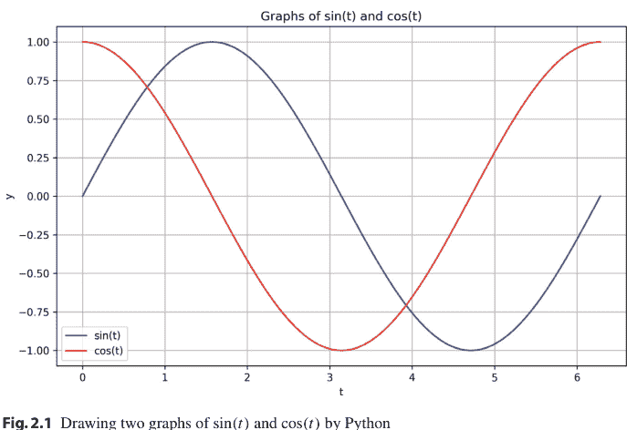

图2.1 使用Python绘制sin(t)和cos(t)的两个图形

- `plt.ylabel('y')` 为绘图的y轴添加标签。
- `plt.legend(loc='lower left')` 为绘图生成图例。参数`loc='lower left'`决定了图例的位置。
- `plt.grid(True)` 切换绘图网格的显示。
- `plt.show()` 渲染并显示绘图。

### 2.2 线性代数

在*代数图论*中，图（或网络）使用矩阵表示。分析与图相关的矩阵对于分析图的性质（如连通性）起着重要作用。本节将介绍代数图论中常用的线性代数的重要事实和定理。我们还将展示用于矩阵分析的Python代码。

#### 2.2.1 符号

对于$n$维实向量空间$\mathbb{R}^n$中的两个向量$x$和$y$，我们定义*内积*为$\langle x, y \rangle \triangleq x^\top y$，*欧几里得范数*或$\ell^2$*范数*为

$$\|x\| \triangleq \sqrt{\langle x, x \rangle} = \sqrt{\sum_{i=1}^n |x_i|^2}, \tag{2.5}$$

其中$x_i$是$x$的第$i$个元素。如果$\langle x, y \rangle = 0$成立，我们称两个向量$x$和$y$是*正交的*，记作$x \perp y$。对于$\mathbb{R}^n$中的两个子集$\mathbf{S}_1$和$\mathbf{S}_2$，如果对于任意$x_1 \in \mathbf{S}_1$和$x_2 \in \mathbf{S}_2$，$x_1 \perp x_2$成立，我们称$\mathbf{S}_1$和$\mathbf{S}_2$是正交的，并记作$\mathbf{S}_1 \perp \mathbf{S}_2$。对于子集$\mathbf{S} \subseteq \mathbb{R}^n$，*正交补* $\mathbf{S}^\perp$定义为

$$\mathbf{S}^\perp \triangleq \{x \in \mathbb{R}^n : \langle x, y \rangle = 0, \forall y \in \mathbf{S}\}. \tag{2.6}$$

容易证明，对于任意$\mathbf{S} \subseteq \mathbb{R}^n$，$\mathbf{S}^\perp$是$\mathbb{R}^n$的一个闭线性子空间。特别地，如果$\mathbf{S}$本身是一个闭线性子空间，那么任何向量$x \in \mathbb{R}^n$都可以唯一分解为

$$x = y + z, \quad y \in \mathbf{S}, \quad z \in \mathbf{S}^\perp. \tag{2.7}$$

也就是说，空间$\mathbb{R}^n$是$\mathbf{S}$和$\mathbf{S}^\perp$的直和，即

$$\mathbb{R}^n = \mathbf{S} \oplus \mathbf{S}^\perp. \tag{2.8}$$

我们称此分解为$\mathbb{R}^n$的*正交分解*。

#### 2.2.2 矩阵的秩

让我们将矩阵视为两个有限维线性空间之间的映射。我们从与矩阵相关的两个重要线性子空间开始：核与像。对于矩阵$A \in \mathbb{R}^{m \times n}$，我们定义$A$的*核*为

$$\ker(A) \triangleq \{x \in \mathbb{R}^n : Ax = 0\}, \tag{2.9}$$

*像*定义为

$$\mathrm{imag}(A) \triangleq \{Ax \in \mathbb{R}^m : x \in \mathbb{R}^n\}. \tag{2.10}$$

$\mathrm{imag}(A)$的维数称为*秩*，记作$\mathrm{rank}(A)$。以下定理称为*维数定理*，在线性代数中起着重要作用：

**定理 2.1**（维数定理）*对于矩阵$A \in \mathbb{R}^{m \times n}$，我们有*

$$\dim(\ker(A)) + \mathrm{rank}(A) = n. \tag{2.11}$$

特别地，矩阵秩的分析在图分析中经常起着重要作用。我们在以下定理中展示矩阵秩的一些性质：

**定理 2.2** (i) *对于矩阵$A \in \mathbb{R}^{m \times n}$，我们有*

$$\mathrm{rank}(A^\top) = \mathrm{rank}(A). \tag{2.12}$$

(ii) 对于矩阵$A_1, A_2 \in \mathbb{R}^{m \times n}$，我们有

$$\operatorname{rank}(A_1 + A_2) \leq \operatorname{rank}(A_1) + \operatorname{rank}(A_2). \tag{2.13}$$

(iii) 对于矩阵$A \in \mathbb{R}^{m \times n}$和非奇异矩阵$T_1 \in \mathbb{R}^{m \times m}$与$T_2 \in \mathbb{R}^{n \times n}$，我们有

$$\operatorname{rank}(A) = \operatorname{rank}(T_1 A) = \operatorname{rank}(A T_2) = \operatorname{rank}(T_1 A T_2). \tag{2.14}$$

(iv) 矩阵$A_1, A_2 \in \mathbb{R}^{m \times n}$满足

$$\operatorname{rank}(A_1) = \operatorname{rank}(A_2), \tag{2.15}$$

当且仅当存在两个非奇异矩阵$T_1 \in \mathbb{R}^{m \times m}$和$T_2 \in \mathbb{R}^{n \times n}$使得

$$A_2 = T_1 A_1 T_2. \tag{2.16}$$

(v) 如果矩阵$A \in \mathbb{R}^{m \times n}$满足

$$\operatorname{rank}(A) = n, \tag{2.17}$$

那么$A^\top A$是非奇异的。在这种情况下，对于任意向量$x \in \mathbb{R}^m$，存在唯一的$y \in \mathbf{S} \triangleq \operatorname{imag}(A)$和$z \in \mathbf{S}^\perp$使得$x = y + z$，并且这些向量由下式给出

$$y = A(A^\top A)^{-1} A^\top x, \quad z = (I - A(A^\top A)^{-1} A^\top)x. \tag{2.18}$$

矩阵像的表征也很重要。这有时通过空间中向量的张成来完成。$\mathbb{R}^m$中向量$x_1, x_2, \ldots, x_n$的*张成*定义为

$$\operatorname{span}(x_1, x_2, \ldots, x_n) \triangleq \{\alpha_1 x_1 + \alpha_2 x_2 + \cdots + \alpha_n x_n : \alpha_1, \alpha_2, \ldots, \alpha_n \in \mathbb{R}\}. \tag{2.19}$$

这个集合是包含$\{x_1, x_2, \ldots, x_n\}$的最小子空间。也就是说，对于任何包含$\{x_1, x_2, \ldots, x_n\}$的线性子空间$\mathbf{S} \subset \mathbb{R}^m$，我们有

$$\operatorname{span}(x_1, x_2, \ldots, x_n) \subset \mathbf{S}. \tag{2.20}$$

让我们考虑矩阵$A \in \mathbb{R}^{m \times n}$，并令$a_i \in \mathbb{R}^m$为$A$的第$i$个列向量，即$A = [a_1 \ a_2 \ \cdots \ a_n]$。那么我们有

$$\operatorname{span}(a_1, a_2, \ldots, a_n) = \operatorname{imag}(A). \tag{2.21}$$

特别地，对于向量$a \in \mathbb{R}^m$，我们有

$$\operatorname{span}(a) = \operatorname{imag}(a). \tag{2.22}$$

**示例 2.1** (*Python*) 这里，我们使用Python进行向量和矩阵计算。首先，我们在Python中定义一个向量和一个矩阵。操作如下：

```python
import numpy as np
import numpy.linalg as LA

x = np.array([5,6])
A = np.array([[1,2],[3,4]])
```

这样，我们得到一个二维向量

$$x = \begin{bmatrix} 5 \\ 6 \end{bmatrix}$$

和一个$2 \times 2$矩阵

$$A = \begin{bmatrix} 1 & 2 \\ 3 & 4 \end{bmatrix}.$$

我们应该注意，`x = np.array([5,6])`*不是*行向量，而是列向量。为了验证这一点，我们计算$A$和$x$的乘积。操作如下：

```python
b = A @ x
print(b)
```

这里，矩阵$A$和向量$x$的乘积编码为`A @ x`，而不是`A * x`（后者会给出不同的结果（试试看！））。结果是$[17 \quad 39]$。这是一个列向量。

$b$的范数使用`LA`（`numpy.linalg`）中的`norm`函数计算，如下：

```python
print(LA.norm(b, ord=2))
```

结果是$42.5440947723653$。第二个参数`ord=2`表示使用$\ell^2$范数计算。如果你想计算$\ell^1$范数，只需将其改为`ord=1`。

$A$的秩也可以使用`LA`中的`matrix_rank`函数轻松计算：

```python
print(LA.matrix_rank(A))
```

答案当然是2。最后，让我们计算(2.18)中的矩阵：

```python
A = np.array([[1,2],[3,4],[5,6]])
B = A.T @ A
C = LA.inv(B)
P = A @ C @ A.T
print(P)
```

Q = np.eye(3) - P
print(Q)
```

第一行定义了以下 $3 \times 2$ 矩阵：

$$A = \begin{bmatrix} 1 & 2 \\ 3 & 4 \\ 5 & 6 \end{bmatrix}.$$

该矩阵的秩显然为 2，因此矩阵 $A$ 的像是 $\mathbb{R}^3$ 中的一个二维线性子空间。第二行计算 $B = A^\top A$，其中 $A.\text{T}$ 是 $A$ 的转置。第三行使用 NumPy 的 $\text{linalg}$ 子模块中的 $\text{inv}$ 函数计算 $B = A^\top A$ 的逆。第四行得到 $P = A(A^\top A)^{-1}A^\top$。最后，第六行得到 $Q = I - P$，其中 $\text{eye}(3)$ 是 $\mathbb{R}^3$ 中的单位矩阵。通过使用该代码，我们得到

$$P = A(A^\top A)^{-1}A^\top = \begin{bmatrix} 0.83 & 0.33 & -0.17 \\ 0.33 & 0.33 & 0.33 \\ -0.17 & 0.33 & 0.83 \end{bmatrix},$$

$$Q = I - P = \begin{bmatrix} 0.17 & -0.33 & 0.17 \\ -0.33 & 0.67 & -0.33 \\ 0.17 & -0.33 & 0.17 \end{bmatrix}.$$

#### 2.2.3 正矩阵与非负矩阵

本书将研究的图相关矩阵，如图拉普拉斯矩阵和佩龙矩阵，具有一个特殊性质：它们没有负元素。这里我们考虑这类矩阵。考虑一个矩阵 $A \in \mathbb{R}^{m \times n}$。如果 $A$ 中的所有元素都是正数（或非负数），则称 $A$ 是*正矩阵*（或*非负矩阵*）。如果 $A$ 是正矩阵，我们记作 $A > 0$；如果 $A$ 是非负矩阵，我们记作 $A \ge 0$。根据定义，容易证明如果 $A_1$ 和 $A_2$ 是正矩阵（或非负矩阵），那么 $A_1 + A_2$ 和 $A_1 A_2$ 也是正矩阵（或非负矩阵）。

考虑一个非负矩阵 $A = [a_{ij}] \in \mathbb{R}^{n \times n}$。如果 $A$ 的行和都为 1，即对于所有 $i \in \{1, 2, \ldots, n\}$，满足

$$a_{i1} + a_{i2} + \cdots + a_{in} = 1 \qquad (2.25)$$

则称 $A$ 是一个*随机矩阵*。条件 (2.25) 对于任意 $i$ 也可以写成

$$A\mathbf{1}_n = \mathbf{1}_n, \qquad (2.26)$$

其中 $\mathbf{1}_n \in \mathbb{R}^n$ 是一个全 1 向量，即 $\mathbf{1}_n = [1, 1, \ldots, 1]^\top \in \mathbb{R}^n$。
如果 $A^\top$ 也是随机矩阵，则称随机矩阵 $A$ 是一个*双随机矩阵*。

**示例 2.2** *(Python)* 以下矩阵是一个随机矩阵：

$$A_1 = \frac{1}{4} \begin{bmatrix} 2 & 0 & 2 \\ 1 & 2 & 1 \\ 0 & 2 & 2 \end{bmatrix}.$$
(2.27)

让我们用 Python 来验证这一点。首先，导入 NumPy 并定义 $A_1$ 为

```
import numpy as np
A1 = np.array([[2,0,2],[1,2,1],[0,2,2]])/4
```

然后，我们通过以下方式验证 (2.26)：

```
v = np.ones(3)
print(A1 @ v)
```

函数 `ones(3)` 定义了 $\mathbf{1}_3$，即一个三维的全 1 向量。结果是 $[1.\ 1.\ 1.]$，因此 $A_1$ 是随机矩阵。此外，以下矩阵是一个双随机矩阵：

$$A_2 = \frac{1}{4} \begin{bmatrix} 2 & 0 & 2 \\ 1 & 2 & 1 \\ 1 & 2 & 1 \end{bmatrix}.$$
(2.28)

为了验证这一点，我们计算 $A_2\mathbf{1}_3$ 和 $A_2^\top\mathbf{1}_3$：

```
A2 = np.array([[2,0,2],[1,2,1],[1,2,1]])/4
v = np.ones(3)
print(A2 @ v)
print(A2.T @ v)
```

我们得到

```
[1. 1. 1.]
[1. 1. 1.]
```

因此 $A_2$ 是双随机矩阵。$\square$

#### 2.2.4 特征值

分析和设计网络与多智能体系统的主要工具是图相关矩阵的*特征值*。这里，我们回顾特征值的基本性质。考虑以下方程：

$$Ax = \lambda x, \tag{2.29}$$

其中 $A \in \mathbb{R}^{n \times n}$ 是给定的，$x \in \mathbb{C}^n$ 和 $\lambda \in \mathbb{C}$ 是未知的。如果存在一个标量 $\lambda$ 和一个非零向量 $x$ 满足 (2.29)，则 $\lambda$ 称为 $A$ 的一个*特征值*，$x$ 称为 $A$ 关于 $\lambda$ 的一个*特征向量*。此外，如果存在一个非零行向量 $\xi \in \mathbb{C}^{1 \times n}$ 和一个标量 $\lambda \in \mathbb{C}$ 使得

$$\xi A = \lambda \xi \tag{2.30}$$

成立，则 $\xi$ 称为与 $\lambda$ 相关联的*左特征向量*。根据这个定义，我们有时将满足 (2.29) 的列向量 $x$ 称为*右特征向量*。在本书中，如果我们说特征向量，指的是右特征向量。

以下定理对于刻画矩阵的特征向量很重要：

**定理 2.3** *标量 $\lambda \in \mathbb{C}$ 是矩阵 $A \in \mathbb{R}^{n \times n}$ 的特征值，当且仅当矩阵 $\lambda I - A$ 是奇异的。*

**定理 2.4** *标量 $\lambda \in \mathbb{C}$ 是矩阵 $A \in \mathbb{R}^{n \times n}$ 的特征值，当且仅当 $\lambda$ 是 $A$ 的特征多项式 $p_A(s)$ 的根，该多项式定义为*

$$p_A(s) \triangleq \det(sI - A). \tag{2.31}$$

根据定理 2.4，每个 $A \in \mathbb{R}^{n \times n}$ 恰好有 $n$ 个特征值（计入重数）。$\lambda$ 作为特征多项式 $p_A$ 的根的重数称为*代数重数*。另一方面，与特征值 $\lambda$ 相关联的线性无关特征向量的数量，或 $\ker(\lambda I - A)$ 的维数，称为*几何重数*。每个特征值的几何重数都大于或等于 1，并且几何重数总是小于或等于代数重数。如果一个特征值的代数重数等于 1，则称其为*单特征值*，因此其几何重数也为 1。如果一个特征值的代数重数等于其几何重数，则称其为*半单特征值*。如果所有特征值都是半单的，则称该矩阵为*半单矩阵*。

**示例 2.3** *(Python) 考虑以下矩阵：*

$$A = \begin{bmatrix} 1 & 0 & 0 \\ 0 & 1 & 1 \\ 0 & 0 & 1 \end{bmatrix}. \tag{2.32}$$

其特征多项式为 $p_A(s) = \det(sI - A) = (s - 1)^3$。$A$ 的特征值是 $\{1, 1, 1\}$（重数为 3），代数重数为 3。另一方面，与 $\lambda = 1$ 相关联的线性无关特征向量有两个，例如 $x_1 = [1\ 0\ 0]^\top$ 和 $x_2 = [0\ 1\ 0]^\top$，因此在这种情况下几何重数为 2。

然后，我们尝试用 Python 来验证上述事实。特征值和相应的特征向量可以如下计算：

```
import numpy as np
import numpy.linalg as LA

A = np.array([[1,0,0],[0,1,1],[0,0,1]])
s, V = LA.eig(A)
print(s)
print(V)
```

函数 `eig` 在向量 `s` 中返回三个特征值，在矩阵 `V` 中以列向量形式返回相应的三个特征向量。结果是

```
[1. 1. 1.]

[[ 1.00e+00  0.00e+00  0.00e+00]
 [ 0.00e+00  1.00e+00 -1.00e+00]
 [ 0.00e+00  0.00e+00  2.22e-16]] .
```

第一行向量 `s` 表明 $A$ 具有特征值 1，代数重数为 3。然后，`V` 中的第一列和第二列向量是线性无关的，但第三列向量（忽略 $2.22 \times 10^{-16}$）与第二列线性相关。因此，存在两个线性无关的特征向量，几何重数为 2。

#### 2.2.5 约当标准形与谱分解

约当标准形是一种矩阵表示，它从特征值的角度明确展示了矩阵的结构。设 $\lambda_1, \lambda_2, \ldots, \lambda_r$ 是矩阵 $A \in \mathbb{R}^{n \times n}$ 的互异特征值。设 $m_i$ 和 $\alpha_i$ 分别是 $\lambda_i$ 的代数重数和几何重数。那么 $A$ 与矩阵 $J$ 相似$^4$，$J$ 表示为

$$J \triangleq \operatorname{diag}(J_1, J_2, \ldots, J_r), \tag{2.33}$$

> $^4$ 两个方阵 $A_1 \in \mathbb{R}^{n \times n}$ 和 $A_2 \in \mathbb{R}^{n \times n}$ 称为*相似*的，如果存在一个非奇异矩阵 $T \in \mathbb{R}^{n \times n}$ 使得 $A_2 = T^{-1} A_1 T$。

其中 $J_1, J_2, \ldots, J_r$ 定义为

$$J_i \triangleq \operatorname{diag}\left(J_{i1}, J_{i2}, \ldots, J_{i\alpha_i}\right) \in \mathbb{C}^{m_i \times m_i} \quad (i=1,2,\ldots,r) \tag{2.34}$$

$$J_{ij} \triangleq \begin{bmatrix} \lambda_i & 1 & & 0 \\ & \ddots & \ddots & \\ & & \lambda_i & 1 \\ 0 & & & \lambda_i \end{bmatrix} \in \mathbb{C}^{n_{ij} \times n_{ij}} \quad (j=1,2,\ldots,\alpha_i) \tag{2.35}$$

$$m_i \triangleq \sum_{j=1}^{\alpha_i} n_{ij}. \tag{2.36}$$

(2.33) 中的矩阵 $J$ 称为*约当标准形*，(2.35) 中的每个 $J_{ij}$ 称为一个*约当块*。

**示例 2.4** (*Python*) 考虑以下矩阵：

$$A = \begin{bmatrix} -1 & -7 & 2 \\ 1 & 4 & -1 \\ 1 & 2 & 0 \end{bmatrix}. \tag{2.37}$$

$A$ 的约当标准形可以很容易地用 Python 计算：

```
import numpy as np
from sympy import Matrix
A = np.array([[-1,-7,2],[1,4,-1],[1,2,0]])
M = Matrix(A)
T, J = M.jordan_form()
print(T)
print(J)
```

这里我们使用了 SymPy 库，它对于符号计算很有用。第三行和第四行将 (2.37) 中的矩阵 $A$ 定义为一个符号数学对象。然后，`jordan_form` 通过符号计算计算约当标准形。$T$ 是将 $A$ 转换为其约当标准形 $J$ 的矩阵，即 $A = T J T^{-1}$。结果是

Matrix([[-1, -2, 1], [0, 1, 0], [-1, 1, 0]])
Matrix([[1, 1, 0], [0, 1, 1], [0, 0, 1]]) .

即，

$$T = \begin{bmatrix} -1 & -2 & 1 \\ 0 & 1 & 0 \\ -1 & 1 & 0 \end{bmatrix}, \quad J = \begin{bmatrix} 1 & 1 & 0 \\ 0 & 1 & 1 \\ 0 & 0 & 1 \end{bmatrix}.$$

请注意，由于此计算是符号化的，对于大型矩阵，它需要相当长的计算时间。

如果一个矩阵 $A \in \mathbb{R}^{n \times n}$ 与一个对角矩阵相似，则称 $A$ 是*可对角化的*。根据 Jordan 标准形，我们有以下定理：

**定理 2.5** *一个矩阵 $A \in \mathbb{R}^{n \times n}$ 是可对角化的，当且仅当 $A$ 是半单的。*

根据上述定理，每个半单矩阵 $A \in \mathbb{R}^{n \times n}$ 都有 $n$ 个线性无关的特征向量 $x_1, x_2, \ldots, x_n \in \mathbb{R}^n$。如果 $A$ 是半单的，那么 $A^\top$ 也是半单的，因此 $A^\top$ 也有 $n$ 个线性无关的特征向量 $y_1, y_2, \ldots, y_n \in \mathbb{R}^n$，即对于任意 $i \in \{1, 2, \ldots, n\}$，下式成立：

$$Ax_i = \lambda_i x_i \quad (2.38)$$
$$A^\top y_i = \lambda_i y_i \quad (2.39)$$

由 (2.39) 式，我们有

$$y_i^\top A = \lambda_i y_i^\top. \quad (2.40)$$

由此可知 $y_i^\top$ 是 $A$ 的一个左特征向量。由于特征向量 $x_1, x_2, \ldots, x_n$ 线性无关，矩阵 $T \triangleq [x_1 \ x_2 \ \cdots \ x_n]$ 是非奇异的。如果我们选择 $y_i$ 使得 $y_i^\top x_i = 1$ ($i = 1, 2, \ldots, n$)，则容易证明 $T^{-1} = [y_1 \ y_2 \ \cdots \ y_n]^\top$ 成立。总之，我们有

$$A = T \operatorname{diag}(\lambda_1, \lambda_2, \ldots, \lambda_n) T^{-1} = \sum_{i=1}^n \lambda_i x_i y_i^\top. \quad (2.41)$$

我们称 (2.41) 式中的分解为半单矩阵 $A$ 的*谱分解*。

#### 2.2.6 谱映射定理

这里我们介绍一个计算矩阵*函数*特征值的有用工具。让我们考虑一个多项式

$$f(s) \triangleq \sum_{k=0}^N c_k s^k. \quad (2.42)$$

为此，让我们考虑*多项式矩阵* $f(A)$，它是通过将 (2.42) 式中的 $s$ 替换为 $A \in \mathbb{R}^{n \times n}$ 得到的。即，

$$f(A) \triangleq \sum_{k=0}^N c_k A^k, \quad (2.43)$$

其中我们定义 $A^0 \triangleq I$。对于多项式矩阵 $f(A)$，我们有以下称为*谱映射定理*的定理：

**定理 2.6**（谱映射定理）*考虑一个矩阵 $A \in \mathbb{R}^{n \times n}$，其特征值为 $\lambda_1, \lambda_2, \ldots, \lambda_n$（含重数）。设 $f(s)$ 是一个多项式。那么多项式矩阵 $f(A) \in \mathbb{R}^{n \times n}$ 的特征值为 $f(\lambda_1), f(\lambda_2), \ldots, f(\lambda_n)$（含重数）。*

**例 2.5** (*Python*) 为了验证定理 2.6，让我们考虑以下矩阵：

$$A = \begin{bmatrix} 0 & -1 & -1 \\ -1 & 1 & 0 \\ -1 & 0 & 1 \end{bmatrix}.$$

通过以下代码获得特征值：

```python
import numpy as np
import numpy.linalg as LA

A = np.array([[0,-1,-1],[-1,1,0],[-1,0,1]])
s, V = LA.eig(A)
print(s)
```

根据结果，特征值为 $-1$、$2$ 和 $1$。然后，让我们考虑另一个矩阵

$$B = A^2 + A + I.$$

根据定理 2.6，$B$ 的特征值为

$$(-1)^2 + (-1) + 1 = 1, \quad 2^2 + 2 + 1 = 7, \quad 1^2 + 1 + 1 = 3.$$

为了确认这一点，我们运行以下代码：

```python
B = A @ A + A + np.eye(3)
s2, V2 = LA.eig(B)
print(s2)
```

答案是 $[7. \quad 1. \quad 3.]$，这些值与理论值完全相同。$\square$

#### 2.2.7 盖尔圆盘定理

首先，矩阵 $A \in \mathbb{R}^{n \times n}$ 的特征值集合称为*谱*，最大绝对特征值称为*谱半径*，我们用 $\rho(A)$ 表示。即，对于矩阵 $A \in \mathbb{R}^{n \times n}$ 的特征值 $\lambda_1, \lambda_2, \ldots, \lambda_n$，谱半径 $\rho(A)$ 定义为

$$\rho(A) \triangleq \max(|\lambda_1|, |\lambda_2|, \ldots, |\lambda_n|).$$

谱半径的一个上界由以下定理给出：

**定理 2.7** *对于矩阵 $A \in \mathbb{R}^{n \times n}$，我们有*

$$\rho(A) \leq \|A\|,$$

其中 $\|A\|$ 是由欧几里得范数 (2.5) 诱导的范数，定义为

$$\|A\| \triangleq \max_{x \in \mathbb{R}^n \setminus \{0\}} \frac{\|Ax\|}{\|x\|}.$$

*此外，如果 $A$ 是对称的，我们有*

$$\rho(A) = \|A\|.$$

根据这个定理，复平面上以 0 为中心、半径为 $\|A\|$ 的闭圆盘包含了 $A$ 的所有特征值。也就是说，我们可以在不计算特征值的情况下，使用 $\|A\|$ 的值粗略估计特征值的区域。然而，对于许多应用来说，这种估计不够精确，我们希望获得更精确的区域。为此，可以使用*盖尔圆盘定理*。

**定理 2.8**（盖尔圆盘定理）*对于矩阵 $A = [a_{ij}] \in \mathbb{R}^{n \times n}$，在 $\mathbb{C}$ 中定义以下区域：*

$$\mathbf{R}_i \triangleq \left\{ z \in \mathbb{C} : |z - a_{ii}| \leq \sum_{j \in \{1, 2, \ldots, n\} \setminus \{i\}} |a_{ij}| \right\},$$

$$\mathbf{C}_j \triangleq \left\{ z \in \mathbb{C} : |z - a_{jj}| \leq \sum_{i \in \{1, 2, \ldots, n\} \setminus \{j\}} |a_{ij}| \right\},$$

其中 $i, j \in \{1, 2, \ldots, n\}$。设 $\lambda_1, \lambda_2, \ldots, \lambda_n$ 是 $A$ 的特征值。那么我们有

$$\{\lambda_1, \lambda_2, \ldots, \lambda_n\} \subseteq \mathbf{R} \triangleq \bigcup_{i=1}^n \mathbf{R}_i, \quad \{\lambda_1, \lambda_2, \ldots, \lambda_n\} \subseteq \mathbf{C} \triangleq \bigcup_{j=1}^n \mathbf{C}_j,$$

因此 $\{\lambda_1, \lambda_2, \ldots, \lambda_n\} \subseteq \mathbf{R} \cap \mathbf{C}$。

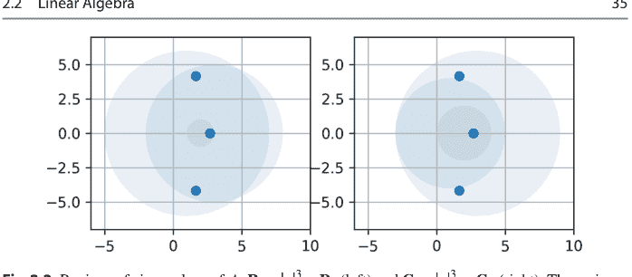

图 2.2 $A$ 的特征值区域：$\mathbf{R} = \bigcup_{j=1}^3 \mathbf{R}_j$（左）和 $\mathbf{C} = \bigcup_{j=1}^3 \mathbf{C}_j$（右）。三个特征值用黑点表示

**例 2.6** 让我们考虑以下矩阵：

$$A = \begin{bmatrix} 1 & -6 & 0 \\ 3 & 3 & 2 \\ -1 & 0 & 2 \end{bmatrix}.$$

我们使用盖尔圆盘定理来寻找特征值的区域。根据定理 2.8，集合 $\mathbf{R}_i$ 和 $\mathbf{C}_j$ 为

$\mathbf{R}_1 = \{z \in \mathbb{C} : |z - 1| \leq 6\}$，$\mathbf{R}_2 = \{z \in \mathbb{C} : |z - 3| \leq 5\}$，$\mathbf{R}_3 = \{z \in \mathbb{C} : |z - 2| \leq 1\}$，
$\mathbf{C}_1 = \{z \in \mathbb{C} : |z - 1| \leq 4\}$，$\mathbf{C}_2 = \{z \in \mathbb{C} : |z - 3| \leq 6\}$，$\mathbf{C}_3 = \{z \in \mathbb{C} : |z - 2| \leq 2\}$。

然后，集合 $\mathbf{R} = \bigcup_{i=1}^3 \mathbf{R}_i$ 和 $\mathbf{C} = \bigcup_{j=1}^3 \mathbf{C}_j$ 绘制在图 2.2 中。$A$ 的特征值为 2.69 和 $1.66 \pm 4.17\mathrm{j}$，实际上，它们位于交集 $\mathbf{R} \cap \mathbf{C}$ 内。

此例的 Python 程序在第 2.3.1 节中给出。$\square$

#### 2.2.8 佩龙-弗罗贝尼乌斯理论

非负矩阵和正矩阵的特征值具有有趣的性质，这些性质总结在*佩龙-弗罗贝尼乌斯理论*中。这些性质常用于分析网络和多智能体系统。

首先，我们引入矩阵*可约性*的概念。一个矩阵 $A \in \mathbb{R}^{n \times n}$ ($n \geq 2$) 被称为*可约的*，如果存在一个置换矩阵$^5$ $\Pi \in \mathbb{R}^{n \times n}$ 使得

$$\Pi^\top A \Pi = \begin{bmatrix} A_{11} & A_{12} \\ 0 & A_{22} \end{bmatrix},$$

$^5$ 一个矩阵 $\Pi \in \{0, 1\}^{n \times n}$ 被称为*置换矩阵*，如果每行每列恰好有一个元素为 1，其余元素均为 0。

其中 $A_{11}$ 和 $A_{22}$ 是方阵。对于 $n = 1$，如果 $A = 0$，则称 $A$ 是可约的。
如果 $A$ 不是可约的，我们称 $A \in \mathbb{R}^{n \times n}$ 是*不可约的*。对于矩阵的不可约性，以下定理很有用：

**定理 2.9** *一个矩阵 $A = [a_{ij}] \in \mathbb{R}^{n \times n}$ ($n \geq 2$) 是不可约的，当且仅当 $(I + \text{abs}(A))^{n-1}$ 是正的，即*
$$(I + \text{abs}(A))^{n-1} > 0, \tag{2.52}$$
*其中 $\text{abs}(A)$ 是一个矩阵，其 $(i, j)$ 元素为 $|a_{ij}|$，即 $\text{abs}(A) = [|a_{ij}|] \in \mathbb{R}^{n \times n}$。*

对于非负矩阵，以下定理被称为*佩龙-弗罗贝尼乌斯定理*：

**定理 2.10**（*佩龙-弗罗贝尼乌斯定理*）*设 $A \in \mathbb{R}^{n \times n}$ 是一个非负矩阵。那么，谱半径 $\rho(A)$ 是 $A$ 的一个特征值，并且存在一个非负特征向量（即元素全为非负的特征向量）与之对应。此外，如果 $A$ 也是不可约的，则以下性质成立：*

- (i) $\rho(A) > 0$。
- (ii) $\rho(A)$ 是 $A$ 的一个单特征值。
- (iii) 存在一个正特征向量（即元素全为正）与特征值 $\rho(A)$ 对应。

对于正矩阵，我们有以下称为*佩龙定理*的定理：

**定理 2.11**（*佩龙定理*）*假设 $A \in \mathbb{R}^{n \times n}$ 是正的。则以下性质成立：*

- (i) $\rho(A) > 0$。
- (ii) $\rho(A)$ 是 $A$ 的一个单特征值，并且其他特征值的绝对值严格小于 $\rho(A)$。
- (iii) 存在一个正特征向量与特征值 $\rho(A)$ 对应。

**例 2.7** (*Python*) *这里我们使用 Python 通过矩阵例子来验证定理 2.10 和 2.11。*

(i) 让我们考虑以下矩阵：
$$A_1 = \begin{bmatrix} 1 & 0 & 0 \\ 0 & 1 & 1 \\ 0 & 0 & 1 \end{bmatrix}.$$
首先，我们计算 $(I + \text{abs}(A_1))^{n-1}$，其中 $n = 3$：

import numpy as np
import numpy.linalg as LA

A1 = np.array([[1,0,0],[0,1,1],[0,0,1]])
B1 = np.eye(3) + abs(A1)
print(B1 @ B1)

结果为

$(I + \text{abs}(A_1))^2 = \begin{bmatrix} 4 & 0 & 0 \\ 0 & 4 & 4 \\ 0 & 0 & 4 \end{bmatrix}.$

由于该矩阵不是正矩阵，根据定理 2.9，$A_1$ 是一个可约的非负矩阵。接下来我们计算其特征值和谱半径 $\rho(A_1)$：

```
s, V = LA.eig(A1)
print(s)
```

由此可知，$A_1$ 的特征值为 $\{1, 1, 1\}$（重数为 3），因此谱半径 $\rho(A_1) = 1$ 等于 $A_1$ 的一个特征值。同时，我们可以取与 $\rho(A_1) = 1$ 对应的非负特征向量 $[1, 0, 0]^\top$。实际上，通过 `print(V)` 查看 $V$，我们得到：

```
[[ 1.00e+00  0.00e+00  0.00e+00]
 [ 0.00e+00  1.00e+00 -1.00e+00]
 [ 0.00e+00  0.00e+00  2.22e-16]] .
```

(ii) 让我们考虑另一个矩阵

$A_2 = \begin{bmatrix} 1 & 0 & 1 \\ 1 & 1 & 1 \\ 0 & 1 & 1 \end{bmatrix}.$

通过与上述类似的计算，该矩阵满足 $(I + \text{abs}(A_2))^2 > 0$，因此根据定理 2.9，这是一个不可约的非负矩阵。让我们来求其特征值和特征向量：

```
A2 = np.array([[1,0,1],[1,1,1],[0,1,1]])
s, V = LA.eig(A2)
print(s)
print(V)
```

结果如下：

```
[0.34+0.56j 0.34-0.56j 2.32+0.j ]

[[ 0.66+0.j    0.66-0.j    0.41+0.j ]
 [ 0.08-0.49j  0.08+0.49j  0.73+0.j ]
 [-0.43+0.37j -0.43-0.37j  0.55+0.j ]] .
```

这意味着 $A_2$ 的特征值为 $\{0.34 \pm 0.56j, 2.32\}$，谱半径 $\rho(A_2) = 2.32$ 等于 $A_2$ 的一个单特征值。同时，我们可以取与特征值 $\rho(A_2) = 2.32$ 对应的正特征向量 $[0.41, 0.73, 0.55]^\top$。

(iii) 最后，我们考虑

$$A_3 = \begin{bmatrix} 1 & 1 & 1 \\ 2 & 1 & 1 \\ 1 & 1 & 1 \end{bmatrix} .$$

这是一个正矩阵。$A_3$ 的特征值为 $\{-0.30, 0, 3.30\}$，谱半径 $\rho(A_3) = 3.30$ 等于 $A_3$ 的一个单特征值。我们可以取与特征值 $\rho(A_3) = 3.30$ 对应的正特征向量 $[0.52, 0.68, 0.52]^\top$。

#### 2.2.9 定号矩阵

这里，我们考虑与无向图相关的实对称矩阵。首先，关于实对称矩阵的特征值，我们有以下定理：

> **定理 2.12** *每个实对称矩阵 $A \in \mathbb{R}^{n \times n}$ 都是半单的且可对角化的。此外，实对称矩阵 $A$ 的特征值都是实数，并且与不同特征值对应的任意两个特征向量是相互正交的。*

设 $A \in \mathbb{R}^{n \times n}$ 是一个对称矩阵。如果对于任意非零向量 $x \in \mathbb{R}^n$，$x^\top Ax > 0$ 成立，则称 $A$ 是*正定*的。如果对于任意 $x \in \mathbb{R}^n$，$x^\top Ax \ge 0$ 成立，则称 $A$ 是*半正定*的。如果 $-A$ 是正定（或半正定）的，则称 $A$ 是*负定*（或*半负定*）的。对于正定（或半正定）矩阵，我们有以下定理：

> **定理 2.13** *实对称矩阵 $A \in \mathbb{R}^{n \times n}$ 是正定（或半正定）的，当且仅当 $A$ 的所有特征值都是正数（或非负数）。*

**例 2.8** (*Python*) 让我们考虑以下对称矩阵：

$$A_1 = \begin{bmatrix} 2 & 1 \\ 1 & 2 \end{bmatrix} .$$

计算其特征值的 Python 代码如下：

```
import numpy as np
import numpy.linalg as LA

A1 = np.array([[2,1],[1,2]])
s, V = LA.eig(A1)
print(s)
```

答案是 [3. 1.]，即特征值为 3 和 1，因此根据定理 2.13，$A_1$ 是正定的。
然后，我们计算

$$A_2 = \begin{bmatrix} 1 & 1 \\ 1 & 1 \end{bmatrix}$$
的特征值。通过与上述类似的 Python 代码，我们得到 $A_2$ 的特征值为 0 和 2。根据定理 2.13，$A_2$ 是半正定的。$\square$

#### 2.2.10 线性系统与矩阵指数

这里，我们阐述矩阵指数的概念，它在线性控制理论中扮演着重要角色。让我们考虑一个简单的常微分方程

$$\dot{x}(t) = ax(t), \quad t \geq 0, \tag{2.54}$$
其中 $x(t) \in \mathbb{R}$。其解很容易得到：

$$x(t) = e^{at}x(0), \quad t \geq 0. \tag{2.55}$$
在系统与控制中，我们经常考虑由下式描述的*多变量*系统：

$$\dot{x}(t) = Ax(t), \quad t \geq 0, \tag{2.56}$$
其中 $x(t)$ 是一个 $n$ 维实向量，$A \in \mathbb{R}^{n \times n}$ 是一个矩阵。为了分析这个多变量微分方程，矩阵指数起着非常重要的作用。对于一个方阵 $A \in \mathbb{R}^{n \times n}$，*矩阵指数* $e^A$ 定义为

$$e^A \triangleq \sum_{k=0}^{\infty} \frac{1}{k!} A^k. \tag{2.57}$$
矩阵指数具有如下定理中所示的有趣性质：

##### 定理 2.14 以下事实成立：

(i) $e^0 = I$ 成立，其中 $0 \in \mathbb{R}^{n \times n}$ 是零矩阵。
(ii) 如果两个矩阵 $A_1 \in \mathbb{R}^{n \times n}$ 和 $A_2 \in \mathbb{R}^{n \times n}$ 是可交换的（即 $A_1 A_2 = A_2 A_1$），则
$$e^{A_1} e^{A_2} = e^{A_1 + A_2} \tag{2.58}$$
成立。特别地，对于任意 $A \in \mathbb{R}^{n \times n}$ 和任意 $t_1, t_2 \in \mathbb{R}$，我们有
$$e^{A t_1} e^{A t_2} = e^{A(t_1 + t_2)}. \tag{2.59}$$
(iii) 对于任意 $A \in \mathbb{R}^{n \times n}$ 和任意非奇异矩阵 $T \in \mathbb{R}^{n \times n}$，我们有
$$e^{T A T^{-1}} = T e^A T^{-1}. \tag{2.60}$$
(iv) 对于任意 $A \in \mathbb{R}^{n \times n}$，我们有
$$e^A e^{-A} = I. \tag{2.61}$$
即，$e^{-A}$ 是 $e^A$ 的逆矩阵。
(v) 设 $\{\lambda_1, \lambda_2, \ldots, \lambda_n\}$ 是 $A \in \mathbb{R}^{n \times n}$ 的特征值。则 $e^A$ 的特征值由 $\{e^{\lambda_1}, e^{\lambda_2}, \ldots, e^{\lambda_n}\}$ 给出。

现在，我们可以利用矩阵指数来讨论 (2.56) 的解。

##### 定理 2.15 微分方程 (2.56) 的解由下式给出

$$x(t) = e^{At} x(0), \quad t \ge 0. \tag{2.62}$$

由式 (2.61) 可知，矩阵指数 $e^{At}$ 总是非奇异的，即使 $A$ 是奇异的。尽管矩阵指数不一定是半单的，但我们可以像 (2.41) 中的谱分解那样对 $e^{At}$ 进行分解。设 $\{\lambda_1, \lambda_2, \ldots, \lambda_r\}$ 是 $A$ 的互异特征值（不计重数）。设 $J$ 是 $A$ 的 Jordan 标准形，如 (2.33)–(2.36) 所示，$T$ 是到 $J$ 的变换矩阵，即 $A = T J T^{-1}$。那么我们有

$$\begin{aligned} e^{At} &= e^{T(Jt)T^{-1} } \\ &= T e^{Jt} T^{-1} \tag{2.63} \\ &= T \operatorname{diag}\left(e^{J_{11} t}, e^{J_{12} t}, \ldots, e^{J_{ij} t}, \ldots, e^{J_{\alpha r} t}\right) T^{-1}, \end{aligned}$$

其中

$$e^{J_{ij} t} \triangleq \left[\begin{array}{cccc} e^{\lambda_i t} & t e^{\lambda_i t} & \cdots & \frac{t^{n_{ij}-1}}{(n_{ij}-1)!} e^{\lambda_i t} \\ 0 & e^{\lambda_i t} & \ddots & \vdots \\ \vdots & \ddots & \ddots & t e^{\lambda_i t} \\ 0 & \cdots & 0 & e^{\lambda_i t} \end{array}\right]. \tag{2.64}$$

由此，矩阵指数 $e^{At}$ 可以分解为

$$e^{At} = e^{\lambda_1 t} M_1(t) + e^{\lambda_2 t} M_2(t) + \cdots + e^{\lambda_r t} M_r(t), \tag{2.65}$$

其中 $M_i(t)$ 是一个矩阵，其元素是次数不超过 $(m_i - 1)$ 的多项式（$m_i$ 是特征值 $\lambda_i$ 的代数重数）。实际上，$M_i(t)$ 由下式给出

$$M_i(t) \triangleq \sum_{l=0}^{m_i-1} \frac{t^l}{l!} (A - \lambda_i I)^l \Phi_i, \tag{2.66}$$

其中 $\Phi_i$ 是到线性子空间 $\ker((A - \lambda_i I)^{m_i})$ 的投影矩阵。

**例 2.9** *(Python)* 让我们考虑以下矩阵：

$$A = \begin{bmatrix} 1 & 1 & 0 \\ 0 & 1 & 1 \\ 0 & 0 & 1 \end{bmatrix}. \tag{2.67}$$

我们通过 Python 计算该矩阵的矩阵指数 $e^A$。对于矩阵指数，我们需要从 `SciPy` 库导入 `linalg` 子模块。然后我们可以使用 `expm` 函数来计算矩阵指数：

```
import numpy as np
from scipy import linalg
A = np.array([[1,1,0],[0,1,1],[0,0,1]])
expA = linalg.expm(A)
print(expA)
```

结果是

```
[[2.72  2.72  1.36]
 [0.    2.72  2.72]
 [0.    0.    2.72]] .
```

最后，我们探讨微分方程 (2.56) 的*稳定性*。以下定理是稳定性的基本定理，可以从定理 2.15 和式 (2.65) 很容易地理解。

**定理 2.16** *对于任意初始向量 $x(0) \in \mathbb{R}^n$，微分方程 (2.56) 的解 $x(t)$ 在 $t \to \infty$ 时收敛到零，当且仅当 $A$ 的特征值位于开左半平面 $\{z \in \mathbb{C} : \text{Re}(z) < 0\}$ 中。*

如果上述定理中的条件成立，则矩阵 $A$ 被称为 *Hurwitz 矩阵*。

**例 2.10** *(Python)* 在此，我们考虑微分方程 (2.56) 的数值解，其中 $A$ 由下式给出

$$A = \begin{bmatrix} 0 & 1 & 0 \\ 0 & 0 & 1 \\ -1 & -2 & -1 \end{bmatrix}.$$

我们使用 SciPy 的 `integrate` 子模块中的 `odeint` 函数。Python 程序在第 2.3.2 节给出，它输出了 $t \in [0, 20]$ 时 $[x_1(t), x_2(t), x_3(t)]^\top$ 的图形，初始状态为 $x(0) = [1, 1, 1]^\top$。

图 2.3 展示了结果。我们可以观察到 $x_1(t)$、$x_2(t)$ 和 $x_3(t)$ 的轨迹在振荡中收敛到零。实际上，$A$ 的特征值通过 Python 计算如下

```
import numpy.linalg as LA
s, V = LA.eig(A)
print(s)
```

结果为

$[-0.57+0.j \quad -0.22+1.31j \quad -0.22-1.31j]$。

它们都具有负实部，因此位于开左半平面。根据定理 2.16，我们可以肯定地说轨迹应该收敛到零。$\square$

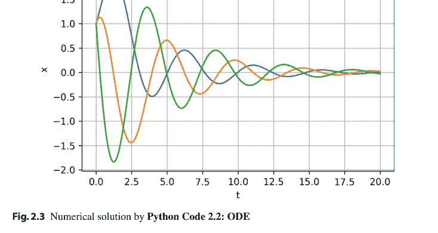

**图 2.3** 由 **Python 代码 2.2：ODE** 得到的数值解

让我们考虑 (2.56) 的 *时间离散化*。即，我们固定 *采样周期* $h > 0$，并在采样时刻 $\{0, h, 2h, \dots\}$ 上分析微分方程 (2.56)。从 (2.56) 的解 (2.62)，我们有

$$x(kh) = e^{A(kh)}x(0), \quad k = 0, 1, 2, \dots$$

定义 $x[k] \triangleq x(kh), k = 0, 1, 2, \dots$。则 (2.68) 可以重写为

$$x[k] = F^k x[0], \quad k = 0, 1, 2, \dots,$$

其中 $F \triangleq e^{Ah}$ 且 $x[0] \triangleq x(0)$。序列 (2.69) 是以下 *离散时间线性系统* 的解：

$$x[k+1] = Fx[k], \quad k = 0, 1, 2, \dots$$

类似于定理 2.16，我们有关于离散时间系统 (2.70) 的稳定性定理。

> **定理 2.17** *对于任意初始向量 $x[0] \in \mathbb{R}^n$，离散时间系统 (2.70) 的解 $\{x[k] : k = 0, 1, 2, \dots\}$ 当 $k \to \infty$ 时收敛到零，当且仅当 $F$ 的特征值位于开单位球 $\{z \in \mathbb{C} : |z| < 1\}$ 内。*

如果上述定理中的条件成立，则矩阵 $F$ 被称为 *Schur 矩阵*。

### 2.3 线性代数的 Python 代码

#### 2.3.1 Python 代码 2.1：盖尔圆

Python 代码 2.1 是一个用于绘制给定矩阵 $A$ 的盖尔圆的程序。在此代码中，矩阵 $A$ 定义为例 2.6 中的 (2.50) 式。

**Python 代码 2.1：例 2.6 的盖尔圆**

```
1  %matplotlib inline
2  import numpy as np
3  import numpy.linalg as LA
4  import matplotlib
5  from matplotlib.patches import Circle
6  from matplotlib.collections import PatchCollection
7  import matplotlib.pyplot as plt
8  
9  # Matrix A
10 A = np.array([[1,-6,0],[3,3,2],[-1,0,2]])
11 
12 # Eigenvalues of A
13 s, V = LA.eig(A)
14
15  # Gershgorin circles R and C
16  R = []
17  C = []
18  for i in range(len(A)):
19      center_i = A[i,i]
20      radius_Ri = np.sum(np.abs(A[i,:])) - np.abs(A[i,i])
21      radius_Ci = np.sum(np.abs(A[:,i])) - np.abs(A[i,i])
22      Ri = Circle((center_i, 0), radius_Ri)
23      R.append(Ri)
24      Ci = Circle((center_i, 0), radius_Ci)
25      C.append(Ci)
26  
27  # Plot circles
28  fig, ax = plt.subplots(1,2)
29  
30  # Circles in R
31  p1 = PatchCollection(R, cmap=matplotlib.cm.jet, alpha=0.1)
32  ax[0].add_collection(p1)
33  ax[0].axis([-6,10,-7,7])
34  ax[0].set_aspect('equal',adjustable='box')
35  ax[0].grid()
36  
37  # Circles in C
38  p2 = PatchCollection(C, cmap=matplotlib.cm.jet, alpha=0.1)
39  ax[1].add_collection(p2)
40  ax[1].axis([-6,10,-7,7])
41  ax[1].set_aspect('equal',adjustable='box')
42  ax[1].grid()
43  
44  # Plot eigenvalues
45  ax[0].plot(np.real(s),np.imag(s),'o')
46  ax[1].plot(np.real(s),np.imag(s),'o')
47  
48  # Plot figure
49  plt.show()
```

#### 2.3.2 Python 代码 2.2：ODE

Python 代码 2.2 是用于求解例 2.10 中讨论的线性常微分方程的程序。在此代码中，我们使用 `def` 关键字定义时间导数函数 $dx/dt = Ax$（第 7 至 9 行），`odeint` 函数返回数值解。这里，`args=(A,)` 表示 A 是一个固定参数，它应该被传递给函数 Ax。

> **注 2.1** Python 函数 `odeint` 对于求解 *非线性* 常微分方程也很有用，如第 4 章和第 5 章中所用。

**Python 代码 2.2：ODE**

```
1  import numpy as np
2  from scipy.integrate import odeint
3  import matplotlib.pyplot as plt
4
5  A = np.array([[0,1,0],[0,0,1],[-1,-2,-1]])
6
7  def Ax(x,t,A):
8      dxdt = A @ x
9      return dxdt
10
11 x0 = np.array([1,1,1])
12 t = np.arange(0, 20, 0.001)
13 x = odeint(Ax, x0, t, args=(A,))
14
15 plt.plot(t,x)
16 plt.xlabel('t')
17 plt.ylabel('x')
18 plt.grid()
19 plt.show()
```

### 2.4 图论

本节讨论图论的基础知识。特别是，我们在此介绍 *代数图论*，它利用上一节讨论的线性代数定理，为我们提供了分析图或网络的强大而高效的工具。

#### 2.4.1 什么是图？

图是一种用于建模网络的数学对象。图有多个节点（或顶点），以及连接节点的边。数学上，图是节点集和边集的对。例如，如果我们有节点集 **V** = {1, 2, . . . , n} 和边集 **E** ⊂ **V** × **V**，则图定义为 *G* = (**V**, **E**)。

当边数 *n* 较小时，图的可视化也是有益的。图 2.4 所示的图是一个著名的社交网络，称为 *Zachary 的空手道俱乐部* [2,14]。在此图中，节点代表空手道俱乐部的 34 名成员，78 条边表示俱乐部成员之间在俱乐部外定期互动的真实关系。该图经常被用作社区检测的基准 [2]。

Zachary 的网络是一个 *无向图*，其中边没有方向。如果我们考虑像 X (Twitter) 这样的社交网络服务 (SNS)，或万维网网络，则每条边都有一个方向（关注/被关注或链接/被链接）。这样的图称为 *有向图*，或简称 *digraph*。对于有向图，(*i*, *j*) ∈ **E** 并

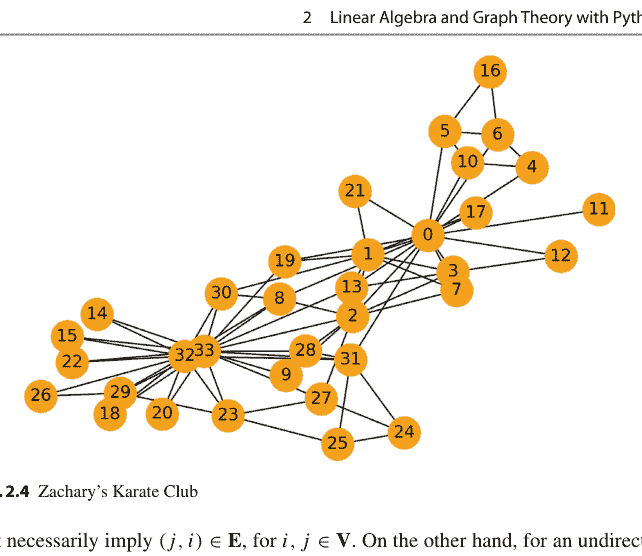

不一定意味着 $(j, i) \in \mathbf{E}$，其中 $i, j \in \mathbf{V}$。另一方面，对于无向图，$(i, j) \in \mathbf{E}$ 成立当且仅当 $(j, i) \in \mathbf{E}$ 成立。对于无向图，有时为了简单起见，如果 $i > j$，我们会排除 $\mathbf{E}$ 中的 $(i, j)$，而只将 $i < j$ 的 $(i, j)$ 放入 $\mathbf{E}$。在这种情况下，我们需要注意我们处理的是有向图还是无向图。

**例 2.11** *(Python)* 这里我们用 Python 定义并绘制一个有向图。我们使用一个名为 NetworkX [11] 的有用包进行图论计算，如第 2.1 节所述。Python 代码在第 2.5.1 节给出。我们绘制一个有向图 $G = (\mathbf{V}, \mathbf{E})$，其中 $\mathbf{V} = \{1, 2, 3, 4\}$，且

$\mathbf{E} = \{(1, 2), (1, 3), (3, 2), (3, 4), (4, 1)\}$。

我们在图 2.5 中展示结果。图 2.4 中 Zachary 空手道俱乐部的图也可以通过以下几行代码获得：

```
G2 = nx.karate_club_graph()
nx.draw(G2, node_size=500,
        node_color='orange', with_labels=True)
```

让我们考虑一个有向图 $G = (\mathbf{V}, \mathbf{E})$。对于节点 $i \in \mathbf{V}$，与 $i$ 相邻的头端数量称为 *入度*，记为 $d_i^{\text{in}}$。同样，与 $i$ 相邻的尾端数量称为 *出度*，记为 $d_i^{\text{out}}$。*最大度* 是 **V** 中节点入度的最大值，即

$$\Delta \triangleq \max_{i \in \mathbf{V}} d_i^{\text{in}}.$$

如果对于所有 $i \in \mathbf{V}$，$d_i^{\text{in}} = d_i^{\text{out}}$，则称有向图是 *平衡的*。对于无向图，我们只定义节点 $i \in \mathbf{V}$ 的 *度*，即与 $i$ 连接的边的数量。注意每个无向图都是平衡的。

**例 2.12** 让我们考虑一个无向图 $(\mathbf{V}, \mathbf{E}_K)$，其中 $\mathbf{V} = \{1, 2, \ldots, n\}$ 且

$$\mathbf{E}_K \triangleq \{(i, j) : i, j \in \mathbf{V}, i \neq j\}.$$

也就是说，此图中每一对节点都由一条边连接。这样的图称为 *完全图*。具有 $n$ 个节点的完全图记为 $K(n)$。容易证明每个节点的度都是 $n - 1$，因此 $\Delta = n - 1$。$\square$

**例 2.13** *(Python)* 图 2.5 中的图具有以下入度和出度：

$$d_1^{\text{in}} = 1, \quad d_1^{\text{out}} = 2,$$
$$d_2^{\text{in}} = 2, \quad d_2^{\text{out}} = 0,$$
$$d_3^{\text{in}} = 1, \quad d_3^{\text{out}} = 2,$$
$$d_4^{\text{in}} = 1, \quad d_4^{\text{out}} = 1,$$

#### 2.4.2 连通性

这里我们讨论图的连通性。
对于有向图 $G = (V, E)$，一条长度为 $m$ 的*有向路径*是 $V$ 中节点的一个序列：

$\{i_0, i_1, \dots, i_m\}$

其中对于任意 $k \in \{0, 1, \dots, m-1\}$，都有 $(i_k, i_{k+1}) \in E$。直观地说，路径就像用笔从 $i_0$ 到 $i_m$，沿着图的边一笔画出的轨迹。例如，图 2.6 中的 $\{1, 2, 4, 6\}$ 是从 1 到 6 的一条路径，而 $\{1, 2, 3, 5, 4, 3, 5, 4, 6\}$ 是从 1 到 6 的另一条路径。

考虑一个有向图 $G = (V, E)$。如果存在一条从节点 $i$ 到节点 $j$ 的路径，则称两个节点 $i, j \in V$ 是*连通*的。如果任意两个节点 $i, j \in V$ 都相互连通，则称有向图 $G$ 是*强连通*的。对于无向图 $G$，我们直接称 $G$ 是*连通*的，而不是强连通。如果一个有向图通过将所有有向边替换为无向边后作为无向图是连通的，则称该有向图是*弱连通*的。

图 2.5 中的有向图不是强连通的，因为从节点 2 到其他节点没有路径，但它是弱连通的。另一方面，图 2.6 中的平衡图是强连通的。对于小图，通过观察绘制的图形很容易检查其连通性。然而，对于拥有数千个节点的大图，这是不可能的。在这种情况下，我们可以通过求解矩阵的特征值问题来数值化地检查连通性。详见第 2.4.6 节。

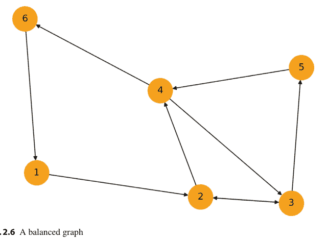

图 2.6 一个平衡图

一个重要的弱连通图是*有向树*。有向树是具有以下性质的有向图：

-   有一个称为*根*的节点，其入度为零，
-   除根节点外，所有节点的入度为一，
-   存在一条从根节点到每个节点的有向路径。

图 2.7 展示了一个以节点 1 为根的有向树示例。同样，我们可以为无向图定义*树*。这很简单。树是一个没有*环*的连通图，其中图中的环是一条非空路径，其唯一重复的节点是第一个和最后一个节点。

**示例 2.14** (*Python*) 图 2.7 中的有向树由第 2.5.2 节的 Python 代码 2.4 绘制。□

#### 2.4.3 生成树

在强连通有向图（或连通无向图）中，信息可以从任何节点通过图传递到所有节点。另一方面，在某些应用中，我们只需要至少存在一个节点，信息可以从该节点发送到其他节点。那么，图就不需要是强连通的。这个思想通过下面定义的生成树的存在性来实现。

考虑一个图 $G = (\mathbf{V}, \mathbf{E})$ 和另一个图 $G' = (\mathbf{V}', \mathbf{E}')$。如果它们满足 $\mathbf{V}' \subset \mathbf{V}$ 且 $\mathbf{E}' \subset \mathbf{E}$，那么我们说 $G'$ 是 $G$ 的*子图*，并记作 $G' \subset G$。

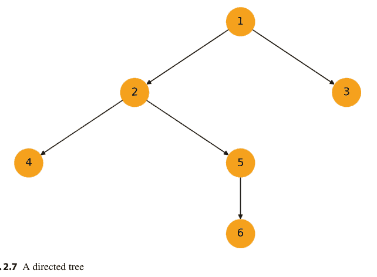

**图 2.7** 一个有向树

特别地，如果 $G' \subset G$ 且 $\mathbf{V}' = \mathbf{V}$，那么我们称 $G'$ 是 $G$ 的*生成子图*。*生成树*是一个是（有向）树的生成子图。

**示例 2.15** *(Python)* 使用 Python，我们可以轻松地为给定的有向或无向图找到一棵生成树。考虑图 2.4 中的 Zachary 图。我们可以通过第 2.5.3 节的 Python 代码 2.5 找到一棵生成树。图 2.8 展示了得到的生成树。

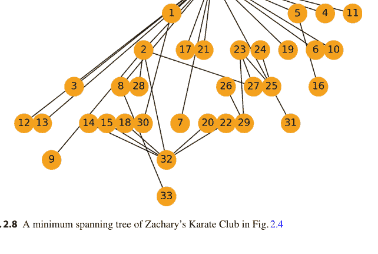

**图 2.8** 图 2.4 中 Zachary 空手道俱乐部的最小生成树

生成树的存在性与无向图的连通性有关，如下引理所述：

**引理 2.1** *一个无向图是连通的，当且仅当它有一棵生成树。*

#### 2.4.4 图拉普拉斯矩阵

对于图的数学分析，矩阵表示很重要。图有几种矩阵表示。我们首先介绍*邻接矩阵*。图 $G = (\mathbf{V}, \mathbf{E})$ 的邻接矩阵 $A$ 定义为

$$a_{ij} \triangleq \begin{cases} 1, & \text{如果 } (j, i) \in \mathbf{E} \\ 0, & \text{其他情况}, \end{cases}$$

其中 $a_{ij}$ 是矩阵 $A$ 的第 $(i, j)$ 个元素。如果节点数为 $n$，则邻接矩阵的大小为 $n \times n$。邻接矩阵表示如果存在从 $j$ 到 $i$ 的边（而不是从 $i$ 到 $j$），则 $a_{ij}$ 为 1，如果不存在从 $j$ 到 $i$ 的边，则 $a_{ij} = 0$。对于任何无向图，其邻接矩阵是对称矩阵，因为如果 $(i, j) \in \mathbf{E}$，则总是有 $(j, i) \in \mathbf{E}$。对于有向图，其邻接矩阵不一定是对称的。

我们还定义无向图 $G = (\mathbf{V}, \mathbf{E})$ 的*关联矩阵* $H = [h_{ij}]$ 为

$$h_{ij} \triangleq \begin{cases} 1, & \text{如果节点 } v_j \in \mathbf{V} \text{ 与边 } e_i \in \mathbf{E} \text{ 关联}, \\ 0, & \text{其他情况}. \end{cases}$$

对于有向图 $G = (\mathbf{V}, \mathbf{E})$，我们另外定义关联矩阵 $H$ 为

$$h_{ij} \triangleq \begin{cases} 1, & \text{如果边 } e_i \in \mathbf{E} \text{ 进入节点 } v_j \in \mathbf{V}, \\ -1, & \text{如果边 } e_i \in \mathbf{E} \text{ 离开节点 } v_j \in \mathbf{V}, \\ 0, & \text{其他情况}. \end{cases}$$

关联矩阵在第 5 章讨论的编队控制中扮演重要角色。

图的另一个重要矩阵表示是*图拉普拉斯矩阵*，也称为*拉普拉斯矩阵*。图 $G = (\mathbf{V}, \mathbf{E})$ 的图拉普拉斯矩阵 $L$ 定义为

$$L \triangleq D - A,$$

其中 $A$ 是 $G$ 的邻接矩阵，$D$ 是*度矩阵*，一个对角矩阵，其第 $(i, i)$ 个元素是节点 $i \in \mathbf{V}$ 的入度（或对于无向图是度）$d_i^{\text{in}}$，即，

$$D \triangleq \text{diag}(d_1^{\text{in}}, d_2^{\text{in}}, \dots, d_n^{\text{in}}) = \begin{bmatrix} d_1^{\text{in}} & 0 & \dots & 0 \\ 0 & d_2^{\text{in}} & \ddots & \vdots \\ \vdots & \ddots & \ddots & 0 \\ 0 & \dots & 0 & d_n^{\text{in}} \end{bmatrix}.$$

以下引理很容易证明：

**引理 2.2** *对于任何无向图 $G$，其图拉普拉斯矩阵是对称的。*

**示例 2.16** (*Python*) 在 Python 中，我们可以使用 NetworkX 中的函数轻松获得邻接矩阵和图拉普拉斯矩阵。让我们首先通过第 2.5.4 节的 Python 代码 2.6 计算图 2.5 中有向图的邻接矩阵。我们得到以下结果：

```
(0, 1)  1
(0, 2)  1
(2, 1)  1
(2, 3)  1
(3, 0)  1 .
```

这是邻接矩阵的稀疏矩阵表示，其中只显示了矩阵中的非零元素。例如，“(0, 1) 1”表示存在从节点 0 到节点 1 的边。通常的矩阵形式的邻接矩阵也可以通过使用 `todense` 函数获得：

```
print(nx.adjacency_matrix(G).todense())
```

结果是

```
[[0 1 1 0]
 [0 0 0 0]
 [0 1 0 1]
 [1 0 0 0]] .
```

我们还使用 `directed_laplacian_matrix` 函数计算图拉普拉斯矩阵，如下所示：

```
import scipy.sparse.linalg
print(nx.directed_laplacian_matrix(G))
```

结果如下：

```
[[ 0.99 -0.36 -0.28 -0.41]
 [-0.36  0.75 -0.35 -0.17]
 [-0.28 -0.35  0.99 -0.27]
 [-0.41 -0.17 -0.27  0.99]] .
```

请注意，对于无向图，你需要使用 `laplacian_matrix` 函数，而不是 `directed_laplacian_matrix`。

图拉普拉斯矩阵的特征值和特征向量在图的分析中扮演着重要角色。关于特征值，我们有以下引理：

**引理 2.3** 设 $L \in \mathbb{R}^{n \times n}$ 是图 $G$ 的图拉普拉斯矩阵。那么 $L$ 的特征值位于复平面 $\mathbb{C}$ 上由下式定义的圆盘 $\mathbf{R}_L$ 内：

$$\mathbf{R}_L \triangleq \{z \in \mathbb{C} : |z - \Delta| \leq \Delta\},$$

其中 $\Delta$ 是由式 (2.71) 定义的图 $G$ 的最大度。

由引理 2.3，我们很容易理解 $L$ 的特征值具有非负实部。这一性质对于证明与图相关的微分方程 $\dot{x} = -Lx$ 解的收敛性至关重要（参见第 2.4.7 节）。我们在以下定理中总结图拉普拉斯矩阵特征值的重要性质：

**定理 2.18** 设 $L \in \mathbb{R}^{n \times n}$ 是图 $G$ 的图拉普拉斯矩阵。

+   (i) 图拉普拉斯矩阵 $L$ 至少有一个特征值为 0，且 $\mathbf{1}_n = [1 \ 1 \ \cdots \ 1]^\top \in \mathbb{R}^n$ 是特征值 0 的一个特征向量。即，$L\mathbf{1}_n = 0$ 成立。
(ii) $\text{rank}(L) \leq n - 1$。
(iii) $L$ 除 0 以外的特征值位于 $\mathbb{C}$ 的开右半平面。
(iv) $L$ 的特征值 0 是半单的。
(v) $L$ 的特征值 0 是单重的当且仅当 $\text{rank}(L) = n - 1$。

**证明** (i) 对于图拉普拉斯矩阵 $L$，由式 (2.76) 我们有 $L\mathbf{1}_n = 0 = 0 \cdot \mathbf{1}_n$。因此，$L$ 至少有一个特征值 0，且 $\mathbf{1}_n$ 是其对应的特征向量。
(ii) 由定理 2.1，我们有

$$\dim(\ker(L)) + \text{rank}(L) = n.$$

此外，由上述性质 (i)，我们有 $\mathbf{1}_n \in \ker(L)$，因此 $\text{rank}(L) \leq n - 1$ 成立。
(iii) 这由引理 2.3 得出。
(iv) 参见 [6]。
(v) 如果 $L$ 的特征值 0 的代数重数为 1，那么其几何重数也为 1。由此可知 $\ker(0 \cdot I - L) = \ker(L)$ 的维数为 1。因此，由式 (2.79)，我们有 $\text{rank}(L) = n - 1$。反之，如果 $\text{rank}(L) = n - 1$，那么由式 (2.79) 可得 $\dim(\ker(L)) = 1$。由此可知零特征值的几何重数为 1。由上述性质 (iii)，零特征值是半单的，因此其代数重数也为 1。

最后，我们可以通过查看图的拉普拉斯矩阵来轻松检查一个图是否是平衡的。

> **定理 2.19** *一个图 $G$ 是平衡的当且仅当 $\mathbf{1}_n^\top$ 是图拉普拉斯矩阵特征值 0 对应的左特征向量。*

#### 2.4.5 佩龙矩阵

让我们考虑一个图 $G = (\mathbf{V}, \mathbf{E})$ 及其图拉普拉斯矩阵 $L \in \mathbb{R}^{n \times n}$。我们定义 $G$ 的参数为 $\varepsilon > 0$ 的 *佩龙矩阵* $P \in \mathbb{R}^{n \times n}$ 为

$$P \triangleq I - \varepsilon L. \tag{2.80}$$

佩龙矩阵及其特征值在图的分析中也扮演着重要角色，特别是在多智能体系统离散时间动力学的分析中（例如参见下文第 2.4.7 节）。佩龙矩阵 $P$ 的特征值可以很容易地从图拉普拉斯矩阵 $L$ 的特征值（由定理 2.6）计算得出。事实上，我们有以下引理：

> **引理 2.4** *设 $L \in \mathbb{R}^{n \times n}$ 和 $P \in \mathbb{R}^{n \times n}$ 分别是图 $G$ 的图拉普拉斯矩阵和参数为 $\varepsilon > 0$ 的佩龙矩阵。设 $\lambda_1, \lambda_2, \ldots, \lambda_n$ 是 $L$ 的特征值，$\mu_1, \mu_2, \ldots, \mu_n$ 是 $P$ 的特征值。那么，通过适当排序特征值，我们有*

$$\mu_i = 1 - \varepsilon \lambda_i \tag{2.81}$$

*对于任意 $i \in \{1, 2, \ldots, n\}$。此外，$L$ 的任何与 $\lambda_i$ 关联的特征向量（或左特征向量）是 $P$ 的与 $\mu_i$ 关联的特征向量（或左特征向量），反之亦然。*

类似于图拉普拉斯矩阵 $L$ 的引理 2.3，可以得到一个包含 $P$ 所有特征值的区域。

> **引理 2.5** *设 $P \in \mathbb{R}^{n \times n}$ 是图 $G$ 的参数为 $\varepsilon > 0$ 的佩龙矩阵。$P$ 的特征值位于复平面 $\mathbb{C}$ 上圆盘 $\mathbf{R}_P$ 内，该圆盘中心为 $1 - \varepsilon \Delta$，半径为 $\varepsilon \Delta$，即*

$$\mathbf{R}_P \triangleq \{z \in \mathbb{C} : |z - (1 - \varepsilon \Delta)| \leq \varepsilon \Delta\}, \tag{2.82}$$

其中 $\Delta$ 是图 $G$ 的最大入度。

由上述引理，我们得到以下基本定理，该定理在图的连通性分析（参见第 2.4.6 节）以及多智能体系统离散时间动力学分析（参见第 2.4.7 节）中被有效使用：

**定理 2.20** 设 $P \in \mathbb{R}^{n \times n}$ 是图 $G$ 的参数为 $\varepsilon > 0$ 的佩龙矩阵。以下性质成立：

+   (i) $P$ 至少有一个特征值为 1，且 $\mathbf{1}_n$ 是特征值 1 对应的特征向量，即 $P\mathbf{1}_n = \mathbf{1}_n$ 成立。
(ii) 假设 $\varepsilon \Delta < 1$，其中 $\Delta$ 是图 $G$ 的最大入度。那么 $P$ 除 1 以外的特征值位于 $\mathbb{C}$ 的开单位圆内。
(iii) $P$ 的特征值 1 是半单的。

**证明** (i) 由定理 2.18，图拉普拉斯矩阵 $L$ 有一个特征值 0，且 $\mathbf{1}_n$ 是其对应的特征向量。那么，由引理 2.4 容易证明 $P = I - \varepsilon L$ 至少有一个特征值为 1，且 $\mathbf{1}_n$ 是特征值 1 对应的特征向量。
(ii) 这由引理 2.5 容易证明。
(iii) 由引理 2.4，$L$ 的特征值 0 的代数重数和几何重数分别与 $P$ 的特征值 1 的代数重数和几何重数相同。由定理 2.18，$L$ 的特征值 0 是半单的。因此，$P$ 的特征值 1 也是半单的。

**示例 2.17** (Python) 让我们考虑图 2.6 中的平衡图。我们使用第 2.5.5 节中的 Python 代码 2.7 计算该图在 $\varepsilon = 0.1$ 时的佩龙矩阵 $P$ 的特征值。结果如下：

```
[0.82 0.85 0.87 0.92 0.95 1. ] .
```

这表明 $P$ 有一个单重特征值 1，其他特征值位于 $\mathbb{C}$ 的开单位圆内。这个例子意味着图的连通性可以通过数值特征值计算进行数值分析。当图过于复杂而无法通过绘图检查连通性时，这一性质尤其有效。因此，本章讨论的代数图理论是分析大规模图或网络的强大工具。$\square$

#### 2.4.6 使用图拉普拉斯矩阵和佩龙矩阵进行图连通性分析

我们可以通过研究图的拉普拉斯矩阵 $L$ 和佩龙矩阵 $P$ 的特征值来分析图的连通性，特别是生成树的存在性。更准确地说，$L$ 的特征值 0（或 $P$ 的特征值 1）的重数对于证明生成树的存在性很重要，如下定理所示：

**定理 2.21** *设 $G$ 是一个有向图。以下陈述是等价的：*

+   (i) $G$ 有一棵生成树。
(ii) $G$ 的图拉普拉斯矩阵 $L$ 的特征值 0 是单重的。
(iii) $G$ 的佩龙矩阵 $P$ 的特征值 1 是单重的。

每个强连通图都有一棵生成树。由此，我们有以下引理：

**引理 2.6** *设 $G$ 是一个强连通图。那么以下陈述总是成立：*

+   (i) $G$ 有一棵生成树。
(ii) $G$ 的图拉普拉斯矩阵的特征值 0 是单重的。
(iii) $G$ 的佩龙矩阵的特征值 1 是单重的。

此外，由定理 2.21 和引理 2.1，我们有以下推论：

**推论 2.1** *设 $G$ 是一个无向图。以下陈述是等价的：*

+   (i) $G$ 是连通的。
(ii) $G$ 的图拉普拉斯矩阵 $L$ 的特征值 0 是单重的。
(iii) $G$ 的佩龙矩阵 $P$ 的特征值 1 是单重的。

**示例 2.18** *(Python) 让我们考虑图 2.5 中的图。该图的图拉普拉斯矩阵 $L$ 及其特征值通过第 2.5.6 节中的 Python 代码 2.8 获得。$L$ 的特征值如下：*

```
[0.    1.01 1.44 1.26] .
```

我们可以看到只有一个特征值 0，其他特征值都是正的。因此，零特征值是单重的，所以图 2.5 中的图存在一棵生成树。实际上，如果我们移除两条边 (3, 2) 和 (4, 1)，该图就变成了一棵以 1 为根的生成树。

此外，我们可以通过计算图拉普拉斯矩阵的特征值来检查图 2.4 中 Zachary 空手道俱乐部的连通性：

```python
G2 = nx.karate_club_graph()
L2 = nx.laplacian_matrix(G2)
e2, V2 = LA.eig(L2.todense())
```

print(np.sort(e2))

请注意，由于Zachary的图是无向图，我们使用`laplacian_matrix`函数而非`directed_laplacian_matrix`函数。图拉普拉斯矩阵以稀疏矩阵形式获得，我们使用`todense`函数将其转换为稠密表示，以便通过`LA.eig`计算特征值。此外，矩阵大小为$34 \times 34$，我们使用`sort`函数对特征向量进行排序。结果如下：

```
[-3.40e-15  4.69e-01  9.09e-01  ...  1.81e+01] .
```

这个非常小的负数$-3.40\text{e}-15$可以视为零，它是$L$的一个简单特征值。因此，该图是连通的。$\square$

#### 2.4.7 图相关动力系统

本节介绍图相关动力系统，它们是本书讨论的动态多智能体系统的基础模型。具体来说，我们考虑以下连续时间动力系统：

$$\dot{x}(t) = -Lx(t), \quad t \geq 0, \quad x(t) \in \mathbb{R}^n, \tag{2.83}$$

其中$L$是图$G$的图拉普拉斯矩阵，以及离散时间动力系统：

$$x[k+1] = Px[k], \quad k = 0, 1, 2, \ldots, \quad x[k] \in \mathbb{R}^n, \tag{2.84}$$

其中$P$是Perron矩阵。

对于微分方程(2.83)的解$x(t) = e^{-Lt}x(0)$和差分方程(2.84)的解$x[k] = P^kx[0]$的收敛性，我们有以下定理。在该定理中，图$G$中存在生成树是关键条件。

**定理 2.22** *考虑一个具有生成树的图$G$。设$\Delta$为$G$的最大入度。*

*(i) 设$L \in \mathbb{R}^{n \times n}$为图拉普拉斯矩阵，$v_1 \in \mathbb{R}^{1 \times n}$为$L$对应于其零特征值的左特征向量。则*

$$\lim_{t \to \infty} e^{-Lt} = \left( \frac{1}{v_1 \mathbf{1}_n} \right) \mathbf{1}_n v_1. \tag{2.85}$$

*(ii) 设$P \in \mathbb{R}^{n \times n}$为任意给定$\varepsilon > 0$对应的Perron矩阵，$w_1 \in \mathbb{R}^{1 \times n}$为$P$对应于特征值1的左特征向量。若$\varepsilon \Delta < 1$，则*

$$\lim_{k \to \infty} P^k = \left( \frac{1}{w_1 \mathbf{1}_n} \right) \mathbf{1}_n w_1. \quad (2.86)$$

**证明 (i)** 设$S \in \mathbb{R}^{n \times n}$为将$L$变换为Jordan标准型的非奇异矩阵

$$S^{-1}LS = \begin{bmatrix} 0 & 0 & 0 & \cdots & 0 \\ 0 & J_1 & 0 & & 0 \\ 0 & 0 & J_2 & \ddots & \vdots \\ \vdots & & \ddots & \ddots & 0 \\ 0 & 0 & \cdots & 0 & J_r \end{bmatrix}, \quad (2.87)$$

并设$s_1 \in \mathbb{R}^n$和$s_1^* \in \mathbb{R}^{1 \times n}$分别为$S$的第一列向量和$S^{-1}$的第一行向量。注意，由于$S^{-1}S = I$，有$s_1^* s_1 = 1$。因为$LS = SJ$，$L\mathbf{1}_n = 0$，且$v_1 L = 0$，所以$s_1$和$s_1^*$的一对解为$\mathbf{1}_n$和$(v_1 \mathbf{1}_n)^{-1} v_1$，而$s_1 s_1^*$对于$s_1$和$s_1^*$的任何选择都是一个常数矩阵。由于根据定理2.18和2.16，$-J_i$（$i = 1, 2, \ldots, n$）是Hurwitz的，并且$G$具有生成树，根据定理2.21可得

$$\lim_{t \to \infty} e^{-Lt} = \lim_{t \to \infty} e^{-(SJS^{-1})t} = \lim_{t \to \infty} Se^{-Jt}S^{-1} = \lim_{t \to \infty} S \begin{bmatrix} 1 & 0 & 0 & \cdots & 0 \\ 0 & e^{-J_1 t} & 0 & & 0 \\ 0 & 0 & e^{-J_2 t} & \ddots & \vdots \\ \vdots & & \ddots & \ddots & 0 \\ 0 & 0 & \cdots & 0 & e^{-J_r t} \end{bmatrix} S^{-1}$$

$$= S \begin{bmatrix} 1 & 0 & 0 & \cdots & 0 \\ 0 & 0 & 0 & & 0 \\ 0 & 0 & 0 & \ddots & \vdots \\ \vdots & & \ddots & \ddots & 0 \\ 0 & 0 & \cdots & 0 & 0 \end{bmatrix} S^{-1} = s_1 s_1^* = \mathbf{1}_n \left( \frac{1}{v_1 \mathbf{1}_n} \right) v_1 = \left( \frac{1}{v_1 \mathbf{1}_n} \right) \mathbf{1}_n v_1,$$

这就证明了(2.85)。

(ii) 证明方法与(i)相同。

最后，收敛速度由连续时间系统的$L$的第二小特征值和离散时间系统的$P$的第二大特征值决定。参见定理3.3和3.4。对于这些定理，以下定理很重要：

**定理 2.23** 考虑一个无向图$G$。设$L \in \mathbb{R}^{n \times n}$为图拉普拉斯矩阵，$P \in \mathbb{R}^{n \times n}$为任意给定$\varepsilon > 0$对应的Perron矩阵。

(i) 设$\lambda_2$为$L$的第二小特征值（其特征值均为实数）。则对于每个$x \in \mathbb{R}^n$，

$$x^\top Lx \geq \lambda_2 \|x\|^2 \quad (2.88)$$

(ii) 设$\mu_2 \in (0, 1)$为Perron矩阵$P$的第二大特征值（即$\mu_2 = 1 - \varepsilon \lambda_2$）。则对于每个$x \in \mathbb{R}^n$，

$$x^\top Px \leq \mu_2 \|x\|^2 \quad (2.89)$$

**证明** 它们是Courant–Fischer定理[8]的特例。

### 2.5 图论的Python代码

#### 2.5.1 Python代码 2.3：图绘制

Python代码 2.3是绘制示例2.11中所示图的程序。第一行导入NetworkX包。第二行通过NetworkX包中的`DiGraph`函数生成一个空的有向图对象G。对于无向图，我们使用`nx.Graph()`代替。第三行定义节点集**V** = {1, 2, 3, 4}，第四行将此集合放入图对象G中。同时，第五行定义边集

$$\mathbf{E} = \{(1, 2), (1, 3), (3, 2), (3, 4), (4, 1)\},$$

第六行将其添加到G中。然后，我们通过NetworkX中的`draw`函数可视化此图。

**Python代码 2.3：示例2.11中的图绘制**

```
1  import networkx as nx
2  G = nx.DiGraph()
3  V = [1, 2, 3, 4]
4  G.add_nodes_from(V)
5  E = [(1, 2), (1, 3), (3, 2), (3, 4), (4, 1)]
6  G.add_edges_from(E)
7  nx.draw(G, node_size=1000, node_color='orange', with_labels=True)
```

#### 2.5.2 Python代码 2.4：有向树

Python代码 2.4是用于绘制有向图的程序，该图用于示例2.14。

**Python代码 2.4：示例2.14的有向树**

```
1  import networkx as nx
2  from networkx.drawing.nx_pydot import graphviz_layout
3  G = nx.DiGraph()
4  V = [1,2,3,4,5]
5  E = [(1,2),(1,3),(2,4),(2,5),(5,6)]
6  G.add_nodes_from(V)
7  G.add_edges_from(E)
8  pos = graphviz_layout(G, prog="dot")
9  nx.draw(G,pos,node_size=1000,node_color='orange',with_labels=True)
```

这里我们使用`graphviz_layout`函数来获得节点的美观布局。

#### 2.5.3 Python代码 2.5：生成树

Python代码 2.5是用于在图中寻找生成树的程序，该图用于示例2.15。

**Python代码 2.5：示例2.15的生成树**

```
1  import networkx as nx
2  from networkx.drawing.nx_pydot import graphviz_layout
3  G = nx.karate_club_graph()
4  T = nx.minimum_spanning_tree(G)
5  pos = graphviz_layout(G, prog="dot")
6  nx.draw(T, pos, node_size=500,
7          node_color='orange', with_labels=True)
```

NetworkX中的`minimum_spanning_tree`函数计算*最小生成树*，即具有最小边数的生成树。

#### 2.5.4 Python代码 2.6：邻接矩阵

Python代码 2.6是用于计算给定图的邻接矩阵的程序，该图用于示例2.16。这里我们使用`adjacency_matrix`函数。

**Python代码 2.6：示例2.16的邻接矩阵**

```
1 import networkx as nx
2 G = nx.DiGraph()
3 V = [1,2,3,4]
4 E = [(1,2),(1,3),(3,2),(3,4),(4,1)]
5 G.add_nodes_from(V)
6 G.add_edges_from(E)
7 
8 print(nx.adjacency_matrix(G))
```

#### 2.5.5 Python代码 2.7：平衡图的Perron矩阵

Python代码 2.7是用于计算平衡图的Perron矩阵的程序，该图用于示例2.17。

**Python代码 2.7：示例2.17的平衡图的图拉普拉斯矩阵**

```
1 import numpy as np
2 import numpy.linalg as LA
3 import networkx as nx
4 G = nx.DiGraph()
5 V = [1,2,3,4,5,6]
6 E = [(1,2),(2,3),(2,4),(3,2),(3,5),
7       (4,3),(4,6),(5,4),(6,1)]
8 G.add_nodes_from(V)
9 G.add_edges_from(E)
10 L = nx.directed_laplacian_matrix(G)
11 epsilon = 0.1
12 P = np.eye(6) - epsilon*L
13 e, V = LA.eig(P)
14 print(np.sort(e))
```

#### 2.5.6 Python代码 2.8：图拉普拉斯矩阵

Python代码 2.8是用于计算图的图拉普拉斯矩阵的程序，该图用于示例2.18。

## Python 代码 2.8：示例 2.18 的图拉普拉斯矩阵

```python
import numpy as np
import numpy.linalg as LA
import networkx as nx
import scipy.sparse.linalg
G = nx.DiGraph()
V = [1,2,3,4]
E = [(1,2),(1,3),(3,2),(3,4),(4,1)]
G.add_nodes_from(V)
G.add_edges_from(E)
L = nx.directed_laplacian_matrix(G)
e, V = LA.eig(L)
print(e)
```

### 2.6 总结

本章我们介绍了一些来自线性代数和图论的有用事实与定理。它们将在后续章节中使用。我们为线性代数和图论中的一些重要计算提供了 Python 代码。特别是，图拉普拉斯矩阵和佩龙矩阵的特征值在多智能体系统的控制中扮演着非常重要的角色，Python 中的 NumPy 和 NetworkX 包对此非常有用。

关于线性代数理论，你可以参考文献 [4,12]。关于矩阵的高级主题，文献 [8] 是一个很好的参考。我们建议阅读文献 [3,13] 以了解图论的基础知识，阅读文献 [1] 了解图的矩阵。图论理论和应用的最新进展可以在文献 [2] 中找到。关于 Python 编程语言，你可以参考文献 [7]。关于 Python 中的 NumPy 和 NetworkX 包，文献 [5,11] 分别是很好的参考。

### 2.7 习题

(i) 一个图 $G$ 具有以下邻接矩阵：

$$A = \begin{bmatrix} 0 & 0 & 0 & 1 & 0 \\ 1 & 0 & 1 & 0 & 0 \\ 0 & 0 & 0 & 0 & 1 \\ 0 & 1 & 0 & 0 & 0 \\ 1 & 0 & 0 & 0 & 0 \end{bmatrix}.$$

求图 $G$ 的图拉普拉斯矩阵 $L$ 和佩龙矩阵 $P = I - \varepsilon L$，其中 $\varepsilon = 1/4$。

(ii) $n$ 个节点上的*路径图*，记为 $P_n$，是一个节点为 $1, 2, \ldots, n$，边为 $(i, i+1), i=1, 2, \ldots, n-1$ 的图。写出 $P_5$ 的图拉普拉斯矩阵。

(iii) 设 $L$ 是无向图 $G = (\mathbf{V}, \mathbf{E})$ 的图拉普拉斯矩阵。证明对于任意向量 $x = [x_1, x_2, \ldots, x_n]^\top \in \mathbb{R}^n$，

$$x^\top Lx = \frac{1}{2} \sum_{(i,j) \in \mathbf{E}} (x_i - x_j)^2$$

成立。

(iv) 证明对于任意无向图，图拉普拉斯矩阵 $L$ 是半正定的。

(v) $n$ 个节点上的*完全图*，记为 $K_n$，是一个简单无向图，其中每一对不同的节点都由一对唯一的边连接。证明 $K_n$ 的图拉普拉斯矩阵的特征值为 $\{0, n, n, \ldots, n\}$。

(vi) $n$ 个节点上的*环图*，记为 $C_n$，是一个图 $G = (\mathbf{V}, \mathbf{E})$，它由一个单一的环组成，即节点为 $\{1, 2, \ldots, n\}$，边为 $(i, i+1), i=1, 2, \ldots, n-1$ 和 $(n, 1)$。证明 $C_n$ 的图拉普拉斯矩阵的特征值为

$$2 - 2\cos\frac{2\pi k}{n}, \quad k=1, 2, \ldots, n.$$

(vii) (Python) 考虑以下图：

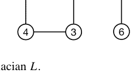

- a. 计算图拉普拉斯矩阵 $L$。
- b. 计算 $L$ 的特征值。
- c. 令 $\xi = [1, 2, 3, 4, 5, 6]^\top$ 且 $x(t) = e^{-Lt}\xi$。绘制 $t \ge 0$ 时的曲线 $x_1(t), x_2(t), \ldots, x_6(t)$，其中 $x_i(t)$ 是 $x(t)$ 的第 $i$ 个分量。

(viii) (Python) 让我们考虑一个具有以下邻接矩阵的图：

$$A = \begin{bmatrix} 0 & 1 & 0 & 0 & 0 & 0 \\ 0 & 0 & 1 & 0 & 0 & 0 \\ 0 & 0 & 0 & 1 & 0 & 0 \\ 0 & 0 & 0 & 0 & 1 & 0 \\ 0 & 0 & 0 & 0 & 0 & 1 \\ 1 & 0 & 0 & 0 & 0 & 0 \end{bmatrix}.$$

(2.90)

- a. 画出该图。
- b. 计算图拉普拉斯矩阵 $L$ 的特征值。
- c. 让我们考虑以下邻接矩阵：
$$A_2 = \begin{bmatrix} A & 0 \\ 0 & A \end{bmatrix}.$$
画出该图并计算其图拉普拉斯矩阵的特征值。

(ix) (Python) 考虑具有邻接矩阵 (2.90) 的图的佩龙矩阵 $P_{\varepsilon} = I - \varepsilon L$。记 $\bar{\lambda}(\varepsilon)$ 为 $P_{\varepsilon}$ 的特征值的最大绝对值。绘制 $\varepsilon \in [0, 1]$ 时的曲线 $\bar{\lambda}(\varepsilon)$。$\bar{\lambda}(\varepsilon) > 1$ 何时成立？

## 参考文献

1. Bapat RB (2010) 图与矩阵. Springer
2. Barabasi A-L (2016) 网络科学, 第1版. 剑桥大学出版社
3. Benjamin A, Chartrand G, Zhang P (2015) 图论的迷人世界. 普林斯顿大学出版社
4. Boyd S, Vandenberghe L (2018) 应用线性代数导论. 剑桥大学出版社
5. Cakmak UM, Cuhadaroglu M (2018) 精通 NumPy 数值计算. Packt 出版社
6. Caughman JS, Veerman JJP (2006) 有向图拉普拉斯矩阵的核. The Electron J Comb 13-R39:1–8
7. Guttag JV (2021) Python 计算与编程导论：应用于计算建模与数据理解, 第3版. 麻省理工学院出版社
8. Horn RA, Johnson CR (1985) 矩阵分析. 剑桥大学出版社
9. Lutz M (2013) 学习 Python：强大的面向对象编程, 第5版. O'Reilly Media
10. Nassif N, Erhel J, Philippe B (2016) 计算线性代数导论. CRC 出版社
11. Platt EL (2019) 使用 Python 和 NetworkX 的网络科学快速入门. Packt 出版社
12. Strang G (2016) 线性代数导论, 第5版. Wellesley-Cambridge 出版社
13. Wilson RJ (2010) 图论导论, 第5版. Pearson
14. Zachary WW (1977) 小群体冲突与分裂的信息流模型. J Anthropol Res 33(4):452–473

# 一致性控制

## 3

## 关键点

- “一致性”是本章的主要主题，指的是所有智能体就其状态达成一致。
- 一个基本的一致性控制器由其相对于邻居的状态之和给出。
- 带有该控制器的多智能体系统的集体动力学被表示为一个与网络相关的图拉普拉斯矩阵的线性系统。系统的收敛性由图拉普拉斯矩阵的特征值决定。
- 离散时间情况与连续时间情况类似，但在离散时间情况下，佩龙矩阵而非图拉普拉斯矩阵扮演着重要角色。

### 3.1 一致性问题

考虑由智能体 1, 2, . . . , n 组成的多智能体系统。智能体 i 的动力学由下式给出

$\dot{x}_i(t) = f_i(x_i(t), u_i(t))$, (3.1)

其中 $x_i(t) \in \mathbb{R}^m$ 和 $u_i(t) \in \mathbb{R}^l$ 分别是状态和输入，$f_i : \mathbb{R}^m \times \mathbb{R}^l \rightarrow \mathbb{R}^m$ 是一个函数。

**补充信息** 在线版本包含补充材料，可在 https://doi.org/10.1007/978-3-031-52981-8_3 获取。

为了确定控制输入，每个智能体可以使用其他一些智能体的信息。智能体 $i$ 可以从中获取信息的智能体称为*邻居*，邻居集合记为 $\mathbf{N}_i \subseteq \{1, 2, \ldots, n\} \setminus \{i\}$。在实践中，集合 $\mathbf{N}_i$ 可能是时变的，但在本章中假设它是时不变的。由此产生的信息流由一个网络表示，该网络在数学上由图 $G = (\mathbf{V}, \mathbf{E})$ 表示，其中 $\mathbf{V} \triangleq \{1, 2, \ldots, n\}$，$\mathbf{E} \triangleq \{(j, i) \in \mathbf{V} \times \mathbf{V} | j \in \mathbf{N}_i\}$。

智能体 $i$ 的控制器基于其邻居收集的信息，通常由以下两种形式之一给出：

基于绝对状态：$u_i(t) = g_i(x_i(t), [x_j(t)]_{j \in \mathbf{N}_i})$，
基于相对状态：$u_i(t) = h_i([x_j(t) - x_i(t)]_{j \in \mathbf{N}_i})$, (3.2)

其中 $g_i : \mathbb{R}^m \times \mathbb{R}^{m|\mathbf{N}_i|} \to \mathbb{R}^l$ 和 $h_i : \mathbb{R}^{m|\mathbf{N}_i|} \to \mathbb{R}^l$ 是函数。当每个智能体可以获得自身和邻居的状态信息时（例如，通过智能体之间的通信），使用前者。当每个智能体的信息仅限于其相对于邻居的状态的相对值时，使用后者。例如，当 $x_i(t)$ ($i = 1, 2, \ldots, n$) 表示空间中的位置，并且每个智能体通过内部传感器（如基于视觉的传感器）测量与邻居的相对位置时，就会出现这种情况。

如果函数 $f_i$ ($i = 1, 2, \ldots, n$) 在所有智能体中是相同的，则称这些智能体是*同质的*；否则，它们是*异质的*。类似地，控制器根据其同质性被称为*同质的*或*异质的*。

对于 (3.1) 中的多智能体系统，*一致性*的概念定义如下：如果具有初始状态 $(x_1(0), x_2(0), \ldots, x_n(0))$ 的系统满足

$$\lim_{t \to \infty} (x_i(t) - x_j(t)) = 0$$ (3.3)

对于每个 $(i, j) \in \mathbf{V} \times \mathbf{V}$，我们称*系统对于初始状态* $(x_1(0), x_2(0), \ldots, x_n(0))$ *实现了一致性*。如果系统对于每个初始状态 $(x_1(0), x_2(0), \ldots, x_n(0)) \in \mathbb{R}^{m \times n}$ 都实现了一致性，我们简单地称*系统实现了一致性*。*一致性问题*是确定控制输入 $u_i(t)$ ($i = 1, 2, \ldots, n$) 使得系统实现一致性。

如果系统实现了一致性，并且存在一个 $\alpha \in \mathbb{R}^m$ 使得

$$\lim_{t \to \infty} x_i(t) = \alpha$$ (3.4)

对于某个 $i \in \mathbf{V}$（等价地对于每个 $i \in \mathbf{V}$），那么 $\alpha$ 被称为*一致性值*。

以下是一些典型的一致性值，它们是系统的目标。根据该值，一致性被分为几种类型：

- 平均一致性：

$$\alpha = \frac{1}{n} \sum_{i=1}^n x_i(0).$$ (3.5)

### 3.2 一致性控制

#### 3.2.1 积分器智能体的一致性控制器

现在，我们为最基本的一类多智能体系统提出一种一致性控制器。

考虑一个具有积分器智能体的多智能体系统，即智能体 $i$ 的动力学由下式给出

$$\dot{x}_i(t) = u_i(t), \tag{3.10}$$

其中 $x_i(t) \in \mathbb{R}$ 且 $u_i(t) \in \mathbb{R}$。该控制器是一种基于相对状态的控制器：

$$u_i(t) = \sum_{j \in \mathbf{N}_i} (x_j(t) - x_i(t)), \tag{3.11}$$

它是其与邻居的相对状态之和。该控制器被称为*一致性控制器*或*一致性协议*。$^1$

以下示例演示了一致性控制器：

**示例 3.2** 考虑由 (3.10) 和 (3.11) 给出的多智能体系统，其中 $n = 6$，$\mathbf{N}_1 = \{2\}$，$\mathbf{N}_2 = \{3, 5\}$，$\mathbf{N}_3 = \{4\}$，$\mathbf{N}_4 = \{1, 2\}$，$\mathbf{N}_5 = \{6\}$，且 $\mathbf{N}_6 = \{2\}$。该网络如图 3.1a 所示。

图 3.2 显示了由第 3.5 节将要介绍的 Python 代码 3.1 计算的状态演化，初始状态为 $x_1(0) = -1$，$x_2(0) = 2$，$x_3(0) = 6$，$x_4(0) = 3$，$x_5(0) = -3$，且 $x_6(0) = 1$。可以观察到，系统通过 (3.11) 中的一致性控制器实现了共识。

同时，以下示例值得注意：

**示例 3.3** 考虑示例 3.2 中多智能体系统的修改版本，其中 $\mathbf{N}_2 = \{3\}$，$\mathbf{N}_6 = \emptyset$，其余与示例 3.2 相同。该网络如图 3.1b 所示。

图 3.3 显示了与示例 3.2 相同初始状态下的状态演化。与示例 3.2 的情况不同，系统未能达成共识，因为某些智能体对（例如智能体 1 和 6 这一对）之间不存在信息路径。这表明 (3.11) 中的控制器并不总能实现共识，并且共识性质，即系统是否能达成共识，取决于网络的结构。 □

$^1$ 共识通常被称为*一致*。当使用此术语时，(3.11) 中的控制器被称为*一致控制器*或*一致协议*。

**图 3.2** 图 3.1a 中网络的状态演化（Python 代码 3.1）

**图 3.3** 图 3.1b 中网络的状态演化

#### 3.2.2 共识条件

现在，我们考虑具有共识控制器的多智能体系统实现共识的条件。

首先，让我们推导由 (3.10) 和 (3.11) 给出的多智能体系统的集体动力学。令 $A \in \{0, 1\}^{n \times n}$，$D \in \mathbb{N}^{n \times n}$，且 $L \in \mathbb{Z}^{n \times n}$ 分别为网络 $G$ 的邻接矩阵、度矩阵和图拉普拉斯矩阵，并令 $a_{ij} \in \{0, 1\}$ 为 $A$ 的 $(i, j)$ 元素，即

$$a_{ij} = \begin{cases} 0 & \text{如果 } j \notin \mathbf{N}_i, \\ 1 & \text{如果 } j \in \mathbf{N}_i. \end{cases} \quad (3.12)$$

我们使用 $x(t) \in \mathbb{R}^n$ 和 $u(t) \in \mathbb{R}^n$ 分别表示集体状态和输入，即 $x(t) = [x_1(t) \ x_2(t) \ \cdots \ x_n(t)]^\top$ 且 $u(t) = [u_1(t) \ u_2(t) \ \cdots \ u_n(t)]^\top$。那么 (3.10) 中智能体的集体动力学可表示为

$$\dot{x}(t) = u(t). \quad (3.13)$$

另一方面，集体控制器由下式给出

$$u(t) = -(D - A)x(t) = -Lx(t) \quad (3.14)$$

因为 (3.11) 的右侧可改写为

$$\sum_{j \in \mathbf{N}_i} (x_j(t) - x_i(t)) = \sum_{j \in \mathbf{N}_i} x_j(t) - \sum_{j \in \mathbf{N}_i} x_i(t) = \sum_{j=1}^n a_{ij} x_j(t) - |\mathbf{N}_i| x_i(t), \quad (3.15)$$

其中第一项和第二项分别对应于 (3.14) 中的 $A$ 和 $D$。由 (3.13) 和 (3.14)，我们得到多智能体系统的集体动力学如下：

$$\dot{x}(t) = -Lx(t). \quad (3.16)$$

接下来，我们分析 (3.16) 中集体动力学的解。根据定理 2.15，解由下式给出

$$x(t) = e^{-Lt} x(0). \quad (3.17)$$

如果 $G$ 具有生成树，则

$$\lim_{t \to \infty} e^{-Lt} = \left( \frac{1}{v_1 \mathbf{1}_n} \right) \mathbf{1}_n v_1 \quad (3.18)$$

这意味着系统在 $(v_1x(0))/(v_1\mathbf{1}_n)$ 处达成共识。基于此讨论，得到以下结果：

**定理 3.1** 考虑由 (3.10) 和 (3.11) 给出的多智能体系统。以下陈述成立。

(i) 系统达成共识当且仅当 $G$ 具有生成树。
(ii) 如果系统达成共识，共识值由下式给出

$$\alpha = \frac{v_1x(0)}{v_1\mathbf{1}_n}, \tag{3.20}$$

其中 $v_1 \in \mathbb{R}^{1 \times n}$ 是 $L$ 对应于其零特征值的左特征向量。此外，如果 $G$ 是平衡网络，则

$$\alpha = \frac{1}{n} \sum_{i=1}^n x_i(0), \tag{3.21}$$

*即*，系统达成平均共识。

**证明** 剩余部分是证明：

(a) 如果 $G$ 没有生成树，则系统不能达成共识，
(b) 如果 $G$ 是平衡的，则等式 (3.21) 成立。

(a) 假设 $G$ 没有生成树。根据定理 2.21，图拉普拉斯矩阵 $L$ 有一个代数重数大于一的零特征值，且该特征值是半简单的。因此，存在一个与零特征值相关的特征向量 $q \in \mathbb{R}^n$，使得 $q$ 和 $\mathbf{1}_n$ 线性无关（$q \notin \text{span}(\mathbf{1}_n)$）。由于根据 $q$ 的定义有 $Lq = 0$，因此 $q$ 是 (3.16) 中系统的一个平衡点。因此，对于 $x(0) = q$，有 $\lim_{t \to \infty} x(t) = q$，并且由于 $q \notin \text{span}(\mathbf{1}_n)$，这意味着系统不能达成共识。

(b) 如果 $G$ 是平衡的，则根据定理 2.19，有 $v_1 \in \text{span}(\mathbf{1}_n)$。这一事实和 (3.20) 意味着 (3.21)。

**示例 3.4** 考虑示例 3.2 中的多智能体系统，其网络结构如图 3.1a 所示。由于图 3.4 中的网络结构具有生成树，根据定理 3.1 (i)，系统达成共识。

**图 3.4** 图 3.1 中网络的一个生成树

共识值计算如下：根据 (3.16)，集体动力学由下式给出

$$\dot{x}(t) = -Lx(t) = \begin{bmatrix} 1 & -1 & 0 & 0 & 0 & 0 \\ 0 & 2 & -1 & 0 & -1 & 0 \\ 0 & 0 & 1 & -1 & 0 & 0 \\ -1 & -1 & 0 & 2 & 0 & 0 \\ 0 & 0 & 0 & 0 & 1 & -1 \\ 0 & -1 & 0 & 0 & 0 & 1 \end{bmatrix} x(t). \quad (3.22)$$

由于 $[1\ 2\ 2\ 1\ 2\ 2]$ 是 $L$ 对应于其零特征值的左特征向量，根据 (3.21)，我们有

$$\alpha = \frac{(1 \times (-1)) + (2 \times 2) + (2 \times 6) + (1 \times 3) + (2 \times (-3)) + (2 \times 1)}{1 + 2 + 2 + 1 + 2 + 2} = 1.4$$

此分析与示例 3.2 中的结果一致。

对于无向网络的情况，我们有一个更具体的结果。

**推论 3.1** *考虑定理 3.1 中的多智能体系统。如果 $G$ 是无向网络，则以下陈述成立：*

(i) *系统达成共识当且仅当 $G$ 是连通的。*
(ii) *如果系统达成共识，共识值由 (3.21) 给出，即系统达成平均共识。*

**证明** *如果 $G$ 是无向的，则*

(a) $G$ 是平衡的，
(b) $G$ 具有生成树当且仅当 $G$ 是连通的

这源于无向图、平衡图的定义以及引理 2.1。这些事实和定理 3.1 证明了 (i) 和 (ii)。

---

前四个共识值在传感器网络中相当基础，其中分布式传感器的测量值经过统计处理。最后一个值则在例如领导者智能体希望向所有智能体分发命令时被考虑。

如果系统在 (3.5) 的 $\alpha$ 处达成共识，我们称*系统达成平均共识*。其他共识值也使用类似的术语。

**示例 3.1** 考虑一个具有 $n = 6$ 和 $m = 1$ 的多智能体系统。如果 $x_1(0) = 1$，$x_2(0) = 2$，$x_3(0) = 6$，$x_4(0) = 3$，$x_5(0) = 3$，$x_6(0) = 1$，则：

- 平均共识：$\alpha = (1/6)(1 + 2 + 6 + 3 + 3 + 1) = 8/3$。
- 几何平均共识：$\alpha = \sqrt[6]{1 \times 2 \times 6 \times 3 \times 3 \times 1} \simeq 2.18$。
- 最大值共识：$\alpha = \max_{i \in \{1,2,\dots,6\}} x_i(0) = 6$。
- 最小值共识：$\alpha = \min_{i \in \{1,2,\dots,6\}} x_i(0) = 1$。
- 以智能体 4 为领导者的领导者-跟随者共识：$\alpha = x_4(0) = 3$。

- 几何平均共识（对于 $m = 1$）：

$$\alpha = \left(\prod_{i=1}^{n} x_i(0)\right)^{\frac{1}{n}}, \quad (3.6)$$

其中对所有 $i$，$x_i(0) > 0$。

- 最大值共识（对于 $m = 1$）：

$$\alpha = \max_{i \in \mathbf{V}} x_i(0). \quad (3.7)$$

- 最小值共识（对于 $m = 1$）：

$$\alpha = \min_{i \in \mathbf{V}} x_i(0). \quad (3.8)$$

- 领导者-跟随者共识：

$$\alpha = x_\ell(0), \quad (3.9)$$

其中智能体 $\ell \in \mathbf{V}$ 是系统的领导者。

### 3.3 离散时间情形

现在，我们讨论离散时间域中的共识控制。考虑一个多智能体系统，其中智能体 $i$ 是一个离散时间积分器：

$$x_i[k+1] = x_i[k] + u_i[k], \tag{3.27}$$

其中 $k \in \{0, 1, \dots\}$ 是离散时间，$x_i[k] \in \mathbb{R}$ 和 $u_i[k] \in \mathbb{R}$ 分别是状态和输入。基于相对状态的控制器由下式给出：

$$u_i[k] = \varepsilon \sum_{j \in \mathbf{N}_i} (x_j[k] - x_i[k]), \tag{3.28}$$

其中 $\mathbf{N}_i$ 是智能体 $i$ 的邻居集合，$\varepsilon \in \mathbb{R}_+$ 是步长，如后文详述，通常选择使得

$$\varepsilon \Delta < 1 \tag{3.29}$$

**例 3.6** 考虑由 (3.27) 和 (3.28) 给出的多智能体系统，其中 $n = 6$，$\mathbf{N}_1 = \{2\}$，$\mathbf{N}_2 = \{3, 5\}$，$\mathbf{N}_3 = \{4\}$，$\mathbf{N}_4 = \{1, 2\}$，$\mathbf{N}_5 = \{6\}$，$\mathbf{N}_6 = \{2\}$，且 $\varepsilon = 0.4$。在此情况下，$\Delta = 2$，因此 $\varepsilon \Delta = 0.8$，即 (3.29) 成立。网络结构如图 3.1a 所示。这是例 3.2 中系统的离散时间版本。

图 3.7 描绘了由 Python 代码 3.2（见第 3.5.2 节）得到的初始状态 $x_1[0] = -1$，$x_2[0] = 2$，$x_3[0] = 6$，$x_4[0] = 3$，$x_5[0] = -3$，$x_6[0] = 1$ 下的状态演化，这表明系统通过离散时间控制器实现了共识。$\square$

**例 3.7** 考虑例 3.6 中多智能体系统的修改版本，其中 $\mathbf{N}_2 = \{3\}$，$\mathbf{N}_6 = \emptyset$，其余与例 3.6 相同。这是例 3.3 中系统的离散时间版本。

图 3.8 显示了与例 3.3 相同初始状态下的状态演化。在离散时间下得到了与例 3.3 类似的结果。$\square$

与连续时间情形类似，可以通过分析集体动力学来获得共识条件。令 $x[k] \in \mathbb{R}^n$ 和 $u[k] \in \mathbb{R}^n$ 分别为集体状态和输入。则多智能体系统的集体动力学由下式给出：

$$x[k + 1] = Px[k], \tag{3.30}$$

其中 $P \in \mathbb{R}^{n \times n}$ 是针对图拉普拉斯 $L$ 和步长 $\varepsilon$ 在 (2.80) 中定义的 Perron 矩阵。如果 (3.29) 对于 $G$ 的最大入度 $\Delta$ 成立，则如定理 2.20 (ii) 所示，$P$ 的所有特征值都在复平面的闭单位圆内。

由 (3.30)，可得定理 3.1 的离散时间版本如下：

**定理 3.2** 考虑由 (3.27) 和 (3.28) 给出的多智能体系统。如果 (3.29) 成立，则以下陈述成立：

(i) 系统实现共识当且仅当 $G$ 具有生成树。
(ii) 如果系统实现共识，则共识值由下式给出：

$$\alpha = \frac{w_1 x[0]}{w_1 \mathbf{1}_n}, \quad (3.31)$$

其中 $w_1 \in \mathbb{R}^{1 \times n}$ 是 $P$ 对应于特征值 1 的左特征向量。此外，如果 $G$ 是平衡的，则系统实现平均共识。

**证明** 如果 (3.29) 成立且 $G$ 具有生成树，则由定理 2.22 的 (ii)，我们有

$$\lim_{k \to \infty} x[k] = \lim_{k \to \infty} P^k x[0] = \left( \frac{1}{w_1 \mathbf{1}_n} \right) \mathbf{1}_n w_1 x[0] = \left( \frac{w_1 x[0]}{w_1 \mathbf{1}_n} \right) \mathbf{1}_n \quad (3.32)$$

这证明了 (i) 的充分性和 (ii) 的前半部分。
(i) 的必要性以类似于定理 3.1 (i) 证明的方式得到证明。Perron 矩阵 $P$ 具有代数重数大于 1 的特征值 1，且该特征值是半简单的。因此，存在一个与特征值 1 相关的特征向量 $q \in \mathbb{R}^n$，使得 $q$ 和 $\mathbf{1}_n$ 线性无关。由于 $Pq = q$，$q$ 是 (3.30) 中系统的一个平衡点。因此，对于 $x[0] = q$，$\lim_{k \to \infty} x[k] = q \notin \text{span}(\mathbf{1}_n)$，这意味着系统未实现共识。
最后，(ii) 的后半部分以与定理 3.1 相应部分相同的方式得到证明，其中利用了 $w_1$ 也是 $L$ 对应于其零特征值的左特征向量这一事实。$\square$

除了 (3.29) 中的条件外，我们在离散时间中得到了与连续时间情形相似的结果。特别地，需要指出的是，(3.31) 中的共识值等于 (3.20) 中的共识值，因为 $w_1$ 等于 $L$ 对应于其零特征值的左特征向量 $v_1$。

**例 3.8** 考虑例 3.6 中的多智能体系统，其网络结构具有如图 3.1 所示的生成树。因此，由定理 3.2 (i)，系统实现共识。另一方面，共识值计算如下：由 (3.30)，集体动力学由下式给出：

$$x[k+1] = Px[k] = \begin{bmatrix} 1-\varepsilon & 1+\varepsilon & 0 & 0 & 0 & 0 \\ 0 & 1-2\varepsilon & 1+\varepsilon & 0 & 1+\varepsilon & 0 \\ 0 & 0 & 1-\varepsilon & 1+\varepsilon & 0 & 0 \\ 1+\varepsilon & 1+\varepsilon & 0 & 1-2\varepsilon & 0 & 0 \\ 0 & 0 & 0 & 0 & 1-\varepsilon & 1+\varepsilon \\ 0 & 1+\varepsilon & 0 & 0 & 0 & 1-\varepsilon \end{bmatrix} x[k] = \begin{bmatrix} 0.6 & 1.4 & 0 & 0 & 0 & 0 \\ 0 & 0.2 & 1.4 & 0 & 1.4 & 0 \\ 0 & 0 & 0.6 & 1.4 & 0 & 0 \\ 1.4 & 1.4 & 0 & 0.2 & 0 & 0 \\ 0 & 0 & 0 & 0 & 0.6 & 1.4 \\ 0 & 1.4 & 0 & 0 & 0 & 0.6 \end{bmatrix} x[k].$$

由于 $[1\ 2\ 2\ 1\ 2\ 2]$ 是 $P$ 对应于其特征值 1 的左特征向量，由 (3.31) 我们有

$$\alpha = \frac{(1 \times (-1)) + (2 \times 2) + (2 \times 6) + (1 \times 3) + (2 \times (-3)) + (2 \times 1)}{1 + 2 + 2 + 1 + 2 + 2} = 1.4$$

该分析与例 3.6 中的结果一致。$\square$

对于无向网络的情形，我们得到以下结果：

**推论 3.2** *考虑定理 3.2 中的多智能体系统。如果 (3.29) 成立且 $G$ 是无向网络，则以下陈述成立：*

*(i) 系统实现平均共识当且仅当 $G$ 是连通的。*
*(ii) 如果系统实现共识，则共识值由 (3.21) 给出，即系统实现平均共识。* $\square$

### 3.4 共识控制器的性能

收敛到共识的速度是多智能体系统的性能指标之一。在本节中，我们分析多智能体系统的收敛速度在具有共识控制器的情况下，只要系统具有连通的无向网络。

考虑由式(3.10)和(3.11)给出的多智能体系统。我们假设$G$是一个连通的无向网络。那么图拉普拉斯矩阵$L$是对称的，具有$n$个实特征值，可以排序为

$$0 = \lambda_1 < \lambda_2 \le \cdots \le \lambda_n. \tag{3.34}$$

第二小的特征值$\lambda_2$，对于连通的$G$是非零的，被称为网络的*代数连通度*。代数连通度是衡量图$G$连通程度的一个指标。例如，考虑图3.5中由$G = (\mathbf{V}, \mathbf{E})$表示的网络，以及$G$的两个修改版本：

$$G_1 = (\mathbf{V}, \mathbf{E} \cup \{(1, 6), (6, 1), (3, 5), (5, 3)\}),$$
$$G_2 = (\mathbf{V}, \mathbf{E} \setminus \{(2, 5), (5, 2)\}).$$

它们的连接分别比原始网络更密集和更稀疏，这反映在代数连通度的大小上，如下所示：

$$G : \lambda_2 = 1,$$
$$G_1 : \lambda_2 = 1.382,$$
$$G_2 : \lambda_2 = 0.486.$$

现在，我们证明收敛速度由代数连通度$\lambda_2$表征。对于网络$G$，系统在共识值$\alpha$处达成共识。为了量化与共识的偏差，我们引入

$$e(t) \triangleq x(t) - \alpha \mathbf{1}_n, \tag{3.35}$$

这被称为*分歧向量*。由于$\dot{x}(t) = \dot{e}(t)$且$-Lx(t) = -L(e(t) + \alpha \mathbf{1}_n) = -Le(t) - \alpha L\mathbf{1}_n = -Le(t)$，$e(t)$的动力学由下式给出

$$\dot{e}(t) = -Le(t). \tag{3.36}$$

那么，以下结果给出了收敛到共识的速度：

**定理 3.3** *考虑由式(3.10)和(3.11)给出的多智能体系统。假设$G$是一个连通的无向网络，并令$\lambda_2 \in \mathbb{R}_+$为$G$的代数连通度。那么*

$$\|e(t)\| \le \|e(0)\|e^{-\lambda_2 t}, \tag{3.37}$$

*即，系统以大于或等于$\lambda_2$的速度指数地达成共识。*

**证明** 对于

$$V(e(t)) \triangleq \frac{1}{2} e^{\top}(t)e(t), \tag{3.38}$$

我们有

$$\dot{V}(e(t)) = \left( \frac{\partial V}{\partial e}(e(t)) \right)^{\top} \dot{e}(t) = e^{\top}(t)(-Le(t)) = -e^{\top}(t)Le(t) \tag{3.39}$$

由式(3.36)。另一方面，如果$G$是无向的，那么由定理2.23的(i)可得

$$e^{\top}(t)Le(t) \geq \lambda_2 e^{\top}(t)e(t) \tag{3.40}$$

这意味着

$$\dot{V}(e(t)) \leq -\lambda_2 V(e(t)), \tag{3.41}$$

即

$$V(e(t)) \leq V(e(0))e^{-\lambda_2 t}. \tag{3.42}$$

式(3.38)和(3.42)意味着式(3.37)。$\square$

对于离散时间情况，可以得到类似的结果。令$e[k] \triangleq x[k] - \alpha \mathbf{1}_n$，这是离散时间中的分歧向量。$e[k]$的动力学由下式给出

$$e[k+1] = Pe[k]. \tag{3.43}$$

注意，根据引理2.4，$P$的特征值$\mu_i$（$i=1, 2, \dots, n$）满足$\mu_i = 1 - \varepsilon \lambda_i$。

以下结果是定理3.3的离散时间版本：

**定理 3.4** *考虑由式(3.27)和(3.28)给出的多智能体系统。假设$G$是一个连通的无向网络，并令$\mu_2 \in (0, 1)$为Perron矩阵$P$的第二大特征值。那么*

$$\|e[k+1]\| \leq \mu_2 \|e[k]\|, \tag{3.44}$$

*即，系统以大于或等于$\mu_2$的速度指数地达成平均共识。*

**证明** 由引理2.23 (ii)，我们得到

$$\|e[k+1]\|^2 = e^{\top}[k+1]e[k+1] = e^{\top}[k]P^{\top}Pe[k] \leq \mu_2^2 \|e[k]\|^2, \tag{3.45}$$

这证明了式(3.44)。$\square$

### 3.5 Python代码

#### 3.5.1 Python代码 3.1：连续时间共识控制

Python代码 3.1 是例3.2中共识控制的程序，其结果如图3.2所示。

在代码中，具有网络的多智能体系统的动力学在第5-24行描述，网络在第26行指定。初始状态和仿真时间在第27和28行定义，状态演化通过求解第32行的微分方程计算。

由于Python中的列表索引从0开始，而智能体索引从1开始，因此在多智能体系统中添加了一个虚拟智能体作为智能体0，使其不与其他智能体耦合。虚拟智能体的邻居集（为空）和初始状态在第30和31行设置，虚拟智能体的状态演化在第34行通过np.delete移除。

**Python代码 3.1：连续时间共识控制**

```python
from scipy.integrate import odeint
import numpy as np
import matplotlib.pyplot as plt

def MAS(x,t,N):

    dxdt = [0] * len(N)
    u = [0] * len(N)

    # Definition of agent i
    for i in range(len(N)):

        # Computation of the control input of agent i
        dif = []

        for j in N[i]:
            dif.append(x[j] - x[i])

        u[i] = sum(dif)

        # Dynamics of agent i
        dxdt[i] = u[i]

    return dxdt

N = [[2], [3,5], [4], [1,2], [6], [2]]
x0 = [-1, 2, 6, 3, -3, 1]
t = np.arange(0, 5, 0.001)

N.insert(0,[])
x0.insert(0,0)
x = odeint(MAS, x0, t, args=(N,))
plt.plot(t,np.delete(x, 0, 1))
plt.xlabel('t')
plt.ylabel('xi')
plt.grid()
plt.show()
```

#### 3.5.2 Python代码 3.2：离散时间共识控制

Python代码 3.2 是例3.6中共识控制的程序，其结果如图3.7所示。

在代码中，具有网络的多智能体系统的离散时间动力学在第5-24行描述，网络和步长在第26和27行指定。初始状态和仿真时间在第28和29行定义，状态演化在第35-38行计算。

与Python代码 3.1类似，向多智能体系统中添加了一个虚拟智能体，相关设置在第31和32行，以及第40行的np.delete中给出。

**Python代码 3.2：离散时间共识控制**

```python
from scipy.integrate import odeint
import numpy as np
import matplotlib.pyplot as plt

def MAS(x,N,e):

    x_next = [0] * len(N)
    u       = [0] * len(N)

    # Definition of agent i
    for i in range(len(N)):

        # Computation of the control input of agent i
        dif = []

        for j in N[i]:
            dif.append(x[j] - x[i])

        u[i] = e * sum(dif)

        # Dynamics of agent i
        x_next[i] = x[i] + u[i]

    return x_next

N = [[2], [3,5], [4], [1,2], [6], [2]]
e = 0.4
x0 = [-1, 2, 6, 3, -3, 1]
K = np.arange(0, 11, 1)

N.insert(0,[])
x0.insert(0,0)
X = []
xk = x0
for k in K:
    x_next = MAS(xk,N,e)
    X.append(xk)
    xk = x_next

plt.plot(K,np.delete(X, 0, 1))
plt.xlabel('k')
plt.ylabel('xi')
plt.grid()
plt.show()
```

### 3.6 总结

在本章中，我们介绍了共识控制的基本框架。特别是，我们关注了积分器智能体以及基于其与邻居相对状态之和的共识控制器。我们已经看到了其收敛特性，该特性由所考虑系统的网络拓扑表征。此外，我们还讨论了离散时间情况，其中所有结果与连续时间情况相似，只有少数例外。

关于共识控制及相关问题的全面介绍，我们推荐书籍[1,2]和阐述性文章[3,4]。虽然我们在本章中专注于最基本的框架，但该主题已在多个方向上得到扩展。例如，我们可以在[5,6]中找到更一般共识值的情况，在[5,7–9]中找到时变网络的情况。看到量化交互的结果也很有趣，例如在[10,11]中，以及存在恶意智能体的情况，例如在[6]中。

### 3.7 习题

(i) 考虑由式(3.10)和(3.11)给出的多智能体系统，其中网络被假设为一个设计参数。画出一个最稀疏的网络（即具有最少边数的网络），使得所得的多智能体系统能够达成共识。

## 覆盖控制

## 4

### 关键要点

- “覆盖”是指将智能体以期望的密度放置在环境中。
- 覆盖问题被表述为一个目标函数的最小化问题，该目标函数量化了覆盖程度。
- 覆盖问题的一个基本解由目标函数的梯度给出，该梯度可以由智能体位置的Voronoi图（Voronoi单元）显式表示。
- 由此产生的多智能体系统成为一个梯度系统，该系统收敛到目标函数的一个驻点。从这个意义上说，覆盖得以实现。

### 4.1 覆盖问题

在本节中，我们考虑一个由 $n$ 个智能体组成的多智能体系统，这些智能体被放置在 $m$ 维空间的环境中，如图4.1所示。

智能体 $i$ 是一个移动机器人，其动力学描述为

$\dot{x}_i(t) = f_i(x_i(t), u_i(t)),$ (4.1)

其中 $x_i(t) \in \mathbb{R}^m$ 是 $m$ 维空间中的位置，$u_i(t) \in \mathbb{R}^l$ 是控制输入，$f_i : \mathbb{R}^m \times \mathbb{R}^l \rightarrow \mathbb{R}^m$ 是一个函数。

每个智能体配备一个接近传感器，例如视觉传感器和激光扫描仪，它提供其可见区域内其他智能体的相对位置信息。

**补充信息** 在线版本包含补充材料，可在 https://doi.org/10.1007/978-3-031-52981-8_4 获取。

图4.1 二维空间中的移动机器人多智能体系统

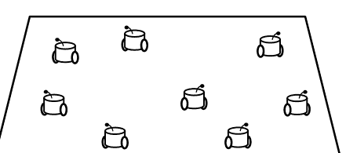

智能体 $i$ 的可见区域由下式给出

$\{q \in \mathbf{Q} : x_j \notin \mathbf{S}(q, x_i) \quad \forall j \in \{1, 2, \ldots, n\} \setminus \{i\}\}$, (4.2)

其中 $\mathbf{Q} \subset \mathbb{R}^m$ 是一个有界集，表示感兴趣的环境，称为*工作空间*，$\mathbf{S}(q, x_i) \subseteq \mathbf{Q}$ 是 $q \in \mathbf{Q}$ 和 $x_i \in \mathbf{Q}$ 之间的半开线段，即 $\mathbf{S}(q, x_i) = \bigcup_{\theta \in [0, 1)} \{\theta q + (1 - \theta)x_i\}$。在本章中，位于智能体 $i$ 可见区域内的智能体称为智能体 $i$ 的*邻居*。由于智能体是移动的，每个智能体的邻居是状态相关的，因此是时变的。因此，我们使用 $\mathbf{N}_i(x(t)) \subseteq \{1, 2, \ldots, n\} \setminus \{i\}$ 来表示时间 $t$ 时智能体 $i$ 的邻居集合，其中 $x(t) \triangleq [x_1^\top(t) \ x_2^\top(t) \ \cdots \ x_n^\top(t)]^\top \in \mathbb{R}^{mn}$ 是集体状态。

智能体 $i$ 的控制器是一个基于相对状态的时变邻居控制器，由下式给出

$u_i(t) = g_i([x_j(t) - x_i(t)]_{j \in \mathbf{N}_i(x(t))})$, (4.3)

其中 $g_i$ 是时间 $t$ 时 $i$ 的邻居相对位置的函数。

对于上述多智能体系统，*覆盖*意味着将智能体以期望的密度放置在工作空间 $\mathbf{Q}$ 上的环境中，如图4.2所示。*覆盖问题*是设计控制输入 $u_i$ ($i = 1, 2, \ldots, n$)，使得 $(x_1(t), x_2(t), \ldots, x_n(t))$ 收敛到量化感兴趣覆盖的函数的最小值点，即

$\lim_{t \to \infty} J(x(t)) = \min_{x \in \mathbf{Q}^n} J(x)$, (4.4)

其中 $J : \mathbb{R}^{mn} \to \mathbb{R}$ 是量化覆盖的函数，对应于我们覆盖问题的*目标函数*。

图4.2 覆盖的图像

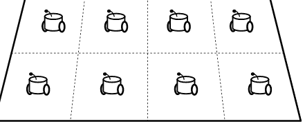

目标函数 $J$ 可以用多种方式定义。一个典型的形式由下式给出

$$J(x) = \int_{\mathbf{Q}} \min_{i \in \{1, 2, \dots, n\}} h(\|q - x_i\|) \phi(q) dq, \quad (4.5)$$

其中 $x = [x_1^\top \ x_2^\top \ \cdots \ x_n^\top]^\top \in \mathbb{R}^{mn}$，$h : \mathbb{R}_+ \to \mathbb{R}$ 是一个非递减、分段可微且在 $\mathbf{Q}$ 上可积的函数，$\phi : \mathbb{R}^m \to \mathbb{R}_{0+}$ 是一个在 $\mathbf{Q}$ 上可积的函数。函数 $h$ 称为*性能函数*，它量化了位置 $q \in \mathbf{Q}$ 距离智能体 $i$ 某一距离的效用（值越小表示效用越大），因此 $\min_{i \in \{1, 2, \dots, n\}} h(\|q - x_i\|)$ 表示位置 $q$ 相对于 $x_1, x_2, \dots, x_n$ 中最近者的效用（在距离 $\|q - x_i\|$ 的意义上）。另一方面，$\phi$ 描述了位置 $q \in \mathbf{Q}$ 的重要性。它被称为*权重函数*。因此，$\min_{i \in \{1, 2, \dots, n\}} h(\|q - x_i\|) \phi(q)$ 表示由最近智能体生成的位置 $q$ 的加权效用，而 $J(x)$ 是 $\mathbf{Q}$ 上的总加权效用。

为了说明这个函数 $J$，让我们考虑以下情况：

- 智能体是配备视觉传感器的移动传感器，
- 智能体将被部署在工作空间 $\mathbf{Q}$ 上，以检测每个位置 $q \in \mathbf{Q}$ 的异常，
- 异常造成的经济损失量根据位置 $q$ 而变化。

自然可以假设，位于 $x_i$ 的视觉传感器的检测精度随着距离 $\|q - x_i\|$ 的增加而降低。这一特性，即检测精度与距离 $\|q - x_i\|$ 之间的关系，由函数 $h$ 表示。同时，在检测过程中，具有较大经济损失潜力的位置相对重要。这由函数 $\phi$ 描述。

### 4.2 Voronoi图

*Voronoi图*是一个几何概念，在解决目标函数为(4.5)式的覆盖问题中起着重要作用。在本节中，我们介绍其概念和一些性质。

#### 4.2.1 定义

考虑一个集合 $\mathbf{Q} \subset \mathbb{R}^m$ 和 $\mathbf{Q}$ 中的 $n$ 个不同点 $x_i$ ($i = 1, 2, \dots, n$)。虽然在第4.1节中假设 $\mathbf{Q}$ 是闭集，但在本节中它既不必有界也不必闭。例如图4.3所示，其中 $m = 2$，$\mathbf{Q} = [0, 1] \times [0, 1]$，$n = 10$，点用点表示。

(ii) 考虑一个二维空间中具有积分器智能体的多智能体系统，其中智能体 $i$ 的动力学由下式给出

$\dot{x}_i(t) = u_i(t)$ (3.46)

其中 $x_i(t) \in \mathbb{R}^2$，$u_i(t) \in \mathbb{R}^2$。

- a. 找到一个基于相对状态的控制器以实现一致性。
- b. (Python) 开发一个Python代码来模拟上述解决方案。

(iii) Python代码3.3是Python代码3.1的替代方案，但作为多智能体系统的仿真程序，它不太可取。说明这一说法的理由。

### Python代码3.3：Python代码3.1的替代代码

```python
from scipy.integrate import odeint
import numpy as np
import matplotlib.pyplot as plt

def MAS(x,t,L):
    dxdt = np.dot(-L,x)
    return dxdt

L = np.array([
    [ 1, -1,  0,  0,  0,  0],
    [ 0,  2, -1,  0, -1,  0],
    [ 0,  0,  1, -1,  0,  0],
    [-1, -1,  0,  2,  0,  0],
    [ 0,  0,  0,  0,  1, -1],
    [ 0, -1,  0,  0,  0,  1]])

x0 = np.array([-1, 2, 6, 3, -3, 1])
t = np.arange(0, 5, 0.001)
x = odeint(MAS, x0, t, args=(L,))

plt.plot(t,x)
plt.xlabel('t')
plt.ylabel('xi')
plt.grid()
plt.show()
```

(iv) 考虑以下离散时间多智能体系统：

$$
\begin{cases}
x_1[k+1] = f(x_1[k], x_2[k], x_4[k]), \\
x_2[k+1] = f(x_1[k], x_2[k], x_5[k]), \\
x_3[k+1] = f(x_3[k], x_4[k], x_5[k]), \\
x_4[k+1] = f(x_1[k], x_3[k], x_4[k]), \\
x_5[k+1] = f(x_1[k], x_2[k], x_5[k]),
\end{cases}
$$

其中 $x_i[k] \in \mathbb{R}$ ($i = 1, 2, \dots, 5$) 是状态，$f : \mathbb{R}^3 \to \mathbb{R}$ 是一个待设计的函数。

- a. 找到一个函数 $f$ 以实现最大一致性。
- b. (Python) 开发一个Python代码来模拟上述解决方案。

## 参考文献

1. Ren W, Beard RW (2008) Distributed consensus in multi-vehicle cooperative control: theory and applications. Communications and control engineering. Springer, London
2. Mesbahi M, Egerstedt M (2010) Graph theoretic methods in multiagent networks. Princeton University Press, Princeton
3. Olfati-Saber R, Fax JA, Murray RM (2007) Consensus and cooperation in networked multi-agent systems. Proc IEEE 95(1):215–233
4. Oh K, Park M, Ahn H (2015) A survey of multi-agent formation control. Automatica 53:424–440
5. Cortés J (2008) Distributed algorithms for reaching consensus on general functions. Automatica 44(3):726–737
6. Sundaram S, Hadjicostis C (2011) Distributed function calculation via linear iterative strategies in the presence of malicious agents. IEEE Trans Autom Control 56(7):1496–1508
7. Olfati-Saber R, Murray RM (2004) Consensus problems in networks of agents with switching topology and time-delays. IEEE Trans Autom Control 49(9):1520–1533
8. Moreau L (2005) Stability of multiagent systems with time-dependent communication links. IEEE Trans Autom Control 50(2):169–182
9. Ren W, Beard RW (2005) Consensus seeking in multiagent systems under dynamically changing interaction topologies. IEEE Trans Autom Control 50(5):655–661
10. Carli R, Fagnani F, Speranzon A, Zampieri S (2008) Communication constraints in the average consensus problem. Automatica 44(3):671–684
11. Frasca P, Carli R, Fagnani F, Zampieri S (2009) Average consensus on networks with quantized communication. Int J Robust Nonlinear Control 19(16):1787–1816

## 4.2 泰森多边形图

对于集合 **Q** 和点 $x_i \in \mathbf{Q} (i = 1, 2, \dots, n)$，其*泰森多边形图*是对 **Q** 的一种划分，使得

-   划分产生的每个区域恰好包含一个点，
-   每个区域中的点是该区域内任意位置的最近点。

更精确地说，泰森多边形图被定义为（集合的）集合

$\{\mathbf{C}_1(x), \mathbf{C}_2(x), \dots, \mathbf{C}_n(x)\},$ (4.6)

其中 $x \triangleq [x_1^\top \; x_2^\top \; \cdots \; x_n^\top]^\top$ 且

$\mathbf{C}_i(x) \triangleq \{q \in \mathbf{Q} : \|q - x_i\| \leq \|q - x_j\| \; (j = 1, 2, \dots, n)\} \; (i = 1, 2, \dots, n).$ (4.7)

集合 $\mathbf{C}_i(x)$ 被称为点 $i$ 的*泰森多边形单元*。泰森多边形单元的内部互不相交，但可能共享边界。注意，仅当 $i \neq j$ 时 $x_i \neq x_j$，泰森多边形图才有良好定义。

**例 4.1** 考虑集合 $\mathbf{Q} = [0, 1] \times [0, 1]$ 和点

$x_1 \triangleq \begin{bmatrix} 0.1 \\ 0.1 \end{bmatrix}, \; x_2 \triangleq \begin{bmatrix} 0.8 \\ 0.6 \end{bmatrix}, \; x_3 \triangleq \begin{bmatrix} 0.2 \\ 0.7 \end{bmatrix}, \; x_4 \triangleq \begin{bmatrix} 0.6 \\ 0.2 \end{bmatrix}, \; x_5 \triangleq \begin{bmatrix} 0.3 \\ 0.2 \end{bmatrix},$
$x_6 \triangleq \begin{bmatrix} 0.3 \\ 0.5 \end{bmatrix}, \; x_7 \triangleq \begin{bmatrix} 0.9 \\ 0.1 \end{bmatrix}, \; x_8 \triangleq \begin{bmatrix} 0.8 \\ 0.9 \end{bmatrix}, \; x_9 \triangleq \begin{bmatrix} 0.6 \\ 0.7 \end{bmatrix}, \; x_{10} \triangleq \begin{bmatrix} 0.5 \\ 0.4 \end{bmatrix},$

它们彼此不同，并在图 4.3 中示出。那么泰森多边形图如图 4.4 所示，该图由第 4.5.1 节中的 Python 代码 4.1 生成，其中点表示点 $x_i (i = 1, 2, \dots, 10)$，实线表示泰森多边形单元的边界。$\square$

以下性质对于计算和分析泰森多边形图很有用：

**引理 4.1** *考虑集合 $\mathbf{Q} \subset \mathbb{R}^m$ 和 $n$ 个不同点 $x_i \in \mathbf{Q} (i = 1, 2, \dots, n)$ 的泰森多边形图 $\{\mathbf{C}_1(x), \mathbf{C}_2(x), \dots, \mathbf{C}_n(x)\}$。令 $\{q \in \mathbb{R}^m : D_{ij}q + d_{ij} = 0\}$ 表示 $x_i$ 和 $x_j$ 之间线段的垂直平分线，其中 $D_{ij} \in \mathbb{R}^{1 \times m}$ 是一个行向量，$d_{ij} \in \mathbb{R}$ 是一个标量，使得 $D_{ij}x_i + d_{ij} \leq 0$。则*

$\mathbf{C}_i(x) = \mathbf{Q} \cap \left( \bigcap_{j \in \{1, 2, \dots, n\} \setminus \{i\}} \{q \in \mathbb{R}^m : D_{ij}q + d_{ij} \leq 0\} \right).$ (4.8)

**证明** 根据垂直平分线的定义，对于 $j \neq i$，我们有

$\{q \in \mathbb{R}^m : D_{ij}q + d_{ij} \leq 0\} = \{q \in \mathbb{R}^m : \|q - x_i\| \leq \|q - x_j\|\}$ (4.9)

结合泰森多边形单元的定义，即 (4.7)，即可证明 (4.8)。$\square$

**图 4.3** 集合 $\mathbf{Q} \triangleq [0, 1] \times [0, 1]$ 中的 $n$ 个点

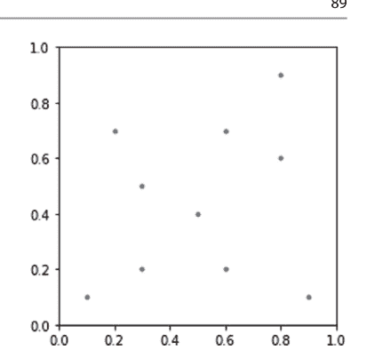

**图 4.4** 图 4.3 中点的泰森多边形图（Python 代码 4.1）

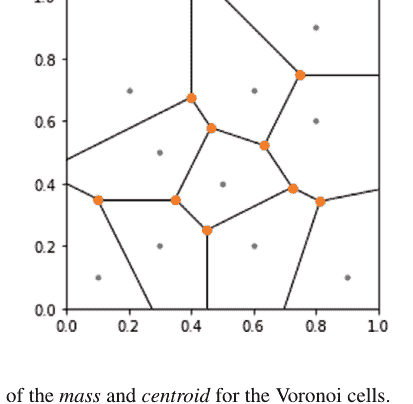

接下来，让我们介绍泰森多边形单元的*质量*和*质心*概念。假设给定一个可积函数 $\phi : \mathbf{Q} \to \mathbb{R}_{0+}$。这可以被视为位置 $q \in \mathbf{Q}$ 的效用。那么，对于泰森多边形单元 $\mathbf{C}_i(x)$ 和函数 $\phi$，令

$$\text{mass}(\mathbf{C}_i(x)) \triangleq \int_{\mathbf{C}_i(x)} \phi(q) dq \qquad (4.10)$$

和

$$\text{cent}(\mathbf{C}_i(x)) \triangleq \frac{1}{\text{mass}(\mathbf{C}_i(x))} \int_{\mathbf{C}_i(x)} q \phi(q) \, dq. \qquad (4.11)$$

如果我们将 $\mathbf{C}_i(x)$ 视为密度为 $\phi$ 的刚体，那么前者和后者分别对应于该物体的质量和质心。前者被称为函数 $\phi$ 下单元 $\mathbf{C}_i(x)$ 的*质量*，后者被称为 $\phi$ 下 $\mathbf{C}_i(x)$ 的*质心*或*泰森质心*。

如果集合 $\mathbf{Q}$ 和点 $x_i \in \mathbf{Q}$ ($i = 1, 2, \ldots, n$) 的泰森多边形图 $\{\mathbf{C}_1(x), \mathbf{C}_2(x), \ldots, \mathbf{C}_n(x)\}$ 满足

$$\mathrm{cent}(\mathbf{C}_i(x)) = x_i \quad (i = 1, 2, \ldots, n), \tag{4.12}$$

即每个点都位于其泰森多边形单元的质心处，则称该泰森多边形图是函数 $\phi$ 的*质心泰森多边形剖分*。

**例 4.2** 考虑例 4.1 中的集合 $\mathbf{Q}$ 和点 $x_i \in \mathbf{Q}$ ($i = 1, 2, \ldots, 10$)。泰森质心由第 4.5.1 节中的 Python 代码 4.1 计算。结果存储在变量 `vcentroids` 中，如下所示：

```
array([[0.09808869, 0.1558104],
       [0.84331966, 0.55291581],
       [0.18431373, 0.78357843],
       [0.61808415, 0.17789436],
       [0.30797362, 0.18741007],
       [0.24582354, 0.48273291],
       [0.87878717, 0.16582882],
       [0.80555556, 0.88888889],
       [0.54460521, 0.7568979],
       [0.52379894, 0.41380393]])
```

这些点绘制在图 4.4 中。$\square$

**例 4.3** 图 4.5 展示了十个点 $x_i$ 和 $\phi(q) \equiv 1$ 的质心泰森多边形剖分示例。$\square$

以下性质对于泰森多边形图相当基础：

**引理 4.2** *考虑集合 $\mathbf{Q} \subset \mathbb{R}^m$ 和 $n$ 个不同点 $x_i \in \mathbf{Q}$ ($i = 1, 2, \ldots, n$) 的泰森多边形图 $\{\mathbf{C}_1(x), \mathbf{C}_2(x), \ldots, \mathbf{C}_n(x)\}$。以下陈述成立：*

-   (i) $\bigcup_{i=1}^n \mathbf{C}_i(x) = \mathbf{Q}$。
-   (ii) 对于 $i \neq j$，$\mathrm{int}(\mathbf{C}_i(x)) \cap \mathrm{int}(\mathbf{C}_j(x)) = \emptyset$。
-   (iii) 如果 $i \neq j$ 且 $\mathbf{C}_i(x) \cap \mathbf{C}_j(x) \neq \emptyset$，那么 $\mathbf{C}_i(x) \cap \mathbf{C}_j(x) = \mathrm{bd}(\mathbf{C}_i(x)) \cap \mathrm{bd}(\mathbf{C}_j(x))$。
-   (iv) 如果 $\mathbf{Q}$ 是凸集，那么 $\mathbf{C}_i(x)$ ($i = 1, 2, \ldots, n$) 是凸集。特别地，如果 $\mathbf{Q}$ 是多面体，那么 $\mathbf{C}_i(x)$ ($i = 1, 2, \ldots, n$) 是多面体。
-   (v) 如果 $\mathbf{Q}$ 是凸集且对于几乎所有 $q \in \mathbf{Q}$ 有 $\phi(q) > 0$，那么 $\text{cent}(\mathbf{C}_i(x))$ 位于 $\mathbf{C}_i(x)$ 的内部。

**证明** (i)–(iii) 由 (4.7) 中泰森多边形图的定义可直接得出。
(iv) 由引理 4.1，集合 $\mathbf{C}_i(x)$ 是若干凸集的交集。另一方面，众所周知凸集的交集是凸的 [1]。这证明了 (iv) 的前一个陈述。后一个陈述由以下事实给出：如果 $\mathbf{Q}$ 是凸多面体，那么 $\mathbf{C}_i(x)$ 是凸多面体的交集。
(v) 这是 (4.11) 中质心定义和 (iv) 的推论。$\square$

#### 4.2.2 与覆盖的关系

(4.5) 中的目标函数 $J$ 由泰森多边形图表征。
令
$$\mathbf{S} \triangleq \{x \in \mathbb{R}^{mn} : \exists(i, j) \in \{1, 2, \ldots, n\} \text{ s.t. } x_i = x_j \text{ and } i \neq j\}, \quad (4.13)$$
其中 $x_i \in \mathbb{R}^m$ 是向量 $x$ 按每 $m$ 个元素划分的第 $i$ 个块。那么 $x_i \in \mathbf{Q}$ ($i = 1, 2, \ldots, n$) 彼此不同的情况表示为
$$(x_1, x_2, \ldots, x_n) \in \mathbf{Q}^n \setminus \mathbf{S}. \quad (4.14)$$

$^1$ 考虑空间 $\mathbb{R}^n$。半空间的交集被称为*多面体*。换句话说，多面体 $\mathbf{P}$ 由 $\mathbf{P} = \{x \in \mathbb{R}^n : Cx + d \leq 0\}$ 给出，其中 $C \in \mathbb{R}^{m \times n}$ 是某个矩阵，$d \in \mathbb{R}^m$ 是某个向量。

以下引理展示了函数 $J$ 与相应泰森多边形图之间的关系：

**引理 4.3** 考虑 (4.5) 中的目标函数 $J$。假设 (4.14) 成立，并令 $\{\mathbf{C}_1(x), \mathbf{C}_2(x), \ldots, \mathbf{C}_n(x)\}$ 为 $\mathbf{Q}$ 和 $x_i$ ($i = 1, 2, \ldots, n$) 的泰森多边形图。则

$$J(x) = \sum_{i=1}^n \int_{\mathbf{C}_i(x)} h(\|q - x_i\|)\phi(q)dq. \qquad (4.15)$$

**证明** 方程 (4.5) 可表示为

$$\begin{aligned} J(x) &= \int_{\mathbf{Q}} \min_{i \in \{1, 2, \ldots, n\}} h(\|q - x_i\|)\phi(q)dq \\ &= \int_{\bigcup_{j=1}^n \mathbf{C}_j(x)} \min_{i \in \{1, 2, \ldots, n\}} h(\|q - x_i\|)\phi(q)dq \\ &= \sum_{j=1}^n \int_{\mathbf{C}_j(x)} \min_{i \in \{1, 2, \ldots, n\}} h(\|q - x_i\|)\phi(q)dq \\ &= \sum_{j=1}^n \int_{\mathbf{C}_j(x)} h(\|q - x_j\|)\phi(q)dq. \end{aligned}$$

第二个和第三个等式由引理 4.2 (i) 和 (iii) 给出，最后一个等式由 (4.7) 中泰森多边形单元的定义以及 $h$ 是非递减的事实得出。通过在最后一项中将 $j$ 替换为 $i$，我们得到 (4.15)。$\square$

以下结果涉及 $m = 2$ 时 $J(x)$ 的可微性和梯度：

**引理 4.4** 考虑 (4.5) 中的目标函数 $J$。假设 $m = 2$，$\mathbf{Q}$ 是有界多面体，且 $h$ 在 $\mathbb{R}_{0+}$ 上连续可微。则以下陈述成立：

-   (i) 函数 $J$ 在 $\mathbf{Q}^n \setminus \mathbf{S}$ 上连续可微。此外，

$$\frac{\partial J}{\partial x_i}(x) = \int_{\mathbf{C}_i(x)} \frac{\partial}{\partial x_i} h(\|q - x_i\|)\phi(q)dq \quad (i = 1, 2, \ldots, n) \qquad (4.16)$$

在 $x \in \mathbf{Q}^n \setminus \mathbf{S}$ 上成立。

-   (ii) 如果 $h$ 在 $\mathbb{R}_{0+}$ 上二次连续可微，那么 $J$ 在 $\mathbf{Q}^n \setminus \mathbf{S}$ 上二次连续可微。

**图 4.5** 质心泰森多边形剖分

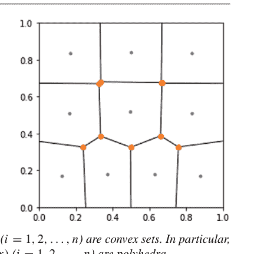

**证明** (i) 参见文献[2]中的第2.5.3节。

(ii) (4.16)式的右侧与(4.15)式右侧的第$i$项具有相同的形式。这一事实与(i)共同表明，如果对于每个$i \in \{1, 2, \ldots, n\}$，$\partial h/\partial x_i$在$\mathbb{R}_{0+}$上连续可微，即$h$在$\mathbb{R}_{0+}$上二次连续可微，那么$\partial J/\partial x$在$\mathbf{Q}^n \setminus \mathbf{S}$上连续可微。这就证明了(ii)。

### 4.3 覆盖控制

本节针对最基本的情况，给出覆盖问题的解决方案。

#### 4.3.1 梯度系统

梯度系统在实现覆盖控制中扮演着重要角色。我们首先回顾梯度系统及其稳定性。

考虑一个开集$\mathbf{X} \subset \mathbb{R}^n$。$\mathbf{X}$上的一个梯度系统[3]由下式给出

$$\dot{x}(t) = -K(x(t))\frac{\partial J}{\partial x}(x(t)), \quad (4.17)$$

其中$x(t) \in \mathbf{X}$是状态，$J : \mathbb{R}^n \to \mathbb{R}$是$\mathbf{X}$上的连续可微函数，$K : \mathbf{X} \to \mathbb{R}^{n \times n}$是一个矩阵值函数，满足$K$在$\mathbf{X}$上连续可微，且对于任意$x \in \mathbf{X}$，$K(x)$是正定矩阵。

如果$K(x) \equiv I$，则(4.17)式的右侧对应于$J$的最速下降方向。

**引理 4.5** *考虑(4.17)中的系统。如果$J$在开集$\mathbf{X}$上二次连续可微，则以下陈述成立：*

(i) *对于每个$x(0) \in \mathbf{X}$，存在一个$\delta \in \mathbb{R}_+$，使得系统在时间区间$[0, \delta]$上有唯一解$x(t)$。*

(ii) *考虑一个有界集$\mathbf{D} \subseteq \mathbf{X}$。假设给定一个初始状态$x(0) \in \mathbf{D}$。如果以下陈述成立，则系统在时间区间$[0, \infty)$上有唯一解：*

- *存在一个$\delta \in \mathbb{R}_+$，使得系统在时间区间$[0, \delta]$上有唯一解$x(t)$，且该解属于$\mathbf{D}$。*
- *不存在$\tau \in \mathbb{R}_+$，使得系统在$[0, \tau)$上有唯一解$x(t)$满足$\lim_{t \to \tau-0} x(t) \in \mathrm{bd}(\mathbf{D})$。*

**证明** (i) 这由附录4.8.1中的引理4.11证明。令

$$f(x) \triangleq -K(x)\frac{\partial J}{\partial x}(x).$$

由于$K$在$\mathbf{X}$上连续可微且$J$在$\mathbf{X}$上二次连续可微，因此$f$在$\mathbf{X}$上连续可微。于是，由引理4.11 (i)可知，$f$在$\mathbf{X}$上是局部利普希茨的。这一点与引理4.11（附录4.8.1）(ii)共同证明了(i)。

(ii) 如(i)的证明所示，$f$在$\mathbf{D} \subseteq \mathbf{X}$上连续。因此，$f$在有界集$\mathbf{D}$上有界。由引理4.12可知，任何从$\mathbf{D}$出发并在$\mathbf{D}$中停留一段时间的解$x(t)$都可以延拓到其到达$\mathrm{bd}(\mathbf{D})$的时刻。因此，如果(ii)中的条件成立，任何从$\mathbf{D}$出发的解$x(t)$都可以延拓到$+\infty$，这就证明了(ii)。

以下结果涉及(4.17)中系统的收敛性：

**引理 4.6** *考虑(4.17)中的系统和一个有界集$\mathbf{D} \subset \mathbf{X}$。如果以下陈述成立，那么对于每个$x(0) \in \mathbf{D}$，当$t \to \infty$时，$x(t)$收敛到$\mathbf{D}$中包含的$J$的驻点集：*

- *对于每个$x(0) \in \mathbf{D}$，系统在时间区间$[0, \infty)$上有唯一解。*
- *$\mathbf{D}$是系统的一个不变集（关于不变集参见附录4.8.2）。*
- *不存在$x(0) \in \mathbf{D}$，使得当$t \to \infty$时，$x(t)$收敛到集合$\mathrm{cl}(\mathbf{D}) \setminus \mathbf{D}$。*

**证明** 这一事实是附录4.8.1中引理4.13的LaSalle不变性原理的推论。

令$V(x) \triangleq J(x)$。由于$K(x)$在$\mathbf{X}$上是正定的，(4.17)式给出

$$\dot{V}(x) = \left(\frac{\partial J}{\partial x}(x)\right)^\top \left(-K(x)\frac{\partial J}{\partial x}(x)\right) = -\left(\frac{\partial J}{\partial x}(x)\right)^\top K(x)\frac{\partial J}{\partial x}(x) \leq 0$$

对于所有$x \in \mathbf{X}$成立。这一点与$\mathbf{D} \subset \mathbf{X}$共同意味着引理4.13（附录4.8.1）中的条件(a)成立。因此，由引理4.13可知，对于每个$x(0) \in \mathbf{D}$，当$t \to \infty$时，$x(t)$收敛到$\{x \in \mathbf{D} : \dot{V}(x) = 0\}$中包含的最大不变集。

另一方面，$\{x \in \mathbf{D} : \dot{V}(x) = 0\}$中包含的最大不变集等于$\mathbf{D}$中包含的$J$的驻点集。事实上，由(4.19)式，因为$K(x)$在$\mathbf{X}$上是正定的，我们有

$$\{x \in \mathbf{D} : \dot{V}(x) = 0\} = \left\{x \in \mathbf{D} : \frac{\partial J}{\partial x}(x) = 0\right\}$$

右侧等于$J$的驻点集，也等于系统在$\mathbf{D}$中的所有平衡点集（通常，平衡点集是系统的一个不变集）。换句话说，右侧对应于$\{x \in \mathbf{X} : \dot{V}(x) = 0\}$中包含的最大不变集。

证明完毕。

#### 4.3.2 积分器智能体的覆盖控制器

现在，我们给出二维工作空间上覆盖问题的解决方案。考虑一个$m = 2$的多智能体系统。假设智能体$i$具有积分器动力学

$\dot{x}_i(t) = u_i(t), \quad (4.21)$

其中$x_i(t) \in \mathbb{R}^2$，$u_i(t) \in \mathbb{R}^2$。智能体$i$的控制器是基于梯度的，由下式给出

$u_i(t) = -k_i([x_j(t) - x_i(t)]_{j \in \mathbf{N}_i(x(t))}) \frac{\partial J}{\partial x_i}(x(t)), \quad (4.22)$

其中$J$在$\mathbf{Q}^n \setminus \mathbf{S}$上连续可微（注意引理4.4 (i)），$k_i$是标量增益，在$\mathbb{R}^{2|\mathbf{N}_i(x(t))|}$上取正值。

以下结果展示了每个智能体实现(4.22)中控制器所需的信息：

**引理 4.7** *对于智能体$i \in \{1, 2, \ldots, n\}$，考虑(4.22)中的覆盖控制器。如果该智能体拥有以下信息，那么它可以在每个$t \in \mathbb{R}_{0+}$时刻通过(4.22)计算控制输入$u_i(t)$：*

- $q - x_i(t)$，对于每个$q \in \text{bd}(\mathbf{Q})$：局部坐标系下$\mathbf{Q}$的边界，
- $x_j(t) - x_i(t)$，对于每个$j \in \mathbf{N}_i(x(t))$：局部坐标系下每个邻居的位置，
- $q - x_i(t)$，对于每个$q \in \mathbf{C}_i(x(t))$：局部坐标系下其Voronoi单元中的位置，
- $(\partial h/\partial r)(r)$，对于每个$r \in [0, \sup_{(p,q) \in \mathbf{Q}^2} \|q - p\|]$：函数$h$的导数，
- $\phi(q)$，对于每个$q \in \mathbf{C}_i(x(t))$：其Voronoi单元中每个位置的权重，

其中局部坐标系是智能体$i$的。

*证明* 根据智能体$i$邻居的定义和引理4.1，第一和第二项允许智能体$i$在其局部坐标系中计算Voronoi单元$\mathbf{C}_i(x(t))$。另一方面，显然$k_i([x_j(t) - x_i(t)]_{j \in \mathbf{N}_i(x(t))})$可以通过第二项计算。最后，(4.16)式意味着

$\frac{\partial J}{\partial x_i}(x) = \int_{\mathbf{C}_i(x)} \frac{\partial}{\partial x_i} h(\|q - x_i\|) \phi(q) dq = \int_{\mathbf{C}_i(x)} -\frac{\partial h}{\partial r}(\|q - x_i\|) \frac{(q - x_i)}{\|q - x_i\|} \phi(q) dq,$

这可以通过关于Voronoi单元$C_i(x(t))$的信息以及第三、第四和第五项来计算。这些事实与(4.22)式共同完成了证明。$\square$

由(4.21)和(4.22)给出的多智能体系统的集体动力学是一个梯度系统，由下式给出

$$\dot{x}(t) = -K(x(t))\frac{\partial J}{\partial x}(x(t)), \tag{4.23}$$

其中$K(x(t)) \in \mathbb{R}^{2n \times 2n}$是一个分块对角矩阵，其第$i$个对角块是$k_i([x_j(t) - x_i(t)]_{j \in N_i(x(t))})I_2 \in \mathbb{R}^{2 \times 2}$。基于4.3.1节的结果，我们得到以下结果：

**定理 4.1** *考虑由(4.21)和(4.22)给出的多智能体系统（其中$m=2$）。令*

$$\mathbf{D} \triangleq \mathbf{Q}^n \setminus \mathbf{S}. \tag{4.24}$$

*如果*

- (a) $\mathbf{Q}$是一个闭有界多面体，
- (b) $h$在$\mathbb{R}_{0+}$上二次连续可微，
- (c) 对于几乎每个$q \in \mathbf{Q}$，$\phi(q) > 0$，
- (d) $K$在$\mathbf{D}$上连续可微。

*那么以下陈述成立：*

- (i) *对于每个$x(0) \in \mathbf{D}$，系统在时间区间$[0, \infty)$上有唯一解$x(t)$。*
- (ii) *对于每个$x(0) \in \mathbf{D}$，当$t \to \infty$时，$x(t)$收敛到$\mathbf{D}$中包含的$J$的驻点集。特别地，如果驻点集是有限集，则$x(t)$收敛到一个驻点。*

**证明** *参见第4.3.3节。* $\square$

接下来，让我们关注性能函数$h$是二次函数的情况，即

$$h(\|q - x_i\|) = \|q - x_i\|^2. \tag{4.25}$$

在这种情况下，我们可以推导出覆盖控制器的更具体形式。以下结果对于获得它起着重要作用：

**引理 4.8** 考虑 (4.5) 中的目标函数 $J$。假设 $m = 2$，$\mathbf{Q}$ 是一个有界多面体，且 $h$ 由 (4.25) 给出。那么函数 $J$ 在 $\mathbf{Q}^n \setminus \mathbf{S}$ 上连续可微，并且对于 $x \in \mathbf{Q}^n \setminus \mathbf{S}$，有

$$\frac{\partial J}{\partial x_i}(x) = 2\mathrm{mass}(\mathbf{C}_i(x))\left(x_i - \mathrm{cent}(\mathbf{C}_i(x))\right) \quad (i = 1, 2, \ldots, n) \tag{4.26}$$

**证明** $J$ 的连续可微性由引理 4.4 给出。另一方面，(4.26) 证明如下：将 (4.10)、(4.11) 和 (4.25) 应用于 (4.16)，我们得到

$$\begin{aligned} \frac{\partial J}{\partial x_i}(x) &= \int_{\mathbf{C}_i(x)} \frac{\partial}{\partial x_i} \|q - x_i\|^2 \phi(q) dq \\ &= \int_{\mathbf{C}_i(x)} -2(q - x_i) \phi(q) dq \\ &= \int_{\mathbf{C}_i(x)} 2x_i \phi(q) dq - \int_{\mathbf{C}_i(x)} 2q \phi(q) dq \\ &= 2x_i \mathrm{mass}(\mathbf{C}_i(x)) - 2 \mathrm{mass}(\mathbf{C}_i(x)) \mathrm{cent}(\mathbf{C}_i(x)) \\ &= 2 \mathrm{mass}(\mathbf{C}_i(x)) \left(x_i - \mathrm{cent}(\mathbf{C}_i(x))\right) \tag{4.27} \end{aligned}$$

对于 $x \in \mathbf{Q}^n \setminus \mathbf{S}$ 成立。证明完毕。$\square$

由引理 4.8 和 (4.22)，我们得到以下覆盖控制器：

$$u_i(t) = -2k_i([x_j(t) - x_i(t)]_{j \in \mathbf{N}_i(x(t))}) \mathrm{mass}(\mathbf{C}_i(x(t))) \left(x_i(t) - \mathrm{cent}(\mathbf{C}_i(x(t)))\right). \tag{4.28}$$

一个遗留问题是如何确定增益 $k_i([x_j(t) - x_i(t)]_{j \in \mathbf{N}_i(x(t))})$。一个合理的选择如下：从 (4.10) 和 Voronoi 图的定义可以清楚地看出，随着智能体数量 $n$ 的增加，$\mathrm{mass}(\mathbf{C}_i(x))$ 趋于减小。因此，如果将 $k_i([x_j(t) - x_i(t)]_{j \in \mathbf{N}_i(x(t))})$ 设为常数，$u_i(t)$ 的大小将严重依赖于 $n$。这可能导致当 $n$ 较大时收敛缓慢。考虑到这一事实，合理的选择是使用 $k_i([x_j(t) - x_i(t)]_{j \in \mathbf{N}_i(x(t))})$，使得 (4.28) 中的项 $\mathrm{mass}(\mathbf{C}_i(x))$ 被消去，例如

$$k_i([x_j(t) - x_i(t)]_{j \in \mathbf{N}_i(x(t))}) = \frac{k}{2\mathrm{mass}(\mathbf{C}_i(x(t)))} \tag{4.29}$$

其中 $k \in \mathbb{R}_+$ 是给定的正数。注意，Voronoi 单元 $\mathbf{C}_i(x(t))$ 可以通过 $[x_j(t) - x_i(t)]_{j \in \mathbf{N}_i(x(t))}$ 和引理 4.7 的第一项计算得出。那么覆盖控制器变为

$$u_i(t) = -k\left(x_i(t) - \mathrm{cent}(\mathbf{C}_i(x(t)))\right). \tag{4.30}$$

对于这个控制器，所得的多智能体系统是 (4.17) 形式的梯度系统，其中 $k_i([x_j(t) - x_i(t)]_{j \in \mathbf{N}_i(x(t))})$ 的集合对应于 (4.17) 中的 $K(x(t))$。因此，我们得到以下结果：

**推论 4.1** 考虑由 (4.21) 和 (4.30) 给出的多智能体系统（其中 $m = 2$）。那么以下陈述成立：

- (i) 如果将多智能体系统视为 (4.17)，且定理 4.1 中的 (a) 和 (d) 成立，那么该定理中的 (i) 和 (ii) 成立。
- (ii) 如果驻点集是有限集，那么所得的 Voronoi 图是一个质心 Voronoi 镶嵌。

**证明** (i) 该多智能体系统是 (4.17) 的一个特例。因此，我们证明定理 4.1 中的 (b)、(c) 和 (e) 对于该多智能体系统成立。对于 (4.25) 中的函数 $h$，定理 4.1 中的 (b) 和 (c) 显然成立。特别地，对于函数 $h$，(c) 由 $g(r) \equiv 2$ 给出。此外，从 [5] 中的命题 1.6 可以看出，$\text{mass}(\mathbf{C}_i(x))$ 在 $\mathbf{D} \triangleq \mathbf{Q}^n \setminus \mathbf{S}$ 上连续可微。这一事实、(4.29) 以及以下事实意味着 (e)：

- $\text{Mass}(\mathbf{C}_i(x)) > 0$ 在 $\mathbf{D}$ 上成立。
- 连续可微函数的复合是连续可微的。
- 函数 $1/z$ 在 $\mathbb{R}_+$ 上连续可微。

因此，如果 (a) 和 (d) 成立，则与该定理相同的陈述成立。

(ii) 如果 $x$ 是 $J$ 的一个驻点，我们有

$$\frac{\partial J}{\partial x}(x) = 0, \tag{4.31}$$

结合 (4.26)、(4.29) 以及 $\text{mass}(\mathbf{C}_i(x)) > 0$ 在 $\mathbf{D}$ 上成立，这意味着 $\lim_{t \to \infty} (x_i(t) - \text{cent}(\mathbf{C}_i(x(t)))) = 0$。这一点以及质心 Voronoi 镶嵌的定义证明了 (ii)。$\square$

**例 4.4** 考虑由 (4.21) 和 (4.30) 给出的多智能体系统，其中 $\mathbf{Q} = [0, 1] \times [0, 1]$ 且 $k = 1$（其中 $m = 2$，$h$ 由 (4.25) 给出，且 $\phi \equiv 1$）。

图 4.6 显示了通过 Python 代码 4.2 得到的智能体位置 $x_i(t)$（$i = 1, 2, \ldots, 10$）在 $t = 0, 1, 5, 10, 20, 50$ 时的快照。可以观察到智能体在 $\mathbf{Q}$ 中空间分布均匀。$\square$

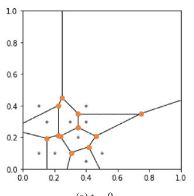

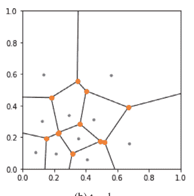

(a) $t = 0$。

(b) $t = 1$。

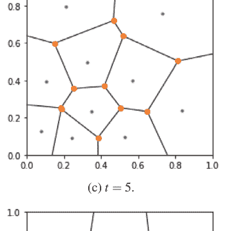

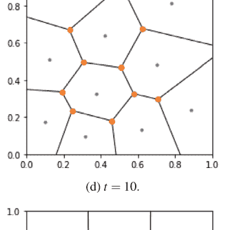

(c) $t = 5$。

(d) $t = 10$。

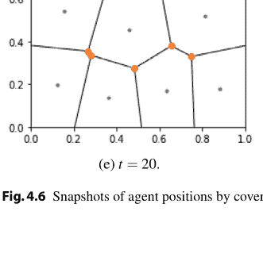

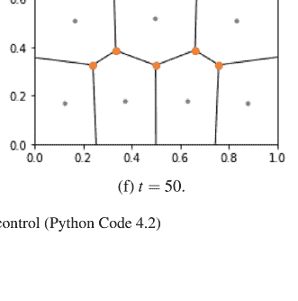

(e) $t = 20$。

(f) $t = 50$。

**图 4.6** 通过覆盖控制得到的智能体位置快照（Python 代码 4.2）

#### 4.3.3 定理 4.1 的证明

首先，我们证明如果系统位于 $\mathbf{Q}^n \setminus \mathbf{S}$ 的边界或其邻域内，系统将向 $\mathbf{Q}^n$ 的内部演化。

考虑集合 $\mathbf{Q} \subset \mathbb{R}^m$ 和 $n$ 个不同的点 $x_i \in \mathbf{Q}$（$i = 1, 2, \dots, n$）的 Voronoi 图 $\{\mathbf{C}_1(x), \mathbf{C}_2(x), \dots, \mathbf{C}_n(x)\}$。对于一个可积函数 $\psi : \mathbf{Q} \times \mathbb{R}_{0+} \to \mathbb{R}_{0+}$，令

$$\text{gmass}_{\psi}(\mathbf{C}_i(x), x_i) \triangleq \int_{\mathbf{C}_i(x)} \psi(q, \|q - x_i\|) dq \qquad (4.32)$$

和

$$\text{gcent}_{\psi}(\mathbf{C}_i(x), x_i) \triangleq \frac{1}{\text{gmass}_{\psi}(\mathbf{C}_i(x), x_i)} \int_{\mathbf{C}_i(x)} q \psi(q, \|q - x_i\|) dq. \qquad (4.33)$$

这些是 (4.10) 和 (4.11) 中函数“mass”和“cent”的广义版本。根据 $\text{gmass}_{\psi}$、$\text{gcent}_{\psi}$ 和 Voronoi 图的定义（特别是 $\mathbf{C}_i(x)$ 具有非零测度），如果对于几乎所有 $q \in \mathbf{Q}$ 有 $\psi(q, \|q - x_i\|) > 0$，那么显然有

$$\text{gmass}_{\psi}(\mathbf{C}_i(x), x_i) > 0, \quad \text{gcent}_{\psi}(\mathbf{C}_i(x), x_i) \in \text{int}(\mathbf{C}_i(x)) \qquad (4.34)$$

成立。

**引理 4.9** *考虑 (4.5) 中的目标函数 $J$。假设 $m = 2$，$\mathbf{Q}$ 是一个有界多面体，且 $h$ 在 $\mathbb{R}_{0+}$ 上连续可微。那么对于 $\mathbf{Q}^n \setminus \mathbf{S}$，有*

$$\frac{\partial J}{\partial x_i}(x) = \text{gmass}_{\psi}(\mathbf{C}_i(x), x_i) \left( x_i - \text{gcent}_{\psi}(\mathbf{C}_i(x), x_i) \right) \qquad (4.35)$$

其中

$$\psi(q) \triangleq \frac{\partial h}{\partial r}(\|q - x_i\|) \frac{1}{\|q - x_i\|} \phi(q). \qquad (4.36)$$

**证明** *由于对于几乎所有 $q \in \mathbf{C}_i(x)$ 有 $\|q - x_i\| \neq 0$，并且对于每个 $q \in \mathbf{C}_i(x)$，$(\partial h / \partial r)(\|q - x_i\|)$ 是有限的，我们通过将 (4.32)、(4.33) 和 (4.36) 应用于 (4.16) 得到 (4.35)，即*

$$\begin{aligned} \int_{\mathbf{C}_i(x)} \frac{\partial}{\partial x_i} h(\|q - x_i\|) \phi(q) dq &= \int_{\mathbf{C}_i(x)} -\frac{\partial h}{\partial r}(\|q - x_i\|) \frac{(q - x_i)}{\|q - x_i\|} \phi(q) dq \\ &= \int_{\mathbf{C}_i(x)} -(q - x_i) \psi(q, \|q - x_i\|) dq \end{aligned}$$

$$= \int_{\mathbf{C}_i(x)} x_i \psi(q, \|q - x_i \|) dq - \int_{\mathbf{C}_i(x)} q \psi(q, \|q - x_i \|) dq$$
$$= \text{gmass}_{\psi}(\mathbf{C}_i(x), x_i) x_i - \text{gmass}_{\psi}(\mathbf{C}_i(x), x_i) \text{gcent}_{\psi}(\mathbf{C}_i(x), x_i)$$
$$= \text{gmass}_{\psi}(\mathbf{C}_i(x), x_i) \left( x_i - \text{gcent}_{\psi}(\mathbf{C}_i(x), x_i) \right).$$

因此，在引理 4.9 的条件下，(4.22) 中的覆盖控制器表示为

$$u_i(t) = -k_i \left( [x_j(t) - x_i(t)]_{j \in \mathbf{N}_i(x(t))} \right) \text{gmass}_{\psi}(\mathbf{C}_i(x(t)), x_i(t))$$
$$\quad \times \left( x_i(t) - \text{gcent}_{\psi}(\mathbf{C}_i(x(t)), x_i(t)) \right) \tag{4.37}$$

**引理 4.10** 考虑由 (4.21) 和 (4.22) 给出的多智能体系统（其中 $m = 2$）。假设定理 4.1 中的 (a) 和 (c) 成立，并且（在 (a) 下）$\mathbf{Q}$ 由下式给出

$$\mathbf{Q} = \{q \in \mathbb{R}^2 : Cq + d \leq 0\} \tag{4.38}$$

其中 $C \in \mathbb{R}^{\ell \times 2}$ 是某个矩阵，$d \in \mathbb{R}^{\ell}$ 是某个向量。进一步假设 $h$ 在 $\mathbb{R}_{0+}$ 上连续可微。对于 $x = (x_1, x_2, \ldots, x_n) \in \mathbf{Q}^n$ 和 $(i, j) \in \{1, 2, \ldots, n\} \times \{1, 2, \ldots, \ell\}$，令

$$y_j(x_i) \triangleq C_j x_i + d_j \tag{4.39}$$

和

$$\mathbf{L}(x) \triangleq \{(i, j) \in \{1, 2, \ldots, n\} \times \{1, 2, \ldots, \ell\} : y_j(x_i) = 0\}, \tag{4.40}$$

其中 $C_j$ 和 $d_j$ 分别是 $C$ 的第 $j$ 行向量和 $d$ 的第 $j$ 个元素。此外，令

$$\dot{y}_j(x_i, x) \triangleq \frac{\partial y_j}{\partial x_i}(x_i) \dot{x}_i. \tag{4.41}$$

对于每个 $\hat{x} = (\hat{x}_1, \hat{x}_2, \ldots, \hat{x}_n) \in \text{bd}(\mathbf{Q}^n) \setminus \mathbf{S}$，存在一个正数 $r \in \mathbb{R}_+$，使得对于任何 $x \in \mathbf{B}(\hat{x}, r) \cap (\mathbf{Q}^n \setminus \mathbf{S})$，有

$$\dot{y}_j(x_i, x) < 0 \quad \forall (i, j) \in \mathbf{L}(\hat{x}) \tag{4.42}$$

**证明** 考虑一个 $\hat{x} = (\hat{x}_1, \hat{x}_2, \ldots, \hat{x}_n) \in \text{bd}(\mathbf{Q}^n) \setminus \mathbf{S}$，使得 $\mathbf{L}(\hat{x}) \neq \emptyset$。对于一对 $(i, j) \in \mathbf{L}(\hat{x})$，我们有

$$C_j \hat{x}_i + d_j = 0. \tag{4.43}$$

此外，由 (4.21)、(4.22)、(4.35)、(4.39) 和 (4.43) 可得

$$\begin{aligned} \dot{y}_j(\hat{x}_i, \hat{x}) &= C_j \left( -k_i([\hat{x}_j - \hat{x}_i]_{j \in \mathbf{N}_i(\hat{x})}) \frac{\partial J}{\partial x_i}(\hat{x}) \right) \\ &= -C_j k_i([\hat{x}_j - \hat{x}_i]_{j \in \mathbf{N}_i(\hat{x})}) \text{gmass}_{\psi}(\mathbf{C}_i(\hat{x}), \hat{x}_i) \left( \hat{x}_i - \text{gcent}_{\psi}(\mathbf{C}_i(\hat{x}), \hat{x}_i) \right) \\ &= k_i([\hat{x}_j - \hat{x}_i]_{j \in \mathbf{N}_i(\hat{x})}) \text{gmass}_{\psi}(\mathbf{C}_i(\hat{x}), \hat{x}_i) \left( d_i + C_j \text{gcent}_{\psi}(\mathbf{C}_i(\hat{x}), \hat{x}_i) \right). \end{aligned}$$

此处，$k_i([\hat{x}_j - \hat{x}_i]_{j \in \mathbf{N}_i(\hat{x})}) > 0$ 成立，并且由 (4.32)、(4.33) 和 (4.36) 可知，在定理 4.1 的条件 (c) 下（注意此处 $\mathbf{S}$ 是零测集），$\text{gmass}_{\psi}(\mathbf{C}_i(\hat{x}), \hat{x}_i) > 0$ 且 $\text{gcent}_{\psi}(\mathbf{C}_i(\hat{x}), \hat{x}_i) \in \text{int}(\mathbf{Q}^n)$。此外，(4.38) 意味着对于任意 $x \in \text{int}(\mathbf{Q}^n)$，有 $C_j x + d_j < 0$。这些表明 $\dot{y}_i(x_i) < 0$。这一事实与 $\dot{y}_i(x_i)$ 的连续性完成了证明。$\square$

引理 4.10 意味着，如果系统处于 $\mathbf{Q}^n \setminus \mathbf{S}$ 的边界或其邻域内，系统将向 $\mathbf{Q}^n$ 的内部演化。

现在，我们来证明定理 4.1。

(i) 由 (4.21) 和 (4.22) 给出的系统，即 (4.23) 中的系统，定义在集合 $\mathbf{Q}^n \setminus \mathbf{S}$ 上，该集合不总是开集。这阻碍了我们将引理 4.5 应用于该系统。因此，为了使用引理 4.5，我们将系统扩展到一个开集上，使得该系统在 $x(0) \in \mathbf{D}$ 的条件下，具有与 (4.23) 中原始系统等价的解。

令 $\tilde{\mathbf{Q}} \subset \mathbb{R}^2$ 是一个满足 $\mathbf{Q} \subset \tilde{\mathbf{Q}}$ 的有界开多面体，并令

$$\tilde{J}(x) \triangleq \int_{\tilde{\mathbf{Q}}} \min_{i \in \{1, 2, \ldots, n\}} h(\|q - x_i\|) \tilde{\phi}(q) dq \tag{4.44}$$

其中函数 $\tilde{\phi} : \tilde{\mathbf{Q}} \to \mathbb{R}_{0+}$ 满足

$$\tilde{\phi}(q) = \begin{cases} \phi(q) & \text{若 } q \in \mathbf{Q}, \\ 0 & \text{若 } q \in \tilde{\mathbf{Q}} \setminus \mathbf{Q}. \end{cases} \tag{4.45}$$

此外，令 $\mathbf{X} \triangleq \tilde{\mathbf{Q}}^n \setminus \mathbf{S}$，并令 $\tilde{K} : \mathbf{X} \to \mathbb{R}^{n \times n}$ 是一个矩阵值函数，使得它在 $\mathbf{X}$ 上连续可微，对于任意 $x \in \mathbf{X}$，$\tilde{K}(x)$ 是一个正定矩阵，并且对于任意 $x \in \mathbf{D}$，有 $\tilde{K}(x) = K(x)$。注意 (d)（在定理 4.1 中）保证了存在这样的函数 $\tilde{K}$。同时注意 $\mathbf{X}$ 是一个开集且 $\mathbf{D} \subset \mathbf{X}$。

现在，考虑在开集 $\mathbf{X}$ 上的系统

$$\dot{x}(t) = -\tilde{K}(x(t)) \frac{\partial \tilde{J}}{\partial x}(x(t)) \tag{4.46}$$

在条件 $x(t) \in \mathbf{D}$ 下，由于 $\tilde{\mathbf{Q}} = \mathbf{Q} \cup (\tilde{\mathbf{Q}} \setminus \mathbf{Q})$，$\mathbf{Q} \cap (\tilde{\mathbf{Q}} \setminus \mathbf{Q}) = \emptyset$，$\tilde{\phi}(q)$ 满足 (4.45)，并且

$$\begin{aligned} \tilde{J}(x) &= \int_{\mathbf{Q}} \min_{i \in \{1,2,\dots,n\}} h(\|q - x_i\|) \tilde{\phi}(q) dq + \int_{\tilde{\mathbf{Q}} \setminus \mathbf{Q}} \min_{i \in \{1,2,\dots,n\}} h(\|q - x_i\|) \tilde{\phi}(q) dq \\ &= \int_{\mathbf{Q}} \min_{i \in \{1,2,\dots,n\}} h(\|q - x_i\|) \phi(q) dq \\ &= J(x). \end{aligned} \tag{4.47}$$

这表明，如果 (4.46) 中的系统从初始状态 $x(0) \in \mathbf{D}$ 出发，在时间区间 $[0, \infty)$ 上有解，并且对于所有 $t \in \mathbb{R}_+$，$x(t) \in \mathbf{D}$，那么原始系统从相同的初始状态 $x(0)$ 出发具有相同的解。因此，通过证明 (4.46) 中系统的以下事实，(i) 得证：

- $\tilde{J}$ 在 $\mathbf{X}$ 上二次连续可微。
- 引理 4.5 (ii) 的两个条件成立。

第一个事实由引理 4.4 (ii)、(b) 以及 $\tilde{\mathbf{Q}}$ 是有界多面体的事实可得。

接下来，证明引理 4.5 (i) 的第一个条件。条件 (a)、(c) 和引理 4.10 意味着，如果原始系统有 $x(0) \in \text{bd}(\mathbf{Q}^n) \setminus \mathbf{S}$，那么其解在某个 $\delta \in \mathbb{R}_+$ 的时间区间 $[0, \delta]$ 上属于 $\mathbf{D}$。另一方面，$\text{bd}(\mathbf{Q}^n) \setminus \mathbf{S}$ 等于包含在 $\mathbf{D}$ 中的 $\mathbf{D}$ 的边界，即 $\text{bd}(\mathbf{D}) \cap \mathbf{D}$，并且原始系统和 (4.46) 中的系统从相同的初始状态 $x(0) \in \mathbf{D}$ 出发具有相同的解。这些证明了引理 4.5 (i) 的第一个条件。

最后，我们证明引理 4.5 (ii) 的第二个条件成立。该条件可以分为两个子条件：$x(t)$ 不收敛到 $\text{bd}(\mathbf{Q}^n) \setminus \mathbf{S}$，以及它不收敛到 $\mathbf{S}$，因为

$$\text{bd}(\mathbf{D}) = \text{bd}(\mathbf{Q}^n \setminus \mathbf{S}) = \text{bd}(\mathbf{Q}^n) \cup \mathbf{S} = (\text{bd}(\mathbf{Q}^n) \setminus \mathbf{S}) \cup \mathbf{S} \tag{4.48}$$

这是由 (4.24) 和 (4.13) 中 $\mathbf{D}$ 和 $\mathbf{S}$ 的定义以及 $\mathbf{S}$ 在 $\mathbb{R}^{2n}$ 中是零测集的事实得出的。前一个子条件是引理 4.10 的推论。对于后一个子条件，请参见 [5] 中命题 3.1 的证明。

(ii) 由 (i) 和引理 4.10 可知，$\mathbf{D}$ 是由 (4.21) 和 (4.22) 给出的系统的不变集。此外，与 [5] 中命题 3.1 的证明方式相同，可以证明不存在 $x(0) \in \mathbf{D}$ 使得 $x(t)$ 在 $t \to \infty$ 时收敛到集合 $\text{cl}(\mathbf{D}) \setminus \mathbf{D}$。这些事实和 (i) 证明了 (ii) 的前半部分。(ii) 的后半部分是显然的。

### 4.4 应用于多智能体显示

覆盖控制具有广泛的应用，例如传感器网络、监控等。这里，作为一个应用示例，我们介绍所谓的*多智能体显示*或*机器人团体操* [9]，它将给定的图像表示为智能体的编队。

考虑一个灰度图像 $r : \mathbf{Q} \rightarrow [0, 1]$，其中 $\mathbf{Q} \subset \mathbb{R}^2$ 是一个有界工作空间，$r(q) = 0$（$r(q) = 1$）意味着在位置 $p$ 放置一个黑色像素（一个白色像素），而 $0 < r(q) < 1$ 表示在 $q$ 处放置一个灰色像素。$r$ 的一个示例如图 4.7 所示。

为了将此图像表示为智能体的编队，*半色调图像处理*的思想很有用。半色调图像处理是将灰度图像转换为与原始图像外观相似的二值图像。其原理是在对应于原始图像暗部的部分放置更多的黑色像素。这一原理与人眼的空间低通滤波特性共同导致了与原始图像相似的外观。

另一方面，具有目标函数 $J(x)$（见 (4.5)）的覆盖控制放置智能体，使得智能体的分布成为由权重函数 $\phi$ 指定的理想分布。

因此，多智能体显示可以通过以下方式实现：

- 让智能体扮演黑色像素，
- 使用覆盖控制来放置智能体，使得智能体的分布对应于参考图像 $r$。

图 4.8 显示了针对图 4.7 中原始图像的多智能体显示的仿真结果，其中 $n = 3000$，覆盖控制的目标函数为

$$J(x) = \int_{[0,100] \times [0,100]} \min_{i \in \{1, 2, \dots, 3000\}} \|q - x_i\|^2 e^{10(r(q)-1)} dq \quad (4.49)$$

以及相应的控制器采用 (4.30) 的形式，其中 $k = 0.5$。

可以观察到，原始图像被表示为智能体的编队。通过这种方式，多智能体显示通过覆盖控制得以实现。

### 4.5 Python 代码

#### 4.5.1 Python 代码 4.1：Voronoi 图和 Voronoi 质心的计算

Python 代码 4.1 是一个计算示例 4.1 中 Voronoi 图和 Voronoi 质心的程序，其结果如图 4.4 所示。

首先，在第 6-9 行给出了集合 $\mathbf{Q}$ 和点 $x_i \in \mathbf{Q}$（$i = 1, 2, \dots, n$）。在第 13-19 行，引入了四个点并存储在变量 `frame` 中。选择这四个点是为了使生成的 Voronoi 胞（此处记为 $\tilde{C}_i(x)$）

### 4.5 Python 代码

### Python 代码 4.1：Voronoi 图与 Voronoi 质心的计算

```python
import numpy as np
import matplotlib.pyplot as plt
from scipy.spatial import Voronoi, voronoi_plot_2d
from shapely.geometry import Polygon, Point

Q = Polygon([[0, 0], [1, 0], [1, 1], [0, 1]])
x = np.array([[0.1, 0.1], [0.8, 0.6], [0.2, 0.7], [0.6, 0.2],
              [0.3, 0.2], [0.3, 0.5], [0.9, 0.1], [0.8, 0.9],
              [0.6, 0.7], [0.5, 0.4]])

# Voronoi 图的计算
Qb = Q.bounds
Ql = Q.length
frame = np.array([[Qb[0] - Ql * 10, Qb[1] - Ql * 10],
                  [Qb[2] + Ql * 10, Qb[1] - Ql * 10],
                  [Qb[0] - Ql * 10, Qb[3] + Ql * 10],
                  [Qb[2] + Ql * 10, Qb[3] + Ql * 10]])
xframe = np.append(x, frame, axis=0)

vor = Voronoi(xframe)

voronoi_plot_2d(vor)
plt.gca().set_aspect('equal')
plt.gca().set_xlim([0, 1])
plt.gca().set_ylim([0, 1])
plt.show()

# Voronoi 质心的计算
vcentroids = x
for i in range(len(x)):
    poly = [vor.vertices[v] for v in vor.regions[vor.point_region[i]]]
    i_cell = Q.intersection(Polygon(poly))
    vcentroids[i] = i_cell.centroid.coords[0]
```

### Python 代码 4.2：覆盖控制

Python 代码 4.2 是示例 4.4 中覆盖控制的程序，其结果如图 4.6 所示。

在代码中，多智能体系统的动力学描述在第 7–22 行，其中控制输入在第 17 行给出，Voronoi 质心在第 24–43 行计算。工作空间 Q、初始状态 $x_i(0)$ ($i = 1, 2, \dots, n$) 和仿真时间在第 45–48 行定义，状态演化通过求解第 49 行的微分方程计算。第 51–58 行的其余部分用于显示结果。

```python
from scipy.integrate import odeint
import numpy as np
import matplotlib.pyplot as plt
from scipy.spatial import Voronoi, voronoi_plot_2d
from shapely.geometry import Polygon, Point

def MAS(x,t):
    x = np.array(x).reshape(-1, 2)
    dxdt = []

    # 智能体 i 的定义
    for i in range(len(x)):
        # 智能体 i 的控制输入
        cent, vor = voronoicentroid(np.array(x).reshape(-1, 2),workspace)
        u_i = -1 *(x[i] - cent[i])

        # 智能体 i 的动力学
        dxdt.append(u_i.tolist())

    return sum(dxdt,[])

def voronoicentroid(x,workspace):
    wb = workspace.bounds
    wl = workspace.length
    D = np.array([[wb[0] - wl * 10, wb[1] - wl * 10],
                  [wb[2] + wl * 10, wb[1] - wl * 10],
                  [wb[0] - wl * 10, wb[3] + wl * 10],
                  [wb[2] + wl * 10, wb[3] + wl * 10]])

    points = np.append(x, D, axis=0)
    vor = Voronoi(points)
    vcentroid = x

    for i in range(len(x)):
        poly = [vor.vertices[v] for v in vor.regions[vor.point_region[i]]]
        i_cell = workspace.intersection(Polygon(poly))
        vcentroid[i] = i_cell.centroid.coords[0]

    return vcentroid, vor

workspace = Polygon([[0, 0], [1, 0], [1, 1], [0, 1]])
x0 = np.array([[0.1, 0.1], [0.2, 0.1], [0.25, 0.3], [0.35, 0.2], [0.3, 0.3],
               [0.3, 0.5], [0.4, 0.15], [0.4, 0.3], [0.4, 0.4], [0.5, 0.4]])
t = np.arange(0, 50, 0.01)
x = odeint(MAS, np.array(sum(x0.tolist(),[])), t)

for i in range(len(x)):
    if i%100 == 0:
        cent, vor = voronoicentroid(np.array(x[i]).reshape(-1, 2),workspace)
        voronoi_plot_2d(vor)
        plt.gca().set_aspect('equal')
        plt.gca().set_xlim([0, 1])
        plt.gca().set_ylim([0, 1])
        plt.show()
```

### 4.6 总结

本章讨论了覆盖控制问题。我们已经看到，覆盖问题被表述为一个目标函数的最小化问题，该目标函数量化了覆盖程度。我们以与第 3 章类似的方式关注了积分器智能体，并提出了基于梯度的控制器。收敛性通过 LaSalle 不变性原理得以确立。

在本章中，我们关注的是覆盖控制的特定情况。文献 [2] 和综述文章 [11] 介绍了覆盖控制的更全面框架。另一方面，如上所述，梯度系统的基本性质在覆盖控制中起着重要作用。我们建议参阅文献 [3] 以获取更多关于梯度系统的内容。

### 4.7 习题

- (i) 考虑一个具有 $n$ 个节点的连通无向图 $G$。令 $L \in \mathbb{R}^{n \times n}$ 为 $G$ 的图拉普拉斯矩阵，且 $J(x) \triangleq (1/2)x^\top Lx$，其中 $x \in \mathbb{R}^n$。证明：(a) 对于每个 $x \in \mathbb{R}^n$，$J(x) \geq 0$；(b) $J(x) = 0$ 当且仅当 $x_1 = x_2 = \cdots = x_n$，其中 $x_i \in \mathbb{R}$ 是 $x$ 的第 $i$ 个元素。

- (ii) 考虑 (i) 中的函数 $J$。证明基于梯度的控制器

    $$u_i(t) = -\frac{\partial J}{\partial x_i}(x(t))$$

    等价于图 $G$ 在 (i) 中的一致性控制器 (3.11)。

- (iii) 考虑一个具有 $n$ 个智能体的多智能体系统，其中 $x_i \in \mathbb{R}^2$ 是智能体 $i$ 的位置。现在，我们希望实现覆盖，即最大化集合 $\mathbf{Q} \cap \bigcup_{i \in \{1, 2, \dots, n\}} \bar{\mathbf{B}}(x_i, r)$ 的面积，其中 $\bar{\mathbf{B}}(x_i, r) \subset \mathbb{R}^2$ 是以 $x_i$ 为中心、半径为 $r \in \mathbb{R}_{0+}$ 的闭球。解释这种覆盖的物理意义。此外，为该覆盖构造一个目标函数 $J : \mathbb{R}^{2n} \to \mathbb{R}$。

- (iv) 为 (iii) 中的函数 $J$ 给出一个基于梯度的控制器。

- (v) 考虑由 (4.21) 和 (4.22) 给出的多智能体系统（其中 $m = 2$），其中 $x(t) \triangleq [x_1^\top(t) \ x_2^\top(t) \ \cdots \ x_n^\top(t)]^\top$。假设给定 $x(0) \in \mathbf{Q}^n \setminus \mathbf{S}$。证明当 $t \to \infty$ 时，$x(t)$ 不收敛到集合 $\mathbf{S}$。

- (vi) Python 代码 4.2 并非以完全分布式的方式计算控制输入，因为 Voronoi 质心在第 16 行被一起计算。修正代码以模拟“分布式”控制器。

### 4.8 附录

#### 4.8.1 非线性系统唯一解的存在性

考虑系统

$$\dot{x}(t) = f(x(t)) \tag{4.50}$$

定义在开集 $\mathbf{X} \subset \mathbb{R}^n$ 上，其中 $x(t) \in \mathbf{X}$ 是状态，$f : \mathbf{X} \to \mathbb{R}^n$ 是一个函数。

**引理 4.11** *对于系统 (4.50)，以下陈述成立：*
*(i) 如果 $f$ 在 $\mathbf{X}$ 上连续可微，则 $f$ 在 $\mathbf{X}$ 上是局部 Lipschitz 的。*
*(ii) 如果 $f$ 在 $\mathbf{X}$ 上是局部 Lipschitz 的，那么对于每个 $x(0) \in \mathbf{X}$，存在一个 $\delta \in \mathbb{R}_+$，使得系统在时间区间 $[0, \delta]$ 上有唯一解 $x(t)$。*

*证明* 关于 (i)，参见文献 [6] 中的引理 3.2。陈述 (ii) 由所谓的 Lipschitz 条件与 (4.50) 唯一解存在性之间的关系给出；例如，参见文献 [6] 中的定理 3.1。$\square$

**引理 4.12** *考虑系统 (4.50) 和一个有界集 $\mathbf{D} \subset \mathbf{X}$。假设 $f$ 在 $\mathbf{D}$ 上连续可微且有界（在此条件下，对于任何初始状态 $x(0) \in \mathbf{D}$，系统在某个时间区间 $[0, \delta]$ 上有唯一解 $x(t)$，其中 $\delta \in \mathbb{R}_+$）。假设对于某个初始状态 $x(0) \in \mathbf{D}$，解 $x(t)$ 在某个时间区间 $[0, \delta]$ 上给定，并且对于每个 $t \in [0, \delta]$，$x(t) \in \mathbf{D}$ 成立。那么如果解*

#### 4.8.2 拉萨尔不变性原理

考虑系统

$$\dot{x}(t) = f(x(t)), \tag{4.51}$$

其中 $x(t) \in \mathbb{R}^n$ 是状态，$f : \mathbb{R}^n \to \mathbb{R}^n$ 是一个函数。假设对于每个 $x(0) \in \mathbf{X}$，系统在时间区间 $[0, \infty)$ 上有唯一解，其中 $\mathbf{X} \subseteq \mathbb{R}^n$ 是一个集合。

对于该系统，如果对于任意 $x(0) \in \mathbf{D}$，都有

$$x(t) \in \mathbf{D}, \quad \forall t \in \mathbb{R}_+ \tag{4.52}$$

则集合 $\mathbf{D} \subseteq \mathbf{X}$ 被称为*不变集*。

拉萨尔不变性原理关注的是系统 (4.51) 的一种稳定性。以下结果是拉萨尔不变性原理的推广版本，其意义在于初始状态集不一定是闭集，这与拉萨尔不变性原理的典型情况不同。这个版本在保证覆盖控制的收敛性方面起着重要作用：

**引理 4.13** *考虑系统 (4.51) 和一个有界集 $\mathbf{D} \subset \mathbb{R}^n$，使得对于每个 $x(0) \in \mathbf{D}$，系统在时间区间 $[0, \infty)$ 上有唯一解，并且 $\mathbf{D}$ 是系统的一个不变集。如果*

*(a) 存在一个连续可微函数 $V : \mathbb{R}^n \to \mathbb{R}$，使得对于每个 $x \in \mathbf{D}$，$\dot{V}(x) \leq 0$，*

*(b) 不存在 $x(0) \in \mathbf{D}$ 使得当 $t \to \infty$ 时 $x(t)$ 收敛到集合 $\text{cl}(\mathbf{D}) \setminus \mathbf{D}$，*

*那么，对于每个 $x(0) \in \mathbf{D}$，当 $t \to \infty$ 时，$x(t)$ 收敛到包含在 $\mathbf{E} \triangleq \{x \in \mathbf{D} : \dot{V}(x) = 0\}$ 中的最大不变集，其中“最大不变集”是指包含所有包含在 $\mathbf{E}$ 中的不变集的不变集。$\square$*

**证明** 考虑给定 $x(0) \in \mathbf{D}$ 的解 $x(t)$。由于 $\mathbf{D}$ 是一个有界不变集，$x(t)$ 在时间区间 $[0, \infty)$ 上是有界的且属于 $\mathbf{D}$。根据文献 [6] 中的引理 4.1，$x(t)$ 存在一个（非空的）$\omega$-极限集$^2$。我们将 $\omega$-极限集记为 $\mathbf{O}(x(0))$。由于 $\mathbf{D}$ 是一个有界不变集，在条件 (b) 下，我们有 $\mathbf{O}(x(0)) \subseteq \mathbf{D}$（参见文献 [6] 中的引理 4.1）。那么，如后文所证，可得：

$$\mathbf{O}(x(0)) \subseteq \mathbf{M}, \tag{4.53}$$

其中 $\mathbf{M}$ 是包含在 $\mathbf{E}$ 中的最大不变集。回顾 $\mathbf{O}(x(0))$ 是 $x(t)$ 的 $\omega$-极限集，(4.53) 意味着当 $t \to \infty$ 时，$x(t)$ 收敛到 $\mathbf{M}$。

接下来，我们证明 (4.53)。再次考虑上述 $x(0) \in \mathbf{D}$ 的解 $x(t)$。根据 $\omega$-极限集的定义，对于每个 $p \in \mathbf{O}(x(0))$，存在一个序列 $(t_1, t_2, \dots) \in \mathbb{R}_+^\infty$ 使得 $\lim_{k \to \infty} t_k = \infty$ 且

$$\lim_{k \to \infty} V(x(t_k)) = V(p). \tag{4.54}$$

另一方面，由于 $V(x)$ 连续且在有界集 $\mathbf{D}$ 上 $\dot{V}(x) \leq 0$，我们有 $\lim_{t \to \infty} V(x(t)) = \alpha$，其中 $\alpha \in \mathbb{R}$。因此，由 $V(x)$ 的连续性可知，对于同一个序列 $(t_1, t_2, \dots)$，

$$\lim_{k \to \infty} V(x(t_k)) = \alpha \tag{4.55}$$

方程 (4.54) 和 (4.55) 意味着

$$V(p) = \alpha, \quad \forall p \in \mathbf{O}(x(0)). \tag{4.56}$$

由于 $\dot{V}(x) = ((\partial V / \partial x)(x))^\top \dot{x}$，且 (4.56) 意味着对于任何 $x \in \mathbf{O}(x(0))$，$(\partial V / \partial x)(x) = 0$，我们得到

$$\dot{V}(x) = 0, \quad \forall x \in \mathbf{O}(x(0)). \tag{4.57}$$

这表明 $\mathbf{O}(x(0)) \subseteq \mathbf{E} = \{x \in \mathbf{D} : \dot{V}(x) = 0\}$。此外，根据文献 [6] 中的引理 4.1，$\mathbf{O}(x(0))$ 是一个不变集，并且包含在 $\mathbf{E}$ 中的每个不变集都是 $\mathbf{M}$ 的子集。这些证明了 (4.53)。$\square$

$^2$ 考虑系统 $\dot{x}(t) = f(x(t))$，其中 $x(t) \in \mathbb{R}^n$ 是状态，$f : \mathbb{R}^n \to \mathbb{R}^n$。令 $\phi(t, x_0)$ 为在某个时刻经过 $x_0$ 的定义在 $(-\infty, +\infty)$ 上的解。如果存在一个序列 $(t_1, t_2, \dots)$ 使得 $\lim_{k \to \infty} t_k = \infty$ 且 $\lim_{k \to \infty} \phi(t_k, x_0) = z$，则点 $z$ 被称为 $x_0$ 的 $\omega$-极限点。$x_0$ 的所有 $\omega$-极限点的集合被称为 $x_0$ 的 $\omega$-极限集。

## 参考文献

1. Boyd S, Vandenberghe L (2004) 凸优化. 剑桥大学出版社
2. Bullo F, Cortés J, Martínez S (2009) 机器人网络的分布式控制. 应用数学系列, 普林斯顿大学出版社
3. Helmke U, Moore JB (1994) 优化与动力系统. Springer, 伦敦
4. Yamamoto M (2000) 常微分方程的稳定性. 实教出版社
5. Cortés J, Martínez S, Bullo F (2005) 具有有限范围交互的空间分布式覆盖优化与控制. ESAIM: Control Optim Calc Var 11–4:691–719
6. Khalil HK (2002) 非线性系统, 第3版. Prentice Hall
7. Hartman P (2002) 常微分方程, 第2版. SIAM
8. Walter W (2013) 常微分方程. Springer, 纽约
9. Izumi S, Azuma S, Sugie T (2012) 通过分布式混合控制器实现的机器人集体游戏. 见: 第4届IFAC混合系统分析与设计会议, pp 339–343
10. USC-SIPI图像数据库. http://sipi.usc.edu/database/
11. Martínez S, Cortés J, Bullo F (2007) 具有分布式信息的运动协调. IEEE Control Syst Mag 27–4:75–88

# 5 编队控制

## 关键点

- “编队”是本章的主要概念，指的是智能体以某种独特的构型被放置在不同的位置。
- 编队控制器被设计为定义智能体相对位置的约束误差的函数。
- 图的刚性在分布式编队控制设置中实现独特构型方面起着关键作用。
- 梯度控制器被设计为最小化局部代价函数之和。

## 5.1 分布式编队控制

让我们考虑在欧几里得空间中移动或放置的智能体，这些智能体具有测量、通信、决策和/或执行的能力。这些智能体可能与其他智能体物理连接，也可能通过通信网络连接。此外，智能体可能通过某些传感器相互测量。物理连接、通过通信的连接或通过测量的检测都可以被视为调节智能体行为的约束。这些约束可以在智能体之间相对设置，也可以相对于一个共同的参考系全局设置。图 5.1 显示了两个智能体及其之间的一个约束。该约束可以在局部坐标系 $^1\Sigma$ 和 $^2\Sigma$ 中表示，也可以在全局坐标系 $^g\Sigma$ 中表示。

**补充信息** 在线版本包含补充材料，可在 https://doi.org/10.1007/978-3-031-52981-8_5 获取。

**图 5.1** 局部和全局坐标系。智能体 1 和 2 各自有自己的局部坐标系 $^1\Sigma$ 和 $^2\Sigma$。全局坐标系是 $^g\Sigma$。

(a) 当前编队 &nbsp;&nbsp;&nbsp;&nbsp;&nbsp;&nbsp;&nbsp;&nbsp;&nbsp;&nbsp;&nbsp;&nbsp;&nbsp;&nbsp;&nbsp;&nbsp;&nbsp;&nbsp;&nbsp;&nbsp;&nbsp;&nbsp;&nbsp;&nbsp;&nbsp;&nbsp;&nbsp;&nbsp;&nbsp;&nbsp;&nbsp;&nbsp;&nbsp;&nbsp;&nbsp;&nbsp;&nbsp;&nbsp;&nbsp;&nbsp;&nbsp;&nbsp;&nbsp;&nbsp;&nbsp;&nbsp;&nbsp;&nbsp;&nbsp;&nbsp;&nbsp;&nbsp;&nbsp;&nbsp;&nbsp;&nbsp;&nbsp;&nbsp;&nbsp;&nbsp;&nbsp;&nbsp;&nbsp;&nbsp;&nbsp;&nbsp;&nbsp;&nbsp;&nbsp;&nbsp;&nbsp;&nbsp;&nbsp;&nbsp;&nbsp;&nbsp;&nbsp;&nbsp;&nbsp;&nbsp;&nbsp;&nbsp;&nbsp;&nbsp;&nbsp;&nbsp;&nbsp;&nbsp;&nbsp;&nbsp;&nbsp;&nbsp;&nbsp;&nbsp;&nbsp;&nbsp;&nbsp;&nbsp;&nbsp;&nbsp;&nbsp;&nbsp;&nbsp;&nbsp;&nbsp;&nbsp;&nbsp;&nbsp;&nbsp;&nbsp;&nbsp;&nbsp;&nbsp;&nbsp;&nbsp;&nbsp;&nbsp;&nbsp;&nbsp;&nbsp;&nbsp;&nbsp;&nbsp;&nbsp;&nbsp;&nbsp;&nbsp;&nbsp;&nbsp;&nbsp;&nbsp;&nbsp;&nbsp;&nbsp;&nbsp;&nbsp;&nbsp;&nbsp;&nbsp;&nbsp;&nbsp;&nbsp;&nbsp;&nbsp;&nbsp;&nbsp;&nbsp;&nbsp;&nbsp;&nbsp;&nbsp;&nbsp;&nbsp;&nbsp;&nbsp;&nbsp;&nbsp;&nbsp;&nbsp;&nbsp;&nbsp;&nbsp;&nbsp;&nbsp;&nbsp;&nbsp;&nbsp;&nbsp;&nbsp;&nbsp;&nbsp;&nbsp;&nbsp;&nbsp;&nbsp;&nbsp;&nbsp;&nbsp;&nbsp;&nbsp;&nbsp;&nbsp;&nbsp;&nbsp;&nbsp;&nbsp;&nbsp;&nbsp;&nbsp;&nbsp;&nbsp;&nbsp;&nbsp;&nbsp;&nbsp;&nbsp;&nbsp;&nbsp;&nbsp;&nbsp;&nbsp;&nbsp;&nbsp;&nbsp;&nbsp;&nbsp;&nbsp;&nbsp;&nbsp;&nbsp;&nbsp;&nbsp;&nbsp;&nbsp;&nbsp;&nbsp;&nbsp;&nbsp;&nbsp;&nbsp;&nbsp;&nbsp;&nbsp;&nbsp;&nbsp;&nbsp;&nbsp;&nbsp;&nbsp;&nbsp;&nbsp;&nbsp;&nbsp;&nbsp;&nbsp;&nbsp;&nbsp;&nbsp;&nbsp;&nbsp;&nbsp;&nbsp;&nbsp;&nbsp;&nbsp;&nbsp;&nbsp;&nbsp;&nbsp;&nbsp;&nbsp;&nbsp;&nbsp;&nbsp;&nbsp;&nbsp;&nbsp;&nbsp;&nbsp;&nbsp;&nbsp;&nbsp;&nbsp;&nbsp;&nbsp;&nbsp;&nbsp;&nbsp;&nbsp;&nbsp;&nbsp;&nbsp;&nbsp;&nbsp;&nbsp;&nbsp;&nbsp;&nbsp;&nbsp;&nbsp;&nbsp;&nbsp;&nbsp;&nbsp;&nbsp;&nbsp;&nbsp;&nbsp;&nbsp;&nbsp;&nbsp;&nbsp;&nbsp;&nbsp;&nbsp;&nbsp;&nbsp;&nbsp;&nbsp;&nbsp;&nbsp;&nbsp;&nbsp;&nbsp;&nbsp;&nbsp;&nbsp;&nbsp;&nbsp;&nbsp;&nbsp;&nbsp;&nbsp;&nbsp;&nbsp;&nbsp;&nbsp;&nbsp;&nbsp;&nbsp;&nbsp;&nbsp;&nbsp;&nbsp;&nbsp;&nbsp;&nbsp;&nbsp;&nbsp;&nbsp;&nbsp;&nbsp;&nbsp;&nbsp;&nbsp;&nbsp;&nbsp;&nbsp;&nbsp;&nbsp;&nbsp;&nbsp;&nbsp;&nbsp;&nbsp;&nbsp;&nbsp;&nbsp;&nbsp;&nbsp;&nbsp;&nbsp;&nbsp;&nbsp;&nbsp;&nbsp;&nbsp;&nbsp;&nbsp;&nbsp;&nbsp;&nbsp;&nbsp;&nbsp;&nbsp;&nbsp;&nbsp;&nbsp;&nbsp;&nbsp;&nbsp;&nbsp;&nbsp;&nbsp;&nbsp;&nbsp;&nbsp;&nbsp;&nbsp;&nbsp;&nbsp;&nbsp;&nbsp;&nbsp;&nbsp;&nbsp;&nbsp;&nbsp;&nbsp;&nbsp;&nbsp;&nbsp;&nbsp;&nbsp;&nbsp;&nbsp;&nbsp;&nbsp;&nbsp;&nbsp;&nbsp;&nbsp;&nbsp;&nbsp;&nbsp;&nbsp;&nbsp;&nbsp;&nbsp;&nbsp;&nbsp;&nbsp;&nbsp;&nbsp;&nbsp;&nbsp;&nbsp;&nbsp;&nbsp;&nbsp;&nbsp;&nbsp;&nbsp;&nbsp;&nbsp;&nbsp;&nbsp;&nbsp;&nbsp;&nbsp;&nbsp;&nbsp;&nbsp;&nbsp;&nbsp;&nbsp;&nbsp;&nbsp;&nbsp;&nbsp;&nbsp;&nbsp;&nbsp;&nbsp;&nbsp;&nbsp;&nbsp;&nbsp;&nbsp;&nbsp;&nbsp;&nbsp;&nbsp;&nbsp;&nbsp;&nbsp;&nbsp;&nbsp;&nbsp;&nbsp;&nbsp;&nbsp;&nbsp;&nbsp;&nbsp;&nbsp;&nbsp;&nbsp;&nbsp;&nbsp;&nbsp;&nbsp;&nbsp;&nbsp;&nbsp;&nbsp;&nbsp;&nbsp;&nbsp;&nbsp;&nbsp;&nbsp;&nbsp;&nbsp;&nbsp;&nbsp;&nbsp;&nbsp;&nbsp;&nbsp;&nbsp;&nbsp;&nbsp;&nbsp;&nbsp;&nbsp;&nbsp;&nbsp;&nbsp;&nbsp;&nbsp;&nbsp;&nbsp;&nbsp;&nbsp;&nbsp;&nbsp;&nbsp;&nbsp;&nbsp;&nbsp;&nbsp;&nbsp;&nbsp;&nbsp;&nbsp;&nbsp;&nbsp;&nbsp;&nbsp;&nbsp;&nbsp;&nbsp;&nbsp;&nbsp;&nbsp;&nbsp;&nbsp;&nbsp;&nbsp;&nbsp;&nbsp;&nbsp;&nbsp;&nbsp;&nbsp;&nbsp;&nbsp;&nbsp;&nbsp;&nbsp;&nbsp;&nbsp;&nbsp;&nbsp;&nbsp;&nbsp;&nbsp;&nbsp;&nbsp;&nbsp;&nbsp;&nbsp;&nbsp;&nbsp;&nbsp;&nbsp;&nbsp;&nbsp;&nbsp;&nbsp;&nbsp;&nbsp;&nbsp;&nbsp;&nbsp;&nbsp;&nbsp;&nbsp;&nbsp;&nbsp;&nbsp;&nbsp;&nbsp;&nbsp;&nbsp;&nbsp;&nbsp;&nbsp;&nbsp;&nbsp;&nbsp;&nbsp;&nbsp;&nbsp;&nbsp;&nbsp;&nbsp;&nbsp;&nbsp;&nbsp;&nbsp;&nbsp;&nbsp;&nbsp;&nbsp;&nbsp;&nbsp;&nbsp;&nbsp;&nbsp;&nbsp;&nbsp;&nbsp;&nbsp;&nbsp;&nbsp;&nbsp;&nbsp;&nbsp;&nbsp;&nbsp;&nbsp;&nbsp;&nbsp;&nbsp;&nbsp;&nbsp;&nbsp;&nbsp;&nbsp;&nbsp;&nbsp;&nbsp;&nbsp;&nbsp;&nbsp;&nbsp;&nbsp;&nbsp;&nbsp;&nbsp;&nbsp;&nbsp;&nbsp;&nbsp;&nbsp;&nbsp;&nbsp;&nbsp;&nbsp;&nbsp;&nbsp;&nbsp;&nbsp;&nbsp;&nbsp;&nbsp;&nbsp;&nbsp;&nbsp;&nbsp;&nbsp;&nbsp;&nbsp;&nbsp;&nbsp;&nbsp;&nbsp;&nbsp;&nbsp;&nbsp;&nbsp;&nbsp;&nbsp;&nbsp;&nbsp;&nbsp;&nbsp;&nbsp;&nbsp;&nbsp;&nbsp;&nbsp;&nbsp;&nbsp;&nbsp;&nbsp;&nbsp;&nbsp;&nbsp;&nbsp;&nbsp;&nbsp;&nbsp;&nbsp;&nbsp;&nbsp;&nbsp;&nbsp;&nbsp;&nbsp;&nbsp;&nbsp;&nbsp;&nbsp;&nbsp;&nbsp;&nbsp;&nbsp;&nbsp;&nbsp;&nbsp;&nbsp;&nbsp;&nbsp;&nbsp;&nbsp;&nbsp;&nbsp;&nbsp;&nbsp;&nbsp;&nbsp;&nbsp;&nbsp;&nbsp;&nbsp;&nbsp;&nbsp;&nbsp;&nbsp;&nbsp;&nbsp;&nbsp;&nbsp;&nbsp;&nbsp;&nbsp;&nbsp;&nbsp;&nbsp;&nbsp;&nbsp;&nbsp;&nbsp;&nbsp;&nbsp;&nbsp;&nbsp;&nbsp;&nbsp;&nbsp;&nbsp;&nbsp;&nbsp;&nbsp;&nbsp;&nbsp;&nbsp;&nbsp;&nbsp;&nbsp;&nbsp;&nbsp;&nbsp;&nbsp;&nbsp;&nbsp;&nbsp;&nbsp;&nbsp;&nbsp;&nbsp;&nbsp;&nbsp;&nbsp;&nbsp;&nbsp;&nbsp;&nbsp;&nbsp;&nbsp;&nbsp;&nbsp;&nbsp;&nbsp;&nbsp;&nbsp;&nbsp;&nbsp;&nbsp;&nbsp;&nbsp;&nbsp;&nbsp;&nbsp;&nbsp;&nbsp;&nbsp;&nbsp;&nbsp;&nbsp;&nbsp;&nbsp;&nbsp;&nbsp;&nbsp;&nbsp;&nbsp;&nbsp;&nbsp;&nbsp;&nbsp;&nbsp;&nbsp;&nbsp;&nbsp;&nbsp;&nbsp;&nbsp;&nbsp;&nbsp;&nbsp;&nbsp;&nbsp;&nbsp;&nbsp;&nbsp;&nbsp;&nbsp;&nbsp;&nbsp;&nbsp;&nbsp;&nbsp;&nbsp;&nbsp;&nbsp;&nbsp;&nbsp;&nbsp;&nbsp;&nbsp;&nbsp;&nbsp;&nbsp;&nbsp;&nbsp;&nbsp;&nbsp;&nbsp;&nbsp;&nbsp;&nbsp;&nbsp;&nbsp;&nbsp;&nbsp;&nbsp;&nbsp;&nbsp;&nbsp;&nbsp;&nbsp;&nbsp;&nbsp;&nbsp;&nbsp;&nbsp;&nbsp;&nbsp;&nbsp;&nbsp;&nbsp;&nbsp;&nbsp;&nbsp;&nbsp;&nbsp;&nbsp;&nbsp;&nbsp;&nbsp;&nbsp;&nbsp;&nbsp;&nbsp;&nbsp;&nbsp;&nbsp;&nbsp;&nbsp;&nbsp;&nbsp;&nbsp;&nbsp;&nbsp;&nbsp;&nbsp;&nbsp;&nbsp;&nbsp;&nbsp;&nbsp;&nbsp;&nbsp;&nbsp;&nbsp;&nbsp;&nbsp;&nbsp;&nbsp;&nbsp;&nbsp;&nbsp;&nbsp;&nbsp;&nbsp;&nbsp;&nbsp;&nbsp;&nbsp;&nbsp;&nbsp;&nbsp;&nbsp;&nbsp;&nbsp;&nbsp;&nbsp;&nbsp;&nbsp;&nbsp;&nbsp;&nbsp;&nbsp;&nbsp;&nbsp;&nbsp;&nbsp;&nbsp;&nbsp;&nbsp;&nbsp;&nbsp;&nbsp;&nbsp;&nbsp;&nbsp;&nbsp;&nbsp;&nbsp;&nbsp;&nbsp;&nbsp;&nbsp;&nbsp;&nbsp;&nbsp;&nbsp;&nbsp;&nbsp;&nbsp;&nbsp;&nbsp;&nbsp;&nbsp;&nbsp;&nbsp;&nbsp;&nbsp;&nbsp;&nbsp;&nbsp;&nbsp;&nbsp;&nbsp;&nbsp;&nbsp;&nbsp;&nbsp;&nbsp;&nbsp;&nbsp;&nbsp;&nbsp;&nbsp;&nbsp;&nbsp;&nbsp;&nbsp;&nbsp;&nbsp;&nbsp;&nbsp;&nbsp;&nbsp;&nbsp;&nbsp;&nbsp;&nbsp;&nbsp;&nbsp;&nbsp;&nbsp;&nbsp;&nbsp;&nbsp;&nbsp;&nbsp;&nbsp;&nbsp;&nbsp;&nbsp;&nbsp;&nbsp;&nbsp;&nbsp;&nbsp;&nbsp;&nbsp;&nbsp;&nbsp;&nbsp;&nbsp;&nbsp;&nbsp;&nbsp;&nbsp;&nbsp;&nbsp;&nbsp;&nbsp;&nbsp;&nbsp;&nbsp;&nbsp;&nbsp;&nbsp;&nbsp;&nbsp;&nbsp;&nbsp;&nbsp;&nbsp;&nbsp;&nbsp;&nbsp;&nbsp;&nbsp;&nbsp;&nbsp;&nbsp;&nbsp;&nbsp;&nbsp;&nbsp;&nbsp;&nbsp;&nbsp;&nbsp;&nbsp;&nbsp;&nbsp;&nbsp;&nbsp;&nbsp;&nbsp;&nbsp;&nbsp;&nbsp;&nbsp;&nbsp;&nbsp;&nbsp;&nbsp;&nbsp;&nbsp;&nbsp;&nbsp;&nbsp;&nbsp;&nbsp;&nbsp;&nbsp;&nbsp;&nbsp;&nbsp;&nbsp;&nbsp;&nbsp;&nbsp;&nbsp;&nbsp;&nbsp;&nbsp;&nbsp;&nbsp;&nbsp;&nbsp;&nbsp;&nbsp;&nbsp;&nbsp;&nbsp;&nbsp;&nbsp;&nbsp;&nbsp;&nbsp;&nbsp;&nbsp;&nbsp;&nbsp;&nbsp;&nbsp;&nbsp;&nbsp;&nbsp;&nbsp;&nbsp;&nbsp;&nbsp;&nbsp;&nbsp;&nbsp;&nbsp;&nbsp;&nbsp;&nbsp;&nbsp;&nbsp;&nbsp;&nbsp;&nbsp;&nbsp;&nbsp;&nbsp;&nbsp;&nbsp;&nbsp;&nbsp;&nbsp;&nbsp;&nbsp;&nbsp;&nbsp;&nbsp;&nbsp;&nbsp;&nbsp;&nbsp;&nbsp;&nbsp;&nbsp;&nbsp;&nbsp;&nbsp;&nbsp;&nbsp;&nbsp;&nbsp;&nbsp;&nbsp;&nbsp;&nbsp;&nbsp;&nbsp;&nbsp;&nbsp;&nbsp;&nbsp;&nbsp;&nbsp;&nbsp;&nbsp;&nbsp;&nbsp;&nbsp;&nbsp;&nbsp;&nbsp;&nbsp;&nbsp;&nbsp;&nbsp;&nbsp;&nbsp;&nbsp;&nbsp;&nbsp;&nbsp;&nbsp;&nbsp;&nbsp;&nbsp;&nbsp;&nbsp;&nbsp;&nbsp;&nbsp;&nbsp;&nbsp;&nbsp;&nbsp;&nbsp;&nbsp;&nbsp;&nbsp;&nbsp;&nbsp;&nbsp;&nbsp;&nbsp;&nbsp;&nbsp;&nbsp;&nbsp;&nbsp;&nbsp;&nbsp;&nbsp;&nbsp;&nbsp;&nbsp;&nbsp;&nbsp;&nbsp;&nbsp;&nbsp;&nbsp;&nbsp;&nbsp;&nbsp;&nbsp;&nbsp;&nbsp;&nbsp;&nbsp;&nbsp;&nbsp;&nbsp;&nbsp;&nbsp;&nbsp;&nbsp;&nbsp;&nbsp;&nbsp;&nbsp;&nbsp;&nbsp;&nbsp;&nbsp;&nbsp;&nbsp;&nbsp;&nbsp;&nbsp;&nbsp;&nbsp;&nbsp;&nbsp;&nbsp;&nbsp;&nbsp;&nbsp;&nbsp;&nbsp;&nbsp;&nbsp;&nbsp;&nbsp;&nbsp;&nbsp;&nbsp;&nbsp;&nbsp;&nbsp;&nbsp;&nbsp;&nbsp;&nbsp;&nbsp;&nbsp;&nbsp;&nbsp;&nbsp;&nbsp;&nbsp;&nbsp;&nbsp;&nbsp;&nbsp;&nbsp;&nbsp;&nbsp;&nbsp;&nbsp;&nbsp;&nbsp;&nbsp;&nbsp;&nbsp;&nbsp;&nbsp;&nbsp;&nbsp;&nbsp;&nbsp;&nbsp;&nbsp;&nbsp;&nbsp;&nbsp;&nbsp;&nbsp;&nbsp;&nbsp;&nbsp;&nbsp;&nbsp;&nbsp;&nbsp;&nbsp;&nbsp;&nbsp;&nbsp;&nbsp;&nbsp;&nbsp;&nbsp;&nbsp;&nbsp;&nbsp;&nbsp;&nbsp;&nbsp;&nbsp;&nbsp;&nbsp;&nbsp;&nbsp;&nbsp;&nbsp;&nbsp;&nbsp;&nbsp;&nbsp;&nbsp;&nbsp;&nbsp;&nbsp;&nbsp;&nbsp;&nbsp;&nbsp;&nbsp;&nbsp;&nbsp;&nbsp;&nbsp;&nbsp;&nbsp;&nbsp;&nbsp;&nbsp;&nbsp;&nbsp;&nbsp;&nbsp;&nbsp;&nbsp;&nbsp;&nbsp;&nbsp;&nbsp;&nbsp;&nbsp;&nbsp;&nbsp;&nbsp;&nbsp;&nbsp;&nbsp;&nbsp;&nbsp;&nbsp;&nbsp;&nbsp;&nbsp;&nbsp;&nbsp;&nbsp;&nbsp;&nbsp;&nbsp;&nbsp;&nbsp;&nbsp;&nbsp;&nbsp;&nbsp;&nbsp;&nbsp;&nbsp;&nbsp;&nbsp;&nbsp;&nbsp;&nbsp;&nbsp;&nbsp;&nbsp;&nbsp;&nbsp;&nbsp;&nbsp;&nbsp;&nbsp;&nbsp;&nbsp;&nbsp;&nbsp;&nbsp;&nbsp;&nbsp;&nbsp;&nbsp;&nbsp;&nbsp;&nbsp;&nbsp;&nbsp;&nbsp;&nbsp;&nbsp;&nbsp;&nbsp;&nbsp;&nbsp;&nbsp;&nbsp;&nbsp;&nbsp;&nbsp;&nbsp;&nbsp;&nbsp;&nbsp;&nbsp;&nbsp;&nbsp;&nbsp;&nbsp;&nbsp;&nbsp;&nbsp;&nbsp;&nbsp;&nbsp;&nbsp;&nbsp;&nbsp;&nbsp;&nbsp;&nbsp;&nbsp;&nbsp;&nbsp;&nbsp;&nbsp;&nbsp;&nbsp;&nbsp;&nbsp;&nbsp;&nbsp;&nbsp;&nbsp;&nbsp;&nbsp;&nbsp;&nbsp;&nbsp;&nbsp;&nbsp;&nbsp;&nbsp;&nbsp;&nbsp;&nbsp;&nbsp;&nbsp;&nbsp;&nbsp;&nbsp;&nbsp;&nbsp;&nbsp;&nbsp;&nbsp;&nbsp;&nbsp;&nbsp;&nbsp;&nbsp;&nbsp;&nbsp;&nbsp;&nbsp;&nbsp;&nbsp;&nbsp;&nbsp;&nbsp;&nbsp;&nbsp;&nbsp;&nbsp;&nbsp;&nbsp;&nbsp;&nbsp;&nbsp;&nbsp;&nbsp;&nbsp;&nbsp;&nbsp;&nbsp;&nbsp;&nbsp;&nbsp;&nbsp;&nbsp;&nbsp;&nbsp;&nbsp;&nbsp;&nbsp;&nbsp;&nbsp;&nbsp;&nbsp;&nbsp;&nbsp;&nbsp;&nbsp;&nbsp;&nbsp;&nbsp;&nbsp;&nbsp;&nbsp;&nbsp;&nbsp;&nbsp;&nbsp;&nbsp;&nbsp;&nbsp;&nbsp;&nbsp;&nbsp;&nbsp;&nbsp;&nbsp;&nbsp;&nbsp;&nbsp;&nbsp;&nbsp;&nbsp;&nbsp;&nbsp;&nbsp;&nbsp;&nbsp;&nbsp;&nbsp;&nbsp;&nbsp;&nbsp;&nbsp;&nbsp;&nbsp;&nbsp;&nbsp;&nbsp;&nbsp;&nbsp;&nbsp;&nbsp;&nbsp;&nbsp;&nbsp;&nbsp;&nbsp;&nbsp;&nbsp;&nbsp;&nbsp;&nbsp;&nbsp;&nbsp;&nbsp;&nbsp;&nbsp;&nbsp;&nbsp;&nbsp;&nbsp;&nbsp;&nbsp;&nbsp;&nbsp;&nbsp;&nbsp;&nbsp;&nbsp;&nbsp;&nbsp;&nbsp;&nbsp;&nbsp;&nbsp;&nbsp;&nbsp;&nbsp;&nbsp;&nbsp;&nbsp;&nbsp;&nbsp;&nbsp;&nbsp;&nbsp;&nbsp;&nbsp;&nbsp;&nbsp;&nbsp;&nbsp;&nbsp;&nbsp;&nbsp;&nbsp;&nbsp;&nbsp;&nbsp;&nbsp;&nbsp;&nbsp;&nbsp;&nbsp;&nbsp;&nbsp;&nbsp;&nbsp;&nbsp;&nbsp;&nbsp;&nbsp;&nbsp;&nbsp;&nbsp;&nbsp;&nbsp;&nbsp;&nbsp;&nbsp;&nbsp;&nbsp;&nbsp;&nbsp;&nbsp;&nbsp;&nbsp;&nbsp;&nbsp;&nbsp;&nbsp;&nbsp;&nbsp;&nbsp;&nbsp;&nbsp;&nbsp;&nbsp;&nbsp;&nbsp;&nbsp;&nbsp;&nbsp;&nbsp;&nbsp;&nbsp;&nbsp;&nbsp;&nbsp;&nbsp;&nbsp;&nbsp;&nbsp;&nbsp;&nbsp;&nbsp;&nbsp;&nbsp;&nbsp;&nbsp;&nbsp;&nbsp;&nbsp;&nbsp;&nbsp;&nbsp;&nbsp;&nbsp;&nbsp;&nbsp;&nbsp;&nbsp;&nbsp;&nbsp;&nbsp;&nbsp;&nbsp;&nbsp;&nbsp;&nbsp;&nbsp;&nbsp;&nbsp;&nbsp;&nbsp;&nbsp;&nbsp;&nbsp;&nbsp;&nbsp;&nbsp;&nbsp;&nbsp;&nbsp;&nbsp;&nbsp;&nbsp;&nbsp;&nbsp;&nbsp;&nbsp;&nbsp;&nbsp;&nbsp;&nbsp;&nbsp;&nbsp;&nbsp;&nbsp;&nbsp;&nbsp;&nbsp;&nbsp;&nbsp;&nbsp;&nbsp;&nbsp;&nbsp;&nbsp;&nbsp;&nbsp;&nbsp;&nbsp;&nbsp;&nbsp;&nbsp;&nbsp;&nbsp;&nbsp;&nbsp;&nbsp;&nbsp;&nbsp;&nbsp;&nbsp;&nbsp;&nbsp;&nbsp;&nbsp;&nbsp;&nbsp;&nbsp;&nbsp;&nbsp;&nbsp;&nbsp;&nbsp;&nbsp;&nbsp;&nbsp;&nbsp;&nbsp;&nbsp;&nbsp;&nbsp;&nbsp;&nbsp;&nbsp;&nbsp;&nbsp;&nbsp;&nbsp;&nbsp;&nbsp;&nbsp;&nbsp;&nbsp;&nbsp;&nbsp;&nbsp;&nbsp;&nbsp;&nbsp;&nbsp;&nbsp;&nbsp;&nbsp;&nbsp;&nbsp;&nbsp;&nbsp;&nbsp;&nbsp;&nbsp;&nbsp;&nbsp;&nbsp;&nbsp;&nbsp;&nbsp;&nbsp;&nbsp;&nbsp;&nbsp;&nbsp;&nbsp;&nbsp;&nbsp;&nbsp;&nbsp;&nbsp;&nbsp;&nbsp;&nbsp;&nbsp;&nbsp;&nbsp;&nbsp;&nbsp;&nbsp;&nbsp;&nbsp;&nbsp;&nbsp;&nbsp;&nbsp;&nbsp;&nbsp;&nbsp;&nbsp;&nbsp;&nbsp;&nbsp;&nbsp;&nbsp;&nbsp;&nbsp;&nbsp;&nbsp;&nbsp;&nbsp;&nbsp;&nbsp;&nbsp;&nbsp;&nbsp;&nbsp;&nbsp;&nbsp;&nbsp;&nbsp;&nbsp;&nbsp;&nbsp;&nbsp;&nbsp;&nbsp;&nbsp;&nbsp;&nbsp;&nbsp;&nbsp;&nbsp;&nbsp;&nbsp;&nbsp;&nbsp;&nbsp;&nbsp;&nbsp;&nbsp;&nbsp;&nbsp;&nbsp;&nbsp;&nbsp;&nbsp;&nbsp;&nbsp;&nbsp;&nbsp;&nbsp;&nbsp;&nbsp;&nbsp;&nbsp;&nbsp;&nbsp;&nbsp;&nbsp;&nbsp;&nbsp;&nbsp;&nbsp;&nbsp;&nbsp;&nbsp;&nbsp;&nbsp;&nbsp;&nbsp;&nbsp;&nbsp;&nbsp;&nbsp;&nbsp;&nbsp;&nbsp;&nbsp;&nbsp;&nbsp;&nbsp;&nbsp;&nbsp;&nbsp;&nbsp;&nbsp;&nbsp;&nbsp;&nbsp;&nbsp;&nbsp;&nbsp;&nbsp;&nbsp;&nbsp;&nbsp;&nbsp;&nbsp;&nbsp;&nbsp;&nbsp;&nbsp;&nbsp;&nbsp;&nbsp;&nbsp;&nbsp;&nbsp;&nbsp;&nbsp;&nbsp;&nbsp;&nbsp;&nbsp;&nbsp;&nbsp;&nbsp;&nbsp;&nbsp;&nbsp;&nbsp;&nbsp;&nbsp;&nbsp;&nbsp;&nbsp;&nbsp;&nbsp;&nbsp;&nbsp;&nbsp;&nbsp;&nbsp;&nbsp;&nbsp;&nbsp;&nbsp;&nbsp;&nbsp;&nbsp;&nbsp;&nbsp;&nbsp;&nbsp;&nbsp;&nbsp;&nbsp;&nbsp;&nbsp;&nbsp;&nbsp;&nbsp;&nbsp;&nbsp;&nbsp;&nbsp;&nbsp;&nbsp;&nbsp;&nbsp;&nbsp;&nbsp;&nbsp;&nbsp;&nbsp;&nbsp;&nbsp;&nbsp;&nbsp;&nbsp;&nbsp;&nbsp;&nbsp;&nbsp;&nbsp;&nbsp;&nbsp;&nbsp;&nbsp;&nbsp;&nbsp;&nbsp;&nbsp;&nbsp;&nbsp;&nbsp;&nbsp;&nbsp;&nbsp;&nbsp;&nbsp;&nbsp;&nbsp;&nbsp;&nbsp;&nbsp;&nbsp;&nbsp;&nbsp;&nbsp;&nbsp;&nbsp;&nbsp;&nbsp;&nbsp;&nbsp;&nbsp;&nbsp;&nbsp;&nbsp;&nbsp;&nbsp;&nbsp;&nbsp;&nbsp;&nbsp;&nbsp;&nbsp;&nbsp;&nbsp;&nbsp;&nbsp;&nbsp;&nbsp;&nbsp;&nbsp;&nbsp;&nbsp;&nbsp;&nbsp;&nbsp;&nbsp;&nbsp;&nbsp;&nbsp;&nbsp;&nbsp;&nbsp;&nbsp;&nbsp;&nbsp;&nbsp;&nbsp;&nbsp;&nbsp;&nbsp;&nbsp;&nbsp;&nbsp;&nbsp;&nbsp;&nbsp;&nbsp;&nbsp;&nbsp;&nbsp;&nbsp;&nbsp;&nbsp;&nbsp;&nbsp;&nbsp;&nbsp;&nbsp;&nbsp;&nbsp;&nbsp;&nbsp;&nbsp;&nbsp;&nbsp;&nbsp;&nbsp;&nbsp;&nbsp;&nbsp;&nbsp;&nbsp;&nbsp;&nbsp;&nbsp;&nbsp;&nbsp;&nbsp;&nbsp;&nbsp;&nbsp;&nbsp;&nbsp;&nbsp;&nbsp;&nbsp;&nbsp;&nbsp;&nbsp;&nbsp;&nbsp;&nbsp;&nbsp;&nbsp;&nbsp;&nbsp;&nbsp;&nbsp;&nbsp;&nbsp;&nbsp;&nbsp;&nbsp;&nbsp;&nbsp;&nbsp;&nbsp;&nbsp;&nbsp;&nbsp;&nbsp;&nbsp;&nbsp;&nbsp;&nbsp;&nbsp;&nbsp;&nbsp;&nbsp;&nbsp;&nbsp;&nbsp;&nbsp;&nbsp;&nbsp;&nbsp;&nbsp;&nbsp;&nbsp;&nbsp;&nbsp;&nbsp;&nbsp;&nbsp;&nbsp;&nbsp;&nbsp;&nbsp;&nbsp;&nbsp;&nbsp;&nbsp;&nbsp;&nbsp;&nbsp;&nbsp;&nbsp;&nbsp;&nbsp;&nbsp;&nbsp;&nbsp;&nbsp;&nbsp;&nbsp;&nbsp;&nbsp;&nbsp;&nbsp;&nbsp;&nbsp;&nbsp;&nbsp;&nbsp;&nbsp;&nbsp;&nbsp;&nbsp;&nbsp;&nbsp;&nbsp;&nbsp;&nbsp;&nbsp;&nbsp;&nbsp;&nbsp;&nbsp;&nbsp;&nbsp;&nbsp;&nbsp;&nbsp;&nbsp;&nbsp;&nbsp;&nbsp;&nbsp;&nbsp;&nbsp;&nbsp;&nbsp;&nbsp;&nbsp;&nbsp;&nbsp;&nbsp;&nbsp;&nbsp;&nbsp;&nbsp;&nbsp;&nbsp;&nbsp;&nbsp;&nbsp;&nbsp;&nbsp;&nbsp;&nbsp;&nbsp;&nbsp;&nbsp;&nbsp;&nbsp;&nbsp;&nbsp;&nbsp;&nbsp;&nbsp;&nbsp;&nbsp;&nbsp;&nbsp;&nbsp;&nbsp;&nbsp;&nbsp;&nbsp;&nbsp;&nbsp;&nbsp;&nbsp;&nbsp;&nbsp;&nbsp;&nbsp;&nbsp;&nbsp;&nbsp;&nbsp;&nbsp;&nbsp;&nbsp;&nbsp;&nbsp;&nbsp;&nbsp;&nbsp;&nbsp;&nbsp;&nbsp;&nbsp;&nbsp;&nbsp;&nbsp;&nbsp;&nbsp;&nbsp;&nbsp;&nbsp;&nbsp;&nbsp;&nbsp;&nbsp;&nbsp;&nbsp;&nbsp;&nbsp;&nbsp;&nbsp;&nbsp;&nbsp;&nbsp;&nbsp;&nbsp;&nbsp;&nbsp;&nbsp;&nbsp;&nbsp;&nbsp;&nbsp;&nbsp;&nbsp;&nbsp;&nbsp;&nbsp;&nbsp;&nbsp;&nbsp;&nbsp;&nbsp;&nbsp;&nbsp;&nbsp;&nbsp;&nbsp;&nbsp;&nbsp;&nbsp;&nbsp;&nbsp;&nbsp;&nbsp;&nbsp;&nbsp;&nbsp;&nbsp;&nbsp;&nbsp;&nbsp;&nbsp;&nbsp;&nbsp;&nbsp;&nbsp;&nbsp;&nbsp;&nbsp;&nbsp;&nbsp;&nbsp;&nbsp;&nbsp;&nbsp;&nbsp;&nbsp;&nbsp;&nbsp;&nbsp;&nbsp;&nbsp;&nbsp;&nbsp;&nbsp;&nbsp;&nbsp;&nbsp;&nbsp;&nbsp;&nbsp;&nbsp;&nbsp;&nbsp;&nbsp;&nbsp;&nbsp;&nbsp;&nbsp;&nbsp;&nbsp;&nbsp;&nbsp;&nbsp;&nbsp;&nbsp;&nbsp;&nbsp;&nbsp;&nbsp;&nbsp;&nbsp;&nbsp;&nbsp;&nbsp;&nbsp;&nbsp;&nbsp;&nbsp;&nbsp;&nbsp;&nbsp;&nbsp;&nbsp;&nbsp;&nbsp;&nbsp;&nbsp;&nbsp;&nbsp;&nbsp;&nbsp;&nbsp;&nbsp;&nbsp;&nbsp;&nbsp;&nbsp;&nbsp;&nbsp;&nbsp;&nbsp;&nbsp;&nbsp;&nbsp;&nbsp;&nbsp;&nbsp;&nbsp;&nbsp;&nbsp;&nbsp;&nbsp;&nbsp;&nbsp;&nbsp;&nbsp;&nbsp;&nbsp;&nbsp;&nbsp;&nbsp;&nbsp;&nbsp;&nbsp;&nbsp;&nbsp;&nbsp;&nbsp;&nbsp;&nbsp;&nbsp;&nbsp;&nbsp;&nbsp;&nbsp;&nbsp;&nbsp;&nbsp;&nbsp;&nbsp;&nbsp;&nbsp;&nbsp;&nbsp;&nbsp;&nbsp;&nbsp;&nbsp;&nbsp;&nbsp;&nbsp;&nbsp;&nbsp;&nbsp;&nbsp;&nbsp;&nbsp;&nbsp;&nbsp;&nbsp;&nbsp;&nbsp;&nbsp;&nbsp;&nbsp;&nbsp;&nbsp;&nbsp;&nbsp;&nbsp;&nbsp;&nbsp;&nbsp;&nbsp;&nbsp;&nbsp;&nbsp;&nbsp;&nbsp;&nbsp;&nbsp;&nbsp;&nbsp;&nbsp;&nbsp;&nbsp;&nbsp;&nbsp;&nbsp;&nbsp;&nbsp;&nbsp;&nbsp;&nbsp;&nbsp;&nbsp;&nbsp;&nbsp;&nbsp;&nbsp;&nbsp;&nbsp;&nbsp;&nbsp;&nbsp;&nbsp;&nbsp;&nbsp;&nbsp;&nbsp;&nbsp;&nbsp;&nbsp;&nbsp;&nbsp;&nbsp;&nbsp;&nbsp;&nbsp;&nbsp;&nbsp;&nbsp;&nbsp;&nbsp;&nbsp;&nbsp;&nbsp;&nbsp;&nbsp;&nbsp;&nbsp;&nbsp;&nbsp;&nbsp;&nbsp;&nbsp;&nbsp;&nbsp;&nbsp;&nbsp;&nbsp;&nbsp;&nbsp;&nbsp;&nbsp;&nbsp;&nbsp;&nbsp;&nbsp;&nbsp;&nbsp;&nbsp;&nbsp;&nbsp;&nbsp;&nbsp;&nbsp;&nbsp;&nbsp;&nbsp;&nbsp;&nbsp;&nbsp;&nbsp;&nbsp;&nbsp;&nbsp;&nbsp;&nbsp;&nbsp;&nbsp;&nbsp;&nbsp;&nbsp;&nbsp;&nbsp;&nbsp;&nbsp;&nbsp;&nbsp;&nbsp;&nbsp;&nbsp;&nbsp;&nbsp;&nbsp;&nbsp;&nbsp;&nbsp;&nbsp;&nbsp;&nbsp;&nbsp;&nbsp;&nbsp;&nbsp;&nbsp;&nbsp;&nbsp;&nbsp;&nbsp;&nbsp;&nbsp;&nbsp;&nbsp;&nbsp;&nbsp;&nbsp;&nbsp;&nbsp;&nbsp;&nbsp;&nbsp;&nbsp;&nbsp;&nbsp;&nbsp;&nbsp;&nbsp;&nbsp;&nbsp;&nbsp;&nbsp;&nbsp;&nbsp;&nbsp;&nbsp;&nbsp;&nbsp;&nbsp;&nbsp;&nbsp;&nbsp;&nbsp;&nbsp;&nbsp;&nbsp;&nbsp;&nbsp;&nbsp;&nbsp;&nbsp;&nbsp;&nbsp;&nbsp;&nbsp;&nbsp;&nbsp;&nbsp;&nbsp;&nbsp;&nbsp;&nbsp;&nbsp;&nbsp;&nbsp;&nbsp;&nbsp;&nbsp;&nbsp;&nbsp;&nbsp;&nbsp;&nbsp;&nbsp;&nbsp;&nbsp;&nbsp;&nbsp;&nbsp;&nbsp;&nbsp;&nbsp;&nbsp;&nbsp;&nbsp;&nbsp;&nbsp;&nbsp;&nbsp;&nbsp;&nbsp;&nbsp;&nbsp;&nbsp;&nbsp;&nbsp;&nbsp;&nbsp;&nbsp;&nbsp;&nbsp;&nbsp;&nbsp;&nbsp;&nbsp;&nbsp;&nbsp;&nbsp;&nbsp;&nbsp;&nbsp;&nbsp;&nbsp;&nbsp;&nbsp;&nbsp;&nbsp;&nbsp;&nbsp;&nbsp;&nbsp;&nbsp;&nbsp;&nbsp;&nbsp;&nbsp;&nbsp;&nbsp;&nbsp;&nbsp;&nbsp;&nbsp;&nbsp;&nbsp;&nbsp;&nbsp;&nbsp;&nbsp;&nbsp;&nbsp;&nbsp;&nbsp;&nbsp;&nbsp;&nbsp;&nbsp;&nbsp;&nbsp;&nbsp;&nbsp;&nbsp;&nbsp;&nbsp;&nbsp;&nbsp;&nbsp;&nbsp;&nbsp;&nbsp;&nbsp;&nbsp;&nbsp;&nbsp;&nbsp;&nbsp;&nbsp;&nbsp;&nbsp;&nbsp;&nbsp;&nbsp;&nbsp;&nbsp;&nbsp;&nbsp;&nbsp;&nbsp;&nbsp;&nbsp;&nbsp;&nbsp;&nbsp;&nbsp;&nbsp;&nbsp;&nbsp;&nbsp;&nbsp;&nbsp;&nbsp;&nbsp;&nbsp;&nbsp;&nbsp;&nbsp;&nbsp;&nbsp;&nbsp;&nbsp;&nbsp;&nbsp;&nbsp;&nbsp;&nbsp;&nbsp;&nbsp;&nbsp;&nbsp;&nbsp;&nbsp;&nbsp;&nbsp;&nbsp;&nbsp;&nbsp;&nbsp;&nbsp;&nbsp;&nbsp;&nbsp;&nbsp;&nbsp;&nbsp;&nbsp;&nbsp;&nbsp;&nbsp;&nbsp;&nbsp;&nbsp;&nbsp;&nbsp;&nbsp;&nbsp;&nbsp;&nbsp;&nbsp;&nbsp;&nbsp;&nbsp;&nbsp;&nbsp;&nbsp;&nbsp;&nbsp;&nbsp;&nbsp;&nbsp;&nbsp;&nbsp;&nbsp;&nbsp;&nbsp;&nbsp;&nbsp;&nbsp;&nbsp;&nbsp;&nbsp;&nbsp;&nbsp;&nbsp;&nbsp;&nbsp;&nbsp;&nbsp;&nbsp;&nbsp;&nbsp;&nbsp;&nbsp;&nbsp;&nbsp;&nbsp;&nbsp;&nbsp;&nbsp;&nbsp;&nbsp;&nbsp;&nbsp;&nbsp;&nbsp;&nbsp;&nbsp;&nbsp;&nbsp;&nbsp;&nbsp;&nbsp;&nbsp;&nbsp;&nbsp;&nbsp;&nbsp;&nbsp;&nbsp;&nbsp;&nbsp;&nbsp;&nbsp;&nbsp;&nbsp;&nbsp;&nbsp;&nbsp;&nbsp;&nbsp;&nbsp;&nbsp;&nbsp;&nbsp;&nbsp;&nbsp;&nbsp;&nbsp;&nbsp;&nbsp;&nbsp;&nbsp;&nbsp;&nbsp;&nbsp;&nbsp;&nbsp;&nbsp;&nbsp;&nbsp;&nbsp;&nbsp;&nbsp;&nbsp;&nbsp;&nbsp;&nbsp;&nbsp;&nbsp;&nbsp;&nbsp;&nbsp;&nbsp;&nbsp;&nbsp;&nbsp;&nbsp;&nbsp;&nbsp;&nbsp;&nbsp;&nbsp;&nbsp;&nbsp;&nbsp;&nbsp;&nbsp;&nbsp;&nbsp;&nbsp;&nbsp;&nbsp;&nbsp;&nbsp;&nbsp;&nbsp;&nbsp;&nbsp;&nbsp;&nbsp;&nbsp;&nbsp;&nbsp;&nbsp;&nbsp;&nbsp;&nbsp;&nbsp;&nbsp;&nbsp;&nbsp;&nbsp;&nbsp;&nbsp;&nbsp;&nbsp;&nbsp;&nbsp;&nbsp;&nbsp;&nbsp;&nbsp;&nbsp;&nbsp;&nbsp;&nbsp;&nbsp;&nbsp;&nbsp;&nbsp;&nbsp;&nbsp;&nbsp;&nbsp;&nbsp;&nbsp;&nbsp;&nbsp;&nbsp;&nbsp;&nbsp;&nbsp;&nbsp;&nbsp;&nbsp;&nbsp;&nbsp;&nbsp;&nbsp;&nbsp;&nbsp;&nbsp;&nbsp;&nbsp;&nbsp;&nbsp;&nbsp;&nbsp;&nbsp;&nbsp;&nbsp;&nbsp;&nbsp;&nbsp;&nbsp;&nbsp;&nbsp;&nbsp;&nbsp;&nbsp;&nbsp;&nbsp;&nbsp;&nbsp;&nbsp;&nbsp;&nbsp;&nbsp;&nbsp;&nbsp;&nbsp;&nbsp;&nbsp;&nbsp;&nbsp;&nbsp;&nbsp;&nbsp;&nbsp;&nbsp;&nbsp;&nbsp;&nbsp;&nbsp;&nbsp;&nbsp;&nbsp;&nbsp;&nbsp;&nbsp;&nbsp;&nbsp;&nbsp;&nbsp;&nbsp;&nbsp;&nbsp;&nbsp;&nbsp;&nbsp;&nbsp;&nbsp;&nbsp;&nbsp;&nbsp;&nbsp;&nbsp;&nbsp;&nbsp;&nbsp;&nbsp;&nbsp;&nbsp;&nbsp;&nbsp;&nbsp;&nbsp;&nbsp;&nbsp;&nbsp;&nbsp;&nbsp;&nbsp;&nbsp;&nbsp;&nbsp;&nbsp;&nbsp;&nbsp;&nbsp;&nbsp;&nbsp;&nbsp;&nbsp;&nbsp;&nbsp;&nbsp;&nbsp;&nbsp;&nbsp;&nbsp;&nbsp;&nbsp;&nbsp;&nbsp;&nbsp;&nbsp;&nbsp;&nbsp;&nbsp;&nbsp;&nbsp;&nbsp;&nbsp;&nbsp;&nbsp;&nbsp;&nbsp;&nbsp;&nbsp;&nbsp;&nbsp;&nbsp;&nbsp;&nbsp;&nbsp;&nbsp;&nbsp;&nbsp;&nbsp;&nbsp;&nbsp;&nbsp;&nbsp;&nbsp;&nbsp;&nbsp;&nbsp;&nbsp;&nbsp;&nbsp;&nbsp;&nbsp;&nbsp;&nbsp;&nbsp;&nbsp;&nbsp;&nbsp;&nbsp;&nbsp;&nbsp;&nbsp;&nbsp;&nbsp;&nbsp;&nbsp;&nbsp;&nbsp;&nbsp;&nbsp;&nbsp;&nbsp;&nbsp;&nbsp;&nbsp;&nbsp;&nbsp;&nbsp;&nbsp;&nbsp;&nbsp;&nbsp;&nbsp;&nbsp;&nbsp;&nbsp;&nbsp;&nbsp;&nbsp;&nbsp;&nbsp;&nbsp;&nbsp;&nbsp;&nbsp;&nbsp;&nbsp;&nbsp;&nbsp;&nbsp;&nbsp;&nbsp;&nbsp;&nbsp;&nbsp;&nbsp;&nbsp;&nbsp;&nbsp;&nbsp;&nbsp;&nbsp;&nbsp;&nbsp;&nbsp;&nbsp;&nbsp;&nbsp;&nbsp;&nbsp;&nbsp;&nbsp;&nbsp;&nbsp;&nbsp;&nbsp;&nbsp;&nbsp;&nbsp;&nbsp;&nbsp;&nbsp;&nbsp;&nbsp;&nbsp;&nbsp;&nbsp;&nbsp;&nbsp;&nbsp;&nbsp;&nbsp;&nbsp;&nbsp;&nbsp;&nbsp;&nbsp;&nbsp;&nbsp;&nbsp;&nbsp;&nbsp;&nbsp;&nbsp;&nbsp;&nbsp;&nbsp;&nbsp;&nbsp;&nbsp;&nbsp;&nbsp;&nbsp;&nbsp;&nbsp;&nbsp;&nbsp;&nbsp;&nbsp;&nbsp;&nbsp;&nbsp;&nbsp;&nbsp;&nbsp;&nbsp;&nbsp;&nbsp;&nbsp;&nbsp;&nbsp;&nbsp;&nbsp;&nbsp;&nbsp;&nbsp;&nbsp;&nbsp;&nbsp;&nbsp;&nbsp;&nbsp;&nbsp;&nbsp;&nbsp;&nbsp;&nbsp;&nbsp;&nbsp;&nbsp;&nbsp;&nbsp;&nbsp;&nbsp;&nbsp;&nbsp;&nbsp;&nbsp;&nbsp;&nbsp;&nbsp;&nbsp;&nbsp;&nbsp;&nbsp;&nbsp;&nbsp;&nbsp;&nbsp;&nbsp;&nbsp;&nbsp;&nbsp;&nbsp;&nbsp;&nbsp;&nbsp;&nbsp;&nbsp;&nbsp;&nbsp;&nbsp;&nbsp;&nbsp;&nbsp;&nbsp;&nbsp;&nbsp;&nbsp;&nbsp;&nbsp;&nbsp;&nbsp;&nbsp;&nbsp;&nbsp;&nbsp;&nbsp;&nbsp;&nbsp;&nbsp;&nbsp;&nbsp;&nbsp;&nbsp;&nbsp;&nbsp;&nbsp;&nbsp;&nbsp;&nbsp;&nbsp;&nbsp;&nbsp;&nbsp;&nbsp;&nbsp;&nbsp;&nbsp;&nbsp;&nbsp;&nbsp;&nbsp;&nbsp;&nbsp;&nbsp;&nbsp;&nbsp;&nbsp;&nbsp;&nbsp;&nbsp;&nbsp;&nbsp;&nbsp;&nbsp;&nbsp;&nbsp;&nbsp;&nbsp;&nbsp;&nbsp;&nbsp;&nbsp;&nbsp;&nbsp;&nbsp;&nbsp;&nbsp;&nbsp;&nbsp;&nbsp;&nbsp;&nbsp;&nbsp;&nbsp;&nbsp;&nbsp;&nbsp;&nbsp;&nbsp;&nbsp;&nbsp;&nbsp;&nbsp;&nbsp;&nbsp;&nbsp;&nbsp;&nbsp;&nbsp;&nbsp;&nbsp;&nbsp;&nbsp;&nbsp;&nbsp;&nbsp;&nbsp;&nbsp;&nbsp;&nbsp;&nbsp;&nbsp;&nbsp;&nbsp;&nbsp;&nbsp;&nbsp;&nbsp;&nbsp;&nbsp;&nbsp;&nbsp;&nbsp;&nbsp;&nbsp;&nbsp;&nbsp;&nbsp;&nbsp;&nbsp;&nbsp;&nbsp;&nbsp;&nbsp;&nbsp;&nbsp;&nbsp;&nbsp;&nbsp;&nbsp;&nbsp;&nbsp;&nbsp;&nbsp;&nbsp;&nbsp;&nbsp;&nbsp;&nbsp;&nbsp;&nbsp;&nbsp;&nbsp;&nbsp;&nbsp;&nbsp;&nbsp;&nbsp;&nbsp;&nbsp;&nbsp;&nbsp;&nbsp;&nbsp;&nbsp;&nbsp;&nbsp;&nbsp;&nbsp;&nbsp;&nbsp;&nbsp;&nbsp;&nbsp;&nbsp;&nbsp;&nbsp;&nbsp;&nbsp;&nbsp;&nbsp;&nbsp;&nbsp;&nbsp;&nbsp;&nbsp;&nbsp;&nbsp;&nbsp;&nbsp;&nbsp;&nbsp;&nbsp;&nbsp;&nbsp;&nbsp;&nbsp;&nbsp;&nbsp;&nbsp;&nbsp;&nbsp;&nbsp;&nbsp;&nbsp;&nbsp;&nbsp;&nbsp;&nbsp;&nbsp;&nbsp;&nbsp;&nbsp;&nbsp;&nbsp;&nbsp;&nbsp;&nbsp;&nbsp;&nbsp;&nbsp;&nbsp;&nbsp;&nbsp;&nbsp;&nbsp;&nbsp;&nbsp;&nbsp;&nbsp;&nbsp;&nbsp;&nbsp;&nbsp;&nbsp;&nbsp;&nbsp;&nbsp;&nbsp;&nbsp;&nbsp;&nbsp;&nbsp;&nbsp;&nbsp;&nbsp;&nbsp;&nbsp;&nbsp;&nbsp;&nbsp;&nbsp;&nbsp;&nbsp;&nbsp;&nbsp;&nbsp;&nbsp;&nbsp;&nbsp;&nbsp;&nbsp;&nbsp;&nbsp;&nbsp;&nbsp;&nbsp;&nbsp;&nbsp;&nbsp;&nbsp;&nbsp;&nbsp;&nbsp;&nbsp;&nbsp;&nbsp;&nbsp;&nbsp;&nbsp;&nbsp;&nbsp;&nbsp;&nbsp;&nbsp;&nbsp;&nbsp;&nbsp;&nbsp;&nbsp;&nbsp;&nbsp;&nbsp;&nbsp;&nbsp;&nbsp;&nbsp;&nbsp;&nbsp;&nbsp;&nbsp;&nbsp;&nbsp;&nbsp;&nbsp;&nbsp;&nbsp;&nbsp;&nbsp;&nbsp;&nbsp;&nbsp;&nbsp;&nbsp;&nbsp;&nbsp;&nbsp;&nbsp;&nbsp;&nbsp;&nbsp;&nbsp;&nbsp;&nbsp;&nbsp;&nbsp;&nbsp;&nbsp;&nbsp;&nbsp;&nbsp;&nbsp;&nbsp;&nbsp;&nbsp;&nbsp;&nbsp;&nbsp;&nbsp;&nbsp;&nbsp;&nbsp;&nbsp;&nbsp;&nbsp;&nbsp;&nbsp;&nbsp;&nbsp;&nbsp;&nbsp;&nbsp;&nbsp;&nbsp;&nbsp;&nbsp;&nbsp;&nbsp;&nbsp;&nbsp;&nbsp;&nbsp;&nbsp;&nbsp;&nbsp;&nbsp;&nbsp;&nbsp;&nbsp;&nbsp;&nbsp;&nbsp;&nbsp;&nbsp;&nbsp;&nbsp;&nbsp;&nbsp;&nbsp;&nbsp;&nbsp;&nbsp;&nbsp;&nbsp;&nbsp;&nbsp;&nbsp;&nbsp;&nbsp;&nbsp;&nbsp;&nbsp;&nbsp;&nbsp;&nbsp;&nbsp;&nbsp;&nbsp;&nbsp;&nbsp;&nbsp;&nbsp;&nbsp;&nbsp;&nbsp;&nbsp;&nbsp;&nbsp;&nbsp;&nbsp;&nbsp;&nbsp;&nbsp;&nbsp;&nbsp;&nbsp;&nbsp;&nbsp;&nbsp;&nbsp;&nbsp;&nbsp;&nbsp;&nbsp;&nbsp;&nbsp;&nbsp;&nbsp;&nbsp;&nbsp;&nbsp;&nbsp;&nbsp;&nbsp;&nbsp;&nbsp;&nbsp;&nbsp;&nbsp;&nbsp;&nbsp;&nbsp;&nbsp;&nbsp;&nbsp;&nbsp;&nbsp;&nbsp;&nbsp;&nbsp;&nbsp;&nbsp;&nbsp;&nbsp;&nbsp;&nbsp;&nbsp;&nbsp;&nbsp;&nbsp;&nbsp;&nbsp;&nbsp;&nbsp;&nbsp;&nbsp;&nbsp;&nbsp;&nbsp;&nbsp;&nbsp;&nbsp;&nbsp;&nbsp;&nbsp;&nbsp;&nbsp;&nbsp;&nbsp;&nbsp;&nbsp;&nbsp;&nbsp;&nbsp;&nbsp;&nbsp;&nbsp;&nbsp;&nbsp;&nbsp;&nbsp;&nbsp;&nbsp;&nbsp;&nbsp;&nbsp;&nbsp;&nbsp;&nbsp;&nbsp;&nbsp;&nbsp;&nbsp;&nbsp;&nbsp;&nbsp;&nbsp;&nbsp;&nbsp;&nbsp;&nbsp;&nbsp;&nbsp;&nbsp;&nbsp;&nbsp;&nbsp;&nbsp;&nbsp;&nbsp;&nbsp;&nbsp;&nbsp;&nbsp;&nbsp;&nbsp;&nbsp;&nbsp;&nbsp;&nbsp;&nbsp;&nbsp;&nbsp;&nbsp;&nbsp;&nbsp;&nbsp;&nbsp;&nbsp;&nbsp;&nbsp;&nbsp;&nbsp;&nbsp;&nbsp;&nbsp;&nbsp;&nbsp;&nbsp;&nbsp;&nbsp;&nbsp;&nbsp;&nbsp;&nbsp;&nbsp;&nbsp;&nbsp;&nbsp;&nbsp;&nbsp;&nbsp;&nbsp;&nbsp;&nbsp;&nbsp;&nbsp;&nbsp;&nbsp;&nbsp;&nbsp;&nbsp;&nbsp;&nbsp;&nbsp;&nbsp;&nbsp;&nbsp;&nbsp;&nbsp;&nbsp;&nbsp;&nbsp;&nbsp;&nbsp;&nbsp;&nbsp;&nbsp;&nbsp;&nbsp;&nbsp;&nbsp;&nbsp;&nbsp;&nbsp;&nbsp;&nbsp;&nbsp;&nbsp;&nbsp;&nbsp;&nbsp;&nbsp;&nbsp;&nbsp;&nbsp;&nbsp;&nbsp;&nbsp;&nbsp;&nbsp;&nbsp;&nbsp;&nbsp;&nbsp;&nbsp;&nbsp;&nbsp;&nbsp;&nbsp;&nbsp;&nbsp;&nbsp;&nbsp;&nbsp;&nbsp;&nbsp;&nbsp;&nbsp;&nbsp;&nbsp;&nbsp;&nbsp;&nbsp;&nbsp;&nbsp;&nbsp;&nbsp;&nbsp;&nbsp;&nbsp;&nbsp;&nbsp;&nbsp;&nbsp;&nbsp;&nbsp;&nbsp;&nbsp;&nbsp;&nbsp;&nbsp;&nbsp;&nbsp;&nbsp;&nbsp;&nbsp;&nbsp;&nbsp;&nbsp;&nbsp;&nbsp;&nbsp;&nbsp;&nbsp;&nbsp;&nbsp;&nbsp;&nbsp;&nbsp;&nbsp;&nbsp;&nbsp;&nbsp;&nbsp;&nbsp;&nbsp;&nbsp;&nbsp;&nbsp;&nbsp;&nbsp;&nbsp;&nbsp;&nbsp;&nbsp;&nbsp;&nbsp;&nbsp;&nbsp;&nbsp;&nbsp;&nbsp;&nbsp;&nbsp;&nbsp;&nbsp;&nbsp;&nbsp;&nbsp;&nbsp;&nbsp;&nbsp;&nbsp;&nbsp;&nbsp;&nbsp;&nbsp;&nbsp;&nbsp;&nbsp;&nbsp;&nbsp;&nbsp;&nbsp;&nbsp;&nbsp;&nbsp;&nbsp;&nbsp;&nbsp;&nbsp;&nbsp;&nbsp;&nbsp;&nbsp;&nbsp;&nbsp;&nbsp;&nbsp;&nbsp;&nbsp;&nbsp;&nbsp;&nbsp;&nbsp;&nbsp;&nbsp;&nbsp;&nbsp;&nbsp;&nbsp;&nbsp;&nbsp;&nbsp;&nbsp;&nbsp;&nbsp;&nbsp;&nbsp;&nbsp;&nbsp;&nbsp;&nbsp;&nbsp;&nbsp;&nbsp;&nbsp;&nbsp;&nbsp;&nbsp;&nbsp;&nbsp;&nbsp;&nbsp;&nbsp;&nbsp;&nbsp;&nbsp;&nbsp;&nbsp;&nbsp;&nbsp;&nbsp;&nbsp;&nbsp;&nbsp;&nbsp;&nbsp;&nbsp;&nbsp;&nbsp;&nbsp;&nbsp;&nbsp;&nbsp;&nbsp;&nbsp;&nbsp;&nbsp;&nbsp;&nbsp;&nbsp;&nbsp;&nbsp;&nbsp;&nbsp;&nbsp;&nbsp;&nbsp;&nbsp;&nbsp;&nbsp;&nbsp;&nbsp;&nbsp;&nbsp;&nbsp;&nbsp;&nbsp;&nbsp;&nbsp;&nbsp;&nbsp;&nbsp;&nbsp;&nbsp;&nbsp;&nbsp;&nbsp;&nbsp;&nbsp;&nbsp;&nbsp;&nbsp;&nbsp;&nbsp;&nbsp;&nbsp;&nbsp;&nbsp;&nbsp;&nbsp;&nbsp;&nbsp;&nbsp;&nbsp;&nbsp;&nbsp;&nbsp;&nbsp;&nbsp;&nbsp;&nbsp;&nbsp;&nbsp;&nbsp;&nbsp;&nbsp;&nbsp;&nbsp;&nbsp;&nbsp;&nbsp;&nbsp;&nbsp;&nbsp;&nbsp;&nbsp;&nbsp;&nbsp;&nbsp;&nbsp;&nbsp;&nbsp;&nbsp;&nbsp;&nbsp;&nbsp;&nbsp;&nbsp;&nbsp;&nbsp;&nbsp;&nbsp;&nbsp;&nbsp;&nbsp;&nbsp;&nbsp;&nbsp;&nbsp;&nbsp;&nbsp;&nbsp;&nbsp;&nbsp;&nbsp;&nbsp;&nbsp;&nbsp;&nbsp;&nbsp;&nbsp;&nbsp;&nbsp;&nbsp;&nbsp;&nbsp;&nbsp;&nbsp;&nbsp;&nbsp;&nbsp;&nbsp;&nbsp;&nbsp;&nbsp;&nbsp;&nbsp;&nbsp;&nbsp;&nbsp;&nbsp;&nbsp;&nbsp;&nbsp;&nbsp;&nbsp;&nbsp;&nbsp;&nbsp;&nbsp;&nbsp;&nbsp;&nbsp;&nbsp;&nbsp;&nbsp;&nbsp;&nbsp;&nbsp;&nbsp;&nbsp;&nbsp;&nbsp;&nbsp;&nbsp;&nbsp;&nbsp;&nbsp;&nbsp;&nbsp;&nbsp;&nbsp;&nbsp;&nbsp;&nbsp;&nbsp;&nbsp;&nbsp;&nbsp;&nbsp;&nbsp;&nbsp;&nbsp;&nbsp;&nbsp;&nbsp;&nbsp;&nbsp;&nbsp;&nbsp;&nbsp;&nbsp;&nbsp;&nbsp;&nbsp;&nbsp;&nbsp;&nbsp;&nbsp;&nbsp;&nbsp;&nbsp;&nbsp;&nbsp;&nbsp;&nbsp;&nbsp;&nbsp;&nbsp;&nbsp;&nbsp;&nbsp;&nbsp;&nbsp;&nbsp;&nbsp;&nbsp;&nbsp;&nbsp;&nbsp;&nbsp;&nbsp;&nbsp;&nbsp;&nbsp;&nbsp;&nbsp;&nbsp;&nbsp;&nbsp;&nbsp;&nbsp;&nbsp;&nbsp;&nbsp;&nbsp;&nbsp;&nbsp;&nbsp;&nbsp;&nbsp;&nbsp;&nbsp;&nbsp;&nbsp;&nbsp;&nbsp;&nbsp;&nbsp;&nbsp;&nbsp;&nbsp;&nbsp;&nbsp;&nbsp;&nbsp;&nbsp;&nbsp;&nbsp;&nbsp;&nbsp;&nbsp;&nbsp;&nbsp;&nbsp;&nbsp;&nbsp;&nbsp;&nbsp;&nbsp;&nbsp;&nbsp;&nbsp;&nbsp;&nbsp;&nbsp;&nbsp;&nbsp;&nbsp;&nbsp;&nbsp;&nbsp;&nbsp;&nbsp;&nbsp;&nbsp;&nbsp;&nbsp;&nbsp;&nbsp;&nbsp;&nbsp;&nbsp;&nbsp;&nbsp;&nbsp;&nbsp;&nbsp;&nbsp;&nbsp;&nbsp;&nbsp;&nbsp;&nbsp;&nbsp;&nbsp;&nbsp;&nbsp;&nbsp;&nbsp;&nbsp;&nbsp;&nbsp;&nbsp;&nbsp;&nbsp;&nbsp;&nbsp;&nbsp;&nbsp;&nbsp;&nbsp;&nbsp;&nbsp;&nbsp;&nbsp;&nbsp;&nbsp;&nbsp;&nbsp;&nbsp;&nbsp;&nbsp;&nbsp;&nbsp;&nbsp;&nbsp;&nbsp;&nbsp;&nbsp;&nbsp;&nbsp;&nbsp;&nbsp;&nbsp;&nbsp;&nbsp;&nbsp;&nbsp;&nbsp;&nbsp;&nbsp;&nbsp;&nbsp;&nbsp;&nbsp;&nbsp;&nbsp;&nbsp;&nbsp;&nbsp;&nbsp;&nbsp;&nbsp;&nbsp;&nbsp;&nbsp;&nbsp;&nbsp;&nbsp;&nbsp;&nbsp;&nbsp;&nbsp;&nbsp;&nbsp;&nbsp;&nbsp;&nbsp;&nbsp;&nbsp;&nbsp;&nbsp;&nbsp;&nbsp;&nbsp;&nbsp;&nbsp;&nbsp;&nbsp;&nbsp;&nbsp;&nbsp;&nbsp;&nbsp;&nbsp;&nbsp;&nbsp;&nbsp;&nbsp;&nbsp;&nbsp;&nbsp;&nbsp;&nbsp;&nbsp;&nbsp;&nbsp;&nbsp;&nbsp;&nbsp;&nbsp;&nbsp;&nbsp;&nbsp;&nbsp;&nbsp;&nbsp;&nbsp;&nbsp;&nbsp;&nbsp;&nbsp;&nbsp;&nbsp;&nbsp;&nbsp;&nbsp;&nbsp;&nbsp;&nbsp;&nbsp;&nbsp;&nbsp;&nbsp;&nbsp;&nbsp;&nbsp;&nbsp;&nbsp;&nbsp;&nbsp;&nbsp;&nbsp;&nbsp;&nbsp;&nbsp;&nbsp;&nbsp;&nbsp;&nbsp;&nbsp;&nbsp;&nbsp;&nbsp;&nbsp;&nbsp;&nbsp;&nbsp;&nbsp;&nbsp;&nbsp;&nbsp;&nbsp;&nbsp;&nbsp;&nbsp;&nbsp;&nbsp;&nbsp;&nbsp;&nbsp;&nbsp;&nbsp;&nbsp;&nbsp;&nbsp;&nbsp;&nbsp;&nbsp;&nbsp;&nbsp;&nbsp;&nbsp;&nbsp;&nbsp;&nbsp;&nbsp;&nbsp;&nbsp;&nbsp;&nbsp;&nbsp;&nbsp;&nbsp;&nbsp;&nbsp;&nbsp;&nbsp;&nbsp;&nbsp;&nbsp;&nbsp;&nbsp;&nbsp;&nbsp;&nbsp;&nbsp;&nbsp;&nbsp;&nbsp;&nbsp;&nbsp;&nbsp;&nbsp;&nbsp;&nbsp;&nbsp;&nbsp;&nbsp;&nbsp;&nbsp;&nbsp;&nbsp;&nbsp;&nbsp;&nbsp;&nbsp;&nbsp;&nbsp;&nbsp;&nbsp;&nbsp;&nbsp;&nbsp;&nbsp;&nbsp;&nbsp;&nbsp;&nbsp;&nbsp;&nbsp;&nbsp;&nbsp;&nbsp;&nbsp;&nbsp;&nbsp;&nbsp;&nbsp;&nbsp;&nbsp;&nbsp;&nbsp;&nbsp;&nbsp;&nbsp;&nbsp;&nbsp;&nbsp;&nbsp;&nbsp;&nbsp;&nbsp;&nbsp;&nbsp;&nbsp;&nbsp;&nbsp;&nbsp;&nbsp;&nbsp;&nbsp;&nbsp;&nbsp;&nbsp;&nbsp;&nbsp;&nbsp;&nbsp;&nbsp;&nbsp;&nbsp;&nbsp;&nbsp;&nbsp;&nbsp;&nbsp;&nbsp;&nbsp;&nbsp;&nbsp;&nbsp;&nbsp;&nbsp;&nbsp;&nbsp;&nbsp;&nbsp;&nbsp;&nbsp;&nbsp;&nbsp;&nbsp;&nbsp;&nbsp;&nbsp;&nbsp;&nbsp;&nbsp;&nbsp;&nbsp;&nbsp;&nbsp;&nbsp;&nbsp;&nbsp;&nbsp;&nbsp;&nbsp;&nbsp;&nbsp;&nbsp;&nbsp;&nbsp;&nbsp;&nbsp;&nbsp;&nbsp;&nbsp;&nbsp;&nbsp;&nbsp;&nbsp;&nbsp;&nbsp;&nbsp;&nbsp;&nbsp;&nbsp;&nbsp;&nbsp;&nbsp;&nbsp;&nbsp;&nbsp;&nbsp;&nbsp;&nbsp;&nbsp;&nbsp;&nbsp;&nbsp;&nbsp;&nbsp;&nbsp;&nbsp;&nbsp;&nbsp;&nbsp;&nbsp;&nbsp;&nbsp;&nbsp;&nbsp;&nbsp;&nbsp;&nbsp;&nbsp;&nbsp;&nbsp;&nbsp;&nbsp;&nbsp;&nbsp;&nbsp;&nbsp;&nbsp;&nbsp;&nbsp;&nbsp;&nbsp;&nbsp;&nbsp;&nbsp;&nbsp;&nbsp;&nbsp;&nbsp;&nbsp;&nbsp;&nbsp;&nbsp;&nbsp;&nbsp;&nbsp;&nbsp;&nbsp;&nbsp;&nbsp;&nbsp;&nbsp;&nbsp;&nbsp;&nbsp;&nbsp;&nbsp;&nbsp;&nbsp;&nbsp;&nbsp;&nbsp;&nbsp;&nbsp;&nbsp;&nbsp;&nbsp;&nbsp;&nbsp;&nbsp;&nbsp;&nbsp;&nbsp;&nbsp;&nbsp;&nbsp;&nbsp;&nbsp;&nbsp;&nbsp;&nbsp;&nbsp;&nbsp;&nbsp;&nbsp;&nbsp;&nbsp;&nbsp;&nbsp;&nbsp;&nbsp;&nbsp;&nbsp;&nbsp;&nbsp;&nbsp;&nbsp;&nbsp;&nbsp;&nbsp;&nbsp;&nbsp;&nbsp;&nbsp;&nbsp;&nbsp;&nbsp;&nbsp;&nbsp;&nbsp;&nbsp;&nbsp;&nbsp;&nbsp;&nbsp;&nbsp;&nbsp;&nbsp;&nbsp;&nbsp;&nbsp;&nbsp;&nbsp;&nbsp;&nbsp;&nbsp;&nbsp;&nbsp;&nbsp;&nbsp;&nbsp;&nbsp;&nbsp;&nbsp;&nbsp;&nbsp;&nbsp;&nbsp;&nbsp;&nbsp;&nbsp;&nbsp;&nbsp;&nbsp;&nbsp;&nbsp;&nbsp;&nbsp;&nbsp;&nbsp;&nbsp;&nbsp;&nbsp;&nbsp;&nbsp;&nbsp;&nbsp;&nbsp;&nbsp;&nbsp;&nbsp;&nbsp;&nbsp;&nbsp;&nbsp;&nbsp;&nbsp;&nbsp;&nbsp;&nbsp;&nbsp;&nbsp;&nbsp;&nbsp;&nbsp;&nbsp;&nbsp;&nbsp;&nbsp;&nbsp;&nbsp;&nbsp;&nbsp;&nbsp;&nbsp;&nbsp;&nbsp;&nbsp;&nbsp;&nbsp;&nbsp;&nbsp;&nbsp;&nbsp;&nbsp;&nbsp;&nbsp;&nbsp;&nbsp;&nbsp;&nbsp;&nbsp;&nbsp;&nbsp;&nbsp;&nbsp;&nbsp;&nbsp;&nbsp;&nbsp;&nbsp;&nbsp;&nbsp;&nbsp;&nbsp;&nbsp;&nbsp;&nbsp;&nbsp;&nbsp;&nbsp;&nbsp;&nbsp;&nbsp;&nbsp;&nbsp;&nbsp;&nbsp;&nbsp;&nbsp;&nbsp;&nbsp;&nbsp;&nbsp;&nbsp;&nbsp;&nbsp;&nbsp;&nbsp;&nbsp;&nbsp;&nbsp;&nbsp;&nbsp;&nbsp;&nbsp;&nbsp;&nbsp;&nbsp;&nbsp;&nbsp;&nbsp;&nbsp;&nbsp;&nbsp;&nbsp;&nbsp;&nbsp;&nbsp;&nbsp;&nbsp;&nbsp;&nbsp;&nbsp;&nbsp;&nbsp;&nbsp;&nbsp;&nbsp;&nbsp;&nbsp;&nbsp;&nbsp;&nbsp;&nbsp;&nbsp;&nbsp;&nbsp;&nbsp;&nbsp;&nbsp;&nbsp;&nbsp;&nbsp;&nbsp;&nbsp;&nbsp;&nbsp;&nbsp;&nbsp;&nbsp;&nbsp;&nbsp;&nbsp;&nbsp;&nbsp;&nbsp;&nbsp;&nbsp;&nbsp;&nbsp;&nbsp;&nbsp;&nbsp;&nbsp;&nbsp;&nbsp;&nbsp;&nbsp;&nbsp;&nbsp;&nbsp;&nbsp;&nbsp;&nbsp;&nbsp;&nbsp;&nbsp;&nbsp;&nbsp;&nbsp;&nbsp;&nbsp;&nbsp;&nbsp;&nbsp;&nbsp;&nbsp;&nbsp;&nbsp;&nbsp;&nbsp;&nbsp;&nbsp;&nbsp;&nbsp;&nbsp;&nbsp;&nbsp;&nbsp;&nbsp;&nbsp;&nbsp;&nbsp;&nbsp;&nbsp;&nbsp;&nbsp;&nbsp;&nbsp;&nbsp;&nbsp;&nbsp;&nbsp;&nbsp;&nbsp;&nbsp;&nbsp;&nbsp;&nbsp;&nbsp;&nbsp;&nbsp;&nbsp;&nbsp;&nbsp;&nbsp;&nbsp;&nbsp;&nbsp;&nbsp;&nbsp;&nbsp;&nbsp;&nbsp;&nbsp;&nbsp;&nbsp;&nbsp;&nbsp;&nbsp;&nbsp;&nbsp;&nbsp;&nbsp;&nbsp;&nbsp;&nbsp;&nbsp;&nbsp;&nbsp;&nbsp;&nbsp;&nbsp;&nbsp;&nbsp;&nbsp;&nbsp;&nbsp;&nbsp;&nbsp;&nbsp;&nbsp;&nbsp;&nbsp;&nbsp;&nbsp;&nbsp;&nbsp;&nbsp;&nbsp;&nbsp;&nbsp;&nbsp;&nbsp;&nbsp;&nbsp;&nbsp;&nbsp;&nbsp;&nbsp;&nbsp;&nbsp;&nbsp;&nbsp;&nbsp;&nbsp;&nbsp;&nbsp;&nbsp;&nbsp;&nbsp;&nbsp;&nbsp;&nbsp;&nbsp;&nbsp;&nbsp;&nbsp;&nbsp;&nbsp;&nbsp;&nbsp;&nbsp;&nbsp;&nbsp;&nbsp;&nbsp;&nbsp;&nbsp;&nbsp;&nbsp;&nbsp;&nbsp;&nbsp;&nbsp;&nbsp;&nbsp;&nbsp;&nbsp;&nbsp;&nbsp;&nbsp;&nbsp;&nbsp;&nbsp;&nbsp;&nbsp;&nbsp;&nbsp;&nbsp;&nbsp;&nbsp;&nbsp;&nbsp;&nbsp;&nbsp;&nbsp;&nbsp;&nbsp;&nbsp;&nbsp;&nbsp;&nbsp;&nbsp;&nbsp;&nbsp;&nbsp;&nbsp;&nbsp;&nbsp;&nbsp;&nbsp;&nbsp;&nbsp;&nbsp;&nbsp;&nbsp;&nbsp;&nbsp;&nbsp;&nbsp;&nbsp;&nbsp;&nbsp;&nbsp;&nbsp;&nbsp;&nbsp;&nbsp;&nbsp;&nbsp;&nbsp;&nbsp;&nbsp;&nbsp;&nbsp;&nbsp;&nbsp;&nbsp;&nbsp;&nbsp;&nbsp;&nbsp;&nbsp;&nbsp;&nbsp;&nbsp;&nbsp;&nbsp;&nbsp;&nbsp;&nbsp;&nbsp;&nbsp;&nbsp;&nbsp;&nbsp;&nbsp;&nbsp;&nbsp;&nbsp;&nbsp;&nbsp;&nbsp;&nbsp;&nbsp;&nbsp;&nbsp;&nbsp;&nbsp;&nbsp;&nbsp;&nbsp;&nbsp;&nbsp;&nbsp;&nbsp;&nbsp;&nbsp;&nbsp;&nbsp;&nbsp;&nbsp;&nbsp;&nbsp;&nbsp;&nbsp;&nbsp;&nbsp;&nbsp;&nbsp;&nbsp;&nbsp;&nbsp;&nbsp;&nbsp;&nbsp;&nbsp;&nbsp;&nbsp;&nbsp;&nbsp;&nbsp;&nbsp;&nbsp;&nbsp;&nbsp;&nbsp;&nbsp;&nbsp;&nbsp;&nbsp;&nbsp;&nbsp;&nbsp;&nbsp;&nbsp;&nbsp;&nbsp;&nbsp;&nbsp;&nbsp;&nbsp;&nbsp;&nbsp;&nbsp;&nbsp;&nbsp;&nbsp;&nbsp;&nbsp;&nbsp;&nbsp;&nbsp;&nbsp;&nbsp;&nbsp;&nbsp;&nbsp;&nbsp;&nbsp;&nbsp;&nbsp;&nbsp;&nbsp;&nbsp;&nbsp;&nbsp;&nbsp;&nbsp;&nbsp;&nbsp;&nbsp;&nbsp;&nbsp;&nbsp;&nbsp;&nbsp;&nbsp;&nbsp;&nbsp;&nbsp;&nbsp;&nbsp;&nbsp;&nbsp;&nbsp;&nbsp;&nbsp;&nbsp;&nbsp;&nbsp;&nbsp;&nbsp;&nbsp;&nbsp;&nbsp;&nbsp;&nbsp;&nbsp;&nbsp;&nbsp;&nbsp;&nbsp;&nbsp;&nbsp;&nbsp;&nbsp;&nbsp;&nbsp;&nbsp;&nbsp;&nbsp;&nbsp;&nbsp;&nbsp;&nbsp;&nbsp;&nbsp;&nbsp;&nbsp;&nbsp;&nbsp;&nbsp;&nbsp;&nbsp;&nbsp;&nbsp;&nbsp;&nbsp;&nbsp;&nbsp;&nbsp;&nbsp;&nbsp;&nbsp;&nbsp;&nbsp;&nbsp;&nbsp;&nbsp;&nbsp;&nbsp;&nbsp;&nbsp;&nbsp;&nbsp;&nbsp;&nbsp;&nbsp;&nbsp;&nbsp;&nbsp;&nbsp;&nbsp;&nbsp;&nbsp;&nbsp;&nbsp;&nbsp;&nbsp;&nbsp;&nbsp;&nbsp;&nbsp;&nbsp;&nbsp;&nbsp;&nbsp;&nbsp;&nbsp;&nbsp;&nbsp;&nbsp;&nbsp;&nbsp;&nbsp;&nbsp;&nbsp;&nbsp;&nbsp;&nbsp;&nbsp;&nbsp;&nbsp;&nbsp;&nbsp;&nbsp;&nbsp;&nbsp;&nbsp;&nbsp;&nbsp;&nbsp;&nbsp;&nbsp;&nbsp;&nbsp;&nbsp;&nbsp;&nbsp;&nbsp;&nbsp;&nbsp;&nbsp;&nbsp;&nbsp;&nbsp;&nbsp;&nbsp;&nbsp;&nbsp;&nbsp;&nbsp;&nbsp;&nbsp;&nbsp;&nbsp;&nbsp;&nbsp;&nbsp;&nbsp;&nbsp;&nbsp;&nbsp;&nbsp;&nbsp;&nbsp;&nbsp;&nbsp;&nbsp;&nbsp;&nbsp;&nbsp;&nbsp;&nbsp;&nbsp;&nbsp;&nbsp;&nbsp;&nbsp;&nbsp;&nbsp;&nbsp;&nbsp;&nbsp;&nbsp;&nbsp;&nbsp;&nbsp;&nbsp;&nbsp;&nbsp;&nbsp;&nbsp;&nbsp;&nbsp;&nbsp;&nbsp;&nbsp;&nbsp;&nbsp;&nbsp;&nbsp;&nbsp;&nbsp;&nbsp;&nbsp;&nbsp;&nbsp;&nbsp;&nbsp;&nbsp;&nbsp;&nbsp;&nbsp;&nbsp;&nbsp;&nbsp;&nbsp;&nbsp;&nbsp;&nbsp;&nbsp;&nbsp;&nbsp;&nbsp;&nbsp;&nbsp;&nbsp;&nbsp;&nbsp;&nbsp;&nbsp;&nbsp;&nbsp;&nbsp;&nbsp;&nbsp;&nbsp;&nbsp;&nbsp;&nbsp;&nbsp;&nbsp;&nbsp;&nbsp;&nbsp;&nbsp;&nbsp;&nbsp;&nbsp;&nbsp;&nbsp;&nbsp;&nbsp;&nbsp;&nbsp;&nbsp;&nbsp;&nbsp;&nbsp;&nbsp;&nbsp;&nbsp;&nbsp;&nbsp;&nbsp;&nbsp;&nbsp;&nbsp;&nbsp;&nbsp;&nbsp;&nbsp;&nbsp;&nbsp;&nbsp;&nbsp;&nbsp;&nbsp;&nbsp;&nbsp;&nbsp;&nbsp;&nbsp;&nbsp;&nbsp;&nbsp;&nbsp;&nbsp;&nbsp;&nbsp;&nbsp;&nbsp;&nbsp;&nbsp;&nbsp;&nbsp;&nbsp;&nbsp;&nbsp;&nbsp;&nbsp;&nbsp;&nbsp;&nbsp;&nbsp;&nbsp;&nbsp;&nbsp;&nbsp;&nbsp;&nbsp;&nbsp;&nbsp;&nbsp;&nbsp;&nbsp;&nbsp;&nbsp;&nbsp;&nbsp;&nbsp;&nbsp;&nbsp;&nbsp;&nbsp;&nbsp;&nbsp;&nbsp;&nbsp;&nbsp;&nbsp;&nbsp;&nbsp;&nbsp;&nbsp;&nbsp;&nbsp;&nbsp;&nbsp;&nbsp;&nbsp;&nbsp;&nbsp;&nbsp;&nbsp;&nbsp;&nbsp;&nbsp;&nbsp;&nbsp;&nbsp;&nbsp;&nbsp;&nbsp;&nbsp;&nbsp;&nbsp;&nbsp;&nbsp;&nbsp;&nbsp;&nbsp;&nbsp;&nbsp;&nbsp;&nbsp;&nbsp;&nbsp;&nbsp;&nbsp;&nbsp;&nbsp;&nbsp;&nbsp;&nbsp;&nbsp;&nbsp;&nbsp;&nbsp;&nbsp;&nbsp;&nbsp;&nbsp;&nbsp;&nbsp;&nbsp;&nbsp;&nbsp;&nbsp;&nbsp;&nbsp;&nbsp;&nbsp;&nbsp;&nbsp;&nbsp;&nbsp;&nbsp;&nbsp;&nbsp;&nbsp;&nbsp;&nbsp;&nbsp;&nbsp;&nbsp;&nbsp;&nbsp;&nbsp;&nbsp;&nbsp;&nbsp;&nbsp;&nbsp;&nbsp;&nbsp;&nbsp;&nbsp;&nbsp;&nbsp;&nbsp;&nbsp;&nbsp;&nbsp;&nbsp;&nbsp;&nbsp;&nbsp;&nbsp;&nbsp;&nbsp;&nbsp;&nbsp;&nbsp;&nbsp;&nbsp;&nbsp;&nbsp;&nbsp;&nbsp;&nbsp;&nbsp;&nbsp;&nbsp;&nbsp;&nbsp;&nbsp;&nbsp;&nbsp;&nbsp;&nbsp;&nbsp;&nbsp;&nbsp;&nbsp;&nbsp;&nbsp;&nbsp;&nbsp;&nbsp;&nbsp;&nbsp;&nbsp;&nbsp;&nbsp;&nbsp;&nbsp;&nbsp;&nbsp;&nbsp;&nbsp;&nbsp;&nbsp;&nbsp;&nbsp;&nbsp;&nbsp;&nbsp;&nbsp;&nbsp;&nbsp;&nbsp;&nbsp;&nbsp;&nbsp;&nbsp;&nbsp;&nbsp;&nbsp;&nbsp;&nbsp;&nbsp;&nbsp;&nbsp;&nbsp;&nbsp;&nbsp;&nbsp;&nbsp;&nbsp;&nbsp;&nbsp;&nbsp;&nbsp;&nbsp;&nbsp;&nbsp;&nbsp;&nbsp;&nbsp;&nbsp;&nbsp;&nbsp;&nbsp;&nbsp;&nbsp;&nbsp;&nbsp;&nbsp;&nbsp;&nbsp;&nbsp;&nbsp;&nbsp;&nbsp;&nbsp;&nbsp;&nbsp;&nbsp;&nbsp;&nbsp;&nbsp;&nbsp;&nbsp;&nbsp;&nbsp;&nbsp;&nbsp;&nbsp;&nbsp;&nbsp;&nbsp;&nbsp;&nbsp;&nbsp;&nbsp;&nbsp;&nbsp;&nbsp;&nbsp;&nbsp;&nbsp;&nbsp;&nbsp;&nbsp;&nbsp;&nbsp;&nbsp;&nbsp;&nbsp;&nbsp;&nbsp;&nbsp;&nbsp;&nbsp;&nbsp;&nbsp;&nbsp;&nbsp;&nbsp;&nbsp;&nbsp;&nbsp;&nbsp;&nbsp;&nbsp;&nbsp;&nbsp;&nbsp;&nbsp;&nbsp;&nbsp;&nbsp;&nbsp;&nbsp;&nbsp;&nbsp;&nbsp;&nbsp;&nbsp;&nbsp;&nbsp;&nbsp;&nbsp;&nbsp;&nbsp;&nbsp;&nbsp;&nbsp;&nbsp;&nbsp;&nbsp;&nbsp;&nbsp;&nbsp;&nbsp;&nbsp;&nbsp;&nbsp;&nbsp;&nbsp;&nbsp;&nbsp;&nbsp;&nbsp;&nbsp;&nbsp;&nbsp;&nbsp;&nbsp;&nbsp;&nbsp;&nbsp;&nbsp;&nbsp;&nbsp;&nbsp;&nbsp;&nbsp;&nbsp;&nbsp;&nbsp;&nbsp;&nbsp;&nbsp;&nbsp;&nbsp;&nbsp;&nbsp;&nbsp;&nbsp;&nbsp;&nbsp;&nbsp;&nbsp;&nbsp;&nbsp;&nbsp;&nbsp;&nbsp;&nbsp;&nbsp;&nbsp;&nbsp;&nbsp;&nbsp;&nbsp;&nbsp;&nbsp;&nbsp;&nbsp;&nbsp;&nbsp;&nbsp;&nbsp;&nbsp;&nbsp;&nbsp;&nbsp;&nbsp;&nbsp;&nbsp;&nbsp;&nbsp;&nbsp;&nbsp;&nbsp;&nbsp;&nbsp;&nbsp;&nbsp;&nbsp;&nbsp;&nbsp;&nbsp;&nbsp;&nbsp;&nbsp;&nbsp;&nbsp;&nbsp;&nbsp;&nbsp;&nbsp;&nbsp;&nbsp;&nbsp;&nbsp;&nbsp;&nbsp;&nbsp;&nbsp;&nbsp;&nbsp;&nbsp;&nbsp;&nbsp;&nbsp;&nbsp;&nbsp;&nbsp;&nbsp;&nbsp;&nbsp;&nbsp;&nbsp;&nbsp;&nbsp;&nbsp;&nbsp;&nbsp;&nbsp;&nbsp;&nbsp;&nbsp;&nbsp;&nbsp;&nbsp;&nbsp;&nbsp;&nbsp;&nbsp;&nbsp;&nbsp;&nbsp;&nbsp;&nbsp;&nbsp;&nbsp;&nbsp;&nbsp;&nbsp;&nbsp;&nbsp;&nbsp;&nbsp;&nbsp;&nbsp;&nbsp;&nbsp;&nbsp;&nbsp;&nbsp;&nbsp;&nbsp;&nbsp;&nbsp;&nbsp;&nbsp;&nbsp;&nbsp;&nbsp;&nbsp;&nbsp;&nbsp;&nbsp;&nbsp;&nbsp;&nbsp;&nbsp;&nbsp;&nbsp;&nbsp;&nbsp;&nbsp;&nbsp;&nbsp;&nbsp;&nbsp;&nbsp;&nbsp;&nbsp;&nbsp;&nbsp;&nbsp;&nbsp;&nbsp;&nbsp;&nbsp;&nbsp;&nbsp;&nbsp;&nbsp;&nbsp;&nbsp;&nbsp;&nbsp;&nbsp;&nbsp;&nbsp;&nbsp;&nbsp;&nbsp;&nbsp;&nbsp;&nbsp;&nbsp;&nbsp;&nbsp;&nbsp;&nbsp;&nbsp;&nbsp;&nbsp;&nbsp;&nbsp;&nbsp;&nbsp;&nbsp;&nbsp;&nbsp;&nbsp;&nbsp;&nbsp;&nbsp;&nbsp;&nbsp;&nbsp;&nbsp;&nbsp;&nbsp;&nbsp;&nbsp;&nbsp;&nbsp;&nbsp;&nbsp;&nbsp;&nbsp;&nbsp;&nbsp;&nbsp;&nbsp;&nbsp;&nbsp;&nbsp;&nbsp;&nbsp;&nbsp;&nbsp;&nbsp;&nbsp;&nbsp;&nbsp;&nbsp;&nbsp;&nbsp;&nbsp;&nbsp;&nbsp;&nbsp;&nbsp;&nbsp;&nbsp;&nbsp;&nbsp;&nbsp;&nbsp;&nbsp;&nbsp;&nbsp;&nbsp;&nbsp;&nbsp;&nbsp;&nbsp;&nbsp;&nbsp;&nbsp;&nbsp;&nbsp;&nbsp;&nbsp;&nbsp;&nbsp;&nbsp;&nbsp;&nbsp;&nbsp;&nbsp;&nbsp;&nbsp;&nbsp;&nbsp;&nbsp;&nbsp;&nbsp;&nbsp;&nbsp;&nbsp;&nbsp;&nbsp;&nbsp;&nbsp;&nbsp;&nbsp;&nbsp;&nbsp;&nbsp;&nbsp;&nbsp;&nbsp;&nbsp;&nbsp;&nbsp;&nbsp;&nbsp;&nbsp;&nbsp;&nbsp;&nbsp;&nbsp;&nbsp;&nbsp;&nbsp;&nbsp;&nbsp;&nbsp;&nbsp;&nbsp;&nbsp;&nbsp;&nbsp;&nbsp;&nbsp;&nbsp;&nbsp;&nbsp;&nbsp;&nbsp;&nbsp;&nbsp;&nbsp;&nbsp;&nbsp;&nbsp;&nbsp;&nbsp;&nbsp;&nbsp;&nbsp;&nbsp;&nbsp;&nbsp;&nbsp;&nbsp;&nbsp;&nbsp;&nbsp;&nbsp;&nbsp;&nbsp;&nbsp;&nbsp;&nbsp;&nbsp;&nbsp;&nbsp;&nbsp;&nbsp;&nbsp;&nbsp;&nbsp;&nbsp;&nbsp;&nbsp;&nbsp;&nbsp;&nbsp;&nbsp;&nbsp;&nbsp;&nbsp;&nbsp;&nbsp;&nbsp;&nbsp;&nbsp;&nbsp;&nbsp;&nbsp;&nbsp;&nbsp;&nbsp;&nbsp;&nbsp;&nbsp;&nbsp;&nbsp;&nbsp;&nbsp;&nbsp;&nbsp;&nbsp;&nbsp;&nbsp;&nbsp;&nbsp;&nbsp;&nbsp;&nbsp;&nbsp;&nbsp;&nbsp;&nbsp;&nbsp;&nbsp;&nbsp;&nbsp;&nbsp;&nbsp;&nbsp;&nbsp;&nbsp;&nbsp;&nbsp;&nbsp;&nbsp;&nbsp;&nbsp;&nbsp;&nbsp;&nbsp;&nbsp;&nbsp;&nbsp;&nbsp;&nbsp;&nbsp;&nbsp;&nbsp;&nbsp;&nbsp;&nbsp;&nbsp;&nbsp;&nbsp;&nbsp;&nbsp;&nbsp;&nbsp;&nbsp;&nbsp;&nbsp;&nbsp;&nbsp;&nbsp;&nbsp;&nbsp;&nbsp;&nbsp;&nbsp;&nbsp;&nbsp;&nbsp;&nbsp;&nbsp;&nbsp;&nbsp;&nbsp;&nbsp;&nbsp;&nbsp;&nbsp;&nbsp;&nbsp;&nbsp;&nbsp;&nbsp;&nbsp;&nbsp;&nbsp;&nbsp;&nbsp;&nbsp;&nbsp;&nbsp;&nbsp;&nbsp;&nbsp;&nbsp;&nbsp;&nbsp;&nbsp;&nbsp;&nbsp;&nbsp;&nbsp;&nbsp;&nbsp;&nbsp;&nbsp;&nbsp;&nbsp;&nbsp;&nbsp;&nbsp;&nbsp;&nbsp;&nbsp;&nbsp;&nbsp;&nbsp;&nbsp;&nbsp;&nbsp;&nbsp;&nbsp;&nbsp;&nbsp;&nbsp;&nbsp;&nbsp;&nbsp;&nbsp;&nbsp;&nbsp;&nbsp;&nbsp;&nbsp;&nbsp;&nbsp;&nbsp;&nbsp;&nbsp;&nbsp;&nbsp;&nbsp;&nbsp;&nbsp;&nbsp;&nbsp;&nbsp;&nbsp;&nbsp;&nbsp;&nbsp;&nbsp;&nbsp;&nbsp;&nbsp;&nbsp;&nbsp;&nbsp;&nbsp;&nbsp;&nbsp;&nbsp;&nbsp;&nbsp;&nbsp;&nbsp;&nbsp;&nbsp;&nbsp;&nbsp;&nbsp;&nbsp;&nbsp;&nbsp;&nbsp;&nbsp;&nbsp;&nbsp;&nbsp;&nbsp;&nbsp;&nbsp;&nbsp;&nbsp;&nbsp;&nbsp;&nbsp;&nbsp;&nbsp;&nbsp;&nbsp;&nbsp;&nbsp;&nbsp;&nbsp;&nbsp;&nbsp;&nbsp;&nbsp;&nbsp;&nbsp;&nbsp;&nbsp;&nbsp;&nbsp;&nbsp;&nbsp;&nbsp;&nbsp;&nbsp;&nbsp;&nbsp;&nbsp;&nbsp;&nbsp;&nbsp;&nbsp;&nbsp;&nbsp;&nbsp;&nbsp;&nbsp;&nbsp;&nbsp;&nbsp;&nbsp;&nbsp;&nbsp;&nbsp;&nbsp;&nbsp;&nbsp;&nbsp;&nbsp;&nbsp;&nbsp;&nbsp;&nbsp;&nbsp;&nbsp;&nbsp;&nbsp;&nbsp;&nbsp;&nbsp;&nbsp;&nbsp;&nbsp;&nbsp;&nbsp;&nbsp;&nbsp;&nbsp;&nbsp;&nbsp;&nbsp;&nbsp;&nbsp;&nbsp;&nbsp;&nbsp;&nbsp;&nbsp;&nbsp;&nbsp;&nbsp;&nbsp;&nbsp;&nbsp;&nbsp;&nbsp;&nbsp;&nbsp;&nbsp;&nbsp;&nbsp;&nbsp;&nbsp;&nbsp;&nbsp;&nbsp;&nbsp;&nbsp;&nbsp;&nbsp;&nbsp;&nbsp;&nbsp;&nbsp;&nbsp;&nbsp;&nbsp;&nbsp;&nbsp;&nbsp;&nbsp;&nbsp;&nbsp;&nbsp;&nbsp;&nbsp;&nbsp;&nbsp;&nbsp;&nbsp;&nbsp;&nbsp;&nbsp;&nbsp;&nbsp;&nbsp;&nbsp;&nbsp;&nbsp;&nbsp;&nbsp;&nbsp;&nbsp;&nbsp;&nbsp;&nbsp;&nbsp;&nbsp;&nbsp;&nbsp;&nbsp;&nbsp;&nbsp;&nbsp;&nbsp;&nbsp;&nbsp;&nbsp;&nbsp;&nbsp;&nbsp;&nbsp;&nbsp;&nbsp;&nbsp;&nbsp;&nbsp;&nbsp;&nbsp;&nbsp;&nbsp;&nbsp;&nbsp;&nbsp;&nbsp;&nbsp;&nbsp;&nbsp;&nbsp;&nbsp;&nbsp;&nbsp;&nbsp;&nbsp;&nbsp;&nbsp;&nbsp;&nbsp;&nbsp;&nbsp;&nbsp;&nbsp;&nbsp;&nbsp;&nbsp;&nbsp;&nbsp;&nbsp;&nbsp;&nbsp;&nbsp;&nbsp;&nbsp;&nbsp;&nbsp;&nbsp;&nbsp;&nbsp;&nbsp;&nbsp;&nbsp;&nbsp;&nbsp;&nbsp;&nbsp;&nbsp;&nbsp;&nbsp;&nbsp;&nbsp;&nbsp;&nbsp;&nbsp;&nbsp;&nbsp;&nbsp;&nbsp;&nbsp;&nbsp;&nbsp;&nbsp;&nbsp;&nbsp;&nbsp;&nbsp;&nbsp;&nbsp;&nbsp;&nbsp;&nbsp;&nbsp;&nbsp;&nbsp;&nbsp;&nbsp;&nbsp;&nbsp;&nbsp;&nbsp;&nbsp;&nbsp;&nbsp;&nbsp;&nbsp;&nbsp;&nbsp;&nbsp;&nbsp;&nbsp;&nbsp;&nbsp;&nbsp;&nbsp;&nbsp;&nbsp;&nbsp;&nbsp;&nbsp;&nbsp;&nbsp;&nbsp;&nbsp;&nbsp;&nbsp;&nbsp;&nbsp;&nbsp;&nbsp;&nbsp;&nbsp;&nbsp;&nbsp;&nbsp;&nbsp;&nbsp;&nbsp;&nbsp;&nbsp;&nbsp;&nbsp;&nbsp;&nbsp;&nbsp;&nbsp;&nbsp;&nbsp;&nbsp;&nbsp;&nbsp;&nbsp;&nbsp;&nbsp;&nbsp;&nbsp;&nbsp;&nbsp;&nbsp;&nbsp;&nbsp;&nbsp;&nbsp;&nbsp;&nbsp;&nbsp;&nbsp;&nbsp;&nbsp;&nbsp;&nbsp;&nbsp;&nbsp;&nbsp;&nbsp;&nbsp;&nbsp;&nbsp;&nbsp;&nbsp;&nbsp;&nbsp;&nbsp;&nbsp;&nbsp;&nbsp;&nbsp;&nbsp;&nbsp;&nbsp;&nbsp;&nbsp;&nbsp;&nbsp;&nbsp;&nbsp;&nbsp;&nbsp;&nbsp;&nbsp;&nbsp;&nbsp;&nbsp;&nbsp;&nbsp;&nbsp;&nbsp;&nbsp;&nbsp;&nbsp;&nbsp;&nbsp;&nbsp;&nbsp;&nbsp;&nbsp;&nbsp;&nbsp;&nbsp;&nbsp;&nbsp;&nbsp;&nbsp;&nbsp;&nbsp;&nbsp;&nbsp;&nbsp;&nbsp;&nbsp;&nbsp;&nbsp;&nbsp;&nbsp;&nbsp;&nbsp;&nbsp;&nbsp;&nbsp;&nbsp;&nbsp;&nbsp;&nbsp;&nbsp;&nbsp;&nbsp;&nbsp;&nbsp;&nbsp;&nbsp;&nbsp;&nbsp;&nbsp;&nbsp;&nbsp;&nbsp;&nbsp;&nbsp;&nbsp;&nbsp;&nbsp;&nbsp;&nbsp;&nbsp;&nbsp;&nbsp;&nbsp;&nbsp;&nbsp;&nbsp;&nbsp;&nbsp;&nbsp;&nbsp;&nbsp;&nbsp;&nbsp;&nbsp;&nbsp;&nbsp;&nbsp;&nbsp;&nbsp;&nbsp;&nbsp;&nbsp;&nbsp;&nbsp;&nbsp;&nbsp;&nbsp;&nbsp;&nbsp;&nbsp;&nbsp;&nbsp;&nbsp;&nbsp;&nbsp;&nbsp;&nbsp;&nbsp;&nbsp;&nbsp;&nbsp;&nbsp;&nbsp;&nbsp;&nbsp;&nbsp;&nbsp;&nbsp;&nbsp;&nbsp;&nbsp;&nbsp;&nbsp;&nbsp;&nbsp;&nbsp;&nbsp;&nbsp;&nbsp;&nbsp;&nbsp;&nbsp;&nbsp;&nbsp;&nbsp;&nbsp;&nbsp;&nbsp;&nbsp;&nbsp;&nbsp;&nbsp;&nbsp;&nbsp;&nbsp;&nbsp;&nbsp;&nbsp;&nbsp;&nbsp;&nbsp;&nbsp;&nbsp;&nbsp;&nbsp;&nbsp;&nbsp;&nbsp;&nbsp;&nbsp;&nbsp;&nbsp;&nbsp;&nbsp;&nbsp;&nbsp;&nbsp;&nbsp;&nbsp;&nbsp;&nbsp;&nbsp;&nbsp;&nbsp;&nbsp;&nbsp;&nbsp;&nbsp;&nbsp;&nbsp;&nbsp;&nbsp;&nbsp;&nbsp;&nbsp;&nbsp;&nbsp;&nbsp;&nbsp;&nbsp;&nbsp;&nbsp;&nbsp;&nbsp;&nbsp;&nbsp;&nbsp;&nbsp;&nbsp;&nbsp;&nbsp;&nbsp;&nbsp;&nbsp;&nbsp;&nbsp;&nbsp;&nbsp;&nbsp;&nbsp;&nbsp;&nbsp;&nbsp;&nbsp;&nbsp;&nbsp;&nbsp;&nbsp;&nbsp;&nbsp;&nbsp;&nbsp;&nbsp;&nbsp;&nbsp;&nbsp;&nbsp;&nbsp;&nbsp;&nbsp;&nbsp;&nbsp;&nbsp;&nbsp;&nbsp;&nbsp;&nbsp;&nbsp;&nbsp;&nbsp;&nbsp;&nbsp;&nbsp;&nbsp;&nbsp;&nbsp;&nbsp;&nbsp;&nbsp;&nbsp;&nbsp;&nbsp;&nbsp;&nbsp;&nbsp;&nbsp;&nbsp;&nbsp;&nbsp;&nbsp;&nbsp;&nbsp;&nbsp;&nbsp;&nbsp;&nbsp;&nbsp;&nbsp;&nbsp;&nbsp;&nbsp;&nbsp;&nbsp;&nbsp;&nbsp;&nbsp;&nbsp;&nbsp;&nbsp;&nbsp;&nbsp;&nbsp;&nbsp;&nbsp;&nbsp;&nbsp;&nbsp;&nbsp;&nbsp;&nbsp;&nbsp;&nbsp;&nbsp;&nbsp;&nbsp;&nbsp;&nbsp;&nbsp;&nbsp;&nbsp;&nbsp;&nbsp;&nbsp;&nbsp;&nbsp;&nbsp;&nbsp;&nbsp;&nbsp;&nbsp;&nbsp;&nbsp;&nbsp;&nbsp;&nbsp;&nbsp;&nbsp;&nbsp;&nbsp;&nbsp;&nbsp;&nbsp;&nbsp;&nbsp;&nbsp;&nbsp;&nbsp;&nbsp;&nbsp;&nbsp;&nbsp;&nbsp;&nbsp;&nbsp;&nbsp;&nbsp;&nbsp;&nbsp;&nbsp;&nbsp;&nbsp;&nbsp;&nbsp;&nbsp;&nbsp;&nbsp;&nbsp;&nbsp;&nbsp;&nbsp;&nbsp;&nbsp;&nbsp;&nbsp;&nbsp;&nbsp;&nbsp;&nbsp;&nbsp;&nbsp;&nbsp;&nbsp;&nbsp;&nbsp;&nbsp;&nbsp;&nbsp;&nbsp;&nbsp;&nbsp;&nbsp;&nbsp;&nbsp;&nbsp;&nbsp;&nbsp;&nbsp;&nbsp;&nbsp;&nbsp;&nbsp;&nbsp;&nbsp;&nbsp;&nbsp;&nbsp;&nbsp;&nbsp;&nbsp;&nbsp;&nbsp;&nbsp;&nbsp;&nbsp;&nbsp;&nbsp;&nbsp;&nbsp;&nbsp;&nbsp;&nbsp;&nbsp;&nbsp;&nbsp;&nbsp;&nbsp;&nbsp;&nbsp;&nbsp;&nbsp;&nbsp;&nbsp;&nbsp;&nbsp;&nbsp;&nbsp;&nbsp;&nbsp;&nbsp;&nbsp;&nbsp;&nbsp;&nbsp;&nbsp;&nbsp;&nbsp;&nbsp;&nbsp;&nbsp;&nbsp;&nbsp;&nbsp;&nbsp;&nbsp;&nbsp;&nbsp;&nbsp;&nbsp;&nbsp;&nbsp;&nbsp;&nbsp;&nbsp;&nbsp;&nbsp;&nbsp;&nbsp;&nbsp;&nbsp;&nbsp;&nbsp;&nbsp;&nbsp;&nbsp;&nbsp;&nbsp;&nbsp;&nbsp;&nbsp;&nbsp;&nbsp;&nbsp;&nbsp;&nbsp;&nbsp;&nbsp;&nbsp;&nbsp;&nbsp;&nbsp;&nbsp;&nbsp;&nbsp;&nbsp;&nbsp;&nbsp;&nbsp;&nbsp;&nbsp;&nbsp;&nbsp;&nbsp;&nbsp;&nbsp;&nbsp;&nbsp;&nbsp;&nbsp;&nbsp;&nbsp;&nbsp;&nbsp;&nbsp;&nbsp;&nbsp;&nbsp;&nbsp;&nbsp;&nbsp;&nbsp;&nbsp;&nbsp;&nbsp;&nbsp;&nbsp;&nbsp;&nbsp;&nbsp;&nbsp;&nbsp;&nbsp;&nbsp;&nbsp;&nbsp;&nbsp;&nbsp;&nbsp;&nbsp;&nbsp;&nbsp;&nbsp;&nbsp;&nbsp;&nbsp;&nbsp;&nbsp;&nbsp;&nbsp;&nbsp;&nbsp;&nbsp;&nbsp;&nbsp;&nbsp;&nbsp;&nbsp;&nbsp;&nbsp;&nbsp;&nbsp;&nbsp;&nbsp;&nbsp;&nbsp;&nbsp;&nbsp;&nbsp;&nbsp;&nbsp;&nbsp;&nbsp;&nbsp;&nbsp;&nbsp;&nbsp;&nbsp;&nbsp;&nbsp;&nbsp;&nbsp;&nbsp;&nbsp;&nbsp;&nbsp;&nbsp;&nbsp;&nbsp;&nbsp;&nbsp;&nbsp;&nbsp;&nbsp;&nbsp;&nbsp;&nbsp;&nbsp;&nbsp;&nbsp;&nbsp;&nbsp;&nbsp;&nbsp;&nbsp;&nbsp;&nbsp;&nbsp;&nbsp;&nbsp;&nbsp;&nbsp;&nbsp;&nbsp;&nbsp;&nbsp;&nbsp;&nbsp;&nbsp;&nbsp;&nbsp;&nbsp;&nbsp;&nbsp;&nbsp;&nbsp;&nbsp;&nbsp;&nbsp;&nbsp;&nbsp;&nbsp;&nbsp;&nbsp;&nbsp;&nbsp;&nbsp;&nbsp;&nbsp;&nbsp;&nbsp;&nbsp;&nbsp;&nbsp;&nbsp;&nbsp;&nbsp;&nbsp;&nbsp;&nbsp;&nbsp;&nbsp;&nbsp;&nbsp;&nbsp;&nbsp;&nbsp;&nbsp;&nbsp;&nbsp;&nbsp;&nbsp;&nbsp;&nbsp;&nbsp;&nbsp;&nbsp;&nbsp;&nbsp;&nbsp;&nbsp;&nbsp;&nbsp;&nbsp;&nbsp;&nbsp;&nbsp;&nbsp;&nbsp;&nbsp;&nbsp;&nbsp;&nbsp;&nbsp;&nbsp;&nbsp;&nbsp;&nbsp;&nbsp;&nbsp;&nbsp;&nbsp;&nbsp;&nbsp;&nbsp;&nbsp;&nbsp;&nbsp;&nbsp;&nbsp;&nbsp;&nbsp;&nbsp;&nbsp;&nbsp;&nbsp;&nbsp;&nbsp;&nbsp;&nbsp;&nbsp;&nbsp;&nbsp;&nbsp;&nbsp;&nbsp;&nbsp;&nbsp;&nbsp;&nbsp;&nbsp;&nbsp;&nbsp;&nbsp;&nbsp;&nbsp;&nbsp;&nbsp;&nbsp;&nbsp;&nbsp;&nbsp;&nbsp;&nbsp;&nbsp;&nbsp;&nbsp;&nbsp;&nbsp;&nbsp;&nbsp;&nbsp;&nbsp;&nbsp;&nbsp;&nbsp;&nbsp;&nbsp;&nbsp;&nbsp;&nbsp;&nbsp;&nbsp;&nbsp;&nbsp;&nbsp;&nbsp;&nbsp;&nbsp;&nbsp;&nbsp;&nbsp;&nbsp;&nbsp;&nbsp;&nbsp;&nbsp;&nbsp;&nbsp;&nbsp;&nbsp;&nbsp;&nbsp;&nbsp;&nbsp;&nbsp;&nbsp;&nbsp;&nbsp;&nbsp;&nbsp;&nbsp;&nbsp;&nbsp;&nbsp;&nbsp;&nbsp;&nbsp;&nbsp;&nbsp;&nbsp;&nbsp;&nbsp;&nbsp;&nbsp;&nbsp;&nbsp;&nbsp;&nbsp;&nbsp;&nbsp;&nbsp;&nbsp;&nbsp;&nbsp;&nbsp;&nbsp;&nbsp;&nbsp;&nbsp;&nbsp;&nbsp;&nbsp;&nbsp;&nbsp;&nbsp;&nbsp;&nbsp;&nbsp;&nbsp;&nbsp;&nbsp;&nbsp;&nbsp;&nbsp;&nbsp;&nbsp;&nbsp;&nbsp;&nbsp;&nbsp;&nbsp;&nbsp;&nbsp;&nbsp;&nbsp;&nbsp;&nbsp;&nbsp;&nbsp;&nbsp;&nbsp;&nbsp;&nbsp;&nbsp;&nbsp;&nbsp;&nbsp;&nbsp;&nbsp;&nbsp;&nbsp;&nbsp;&nbsp;&nbsp;&nbsp;&nbsp;&nbsp;&nbsp;&nbsp;&nbsp;&nbsp;&nbsp;&nbsp;&nbsp;&nbsp;&nbsp;&nbsp;&nbsp;&nbsp;&nbsp;&nbsp;&nbsp;&nbsp;&nbsp;&nbsp;&nbsp;&nbsp;&nbsp;&nbsp;&nbsp;&nbsp;&nbsp;&nbsp;&nbsp;&nbsp;&nbsp;&nbsp;&nbsp;&nbsp;&nbsp;&nbsp;&nbsp;&nbsp;&nbsp;&nbsp;&nbsp;&nbsp;&nbsp;&nbsp;&nbsp;&nbsp;&nbsp;&nbsp;&nbsp;&nbsp;&nbsp;&nbsp;&nbsp;&nbsp;&nbsp;&nbsp;&nbsp;&nbsp;&nbsp;&nbsp;&nbsp;&nbsp;&nbsp;&nbsp;&nbsp;&nbsp;&nbsp;&nbsp;&nbsp;&nbsp;&nbsp;&nbsp;&nbsp;&nbsp;&nbsp;&nbsp;&nbsp;&nbsp;&nbsp;&nbsp;&nbsp;&nbsp;&nbsp;&nbsp;&nbsp;&nbsp;&nbsp;&nbsp;&nbsp;&nbsp;&nbsp;&nbsp;&nbsp;&nbsp;&nbsp;&nbsp;&nbsp;&nbsp;&nbsp;&nbsp;&nbsp;&nbsp;&nbsp;&nbsp;&nbsp;&nbsp;&nbsp;&nbsp;&nbsp;&nbsp;&nbsp;&nbsp;&nbsp;&nbsp;&nbsp;&nbsp;&nbsp;&nbsp;&nbsp;&nbsp;&nbsp;&nbsp;&nbsp;&nbsp;&nbsp;&nbsp;&nbsp;&nbsp;&nbsp;&nbsp;&nbsp;&nbsp;&nbsp;&nbsp;&nbsp;&nbsp;&nbsp;&nbsp;&nbsp;&nbsp;&nbsp;&nbsp;&nbsp;&nbsp;&nbsp;&nbsp;&nbsp;&nbsp;&nbsp;&nbsp;&nbsp;&nbsp;&nbsp;&nbsp;&nbsp;&nbsp;&nbsp;&nbsp;&nbsp;&nbsp;&nbsp;&nbsp;&nbsp;&nbsp;&nbsp;&nbsp;&nbsp;&nbsp;&nbsp;&nbsp;&nbsp;&nbsp;&nbsp;&nbsp;&nbsp;&nbsp;&nbsp;&nbsp;&nbsp;&nbsp;&nbsp;&nbsp;&nbsp;&nbsp;&nbsp;&nbsp;&nbsp;&nbsp;&nbsp;&nbsp;&nbsp;&nbsp;&nbsp;&nbsp;&nbsp;&nbsp;&nbsp;&nbsp;&nbsp;&nbsp;&nbsp;&nbsp;&nbsp;&nbsp;&nbsp;&nbsp;&nbsp;&nbsp;&nbsp;&nbsp;&nbsp;&nbsp;&nbsp;&nbsp;&nbsp;&nbsp;&nbsp;&nbsp;&nbsp;&nbsp;&nbsp;&nbsp;&nbsp;&nbsp;&nbsp;&nbsp;&nbsp;&nbsp;&nbsp;&nbsp;&nbsp;&nbsp;&nbsp;&nbsp;&nbsp;&nbsp;&nbsp;&nbsp;&nbsp;&nbsp;&nbsp;&nbsp;&nbsp;&nbsp;&nbsp;&nbsp;&nbsp;&nbsp;&nbsp;&nbsp;&nbsp;&nbsp;&nbsp;&nbsp;&nbsp;&nbsp;&nbsp;&nbsp;&nbsp;&nbsp;&nbsp;&nbsp;&nbsp;&nbsp;&nbsp;&nbsp;&nbsp;&nbsp;&nbsp;&nbsp;&nbsp;&nbsp;&nbsp;&nbsp;&nbsp;&nbsp;&nbsp;&nbsp;&nbsp;&nbsp;&nbsp;&nbsp;&nbsp;&nbsp;&nbsp;&nbsp;&nbsp;&nbsp;&nbsp;&nbsp;&nbsp;&nbsp;&nbsp;&nbsp;&nbsp;&nbsp;&nbsp;&nbsp;&nbsp;&nbsp;&nbsp;&nbsp;&nbsp;&nbsp;&nbsp;&nbsp;&nbsp;&nbsp;&nbsp;&nbsp;&nbsp;&nbsp;&nbsp;&nbsp;&nbsp;&nbsp;&nbsp;&nbsp;&nbsp;&nbsp;&nbsp;&nbsp;&nbsp;&nbsp;&nbsp;&nbsp;&nbsp;&nbsp;&nbsp;&nbsp;&nbsp;&nbsp;&nbsp;&nbsp;&nbsp;&nbsp;&nbsp;&nbsp;&nbsp;&nbsp;&nbsp;&nbsp;&nbsp;&nbsp;&nbsp;&nbsp;&nbsp;&nbsp;&nbsp;&nbsp;&nbsp;&nbsp;&nbsp;&nbsp;&nbsp;&nbsp;&nbsp;&nbsp;&nbsp;&nbsp;&nbsp;&nbsp;&nbsp;&nbsp;&nbsp;&nbsp;&nbsp;&nbsp;&nbsp;&nbsp;&nbsp;&nbsp;&nbsp;&nbsp;&nbsp;&nbsp;&nbsp;&nbsp;&nbsp;&nbsp;&nbsp;&nbsp;&nbsp;&nbsp;&nbsp;&nbsp;&nbsp;&nbsp;&nbsp;&nbsp;&nbsp;&nbsp;&nbsp;&nbsp;&nbsp;&nbsp;&nbsp;&nbsp;&nbsp;&nbsp;&nbsp;&nbsp;&nbsp;&nbsp;&nbsp;&nbsp;&nbsp;&nbsp;&nbsp;&nbsp;&nbsp;&nbsp;&nbsp;&nbsp;&nbsp;&nbsp;&nbsp;&nbsp;&nbsp;&nbsp;&nbsp;&nbsp;&nbsp;&nbsp;&nbsp;&nbsp;&nbsp;&nbsp;&nbsp;&nbsp;&nbsp;&nbsp;&nbsp;&nbsp;&nbsp;&nbsp;&nbsp;&nbsp;&nbsp;&nbsp;&nbsp;&nbsp;&nbsp;&nbsp;&nbsp;&nbsp;&nbsp;&nbsp;&nbsp;&nbsp;&nbsp;&nbsp;&nbsp;&nbsp;&nbsp;&nbsp;&nbsp;&nbsp;&nbsp;&nbsp;&nbsp;&nbsp;&nbsp;&nbsp;&nbsp;&nbsp;&nbsp;&nbsp;&nbsp;&nbsp;&nbsp;&nbsp;&nbsp;&nbsp;&nbsp;&nbsp;&nbsp;&nbsp;&nbsp;&nbsp;&nbsp;&nbsp;&nbsp;&nbsp;&nbsp;&nbsp;&nbsp;&nbsp;&nbsp;&nbsp;&nbsp;&nbsp;&nbsp;&nbsp;&nbsp;&nbsp;&nbsp;&nbsp;&nbsp;&nbsp;&nbsp;&nbsp;&nbsp;&nbsp;&nbsp;&nbsp;&nbsp;&nbsp;&nbsp;&nbsp;&nbsp;&nbsp;&nbsp;&nbsp;&nbsp;&nbsp;&nbsp;&nbsp;&nbsp;&nbsp;&nbsp;&nbsp;&nbsp;&nbsp;&nbsp;&nbsp;&nbsp;&nbsp;&nbsp;&nbsp;&nbsp;&nbsp;&nbsp;&nbsp;&nbsp;&nbsp;&nbsp;&nbsp;&nbsp;&nbsp;&nbsp;&nbsp;&nbsp;&nbsp;&nbsp;&nbsp;&nbsp;&nbsp;&nbsp;&nbsp;&nbsp;&nbsp;&nbsp;&nbsp;&nbsp;&nbsp;&nbsp;&nbsp;&nbsp;&nbsp;&nbsp;&nbsp;&nbsp;&nbsp;&nbsp;&nbsp;&nbsp;&nbsp;&nbsp;&nbsp;&nbsp;&nbsp;&nbsp;&nbsp;&nbsp;&nbsp;&nbsp;&nbsp;&nbsp;&nbsp;&nbsp;&nbsp;&nbsp;&nbsp;&nbsp;&nbsp;&nbsp;&nbsp;&nbsp;&nbsp;&nbsp;&nbsp;&nbsp;&nbsp;&nbsp;&nbsp;&nbsp;&nbsp;&nbsp;&nbsp;&nbsp;&nbsp;&nbsp;&nbsp;&nbsp;&nbsp;&nbsp;&nbsp;&nbsp;&nbsp;&nbsp;&nbsp;&nbsp;&nbsp;&nbsp;&nbsp;&nbsp;&nbsp;&nbsp;&nbsp;&nbsp;&nbsp;&nbsp;&nbsp;&nbsp;&nbsp;&nbsp;&nbsp;&nbsp;&nbsp;&nbsp;&nbsp;&nbsp;&nbsp;&nbsp;&nbsp;&nbsp;&nbsp;&nbsp;&nbsp;&nbsp;&nbsp;&nbsp;&nbsp;&nbsp;&nbsp;&nbsp;&nbsp;&nbsp;&nbsp;&nbsp;&nbsp;&nbsp;&nbsp;&nbsp;&nbsp;&nbsp;&nbsp;&nbsp;&nbsp;&nbsp;&nbsp;&nbsp;&nbsp;&nbsp;&nbsp;&nbsp;&nbsp;&nbsp;&nbsp;&nbsp;&nbsp;&nbsp;&nbsp;&nbsp;&nbsp;&nbsp;&nbsp;&nbsp;&nbsp;&nbsp;&nbsp;&nbsp;&nbsp;&nbsp;&nbsp;&nbsp;&nbsp;&nbsp;&nbsp;&nbsp;&nbsp;&nbsp;&nbsp;&nbsp;&nbsp;&nbsp;&nbsp;&nbsp;&nbsp;&nbsp;&nbsp;&nbsp;&nbsp;&nbsp;&nbsp;&nbsp;&nbsp;&nbsp;&nbsp;&nbsp;&nbsp;&nbsp;&nbsp;&nbsp;&nbsp;&nbsp;&nbsp;&nbsp;&nbsp;&nbsp;&nbsp;&nbsp;&nbsp;&nbsp;&nbsp;&nbsp;&nbsp;&nbsp;&nbsp;&nbsp;&nbsp;&nbsp;&nbsp;&nbsp;&nbsp;&nbsp;&nbsp;&nbsp;&nbsp;&nbsp;&nbsp;&nbsp;&nbsp;&nbsp;&nbsp;&nbsp;&nbsp;&nbsp;&nbsp;&nbsp;&nbsp;&nbsp;&nbsp;&nbsp;&nbsp;&nbsp;&nbsp;&nbsp;&nbsp;&nbsp;&nbsp;&nbsp;&nbsp;&nbsp;&nbsp;&nbsp;&nbsp;&nbsp;&nbsp;&nbsp;&nbsp;&nbsp;&nbsp;&nbsp;&nbsp;&nbsp;&nbsp;&nbsp;&nbsp;&nbsp;&nbsp;&nbsp;&nbsp;&nbsp;&nbsp;&nbsp;&nbsp;&nbsp;&nbsp;&nbsp;&nbsp;&nbsp;&nbsp;&nbsp;&nbsp;&nbsp;&nbsp;&nbsp;&nbsp;&nbsp;&nbsp;&nbsp;&nbsp;&nbsp;&nbsp;&nbsp;&nbsp;&nbsp;&nbsp;&nbsp;&nbsp;&nbsp;&nbsp;&nbsp;&nbsp;&nbsp;&nbsp;&nbsp;&nbsp;&nbsp;&nbsp;&nbsp;&nbsp;&nbsp;&nbsp;&nbsp;&nbsp;&nbsp;&nbsp;&nbsp;&nbsp;&nbsp;&nbsp;&nbsp;&nbsp;&nbsp;&nbsp;&nbsp;&nbsp;&nbsp;&nbsp;&nbsp;&nbsp;&nbsp;&nbsp;&nbsp;&nbsp;&nbsp;&nbsp;&nbsp;&nbsp;&nbsp;&nbsp;&nbsp;&nbsp;&nbsp;&nbsp;&nbsp;&nbsp;&nbsp;&nbsp;&nbsp;&nbsp;&nbsp;&nbsp;&nbsp;&nbsp;&nbsp;&nbsp;&nbsp;&nbsp;&nbsp;&nbsp;&nbsp;&nbsp;&nbsp;&nbsp;&nbsp;&nbsp;&nbsp;&nbsp;&nbsp;&nbsp;&nbsp;&nbsp;&nbsp;&nbsp;&nbsp;&nbsp;&nbsp;&nbsp;&nbsp;&nbsp;&nbsp;&nbsp;&nbsp;&nbsp;&nbsp;&nbsp;&nbsp;&nbsp;&nbsp;&nbsp;&nbsp;&nbsp;&nbsp;&nbsp;&nbsp;&nbsp;&nbsp;&nbsp;&nbsp;&nbsp;&nbsp;&nbsp;&nbsp;&nbsp;&nbsp;&nbsp;&nbsp;&nbsp;&nbsp;&nbsp;&nbsp;&nbsp;&nbsp;&nbsp;&nbsp;&nbsp;&nbsp;&nbsp;&nbsp;&nbsp;&nbsp;&nbsp;&nbsp;&nbsp;&nbsp;&nbsp;&nbsp;&nbsp;&nbsp;&nbsp;&nbsp;&nbsp;&nbsp;&nbsp;&nbsp;&nbsp;&nbsp;&nbsp;&nbsp;&nbsp;&nbsp;&nbsp;&nbsp;&nbsp;&nbsp;&nbsp;&nbsp;&nbsp;&nbsp;&nbsp;&nbsp;&nbsp;&nbsp;&nbsp;&nbsp;&nbsp;&nbsp;&nbsp;&nbsp;&nbsp;&nbsp;&nbsp;&nbsp;&nbsp;&nbsp;&nbsp;&nbsp;&nbsp;&nbsp;&nbsp;&nbsp;&nbsp;&nbsp;&nbsp;&nbsp;&nbsp;&nbsp;&nbsp;&nbsp;&nbsp;&nbsp;&nbsp;&nbsp;&nbsp;&nbsp;&nbsp;&nbsp;&nbsp;&nbsp;&nbsp;&nbsp;&nbsp;&nbsp;&nbsp;&nbsp;&nbsp;&nbsp;&nbsp;&nbsp;&nbsp;&nbsp;&nbsp;&nbsp;&nbsp;&nbsp;&nbsp;&nbsp;&nbsp;&nbsp;&nbsp;&nbsp;&nbsp;&nbsp;&nbsp;&nbsp;&nbsp;&nbsp;&nbsp;&nbsp;&nbsp;&nbsp;&nbsp;&nbsp;&nbsp;&nbsp;&nbsp;&nbsp;&nbsp;&nbsp;&nbsp;&nbsp;&nbsp;&nbsp;&nbsp;&nbsp;&nbsp;&nbsp;&nbsp;&nbsp;&nbsp;&nbsp;&nbsp;&nbsp;&nbsp;&nbsp;&nbsp;&nbsp;&nbsp;&nbsp;&nbsp;&nbsp;&nbsp;&nbsp;&nbsp;&nbsp;&nbsp;&nbsp;&nbsp;&nbsp;&nbsp;&nbsp;&nbsp;&nbsp;&nbsp;&nbsp;&nbsp;&nbsp;&nbsp;&nbsp;&nbsp;&nbsp;&nbsp;&nbsp;&nbsp;&nbsp;&nbsp;&nbsp;&nbsp;&nbsp;&nbsp;&nbsp;&nbsp;&nbsp;&nbsp;&nbsp;&nbsp;&nbsp;&nbsp;&nbsp;&nbsp;&nbsp;&nbsp;&nbsp;&nbsp;&nbsp;&nbsp;&nbsp;&nbsp;&nbsp;&nbsp;&nbsp;&nbsp;&nbsp;&nbsp;&nbsp;&nbsp;&nbsp;&nbsp;&nbsp;&nbsp;&nbsp;&nbsp;&nbsp;&nbsp;&nbsp;&nbsp;&nbsp;&nbsp;&nbsp;&nbsp;&nbsp;&nbsp;&nbsp;&nbsp;&nbsp;&nbsp;&nbsp;&nbsp;&nbsp;&nbsp;&nbsp;&nbsp;&nbsp;&nbsp;&nbsp;&nbsp;&nbsp;&nbsp;&nbsp;&nbsp;&nbsp;&nbsp;&nbsp;&nbsp;&nbsp;&nbsp;&nbsp;&nbsp;&nbsp;&nbsp;&nbsp;&nbsp;&nbsp;&nbsp;&nbsp;&nbsp;&nbsp;&nbsp;&nbsp;&nbsp;&nbsp;&nbsp;&nbsp;&nbsp;&nbsp;&nbsp;&nbsp;&nbsp;&nbsp;&nbsp;&nbsp;&nbsp;&nbsp;&nbsp;&nbsp;&nbsp;&nbsp;&nbsp;&nbsp;&nbsp;&nbsp;&nbsp;&nbsp;&nbsp;&nbsp;&nbsp;&nbsp;&nbsp;&nbsp;&nbsp;&nbsp;&nbsp;&nbsp;&nbsp;&nbsp;&nbsp;&nbsp;&nbsp;&nbsp;&nbsp;&nbsp;&nbsp;&nbsp;&nbsp;&nbsp;&nbsp;&nbsp;&nbsp;&nbsp;&nbsp;&nbsp;&nbsp;&nbsp;&nbsp;&nbsp;&nbsp;&nbsp;&nbsp;&nbsp;&nbsp;&nbsp;&nbsp;&nbsp;&nbsp;&nbsp;&nbsp;&nbsp;&nbsp;&nbsp;&nbsp;&nbsp;&nbsp;&nbsp;&nbsp;&nbsp;&nbsp;&nbsp;&nbsp;&nbsp;&nbsp;&nbsp;&nbsp;&nbsp;&nbsp;&nbsp;&nbsp;&nbsp;&nbsp;&nbsp;&nbsp;&nbsp;&nbsp;&nbsp;&nbsp;&nbsp;&nbsp;&nbsp;&nbsp;&nbsp;&nbsp;&nbsp;&nbsp;&nbsp;&nbsp;&nbsp;&nbsp;&nbsp;&nbsp;&nbsp;&nbsp;&nbsp;&nbsp;&nbsp;&nbsp;&nbsp;&nbsp;&nbsp;&nbsp;&nbsp;&nbsp;&nbsp;&nbsp;&nbsp;&nbsp;&nbsp;&nbsp;&nbsp;&nbsp;&nbsp;&nbsp;&nbsp;&nbsp;&nbsp;&nbsp;&nbsp;&nbsp;&nbsp;&nbsp;&nbsp;&nbsp;&nbsp;&nbsp;&nbsp;&nbsp;&nbsp;&nbsp;&nbsp;&nbsp;&nbsp;&nbsp;&nbsp;&nbsp;&nbsp;&nbsp;&nbsp;&nbsp;&nbsp;&nbsp;&nbsp;&nbsp;&nbsp;&nbsp;&nbsp;&nbsp;&nbsp;&nbsp;&nbsp;&nbsp;&nbsp;&nbsp;&nbsp;&nbsp;&nbsp;&nbsp;&nbsp;&nbsp;&nbsp;&nbsp;&nbsp;&nbsp;&nbsp;&nbsp;&nbsp;&nbsp;&nbsp;&nbsp;&nbsp;&nbsp;&nbsp;&nbsp;&nbsp;&nbsp;&nbsp;&nbsp;&nbsp;&nbsp;&nbsp;&nbsp;&nbsp;&nbsp;&nbsp;&nbsp;&nbsp;&nbsp;&nbsp;&nbsp;&nbsp;&nbsp;&nbsp;&nbsp;&nbsp;&nbsp;&nbsp;&nbsp;&nbsp;&nbsp;&nbsp;&nbsp;&nbsp;&nbsp;&nbsp;&nbsp;&nbsp;&nbsp;&nbsp;&nbsp;&nbsp;&nbsp;&nbsp;&nbsp;&nbsp;&nbsp;&nbsp;&nbsp;&nbsp;&nbsp;&nbsp;&nbsp;&nbsp;&nbsp;&nbsp;&nbsp;&nbsp;&nbsp;&nbsp;&nbsp;&nbsp;&nbsp;&nbsp;&nbsp;&nbsp;&nbsp;&nbsp;&nbsp;&nbsp;&nbsp;&nbsp;&nbsp;&nbsp;&nbsp;&nbsp;&nbsp;&nbsp;&nbsp;&nbsp;&nbsp;&nbsp;&nbsp;&nbsp;&nbsp;&nbsp;&nbsp;&nbsp;&nbsp;&nbsp;&nbsp;&nbsp;&nbsp;&nbsp;&nbsp;&nbsp;&nbsp;&nbsp;&nbsp;&nbsp;&nbsp;&nbsp;&nbsp;&nbsp;&nbsp;&nbsp;&nbsp;&nbsp;&nbsp;&nbsp;&nbsp;&nbsp;&nbsp;&nbsp;&nbsp;&nbsp;&nbsp;&nbsp;&nbsp;&nbsp;&nbsp;&nbsp;&nbsp;&nbsp;&nbsp;&nbsp;&nbsp;&nbsp;&nbsp;&nbsp;&nbsp;&nbsp;&nbsp;&nbsp;&nbsp;&nbsp;&nbsp;&nbsp;&nbsp;&nbsp;&nbsp;&nbsp;&nbsp;&nbsp;&nbsp;&nbsp;&nbsp;&nbsp;&nbsp;&nbsp;&nbsp;&nbsp;&nbsp;&nbsp;&nbsp;&nbsp;&nbsp;&nbsp;&nbsp;&nbsp;&nbsp;&nbsp;&nbsp;&nbsp;&nbsp;&nbsp;&nbsp;&nbsp;&nbsp;&nbsp;&nbsp;&nbsp;&nbsp;&nbsp;&nbsp;&nbsp;&nbsp;&nbsp;&nbsp;&nbsp;&nbsp;&nbsp;&nbsp;&nbsp;&nbsp;&nbsp;&nbsp;&nbsp;&nbsp;&nbsp;&nbsp;&nbsp;&nbsp;&nbsp;&nbsp;&nbsp;&nbsp;&nbsp;&nbsp;&nbsp;&nbsp;&nbsp;&nbsp;&nbsp;&nbsp;&nbsp;&nbsp;&nbsp;&nbsp;&nbsp;&nbsp;&nbsp;&nbsp;&nbsp;&nbsp;&nbsp;&nbsp;&nbsp;&nbsp;&nbsp;&nbsp;&nbsp;&nbsp;&nbsp;&nbsp;&nbsp;&nbsp;&nbsp;&nbsp;&nbsp;&nbsp;&nbsp;&nbsp;&nbsp;&nbsp;&nbsp;&nbsp;&nbsp;&nbsp;&nbsp;&nbsp;&nbsp;&nbsp;&nbsp;&nbsp;&nbsp;&nbsp;&nbsp;&nbsp;&nbsp;&nbsp;&nbsp;&nbsp;&nbsp;&nbsp;&nbsp;&nbsp;&nbsp;&nbsp;&nbsp;&nbsp;&nbsp;&nbsp;&nbsp;&nbsp;&nbsp;&nbsp;&nbsp;&nbsp;&nbsp;&nbsp;&nbsp;&nbsp;&nbsp;&nbsp;&nbsp;&nbsp;&nbsp;&nbsp;&nbsp;&nbsp;&nbsp;&nbsp;&nbsp;&nbsp;&nbsp;&nbsp;&nbsp;&nbsp;&nbsp;&nbsp;&nbsp;&nbsp;&nbsp;&nbsp;&nbsp;&nbsp;&nbsp;&nbsp;&nbsp;&nbsp;&nbsp;&nbsp;&nbsp;&nbsp;&nbsp;&nbsp;&nbsp;&nbsp;&nbsp;&nbsp;&nbsp;&nbsp;&nbsp;&nbsp;&nbsp;&nbsp;&nbsp;&nbsp;&nbsp;&nbsp;&nbsp;&nbsp;&nbsp;&nbsp;&nbsp;&nbsp;&nbsp;&nbsp;&nbsp;&nbsp;&nbsp;&nbsp;&nbsp;&nbsp;&nbsp;&nbsp;&nbsp;&nbsp;&nbsp;&nbsp;&nbsp;&nbsp;&nbsp;&nbsp;&nbsp;&nbsp;&nbsp;&nbsp;&nbsp;&nbsp;&nbsp;&nbsp;&nbsp;&nbsp;&nbsp;&nbsp;&nbsp;&nbsp;&nbsp;&nbsp;&nbsp;&nbsp;&nbsp;&nbsp;&nbsp;&nbsp;&nbsp;&nbsp;&nbsp;&nbsp;&nbsp;&nbsp;&nbsp;&nbsp;&nbsp;&nbsp;&nbsp;&nbsp;&nbsp;&nbsp;&nbsp;&nbsp;&nbsp;&nbsp;&nbsp;&nbsp;&nbsp;&nbsp;&nbsp;&nbsp;&nbsp;&nbsp;&nbsp;&nbsp;&nbsp;&nbsp;&nbsp;&nbsp;&nbsp;&nbsp;&nbsp;&nbsp;&nbsp;&nbsp;&nbsp;&nbsp;&nbsp;&nbsp;&nbsp;&nbsp;&nbsp;&nbsp;&nbsp;&nbsp;&nbsp;&nbsp;&nbsp;&nbsp;&nbsp;&nbsp;&nbsp;&nbsp;&nbsp;&nbsp;&nbsp;&nbsp;&nbsp;&nbsp;&nbsp;&nbsp;&nbsp;&nbsp;&nbsp;&nbsp;&nbsp;&nbsp;&nbsp;&nbsp;&nbsp;&nbsp;&nbsp;&nbsp;&nbsp;&nbsp;&nbsp;&nbsp;&nbsp;&nbsp;&nbsp;&nbsp;&nbsp;&nbsp;&nbsp;&nbsp;&nbsp;&nbsp;&nbsp;&nbsp;&nbsp;&nbsp;&nbsp;&nbsp;&nbsp;&nbsp;&nbsp;&nbsp;&nbsp;&nbsp;&nbsp;&nbsp;&nbsp;&nbsp;&nbsp;&nbsp;&nbsp;&nbsp;&nbsp;&nbsp;&nbsp;&nbsp;&nbsp;&nbsp;&nbsp;&nbsp;&nbsp;&nbsp;&nbsp;&nbsp;&nbsp;&nbsp;&nbsp;&nbsp;&nbsp;&nbsp;&nbsp;&nbsp;&nbsp;&nbsp;&nbsp;&nbsp;&nbsp;&nbsp;&nbsp;&nbsp;&nbsp;&nbsp;&nbsp;&nbsp;&nbsp;&nbsp;&nbsp;&nbsp;&nbsp;&nbsp;&nbsp;&nbsp;&nbsp;&nbsp;&nbsp;&nbsp;&nbsp;&nbsp;&nbsp;&nbsp;&nbsp;&nbsp;&nbsp;&nbsp;&nbsp;&nbsp;&nbsp;&nbsp;&nbsp;&nbsp;&nbsp;&nbsp;&nbsp;&nbsp;&nbsp;&nbsp;&nbsp;&nbsp;&nbsp;&nbsp;&nbsp;&nbsp;&nbsp;&nbsp;&nbsp;&nbsp;&nbsp;&nbsp;&nbsp;&nbsp;&nbsp;&nbsp;&nbsp;&nbsp;&nbsp;&nbsp;&nbsp;&nbsp;&nbsp;&nbsp;&nbsp;&nbsp;&nbsp;&nbsp;&nbsp;&nbsp;&nbsp;&nbsp;&nbsp;&nbsp;&nbsp;&nbsp;&nbsp;&nbsp;&nbsp;&nbsp;&nbsp;&nbsp;&nbsp;&nbsp;&nbsp;&nbsp;&nbsp;&nbsp;&nbsp;&nbsp;&nbsp;&nbsp;&nbsp;&nbsp;&nbsp;&nbsp;&nbsp;&nbsp;&nbsp;&nbsp;&nbsp;&nbsp;&nbsp;&nbsp;&nbsp;&nbsp;&nbsp;&nbsp;&nbsp;&nbsp;&nbsp;&nbsp;&nbsp;&nbsp;&nbsp;&nbsp;&nbsp;&nbsp;&nbsp;&nbsp;&nbsp;&nbsp;&nbsp;&nbsp;&nbsp;&nbsp;&nbsp;&nbsp;&nbsp;&nbsp;&nbsp;&nbsp;&nbsp;&nbsp;&nbsp;&nbsp;&nbsp;&nbsp;&nbsp;&nbsp;&nbsp;&nbsp;&nbsp;&nbsp;&nbsp;&nbsp;&nbsp;&nbsp;&nbsp;&nbsp;&nbsp;&nbsp;&nbsp;&nbsp;&nbsp;&nbsp;&nbsp;&nbsp;&nbsp;&nbsp;&nbsp;&nbsp;&nbsp;&nbsp;&nbsp;&nbsp;&nbsp;&nbsp;&nbsp;&nbsp;&nbsp;&nbsp;&nbsp;&nbsp;&nbsp;&nbsp;&nbsp;&nbsp;&nbsp;&nbsp;&nbsp;&nbsp;&nbsp;&nbsp;&nbsp;&nbsp;&nbsp;&nbsp;&nbsp;&nbsp;&nbsp;&nbsp;&nbsp;&nbsp;&nbsp;&nbsp;&nbsp;&nbsp;&nbsp;&nbsp;&nbsp;&nbsp;&nbsp;&nbsp;&nbsp;&nbsp;&nbsp;&nbsp;&nbsp;&nbsp;&nbsp;&nbsp;&nbsp;&nbsp;&nbsp;&nbsp;&nbsp;&nbsp;&nbsp;&nbsp;&nbsp;&nbsp;&nbsp;&nbsp;&nbsp;&nbsp;&nbsp;&nbsp;&nbsp;&nbsp;&nbsp;&nbsp;&nbsp;&nbsp;&nbsp;&nbsp;&nbsp;&nbsp;&nbsp;&nbsp;&nbsp;&nbsp;&nbsp;&nbsp;&nbsp;&nbsp;&nbsp;&nbsp;&nbsp;&nbsp;&nbsp;&nbsp;&nbsp;&nbsp;&nbsp;&nbsp;&nbsp;&nbsp;&nbsp;&nbsp;&nbsp;&nbsp;&nbsp;&nbsp;&nbsp;&nbsp;&nbsp;&nbsp;&nbsp;&nbsp;&nbsp;&nbsp;&nbsp;&nbsp;&nbsp;&nbsp;&nbsp;&nbsp;&nbsp;&nbsp;&nbsp;&nbsp;&nbsp;&nbsp;&nbsp;&nbsp;&nbsp;&nbsp;&nbsp;&nbsp;&nbsp;&nbsp;&nbsp;&nbsp;&nbsp;&nbsp;&nbsp;&nbsp;&nbsp;&nbsp;&nbsp;&nbsp;&nbsp;&nbsp;&nbsp;&nbsp;&nbsp;&nbsp;&nbsp;&nbsp;&nbsp;&nbsp;&nbsp;&nbsp;&nbsp;&nbsp;&nbsp;&nbsp;&nbsp;&nbsp;&nbsp;&nbsp;&nbsp;&nbsp;&nbsp;&nbsp;&nbsp;&nbsp;&nbsp;&nbsp;&nbsp;&nbsp;&nbsp;&nbsp;&nbsp;&nbsp;&nbsp;&nbsp;&nbsp;&nbsp;&nbsp;&nbsp;&nbsp;&nbsp;&nbsp;&nbsp;&nbsp;&nbsp;&nbsp;&nbsp;&nbsp;&nbsp;&nbsp;&nbsp;&nbsp;&nbsp;&nbsp;&nbsp;&nbsp;&nbsp;&nbsp;&nbsp;&nbsp;&nbsp;&nbsp;&nbsp;&nbsp;&nbsp;&nbsp;&nbsp;&nbsp;&nbsp;&nbsp;&nbsp;&nbsp;&nbsp;&nbsp;&nbsp;&nbsp;&nbsp;&nbsp;&nbsp;&nbsp;&nbsp;&nbsp;&nbsp;&nbsp;&nbsp;&nbsp;&nbsp;&nbsp;&nbsp;&nbsp;&nbsp;&nbsp;&nbsp;&nbsp;&nbsp;&nbsp;&nbsp;&nbsp;&nbsp;&nbsp;&nbsp;&nbsp;&nbsp;&nbsp;&nbsp;&nbsp;&nbsp;&nbsp;&nbsp;&nbsp;&nbsp;&nbsp;&nbsp;&nbsp;&nbsp;&nbsp;&nbsp;&nbsp;&nbsp;&nbsp;&nbsp;&nbsp;&nbsp;&nbsp;&nbsp;&nbsp;&nbsp;&nbsp;&nbsp;&nbsp;&nbsp;&nbsp;&nbsp;&nbsp;&nbsp;&nbsp;&nbsp;&nbsp;&nbsp;&nbsp;&nbsp;&nbsp;&nbsp;&nbsp;&nbsp;&nbsp;&nbsp;&nbsp;&nbsp;&nbsp;&nbsp;&nbsp;&nbsp;&nbsp;&nbsp;&nbsp;&nbsp;&nbsp;&nbsp;&nbsp;&nbsp;&nbsp;&nbsp;&nbsp;&nbsp;&nbsp;&nbsp;&nbsp;&nbsp;&nbsp;&nbsp;&nbsp;&nbsp;&nbsp;&nbsp;&nbsp;&nbsp;&nbsp;&nbsp;&nbsp;&nbsp;&nbsp;&nbsp;&nbsp;&nbsp;&nbsp;&nbsp;&nbsp;&nbsp;&nbsp;&nbsp;&nbsp;&nbsp;&nbsp;&nbsp;&nbsp;&nbsp;&nbsp;&nbsp;&nbsp;&nbsp;&nbsp;&nbsp;&nbsp;&nbsp;&nbsp;&nbsp;&nbsp;&nbsp;&nbsp;&nbsp;&nbsp;&nbsp;&nbsp;&nbsp;&nbsp;&nbsp;&nbsp;&nbsp;&nbsp;&nbsp;&nbsp;&nbsp;&nbsp;&nbsp;&nbsp;&nbsp;&nbsp;&nbsp;&nbsp;&nbsp;&nbsp;&nbsp;&nbsp;&nbsp;&nbsp;&nbsp;&nbsp;&nbsp;&nbsp;&nbsp;&nbsp;&nbsp;&nbsp;&nbsp;&nbsp;&nbsp;&nbsp;&nbsp;&nbsp;&nbsp;&nbsp;&nbsp;&nbsp;&nbsp;&nbsp;&nbsp;&nbsp;&nbsp;&nbsp;&nbsp;&nbsp;&nbsp;&nbsp;&nbsp;&nbsp;&nbsp;&nbsp;&nbsp;&nbsp;&nbsp;&nbsp;&nbsp;&nbsp;&nbsp;&nbsp;&nbsp;&nbsp;&nbsp;&nbsp;&nbsp;&nbsp;&nbsp;&nbsp;&nbsp;&nbsp;&nbsp;&nbsp;&nbsp;&nbsp;&nbsp;&nbsp;&nbsp;&nbsp;&nbsp;&nbsp;&nbsp;&nbsp;&nbsp;&nbsp;&nbsp;&nbsp;&nbsp;&nbsp;&nbsp;&nbsp;&nbsp;&nbsp;&nbsp;&nbsp;&nbsp;&nbsp;&nbsp;&nbsp;&nbsp;&nbsp;&nbsp;&nbsp;&nbsp;&nbsp;&nbsp;&nbsp;&nbsp;&nbsp;&nbsp;&nbsp;&nbsp;&nbsp;&nbsp;&nbsp;&nbsp;&nbsp;&nbsp;&nbsp;&nbsp;&nbsp;&nbsp;&nbsp;&nbsp;&nbsp;&nbsp;&nbsp;&nbsp;&nbsp;&nbsp;&nbsp;&nbsp;&nbsp;&nbsp;&nbsp;&nbsp;&nbsp;&nbsp;&nbsp;&nbsp;&nbsp;&nbsp;&nbsp;&nbsp;&nbsp;&nbsp;&nbsp;&nbsp;&nbsp;&nbsp;&nbsp;&nbsp;&nbsp;&nbsp;&nbsp;&nbsp;&nbsp;&nbsp;&nbsp;&nbsp;&nbsp;&nbsp;&nbsp;&nbsp;&nbsp;&nbsp;&nbsp;&nbsp;&nbsp;&nbsp;&nbsp;&nbsp;&nbsp;&nbsp;&nbsp;&nbsp;&nbsp;&nbsp;&nbsp;&nbsp;&nbsp;&nbsp;&nbsp;&nbsp;&nbsp;&nbsp;&nbsp;&nbsp;&nbsp;&nbsp;&nbsp;&nbsp;&nbsp;&nbsp;&nbsp;&nbsp;&nbsp;&nbsp;&nbsp;&nbsp;&nbsp;&nbsp;&nbsp;&nbsp;&nbsp;&nbsp;&nbsp;&nbsp;&nbsp;&nbsp;&nbsp;&nbsp;&nbsp;&nbsp;&nbsp;&nbsp;&nbsp;&nbsp;&nbsp;&nbsp;&nbsp;&nbsp;&nbsp;&nbsp;&nbsp;&nbsp;&nbsp;&nbsp;&nbsp;&nbsp;&nbsp;&nbsp;&nbsp;&nbsp;&nbsp;&nbsp;&nbsp;&nbsp;&nbsp;&nbsp;&nbsp;&nbsp;&nbsp;&nbsp;&nbsp;&nbsp;&nbsp;&nbsp;&nbsp;&nbsp;&nbsp;&nbsp;&nbsp;&nbsp;&nbsp;&nbsp;&nbsp;&nbsp;&nbsp;&nbsp;&nbsp;&nbsp;&nbsp;&nbsp;&nbsp;&nbsp;&nbsp;&nbsp;&nbsp;&nbsp;&nbsp;&nbsp;&nbsp;&nbsp;&nbsp;&nbsp;&nbsp;&nbsp;&nbsp;&nbsp;&nbsp;&nbsp;&nbsp;&nbsp;&nbsp;&nbsp;&nbsp;&nbsp;&nbsp;&nbsp;&nbsp;&nbsp;&nbsp;&nbsp;&nbsp;&nbsp;&nbsp;&nbsp;&nbsp;&nbsp;&nbsp;&nbsp;&nbsp;&nbsp;&nbsp;&nbsp;&nbsp;&nbsp;&nbsp;&nbsp;&nbsp;&nbsp;&nbsp;&nbsp;&nbsp;&nbsp;&nbsp;&nbsp;&nbsp;&nbsp;&nbsp;&nbsp;&nbsp;&nbsp;&nbsp;&nbsp;&nbsp;&nbsp;&nbsp;&nbsp;&nbsp;&nbsp;&nbsp;&nbsp;&nbsp;&nbsp;&nbsp;&nbsp;&nbsp;&nbsp;&nbsp;&nbsp;&nbsp;&nbsp;&nbsp;&nbsp;&nbsp;&nbsp;&nbsp;&nbsp;&nbsp;&nbsp;&nbsp;&nbsp;&nbsp;&nbsp;&nbsp;&nbsp;&nbsp;&nbsp;&nbsp;&nbsp;&nbsp;&nbsp;&nbsp;&nbsp;&nbsp;&nbsp;&nbsp;&nbsp;&nbsp;&nbsp;&nbsp;&nbsp;&nbsp;&nbsp;&nbsp;&nbsp;&nbsp;&nbsp;&nbsp;&nbsp;&nbsp;&nbsp;&nbsp;&nbsp;&nbsp;&nbsp;&nbsp;&nbsp;&nbsp;&nbsp;&nbsp;&nbsp;&nbsp;&nbsp;&nbsp;&nbsp;&nbsp;&nbsp;&nbsp;&nbsp;&nbsp;&nbsp;&nbsp;&nbsp;&nbsp;&nbsp;&nbsp;&nbsp;&nbsp;&nbsp;&nbsp;&nbsp;&nbsp;&nbsp;&nbsp;&nbsp;&nbsp;&nbsp;&nbsp;&nbsp;&nbsp;&nbsp;&nbsp;&nbsp;&nbsp;&nbsp;&nbsp;&nbsp;&nbsp;&nbsp;&nbsp;&nbsp;&nbsp;&nbsp;&nbsp;&nbsp;&nbsp;&nbsp;&nbsp;&nbsp;&nbsp;&nbsp;&nbsp;&nbsp;&nbsp;&nbsp;&nbsp;&nbsp;&nbsp;&nbsp;&nbsp;&nbsp;&nbsp;&nbsp;&nbsp;&nbsp;&nbsp;&nbsp;&nbsp;&nbsp;&nbsp;&nbsp;&nbsp;&nbsp;&nbsp;&nbsp;&nbsp;&nbsp;&nbsp;&nbsp;&nbsp;&nbsp;&nbsp;&nbsp;&nbsp;&nbsp;&nbsp;&nbsp;&nbsp;&nbsp;&nbsp;&nbsp;&nbsp;&nbsp;&nbsp;&nbsp;&nbsp;&nbsp;&nbsp;&nbsp;&nbsp;&nbsp;&nbsp;&nbsp;&nbsp;&nbsp;&nbsp;&nbsp;&nbsp;&nbsp;&nbsp;&nbsp;&nbsp;&nbsp;&nbsp;&nbsp;&nbsp;&nbsp;&nbsp;&nbsp;&nbsp;&nbsp;&nbsp;&nbsp;&nbsp;&nbsp;&nbsp;&nbsp;&nbsp;&nbsp;&nbsp;&nbsp;&nbsp;&nbsp;&nbsp;&nbsp;&nbsp;&nbsp;&nbsp;&nbsp;&nbsp;&nbsp;&nbsp;&nbsp;&nbsp;&nbsp;&nbsp;&nbsp;&nbsp;&nbsp;&nbsp;&nbsp;&nbsp;&nbsp;&nbsp;&nbsp;&nbsp;&nbsp;&nbsp;&nbsp;&nbsp;&nbsp;&nbsp;&nbsp;&nbsp;&nbsp;&nbsp;&nbsp;&nbsp;&nbsp;&nbsp;&nbsp;&nbsp;&nbsp;&nbsp;&nbsp;&nbsp;&nbsp;&nbsp;&nbsp;&nbsp;&nbsp;&nbsp;&nbsp;&nbsp;&nbsp;&nbsp;&nbsp;&nbsp;&nbsp;&nbsp;&nbsp;&nbsp;&nbsp;&nbsp;&nbsp;&nbsp;&nbsp;&nbsp;&nbsp;&nbsp;&nbsp;&nbsp;&nbsp;&nbsp;&nbsp;&nbsp;&nbsp;&nbsp;&nbsp;&nbsp;&nbsp;&nbsp;&nbsp;&nbsp;&nbsp;&nbsp;&nbsp;&nbsp;&nbsp;&nbsp;&nbsp;&nbsp;&nbsp;&nbsp;&nbsp;&nbsp;&nbsp;&nbsp;&nbsp;&nbsp;&nbsp;&nbsp;&nbsp;&nbsp;&nbsp;&nbsp;&nbsp;&nbsp;&nbsp;&nbsp;&nbsp;&nbsp;&nbsp;&nbsp;&nbsp;&nbsp;&nbsp;&nbsp;&nbsp;&nbsp;&nbsp;&nbsp;&nbsp;&nbsp;&nbsp;&nbsp;&nbsp;&nbsp;&nbsp;&nbsp;&nbsp;&nbsp;&nbsp;&nbsp;&nbsp;&nbsp;&nbsp;&nbsp;&nbsp;&nbsp;&nbsp;&nbsp;&nbsp;&nbsp;&nbsp;&nbsp;&nbsp;&nbsp;&nbsp;&nbsp;&nbsp;&nbsp;&nbsp;&nbsp;&nbsp;&nbsp;&nbsp;&nbsp;&nbsp;&nbsp;&nbsp;&nbsp;&nbsp;&nbsp;&nbsp;&nbsp;&nbsp;&nbsp;&nbsp;&nbsp;&nbsp;&nbsp;&nbsp;&nbsp;&nbsp;&nbsp;&nbsp;&nbsp;&nbsp;&nbsp;&nbsp;&nbsp;&nbsp;&nbsp;&nbsp;&nbsp;&nbsp;&nbsp;&nbsp;&nbsp;&nbsp;&nbsp;&nbsp;&nbsp;&nbsp;&nbsp;&nbsp;&nbsp;&nbsp;&nbsp;&nbsp;&nbsp;&nbsp;&nbsp;&nbsp;&nbsp;&nbsp;&nbsp;&nbsp;&nbsp;&nbsp;&nbsp;&nbsp;&nbsp;&nbsp;&nbsp;&nbsp;&nbsp;&nbsp;&nbsp;&nbsp;&nbsp;&nbsp;&nbsp;&nbsp;&nbsp;&nbsp;&nbsp;&nbsp;&nbsp;&nbsp;&nbsp;&nbsp;&nbsp;&nbsp;&nbsp;&nbsp;&nbsp;&nbsp;&nbsp;&nbsp;&nbsp;&nbsp;&nbsp;&nbsp;&nbsp;&nbsp;&nbsp;&nbsp;&nbsp;&nbsp;&nbsp;&nbsp;&nbsp;&nbsp;&nbsp;&nbsp;&nbsp;&nbsp;&nbsp;&nbsp;&nbsp;&nbsp;&nbsp;&nbsp;&nbsp;&nbsp;&nbsp;&nbsp;&nbsp;&nbsp;&nbsp;&nbsp;&nbsp;&nbsp;&nbsp;&nbsp;&nbsp;&nbsp;&nbsp;&nbsp;&nbsp;&nbsp;&nbsp;&nbsp;&nbsp;&nbsp;&nbsp;&nbsp;&nbsp;&nbsp;&nbsp;&nbsp;&nbsp;&nbsp;&nbsp;&nbsp;&nbsp;&nbsp;&nbsp;&nbsp;&nbsp;&nbsp;&nbsp;&nbsp;&nbsp;&nbsp;&nbsp;&nbsp;&nbsp;&nbsp;&nbsp;&nbsp;&nbsp;&nbsp;&nbsp;&nbsp;&nbsp;&nbsp;&nbsp;&nbsp;&nbsp;&nbsp;&nbsp;&nbsp;&nbsp;&nbsp;&nbsp;&nbsp;&nbsp;&nbsp;&nbsp;&nbsp;&nbsp;&nbsp;&nbsp;&nbsp;&nbsp;&nbsp;&nbsp;&nbsp;&nbsp;&nbsp;&nbsp;&nbsp;&nbsp;&nbsp;&nbsp;&nbsp;&nbsp;&nbsp;&nbsp;&nbsp;&nbsp;&nbsp;&nbsp;&nbsp;&nbsp;&nbsp;&nbsp;&nbsp;&nbsp;&nbsp;&nbsp;&nbsp;&nbsp;&nbsp;&nbsp;&nbsp;&nbsp;&nbsp;&nbsp;&nbsp;&nbsp;&nbsp;&nbsp;&nbsp;&nbsp;&nbsp;&nbsp;&nbsp;&nbsp;&nbsp;&nbsp;&nbsp;&nbsp;&nbsp;&nbsp;&nbsp;&nbsp;&nbsp;&nbsp;&nbsp;&nbsp;&nbsp;&nbsp;&nbsp;&nbsp;&nbsp;&nbsp;&nbsp;&nbsp;&nbsp;&nbsp;&nbsp;&nbsp;&nbsp;&nbsp;&nbsp;&nbsp;&nbsp;&nbsp;&nbsp;&nbsp;&nbsp;&nbsp;&nbsp;&nbsp;&nbsp;&nbsp;&nbsp;&nbsp;&nbsp;&nbsp;&nbsp;&nbsp;&nbsp;&nbsp;&nbsp;&nbsp;&nbsp;&nbsp;&nbsp;&nbsp;&nbsp;&nbsp;&nbsp;&nbsp;&nbsp;&nbsp;&nbsp;&nbsp;&nbsp;&nbsp;&nbsp;&nbsp;&nbsp;&nbsp;&nbsp;&nbsp;&nbsp;&nbsp;&nbsp;&nbsp;&nbsp;&nbsp;&nbsp;&nbsp;&nbsp;&nbsp;&nbsp;&nbsp;&nbsp;&nbsp;&nbsp;&nbsp;&nbsp;&nbsp;&nbsp;&nbsp;&nbsp;&nbsp;&nbsp;&nbsp;&nbsp;&nbsp;&nbsp;&nbsp;&nbsp;&nbsp;&nbsp;&nbsp;&nbsp;&nbsp;&nbsp;&nbsp;&nbsp;&nbsp;&nbsp;&nbsp;&nbsp;&nbsp;&nbsp;&nbsp;&nbsp;&nbsp;&nbsp;&nbsp;&nbsp;&nbsp;&nbsp;&nbsp;&nbsp;&nbsp;&nbsp;&nbsp;&nbsp;&nbsp;&nbsp;&nbsp;&nbsp;&nbsp;&nbsp;&nbsp;&nbsp;&nbsp;&nbsp;&nbsp;&nbsp;&nbsp;&nbsp;&nbsp;&nbsp;&nbsp;&nbsp;&nbsp;&nbsp;&nbsp;&nbsp;&nbsp;&nbsp;&nbsp;&nbsp;&nbsp;&nbsp;&nbsp;&nbsp;&nbsp;&nbsp;&nbsp;&nbsp;&nbsp;&nbsp;&nbsp;&nbsp;&nbsp;&nbsp;&nbsp;&nbsp;&nbsp;&nbsp;&nbsp;&nbsp;&nbsp;&nbsp;&nbsp;&nbsp;&nbsp;&nbsp;&nbsp;&nbsp;&nbsp;&nbsp;&nbsp;&nbsp;&nbsp;&nbsp;&nbsp;&nbsp;&nbsp;&nbsp;&nbsp;&nbsp;&nbsp;&nbsp;&nbsp;&nbsp;&nbsp;&nbsp;&nbsp;&nbsp;&nbsp;&nbsp;&nbsp;&nbsp;&nbsp;&nbsp;&nbsp;&nbsp;&nbsp;&nbsp;&nbsp;&nbsp;&nbsp;&nbsp;&nbsp;&nbsp;&nbsp;&nbsp;&nbsp;&nbsp;&nbsp;&nbsp;&nbsp;&nbsp;&nbsp;&nbsp;&nbsp;&nbsp;&nbsp;&nbsp;&nbsp;&nbsp;&nbsp;&nbsp;&nbsp;&nbsp;&nbsp;&nbsp;&nbsp;&nbsp;&nbsp;&nbsp;&nbsp;&nbsp;&nbsp;&nbsp;&nbsp;&nbsp;&nbsp;&nbsp;&nbsp;&nbsp;&nbsp;&nbsp;&nbsp;&nbsp;&nbsp;&nbsp;&nbsp;&nbsp;&nbsp;&nbsp;&nbsp;&nbsp;&nbsp;&nbsp;&nbsp;&nbsp;&nbsp;&nbsp;&nbsp;&nbsp;&nbsp;&nbsp;&nbsp;&nbsp;&nbsp;&nbsp;&nbsp;&nbsp;&nbsp;&nbsp;&nbsp;&nbsp;&nbsp;&nbsp;&nbsp;&nbsp;&nbsp;&nbsp;&nbsp;&nbsp;&nbsp;&nbsp;&nbsp;&nbsp;&nbsp;&nbsp;&nbsp;&nbsp;&nbsp;&nbsp;&nbsp;&nbsp;&nbsp;&nbsp;&nbsp;&nbsp;&nbsp;&nbsp;&nbsp;&nbsp;&nbsp;&nbsp;&nbsp;&nbsp;&nbsp;&nbsp;&nbsp;&nbsp;&nbsp;&nbsp;&nbsp;&nbsp;&nbsp;&nbsp;&nbsp;&nbsp;&nbsp;&nbsp;&nbsp;&nbsp;&nbsp;&nbsp;&nbsp;&nbsp;&nbsp;&nbsp;&nbsp;&nbsp;&nbsp;&nbsp;&nbsp;&nbsp;&nbsp;&nbsp;&nbsp;&nbsp;&nbsp;&nbsp;&nbsp;&nbsp;&nbsp;&nbsp;&nbsp;&nbsp;&nbsp;&nbsp;&nbsp;&nbsp;&nbsp;&nbsp;&nbsp;&nbsp;&nbsp;&nbsp;&nbsp;&nbsp;&nbsp;&nbsp;&nbsp;&nbsp;&nbsp;&nbsp;&nbsp;&nbsp;&nbsp;&nbsp;&nbsp;&nbsp;&nbsp;&nbsp;&nbsp;&nbsp;&nbsp;&nbsp;&nbsp;&nbsp;&nbsp;&nbsp;&nbsp;&nbsp;&nbsp;&nbsp;&nbsp;&nbsp;&nbsp;&nbsp;&nbsp;&nbsp;&nbsp;&nbsp;&nbsp;&nbsp;&nbsp;&nbsp;&nbsp;&nbsp;&nbsp;&nbsp;&nbsp;&nbsp;&nbsp;&nbsp;&nbsp;&nbsp;&nbsp;&nbsp;&nbsp;&nbsp;&nbsp;&nbsp;&nbsp;&nbsp;&nbsp;&nbsp;&nbsp;&nbsp;&nbsp;&nbsp;&nbsp;&nbsp;&nbsp;&nbsp;&nbsp;&nbsp;&nbsp;&nbsp;&nbsp;&nbsp;&nbsp;&nbsp;&nbsp;&nbsp;&nbsp;&nbsp;&nbsp;&nbsp;&nbsp;&nbsp;&nbsp;&nbsp;&nbsp;&nbsp;&nbsp;&nbsp;&nbsp;&nbsp;&nbsp;&nbsp;&nbsp;&nbsp;&nbsp;&nbsp;&nbsp;&nbsp;&nbsp;&nbsp;&nbsp;&nbsp;&nbsp;&nbsp;&nbsp;&nbsp;&nbsp;&nbsp;&nbsp;&nbsp;&nbsp;&nbsp;&nbsp;&nbsp;&nbsp;&nbsp;&nbsp;&nbsp;&nbsp;&nbsp;&nbsp;&nbsp;&nbsp;&nbsp;&nbsp;&nbsp;&nbsp;&nbsp;&nbsp;&nbsp;&nbsp;&nbsp;&nbsp;&nbsp;&nbsp;&nbsp;&nbsp;&nbsp;&nbsp;&nbsp;&nbsp;&nbsp;&nbsp;&nbsp;&nbsp;&nbsp;&nbsp;&nbsp;&nbsp;&nbsp;&nbsp;&nbsp;&nbsp;&nbsp;&nbsp;&nbsp;&nbsp;&nbsp;&nbsp;&nbsp;&nbsp;&nbsp;&nbsp;&nbsp;&nbsp;&nbsp;&nbsp;&nbsp;&nbsp;&nbsp;&nbsp;&nbsp;&nbsp;&nbsp;&nbsp;&nbsp;&nbsp;&nbsp;&nbsp;&nbsp;&nbsp;&nbsp;&nbsp;&nbsp;&nbsp;&nbsp;&nbsp;&nbsp;&nbsp;&nbsp;&nbsp;&nbsp;&nbsp;&nbsp;&nbsp;&nbsp;&nbsp;&nbsp;&nbsp;&nbsp;&nbsp;&nbsp;&nbsp;&nbsp;&nbsp;&nbsp;&nbsp;&nbsp;&nbsp;&nbsp;&nbsp;&nbsp;&nbsp;&nbsp;&nbsp;&nbsp;&nbsp;&nbsp;&nbsp;&nbsp;&nbsp;&nbsp;&nbsp;&nbsp;&nbsp;&nbsp;&nbsp;&nbsp;&nbsp;&nbsp;&nbsp;&nbsp;&nbsp;&nbsp;&nbsp;&nbsp;&nbsp;&nbsp;&nbsp;&nbsp;&nbsp;&nbsp;&nbsp;&nbsp;&nbsp;&nbsp;&nbsp;&nbsp;&nbsp;&nbsp;&nbsp;&nbsp;&nbsp;&nbsp;&nbsp;&nbsp;&nbsp;&nbsp;&nbsp;&nbsp;&nbsp;&nbsp;&nbsp;&nbsp;&nbsp;&nbsp;&nbsp;&nbsp;&nbsp;&nbsp;&nbsp;&nbsp;&nbsp;&nbsp;&nbsp;&nbsp;&nbsp;&nbsp;&nbsp;&nbsp;&nbsp;&nbsp;&nbsp;&nbsp;&nbsp;&nbsp;&nbsp;&nbsp;&nbsp;&nbsp;&nbsp;&nbsp;&nbsp;&nbsp;&nbsp;&nbsp;&nbsp;&nbsp;&nbsp;&nbsp;&nbsp;&nbsp;&nbsp;&nbsp;&nbsp;&nbsp;&nbsp;&nbsp;&nbsp;&nbsp;&nbsp;&nbsp;&nbsp;&nbsp;&nbsp;&nbsp;&nbsp;&nbsp;&nbsp;&nbsp;&nbsp;&nbsp;&nbsp;&nbsp;&nbsp;&nbsp;&nbsp;&nbsp;&nbsp;&nbsp;&nbsp;&nbsp;&nbsp;&nbsp;&nbsp;&nbsp;&nbsp;&nbsp;&nbsp;&nbsp;&nbsp;&nbsp;&nbsp;&nbsp;&nbsp;&nbsp;&nbsp;&nbsp;&nbsp;&nbsp;&nbsp;&nbsp;&nbsp;&nbsp;&nbsp;&nbsp;&nbsp;&nbsp;&nbsp;&nbsp;&nbsp;&nbsp;&nbsp;&nbsp;&nbsp;&nbsp;&nbsp;&nbsp;&nbsp;&nbsp;&nbsp;&nbsp;&nbsp;&nbsp;&nbsp;&nbsp;&nbsp;&nbsp;&nbsp;&nbsp;&nbsp;&nbsp;&nbsp;&nbsp;&nbsp;&nbsp;&nbsp;&nbsp;&nbsp;&nbsp;&nbsp;&nbsp;&nbsp;&nbsp;&nbsp;&nbsp;&nbsp;&nbsp;&nbsp;&nbsp;&nbsp;&nbsp;&nbsp;&nbsp;&nbsp;&nbsp;&nbsp;&nbsp;&nbsp;&nbsp;&nbsp;&nbsp;&nbsp;&nbsp;&nbsp;&nbsp;&nbsp;&nbsp;&nbsp;&nbsp;&nbsp;&nbsp;&nbsp;&nbsp;&nbsp;&nbsp;&nbsp;&nbsp;&nbsp;&nbsp;&nbsp;&nbsp;&nbsp;&nbsp;&nbsp;&nbsp;&nbsp;&nbsp;&nbsp;&nbsp;&nbsp;&nbsp;&nbsp;&nbsp;&nbsp;&nbsp;&nbsp;&nbsp;&nbsp;&nbsp;&nbsp;&nbsp;&nbsp;&nbsp;&nbsp;&nbsp;&nbsp;&nbsp;&nbsp;&nbsp;&nbsp;&nbsp;&nbsp;&nbsp;&nbsp;&nbsp;&nbsp;&nbsp;&nbsp;&nbsp;&nbsp;&nbsp;&nbsp;&nbsp;&nbsp;&nbsp;&nbsp;&nbsp;&nbsp;&nbsp;&nbsp;&nbsp;&nbsp;&nbsp;&nbsp;&nbsp;&nbsp;&nbsp;&nbsp;&nbsp;&nbsp;&nbsp;&nbsp;&nbsp;&nbsp;&nbsp;&nbsp;&nbsp;&nbsp;&nbsp;&nbsp;&nbsp;&nbsp;&nbsp;&nbsp;&nbsp;&nbsp;&nbsp;&nbsp;&nbsp;&nbsp;&nbsp;&nbsp;&nbsp;&nbsp;&nbsp;&nbsp;&nbsp;&nbsp;&nbsp;&nbsp;&nbsp;&nbsp;&nbsp;&nbsp;&nbsp;&nbsp;&nbsp;&nbsp;&nbsp;&nbsp;&nbsp;&nbsp;&nbsp;&nbsp;&nbsp;&nbsp;&nbsp;&nbsp;&nbsp;&nbsp;&nbsp;&nbsp;&nbsp;&nbsp;&nbsp;&nbsp;&nbsp;&nbsp;&nbsp;&nbsp;&nbsp;&nbsp;&nbsp;&nbsp;&nbsp;&nbsp;&nbsp;&nbsp;&nbsp;&nbsp;&nbsp;&nbsp;&nbsp;&nbsp;&nbsp;&nbsp;&nbsp;&nbsp;&nbsp;&nbsp;&nbsp;&nbsp;&nbsp;&nbsp;&nbsp;&nbsp;&nbsp;&nbsp;&nbsp;&nbsp;&nbsp;&nbsp;&nbsp;&nbsp;&nbsp;&nbsp;&nbsp;&nbsp;&nbsp;&nbsp;&nbsp;&nbsp;&nbsp;&nbsp;&nbsp;&nbsp;&nbsp;&nbsp;&nbsp;&nbsp;&nbsp;&nbsp;&nbsp;&nbsp;&nbsp;&nbsp;&nbsp;&nbsp;&nbsp;&nbsp;&nbsp;&nbsp;&nbsp;&nbsp;&nbsp;&nbsp;&nbsp;&nbsp;&nbsp;&nbsp;&nbsp;&nbsp;&nbsp;&nbsp;&nbsp;&nbsp;&nbsp;&nbsp;&nbsp;&nbsp;&nbsp;&nbsp;&nbsp;&nbsp;&nbsp;&nbsp;&nbsp;&nbsp;&nbsp;&nbsp;&nbsp;&nbsp;&nbsp;&nbsp;&nbsp;&nbsp;&nbsp;&nbsp;&nbsp;&nbsp;&nbsp;&nbsp;&nbsp;&nbsp;&nbsp;&nbsp;&nbsp;&nbsp;&nbsp;&nbsp;&nbsp;&nbsp;&nbsp;&nbsp;&nbsp;&nbsp;&nbsp;&nbsp;&nbsp;&nbsp;&nbsp;&nbsp;&nbsp;&nbsp;&nbsp;&nbsp;&nbsp;&nbsp;&nbsp;&nbsp;&nbsp;&nbsp;&nbsp;&nbsp;&nbsp;&nbsp;&nbsp;&nbsp;&nbsp;&nbsp;&nbsp;&nbsp;&nbsp;&nbsp;&nbsp;&nbsp;&nbsp;&nbsp;&nbsp;&nbsp;&nbsp;&nbsp;&nbsp;&nbsp;&nbsp;&nbsp;&nbsp;&nbsp;&nbsp;&nbsp;&nbsp;&nbsp;&nbsp;&nbsp;&nbsp;&nbsp;&nbsp;&nbsp;&nbsp;&nbsp;&nbsp;&nbsp;&nbsp;&nbsp;&nbsp;&nbsp;&nbsp;&nbsp;&nbsp;&nbsp;&nbsp;&nbsp;&nbsp;&nbsp;&nbsp;&nbsp;&nbsp;&nbsp;&nbsp;&nbsp;&nbsp;&nbsp;&nbsp;&nbsp;&nbsp;&nbsp;&nbsp;&nbsp;&nbsp;&nbsp;&nbsp;&nbsp;&nbsp;&nbsp;&nbsp;&nbsp;&nbsp;&nbsp;&nbsp;&nbsp;&nbsp;&nbsp;&nbsp;&nbsp;&nbsp;&nbsp;&nbsp;&nbsp;&nbsp;&nbsp;&nbsp;&nbsp;&nbsp;&nbsp;&nbsp;&nbsp;&nbsp;&nbsp;&nbsp;&nbsp;&nbsp;&nbsp;&nbsp;&nbsp;&nbsp;&nbsp;&nbsp;&nbsp;&nbsp;&nbsp;&nbsp;&nbsp;&nbsp;&nbsp;&nbsp;&nbsp;&nbsp;&nbsp;&nbsp;&nbsp;&nbsp;&nbsp;&nbsp;&nbsp;&nbsp;&nbsp;&nbsp;&nbsp;&nbsp;&nbsp;&nbsp;&nbsp;&nbsp;&nbsp;&nbsp;&nbsp;&nbsp;&nbsp;&nbsp;&nbsp;&nbsp;&nbsp;&nbsp;&nbsp;&nbsp;&nbsp;&nbsp;&nbsp;&nbsp;&nbsp;&nbsp;&nbsp;&nbsp;&nbsp;&nbsp;&nbsp;&nbsp;&nbsp;&nbsp;&nbsp;&nbsp;&nbsp;&nbsp;&nbsp;&nbsp;&nbsp;&nbsp;&nbsp;&nbsp;&nbsp;&nbsp;&nbsp;&nbsp;&nbsp;&nbsp;&nbsp;&nbsp;&nbsp;&nbsp;&nbsp;&nbsp;&nbsp;&nbsp;&nbsp;&nbsp;&nbsp;&nbsp;&nbsp;&nbsp;&nbsp;&nbsp;&nbsp;&nbsp;&nbsp;&nbsp;&nbsp;&nbsp;&nbsp;&nbsp;&nbsp;&nbsp;&nbsp;&nbsp;&nbsp;&nbsp;&nbsp;&nbsp;&nbsp;&nbsp;&nbsp;&nbsp;&nbsp;&nbsp;&nbsp;&nbsp;&nbsp;&nbsp;&nbsp;&nbsp;&nbsp;&nbsp;&nbsp;&nbsp;&nbsp;&nbsp;&nbsp;&nbsp;&nbsp;&nbsp;&nbsp;&nbsp;&nbsp;&nbsp;&nbsp;&nbsp;&nbsp;&nbsp;&nbsp;&nbsp;&nbsp;&nbsp;&nbsp;&nbsp;&nbsp;&nbsp;&nbsp;&nbsp;&nbsp;&nbsp;&nbsp;&nbsp;&nbsp;&nbsp;&nbsp;&nbsp;&nbsp;&nbsp;&nbsp;&nbsp;&nbsp;&nbsp;&nbsp;&nbsp;&nbsp;&nbsp;&nbsp;&nbsp;&nbsp;&nbsp;&nbsp;&nbsp;&nbsp;&nbsp;&nbsp;&nbsp;&nbsp;&nbsp;&nbsp;&nbsp;&nbsp;&nbsp;&nbsp;&nbsp;&nbsp;&nbsp;&nbsp;&nbsp;&nbsp;&nbsp;&nbsp;&nbsp;&nbsp;&nbsp;&nbsp;&nbsp;&nbsp;&nbsp;&nbsp;&nbsp;&nbsp;&nbsp;&nbsp;&nbsp;&nbsp;&nbsp;&nbsp;&nbsp;&nbsp;&nbsp;&nbsp;&nbsp;&nbsp;&nbsp;&nbsp;&nbsp;&nbsp;&nbsp;&nbsp;&nbsp;&nbsp;&nbsp;&nbsp;&nbsp;&nbsp;&nbsp;&nbsp;&nbsp;&nbsp;&nbsp;&nbsp;&nbsp;&nbsp;&nbsp;&nbsp;&nbsp;&nbsp;&nbsp;&nbsp;&nbsp;&nbsp;&nbsp;&nbsp;&nbsp;&nbsp;&nbsp;&nbsp;&nbsp;&nbsp;&nbsp;&nbsp;&nbsp;&nbsp;&nbsp;&nbsp;&nbsp;&nbsp;&nbsp;&nbsp;&nbsp;&nbsp;&nbsp;&nbsp;&nbsp;&nbsp;&nbsp;&nbsp;&nbsp;&nbsp;&nbsp;&nbsp;&nbsp;&nbsp;&nbsp;&nbsp;&nbsp;&nbsp;&nbsp;&nbsp;&nbsp;&nbsp;&nbsp;&nbsp;&nbsp;&nbsp;&nbsp;&nbsp;&nbsp;&nbsp;&nbsp;&nbsp;&nbsp;&nbsp;&nbsp;&nbsp;&nbsp;&nbsp;&nbsp;&nbsp;&nbsp;&nbsp;&nbsp;&nbsp;&nbsp;&nbsp;&nbsp;&nbsp;&nbsp;&nbsp;&nbsp;&nbsp;&nbsp;&nbsp;&nbsp;&nbsp;&nbsp;&nbsp;&nbsp;&nbsp;&nbsp;&nbsp;&nbsp;&nbsp;&nbsp;&nbsp;&nbsp;&nbsp;&nbsp;&nbsp;&nbsp;&nbsp;&nbsp;&nbsp;&nbsp;&nbsp;&nbsp;&nbsp;&nbsp;&nbsp;&nbsp;&nbsp;&nbsp;&nbsp;&nbsp;&nbsp;&nbsp;&nbsp;&nbsp;&nbsp;&nbsp;&nbsp;&nbsp;&nbsp;&nbsp;&nbsp;&nbsp;&nbsp;&nbsp;&nbsp;&nbsp;&nbsp;&nbsp;&nbsp;&nbsp;&nbsp;&nbsp;&nbsp;&nbsp;&nbsp;&nbsp;&nbsp;&nbsp;&nbsp;&nbsp;&nbsp;&nbsp;&nbsp;&nbsp;&nbsp;&nbsp;&nbsp;&nbsp;&nbsp;&nbsp;&nbsp;&nbsp;&nbsp;&nbsp;&nbsp;&nbsp;&nbsp;&nbsp;&nbsp;&nbsp;&nbsp;&nbsp;&nbsp;&nbsp;&nbsp;&nbsp;&nbsp;&nbsp;&nbsp;&nbsp;&nbsp;&nbsp;&nbsp;&nbsp;&nbsp;&nbsp;&nbsp;&nbsp;&nbsp;&nbsp;&nbsp;&nbsp;&nbsp;&nbsp;&nbsp;&nbsp;&nbsp;&nbsp;&nbsp;&nbsp;&nbsp;&nbsp;&nbsp;&nbsp;&nbsp;&nbsp;&nbsp;&nbsp;&nbsp;&nbsp;&nbsp;&nbsp;&nbsp;&nbsp;&nbsp;&nbsp;&nbsp;&nbsp;&nbsp;&nbsp;&nbsp;&nbsp;&nbsp;&nbsp;&nbsp;&nbsp;&nbsp;&nbsp;&nbsp;&nbsp;&nbsp;&nbsp;&nbsp;&nbsp;&nbsp;&nbsp;&nbsp;&nbsp;&nbsp;&nbsp;&nbsp;&nbsp;&nbsp;&nbsp;&nbsp;&nbsp;&nbsp;&nbsp;&nbsp;&nbsp;&nbsp;&nbsp;&nbsp;&nbsp;&nbsp;&nbsp;&nbsp;&nbsp;&nbsp;&nbsp;&nbsp;&nbsp;&nbsp;&nbsp;&nbsp;&nbsp;&nbsp;&nbsp;&nbsp;&nbsp;&nbsp;&nbsp;&nbsp;&nbsp;&nbsp;&nbsp;&nbsp;&nbsp;&nbsp;&nbsp;&nbsp;&nbsp;&nbsp;&nbsp;&nbsp;&nbsp;&nbsp;&nbsp;&nbsp;&nbsp;&nbsp;&nbsp;&nbsp;&nbsp;&nbsp;&nbsp;&nbsp;&nbsp;&nbsp;&nbsp;&nbsp;&nbsp;&nbsp;&nbsp;&nbsp;&nbsp;&nbsp;&nbsp;&nbsp;&nbsp;&nbsp;&nbsp;&nbsp;&nbsp;&nbsp;&nbsp;&nbsp;&nbsp;&nbsp;&nbsp;&nbsp;&nbsp;&nbsp;&nbsp;&nbsp;&nbsp;&nbsp;&nbsp;&nbsp;&nbsp;&nbsp;&nbsp;&nbsp;&nbsp;&nbsp;&nbsp;&nbsp;&nbsp;&nbsp;&nbsp;&nbsp;&nbsp;&nbsp;&nbsp;&nbsp;&nbsp;&nbsp;&nbsp;&nbsp;&nbsp;&nbsp;&nbsp;&nbsp;&nbsp;&nbsp;&nbsp;&nbsp;&nbsp;&nbsp;&nbsp;&nbsp;&nbsp;&nbsp;&nbsp;&nbsp;&nbsp;&nbsp;&nbsp;&nbsp;&nbsp;&nbsp;&nbsp;&nbsp;&nbsp;&nbsp;&nbsp;&nbsp;&nbsp;&nbsp;&nbsp;&nbsp;&nbsp;&nbsp;&nbsp;&nbsp;&nbsp;&nbsp;&nbsp;&nbsp;&nbsp;&nbsp;&nbsp;&nbsp;&nbsp;&nbsp;&nbsp;&nbsp;&nbsp;&nbsp;&nbsp;&nbsp;&nbsp;&nbsp;&nbsp;&nbsp;&nbsp;&nbsp;&nbsp;&nbsp;&nbsp;&nbsp;&nbsp;&nbsp;&nbsp;&nbsp;&nbsp;&nbsp;&nbsp;&nbsp;&nbsp;&nbsp;&nbsp;&nbsp;&nbsp;&nbsp;&nbsp;&nbsp;&nbsp;&nbsp;&nbsp;&nbsp;&nbsp;&nbsp;&nbsp;&nbsp;&nbsp;&nbsp;&nbsp;&nbsp;&nbsp;&nbsp;&nbsp;&nbsp;&nbsp;&nbsp;&nbsp;&nbsp;&nbsp;&nbsp;&nbsp;&nbsp;&nbsp;&nbsp;&nbsp;&nbsp;&nbsp;&nbsp;&nbsp;&nbsp;&nbsp;&nbsp;&nbsp;&nbsp;&nbsp;&nbsp;&nbsp;&nbsp;&nbsp;&nbsp;&nbsp;&nbsp;&nbsp;&nbsp;&nbsp;&nbsp;&nbsp;&nbsp;&nbsp;&nbsp;&nbsp;&nbsp;&nbsp;&nbsp;&nbsp;&nbsp;&nbsp;&nbsp;&nbsp;&nbsp;&nbsp;&nbsp;&nbsp;&nbsp;&nbsp;&nbsp;&nbsp;&nbsp;&nbsp;&nbsp;&nbsp;&nbsp;&nbsp;&nbsp;&nbsp;&nbsp;&nbsp;&nbsp;&nbsp;&nbsp;&nbsp;&nbsp;&nbsp;&nbsp;&nbsp;&nbsp;&nbsp;&nbsp;&nbsp;&nbsp;&nbsp;&nbsp;&nbsp;&nbsp;&nbsp;&nbsp;&nbsp;&nbsp;&nbsp;&nbsp;&nbsp;&nbsp;&nbsp;&nbsp;&nbsp;&nbsp;&nbsp;&nbsp;&nbsp;&nbsp;&nbsp;&nbsp;&nbsp;&nbsp;&nbsp;&nbsp;&nbsp;&nbsp;&nbsp;&nbsp;&nbsp;&nbsp;&nbsp;&nbsp;&nbsp;&nbsp;&nbsp;&nbsp;&nbsp;&nbsp;&nbsp;&nbsp;&nbsp;&nbsp;&nbsp;&nbsp;&nbsp;&nbsp;&nbsp;&nbsp;&nbsp;&nbsp;&nbsp;&nbsp;&nbsp;&nbsp;&nbsp;&nbsp;&nbsp;&nbsp;&nbsp;&nbsp;&nbsp;&nbsp;&nbsp;&nbsp;&nbsp;&nbsp;&nbsp;&nbsp;&nbsp;&nbsp;&nbsp;&nbsp;&nbsp;&nbsp;&nbsp;&nbsp;&nbsp;&nbsp;&nbsp;&nbsp;&nbsp;&nbsp;&nbsp;&nbsp;&nbsp;&nbsp;&nbsp;&nbsp;&nbsp;&nbsp;&nbsp;&nbsp;&nbsp;&nbsp;&nbsp;&nbsp;&nbsp;&nbsp;&nbsp;&nbsp;&nbsp;&nbsp;&nbsp;&nbsp;&nbsp;&nbsp;&nbsp;&nbsp;&nbsp;&nbsp;&nbsp;&nbsp;&nbsp;&nbsp;&nbsp;&nbsp;&nbsp;&nbsp;&nbsp;&nbsp;&nbsp;&nbsp;&nbsp;&nbsp;&nbsp;&nbsp;&nbsp;&nbsp;&nbsp;&nbsp;&nbsp;&nbsp;&nbsp;&nbsp;&nbsp;&nbsp;&nbsp;&nbsp;&nbsp;&nbsp;&nbsp;&nbsp;&nbsp;&nbsp;&nbsp;&nbsp;&nbsp;&nbsp;&nbsp;&nbsp;&nbsp;&nbsp;&nbsp;&nbsp;&nbsp;&nbsp;&nbsp;&nbsp;&nbsp;&nbsp;&nbsp;&nbsp;&nbsp;&nbsp;&nbsp;&nbsp;&nbsp;&nbsp;&nbsp;&nbsp;&nbsp;&nbsp;&nbsp;&nbsp;&nbsp;&nbsp;&nbsp;&nbsp;&nbsp;&nbsp;&nbsp;&nbsp;&nbsp;&nbsp;&nbsp;&nbsp;&nbsp;&nbsp;&nbsp;&nbsp;&nbsp;&nbsp;&nbsp;&nbsp;&nbsp;&nbsp;&nbsp;&nbsp;&nbsp;&nbsp;&nbsp;&nbsp;&nbsp;&nbsp;&nbsp;&nbsp;&nbsp;&nbsp;&nbsp;&nbsp;&nbsp;&nbsp;&nbsp;&nbsp;&nbsp;&nbsp;&nbsp;&nbsp;&nbsp;&nbsp;&nbsp;&nbsp;&nbsp;&nbsp;&nbsp;&nbsp;&nbsp;&nbsp;&nbsp;&nbsp;&nbsp;&nbsp;&nbsp;&nbsp;&nbsp;&nbsp;&nbsp;&nbsp;&nbsp;&nbsp;&nbsp;&nbsp;&nbsp;&nbsp;&nbsp;&nbsp;&nbsp;&nbsp;&nbsp;&nbsp;&nbsp;&nbsp;&nbsp;&nbsp;&nbsp;&nbsp;&nbsp;&nbsp;&nbsp;&nbsp;&nbsp;&nbsp;&nbsp;&nbsp;&nbsp;&nbsp;&nbsp;&nbsp;&nbsp;&nbsp;&nbsp;&nbsp;&nbsp;&nbsp;&nbsp;&nbsp;&nbsp;&nbsp;&nbsp;&nbsp;&nbsp;&nbsp;&nbsp;&nbsp;&nbsp;&nbsp;&nbsp;&nbsp;&nbsp;&nbsp;&nbsp;&nbsp;&nbsp;&nbsp;&nbsp;&nbsp;&nbsp;&nbsp;&nbsp;&nbsp;&nbsp;&nbsp;&nbsp;&nbsp;&nbsp;&nbsp;&nbsp;&nbsp;&nbsp;&nbsp;&nbsp;&nbsp;&nbsp;&nbsp;&nbsp;&nbsp;&nbsp;&nbsp;&nbsp;&nbsp;&nbsp;&nbsp;&nbsp;&nbsp;&nbsp;&nbsp;&nbsp;&nbsp;&nbsp;&nbsp;&nbsp;&nbsp;&nbsp;&nbsp;&nbsp;&nbsp;&nbsp;&nbsp;&nbsp;&nbsp;&nbsp;&nbsp;&nbsp;&nbsp;&nbsp;&nbsp;&nbsp;&nbsp;&nbsp;&nbsp;&nbsp;&nbsp;&nbsp;&nbsp;&nbsp;&nbsp;&nbsp;&nbsp;&nbsp;&nbsp;&nbsp;&nbsp;&nbsp;&nbsp;&nbsp;&nbsp;&nbsp;&nbsp;&nbsp;&nbsp;&nbsp;&nbsp;&nbsp;&nbsp;&nbsp;&nbsp;&nbsp;&nbsp;&nbsp;&nbsp;&nbsp;&nbsp;&nbsp;&nbsp;&nbsp;&nbsp;&nbsp;&nbsp;&nbsp;&nbsp;&nbsp;&nbsp;&nbsp;&nbsp;&nbsp;&nbsp;&nbsp;&nbsp;&nbsp;&nbsp;&nbsp;&nbsp;&nbsp;&nbsp;&nbsp;&nbsp;&nbsp;&nbsp;&nbsp;&nbsp;&nbsp;&nbsp;&nbsp;&nbsp;&nbsp;&nbsp;&nbsp;&nbsp;&nbsp;&nbsp;&nbsp;&nbsp;&nbsp;&nbsp;&nbsp;&nbsp;&nbsp;&nbsp;&nbsp;&nbsp;&nbsp;&nbsp;&nbsp;&nbsp;&nbsp;&nbsp;&nbsp;&nbsp;&nbsp;&nbsp;&nbsp;&nbsp;&nbsp;&nbsp;&nbsp;&nbsp;&nbsp;&nbsp;&nbsp;&nbsp;&nbsp;&nbsp;&nbsp;&nbsp;&nbsp;&nbsp;&nbsp;&nbsp;&nbsp;&nbsp;&nbsp;&nbsp;&nbsp;&nbsp;&nbsp;&nbsp;&nbsp;&nbsp;&nbsp;&nbsp;&nbsp;&nbsp;&nbsp;&nbsp;&nbsp;&nbsp;&nbsp;&nbsp;&nbsp;&nbsp;&nbsp;&nbsp;&nbsp;&nbsp;&nbsp;&nbsp;&nbsp;&nbsp;&nbsp;&nbsp;&nbsp;&nbsp;&nbsp;&nbsp;&nbsp;&nbsp;&nbsp;&nbsp;&nbsp;&nbsp;&nbsp;&nbsp;&nbsp;&nbsp;&nbsp;&nbsp;&nbsp;&nbsp;&nbsp;&nbsp;&nbsp;&nbsp;&nbsp;&nbsp;&nbsp;&nbsp;&nbsp;&nbsp;&nbsp;&nbsp;&nbsp;&nbsp;&nbsp;&nbsp;&nbsp;&nbsp;&nbsp;&nbsp;&nbsp;&nbsp;&nbsp;&nbsp;&nbsp;&nbsp;&nbsp;&nbsp;&nbsp;&nbsp;&nbsp;&nbsp;&nbsp;&nbsp;&nbsp;&nbsp;&nbsp;&nbsp;&nbsp;&nbsp;&nbsp;&nbsp;&nbsp;&nbsp;&nbsp;&nbsp;&nbsp;&nbsp;&nbsp;&nbsp;&nbsp;&nbsp;&nbsp;&nbsp;&nbsp;&nbsp;&nbsp;&nbsp;&nbsp;&nbsp;&nbsp;&nbsp;&nbsp;&nbsp;&nbsp;&nbsp;&nbsp;&nbsp;&nbsp;&nbsp;&nbsp;&nbsp;&nbsp;&nbsp;&nbsp;&nbsp;&nbsp;&nbsp;&nbsp;&nbsp;&nbsp;&nbsp;&nbsp;&nbsp;&nbsp;&nbsp;&nbsp;&nbsp;&nbsp;&nbsp;&nbsp;&nbsp;&nbsp;&nbsp;&nbsp;&nbsp;&nbsp;&nbsp;&nbsp;&nbsp;&nbsp;&nbsp;&nbsp;&nbsp;&nbsp;&nbsp;&nbsp;&nbsp;&nbsp;&nbsp;&nbsp;&nbsp;&nbsp;&nbsp;&nbsp;&nbsp;&nbsp;&nbsp;&nbsp;&nbsp;&nbsp;&nbsp;&nbsp;&nbsp;&nbsp;&nbsp;&nbsp;&nbsp;&nbsp;&nbsp;&nbsp;&nbsp;&nbsp;&nbsp;&nbsp;&nbsp;&nbsp;&nbsp;&nbsp;&nbsp;&nbsp;&nbsp;&nbsp;&nbsp;&nbsp;&nbsp;&nbsp;&nbsp;&nbsp;&nbsp;&nbsp;&nbsp;&nbsp;&nbsp;&nbsp;&nbsp;&nbsp;&nbsp;&nbsp;&nbsp;&nbsp;&nbsp;&nbsp;&nbsp;&nbsp;&nbsp;&nbsp;&nbsp;&nbsp;&nbsp;&nbsp;&nbsp;&nbsp;&nbsp;&nbsp;&nbsp;&nbsp;&nbsp;&nbsp;&nbsp;&nbsp;&nbsp;&nbsp;&nbsp;&nbsp;&nbsp;&nbsp;&nbsp;&nbsp;&nbsp;&nbsp;&nbsp;&nbsp;&nbsp;&nbsp;&nbsp;&nbsp;&nbsp;&nbsp;&nbsp;&nbsp;&nbsp;&nbsp;&nbsp;&nbsp;&nbsp;&nbsp;&nbsp;&nbsp;&nbsp;&nbsp;&nbsp;&nbsp;&nbsp;&nbsp;&nbsp;&nbsp;&nbsp;&nbsp;&nbsp;&nbsp;&nbsp;&nbsp;&nbsp;&nbsp;&nbsp;&nbsp;&nbsp;&nbsp;&nbsp;&nbsp;&nbsp;&nbsp;&nbsp;&nbsp;&nbsp;&nbsp;&nbsp;&nbsp;&nbsp;&nbsp;&nbsp;&nbsp;&nbsp;&nbsp;&nbsp;&nbsp;&nbsp;&nbsp;&nbsp;&nbsp;&nbsp;&nbsp;&nbsp;&nbsp;&nbsp;&nbsp;&nbsp;&nbsp;&nbsp;&nbsp;&nbsp;&nbsp;&nbsp;&nbsp;&nbsp;&nbsp;&nbsp;&nbsp;&nbsp;&nbsp;&nbsp;&nbsp;&nbsp;&nbsp;&nbsp;&nbsp;&nbsp;&nbsp;&nbsp;&nbsp;&nbsp;&nbsp;&nbsp;&nbsp;&nbsp;&nbsp;&nbsp;&nbsp;&nbsp;&nbsp;&nbsp;&nbsp;&nbsp;&nbsp;&nbsp;&nbsp;&nbsp;&nbsp;&nbsp;&nbsp;&nbsp;&nbsp;&nbsp;&nbsp;&nbsp;&nbsp;&nbsp;&nbsp;&nbsp;&nbsp;&nbsp;&nbsp;&nbsp;&nbsp;&nbsp;&nbsp;&nbsp;&nbsp;&nbsp;&nbsp;&nbsp;&nbsp;&nbsp;&nbsp;&nbsp;&nbsp;&nbsp;&nbsp;&nbsp;&nbsp;&nbsp;&nbsp;&nbsp;&nbsp;&nbsp;&nbsp;&nbsp;&nbsp;&nbsp;&nbsp;&nbsp;&nbsp;&nbsp;&nbsp;&nbsp;&nbsp;&nbsp;&nbsp;&nbsp;&nbsp;&nbsp;&nbsp;&nbsp;&nbsp;&nbsp;&nbsp;&nbsp;&nbsp;&nbsp;&nbsp;&nbsp;&nbsp;&nbsp;&nbsp;&nbsp;&nbsp;&nbsp;&nbsp;&nbsp;&nbsp;&nbsp;&nbsp;&nbsp;&nbsp;&nbsp;&nbsp;&nbsp;&nbsp;&nbsp;&nbsp;&nbsp;&nbsp;&nbsp;&nbsp;&nbsp;&nbsp;&nbsp;&nbsp;&nbsp;&nbsp;&nbsp;&nbsp;&nbsp;&nbsp;&nbsp;&nbsp;&nbsp;&nbsp;&nbsp;&nbsp;&nbsp;&nbsp;&nbsp;&nbsp;&nbsp;&nbsp;&nbsp;&nbsp;&nbsp;&nbsp;&nbsp;&nbsp;&nbsp;&nbsp;&nbsp;&nbsp;&nbsp;&nbsp;&nbsp;&nbsp;&nbsp;&nbsp;&nbsp;&nbsp;&nbsp;&nbsp;&nbsp;&nbsp;&nbsp;&nbsp;&nbsp;&nbsp;&nbsp;&nbsp;&nbsp;&nbsp;&nbsp;&nbsp;&nbsp;&nbsp;&nbsp;&nbsp;&nbsp;&nbsp;&nbsp;&nbsp;&nbsp;&nbsp;&nbsp;&nbsp;&nbsp;&nbsp;&nbsp;&nbsp;&nbsp;&nbsp;&nbsp;&nbsp;&nbsp;&nbsp;&nbsp;&nbsp;&nbsp;&nbsp;&nbsp;&nbsp;&nbsp;&nbsp;&nbsp;&nbsp;&nbsp;&nbsp;&nbsp;&nbsp;&nbsp;&nbsp;&nbsp;&nbsp;&nbsp;&nbsp;&nbsp;&nbsp;&nbsp;&nbsp;&nbsp;&nbsp;&nbsp;&nbsp;&nbsp;&nbsp;&nbsp;&nbsp;&nbsp;&nbsp;&nbsp;&nbsp;&nbsp;&nbsp;&nbsp;&nbsp;&nbsp;&nbsp;&nbsp;&nbsp;&nbsp;&nbsp;&nbsp;&nbsp;&nbsp;&nbsp;&nbsp;&nbsp;&nbsp;&nbsp;&nbsp;&nbsp;&nbsp;&nbsp;&nbsp;&nbsp;&nbsp;&nbsp;&nbsp;&nbsp;&nbsp;&nbsp;&nbsp;&nbsp;&nbsp;&nbsp;&nbsp;&nbsp;&nbsp;&nbsp;&nbsp;&nbsp;&nbsp;&nbsp;&nbsp;&nbsp;&nbsp;&nbsp;&nbsp;&nbsp;&nbsp;&nbsp;&nbsp;&nbsp;&nbsp;&nbsp;&nbsp;&nbsp;&nbsp;&nbsp;&nbsp;&nbsp;&nbsp;&nbsp;&nbsp;&nbsp;&nbsp;&nbsp;&nbsp;&nbsp;&nbsp;&nbsp;&nbsp;&nbsp;&nbsp;&nbsp;&nbsp;&nbsp;&nbsp;&nbsp;&nbsp;&nbsp;&nbsp;&nbsp;&nbsp;&nbsp;&nbsp;&nbsp;&nbsp;&nbsp;&nbsp;&nbsp;&nbsp;&nbsp;&nbsp;&nbsp;&nbsp;&nbsp;&nbsp;&nbsp;&nbsp;&nbsp;&nbsp;&nbsp;&nbsp;&nbsp;&nbsp;&nbsp;&nbsp;&nbsp;&nbsp;&nbsp;&nbsp;&nbsp;&nbsp;&nbsp;&nbsp;&nbsp;&nbsp;&nbsp;&nbsp;&nbsp;&nbsp;&nbsp;&nbsp;&nbsp;&nbsp;&nbsp;&nbsp;&nbsp;&nbsp;&nbsp;&nbsp;&nbsp;&nbsp;&nbsp;&nbsp;&nbsp;&nbsp;&nbsp;&nbsp;&nbsp;&nbsp;&nbsp;&nbsp;&nbsp;&nbsp;&nbsp;&nbsp;&nbsp;&nbsp;&nbsp;&nbsp;&nbsp;&nbsp;&nbsp;&nbsp;&nbsp;&nbsp;&nbsp;&nbsp;&nbsp;&nbsp;&nbsp;&nbsp;&nbsp;&nbsp;&nbsp;&nbsp;&nbsp;&nbsp;&nbsp;&nbsp;&nbsp;&nbsp;&nbsp;&nbsp;&nbsp;&nbsp;&nbsp;&nbsp;&nbsp;&nbsp;&nbsp;&nbsp;&nbsp;&nbsp;&nbsp;&nbsp;&nbsp;&nbsp;&nbsp;&nbsp;&nbsp;&nbsp;&nbsp;&nbsp;&nbsp;&nbsp;&nbsp;&nbsp;&nbsp;&nbsp;&nbsp;&nbsp;&nbsp;&nbsp;&nbsp;&nbsp;&nbsp;&nbsp;&nbsp;&nbsp;&nbsp;&nbsp;&nbsp;&nbsp;&nbsp;&nbsp;&nbsp;&nbsp;&nbsp;&nbsp;&nbsp;&nbsp;&nbsp;&nbsp;&nbsp;&nbsp;&nbsp;&nbsp;&nbsp;&nbsp;&nbsp;&nbsp;&nbsp;&nbsp;&nbsp;&nbsp;&nbsp;&nbsp;&nbsp;&nbsp;&nbsp;&nbsp;&nbsp;&nbsp;&nbsp;&nbsp;&nbsp;&nbsp;&nbsp;&nbsp;&nbsp;&nbsp;&nbsp;&nbsp;&nbsp;&nbsp;&nbsp;&nbsp;&nbsp;&nbsp;&nbsp;&nbsp;&nbsp;&nbsp;&nbsp;&nbsp;&nbsp;&nbsp;&nbsp;&nbsp;&nbsp;&nbsp;&nbsp;&nbsp;&nbsp;&nbsp;&nbsp;&nbsp;&nbsp;&nbsp;&nbsp;&nbsp;&nbsp;&nbsp;&nbsp;&nbsp;&nbsp;&nbsp;&nbsp;&nbsp;&nbsp;&nbsp;&nbsp;&nbsp;&nbsp;&nbsp;&nbsp;&nbsp;&nbsp;&nbsp;&nbsp;&nbsp;&nbsp;&nbsp;&nbsp;&nbsp;&nbsp;&nbsp;&nbsp;&nbsp;&nbsp;&nbsp;&nbsp;&nbsp;&nbsp;&nbsp;&nbsp;&nbsp;&nbsp;&nbsp;&nbsp;&nbsp;&nbsp;&nbsp;&nbsp;&nbsp;&nbsp;&nbsp;&nbsp;&nbsp;&nbsp;&nbsp;&nbsp;&nbsp;&nbsp;&nbsp;&nbsp;&nbsp;&nbsp;&nbsp;&nbsp;&nbsp;&nbsp;&nbsp;&nbsp;&nbsp;&nbsp;&nbsp;&nbsp;&nbsp;&nbsp;&nbsp;&nbsp;&nbsp;&nbsp;&nbsp;&nbsp;&nbsp;&nbsp;&nbsp;&nbsp;&nbsp;&nbsp;&nbsp;&nbsp;&nbsp;&nbsp;&nbsp;&nbsp;&nbsp;&nbsp;&nbsp;&nbsp;&nbsp;&nbsp;&nbsp;&nbsp;&nbsp;&nbsp;&nbsp;&nbsp;&nbsp;&nbsp;&nbsp;&nbsp;&nbsp;&nbsp;&nbsp;&nbsp;&nbsp;&nbsp;&nbsp;&nbsp;&nbsp;&nbsp;&nbsp;&nbsp;&nbsp;&nbsp;&nbsp;&nbsp;&nbsp;&nbsp;&nbsp;&nbsp;&nbsp;&nbsp;&nbsp;&nbsp;&nbsp;&nbsp;&nbsp;&nbsp;&nbsp;&nbsp;&nbsp;&nbsp;&nbsp;&nbsp;&nbsp;&nbsp;&nbsp;&nbsp;&nbsp;&nbsp;&nbsp;&nbsp;&nbsp;&nbsp;&nbsp;&nbsp;&nbsp;&nbsp;&nbsp;&nbsp;&nbsp;&nbsp;&nbsp;&nbsp;&nbsp;&nbsp;&nbsp;&nbsp;&nbsp;&nbsp;&nbsp;&nbsp;&nbsp;&nbsp;&nbsp;&nbsp;&nbsp;&nbsp;&nbsp;&nbsp;&nbsp;&nbsp;&nbsp;&nbsp;&nbsp;&nbsp;&nbsp;&nbsp;&nbsp;&nbsp;&nbsp;&nbsp;&nbsp;&nbsp;&nbsp;&nbsp;&nbsp;&nbsp;&nbsp;&nbsp;&nbsp;&nbsp;&nbsp;&nbsp;&nbsp;&nbsp;&nbsp;&nbsp;&nbsp;&nbsp;&nbsp;&nbsp;&nbsp;&nbsp;&nbsp;&nbsp;&nbsp;&nbsp;&nbsp;&nbsp;&nbsp;&nbsp;&nbsp;&nbsp;&nbsp;&nbsp;&nbsp;&nbsp;&nbsp;&nbsp;&nbsp;&nbsp;&nbsp;&nbsp;&nbsp;&nbsp;&nbsp;&nbsp;&nbsp;&nbsp;&nbsp;&nbsp;&nbsp;&nbsp;&nbsp;&nbsp;&nbsp;&nbsp;&nbsp;&nbsp;&nbsp;&nbsp;&nbsp;&nbsp;&nbsp;&nbsp;&nbsp;&nbsp;&nbsp;&nbsp;&nbsp;&nbsp;&nbsp;&nbsp;&nbsp;&nbsp;&nbsp;&nbsp;&nbsp;&nbsp;&nbsp;&nbsp;&nbsp;&nbsp;&nbsp;&nbsp;&nbsp;&nbsp;&nbsp;&nbsp;&nbsp;&nbsp;&nbsp;&nbsp;&nbsp;&nbsp;&nbsp;&nbsp;&nbsp;&nbsp;&nbsp;&nbsp;&nbsp;&nbsp;&nbsp;&nbsp;&nbsp;&nbsp;&nbsp;&nbsp;&nbsp;&nbsp;&nbsp;&nbsp;&nbsp;&nbsp;&nbsp;&nbsp;&nbsp;&nbsp;&nbsp;&nbsp;&nbsp;&nbsp;&nbsp;&nbsp;&nbsp;&nbsp;&nbsp;&nbsp;&nbsp;&nbsp;&nbsp;&nbsp;&nbsp;&nbsp;&nbsp;&nbsp;&nbsp;&nbsp;&nbsp;&nbsp;&nbsp;&nbsp;&nbsp;&nbsp;&nbsp;&nbsp;&nbsp;&nbsp;&nbsp;&nbsp;&nbsp;&nbsp;&nbsp;&nbsp;&nbsp;&nbsp;&nbsp;&nbsp;&nbsp;&nbsp;&nbsp;&nbsp;&nbsp;&nbsp;&nbsp;&nbsp;&nbsp;&nbsp;&nbsp;&nbsp;&nbsp;&nbsp;&nbsp;&nbsp;&nbsp;&nbsp;&nbsp;&nbsp;&nbsp;&nbsp;&nbsp;&nbsp;&nbsp;&nbsp;&nbsp;&nbsp;&nbsp;&nbsp;&nbsp;&nbsp;&nbsp;&nbsp;&nbsp;&nbsp;&nbsp;&nbsp;&nbsp;&nbsp;&nbsp;&nbsp;&nbsp;&nbsp;&nbsp;&nbsp;&nbsp;&nbsp;&nbsp;&nbsp;&nbsp;&nbsp;&nbsp;&nbsp;&nbsp;&nbsp;&nbsp;&nbsp;&nbsp;&nbsp;&nbsp;&nbsp;&nbsp;&nbsp;&nbsp;&nbsp;&nbsp;&nbsp;&nbsp;&nbsp;&nbsp;&nbsp;&nbsp;&nbsp;&nbsp;&nbsp;&nbsp;&nbsp;&nbsp;&nbsp;&nbsp;&nbsp;&nbsp;&nbsp;&nbsp;&nbsp;&nbsp;&nbsp;&nbsp;&nbsp;&nbsp;&nbsp;&nbsp;&nbsp;&nbsp;&nbsp;&nbsp;&nbsp;&nbsp;&nbsp;&nbsp;&nbsp;&nbsp;&nbsp;&nbsp;&nbsp;&nbsp;&nbsp;&nbsp;&nbsp;&nbsp;&nbsp;&nbsp;&nbsp;&nbsp;&nbsp;&nbsp;&nbsp;&nbsp;&nbsp;&nbsp;&nbsp;&nbsp;&nbsp;&nbsp;&nbsp;&nbsp;&nbsp;&nbsp;&nbsp;&nbsp;&nbsp;&nbsp;&nbsp;&nbsp;&nbsp;&nbsp;&nbsp;&nbsp;&nbsp;&nbsp;&nbsp;&nbsp;&nbsp;&nbsp;&nbsp;&nbsp;&nbsp;&nbsp;&nbsp;&nbsp;&nbsp;&nbsp;&nbsp;&nbsp;&nbsp;&nbsp;&nbsp;&nbsp;&nbsp;&nbsp;&nbsp;&nbsp;&nbsp;&nbsp;&nbsp;&nbsp;&nbsp;&nbsp;&nbsp;&nbsp;&nbsp;&nbsp;&nbsp;&nbsp;&nbsp;&nbsp;&nbsp;&nbsp;&nbsp;&nbsp;&nbsp;&nbsp;&nbsp;&nbsp;&nbsp;&nbsp;&nbsp;&nbsp;&nbsp;&nbsp;&nbsp;&nbsp;&nbsp;&nbsp;&nbsp;&nbsp;&nbsp;&nbsp;&nbsp;&nbsp;&nbsp;&nbsp;&nbsp;&nbsp;&nbsp;&nbsp;&nbsp;&nbsp;&nbsp;&nbsp;&nbsp;&nbsp;&nbsp;&nbsp;&nbsp;&nbsp;&nbsp;&nbsp;&nbsp;&nbsp;&nbsp;&nbsp;&nbsp;&nbsp;&nbsp;&nbsp;&nbsp;&nbsp;&nbsp;&nbsp;&nbsp;&nbsp;&nbsp;&nbsp;&nbsp;&nbsp;&nbsp;&nbsp;&nbsp;&nbsp;&nbsp;&nbsp;&nbsp;&nbsp;&nbsp;&nbsp;&nbsp;&nbsp;&nbsp;&nbsp;&nbsp;&nbsp;&nbsp;&nbsp;&nbsp;&nbsp;&nbsp;&nbsp;&nbsp;&nbsp;&nbsp;&nbsp;&nbsp;&nbsp;&nbsp;&nbsp;&nbsp;&nbsp;&nbsp;&nbsp;&nbsp;&nbsp;&nbsp;&nbsp;&nbsp;&nbsp;&nbsp;&nbsp;&nbsp;&nbsp;&nbsp;&nbsp;&nbsp;&nbsp;&nbsp;&nbsp;&nbsp;&nbsp;&nbsp;&nbsp;&nbsp;&nbsp;&nbsp;&nbsp;&nbsp;&nbsp;&nbsp;&nbsp;&nbsp;&nbsp;&nbsp;&nbsp;&nbsp;&nbsp;&nbsp;&nbsp;&nbsp;&nbsp;&nbsp;&nbsp;&nbsp;&nbsp;&nbsp;&nbsp;&nbsp;&nbsp;&nbsp;&nbsp;&nbsp;&nbsp;&nbsp;&nbsp;&nbsp;&nbsp;&nbsp;&nbsp;&nbsp;&nbsp;&nbsp;&nbsp;&nbsp;&nbsp;&nbsp;&nbsp;&nbsp;&nbsp;&nbsp;&nbsp;&nbsp;&nbsp;&nbsp;&nbsp;&nbsp;&nbsp;&nbsp;&nbsp;&nbsp;&nbsp;&nbsp;&nbsp;&nbsp;&nbsp;&nbsp;&nbsp;&nbsp;&nbsp;&nbsp;&nbsp;&nbsp;&nbsp;&nbsp;&nbsp;&nbsp;&nbsp;&nbsp;&nbsp;&nbsp;&nbsp;&nbsp;&nbsp;&nbsp;&nbsp;&nbsp;&nbsp;&nbsp;&nbsp;&nbsp;&nbsp;&nbsp;&nbsp;&nbsp;&nbsp;&nbsp;&nbsp;&nbsp;&nbsp;&nbsp;&nbsp;&nbsp;&nbsp;&nbsp;&nbsp;&nbsp;&nbsp;&nbsp;&nbsp;&nbsp;&nbsp;&nbsp;&nbsp;&nbsp;&nbsp;&nbsp;&nbsp;&nbsp;&nbsp;&nbsp;&nbsp;&nbsp;&nbsp;&nbsp;&nbsp;&nbsp;&nbsp;&nbsp;&nbsp;&nbsp;&nbsp;&nbsp;&nbsp;&nbsp;&nbsp;&nbsp;&nbsp;&nbsp;&nbsp;&nbsp;&nbsp;&nbsp;&nbsp;&nbsp;&nbsp;&nbsp;&nbsp;&nbsp;&nbsp;&nbsp;&nbsp;&nbsp;&nbsp;&nbsp;&nbsp;&nbsp;&nbsp;&nbsp;&nbsp;&nbsp;&nbsp;&nbsp;&nbsp;&nbsp;&nbsp;&nbsp;&nbsp;&nbsp;&nbsp;&nbsp;&nbsp;&nbsp;&nbsp;&nbsp;&nbsp;&nbsp;&nbsp;&nbsp;&nbsp;&nbsp;&nbsp;&nbsp;&nbsp;&nbsp;&nbsp;&nbsp;&nbsp;&nbsp;&nbsp;&nbsp;&nbsp;&nbsp;&nbsp;&nbsp;&nbsp;&nbsp;&nbsp;&nbsp;&nbsp;&nbsp;&nbsp;&nbsp;&nbsp;&nbsp;&nbsp;&nbsp;&nbsp;&nbsp;&nbsp;&nbsp;&nbsp;&nbsp;&nbsp;&nbsp;&nbsp;&nbsp;&nbsp;&nbsp;&nbsp;&nbsp;&nbsp;&nbsp;&nbsp;&nbsp;&nbsp;&nbsp;&nbsp;&nbsp;&nbsp;&nbsp;&nbsp;&nbsp;&nbsp;&nbsp;&nbsp;&nbsp;&nbsp;&nbsp;&nbsp;&nbsp;&nbsp;&nbsp;&nbsp;&nbsp;&nbsp;&nbsp;&nbsp;&nbsp;&nbsp;&nbsp;&nbsp;&nbsp;&nbsp;&nbsp;&nbsp;&nbsp;&nbsp;&nbsp;&nbsp;&nbsp;&nbsp;&nbsp;&nbsp;&nbsp;&nbsp;&nbsp;&nbsp;&nbsp;&nbsp;&nbsp;&nbsp;&nbsp;&nbsp;&nbsp;&nbsp;&nbsp;&nbsp;&nbsp;&nbsp;&nbsp;&nbsp;&nbsp;&nbsp;&nbsp;&nbsp;&nbsp;&nbsp;&nbsp;&nbsp;&nbsp;&nbsp;&nbsp;&nbsp;&nbsp;&nbsp;&nbsp;&nbsp;&nbsp;&nbsp;&nbsp;&nbsp;&nbsp;&nbsp;&nbsp;&nbsp;&nbsp;&nbsp;&nbsp;&nbsp;&nbsp;&nbsp;&nbsp;&nbsp;&nbsp;&nbsp;&nbsp;&nbsp;&nbsp;&nbsp;&nbsp;&nbsp;&nbsp;&nbsp;&nbsp;&nbsp;&nbsp;&nbsp;&nbsp;&nbsp;&nbsp;&nbsp;&nbsp;&nbsp;&nbsp;&nbsp;&nbsp;&nbsp;&nbsp;&nbsp;&nbsp;&nbsp;&nbsp;&nbsp;&nbsp;&nbsp;&nbsp;&nbsp;&nbsp;&nbsp;&nbsp;&nbsp;&nbsp;&nbsp;&nbsp;&nbsp;&nbsp;&nbsp;&nbsp;&nbsp;&nbsp;&nbsp;&nbsp;&nbsp;&nbsp;&nbsp;&nbsp;&nbsp;&nbsp;&nbsp;&nbsp;&nbsp;&nbsp;&nbsp;&nbsp;&nbsp;&nbsp;&nbsp;&nbsp;&nbsp;&nbsp;&nbsp;&nbsp;&nbsp;&nbsp;&nbsp;&nbsp;&nbsp;&nbsp;&nbsp;&nbsp;&nbsp;&nbsp;&nbsp;&nbsp;&nbsp;&nbsp;&nbsp;&nbsp;&nbsp;&nbsp;&nbsp;&nbsp;&nbsp;&nbsp;&nbsp;&nbsp;&nbsp;&nbsp;&nbsp;&nbsp;&nbsp;&nbsp;&nbsp;&nbsp;&nbsp;&nbsp;&nbsp;&nbsp;&nbsp;&nbsp;&nbsp;&nbsp;&nbsp;&nbsp;&nbsp;&nbsp;&nbsp;&nbsp;&nbsp;&nbsp;&nbsp;&nbsp;&nbsp;&nbsp;&nbsp;&nbsp;&nbsp;&nbsp;&nbsp;&nbsp;&nbsp;&nbsp;&nbsp;&nbsp;&nbsp;&nbsp;&nbsp;&nbsp;&nbsp;&nbsp;&nbsp;&nbsp;&nbsp;&nbsp;&nbsp;&nbsp;&nbsp;&nbsp;&nbsp;&nbsp;&nbsp;&nbsp;&nbsp;&nbsp;&nbsp;&nbsp;&nbsp;&nbsp;&nbsp;&nbsp;&nbsp;&nbsp;&nbsp;&nbsp;&nbsp;&nbsp;&nbsp;&nbsp;&nbsp;&nbsp;&nbsp;&nbsp;&nbsp;&nbsp;&nbsp;&nbsp;&nbsp;&nbsp;&nbsp;&nbsp;&nbsp;&nbsp;&nbsp;&nbsp;&nbsp;&nbsp;&nbsp;&nbsp;&nbsp;&nbsp;&nbsp;&nbsp;&nbsp;&nbsp;&nbsp;&nbsp;&nbsp;&nbsp;&nbsp;&nbsp;&nbsp;&nbsp;&nbsp;&nbsp;&nbsp;&nbsp;&nbsp;&nbsp;&nbsp;&nbsp;&nbsp;&nbsp;&nbsp;&nbsp;&nbsp;&nbsp;&nbsp;&nbsp;&nbsp;&nbsp;&nbsp;&nbsp;&nbsp;&nbsp;&nbsp;&nbsp;&nbsp;&nbsp;&nbsp;&nbsp;&nbsp;&nbsp;&nbsp;&nbsp;&nbsp;&nbsp;&nbsp;&nbsp;&nbsp;&nbsp;&nbsp;&nbsp;&nbsp;&nbsp;&nbsp;&nbsp;&nbsp;&nbsp;&nbsp;&nbsp;&nbsp;&nbsp;&nbsp;&nbsp;&nbsp;&nbsp;&nbsp;&nbsp;&nbsp;&nbsp;&nbsp;&nbsp;&nbsp;&nbsp;&nbsp;&nbsp;&nbsp;&nbsp;&nbsp;&nbsp;&nbsp;&nbsp;&nbsp;&nbsp;&nbsp;&nbsp;&nbsp;&nbsp;&nbsp;&nbsp;&nbsp;&nbsp;&nbsp;&nbsp;&nbsp;&nbsp;&nbsp;&nbsp;&nbsp;&nbsp;&nbsp;&nbsp;&nbsp;&nbsp;&nbsp;&nbsp;&nbsp;&nbsp;&nbsp;&nbsp;&nbsp;&nbsp;&nbsp;&nbsp;&nbsp;&nbsp;&nbsp;&nbsp;&nbsp;&nbsp;&nbsp;&nbsp;&nbsp;&nbsp;&nbsp;&nbsp;&nbsp;&nbsp;&nbsp;&nbsp;&nbsp;&nbsp;&nbsp;&nbsp;&nbsp;&nbsp;&nbsp;&nbsp;&nbsp;&nbsp;&nbsp;&nbsp;&nbsp;&nbsp;&nbsp;&nbsp;&nbsp;&nbsp;&nbsp;&nbsp;&nbsp;&nbsp;&nbsp;&nbsp;&nbsp;&nbsp;&nbsp;&nbsp;&nbsp;&nbsp;&nbsp;&nbsp;&nbsp;&nbsp;&nbsp;&nbsp;&nbsp;&nbsp;&nbsp;&nbsp;&nbsp;&nbsp;&nbsp;&nbsp;&nbsp;&nbsp;&nbsp;&nbsp;&nbsp;&nbsp;&nbsp;&nbsp;&nbsp;&nbsp;&nbsp;&nbsp;&nbsp;&nbsp;&nbsp;&nbsp;&nbsp;&nbsp;&nbsp;&nbsp;&nbsp;&nbsp;&nbsp;&nbsp;&nbsp;&nbsp;&nbsp;&nbsp;&nbsp;&nbsp;&nbsp;&nbsp;&nbsp;&nbsp;&nbsp;&nbsp;&nbsp;&nbsp;&nbsp;&nbsp;&nbsp;&nbsp;&nbsp;&nbsp;&nbsp;&nbsp;&nbsp;&nbsp;&nbsp;&nbsp;&nbsp;&nbsp;&nbsp;&nbsp;&nbsp;&nbsp;&nbsp;&nbsp;&nbsp;&nbsp;&nbsp;&nbsp;&nbsp;&nbsp;&nbsp;&nbsp;&nbsp;&nbsp;&nbsp;&nbsp;&nbsp;&nbsp;&nbsp;&nbsp;&nbsp;&nbsp;&nbsp;&nbsp;&nbsp;&nbsp;&nbsp;&nbsp;&nbsp;&nbsp;&nbsp;&nbsp;&nbsp;&nbsp;&nbsp;&nbsp;&nbsp;&nbsp;&nbsp;&nbsp;&nbsp;&nbsp;&nbsp;&nbsp;&nbsp;&nbsp;&nbsp;&nbsp;&nbsp;&nbsp;&nbsp;&nbsp;&nbsp;&nbsp;&nbsp;&nbsp;&nbsp;&nbsp;&nbsp;&nbsp;&nbsp;&nbsp;&nbsp;&nbsp;&nbsp;&nbsp;&nbsp;&nbsp;&nbsp;&nbsp;&nbsp;&nbsp;&nbsp;&nbsp;&nbsp;&nbsp;&nbsp;&nbsp;&nbsp;&nbsp;&nbsp;&nbsp;&nbsp;&nbsp;&nbsp;&nbsp;&nbsp;&nbsp;&nbsp;&nbsp;&nbsp;&nbsp;&nbsp;&nbsp;&nbsp;&nbsp;&nbsp;&nbsp;&nbsp;&nbsp;&nbsp;&nbsp;&nbsp;&nbsp;&nbsp;&nbsp;&nbsp;&nbsp;&nbsp;&nbsp;&nbsp;&nbsp;&nbsp;&nbsp;&nbsp;&nbsp;&nbsp;&nbsp;&nbsp;&nbsp;&nbsp;&nbsp;&nbsp;&nbsp;&nbsp;&nbsp;&nbsp;&nbsp;&nbsp;&nbsp;&nbsp;&nbsp;&nbsp;&nbsp;&nbsp;&nbsp;&nbsp;&nbsp;&nbsp;&nbsp;&nbsp;&nbsp;&nbsp;&nbsp;&nbsp;&nbsp;&nbsp;&nbsp;&nbsp;&nbsp;&nbsp;&nbsp;&nbsp;&nbsp;&nbsp;&nbsp;&nbsp;&nbsp;&nbsp;&nbsp;&nbsp;&nbsp;&nbsp;&nbsp;&nbsp;&nbsp;&nbsp;&nbsp;&nbsp;&nbsp;&nbsp;&nbsp;&nbsp;&nbsp;&nbsp;&nbsp;&nbsp;&nbsp;&nbsp;&nbsp;&nbsp;&nbsp;&nbsp;&nbsp;&nbsp;&nbsp;&nbsp;&nbsp;&nbsp;&nbsp;&nbsp;&nbsp;&nbsp;&nbsp;&nbsp;&nbsp;&nbsp;&nbsp;&nbsp;&nbsp;&nbsp;&nbsp;&nbsp;&nbsp;&nbsp;&nbsp;&nbsp;&nbsp;&nbsp;&nbsp;&nbsp;&nbsp;&nbsp;&nbsp;&nbsp;&nbsp;&nbsp;&nbsp;&nbsp;&nbsp;&nbsp;&nbsp;&nbsp;&nbsp;&nbsp;&nbsp;&nbsp;&nbsp;&nbsp;&nbsp;&nbsp;&nbsp;&nbsp;&nbsp;&nbsp;&nbsp;&nbsp;&nbsp;&nbsp;&nbsp;&nbsp;&nbsp;&nbsp;&nbsp;&nbsp;&nbsp;&nbsp;&nbsp;&nbsp;&nbsp;&nbsp;&nbsp;&nbsp;&nbsp;&nbsp;&nbsp;&nbsp;&nbsp;&nbsp;&nbsp;&nbsp;&nbsp;&nbsp;&nbsp;&nbsp;&nbsp;&nbsp;&nbsp;&nbsp;&nbsp;&nbsp;&nbsp;&nbsp;&nbsp;&nbsp;&nbsp;&nbsp;&nbsp;&nbsp;&nbsp;&nbsp;&nbsp;&nbsp;&nbsp;&nbsp;&nbsp;&nbsp;&nbsp;&nbsp;&nbsp;&nbsp;&nbsp;&nbsp;&nbsp;&nbsp;&nbsp;&nbsp;&nbsp;&nbsp;&nbsp;&nbsp;&nbsp;&nbsp;&nbsp;&nbsp;&nbsp;&nbsp;&nbsp;&nbsp;&nbsp;&nbsp;&nbsp;&nbsp;&nbsp;&nbsp;&nbsp;&nbsp;&nbsp;&nbsp;&nbsp;&nbsp;&nbsp;&nbsp;&nbsp;&nbsp;&nbsp;&nbsp;&nbsp;&nbsp;&nbsp;&nbsp;&nbsp;&nbsp;&nbsp;&nbsp;&nbsp;&nbsp;&nbsp;&nbsp;&nbsp;&nbsp;&nbsp;&nbsp;&nbsp;&nbsp;&nbsp;&nbsp;&nbsp;&nbsp;&nbsp;&nbsp;&nbsp;&nbsp;&nbsp;&nbsp;&nbsp;&nbsp;&nbsp;&nbsp;&nbsp;&nbsp;&nbsp;&nbsp;&nbsp;&nbsp;&nbsp;&nbsp;&nbsp;&nbsp;&nbsp;&nbsp;&nbsp;&nbsp;&nbsp;&nbsp;&nbsp;&nbsp;&nbsp;&nbsp;&nbsp;&nbsp;&nbsp;&nbsp;&nbsp;&nbsp;&nbsp;&nbsp;&nbsp;&nbsp;&nbsp;&nbsp;&nbsp;&nbsp;&nbsp;&nbsp;&nbsp;&nbsp;&nbsp;&nbsp;&nbsp;&nbsp;&nbsp;&nbsp;&nbsp;&nbsp;&nbsp;&nbsp;&nbsp;&nbsp;&nbsp;&nbsp;&nbsp;&nbsp;&nbsp;&nbsp;&nbsp;&nbsp;&nbsp;&nbsp;&nbsp;&nbsp;&nbsp;&nbsp;&nbsp;&nbsp;&nbsp;&nbsp;&nbsp;&nbsp;&nbsp;&nbsp;&nbsp;&nbsp;&nbsp;&nbsp;&nbsp;&nbsp;&nbsp;&nbsp;&nbsp;&nbsp;&nbsp;&nbsp;&nbsp;&nbsp;&nbsp;&nbsp;&nbsp;&nbsp;&nbsp;&nbsp;&nbsp;&nbsp;&nbsp;&nbsp;&nbsp;&nbsp;&nbsp;&nbsp;&nbsp;&nbsp;&nbsp;&nbsp;&nbsp;&nbsp;&nbsp;&nbsp;&nbsp;&nbsp;&nbsp;&nbsp;&nbsp;&nbsp;&nbsp;&nbsp;&nbsp;&nbsp;&nbsp;&nbsp;&nbsp;&nbsp;&nbsp;&nbsp;&nbsp;&nbsp;&nbsp;&nbsp;&nbsp;&nbsp;&nbsp;&nbsp;&nbsp;&nbsp;&nbsp;&nbsp;&nbsp;&nbsp;&nbsp;&nbsp;&nbsp;&nbsp;&nbsp;&nbsp;&nbsp;&nbsp;&nbsp;&nbsp;&nbsp;&nbsp;&nbsp;&nbsp;&nbsp;&nbsp;&nbsp;&nbsp;&nbsp;&nbsp;&nbsp;&nbsp;&nbsp;&nbsp;&nbsp;&nbsp;&nbsp;&nbsp;&nbsp;&nbsp;&nbsp;&nbsp;&nbsp;&nbsp;&nbsp;&nbsp;&nbsp;&nbsp;&nbsp;&nbsp;&nbsp;&nbsp;&nbsp;&nbsp;&nbsp;&nbsp;&nbsp;&nbsp;&nbsp;&nbsp;&nbsp;&nbsp;&nbsp;&nbsp;&nbsp;&nbsp;&nbsp;&nbsp;&nbsp;&nbsp;&nbsp;&nbsp;&nbsp;&nbsp;&nbsp;&nbsp;&nbsp;&nbsp;&nbsp;&nbsp;&nbsp;&nbsp;&nbsp;&nbsp;&nbsp;&nbsp;&nbsp;&nbsp;&nbsp;&nbsp;&nbsp;&nbsp;&nbsp;&nbsp;&nbsp;&nbsp;&nbsp;&nbsp;&nbsp;&nbsp;&nbsp;&nbsp;&nbsp;&nbsp;&nbsp;&nbsp;&nbsp;&nbsp;&nbsp;&nbsp;&nbsp;&nbsp;&nbsp;&nbsp;&nbsp;&nbsp;&nbsp;&nbsp;&nbsp;&nbsp;&nbsp;&nbsp;&nbsp;&nbsp;&nbsp;&nbsp;&nbsp;&nbsp;&nbsp;&nbsp;&nbsp;&nbsp;&nbsp;&nbsp;&nbsp;&nbsp;&nbsp;&nbsp;&nbsp;&nbsp;&nbsp;&nbsp;&nbsp;&nbsp;&nbsp;&nbsp;&nbsp;&nbsp;&nbsp;&nbsp;&nbsp;&nbsp;&nbsp;&nbsp;&nbsp;&nbsp;&nbsp;&nbsp;&nbsp;&nbsp;&nbsp;&nbsp;&nbsp;&nbsp;&nbsp;&nbsp;&nbsp;&nbsp;&nbsp;&nbsp;&nbsp;&nbsp;&nbsp;&nbsp;&nbsp;&nbsp;&nbsp;&nbsp;&nbsp;&nbsp;&nbsp;&nbsp;&nbsp;&nbsp;&nbsp;&nbsp;&nbsp;&nbsp;&nbsp;&nbsp;&nbsp;&nbsp;&nbsp;&nbsp;&nbsp;&nbsp;&nbsp;&

每个智能体都调节与其相关联的一组约束。为了构建这个编队控制问题，我们运用了*图刚性*理论[9]中的一些数学概念。例如，在图5.2中，如果智能体2和3之间增加一个约束，那么只要保持三个约束不变，编队构型在平移和旋转意义下将是唯一的。也就是说，只要保持1和2、2和3以及1和3之间的约束不变，编队的三角形构型就能得以维持。假设我们的关注点仅限于无需与中央控制器通信的局部决策，以及无需使用全局测量的相对测量；那么这样的编队控制问题就被称为*分布式编队控制*[1]。因此，在分布式编队控制中，我们希望为各个智能体设计控制器，使得：

-   当前约束的量值能够变为期望约束的量值，
-   编队构型在某些平凡运动（平移、旋转等）意义下是唯一的，
-   智能体之间仅进行局部交互，而不与中央协调器交互。

本章专门讨论分布式编队控制问题。在5.2节，我们介绍一些基本的刚性理论。然后在5.3节，基于刚性理论，分别介绍基于距离、方位和角度的编队控制问题。

## 5.2 刚性理论

让我们考虑一个图（记为$G$），它由一组顶点$\mathbf{V}$和一组边$\mathbf{E}$组成，即$G = (\mathbf{V}, \mathbf{E})$。如果每个顶点被放置在位置$p_i \in \mathbb{R}^d$，我们称这组顶点（或智能体）在$p \in \mathbb{R}^{dn}$处实现，其中$p$是一个堆叠向量$p = [p_1^\top, \dots, p_n^\top]^\top$。图$G$和实现$p$的组合称为一个框架，记为$f_p = (G, p)$或$f_p = (\mathbf{V}, \mathbf{E}, p)$。给定一个边集，有时即使对于无向图，我们也会考虑边的方向。因此，为避免混淆，我们需要对边的符号做一些澄清。对于一个无向图$G = (\mathbf{V}, \mathbf{E})$，其中$|\mathbf{V}| = n$，$|\mathbf{E}| = 2m$，假设存在一条从节点$i$到节点$j$的边$(i, j)$。那么，这也意味着存在一条边$(j, i)$，这意味着对于无向图，如果两个节点由一条边连接，那么方向是双向的。因此，无向图的边可以划分为$\mathbf{E} = \mathbf{E}_+ \cup \mathbf{E}_-$，其中$\mathbf{E}_+$和$\mathbf{E}_-$不相交，并且$(i, j) \in \mathbf{E}_+$意味着$(j, i) \in \mathbf{E}_-$。然后，根据分解后的边集$\mathbf{E}_+$和$\mathbf{E}_-$，我们也可以将图的关联矩阵表示为$H = [H_+^\top, -H_+^\top]^\top$或$H = [H_+^\top, H_+^\top]^\top$。注意，在没有符号混淆的情况下，当我们用符号$\mathbf{E}$和$H$分别表示边集和关联矩阵时，对于无向图，这意味着$\mathbf{E}$是$\mathbf{E}_+$，$H$是$H_+$。但对于有向图，$\mathbf{E}$和$H$是根据边的方向定义的。所以，对于无向情况，即使$\mathbf{E}$的基数是$2m$，当我们指代$\mathbf{E}_+$时，应理解为$|\mathbf{E}| = m$。

图5.3 图是顶点和边的组合。带圈的数字代表边的索引，普通数字代表顶点的索引

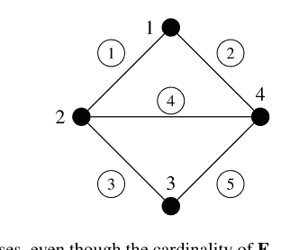

**例5.1** 让我们考虑图5.3所示的无向图。有四个顶点$\mathbf{V} = \{1, 2, 3, 4\}$和五条边$\mathbf{E} = \{(1, 2), (1, 4), (2, 3), (2, 4), (3, 4)\}$。如果我们考虑双向边，那么可以得到

$\mathbf{E}_+ = \{(1, 2), (1, 4), (2, 3), (2, 4), (3, 4)\}$,
$\mathbf{E}_- = \{(2, 1), (4, 1), (3, 2), (4, 2), (4, 3)\}$,

以及

$H_+ = \begin{bmatrix} -1 & +1 & 0 & 0 \\ -1 & 0 & 0 & +1 \\ 0 & -1 & +1 & 0 \\ 0 & -1 & 0 & +1 \\ 0 & 0 & -1 & +1 \end{bmatrix}$, $H_- = \begin{bmatrix} +1 & -1 & 0 & 0 \\ +1 & 0 & 0 & -1 \\ 0 & +1 & -1 & 0 \\ 0 & +1 & 0 & -1 \\ 0 & 0 & +1 & -1 \end{bmatrix}$.

对于一个编队系统，边集$\mathbf{E}$可以由一组约束来定义。例如，如果两个顶点需要保持指定的距离，那么这两个顶点之间的距离约束就充当一条边。因此，约束意味着智能体共同协作完成的一项任务或目标。给定一组约束$\mathbf{C}$。例如，在图5.3中，智能体1和2受到一个共同任务①的约束，这可能是它们之间的距离。所以，对于图5.3，我们有$\mathbf{C} = \{(1, 2), (1, 4), (2, 3), (3, 4), (2, 4)\}$。那么，一个编队图可以是一组顶点$\mathbf{V}$和一组约束$\mathbf{C}$的组合，一个框架可以写为$f_p = (\mathbf{V}, \mathbf{C}, p)$。让我们考虑两个框架$f_p = (\mathbf{V}, \mathbf{C}, p)$和$f_q = (\mathbf{V}, \mathbf{C}, q)$，它们具有相同的约束集$\mathbf{C}$但不同的实现$p$和$q$。对于框架$f_p$，令受约束$c_i \in \mathbf{C}$约束的智能体记为$\mathbf{v}_i$，$\mathbf{v}_i$的实现点记为$p(\mathbf{v}_i)$。注意，对于框架$f_q$，受$c_i$约束的智能体同样是$\mathbf{v}_i$；但$\mathbf{v}_i$的实现点不同，记为$q(\mathbf{v}_i)$。那么，如果对于所有$c_i \in \mathbf{C}$，都有mag[$c_i(p(\mathbf{v}_i))$] = mag[$c_i(q(\mathbf{v}_i))$]，则称这两个框架是*等价的*，其中$c_i(p(\mathbf{v}_i))$是点$p(\mathbf{v}_i)$的约束，$c_i(q(\mathbf{v}_i))$是点$q(\mathbf{v}_i)$的约束，mag[$c_i$]是约束$c_i$的量值。约束的量值可以是对应边的长度（即距离）、方向或任何属性。由于在图5.3中，边被视为约束，如果我们选择约束索引为$i = 1$，那么它就是边①。在这种情况下，我们有$\mathbf{v}_1 = \{1, 2\}$，mag[$c_1(p(\mathbf{v}_1))$]是边①的长度或方向。

接下来，为了在完全图上考虑形容词*等价*的概念，给定一组具有实现$p$的顶点$\mathbf{V}$，我们构造另一组约束$\overline{\mathbf{C}}$，它覆盖了智能体之间所有可能的约束。所以，对于图5.3的情况，我们可以有$\overline{\mathbf{C}} = \mathbf{C} \cup \{(1, 3)\}$，这是一个完全图。那么，如果对于所有$c_i \in \overline{\mathbf{C}}$，都有mag[$c_i(p(\mathbf{v}_i))$] = mag[$c_i(q(\mathbf{v}_i))$]，我们称它们（两个框架）彼此*全等*。有了这些概念，我们可以提出以下概念：

**定义5.1** 一个框架$f_p$在给定的欧几里得空间$\mathbb{R}^{dn}$（即$\mathbb{R}^d$中的$n$个智能体）中被称为*刚性的*，如果存在$p$的一个邻域$\mathbf{U}_p$，使得每个与$f_p$等价的框架$f_q$（$q \in \mathbf{U}_p$）也与$f_p$全等。此外，一个框架$f_p$在给定的欧几里得空间中被称为*全局刚性的*，如果每个与$f_p$等价的框架$f_q$（$q \in \mathbb{R}^{dn}$）在整个定义域内都与$f_p$全等。

需要指出的是，刚性的概念也可以用另一种方式定义[3]。考虑一个无向图$G = (\mathbf{V}, \mathbf{E)$，为简单起见，边集$\mathbf{E}$被认为表示距离约束。注意，在没有符号混淆的情况下，当我们讨论图刚性时，底层的图是无向的，简记为$G$。将两个节点$p_i$和$p_j$之间的位移记为$z_{ij} = p_j - p_i$，它们之间的距离记为$d_{ij}$，我们用$z_k$表示$\{z_{ij}, \forall(i, j) \in \mathbf{E}\}$中的第$k$个向量。那么，$z$是堆叠向量$z = [z_1^\top, z_2^\top, \dots, z_m^\top]^\top$。让我们以某种方式（例如，按边索引递增顺序）对边按其长度排序，并定义$h_G : \mathbb{R}^{dn} \to \mathbb{R}^m$为

$$h_G(p) = [\|p_j - p_i\|^2]_{(i,j) \in \mathbf{E}} = [\|z_k\|^2]_{k \in \{1,2,\dots,m\}}. \tag{5.1}$$

我们现在构造一个新的边集$\mathbf{E}_K$，它是$\mathbf{E}$与在所有未连接顶点对之间添加的新边集的并集。因此，图$G = (\mathbf{V}, \mathbf{E}_K)$是一个完全图，记为$G_K$。注意，一个具有$n$个顶点的完全图也记为$K(n)$。然后，我们相应地定义$h_{G_K}(p)$。现在，我们可以得到关于刚性和柔性的概念如下：

**定义5.2** (*刚性与柔性* [3]) 考虑一个框架$f_p = (G, p)$。那么它在$\mathbb{R}^d$中被称为*刚性的*，如果存在$p$的一个邻域$\mathbf{U}_p$，使得

$$h_{G_K}^{-1}(h_{G_K}(p)) \cap \mathbf{U}_p = h_G^{-1}(h_G(p)) \cap \mathbf{U}_p, \tag{5.2}$$

其中 $h_G^{-1}$ 是函数 $h_G$ 的逆像。若存在一条连续路径 $x : [0, 1] \to \mathbb{R}^{dn}$，使得 $x(0) = p$ 且对所有 $t \in (0, 1]$ 都有 $x(t) \in h_G^{-1}(h_G(p)) \setminus h_{G_K}^{-1}(h_{G_K}(p))$，则该框架在 $\mathbb{R}^d$ 中是*灵活*的。<sup>1</sup>

在接下来的小节中，我们将具体研究在距离、方位向量（边的方向）和角度约束下的刚性概念。根据约束类型，我们将重新定义等价和全等的不同概念。

### 5.2.1 距离刚性

给定一个图 $G = (V, E)$，令边集 $E$ 表示两个顶点之间的距离约束。那么，顶点可以嵌入到一般 $d$ 维空间 $\mathbb{R}^d$ 中的任意点。在这些任意点中，我们选取两个实现 $p$ 和 $q$。那么，为了评估距离刚性，我们可以采用*等价*和*全等*的概念。

**定义 5.3**（*距离等价与距离全等*）两个具有不同实现 $p$ 和 $q$ 的框架 $(G, p)$ 和 $(G, q)$，如果对所有边 $(i, j) \in E$ 都有 $\|p_i - p_j\| = \|q_i - q_j\|$，则称为*距离等价*。如果对所有可能的顶点对都有 $\|p_i - p_j\| = \|q_i - q_j\|$，则这两个框架称为*距离全等*。

**定义 5.4**（*距离刚性*）如果存在 $p$ 的一个邻域 $U_p$，使得每个满足 $q \in U_p$ 且与 $(G, p)$ 距离等价的框架 $(G, q)$ 也与 $(G, p)$ 距离全等，则称框架 $(G, p)$ 在 $\mathbb{R}^d$ 中是*距离刚性*的。

定义 5.4 仅适用于在等价意义上彼此足够接近的框架。然而，可能存在全等的框架，即使它们在等价意义上并不足够接近。以下定义提供了全局距离刚性的概念：

**定义 5.5**（*全局距离刚性*）如果每个与 $(G, p)$ 等价的框架 $(G, q)$ 在 $\mathbb{R}^d$ 中也与 $(G, p)$ 全等，则称框架 $(G, p)$ 在 $\mathbb{R}^d$ 中是*全局距离刚性*的。

**示例 5.2** 考虑图 5.3 中的四个智能体。设我们有一个任意实现 $p_1 = [1, 1]^\top$，$p_2 = [0, 0]^\top$，$p_3 = [2, -1]^\top$，$p_4 = [3, 0]^\top$。再设另一个任意实现 $q_1 = [2, 1]^\top$，$q_2 = [1, 0]^\top$，$q_3 = [3, -1]^\top$，$q_4 = [4, 0]^\top$。这两个框架既是等价的也是全等的。因此，该图可以称为距离刚性。然而，我们可以有不同的实现 $q_1 = [2, 1]^\top$，$q_2 = [1, 0]^\top$，$q_3 = [3, 1]^\top$，$q_4 = [4, 0]^\top$，它仍然与 $f_p$ 等价；但是，由于

$\|p_1 - p_3\| = \sqrt{5} \neq \|q_1 - q_3\| = 1, \quad (5.3)$

这两个框架不是距离全等的。因此，图 5.3 所描绘的图不是全局距离刚性的。$\square$

迄今为止给出的距离刚性和全局距离刚性的定义仅通过使用 $\mathbb{R}^d$ 中的代数实现概念来验证。因此，它是一种代数概念，这意味着这些概念不能从拓扑学角度来回顾。对于拓扑定义，我们可能需要引入*无穷小刚性*的概念。给定一个图 $G$，其距离约束集为 $\mathbf{E}$。对于一个受距离约束的图 $G$，不改变节点间等价条件的节点瞬时速度称为*无穷小运动*。在受距离约束的编队中，如果无穷小运动仅包括平移和旋转运动，则也称为*平凡运动*。保持节点间全等条件的节点运动称为*特殊欧几里得运动*。例如，在二维空间中，所有节点可以沿 $x$ 轴平行移动，或沿 $y$ 轴平行移动。那么，只要它们作为一个整体一起移动而不破坏全等条件，节点间的距离约束就不会改变。因此，所有平凡运动也是特殊欧几里得运动。此外，它们可以围绕一个参考中心以相同的角度一起旋转。那么，它们的距离约束仍然不会改变。如果在保持距离的条件下，平移和旋转运动不破坏全等条件，则该框架称为*无穷小距离刚性*。

**定义 5.6**（*无穷小距离刚性*）给定一个框架 $f_p = (G, p)$，如果所有可能的无穷小运动都是特殊欧几里得运动，则该框架称为*无穷小距离刚性*。

然而，如果某个无穷小运动破坏了节点间的全等关系，则该框架不能称为无穷小距离刚性。它被称为*无穷小距离灵活*。在图 5.4 中，框架 (a) 是距离刚性的，因为任何无穷小运动都不会破坏三角形的构型。然而，框架 (b) 是距离灵活的，因为节点 4 可以在保持距离约束的同时绕节点 3 旋转。由于我们需要检查所有可能的等价实现 $q$，因此无法通过数值方法检查框架 $f_p = (G, p)$ 的距离刚性属性。然而，众所周知，无穷小刚性可以通过秩条件轻松检查。给定一个实现 $p$，我们定义一个边函数 $g_G(p) : \mathbb{R}^{dn} \to \mathbb{R}^m$ 为

$g_G(p) = \frac{1}{2} \left[ \|p_i - p_j\|^2 \right]_{(i,j) \in \mathbf{E}_+} \quad (5.4)$

并定义一个距离刚性矩阵为 $R_p \triangleq \frac{\partial g_G}{\partial p}(p) \in \mathbb{R}^{m \times dn}$。刚性矩阵的行向量分量表示图的边，而列向量分量表示相应边的位移（例如，参见 $K(4)$ 图的 (5.32)）。

**引理 5.1** *框架 $f_p = (G, p)$ 在 $\mathbb{R}^d$ 中被称为无穷小距离刚性，当且仅当满足以下秩条件：*

$$\text{rank}(R_p) = \begin{cases} dn - \frac{d(d+1)}{2}, & \text{if } n \geq d, \\ \frac{n(n-1)}{2}, & \text{otherwise}. \end{cases}$$

上述引理为检查图 $G$ 的无穷小刚性提供了一个直接条件；但它需要一个实现 $p$。因此，它仍然是一个代数条件。(5.5) 的秩条件可以解释如下：由 $g_G(p)$，我们有 $\dot{g}_G(p(t)) = \frac{\partial g_G}{\partial p}(p)\frac{dp}{dt} = \frac{\partial g_G}{\partial p}(p)\dot{p}(t)$，当将其等式化为 $\frac{\partial g_G}{\partial p}(p)\dot{p}(t) = 0$ 时，这引出了无穷小运动的含义。即使 $\dot{p}(t) \neq 0$，如果 $g_G(p)$ 在 $g_G(p(t_1)) = g_G(p(t_2))$ 对所有 $t_1 \neq t_2$ 成立的意义上是常数，那么这样的 $\dot{p}(t)$ 可以被视为无穷小运动。在二维空间中，只有平移和旋转运动使 $\dot{g}_G(p(t)) = 0$，这意味着无穷小运动由 $\frac{\partial g_G}{\partial p}(p)$ 的零空间组成。因此，在二维空间中，有两个沿两个独立轴的独立平移和一个旋转。所以，有三个平凡运动。在 (5.5) 的右侧，项 $\frac{d(d+1)}{2}$ 表示平凡运动的数量。由于在二维空间中 $d = 2$，我们有 $\frac{d(d+1)}{2} = 3$。每个节点由刚体运动控制，因此一个节点有 $d$ 个独立运动。因此，在 $n$ 个智能体的组中，总共可能有 $dn$ 个运动。但是，如果我们从 $dn$ 中减去 $\frac{d(d+1)}{2}$ 个平凡运动，我们就可以得到 (5.5) 的右侧。当 $n < d$ 时，例如在三维空间中，令 $n = 2$。那么，我们有 $\text{rank}(R_p) = 1$，这意味着只需要一个约束来保持编队的构型。*无穷小距离刚性*和*距离刚性*的概念可以在某些特殊情况下合并。为此，我们需要以下概念：

<sup>1</sup> 刚性和灵活性的代数概念借鉴自 [3]；明确指出 $x(0) \neq x(t)$ 或对所有 $t \in (0, 1)$ 有 $h_G^{-1}(h_G(p)) \setminus h_{G_K}^{-1}(h_{G_K}(p)) \neq \emptyset$ 将是安全的。

**定义 5.7**（*正则点* [3]）给定一个具有实现 $p$ 的框架 $f_p$，如果实现 $p$ 满足 $\text{rank}(R_p) = k$，则称其为*正则*的，其中

$$k = \max_{p \in \mathbb{R}^{dn}} \text{rank}(R_p). \tag{5.6}$$

可以说，一个框架 $f_p$ 是距离刚性的，当且仅当它具有平凡运动。这可以解释为：由于只有无穷小运动能使 $\dot{g}_G(p(t)) = 0$ 对所有 $t \ge 0$ 成立，其他运动产生的点将满足条件 $g_{G_K}^{-1}(g_{G_K}(p)) \cap \mathbf{U}_p = g_G^{-1}(g_G(p)) \cap \mathbf{U}_p$。因此，根据定义 5.2，无穷小距离刚性蕴含距离刚性。然而，如果点 $p$ 是正则的，那么我们有 $\text{rank}(R_p) = k$，这是 (5.5) 的右边。因此，根据引理 5.1，反向也被证明为真，即：

**引理 5.2** ([4]) *一个框架 $f_p = (G, p)$ 是无穷小距离刚性的，当且仅当它是距离刚性的且 $p$ 是 $\mathbb{R}^d$ 中的一个正则点。*

因此，当所有实现都被假定为正则时，无穷小距离刚性（可以通过秩条件轻松检查）等价于距离刚性。为了对刚性进行拓扑评估，我们引入框架的*一般*属性。对于一般实现有两个不同的概念。

**定义 5.8**（*一般实现*）

- 如果一个框架 $f_p$ 的所有框架 $f_q$（其中实现 $q$ 在 $p$ 的邻域 $\mathbf{U}_p$ 中，即 $q \in \mathbf{U}_p$）都是距离刚性的，或者所有框架都不是距离刚性的，则称该框架 $f_p$ 是一般的 [8]。$^2$
- 给定一个实现 $p$，如果 $p$ 的元素在整数上是代数独立的，$^3$ 则 $p$ 是一般的。因此，如果一个框架 $f_p$ 对于一个一般实现是距离刚性的，那么对于任何一般实现 $q \in \mathbb{R}^{dn}$，所有框架 $f_q$ 都是距离刚性的 [7]。

利用上述一般实现的概念，如果一个具有特殊一般实现 $p$ 的框架是距离刚性的，那么只要实现被假定为一般，所有其他具有相同拓扑的框架也将是距离刚性的。这种距离刚性被称为*一般距离刚性*。最后，假设所有实现都是正则和一般的，⁴ 我们可以做出以下统一陈述：

**定理 5.1** *对于一个图 $G = (\mathbf{V}, \mathbf{E})$，让我们只考虑正则和一般实现。那么，距离刚性、无穷小距离刚性和一般距离刚性是等价的。*

**证明** 根据引理 5.2，如果所有实现都是正则的，那么可以证明无穷小距离刚性在 $p$ 的邻域（记为 $\mathbf{U}_p^1$）内等价于距离刚性。如果一个框架是一般的，那么根据定义 5.8，在 $p$ 的邻域（记为 $\mathbf{U}_p^2$）内，一般距离刚性也等价于距离刚性。因此，由于 $\mathbf{U}_p^1$ 和 $\mathbf{U}_p^2$ 之间存在交集，即 $\mathbf{U}_p^1 \cap \mathbf{U}_p^2 = \mathbf{U}_p^3$，这三个概念在 $\mathbf{U}_p^3$ 内变得等价。$\square$

上述定理意味着距离刚性属性可以通过给定图的拓扑来评估，而不是使用框架。当刚性通过拓扑评估时，我们就可以只考虑图，而不是框架。给定一个图，要具有距离刚性属性，我们可以直观地想象边应该分布良好，并且任何子图也需要是距离刚性的。这些直觉最初在 [16] 中分析如下：

**定理 5.2**（拉曼定理）[9,16] *给定一个在二维空间中具有 $2n - 3$ 条边的图 $G = (\mathbf{V}, \mathbf{E})$，它是距离刚性的，当且仅当不存在子图 $G' = (\mathbf{V}', \mathbf{E}')$（其中 $\mathbf{V}' \subseteq \mathbf{V}$ 且 $\mathbf{E}' \subseteq \mathbf{E}$）拥有超过 $2n' - 3$ 条边，这里 $n' = |\mathbf{V}'|$。*

拉曼定理意味着 $G = (\mathbf{V}, \mathbf{E})$ 的边是独立的⁵，当且仅当没有子图拥有超过 $2n' - 3$ 条边 [9]。因此，拉曼定理是一种完全拓扑的方法来检查二维空间中的距离刚性。然而，拉曼定理在高维空间中是不充分的 [9]，并且它不是针对全局距离刚性的，它只针对局部距离刚性。此外，由于图 $G = (\mathbf{V}, \mathbf{E})$ 只有 $2n - 3$ 条边，它被称为最小距离刚性。已知任何最小距离刚性图都可以通过 Henneberg 构造生成。

图 5.5 Henneberg 构造：0-扩展。这是一个顶点添加，带有两条新边

图 5.6 Henneberg 构造：1-扩展。这是移除一条边 (u, w) 并添加一个新顶点 x，带有新边 (x, u), (x, w) 和 (x, z)，其中 z ≠ u 且 z ≠ w

**定理 5.3**（Henneberg 构造）[10] *任何图 G = (V, E) 都是最小距离刚性的，当且仅当它是由 K(2) 通过一系列 0-扩展或 1-扩展（见图 5.5 或图 5.6）生成的。*

建议参考 [2] 以获取更详细的 Henneberg 构造和全局距离刚性。

**示例 5.3** 让我们考虑图 5.3 中所示的图。要检查距离刚性，我们可以使用定理 5.2 或定理 5.3。该图有四个顶点；因此，要成为最小距离刚性的，我们需要只有 2n − 3 = 5 条边。由于它有五条边，它满足初始要求。有四个具有 3 个顶点的子图。它们是 V'₁ = {1, 2, 3}; V'₂ = {1, 2, 4}; V'₃ = {1, 3, 4}; V'₄ = {2, 3, 4}。所有这些子图都没有超过 2n' − 3 = 3 条边。因此，根据拉曼定理，我们可以得出结论，该图是距离刚性的。然而，这种方法需要检查所有可能的子图。让我们使用 Henneberg 构造，从具有顶点 1 和 2 的 K(2) 图开始。然后，通过 0-扩展，可以依次添加顶点 4 和顶点 3。因此，它是一个距离刚性图。□

### 5.2.2 方位刚性

在方位刚性理论中，方位向量充当编队系统的约束。方位向量指定了智能体之间边的方向。通过指定边的方向，我们可以获得编队的唯一构型。由于使用单位方位向量来指定编队，除了距离刚性理论中的平凡平移运动外，还存在一种称为*缩放运动*的平凡运动。让我们将单位方位向量表示为（见图 5.7）

$$g_{ij} = \frac{z_{ij}}{d_{ij}} = \frac{p_j - p_i}{\|p_j - p_i\|}. \tag{5.7}$$

图 5.7 方位向量 $g_{ij}$，给定两个位置 $p_i$ 和 $p_j$

让我们为向量 $x \in \mathbb{R}^d$ 定义一个正交投影算子

$$P_x = I_d - \frac{xx^\top}{\|x\|^2}. \tag{5.8}$$

那么，我们可以看到 $g_{ij}$ 的正交投影算子为 $P_{g_{ij}} = I_d - g_{ij}g_{ij}^\top$。可以很容易地看出矩阵 $P_{g_{ij}}$ 具有以下五个性质：

- 对称性：$P_{g_{ij}} = P_{g_{ij}}^\top$。
- 幂等性：$P_{g_{ij}} = P_{g_{ij}}^2$。
- 半正定性：$P_{g_{ij}} \succeq 0$。
- $P_{g_{ij}}g_{ij} = 0$，这意味着 $\ker(P_{g_{ij}}) = \text{span}(g_{ij})$。
- $P_{g_{ij}}$ 有一个单一的零特征值，其余所有特征值都等于 1。

正如我们使用 $z_k$ 表示 $\{z_{ij}, \forall(i, j) \in \mathbf{E}\}$ 的第 $k$ 个向量一样，我们也使用 $g_k$ 表示 $\{g_{ij}\}$ 的第 $k$ 个分量。让我们定义一个边方位函数 $g_G(p) : \mathbb{R}^{dn} \to \mathbb{R}^{dm}$ 为

$$g_G(p) = [g_k]_{k \in \{1, 2, \dots, m\}}. \tag{5.9}$$

那么，方位刚性矩阵定义为 $R_z \triangleq \frac{\partial g_G}{\partial p}(p) \in \mathbb{R}^{dm \times dn}$。方位刚性矩阵可以分解为 [26]

---
**脚注：**
$^2$ 给定一个框架，可能有四种不同的表征：刚性且一般刚性、刚性但非一般刚性、一般刚性但非刚性，以及既非刚性也非一般刚性（见 [8] 的图 1.3）。
$^3$ 如果 $p$ 的元素可以写成一个具有整数系数的多项式 $h(p_1, p_2, \dots, p_n)$，使得 $h(p_1, p_2, \dots, p_n) = 0$，则称其为代数相关的。否则，它在整数上是代数独立的 [7, 9]。
$^4$ 在现有文献中，形容词*正则*和*一般*的概念是区分开的。正则实现是实现 $p$ 的一个属性，而一般实现是开邻域的一个属性。然而，由于它们是为了从拓扑角度处理刚性而引入的，它们可能相互蕴含。为了遵循文献的现有概念，我们在本书中分别考虑这两个概念。
$^5$ 一组边是独立的，如果在一般实现中，刚性矩阵中的行是线性独立的 [9]。

### 5.2.3 弱刚性（角度刚性）

在前面的小节中，我们分别介绍了两种图刚性理论：一种约束边长（距离），另一种约束边的方向（方位向量）。在本小节中，我们将这些约束与两条相邻边之间的角度约束结合起来。通过结合不同类型的约束（距离、方位向量或角度约束）发展起来的刚性理论被称为*弱刚性*理论[14]。如果仅使用纯角度作为约束，则可称为*角度刚性*[6,11]。

与距离和方位刚性理论中的做法类似，使用智能体的索引来表示角度约束是很方便的。假设在两条边（位移向量）$z_{ki} = p_i - p_k$ 和 $z_{kj} = p_j - p_k$ 之间存在一个角度约束。那么，如图5.8所示，我们将此角度约束写为一个有序三元组 $(k, i, j)$。

三元组 $(k, i, j)$ 应理解为两个向量 $z_{ki}$ 和 $z_{kj}$ 之间的标量角度（记为 $\theta_{ij}^k$），不考虑方向和符号。那么，角度约束的集合可以定义为[13]

$$\mathbf{A} = \{(k, i, j) : \theta_{ij}^k \in [0, \pi], i, j, k \in \mathbf{V}\}. \quad (5.16)$$

令距离或方位约束用边符号 $\mathbf{E}$ 表示，如前面小节所示。令 $|\mathbf{A}| = w$ 且 $|\mathbf{E}| = m$。$\theta_{ij}^k$ 的余弦值记为 $a_{kij}$，即 $a_{kij} = \cos(\theta_{ij}^k)$。第 $h$ 个角度约束有时表示为 $a_h$，其中 $h \in \{1, 2, \dots, w\}$，第 $g$ 个边约束也表示为 $z_g$，其中 $g \in \{1, 2, \dots, m\}$。给定一个顶点集 $\mathbf{V}$，以及边约束集 $\mathbf{E}$ 和角度约束集 $\mathbf{A}$。那么，一个编队图可以写为 $G = (\mathbf{V}, \mathbf{E}, \mathbf{A})$。给定一个实现 $p$，一个框架可以是一个四元组 $f_p = (G, p) = (\mathbf{V}, \mathbf{E}, \mathbf{A}, p)$。现在，为了清晰地阐述弱刚性理论，我们需要以下概念。但为简单起见，我们将边约束仅限于距离。

**定义 5.13** *（弱等价与弱全等）* 两个具有不同实现 $p$ 和 $q$ 的框架 $f_p = (G, p)$ 和 $f_q = (G, q)$ 被称为*弱等价*，如果

- $\|p_i - p_j\| = \|q_i - q_j\|$，$\forall(i, j) \in \mathbf{E}$，且
- $\cos(\theta_{ij}^k) \in f_p = \cos(\theta_{ij}^k) \in f_q$，$\forall(k, i, j) \in \mathbf{A}$，

其中 $\cos(\theta_{ij}^k) \in f_p$ 表示 $\cos(\theta_{ij}^k)$ 是在框架 $f_p$ 中确定的，而 $\cos(\theta_{ij}^k) \in f_q$ 是在框架 $f_q$ 中确定的。如果对于所有可能的顶点对，都有 $\|p_i - p_j\| = \|q_i - q_j\|$，则两个框架被称为*弱全等*。

弱全等的原理与定义5.3中定义的距离全等相同。然而，在弱刚性理论中，我们假设 $\mathbf{A} \neq \emptyset$，并且也假设 $\mathbf{E} \neq \emptyset$。如果 $\mathbf{A} = \emptyset$，那么弱等价和弱全等与定义5.3中的定义相同。

现在，根据上述定义，我们能够阐述弱刚性的含义。

例5.4 让我们考虑图5.4所示的三角形编队。令 $g_1 \triangleq g_{12}, g_2 \triangleq g_{21}, g_3 \triangleq g_{23}, g_4 \triangleq g_{32}, g_5 \triangleq g_{13}, g_6 \triangleq g_{31}$。为简单起见，令 $P_{g_k} \triangleq \frac{P_{g_k}}{\|z_k\|}$。那么，我们可以得到方位刚性矩阵为

$$R_z = \begin{bmatrix} P_{g_1} & 0 & 0 & 0 & 0 & 0 \\ 0 & P_{g_2} & 0 & 0 & 0 & 0 \\ 0 & 0 & P_{g_3} & 0 & 0 & 0 \\ 0 & 0 & 0 & P_{g_4} & 0 & 0 \\ 0 & 0 & 0 & 0 & P_{g_5} & 0 \\ 0 & 0 & 0 & 0 & 0 & P_{g_6} \end{bmatrix} \begin{bmatrix} -I_2 & I_2 & 0 \\ I_2 & -I_2 & 0 \\ 0 & -I_2 & I_2 \\ 0 & I_2 & -I_2 \\ -I_2 & 0 & I_2 \\ I_2 & 0 & -I_2 \end{bmatrix} = \begin{bmatrix} -P_{g_1} & P_{g_1} & 0 \\ P_{g_2} & -P_{g_2} & 0 \\ 0 & -P_{g_3} & P_{g_3} \\ 0 & P_{g_4} & -P_{g_4} \\ -P_{g_5} & 0 & P_{g_5} \\ P_{g_6} & 0 & -P_{g_6} \end{bmatrix} \in \mathbb{R}^{12 \times 6}.$$

接下来，类似于距离刚性，为了探究方位刚性，我们需要以下概念[26]：

**定义 5.9** *（方位等价与方位全等）* 两个具有不同实现 $p$ 和 $q$ 的框架 $(G, p)$ 和 $(G, q)$ 被称为*方位等价*，如果对于所有边 $(i, j) \in \mathbf{E}$，都有 $P_{p_i - p_j}(q_i - q_j) = 0$。如果对于所有可能的顶点对，都有 $P_{p_i - p_j}(q_i - q_j) = 0$，则这两个框架被称为*方位全等*。

**定义 5.10** *（方位刚性）* 一个框架 $(G, p)$ 在 $\mathbb{R}^d$ 中被称为*方位刚性*，如果存在 $p$ 的一个邻域 $\mathbf{U}_p$，使得每个框架 $(G, q)$，其中 $q$ 保持在邻域 $\mathbf{U}_p$ 内，即 $q \in \mathbf{U}_p$，并且与 $(G, p)$ 方位等价，也与 $(G, p)$ 方位全等。

**定义 5.11** *（全局方位刚性）* 一个框架 $(G, p)$ 在 $\mathbb{R}^d$ 中被称为*全局方位刚性*，如果每个与 $(G, p)$ 方位等价的框架 $(G, q)$ 在 $\mathbb{R}^d$ 中也与 $(G, p)$ 方位全等。

为了评估基于方位的编队系统中的无穷小运动，边方位函数被表示为 $z$ 的函数 $g_G(z)$。现在，我们使用关系式 $\dot{g}_G(z(t)) = \frac{\partial g_G}{\partial z}(z(t)) \frac{dz}{dp} \dot{p}(t)$，这引出了无穷小运动的含义。通过令 $\frac{\partial g_G}{\partial z}(z(t)) \frac{dz}{dp} \dot{p}(t)$ 等于零，我们得到

$$\frac{\partial g_G}{\partial z}(z(t)) \frac{\partial z}{\partial p} \dot{p}(t) = \text{diag}\left(\frac{P_{g_1}}{\|z_1\|}, \frac{P_{g_2}}{\|z_2\|}, \dots, \frac{P_{g_m}}{\|z_m\|}\right) \tilde{H} \dot{p}(t) = 0. \quad (5.11)$$

因此，使得上述等式成立的非零运动 $\dot{p}(t) \neq 0$ 可以称为方位刚性理论中的*无穷小运动*。由于 $\bar{H} = H \otimes I_d$ 是一个带有边方向的关联矩阵（如果是无向图，$H$ 可以选择 $H_+$ 或 $H_-$），很明显 $\text{span}(\mathbf{1}_n \otimes I_d) \in \text{ker}(\bar{H})$。此外，当用 $p$ 替换 $\dot{p}(t)$ 时，我们有

$$\text{diag}\left(\frac{P_{g_1}}{\|z_1\|}, \frac{P_{g_2}}{\|z_2\|}, \dots, \frac{P_{g_m}}{\|z_m\|}\right) \bar{H} p = \text{diag}\left(\frac{P_{g_1}}{\|z_1\|}, \frac{P_{g_2}}{\|z_2\|}, \dots, \frac{P_{g_m}}{\|z_m\|}\right) z, \quad (5.12)$$

其中 $z = [z_1^\top, z_2^\top, \dots, z_m^\top]^\top$。因此，由于 $P_{g_k}$ 的性质，我们也有

$$\text{diag}\left(\frac{P_{g_1}}{\|z_1\|}, \frac{P_{g_2}}{\|z_2\|}, \dots, \frac{P_{g_m}}{\|z_m\|}\right) z = 0. \quad (5.13)$$

因此，我们可以得出结论

$$\text{span}(\mathbf{1}_n \otimes I_d, p) \in \text{ker}(R_z), \quad (5.14)$$

这进一步意味着 $\text{rank}(R_z) \leq dn - d - 1$ [26]。可以观察到，在 $\text{span}(\mathbf{1} \otimes I_d, p)$ 中，项 $\mathbf{1} \otimes I_d$ 对应于平移运动，而项 $p$ 对应于缩放运动。因此，我们可以看到方位刚性理论中的无穷小运动是平移和缩放，通过这些运动，(5.9) 中方位函数的值不会改变。

从上面的讨论中，我们可以看到任何具有相同边方位约束的图都具有相同的无穷小运动。所以，给定一个框架，即使它是从完全图得到的，方位刚性矩阵的秩也有一个上界 $\text{rank}(R_z) \leq dn - d - 1$。由于除了平移和缩放之外没有其他平凡运动，我们可以看到 $R_z$ 的最大秩将是 $dn - d - 1$。因此，类似于引理5.1，我们可以得出以下结果：

**引理 5.3** *一个框架 $f_p = (G, p)$ 在 $\mathbb{R}^d$ 中是无穷小方位刚性的，当且仅当满足以下秩条件：*

$$\text{rank}(R_z) = dn - d - 1. \quad (5.15)$$

**例5.5** 考虑例5.4中具有实现 $p_1 = [0, 1]^\top$, $p_2 = [-1, 0]^\top$, $p_3 = [1, 0]^\top$ 的方位刚性矩阵。那么，方位刚性矩阵 $R_z$ 计算为

$$\begin{bmatrix} -0.3536 & 0.3536 & 0.3536 & -0.3536 & 0 & 0 \\ 0.3536 & -0.3536 & -0.3536 & 0.3536 & 0 & 0 \\ 0.3536 & -0.3536 & -0.3536 & 0.3536 & 0 & 0 \\ -0.3536 & 0.3536 & 0.3536 & -0.3536 & 0 & 0 \\ 0 & 0 & 0 & 0 & 0 & 0 \\ 0 & 0 & 0 & -0.5000 & 0 & 0.5000 \\ 0 & 0 & 0 & 0 & 0 & 0 \\ 0 & 0 & 0 & 0.5000 & 0 & -0.5000 \\ -0.3536 & -0.3536 & 0 & 0 & 0.3536 & 0.3536 \\ -0.3536 & -0.3536 & 0 & 0 & 0.3536 & 0.3536 \\ 0.3536 & 0.3536 & 0 & 0 & -0.3536 & -0.3536 \\ 0.3536 & 0.3536 & 0 & 0 & -0.3536 & -0.3536 \end{bmatrix}$$

其秩为 rank($R_z$) = 3。注意我们也有 $dn - d - 1 = 2 \times 3 - 2 - 1 = 3$。

引理5.3提供了一个检查框架无穷小方位刚性的条件。然而，由于它需要检查秩条件，这是一种代数性质，因此它不是一个拓扑条件。为了从拓扑角度检查刚性，我们使用一个类似于定义5.8的通用性质：

**定义 5.12** *（通用方位刚性）* 一个框架 $f_p$ 被称为是通用方位刚性的，如果几乎所有具有相同拓扑结构的实现 $q$ 的框架 $f_q$ 都是无穷小方位刚性的。

上述定义意味着，如果一个具有方位约束的图 $G = (\mathbf{V}, \mathbf{E})$ 对于特定的实现 $p$ 是无穷小方位刚性的，那么我们可以说图 $G$ 是方位刚性的。由于图 $G$ 不包含任何代数信息，它是一个纯粹的拓扑定义。通过使用一个具有特殊实现 $p$ 的无穷小方位刚性框架的秩约简条件，并证明使秩约简的集合是一个零测集，我们可以得出以下结果：

**定理 5.4** ([28]) *对于一个图 $G = (\mathbf{V}, \mathbf{E})$，如果它对于特定的 $p$ 是无穷小方位刚性的，那么该图 $G$ 对于几乎所有实现都是方位刚性的。*

有了上述定理，我们能够从拓扑角度检查方位刚性，而不是检查所有实现。

## 5.2 刚性理论

**定义 5.14**（*弱刚性*）一个框架 $(G, p)$ 在 $\mathbb{R}^d$ 中被称为*弱刚性*的，如果存在 $p$ 的一个邻域 $\mathbf{U}_p$，使得每一个框架 $(G, q)$（其中 $q$ 位于邻域 $\mathbf{U}_p$ 内，即 $q \in \mathbf{U}_p$）若与 $(G, p)$ 弱等价，则也与 $(G, p)$ 弱全等。

**定义 5.15**（*全局弱刚性*）一个框架 $(G, p)$ 在 $\mathbb{R}^d$ 中被称为*全局弱刚性*的，如果每一个与 $(G, p)$ 弱等价的框架 $(G, q)$ 在 $\mathbb{R}^d$ 中也与 $(G, p)$ 弱全等。

作为一个特例，如果 $\mathbf{E} = \emptyset$ 且 $\mathbf{A} \neq \emptyset$，那么所有约束都只是角度约束。这类情况在*角度刚性* [6,11] 的名称下进行研究。对于角度刚性理论，我们可以使用以下附加概念：

**定义 5.16**（*角度等价与比例全等* [13]）两个框架 $f_p = (G, p)$ 和 $f_q = (G, q)$，其中 $\mathbf{E} = \emptyset$ 且 $\mathbf{A} \neq \emptyset$，如果满足 $\cos(\theta_{ij}^k) \in f_p = \cos(\theta_{ij}^k) \in f_q$，$\forall(k, i, j) \in \mathbf{A}$，则被称为*角度等价*。如果对于所有可能的顶点对，满足 $\|p_i - p_j\| = c\|q_i - q_j\|$，其中 $c$ 是一个比例常数，则这两个框架被称为*比例全等*。

**定义 5.17**（*角度刚性* [5]）一个框架 $(\mathbf{V}, \mathbf{A}, p)$ 在 $\mathbb{R}^d$ 中被称为*角度刚性*的，如果存在 $p$ 的一个邻域 $\mathbf{U}_p$，使得每一个框架 $(\mathbf{V}, \mathbf{A}, q)$（其中 $q$ 位于邻域 $\mathbf{U}_p$ 内，即 $q \in \mathbf{U}_p$）若与 $(\mathbf{V}, \mathbf{A}, p)$ 角度等价，则也与 $(\mathbf{V}, \mathbf{A}, q)$ 比例全等。一个框架 $(\mathbf{V}, \mathbf{A}, p)$ 在 $\mathbb{R}^d$ 中被称为*全局角度刚性*的，如果每一个与 $(\mathbf{V}, \mathbf{A}, p)$ 角度等价的框架 $(\mathbf{V}, \mathbf{A}, q)$ 在 $\mathbb{R}^d$ 中也与 $(\mathbf{V}, \mathbf{A}, p)$ 比例全等。

请注意，框架 $f_p$ 可以是三元组 $f_p = (\mathbf{V}, \mathbf{E}, p)$ 或 $f_p = (\mathbf{V}, \mathbf{A}, p)$，也可以是四元组 $f_p = (\mathbf{V}, \mathbf{E}, \mathbf{A}, p)$，具体取决于约束条件。

到目前为止，我们已经介绍了弱（角度）刚性的概念。接下来，我们想介绍一个用于检验弱刚性（或角度刚性）的工具。正如在距离或方位刚性中所做的那样，为此目的，我们需要使用一些代数解法，即利用*无穷小弱刚性*（对于 $\mathbf{E} \neq \emptyset$ 的情况）或*无穷小角度刚性*（对于 $\mathbf{E} = \emptyset$ 的情况）的概念。类似于无穷小距离和方位刚性，我们需要获得一个弱刚性矩阵（或角度刚性矩阵）来定义无穷小运动。让我们关注距离约束和角度约束的组合。给定距离约束集（即 $\mathbf{E}$）和角度约束集（即 $\mathbf{A}$），让我们定义一个边弱函数 $g_G(p) : \mathbb{R}^{dn} \rightarrow \mathbb{R}^{m+w}$ 为

$$g_G(p) = [\tilde{d}^\top, \tilde{a}^\top]^\top \in \mathbb{R}^{m+w}, \tag{5.17}$$

其中 $\tilde{d} = [\|z_1\|^2, \|z_2\|^2, \ldots, \|z_m\|^2]^\top$ 且 $\tilde{a} = [a_1, a_2, \ldots, a_w]^\top$。那么，弱刚性矩阵被定义为 $g_G(p)$ 的雅可比矩阵：

$$R_w = \frac{\partial g_G}{\partial p}(p) = \begin{bmatrix} \frac{\partial \bar{d}}{\partial p} & \frac{\partial \bar{a}}{\partial p} \end{bmatrix} \in \mathbb{R}^{(m+w) \times dn}$$

如果 $\mathbf{E} = \emptyset$，矩阵 $R_w$ 可能被称为角度刚性矩阵 [5, 11]。

**示例 5.6** 让我们考虑如图 5.9a–c 所示的具有距离和角度约束的三角形编队。可以计算这三种情况的弱刚性矩阵。图 5.9a 的弱刚性矩阵由 $g_G(p) = [\|z_{12}\|^2, \|z_{13}\|^2, \cos(\theta_{23}^1)]^\top$ 的雅可比矩阵给出：

$$R_w^a = \begin{bmatrix} 2(p_1 - p_2)^\top & 2(p_2 - p_1)^\top & 0 \\ 2(p_1 - p_3)^\top & 0 & 2(p_3 - p_1)^\top \\ \frac{\partial}{\partial p_1} \cos(\theta_{23}^1) & \frac{\partial}{\partial p_2} \cos(\theta_{23}^1) & \frac{\partial}{\partial p_3} \cos(\theta_{23}^1) \end{bmatrix}$$

图 5.9b 的刚性矩阵由 $g_G(p) = [\|z_{12}\|^2, \cos(\theta_{23}^1), \cos(\theta_{12}^3)]^\top$ 的雅可比矩阵给出：

$$R_w^b = \begin{bmatrix} 2(p_1 - p_2)^\top & 2(p_2 - p_1)^\top & 0 \\ \frac{\partial}{\partial p_1} \cos(\theta_{23}^1) & \frac{\partial}{\partial p_2} \cos(\theta_{23}^1) & \frac{\partial}{\partial p_3} \cos(\theta_{23}^1) \\ \frac{\partial}{\partial p_1} \cos(\theta_{12}^3) & \frac{\partial}{\partial p_2} \cos(\theta_{12}^3) & \frac{\partial}{\partial p_3} \cos(\theta_{12}^3) \end{bmatrix}$$

图 5.9c 的刚性矩阵由 $g_G(p) = [\cos(\theta_{23}^1), \cos(\theta_{12}^3)]^\top$ 的雅可比矩阵给出：

$$R_w^c = \begin{bmatrix} \frac{\partial}{\partial p_1} \cos(\theta_{23}^1) & \frac{\partial}{\partial p_2} \cos(\theta_{23}^1) & \frac{\partial}{\partial p_3} \cos(\theta_{23}^1) \\ \frac{\partial}{\partial p_1} \cos(\theta_{12}^3) & \frac{\partial}{\partial p_2} \cos(\theta_{12}^3) & \frac{\partial}{\partial p_3} \cos(\theta_{12}^3) \end{bmatrix}$$

其中

$$\frac{\partial}{\partial p_k} \cos(\theta_{ij}^k) = \frac{\partial}{\partial p_k} \frac{z_{ki}^\top}{\|z_{ki}\|} \frac{z_{kj}}{\|z_{kj}\|} = \frac{z_{kj}^\top}{\|z_{kj}\|} \frac{1}{\|z_{ki}\|} \left[ I_2 - \frac{z_{ki} z_{ki}^\top}{\|z_{ki}\|^2} \right] + \frac{z_{ki}^\top}{\|z_{ki}\|} \frac{1}{\|z_{kj}\|} \left[ I_2 - \frac{z_{kj} z_{kj}^\top}{\|z_{kj}\|^2} \right]$$

$$\frac{\partial}{\partial p_i} \cos(\theta_{ij}^k) = \frac{\partial}{\partial p_i} \frac{z_{ki}^\top}{\|z_{ki}\|} \frac{z_{kj}}{\|z_{kj}\|} = -\frac{z_{kj}^\top}{\|z_{kj}\|} \frac{1}{\|z_{ki}\|} \left[ I_2 - \frac{z_{ki} z_{ki}^\top}{\|z_{ki}\|^2} \right]$$

$$\frac{\partial}{\partial p_j} \cos(\theta_{ij}^k) = \frac{\partial}{\partial p_j} \frac{z_{ki}^\top}{\|z_{ki}\|} \frac{z_{kj}}{\|z_{kj}\|} = -\frac{z_{ki}^\top}{\|z_{ki}\|} \frac{1}{\|z_{kj}\|} \left[ I_2 - \frac{z_{kj} z_{kj}^\top}{\|z_{kj}\|^2} \right]$$

为了定义无穷小运动，对 $g_G(p)$ 求导得到 $\dot{g}_G(p(t))$，我们可以得到

$$\dot{g}_G(p(t)) = \frac{\partial g_G}{\partial p}(p(t))\frac{\partial p}{\partial t} = R_w(t)\dot{p}(t). \tag{5.22}$$

因此，一个弱刚性编队系统的无穷小运动集合（记为 $\mathbf{M}_w$）可以定义为

$$\mathbf{M}_w \triangleq \{\delta p \ : \ R_w\delta p = 0, \delta p \neq 0\}. \tag{5.23}$$

集合 $\mathbf{M}_w$ 等于 $R_w$ 的零空间。为了理解三维空间（即 $d=3$）中 $R_w$ 的零空间，让我们使用以下旋转矩阵：

$$J_1 \triangleq \begin{bmatrix} 0 & 0 & 0 \\ 0 & 0 & -1 \\ 0 & 1 & 0 \end{bmatrix} ; \ J_2 \triangleq \begin{bmatrix} 0 & 0 & 1 \\ 0 & 0 & 0 \\ -1 & 0 & 0 \end{bmatrix} ; \ J_3 \triangleq \begin{bmatrix} 0 & -1 & 0 \\ 1 & 0 & 0 \\ 0 & 0 & 0 \end{bmatrix} . \tag{5.24}$$

利用 $J_1$、$J_2$ 和 $J_3$，我们进一步定义

$$\mathbf{L}_R \triangleq \{\mathbf{1}_n \otimes I_3, (I_n \otimes J_1)p, (I_n \otimes J_2)p, (I_n \otimes J_3)p\}, \tag{5.25}$$

以及

$$\mathbf{L}_S \triangleq \{\mathbf{1}_n \otimes I_3, (I_n \otimes J_1)p, (I_n \otimes J_2)p, (I_n \otimes J_3)p, p\}. \tag{5.26}$$

在上述集合中，元素 $\mathbf{1}_n \otimes I_3$ 表示沿三维空间中三个独立轴的线性平移运动；$(I_n \otimes J_1)p$、$(I_n \otimes J_2)p$ 和 $(I_n \otimes J_3)p$ 分别表示绕三个独立轴的旋转运动；而 $p$ 表示编队系统的缩放运动。因此，当 $\mathbf{E} \neq \emptyset$ 且 $\mathbf{A} \neq \emptyset$ 时，我们可以将 $\mathbf{L}_R$ 视为无穷小运动的基集合；当 $\mathbf{E} = \emptyset$ 且 $\mathbf{A} \neq \emptyset$ 时，我们可以将 $\mathbf{L}_S$ 视为无穷小运动的基集合。因此，在三维空间中，我们可以对弱刚性编队系统做出以下观察：

**引理 5.4** ([14]) *给定一个框架 $f_p = (\mathbf{V}, \mathbf{E}, \mathbf{A}, p)$，当 $\mathbf{E} \neq \emptyset$ 时，有 $\text{span}(\mathbf{L}_R) \subseteq \text{ker}(R_w)$；当 $\mathbf{E} = \emptyset$ 时，有 $\text{span}(\mathbf{L}_S) \subseteq \text{ker}(R_w)$。*

此外，上述引理立即得出结论：当 $\mathbf{E} \neq \emptyset$ 时，$\text{rank}(R_w) \leq dn - \frac{d(d+1)}{2}$；当 $\mathbf{E} = \emptyset$ 时，$\text{rank}(R_w) \leq dn - \frac{d(d+1)}{2} - 1$。在 $\mathbf{E} \neq \emptyset$ 的情况下，这与 (5.5) 相等，因为只有平移和旋转运动是平凡运动。然而，在 $\mathbf{E} = \emptyset$ 的情况下，由于不再有距离约束，可能存在缩放运动。这就是为什么 $\text{rank}(R_w)$ 有一个上界为 $dn - \frac{d(d+1)}{2} - 1$，并多一个额外的平凡运动。现在，根据无穷小运动的定义，我们可以看到，除了 $\mathbf{L}_R$ 和 $\mathbf{L}_S$ 之外，零空间没有其他运动与之对应。因此，我们能够提出以下定理：

> **定理 5.5** ([14]) *一个框架 $f_p = (\mathbf{V}, \mathbf{E}, \mathbf{A}, p)$ 在 $\mathbb{R}^d$ 中是无穷小弱刚性的，当且仅当 $\text{rank}(R_w) = dn - \frac{d(d+1)}{2}$，其中 $\mathbf{E} \neq \emptyset$。此外，一个框架 $f_p = (\mathbf{V}, \mathbf{A}, p)$ 在 $\mathbb{R}^d$ 中是无穷小角度刚性的，当且仅当 $\text{rank}(R_w) = dn - \frac{d(d+1)}{2} - 1$。*

接下来，为了进行拓扑分析，让我们研究无穷小弱刚性的一个通用性质。为了进行技术性研究，我们从 [3] 中借鉴了以下引理，这是主要分析的关键：

> **引理 5.5** *考虑一个具有实现 $p$ 的框架 $f_p$。设 (5.17) 中给出的边弱函数 $g_G(p)$ 是一个光滑映射，并且根据定义 5.7，设 $\max_{p \in \mathbb{R}^{dn}} \text{rank}(R_p) = k$。如果 $p$ 是边弱函数的一个正则点，那么存在 $p$ 的一个邻域 $\mathbf{U}_p$，使得对于 $q \in \mathbf{U}_p$ 的点，$g_G(p)$ 的像是一个 $k$ 维流形。*

上述引理意味着，如果 $p$ 是一个无穷小弱刚性框架 $f_p$ 的正则点，那么对于几乎所有的 $q \in \mathbf{U}_p$，根据定理 5.5，框架 $f_q = (\mathbf{V}, \mathbf{E}, \mathbf{A}, q)$ 也是无穷小弱刚性的。为了评估无穷小弱刚性与弱刚性之间的关系，我们提出以下引理：

> **引理 5.6** *考虑一个框架 $f_p = (\mathbf{V}, \mathbf{E}, \mathbf{A}, p)$，假设 $p$ 是 $g_G(p)$ 的一个正则点，并且 $p_1, p_2, \dots, p_n$ 的张成空间是 $\mathbb{R}^d$。那么，框架 $f_p$ 是弱刚性的，当且仅当 $\text{rank}(R_w) = dn - \frac{d(d+1)}{2}$。*

> **证明** *如果 $\text{rank}(R_w) = dn - \frac{d(d+1)}{2}$，根据引理 5.5，我们可以看到 $g_G^{-1}(g_G(p)) \cap \mathbf{U}_p$ 是 $\frac{d(d+1)}{2}$ 维的。由于 $g_{G_K}^{-1}(g_{G_K}(p)) \cap \mathbf{U}_p$ 也是 $\frac{d(d+1)}{2}$ 维的，根据定义 5.2 和 5.14，框架 $f_p$ 是弱刚性的，这完成了充分性条件的证明。设 $f_p$ 是弱刚性的。那么，$g_G^{-1}(g_G(p)) \cap \mathbf{U}_p$ 是 $\frac{d(d+1)}{2}$ 维的，并且 $\text{rank}(R_w) = dn - \frac{d(d+1)}{2}$，这完成了必要性条件的证明。*

请注意，上述引理的详细证明可以在 [13, 14] 中找到。现在，我们能够对框架进行拓扑解释。

> **定理 5.6** ([14]) *考虑 $\mathbb{R}^d$ 中的一个框架 $f_p = (\mathbf{V}, \mathbf{E}, \mathbf{A}, p)$，假设 $p_1, p_2, \dots, p_n$ 的张成空间也是 $\mathbb{R}^d$。那么，框架 $f_p$ 是无穷小弱刚性的，当且仅当 $\text{rank}(R_w) = dn - \frac{d(d+1)}{2}$。*

无穷小弱刚性，当且仅当 $p$ 是 $g_G(p)$ 的一个正则点，并且框架 $f_p$ 在 $\mathbb{R}^d$ 中是弱刚性的。

**证明** 假设 $p$ 是 $g_{G_K}(p)$ 的一个正则点，并且框架 $f_p$ 是弱刚性的。那么，根据引理 5.6，$\text{rank}(R_w)$ 达到最大值，这意味着根据定理 5.5，该框架是无穷小弱刚性的。如果框架 $f_p$ 是无穷小弱刚性的，那么根据定理 5.5，我们有 $\text{rank}(R_w) = dn - \frac{d(d+1)}{2}$。因此，$p$ 是 $g_{G_K}(p)$ 的一个正则点。那么根据引理 5.6，我们可以说框架 $f_p$ 是弱刚性的。$\square$

从上述定理可以看出，如果所有实现都限制为正则的，那么无穷小弱刚性等价于弱刚性，因为集合 $\{p : \text{span}(p_1, p_2, \dots, p_n) \not\subset \mathbb{R}^d\}$ 由于与定理 5.4 相同的原因是一个零测集。此外，通过遵循与弱刚性类似的过程，我们也可以为角度刚性提出以下结果：

**定理 5.7** ([14]) *考虑 $\mathbb{R}^d$ 中的一个框架 $f_p = (\mathbf{V}, \mathbf{A}, p)$，假设 $p_1, p_2, \dots, p_n$ 的张成空间是 $\mathbb{R}^d$。那么，框架 $f_p$ 是无穷小角度刚性的，当且仅当 $p$ 是 $g_G(p)$ 的一个正则点，并且框架 $f_p$ 在 $\mathbb{R}^d$ 中是角度刚性的。*

**示例 5.7** 考虑示例 5.6 中的弱刚性矩阵，其实现为 $p_1 = [0, 1]^\top$，$p_2 = [-1, 0]^\top$，$p_3 = [1, 0]^\top$。那么，弱刚性矩阵（即 $R_w^a$、$R_w^b$ 和 $R_w^c$）分别计算为

$$
\begin{bmatrix}
2.0000 & 2.0000 & -2.0000 & -2.0000 & 0 & 0 \\
-2.0000 & 2.0000 & 0 & 0 & 2.0000 & -2.0000 \\
0 & -1.0000 & -0.5000 & 0.5000 & 0.5000 & 0.5000
\end{bmatrix}
$$

$$
\begin{bmatrix}
2.0000 & 2.0000 & -2.0000 & -2.0000 & 0 & 0 \\
0 & -1.0000 & -0.5000 & 0.5000 & 0.5000 & 0.5000 \\
0.3536 & 0.3536 & 0 & -0.3536 & -0.3536 & 0.0000
\end{bmatrix}
$$

以及

$$
\begin{bmatrix}
0 & -1.0000 & -0.5000 & 0.5000 & 0.5000 & 0.5000 \\
0.3536 & 0.3536 & 0 & -0.3536 & -0.3536 & 0.0000
\end{bmatrix}
$$

从上述矩阵中，我们有 $\text{rank}(R_w^a) = 3$，这与 $dn - \frac{d(d+1)}{2} = 2 \times 3 - 3 = 3$ 相同，并且 $\text{rank}(R_w^b) = 3$，这也与 $dn - \frac{d(d+1)}{2} = 2 \times 3 - 3 = 3$ 相同。我们还有 $\text{rank}(R_w^c) = 2$，这与 $dn - \frac{d(d+1)}{2} - 1 = 2 \times 3 - 3 - 1 = 2$ 相同。

## 5.3 基于刚性的编队控制

基于刚性的编队控制旨在设计控制律，通过实现期望的约束来达成框架的特定构型。期望的约束可以是智能体之间的边长、边的方向或两条相邻边之间的夹角。然而，即使实现了期望的约束，如果不考虑编队的拓扑结构，也可能无法确保构型的唯一性。例如，在图 5.10a 中，三个智能体受到两个约束的限制：

- 方向向量 $g_{ki}$。
- 角度 $\theta_{ij}^k$。

那么，如图 5.10b 所示，尽管满足了约束，但构型并不唯一；它是柔性的。在方向和角度约束下，节点 $i$ 和 $j$ 的位置可以连续地放置在 $i'$ 和 $j'$，或者 $i''$ 和 $j''$。然而，如图 5.9 所示，如果我们对三个智能体有不同的约束，那么节点就不能通过平滑运动（在图 5.9c 中没有缩放运动）被放置在不同的位置。因此，为了获得唯一的编队，仅仅满足所需的约束是不够的；编队的底层拓扑结构应该是刚性的。因此，应该使用刚性理论从拓扑角度确保编队构型的唯一性。在接下来的小节中，我们介绍基于图刚性理论的分布式编队控制方案。本节的结果主要采用自 [1,5,13,15]。

请注意，在上一节（第 5.2 节）中，所有符号都没有用 $t$（时间）参数化，因为刚性理论是针对静态图拓扑的概念。然而，在本节中，由于我们考虑的是动态问题（控制问题），几乎所有符号（位置、角度、方向向量、刚性矩阵、误差、位移等）都是 $t$ 的函数。如果从符号或推导中可以清楚看出，我们将省略参数 $t$。也就是说，例如，位置 $p$ 表示 $p(t)$，刚性矩阵 $R_p$ 表示 $R_p(t)$。因此，建议将状态或符号理解为 $t$ 的函数。

### 5.3.1 基于距离的编队控制

在基于距离的编队控制中，主要的控制变量是智能体之间的距离。然而，应该指出的是，感知变量是两个智能体之间的相对位移。相对位移是在非对齐坐标系设置下智能体之间的位移。请注意，在基于一致性的编队控制中，感知和控制变量都是在对齐坐标系设置下的位移 [19]。让我们考虑一组在二维空间中移动的智能体，即 $d = 2$。我们还假设每个智能体由单积分器动力学控制：

$\dot{p}_i(t) = u_i(t)$。 (5.27)

位移向量 $z_{ij} = p_j - p_i$ 可以用关联矩阵表示为 $z = \bar{H} p$。同时，让我们将边的期望距离表示为 $d_k$，期望距离的平方表示为 $\bar{d} = [d_1^2, d_2^2, \dots, d_m^2]^\top$。智能体的期望位置表示为一个堆叠向量 $\hat{p} = [\hat{p}_1^\top, \hat{p}_2^\top, \dots, \hat{p}_n^\top]^\top$，由集合 $\hat{p} \in \{p : \|p_i - p_j\| = d_k, \forall k = 1, \dots, m\}$ 定义，并且当 $p_i = R^\Delta(\hat{p}_i + p^\Delta)$，$\forall i \in \mathbf{V}$ 时，我们说期望距离被实现了，其中 $R^\Delta$ 是一个公共旋转矩阵，$p^\Delta$ 是一个公共平移偏移。那么，边的距离平方误差可以写为 $\tilde{e}_k = \|z_k\|^2 - d_k^2$。现在使用符号 $\tilde{d} = [\|z_1\|^2, \|z_2\|^2, \dots, \|z_m\|^2]^\top$，我们写 $\tilde{e} = \tilde{d} - \bar{d}$。

为了以分布式方式生成控制输入，要求每个智能体最小化以下势函数：

$\phi(p(t)) = \frac{1}{4}\|\tilde{e}(t)\|^2 = \frac{1}{4}\|\tilde{d}(t) - \bar{d}\|^2$。 (5.28)

势函数 $\phi(p(t))$ 为零当且仅当 $\tilde{d}(t) = \bar{d}$。因此，如果一组智能体通过协作但以分布式方式在 $t \to \infty$ 时实现了 $\phi(p(t)) = 0$，那么所有期望距离都将被实现。通过实现期望距离，应该达成编队的唯一构型，这导致了使用距离刚性理论的必要性。让我们假设图的底层拓扑是刚性的。那么，通过梯度下降律 $u(t) = -\nabla \phi(p(t))$ 最小化势函数 $\phi(p(t))$，可以产生以下动力学 [1,15]：

$\dot{p}(t) = -\nabla \phi(p(t)) = -\left[\frac{\partial \phi}{\partial p}(p(t))\right] = -\bar{H}^\top \text{diag}(z_1, z_2, \dots, z_m)\tilde{e}(t) = -R_p^\top(t)\tilde{e}(t)$， (5.29)其中 $R_p(t)$ 是距离刚度矩阵。动力学方程 (5.29) 可以逐元素分解为

$$\dot{p}_i(t) = \sum_{j \in \mathbb{N}_i} \tilde{e}_{ij}(t) z_{ij}(t), \tag{5.30}$$

其中 $\mathbb{N}_i$ 是智能体 $i$ 的邻居节点集合。编队控制的目标是驱动智能体，使其达到 (5.29) 的平衡点之一，该平衡点确定为

$$\mathbf{U}_{eq} \triangleq \{p : R_p^\top \tilde{e} = 0\}. \tag{5.31}$$

显然，如果 $\tilde{e}(t) = 0$，则 $\dot{p}(t) = 0$；但不幸的是，即使 $\tilde{e}(t) \neq 0$，$\dot{p}(t)$ 也可能为零。让我们考虑一个完全图 $K(4)$，并设智能体位于 $p_1 = [0, 0]^\top$，$p_2 = [1, 0]^\top$，$p_3 = [0, 1]^\top$，$p_4 = [1, 1]^\top$。那么，我们可以得到如下的刚度矩阵：

$$R_p = \begin{bmatrix} p_1^\top - p_2^\top & p_2^\top - p_1^\top & 0 & 0 \\ p_1^\top - p_3^\top & 0 & p_3^\top - p_1^\top & 0 \\ p_1^\top - p_4^\top & 0 & 0 & p_4^\top - p_1^\top \\ 0 & p_2^\top - p_3^\top & p_3^\top - p_2^\top & 0 \\ 0 & p_2^\top - p_4^\top & 0 & p_4^\top - p_2^\top \\ 0 & 0 & p_3^\top - p_4^\top & p_4^\top - p_3^\top \end{bmatrix} = \begin{bmatrix} -1 & 0 & 1 & 0 & 0 & 0 & 0 & 0 \\ 0 & -1 & 0 & 0 & 0 & 1 & 0 & 0 \\ -1 & -1 & 0 & 0 & 0 & 0 & 1 & 1 \\ 0 & 0 & 1 & -1 & -1 & 1 & 0 & 0 \\ 0 & 0 & 0 & -1 & 0 & 0 & 0 & 1 \\ 0 & 0 & 0 & 0 & -1 & 0 & 1 & 0 \end{bmatrix}. \tag{5.32}$$

上述矩阵的秩为 5；因此，即使 $\tilde{e} \neq 0$，$R_p^\top$ 中也必然存在一个零空间。所以，我们可能需要将平衡集 $\mathbf{U}_{eq}$ 分为两部分：

$$\mathbf{U}_{eq} = \mathbf{U}_{eq}^{des} \cup \mathbf{U}_{eq}^{ude}, \tag{5.33}$$

其中 $\mathbf{U}_{eq}^{des}$ 是期望平衡点的集合，$\mathbf{U}_{eq}^{ude}$ 是非期望平衡点的集合，其进一步定义为

$$\mathbf{U}_{eq}^{des} \triangleq \{p : \tilde{e} = 0\}, \quad \mathbf{U}_{eq}^{ude} \triangleq \{p : R_p^\top \tilde{e} = 0, \tilde{e} \neq 0\}. \tag{5.34}$$

显然，集合 $\mathbf{U}_{eq}^{des}$ 和 $\mathbf{U}_{eq}^{ude}$ 彼此不相交。因此，我们需要驱动智能体，使得随着时间的推移，$p(t)$ 收敛到 $\mathbf{U}_{eq}^{des}$。为了检验收敛性，利用关系式 $\dot{\tilde{e}}(t) = \frac{\partial \tilde{e}}{\partial t}(t) = \frac{\partial \tilde{e}}{\partial p}(p(t)) \frac{\partial p}{\partial t}(t) = \frac{\partial \tilde{e}}{\partial p}(p(t)) \dot{p}(t) = -2 R_p(t) R_p^\top(t) \tilde{e}(t)$（注意 $\frac{\partial \tilde{e}}{\partial p} = \frac{\partial \tilde{d}}{\partial p} = 2 R_p$），我们可以得到 (5.28) 中 $\phi(p(t))$ 沿轨迹的导数为

$$\dot{\phi}(p(t)) = \frac{1}{2} \tilde{e}(t)^\top \dot{\tilde{e}}(t) = -\tilde{e}(t)^\top R_p(t) R_p^\top(t) \tilde{e}(t) \leq 0, \quad \forall t \geq 0. \tag{5.35}$$

因此，根据 LaSalle 不变性原理，我们可以看到当 $t \to \infty$ 时，$R_p^\top(t)\tilde{e}(t) \to 0$。但是，正如已经指出的，$R_p^\top(t)\tilde{e}(t) \to 0$ 并不意味着 $\tilde{e}(t) \to 0$；它将收敛到 $\mathbf{U}_{eq}^{des}$ 或 $\mathbf{U}_{eq}^{ude}$ 中的一个。从这个结论出发，忽略无穷小的平凡运动，我们可以论证，如果初始框架接近于期望框架，那么编队将收敛到期望的编队；否则，如果初始框架接近于 $\mathbf{U}_{eq}^{ude}$ 中的一个平衡点，它可能会收敛到一个非期望的平衡点 [15]。因此，通常情况下，当智能体由梯度控制律 (5.30) 驱动时，不能保证全局收敛。到目前为止，已知对于几个简单的图可以实现全局收敛 [1]。其中之一是三角形图，其实现为 $p$ 的刚度矩阵为

$$R_p = \begin{bmatrix} p_1^\top - p_2^\top & p_2^\top - p_1^\top & 0 \\ p_1^\top - p_3^\top & 0 & p_3^\top - p_1^\top \\ 0 & p_2^\top - p_3^\top & p_3^\top - p_2^\top \end{bmatrix} = \begin{bmatrix} -1 & 0 & 1 & 0 & 0 & 0 \\ 0 & -1 & 0 & 0 & 0 & 1 \\ 0 & 0 & 1 & -1 & -1 & 1 \end{bmatrix}.$$

对于上述情况，计算得到 $\text{rank}(R_p) = 3$。只要三个智能体不处于共线位置，我们总有 $\text{rank}(R_p) = 3$。因此，似乎可以实现全局收敛。然而，目前尚不清楚当由梯度控制律 (5.29) 驱动时，智能体在运动过程中是否会达到共线位置。为了进行分析，对于二维空间中的 $K(3)$，让我们将 $R_p^\top \tilde{e}$ 替换为

$$R_p^\top \tilde{e} = (E(p) \otimes I_2)p,$$

其中矩阵 $E$ 称为误差矩阵，其计算为

$$E(p) = \begin{bmatrix} \tilde{e}_{12} + \tilde{e}_{13} & -\tilde{e}_{12} & -\tilde{e}_{13} \\ -\tilde{e}_{12} & \tilde{e}_{12} + \tilde{e}_{23} & -\tilde{e}_{23} \\ -\tilde{e}_{13} & -\tilde{e}_{23} & \tilde{e}_{13} + \tilde{e}_{23} \end{bmatrix}.$$

利用上述误差矩阵，势函数 $\phi(p)$ 在点 $p$ 处的 Hessian 矩阵进一步计算为 [1,21]

$$\mathfrak{H}_{\phi}(p) = 2R_p^\top R_p + E(p) \otimes I_2.$$

因此，如果 $\mathfrak{H}_{\phi}(p)$ 在点 $p$ 处至少有一个负特征值，那么该点可以被认为是不稳定的。让我们引入一个相似变换矩阵 $T$，它将 $R_p$ 的列向量中的 $x$ 轴和 $y$ 轴分量分离为 $R_p T = [R_x, R_y]$ [20]。那么我们可以将 $\mathfrak{H}_{\phi}(p)$ 重写为

$$\overline{\mathfrak{H}}_{\phi}(p) = 2 T^\top R_p^\top R_p T + I_2 \otimes E(p)$$
$$= 2 \begin{bmatrix} R_x^\top R_x + \frac{1}{2}E(p) & R_x^\top R_y \\ R_y^\top R_x & R_y^\top R_y + \frac{1}{2}E(p) \end{bmatrix}.$$

通过上述操作，我们可以得出以下结果：

**引理 5.7** 设 $\breve{p}$ 是 $\mathbf{U}_{eq}^{ude}$ 中的一个点，即 $\breve{p} \in \mathbf{U}_{eq}^{ude}$。那么，基于梯度下降的动力学 (5.29) 在 $\breve{p}$ 处是不稳定的。

**证明** 基于 (5.30)，设 $\breve{p} \in \mathbf{U}_{eq}^{ude}$：那么智能体停留在一个非期望的平衡点上。则 $\dot{p}_1(t) = -\tilde{e}_{12}(t)z_{12}(t) - \tilde{e}_{13}(t)z_{13}(t) = 0$，$\dot{p}_2(t) = -\tilde{e}_{21}(t)z_{21}(t) - \tilde{e}_{23}(t)z_{23}(t) = 0$，且 $\dot{p}_3(t) = -\tilde{e}_{31}(t)z_{31}(t) - \tilde{e}_{32}(t)z_{32}(t) = 0$，而 $\tilde{e}_{12}(t)$、$\tilde{e}_{13}(t)$、$\tilde{e}_{23}(t)$ 中至少有一个不为零。但是，为了满足这个要求，某些 $z_{ij}(t)$ 应该为零，或者向量 $z_{12}(t)$、$z_{13}(t)$、$z_{23}(t)$ 应该是共线的。因此，我们可以看到向量 $z_{12}(t)$、$z_{13}(t)$、$z_{23}(t)$ 是线性相关的。为了检查 (5.29) 的稳定性，我们使用 (5.40) 的 Hessian 矩阵。不失一般性，由于向量 $z_{12}(t)$、$z_{13}(t)$、$z_{23}(t)$ 是线性相关的，我们可以简单地考虑在 $p = \breve{p}$ 处 $R_y = 0$。那么，我们有

$$\overline{\mathfrak{H}}_{\phi}(\breve{p}) = 2 \begin{bmatrix} R_x^\top R_x + \frac{1}{2}E(\breve{p}) & 0 \\ 0 & \frac{1}{2}E(\breve{p}) \end{bmatrix}. \tag{5.41}$$

我们还注意到，如果 $p = \breve{p} \in \mathbf{U}_{eq}^{ude}$，则有 $\dot{p}(t) = (E(p(t)) \otimes I_2)p(t) = 0$，这意味着 $(E(\breve{p}) \otimes I_2)\breve{p} = 0$。现在，我们可以得到

$$\begin{aligned} \hat{p}^\top (E(\breve{p}) \otimes I_2)\hat{p} &= \hat{p}^\top (E(\breve{p}) \otimes I_2)\hat{p} - \breve{p}^\top (E(\breve{p}) \otimes I_2)\breve{p} \\ &= \sum_{(i,j) \in \mathbf{E}} \tilde{e}_{ij}(\|\hat{p}_i - \hat{p}_j\|^2 - \|\breve{p}_i - \breve{p}_j\|^2) \\ &= - \sum_{(i,j) \in \mathbf{E}} \tilde{e}_{ij}^2 < 0. \end{aligned} \tag{5.42}$$

因此，由 (5.42) 可知，Hessian 矩阵 (5.41) 是负定的。因此，我们可以断言，基于梯度下降的动力学 (5.29) 在 $p = \breve{p} \in \mathbf{U}_{eq}^{ude}$ 处是不稳定的。$\square$

现在，我们可以做出以下主要陈述：

**定理 5.8** 考虑二维空间中由梯度下降控制律 (5.29) 驱动的 $K(3)$ 图。对于几乎所有的初始位置（如果 $p(0) \notin \mathbf{U}_{eq}^{ude}$），智能体收敛到 $\mathbf{U}_{eq}^{des}$。

**证明** 由 (5.35) 可知，$z_{ij}$ 和 $\tilde{e}_{ij}$ 是有界的，并且根据 LaSalle 不变性原理，当 $t \to \infty$ 时，$\phi(p(t)) \to 0$。因此，$p(t)$ 收敛到 $\mathbf{U}_{eq}^{des}$ 或 $\mathbf{U}_{eq}^{ude}$ 中的一个。但是，根据引理 5.7，我们知道 $\mathbf{U}_{eq}^{ude}$ 是不稳定的。此外，由于如果 $p(t) = \breve{p} \in \mathbf{U}_{eq}^{ude}$，则 $\dot{p}(t) = (E(p(t)) \otimes I_2)p(t) = 0$，我们可以看到，只要 $p(0) \notin \mathbf{U}_{eq}^{ude}$，$p(t)$ 就会收敛到 $\mathbf{U}_{eq}^{des}$ 中的一个点。因此，对于几乎所有的初始位置（即，如果 $p(0) \notin \mathbf{U}_{eq}^{ude}$），我们可以说随着时间的推移，智能体将收敛到期望的构型。$\square$

## 5.3 刚度诱导的编队控制

接下来，我们研究具有 $n$ 个智能体的一般情况下的局部收敛性。已有许多现有工作研究了 (5.29) 的局部收敛性。当选择一个点 $p = p^* \in \mathbf{U}_{eq}^{des}$ 时，将 $p^*$ 代入 $\mathfrak{H}_{\phi}(p)$，我们可以分析局部稳定性。如果 $p$ 被 $p^*$ 替换，我们有 $\mathfrak{H}_{\phi}(p^*) = 2R_p^\top(p^*)R_p(p^*)$。那么，如文献 [25] 中所述，一个框架 $f_p = (G, p)$ 在二维空间中是无穷小距离刚性的，当且仅当 $\text{rank}(R_p^\top R_p) = 2n - 3$。众所周知，$R_p^\top R_p$ 的特征值除了三个零特征值外都是正实数 [25]。因此，当编队是无穷小刚性时，存在三个对应于三个零特征值的特征向量。这些特征向量被解释为沿 $x$ 和 $y$ 轴的两个平移运动，以及绕编队质心的一个旋转运动 [23]。所以，如果我们忽略三个平凡的平移和旋转运动，海森矩阵 $\mathfrak{H}_{\phi}(p^*)$ 的所有特征值都是正实数。因此，我们可以断言，任何无穷小距离刚性的编队在期望构型处是局部渐近稳定的。如果我们使用关系 $z = \tilde{H}p$，可以在边空间 $z$ 上进行分析，这使得在紧集上使用李雅普诺夫稳定性分析成为可能 [1]。或者，如果我们通过坐标变换移除质心动力学，我们也可以在有界集中分析稳定性 [15]。下文将简要总结文献 [15] 的结果。

让我们将位置向量变换为

$$\bar{p} = Tp = \begin{bmatrix} p^o \\ p^r \end{bmatrix}, \tag{5.43}$$

其中 $T$ 是一个正交矩阵，其前两行是向量 $\frac{1}{n}\mathbf{1}_n^\top \otimes I_2$。然后，利用 $\dot{\bar{p}}(t) = T\dot{p}(t)$，我们能够得到

$$\begin{aligned} \dot{\bar{p}}(t) &= -T\tilde{H}^\top \text{diag}(z_1, z_2, \dots, z_m)\tilde{e}(t) \\ &= -\overline{H}^\top \text{diag}(z_1, z_2, \dots, z_m)\tilde{e}(t), \tag{5.44} \end{aligned}$$

其中 $\overline{H} = \tilde{H}T^{-1} = \tilde{H}T^\top$。由于 $\tilde{H}$ 是一个关联矩阵，$\overline{H}$ 的前两列是零向量，即 $\overline{H}$ 可以分解为 $\overline{H} = [0_{m \times 2}, H^r]$，其中 $H^r \in \mathbb{R}^{m \times (2n-2)}$ 是约简关联矩阵。因此，由于 $\overline{H}^\top \text{diag}(z_1, z_2, \dots, z_m)$ 的前两个行向量是零，这意味着 $\dot{p}^o(t) = 0$，$^7$ 从 (5.43) 我们有

$$\dot{p}^r(t) = -(H^r)^\top \text{diag}(z_1, z_2, \dots, z_m)\tilde{e}(t). \tag{5.45}$$

现在，位移向量 $z$ 可以修改为

$$z = \tilde{H}p = \tilde{H}T^{-1}\bar{p} = \overline{H}\bar{p} = H^r p^r. \tag{5.46}$$

$^7$ 注意 $p^o(t)$ 是位置的平均值。因此，从 $\dot{p}^o(t) = \frac{1}{n}\sum_{i=1}^n \dot{p}_i(t) = -\frac{1}{n}\sum_{i=1}^n \left[\sum_{j \in \mathbb{N}_i} \tilde{e}_{ij}(t)z_{ij}(t)\right]$，我们同样有 $\dot{p}^o(t) = 0$。

令 $z^r = H^r p^r$，则 (5.45) 可以表示为

$$\dot{p}^r(t) = -(H^r)^\top \text{diag}(z_1^r, z_2^r, \dots, z_m^r)\tilde{e}(z^r) = -R_{p^r}^\top \tilde{e}(z^r) = -(E(p^r(t)) \otimes I_2)p^r(t), \tag{5.47}$$

其中 $R_{p^r}$ 是表示为 $z^r$ 函数的刚度矩阵，$\tilde{e}(z^r)$ 表示 $\tilde{e}$ 也写为 $z^r$ 的函数。从上述动力学，可以得到以下关系：

$$TR_p^\top = \begin{bmatrix} 0_{2 \times m} \\ R_{p^r}^\top \end{bmatrix}. \tag{5.48}$$

然后，从上述关系，我们可以得到

$$TR_p^\top R_p T^\top = \begin{bmatrix} 0_{2 \times 2} & 0_{2 \times (2n-2)} \\ 0_{(2n-2) \times 2} & R_{p^r}^\top R_{p^r} \end{bmatrix}. \tag{5.49}$$

因此，由于 $T$ 是一个相似变换矩阵，矩阵 $R_{p^r}^\top R_{p^r} \in \mathbb{R}^{(2n-2) \times (2n-2)}$ 只有一个零特征值，其余都是正实数。也就是说，矩阵 $R_{p^r}^\top R_{p^r}$ 有三个零特征值，其中两个是 (5.49) 右侧的 $0_{2 \times 2}$，这意味着 $R_{p^r}^\top R_{p^r}$ 只有一个零特征值。现在，类似于 (5.28)，我们为约简动力学采用势函数 $\phi(p^r) = \frac{1}{4}\|\tilde{e}(z^r)\|^2 = \frac{1}{4}\|\bar{d}(z^r) - \bar{d}\|^2$。那么，从梯度 $-\frac{\partial \phi}{\partial p^r}(p^r)$，我们也得到 (5.47)。控制律 (5.47) 是约简动力学 (5.45) 的梯度下降控制律。类似于 (5.39)，$\phi(p^r)$ 的海森矩阵可以计算为

$$\mathfrak{H}_\phi(p^r) = 2R_{p^r}^\top R_{p^r} + E(p^r) \otimes I_2. \tag{5.50}$$

令 $\bar{U}_{eq}^{des} \triangleq \{p^r : \tilde{e}(z^r) = 0\}$。那么，在 $p^r \in \bar{U}_{eq}^{des}$ 处，由于误差矩阵 $E(p^r) = 0$，$R_{p^r}^\top R_{p^r}$ 的特征值将决定 (5.47) 的局部稳定性。让我们选择一个平衡点 $0 \in \bar{U}_{eq}^{des}$。注意，我们将使用线性化动力学来分析收敛性，因此符号 0 在下文中将表示 $p^r = 0$ 和 $\tilde{e} = 0$。那么，$J^r(0) \triangleq \mathfrak{H}_\phi(0) = 2R_{p^r}^\top(0)R_{p^r}(0)$。使用 $J^r(0)$，$0 \in \bar{U}_{eq}^{des}$ 附近的动力学 (5.47) 可以表示为 [15]

$$\dot{p}^r(t) = J^r(0)p^r(t) + (f^r(p^r(t)) - J^r(0)p^r(t)), \tag{5.51}$$

其中 $f^r(p^r(t))$ 是 (5.47) 的右侧。存在一个矩阵 $Q$ 使得以下相似变换得以实现：

$$QJ^r(0)Q^\top = \begin{bmatrix} 0 & 0_{1 \times (2n-3)} \\ 0_{(2n-3) \times 1} & \bar{J}^r \end{bmatrix}, \tag{5.52}$$

其中 $\overline{J}^r \in \mathbb{R}^{(2n-3)\times(2n-3)}$ 是 Hurwitz 矩阵。令 $Qp^r = [\theta, \psi^\top]^\top$，其中 $\theta \in \mathbb{R}$ 和 $\psi \in \mathbb{R}^{2n-3}$，从 (5.51)，我们可以得到

$$\begin{bmatrix} \dot{\theta}(t) \\ \dot{\psi}(t) \end{bmatrix} = \begin{bmatrix} 0 & 0_{1\times(2n-3)} \\ 0_{(2n-3)\times1} & \overline{J}^r \end{bmatrix} \begin{bmatrix} \theta(t) \\ \psi(t) \end{bmatrix} + Q(f^r(p^r(t)) - J^r(0)p^r(t)). \tag{5.53}$$

令 $Q(f^r(p^r) - J^r(0)p^r)$ 的第一行元素为 $g_1$，其余元素为向量 $g_2$，我们可以得到

$$\dot{\theta}(t) = g_1(\theta(t), \psi(t)), \tag{5.54}$$

$$\dot{\psi}(t) = \overline{J}^r\psi(t) + g_2(\theta(t), \psi(t)). \tag{5.55}$$

由于 $p^r = 0$ 当且仅当 $\theta = \psi = 0$，我们有 $g_i(0, 0) = 0$，对于 $i = 1, 2$。同时，由于 $\frac{\partial g_i}{\partial p^r}$、$\frac{\partial p^r}{\partial \theta}$、$\frac{\partial p^r}{\partial \psi}$ 和 $\frac{\partial \theta}{\partial t}$ 存在，从 $\frac{\partial g_i}{\partial t} = \frac{\partial g_i}{\partial p^r} \frac{\partial p^r}{\partial \theta} \frac{\partial \theta}{\partial t}$ 和 $\frac{\partial g_i}{\partial t} = \frac{\partial g_i}{\partial p^r} \frac{\partial p^r}{\partial \psi} \frac{\partial \psi}{\partial t}$，$g_1$ 和 $g_2$ 是连续可微的。此外，利用 $\frac{\partial g}{\partial \theta} = \frac{\partial g}{\partial p^r} \frac{\partial p^r}{\partial \theta}$ 和 $\frac{\partial g}{\partial \psi} = \frac{\partial g}{\partial p^r} \frac{\partial p^r}{\partial \psi}$，以及从

$$\frac{\partial g}{\partial p^r} = -Q[E(p^r) \otimes I_2 + 2R_{p^r}^\top R_{p^r}] - Q\left[\frac{\partial(E(p^r) \otimes I_2 + 2R_{p^r}^\top R_{p^r})}{\partial p^r}\right]p^r, \tag{5.56}$$

我们可以看到当 $p^r = 0$ 时 $\frac{\partial g}{\partial p^r} = 0$。因此，我们可以确认对于 $i = 1, 2$，$\frac{\partial g_i}{\partial \theta}(0, 0) = \frac{\partial g_i}{\partial \psi}(0, 0) = 0$。因此，借鉴文献 [12] 的定理 8.1，可以得出结论：存在一个常数 $\delta$ 和一个连续可微函数 $h(\theta)$，使得为动力学 (5.54)–(5.55) 定义的集合 $\mathbf{M}_{p^r} \triangleq \{(\theta, \psi) : \psi = h(\theta)\}$（对于 $\|\theta\| < \delta$）是一个中心流形$^8$。那么，我们可以得到中心流形上的动力学为（参见文献 [24] 的定理 2.1.1）：

$$\dot{\xi}(t) = g_1(\xi(t), h(\xi(t))), \tag{5.57}$$

其中 $\xi$ 对于所有 $t \geq 0$ 足够小。让我们选择以下集合作为中心流形的候选 [15]：

$$\mathbf{M}_{p^r} \triangleq \{(\theta, \psi) : [\theta, \psi^\top]^\top = Qp^r\}. \tag{5.58}$$

为了继续，令 $Q_{[i]}$ 表示 $Q$ 的第 $i$ 个行向量。那么，我们可以做出以下引理：

### 5.3.2 基于方位的编队控制

方位向量是相对于一个对齐的参考方向确定的。让我们考虑单积分器动力学（5.27）。设期望方位向量为 $g^* = [g_k^*]_{k \in \{1, 2, ..., m\}}$，方位势函数为 $\phi_b(p) = \sum_{k=1}^m \|g_k - g_k^*\|^2$。那么，类似于梯度下降控制律（5.29），从 $-\nabla \phi_b(p) = -\frac{\partial \phi_b(p)}{\partial p}$，我们可以得到一个梯度控制律

$$u(t) = -\bar{H}^\top \text{diag} \left( \frac{P_{g_1}}{\|z_1\|}, \frac{P_{g_2}}{\|z_2\|}, \dots, \frac{P_{g_m}}{\|z_m\|} \right) g^* = R_z^\top(t) g^*. \tag{5.63}$$

为了仅使用方位向量，通过移除距离信息 $\|z_k\|$，使用以下控制律 [27]：

$$u_i(t) = -\sum_{j \in \mathbf{N}_i} P_{g_{ij}}(t) g_{ij}^*. \tag{5.64}$$

那么，由梯度控制律修改得到的控制律为

$$u(t) = -\bar{H}^\top \text{diag} \left( P_{g_1}, P_{g_2}, \dots, P_{g_m} \right) g^* \triangleq \tilde{R}_z^\top(t) g^*. \tag{5.65}$$

容易验证，对于所有 $t \geq 0$，输入 $P_{g_{ij}} g_{ij}^*$ 垂直于方位向量 $g_{ij}$。因此，智能体可能沿着垂直方向移动，直到 $g_{ij} \to g_{ij}^*$ 当 $t \to \infty$，因为 $P_{g_{ij}^*} g_{ij}^* = 0$。让我们定义编队的质心和尺度为

$$p^c(t) \triangleq \frac{1}{n} \sum_{i=1}^n p_i(t) \quad \text{and} \quad s(t) \triangleq \sqrt{\frac{1}{n} \sum_{i=1}^n \|p_i(t) - p^c\|^2}. \tag{5.66}$$

注意到 $\tilde{R}_z$ 和 $R_z$ 具有相同的零空间，我们可以得出以下结果：

**引理 5.10** *质心 $p^c(t)$ 和尺度 $s(t)$ 是恒定的，即对于所有 $t \geq 0$，$p^c(t) = p^c(0)$ 且 $s(t) = s(0)$。*

*证明* 由 $\dot{p}^c(t) = (\mathbf{1} \otimes I_d)^\top \frac{\dot{p}(t)}{n} = -(\mathbf{1} \otimes I_d)^\top \frac{\tilde{R}_z^\top(t) g^*}{n}$ 以及 (5.14)，我们有 $\dot{p}^c(t) = 0$。同样由 $\dot{s}(t) = \frac{1}{\sqrt{n}} \frac{(p - \mathbf{1} \otimes p^c)^\top}{\|p - \mathbf{1} \otimes p^c\|} \dot{p}(t)$ 以及 (5.14)，我们有 $\dot{s}(t) = 0$。$\square$

由于质心和尺度不变化，我们需要适当地提供期望位置，这些位置进一步定义了期望方位向量。设 $p^*$ 为对应于期望方位向量 $g^*$ 的期望位置。那么，目标编队应在 $(p^*)^c = p^c(0)$ 且 $s^* = s(0)$ 的意义下被良好定义，其中 $p_i^*, i = 1, \dots, n$ 受约束为 $\frac{p_j^* - p_i^*}{\|p_j^* - p_i^*\|} = g_{ij}^*$。为了进行收敛分析，引入一个辅助误差向量 $\delta = p - p^*$。那么，由 $\dot{\delta}(t) = \dot{p}(t)$，我们可以得到

$$\dot{\delta}(t) = \bar{H}^\top \text{diag} \left( P_{g_1}, P_{g_2}, \dots, P_{g_m} \right) g^* \triangleq f(\delta(t)). \tag{5.67}$$

让我们记 $r(t) = p(t) - (\mathbf{1} \otimes p^c)$ 和 $r^* = p^* - (\mathbf{1} \otimes (p^*)^c)$。那么，由 $r(t) - r^* = p(t) - p^*$，我们有 $\delta(t) = r(t) - r^*$。因此，由于尺度不变化，对于所有 $t \geq 0$，我们有 $\|\delta(t) + r^*\| = \|r(t)\| = \|r^*\|$。因此，$\delta(t)$ 在一个以 $r^*$ 为中心、半径为 $\|r^*\|$ 的曲面上演化。显然，如果 $\delta = 0$，即 $p = p^*$，那么由 $\text{diag}\left(P_{g_1}, P_{g_2}, \dots, P_{g_m}\right) g^* = 0$，点 $\delta = 0$ 是一个平衡点。然而，点 $\delta = -2r^*$，即 $r(t) = -r^*$，也是一个平衡点，因为 $r(t) = -r^*$ 意味着 $p(t) - (\mathbf{1} \otimes p^c) = -(p^* - (\mathbf{1} \otimes (p^*)^c))$。也就是说，当 $p(t) = -p^* + 2(\mathbf{1} \otimes (p^*)^c)$ 时，我们同样有 $\text{diag}\left(P_{g_1}, P_{g_2}, \dots, P_{g_m}\right) g^* = 0$。直观地说，在基于方位的方法（5.64）中，由于编队的质心（也是期望编队的中心）不变化，我们可以将中心重置到原点。因此，项 $\mathbf{1} \otimes (p^*)^c$ 可以被视为零。因此，存在两个平衡点，即期望的 $\delta = 0$ 和不期望的 $\delta = -2r^*$。基于李雅普诺夫函数 $V = \frac{1}{2}\|\delta\|^2$ 的轨迹分析，建立了以下定理：

> **定理 5.10** ([27]) *由 (5.67) 给出的 $\delta(t)$ 的动力学从任何初始点（除了 $\delta(0) = -2r^*$）收敛到零。*

上述定理意味着，如果编队和期望编队中的底层拓扑都是无穷小方位刚性的，那么基于方位的编队控制方案（5.64）确保期望编队的几乎全局收敛。注意，基于方位的方法不同于基于位移的编队控制（即基于一致性的方法），因为它使用归一化的方位方向。

### 5.3.3 基于角度的编队控制

为了设计梯度下降控制律，让我们使用 (5.17) 的边弱函数。设期望的智能体间距离和角度为 $\tilde{d} = [d_1^2, d_2^2, \dots, d_m^2]^\top$ 和 $\hat{a} = [\hat{a}_1, \hat{a}_2, \dots, \hat{a}_w]^\top$。那么，距离和角度的编队误差为

$$\tilde{e} = [\tilde{d}^\top, \tilde{a}^\top]^\top - [\bar{d}^\top, \bar{a}^\top]^\top, \tag{5.68}$$

其中 $\tilde{d} = [\|z_1\|^2, \|z_2\|^2, \dots, \|z_m\|^2]^\top$ 且 $\tilde{a} = [a_1, a_2, \dots, a_w]^\top$。利用势函数 $\phi(p(t)) = \frac{1}{4}\|\tilde{e}(t)\|^2$，从 $\phi(p(t))$ 关于位置 $p(t)$ 的梯度，我们可以得到以下动力学：

$$\dot{p}(t) = u(t) = -\nabla \phi(p(t)) = -R_w^\top(t)\tilde{e}(t), \tag{5.69}$$

其形式与 (5.29) 相同。由于 $\frac{\partial g_G}{\partial p}(p) = \frac{\partial \tilde{e}}{\partial p} = R_w$，我们可以得到

$$\dot{\tilde{e}}(t) = \frac{\partial \tilde{e}}{\partial p} \dot{p}(t) = -R_w(t)R_w^\top(t)\tilde{e}(t). \tag{5.70}$$

为了继续，我们使用以下定义：

**定义 5.18** 给定一个框架 $f_p = (\mathbf{V}, \mathbf{E}, \mathbf{A}, p)$，如果它是无穷小弱刚性的，并且移除任何单条边（距离约束）或角度约束都会导致其失去刚性性质，则称其为*极小无穷小弱刚性（MIWR）*。

让我们首先分析极小无穷小弱刚性图的收敛性。然后，基于此结果，我们进一步分析一般弱刚性图的收敛性。根据定义 5.18，对于任何 MIWR 图，当 $\mathbf{E} \neq \emptyset$ 时，刚性矩阵的秩为 $\text{rank}(R_w) = dn - \frac{d(d+1)}{2}$；当 $\mathbf{E} = \emptyset$ 时，秩为 $\text{rank}(R_w) = dn - \frac{d(d+1)}{2} - 1$（见定理 5.5）。然而，行向量的数量等于约束的数量。因此，MIWR 图的刚性矩阵具有满行秩。由此，我们可以得出以下结果：

**引理 5.11** *对于任何 MIWR 图，$R_w$ 对所有 $t \geq 0$ 都是满行秩的，并且矩阵 $R_w R_w^\top$ 是正定的。*

**定理 5.11** *设期望构型是极小无穷小弱刚性（MIWR）的。那么，如果初始构型图接近期望构型图，并且智能体按照 (5.69) 更新，则误差 $\tilde{e}$ 将以指数速度收敛到零。*

**证明** 让我们选择一个李雅普诺夫候选函数 $V(\tilde{e}(t)) = \frac{1}{2} \|\tilde{e}(t)\|^2$。我们定义一个集合 $\Psi \triangleq \{\tilde{e} : V(\tilde{e}) \leq \epsilon\}$，其中 $\epsilon$ 是任意小的正数。由于它是无穷小弱刚性的，集合 $\Psi$ 中的任何构型也是无穷小弱刚性的。那么，我们有 $\dot{V}(\tilde{e}(t)) = -\tilde{e}^\top(t)\dot{\tilde{e}}(t) = -\tilde{e}^\top(t) R_w(t) R_w^\top(t) \tilde{e}(t) = -\|R_w^\top(t)\tilde{e}(t)\|^2 \leq -\lambda_{min} \|\tilde{e}(t)\|^2$，其中 $\lambda_{min} > 0$ 是 $R_w(t) R_w^\top(t)$ 的最小特征值（由引理 5.11 保证）。因此，由于 $\dot{V}(\tilde{e}(t)) \leq -2\lambda_{min} V(\tilde{e}(t))$，系统是局部指数稳定的。$\square$

现在，我们考虑一般的无穷小弱刚性图。遵循文献 [21] 中的技术，我们将一个图分解为一个 MIWR 部分和其余部分。MIWR 部分记为 $(G^u, p)$，其余部分记为 $(G^v, p)$。图 $G^u$ 由顶点集和最小约束集（$\mathbf{E}^u$ 和 $\mathbf{A}^u$）组成，即 $G^u = (\mathbf{V}, \mathbf{E}^u, \mathbf{A}^u)$。剩余的图是 $G^v = (\mathbf{V}, \mathbf{E}^v, \mathbf{A}^v)$，其中 $\mathbf{E}^v = \mathbf{E} \setminus \mathbf{E}^u$ 且 $\mathbf{A}^v = \mathbf{A} \setminus \mathbf{A}^u$。图 $G^u$ 和 $G^v$ 具有不同的距离和角度约束，尽管它们具有相同的顶点。让我们将误差向量 $\tilde{e} \in \mathbb{R}^\sigma$ 分成两部分 $\tilde{e}^u \in \mathbb{R}^{\sigma^u}$ 和 $\tilde{e}^v \in \mathbb{R}^{\sigma^v}$，分别对应于图 $G^u$ 和 $G^v$ 的约束。那么，我们可以找到一个置换矩阵 $P = [(P^u)^\top, (P^v)^\top]^\top$，使得 $[(\tilde{e}^u)^\top, (\tilde{e}^v)^\top]^\top = P^\top \tilde{e}$ 成立，即 $\tilde{e}^u = P^u \tilde{e}$ 且 $\tilde{e}^v = P^v \tilde{e}$。设给定期望框架为 $f_{p^*} = (\mathbf{V}, \mathbf{E}, \mathbf{A}, p^*)$，当前框架为 $f_p = (\mathbf{V}, \mathbf{E}, \mathbf{A}, p)$。并且两个实现在无穷小运动意义下非常接近，即存在小的 $\epsilon$ 使得 $\|p^* - p\| < \epsilon$。那么，在 $p$ 的一个非常小的邻域 $U_p$ 中，误差 $\tilde{e}^u$ 可以被视为 $p$ 和 $p^*$ 的函数。同样清楚的是，误差 $\tilde{e}^v$ 也是 $p$ 和 $p^*$ 的函数，因为框架 $f_p$ 和 $f_{p^*}$ 都是无穷小弱刚性的。让我们将这些函数表示为 $\tilde{e}^u = f^u(p, p^*)$ 和 $\tilde{e}^v = f^v(p, p^*)$。那么，通过 $\tilde{e}^v = f^v(f^u)^{-1}(p, p^*) \triangleq f(p, p^*)$，可以论证存在一个函数 $f : \tilde{e}^u \rightarrow \mathbb{R}^{\sigma^v}$ 使得 $\tilde{e}^v = f(\tilde{e}^u)$ 成立。同时，根据刚性性质，可以断言 $\tilde{e}^v = 0$ 当且仅当 $\tilde{e}^u = 0$。基于这些论证，可以得出以下引理：

**引理 5.12** ([14,22]) 假设当前无穷小弱刚性框架在无穷小运动意义下接近于期望框架，即 $\|p^* - p\| < \epsilon$。那么，存在一个光滑函数 $f$ 使得 $\tilde{e}^v = f(\tilde{e}^u)$ 成立。

设与框架 $f_p^u = (G^u, p)$ 和 $f_p^v = (G^v, p)$ 对应的刚性矩阵分别记为 $R_w^u$ 和 $R_w^v$。那么，我们有 $R_w^u = P^u R_w$ 和 $R_w^v = P^v R_w$。同时，由 $\tilde{e} = (P^u)^\top \tilde{e}^u + (P^v)^\top \tilde{e}^v$，我们可以得到

$$
\begin{aligned}
\dot{\tilde{e}}^u(t) &= P^u \dot{\tilde{e}}(t) = -P^u R_w(t) R_w^\top(t) \tilde{e}(t) \\
&= -P^u R_w R_w^\top \left[ (P^u)^\top \tilde{e}^u(t) + (P^v)^\top \tilde{e}^v(t) \right] \\
&= -R_w^u (R_w^u)^\top \tilde{e}^u(t) - R_w^u (R_w^v)^\top \tilde{e}^v(t). \quad (5.71)
\end{aligned}
$$

现在，利用引理 5.12 以及 $R_w^v = \frac{\partial \tilde{e}^v}{\partial p} = \frac{\partial \tilde{e}^v}{\partial \tilde{e}^u} \frac{\partial \tilde{e}^u}{\partial p} = \frac{\partial \tilde{e}^v}{\partial \tilde{e}^u} R_w^u$，并记 $Q(\tilde{e}^u) = R_w^u (R_w^u)^\top$ 和 $f' = \frac{\partial f(\tilde{e}^u)}{\partial \tilde{e}^u}$，我们可以进一步得到

$$
\begin{aligned}
\dot{\tilde{e}}^u(t) &= -R_w^u (R_w^u)^\top \tilde{e}^u(t) - R_w^u (R_w^v)^\top f(\tilde{e}^u(t)) \\
&= -Q(\tilde{e}^u) \tilde{e}^u(t) - Q(\tilde{e}^u) (f')^\top f(\tilde{e}^u(t)). \quad (5.72)
\end{aligned}
$$

**定理 5.12** 当一个无穷小弱刚性构型系统通过梯度下降律 (5.69) 更新时，(5.72) 给出的误差动力学局部指数收敛到零。此外，(5.70) 中的 $\tilde{e}(t)$ 当 $t \rightarrow \infty$ 时局部渐近收敛到零。

**证明** (5.72) 的局部稳定性可以通过在 $\tilde{e}^u$ 处线性化来检验。证明与文献 [22] 中定理 3 的证明完全相同，简要总结如下。(5.72) 的雅可比矩阵计算为

$$
\begin{aligned}
J(\tilde{e}^u) &= \left. \frac{\partial [-Q(\tilde{e}^u) \tilde{e}^u - Q(\tilde{e}^u) (f')^\top f(\tilde{e}^u)]}{\partial \tilde{e}^u} \right|_{\tilde{e}^u=0} \\
&= -\left. \frac{\partial Q(\tilde{e}^u)}{\partial \tilde{e}^u} [\tilde{e}^u + (f')^\top f(\tilde{e}^u)] - Q(\tilde{e}^u) \left[ I_{\sigma^u \times \sigma^u} + \frac{\partial [(f')^\top f(\tilde{e}^u)]}{\partial \tilde{e}^u} \right] \right|_{\tilde{e}^u=0}. \quad (5.73)
\end{aligned}
$$

让我们考虑 $\tilde{e}^u$ 的一个小邻域，由集合 $\mathbf{B}_r \triangleq \{\tilde{e}^u : \|\tilde{e}^u\| < r\}$ 定义，其中 $r > 0$ 是一个小常数。那么，$\tilde{e}^u$ 和 $\tilde{e}^v$ 是有界的，这意味着 $f'$ 和 $Q(\tilde{e}^u)$ 也是有界的。因此，(5.72) 的解是有界的。此外，由于 (5.72) 的右端是连续可微的，雅可比矩阵 $J(\tilde{e}^u)$ 是有界且利普希茨连续的。(5.73) 的右端在 $\tilde{e}^u = 0$ 时可以简化为

$$
J(\tilde{e}^u) = -Q(\tilde{e}^u) \left[ I_{\sigma^u \times \sigma^u} + \frac{\partial [(f')^\top f(\tilde{e}^u)]}{\partial \tilde{e}^u} \right]_{\tilde{e}^u=0} .
$$

现在，由

$$
\frac{\partial [(f')^\top f(\tilde{e}^u)]}{\partial \tilde{e}^u} = \frac{\partial^2 f(\tilde{e}^u)}{\partial (\tilde{e}^u)^2}^\top f(\tilde{e}^u) + \frac{\partial f(\tilde{e}^u)}{\partial \tilde{e}^u}^\top \frac{\partial f(\tilde{e}^u)}{\partial \tilde{e}^u} ,
$$

它是正定的，我们可以看到 $\left[ I_{\sigma^u \times \sigma^u} + \frac{\partial [(f')^\top f(\tilde{e}^u)]}{\partial \tilde{e}^u} \right]_{\tilde{e}^u=0}$ 是对称且正定的。同时，由于 $Q(\tilde{e}^u)$ 是对称且正定的，$J(\tilde{e}^u)$ 的特征值是实数且为正。因此，我们可以得出结论：(5.72) 的 $\tilde{e}^u = 0$ 是一个局部指数稳定的平衡点。最后，由于 $\tilde{e}^u(t) \to 0$，我们有 $\tilde{e}^v(t) \to 0$ 当 $t \to \infty$。

请注意，带有误差向量 (5.68) 的控制律 (5.69) 是距离和角度约束的组合。然而，如果 $\mathbf{E} = \emptyset$，那么它是一个完全基于角度的控制方案，这与文献 [5, 11] 中研究的构型控制律相同。

## 5.4 Python 代码

### 5.4.1 Python 代码 5.1：基于距离的构型控制

Python 代码 5.1 是第 5.3.1 节中基于距离的构型控制的程序。此代码是 Python 代码 3.1 的修改版。第 27 行显示了底层的图拓扑，表明 $\mathbf{N}_1 = \{2, 4\}$，$\mathbf{N}_2 = \{1, 3, 4, 5\}$，$\mathbf{N}_3 = \{2, 5\}$，$\mathbf{N}_4 = \{1, 2, 5\}$，$\mathbf{N}_5 = \{2, 3, 4\}$。第 29 行和第 31 行显示了智能体的初始位置和期望位置。请注意，期望位置用于计算相邻智能体之间的期望距离。例如，智能体 1 和 2 是相邻智能体；因此，根据第 31 行的期望位置，计算出智能体 1 和 2 之间的期望智能体间距离为 1。第 17-18 行给出的代码计算了距离误差，即当前距离减去期望距离。图 5.12 显示了在基于距离的构型控制律控制下智能体的轨迹。初始位置与第 29 行给出的位置完全相同；然而，图 5.12 中显示的最终位置与第 31 行给出的期望位置不同。

## Python 代码 5.1：基于距离的编队控制

```python
from numpy.core.numeric import full
from scipy.integrate import odeint
from numpy import linalg as la
import numpy as np
import matplotlib.pyplot as plt

## 距离控制
def MAS_distance(p,t,N,p_des,p_dim=2):
    dpdt=np.zeros([len(N),p_dim])
    p_vec = np.array(p).reshape(-1,2)
    p_des_vec = np.array(p_des).reshape(-1,2)

    for i in range(len(N)):
        errdif = []
        for j in N[i]:
            tilde_err = np.sum(np.square(p_vec[j]-p_vec[i])) \
                -np.sum(np.square(p_des_vec[j]-p_des_vec[i]))
            errdif.append(tilde_err*(p_vec[j]-p_vec[i]))
        dpdt[i] = np.sum(errdif,axis=0) if errdif!=[] \
            else np.array([0.0,0.0])
        # 智能体 i 的动力学
    return dpdt.reshape(-1)

## 设置与运行
N = [[2,4], [1,3,4,5], [2,5], [1,2,5], [2,3,4]]
N = [[x-1 for x in y] for y in N]
p0 = np.array([[0,2], [0,0], [1,-1], [1,1], [3,0]])
p_size =np.size(p0[0])
des_p = np.array([[0,1], [0,0], [1,-1], [1,1], [2,0]])
t = np.arange(0, 5, 0.001)

p = odeint(MAS_distance, p0.reshape(-1) , t, \
        args=(N,des_p,p_size)).reshape(-1,len(p0),p_size)

# 绘制结果
for i in range(len(p0)):
    plt.plot(p[:,i,0],p[:,i,1])
    plt.scatter(p[0,i,0],p[0,i,1],marker='x',\
        c=plt.gca().lines[-1].get_color())
    plt.scatter(p[-1,i,0],p[-1,i,1],marker='o',\
        c=plt.gca().lines[-1].get_color())

plt.xlabel('x')
plt.ylabel('y')
initial_pt= plt.Line2D([],[],color="black",marker="x",\
        linewidth=0,label="初始位置")
final_pt= plt.Line2D([],[],color="black",marker="o",\
        linewidth=0,label="最终位置")
plt.legend(handles=[initial_pt,final_pt])
plt.grid()
plt.show()
```

### 5.4.2 Python 代码 5.2：基于方位的编队控制

Python 代码 5.2 是针对第 5.3.2 节基于方位的编队控制的程序。此代码是对 Python 代码 5.1 的修改。第 28 行展示了底层的图拓扑结构，表明 $\mathbf{N}_1 = \{2, 4\}$，$\mathbf{N}_2 = \{1, 3, 4\}$，$\mathbf{N}_3 = \{2, 4\}$，$\mathbf{N}_4 = \{1, 2, 3\}$。第 30 行和第 32 行展示了智能体的初始位置和期望位置。在此代码副本中，绘图部分被省略，因为它与 Python 代码 5.1 的第 37–53 行相同。需要注意的是，期望位置用于计算相邻智能体之间的期望方位向量。第 16–19 行给出的代码计算 $g_{ij}^*$ 和 $g_{ij}$。第 20 行计算 $P_{g_{ij}}$，第 21 行计算 (5.64) 式中的 $u_i$。图 5.13 展示了在基于方位的编队控制律下智能体的轨迹。初始位置与第 30 行给出的位置完全相同；然而，图 5.12 中显示的最终位置与第 31 行给出的期望位置不同。

## Python 代码 5.2：基于方位的编队控制

```python
from numpy.core.numeric import full
from scipy.integrate import odeint
from numpy import linalg as la
import numpy as np
import matplotlib.pyplot as plt

## 方位控制
def MAS_bearing(p,t,N,p_des,p_dim=2):
    dpdt=np.zeros([len(N),p_dim])
    p_vec = np.array(p).reshape(-1, p_dim)
    p_des_vec = np.array(p_des).reshape(-1, p_dim)

    for i in range(len(N)):
        errdif = []
        for j in N[i]:
            g_ij_star = -(p_des_vec[j]-p_des_vec[i])/\
                la.norm(p_des_vec[j]-p_des_vec[i])
            g_ij = (p_vec[j]-p_vec[i])/la.norm(p_vec[j]-p_vec[i])
            P_ij= np.identity(2) - np.outer(g_ij,g_ij)
            errdif.append(np.dot(P_ij,g_ij_star))
        dpdt[i] = np.sum(errdif,axis=0) \
            if errdif!=[] else np.array([0.0,0.0])
        # 智能体 i 的动力学
    return dpdt.reshape(-1)

## 设置与运行
N = [[2,4], [1,3,4], [2,4], [1,2,3]]
N = [[x-1 for x in y] for y in N]
p0 = np.array([[0,2], [0,0], [1,-1], [1,1]])
p_size =np.size(p0[0])
des_p = np.array([[0,0], [1,0], [1,1], [0,1]])
t = np.arange(0, 40, 0.001)

p = odeint(MAS_bearing, p0.reshape(-1) , t, \
    args=(N,des_p,p_size)).reshape(-1,len(p0),p_size)
```

### 5.4.3 Python 代码 5.3：基于角度的编队控制

Python 代码 5.3 是针对第 5.3.3 节基于角度的编队控制的程序。在此代码副本中，绘图部分被省略，因为它与 Python 代码 5.1 的第 37–53 行相同。在角度刚性理论中，控制变量是角度，但感知变量是角度、距离和位移。也就是说，如图 5.9c 所示，在纯基于角度的编队控制中，控制变量是 $\theta_{2,3}^3$ 和 $\theta_{1,2}^3$，它们是角度。然而，为了实现控制律 (5.69)，我们需要使用弱刚性矩阵 $R_w$。在图 5.9c 的情况下，它是 (5.21) 式中的 $R_w^c$。然后，刚性矩阵乘以误差 $\tilde{e}$。因此，为了实现控制律 (5.69)，我们需要使用（即测量）距离和位移以及角度。角度刚性矩阵 $R_w$ 是弱刚性函数的雅可比矩阵。在纯基于角度的编队控制中，弱刚性矩阵变为 $g_G(p) = \tilde{e}$。虽然对于像图 5.9c 这样的简单情况计算雅可比矩阵是可行的，但对于一般图计算雅可比矩阵则很繁琐。因此，在 Python 仿真中，我们数值计算雅可比矩阵。第 42 行定义了角度约束。在这个数组中，有两个元素 [0, 1, 2] 和 [2, 0, 1]。这是图 5.9c 的情况。元素 [0, 1, 2] 表示角度约束 $\theta_{2,3}^3$，元素 [2, 0, 1] 表示角度约束 $\theta_{1,2}^3$。根据第 53 行更新的当前位置 $p$ 和第 45 行给出的期望位置，我们计算 $\cos \theta_{ij}^k$（它在第 10–21 行数值计算）。然后，这些余弦值用于在第 27–38 行数值计算雅可比矩阵。第 6–8 行表明我们使用中心近似来计算关于状态变量 $p_i$ 的微分。图 5.14 展示了在纯基于角度的编队控制律下智能体的轨迹。

## Python 代码 5.3：基于角度的编队控制

```python
import numpy as np
from numpy import linalg as la
from scipy.integrate import odeint
import matplotlib.pyplot as plt

# 中心近似
def diff(f, x, h):
    return (f(x + h) - f(x - h)) / (2*h)

# 返回一个角度值
def Ang(ps):
    return (ps[:,1] - ps[:,0]) @ (ps[:,2] - \
        ps[:,0]).T / (la.norm(ps[:,1] - \
        ps[:,0])*la.norm(ps[:,2] - ps[:,0]))

# 返回所有角度值
def Angs(P, M_list):
    angs = np.zeros((len(M_list), 1))
    for i in range(len(M_list)):
        angs[i, 0] = Ang(P[M_list[i], :].T)
    return angs

def IndEx(A, i, j, x):
    A[i,j] = x
    return A

def DAng(P, M_list):
    h = 1e-5
    N, n = P.shape
    R = np.zeros((len(M_list), N*n))
    for i in range(len(M_list)):
        for j in range(N):
            if j in M_list[i]:
                ps = P[M_list[i], :].T
                R[i, j*n:(j+1)*n] = np.array([diff(lambda x : \
                    Ang(IndEx(ps, k, M_list[i].index(j), x)), \
                        P[j, k], h) for k in range(n)])
    return R

N = 3 # 智能体数量
n = 2 # 维度
M_list = [[0,1,2], [2,0,1]]
p0 = np.array([[-3,-4], [-2,-8], [4,-2]])

des_p = np.array([[0,0], [1,0], [1,1]])
t = np.arange(0, 40, 0.001)
```

## 5.4 基于角度的另一种编队控制方法

```python
from scipy.optimize._numdiff import approx_derivative
def f_new(p,p_des=[],_N_angle=[],p_dim=2):
    p_vec = p.reshape(-1,p_dim)
    p_des_vec = p_des.reshape(-1,p_dim)
    angle_error = np.zeros([len(_N_angle)])
    _N_angle_vec = np.array(_N_angle).reshape(-1,3)
    for i in range(len(_N_angle)):
        zki = p_vec[_N_angle_vec[i,0]]-p_vec[_N_angle_vec[i,1]]
        zkj = p_vec[_N_angle_vec[i,0]]-p_vec[_N_angle_vec[i,2]]
        des_zki = p_des_vec[_N_angle_vec[i,0]]-p_des_vec[_N_angle_vec[i,1]]
        des_zkj = p_des_vec[_N_angle_vec[i,0]]-p_des_vec[_N_angle_vec[i,2]]
        c_angle = np.inner(zki,zkj)/(la.norm(zki)*la.norm(zkj))
        d_angle = np.inner(des_zki,des_zkj)/(la.norm(des_zki)*la.norm(des_zkj))
        angle_error[i]= c_angle- d_angle
    return angle_error

def MAS_angle(p,t,N_angle,p_des,p_dim=2):
    dpdt=np.zeros([len(N_angle),p_dim])
    angle_error = f_new(p,p_des,N_angle)
    Jaco_mat= approx_derivative(f_new,p,args=(p_des,N_angle))
    #Jaco_mat = nd.Jacobian(f_new)(p,p_des,N_angle)
    dpdt = -1 * np.inner(np.transpose(Jaco_mat),angle_error)
    return dpdt.reshape(-1)

## 设置与运行
N_angle = [[1,2,3], [3,1,2]]
N_angle = [[x-1 for x in y] for y in N_angle]
#p0 = np.array([[0,2], [0,0], [1,-1], [1,1]])
p0 = np.array([[-3,-4], [-2,-8], [4,-2]])
p_size =np.size(p0[0])
des_p = np.array([[0,0], [1,0], [1,1]])
t = np.arange(0, 40, 0.001)

p = odeint(MAS_angle, p0.reshape(-1) , t, args=(N_angle,des_p,p_size)).reshape(-1,len(p0),p_size)
```

Python代码5.4是基于角度编队控制的另一种实现。它使用了`scipy`的`approx_derivative`函数，如第1行所示。第2至18行的代码用于计算角度误差，第20至26行的代码用于计算$\dot{p}$。在我们的示例中，Python代码5.4提供了与Python代码5.3相同的仿真结果。

## 5.5 总结

本章致力于解决多智能体系统的分布式编队控制问题。编队系统的拓扑视角由其底层的图刚性特性所刻画。由于图的拓扑结构得以维持，智能体只能调节相邻智能体之间的约束。因此，仅通过局部任务，智能体无需使用任何全局信息或全局通信，即可实现期望的编队构型。

分布式编队控制理论是建立在图刚性理论基础之上的。自Laman引理[16]提出以来，图刚性理论在数学领域已被研究了很长时间。尽管刚性理论的主要问题和技术综述可在[2]中找到，但详细的理论发展和分析可参阅[3,4,7,8]。由于图刚性理论是分布式控制的基石，因此强烈建议具备刚性理论的理论背景。在相同的数学表述意义上，网络定位被视为分布式编队控制的一种对偶问题。这一对偶性问题可追溯至图的唯一实现问题。建议阅读[9,10]以探寻网络定位问题的根源。编队控制与网络定位之间的详细对偶性问题在[1]中，于多智能体动力学的框架下进行了阐述。然而值得注意的是，在网络定位问题中，底层图被假定为全局刚性，这是一个从代数角度更难检验的概念。分布式编队控制的首次动力学分析可参见[15]。此后，基于智能体间动力学和刚性矩阵代数的一些技术分析在[18,25]中得以发展。分布式编队控制是控制系统领域研究的一个课题；因此节点被视为动态智能体。要分析动态智能体的行为，也需要具备控制系统和动力学的一些数学背景；为此，建议阅读[12,24]。在分布式编队控制研究的早期阶段，研究的是基于距离的编队控制问题；建议阅读[20–22]以了解一些高级进展。自刚性理论被引入控制理论用于解决分布式编队控制问题以来，它已随着进一步的发展扩展到各种问题。尽管数学中的刚性理论是从边距离的角度建立的，但在控制学界，刚性理论已扩展到方位理论和角度刚性。关于这些扩展，建议阅读[5,6,11,23,26–28]。关于各种编队控制理论（包括基于位移的方法）的综合综述可在[19]中找到。一种结合距离、方位和角度来发展统一的分布式编队控制理论的方法可在[13,14]中找到。

## 5.6 练习

(i) 假设一个图 $G$，其顶点集 $\mathbf{V} = \{1, 2, 3, 4, 5, 6\}$，边集 $\mathbf{E} = \{(1, 2), (1, 3), (1, 4), (1, 6), (2, 3), (2, 4), (3, 4), (3, 5), (4, 5), (4, 6), (5, 6)\}$，其实现为：
$p_1 = [1.0, 1.1]^\top, p_2 = [0.0, 0.0]^\top, p_3 = [1.1, -2.3]^\top,$
$p_4 = [2.5, -1.0]^\top, p_5 = [2.4, 0.4]^\top, p_6 = [3.7, 1.2]^\top.$

- a. 求刚性矩阵并检验其是否为无穷小刚性。
- b. 进一步评估其是否为全局无穷小刚性。

(ii) 证明正交投影算子 $P_{g_{ij}} = I_d - g_{ij}g_{ij}^\top$ 有一个单一的零特征值，且所有其他特征值均等于1。

(iii) 设对称刚性矩阵为 $\tilde{R}_s \triangleq R_p^\top R_p$。证明一个框架 $f_p = (G, p)$ 是无穷小刚性的，当且仅当 $\tilde{R}_s$ 的第四个特征值严格为正，即 $\lambda_4(\tilde{R}_s) > 0$。

(iv) 对于图5.15中的图(a)和(b)，求方位刚性矩阵。然后，评估它们在三维空间中是否为无穷小方位刚性。

(v) 对于图5.16的框架，求弱刚性矩阵并评估其是否为无穷小弱刚性。

## 参考文献

1. Ahn H-S (2020) Formation control: approaches for distributed agents. Springer, Cham, Switzerland
2. Anderson BDO, Yu C, Fidan B, Hendrickx JM (2008) Rigid graph control architectures for autonomous formations. IEEE Control Syst Mag 28(6):48–63
3. Asimow L, Roth B (1978) The rigidity of graphs. Trans Am Math Soc 245:279–289
4. Asimow L, Roth B (1979) The rigidity of graphs II. J Math Anal Appl 68(1):171–190
5. Chen L (2021) Angle rigidity graph theory and multi-agent formations. PhD thesis, University of Groningen, The Netherlands
6. Chen L, Cao M, Li C (2020) Angle rigidity and its usage to stabilize multi-agent formations in 2D. IEEE Trans Autom Control. https://doi.org/10.1109/TAC.2020.3025539
7. Connelly R (2005) Generic global rigidity. Discret Comput Geom 33(4):549–563
8. Graver J, Servatius B, Servatius H (1993) Combinatorial rigidity. American Mathematical Society
9. Hendrickson B (1992) Conditions for unique graph realizations. SIAM J Comput 21(1):65–84
10. Jackson B, Jordán T (2005) Connected rigidity matroids and unique realizations of graphs. J Comb Theory Ser B 94(1):1–29
11. Jing G, Zhang G, Lee HWJ, Wang L (2019) Angle-based shape determination theory of planar graphs with application to formation stabilization. Automatica 105:117–129
12. Khalil HK (2002) Nonlinear systems. Prentice Hall, Upper Saddle River, New Jersey
13. Kwon S-H (2021) Rigidity-based formation control and group consensus of multi-agent systems. PhD thesis, Gwangju Institute of Science and Technology, Gwangju
14. Kwon S-H, Ahn H-S (2020) Generalized weak rigidity: theory, and local and global convergence of formations. Syst Control Lett 146:104800
15. Krick L, Broucke ME, Francis BA (2009) Stabilization of infinitesimally rigid formations of multi-robot networks. Int J Control 82(3):423–439
16. Laman G (1970) On graphs and the rigidity of plane skeletal structures. J Eng Math 4(4):331–340
17. Murray RM, Li Z, Sastry SS (1994) A mathematical introduction to robotic manipulation. CRC Press
18. Oh K-K, Ahn H-S (2011) Formation control of mobile agents based on inter-agent distance dynamics. Automatica 47(10):2306–2312
19. Oh K-K, Park M-C, Ahn H-S (2015) A survey of multi-agent formation control. Automatica 53(3):424–440
20. Park M-C (2017) Distributed formation control of autonomous mobile agents: graph-based approaches and implementations. PhD thesis, Gwangju Institute of Science and Technology, Gwangju
21. Sun Z (2017) Cooperative coordination and formation control for multi-agent systems. PhD thesis, The Australian National University
22. Sun Z, Mou S, Anderson BDO, Cao M (2016) Exponential stability for formation control systems with generalized controllers: a unified approach. Syst Control Lett 93:50–57
23. Trinh MH, Park M-C, Sun Z, Anderson BDO, Pham VH, Ahn H-S (2016) Further analysis on graph rigidity. In: Proceedings of the IEEE conference on decision and control. Las Vegas, USA
24. Wiggins S (1990) Introduction to applied nonlinear dynamical systems and chaos. Springer, New York
25. Zelazo D, Franchi A, Allgower F, Bulthoff HH, Giordano PR (2012) Rigidity maintenance control for multi-robot systems. In: Proceedings of the robotics: science and systems conference. Australia, Sydney
26. Zhao S, Zelazo D (2016) Bearing rigidity and almost global bearing-only formation stabilization. IEEE Trans Autom Control 61(5):1255–1268

## 分布式优化

### 关键要点

-   群体检测问题可以表述为凸优化问题。
-   凸优化问题可以使用 Python 的 CVXPY 轻松求解。
-   求解凸优化问题有两种重要算法：次梯度法和近端法。
-   分布式优化算法通过代理协作求解其局部凸优化问题来解决（全局）凸优化问题。
-   分布式优化算法可以很容易地通过次梯度法和近端法推导出来。

### 6.1 凸优化

让我们回顾凸优化中的重要事实。首先，我们定义凸集。

**定义 6.1** *（凸集）* 设 **C** 是 $\mathbb{R}^n$ 的一个子集。如果对于任意向量 $x, y \in \mathbf{C}$ 和任意实数 $t \in [0, 1]$，都有
$$tx + (1 - t)y \in \mathbf{C}$$
成立，则称 **C** 是凸的。

如果一个集合 **C** 不是凸的，则称 **C** 是*非凸的*。图 6.1 展示了一个凸集和一个非凸集的例子。在凸集（左图）中，集合内任意两点 $x$ 和 $y$ 之间的线段完全位于集合内。另一方面，在非凸集（右图）中，存在一条线段部分位于集合之外。

**补充信息** 在线版本包含补充材料，可访问 https://doi.org/10.1007/978-3-031-52981-8_6。

图 6.1 凸集（左）和非凸集（右）

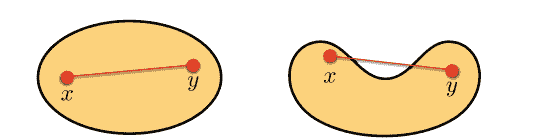

在凸优化中，我们经常使用函数 $f : \mathbb{R}^n \to \mathbb{R} \cup \{+\infty\}$，其值域为*扩展实数* $\mathbb{R} \cup \{+\infty\}$。以下函数，称为*指示函数*，是此类函数的一个例子：

$$f(x) = \begin{cases} 0, & \text{if } \|x\| \le 1, \\ +\infty, & \text{otherwise.} \end{cases} \quad (6.2)$$

对于一个取值于 $\mathbb{R} \cup \{+\infty\}$ 的函数 $f$，我们定义其*有效域*为

$$\text{dom}(f) \triangleq \{x \in \mathbb{R}^n : f(x) < +\infty\}. \quad (6.3)$$

也就是说，函数 $f : \mathbb{R}^n \to \mathbb{R} \cup \{+\infty\}$ 的有效域是 $\mathbb{R}^n$ 中使得 $f$ 取有限实数值的集合。例如，指示函数 (6.2) 的有效域由下式给出

$$\text{dom}(f) = \{x \in \mathbb{R}^n : \|x\| \le 1\}. \quad (6.4)$$

如果一个函数的有效域非空，即存在至少一个 $x \in \mathbb{R}^n$ 使得 $f(x) < +\infty$，则称该函数是*正常函数*。

现在，让我们定义凸函数。

**定义 6.2** *（凸函数）* 设 $f : \mathbb{R}^n \to \mathbb{R} \cup \{+\infty\}$ 是一个正常函数。如果对于任意向量 $x, y \in \text{dom}(f)$ 和任意实数 $t \in [0, 1]$，都有

$$f(tx + (1-t)y) \le tf(x) + (1-t)f(y) \quad (6.5)$$

成立，则称函数 $f$ 是一个*凸函数*。

如果一个函数不是凸的，则称其为*非凸函数*。图 6.2 展示了一个凸函数和一个非凸函数的例子。对于凸函数（左图），任意两点 $(x, f(x))$ 和 $(y, f(y))$（其中 $x, y \in \text{dom}(f)$）之间的线段位于 $f$ 的图像上方或之上。另一方面，如果 $f$ 是非凸的，则存在一条线段部分位于图像下方。

对于一个正常函数 $f : \mathbb{R}^n \to \mathbb{R} \cup \{+\infty\}$，其 $\alpha$-次水平集 $C_\alpha(f)$ 定义为

$$C_\alpha(f) \triangleq \{x \in \text{dom}(f) : f(x) \le \alpha\}. \quad (6.6)$$

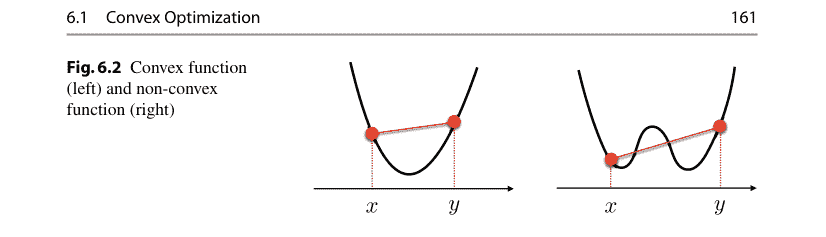

图 6.3（左）说明了函数 $f$ 的次水平集 $C_{\alpha}(f)$。从该图可以很容易地看出，如果 $f$ 是凸函数，那么对于任意 $\alpha \in \mathbb{R}$，$C_{\alpha}(f)$ 都是凸集。如果函数 $f : \mathbb{R}^n \to \mathbb{R} \cup \{+\infty\}$ 的次水平集 $C_{\alpha}(f)$ 对于任意 $\alpha \in \mathbb{R}$ 都是闭集，则称该函数是*闭函数*。

函数 $f$ 的*上镜图* $\text{epi}(f)$ 定义为

$$\text{epi}(f) \triangleq \{(x, t) \in \mathbb{R}^n \times \mathbb{R} : x \in \text{dom}(f), f(x) \leq t\}. \quad (6.7)$$

图 6.3（右）说明了函数 $f$ 的上镜图 $\text{epi}(f)$。从该图可以看出，$f$ 的上镜图是其有效域上图像上方的区域。同样容易理解，$f$ 是凸函数当且仅当 $\text{epi}(f)$ 是凸集。

现在，我们将本节中考虑的凸优化问题写成一般形式。

**问题 6.1** *（凸优化）* 设 $f : \mathbb{R}^n \to \mathbb{R} \cup \{+\infty\}$ 是一个正常、闭的凸函数，且 $\mathbf{C} \subset \mathbb{R}^n$ 是一个闭凸集。那么，*凸优化问题*就是寻找一个向量 $x^* \in \mathbf{C}$，使其在集合 $\mathbf{C} \subset \mathbb{R}^n$ 上最小化函数 $f(x)$。

在此问题中，函数 $f(x)$ 称为*代价函数*或*目标函数*。集合 $\mathbf{C}$ 称为*约束集*或*可行集*，$\mathbf{C}$ 中的元素称为*可行解*，包含关系 $x \in \mathbf{C}$ 称为*约束*。优化问题可简单描述为

$$\min_{x \in \mathbb{R}^n} f(x) \quad \text{subject to} \quad x \in \mathbf{C}. \quad (6.8)$$

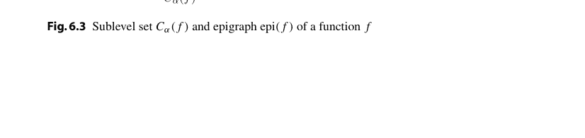

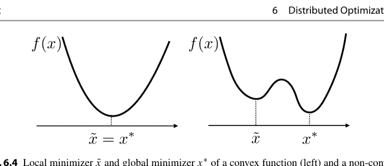

**图 6.4** 凸函数（左）和非凸函数（右）的局部极小值点 \(\tilde{x}\) 和全局极小值点 \(x^*\)

凸优化最重要的性质之一是，如果存在*局部极小值点*，那么它也是*全局极小值点*。现在，优化问题 (6.8) 的局部极小值点和全局极小值点定义如下：如果存在一个开集 \(\mathbf{B} \subset \mathbb{R}^n\)，包含一个可行解 \(\tilde{x} \in \mathbf{C}\)，使得对于所有 \(x \in \mathbf{B} \cap \mathbf{C}\)，都有 \(f(x) \geq f(\tilde{x})\)，则 \(f(\tilde{x})\) 称为优化问题 (6.8) 的*局部极小值点*。同样，如果一个可行解 \(x^* \in \mathbf{C}\) 满足对于所有 \(x \in \mathbf{C}\)，都有 \(f(x) \geq f(x^*)\)，则 \(x^*\) 称为 (6.8) 的*全局极小值点*。图 6.4 说明了凸函数和非凸函数的局部和全局极小值点。从该图可以很容易地理解，对于凸函数，局部极小值点 \(\tilde{x}\) 也是全局极小值点 \(x^*\)，而对于非凸函数，它们可能不重合。以下定理总结了凸函数的这一重要性质 [4, Proposition 3.1.1]：

> **定理 6.1** *对于凸优化问题 (6.8)，如果存在局部极小值点，那么它也是全局极小值点。*

根据这个定理，如果我们有一个算法可以找到凸优化问题的局部极小值点，那么它也就成为了一个寻找全局极小值点的算法。例如，让我们考虑一个具有*可微*凸函数 \(f(x)\) 且 \(\mathbf{C} = \mathbb{R}\) 的无约束优化问题。那么，满足

\[ \frac{df}{dx}(\tilde{x}) = 0 \tag{6.9} \]

的点 \(\tilde{x} \in \mathbb{R}\) 是一个局部极小值点，它也是全局极小值点。通常，对于具有可微代价函数的无约束凸优化，搜索 \(f\) 的*梯度*为零的点的算法就是寻找全局极小值点的算法。这个想法对于推导凸优化的基于梯度的算法非常重要，我们将在第 6.3 节中看到。

### 6.2 群体检测

这里，我们考虑凸优化的一个实际例子，*群体检测*。这是一个在大量患者中寻找少数感染了梅毒等病毒或具有针对例如 COVID-19 抗体的人的问题。

少量的血液检测 [10]。假设有 $n$ 个人，其中 $k$ 人被感染。我们还假设存在一种血液检测方法，可以检测个体是否被感染。显然，通过检测所有 $n$ 份血液样本，我们可以准确地确定感染者。分组检测可以通过*混合*一些血液样本并一次性检测血液来减少检测次数。让我们用数学方法来表述这个问题。

令 $x = [x_1, x_2, \dots, x_n]^\top \in \{0, 1\}^n$ 为一个取二进制值 0 和 1 的 $n$ 维向量。我们定义 $x_i = 1$ 表示第 $i$ 个体为阳性，$x_i = 0$ 表示为阴性。向量 $x$ 是未知的，我们通过分组检测来找到 $x$。混合过程定义为 $x$ 与一个*检测向量* $a \in \{0, 1\}^n$ 的内积。$a$ 中值为 1 的元素表示哪些血液样本被检测。例如，如果 $x = [1, 1, 0, 0, 1, 0]^\top$ 且 $a = [1, 1, 1, 0, 0, 0]^\top$，那么我们检测 $x$ 的前三个元素，结果是

$$\langle a, x \rangle = 2. \tag{6.10}$$

这意味着在前三个人中有两个阳性。这里，我们假设血液检测非常精确，因此可以检测出混合血液中的阳性数量。

现在，我们使用检测向量 $a_j, j = 1, 2, \dots, m$ 进行 $m$ 次分组检测。根据分组检测的动机，我们取 $m < n$。分组检测的结果由下式给出

$$b_j = \langle a_j, x \rangle, \quad j = 1, 2, \dots, m, \tag{6.11}$$

这些是观测到的。定义

$$A \triangleq \begin{bmatrix} a_1^\top \\ a_2^\top \\ \dots \\ a_m^\top \end{bmatrix} \in \mathbb{R}^{m \times n}, \quad b \triangleq \begin{bmatrix} b_1 \\ b_2 \\ \dots \\ b_m \end{bmatrix} \in \mathbb{R}^m, \tag{6.12}$$

那么分组检测的问题就是找到一个二进制向量 $x \in \{0, 1\}^n$ 满足 $Ax = b$。矩阵 $A$ 在分组检测的背景下称为*检测矩阵*，在一般情况下称为*测量矩阵*，向量 $b$ 称为*测量向量*。

在这个表述中，我们假设矩阵 $A$ 是固定的且具有满行秩（即 $\text{rank}(A) = m$）。如下文的数值模拟所示，我们可以将 $A$ 定义为一个随机二进制矩阵。由于 $m < n$ 且矩阵 $A$ 是一个胖矩阵，该问题是不适定的，并且如果假设 $x$ 是一个实值向量，则方程 $Ax = b$ 有无穷多个解。

这里的重要一点是，在 $n$ 个人中只有少数阳性，或者 $x$ 中的阳性元素数量很少。由于 $x$ 是一个二进制向量，这意味着 $\ell^1$ 范数 $\|x\|_1$ 远小于 $n$。考虑到这一点，我们考虑以下优化问题：

$$\min_{x \in \mathbb{R}^n} \|x\|_1 \quad \text{subject to} \quad Ax = b. \tag{6.13}$$

这是一个凸优化问题，因为代价函数 $f(x) = \|x\|_1$ 是一个正常的、闭的、凸函数，并且约束集 $\mathbf{C} = \{x \in \mathbb{R}^n : Ax = b\}$ 是一个非空的、闭的、凸集，因为 $A$ 具有满行秩。

这个优化问题被称为 $\ell^1$ 优化，在压缩感知中也称为*基追踪* [11,17]。这个优化寻求满足线性方程 $Ax = b$ 的*最稀疏*向量 $x$，其中最稀疏向量意味着该向量包含最多的零元素 [13]。

数值求解凸优化问题 (6.13) 的一个简单方法是使用 CVXPY [1,9]，这是一个用于凸优化问题的开源 Python 嵌入式建模语言。要使用 CVXPY，我们只需安装它：

```
! pip install cvxpy
```

然后，我们导入一些包，包括 cvxpy：

```
import cvxpy as cp
import numpy as np
import matplotlib.pyplot as plt
```

现在，我们设置优化问题中的参数。我们假设原始向量 $x_{\text{orig}}$ 的大小 $n$ 为 100，其中 5 个元素为 1，其余为 0。也就是说，原始向量是一个 5-稀疏向量。五个非零元素的索引是随机选择的。这方面的 Python 代码如下：

```
# Vector size (number of people)
n = 100
# Number of positives
k = 5
# Random seed
np.random.seed(1)
# Original vector (n-dimensional, k-sparse)
x_orig = np.zeros(n)
S = np.random.randint(n,size=k)
x_orig[S] = 1
```

我们固定检测次数 $m = 20$，并将矩阵 $A \in \mathbb{R}^{m \times n}$ 定义为一个随机矩阵，其元素独立地从 $\{0, 1\}$ 上的均匀分布中抽取。这在 Python 中通过以下方式完成：

```
# Number of tests
m = 20
# Testing matrix
A = np.random.randint(2,size=(m, n))
```

向量 $b$ 通过以下方式计算：

```
# Result vector
b = A @ x_orig
```

最后，我们编写此优化的 CVXPY 代码：

```
# Optimization variable
x = cp.Variable(n)
# Cost function (L1 norm)
cost = cp.norm1(x)
# Constraints (linear equations)
constraints = [A @ x == b]
# Optimization problem
prob = cp.Problem(cp.Minimize(cost), constraints)
# Solve by CVXPY
prob.solve()
# Print the result
print("status:", prob.status)
print("optimal value", prob.value)
```

在此代码中，

- `cp.Variable(n)` 定义了大小为 $n$ 的优化变量 $x$。
- `cp.norm1(x)` 是 $x$ 的 $\ell^1$ 范数，这是我们问题中的代价函数。
- 约束 $Ax = b$ 被描述为 `[A @ x == b]`。
- `cp.Problem` 定义了约束优化问题。
- `prob.solve()` 数值求解该问题。

如果我们运行此代码，将得到以下输出：

```
status: optimal
optimal value 4.9999999999886 .
```

状态表明 CVX 中的优化算法达到了最优值 4.9999999999886。注意 $\|x_{\text{orig}}\|_1 = 5$，这个结果表明最小化器（我们记为 $\hat{x}$）具有几乎相同的 $\ell^1$ 范数。

图 6.5 显示了原始 $x_{\text{orig}}$ 和重构的 $\hat{x}$ 的茎叶图（程序在第 6.6.1 节的 Python 代码 6.1 中给出）。我们可以看到重构向量与原始向量几乎相同。

最后，我们对重构的 $\hat{x}$ 的值进行四舍五入，并查看它通过分组检测检测阳性个体的精确度：

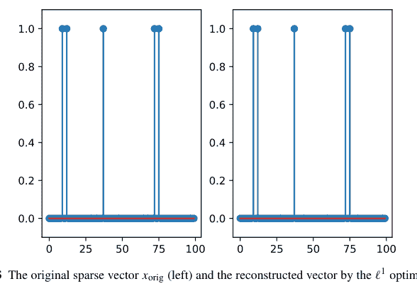

图 6.5 原始稀疏向量 $x_{\text{orig}}$（左）和通过 $\ell^1$ 优化重构的向量（右）

```
python
print(np.nonzero(x_orig))
x_est=np.round(x.value)
print(x_est.nonzero())
```

结果如下：

```
(array([ 9, 12, 37, 72, 75]),)
(array([ 9, 12, 37, 72, 75]),) .
```

第一个结果是 $x_{\text{orig}}$ 中非零元素的索引集，第二个结果是四舍五入后的 $\hat{x}$ 中的索引集。我们可以看到，使用远少于 $n = 100$ 的 $m = 20$ 次检测，重构是精确的。

正如我们在上面的例子中看到的，CVXPY 对于求解凸优化问题非常有用且易于编码。然而，如果我们解决像图像处理这样的大规模问题，CVXPY 可能不够用。此外，如果我们需要在实时（例如几毫秒内）解决凸优化问题，并且使用无法安装 CVXPY 的廉价设备，我们需要实现一个快速高效的数值优化算法。在接下来的章节中，我们将看到如何获得这样的算法。

### 6.3 基于梯度的算法

在本节中，我们考虑求解问题 6.1 或 (6.8) 中凸优化问题的有效算法，其中 $f$ 在 $\text{dom}(f)$ 上可微。本节的关键工具是 $f$ 的*梯度*，定义为

$$\frac{\partial f}{\partial x} \triangleq \left[ \frac{\partial f}{\partial x_1}, \frac{\partial f}{\partial x_2}, \dots, \frac{\partial f}{\partial x_n} \right]^\top,$$

其中 $x_i$ 是 $x \in \mathbb{R}^n$ 的第 $i$ 个分量。为简单起见，在本节中我们也使用“nabla”符号表示梯度，即

$$\nabla f(c) \triangleq \frac{\partial f}{\partial x}(c),$$

对于 $c \in \text{dom}(f)$。

#### 6.3.1 梯度下降算法

这里，我们考虑一个无约束优化问题，其中 $\mathbf{C} = \mathbb{R}^n$，即我们求解

$$\minimize_{x \in \mathbb{R}^n} f(x).$$

容易证明，如果 $\bar{x} \in \mathbb{R}^n$ 是 $f$ 的一个局部最小化器，那么

$$\nabla f(\bar{x}) = 0$$

成立。因此，为了找到 (6.16) 的解，我们只需要寻找满足 (6.17) 的 $\bar{x}$。这样的点称为*驻点*。然而，在许多情况下，不可能获得满足 (6.17) 的驻点的闭式解，因此我们需要一个算法来*数值地*找到 $f$ 的一个驻点。*梯度下降算法*是用于此目的最广泛使用的算法。该算法是一个迭代算法，由下式给出

$$x[k+1] = x[k] - \alpha_k \nabla f(x[k]), \quad k = 0, 1, 2, \dots,$$

其中 $\alpha_k \in \mathbb{R}$ 是该算法的*步长*，应仔细选择。在每一步中寻找 $\alpha_k$ 的一个常用方法是*线搜索*，它沿着直线 $\{x[k] - \alpha \nabla f(x[k]) : \alpha \geq 0\} \subset \mathbb{R}^n$ 最小化代价函数 $f$。更准确地说，步长 $\alpha_k$ 的选择使得

$$\alpha_k = \arg \min_{\alpha \geq 0} f(x[k] - \alpha \nabla f(x[k])).$$

通常很难求解 (6.19) 中的最小化问题，因此广泛使用以下近似方法来代替精确线搜索：

- (i) 选择 $\alpha_k$ 使得
$$g(\alpha_k) \leq g(0) + \sigma g'(0)\alpha_k,$$对于某个 $\sigma \in (0, 1)$ 成立，其中

$$g(\alpha) \triangleq f(x[k] - \alpha \nabla f(x[k])),$$
$$g'(\alpha) \triangleq \frac{dg(\alpha)}{d\alpha} = -\nabla f(x[k] - \alpha \nabla f(x[k]))^\top \nabla f(x[k]).$$

这被称为 *Armijo 准则*。

(ii) 选择 $\alpha_k$ 使得

$$g(\alpha_k) \leq g(0) + \sigma_1 g'(0)\alpha_k, \quad g(\alpha_k) \geq \sigma_2 g'(0)$$

对于某个 $\sigma_1, \sigma_2 \in (0, 1)$ 成立。这被称为 *Wolfe 准则*。

(iii) 假设 $\nabla f$ 是 *Lipschitz 连续* 的，常数为 $L > 0$，即

$$\|\nabla f(x) - \nabla f(y)\| \leq L\|x - y\|,$$

对于任意 $x, y \in \mathbb{R}^n$ 成立。选择一个满足 $\alpha \in (0, 2/L)$ 的 *固定步长* $\alpha_k = \alpha$。

对于 *固定步长* 方法，我们有以下收敛结果 [6, Proposition 1.2.2]：

**定理 6.2** *设 $\{x[k]\}$ 是由梯度下降算法 (6.18) 生成的序列，其中对所有 $k \in \{0, 1, 2, \dots\}$ 有 $\alpha_k = \alpha$。假设存在 $L > 0$ 满足 (6.23)。如果 $\alpha \in (0, 2/L)$，那么极限点*

$$\tilde{x} \triangleq \lim_{k \to \infty} x[k]$$

*是平稳点，即 $\tilde{x}$ 满足 (6.17)。*

**例 6.1** *让我们考虑以下二次函数：*

$$f(x) = \frac{1}{2}x^\top Px - q^\top x,$$

其中 $P = P^\top \in \mathbb{R}^{n \times n}$ 是正定的，且 $q \in \mathbb{R}^n$。由于 $f(x)$ 可以重写为

$$f(x) = \frac{1}{2}(x - P^{-1}q)^\top P(x - P^{-1}q) - q^\top P^{-1}q,$$

$f(x)$ 的最小值在

$$x^* = P^{-1}q.$$

处取得。这也可以理解，因为梯度 $\nabla f$ 由下式给出

$$\nabla f(x) = Px - q.$$

现在，我们使用梯度下降算法来寻找 (6.27) 中的 $x^*$。该算法描述为

$$x[k+1] = x[k] - \alpha \nabla f(x[k]) = x[k] - \alpha (Px[k] - q), \quad (6.29)$$

其中我们假设步长固定。令 $\Phi \triangleq I - \alpha P$。则迭代 (6.29) 可重写为

$$x[k+1] = \Phi x[k] + \alpha q. \quad (6.30)$$

由此可得

$$x[k] = \Phi^k x[0] + \sum_{\tau=0}^{k-1} \Phi^\tau \alpha q. \quad (6.31)$$

由 (6.28)，我们可以选择一个满足 (6.23) 的 Lipschitz 常数 $L$ 为 $P$ 的最大特征值，我们将其记为 $\lambda_{\max}(P)$。那么，如果定理 6.2 中的条件 $\alpha \in (0, 2/L)$ 成立，则

$$|\lambda_i(\Phi)| = |\lambda_i(I - \alpha P)| = |1 - \alpha \lambda_i(P)| < 1, \quad \forall i \in \{1, 2, \dots, n\}, \quad (6.32)$$

其中 $\lambda_i(\Phi)$ 是矩阵 $\Phi$ 的第 $i$ 个特征值。因此，当 $k \to \infty$ 时，$\Phi^k \to 0$。同时，(6.31) 中的 $\Phi^\tau$ 之和满足

$$\sum_{\tau=0}^{k-1} \Phi^\tau = (I - \Phi)^{-1}(I - \Phi^k) \to (I - \Phi)^{-1} = \alpha^{-1} P^{-1}. \quad (6.33)$$

由 (6.31) 可得

$$\lim_{k \to \infty} x[k] = \alpha^{-1} P^{-1} \alpha q = P^{-1} q, \quad (6.34)$$

这与 (6.27) 完全相同。

#### 6.3.2 梯度投影算法

现在，我们考虑一个约束优化问题

$$\min_{x \in \mathbb{R}^n} f(x) \quad \text{subject to} \quad x \in \mathbf{C}, \quad (6.35)$$

其中 $\mathbf{C}$ 是 $\mathbb{R}^n$ 的一个闭的、非空的凸子集。

那么，*梯度投影算法* 由下式给出

$$x[k+1] = \Pi_{\mathbf{C}}(x[k] - \alpha \nabla f(x[k])), \quad k = 0, 1, 2, \ldots \tag{6.37}$$

我们在此考虑固定步长。梯度投影算法交替应用 (6.18) 中的梯度下降算法和向 $\mathbf{C}$ 的投影 $\Pi_{\mathbf{C}}$。对于算法 (6.37) 的收敛性，以下定理 [6, Proposition 3.3.2] 与梯度下降算法的定理 6.2 非常相似：

**定理 6.3** 设 $\{x[k]\}$ 是由梯度投影算法 (6.37) 生成的序列，其中对所有 $k \in \{0, 1, 2, \ldots\}$ 有 $\alpha_k = \alpha$。假设存在 $L > 0$ 满足 (6.23)。如果 $\alpha \in (0, 2/L)$，那么 $\{x[k]\}$ 的极限点是约束优化问题 (6.35) 的一个解。

**例 6.2** 这里，我们考虑 *最小范数问题*，即在约束 $x \in \mathbf{C}$ 下最小化二次函数 (6.25)，其中 $P = I$ 且 $q = 0$（即 $f(x) = \frac{1}{2}\|x\|^2$），约束为

$$\mathbf{C} = \{x \in \mathbb{R}^n : Ax = b\}, \tag{6.38}$$

其中 $A \in \mathbb{R}^{m \times n}$ ($m \ge n$) 具有满行秩，且 $b \in \mathbb{R}^m$。最小范数问题是在 (6.38) 定义的 *超平面* $\mathbf{C} \subset \mathbb{R}^n$ 中寻找离原点最近的点（以 $\ell^2$ 范数度量）。首先，投影 $\Pi_{\mathbf{C}}$ 计算如下（见练习 i）

$$\Pi_{\mathbf{C}}(v) = v + A^+(b - Av), \tag{6.39}$$

其中 $A^+$ 是 $A$ 的 *Moore–Penrose 伪逆*，定义为

$$A^+ \triangleq A^\top (AA^\top)^{-1}. \tag{6.40}$$

注意，由于 $A$ 具有满行秩，矩阵 $AA^\top$ 是可逆的。然后，我们求解优化问题 (6.35)。由于 $\nabla f(x) = x$，梯度投影算法由下式给出

$$\begin{aligned} x[k+1] &= \Pi_{\mathbf{C}}(x[k] - \alpha x[k]) \\ &= (1 - \alpha)x[k] + A^+(b - A(1 - \alpha)x[k]) \\ &= (1 - \alpha)(I - A^+A)x[k] + A^+b. \end{aligned} \tag{6.41}$$

由此，我们有

$$\begin{aligned} x[k] &= (1 - \alpha)^k(I - A^+A)^k x[0] + \sum_{\tau=0}^{k-1} (1 - \alpha)^\tau (I - A^+A)^\tau A^+b \\ &= (1 - \alpha)^k(I - A^+A)^k x[0] + A^+b + \sum_{\tau=1}^{k-1} (1 - \alpha)^\tau (I - A^+A)^\tau A^+b. \end{aligned} \tag{6.42}$$

由于 $AA^+ = I$，我们有 $(I - A^+A)A^+ = A^+ - A^+ = 0$，并且对于 $\tau = 1, 2, \ldots, k - 1$，

$$(I - A^+A)^\tau A^+b = (I - A^+A)^{\tau-1}(I - A^+A)A^+b = 0 \quad (6.43)$$

因此，我们有

$$x[k] = (1 - \alpha)^k(I - A^+A)^kx[0] + A^+b. \quad (6.44)$$

那么，$\nabla f(x) = x$ 的 Lipschitz 常数 $L$ 为 1，定理 6.3 中的收敛条件为 $0 < \alpha < 2$。由于 $A^+A$ 的特征值为 0 或 1 [3, Proposition 6.1.6]，$(1 - \alpha)(I - A^+A)$ 的特征值位于开单位圆盘 $\{z \in \mathbb{C} : |z| < 1\}$ 内。因此，当 $k \to \infty$ 时，$(1 - \alpha)^k(I - A^+A)^k \to 0$，序列 $\{x[k]\}$ 满足

$$\lim_{k \to \infty} x[k] = A^+b. \quad (6.45)$$

这实际上是 (6.46) 的解。$\square$

**例 6.3** (*Python*) 现在，我们求解优化问题

$$\min_{x \in \mathbb{R}^n} \frac{1}{2} \|x\|^2 \quad \text{subject to} \quad Ax = b, \quad (6.46)$$

其中 $A$ 和 $b$ 与第 6.2 节中考虑的群组测试相同。(6.41) 中的梯度投影算法在第 6.6.2 节的 Python 代码 6.2 中实现。图 6.6 显示了 $x[k]$ 与 (6.46) 的闭式解 $A^+b$ 之间的误差。根据此结果，我们可以说 (6.45) 中的性质在小于 $10^{-14}$ 的机器精度内成立。$\square$

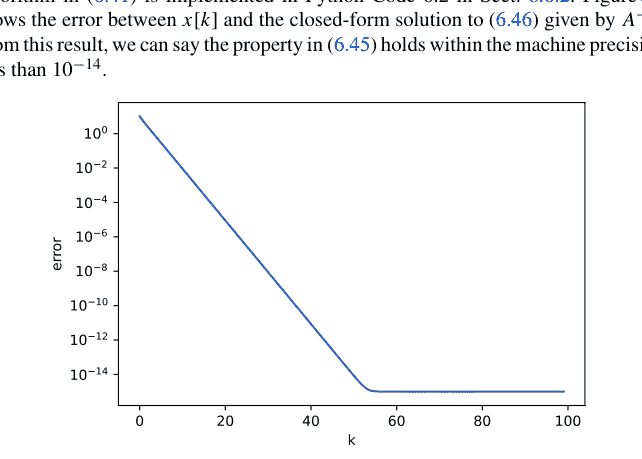

**图 6.6** 梯度投影算法的误差 $\|x[k] - A^+b\|$

#### 6.3.3 次梯度方法

这里，我们考虑优化问题 (6.35)，其中 $f : \mathbb{R}^n \to \mathbb{R} \cup \{+\infty\}$ 是不可微的。在这种情况下，我们也可以通过使用次梯度来设计一个类似于梯度投影算法的高效算法。向量 $g \in \mathbb{R}^n$ 是 $f$ 在点 $z \in \text{dom}(f)$ 处的 *次梯度*，如果

$$f(x) \geq f(z) + g^\top(x - z), \quad \forall x \in \mathbb{R}^n. \tag{6.47}$$

$f$ 在 $z \in \text{dom}(f)$ 处的所有次梯度的集合称为 $f$ 在 $z \in \text{dom}(f)$ 处的 *次微分*，记为 $\partial f(z)$。

图 6.7 说明了次梯度的几何意义。包含点 $(z, f(z)) \in \mathbb{R}^{n+1}$ 的超平面 $\mathbf{P} \subset \mathbb{R}^{n+1}$ 可以表示为

$$a^\top(x - z) + b(y - f(z)) = 0, \tag{6.48}$$

其中 $a \in \mathbb{R}^n$ 和 $b \in \mathbb{R}$。我们假设 $b \neq 0$，并定义 $g \triangleq a/b$。那么方程 (6.48) 变为

$$y = f(z) + g^\top(x - z). \tag{6.49}$$

超平面 $\mathbf{P}$ 的上半空间描述为

$$y \geq f(z) + g^\top(x - z), \tag{6.50}$$

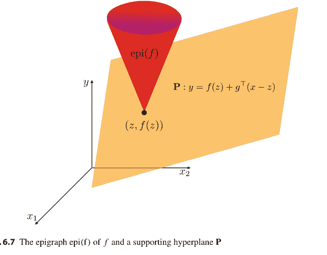

**图 6.7** $f$ 的上图 epi(f) 和一个支撑超平面 $\mathbf{P}$

因此，(6.47) 是上图 epi(f) 包含于上空间的条件。所以，当 g ∈ ∂f(z) 时，超平面 (6.49) 是 f 在 z ∈ dom(f) 处的支撑超平面。

针对约束优化问题 (6.35) 的次梯度投影算法由下式给出

$$x[k+1] = \Pi_{\mathbf{C}}(x[k] - \alpha_k g_k), \quad g_k \in \partial f(x[k]), \qquad (6.51)$$

其中 $g_k$ 可以从 $\partial f(x[k])$ 中任意选择。关于收敛性，我们有以下定理 [5, Sect. 3.2]：

**定理 6.4** *假设对于次梯度投影算法 (6.51)，存在一个标量 $\beta$ 使得*

$$\sup\{\|g_k\| : k = 0, 1, 2, \dots\} \le \beta. \qquad (6.52)$$

*同时假设步长 $\alpha_k$ 是常数，即对所有 $k$ 有 $\alpha_k = \alpha$。令*

$$f^* \triangleq \inf_{x \in \mathbf{C}} f(x) \qquad (6.53)$$

*以及*

$$f_\infty \triangleq \liminf_{k \to \infty} f(x[k]), \qquad (6.54)$$

*其中 $\{x[k]\}$ 是由 (6.51) 生成的序列。那么以下各项成立：*

+   (i) 如果 $f^* = -\infty$，则 $f_\infty = -\infty$。
(ii) 如果 $f^* > -\infty$，则

$$f_\infty \le f^* + \frac{\alpha \beta^2}{2}. \qquad (6.55)$$

该定理意味着，如果我们使用常数步长，仍然会存在 $\alpha \beta^2/2$ 的误差。为了实现无误差地收敛到最优值 $f^*$，我们需要采用可变步长。事实上，我们有以下定理 [5, Proposition 3.2.6]：

**定理 6.5** *假设对于次梯度投影算法 (6.51)，存在一个标量 $\beta$ 使得 (6.52) 成立。同时假设 (6.35) 至少存在一个最优解。如果步长 $\alpha_k$ 满足*

$$\lim_{k \to \infty} \alpha_k = 0, \quad \sum_{k=0}^\infty \alpha_k = +\infty, \quad \sum_{k=0}^\infty \alpha_k^2 < +\infty, \qquad (6.56)$$

*那么 $f_\infty = f^*$ 成立，并且 $\{x[k]\}$ 收敛到 (6.35) 的一个最优解。*

满足 (6.56) 的步长被称为*递减步长*。注意，(6.56) 中的递减步长规则也可以应用于梯度投影算法 (6.37)，详见 [5] 的 Sect.6.1。

**例 6.4** 让我们考虑第 6.2 节讨论的群测试问题，并求解 $\ell^1$ 优化

$$\min_{x \in \mathbb{R}^n} \|x\|_1 \quad \text{subject to} \quad Ax = b. \tag{6.57}$$

首先，让我们计算 $\ell^1$ 范数 $\|x\|_1$ 的次微分。这实际上由 [11] 给出

$$[\partial f(x)]_i = \begin{cases} \{1\}, & \text{if } x_i > 0, \\ \{-1\}, & \text{if } x_i < 0, \\ [-1, 1], & \text{if } x_i = 0, \end{cases} \tag{6.58}$$

其中 $[\partial f(x)]_i$ 是次微分的第 $i$ 个元素，$x_i$ 是 $x$ 的第 $i$ 个元素。由此，我们可以选择 $f(x) = \|x\|_1$ 的一个次梯度 $g_k$ 为

$$g_k = \text{sign}(x[k]), \tag{6.59}$$

其中 sign 是由下式定义的*符号函数*

$$[\text{sign}(v)]_i \triangleq \begin{cases} 1, & \text{if } v_i > 0, \\ -1, & \text{if } v_i < 0, \\ 0, & \text{if } v_i = 0. \end{cases} \tag{6.60}$$

那么，由 (6.51) 可得次梯度投影算法为

$$\begin{aligned} x[k+1] &= x[k] - \alpha_k g_k + A^+(b - A(x[k] - \alpha_k g_k)) \\ &= (I - A^+A)(x[k] - \alpha_k g_k) + A^+b, \end{aligned} \tag{6.61}$$

其中使用了投影公式 (6.39) 和超平面 (6.38)。根据定理 6.5，如果我们选择满足 (6.56) 的步长 $\alpha_k$，那么由此迭代生成的序列 $\{x[k]\}$ 将收敛到 (6.57) 的一个最优解。该算法的实现很简单，因为我们只需进行线性计算并找到由 (6.60) 给出的次梯度。

**例 6.5** (*Python*) 让我们考虑第 6.2 节讨论的群测试问题。参数 $A$、$b$ 等与第 6.2 节相同。我们通过次梯度投影法 (6.61) 求解 (6.57) 中的 $\ell^1$ 优化问题。

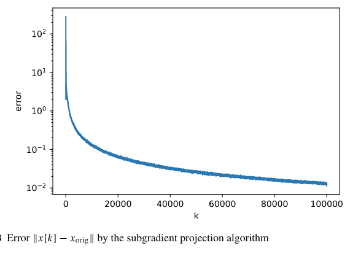

Python 代码在第 6.6.3 节 (Python Code 6.3) 中给出。我们采用递减步长 $\alpha_k$ 为

$$\alpha_k = \frac{100}{k+1}, \quad (6.62)$$

它满足 (6.56)。

$x[k]$ 与原始向量 $x_{\text{orig}}$ 之间的误差如图 6.8 所示。我们可以观察到 $x[k]$ 收敛到 $x_{\text{orig}}$，这与定理 6.5 一致。$\square$

### 6.4 近端算法

在上一节中，我们了解了针对具有不可微代价函数的约束优化的次梯度投影算法。在本节中，我们将考虑另一种基于*近端算子*来解决此类优化问题的方法。

#### 6.4.1 近端算子

令 $f : \mathbb{R}^n \to \mathbb{R} \cup \{+\infty\}$ 是一个正常、闭且凸的函数。参数为 $\gamma > 0$ 的*近端算子*定义为

$$\text{prox}_{\gamma f}(v) \triangleq \arg \min_{x \in \text{dom}(f)} \left\{ \gamma f(x) + \frac{\|x - v\|_2^2}{2} \right\}, \quad v \in \mathbb{R}^n. \quad (6.63)$$

我们注意到，对于任何正常、闭且凸的函数 $f$，以及任何 $\gamma > 0$，对于任何 $v \in \mathbb{R}^n$，$\text{prox}_{\gamma f}(v)$ 都是唯一存在的，因此近端算子是良定义的 [13, Sect. 4.2.1]。

为了理解近端算子的作用，让我们考虑一个具有不可微 $f$ 的无约束优化问题 (6.16)。那么求解 (6.16) 的近端算法由下式给出

$$x[k+1] = \text{prox}_{\gamma_k f}(x[k]), \quad k = 0, 1, 2, \ldots, \tag{6.64}$$

其中 $\gamma_k$ 是此迭代的步长。由 (6.63)，迭代 (6.64) 可以重写为

$$x[k+1] = \underset{x \in \text{dom}(f)}{\arg\min} \left\{ f(x) + \frac{\|x - x[k]\|_2^2}{2\gamma_k} \right\}. \tag{6.65}$$

函数 $f(x) + \|x - x[k]\|_2^2/(2\gamma_k)$ 总是一个*强凸函数*，<sup>1</sup> 即使 $f$ 不是强凸的而只是凸的（例如 $f(x) = \|x\|_1$）。也就是说，算法 (6.65) 在每一步都用一个强凸函数来近似 $f$，这比一般的凸函数更容易最小化。

对于这个算法，我们有以下定理 [5, Proposition 5.1.3]：

**定理 6.6** *假设参数序列 $\{\gamma_k\}$ 满足对所有 $k$ 有 $\gamma_k > 0$ 且*

$$\sum_{k=0}^{\infty} \gamma_k = +\infty. \tag{6.66}$$

*那么，对于任何初始向量 $x[0] \in \mathbb{R}^n$，由近端算法 (6.64) 生成的序列 $\{x[k]\}$ 收敛到 $f$ 的一个极小值点。*

在接下来的几节中，我们将介绍利用近端算子在凸优化中的高效算法。在此之前，我们将展示一些有用函数的近端算子。

##### 二次函数

让我们考虑以下*二次函数*：

$$f(x) = \frac{1}{2} x^\top \Phi x - y^\top x, \tag{6.67}$$

> <sup>1</sup> 如果存在 $\beta > 0$ 使得对于任何 $x, y \in \text{dom}(f) \subset \mathbb{R}^n$ 和任何 $t \in [0, 1]$，以下不等式成立，则称函数 $f$ 是*强凸的*：
>
> $$f(tx + (1-t)y) \leq tf(x) + (1-t)f(y) - t(1-t)\frac{\beta}{2}\|x - y\|_2^2.$$

其中 $\Phi$ 是一个半正定矩阵。容易证明二次函数 (6.67) 是一个正常、闭且凸的函数。其近端算子由下式给出

$$\text{prox}_{\gamma f}(v) = (\Phi + \gamma^{-1}I)^{-1}(y + \gamma^{-1}v). \tag{6.68}$$

一个特例是 $\ell^2$ 范数的平方 $\|x\|^2 = x^\top x$，其近端算子由下式给出

$$\text{prox}_{\gamma \|\cdot\|^2}(v) = \frac{v}{2\gamma + 1}. \tag{6.69}$$

##### 指示函数

令 $\mathbf{C} \subset \mathbb{R}^n$ 是一个非空、闭且凸的集合。那么，$\mathbf{C}$ 上的指示函数定义为

$$I_{\mathbf{C}}(x) \triangleq \begin{cases} 0, & \text{if } x \in \mathbf{C}, \\ +\infty, & \text{if } x \notin \mathbf{C}. \end{cases} \tag{6.70}$$

由于 $\mathbf{C}$ 是非空、闭且凸的，其指示函数 $I_{\mathbf{C}}(x)$ 是一个正常、闭且凸的函数。通过绘制 $I_{\mathbf{C}}(x)$ 的上图很容易理解这一点。那么，近端算子由下式给出

$$\text{prox}_{\gamma I_{\mathbf{C}}}(v) = \Pi_{\mathbf{C}}(v), \tag{6.71}$$

其中 $\Pi_{\mathbf{C}}$ 是到集合 $\mathbf{C}$ 上的投影。

特别地，对于 $N$ 个向量 $x_1, \dots, x_N \in \mathbb{R}^n$ 定义的*共识集*

$$\mathbf{C} \triangleq \{(x_1, \dots, x_N) : x_1 = x_2 = \cdots = x_N\}, \tag{6.72}$$

$v = (v_1, \dots, v_N)$ 的投影 $\Pi_{\mathbf{C}}(v)$ 由下式给出（见练习 iii）

$$\Pi_{\mathbf{C}}(v) = \begin{bmatrix} \bar{v} \\ \vdots \\ \bar{v} \end{bmatrix}, \quad \bar{v} \triangleq \frac{1}{N} \sum_{j=1}^N v_j. \tag{6.73}$$

这用于建立基于多智能体共识的分布式算法（见第 6.5.2 节）。

### $\ell^1$ 范数

$\ell^1$ 范数的近端算子由下式给出（见练习 iv）

$$\text{prox}_{\gamma \|\cdot\|_1}(v) = S_{\gamma}(v). \tag{6.74}$$

函数 $S_{\gamma} : \mathbb{R}^n \to \mathbb{R}^n$ 是*软阈值函数*，定义为

$$[S_{\gamma}(v)]_i \triangleq \begin{cases} v_i - \gamma, & \text{if } v_i \ge \gamma, \\ 0, & \text{if } -\gamma < v_i < \gamma, \\ v_i + \gamma, & \text{if } v_i \le -\gamma, \end{cases}$$

$$i = 1, 2, \ldots, n,$$

其中 $[S_{\gamma}(v)]_i$ 是 $S_{\gamma}(v)$ 的第 $i$ 个元素，$v_i$ 是 $v$ 的第 $i$ 个元素。

## $\ell^{\infty}$ 范数

让我们考虑 $\ell^{\infty}$ 范数 $\|x\|_{\infty} = \max\{|x_i| : i = 1, 2, \ldots, n\}$。其近端算子由下式给出

$$\operatorname{prox}_{\gamma \|\cdot\|_{\infty}}(v) = v - \gamma \Pi_{\bar{\mathbf{B}}_1}(v/\gamma),$$

其中 $\bar{\mathbf{B}}_1$ 是由下式定义的 $\ell^1$ *单位球*

$$\bar{\mathbf{B}}_1 \triangleq \{x \in \mathbb{R}^n : \|x\|_1 \le 1\}.$$

我们注意到，到该集合的投影 $\Pi_{\bar{\mathbf{B}}_1}(v)$ 没有闭式解，我们需要依赖数值计算来进行投影。详见 [16, Sect. 6.5]。

#### 6.4.2 近端梯度算法

现在，我们考虑以下无约束优化问题：

$$\operatorname{minimize}_{x \in \mathbb{R}^n} f(x) + g(x),$$

其中 $f$ 是一个可微的凸函数，满足 $\operatorname{dom}(f) = \mathbb{R}^n$，而 $g : \mathbb{R}^n \to \mathbb{R} \cup \{+\infty\}$ 是一个正常的、闭的、凸函数。我们还假设 $g$ 是*可近端化的*，即 $g$ 的近端算子具有闭式解，就像上面考虑的 $\ell^1$ 范数一样。例如，我们可以考虑 $\ell^1$ 正则化的*最小二乘*，也称为 *LASSO*（*最小绝对收缩和选择算子*），描述如下

$$\operatorname{minimize}_{x \in \mathbb{R}^n} \|Ax - b\|^2 + \lambda \|x\|_1,$$

其中 $A \in \mathbb{R}^{n \times n}$，$b \in \mathbb{R}^n$，$\lambda > 0$ 是固定的。

(6.78) 的*近端梯度算法*如下：

$$x[k+1] = \operatorname{prox}_{\gamma g}\left(x[k] - \gamma \nabla f(x[k])\right), \quad k = 0, 1, 2, \ldots$$

关于该算法的收敛性，我们有以下定理 [2]：

**定理 6.7** 假设梯度 $\nabla f$ 在 $\mathbb{R}^n$ 上是 Lipschitz 连续的，常数为 $L$，即存在 $L > 0$ 使得

$$\|\nabla f(x) - \nabla f(y)\| \le L\|x - y\| \quad (6.81)$$

对任意 $x$ 和 $y$ 在 $\mathbb{R}^n$ 中成立。同时假设步长 $\gamma$ 满足

$$\gamma \le \frac{1}{L}. \quad (6.82)$$

那么，由近端梯度算法 (6.80) 生成的序列 $\{x[k]\}$ 收敛到 (6.78) 的一个解 $x^*$，并且满足

$$\|x[k+1] - x^*\| \le \|x[k] - x^*\|, \quad k = 0, 1, 2, \ldots \quad (6.83)$$

此外，我们有

$$J(x[k]) - J(x^*) \le \frac{L\|x[0] - x^*\|^2}{2k}, \quad k = 0, 1, 2, \ldots, \quad (6.84)$$

其中 $J(x) = f(x) + g(x)$。

根据这个定理，近端梯度算法的收敛速度是 $O(1/k)$。注意这个速度比*线性收敛*（或*一阶收敛*）慢得多，后者的速度是 $O(r^k)$，其中 $|r| < 1$。

对于 $\ell^1$ 正则化最小二乘 (6.79)，我们有

$$f(x) = \frac{1}{2}\|Ax - b\|^2, \quad g(x) = \lambda\|x\|_1, \quad (6.85)$$

$f(x)$ 的梯度由下式给出

$$\nabla f(x) = A^\top(Ax - b). \quad (6.86)$$

同时，$g(x) = \lambda\|x\|_1$ 的近端算子是由 (6.74) 和 (6.75) 定义的软阈值函数。由此，(6.79) 的近端梯度算法由下式给出

$$x[k+1] = S_{\gamma\lambda}(x[k] - \gamma A^\top(Ax[k] - b)). \quad (6.87)$$

该算法被称为*迭代收缩阈值算法*，简称 *ISTA*。

由 (6.86)，$\nabla f$ 的一个 Lipschitz 常数由下式给出

$$L = \lambda_{\max}(A^\top A) = \sigma_{\max}(A)^2 = \|A\|^2, \quad (6.88)$$

其中 $\lambda_{\max}$ 和 $\sigma_{\max}$ 分别是*最大特征值*和*最大奇异值*，$\|A\|$ 是由 $\sigma_{\max}(A)$ 定义的矩阵范数。注意 $\|A\| = \sigma_{\max}(A)$ 是 $A^\top A$ 最大特征值的平方根。还要注意，如果 $A \neq 0$，那么 $\|A\| > 0$。根据定理 6.7 中的 (6.82)，如果我们选择 $\gamma$ 满足

$$0 < \gamma \leq \frac{1}{\|A\|^2}, \quad (6.89)$$

那么，通过简单迭代 (6.87)，就可以得到 $\ell^1$ 正则化最小二乘 (6.79) 的一个解。

定理 6.7 意味着 ISTA 的误差以 $O(1/k)$ 的速度下降。我们可以通过在第 $k$ 步不仅使用 $x[k]$ 还使用之前的 $x[k-1]$ 来加速算法。以下算法是称为 *FISTA*（快速 ISTA）的加速算法，它以 $O(1/k^2)$ 的速度收敛 [2]：

$$x[k+1] = S_{\gamma\lambda}(z[k] - \gamma A^\top(Az[k] - b)),$$
$$t[k+1] = \frac{1 + \sqrt{1 + 4t[k]^2}}{2}, \quad (6.90)$$
$$z[k+1] = x[k+1] + \frac{t[k]-1}{t[k+1]}(x[k+1] - x[k]).$$

令人惊讶的是，如此简单的修改就能将计算效率从 $O(1/k)$ 提高到 $O(1/k^2)$。然而，已知 $O(1/k^2)$ 是最优的，无法进一步加速算法 [16, Sect. 4.3]。

**例 6.6** *(Python)* 我们在此考虑第 6.2 节中的群体检测问题，但测试人数更多。即，我们取 $n = 1000$（人数）和 $m = 100$（测试次数）。我们假设 $x_{\text{orig}}$ 中非零元素的数量为 5；也就是说，只有 5 个阳性个体。测试矩阵 $A$ 是一个随机二值矩阵，生成方式与第 6.2 节相同。同时，我们向结果向量 $b$ 添加噪声，如下

$$b = Ax_{\text{orig}} + w, \quad (6.91)$$

其中 $w$ 是均值为 0、方差为 $0.1^2 I$ 的高斯噪声。

在这些设置下，我们求解 $\lambda = 5$ 的 LASSO (6.79) 优化问题。我们使用 $\gamma = 1/\|A\|^2$ 的 FISTA 算法 (6.90)。其 Python 代码在第 6.6.4 节中给出。在代码中，我们将软阈值函数 (6.75) 实现为

```python
def St(lmbd, v):
    n = v.shape[0]
    Sv = np.zeros(n)
    i = np.abs(v) > lmbd
    Sv[i] = v[i] - np.sign(v[i]) * lmbd
    return Sv
```

![图 6.9 FISTA 的误差 $||x[k] - x_{\text{orig}}||$](img/6f6a40195ea61efdca2c32abeddbaaca_197_0.png)

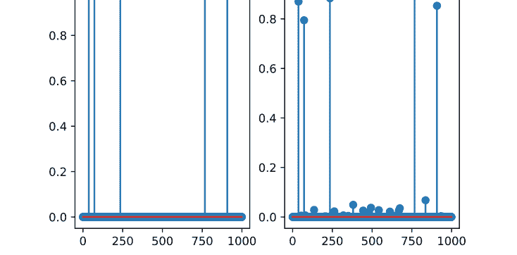

图 6.9 显示了 $x[k]$ 与原始向量 $x_{\text{orig}}$ 之间的误差。从该图中，我们观察到 $x[k]$ 收敛到一个与原始向量 $x_{\text{orig}}$ 有小偏差的向量。这不仅取决于 (6.91) 中噪声 $w$ 的方差，还取决于正则化参数 $\lambda > 0$ 的选择。通常很难直接（或解析地）选择最优的 $\lambda$，我们需要反复试错。我们还注意到误差 $||x[k] - x_{\text{orig}}||$ 不是单调递减的，因为 FISTA 生成的序列 $\{x[k]\}$ 不一定满足 Fejer 单调性 [2]。

图 6.10 显示了重构的向量。重构的向量包含小的误差，但性能是可接受的。

#### 6.4.3 ADMM

让我们考虑以下优化问题：

$$\underset{x \in \mathbb{R}^n, z \in \mathbb{R}^m}{\text{minimize}} \quad f(x) + g(z) \quad \text{subject to} \quad h(x, z) = 0, \tag{6.92}$$

其中 $f : \mathbb{R}^n \to \mathbb{R} \cup \{+\infty\}$ 和 $g : \mathbb{R}^m \to \mathbb{R} \cup \{+\infty\}$ 是正常的、闭的、凸函数，$h$ 是 $x$ 和 $z$ 的仿射函数，定义为

$$h(x, z) \triangleq Ax + Bz - c, \tag{6.93}$$

其中 $A \in \mathbb{R}^{p \times n}$，$B \in \mathbb{R}^{p \times m}$，$c \in \mathbb{R}^p$。这是 (6.78) 的一个推广版本，因为如果选择 $A = I$，$B = -I$，$c = 0$，则 (6.92) 等价于 (6.78)。为了解决这个优化问题，我们引入*交替方向乘子法*，简称 ADMM。其思想是考虑由下式定义的*增广拉格朗日函数*

$$L_{\rho}(x, z, y) \triangleq f(x) + g(z) + y^\top h(x, z) + \frac{\rho}{2} \|h(x, z)\|^2, \tag{6.94}$$

其中 $\rho > 0$ 是一个参数。那么，ADMM 的迭代算法由下式给出

$$\begin{aligned} x[k+1] &= \underset{x}{\arg\min} \, L_{\rho}(x, z[k], y[k]), \\ z[k+1] &= \underset{z}{\arg\min} \, L_{\rho}(x[k+1], z, y[k]), \\ y[k+1] &= y[k] + \rho h(x[k+1], z[k+1]). \end{aligned} \tag{6.95}$$

容易证明该算法等价于

$$\begin{aligned} x[k+1] &= \underset{x}{\arg\min} \left( f(x) + \frac{\rho}{2} \|h(x, z[k]) + u[k]\|^2 \right), \\ z[k+1] &= \underset{z}{\arg\min} \left( g(z) + \frac{\rho}{2} \|h(x[k+1], z) + u[k]\|^2 \right), \\ u[k+1] &= u[k] + h(x[k+1], Bz[k+1]), \end{aligned} \tag{6.96}$$

其中 $u[k] \triangleq y[k]/\rho$。

以下是 ADMM 算法的收敛定理 [7]：

**定理 6.8** (ADMM 的收敛性) *考虑 (6.92) 中的优化问题。假设 $f$ 和 $g$ 是正常的、闭的、凸函数。同时假设 (6.94) 中 $\rho = 0$ 的（未增广）拉格朗日函数 $L_{\rho}$ 有一个鞍点，即存在 $x^*$，$z^*$ 和 $y^*$ 使得*

$$L_0(x^*, z^*, y) \leq L_0(x^*, z^*, y^*) \leq L_0(x, z, y^*), \quad \forall x, z, y. \tag{6.97}$$

那么，ADMM算法（6.95）满足以下收敛性质：

- 残差
  $$r[k] \triangleq h(x[k], z[k]), \quad k = 0, 1, 2, \ldots$$ (6.98)
  随着 $k \to \infty$ 收敛到 0。这意味着迭代收敛到（6.92）的一个可行解。
- 目标函数值 $f(x[k]) + g(z[k])$ 收敛到最优值
  $$f^* \triangleq \inf_{\substack{x \in \mathbb{R}^n, z \in \mathbb{R}^m \\ h(x,z)=0}} f(x) + g(z).$$ (6.99)
- 如果（6.93）中的矩阵 A 满足 $A^\top A$ 是正定的，那么序列 $\{(x[k], z[k])\}$ 收敛到优化问题（6.92）的一个最优解 $(x^*, z^*)$。

ADMM算法在构建分布式优化算法中扮演着重要角色，这将在下一节中讨论。

### 6.5 分布式优化

在本节中，我们考虑使用分布式算法来解决以下优化问题：

$$\min_{x \in \mathbb{R}^n} \sum_{i=1}^N f_i(x) \quad \text{subject to} \quad x \in \bigcap_{i=1}^N C_i,$$ (6.100)

其中 $f_i : \mathbb{R}^n \to \mathbb{R} \cup \{+\infty\}$ 是一个正常、闭的凸函数，$C_i \subset \mathbb{R}^n$ 是一个非空、闭的凸集。分布式优化的思想是寻求（6.100）的一个*全局*最小值，其方式是第 $i$ 个智能体（$i = 1, 2, \ldots, N$）在局部约束 $x \in C_i$ 下最小化一个*局部*代价函数 $f_i$，并且该智能体不断与相邻智能体交换计算结果。这类算法可以通过结合第3章讨论的一致性方法与前面章节介绍的优化算法（如基于梯度的算法和近端算法）来获得。首先，我们研究分布式次梯度算法。

#### 6.5.1 分布式次梯度算法

这里我们考虑一个无约束优化问题：

$$\min_{x \in \mathbb{R}^n} \sum_{i=1}^N f_i(x),$$ (6.101)

其中 $f_1, f_2, \ldots, f_N : \mathbb{R}^n \to \mathbb{R} \cup \{+\infty\}$ 是正常、闭的凸函数。为了以分布式方式解决这个问题，我们引入 $N$ 个智能体来解决局部优化问题，多智能体网络为 $G = (\mathbf{V}, \mathbf{E})$，其中 $\mathbf{V} = \{1, 2, \ldots, N\}$ 是顶点（即智能体）的集合，$\mathbf{E} \subset \mathbf{V} \times \mathbf{V}$ 是边（即交互智能体之间的连接）的集合。我们假设 $G$ 是无向且连通的。

首先，我们为第 $i$ 个智能体（$i \in \mathbf{V}$）设置初始猜测 $x_i[0] \in \mathbb{R}^n$。然后，第 $i$ 个智能体在每个时间步（离散时间）更新并维护局部猜测 $x_i[k]$。$x_i[k]$ 的更新规则由下式给出

$$x_i[k+1] = \sum_{j=1}^N p_{ij} x_j[k] - \alpha g_i[k], \tag{6.102}$$

其中

- $p_{ij}$ 是 Perron 矩阵 $P = I - \varepsilon L$ 的第 $(i, j)$ 个元素，其中 $\varepsilon > 0$，$L$ 是图 $G$ 的图拉普拉斯矩阵，
- $\alpha > 0$ 是一个固定的步长，
- $g_i[k]$ 是 $f_i$ 在 $x_i[k]$ 处的一个次梯度，即 $g_i[k] \in \partial f_i(x_i[k])$。

根据第3章讨论的一致性结果，如果我们取 $\alpha = 0$，那么在图 $G$ 的连通性条件和 $\varepsilon < 1/\Delta$ 下，$x_1[k], x_2[k], \ldots, x_N[k]$ 都收敛到 $x_1[0], x_2[0], \ldots, x_N[0]$ 的平均值。因此，更新（6.102）包含两个步骤：一致性步骤和次梯度步骤。直观地说，通过次梯度步骤，第 $i$ 个智能体试图最小化局部代价函数 $f_i$，而通过一致性步骤，该智能体通过查看相邻智能体的局部平均值来调整自身的估计。

（6.102）的收敛性总结在以下定理 [14] 中：

**定理 6.9** 假设存在 $\beta > 0$，使得对于任何 $g \in \partial f_i(x)$，$i \in \mathbf{V}$，且 $x \in \mathbb{R}^n$，有 $\|g\| \le \beta$。同时假设优化问题（6.101）至少有一个解。那么由（6.102）得到的迭代的时间平均值

$$\hat{x}_i[k] \triangleq \frac{1}{k} \sum_{\tau=1}^k x_i[\tau] \tag{6.103}$$

满足

$$\limsup_{k \to \infty} f(\hat{x}_i[k]) \le f^* + \frac{\alpha \beta^2 c}{2}, \quad i \in \mathbf{V}, \tag{6.104}$$

其中

$$c \triangleq N \left\{ 1 + 8 \left( 2 + \frac{N \gamma}{1 - \gamma} \right) \right\}, \quad \gamma \triangleq 1 - \frac{\eta}{4N^2}, \tag{6.105}$$

且 $\eta$ 是 Perron 矩阵 $P$ 的最小非零元素。

这个定理与固定步长次梯度投影的定理 6.4 相关。如下所述，可变步长可以实现无极限误差。
让我们考虑以下约束优化问题：

$$\min_{x \in \mathbb{R}^n} \sum_{i=1}^N f_i(x) \quad \text{subject to} \quad x \in \bigcap_{i=1}^N \mathbf{C}_i, \tag{6.106}$$

其中 $f_1, f_2, \ldots, f_N : \mathbb{R}^n \to \mathbb{R} \cup \{+\infty\}$ 是正常、闭的凸函数，$\mathbf{C}_1, \mathbf{C}_2, \ldots, \mathbf{C}_N \subset \mathbb{R}^n$ 是非空、闭的凸集。我们这里假设函数 $f_i$ 和集合 $\mathbf{C}_i$ 仅对第 $i$ 个智能体已知。那么，借鉴第 6.3.3 节提到的次梯度投影算法的思想，我们考虑以下迭代算法：

$$x_i[k+1] = \Pi_{\mathbf{C}_i} \left( \sum_{j=1}^N p_{ij} x_j[k] - \alpha_k g_i[k] \right), \tag{6.107}$$

其中 $\Pi_{\mathbf{C}_i}$ 是到 $\mathbf{C}_i$ 上的投影算子，$\alpha_k$ 是一个可变步长。我们注意到，如果对于所有 $i \in \{1, 2, \ldots, N\}$，$\mathbf{C}_i = \mathbb{R}^n$，那么这个迭代就是针对无约束问题（6.101）的可变步长版本。对于步长，我们假设一个*递减步长*满足

$$\sum_k \alpha_k = +\infty, \quad \sum_k \alpha_k^2 < +\infty. \tag{6.108}$$

我们有以下收敛定理 [15]：

**定理 6.10** *假设 Perron 矩阵 $P = [p_{ij}]$ 满足 $\mathbf{1}^\top P = \mathbf{1}$（即 $P$ 是双随机矩阵）。同时假设存在 $\beta > 0$，使得对于任何 $g \in \partial f_i(x)$，$i \in \mathbf{V}$，且 $x \in \mathbb{R}^n$，有 $\|g\| \le \beta$。如果（6.107）中的步长 $\alpha_k$ 满足递减步长条件（6.108），那么由（6.107）生成的序列 $\{x_i[k]\}$ 满足*

$$\lim_{k \to +\infty} \|x_i[k] - x^*\| = 0, \quad \forall i \in \mathbf{V}, \tag{6.109}$$

其中 $x^*$ 是（如果存在）（6.101）的一个最小值点。
我们注意到这个定理可以与定理 6.5 进行比较。

**例 6.7** *（分布式 $\ell^1$ 优化）* 这里我们考虑第 6.2 节讨论的用于群组测试的 $\ell^1$ 优化（6.13）。我们通过上面介绍的分布式次梯度投影来解决这个问题。为此，我们将约束 $Ax = b$ 分解为 $N = m$ 个局部约束。这意味着每个使用测试向量 $a_i$ 的群组测试都是局部进行的。根据（6.11）和（6.12），局部约束由下式给出

$$\mathbf{C}_i = \{x \in \mathbb{R}^n : a_i^\top x = b_i\}, \quad i = 1, 2, \ldots, N. \tag{6.110}$$

那么 $v \in \mathbb{R}^n$ 到子集 $\mathbf{C}_i$ 上的投影 $\Pi_{\mathbf{C}_i}(v)$ 由下式给出（参见练习 v）

$$\Pi_{\mathbf{C}_i}(v) = v + \frac{y_i - a_i^\top v}{a_i^\top a_i} a_i, \quad i = 1, 2, \ldots, N. \tag{6.111}$$

局部代价函数简单地设置为

$$f_i(x) = \|x\|_1, \quad i = 1, 2, \ldots, N. \tag{6.112}$$

也就是说，假设全局代价函数 $f(x) = \|x\|_1$ 对所有智能体都是已知的。那么我们可以选择次梯度 $g_i[k]$ 为

$$g_i[k] = \text{sign}(x_i[k]), \quad i = 1, 2, \ldots, N, \tag{6.113}$$

其中符号函数在（6.60）中定义。现在，我们可以将 $\ell^1$ 优化（6.13）的次梯度投影算法写成如下形式：

$$v_i[k] = \sum_{j=1}^N p_{ij} x_j[k] - \alpha_k \text{sign}(x_i[k])$$
$$x_i[k+1] = v_i[k] + \frac{y_i - a_i^\top v_i[k]}{a_i^\top a_i} a_i \tag{6.114}$$
$$i = 1, 2, \ldots, N, \quad k = 0, 1, 2, \ldots.$$

如果我们选择满足（6.108）的步长，那么分布式算法将实现如（6.109）所示的一致性。$\square$

**例 6.8** *（Python）* 现在，我们通过 Python 检查分布式算法（6.114）。我们设置待检测人数为 $n = 100$，群组测试次数为 $m = 20$。原始向量 $x_{\text{orig}}$ 是一个二值随机向量，其中有 5 个元素非零。

智能体数量为 $N = m = 20$，网络由 Erdős–Rényi 随机图模型生成，规模为 $N = 20$，边连接概率为 $p = 0.3$。图 6.11 显示了由 NetworkX 包中的函数 `erdos_renyi_graph` 生成的图。有关 Erdős–Rényi 随机图模型的详细信息，请参阅第 7 章第 7.3.1 节。在这个网络上，我们执行分布式算法（6.114）。我们取递减步长为

$$\alpha_k = \frac{100}{1+k}. \tag{6.115}$$

Python 代码在第 6.6.5 节中给出。

图 6.12 显示了第 $i$ 个智能体（$i = 1, 2, \ldots, 20$）的误差 $\|x_i[k] - x_{\text{orig}}\|$。我们可以看到，每个智能体都成功地减小了其误差，正如

#### 6.5.2 分布式ADMM

让我们考虑以下无约束最小化问题：

$$\min_{x \in \mathbb{R}^n} \sum_{i=1}^N f_i(x). \tag{6.117}$$

该问题可以等价地表示为

$$\min_{x_1, x_2, \dots, x_N \in \mathbb{R}^n} \sum_{i=1}^N f_i(x_i) \text{ subject to } x_1 = x_2 = \cdots = x_N. \tag{6.118}$$

然后，利用指示函数 (6.70)，其中

$$\mathbf{C} \triangleq \{(x_1, x_2, \dots, x_N) : x_1 = x_2 = \cdots = x_N\}, \tag{6.119}$$

我们得到无约束凸优化问题：

$$\min_{x_1, x_2, \dots, x_N \in \mathbb{R}^n} \sum_{i=1}^N f_i(x_i) + I_{\mathbf{C}}(x_1, x_2, \dots, x_N). \tag{6.120}$$

此外，我们引入新变量 $z_i = x_i, i = 1, 2, \dots, N$

$$x \triangleq [x_1^\top, x_2^\top, \dots, x_N^\top]^\top \in \mathbb{R}^{nN}, \quad z \triangleq [z_1^\top, \dots, z_N^\top]^\top \in \mathbb{R}^{nN}, \tag{6.121}$$

以及函数

$$f(x) \triangleq \sum_{i=1}^{N} f_i(x_i).$$

那么我们有以下优化问题：

$$\underset{x, z \in \mathbb{R}^{nN}}{\text{minimize}} \quad f(x) + I_{\mathbf{C}}(z) \quad \text{subject to} \quad x = z.$$

这是优化问题 (6.92) 的一个特例，其中 $g(z) = I_{\mathbf{C}}(z)$ 且 $h(x, z) = x - z$。相应的ADMM算法由下式给出

$$x[k+1] = \underset{x}{\text{arg min}} \left( f(x) + \frac{\rho}{2} \|x - z[k] + u[k]\|^2 \right),$$

$$z[k+1] = \underset{z}{\text{arg min}} \left( I_{\mathbf{C}}(z) + \frac{\rho}{2} \|x[k+1] - z + u[k]\|^2 \right),$$

$$u[k+1] = u[k] + x[k+1] - z[k+1].$$

我们可以用分布式的方式描述这个迭代算法。首先，(6.124) 中的目标函数可以重写为

$$f(x) + \frac{\rho}{2} \|x - z[k] + u[k]\|^2 = \sum_{i=1}^{N} \left\{ f_i(x_i) + \frac{\rho}{2} \|x_i - z_i[k] + u_i[k]\|^2 \right\}.$$

因此，$x[k+1]$ 的更新 (6.124) 被分解为 $N$ 个更新：

$$x_i[k+1] = \underset{x_i}{\text{arg min}} \left\{ f_i(x_i) + \frac{\rho}{2} \|x_i - z_i[k] + u_i[k]\|^2 \right\}$$

$$= \text{prox}_{f_i/\rho}(z_i[k] - u_i[k]), \quad i = 1, 2, \ldots, N,$$

其中我们使用了近端算子 (6.63) 的定义。

然后，(6.125) 中的更新由 $x[k+1] + u[k]$ 在 $\mathbf{C}$ 上的投影给出，这可以从 (6.73) 得到：

$$z_i[k+1] = \overline{x[k+1]} + \overline{u[k]} = \frac{1}{N} \sum_{j=1}^{N} (x_j[k+1] + u_j[k]), \quad i = 1, \ldots, N.$$

最后，由 (6.126) 和 (6.129)，我们有

$$u_i[k+1] = u_i[k] + x_i[k+1] - \overline{x[k+1]} - \overline{u[k]}.$$

同时，我们有

$$\overline{u[k+1]} = \frac{1}{N} \sum_{i=1}^{N} u_i[k+1]$$
$$= \frac{1}{N} \sum_{i=1}^{N} \{u_i[k] + x_i[k+1] - \overline{x[k+1]} - \overline{u[k]}\} \quad (6.131)$$
$$= \overline{u[k]} + \overline{x[k+1]} - \overline{x[k+1]} - \overline{u[k]}$$
$$= 0.$$

因此，如果我们选择初始值 $u[0]$ 为 0，那么对于所有 $k = 0, 1, 2, \dots$，我们有 $\overline{u[k]} = 0$。由 (6.128)、(6.129)、(6.130) 和 (6.131)，我们最终得到以下分布式ADMM算法：

$$x_i[k+1] = \text{prox}_{f_i/\rho}(\overline{x[k]} - u_i[k]),$$
$$u_i[k+1] = u_i[k] + x_i[k+1] - \overline{x[k+1]}. \quad (6.132)$$

在此算法中，$x_i[k+1]$ 的计算是并行进行的，但需要全局数据 $\overline{x[k]}$。为此，我们采用*中心收集器*或*融合中心*，它从所有智能体收集数据 $x_i[k]$，$i = 1, \dots, N$，计算平均值 $\overline{x[k]}$，并将其发送回智能体。图 6.14 显示了分布式算法的网络。如我们所见，中心收集器 $C$ 连接所有智能体，而每个智能体仅与 $C$ 交换数据。这样的网络称为*星型网络*。

**示例 6.9** (*分布式最小二乘*) 这里，我们考虑*最小二乘*问题，以解决以下优化问题：

$$\text{minimize} \quad \|Ax - b\|^2. \quad (6.133)$$

我们假设 $A \in \mathbb{R}^{m \times n}$ 具有满列秩，即 $m \ge n$ 且 $\text{rank}(A) = n$。那么，$A^\top A$ 可逆，且 (6.133) 的最小化器由下式给出（见练习 vi）

$$x^* = (A^\top A)^{-1} A^\top b. \tag{6.134}$$

现在，让我们将优化问题 (6.133) 重新表述为如 (6.117) 所示的分布式优化问题，并写出相应的ADMM算法。令 $A \triangleq [a_1, a_2, \dots, a_m]^\top$，其中 $a_i \in \mathbb{R}^n$，且 $b \triangleq [b_1, b_2, \dots, b_m]^\top$，如 (6.12) 所示。那么我们有

$$\|Ax - b\|_2^2 = \left\| \begin{bmatrix} a_1^\top x - b_1 \\ a_2^\top x - b_2 \\ \vdots \\ a_m^\top x - b_m \end{bmatrix} \right\|^2 = \sum_{i=1}^m (a_i x - b_i)^2. \tag{6.135}$$

因此，我们可以在 (6.117) 中取 $f_i(x) = (a_i x - b_i)^2$。那么，$f_i$ 的近端算子由 (6.67) 和 (6.68) 推导为

$$\text{prox}_{f_i/\rho}(v) = (a_i a_i^\top + \rho I)^{-1} (b_i a_i + \rho v). \tag{6.136}$$

最后，(6.133) 的分布式ADMM算法由下式给出

$$x_i[k+1] = Q_i(b_i a_i + \rho(\overline{x}[k] - u_i[k])), \ u_i[k+1] = u_i[k] + x_i[k+1] - \overline{x}[k+1], \tag{6.137}$$

其中

$$Q_i \triangleq (a_i a_i^\top + \rho I)^{-1}, \quad i = 1, 2, \dots, m. \tag{6.138}$$

矩阵 $Q_1, Q_2, \dots, Q_m$ 应在迭代前计算，以减少计算负担。$\square$

**示例 6.10** *(Python)* 现在，我们为最小二乘问题 (6.133) 实现分布式ADMM算法 (6.137)。我们假设 $A$ 是一个大小为 $20 \times 20$ 的二值矩阵（即 $n = m = 20$），如第 6.2 节所述。观测向量 $b$ 由下式给出

$$b = A x_{\text{orig}} + w, \tag{6.139}$$

其中 $x_{\text{orig}}$ 是一个稀疏的二值向量，有 2 个非零元素（即 $\|x\|_0 = 2$），而 $w \in \mathbb{R}^m$ 是一个 $m$ 维高斯噪声，均值为 0，协方差为 $0.01^2 I$。Python 代码在第 6.6.6 节中给出。

图 6.15 显示了使用 $\rho = 1$ 和 1000 次迭代的分布式ADMM算法 (6.137) 得到的平均值 $\overline{x}[k]$ 与原始向量 $x_{\text{orig}}$ 之间的误差。我们看到误差随着迭代更新而减小。图 6.16 显示了重构向量 $x[1000]$。重构向量中仍存在误差，但通过对原始二值向量进行舍入可以精确重构。$\square$

#### 6.5.3 带正则化的分布式ADMM

在本节中，我们考虑以下正则化优化问题：

$$\min_{x \in \mathbb{R}^n} \sum_{i=1}^N f_i(x) + g(x), \quad (6.140)$$

其中 $g : \mathbb{R}^n \mapsto \mathbb{R} \cup \{+\infty\}$ 是正则化函数，它是一个正常、闭的凸函数。我们假设正则化函数 $g$ 对所有智能体都是已知的。(6.140) 中的无约束优化可以重写为

$$\text{minimize}_{x_1, x_2, \dots, x_N, z \in \mathbb{R}^n} \sum_{i=1}^N f_i(x_i) + g(z) \quad \text{subject to} \quad x_1 = x_2 = \dots = x_N = z. \tag{6.141}$$

然后，以类似于上一小节推导分布式ADMM的方式，我们得到如下分布式ADMM：

$$\begin{aligned} x_i[k+1] &= \text{prox}_{f_i/\rho}(z[k] - u_i[k]), \\ z[k+1] &= \text{prox}_{g/(N\rho)}(\overline{x[k+1]} + \overline{u[k]}), \\ u_i[k+1] &= u_i[k] + x_i[k+1] - z[k+1]. \end{aligned} \tag{6.142}$$

在此分布式算法中，向量 $x_i[k]$ 和 $u_i[k]$ 由智能体 $i$ 使用在中心收集器 C 处更新并发送的向量 $z[k]$ 进行局部更新，如图 6.14 所示。

**示例 6.11** (Python) 这里，我们考虑*正则化最小二乘*问题，描述为

$$\text{minimize} \|Ax - b\|^2 + \lambda\|x\|_1. \tag{6.143}$$

这是示例 6.9 中讨论的最小二乘的正则化版本。如果原始向量 $x_{\text{orig}}$ 是稀疏的，这种表述应该优于无正则化的最小二乘。与此优化问题对应的分布式算法 (6.142) 由下式给出

$$\begin{aligned} x_i[k+1] &= Q_i(b_i a_i + \rho(z[k] - u_i[k])), \\ z[k+1] &= S_{\lambda/(N\rho)}(\overline{x[k+1]} + \overline{u[k]}), \\ u_i[k+1] &= u_i[k] + x_i[k+1] - z[k+1], \end{aligned} \tag{6.144}$$

其中 $Q_i$ 由 (6.138) 给出，$S_{\lambda/(N\rho)}$ 是在 (6.75) 中定义的软阈值算子，其中 $\gamma = \lambda/(N\rho)$。

此问题的 Python 代码在第 6.6.7 节中给出。$A$ 和 $x_{\text{orig}}$ 与示例 6.9 中的相同，$b$ 如 (6.139) 所示。我们在 (6.143) 中取 $\lambda = 1$，在 (6.144) 中取 $\rho = 1$。

图 6.17 显示了使用分布式ADMM算法 (6.144) 得到的平均值 $\overline{x[k]}$ 与原始向量 $x_{\text{orig}}$ 之间的误差。其收敛速度比示例 6.9 中无正则化最小二乘的结果更快。图 6.16 显示了重构向量 $x[1000]$。得益于 (6.143) 中的正则化项 $\|x\|_1$，重构向量比无正则化最小二乘（图 6.18）的误差更小。

### 6.6 Python 代码

#### 6.6.1 Python 代码 6.1：基于 CVXPY 的群组测试

Python 代码 6.1 是一个用于第 6.2 节讨论的基于 CVXPY 的群组测试的 Python 程序。

# Python 代码 6.1：第 6.2 节中的基于 CVXPY 的群组测试

```python
import cvxpy as cp
import numpy as np
import matplotlib.pyplot as plt

## 参数设置
# 向量大小（人数）
n = 100
# 阳性数量
k = 5
# 随机种子
np.random.seed(1)
# 原始向量（n维，k稀疏）
x_orig = np.zeros(n)
S = np.random.randint(n, size=k)
x_orig[S] = 1
# 测试次数
m = 20  # ~ k log (n/k)
# 测试矩阵
A = np.random.randint(2, size=(m, n))
# 结果向量
b = A @ x_orig

## 使用 CVXPY 进行优化
# 优化变量
x = cp.Variable(n)
# 目标函数（L1范数）
cost = cp.norm1(x)
# 约束条件（线性方程）
constraints = [A @ x == b]
# 优化问题
prob = cp.Problem(cp.Minimize(cost), constraints)
# 使用 CVXPY 求解
prob.solve()
# 打印结果
print("status:", prob.status)
print("optimal value", prob.value)

## 结果
fig = plt.figure()
ax1 = fig.add_subplot(1, 2, 1)
ax1.stem(x_orig, use_line_collection=True)
plt.ylim(-0.1, 1.1)
ax2 = fig.add_subplot(1, 2, 2)
ax2.stem(x.value, use_line_collection=True)
plt.ylim(-0.1, 1.1)

print(np.nonzero(x_orig))
x_est = np.round(x.value)
print(x_est.nonzero())
```

#### 6.6.2 Python 代码 6.2：基于梯度投影的群组测试

Python 代码 6.2 是一个用于示例 6.3 中基于梯度投影的群组测试的 Python 程序。

# Python 代码 6.2：示例 6.3 中的基于梯度投影的群组测试

```python
import numpy as np
import matplotlib.pyplot as plt

## 参数设置
m = 20  # 测试次数
n = 100  # 人数
k = 5  # 阳性数量
# 原始向量
np.random.seed(1)
x_orig = np.zeros(n)
S = np.random.randint(n, size=k)
x_orig[S] = 1
# 测试矩阵
A = np.random.randint(2, size=(m, n))
# 结果向量
b = A @ x_orig

## 闭式解
Ap = np.linalg.pinv(A)  # A 的 Moore-Penrose 伪逆
x_opt = Ap @ b

## 使用梯度投影算法进行优化
# 参数设置
alpha = 1.5  # 步长
max_itr = 100  # 迭代次数
x = np.random.randn(n)  # 初始猜测
M = np.eye(n) - Ap @ A
v = Ap @ b
error = np.zeros(max_itr)  # 残差
# 迭代
for k in range(max_itr):
    error[k] = np.linalg.norm(x_opt - x)
    x = M @ (x - alpha * x) + v

## 误差分析
fig = plt.figure()
plt.semilogy(error)
plt.xlabel("k")
plt.ylabel("error")
```

#### 6.6.3 Python 代码 6.3：基于次梯度法的群组测试

Python 代码 6.3 是一个用于示例 6.5 中基于次梯度法的群组测试的 Python 程序。

# Python 代码 6.3：示例 6.5 中的基于次梯度法的群组测试

```python
import numpy as np
import matplotlib.pyplot as plt

## 参数设置
m = 20  # 测试次数
n = 100  # 人数
k = 5  # 阳性数量
# 原始向量
np.random.seed(1)
x_orig = np.zeros(n)
S = np.random.randint(n, size=k)
x_orig[S] = 1
# 测试矩阵
A = np.random.randint(2, size=(m, n))
# 结果向量
b = A @ x_orig

## 使用次梯度法进行优化
# 参数设置
alpha = 100  # 步长 = alpha/(1+k)
max_itr = 100000  # 迭代次数
x = np.zeros(n)  # 初始猜测
Ap = np.linalg.pinv(A)  # A 的 Moore-Penrose 伪逆
M = np.eye(n) - Ap @ A
v = Ap @ b
error = np.zeros(max_itr)  # 残差
# 迭代
for k in range(max_itr):
    error[k] = np.linalg.norm(x_orig - x)
    gk = np.sign(x)
    ak = alpha / (1 + k)
    x = M @ (x - ak * gk) + v

## 误差分析
fig = plt.figure()
plt.semilogy(error)
plt.xlabel("k")
plt.ylabel("error")
```

#### 6.6.4 Python 代码 6.4：基于 FISTA 的群组测试

Python 代码 6.4 是一个用于示例 6.6 中基于 FISTA 算法的群组测试的 Python 程序。

# Python 代码 6.4：示例 6.6 中的基于 FISTA 算法的群组测试

```python
import numpy as np
import matplotlib.pyplot as plt

## 参数设置
m = 100  # 测试次数
n = 1000  # 人数
k = 5  # 阳性数量
# 原始向量
np.random.seed(1)
x_orig = np.zeros(n)
S = np.random.randint(n, size=k)
x_orig[S] = 1
# 测试矩阵
A = np.random.randint(2, size=(m, n))
# 带噪声的结果向量
b = A @ x_orig + 0.1 * np.random.randn(m)

## 使用 FISTA 进行优化
# 软阈值函数
def St(lmbd, v):
    n = v.shape[0]
    Sv = np.zeros(n)
    i = np.abs(v) > lmbd
    Sv[i] = v[i] - np.sign(v[i]) * lmbd
    return Sv

# 参数设置
lmbd = 5
A_norm = np.linalg.norm(A, 2)
gamma = 1 / A_norm**2  # 步长
max_itr = 5000  # 迭代次数
x = np.zeros(n)  # x 的初始猜测
z = x  # z 的初始猜测
t = 0  # t 的初始猜测
error = np.zeros(max_itr)  # 残差
# 迭代
for k in range(max_itr):
    error[k] = np.linalg.norm(x_orig - x)
    res = A @ z - b
    x2 = St(gamma * lmbd, z - gamma * A.T @ res)
    t2 = (1 + np.sqrt(1 + 4 * t**2)) / 2
    z = x2 + (t - 1) / t2 * (x2 - x)
    x = x2
    t = t2

## 误差分析
fig = plt.figure()
plt.semilogy(error)
plt.xlabel("k")
plt.ylabel("error")

## 重构向量
fig = plt.figure()
ax1 = fig.add_subplot(1, 2, 1)
ax1.stem(x_orig, use_line_collection=True)
ax2 = fig.add_subplot(1, 2, 2)
ax2.stem(x, use_line_collection=True)

## 阳性估计
print(np.nonzero(x_orig))
x_est = np.round(x)
print(x_est.nonzero())
```

#### 6.6.5 Python 代码 6.5：基于分布式次梯度投影的群组测试

Python 代码 6.5 是一个用于示例 6.8 中基于分布式次梯度投影的群组测试的 Python 程序。

# Python 代码 6.5：示例 6.8 中的基于分布式次梯度投影的群组测试

```python
import numpy as np
import numpy.linalg as LA
import matplotlib.pyplot as plt
import networkx as nx

## 参数设置
m = 20  # 测试次数
n = 100  # 人数
k = 5  # 阳性数量
# 原始向量
np.random.seed(1)
x_orig = np.zeros(n)
S = np.random.randint(n, size=k)
x_orig[S] = 1
# 测试矩阵
A = np.random.randint(2, size=(m, n))
# 结果向量
b = A @ x_orig

## 网络
N_agents = m
G = nx.erdos_renyi_graph(N_agents, p=0.3, seed=1)
V = list(G.nodes)
from networkx.drawing.nx_pydot import graphviz_layout
pos = graphviz_layout(G, prog="circo")
nx.draw(G, pos, node_size=500,
        node_color='orange', with_labels=True)

## 分布式次梯度投影
# Perron 矩阵
L = nx.laplacian_matrix(G)
epsl = 0.1
P = np.eye(N_agents) - epsl * L
# 参数
alpha = 100  # 步长 = alpha/(1+k)
max_itr = 1000000  # 迭代次数
x = np.zeros([n, N_agents])  # 初始猜测
error = np.zeros([max_itr, N_agents])  # 残差
# 迭代
for k in range(max_itr):
    for i in range(N_agents):
        error[k, i] = LA.norm(x[:, i] - x_orig)
        gk = np.sign(x[:, i])
        alpha_k = alpha / (1 + k)
        ai = A[i, :]
        pxi = (x @ P[i, :].T).getA1()
        v = pxi - alpha_k * gk
        x_next = v + (b[i] - np.dot(ai, v)) / np.dot(ai, ai) * ai
        x[:, i] = x_next

# 估计
x_est = np.sum(x, axis=1) / N_agents

## 重构向量
fig = plt.figure()
ax1 = fig.add_subplot(1, 2, 1)
ax1.stem(x_orig, use_line_collection=True)
ax2 = fig.add_subplot(1, 2, 2)
ax2.stem(x_est, use_line_collection=True)

## 误差分析
fig = plt.figure()
plt.semilogy(error[1:-1, :])
plt.xlabel("k")
plt.ylabel("error")
```

#### 6.6.6 Python 代码 6.6：基于分布式 ADMM 的群组测试

Python 代码 6.6 是一个用于示例 6.10 中讨论的分布式最小二乘问题的分布式 ADMM 算法的 Python 程序。

# Python 代码 6.6：示例 6.10 中的基于分布式 ADMM 的群组测试

```python
import numpy as np
import numpy.linalg as LA
import matplotlib.pyplot as plt

## 参数设置
m = 20  # 测试次数
n = 20  # 人数
k = 2  # 阳性数量
# 原始向量
np.random.seed(1)
```

#### 6.6.7 Python 代码 6.7：带正则化的分布式 ADMM 分组检测

Python 代码 6.7 是一个用于示例 6.11 中带正则化的分布式 ADMM 分组检测的 Python 程序。

```python
import numpy as np
import numpy.linalg as LA
import matplotlib.pyplot as plt

## Parameter settings
m = 20 # Number of tests
n = 20 # Number of people
k = 2 # Number of positives
# Original vector
np.random.seed(1)
x_orig = np.zeros(n)
S = np.random.randint(n,size=k)
x_orig[S] = 1
# Testing matrix
A = np.random.randint(2,size=(m, n))
# Result vector with noise
b = A @ x_orig + 0.01 * np.random.randn(m)
# Optimization parameter
lmbd = 1
## Optimization by distributed ADMM with regularization
# Soft-thresholding function
def St(lmbd, v):
    n = v.shape[0]
    Sv = np.zeros(n)
    i = np.abs(v) > lmbd
    Sv[i] = v[i] - np.sign(v[i]) * lmbd
    return Sv
# Parameters
rho = 1
N_agents = m
Q = np.zeros([n,n,N_agents])
for i in range(N_agents):
    fi = A[i,:].reshape(1,-1)
    Q[:,:,i] = LA.inv(fi.T @ fi + rho * np.eye(n))
# Iterations
max_itr = 1000 # number of iterations
x = np.zeros([n, N_agents])
u = np.zeros([n, N_agents])
z = np.zeros(n)
error = np.zeros(max_itr)
for k in range(max_itr):
    error[k] = LA.norm(np.sum(x,axis=1)/N_agents - x_orig)
    for i in range(N_agents):
        qi = b[i] * A[i,:]
        x_next = Q[:,:,i] @ (qi + rho * (z - u[:,i]))
        x[:,i] = x_next
    x_bar = np.sum(x,axis=1)/N_agents
    u_bar = np.sum(u,axis=1)/N_agents
    z = St(lmbd/(N_agents*rho), x_bar + u_bar)
    for i in range(N_agents):
        u_next = u[:,i] + x[:,i] - z
        u[:,i] = u_next
## Estimation
x_est = np.sum(x, axis=1)/N_agents
## Error analysis
fig = plt.figure()
plt.semilogy(error)
plt.xlabel("k")
plt.ylabel("error")
## Reconstructed vector
fig = plt.figure()
ax1 = fig.add_subplot(1, 2, 1)
ax1.stem(x_orig, use_line_collection=True)
ax2 = fig.add_subplot(1, 2, 2)
ax2.stem(x_est, use_line_collection=True)
```

### 6.7 总结

在本章中，我们简要回顾了凸优化的基础知识，并介绍了基于凸优化技术的分布式优化。我们将分组检测问题视为一个不适定的逆问题，凸优化在其中扮演着重要角色。对于凸优化，我们研究了两种重要方法：次梯度法和近端法。基于这些方法，我们随后推导出了分布式优化算法。通过 Python 仿真，我们验证了分布式算法运行良好。在本章中，我们没有讨论分布式优化的并行计算，而 disropt [12] 包为基于 MPI（消息传递接口）实现分布式算法提供了一种简便的方法。

关于凸优化的基础知识，[4,5,8] 是适合初学者的优秀书籍。你可以在 [9] 中找到关于 CVXPY 包的简要说明。关于分布式优化，你可以参考 [7,16]。$\ell^1$ 优化出现在稀疏表示和压缩感知中，你可以通过阅读 [11,13,17] 来深入理解。

### 6.8 练习

(i) 让我们考虑 $\mathbb{R}^n$ 的以下子集：

$$\mathbf{C} = \{x \in \mathbb{R}^n : Ax = b\}.$$

假设 $A$ 具有满行秩。证明 $v \in \mathbb{R}^n$ 在 $\mathbf{C}$ 上的投影 $\Pi_{\mathbf{C}}(v)$ 由下式给出：

$$\Pi_{\mathbf{C}}(v) = v + A^+(b - Av),$$

其中 $A^+$ 是 Moore–Penrose 伪逆：

$$A^+ \triangleq A^\top(AA^\top)^{-1}.$$

(ii) 假设 $f : \mathbb{R}^n \to \mathbb{R}$ 是一个闭凸函数。令

$$g(x) = f(Ax + b),$$

其中 $A \in \mathbb{R}^{m \times n}$ 且 $b \in \mathbb{R}^m$。证明 $g(x)$ 的次微分 $\partial g(x)$ 由下式给出：

$$\partial g(x) = A^\top \partial f(Ax + b).$$

(iii) 证明 $v \in \mathbb{R}^n$ 在以下子集上的投影 $\Pi_{\mathbf{C}}(v)$：

$$\mathbf{C} = \{(x_1, \dots, x_N) : x_1 = x_2 = \cdots = x_N\}$$

由下式给出：

$$\Pi_{\mathbf{C}}(v) = \begin{bmatrix} \bar{v} \\ \vdots \\ \bar{v} \end{bmatrix}, \quad \bar{v} \triangleq \frac{1}{N} \sum_{j=1}^N v_j, \quad i = 1, \dots, N.$$

(iv) 证明 $\ell^1$ 范数的近端算子由软阈值算子给出：

$$\operatorname{prox}_{\gamma \|\cdot\|_1}(v) = S_\gamma(v).$$

(v) 证明 $v \in \mathbb{R}^n$ 在以下子集上的投影 $\Pi_{\mathbf{C}_i}(v)$：

$$\mathbf{C}_i = \{x \in \mathbb{R}^n : a_i^\top x = b_i\}, \quad i = 1, 2, \dots, N$$

由下式给出：

$$\Pi_{\mathbf{C}_i}(v) = v + \frac{y_i - a_i^\top v}{a_i^\top a_i} a_i, \quad i = 1, 2, \dots, N.$$

(vi) 假设矩阵 $A$ 具有满列秩。证明以下问题的最小化器 $x^*$：

$$\underset{x \in \mathbb{R}^n}{\operatorname{minimize}} \|Ax - b\|_2^2$$

由下式给出：

$$x^* = (A^\top A)^{-1} A^\top b.$$

## 参考文献

1. Agrawal A, Verschueren R, Diamond S, Boyd S (2018) A rewriting system for convex optimization problems. J Control Decis 5(1):42–60
2. Beck A, Teboulle M (2010) Gradient-based algorithms with applications to signal-recovery problems. Convex optimization in signal processing and communications. Cambridge University Press, pp 42–88
3. Bernstein DS (2009) Matrix mathematics, 2nd edn. Princeton University Press, Princeton
4. Bertsekas DP (2009) Convex optimization theory. Athena Scientific
5. Bertsekas DP (2015) Convex optimization algorithms. Athena Scientific
6. Bertsekas DP (2016) Nonlinear programming, 3rd ed. Athena Scientific
7. Boyd S, Parikh N, Chu E, Peleato B, Eckstein J (2011) Distributed optimization and statistical learning via the alternating direction method of multipliers. Found Trends Mach Learn 3(1):1–122
8. Boyd S, Vandenberghe L (2004) Convex optimization. Cambridge University Press
9. Diamond S, Boyd S (2016) CVXPY: A Python-embedded modeling language for convex optimization. J Mach Learn Res 17(83), 1–5
10. Dorfman R (1943) The detection of defective members of large populations. Ann Math Statist 14(4):436–440
11. Elad M (2010) Sparse and redundant representations. Springer, New York
12. Farina F, Camisa A, Testa A, Notarnicola I, Notarstefano G (2020) Disropt: a python framework for distributed optimization. IFAC-PapersOnLine 53(2):2666–2671
13. Nagahara M (2020) Sparsity methods for systems and control. Now Publishers, Boston-Delft
14. Nedić A, Ozdaglar A (2011) Cooperative distributed multi-agent optimization. Convex optimization in signal processing and communications, Feb 2011
15. Nedić A, Ozdaglar A, Parrilo PA (2010) Constrained consensus and optimization in multi-agent networks. IEEE Trans Autom Control 55(4):922–938
16. Parikh N, Boyd S (2013) Proximal algorithms. Found Trends Optim 1(3):123–231
17. Vidyasagar M (2020) An introduction to compressed sensing. SIAM, Philadelphia

## 病毒传播现象

### 关键要点

- 在均匀混合假设下，SI（易感-感染）、SIS（易感-感染-易感）和SIR（易感-感染-康复）模型被表示为一个简单的常微分方程组。
- 埃尔德什-雷尼随机图的度分布近似于泊松分布，而无标度网络的度分布遵循幂律分布。
- 指数在2到3之间的无标度网络中存在少数称为枢纽的节点，它们具有非常大的度。
- 在指数介于2到3之间的无标度网络上，基于SI、SIS和SIR模型，病毒会因少数枢纽节点而瞬间传播。

### 7.1 复杂网络上的病毒传播现象

传播现象可见于许多实际网络中。例如，信息（如观点、新闻和谣言）的传播可见于X（Twitter）、Facebook和LinkedIn等在线社交网络。此外，我们一直经历着传染病在人群中的传播，这可以建模为在人类网络上的传播现象。在本章中，我们介绍病毒传播现象的基本数学模型，通过这些模型，我们从解析和仿真角度分析多智能体系统的动态行为。

**补充信息** 在线版本包含补充材料，可访问 https://doi.org/10.1007/978-3-031-52981-8_7。

© 作者，经Springer Nature Switzerland AG 2024独家许可
M. Nagahara 等，《多智能体系统控制》，控制与信号处理高级教科书，https://doi.org/10.1007/978-3-031-52981-8_7

207

### 7.2 病毒传播现象的数学模型

在本节中，我们介绍一些描述网络上传播现象的数学模型。

#### 7.2.1 SI模型

我们考虑的第一个模型是*SI模型*，其中网络中的所有智能体（或人）只有两种状态：易感（S）和感染（I）。易感智能体尚未被任何病毒感染。感染智能体已被感染，并能感染周围的易感智能体。在SI模型中，我们假设所有感染智能体永远不会康复，并永远保持在感染状态。

设$N$为网络中的智能体数量。设$S(t)$和$I(t)$分别为时间$t \geq 0$时的易感和感染智能体数量。那么，对于所有$t \geq 0$，我们有

$$S(t) + I(t) = N, \tag{7.1}$$

我们假设在初始时间$t = 0$时，有$S_0$个易感智能体和$I_0$个感染智能体。即，

$$S(0) = S_0, \quad I(0) = I_0. \tag{7.2}$$

然后，我们假设智能体充分混合，使得每个智能体接触其他每个智能体的概率相等。这个假设被称为*均匀混合假设*。在此假设下，我们无需关心网络的结构。在均匀混合假设下，每个感染智能体遇到易感智能体的概率为$S(t)/N$。那么，病毒将以每单位时间$\alpha$的概率从感染智能体传播给易感智能体，该概率对所有智能体都相同。设$\mu$为每个智能体的平均接触数，即接触网络的平均度。总之，在时间$t \geq 0$，$I(t)$个感染智能体接触$\mu$个智能体，其中$S(t)/N$个是易感的，并以每单位时间$\alpha$的概率被感染。因此，在短时间$\Delta t$内新感染智能体的平均数量$\Delta I$由下式给出

$$\Delta I = \frac{\alpha \mu S(t)}{N} \times I(t) \times \Delta t. \tag{7.3}$$

取$\Delta t \to 0$，我们得到以下微分方程：

$$\frac{dI}{dt} = \beta S(t) I(t), \tag{7.4}$$

其中$\beta \triangleq \alpha \mu / N$，称为*传播系数*。

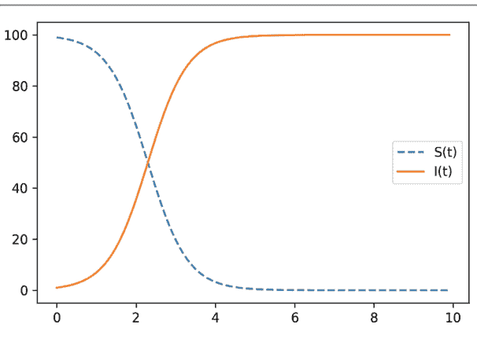

**图 7.1** (7.5)的仿真结果

具有约束(7.1)和初始条件(7.2)的微分方程(7.4)具有解析解。事实上，我们有以下解：

$$S(t) = \frac{S_0}{s_0 + i_0 e^{\lambda t}}, \quad I(t) = \frac{I_0 e^{\lambda t}}{s_0 + i_0 e^{\lambda t}}, \qquad (7.5)$$

其中$s_0 \triangleq S_0/N$，$i_0 \triangleq I_0/N$，且$\lambda \triangleq N\beta$。数$\lambda$称为*传播率*或*传染性*。此外，我们定义*特征时间*$\tau \triangleq 1/\lambda = 1/(N\beta)$，它大致表示病毒在网络上传播所需的时间。

由于$\lambda > 0$，很容易理解当$t \to \infty$时，我们有

$$\lim_{t \to \infty} S(t) = 0, \quad \lim_{t \to \infty} I(t) = N. \qquad (7.6)$$

即，所有智能体最终都会被感染。

**例 7.1** (*Python*) 让我们用Python运行SI模型的仿真。Python程序在第7.4.1节给出。我们设置智能体数量$N = 100$，传播率$\lambda = 2$，初始数量$I(0) = 1$和$S(0) = N - I(0) = 99$。仿真基于解析解(7.5)进行，结果如图7.1所示。在图7.1中观察到了(7.6)中的极限性质。$\square$

#### 7.2.2 SIS模型

我们可以将SI模型扩展到一个更现实的模型，称为*SIS*模型。在此模型中，每个感染智能体将以每单位时间$\gamma$的概率康复并回到易感状态。数$\gamma$称为*康复率*。相关的微分方程由下式给出

$$\frac{dI}{dt} = \beta S(t)I(t) - \gamma I(t). \tag{7.7}$$

具有约束(7.1)和初始条件(7.2)，该微分方程也具有解析解，由下式给出

$$I(t) = \frac{(\lambda - \gamma)I_0 e^{(\lambda - \gamma)t}}{(\lambda - \gamma) + \beta I_0 (e^{(\lambda - \gamma)t} - 1)} = N \left(1 - \frac{\gamma}{\lambda}\right) \frac{C e^{(\lambda - \gamma)t}}{1 + C e^{(\lambda - \gamma)t}}, \tag{7.8}$$

其中$\lambda = N\beta$，$C$定义为

$$C = \frac{i_0}{1 - i_0 - \gamma/\lambda}, \quad i_0 = \frac{I_0}{N}. \tag{7.9}$$

特征时间$\tau$由(7.8)给出为

$$\tau = \frac{1}{\lambda - \gamma} = \frac{1}{N\beta - \gamma}. \tag{7.10}$$

由此，我们可以说如果$\lambda - \gamma < 0$，或者

$$R_0 \triangleq \frac{\lambda}{\gamma} = \frac{N\beta}{\gamma} < 1, \tag{7.11}$$

那么根据(7.8)，感染人数会减少。数$R_0$称为*基本再生数*。从(7.8)我们可以很容易地看出

$$\lim_{t \to \infty} I(t) = \begin{cases} N(1 - R_0^{-1}), & \text{if } R_0 > 1, \\ 0, & \text{if } R_0 < 1. \end{cases} \tag{7.12}$$

基本再生数$R_0$对于控制病毒传播非常重要。如果我们能通过保持社交距离等方式将$R_0$降低到1以下，那么根据(7.12)，感染人数将减少到零。

**例 7.2** (*Python*) 这里我们展示SIS模型的Python仿真。Python程序在第7.4.2节给出。我们设置$N = 100$，$I_0 = 10$，和$\lambda = 2$。我们计算$\gamma = 1$（即$R_0 = 2 > 1$）和$\gamma = 3$（即$R_0 = 2/3 < 1$）时的$I(t)$曲线。图7.2显示了结果。从这些结果我们可以看到，如果$R_0 > 1$，则$I(t)$趋近于$N(1 - R_0^{-1}) = 50$；如果$R_0 < 1$，则$I(t)$如(7.12)所示收敛到零。

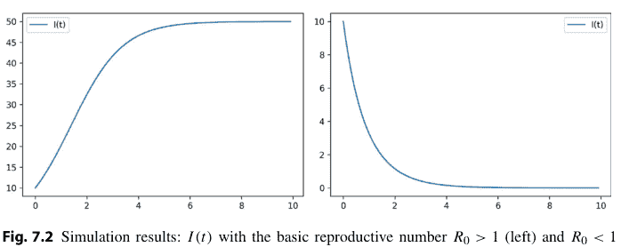

**图 7.2** 仿真结果：基本再生数$R_0 > 1$（左）和$R_0 < 1$（右）时的$I(t)$

#### 7.2.3 SIR模型

在SIS模型中，我们假设感染智能体康复后成为易感智能体。在本小节中，我们改为添加一个称为康复（R）的新状态，并考虑*SIR模型*。在此模型中，感染智能体以与SIS模型相同的速率$\gamma$康复，但康复的智能体永远不会被感染，而是进入康复状态。动力学描述如下：

$$\frac{dS}{dt} = -\beta S(t)I(t), \quad (7.13)$$
$$\frac{dI}{dt} = \beta S(t)I(t) - \gamma I(t), \quad (7.14)$$
$$\frac{dR}{dt} = \gamma I(t). \quad (7.15)$$

我们注意到该微分方程组没有解析解。首先，从(7.13)–(7.15)，我们有

$$\frac{d}{dt}(S + I + R) = 0. \quad (7.16)$$

由于总人口为$N$，我们有

$$S(t) + I(t) + R(t) = N, \quad t \ge 0. \quad (7.17)$$

让我们假设$I(0) + R(0) = N$且$R(0) = 0$。我们进一步假设感染智能体数量非常少，即$I(0) \ll N$，并且在初始短时间内感染智能体对易感智能体的影响很小。换句话说，我们假设对于$t \approx 0$，$S(t) \approx S(0)$。那么，我们得到(7.14)的线性化模型：

$$\frac{dI}{dt} = \beta S(0)I(t) - \gamma I(t) = \lambda_0 I(t), \quad (7.18)$$

对于小的 $t > 0$，其中 $\lambda_0 \triangleq \beta S(0) - \gamma$。定义 $R_0 \triangleq \beta S(0)/\gamma$，即基本再生数。$^1$ 如果 $R_0 > 1$，则 $I(t)$ 在初始时间段内呈指数增长。另一方面，如果 $R_0 < 1$，则 $I(t)$ 减少，且不会观察到传播现象。

**示例 7.3** *(Python)* 我们使用 Python 求解微分方程 (7.13)–(7.15)。Python 程序见第 7.4.3 节。我们设置参数 $N = 100$，$\lambda = 2$，$\gamma = 1$，以及 $\beta = \lambda / N = 1/50$。假设 $I(0) = 10$ 且 $S(0) = 90$。则基本再生数 $R_0$ 变为 $R_0 = \beta S(0) - \gamma = 4/5 < 1$。由此，我们预测感染个体的数量将会减少。图 7.3 显示了结果。我们可以看到，随着康复者数量 $R(t)$ 的增加，感染者数量 $I(t)$ 最终减少。$\square$

### 7.3 复杂网络上的传播现象

在上一节中，我们假设了均匀混合假设。在此假设下，病毒传播的网络是对称的。然而，真实的人类接触网络远比这种对称网络复杂。本节，我们将讨论复杂随机网络上的病毒传播现象。

$^1$ 基本再生数 $R_0$ 的定义取决于模型，因此 SIS 模型的 $\beta N / \gamma$ 与 SIR 模型的不同。为简便起见，此处我们使用相同的符号 $R_0$。

#### 7.3.1 随机网络

我们在此回顾*随机网络*，或称*随机图*，其中边是在固定节点数下随机选择的。

首先，我们考虑一个称为 *Erdős–Rényi 随机图模型* 的简单随机网络。这是一个图 $G = (\mathbf{V}, \mathbf{E})$，其中 $\mathbf{V} = \{1, 2, \dots, N\}$，每条边以预设概率 $p \in (0, 1)$ 随机选择，即，

$(i, j) \in \mathbf{E}, \quad \text{概率为 } p, \qquad (7.19)$

对于每个 $i, j \in \mathbf{V}$。容易证明，*平均度* $\langle k \rangle$，即 $G$ 中每个节点的平均边数，由下式给出

$\langle k \rangle = (N - 1)p. \qquad (7.20)$

同样，*度分布* $P(k)$，即一个节点度为 $k$ 的概率，由下式给出

$P(k) = \binom{N - 1}{k} p^k (1 - p)^{N - 1 - k}, \quad k = 0, 1, 2, \dots, N - 1. \qquad (7.21)$

**示例 7.4** *(Python)* 我们可以使用 `NetworkX` 包轻松生成一个 Erdős–Rényi 随机图。Python 程序见第 7.4.4 节。

我们设置节点数 $N = 100$ 和边连接概率 $p = 0.02$。我们还固定一个随机种子 `seed = 1`，以便每次计算生成相同的图。使用 `NetworkX` 函数 `erdos_renyi_graph` 生成一个 Erdős–Rényi 随机图。计算得到平均度为 `ave_deg = 2.26`，接近 $(N - 1)p = 1.98$。然后，绘制度分布如图 7.4 所示。我们注意到该分布可以用*泊松分布*近似

$P(k) \approx \frac{e^{-\lambda} \lambda^k}{k!}, \qquad (7.22)$

其中 $\lambda = 2.26$（网络的平均度）。

让我们考虑另一个度分布服从幂律的随机图。换句话说，这是一个度分布满足以下条件的随机图

$P(k) \propto k^{-\alpha}, \qquad (7.23)$

对于大的 $k$，其中 $\alpha$ 是一个正参数。这样的网络称为*无标度网络*。无标度网络在我们周围随处可见；社交网络、像万维网这样的计算机网络、航空网络以及接触网络 [1,2]。

无标度网络可以按如下方式生成：

- (i) 选择一个具有 $m_0$ 个节点的随机图作为初始图。我们假设该图的每个节点至少有一条边。
- (ii) 添加一个具有 $m \leq m_0$ 条边的新节点，这些边将新节点随机连接到图中已有的 $m$ 个节点。新节点的一条边连接到节点 $i$ 的概率取决于节点 $i$ 的度 $k_i$。即，该概率由下式给出
$$\Pi(k_i) = \frac{k_i}{\sum_j k_j}, \quad i = 1, 2, \ldots \tag{7.24}$$
- (iii) 继续上述过程，直到节点数达到预设数量 $N$。

该生成模型称为 *Barabási–Albert 模型*。以概率 (7.24) 选择边的方式称为*优先连接*。由于优先连接，度较高的节点比度较低的节点有更大的机会连接新节点。

**示例 7.5** (*Python*) 让我们使用 NetworkX 生成一个无标度网络。Python 程序见第 7.4.5 节，该程序通过 Barabási–Albert 模型生成一个无标度网络。我们设置节点数 $N = 100$ 和添加的边数 $m = 1$。计算得到平均度为 $\langle k \rangle = 1.98$，与示例 7.4 中 Erdős–Rényi 随机图的平均度相似。然而，度分布非常不同，如图 7.5 所示。从图 7.4 可以看出，示例 7.4 中 Erdős–Rényi 随机图的最大度为 8，而 Barabási–Albert 随机图的最大度为 19，并且还有一个度为 13 的节点。这得益于 (7.23) 中的幂律，这种分布被称为*重尾分布*。度为 19 和 13 的节点称为*枢纽*，它们比其他节点拥有更多的连接。在无标度网络中，通常可以找到枢纽。□

**图 7.4** Erdős–Rényi 随机图的度分布 $P(k)$

**图 7.5** Barabási–Albert 随机生成的无标度网络的度分布 $P(k)$

#### 7.3.2 随机网络上的病毒传播

现在，我们讨论上述随机网络上的病毒传播模型。特别是在无标度网络中，会有少数节点或个体具有非常高的度。这样的人可以接触许多其他个体，因此更有可能被感染。因此，我们根据节点的度来区分它们，并假设具有相同度的节点在统计上是等价的。为此，我们用 $I_k$ 和 $S_k$ 分别表示度为 $k$ 的感染和易感个体或节点的数量。我们还用 $N_k$ 表示度为 $k$ 的所有节点的数量，即，我们有

$$I_k(t) + S_k(t) = N_k, \quad t \geq 0, \quad k = 1, 2, \ldots, \Delta, \tag{7.25}$$

其中 $\Delta$ 是最大度。考虑一个具有度分布 $P(k)$，$k = 1, 2, \ldots, \Delta$ 的无标度网络。那么，该网络上度为 $k$ 的节点的 SI 模型由下式给出

$$\frac{dI_k(t)}{dt} = \lambda k S_k(t) \Theta(I(t)), \tag{7.26}$$

其中 $I(t) \triangleq [I_1(t), I_2(t), \ldots, I_{\Delta}(t)]^\top$ 且

$$\Theta(I(t)) \triangleq \frac{1}{\langle k \rangle} \sum_{l=1}^{\Delta} l P(l) i_l(t), \tag{7.27}$$

其中 $i_l(t) \triangleq I_l(t)/N_l, l = 1, 2, \ldots, \Delta$，且 $\langle k \rangle$ 是由下式定义的*平均度*

$$\langle k \rangle \triangleq \sum_{k=1}^{\Delta} k P(k). \tag{7.28}$$

为了理解该模型描述的病毒传播现象，我们考虑特征时间。SI 模型 (7.26) 的特征时间由下式给出

$$\tau_{\mathrm{SI}} = \frac{\langle k \rangle}{\lambda(\langle k^2 \rangle - \langle k \rangle)}. \tag{7.29}$$

其中 $\langle k^2 \rangle$ 是网络度分布 $P(k)$ 的二阶矩，即，

$$\langle k^2 \rangle = \sum_{k=1}^{\Delta} k^2 P(k). \tag{7.30}$$

首先，让我们考虑 Erdős–Rényi 随机图模型。可以证明，在 Erdős–Rényi 随机图模型中，以下等式成立：

$$\langle k^2 \rangle = \langle k \rangle (\langle k \rangle + 1). \tag{7.31}$$

那么，特征时间由下式给出

$$\tau_{\mathrm{SI}} = \frac{1}{\lambda \langle k \rangle}. \tag{7.32}$$

即，如果平均度 $\langle k \rangle$ 很大，特征时间就会变短。

然后，让我们考虑具有度分布 (7.23) 的无标度网络。特别地，我们考虑 $2 < \alpha \le 3$，这在许多真实网络中成立。那么，容易证明

$$\langle k^2 \rangle \to \infty, \quad \text{当 } N \to \infty, \tag{7.33}$$

而在极限情况下 $\langle k \rangle < \infty$。那么，由 (7.29) 可得

$$\tau_{\mathrm{SI}} \to 0, \quad \text{当 } N \to \infty. \tag{7.34}$$

这意味着即使传输率 $\lambda$ 非常小，病毒也会立即在非常大的无标度网络上传播。这是由于少数具有非常高度的*枢纽*，有时被称为*超级传播者*，病毒通过它们在无标度网络上广泛而快速地传播。

我们同样研究了随机网络上的SIR模型。SIR模型由以下方程给出

$$\frac{dS_k(t)}{dt} = -\lambda k S_k(t) \bar{\Theta}(I(t)), \quad (7.35)$$
$$\frac{dI_k(t)}{dt} = \beta \lambda k S_k(t) \bar{\Theta}(I(t)) - \gamma I_k(t), \quad (7.36)$$
$$\frac{dR_k(t)}{dt} = \gamma I_k(t), \quad (7.37)$$

其中

$$\bar{\Theta}(I(t)) \triangleq \frac{1}{\langle k \rangle} \sum_{l=1}^{\Delta} (l-1) P(l) i_l(t), \quad i_l(t) \triangleq \frac{I_l(t)}{N_l}. \quad (7.38)$$

特征时间 $\tau_{\text{SIR}}$ 由下式给出

$$\tau_{\text{SIR}} = \frac{\langle k \rangle}{\lambda \langle k^2 \rangle - (\lambda + \gamma) \langle k \rangle}. \quad (7.39)$$

对于Erdős–Rényi随机图，由式(7.31)可得

$$\tau_{\text{SIR}} = \frac{1}{\lambda (\langle k \rangle + 1) - (\lambda + \gamma)}. \quad (7.40)$$

该值总是有限的。另一方面，对于满足 $2 \le \alpha < 3$ 的无标度网络，可以说

$$\tau_{\text{SIR}} \to 0, \quad \text{当 } N \to \infty. \quad (7.41)$$

这是由于无标度网络中存在枢纽节点或超级传播者，如上所述。

#### 7.3.3 病毒传播的多智能体模拟

在本节中，我们对随机网络上的病毒传播进行多智能体模拟。为此，我们使用了NDlib这个强大的软件包，它是一个Python软件包，允许在复杂网络上描述、模拟和研究扩散过程[5]。

首先，我们考虑一个Barabási–Albert随机图上的SIR模型，该图有 $N = 1000$ 个节点，新节点数 $m = 20$，并随机连接。我们设定感染率 $\beta = 0.005$，恢复率 $\gamma = 0.01$。总人数为1000，其中初始时刻只有一人被感染。在这些参数下，我们执行SI和SIR模型的模拟并进行比较。Python程序见第7.4.6节。该模拟程序的结果如图7.6和图7.7所示。如图7.6所示，在SI模型中，感染者比例 $I(t)/N$ 迅速增加并收敛到1。另一方面，SIR模型的模拟结果显示，感染者比例增加到总人口 $n = 1000$ 的约80%，然后由于他们康复而下降。

从这些结果可以看出，我们可以轻松地使用Python和NDlib包执行大流行的多智能体模拟。

### 7.4 Python代码

#### 7.4.1 Python代码7.1：SI模型

Python代码7.1是用于模拟示例7.1中SI模型的Python程序。

Python代码7.1：示例7.1中的SI模型

```
1 import matplotlib.pyplot as plt
2 import numpy as np
3
4 # Parameters
5 N = 100 # Number of agents
6 lmbd = 2 # Transmission rate
7 I0 = 1 # Initial number of I
8 i0 = I0/N
9 S0 = N - I0 # Initial number of S
10 s0 = 1 - i0
11
12 # Simulation
13 T = 100 # Simulation time
14 dt = 0.1 # Step size
15 I = np.zeros(T) # Initializing I(t)
16 S = np.zeros(T) # Initializing S(t)
17 I[0] = I0 # Initial value
18 S[0] = S0 # Initial value
19 for k in range(1,T):
20     a = np.exp(lmbd * k * dt)
21     S[k] = S0 / (s0 + (1-s0) * a)
22     I[k] = I0 * a / (1 - i0 + i0 * a)
23
24 # Plot
25 time = np.arange(0,T*dt,dt) # Time axes
26 plt.plot(time,I, label="I(t)")
27 plt.plot(time,S, '--', label="S(t)")
28 plt.legend()
29 plt.show()
```

#### 7.4.2 Python代码7.2：SIS模型

Python代码7.2是用于模拟示例7.2中SIS模型的Python程序。

Python代码7.2：示例7.2中的SIS模型

```
1 import matplotlib.pyplot as plt
2 import numpy as np
3 # Parameters
4 N = 100 # Number of agents
5 lmbd = 2 # Transmission rate
6 gamm = 1 # Recovery rate
7 I0 = 10 # Initial number of I
8 i0 = I0/N
9 # Simulation
10 T = 100 # Simulation time
11 dt = 0.1 # Step size
12 I = np.zeros(T) # Initializing I(t)
13 I[0] = I0 # Initial value
14 C = i0/(1-i0-gamm/lmbd)
15 for k in range(1,T):
16     a = C * np.exp((lmbd-gamm) * k * dt)
17     I[k] = N * (1-gamm/lmbd) * a / (1 + a)
18 # Plot
19 time = np.arange(0,T*dt,dt) # Time axes
20 plt.plot(time,I, label="I(t)")
21 plt.legend()
22 plt.show()
```

#### 7.4.3 Python代码7.3：SIR模型

Python代码7.3是用于模拟示例7.3中SIR模型的Python程序。

Python代码7.3：示例7.3中的SIR模型

```
1 import numpy as np
2 from scipy.integrate import odeint
3 import matplotlib.pyplot as plt
4 # Parameters
5 N = 100 # Number of agents
6 lmbd = 2 # Transmission rate
7 gamm = 1 # Recovery rate
8 beta = lmbd/N # Transmission coefficient
9 I0 = 10 # Initial number of I
10 S0 = N - I0 # Initial number of S
11 R0 = 0 # Initial number or R
12 # ODE definition
13 def F(X, t, N, beta, gamm):
14     S, I, R = X
15     dSdt = -beta * S * I
16     dIdt = beta * S * I - gamm * I
17     dRdt = gamm * I
18     return dSdt, dIdt, dRdt
19 # Numerical solution of SIR ODE
20 T = 100 # Simulation time
21 dt = 0.1 # Step size
22 time = np.arange(0,T*dt,dt) # Discrete time
23 X0 = S0, I0, R0 # Initial condition
24 Xt = odeint(F, X0, time, args=(N, beta, gamm))
25 S, I, R = Xt.T
26 # Plot
27 plt.plot(time,I, label="I(t)")
28 plt.plot(time,S, '--', label="S(t)")
29 plt.plot(time,R, '-.', label="R(t)")
30 plt.legend()
31 plt.show()
```

#### 7.4.4 Python代码7.4：Erdős–Rényi随机图

Python代码7.4是用于分析示例7.4中讨论的Erdős–Rényi随机图的Python程序。

Python代码7.4：示例7.4的Erdős–Rényi随机图

```
1 import networkx as nx
2 import numpy as np
3 import matplotlib.pyplot as plt
4
5 # Random graph generation
6 n = 100 # Number of nodes
7 p = 0.02 # Edge connection probability
8 seed = 1 # Random seed
9 G = nx.erdos_renyi_graph(n, p, seed=seed)
10
11 # Average degree
12 ave_deg = sum([d for n, d in G.degree()])/float(G.number_of_nodes())
13 print(ave_deg)
14
15 # Degree distribution
16 hist_deg = np.array(nx.degree_histogram(G), dtype=float)
17 Pk = hist_deg/G.number_of_nodes()
18 plt.bar(np.arange(Pk.shape[0]),Pk)
19 plt.xlabel('k')
20 plt.title('Degree distribution P(k)')
```

#### 7.4.5 Python代码7.5：无标度网络

Python代码7.5用于分析示例7.5（第7.3.1节）中讨论的无标度网络。

Python代码7.5：示例7.5中的无标度网络

```
1 import networkx as nx
2 import numpy as np
3 import matplotlib.pyplot as plt
4
5 # Random graph generation
6 n = 100 # Number of nodes
7 m = 1 # Number of added edges
8 seed = 1 # Random seed
9 G = nx.barabasi_albert_graph(n, m, seed=seed)
10
11 # Average degree
12 ave_deg = sum([d for n, d in G.degree()])/float(G.number_of_nodes())
13 print(ave_deg)
14
15 # Degree distribution
16 hist_deg = np.array(nx.degree_histogram(G), dtype=float)
17 Pk = hist_deg/G.number_of_nodes()
18 plt.bar(np.arange(Pk.shape[0]),Pk)
19 plt.xlabel('k')
20 plt.title('Degree distribution P(k)')
21
22
23 from google.colab import files
24 plt.savefig("barabasi_albert.png", dpi=300)
25 files.download("barabasi_albert.png")
```

#### 7.4.6 Python代码7.6：复杂网络上的多智能体模拟

Python代码7.6是用于第7.3.3节讨论的多智能体模拟的Python程序。

Python代码7.6：复杂网络上的多智能体模拟

```
1 !pip install -q ndlib
2
3 import networkx as nx
4 import matplotlib.pyplot as plt
5 import numpy as np
6 import ndlib.models.epidemics as ep
7 import ndlib.models.ModelConfig as mc
8 from bokeh.io import output_notebook, show
9 from ndlib.viz.mpl.DiffusionTrend import DiffusionTrend
10 %matplotlib inline
11 # Random graph
12 N = 1000
13 G = nx.barabasi_albert_graph(N, 20)
14
15 # Parameters
16 beta = 0.005
17 gamma = 0.01
18 fraction_infected = 1/N
19
20 # Model selection (SI model)
21 model = ep.SIModel(G)
22
23 # Model Configuration (SI model)
24 cfg = mc.Configuration()
25 cfg.add_model_parameter('beta', beta)
26 cfg.add_model_parameter('gamma', gamma)
27 cfg.add_model_parameter("fraction_infected", fraction_infected)
28 model.set_initial_status(cfg)
29
30 # Simulation execution (SI model)
31 T = 100
32 iterations = model.iteration_bunch(T)
33 trends = model.build_trends(iterations)
34
35 # Model selection (SIR model)
36 model1 = ep.SIRModel(G)
37
38 # Model Configuration (SIR model)
39 cfg = mc.Configuration()
40 cfg.add_model_parameter('beta', beta)
41 cfg.add_model_parameter('gamma', gamma)
42 cfg.add_model_parameter("fraction_infected", fraction_infected)
43 model1.set_initial_status(cfg)
44
45 # Simulation execution (SIR model)
46 iterations = model1.iteration_bunch(T)
47 trends1 = model1.build_trends(iterations)
48
49 # Visualization
50 viz = DiffusionTrend(model, trends)
51 viz2 = DiffusionTrend(model1, trends1)
52 viz.plot()
53 viz2.plot()
```

### 7.5 总结

在本章中，我们研究了网络上病毒传播的数学模型。首先，我们假设了均匀混合假设，并在此假设下推导了SI、SIS和SIR的常微分方程模型。然后，我们引入了不一定满足均匀混合假设的复杂随机网络。在这种复杂网络下得到了SI和SIR模型。最后，通过Python和NDlib包，我们可以轻松地在复杂网络上执行大流行的多智能体模拟。

关于随机网络的基础知识，可以参考文献[2]的教材，该教材也讨论了随机网络上的病毒传播现象。关于第7.3节讨论的复杂网络上传播模型的细节，请参考文献[4]和文献[2, 第10.3节]。如果你对大流行病的*控制*感兴趣，综述文章[3,8]提供了丰富的信息。关于第7.3.3节介绍的NDlib，请参阅文献[5]。

### 7.6 习题

- (i) 证明在约束条件(7.1)和初始条件(7.2)下，常微分方程(7.4)的解由(7.5)给出。
- (ii) 证明在约束条件(7.1)和初始条件(7.2)下，常微分方程(7.7)的解由(7.8)给出。
- (iii) 对于大规模Erdös–Rényi随机网络，证明(7.31)（提示：使用泊松分布）。
- (iv) 对于度分布由(7.23)给出且$2 < \alpha \leq 3$的无标度网络，证明其极限性质(7.33)。
- (v) 通过修改Python代码7.6，增加总人数来验证性质(7.34)。
- (vi) 对Watts–Strogatz随机网络[6,7]上的病毒传播进行NDlib模拟，并将结果与第7.3.3节所示的结果进行比较。

## 参考文献

1. Albert R, Barabási AL (2002) Statistical mechanics of complex networks. Rev Mod Phys 74:47–97
2. Barabási AL (2016) Network science. Cambridge University Press
3. Nowzari C, Preciado VM, Pappas GJ (2016) Analysis and control of epidemics: a survey of spreading processes on complex networks. IEEE Control Syst Mag 36(1):26–46
4. Pastor-Satorras R, Castellano C, Van Mieghem P, Vespignani A (2015) Epidemic processes in complex networks. Rev Mod Phys 87(3):925–979
5. Rossetti G, Milli L, Rinzivillo S, Sirbu A, Pedreschi D, Giannotti F (2018) NDLIB: a python library to model and analyze diffusion processes over complex networks. Int J Data Sci Anal 5:61–79
6. Watts DJ (1999) Small worlds—the dynamics of networks between order and randomness. Princeton University Press
7. Watts DJ (1998) Collective dynamics of ‘small-world’ networks. Nature 393:440–442
8. Zino L, Cao M (2021) Analysis, prediction, and control of epidemics: a survey from scalar to dynamic network models. IEEE Circuits Syst Mag 21(4):4–23

## 索引

**A**
基于绝对状态的，66
邻接矩阵，51
一致性，68
一致性控制器，68
一致性协议，68
代数连通度，78
代数图论，23, 45
代数重数，29
交替方向乘子法（ADMM），182
基于角度的编队控制，145
角度等价，129
角度刚性，127, 129
Armijo准则，168
增广拉格朗日，182
平均一致性，66
平均度，213, 216

**B**
平衡图，47
Barabási–Albert模型，214
基本再生数，210
基追踪，164, 174
方位一致性，125
基于方位的编队控制，143
方位等价，125
方位刚性，123, 125
方位刚性矩阵，124
方位向量，124
大数据，2

**C**
中心流形，141
中心收集器，190
集中式传感器网络，2
质心，89, 90
质心Voronoi剖分，90
特征多项式，29
特征时间，209
闭函数，161
完全图，47, 63
全等，117
连通，48
一致性，66
一致性控制，2
一致性控制器，68
一致性问题，66
一致性协议，68
一致性集合，177
一致性值，66
约束，161
约束集，161
凸函数，160
凸优化问题，161
凸集，159
代价函数，161
覆盖，86
覆盖问题，86
环，49
环图，63

**D**
深度神经网络，9
度，47
度分布，213
度矩阵，52
可对角化矩阵，32
有向图，45
维数定理，24
递减步长，174, 185
有向图，45
有向路径，48
有向树，49
分歧向量，78
离散时间，74
离散时间积分器，74
离散时间线性系统，43
基于距离的编队控制，135
距离全等，118
距离等价，118
距离刚性，118
距离刚性矩阵，120
分布式编队控制，115
分布式$\ell^1$优化，185
分布式传感器网络，2
双随机矩阵，28

**E**
特征值，29
特征向量，29
上图，161
等价，117
Erdős–Rényi随机图，186, 213
误差矩阵，137
欧几里得范数，23
事件触发控制，8

**F**
快速迭代收缩阈值算法（FISTA），180
可行集，161
可行解，161
Fejér单调性，181
一阶收敛，179
固定步长，168
灵活性，117
For循环，22
编队控制，114
编队图，116
框架，115
融合中心，190

**G**
一般方位刚性，127
一般距离刚性，122
一般实现，121
几何平均一致性，67
几何重数，29
Gershgorin圆盘定理，34
全局方位刚性，125
全局坐标系，114
全局距离刚性，118
全局刚性，117
全局最小值，162
全局弱刚性，129
梯度，166
梯度下降算法，167
梯度下降律，135
梯度投影算法，170
图，115
图拉普拉斯矩阵，51
图信号处理，9
图论，45
群组测试，162

**H**
半色调图像处理，104
重尾分布，215
Henneberg构造，123
Henneberg构造：0-扩展，123
Henneberg构造：1-扩展，123
异构，66
同构，66
均匀混合假设，208
枢纽，215
枢纽（网络的），216
人类社交网络，6
人类社会，6
Hurwitz矩阵，42
超平面，170

**I**
If-elif-else结构，21
像，24
入度，46
关联矩阵，51, 115
指示函数，160, 177
诱导范数，34
无穷小角度刚性，129
无穷小距离柔性，119
无穷小距离刚性，119
无穷小角度刚性，133
无穷小方位刚性，126
无穷小弱刚性，132, 133
无穷小运动，119, 126, 131
无穷小刚性，119
无穷小弱刚性，129
内积，23
积分器，68
不变集，110
不可约矩阵，36

**J**
Jordan标准形，31
Jordan块，31

**K**
核，24

**L**
ℓ¹范数，177
ℓ¹优化，164, 174
ℓ¹正则化最小二乘，178
ℓ¹单位球，178
ℓ²范数，23
Laman定理，122
拉普拉斯矩阵，51
领导者-跟随者一致性，67
最小绝对收缩和选择算子（LASSO），178
最小范数问题，170
最小二乘，190
左特征向量，29
线性代数，23
线性收敛，179
线搜索，167
Lipschitz连续，168
局部坐标系，113
局部最小值，162

**M**
流形，132
矩阵指数，39
最大一致性，67
最大度，47
最大特征值，179
最大离手控制，8
最大奇异值，179
测量矩阵，163
测量向量，163
最小距离刚性，122
最小无穷小弱刚性，146
最小一致性，67
最小生成树，60
Moore–Penrose伪逆，170, 203
多智能体显示，104
多智能体系统（MAS），1
多跳通信，2

**N**
负定，38
半负定，38
邻居，66, 86
非凸函数，160
非凸集，159
非负矩阵，27

**O**
目标函数，161
正交，24
正交补，24
正交分解，24
出度，46

**P**
路径，48
路径图，63
置换矩阵，35
Perron–Frobenius定理，36
Perron–Frobenius理论，35
Perron矩阵，54
Perron定理，36
泊松分布，213
多面体，91
多项式矩阵，32
正定，38
正矩阵，27
半正定，38
势函数，135
优先连接，214
投影，169, 177
投影算子，124
真函数，160
比例全等，129
近端函数，178
近端梯度算法，178
近端算子，175

**Q**
二次函数，176

**R**
随机图，213
随机网络，213
秩，24
实现，114
恢复率，210
可约矩阵，35
正则化最小二乘，193
正则点，121
基于相对状态的，66
资源感知控制，8
右特征向量，29
刚性，117
刚性，117

### S

- 采样周期，43
- 无标度网络，213
- 缩放运动，123
- Schur矩阵，43
- 半单特征值，29
- 半单矩阵，29
- 符号函数，21，174
- 相似，30
- 相似变换，137
- SI模型，208
- 简单特征值，29
- SIR模型，211
- 软阈值函数，178
- 生成子图，50
- 生成树，50
- 稀疏控制，8
- 特殊欧几里得运动，119
- 谱分解，32
- 谱映射定理，33
- 谱半径，34
- 谱，34
- 稳定性，41
- 星型网络，190
- 驻点，167
- 步长，167
- 随机矩阵，27
- 强连通，48
- 强凸函数，176
- 次微分，172
- 次梯度，172
- 次梯度投影算法，173
- 子图，49
- 下水平集，160
- 超级传播者，216
- 支撑超平面，173

### T

- 测试矩阵，163
- 测试向量，163
- 时间离散化，43
- 传染性，209
- 传播系数，208
- 传播率，209
- 树，49
- 平凡运动，119

### U

- 无向图，45

### V

- 病毒传播网络，6
- Voronoi单元，88
- Voronoi质心，90
- Voronoi图，87，88

### W

- 弱全等，128
- 弱等价，128
- 弱连通，48
- 弱刚性，132
- 弱刚度，127，129
- 弱刚度矩阵，129
- Wolfe准则，168

### Z

- Zachary的空手道俱乐部，45