Laura Sach

Martin O'Hanlon

## 使用Python创建图形用户界面

如何为你的Python项目构建窗口、按钮和部件

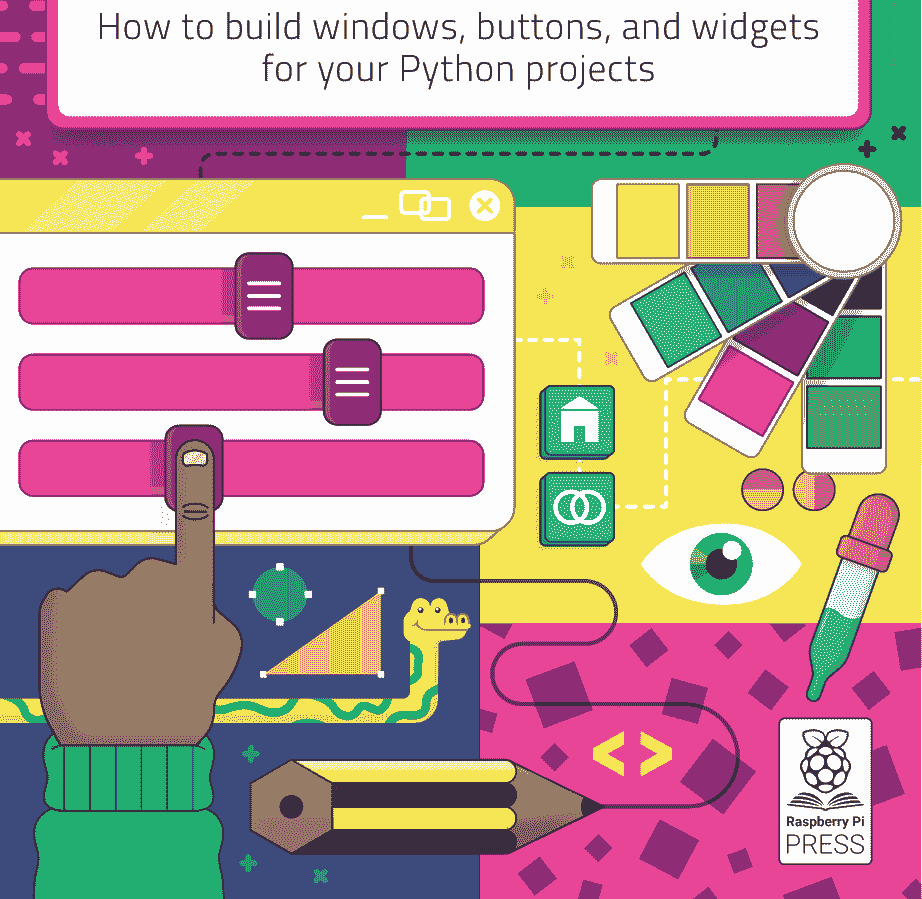


首次出版于2020年，由Raspberry Pi Trading Ltd出版，地址：Maurice Wilkes Building,
St. John's Innovation Park, Cowley Road, Cambridge, CB4 0DS

出版总监：Russell Barnes • 编辑：Phil King
设计：Critical Media
首席执行官：Eben Upton

ISBN: 978-1-912047-91-8

出版商和贡献者对本书中提及或宣传的商品、产品或服务的任何遗漏或错误不承担责任。
除非另有说明，本书内容采用知识共享署名-非商业性使用-相同方式共享 3.0 未本地化版本
(CC BY-NC-SA 3.0) 许可。

## 关于作者...


### Martin O'Hanlon

Martin在Raspberry Pi基金会的学习团队工作，负责创建在线课程、项目和学习资源。他为许多开源项目和Python库的开发做出了贡献，包括guizero。小时候，他想成为一名计算机科学家、宇航员或单板滑雪教练。


### Laura Sach

Laura领导着Raspberry Pi基金会的A Level团队，为学生创建学习计算机科学的资源。她不知怎么还能同时烤蛋糕、拥抱猫咪和照看一个蹒跚学步的孩子。

## 欢迎！

本书将向你展示如何使用Python和guizero库创建一些有趣的图形用户界面（GUI）。guizero库的诞生源于一个信念：对于学校里的学生来说，一定有一种更简单的方法来创建Python GUI。这个库本身诞生于一次从剑桥出发的漫长火车旅途中，最初是一位中学教师的副业项目。

guizero在功能上已经有了显著增长，但仍然忠于其最初的目标：简单而灵活。它是一个适合所有初学者创建的库，适合教师搭建学习脚手架，也适合专家节省时间。

我们希望这些项目和guizero能为你的Python程序带来一丝小小的兴奋火花。这火花可以是任何东西：从一个点击后会执行操作的按钮，到你原本黑白分明的Python编程中的色彩，再到一个完整的、五彩缤纷的华夫饼（Waffle）。

事实证明，使用开源软件，即使你不知道如何完成全部工作，只要你开始，就会有人帮助你。我们感谢许多为创建guizero付出时间和精力的贡献者，也感谢成千上万在项目中使用它的人。享受你的旅程，并为你的创作感到自豪。

Laura 和 Martin

## 目录

**第1章：GUI简介** 008
如何安装guizero并创建你的第一个应用

**第2章：通缉令海报** 012
使用样式化文本和图像创建海报

**第3章：间谍名字选择器** 018
制作一个交互式GUI应用

**第4章：表情包生成器** 026
创建一个绘制表情包的GUI应用

**第5章：世界上最糟糕的GUI** 036
通过先做错一切来学习良好的GUI设计！

**第6章：井字棋** 044
使用你的GUI控制一个简单的游戏

**第7章：消灭圆点** 062
学习如何使用华夫饼（Waffle）创建一个有趣的游戏

**第8章：洪水游戏**
创建一个更复杂的基于华夫饼的益智游戏

**第9章：表情符号配对**
制作一个有趣的图片配对游戏

**第10章：画板**
创建一个简单的绘图应用

**第11章：定格动画**
构建你自己的定格动画GIF创建器

**附录A：环境设置**
学习如何安装Python和一个IDE

**附录B：Python入门**
如何开始用Python编程

**附录C：guizero中的部件**
guizero中使用的部件概览

## 第1章
GUI简介
如何安装guizero并创建你的第一个应用

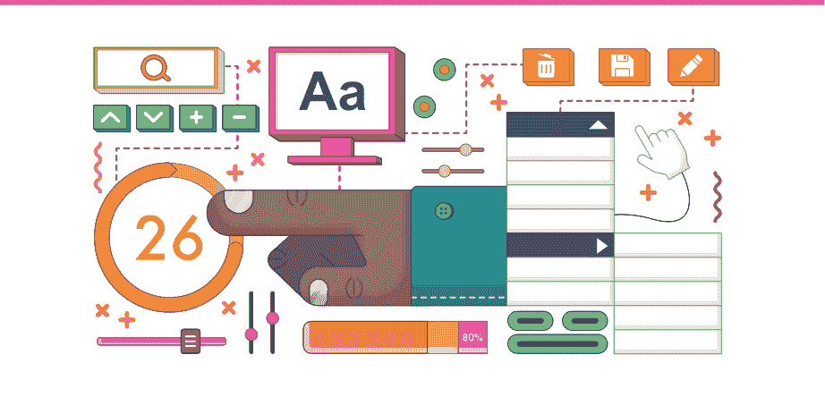

你需要什么

你需要一台计算机（例如Raspberry Pi、Apple Mac、Windows或Linux PC）和互联网连接来安装软件。你还需要安装以下软件：

- **Python 3** (python.org) – 参见附录A
- **一个IDE**（代码编辑器），例如：IDLE（随Python 3安装）、Thonny (thonny.org)、Mu (codewith.mu)、PyCharm (jetbrains.com/pycharm)
- **guizero Python库** (lawsie.github.io/guizero)

图形用户界面（GUI，发音为'gooey'）是一种让你的Python程序更易用、更令人兴奋的方式。你可以向界面添加不同的组件，称为“部件”，从而允许以多种不同的方式向程序输入信息并显示输出。你可能希望允许人们点击按钮、显示一段文本，甚至让他们从菜单中选择一个选项。在本书中，我们将使用guizero库，它的开发旨在帮助初学者轻松创建GUI。

Python的标准GUI包叫做tkinter，在大多数平台上已经随Python一起安装。guizero库是tkinter的一个封装器——这意味着它提供了一种使用Python标准GUI库的更简单方式。


### 安装guizero

你需要安装guizero (**lawsie.github.io/guizero**) Python库来创建本书中的程序。它以Python包的形式提供，这是一种可重用的代码，你可以下载、安装，然后在你的程序中使用。

如何安装guizero取决于你的操作系统以及你控制计算机的权限。

如果你可以访问命令行/终端，你可以使用以下命令：

```
bash
pip3 install guizero
```

guizero的完整安装说明可在 **lawsie.github.io/guizero** 获取，包括在没有计算机管理员权限时的安装选项以及Windows的可下载安装程序。

### Hello World

现在你已经安装了guizero，让我们检查一下它是否正常工作，并编写一个小型的“hello world”应用。按照程序员的传统，当使用新工具或语言时，他们会编写这个作为第一个程序。

| **GUIZERO的目标** |
| :--- |
| • 无需安装即可使用 | • 对幼儿友好，但也能用于高级项目 |
| • 移除新学习者难以理解的不必要代码 | • 带有示例的高质量文档 |
| • 合理的部件名称 | • 生成有用的错误信息 |

打开你将编写Python代码的编辑器。在每个guizero程序的开头，你需要从guizero库中选择所需的部件并导入它们。你只需要导入每个部件一次，然后就可以在程序中任意多次使用它。
在页面顶部，添加以下代码来导入App部件：

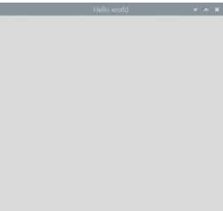

```python
from guizero import App
```

所有guizero项目都以一个主窗口开始，这是一个称为App的容器部件。在每个guizero程序的末尾，你必须告诉程序显示你刚刚创建的应用。
在导入App部件的那行代码下面添加以下两行代码：

```python
app = App(title="Hello world")
app.display()
```

现在保存并运行你的代码。你应该会看到一个标题为“Hello world”的GUI窗口（图1）。恭喜，你刚刚创建了你的第一个guizero应用！

### 添加部件

部件是出现在GUI上的东西，例如文本框、按钮、滑块，甚至普通的文本片段。
所有部件都放在创建App的代码行和`app.display()`行之间。这是你刚刚制作的应用，但在这个例子中，我们添加了一个Text部件：

```python
from guizero import App, Text
app = App(title="Hello world")
message = Text(app, text="Welcome to the app")
app.display()
```

你注意到有两个变化了吗（图2）？现在多了一行添加Text部件的代码，而且我们还在第一行的导入部件列表中添加了Text。
让我们更详细地看看Text部件的代码：

```python
message = Text(app, text="Welcome to the app")
```

## 第二章
### 通缉令海报
使用样式化文本和图片创建一张海报

既然你已经能创建基本的图形用户界面（GUI），让我们把它做得更有趣一些。你可以添加不同字体、大小和颜色的文本，更改背景颜色，还可以添加图片。为了练习所有这些，我们来创建一张“通缉令”海报。

首先，你需要创建一个应用程序。在你的编辑器中，添加以下代码来创建最基本的应用程序窗口：

```python
from guizero import App

app = App("Wanted!")

app.display()
```

保存并运行你的代码，你应该会看到一个应用程序，它看起来像一个纯灰色的方块，顶部有标题“Wanted!”（图1）。

图1 基本应用程序

### 背景颜色

让我们让应用程序的背景与众不同一些。传统的通缉令海报看起来像是用羊皮纸做的，所以让我们添加一种淡黄色作为背景。

找到你创建应用程序的那行代码。紧接着这行代码之后，再添加一行代码来修改窗口的 `bg` 属性。在这里，`bg` 是“background”（背景）的缩写，它将允许我们更改背景颜色。现在你的代码应该如下所示：

```python
from guizero import App

app = App("Wanted!")
app.bg = "yellow"

app.display()
```

这被称为编辑属性。在代码中，你需要指定你正在谈论的控件（`app`）、你想要更改的属性（`bg`）以及你想要将其更改为的值。

你可能觉得这个颜色（**图2**）有点太黄了，所以让我们查找另一种黄色的十六进制代码。有很多网站可以搜索颜色，例如你可以尝试 **htmlcolorcodes.com**（**图3**）。

当你选择了想要的颜色后，你会看到它的代码以十六进制（在这种情况下是 #FBFBD0）或 RGB（251, 251, 208）的形式显示在网站上。在 guizero 中设置颜色时，你可以使用这两种格式；例如，你可以删除使背景变黄的代码，然后在你的程序中尝试以下选项之一：

```python
app.bg = "#FBFBD0"
app.bg = (251, 251, 208)
```

图4 淡色背景

### 添加一些文本

你的应用程序现在应该看起来像**图4**。现在让我们向 GUI 添加一些文本。我们将从添加所有好的通缉令海报都需要的文本开始——“Wanted”这个词！

首先，找到你已经导入了 `App` 的那行代码。

```python
from guizero import App
```

你需要导入 `Text` 才能创建一段文本，所以将其添加到列表的末尾。现在这行代码如下所示：

```python
from guizero import App, Text
```

每次你想使用一种新类型的控件时，只需将其名称添加到列表的末尾即可。没有必要不断添加全新的代码行：只需坚持使用一个列表，这样你的程序就不会变得太混乱。

既然你可以使用文本了，让我们添加一段文本。记住，GUI 上的所有控件都必须添加在创建 `App` 的代码行和显示它的代码行之间。你的代码现在应该如下所示：

```python
from guizero import App, Text

app = App("Wanted!")
app.bg = "#FBFBD0"

wanted_text = Text(app, "WANTED")

app.display()
```

让我们仔细看看你刚刚添加的那行代码。

```python
wanted_text = Text(app, "WANTED")
```

这里，`wanted_text` 是这段文本的名称。这样我们就可以在代码的后面引用它——把它想象成一个人的名字。（你甚至可以把你的文本命名为 Dave，计算机不会在意的！）

在括号内，我们有两样东西。第二个是 "WANTED"，这很直接，因为它就是我们想要在屏幕上显示的文本。第一个是控制这段文本的容器，被称为它的“主控件”（master）。在这个例子中，我们是在说这段文本应该由应用程序控制。当你刚开始创建 GUI 时，你的大多数控件都会以应用程序作为它们的主控件，但还有其他可以存储控件的容器，你将在后面学到。

### 更改文本大小和颜色

哎呀，这段文本太小了（图5）。让我们用与更改应用程序背景颜色完全相同的方式更改 `text_size` 属性。记住，你需要指定三样东西：

1.  控件的名称
2.  要更改的属性
3.  要更改为的新值

所以，在这个例子中，你将指定控件（`wanted_text`）、要更改的属性（`text_size`）和新值（50）。在创建文本的那行代码正下方添加一行新代码来更改属性。

```python
wanted_text = Text(app, "WANTED")
wanted_text.text_size = 50
```

现在你的海报上有了更大的文本（图6）。看看你是否能将这段文本的字体更改为其他不同的字体。可用的字体取决于你使用的操作系统，所以这里有一些建议：

- Times New Roman
- Verdana
- Courier
- Impact

没有图片的“通缉令”海报是不完整的，所以让我们添加一张。我的海报将为我的猫而做，因为她总是抓挠不该抓的东西。

将你想使用的图像副本保存在与你的 GUI 程序相同的文件夹中。你可以使用其他文件夹中的图像，但如果你这样做，你将必须提供图像的路径，所以当你刚开始时，将它们存储在同一个文件夹中要容易得多。

> 图像处理
> 因为 guizero 是一个面向初学者的库，我们希望它尽可能易于安装，所以它不包含更高级的图像处理功能，因为这些功能需要一个名为“pillow”的额外库。你始终可以在任何平台上使用非动画 GIF 图像，以及在除 Mac 以外的所有平台上使用 PNG 图像，所以如果你不确定是否安装了额外的图像处理功能，请坚持使用这些图像类型。

希望你现在已经习惯了添加控件。记住，它们必须始终在程序顶部导入，然后在创建 `App` 的代码行之后、最终的 `app.display()` 行之前，用一个合理的名称创建控件。

在程序开头的控件导入列表中添加“Picture”。

```python
from guizero import App, Text, Picture
```

现在创建一个 `Picture` 控件，包含两个参数：应用程序和图片的文件名。这是我们使用的代码，因为我们的图片名为 **tabitha.png**。

```python
cat = Picture(app, image="tabitha.png")
```

再次运行你的代码（它应该看起来像 **02-wanted.py**），你应该会看到图片显示在文本下方（**图7**）。

现在轮到你运用新的 GUI 自定义技能，按照你喜欢的任何方式来设计你的海报了。

## 阅读文档

你可能想知道如何找出某个特定组件有哪些可以更改的属性。即使你是一个完全的编程初学者，也值得学习如何阅读文档，因为这将让你能够充分发挥 guizero 以及你遇到的任何其他库的全部功能。

guizero 的文档可以在 **lawsie.github.io/guizero** 找到。一旦你到达那里，点击你想要更改的组件，然后向下滚动，直到你到达属性部分。例如，如果你在组件标题下选择 'Text'，你将看到一个 Text 组件所有可能更改的属性。文档通常还包含有用的代码片段，向你展示如何使用特定的属性或方法，所以不要害怕浏览——你永远不知道你会学到什么！

## 02-wanted.py / Python 3

```python
from guizero import App, Text, Picture

app = App("Wanted!")
app.bg = "#FBFBD0"

wanted_text = Text(app, "WANTED")
wanted_text.text_size = 50
wanted_text.font = "Times New Roman"

cat = Picture(app, image="tabitha.png")

app.display()
```

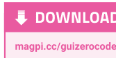

## 第 3 章

## 间谍姓名选择器

制作一个交互式 GUI 应用程序

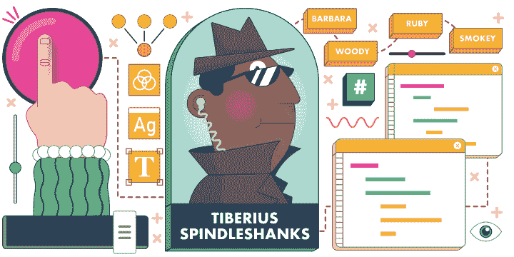

到目前为止，你已经学会了如何使用各种不同的选项来自定义你的 GUI。现在是时候进入真正交互的部分，制作一个能够响应用户输入的 GUI 应用程序了。谁能抗拒按下一个大红按钮来生成一个超级秘密的间谍名字呢？

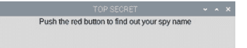

既然你已经知道如何创建一个应用程序，为什么不继续创建一个基本窗口，并根据需要添加一些文本呢？这里有一些代码可以帮助你开始，这段代码还包括一些注释（以 # 开头的行）来帮助你构建程序：

```python
# Imports -----------------
from guizero import App, Text

# Functions ----------------

# App -----------------
app = App("TOP SECRET")

# Widgets --------------
title = Text(app, "Push the red button to find out your spy name")

# Display --------------
app.display()
```

运行这段代码，你应该会看到一个带有文本的窗口（图 1）。

## 添加一个按钮

让我们继续为 GUI 添加一个按钮。将 PushButton 添加到你的导入列表中，以便你可以使用按钮。（注意使用大写的 B！）
在 Text 组件下方，但在 app.display() 之前，添加一行代码来创建一个按钮。

```python
button = PushButton(app, choose_name, text="Tell me!")
```

你的代码现在应该看起来像 **spy1.py**（第 22 页）。运行它，不会出现按钮，但你会在 shell 窗口中看到一个错误：

```
NameError: name 'choose_name' is not defined
```

这是因为 **choose_name** 是一个命令的名称，当按钮被按下时该命令会运行。大多数 GUI 组件都可以附加一个命令。
对于按钮来说，附加一个命令意味着“当按钮被按下时，运行这个命令。”GUI 程序的工作方式与你可能编写过的其他 Python 程序不同，因为程序中命令的运行顺序完全取决于用户按下按钮、移动滑块、勾选框或与你正在使用的任何其他组件交互的顺序。实际的命令几乎总是一个要运行的函数的名称。

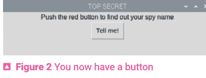

## 创建一个函数

让我们编写函数 **choose_name**，这样你的按钮在被按下时就有事情可做。

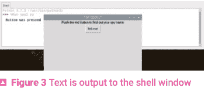

查看你的程序并找到函数部分。这是你应该编写所有将附加到 GUI 组件的函数的地方，以将它们与显示组件的代码分开。在函数部分添加这段代码：

```python
def choose_name():
    print("Button was pressed")
```

你的代码现在应该看起来像 **spy2.py**。按钮现在会出现（**图 2**）。如果你按下按钮，可能看起来什么都没发生，但如果你查看你的 shell 或输出窗口，你会看到那里出现了一些文本（**图 3**）。

指示你的函数首先打印出一些虚拟文本是确认按钮在被按下时正确激活其命令函数的一种有用方法。然后你可以将 `print` 语句替换为你希望按钮执行的实际任务的代码。

在你的 **choose_name** 函数内部，在打印 "Button was pressed" 的代码行前面输入一个 # 符号。程序员称之为“注释掉”，你在这里做的是告诉计算机将这行代码视为注释，换句话说，你指示计算机忽略它。注释掉一行代码而不是直接删除它的好处是，如果你以后想再次使用该代码，你可以通过移除 # 符号轻松地将其重新纳入你的程序。

> ## 大红按钮

目前，你的按钮既不大也不红！你在上一章中使用了属性来更改“通缉”海报上的文本外观，那么你能使用 PushButton 组件的属性来更改背景颜色和文本大小吗？

请注意，在 macOS 上可能无法更改按钮的颜色，因为某些版本的操作系统不允许你这样做，但你仍然应该能够更改文本大小。

## 添加一些名字

在新的一行，添加一个名字列表。你可以选择列表中的名字，名字的数量可以随意，但要确保每个名字都在引号内，并且名字之间用逗号分隔。引号内的字母、数字和/或标点符号的集合称为 *字符串*，所以我们说每个名字必须是一个字符串。

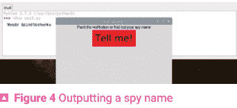

```python
first_names = ["Barbara", "Woody", "Tiberius", "Smokey", "Jennifer", "Ruby"]
```

现在也添加一个姓氏列表：

```python
last_names = ["Spindleshanks", "Mysterioso", "Dungeon", "Catseye", "Darkmeyer", "Flamingobreath"]
```

现在你需要添加一种方法，从每个列表中随机选择一个名字来组成你的间谍名字。你的第一项工作是在导入部分添加一个新的导入行：

```python
from random import choice
```

这告诉程序你想使用一个名为 choice 的函数，该函数从列表中随机选择一个项目。其他人已经编写了为你执行此操作的代码，它包含在 Python 中供你使用。
在你的 **choose_name** 函数代码中，就在你的名字列表下方，添加一行代码来选择间谍的名字，然后将其与姓氏连接起来，中间用一个空格。连接是一个花哨的词，意思是“将两个字符串连接在一起”，Python 中用于连接的符号是加号（+）。

```python
spy_name = choice(first_names) + " " + choice(last_names)
print(spy_name)
```

你的代码现在应该类似于 **spy3.py**。保存并运行它。当你按下按钮时，你应该会看到一个随机生成的间谍名字出现在你的控制台或 shell 中，就在之前显示原始 "Button was pressed" 消息的同一位置（**图 4**）。

## 将名字放入 GUI

这很好，但如果间谍名字出现在 GUI 上不是更好吗？让我们创建另一个 Text 组件并用它来显示间谍名字。

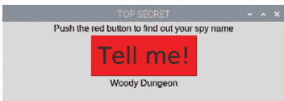

在组件部分，添加一个新的 Text 组件来显示间谍名字：

```python
name = Text(app, text="")
```

当你创建组件时，你不希望它显示任何文本，因为用户还没有按下按钮，所以你可以将文本设置为 ""，这被称为“空字符串”，不显示任何内容。在你的 **choose_name** 函数内部，注释掉你打印间谍名字的代码行。

现在在函数末尾添加一行新代码，将 name Text 组件的值设置为你刚刚创建的 **spy_name**。这将导致 Text 组件更新自身并显示名字。

```python
name.value = spy_name
```

你的最终代码应该如 **03-spy-name-chooser.py** 所示。运行它并按下按钮，看看你的间谍名字自豪地显示在 GUI 上（**图 5**）。

如果你不喜欢给你的名字，可以再次按下按钮，程序会为你随机生成另一个名字。

```python
# Imports -----------------
from guizero import App, Text, PushButton

# Functions ---------------

# App ---------------------
app = App("TOP SECRET")

# Widgets -----------------
title = Text(app, "Push the red button to find out your spy name")
button = PushButton(app, choose_name, text="Tell me!")

# Display -----------------
app.display()
```

## spy2.py / Python 3

```python
# 导入 -----------------
from guizero import App, Text, PushButton

# 函数 ---------------
def choose_name():
    print("Button was pressed")

# 应用 ---------------------
app = App("TOP SECRET")

# 控件 -----------------
title = Text(app, "Push the red button to find out your spy name")
button = PushButton(app, choose_name, text="Tell me!")

# 显示 -----------------
app.display()
```

## spy3.py / Python 3

```python
# 导入 -----------------
from guizero import App, Text, PushButton
from random import choice

# 函数 ---------------
def choose_name():
    #print("Button was pressed")
    first_names = ["Barbara", "Woody", "Tiberius", "Smokey",
"Jennifer", "Ruby"]
    last_names = ["Spindleshanks", "Mysterioso", "Dungeon",
"Catseye", "Darkmeyer", "Flamingobreath"]
    spy_name = choice(first_names) + " " + choice(last_names)
    print(spy_name)

# 应用 ---------------------
app = App("TOP SECRET")

# 控件 -----------------
title = Text(app, "Push the red button to find out your spy name")
button = PushButton(app, choose_name, text="Tell me!")
button.bg = "red"
button.text_size = 30

# 显示 -----------------
app.display()
```

## 03-spy-name-chooser.py / Python 3

```python
# 导入 -----------------

from guizero import App, Text, PushButton
from random import choice

# 函数 -----------------

def choose_name():
    #print("Button was pressed")
    first_names = ["Barbara", "Woody", "Tiberius", "Smokey",
"Jennifer", "Ruby"]
    last_names = ["Spindleshanks", "Mysterioso", "Dungeon",
"Catseye", "Darkmeyer", "Flamingobreath"]
    spy_name = choice(first_names) + " " + choice(last_names)
    #print(spy_name)
    name.value = spy_name

# 应用 -----------------

app = App("TOP SECRET")

# 控件 -----------------

title = Text(app, "Push the red button to find out your spy name")
button = PushButton(app, choose_name, text="Tell me!")
button.bg = "red"
button.text_size = 30
name = Text(app, text="")

# 显示 -----------------

app.display()
```

## 第4章

## 表情包生成器

创建一个绘制表情包的GUI应用程序

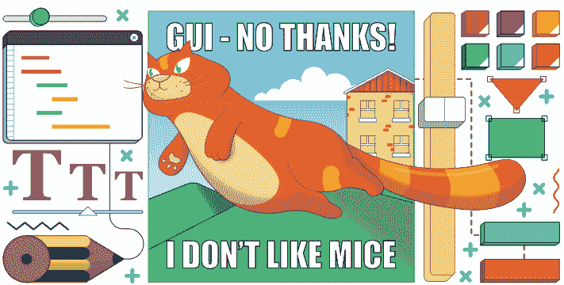

让我们运用前几章学到的知识，创建一个绘制表情包的GUI。你将输入文本和图片名称，你的GUI将使用绘图控件将它们组合成你自己的表情包。

首先，创建一个简单的GUI，包含两个用于顶部和底部文本的文本框。你将在这里输入要插入图片上方和下方以创建表情包的文本。添加这行代码来导入所需的控件。

```python
from guizero import App, TextBox, Drawing
```

然后为应用添加这段代码：

```python
app = App("meme")

top_text = TextBox(app, "top text")
bottom_text = TextBox(app, "bottom text")

app.display()
```

表情包将创建在一个绘图控件上，该控件将包含图片和文本。

## 创建表情包

通过在 `app.display()` 行之前插入此代码将其添加到GUI中。绘图控件的高度和宽度应设置为“填充”GUI的其余部分。

```python
meme = Drawing(app, width="fill", height="fill")
```

当顶部和底部文本框中的文本发生变化时，表情包将被创建。为此，我们需要创建一个绘制表情包的函数。
该函数应清除绘图，创建一个图像（我们使用啄木鸟的照片，但你可以使用任何你想要的图像），并在图像的顶部和底部插入文本。
还记得你在第3章中使用 `name.value` 来设置带有间谍名称的Text控件的值吗？你也可以使用value属性来获取Text控件的值，所以在这种情况下，`top_text.value` 意思是“请获取在top_text框中输入的值”。

```python
def draw_meme():
    meme.clear()
    meme.image(0, 0, "woodpecker.png")
    meme.text(20, 20, top_text.value)
    meme.text(20, 320, bottom_text.value)
```

`meme.image(0, 0)` 和 `meme.text(20, 20)` 中的前两个数字是绘制图像和文本的x、y坐标。图像绘制在位置0, 0，即左上角，因此图像覆盖了整个绘图区域。
最后，在显示应用之前调用你的 `draw_meme` 函数。在 `app.display` 行之前插入此代码：

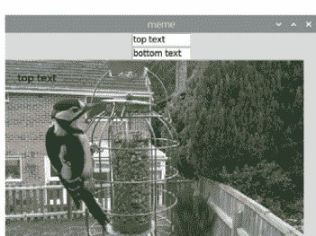

```python
draw_meme()
```

你的代码现在应该看起来像 `meme1.py`。

如果你运行你的应用（**图1**）并尝试更改顶部和底部文本，你会注意到它不会在表情包中更新。要使其工作，你必须更改你的程序，以便在文本更改时调用 `draw_meme` 函数，方法是向应用中的两个TextBox控件添加一个命令。

```python
top_text = TextBox(app, "top text", command=draw_meme)
bottom_text = TextBox(app, "bottom text", command=draw_meme)
```

你的代码现在应该看起来像 **meme2.py** 中的那样。运行它，并通过更改顶部和底部文本来更新你的表情包。
然后你可以通过更改文本的颜色、大小和字体参数来查看你的表情包。例如：

```python
meme.text(
    20, 20, top_text.value,
    color="orange",
    size=40,
    font="courier")
meme.text(
    20, 320, bottom_text.value,
    color="blue",
    size=28,
    font="times new roman",
    )
```

> **提示**
这些代码行开始变得非常长，所以我们将其分成多行以使其更易于阅读。这不会影响程序的功能，只是影响其外观。

你的代码现在应该看起来像 **meme3.py**。尝试不同的样式，直到找到你喜欢的（**图2**）。

## 自定义你的表情包生成器

对于一个真正交互式的表情包生成器，用户应该能够自己设置字体、大小和颜色。你可以在GUI上提供额外的控件来允许他们这样做。
可用的颜色和字体选项数量有限，因此你可以为此使用下拉列表，也称为组合框。大小可以使用滑块控件设置。

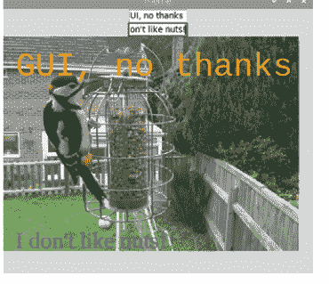

首先，修改你的导入语句以包含Combo和Slider控件。

```python
from guizero import App, TextBox, Drawing, Combo, Slider
```

在你为顶部和底部文本创建了TextBox控件之后，创建一个新的Combo控件，以便用户可以选择颜色。

```python
bottom_text = TextBox(app, "bottom text", command=draw_meme)
color = Combo(app,
    options=["black", "white", "red", "green", "blue", "orange"],
    command=draw_meme)
```

**options** 参数设置用户可以从组合框中选择的颜色。每种颜色是列表中的一个元素。你可以向列表中添加任何其他你想要的颜色。
选项按照你放入列表中的顺序显示。第一个选项是默认选项，首先显示。如果你想将不同的选项设为默认值，可以使用 **selected** 参数，例如 "blue"。

```python
color = Combo(app,
    options=["black", "white", "red", "green", "blue", "orange"],
    command=draw_meme,
    selected="blue")
```

现在你的用户可以选择一种颜色。接下来，你需要更改 **draw_meme** 函数，以便在创建表情包中的文本时使用组合框的值。例如：

```python
meme.text(
    20, 20, top_text.value,
    color=color.value,
    size=40,
    font="courier")
```

对底部文本的代码块执行相同的操作。你的程序现在应该类似于 **meme4.py**。
按照上述步骤，在你的应用程序中添加第二个组合框，以便用户可以从以下选项列表中选择字体：["times new roman", "verdana", "courier", "impact"]。记得更改 **draw_meme** 函数，以便在添加文本时使用 **font** 值。
创建一个新的滑块控件来设置用户想要的文本大小。

```python
size = Slider(app, start=20, end=40, command=draw_meme)
```

滑块的范围使用start和end参数设置。因此，在此示例中，最小的可用文本大小为20，最大为40。
修改 `draw_meme` 函数，以便在创建表情包文本时使用大小滑块的值。

```python
meme.text(
    20, 20, top_text.value,
    color=color.value,
    size=size.value,
    font=font.value)
```

你的代码现在应该类似于 **04-meme-generator.py** 中的代码。尝试运行它，你应该会看到类似 **图3** 的内容。
你能更改GUI，以便将图像文件名输入到TextBox中，或者从组合框的列表中选择吗？这将使你的应用程序也能够使用不同的图像生成表情包。

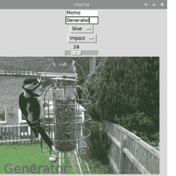

## 绘图控件

绘图控件非常通用，可用于显示许多不同的形状、图案和图像。
要了解更多关于绘图控件的信息，请参阅附录C，或查看在线文档：**lawsie.github.io/guizero/drawing**。

## meme1.py / Python 3

```python
# 导入 -----------------

from guizero import App, TextBox, Drawing

# 函数 ---------------

def draw_meme():
    meme.clear()
    meme.image(0, 0, "woodpecker.png")
    meme.text(20, 20, top_text.value)
    meme.text(20, 320, bottom_text.value)

# 应用 ---------------------

app = App("meme")

top_text = TextBox(app, "top text")
bottom_text = TextBox(app, "bottom text")

meme = Drawing(app, width="fill", height="fill")

draw_meme()

app.display()
```

## meme2.py / Python 3

```python
# 导入 -----------------

from guizero import App, TextBox, Drawing

# 函数 ---------------

def draw_meme():
    meme.clear()
    meme.image(0, 0, "woodpecker.png")
    meme.text(20, 20, top_text.value)
    meme.text(20, 320, bottom_text.value)

# 应用 ---------------------

app = App("meme")

top_text = TextBox(app, "top text", command=draw_meme)
bottom_text = TextBox(app, "bottom text", command=draw_meme)

meme = Drawing(app, width="fill", height="fill")

draw_meme()

app.display()
```

## meme3.py / Python 3

```python
# 导入 -----------------

from guizero import App, TextBox, Drawing

# 函数 ---------------

def draw_meme():
    meme.clear()
    meme.image(0, 0, "woodpecker.png")
    meme.text(
        20, 20, top_text.value,
        color="orange",
        size=40,
        font="courier")
    meme.text(
        20, 320, bottom_text.value,
        color="blue",
        size=28,
        font="times new roman",
        )

# 应用 ---------------------

app = App("meme")

top_text = TextBox(app, "top text", command=draw_meme)
bottom_text = TextBox(app, "bottom text", command=draw_meme)

meme = Drawing(app, width="fill", height="fill")

draw_meme()

app.display()
```

## meme4.py / Python 3

```python
# 导入 -----------------

from guizero import App, TextBox, Drawing, Combo, Slider

# 函数 -----------------

def draw_meme():
    meme.clear()
    meme.image(0, 0, "woodpecker.png")
    meme.text(
        20, 20, top_text.value,
        color=color.value,
        size=40,
        font="courier")
    meme.text(
        20, 320, bottom_text.value,
        color=color.value,
        size=28,
        font="times new roman",
        )

# 应用 ---------------------

app = App("meme")

top_text = TextBox(app, "top text", command=draw_meme)
bottom_text = TextBox(app, "bottom text", command=draw_meme)

color = Combo(app,
              options=["black", "white", "red", "green", "blue",
                       "orange"],
              command=draw_meme, selected="blue")

meme = Drawing(app, width="fill", height="fill")

draw_meme()

app.display()
```

## 04-meme-generator.py / Python 3

```python
# 导入 -----------------

from guizero import App, TextBox, Drawing, Combo, Slider

# 函数 -----------------

def draw_meme():
    meme.clear()
    meme.image(0, 0, "woodpecker.png")
    meme.text(
        20, 20, top_text.value,
        color=color.value,
        size=size.value,
        font=font.value)
    meme.text(
        20, 320, bottom_text.value,
        color=color.value,
        size=size.value,
        font=font.value,
        )

# 应用 -----------------------

app = App("meme")

top_text = TextBox(app, "top text", command=draw_meme)
bottom_text = TextBox(app, "bottom text", command=draw_meme)

color = Combo(app,
              options=["black", "white", "red", "green", "blue",
                      "orange"],
              command=draw_meme, selected="blue")

font = Combo(app,
             options=["times new roman", "verdana", "courier",
                     "impact"],
             command=draw_meme)

size = Slider(app, start=20, end=50, command=draw_meme)

meme = Drawing(app, width="fill", height="fill")

draw_meme()

app.display()
```

## 第5章

## 世界上最糟糕的图形用户界面

通过先做错所有事来学习好的图形用户界面设计！

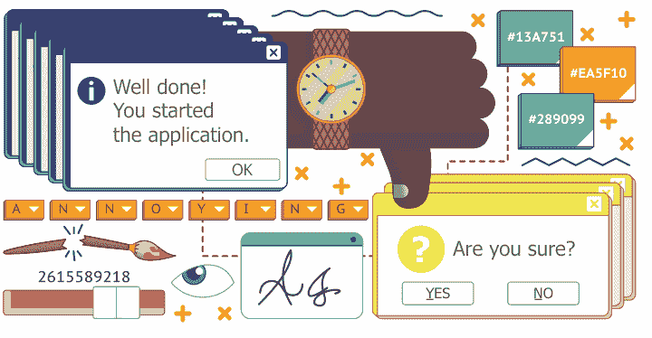

> 是时候真正大展身手，尝试不同的控件、颜色、字体和功能了。就像大多数实验一样，你很可能第一次不会做对！事实上，你将探索创建图形用户界面的错误方法。

## 难以阅读

正确选择图形用户界面的颜色和字体很重要。背景色和文本颜色之间的对比度对于确保你的图形用户界面易于阅读至关重要。你不应该做的是使用两种非常相似的颜色。

在代码顶部导入控件：

```python
from guizero import App, Text
```

创建一个带有标题的应用：

```python
app = App("it's all gone wrong")
title = Text(app, text="Some hard to read text")
```

```python
app.display()
```

通过更改颜色、字体和文本大小进行实验（参见 **worst1.py** 清单，第41页）。我的选择不是最好的！

```python
app = App("it's all gone wrong", bg="dark green")
title = Text(app, text="Some hard-to-read text", size="14",
font="Comic Sans", color="green")
```

图形用户界面上的文本停留足够长的时间以便阅读也很重要。它当然不应该消失或开始闪烁。
guizero 中的所有控件都可以使用 **hide()** 和 **show()** 函数使其不可见（或再次可见）。使用 guizero 中的 **repeat** 函数每秒运行一个函数，你可以让你的文本隐藏和显示自身，从而看起来在闪烁。
创建一个函数，如果文本可见则隐藏它，如果不可见则显示它：

```python
def flash_text():
    if title.visible:
        title.hide()
    else:
        title.show()
```

在显示应用之前，使用 **repeat** 让 **flash_text** 函数每 1000 毫秒（1秒）运行一次。

```python
app.repeat(1000, flash_text)

app.display()
```

你的代码现在应该看起来像 **worst2.py**。测试你的应用：标题文本应该闪烁，每秒出现和消失一次。

## 错误的控件

使用合适的控件可能是优秀图形用户界面和完全不可用的图形用户界面之间的区别。
你会用哪个控件来输入日期？一个文本框？多个组合框？文本框会更灵活，但需要验证和格式化。用于年、月、日的多个组合框不需要验证，但使用起来会更慢。

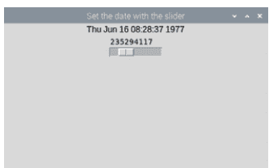

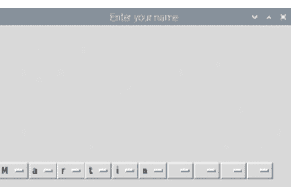

然而，使用滑块来设置日期和时间（**图1**），就像 **worst3.py** 代码示例中那样，并不是一个好主意。

滑块控件返回一个介于 0 到 999,999,999 之间的数字。这是自 1970 年 1 月 1 日以来的秒数。函数 `ctime()` 用于将此数字转换为日期和时间。

从用户那里获取文本很简单：一个文本框或多行文本框应该能满足你所有的需求。但这是否太简单了？这是否需要太多的打字？

对于只想使用鼠标的用户呢？也许一系列包含字母表中所有字母的组合框会更好（**图2**）？

首先导入 guizero 控件和 `ascii_letters`。

```python
from guizero import App, Combo
from string import ascii_letters
```

`ascii_letters` 是一个包含所有“可打印”ASCII 字符的列表，你可以将其用作组合框的选项。

创建一个包含所有字母的单个组合框并显示应用。

```python
a_letter = Combo(app, options=" " + ascii_letters, align="left")

app.display()
```

你的程序现在应该类似于 **worst4.py**。运行它，你将看到一个包含所有字母加一个空格的单个组合框，并且与窗口左边缘对齐。

要将一行字母组合在一起，你可以不断地向你的应用添加组合框控件，例如：

```python
a_letter = Combo(app, options=" " + ascii_letters, align="left")
b_letter = Combo(app, options=" " + ascii_letters, align="left")
c_letter = Combo(app, options=" " + ascii_letters, align="left")
```

通过将每个组合框控件左对齐，控件将彼此相邻地显示在左边缘。

或者，你可以使用 **for** 循环，创建一个字母列表，并将每个字母附加到列表中，如 **worst5.py** 所示。

尝试这两种方法，看看你更喜欢哪一种。**for** 循环更灵活，因为它允许你创建任意数量的字母。

## 弹出窗口

没有糟糕的图形用户界面是完整的，如果没有一个弹出框。guizero 包含许多弹出框，可用于让用户知道一些重要信息或收集有用信息。它们也可以用来激怒和烦扰用户！

首先，创建一个应用程序，在启动时弹出一个无意义的框，让你知道应用程序已经启动。

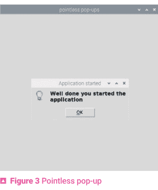

```python
from guizero import App

app = App(title="pointless pop-ups")

app.info("Application started", "Well done you started the application")

app.display()
```

运行你的应用程序，你会看到一个“信息”框出现（**图3**）。传递给 info 的第一个参数是窗口的标题；第二个参数是消息。

你可以通过使用 **warn** 或 **error** 代替 **info** 来更改这个简单弹出窗口的样式。

弹出框也可用于从用户那里获取信息。最简单的是 **yesno**，它会向用户提出一个问题并获得 True 或 False 的响应。如果你想让用户在执行某些操作（如删除文件）之前进行确认，这很有用。不过，也许不是每次他们按按钮时都这样！

将 PushButton 控件导入到你的应用程序中：

```python
from guizero import App, PushButton
```

创建一个使用 **yesno** 弹出窗口来请求确认的函数。

def are_you_sure():
    if app.yesno("确认", "你确定吗？"):
        app.info("谢谢", "按钮已按下")
    else:
        app.error("好的", "正在取消")

将按钮添加到你的图形用户界面中，使其在按下时调用该函数。

```
button = PushButton(app, command=are_you_sure)
```

你的代码现在应该类似于 `05-worlds-worst-gui.py`。
当你运行应用程序并按下按钮时，你会看到一个弹出窗口，要求你确认是或否（图4）。
你可以在 lawsie.github.io/guizero/alerts 上了解更多关于 guizero 中弹出框的信息。
何不将所有这些“功能”组合成一个出色的图形用户界面呢？

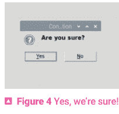

## 窗口小部件

弹出框可用于向用户提问，但它们非常简单。
如果你想显示额外信息或请求补充数据，你可以使用 Window 小部件来创建多个窗口。
Window 的使用方式与 App 类似，并且具有许多相同的功能。

你可以使用 `show()` 和 `hide()` 方法来控制窗口是否在屏幕上显示。

```
window.show()
window.hide()
```

```
from guizero import App, Window

app = App("主窗口")
window = Window(app, "第二个窗口")

app.display()
```

通过向 `show` 的 `wait` 参数传递 `True`，可以使应用程序在窗口显示后等待其关闭。例如：

```
window.show(wait=True)
```

你可以在 guizero 文档中了解更多关于如何使用多个窗口的信息：
lawsie.github.io/guizero/multiple_windows。

## worst1.py / Python 3

```
# 导入 -----------------

from guizero import App, Text

# 应用 ---------------------

app = App("一切都出错了", bg="dark green")

title = Text(app, text="难以阅读", size="14", font="Comic Sans", color="green")

app.display()
```

## worst2.py / Python 3

```
# 导入 -----------------

from guizero import App, Text

# 函数 ---------------

def flash_text():
    if title.visible:
        title.hide()
    else:
        title.show()

# 应用 ---------------------

app = App("一切都出错了", bg="dark green")

title = Text(app, text="难以阅读", size="14", font="Comic Sans", color="green")

app.repeat(1000, flash_text)

app.display()
```

```
python
# 导入 -----------------

from guizero import App, Slider, Text
from time import ctime

# 函数 ---------------

def update_date():
    the_date.value = ctime(date_slider.value)

# 应用 ---------------------

app = App("用滑块设置日期")
the_date = Text(app)
date_slider = Slider(app, start=0, end=999999999, command=update_date)

app.display()
```

```
python
# 导入 -----------------
from guizero import App, Combo
from string import ascii_letters

# 应用 ---------------------

app = App("输入你的名字")

a_letter = Combo(app, options=" " + ascii_letters, align="left")

app.display()
```

## 使用 Python 创建图形用户界面

```
worst5.py / Python 3

# 导入 -----------------

from guizero import App, Combo
from string import ascii_letters

# 应用 ---------------------

app = App("输入你的名字")

name_letters = []
for count in range(10):
    a_letter = Combo(app, options=" " + ascii_letters,
align="left")
    name_letters.append(a_letter)

app.display()
```

```
05-worlds-worst-gui.py / Python 3

from guizero import App, PushButton

def are_you_sure():
    if app.yesno("确认", "你确定吗？"):
        app.info("谢谢", "按钮已按下")
    else:
        app.error("好的", "正在取消")

app = App(title="无意义的弹出窗口")

button = PushButton(app, command=are_you_sure)

app.info("应用程序已启动", "做得好，你启动了应用程序")

app.display()
```

## 第6章
井字棋
使用你的图形用户界面来控制一个简单的游戏

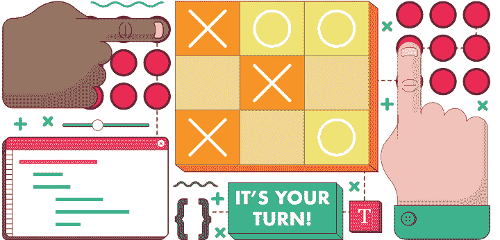

既然你已经学会了如何制作一个基本的图形用户界面，让我们在幕后添加更多的编程逻辑，使你的图形用户界面能够作为控制井字棋（也称为圈叉棋）游戏的手段。

创建一个新文件，包含以下代码：

```
# 导入 -----------------
from guizero import App

# 函数 -----------------

# 变量 -----------------

# 应用 -----------------
app = App("井字棋")

app.display()
```

## 创建棋盘

让我们从创建构成游戏棋盘的小部件开始。一个传统的井字棋棋盘看起来像图1所示的那样。

你将使用按钮来表示棋盘上的每个位置，这样玩家就可以点击其中一个按钮来指示他们想要移动的位置。为了能够在网格上布局按钮，让我们创建一种新的 guizero 小部件类型，称为 Box。

Box 是一个容器小部件。这意味着它用于包含其他小部件并将它们分组。将其添加到代码顶部的导入中：

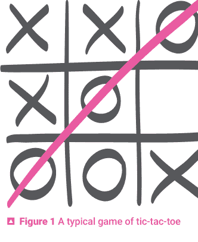

```
from guizero import App, Box,
```

将 Box 设置为网格布局并将其添加到你的应用中——在 **app.display()** 行之前，就像所有小部件一样。

```
board = Box(app, layout="grid")
```

如果你此时运行程序，屏幕上不会显示任何内容，因为 Box 本身是不可见的。

现在让我们创建放入其中的按钮。你总共需要九个按钮，因此与其单独创建它们，你可以使用嵌套循环来自动生成它们并赋予它们坐标。首先，将 PushButton 添加到你的小部件导入列表中，然后将此代码紧接在你刚刚创建的棋盘代码之后添加。

```
for x in range(3):
    for y in range(3):
        button = PushButton(
            board, text="", grid=[x, y], width=3
        )
```

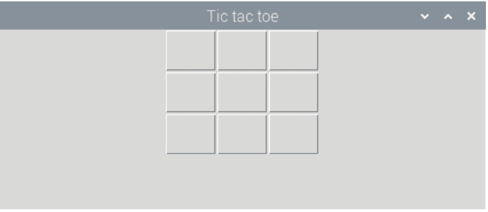

注意有两个循环变量：**x** 从 0 到 2，**y** 从 0 到 2。当我们迭代并生成按钮时，每个按钮都将被添加到棋盘中，也就是你之前创建的 Box 容器。按钮将被赋予网格坐标 **x,y**，这意味着每个按钮都整齐地放置在网格的不同位置上！

你的代码现在应该类似于 **tictactoe1.py**。运行它的结果显示在 **图2** 中。

## 底层数据结构

你可能注意到，当你使用循环创建按钮时，你自动创建了九个按钮，并且每一个都叫做 **button**。你将如何在程序中引用这些按钮中的每一个？

答案是，你需要一个底层数据结构来保存对每个按钮的引用，为此你将使用一个二维列表。

让我们创建一个可以调用来清除棋盘的函数。将此放在函数中是一个好主意，这样你就可以在游戏结束后重置棋盘并允许玩家开始新游戏时重用代码。

在函数部分，添加一个名为 **clear_board** 的新函数。

```
def clear_board():
```

你在这个函数中的第一项工作是初始化棋盘的数据结构。让我们假设此时你还没有创建任何按钮，因此你可以将棋盘上的每个位置初始化为 **None**——列表中的元素现在存在但还没有值。将以下行缩进添加到你的函数中。

```
new_board = [[None, None, None], [None, None, None], [None, None, None]]
```

接下来，将嵌套循环代码从你的应用部分移动到 `clear_board` 函数中。确保缩进正确。

在内部（y）循环中，添加一行代码，将每个按钮的引用存储在其在二维列表中的 x,y 坐标位置，以便你稍后可以引用它。

```
new_board[x][y] = button
```

最后，在循环结束后，返回你刚刚创建的 `new_board`。你的函数应该如下所示：

```
def clear_board():
    new_board = [[None, None, None],
                [None, None, None],
                [None, None, None]]
    for x in range(3):
        for y in range(3):
            button = PushButton(
                board, text="", grid=[x, y], width=3
            )
            new_board[x][y] = button
    return new_board
```

在应用部分，初始化一个名为 `board_squares` 的列表，并将其设置为调用你刚刚创建的新函数。

```
board_squares = clear_board()
```

这个变量将被赋予你在函数中创建的 `new_board` 的值，它应该是一个带有九个按钮的空白棋盘。确保你在创建 Box 的代码之后创建此变量，否则你将尝试向一个尚不存在的容器添加按钮。

你的代码现在将类似于 `tictactoe2.py`。保存并运行程序，你应该会看到与上一步结束时相同的结果，但现在你有一个隐藏的二维列表数据结构，可以让你引用和操作按钮。

如果你想看看你的二维列表是什么样子，你可以添加一个 `print` 命令来打印 `board_squares` 列表：`print(board_squares)`。然后你应该会在 shell 中看到九个 `[PushButton object with text ""]` 出现。

## 让按钮生效

目前，按下按钮时它们没有任何反应。让我们创建一个函数并将其附加到按钮上，这样当按钮被按下时，它会根据玩家的选择显示 X 或 O。

首先，在变量部分创建一个变量来记录轮到哪位玩家。你可以选择从任一玩家开始，但我们选择从 X 开始。

```
turn = "X"
```

现在这意味着你需要在图形用户界面上显示轮到谁了（**图 3**），以免玩家混淆。将 Text 添加到你的组件导入列表中：

```
from guizero import App, Box, PushButton, Text
```

然后在应用部分添加一个新的 Text 组件来显示当前回合。

```
message = Text(app, text="It is your turn, " + turn)
```

转到函数部分，创建一个名为 `choose_square` 的新函数。

```
def choose_square(x, y):
```

你会注意到这个函数接受两个参数——`x` 和 `y`。这是为了让你知道棋盘上的哪个方格被点击了。

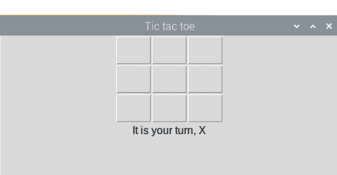

在函数内部添加以下代码（缩进），将被点击按钮内的文本设置为当前玩家的符号，然后禁用该按钮使其无法再次被点击。

```
board_squares[x][y].text = turn
board_squares[x][y].disable()
```

最后，将此函数连接到按钮。在你的 **clear_board** 函数中找到这行代码：

```
button = PushButton(board, text="", grid=[x, y], width=3)
```

修改它，使其看起来像下面这行：

```
button = PushButton(board, text="", grid=[x, y], width=3,
command=choose_square, args=[x,y])
```

你在这里添加了两样东西。首先，你附加了一个命令，就像之前一样。当按钮被按下时，将调用具有此名称的函数。其次，你还为此函数提供了参数，即被按下按钮的坐标 x 和 y，以便你可以在列表中再次找到该按钮。

你的程序现在应该看起来像 **tictactoe3.py**。保存并运行它。你现在应该能够点击一个按钮，它会变成 X。不幸的是，在这个游戏版本中，永远是 X 的回合！

## 玩家交替

一旦一位玩家完成了他们的回合，turn 变量应该切换到另一位玩家。这是一个将 X 切换为 O，反之亦然的函数。

```
def toggle_player():
    global turn
    if turn == "X":
        turn = "O"
    else:
        turn = "X"
```

将代码添加到你的函数部分。注意函数中的第一行：**global turn**。你需要指定这一点，以便允许你修改 **turn** 变量的**全局**版本，即你已经创建的那个。如果你不指定这一点，Python 将创建一个名为 **turn** 的局部变量并修改它，但一旦函数退出，该更改将不会被保存。

你还需要确保 Text 组件准确报告当前玩家的回合。在 `toggle_player` 函数的 if/else 语句之后，像这样更新消息：

```
message.value = "It is your turn, " + turn
```

回到你的 `choose_square` 函数，在设置文本并禁用按钮后，调用 `toggle_player` 函数——使用 `toggle_player()`。你的代码现在应该类似于 `tictactoe4.py`。保存并再次测试程序，你应该会发现你可以点击方格，它们会交替地被指定为 X 或 O。

## 我们有赢家了吗？

最后，你需要编写一个函数来检查是否存在一行、一列或对角线有三个 X 或 O，如果有，则报告游戏的赢家。虽然这看起来非常不优雅，但迄今为止检查是否有人获胜的最简单方法是硬编码检查每条垂直、水平和对角线。以下代码用于一条垂直线、一条水平线和一条对角线——你能添加其余的吗？

```
def check_win():
    winner = None

    # Vertical lines
    if (
        board_squares[0][0].text == board_squares[0][1].text == board_squares[0][2].text
    ) and board_squares[0][2].text in ["X", "O"]:
        winner = board_squares[0][0]

    # Horizontal lines
    elif (
        board_squares[0][0].text == board_squares[1][0].text == board_squares[2][0].text
    ) and board_squares[2][0].text in ["X", "O"]:
        winner = board_squares[0][0]

    # Diagonals
    elif (
        board_squares[0][0].text == board_squares[1][1].text == board_squares[2][2].text
    ) and board_squares[2][2].text in ["X", "O"]:
        winner = board_squares[0][0]
```

注意，函数开始时创建了一个名为 **winner** 的布尔变量。如果在执行完长 if/elif 语句后，此变量的值为 True，你就知道有人赢得了游戏。

在添加了剩余的获胜线检查后，在函数末尾添加一些代码，以便在有赢家时更改显示消息：

```
if winner is not None:
    message.value = winner.text + " wins!"
```

现在你需要确保每次放置 X 或 O 时都调用此函数，这对应于每次按下按钮时。在 **choose_square** 函数末尾添加对 **check_win** 的调用，以防所选方格是获胜方格。

你的程序现在应该看起来像 **tictactoe5.py**。运行它并测试游戏。如果你在 **check_win** 函数中编写的测试正确，你应该会发现游戏能正确检测到玩家何时获胜。

## 重置游戏

在开始时，你编写了一个名为 **clear_board** 的函数。当时这可能看起来不必要，但实际上它是为游戏结束时的情况做准备。由于井字棋是一个相当短的游戏，很可能有人想连续玩多局。

你能为你的游戏添加一个重置按钮吗？它只在有人赢得游戏或游戏平局时出现。该按钮应调用 **clear_board** 函数，并重置 **turn** 变量以及报告谁该回合的消息。

**提示：** 你需要查阅 guizero 文档以了解如何隐藏和显示组件，这样你的按钮就不会在游戏期间一直可见。

**提示：** 创建一个新函数来处理重置游戏所需的所有操作，并在按下重置按钮时调用该函数。不要忘记在你的函数中，你需要将一些变量指定为全局变量。

## 平局游戏

目前，即使游戏已经获胜，游戏也会允许你继续玩，直到所有方格都被选中。它也不会告诉你游戏是否平局。你可以到此为止，但如果你真的想锦上添花，添加一些小细节可以使你的游戏更加完善。

首先，让我们添加一些代码来检测游戏是否平局。如果所有方格都包含 X 或 O，并且没有人获胜，则游戏平局。在函数部分，创建一个名为 moves_taken 的新函数：

```
def moves_taken():
```

你将使用此函数来计算已进行的步数，因此让我们开始一个变量来计数，初始值为 0。

```
def moves_taken():
    moves = 0
```

现在，还记得我们创建 board_squares 时，我们使用了一个嵌套循环来创建网格上的所有方格吗？我们需要另一个嵌套循环来检查每个方格，并确定它是被 X 或 O 填充了，还是空白的。

> 全局变量

可以说使用全局变量是一个坏主意，因为如果你在一个大型程序中有许多函数，那么对于哪些代码修改了变量的值以及何时修改，可能会变得极其混乱。在像这样的小程序中，跟踪起来并不太困难。

请记住，可以在函数内部读取和使用全局变量的值，而无需声明它是全局的，但为了修改其值，你需要显式声明这一点。这个程序中的函数（以及本书中的大多数 GUI 程序）实际上是在修改你的组件作为全局变量的值。例如，当有人赢得游戏时，你设置消息的值以显示谁赢了：

message.value = winner.text + " wins!"

在这个例子中，message 是一个全局变量。那么我们如何在不声明它为全局变量的情况下修改它的值呢？答案是因为我们使用了 message 组件的一个属性，名为 value 的属性。本质上，这段代码说的是“嘿 Python，你知道那边那个叫 message 的组件吗？嗯，你能修改它的 value 属性吗？”Python 允许通过全局范围内的对象属性进行修改，但它不允许你在不声明全局变量的情况下直接修改变量的值。

将以下嵌套循环代码添加到 `moves_taken` 函数中：

```
for row in board_squares:
    for col in row:
```

在循环内部，我们需要检查特定的方格是否已被填入 X 或 O。如果是，则将 `moves` 变量加 1，以记录该方格已被计数。

```
if col.text == "X" or col.text == "O":
    moves = moves + 1
```

最后，当循环完成后，添加一个 `return` 语句来返回已进行的步数。

```
return moves
```

现在，在 `check_win` 函数内部调用此函数，以检查是否平局。在检查获胜者的代码之后添加以下代码：

```
if winner is not None:
    message.value = winner.text + " wins!"

# 添加此代码
elif moves_taken() == 9:
    message.value = "It's a draw"
```

你的代码应该类似于 `06-tictactoe.py`。运行时，游戏现在会检查是否已进行了九步；如果已进行九步，它会将消息更改为报告游戏平局。

## tictactoe1.py / Python 3

```
# 导入 -----------------
from guizero import App, Box, PushButton

# 函数 ---------------

# 变量 ---------------

# 应用 ---------------------
app = App("Tic tac toe")

board = Box(app, layout="grid")
for x in range(3):
    for y in range(3):
        button = PushButton(board, text="", grid=[x, y], width=3)

app.display()
```

## tictactoe2.py / Python 3

```
# 导入 -----------------
from guizero import App, Box, PushButton

# 函数 ---------------
def clear_board():
    new_board = [[None, None, None], [None, None, None], [None, None, None]]
    for x in range(3):
        for y in range(3):
            button = PushButton(
                board, text="", grid=[x, y], width=3)
            new_board[x][y] = button
    return new_board

# 变量 ---------------

# 应用 ---------------------
app = App("Tic tac toe")

board = Box(app, layout="grid")
board_squares = clear_board()

app.display()
```

## tictactoe3.py / Python 3

```
# 导入 -----------------
from guizero import App, Box, PushButton, Text

# 函数 ---------------
def clear_board():
    new_board = [[None, None, None], [None, None, None], [None, None, None]]
    for x in range(3):
        for y in range(3):
            button = PushButton(board, text="", grid=[x, y], width=3, command=choose_square, args=[x,y])
            new_board[x][y] = button
    return new_board

def choose_square(x, y):
    board_squares[x][y].text = turn
    board_squares[x][y].disable()

# 变量 ---------------
turn = "X"

# 应用 ---------------------
app = App("Tic tac toe")

board = Box(app, layout="grid")
board_squares = clear_board()
message = Text(app, text="It is your turn, " + turn)

app.display()
```

## tictactoe4.py / Python 3

```
# 导入 -----------------
from guizero import App, Box, PushButton, Text

# 函数 ---------------
def clear_board():
    new_board = [[None, None, None], [None, None, None], [None, None, None]]
    for x in range(3):
        for y in range(3):
            button = PushButton(board, text="", grid=[x, y], width=3, command=choose_square, args=[x,y])
            new_board[x][y] = button
    return new_board

def choose_square(x, y):
    board_squares[x][y].text = turn
    board_squares[x][y].disable()
    toggle_player()

def toggle_player():
    global turn
    if turn == "X":
        turn = "O"
    else:
        turn = "X"
    message.value = "It is your turn, " + turn

# 变量 ---------------
turn = "X"

# 应用 --------------------
app = App("Tic tac toe")

board = Box(app, layout="grid")
board_squares = clear_board()
message = Text(app, text="It is your turn, " + turn)

app.display()
```

## tictactoe5.py / Python 3

```
# 导入 -----------------
from guizero import App, Box, PushButton, Text

# 函数 ----------------
def clear_board():
    new_board = [[None, None, None], [None, None, None], [None, None, None]]
    for x in range(3):
        for y in range(3):
            button = PushButton(board, text="", grid=[x, y], width=3, command=choose_square, args=[x,y])
            new_board[x][y] = button
    return new_board

def choose_square(x, y):
    board_squares[x][y].text = turn
    board_squares[x][y].disable()
    toggle_player()
    check_win()

def toggle_player():
    global turn
    if turn == "X":
        turn = "O"
    else:
        turn = "X"
    message.value = "It is your turn, " + turn

def check_win():
    winner = None

    # 垂直线
    if (
        board_squares[0][0].text == board_squares[0][1].text == board_squares[0][2].text
    ) and board_squares[0][2].text in ["X", "O"]:
        winner = board_squares[0][0]
    elif (
        board_squares[1][0].text == board_squares[1][1].text == board_squares[1][2].text
    ) and board_squares[1][2].text in ["X", "O"]:
        winner = board_squares[1][0]
    elif (
        board_squares[2][0].text == board_squares[2][1].text == board_squares[2][2].text
    ) and board_squares[2][2].text in ["X", "O"]:
        winner = board_squares[2][0]

    # 水平线
    if (
        board_squares[0][0].text == board_squares[1][0].text == board_squares[2][0].text
    ) and board_squares[2][0].text in ["X", "O"]:
        winner = board_squares[0][0]
    elif (
        board_squares[0][1].text == board_squares[1][1].text == board_squares[2][1].text
    ) and board_squares[2][1].text in ["X", "O"]:
        winner = board_squares[0][1]
    elif (
        board_squares[0][2].text == board_squares[1][2].text == board_squares[2][2].text
    ) and board_squares[2][2].text in ["X", "O"]:
        winner = board_squares[0][2]

    # 对角线
    if (
        board_squares[0][0].text == board_squares[1][1].text == board_squares[2][2].text
    ) and board_squares[2][2].text in ["X", "O"]:
        winner = board_squares[0][0]
    elif (
        board_squares[2][0].text == board_squares[1][1].text == board_squares[0][2].text
    ) and board_squares[0][2].text in ["X", "O"]:
        winner = board_squares[0][2]

    if winner is not None:
        message.value = winner.text + " wins!"

# 变量 ---------------
turn = "X"

# 应用 ---------------------
app = App("Tic tac toe")

board = Box(app, layout="grid")
board_squares = clear_board()
message = Text(app, text="It is your turn, " + turn)

app.display()
```

## 06-tictactoe.py / Python 3

```
# 导入 -----------------
from guizero import App, Box, PushButton, Text

# 函数 -----------------
def clear_board():
    new_board = [[None, None, None], [None, None, None], [None, None, None]]
    for x in range(3):
        for y in range(3):
            button = PushButton(board, text="", grid=[x, y], width=3, command=choose_square, args=[x,y])
            new_board[x][y] = button
    return new_board

def choose_square(x, y):
    board_squares[x][y].text = turn
    board_squares[x][y].disable()
    toggle_player()
    check_win()

def toggle_player():
    global turn
    if turn == "X":
        turn = "O"
    else:
        turn = "X"
    message.value = "It is your turn, " + turn

def check_win():
    winner = None

    # 垂直线
    if (
        board_squares[0][0].text == board_squares[0][1].text == board_squares[0][2].text
    ) and board_squares[0][2].text in ["X", "O"]:
        winner = board_squares[0][0]
    elif (
        board_squares[1][0].text == board_squares[1][1].text == board_squares[1][2].text
    ) and board_squares[1][2].text in ["X", "O"]:
        winner = board_squares[1][0]
    elif (
        board_squares[2][0].text == board_squares[2][1].text == board_squares[2][2].text
    ) and board_squares[2][2].text in ["X", "O"]:
        winner = board_squares[2][0]

    # 水平线
    elif (
        board_squares[0][0].text == board_squares[1][0].text ==
        board_squares[2][0].text
    ) and board_squares[2][0].text in ["X", "O"]:
        winner = board_squares[0][0]
    elif (
        board_squares[0][1].text == board_squares[1][1].text ==
        board_squares[2][1].text
    ) and board_squares[2][1].text in ["X", "O"]:
        winner = board_squares[0][1]
    elif (
        board_squares[0][2].text == board_squares[1][2].text ==
        board_squares[2][2].text
    ) and board_squares[2][2].text in ["X", "O"]:
        winner = board_squares[0][2]

    # 对角线
    elif (
        board_squares[0][0].text == board_squares[1][1].text ==
        board_squares[2][2].text
    ) and board_squares[2][2].text in ["X", "O"]:
        winner = board_squares[0][0]
    elif (
        board_squares[2][0].text == board_squares[1][1].text ==
        board_squares[0][2].text
    ) and board_squares[0][2].text in ["X", "O"]:
        winner = board_squares[0][2]

    if winner is not None:
        message.value = winner.text + " wins!"
    elif moves_taken() == 9:
        message.value = "It's a draw"

def moves_taken():
    moves = 0
    for row in board_squares:
        for col in row:
            if col.text == "X" or col.text == "O":
                moves = moves + 1
    return moves
```

## 06-tictactoe.py (续) / Python 3

```python
# 变量 ---------------
turn = "X"

# 应用 ---------------------
app = App("井字棋")

board = Box(app, layout="grid")
board_squares = clear_board()
message = Text(app, text="轮到你了，" + turn)

app.display()
```

# 第7章
## 消灭圆点
学习如何使用华夫饼控件制作一个有趣的游戏

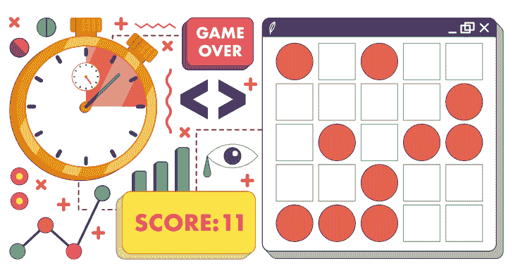

你在井字棋游戏中看到了如何在网格布局上创建图形用户界面，以便向玩家呈现一个网格状的棋盘。如果你正在制作一个涉及更大网格的游戏，有一种名为华夫饼的guizero控件可以立即为你创建一个网格，这对于制作各种有趣的游戏非常有用。

华夫饼在guizero的早期版本中原本是一个方格网格。这个游戏叫做“消灭圆点”，它的出现是因为马丁认为让华夫饼控件包含方格和圆点的混合体是个好主意。

## 游戏目标

在这个游戏中，你需要在圆点消灭你之前消灭它们！棋盘由一个方格网格组成。方格会逐渐变成圆点。要消灭一个圆点，点击该圆点，它就会变回方格。游戏的目标是在被圆点淹没之前尽可能长时间地坚持下去（图1）。

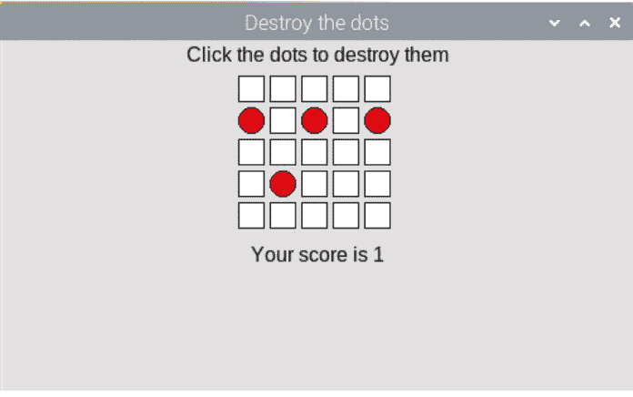

图1 在红色圆点占据棋盘之前消灭它们

## 设置游戏

让我们从创建一个包含游戏说明和华夫饼控件的guizero程序开始。到现在，你应该已经熟悉标准guizero程序的布局，包括导入部分、函数部分、变量部分和应用本身。

首先，创建一个App，并在其中添加一个用于显示说明的Text控件和一个用于棋盘的华夫饼控件：

```python
# 导入 -----------------
from guizero import App, Text, Waffle

# 应用 ----------------------
app = App("消灭圆点")

instructions = Text(app, text="点击圆点以消灭它们")
board = Waffle(app)

app.display()
```

如果你运行程序，你会看到一个3×3的白色方格小网格。如果你想让网格比这更大，可以为你的华夫饼控件添加宽度和高度属性：

```python
board = Waffle(app, width=5, height=5)
```

你的代码现在应该类似于**destroy1.py**（第71页）。

## 引入圆点

接下来，你需要编写一个函数来在棋盘上找到一个随机方格并将其变成圆点。在你的函数部分开始一个名为**add_dot()**的新函数：

```python
def add_dot():
```

要选择棋盘上的一个随机方格，你需要能够生成一对随机整数作为坐标。在你的导入部分添加一行，从**random**库中导入**randint**函数，该函数允许你生成一个随机整数。

```python
from random import randint
```

让我们生成两个变量**x**和**y**，你可以用它们来引用网格上的一个坐标。在你的**add_dot()**函数内部，像这样开始你的代码：

```python
x, y = randint(0,4), randint(0,4)
```

注意，你生成了两个0到4之间的随机整数，因为之前你将网格的宽度和高度设置为5——行和列将从0开始编号。如果你之前选择了不同的值，你需要调整这里的值以适应你的网格大小。然而，有一种更好的方法来管理这类方面（参见第70页的“使用常量”框）。

## 是圆点吗？

既然你了解了常量，你可以使用以下函数在网格上生成一个随机坐标：

```python
def add_dot():
    x, y = randint(0,GRID_SIZE-1), randint(0,GRID_SIZE-1)
```

此时，你不知道随机选择的坐标是否已经是一个圆点。在游戏开始时，当棋盘上大部分是方格时，这似乎没什么区别，但随着棋盘被圆点填满，你需要确保该位置确实是一个方格，否则游戏会太简单。实现这一点的一种方法是运行一个循环，检查所选方格是否已经是圆点，如果是，则选择另一个随机方格：

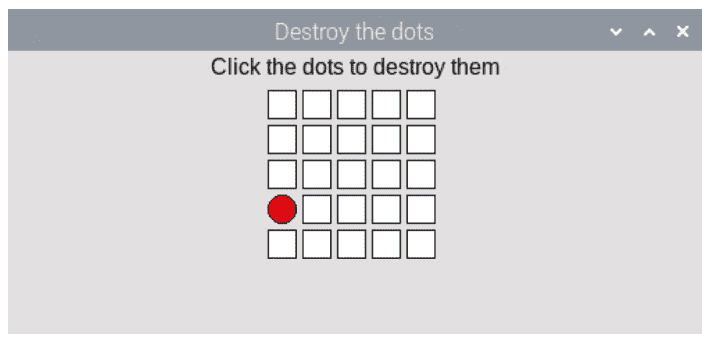

图2 生成一个随机的红色圆点

```python
x, y = randint(0,GRID_SIZE-1), randint(0,GRID_SIZE-1)
while board[x, y].dotty == True:
    x, y = randint(0,GRID_SIZE-1), randint(0,GRID_SIZE-1)
```

你可能意识到这不是选择非圆点随机方格的特别高效的方法，但它对于我们在本游戏中的需求来说已经足够了。

一旦这个循环结束，你可以确定随机选择的x, y坐标绝对是一个方格。让我们把它变成一个红色圆点——在你的while循环之后（不是内部），添加以下几行：

```python
board[x, y].dotty = True
board.set_pixel(x, y, "red")
```

在创建棋盘之后，在应用部分添加对你的新add_dot()函数的调用。你的程序现在应该类似于destroy2.py。当你运行它时，你应该在网格中看到一个随机的红色圆点。如果你再次运行程序，圆点可能会出现在另一个随机位置（图2）。

## 消灭圆点

到目前为止只有一个圆点——让我们消灭它！别担心：你稍后会添加更多圆点来消灭，但一旦你能消灭一个，你就能消灭所有！

在你的函数部分创建一个新函数，起一个非常令人满意的名字——destroy_dot——并给它两个参数x和y。

```python
def destroy_dot(x, y):
```

这个函数将检查坐标x,y是否是一个圆点（而不是方格）。你可以使用与创建圆点相同的代码来做到这一点——代码**board[x, y].dotty**如果该坐标是圆点将返回True，如果是方格则返回False。

```python
if board[x,y].dotty == True:
```

如果坐标是一个圆点，通过将其**dotty**属性设置为False将其更改为方格，并将其颜色改回白色：

```python
if board[x,y].dotty == True:
    board[x,y].dotty = False
    board.set_pixel(x, y, "white")
```

这个函数需要在棋盘被点击时触发。找到你已有的创建棋盘的代码行，并添加如下命令：

```python
board = Waffle(app, width=GRID_SIZE, height=GRID_SIZE,
    command=destroy_dot)
```

这将在棋盘上的任何空间被点击时调用**destroy_dot**函数。

请注意，华夫饼控件会自动将两个参数传递给任何命令函数；这些参数始终是触发命令所点击像素的x和y坐标。

你的代码现在应该看起来像**destroy3.py**。通过运行程序并点击圆点来测试你的程序。你应该看到圆点变回白色方格。如果你点击一个不是圆点的方格，应该什么也不会发生。

## 更多圆点！

现在是时候通过不断生成圆点来真正让游戏具有挑战性了。让我们从每秒添加一个新的随机圆点开始。为此，你需要使用guizero的一个名为**after**的内置特性来安排每秒调用一次**add_dot**函数。

在你的应用部分，移除对**add_dot()**的调用，并用一行新代码替换它：

```python
board.after(1000, add_dot)
```

这行代码的意思是“在1000毫秒（1秒）后，调用函数**add_dot**”。

如果你现在运行程序，你仍然会得到一个圆点，但它会在延迟1秒后出现在网格上。

这是巧妙的部分。找到你的**add_dot**函数，并在函数末尾添加相同的代码行。

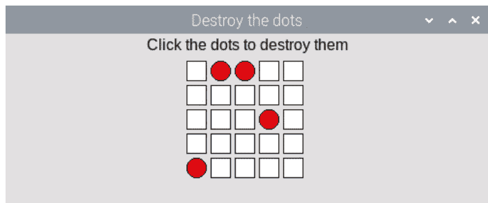

图3 每秒都会出现一个新的圆点

这将在每次新圆点添加完成后安排一次对**add_dot**的新调用。下一个圆点也计划在1秒后出现，所以如果你运行程序，你应该会看到网格上每秒出现一个新的圆点（**图3**）。

尝试运行你的程序，它现在应该看起来像**destroy4.py**。由于你已经编写了消灭圆点的方法，点击任何圆点都应该会移除它。然而，如果你玩一会儿游戏，你会注意到跟上每秒一个圆点的节奏相当容易，几乎不可能输掉游戏。

你仍然需要添加两样东西：一个分数来跟踪你消灭了多少圆点，以及一种让游戏变得更困难的方法，使其成为一项挑战。

## 添加分数

添加分数相当简单，分三步：

- 添加一个变量来跟踪分数；该变量应从0开始。
- 在图形用户界面上显示一条带有当前分数的消息。
- 每当**destroy_dot**函数被调用并消灭一个圆点时，将分数加1并更新消息显示。

尝试使用你已经学到的知识自己添加代码。

> **提示：** 要从**destroy_dot**函数更新分数变量，你需要将其声明为全局变量。

> **提示：** 如果你收到一个错误，说变量score在赋值前被引用，请确保你的变量部分在程序中位于函数部分之前。

如果你卡住了，解决方案见下页...

## 解决方案：添加分数

首先，在变量部分添加一个变量

```
score = 0
```

接下来，在应用部分添加一个新的文本组件来显示分数：

```
score_display = Text(app, text="Your score is " + str(score))
```

最后，每次销毁一个点时，将分数加1：

```
def destroy_dot(x,y):

    # 声明 score 为全局变量
    global score

    # 此代码已存在
    if board[x,y].dotty == True:
        board[x,y].dotty = False
        board.set_pixel(x, y, "white")

        # 将分数加1并在图形界面上显示
        score += 1
        score_display.value = "Your score is " + str(score)
```

你的代码（不包括可选的注释）现在应该类似于 **destroy5.py**。测试你的游戏，你应该会看到每次点击一个点时，你的分数都会增加1。

## 给玩家施加压力

既然你可以追踪玩家的分数，你就可以利用它来给玩家施加压力，并在玩家表现良好时加快点的生成速度。

还记得你在 **add_dot** 函数中使用了一个 `after` 调用来在1000毫秒（或1秒）后安排另一个点吗？回去找到那一行——你将对它进行一些修改。

首先，创建一个变量 `speed` 并将其设置为1000。然后，不是安排在1000毫秒后调用 `add_dot`，而是安排在 `speed` 毫秒后调用它。这目前对游戏**完全没有影响**……你仍然在1000毫秒后安排下一次调用，但这个数字现在来自变量 `speed`，而不是硬编码的魔法数字。

```
speed = 1000
board.after(speed, add_dot)
```

现在，这里是如何增加压力的方法。在这两行代码之间，你可以添加一些代码，根据当前分数设置点的速度。下面是一个例子：

```
speed = 1000
if score > 30:
    speed = 200
elif score > 20:
    speed = 400
elif score > 10:
    speed = 500
board.after(speed, add_dot)
```

在这里，你可以看到如果玩家得分超过10分，新的点将每500毫秒出现一次；如果得分超过20分，点将每400毫秒出现一次，以此类推。这使得游戏难度随着你分数的增加而大大增加。保存你的代码——**destroy6.py**——并测试游戏以查看差异。如果你想进一步增加难度，可以更改数字或添加更多的 `elif` 条件。

## 游戏结束

剩下的就是确定玩家何时输掉游戏；当每个方格都变成红点时，游戏结束。

还记得你制作井字棋时，使用了*嵌套循环*来检查所有方格是否已填满且游戏是平局吗？你也可以在这里使用同样的方法，遍历网格上的每个方格并检查它是否是红点。在你的 `add_dot` 函数中，就在调用 `after` 之前，添加一些代码来嵌套循环遍历棋盘上的所有方格：

```
all_red = True
for x in range(GRID_SIZE):
    for y in range(GRID_SIZE):
```

第一行首先假设所有方格都是红色的。嵌套循环将依次提供网格上每个方格的坐标，作为 `x` 和 `y` 的值，以便你可以检查这是否属实。

在第二个循环内添加一些代码，以找出当前像素是否为红色，如果*不是*，则将 `all_red` 变量更改为 False。

```
all_red = True
for x in range(GRID_SIZE):
    for y in range(GRID_SIZE):
        if board[x,y].color != "red":
            all_red = False
```

两个循环结束后（确保你取消了以下代码的缩进），检查网格是否全是红点。如果是，玩家就输了，因此显示一条消息：

```
if all_red:
    score_display.value = "You lost! Score: " + str(score)
```

如果玩家没有输，游戏应该继续。添加一个 **else:**，并在其内部缩进你已有的 **after** 方法，因为我们只想在玩家*没有*输的情况下添加新点：

```
else:
    board.after(speed, add_dot)
```

小心缩进你已有的 **after** 行，而不是添加另一行，否则你的游戏将开始表现异常，并每秒生成多个点！
你的最终代码应该类似于 **07-destroy-the-dots.py**。享受游戏吧。

## 使用常量

将华夫饼的高度和宽度设置为5被称为在程序中使用“魔法数字”，因为特定的数字被硬编码到程序中。如果你想更改网格的大小，你需要找到程序中所有出现此数字的地方并进行更改，这可能会很混乱。

更好的编程实践是在变量部分定义一个名为 **GRID_SIZE** 的*常量*，并将其设置为5：

**GRID_SIZE = 5**

然后，不是用魔法数字5来定义华夫饼的尺寸，你可以写：

**board = Waffle(app, width=GRID_SIZE, height=GRID_SIZE)**

如果你决定更改网格的大小，你只需更改此常量的值即可。

在编写程序时考虑这类事情，将有助于你在决定更改时避免以后的麻烦。

## 挑战

- 你能添加一个重置按钮，让玩家无需重新运行程序即可开始新游戏吗？
- 你能通过计算棋盘上有多少个红点，并根据红点数量按比例增加速度，从而给玩家施加更大的压力吗？

## destroy1.py / Python 3

```
# 导入 -----------------

from guizero import App, Text, Waffle

# 变量 ---------------

# 函数 ---------------

# 应用 ---------------------

app = App("Destroy the dots")

instructions = Text(app, text="Click the dots to destroy them")
board = Waffle(app, width=5, height=5)

app.display()
```

## destroy2.py / Python 3

```
# 导入 -----------------

from guizero import App, Text, Waffle
from random import randint

# 变量 ---------------

GRID_SIZE = 5

# 函数 ---------------

def add_dot():
    x, y = randint(0,GRID_SIZE-1), randint(0,GRID_SIZE-1)
    while board[x, y].dotty == True:
        x, y = randint(0,GRID_SIZE-1), randint(0,GRID_SIZE-1)
    board[x, y].dotty = True
    board.set_pixel(x, y, "red")

# 应用 ----------------------

app = App("Destroy the dots")

instructions = Text(app, text="Click the dots to destroy them")
board = Waffle(app, width=5, height=5)
add_dot()

app.display()
```

## destroy3.py / Python 3

```
# 导入 ------------------

from guizero import App, Text, Waffle
from random import randint

# 变量 -----------------

GRID_SIZE = 5

# 函数 -----------------

def add_dot():
    x, y = randint(0,GRID_SIZE-1), randint(0,GRID_SIZE-1)
    while board[x, y].dotty == True:
        x, y = randint(0,GRID_SIZE-1), randint(0,GRID_SIZE-1)
    board[x, y].dotty = True
    board.set_pixel(x, y, "red")

def destroy_dot(x, y):
    if board[x,y].dotty == True:
        board[x,y].dotty = False
        board.set_pixel(x, y, "white")

# 应用 ---------------------

app = App("Destroy the dots")

instructions = Text(app, text="Click the dots to destroy them")
board = Waffle(app, width=GRID_SIZE, height=GRID_SIZE,
command=destroy_dot)
add_dot()

app.display()
```

## destroy4.py / Python 3

```
# 导入 -----------------

from guizero import App, Text, Waffle
from random import randint

# 变量 ----------------

GRID_SIZE = 5

# 函数 ----------------

def add_dot():
    x, y = randint(0,GRID_SIZE-1), randint(0,GRID_SIZE-1)
    while board[x, y].dotty == True:
        x, y = randint(0,GRID_SIZE-1), randint(0,GRID_SIZE-1)
    board[x, y].dotty = True
    board.set_pixel(x, y, "red")
    board.after(1000, add_dot)

def destroy_dot(x,y):
    if board[x,y].dotty == True:
        board[x,y].dotty = False
        board.set_pixel(x, y, "white")

# 应用 ---------------------

app = App("Destroy the dots")

instructions = Text(app, text="Click the dots to destroy them")
board = Waffle(app, width=GRID_SIZE, height=GRID_SIZE,
    command=destroy_dot)
board.after(1000, add_dot)

app.display()
```

## destroy5.py / Python 3

```
# 导入 -----------------

from guizero import App, Text, Waffle
from random import randint

# 变量 ---------------

GRID_SIZE = 5
score = 0

# 函数 ---------------

def add_dot():
    x, y = randint(0,GRID_SIZE-1), randint(0,GRID_SIZE-1)
    while board[x, y].dotty == True:
        x, y = randint(0,GRID_SIZE-1), randint(0,GRID_SIZE-1)
    board[x, y].dotty = True
    board.set_pixel(x, y, "red")
    board.after(1000, add_dot)

def destroy_dot(x,y):
    global score
    if board[x,y].dotty == True:
        board[x,y].dotty = False
        board.set_pixel(x, y, "white")
        score += 1
        score_display.value = "Your score is " + str(score)
```

## destroy5.py（续）/ Python 3

```python
# 应用程序 -------------------

app = App("消灭圆点")

instructions = Text(app, text="点击圆点以消灭它们")
board = Waffle(app, width=GRID_SIZE, height=GRID_SIZE,
               command=destroy_dot)
board.after(1000, add_dot)
score_display = Text(app, text="你的得分是 " + str(score))

app.display()
```

## destroy6.py / Python 3

```python
# 导入 -------------------

from guizero import App, Text, Waffle
from random import randint

# 变量 -------------------

GRID_SIZE = 5
score = 0

# 函数 -------------------

def add_dot():
    x, y = randint(0, GRID_SIZE-1), randint(0, GRID_SIZE-1)
    while board[x, y].dotty == True:
        x, y = randint(0, GRID_SIZE-1), randint(0, GRID_SIZE-1)
    board[x, y].dotty = True
    board.set_pixel(x, y, "red")

    speed = 1000
    if score > 30:
        speed = 200
    elif score > 20:
        speed = 400
    elif score > 10:
        speed = 500
    board.after(speed, add_dot)

def destroy_dot(x, y):
    global score
    if board[x, y].dotty == True:
        board[x, y].dotty = False
        board.set_pixel(x, y, "white")
        score += 1
        score_display.value = "你的得分是 " + str(score)

# 应用程序 -----------------------

app = App("消灭圆点")

instructions = Text(app, text="点击圆点以消灭它们")
board = Waffle(app, width=GRID_SIZE, height=GRID_SIZE,
               command=destroy_dot)
board.after(1000, add_dot)
score_display = Text(app, text="你的得分是 " + str(score))

app.display()
```

## 07-destroy-the-dots.py / Python 3

```python
# 导入 -----------------------

from guizero import App, Text, Waffle
from random import randint

# 变量 -----------------------

GRID_SIZE = 5
score = 0

# 函数 -----------------------

def add_dot():
    x, y = randint(0, GRID_SIZE-1), randint(0, GRID_SIZE-1)
    while board[x, y].dotty == True:
        x, y = randint(0, GRID_SIZE-1), randint(0, GRID_SIZE-1)
    board[x, y].dotty = True
    board.set_pixel(x, y, "red")

    speed = 1000
    if score > 30:
        speed = 200
    elif score > 20:
        speed = 400
    elif score > 10:
        speed = 500

    all_red = True
    for x in range(GRID_SIZE):
        for y in range(GRID_SIZE):
            if board[x, y].color != "red":
                all_red = False
    if all_red:
        score_display.value = "你输了！得分：" + str(score)
    else:
        board.after(speed, add_dot)

def destroy_dot(x, y):
    global score
    if board[x, y].dotty == True:
        board[x, y].dotty = False
        board.set_pixel(x, y, "white")
        score += 1
        score_display.value = "你的得分是 " + str(score)

# 应用程序 ----------------------

app = App("消灭圆点")

instructions = Text(app, text="点击圆点以消灭它们")
board = Waffle(app, width=GRID_SIZE, height=GRID_SIZE,
               command=destroy_dot)
board.after(1000, add_dot)
score_display = Text(app, text="你的得分是 " + str(score))

app.display()
```

## 第8章

## 洪水游戏

创建一个更复杂的基于华夫饼的益智游戏

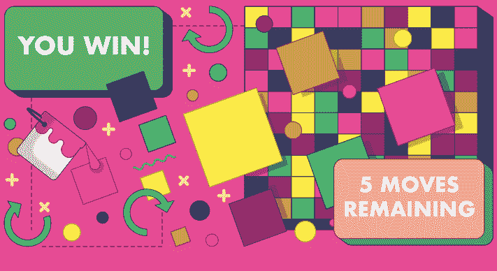

“洪水游戏”是一个目标是将棋盘上所有方格淹没成相同颜色的游戏。从左上角的方格开始，玩家选择一种颜色进行淹没。它提供了一个稍微复杂一些的基于华夫饼的游戏。

## 游戏目标

在这个例子中（图1），左上角的方格是蓝色的。玩家可以选择淹没下方的单个紫色方格，或者淹没右侧的黄色方格。

淹没黄色方格将是更好的一步，因为所有相邻的黄色方格也会被淹没，而且玩家在游戏结束前只被允许有限的移动次数。

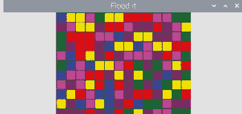

图1 将方格淹没成一种颜色

## 设置

从 magpi.cc/floodit 下载并打开起始文件 floodit_starter.py。将其保存在合理的位置。

在变量部分，为变量赋予一些值：

- **colours** – 一个包含六种颜色字符串的列表。这些可以是常见的颜色名称或十六进制颜色。颜色名称 "white"、"black"、"red"、"green"、"blue"、"cyan"、"yellow" 和 "magenta" 将始终可用。
- **board_size** – 棋盘的宽度/高度，为整数；我们选择了 14。棋盘始终是正方形。
- **moves_limit** – 玩家在失败前被允许的移动次数，为整数；我们选择了 25。

在应用程序部分，创建一个 App 小部件并为其指定标题。

```python
app = App("Flood it")
app.display()
```

运行此代码将产生一个标准的带标签窗口（图2）。

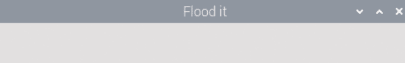

## 创建棋盘

棋盘是一个方格网格，每个方格包含从你之前创建的列表中随机选择的颜色。

在应用程序内部，添加一个 Waffle 小部件。这将创建一个网格，即棋盘。

```python
board = Waffle(app)
```

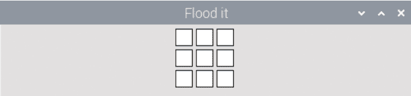

运行你的程序，你会看到网格有点太小（**图3**）。
在你刚刚编写的代码行中添加参数，以指定华夫饼的宽度和高度，并将网格方格之间的间距设为零。

```python
board = Waffle(app, width=board_size, height=board_size, pad=0)
```

这样好多了（**图4**）。

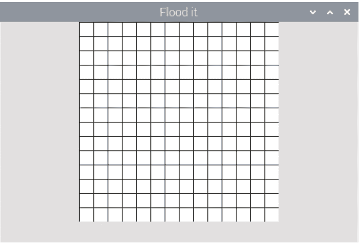

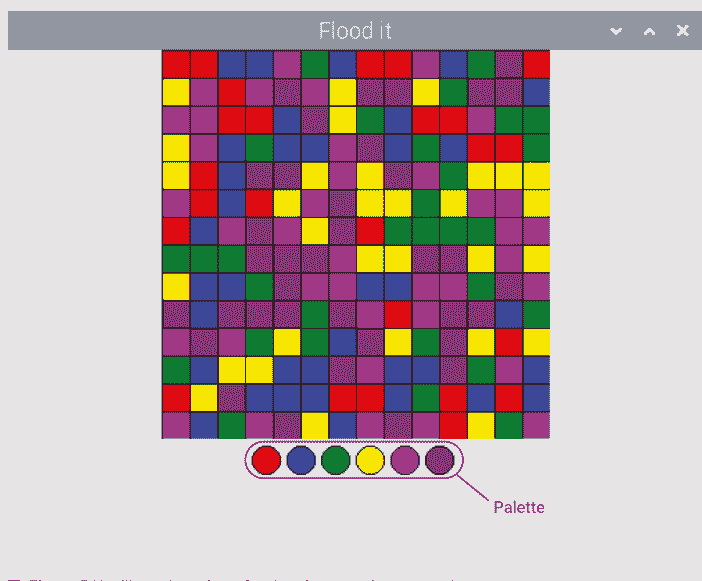

图5 你需要一个调色板供玩家选择颜色

## 创建调色板

调色板向玩家展示他们可以点击哪些颜色来淹没棋盘。他们将点击这些颜色来玩游戏。完成游戏中的调色板如**图5**所示。
在你创建棋盘的下一行，创建另一个 Waffle，但这次它应该命名为 `palette`。

```python
palette = Waffle(app)
```

还记得你在上一步中为棋盘华夫饼添加的参数吗？这次，将这些参数添加到 `palette` 华夫饼中，每个参数用逗号分隔：

- `width` = 6（我们拥有的颜色数量）
- `height` = 1
- `dotty` = True（这会将方格变成圆形）

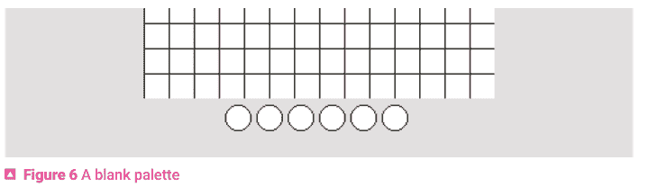

所以，现在你应该有：

```python
palette = Waffle(app, width=6, height=1, dotty=True)
```

运行代码以查看空白的调色板（**图6**）。

## 为棋盘上色

棋盘应该从每个方格是你之前创建的颜色列表中随机选择的颜色开始。

在调色板下方的行中，编写一个函数调用

```python
fill_board()
```

在你的程序中找到函数部分，并开始编写这个新函数的代码：

```python
def fill_board():
```

你可以编写一个嵌套循环来遍历棋盘中的每一行和每一列。每个像素将用列表中随机选择的颜色着色。要为像素着色，你将使用此代码，其中 ? 符号将替换为像素的 x、y 坐标：

```python
board.set_pixel(?, ?, random.choice(colours))
```

尝试使用你在前面章节中学到的关于嵌套循环的知识自己编写代码——如果遇到困难，解决方案在第83页提供。

**提示：** 使用 `board_size` 变量来了解需要循环多少次。

运行代码时，你应该会看到一个彩色的棋盘。如果你看到一个白色的棋盘，请仔细检查你是否添加了对 `fill_board()` 的函数调用（**图7**）。

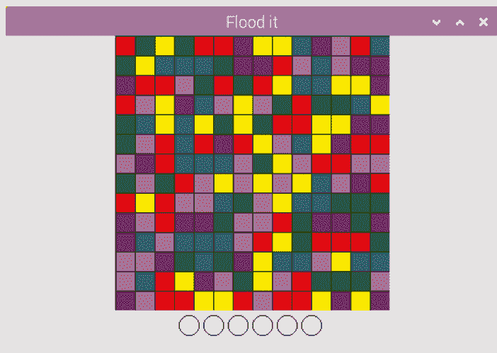

▲ 图7 棋盘的每个方格都被随机着色

这是一个解决方案，但有很多种方法可以实现：

```python
def fill_board():
    for x in range(board_size):
        for y in range(board_size):
            board.set_pixel(x, y, random.choice(colours))
```

另一种使用更高级特性（称为列表推导式）的解决方案：

```python
def fill_board():
    [board.set_pixel(x, y, random.choice(colours)) for y in range(board_size) for x in range(board_size)]
```

## 为调色板上色

现在你有了一个彩色的棋盘，让我们为调色板上色。
在你的 **fill_board()** 代码下方的行中，编写一个函数调用：

```python
init_palette()
```

在你的程序中找到函数部分，并开始编写这个新函数的代码：

def init_palette():
    column = 0
    for colour in colours:
        palette.set_pixel(column, 0, colour)
        column += 1

def init_palette():
    for x in range(len(colours)):
        palette.set_pixel(x, 0, colours[x])

def init_palette():
    for colour in colours:
        palette.set_pixel(colours.index(colour), 0, colour)

你可以使用以上任何一种解决方案，或者你自己可能想出了不同的方法。它们中没有一个是“正确答案”：编写解决方案的方法通常有很多种。

## 开始填充

当玩家点击调色板上的一种颜色时，棋盘应该从左上角的方格开始，用那种颜色进行填充。

在函数部分，按照与前两个函数完全相同的方式，创建一个名为 `start_flood` 的新函数。这个函数需要接受两个参数，它们将是被点击方格的 x, y 坐标。将它们添加到括号之间，最终你的代码应该看起来像这样：

```
def start_flood(x, y):
```

向函数中添加一行代码（缩进），以获取被点击颜色的名称：

```
flood_colour = palette.get_pixel(x,y)
```

这将是用于填充棋盘的颜色。

添加一行代码以获取起始像素的当前颜色——这始终是棋盘左上角的像素，坐标为 0, 0。

```
target = board.get_pixel(0,0)
```

现在调用 `flood` 函数，该函数已在起始文件中为你编写好。此函数从 0,0 开始，并将所有与左上角像素相连且颜色相同的像素填充为 `flood_colour`。

```
flood(0, 0, target, flood_colour)
```

每当有人点击调色板上的颜色时，此函数都应运行，因此请找到你创建调色板的那行代码。

```
palette = Waffle(app, width=6, height=1, dotty=True)
```

添加另一个参数，它是一个命令。当点击调色板上的圆圈时，将执行此命令。该命令是函数 `start_flood`，因此你的代码现在应该看起来像这样：

```
palette = Waffle(app, width=6, height=1, dotty=True,
command=start_flood)
```

通过点击调色板上的圆圈来测试你的代码。
左上角的方格是绿色的（**图 8**）。
如果你点击调色板上的紫色，左上角的方格将变成紫色，并与下方的紫色方格连接（**图 9**）。
现在有五个紫色方格连接到左上角的方格。让我们点击粉色，将下方的粉色方格连接起来（**图 10**）。
现在有一大串粉色方格。通过点击调色板上不同的颜色继续游戏。目标是最终使所有方格变成相同的颜色。

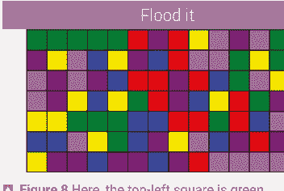

图 8 这里，左上角的方格是绿色的

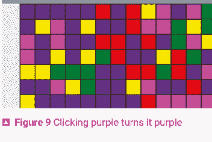

图 9 点击紫色使其变为紫色

## 赢得游戏

目前，如果玩家设法使网格中的所有方格变成相同的颜色，什么也不会发生。玩家也被允许进行无限次的回合，因为他们的移动次数没有被追踪。
首先，让我们在 GUI 中添加一段文本，以显示玩家是赢了还是输了。文本最初将是空白的。
在调色板代码下方，添加一个名为 **win_text** 的 Text 小部件。

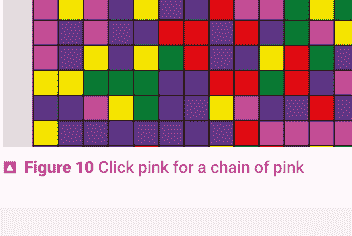

图 10 点击粉色形成一串粉色

```
win_text = Text(app)
```

在变量部分，添加另一个名为 **moves_taken** 的变量，并将其设置为 0。
现在创建一个名为 **win_check** 的函数，以在每次移动后检查玩家是否获胜。
首先，你需要指定你希望被允许更改全局变量 **moves_taken** 的值。

```
global moves_taken
```

然后将 `moves_taken` 变量加 1——每次调用此函数时，我们将增加一次移动。

```
moves_taken += 1
```

检查 `moves_taken` 是否小于 `moves_limit`：

```
if moves_taken < moves_limit:

else:
```

如果 `moves_taken` 不在限制范围内，这意味着玩家已用完移动次数，因此更新文本以说明他们输了：

```
if moves_taken < moves_limit:

else:
    win_text.value = "You lost :("
```

如果移动次数*确实*小于限制，则通过调用起始文件中已为你编写的函数来检查所有方格是否颜色相同。确保以下代码缩进在第一个 `if` 语句下方：

```
if all_squares_are_the_same():
    win_text.value = "You win!"
```

完整的代码应该看起来像这样：

```
def win_check():
    moves_taken += 1
    if moves_taken <= moves_limit:
        if all_squares_are_the_same():
            win_text.value = "You win!"
    else:
        win_text.value = "You lost :("
```

最后，你必须在每次点击方格时调用 `win_check` 函数。最简单的方法是在 `start_flood` 函数的末尾添加函数调用。
现在是时候测试游戏了。示例代码清单显示在 **08-floodit.py** 中，见下文。

## 测试你的游戏

你可以通过玩游戏来测试游戏是否有效；然而，测试你是否能赢可能需要很长时间！一种更简单的检查方法是将 **board_size** 变量更改为较小的值，例如 5，然后在更小的网格上玩游戏，看看你是否能赢。

你可以通过连续点击同一种颜色 25 次来轻松测试游戏是否正确地让你输掉！

## 挑战
- 如果玩家赢了或输了，禁用调色板以防止他们再次点击并导致错误。禁用调色板的代码是 **palette.disable()**。
- 在 GUI 上显示剩余移动次数作为一段文本。
- 添加一个按钮，显示如何玩游戏的说明。
- 添加一个重置按钮，让玩家开始新游戏。别忘了，你还必须重置棋盘上的颜色，重置 **moves_taken** 变量，并在禁用调色板后重新启用它（**palette.enable()**）。

## 08-floodit.py / Python 3

```
# -------------------------
# 导入
# -------------------------

from guizero import App, Waffle, Text, PushButton, info
import random

# -------------------------
# 变量
# -------------------------

colours = ["red", "blue", "green", "yellow", "magenta", "purple"]
board_size = 14
moves_limit = 25
moves_taken = 0

# -------------------------
# 函数
# -------------------------

# 递归地填充相邻方格
def flood(x, y, target, replacement):
    # 算法来自 https://en.wikipedia.org/wiki/Flood_fill
    if target == replacement:
        return False
    if board.get_pixel(x, y) != target:
        return False
    board.set_pixel(x, y, replacement)
    if y+1 <= board_size-1:    # 南
        flood(x, y+1, target, replacement)
    if y-1 >= 0:               # 北
        flood(x, y-1, target, replacement)
    if x+1 <= board_size-1:    # 东
        flood(x+1, y, target, replacement)
    if x-1 >= 0:               # 西
        flood(x-1, y, target, replacement)

# 检查所有方格是否颜色相同
def all_squares_are_the_same():
    squares = board.get_all()
    if all(colour == squares[0] for colour in squares):
        return True
```

## 08-floodit.py（续）/ Python 3

```python
else:
    return False

def win_check():
    global moves_taken
    moves_taken += 1
    if moves_taken <= moves_limit:
        if all_squares_are_the_same():
            win_text.value = "You win!"
    else:
        win_text.value = "You lost :("
```

```python
def fill_board():
    for x in range(board_size):
        for y in range(board_size):
            board.set_pixel(x, y, random.choice(colours))
```

```python
def init_palette():
    for colour in colours:
        palette.set_pixel(colours.index(colour), 0, colour)
```

```python
def start_flood(x, y):
    flood_colour = palette.get_pixel(x,y)
    target = board.get_pixel(0,0)
    flood(0, 0, target, flood_colour)
    win_check()
```

```python
# -------------------------
# 应用程序
# -------------------------

app = App("Flood it")

board = Waffle(app, width=board_size, height=board_size, pad=0)
palette = Waffle(app, width=6, height=1, dotty=True,
                 command=start_flood)

win_text = Text(app)

fill_board()
init_palette()

app.display()
```

## 第9章
### 表情符号配对
创建一个有趣的图片配对游戏

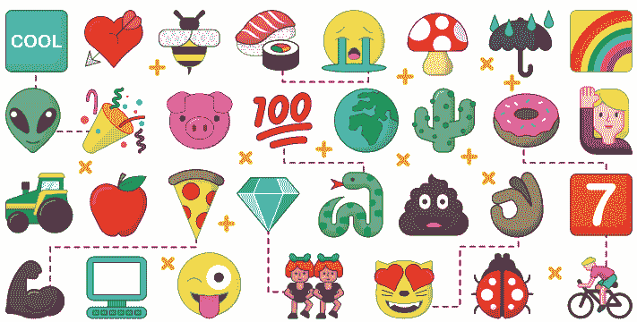

你将构建一个表情符号图片配对游戏（图1）。游戏的目标是找出在两个不同集合中都出现的那一个表情符号。每次正确匹配得一分，错误匹配扣一分。

### 加载表情符号

要创建游戏，你需要表情符号。你可以使用为Twitter创建的表情符号（twemoji.twitter.com）。从 magpi.cc/guizeroemojis 下载 emojis.zip 文件，打开压缩包，并将 emojis 文件夹复制到你保存代码的文件夹中。

游戏需要随机选择九个表情符号并将它们排列成网格。一个简单的方法是将所有表情符号放入一个列表中，然后随机打乱顺序。

以下代码创建一个打乱顺序的项目列表，每个项目的形式为 path/emoji_file_name。

创建一个新程序，包含通常用于不同部分的注释行（导入、变量、函数、应用程序）。在导入部分，添加：

```python
import os
from random import shuffle
```

然后，在变量部分，输入以下代码，它创建一个打乱顺序的表情符号列表，每个表情符号的形式为 **path/emoji_file_name**。

```python
# 设置你电脑上表情符号文件夹的路径
emojis_dir = "emojis"
emojis = [os.path.join(emojis_dir, f) for f in os.listdir(emojis_dir)]
shuffle(emojis)
```

**emojis_dir** 变量是你电脑上表情符号的路径；它会告诉加载表情符号的代码在哪里找到它们。

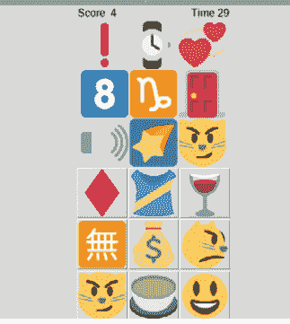

测试你的程序。尝试用 **print(emojis)** 将 **emojis** 列表打印到屏幕上。你应该会看到一个很长的文件名列表。每次运行时，列表的顺序应该不同。

### 显示表情符号

接下来，代码需要创建两个 3×3 的 Picture 和 PushButton 控件网格来显示表情符号。

修改你的程序，创建一个 guizero 应用程序和一个使用 "grid" 布局来容纳图片控件的 Box。在导入部分，添加这行以导入所需的控件：

```python
from guizero import App, Box
```

在应用程序部分，添加以下代码：

```python
app = App("emoji match")

pictures_box = Box(app, layout="grid")
```

Box 控件对于布局你的 GUI 非常有用。它是你 GUI 中的一个不可见区域，你可以在其中将控件分组。Box 可以有自己的布局、大小和 bg（背景）。它们也可以被隐藏或显示，这意味着你可以轻松地使一组控件不可见。

如果你想看到 Box，可以通过将参数设置为 True 来添加边框。

```python
pictures_box = Box(app, layout="grid", border=True)
```

现在，将 Picture 控件添加到你的导入中：

```python
from guizero import App, Box, Picture
```

在应用程序部分，添加创建 Picture 控件并将其添加到列表的代码。

```python
pictures = []

for x in range(0,3):
    for y in range(0,3):
        picture = Picture(pictures_box, grid=[x,y])
        pictures.append(picture)
```

为了给每个 Picture 控件分配坐标，使用了两个 for 循环。它们都在 0-2 的范围内运行；一个将其值赋给变量 x，另一个赋给变量 y。每个控件的网格位置使用 x 和 y 值设置。控件被添加到列表中，以便在游戏的后续部分中引用。

对 PushButton 控件执行相同的操作以创建第二个 3×3 网格。首先，将控件添加到你的导入中：

```python
from guizero import App, Box, Picture, PushButton
```

在应用程序部分，添加行使其如下所示：

```python
app = App("emoji match")

pictures_box = Box(app, layout="grid")
buttons_box = Box(app, layout="grid")

pictures = []
buttons = []

for x in range(0,3):
    for y in range(0,3):
        picture = Picture(pictures_box, grid=[x,y])
        pictures.append(picture)

        button = PushButton(buttons_box, grid=[x,y])
        buttons.append(button)
```

在函数部分，创建一个函数来设置游戏的每一轮。

```python
def setup_round():
    for picture in pictures:
        picture.image = emojis.pop()

    for button in buttons:
        button.image = emojis.pop()
```

为了给每个 `picture` 和 `button` 控件分配一个表情符号，将 `image` 属性设置为 `emojis` 列表中的一个项目。使用 `pop()` 选择表情符号，它会选择列表中的最后一个项目，然后将其从列表中移除。我使用这个函数是因为它可以防止任何表情符号在游戏中出现多次。

在程序底部，调用 `setup_round` 函数并显示应用程序。

```python
setup_round()

app.display()
```

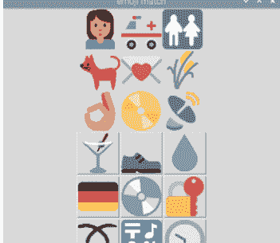

你的程序现在应该类似于 **emoji1.py**（第99页）。测试它，你应该会看到两个包含九个表情符号的网格。

### 匹配表情符号

目前，你应用程序中的所有表情符号都是不同的（**图2**）。在下一步中，你将选择另一个表情符号进行匹配，并更新一个图片和一个按钮，使它们具有相同的匹配表情符号。

在你的 `random` 导入行中添加 `randint`。这用于为每个图片和按钮获取一个 0 到 8 之间的数字。

```python
from random import shuffle, randint
```

然后将此代码（缩进）添加到 `setup_round` 函数的底部，以从列表中弹出另一个表情符号，并将其设置为随机图片和按钮的图像。

```python
matched_emoji = emojis.pop()

random_picture = randint(0,8)
pictures[random_picture].image = matched_emoji

random_button = randint(0,8)
buttons[random_button].image = matched_emoji
```

你的代码现在应该类似于 `emoji2.py`。现在运行你的程序；其中一个表情符号应该匹配。仔细看——匹配的表情符号可能很难发现。

### 检查猜测

每次按下其中一个 PushButton 时，它都需要检查这是否是匹配的表情符号，并将结果“正确”或“错误”显示在屏幕上。在玩家猜测之后，将设置新的一轮并显示不同的表情符号集合。

你的应用程序需要一个 Text 控件来显示结果。将其添加到你的导入中：

```python
from guizero import App, Box, Picture, PushButton, Text
```

在你的应用程序部分添加这一行：

```python
result = Text(app)
```

创建一个新函数，当按下其中一个表情符号按钮时将调用它。它将显示“正确”或“错误”，并调用 `setup_round` 来创建下一组表情符号。

```python
def match_emoji(matched):
    if matched:
        result.value = "correct"
    else:
        result.value = "incorrect"

    setup_round()
```

错误的表情符号按钮将向 `match_emoji` 函数传递 False；匹配的表情符号将传递 True。

更新 `setup_round` 函数，使所有“错误”的按钮调用 `match_emoji` 函数。

```python
for button in buttons:
    button.image = emojis.pop()
    button.update_command(match_emoji, args=[False])
```

`update_command` 方法设置按下按钮时将调用的函数。`args` 列表 `[False]` 将用作 `match_emoji` 函数的参数。

最后，更新匹配按钮的命令，使其调用 `match_emoji`，但这次传递 True 作为参数。

```python
buttons[random_button].update_command(match_emoji, [True])
```

你的代码现在应该类似于 `emoji3.py`。玩这个游戏。每一轮都会有一个匹配的表情符号——按下匹配的图片按钮。你答对了吗？

### 添加分数和计时器

目前，游戏会无限期地进行（或者直到你用完列表中的表情符号）。添加一个分数和一个倒计时到游戏结束的计时器，以增加挑战性。

在应用程序部分，创建两个 Text 控件来显示分数和计时器。

```python
score = Text(app, text="0")
timer = Text(app, text="30")
```

计时器设置为 "30"，这将是每一轮的秒数。

修改 `match_emoji` 函数，以在玩家的分数上加 1 或减 1。

```python
def match_emoji(matched):
    if matched:
        result.value = "correct"
        score.value = int(score.value) + 1
    else:
        result.value = "incorrect"
        score.value = int(score.value) - 1
```

要创建计时器，你将使用 guizero 的一个功能，它允许你要求应用程序每 1 秒连续调用一个函数。

创建一个函数，将计时器的值减少 1。

def reduce_time():
    timer.value = int(timer.value) - 1

在应用显示之前，使用 `app.repeat()` 函数每秒（1000毫秒）调用一次 `reduce_time` 函数。

```
app.repeat(1000, reduce_time)

app.display()
```

现在运行你的游戏，你会注意到计时器从30开始倒计时。不幸的是，它会继续倒计时超过0，永远不会停止。

更新 `reduce_time` 函数，检查计时器是否小于零，然后停止游戏。

```
def reduce_time():
    timer.value = int(timer.value) - 1
    # 游戏结束了吗？
    if int(timer.value) < 0:
        result.value = "游戏结束！得分 = " + score.value
        # 隐藏游戏
        pictures_box.hide()
        buttons_box.hide()
        timer.hide()
        score.hide()
```

当计时器小于0时，会显示“游戏结束”消息，并且游戏的部件会被隐藏，这样用户就无法再玩了。

查看 `emoji4.py` 以了解你的代码现在应该是什么样子。运行它并玩表情符号匹配游戏。挑战朋友或家人来一局。

你可能想将得分和计时器部件放入一个 Box 中，以便更好地布局（图3）——请参阅完整的 `09-emoji-match.py` 代码清单以了解如何操作。

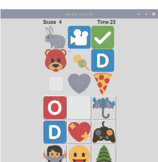

▲ 图3 包含得分和计时器的 Box

## 挑战

目前，开始新一轮游戏的唯一方法是重启程序。你能修改代码，引入一个按钮来开始新一轮吗？

## 使用其他图片

表情符号匹配游戏使用图片按钮让用户选择哪个表情符号匹配。你可以通过设置 `image` 参数将任何 `PushButton` 部件变成图片按钮，例如：

```
button = PushButton(app, image="my_picture.gif")
```

按钮会缩放以适应你的图片大小。你可以使用的图片类型取决于你的操作系统以及你安装 guizero 的方式，尽管任何安装都会支持 GIF 图片。要查找你的安装支持的图片文件类型，你可以运行：

```
from guizero import system_config
print(system_config.supported_image_types)
```

你可以在 **lawsie.github.io/guizero/images** 了解更多关于 guizero 图片支持的信息。

## emoji1.py / Python 3

```
# -------------------------
# 导入
# -------------------------

import os
from random import shuffle
from guizero import App, Box, Picture, PushButton

# -------------------------
# 变量
# -------------------------

# 设置你电脑上表情符号文件夹的路径
emojis_dir = "emojis"
emojis = [os.path.join(emojis_dir, f) for f in os.listdir(emojis_dir)]
shuffle(emojis)

# -------------------------
# 函数
# -------------------------

def setup_round():
    for picture in pictures:
        picture.image = emojis.pop()

    for button in buttons:
        button.image = emojis.pop()

# -------------------------
# 应用
# -------------------------

app = App("表情符号匹配")

pictures_box = Box(app, layout="grid")
buttons_box = Box(app, layout="grid")

pictures = []
buttons = []

for x in range(0,3):
    for y in range(0,3):
        picture = Picture(pictures_box, grid=[x,y])
        pictures.append(picture)

        button = PushButton(buttons_box, grid=[x,y])
        buttons.append(button)

setup_round()

app.display()
```

## emoji2.py / Python 3

```
# -------------------------
# 导入
# -------------------------

import os
from random import shuffle, randint
from guizero import App, Box, Picture, PushButton

# -------------------------
# 变量
# -------------------------

# 设置你电脑上表情符号文件夹的路径
emojis_dir = "emojis"
emojis = [os.path.join(emojis_dir, f) for f in os.listdir(emojis_dir)]
shuffle(emojis)

# -------------------------
# 函数
# -------------------------

def setup_round():
    for picture in pictures:
        picture.image = emojis.pop()

    for button in buttons:
        button.image = emojis.pop()

    matched_emoji = emojis.pop()

    random_picture = randint(0,8)
    pictures[random_picture].image = matched_emoji

    random_button = randint(0,8)
    buttons[random_button].image = matched_emoji

# -------------------------
# 应用
# -------------------------

app = App("表情符号匹配")

pictures_box = Box(app, layout="grid")
buttons_box = Box(app, layout="grid")

pictures = []
buttons = []

for x in range(0,3):
    for y in range(0,3):
        picture = Picture(pictures_box, grid=[x,y])
        pictures.append(picture)

        button = PushButton(buttons_box, grid=[x,y])
        buttons.append(button)

setup_round()

app.display()
```

## emoji3.py / Python 3

```
# -------------------------
# 导入
# -------------------------

import os
from random import shuffle, randint
from guizero import App, Box, Picture, PushButton, Text

# -------------------------
# 变量
# -------------------------

# 设置你电脑上表情符号文件夹的路径
emojis_dir = "emojis"
emojis = [os.path.join(emojis_dir, f) for f in os.listdir(emojis_dir)]
shuffle(emojis)

# -----------------------------
# 函数
# -----------------------------

def setup_round():
    for picture in pictures:
        picture.image = emojis.pop()

    for button in buttons:
        button.image = emojis.pop()
        button.update_command(match_emoji, args=[False])

    matched_emoji = emojis.pop()

    random_picture = randint(0,8)
    pictures[random_picture].image = matched_emoji

    random_button = randint(0,8)
    buttons[random_button].image = matched_emoji

    buttons[random_button].update_command(match_emoji, [True])

def match_emoji(matched):
    if matched:
        result.value = "正确"
    else:
        result.value = "错误"

    setup_round()

# -----------------------------
# 应用
# -----------------------------

app = App("表情符号匹配")

pictures_box = Box(app, layout="grid")
buttons_box = Box(app, layout="grid")

pictures = []
buttons = []

for x in range(0,3):
    for y in range(0,3):
        picture = Picture(pictures_box, grid=[x,y])
        pictures.append(picture)

        button = PushButton(buttons_box, grid=[x,y])
        buttons.append(button)

result = Text(app)

setup_round()

app.display()
```

## emoji4.py / Python 3

```
# -------------------------
# 导入
# -------------------------

import os
from random import shuffle, randint
from guizero import App, Box, Picture, PushButton, Text

# -------------------------
# 变量
# -------------------------

# 设置你电脑上表情符号文件夹的路径
emojis_dir = "emojis"
emojis = [os.path.join(emojis_dir, f) for f in os.listdir(emojis_dir)]
shuffle(emojis)

# -------------------------
# 函数
# -------------------------

def setup_round():
    for picture in pictures:
        picture.image = emojis.pop()

    for button in buttons:
        button.image = emojis.pop()
        button.update_command(match_emoji, args=[False])

    matched_emoji = emojis.pop()

    random_picture = randint(0,8)
    pictures[random_picture].image = matched_emoji

    random_button = randint(0,8)
    buttons[random_button].image = matched_emoji

    buttons[random_button].update_command(match_emoji, [True])

def match_emoji(matched):
    if matched:
        result.value = "正确"
        score.value = int(score.value) + 1
    else:
        result.value = "错误"
        score.value = int(score.value) - 1

    setup_round()

def reduce_time():
    timer.value = int(timer.value) - 1
    # 游戏结束了吗？
    if int(timer.value) < 0:
        result.value = "游戏结束！得分 = " + score.value
        # 隐藏游戏
        pictures_box.hide()
        buttons_box.hide()
        timer.hide()
        score.hide()

# -------------------------
# 应用
# -------------------------

app = App("表情符号匹配")

score = Text(app, text="0")
timer = Text(app, text="30")

pictures_box = Box(app, layout="grid")
buttons_box = Box(app, layout="grid")

pictures = []
buttons = []

for x in range(0,3):
    for y in range(0,3):
        picture = Picture(pictures_box, grid=[x,y])
        pictures.append(picture)

        button = PushButton(buttons_box, grid=[x,y])
        buttons.append(button)

result = Text(app)

setup_round()

app.repeat(1000, reduce_time)

app.display()
```

## 09-emoji-match.py / Python 3

```python
# -------------------------
# 导入模块
# -------------------------

import os
from random import shuffle, randint
from guizero import App, Box, Picture, PushButton, Text

# -------------------------
# 变量
# -------------------------

# 设置你电脑上表情符号文件夹的路径
emojis_dir = "emojis"
emojis = [os.path.join(emojis_dir, f) for f in os.listdir(emojis_dir)]
shuffle(emojis)

# -------------------------
# 函数
# -------------------------

def setup_round():
    for picture in pictures:
        picture.image = emojis.pop()

    for button in buttons:
        button.image = emojis.pop()
        button.update_command(match_emoji, args=[False])

    matched_emoji = emojis.pop()

    random_picture = randint(0, 8)
    pictures[random_picture].image = matched_emoji

    random_button = randint(0, 8)
    buttons[random_button].image = matched_emoji

    buttons[random_button].update_command(match_emoji, [True])

def match_emoji(matched):
    if matched:
        result.value = "正确"
        score.value = int(score.value) + 1
    else:
        result.value = "错误"
        score.value = int(score.value) - 1

    setup_round()

def reduce_time():
    timer.value = int(timer.value) - 1
    # 游戏结束了吗？
    if int(timer.value) < 0:
        result.value = "游戏结束！得分 = " + score.value
        # 隐藏游戏界面
        game_box.hide()

# -------------------------
# 应用程序
# -------------------------

app = App("表情符号匹配")

game_box = Box(app, align="top")

top_box = Box(game_box, align="top", width="fill")
Text(top_box, align="left", text="得分 ")
score = Text(top_box, text="4", align="left")
timer = Text(top_box, text="30", align="right")
Text(top_box, text="时间", align="right")

pictures_box = Box(game_box, layout="grid")
buttons_box = Box(game_box, layout="grid")

pictures = []
buttons = []

for x in range(0, 3):
    for y in range(0, 3):
        picture = Picture(pictures_box, grid=[x, y])
        pictures.append(picture)

        button = PushButton(buttons_box, grid=[x, y])
        buttons.append(button)

result = Text(app)

setup_round()

app.repeat(1000, reduce_time)

app.display()
```

## 第10章
### 画图
创建一个简单的绘图应用程序

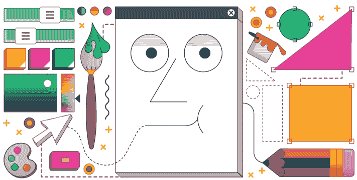

你将构建一个简单的应用程序，允许你使用线条和形状进行绘画（图1）。你将分四个阶段创建你的绘图应用程序：

- 绘制跟随鼠标的点
- 在点之间绘制线条
- 添加颜色和线条宽度修改器
- 绘制形状

请注意，你可以按照任何你想要的方式设计你的应用程序——它不必看起来像这个。

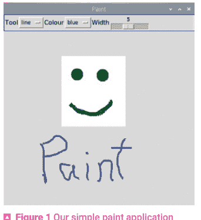

### 绘制点

第一步是创建一个简单的应用程序，它将使用 **Drawing** 控件和 **when_mouse_dragged** 事件在屏幕上绘制点（或椭圆）。

在你空白程序的导入部分，添加控件：

```python
from guizero import App, Drawing
```

创建一个新函数：

```python
def draw(event):
    painting.oval(
        event.x - 1, event.y - 1,
        event.x + 1, event.y + 1,
        color="black")
```

将此代码添加到应用程序部分：

```python
app = App("画图")

painting = Drawing(app, width="fill", height="fill")

painting.when_mouse_dragged = draw

app.display()
```

你的代码应该类似于 **paint1.py**（第116页）。**Drawing** 控件填充了窗口上所有可用的空间。当鼠标在绘图区域拖动时，会调用 **draw** 函数，该函数在 **painting** 上绘制椭圆。

每次触发事件时都会调用 **draw** 函数。包含鼠标 x 和 y 位置的事件作为变量传递给该函数。

然而，这里有一个问题。除非你非常缓慢地移动鼠标，否则你的程序绘制的是一系列点，而不是一条连续的线（**图2**）。这不是一个很好的画笔！点之间存在间隙，因为鼠标经过的每个像素点并不会都触发事件。

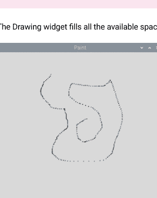

▲ 图2 不是一个很好的画笔

### 在点之间绘制线条

为了解决这个问题，你将修改程序以在点之间绘制线条。这样画出的线将是连续的，更像一支笔或画笔。

你需要使用 `when_left_button_pressed` 事件来存储线条开始的位置。然后在线条开始的位置和鼠标拖动到的下一个位置之间绘制一条直线。

创建一个新函数，当鼠标按下时调用。

```python
def start(event):
    painting.last_event = event
```

将其添加到应用程序部分：

```python
painting.when_left_button_pressed = start
```

线条开始的位置存储在 `last_event` 变量中。修改 `draw` 函数，以在线条开始的位置和鼠标拖动到的位置之间绘制一条线。

```python
def draw(event):
    painting.line(
        painting.last_event.x, painting.last_event.y,
        event.x, event.y,
        color="black",
        width=3
    )

    painting.last_event = event
```

通过将 `last_event` 变量更新为鼠标的当前位置，下次拖动鼠标时，它将在此点和下一个点之间绘制另一条线。你的程序应该看起来像 `paint2.py`。测试它，确保你的画笔现在能正常工作。

### 更改线条宽度和颜色

你的画笔只有一种颜色和粗细，这限制了你可以创建的绘图。接下来，你将修改你的图形用户界面，以便你可以选择不同的颜色和线条宽度。

向图形用户界面添加两个控件，以捕获线条的颜色和宽度。

```python
from guizero import App, Drawing, Combo, Slider
```

将这些行添加到应用程序部分：

```python
color = Combo(app, options=["black", "white", "red", "green", "blue"])
width = Slider(app, start=1, end=10)
```

你可能还想将绘图区域的背景颜色更改为不同的颜色。另外，我们使用了 **Combo** 和 **Slider**，但你可以选择不同的控件。

修改 **draw** 函数，在绘制线条时使用颜色和宽度值。

```python
painting.line(
    painting.last_event.x, painting.last_event.y,
    event.x, event.y,
    color=color.value,
    width=width.value
)
```

测试你的代码，它应该类似于 **paint3.py**，现在你可以选择颜色和线条宽度了。

### 绘制形状

你将扩展你的绘图应用程序，以便可以绘制填充的矩形。当鼠标按下时，矩形将出现，并随着鼠标在屏幕上拖动而增长。当鼠标按钮释放时，矩形将被绘制到屏幕上。

为此，你将修改你的程序，持续绘制和删除矩形，直到鼠标按钮释放。让我们向你的图形用户界面添加一个控件，以便你可以选择是绘制线条还是矩形。将其添加到应用程序部分：

```python
shape = Combo(app, options=["line", "rectangle"])
```

修改 **draw** 函数，仅在选择了 **"line"** 选项时才绘制线条。

```python
if shape.value == "line":
    painting.line(
        painting.last_event.x, painting.last_event.y,
        event.x, event.y,
        color=color.value,
        width=width.value
    )
```

测试你的程序，确保线条仍然有效，并且在选择 **"rectangle"** 时不会发生任何事情。

创建两个新变量，以跟踪鼠标按下时的第一个事件和最后绘制的形状。

```python
def start(event):
    painting.last_event = event
    painting.first_event = event
    painting.last_shape = None
```

这些变量将在鼠标按钮释放之前绘制和删除矩形时使用。

将此代码添加到你的 **draw** 函数中，以便在拖动鼠标时绘制矩形。

```python
if shape.value == "rectangle":
    if painting.last_shape is not None:
        painting.delete(painting.last_shape)
    rectangle = painting.rectangle(
        painting.first_event.x, painting.first_event.y,
        event.x, event.y,
        color=color.value
    )
    painting.last_shape = rectangle
```

程序将不断地绘制一个矩形，然后删除它，然后再次绘制，直到你释放按钮。

你的完整程序应该类似于 **paint4.py**。尝试一下，看看你能创建出什么样的图画！

> ## 添加椭圆
> 当你第一次创建画图应用程序时，你使用了椭圆在屏幕上绘制点。你能否修改你的程序，使用类似于绘制矩形的过程来再次绘制椭圆？提示：查看 **10-paint.py** 代码清单，它还对工具进行了样式设置，并将它们整齐地排列在一个框中。

**Drawing** 控件还支持绘制三角形和多边形。查看文档（**lawsie.github.io/guizero/drawing**），看看你如何使用此函数来创建其他形状。

## 自定义事件

要让你的绘图应用响应鼠标位置，你使用了自定义事件。这些事件的工作方式与普通的控件命令参数非常相似，你可以将它们设置为一个函数，当该事件发生时，该函数就会被调用。

当你的函数被调用时，会传递一个变量，其中包含有关已发生事件的信息，例如鼠标的 x 和 y 坐标。大多数控件，包括 App 本身，都支持以下事件：

-   当被点击时 – **when_clicked**
-   当鼠标左键被按下时 – **when_left_button_pressed**
-   当鼠标左键被释放时 – **when_left_button_released**
-   当鼠标右键被按下时 – **when_right_button_pressed**
-   当鼠标右键被释放时 – **when_right_button_released**
-   当一个键被按下时 – **when_key_pressed**
-   当一个键被释放时 – **when_key_released**
-   当鼠标进入一个控件时 – **when_mouse_enters**
-   当鼠标离开一个控件时 – **when_mouse_leaves**
-   当鼠标在一个控件上被拖动时 – **when_mouse_dragged**

这些事件可以用来让你的图形用户界面更具交互性。

## paint1.py / Python 3

```python
# simple paint app, just draw dots

# -------------------------
# Imports
# -------------------------

from guizero import App, Drawing


# -------------------------
# Functions
# -------------------------

def draw(event):
    painting.oval(
        event.x - 1, event.y - 1,
        event.x + 1, event.y + 1,
        color="black")


# -------------------------
### App
# -------------------------

app = App("Paint")

painting = Drawing(app, width="fill", height="fill")

painting.when_mouse_dragged = draw

app.display()
```

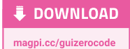

## paint2.py / Python 3

```python
# drawing lines by tracking when the mouse is clicked

# -------------------------
# Imports
# -------------------------

from guizero import App, Drawing

# -------------------------
# Functions
# -------------------------

def start(event):
    painting.last_event = event

def draw(event):
    painting.line(
        painting.last_event.x, painting.last_event.y,
        event.x, event.y,
        color="black",
        width=3
    )

    painting.last_event = event

# -------------------------
### App
# -------------------------

app = App("Paint")

painting = Drawing(app, width="fill", height="fill")

painting.when_left_button_pressed = start
painting.when_mouse_dragged = draw

app.display()
```

## paint3.py / Python 3

```python
# widgets to set the color and width

# -------------------------
# Imports
# -------------------------

from guizero import App, Drawing, Combo, Slider


# -------------------------
# Functions
# -------------------------

def start(event):
    painting.last_event = event

def draw(event):
    painting.line(
        painting.last_event.x, painting.last_event.y,
        event.x, event.y,
        color=color.value,
        width=width.value
    )


    painting.last_event = event


# -------------------------
### App
# -------------------------

app = App("Paint")

color = Combo(app, options=["black", "white", "red", "green",
"blue"])
width = Slider(app, start=1, end=10)

painting = Drawing(app, width="fill", height="fill")

painting.when_left_button_pressed = start
painting.when_mouse_dragged = draw

app.display()
```

## paint4.py / Python 3

```python
# adding different drawing shapes

# -------------------------
# Imports
# -------------------------

from guizero import App, Drawing, Combo, Slider

# -------------------------
# Functions
# -------------------------

def start(event):
    painting.last_event = event
    painting.first_event = event
    painting.last_shape = None

def draw(event):
    if shape.value == "line":
        painting.line(
            painting.last_event.x, painting.last_event.y,
            event.x, event.y,
            color=color.value,
            width=width.value
        )

    if shape.value == "rectangle":

        if painting.last_shape is not None:
            painting.delete(painting.last_shape)

        rectangle = painting.rectangle(
            painting.first_event.x, painting.first_event.y,
            event.x, event.y,
            color=color.value
        )

        painting.last_shape = rectangle

    painting.last_event = event

# -------------------------
### App
# -------------------------

app = App("Paint")

color = Combo(app, options=["black", "white", "red", "green",
"blue"])
width = Slider(app, start=1, end=10)
shape = Combo(app, options=["line", "rectangle"])

painting = Drawing(app, width="fill", height="fill")

painting.when_left_button_pressed = start
painting.when_mouse_dragged = draw

app.display()
```

## 10-paint.py / Python 3

```python
# styled up

# -------------------------
# Imports
# -------------------------

from guizero import App, Drawing, Combo, Slider, Box, Text

# -------------------------
# Functions
# -------------------------

def start(event):
    painting.last_event = event
    painting.first_event = event
    painting.last_shape = None

def draw(event):
    if shape.value == "line":
        painting.line(
            painting.last_event.x, painting.last_event.y,
            event.x, event.y,
            color=color.value,
            width=width.value
        )

    else:
        if painting.last_shape is not None:
            painting.delete(painting.last_shape)

        if shape.value == "rectangle":
            painting.last_shape = painting.rectangle(
                painting.first_event.x, painting.first_event.y,
                event.x, event.y,
                color=color.value
            )

        if shape.value == "oval":
            painting.last_shape = painting.oval(
                painting.first_event.x, painting.first_event.y,
                event.x, event.y,
                color=color.value
            )

    painting.last_event = event

# -----------------------------
### App
# -----------------------------

app = App("Paint")
app.font = "impact"

tools = Box(app, align="top", width="fill", border=True)

Text(tools, text="Tool", align="left")
shape = Combo(tools, options=["line", "rectangle", "oval"],
align="left")

Text(tools, text="Colour", align="left")
color = Combo(tools, options=["black", "white", "red", "green",
"blue"], align="left")

Text(tools, text="Width", align="left")
width = Slider(tools, start=1, end=10, align="left")

painting = Drawing(app, width="fill", height="fill")

painting.when_left_button_pressed = start
painting.when_mouse_dragged = draw

app.display()
```

## 第11章
定格动画
构建你自己的定格动画 GIF 创作者

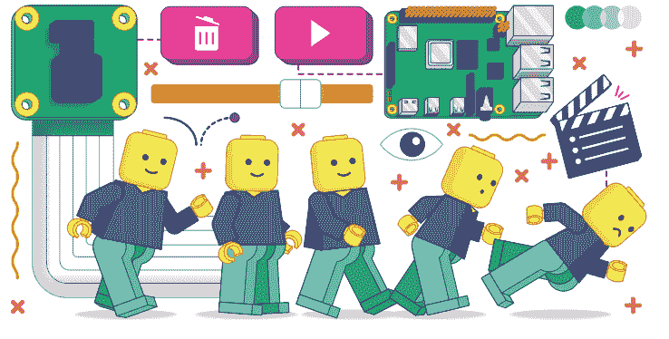

这个项目使用树莓派摄像头模块和 guizero 来制作一个定格动画应用程序（图1）。要完成这个项目，你需要一个带有官方摄像头模块（或高质量摄像头）的树莓派。如果你需要帮助连接摄像头模块，请查看 rpf.io/picamera 上的“摄像头模块入门”指南。

你需要安装带有可选“images”功能的 guizero，你可以通过在终端中运行以下命令来安装：

```
pip3 install guizero[images]
```

如果使用 Thonny IDE，你可能还需要切换到常规模式，转到工具 > 管理包，选择 guizero，点击“...”按钮，勾选“升级依赖项”复选框，然后点击安装。

这个项目分为几个阶段：

1.  用摄像头拍摄一张图片并将其显示在图形用户界面上
2.  拍摄多张图片并将它们保存为 GIF 文件
3.  允许用户更改 GIF
4.  整理图形用户界面

## 拍摄一张图片

首先创建这个程序。

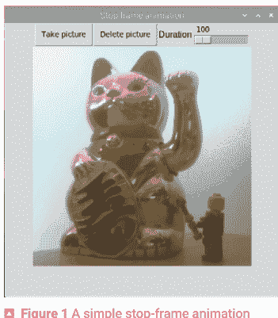

```python
# Imports -----------------
from guizero import App, Picture, PushButton
from picamera import PiCamera

# Functions -----------------
def capture_image():
    camera.capture("frame.jpg")
    viewer.image = "frame.jpg"

# Variables -----------------
camera = PiCamera(resolution="400x400")

# App -----------------
app = App(title="Stop frame animation")

take_next_picture = PushButton(app, text="Take picture",
command=capture_image)
viewer = Picture(app)

app.display()
```

请注意，分辨率越高，处理时间越长。400×400 很小，但处理起来非常快。

图形用户界面包含一个按钮和一个图片显示区域。当按下按钮时，会调用 **capture_image** 函数。该函数使用摄像头捕获图像并将其保存为 **frame.jpg**。然后，图像会显示在图片显示部件中。

测试程序（**stopframe1.py**，第131页）。当你点击“拍照”按钮时，图像应显示在图形用户界面上（**图2**）。

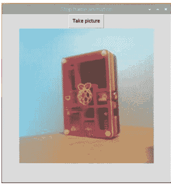

## 拍摄多张图片并保存为GIF

动画由多张图片组成，这些图片被称为帧。动画中的每一帧都与前一帧略有不同，当它们快速连续播放时，动画就会呈现出运动的效果。

在这一步中，你将修改你的图形用户界面，以保留所有已拍摄帧的列表，并使用PIL（Python图像库）将这些帧保存为动画GIF，然后在查看器中显示。在程序顶部，从PIL导入Image模块：

```python
from PIL import Image
```

创建一个列表来存储动画的帧：

```python
frames = []
```

为了跟踪已拍摄的帧数，导入一个Text部件，将其添加到你的应用中，并将其初始值设置为0。

```python
from guizero import App, Picture, PushButton, Text

total_frames = Text(app, text="0")
```

每次捕获新图像时，你需要打开它并将其追加到你的帧列表中：

```python
def capture_image():
    camera.capture("frame.jpg")
    viewer.image = "frame.jpg"

    frame = Image.open("frame.jpg")
    frames.append(frame)
    total_frames.value = len(frames)
```

然后使用 `frames` 列表的 `len`（长度）来更新 `total_frames` 中的文本。
你的程序现在应该类似于 `stopframe2.py`。测试它，并确保每次拍照时帧数都会增加。

## 保存为GIF

你可以使用PIL将所有帧保存为一个动画GIF。创建一个新的 `save_animation` 函数，将帧保存为 `animation.gif`。

```python
def save_animation():
    if len(frames) > 0:
        viewer.show()
        frames[0].save(
            "animation.gif",
            save_all=True,
            append_images=frames[1:])
        viewer.image = "animation.gif"
    else:
        viewer.hide()
```

这里有很多操作，但通过分解代码，你可以看到这是如何工作的。
如果列表中的帧数大于0，则显示查看器，否则隐藏它：

```python
if len(frames) > 0:
    viewer.show()
    ...
else:
    viewer.hide()
```

然后将帧保存到名为 `animation.gif` 的文件中。保存第一帧（`frames[0]`），追加剩余的帧（`frames[1:]`），并将所有帧保存到动画GIF中：

```python
frames[0].save(
    "animation.gif",
    save_all=True,
    append_images=frames[1:])
```

然后在查看器中显示 **animation.gif**：

```python
viewer.image = "animation.gif"
```

在 `capture_image` 函数的*末尾*调用 `save_animation` 函数，以创建并显示动画：

```python
def capture_image():
    camera.capture("frame.jpg")
    viewer.image = "frame.jpg"

    save_animation()
```

你的代码现在应该类似于 **stopframe3.py**。试一试。

## 删除最后一帧

目前，如果你在创建动画GIF时出错，你必须从头开始。

你应该修改你的图形用户界面，允许删除最后拍摄的一帧，这样如果出错，你可以撤销更改。

创建一个新函数，该函数将从列表中移除或弹出最后一帧，保存更改后的动画，然后显示它。

```python
def delete_frame():
    if len(frames) > 0:
        frames.pop()
        total_frames.value = len(frames)

    save_animation()
```

在尝试弹出最后一项之前，会检查 `frames` 列表的长度。如果你尝试从空列表中弹出项目，将会引发错误。

在图形用户界面中添加一个按钮来调用 `delete_frame` 函数，方法是在你的应用中插入以下代码：

```python
delete_last_picture = PushButton(controls, align="left",
text="Delete last", command=delete_frame)
```

**注意：** *你也可以修改图形用户界面，允许你删除任何一帧，而不仅仅是最后一帧。*

## 更改时长

每帧默认显示100毫秒。在你的图形用户界面中包含一个滑块部件，以允许更改显示时长。

将其添加到导入列表中。

```python
from guizero import App, Picture, PushButton, Text, Slider
```

然后在应用中创建该部件。

```python
Text(app, text="Duration")
duration = Slider(app, start=100, end=1000, command=save_animation)
```

`start` 和 `end` 参数将是你可为帧显示时长设置的最小和最大时间。

每次滑块更改时，都会运行 `save_animation` 函数。

更新 `save_animation` 函数，在保存GIF时使用时长值。

```python
frames[0].save(
    "animation.gif",
    save_all=True,
    append_images=frames[1:],
    duration=duration.value)
```

你的代码现在应该类似于 `stopframe4.py`。试一试。

> ## 一致的捕获

由于摄像头使用的是“自动”模式，每次捕获图像时，所使用的设置可能会改变。这将导致每张图像略有不同，并在你的动画中引起闪烁。

通过在程序启动时固定摄像头设置，你可以阻止这种情况发生。

所需的设置将取决于你拍摄照片时的光照条件。

这篇来自picamera文档的文章提供了更多信息和示例设置：rpf.io/picamera-consistent。

## 对齐控件

目前，控件在图形用户界面顶部堆叠，占据了大量空间（图3）。创建一个Box并将其对齐到图形用户界面的顶部以容纳控件，首先将其添加到导入中。

```python
from guizero import App, Picture, PushButton, Text, Slider, Box

controls = Box(app, align="top")
```

修改部件，使它们位于控件框内，并将align参数设置为“left”。例如：

```python
total_frames = Text(controls, text="0", align="left")
```

将部件在框内左对齐将使它们彼此相邻堆叠。

对其余控件重复此操作，使它们都放入顶部框中并彼此相邻排列。

你的完整程序应该类似于11-stop-frame.py。


## 使用Python创建图形用户界面

### stopframe1.py / Python 3

```python
# 导入 -----------------

from guizero import App, Picture, PushButton
from picamera import PiCamera

# 函数 ---------------

def capture_image():
    camera.capture("frame.jpg")
    viewer.image = "frame.jpg"

# 应用 ---------------------

app = App(title="Stop frame animation")

camera = PiCamera(resolution="400x400")
take_next_picture = PushButton(app, text="Take picture",
    command=capture_image)
viewer = Picture(app)

app.display()
```

### stopframe2.py / Python 3

```python
# 导入 -----------------

from guizero import App, Picture, PushButton, Text
from picamera import PiCamera
from PIL import Image

# 函数 ---------------

def capture_image():
    camera.capture("frame.jpg")
    viewer.image = "frame.jpg"

    frame = Image.open("frame.jpg")
    frames.append(frame)
    total_frames.value = len(frames)

# 变量 -----------------

frames = []

camera = PiCamera(resolution="400x400")

# 应用 -----------------------

app = App(title="Stop frame animation")

total_frames = Text(app, text="0")
take_next_picture = PushButton(app, text="Take picture",
    command=capture_image)

viewer = Picture(app)

app.display()
```

```python
# 导入 -------------------

from guizero import App, Picture, PushButton, Text
from picamera import PiCamera
from PIL import Image

# 函数 -----------------

def capture_image():
    camera.capture("frame.jpg")
    viewer.image = "frame.jpg"

    frame = Image.open("frame.jpg")
    frames.append(frame)
    total_frames.value = len(frames)

    save_animation()

def save_animation():
    if len(frames) > 0:
        viewer.show()
        frames[0].save(
            "animation.gif",
            save_all=True,
            append_images=frames[1:])
        viewer.image = "animation.gif"
    else:
        viewer.hide()

# 变量 ---------------

frames = []

camera = PiCamera(resolution="400x400")

# 应用 ---------------------

app = App(title="Stop frame animation")

total_frames = Text(app, text="0")
take_next_picture = PushButton(app, text="Take picture",
    command=capture_image)

viewer = Picture(app)

app.display()
```

## stopframe4.py / Python 3

```python
# Imports -----------------

from guizero import App, Picture, PushButton, Text, Slider
from picamera import PiCamera
from PIL import Image

# Functions -----------------

def capture_image():
    camera.capture("frame.jpg")
    viewer.image = "frame.jpg"

    frame = Image.open("frame.jpg")
    frames.append(frame)
    total_frames.value = len(frames)

    save_animation()

def save_animation():
    if len(frames) > 0:
        viewer.show()
        frames[0].save(
            "animation.gif",
            save_all=True,
            append_images=frames[1:],
            duration=duration.value)
        viewer.image = "animation.gif"
    else:
        viewer.hide()

def delete_frame():
    if len(frames) > 0:
        frames.pop()
        total_frames.value = len(frames)

    save_animation()

# Variables -----------------

frames = []

camera = PiCamera(resolution="400x400")

# App -------------------

app = App(title="Stop frame animation")

total_frames = Text(app, text="0")
take_next_picture = PushButton(app, text="Take picture",
    command=capture_image)
delete_last_picture = PushButton(app, text="Delete last",
    command=delete_frame)
Text(app, text="Duration")
duration = Slider(app, start=100, end=1000, command=save_animation)

viewer = Picture(app)

app.display()
```

## 11-stop-frame.py / Python 3

```python
# Imports -------------------

from guizero import App, Picture, PushButton, Text, Slider, Box
from picamera import PiCamera
from PIL import Image

# Functions -------------------

def capture_image():
    camera.capture("frame.jpg")
    viewer.image = "frame.jpg"

    frame = Image.open("frame.jpg")
    frames.append(frame)
    total_frames.value = len(frames)

    save_animation()

def save_animation():
    if len(frames) > 0:
        viewer.show()
        frames[0].save(
            "animation.gif",
            save_all=True,
            append_images=frames[1:],
            duration=duration.value)
        viewer.image = "animation.gif"
    else:
        viewer.hide()

def delete_frame():
    if len(frames) > 0:
        frames.pop()
        total_frames.value = len(frames)

    save_animation()

# Variables ---------------

frames = []

camera = PiCamera(resolution="400x400")

# App ----------------------

app = App(title="Stop frame animation")

controls = Box(app, align="top")
total_frames = Text(controls, text="0", align="left")
take_next_picture = PushButton(controls, align="left", text="Take picture", command=capture_image)
delete_last_picture = PushButton(controls, align="left", text="Delete last", command=delete_frame)
Text(controls, align="left", text="Duration")
duration = Slider(controls, align="left", start=100, end=1000, command=save_animation)

viewer = Picture(app)

app.display()
```

## 附录 A

## 环境设置

学习如何安装 Python 和集成开发环境

这里我们将向你展示如何在你的计算机上设置一切，以便创建具有图形用户界面的 Python 程序。为了能够运行和编辑本书中的应用程序，你需要三样东西：

1.  Python 解释器 – 这是允许你运行用 Python 编写的程序的软件。
2.  一个集成开发环境（IDE） – 包含代码编辑器和从该编辑器运行程序功能的软件。Python 自带一个名为 IDLE 的 IDE，但你可能会选择使用不同的 IDE。
3.  guizero Python 库 – 安装说明在第 1 章给出，但如果你使用的是 Thonny，请参考下面的部分，因为说明略有不同。

有许多 IDE 可用；这里我们将介绍其中两个 – IDLE 和 Thonny。IDLE 是一个非常简单的 IDE，它随 Windows 和 Mac 版本的 Python 一起捆绑提供，并且在某些版本的 Raspberry Pi OS 上默认安装。Thonny 有一些额外的功能，但它仍然面向初学者。

偶尔，在尝试安装和运行所有内容时可能会发生错误 – 尤其是在较旧的计算机上。如果你在尝试使用特定的 IDE 或 Python 版本时遇到错误，请尝试另一个 IDE 或 Python 版本。

## 安装 Python 和 IDLE

**Windows**
Windows 没有预装 Python 3。如果你认为你之前可能已经安装了 Python，你可以通过在开始菜单中查找‘Python’或在设置中的‘应用和功能’下查找来检查。如果你打算使用 Thonny 作为你的 IDE，你可以跳到‘Thonny’部分，因为 Python 会随它一起自动安装。
访问 **python.org**，将鼠标悬停在 Downloads 上并点击 Windows。选择直接下载最新稳定版 Python 3 的选项（大多数人需要标记为 *Windows x86-64 executable installer* 的版本，但这可能因你的计算机而异）。下载完成后，通过你的网络浏览器或从下载文件夹运行程序。点击‘Install now’使用默认选项进行安装。IDLE 也将被安装，可以通过开始菜单或按名称搜索打开。
或者，如果你有 Windows 10，你可以从 Microsoft Store 下载最新 Python 版本（目前是 3.8）的包。如果你遇到任何困难，完整的安装说明可以在 **rpf.io/python-windows** 找到。

**Mac**
尽管大多数版本的 macOS 都带有 Python 解释器，但它是 2.7 版本，与 guizero 不兼容。你需要在现有安装旁边安装 Python 3。
访问 **python.org**，将鼠标悬停在 Downloads 上并点击 Mac OS X。选择最新的稳定版本，然后点击 *macOS 64-bit installer*。下载完成后，通过你的网络浏览器或从下载文件夹运行程序。使用默认选项进行安装。IDLE 也将被安装，现在可以从启动台或应用程序文件夹打开。

**Raspberry Pi**
Raspberry Pi OS（以前称为 Raspbian）已经预装了 Python。但是，最近版本的操作系统带有 Thonny 但不包含 IDLE。要安装 IDLE，请确保你已连接到互联网，然后打开终端并输入：

```
sudo apt-get install idle3
```

如果你在运行本书中的代码时遇到任何问题，请尝试升级到最新版本的 Raspberry Pi OS。

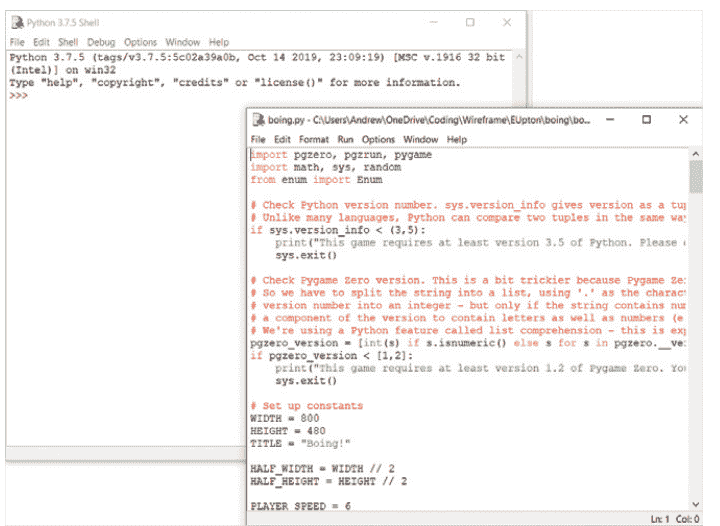

## 集成开发环境

### IDLE

IDLE 是一个基本的 IDE，通常随 Python 一起自动安装。一旦 IDLE 启动，你首先看到的是一个标题为‘Python 3.8.5 Shell’的窗口（数字可能因你拥有的具体版本而异）。这个窗口称为 *shell*，你可以用它输入一行 Python 代码并立即看到代码运行。

例如，尝试输入以下内容：
**6 + 2**

使用文件菜单 > 新建文件来打开一个 Python 文件。文件允许你输入多行代码，然后一次性运行它们，而不是在你按 **ENTER** 时立即运行每一行。你可以通过转到运行菜单并选择运行模块 – 或者按键盘上的 **F5** 来运行程序。如果发生错误，你将在 shell 窗口中看到任何错误消息。

## 使用 Python 创建图形用户界面


### Thonny

Thonny 随最近版本的 Raspberry Pi OS 一起安装。对于 Windows 和 Mac 计算机，你可以从 **thonny.org** 下载并安装它。默认情况下，Thonny 使用随其打包的 Python 版本，因此即使你已经安装了 Python，Thonny 也会忽略该版本并使用自己的版本。

使用文件菜单 > 新建来打开一个 Python 文件。你将在顶部的白色框中输入代码，该框左侧有一个数字 1。你可以通过选择‘运行当前脚本’按钮或按键盘上的 **F5** 来运行程序。如果发生错误，你将在屏幕底部的 shell 区域看到任何错误消息。

Thonny 包含一个调试器，允许你逐行单步执行代码并查看变量如何变化。

因为 Thonny 使用自己的 Python 安装，你需要从 Thonny 内部安装 guizero，以便 Thonny 能够访问它。确保你已连接到互联网，然后点击工具菜单 > 管理包。在出现的窗口中，在框中输入 guizero 并点击‘从 PyPI 查找包’。Thonny 会为你定位该包；点击安装以在 Thonny 自己的 Python 环境中安装 guizero。

## 附录 B
Python 入门

如果你是完全的初学者，以下是开始用 Python 编程的方法。

与 Scratch 等可视化的、基于积木的编程环境不同，Python 是基于文本的：你使用一种简化的语言和特定格式编写指令，然后由计算机执行。对于已经使用过 Scratch 的人来说，Python 是一个很好的下一步选择，它提供了更大的灵活性和更“传统”的编程环境。在接下来的示例中，我们使用 Thonny IDE（集成开发环境），但如果你愿意，也可以使用其他 IDE（参见附录 A）。

## 第一个程序

Thonny 窗口顶部的白色方框是你编写程序脚本的地方。点击这个方框并输入以下代码：

```
print ("Hello, World!")
```

现在点击 Thonny 工具栏中的运行图标，系统会要求你先保存程序；输入一个描述性的名称，比如“Hello World”，然后点击保存按钮。程序保存后，你会在 Python shell 区域看到两条消息：

```
>>> %Run 'Hello World.py'
Hello, World!
```

恭喜，你已经成功编写并运行了一个 Python 脚本！本书中的所有程序都将使用相同的方法——在脚本区域编写代码，然后运行它。

## 循环与代码缩进

正如 Scratch 使用类似拼图的积木堆叠来控制程序的哪些部分相互连接，Python 也有自己的方式来控制程序的运行顺序：缩进。

点击 Thonny 工具栏中的新建图标来创建一个新程序。你不会丢失现有的程序；相反，Thonny 会在脚本区域上方创建一个新标签页。输入以下代码：

```
print ("Loop starting!")
for i in range(10):
    print ("Loop")
```

点击 Thonny 工具栏中的运行图标，将程序保存为“Indentation”，然后观察 shell 区域的输出。看看你能否弄清楚发生了什么。

第一行向 shell 打印一条消息，就像你的 Hello World 程序一样。第二行告诉 Python 开始一个循环，运行 10 次——循环运行的次数由 **range(10)** 指令控制。第三行是缩进的，这意味着它相对于其他行向内推移。这种缩进是 Python 区分循环外指令和循环内指令的方式。在 Scratch 中，要包含在循环中的指令被放置在 C 形积木内，而在 Python 中，它们是缩进的。因此，这意味着打印“Loop”这个词的指令将重复 10 次。

你会注意到，当你在第三行末尾按下 **ENTER** 键时，Thonny 会自动缩进下一行，假设它是循环的一部分。要删除这个缩进，只需按一次 **BACKSPACE** 键，然后输入第四行也是最后一行：

```
print ("Loop finished!")
```

你的四行程序现在完成了。第一行在循环外，只运行一次；第二行设置循环；第三行在循环内，每次循环都会运行一次；第四行再次在循环外。

再次运行程序。如果你没有放大 Thonny 窗口，可能需要使用 shell 区域右侧的滚动条来查看完整输出：

```
Loop starting!
Loop
Loop
Loop
Loop
Loop
Loop
Loop
Loop
Loop finished!
```


▶ 运行程序并在下方的 shell 区域查看结果

缩进是 Python 的一个强大功能，也是程序无法按预期工作的最常见原因之一。在查找程序中的问题时，务必仔细检查缩进。

## 条件语句与变量

你可以在程序中创建变量来存储值；例如，你可能想存储用户输入的一些数据或计算结果。

点击 Thonny 菜单上的新建图标来开始一个新程序，然后在脚本区域输入以下内容：

```
my_name = input("What is your name? ")
```

点击运行图标，将程序保存为“Input test”，然后观察 shell 区域会发生什么：系统会要求你输入名字。输入你的名字并按 **ENTER** 键。Thonny 窗口右侧的变量区域将自动显示变量名


变量名和值显示在右侧区域

（my_name）及其值（例如“Laura”）。如果你看不到变量区域，请检查“视图”菜单中“变量”旁边是否有勾选标记。即使程序未运行，此信息也会保持显示，便于查看程序的执行情况。

程序已将你输入的名字保存为名为 **my_name** 的变量的值。使用 `input` 命令对于基本的 Python 程序很有用，但当你尝试本书中的 GUI 程序时，你将学习其他从用户获取输入并将其存储在变量中以供程序使用的方法。

要让你的程序对名字做一些有用的事情，请添加一个条件语句，输入以下内容：

```
if my_name == "Clark Kent":
    print ("You are Superman!")
else:
    print ("You are not Superman!")
```


除非你输入的名字是 Clark Kent，否则你不是超人

请记住，当 Thonny 看到你的代码需要缩进时，它会自动进行——但它不知道你的代码何时需要停止缩进，因此你必须自己删除空格。

点击运行图标，像之前一样在 shell 区域输入你的名字。除非你的名字恰好是 Clark Kent，否则你会在 shell 区域看到一条额外的消息“You are not Superman!”。再次点击运行，这次输入名字“Clark Kent”——确保完全按照程序中的写法，C 和 K 大写。这次，程序会认出你确实是超人。

== 符号告诉 Python 比较两个值。在这种情况下，它会检查变量 my_name 的值是否与文本“Clark Kent”匹配。

> ### 使用 = 和 ==

我们现在看到了两种不同的运算符——单等号（=）和双等号（==）。它们意味着不同的事情，了解区别很重要。单等号（=）表示“它等于这个值”，而双等号（==）表示“它是否等于这个值？”前者用于将值赋给变量，后者用于比较两个值。

当你在创建本书中的程序时，你将从用户那里收集输入，将数据存储在变量中，在屏幕上显示信息，并使用循环。我们在本节中讲解的示例非常基础，只允许用户通过文本与程序交互。我们希望现在你已经了解了编写 Python 程序的基础知识，你会喜欢创建 GUI，作为一种更图形化的方式与程序交互。

## 附录 C

## guizero 中的部件

guizero 中使用的部件概述

guizero 中的部件是你创建图形用户界面的方式。它们是出现在 GUI 上的东西，从应用程序本身到文本框、按钮和图片。

注意：这是 guizero 中部件的概述。请务必查看每个部件的特定在线文档以获取更多信息：lawsie.github.io/guizero。

## 部件

### App

App 对象是使用 guizero 创建的所有 GUI 的基础。它是包含所有其他部件的主窗口。


```
app = App()
app.display()
```

### Box

Box 对象是一个不可见的容器，可以包含其他部件。


```
box = Box(app)
box = Box(app, border=True)
```

### ButtonGroup

ButtonGroup 对象显示一组单选按钮，允许用户选择一个选项。

```
choice = ButtonGroup(app,
    options=["cheese", "ham", "salad"])
```


### CheckBox

CheckBox 对象显示一个复选框，允许勾选或取消勾选一个选项。

```
checkbox = CheckBox(app, text="salad ?")
```


### Combo

Combo 对象显示一个下拉框，允许从选项列表中选择一个项目。

```
combo = Combo(app, options=["cheese",
    "ham", "salad"])
```


### Drawing

Drawing 对象允许创建形状、图像和文本。

```
drawing = Drawing(app)
```


### ListBox

ListBox 对象显示一个项目列表，可以选择单个项目或多个项目。

```
listbox = ListBox(app, items=["cheese",
    "ham", "salad"])
```


## 图片

图片对象用于显示图像。

```
picture = Picture(app, image="guizero.png")
```


## 按钮

按钮对象显示一个带有文本或图像的按钮，按下时会调用一个函数。

```
def do_nothing():
    print("button pressed")

button = PushButton(app, command=do_nothing)
```


## 滑块

滑块对象显示一个带有选择器的条形控件，可用于在指定范围内设定一个值。

```
slider = Slider(app)
```


## 文本

文本对象在你的应用中显示不可编辑的文本——适用于标题、标签和说明。

```
text = Text(app, text="Hello World")
```


## 文本框

文本框对象显示一个可供用户输入的文本框。

```
textbox = TextBox(app)
```


## 华夫饼图

华夫饼图对象显示一个 n×n 的方格网格，具有自定义的尺寸和内边距。


```
waffle = Waffle(app)
```

## 窗口

窗口对象在 guizero 中创建一个新窗口。


```
window = Window(app)
```

## 属性

所有控件都可以通过其属性进行自定义。这些属性对大多数控件来说是通用的。请查阅控件的在线文档（例如 **lawsie.github.io/guizero/app**）以获取详细信息。

| 属性 | 数据类型 | 描述 |
| :--- | :--- | :--- |
| **align** | 字符串 | 此控件在其容器内的对齐方式 |
| **bg** | 字符串，列表 | 控件的背景颜色 |
| **enabled** | 布尔值 | 如果控件已启用则为真 |
| **font** | 字符串 | 文本的字体 |
| **grid** | 列表 | 如果控件位于“网格”布局中，其 [x,y] 坐标 |
| **height** | 整数，字符串 | 控件的高度 |
| **master** | App, Window, Box | 此控件所属的容器 |
| **value** | 整数，字符串，布尔值 | 控件的当前“值”，例如文本框中的文本 |
| **visible** | 布尔值 | 此控件是否可见 |
| **width** | 尺寸 | 控件的宽度 |
| **text_size** | 整数 | 文本的大小 |
| **text_color** | 颜色 | 文本的颜色 |

## 方法

控件可以通过其方法进行交互。支持的方法取决于具体的控件类型，因此请查阅文档。这些方法对大多数控件来说是通用的。

| 方法 | 描述 |
|---|---|
| after(time, command, args=None) | 在 time 毫秒后安排一次对 command 的调用 |
| cancel(command) | 取消对 command 的已安排调用 |
| destroy() | 销毁控件 |
| disable() | 禁用控件，使其无法交互 |
| enable() | 启用控件 |
| focus() | 将焦点赋予控件 |
| hide() | 隐藏控件，使其不可见 |
| repeat(time, command, args=None) | 每隔 time 毫秒安排一次对 command 的调用 |
| resize(width, height) | 设置控件的宽度和高度 |
| show() | 如果控件之前被隐藏，则显示它 |
| update_command(command, args=None) | 更新控件被使用时调用的函数 |

## 在任何计算机上创建你自己的图形用户界面

你想为你的 Python 程序添加按钮、方框、图片和颜色等元素吗？本书将向你展示如何使用 guizero 库创建 Python 桌面应用程序，该库快速、易用且易于理解。

本书适合所有人，从初学者到希望探索图形用户界面（GUI）的有经验的 Python 程序员。

书中包含十个有趣的项目供你创建，包括一个绘画程序、一个表情符号匹配游戏和一个定格动画制作器。

- 创建游戏和有趣的 Python 程序
- 学习如何创建你自己的图形用户界面
- 使用窗口、文本框、按钮、图像等
- 了解基于事件的编程
- 探索良好（和糟糕）的用户界面设计