# 使用 Python 和 Qt5 创建 GUI 应用程序

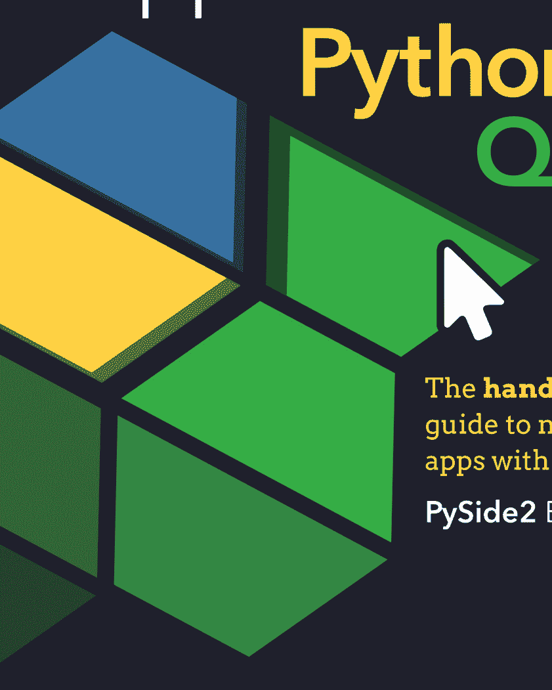

**动手实践**指南：用 Python 制作应用程序

**PySide2** 版

Martin Fitzpatrick

# 使用 Python 和 Qt5 创建 GUI 应用程序

用 Python 制作应用程序的实践指南

Martin Fitzpatrick

版本 4.0，2021-10-25

# 目录

- 引言
    1. GUI 的*简短*历史
    2. 关于 Qt 的一些介绍
    3. 致谢
    4. 版权声明
- PySide2 基础功能
    5. 我的第一个应用程序
    6. 信号与槽
    7. 控件
    8. 布局
    9. 动作、工具栏与菜单
    10. 对话框
    11. 窗口
    12. 事件
- Qt Designer
    13. 安装 Qt Designer
    14. Qt Designer 入门
    15. Qt 资源系统
- 主题
    16. 样式
    17. 调色板
    18. 图标
    19. Qt 样式表 (QSS)
- 模型/视图架构
    20. 模型/视图架构 — 模型/视图/控制器
    21. 一个简单的模型/视图 — 待办事项列表
    22. 在模型/视图中使用 numpy 和 pandas 处理表格数据
    23. 使用 Qt 模型查询 SQL 数据库
- PySide2 进阶功能
    24. 扩展信号
    25. 路由
    26. 处理命令行参数
    27. 系统托盘与 macOS 菜单
    28. 枚举与 Qt 命名空间
- 自定义控件
    29. Qt 中的位图图形
    30. 创建自定义控件
- 并发执行
    31. 线程与进程简介
    32. 使用线程池
    33. 线程示例
    34. 运行外部命令与进程
- 绘图
    35. 使用 PyQtGraph 绘图
    36. 使用 Matplotlib 绘图
- 打包与分发
    37. 使用 PyInstaller 打包
- 示例应用程序
    38. Mozzarella Ashbadger
    39. Moonsweeper
- 附录 A：安装 PySide2
- 附录 B：将 C++ 示例翻译为 Python
- 附录 C：PyQt5 与 PySide2 — 有何区别？
- 附录 D：接下来做什么？
- 索引

# 引言

如果你想用 Python 创建 GUI 应用程序，可能会觉得不知从何下手。要让*任何东西*运行起来，你需要理解许多新概念。但是，就像任何编码问题一样，第一步是学会以正确的方式处理问题。在本书中，我将带你从 GUI 开发的基本原理出发，使用 PySide2 创建你自己的、功能齐全的桌面应用程序。

本书第一版于 2016 年发布。此后，根据读者的反馈，它已经更新了 4 次，增加和扩展了章节。现在可用的 PySide 资源比我刚开始时更多，但仍然缺乏深入、实用的构建完整应用程序的指南。本书填补了这一空白！

本书以一系列章节的形式编排，依次探讨 PySide2 的不同方面。章节安排上将较简单的章节放在前面，但如果你的项目有特定需求，不要害怕跳着看！每一章都会引导你学习基本概念，然后通过一系列编码示例，逐步探索并学习如何自己应用这些想法。

你可以从 http://www.pythonguis.com/d/pyside2-source.zip 下载本书所有示例的源代码和资源。

在一本这个篇幅的书中，不可能给你一个关于 Qt 系统的*完整*概述，因此书中提供了指向外部资源的链接——包括 pythonguis.com 网站和其他地方。如果你发现自己在想“我想知道我能不能做*那个*？”，你能做的最好的事情就是放下这本书，然后*去弄清楚！* 只需在此过程中定期备份你的代码，这样即使你搞砸了，也总有东西可以回退。

本书中会穿插许多这样的信息框，提供信息、提示和警告。如果你时间紧迫，完全可以跳过它们，但阅读这些内容会让你对Qt框架有更深入、更全面的理解。

最后，本书的编写兼容Python 3.4+。Python 3是这门语言的未来，如果你现在开始学习，这正是你应该投入精力的方向。不过，许多示例只需稍作修改即可在Python 2.7上运行。

本书的编写兼容Python 3.6+。

## 1. 图形用户界面简史

**图形用户界面**有着悠久而辉煌的历史，最早可追溯到20世纪60年代。斯坦福大学的NLS（在线系统）引入了鼠标和窗口的概念，并于1968年首次公开演示。随后是施乐帕洛阿尔托研究中心的Smalltalk系统GUI（1973年），它奠定了大多数现代通用图形用户界面的基础。

这些早期系统已经具备了许多我们在现代桌面图形用户界面中习以为常的功能，包括窗口、菜单、单选按钮、复选框以及后来的图标。这些功能的组合——为我们提供了早期用于描述这类界面的缩写词：WIMP（窗口、图标、菜单、指点设备——即鼠标）。

1979年，第一个采用图形用户界面的商业系统发布——PERQ工作站。这推动了许多其他图形用户界面的开发，其中著名的包括Apple Lisa（1983年），它引入了菜单栏和窗口控制的概念。此外还有许多其他系统，如Atari ST（GEM）、Amiga。在UNIX（以及后来的Linux）上，X窗口系统于1984年出现。Windows for PC的第一个版本于1985年发布。

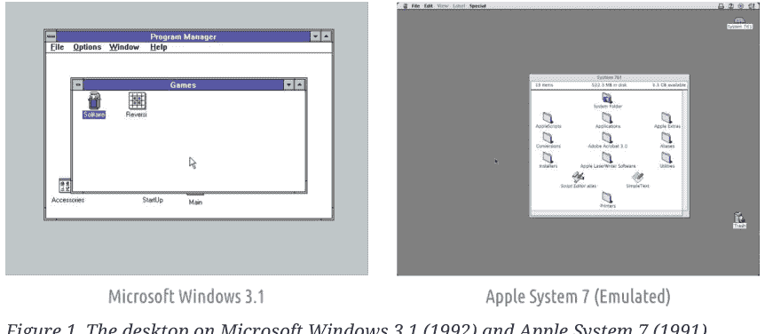

早期的图形用户界面并非像我们想象的那样一炮而红，这是由于发布时缺乏兼容软件以及昂贵的硬件要求——尤其是对家庭用户而言。图形用户界面缓慢但稳步地成为与计算机交互的首选方式，WIMP隐喻也牢固地确立为标准。这并不是说没有*尝试*在桌面上取代WIMP隐喻。例如，Microsoft Bob（1995年）就是微软一次备受诟病的尝试，试图用一个卡通房子取代桌面。


*图2. Microsoft Bob —— 抛弃桌面隐喻，代之以卡通房子。*

历史上不乏其他被誉为*革命性*的图形用户界面，从Windows 95（1995年）的发布，到Mac OS X（2001年）、GNOME Shell（2011年）和Windows 10（2015年）。每一个都彻底革新了各自桌面系统的用户界面，往往伴随着巨大的宣传。但从根本上说，什么都没有真正改变。这些新的用户界面仍然是非常典型的WIMP系统，其运行方式与自20世纪80年代以来的图形用户界面完全相同。

当革命真正到来时，它发生在移动端——鼠标被触摸取代，窗口被全屏应用取代。但即使在我们人人都随身携带智能手机的世界里，大量的日常工作仍然在桌面计算机上完成。WIMP已经经受住了40年的创新考验，并且看起来还将继续存在下去。

## 2. 关于Qt

Qt是一个免费且开源的*小部件工具包*，用于创建跨平台的图形用户界面应用程序，允许应用程序使用单一代码库针对Windows、macOS、Linux和Android等多个平台。但Qt*远不止*是一个小部件工具包，它内置了对多媒体、数据库、矢量图形和MVC接口的支持，更准确地说，它是一个应用程序开发*框架*。

Qt由Eirik Chambe-Eng和Haavard Nord于1991年创立，并于1994年成立了第一家Qt公司*Trolltech*。Qt目前由*The Qt Company*开发，并持续定期更新，增加功能并扩展移动和跨平台支持。

### Qt与PySide2

PySide2，也称为*Qt for Python*，是Qt工具包的Python*绑定*，目前由*The Qt Company*开发。当你使用PySide2编写应用程序时，你*实际上*是在用Qt编写应用程序。PySide2库简单来说[1]就是C++ Qt库的一个包装器，使其可以在Python中使用。

由于这是C++库的Python接口，PySide2中使用的命名约定并不遵循PEP8标准。最显著的是，函数和变量使用`mixedCase`而不是`snake_case`命名。你是否在自己的应用程序中遵循此标准完全取决于你自己，不过我发现遵循Python标准编写自己的代码有助于区分PySide2代码和你自己的代码。

最后，虽然有专门的PySide2文档，但你经常会发现自己阅读Qt文档本身，因为它更完整。如果你需要关于将Qt C++代码转换为Python的建议，请查看[将C++示例移植到Python](https://doc.qt.io/qtforpython/tutorials/portingguide.html)。

本书的编写适用于最新版本的Qt 5。截至撰写时，这是Qt 5.15。然而，许多示例在Qt的早期和后期版本中也能正常工作。

[1] 实际上没*那么*简单。

## 3. 致谢

本书根据读者反馈持续扩展和更新。感谢以下读者的贡献，他们帮助使本版成为现在的样子！

- James Battat
- Alex Bender
- Andries Broekema
- Juan Cabanela
- Max Fritzler
- Olivier Girard
- Richard Hohlfield
- Cody Jackson
- John E Kadwell
- Jeffrey R Kennedy
- Gajendra Khanna
- Bing Xiao Liu
- Alex Lombardi
- Juan Pablo Donayre Quintana
- Guido Tognan

如果你对未来的版本有反馈或建议，请[联系我们](https://example.com)。

## 4. 版权

本书采用知识共享署名-相同方式共享-非商业性使用许可协议（CC BY-NC-SA）授权 ©2020 Martin Fitzpatrick。

- 你可以自由地与任何人分享本书的未修改副本。
- 如果你修改本书并分发你的修改版本，则必须在相同许可协议下分发。
- 你不得以任何形式出售本书或其衍生作品。
- 如果你想支持作者，可以*合法地*直接从作者处购买副本。

欢迎读者提供贡献和更正（CC BY-NC-SA）。

## PySide2基础功能

是时候迈出使用PySide2创建图形用户界面应用程序的第一步了！

在本章中，你将了解PySide2的基础知识，这些是创建任何应用程序的基础。我们将在你的桌面上开发一个简单的窗口应用程序。我们将添加小部件，使用布局来排列它们，并将这些小部件连接到函数，从而允许你从图形用户界面触发应用程序行为。

请将提供的代码作为指导，但随时可以自由尝试。这是学习事物运作方式的最佳方法。

> 在开始之前，你需要一个可用的PySide2安装。如果你还没有，请查看[安装PySide2](http://www.pythonguis.com/d/pyside2-source.zip)。

> 不要忘记从[http://www.pythonguis.com/d/pyside2-source.zip](http://www.pythonguis.com/d/pyside2-source.zip)下载本书附带的源代码。

## 5. 我的第一个应用程序

让我们创建我们的第一个应用程序！首先创建一个新的Python文件——你可以随意命名（例如`myapp.py`），并将其保存在可访问的位置。我们将在这个文件中编写我们的简单应用程序。

> 我们将在这个文件中进行编辑，你可能需要返回代码的早期版本，因此请记住定期备份。

### 创建你的应用程序

你的第一个应用程序的源代码如下所示。请逐字输入，并注意不要出错。如果你确实搞错了，Python会告诉你哪里出了问题。如果你不想全部输入，该文件已包含在本书的源代码中。

## 逐步解析代码

让我们逐行解析代码，以便准确理解每一步的操作。

首先，我们导入应用程序所需的 PySide2 类。这里我们从 `QtWidgets` 模块导入 `QApplication`（应用程序处理器）和 `QWidget`（一个基本的*空* GUI 控件）。

```python
from PySide2.QtWidgets import QApplication, QWidget
```

Qt 的主要模块包括 `QtWidgets`、`QtGui` 和 `QtCore`。

> 💡 你可以使用 `from <module> import *`，但这种全局导入方式在 Python 中通常不被推荐，因此我们将避免使用。

接下来，我们创建一个 `QApplication` 实例，并传入 `sys.argv`，这是一个包含传递给应用程序的命令行参数的 Python `list`。

```python
app = QApplication(sys.argv)
```

如果你确定不会使用命令行参数来控制 Qt，可以传入一个空列表，例如：

```python
app = QApplication([])
```

然后，我们使用变量名 `window` 创建一个 `QWidget` 实例。

```python
window = QWidget()
window.show()
```

在 Qt 中，*所有*顶级控件都是窗口——即它们没有*父控件*，并且不嵌套在其他控件或布局中。这意味着从技术上讲，你可以使用任何你喜欢的控件来创建窗口。

> 我看不到我的窗口！

*没有父控件*的控件默认是不可见的。因此，在创建 `window` 对象后，我们**必须**调用 `.show()` 来使其可见。你可以移除 `.show()` 并运行应用程序，但你将无法退出它！

> 什么是窗口？

-   持有应用程序的用户界面
-   每个应用程序至少需要一个窗口（但可以有更多）
-   当最后一个窗口关闭时，应用程序将（默认）退出

最后，我们调用 `app.exec_()` 来启动事件循环。

## 什么是事件循环？

在将窗口显示在屏幕上之前，需要介绍一些关于 Qt 世界中应用程序组织方式的关键概念。如果你已经熟悉事件循环，可以安全地跳到下一节。

每个 Qt 应用程序的核心是 `QApplication` 类。每个应用程序需要且仅需要一个 `QApplication` 对象才能运行。该对象持有应用程序的**事件循环**——这个核心循环管理着所有用户与 GUI 的交互。


与应用程序的每次交互——无论是按键、点击鼠标还是鼠标移动——都会生成一个*事件*，该事件被放入*事件队列*。在事件循环中，每次迭代都会检查队列，如果发现等待的事件，则将事件和控制权传递给该事件的特定*事件处理器*。事件处理器处理事件，然后将控制权交还给事件循环以等待更多事件。每个应用程序只有**一个**运行的事件循环。

QApplication 类

-   QApplication 持有 Qt 事件循环
-   需要一个 QApplication 实例
-   你的应用程序在事件循环中等待，直到有操作发生
-   任何时候只有**一个**事件循环

下划线的存在是因为 `exec` 在 Python 2.7 中是保留字。PySide2 通过在 C++ 库中使用的名称后添加下划线来处理这个问题。你也会在控件上看到 `.print_()` 方法，例如。

## QMainWindow

正如我们在上一部分中发现的，在 Qt 中*任何*控件都可以是窗口。例如，如果你将 `QWidget` 替换为 `QPushButton`。在下面的示例中，你将得到一个包含单个可点击按钮的窗口。

清单 2. basic/creating_a_window_2.py

```python
include::{codedir}/creating_a_window_2.py
```

这很简洁，但并不十分*实用*——很少需要仅由单个控件组成的 UI！但是，正如我们稍后将发现的，使用*布局*将控件嵌套在其他控件中的能力意味着你可以在空的 `QWidget` 内构建复杂的 UI。

但是，Qt 已经为你提供了解决方案——`QMainWindow`。这是一个预制的控件，提供了许多标准窗口功能，你将在应用程序中使用它们，包括工具栏、菜单、状态栏、可停靠控件等。我们稍后将介绍这些高级功能，但现在，我们将向应用程序添加一个简单的空 `QMainWindow`。

清单 3. basic/creating_a_window_3.py

```python
from PySide2.QtWidgets import QApplication, QMainWindow

import sys

app = QApplication(sys.argv)

window = QMainWindow()
window.show()  # 重要!!!!! 窗口默认是隐藏的。

### 启动事件循环。
app.exec_()
```

> 🚀 运行它！你现在将看到你的主窗口。它看起来与之前完全一样！

所以我们的 `QMainWindow` 目前并不十分有趣。我们可以通过添加一些内容来修复它。如果你想创建一个自定义窗口，最好的方法是子类化 `QMainWindow`，然后在 `__init__` 块中包含窗口的设置。这允许窗口行为自包含。我们可以添加自己的 `QMainWindow` 子类——为了简单起见，称之为 `MainWindow`。

清单 4. basic/creating_a_window_4.py

```python
import sys

from PySide2.QtCore import QSize, Qt
from PySide2.QtWidgets import QApplication, QMainWindow, QPushButton

### 子类化 QMainWindow 以自定义应用程序的主窗口
class MainWindow(QMainWindow):
    def __init__(self):
        super().__init__()

        self.setWindowTitle("My App")

        button = QPushButton("Press Me!")

        # 设置窗口的中心控件。
        self.setCentralWidget(button)

app = QApplication(sys.argv)

window = MainWindow()
window.show()

app.exec_()
```

① 常见的 Qt 控件总是从 `QtWidgets` 命名空间导入。

② 我们必须始终调用 `super()` 类的 `__init__` 方法。

③ 使用 `.setCentralWidget` 将控件放置在 `QMainWindow` 中。

> 当你子类化一个 Qt 类时，你必须**始终**调用 super `__init__` 函数，以允许 Qt 设置对象。

在我们的 `__init__` 块中，我们首先使用 `.setWindowTitle()` 来更改主窗口的标题。然后我们添加第一个控件——一个 `QPushButton`——到窗口的中间。这是 Qt 中可用的基本控件之一。创建按钮时，你可以传入希望按钮显示的文本。

最后，我们在窗口上调用 `.setCentralWidget()`。这是一个 `QMainWindow` 特有的函数，允许你设置位于窗口中间的控件。

> **🚀 运行它！** 你现在将再次看到你的窗口，但这次中间有一个 `QPushButton` 控件。按下按钮将没有任何作用，我们接下来会处理这个问题。

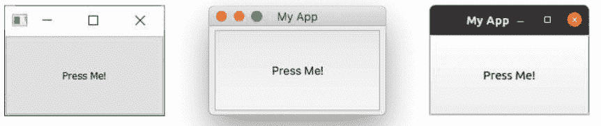

*图 5. 我们的 `QMainWindow` 在 Windows、macOS 和 Linux 上带有一个 `QPushButton`。*

> **渴望更多控件？**

我们将很快详细介绍更多的控件，但如果你不耐烦并想提前了解，可以查看 [QWidget 文档](https://doc.qt.io/qt-5/qwidget.html)。尝试将不同的控件添加到你的窗口中！

## 调整窗口和控件的大小

窗口当前可以自由调整大小——如果你用鼠标抓住任何角落，你可以拖动并将其调整为任何你想要的大小。虽然让用户调整应用程序的大小很好，但有时你可能希望对最小或最大尺寸施加限制，或者将窗口锁定为固定大小。

在 Qt 中，尺寸使用 `QSize` 对象定义。它接受*宽度*和*高度*参数按此顺序排列。例如，以下代码将创建一个*固定大小*的400x300像素窗口。

*清单5. basic/creating_a_window_end.py*

```python
import sys

from PySide2.QtCore import QSize, Qt
from PySide2.QtWidgets import QApplication, QMainWindow, QPushButton

### Subclass QMainWindow to customize your application's main window
class MainWindow(QMainWindow):
    def __init__(self):
        super().__init__()

        self.setWindowTitle("My App")

        button = QPushButton("Press Me!")

        self.setFixedSize(QSize(400, 300)) ①

        # Set the central widget of the Window.
        self.setCentralWidget(button)

app = QApplication(sys.argv)

window = MainWindow()
window.show()

app.exec_()
```

① 设置窗口的大小。

> 🚀 **运行它！** 你将看到一个固定大小的窗口——尝试调整它的大小，你会发现无法调整。

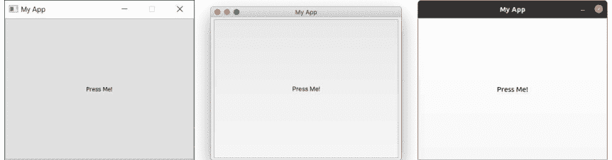

图6. 我们的固定大小窗口，注意在Windows和Linux上最大化控件是禁用的。在macOS上，你可以将应用最大化以填满屏幕，但中心部件不会调整大小。

除了`.setFixedSize()`，你还可以调用`.setMinimumSize()`和`.setMaximumSize()`来分别设置最小和最大尺寸。自己动手试试吧！

> 你可以在*任何*部件上使用这些尺寸方法。

在本节中，我们介绍了`QApplication`类、`QMainWindow`类、事件循环，并尝试向窗口添加一个简单的部件。在下一节中，我们将探讨Qt为部件和窗口之间以及与你自己的代码之间通信所提供的机制。

> 将你的文件保存一份副本，命名为`myapp.py`，因为我们稍后会再次用到它。

## 6. 信号与槽

到目前为止，我们已经创建了一个窗口并向其添加了一个简单的*按钮*部件，但这个按钮没有任何功能。这完全没什么用——当你创建GUI应用程序时，通常希望它们能做点什么！我们需要一种方法将*按下按钮*的动作与触发某件事联系起来。在Qt中，这由*信号*和*槽*提供。

*信号*是部件在*某事*发生时发出的通知。这件事可以是任何事情，从按下按钮，到输入框的文本改变，再到窗口标题的改变。许多信号由用户操作触发，但这并非绝对规则。

除了通知某事发生外，信号还可以发送数据，以提供关于发生了什么的额外上下文信息。

> 💡 你也可以创建自己的自定义信号，我们将在后面的[扩展信号](Extending Signals)部分进行探讨。

*槽*是Qt用于信号接收器的名称。在Python中，你应用程序中的任何函数（或方法）都可以用作槽——只需将信号连接到它即可。如果信号发送数据，那么接收函数也会接收到这些数据。许多Qt部件也有自己的内置槽，这意味着你可以直接将Qt部件连接在一起。

让我们看看Qt信号的基础知识，以及如何使用它们将部件连接起来，使你的应用程序能够执行操作。

> 💡 加载一份全新的`myapp.py`，并为本节保存一个新名称。

### QPushButton信号

我们简单的应用程序目前有一个`QMainWindow`，其中设置了一个`QPushButton`作为中心部件。让我们从将这个按钮连接到一个自定义的Python方法开始。这里我们创建一个名为`the_button_was_clicked`的简单自定义槽，它接收来自`QPushButton`的`clicked`信号。

*清单6. basic/signals_and_slots_1.py*

```python
from PySide2.QtWidgets import QApplication, QMainWindow, QPushButton

import sys

class MainWindow(QMainWindow):
    def __init__(self):
        super().__init__()

        self.setWindowTitle("My App")

        button = QPushButton("Press Me!")
        button.setCheckable(True)
        button.clicked.connect(self.the_button_was_clicked)

        # Set the central widget of the Window.
        self.setCentralWidget(button)

    def the_button_was_clicked(self):
        print("Clicked!")

app = QApplication(sys.argv)

window = MainWindow()
window.show()

app.exec_()
```

🚀 **运行它！** 如果你点击按钮，你会在控制台看到文本"Clicked!"。

控制台输出

```
Clicked!
Clicked!
Clicked!
Clicked!
```

### 接收数据

这是个好的开始！我们已经知道信号也可以发送*数据*，以提供关于刚刚发生的事情的更多信息。`.clicked`信号也不例外，它还提供了按钮的*选中*（或切换）状态。对于普通按钮，这始终是`False`，所以我们的第一个槽忽略了这个数据。然而，我们可以让我们的按钮*可选中*，并观察其效果。

在下面的例子中，我们添加了第二个槽来输出*选中状态*。

*清单7. basic/signals_and_slots_1b.py*

```python
import sys

from PySide2.QtWidgets import QApplication, QMainWindow, QPushButton

class MainWindow(QMainWindow):
    def __init__(self):
        super().__init__()

        self.setWindowTitle("My App")

        button = QPushButton("Press Me!")
        button.setCheckable(True)
        button.clicked.connect(self.the_button_was_clicked)
        button.clicked.connect(self.the_button_was_toggled)

        # Set the central widget of the Window.
        self.setCentralWidget(button)

    def the_button_was_clicked(self):
        print("Clicked!")

    def the_button_was_toggled(self, checked):
        print("Checked?", checked)

app = QApplication(sys.argv)

window = MainWindow()
window.show()

app.exec_()
```

🚀 **运行它！** 如果你按下按钮，你会看到它高亮显示为*已选中*。再次按下以释放它。在控制台中查看*选中状态*。

控制台输出

```
Clicked!
Checked? True
Clicked!
Checked? False
Clicked!
Checked? True
Clicked!
Checked? False
Clicked!
Checked? True
```

你可以将任意多个槽连接到一个信号，并且可以在你的槽中同时响应信号的不同版本。

### 存储数据

通常，将部件的当前*状态*存储在Python变量中很有用。这允许你像处理任何其他Python变量一样处理这些值，而无需访问原始部件。你可以将这些值存储为单个变量，或者如果你愿意，也可以使用字典。在下一个例子中，我们将按钮的*选中*值存储在`self`上的一个名为`button_is_checked`的变量中。

*清单8. basic/signals_and_slots_1c.py*

```python
class MainWindow(QMainWindow):
    def __init__(self):
        super().__init__()

        self.button_is_checked = True ①

        self.setWindowTitle("My App")

        button = QPushButton("Press Me!")
        button.setCheckable(True)
        button.clicked.connect(self.the_button_was_toggled)
        button.setChecked(self.button_is_checked) ②

        # Set the central widget of the Window.
        self.setCentralWidget(button)

    def the_button_was_toggled(self, checked):
        self.button_is_checked = checked ③

        print(self.button_is_checked)
```

- ① 为我们的变量设置默认值。
- ② 使用默认值设置部件的初始状态。
- ③ 当部件状态改变时，更新变量以匹配。

你可以在任何PySide2部件上使用这种相同的模式。如果一个部件没有提供发送当前状态的信号，你将需要在你的处理程序中直接从部件检索值。例如，这里我们在一个*按下*处理程序中检查选中状态。

*清单9. basic/signals_and_slots_1d.py*

```python
class MainWindow(QMainWindow):
    def __init__(self):
        super().__init__()

        self.button_is_checked = True

        self.setWindowTitle("My App")

        self.button = QPushButton("Press Me!") ①
        self.button.setCheckable(True)
        self.button.released.connect(self.the_button_was_released) ②
        self.button.setChecked(self.button_is_checked)

        # Set the central widget of the Window.
        self.setCentralWidget(self.button)

    def the_button_was_released(self):
        self.button_is_checked = self.button.isChecked() ③

        print(self.button_is_checked)
```

- ① 我们需要在`self`上保持对按钮的引用，以便在我们的槽中访问它。
- ② *released*信号在按钮被释放时触发，但不发送选中状态。
- ③ `.isChecked()`返回按钮的选中状态。

### 更改界面

到目前为止，我们已经了解了如何接收信号并将输出打印到控制台。但是，当我们点击按钮时，如何在界面上触发一些事情呢？让我们更新我们的槽方法来修改按钮，更改文本并禁用按钮，使其不再可点击。我们还将暂时移除*可选中*状态。

## 清单 10. basic/signals_and_slots_2.py

```python
from PySide2.QtWidgets import QApplication, QMainWindow, QPushButton

import sys

class MainWindow(QMainWindow):
    def __init__(self):
        super().__init__()

        self.setWindowTitle("My App")

        self.button = QPushButton("Press Me!") ①
        self.button.clicked.connect(self.the_button_was_clicked)

        # Set the central widget of the Window.
        self.setCentralWidget(self.button)

    def the_button_was_clicked(self):
        self.button.setText("You already clicked me.") ②
        self.button.setEnabled(False) ③

        # Also change the window title.
        self.setWindowTitle("My Oneshot App")


app = QApplication(sys.argv)

window = MainWindow()
window.show()

app.exec_()
```

① 我们需要在 `the_button_was_clicked` 方法中访问 `button`，因此我们在 `self` 上保留了对它的引用。

② 你可以通过向 `.setText()` 传递一个 `str` 来更改按钮的文本。

③ 要禁用一个按钮，请调用 `.setEnabled()` 并传入 `False`。

> 🚀 **运行它！** 如果你点击按钮，文本将会改变，并且按钮将变得不可点击。

你并不局限于更改触发信号的按钮，你可以在槽方法中做*任何你想做的事情*。例如，尝试在 `the_button_was_clicked` 方法中添加以下行，以同时更改窗口标题。

```python
self.setWindowTitle("A new window title")
```

大多数控件都有自己的信号——我们用于窗口的 `QMainWindow` 也不例外。在下面更复杂的示例中，我们将 `QMainWindow` 上的 `.windowTitleChanged` 信号连接到一个自定义槽方法。

在下面的示例中，我们将 `QMainWindow` 上的 `.windowTitleChanged` 信号连接到一个方法槽 `the_window_title_changed`。这个槽也会接收新的窗口标题。

*清单 11. basic/signals_and_slots_3.py*

```python
from PySide2.QtWidgets import QApplication, QMainWindow, QPushButton

import sys
from random import choice

window_titles = [ ①
    'My App',
    'My App',
    'Still My App',
    'Still My App',
    'What on earth',
    'What on earth',
    'This is surprising',
    'This is surprising',
    'Something went wrong'
]

class MainWindow(QMainWindow):
    def __init__(self):
        super().__init__()

        self.n_times_clicked = 0

        self.setWindowTitle("My App")

        self.button = QPushButton("Press Me!")
        self.button.clicked.connect(self.the_button_was_clicked)

        self.windowTitleChanged.connect(self.the_window_title_changed)

        # Set the central widget of the Window.
        self.setCentralWidget(self.button)

    def the_button_was_clicked(self):
        print("Clicked.")
        new_window_title = choice(window_titles)
        print("Setting title:  %s" % new_window_title)
        self.setWindowTitle(new_window_title)

    def the_window_title_changed(self, window_title):
        print("Window title changed: %s" % window_title)

        if window_title == 'Something went wrong':
            self.button.setDisabled(True)


app = QApplication(sys.argv)

window = MainWindow()
window.show()

app.exec_()
```

① 一个我们将使用 `random.choice()` 从中选择的窗口标题列表。

② 将我们的自定义槽方法 `the_window_title_changed` 连接到窗口的 `.windowTitleChanged` 信号。

③ 将窗口标题设置为新标题。

④ 如果新的窗口标题等于 "Something went wrong"，则禁用该按钮。

> 🚀 **运行它！** 反复点击按钮，直到标题变为 "Something went wrong"，按钮将被禁用。

在这个示例中有几点需要注意。

首先，`windowTitleChanged` 信号在设置窗口标题时*并非总是*发出。只有当新标题与之前的标题*不同*时，信号才会触发。如果你多次设置相同的标题，信号只会第一次触发。仔细检查信号触发的条件非常重要，以避免在应用中使用时感到意外。

其次，注意我们如何能够使用信号将事物*链接*在一起。一件事的发生——按钮被按下——可以触发其他多件事依次发生。这些后续效果不需要知道*是什么*导致了它们，而只是作为简单规则的结果而发生。这种效果与其触发器的*解耦*是构建 GUI 应用程序时需要理解的关键概念之一。我们将在本书中不断回到这一点！

在本节中，我们介绍了信号和槽。我们演示了一些简单的信号以及如何使用它们在应用程序中传递数据和状态。接下来，我们将看看 Qt 提供的用于应用程序中的控件——以及它们提供的信号。

## 直接连接控件

到目前为止，我们已经看到了将控件信号连接到 Python 方法的示例。当控件发出信号时，我们的 Python 方法被调用并接收来自信号的数据。但你*并不总是*需要使用 Python 函数来处理信号——你也可以直接将 Qt 控件相互连接。

在下面的示例中，我们向窗口添加了一个 `QLineEdit` 控件和一个 `QLabel`。在窗口的 `__init__` 中，我们将行编辑器的 `.textChanged` 信号连接到 `QLabel` 上的 `.setText` 方法。现在，每当 `QLineEdit` 中的文本发生变化时，`QLabel` 就会接收到该文本并传递给它的 `.setText` 方法。

*清单 12. basic/signals_and_slots_4.py*

```python
from PySide2.QtWidgets import QApplication, QMainWindow, QLabel,
QLineEdit, QVBoxLayout, QWidget

import sys

class MainWindow(QMainWindow):
    def __init__(self):
        super().__init__()

        self.setWindowTitle("My App")

        self.label = QLabel()

        self.input = QLineEdit()
        self.input.textChanged.connect(self.label.setText) ①

        layout = QVBoxLayout() ②
        layout.addWidget(self.input)
        layout.addWidget(self.label)

        container = QWidget()
        container.setLayout(layout)

        # Set the central widget of the Window.
        self.setCentralWidget(container)

app = QApplication(sys.argv)

window = MainWindow()
window.show()

app.exec_()
```

① 注意，要将输入连接到标签，输入和标签都必须已定义。

② 此代码将两个控件添加到一个布局中，并将该布局设置到窗口上。我们将在后面的章节中详细介绍这一点，现在你可以忽略它。

> 🚀 **运行它！** 在上方的框中输入一些文本，你会看到它立即出现在标签上。

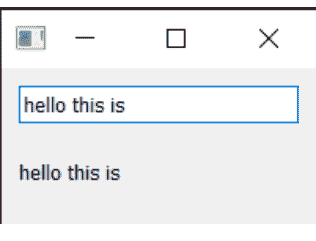

*图 7. 在输入框中输入的任何文本都会立即显示在标签上*

大多数 Qt 控件都有可用的*槽*，你可以将任何发出与其接受的相同*类型*的信号连接到这些槽。控件文档在“公共槽”下列出了每个控件的槽。例如，请参阅 [QLabel](https://doc.qt.io/qt-6/qlabel.html)。

## 7. 控件

在 Qt 中，*控件*是用户可以与之交互的 UI 组件的名称。用户界面由多个控件组成，这些控件排列在窗口内。Qt 提供了大量可用的控件，甚至允许你创建自己的自定义控件。

在本书的代码示例中，有一个文件 `basic/widgets_list.py`，你可以运行它来在窗口中显示一组控件。它使用了一些我们稍后会介绍的复杂技巧，所以现在不用担心代码。

> 🚀 **运行它！** 你将看到一个包含多个交互式控件的窗口。

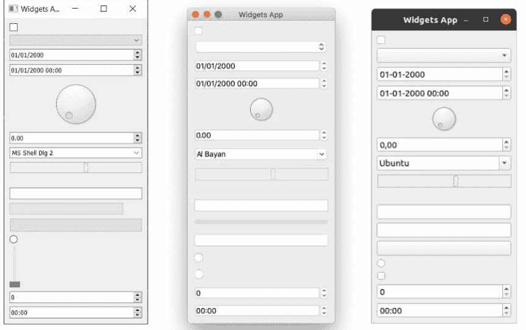

*图 8. 示例控件应用在 Windows、macOS 和 Linux (Ubuntu) 上的显示效果。*

示例中显示的控件如下所示，从上到下。

| 控件 | 功能 |
| :--- | :--- |
| `QCheckBox` | 复选框 |
| `QComboBox` | 下拉列表框 |
| `QDateEdit` | 用于编辑日期 |
| `QDateTimeEdit` | 用于编辑日期和日期时间 |
| `QDial` | 可旋转的表盘 |
| `QDoubleSpinbox` | 用于浮点数的数字微调框 |
| `QFontComboBox` | 字体列表 |
| `QLCDNumber` | 一个相当丑陋的 LCD 显示器 |
| `QLabel` | 只是一个标签，不可交互 |
| `QLineEdit` | 输入一行文本 |
| `QProgressBar` | 进度条 |
| `QPushButton` | 按钮 |
| `QRadioButton` | 一个只有一个活动选项的组 |
| `QSlider` | 滑块 |
| `QSpinBox` | 整数微调框 |
| `QTimeEdit` | 用于编辑时间 |

控件远不止这些，但它们不太适合放在一起！完整列表请参阅 [Qt 文档](https://doc.qt.io/qt-5/qtwidgets-index.html)。在这里，我们将更仔细地研究一些最有用的控件。

> 💡 为本节加载一份新的 `myapp.py` 副本，并将其保存为新名称。

### QLabel

我们将从QLabel开始介绍，它可以说是Qt工具箱中最简单的控件之一。这是一个简单的单行文本，你可以将其定位在应用程序中。你可以在创建控件时通过传入字符串来设置文本——

```python
widget = QLabel("Hello")
```

或者，使用`.setText()`方法——

```python
widget = QLabel("1") # 标签创建时文本为1
widget.setText("2") # 标签现在显示2
```

你还可以调整字体参数，例如控件中文本的大小或对齐方式。

清单13. basic/widgets_1.py

```python
import sys

from PySide2.QtCore import Qt
from PySide2.QtWidgets import QApplication, QLabel, QMainWindow

class MainWindow(QMainWindow):
    def __init__(self):
        super().__init__()

        self.setWindowTitle("My App")

        widget = QLabel("Hello")
        font = widget.font() ①
        font.setPointSize(30)
        widget.setFont(font)
        widget.setAlignment(Qt.AlignHCenter | Qt.AlignVCenter) ②

        self.setCentralWidget(widget)

app = QApplication(sys.argv)

window = MainWindow()
window.show()

app.exec_()
```

① 我们使用`<widget>.font()`获取*当前*字体，修改它，然后重新应用。这确保了字体样式与桌面环境保持一致。

② 对齐方式通过使用`Qt.`命名空间中的标志来指定。

> 🚀 **运行它！** 调整字体参数并查看效果。

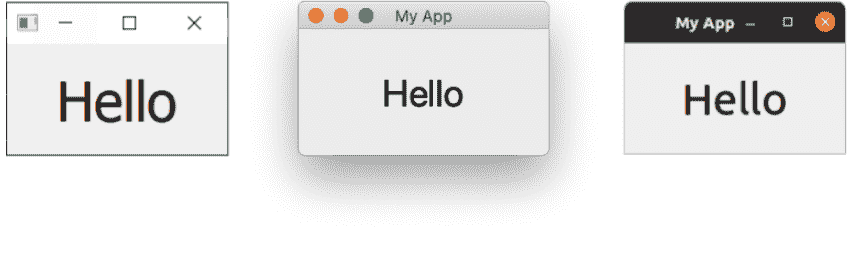

图9. QLabel在Windows、macOS和Ubuntu上的显示

> Qt命名空间（Qt.）包含了各种各样的属性，你可以用它们来自定义和控制Qt控件。我们将在后面的“枚举与Qt命名空间”部分详细讨论。

可用于水平对齐的标志有——

| 标志 | 行为 |
| :--- | :--- |
| `Qt.AlignLeft` | 与左边缘对齐。 |
| `Qt.AlignRight` | 与右边缘对齐。 |
| `Qt.AlignHCenter` | 在可用空间内水平居中。 |
| `Qt.AlignJustify` | 在可用空间内两端对齐文本。 |

可用于垂直对齐的标志有——

| 标志 | 行为 |
| :--- | :--- |
| `Qt.AlignTop` | 与顶部对齐。 |
| `Qt.AlignBottom` | 与底部对齐。 |
| `Qt.AlignVCenter` | 在可用空间内垂直居中。 |

你可以使用管道符（|）组合标志，但请注意一次只能使用一个垂直或水平对齐标志。

```python
align_top_left = Qt.AlignLeft | Qt.AlignTop
```

> 🚀 **运行它！** 尝试组合不同的对齐标志，看看对文本位置的影响。

### Qt标志

请注意，按照惯例，你使用**或**管道符（`|`）来组合两个标志。这些标志是不重叠的*位掩码*。例如，`Qt.AlignLeft`的二进制值是`0b0001`，而`Qt.AlignBottom`是`0b0100`。通过或运算，我们得到值`0b0101`，表示“左下角”。

我们将在后面的[枚举与Qt命名空间](Enums & the Qt Namespace)部分更详细地了解Qt命名空间和Qt标志。

最后，还有一个简写标志可以同时在两个方向居中——

| 标志 | 行为 |
| :--- | :--- |
| `Qt.AlignCenter` | 水平**和**垂直居中 |

奇怪的是，你也可以使用`QLabel`通过`.setPixmap()`方法来显示图像。它接受一个*pixmap*（像素数组），你可以通过向`QPixmap`传递图像文件名来创建它。在本书提供的示例文件中，你可以找到一个名为`otje.jpg`的文件，你可以按如下方式将其显示在窗口中：

清单14. basic/widgets_2a.py

```python
import sys

from PySide2.QtGui import QPixmap
from PySide2.QtWidgets import QApplication, QLabel, QMainWindow

class MainWindow(QMainWindow):
    def __init__(self):
        super().__init__()

        self.setWindowTitle("My App")

        widget = QLabel("Hello")
        widget.setPixmap(QPixmap("otje.jpg"))

        self.setCentralWidget(widget)

app = QApplication(sys.argv)

window = MainWindow()
window.show()

app.exec_()
```

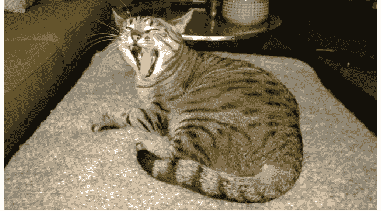

图10. Otje。多么可爱的脸。

> 🚀 **运行它！** 调整窗口大小，图像周围将出现空白区域。

默认情况下，图像在缩放时会保持其纵横比。如果你想让它拉伸并缩放以完全适应窗口，可以在`QLabel`上设置`.setScaledContents(True)`。

修改代码，为标签添加`.setScaledContents(True)`——

*清单15. basic/widgets_2b.py*

```python
widget.setPixmap(QPixmap("otje.jpg"))
widget.setScaledContents(True)
```

> 🚀 **运行它！** 调整窗口大小，图片将变形以适应。

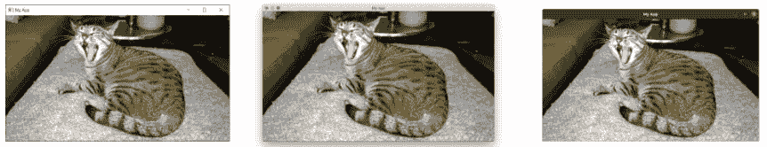

*图11. 在Windows、macOS和Ubuntu上使用`QLabel`显示像素图*

### QCheckBox

下一个要介绍的控件是QCheckBox，顾名思义，它向用户提供一个可勾选的方框。然而，与所有Qt控件一样，有许多可配置的选项可以改变控件的行为。

清单16. basic/widgets_3.py

```python
import sys

from PySide2.QtCore import Qt
from PySide2.QtWidgets import QApplication, QCheckBox, QMainWindow

class MainWindow(QMainWindow):
    def __init__(self):
        super().__init__()

        self.setWindowTitle("My App")

        widget = QCheckBox("This is a checkbox")
        widget.setCheckState(Qt.Checked)

        # 对于三态：widget.setCheckState(Qt.PartiallyChecked)
        # 或者：widget.setTristate(True)
        widget.stateChanged.connect(self.show_state)

        self.setCentralWidget(widget)

    def show_state(self, s):
        print(s == Qt.Checked)
        print(s)

app = QApplication(sys.argv)

window = MainWindow()
window.show()

app.exec_()
```

🚀 **运行它！** 你将看到一个带有标签文本的复选框。


*图12. QCheckBox在Windows、macOS和Ubuntu上的显示*

你可以使用`.setChecked`或`.setCheckState`以编程方式设置复选框状态。前者接受`True`或`False`，分别表示选中或未选中。然而，使用`.setCheckState`时，你还可以使用`Qt`命名空间标志指定*部分*选中状态——

| 标志 | 行为 |
| :--- | :--- |
| `Qt.Checked` | 项目被选中 |
| `Qt.Unchecked` | 项目未被选中 |
| `Qt.PartiallyChecked` | 项目部分选中 |

支持部分选中（`Qt.PartiallyChecked`）状态的复选框通常被称为“三态”，即既不是开也不是关。处于此状态的复选框通常显示为灰色，并且通常用于分层复选框安排中，其中子项与父复选框相关联。

如果你将值设置为`Qt.PartiallyChecked`，复选框将变为三态——即具有*三种*可能的状态。你也可以使用`.setTristate(True)`将复选框设置为三态，而不必将当前状态设置为部分选中。


你可能会注意到，当脚本运行时，当前状态数字以`int`形式显示，其中`checked = 2`，`unchecked = 0`，`partially checked = 1`。你不需要记住这些值——它们只是这些标志的内部值。你可以使用`state == Qt.Checked`来测试状态。

### QComboBox

QComboBox是一个下拉列表，默认关闭，有一个箭头可以打开它。你可以从列表中选择一个项目，当前选中的项目作为标签显示在控件上。组合框适用于从长选项列表中进行选择。

> 你可能在文字处理应用程序中见过组合框用于选择字体或大小。尽管Qt实际上提供了一个特定的字体选择组合框QFontComboBox。

你可以通过向`.addItems()`传递字符串列表来向QComboBox添加项目。项目将按提供的顺序添加。

清单17. basic/widgets_4.py

```python
import sys

from PySide2.QtCore import Qt
from PySide2.QtWidgets import QApplication, QComboBox, QMainWindow

class MainWindow(QMainWindow):
    def __init__(self):
        super().__init__()

        self.setWindowTitle("My App")

        widget = QComboBox()
        widget.addItems(["One", "Two", "Three"])

        widget.currentIndexChanged.connect(self.index_changed)
        widget.currentTextChanged.connect(self.text_changed)

        self.setCentralWidget(widget)

    def index_changed(self, i):  # i 是一个整数
        print(i)

    def text_changed(self, s):  # s 是一个字符串
        print(s)

app = QApplication(sys.argv)

window = MainWindow()
window.show()

app.exec_()
```

🚀 运行它！你将看到一个包含3个条目的组合框。选择一个，它将显示在框中。

### QComboBox

当当前选中的项目被更新时，`.currentIndexChanged` 信号会被触发，默认传递列表中所选项目的索引。还有一个 `.currentTextChanged` 信号，它提供的是当前选中项目的标签，这通常更有用。

QComboBox 也可以是可编辑的，允许用户输入当前列表中不存在的值，并可以选择将其插入列表，或者仅将其用作一个值。要使组合框可编辑：

```python
widget.setEditable(True)
```

你还可以设置一个标志来决定如何处理插入操作。这些标志存储在 QComboBox 类本身上，如下所列 —

| 标志 | 行为 |
| :--- | :--- |
| QComboBox.NoInsert | 不插入 |
| QComboBox.InsertAtTop | 作为第一项插入 |
| QComboBox.InsertAtCurrent | 替换当前选中的项目 |
| QComboBox.InsertAtBottom | 在最后一项之后插入 |
| QComboBox.InsertAfterCurrent | 在当前项目之后插入 |
| QComboBox.InsertBeforeCurrent | 在当前项目之前插入 |
| QComboBox.InsertAlphabetically | 按字母顺序插入 |

要使用这些标志，请按如下方式应用：

```python
widget.setInsertPolicy(QComboBox.InsertAlphabetically)
```

你还可以使用 `.setMaxCount` 来限制组合框中允许的项目数量，例如：

```python
widget.setMaxCount(10)
```

### QListWidget

接下来是 `QListWidget`。这个控件与 `QComboBox` 类似，不同之处在于选项以可滚动的项目列表形式呈现。它还支持一次选择多个项目。`QListWidget` 提供了一个 `currentItemChanged` 信号，发送 `QListItem`（列表控件的元素），以及一个 `currentTextChanged` 信号，发送当前项目的文本。

清单 18. basic/widgets_5.py

```python
import sys

from PySide2.QtWidgets import QApplication, QListWidget, QMainWindow

class MainWindow(QMainWindow):
    def __init__(self):
        super().__init__()

        self.setWindowTitle("My App")

        widget = QListWidget()
        widget.addItems(["One", "Two", "Three"])

        widget.currentItemChanged.connect(self.index_changed)
        widget.currentTextChanged.connect(self.text_changed)

        self.setCentralWidget(widget)

    def index_changed(self, i):  # 不是索引，i 是一个 QListWidgetItem
        print(i.text())

    def text_changed(self, s):  # s 是一个字符串
        print(s)

app = QApplication(sys.argv)

window = MainWindow()
window.show()

app.exec_()
```

🚀 **运行它！** 你将看到相同的三个项目，现在以列表形式呈现。选中的项目（如果有的话）会被高亮显示。

### QLineEdit

QLineEdit 控件是一个简单的单行文本编辑框，用户可以在其中输入内容。它们用于表单字段，或者没有有效输入限制列表的设置中。例如，输入电子邮件地址或计算机名称时。

清单 19. basic/widgets_6.py

```python
import sys

from PySide2.QtCore import Qt
from PySide2.QtWidgets import QApplication, QLineEdit, QMainWindow

class MainWindow(QMainWindow):
    def __init__(self):
        super().__init__()

        self.setWindowTitle("My App")

        widget = QLineEdit()
        widget.setMaxLength(10)
        widget.setPlaceholderText("Enter your text")

        # widget.setReadOnly(True) # 取消注释以设为只读

        widget.returnPressed.connect(self.return_pressed)
        widget.selectionChanged.connect(self.selection_changed)
        widget.textChanged.connect(self.text_changed)
        widget.textEdited.connect(self.text_edited)

        self.setCentralWidget(widget)

    def return_pressed(self):
        print("Return pressed!")
        self.centralWidget().setText("BOOM!")

    def selection_changed(self):
        print("Selection changed")
        print(self.centralWidget().selectedText())

    def text_changed(self, s):
        print("Text changed...")
        print(s)

    def text_edited(self, s):
        print("Text edited...")
        print(s)

app = QApplication(sys.argv)

window = MainWindow()
window.show()

app.exec_()
```

🚀 **运行它！** 你将看到一个简单的文本输入框，带有一个提示。

如上面的代码所示，你可以使用 `.setMaxLength` 为文本字段设置最大长度。占位符文本（即在用户输入内容之前显示的文本）可以使用 `.setPlaceholderText` 添加。

`QLineEdit` 有许多可用于不同编辑事件的信号，包括用户按下回车键时、用户选择发生更改时。还有两个编辑信号，一个用于文本框中的文本被编辑时，另一个用于文本被更改时。这里的区别在于用户编辑和程序化更改。`textEdited` 信号仅在用户编辑文本时发送。

此外，可以使用*输入掩码*来执行输入验证，以定义支持哪些字符以及在何处支持。可以按如下方式应用到字段：

```python
widget.setInputMask('000.000.000.000;_')
```

上述设置将允许一系列由句点分隔的3位数字，因此可用于验证 IPv4 地址。

### QSpinBox 和 QDoubleSpinBox

QSpinBox 提供了一个带有增加和减少数值箭头的小型数字输入框。QSpinBox 支持整数，而相关的控件 QDoubleSpinBox 支持浮点数。

清单 20. basic/widgets_7.py

```python
import sys

from PySide2.QtCore import Qt
from PySide2.QtWidgets import QApplication, QMainWindow, QSpinBox

class MainWindow(QMainWindow):
    def __init__(self):
        super().__init__()

        self.setWindowTitle("My App")

        widget = QSpinBox()
        # 或者：widget = QDoubleSpinBox()

        widget.setMinimum(-10)
        widget.setMaximum(3)
        # 或者：widget.setRange(-10,3)

        widget.setPrefix("$")
        widget.setSuffix("c")
        widget.setSingleStep(3)  # 或者对于 QDoubleSpinBox 例如 0.5
        widget.valueChanged.connect(self.value_changed)
        widget.textChanged.connect(self.value_changed_str)

        self.setCentralWidget(widget)

    def value_changed(self, i):
        print(i)

    def value_changed_str(self, s):
        print(s)

app = QApplication(sys.argv)

window = MainWindow()
window.show()

app.exec_()
```

🚀 **运行它！** 你将看到一个数字输入框。数值显示了前缀和后缀单位，并且限制在 +3 到 -10 的范围内。

上面的演示代码展示了该控件可用的各种功能。

要设置可接受值的范围，你可以使用 `setMinimum` 和 `setMaximum`，或者使用 `setRange` 同时设置两者。支持使用前缀和后缀来注释值类型，可以使用 `.setPrefix` 和 `.setSuffix` 分别添加到数字上，例如用于货币标记或单位。

点击控件上的上下箭头会增加或减少控件中的值，增加或减少的量可以使用 `.setSingleStep` 设置。请注意，这不会影响控件可接受的值。

`QSpinBox` 和 `QDoubleSpinBox` 都有一个 `.valueChanged` 信号，每当它们的值被更改时就会触发。原始的 `.valueChanged` 信号发送数值（`int` 或 `float`），而 `.textChanged` 以字符串形式发送值，包括前缀和后缀字符。

### QSlider

QSlider 提供了一个滑块控件，其内部功能与 QSpinBox 非常相似。它不是以数字形式显示当前值，而是通过滑块手柄在控件长度上的位置来表示。这在需要在两个极端之间进行调整，但不需要绝对精确时通常很有用。这种控件最常见的用途是音量控制。

还有一个额外的 `.sliderMoved` 信号，每当滑块位置移动时触发，以及一个 `.sliderPressed` 信号，每当滑块被点击时发出。

清单 21. basic/widgets_8.py

```python
import sys

from PySide2.QtCore import Qt
from PySide2.QtWidgets import QApplication, QMainWindow, QSlider


class MainWindow(QMainWindow):
    def __init__(self):
        super().__init__()

        self.setWindowTitle("My App")

        widget = QSlider()

        widget.setMinimum(-10)
        widget.setMaximum(3)
        # 或者：widget.setRange(-10,3)

        widget.setSingleStep(3)

        widget.valueChanged.connect(self.value_changed)
        widget.sliderMoved.connect(self.slider_position)
        widget.sliderPressed.connect(self.slider_pressed)
        widget.sliderReleased.connect(self.slider_released)
```

### QSlider

```python
self.setCentralWidget(widget)

def value_changed(self, i):
    print(i)

def slider_position(self, p):
    print("position", p)

def slider_pressed(self):
    print("Pressed!")

def slider_released(self):
    print("Released")

app = QApplication(sys.argv)

window = MainWindow()
window.show()

app.exec_()
```

🚀 **运行它！** 你将看到一个滑块部件。拖动滑块可以改变数值。

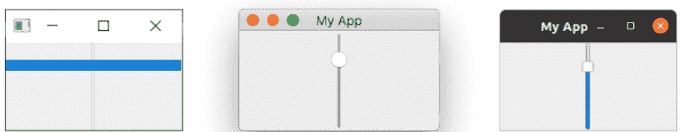

*图 17. QSlider 在 Windows、macOS 和 Ubuntu 上的显示。在 Windows 上，滑块手柄会扩展到部件的大小。*

你也可以在创建滑块时通过传入方向参数来构造一个垂直或水平方向的滑块。方向标志在 Qt 命名空间中定义。例如——

```python
widget.QSlider(Qt.Vertical)
```

或者——

```python
widget.QSlider(Qt.Horizontal)
```

### QDial

最后，QDial 是一个可旋转的部件，其功能与滑块相同，但外观类似模拟表盘。这看起来不错，但从用户界面的角度来看，并不是特别友好。然而，它们经常在音频应用程序中用作真实世界模拟表盘的表示。

清单 22. basic/widgets_9.py

```python
import sys

from PySide2.QtCore import Qt
from PySide2.QtWidgets import QApplication, QDial, QMainWindow

class MainWindow(QMainWindow):
    def __init__(self):
        super().__init__()

        self.setWindowTitle("My App")

        widget = QDial()
        widget.setRange(-10, 100)
        widget.setSingleStep(1)

        widget.valueChanged.connect(self.value_changed)
        widget.sliderMoved.connect(self.slider_position)
        widget.sliderPressed.connect(self.slider_pressed)
        widget.sliderReleased.connect(self.slider_released)

        self.setCentralWidget(widget)

    def value_changed(self, i):
        print(i)

    def slider_position(self, p):
        print("position", p)

    def slider_pressed(self):
        print("Pressed!")

    def slider_released(self):
        print("Released")

app = QApplication(sys.argv)

window = MainWindow()
window.show()

app.exec_()
```

🚀 **运行它！** 你将看到一个表盘，旋转它可以从范围内选择一个数字。


*图 18. QDial 在 Windows、macOS 和 Ubuntu 上的显示*

其信号与 `QSlider` 相同，并保留相同的名称（例如 `.sliderMoved`）。

至此，我们对 PySide2 中可用的 Qt 部件进行了简要介绍。要查看所有可用部件的完整列表，包括它们所有的信号和属性，请查阅 [Qt 文档](https://doc.qt.io/qtforpython/)。

### QWidget

我们的演示中有一个 QWidget，但你看不到它。我们之前在第一个示例中使用 QWidget 来创建一个空窗口。但 QWidget 也可以用作其他部件的*容器*，与 [布局](Layouts) 一起，来构建窗口或复合部件。我们将在后面更详细地介绍 [创建自定义部件](Creating Custom Widgets)。

请记住 QWidget，因为你将会经常看到它！

## 8. 布局

到目前为止，我们已经成功创建了一个窗口并向其中添加了一个部件。然而，你通常会希望向一个窗口添加不止一个部件，并对你添加的部件最终放置的位置有所控制。在 Qt 中，为了将部件排列在一起，我们使用*布局*。Qt 中有 4 种基本布局，列在下表中。

| 布局 | 行为 |
| :--- | :--- |
| `QHBoxLayout` | 线性水平布局 |
| `QVBoxLayout` | 线性垂直布局 |
| `QGridLayout` | 可索引的网格 XxY |
| `QStackedLayout` | 堆叠（z轴）在彼此前面 |

Qt 中有三种二维布局可用：`QVBoxLayout`、`QHBoxLayout` 和 `QGridLayout`。此外，还有 `QStackedLayout`，它允许你将部件一个叠放在另一个上面，位于同一空间内，但一次只显示一个部件。

在本章中，我们将依次介绍这些布局，展示如何使用它们在应用程序中定位部件。

> **Qt Designer**

你实际上可以使用 Qt Designer 以图形方式设计和布局你的界面，我们将在后面介绍。这里我们使用代码，因为它更容易理解和试验底层系统。

### 占位部件

> 加载 `myapp.py` 的一个新副本，并为本节保存为一个新名称。

为了更容易地可视化布局，我们将首先创建一个简单的自定义部件，它显示我们选择的纯色。这将有助于区分我们添加到布局中的部件。将以下代码作为顶层类添加到你的文件中——

清单 23. basic/layout_colorwidget.py

```python
from PySide2.QtGui import QColor, QPalette
from PySide2.QtWidgets import QWidget

class Color(QWidget):
    def __init__(self, color):
        super().__init__()
        self.setAutoFillBackground(True)

        palette = self.palette()
        palette.setColor(QPalette.Window, QColor(color))
        self.setPalette(palette)
```

在这段代码中，我们继承 `QWidget` 来创建我们自己的自定义部件 `Color`。在创建部件时，我们接受一个参数——`color`（一个 `str`）。我们首先将 `.setAutoFillBackground` 设置为 `True`，告诉部件自动用窗口颜色填充其背景。接下来，我们将部件的 `QPalette.Window` 颜色更改为由我们传入的值 `color` 描述的新 `QColor`。最后，我们将这个调色板应用回部件。最终结果是一个部件，它被填充了纯色，该颜色在我们创建部件时指定。

如果你觉得上面的内容令人困惑，不要太担心！我们将在后面详细介绍 [创建自定义部件](https://www.pythonguis.com/tutorials/creating-custom-widgets/) 和 [调色板](https://www.pythonguis.com/tutorials/palettes/)。现在，你只需要理解你可以用以下代码创建一个纯红色的部件——

```python
Color('red')
```

首先，让我们通过使用新的 `Color` 部件来测试它，用单一颜色填充整个窗口。完成后，我们可以使用 `.setCentralWidget` 将其添加到主窗口，这样我们就得到了一个纯红色的窗口。

清单 24. basic/layout_1.py

```python
import sys

from PySide2.QtCore import Qt
from PySide2.QtWidgets import QApplication, QMainWindow

from layout_colorwidget import Color

class MainWindow(QMainWindow):
    def __init__(self):
        super().__init__()

        self.setWindowTitle("My App")

        widget = Color("red")
        self.setCentralWidget(widget)

app = QApplication(sys.argv)

window = MainWindow()
window.show()

app.exec_()
```

> 🚀 **运行它！** 窗口将出现，完全填充为红色。注意部件如何扩展以填充所有可用空间。

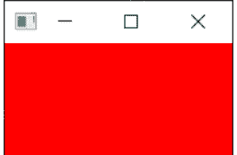

图 19. 我们的 `Color` 部件，填充了纯红色。

接下来，我们将依次介绍每个可用的 Qt 布局。请注意，为了将布局添加到窗口，我们需要一个虚拟的 `QWidget` 来容纳布局。

### QVBoxLayout 垂直排列部件

使用 `QVBoxLayout`，你可以将部件线性地一个接一个地垂直排列。添加一个部件会将其添加到列的底部。

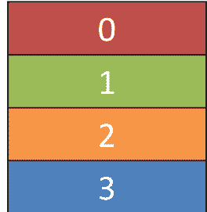

图 20. 一个 QVBoxLayout，从上到下填充。

让我们将我们的部件添加到一个布局中。请注意，为了将布局添加到 `QMainWindow`，我们需要将其应用到一个虚拟的 `QWidget`。这允许我们然后使用 `.setCentralWidget` 将部件（和布局）应用到窗口。我们的彩色部件将排列在布局中，包含在窗口的 `QWidget` 内。首先，我们像之前一样只添加红色部件。

清单 25. basic/layout_2a.py

```python
import sys

from PySide2.QtCore import Qt
from PySide2.QtWidgets import QApplication, QMainWindow, QVBoxLayout, QWidget

from layout_colorwidget import Color

class MainWindow(QMainWindow):
    def __init__(self):
        super().__init__()

        self.setWindowTitle("My App")

        layout = QVBoxLayout()

        layout.addWidget(Color("red"))

        widget = QWidget()
        widget.setLayout(layout)
        self.setCentralWidget(widget)

app = QApplication(sys.argv)

window = MainWindow()
window.show()

app.exec_()
```

> 🚀 **运行它！** 注意现在红色部件周围可见的边框。这是布局间距——我们稍后将看到如何调整它。

### QHBoxLayout 水平排列的部件

QHBoxLayout 与 QVBoxLayout 相同，只是方向是水平的。添加一个部件会将其添加到右侧。


图 23. 一个 QHBoxLayout，从左到右填充。

要使用它，我们只需将 QVBoxLayout 更改为 QHBoxLayout。现在盒子从左到右流动。

清单 27. basic/layout_3.py

```python
import sys

from PySide2.QtCore import Qt
from PySide2.QtWidgets import QApplication, QHBoxLayout, QLabel,
    QMainWindow, QWidget

from layout_colorwidget import Color

class MainWindow(QMainWindow):
    def __init__(self):
        super().__init__()

        self.setWindowTitle("My App")

        layout = QHBoxLayout()

        layout.addWidget(Color("red"))
        layout.addWidget(Color("green"))
        layout.addWidget(Color("blue"))

        widget = QWidget()
        widget.setLayout(layout)
        self.setCentralWidget(widget)

app = QApplication(sys.argv)

window = MainWindow()
window.show()

app.exec_()
```

> 🚀 **运行它！** 部件应该会水平排列。

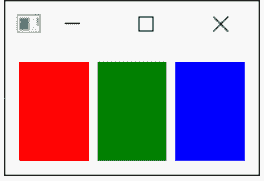

图 24. 三个 Color 部件在 QHBoxLayout 中水平排列。

### 嵌套布局

对于更复杂的布局，你可以使用布局上的 `.addLayout` 将布局相互嵌套。下面我们向主 `QHBoxLayout` 中添加一个 `QVBoxLayout`。如果我们向 `QVBoxLayout` 添加一些部件，它们将垂直排列在父布局的第一个槽位中。

清单 28. basic/layout_4.py

```python
import sys

from PySide2.QtCore import Qt
from PySide2.QtWidgets import (
    QApplication,
    QHBoxLayout,
    QLabel,
    QMainWindow,
    QVBoxLayout,
    QWidget,
)

from layout_colorwidget import Color

class MainWindow(QMainWindow):
    def __init__(self):
        super().__init__()

        self.setWindowTitle("My App")

        layout1 = QHBoxLayout()
        layout2 = QVBoxLayout()
        layout3 = QVBoxLayout()

        layout2.addWidget(Color("red"))
        layout2.addWidget(Color("yellow"))
        layout2.addWidget(Color("purple"))

        layout1.addLayout(layout2)

        layout1.addWidget(Color("green"))

        layout3.addWidget(Color("red"))
        layout3.addWidget(Color("purple"))

        layout1.addLayout(layout3)

        widget = QWidget()
        widget.setLayout(layout1)
        self.setCentralWidget(widget)

app = QApplication(sys.argv)

window = MainWindow()
window.show()

app.exec_()
```

> **运行它！** 部件应该会排列成 3 列水平布局，其中第一列还包含 3 个垂直堆叠的部件。试试看！

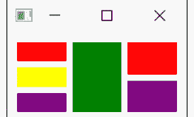

图 25. 嵌套的 QHBoxLayout 和 QVBoxLayout 布局。

你可以使用 `.setContentMargins` 设置布局周围的间距，或使用 `.setSpacing` 设置元素之间的间距。

```python
layout1.setContentsMargins(0,0,0,0)
layout1.setSpacing(20)
```

以下代码展示了嵌套部件与布局边距和间距的结合。

清单 29. basic/layout_5.py

```python
import sys

from PySide2.QtCore import Qt
from PySide2.QtWidgets import (
    QApplication,
    QHBoxLayout,
    QLabel,
    QMainWindow,
    QVBoxLayout,
    QWidget,
)

from layout_colorwidget import Color

class MainWindow(QMainWindow):
    def __init__(self):
        super().__init__()

        self.setWindowTitle("My App")

        layout1 = QHBoxLayout()
        layout2 = QVBoxLayout()
        layout3 = QVBoxLayout()

        layout1.setContentsMargins(0, 0, 0, 0)
        layout1.setSpacing(20)

        layout2.addWidget(Color("red"))
        layout2.addWidget(Color("yellow"))
        layout2.addWidget(Color("purple"))

        layout1.addLayout(layout2)

        layout1.addWidget(Color("green"))

        layout3.addWidget(Color("red"))
        layout3.addWidget(Color("purple"))

        layout1.addLayout(layout3)

        widget = QWidget()
        widget.setLayout(layout1)
        self.setCentralWidget(widget)

app = QApplication(sys.argv)

window = MainWindow()
window.show()

app.exec_()
```

🚀 **运行它！** 你应该能看到间距和边距的效果。尝试调整这些数字，直到你对它们有感觉。

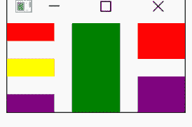

图 26. 带有部件周围间距和边距的嵌套 QHBoxLayout 和 QVBoxLayout 布局。

### QGridLayout 网格排列的部件

尽管它们很有用，但如果你尝试使用 `QVBoxLayout` 和 `QHBoxLayout` 来布局多个元素，例如用于表单，你会发现很难确保不同大小的部件对齐。解决方案是 `QGridLayout`。

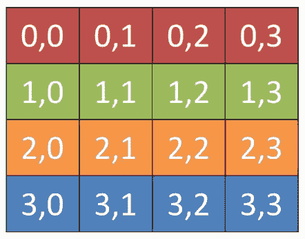

图 27. 一个 QGridLayout，显示了每个位置的网格位置。

`QGridLayout` 允许你将项目专门定位在网格中。你为每个部件指定行和列位置。你可以跳过元素，它们将被留空。

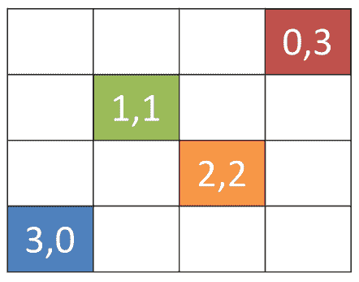

图 28. 一个带有未填充槽位的 QGridLayout。

清单 30. basic/layout_6.py

```python
import sys

from PySide2.QtCore import Qt
from PySide2.QtWidgets import QApplication, QGridLayout, QLabel,
    QMainWindow, QWidget

from layout_colorwidget import Color

class MainWindow(QMainWindow):
    def __init__(self):
        super().__init__()

        self.setWindowTitle("My App")

        layout = QGridLayout()

        layout.addWidget(Color("red"), 0, 0)
        layout.addWidget(Color("green"), 1, 0)
        layout.addWidget(Color("blue"), 1, 1)
        layout.addWidget(Color("purple"), 2, 1)

        widget = QWidget()
        widget.setLayout(layout)
        self.setCentralWidget(widget)

app = QApplication(sys.argv)

window = MainWindow()
window.show()

app.exec_()
```

🚀 运行它！你应该能看到部件排列在网格中，即使缺少条目也能对齐。

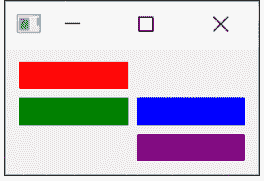

图 29. QGridLayout 中的四个 Color 部件。

### QStackedLayout 同一空间中的多个部件

我们要介绍的最后一个布局是 `QStackedLayout`。如前所述，此布局允许你将元素直接相互叠放。然后你可以选择要显示哪个部件。你可以将其用于图形应用程序中的绘制图层，或用于模拟标签页界面。请注意，还有一个 `QStackedWidget`，它是一个容器部件，工作方式完全相同。如果你想使用 `.setCentralWidget` 将堆栈直接添加到 `QMainWindow`，这很有用。


图 30. QStackedLayout —— 使用时只有最顶层的部件可见，默认情况下是添加到布局的第一个部件。

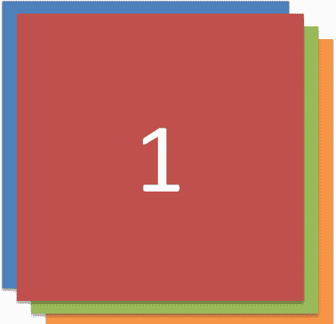

图 31. QStackedLayout，选择了第 2 个（索引 1）部件并将其带到前面。

清单 31. basic/layout_7.py

```python
import sys

from PySide2.QtCore import Qt
from PySide2.QtWidgets import QApplication, QLabel, QMainWindow,
    QStackedLayout, QWidget

from layout_colorwidget import Color

class MainWindow(QMainWindow):
    def __init__(self):
        super().__init__()

        self.setWindowTitle("My App")

        layout = QStackedLayout()

        layout.addWidget(Color("red"))
        layout.addWidget(Color("green"))
        layout.addWidget(Color("blue"))
        layout.addWidget(Color("yellow"))

        layout.setCurrentIndex(3)

        widget = QWidget()
        widget.setLayout(layout)
        self.setCentralWidget(widget)

app = QApplication(sys.argv)

window = MainWindow()
window.show()

app.exec_()
```

🚀 运行它！你将只看到你最后添加的那个部件。

## 9. 动作、工具栏与菜单

接下来，我们将探讨一些常见的用户界面元素，这些元素你可能在许多其他应用程序中都见过——工具栏和菜单。我们还将探索 Qt 提供的一个巧妙系统，用于最小化不同 UI 区域之间的重复——`QAction`。

### 工具栏

最常见的用户界面元素之一就是工具栏。工具栏是图标和/或文本的条带，用于在应用程序中执行常见任务，通过菜单访问这些任务会显得繁琐。它们是许多应用程序中最常见的 UI 特性之一。虽然一些复杂的应用程序，特别是 Microsoft Office 套件，已经迁移到了上下文相关的“功能区”界面，但标准工具栏对于你将创建的大多数应用程序来说已经足够了。

Qt 工具栏支持显示图标、文本，并且也可以包含任何标准的 Qt 小部件。然而，对于按钮，最佳做法是利用 `QAction` 系统将按钮放置在工具栏上。

让我们从向应用程序添加一个工具栏开始。

> 💡 加载一份全新的 `myapp.py` 副本，并为本节保存一个新名称。

在 Qt 中，工具栏是从 `QToolBar` 类创建的。首先，你创建该类的一个实例，然后在 `QMainWindow` 上调用 `.addToolBar`。将字符串作为第一个参数传递给 `QToolBar` 可以设置工具栏的名称，该名称将用于在 UI 中标识该工具栏。

清单 35. basic/toolbars_and_menus_1.py

```python
class MainWindow(QMainWindow):
    def __init__(self):
        super().__init__()

        self.setWindowTitle("My App")

        label = QLabel("Hello!")
        label.setAlignment(Qt.AlignCenter)

        self.setCentralWidget(label)

        toolbar = QToolBar("My main toolbar")
        self.addToolBar(toolbar)

    def onMyToolBarButtonClick(self, s):
        print("click", s)
```

🚀 运行它！你会在窗口顶部看到一个细长的灰色条。这就是你的工具栏。右键单击并点击名称可以将其关闭。

> 我无法找回我的工具栏了！？
>
> 不幸的是，一旦你移除了一个工具栏，就没有地方可以右键单击来重新添加它了。因此，通常的做法是保留一个不可移除的工具栏，或者提供一个替代界面来开启和关闭工具栏。

让我们让工具栏变得更有趣一些。我们可以直接添加一个 `QButton` 小部件，但在 Qt 中有一个更好的方法，可以让你获得一些很酷的功能——那就是通过 `QAction`。`QAction` 是一个类，提供了一种描述抽象用户界面的方式。用通俗的话说，这意味着你可以在单个对象中定义多个界面元素，这些元素通过与该元素交互所产生的效果统一起来。例如，通常有些功能既在工具栏中表示，也在菜单中表示——想想类似“编辑→剪切”这样的功能，它既出现在“编辑”菜单中，也作为工具栏上的一把剪刀图标出现，同时还通过键盘快捷键 `Ctrl-X`（在 macOS 上是 `Cmd-X`）触发。

如果没有 `QAction`，你就必须在多个地方定义这个功能。但有了 `QAction`，你可以定义一个单一的 `QAction`，定义触发的动作，然后将这个动作同时添加到菜单和工具栏中。每个 `QAction` 都有名称、状态消息、图标和你可以连接的信号（以及更多）。

请参阅下面的代码，了解如何添加你的第一个 `QAction`。

清单 36. basic/toolbars_and_menus_2.py

```python
class MainWindow(QMainWindow):
    def __init__(self):
        super().__init__()

        self.setWindowTitle("My App")

        label = QLabel("Hello!")
        label.setAlignment(Qt.AlignCenter)

        self.setCentralWidget(label)

        toolbar = QToolBar("My main toolbar")
        self.addToolBar(toolbar)

        button_action = QAction("Your button", self)
        button_action.setStatusTip("This is your button")
        button_action.triggered.connect(self.onMyToolBarButtonClick)
        toolbar.addAction(button_action)

    def onMyToolBarButtonClick(self, s):
        print("click", s)
```

首先，我们创建一个函数来接收来自 `QAction` 的信号，以便我们可以看到它是否工作。接下来，我们定义 `QAction` 本身。在创建实例时，我们可以传递一个动作的标签和/或一个图标。你还必须传递任何 `QObject` 作为该动作的父对象——这里我们传递 `self` 作为对主窗口的引用。奇怪的是，对于 `QAction`，父元素是作为最后一个参数传递的。

接下来，我们可以选择设置一个状态提示——一旦我们有了状态栏，这个文本将显示在状态栏上。最后，我们将 `.triggered` 信号连接到自定义函数。每当 `QAction` 被“触发”（或激活）时，这个信号就会触发。

图 32. 一个堆叠小部件，仅显示一个小部件（最后添加的小部件）。

`QStackedWidget` 是应用程序中选项卡式视图的工作方式。一次只有一个视图（“选项卡”）可见。你可以随时通过使用 `.setCurrentIndex()` 或 `.setCurrentWidget()` 来控制显示哪个小部件，可以通过索引（按小部件添加的顺序）或通过小部件本身来设置项目。

下面是一个使用 `QStackedLayout` 结合 `QButton` 为应用程序提供类似选项卡界面的简短演示——

清单 32. basic/layout_8.py

```python
import sys

from PySide2.QtCore import Qt
from PySide2.QtWidgets import (
    QApplication,
    QHBoxLayout,
    QLabel,
    QMainWindow,
    QPushButton,
    QStackedLayout,
    QVBoxLayout,
    QWidget,
)

from layout_colorwidget import Color

class MainWindow(QMainWindow):
    def __init__(self):
        super().__init__()

        self.setWindowTitle("My App")

        pagelayout = QVBoxLayout()
        button_layout = QHBoxLayout()
        self.stacklayout = QStackedLayout()

        pagelayout.addLayout(button_layout)
        pagelayout.addLayout(self.stacklayout)

        btn = QPushButton("red")
        btn.pressed.connect(self.activate_tab_1)
        button_layout.addWidget(btn)
        self.stacklayout.addWidget(Color("red"))

        btn = QPushButton("green")
        btn.pressed.connect(self.activate_tab_2)
        button_layout.addWidget(btn)
        self.stacklayout.addWidget(Color("green"))

        btn = QPushButton("yellow")
        btn.pressed.connect(self.activate_tab_3)
        button_layout.addWidget(btn)
        self.stacklayout.addWidget(Color("yellow"))

        widget = QWidget()
        widget.setLayout(pagelayout)
        self.setCentralWidget(widget)

    def activate_tab_1(self):
        self.stacklayout.setCurrentIndex(0)

    def activate_tab_2(self):
        self.stacklayout.setCurrentIndex(1)

    def activate_tab_3(self):
        self.stacklayout.setCurrentIndex(2)

app = QApplication(sys.argv)

window = MainWindow()
window.show()

app.exec_()
```

🚀 运行它！你现在可以通过按钮更改可见的小部件。

*图 33. 一个堆叠小部件，带有控制活动小部件的按钮。*

Qt 提供了一个内置的选项卡小部件，可以开箱即用地提供这种布局——尽管它实际上是一个小部件，而不是一个布局。下面使用 `QTabWidget` 重新创建了选项卡演示——

清单 33. basic/layout_9.py

```python
import sys

from PySide2.QtCore import Qt
from PySide2.QtWidgets import (
    QApplication,
    QLabel,
    QMainWindow,
    QPushButton,
    QTabWidget,
    QWidget,
)

from layout_colorwidget import Color

class MainWindow(QMainWindow):
    def __init__(self):
        super().__init__()

        self.setWindowTitle("My App")

        tabs = QTabWidget()
        tabs.setTabPosition(QTabWidget.West)
        tabs.setMovable(True)

        for n, color in enumerate(["red", "green", "blue", "yellow"]):
            tabs.addTab(Color(color), color)

        self.setCentralWidget(tabs)

app = QApplication(sys.argv)

window = MainWindow()
window.show()

app.exec_()
```

如你所见，它更直接一些——也更吸引人！你可以使用基本方向设置选项卡的位置，并使用 `.setMoveable` 切换选项卡是否可移动。

你会注意到 macOS 上的选项卡栏看起来与其他平台非常不同——默认情况下，macOS 上的选项卡采用 *药丸* 或 *气泡* 样式。在 macOS 上，这通常用于选项卡式配置面板。对于文档，你可以开启 *文档模式* 以获得与其他平台类似的细长选项卡。此选项对其他平台没有影响。

清单 34. basic/layout_9b.py

```python
tabs = QTabWidget()
tabs.setDocumentMode(True)
```

图 35. 在 macOS 上将文档模式设置为 True 的 QTabWidget。

🚀 运行它！你应该能看到带有你定义标签的按钮。点击它，我们的自定义函数将发出 "click" 信号以及按钮的状态。


*图 38. 显示我们 QAction 按钮的工具栏。*

> **为什么信号总是 false？**
>
> 传递的信号指示该操作是否被**选中**，由于我们的按钮不可选中——只是可点击——所以它总是 false。这就像我们之前看到的 QPushButton 一样。

让我们添加一个状态栏。

我们通过调用 `QStatusBar` 并将结果传递给 `.setStatusBar` 来创建一个状态栏对象。由于我们不需要更改 statusBar 的设置，我们可以在创建时直接传递它。我们可以在一行代码中创建并定义状态栏：

清单 37. basic/toolbars_and_menus_3.py

```python
class MainWindow(QMainWindow):
    def __init__(self):
        super().__init__()

        self.setWindowTitle("My App")

        label = QLabel("Hello!")
        label.setAlignment(Qt.AlignCenter)

        self.setCentralWidget(label)

        toolbar = QToolBar("My main toolbar")
        self.addToolBar(toolbar)

        button_action = QAction("Your button", self)
        button_action.setStatusTip("This is your button")
        button_action.triggered.connect(self.onMyToolBarButtonClick)
        toolbar.addAction(button_action)

        self.setStatusBar(QStatusBar(self))

    def onMyToolBarButtonClick(self, s):
        print("click", s)
```

🚀 运行它！将鼠标悬停在工具栏按钮上，你将看到状态文本出现在窗口底部的状态栏中。


*图 39. 当我们悬停在操作上时，状态栏文本会更新。*

接下来，我们将把我们的 QAction 变成可切换的——这样点击会将其打开，再次点击会将其关闭。为此，我们只需在 `QAction` 对象上调用 `setCheckable(True)`。

清单 38. basic/toolbars_and_menus_4.py

```python
class MainWindow(QMainWindow):
    def __init__(self):
        super().__init__()

        self.setWindowTitle("My App")

        label = QLabel("Hello!")
        label.setAlignment(Qt.AlignCenter)

        self.setCentralWidget(label)

        toolbar = QToolBar("My main toolbar")
        self.addToolBar(toolbar)

        button_action = QAction("Your button", self)
        button_action.setStatusTip("This is your button")
        button_action.triggered.connect(self.onMyToolBarButtonClick)
        button_action.setCheckable(True)
        toolbar.addAction(button_action)

        self.setStatusBar(QStatusBar(self))

    def onMyToolBarButtonClick(self, s):
        print("click", s)
```

🚀 运行它！点击按钮，观察它在选中和未选中状态之间切换。请注意，我们现在创建的自定义槽函数会交替输出 True 和 False。


*图 40. 工具栏按钮已切换为开启状态。*

> .toggled 信号
>
> 还有一个 `.toggled` 信号，它只在按钮被切换时发出信号。但效果是相同的，所以它大多没什么用。

现在看起来相当简陋——所以让我们给按钮添加一个图标。为此，我建议你下载设计师 Yusuke Kamiyamane 的 [fugue 图标集](http://p.yusukekamiyamane.com/)。这是一套很棒的精美 16x16 图标，可以让你的应用程序看起来很专业。它是免费提供的，分发应用程序时只需注明出处——尽管我相信如果你有余钱，设计师也会很感激一些现金。

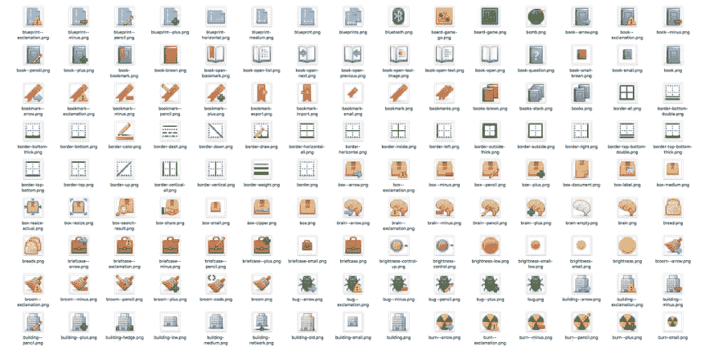

*图 41. Fugue 图标集 — Yusuke Kamiyamane*

从图标集中选择一个图像（在本例中我选择了文件 `bug.png`），并将其复制到与源代码相同的文件夹中。我们可以通过将文件名传递给类来创建一个 `QIcon` 对象，例如 `QIcon('bug.png')` —— 如果你将文件放在另一个文件夹中，你需要提供完整的相对或绝对路径。最后，要将图标添加到 `QAction`（因此也是按钮），我们只需在创建 `QAction` 时将其作为第一个参数传递。

你还需要让工具栏知道你的图标有多大，否则你的图标周围会有很多填充。你可以通过使用 `QSize` 对象调用 `.setIconSize()` 来实现这一点。

清单 39. basic/toolbars_and_menus_5.py

```python
class MainWindow(QMainWindow):
    def __init__(self):
        super().__init__()

        self.setWindowTitle("My App")

        label = QLabel("Hello!")
        label.setAlignment(Qt.AlignCenter)

        self.setCentralWidget(label)

        toolbar = QToolBar("My main toolbar")
        toolbar.setIconSize(QSize(16, 16))
        self.addToolBar(toolbar)

        button_action = QAction(QIcon("bug.png"), "Your button", self)
        button_action.setStatusTip("This is your button")
        button_action.triggered.connect(self.onMyToolBarButtonClick)
        button_action.setCheckable(True)
        toolbar.addAction(button_action)

        self.setStatusBar(QStatusBar(self))

    def onMyToolBarButtonClick(self, s):
        print("click", s)
```

> 🚀 **运行它！** QAction 现在由一个图标表示。
> 一切功能应与之前完全相同。

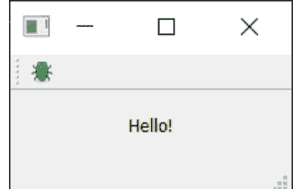

*图 42. 带有图标的我们的操作按钮。*

请注意，Qt 使用你的操作系统默认设置来确定在工具栏中显示图标、文本还是图标和文本。但你可以通过使用 `.setToolButtonStyle` 来覆盖此设置。此槽接受来自 `Qt.` 命名空间的以下任何标志：

| 标志 | 行为 |
| :--- | :--- |
| `Qt.ToolButtonIconOnly` | 仅图标，无文本 |
| `Qt.ToolButtonTextOnly` | 仅文本，无图标 |
| `Qt.ToolButtonTextBesideIcon` | 图标和文本，文本在图标旁边 |
| `Qt.ToolButtonTextUnderIcon` | 图标和文本，文本在图标下方 |
| `Qt.ToolButtonFollowStyle` | 遵循主机桌面样式 |

> **我应该使用哪种样式？**
>
> 默认值是 `Qt.ToolButtonFollowStyle`，这意味着你的应用程序将默认遵循应用程序运行所在桌面的标准/全局设置。通常建议这样做，以使你的应用程序尽可能**原生**。

接下来，我们将在工具栏中添加更多内容。我们将添加第二个按钮和一个复选框小部件。如前所述，你实际上可以在这里放置任何小部件，所以请随意发挥。

清单 40. basic/toolbars_and_menus_6.py

```python
class MainWindow(QMainWindow):
    def __init__(self):
        super().__init__()

        self.setWindowTitle("My App")

        label = QLabel("Hello!")
        label.setAlignment(Qt.AlignCenter)

        self.setCentralWidget(label)

        toolbar = QToolBar("My main toolbar")
        toolbar.setIconSize(QSize(16, 16))
        self.addToolBar(toolbar)

        button_action = QAction(QIcon("bug.png"), "Your button", self)
        button_action.setStatusTip("This is your button")
        button_action.triggered.connect(self.onMyToolBarButtonClick)
        button_action.setCheckable(True)
        toolbar.addAction(button_action)

        toolbar.addSeparator()

        button_action2 = QAction(QIcon("bug.png"), "Your button2", self)
        button_action2.setStatusTip("This is your button2")
        button_action2.triggered.connect(self.onMyToolBarButtonClick)
        button_action2.setCheckable(True)
        toolbar.addAction(button_action2)

        toolbar.addWidget(QLabel("Hello"))
        toolbar.addWidget(QCheckBox())

        self.setStatusBar(QStatusBar(self))

    def onMyToolBarButtonClick(self, s):
        print("click", s)
```

🚀 **运行它！** 现在你可以看到多个按钮和一个复选框。

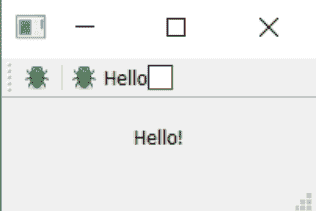

*图 43. 带有操作和两个小部件的工具栏。*

### 菜单

菜单是 UI 的另一个标准组件。通常它们位于窗口顶部，或在 macOS 上位于屏幕顶部。它们允许访问所有标准应用程序功能。存在一些标准菜单——例如文件、编辑、帮助。菜单可以嵌套以创建功能的分层树，并且它们通常支持并显示键盘快捷键，以便快速访问其功能。

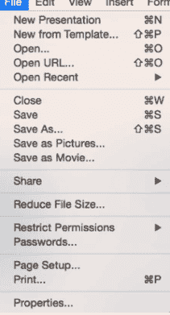

*图 44. 标准 GUI 元素 - 菜单*

要创建一个菜单，我们通过在 `QMainWindow` 上调用 `.menuBar()` 来创建一个菜单栏。我们通过调用 `.addMenu()` 并传入菜单名称来在菜单栏上添加一个菜单。我将其命名为 `'&File'`。& 符号定义了一个快捷键，用于跳转到按下 Alt 键时显示此菜单。

> **macOS 上的快捷键**

这在 macOS 上不可见。请注意，这与键盘快捷键不同——我们稍后会介绍。

这正是操作（actions）功能发挥作用的地方。我们可以重用已有的 `QAction`，将相同的功能添加到菜单中。要添加一个操作，你需要调用 `.addAction` 并传入一个我们已定义的操作。

*清单 41. basic/toolbars_and_menus_7.py*

```python
class MainWindow(QMainWindow):
    def __init__(self):
        super().__init__()

        self.setWindowTitle("My App")

        label = QLabel("Hello!")
        label.setAlignment(Qt.AlignCenter)

        self.setCentralWidget(label)

        toolbar = QToolBar("My main toolbar")
        toolbar.setIconSize(QSize(16, 16))
        self.addToolBar(toolbar)

        button_action = QAction(QIcon("bug.png"), "&Your button", self)
        button_action.setStatusTip("This is your button")
        button_action.triggered.connect(self.onMyToolBarButtonClick)
        button_action.setCheckable(True)
        toolbar.addAction(button_action)

        toolbar.addSeparator()

        button_action2 = QAction(QIcon("bug.png"), "Your &button2", self)
        button_action2.setStatusTip("This is your button2")
        button_action2.triggered.connect(self.onMyToolBarButtonClick)
        button_action2.setCheckable(True)
        toolbar.addAction(button_action2)

        toolbar.addWidget(QLabel("Hello"))
        toolbar.addWidget(QCheckBox())

        self.setStatusBar(QStatusBar(self))

        menu = self.menuBar()

        file_menu = menu.addMenu("&File")
        file_menu.addAction(button_action)

    def onMyToolBarButtonClick(self, s):
        print("click", s)
```

点击菜单中的项目，你会注意到它是可切换的——它继承了 `QAction` 的特性。


让我们向菜单添加更多内容。这里我们将在菜单中添加一个分隔符，它在菜单中会显示为一条水平线，然后添加我们创建的第二个 `QAction`。

*清单 42. basic/toolbars_and_menus_8.py*

```python
class MainWindow(QMainWindow):
    def __init__(self):
        super().__init__()

        self.setWindowTitle("My App")

        label = QLabel("Hello!")
        label.setAlignment(Qt.AlignCenter)

        self.setCentralWidget(label)

        toolbar = QToolBar("My main toolbar")
        toolbar.setIconSize(QSize(16, 16))
        self.addToolBar(toolbar)

        button_action = QAction(QIcon("bug.png"), "&Your button", self)
        button_action.setStatusTip("This is your button")
        button_action.triggered.connect(self.onMyToolBarButtonClick)
        button_action.setCheckable(True)
        toolbar.addAction(button_action)

        toolbar.addSeparator()

        button_action2 = QAction(QIcon("bug.png"), "Your &button2", self)
        button_action2.setStatusTip("This is your button2")
        button_action2.triggered.connect(self.onMyToolBarButtonClick)
        button_action2.setCheckable(True)
        toolbar.addAction(button_action2)

        toolbar.addWidget(QLabel("Hello"))
        toolbar.addWidget(QCheckBox())

        self.setStatusBar(QStatusBar(self))

        menu = self.menuBar()

        file_menu = menu.addMenu("&File")
        file_menu.addAction(button_action)
        file_menu.addSeparator()
        file_menu.addAction(button_action2)

    def onMyToolBarButtonClick(self, s):
        print("click", s)
```

🚀 **运行它！** 你应该会看到两个菜单项，中间有一条分隔线。

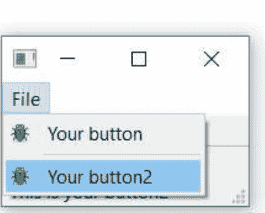

*图 46. 我们的操作显示在菜单中。*

你也可以使用 `&` 符号为菜单添加*加速键*，以便在菜单打开时，按单个键即可跳转到某个菜单项。同样，这在 macOS 上不起作用。

要添加子菜单，你只需在父菜单上调用 `addMenu()` 创建一个新菜单。然后你可以像往常一样向其中添加操作。例如：

*清单 43. basic/toolbars_and_menus_9.py*

```python
class MainWindow(QMainWindow):
    def __init__(self):
        super().__init__()

        self.setWindowTitle("My App")

        label = QLabel("Hello!")
        label.setAlignment(Qt.AlignCenter)

        self.setCentralWidget(label)

        toolbar = QToolBar("My main toolbar")
        toolbar.setIconSize(QSize(16, 16))
        self.addToolBar(toolbar)

        button_action = QAction(QIcon("bug.png"), "&Your button", self)
        button_action.setStatusTip("This is your button")
        button_action.triggered.connect(self.onMyToolBarButtonClick)
        button_action.setCheckable(True)
        toolbar.addAction(button_action)

        toolbar.addSeparator()

        button_action2 = QAction(QIcon("bug.png"), "Your &button2", self)
        button_action2.setStatusTip("This is your button2")
        button_action2.triggered.connect(self.onMyToolBarButtonClick)
        button_action2.setCheckable(True)
        toolbar.addAction(button_action2)

        toolbar.addWidget(QLabel("Hello"))
        toolbar.addWidget(QCheckBox())

        self.setStatusBar(QStatusBar(self))

        menu = self.menuBar()

        file_menu = menu.addMenu("&File")
        file_menu.addAction(button_action)
        file_menu.addSeparator()

        file_submenu = file_menu.addMenu("Submenu")
        file_submenu.addAction(button_action2)

    def onMyToolBarButtonClick(self, s):
        print("click", s)
```


*图 47. 嵌套在“文件”菜单中的子菜单。*

最后，我们将为 `QAction` 添加一个键盘快捷键。你可以通过调用 `setKeySequence()` 并传入一个键序列来定义键盘快捷键。任何已定义的键序列都会显示在菜单中。

> **隐藏的快捷键**

请注意，键盘快捷键与 `QAction` 相关联，无论 `QAction` 是添加到菜单还是工具栏，它都会生效。

键序列可以通过多种方式定义——可以作为文本传递，使用 Qt 命名空间中的键名，或者使用 Qt 命名空间中定义的键序列。尽可能使用后者，以确保符合操作系统标准。

完成的代码，展示了工具栏按钮和菜单，如下所示。

*清单 44. basic/toolbars_and_menus_end.py*

```python
class MainWindow(QMainWindow):
    def __init__(self):
        super().__init__()

        self.setWindowTitle("My App")

        label = QLabel("Hello!")
        # The `Qt` namespace has a lot of attributes to customize
        # widgets. See: http://doc.qt.io/qt-5/qt.html
        label.setAlignment(Qt.AlignCenter)

        # Set the central widget of the Window. Widget will expand
        # to take up all the space in the window by default.
        self.setCentralWidget(label)

        toolbar = QToolBar("My main toolbar")
        toolbar.setIconSize(QSize(16, 16))
        self.addToolBar(toolbar)

        button_action = QAction(QIcon("bug.png"), "&Your button",
                                self)
        button_action.setStatusTip("This is your button")
        button_action.triggered.connect(self.onMyToolBarButtonClick)
        button_action.setCheckable(True)
        # You can enter keyboard shortcuts using key names (e.g.
        # Ctrl+p)
        # Qt.namespace identifiers (e.g. Qt.CTRL + Qt.Key_P)
        # or system agnostic identifiers (e.g. QKeySequence.Print)
        button_action.setShortcut(QKeySequence("Ctrl+p"))
        toolbar.addAction(button_action)

        toolbar.addSeparator()

        button_action2 = QAction(QIcon("bug.png"), "Your &button2",
                                 self)
        button_action2.setStatusTip("This is your button2")
        button_action2.triggered.connect(self.onMyToolBarButtonClick)
        button_action2.setCheckable(True)
        toolbar.addAction(button_action2)

        toolbar.addWidget(QLabel("Hello"))
        toolbar.addWidget(QCheckBox())

        self.setStatusBar(QStatusBar(self))

        menu = self.menuBar()

        file_menu = menu.addMenu("&File")
        file_menu.addAction(button_action)
        file_menu.addSeparator()

        file_submenu = file_menu.addMenu("Submenu")

        file_submenu.addAction(button_action2)

    def onMyToolBarButtonClick(self, s):
        print("click", s)
```

### 组织菜单和工具栏

如果你的用户找不到应用程序的操作，他们就无法充分发挥应用的潜力。让操作易于发现是创建用户友好型应用程序的关键。一个常见的错误是试图通过在*所有地方*添加操作来解决这个问题，结果反而让用户感到不知所措和困惑。

将常用和必要的操作放在前面，确保它们易于找到和回忆。想想大多数编辑应用程序中的 **文件** › **保存**。它位于文件菜单的顶部，易于快速访问，并绑定了简单的键盘快捷键 `Ctrl` + `S`。如果 **保存文件...** 需要通过 **文件** › **常用操作** › **文件操作** › **活动文档** › **保存** 或者快捷键 `Ctrl` + `Alt` + `J` 才能访问，用户会更难找到它，更难使用它，并且**不太可能**保存他们的文档。

将操作组织成逻辑分组。在少量选项中查找东西比在长列表中查找更容易。如果是在相似的事物中查找，则会更加容易。

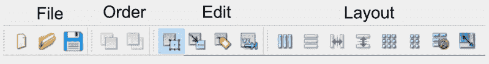

*图 48. Qt Designer 中分组的工具栏。*

避免在多个菜单中复制操作，因为即使它们有相同的标签，这也会引入“这些操作是否做同样事情？”的歧义。最后，不要试图通过动态隐藏/删除条目来简化菜单。这会导致用户困惑，因为他们会寻找不存在的东西“……它刚才还在这里”。不同的状态应该通过禁用菜单项或使用单独的窗口和对话框来指示。

#### ✔ 应该做

-   将菜单组织成逻辑层次结构。
-   将*最常用*的功能复制到工具栏上。
-   逻辑地分组工具栏操作。
-   当菜单项无法使用时，将其禁用。

#### ✖ 不应该做

-   将同一操作添加到多个菜单中。
-   将所有菜单操作都添加到工具栏上。
-   在不同地方为同一操作使用不同的名称或图标。
-   从菜单中删除项目——应改为禁用它们。

## 10. 对话框

对话框是有用的GUI组件，允许你与用户*交流*（因此得名对话框）。它们通常用于文件打开/保存、设置、首选项，或用于不适合应用程序主界面的功能。它们是小型的模态（或*阻塞*）窗口，位于主应用程序前面，直到被关闭。Qt实际上为最常见的用例提供了许多“特殊”对话框，允许你提供平台原生体验以获得更好的用户体验。


*图49. 标准GUI功能——搜索对话框*

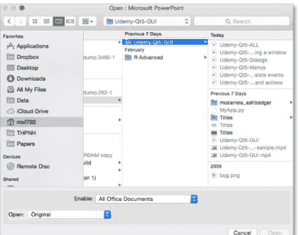

*图50. 标准GUI功能——文件打开对话框*

在Qt中，对话框由`QDialog`类处理。要创建新的对话框，只需创建一个新的`QDialog`类型对象，并传入一个父部件（例如`QMainWindow`）作为其父级。

让我们创建自己的`QDialog`。我们将从一个简单的骨架应用程序开始，其中有一个按钮可以按下，并连接到一个槽方法。

清单45. basic/dialogs_start.py

```python
import sys

from PySide2.QtWidgets import QApplication, QMainWindow, QPushButton

class MainWindow(QMainWindow):
    def __init__(self):
        super().__init__()

        self.setWindowTitle("My App")

        button = QPushButton("Press me for a dialog!")
        button.clicked.connect(self.button_clicked)
        self.setCentralWidget(button)

    def button_clicked(self, s):
        print("click", s)

app = QApplication(sys.argv)

window = MainWindow()
window.show()

app.exec_()
```

在槽`button_clicked`（它接收来自按钮按下的信号）中，我们创建对话框实例，并将我们的`QMainWindow`实例作为父级传入。这将使对话框成为`QMainWindow`的*模态窗口*。这意味着对话框将完全阻止与父窗口的交互。

清单46. basic/dialogs_1.py

```python
import sys

from PySide2.QtWidgets import QApplication, QDialog, QMainWindow,
QPushButton

class MainWindow(QMainWindow):
    def __init__(self):
        super().__init__()

        self.setWindowTitle("My App")

        button = QPushButton("Press me for a dialog!")
        button.clicked.connect(self.button_clicked)
        self.setCentralWidget(button)

    def button_clicked(self, s):
        print("click", s)

        dlg = QDialog(self)
        dlg.setWindowTitle("?")
        dlg.exec_()

app = QApplication(sys.argv)

window = MainWindow()
window.show()

app.exec_()
```

> 🚀 **运行它！** 点击按钮，你将看到一个空对话框出现。

一旦我们创建了对话框，我们使用`.exec_()`启动它——就像我们为`QApplication`创建应用程序的主事件循环所做的那样。这并非巧合：当你执行`QDialog`时，会创建一个全新的事件循环——专用于该对话框。

### 一个事件循环统治一切

记得我说过任何时候只能有一个Qt事件循环在运行吗？我是认真的！`QDialog`完全阻止了你的应用程序执行。不要启动一个对话框并期望应用程序中的其他任何地方发生任何事情。

我们稍后将看到如何使用多线程来摆脱这个困境。

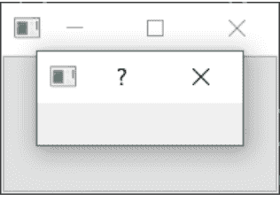

图51. 我们的空对话框覆盖在窗口上。

就像我们的第一个窗口一样，这并不十分有趣。让我们通过添加对话框标题和一组“确定”和“取消”按钮来修复它，以允许用户*接受*或*拒绝*模态框。

要自定义`QDialog`，我们可以对其进行子类化。

清单47. basic/dialogs_2a.py

```python
class CustomDialog(QDialog):
    def __init__(self):
        super().__init__()

        self.setWindowTitle("HELLO!")

        buttons = QDialogButtonBox.Ok | QDialogButtonBox.Cancel

        self.buttonBox = QDialogButtonBox(buttons)
        self.buttonBox.accepted.connect(self.accept)
        self.buttonBox.rejected.connect(self.reject)

        self.layout = QVBoxLayout()
        message = QLabel("Something happened, is that OK?")
        self.layout.addWidget(message)
        self.layout.addWidget(self.buttonBox)
        self.setLayout(self.layout)
```

在上面的代码中，我们首先创建了QDialog的子类，我们称之为CustomDialog。对于QMainWindow，我们在类`__init__`块中应用自定义，以便在对象创建时应用自定义。首先，我们使用`.setWindowTitle()`为QDialog设置标题，这与我们为主窗口所做的完全相同。

下一段代码涉及创建和显示对话框按钮。这可能比你预期的要复杂一些。然而，这是由于Qt在处理不同平台上对话框按钮定位的灵活性。

> *简单的方法？*

你当然可以选择忽略这一点，而使用布局中的标准`QButton`，但这里概述的方法确保你的对话框尊重主机桌面标准（例如，确定按钮在左侧还是右侧）。搞乱这些行为可能会让用户非常恼火，所以我不会推荐这样做。

创建对话框按钮框的第一步是定义要显示的按钮，使用`QDialogButtonBox`的命名空间属性。可用按钮的完整列表如下：

表1. QDialogButtonBox可用的按钮类型。

| 按钮类型 |
| --- |
| QDialogButtonBox.Ok |
| QDialogButtonBox.Open |
| QDialogButtonBox.Save |
| QDialogButtonBox.Cancel |
| QDialogButtonBox.Close |
| QDialogButtonBox.Discard |
| QDialogButtonBox.Apply |
| QDialogButtonBox.Reset |
| QDialogButtonBox.RestoreDefaults |
| QDialogButtonBox.Help |
| QDialogButtonBox.SaveAll |
| QDialogButtonBox.Yes |
| QDialogButtonBox.YesToAll |
| QDialogButtonBox.No |
| QDialogButtonBox.NoToAll |
| QDialogButtonBox.Abort |
| QDialogButtonBox.Retry |
| QDialogButtonBox.Ignore |
| QDialogButtonBox.NoButton |

这些应该足以创建你能想到的任何对话框。你可以使用管道（|）将多个按钮用OR运算符组合在一起来构建一行按钮。Qt将根据平台标准自动处理顺序。例如，要显示“确定”和“取消”按钮，我们使用：

```python
buttons = QDialogButtonBox.Ok | QDialogButtonBox.Cancel
```

变量`buttons`现在包含一个表示这两个按钮的整数值。接下来，我们必须创建`QDialogButtonBox`实例来容纳这些按钮。要显示的按钮标志作为第一个参数传入。

要使按钮产生任何效果，你必须将正确的`QDialogButtonBox`信号连接到对话框上的槽。在我们的例子中，我们将`QDialogButtonBox`的`.accepted`和`.rejected`信号连接到我们`QDialog`子类上的`.accept()`和`.reject()`处理程序。

最后，要使`QDialogButtonBox`出现在我们的对话框中，我们必须将其添加到对话框布局中。因此，就像主窗口一样，我们创建一个布局，将我们的`QDialogButtonBox`添加到其中（`QDialogButtonBox`是一个部件），然后在我们的对话框上设置该布局。

最后，我们在`MainWindow.button_clicked`槽中启动`CustomDialog`。

清单48. basic/dialogs_2a.py

```python
def button_clicked(self, s):
    print("click", s)

    dlg = CustomDialog()
    if dlg.exec_():
        print("Success!")
    else:
        print("Cancel!")
```

> 🚀 **运行它！** 点击启动对话框，你将看到一个带有按钮的对话框。

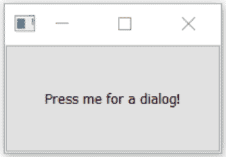


图52. 带有标签和按钮的对话框。

当你点击按钮启动对话框时，你可能会注意到它出现在父窗口之外——可能在屏幕中央。通常，你希望对话框出现在其启动窗口之上，以便用户更容易找到。为此，我们需要给Qt一个对话框的**父级**。如果我们传入主窗口作为父级，Qt将定位新的对话框，使对话框的中心与窗口的中心对齐。

我们可以修改`CustomDialog`类以接受一个`parent`参数。

清单 49. basic/dialogs_2b.py

```python
class CustomDialog(QDialog):
    def __init__(self, parent=None): ①
        super().__init__(parent)

        self.setWindowTitle("HELLO!")

        buttons = QDialogButtonBox.Ok | QDialogButtonBox.Cancel

        self.buttonBox = QDialogButtonBox(buttons)
        self.buttonBox.accepted.connect(self.accept)
        self.buttonBox.rejected.connect(self.reject)

        self.layout = QVBoxLayout()
        message = QLabel("Something happened, is that OK?")
        self.layout.addWidget(message)
        self.layout.addWidget(self.buttonBox)
        self.setLayout(self.layout)
```

① 我们将默认值设置为 None，这样在需要时可以省略 parent 参数。

然后，当我们创建 CustomDialog 的实例时，可以将主窗口作为参数传入。在我们的 button_clicked 方法中，self 就是我们的主窗口对象。

清单 50. basic/dialogs_2b.py

```python
def button_clicked(self, s):
    print("click", s)

    dlg = CustomDialog(self)
    if dlg.exec_():
        print("Success!")
    else:
        print("Cancel!")
```

🚀 **运行它！** 点击启动对话框，你应该会看到对话框正好在父窗口的中央弹出。

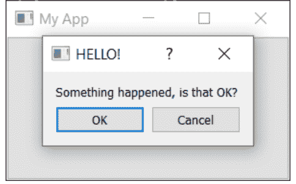

图 53. 我们的对话框，在父窗口上方居中显示。

恭喜！你已经创建了你的第一个对话框。当然，你可以继续向对话框中添加任何你喜欢的其他内容。只需像往常一样将其插入布局即可。

### 使用 QMessageBox 的简单消息对话框

有许多对话框遵循我们刚刚看到的简单模式——一条消息和一些按钮，你可以用它们来接受或取消对话框。虽然你可以自己构建这些对话框，但 Qt 也提供了一个名为 QMessageBox 的内置消息对话框类。它可以用来创建信息、警告、关于或问题对话框。

下面的示例创建了一个简单的 QMessageBox 并显示它。

清单 51. basic/dialogs_3.py

```python
def button_clicked(self, s):
    dlg = QMessageBox(self)
    dlg.setWindowTitle("I have a question!")
    dlg.setText("This is a simple dialog")
    button = dlg.exec_()

    if button == QMessageBox.Ok:
        print("OK!")
```

🚀 **运行它！** 你会看到一个带有 *OK* 按钮的简单对话框。

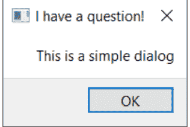

*图 54. 一个 QMessageBox 对话框。*

与我们已经看过的对话框按钮框一样，QMessageBox 上显示的按钮也是通过一组常量配置的，这些常量可以用 | 组合以显示多个按钮。可用的按钮类型完整列表如下所示。

*表 2. QMessageBox 可用的按钮类型。*

| 按钮类型 |
| --- |
| QMessageBox.Ok |
| QMessageBox.Open |
| QMessageBox.Save |
| QMessageBox.Cancel |
| QMessageBox.Close |
| QMessageBox.Discard |
| QMessageBox.Apply |
| QMessageBox.Reset |
| QMessageBox.RestoreDefaults |
| QMessageBox.Help |
| QMessageBox.SaveAll |
| QMessageBox.Yes |
| QMessageBox.YesToAll |
| QMessageBox.No |
| QMessageBox.NoToAll |
| QMessageBox.Abort |
| QMessageBox.Retry |
| QMessageBox.Ignore |
| QMessageBox.NoButton |

你还可以通过设置以下图标之一来调整对话框上显示的图标。

表 3. QMessageBox 图标常量。

| 图标状态 | 描述 |
| --- | --- |
| QMessageBox.NoIcon | 消息框没有图标。 |
| QMessageBox.Question | 消息是在提问。 |
| QMessageBox.Information | 消息仅供参考。 |
| QMessageBox.Warning | 消息是警告。 |
| QMessageBox.Critical | 消息表示一个严重问题。 |

例如，以下代码创建了一个带有 Yes 和 No 按钮的问题对话框。

清单 52. basic/dialogs_4.py

```python
from PySide2.QtWidgets import QApplication, QDialog, QMainWindow,
QMessageBox, QPushButton

class MainWindow(QMainWindow):

    # __init__ skipped for clarity
    def button_clicked(self, s):
        dlg = QMessageBox(self)
        dlg.setWindowTitle("I have a question!")
        dlg.setText("This is a question dialog")
        dlg.setStandardButtons(QMessageBox.Yes | QMessageBox.No)
        dlg.setIcon(QMessageBox.Question)
        button = dlg.exec_()

        if button == QMessageBox.Yes:
            print("Yes!")
        else:
            print("No!")
```

🚀 **运行它！** 你会看到一个带有 *Yes* 和 *No* 按钮的问题对话框。

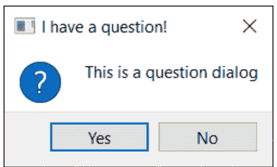

图 55. 使用 QMessageBox 创建的问题对话框。

### 内置的 QMessageBox 对话框

为了使事情更简单，QMessageBox 有许多方法可用于构建这些类型的消息对话框。这些方法如下所示——

```python
QMessageBox.about(parent, title, message)
QMessageBox.critical(parent, title, message)
QMessageBox.information(parent, title, message)
QMessageBox.question(parent, title, message)
QMessageBox.warning(parent, title, message)
```

parent 参数是对话框将作为其子窗口的窗口。如果你从主窗口启动对话框，只需传入 self 即可。以下示例像以前一样创建了一个带有 Yes 和 No 按钮的问题对话框。

清单 53. basic/dialogs_5.py

```python
def button_clicked(self, s):
    button = QMessageBox.question(self, "Question dialog", "The longer message")
    if button == QMessageBox.Yes:
        print("Yes!")
    else:
        print("No!")
```

> 🚀 **运行它！** 你会看到相同的结果，这次使用的是内置的 .question() 方法。

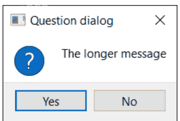

图 56. 内置的问题对话框。

请注意，我们现在不是调用 exec()，而是简单地调用对话框方法，对话框就被创建了。每个方法的返回值是被按下的按钮。我们可以通过将返回值与按钮常量进行比较来检测按下了什么。

四个 `information`、`question`、`warning` 和 `critical` 方法还接受可选的 `buttons` 和 `defaultButton` 参数，可用于调整对话框上显示的按钮并默认选择一个。但通常情况下，你不想更改默认设置。

清单 54. basic/dialogs_6.py

```python
def button_clicked(self, s):

    button = QMessageBox.critical(
        self,
        "Oh dear!",
        "Something went very wrong.",
        buttons=QMessageBox.Discard | QMessageBox.NoToAll | QMessageBox.Ignore,
        defaultButton=QMessageBox.Discard,
    )

    if button == QMessageBox.Discard:
        print("Discard!")
    elif button == QMessageBox.NoToAll:
        print("No to all!")
    else:
        print("Ignore!")
```

🚀 **运行它！** 你会看到一个带有自定义按钮的严重错误对话框。

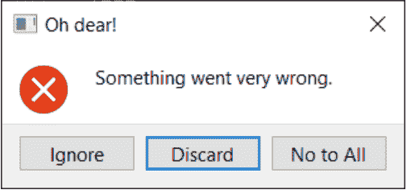

图 57. 严重错误！这是一个糟糕的对话框。

对于大多数情况，这些简单的对话框就是你所需要的。

### 对话框

创建糟糕的对话框尤其容易。从用令人困惑的选项困住用户的对话框，到嵌套的、永无止境的弹出窗口。有很多方法可以伤害你的用户。

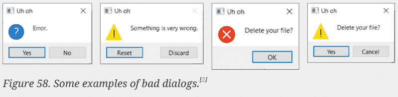

**对话框按钮**由系统标准定义。你可能从未注意到 OK 和 Cancel 按钮在 macOS 和 Linux 与 Windows 上的位置不同，但你的大脑注意到了。如果你不遵循系统标准，你会让用户感到困惑，并导致他们犯错。

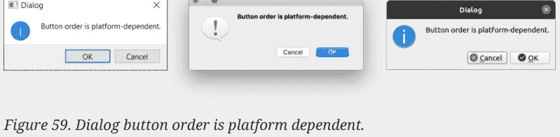

使用 Qt 时，当你使用内置的 `QDialogButtonBox` 控件时，你可以*免费*获得这种一致性。但你*必须使用它们*！

**错误对话框**会惹恼用户。当你显示错误对话框时，你是在给用户带来*坏消息*。当你给别人带来坏消息时，你需要考虑它会给他们带来的影响。

举个例子，这个（幸好是虚构的）对话框是在我们遇到文档错误时产生的。对话框告诉你有一个错误，但没有说明后果是什么或该怎么做。阅读这个对话框，你的用户会问（可能尖叫）“……然后呢？”

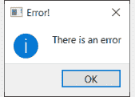

*图 60. 一个糟糕的错误对话框示例。*

来自 Acrobat Reader DC 的这个真实对话框更好。它解释了存在错误，可能的后果是什么，以及如何解决。

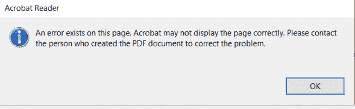

*图 61. Adobe Acrobat Reader DC 对话框*

但这仍然不是*完美的*。错误显示为*信息*对话框，这并没有暗示任何问题。错误在每一页都会触发，并且可能在文档中出现多次——警告对话框应该只触发*一次*。通过明确说明错误是永久性的，也可以改进错误提示。

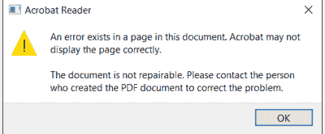

*图 62. Adobe Acrobat Reader DC 对话框的改进版本*

良好的错误信息应当解释清楚。

-   发生了什么
-   受影响的是什么
-   会导致什么后果
-   可以采取什么措施

## 11. 窗口

在上一章中，我们探讨了如何打开*对话*窗口。这些是特殊的窗口，它们（默认情况下）会获取用户焦点，并运行自己的事件循环，从而有效阻塞应用程序其余部分的执行。

然而，很多时候你会希望在应用程序中打开第二个窗口，而不阻塞主窗口——例如，显示某个长时间运行过程的输出，或者展示图表或其他可视化内容。或者，你可能想创建一个允许同时处理多个文档的应用程序，每个文档都在自己的窗口中。

在 PySide2 中打开新窗口相对简单，但有几点需要注意以确保它们能正常工作。在本教程中，我们将逐步讲解如何创建新窗口，以及如何根据需要显示和隐藏外部窗口。

### 创建新窗口

要在 PySide2 中创建新窗口，你只需创建一个没有父对象的控件对象实例即可。这可以是任何控件（技术上是 `QWidget` 的任何子类），如果你愿意，也可以是另一个 `QMainWindow`。

> 对 `QMainWindow` 实例的数量没有限制，如果你需要在第二个窗口上使用工具栏或菜单，你也需要使用 `QMainWindow`。

与主窗口一样，仅仅*创建*窗口是不够的，你还必须显示它。

清单 55. basic/windows_1.py

```python
import sys

from PySide2.QtWidgets import (QApplication, QLabel, QMainWindow,
    QPushButton,
    QVBoxLayout, QWidget)

class AnotherWindow(QWidget):
    """
    This "window" is a QWidget. If it has no parent, it
    will appear as a free-floating window.
    """

    def __init__(self):
        super().__init__()
        layout = QVBoxLayout()
        self.label = QLabel("Another Window")
        layout.addWidget(self.label)
        self.setLayout(layout)

class MainWindow(QMainWindow):
    def __init__(self):
        super().__init__()
        self.button = QPushButton("Push for Window")
        self.button.clicked.connect(self.show_new_window)
        self.setCentralWidget(self.button)

    def show_new_window(self, checked):
        w = AnotherWindow()
        w.show()

app = QApplication(sys.argv)
w = MainWindow()
w.show()
app.exec_()
```

如果你运行这个程序，你会看到主窗口。点击按钮*可能*会显示第二个窗口，但即使你看到了，它也只会显示一瞬间。发生了什么？

```python
def show_new_window(self, checked):
    w = AnotherWindow()
    w.show()
```

我们在这个方法内部创建了第二个窗口，将其存储在变量 `w` 中并显示它。然而，一旦我们离开这个方法，变量 `w` 将会被 Python 清理，窗口也会被销毁。为了解决这个问题，我们需要在*某处*保持对窗口的引用——例如，在主窗口的 `self` 对象上。

清单 56. basic/windows_1b.py

```python
def show_new_window(self, checked):
    self.w = AnotherWindow()
    self.w.show()
```

现在，当你点击按钮显示新窗口时，它将会持续存在。

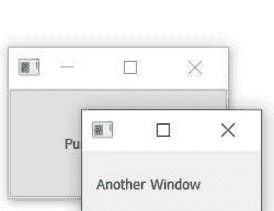

图 63. 持续存在的第二个窗口。

然而，如果你再次点击按钮会发生什么？窗口将被重新创建！这个新窗口将替换 `self.w` 变量中的旧窗口，而之前的窗口将被销毁。如果你将 `AnotherWindow` 的定义改为在每次创建时在标签中显示一个随机数，你可以更清楚地看到这一点。

清单 57. basic/windows_2.py

```python
from random import randint

from PySide2.QtWidgets import (
    QApplication,
    QLabel,
    QMainWindow,
    QPushButton,
    QVBoxLayout,
    QWidget,
)

class AnotherWindow(QWidget):
    """
    This "window" is a QWidget. If it has no parent, it
    will appear as a free-floating window.
    """

    def __init__(self):
        super().__init__()
        layout = QVBoxLayout()
        self.label = QLabel("Another Window % d" % randint(0, 100))
        layout.addWidget(self.label)
        self.setLayout(layout)
```

`__init__` 代码块仅在*创建*窗口时运行。如果你持续点击按钮，数字将会改变，表明窗口正在被重新创建。

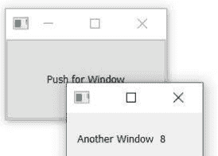

图 64. 如果再次按下按钮，数字将会改变。

一个解决方案是在创建窗口之前简单地检查它是否已经被创建。下面的完整示例展示了这一点。

清单 58. basic/windows_3.py

```python
class MainWindow(QMainWindow):
    def __init__(self):
        super().__init__()
        self.w = None  # No external window yet.
        self.button = QPushButton("Push for Window")
        self.button.clicked.connect(self.show_new_window)
        self.setCentralWidget(self.button)

    def show_new_window(self, checked):
        if self.w is None:
            self.w = AnotherWindow()
            self.w.show()
```

这种方法对于临时创建的窗口，或者需要根据程序当前状态进行更改的窗口来说是很好的——例如，如果你想显示特定的图表或日志输出。然而，对于许多应用程序，你有一些标准窗口，你希望能够根据需要显示/隐藏它们。

在下一部分，我们将探讨如何处理这些类型的窗口。

### 关闭窗口

正如我们之前看到的，如果没有保持对窗口的引用，它将被丢弃（并关闭）。我们可以利用这种行为来关闭窗口，将上一个示例中的 show_new_window 方法替换为——

清单 59. basic/windows_4.py

```python
def show_new_window(self, checked):
    if self.w is None:
        self.w = AnotherWindow()
        self.w.show()

    else:
        self.w = None  # Discard reference, close window.
```

通过将 `self.w` 设置为 `None`（或任何其他值），对窗口的引用将丢失，窗口将关闭。然而，如果我们将其设置为 `None` 以外的任何值，第一个测试将不会通过，我们将无法重新创建窗口。

这只有在你没有在其他地方保持对此窗口的引用时才有效。为了确保窗口无论如何都会关闭，你可能需要显式地调用 `.close()`。

清单 60. basic/windows_4b.py

```python
def show_new_window(self, checked):
    if self.w is None:
        self.w = AnotherWindow()
        self.w.show()

    else:
        self.w.close()
        self.w = None  # Discard reference, close window.
```

### 持久窗口

到目前为止，我们已经探讨了如何根据需要创建新窗口。然而，有时你有一些标准的应用程序窗口。在这种情况下，通常更有意义的做法是先创建额外的窗口，然后在需要时使用 `.show()` 来显示它们。

在下面的示例中，我们在主窗口的 `__init__` 代码块中创建外部窗口，然后我们的 `show_new_window` 方法只需调用 `self.w.show()` 来显示它。

清单 61. basic/windows_5.py

```python
import sys
from random import randint

from PySide2.QtWidgets import (
    QApplication,
    QLabel,
    QMainWindow,
    QPushButton,
    QVBoxLayout,
    QWidget,
)


class AnotherWindow(QWidget):
    """
    This "window" is a QWidget. If it has no parent, it
    will appear as a free-floating window.
    """

    def __init__(self):
        super().__init__()
        layout = QVBoxLayout()
        self.label = QLabel("Another Window % d" % randint(0, 100))
        layout.addWidget(self.label)
        self.setLayout(layout)


class MainWindow(QMainWindow):
    def __init__(self):
        super().__init__()
        self.w = AnotherWindow()
        self.button = QPushButton("Push for Window")
        self.button.clicked.connect(self.show_new_window)
        self.setCentralWidget(self.button)

    def show_new_window(self, checked):
        self.w.show()
```

app = QApplication(sys.argv)
w = MainWindow()
w.show()
app.exec_()

如果你运行这段代码，点击按钮将像之前一样显示窗口。请注意，窗口只被创建一次，对已经可见的窗口调用`.show()`不会产生任何效果。

### 显示与隐藏窗口

一旦你创建了一个持久窗口，你可以在不重新创建它的情况下显示和隐藏它。一旦隐藏，窗口仍然存在，但将不可见且不接受鼠标或其他输入。然而，你可以继续调用窗口的方法并更新其状态——包括更改其外观。一旦重新显示，任何更改都将可见。

下面我们更新主窗口，创建一个`toggle_window`方法，该方法使用`.isVisible()`检查窗口当前是否可见。如果不可见，则使用`.show()`显示它；如果已经可见，则使用`.hide()`隐藏它。

```python
class MainWindow(QMainWindow):

    def __init__(self):
        super().__init__()
        self.w = AnotherWindow()
        self.button = QPushButton("Push for Window")
        self.button.clicked.connect(self.toggle_window)
        self.setCentralWidget(self.button)

    def toggle_window(self, checked):
        if self.w.isVisible():
            self.w.hide()

        else:
            self.w.show()
```

这个持久窗口以及切换显示/隐藏状态的完整工作示例如下所示。

清单 62. basic/windows_6.py

```python
import sys
from random import randint

from PySide2.QtWidgets import (
    QApplication,
    QLabel,
    QMainWindow,
    QPushButton,
    QVBoxLayout,
    QWidget,
)

class AnotherWindow(QWidget):
    """
    This "window" is a QWidget. If it has no parent, it
    will appear as a free-floating window.
    """

    def __init__(self):
        super().__init__()
        layout = QVBoxLayout()
        self.label = QLabel("Another Window % d" % randint(0, 100))
        layout.addWidget(self.label)
        self.setLayout(layout)

class MainWindow(QMainWindow):
    def __init__(self):
        super().__init__()
        self.w = AnotherWindow()
        self.button = QPushButton("Push for Window")
        self.button.clicked.connect(self.toggle_window)
        self.setCentralWidget(self.button)

    def toggle_window(self, checked):
        if self.w.isVisible():
            self.w.hide()

        else:
            self.w.show()

app = QApplication(sys.argv)
w = MainWindow()
w.show()
app.exec_()
```

同样，窗口只被创建一次——每次重新显示窗口时，窗口的`__init__`块不会重新运行（因此标签中的数字不会改变）。

### 在窗口之间连接信号

在信号章节中，我们看到了如何使用信号和槽直接连接小部件。我们所需要的是目标小部件已经被创建，并且通过一个变量持有对它的引用。同样的原理适用于跨窗口连接信号——你可以将一个窗口中的信号连接到另一个窗口中的槽，你只需要能够访问该槽即可。

在下面的示例中，我们将主窗口上的文本输入连接到子窗口上的一个QLabel。

清单 63. basic/windows_7.py

```python
import sys
from random import randint

from PySide2.QtWidgets import (
    QApplication,
    QLabel,
    QMainWindow,
    QPushButton,
    QVBoxLayout,
    QWidget,
    QLineEdit
)


class AnotherWindow(QWidget):
    """
    This "window" is a QWidget. If it has no parent, it
    will appear as a free-floating window.
    """

    def __init__(self):
        super().__init__()
        layout = QVBoxLayout()
        self.label = QLabel("Another Window") ②
        layout.addWidget(self.label)
        self.setLayout(layout)


class MainWindow(QMainWindow):
    def __init__(self):
        super().__init__()
        self.w = AnotherWindow()
        self.button = QPushButton("Push for Window")
        self.button.clicked.connect(self.toggle_window)

        self.input = QLineEdit()
        self.input.textChanged.connect(self.w.label.setText) ①

        layout = QVBoxLayout()
        layout.addWidget(self.button)
        layout.addWidget(self.input)
        container = QWidget()
        container.setLayout(layout)

        self.setCentralWidget(container)

    def toggle_window(self, checked):
        if self.w.isVisible():
            self.w.hide()

        else:
            self.w.show()

app = QApplication(sys.argv)
w = MainWindow()
w.show()
app.exec_()
```

① `AnotherWindow`窗口对象通过变量`self.w`可用。`QLabel`通过`self.w.label`可用，而`.setText`槽通过`self.w.label.setText`可用。

② 当我们创建`QLabel`时，我们将其引用存储在`self`上，作为`self.label`，因此它可以在对象外部访问。

> 🚀 **运行它！** 在上方的框中输入一些文本，你会看到它立即出现在标签上。看看如果你在窗口隐藏时在框中输入文本会发生什么——它仍然在后台更新！更新小部件的状态并不依赖于它们是否可见。

当然，你也可以自由地将一个窗口上的信号连接到另一个窗口上的自定义方法。任何事情都是可能的，只要它是可访问的（对于Qt槽，类型匹配），你就可以用信号连接它。


确保组件可导入且彼此可访问，是构建逻辑项目结构的一个很好的动机。通常，在主窗口/模块中集中连接组件是有意义的，以避免交叉导入所有内容。

## 12. 事件

用户与Qt应用程序的每一次交互都是一个*事件*。事件有很多种类型，每种代表不同类型的交互。Qt使用*事件对象*来表示这些事件，这些对象封装了关于发生了什么的信息。这些事件被传递到交互发生的小部件上的特定*事件处理器*。

通过定义自定义或扩展的*事件处理器*，你可以改变小部件响应这些事件的方式。事件处理器的定义就像任何其他方法一样，但名称是特定于它们处理的事件类型的。

小部件接收的主要事件之一是`QMouseEvent`。`QMouseEvent`事件是为小部件上的每一次鼠标移动和按钮点击而创建的。以下事件处理器可用于处理鼠标事件——

| 事件处理器 | 事件类型 |
| :--- | :--- |
| `mouseMoveEvent` | 鼠标移动 |
| `mousePressEvent` | 鼠标按钮按下 |
| `mouseReleaseEvent` | 鼠标按钮释放 |
| `mouseDoubleClickEvent` | 检测到双击 |

例如，点击小部件将导致一个`QMouseEvent`被发送到该小部件上的`.mousePressEvent`事件处理器。此处理器可以使用事件对象来找出有关发生了什么的信息，例如是什么触发了事件以及具体发生在何处。

你可以通过子类化并覆盖类上的处理器方法来拦截事件。你可以选择过滤、修改或忽略事件，通过使用`super()`调用父类函数将它们传递给事件的正常处理器。这些可以添加到你的主窗口类中，如下所示。在每种情况下，`e`都将接收传入的事件。

清单 64. basic/events_1.py

```python
import sys

from PySide2.QtCore import Qt
from PySide2.QtWidgets import QApplication, QLabel, QMainWindow,
QTextEdit

class MainWindow(QMainWindow):
    def __init__(self):
        super().__init__()
        self.label = QLabel("Click in this window")
        self.setCentralWidget(self.label)

    def mouseMoveEvent(self, e):
        self.label.setText("mouseMoveEvent")

    def mousePressEvent(self, e):
        self.label.setText("mousePressEvent")

    def mouseReleaseEvent(self, e):
        self.label.setText("mouseReleaseEvent")

    def mouseDoubleClickEvent(self, e):
        self.label.setText("mouseDoubleClickEvent")

app = QApplication(sys.argv)

window = MainWindow()
window.show()

app.exec_()
```

> 🚀 **运行它！** 尝试在窗口中移动和点击（以及双击），并观察事件出现。

你会注意到，只有当你按住按钮被按下。你可以通过在窗口上调用 `self.setMouseTracking(True)` 来改变这一行为。你可能还会注意到，当按钮被按下时，按下（点击）和双击事件都会触发。只有释放事件会在按钮释放时触发。通常，要注册用户的点击，你应该同时监听鼠标按下*和*释放事件。

在事件处理程序中，你可以访问一个事件对象。该对象包含有关事件的信息，并可用于根据实际发生的情况做出不同的响应。接下来我们将查看鼠标事件对象。

### 鼠标事件

Qt 中的所有鼠标事件都通过 `QMouseEvent` 对象进行跟踪，事件信息可通过以下事件方法读取。

| 方法 | 返回值 |
| :--- | :--- |
| `.button()` | 触发此事件的特定按钮 |
| `.buttons()` | 所有鼠标按钮的状态（按位或标志） |
| `.globalPos()` | 应用程序全局位置，作为 `QPoint` |
| `.globalX()` | 应用程序全局*水平* X 位置 |
| `.globalY()` | 应用程序全局*垂直* Y 位置 |
| `.pos()` | 相对于控件的位置，作为 `QPoint` *整数* |
| `.posF()` | 相对于控件的位置，作为 `QPointF` *浮点数* |

你可以在事件处理程序中使用这些方法来对不同事件做出不同响应，或者完全忽略它们。位置方法提供*全局*和*局部*（相对于控件）的位置信息，作为 `QPoint` 对象，而按钮则使用 `Qt` 命名空间中的鼠标按钮类型进行报告。

例如，以下代码允许我们对窗口上的左键、右键或中键点击做出不同响应。

清单 65. basic/events_2.py

```
def mousePressEvent(self, e):
    if e.button() == Qt.LeftButton:
        # 在此处处理左键按下
        self.label.setText("mousePressEvent LEFT")

    elif e.button() == Qt.MiddleButton:
        # 在此处处理中键按下。
        self.label.setText("mousePressEvent MIDDLE")

    elif e.button() == Qt.RightButton:
        # 在此处处理右键按下。
        self.label.setText("mousePressEvent RIGHT")

def mouseReleaseEvent(self, e):
    if e.button() == Qt.LeftButton:
        self.label.setText("mouseReleaseEvent LEFT")

    elif e.button() == Qt.MiddleButton:
        self.label.setText("mouseReleaseEvent MIDDLE")

    elif e.button() == Qt.RightButton:
        self.label.setText("mouseReleaseEvent RIGHT")

def mouseDoubleClickEvent(self, e):
    if e.button() == Qt.LeftButton:
        self.label.setText("mouseDoubleClickEvent LEFT")

    elif e.button() == Qt.MiddleButton:
        self.label.setText("mouseDoubleClickEvent MIDDLE")

    elif e.button() == Qt.RightButton:
        self.label.setText("mouseDoubleClickEvent RIGHT")
```

按钮标识符在 Qt 命名空间中定义，如下所示 —

| 标识符 | 值（二进制） | 代表 |
| :--- | :--- | :--- |
| `Qt.NoButton` | 0 (000) | 未按下任何按钮，或事件与按钮按下无关。 |
| `Qt.LeftButton` | 1 (001) | 左键被按下 |
| `Qt.RightButton` | 2 (010) | 右键被按下。 |
| `Qt.MiddleButton` | 4 (100) | 中键被按下。 |

> 在右手鼠标上，左键和右键的位置是相反的，即按下最右边的按钮将返回 `Qt.LeftButton`。这意味着你不需要在代码中考虑鼠标的方向。

> 要更深入地了解这一切是如何工作的，请稍后查看 [枚举与 Qt 命名空间](https://www.google.com)。

### 上下文菜单

上下文菜单是小型的上下文相关菜单，通常在右键单击窗口时出现。Qt 支持生成这些菜单，并且控件有一个特定的事件用于触发它们。在以下示例中，我们将拦截 `QMainWindow` 的 `.contextMenuEvent`。每当上下文菜单*即将*显示时，就会触发此事件，并传递一个类型为 `QContextMenuEvent` 的单一值 `event`。

要拦截事件，我们只需用同名的新方法覆盖对象方法。因此，在这种情况下，我们可以在 `MainWindow` 子类上创建一个名为 `contextMenuEvent` 的方法，它将接收所有此类型的事件。

清单 66. basic/events_3.py

```
import sys

from PySide2.QtCore import Qt
from PySide2.QtWidgets import QAction, QApplication, QLabel,
    QMainWindow, QMenu

class MainWindow(QMainWindow):
    def __init__(self):
        super().__init__()

    def contextMenuEvent(self, e):
        context = QMenu(self)
        context.addAction(QAction("test 1", self))
        context.addAction(QAction("test 2", self))
        context.addAction(QAction("test 3", self))
        context.exec_(e.globalPos())

app = QApplication(sys.argv)

window = MainWindow()
window.show()

app.exec_()
```

如果你运行上面的代码并在窗口内右键单击，你会看到一个上下文菜单出现。你可以像往常一样在菜单操作上设置 `.triggered` 插槽（并重用为菜单和工具栏定义的操作）。

> 当将初始位置传递给 `exec_` 方法时，该位置必须相对于定义时传入的父级。在本例中，我们传递 `self` 作为父级，因此我们可以使用全局位置。

为完整起见，还有一种基于信号的方法来创建上下文菜单。

清单 67. basic/events_4.py

```
class MainWindow(QMainWindow):
    def __init__(self):
        super().__init__()
        self.show()

        self.setContextMenuPolicy(Qt.CustomContextMenu)
        self.customContextMenuRequested.connect(self.on_context_menu)

    def on_context_menu(self, pos):
        context = QMenu(self)
        context.addAction(QAction("test 1", self))
        context.addAction(QAction("test 2", self))
        context.addAction(QAction("test 3", self))
        context.exec_(self.mapToGlobal(pos))
```

选择哪种方式完全取决于你。

### 事件层次结构

在 pyside2 中，每个控件都属于两个不同的层次结构：Python 对象层次结构和 Qt 布局层次结构。你如何响应或忽略事件会影响你的 UI 行为。

### Python 继承转发

通常你可能希望拦截一个事件，对其进行一些处理，但仍然触发默认的事件处理行为。如果你的对象继承自标准控件，它很可能默认实现了合理的行为。你可以通过使用 `super()` 调用父类实现来触发此行为。

> 这是 Python 父类，而不是 pyside2 的 `.parent()`。

```
def mousePressEvent(self, event):
    print("Mouse pressed!")
    super(self, MainWindow).contextMenuEvent(event)
```

事件将继续正常表现，但你已经添加了一些不干扰的行为。

### 布局转发

当你将控件添加到应用程序时，它还会从布局中获得另一个*父级*。可以通过调用 `.parent()` 找到控件的父级。有时你会手动指定这些父级，例如对于 `QMenu` 或 `QDialog`，通常是自动的。例如，当你将控件添加到主窗口时，主窗口将成为该控件的父级。

当为用户与 UI 的交互创建事件时，这些事件会传递给 UI 中*最上层*的控件。因此，如果你有一个按钮在窗口上，并点击该按钮，按钮将首先接收事件。

如果第一个控件无法处理该事件，或者选择不处理，该事件将*冒泡*到父控件，父控件将获得处理机会。这种*冒泡*会一直向上嵌套的控件进行，直到事件被处理或到达主窗口。

在你自己的事件处理程序中，你可以选择通过调用 `.accept()` 将事件标记为*已处理* —

```
class CustomButton(Qbutton)
    def mousePressEvent(self, e):
        e.accept()
```

或者，你可以通过在事件对象上调用 `.ignore()` 将其标记为*未处理*。在这种情况下，事件将继续在层次结构中冒泡。

```
class CustomButton(Qbutton)
    def event(self, e):
        e.ignore()
```

如果你希望你的控件对事件表现得透明，你可以安全地忽略你实际上以某种方式响应过的事件。同样，你可以选择接受你未响应的事件，以使其静默。

### Qt Designer

到目前为止，我们一直使用 Python 代码来创建应用程序。这在许多情况下效果很好，但随着你的应用程序变大或界面变得更复杂，以编程方式定义所有小部件可能会变得有点繁琐。好消息是 Qt 附带了一个图形编辑器——*Qt Designer*——它包含一个拖放式 UI 编辑器。使用 *Qt Designer*，你可以直观地定义你的 UI，然后只需稍后连接应用程序逻辑即可。

在本章中，我们将介绍使用 *Qt Designer* 创建 UI 的基础知识。原理、布局和小部件是相同的，因此你可以应用你已经学到的所有知识。你还需要你的 Python API 知识，以便稍后连接你的应用程序逻辑。

#### 13. 安装 Qt Designer

Qt Designer 在 [Qt 下载页面](https://www.qt.io/download) 提供的 Qt 安装包中可用。下载并运行适合你系统的安装程序，并遵循下面特定于平台的说明。安装 Qt Designer 不会影响你的 PySide2 安装。

> ### Qt Creator 与 Qt Designer

你可能还会看到对 Qt Creator 的提及。Qt Creator 是一个功能齐全的 Qt 项目 IDE，而 Qt Designer 是 UI 设计组件。Qt Designer 包含在 Qt Creator 中，因此如果你愿意，可以安装它，尽管它对 Python 项目没有提供任何额外价值。

### Windows

Windows Qt 安装程序中没有提到 Qt Designer，但当你安装任何版本的 Qt 核心库时，它会自动安装。例如，在下面的截图中，我们选择安装 MSVC 2017 64 位版本的 Qt——你选择什么不会影响你的 Designer 安装。

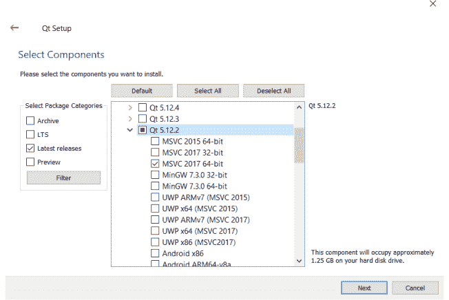

图 65. 安装 Qt，也会安装 Qt Designer。

如果你想安装 *Qt Creator*，它在“Developer and Designer Tools”下。相当令人困惑的是，*Qt Designer* 不在这里。

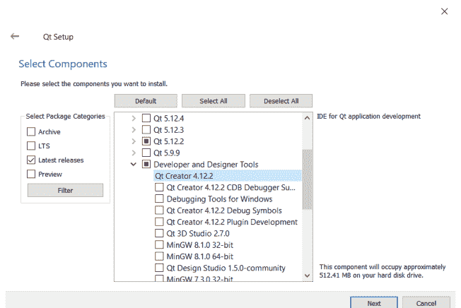

*图 66. 安装 Qt Creator 组件。*

### macOS

macOS Qt 安装程序中没有提到 *Qt Designer*，但当你安装任何版本的 Qt 核心库时，它会自动安装。从 Qt 网站下载安装程序——你可以选择开源版本。

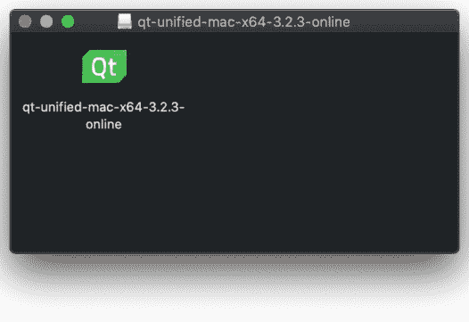

*图 67. 在下载的 .dmg 文件中，你会找到安装程序。*

打开安装程序开始安装。继续到它要求你选择要安装的组件的地方。在最新版本的 Qt 下选择 *macOS* 包。


*图 68. 你只需要最新版本下的 macOS 包。*

安装完成后，打开你安装 Qt 的文件夹。*Designer* 的启动器位于 `<version>/clang_64/bin` 下。你会注意到 *Qt Creator* 也安装在 Qt 安装文件夹的根目录中。


*图 69. 你可以在 `<version>/clang_64/bin` 文件夹下找到 Designer 启动器。*

你可以从 *Designer* 所在的位置运行它，或者将其移动到你的 Applications 文件夹中，以便可以从 macOS Launchpad 启动。

### Linux (Ubuntu & Debian)

你可以使用以下命令从命令行安装 *Qt Designer*。*Qt Designer* 在 `qttools5-dev-tools` 包中。

```bash
sudo apt-get install qttools5-dev-tools
```

安装后，*Qt Designer* 将在启动器中可用。

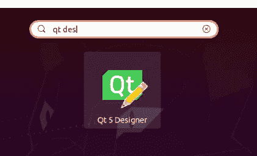

*图 70. Ubuntu 启动器中的 Qt Designer。*

#### 14. Qt Designer 入门

在本章中，我们将快速浏览使用 *Qt Designer* 设计 UI 并将该 UI 导出以在你的 PySide2 应用程序中使用。我们在这里只涉及 *Qt Designer* 功能的皮毛，但一旦你掌握了基础知识，就可以随意进行更详细的实验。

打开 *Qt Designer*，你将看到主窗口。设计器通过左侧的选项卡提供。但是，要激活它，你首先需要开始创建一个 `.ui` 文件。

### Qt Designer

*Qt Designer* 启动时会显示 *New Form* 对话框。在这里，你可以选择你正在构建的界面类型——这决定了你将构建界面的基础小部件。如果你正在启动一个应用程序，那么 *Main Window* 通常是正确的选择。但是，你也可以为对话框和自定义复合小部件创建 `.ui` 文件。

> Form 是赋予 UI 布局的技术名称，因为许多 UI 类似于带有各种输入框的纸质表格。

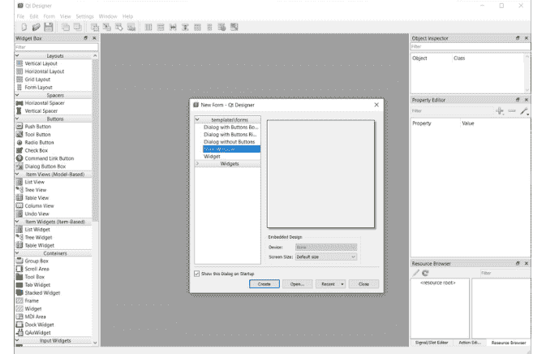

图 71. Qt Designer 界面

如果你点击 *Create*，那么将创建一个新的 UI，其中包含一个空的小部件。你现在可以开始设计你的应用程序了。

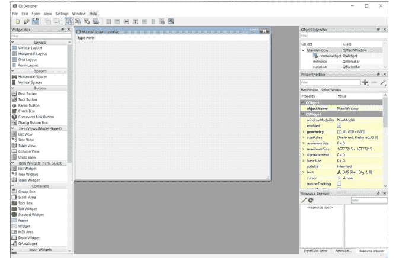

图 72. Qt Designer 编辑器界面，带有一个空的 `QMainWindow` 小部件。

### Qt Creator

如果你安装了 *Qt Creator*，界面和过程会略有不同。左侧有一个类似选项卡的界面，你可以从应用程序的各种组件中进行选择。其中之一是 *Design*，它在主面板中显示 *Qt Designer*。

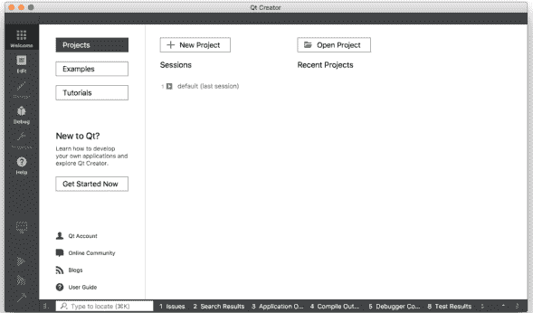

图 73. Qt Creator 界面，左侧选中了 Design 部分。Qt Designer 界面与嵌套的 Designer 相同。

> Qt Designer 的所有功能在 Qt Creator 中都可用，但用户界面的某些方面有所不同。

要创建 .ui 文件，请转到 File → New File or Project... 在出现的窗口中，在左侧的 Files and Classes 下选择 Qt，然后在右侧选择 Qt Designer Form。你会注意到图标上有“ui”，显示你正在创建的文件类型。


图 74. 创建新的 Qt .ui 文件。

在下一步中，你将被要求选择要创建的 UI 类型。对于大多数应用程序，*Main Window* 是正确的选择。但是，你也可以为其他对话框创建 `.ui` 文件，或使用 `QWidget`（列为“Widget”）构建自定义小部件。

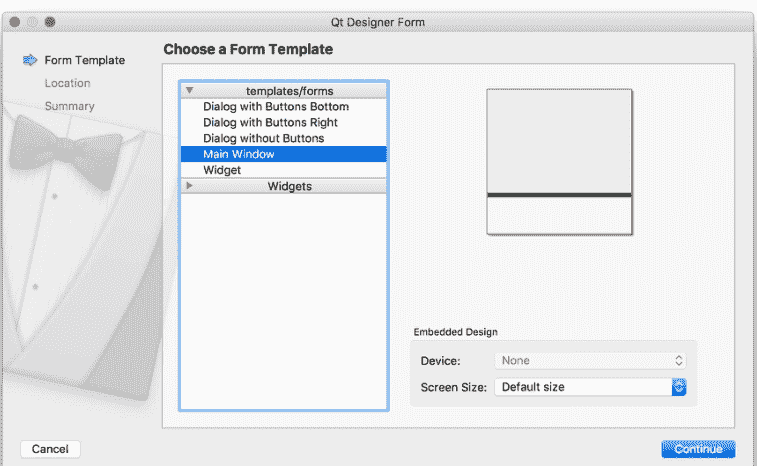

图 75. 选择要创建的小部件类型，对于大多数应用程序，这将是 Main Window。

接下来，为你的文件选择一个文件名和保存文件夹。将你的 `.ui` 文件保存为与你将要创建的类相同的名称，只是为了使后续命令更简单。

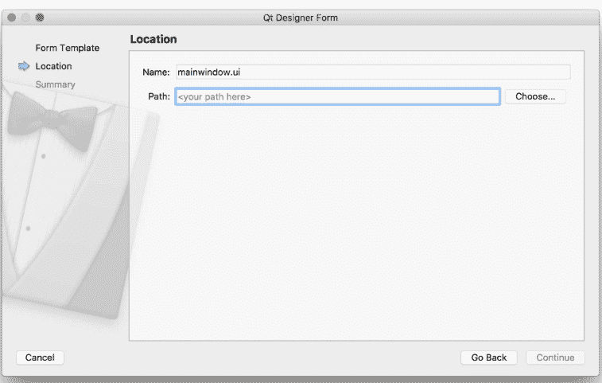

图 76. 为你的文件选择保存名称和文件夹。

最后，如果你使用版本控制系统，你可以选择将文件添加到其中。随意跳过此步骤——它不会影响你的 UI。

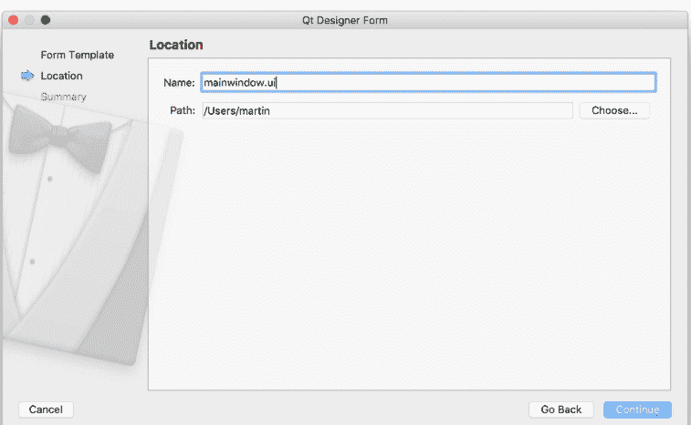

图 77. 可选地将文件添加到你的版本控制中，例如 Git。

### 布局你的主窗口

你将在 UI 设计器中看到你新创建的主窗口。一开始没有太多可看的，只是一个代表窗口的灰色工作区，以及窗口菜单栏的开头。


图 78. 创建的主窗口的初始视图。

你可以通过点击窗口并拖动每个角上的蓝色手柄来调整窗口大小。


图 79. 主窗口调整为 300 x 300 像素。

构建应用程序的第一步是向窗口添加一些小部件。在我们的第一个应用程序中，我们了解到要为 QMainWindow 设置中心小部件，我们需要使用 `.setCentralWidget()`。我们还看到，要使用布局添加多个小部件，我们需要一个中间 `QWidget` 来应用布局，而不是直接将布局添加到窗口。

*Qt Designer* 会自动为你处理这一点，尽管它对此并不是特别明显。

要使用布局向主窗口添加多个小部件，首先将你的小部件拖到 `QMainWindow` 上。在这里，我们拖动了一个 `QLabel` 和一个 `QPushButton`，你将它们放在哪里并不重要。


*图 80. 添加了 1 个标签和 1 个按钮的主窗口。*

我们通过将它们拖到窗口上创建了 2 个小部件，这使它们成为该窗口的子部件。我们现在可以应用布局了。

在右侧面板中找到 `QMainWindow`（它应该在最顶部）。在它下面，你会看到 *centralwidget*，代表窗口的中心小部件。中心小部件的图标显示了当前应用的布局。最初，它有一个红色的圆圈叉号，表示没有活动的布局。右键单击 `QMainWindow` 对象，并在出现的下拉菜单中找到“Layout”。

### 在Python中加载.ui文件

要加载UI文件，你可以使用PySide2提供的`QUiLoader`。

清单68. designer/example_1.py

```python
import sys

from PySide2 import QtWidgets
from PySide2.QtUiTools import QUiLoader

loader = QUiLoader()

app = QtWidgets.QApplication(sys.argv)
window = loader.load("mainwindow.ui", None)
window.show()
app.exec_()
```

由于`loader.load()`方法返回的是一个实例对象，你无法直接附加自定义的`__init__()`代码。不过，你可以通过一个自定义的设置函数来处理这个问题，如下所示。

清单69. designer/example_2.py

```python
import sys

from PySide2 import QtWidgets
from PySide2.QtUiTools import QUiLoader

loader = QUiLoader()

def mainwindow_setup(w):
    w.setWindowTitle("MainWindow Title")

app = QtWidgets.QApplication(sys.argv)
window = loader.load("mainwindow.ui", None)
mainwindow_setup(window)
window.show()
app.exec_()
```

另一种方法是创建一个包装类，并在其中加载UI。主窗口本身存储为`self.ui`——你可以安全地将信号从它连接到包装类的方法上。

清单70. designer/example_3.py

```python
import sys

from PySide2 import QtCore, QtWidgets
from PySide2.QtUiTools import QUiLoader

loader = QUiLoader()

class MainUI(QtCore.QObject):  # Not a widget.
    def __init__(self):
        super().__init__()
        self.ui = loader.load("mainwindow.ui", None)
        self.ui.setWindowTitle("MainWindow Title")
        self.ui.show()

app = QtWidgets.QApplication(sys.argv)
ui = MainUI()
app.exec_()
```

### 将.ui文件转换为Python

要生成Python输出文件，我们可以使用PySide2命令行工具`pyside2-uic`。我们运行它，传入`.ui`文件的文件名和输出的目标文件，并使用`-o`参数。以下命令将生成一个名为`MainWindow.py`的Python文件，其中包含我们创建的UI。我在文件名中使用驼峰命名法，以提醒自己这是一个PySide2类文件。

```
pyside2-uic mainwindow.ui -o MainWindow.py
```

你可以在编辑器中打开生成的`MainWindow.py`文件查看，但你*不应该*编辑这个文件——如果你这样做了，当你从*Qt Designer*重新生成UI时，任何更改都会丢失。使用*Qt Designer*的强大之处在于能够随时编辑和更新你的应用程序。

### 构建你的应用程序

导入生成的Python文件与导入任何其他文件一样。你可以按如下方式导入你的类。`pyside2-uic`工具会在*Qt Designer*中定义的对象名称前添加`Ui_`前缀，这正是你需要导入的对象。

```
from MainWindow import Ui_MainWindow
```

要在你的应用程序中创建主窗口，像往常一样创建一个类，但同时继承`QMainWindow`和你导入的`Ui_MainWindow`类。最后，在`__init__`中调用`self.setupUi(self)`以触发界面的设置。

```python
class MainWindow(QMainWindow, Ui_MainWindow):
    def __init__(self, *args, obj=None, **kwargs):
        super(MainWindow, self).__init__(*args, **kwargs)
        self.setupUi(self)
```

就这样。你的窗口现在已经完全设置好了。

### 添加应用程序逻辑

你可以像与代码创建的控件交互一样，与通过*Qt Designer*创建的控件进行交互。为了简化操作，`pyside2-uic`会将所有控件添加到窗口对象中。

> 对象使用的名称可以通过*Qt Designer*找到。只需在编辑器窗口中单击它，然后在属性面板中查找objectName。

在下面的示例中，我们使用生成的主窗口类来构建一个可工作的应用程序。

清单71. designer/compiled_example.py

```python
import random
import sys

from PySide2.QtCore import Qt
from PySide2.QtWidgets import QApplication, QMainWindow

from MainWindow import Ui_MainWindow

class MainWindow(QMainWindow, Ui_MainWindow):
    def __init__(self):
        super().__init__()
        self.setupUi(self)
        self.show()

        # You can still override values from your UI file within your code,
        # but if possible, set them in Qt Creator. See the properties panel.
        f = self.label.font()
        f.setPointSize(25)
        self.label.setAlignment(Qt.AlignHCenter | Qt.AlignVCenter)
        self.label.setFont(f)

        # Signals from UI widgets can be connected as normal.
        self.pushButton.pressed.connect(self.update_label)

    def update_label(self):
        n = random.randint(1, 6)
        self.label.setText("%d" % n)

app = QApplication(sys.argv)
w = MainWindow()
app.exec_()
```

请注意，由于我们没有在Qt Designer的.ui定义中设置字体大小和对齐方式，我们必须用代码手动设置。你可以像以前一样，用这种方式更改任何控件参数。然而，通常最好在*Qt Designer*本身中配置这些内容。

你可以通过窗口右下角的属性面板设置任何控件属性。大多数控件属性都在这里暴露出来，例如，下面我们正在更新`QLabel`控件的字体大小——

*图84. 为QLabel设置字体大小。*

你也可以配置对齐方式。对于复合属性（你可以设置多个值，例如左对齐+居中），它们是嵌套的。

*图85. 详细的字体属性。*

所有对象属性都可以从这两个地方编辑——由你决定是在代码中还是在*Qt Designer*中进行特定修改。作为一般规则，将*动态*更改保留在代码中，而将基础或默认状态保留在设计的UI中是有意义的。

本介绍仅触及了*Qt Designer*功能的皮毛。我强烈建议你深入挖掘并尝试——记住，你之后仍然可以从代码中添加或调整控件。

### 美学

如果你不是设计师，可能很难创建*美观*的界面，甚至不知道它们是什么。幸运的是，有一些简单的规则可以遵循，以创建即使不*美观*至少也不会*丑陋*的界面。关键概念是——对齐、分组和间距。

**对齐**是为了减少视觉噪音。将控件的角视为*对齐点*，并旨在最小化UI中*唯一*对齐点的数量。在实践中，这意味着确保界面中元素的边缘彼此*对齐*。

*图86. 对齐对界面清晰度的影响。*

> 如果你有不同大小的输入，请对齐你阅读*起始*的边缘。英语是从左到右的语言，所以如果你的应用是英语，请对齐左侧。

**分组**相关的控件可以获得上下文，使其更容易*理解*。构建你的界面，使相关的事物被放在一起。

**间距**是在界面中创建视觉上不同区域的关键——如果没有组之间的间距，就没有组！保持间距一致且有意义。

## 15. Qt 资源系统

构建应用程序不仅仅是编写代码。通常，你的界面需要为操作添加图标，可能还需要添加插图或品牌标志，或者你的应用程序可能需要加载数据文件来预填充控件。这些*数据文件*与应用程序的源代码是分开的，但最终需要与源代码一起打包和分发，应用程序才能正常工作。

将数据文件与应用程序一起分发是导致问题的常见原因。如果你通过路径引用数据文件，除非目标计算机上存在完全相同的路径，否则你的应用程序将无法正常工作。在为跨平台（Windows、macOS 和 Linux）打包应用程序时，这可能会变得更加棘手。幸运的是，Qt 的*资源系统*可以解决这个问题。

由于我们使用 Qt 构建 GUI，我们可以利用 Qt 资源系统来打包、识别和加载应用程序中的资源。资源被*打包*到 Python 文件中，这些文件可以与你的源代码一起分发，从而保证它们在其他平台上也能继续工作。你可以通过 Qt Designer（或 Qt Creator）管理 Qt 资源，并使用资源库为你的应用程序添加图标（和其他图形）。

#### QRC 文件

Qt 资源系统的核心是*资源文件*或 QRC。`.qrc` 文件是一个简单的 XML 文件，可以在任何文本编辑器中打开。

> 你也可以使用 Qt Designer 创建 QRC 文件并添加和删除资源，我们将在后面介绍。

#### 简单的 QRC 示例

下面显示了一个非常简单的资源文件，其中包含一个资源（一个我们可能添加到按钮上的单个图标 `animal-penguin.png`）。

```xml
<!DOCTYPE RCC>
<RCC version="1.0">
    <qresource prefix="icons">
        <file alias="animal-penguin.png">animal-penguin.png</file>
    </qresource>
</RCC>
```

`<file>` `</file>` 标签之间的名称是相对于资源文件的文件路径。`alias` 是此资源在应用程序内部被识别的名称。你可以使用它来*重命名*图标，使其在应用程序中更合乎逻辑或更简单，同时在外部保持原始名称。

例如，如果我们想在内部使用名称 `penguin.png`，我们可以将这一行更改为：

```xml
<file alias="penguin.png">animal-penguin.png</file>
```

> 这只会更改*应用程序内部*使用的名称，文件名保持不变。

在此标签之外是 `qresource` 标签，它指定了一个 `prefix`。这是一个*命名空间*，可用于将资源分组在一起。这实际上是一个虚拟文件夹，所有嵌套的资源都可以在其中找到。

### 使用 QRC 文件

要在应用程序中使用 `.qrc` 文件，你首先需要将其编译为 Python。PySide2 附带了一个命令行工具来完成此操作，该工具以 `.qrc` 文件作为输入，并输出一个包含编译数据的 Python 文件。然后，可以像导入任何其他 Python 文件或模块一样将其导入到你的应用程序中。

要将我们的 `resources.qrc` 文件编译为名为 `resources.py` 的 Python 文件，我们可以使用 —

```bash
pyside2-rcc resources.qrc -o resources.py
```

要在我们的应用程序中使用资源文件，我们需要进行一些小的更改。首先，我们需要在应用程序顶部 `import resources`，以将资源加载到 Qt 资源系统中；其次，我们需要将图标文件的路径更新为使用资源路径格式，如下所示：

```
:/icons/penguin.png
```

前缀 `:/` 表示这是一个*资源路径*。第一个名称 "icons" 是*前缀*命名空间，文件名取自文件*别名*，两者都在我们的 `resources.qrc` 文件中定义。

更新后的应用程序如下所示。

清单 72. /designer/qresource.py

```python
import sys

from PySide2 import QtGui, QtWidgets

import resources  # Import the compiled resource file.

class MainWindow(QtWidgets.QMainWindow):
    def __init__(self):
        super().__init__()

        self.setWindowTitle("Hello World")
        b = QtWidgets.QPushButton("My button")

        icon = QtGui.QIcon(":/icons/penguin.png")
        b.setIcon(icon)
        self.setCentralWidget(b)

        self.show()

app = QtWidgets.QApplication(sys.argv)
w = MainWindow()
app.exec_()
```

### 在 Qt Designer 和 Qt Creator 中使用资源

虽然直接编辑 QRC 文件来管理资源相当简单，但也可以使用 **Qt Designer** 来编辑资源库。这允许你直观地查看所有图标（和其他数据），重新排列它们，并通过拖放进行编辑。如果你在 **Qt Designer** 中构建应用程序 UI，你也可以直接从资源文件中选择图标，通过浏览和选择它们。UI 文件将保留对资源文件的引用，资源将自动加载。

### 在 Qt Designer 中添加资源

如果你使用的是独立的 Qt Designer，资源浏览器作为一个可停用的控件可用，默认情况下在右下角可见。如果资源浏览器被隐藏，你可以通过工具栏上的“视图”菜单显示它。

要添加、编辑和删除资源文件，请单击资源浏览器面板中的铅笔图标。这将打开资源编辑器。

在资源编辑器视图中，你可以通过单击左下角的文档文件夹图标（中间图标）来打开现有的资源文件。

图 89. 在 Qt Designer 中编辑资源

在左侧面板中，你还可以从 UI 中创建和删除资源文件。而在右侧，你可以创建新的前缀、将文件添加到前缀以及删除项目。对资源文件的更改会自动保存。

### 在 Qt Creator 中添加资源

为了能够使用 Qt 资源系统从 Qt Creator 中添加图标，你需要有一个活动的 Qt 项目，并将你的 UI 和资源文件都添加到其中。

> 如果你没有设置 Qt Creator 项目，你可以在现有的源文件夹中创建一个。Qt Creator 会在覆盖任何文件之前提示你。单击“+ 新建”，选择“Qt for Python - 空”作为项目类型。选择你的源文件夹**上方**的文件夹作为“创建位置”，并提供你的源文件夹名称作为项目名称。你可以删除创建的任何文件，但 `.pyproject` 除外，它保存项目设置。

图 90. 选择位置

要将资源添加到现有项目，请在左侧面板上选择“编辑”视图。你将在左侧面板中看到一个文件树浏览器。右键单击文件夹并选择“添加现有文件...”，然后将现有的 `.qrc` 文件添加到项目中。

图 91. 编辑视图，显示已添加的文件

> 当你在这里添加/删除内容时，UI 不会更新，这似乎是 Qt Creator 中的一个错误。如果你关闭并重新打开 Qt Creator，文件将会在那里。

将 QRC 文件添加到文件列表后，你应该能够像展开文件夹一样展开该文件，并浏览其中的资源。你也可以使用此界面添加和删除资源。

### 在 Qt Creator 和 Qt Designer 中使用资源

加载资源文件后，你将能够从设计器属性中访问它。下面的截图显示了设计器打开了我们的计数器应用程序，并选择了 *increment* 按钮。可以通过单击小的黑色向下箭头并选择“选择资源...”来选择按钮的图标。

图 92. 选择位置

出现的资源选择器窗口允许你从项目中的资源文件中选择图标，以在 UI 中使用。

图 93. 选择位置

以这种方式从资源文件中选择图标可确保它们始终有效，只要你编译资源文件并将其与应用程序一起打包。

### 在编译的 UI 文件中使用 QRC 文件

如果你在 Qt Designer 中设计 UI 并将生成的 UI 文件编译为 Python，那么 UI 编译器会自动为你添加对*编译后*版本的 Qt 资源文件的导入。例如，如果你运行以下命令 —

```bash
pyside2-uic mainwindow.ui -o MainWindow.py
```

此构建过程还会在 `MainWindow.py` 中添加对 UI 中使用的资源的编译版本的导入，在我们的例子中是 `resources.qrc`。这意味着你不需要单独将资源导入到应用程序中。但是，我们仍然需要构建它们，并使用 `MainWindow.py` 中用于导入的特定名称，这里是 `resources_rc`。

pyside2-rcc resources.qrc -o resources_rc.py

> pyside2-uic 在为资源文件添加导入时，遵循 `<资源名>_rc.py` 的命名模式，因此在自行编译资源时也需要遵循此规则。如果遇到问题，可以检查编译后的 UI 文件（例如 `MainWindow.py`）以确认导入名称。

### 何时使用 QResource？

你可能想知道何时（甚至*是否*）应该使用 QResource 系统。

这种方法的主要优点是，分发时你的数据文件可以保证跨平台工作。当然，缺点是每次添加或删除新资源时，都需要重新编译资源。这种权衡对你的项目是否值得，取决于你自己的判断，但如果你计划将应用程序分发给其他人，那么几乎总是值得的。

## 主题

开箱即用的 Qt 应用程序看起来*具有平台原生风格*。也就是说，它们会呈现出运行所在操作系统的*外观和感觉*。这意味着它们在任何系统上都显得很自然，用户使用起来也很顺手。但这也可能意味着它们看起来有点*单调*。值得庆幸的是，Qt 让你能够完全控制应用程序中控件的外观。

无论你是希望你的应用程序脱颖而出，还是正在设计自定义控件并希望它们融入系统，本章都将解释如何在 PySide2 中实现这一点。

## 16. 样式

样式是 Qt 用于对应用程序进行广泛外观和感觉更改的方式，它会修改控件的显示和行为方式。Qt 在给定平台上运行你的应用程序时会自动应用特定于平台的样式——这就是为什么你的应用程序在 macOS 上运行时看起来像 macOS 应用程序，在 Windows 上运行时看起来像 Windows 应用程序。这些特定于平台的样式利用了主机平台上的原生控件，这意味着它们不能在其他平台上使用。

然而，平台样式并不是你为应用程序设置样式的唯一选择。Qt 还附带了一个名为 *Fusion* 的跨平台样式，它为你的应用程序提供了一致的、跨平台的、现代的外观。

### Fusion

Qt 的 Fusion 样式为你提供了在所有系统上保持 UI 一致性的优势，代价是与操作系统标准的一致性有所降低。哪个更重要取决于你需要对正在创建的 UI 有多少控制权，你在多大程度上自定义它，以及你使用哪些控件。

> Fusion 样式是一种平台无关的样式，提供面向桌面的外观和感觉。它实现了与 Qt Widgets 的 Fusion 样式相同的设计语言。
>
> — Qt 文档

要启用该样式，请在 `QApplication` 实例上调用 `.setStyle()`，并将样式名称（在本例中为 *Fusion*）作为字符串传入。

```python
app = QApplication(sys.argv)
app.setStyle('Fusion')
#...
app.exec_()
```

下面展示了之前的小部件列表示例，但应用了 Fusion 样式。


> 在 [Qt 文档](https://doc.qt.io/qt-5/qapplication.html#setStyle) 中有更多应用了 Fusion 样式的小部件示例。

### 第三方样式

除了 Qt 提供的 Fusion 样式外，还有第三方样式可用。这些样式都是基于对基础 Fusion 样式的修改。例如 —

- [Qt Modern](https://github.com/nicedoc/qtmodern) 提供了一种*无边框*窗口样式，以及深色模式调色板和自定义窗口装饰，以提供类似现代 macOS 的外观。


图 95. "Qt Modern" 样式：调色板与窗口装饰。

## 17. 调色板

Qt 中用于绘制用户界面的颜色选择被称为*调色板*。应用程序级别和控件特定的调色板都通过 `QPalette` 对象进行管理。调色板可以在应用程序和控件级别进行设置，允许你设置全局标准调色板，并可以按控件进行覆盖。全局调色板通常由 Qt 主题定义（主题本身通常依赖于操作系统），但你可以覆盖它以更改整个应用程序的外观。

活动的全局调色板可以通过 `QApplication.palette()` 访问，或者通过创建一个新的*空* `QPalette` 实例来访问。例如 —

```python
from PySide2.QtGui import QPalette
palette = QPalette()
```

你可以通过调用 `palette.setColor(role, color)` 来修改调色板，其中 *role* 决定了颜色的用途，`QColor` 是要使用的颜色。使用的颜色可以是自定义的 `QColor` 对象，也可以是 Qt 命名空间中的内置基本颜色之一。

```python
palette.setColor(QPalette.Window, QColor(53,53,53))
palette.setColor(QPalette.WindowText, Qt.white)
```

> 在 Windows 10 和 macOS 特定平台主题上使用调色板时存在一些限制。

有相当多不同的*角色*。主要角色如下表所示 —

*表 4. 主要角色*

| 常量 | 值 | 描述 |
| :--- | :--- | :--- |
| `QPalette.Window` | 10 | 窗口的背景色。 |
| `QPalette.WindowText` | 0 | 窗口的默认文本颜色。 |
| `QPalette.Base` | 9 | 文本输入控件、组合框下拉列表和工具栏手柄的背景。*通常是白色或浅色* |
| `QPalette.AlternateBase` | 16 | 用于条纹（交替）行的第二种 `Base` 颜色——例如 `QAbstractItemView.setAlternatingRowColors()` |
| `QPalette.ToolTipBase` | 18 | `QToolTip` 和 `QWhatsThis` 悬停指示器的背景色。这两个提示都使用 `Inactive` 组（见后文），因为它们不是活动窗口。 |
| `QPalette.ToolTipText` | 19 | `QToolTip` 和 `QWhatsThis` 的前景色。这两个提示都使用 `Inactive` 组（见后文），因为它们不是活动窗口。 |
| `QPalette.PlaceholderText` | 20 | 控件中占位符文本的颜色。 |
| `QPalette.Text` | 6 | 使用 `Base` 背景着色的控件的文本颜色。必须与 Window 和 Base 都提供良好的对比度。 |
| `QPalette.Button` | 1 | 默认按钮背景色。这可以与 `Window` 不同，但必须与 `ButtonText` 提供良好的对比度。 |
| `QPalette.ButtonText` | 8 | 按钮上使用的文本颜色，必须与 `Button` 颜色形成对比。 |
| `QPalette.BrightText` | 7 | 与 `WindowText` 非常不同的文本颜色，与黑色形成良好对比。用于其他 `Text` 和 `WindowText` 颜色对比度较差的情况。注意：不仅用于文本。 |

> 你不一定需要在自定义调色板中修改或设置所有这些角色，具体取决于你应用程序中使用的控件，有些可以省略。

还有一些较小的角色集，用于控件上的 3D 斜角效果以及突出显示选中的条目或链接。

*表 5. 3D 斜角角色*

| 常量 | 值 | 描述 |
| :--- | :--- | :--- |
| `QPalette.Light` | 2 | 比 `Button` 颜色更浅。 |
| `QPalette.Midlight` | 3 | 介于 `Button` 和 `Light` 之间。 |
| `QPalette.Dark` | 4 | 比 `Button` 颜色更深。 |
| `QPalette.Mid` | 5 | 介于 `Button` 和 `Dark` 之间。 |
| `QPalette.Shadow` | 11 | 一种非常深的颜色。默认情况下，阴影颜色是 `Qt.black`。 |

*表 6. 高亮与链接*

| 常量 | 值 | 描述 |
| :--- | :--- | :--- |
| `QPalette.Highlight` | 12 | 用于指示选中项或当前项的颜色。默认情况下，高亮颜色是 `Qt.darkBlue`。 |
| `QPalette.HighlightedText` | 13 | 与 Highlight 形成对比的文本颜色。默认情况下，高亮文本是 `Qt.white`。 |
| `QPalette.Link` | 14 | 用于未访问超链接的文本颜色。默认情况下，链接颜色是 `Qt.blue`。 |
| `QPalette.LinkVisited` | 15 | 用于已访问超链接的文本颜色。默认情况下，已访问链接的颜色是 `Qt.magenta`。 |

> 从技术上讲，还有一个 `QPalette.NoRole` 值，用于控件绘制状态中未分配角色的情况，在创建调色板时可以忽略它。

对于控件在活动、非活动或禁用状态下发生变化的 UI 部分，你必须为每种状态设置颜色。为此，你可以调用 `palette.setColor(group, role, color)` 并传递额外的 *group* 参数。可用的组如下所示 —

| 常量 | 值 |
| :--- | :--- |
| `QPalette.Disabled` | 1 |
| `QPalette.Active` | 0 |
| `QPalette.Inactive` | 2 |
| `QPalette.Normal` *Active 的同义词* | 0 |

例如，以下代码将在调色板中将禁用窗口的 `WindowText` 颜色设置为*白色*。

```python
palette.setColor(QPalette.Disabled, QPalette.WindowText, Qt.white)
```

一旦定义了调色板，你就可以使用 `.setPalette()` 将其设置到 `QApplication` 对象上以应用到你的应用程序，或者设置到单个控件上。例如，以下示例将更改窗口文本和背景的颜色（这里使用 `QLabel` 添加文本）。

### 清单 73. themes/palette_test.py

```python
from PySide2.QtWidgets import QApplication, QLabel
from PySide2.QtGui import QPalette, QColor
from PySide2.QtCore import Qt

import sys

app = QApplication(sys.argv)
palette = QPalette()
palette.setColor(QPalette.Window, QColor(0, 128, 255))
palette.setColor(QPalette.WindowText, Qt.white)
app.setPalette(palette)

w = QLabel("Palette Test")
w.show()

app.exec_()
```

运行后，将产生以下输出。窗口的背景变为浅蓝色，窗口文本为白色。


图 96. 更改窗口和窗口文本颜色。

为了展示调色板的实际应用并了解其一些局限性，我们现在将创建一个使用自定义深色调色板的应用程序。

> 使用此调色板，无论你的应用程序处于何种深色模式状态，所有部件都将使用深色背景绘制。有关使用系统深色模式的内容，请参见下文。

虽然通常应避免覆盖用户设置，但在某些类型的应用程序中，例如照片查看器或视频编辑器，这样做是有意义的，因为明亮的界面会干扰用户对颜色的判断。以下应用程序骨架使用了 Jürgen Skrotzky 的自定义调色板，为应用程序提供全局深色主题。

```python
from PySide2.QtWidgets import QApplication, QMainWindow
from PySide2.QtGui import QPalette, QColor
from PySide2.QtCore import Qt

import sys

darkPalette = QPalette()
darkPalette.setColor(QPalette.Window, QColor(53, 53, 53))
darkPalette.setColor(QPalette.WindowText, Qt.white)
darkPalette.setColor(QPalette.Disabled, QPalette.WindowText, QColor(127, 127, 127))
darkPalette.setColor(QPalette.Base, QColor(42, 42, 42))
darkPalette.setColor(QPalette.AlternateBase, QColor(66, 66, 66))
darkPalette.setColor(QPalette.ToolTipBase, Qt.white)
darkPalette.setColor(QPalette.ToolTipText, Qt.white)
darkPalette.setColor(QPalette.Text, Qt.white)
darkPalette.setColor(QPalette.Disabled, QPalette.Text, QColor(127, 127, 127))
darkPalette.setColor(QPalette.Dark, QColor(35, 35, 35))
darkPalette.setColor(QPalette.Shadow, QColor(20, 20, 20))
darkPalette.setColor(QPalette.Button, QColor(53, 53, 53))
darkPalette.setColor(QPalette.ButtonText, Qt.white)
darkPalette.setColor(QPalette.Disabled, QPalette.ButtonText, QColor(127, 127, 127))
darkPalette.setColor(QPalette.BrightText, Qt.red)
darkPalette.setColor(QPalette.Link, QColor(42, 130, 218))
darkPalette.setColor(QPalette.Highlight, QColor(42, 130, 218))
darkPalette.setColor(QPalette.Disabled, QPalette.Highlight, QColor(80, 80, 80))
darkPalette.setColor(QPalette.HighlightedText, Qt.white)
darkPalette.setColor(QPalette.Disabled, QPalette.HighlightedText, QColor(127, 127, 127))

app = QApplication(sys.argv)
app.setPalette(darkPalette)

w = QMainWindow()  # 替换为你的 QMainWindow 实例。
w.show()

app.exec_()
```

与之前一样，一旦构建了调色板，就必须应用它才能生效。这里我们通过调用 `app.setPalette()` 将其应用于整个应用程序。一旦应用，所有部件都将采用该主题。你可以使用此骨架来构建你自己的应用程序。

在本书的代码示例中，你还可以找到 `themes/palette_dark_widgets.py`，它使用此调色板重现了部件演示。每个平台上的结果如下所示。


图 97. 不同平台和主题上的自定义深色调色板

你会注意到，当使用默认的 Windows 和 macOS 主题时，某些部件的颜色没有正确应用。这是因为这些主题利用了平台原生控件以提供真正的原生体验。如果你想在 Windows 10 上使用深色或高度自定义的主题，建议在这些平台上使用 *Fusion* 样式。

### 深色模式

随着人们在屏幕上花费的时间越来越多，深色模式正变得流行。较深主题的操作系统和应用程序有助于最大限度地减少眼睛疲劳，并在晚上工作时减少睡眠干扰。

Windows、macOS 和 Linux 都提供对深色模式主题的支持，好消息是，如果你使用 PySide2 构建应用程序，你将免费获得深色模式支持。但是，在早期版本的 PySide2 中，支持并不完整。请记住在所有目标平台上启用和禁用深色模式来测试你的应用程序。

> 为分发构建 macOS 包时，你需要在你的应用程序中将 `NSRequiresAquaSystemAppearance` 设置为 `False`，以便捆绑的 `.app` 能够遵循深色模式——这将在打包章节中介绍。

### 颜色

你的操作系统有一个标准主题，大多数软件都会遵循。Qt 会自动获取此配色方案，并将其应用于你的 PySide2 应用程序，以帮助它们融入环境。使用这些颜色有一些优势——

1.  你的应用程序在用户的桌面上会显得很自然。
2.  你的用户熟悉上下文颜色的含义。
3.  已经有人花时间设计了有效的颜色。

如果你想替换配色方案，请确保收益大于成本。

有时你的应用程序可能需要额外的上下文颜色或对高亮进行调整。对于数据可视化，一个很好的资源是 *Cynthia Brewer* 的 [Color Brewer](https://colorbrewer2.org/)，它提供了定性和定量方案。如果你只需要几种颜色，[coolors.co](https://coolors.co/) 可以让你生成自定义的、搭配良好的 4 色主题。


*图 98. 来自 coolors.co 的示例配色方案*

简单有效地使用颜色，尽可能限制你的调色板。如果特定颜色在某处有含义，请在*所有地方*使用相同的含义。避免使用多种色调，除非这些色调有含义。

#### ✔ 应该做

-   首先考虑在你的应用程序中使用 GUI 标准颜色。
-   使用自定义颜色时，定义一个配色方案并坚持使用。
-   选择颜色和对比度时，考虑色盲用户。
-   在可能的情况下，不要仅使用颜色来显示某些内容。考虑同时使用边框、填充图案等。

#### ✖ 不应该做

-   将标准颜色用于非标准目的，例如 红色 = 确定。

## 18. 图标

图标是用于辅助用户界面内导航或理解的小图片。它们通常出现在按钮上，与文本并列或替代文本，或与菜单中的操作并列。通过使用易于识别的指示器，你可以使你的界面更易于使用。

在 PySide2 中，你有多种不同的选项来获取图标并将其集成到你的应用程序中。在本节中，我们将探讨这些选项及其各自的优缺点。

### Qt 标准图标

向应用程序添加简单图标的最简单方法是使用 Qt 本身附带的内置图标。这小组图标涵盖了多种标准用例，从文件操作、前进和后退箭头到消息框指示器。

完整的内置图标列表如下所示。


图 99. Qt 内置图标

你会注意到这组图标有点*局限*。如果这对你要构建的应用程序不是问题，或者如果你的应用程序只需要几个图标，这可能仍然是一个可行的选择。

可以通过当前应用程序样式使用 `QStyle.standardIcon(name)` 或 `QStyle.<constant>` 来访问这些图标。完整的内置图标名称表如下所示。

| SP_ArrowBack | SP_DirIcon | SP_MediaSkipBackward |
| SP_ArrowDown | SP_DirLinkIcon | SP_MediaSkipForward |
| SP_ArrowForward | SP_DirOpenIcon | SP_MediaStop |
| SP_ArrowLeft | SP_DockWidgetCloseButton | SP_MediaVolume |
| SP_ArrowRight | SP_DriveCDIcon | SP_MediaVolumeMuted |
| SP_ArrowUp | SP_DriveDVDIcon | SP_MessageBoxCritical |
| SP_BrowserReload | SP_DriveFDIcon | SP_MessageBoxInformation |
| SP_BrowserStop | SP_DriveHDIcon | SP_MessageBoxQuestion |
| SP_CommandLink | SP_DriveNetIcon | SP_MessageBoxWarning |
| SP_ComputerIcon | SP_FileDialogBack | SP_TitleBarCloseButton |
| SP_CustomBase | SP_FileDialogContentsView | SP_TitleBarContextHelpButton |
| SP_DesktopIcon | SP_FileDialogDetailedView | SP_TitleBarMaxButton |
| SP_DialogApplyButton | SP_FileDialogEnd | SP_TitleBarMenuButton |
| SP_DialogCancelButton | SP_FileDialogInfoView | SP_TitleBarMinButton |
| SP_DialogCloseButton | SP_FileDialogListView | SP_TitleBarNormalButton |
| SP_DialogDiscardButton | SP_FileDialogNewFolder | SP_TitleBarShadeButton |
| SP_DialogHelpButton | SP_FileDialogStart | SP_TitleBarUnshadeButton |
| SP_DialogNoButton | SP_FileDialogToParent | SP_ToolBarHorizontalExtensionButton |
| SP_DialogOkButton | SP_FileIcon | SP_ToolBarVerticalExtensionButton |
| SP_DialogResetButton | SP_FileLinkIcon | SP_TrashIcon |
| SP_DialogSaveButton | SP_MediaPause | SP_VistaShield |
| SP_DialogYesButton | SP_MediaPlay | SP_DirClosedIcon |
| SP_MediaSeekBackward | SP_DirHomeIcon | SP_MediaSeekForward |

你可以通过 QStyle 命名空间直接访问这些图标，如下所示。

```python
icon = QStyle.standardIcon(QStyle.SP_MessageBoxCritical)
button.setIcon(icon)
```

你也可以使用来自特定部件的样式对象。使用哪种方式并不重要，因为我们只是访问内置图标。

如果你在标准图标集中找不到需要的图标，就需要使用下面概述的其他方法之一。

> 虽然你*可以*混合使用来自不同图标集的图标，但最好在整个应用中使用单一风格，以保持应用的连贯性。

### 图标文件

如果标准图标不符合你的需求，或者你需要的图标不可用，你可以使用任何自定义图标。图标可以是你的平台上Qt支持的任何图像类型，尽管对于大多数用例，PNG或SVG图像是更优的选择。

> 要获取你所在平台支持的图像格式列表，可以调用 `QtGui.QImageReader.supportedImageFormats()`。

### 图标集

如果你不是平面设计师，使用众多可用的图标集之一将为你节省大量时间（和麻烦）。网上有成千上万的图标集，根据其在开源或商业软件中的使用情况，许可协议各不相同。

在本书和示例应用中，我使用了 [Fugue](https://p.yusukekamiyamane.com/) 图标集，它也可以在你的软件中免费使用，只需注明作者。Tango图标集是一个为Linux开发的大型图标集，没有许可要求，可以在任何平台上使用。

| 资源 | 描述 | 许可 |
| :--- | :--- | :--- |
| [Fugue by p.yusukekamiyamane](http://p.yusukekamiyamane.com/) | 3,570 个 16x16 PNG 格式图标 | CC BY 3.0 |
| [Diagona by p.yusukekamiyamane](http://p.yusukekamiyamane.com/) | 400 个 16x16 和 10x10 PNG 格式图标 | CC BY 3.0 |
| [Tango Icons by The Tango Desktop Project](http://tango.freedesktop.org/) | 使用 Tango 项目色彩主题的图标。 | 公共领域 |

虽然你可以控制菜单和工具栏中使用的图标大小，但在大多数情况下，你应该保持其原样。菜单的标准图标大小为20x20像素。

比这更小的尺寸也可以，图标会居中显示而不是被放大。

### 创建你自己的图标

如果你不喜欢任何可用的图标集，或者希望你的应用程序具有独特的外观，你当然可以设计自己的图标。图标可以使用任何标准图形软件创建，并保存为具有透明背景的PNG图像。图标应该是正方形的，并且分辨率足够高，以便在你的应用程序中使用时无需放大或缩小。

### 使用图标文件

一旦你有了图标文件——无论是来自图标集还是自己绘制的——都可以通过创建 `QtGui.QIcon` 实例并在其中直接传入图标文件名，来在你的Qt应用程序中使用它们。

```
QtGui.QIcon("<filename>")
```

虽然你可以使用绝对路径（完整路径）和相对路径（部分路径）来指向你的文件，但在分发应用程序时，绝对路径容易出错。只要图标文件相对于你的脚本存储在相同的位置，相对路径就可以工作，尽管在打包时这可能也难以管理。如果你在应用程序中使用许多图标，或者将要分发你的应用程序，你可能需要使用 [Qt资源系统](https://doc.qt.io/qt-5/resources.html)。

> 为了创建图标实例，你必须已经创建了一个 `QApplication` 实例。为确保这一点，你可以在源文件的顶部创建你的应用实例，或者在使用它们的控件或窗口的 `__init__` 方法中创建你的 `QIcon` 实例。

### Free Desktop 规范图标（Linux）

在Linux桌面上，有一个叫做 *Free Desktop 规范* 的东西，它为特定操作的图标定义了标准名称。

如果你的应用程序使用这些特定的图标名称（并从“主题”加载图标），那么在Linux上，你的应用程序将使用桌面上当前启用的图标集。这里的目标是确保所有应用程序具有相同的外观和感觉，同时保持可配置性。

要在Qt Designer中使用这些图标，你需要选择下拉菜单并选择“从主题设置图标...”


然后输入你想要使用的图标的**名称**，例如 `document-new`（参见[有效名称的完整列表](https://specifications.freedesktop.org/icon-naming-spec/latest/)）。


图 101. 选择图标主题

在代码中，你可以使用 `icon = QtGui.QIcon.fromTheme("document-new")` 从活动的Linux桌面主题获取图标。以下代码片段生成一个带有“新建文档”图标的小窗口（按钮），该图标来自活动主题。

清单 74. icons/linux.py

```
from PySide2.QtWidgets import QApplication, QPushButton
from PySide2.QtGui import QIcon

import sys

app = QApplication(sys.argv)
button = QPushButton("Hello")
icon = QIcon.fromTheme("document-new")
button.setIcon(icon)
button.show()

app.exec_()
```

生成的窗口在Ubuntu上使用默认图标主题时将如下所示。


图 102. Linux Free Desktop 规范 "document-new" 图标

如果你正在开发跨平台应用程序，你仍然可以在Linux上使用这些标准图标。为此，请为Windows和macOS使用你自己的图标，并在Qt Designer中创建一个自定义主题，使用Free Desktop规范名称作为图标。

## 19. Qt 样式表 (QSS)

到目前为止，我们已经了解了如何使用 `QPalette` 为你的PySide2应用应用自定义颜色。然而，在Qt5中，你还可以对控件的外观进行许多其他自定义。提供此自定义功能的系统称为Qt样式表（QSS）。

QSS在概念上与用于设置网页样式的层叠样式表（CSS）非常相似，共享类似的语法和方法。在本节中，我们将看一些QSS示例以及如何使用它来修改控件外观。

> 在控件上使用QSS会对性能产生轻微影响，因为在重绘控件时需要查找相应的规则。然而，除非你进行非常繁重的控件工作，否则这不太可能产生影响。

### 样式编辑器

为了使尝试QSS规则更容易一些，我们可以创建一个简单的演示应用，允许输入规则并将其应用于一些示例控件。我们将用它来测试各种样式属性和规则。

> 样式查看器的源代码如下所示，但它也包含在本书的源代码中。

清单 75. themes/qss_tester.py

```
import sys

from PySide2.QtCore import Qt
from PySide2.QtGui import QColor, QPalette
from PySide2.QtWidgets import (
    QApplication,
    QCheckBox,
    QComboBox,
    QLabel,
    QLineEdit,
    QMainWindow,
    QPlainTextEdit,
    QPushButton,
    QSpinBox,
    QVBoxLayout,
    QWidget,
)

class MainWindow(QMainWindow):
    def __init__(self):
        super().__init__()

        self.setWindowTitle("QSS Tester")

        self.editor = QPlainTextEdit()
        self.editor.textChanged.connect(self.update_styles)

        layout = QVBoxLayout()
        layout.addWidget(self.editor)

        # Define a set of simple widgets.
        cb = QCheckBox("Checkbox")
        layout.addWidget(cb)

        combo = QComboBox()
        combo.setObjectName("thecombo")
        combo.addItems(["First", "Second", "Third", "Fourth"])
        layout.addWidget(combo)

        sb = QSpinBox()
        sb.setRange(0, 99999)
        layout.addWidget(sb)

        l = QLabel("This is a label")
        layout.addWidget(l)

        le = QLineEdit()
        le.setObjectName("mylineedit")
        layout.addWidget(le)

        pb = QPushButton("Push me!")
        layout.addWidget(pb)

        self.container = QWidget()
        self.container.setLayout(layout)

        self.setCentralWidget(self.container)

    def update_styles(self):
        qss = self.editor.toPlainText()
        self.setStyleSheet(qss)

app = QApplication(sys.argv)
app.setStyle("Fusion")

w = MainWindow()
w.show()

app.exec_()
```

运行此应用，你将看到以下窗口，顶部有一个文本编辑器（你可以在其中输入QSS规则），以及一组将应用这些规则的控件——我们稍后将了解应用规则和继承的工作原理。


*图 103. QSS测试器应用，未应用规则。*

尝试在顶部的框中输入以下样式规则，并将结果与屏幕截图进行比较以确保其正常工作。

### 样式属性

接下来，我们将介绍可用于通过 QSS 为控件设置样式的属性。这些属性已按逻辑部分划分，将相互关联的属性归为一类，以便于理解。你可以使用我们刚刚创建的 QSS 规则测试器应用，在各种控件上测试这些样式。

下表中使用的类型如下所列。其中一些是复合类型，由其他条目组成。

> 你现在可以跳过此表，但需要将其作为参考，以解释每个属性的有效值。

| 属性 | 类型 | 描述 |
| :--- | :--- | :--- |
| Alignment | top \| bottom \| left \| right \| center | 水平和/或垂直对齐方式。 |
| Attachment | scroll \| fixed | 滚动或固定附着方式。 |
| Background | Brush \| Url \| Repeat \| Alignment | Brush、Url、Repeat 和 Alignment 的复合类型。 |
| Boolean | 0 \| 1 | 真 (1) 或假 (0)。 |
| Border | Border Style \| Length \| Brush | 简写的边框属性。 |
| Border Image | none \| Url Number (stretch \| repeat) | 由九部分组成的图像（左上、上中、右上、左中、中心、右中、左下、下中、右下）。 |
| Border Style | dashed \| dot-dash \| dot-dot-dash \| dotted \| double \| groove \| inset \| outset \| ridge \| solid \| none | 用于绘制边框的图案。 |
| Box Colors | Brush | 最多四个 Brush 值，分别指定盒子的上、右、下、左边缘。如果省略左侧颜色，则使用右侧颜色；如果省略底部颜色，则使用顶部颜色。 |
| Box Lengths | Length | 最多四个 Length 值，分别指定盒子的上、右、下、左边缘。如果省略左侧长度，则使用右侧长度；如果省略底部长度，则使用顶部长度。 |
| Brush | Color \| Gradient \| PaletteRole | 一个 Color、Gradient 或 Palette 中的条目。 |
| Color | rgb(r,g,b) \| rgba(r,g,b,a) \| hsv(h,s,v) \| hsva(h,s,v,a) \| hsl(h,s,l) \| hsla(h,s,l,a) \| #rrggbb \| Color Name | 指定颜色为 RGB（红、绿、蓝）、RGBA（红、绿、蓝、透明度）、HSV（色调、饱和度、明度）、HSVA（色调、饱和度、明度、透明度）、HSL（色调、饱和度、亮度）、HSLA（色调、饱和度、亮度、透明度）或命名颜色。rgb() 或 rgba() 语法可以使用 0 到 255 之间的整数值，或使用百分比。 |
| Font | (Font Style \| Font Weight) Font Size | 简写的字体属性。 |
| Font Size | Length | 字体的大小。 |
| Font Style | normal \| italic \| oblique | 字体的样式。 |
| Font Weight | normal \| bold \| 100 \| 200... \| 900 | 字体的粗细。 |
| Gradient | qlineargradient \| qradialgradient \| qconicalgradient | 起点和终点之间的线性渐变。焦点和围绕它的圆上的终点之间的径向渐变。围绕中心点的锥形渐变。语法请参阅 [QLinearGradient 文档](https://doc.qt.io/qt-6/qlineargradient.html)。 |
| Icon | Url(disabled \| active \| normal \| selected) (on \| off) | 一个 url、QIcon.Mode 和 QIcon.State 的列表。例如 `file-icon: url(file.png), url(file_selected.png) selected;` |
| Length | Number(px \| pt \| em \| ex) | 一个数字后跟一个度量单位。如果未指定单位，在大多数上下文中使用像素。px：像素，pt：磅的大小（即 1/72 英寸），em：字体的 em 宽度（即 'M' 的宽度），ex：字体的 ex 宽度（即 'x' 的高度） |
| Number | 十进制整数或实数 | 例如 123 或 12.2312 |
| Origin | margin \| border \| padding \| content | 更多详情请参阅盒模型。 |
| PaletteRole | alternate-base \| base \| bright-text \| button \| button-text \| dark \| highlight \| highlighted-text \| light \| link \| link-visited \| mid \| midlight \| shadow \| text \| window \| window-text | 这些值对应于控件 QPalette 中的颜色角色，例如 `color: palette(dark);` |
| Radius | Length | 一个或两个 Length 值。 |
| Repeat | repeat-x \| repeat-y \| repeat \| no-repeat | repeat-x：水平重复。repeat-y：垂直重复。repeat：水平和垂直重复。no-repeat：不重复。 |
| Url | url(filename) | filename 是磁盘上的文件名或使用 Qt 资源系统存储的文件名。 |

这些属性和类型的完整详细信息也可在 [QSS 参考文档](https://doc.qt.io/qt-5/stylesheet-reference.html)中找到。

### 文本样式

我们将从文本属性开始，这些属性可用于修改文本的字体、颜色和样式（粗体、斜体、下划线）。它们可以应用于任何控件或部件。

| 属性 | 类型（默认值） | 描述 |
| :--- | :--- | :--- |
| color | Brush (QPalette Foreground) | 用于渲染文本的颜色。 |
| `font` | Font | 设置文本字体的简写表示法。等同于指定 font-family、font-size、font-style 和/或 font-weight |
| `font-family` | String | 字体族。 |
| `font-size` | Font Size | 字体大小。在此版本的 Qt 中，仅支持 pt 和 px 度量。 |
| `font-style` | normal \| italic \| oblique | 字体样式。 |
| `font-weight` | Font Weight | 字体的粗细。 |
| `selection-background-color` | Brush (`QPalette::Highlight`) | 选中文本或项目的背景色。 |
| `selection-color` | Brush (`Palette::HighlightedText`) | 选中文本或项目的前景色。 |
| `text-align` | Alignment | 控件内容中文本和图标的对齐方式。 |
| `text-decoration` | none \| underline \| overline \| line-through | 附加的文本效果 |

下面的示例代码片段，将 `QLineEdit` 的颜色设置为*红色*，选中文本的背景色设置为*黄色*，选中文本的颜色设置为*蓝色*。

```
QLineEdit {
    color: red;
    selection-color: blue;
    selection-background-color: yellow;
}
```

在 QSS 测试器中尝试此操作，以查看对 QLineEdit 的影响，它将产生以下结果。请注意，只有目标控件（QLineEdit）受到样式的影响。


图 107. 将文本样式应用于 QLineEdit

我们可以通过将两种不同类型的控件都作为目标（用逗号分隔）来将此规则应用于它们。

```
QSpinBox, QLineEdit {
    color: red;
    selection-color: blue;
    selection-background-color: yellow;
}
```


图 108. 将文本样式应用于 QLineEdit 和 QSpinBox

在最后一个示例中，我们将样式应用于 `QSpinBox`、`QLineEdit` 和 `QPushButton`，将字体设置为粗体和斜体，并将 text-align 设置为**右对齐**。

```
QSpinBox, QLineEdit, QPushButton {
    color: red;
    selection-color: blue;
    selection-background-color: yellow;
    font-style: italic;
    font-weight: bold;
    text-align: right;
}
```

这会产生如下所示的结果。请注意，`text-align` 属性并未影响 `QSpinBox` 或 `QLineEdit` 的对齐方式。对于这两个控件，必须使用 `.setAlignment()` 方法而不是样式来设置对齐方式。

### 背景

除了设置文本样式，您还可以设置控件的背景，包括纯色和图片。对于图片，有多个额外属性用于定义图片在控件区域内的重复和定位方式。

| 属性 | 类型（默认值） | 描述 |
| :--- | :--- | :--- |
| `background` | Background | 设置背景的简写表示法。等同于指定 background-color、background-image、background-repeat 和/或 background-position。另请参阅 background-origin、selection-background-color、background-clip、background-attachment 和 alternate-background-color。 |
| `background-color` | Brush | 控件使用的背景颜色。 |
| `background-image` | Url | 控件使用的背景图片。图片的半透明部分会让背景颜色透出来。 |
| `background-repeat` | Repeat (both) | 背景图片是否以及如何重复以填充 background-origin 矩形。 |
| `background-position` | Alignment (top-left) | 背景图片在 background-origin 矩形内的对齐方式。 |
| `background-clip` | Origin (border) | 绘制背景的控件矩形区域。 |
| `background-origin` | Origin (padding) | 控件的背景矩形区域，与 background-position 和 background-image 配合使用。 |

以下示例将在我们用于输入规则的 `QPlainTextEdit` 的背景上应用指定的图片。

```
QPlainTextEdit {
    color: white;
    background-image: url(../otje.jpg);
}
```

图片使用 `url()` 语法引用，传入文件路径。这里我们使用 `../otje.jpg` 指向父目录中的文件。您也可以使用资源路径语法，例如 `url(:/images/<imagename>.png)` 来从当前加载的资源中选择图片。

> 虽然此语法与 CSS 中使用的语法相同，但无法通过 URL 加载远程文件。

要定位背景在控件中的位置，可以使用 `background-position` 属性。这定义了图片的哪个点将与控件*原始矩形*的*同一点*对齐。默认情况下，*原始矩形*是控件的内边距区域。

因此，`center`、`center` 的位置意味着图片的中心将与控件的中心沿两个轴对齐。

```
QPlainTextEdit {
    color: white;
    background-image: url(../otje.jpg);
    background-position: center center;
}
```

要将图片的右下角与控件*原始矩形*的右下角对齐，您应该使用：

```
QPlainTextEdit {
    color: white;
    background-image: url(../otje.jpg);
    background-position: bottom right;
}
```

*原始矩形*可以使用 `background-origin` 属性进行修改。它接受 `margin`、`border`、`padding` 或 `content` 之一的值，这些值定义了特定的框作为背景位置对齐的参考。

要理解这意味着什么，我们需要看一下控件的盒模型。

### 控件盒模型

术语*盒模型*描述了围绕每个控件的*框*（矩形）之间的关系，以及这些框对控件之间大小或布局的影响。每个 Qt 控件都被四个同心框包围——从内到外，它们是内容、内边距、边框和外边距。

增加内部框的大小会增加外部框的大小。这种安排意味着，例如，增加控件的*内边距*会在内容和边框之间增加空间，同时增加边框本身的尺寸。

可用于修改各种框的属性如下。

| 属性 | 类型（默认值） | 描述 |
| :--- | :--- | :--- |
| `border` | Border | 设置控件边框的简写表示法。等同于指定 border-color、border-style 和/或 border-width。还有 `border-top`、`border-right`、`border-bottom` 和 `border-left`。 |
| `border-color` | Box Colors (QPalette Foreground) | 所有边框边缘的颜色。还有 `border-top-color`、`border-right-color`、`border-bottom-color`、`border-left-color` 用于特定边缘。 |
| `border-image` | Border Image | 用于填充边框的图片。图片被切成九部分，并在必要时适当拉伸。 |
| `border-radius` | Radius | 边框角的半径（曲线）。还有 `border-top-left-radius`、`border-top-right-radius`、`border-bottom-right-radius` 和 `border-bottom-left-radius` 用于特定角。 |
| `border-style` | Border Style (none) | 所有边框边缘的样式。还有 `border-top-style`、`border-right-style`、`border-bottom-style` 和 `border-left-style` 用于特定边缘。 |
| `border-width` | Box Lengths | 边框的宽度。还有 `border-top-width`、`border-right-width`、`border-bottom-width` 和 `border-left-width`。 |
| `margin` | Box Lengths | 控件的外边距。还有 `margin-top`、`margin-right`、`margin-bottom` 和 `margin-left`。 |
| `outline` | | 围绕对象边框绘制的轮廓。 |
| `outline-color` | Color | 轮廓的颜色。另请参阅 `border-color`。 |
| `outline-offset` | Length | 轮廓相对于控件边框的偏移量。 |
| `outline-style` | | 指定用于绘制轮廓的图案。另请参阅 `border-style`。 |
| `outline-radius` | | 为轮廓添加圆角。还有 `outline-bottom-left-radius`、`outline-bottom-right-radius`、`outline-top-left-radius` 和 `outline-top-right-radius`。 |
| `padding` | Box Lengths | 控件的内边距。还有 `padding-top`、`padding-right`、`padding-bottom` 和 `padding-left`。 |

以下示例修改了 QPlainTextEdit 控件的外边距、边框和内边距。

```
QPlainTextEdit {
    margin: 10;
    padding: 10px;
    border: 5px solid red;
}
```

### 关于单位的说明

在此示例中，我们对*内边距*和*边框*使用 `px` 或*像素*单位。*外边距*的值也以像素为单位，因为这是未指定时的默认单位。您也可以使用以下单位之一 —

- `px` 像素
- `pt` 一点的大小（即 1/72 英寸）
- `em` 字体的 *em* 宽度（即 'M' 的宽度）
- `ex` 字体的 *ex* 宽度（即 'x' 的高度）

在 QSS 测试器中查看结果，您可以看到红色边框*内部*的内边距和红色边框*外部*的外边距。

您还可以为轮廓添加*半径*以添加弯曲边缘。

```
QPlainTextEdit {
    margin: 10;
    padding: 10px;
    border: 5px solid red;
    border-radius: 15px;
}
```

### 调整控件大小

可以使用 QSS 控制控件的大小。但是，虽然有特定的 `width` 和 `height` 属性（见后文），但它们仅用于指定子控件的大小。要控制控件，您必须改用 `max-` 和 `min-` 属性。

| 属性 | 类型（默认值） | 描述 |
| :--- | :--- | :--- |
| `max-height` | Length | 控件或子控件的最大高度。 |
| `max-width` | Length | 控件或子控件的最大宽度。 |
| `min-height` | Length | 控件或子控件的最小高度。 |

| 属性 | 类型（默认值） | 描述 |
| :--- | :--- | :--- |
| `min-width` | 长度 | 控件或其子控件的最小宽度。 |

如果你提供的 `min-height` 属性值大于控件*通常*的高度，那么控件将会被放大。

```
QLineEdit {
    min-height: 50;
}
```


图 117. 为 QLineEdit 设置 min-height 以放大它。

然而，当设置 `min-height` 时，控件当然可以比这个值更大。要为控件指定一个精确的尺寸，你可以为该维度同时指定 `min-` 和 `max-` 值。

```
QLineEdit {
    min-height: 50;
    max-height: 50;
}
```

这将锁定控件的高度，防止其因内容变化而调整大小。

> 小心使用此方法，因为它可能导致控件内容无法显示！

### 控件特定样式

我们目前看到的样式是通用的，可以用于大多数控件。然而，还有一些控件特定的属性可以设置。

| 属性 | 类型（默认值） | 描述 |
| :--- | :--- | :--- |
| `alternate-background-color` | 画刷 (`QPalette::AlternateBase`) | `QAbstractItemView` 子类中使用的交替背景色。 |
| `background-attachment` | 附件 (`scroll`) | 确定 `QAbstractScrollArea` 中的背景图像是相对于视口滚动还是固定。 |
| `button-layout` | 数字 (`SH_DialogButtonLayout`) | `QDialogButtonBox` 或 `QMessageBox` 中按钮的布局。可能的值有 0 (Win)、1 (Mac)、2 (KDE)、3 (Gnome) 和 5 (Android)。 |
| `dialogbuttonbox-buttons-have-icons` | 布尔值 | `QDialogButtonBox` 中的按钮是否显示图标。如果此属性设置为 1，则 `QDialogButtonBox` 的按钮显示图标；如果设置为 0，则不显示图标。 |
| `gridline-color` | 颜色 (`SH_Table_GridLineColor`) | `QTableView` 中网格线的颜色。 |
| `icon` | Url+ | 控件图标。目前唯一支持此属性的控件是 QPushButton。 |
| `icon-size` | 长度 | 控件中图标的宽度和高度。 |
| `lineedit-password-character` | 数字 (SH_LineEdit_PasswordCharacter) | QLineEdit 密码字符的 Unicode 编号。 |
| `lineedit-password-mask-delay` | 数字 (SH_LineEdit_PasswordMaskDelay) | 应用 `lineedit-password-character` 之前，QLineEdit 密码掩码的延迟时间（毫秒）。 |
| `messagebox-text-interaction-flags` | 数字 (SH_MessageBox_TextInteractionFlags) | 消息框中文本的交互行为（来自 Qt.TextInteractionFlags）。 |
| `opacity` | 数字 (SH_ToolTipLabel_Opacity) | 控件的不透明度（仅限工具提示），范围 0-255。 |
| `paint-alternating-row-colors-for-empty-area` | 布尔值 | QTreeView 是否在数据末尾之后绘制交替行颜色。 |
| `show-decoration-selected` | 布尔值 (SH_ItemView_ShowDecorationSelected) | 控制 QListView 中的选择是覆盖整行还是仅覆盖文本范围。 |
| `titlebar-show-tooltips-on-buttons` | 布尔值 | 窗口标题栏按钮上是否显示工具提示。 |
| `widget-animation-duration` | 数字 | 动画应持续的时间（毫秒）。 |

这些属性仅适用于描述中指定的控件（或其子类）。

### 目标定位

我们已经看到一系列不同的 QSS 属性，并根据控件类型应用了它们。但是，如何定位单个控件，Qt 又如何决定将哪些规则应用于哪些控件以及何时应用呢？接下来，我们将探讨定位 QSS 规则的其他选项以及继承的影响。

| 类型 | 示例 | 描述 |
| :--- | :--- | :--- |
| 通用 | `*` | 匹配所有控件。 |
| 类型 | `QPushButton` | QPushButton 或其子类的实例。 |
| 属性 | `QPushButton[flat="false"]` | 非扁平的 QPushButton 实例。可以与任何支持 `.toString()` 的属性进行比较。也可以使用 `class="classname"`。 |
| 属性包含 | `QPushButton[property~="something"]` | 属性（QString 列表）不包含给定值的 QPushButton 实例。 |
| 类 | `.QPushButton` | QPushButton 的实例，但不包括子类。 |
| ID | `QPushButton#okButton` | 对象名称为 okButton 的 QPushButton 实例。 |
| 后代 | `QDialog QPushButton` | 是 QDialog 后代（子控件、孙控件等）的 QPushButton 实例。 |
| 子控件 | `QDialog > QPushButton` | 是 QDialog *直接*子控件的 QPushButton 实例。 |

现在我们将依次查看每种目标定位规则，并使用我们的 QSS 测试器进行尝试。

#### 类型

我们已经在 QSS 测试器中看到了*类型定位*的实际应用。在这里，我们针对各个控件的类型名称应用规则，例如 `QComboBox` 或 `QLineEdit`。


*图 118. 针对 QComboBox 的定位不会影响其他无关类型。*

然而，以这种方式定位类型*也会*定位该类型的任何子类。因此，例如，我们可以针对 `QAbstractButton` 来定位任何从它派生的类型。

```
QAbstractButton {
    background: orange;
}
```


图 119. 针对 QAbstractButton 会影响所有子类

这种行为意味着*所有*控件都可以使用 `QWidget` 来定位。例如，以下代码将所有控件的背景设置为*红色*。

```
QWidget {
    background: red;
}
```


图 120. 通过父类进行 QSS 选择。

#### 类 .

然而，有时你*只想*定位特定类的控件，而不包括任何子类。为此，你可以使用*类定位*——在类型名称前加上一个 `.`。

以下代码定位 `QWidget` 的实例，但*不包括*任何从 `QWidget` 派生的类。在我们的 QSS 测试器中，我们唯一的 `QWidget` 是用于容纳布局的中央控件。因此，以下代码将把*那个*容器控件的背景变为橙色。

```
css
.QWidget {
    background: orange;
}
```


图 121. 特定类的定位不会影响子类

#### ID 定位 #

所有 Qt 控件都有一个*对象名称*，用于唯一标识它们。在 Qt Designer 中创建控件时，你使用对象名称来指定该对象在父窗口上可用的名称。然而，这种关系只是为了方便——你可以在自己的代码中为控件设置任何你想要的*对象名称*。这些名称随后可用于将 QSS 规则直接定位到特定控件。

在我们的 QSS 测试器应用中，我们为 `QComboBox` 和 `QLineEdit` 设置了 ID 以进行测试。

```
python
combo.setObjectName('thecombo')
le.setObjectName('mylineedit')
```

#### 属性 [property="<value>"]

你可以通过任何可作为字符串访问的控件属性（或其值具有 `.toString()` 方法）来定位控件。这可用于在控件上定义一些相当复杂的状态。

以下是一个通过文本标签定位 `QPushButton` 的简单示例。

```
QPushButton[text="Push me!"] {
    background: red;
}
```


图 122. 通过标签文本定位 QPushButton

> 通常，通过可见文本定位控件是一个*非常糟糕的主意*，因为当你尝试翻译应用程序或更改标签时，它会引入错误。

规则在样式表首次设置时应用于控件，并且不会响应属性的变化。如果 QSS 规则针对的属性被修改，你必须触发样式表重新计算才能使其生效——例如，通过重新设置样式表。

#### 后代

要定位给定类型控件的后代，你可以将控件链接在一起。以下示例定位任何作为 `QMainWindow` 子控件的 `QComboBox`——无论是直接子控件，还是嵌套在其他控件或布局中。

### 子元素选择器

你还可以使用 `>` 选择器来定位作为另一个控件*直接*子元素的控件。这只会匹配确切存在该层级关系的情况。

例如，以下代码将*仅*定位作为 `QMainWindow` 直接子元素的 `QWidget` 容器。

```css
QMainWindow > QWidget {
    background: green;
}
```

但以下代码将不会匹配任何内容，因为在我们的 QSS 应用程序中，`QComboBox` 控件*不是* `QMainWindow` 的直接子元素。

```css
QMainWindow > QComboBox { /* 匹配不到任何内容 */
    background: yellow;
}
```

### 继承

样式表可以应用于 `QApplication` 和控件，并将应用于该样式化的控件及其所有子控件。控件的有效样式表由其所有祖先（父级、祖父级……一直到窗口）的样式表以及 `QApplication` 本身的样式表组合而成。

规则按*特异性*顺序应用。这意味着，通过 ID 定位特定控件的规则，将覆盖定位*所有*该类型控件的规则。例如，以下代码将把我们的 QSS 测试器应用程序中的 `QLineEdit` 背景设置为蓝色——特定的 ID 覆盖了通用的控件规则。

```css
QLineEdit#mylineedit {
    background: blue;
}

QLineEdit {
    background: red;
}
```

在存在两条冲突规则的情况下，控件自身的样式表将优先于继承的样式，而较近的祖先将优先于较远的祖先——例如，父级将优先于祖父级。

### 不继承的属性

控件仅受专门针对它们的规则影响。虽然规则可以*设置*在父控件上，但它们仍然必须引用目标控件才能影响它。考虑以下规则——

```css
QLineEdit {
    background: red;
}
```

如果设置在 `QMainWindow` 上，该窗口中的所有 `QLineEdit` 对象都将具有红色背景（假设没有其他规则）。但是，如果设置了以下内容...

```css
QMainWindow {
    background: red;
}
```

...则只有 `QMainWindow` 本身会被设置为红色背景。背景颜色*本身*不会传播到子控件。

> 然而，如果子控件具有透明背景，红色*会*显示出来。

除非被匹配的规则专门定位，否则控件将对每个属性使用其默认的系统样式值。控件不会从父控件继承样式属性，即使在复合控件内部也是如此，并且控件必须被规则直接定位才能受到它们的影响。

> 这与 CSS 不同，在 CSS 中，元素可以从其父元素继承值。

### 伪选择器

到目前为止，我们已经了解了静态样式，使用属性来改变控件的默认外观。然而，QSS 还允许你根据控件的动态状态进行样式设置。一个例子是当鼠标悬停在按钮上时看到的高亮显示——高亮有助于指示控件已获得焦点，如果你点击它，它将会响应。

活动样式有许多其他用途，从可用性（高亮数据行或特定选项卡）到可视化数据层次结构。这些都可以通过 QSS 中的*伪选择器*来实现。伪选择器使 QSS 规则仅在特定情况下应用。

有许多不同的伪选择器可以应用于控件。有些如 `:hover` 是通用的，可以与所有控件一起使用，而另一些则是特定于控件的。完整列表如下——

| 伪状态 | 描述 |
| :--- | :--- |
| `:active` | 控件是活动窗口的一部分。 |
| `:adjoins-item` | `QTreeView` 的 `::branch` 与一个项目相邻。 |
| `:alternate` | 在绘制 `QAbstractItemView` 的行时，为每个交替行设置（`QAbstractItemView.alternatingRowColors()` 为 `True`） |
| `:bottom` | 位于底部，例如选项卡位于底部的 `QTabBar`。 |
| `:checked` | 项目被选中，例如 `QAbstractButton` 的选中状态。 |
| `:closable` | 项目可以关闭，例如启用了 `QDockWidget.DockWidgetClosable` 的 `QDockWidget`。 |
| `:closed` | 项目处于关闭状态，例如 `QTreeView` 中未展开的项目。 |
| `:default` | 项目是默认操作，例如默认的 `QPushButton` 或 `QMenu` 中的默认操作。 |
| `:disabled` | 项目被禁用。 |
| `:editable` | `QComboBox` 是可编辑的。 |
| `:enabled` | 项目被启用。 |
| `:exclusive` | 项目是排他性项目组的一部分，例如排他性 `QActionGroup` 中的菜单项。 |
| `:first` | 项目是列表中的第一个，例如 `QTabBar` 中的第一个选项卡。 |
| `:flat` | 项目是扁平的，例如扁平的 `QPushButton`。 |
| `:floatable` | 项目可以浮动，例如启用了 `QDockWidget.DockWidgetFloatable` 的 `QDockWidget`。 |
| `:focus` | 项目具有输入焦点。 |
| `:has-children` | 项目有子项，例如 `QTreeView` 中具有子项的项目。 |
| `:has-siblings` | 项目有同级项，例如 `QTreeView` 中具有同级项的项目。 |
| `:horizontal` | 项目具有水平方向。 |
| `:hover` | 鼠标悬停在项目上。 |
| `:indeterminate` | 项目处于不确定状态，例如部分选中的 `QCheckBox` 或 `QRadioButton`。 |
| `:last` | 项目是最后一个（在列表中），例如 `QTabBar` 中的最后一个选项卡。 |
| `:left` | 项目位于左侧，例如选项卡位于左侧的 `QTabBar`。 |
| `:maximized` | 项目被最大化，例如最大化的 `QMdiSubWindow`。 |
| `:middle` | 项目位于中间（在列表中），例如 `QTabBar` 中既不在开头也不在结尾的选项卡。 |
| `:minimized` | 项目被最小化，例如最小化的 `QMdiSubWindow`。 |
| `:movable` | 项目可以移动，例如启用了 `QDockWidget.DockWidgetMovable` 的 `QDockWidget`。 |
| `:no-frame` | 项目没有边框，例如无边框的 `QSpinBox` 或 `QLineEdit`。 |
| `:non-exclusive` | 项目是非排他性项目组的一部分，例如非排他性 `QActionGroup` 中的菜单项。 |
| `:off` | 可切换的项目，这适用于处于“关闭”状态的项目。 |
| `:on` | 可切换的项目，这适用于处于“开启”状态的控件。 |
| `:only-one` | 项目是唯一的（在列表中），例如 `QTabBar` 中单独的选项卡。 |
| `:open` | 项目处于打开状态，例如 `QTreeView` 中展开的项目，或具有打开菜单的 `QComboBox` 或 `QPushButton`。 |
| `:next-selected` | 下一个项目被选中，例如 `QTabBar` 中选中的选项卡紧邻此项目。 |
| `:pressed` | 项目正被鼠标按下。 |
| `:previous-selected` | 上一个项目被选中，例如 `QTabBar` 中紧邻选中选项卡的选项卡。 |
| `:read-only` | 项目被标记为只读或不可编辑，例如只读的 `QLineEdit` 或不可编辑的 `QComboBox`。 |
| `:right` | 项目位于右侧，例如选项卡位于右侧的 `QTabBar`。 |
| `:selected` | 项目被选中，例如 `QTabBar` 中选中的选项卡或 `QMenu` 中选中的项目。 |
| `:top` | 项目位于顶部，例如选项卡位于顶部的 `QTabBar`。 |
| `:unchecked` | 项目未被选中。 |
| `:vertical` | 项目具有垂直方向。 |

### 伪状态

| 伪状态 | 描述 |
| :--- | :--- |
| :window | 控件是一个窗口（即顶层控件）。 |

我们可以使用 QSS 测试器来查看伪选择器的实际效果。例如，以下代码会在鼠标悬停在控件上时，将 QPushButton 的背景变为红色。

```
QPushButton:hover {
    background: red;
}
```

以下代码会在所有控件被悬停时改变其背景。

```
*:hover {
    background: red;
}
```

悬停一个控件意味着其所有父控件也处于悬停状态（鼠标在其边界框内），如下图所示。


图 128. 左图，QPushButton 悬停时高亮显示。右图，当一个控件被悬停时，所有父控件也处于悬停状态。

你也可以使用 `!` 来*否定*伪选择器。这意味着当该选择器不活跃时，规则将生效。例如以下代码...

```
QPushButton:!hover {
    background: yellow;
}
```

...会使 QPushButton 在*未被悬停*时变为黄色。

你还可以将多个伪选择器链接在一起。例如，以下代码将在 `QCheckBox` *被选中*且*未被悬停*时将其背景设为绿色，在*被选中*且*被悬停*时设为黄色。

```
QCheckBox:checked:!hover {
    background: green;
}

QCheckBox:checked:hover {
    background: yellow;
}
```


图 129. 用于悬停状态的链接伪选择器。

与所有其他规则一样，你也可以使用 "," 分隔符将它们链接起来，使定义的规则适用于两种（或多种）情况。例如，以下代码将在复选框*被选中*或*被悬停*时将其背景设为绿色。

```
QCheckBox:checked, QCheckBox:hover {
    background: yellow;
}
```

### 设置控件子控件的样式

许多控件是由其他子控件或*控件*组合构建的。QSS 提供了直接寻址这些子控件的语法，因此你可以单独对子控件进行样式更改。这些子控件可以通过使用 ::（双冒号）选择器后跟给定子控件的标识符来寻址。

一个很好的例子是 `QComboBox`。以下样式片段直接应用于组合框右侧的下拉箭头。

```
QComboBox::drop-down {
    background: yellow;
    image: url('puzzle.png')
}
```


图 130. 使用 QSS 设置 QComboBox 下拉框的背景和图标。

QSS 中有相当多的子控件选择器可用，下面列出了它们。你会注意到其中许多仅适用于特定控件（或控件类型）。

| 子控件 | 描述 |
| :--- | :--- |
| ::add-line | QScrollBar 上移动到下一行的按钮。 |
| ::add-page | QScrollBar 上滑块和 add-line 之间的空间。 |
| ::branch | QTreeView 的分支指示器。 |
| ::chunk | QProgressBar 的进度块。 |
| ::close-button | QDockWidget 的关闭按钮或 QTabBar 的标签页。 |
| ::corner | QAbstractScrollArea 中两个滚动条之间的角落。 |
| ::down-arrow | QComboBox、QHeaderView、QScrollBar 或 QSpinBox 的下箭头。 |
| ::down-button | QScrollBar 或 QSpinBox 的下按钮。 |
| ::drop-down | QComboBox 的下拉按钮。 |
| ::float-button | QDockWidget 的浮动按钮。 |
| ::groove | QSlider 的凹槽。 |
| ::indicator | QAbstractItemView、QCheckBox、QRadioButton、可选中的 QMenu 项或可选中的 QGroupBox 的指示器。 |
| ::handle | QScrollBar、QSplitter 或 QSlider 的滑块。 |
| ::icon | QAbstractItemView 或 QMenu 的图标。 |
| ::item | QAbstractItemView、QMenuBar、QMenu 或 QStatusBar 的项目。 |
| ::left-arrow | QScrollBar 的左箭头。 |
| ::left-corner | QTabWidget 的左角，例如控制 QTabWidget 中的左角控件。 |
| ::menu-arrow | 带有菜单的 QToolButton 的箭头。 |
| ::menu-button | QToolButton 的菜单按钮。 |
| ::menu-indicator | QPushButton 的菜单指示器。 |
| ::right-arrow | QMenu 或 QScrollBar 的右箭头。 |
| ::pane | QTabWidget 的窗格（框架）。 |
| ::right-corner | QTabWidget 的右角。例如，此控件可用于控制 QTabWidget 中右角控件的位置。 |
| ::scroller | QMenu 或 QTabBar 的滚动条。 |
| ::section | QHeaderView 的部分。 |
| ::separator | QMenu 或 QMainWindow 中的分隔符。 |
| ::sub-line | QScrollBar 上减去一行的按钮。 |
| ::sub-page | QScrollBar 上滑块（滑块）和 sub-line 之间的区域。 |
| ::tab | QTabBar 或 QToolBox 的标签页。 |
| ::tab-bar | QTabWidget 的标签栏。此子控件仅用于控制 QTabBar 在 QTabWidget 内的位置。要设置标签页的样式，请使用 ::tab 子控件。 |
| ::tear | QTabBar 的撕裂指示器。 |
| ::tearoff | QMenu 的撕裂指示器。 |
| ::text | QAbstractItemView 的文本。 |
| ::title | QGroupBox 或 QDockWidget 的标题。 |
| ::up-arrow | QHeaderView（排序指示器）、QScrollBar 或 QSpinBox 的上箭头。 |
| ::up-button | QSpinBox 的上按钮。 |

以下代码分别将 QSpinBox 的上、下按钮的背景设置为绿色和红色。

```
QSpinBox::up-button {
    background: green;
}

QSpinBox::down-button {
    background: red;
}
```


图 131. 设置 QSpinBox 上、下按钮的背景。

上或下按钮*内部*的箭头也可以单独设置。下面我们使用自定义的加号和减号图标来设置它们——注意我们还需要调整按钮大小以适应。

```
QSpinBox {
    min-height: 50;
}

QSpinBox::up-button {
    width: 50;
}

QSpinBox::up-arrow {
    image: url('plus.png');
}

QSpinBox::down-button {
    width: 50;
}

QSpinBox::down-arrow {
    image: url('minus.png')
}
```


图 132. 设置 QSpinBox 上、下按钮的背景。

### 子控件伪状态

你可以使用伪状态来定位子控件，就像对其他控件一样。为此，只需将伪状态链接在控件之后。例如 —

```
QSpinBox::up-button:hover {
    background: green;
}

QSpinBox::down-button:hover {
    background: red;
}
```


图 133. 将子控件选择器与伪选择器结合使用。

### 定位子控件

使用 QSS，你还可以精确控制子控件在控件内的位置。这允许相对于其正常位置进行*相对*调整，或相对于其父控件进行*绝对*参考调整。我们将在下面介绍这些定位方法。

| 属性 | 类型（默认值） | 描述 |
| :--- | :--- | :--- |
| `position` | relative \| absolute (relative) | 使用 left、right、top 和 bottom 指定的偏移量是相对坐标还是绝对坐标。 |
| `bottom` | 长度 | 如果 position 是 relative（默认值），则将子控件向上移动一定的偏移量；指定 bottom: y 等同于指定 top: -y。如果 position 是 absolute，则 bottom 属性指定子控件底边相对于父控件底边的位置（另请参见 subcontrol-origin）。 |
| `left` | 长度 | 如果 position=relative，则将子控件向右移动给定的偏移量（即指定左侧的额外空间）。如果 position 是 absolute，则指定距离父控件左边缘的距离。 |
| `right` | 长度 | 如果 position=relative，则将子控件向左移动给定的偏移量（即指定右侧的额外空间）。如果 position 是 absolute，则指定距离父控件右边缘的距离。 |

| 属性 | 类型（默认值） | 描述 |
| :--- | :--- | :--- |
| top | 长度 | 如果 position=relative，则将子控件向下移动给定的偏移量（即在顶部指定额外的空间）。如果 position 是 absolute，则指定与父元素顶部边缘的距离。 |

默认情况下，定位是*相对的*。在此模式下，*left*、*right*、*top* 和 *bottom* 属性定义了在相应侧添加的额外间距。这有点令人困惑，意味着 *left* 会将控件向*右*移动。

> 为了帮助你记忆，可以将这些属性理解为“在*左侧*添加空间”等等。

```
QSpinBox {
    min-height: 100;
}

QSpinBox::up-button {
    width: 50;
}

QSpinBox::down-button {
    width: 50;
    left: 5;
}
```


图 134. 使用 left 调整子控件的位置。

当 position 设置为 *absolute* 时，*left*、*right*、*top* 和 *bottom* 属性定义了控件与其父元素相同边缘之间的间距。因此，例如，`top: 5`、`left: 5` 将使控件的顶部和左边缘距离其父元素的顶部和左边缘 5 像素。

```
css
QSpinBox {
    min-height: 100;
}

QSpinBox::up-button {
    width: 50;
}

QSpinBox::down-button {
    position: absolute;
    width: 50;
    right: 25;
}
```

下面你可以看到使用 *absolute* 定位向下按钮的效果，将其放置在距离右侧 25 像素的位置。


图 135. 使用 absolute 调整子控件的位置。

这不是最实用的例子，但它演示了以这种方式定位子控件的一个限制——你无法将子控件定位在其父元素的边界框之外。

### 子控件样式

最后，有许多 QSS 属性专门针对子控件进行样式设置。下面列出了这些属性——请参阅描述以了解受影响的具体控件和部件。

| 属性 | 类型（默认值） | 描述 |
| :--- | :--- | :--- |
| image | Url+ | 在子控件的内容矩形中绘制的图像。在子控件上设置 image 属性会隐式设置子控件的宽度和高度（除非图像是 SVG）。 |
| `image-position` | 对齐方式 | 图像的对齐方式。图像的位置可以使用相对或绝对位置指定。有关说明，请参阅 relative 和 absolute。 |
| `height` | 长度 | 子控件的高度。如果你想要一个具有固定高度的控件，请将 min-height 和 max-height 设置为相同的值。 |
| `spacing` | 长度 | 控件内部的间距。 |
| `subcontrol-origin` | 原点（内边距） | 子控件在父元素内的原点矩形。 |
| `subcontrol-position` | 对齐方式 | 子控件在 subcontrol-origin 指定的原点矩形内的对齐方式。 |
| `width` | 长度 | 子控件的宽度。如果你想要一个具有固定宽度的控件，请将 min-width 和 max-width 设置为相同的值。 |

### 在 Qt Designer 中编辑样式表

到目前为止，我们看到的示例都是通过代码将 QSS 应用于控件。但是，你也可以在 Qt Designer 中为控件设置样式表。

要在 Qt Designer 中为控件设置 QSS 样式表，请右键单击该控件，然后从上下文菜单中选择“更改样式表...”。


图 136. 访问控件的 QSS 编辑器。

这将打开以下窗口，你可以在其中以文本形式输入 QSS 规则，这些规则将应用于此控件（以及任何匹配规则的子控件）。


图 137. Qt Designer 中的 QSS 编辑器。

除了以文本形式输入规则外，Qt Designer 中的 QSS 编辑器还提供了资源查找工具、颜色选择控件和渐变设计器。此工具（如下所示）提供了许多内置渐变，你可以将其添加到规则中，但如果你愿意，也可以定义自己的自定义渐变。


图 138. Qt Designer 中的 QSS 渐变设计器。

渐变使用 QSS 规则定义，因此你可以将它们复制并粘贴到其他地方（包括代码中）以重新使用。

清单 76. 使用 QSS qlineargradient 规则绘制的荷兰国旗。

```
QWidget {
    background: qlineargradient(spread:pad, x1:0, y1:0, x2:0, y2:1, stop:0 rgba(255, 0, 0, 255), stop:0.339795 rgba(255, 0, 0, 255), stop:0.339799 rgba(255, 255, 255, 255), stop:0.662444 rgba(255, 255, 255, 255), stop:0.662469 rgba(0, 0, 255, 255), stop:1 rgba(0, 0, 255, 255))
}
```


图 139. 应用到 Qt Designer 中 QWidget 的“荷兰国旗”QSS 渐变。

## 模型视图架构

> > ...有了恰当的设计，功能就能轻松实现。
> 
> — Dennis Ritchie

当你开始使用 PySide2 构建更复杂的应用程序时，你可能会遇到保持控件与数据同步的问题。

存储在控件中的数据（例如简单的 `QListWidget`）不容易从 Python 中操作——更改需要你获取项目、获取数据，然后将其设置回去。对此的默认解决方案是在 Python 中保持外部数据表示，然后要么同时更新数据和控件，要么直接根据数据重写整个控件。当你开始处理更大的数据时，这种方法可能会开始对应用程序的性能产生影响。

幸运的是，Qt 为此提供了一个解决方案——模型视图。模型视图是标准显示控件的强大替代方案，它使用标准化的模型接口与数据源交互——从简单的数据结构到外部数据库。这隔离了你的数据，意味着你可以将其保持在任何你喜欢的结构中，而视图负责呈现和更新。

本章介绍了 Qt 模型视图架构的关键方面，并使用它在 PySide2 中构建一个简单的桌面待办事项应用程序。

## 20. 模型视图架构 — 模型视图控制器

*模型–视图–控制器*（MVC）是一种用于开发用户界面的架构模式。它将应用程序分为三个相互连接的部分，将数据的内部表示与如何呈现给用户以及如何从用户那里接受数据分离开来。

MVC 模式将接口分为以下组件——

- **模型** 持有应用程序正在使用的数据结构。
- **视图** 是向用户显示的任何信息表示，无论是图形还是表格。允许同一数据的多个视图。
- **控制器** 接受用户的输入，将其转换为命令，并将这些命令应用于模型或视图。

在 Qt 领域，视图和控制器之间的区别有点模糊。Qt 通过操作系统接受用户的输入事件，并将这些事件委托给控件（控制器）处理。然而，控件也处理向用户呈现其自身状态，这使它们完全处于视图中。与其纠结于在哪里划清界限，在 Qt 术语中，视图和控制器被合并在一起，创建了一个模型/视图控制器架构——为简单起见，称为“模型视图”。


模型视图控制器架构

Qt 的模型/视图架构

图 140. 比较 MVC 模型和 Qt 模型/视图架构。

重要的是，*数据*和*如何呈现*之间的区别得以保留。

### 模型视图

模型充当数据存储和视图控制器之间的接口。模型持有数据（或其引用），并通过标准化的 API 呈现这些数据，视图随后使用这些数据并将其呈现给用户。多个视图可以共享相同的数据，以完全不同的方式呈现它。

你可以为模型使用任何“数据存储”，包括例如标准的 Python 列表或字典，或数据库（通过 Qt 本身或 SQLAlchemy）——这完全取决于你。

这两个部分基本上负责——

1. **模型** 存储数据或其引用，并返回单个或范围的记录，以及相关的元数据或*显示*指令。
2. **视图** 从模型请求数据，并在控件上显示返回的内容。

Qt 文档中对 Qt Model/View 架构有很好的介绍。

## 21. 一个简单的 Model View —— 待办事项列表

为了演示如何在实践中使用 ModelView，我们将构建一个非常简单的桌面待办事项列表实现。它将包含一个用于显示事项列表的 `QListView`、一个用于输入新事项的 `QLineEdit`，以及一组用于添加、删除或将事项标记为完成的按钮。

> 💡 本示例的文件位于源代码中。

### 用户界面

这个简单的用户界面是使用 Qt Creator 布局并保存为 `mainwindow.ui` 的。`.ui` 文件包含在本书的下载资源中。


如前所述，`.ui` 文件使用命令行工具转换为 Python 文件。

```
pyside2-uic mainwindow.ui -o MainWindow.py
```

这将生成一个 `MainWindow.py` 文件，其中包含我们在 Qt Designer 中设计的自定义窗口类。它可以在我们的应用程序代码中正常导入——下面是一个用于显示我们界面的基本骨架应用程序。

清单 77. model-views/todo_skeleton.py

```
import sys

from PySide2 import QtCore, QtGui, QtWidgets
from PySide2.QtCore import Qt

from MainWindow import Ui_MainWindow

class MainWindow(QtWidgets.QMainWindow, Ui_MainWindow):
    def __init__(self):
        super().__init__()
        self.setupUi(self)

app = QtWidgets.QApplication(sys.argv)
window = MainWindow()
window.show()
app.exec_()
```

> 🚀 **运行它！** 你会看到窗口出现，尽管目前还没有任何功能。


图 142. 主窗口

界面中的控件被赋予了下表所示的 ID。

| objectName | 类型 | 描述 |
| :--- | :--- | :--- |
| `todoView` | `QListView` | 当前待办事项列表 |
| `todoEdit` | `QLineEdit` | 用于创建新待办事项的文本输入框 |
| `addButton` | `QPushButton` | 创建新的待办事项，将其添加到待办事项列表 |
| `deleteButton` | `QPushButton` | 删除当前选中的待办事项，将其从待办事项列表中移除 |
| `completeButton` | `QPushButton` | 将当前选中的待办事项标记为完成 |

我们将在后面使用这些标识符来连接应用程序逻辑。

### 模型

我们通过继承一个基类实现来定义我们的自定义模型，这使我们能够专注于模型特有的部分。Qt 提供了多种不同的模型基类，包括列表、树和表格（非常适合电子表格）。

在这个例子中，我们将结果显示到一个 `QListView`。与之匹配的基模型是 `QAbstractListModel`。我们模型的概要定义如下所示。

清单 78. model-views/todo_1.py

```
class TodoModel(QtCore.QAbstractListModel):
    def __init__(self, todos=None):
        super().__init__()
        self.todos = todos or []

    def data(self, index, role):
        if role == Qt.DisplayRole:
            status, text = self.todos[index.row()]
            return text

    def rowCount(self, index):
        return len(self.todos)
```

`.todos` 变量是我们的数据存储。`rowcount()` 和 `data()` 这两个方法是我们必须为列表模型实现的标准模型方法。我们将在下面依次介绍它们。

### .todos 列表

我们模型的数据存储是 `.todos`，一个简单的 Python 列表，其中我们将存储格式为 `[(bool, str), (bool, str), (bool, str)]` 的值元组，其中 `bool` 是给定条目的*完成*状态，`str` 是待办事项的文本。

在启动时，我们将 `self.todo` 初始化为空列表，除非通过 `todos` 关键字参数传入一个列表。

> `self.todos = todos or []` 会将 `self.todos` 设置为提供的 `todos` 值（如果它是真值，即除了空列表、布尔值 `False` 或默认值 None 之外的任何值），否则将其设置为空列表 `[]`。

要创建此模型的实例，我们可以简单地这样做——

```
model = TodoModel()  # 创建一个空的待办事项列表
```

或者传入一个现有列表——

```
todos = [(False, 'an item'), (False, 'another item')]
model = TodoModel(todos)
```

### .rowcount()

`.rowcount()` 方法由视图调用，以获取当前数据中的行数。视图需要知道它可以向数据存储请求的最大索引（rowcount - 1）。由于我们使用 Python 列表作为数据存储，此方法的返回值就是列表的 `len()`。

### .data()

这是模型的核心，它处理来自视图的数据请求并返回适当的结果。它接收两个参数：`index` 和 `role`。

`index` 是视图请求的数据的位置/坐标，可以通过 `.row()` 和 `.column()` 两个方法访问，它们分别给出每个维度的位置。对于列表视图，`column` 可以忽略。

> 对于我们的 `QListView`，`column` 始终为 0，可以忽略。但如果你处理的是二维数据，例如在电子表格视图中，就需要使用它。

`role` 是一个标志，指示视图请求的数据*类型*。这是因为 `.data()` 方法实际上不仅仅负责核心数据。它还处理样式信息、工具提示、状态栏等请求——基本上任何可以由数据本身提供的信息。

`Qt.DisplayRole` 的命名有点奇怪，但它表示*视图*在问我们“请给我用于显示的数据”。还有其他*角色*，数据可以接收这些角色以用于样式请求或以“可编辑”格式请求数据。

| 角色 | 值 | 描述 |
| :--- | :--- | :--- |
| Qt.DisplayRole | 0 | 以文本形式呈现的关键数据。QString |
| Qt.DecorationRole | 1 | 以图标形式呈现的装饰数据。QColor、QIcon 或 QPixmap |
| Qt.EditRole | 2 | 适合在编辑器中编辑的数据形式。QString |
| Qt.ToolTipRole | 3 | 在项目工具提示中显示的数据。QString |
| Qt.StatusTipRole | 4 | 在状态栏中显示的数据。QString |
| Qt.WhatsThisRole | 5 | 在“这是什么？”模式下为项目显示的数据。QString |
| Qt.SizeHintRole | 13 | 将提供给视图的项目大小提示。QSize |

有关你可以接收的所有可用*角色*的完整列表，请参阅 Qt ItemDataRole 文档。我们的待办事项列表将只使用 `Qt.DisplayRole` 和 `Qt.DecorationRole`。

### 基本实现

下面的代码展示了我们在应用程序骨架中创建的基本模型，它包含了获取模型并显示它的必要代码——尽管它是空的！我们将把我们的模型代码和应用程序逻辑添加到这个基础中。

清单 79. model-views/todo_1.py

```
import sys

from PySide2 import QtCore, QtGui, QtWidgets
from PySide2.QtCore import Qt

from MainWindow import Ui_MainWindow

# tag::model[]
class TodoModel(QtCore.QAbstractListModel):
    def __init__(self, todos=None):
        super().__init__()
        self.todos = todos or []

    def data(self, index, role):
        if role == Qt.DisplayRole:
            status, text = self.todos[index.row()]
            return text

    def rowCount(self, index):
        return len(self.todos)
# end::model[]

class MainWindow(QtWidgets.QMainWindow, Ui_MainWindow):
    def __init__(self):
        super().__init__()
        self.setupUi(self)
        self.model = TodoModel()
        self.todoView.setModel(self.model)

app = QtWidgets.QApplication(sys.argv)
window = MainWindow()
window.show()
app.exec_()
```

我们像之前一样定义了 `TodoModel` 并初始化了 `MainWindow` 对象。在 `MainWindow` 的 `__init__` 中，我们创建了待办事项模型的一个实例，并将此模型设置到 `todo_view` 上。将此文件保存为 `todo.py` 并运行——

```
python3 todo.py
```

虽然目前还没有太多可看的，但 `QListView` 和我们的模型实际上正在工作——如果你在 `MainWindow` 类中的 `TodoModel` 里添加一些默认数据，你会看到它出现在列表中。

```
self.model = TodoModel(todos=[(False, 'my first todo')])
```


*图 143. 显示硬编码待办事项的 QListView*

你可以像这样手动添加项目，它们会按顺序显示在 `QListView` 中。接下来，我们将使从应用程序内部添加项目成为可能。

首先在`MainWindow`上创建一个名为`add`的新方法。这是我们的回调函数，负责将输入框中的当前文本作为新的待办事项添加进去。在`__init__`块的末尾，将此方法连接到`addButton.pressed`信号。

清单 80. model-views/todo_2.py

```python
class MainWindow(QtWidgets.QMainWindow, Ui_MainWindow):
    def __init__(self):
        QtWidgets.QMainWindow.__init__(self)
        Ui_MainWindow.__init__(self)
        self.setupUi(self)
        self.model = TodoModel()
        self.todoView.setModel(self.model)
        # 连接按钮。
        self.addButton.pressed.connect(self.add)

    def add(self):
        """
        向我们的待办事项列表添加一个项目，从
        QLineEdit .todoEdit
        获取文本，然后清空它。
        """
        text = self.todoEdit.text()
        text = text.strip()  # 移除字符串两端的空白字符。
        if text:  # 不要添加空字符串。
            # 通过模型访问列表。
            self.model.todos.append((False, text))
            # 触发刷新。
            self.model.layoutChanged.emit()  # ①
            # 清空输入框
            self.todoEdit.setText("")
```

① 这里我们发出一个模型信号`.layoutChanged`，让视图知道数据的*结构*已经改变。这会触发整个视图的刷新。如果你省略这一行，待办事项仍然会被添加，但`QListView`不会更新。

如果只是数据被修改，但行/列的数量没有变化，你可以改用`.dataChanged()`信号。该信号还通过左上角和右下角的位置定义了数据中被修改的区域，以避免重绘整个视图。

### 连接其他操作

我们现在可以连接其余按钮的信号，并添加用于执行*删除*和*完成*操作的辅助函数。像之前一样，我们将按钮信号添加到`__init__`块中。

```python
self.addButton.pressed.connect(self.add)
self.deleteButton.pressed.connect(self.delete)
self.completeButton.pressed.connect(self.complete)
```

然后定义一个新的`delete`方法，如下所示 —

清单 81. model-views/todo_3.py

```python
class MainWindow(QtWidgets.QMainWindow, Ui_MainWindow):

    def delete(self):
        indexes = self.todoView.selectedIndexes()
        if indexes:
            # 在单选模式下，indexes是一个包含单个项目的列表。
            index = indexes[0]
            # 删除项目并刷新。
            del self.model.todos[index.row()]
            self.model.layoutChanged.emit()
            # 清除选择（因为它不再有效）。
            self.todoView.clearSelection()
```

我们使用`self.todoView.selectedIndexes`来获取索引（实际上是一个包含单个项目的列表，因为我们处于单选模式），然后使用`.row()`作为模型中待办事项列表的索引。我们使用Python的`del`运算符删除索引处的项目，然后触发`layoutChanged`信号，因为数据的结构已被修改。

最后，我们清除活动选择，因为你选择的项目现在已消失，其位置本身可能已超出边界（如果你选择了最后一个项目）。

> 你可以让这个功能更智能，改为选择列表中的相邻项目。

`complete`方法如下所示 —

清单 82. model-views/todo_4.py

```python
class MainWindow(QtWidgets.QMainWindow, Ui_MainWindow):

    def complete(self):
        indexes = self.todoView.selectedIndexes()
        if indexes:
            index = indexes[0]
            row = index.row()
            status, text = self.model.todos[row]
            self.model.todos[row] = (True, text)
            # .dataChanged 接受左上角和右下角坐标，对于单选来说
            # 两者是相同的。
            self.model.dataChanged.emit(index, index)
            # 清除选择（因为它不再有效）。
            self.todoView.clearSelection()
```

这使用了与删除相同的索引方式，但这次我们从模型`.todos`列表中获取项目，然后将状态替换为`True`。

> 我们必须执行这种获取并替换的操作，因为我们的数据存储为Python元组，而元组是不可修改的。

这里与标准Qt小部件的关键区别在于，我们直接修改数据，然后只需通知Qt发生了某些更改——更新小部件状态是自动处理的。

### 使用DecorationRole

如果你运行应用程序，现在应该会发现添加和删除都有效，但完成项目虽然有效，视图中却没有显示任何指示。我们需要更新模型，为视图提供一个在项目完成时显示的指示器。更新后的模型如下所示。

清单 83. model-views/todo_5.py

```python
tick = QtGui.QImage('tick.png')

class TodoModel(QtCore.QAbstractListModel):
    def __init__(self, *args, todos=None, **kwargs):
        super(TodoModel, self).__init__(*args, **kwargs)
        self.todos = todos or []

    def data(self, index, role):
        if role == Qt.DisplayRole:
            status, text = self.todos[index.row()]
            return text

        if role == Qt.DecorationRole:
            status, text = self.todos[index.row()]
            if status:
                return tick

    def rowCount(self, index):
        return len(self.todos)
```

我们使用一个勾选图标`tick.png`来表示已完成的项目，我们将其加载到一个名为`tick`的`QImage`对象中。在模型中，我们为`Qt.DecorationRole`实现了一个处理程序，对于`status`为`True`（表示完成）的行，返回勾选图标。

> 我使用的图标来自[p.yusukekamiyamane](http://p.yusukekamiyamane.com/)的Fugue图标集。

> 你也可以返回一个颜色，例如`QtGui.QColor('green')`，它将被绘制为一个实心方块。

运行应用程序，你现在应该能够将项目标记为完成。


*图 144. 待办事项已完成*

### 持久化数据存储

我们的待办事项应用运行良好，但它有一个致命缺陷——一旦关闭应用程序，它就会忘记你的待办事项。虽然在你确实无事可做时，认为自己无事可做可能有助于产生短期的禅意，但长期来看，这可能是个坏主意。

解决方案是实现某种持久化数据存储。最简单的方法是简单的文件存储，我们在启动时从JSON或Pickle文件加载项目，并将任何更改写回。

为此，我们在`MainWindow`类上定义两个新方法——`load`和`save`。它们分别从名为`data.json`的JSON文件（如果存在，忽略不存在时的错误）加载数据到`self.model.todos`，以及将当前的`self.model.todos`写入同一文件。

清单 84. model-views/todo_6.py

```python
def load(self):
    try:
        with open('data.json', 'r') as f:
            self.model.todos = json.load(f)
    except Exception:
        pass

def save(self):
    with open('data.json', 'w') as f:
        data = json.dump(self.model.todos, f)
```

为了将更改持久化到数据中，我们需要在任何修改数据的方法末尾添加`.save()`处理程序，并在模型创建后，在`__init__`块中添加`.load()`处理程序。

最终代码如下所示 —

清单 85. model-views/todo_complete.py

```python
import json
import sys

from PySide2 import QtCore, QtGui, QtWidgets
from PySide2.QtCore import Qt

from MainWindow import Ui_MainWindow

tick = QtGui.QImage("tick.png")

class TodoModel(QtCore.QAbstractListModel):
    def __init__(self, todos=None):
        super().__init__()
        self.todos = todos or []

    def data(self, index, role):
        if role == Qt.DisplayRole:
            status, text = self.todos[index.row()]
            return text

        if role == Qt.DecorationRole:
            status, text = self.todos[index.row()]
            if status:
                return tick

    def rowCount(self, index):
        return len(self.todos)

class MainWindow(QtWidgets.QMainWindow, Ui_MainWindow):
    def __init__(self):
        super().__init__()

        self.setupUi(self)
        self.model = TodoModel()
        self.load()
        self.todoView.setModel(self.model)
        self.addButton.pressed.connect(self.add)
        self.deleteButton.pressed.connect(self.delete)
        self.completeButton.pressed.connect(self.complete)

    def add(self):
        """
        向我们的待办事项列表添加一个项目，从
        QLineEdit .todoEdit
        获取文本，然后清空它。
        """
        text = self.todoEdit.text()
        if text:  # 不要添加空字符串。
            # 通过模型访问列表。
            self.model.todos.append((False, text))
            # 触发刷新。
            self.model.layoutChanged.emit()
```

## 22. 在 ModelView 中使用表格数据，结合 numpy 与 pandas

在上一节中，我们介绍了 Model View 架构。然而，我们只涉及了其中一种模型视图——`QListView`。PySide2 中还有另外两种模型视图——`QTableView` 和 `QTreeView`，它们使用相同的 `QStandardItemModel`，分别提供类似 Excel 的表格视图和类似文件目录浏览器的树形视图。

在本部分，我们将探讨如何使用 PySide2 中的 `QTableView`，包括如何建模数据、格式化显示值以及添加条件格式化。

你可以将模型视图与*任何*数据源一起使用，只要你的模型能以 Qt 可以理解的格式返回数据。在 Python 中处理表格数据，为我们加载和操作数据提供了多种可能性。这里我们将从一个简单的嵌套列表开始，然后逐步介绍如何将你的 Qt 应用程序与流行的 *numpy* 和 *pandas* 库集成。这将为你构建以数据为中心的应用程序打下坚实的基础。

### QTableView 简介

`QTableView` 是一个 Qt 视图部件，它以类似电子表格的表格视图呈现数据。与*模型视图架构*中的所有部件一样，它使用一个独立的*模型*向视图提供数据和展示信息。模型中的数据可以根据需要更新，并通知视图进行重绘/显示这些更改。通过自定义模型，可以对数据的呈现方式有极大的控制权。

要使用模型，我们需要一个基本的应用程序结构和一些示例数据。下面展示了一个简单的工作示例，它定义了一个自定义模型，使用一个简单的嵌套列表作为数据存储。

清单 86. tableview_demo.py

```python
import sys
from PySide2 import QtCore, QtGui, QtWidgets
from PySide2.QtCore import Qt


class TableModel(QtCore.QAbstractTableModel):
    def __init__(self, data):
        super().__init__()
        self._data = data

    def data(self, index, role):
        if role == Qt.DisplayRole:
            # 参见下面的嵌套列表数据结构。
            # .row() 索引到外层列表，
            # .column() 索引到子列表
            return self._data[index.row()][index.column()]

    def rowCount(self, index):
        # 外层列表的长度。
        return len(self._data)

    def columnCount(self, index):
        # 以下代码获取第一个子列表，并返回其长度
        # （仅在所有行长度相同时有效）
        return len(self._data[0])


class MainWindow(QtWidgets.QMainWindow):
    def __init__(self):
        super().__init__()

        self.table = QtWidgets.QTableView()

        data = [
            [4, 9, 2],
            [1, -1, -1],
            [3, 5, -5],
            [3, 3, 2],
            [7, 8, 9],
        ]

        self.model = TableModel(data)
        self.table.setModel(self.model)

        self.setCentralWidget(self.table)


app = QtWidgets.QApplication(sys.argv)
window = MainWindow()
window.show()
app.exec_()
```

正如我们之前的模型视图示例一样，我们创建了 `QTableView` 部件，然后创建了自定义模型的实例（我们编写它以接受数据源作为参数），接着在视图上设置模型。这就是我们需要做的全部——视图部件现在使用模型来获取数据，并确定如何绘制它。


图 145. 基本表格示例

### 嵌套列表作为二维数据存储

对于表格，你需要一个包含列和行的二维数据结构。如上面的示例所示，你可以使用嵌套的 Python `list` 来建模一个简单的二维数据结构。下面我们将花一点时间来探讨这种数据结构及其局限性——

```python
table = [
    [4, 1, 3, 3, 7],
    [9, 1, 5, 3, 8],
    [2, 1, 5, 3, 9],
]
```

嵌套列表是一个“值的列表的列表”——一个外层列表包含多个子列表，而子列表本身包含值。使用这种结构，要索引到单个值（或“单元格”），你必须进行两次索引：首先返回一个内部列表对象，然后再次索引该列表。

典型的排列方式是外层列表保存*行*，每个嵌套列表包含*列*的值。在这种排列下，当你索引时，首先按*行*索引，然后按*列*索引——这使得我们的示例 `table` 成为一个 3 行 5 列的表格。有帮助的是，这与源代码中的视觉布局相匹配。

第一次索引表格将返回一个嵌套的子列表——

```python
row = 2
col = 4

>>> table[row]
[2, 1, 5, 3, 9]
```

然后你再次索引以返回值——

```python
>>> table[row][col]
9
```

请注意，使用这种结构，你无法轻松地返回整个*列*，而是需要遍历所有行。当然，你可以根据按列访问还是按行访问对你更有用，自由地将事物颠倒过来，将第一个索引用作*列*。

```python
table = [
    [4, 9, 2],
    [1, 1, 1],
    [3, 5, 5],
    [3, 3, 2],
    [7, 8, 9],
]

row = 4  # reversed
col = 2  # reversed

>>> table[col]
[3, 5, 5]

>>> table[col][row]
9
```

> 这种数据结构本身并不强制行或列的长度相等——一行可以有 5 个元素，另一行可以有 200 个。不一致性可能导致表格视图出现意外错误。如果你处理的是大型或复杂的数据表，请参阅后面的替代数据存储。

接下来，我们将更详细地探讨我们的自定义 `TableModel`，看看它如何与这个简单的数据结构配合来显示值。

### 编写自定义的 QAbstractTableModel

在*模型视图架构*中，模型负责为视图显示提供数据和展示元数据。为了在我们的数据对象和视图之间建立接口，我们需要编写自己的自定义模型，该模型理解我们数据的结构。

要编写自定义模型，我们可以创建 `QAbstractTableModel` 的子类。自定义表格模型唯一*必需*的方法是 `data`、`rowCount` 和 `columnCount`。第一个方法返回表格中给定位置的数据（或展示信息），而后两个方法必须返回一个整数值，表示数据源的维度。

```python
class TableModel(QtCore.QAbstractTableModel):

    def __init__(self, data):
        super(TableModel, self).__init__()
        self._data = data

    def data(self, index, role):
        if role == Qt.DisplayRole:
            # 参见下面的嵌套列表数据结构。
            # .row() 索引到外层列表，
            # .column() 索引到子列表
            return self._data[index.row()][index.column()]

    def rowCount(self, index):
        # 外层列表的长度。
        return len(self._data)

    def columnCount(self, index):
        # 以下代码获取第一个子列表，并返回其长度
        # （仅在所有行长度相同时有效）
        return len(self._data[0])
```

> `QtCore.QAbstractTableModel` 是一个*抽象基类*，这意味着它没有方法的实现。如果你尝试直接使用它，它将无法工作。你必须对其进行子类化。

在 `__init__` 构造函数中，我们接受一个参数 `data`，并将其存储为实例属性 `self._data`，以便我们可以在方法中访问它。传入的数据结构是通过引用存储的，因此任何外部更改都会反映在这里。

> 要通知模型更改，你需要触发模型的 `layoutChanged` 信号，使用 `self.model.layoutChanged.emit()`。

`data` 方法在调用时会传入两个值：`index` 和 `role`。`index` 参数提供了当前请求信息的表格位置，并有两个方法 `.row()` 和 `.column()`，分别给出*视图中*的行号和列号。在我们的示例中，数据以嵌套列表的形式存储，行和列索引按如下方式用于索引：`data[row][column]`。

视图并不了解源数据的结构，模型负责在视图的*行*和*列*与你自身数据存储中的相关位置之间进行转换。

`role` 参数描述了该方法在此次调用中应返回何种*类型*的信息。为了获取要显示的数据，视图会以 `Qt.DisplayRole` 作为 `role` 调用此模型方法。然而，`role` 可以有许多其他值，包括 `Qt.BackgroundRole`、`Qt.CheckStateRole`、`Qt.DecorationRole`、`Qt.FontRole`、`Qt.TextAlignmentRole` 和 `Qt.ForegroundRole`，每个值都期望特定的响应值（稍后介绍）。

> 💡 `Qt.DisplayRole` 实际上期望返回一个字符串，尽管其他基本 Python 类型（包括 `float`、`int` 和 `bool`）也会使用其默认字符串表示进行显示。但是，通常更倾向于将这些类型格式化为你的字符串。

我们将在后面介绍如何使用这些其他角色类型，目前只需知道在返回数据进行显示之前，你**必须**检查角色类型是否为 `Qt.DisplayRole`。

两个自定义方法 `columnCount` 和 `rowCount` 返回我们数据结构中的列数和行数。对于我们这里使用的嵌套列表结构，行数就是外部列表中的元素数量，列数是**其中一个**内部列表中的元素数量——假设它们都相等。

> 如果这些方法返回的值过高，你会看到越界错误；如果返回的值过低，你会看到表格被截断。

### 格式化数字和日期

模型返回用于显示的数据预期是字符串。虽然 `int` 和 `float` 值也会使用其默认字符串表示进行显示，但复杂的 Python 类型则不会。要显示这些类型，或者要覆盖 `float`、`int` 或 `bool` 值的默认格式，你必须自己将这些类型格式化为字符串。

你可能会想通过预先将数据转换为字符串表格来实现这一点。然而，这样做会使你在表格中继续处理数据变得非常困难，无论是进行计算还是更新。

相反，你应该使用模型的 `data` 方法按需执行字符串转换。通过这样做，你可以继续处理原始数据，同时完全控制其呈现给用户的方式——包括通过配置动态更改。

下面是一个简单的自定义格式化程序，它查找我们数据表中的值，并根据数据的 Python `type` 以多种不同方式显示它们。

清单 87. tableview_format_1.py

```python
import sys
from datetime import datetime ①

from PySide2 import QtCore, QtGui, QtWidgets
from PySide2.QtCore import Qt


class TableModel(QtCore.QAbstractTableModel):
    def __init__(self, data):
        super().__init__()
        self._data = data

    def data(self, index, role):
        if role == Qt.DisplayRole:
            # Get the raw value
            value = self._data[index.row()][index.column()]

            # Perform per-type checks and render accordingly.
            if isinstance(value, datetime):
                # Render time to YYYY-MM-DD.
                return value.strftime("%Y-%m-%d")

            if isinstance(value, float):
                # Render float to 2 dp
                return "%.2f" % value

            if isinstance(value, str):
                # Render strings with quotes
                return '"%s"' % value

            # Default (anything not captured above: e.g. int)
            return value

    def rowCount(self, index):
        return len(self._data)

    def columnCount(self, index):
        return len(self._data[0])
```

① 注意文件顶部的额外导入 `from datetime import datetime`。

将此与下面修改后的示例数据一起使用以查看其实际效果。

```python
data = [
    [4, 9, 2],
    [1, -1, 'hello'],
    [3.023, 5, -5],
    [3, 3, datetime(2017,10,1)],
    [7.555, 8, 9],
]
```


到目前为止，我们只研究了如何自定义数据本身的格式。然而，模型接口让你对表格单元格的显示有更多控制，包括颜色和图标。在下一部分，我们将研究如何使用模型来自定义 `QTableView` 的外观。

### 使用角色设置样式和颜色

使用颜色和图标来突出显示数据表中的单元格，可以帮助数据更易于查找和理解，或帮助用户选择或标记感兴趣的数据。Qt 允许通过响应 `data` 方法上的相关 `role`，从模型完全控制所有这些。

响应各种 `role` 类型所期望返回的类型如下所示。

| 角色 | 类型 |
|---|---|
| Qt.BackgroundRole | QBrush (也可是 QColor) |
| Qt.CheckStateRole | Qt.CheckState |
| Qt.DecorationRole | QIcon, QPixmap, QColor |
| Qt.DisplayRole | QString (也可是 int, float, bool) |
| Qt.FontRole | QFont |
| Qt.SizeHintRole | QSize |
| Qt.TextAlignmentRole | Qt.Alignment |
| Qt.ForegroundRole | QBrush (也可是 QColor) |

通过响应特定的 `role` 和 `index` 组合，我们可以修改表格中特定单元格、列或行的外观——例如，为第 3 列的所有单元格设置蓝色背景。

清单 88. tableview_format_2.py

```python
def data(self, index, role):
    if role == Qt.BackgroundRole and index.column() == 2:
        # See below for the data structure.
        return QtGui.QColor(Qt.blue)

    # existing `if role == Qt.DisplayRole:` block hidden
    # hidden for clarity.
```

通过使用 `index` 从我们自己的数据中查找值，我们还可以根据数据中的值自定义外观。我们将在下面介绍一些更常见的用例。

### 文本对齐

在我们之前的格式化示例中，我们使用了文本格式来显示保留 2 位小数的 `float`。然而，在显示数字时，通常也会将它们右对齐，以便更容易比较数字列表。这可以通过在响应 `Qt.TextAlignmentRole` 时为任何数值返回 `Qt.AlignRight` 来实现。

修改后的 `data` 方法如下所示。我们检查 `role == Qt.TextAlignmentRole`，并像以前一样通过索引查找值，然后确定该值是否为数值。如果是，我们可以返回 `Qt.AlignVCenter + Qt.AlignRight` 以垂直居中、水平右对齐。

清单 89. tableview_format_3.py

```python
def data(self, index, role):
    if role == Qt.TextAlignmentRole:
        value = self._data[index.row()][index.column()]

        if isinstance(value, int) or isinstance(value, float):
            # Align right, vertical middle.
            return Qt.AlignVCenter | Qt.AlignRight

    # existing `if role == Qt.DisplayRole:` block hidden
    # hidden for clarity.
```

> 其他对齐方式也是可能的，包括 `Qt.AlignHCenter` 用于水平居中对齐。你可以通过 OR 运算将它们组合在一起，例如 `Qt.AlignBottom | Qt.AlignRight`。


### 文本颜色

如果你使用过像 Excel 这样的电子表格，你可能熟悉*条件格式*的概念。这些是你可以应用于单元格（或行、或列）的规则，它们会根据单元格的值更改文本和背景颜色。

这对于可视化数据很有用，例如，对负数使用红色，或用蓝色到红色的渐变色突出显示数字范围（例如，低 ... 高）。

首先，下面的示例实现了一个处理程序，它检查索引单元格中的值是否为数值且小于零。如果是，则处理程序返回文本（前景）颜色为红色。

*清单 90. tableview_format_4.py*

```python
def data(self, index, role):
    if role == Qt.ForegroundRole:
        value = self._data[index.row()][index.column()]

        if (isinstance(value, int) or isinstance(value, float)) and value < 0:
            return QtGui.QColor("red")

    # existing `if role == Qt.DisplayRole:` block hidden
    # hidden for clarity.
```

如果你将此添加到模型的数据处理程序中，所有负数现在都将显示为红色。


### 数值范围渐变

同样的原理可用于为表格中的数值应用渐变，例如，突出显示低值和高值。首先我们定义颜色比例尺，其取自 [colorbrewer2.org](http://colorbrewer2.org)。

```
COLORS = ['#053061', '#2166ac', '#4393c3', '#92c5de', '#d1e5f0',
          '#f7f7f7', '#fddbc7', '#f4a582', '#d6604d', '#b2182b', '#67001f']
```

接下来我们定义自定义处理器，这次是为 `Qt.BackgroundRole`。它获取给定索引处的值，检查其是否为数值，然后执行一系列操作将其约束到索引我们列表所需的 0...10 范围内。

清单 91. tableview_format_5.py

```
def data(self, index, role):
    if role == Qt.BackgroundRole:
        value = self._data[index.row()][index.column()]
        if isinstance(value, int) or isinstance(value, float):
            value = int(value)  # Convert to integer for indexing.

            # Limit to range -5 ... +5, then convert to 0..10
            value = max(-5, value)  # values < -5 become -5
            value = min(5, value)   # values > +5 become +5
            value = value + 5      # -5 becomes 0, +5 becomes + 10

            return QtGui.QColor(COLORS[value])

    # existing `if role == Qt.DisplayRole:` block hidden
    # hidden for clarity.
```

此处用于将值转换为渐变的逻辑非常基础，只是截断了高/低值，并未根据数据范围进行调整。然而，你可以根据需要进行调整，只要你的处理器最终返回 `QColor` 或 `QBrush` 即可。


图 149. 带有数值范围颜色渐变的 QTableView

### 图标与图像装饰

每个表格单元格包含一个小的 *装饰* 区域，可用于在数据左侧显示图标、图像或纯色块。这可用于指示数据类型，例如，日期使用日历，`bool` 值使用勾选和叉号，或用于数值范围更微妙的条件格式化。

以下是一些这些想法的简单实现。

### 使用图标指示布尔/日期数据类型

对于日期，我们将使用 Python 内置的 `datetime` 类型。首先，在文件顶部添加以下导入以导入此类型。

```
from datetime import datetime
```

然后，更新数据（在 `MainWindow.__init__` 中设置）以添加 `datetime` 和 `bool`（True 或 False 值），例如。

```
data = [
    [True, 9, 2],
    [1, 0, -1],
    [3, 5, False],
    [3, 3, 2],
    [datetime(2019, 5, 4), 8, 9],
]
```

有了这些，你可以更新模型的 `data` 方法，以显示日期类型的图标和格式化日期，如下所示。

清单 92. tableview_format_6.py

```
def data(self, index, role):
    if role == Qt.DisplayRole:
        value = self._data[index.row()][index.column()]
        if isinstance(value, datetime):
            return value.strftime("%Y-%m-%d")

        return value

    if role == Qt.DecorationRole:
        value = self._data[index.row()][index.column()]
        if isinstance(value, datetime):
            return QtGui.QIcon("calendar.png")
```


图 150. 带有指示图标的格式化日期的 QTableView

以下展示了如何分别使用勾选和叉号表示布尔 `True` 和 `False` 值。

清单 93. tableview_format_7.py

```
def data(self, index, role):
    if role == Qt.DecorationRole:
        value = self._data[index.row()][index.column()]
        if isinstance(value, bool):
            if value:
                return QtGui.QIcon("tick.png")

        return QtGui.QIcon("cross.png")
```

当然，你可以将上述内容组合在一起，或混合使用任何其他 `Qt.DecorationRole` 和 `Qt.DisplayRole` 处理器。通常更简单的方法是将每种类型分组在同一个 *if* 分支下，或者当你的模型变得更复杂时，创建子方法来处理每个角色。


图 151. 布尔指示器的 QTableView

### 色块

如果你为 `Qt.DecorationRole` 返回一个 `QColor`，单元格左侧的图标位置将显示一个小的色块。这与之前的 `Qt.BackgroundRole` 条件格式化示例相同，只是现在处理和响应 `Qt.DecorationRole`。

清单 94. tableview_format_8.py

```
def data(self, index, role):
    if role == Qt.DecorationRole:
        value = self._data[index.row()][index.column()]

        if isinstance(value, datetime):
            return QtGui.QIcon("calendar.png")

        if isinstance(value, bool):
            if value:
                return QtGui.QIcon("tick.png")

            return QtGui.QIcon("cross.png")

        if isinstance(value, int) or isinstance(value, float):
            value = int(value)

            # Limit to range -5 ... +5, then convert to 0..10
            value = max(-5, value)  # values < -5 become -5
            value = min(5, value)  # values > +5 become +5
            value = value + 5  # -5 becomes 0, +5 becomes + 10

            return QtGui.QColor(COLORS[value])
```


图 152. 色块装饰的 QTableView

### 替代的 Python 数据结构

到目前为止，在我们的示例中，我们使用了简单的嵌套 Python 列表来保存要显示的数据。这对于简单的数据表格来说是可以的，但是如果你处理的是大型数据表，Python 中还有一些其他更好的选择，它们带来了额外的好处。在接下来的部分中，我们将探讨两个 Python 数据表库——*numpy* 和 *pandas*——以及如何将它们与 Qt 集成。

### Numpy

*Numpy* 是一个库，为 Python 中的大型多维数组或矩阵数据结构提供支持。对大型数组的高效和高性能处理使得 *numpy* 非常适合科学和数学应用。这也使得 *numpy* 数组成为 PySide2 中大型、单一类型数据表的良好数据存储。

### 使用 numpy 作为数据源

为了支持 *numpy* 数组，我们需要对模型进行一些更改，首先修改 `data` 方法中的索引，然后更改 `rowCount` 和 `columnCount` 的行和列计数计算。

标准的 *numpy* API 通过在切片操作中传递行和列来提供对二维数组的元素级访问，例如 `_data[index.row(), index.column()]`。这比像 `list` of `list` 示例那样分两步索引更高效。

在 *numpy* 中，数组的维度可以通过 `.shape` 获得，它返回一个元组，依次包含每个轴的维度。我们通过从该元组中选择正确的项来获取每个轴的长度，例如 `_data.shape[0]` 获取第一个轴的大小。

以下完整示例展示了如何使用自定义模型通过 Qt 的 `QTableView` 显示 *numpy* 数组。

清单 95. model-views/tableview_numpy.py

```
import sys

import numpy as np
from PySide2 import QtCore, QtGui, QtWidgets
from PySide2.QtCore import Qt


class TableModel(QtCore.QAbstractTableModel):
    def __init__(self, data):
        super().__init__()
        self._data = data

    def data(self, index, role):
        if role == Qt.DisplayRole:
            # Note: self._data[index.row()][index.column()] will also work
            value = self._data[index.row(), index.column()]
            return str(value)

    def rowCount(self, index):
        return self._data.shape[0]

    def columnCount(self, index):
        return self._data.shape[1]

class MainWindow(QtWidgets.QMainWindow):
    def __init__(self):
        super().__init__()

        self.table = QtWidgets.QTableView()

        data = np.array([[1, 9, 2], [1, 0, -1], [3, 5, 2], [3, 3, 2], [5, 8, 9],])

        self.model = TableModel(data)
        self.table.setModel(self.model)

        self.setCentralWidget(self.table)
        self.setGeometry(600, 100, 400, 200)

app = QtWidgets.QApplication(sys.argv)
window = MainWindow()
window.show()
app.exec_()
```

虽然像 `int` 和 `float` 这样的简单 Python 类型无需转换为字符串即可显示，但 *numpy* 对数组值使用其自身的类型（例如 `numpy.int32`）。为了显示这些值，我们**必须**先将它们转换为字符串。


图 153. 使用 *numpy* 数组的 *QTableView*

使用 `QTableView` 只能显示二维数组，但如果你有更高维度的数据结构，可以将 `QTableView` 与选项卡或滚动条 UI 结合使用，以便访问和显示这些更高维度的数据。

### Pandas

*Pandas* 是一个常用于数据操作和分析的 Python 库。它提供了一个优秀的 API，用于从各种数据源加载二维表格数据并进行数据分析。通过使用 *numpy* 的 `DataTable` 作为你的 `QTableView` 模型，你可以直接在应用程序中使用这些 API 来加载和分析数据。

### 使用 Pandas 作为数据源

为适配 *numpy* 而对模型进行的修改相当小，主要涉及 `data` 方法中的索引更改，以及 `rowCount` 和 `columnCount` 的修改。对于 *pandas*，`rowCount` 和 `columnCount` 的更改与 *numpy* 相同，使用 `_data.shape` 元组来表示数据的维度。

对于索引，我们使用 *pandas* 的 `.iloc` 方法进行索引位置查找——即通过列和/或行索引进行查找。这是通过将行和列传递给切片 `_data.iloc[index.row(), index.column()]` 来完成的。

以下完整示例展示了如何通过自定义模型使用 Qt `QTableView` 显示 *pandas* 数据框。

清单 96. model-views/tableview_pandas.py

```python
import sys

import pandas as pd
from PySide2 import QtCore, QtGui, QtWidgets
from PySide2.QtCore import Qt

class TableModel(QtCore.QAbstractTableModel):
    def __init__(self, data):
        super().__init__()
        self._data = data

    def data(self, index, role):
        if role == Qt.DisplayRole:
            value = self._data.iloc[index.row(), index.column()]
            return str(value)

    def rowCount(self, index):
        return self._data.shape[0]

    def columnCount(self, index):
        return self._data.shape[1]

    def headerData(self, section, orientation, role):
        if role == Qt.DisplayRole:
            if orientation == Qt.Horizontal:
                return str(self._data.columns[section])

            if orientation == Qt.Vertical:
                return str(self._data.index[section])

class MainWindow(QtWidgets.QMainWindow):
    def __init__(self):
        super().__init__()

        self.table = QtWidgets.QTableView()

        data = pd.DataFrame(
            [[1, 9, 2], [1, 0, -1], [3, 5, 2], [3, 3, 2], [5, 8, 9],],
            columns=["A", "B", "C"],
            index=["Row 1", "Row 2", "Row 3", "Row 4", "Row 5"],
        )

        self.model = TableModel(data)
        self.table.setModel(self.model)

        self.setCentralWidget(self.table)
        self.setGeometry(600, 100, 400, 200)

app = QtWidgets.QApplication(sys.argv)
window = MainWindow()
window.show()
app.exec_()
```

这里一个有趣的扩展是使用 `QTableView` 的表头来显示行和 `pandas` 列标题值，这些值可以分别从 `DataFrame.index` 和 `DataFrame.columns` 获取。


图 154. 带有列和行标题的 QTableView pandas DataTable

为此，我们需要在自定义的 `headerData` 方法中实现一个 `Qt.DisplayRole` 处理程序。该方法接收 `section`（行/列的索引，0...n）、`orientation`（可以是 `Qt.Horizontal` 表示列标题，或 `Qt.Vertical` 表示行标题）以及 `role`（其工作方式与 `data` 方法相同）。

> `headerData` 方法还接收其他角色，可用于进一步自定义标题的外观。

### 结论

在本章中，我们介绍了使用 `QTableView` 和自定义模型在应用程序中显示表格数据的基础知识。我们扩展了如何格式化数据以及用图标和颜色装饰单元格。最后，我们演示了如何使用 `QTableView` 显示来自 *numpy* 和 *pandas* 结构的表格数据，包括显示自定义的列和行标题。

> 如果你想对表格数据进行计算，请查看[使用线程池](Using the thread pool)。

## 23. 使用 Qt 模型查询 SQL 数据库

到目前为止，我们已经使用表格模型来访问在应用程序本身中加载或存储的数据——从简单的列表到 *numpy* 和 *pandas* 表格。然而，所有这些方法的共同点是，你查看的数据必须完全加载到内存中。

为了简化与 SQL 数据库的交互，Qt 提供了许多 SQL 模型，这些模型可以连接到视图以显示 SQL 查询或数据库表的输出。在本章中，我们将探讨两种替代方案——在 `QTableView` 中显示数据库数据，以及使用 `QDataWidgetMapper` 将数据库字段映射到 Qt 小部件。

使用哪种模型取决于你是想要对数据库进行只读访问、读写访问，还是具有关系的只读访问（查询多个表）。在接下来的几节中，我们将依次介绍每个选项。

以下示例从这个简单的骨架开始，在窗口中显示一个表格视图，但未设置模型。

清单 97. databases/tableview.py

```python
import sys
from PySide2.QtWidgets import QMainWindow, QApplication, QTableView
from PySide2.QtCore import Qt

class MainWindow(QMainWindow):
    def __init__(self):
        super().__init__()

        self.table = QTableView()

        # self.model = ?
        # self.table.setModel(self.model)

        self.setCentralWidget(self.table)

app = QApplication(sys.argv)
window = MainWindow()
window.show()
app.exec_()
```

在连接模型之前，运行此代码只会显示一个空窗口。

> 对于这些示例，我们使用的是 SQLite 文件数据库 demo.sqlite，该数据库包含在本书的下载文件中。

> 如果你愿意，可以使用自己的数据库，包括 SQLite 数据库或数据库服务器（PostgreSQL、MySQL 等）。有关如何连接到远程服务器的说明，请参阅使用 QSqlDatabase 进行身份验证。

### 连接到数据库

为了能够在应用程序中显示数据库中的数据，你必须首先与其连接。Qt 支持服务器（IP，例如 PostgreSQL 或 MySQL）和基于文件（SQLite）的数据库，唯一的区别在于设置方式。

对于所有这些示例，我们使用的是 [Chinook 示例数据库](https://www.sqlitetutorial.net/sqlite-sample-database/)——一个专为测试和演示设计的示例数据库。该数据库代表一个数字媒体商店，包括艺术家、专辑、媒体曲目、发票和客户等表。

> 此数据库的 SQLite 版本副本包含在本书的代码中，名为 `chinook.sqlite`。你也可以[从这里](https://www.sqlitetutorial.net/sqlite-sample-database/)下载最新版本。

```python
from PySide2.QtSql import QSqlDatabase

db = QSqlDatabase("QSQLITE")
db.setDatabaseName("chinook.sqlite")
db.open()
```

> 你放置此代码的位置将取决于你的应用程序。通常，你希望创建一个数据库连接并在整个应用程序中使用它——在这种情况下，最好创建一个单独的模块，例如 db.py 来保存此功能（以及其他相关功能）。

对于所有数据库，过程都是相同的——创建数据库对象，设置名称，然后*打开*数据库以初始化连接。但是，如果你想连接到远程数据库，则需要一些额外的参数。有关更多信息，请参阅[使用 QSqlDatabase 进行身份验证](https://doc.qt.io/qtforpython-5/PySide2/QtSql/QSqlDatabase.html#PySide2.QtSql.QSqlDatabase)。

### 使用 `QSqlTableModel` 显示表格

一旦将应用程序连接到数据库存储，最简单的操作就是在应用程序中显示单个表格。为此，我们可以使用 `QSqlTableModel`。此模型直接从表中显示数据，并允许编辑。

首先，我们需要创建表格模型的实例，并传入我们上面创建的数据库*对象*。然后，我们需要设置要查询数据的源表from — 这是数据库中表的名称，此处为 `<table name>`。最后，我们需要在模型上调用 `.select()`。

```python
model = QSqlTableModel(db=db)
model.setTable('<table name>')
model.select()
```

通过调用 `.select()`，我们告诉模型查询数据库并保存结果，以便显示。要将此数据显示在 `QTableView` 中，我们只需将其传递给视图的 `.setModel()` 方法。

```python
table = QTableView()
table.setModel(self.model)
```

数据将显示在表格模型中，并可使用滚动条浏览。完整代码如下，它加载数据库并在视图中显示 *track* 表。

清单 98. tableview_tablemodel.py

```python
import sys

from PySide2.QtCore import QSize, Qt
from PySide2.QtSql import QSqlDatabase, QSqlTableModel
from PySide2.QtWidgets import QApplication, QMainWindow, QTableView

db = QSqlDatabase("QSQLITE")
db.setDatabaseName("chinook.sqlite")
db.open()

class MainWindow(QMainWindow):
    def __init__(self):
        super().__init__()

        self.table = QTableView()

        self.model = QSqlTableModel(db=db)

        self.table.setModel(self.model)

        self.model.setTable("Track")
        self.model.select()

        self.setMinimumSize(QSize(1024, 600))
        self.setCentralWidget(self.table)

app = QApplication(sys.argv)
window = MainWindow()
window.show()
app.exec_()
```

运行后，你将看到以下窗口。


图 155. 在 QTableView 中显示的 tracks 表。

> 你可以通过拖动右侧边缘来调整列宽。双击右侧边缘可调整列宽以适应内容。

### 编辑数据

在 QTableView 中显示的数据库数据默认是可编辑的——只需双击任何单元格，你就可以修改内容。编辑完成后，更改会立即保存回数据库。

Qt 提供了一些对编辑行为的控制，你可能需要根据构建的应用程序类型进行更改。Qt 将这些行为称为 *编辑策略*，可以是以下之一 -

| 策略 | 描述 |
| :--- | :--- |
| QSqlTableModel.OnFieldChange | 当用户取消选择编辑的单元格时，更改会自动应用。 |
| QSqlTableModel.OnRowChange | 当用户选择不同的行时，更改会自动应用。 |
| `QSqlTableModel.OnManualSubmit` | 更改会缓存在模型中，只有在调用 `.submitAll()` 时才写入数据库，或者在调用 `revertAll()` 时丢弃。 |

你可以通过调用模型的 `.setEditStrategy` 来设置当前的编辑策略。例如 —

```python
self.model.setEditStrategy(QSqlTableModel.OnRowChange)
```

### 对列排序

要按给定列对表格排序，我们可以在模型上调用 `.setSort()`，传入列索引和 `Qt.AscendingOrder` 或 `Qt.DescendingOrder`。

清单 99. databases/tableview_tablemodel_sort.py

```python
import sys

from PySide2.QtCore import QSize, Qt
from PySide2.QtSql import QSqlDatabase, QSqlTableModel
from PySide2.QtWidgets import QApplication, QMainWindow, QTableView

db = QSqlDatabase("QSQLITE")
db.setDatabaseName("chinook.sqlite")
db.open()

class MainWindow(QMainWindow):
    def __init__(self):
        super().__init__()

        self.table = QTableView()

        self.model = QSqlTableModel(db=db)

        self.table.setModel(self.model)

        # tag::sortTable[]
        self.model.setTable("Track")
        self.model.setSort(2, Qt.DescendingOrder)
        self.model.select()
        # end::sortTable[]

        self.setMinimumSize(QSize(1024, 600))
        self.setCentralWidget(self.table)

app = QApplication(sys.argv)
window = MainWindow()
window.show()
app.exec_()
```

这必须在调用 `.select()` *之前*完成。如果你想在获取数据后排序，可以执行另一次 `.select()` 调用以刷新。


图 156. 按列索引 2（即 `album_id`）排序的 tracks 表。

你可能更喜欢使用 *列名* 而不是列索引来对表进行排序。为此，你可以通过名称查找列索引。

清单 100. databases/tableview_tablemodel_sortname.py

```python
self.model.setTable("Track")
idx = self.model.fieldIndex("Milliseconds")
self.model.setSort(idx, Qt.DescendingOrder)
self.model.select()
```

现在表格按 `milliseconds` 列排序。


图 157. 按 milliseconds 列排序的 tracks 表。

### 列标题

默认情况下，表格的列标题来自数据库中的列名。通常这不太友好，因此你可以使用 `.setHeaderData` 将其替换为合适的标题，传入列索引、方向——水平（顶部）或垂直（左侧）标题——以及标签。

清单 101. database/tableview_tablemodel_titles.py

```python
self.model.setTable("Track")
self.model.setHeaderData(1, Qt.Horizontal, "Name")
self.model.setHeaderData(2, Qt.Horizontal, "Album (ID)")
self.model.setHeaderData(3, Qt.Horizontal, "Media Type (ID)")
self.model.setHeaderData(4, Qt.Horizontal, "Genre (ID)")
self.model.setHeaderData(5, Qt.Horizontal, "Composer")
self.model.select()
```


图 158. 具有更友好列标题的 tracks 表。

与排序一样，使用列索引并不总是方便——如果数据库中的列顺序发生变化，你在应用程序中设置的名称将不同步。

如前所述，我们可以使用 `.fieldIndex()` 来查找给定名称的索引。你还可以更进一步，定义一个包含列名和标题的 Python `dict`，在设置模型时一次性应用。

清单 102. database/tableview_tablemodel_titlesname.py

```python
self.model.setTable("Track")
column_titles = {
    "Name": "Name",
    "AlbumId": "Album (ID)",
    "MediaTypeId": "Media Type (ID)",
    "GenreId": "Genre (ID)",
    "Composer": "Composer",
}
for n, t in column_titles.items():
    idx = self.model.fieldIndex(n)
    self.model.setHeaderData(idx, Qt.Horizontal, t)

self.model.select()
```

### 选择列

通常你不会想显示表中的所有列。你可以通过从模型中移除列来选择要显示的列。为此，调用 `.removeColumns()`，传入要移除的第一列的索引和后续列的数量。

```python
self.model.removeColumns(2, 5)
```

移除后，这些列将不再显示在表格中。你可以使用与列标签相同的名称查找方法来按名称移除列。

```python
columns_to_remove = ['name', 'something']

for cn in columns_to_remove:
    idx = self.model.fieldIndex(cn)
    self.model.removeColumns(idx, 1)
```

> 以这种方式移除列只是从视图中移除它们。如果你想用 SQL 过滤列，请参阅下面的查询模型。

### 过滤表格

我们可以通过在模型上调用 `.setFilter()` 来过滤表格，传入描述过滤器的参数。过滤器参数可以是任何有效的 SQL `WHERE` 子句，但不要包含 `WHERE`。例如 `name="Martin"` 用于精确匹配，或 `name LIKE "Ma%"` 用于匹配以 "Ma" 开头的字段。

如果你不熟悉 SQL，下面是一些可用于执行不同类型搜索的示例搜索模式。

| 模式 | 描述 |
| :--- | :--- |
| `field="{}"` | 字段精确匹配字符串。 |
| `field LIKE "{}%"` | 字段以给定字符串开头。 |
| `field LIKE "%{}"` | 字段以给定字符串结尾。 |
| `field LIKE "%{}%"` | 字段包含给定字符串。 |

在每个示例中，`{}` 是搜索字符串，你必须使用 python `"{}".format(search_str)` 进行插值。与排序不同，过滤器会自动应用于数据，无需再次调用 `.select()`。

> 如果尚未调用 `.select()`，过滤器将在第一次调用时应用。

在以下示例中，我们添加一个 `QLineEdit` 字段，并将其连接到搜索表中 track `name` 字段。我们将行编辑的更改信号连接起来，以构建并应用过滤器到模型。

清单 103. databases/tableview_tablemodel_filter.py

```python
import sys

from PySide2.QtCore import QSize, Qt
from PySide2.QtSql import QSqlDatabase, QSqlTableModel
from PySide2.QtWidgets import (
    QApplication,
    QLineEdit,
    QMainWindow,
    QTableView,
    QVBoxLayout,
    QWidget,
)

db = QSqlDatabase("QSQLITE")
db.setDatabaseName("chinook.sqlite")
db.open()
```

### 使用 QSqlRelationalTableModel 显示关联数据

在前面的示例中，我们使用了 QSqlTableModel 来显示单个表的数据。然而，在关系型数据库中，表之间可能存在关联关系，能够内联查看这些关联数据通常非常有用。

关系型数据库中的关联关系通过外键来处理。外键是一个（通常是）数值，存储在某个表的列中，用于引用另一个表中某行的主键。

在我们的示例 tracks 表中，外键的一个例子是 album_id 或 genre_id。两者都是数值，分别指向 album 和 genre 表中的记录。向用户显示这些值（1、2、3 等）没有意义，因为它们本身没有含义。

更好的做法是提取专辑名称或流派名称，并将其显示在我们的表格视图中。为此，我们可以使用 QSqlRelationalTableModel。

该模型的设置与之前相同。要定义关联关系，我们调用 `.setRelation()`，传入列索引和一个 `QSqlRelation` 对象。

```python
from PySide2.QtSql import QSqlRelation, QSqlRelationalTableModel

self.model = QSqlRelationalTableModel(db=db)

relation = QSqlRelation('<related_table>',
    '<related_table_foreign_key_column', '<column_to_display>')
self.model.setRelation(<column>, relation)
```

`QSqlRelation` 对象接受三个参数：第一个是我们要从中提取数据的关联*表*，第二个是该表上的*外键列*，最后是要从中提取数据的*列*。

对于我们的测试数据库 *tracks* 表，以下代码将从关联表中提取专辑 ID、媒体类型 ID 和流派 ID（分别是第 3、4、5 列）的数据。

清单 105. databases/tableview_relationalmodel.py

```python
self.model.setTable("Track")
self.model.setRelation(2, QSqlRelation("Album", "AlbumId",
    "Title"))
self.model.setRelation(3, QSqlRelation("MediaType",
    "MediaTypeId", "Name"))
self.model.setRelation(4, QSqlRelation("Genre", "GenreId",
    "Name"))
self.model.select()
```

运行后，你会看到三个 _id 列已被从关联表中提取的数据替换。这些列会采用关联字段的名称（如果名称不冲突），或者系统会为其构造一个名称。


图 160. 显示来自关联字段的数据。

### 使用 QSqlRelationalDelegate 编辑关联字段

如果你尝试编辑 `QSqlRelationalTableModel` 中的字段，你会注意到一个问题——虽然你可以编辑基础表（这里是 *Tracks*）上的字段，但你对关联字段（例如 *Album Title*）所做的任何编辑都不会被保存。这些字段目前只是数据的视图。

关联字段的有效值受限于关联表中的值——为了有更多选择，我们需要向关联表中添加另一行。由于选项是受限的，通常将选择显示在 `QComboBox` 中是合理的。Qt 自带一个模型项委托，可以为我们执行此查找和显示——`QSqlRelationalDelegate`。

清单 106. databases/tableview_relationalmodel_delegate.py

```python
self.model.setTable("Track")
self.model.setRelation(2, QSqlRelation("Album", "AlbumId", "Title"))
self.model.setRelation(3, QSqlRelation("MediaType", "MediaTypeId", "Name"))
self.model.setRelation(4, QSqlRelation("Genre", "GenreId", "Name"))

delegate = QSqlRelationalDelegate(self.table)
self.table.setItemDelegate(delegate)

self.model.select()
```

此委托会自动处理*任何*关联字段的映射。我们只需创建委托并传入 `QTableView` 实例，然后将生成的委托设置到模型上，一切都会自动处理。

运行此代码，当你编辑关联字段时，会看到下拉菜单。


图 161. 通过 QSqlRelationalDelegate 的下拉菜单使关联字段可编辑

### 使用 QSqlQueryModel 进行通用查询

到目前为止，我们一直在 `QTableView` 上显示整个数据库表，并进行一些可选的列过滤和排序。然而，Qt 也允许使用 `QSqlQueryModel` 显示更复杂的查询。在本节中，我们将探讨如何使用 `QSqlQueryModel` 来显示 SQL 查询，首先从简单的单表查询开始，然后是关联查询和参数化查询。

使用此模型进行查询的过程略有不同。我们不是将数据库传递给模型构造函数，而是创建一个 `QSqlQuery` 对象，该对象接受数据库连接，然后将*该对象*传递给模型。

```python
query = QSqlQuery("SELECT name, composer FROM track ", db=db)
```

这意味着你可以使用单个 `QSqlQueryModel`，并在需要时对不同的数据库执行查询。此查询的完整工作示例如下所示。

清单 107. databases/tableview_querymodel.py

```python
import sys

from PySide2.QtCore import QSize, Qt
from PySide2.QtSql import QSqlDatabase, QSqlQuery, QSqlQueryModel
from PySide2.QtWidgets import QApplication, QMainWindow, QTableView

db = QSqlDatabase("QSQLITE")
db.setDatabaseName("chinook.sqlite")
db.open()

class MainWindow(QMainWindow):
    def __init__(self):
        super().__init__()

        self.table = QTableView()

        self.model = QSqlQueryModel()
        self.table.setModel(self.model)

        query = QSqlQuery("SELECT Name, Composer FROM track ", db=db)

        self.model.setQuery(query)

        self.setMinimumSize(QSize(1024, 600))
        self.setCentralWidget(self.table)

app = QApplication(sys.argv)
window = MainWindow()
window.show()
app.exec_()
```

### QDataWidgetMapper

到目前为止的所有示例中，我们都使用 `QTableView` 在表格中显示数据库的输出数据。虽然这对于*查看*数据通常很有意义，但对于数据输入或编辑，通常更倾向于将输入显示为可以键入和切换的表单。

> 这些被称为创建、读取、更新和删除（CRUD）操作和接口。

完整的可运行示例如下所示。

清单 110. databases/widget_mapper.py

```python
import sys

from PySide2.QtCore import QSize, Qt
from PySide2.QtSql import QSqlDatabase, QSqlTableModel
from PySide2.QtWidgets import (
    QApplication,
    QComboBox,
    QDataWidgetMapper,
    QDoubleSpinBox,
    QFormLayout,
    QLabel,
    QLineEdit,
    QMainWindow,
    QSpinBox,
    QTableView,
    QWidget,
)

db = QSqlDatabase("QSQLITE")
db.setDatabaseName("chinook.sqlite")
db.open()

class MainWindow(QMainWindow):
    def __init__(self):
        super().__init__()

        form = QFormLayout()

        self.track_id = QSpinBox()
        self.track_id.setRange(0, 2147483647)
        self.track_id.setDisabled(True)
        self.name = QLineEdit()
        self.album = QComboBox()
        self.media_type = QComboBox()
        self.genre = QComboBox()
        self.composer = QLineEdit()

        self.milliseconds = QSpinBox()
        self.milliseconds.setRange(0, 2147483647) ①
        self.milliseconds.setSingleStep(1)

        self.bytes = QSpinBox()
        self.bytes.setRange(0, 2147483647)
        self.bytes.setSingleStep(1)

        self.unit_price = QDoubleSpinBox()
        self.unit_price.setRange(0, 999)
        self.unit_price.setSingleStep(0.01)
        self.unit_price.setPrefix("$")

        form.addRow(QLabel("Track ID"), self.track_id)
        form.addRow(QLabel("Track name"), self.name)
        form.addRow(QLabel("Composer"), self.composer)
        form.addRow(QLabel("Milliseconds"), self.milliseconds)
        form.addRow(QLabel("Bytes"), self.bytes)
        form.addRow(QLabel("Unit Price"), self.unit_price)

        self.model = QSqlTableModel(db=db)

        self.mapper = QDataWidgetMapper() ②
        self.mapper.setModel(self.model)

        self.mapper.addMapping(self.track_id, 0) ③
        self.mapper.addMapping(self.name, 1)
        self.mapper.addMapping(self.composer, 5)
        self.mapper.addMapping(self.milliseconds, 6)
        self.mapper.addMapping(self.bytes, 7)
        self.mapper.addMapping(self.unit_price, 8)

        self.model.setTable("Track")
        self.model.select() ④

        self.mapper.toFirst() ⑤

        self.setMinimumSize(QSize(400, 400))

        widget = QWidget()
        widget.setLayout(form)
        self.setCentralWidget(widget)

app = QApplication(sys.argv)
window = MainWindow()
window.show()
app.exec_()
```

① 控件必须配置为接受表中的所有有效值。

② 为所有控件使用一个 QDataWidgetMapper。

③ 我们通过索引将每个控件映射到模型中的一列。

④ 我们将表中的数据加载到模型中。

⑤ 我们移动到模型中的第一条记录，这会填充控件。

如果你运行这个程序，你可以使用每个字段独立搜索数据库，每次搜索查询更改时结果都会自动更新。


图 164. 多参数搜索查询的结果。

在最后一个示例中，我们添加了三个搜索字段——一个用于曲目标题，一个用于艺术家，一个用于专辑标题。我们将每个字段的 `.textChanged` 信号连接到一个自定义方法，该方法更新查询的参数。

清单 109. databases/tableview_querymodel_search.py

```python
import sys

from PySide2.QtCore import QSize, Qt
from PySide2.QtSql import QSqlDatabase, QSqlQuery, QSqlQueryModel
from PySide2.QtWidgets import (
    QApplication,
    QHBoxLayout,
    QLineEdit,
    QMainWindow,
    QTableView,
    QVBoxLayout,
    QWidget,
)

db = QSqlDatabase("QSQLITE")
db.setDatabaseName("chinook.sqlite")
db.open()

class MainWindow(QMainWindow):
    def __init__(self):
        super().__init__()

        container = QWidget()
        layout_search = QHBoxLayout()

        self.track = QLineEdit()
        self.track.setPlaceholderText("Track name...")
        self.track.textChanged.connect(self.update_query)

        self.composer = QLineEdit()
        self.composer.setPlaceholderText("Artist name...")
        self.composer.textChanged.connect(self.update_query)

        self.album = QLineEdit()
        self.album.setPlaceholderText("Album name...")
        self.album.textChanged.connect(self.update_query)

        layout_search.addWidget(self.track)
        layout_search.addWidget(self.composer)
        layout_search.addWidget(self.album)

        layout_view = QVBoxLayout()
        layout_view.addLayout(layout_search)

        self.table = QTableView()
        layout_view.addWidget(self.table)

        container.setLayout(layout_view)

        self.model = QSqlQueryModel()
        self.table.setModel(self.model)

        self.query = QSqlQuery(db=db)

        self.query.prepare(
            "SELECT Name, Composer, Album.Title FROM Track "
            "INNER JOIN Album ON Track.AlbumId=Album.AlbumId WHERE "
            "Track.Name LIKE '%' || :track_name || '%' AND "
            "Track.Composer LIKE '%' || :track_composer || '%' AND "
            "Album.Title LIKE '%' || :album_title || '%'"
        )

        self.update_query()

        self.setMinimumSize(QSize(1024, 600))
        self.setCentralWidget(container)

    def update_query(self, s=None):

        # Get the text values from the widgets.
        track_name = self.track.text()
        track_composer = self.composer.text()
        album_title = self.album.text()

        self.query.bindValue(":track_name", track_name)
        self.query.bindValue(":track_composer", track_composer)
        self.query.bindValue(":album_title", album_title)

        self.query.exec_()
        self.model.setQuery(self.query)

app = QApplication(sys.argv)
window = MainWindow()
window.show()
app.exec_()
```

这个参数化查询等同于以下 SQL —

```sql
SELECT Name, Composer, Album.Title FROM Track
INNER JOIN Album ON Track.AlbumId = Album.AlbumId
WHERE Album.Title LIKE '%Sinatra%'
```

这会得到以下结果 —


现在我们想向查询添加参数，就不能在创建 `QSqlQuery` 时传递它。这样做会立即执行查询，而不会进行参数替换。相反，我们现在需要将查询传递给 `.prepare()`，告诉驱动程序识别查询中的参数并等待值。

接下来，我们使用 `.bindValue()` 绑定每个参数，最后调用 `query.exec_()` 在数据库上实际执行查询。

清单 108. databases/tableview_querymodel_parameter.py

```python
import sys

from PySide2.QtCore import QSize, Qt
from PySide2.QtSql import QSqlDatabase, QSqlQuery, QSqlQueryModel
from PySide2.QtWidgets import QApplication, QMainWindow, QTableView

db = QSqlDatabase("QSQLITE")
db.setDatabaseName("chinook.sqlite")
db.open()

class MainWindow(QMainWindow):
    def __init__(self):
        super().__init__()

        self.table = QTableView()

        self.model = QSqlQueryModel()
        self.table.setModel(self.model)

        query = QSqlQuery(db=db)
        query.prepare(
            "SELECT Name, Composer, Album.Title FROM Track "
            "INNER JOIN Album ON Track.AlbumId = Album.AlbumId "
            "WHERE Album.Title LIKE '%' || :album_title || '%' "
        )
        query.bindValue(":album_title", "Sinatra")
        query.exec_()

        self.model.setQuery(query)
        self.setMinimumSize(QSize(1024, 600))
        self.setCentralWidget(self.table)

app = QApplication(sys.argv)
window = MainWindow()
window.show()
app.exec_()
```

在下面的示例中，我们扩展了简单查询，添加了对 *album* 表的关联查找。此外，我们绑定了一个 `album_title` 参数，该参数用于对专辑表进行*包含*搜索。

> 参数化查询可以保护你的应用免受 SQL 注入攻击。

在这个第一个示例中，我们对 *track* 表执行了一个非常简单的查询，只返回该表中的两个字段。然而，`QSqlQuery` 对象可用于更复杂的查询，包括跨表连接和参数化查询——我们可以传入值来修改查询。


图 162. 执行一个简单查询。

## 24. 扩展信号

我们已经对信号有了基本的介绍，但这只是信号功能的冰山一角。本章我们将探讨如何创建自定义信号以及如何定制随信号发送的数据。

### 自定义信号

到目前为止，我们只研究了 Qt 在内置控件上提供的信号。然而，你也可以在自己的代码中使用信号。这是*解耦*应用程序模块化部分的好方法——你的应用程序的某些部分可以响应其他地方发生的事情，而无需了解应用程序的任何结构信息。

> 一个需要*解耦*的明显迹象是使用 `.parent()` 来访问其他不相关控件上的数据。

通过将这些更新放入事件队列，你也有助于保持应用程序的响应性——与其拥有一个庞大的*更新*方法，不如将工作拆分到多个槽中，并用单个信号触发它们。

你可以使用 PySide2 提供的 `Signal` 方法定义自己的信号。信号被定义为*类属性*，传入将随信号一起发出的 Python 类型（或类型）。你可以为信号名称选择任何有效的 Python 变量名，并为信号类型选择任何 Python 类型。

清单 113. further/signals_custom.py

```python
import sys

from PySide2.QtCore import Signal
from PySide2.QtWidgets import QApplication, QMainWindow

class MainWindow(QMainWindow):

    message = Signal(str) ①
    value = Signal(int, str, int) ②
    another = Signal(list) ③
    onemore = Signal(dict) ④
    anything = Signal(object) ⑤

    def __init__(self):
        super().__init__()

        self.message.connect(self.custom_slot)
        self.value.connect(self.custom_slot)
        self.another.connect(self.custom_slot)
        self.onemore.connect(self.custom_slot)
        self.anything.connect(self.custom_slot)

        self.message.emit("my message")
        self.value.emit(23, "abc", 1)
        self.another.emit([1, 2, 3, 4, 5])
        self.onemore.emit({"a": 2, "b": 7})
        self.anything.emit(1223)

    def custom_slot(self, *args):
        print(args)

app = QApplication(sys.argv)
window = MainWindow()
window.show()

app.exec_()
```

- ① 发出字符串的信号。
- ② 发出 3 种不同类型的信号。
- ③ 发出列表的信号。
- ④ 发出字典的信号。
- ⑤ 发出*任何东西*的信号。

如你所见，信号可以像往常一样连接和发出。你可以发送任何 Python 类型，包括多种类型和复合类型（例如字典、列表）。

如果你将信号定义为 `Signal(object)`，它将能够传输任何 Python 类型。但这*通常*不是一个好主意，因为接收槽将需要处理所有类型。

> 你可以在任何继承自 `QObject` 的类上创建信号。这包括所有控件，包括主窗口和对话框。

### 转发信号

每个信号对象都有一个 `.emit` 方法，用于触发数据的发送。像任何其他方法一样，这可以用作信号的*槽*目标。这允许你*链接*信号，这样一个信号被触发可以触发另一个信号。除非你修改数据（见下一节），否则链接的信号必须携带与原始信号相同的数据。

清单 114. further/signals_forward.py

```python
import sys

from PySide2.QtCore import Signal
from PySide2.QtWidgets import QApplication, QLineEdit, QMainWindow

class MainWindow(QMainWindow):
    message = Signal(str)

    def __init__(self):
        super().__init__()

        self.message.connect(self.my_custom_fn)

        le = QLineEdit("Enter some text")
        le.textChanged.connect(self.message.emit) ①

        self.setCentralWidget(le)

    def my_custom_fn(self, s):
        print(s)

app = QApplication(sys.argv)
window = MainWindow()
window.show()
app.exec_()
```

① 通过将信号连接到另一个信号的 `.emit`，我们可以将信号转发给接收信号的监听器。

如果这看起来并不明显为什么有用，别担心——通常确实如此！但它有助于保持组件之间的隔离，特别是当你的目标接收槽是私有方法时。通过挂钩到公共信号，你可以在保持组件适当解耦的同时实现预期效果。

### 修改信号数据

*信号*连接到*槽*，槽是每次信号触发时都会运行的函数（或方法）。许多信号还传输数据，提供有关触发它们的状态变化或控件的信息。接收槽可以使用这些数据来响应同一信号执行不同的操作。

然而，有一个限制——信号只能发出它被设计好的数据。以 `QPushButton.clicked` 信号为例，当按钮被点击时触发。*clicked* 信号发出单个数据——点击后按钮的*选中*状态。

> 💡 对于不可选中的按钮，这将始终为 `False`。

槽接收此数据，但仅此而已。它不知道是*哪个*控件触发了它，或者关于它的任何信息。这通常没问题。你可以将特定控件绑定到一个唯一函数，该函数精确执行该控件所需的操作。但有时你希望添加额外数据，以便你的槽方法可以更智能一些。有一个巧妙的技巧可以做到这一点。

你发送的额外数据可以是触发控件本身，或者是槽需要执行信号预期结果的一些关联元数据。

### 拦截信号

不是将信号直接连接到目标槽函数，而是使用一个中间函数来拦截信号，修改信号数据，然后将其转发到你的目标槽。如果你在可以访问发出信号的控件的上下文中定义中间函数，你也可以将该控件与信号一起传递。

这个槽函数必须接受信号发送的值（这里是 `checked` 状态），然后调用*真正的*槽，并将任何额外数据作为参数传递。

控件映射到列。
执行选择以填充模型。
将映射器前进到第一条记录。

如果你运行这个示例，你将看到以下窗口。`self.mapper.toFirst()` 调用选择表中的第一条记录，然后将其显示在映射的控件中。


我们目前无法更改正在查看的记录或保存对记录所做的任何更改。为了实现这一点，我们可以添加 3 个按钮——分别用于浏览记录的*上一条*和*下一条*，以及*保存*以将更改提交到数据库。为此，我们可以将一些 `QPushButton` 控件连接到*映射器*的槽 `.toPrevious`、`.toNext` 和 `.submit`。

更新 `__init__` 方法的末尾以添加以下内容，将控件添加到现有布局中。

清单 111. databases/widget_mapper_controls.py

```python
self.setMinimumSize(QSize(400, 400))

controls = QHBoxLayout()

prev_rec = QPushButton("Previous")
prev_rec.clicked.connect(self.mapper.toPrevious)

next_rec = QPushButton("Next")
next_rec.clicked.connect(self.mapper.toNext)

save_rec = QPushButton("Save Changes")
save_rec.clicked.connect(self.mapper.submit)

controls.addWidget(prev_rec)
controls.addWidget(next_rec)
controls.addWidget(save_rec)

layout.addLayout(form)
layout.addLayout(controls)

widget = QWidget()
widget.setLayout(layout)
self.setCentralWidget(widget)
```

你还需要更新文件顶部的导入以导入 QPushButton 和 QHBoxLayout。

清单 112. databases/widget_mapper_controls.py

```python
from PySide2.QtWidgets import (
    QApplication,
    QComboBox,
    QDataWidgetMapper,
    QDoubleSpinBox,
    QFormLayout,
    QHBoxLayout,
    QLabel,
    QLineEdit,
    QMainWindow,
    QPushButton,
    QSpinBox,
    QTableView,
    QVBoxLayout,
    QWidget,
)
```

现在你可以在 *Tracks* 表中浏览记录，对轨道数据进行更改，并将这些更改提交到数据库。此示例的完整源代码可在书籍源代码中的 [databases/widget_mapper_controls.py](databases/widget_mapper_controls.py) 找到。


### 使用 QSqlDatabase 进行身份验证

到目前为止，在示例中我们使用了 SQLite 数据库文件。但通常你会希望连接到远程 SQL 服务器。这需要一些额外的参数，包括主机名（数据库所在的位置）以及适当的用户名和密码。

```python
### 创建数据库连接。
db = QSqlDatabase('<driver>')
db.setHostName('<localhost>')
db.setDatabaseName('<databasename>')
db.setUserName('<username>')
db.setPassword('<password>')
db.open()
```

注意：`<driver>` 的值可以是以下任何一个 ['QSQLITE', 'QMYSQL', 'QMYSQL3', 'QODBC', 'QODBC3', 'QPSQL', 'QPSQL7']。要在你的系统上获取此列表，请运行 `QSqlDatabase::drivers()`。

就是这样！一旦连接建立，模型的行为将与之前完全相同。

## 更多 PySide2 功能

到目前为止，我们涵盖的主题足以使用 PySide2 构建功能完善的桌面应用程序。在本章中，我们将探讨 Qt 框架的一些更技术性和鲜为人知的方面，以更深入地了解其工作原理。

对于许多应用程序，这里涵盖的主题是不必要的，但它们是工具箱中的好东西，以备不时之需！

def fn(checked):
    self.button_clicked(checked, <additional args>)

与其像这样定义这个中间函数，你也可以使用 `lambda` 函数以相同的方式内联实现。如上所述，它接受一个参数 `checked`，然后调用真正的槽函数。

```
lambda checked: self.button_clicked(checked, <additional args>)
```

在这两个示例中，`<additional args>` 可以替换为任何你想传递给槽函数的内容。在下面的示例中，我们将 `QPushButton` 对象 `action` 传递给接收槽。

```
btn = QPushButton()
btn.clicked.connect( lambda checked: self.button_clicked(checked, btn)
)
```

我们的 `button_clicked` 槽方法将同时接收原始的 `checked` 值和 `QPushButton` 对象。我们的接收槽可能看起来像这样 —

```
### 一个类方法。
def button_clicked(self, checked, btn):
    # 在这里做一些事情。
```

> 你可以根据需要在中间函数中重新排列参数。

下面的示例展示了实际应用，我们的 `button_clicked` 槽接收选中状态和控件对象。在这个示例中，我们在处理程序中隐藏了按钮，这样你就无法再次点击它了！

清单 115. further/signals_extra_1.py

```
import sys

from PySide2.QtWidgets import QApplication, QMainWindow, QPushButton

class MainWindow(QMainWindow):
    def __init__(self):
        super().__init__()

        btn = QPushButton("Press me")
        btn.setCheckable(True)
        btn.clicked.connect(lambda checked: self.button_clicked(checked, btn))

        self.setCentralWidget(btn)

    def button_clicked(self, checked, btn):
        print(btn, checked)
        btn.hide()

app = QApplication(sys.argv)

window = MainWindow()
window.show()
app.exec_()
```

### 循环中的问题

想要以这种方式连接信号的一个常见原因是，当你在循环中构建一系列控件并以编程方式连接信号时。不幸的是，事情并不总是那么简单。

如果你在循环中构造拦截信号，并想将循环变量传递给接收槽，你会遇到一个问题。例如，在下面的示例中，我们创建了一系列按钮，并尝试通过信号传递序列号。点击按钮应该用按钮的值更新标签。

清单 116. further/signals_extra_2.py

```
import sys

from PySide2.QtWidgets import (
    QApplication,
    QHBoxLayout,
    QLabel,
    QMainWindow,
    QPushButton,
    QVBoxLayout,
    QWidget,
)

class MainWindow(QMainWindow):
    def __init__(self):
        super().__init__()

        v = QVBoxLayout()
        h = QHBoxLayout()

        for a in range(10):
            button = QPushButton(str(a))
            button.clicked.connect(lambda checked: self.button_clicked(a)) ①
            h.addWidget(button)

        v.addLayout(h)
        self.label = QLabel("")
        v.addWidget(self.label)

        w = QWidget()
        w.setLayout(v)
        self.setCentralWidget(w)

    def button_clicked(self, n):
        self.label.setText(str(n))

app = QApplication(sys.argv)

window = MainWindow()
window.show()
app.exec_()
```

① 我们在 `lambda` 中接受 `checked` 变量但丢弃它。这个按钮不可选中，所以它总是 `False`。

如果你运行这个，你会看到问题——无论你点击哪个按钮，标签上显示的都是同一个数字（9）。为什么是 9？它是循环的最后一个值。


图 167. 无论你按下哪个按钮，标签总是显示 9。

问题出在这里 —

```
for a in range(10):
    button = QPushButton(str(a))
    button.clicked.connect(
        lambda checked: self.button_clicked(a)
    )
```

问题在于 `lambda: self.button_clicked(a)` 这一行，我们在这里定义了对最终槽的调用。这里我们传递了 `a`，但它仍然绑定到循环变量。当 `lambda` 被求值时（当信号触发时），`a` 的值将是*循环结束时*的值，因此点击任何一个都会导致发送相同的值（这里是 9）。

解决方案是将值作为命名参数传递。通过这样做，值在创建 `lambda` 时就被*绑定*，并将保持*该次循环迭代*中 `a` 的值。这确保了无论何时调用，都能获得正确的值。

> 💡 如果这让你一头雾水，别担心！只需记住始终为你的中间函数使用命名参数。

```
lambda checked, a=a: self.button_clicked(a) )
```

> 你*不必*使用相同的变量名，如果你愿意，可以使用 `lambda val=a: self.button_clicked(val)`。重要的是使用*命名参数*。

将其放入我们的循环中，它将如下所示：

*清单 117. further/signals_extra_3.py*

```
for a in range(10):
    button = QPushButton(str(a))
    button.clicked.connect(lambda checked=False, a=a: self
.button_clicked(a)) ①
    h.addWidget(button)
```

① 信号的 `checked` 参数是一个命名的*关键字参数*。通常，你可以使用位置参数（如前面的示例所示）来接收它。但是，如果有*任何*关键字参数，PySide 将不再将关键字映射到位置参数。在这种情况下，你必须将 `checked` 参数转换为关键字参数。

如果你现在运行这个，你会看到预期的行为——点击按钮将在标签中显示正确的值。


*图 168. 当你按下按钮时，按下的数字会显示在下方。*

下面是更多使用内联 `lambda` 函数修改通过 `MainWindow.windowTitleChanged` 信号发送的数据的示例。它们都将在执行到 `.setWindowTitle` 行时触发一次，`my_custom_fn` 槽将输出它们接收到的内容。

清单 118. further/signals_extra_4.py

```
import sys

from PySide2.QtWidgets import QApplication, QMainWindow

class MainWindow(QMainWindow):
    def __init__(self):
        super().__init__()

        # 信号：每当窗口标题改变时，连接的函数将被调用。
        # 新标题将传递给该函数。
        self.windowTitleChanged.connect(self.on_window_title_changed)

        # 信号：每当窗口标题改变时，连接的函数将被调用。
        # 新标题在 lambda 中被丢弃，函数在没有参数的情况下被调用。
        self.windowTitleChanged.connect(lambda x: self.my_custom_fn())

        # 信号：每当窗口标题改变时，连接的函数将被调用。
        # 新标题传递给函数并替换默认参数。
        self.windowTitleChanged.connect(lambda x: self.my_custom_fn(x))

        # 信号：每当窗口标题改变时，连接的函数将被调用。
        # 新标题传递给函数并替换默认参数。额外的数据从 lambda 内部传递。
        self.windowTitleChanged.connect(lambda x: self.my_custom_fn(x, 25))

        # 这设置了窗口标题，将触发所有上述信号，
        # 将新标题作为第一个参数发送给附加的函数或 lambda。
        self.setWindowTitle("This will trigger all the signals.")

    # 槽：这接受一个字符串，例如窗口标题，并打印它。
    def on_window_title_changed(self, s):
        print(s)

    # 槽：这有默认参数，可以在没有值的情况下被调用。
    def my_custom_fn(self, a="HELLLO!", b=5):
        print(a, b)


app = QApplication(sys.argv)

window = MainWindow()
window.show()
app.exec_()
```

## 25. 路由

在构建可维护的软件时，一个很好的经验法则是函数应该只做*一件事*，并且*只做一件事*。这使得代码更具可读性和可维护性——更容易推断函数应该做什么，并发现错误。

有时感觉 Qt 在积极地阻碍你实现这一点——有许多方法接收多种类型的事件或状态，并且必须处理所有这些。你的 PySide2 应用程序很可能使用如下代码，包含嵌套的 if 语句和冗长的函数体。

清单 119. further/routing_1.py

```
import sys

from PySide2.QtCore import QSize, Qt
from PySide2.QtWidgets import QApplication, QLabel, QMainWindow

class MainWindow(QMainWindow):
    def __init__(self):
        super().__init__()
        self.label = QLabel("Click in this window")
        self.status = self.statusBar()
        self.setFixedSize(QSize(200, 100))
        self.setCentralWidget(self.label)

    def mouseMoveEvent(self, e):
        self.label.setText("mouseMoveEvent")

    def mousePressEvent(self, e):
        button = e.button()
        if button == Qt.LeftButton:
            self.label.setText("mousePressEvent LEFT")
            if e.x() < 100:
                self.status.showMessage("Left click on left")
                self.move(self.x() - 10, self.y())
            else:
                self.status.showMessage("Left click on right")
```

### 路由字典

某些语言有 *case* 语句，允许你根据变量的不同值进行分支处理。Python 中没有直接的等价物，但我们可以使用字典来达到相同的效果。

这利用了 Python 中函数（和方法）是对象，并且可以作为字典值存储这一特性。通过使用我们 *路由* 函数的输入，我们可以查找要调用的具体方法，并传递数据。

以下代码展示了如何为上面的示例实现这一点。

清单 120. further/routing_2.py

```python
def mousePressEvent(self, e):
    route = { ①
        Qt.LeftButton: self.left_mousePressEvent,
        Qt.MiddleButton: self.middle_mousePressEvent,
        Qt.RightButton: self.right_mousePressEvent,
    }
    button = e.button()
    fn = route[button] ②
    return fn(e) ③

def left_mousePressEvent(self, e):
    self.label.setText("mousePressEvent LEFT")
    if e.x() < 100:
        self.status.showMessage("Left click on left")
        self.move(self.x() - 10, self.y())
    else:
        self.status.showMessage("Left click on right")
        self.move(self.x() + 10, self.y())

def middle_mousePressEvent(self, e):
    self.label.setText("mousePressEvent MIDDLE")

def right_mousePressEvent(self, e):
    if e.x() < 100:
        self.status.showMessage("Right click on left")
        print("Something else here.")
        self.move(10, 10)
    else:
        self.status.showMessage("Right click on right")
        self.move(400, 400)
```

① 定义路由字典，以事件类型为键，处理方法为值。

② 从字典中获取路由方法。

③ 调用该方法，传递事件参数。

`e.button()` 的值用于在我们的路由字典中执行查找。这会返回一个单独的方法，我们可以调用它来处理特定的按钮状态。我们将 `e` 对象作为参数传递，并返回返回值（如果有的话）。

这只有在处理的状态都在我们的路由字典中时才有效——如果存在我们未准备好的状态，查找将抛出 `KeyError` 并导致应用程序崩溃。为了避免需要为 *所有* 状态定义路由，我们需要处理这种情况。

*清单 121. further/routing_3.py*

```python
def mousePressEvent(self, e):
    route = { ①
        Qt.LeftButton: self.left_mousePressEvent,
        Qt.MiddleButton: self.middle_mousePressEvent,
        # Qt.RightButton missing!
    }
    button = e.button()
    fn = route.get(button) ②
    if fn: ③
        return fn(e)
```

① 定义路由字典，这里我们省略了右键单击状态。

② 使用 `.get()` 在没有匹配时会返回 `None`。

③ 任何方法都是 *真值*，`None` 是 *假值*。

如果你运行这个程序并右键单击，你的应用程序会正常处理（并且什么都不做）。

> 💡 一个替代方案是定义一个空函数，并将其设置为查找的默认返回值。对于路由字典中不存在的任何状态，都会返回并调用这个函数。

现在我们有了一个单一的路由方法，它调用一系列特定的、定义良好的方法，这些方法具有描述性的名称，说明了它们的功能。这是提高事件和模型视图代码 *可维护性* 的最强大方法之一。你可以在模型视图 `.data` 处理程序以及 Qt 将状态信息传递给方法的任何其他地方使用相同的方法。

## 26. 处理命令行参数

如果你创建了一个处理特定文件类型的应用程序——例如打开视频的视频编辑器，打开文档文件的文档编辑器——让你的应用程序自动打开这些文件会很有用。在所有平台上，当你告诉操作系统使用特定应用程序打开文件时，要打开的 *文件名* 会作为命令行 *参数* 传递给该应用程序。

当你的应用程序运行时，传递给应用程序的参数始终在 `sys.argv` 中可用。要自动打开文件，你可以在启动时检查 `sys.argv` 的值，如果发现其中有文件名，就打开它。

以下应用程序运行时将打开一个窗口，显示接收到的所有命令行参数。

清单 122. further/arguments.py

```python
from PySide2.QtWidgets import QApplication, QWidget, QLabel, QVBoxLayout

import sys

class Window(QWidget):
    def __init__(self):
        super().__init__()

        layout = QVBoxLayout()

        for arg in sys.argv: ①
            l = QLabel(arg)
            layout.addWidget(l)

        self.setLayout(layout)
        self.setWindowTitle("Arguments")

app = QApplication(sys.argv)
w = Window()
w.show()

app.exec_()
```

① `sys.argv` 是一个字符串列表。*所有* 参数都是字符串。

从命令行运行此应用程序，传入一个文件名（你可以随意编造，我们不会加载它）。你可以传递任意多或任意少的参数。

参数作为 `str` 的 `list` 传递给你的应用程序。*所有* 参数都是字符串，即使是数字参数。你可以使用常规列表索引访问任何参数——例如 `sys.argv[1]` 将返回第二个参数。

尝试使用以下命令运行上面的脚本——

```
python arguments.py filename.mp4
```

这将产生下面的窗口。注意，当使用 `python` 运行时，第一个参数 *实际上* 是正在执行的 Python 文件。


图 169. 打开的窗口显示命令行参数。

如果你为分发打包应用程序，情况可能就不同了——第一个参数现在可能是你正在打开的文件，因为没有 Python 文件作为参数传递。这可能会导致问题，但一个简单的解决方法是使用传递给应用程序的 *最后一个* 参数作为文件名，例如

```python
if len(sys.argv) > 0:
    filename_to_open = sys.argv[-1]
```

或者，你可以从列表中移除当前正在执行的脚本名称（如果它在列表中）。当前正在执行的 Python 脚本名称始终在 `__file__` 中可用。

```python
if __file__ in sys.argv:
    sys.argv.remove(__file__)
```

> 除非你打包了应用程序，否则它 *总是* 在列表中。

下面是一个进一步的例子，我们接受命令行上的文件名，然后打开该文本文件以在 `QTextEdit` 中显示。

清单 123. further/arguments_open.py

```python
from PySide2.QtWidgets import QApplication, QMainWindow, QTextEdit

import sys

class MainWindow(QMainWindow):
    def __init__(self):
        super().__init__()

        self.editor = QTextEdit()

        if __file__ in sys.argv: ①
            sys.argv.remove(__file__)

        if sys.argv: ②
            filename = sys.argv[0] ③
            self.open_file(filename)

        self.setCentralWidget(self.editor)
        self.setWindowTitle("Text viewer")

    def open_file(self, fn):

        with open(fn, "r") as f:
            text = f.read()

        self.editor.setPlainText(text)

app = QApplication(sys.argv)
w = MainWindow()
w.show()

app.exec_()
```

① 如果脚本名称在 sys.argv 中，则移除它。

② 如果 sys.argv 中仍有内容（非空）。

③ 将第一个参数作为要打开的文件名。

你可以按如下方式运行，以查看传入的文本文件。

```
python arguments_open.py notes.txt
```

## 27. 系统托盘与 macOS 菜单

系统托盘应用程序（或菜单栏应用程序）对于在少量点击内提供常用功能非常有用。对于完整的桌面应用程序，它们是无需打开整个窗口即可控制应用的便捷快捷方式。

Qt 提供了一个简单的接口，用于构建跨平台的系统托盘（Windows）或菜单栏（macOS）应用程序。下面是一个最小的可运行示例，用于在工具栏/系统托盘中显示一个带菜单的图标。菜单中的操作尚未连接，因此目前不会执行任何操作。

清单 124. further/systray.py

```
from PySide2.QtWidgets import QApplication, QSystemTrayIcon,
QColorDialog, QMenu, QAction
from PySide2.QtGui import QIcon

import sys

app = QApplication(sys.argv)
app.setQuitOnLastWindowClosed(False)

### Create the icon
icon = QIcon("icon.png")

### Create the tray
tray = QSystemTrayIcon()
tray.setIcon(icon)
tray.setVisible(True)

### Create the menu
menu = QMenu()
action = QAction("A menu item")
menu.addAction(action)

### Add a Quit option to the menu.
quit = QAction("Quit")
quit.triggered.connect(app.quit)
menu.addAction(quit)

### Add the menu to the tray
tray.setContextMenu(menu)

app.exec_()
```

你会注意到这里没有 `QMainWindow`，仅仅是因为我们没有任何窗口需要显示。你可以像往常一样创建一个窗口，而不会影响系统托盘图标的行为。

> Qt 的默认行为是，一旦所有活动窗口关闭，应用程序就会关闭。这不会影响这个简单的示例，但在你创建窗口然后关闭它们的应用程序中会成为一个问题。设置 `app.setQuitOnLastWindowClosed(False)` 可以阻止此行为，并确保你的应用程序持续运行。

提供的图标会显示在工具栏中（你可以看到它位于系统托盘或菜单栏右侧图标组的左侧）。


*图 170. 显示在菜单栏上的图标。*

点击（或在 Windows 上右键点击）图标会显示添加的菜单。


*图 171. 菜单栏应用程序菜单。*

这个应用程序目前还没有任何功能，所以在下一部分，我们将扩展这个示例，创建一个迷你颜色选择器。

下面是一个更完整的可运行示例，使用 Qt 内置的 `QColorDialog` 来提供一个可通过工具栏访问的颜色选择器。菜单允许你选择以 HTML 格式 `#RRGGBB`、`rgb(R,G,B)` 或 `hsv(H,S,V)` 获取所选颜色。

清单 125. further/systray_color.py

```
from PySide2.QtWidgets import QApplication, QSystemTrayIcon,
QColorDialog, QMenu, QAction
from PySide2.QtGui import QIcon

import sys

app = QApplication(sys.argv)
app.setQuitOnLastWindowClosed(False)

### Create the icon
icon = QIcon("color.png")

clipboard = QApplication.clipboard()
dialog = QColorDialog()

def copy_color_hex():
    if dialog.exec_():
        color = dialog.currentColor()
        clipboard.setText(color.name())

def copy_color_rgb():
    if dialog.exec_():
        color = dialog.currentColor()
        clipboard.setText(
            "rgb(%d, %d, %d)" % (color.red(), color.green(), color.blue())
        )

def copy_color_hsv():
    if dialog.exec_():
        color = dialog.currentColor()
        clipboard.setText(
            "hsv(%d, %d, %d)" % (color.hue(), color.saturation(), color.value())
        )

### Create the tray
tray = QSystemTrayIcon()
tray.setIcon(icon)
tray.setVisible(True)

### Create the menu
menu = QMenu()
action1 = QAction("Hex")
action1.triggered.connect(copy_color_hex)
menu.addAction(action1)

action2 = QAction("RGB")
action2.triggered.connect(copy_color_rgb)
menu.addAction(action2)

action3 = QAction("HSV")
action3.triggered.connect(copy_color_hsv)
menu.addAction(action3)

quit = QAction("Quit")
quit.triggered.connect(app.quit)
menu.addAction(quit)

### Add the menu to the tray
tray.setContextMenu(menu)

app.exec_()
```

与前面的示例一样，这个示例也没有 `QMainWindow`。菜单的创建方式与之前相同，但添加了 3 个用于不同输出格式的操作。每个操作都连接到一个特定的处理函数，该函数对应它所代表的格式。每个处理函数都会显示一个对话框，如果选择了颜色，则将该颜色以给定格式复制到剪贴板。

与之前一样，图标出现在工具栏中。


*图 172. 工具栏上的颜色选择器。*

点击图标会显示一个菜单，你可以从中选择想要返回的图像格式。


*图 173. 颜色选择器菜单*

选择格式后，你会看到标准的 Qt 颜色选择器窗口。


*图 174. 系统颜色选择器窗口*

选择你想要的颜色并点击确定。所选颜色将以请求的格式复制到剪贴板。可用的格式将产生以下输出：

| 值 | 范围 |
|---|---|
| #a2b3cc | 00-FF |
| rgb(25, 28, 29) | 0-255 |
| hsv(14, 93, 199) | 0-255 |

### 为完整应用程序添加系统托盘图标

到目前为止，我们已经展示了如何创建一个没有主窗口的独立系统托盘应用程序。然而，有时你可能希望在拥有窗口的同时*也*拥有一个系统托盘图标。当这样做时，通常可以从托盘图标打开和关闭（隐藏）主窗口，而无需关闭应用程序。在本节中，我们将探讨如何使用 Qt5 构建这种类型的应用程序。

原则上这相当简单——创建我们的主窗口，并将一个操作的信号连接到窗口的 `.show()` 方法。

下面是一个名为“PenguinNotes”的小型托盘笔记应用程序。运行时，它会在你的系统托盘或 macOS 工具栏中放置一个小企鹅图标。

点击托盘中的小企鹅图标将显示窗口。窗口包含一个 `QTextEdit` 编辑器，你可以在其中编写笔记。你可以像往常一样关闭窗口，或者再次点击托盘图标来关闭。应用程序将保持在托盘中运行。要关闭应用程序，你可以使用 **文件 > 关闭** ——关闭操作会自动保存笔记。

*清单 126. further/systray_window.py*

```
from PySide2.QtWidgets import (
    QApplication,
    QSystemTrayIcon,
    QMainWindow,
    QTextEdit,
    QMenu,
    QAction,
)
from PySide2.QtGui import QIcon

import sys

app = QApplication(sys.argv)
app.setQuitOnLastWindowClosed(False)

### Create the icon
icon = QIcon("animal-penguin.png")

### Create the tray
tray = QSystemTrayIcon()
tray.setIcon(icon)
tray.setVisible(True)

class MainWindow(QMainWindow):
    def __init__(self):
        super().__init__()

        self.editor = QTextEdit()
        self.load()  # Load up the text from file.

        menu = self.menuBar()
        file_menu = menu.addMenu("&File")

        self.reset = QAction("&Reset")
        self.reset.triggered.connect(self.editor.clear)
        file_menu.addAction(self.reset)

        self.quit = QAction("&Quit")
        self.quit.triggered.connect(app.quit)
        file_menu.addAction(self.quit)

        self.setCentralWidget(self.editor)
        self.setWindowTitle("PenguinNotes")

    def load(self):
        with open("notes.txt", "r") as f:
            text = f.read()
        self.editor.setPlainText(text)

    def save(self):
        text = self.editor.toPlainText()
        with open("notes.txt", "w") as f:
            f.write(text)

    def activate(self, reason):
        if reason == QSystemTrayIcon.Trigger:  # Icon clicked.
            self.show()

w = MainWindow()

tray.activated.connect(w.activate)
app.aboutToQuit.connect(w.save)

app.exec_()
```

> 在 macOS 上，“退出”操作将出现在应用程序菜单中（最左侧，带有应用程序名称），而不是“文件”菜单中。如果我们没有同时添加 **文件 > 重置** 操作，文件菜单将是空的并被隐藏（试试看！）

下面是笔记应用程序窗口打开时的截图。


图 175. 笔记编辑器窗口。

显示和隐藏窗口的控制是在 `QMainWindow` 的 `activate` 方法中处理的。这在代码底部通过 `tray.activated.connect(w.activate)` 连接到托盘图标的 `.activated` 信号。

```python
def activate(self, reason):
    if reason == QSystemTrayIcon.Trigger:  # Icon clicked.
        if self.isVisible():
            self.hide()
        else:
            self.show()
```

此信号在多种不同情况下触发，因此我们必须首先检查以确保我们只使用 `QSystemTrayIcon.Trigger`。

| 原因 | 值 | 描述 |
| :--- | :--- | :--- |
| `QSystemTrayIcon.Unknown` | 0 | 未知原因。 |
| `QSystemTrayIcon.Context` | 1 | 请求上下文菜单（macOS 上单击，Windows 上右键单击）。 |
| `QSystemTrayIcon.DoubleClick` | 2 | 双击图标。在 macOS 上，仅当未设置上下文菜单时才触发双击，因为菜单在单击时打开。 |
| `QSystemTrayIcon.Trigger` | 3 | 单击图标一次。 |
| `QSystemTrayIcon.MiddleClick` | 4 | 用鼠标中键单击图标。 |

通过监听这些事件，你应该能够构建任何你想要的系统托盘行为。但是，请务必在所有目标平台上检查其行为。

## 28. 枚举与 Qt 命名空间

当你在应用程序中看到类似下面的行时，你可能想知道 `Qt.DisplayRole` 或 `Qt.CheckStateRole` 对象实际上*是*什么。

```python
def data(self, role, index):
    if role == Qt.DisplayRole:
        # do something
```

Qt 广泛使用这些类型来表示代码中有意义的常量。其中许多在 Qt *命名空间*中可用，即 `Qt.<something>`，尽管也有特定于对象的类型，如 `QDialogButtonBox.Ok`，其工作方式完全相同。

但它们*如何*工作呢？在本章中，我们将仔细研究这些常量是如何形成的，以及如何有效地使用它们。为此，我们需要涉及一些基础知识，如二进制数。但深入理解这些对于从本章中获得知识并*非必要*——一如既往，我们将专注于如何在学习过程中应用它们。

### 全都只是数字

如果你检查一个标志的 `type()`，你会看到一个类的名称。这些类是给定标志所属的*组*。例如，`Qt.DecorationRole` 的类型是 `Qt.ItemDataRole`——你可以在 [Qt 文档](https://doc.qt.io/qtforpython-5/PySide2/QtCore/Qt.html) 中看到这些组。

> 你可以在 Python shell 中运行以下代码，只需先使用 `from PySide2.QtCore import Qt` 导入 `Qt` 命名空间。

```python
>>> type(Qt.DecorationRole)
<class 'PySide2.QtCore.Qt.ItemDataRole'>
```

这些类型是*枚举*——一种将其值限制为一组预定义值的类型。在 PySide2 中，它们以一组预定义的类类型呈现。

每个值*实际上*是围绕一个简单整数的包装器。`Qt.DisplayRole` 的值是 0，而 `Qt.EditRole` 的值是 2。整数值本身是*无意义的*，但在其使用的特定上下文中具有意义。

```python
>>> int(Qt.DecorationRole)
1
```

例如，你期望以下表达式的结果为 `True` 吗？

```python
>>> Qt.DecorationRole == Qt.AlignLeft
True
```

可能不会。但 `Qt.DecorationRole` 和 `Qt.AlignLeft` 的整数值都是 1，因此在数值上相等。这些数值通常可以忽略。只要你在适当的上下文中使用这些常量，它们总是会按预期工作。

*表 7. 文档中给出的值可以是十进制或二进制。*

| 标识符 | 值（十六进制） | 值（十进制） | 描述 |
| :--- | :--- | :--- | :--- |
| `Qt.AlignLeft` | `0x0001` | 1 | 与左边缘对齐。 |
| `Qt.AlignRight` | `0x0002` | 2 | 与右边缘对齐。 |
| `Qt.AlignHCenter` | `0x0004` | 4 | 在可用空间内水平居中。 |
| `Qt.AlignJustify` | `0x0008` | 8 | 在可用空间内两端对齐文本。 |
| `Qt.AlignTop` | `0x0020` | 32 | 与顶部对齐。 |
| `Qt.AlignBottom` | `0x0040` | 64 | 与底部对齐。 |
| `Qt.AlignVCenter` | `0x0080` | 128 | 在可用空间内垂直居中。 |
| `Qt.AlignBaseline` | `0x0100` | 256 | 与基线对齐。 |

如果你查看上表中的数字，你可能会注意到一些奇怪之处。首先，它们不是每个常量增加 1，而是每次加倍。其次，水平对齐的十六进制数字都在一列中，而垂直对齐的数字在另一列中。

这种数字模式是故意的，它允许我们做一些非常巧妙的事情——将标志组合在一起以创建复合标志。为了理解这一点，我们需要快速了解一下计算机如何表示整数。

### 二进制与十六进制

当我们正常计数时，我们使用*十进制*，一种以 10 为基数的数字系统。它有 10 个数字，从 0-9，十进制数中的每个数字的值是前一个数字的 10 倍。在下面的例子中，我们的数字 1251 由 1x1000、2x100、5x10 和 1x1 组成。

| 1000 | 100 | 10 | 1 |
| :--- | :--- | :--- | :--- |
| 1 | 2 | 5 | 1 |

计算机以二进制存储数据，一系列开和关的状态在书面形式中表示为 1 和 0。二进制是一种以 2 为基数的数字系统。它有 2 个数字，从 0-1，二进制数中的每个数字的值是前一个数字的 2 倍。在下面的例子中，我们的数字 5 由 1x4 和 1x1 组成。

| 8 | 4 | 2 | 1 | 十进制 |
|---|---|---|---|---|
| 0 | 1 | 0 | 1 | 5 |

书写二进制数字很快就会变得繁琐——5893 的二进制是 1011100000101——但来回转换为十进制也好不到哪里去。为了更容易处理二进制数字，计算机中经常使用*十六进制*。这是一种有 16 个数字（0-9A-F）的数字系统。每个十六进制数字的值在 0-15（0-A）之间，相当于 4 个二进制数字。这使得两者之间的转换变得直接。

下表显示了数字 0-15，以及二进制和十六进制中的相同值。给定二进制数的值可以通过将顶部每个列中为 1 的数字相加来计算。

| 8 | 4 | 2 | 1 | 十六进制 | 十进制 |
|---|---|---|---|---|---|
| 0 | 0 | 0 | 0 | 0 | 0 |
| 0 | 0 | 0 | 1 | 1 | 1 |
| 0 | 0 | 1 | 0 | 2 | 2 |
| 0 | 0 | 1 | 1 | 3 | 3 |
| 0 | 1 | 0 | 0 | 4 | 4 |
| 0 | 1 | 0 | 1 | 5 | 5 |
| 0 | 1 | 1 | 0 | 6 | 6 |
| 0 | 1 | 1 | 1 | 7 | 7 |
| 1 | 0 | 0 | 0 | 8 | 8 |
| 1 | 0 | 0 | 1 | 9 | 9 |
| 1 | 0 | 1 | 0 | A | 10 |
| 1 | 0 | 1 | 1 | B | 11 |
| 1 | 1 | 0 | 0 | C | 12 |
| 1 | 1 | 0 | 1 | D | 13 |
| 1 | 1 | 1 | 0 | E | 14 |
| 1 | 1 | 1 | 1 | F | 15 |

这种模式对于更大的数字继续适用。例如，下面是二进制中的数字 25，由 16 x 1、8 x 1 和 1 x 1 构成。

| 16 | 8 | 4 | 2 | 1 |
|----|---|---|---|---|
| 1  | 1 | 0 | 0 | 1 |

因为二进制值中的每个数字要么是 1 要么是 0（真或假），我们可以使用单个二进制数字作为*布尔标志*。一个整数值可以存储多个标志，每个标志使用唯一的二进制数字。每个标志都有自己的*数值*，基于它们设置为 1 的二进制数字的位置。

这正是 Qt 标志的工作方式。再次查看我们的对齐标志，我们现在可以看到为什么选择这些数字——每个标志都是一个唯一的、不重叠的位。标志的*值*来自标志设置为 1 的二进制数字。

| Qt.AlignLeft    | 1 | 00000001 |
| Qt.AlignRight   | 2 | 00000010 |
| Qt.AlignHCenter | 4 | 00000100 |
| Qt.AlignJustify | 8 | 00001000 |
| Qt.AlignTop | 32 | 00100000 |
| Qt.AlignBottom | 64 | 01000000 |
| Qt.AlignVCenter | 128 | 10000000 |

当直接使用 `==` 测试这些标志时，你不需要担心所有这些。但这种值的排列方式解锁了*组合*标志的能力，以创建同时表示多个状态的复合标志。这允许你拥有一个标志变量，例如，表示左对齐和底部对齐。

### 按位或（|）组合

任何两个具有不重叠二进制表示的数字可以相加，同时保留其原始二进制数字不变。例如，下面我们把 1 和 2 相加，得到 3 —

*表 8. 加法*

| 001 | 1 |
| 010 | + 2 |
| 011 | = 3 |

原始数字中的 1 数字在输出中得以保留。相反，如果我们把 1 和 3 相加得到 4，原始数字的 1 数字不在结果中——两者现在都是零。

| 001 | 1 |
| 011 | + 3 |
| 100 | = 4 |

> 你可以在十进制中看到相同的效果——比较 100 加 50 得到 150 与 161 加 50 得到 211。

由于我们在特定的二进制位上使用1值来*表示*特定含义，这就带来了一个问题。例如，如果我们*添加*两次对齐标志的值，从数学上讲结果是完全正确的，但从含义上讲却是完全错误的。

*表9. 加法*

| 00000001 | 1 | Qt.AlignLeft |
| 00000001 | + 1 | + Qt.AlignLeft |
| 00000010 | = 2 | = Qt.AlignRight |

> PySide2 会阻止你直接将标志相加，从而避免这个问题。

因此，在处理二进制标志时，我们使用*按位或*来组合它们——在Python中通过 `|`（管道）运算符执行。在*按位或*操作中，你通过在二进制级别比较两个数字来组合它们。结果是一个新数字，其中如果*任一*输入中的二进制位为1，则结果中的对应位也为1。但重要的是，*不会产生进位*，也不会影响相邻的位。

> 当位不重叠时，按位或与加法（+）的结果相同。

| Qt.AlignLeft | 00000001 |
| Qt.AlignTop | 00100000 |

以上述两个对齐常量为例，我们可以使用*按位或*将它们的值组合起来，以产生*左上*对齐的输出。

*表10. 按位或*

| 00000001 | 1 | Qt.AlignLeft |
| 00100000 | OR 32 | Qt.AlignTop |
| 00100001 | = 33 | Qt.AlignLeft | Qt.AlignTop |

```
>>> int(Qt.AlignLeft | Qt.AlignTop)
33
```

因此，如果我们组合32和1，得到33。这应该不会太令人惊讶。但如果我们不小心多次添加 `Qt.AlignLeft` 会怎样？

```
>>> int(Qt.AlignLeft | Qt.AlignLeft | Qt.AlignTop)
33
```

结果相同！*按位*或在某个二进制位上输出1，只要任一输入在该位上为1。它不会将它们相加、进位或将任何内容溢出到其他位——这意味着你可以多次对同一个值进行 `|` 操作，最终结果与初始值相同。

```
>>> int(Qt.AlignLeft | Qt.AlignLeft | Qt.AlignLeft)
1
```

或者，用二进制表示——

*表11. 按位或*

| 00000001 | 1 | Qt.AlignLeft |
| 00000001 | OR 1 | Qt.AlignLeft |
| 00000001 | = 1 | = Qt.AlignLeft |

最后，比较这些值。

```
>>> Qt.AlignLeft | Qt.AlignLeft == Qt.AlignLeft
True

>>> Qt.AlignLeft | Qt.AlignLeft == Qt.AlignRight
False
```

### 检查复合标志

我们可以通过与标志本身进行比较来检查简单标志，正如我们已经看到的——

```
>>> align = Qt.AlignLeft
>>> align == Qt.AlignLeft
True
```

对于组合标志，我们也可以通过与标志组合进行相等性检查——

```
>>> align = Qt.AlignLeft | Qt.AlignTop
>>> align == Qt.AlignLeft | Qt.AlignTop
True
```

但有时，你想知道一个给定的变量是否*包含*特定的标志。例如，也许我们想知道 `align` 是否设置了*左对齐*标志，而不考虑任何其他对齐状态。

一旦一个元素与另一个标志组合，我们如何检查它是否应用了 `Qt.AlignLeft`？在这种情况下，`==` 比较将不起作用，因为它们在数值上不相等。

```
>>> alignment = Qt.AlignLeft | Qt.AlignTop
>>> alignment == Qt.AlignLeft  # 33 == 1
False
```

我们需要一种方法来将 `Qt.AlignLeft` 标志与我们复合标志的位进行比较。为此，我们可以使用*按位与*。

### 按位与（&）检查

在Python中，*按位与*操作使用 `&` 运算符执行。

在上一步中，我们将 `Qt.AlignLeft`（1）和 `Qt.AlignTop`（32）组合起来，产生了“左上”（33）。现在我们想检查生成的组合标志是否设置了左对齐标志。要测试，我们需要使用*按位与*，它逐位检查两个输入值是否都为1，如果为真则在该位置返回1。

*表12. 按位与*

| 00100001 | 33 | Qt.AlignLeft | Qt.AlignTop |
| 00000001 | AND 1 | & Qt.AlignLeft |
| 00000001 | = 1 | = Qt.AlignLeft |

这具有*过滤*输入变量中位的效果，只保留目标标志 `Qt.AlignLeft` 中设置的位。如果这一位被设置，结果是非零的；如果未设置，结果为0。

```
>>> int(alignment & Qt.AlignLeft)
1 # 结果是标志的数值，这里是1。
```

例如，如果我们用 `Qt.AlignRight` 测试我们的对齐变量，结果是0。

| 00100001 | 33 | Qt.AlignLeft | Qt.AlignTop |
| 00000010 | 2 | & Qt.AlignRight |
| 00000000 | 0 | = Qt.AlignLeft |

```
>>> int(alignment & Qt.AlignRight)
0
```

因为在Python中，0等于False，任何其他值等于True。这意味着当使用按位与测试两个数字时，如果*任何*位是共同的，结果将大于0，并且为True。

通过结合使用按位或和按位与，你应该能够实现与Qt标志相关的所有需求。

## 自定义控件

正如我们所看到的，Qt内置了各种各样的控件，你可以用它们来构建应用程序。即便如此，有时这些简单的控件还不够——也许你需要为某种自定义类型提供输入，或者想以独特的方式可视化数据。在Qt中，你可以自由创建自己的控件，可以从头开始，也可以通过组合现有控件。

在本章中，我们将了解如何使用位图图形和自定义信号来创建你自己的控件。


*图176. 一个自定义的颜色渐变输入控件，是我们库中的控件之一。*

> 💡 你可能还想查看我们的[自定义控件库](https://example.com)。

## 29. Qt中的位图图形

在PySide2中创建自定义控件的第一步是理解位图（基于像素的）图形操作。所有标准控件都以位图形式绘制在构成控件形状的矩形“画布”上。一旦你理解了这是如何工作的，你就可以绘制任何你喜欢的自定义控件！

信息：位图是*像素*的矩形网格，其中每个像素（及其颜色）由一定数量的“位”表示。它们与矢量图形不同，后者将图像存储为一系列线条（或*矢量*）绘制形状，用于形成图像。如果你在屏幕上查看矢量图形，它们正在被*光栅化*——转换为位图图像——以便作为像素显示在屏幕上。

在本教程中，我们将了解 `QPainter`，Qt用于执行位图图形操作的API，也是绘制你自己的控件的基础。我们将介绍一些基本的绘图操作，最后将它们组合起来创建我们自己的小型绘图应用。

### QPainter

Qt中的位图绘图操作通过 `QPainter` 类处理。这是一个通用接口，可用于在各种*表面*上绘图，例如 `QPixmap`。在本章中，我们将了解 `QPainter` 的绘图方法，首先在 `QPixmap` 表面上使用基本操作，然后使用我们所学的知识构建一个简单的绘图应用。

为了便于演示，我们将使用以下示例应用程序，它处理创建我们的容器（一个 `QLabel`）、创建一个pixmap画布、将其设置到容器中并将容器添加到主窗口。

清单127. bitmap/stub.py

```
import sys

from PySide2 import QtCore, QtGui, QtWidgets
from PySide2.QtCore import Qt

class MainWindow(QtWidgets.QMainWindow):
    def __init__(self):
        super().__init__()

        self.label = QtWidgets.QLabel()
        canvas = QtGui.QPixmap(400, 300) ①
        canvas.fill(Qt.white) ②

        self.setCentralWidget(self.label)
        self.draw_something()

    def draw_something(self):
        pass

app = QtWidgets.QApplication(sys.argv)
window = MainWindow()
window.show()
app.exec_()
```

① 创建我们将要绘制的QPixmap对象。

② 用白色填充整个画布（这样我们就能看到我们的线条）。

> 为什么我们使用QLabel来绘图？QLabel控件也可以用来显示图像，它是显示QPixmap的最简单控件。

我们需要首先用白色填充画布，因为根据平台和当前的深色模式，背景可能是从浅灰色到黑色的任何颜色。我们可以从绘制一些非常简单的东西开始。

清单 128. /bitmap/line.py

```python
import sys

from PySide2 import QtCore, QtGui, QtWidgets
from PySide2.QtCore import Qt

class MainWindow(QtWidgets.QMainWindow):
    def __init__(self):
        super().__init__()

        self.label = QtWidgets.QLabel()
        canvas = QtGui.QPixmap(400, 300)  # ①
        canvas.fill(Qt.white)  # ②
        self.label.setPixmap(canvas)
        self.setCentralWidget(self.label)
        self.draw_something()

    def draw_something(self):
        painter = QtGui.QPainter(self.label.pixmap())
        painter.drawLine(10, 10, 300, 200)  # ③
        painter.end()

app = QtWidgets.QApplication(sys.argv)
window = MainWindow()
window.show()
app.exec_()
```

① 创建我们将要绘制的 QPixmap 对象。

② 用白色填充整个画布（这样我们才能看到绘制的线条）。

③ 从 (10, 10) 到 (300, 200) 绘制一条线。坐标是 x, y，其中 0, 0 位于左上角。

将此代码保存到文件并运行，你应该会看到如下内容——窗口框架内的一条黑色直线——


图 177. 画布上的一条黑色直线。

所有的绘制操作都在 `draw_something` 方法中完成——我们创建一个 `QPainter` 实例，传入画布（`self.label.pixmap()`），然后发出绘制线条的命令。最后，我们调用 `.end()` 来关闭画笔并应用更改。

> 通常你还需要调用 `.update()` 来触发控件的刷新，但由于我们在应用程序窗口显示之前进行绘制，刷新会自动发生。

`QPainter` 的坐标系将 0, 0 置于画布的左上角，x 向右增加，y 向*下*增加。如果你习惯于 0, 0 在左下角的坐标系，这可能会让你感到意外。


图 178. 标注了坐标的黑色线条。

### 绘图原语

QPainter 提供了大量用于在位图表面绘制形状和线条的方法（在 5.12 版本中有 192 个 QPainter 特有的非事件方法）。好消息是，其中大多数是重载方法，它们只是调用相同基础方法的不同方式。

例如，有 5 种不同的 `drawLine` 方法，它们都绘制相同的线条，但定义绘制坐标的坐标方式不同。

| 方法 | 描述 |
| :--- | :--- |
| `drawLine(line)` | 绘制一个 QLine 实例 |
| `drawLine(line)` | 绘制一个 QLineF 实例 |
| `drawLine(x1, y1, x2, y2)` | 在 x1, y1 和 x2, y2 之间绘制一条线（两者都是 int）。 |
| `drawLine(p1, p2)` | 在点 p1 和 p2 之间绘制一条线（两者都是 `QPoint`） |
| `drawLine(p1, p2)` | 在点 p1 和 p2 之间绘制一条线（两者都是 `QPointF`） |

如果你想知道 `QLine` 和 `QLineF` 之间的区别，后者的坐标指定为 `float`。如果你的其他计算结果是浮点数位置，这很方便，但除此之外就没那么必要了。

忽略 F 变体，我们有 3 种绘制线条的独特方式——使用线条对象、使用两组坐标 `(x1, y1)`, `(x2, y2)` 或使用两个 `QPoint` 对象。当你发现 `QLine` 本身被定义为 `QLine(const QPoint & p1, const QPoint & p2)` 或 `QLine(int x1, int y1, int x2, int y2)` 时，你会看到它们实际上完全相同。不同的调用签名只是为了方便。

> 给定 x1, y1, x2, y2 坐标，两个 `QPoint` 对象将被定义为 `QPoint(x1, y1)` 和 `QPoint(x2, y2)`。

因此，去掉重复项，我们有以下绘制操作——`drawArc`、`drawChord`、`drawConvexPolygon`、`drawEllipse`、`drawLine`、`drawPath`、`drawPie`、`drawPoint`、`drawPolygon`、`drawPolyline`、`drawRect`、`drawRects` 和 `drawRoundedRect`。为了避免不知所措，我们将首先关注基本的形状和线条，等我们掌握了基础之后再回到更复杂的操作。

> 对于每个示例，请替换你的示例应用程序中的 `draw_something` 方法并重新运行以查看输出。

### drawPoint

这会在画布上的给定点绘制一个点或`像素`。每次调用 `drawPoint` 绘制一个像素。用以下代码替换你的 `draw_something` 代码。

清单 129. bitmap/point.py

```python
def draw_something(self):
    painter = QtGui.QPainter(self.label.pixmap())
    painter.drawPoint(200, 150)
    painter.end()
```

如果你重新运行该文件，你会看到一个窗口，但这次窗口中间有一个黑色的点。你可能需要移动窗口才能发现它。


图 179. 使用 QPainter 绘制单个点（像素）。

这确实没什么好看的。为了使事情更有趣，我们可以改变我们绘制的点的颜色和大小。在 PySide2 中，线条的颜色和粗细是通过 QPainter 上活动的*画笔*来定义的。你可以通过创建一个 QPen 实例并应用它来设置。

清单 130. bitmap/point_with_pen.py

```python
def draw_something(self):
    painter = QtGui.QPainter(self.label.pixmap())
    pen = QtGui.QPen()
    pen.setWidth(40)
    pen.setColor(QtGui.QColor('red'))
    painter.setPen(pen)
    painter.drawPoint(200, 150)
    painter.end()
```

这将产生以下稍微更有趣的结果..


图 180. 一个大的红点。

你可以自由地使用你的 `QPainter` 执行多次绘制操作，直到画笔被*结束*。在画布上绘制非常快——这里我们绘制了 10k 个随机点。

清单 131. bitmap/points.py

```python
from random import choice, randint  # ①

def draw_something(self):
    painter = QtGui.QPainter(self.label.pixmap())
    pen = QtGui.QPen()
    pen.setWidth(3)
    painter.setPen(pen)

    for n in range(10000):
        painter.drawPoint(
            200 + randint(-100, 100), 150 + randint(-100, 100) # x # y
        )
    painter.end()
```

① 在文件顶部添加此导入。

这些点是 3 像素宽且为黑色（默认画笔）。


图 181. 画布上的 10k 个 3 像素点。

你经常会在绘制过程中更新当前画笔——例如，在保持其他特征（宽度）相同的同时，绘制不同颜色的多个点。为了做到这一点而无需每次都重新创建新的 QPen 实例，你可以使用 `pen = painter.pen()` 从 QPainter 获取当前活动的画笔。你也可以多次重新应用现有的画笔，每次更改它。

清单 132. bitmap/points_color.py

```python
def draw_something(self):
    colors = ["#FFD141", "#376F9F", "#0D1F2D", "#E9EBEF",
    "#EB5160"]

    painter = QtGui.QPainter(self.label.pixmap())
    pen = QtGui.QPen()
    pen.setWidth(3)
    painter.setPen(pen)

    for n in range(10000):
        # pen = painter.pen() you could get the active pen here
        pen.setColor(QtGui.QColor(choice(colors)))
        painter.setPen(pen)
        painter.drawPoint(
            200 + randint(-100, 100), 150 + randint(-100, 100) #
            x # y
        )
    painter.end()
```

将产生以下输出——


图 182. 3 宽度点的随机图案。

> QPainter 上只能有一个活动的 QPen——即当前画笔。

在屏幕上绘制点所能带来的兴奋感大概就到此为止了，所以我们将继续看看其他一些绘制操作。

### drawLine

我们已经在开始时在画布上绘制了一条线来测试一切是否正常。但我们没有尝试的是设置画笔来控制线条的外观。

清单 133. bitmap/line_with_pen.py

```python
def draw_something(self):
    painter = QtGui.QPainter(self.label.pixmap())
    pen = QtGui.QPen()
    pen.setWidth(15)
    pen.setColor(QtGui.QColor("blue"))
    painter.setPen(pen)
    painter.drawLine(QtCore.QPoint(100, 100), QtCore.QPoint(300, 200))
    painter.end()
```

在这个例子中，我们还使用 `QPoint` 来定义要连接成线的两个点，而不是传递单独的 `x1`、`y1`、`x2`、`y2` 参数——请记住，这两种方法在功能上是相同的。


图 183. 一条粗蓝线。

### `drawRect`、`drawRects` 和 `drawRoundedRect`

这些函数都绘制矩形，由一系列点或 `QRect` 或 `QRectF` 实例定义。

### drawEllipse

我们现在要介绍的最后一个基本绘图方法是 `drawEllipse`，它可以用来绘制*椭圆*或*圆*。

> 💡 圆只是宽度和高度相等的椭圆。

*清单 137. bitmap/ellipse.py*

```python
def draw_something(self):
    painter = QtGui.QPainter(self.label.pixmap())
    pen = QtGui.QPen()
    pen.setWidth(3)
    pen.setColor(QtGui.QColor(204, 0, 0))  # r, g, b
    painter.setPen(pen)

    painter.drawEllipse(10, 10, 100, 100)
    painter.drawEllipse(10, 10, 150, 200)
    painter.drawEllipse(10, 10, 200, 300)
    painter.end()
```

在这个例子中，`drawEllipse` 接受 4 个参数，前两个是椭圆将被绘制的*矩形左上角*的 x 和 y 坐标，而后两个参数分别是该矩形的宽度和高度。


图 187. 使用 x、y、宽度、高度或 QRect 绘制椭圆。

> 💡 你也可以通过传入一个 QRect 来实现相同的效果。

还有另一种调用签名，它将*椭圆的中心*作为第一个参数（以 `QPoint` 或 `QPointF` 对象的形式提供），然后是 x 和 y 方向的*半径*。下面的示例展示了它的用法。

```python
painter.drawEllipse(QtCore.QPoint(100, 100), 10, 10)
painter.drawEllipse(QtCore.QPoint(100, 100), 15, 20)
painter.drawEllipse(QtCore.QPoint(100, 100), 20, 30)
painter.drawEllipse(QtCore.QPoint(100, 100), 25, 40)
painter.drawEllipse(QtCore.QPoint(100, 100), 30, 50)
painter.drawEllipse(QtCore.QPoint(100, 100), 35, 60)
```


图 188. 使用点和半径绘制椭圆。

你可以使用与矩形相同的 `QBrush` 方法来填充椭圆。

### 文本

最后，我们将简要介绍 `QPainter` 的文本绘制方法。要控制 `QPainter` 上的当前字体，你可以使用 `setFont` 并传入一个 `QFont` 实例。通过这个方法，你可以控制所写文本的字体族、粗细和大小（以及其他属性）。文本的颜色仍然使用当前的画笔定义，但画笔的宽度对文本没有影响。

清单 138. bitmap/text.py

```python
def draw_something(self):
    painter = QtGui.QPainter(self.label.pixmap())

    pen = QtGui.QPen()
    pen.setWidth(1)
    pen.setColor(QtGui.QColor("green"))
    painter.setPen(pen)

    font = QtGui.QFont()
    font.setFamily("Times")
    font.setBold(True)
    font.setPointSize(40)
    painter.setFont(font)

    painter.drawText(100, 100, "Hello, world!")
    painter.end()
```

> 你也可以使用 QPoint 或 QPointF 来指定位置。


图 189. 位图文本 "hello world" 示例。

还有一些方法可以在指定区域内绘制文本。这里的参数定义了边界框的 x 和 y 位置以及宽度和高度。超出此框的文本将被裁剪（隐藏）。第 5 个参数 *flags* 可用于控制文本在框内的对齐方式等。

```python
painter.drawText(100, 100, 100, 100, Qt.AlignHCenter, 'Hello, world!')
```


*图 190. drawText 中的边界框裁剪。*

通过使用 `QFont` 对象设置画笔上的活动字体，你可以完全控制文本的显示。更多信息请查看 [QFont 文档](https://doc.qt.io/qt-5/qfont.html)。

### QPainter 的一点乐趣

上面的内容有点沉重，所以让我们喘口气，做点有趣的东西。到目前为止，我们一直在以编程方式定义要在 `QPixmap` 表面上执行的绘图操作。但我们同样可以响应用户输入进行绘制——例如，允许用户在画布上随意涂鸦。让我们利用目前所学的知识来构建一个简单的画图应用。

我们可以从相同的简单应用程序大纲开始，将 `MainWindow` 类中的绘图方法替换为一个 `mouseMoveEvent` 处理程序。在这里，我们获取用户鼠标当前位置并将其绘制到画布上。

清单 139. bitmap/paint_start.py

```python
import sys

from PySide2 import QtCore, QtGui, QtWidgets
from PySide2.QtCore import Qt

class MainWindow(QtWidgets.QMainWindow):
    def __init__(self):
        super().__init__()

        self.label = QtWidgets.QLabel()
        canvas = QtGui.QPixmap(400, 300)
        self.label.setPixmap(canvas)
        self.setCentralWidget(self.label)

    def mouseMoveEvent(self, e):
        painter = QtGui.QPainter(self.label.pixmap())
        painter.drawPoint(e.x(), e.y())
        painter.end()
        self.update()

app = QtWidgets.QApplication(sys.argv)
window = MainWindow()
window.show()
app.exec_()
```

默认情况下，控件只有在按下鼠标按钮时才会接收鼠标移动事件，除非启用了*鼠标跟踪*。这可以通过`.setMouseTracking`方法进行配置——将其设置为`True`（默认为`False`）将连续跟踪鼠标。

如果你保存并运行此代码，你应该能够在屏幕上移动鼠标并点击来绘制单个点。它看起来应该像这样——


*图 191. 绘制单个 mouseMoveEvent 点。*

这里的问题是，当你快速移动鼠标时，它实际上是在屏幕上的位置之间跳跃，而不是从一个地方平滑地移动到下一个地方。`mouseMoveEvent`会为鼠标所在的每个位置触发，但这不足以绘制一条连续的线，除非你移动得*非常慢*。

解决方案是绘制*线*而不是*点*。在每个事件中，我们只需从之前的位置（上一个`e.x()`和`e.y()`）绘制一条线到当前位置（当前的`e.x()`和`e.y()`）。我们可以通过自己跟踪`last_x`和`last_y`来实现这一点。

我们还需要在释放鼠标时*忘记*上一个位置，否则在移动鼠标穿过页面后，我们将再次从该位置开始绘制——即，我们将无法断开线条。

清单 140. bitmap/paint_line.py

```python
import sys

from PySide2 import QtCore, QtGui, QtWidgets
from PySide2.QtCore import Qt

class MainWindow(QtWidgets.QMainWindow):

    def __init__(self):
        super().__init__()

        self.label = QtWidgets.QLabel()
        canvas = QtGui.QPixmap(400, 300)
        self.label.setPixmap(canvas)
        self.setCentralWidget(self.label)

        self.last_x, self.last_y = None, None

    def mouseMoveEvent(self, e):
        if self.last_x is None: # First event.
            self.last_x = e.x()
            self.last_y = e.y()
            return # Ignore the first time.

        painter = QtGui.QPainter(self.label.pixmap())
        painter.drawLine(self.last_x, self.last_y, e.x(), e.y())
        painter.end()
        self.update()

        # Update the origin for next time.
        self.last_x = e.x()
        self.last_y = e.y()

    def mouseReleaseEvent(self, e):
        self.last_x = None
        self.last_y = None

app = QtWidgets.QApplication(sys.argv)
window = MainWindow()
window.show()
app.exec_()
```

如果你运行这个，你应该可以像预期的那样在屏幕上涂鸦。


*图 192. 使用连续线条进行鼠标绘图。*

它仍然有点单调，所以让我们添加一个简单的调色板来允许我们更改画笔颜色。

这需要一些重新架构，以确保准确检测鼠标位置。到目前为止，我们一直在使用`QMainWindow`上的`mouseMoveEvent`。当窗口中只有一个控件时，这是可以的——只要你不调整窗口大小，容器和单个嵌套控件的坐标就会对齐。但是，如果我们向布局中添加其他控件，这将不再成立——`QLabel`的坐标将相对于窗口偏移，我们将在错误的位置绘制。

这很容易通过将鼠标处理移动到`QLabel`本身来解决——它的事件坐标始终相对于自身。因此，我们将其封装为一个独立的`Canvas`对象，该对象处理像素图表面的创建，设置x和y位置，并保存当前画笔颜色（默认设置为黑色）。

> 💡 这个自包含的`Canvas`是一个可直接使用的可绘制表面，你可以在自己的应用程序中使用。

清单 141. bitmap/paint.py

```python
import sys

from PySide2 import QtCore, QtGui, QtWidgets
from PySide2.QtCore import Qt

class Canvas(QtWidgets.QLabel):
    def __init__(self):
        super().__init__()
        pixmap = QtGui.QPixmap(600, 300)
        pixmap.fill(Qt.white)
        self.setPixmap(pixmap)

        self.last_x, self.last_y = None, None
        self.pen_color = QtGui.QColor("#000000")

    def set_pen_color(self, c):
        self.pen_color = QtGui.QColor(c)

    def mouseMoveEvent(self, e):
        if self.last_x is None:  # First event.
            self.last_x = e.x()
            self.last_y = e.y()
            return  # Ignore the first time.

        painter = QtGui.QPainter(self.pixmap())
        p = painter.pen()
        p.setWidth(4)
        p.setColor(self.pen_color)
        painter.setPen(p)
        painter.drawLine(self.last_x, self.last_y, e.x(), e.y())
        painter.end()
        self.update()

        # Update the origin for next time.
        self.last_x = e.x()
        self.last_y = e.y()

    def mouseReleaseEvent(self, e):
        self.last_x = None
        self.last_y = None
```

对于颜色选择，我们将构建一个基于QPushButton的自定义控件。这个控件接受一个颜色参数，可以是QColor实例、颜色名称（'red', 'black'）或十六进制值。这个颜色被设置在控件的背景上，以便识别。我们可以使用标准的QPushButton.pressed信号将其连接到任何操作。

清单 142. bitmap/paint.py

```python
COLORS = [
    # 17 undertones https://lospec.com/palette-list/17undertones
    "#000000",
    "#141923",
    "#414168",
    "#3a7fa7",
    "#35e3e3",
    "#8fd970",
    "#5ebb49",
    "#458352",
    "#dcd37b",
    "#fffee5",
    "#ffd035",
    "#cc9245",
    "#a15c3e",
    "#a42f3b",
    "#f45b7a",
    "#c24998",
    "#81588d",
    "#bcb0c2",
    "#ffffff",
]
class QPaletteButton(QtWidgets.QPushButton):
    def __init__(self, color):
        super().__init__()
        self.setFixedSize(QtCore.QSize(24, 24))
        self.color = color
        self.setStyleSheet("background-color: %s;" % color)
```

定义了这两个新部分后，我们只需要遍历颜色列表，为每个颜色创建一个QPaletteButton，传入颜色。然后将其pressed信号连接到画布上的`set_pen_color`处理程序（通过`lambda`间接传递额外的颜色数据），并将其添加到调色板布局中。

清单 143. bitmap/paint.py

```python
class MainWindow(QtWidgets.QMainWindow):
    def __init__(self):
        super().__init__()

        self.canvas = Canvas()

        w = QtWidgets.QWidget()
        l = QtWidgets.QVBoxLayout()
        w.setLayout(l)
        l.addWidget(self.canvas)

        palette = QtWidgets.QHBoxLayout()
        self.add_palette_buttons(palette)
        l.addLayout(palette)

        self.setCentralWidget(w)

    def add_palette_buttons(self, layout):
        for c in COLORS:
            b = QPaletteButton(c)
            b.pressed.connect(lambda c=c: self.canvas.set_pen_color(c))
            layout.addWidget(b)

app = QtWidgets.QApplication(sys.argv)
window = MainWindow()
window.show()
app.exec_()
```

这应该给你一个功能齐全的多色绘图应用程序，你可以在画布上绘制线条，并从调色板中选择颜色。


*图 193. 不幸的是，它并不能让你成为好画家。*

不幸的是，它并不能让你成为好画家。

### 喷枪

作为最后的乐趣，你可以将`mouseMoveEvent`替换为以下内容，以使用“喷枪”效果而不是线条进行绘制。这是通过使用`random.gauss`在当前鼠标位置周围生成一系列*正态分布*的点来模拟的，我们使用`drawPoint`绘制这些点。

清单 144. bitmap/spraypaint.py

```python
import random
import sys

from PySide2 import QtCore, QtGui, QtWidgets
from PySide2.QtCore import Qt

class Canvas(QtWidgets.QLabel):
    def __init__(self):
        super().__init__()
        pixmap = QtGui.QPixmap(600, 300)
        pixmap.fill(Qt.white)
        self.setPixmap(pixmap)

        self.pen_color = QtGui.QColor("#000000")

    def set_pen_color(self, c):
        self.pen_color = QtGui.QColor(c)

    def mouseMoveEvent(self, e):
        painter = QtGui.QPainter(self.pixmap())
        p = painter.pen()
        p.setWidth(1)
        p.setColor(self.pen_color)
        painter.setPen(p)

        for n in range(SPRAY_PARTICLES):
            xo = random.gauss(0, SPRAY_DIAMETER)
            yo = random.gauss(0, SPRAY_DIAMETER)
            painter.drawPoint(e.x() + xo, e.y() + yo)

        self.update()
```

> 对于喷枪，我们不需要跟踪上一个位置，因为我们总是在当前点周围喷涂。

在文件顶部定义`SPRAY_PARTICLES`和`SPRAY_DIAMETER`变量，并导入`random`标准库模块。下图显示了使用以下设置时的喷枪行为：

## 30. 创建自定义控件

在上一章中，我们介绍了 `QPainter`，并了解了一些基本的位图绘制操作，你可以使用这些操作在 `QPainter` *表面*（例如 `QPixmap`）上绘制点、线、矩形和圆形。这种使用 `QPainter` *在表面上绘制*的过程，实际上是 Qt 中所有控件绘制的基础。现在你知道了如何使用 `QPainter`，也就知道了如何绘制自己的自定义控件！在本章中，我们将运用目前所学的知识，来构建一个全新的*自定义*控件。为了有一个可运行的示例，我们将构建以下控件——一个带有旋钮控制的可自定义 PowerBar 仪表。


*图 195. PowerBar 仪表。*

这个控件实际上是*复合控件*和*自定义控件*的混合体，因为我们使用了内置的 Qt `QDial` 组件作为旋钮，同时自己绘制了功率条。然后我们将这两个部分组装到一个父控件中，这个父控件可以无缝地放入任何应用程序中，而无需了解其内部构造。最终的控件提供了通用的 `QAbstractSlider` 接口，并添加了一些用于配置条形显示的选项。

完成本示例后，你将能够构建自己的自定义控件——无论是内置控件的组合，还是完全新颖的自绘杰作。

### 入门

正如我们之前所见，复合控件就是应用了布局的控件，该布局本身包含 >1 个其他控件。由此产生的“控件”可以像任何其他控件一样使用，其内部细节可以根据需要隐藏或暴露。

下面给出了我们的 **PowerBar** 控件的概要——我们将从这个概要框架开始，逐步构建我们的自定义控件。

清单 145. custom-widgets/stub.py

```python
import sys

from PySide2 import QtCore, QtGui, QtWidgets
from PySide2.QtCore import Qt


class _Bar(QtWidgets.QWidget):
    pass


class PowerBar(QtWidgets.QWidget):
    """
    Custom Qt Widget to show a power bar and dial.
    Demonstrating compound and custom-drawn widget.
    """

    def __init__(self, parent=None, steps=5):
        super().__init__(parent)

        layout = QtWidgets.QVBoxLayout()
        self._bar = _Bar()
        layout.addWidget(self._bar)

        self._dial = QtWidgets.QDial()
        layout.addWidget(self._dial)

        self.setLayout(layout)


app = QtWidgets.QApplication(sys.argv)
volume = PowerBar()
volume.show()
app.exec_()
```

这仅仅定义了我们的自定义功率条，它定义在 `_Bar` 对象中——这里只是一个未修改的 `QWidget` 子类。`PowerBar` 控件（即完整的控件）将这个控件与内置的 `QDial` 结合起来，使用 `QVBoxLayout` 将它们一起显示。

> 我们不需要创建 `QMainWindow`，因为任何没有父控件的控件本身就是一个窗口。我们的自定义 `PowerBar` 控件将像任何普通窗口一样显示。

你可以随时运行此文件以查看你的控件运行效果。现在运行它，你应该会看到类似这样的内容：


*图 196. PowerBar 旋钮。*

如果你向下拉伸窗口，你会看到旋钮上方的空间比下方多——这部分空间被我们（目前不可见的）`_Bar` 控件占据了。

### paintEvent

`paintEvent` 处理程序是 PySide2 中所有控件绘制的核心。控件的每一次完整或部分重绘都是通过 `paintEvent` 触发的，控件通过处理该事件来绘制自身。`paintEvent` 可以由以下原因触发——

- 调用了 `repaint()` 或 `update()`
- 控件之前被遮挡，现在已显露出来
- 控件被调整了大小

——但它也可能因许多其他原因而发生。重要的是，当 `paintEvent` 被触发时，你的控件能够重绘它。

如果一个控件足够简单（比如我们的这个），通常可以简单地在*任何*事情发生时重绘整个控件。但对于更复杂的控件，这可能会变得非常低效。对于这些情况，`paintEvent` 包含了需要更新的特定区域。我们将在后面更复杂的示例中利用这一点。

现在，我们将做一些非常简单的事情，只是用单一颜色填充整个控件。这将使我们能够看到开始绘制条形图的工作区域。将以下代码添加到 `_Bar` 类中。

*清单 146. custom-widgets/powerbar_1.py*

```python
def paintEvent(self, e):
    painter = QtGui.QPainter(self)
    brush = QtGui.QBrush()
    brush.setColor(QtGui.QColor("black"))
    brush.setStyle(Qt.SolidPattern)
    rect = QtCore.QRect(0, 0, painter.device().width(), painter.device().height())
    painter.fillRect(rect, brush)
```

### 定位

现在我们可以看到 `_Bar` 控件了，我们可以调整它的位置和大小。如果你拖动窗口的形状，你会看到两个控件改变形状以适应可用空间。这是我们想要的，但 `QDial` 在垂直方向上也过度扩展了，留下了我们可以用于条形图的空白空间。


*图 197. 拉伸的 PowerBar 留下空白空间。*

我们可以对 `_Bar` 控件使用 `setSizePolicy` 来确保它尽可能扩展。通过使用 `QSizePolicy.MinimumExpanding`，提供的 `sizeHint` 将被用作最小值，控件将尽可能扩展。

清单 147. custom-widgets/powerbar_2.py

```python
class _Bar(QtWidgets.QWidget):
    def __init__(self):
        super().__init__()

        self.setSizePolicy(
            QtWidgets.QSizePolicy.MinimumExpanding,
            QtWidgets.QSizePolicy.MinimumExpanding,
        )

    def sizeHint(self):
        return QtCore.QSize(40, 120)

    def paintEvent(self, e):
        painter = QtGui.QPainter(self)
        brush = QtGui.QBrush()
        brush.setColor(QtGui.QColor("black"))
        brush.setStyle(Qt.SolidPattern)
        rect = QtCore.QRect(0, 0, painter.device().width(), painter.device().height())
        painter.fillRect(rect, brush)
```

这仍然不是*完美的*，因为 `QDial` 控件调整自身大小的方式有点笨拙，但我们的条形图现在正在扩展以填充所有可用空间。


*图 198. 策略设置为 QSizePolicy.MinimumExpanding 的 PowerBar。*

定位问题解决后，我们现在可以继续定义绘制方法，在控件的顶部（目前是黑色的）绘制我们的 PowerBar 仪表。

### 更新显示

现在我们的画布已完全填充为黑色，接下来我们将使用 QPainter 绘制命令在控件上实际绘制一些东西。

在开始绘制条形图之前，我们需要进行一些测试，以确保我们可以用旋钮的值更新显示。使用以下代码更新 _Bar.paintEvent。

清单 148. custom-widgets/powerbar_3.py

```python
def paintEvent(self, e):
    painter = QtGui.QPainter(self)

    brush = QtGui.QBrush()
    brush.setColor(QtGui.QColor("black"))
    brush.setStyle(Qt.SolidPattern)
    rect = QtCore.QRect(0, 0, painter.device().width(), painter.device().height())
    painter.fillRect(rect, brush)

    # Get current state.
    dial = self.parent()._dial
    vmin, vmax = dial.minimum(), dial.maximum()
    value = dial.value()

    pen = painter.pen()
    pen.setColor(QtGui.QColor("red"))
    painter.setPen(pen)

    font = painter.font()
    font.setFamily("Times")
    font.setPointSize(18)
    painter.setFont(font)

    painter.drawText(25, 25, "{}-->{}<--{}".format(vmin, value, vmax))
    painter.end()
```

这会像之前一样绘制黑色背景，然后使用 `.parent()` 访问我们的父 `PowerBar` 控件，并通过它访问 `QDial`（通过 `_dial`）。从那里我们获取当前值，以及允许的范围最小值和最大值。最后，我们使用画笔绘制这些值，就像我们在前面部分所做的那样。

> 我们在这里将当前值、最小值和最大值的处理留给了 `QDial`，但我们也可以自己存储该值，并使用信号与旋钮进行同步。

### 绘制条形图

现在我们已经实现了显示更新并显示了旋钮的当前值，接下来可以开始绘制实际的条形图显示了。这有点复杂，需要一些数学计算来确定条形的位置，但我们会逐步讲解，让你清楚了解整个过程。

下面的草图展示了我们的目标——一系列**N**个方块，从控件边缘内缩排列，方块之间留有空隙。


图200. 我们要实现的条形段和布局。

### 计算绘制内容

要绘制的方块数量由当前值决定——即该值在`QDial`配置的最小值和最大值之间的位置。我们在上面的示例中已经获取了这些信息。

```
dial = self.parent()._dial
vmin, vmax = dial.minimum(), dial.maximum()
value = dial.value()
```

如果`value`位于`vmin`和`vmax`的中间，那么我们希望绘制一半的方块（如果总共有4个方块，就绘制2个）。如果`value`等于`vmax`，我们希望绘制全部方块。

为此，我们首先将`value`转换为0到1之间的数字，其中`0 = vmin`，`1 = vmax`。我们先从`value`中减去`vmin`，将可能的值范围调整为从零开始——即从`vmin…vmax`变为`0…(vmax-vmin)`。然后将这个值除以`vmax-vmin`（新的最大值），就得到了一个0到1之间的数字。

接下来的技巧是将这个值（下面称为`pc`）乘以步数，这样就得到了一个0到5之间的数字——即要绘制的方块数量。

```
pc = (value - vmin) / (vmax - vmin)
n_steps_to_draw = int(pc * 5)
```

我们用`int`包装结果，将其转换为整数（向下取整），以去除任何不完整的方块。

在你的绘制事件中更新`drawText`方法，改为输出这个数字。

清单151. custom-widgets/powerbar_5.py

```
def paintEvent(self, e):
    painter = QtGui.QPainter(self)

    brush = QtGui.QBrush()
    brush.setColor(QtGui.QColor("black"))
    brush.setStyle(Qt.SolidPattern)
    rect = QtCore.QRect(0, 0, painter.device().width(), painter.device().height())
    painter.fillRect(rect, brush)

    # Get current state.
    dial = self.parent()._dial
    vmin, vmax = dial.minimum(), dial.maximum()
    value = dial.value()

    pen = painter.pen()
    pen.setColor(QtGui.QColor("red"))
    painter.setPen(pen)

    font = painter.font()
    font.setFamily("Times")
    font.setPointSize(18)
    painter.setFont(font)

    pc = (value - vmin) / (vmax - vmin)
    n_steps_to_draw = int(pc * 5)
    painter.drawText(25, 25, "{}".format(n_steps_to_draw))
    painter.end()
```

现在当你转动旋钮时，你会看到一个0到5之间的数字。

### 绘制方块

接下来，我们要将这个0...5的数字转换为在画布上绘制的条形数量。首先移除`drawText`以及字体和画笔设置，因为我们不再需要它们。

为了精确绘制，我们需要知道画布的大小——即控件的大小。我们还会在边缘添加一些内边距，以便在黑色背景上为方块边缘留出空间。

> QPainter中的所有测量单位都是像素。

清单152. custom-widgets/powerbar_6.py

```
padding = 5

# Define our canvas.
d_height = painter.device().height() - (padding * 2)
d_width = painter.device().width() - (padding * 2)
```

我们获取高度和宽度，并从中减去2 * padding——之所以是2倍，是因为我们在左右（以及上下）边缘都添加了内边距。这样就得到了我们最终的有效画布区域，存储在`d_height`和`d_width`中。


图201. 布局外部的内边距。

我们需要将`d_height`分成5等份，每份对应一个方块——我们可以通过`d_height / 5`简单计算出这个高度。此外，由于我们希望在方块之间留有空隙，我们需要计算这个步长中有多少被空隙占据（上下各一半，所以除以2），有多少是实际的方块。

清单153. custom-widgets/powerbar_6.py

```
step_size = d_height / 5
bar_height = step_size * 0.6
```

这些值就是我们在画布上绘制方块所需的全部信息。为此，我们使用`range`从0开始计数到步数-1，然后为每个方块在相应区域绘制一个`fillRect`。

清单154. custom-widgets/powerbar_6.py

```
brush.setColor(QtGui.QColor("red"))

for n in range(n_steps_to_draw):
    ypos = (1 + n) * step_size
    rect = QtCore.QRect(
        padding,
        padding + d_height - int(ypos),
        d_width,
        int(bar_height),
    )
    painter.fillRect(rect, brush)
```

方块的放置计算涉及很多内容，让我们先逐步分析。

用`fillRect`绘制的方块被定义为一个`QRect`对象，我们依次向其传递左x坐标、上y坐标、宽度和高度。

`宽度`是完整的画布宽度减去内边距，我们之前已经计算并存储在`d_width`中。`左x坐标`同样只是控件左侧的`padding`值（5像素）。

方块的`高度``bar_height`我们计算为`step_size`的0.6倍。

剩下的参数2 `d_height - ((1 + n) * step_size)`给出了要绘制的矩形的`上y`位置。这是在绘制方块时唯一变化的计算。

> 请记住，QPainter中的y坐标从顶部开始，向下增加。这意味着在`d_height`处绘制就是在画布的最底部绘制。

> 要在最底部绘制一个方块，我们必须从`d_height-step_size`开始绘制，即向上移动一个方块的位置，以便留出向下绘制的空间。

在我们的条形图中，我们依次从底部向上绘制方块。因此，我们的第一个方块必须放置在`d_height-step_size`处，第二个方块放置在`d_height-(step_size*2)`处。我们的循环从0开始向上迭代，因此我们可以用以下公式实现这一点——

```
ypos = (1 + n) * step_size
y = d_height - ypos
```

这会产生以下布局。

> 在下图中，当前n值已打印在方块上，并且围绕整个`step_size`绘制了一个蓝色方框，以便你可以看到内边距和间隔的效果。


图202. 显示每个段占用的整个区域（蓝色）。

将所有这些组合起来，得到以下代码，运行后将产生一个带有红色方块的可工作的功率条控件。你可以来回拖动滚轮，条形会相应地上下移动。

清单155. custom-widgets/powerbar_6.py

```
python
import sys

from PySide2 import QtCore, QtGui, QtWidgets
from PySide2.QtCore import Qt


class _Bar(QtWidgets.QWidget):
    def __init__(self):
        super().__init__()

        self.setSizePolicy(
            QtWidgets.QSizePolicy.MinimumExpanding,
            QtWidgets.QSizePolicy.MinimumExpanding,
        )

    def sizeHint(self):
        return QtCore.QSize(40, 120)

    def paintEvent(self, e):
        painter = QtGui.QPainter(self)

        brush = QtGui.QBrush()
```

```python
brush.setColor(QtGui.QColor("black"))
brush.setStyle(Qt.SolidPattern)
rect = QtCore.QRect(0, 0, painter.device().width(), painter.device().height())
painter.fillRect(rect, brush)

# 获取当前状态。
dial = self.parent()._dial
vmin, vmax = dial.minimum(), dial.maximum()
value = dial.value()

pc = (value - vmin) / (vmax - vmin)
n_steps_to_draw = int(pc * 5)

# tag::dimensions[]
padding = 5

# 定义我们的画布。
d_height = painter.device().height() - (padding * 2)
d_width = painter.device().width() - (padding * 2)
# end::dimensions[]

# tag::layout[]
step_size = d_height / 5
bar_height = step_size * 0.6
# end::layout[]

# tag::draw[]
brush.setColor(QtGui.QColor("red"))

for n in range(n_steps_to_draw):
    ypos = (1 + n) * step_size
    rect = QtCore.QRect(
        padding,
        padding + d_height - int(ypos),
        d_width,
        int(bar_height),
    )
    painter.fillRect(rect, brush)
# end::draw[]
painter.end()

def _trigger_refresh(self):
    self.update()

class PowerBar(QtWidgets.QWidget):
    """
    自定义 Qt 控件，用于显示一个功率条和旋钮。
    演示复合和自定义绘制的控件。
    """

    def __init__(self, parent=None, steps=5):
        super().__init__(parent)

        layout = QtWidgets.QVBoxLayout()
        self._bar = _Bar()
        layout.addWidget(self._bar)

        self._dial = QtWidgets.QDial()
        self._dial.valueChanged.connect(self._bar._trigger_refresh)
        layout.addWidget(self._dial)

        self.setLayout(layout)

app = QtWidgets.QApplication(sys.argv)
volume = PowerBar()
volume.show()
app.exec_()


图 203. 基本的完整 PowerBar。

这已经完成了基本功能，但我们可以更进一步，提供更多自定义选项，增加一些用户体验改进，并改进我们控件的 API。

### 自定义功率条

我们现在有了一个可工作的功率条，可以通过旋钮控制。但在创建控件时，提供配置其行为的选项以使其更灵活是很不错的。在本节中，我们将添加方法来设置可自定义的段数、颜色、内边距和间距。

我们将提供自定义的元素有 —

| 选项 | 描述 |
|---|---|
| 条的数量 | 控件上显示多少条 |
| 颜色 | 每条条的单独颜色 |
| 背景颜色 | 绘图画布的颜色（默认为黑色） |
| 内边距 | 控件边缘周围、条与画布边缘之间的空间 |
| 条高度 / 条实心比例 | 条实心部分的比例（0...1）（其余部分将是相邻条之间的间距） |

我们可以将这些作为属性存储在 `_bar` 对象上，并在 `paintEvent` 方法中使用它们来改变其行为。

`_Bar.__init__` 已更新，以接受一个初始参数，该参数可以是条的数量（作为整数）或条的颜色（作为 `QColor`、十六进制值或名称的列表）。如果提供了一个数字，所有条将被着色为红色。如果提供了一个颜色列表，条的数量将由颜色列表的长度决定。`self._bar_solid_percent`、`self._background_color`、`self._padding` 的默认值也已设置。

清单 156. custom-widgets/powerbar_7.py

```python
class _Bar(QtWidgets.QWidget):

    def __init__(self, steps):
        super().__init__()

        self.setSizePolicy(
            QtWidgets.QSizePolicy.MinimumExpanding,
            QtWidgets.QSizePolicy.MinimumExpanding,
        )

        if isinstance(steps, list):
            # 颜色列表。
            self.n_steps = len(steps)
            self.steps = steps

        elif isinstance(steps, int):
            # 整数条数，默认为红色。
            self.n_steps = steps
            self.steps = ["red"] * steps

        else:
            raise TypeError("steps must be a list or int")

        self._bar_solid_percent = 0.8
        self._background_color = QtGui.QColor("black")
        self._padding = 4  # 边缘周围的像素间隙。
```

同样，我们更新 PowerBar.__init__ 以接受 steps 参数，并将其传递下去。

清单 157. custom-widgets/powerbar_7.py

```python
class PowerBar(QtWidgets.QWidget):
    """
    自定义 Qt 控件，用于显示一个功率条和旋钮。
    演示复合和自定义绘制的控件。
    """

    def __init__(self, parent=None, steps=5):
        super().__init__(parent)

        layout = QtWidgets.QVBoxLayout()
        self._bar = _Bar(steps)

        layout.addWidget(self._bar)

        self._dial = QtWidgets.QDial()
        self._dial.valueChanged.connect(self._bar._trigger_refresh)
        layout.addWidget(self._dial)

        self.setLayout(layout)
```

我们现在有了参数来更新 `paintEvent` 方法。修改后的代码如下所示。

清单 158. custom-widgets/powerbar_7.py

```python
def paintEvent(self, e):
    painter = QtGui.QPainter(self)

    brush = QtGui.QBrush()
    brush.setColor(self._background_color)
    brush.setStyle(Qt.SolidPattern)
    rect = QtCore.QRect(0, 0, painter.device().width(), painter.device().height())
    painter.fillRect(rect, brush)

    # 获取当前状态。
    dial = self.parent()._dial
    vmin, vmax = dial.minimum(), dial.maximum()
    value = dial.value()

    # 定义我们的画布。
    d_height = painter.device().height() - (self._padding * 2)
    d_width = painter.device().width() - (self._padding * 2)

    # 绘制条。
    step_size = d_height / self.n_steps
    bar_height = step_size * self._bar_solid_percent

    # 根据范围内的值计算 y 停止位置。
    pc = (value - vmin) / (vmax - vmin)
    n_steps_to_draw = int(pc * self.n_steps)

    for n in range(n_steps_to_draw):
        brush.setColor(QtGui.QColor(self.steps[n]))
        ypos = (1 + n) * step_size
        rect = QtCore.QRect(
            self._padding,
            self._padding + d_height - int(ypos),
            d_width,
            int(bar_height),
        )
        painter.fillRect(rect, brush)

    painter.end()
```

你现在可以尝试向 `PowerBar` 的 `__init__` 传递不同的值，例如增加条的数量，或提供一个颜色列表。下面展示了一些示例。

> 一个很好的十六进制调色板来源是 [Bokeh 源](https://bokeh.pydata.org/)。

```python
PowerBar(10)
PowerBar(3)
PowerBar(["#5e4fa2", "#3288bd", "#66c2a5", "#abdda4", "#e6f598",
"#ffffbf", "#fee08b", "#fdae61", "#f46d43", "#d53e4f", "#9e0142"])
PowerBar(["#a63603", "#e6550d", "#fd8d3c", "#fdae6b", "#fdd0a2",
"#feedde"])
```


图 204. 一些 PowerBar 示例。

你可以通过变量（例如 `self._bar_solid_percent`）来调整内边距设置，但提供适当的方法来设置这些会更好。

> 为了与从 `QDial` 继承的其他方法保持一致，我们遵循 Qt 的驼峰命名法标准来命名这些外部方法。

清单 159. custom-widgets/powerbar_8.py

```python
def setColor(self, color):
    self._bar.steps = [color] * self._bar.n_steps
    self._bar.update()

def setColors(self, colors):
    self._bar.n_steps = len(colors)
    self._bar.steps = colors
    self._bar.update()

def setBarPadding(self, i):
    self._bar._padding = int(i)
    self._bar.update()

def setBarSolidPercent(self, f):
    self._bar._bar_solid_percent = float(f)
    self._bar.update()

def setBackgroundColor(self, color):
    self._bar._background_color = QtGui.QColor(color)
    self._bar.update()
```

在每种情况下，我们都在 `_bar` 对象上设置私有变量，然后调用 `_bar.update()` 来触发控件的重绘。该方法支持将颜色更改为单一颜色，或更新颜色列表——设置颜色列表也可用于更改条的数量。

> 没有设置条数量的方法，因为扩展颜色列表会比较棘手。但请随意尝试自己添加这个功能！

这是一个使用 25px 内边距、完全实心条和灰色背景的示例。

```python
bar = PowerBar(["#49006a", "#7a0177", "#ae017e", "#dd3497", "#f768a1",
"#fa9fb5", "#fcc5c0", "#fde0dd", "#fff7f3"])
bar.setBarPadding(2)
bar.setBarSolidPercent(0.9)
bar.setBackgroundColor('gray')
```

通过这些设置，你将得到以下结果。


*图 205. 配置 PowerBar。*

### 添加 QAbstractSlider 接口

我们已经添加了配置 PowerBar 行为的方法。但我们目前没有提供从我们的小部件配置标准 `QDial` 方法的方式——例如，设置最小值、最大值或步长。我们可以逐一为所有这些方法添加包装器，但这很快就会变得非常繁琐。

```python
# 单个包装器的示例，我们需要 30 多个这样的方法。
def setNotchesVisible(self, b):
    return self._dial.setNotchesVisible(b)
```

相反，我们可以在外部小部件上添加一个小的处理器，如果方法（或属性）在我们的类中不存在，则自动在 `QDial` 实例上查找。这样，我们可以实现自己的方法，同时仍然免费获得所有 `QAbstractSlider` 的优点。

包装器如下所示，实现为一个自定义的 `__getattr__` 方法。

清单 160. custom-widgets/powerbar_8.py

```python
def __getattr__(self, name):
    if name in self.__dict__:
        return self[name]

    try:
        return getattr(self._dial, name)
    except AttributeError:
        raise AttributeError(
            "'{}' object has no attribute '{}'".format(
                self.__class__.__name__, name
            )
        )
```

当访问一个属性（或方法）时——例如，当我们调用 `PowerBar.setNotchesVisible(true)` 时，Python 内部使用 `__getattr__` 从当前对象获取该属性。这个处理器通过对象字典 `self.__dict__` 来完成此操作。我们重写了这个方法以提供自定义的处理逻辑。

现在，当我们调用 `PowerBar.setNotchesVisible(true)` 时，这个处理器首先在我们当前的对象（一个 `PowerBar` 实例）上查找 `.setNotchesVisible` 是否存在，如果存在则使用它。如果**不存在**，它就会在 `self._dial` 上调用 `getattr()`，并返回在那里找到的内容。这使我们能够从自定义的 `PowerBar` 小部件访问 `QDial` 的所有方法。

如果 `QDial` 也没有该属性，并引发 `AttributeError`，我们会捕获它，并从我们的自定义小部件中再次引发它，这是它应有的归属。

> 这适用于任何属性或方法，包括信号。因此，标准的 `QDial` 信号如 `.valueChanged` 也可用。

得益于这些更改，我们还可以简化 `paintEvent` 中的代码，直接从 `.parent()` 获取当前状态，而不是 `.parent()._dial`。这完全不会改变行为，但使代码更具可读性。

清单 161. custom-widgets/powerbar_8.py

```python
def paintEvent(self, e):
    painter = QtGui.QPainter(self)

    brush = QtGui.QBrush()
    brush.setColor(self._background_color)
    brush.setStyle(Qt.SolidPattern)
    rect = QtCore.QRect(0, 0, painter.device().width(), painter.device().height())
    painter.fillRect(rect, brush)

    # 获取当前状态。
    parent = self.parent()
    vmin, vmax = parent.minimum(), parent.maximum()
    value = parent.value()

    # 定义我们的画布。
    d_height = painter.device().height() - (self._padding * 2)
    d_width = painter.device().width() - (self._padding * 2)

    # 绘制条形图。
    step_size = d_height / self.n_steps
    bar_height = step_size * self._bar_solid_percent

    # 根据范围内的值计算 y 停止位置。
    pc = (value - vmin) / (vmax - vmin)
    n_steps_to_draw = int(pc * self.n_steps)

    for n in range(n_steps_to_draw):
        brush.setColor(QtGui.QColor(self.steps[n]))
        ypos = (1 + n) * step_size
        rect = QtCore.QRect(
            self._padding,
            self._padding + d_height - int(ypos),
            d_width,
            int(bar_height),
        )
        painter.fillRect(rect, brush)

    painter.end()
```

### 从仪表显示更新

目前，你可以通过拨动旋钮来更新 PowerBar 仪表的当前值。但如果你也能通过点击 PowerBar 上的某个位置，或者通过上下拖动鼠标来更新值，那就更好了。为此，我们可以更新我们的 `_Bar` 小部件以处理鼠标事件。

清单 162. custom-widgets/powerbar_9.py

```python
class _Bar(QtWidgets.QWidget):

    clickedValue = QtCore.Signal(int)
    def _calculate_clicked_value(self, e):
        parent = self.parent()
        vmin, vmax = parent.minimum(), parent.maximum()
        d_height = self.size().height() + (self._padding * 2)
        step_size = d_height / self.n_steps
        click_y = e.y() - self._padding - step_size / 2

        pc = (d_height - click_y) / d_height
        value = int(vmin + pc * (vmax - vmin))
        self.clickedValue.emit(value)

    def mouseMoveEvent(self, e):
        self._calculate_clicked_value(e)

    def mousePressEvent(self, e):
        self._calculate_clicked_value(e)
```

在 `PowerBar` 小部件的 `__init__` 块中，我们可以连接到 `_Bar.clickedValue` 信号，并将值发送到 `self._dial.setValue` 以设置旋钮上的当前值。

```python
# 从仪表上的点击事件获取反馈。
self._bar.clickedValue.connect(self._dial.setValue)
```

如果你现在运行这个小部件，你将能够在条形区域中点击，值将会更新，并且旋钮会同步旋转。

### 最终代码

以下是我们的 PowerBar 仪表小部件的完整最终代码，名为 PowerBar。

清单 163. custom-widgets/powerbar.py

```python
from PySide2 import QtCore, QtGui, QtWidgets
from PySide2.QtCore import Qt

class _Bar(QtWidgets.QWidget):

    clickedValue = QtCore.Signal(int)

    def __init__(self, steps):
        super().__init__()

        self.setSizePolicy(
            QtWidgets.QSizePolicy.MinimumExpanding,
            QtWidgets.QSizePolicy.MinimumExpanding,
        )

        if isinstance(steps, list):
            # 颜色列表。
            self.n_steps = len(steps)
            self.steps = steps

        elif isinstance(steps, int):
            # 条形图数量，默认为红色。
            self.n_steps = steps
            self.steps = ["red"] * steps

        else:
            raise TypeError("steps must be a list or int")

        self._bar_solid_percent = 0.8
        self._background_color = QtGui.QColor("black")
        self._padding = 4  # 边缘周围的像素间隙。

    def paintEvent(self, e):
        painter = QtGui.QPainter(self)

        brush = QtGui.QBrush()
        brush.setColor(self._background_color)
        brush.setStyle(Qt.SolidPattern)
        rect = QtCore.QRect(0, 0, painter.device().width(), painter.device().height())
        painter.fillRect(rect, brush)

        # 获取当前状态。
        parent = self.parent()
        vmin, vmax = parent.minimum(), parent.maximum()
        value = parent.value()

        # 定义我们的画布。
        d_height = painter.device().height() - (self._padding * 2)
        d_width = painter.device().width() - (self._padding * 2)

        # 绘制条形图。
        step_size = d_height / self.n_steps
        bar_height = step_size * self._bar_solid_percent

        # 根据范围内的值计算 y 停止位置。
        pc = (value - vmin) / (vmax - vmin)
        n_steps_to_draw = int(pc * self.n_steps)

        for n in range(n_steps_to_draw):
            brush.setColor(QtGui.QColor(self.steps[n]))
            ypos = (1 + n) * step_size
            rect = QtCore.QRect(
                self._padding,
                self._padding + d_height - int(ypos),
                d_width,
                int(bar_height),
            )
            painter.fillRect(rect, brush)

        painter.end()

    def sizeHint(self):
        return QtCore.QSize(40, 120)

    def _trigger_refresh(self):
        self.update()

    def _calculate_clicked_value(self, e):
        parent = self.parent()
        vmin, vmax = parent.minimum(), parent.maximum()
        d_height = self.size().height() + (self._padding * 2)
        step_size = d_height / self.n_steps
        click_y = e.y() - self._padding - step_size / 2

        pc = (d_height - click_y) / d_height
        value = int(vmin + pc * (vmax - vmin))
        self.clickedValue.emit(value)

    def mouseMoveEvent(self, e):
        self._calculate_clicked_value(e)

    def mousePressEvent(self, e):
        self._calculate_clicked_value(e)

class PowerBar(QtWidgets.QWidget):
    """
    自定义 Qt 小部件，用于显示一个 PowerBar 和旋钮。
    演示复合和自定义绘制的小部件。
    """

    def __init__(self, parent=None, steps=5):
        super().__init__(parent)

        layout = QtWidgets.QVBoxLayout()
        self._bar = _Bar(steps)
        layout.addWidget(self._bar)

        # 创建 QDial 小部件并设置默认值。
        # - 我们在这个类上提供访问器来覆盖。
        self._dial = QtWidgets.QDial()
        self._dial.setNotchesVisible(True)
        self._dial.setWrapping(False)
        self._dial.valueChanged.connect(self._bar._trigger_refresh)

        # 从仪表上的点击事件获取反馈。
        self._bar.clickedValue.connect(self._dial.setValue)

        layout.addWidget(self._dial)
        self.setLayout(layout)
```

```python
def __getattr__(self, name):
    if name in self.__dict__:
        return self[name]

    try:
        return getattr(self._dial, name)
    except AttributeError:
        raise AttributeError(
            "'{}' object has no attribute '{}'".format(
                self.__class__.__name__, name
            )
        )

def setColor(self, color):
    self._bar.steps = [color] * self._bar.n_steps
    self._bar.update()

def setColors(self, colors):
    self._bar.n_steps = len(colors)
    self._bar.steps = colors
    self._bar.update()

def setBarPadding(self, i):
    self._bar._padding = int(i)
    self._bar.update()

def setBarSolidPercent(self, f):
    self._bar._bar_solid_percent = float(f)
    self._bar.update()

def setBackgroundColor(self, color):
    self._bar._background_color = QtGui.QColor(color)
    self._bar.update()
```

你会注意到，这个版本的文件并没有创建 `QApplication` 或 `PowerBar` 的实例——它旨在作为库使用。你可以将此文件添加到你自己的项目中，然后通过 `from powerbar import PowerBar` 导入，以便在你自己的应用程序中使用这个控件。下面的示例将 PowerBar 添加到一个标准的主窗口布局中。

清单 164. custom-widgets/powerbar_demo.py

```python
import sys
from PySide2.QtWidgets import QApplication, QMainWindow, QVBoxLayout, QWidget

from powerbar import PowerBar

class MainWindow(QMainWindow):

    def __init__(self):
        super().__init__()

        layout = QVBoxLayout()

        powerbar = PowerBar(steps=10)
        layout.addWidget(powerbar)

        container = QWidget()
        container.setLayout(layout)
        self.setCentralWidget(container)

app = QApplication(sys.argv)
w = MainWindow()
w.show()
app.exec_()
```

你应该能够运用这些想法中的许多来创建你自己的自定义控件。如需更多示例，请查看 [Learn PyQt 控件库](https://www.learnpyqt.com/)——这些控件都是开源的，可以免费用于你自己的项目。

### 👋 熟悉感与拟物化

在构建用户界面时，你可以利用的最强大的工具之一是*熟悉感*。也就是说，让你的用户感觉到你的界面是他们以前使用过的东西。

好的界面通常被描述为*直观的*。在屏幕上移动鼠标指针并点击方形凸起，这本身并没有什么自然直观之处。但是，在我们花费多年时间做同样的事情之后，它就变得非常熟悉了。没有什么比忽视这种经验的价值更能确保一个应用程序变得极其不友好了。

在用户界面中对*熟悉感*的追求导致了 GUI 设计中*拟物化*的使用。拟物化是将其他对象中非功能性设计线索应用于功能性设计元素。这可能意味着使用常见的界面元素，或者复制你正在替代的手动过程的某些方面。在 GUI 的背景下，这通常意味着看起来像真实对象的用户界面。


*图 206. RealPhone — IBM 的 RealThings™ 之一*

在史蒂夫·乔布斯时代，苹果公司是拟物化的大力支持者。近年来，受网络启发，GUI 越来越多地转向“扁平化”设计。然而，现代用户界面仍然包含拟物化的元素。尽管软盘现在已经是过时的技术，但它们仍然被用来表示 **文件 > 保存** 和 **文件 > 另存为...** 操作，我们将删除的文档放入回收站。

但是，有更微妙的方法可以在你的界面中利用*熟悉感*。你可以将手动过程的结构和布局调整到你的 UI 中。现代桌面计算器就是这种抽象拟物化的一个好例子。


*图 207. 计算器 & 倒置计算器 — Windows 10*

当我们进行计算时，我们通常将结果放在*底部*。那么为什么计算器的屏幕在顶部呢？因为否则它会被你的手遮挡。屏幕的位置是*功能性*的。

这种位置在计算机上的计算器中得以保留，即使屏幕位置不再需要——鼠标指针不会遮挡屏幕，手动输入是通过键盘进行的。但是，如果你打开一个计算器，它的屏幕在底部，你会感到困惑。它看起来*倒置了*。它*奇怪*或*不直观*，尽管功能完全正常。这就是 GUI 设计中拟物化的本质——通过利用用户对现有对象的熟悉感，使用户界面感觉更直观。

你自己的软件在这个尺度上的位置当然由你决定。重要的是要意识到现有的界面，并在可能的情况下利用它们来提高你自己应用程序的可用性。你的用户会为此感谢你！

### ✔ 应做

-   设计你自己的界面时，从现有界面中汲取灵感。
-   在*有助于*用户的地方包含拟物化元素。

## 并发执行

> 计算机不应浪费你的时间，也不应要求你做超出严格必要的工作。
>
> — Jef Raskin，用户界面设计第二定律

通过在 `QApplication` 对象上调用 `.exec_()` 启动的事件循环与你的 Python 代码在同一线程中运行。运行此事件循环的线程——通常称为 *GUI 线程*——也处理与主机操作系统的所有窗口通信。

默认情况下，由事件循环触发的任何执行也将在此线程中同步运行。实际上，这意味着每当你的 PySide2 应用程序在你的代码中*做某事*时，窗口通信和 GUI 交互都会冻结。

如果你所做的事情很简单，并且能快速将控制权交还给 GUI 循环，这种冻结对用户来说将是难以察觉的。但是，如果你需要执行更长时间运行的任务，例如打开/写入大文件、下载一些数据或渲染一些复杂图像，就会出现问题。对你的用户来说，应用程序将显得没有响应。因为你的应用程序不再与操作系统通信，操作系统会认为它已经崩溃——在 macOS 上你会看到旋转的死亡之轮，在 Windows 上窗口会变暗。这可不是什么好景象。

解决方案很简单——将你的工作移出 *GUI 线程*。PySide2 提供了直接的接口来实现这一点。

### 31. 线程与进程简介

下面是一个最小的 PySide2 桩应用程序，它将允许我们演示问题并在之后修复它。你可以将其复制并粘贴到一个新文件中，并使用合适的文件名（如 `concurrent.py`）保存。

清单 165. bad_example_1.py

```python
import sys
import time

from PySide2.QtCore import QTimer
from PySide2.QtWidgets import (
    QApplication,
    QLabel,
    QMainWindow,
    QPushButton,
    QVBoxLayout,
    QWidget,
)

class MainWindow(QMainWindow):
    def __init__(self):
        super().__init__()

        self.counter = 0

        layout = QVBoxLayout()

        self.l = QLabel("Start")
        b = QPushButton("DANGER!")
        b.pressed.connect(self.oh_no)

        layout.addWidget(self.l)
        layout.addWidget(b)

        w = QWidget()
        w.setLayout(layout)
        self.setCentralWidget(w)

        self.show()

        self.timer = QTimer()
        self.timer.setInterval(1000)
        self.timer.timeout.connect(self.recurring_timer)
        self.timer.start()

    def oh_no(self):
        time.sleep(5)

    def recurring_timer(self):
        self.counter += 1
        self.l.setText("Counter: %d" % self.counter)

app = QApplication(sys.argv)
window = MainWindow()
app.exec_()
```

🚀 **运行它！** 一个窗口将出现，包含一个按钮和一个向上计数的数字。


*图 208. 只要事件循环在运行，数字每秒将增加 1。*

这是由一个简单的循环计时器生成的，每秒触发一次。可以将其视为我们的*事件循环指示器*——一种简单的方式，让我们知道应用程序正在正常运行。还有一个带有 **"DANGER!"** 字样的按钮。按下它。

### 错误的方法

最简单的解决方法是在代码内部处理事件。这允许 Qt 继续响应宿主操作系统，从而保持应用程序的响应性。你可以通过使用 `QApplication` 类的静态 `.processEvents()` 函数轻松实现这一点。只需在你的长时间运行代码块中的某处添加如下一行代码：

```python
QApplication.processEvents()
```

如果我们把长时间运行的 `time.sleep` 代码分解成多个步骤，就可以在步骤之间插入 `.processEvents`。相应的代码如下：

```python
def oh_no(self):
    for n in range(5):
        QApplication.processEvents()
        time.sleep(1)
```

现在，当你按下按钮时，代码会像之前一样执行。然而，现在 `QApplication.processEvents()` 会间歇性地将控制权交还给 Qt，使其能够像往常一样响应操作系统事件。Qt 现在会接受事件*并处理它们*，然后才返回运行你代码的剩余部分。

这种方法虽然可行，但非常糟糕，原因有二。

首先，当你将控制权交还给 Qt 时，你的代码就不再运行了。这意味着你试图执行的任何长时间运行的操作将花费*更长*的时间。这可能不是你想要的结果。

其次，在主事件循环之外处理事件会导致你的应用程序在循环中分支到处理代码（例如，用于触发的槽或事件）。如果你的代码依赖于或响应外部状态，这可能导致未定义的行为。下面的代码演示了这种情况：

*清单 166. bad_example_2.py*

```python
import sys
import time

from PySide2.QtCore import QTimer
from PySide2.QtWidgets import (
    QApplication,
    QLabel,
    QMainWindow,
    QPushButton,
    QVBoxLayout,
    QWidget,
)

class MainWindow(QMainWindow):
    def __init__(self):
        super().__init__()

        self.counter = 0

        layout = QVBoxLayout()

        self.l = QLabel("Start")
        b = QPushButton("DANGER!")
        b.pressed.connect(self.oh_no)

        c = QPushButton("?")
        c.pressed.connect(self.change_message)

        layout.addWidget(self.l)
        layout.addWidget(b)

        layout.addWidget(c)

        w = QWidget()
        w.setLayout(layout)

        self.setCentralWidget(w)

        self.show()

    def change_message(self):
        self.message = "OH NO"

    def oh_no(self):
        self.message = "Pressed"

        for _ in range(100):
            time.sleep(0.1)
            self.l.setText(self.message)
            QApplication.processEvents()

app = QApplication(sys.argv)
window = MainWindow()
app.exec_()
```

如果你运行这段代码，你会看到计数器像之前一样工作。按下“DANGER!”按钮会将显示的文本更改为“Pressed”，正如在 `oh_no` 函数入口点所定义的那样。然而，如果在 `oh_no` 仍在运行时按下“?”按钮，你会看到消息发生了变化。状态正在从你的循环外部被更改。

这是一个简单的例子。但是，如果你的应用程序中有多个长时间运行的进程，每个都调用 `QApplication.processEvents()` 来保持运行，那么你的应用程序行为很快就会变得不可预测。

### 线程和进程

如果你退一步思考你希望在应用程序中发生什么，可以总结为“某些事情在其他事情发生的同时发生”。在计算机上运行独立任务有两种主要方法：*线程*和*进程*。

*线程*共享相同的内存空间，因此启动速度快且消耗最少的资源。共享内存使得在线程之间传递数据变得微不足道，但是从不同线程读写内存可能导致竞态条件或段错误。在 Python 中，还有一个额外的问题，即多个线程受同一个全局解释器锁（GIL）的约束——这意味着不释放 GIL 的 Python 代码一次只能在一个线程中执行。然而，对于 PySide2 来说，这并不是一个主要问题，因为大部分时间都花在 Python 之外。

*进程*使用独立的内存空间（以及完全独立的 Python 解释器）。这绕过了 GIL 的任何潜在问题，但代价是启动时间更慢、内存开销更大以及发送/接收数据的复杂性。

为了简单起见，通常使用线程是合理的。Qt 中的进程更适合运行和与外部程序通信。在本章中，我们将探讨 Qt 中可用的选项，以便将工作转移到单独的线程和进程中。

## 32. 使用线程池

Qt 提供了一个非常简单的接口，用于在其他线程中运行作业，这在 PySide2 中得到了很好的体现。它围绕两个类构建——`QRunnable` 和 `QThreadPool`。前者是你想要执行的工作的容器，而后者是你的工作线程的管理器。

使用 `QThreadPool` 的妙处在于它为你处理了工作线程的排队和执行。除了排队作业和检索结果之外，几乎不需要做任何其他事情。

要定义一个自定义的 `QRunnable`，你可以继承基类 `QRunnable`，然后将你希望执行的代码放在 `run()` 方法中。以下是我们长时间运行的 `time.sleep` 作业作为 `QRunnable` 的实现。将以下代码添加到 `multithread.py` 中，位于 `MainWindow` 类定义之上。

*清单 167. concurrent/qrunner_1.py*

```python
class Worker(QRunnable):
    """
    Worker thread
    """

    @Slot()
    def run(self):
        """
        Your code goes in this function
        """
        print("Thread start")
        time.sleep(5)
        print("Thread complete")
```

在另一个线程中执行我们的函数，只需创建一个 `Worker` 实例，然后将其传递给我们的 `QThreadPool` 实例，它就会自动执行。

接下来，在 `__init__` 块中添加以下内容，以设置我们的线程池。

*清单 168. concurrent/qrunner_1.py*

```python
class MainWindow(QMainWindow):
    def __init__(self):
        super().__init__()

        self.threadpool = QThreadPool()
        print(
            "Multithreading with maximum %d threads" % self.
            threadpool.maxThreadCount()
        )
```

最后，用以下内容替换 `oh_no` 方法。

*清单 169. concurrent/qrunner_1.py*

```python
def oh_no(self):
    worker = Worker()
    self.threadpool.start(worker)
```

现在，点击按钮将创建一个工作线程来处理（长时间运行的）进程，并通过 `QThreadPool` 池将其转移到另一个线程。如果没有足够的线程可用于处理传入的工作线程，它们将被排队并在稍后按顺序执行。

> 🚀 **运行它！** 你会看到你的应用程序现在可以毫无问题地处理你疯狂点击按钮的情况。

查看控制台输出，可以看到工作线程的启动和完成。

```
Multithreading with maximum 12 threads
Thread start
Thread start
Thread start
Thread complete
Thread complete
Thread complete
```

检查多次点击按钮会发生什么。你应该会看到你的线程立即执行，*直到*达到 `.maxThreadCount` 报告的数量。如果在已经有这么多活动工作线程的情况下再次点击按钮，后续的工作线程将被排队，直到有线程可用。

在这个例子中，我们让 `QThreadPool` 决定要使用的活动线程的*理想*数量。这个数量在不同的计算机上有所不同，旨在获得最佳性能。但是，有时你需要*特定*数量的线程——在这种情况下，你可以使用 `.setMaxThreadCount` 来显式设置此值。此值是*每个线程池*的。

### 扩展运行器

如果你想将自定义数据传递给执行函数，可以设置你的运行器以接受*参数*或*关键字*，然后将该数据存储在 `QRunner self` 对象上。然后，该数据将可以从 `run` 方法内部访问。

### 线程IO

有时，能够从运行的工作线程中传回*状态*和*数据*会很有帮助。这可能包括计算结果、抛出的异常或进行中的进度（想想进度条）。Qt提供了*信号与槽*框架，它允许你做到这一点，并且是线程安全的，允许从运行的线程直接与你的GUI前端进行安全通信。*信号*允许你`.emit`值，然后这些值会在代码的其他地方被通过`.connect`链接的*槽*函数捕获。

下面是一个简单的`WorkerSignals`类定义，包含了一些示例信号。

> 自定义信号只能在从`QObject`派生的对象上定义。由于`QRunnable`不是从`QObject`派生的，我们不能直接在那里定义信号。一个自定义的`QObject`来承载信号是最简单的解决方案。

*清单 171. concurrent/qrunner_3.py*

```python
class WorkerSignals(QObject):
    """
    Defines the signals available from a running worker thread.

    Supported signals are:

    finished
        No data

    error
        `str` Exception string

    result
        `dict` data returned from processing

    """

    finished = Signal()
    error = Signal(str)
    result = Signal(dict)
```

在这个例子中，我们定义了3个自定义信号：

1.  *finished*信号，没有数据，用于指示任务何时完成。
2.  *error*信号，接收一个包含`Exception`类型、`Exception`值和格式化回溯信息的`tuple`。
3.  *result*信号，接收来自执行函数的任何`object`类型。

你可能不会用到所有这些信号，但包含它们是为了展示可能实现的功能。在下面的代码中，我们使用这些信号来通知一个简单计算工作线程的完成和错误情况。

*清单 172. concurrent/qrunner_3.py*

```python
import random
import sys
import time

from PySide2.QtCore import QObject, QRunnable, QThreadPool, QTimer,
    Signal, Slot
from PySide2.QtWidgets import (
    QApplication,
    QLabel,
    QMainWindow,
    QPushButton,
    QVBoxLayout,
    QWidget,
)

class WorkerSignals(QObject):
    """
    Defines the signals available from a running worker thread.

    Supported signals are:

    finished
        No data

    error
        `str` Exception string

    result
        `dict` data returned from processing
    """

    finished = Signal()
    error = Signal(str)
    result = Signal(dict)

class Worker(QRunnable):
    """
    Worker thread

    :param args: Arguments to make available to the run code
    :param kwargs: Keywords arguments to make available to the run
    :code
    :
    """

    def __init__(self, iterations=5):
        super().__init__()
        self.signals = WorkerSignals()  # Create an instance of our signals class.
        self.iterations = iterations

    @Slot()
    def run(self):
        """
        Initialize the runner function with passed self.args,
        self.kwargs.
        """
        try:
            for n in range(self.iterations):
                time.sleep(0.01)
                v = 5 / (40 - n)

        except Exception as e:
            self.signals.error.emit(str(e))

        else:
            self.signals.finished.emit()
            self.signals.result.emit({"n": n, "value": v})

class MainWindow(QMainWindow):
    def __init__(self):
        super().__init__()

        self.threadpool = QThreadPool()
        print(
            "Multithreading with maximum %d threads" % self.threadpool.maxThreadCount()
        )

        self.counter = 0

        layout = QVBoxLayout()

        self.l = QLabel("Start")
        b = QPushButton("DANGER!")
        b.pressed.connect(self.oh_no)

        layout.addWidget(self.l)
        layout.addWidget(b)

        w = QWidget()
        w.setLayout(layout)

        self.setCentralWidget(w)

        self.show()

        self.timer = QTimer()
        self.timer.setInterval(1000)
        self.timer.timeout.connect(self.recurring_timer)
        self.timer.start()

    def oh_no(self):
        worker = Worker(iterations=random.randint(10, 50))
        worker.signals.result.connect(self.worker_output)
        worker.signals.finished.connect(self.worker_complete)
        worker.signals.error.connect(self.worker_error)
        self.threadpool.start(worker)

    def worker_output(self, s):
        print("RESULT", s)

    def worker_complete(self):
        print("THREAD COMPLETE!")

    def worker_error(self, t):
        print("ERROR: %s" % t)

    def recurring_timer(self):
        self.counter += 1
        self.l.setText("Counter: %d" % self.counter)

app = QApplication(sys.argv)
window = MainWindow()
app.exec_()
```

你可以将自己的处理函数连接到这些信号上，以接收线程完成（或结果）的通知。这个示例设计为偶尔抛出*除以零*异常，你将在输出中看到它。

```
Multithreading with maximum 12 threads
THREAD COMPLETE!
RESULT {'n': 16, 'value': 0.20833333333333334}
ERROR: division by zero
THREAD COMPLETE!
RESULT {'n': 11, 'value': 0.1724137931034483}
THREAD COMPLETE!
RESULT {'n': 22, 'value': 0.2777777777777778}
ERROR: division by zero
```

在下一节中，我们将探讨这种方法的几种不同变体，这些变体允许你在自己的应用程序中使用`QThreadPool`做一些有趣的事情。

## 33. 线程示例

`QThreadPool`和`QRunnable`是在其他线程中运行任务的一种极其灵活的方式。通过调整信号和参数，你可以执行你能想象到的任何任务。在本章中，我们将看一些如何为特定场景构建运行器的示例。

所有示例都遵循相同的一般模式——一个自定义的`QRunnable`类，带有自定义的`WorkerSignals`。区别在于我们传递给运行器的内容、它如何处理这些参数以及我们如何连接信号。

*清单 173. concurrent/qrunner_base.py*

```python
import sys
import time
import traceback

from PySide2.QtCore import QObject, QRunnable, QThreadPool, Signal, Slot
from PySide2.QtWidgets import QApplication, QMainWindow

class WorkerSignals(QObject):
    pass

class Worker(QRunnable):
    def __init__(self, *args, **kwargs):
        super().__init__()
        # Store constructor arguments (re-used for processing)
        self.args = args
        self.kwargs = kwargs
        self.signals = WorkerSignals()

    @Slot()
    def run(self):
        pass

class MainWindow(QMainWindow):
    def __init__(self):
        super().__init__()
        self.show()

app = QApplication(sys.argv)
window = MainWindow()
app.exec_()
```

### 进度监视器

如果你使用线程来执行长时间运行的操作，你应该让用户了解任务的进展。一种常见的方法是向用户显示一个*进度条*，通过从左到右填充的条形来指示任务完成了多少。为了在任务中显示进度条，你需要从工作线程中发出当前的进度状态。

为此，我们可以在`WorkerSignals`对象上定义另一个名为`progress`的信号。这个信号在每次循环中发出一个0..100的数字，表示“任务”的进展。这个进度信号的输出连接到一个标准的`QProgressBar`，该进度条显示在我们主窗口的状态栏上。

*清单 174. concurrent/qrunner_progress.py*

```python
import sys
import time

from PySide2.QtCore import QObject, QRunnable, QThreadPool, QTimer,
    Signal, Slot
from PySide2.QtWidgets import (
    QApplication,
    QLabel,
    QMainWindow,
    QProgressBar,
    QPushButton,
    QVBoxLayout,
    QWidget,
)


class WorkerSignals(QObject):
    """
    Defines the signals available from a running worker thread.

    progress
        int progress complete,from 0-100
    """

    progress = Signal(int)


class Worker(QRunnable):
```

工作线程

继承自 `QRunnable`，用于处理工作线程的设置、信号和收尾工作。
"""

def __init__(self):
    super().__init__()

    self.signals = WorkerSignals()

@Slot()
def run(self):
    total_n = 1000
    for n in range(total_n):
        progress_pc = int(100 * float(n + 1) / total_n)  # 进度 0-100% 作为整数
        self.signals.progress.emit(progress_pc)
        time.sleep(0.01)

class MainWindow(QMainWindow):
    def __init__(self, *args, **kwargs):
        super().__init__(*args, **kwargs)

        layout = QVBoxLayout()

        self.progress = QProgressBar()

        button = QPushButton("启动")
        button.pressed.connect(self.execute)

        layout.addWidget(self.progress)
        layout.addWidget(button)

        w = QWidget()
        w.setLayout(layout)

        self.setCentralWidget(w)

        self.show()

self.threadpool = QThreadPool()
print(
    "使用最多 %d 个线程进行多线程处理" % self.
    threadpool.maxThreadCount()
)

def execute(self):
    worker = Worker()
    worker.signals.progress.connect(self.update_progress)

    # 执行
    self.threadpool.start(worker)

def update_progress(self, progress):
    self.progress.setValue(progress)

app = QApplication(sys.argv)
window = MainWindow()
app.exec_()


图 211. 显示长时间运行工作线程当前进度的进度条。

如果你在另一个运行器正在工作时按下按钮，你会注意到一个问题——两个运行器将它们的进度发送到同一个进度条，因此数值会来回跳动。

使用单个进度条跟踪多个工作线程是可能的——我们只需要两样东西：一个用于*存储*每个工作线程进度值的地方，以及每个工作线程的唯一标识符。在每次进度更新时，我们就可以计算所有工作线程的*平均*进度，并显示它。

清单 175. concurrent/qrunner_progress_many.py

import random
import sys
import time
import uuid

from PySide2.QtCore import QObject, QRunnable, QThreadPool, QTimer,
Signal, Slot
from PySide2.QtWidgets import (
    QApplication,
    QLabel,
    QMainWindow,
    QProgressBar,
    QPushButton,
    QVBoxLayout,
    QWidget,
)

class WorkerSignals(QObject):
    """
    定义运行中的工作线程可用的信号。

    progress
        int 进度完成，从 0-100
    """

    progress = Signal(str, int)
    finished = Signal(str)

class Worker(QRunnable):
    """
    工作线程

    继承自 QRunnable，用于处理工作线程的设置、信号和收尾工作。
    """

    def __init__(self):
        super().__init__()
        self.job_id = uuid.uuid4().hex ①
        self.signals = WorkerSignals()

@Slot()
def run(self):
    total_n = 1000
    delay = random.random() / 100  # 随机延迟值。
    for n in range(total_n):
        progress_pc = int(100 * float(n + 1) / total_n) ②
        self.signals.progress.emit(self.job_id, progress_pc)
        time.sleep(delay)

    self.signals.finished.emit(self.job_id)

class MainWindow(QMainWindow):
    def __init__(self):
        super().__init__()

        layout = QVBoxLayout()

        self.progress = QProgressBar()

        button = QPushButton("启动")
        button.pressed.connect(self.execute)

        self.status = QLabel("0 个工作线程")

        layout.addWidget(self.progress)
        layout.addWidget(button)
        layout.addWidget(self.status)

        w = QWidget()
        w.setLayout(layout)

        # 字典保存当前工作线程的进度。
        self.worker_progress = {}

        self.setCentralWidget(w)

        self.show()

        self.threadpool = ThreadPool()
        print(
            "使用最多 %d 个线程进行多线程处理" % self.
            threadpool.maxThreadCount()
        )

)

self.timer = QTimer()
self.timer.setInterval(100)
self.timer.timeout.connect(self.refresh_progress)
self.timer.start()

def execute(self):
    worker = Worker()
    worker.signals.progress.connect(self.update_progress)
    worker.signals.finished.connect(self.cleanup) ③

    # 执行
    self.threadpool.start(worker)

def cleanup(self, job_id):
    if job_id in self.worker_progress:
        del self.worker_progress[job_id] ④

        # 如果我们移除了一个值，则更新进度条。
        self.refresh_progress()

def update_progress(self, job_id, progress):
    self.worker_progress[job_id] = progress

def calculate_progress(self):
    if not self.worker_progress:
        return 0

    return sum(v for v in self.worker_progress.values()) / len(self.worker_progress)

def refresh_progress(self):
    # 计算总进度。
    progress = self.calculate_progress()
    print(self.worker_progress)
    self.progress.setValue(progress)
    self.status.setText("%d 个工作线程" % len(self.worker_progress))

app = QApplication(sys.argv)
window = MainWindow()
app.exec_()

1. 为此运行器使用唯一的 UUID4 标识符。
2. 进度 0-100% 作为整数。
3. 当作业完成时，我们需要清理（删除）工作线程的进度。
4. 删除已完成工作线程的进度。

如果你运行这个，你会看到全局进度条以及一个显示有多少活动工作线程正在运行的指示器。


图 212. 显示全局进度状态以及活动工作线程数量的窗口。

检查脚本的控制台输出，你可以看到每个单独工作线程的实际状态。


图 213. 检查 shell 输出以查看单个工作线程的进度。

立即移除工作线程意味着当作业完成时，进度会*向后*跳动——从平均计算中移除 100 会导致平均值下降。如果你愿意，可以推迟清理，例如，以下代码仅在*所有*进度条达到 100 时才移除条目。

清单 176. concurrent/qruncher_progress_many_2.py

import random
import sys
import time
import uuid

from PySide2.QtCore import QObject, QRunnable, QThreadPool, QTimer,
Signal, Slot
from PySide2.QtWidgets import (
    QApplication,
    QLabel,
    QMainWindow,
    QProgressBar,
    QPushButton,
    QVBoxLayout,
    QWidget,
)


class WorkerSignals(QObject):
    """
    定义运行中的工作线程可用的信号。

    progress
        int 进度完成，从 0-100
    """

    progress = Signal(str, int)
    finished = Signal(str)


class Worker(QRunnable):
    """
    工作线程

    继承自 QRunnable，用于处理工作线程的设置、信号和收尾工作。
    """

    def __init__(self):
        super().__init__()
        self.job_id = uuid.uuid4().hex ①
        self.signals = WorkerSignals()

@Slot()
def run(self):
    total_n = 1000
    delay = random.random() / 100  # 随机延迟值。
    for n in range(total_n):
        progress_pc = int(100 * float(n + 1) / total_n) ②
        self.signals.progress.emit(self.job_id, progress_pc)
        time.sleep(delay)

    self.signals.finished.emit(self.job_id)

class MainWindow(QMainWindow):
    def __init__(self):
        super().__init__()

        layout = QVBoxLayout()

        self.progress = QProgressBar()

        button = QPushButton("启动")
        button.pressed.connect(self.execute)

        self.status = QLabel("0 个工作线程")

        layout.addWidget(self.progress)
        layout.addWidget(button)
        layout.addWidget(self.status)

        w = QWidget()
        w.setLayout(layout)

        # 字典保存当前工作线程的进度。
        self.worker_progress = {}

        self.setCentralWidget(w)

        self.show()

        self.threadpool = ThreadPool()
        print(
            "使用最多 %d 个线程进行多线程处理" % self.
            threadpool.maxThreadCount()
        )

### 计算器

当你需要执行复杂计算时，线程是一个不错的选择。如果你使用的是Python的*numpy*、*scipy*或*pandas*库，那么这些计算也可能释放Python全局解释器锁（GIL），这意味着你的GUI和计算线程都可以全速运行。

在这个例子中，我们将创建多个工作线程，它们都执行一些简单的计算。这些计算的结果将返回到GUI线程，并在图表中显示。

> 我们在[使用PyQtGraph绘图](Plotting with PyQtGraph)中详细介绍了PyQtGraph，现在只需关注`QRunner`。

清单177. concurrent/qrunner_calculator.py

```python
import random
import sys
import time
import uuid

from PySide2.QtCore import QObject, QRunnable, QThreadPool, QTimer, Signal, Slot
from PySide2.QtWidgets import QApplication, QMainWindow, QPushButton, QVBoxLayout, QWidget
import pyqtgraph as pg

class WorkerSignals(QObject):
    """
    Defines the signals available from a running worker thread.

    data
        tuple data point (worker_id, x, y)
    """

    data = Signal(tuple) ①

class Worker(QRunnable):
    """
    Worker thread

    Inherits from QRunnable to handle worker thread setup, signals
    and wrap-up.
    """

    def __init__(self):
        super().__init__()
        self.worker_id = uuid.uuid4().hex  # Unique ID for this worker.
        self.signals = WorkerSignals()

    @Slot()
    def run(self):

        total_n = 1000
        y2 = random.randint(0, 10)
        delay = random.random() / 100  # Random delay value.
        value = 0

        for n in range(total_n):
            # Dummy calculation, each worker will produce different values,
            # because of the random y & y2 values.
            y = random.randint(0, 10)
            value += n * y2 - n * y

            self.signals.data.emit((self.worker_id, n, value)) ②
            time.sleep(delay)

class MainWindow(QMainWindow):
    def __init__(self):
        super().__init__()

        self.threadpool = QThreadPool()

        self.x = {}  # Keep timepoints.
        self.y = {}  # Keep data.
        self.lines = {}  # Keep references to plotted lines, to update.

        layout = QVBoxLayout()
        self.graphWidget = pg.PlotWidget()
        self.graphWidget.setBackground("w")
        layout.addWidget(self.graphWidget)

        button = QPushButton("Create New Worker")
        button.pressed.connect(self.execute)

        # layout.addWidget(self.progress)
        layout.addWidget(button)

        w = QWidget()
        w.setLayout(layout)

        self.setCentralWidget(w)

        self.show()

    def execute(self):
        worker = Worker()
        worker.signals.data.connect(self.receive_data)

        # Execute
        self.threadpool.start(worker)

    def receive_data(self, data):
        worker_id, x, y = data ③

        if worker_id not in self.lines:
            self.x[worker_id] = [x]
            self.y[worker_id] = [y]

            # Generate a random color.
            pen = pg.mkPen(
                width=2,
                color=(
                    random.randint(100, 255),
                    random.randint(100, 255),
                    random.randint(100, 255),
                ),
            )
            self.lines[worker_id] = self.graphWidget.plot(
                self.x[worker_id], self.y[worker_id], pen=pen
            )
            return

        # Update existing plot/data
        self.x[worker_id].append(x)
        self.y[worker_id].append(y)

        self.lines[worker_id].setData(self.x[worker_id], self.y[worker_id])

app = QApplication(sys.argv)
window = MainWindow()
app.exec_()
```

① 设置一个自定义信号来传递数据。使用`tuple`允许你发送任意数量的值，这些值被包装在一个`tuple`中。

② 这里我们发送一个`worker_id`、`x`和`y`值。

③ 接收槽解包数据。

一旦你从一个工作线程接收到数据，你可以随心所欲地处理它——也许可以将其添加到表格或模型视图中。在这里，我们以`worker_id`为键，将`x`和`y`值存储在`dict`对象中。这使得每个工作线程的数据保持独立，并允许我们单独绘制它们。

如果你运行这个例子并按下按钮，你会看到一条线出现在图表上并逐渐延伸。如果你再次按下按钮，另一个工作线程将开始，返回更多数据并在图表上添加另一条线。每个工作线程以不同的速率生成数据，每个生成100个值。


图214. 单个运行器在几次迭代后的绘图输出。

你可以启动新的工作线程，直到达到你机器上可用的*最大线程数*。在生成100个值后，工作线程将关闭，下一个排队的工作线程将启动——将其值作为新线添加。


图215. 多个运行器的绘图。

`tuple`当然是可选的，如果你只有一个运行器，或者不需要将输出与源关联，你可以发送裸字符串。通过适当地设置信号，也可以发送`bytestring`或任何其他类型的数据。

### 停止正在运行的QRunner

一旦你启动了一个QRunner，默认情况下，没有办法停止它。从可用性的角度来看，这不太好——如果用户错误地启动了任务，他们必须坐着等待它完成。不幸的是，没有办法*杀死*一个运行器，但我们可以礼貌地请求它停止。在这个例子中，我们将看看如何使用*标志*来指示运行器需要停止。

> 在计算中，*标志*是用于指示当前状态或状态变化的变量。想想船只如何使用旗帜相互交流。


图216. 利马，"你应该立即停止你的船只。"

下面的代码实现了一个简单的运行器，带有一个进度条，该进度条每0.01秒从左到右增加，以及一个**[ 停止 ]**按钮。如果你点击**[ 停止 ]**，工作线程将退出，进度条将永久停止。

清单178. concurrent/qrunner_stop.py

```python
import sys
import time

from PySide2.QtCore import QObject, QRunnable, Qt, QThreadPool, Signal, Slot
from PySide2.QtWidgets import (
    QApplication,
    QHBoxLayout,
    QMainWindow,
    QProgressBar,
    QPushButton,
    QWidget,
)

class WorkerKilledException(Exception):
    pass

class WorkerSignals(QObject):
    progress = Signal(int)

class JobRunner(QRunnable):
    signals = WorkerSignals()

    def __init__(self):
        super().__init__()

        self.is_killed = False ①

    @Slot()
    def run(self):
        try:
            for n in range(100):
                self.signals.progress.emit(n + 1)
                time.sleep(0.1)

                if self.is_killed: ②
                    raise WorkerKilledException

        except WorkerKilledException:
            pass ③

    def kill(self): ④
        self.is_killed = True

class MainWindow(QMainWindow):
    def __init__(self):
        super().__init__()

        # Some buttons
        w = QWidget()
        l = QHBoxLayout()
        w.setLayout(l)

        btn_stop = QPushButton("Stop")
```

### 暂停运行器

暂停运行器是一个较少见的需求——通常你希望任务*尽可能快地*执行。但有时你可能想让一个工作线程“休眠”，使其暂时停止从数据源读取数据。你可以通过小幅修改用于停止运行器的方法来实现这一点。实现此功能的代码如下所示。

*清单 179. concurrent/qrunner_pause.py*

```python
import sys
import time

from PySide2.QtCore import (QObject, QRunnable, Qt, QThreadPool,
                            Signal, Slot)
from PySide2.QtWidgets import (QApplication, QHBoxLayout, QMainWindow,
    QProgressBar, QPushButton, QWidget)

class WorkerKilledException(Exception):
    pass

class WorkerSignals(QObject):
    progress = Signal(int)

class JobRunner(QRunnable):

    signals = WorkerSignals()

    def __init__(self):
        super().__init__()

        self.is_paused = False
        self.is_killed = False

    @Slot()
    def run(self):
        for n in range(100):
            self.signals.progress.emit(n + 1)
            time.sleep(0.1)

            while self.is_paused:
                time.sleep(0) ①

            if self.is_killed:
                raise WorkerKilledException

    def pause(self):
        self.is_paused = True

    def resume(self):
        self.is_paused = False

    def kill(self):
        self.is_killed = True

class MainWindow(QMainWindow):
    def __init__(self):
        super().__init__()

        # Some buttons
        w = QWidget()
        l = QHBoxLayout()
        w.setLayout(l)

        btn_stop = QPushButton("Stop")
        btn_pause = QPushButton("Pause")
        btn_resume = QPushButton("Resume")

        l.addWidget(btn_stop)
        l.addWidget(btn_pause)
        l.addWidget(btn_resume)

        self.setCentralWidget(w)

        # Create a statusbar.
        self.status = self.statusBar()
        self.progress = QProgressBar()
        self.status.addPermanentWidget(self.progress)

        # Thread runner
        self.threadpool = QThreadPool()

        # Create a runner
        self.runner = JobRunner()
        self.runner.signals.progress.connect(self.update_progress)
        self.threadpool.start(self.runner)

        btn_stop.pressed.connect(self.runner.kill)
        btn_pause.pressed.connect(self.runner.pause)
        btn_resume.pressed.connect(self.runner.resume)

        self.show()

    def update_progress(self, n):
        self.progress.setValue(n)

app = QApplication(sys.argv)
w = MainWindow()
app.exec_()
```

① 如果你不想过于频繁地检查是否该唤醒，可以在 `sleep` 调用中设置一个大于 0 的值。

运行此示例，你会看到一个从左向右移动的进度条。如果你点击 **[ 暂停 ]**，工作线程将暂停。然后点击 **[ 恢复 ]**，工作线程将从暂停处继续执行。如果你点击 **[ 停止 ]**，工作线程将像之前一样永久停止。

当收到 `is_paused` 信号时，我们不是抛出异常，而是进入一个暂停循环。这会停止工作线程的执行，但不会退出 `run` 方法或终止工作线程。

通过使用 `while self.is_paused:` 作为此循环，一旦工作线程被取消暂停，我们就会退出循环，并恢复之前正在进行的操作。

> 你*必须*包含 `time.sleep()` 调用。这个零秒暂停允许 Python 释放 GIL，因此此循环不会阻塞其他执行。如果没有这个暂停，你将得到一个*忙循环*，它会在无所事事时浪费资源。如果你希望检查频率降低，可以增加 sleep 的值。

### 通信器

运行线程时，你通常希望能够获取正在发生的事情的输出。

在这个示例中，我们将创建一个运行器，它在单独的线程中向远程服务器执行请求，并将输出转储到日志记录器。我们还将了解如何将自定义*解析器*传递给运行器，以从请求中提取我们感兴趣的数据。

> 如果你想记录来自外部进程（而非线程）的数据，请查看 [运行外部进程](Running External processes) 和 [运行外部命令与进程](Running external commands & processes)。

#### 转储数据

在这个第一个示例中，我们将使用自定义信号，将每个请求的原始数据（HTML）转储到输出。

*清单 180. concurrent/qrunner_io.py*

```python
import sys

import requests
from PySide2.QtCore import QObject, QRunnable, QThreadPool, QTimer, Signal, Slot
from PySide2.QtWidgets import (
    QApplication,
    QLabel,
    QMainWindow,
    QPlainTextEdit,
    QPushButton,
    QVBoxLayout,
    QWidget,
)

class WorkerSignals(QObject):
    """
    Defines the signals available from a running worker thread.

    data
        tuple of (identifier, data)
    """

    data = Signal(tuple)

class Worker(QRunnable):
    """
    Worker thread

    Inherits from QRunnable to handle worker thread setup, signals
    and wrap-up.

    :param id: The id for this worker
    :param url: The url to retrieve
    """

    def __init__(self, id, url):
        super().__init__()
        self.id = id
        self.url = url

        self.signals = WorkerSignals()

    @Slot()
    def run(self):
        r = requests.get(self.url)

        for line in r.text.splitlines():
            self.signals.data.emit((self.id, line))

class MainWindow(QMainWindow):
    def __init__(self):
        super().__init__()

        self.urls = [
            "https://www.pythonguis.com/",
            "https://www.mfitzp.com/",
            "https://www.google.com",
            "https://www.udemy.com/create-simple-gui-applications-with-python-and-qt/",
        ]

        layout = QVBoxLayout()

        self.text = QPlainTextEdit()
        self.text.setReadOnly(True)

        button = QPushButton("GO GET EM!")
        button.pressed.connect(self.execute)

        layout.addWidget(self.text)
        layout.addWidget(button)

        w = QWidget()
        w.setLayout(layout)

        self.setCentralWidget(w)

        self.show()

        self.threadpool = QThreadPool()
        print(
            "Multithreading with maximum %d threads" % self.threadpool.maxThreadCount()
        )

    def execute(self):
        for n, url in enumerate(self.urls):
            worker = Worker(n, url)
            worker.signals.data.connect(self.display_output)

            # Execute
            self.threadpool.start(worker)

    def display_output(self, data):
        id, s = data
        self.text.appendPlainText("WORKER %d: %s" % (id, s))

app = QApplication(sys.argv)
window = MainWindow()
```

#### 解析数据

通常，你可能对来自线程（无论是服务器还是其他外部设备）的原始数据不感兴趣，而是希望先以某种方式处理数据。在这个示例中，我们创建自定义解析器，可以从请求的页面中提取*特定*数据。我们可以创建多个工作线程，每个线程接收不同的站点列表和解析器。

清单 181. concurrent/qrunner_io_parser.py

```python
self.parsers = { ①
    # 正则表达式解析器，用于从HTML中提取数据。
    "title": re.compile(r"<title.*?>(.*?)<\/title>", re.M | re.S),
    "h1": re.compile(r"<h1.*?>(.*?)<\/h1>", re.M | re.S),
    "h2": re.compile(r"<h2.*?>(.*?)<\/h2>", re.M | re.S),
}
```

① 解析器被定义为一系列编译后的正则表达式。但你可以根据自己的喜好定义解析器。

清单 182. concurrent/qrunner_io_parser.py

```python
def execute(self):
    for n, url in enumerate(self.urls):
        worker = Worker(n, url, self.parsers) ①
        worker.signals.data.connect(self.display_output)

        # 执行
        self.threadpool.start(worker)
```

① 将解析器列表传递给每个工作线程。

清单 183. concurrent/qrunner_io_parser.py

```python
class Worker(QRunnable):
    """
    工作线程

    继承自QRunnable，用于处理工作线程的设置、信号和收尾工作。

    :param id: 此工作线程的ID
    :param url: 要获取的URL
    """

    def __init__(self, id, url, parsers):
        super().__init__()
        self.id = id
        self.url = url
        self.parsers = parsers

        self.signals = WorkerSignals()

    @Slot()
    def run(self):
        r = requests.get(self.url)

        data = {}
        for name, parser in self.parsers.items(): ①
            m = parser.search(r.text)
            if m: ②
                data[name] = m.group(1).strip()

        self.signals.data.emit((self.id, data))
```

① 遍历我们传递给工作线程的解析器列表。对当前页面的数据运行每个解析器。

② 如果正则表达式匹配成功，则将数据添加到我们的`data`字典中。

运行此代码，你将看到每个工作线程的输出，其中提取了H1、H2和TITLE标签。


图 218. 显示来自多个工作线程的解析输出。

> 如果你正在构建从网站提取数据的工具，请查看[BeautifulSoup 4](https://www.crummy.com/software/BeautifulSoup/)，它比使用正则表达式要健壮得多。

#### 通用方法

你并不总是能提前知道要用工作线程做什么。或者你可能有许多类似的功能需要执行，并且希望有一个常规的API来运行它们。在这种情况下，你可以利用Python中函数是对象这一事实，构建一个*通用*运行器，它不仅接受参数，还接受要运行的函数。

在下面的示例中，我们创建一个`Worker`类，然后用它来运行多个不同的函数。通过这种设置，你可以传入任何Python函数，并让它在单独的线程中执行。

下面给出了一个完整的工作示例，展示了自定义的`QRunnable`工作线程以及工作线程和进度信号。你应该能够将此代码适配到你开发的任何应用程序中。

*清单 184. concurrent/qrunner_generic.py*

```python
import sys
import time
import traceback

from PySide2.QtCore import QObject, QRunnable, QThreadPool, QTimer,
    Signal, Slot
from PySide2.QtWidgets import (
    QApplication,
    QLabel,
    QMainWindow,
    QPushButton,
    QVBoxLayout,
    QWidget,
)

def execute_this_fn():
    for _ in range(0, 5):
        time.sleep(1)

    return "Done."

class WorkerSignals(QObject):
    """
    定义运行中的工作线程可用的信号。

    支持的信号有：

    finished
        无数据

    error
        `tuple` (exctype, value, traceback.format_exc() )

    result
        `object` 处理返回的数据，任意类型
    """

    finished = Signal()
    error = Signal(tuple)
    result = Signal(object)

class Worker(QRunnable):
    """
    工作线程

    继承自QRunnable，用于处理工作线程的设置、信号和收尾工作。

    :param callback: 要在此工作线程上运行的函数回调。
                     提供的args和kwargs将传递给运行器。
    :type callback: function
    :param args: 传递给回调函数的参数
    :param kwargs: 传递给回调函数的关键字参数
    :
    """

    def __init__(self, fn, *args, **kwargs):
        super().__init__()
        # 存储构造函数参数（用于处理）
        self.fn = fn
        self.args = args
        self.kwargs = kwargs
        self.signals = WorkerSignals()

    @Slot()
    def run(self):
        """
        使用传递的args、kwargs初始化运行器函数。
        """

        # 在此检索args/kwargs；并使用它们触发处理
        try:
            result = self.fn(*self.args, **self.kwargs)
        except:
            traceback.print_exc()
            exctype, value = sys.exc_info()[:2]
            self.signals.error.emit((exctype, value, traceback.format_exc()))
        else:
            self.signals.result.emit(result)  # 返回处理结果
        finally:
            self.signals.finished.emit()  # 完成

class MainWindow(QMainWindow):
    def __init__(self):
        super().__init__()

        self.counter = 0

        layout = QVBoxLayout()

        self.l = QLabel("Start")
        b = QPushButton("DANGER!")
        b.pressed.connect(self.oh_no)

        layout.addWidget(self.l)
        layout.addWidget(b)

        w = QWidget()
        w.setLayout(layout)
        self.setCentralWidget(w)

        self.show()

        self.threadpool = QThreadPool()
        print(
            "Multithreading with maximum %d threads" % self.threadpool.maxThreadCount()
        )

        self.timer = QTimer()
        self.timer.setInterval(1000)
        self.timer.timeout.connect(self.recurring_timer)
        self.timer.start()

    def print_output(self, s):
        print(s)

    def thread_complete(self):
        print("THREAD COMPLETE!")

    def oh_no(self):
        # 传递要执行的函数
        worker = Worker(
            execute_this_fn
        )  # 任何其他args、kwargs都会传递给run函数
        worker.signals.result.connect(self.print_output)
        worker.signals.finished.connect(self.thread_complete)

        # 执行
        self.threadpool.start(worker)

    def recurring_timer(self):
        self.counter += 1
        self.l.setText("Counter: %d" % self.counter)

app = QApplication(sys.argv)
window = MainWindow()
app.exec_()
```

通用函数方法增加了一个可能不会立即显现的限制——run函数无法访问你的运行器的`self`对象，因此无法访问信号来发射数据本身。我们只能在函数结束后发射其返回值。虽然你可以返回复合类型（如`tuple`）来返回多个值，但无法获得进度信号或进行中的数据。

然而，有一个解决方法。既然你可以将任何你想要的东西**传入**自定义函数，你也可以传递`self`或`self.signals`对象，使它们对你可用。

清单 185. concurrent/qrunner_generic_callback.py

```python
import sys
import time
import traceback

from PySide2.QtCore import QObject, QRunnable, QThreadPool, QTimer,
    Signal, Slot
from PySide2.QtWidgets import (
    QApplication,
    QLabel,
    QMainWindow,
    QPushButton,
    QVBoxLayout,
    QWidget,
)

def execute_this_fn(signals):
    for n in range(0, 5):
        time.sleep(1)
        signals.progress.emit(n * 100 / 4)

    return "Done."

class WorkerSignals(QObject):
    """
    定义运行中的工作线程可用的信号。
```

支持的信号有：

- finished
  无数据
- error
  `tuple` (异常类型, 值, traceback.format_exc() )
- result
  `object` 处理返回的数据，任意类型
- progress
  `int` 表示进度百分比

```python
finished = Signal()
error = Signal(tuple)
result = Signal(object)
progress = Signal(int)
```

```python
class Worker(QRunnable):
    """
    工作线程

    继承自 QRunnable，用于处理工作线程的设置、信号和收尾工作。

    :param callback: 在此工作线程上运行的函数回调。
    :thread. 提供的 args 和
    kwargs 将被传递给运行器。
    :type callback: function
    :param args: 传递给回调函数的参数
    :param kwargs: 传递给回调函数的关键字参数
    :
    """

    def __init__(self, fn, *args, **kwargs):
        super().__init__()
        # 存储构造函数参数（用于处理）
        self.fn = fn
        self.args = args
        self.kwargs = kwargs
        self.signals = WorkerSignals()

        # 将回调添加到我们的 kwargs 中
        kwargs["signals"] = self.signals

    @Slot()
    def run(self):
        """
        使用传递的 args、kwargs 初始化运行器函数。
        """

        # 在此检索 args/kwargs；并使用它们触发处理
        try:
            result = self.fn(*self.args, **self.kwargs)
        except Exception:
            traceback.print_exc()
            exctype, value = sys.exc_info()[:2]
            self.signals.error.emit((exctype, value, traceback.format_exc()))
        else:
            self.signals.result.emit(result)  # 返回处理结果
        finally:
            self.signals.finished.emit()  # 完成

class MainWindow(QMainWindow):
    def __init__(self):
        super().__init__()

        self.counter = 0

        layout = QVBoxLayout()

        self.l = QLabel("Start")
        b = QPushButton("DANGER!")
        b.pressed.connect(self.oh_no)

        layout.addWidget(self.l)
        layout.addWidget(b)

        w = QWidget()
        w.setLayout(layout)

        self.setCentralWidget(w)

        self.show()

        self.threadpool = QThreadPool()
        print(
            "Multithreading with maximum %d threads" % self.threadpool.maxThreadCount()
        )

        self.timer = QTimer()
        self.timer.setInterval(1000)
        self.timer.timeout.connect(self.recurring_timer)
        self.timer.start()

    def progress_fn(self, n):
        print("%d%% done" % n)

    def print_output(self, s):
        print(s)

    def thread_complete(self):
        print("THREAD COMPLETE!")

    def oh_no(self):
        # 传递要执行的函数
        worker = Worker(
            execute_this_fn
        )  # 任何其他 args、kwargs 都会传递给 run 函数
        worker.signals.result.connect(self.print_output)
        worker.signals.finished.connect(self.thread_complete)
        worker.signals.progress.connect(self.progress_fn)

        # 执行
        self.threadpool.start(worker)

    def recurring_timer(self):
        self.counter += 1
        self.l.setText("Counter: %d" % self.counter)

app = QApplication(sys.argv)
window = MainWindow()
app.exec_()
```

请注意，为了使其工作，你的自定义函数必须能够接受额外的参数。你可以通过使用 `**kwargs` 定义函数来实现这一点，以便在未使用时静默地吞掉额外的参数。

```python
def execute_this_fn(**kwargs):  ①
    for _ in range(0, 5):
        time.sleep(1)

    return "Done."
```

① `signals` 关键字参数被 `**kwargs` 吞掉了。

#### 运行外部进程

到目前为止，我们已经了解了如何在另一个*线程*中运行 Python 代码。但有时你需要在另一个*进程*中运行外部程序——例如命令行程序。

使用 PySide2 启动外部进程时，你实际上有两个选择。你可以使用 Python 内置的 `subprocess` 模块来启动进程，或者你可以使用 Qt 的 `QProcess`。

> 有关使用 `QProcess` 运行外部进程的更多信息，请查看 [运行外部命令与进程](Running external commands & processes) 章节。

启动一个新进程总是伴随着少量的执行开销，并且会暂时阻塞你的 GUI。这通常不易察觉，但根据你的使用情况，它可能会累积并产生性能影响。你可以通过在另一个线程中启动进程来避免这种情况。

如果你想与进程进行实时通信，你需要一个单独的线程来避免阻塞 GUI。`QProcess` 在内部为你处理这个单独的线程，但对于 Python `subprocess`，你需要自己处理。

在这个 `QRunner` 示例中，我们使用工作线程实例来处理通过 Python `subprocess` 启动外部进程。这将进程的启动开销排除在 GUI 线程之外，并且还允许我们直接通过 Python 与进程交互。

清单 186. concurrent/qrunner_process.py

```python
import subprocess
import sys
import time
import traceback
import uuid
from collections import namedtuple
from PySide2.QtCore import (
    QObject,
    QRunnable,
    Qt,
    QThreadPool,
    QTimer,
    Signal,
    Slot,
)
from PySide2.QtWidgets import (
    QApplication,
    QMainWindow,
    QPlainTextEdit,
    QPushButton,
    QVBoxLayout,
    QWidget,
)

class WorkerSignals(QObject):
    """
    定义运行中的工作线程可用的信号。

    支持的信号有：

    finished: 无数据
    result: str
    """

    result = Signal(str)  # 将进程的输出作为字符串发回。
    finished = Signal()

class SubProcessWorker(QRunnable):
    """
    ProcessWorker 工作线程

    继承自 QRunnable，用于处理工作线程的设置、信号和收尾工作。

    :param command: 使用 `subprocess` 执行的命令。
    """

    def __init__(self, command):
        super().__init__()

        # 存储构造函数参数（用于处理）。
        self.signals = WorkerSignals()

        # 要执行的命令。
        self.command = command

    @Slot()
    def run(self):
        """
        执行命令，返回结果。
        """
        output = subprocess.getoutput(self.command)
        self.signals.result.emit(output)
        self.signals.finished.emit()

class MainWindow(QMainWindow):
    def __init__(self):
        super().__init__()

        # 一些按钮
        layout = QVBoxLayout()

        self.text = QPlainTextEdit()
        layout.addWidget(self.text)

        btn_run = QPushButton("Execute")
        btn_run.clicked.connect(self.start)

        layout.addWidget(btn_run)

        w = QWidget()
        w.setLayout(layout)
        self.setCentralWidget(w)

        # 线程运行器
        self.threadpool = QThreadPool()
        self.show()

    def start(self):
        # 创建一个运行器
        self.runner = SubProcessWorker("python dummy_script.py")
        self.runner.signals.result.connect(self.result)
        self.threadpool.start(self.runner)

    def result(self, s):
        self.text.appendPlainText(s)

app = QApplication(sys.argv)
w = MainWindow()
app.exec_()
```

> 此示例中的“外部程序”是一个简单的 Python 脚本 `python dummy_script.py`。但是你可以将其替换为你喜欢的任何其他程序。

运行中的进程有两个输出流——*标准输出*和*标准错误*。标准输出返回执行的实际结果（如果有），而标准错误返回任何错误*或*日志信息。

在这个例子中，我们使用 `subprocess.getoutput` 运行外部脚本。这会运行外部程序，等待其完成后再返回。一旦完成，`getoutput` 会将*标准输出*和*标准错误*一起作为单个字符串返回。

#### 解析结果

你不必原样传递输出。如果你需要对命令的输出进行后处理，在工作线程中处理也是有意义的，以保持其自包含性。然后，工作线程可以将数据以结构化格式返回给你的 GUI 线程，以便直接使用。

在下面的示例中，我们传入一个函数来对演示脚本的结果进行后处理，将感兴趣的值提取到一个字典中。此数据用于更新 GUI 端的部件。

清单 187. concurrent/qrunner_process_result.py

```python
import subprocess
import sys
import time
import traceback
import uuid
from collections import namedtuple

from PySide2.QtCore import (QObject, QRunnable, Qt, QThreadPool,
                            QTimer,
                            Signal, Slot)
from PySide2.QtWidgets import (
    QApplication, QLineEdit, QMainWindow, QPushButton, QSpinBox,
    QVBoxLayout,
    QWidget)


def extract_vars(l):
    """
    从行中提取变量，查找包含等号的行，
    并拆分为 key=value。
    """
    data = {}
    for s in l.splitlines():
        if '=' in s:
            name, value = s.split('=')
            data[name] = value

    data['number_of_lines'] = len(l)
    return data


class WorkerSignals(QObject):
    """
    定义运行中的工作线程可用的信号。

    支持的信号有：
```

完成状态：无数据
结果：字典
"""

result = Signal(dict)  # 将输出作为字典发送回去。
finished = Signal()

class SubProcessWorker(QRunnable):
    """
    ProcessWorker 工作线程

    继承自 QRunnable，用于处理工作线程的设置、信号和收尾工作。

    :param command: 使用 `subprocess` 执行的命令。

    """

    def __init__(self, command, process_result=None):
        super().__init__()

        # 存储构造函数参数（在处理过程中重复使用）。
        self.signals = WorkerSignals()

        # 要执行的命令。
        self.command = command

        # 后处理函数。
        self.process_result = process_result

    @Slot()
    def run(self):
        """
        执行命令并返回结果。
        """
        output = subprocess.getoutput(self.command)

        if self.process_result:
            output = self.process_result(output)

        self.signals.result.emit(output)
        self.signals.finished.emit()

class MainWindow(QMainWindow):
    def __init__(self):
        super().__init__()

        # 一些按钮
        layout = QVBoxLayout()

        self.name = QLineEdit()
        layout.addWidget(self.name)

        self.country = QLineEdit()
        layout.addWidget(self.country)

        self.website = QLineEdit()
        layout.addWidget(self.website)

        self.number_of_lines = QSpinBox()
        layout.addWidget(self.number_of_lines)

        btn_run = QPushButton("执行")
        btn_run.clicked.connect(self.start)

        layout.addWidget(btn_run)

        w = QWidget()
        w.setLayout(layout)
        self.setCentralWidget(w)

        # 线程运行器
        self.threadpool = QThreadPool()

        self.show()

    def start(self):
        # 创建一个运行器
        self.runner = SubProcessWorker(
            "python dummy_script.py", process_result=extract_vars
        )
        self.runner.signals.result.connect(self.result)
        self.threadpool.start(self.runner)

    def result(self, data):
        print(data)
        self.name.setText(data['name'])
        self.country.setText(data['country'])
        self.website.setText(data['website'])
        self.number_of_lines.setValue(data['number_of_lines'])

app = QApplication(sys.argv)
w = MainWindow()
app.exec_()

这个简单的解析器会查找任何包含 `=` 的行，以此分割以生成名称和值，然后将它们存储在一个 `dict` 中。但是，你可以使用任何你喜欢的工具从字符串输出中提取数据。

因为 `getoutput` 会*阻塞*直到程序完成，所以我们无法看到程序的运行情况——例如，获取进度信息。在下一个示例中，我们将展示如何从正在运行的进程中获取实时输出。

#### 跟踪进度

通常，外部程序会将进度信息输出到控制台。你可能希望捕获这些信息，并将其显示给用户，或者用它来生成进度条。

对于执行结果，你通常希望捕获标准输出；对于进度，则希望捕获*标准错误*。在下面的示例中，我们同时捕获两者。除了命令之外，我们还向工作线程传递一个自定义解析器函数，以捕获当前工作线程的进度，并将其作为 0-99 的数字发出。

这个示例相当复杂。完整的源代码可在本书的源代码中找到，但这里我们将介绍与更简单版本的关键区别。

清单 188. concurrent/qrunner_process_parser.py

```python
@Slot()
def run(self):
    """
    使用传递的参数、关键字参数初始化运行器函数。
    """

    result = []

    with subprocess.Popen( ①
        self.command,
        bufsize=1,
        stdout=subprocess.PIPE,
        stderr=subprocess.STDOUT, ②
        universal_newlines=True,
    ) as proc:
        while proc.poll() is None:
            data = proc.stdout.readline() ③
            result.append(data)
            if self.parser: ④
                value = self.parser(data)
                if value:
                    self.signals.progress.emit(value)

    output = "".join(result)

    self.signals.result.emit(output)
```

- ① 使用 Popen 运行，以便我们可以访问输出流。
- ② 我们将*标准错误*与*标准输出*一起管道传输。
- ③ 从进程中读取一行（或等待一行）。
- ④ 将到目前为止收集的所有数据传递给解析器。

解析由这个简单的解析器函数处理，它接收一个字符串并匹配正则表达式 `Total complete: (\d+)%`。

清单 189. concurrent/qrunner_process_parser.py

```python
progress_re = re.compile("Total complete: (\d+)%")

def simple_percent_parser(output):
    """
    使用 progress_re 正则表达式匹配行，
    返回一个表示 % 进度的整数。
    """
    m = progress_re.search(output)
    if m:
        pc_complete = m.group(1)
        return int(pc_complete)
```

解析器与命令一起传递给运行器——这意味着我们可以为所有子进程使用一个通用的运行器，并为不同的命令以不同的方式处理输出。

清单 190. concurrent/qrunner_process_parser.py

```python
def start(self):
    # 创建一个运行器
    self.runner = SubProcessWorker(
        command="python dummy_script.py", parser=simple_percent_parser
    )
    self.runner.signals.result.connect(self.result)
    self.runner.signals.progress.connect(self.progress.setValue)
    self.threadpool.start(self.runner)
```

在这个简单的例子中，我们只传递进程的*最新*行，因为我们的自定义脚本输出类似 `Total complete: 25%` 的行。这意味着我们只需要*最新*的行就能计算当前进度。

然而，有时脚本的帮助性会稍差一些。例如，视频编码器 `ffmpeg` 在开始时输出要处理的视频文件的总时长，然后输出当前已处理的*时长*。要计算进度百分比，你需要*两个*值。

为此，你可以将收集到的输出传递给解析器。本书的源代码中有一个这样的示例，名为 concurrent/qrunner_process_parser_elapsed.py。

### 管理器

在前面的示例中，我们创建了许多不同的 `QRunner` 实现，可用于应用程序中的不同目的。在所有情况下，你都可以在同一个或多个 `QThreadPool` 池上运行任意数量的这些运行器。但是，有时你会希望跟踪正在运行的运行器，以便对其输出进行处理，或者让用户直接控制运行器。

`QThreadPool` 本身不提供对当前运行的运行器的访问，因此我们需要自己创建一个*管理器*，通过它来启动和控制我们的工作线程。

下面的示例汇集了其他一些已经介绍过的工作线程功能——进度、暂停和停止控制——以及模型视图，以显示各个进度条。这个管理器很可能可以作为大多数运行线程用例的即插即用解决方案。

> 这是一个相当复杂的例子，完整的源代码可在本书的资源中找到。这里我们将依次介绍 `QRunner` 管理器的关键部分。

#### 工作线程管理器

工作线程管理器类持有线程池、我们的工作线程及其进度和状态信息。它派生自 `QAbstractListModel`，这意味着它还提供了一个类似 Qt 模型的接口，允许它作为 `QListView` 的模型——为每个工作线程提供一个进度条和状态指示器。状态跟踪通过许多内部信号处理，这些信号会自动附加到每个添加的工作线程。

清单 191. concurrent/qrunner_manager.py

```python
class WorkerManager(QAbstractListModel):
    """
    管理器，用于处理我们的工作线程队列和状态。
    同时也作为 Qt 数据模型，用于显示每个工作线程进度的视图。

    """

    _workers = {}
    _state = {}

    status = Signal(str)

    def __init__(self):
        super().__init__()

        # 为我们的工作线程创建一个线程池。
        self.threadpool = QThreadPool()
        # self.threadpool.setMaxThreadCount(1)
        self.max_threads = self.threadpool.maxThreadCount()
        print("Multithreading with maximum %d threads" % self.max_threads)

        self.status_timer = QTimer()
        self.status_timer.setInterval(100)
        self.status_timer.timeout.connect(self.notify_status)
        self.status_timer.start()

    def notify_status(self):
        n_workers = len(self._workers)
        running = min(n_workers, self.max_threads)
        waiting = max(0, n_workers - self.max_threads)
        self.status.emit(
            "{} running, {} waiting, {} threads".format(
                running, waiting, self.max_threads
            )
        )

    def enqueue(self, worker):
        """
        将工作线程入队以运行（在某个时间点），通过将其传递给
        QThreadPool。
        """
        worker.signals.error.connect(self.receive_error)
        worker.signals.status.connect(self.receive_status)
```

worker.signals.progress.connect(self.receive_progress)
worker.signals.finished.connect(self.done)

self.threadpool.start(worker)
self._workers[worker.job_id] = worker

# 将默认状态设置为等待，进度为0。
self._state[worker.job_id] = DEFAULT_STATE.copy()

self.layoutChanged.emit()

def receive_status(self, job_id, status):
    self._state[job_id]["status"] = status
    self.layoutChanged.emit()

def receive_progress(self, job_id, progress):
    self._state[job_id]["progress"] = progress
    self.layoutChanged.emit()

def receive_error(self, job_id, message):
    print(job_id, message)

def done(self, job_id):
    """
    任务/工作线程完成。将其从活动工作线程字典中移除。
    我们将其保留在 worker_state 中，因为这也用于显示过去/已完成的工作线程。
    """
    del self._workers[job_id]
    self.layoutChanged.emit()

def cleanup(self):
    """
    从 worker_state 中移除任何已完成/失败的工作线程。
    """
    for job_id, s in list(self._state.items()):
        if s["status"] in (STATUS_COMPLETE, STATUS_ERROR):
            del self._state[job_id]
    self.layoutChanged.emit()

# 模型接口
def data(self, index, role):
    if role == Qt.DisplayRole:
        # 数据结构见下文。
        job_ids = list(self._state.keys())
        job_id = job_ids[index.row()]
        return job_id, self._state[job_id]

def rowCount(self, index):
    return len(self._state)

工作线程在管理器外部构建，并通过 `.enqueue()` 传入。这会连接所有信号并将工作线程添加到线程池。一旦有线程可用，它将像往常一样被执行。

工作线程保存在内部字典 `_workers` 中，以作业ID为键。还有一个单独的字典 `_state`，用于存储工作线程的状态和进度信息。我们将它们分开保存，这样我们就可以在作业完成后删除它，保持准确的计数，同时继续显示已完成作业的信息，直到被清除。

每个提交的工作线程的信号都连接到管理器上的槽，这些槽更新 `_state` 字典、打印错误消息或删除已完成的作业。一旦任何状态更新，我们必须调用 `.layoutChanged()` 来触发模型视图的刷新。`_clear_` 方法遍历 `_state` 列表并移除任何已完成或失败的条目。

最后，我们设置一个定时器，定期触发一个方法，将当前线程计数作为状态消息发出。活动线程数是 `_workers` 数量和 `max_threads` 的*最小值*。等待线程数是 `_workers` 数量减去 `max_threads`（只要结果大于零）。该消息显示在主窗口状态栏上。

#### 工作线程

工作线程本身遵循与我们之前所有示例相同的模式。管理器的唯一*要求*是添加一个 `.job_id` 属性，该属性在创建工作线程时设置。

来自工作线程的信号必须包含此*作业ID*，以便管理器知道是哪个工作线程发送了信号——更新正确的状态、进度和完成状态。

工作线程本身是一个简单的虚拟工作线程，它迭代100次（每次代表1%的进度）并执行一个简单的计算。这个工作线程计算生成一系列数字，但被设计为偶尔抛出*除以零*错误。

清单 192. concurrent/qrunner_manager.py

```python
class WorkerSignals(QObject):
    """
    定义来自运行中的工作线程的可用信号。

    支持的信号有：

    finished
        无数据

    error
        `tuple` (exctype, value, traceback.format_exc() )

    result
        `object` 处理返回的数据，任意类型

    progress
        `int` 表示 % 进度
    """

    error = Signal(str, str)
    result = Signal(str, object)  # 我们可以发送任何东西回来。

    finished = Signal(str)
    progress = Signal(str, int)
    status = Signal(str, str)

class Worker(QRunnable):
    """
    工作线程

    继承自 QRunnable 以处理工作线程设置、信号和收尾工作。

    :param args: 传递给工作线程的参数
    :param kwargs: 传递给工作线程的关键字参数
    """

    def __init__(self, *args, **kwargs):
        super().__init__()

        # 存储构造函数参数（用于处理）。
        self.signals = WorkerSignals()

        # 给这个作业一个唯一的ID。
        self.job_id = str(uuid.uuid4())

        # 工作线程的参数
        self.args = args
        self.kwargs = kwargs

        self.signals.status.emit(self.job_id, STATUS_WAITING)

    @Slot()
    def run(self):
        """
        使用传递的 args、kwargs 初始化运行器函数。
        """

        self.signals.status.emit(self.job_id, STATUS_RUNNING)

        x, y = self.args

        try:

            value = random.randint(0, 100) * x
            delay = random.random() / 10
            result = []

            for n in range(100):
                # 生成一些数字。
                value = value / y
                y -= 1

                # 以下有时会抛出除以零错误。
                result.append(value)

                # 传出当前进度。
                self.signals.progress.emit(self.job_id, n + 1)
                time.sleep(delay)

        except Exception as e:
            print(e)
            # 我们吞掉错误并继续。
            self.signals.error.emit(self.job_id, str(e))
            self.signals.status.emit(self.job_id, STATUS_ERROR)

        else:
            self.signals.result.emit(self.job_id, result)
            self.signals.status.emit(self.job_id, STATUS_COMPLETE)

        self.signals.finished.emit(self.job_id)
```

除了我们之前见过的进度信号外，我们还有一个*状态*信号，它发出以下状态之一。异常被捕获，异常文本和错误状态都使用 *error* 和 *status* 发出。

清单 193. concurrent/qrunner_manager.py

```python
STATUS_WAITING = "waiting"
STATUS_RUNNING = "running"
STATUS_ERROR = "error"
STATUS_COMPLETE = "complete"

STATUS_COLORS = {
    STATUS_RUNNING: "#33a02c",
    STATUS_ERROR: "#e31a1c",
    STATUS_COMPLETE: "#b2df8a",
}

DEFAULT_STATE = {"progress": 0, "status": STATUS_WAITING}
```

每个活动状态都分配了颜色，这些颜色将用于在进度条上绘制。

#### 自定义行显示

我们使用 `QListView` 来显示进度条。通常，列表视图的每一行显示一个简单的文本值。为了修改这一点，我们使用 `QItemDelegate`，它允许我们为每一行绘制一个自定义小部件。

清单 194. concurrent/qrunner_manager.py

```python
class ProgressBarDelegate(QStyledItemDelegate):
    def paint(self, painter, option, index):
        # data 是我们的状态字典，包含进度、id、状态
        job_id, data = index.model().data(index, Qt.DisplayRole)
        if data["progress"] > 0:
            color = QColor(STATUS_COLORS[data["status"]])

            brush = QBrush()
            brush.setColor(color)
            brush.setStyle(Qt.SolidPattern)

            width = option.rect.width() * data["progress"] / 100

            rect = QRect(option.rect)  # 矩形的副本，这样我们可以修改它。
            rect.setWidth(width)

            painter.fillRect(rect, brush)

        pen = QPen()
        pen.setColor(Qt.black)
        painter.drawText(option.rect, Qt.AlignLeft, job_id)
```

我们使用 `index.model().data(index, Qt.DisplayRole)` 从模型获取当前行的数据。这调用了我们自定义模型（管理器）上的 `.data()` 方法，传入 `index` 和 `role`。在我们的 `.data()` 方法中，我们返回两部分数据——`job_id` 和包含 `progress` 和 `status` 键的 `state` 字典。

对于活动作业（`progress > 0`），`status` 用于为进度条选择颜色。这被绘制为一个矩形，大小为 `option.rect()`，宽度根据完成百分比进行调整。最后，我们将 `job_id` 文本写在这个矩形的顶部。

#### 启动作业

一切就绪后，我们现在可以通过调用 `.self.worker.enqueue()` 并传递参数给工作线程来将作业加入队列。

清单 195. concurrent/qrunner_manager.py

```python
def start_worker(self):
    x = random.randint(0, 1000)
    y = random.randint(0, 1000)

    w = Worker(x, y)
    w.signals.result.connect(self.display_result)
    w.signals.error.connect(self.display_result)

    self.workers.enqueue(w)
```

`.enqueue()` 方法接受一个已构建的工作线程，并将内部信号附加到它上面以跟踪进度。但是，我们仍然可以附加任何其他我们想要的外部信号。


此外，虽然这个示例只有一个工作线程类，但你可以将这个相同的管理器与任何其他 `QRunner` 派生类一起使用，只要它们具有相同的可用信号。这意味着你可以使用单个工作线程管理器来管理应用程序中的所有工作线程。

#### 停止任务

我们可以启动任务，其中一些会因错误而终止。但如果我们想停止那些耗时过长的任务呢？`QListView`允许我们选择行，并通过所选行来终止特定的工作进程。下面的方法与一个按钮关联，它从列表中当前选中的项查找工作进程。

清单 196. concurrent/qrunner_manager_stop.py

```python
def stop_worker(self):
    selected = self.progress.selectedIndexes()
    for idx in selected:
        job_id, _ = self.workers.data(idx, Qt.DisplayRole)
        self.workers.kill(job_id)
```

除此之外，我们还需要修改委托以绘制当前选中的项，并更新工作进程和管理器以传递*终止*信号。请查看此示例的完整源代码，了解所有部分如何协同工作。


图 220. 管理器，选择一个任务允许你停止它。

#### 进度感

当用户在你的应用程序中执行某项操作时，该操作的结果应该立即显现——要么通过操作本身的结果，要么通过表明*某事*正在进行并最终会提供结果的指示。这对于长时间运行的任务（如计算或网络请求）尤为重要，因为缺乏反馈可能会促使用户反复点击按钮却看不到任何回报。

一种简单的方法是在操作触发后禁用按钮。但如果没有其他指示，这看起来很像“已损坏”。一个更好的替代方案是将按钮更新为“处理中”消息，并在附近显示一个活动的进度指示器。进度条是解决此问题的常用方法，它告知用户正在发生什么。但不要陷入认为进度条总是有用的陷阱。它们应该始终呈现任务的线性进度，如果不能，它们可能比没有信息更糟。

进度条在以下情况下没有帮助：

-   它们来回波动
-   它们不随任务进度线性增加
-   它们完成得太快

任何这些行为都会给用户一种*有些不对劲*的感觉，从“情况在变糟”到“我错过了什么对话框？”。你的用户必须始终*感觉*在掌控之中。

#### 应该做

-   为长时间运行的任务提供进度条。
-   在适当的情况下提供子任务的详细信息。
-   在可能的情况下，估算某事需要多长时间。

#### 不应该做

-   假设你的用户知道哪些任务是长时间运行的，哪些是短时间运行的。
-   在你对进度一无所知时使用进度条。
-   使用上下波动的进度条。

## 34. 运行外部命令和进程

到目前为止，我们已经研究了如何在单独的线程中运行任务，包括使用Python `subprocess`运行外部程序。但在PySide2中，我们也可以利用基于Qt的系统来运行外部程序，即`QProcess`。使用`QProcess`创建和执行任务相对简单。

下面展示了最简单的示例——我们创建一个`QProcess`对象，然后调用`.start`，传入要执行的命令和一个字符串参数`list`。在这个例子中，我们使用Python运行我们的自定义演示脚本：`python dummy_script.py`。

```python
p = QProcess()
p.start("python", ["dummy_script.py"])
```

> 根据你的环境，你可能需要指定`python3`而不是`python`。

> 在`QProcess`实例运行期间，你需要保持对它的引用，可以放在`self`上或其他地方。

如果你只想*运行*一个程序而不关心它发生了什么，这个简单的例子就足够了。然而，如果你想了解更多关于程序正在做什么的信息，`QProcess`提供了许多信号，可用于跟踪进程的进度和状态。

最有用的是`.readyReadStandardOutput`和`.readyReadStandardError`，每当进程有*标准输出*和*标准错误*准备好被读取时，它们就会触发。所有运行的进程都有两个输出流——*标准输出*和*标准错误*。标准输出返回执行的实际结果（如果有），而标准错误返回任何错误*或*日志信息。

```python
p = QProcess()
p.readyReadStandardOutput.connect(self.handle_stdout)
p.readyReadStandardError.connect(self.handle_stderr)
p.stateChanged.connect(self.handle_state)
p.finished.connect(self.cleanup)
p.start("python", ["dummy_script.py"])
```

此外，还有一个`.finished`信号在进程完成时触发，以及一个`.stateChanged`信号在进程状态改变时触发。有效值——在`QProcess.ProcessState`枚举中定义——如下所示。

| 常量 | 值 | 描述 |
| :--- | :--- | :--- |
| QProcess.NotRunning | 0 | 进程未运行。 |
| QProcess.Starting | 1 | 进程正在启动，但程序尚未被调用。 |
| QProcess.Running | 2 | 进程正在运行，并准备好进行读写。 |

在下面的示例中，我们扩展了这个基本的`QProcess`设置，为*标准输出*和*标准错误*添加了处理程序。通知有可用数据的信号连接到这些处理程序，并触发从进程请求数据，使用`.readAllStandardError()`和`.readAllStandardOutput()`。

> 这些方法输出原始`bytes`，因此你需要先对其进行解码。

在这个例子中，我们的演示脚本`dummy_script.py`返回一系列字符串，这些字符串被解析以提供进度信息和结构化数据。进程的状态也显示在状态栏上。

完整代码如下——

清单 197. concurrent/qprocess.py

```python
import re
import sys

from PySide2.QtCore import (
    QObject,
    QProcess,
    QRunnable,
    Qt,
    QThreadPool,
    QTimer,
    Signal,
    Slot,
)
from PySide2.QtWidgets import (
    QApplication,
    QMainWindow,
    QPlainTextEdit,
    QProgressBar,
    QPushButton,
    QVBoxLayout,
    QWidget,
)

STATES = {
    QProcess.NotRunning: "Not running",
    QProcess.Starting: "Starting...",
    QProcess.Running: "Running...",
}

progress_re = re.compile("Total complete: (\d+)%")

def simple_percent_parser(output):
    """
    Matches lines using the progress_re regex,
    returning a single integer for the % progress.
    """
    m = progress_re.search(output)
    if m:
        pc_complete = m.group(1)
        return int(pc_complete)

def extract_vars(l):
    """
    Extracts variables from lines, looking for lines
    containing an equals, and splitting into key=value.
    """
    data = {}
    for s in l.splitlines():
        if "=" in s:
            name, value = s.split("=")
            data[name] = value
    return data

class MainWindow(QMainWindow):
    def __init__(self):
        super().__init__()

        # Hold process reference.
        self.p = None

        layout = QVBoxLayout()

        self.text = QPlainTextEdit()
        layout.addWidget(self.text)

        self.progress = QProgressBar()
        layout.addWidget(self.progress)

        btn_run = QPushButton("Execute")
        btn_run.clicked.connect(self.start)

        layout.addWidget(btn_run)

        w = QWidget()
        w.setLayout(layout)
        self.setCentralWidget(w)

        self.show()

    def start(self):
        if self.p is not None:
            return

        self.p = QProcess()
        self.p.readyReadStandardOutput.connect(self.handle_stdout)
        self.p.readyReadStandardError.connect(self.handle_stderr)
        self.p.stateChanged.connect(self.handle_state)
        self.p.finished.connect(self.cleanup)
        self.p.start("python", ["dummy_script.py"])

    def handle_stderr(self):
        result = bytes(self.p.readAllStandardError()).decode("utf8")
        progress = simple_percent_parser(result)

        self.progress.setValue(progress)

    def handle_stdout(self):
        result = bytes(self.p.readAllStandardOutput()).decode("utf8")
        data = extract_vars(result)

        self.text.appendPlainText(str(data))

    def handle_state(self, state):
        self.statusBar().showMessage(STATES[state])

    def cleanup(self):
        self.p = None

app = QApplication(sys.argv)
w = MainWindow()
app.exec_()
```

在这个例子中，我们将进程的引用存储在`self.p`中，这意味着我们一次只能运行一个进程。但你可以自由地在应用程序旁边运行任意数量的进程。如果你不需要跟踪它们的信息，你可以简单地将进程的引用存储在一个`list`中。

然而，如果你想单独跟踪进度和解析工作进程的输出，你可能需要考虑创建一个管理器类来处理和跟踪你所有的进程。本书的源文件中有一个这样的示例。

## 绘图

Python 的主要优势之一在于数据科学和可视化，它使用 *Pandas*、*numpy* 和 *sklearn* 等工具进行数据分析。使用 PySide2 构建 GUI 应用程序，你可以直接在应用内访问所有这些 Python 工具，从而构建复杂的数据驱动应用和交互式仪表盘。我们已经介绍了模型视图，它允许我们在列表和表格中显示数据。在本章中，我们将探讨这个拼图的最后一块——数据绘图。

使用 PySide2 构建应用时，你有两个主要选择——matplotlib（它也支持 Pandas 绘图）和 PyQtGraph，后者使用 Qt 原生图形创建图表。在本章中，我们将探讨如何使用这些库在你的应用程序中可视化数据。

## 35. 使用 PyQtGraph 绘图

虽然可以将 `matplotlib` 图表嵌入 PySide2，但体验并不完全 *原生*。对于简单且高度交互的图表，你可能需要考虑使用 PyQtGraph。PyQtGraph 构建在 PySide2 原生的 `QGraphicsScene` 之上，提供了更好的绘图性能，特别是对于实时数据，同时还提供了交互性以及使用 Qt 图形小部件轻松自定义图表的能力。

在本章中，我们将逐步介绍使用 PyQtGraph 创建图表小部件的第一步，然后演示如何使用线条颜色、线条类型、轴标签、背景颜色以及绘制多条线来自定义图表。

### 入门

要将 PyQtGraph 与 PySide2 一起使用，你首先需要将该包安装到你的 Python 环境中。你可以使用 `pip` 来完成此操作。

```bash
pip install pyqtgraph
```

安装完成后，你应该能够像往常一样导入该模块。

### 创建 PyQtGraph 小部件

在 PyQtGraph 中，所有图表都是使用 `PlotWidget` 小部件创建的。该小部件提供了一个独立的 *画布*，可以在其上添加和配置任何类型的图表。在底层，这个图表小部件使用 Qt 原生的 `QGraphicsScene`，这意味着它快速高效，同时又易于与你的应用程序的其余部分集成。你可以像创建任何其他小部件一样创建 `PlotWidget`。

下面显示了基本的模板应用程序，在 `QMainWindow` 中包含一个 `PlotWidget`。

在下面的示例中，我们将在代码中创建 PyQtGraph 小部件。但是，你也可以从 Qt Designer 嵌入 PyQtGraph 小部件。

清单 200. plotting/pyqtgraph_1.py

```python
import sys

from PySide2 import QtWidgets
import pyqtgraph as pg  # import PyQtGraph after Qt


class MainWindow(QtWidgets.QMainWindow):
    def __init__(self):
        super().__init__()

        self.graphWidget = pg.PlotWidget()
        self.setCentralWidget(self.graphWidget)

        hour = [1, 2, 3, 4, 5, 6, 7, 8, 9, 10]
        temperature = [30, 32, 34, 32, 33, 31, 29, 32, 35, 45]

        # plot data: x, y values
        self.graphWidget.plot(hour, temperature)

app = QtWidgets.QApplication(sys.argv)
main = MainWindow()
main.show()
app.exec_()
```

在我们下面的所有示例中，我们都使用 `import pyqtgraph as pg` 来导入 PyQtGraph。这是 PyQtGraph 示例中的常见约定，以保持整洁并减少输入。如果你愿意，也可以使用 `import pyqtgraph` 导入。

书籍，名为 `qprocess_manager.py`。

该示例的完整源代码可在本书的源代码中找到，但下面我们来看 `JobManager` 类本身。

清单 198. concurrent/qprocess_manager.py

```python
class JobManager(QAbstractListModel):
    """
    Manager to handle active jobs and stdout, stderr
    and progress parsers.
    Also functions as a Qt data model for a view
    displaying progress for each process.
    """

    _jobs = {}
    _state = {}
    _parsers = {}

    status = Signal(str)
    result = Signal(str, object)

    def __init__(self):
        super().__init__()

        self.status_timer = QTimer()
        self.status_timer.setInterval(100)
        self.status_timer.timeout.connect(self.notify_status)
        self.status_timer.start()

    def notify_status(self):
        n_jobs = len(self._jobs)
        self.status.emit("{} jobs".format(n_jobs))

    def execute(self, command, arguments, parsers=no_parsers):
        """
        Execute a command by starting a new process.
        """

        job_id = uuid.uuid4().hex

        # By default, the signals do not have access to any
        # information about
        # the process that sent it. So we use this constructor to annotate
        #  each signal with a job_id.

        def fwd_signal(target):
            return lambda *args: target(job_id, *args)

        self._parsers[job_id] = parsers

        # Set default status to waiting, 0 progress.
        self._state[job_id] = DEFAULT_STATE.copy()

        p = QProcess()
        p.readyReadStandardOutput.connect(fwd_signal(self.handle_output))
        p.readyReadStandardError.connect(fwd_signal(self.handle_output))
        p.stateChanged.connect(fwd_signal(self.handle_state))
        p.finished.connect(fwd_signal(self.done))

        self._jobs[job_id] = p

        p.start(command, arguments)

        self.layoutChanged.emit()

    def handle_output(self, job_id):
        p = self._jobs[job_id]
        stderr = bytes(p.readAllStandardError()).decode("utf8")
        stdout = bytes(p.readAllStandardOutput()).decode("utf8")
        output = stderr + stdout

        parser = self._parsers.get(job_id)

        if parser.progress:
            progress = parser.progress(output)
            if progress:
                self._state[job_id]["progress"] = progress
                self.layoutChanged.emit()

        if parser.data:
            data = parser.data(output)
            if data:
                self.result.emit(job_id, data)

    def handle_state(self, job_id, state):
        self._state[job_id]["status"] = state
        self.layoutChanged.emit()

    def done(self, job_id, exit_code, exit_status):
        """
        Task/worker complete. Remove it from the active workers
        dictionary. We leave it in worker_state, as this is used to
        to display past/complete workers too.
        """
        del self._jobs[job_id]
        self.layoutChanged.emit()

    def cleanup(self):
        """
        Remove any complete/failed workers from worker_state.
        """
        for job_id, s in list(self._state.items()):
            if s["status"] == QProcess.NotRunning:
                del self._state[job_id]
        self.layoutChanged.emit()

    # Model interface
    def data(self, index, role):
        if role == Qt.DisplayRole:
            # See below for the data structure.
            job_ids = list(self._state.keys())
            job_id = job_ids[index.row()]
            return job_id, self._state[job_id]

    def rowCount(self, index):
        return len(self._state)
```

这个类提供了一个模型视图接口，允许它用作 `QListView` 的基础。自定义委托 `ProgressBarDelegate` 为每个项目绘制一个进度条以及作业标识符。进度条的颜色由进程的状态决定——如果处于活动状态则为深绿色，如果已完成则为浅绿色。

在这种设置中，从工作进程解析进度信息很棘手，因为 `.readyReadStandardError` 和 `.readyReadStandardOutput` 信号不传递数据，也不传递有关就绪作业的信息。为了解决这个问题，我们定义了自定义的 `job_id` 并拦截信号以将此数据添加到其中。

作业的解析器在执行命令时传入，并存储在 `_parsers` 中。从每个作业接收到的输出会通过相应的解析器传递，并用于发出数据或更新作业的进度。

清单 199. concurrent/qprocess_manager.py

```python
def simple_percent_parser(output):
    """
    Matches lines using the progress_re regex,
    returning a single integer for the % progress.
    """
    m = progress_re.search(output)
    if m:
        pc_complete = m.group(1)
        return int(pc_complete)

def extract_vars(l):
    """
    Extracts variables from lines, looking for lines
    containing an equals, and splitting into key=value.
    """
    data = {}
    for s in l.splitlines():
        if "=" in s:
            name, value = s.split("=")
            data[name] = value
    return data
```

你可以启动多个作业，并观察它们完成，在运行过程中更新它们的当前进度。尝试为你自己的作业添加额外的命令和解析器。


图 221. 进程管理器，显示活动进程和进度。

### 样式化图表

PyQtGraph 使用 Qt 的 `QGraphicsScene` 来渲染图表。这使我们能够使用所有标准的 Qt 线条和形状样式选项来绘制图表。然而，PyQtGraph 提供了一个 API 来使用这些选项绘制图表并管理图表画布。

接下来，我们将介绍创建和自定义图表时最常用的一些样式功能。

### 背景颜色

从上面的应用程序骨架开始，我们可以通过在 `PlotWidget` 实例（即 `self.graphWidget`）上调用 `.setBackground` 来更改背景颜色。下面的代码将通过传入字符串 'w' 将背景设置为白色。

```python
self.graphWidget.setBackground('w')
```

你可以随时设置（和更新）图表的背景颜色。

清单 201. plotting/pyqtgraph_2.py

```python
import sys

from PySide2 import QtWidgets
import pyqtgraph as pg  # import PyQtGraph after Qt

class MainWindow(QtWidgets.QMainWindow):
    def __init__(self):
        super().__init__()

        self.graphWidget = pg.PlotWidget()
        self.setCentralWidget(self.graphWidget)

        hour = [1, 2, 3, 4, 5, 6, 7, 8, 9, 10]
        temperature = [30, 32, 34, 32, 33, 31, 29, 32, 35, 45]

        self.graphWidget.setBackground("w")
        self.graphWidget.plot(hour, temperature)

app = QtWidgets.QApplication(sys.argv)
main = MainWindow()
main.show()
app.exec_()
```

有许多简单的颜色可以使用单个字母表示，这些基于 matplotlib 中使用的标准颜色。它们基本不出所料，只是 'k' 用于表示黑色。

表 13. 常用颜色代码

| 颜色 | 字母代码 |
|---|---|
| 蓝色 | b |
| 绿色 | g |
| 红色 | r |
| 青色（亮蓝绿色） | c |
| 品红色（亮粉色） | m |
| 黄色 | y |
| 黑色 | k |
| 白色 | w |

除了这些单字母代码，你还可以使用十六进制表示法设置颜色，例如 '#672922' 作为字符串。

```python
self.graphWidget.setBackground('#bbccaa')  # hex
```

RGB 和 RGBA 值可以分别作为 3 元组或 4 元组传入，使用 0-255 的值。

```python
self.graphWidget.setBackground((100,50,255))  # RGB each 0-255
self.graphWidget.setBackground((100,50,255,25))  # RGBA (A = alpha opacity)
```

最后，你也可以直接使用 Qt 的 QColor 类型指定颜色。

```python
self.graphWidget.setBackground(QtGui.QColor(100,50,254,25))
```

如果你在应用程序的其他地方使用特定的 `QColor` 对象，或者想将图表背景设置为默认的 GUI 背景颜色，这会很有用。

```python
color = self.palette().color(QtGui.QPalette.Window)  # Get the default window background,
self.graphWidget.setBackground(color)
```

### 线条颜色、宽度和样式

PyQtGraph 中的线条使用标准的 Qt `QPen` 类型绘制。这让你可以像在任何其他 `QGraphicsScene` 绘图中一样，完全控制线条绘制。要使用画笔绘制线条，你只需创建一个新的 `QPen` 实例并将其传递给 `plot` 方法。

下面我们创建一个 `QPen` 对象，传入一个指定 RGB 值（纯红色）的 `int` 值 3 元组。我们也可以通过传入 'r' 或一个 `QColor` 对象来定义它。然后我们通过 `pen` 参数将其传递给 `plot`。

```python
pen = pg.mkPen(color=(255, 0, 0))
self.graphWidget.plot(hour, temperature, pen=pen)
```

完整代码如下所示。

清单 202. plotting/pyqtgraph_3.py

```python
import sys

from PySide2 import QtWidgets
import pyqtgraph as pg  # import PyQtGraph after Qt


class MainWindow(QtWidgets.QMainWindow):
    def __init__(self):
        super().__init__()

        self.graphWidget = pg.PlotWidget()
        self.setCentralWidget(self.graphWidget)

        hour = [1, 2, 3, 4, 5, 6, 7, 8, 9, 10]
        temperature = [30, 32, 34, 32, 33, 31, 29, 32, 35, 45]

        self.graphWidget.setBackground("w")

        pen = pg.mkPen(color=(255, 0, 0))
        self.graphWidget.plot(hour, temperature, pen=pen)


app = QtWidgets.QApplication(sys.argv)
main = MainWindow()
main.show()
app.exec_()
```

通过更改 QPen 对象，我们可以改变线条的外观，包括以像素为单位的线条宽度和样式（虚线、点线等），使用标准的 Qt 线条样式。例如，以下示例创建了一条 15 像素宽的红色虚线。

```python
pen = pg.mkPen(color=(255, 0, 0), width=15, style=QtCore.Qt.DashLine)
```

结果如下所示，显示了一条 15 像素的红色虚线。

所有标准的 Qt 线条样式都可以使用，包括 Qt.SolidLine、Qt.DashLine、Qt.DotLine、Qt.DashDotLine 和 Qt.DashDotDotLine。下图展示了每种线条的示例，你可以在 Qt 文档中阅读更多内容。

### 线条标记

对于许多图表，在图表上放置标记（除了或代替线条）可能会很有帮助。要在图表上绘制标记，请在调用 .plot 时传递要用作标记的符号，如下所示。

```python
self.graphWidget.plot(hour, temperature, symbol='+')
```

除了 symbol，你还可以传递 symbolSize、symbolBrush 和 symbolPen 参数。传递给 `symbolBrush` 的值可以是任何颜色或 `QBrush` 类型，而 `symbolPen` 可以传递任何颜色或一个 `QPen` 实例。*pen* 用于绘制形状的轮廓，而 **brush** 用于填充。

例如，下面的代码将在一条粗红线上绘制一个大小为 30 的蓝色十字标记。

```python
pen = pg.mkPen(color=(255, 0, 0), width=15, style=QtCore.Qt.DashLine)
self.graphWidget.plot(hour, temperature, pen=pen, symbol='+',
    symbolSize=30, symbolBrush=('b'))
```

除了 `+` 图表标记外，PyQtGraph 还支持下表所示的标准标记。这些都可以以相同的方式使用。

| 变量 | 标记类型 |
| :--- | :--- |
| o | 圆形 |
| s | 方形 |
| t | 三角形 |
| d | 菱形 |
| + | 十字 |

> 如果你有更复杂的需求，你也可以传入任何 QPainterPath 对象，允许你绘制完全自定义的标记形状。

### 图表标题

图表标题对于提供图表上显示内容的上下文非常重要。在 PyQtGraph 中，你可以使用 `PlotWidget` 上的 `setTitle()` 方法添加主图表标题，传入你的标题字符串。

```python
self.graphWidget.setTitle("Your Title Here")
```

你可以通过传递额外的参数来应用文本样式，包括颜色、字体大小和粗细，应用于你的标题（以及 PyQtGraph 中的任何其他标签）。可用的样式参数如下所示。

| 样式 | 类型 |
|---|---|
| color | (str) 例如 'CCFF00' |
| size | (str) 例如 '8pt' |
| bold | (bool) True 或 False |
| italic | (bool) True 或 False |

下面的代码将颜色设置为蓝色，字体大小为 30pt。

```python
self.graphWidget.setTitle("Your Title Here", color="b", size="30pt")
```

如果你愿意，也可以使用 HTML 标签语法来设置标题样式，尽管可读性较差。

```python
self.graphWidget.setTitle("<span style=\"color:blue;font-size:30pt\">Your Title Here</span>")
```

### 坐标轴标签

与标题类似，我们可以使用 `setLabel()` 方法创建坐标轴标题。这需要两个参数，*position* 和 *text*。*position* 可以是 'left'、'right'、'top'、'bottom' 中的任何一个，描述文本放置的坐标轴位置。第二个参数 *text* 是你想用于标签的文本。

你可以向该方法传递额外的样式参数。这些与标题的参数略有不同，因为它们需要是有效的 CSS 名称-值对。例如，大小现在是 `font-size`。因为名称 `font-size` 中包含连字符，你不能直接将其作为参数传递，而必须使用 `**dictionary` 方法。

```python
styles = {'color':'r', 'font-size':'30pt'}
self.graphWidget.setLabel('left', 'Temperature (°C)', **styles)
self.graphWidget.setLabel('bottom', 'Hour (H)', **styles)
```

如果你愿意，这些也支持 HTML 语法。

```python
self.graphWidget.setLabel('left', "<span style=\"color:red;font-size:30px\">Temperature (°C)</span>")
self.graphWidget.setLabel('bottom', "<span style=\"color:red;font-size:30px\">Hour (H)</span>")
```

### 图例

除了坐标轴和图表标题，您通常还需要显示一个图例来标识每条线所代表的含义。当您开始向图表中添加多条线时，这一点尤为重要。可以通过在 `PlotWidget` 上调用 `.addLegend` 来为图表添加图例，但在此之前，您需要在调用 `.plot()` 时为每条线提供一个名称。

下面的示例为我们使用 `.plot()` 绘制的线分配了一个名称 "Sensor 1"。此名称将用于在图例中标识该线。

```python
self.graphWidget.plot(hour, temperature, name = "Sensor 1", pen = NewPen, symbol='+', symbolSize=30, symbolBrush=('b'))
self.graphWidget.addLegend()
```

图例默认出现在左上角。如果您想移动它，可以轻松地将图例拖放到其他位置。您也可以在创建图例时，通过向 *offset* 参数传递一个二元组来指定默认偏移量。

### 背景网格

添加背景网格可以使您的图表更易于阅读，尤其是在尝试比较相对的 x 和 y 值时。您可以通过在 `PlotWidget` 上调用 `.showGrid` 来为图表开启背景网格。您可以独立切换 x 和 y 网格。

以下代码将为 X 轴和 Y 轴都创建网格。

```python
self.graphWidget.showGrid(x=True, y=True)
```

### 设置坐标轴范围

有时，限制图表上可见的数据范围，或者无论输入数据如何都将坐标轴锁定在一个一致的范围（例如已知的最小-最大范围）会很有用。在 PyQtGraph 中，可以使用 `.setXRange()` 和 `.setYRange()` 方法来实现。这些方法强制图表仅显示每个轴上指定范围内的数据。

下面我们设置两个范围，每个轴一个。第一个参数是最小值，第二个是最大值。

```python
self.graphWidget.setXRange(5, 20, padding=0)
self.graphWidget.setYRange(30, 40, padding=0)
```

一个可选的 padding 参数会使范围设置得比指定的稍大（默认情况下，这个比例在 0.02 到 0.1 之间，具体取决于 ViewBox 的大小）。如果您想完全移除此填充，请传递 0。

```python
self.graphWidget.setXRange(5, 20, padding=0)
self.graphWidget.setYRange(30, 40, padding=0)
```

到目前为止的完整代码如下所示：

清单 203. plotting/pyqtgraph_4.py

```python
import sys

from PySide2 import QtWidgets
import pyqtgraph as pg  # import PyQtGraph after Qt

class MainWindow(QtWidgets.QMainWindow):
    def __init__(self):
        super().__init__()

        self.graphWidget = pg.PlotWidget()
        self.setCentralWidget(self.graphWidget)

        hour = [1, 2, 3, 4, 5, 6, 7, 8, 9, 10]
        temperature = [30, 32, 34, 32, 33, 31, 29, 32, 35, 45]

        # Add Background color to white
        self.graphWidget.setBackground("w")
        # Add Title
        self.graphWidget.setTitle("Your Title Here", color="b", size="30pt")
        # Add Axis Labels
        styles = {"color": "#f00", "font-size": "20px"}
        self.graphWidget.setLabel("left", "Temperature (°C)", **styles)
        self.graphWidget.setLabel("bottom", "Hour (H)", **styles)
        # Add legend
        self.graphWidget.addLegend()
        # Add grid
        self.graphWidget.showGrid(x=True, y=True)
        # Set Range
        self.graphWidget.setXRange(0, 10, padding=0)
        self.graphWidget.setYRange(20, 55, padding=0)

        pen = pg.mkPen(color=(255, 0, 0))
        self.graphWidget.plot(
            hour,
            temperature,
            name="Sensor 1",
            pen=pen,
            symbol="+",
            symbolSize=20,
            symbolBrush=(255, 0, 0)
        )

app = QtWidgets.QApplication(sys.argv)
window = MainWindow()
window.show()
sys.exit(app.exec_())
```

### 绘制多条线

图表中包含多条线是很常见的。在 PyQtGraph 中，这就像在同一个 `PlotWidget` 上多次调用 `.plot()` 一样简单。在下面的例子中，我们将绘制两条相似数据的线，每条线使用相同的线型、粗细等，但改变线的颜色。

为了简化这一点，我们可以在 `MainWindow` 上创建我们自己的自定义 `plot` 方法。它接受要绘制的 `x` 和 `y` 参数、线的名称（用于图例）和一个颜色。我们将颜色同时用于线和标记的颜色。

```python
def plot(self, x, y, plotname, color):
    pen = pg.mkPen(color=color)
    self.graphWidget.plot(x, y, name=plotname, pen=pen, symbol='+', symbolSize=30, symbolBrush=(color))
```

为了绘制独立的线，我们将创建一个名为 `temperature_2` 的新数组，并用与 `temperature`（现在是 `temperature_1`）类似的随机数填充它。将它们并排绘制允许我们进行比较。现在，您可以调用 plot 函数两次，这将在图表上生成 2 条线。

```python
self.plot(hour, temperature_1, "Sensor1", 'r')
self.plot(hour, temperature_2, "Sensor2", 'b')
```

清单 204. plotting/pyqtgraph_5.py

```python
import sys

from PySide2 import QtWidgets
import pyqtgraph as pg  # import PyQtGraph after Qt

class MainWindow(QtWidgets.QMainWindow):
    def __init__(self):
        super().__init__()

        self.graphWidget = pg.PlotWidget()
        self.setCentralWidget(self.graphWidget)

        hour = [1, 2, 3, 4, 5, 6, 7, 8, 9, 10]
        temperature_1 = [30, 32, 34, 32, 33, 31, 29, 32, 35, 45]
        temperature_2 = [50, 35, 44, 22, 38, 32, 27, 38, 32, 44]

        # Add Background color to white
        self.graphWidget.setBackground("w")
        # Add Title
        self.graphWidget.setTitle("Your Title Here", color="b", size="30pt")
        # Add Axis Labels
        styles = {"color": "#f00", "font-size": "20px"}
        self.graphWidget.setLabel("left", "Temperature (°C)", **styles)
        self.graphWidget.setLabel("bottom", "Hour (H)", **styles)
        # Add legend
        self.graphWidget.addLegend()
        # Add grid
        self.graphWidget.showGrid(x=True, y=True)
        # Set Range
        self.graphWidget.setXRange(0, 10, padding=0)
        self.graphWidget.setYRange(20, 55, padding=0)

        self.plot(hour, temperature_1, "Sensor1", "r")
        self.plot(hour, temperature_2, "Sensor2", "b")

    def plot(self, x, y, plotname, color):
        pen = pg.mkPen(color=color)
        self.graphWidget.plot(
            x, y, name=plotname, pen=pen, symbol="+", symbolSize=30,
            symbolBrush=(color)
        )

app = QtWidgets.QApplication(sys.argv)
main = MainWindow()
main.show()
app.exec_()
```

> 试用此函数，自定义您的标记、线宽、颜色和其他参数。

### 清除图表

最后，有时您可能希望定期清除并刷新图表。您可以通过调用 `.clear()` 轻松完成此操作。

```python
self.graphWidget.clear()
```

这将从图表中移除所有线条，但保留所有其他属性不变。

### 更新图表

虽然您*可以*简单地清除图表并重新绘制所有元素，但这意味着 Qt 必须销毁并重新创建所有 `QGraphicsScene` 对象。对于小型或简单的图表，这可能不明显，但如果您想创建高性能的流式图表，最好就地更新数据。PyQtGraph 接收新数据并更新绘制的线条以匹配，而不会影响图表中的任何其他元素。

要更新一条线，我们需要对该线对象的引用。此引用在首次使用 `.plot` 创建线时返回，我们可以简单地将其存储在一个变量中。请注意，这是对*线*的引用，而不是对图表的引用。

```python
my_line_ref = graphWidget.plot(x, y)
```

一旦我们有了引用，更新图表就只需在引用上调用 `.setData` 来应用新数据。

清单 205. plotting/pyqtgraph_6.py

```python
import sys
from random import randint
```

from PySide2 import QtWidgets, QtCore
import pyqtgraph as pg  # 在Qt之后导入PyQtGraph

class MainWindow(QtWidgets.QMainWindow):
    def __init__(self):
        super().__init__()

        self.graphWidget = pg.PlotWidget()
        self.setCentralWidget(self.graphWidget)

        self.x = list(range(100))  # 100个时间点
        self.y = [randint(0, 100) for _ in range(100)]  # 100个数据点

        self.graphWidget.setBackground("w")

        pen = pg.mkPen(color=(255, 0, 0))
        self.data_line = self.graphWidget.plot(self.x, self.y, pen=pen) ①

        self.timer = QtCore.QTimer()
        self.timer.setInterval(50)
        self.timer.timeout.connect(self.update_plot_data)
        self.timer.start()

    def update_plot_data(self):

        self.x = self.x[1:]  # 移除第一个y元素。
        self.x.append(self.x[-1] + 1)  # 添加一个比最后一个值大1的新值。

        self.y = self.y[1:]  # 移除第一个
        self.y.append(randint(0, 100))  # 添加一个新的随机值。

        self.data_line.setData(self.x, self.y)  # 更新数据。

app = QtWidgets.QApplication(sys.argv)
w = MainWindow()
w.show()
app.exec_()

① 这里我们获取了所绘制线条的引用，并将其存储为 `self.data_line`。

我们使用一个 `QTimer` 每50毫秒更新一次数据，将触发器设置为调用一个自定义的槽方法 `update_plot_data`，我们将在其中更改数据。我们在 `__init__` 块中定义这个计时器，以便它能自动启动。

如果你运行这个应用，你将看到一个带有随机数据的图表快速向左滚动，X值也会同步更新和滚动，就像流式数据一样。你可以用你自己的真实数据替换随机数据，例如来自实时传感器读数或API。PyQtGraph的性能足以支持使用此方法绘制多个图表。

### 结论

在本章中，我们学习了如何使用PyQtGraph绘制简单的图表，并自定义线条、标记和标签。要全面了解PyQtGraph的方法和功能，请参阅 [PyQtGraph文档与API参考](https://www.pyqtgraph.org/documentation/)。[Github上的PyQtGraph仓库](https://github.com/pyqtgraph/pyqtgraph) 也在Plotting.py中提供了更复杂的示例图表的完整集合（如下所示）。


图233. 取自PyQtGraph文档的示例图表。

## 36. 使用Matplotlib绘图

在上一部分中，我们介绍了如何在PySide2中使用PyQtGraph进行绘图。该库使用基于Qt的矢量图形场景QGraphicsScene来绘制图表，并为交互式和高性能绘图提供了出色的接口。

然而，Python还有另一个使用更广泛、提供更丰富图表类型的绘图库——[Matplotlib](https://matplotlib.org/)。如果你正在将现有的数据分析工具迁移到PySide2 GUI，或者你只是想使用Matplotlib提供的各种绘图功能，那么你需要知道如何在应用程序中包含Matplotlib图表。

在本章中，我们将介绍如何在PySide2应用程序中嵌入Matplotlib图表。

> 许多其他Python库——例如 [seaborn](https://seaborn.pydata.org/) 和 [pandas](https://pandas.pydata.org/) ——都使用Matplotlib进行绘图。这些图表可以按照此处所示的相同方式嵌入到PySide2中，并在绘图时传递对坐标轴的引用。本章末尾有一个pandas示例。

### 安装Matplotlib

以下示例假设你已经安装了Matplotlib。如果没有，你可以使用 `pip` 安装它。

```
pip install matplotlib
```

### 一个简单的例子

以下最小示例设置了一个Matplotlib画布 `FigureCanvasQTAgg`，它创建了 `Figure` 并向其添加了一组坐标轴。这个画布对象也是一个 `QWidget`，因此可以像任何其他Qt小部件一样直接嵌入到应用程序中。

清单206. plotting/matplotlib_1.py

```
import sys

from PySide2 import QtWidgets  # 在matplotlib之前导入PySide2

import matplotlib
from matplotlib.backends.backend_qt5agg import FigureCanvasQTAgg
from matplotlib.figure import Figure

matplotlib.use("Qt5Agg")


class MplCanvas(FigureCanvasQTAgg):
    def __init__(self, parent=None, width=5, height=4, dpi=100):
        fig = Figure(figsize=(width, height), dpi=dpi)
        self.axes = fig.add_subplot(111)
        super().__init__(fig)


class MainWindow(QtWidgets.QMainWindow):
    def __init__(self):
        super().__init__()

        # 创建matplotlib的FigureCanvasQTAgg对象，
        # 它定义了一组坐标轴作为self.axes。
        sc = MplCanvas(self, width=5, height=4, dpi=100)
        sc.axes.plot([0, 1, 2, 3, 4], [10, 1, 20, 3, 40])
        self.setCentralWidget(sc)

        self.show()


app = QtWidgets.QApplication(sys.argv)
w = MainWindow()
app.exec_()
```

在这种情况下，我们使用 `.setCentralWidget()` 将我们的MplCanvas小部件作为窗口的中心部件添加。这意味着它将占据整个窗口，并随窗口一起调整大小。绘制的数据 `[0,1,2,3,4]`、`[10,1,20,3,40]` 作为两个数字列表（分别是x和y）提供，这是 `.plot` 方法所要求的。


*图234. 一个简单的图表。*

### 图表控件

在PySide2中显示的Matplotlib图表实际上是由 *Agg* 后端渲染为简单的（位图）图像。`FigureCanvasQTAgg` 类封装了这个后端，并将生成的图像显示在Qt小部件上。这种架构的效果是，Qt不知道线条和其他图表元素的位置——只知道小部件上任何点击和鼠标移动的x、y坐标。

然而，Matplotlib内置了处理Qt鼠标事件并将其转换为图表交互的功能。这可以通过一个自定义工具栏来控制，该工具栏可以与图表一起添加到你的应用程序中。在本节中，我们将介绍如何添加这些控件，以便我们可以缩放、平移和从嵌入的Matplotlib图表中获取数据。

完整的代码，导入工具栏小部件 `NavigationToolbar2QT` 并将其添加到界面中的 `QVBoxLayout` 中，如下所示——

*清单207. plotting/matplotlib_2.py*

```
import sys

from PySide2 import QtWidgets  # 在matplotlib之前导入PySide2

import matplotlib
from matplotlib.backends.backend_qt5agg import FigureCanvasQTAgg
from matplotlib.backends.backend_qt5agg import NavigationToolbar2QT as NavigationToolbar
from matplotlib.figure import Figure

matplotlib.use("Qt5Agg")

class MplCanvas(FigureCanvasQTAgg):
    def __init__(self, parent=None, width=5, height=4, dpi=100):
        fig = Figure(figsize=(width, height), dpi=dpi)
        self.axes = fig.add_subplot(111)
        super().__init__(fig)

class MainWindow(QtWidgets.QMainWindow):
    def __init__(self):
        super().__init__()

        sc = MplCanvas(self, width=5, height=4, dpi=100)
        sc.axes.plot([0, 1, 2, 3, 4], [10, 1, 20, 3, 40])

        # 创建工具栏，将画布作为第一个参数，父对象
        # （self，即MainWindow）作为第二个参数。
        toolbar = NavigationToolbar(sc, self)

        layout = QtWidgets.QVBoxLayout()
        layout.addWidget(toolbar)
        layout.addWidget(sc)

        # 创建一个占位小部件来容纳我们的工具栏和画布。
        widget = QtWidgets.QWidget()
        widget.setLayout(layout)
        self.setCentralWidget(widget)

        self.show()

app = QtWidgets.QApplication(sys.argv)
w = MainWindow()
app.exec_()
```

我们将逐步介绍这些更改。

首先，我们从 `matplotlib.backends.backend_qt5agg.NavigationToolbar2QT` 导入工具栏小部件，并使用更简单的名称 `NavigationToolbar` 重命名它。我们通过调用 `NavigationToolbar` 并传入两个参数来创建工具栏实例：第一个是画布对象 `sc`，第二个是工具栏的父对象，在本例中是我们的 `MainWindow` 对象 `self`。传入画布会将创建的工具栏链接到它，允许对其进行控制。生成的工具栏对象存储在变量 `toolbar` 中。

我们需要将两个小部件添加到窗口中，一个在另一个上面，因此我们使用 `QVBoxLayout`。首先，我们将工具栏小部件 `toolbar` 添加到此布局中，然后是画布小部件 `sc`。最后，我们将此布局设置到我们简单的 `widget` 布局容器上，该容器被设置为窗口的中心部件。

运行上述代码将产生以下窗口布局，显示图表在底部，控件在顶部作为工具栏。


图235. 带有工具栏的Matplotlib画布。

NavigationToolbar2QT 提供的按钮允许控制以下操作 —

-   主页、前进/后退、平移与缩放，用于在图表中导航。前进/后退按钮可以在导航步骤中前后切换，例如放大后点击后退将返回到之前的缩放状态。主页则返回图表的初始状态。
-   图表边距/位置配置，可调整图表在窗口中的位置。
-   坐标轴/曲线样式编辑器，您可以在其中修改图表标题和坐标轴刻度，以及设置图表线条颜色和样式。颜色选择使用平台默认的颜色选择器，允许选择任何可用颜色。
-   保存，将生成的图表保存为图像（支持所有 Matplotlib 格式）。

以下展示了一些配置设置。


图 236. Matplotlib 图表选项。


图 237. Matplotlib 曲线选项。

有关导航和配置 Matplotlib 图表的更多信息，请查看官方 [Matplotlib 工具栏文档](https://matplotlib.org/stable/users/explain/figure/interactive.html)。

### 更新图表

在应用程序中，您经常需要更新图表中显示的数据，无论是响应用户输入还是来自 API 的更新数据。在 Matplotlib 中更新图表有两种方式：

1.  清除并重绘画布（更简单，但更慢），或
2.  保持对绘制线条的引用并更新数据。

如果性能对您的应用很重要，建议采用第二种方式，但第一种更简单。下面我们首先介绍简单的清除并重绘方法。

#### 清除并重绘

清单 208. plotting/matplotlib_3.py

```python
import random
import sys

from PySide2 import QtCore, QtWidgets  # import PySide2 before matplotlib

import matplotlib
from matplotlib.backends.backend_qt5agg import FigureCanvasQTAgg
from matplotlib.figure import Figure

matplotlib.use("Qt5Agg")

class MplCanvas(FigureCanvasQTAgg):
    def __init__(self, parent=None, width=5, height=4, dpi=100):
        fig = Figure(figsize=(width, height), dpi=dpi)
        self.axes = fig.add_subplot(111)
        super().__init__(fig)

class MainWindow(QtWidgets.QMainWindow):
    def __init__(self):
        super().__init__()

        self.canvas = MplCanvas(self, width=5, height=4, dpi=100)
        self.setCentralWidget(self.canvas)

        n_data = 50
        self.xdata = list(range(n_data))
        self.ydata = [random.randint(0, 10) for i in range(n_data)]
        self.update_plot()

        self.show()

        # Setup a timer to trigger the redraw by calling update_plot.
        self.timer = QtCore.QTimer()
        self.timer.setInterval(100)
        self.timer.timeout.connect(self.update_plot)
        self.timer.start()

    def update_plot(self):
        # Drop off the first y element, append a new one.
        self.ydata = self.ydata[1:] + [random.randint(0, 10)]
        self.canvas.axes.cla()  # Clear the canvas.
        self.canvas.axes.plot(self.xdata, self.ydata, "r")
        # Trigger the canvas to update and redraw.
        self.canvas.draw()

app = QtWidgets.QApplication(sys.argv)
w = MainWindow()
app.exec_()
```

在此示例中，我们将绘图逻辑移至 `update_plot` 方法以保持其独立性。在此方法中，我们获取 `ydata` 数组，使用 `[1:]` 去掉第一个值，然后追加一个新的 0 到 10 之间的随机整数。这会产生数据向左滚动的效果。

要重绘，我们只需调用 `axes.cla()` 清除坐标轴（整个画布），然后调用 `axes.plot(...)` 重新绘制数据（包括更新后的值）。最后通过调用 `canvas.draw()` 将结果画布重绘到小部件上。

`update_plot` 方法每 100 毫秒通过 `QTimer` 调用一次。清除并刷新方法在此速率下足以保持图表更新，但正如我们稍后将看到的，随着速度增加，它会变得力不从心。

#### 就地重绘

就地更新绘制线条所需的更改相当小，只需要一个额外的变量来存储和检索绘制线条的引用。更新后的 `MainWindow` 代码如下所示。

清单 209. plotting/matplotlib_4.py

```python
class MainWindow(QtWidgets.QMainWindow):
    def __init__(self):
        super().__init__()

        self.canvas = MplCanvas(self, width=5, height=4, dpi=100)
        self.setCentralWidget(self.canvas)

        n_data = 50
        self.xdata = list(range(n_data))
        self.ydata = [random.randint(0, 10) for i in range(n_data)]

        # We need to store a reference to the plotted line
        # somewhere, so we can apply the new data to it.
        self._plot_ref = None
        self.update_plot()

        self.show()

        # Setup a timer to trigger the redraw by calling update_plot.
        self.timer = QtCore.QTimer()
        self.timer.setInterval(100)
        self.timer.timeout.connect(self.update_plot)
        self.timer.start()

    def update_plot(self):
        # Drop off the first y element, append a new one.
        self.ydata = self.ydata[1:] + [random.randint(0, 10)]

        # Note: we no longer need to clear the axis.
        if self._plot_ref is None:
            # First time we have no plot reference, so do a normal
            # plot.
            # .plot returns a list of line <reference>s, as we're
            # only getting one we can take the first element.
            plot_refs = self.canvas.axes.plot(self.xdata, self.ydata,
                                              "r")
            self._plot_ref = plot_refs[0]
        else:
            # We have a reference, we can use it to update the data
            # for that line.
            self._plot_ref.set_ydata(self.ydata)

        # Trigger the canvas to update and redraw.
        self.canvas.draw()
```

首先，我们需要一个变量来保存我们想要更新的绘制线条的引用，这里我们称之为 `_plot_ref`。我们将 `self._plot_ref` 初始化为 `None`，以便稍后检查其值以确定线条是否已经绘制——如果值仍为 `None`，则表示我们尚未绘制该线条。

> 如果您要绘制多条线条，您可能需要使用 `list` 或 `dict` 数据结构来存储多个引用并跟踪哪条是哪条。

最后，我们像之前一样更新 `ydata` 数据，将其向左旋转并追加一个新的随机值。然后我们执行以下操作之一 —

1.  如果 `self._plot_ref` 为 `None`（即我们尚未绘制线条），则绘制线条并将引用存储在 `self._plot_ref` 中，或
2.  通过调用 `self._plot_ref.set_ydata(self.ydata)` 就地更新线条。

我们在调用 `.plot` 时获得绘制线条的引用。然而 `.plot` 返回一个列表（以支持单个 `.plot` 调用可以绘制多条线条的情况）。在我们的例子中，我们只绘制一条线条，因此我们只需要该列表中的第一个元素——一个单独的 `Line2D` 对象。要将这个单一值放入我们的变量，我们可以将其赋给一个临时变量 `plot_refs`，然后将第一个元素赋给我们的 `self._plot_ref` 变量。

```python
plot_refs = self.canvas.axes.plot(self.xdata, self.ydata, 'r')
self._plot_ref = plot_refs[0]
```

您也可以使用元组解包，通过以下方式获取列表中的第一个（也是唯一的）元素 —

```python
self._plot_ref, = self.canvas.axes.plot(self.xdata, self.ydata, 'r')
```

如果您运行生成的代码，在此速度下，此方法与之前方法在性能上不会有明显差异。但是，如果您尝试更快地更新图表（例如，降至每 10 *毫秒* 一次），您将开始注意到清除图表并重新绘制需要更长时间，并且更新无法跟上计时器。这种性能差异是否足以在您的应用中产生影响，取决于您正在构建的内容，并且应与保留和管理绘制线条引用所带来的额外复杂性进行权衡。

### 从 Pandas 嵌入图表

Pandas 是一个专注于处理表格（数据框）和序列数据结构的 Python 包，对于数据分析工作流程特别有用。它内置了对使用 Matplotlib 绘图的支持，这里我们将快速了解如何将这些图表嵌入到 PySide2 中。通过此，您将能够开始构建围绕 Pandas 的 PySide2 数据分析应用程序。

Pandas 绘图函数可以直接从 `DataFrame` 对象访问。函数签名相当复杂，提供了许多选项来控制图表的绘制方式。

```python
DataFrame.plot(
    x=None, y=None, kind='line', ax=None, subplots=False,
    sharex=None, sharey=False, layout=None, figsize=None,
    use_index=True, title=None, grid=None, legend=True, style=None,
    logx=False, logy=False, loglog=False, xticks=None, yticks=None,
    xlim=None, ylim=None, rot=None, fontsize=None, colormap=None,
    table=False, yerr=None, xerr=None, secondary_y=False,
    sort_columns=False, **kwargs
)
```

我们最感兴趣的参数是 `ax`，它允许我们传入自己的 `matplotlib.Axes` 实例，Pandas 将在该实例上绘制 `DataFrame`。

清单 210. plotting/matplotlib_5.py

```python
import sys
```

from PySide2 import QtCore, QtWidgets  # 在 matplotlib 之前导入 PySide2

import matplotlib
import pandas as pd
from matplotlib.backends.backend_qt5agg import FigureCanvasQTAgg
from matplotlib.figure import Figure

matplotlib.use("Qt5Agg")

class MplCanvas(FigureCanvasQTAgg):
    def __init__(self, parent=None, width=5, height=4, dpi=100):
        fig = Figure(figsize=(width, height), dpi=dpi)
        self.axes = fig.add_subplot(111)
        super().__init__(fig)

class MainWindow(QtWidgets.QMainWindow):
    def __init__(self):
        super().__init__()

        # 创建 matplotlib 的 FigureCanvasQTAgg 对象，
        # 它定义了一组坐标轴作为 self.axes。
        sc = MplCanvas(self, width=5, height=4, dpi=100)

        # 创建我们的 pandas DataFrame，包含一些简单的
        # 数据和列标题。
        df = pd.DataFrame([[0, 10], [5, 15], [2, 20], [15, 25], [4, 10],], columns=["A", "B"])

        # 绘制 pandas DataFrame，传入
        # matplotlib 的画布坐标轴。
        df.plot(ax=sc.axes)

        self.setCentralWidget(sc)
        self.show()

app = QtWidgets.QApplication(sys.argv)
w = MainWindow()
app.exec_()

这里的关键步骤是在调用 `DataFrame` 的 `plot` 方法时传入画布坐标轴，即代码行 `df.plot(ax=sc.axes)`。你可以使用相同的模式随时更新绘图，但请记住，Pandas 会清除并重绘整个画布，这意味着它并不适合高性能绘图。

通过 Pandas 生成的绘图如下所示 —


图 238. Pandas 生成的绘图，位于 matplotlib 画布中。

与之前一样，你可以为使用 Pandas 生成的绘图添加 Matplotlib 工具栏和控件支持，允许你进行缩放/平移并实时修改它们。以下代码将我们之前的工具栏示例与 Pandas 示例结合起来。

清单 211. plotting/matplotlib_6.py

```python
import sys

from PySide2 import QtCore, QtWidgets  # 在 matplotlib 之前导入 PySide2

import matplotlib
import pandas as pd
from matplotlib.backends.backend_qt5agg import FigureCanvasQTAgg
from matplotlib.backends.backend_qt5agg import NavigationToolbar2QT as NavigationToolbar
from matplotlib.figure import Figure

matplotlib.use("Qt5Agg")

class MplCanvas(FigureCanvasQTAgg):
    def __init__(self, parent=None, width=5, height=4, dpi=100):
        fig = Figure(figsize=(width, height), dpi=dpi)
        self.axes = fig.add_subplot(111)
        super().__init__(fig)

class MainWindow(QtWidgets.QMainWindow):
    def __init__(self):
        super().__init__()

        # 创建 matplotlib 的 FigureCanvasQTAgg 对象，
        # 它定义了一组坐标轴作为 self.axes。
        sc = MplCanvas(self, width=5, height=4, dpi=100)

        # 创建我们的 pandas DataFrame，包含一些简单的
        # 数据和列标题。
        df = pd.DataFrame([[0, 10], [5, 15], [2, 20], [15, 25], [4, 10],], columns=["A", "B"])

        # 绘制 pandas DataFrame，传入
        # matplotlib 的画布坐标轴。
        df.plot(ax=sc.axes)

        # 创建工具栏，将画布作为第一个参数，父对象
        # (self，即 MainWindow) 作为第二个参数。
        toolbar = NavigationToolbar(sc, self)

        layout = QtWidgets.QVBoxLayout()
        layout.addWidget(toolbar)
        layout.addWidget(sc)

        # 创建一个占位符小部件来容纳我们的工具栏和画布。
        widget = QtWidgets.QWidget()
        widget.setLayout(layout)
        self.setCentralWidget(widget)
        self.show()

app = QtWidgets.QApplication(sys.argv)
w = MainWindow()
app.exec_()
```

运行此代码，你应该会看到以下窗口，显示一个嵌入在 PySide2 中的 Pandas 绘图以及 Matplotlib 工具栏。


*图 239. 带有 matplotlib 工具栏的 Pandas 绘图。*

### 下一步

在本章中，我们探讨了如何将 Matplotlib 绘图嵌入到你的 PySide2 应用程序中。能够在应用程序中使用 Matplotlib 绘图，使你能够从 Python 创建自定义的数据分析和可视化工具。

Matplotlib 是一个*庞大*的库，内容太多，无法详细涵盖。如果你不熟悉 Matplotlib 绘图并想尝试一下，请查看[文档](https://matplotlib.org/)和[示例绘图](https://matplotlib.org/stable/gallery/)，看看有哪些可能性。

## 打包与分发

> 设计在有人使用之前并未完成。
> 
> — 布伦达·劳雷尔博士

如果你不能与他人分享，那么创建自己的应用程序就没有太多乐趣——无论是商业发布、在线分享，还是仅仅给你认识的人。分享你的应用程序可以让其他人从你的辛勤工作中受益！

打包 Python 应用程序以供分发通常有点棘手，特别是当目标平台是多个（Windows、macOS 和 Linux）时。这是因为需要将源代码、数据文件、Python 运行时和所有相关库捆绑在一起，以一种能在目标系统上可靠运行的方式。

值得庆幸的是，有一些 Python 包可以为你处理这个问题。在本章中，我们将探讨在 Python 中打包 PySide2 应用程序以供分发的*事实标准*选项——*PyInstaller*。

### 37. 使用 PyInstaller 打包

*PyInstaller* 是一个跨平台的 PySide2 打包系统，支持为 Windows、macOS 和 Linux 构建桌面应用程序。它自动处理你的 Python 应用程序以及任何相关库和数据文件的打包，可以打包成一个独立的单文件可执行文件，或者一个可分发的文件夹，然后你可以用它来创建安装程序。

在本章中，我们将逐步介绍使用 *PyInstaller* 打包 PySide2 应用程序的过程。从一个简单的骨架应用程序开始，我们将添加功能并扩展示例，以演示过程如何变化。这旨在反映构建自己的应用程序并添加功能和依赖项的自然过程——你应该能够按照这个过程处理自己的应用程序，以生成一个可工作的打包应用程序。

我们将最终构建一个完整的应用程序 **Piecasso**——一个用 Python 3 和 Qt 制作的完全功能的画图克隆。打包后的应用程序将捆绑成一个适用于 Windows、macOS 和 Linux 的可工作安装程序。

> *PyInstaller* 是跨平台的，但你必须始终在目标系统上编译你的应用程序。因此，如果你想创建一个 Mac .app，你需要在 Mac 上执行此操作；要创建 EXE，你需要使用 Windows。但是，你可以跨所有平台使用相同的 *PyInstaller* 配置。


图 240. Piecasso Windows 安装程序

> 如果你等不及了，可以立即下载 [Piecasso Windows 安装程序](http://download.mfitzp.com/PiecassoSetup.exe)！

### 要求

**PyInstaller** 开箱即用，与 PySide2 兼容，并且在撰写本文时，**PyInstaller** 兼容到 Python 3.10。无论你正在处理什么项目，你应该都能打包你的应用程序。

你可以使用 `pip` 安装 **PyInstaller**。

```bash
pip3 install PyInstaller
```

### 在虚拟环境中安装（可选）

你也可以选择在虚拟环境（或你的应用程序虚拟环境）中安装 PyQt5 和 **PyInstaller**，以保持你的环境干净。

```bash
python3 -m venv packenv
```

创建后，通过从命令行运行以下命令来激活虚拟环境 —

```bash
call packenv\scripts\activate.bat
```

最后，安装所需的库。对于 PyQt5，你会使用 —

```bash
pip3 install PyQt5 PyInstaller
```

或者对于 Qt for Python (PySide2) —

```bash
pip3 install PySide2 PyInstaller
```

### 入门

*从一开始就*开始打包你的应用程序是个好主意，这样你可以在开发过程中确认打包是否仍然有效。如果你添加了额外的依赖项，这一点尤其重要。如果你只在最后才考虑打包，可能很难调试问题*究竟*是在哪里引入的。

对于这个示例，我们将从一个简单的骨架应用程序开始，它除了在桌面上显示一个窗口外什么都不做。一旦我们让基本的打包过程工作起来，我们将扩展应用程序以包含图标和数据文件。我们将边进行边确认构建。

首先，为你的应用程序创建一个新文件夹，然后添加以下内容一个名为 `app.py` 的文件中的骨架应用。

```python
from PyQt5 import QtWidgets

import sys

class MainWindow(QtWidgets.QMainWindow):

    def __init__(self, *args, **kwargs):
        super().__init__(*args, **kwargs)

        self.setWindowTitle("Hello World")
        l = QtWidgets.QLabel("My simple app.")
        l.setMargin(10)
        self.setCentralWidget(l)
        self.show()

if __name__ == '__main__':
    app = QtWidgets.QApplication(sys.argv)
    w = MainWindow()
    app.exec()
```

```python
from PySide2 import QtWidgets

import sys

class MainWindow(QtWidgets.QMainWindow):

    def __init__(self, *args, **kwargs):
        super().__init__(*args, **kwargs)

        self.setWindowTitle("Hello World")
        l = QtWidgets.QLabel("My simple app.")
        l.setMargin(10)
        self.setCentralWidget(l)
        self.show()

if __name__ == '__main__':
    app = QtWidgets.QApplication(sys.argv)
    w = MainWindow()
    app.exec_()
```

这是一个基本的、最简化的应用程序，它创建了一个自定义的 `QMainWindow` 并向其中添加了一个简单的控件 `QLabel`。你可以按照以下方式运行此应用。

```
python app.py
```

这应该会产生如下窗口。


*图 241. 简单窗口（在 Windows 10 上显示）*

### 构建 #1，一个基础应用

现在我们已经有了简单的应用骨架，我们可以运行第一次构建测试，以确保一切正常工作。

打开你的终端（命令提示符）并导航到包含你项目的文件夹。你现在可以运行以下命令来执行 **PyInstaller** 构建。

```
pyinstaller app.py
```

你会看到许多消息输出，提供了关于 **PyInstaller** 正在做什么的调试信息。这些信息对于调试构建问题很有用，但除此之外可以忽略。我在 Windows 10 上运行该命令得到的输出如下所示。

```
U:\home\martin\helloworld>pyinstaller app.py
INFO: PyInstaller: 3.6
INFO: Python: 3.7.6
INFO: Platform: Windows-10-10.0.18362-SP0
INFO: wrote U:\home\martin\helloworld\app.spec
INFO: UPX is not available.
INFO: Extending PYTHONPATH with paths
['U:\home\martin\helloworld', 'U:\home\martin\helloworld']
INFO: checking Analysis
INFO: Building Analysis because Analysis-00.toc is non existent
INFO: Initializing module dependency graph...
INFO: Caching module graph hooks...
INFO: Analyzing base_library.zip ...
INFO: Caching module dependency graph...
INFO: running Analysis Analysis-00.toc
INFO: Adding Microsoft.Windows.Common-Controls to dependent assemblies of final executable
    required by c:\users\gebruiker\appdata\local\programs\python\python37\python.exe
INFO: Analyzing U:\home\martin\helloworld\app.py
INFO: Processing module hooks...
INFO: Loading module hook "hook-encodings.py"...
INFO: Loading module hook "hook-pydoc.py"...
INFO: Loading module hook "hook-PyQt5.py"...
WARNING: Hidden import "sip" not found!
INFO: Loading module hook "hook-PyQt5.QtWidgets.py"...
INFO: Loading module hook "hook-xml.py"...
INFO: Loading module hook "hook-PyQt5.QtCore.py"...
INFO: Loading module hook "hook-PyQt5.QtGui.py"...
INFO: Looking for ctypes DLLs
INFO: Analyzing run-time hooks ...
INFO: Including run-time hook 'pyi_rth_pyqt5.py'
INFO: Looking for dynamic libraries
INFO: Looking for eggs
INFO: Using Python library c:\users\gebruiker\appdata\local\programs\python\python37\python37.dll
INFO: Found binding redirects:
[]
INFO: Warnings written to U:\home\martin\helloworld\build\app\warn-app.txt
INFO: Graph cross-reference written to U:\home\martin\helloworld\build\app\xref-app.html
INFO: checking PYZ
INFO: Building PYZ because PYZ-00.toc is non existent
INFO: Building PYZ (ZlibArchive) U:\home\martin\helloworld\build\app\PYZ-00.pyz
INFO: Building PYZ (ZlibArchive) U:\home\martin\helloworld\build\app\PYZ-00.pyz completed successfully.
INFO: checking PKG
INFO: Building PKG because PKG-00.toc is non existent
INFO: Building PKG (CArchive) PKG-00.pkg
INFO: Building PKG (CArchive) PKG-00.pkg completed successfully.
INFO: Bootloader c:\users\gebruiker\appdata\local\programs\python\python37\lib\site-packages\PyInstaller\bootloader\Windows-64bit\run.exe
INFO: checking EXE
INFO: Building EXE because EXE-00.toc is non existent
INFO: Building EXE from EXE-00.toc
INFO: Appending archive to EXE U:\home\martin\helloworld\build\app\app.exe
INFO: Building EXE from EXE-00.toc completed successfully.
INFO: checking COLLECT
INFO: Building COLLECT because COLLECT-00.toc is non existent
INFO: Building COLLECT COLLECT-00.toc
INFO: Building COLLECT COLLECT-00.toc completed successfully.
```

如果你查看你的文件夹，你会注意到现在有两个新文件夹 `dist` 和 `build`。


以下是文件夹内容的截断列表，显示了 `build` 和 `dist` 文件夹。

```
.
├── app.py
├── app.spec
├── build
│   └── app
│       ├── Analysis-00.toc
│       ├── COLLECT-00.toc
│       ├── EXE-00.toc
│       ├── PKG-00.pkg
│       ├── PKG-00.toc
│       ├── PYZ-00.pyz
│       ├── PYZ-00.toc
│       ├── app.exe
│       ├── app.exe.manifest
│       ├── base_library.zip
│       ├── warn-app.txt
│       └── xref-app.html
└── dist
    └── app
        ├── MSVCP140.dll
        ├── PyQt5
        ├── app.exe
        ├── app.exe.manifest
        ├── Qt5Core.dll
        └── ...
```

`build` 文件夹被 **PyInstaller** 用来收集和准备打包文件，它包含分析结果和一些额外的日志。在大多数情况下，你可以忽略此文件夹的内容，除非你正在尝试调试问题。

`dist`（代表“distribution”，即分发）文件夹包含要分发的文件。这包括你的应用程序（打包为可执行文件），以及任何相关的库（例如 PyQt5）和二进制 `.dll` 文件。

运行你的应用程序所需的一切都将在此文件夹中，这意味着你可以将此文件夹“分发”给其他人来运行你的应用。

你现在可以尝试自己运行你的应用，方法是运行 `dist` 文件夹中名为 `app.exe` 的可执行文件。经过短暂的延迟，你将看到你熟悉的应用程序窗口弹出，如下所示。


*图 242. 简单应用，打包后运行*

提示：你可能还会注意到在你的应用程序运行时，会弹出一个控制台/终端窗口。我们稍后将介绍如何阻止这种情况发生。

在与你的 Python 文件相同的文件夹中，除了 `build` 和 `dist` 文件夹外，**PyInstaller** 还会创建一个 `.spec` 文件。在下一节中，我们将看看这个文件，它是什么以及它的作用。

### Spec 文件

`.spec` 文件包含 **PyInstaller** 用于打包你的应用程序的构建配置和指令。每个 **PyInstaller** 项目都有一个 `.spec` 文件，它是根据你运行 `pyinstaller` 时传递的命令行选项生成的。

当我们用我们的脚本运行 `pyinstaller` 时，除了 Python 应用程序文件的名称外，我们没有传递任何其他内容。这意味着我们的 spec 文件目前只包含默认配置。如果你打开它，你会看到类似下面的内容。

```python
# -*- mode: python ; coding: utf-8 -*-

block_cipher = None

a = Analysis(['app.py'],
             pathex=['U:\home\martin\helloworld'],
             binaries=[],
             datas=[],
             hiddenimports=[],
             hookspath=[],
             runtime_hooks=[],
             excludes=[],
             win_no_prefer_redirects=False,
             win_private_assemblies=False,
             cipher=block_cipher,
             noarchive=False)
pyz = PYZ(a.pure, a.zipped_data,
          cipher=block_cipher)
exe = EXE(pyz,
          a.scripts,
          [],
          exclude_binaries=True,
          name='app',
          debug=False,
          bootloader_ignore_signals=False,
          strip=False,
          upx=True,
          console=True )
coll = COLLECT(exe,
               a.binaries,
               a.zipfiles,
               a.datas,
               strip=False,
               upx=True,
               upx_exclude=[],
               name='app')
```

首先要注意的是，这是一个 Python 文件，这意味着你可以编辑它并使用 Python 代码来计算设置的值。这主要用于复杂的构建场景，例如当您需要针对不同平台，并希望有条件地定义要打包的额外库或依赖项时。

一旦生成了`.spec`文件，您可以将其传递给`pyinstaller`，而不是您的脚本，以重复之前的构建过程。现在运行此命令来重新构建您的可执行文件。

```
pyinstaller app.spec
```

生成的构建将与用于生成`.spec`文件的构建完全相同（假设您没有进行任何更改）。对于许多**PyInstaller**配置更改，您可以选择传递命令行参数，或者修改您现有的`.spec`文件。选择哪种方式取决于您。

### 调整构建

到目前为止，我们已经为一个非常基础的应用程序创建了简单的首次构建。现在我们将看看**PyInstaller**提供的一些最有用的选项，用于调整我们的构建。然后我们将继续研究构建更复杂的应用程序。

### 为您的应用命名

您可以进行的最简单的更改之一是为您的应用程序提供一个合适的“名称”。默认情况下，应用程序采用源文件的名称（减去扩展名），例如`main`或`app`。这通常不是您想要的。

您可以通过编辑`.spec`文件，在app块下添加`name=`，为**PyInstaller**提供一个更好的名称，用于可执行文件（和`dist`文件夹）。

```
exe = EXE(pyz,
          a.scripts,
          [],
          exclude_binaries=True,
          name='Hello World',
          debug=False,
          bootloader_ignore_signals=False,
          strip=False,
          upx=True,
          console=False  # False = do not show console.
          )
```

或者，您可以重新运行`pyinstaller`命令，并传递`-n`或`--name`配置标志以及您的`app.py`脚本。

```
pyinstaller -n "Hello World" app.py
# or
pyinstaller --name "Hello World" app.py
```

生成的EXE文件将被命名为`Hello World.exe`，并放置在`dist\Hello World\`文件夹中。


`.spec`文件的名称取自命令行传递的名称，因此这**也**会为您创建一个新的spec文件，名为`Hello World.spec`，位于您的根文件夹中。

### 隐藏控制台窗口

当您运行打包后的应用程序时，您会注意到后台运行着一个控制台窗口。如果您尝试关闭此控制台窗口，您的应用程序也会关闭。在GUI应用程序中，您几乎永远不希望出现此窗口，**PyInstaller**提供了一种简单的方法来关闭它。


*图244. 应用程序在后台运行终端*

您可以通过以下两种方式之一来解决此问题。首先，您可以编辑之前创建的`.spec`文件，在EXE块下设置`console=False`，如下所示。

```
exe = EXE(pyz,
          a.scripts,
          [],
          exclude_binaries=True,
          name='app',
          debug=False,
          bootloader_ignore_signals=False,
          strip=False,
          upx=True,
          console=False  # False = do not show console.
          )
```

或者，您可以重新运行`pyinstaller`命令，并传递`-w`、`--noconsole`或`--windowed`配置标志以及您的`app.py`脚本。

```
pyinstaller -w app.py
# or
pyinstaller --windowed app.py
# or
pyinstaller --noconsole app.py
```

> 💡 这些选项之间没有任何区别。

INFO：重新运行`pyinstaller`将重新生成`.spec`文件。如果您对此文件进行了任何其他更改，这些更改将会丢失。

### 单文件构建

在Windows上，**PyInstaller**能够创建单文件构建，即一个包含所有代码、库和数据文件的单一EXE文件。这可以是共享简单应用程序的便捷方式，因为您无需提供安装程序或压缩文件夹。

要指定单文件构建，请在命令行提供`--onefile`标志。

```
pyinstaller --onefile app.py
```


图245. 单文件构建的结果

请注意，虽然单文件构建更易于分发，但其执行速度比正常构建的应用程序慢。这是因为每次运行应用程序时，它都必须创建一个临时文件夹来解压可执行文件的内容。这种权衡是否值得，取决于您的应用程序！

> 使用`--onefile`选项会对`.spec`文件进行相当多的更改。您*可以*手动进行这些更改，但在首次创建`.spec`时使用命令行开关要简单得多。

> 由于调试单文件应用程序要困难得多，您应该在创建单文件包之前确保一切都能正常构建。

### 设置应用程序图标

默认情况下，**PyInstaller** EXE文件带有以下图标。


图246. 默认的PyInstaller应用程序图标，位于app.exe上

您可能希望自定义此图标，使您的应用程序更具辨识度。这可以使用`--icon=<filename>`命令行开关轻松完成。在Windows上，图标应以`.ico`文件提供。

```
pyinstaller --windowed --icon=hand_icon.ico app.py
```

> [IcoFx的便携版](https://portableapps.com/apps/graphics_pictures/icofx_portable)是在Windows上创建图标的一个很好的免费工具。

或者，通过在您的`.spec`文件中添加`icon=`参数。

```
exe = EXE(pyz,
          a.scripts,
          [],
          exclude_binaries=True,
          name='blarh',
          debug=False,
          bootloader_ignore_signals=False,
          strip=False,
          upx=True,
          console=False,
          icon='hand_icon.ico')
```

如果您现在重新运行构建（通过使用命令行参数，或使用修改后的`.spec`文件运行），您将看到指定的图标文件现在已设置在应用程序的EXE文件上。


图247. 自定义应用程序图标（一只手）在app.exe上

但是，如果您运行您的应用程序，您将会感到失望。


图248. 自定义的EXE图标未应用于窗口

指定的图标没有显示在窗口上，也不会出现在您的任务栏上。

为什么不会？因为用于窗口的图标不是由可执行文件中的图标决定的，而是由应用程序本身决定的。要在我们的窗口上显示图标，我们需要稍微修改一下我们的简单应用程序，添加一个对`.setWindowIcon()`的调用。

```
from PyQt5 import QtWidgets, QtGui
import sys

class MainWindow(QtWidgets.QMainWindow):

    def __init__(self, *args, **kwargs):
        super().__init__(*args, **kwargs)

        self.setWindowTitle("Hello World")
        l = QtWidgets.QLabel("My simple app.")
        l.setMargin(10)
        self.setCentralWidget(l)

        self.show()

if __name__ == '__main__':
    app = QtWidgets.QApplication(sys.argv)
    app.setWindowIcon(QtGui.QIcon('hand_icon.ico'))
    w = MainWindow()
    app.exec()
```

```
from PySide2 import QtWidgets, QtGui
import sys

class MainWindow(QtWidgets.QMainWindow):

    def __init__(self, *args, **kwargs):
        super().__init__(*args, **kwargs)

        self.setWindowTitle("Hello World")
        l = QtWidgets.QLabel("My simple app.")
        l.setMargin(10)
        self.setCentralWidget(l)

        self.show()

if __name__ == '__main__':
    app = QtWidgets.QApplication(sys.argv)
    app.setWindowIcon(QtGui.QIcon('hand_icon.ico'))
    w = MainWindow()
    app.exec_()
```

这里我们向`app`实例添加了`.setWindowIcon`调用。这定义了用于我们应用程序所有窗口的**默认**图标。如果您愿意，您**可以**通过在窗口本身上调用`.setWindowIcon`来按窗口覆盖此设置。

如果您运行上述应用程序，您现在应该会看到图标出现在窗口上。


*图249. 显示自定义手形图标的窗口*

但是，不幸的是，它可能仍然不会显示在任务栏上。

提示：如果它对你有效，那很好！但当你分发应用程序时，它可能就不起作用了，所以无论如何，最好还是按照接下来的步骤操作。


图 250. 自定义图标未在工具栏上显示

为了让图标在任务栏上显示，我们需要进行的最后调整是在 Python 文件的顶部添加一些神秘的“咒语”。

当你运行应用程序时，Windows 会查看可执行文件，并尝试猜测它属于哪个“应用程序组”。默认情况下，任何 Python 脚本（包括你的应用程序）都被归入同一个“Python”组，因此会显示 Python 图标。为了阻止这种情况发生，我们需要向 Windows 提供一个不同的应用程序标识符。

下面的代码通过使用自定义应用程序 ID 调用 `QtWin.setCurrentProcessExplicitAppUserModelID()` 来实现这一点。

```python
from PyQt5 import QtWidgets, QtGui

try:
    # Include in try/except block if you're also targeting Mac/Linux
    from PyQt5.QtWinExtras import QtWin
    myappid = 'mycompany.myproduct.subproduct.version'
    QtWin.setCurrentProcessExplicitAppUserModelID(myappid)
except ImportError:
    pass

# ..or..
# import ctypes
# myappid = 'mycompany.myproduct.subproduct.version'
#
# ctypes.windll.shell32.SetCurrentProcessExplicitAppUserModelID(myappid)

import sys

class MainWindow(QtWidgets.QMainWindow):

    def __init__(self, *args, **kwargs):
        super().__init__(*args, **kwargs)

        self.setWindowTitle("Hello World")
        l = QtWidgets.QLabel("My simple app.")
        l.setMargin(10)
        self.setCentralWidget(l)

        self.show()

if __name__ == '__main__':
    app = QtWidgets.QApplication(sys.argv)
    app.setWindowIcon(QtGui.QIcon('hand_icon.ico'))
    w = MainWindow()
    app.exec()
```

```python
from PySide2 import QtWidgets, QtGui

try:
    # Include in try/except block if you're also targeting Mac/Linux
    from PySide2.QtWinExtras import QtWin
    myappid = 'mycompany.myproduct.subproduct.version'
    QtWin.setCurrentProcessExplicitAppUserModelID(myappid)
except ImportError:
    pass

# ..or..
# import ctypes
# myappid = 'mycompany.myproduct.subproduct.version'
#
# ctypes.windll.shell32.SetCurrentProcessExplicitAppUserModelID(myappid)

import sys

class MainWindow(QtWidgets.QMainWindow):

    def __init__(self, *args, **kwargs):
        super().__init__(*args, **kwargs)

        self.setWindowTitle("Hello World")
        l = QtWidgets.QLabel("My simple app.")
        l.setMargin(10)
        self.setCentralWidget(l)

        self.show()

if __name__ == '__main__':
    app = QtWidgets.QApplication(sys.argv)
    app.setWindowIcon(QtGui.QIcon('hand_icon.ico'))
    w = MainWindow()
    app.exec_()
```

> 或者，你也可以使用 Python 调用 `ctypes.windll.shell32.SetCurrentProcessExplicitAppUserModelID`。两者没有区别。

上面的代码清单显示了一个通用的 `mycompany.myproduct.subproduct.version` 字符串，但你**应该**将其更改为反映你的实际应用程序。对于这个目的，你放什么内容其实并不重要，但惯例是使用反向域名表示法，例如 `com.mycompany` 作为公司标识符。

将此添加到你的脚本后，运行它现在应该会在你的窗口和任务栏上显示图标。最后一步是确保此图标与你的应用程序正确打包，并在从 `dist` 文件夹运行时继续显示。

> 💡 试试看，它不会（自动生效）。

问题在于，我们的应用程序现在依赖于一个**外部数据文件**（图标文件），而该文件并非我们源代码的一部分。为了让我们的应用程序正常工作，我们现在需要随应用程序一起分发此数据文件。**PyInstaller** 可以帮我们做到这一点，但我们需要告诉它我们想要包含什么，以及将其放在输出中的什么位置。

在下一节中，我们将探讨可用于管理与应用程序关联的数据文件的选项。

### 数据文件与资源

到目前为止，我们成功构建了一个没有外部依赖项的简单应用程序。然而，一旦我们需要加载外部文件（在本例中是图标），我们就遇到了一个问题。该文件没有被复制到我们的 `dist` 文件夹中，因此无法加载。

在本节中，我们将探讨可用于将外部资源（如图标或 Qt Designer `.ui` 文件）与应用程序捆绑在一起的选项。

### 使用 PyInstaller 捆绑数据文件

将这些数据文件放入 `dist` 文件夹的最简单方法是直接告诉 **PyInstaller** 将它们复制过去。**PyInstaller** 接受要复制的单个文件路径列表，以及相对于 `dist` 文件夹的文件夹路径，表示应将它们复制**到**何处。

与其他选项一样，这可以通过命令行参数 `--add-data` 来指定。

```
pyinstaller --windowed --icon=hand_icon.ico --add-data="hand_icon.ico;" app.py
```

提示：你可以多次提供 `--add-data`。请注意，路径分隔符是特定于平台的，在 Windows 上使用 `;`，而在 Linux 或 Mac 上使用 `:`。

或者通过规范文件（spec file）的 Analysis 部分中的 `datas` 列表来指定，如下所示。

```python
a = Analysis(['app.py'],
             pathex=['U:\\home\\martin\\helloworld'],
             binaries=[],
             datas=[('hand_icon.ico', '.')],
             hiddenimports=[],
             hookspath=[],
             runtime_hooks=[],
             excludes=[],
             win_no_prefer_redirects=False,
             win_private_assemblies=False,
             cipher=block_cipher,
             noarchive=False)
```

然后使用以下命令执行 `.spec` 文件：

```
pyinstaller app.spec
```

在这两种情况下，我们都是告诉 **PyInstaller** 将指定的文件 `hand_icon.ico` 复制到位置 `.`，这意味着输出文件夹 `dist`。如果需要，我们可以在这里指定其他位置。在命令行上，源和目标由路径分隔符 `;` 分隔，而在 `.spec` 文件中，值以字符串的 2 元组形式提供。

如果你运行构建，你应该会在输出文件夹 `dist` 中看到你的 `.ico` 文件，准备好与你的应用程序一起分发。


图 251. 图标文件已复制到 dist 文件夹

如果你从 `dist` 运行你的应用程序，你现在应该会在窗口和任务栏上看到预期的图标。


图 252. 手形图标显示在工具栏上

> 💡 要使此方法生效，文件必须在 Qt 中使用*相对路径*加载，并且相对于 EXE 的位置必须与相对于 `.py` 文件的位置相同。

提示：如果你的图标看起来模糊，这意味着你的 `.ico` 文件中没有足够大的图标变体。一个 `.ico` 文件可以在同一文件中包含多个不同大小的图标。理想情况下，你希望包含 16x16、32x32、48x48 和 256x256 像素大小的图标，尽管较少的尺寸仍然可以工作。

使用 **PyInstaller** 以这种方式捆绑文件的主要优点是，你可以在 `.spec` 文件中使用 Python 来搜索和添加要捆绑的文件。例如，你可以获取名为 `icons` 的文件夹中的所有文件列表，并将它们添加到 `datas=` 参数中。然后，当你向该文件夹添加更多图标时，它们将被自动捆绑。

权衡在于，你有时可能会遇到问题，特别是在跨平台捆绑应用程序时。在下一节中，我们将探讨一种替代方法，通常更可靠，即使用 Qt 资源系统。

### Qt 资源

使用 **PyInstaller** 捆绑数据文件通常效果很好。然而，使用相对路径可能会出现问题，特别是在捆绑跨平台应用程序时，因为不同的系统处理数据文件有不同的标准。如果你遇到这些问题，不幸的是，调试起来可能相当困难。

值得庆幸的是，Qt 通过其**资源系统**来拯救我们。由于我们使用 Qt 构建 GUI，我们可以利用 Qt 资源来捆绑、识别和加载应用程序中的资源。生成的捆绑数据作为 Python 代码包含在你的应用程序中，因此 **PyInstaller** 会自动拾取它，我们可以确保它最终会出现在正确的位置。

在本节中，我们将探讨如何使用 Qt 资源系统将文件与应用程序捆绑在一起。

#### QRC 文件

Qt 资源系统的核心是**资源文件**或 QRC。`.qrc` 文件是一个简单的 XML 文件，可以使用任何文本编辑器打开和编辑。

> 你也可以使用 Qt Designer 创建 QRC 文件并添加和删除资源，我们将在后面介绍。

#### 简单的 QRC 示例

下面显示了一个非常简单的资源文件，其中包含一个资源（我们的应用程序图标）。

```
<!DOCTYPE RCC>
<RCC version="1.0">
    <qresource prefix="icons">
        <file alias="hand_icon.ico">hand_icon.ico</file>
    </qresource>
</RCC>
```

`<file> </file>` 标签之间的名称是相对于资源文件的文件路径。`alias` 是此资源在应用程序内部被引用的名称。你可以使用此功能将图标**重命名**为应用程序中更合乎逻辑或更简单的名称，同时保持外部文件名不变。

例如，如果我们想在内部使用名称 `application_icon.ico`，可以将此行更改为：

```
<file alias="application_icon.ico">hand_icon.ico</file>
```

> 这仅更改了*应用程序内部*使用的名称，文件名保持不变。

此标签外部是 `qresource` 标签，它指定了一个 `prefix`。这是一个**命名空间**，可用于将资源分组在一起。这实际上是一个虚拟文件夹，所有嵌套资源都可以在其中找到。

### 使用 QRC 文件

要在应用程序中使用 `.qrc` 文件，首先需要将其编译为 Python。PyQt5 和 PySide2 附带了一个命令行工具来完成此操作，该工具以 `.qrc` 文件作为输入，并输出一个包含编译数据的 Python 文件。然后，可以像导入任何其他 Python 文件或模块一样将其导入到你的应用程序中。

要将我们的 `resources.qrc` 文件编译为名为 `resources.py` 的 Python 文件，我们可以使用：

```
pyrcc5 resources.qrc -o resources.py
```

```
pyside2-rcc resources.qrc -o resources.py
```

要在我们的应用程序中使用资源文件，我们需要进行一些小的更改。首先，我们需要在应用程序顶部 `import resources`，以将资源加载到 Qt 资源系统中；其次，我们需要将图标文件的路径更新为使用资源路径格式，如下所示：

```
app.setWindowIcon(QtGui.QIcon(':/icons/hand_icon.ico'))
```

前缀 `:/` 表示这是一个**资源路径**。第一个名称 "icons" 是**前缀**命名空间，文件名取自文件**别名**，两者均在我们的 `resources.qrc` 文件中定义。

更新后的应用程序如下所示。

```
from PyQt5 import QtWidgets, QtGui

try:
    # 如果你同时针对 Mac/Linux，请将其包含在 try/except 块中
    from PyQt5.QtWinExtras import QtWin
    myappid = 'com.learnpyqt.examples.helloworld'
    QtWin.setCurrentProcessExplicitAppUserModelID(myappid)
except ImportError:
    pass


import sys
import resources  # 导入编译后的资源文件。

class MainWindow(QtWidgets.QMainWindow):

    def __init__(self, *args, **kwargs):
        super().__init__(*args, **kwargs)

        self.setWindowTitle("Hello World")
        l = QtWidgets.QLabel("My simple app.")
        l.setMargin(10)
        self.setCentralWidget(l)

        self.show()

if __name__ == '__main__':
    app = QtWidgets.QApplication(sys.argv)
    app.setWindowIcon(QtGui.QIcon(':/icons/hand_icon.ico'))
    w = MainWindow()
    app.exec()
```

```
from PySide2 import QtWidgets, QtGui

try:
    # 如果你同时针对 Mac/Linux，请将其包含在 try/except 块中
    from PySide2.QtWinExtras import QtWin
    myappid = 'com.learnpyqt.examples.helloworld'
    QtWin.setCurrentProcessExplicitAppUserModelID(myappid)
except ImportError:
    pass


import sys
import resources  # 导入编译后的资源文件。

class MainWindow(QtWidgets.QMainWindow):

    def __init__(self, *args, **kwargs):
        super().__init__(*args, **kwargs)

        self.setWindowTitle("Hello World")
        l = QtWidgets.QLabel("My simple app.")
        l.setMargin(10)
        self.setCentralWidget(l)

        self.show()

if __name__ == '__main__':
    app = QtWidgets.QApplication(sys.argv)
    app.setWindowIcon(QtGui.QIcon(':/icons/hand_icon.ico'))
    w = MainWindow()
    app.exec_()
```

你可以按如下方式运行构建：

```
pyinstaller --windowed --icon=hand_icon.ico app.py
```

或者使用你现有的 .spec 文件重新运行。

```
pyinstaller app.spec
```

如果你在 `dist` 中运行生成的应用程序，你应该会看到图标按预期工作。


*图 253. 工具栏上显示的手形图标*

这种方法的优点是你的数据文件保证会被捆绑，因为它们被视为代码——**PyInstaller** 通过源代码中的导入来找到它们。你也不必担心数据文件的平台特定位置。你只需要注意，每当向项目添加或删除数据文件时，都要重新构建 `resources.py` 文件。

当然，这种方法不适用于任何你希望最终用户可读或可编辑的文件。但是，这并不妨碍你根据需要将此方法与前一种方法结合使用。

### 构建 #2，捆绑 Qt Designer UI 和图标

我们现在已经成功构建了一个简单的应用程序，它只有一个外部图标文件作为依赖项。现在来处理一些更实际的情况！

在复杂的 Qt 应用程序中，通常使用 Qt Designer 来定义 UI，包括按钮和菜单上的图标。我们如何将 UI 文件与应用程序一起分发，并确保链接的图标继续按预期工作？

下面是我们将用于演示此功能的演示应用程序的 UI。该应用程序是一个简单的计数器，允许你通过单击相应的按钮来增加、减少或重置计数器。你也可以[下载源代码和相关文件](http://download.mfitzp.com/counter-pyinstaller-windows.zip)。


图 254. 在 Qt Designer 中创建的计数器 UI

该 UI 由一个 `QMainWindow` 组成，其中包含一个垂直布局，布局中有一个 `QLabel` 和 3 个 `QPushButton` 小部件。按钮分别标有 Increment、Decrement 和 Reset 标签，并带有来自 [p.yusukekamiyamane 的 Fugue 图标集](https://p.yusukekamiyamane.com/) 的图标。应用程序图标是来自 [Freepik](https://www.flaticon.com/authors/freepik) 的免费图标。

> 💡 该 UI 是在 Qt Designer 中创建的，如本[教程](https://www.pythonguis.com/tutorials/first-steps-qt-creator/)所述。

### 资源

此项目中的图标是通过 Qt Designer 添加到按钮上的。

执行此操作时，你有两个选择——

- 1. 将图标作为文件添加，并确保安装后图标的相对路径位置保持不变（并非总是可行，或令人愉快）
- 2. 使用 Qt 资源系统添加图标

这里我们使用方法 (2)，因为它更不容易出错。

在 UI 中使用 Qt 资源的方法因你是使用 Qt Creator 还是独立的 Qt Designer 而异。步骤如下所述。

### 在 Qt Designer 中添加资源（首选）

如果你使用的是独立的 Qt Designer，资源浏览器作为一个可停用的小部件可用，默认情况下在右下角可见。如果资源浏览器被隐藏，你可以通过工具栏上的“视图”菜单将其显示出来。

要添加、编辑和删除资源文件，请单击资源浏览器面板中的铅笔图标。这将打开资源编辑器。


图 255. Qt Designer 资源浏览器

在资源编辑器视图中，你可以通过单击左下角的文档文件夹图标（中间图标）来打开现有的资源文件。


图 256. Qt Designer 资源编辑器

在左侧面板中，你还可以从 UI 中创建和删除资源文件。而在右侧，你可以创建新的前缀、将文件添加到前缀以及删除项目。对资源文件的更改会自动保存。

### 在 Qt Creator 中添加资源

为了能够从 Qt Creator 内部使用 Qt 资源系统添加图标，你需要有一个活动的 Qt 项目，并将你的 UI 和资源文件都添加到其中。

> 如果你没有设置 Qt Creator 项目，可以在现有的源文件夹中创建一个。Qt Creator 会在覆盖任何文件之前提示你。单击“+ 新建”，选择“Qt for Python - 空”作为项目类型。选择源文件夹*上方*的文件夹作为“创建位置”，并提供源文件夹的名称作为项目名称。你可以删除创建的任何文件，但保存项目设置的 `.pyproject` 文件除外。

要将资源添加到现有项目中，请在左侧面板选择“编辑”视图。您将在左侧面板看到一个文件树浏览器。右键单击文件夹并选择“添加现有文件...”，然后将现有的`.qrc`文件添加到项目中。

> ⚠️ 在此处添加/删除内容时，界面不会更新，这似乎是Qt Creator中的一个错误。如果您关闭并重新打开Qt Creator，文件将会出现。

一旦将QRC文件添加到文件列表中，您应该可以像展开文件夹一样展开该文件，并浏览其中的资源。您也可以使用此界面添加和删除资源。

### 在Qt Creator和Qt Designer中使用资源

加载资源文件后，您将能够从设计器属性中访问它。下面的截图显示了Designer，其中打开了我们的计数器应用，并选中了**increment**按钮。可以通过点击小的黑色向下箭头并选择“选择资源...”来选择按钮的图标。

出现的资源选择器窗口允许您从项目中的资源文件中选择图标，以在您的UI中使用。

以这种方式从资源文件中选择图标可确保它们始终有效，只要您编译并将编译后的资源文件与应用程序一起打包。

### 从资源文件加载UI（仅限PyQt5）

最后需要的更改是在加载UI文件时。在PyQt5中，`.loadUi`处理器不理解资源路径，因此我们不能直接使用它加载`mainwindow.ui`文件。相反，我们需要手动加载文件，并将结果传递给`.loadUi`。执行此操作的代码如下所示。

```python
# Load the UI
fileh = QtCore.QFile(':/ui/mainwindow.ui')
fileh.open(QtCore.QFile.ReadOnly)
uic.loadUi(fileh, self)
fileh.close()
```

如果您经常使用它，可能希望将其包装在一个函数中。PySide2处理器原生理解资源路径，因此我们不需要这种变通方法。

> 或者，您也可以将UI文件编译为Python。这将在后面介绍。

### 完成的应用程序

下面是更新后的`app.py`，它加载`mainwindow.ui`文件并定义了3个自定义槽函数，用于增加、减少和重置数字。这些槽函数连接到UI中定义的控件的信号（分别是3个按钮的`btn_inc`、`btn_dec`和`btn_reset`），以及一个更新显示数字的方法（`QLabel`的`label`）。

```python
from PyQt5 import QtWidgets, QtCore, uic
import sys
import resources  # Import our compiled resources file.

try:
    # Include in try/except block if you're also targeting Mac/Linux
    from PyQt5.QtWinExtras import QtWin
    myappid = 'com.learnpyqt.examples.counter'
    QtWin.setCurrentProcessExplicitAppUserModelID(myappid)
except ImportError:
    pass


class MainWindow(QtWidgets.QMainWindow):

    def __init__(self, *args, **kwargs):
        super(MainWindow, self).__init__(*args, **kwargs)

        # Load the UI
        fileh = QtCore.QFile(':/ui/mainwindow.ui')
        fileh.open(QtCore.QFile.ReadOnly)
        uic.loadUi(fileh, self)
        fileh.close()

        # Set value of counter
        self.counter = 0
        self.update_counter()

        # Bind
        self.btn_inc.clicked.connect(self.inc)
        self.btn_dec.clicked.connect(self.dec)
        self.btn_reset.clicked.connect(self.reset)

    def update_counter(self):
        self.label.setText(str(self.counter))

    def inc(self):
        self.counter += 1
        self.update_counter()

    def dec(self):
        self.counter -= 1
        self.update_counter()

    def reset(self):
        self.counter = 0
        self.update_counter()

if __name__ == '__main__':
    app = QtWidgets.QApplication(sys.argv)
    app.setWindowIcon(QtGui.QIcon(':/icons/counter.ico'))
    main = MainWindow()
    main.show()
    sys.exit(app.exec_())
```

```python
from PySide2 import QtWidgets, QtGui, QtCore
from PySide2.QtUiTools import QUiLoader

import sys
import resources

loader = QUiLoader()

try:
    # Include in try/except block if you're also targeting Mac/Linux
    from PyQt5.QtWinExtras import QtWin
    myappid = 'com.learnpyqt.examples.counter'
    QtWin.setCurrentProcessExplicitAppUserModelID(myappid)
except ImportError:
    pass

class WindowWrapper(QtCore.QObject):

    def __init__(self, *args, **kwargs):
        super(WindowWrapper, self).__init__()

        self.ui = loader.load(':/ui/mainwindow.ui', None)
        self.ui.show()

        # Set value of counter
        self.counter = 0
        self.update_counter()

        # Bind
        self.ui.btn_inc.clicked.connect(self.inc)
        self.ui.btn_dec.clicked.connect(self.dec)
        self.ui.btn_reset.clicked.connect(self.reset)

    def update_counter(self):
        self.ui.label.setText(str(self.counter))

    def inc(self):
        self.counter += 1
        self.update_counter()

    def dec(self):
        self.counter -= 1
        self.update_counter()

    def reset(self):
        self.counter = 0
        self.update_counter()

if __name__ == '__main__':
    app = QtWidgets.QApplication(sys.argv)
    app.setWindowIcon(QtGui.QIcon(':/icons/counter.ico'))
    main = WindowWrapper()
    sys.exit(app.exec_())
```

如果您对`resources.qrc`文件进行了任何更改，或者尚未编译它，请现在使用`pyrcc5 resources.qrc -o resources.py`（对于PyQt5）或`pyside2-rcc resources.qrc -o resources.py`（对于PySide2）进行编译。

如果您运行此应用程序，您应该会看到以下窗口。

*图261. 计数器应用，所有图标均显示*

我们将像以前一样使用命令行构建应用程序，执行初始构建并为我们生成一个`.spec`文件。我们可以在将来使用该`.spec`文件重复构建。

```bash
pyinstaller --windowed --icon=resources/counter.ico app.py
```

**PyInstaller**将分析我们的`app.py`文件，将所有必要的依赖项（包括我们编译的`resources.py`）打包到`dist`文件夹中。

构建过程完成后，打开`dist`文件夹并运行应用程序。您应该会发现它工作正常，所有图标——从应用程序本身到嵌入在UI文件中的图标——都按预期工作。

*图262. 计数器应用，所有图标均显示*

信息：这显示了使用此方法的优势——如果您的应用程序在打包前可以工作，那么您可以相当确定它在打包后也会继续工作。

### 构建 #3，打包一个完整的应用程序

到目前为止，应用程序并没有做太多事情。接下来，我们将看一些更完整的内容——我们自定义的**Picasso**绘画应用程序。源代码可[在此处下载](http://download.mfitzp.com/piecaso.zip)或在[15分钟应用仓库](https://github.com/learnpyqt/15-minute-apps/tree/master/paint)中获取。

信息：此处不深入介绍源代码，仅介绍打包应用程序所需的步骤。源代码和更多信息可在示例Qt应用程序的[15分钟应用](https://github.com/learnpyqt/15-minute-apps/tree/master/paint)仓库中找到。自定义应用程序图标使用[Freepik](https://www.flaticon.com/authors/freepik/)的图标艺术创建。

准备打包的项目具有以下结构（为清晰起见已截断）。

```
.
├── paint.py
├── Piecasso.spec
├── mainwindow.ui
├── MainWindow.py
├── README.md
├── requirements.txt
├── resources.qrc
├── resources_rc.py
├── screenshot-paint1.jpg
├── screenshot-paint2.jpg
├── icons
│   ├── blue-folder-open-image.png
│   ├── border-weight.png
│   ├── cake.png
│   ├── disk.png
│   ├── document-image.png
│   ├── edit-bold.png
│   └── ...
└── stamps
    ├── pie-apple.png
    ├── pie-cherry.png
    ├── pie-cherry2.png
    ├── pie-lemon.png
    ├── pie-moon.png
    ├── pie-pork.png
    ├── pie-pumpkin.png
    └── pie-walnut.png
```

应用程序的主要源代码位于`paint.py`文件中。

### 打包资源

**Piecasso**的资源使用Qt资源系统打包，从根文件夹中的`resources.qrc`文件引用。有两个图像文件夹，`icons`包含界面的图标，`stamps`包含应用程序运行时用于“盖章”图像的馅饼图片。

`icons`已在Qt Designer中添加到UI中，而`stamps`则在应用程序本身使用 Qt 资源路径，例如 `:/stamps/<image name>`。

`icons` 文件夹还包含应用程序图标，格式为 `.ico`。

### Qt Designer 中的 UI

Piecasso 的 UI 是使用 Qt Designer 设计的。按钮和操作上的图标来自前面已描述的 Qt 资源文件。


图 263. 在 Qt Designer 中创建的 Piecasso UI

生成的 UI 文件保存在项目的根目录下，名为 `mainwindow.ui`，然后使用 UI 编译器编译以生成可导入的 `.py` 文件，如下所示。

```bash
pyuic5 mainwindow.ui -o MainWindow.py
```

> 有关使用 Qt Designer 构建 UI 的更多信息，请参阅[入门教程](https://www.pythonguis.com/tutorials/first-steps-qt-creator/)。

此构建过程还会将 UI 中使用的已编译版本资源的导入添加到 `MainWindow.py` 中，在我们的例子中是 `resources.qrc`。这意味着我们不需要将资源单独导入到应用程序中。但是，我们仍然需要构建它们，并使用 `MainWindow.py` 中用于导入的特定名称，这里是 `resources_rc`。

```bash
pyrcc5 resources.qrc -o resources_rc.py
```

> 💡 `pyuic5` 在为资源文件添加导入时遵循 `<resource name>_rc.py` 的模式，因此在自行编译资源时需要遵循此模式。如果遇到问题，可以检查编译后的 UI 文件（例如 `MainWindow.py`）以仔细核对导入的名称。

### 构建应用程序

完成上述所有设置后，我们可以从源文件夹按如下方式构建 **Piecasso**。

```bash
pyinstaller --windowed --icon=icons/piecasso.ico --name Piecasso paint.py
```

如果您下载源代码，也可以使用提供的 `.spec` 文件运行相同的构建。

```bash
pyinstaller Piecasso.spec
```

这会将所有内容打包好，准备分发到 `dist/Piecasso` 文件夹中。我们可以运行可执行文件以确保所有内容都已正确捆绑，并看到以下窗口（不包括那糟糕的绘图）。


图 264. Piecasso 截图，画着一只画得很差的猫

### 示例应用程序

到现在，您应该已经牢固掌握了如何使用 PySide2 构建简单的应用程序。为了展示如何将所学付诸实践，我在本章中包含了几个示例应用程序。这些应用程序功能齐全、简单，并且在某些方面*不完整*。将它们用作灵感来源、拆解分析以及改进的机会。请继续阅读，了解每个应用程序最有趣部分的详细讲解。

两个应用程序的完整源代码均可下载，以及我 Github 上 [15 Minute Apps](https://github.com/realpython/python-gui-tkinter) 仓库中的另外 13 个应用程序。祝您玩得开心！

本书中还有其他微型应用程序的示例——例如 *Paint* 和 *Todo* 应用程序——我也鼓励您扩展这些应用程序，这是最好的学习方式。

## 38. Mozzarella Ashbadger

Mozzarella Ashbadger 是网络浏览的最新革命！前进后退！打印！保存文件！获取帮助！（您会需要它的）。与其他浏览器的任何相似之处纯属巧合。


*图 265. Mozzarella Ashbadger。*

> 💡 此应用程序利用了[信号与槽](Signals & Slots)、[扩展信号](Extending Signals)和[部件](Widgets)中介绍的功能。

Mozzarella Ashbadger 的源代码以两种形式提供，一种带有标签页浏览，另一种没有。添加标签页会使信号处理稍微复杂一些，因此首先介绍没有标签页的版本。

### 源代码

无标签页浏览器的完整源代码包含在本书的下载文件中。浏览器代码的名称为 `browser.py`。

```bash
python3 browser.py
```

> 🚀 **运行它！** 在深入代码之前，探索 *Mozzarella Ashbadger* 的界面和功能。

### 浏览器部件

我们浏览器的核心是 `QWebEngineView`，我们从 `QtWebEngineWidgets` 导入它。它提供了一个完整的浏览器窗口，用于处理下载页面的渲染。

以下是在 PySide2 中使用网络浏览器部件所需的最少代码。

清单 212. app/browser_skeleton.py

```python
import sys

from PySide2.QtCore import QUrl
from PySide2.QtWebEngineWidgets import QWebEngineView
from PySide2.QtWidgets import QApplication, QMainWindow


class MainWindow(QMainWindow):
    def __init__(self):
        super().__init__()

        self.browser = QWebEngineView()
        self.browser.setUrl(QUrl("https://www.google.com"))

        self.setCentralWidget(self.browser)

        self.show()


app = QApplication(sys.argv)
window = MainWindow()

app.exec_()
```

如果您点击几下，会发现浏览器的行为符合预期——链接正常工作，并且您可以与页面交互。然而，您也会注意到一些您习以为常的东西缺失了——比如 URL 栏、控件或任何类型的界面。这使得它有点难以使用。

### 导航

为了将这个基础浏览器转换成可用的东西，我们添加了一些控件，作为 QToolbar 上的一系列 QAction。我们将这些定义添加到 QMainWindow 的 `__init__` 块中。

清单 213. app/browser.py

```python
navtb = QToolBar("Navigation")
navtb.setIconSize(QSize(16, 16))
self.addToolBar(navtb)

back_btn = QAction(QIcon(os.path.join("icons", "arrow-180.png")), "Back", self)
back_btn.setStatusTip("Back to previous page")
back_btn.triggered.connect(self.browser.back)
navtb.addAction(back_btn)
```

QWebEngineView 包含用于前进、后退和重新加载导航的槽，我们可以直接将它们连接到我们操作的 `.triggered` 信号。

我们对剩余的控件使用相同的 QAction 结构。

清单 214. app/browser.py

```python
next_btn = QAction(
    QIcon(os.path.join("icons", "arrow-000.png")), "Forward",
    self
)
next_btn.setStatusTip("Forward to next page")
next_btn.triggered.connect(self.browser.forward)
navtb.addAction(next_btn)

reload_btn = QAction(
    QIcon(os.path.join("icons", "arrow-circle-315.png")),
    "Reload", self
)
reload_btn.setStatusTip("Reload page")
reload_btn.triggered.connect(self.browser.reload)
navtb.addAction(reload_btn)

home_btn = QAction(QIcon(os.path.join("icons", "home.png")),
    "Home", self)
home_btn.setStatusTip("Go home")
home_btn.triggered.connect(self.navigate_home)
navtb.addAction(home_btn)
```

请注意，虽然前进、后退和重新加载可以使用内置槽，但主页导航按钮需要一个自定义槽函数。槽函数定义在我们的 QMainWindow 类上，它只是将浏览器的 URL 设置为 Google 主页。请注意，URL 必须作为 QUrl 对象传递。

清单 215. app/browser.py

```python
def navigate_home(self):
    self.browser.setUrl(QUrl("http://www.google.com"))
```

> 挑战
尝试使主页导航位置可配置。您可以创建一个带有输入字段的首选项 QDialog。

任何像样的网络浏览器还需要一个 URL 栏，以及某种方式来停止导航——无论是误操作还是页面加载时间过长。

清单 216. app/browser.py

```python
self.httpsicon = QLabel()  # Yes, really!
self.httpsicon.setPixmap(QPixmap(os.path.join("icons", "lock-nossl.png")))
navtb.addWidget(self.httpsicon)

self.urlbar = QLineEdit()
self.urlbar.returnPressed.connect(self.navigate_to_url)
navtb.addWidget(self.urlbar)

stop_btn = QAction(
    QIcon(os.path.join("icons", "cross-circle.png")), "Stop",
    self
)
stop_btn.setStatusTip("Stop loading current page")
stop_btn.triggered.connect(self.browser.stop)
navtb.addAction(stop_btn)
```

与之前一样，'停止' 功能在 `QWebEngineView` 上可用，我们可以简单地将停止按钮的 `.triggered` 信号连接到现有的槽。然而，URL 栏的其他功能我们必须独立处理。

首先，我们添加一个 `QLabel` 来容纳我们的 SSL 或非 SSL 图标，以指示页面是否安全。接下来，我们添加 URL 栏，它只是一个 `QLineEdit`。为了在输入（按下回车键）时触发加载栏中的 URL，我们将部件的 `.returnPressed` 信号连接到一个自定义槽函数，以触发导航到指定的 URL。

### 文件操作

使用 `self.menuBar().addMenu("&File")` 创建一个标准的“文件”菜单，并将 F 键设为 Alt 快捷键（这是常规做法）。获得菜单对象后，我们就可以分配 `QAction` 对象来创建菜单项。这里我们创建了两个基本菜单项，用于打开和保存 HTML 文件（来自本地磁盘）。这两个操作都需要自定义的槽函数。

清单 221. app/browser.py

```
file_menu = self.menuBar().addMenu("&File")

open_file_action = QAction(
    QIcon(os.path.join("icons", "disk--arrow.png")), "Open file...", self
)
open_file_action.setStatusTip("Open from file")
open_file_action.triggered.connect(self.open_file)
file_menu.addAction(open_file_action)

save_file_action = QAction(
    QIcon(os.path.join("icons", "disk--pencil.png")), "Save Page As...", self
)
save_file_action.setStatusTip("Save current page to file")
save_file_action.triggered.connect(self.save_file)
file_menu.addAction(save_file_action)
```

打开文件的槽函数使用内置的 `QFileDialog.getOpenFileName()` 函数来创建文件打开对话框并获取文件名。我们默认将文件名限制为匹配 `*.htm` 或 `*.html` 的文件。

我们使用标准的 Python 函数将文件读入变量 `html`，然后使用 `.setHtml()` 将 HTML 加载到浏览器中。

清单 222. app/browser.py

```
def open_file(self):
    filename, _ = QFileDialog.getOpenFileName(
        self,
        "Open file",
        "",
        "Hypertext Markup Language (*.htm *.html);; " "All files (*.*)",
    )

    if filename:
        with open(filename, "r") as f:
            html = f.read()

        self.browser.setHtml(html)
        self.urlbar.setText(filename)
```

类似地，要保存当前页面的 HTML，我们使用内置的 `QFileDialog.getSaveFileName()` 来获取文件名。不过，这次我们使用 `self.browser.page().toHtml()` 来获取 HTML。

这是一个*异步*方法，意味着我们不会立即收到 HTML。相反，我们必须传入一个*回调*方法，该方法将在 HTML 准备好后接收它。这里我们创建了一个简单的 `writer` 函数来处理它，使用了本地作用域中的文件名。

清单 223. app/browser.py

```
def save_file(self):
    filename, _ = QFileDialog.getSaveFileName(
        self,
        "Save Page As",
        "",
        "Hypertext Markup Language (*.htm *.html);;" "All files (*.*)"
    )

    if filename:
        # Define callback method to handle the write.
        def writer(html):
            with open(filename, "w") as f:
                f.write(html)

        self.browser.page().toHtml(writer)
```

### 打印

我们可以使用与之前相同的方法在“文件”菜单中添加打印选项。同样，这需要一个自定义的槽函数来执行打印操作。

清单 224. app/browser.py

```
print_action = QAction(
    QIcon(os.path.join("icons", "printer.png")), "Print...",
    self
)
print_action.setStatusTip("Print current page")
print_action.triggered.connect(self.print_page)
file_menu.addAction(print_action)

# Create our system printer instance.
self.printer = QPrinter()
```

Qt 提供了一个完整的打印框架，该框架围绕 QPrinter 对象构建，你可以在其上*绘制*要打印的页面。要启动该过程，我们为用户打开一个 QPrintDialog。这允许他们选择目标打印机并配置打印设置。

我们在 `__init__` 中创建了 QPrinter 对象，并将其存储为 `self.printer`。在我们的打印处理方法中，我们将此打印机传递给 `QPrintDialog` 以便进行配置。如果对话框被接受，我们将（已配置的）打印机对象传递给 `self.browser.page().print` 以触发打印。

清单 225. app/browser.py

```
def print_page(self):
    page = self.browser.page()

    def callback(*args):
        pass

    dlg = QPrintDialog(self.printer)
    dlg.accepted.connect(callback)
    if dlg.exec_() == QDialog.Accepted:
        page.print(self.printer, callback)
```

请注意，`.print` 还接受第二个参数——一个接收打印结果的回调函数。这允许你显示打印已完成的通知，但这里我们只是静默地忽略了回调。

### 帮助

最后，为了完成标准界面，我们可以添加一个“帮助”菜单。它的定义方式与之前相同，包含两个自定义槽函数，用于处理“关于”对话框的显示，以及加载包含更多信息的“浏览器页面”。

清单 226. app/browser.py

```
help_menu = self.menuBar().addMenu("&Help")

about_action = QAction(
    QIcon(os.path.join("icons", "question.png")),
    "About Mozzarella Ashbadger",
    self,
)
about_action.setStatusTip("Find out more about Mozzarella Ashbadger")  # Hungry!
about_action.triggered.connect(self.about)
help_menu.addAction(about_action)

navigate_mozzarella_action = QAction(
    QIcon(os.path.join("icons", "lifebuoy.png")),
    "Mozzarella Ashbadger Homepage",
    self,
)
navigate_mozzarella_action.setStatusTip("Go to Mozzarella Ashbadger Homepage")
navigate_mozzarella_action.triggered.connect(self.navigate_mozzarella)
help_menu.addAction(navigate_mozzarella_action)
```

我们定义了两个方法，用作“帮助”菜单信号的槽。第一个 `navigate_mozzarella` 打开一个包含更多关于浏览器信息的页面（或者在本例中，是关于本书的信息）。第二个创建并执行一个自定义的 `QDialog` 类 `AboutDialog`，我们将在接下来定义它。

清单 227. app/browser.py

```
def navigate_mozzarella(self):
    self.browser.setUrl(QUrl("https://www.pythonguis.com/"))

def about(self):
    dlg = AboutDialog()
    dlg.exec_()
```

“关于”对话框的定义如下。其结构遵循本书前面所见的模式，包含一个 `QDialogButtonBox` 及其关联信号来处理用户输入，以及一系列 `QLabel` 来显示应用程序信息和一个标志。

这里唯一的技巧是将所有元素添加到布局中，然后在一个循环中遍历它们以将对齐方式设置为居中。这节省了为各个部分单独设置的重复工作。

### 标签页浏览


图 266. Mozzarella Ashbadger（标签页版）。

### 源代码

标签页浏览器的完整源代码包含在本书的下载文件中。浏览器代码的文件名为 `browser_tabs.py`。

> 🚀 **运行它！** 在查看代码之前，先探索一下 Mozzarella Ashbadger *标签页版*。

### 创建 QTabWidget

使用 `QTabWidget` 为我们的浏览器添加标签页界面非常简单。它提供了一个简单的容器来容纳多个小部件（在我们的例子中是 `QWebEngineView` 小部件），并内置了用于在它们之间切换的标签页界面。

我们在这里使用了两个自定义设置：`.setDocumentMode(True)` 提供了类似 macOS 上 Safari 的界面，以及 `.setTabsClosable(True)` 允许用户关闭应用程序中的标签页。

我们还将 `QTabWidget` 的信号 `tabBarDoubleClicked`、`currentChanged` 和 `tabCloseRequested` 连接到自定义的槽方法来处理这些行为。

代码清单 229. app/browser_tabs.py

```
self.tabs = QTabWidget()
self.tabs.setDocumentMode(True)
self.tabs.tabBarDoubleClicked.connect(self
.tab_open_doubleclick)
self.tabs.currentChanged.connect(self.current_tab_changed)
self.tabs.setTabsClosable(True)
self.tabs.tabCloseRequested.connect(self.close_current_tab)

self.setCentralWidget(self.tabs)
```

这三个槽方法都接受一个 `i`（索引）参数，该参数指示信号源自哪个标签页（按顺序）。

我们使用双击标签栏中的空白区域（由索引 -1 表示）来触发创建新标签页。对于移除标签页，我们直接使用索引来移除小部件（从而移除标签页），并进行一个简单的检查以确保至少有 2 个标签页——关闭最后一个标签页将导致你无法打开新的标签页。

`current_tab_changed` 处理程序使用 `self.tabs.currentWidget()` 构造来访问当前活动标签页的小部件（`QWebEngineView` 浏览器），然后使用它来获取当前页面的 URL。这个相同的构造在整个标签页浏览器源代码中都被使用，作为与当前浏览器视图交互的一种简单方式。

代码清单 230. app/browser_tabs.py

```
def tab_open_doubleclick(self, i):
    if i == -1:  # 点击位置下方没有标签页
        self.add_new_tab()

def current_tab_changed(self, i):
    qurl = self.tabs.currentWidget().url()
    self.update_urlbar(qurl, self.tabs.currentWidget())
    self.update_title(self.tabs.currentWidget())

def close_current_tab(self, i):
    if self.tabs.count() < 2:
        return

    self.tabs.removeTab(i)
```

代码清单 231. app/browser_tabs.py

```
def add_new_tab(self, qurl=None, label="Blank"):

    if qurl is None:
        qurl = QUrl("")

    browser = QWebEngineView()
    browser.setUrl(qurl)
    i = self.tabs.addTab(browser, label)

    self.tabs.setCurrentIndex(i)
```

### 信号与槽的变化

虽然 `QTabWidget` 及其相关信号的设置很简单，但在浏览器槽方法中，情况变得有些棘手。

之前我们只有一个 `QWebEngineView`，现在有多个视图，每个视图都有自己的信号。如果处理隐藏标签页的信号，事情就会变得混乱。例如，处理 `loadCompleted` 信号的槽必须检查源视图是否在可见的标签页中。

我们可以使用我们之前介绍的技巧，通过信号发送额外数据来实现这一点。在标签页浏览器中，我们使用 `lambda` 风格语法来实现这一点。

下面是在 `add_new_tab` 函数中创建新的 `QWebEngineView` 时执行此操作的示例。

代码清单 232. app/browser_tabs.py

```
# 更困难！我们只想在来自正确标签页时更新 URL
browser.urlChanged.connect(
    lambda qurl, browser=browser: self.update_urlbar(qurl, browser)
)

browser.loadFinished.connect(
    lambda _, i=i, browser=browser: self.tabs.setTabText(
        i, browser.page().title()
    )
)
```

如你所见，我们将一个 `lambda` 设置为 `urlChanged` 信号的槽，接受该信号发送的 `qurl` 参数。我们添加了最近创建的 `browser` 对象以传递给 `update_urlbar` 函数。

结果是，每当这个 `urlChanged` 信号触发时，`update_urlbar` 都会接收到新的 URL 和它来自的浏览器。在槽方法中，我们可以检查以确保信号的来源与当前可见的浏览器匹配——如果不匹配，我们只需丢弃该信号。

代码清单 233. app/browser_tabs.py

```
def update_urlbar(self, q, browser=None):

    if browser != self.tabs.currentWidget():
        # 如果此信号不是来自当前标签页，则忽略
        return

    if q.scheme() == "https":
        # 安全挂锁图标
        self.httpsicon.setPixmap(QPixmap(os.path.join("icons",
"lock-ssl.png")))

    else:
        # 不安全挂锁图标
        self.httpsicon.setPixmap(QPixmap(os.path.join("icons",
"lock-nossl.png")))

    self.urlbar.setText(q.toString())
    self.urlbar.setCursorPosition(0)
```

### 进一步探索

探索标签页版浏览器的其余源代码，特别注意 `self.tabs.currentWidget()` 的使用以及通过信号传递额外数据。这是你所学知识的一个很好的实际用例，所以可以尝试实验，看看是否能以有趣的方式破坏/改进它。

### 挑战

你可能想尝试添加一些额外功能 —

- 书签（或收藏夹）——你可以将它们存储在一个简单的文本文件中，并在菜单中显示它们。
- 网站图标（Favicons）——那些小网站图标，在标签页上会很好看。
- 查看源代码 —— 添加一个菜单选项来查看页面的源代码。
- 在新标签页中打开 —— 添加一个右键上下文菜单或键盘快捷键，以便在新标签页中打开链接。


## 39. 月球扫雷

探索 Q'tee 神秘的卫星，但不要离外星居民太近！

月球扫雷是一款单人益智视频游戏。游戏的目标是探索你着陆的太空火箭周围的区域，同时不要离致命的 B'ug 外星人太近。你可靠的三重计数器会告诉你附近 B'ug 的数量。

> **推荐阅读**

本应用程序使用了 [信号与槽](Signals & Slots) 和 [事件](Events) 中介绍的功能。


*图 267. 月球扫雷。*

这是一个简单的单人探索游戏，以 *扫雷* 为模型，你必须在不碰到隐藏地雷的情况下揭开所有方块。此实现使用自定义的 `QWidget` 对象作为方块，每个方块单独保存其作为地雷、状态和相邻地雷数量的状态。在这个版本中，地雷被外星虫子（B'ug）取代，但它们同样可以是任何其他东西。

在许多 **扫雷** 变体中，第一回合被认为是免费的——如果你在第一次点击时碰到地雷，它会被移到其他地方。在这里，我们通过为玩家执行第一步来稍微作弊一下，确保它落在一个非地雷的位置。这让我们不必担心糟糕的第一步，否则需要我们重新计算相邻关系。我们可以将其解释为“火箭周围的初步探索”，并使其听起来完全合理。

> *挑战！*

如果你想实现这一点，你可以在处理点击之前捕获对某个位置的第一次点击，并在那时生成地雷/相邻关系，排除你的位置。你需要让你的自定义小部件能够访问父窗口对象。

### 源代码

*月球扫雷* 游戏的完整源代码包含在本书的下载文件中。游戏文件保存为 `minesweeper.py`。

```
python3 minesweeper.py
```

### 游戏区域

月球扫雷的游戏区域是一个 NxN 的网格，包含固定数量的地雷。我们将使用的尺寸和地雷数量取自 Windows 版扫雷的默认值。使用的值如下表所示：

*表 14. 表格尺寸和地雷数量*

| 级别 | 尺寸 | 地雷数量 |
| :--- | :--- | :--- |
| 简单 | 8 x 8 | 10 |
| 中等 | 16 x 16 | 40 |

### 清单 234. app/minesweeper.py

```
LEVELS = [("Easy", 8, 10), ("Medium", 16, 40), ("Hard", 24, 99)]
```

我们将这些值存储为文件顶部定义的常量 `LEVELS`。由于所有游戏区域都是正方形，我们只需存储一次尺寸值（8、16 或 24）。

游戏网格可以用多种方式表示，例如，可以用一个二维的“列表的列表”来表示游戏位置的不同状态（地雷、已揭示、已标记）。

然而，在我们的实现中，我们将采用面向对象的方法，其中地图上的每个位置都保存着关于自身的所有相关数据。更进一步，我们可以让这些对象各自负责绘制自身。在 Qt 中，我们可以通过继承 `QWidget` 并实现一个自定义的绘制函数来轻松实现这一点。

在讨论其外观之前，我们将先介绍这些自定义控件的构建和行为。由于我们的方块对象继承自 `QWidget`，我们可以像布局任何其他控件一样来布局它们。我们通过设置一个 `QGridLayout` 来实现这一点。

### 清单 235. app/minesweeper.py

```
self.grid = QGridLayout()
self.grid.setSpacing(5)
self.grid.setSizeConstraint(QLayout.SetFixedSize)
```

接下来，我们需要设置游戏区域，创建我们的位置方块控件并将它们添加到网格中。关卡的初始设置在一个自定义方法中定义，该方法从 `LEVELS` 读取数据并为窗口分配多个变量。窗口标题和地雷计数器会更新，然后开始网格的设置。

### 清单 236. app/minesweeper.py

```
def set_level(self, level):
    self.level_name, self.b_size, self.n_mines = LEVELS[level]

    self.setWindowTitle("Moonsweeper - %s" % (self.level_name))
    self.mines.setText("%03d" % self.n_mines)

    self.clear_map()
    self.init_map()
    self.reset_map()
```

接下来将介绍设置函数。

我们在这里使用了一个自定义的 `Pos` 类，我们稍后会详细研究它。现在你只需要知道，它保存了地图上相关位置的所有相关信息——包括例如它是否是地雷、是否已揭示、是否已标记，以及紧邻区域内的地雷数量。

每个 `Pos` 对象还有 3 个自定义信号：`clicked`、`revealed` 和 `expandable`，我们将它们连接到自定义的槽方法。最后，我们调用 `resize` 来调整窗口大小以适应新内容。请注意，这实际上只在窗口缩小时是必要的——它会自动增长。

### 清单 237. app/minesweeper.py

```
def init_map(self):
    # Add positions to the map
    for x in range(0, self.b_size):
        for y in range(0, self.b_size):
            w = Pos(x, y)
            self.grid.addWidget(w, y, x)
            # Connect signal to handle expansion.
            w.clicked.connect(self.trigger_start)
            w.revealed.connect(self.on_reveal)
            w.expandable.connect(self.expand_reveal)

    # Place resize on the event queue, giving control back to Qt before.
    QTimer.singleShot(0, lambda: self.resize(1, 1)) ①
```

① `singleShot` 定时器是必需的，以确保在 Qt 感知到新内容之后才执行调整大小操作。通过使用定时器，我们保证在调整大小发生之前，控制权会返回给 Qt。

我们还需要实现 `init_map` 函数的逆操作，以从地图中移除方块控件。当从高级别移动到低级别时，移除方块是必要的。这里可以更智能一些，只添加/移除那些达到正确尺寸所必需的方块。但是，既然我们已经有了添加所有方块直到达到正确尺寸的函数，我们可以稍微取个巧。

> 挑战
更新此代码，以添加/必要的方块来调整到新的关卡尺寸。

请注意，我们既通过 `self.grid.removeItem(c)` 从网格中移除了项目，又清除了父级 `c.widget().setParent(None)`。第二步是必要的，因为添加项目时将它们分配给了父窗口作为父级。仅仅移除它们会使它们在布局之外漂浮在窗口中。

### 清单 238. app/minesweeper.py

```
def clear_map(self):
    # Remove all positions from the map, up to maximum size.
    for x in range(0, LEVELS[-1][1]): ①
        for y in range(0, LEVELS[-1][1]):
            c = self.grid.itemAtPosition(y, x)
            if c: ②
                c.widget().close()
                self.grid.removeItem(c)
```

① 为了确保我们清除所有尺寸的地图，我们取最高级别的尺寸。

② 如果网格中此位置没有任何内容，我们可以跳过它。

现在我们已经将位置方块对象的网格放置到位，我们可以开始创建游戏板的初始条件。这个过程相当复杂，因此被分解为多个函数。我们将它们命名为 `_reset`（前导下划线是一个约定，表示这是一个私有函数，不打算供外部使用）。主函数 `reset_map` 依次调用这些函数来设置它。

过程如下 —

1.  从区域中移除所有地雷（并重置数据）。
2.  向区域中添加新的地雷。
3.  计算每个位置相邻的地雷数量。
4.  添加起始标记（火箭）并触发初始探索。
5.  重置计时器。

### 清单 239. app/minesweeper.py

```
def reset_map(self):
    self._reset_position_data()
    self._reset_add_mines()
    self._reset_calculate_adjacency()
    self._reset_add_starting_marker()
    self.update_timer()
```

下面将依次详细描述步骤 1-5，并给出每个步骤的代码。

第一步是重置地图上每个位置的数据。我们遍历棋盘上的每个位置，对每个点的控件调用 `.reset()`。`.reset()` 函数的代码定义在我们的自定义 `Pos` 类上，我们稍后会详细探讨。现在只需知道它会清除地雷、标记，并将位置重置为未揭示状态。

### 清单 240. app/minesweeper.py

```
def _reset_position_data(self):
    # Clear all mine positions
    for x in range(0, self.b_size):
        for y in range(0, self.b_size):
            w = self.grid.itemAtPosition(y, x).widget()
            w.reset()
```

现在所有位置都是空白的，我们可以开始向地图添加地雷的过程。最大地雷数 `n_mines` 由之前描述的关卡设置定义。

### 清单 241. app/minesweeper.py

```
def _reset_add_mines(self):
    # Add mine positions
    positions = []
    while len(positions) < self.n_mines:
        x, y = (
            random.randint(0, self.b_size - 1),
            random.randint(0, self.b_size - 1),
        )
        if (x, y) not in positions:
            w = self.grid.itemAtPosition(y, x).widget()
            w.is_mine = True
            positions.append((x, y))

    # Calculate end-game condition
    self.end_game_n = (self.b_size * self.b_size) - (self.n_mines + 1)
    return positions
```

地雷就位后，我们现在可以计算每个位置的“相邻”数——即使用给定点周围的 3x3 网格，计算紧邻区域内的地雷数量。自定义函数 `get_surrounding` 简单地返回给定 `x` 和 `y` 位置周围的位置。我们计算其中有多少个是地雷 `is_mine == True` 并存储。

> **预计算**
以这种方式预计算相邻计数有助于简化后续的揭示逻辑。

### 清单 242. app/minesweeper.py

```
def _reset_calculate_adjacency(self):
    def get_adjacency_n(x, y):
        positions = self.get_surrounding(x, y)
        return sum(1 for w in positions if w.is_mine)

    # Add adjacencies to the positions
    for x in range(0, self.b_size):
        for y in range(0, self.b_size):
            w = self.grid.itemAtPosition(y, x).widget()
            w.adjacent_n = get_adjacency_n(x, y)
```

使用起始标记是为了确保第一次移动*总是*有效的。这通过在网格空间中进行*暴力*搜索来实现，实际上是尝试随机位置，直到我们找到一个不是地雷的位置。由于我们不知道这需要多少次尝试，我们需要将其包装在一个持续的循环中。

一旦找到该位置，我们将其标记为起始位置，然后触发所有周围位置的探索。我们跳出循环，并重置就绪状态。

### 位置方块

如前所述，我们将游戏结构化为每个方块位置都持有自己的状态信息。这意味着 `Pos` 对象非常适合处理与其自身状态相关的交互逻辑——换句话说，这就是魔法发生的地方。

由于 `Pos` 类相对复杂，这里将其分解为主要主题，并依次讨论。初始设置 `__init__` 块很简单，接受一个 `x` 和 `y` 位置并将其存储在对象上。`Pos` 位置一旦创建就永远不会改变。

为了完成设置，调用 `.reset()` 函数，将所有对象属性重置回默认的零值。这将地雷标记为*不是起始位置、不是地雷、未揭示*且*未标记*。我们还重置相邻计数。

清单 244. app/minesweeper.py

```python
class Pos(QWidget):

    expandable = Signal(int, int)
    revealed = Signal(object)
    clicked = Signal()

    def __init__(self, x, y):
        super().__init__()

        self.setFixedSize(QSize(20, 20))
        self.x = x
        self.y = y
        self.reset()

    def reset(self):
        self.is_start = False
        self.is_mine = False
        self.adjacent_n = 0
        self.is_revealed = False
        self.is_flagged = False

        self.update()
```

游戏玩法围绕着与游戏区域中方块的鼠标交互展开，因此检测和响应鼠标点击至关重要。在 Qt 中，我们通过检测 `mouseReleaseEvent` 来捕获鼠标点击。为了在我们的自定义 `Pos` 小部件上实现这一点，我们在类上定义了一个处理程序。它接收包含发生了什么信息的 `QMouseEvent`。在这种情况下，我们只关心鼠标释放是来自左键还是右键。

对于左键单击，我们检查方块是否被标记或已经揭示。如果是其中任何一种，我们就忽略点击——使标记的方块“安全”，无法被意外点击。如果方块未被标记，我们只需启动 `.click()` 方法（见后文）。

对于右键单击，在*未*揭示的方块上，我们调用 `.toggle_flag()` 方法来切换标记的开关。

清单 245. app/minesweeper.py

```python
def mouseReleaseEvent(self, e):

    if e.button() == Qt.RightButton and not self.is_revealed:
        self.toggle_flag()

    elif e.button() == Qt.LeftButton:
        # Block clicking on flagged mines.
        if not self.is_flagged and not self.is_revealed:
            self.click()
```

下面定义了 mouseReleaseEvent 处理程序调用的方法。

`.toggle_flag` 处理程序只是将 `.is_flagged` 设置为其自身的反值（True 变为 False，False 变为 True），从而实现切换开关的效果。请注意，我们必须调用 `.update()` 来强制重绘，因为状态已更改。我们还发出自定义的 `.clicked` 信号，该信号用于启动计时器——因为放置标记也应该算作开始，而不仅仅是揭示一个方块。

`.click()` 方法处理左键单击，并依次触发方块的揭示。如果此 Pos 相邻的地雷数量为零，我们触发 `.expandable` 信号以开始自动扩展已探索区域的过程（见后文）。最后，我们再次发出 `.clicked` 以表示游戏开始。

最后，`.reveal()` 方法检查方块是否已经揭示，如果没有，则将 `.is_revealed` 设置为 True。我们再次调用 `.update()` 来触发小部件的重绘。

可选发出的 `.revealed` 信号仅用于游戏结束时的全地图揭示。因为每次揭示都会触发进一步的查找以找出哪些方块也可以被揭示，揭示整个地图会产生大量冗余的回调。通过在此处抑制信号，我们避免了这种情况。

清单 246. app/minesweeper.py

```python
def toggle_flag(self):
    self.is_flagged = not self.is_flagged
    self.update()

    self.clicked.emit()

def click(self):
    self.reveal()
    if self.adjacent_n == 0:
        self.expandable.emit(self.x, self.y)

    self.clicked.emit()

def reveal(self, emit=True):
    if not self.is_revealed:
        self.is_revealed = True
        self.update()

        if emit:
            self.revealed.emit(self)
```

最后，我们为 `Pos` 小部件定义了一个自定义的 `paintEvent` 方法，以处理当前状态的显示。如[章节]所述，要在小部件画布上执行自定义绘制，我们使用 `QPainter` 和 `event.rect()`，后者提供了我们要绘制的边界——在本例中是 `Pos` 小部件的外边框。

已揭示的方块根据方块是*起始位置*、*炸弹*还是*空白区域*而有不同的绘制方式。前两者分别由火箭和炸弹的图标表示。这些图标使用 `.drawPixmap` 绘制到方块 `QRect` 中。请注意，我们需要通过 `QPixmap` 将 `QImage` 常量转换为像素图。

> QPixmap 与 QImages

你可能会想“为什么不直接将它们存储为 QPixmap 对象，因为这就是我们正在使用的？我们不能这样做并将它们存储在常量中，因为无法在 QApplication 启动并运行之前创建 QPixmap 对象。

对于空白位置（不是火箭，不是炸弹），我们可选地显示相邻数字（如果它大于零）。要将文本绘制到 QPainter 上，我们使用 `.drawText()`，传入 QRect、对齐标志和要绘制的数字（作为字符串）。为了可用性，我们为每个数字定义了标准颜色（存储在 NUM_COLORS 中）。

对于*未*揭示的方块，我们通过用浅灰色填充矩形并绘制 1 像素深灰色边框来绘制方块。如果设置了 `.is_flagged`，我们还使用 drawPixmap 和方块 QRect 在方块顶部绘制一个旗帜图标。

清单 247. app/minesweeper.py

```python
def paintEvent(self, event):
    p = QPainter(self)
    p.setRenderHint(QPainter.Antialiasing)

    r = event.rect()

    if self.is_revealed:
        if self.is_start:
            p.drawPixmap(r, QPixmap(IMG_START))

        elif self.is_mine:
            p.drawPixmap(r, QPixmap(IMG_BOMB))

        elif self.adjacent_n > 0:
            pen = QPen(NUM_COLORS[self.adjacent_n])
            p.setPen(pen)
            f = p.font()
            f.setBold(True)
            p.setFont(f)
            p.drawText(r, Qt.AlignHCenter | Qt.AlignVCenter, str(self.adjacent_n))

    else:
        p.fillRect(r, QBrush(Qt.lightGray))
        pen = QPen(Qt.gray)
        pen.setWidth(1)
        p.setPen(pen)
        p.drawRect(r)

        if self.is_flagged:
            p.drawPixmap(r, QPixmap(IMG_FLAG))
```

### 机制

我们经常需要获取给定点周围的所有方块，因此我们为此目的编写了一个自定义函数。它只是遍历该点周围的 3x3 网格，并检查以确保我们不会超出网格边缘（0 ≥ x ≤ self.b_size）。返回的列表包含每个周围位置的 Pos 小部件。

清单 248. app/minesweeper.py

```python
def get_surrounding(self, x, y):
    positions = []

    for xi in range(max(0, x - 1), min(x + 2, self.b_size)):
        for yi in range(max(0, y - 1), min(y + 2, self.b_size)):
            if not (xi == x and yi == y):
                positions.append(self.grid.itemAtPosition(yi, xi).widget())

    return positions
```

`expand_reveal` 方法在响应点击相邻地雷数为零的方块时触发。在这种情况下，我们希望将点击周围的区域扩展到任何相邻地雷数也为零的空白区域，并揭示该扩展区域边界上的任何方块（这些方块不是地雷）。

这*可以*通过查看点击方块周围的所有方块，并对任何 `.n_adjacent == 0` 的方块触发 `.click()` 来实现。正常的游戏逻辑接管并自动扩展区域。然而，这有点低效，会导致大量冗余信号（每个方块为每个周围的方块触发多达 9 个信号）。

相反，我们使用一个自包含的方法来确定要揭示的区域，然后触发揭示（使用 `.reveal()` 以避免 `.clicked` 信号）。

我们从一个列表 `to_expand` 开始，其中包含下一次迭代要检查的位置，一个列表 `to_reveal` 包含要揭示的小部件，以及一个标志 `any_added` 来确定何时退出循环。当没有新的小部件添加到 `to_reveal` 时，循环第一次停止。

在循环内部，我们将 `any_added` 重置为 `False`，并清空 `to_expand` 列表，同时保留一个临时存储 `l` 用于迭代。

对于每个x和y位置，我们获取周围的8个小部件。如果其中任何一个小部件不是地雷，并且尚未出现在`to_reveal`列表中，我们就将其添加进去。这确保了扩展区域的边缘都会被揭示。如果该位置没有相邻的地雷，我们将坐标追加到`to_expand`列表中，以便在下一次迭代时检查。

通过将任何非地雷的格子添加到`to_reveal`，并且只扩展尚未在`to_reveal`中的格子，我们确保不会重复访问同一个格子。

清单 249. app/minesweeper.py

```python
def expand_reveal(self, x, y):
    """
    从初始点向外迭代，将新位置添加到队列中。
    这使我们能够一次性扩展所有区域，而不是依赖多次回调。
    """
    to_expand = [(x, y)]
    to_reveal = []
    any_added = True

    while any_added:
        any_added = False
        to_expand, l = [], to_expand

        for x, y in l:
            positions = self.get_surrounding(x, y)
            for w in positions:
                if not w.is_mine and w not in to_reveal:
                    to_reveal.append(w)
                    if w.adjacent_n == 0:
                        to_expand.append((w.x, w.y))
                        any_added = True

    # 迭代并揭示我们找到的所有位置。
    for w in to_reveal:
        w.reveal()
```

### 游戏结束状态

游戏结束状态是在点击一个格子后的揭示过程中检测到的。有两种可能的结果 --

1.  格子是地雷，游戏结束。
2.  格子不是地雷，递减`self.end_game_n`。

这个过程持续进行，直到`self.end_game_n`变为零，这将通过调用`game_over`或`game_won`来触发游戏胜利流程。在这两种情况下，成功/失败都是通过揭示地图并设置相关状态来触发的。

清单 250. app/minesweeper.py

```python
def on_reveal(self, w):
    if w.is_mine:
        self.game_over()
    else:
        self.end_game_n -= 1  # 递减剩余的空格数
        if self.end_game_n == 0:
            self.game_won()

def game_over(self):
    self.reveal_map()
    self.update_status(STATUS_FAILED)

def game_won(self):
    self.reveal_map()
    self.update_status(STATUS_SUCCESS)
```


图 269. 糟糕。被地雷吃掉了。

### 状态

Moonsweeper的用户界面非常简单：一个显示地雷数量的标签，一个显示已用时间的标签，以及一个开始/重新开始游戏的按钮。

这两个标签都定义为具有相同QFont大小和颜色的QLabel对象。它们定义在QMainWindow对象上，以便我们稍后可以访问和更新它们。另外两个图标（一个时钟和一个地雷）也定义为QLabel对象。

按钮是一个带有定义图标的QPushButton，它在`set_status`中根据状态变化进行更新。`.pressed`信号连接到一个自定义的槽方法`button_pressed`，该方法根据游戏状态以不同方式处理信号。

清单 251. app/minesweeper.py

```python
self.mines = QLabel()
self.mines.setAlignment(Qt.AlignHCenter | Qt.AlignVCenter)

self.clock = QLabel()
self.clock.setAlignment(Qt.AlignHCenter | Qt.AlignVCenter)

f = self.mines.font()
f.setPointSize(24)
f.setWeight(75)
self.mines.setFont(f)
self.clock.setFont(f)

self.clock.setText("000")

self.button = QPushButton()
self.button.setFixedSize(QSize(32, 32))
self.button.setIconSize(QSize(32, 32))
self.button.setIcon(QIcon("./icons/smiley.png"))
self.button.setFlat(True)

self.button.pressed.connect(self.button_pressed)

self.statusBar()

l = QLabel()
l.setPixmap(QPixmap.fromImage(IMG_BOMB))
l.setAlignment(Qt.AlignRight | Qt.AlignVCenter)
hb.addWidget(l)

hb.addWidget(self.mines)
hb.addWidget(self.button)
hb.addWidget(self.clock)

l = QLabel()
l.setPixmap(QPixmap.fromImage(IMG_CLOCK))
l.setAlignment(Qt.AlignLeft | Qt.AlignVCenter)
hb.addWidget(l)

vb = QVBoxLayout()
vb.setSizeConstraint(QLayout.SetFixedSize)
vb.addLayout(hb)
```

如果游戏当前正在进行中（`self.status == STATUS_PLAYING`），按钮按下被解释为“我放弃”，并触发`game_over`状态。

如果游戏当前已胜利（`self.status == STATUS_SUCCESS`）或失败（`self.status == STATUS_FAILED`），按下被理解为“再试一次”，游戏地图将被重置。

清单 252. app/minesweeper.py

```python
def button_pressed(self):
    if self.status == STATUS_PLAYING:
        self.game_over()

    elif self.status == STATUS_FAILED or self.status == STATUS_SUCCESS:
        self.reset_map()
```

### 菜单

Moonsweeper只有一个菜单，其中包含游戏控制项。我们通过在`QMainWindow.menuBar()`上调用`.addMenu()`来创建一个`QMenu`，这是常规做法。

第一个菜单项是一个标准的`QAction`，用于“新游戏”，其`.triggered`动作连接到`.reset_map`函数，该函数执行整个地图设置过程。对于新游戏，我们保留现有的棋盘大小和布局，因此不需要重新初始化地图。

此外，我们添加了一个子菜单“关卡”，其中包含一个`QAction`，对应`LEVELS`中定义的每个关卡。关卡名称取自同一个常量，自定义状态消息由存储的尺寸构建。我们将动作`.triggered`信号连接到`.set_level`，使用`lambda`方法丢弃默认信号数据，而是传递关卡编号。

清单 253. app/minesweeper.py

```python
game_menu = self.menuBar().addMenu("&Game")

new_game_action = QAction("New game", self)
new_game_action.setStatusTip(
    "Start a new game (your current game will be lost)"
)
new_game_action.triggered.connect(self.reset_map)
game_menu.addAction(new_game_action)

levels = game_menu.addMenu("Levels")
for n, level in enumerate(LEVELS):
    level_action = QAction(level[0], self)
    level_action.setStatusTip("{0}x{1} grid, with {2} mines".format(*level))
    level_action.triggered.connect(lambda checked=None, n=n: self.set_level(n))
    levels.addAction(level_action)
```

### 进一步探索

浏览一下我们未涵盖的其余源代码。

> 挑战

你可能想尝试进行以下更改 --

*   尝试更改图形，制作你自己主题版本的扫雷游戏。
*   添加对非正方形游戏区域的支持。矩形？试试圆形！
*   将计时器改为倒计时——在时间限制下探索月球！
*   添加道具：方块提供奖励、额外时间、无敌状态。


## 附录 A：安装 PySide2

在开始编码之前，你首先需要在系统上安装好PySide2和Qt。如果你还没有设置PySide2，以下部分将指导你如何在Windows、macOS和Linux上完成此操作。

### Windows 安装

Windows上的PySide2可以像安装任何其他应用程序或库一样在Python中安装。从Qt 5.6开始，可以通过PyPi（Python包存档）获取安装程序。

要从Python3安装PySide2，只需运行 --

```bash
pip3 install pyside2
```

安装完成后，你应该能够运行`python`并`import PySide2`。

请注意，如果你想访问Qt Creator，你需要从[Qt下载站点](https://www.qt.io/download)下载它。

### macOS 安装

如果你已经在macOS上安装了可用的Python 3，你可以像安装任何其他Python包一样继续安装PySide2，使用以下命令 --

```bash
pip3 install pyside2
```

如果你*没有*安装Python 3，你需要先安装一个。你可以从[Python主页](https://www.python.org/)下载Python 3的macOS安装程序。安装后，你应该能够使用上面的`pip3 install`命令来安装PySide2。

另一个选择是使用[Homebrew](https://brew.sh/)。Homebrew是macOS上命令行软件的包管理器。Homebrew的仓库中同时提供了Python 3和PySide2。


*图 270. Homebrew — macOS 缺失的包管理器*

要安装homebrew，请从命令行运行以下命令 --

```bash
ruby -e "$(curl -fsSL https://raw.githubusercontent.com/Homebrew/install/master/install)"
```

> 💡 这也可以从Homebrew主页复制粘贴。

安装Homebrew后，你可以使用以下命令安装Python --

```bash
brew install python3
```

安装Python后，你可以像往常一样使用`pip3 install pyside2`安装PySide2，或者选择使用Homebrew安装 --

```bash
brew install pyside2
```

### Linux 安装（Ubuntu 与 Debian）

在 Linux 上安装非常简单，因为大多数发行版的软件仓库中都提供了 PySide2 的软件包。在 Ubuntu 中，你可以通过命令行或“软件中心”进行安装——你需要查找的软件包名为 `python3-pyside2`。你也可以通过命令行按如下方式安装 —

```
apt-get install python3-pyside2
```

安装完成后，你应该能够运行 `python3` 或 `python` 并成功 `import PySide2`。

## 附录 B：将 C++ 示例转换为 Python

使用 PySide2 编写应用程序时，我们实际上是在用 Qt 编写应用程序。

PySide2 充当 Qt 库的包装器，将 Python 方法调用转换为 C++，处理类型转换，并透明地创建 Python 对象以表示应用程序中的 Qt 对象。所有这些巧妙设计的结果是，你可以从 Python 中使用 Qt，同时编写*大部分*符合 Python 风格的代码——如果我们忽略*驼峰命名法*的话。

虽然网上有很多 PySide2 示例代码，但 Qt C++ 示例要多得多。核心文档是为 C++ 编写的。库本身也是用 C++ 编写的。这意味着有时，当你查找如何做某事时，唯一能找到的资源可能是一个 C++ 教程或一些 C++ 代码。

你能用它吗？当然可以！如果你没有 C++（或类 C 语言）经验，这些代码可能看起来像天书。但在你熟悉 Python 之前，Python 可能看起来也有点像天书。你不需要能够*编写* C++ 才能*阅读*它。理解和解码比编写要容易。

只需稍加努力，你就能将任何 C++ 示例代码转换成完全可用的 Python & PySide2 代码。在本章中，我们将选取一段 Qt5 代码片段，并逐步将其转换为完全可运行的 Python 代码。

### 示例代码

我们将从以下示例代码块开始，它创建一个包含 `QPushButton` 和 `QLineEdit` 的简单窗口。按下按钮将清除行编辑器的内容。虽然不算特别激动人心，但这包含了将 Qt 示例转换为 PySide2 的几个关键部分——即控件、布局和信号。

```
#include <QtWidgets>

int main(int argc, char *argv[])
{
    QApplication app(argc, argv);
    QWidget window;
    QLineEdit *lineEdit = new QLineEdit();
    QPushButton *button = new QPushButton("Clear");
    QHBoxLayout *layout = new QHBoxLayout();
    layout->addWidget(lineEdit);
    layout->addWidget(button);

    QObject::connect(&button, &QPushButton::pressed,
                     &lineEdit, &QLineEdit::clear);

    window.setLayout(layout);
    window.setWindowTitle("Why?");
    window.show();
    return app.exec();
}
```

> 请记住，没有父控件的 Qt 控件总是一个独立的窗口。这里我们创建了一个单独的 QWidget 窗口。

下面我们将逐步介绍将此代码转换为 Python 的过程。

### 导入

在 C++ 中，*导入*被称为*包含*。它们位于文件顶部，就像在 Python 中一样（尽管这只是约定俗成），看起来像这样 —

```
#include <QtWidgets>
```

在类 C 语言中，`#` 表示 `include` 是一个*预处理指令*，而不是注释。`<>` 之间的值是要导入的模块名称。请注意，与 Python 不同，导入一个模块会使其所有内容在全局命名空间中可用。这等同于在 Python 中执行以下操作 —

```
from PySide2.QtWidgets import *
```

在 Python 中，像这样的全局导入通常是不推荐的，你应该改为 —

1. 只导入你需要的对象，或者
2. 导入模块本身，并使用它来引用其子项

```
from PySide2.QtWidgets import QApplication, QWidget, QLineEdit,
QPushButton, QHBoxLayout
```

或者，也可以...

```
from PySide2 import QtWidgets
```

...然后通过 `QtWidgets.QApplication()` 来引用。在你自己的代码中选择哪种方式完全取决于你，然而在本例中，我们将遵循第一种风格。将其应用到代码中，我们目前得到以下结果。

```
from PySide2.QtWidgets import (
    QApplication, QWidget, QLineEdit, QPushButton, QHBoxLayout
)

int main(int argc, char *argv[])
{
    QApplication app(argc, argv);
    QWidget window;
    QLineEdit *lineEdit = new QLineEdit();
    QPushButton *button = new QPushButton("Clear");
    QHBoxLayout *layout = new QHBoxLayout();
    layout->addWidget(lineEdit);
    layout->addWidget(button);

    QObject::connect(&button, &QPushButton::pressed,
                     &lineEdit, &QLineEdit::clear);

    window.setLayout(layout);
    window.setWindowTitle("Why?");
    window.show();
    return app.exec();
}
```

> 由于我们是逐步进行修改，代码在最终完成前将无法运行。

### int main(int argc, char *argv[])

每个 C++ 程序都需要一个 `main(){}` 块，其中包含应用程序执行时要运行的第一段代码。在 Python 中，模块顶层（即不在函数、类或方法内部缩进）的*任何*代码都将在脚本执行时运行。

```
from PySide2.QtWidgets import (
    QApplication, QWidget, QLineEdit, QPushButton, QHBoxLayout
)

QApplication app(argc, argv);
QWidget window;
QLineEdit *lineEdit = new QLineEdit();
QPushButton *button = new QPushButton("Clear");
QHBoxLayout *layout = new QHBoxLayout();
layout->addWidget(lineEdit);
layout->addWidget(button);

QObject::connect(&button, &QPushButton::pressed,
                 &lineEdit, &QLineEdit::clear);

window.setLayout(layout);
window.setWindowTitle("Why?");
window.show();
app.exec();
```

你可能在 Python 应用程序代码中见过以下代码块，它通常也被称为 `__main__` 块。

```
if __name__ == '__main__':
    ...your code here...
```

然而，它的工作方式略有不同。虽然这个块*确实*会在脚本执行时运行，但任何未缩进的代码也会运行。这个块的目的实际上是*防止*在模块被导入（而非作为脚本执行）时执行此代码。

如果你愿意，可以将代码嵌套在这个块内，但除非你的文件将被作为模块导入，否则这并非严格必需。

### C++ 类型

Python 是一种*动态类型*语言，这意味着你可以在变量定义后更改其类型。例如，以下代码在 Python 中是完全有效的。

```
a = 1
a = 'my string'
a = [1,2,3]
```

许多其他语言，包括 C++，是*静态类型*的，这意味着一旦你定义了变量的类型，就不能更改它。例如，以下代码在 C++ 中绝对是*无效*的。

```
int a = 1;
a = 'my string';
```

上述内容突显了静态类型语言的一个直接后果：你在*创建变量时*定义其类型。

在 C++ 中，这是通过在定义变量的行上提供类型装饰器（如上面的 `int`）来显式完成的。

在像下面这样的行中，第一个名称是该行其余部分所创建的类型（类）的名称。

```
QApplication app(argc, argv);
QWidget window;

QLineEdit *lineEdit = new QLineEdit();
QPushButton *button = new QPushButton("Clear");
QHBoxLayout *layout = new QHBoxLayout();
```

在 Python 中，我们不需要这些类型定义，所以可以直接删除它们。

```
lineEdit = new QLineEdit();
button = new QPushButton("Clear");
layout = new QHBoxLayout();
```

对于 `application` 和 `window`，原理完全相同。然而，如果你不熟悉 C++，可能不会明显看出这些行是在创建变量。

在 C++ 中，使用 `new` 创建对象和不使用 `new` 创建对象是有区别的，但在 Python 中你不需要关心这个，可以认为它们是等价的。

```
QWidget *window = new QWidget();
QWidget window;

QApplication *app = new QApplication(argc, argv);
QApplication app;
```

要转换为 Python，从左侧取出类名（例如 `QApplication`），将其放在开括号和闭括号 `()` 之前（如果还没有括号则添加它们）。然后将变量名移到左侧，并加上 `=`。对于 `window`，我们得到 —

```
window = QWidget()
```

在 Python 中，`QApplication` 只接受一个参数，即来自 `sys.argv`（等同于 `argv`）的参数列表。这给出了我们的代码 —

```
import sys

app = QApplication(sys.argv);
```

到目前为止，我们完整的代码块如下所示。

from PySide2.QtWidgets import (
    QApplication, QWidget, QLineEdit, QPushButton, QHBoxLayout
)

import sys

app = QApplication(argc, argv);
window = QWidget()
lineEdit = QLineEdit();
button = QPushButton("Clear");
layout = QHBoxLayout();
layout->addWidget(lineEdit);
layout->addWidget(button);

QObject::connect(&button,   &QPushButton::pressed,
                  &lineEdit, &QLineEdit::clear);

window.setLayout(layout);
window.setWindowTitle("Why?");
window.show();
app.exec();

### 信号

信号是使示例工作的关键，不幸的是，Qt 信号的 C++ 语法有点棘手。我们正在处理的示例信号如下所示。

```
QObject::connect(&button,   &QPushButton::pressed,
                  &lineEdit, &QLineEdit::clear);
```

如果你不熟悉 C++，这将很难解析。但如果我们去掉所有语法，它会变得清晰得多。

```
connect(button, QPushButton.pressed, lineEdit, QLineEdit.clear)
// 或者...
connect(<源对象>, <源信号>, <目标对象>, <目标槽>)
```

从左到右，我们有：我们连接的*源对象*，该对象上我们连接的*源信号*，然后是我们连接的*目标对象*，最后是我们在该对象上连接的*槽*（或函数）。这等同于在 PySide2 中编写以下内容 —

```
button.pressed.connect(lineedit.clear)
```

进行此更改后，我们得到以下进行中的代码。

```
from PySide2.QtWidgets import (
    QApplication, QWidget, QLineEdit, QPushButton, QHBoxLayout
)

app = QApplication(sys.argv)
window = QWidget()
lineEdit = QLineEdit()
button = QPushButton("Clear")
layout = QHBoxLayout()
layout->addWidget(lineEdit);
layout->addWidget(button);

button.pressed.connect(lineEdit.clear)

window.setLayout(layout);
window.setWindowTitle("Why?");
window.show();
app.exec();
```

### 语法

到现在为止，我们已经转换了所有真正棘手的部分，所以我们可以进行最后的语法修正。这些是简单的查找替换。

首先查找所有 `->` 或 `::` 的实例，并替换为 `.`。你会注意到 C++ 代码在某些地方也使用了 `.`——这又回到了这些变量之前是如何创建的（使用 `new` 与不使用）。同样，你可以在这里忽略它，只需在所有地方使用 `.`。

```
layout.addWidget(lineEdit);
layout.addWidget(button);
```

最后，移除所有行尾的分号 `;`。

```
layout.addWidget(lineEdit)
layout.addWidget(button)
```

> 严格来说，你*不必*这样做，因为 `;` 在 Python 中是有效的行终止符。只是没有必要。

以下代码现在是可工作的 Python 代码。

```
import sys

from PySide2.QtWidgets import QApplication, QHBoxLayout, QLineEdit,
QPushButton, QWidget

app = QApplication(sys.argv)
window = QWidget()
lineEdit = QLineEdit()
button = QPushButton("Clear")
layout = QHBoxLayout()
layout.addWidget(lineEdit)
layout.addWidget(button)

button.pressed.connect(lineEdit.clear)

window.setLayout(layout)
window.setWindowTitle("Why?")
window.show()
app.exec_()
```

在 Python 代码中，通常（尽管不是*必须*）会子类化窗口类，以便初始化代码可以包含在 `__init__` 块中。下面的代码已经重构为这种结构，将除窗口对象（现在是 MyWindow）和 app 的创建，以及 app.exec() 调用之外的所有内容都移到了 `__init__` 块中。

```
import sys

from PySide2.QtWidgets import QApplication, QHBoxLayout, QLineEdit,
QPushButton, QWidget

class MyWindow(QWidget):
    def __init__(self, *args, **kwargs):
        super().__init__(*args, **kwargs)

        lineEdit = QLineEdit()
        button = QPushButton("Clear")
        layout = QHBoxLayout()
        layout.addWidget(lineEdit)
        layout.addWidget(button)

        button.pressed.connect(lineEdit.clear)

        self.setLayout(layout)
        self.setWindowTitle("Why?")
        self.show()

app = QApplication(sys.argv)
window = MyWindow()
app.exec_()
```

### 将此过程应用于你自己的代码

这是一个非常简单的例子，但是如果你遵循相同的过程，你可以可靠地将任何 C++ Qt 代码转换为其 Python 等效代码。在转换你自己的代码示例时，尽量坚持这种逐步方法，以最小化遗漏或无意中破坏它的风险。如果你最终得到的 Python 代码可以运行但有细微差别，调试起来可能会很困难。

> 如果你有一个希望帮助翻译的代码示例，你随时可以联系我，我会尽力帮助你。

## 附录 C：PyQt5 和 PySide2 — 有什么区别？

如果你开始使用 Qt5 构建 Python 应用程序，你很快就会发现实际上有两个包可以用来做这件事——PyQt5 和 PySide2。

在这个简短的章节中，我将介绍为什么会有这两个包，你是否需要关心（剧透：你真的不需要），它们之间（少数）的区别是什么，以及如何绕过它们。读完之后，你应该能够放心地重用 PyQt5 和 PySide2 教程中的代码示例来构建你的应用程序，无论你自己使用的是哪个包。

> 如果你购买了这本电子书的副本，你可以访问 PyQt5 和 PySide2 版本的本书。只需告诉我，我会将它们添加到你在 www.pythonguis.com 的账户中。

### 背景

为什么有两个库？

PyQt 由 Riverbank Computing Ltd. 的 Phil Thompson 开发，并且已经存在了很长时间——支持的 Qt 版本可以追溯到 2.x。2009 年，当时拥有 Qt 工具包的诺基亚希望以更宽松的 LGPL 许可证提供 Qt 的 Python 绑定。由于无法与 Riverbank 达成协议（这会让他们损失收入，所以这很公平），他们随后发布了他们自己的绑定，命名为 _PySide。

> 它被称为 PySide，因为 "side" 在芬兰语中是 "绑定" 的意思。

这两个接口基本上是等效的，但随着时间的推移，PySide 的开发落后于 PyQt。这在 Qt 5 发布后尤为明显——PyQt 的 Qt5 版本（PyQt5）自 2016 年中期就已可用，而 PySide2 的第一个稳定版本是在 2 年后发布的。

考虑到这一点，许多 Qt5 的 Python 示例使用 PyQt5 就不足为奇了——仅仅因为它*可用*。然而，Qt 项目最近已将 PySide 作为官方的 [Qt for Python 发布版](https://www.qt.io/qt-for-python)，这应该能确保其未来的可行性。

| | PyQt5 | PySide2 |
|---|---|---|
| 首个稳定版本 | 2016年4月 | 2018年7月 |
| 开发者 | Riverbank Computing Ltd. | Qt |
| 许可证 | GPL 或商业许可 | LGPL |
| 平台 | Python 3 | Python 3 和 Python 2.7（仅限 Linux 和 macOS） |

你应该使用哪个？老实说，这并不真的重要。

这两个包都封装了同一个库——Qt5——因此有 99.9% 相同的 API（少数区别见下文）。为其中一个编写的代码通常可以直接用于另一个，只需将导入从 `PyQt5` 更改为 `PySide2`。你为一个库学到的任何东西都可以轻松地应用到使用另一个库的项目中。

此外，无论你选择使用哪一个，都值得熟悉另一个，以便你能最好地利用所有可用的在线资源——例如，使用 PyQt5 教程来构建你的 PySide2 应用程序，反之亦然。

在这个简短的章节中，我将介绍这两个包之间的一些显著区别，并解释如何编写能与两者无缝协作的代码。阅读本文后，你应该能够获取任何在线的 PyQt5 示例并将其转换为与 PySide2 一起工作。

### 许可证

两个版本之间最显著的区别是许可证——PyQt5 在 GPL 或商业许可下提供，而 PySide2 在 LGPL 许可下提供。

如果你计划在 GPL 下发布你的软件本身，或者你正在开发不会*分发*的软件，PyQt5 的 GPL 要求不太可能成为问题。但是，如果你想分发你的软件但不共享源代码，你需要从 Riverbank 购买 PyQt5 的商业许可或使用 PySide2。

> Qt 本身在 *Qt 商业许可*、GPL 2.0、GPL 3.0 和 LGPL 3.0 许可下提供。

### UI 文件

这两个库之间唯一的主要区别在于它们处理从 Qt Creator/Designer 导出的 `.ui` 文件的方式。PyQt5 提供了 `uic` 子模块，可用于直接加载 UI 文件以生成对象。这感觉相当 Pythonic（如果你忽略驼峰命名法的话）。

```
import sys
from PyQt5 import QtWidgets, uic

app = QtWidgets.QApplication(sys.argv)

window = uic.loadUi("mainwindow.ui")
window.show()
app.exec()
```

PySide2 的等效代码要多一行，因为你需要先创建一个 `QUILoader` 对象。不幸的是，这两个接口的 API 也不同（`.load` 与 `.loadUI`）。

### 将 UI 文件转换为 Python

两个库都提供了相同的脚本，用于从 Qt Designer 的 `.ui` 文件生成可导入的 Python 模块。对于 PyQt5，该脚本名为 `pyuic5` —

```
pyuic5 mainwindow.ui -o MainWindow.py
```

然后你可以导入 `UI_MainWindow` 对象，使用多重继承从你正在使用的基类（例如 `QMainWindow`）派生子类，然后调用 `self.setupUI(self)` 来设置 UI。

```python
import sys
from PyQt5 import QtWidgets
from MainWindow import Ui_MainWindow

class MainWindow(QtWidgets.QMainWindow, Ui_MainWindow):

    def __init__(self, *args, **kwargs):
        super().__init__(*args, **kwargs)
        self.setupUi(self)

app = QtWidgets.QApplication(sys.argv)
window = MainWindow()
window.show()
app.exec()
```

对于 PySide2，该脚本名为 `pyside2-uic` —

```
pyside2-uic mainwindow.ui -o MainWindow.py
```

后续的设置步骤是相同的。

```python
import sys
from PySide2 import QtWidgets
from MainWindow import Ui_MainWindow

class MainWindow(QtWidgets.QMainWindow, Ui_MainWindow):

    def __init__(self, *args, **kwargs):
        super().__init__(*args, **kwargs)
        self.setupUi(self)

app = QtWidgets.QApplication(sys.argv)
window = MainWindow()
window.show()
app.exec_()
```

> 关于在 PyQt5 或 PySide2 中使用 Qt Designer 的更多信息，请参阅 Qt Creator 章节。

### exec() 或 exec_()

`.exec()` 方法在 Qt 中用于启动 `QApplication` 或对话框的事件循环。在 Python 2.7 中，`exec` 是一个关键字，这意味着它不能用作变量、函数或方法名。PyQt4 和 PySide 中使用的解决方案是将 `.exec` 的用法重命名为 `.exec_()` 以避免此冲突。

Python 3 移除了 `exec` 关键字，释放了这个名称以供使用。由于 PyQt5 仅针对 Python 3，因此它可以移除这个变通方法，`.exec()` 的调用方式与 Qt 本身相同。但是，为了向后兼容，仍然保留了 `.exec_()` 名称。

PySide2 可用于 Python 3 和 Python 2.7，因此仍然使用 `.exec_()`。不过，它仅适用于 64 位 Linux 和 macOS。

如果你的目标是同时支持 PySide2 和 PyQt5，请使用 `.exec_()`

### 槽和信号

定义自定义槽和信号在两个库之间使用略有不同的语法。PySide2 在 `Signal` 和 `Slot` 名称下提供此接口，而 PyQt5 分别将其提供为 `pyqtSignal` 和 `pyqtSlot`。它们在定义槽和信号时的行为是相同的。

以下 PyQt5 和 PySide2 示例是相同的 —

```python
my_custom_signal = pyqtSignal()  # PyQt5
my_custom_signal = Signal()  # PySide2

my_other_signal = pyqtSignal(int)  # PyQt5
my_other_signal = Signal(int)  # PySide2
```

或者对于槽 —

```python
@pyqtslot
def my_custom_slot():
    pass

@Slot
def my_custom_slot():
    pass
```

如果你想确保在 PyQt5 和 PySide2 之间保持一致性，可以对 PyQt5 使用以下导入模式，以便在那里也使用 `Signal` 和 `@Slot` 风格。

```python
from PyQt5.QtCore import pyqtSignal as Signal, pyqtSlot as Slot
```

> 你当然也可以反向操作 `from PySide2.QtCore import Signal as pyqtSignal, Slot as pyqtSlot`，尽管这有点令人困惑。

### 在库中同时支持两者

> 如果你正在编写独立应用程序，则无需担心此问题，只需使用你偏好的任何 API 即可。

如果你正在编写一个库、控件或其他工具，并且希望它与 PyQt5 和 PySide2 都兼容，你可以通过添加两组导入来轻松实现。

```python
import sys

if 'PyQt5' in sys.modules:
    # PyQt5
    from PyQt5 import QtGui, QtWidgets, QtCore
    from PyQt5.QtCore import pyqtSignal as Signal, pyqtSlot as Slot

else:
    # PySide2
    from PySide2 import QtGui, QtWidgets, QtCore
    from PySide2.QtCore import Signal, Slot
```

这是我们在自定义控件库中使用的方法，我们通过单个库导入同时支持 PyQt5 和 PySide2。唯一的注意事项是，你必须确保在导入此库之前（如在上面的行或更早的行）导入了 PyQt5，以确保它在 `sys.modules` 中。

> 💡 一个替代方案是使用环境变量在它们之间切换 — 请参阅后面的 QtPy 部分。

如果你在多个文件中执行此操作，可能会变得有点繁琐。一个很好的解决方案是将导入逻辑移动到它自己的文件中，例如在项目根目录中命名为 `qt.py`。此模块从两个库之一导入 Qt 模块（`QtCore`、`QtGui`、`QtWidgets` 等），然后你从那里导入到你的应用程序中。

`qt.py` 的内容与我们之前使用的内容相同 —

```python
import sys

if 'PyQt5' in sys.modules:
    # PyQt5
    from PyQt5 import QtGui, QtWidgets, QtCore
    from PyQt5.QtCore import pyqtSignal as Signal, pyqtSlot as Slot

else:
    # PySide2
    from PySide2 import QtGui, QtWidgets, QtCore
    from PySide2.QtCore import Signal, Slot
```

你必须记住在 if 块的两个分支中添加你使用的任何其他 PyQt5 模块（浏览器、多媒体等）。然后你可以如下所示将 **Qt5** 导入到你自己的应用程序中 —

```python
from .qt import QtGui, QtWidgets, QtCore
```

...它将无缝地跨任一库工作。

### QtPy

如果你需要支持的不仅仅是 Qt5（例如包括 PyQt4 和 PySide v1），请查看 [QtPy](https://github.com/spyder-ide/qtpy)。它为 PyQt4、PySide、PyQt5 和 PySide2 提供了一个标准化的、类似 PySide2 的 API。使用 QtPy，你可以使用 `QT_API` 环境变量控制从你的应用程序加载哪个 API，例如

```python
import os
os.environ['QT_API'] = 'pyside2'
from qtpy import QtGui, QtWidgets, QtCore  # 导入 PySide2。
```

### 就是这样

没有太多其他可说的了 — 这两个库确实非常相似。但是，如果你确实遇到了任何其他无法轻松转换的 PyQt5/PySide2 示例或功能，请给我留言。

## 附录 D：下一步是什么？

本书涵盖了你需要了解的关键内容，以便开始使用 Python 创建 GUI 应用程序。如果你已经读到这里，你应该已经准备好创建自己的应用程序了！

但在构建应用程序时，还有很多东西需要探索。为了帮助你，我会在[配套网站](https://www.example.com)上定期发布提示、教程和代码片段。与本书一样，所有示例都是 MIT 许可的，可以自由混合到你自己的应用程序中。你可能还会对我的[相关视频课程](https://www.example.com)感兴趣，在那里你可以加入我，一起完成本书中的练习。

感谢阅读，如果你有任何反馈或建议，请[告诉我](https://www.example.com)！

### 获取更新

如果你直接从我这里购买了本书，你将收到本书的自动更新。如果你在其他地方购买了本书，你可以[将收据通过电子邮件发送给我](mailto:email@example.com)以获取数字副本并访问未来的更新。

### 文档

| 资源 |
| --- |
| [Qt5.10 文档](https://doc.qt.io/qt-5/) |
| [PyQt5 库文档](https://www.riverbankcomputing.com/static/Docs/PyQt5/) |
| [PySide "Qt for Python" 库文档](https://wiki.qt.io/Qt_for_Python) |

# 索引

A
- 加速键，110
- 接受，120
- 动作，107
- 美学，181
- 对齐点，181
- 参数，13

B
- 位图图形，397
- 位图图像，398
- 按位，392

C
- C++，5，697
- 取消，120
- 可选中，100，98
- 复选框，104，45
- 已选中，23
- 类，96
- 点击，14
- 已点击，23
- 颜色，67
- 列，79
- 命令行，13
- 命令行参数，370
- currentItemChanged，51
- currentTextChanged，51

D
- 深色模式，205
- 数据库，319
- DecorationRole，289
- 对话框，124
- 对话框按钮，121
- 对话框，117
- 已关闭，117
- 文档模式，92
- drawLine，402
- drawPoint，403
- drawRect，409
- drawRects，409
- drawRoundedRect，409

E
- 编辑策略，324
- 事件，14，150
- 事件过滤器，150
- 事件处理器，14
- 事件循环，120，13，14
- 事件队列，14
- 事件，150

F
- 熟悉度，465
- 过滤器，330
- Free Desktop 规范，214
- Fugue 图标，102
- Fusion，195，205

G
- GIL，474

H
- 水平，79

I
- 图标，209，94
- 拦截事件，150
- 直观，465

K
- 键序列，112
- 键盘快捷键，112

L
- 布局，66

M
- 主窗口，16
- matplotlib，583
- 菜单栏，375
- 菜单，94
- 模态，117
- 模型视图，274
- 鼠标移动，14
- mouseDoubleClickEvent，150
- mouseMoveEvent，150，423
- mousePressEvent，150，152
- mouseReleaseEvent，150
- MVC，274，295
- MySQL，351

N
- numpy，313

O
- 确定，120

P
- 调色板，198
- Pandas，315
- PEP8，5
- PNG，212
- PostgreSQL，351
- 进程，474
- processEvents，471
- 伪选择器，254
- PyInstaller，600
- PyQtGraph，498，562
- pyside2-uic，192，192

Q
- QAbstractSlider，430
- QAbstractTableModel，299
- QApplication，10，471
- QBrush，411
- QCheckBox，44
- QColor，425
- QComboBox，47，51
- QContextMenuEvent，154
- QDataWidgetMapper，345
- QDial，432，456，63
- QDialogButtonBox，124
- QDoubleSpinBox，57
- QEvent，150
- QFont，416
- QGridLayout，66
- QHBoxLayout，66
- QIcon，209
- QLabel，37，41
- QLineEdit，54
- QListItem，51
- QListView，277
- QListWidget，51
- QMouseEvent，150
- QPainter，398，430
- QPalette，198
- QPen，407
- QPixmap，398，41
- QProcess，551
- QPushButton，425
- QRC，184
- QRect，409
- QRectF，409
- QResource，183
- QRunnable，485
- QSlider，60
- QSpinBox，57
- QSqlQuery，340
- QSqlQueryModel，338
- QSqlRelation，335
- QSqlRelationalDelegate，336
- QSqlRelationalTableModel，334
- QSqlTableModel，321
- QSS，217
- QStackedLayout，66
- QStandardItemModel，295
- QStyle，211
- Qt Creator，160，165，188
- Qt Designer，160，164，187，214，66
- Qt 命名空间，104，112，153，386，39
- QTableView，295
- QTabWidget，90
- QThreadPool，485
- QVBoxLayout，66
- QWidget，432，65

R
- 拒绝，120
- 移除工具栏，95
- 功能区，94
- 角色，304
- 路由，365

S
- setSizePolicy，435
- 信号，21，31，353，357
- 拟物化，465
- 槽，21，31，357
- SQL，319
- SQLite，320
- 堆叠，79
- standardIcon，210
- 状态提示，97
- 样式表，217
- 子类，120
- 子进程，551
- SVG，212
- sys.argv，370
- 系统托盘，375

T
- 选项卡式，85
- 线程，474
- 定时器，470
- 可切换，100
- 已切换，102
- 工具栏，102
- 工具栏，94
- 触发的动作，96

U
- 可用性，115，134，181，207，465，549

V
- 垂直，79

W
- 控件，94
- 控件，35
- 窗口，12
- 窗口装饰，12
- windowTitleChanged，29