# 使用 Python 和 Qt6 创建 GUI 应用程序

PyQt6 版

**动手实践**指南：用 Python 制作应用程序

Martin Fitzpatrick

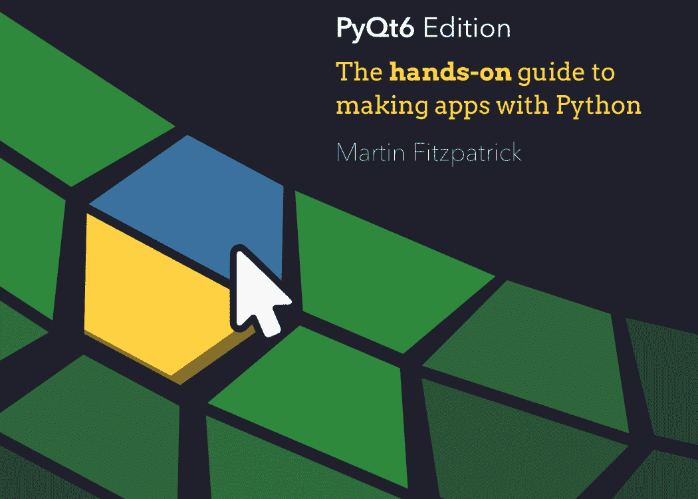

# 使用 Python 和 Qt6 创建 GUI 应用程序

动手实践指南：用 Python 制作应用程序

Martin Fitzpatrick

版本 1.0，2021-05-14

# 目录

- 引言 ........................................................................................................ 1
    1. GUI 的 *简短* 历史 ........................................................................ 3
    2. 关于 Qt 的一些介绍 ............................................................................ 5
    3. 致谢 .......................................................................................................... 7
    4. 版权 ............................................................................................................ 8
- PyQt6 基础功能 ................................................................................................ 9
    5. 我的第一个应用程序 .......................................................................................... 10
    6. 信号与槽 .................................................................................................. 21
    7. 控件 .............................................................................................................. 35
    8. 布局 .............................................................................................................. 66
    9. 动作、工具栏与菜单 .............................................................................. 94
    10. 对话框 ............................................................................................................ 118
    11. 窗口 .......................................................................................................... 138
    12. 事件 .............................................................................................................. 151
- Qt Designer .............................................................................................................. 160
    13. 安装 Qt Designer .................................................................................... 161
    14. Qt Designer 入门 .................................................................... 165
- 主题化 .................................................................................................................... 184
    15. 样式 .............................................................................................................. 185
    16. 调色板 ............................................................................................................ 187
    17. 图标 ................................................................................................................ 197
    18. Qt 样式表 (QSS) .................................................................................... 205
- 模型视图架构 ........................................................................................ 261
    19. 模型视图架构 — 模型视图控制器 .............................. 262
    20. 一个简单的模型视图 — 待办事项列表 .............................................................. 265
    21. 在模型视图中使用 numpy 和 pandas 处理表格数据 .................................... 283
    22. 使用 Qt 模型查询 SQL 数据库 ...................................................... 308
- PyQt6 进阶功能 .......................................................................................... 341
    23. 扩展信号 ............................................................................................ 342
    24. 路由 ............................................................................................................ 354
    25. 处理命令行参数 ........................................................ 360
    26. 系统托盘与 macOS 菜单 .......................................................................... 365
    27. 枚举与 Qt 命名空间 ................................................................ 376
- 自定义控件 .................................................................................... 387
    28. Qt 中的位图图形 .................................................................... 388
    29. 创建自定义控件 ................................................................ 420
- 并发执行 ............................................................................ 458
    30. 线程与进程简介 ................................................ 459
    31. 使用线程池 .................................................................... 466
    32. 线程示例 ...................................................................... 475
    33. 运行外部命令与进程 .......................................... 541
- 绘图 ................................................................................................ 551
    34. 使用 PyQtGraph 绘图 ................................................................ 552
    35. 使用 Matplotlib 绘图 .................................................................. 573
- 附录 A：安装 PyQt6 ................................................................ 590
- 附录 B：将 C++ 示例转换为 Python .................................... 593
- 附录 C：PyQt6 与 PySide6 — 有何区别？ ........................ 605
- 附录 D：接下来做什么？ ...................................................................... 619
- 索引 .................................................................................................. 620

# 引言

如果你想用 Python 创建 GUI 应用程序，可能会觉得不知从何下手。要让*任何东西*运行起来，你需要理解很多新概念。但是，就像任何编码问题一样，第一步是学会以正确的方式处理问题。在本书中，我将带你从 GUI 开发的基本原理开始，一直到使用 PyQt6 创建你自己的、功能齐全的桌面应用程序。

本书第一版于 2016 年发布。此后，根据读者的反馈，它已经更新了 4 次，增加和扩展了章节。现在可用的 PyQt 资源比我刚开始时多得多，但仍然缺乏深入、实用的构建完整应用程序的指南。本书填补了这一空白！

本书的格式是一系列章节，依次探讨 PyQt6 的不同方面。它们被安排成将较简单的章节放在前面，但如果你的项目有特定需求，不要害怕跳来跳去！每一章都会引导你学习基本概念，然后通过一系列编码示例，逐步探索并学习如何自己应用这些想法。

你可以从 http://www.learnpyqt.com/d/pyqt6-source.zip 下载本书所有示例的源代码和资源。

在一本这个篇幅的书中，不可能给你一个*完整*的 Qt 系统概述，因此提供了指向外部资源的链接——包括 LearnPyQt.com 网站和其他地方。如果你发现自己在想“我想知道我能不能做*那个*？”，你能做的最好的事情就是放下这本书，然后*去弄清楚！* 只要在此过程中定期备份你的代码，这样即使你搞砸了，也总有东西可以回退。

> 在整本书中，会有这样的方框，提供信息、提示和警告。如果你赶时间，所有这些都可以安全地跳过，但阅读它们会让你对 Qt 框架有更深入、更全面的了解。

# 1. GUI 的简短历史

**图形用户界面**有着悠久而辉煌的历史，可以追溯到 20 世纪 60 年代。斯坦福大学的 NLS（在线系统）引入了鼠标和窗口的概念，于 1968 年首次公开演示。随后是 1973 年的施乐 PARC Smalltalk 系统 GUI，它是大多数现代通用 GUI 的基础。

这些早期系统已经具备了我们在现代桌面 GUI 中习以为常的许多功能，包括窗口、菜单、单选按钮、复选框以及后来的图标。这些功能的组合——给了我们早期用于这类界面的缩写词：WIMP（窗口、图标、菜单、指点设备——鼠标）。

1979 年，第一个具有 GUI 的商业系统发布——PERQ 工作站。这刺激了许多其他 GUI 的努力，包括著名的 Apple Lisa（1983），它增加了菜单栏和窗口控件的概念。以及许多其他系统，如 Atari ST (GEM)、Amiga。在 UNIX（以及后来的 Linux）上，X 窗口系统于 1984 年出现。Windows 的第一个 PC 版本于 1985 年发布。

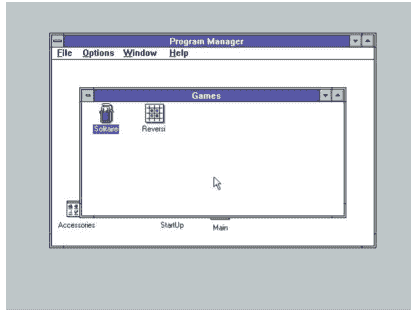

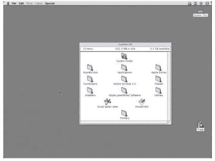

*图 1. Microsoft Windows 3.1 (1992) 和 Apple System 7 (1991) 的桌面*

早期的 GUI 并非我们想象的那样一炮而红，这是由于发布时缺乏兼容的软件以及昂贵的硬件需求——尤其是家庭用户的需求。图形用户界面（GUI）逐渐但稳步地成为与计算机交互的首选方式，WIMP隐喻也牢固地确立为标准。这并不是说没有*尝试*在桌面环境中取代WIMP隐喻。例如，微软Bob（1995年）就是微软一次备受诟病的尝试，试图用一个卡通房屋来取代桌面。


*图2. 微软Bob——抛弃桌面隐喻，代之以卡通房屋。*

其他被誉为*革命性*的图形用户界面也不乏其例，从Windows 95（1995年）的发布，到Mac OS X（2001年）、GNOME Shell（2011年）和Windows 10（2015年）。这些界面都对其各自的桌面系统UI进行了大刀阔斧的改革，往往伴随着巨大的宣传声势。但从根本上说，什么都没有真正改变。这些新的UI仍然是非常典型的WIMP系统，其运行方式与自1980年代以来的图形用户界面完全相同。

当革命真正到来时，它发生在移动端——鼠标被触摸取代，窗口被全屏应用取代。但即使在我们所有人都随身携带智能手机的世界里，大量的日常工作仍然在台式计算机上完成。WIMP已经经受住了40年的创新考验，并且看起来还将继续存在下去。

# 2. 关于Qt

Qt是一个免费开源的*部件工具包*，用于创建跨平台的GUI应用程序，允许应用程序使用单一代码库针对Windows、macOS、Linux和Android等多个平台。但Qt*远不止*是一个部件工具包，它内置了对多媒体、数据库、矢量图形和MVC接口的支持，更准确地说，它是一个应用程序开发*框架*。

Qt由Eirik Chambe-Eng和Haavard Nord于1991年创立，并于1994年成立了第一家Qt公司*Trolltech*。Qt目前由*The Qt Company*开发，并持续定期更新，增加功能并扩展移动和跨平台支持。

## Qt与PyQt6

PyQt6是Qt工具包的Python*绑定*，由*Riverbank Computing*开发。当你使用PyQt6编写应用程序时，你*实际上*是在用Qt编写应用程序。PyQt6库只是[1] C++ Qt库的一个包装器，使其能够在Python中使用。

由于这是C++库的Python接口，PyQt6中使用的命名约定并不遵循PEP8标准。最显著的是，函数和变量使用`mixedCase`而不是`snake_case`命名。你是否在自己的应用程序中遵循此标准完全取决于你自己，但我发现遵循Python标准编写自己的代码有助于澄清PyQt6代码在哪里结束，你自己的代码从哪里开始。

最后，虽然有专门的PyQt6文档，但你经常会发现自己阅读Qt文档本身，因为它更完整。如果你需要关于将Qt C++代码转换为Python的建议，请查看[将C++示例转换为Python](https://www.riverbankcomputing.com/static/Docs/PyQt6/pyqt4_differences.html#translating-c-examples-to-python)。

本书旨在配合最新版本的Qt 6编写。截至撰写时，这是Qt 6.2。然而，许多示例在Qt的早期和后期版本中也能正常工作。

[1] 并非真的*那么*简单。

# 3. 致谢

本书根据读者反馈持续扩展和更新。感谢以下读者的贡献，他们帮助使本版成为现在的样子！

- James Battat，韦尔斯利学院物理学副教授
- Alex Bender
- Andries Broekema
- Juan Cabanela
- Olivier Girard
- Richard Hohlfield
- Cody Jackson，Code-a-Mom导师
- John E Kadwell
- Jeffrey R Kennedy
- Gajendra Khanna
- Bing Xiao Liu
- Alex Lombardi
- Juan Pablo Donayre Quintana
- Guido Tognan

如果你对未来的版本有反馈或建议，请[联系我们](https://example.com)。

# 4. 版权

本书采用知识共享署名-相同方式共享-非商业性许可协议（CC BY-NC-SA）授权 ©2020 Martin Fitzpatrick。

- 你可以自由地与任何人分享本书的未修改副本。
- 如果你修改本书并分发你的修改版本，则必须在相同许可下分发。
- 你不得以任何形式出售本书或其衍生作品。
- 如果你想支持作者，你可以*合法地*直接从作者处购买副本。

欢迎读者提供贡献和更正（CC BY-NC-SA）。

# PyQt6基础功能

是时候迈出使用PyQt6创建GUI应用程序的第一步了！

在本章中，你将了解PyQt6的基础知识，这些是你创建任何应用程序的基础。我们将在你的桌面上开发一个简单的窗口应用程序。我们将添加部件，使用布局来排列它们，并将这些部件连接到函数，允许你从GUI触发应用程序行为。

使用提供的代码作为指导，但随时可以自由尝试。这是学习事物运作方式的最佳方式。

> 💡 在开始之前，你需要一个可运行的PyQt6安装。如果你还没有，请查看[安装PyQt6](http://www.learnpyqt.com/d/pyqt6-source.zip)。

> ❗ 不要忘记从[http://www.learnpyqt.com/d/pyqt6-source.zip](http://www.learnpyqt.com/d/pyqt6-source.zip)下载随附本书的源代码。

# 5. 我的第一个应用程序

让我们创建我们的第一个应用程序！首先创建一个新的Python文件——你可以随意命名它（例如`myapp.py`），并将其保存在可访问的位置。我们将在这个文件中编写我们的简单应用程序。

> 我们将在这个文件中进行编辑，你可能需要回到代码的早期版本，所以记得定期备份。

## 创建你的应用程序

你的第一个应用程序的源代码如下所示。逐字输入它，并注意不要出错。如果你确实搞错了，Python会告诉你哪里出了问题。如果你不想全部输入，该文件包含在本书的源代码中。

清单1. basic/creating_a_window_1.py

```python
from PyQt6.QtWidgets import QApplication, QWidget

# Only needed for access to command line arguments
import sys

# You need one (and only one) QApplication instance per application.
# Pass in sys.argv to allow command line arguments for your app.
# If you know you won't use command line arguments QApplication([])
# works too.
app = QApplication(sys.argv)

# Create a Qt widget, which will be our window.
window = QWidget()
window.show()  # IMPORTANT!!!!! Windows are hidden by default.

# Start the event loop.
app.exec()

# Your application won't reach here until you exit and the event
# loop has stopped.
```

首先，启动你的应用程序。你可以像运行任何其他Python脚本一样从命令行运行它，例如——

```
python MyApp.py
```

或者，对于Python 3——

```
python3 MyApp.py
```

从现在开始，你将看到以下提示框，用于运行和测试你的应用程序，以及你将看到的内容的指示。

> 🚀 **运行它！** 你现在将看到你的窗口。Qt会自动创建一个带有正常窗口装饰的窗口，你可以像任何窗口一样拖动它和调整其大小。

你将看到的内容取决于你运行此示例的平台。下图显示了在Windows、macOS和Linux（Ubuntu）上显示的窗口。

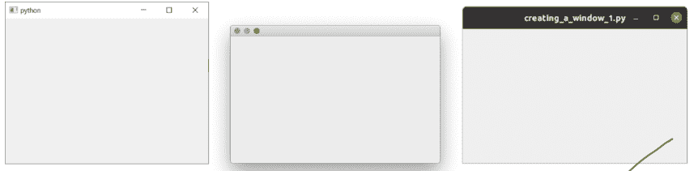

*图3. 我们的窗口，在Windows、macOS和Linux上的样子。*

### 逐步解析代码

让我们逐行解析代码，以便我们确切理解发生了什么。

首先，我们导入应用程序所需的PyQt6类。这里我们从`QtWidgets`模块导入`QApplication`（应用程序处理器）和`QWidget`（一个基本的*空*GUI部件）。

```python
from PyQt6.QtWidgets import QApplication, QWidget
```

Qt的主要模块是`QtWidgets`、`QtGui`和`QtCore`。

> 💡 你可以使用`from <module> import *`，但这种全局导入在Python中通常不被推荐，所以我们在这里避免使用它。

接下来，我们创建一个 `QApplication` 实例，并传入 `sys.argv`，这是一个包含传递给应用程序的命令行参数的 Python `list`。

```python
app = QApplication(sys.argv)
```

如果你知道不会使用命令行参数来控制 Qt，可以传入一个空列表，例如：

```python
app = QApplication([])
```

接下来，我们使用变量名 `window` 创建一个 `QWidget` 实例。

```python
window = QWidget()
window.show()
```

在 Qt 中，*所有*顶级控件都是窗口——也就是说，它们没有*父控件*，并且不嵌套在其他控件或布局中。这意味着从技术上讲，你可以使用任何你喜欢的控件来创建一个窗口。

> *我看不到我的窗口！*

*没有父控件*的控件默认是不可见的。因此，在创建 `window` 对象后，我们**必须**调用 `.show()` 来使其可见。你可以移除 `.show()` 并运行应用程序，但你将无法退出它！

> *什么是窗口？*

-   持有你应用程序的用户界面
-   每个应用程序至少需要一个（...但可以有更多）
-   当最后一个窗口关闭时，应用程序将（默认）退出

最后，我们调用 `app.exec_()` 来启动事件循环。

### 什么是事件循环？

在将窗口显示在屏幕上之前，需要介绍一些关于 Qt 世界中应用程序如何组织的关键概念。如果你已经熟悉事件循环，可以安全地跳到下一节。

每个 Qt 应用程序的核心是 `QApplication` 类。每个应用程序需要一个——且仅一个——`QApplication` 对象才能运行。这个对象持有你应用程序的**事件循环**——这个核心循环管理着所有用户与 GUI 的交互。

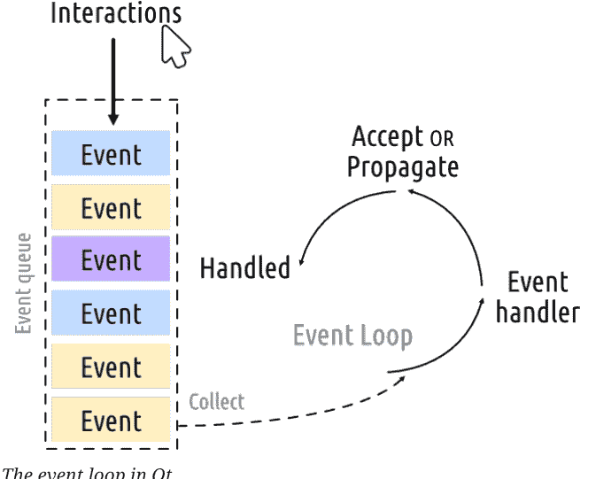

与你应用程序的每次交互——无论是按键、点击鼠标还是鼠标移动——都会生成一个*事件*，该事件被放入*事件队列*。在事件循环中，每次迭代都会检查队列，如果发现等待的事件，事件和控制权就会传递给该事件的特定*事件处理器*。事件处理器处理事件，然后将控制权交还给事件循环以等待更多事件。每个应用程序只有**一个**运行的事件循环。

### QApplication 类

-   QApplication 持有 Qt 事件循环
-   需要一个 QApplication 实例
-   你的应用程序在事件循环中等待，直到采取操作
-   任何时候只有**一个**事件循环

下划线的存在是因为 `exec` 在 Python 2.7 中是保留字。PyQt6 通过在 C++ 库中使用的名称后附加一个下划线来处理这个问题。你也会在控件上看到 `.print_()` 方法，例如。

正如我们在上一部分中发现的，在 Qt 中*任何*控件都可以是窗口。例如，如果你将 `QWidget` 替换为 `QPushButton`。在下面的示例中，你将得到一个包含单个可点击按钮的窗口。

清单 2. basic/creating_a_window_2.py

```python
from PyQt6.QtWidgets import QApplication, QPushButton

window = QPushButton("Push Me")
window.show()
```

这很简洁，但并不是非常*有用*——很少需要一个只包含单个控件的 UI！但是，正如我们稍后将发现的，使用*布局*将控件嵌套在其他控件中的能力意味着你可以在一个空的 `QWidget` 内构建复杂的 UI。

但是，Qt 已经为你提供了解决方案——`QMainWindow`。这是一个预制的控件，提供了许多你将在应用程序中使用的标准窗口功能，包括工具栏、菜单、状态栏、可停靠控件等。我们稍后会介绍这些高级功能，但现在，我们将向应用程序添加一个简单的空 `QMainWindow`。

清单 3. basic/creating_a_window_3.py

```python
from PyQt6.QtWidgets import QApplication, QMainWindow
import sys

app = QApplication(sys.argv)

window = QMainWindow()
window.show()  # 重要!!!!! 窗口默认是隐藏的。

### 启动事件循环。
app.exec()
```

> 🚀 运行它！你现在将看到你的主窗口。它看起来和之前完全一样！

所以我们的 `QMainWindow` 目前还不太有趣。我们可以通过添加一些内容来修复它。如果你想创建一个自定义窗口，最好的方法是子类化 `QMainWindow`，然后在 `__init__` 块中包含窗口的设置。这允许窗口行为是自包含的。我们可以添加我们自己的 `QMainWindow` 子类——为了简单起见，称之为 `MainWindow`。

清单 4. basic/creating_a_window_4.py

```python
import sys

from PyQt6.QtCore import QSize, Qt
from PyQt6.QtWidgets import QApplication, QMainWindow, QPushButton ①

### 子类化 QMainWindow 以自定义你的应用程序主窗口
class MainWindow(QMainWindow):
    def __init__(self):
        super().__init__() ②

        self.setWindowTitle("My App")

        button = QPushButton("Press Me!")

        # 设置窗口的中心控件。
        self.setCentralWidget(button) ③

app = QApplication(sys.argv)

window = MainWindow()
window.show()

app.exec()
```

① 常见的 Qt 控件总是从 `QtWidgets` 命名空间导入。

② 我们必须始终调用 `super()` 类的 `__init__` 方法。

③ 使用 `.setCentralWidget` 将控件放置在 `QMainWindow` 中。

> 当你子类化一个 Qt 类时，你必须**始终**调用 super `__init__` 函数，以允许 Qt 设置对象。

在我们的 `__init__` 块中，我们首先使用 `.setWindowTitle()` 来更改主窗口的标题。然后我们添加第一个控件——一个 `QPushButton`——到窗口的中间。这是 Qt 中可用的基本控件之一。创建按钮时，你可以传入你希望按钮显示的文本。

最后，我们在窗口上调用 `.setCentralWidget()`。这是一个 `QMainWindow` 特有的函数，允许你设置位于窗口中间的控件。

> **🚀 运行它！** 你现在将再次看到你的窗口，但这次中间有一个 `QPushButton` 控件。按下按钮将没有任何作用，我们接下来会解决这个问题。


*图 5. 我们的 `QMainWindow` 在 Windows、macOS 和 Linux 上带有一个 `QPushButton`。*

> **渴望更多控件？**

我们很快将详细介绍更多的控件，但如果你不耐烦并想提前了解，可以查看 [QWidget 文档](https://doc.qt.io/qt-5/qwidget.html)。尝试将不同的控件添加到你的窗口中！

### 调整窗口和控件的大小

窗口目前可以自由调整大小——如果你用鼠标抓住任何角落，你可以拖动并将其调整为任何你想要的大小。虽然让用户调整应用程序的大小是件好事，但有时你可能希望对最小或最大尺寸施加限制，或者将窗口锁定为固定大小。

在 Qt 中，尺寸使用 `QSize` 对象定义。它按顺序接受*宽度*和*高度*参数。例如，以下代码将创建一个 400x300 像素的*固定大小*窗口。

*清单 5. basic/creating_a_window_end.py*

```python
import sys

from PyQt6.QtCore import QSize, Qt
from PyQt6.QtWidgets import QApplication, QMainWindow, QPushButton

### 子类化 QMainWindow 以自定义你的应用程序主窗口
class MainWindow(QMainWindow):
    def __init__(self):
        super().__init__()

        self.setWindowTitle("My App")

        button = QPushButton("Press Me!")

        self.setFixedSize(QSize(400, 300)) ①

        # 设置窗口的中心控件。
        self.setCentralWidget(button)

app = QApplication(sys.argv)

window = MainWindow()
window.show()

app.exec()
```

① 设置窗口的大小。

> 🚀 **运行它！** 你将看到一个固定大小的窗口——尝试调整它的大小，它不会起作用。


图 6. 我们的固定大小窗口，注意在 Windows 和 Linux 上最大化控件是禁用的。在 macOS 上，你可以将应用程序最大化以填满屏幕，但中心控件不会调整大小。

除了 `.setFixedSize()`，你还可以调用 `.setMinimumSize()` 和 `.setMaximumSize()` 来分别设置最小和最大尺寸。自己尝试一下吧！

> 你可以在*任何*控件上使用这些尺寸方法。

在本节中，我们介绍了 `QApplication` 类、`QMainWindow` 类、事件循环，并尝试向窗口添加一个简单的控件。在下一节中，我们将了解 Qt 提供的机制，用于控件和窗口之间以及与你自己的代码进行通信。

> 将你的文件保存一份副本为 `myapp.py`，因为我们稍后会再次需要它。

# 6. 信号与槽

到目前为止，我们已经创建了一个窗口，并向其中添加了一个简单的*按钮*控件，但这个按钮没有任何功能。这完全没什么用——当你创建图形用户界面应用程序时，通常希望它们能执行某些操作！我们需要一种方法将*按下按钮*的动作与触发某个事件联系起来。在Qt中，这由*信号*和*槽*来提供。

*信号*是控件在*某事发生*时发出的通知。这“某事”可以是任何事情，从按下按钮，到输入框的文本改变，再到窗口标题的改变。许多信号由用户操作触发，但这并非绝对规则。

除了通知某事发生外，信号还可以发送数据，以提供关于发生了什么的额外上下文信息。

> 你也可以创建自己的自定义信号，我们将在后面的[扩展信号](Extending Signals)部分进行探讨。

*槽*是Qt用于指代信号接收器的名称。在Python中，你应用程序中的任何函数（或方法）都可以用作槽——只需将信号连接到它即可。如果信号发送了数据，那么接收函数也会接收到这些数据。许多Qt控件也有自己的内置槽，这意味着你可以直接将Qt控件连接在一起。

让我们来看看Qt信号的基础知识，以及如何使用它们将控件连接起来，使你的应用程序能够执行操作。

> 加载一份全新的`myapp.py`副本，并为本节内容保存为一个新文件名。

## QPushButton信号

我们简单的应用程序目前有一个`QMainWindow`，其中设置了一个`QPushButton`作为中心控件。让我们首先将这个按钮连接到一个自定义的Python方法。这里我们创建一个名为`the_button_was_clicked`的简单自定义槽，它接收来自`QPushButton`的`clicked`信号。

清单 6. basic/signals_and_slots_1.py

```python
from PyQt6.QtWidgets import QApplication, QMainWindow, QPushButton ①

import sys

class MainWindow(QMainWindow):
    def __init__(self):
        super().__init__() ②

        self.setWindowTitle("My App")

        button = QPushButton("Press Me!")
        button.setCheckable(True)
        button.clicked.connect(self.the_button_was_clicked)

        # Set the central widget of the Window.
        self.setCentralWidget(button)

    def the_button_was_clicked(self):
        print("Clicked!")

app = QApplication(sys.argv)

window = MainWindow()
window.show()

app.exec()
```

> 🚀 运行它！如果你点击按钮，你会在控制台看到文本“Clicked!”。

控制台输出

```
Clicked!
Clicked!
Clicked!
Clicked!
```

### 接收数据

这是一个好的开始！我们已经知道信号也可以发送*数据*，以提供关于刚刚发生的事情的更多信息。`.clicked`信号也不例外，它也提供了按钮的*选中*（或切换）状态。对于普通按钮，这个状态始终是`False`，所以我们的第一个槽忽略了这个数据。然而，我们可以让我们的按钮*可选中*，并观察其效果。

在下面的例子中，我们添加了第二个槽来输出*选中状态*。

清单 7. basic/signals_and_slots_1b.py

```python
import sys

from PyQt6.QtWidgets import QApplication, QMainWindow, QPushButton ①

class MainWindow(QMainWindow):
    def __init__(self):
        super().__init__() ②

        self.setWindowTitle("My App")

        button = QPushButton("Press Me!")
        button.setCheckable(True)
        button.clicked.connect(self.the_button_was_clicked)
        button.clicked.connect(self.the_button_was_toggled)

        # Set the central widget of the Window.
        self.setCentralWidget(button)

    def the_button_was_clicked(self):
        print("Clicked!")

    def the_button_was_toggled(self, checked):
        print("Checked?", checked)

app = QApplication(sys.argv)

window = MainWindow()
window.show()

app.exec()
```

🚀 运行它！如果你按下按钮，你会看到它高亮显示为*已选中*。再次按下以释放它。在控制台中查看*选中状态*。

控制台输出

```
Clicked!
Checked? True
Clicked!
Checked? False
Clicked!
Checked? True
Clicked!
Checked? False
Clicked!
Checked? True
```

你可以将任意数量的槽连接到一个信号，并且可以在你的槽中同时响应信号的不同版本。

### 存储数据

通常，将控件的当前*状态*存储在Python变量中是很有用的。这允许你像处理任何其他Python变量一样处理这些值，而无需访问原始控件。你可以将这些值存储为单个变量，或者如果你愿意，也可以使用字典。在下一个例子中，我们将按钮的*选中*值存储在`self`上一个名为`button_is_checked`的变量中。

清单 8. basic/signals_and_slots_1c.py

```python
class MainWindow(QMainWindow):
    def __init__(self):
        super().__init__()

        self.button_is_checked = True ①

        self.setWindowTitle("My App")

        button = QPushButton("Press Me!")
        button.setCheckable(True)
        button.clicked.connect(self.the_button_was_toggled)
        button.setChecked(self.button_is_checked) ②

        # Set the central widget of the Window.
        self.setCentralWidget(button)

    def the_button_was_toggled(self, checked):
        self.button_is_checked = checked ③

        print(self.button_is_checked)
```

- ① 为我们的变量设置默认值。
- ② 使用默认值设置控件的初始状态。
- ③ 当控件状态改变时，更新变量以匹配。

你可以将这种相同的模式用于任何PyQt6控件。如果一个控件没有提供发送当前状态的信号，你将需要在你的处理程序中直接从控件检索值。例如，这里我们在一个*按下*处理程序中检查选中状态。

清单 9. basic/signals_and_slots_1d.py

```python
class MainWindow(QMainWindow):
    def __init__(self):
        super().__init__()

        self.button_is_checked = True

        self.setWindowTitle("My App")

        self.button = QPushButton("Press Me!") ①
        self.button.setCheckable(True)
        self.button.released.connect(self.the_button_was_released) ②
        self.button.setChecked(self.button_is_checked)

        # Set the central widget of the Window.
        self.setCentralWidget(self.button)

    def the_button_was_released(self):
        self.button_is_checked = self.button.isChecked() ③

        print(self.button_is_checked)
```

- ① 我们需要在`self`上保持对按钮的引用，以便在我们的槽中访问它。
- ② *released*信号在按钮被释放时触发，但不发送选中状态。
- ③ `.isChecked()`返回按钮的选中状态。

### 更改界面

到目前为止，我们已经看到了如何接收信号并将输出打印到控制台。但是，当我们点击按钮时，如何在界面上触发一些操作呢？让我们更新我们的槽方法来修改按钮，更改文本并禁用按钮，使其不再可点击。我们还将暂时关闭*可选中*状态。

清单 10. basic/signals_and_slots_2.py

```python
from PyQt6.QtWidgets import QApplication, QMainWindow, QPushButton

import sys

class MainWindow(QMainWindow):
    def __init__(self):
        super().__init__()

        self.setWindowTitle("My App")

        self.button = QPushButton("Press Me!") ①
        self.button.clicked.connect(self.the_button_was_clicked)

        # Set the central widget of the Window.
        self.setCentralWidget(self.button)

    def the_button_was_clicked(self):
        self.button.setText("You already clicked me.") ②
        self.button.setEnabled(False) ③

        # Also change the window title.
        self.setWindowTitle("My Oneshot App")

app = QApplication(sys.argv)

window = MainWindow()
window.show()

app.exec()
```

- ① 我们需要能够在`the_button_was_clicked`方法中访问`button`，所以我们在`self`上保持对它的引用。
- ② 你可以通过向`.setText()`传递一个`str`来更改按钮的文本。
- ③ 要禁用按钮，请调用`.setEnabled()`并传入`False`。

### 直接连接控件

到目前为止，我们已经看到了将控件信号连接到 Python 方法的示例。当控件触发信号时，我们的 Python 方法会被调用并接收来自信号的数据。但你*并非总是*需要使用 Python 函数来处理信号——你也可以直接将 Qt 控件相互连接。

在下面的示例中，我们向窗口添加了一个 `QLineEdit` 控件和一个 `QLabel`。在窗口的 `__init__` 方法中，我们将行编辑器的 `.textChanged` 信号连接到 `QLabel` 的 `.setText` 方法。现在，每当 `QLineEdit` 中的文本发生变化时，`QLabel` 就会通过其 `.setText` 方法接收到该文本。

清单 12. basic/signals_and_slots_4.py

```python
from PyQt6.QtWidgets import QApplication, QMainWindow, QLabel,
QLineEdit, QVBoxLayout, QWidget

import sys

class MainWindow(QMainWindow):
    def __init__(self):
        super().__init__()

        self.setWindowTitle("My App")

        self.label = QLabel()

        self.input = QLineEdit()
        self.input.textChanged.connect(self.label.setText) ①

        layout = QVBoxLayout() ②
        layout.addWidget(self.input)
        layout.addWidget(self.label)

        container = QWidget()
        container.setLayout(layout)

        # Set the central widget of the Window.
        self.setCentralWidget(container)

app = QApplication(sys.argv)

window = MainWindow()
window.show()

app.exec()
```

① 注意，要将输入连接到标签，输入和标签都必须已定义。

② 此代码将两个控件添加到一个布局中，并将该布局设置到窗口上。我们将在后续章节中详细介绍这一点，现在你可以忽略它。

> **🚀 运行它！** 在上方的框中输入一些文本，你会看到它立即出现在标签上。

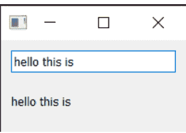

*图 7. 在输入框中键入的任何文本都会立即显示在标签上*

大多数 Qt 控件都有可用的*槽*，你可以将任何发出相同*类型*信号的信号连接到这些槽。控件文档在“公共槽”下列出了每个控件的槽。例如，请参阅 [QLabel](https://doc.qt.io/qt-6/qlabel.html)。

# 7. 控件

在 Qt 中，*控件* 是指用户可以与之交互的 UI 组件的名称。用户界面由多个控件组成，这些控件在窗口内排列。Qt 提供了大量可用的控件，甚至允许你创建自己的自定义控件。

在本书的代码示例中，有一个文件 `basic/widgets_list.py`，你可以运行它来在窗口中显示一组控件。它使用了一些我们稍后会介绍的复杂技巧，所以现在不用担心代码。

> 🚀 **运行它！** 你将看到一个包含多个交互式控件的窗口。


*图 8. 示例控件应用在 Windows、macOS 和 Linux (Ubuntu) 上的显示效果。*

示例中显示的控件如下，从上到下。

| 控件 | 功能 |
| :--- | :--- |
| `QCheckBox` | 复选框 |
| `QComboBox` | 下拉列表框 |
| `QDateEdit` | 用于编辑日期 |
| `QDateTimeEdit` | 用于编辑日期和日期时间 |
| `QDial` | 可旋转的表盘 |
| `QDoubleSpinbox` | 用于浮点数的数字微调框 |
| `QFontComboBox` | 字体列表 |
| `QLCDNumber` | 一个相当丑陋的 LCD 显示器 |
| `QLabel` | 只是一个标签，不可交互 |
| `QLineEdit` | 输入一行文本 |
| `QProgressBar` | 进度条 |
| `QPushButton` | 按钮 |
| `QRadioButton` | 一个只能有一个活动选项的组 |
| `QSlider` | 滑块 |
| `QSpinBox` | 整数微调框 |
| `QTimeEdit` | 用于编辑时间 |

控件远不止这些，但它们不太适合放在一起！完整列表请参阅 [Qt 文档](https://doc.qt.io/qt-5/qtwidgets-index.html)。在这里，我们将仔细研究一些最有用的控件。

> 💡 加载一份全新的 `myapp.py` 并将其保存为新名称，用于本节。

## QLabel

我们将从 QLabel 开始介绍，它可以说是 Qt 工具箱中最简单的控件之一。这是一个简单的单行文本，你可以将其定位在应用程序中。你可以在创建时通过传入字符串来设置文本——

```python
widget = QLabel("Hello")
```

或者，使用 .setText() 方法——

```python
widget = QLabel("1") # 标签创建时文本为 1
widget.setText("2") # 标签现在显示 2
```

你还可以调整字体参数，例如控件中文本的大小或对齐方式。

### Qt 标志

请注意，按照惯例，你使用 **OR** 管道符（|）来组合两个标志。这些标志是互不重叠的*位掩码*。例如，`Qt.AlignmentFlag.AlignLeft` 的二进制值为 `0b0001`，而 `Qt.AlignmentFlag.AlignBottom` 是 `0b0100`。通过 OR 运算，我们得到值 `0b0101`，表示“左下角”。

我们将在后面的 [枚举与 Qt 命名空间](Enums & the Qt Namespace) 中更详细地探讨 Qt 命名空间和 Qt 标志。

最后，还有一个简写标志可以同时在两个方向居中 —

| 标志 | 行为 |
| :--- | :--- |
| `Qt.AlignmentFlag.AlignCenter` | 同时水平**和**垂直居中 |

奇怪的是，你也可以使用 `QLabel` 通过 `.setPixmap()` 方法来显示图像。它接受一个 *pixmap*（像素数组），你可以通过向 `QPixmap` 传递图像文件名来创建它。在本书提供的示例文件中，你可以找到一个名为 `otje.jpg` 的文件，你可以按如下方式在窗口中显示它：

清单 14. basic/widgets_2a.py

```python
import sys

from PyQt6.QtGui import QPixmap
from PyQt6.QtWidgets import QApplication, QLabel, QMainWindow

class MainWindow(QMainWindow):
    def __init__(self):
        super().__init__()

        self.setWindowTitle("My App")

        widget = QLabel("Hello")
        widget.setPixmap(QPixmap("otje.jpg"))

        self.setCentralWidget(widget)

app = QApplication(sys.argv)

window = MainWindow()
window.show()

app.exec()
```


图 10. Otje。多么可爱的脸。

> 🚀 **运行它！** 调整窗口大小，图像周围将出现空白区域。

默认情况下，图像在缩放时会保持其纵横比。如果你想让它拉伸并缩放以完全适应窗口，可以在 `QLabel` 上设置 `.setScaledContents(True)`。

修改代码，为标签添加 `.setScaledContents(True)` —

*清单 15. basic/widgets_2b.py*

```python
widget.setPixmap(QPixmap("otje.jpg"))
widget.setScaledContents(True)
```

> 🚀 **运行它！** 调整窗口大小，图片将变形以适应。


*图 11. 在 Windows、macOS 和 Ubuntu 上使用 `QLabel` 显示 pixmap*

## QCheckBox

下一个要查看的控件是 QCheckBox，顾名思义，它向用户呈现一个可勾选的框。然而，与所有 Qt 控件一样，有许多可配置选项可以改变控件的行为。

清单 16. basic/widgets_3.py

```python
import sys

from PyQt6.QtCore import Qt
from PyQt6.QtWidgets import QApplication, QCheckBox, QMainWindow

class MainWindow(QMainWindow):
    def __init__(self):
        super().__init__()

        self.setWindowTitle("My App")

        widget = QCheckBox("This is a checkbox")
        widget.setCheckState(Qt.CheckState.Checked)

        # For tristate: widget.setCheckState(Qt.PartiallyChecked)
        # Or: widget.setTristate(True)
        widget.stateChanged.connect(self.show_state)

        self.setCentralWidget(widget)

    def show_state(self, s):
        print(Qt.CheckState(s) == Qt.CheckState.Checked)
        print(s)

app = QApplication(sys.argv)

window = MainWindow()
window.show()

app.exec()
```

> 🚀 **运行它！** 你将看到一个带有标签文本的复选框。

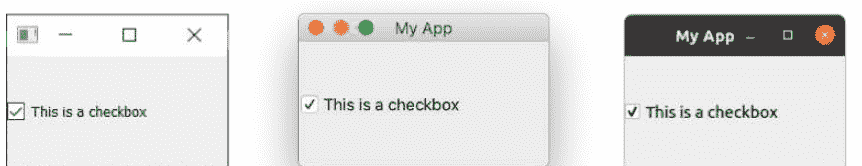

*图 12. 在 Windows、macOS 和 Ubuntu 上的 QCheckBox*

你可以使用 `.setChecked` 或 `.setCheckState` 以编程方式设置复选框状态。前者接受 `True` 或 `False`，分别表示选中或未选中。然而，使用 `.setCheckState` 你还可以使用 `Qt` 命名空间标志指定*部分*选中状态 —

| 标志 | 行为 |
| :--- | :--- |
| `Qt.CheckState.Checked` | 项目被选中 |
| `Qt.CheckState.Unchecked` | 项目未被选中 |
| `Qt.CheckState.PartiallyChecked` | 项目被部分选中 |

支持部分选中（`Qt.CheckState.PartiallyChecked`）状态的复选框通常被称为“三态”，即既不是开也不是关。处于此状态的复选框通常显示为灰色，并且通常用于分层复选框安排中，其中子项与父复选框相关联。

如果你将值设置为 `Qt.CheckState.PartiallyChecked`，复选框将变为三态 — 即具有*三种*可能的状态。你也可以使用 `.setTristate(True)` 将复选框设置为三态，而无需将当前状态设置为部分选中。


你可能会注意到，当脚本运行时，当前状态数字显示为一个 `int`，其中 `checked = 2`，`unchecked = 0`，`partially checked = 1`。你不需要记住这些值 — 它们只是这些相应标志的内部值。你可以使用 `state == Qt.CheckState.Checked` 来测试状态。

## QComboBox

QComboBox 是一个下拉列表，默认关闭，有一个箭头可以打开它。你可以从列表中选择一个项目，当前选中的项目显示为控件上的标签。组合框适用于从长选项列表中进行选择。

> 你可能在文字处理应用程序中见过组合框用于选择字体或大小。尽管 Qt 实际上提供了一个特定的字体选择组合框 QFontComboBox。

你可以通过向 .addItems() 传递字符串列表来向 QComboBox 添加项目。项目将按提供的顺序添加。

清单 17. basic/widgets_4.py

```python
import sys

from PyQt6.QtCore import Qt
from PyQt6.QtWidgets import QApplication, QComboBox, QMainWindow

class MainWindow(QMainWindow):
    def __init__(self):
        super().__init__()

        self.setWindowTitle("My App")

        widget = QComboBox()
        widget.addItems(["One", "Two", "Three"])

        widget.currentIndexChanged.connect(self.index_changed)
        widget.currentTextChanged.connect(self.text_changed)

        self.setCentralWidget(widget)

    def index_changed(self, i):  # i is an int
        print(i)

    def text_changed(self, s):  # s is a str
        print(s)

app = QApplication(sys.argv)

window = MainWindow()
window.show()

app.exec()
```

🚀 运行它！你将看到一个包含 3 个条目的组合框。选择一个，它将显示在框中。

## QComboBox

当当前选中的项目被更新时，`.currentIndexChanged` 信号会被触发，默认传递列表中所选项目的索引。然而，在连接到该信号时，你也可以通过附加 `[str]` 来请求信号的替代版本（可以将信号想象成一个 `dict`）。这个替代接口提供的是当前所选项目的标签，这通常更有用。

`QComboBox` 也可以是可编辑的，允许用户输入当前列表中不存在的值，并可以选择将其插入列表，或者仅将其用作一个值。要使组合框可编辑：

```python
widget.setEditable(True)
```

你还可以设置一个标志来决定如何处理插入操作。这些标志存储在 `QComboBox` 类本身上，如下所列 —

| 标志 | 行为 |
| :--- | :--- |
| `QComboBox.InsertPolicy.NoInsert` | 不插入 |
| `QComboBox.InsertPolicy.InsertAtTop` | 作为第一个项目插入 |
| `QComboBox.InsertPolicy.InsertAtCurrent` | 替换当前选中的项目 |
| `QComboBox.InsertPolicy.InsertAtBottom` | 在最后一个项目之后插入 |
| `QComboBox.InsertPolicy.InsertAfterCurrent` | 在当前项目之后插入 |
| `QComboBox.InsertPolicy.InsertBeforeCurrent` | 在当前项目之前插入 |
| `QComboBox.InsertPolicy.InsertAlphabetically` | 按字母顺序插入 |

要使用这些标志，请按如下方式应用：

```python
widget.setInsertPolicy(QComboBox.InsertPolicy.InsertAlphabetically)
```

你还可以通过使用 `.setMaxCount` 来限制组合框中允许的项目数量，例如：

```python
widget.setMaxCount(10)
```

## QListWidget

接下来是 `QListWidget`。这个控件与 `QComboBox` 类似，不同之处在于选项以可滚动的项目列表形式呈现。它还支持一次选择多个项目。`QListWidget` 提供了一个 `currentItemChanged` 信号，它发送 `QListItem`（列表控件的元素），以及一个 `currentTextChanged` 信号，它发送当前项目的文本。

清单 18. basic/widgets_5.py

```python
import sys

from PyQt6.QtWidgets import QApplication, QListWidget, QMainWindow

class MainWindow(QMainWindow):
    def __init__(self):
        super().__init__()

        self.setWindowTitle("My App")

        widget = QListWidget()
        widget.addItems(["One", "Two", "Three"])

        # In QListWidget there are two separate signals for the item,
        # and the str
        widget.currentItemChanged.connect(self.index_changed)
        widget.currentTextChanged.connect(self.text_changed)

        self.setCentralWidget(widget)

    def index_changed(self, i):  # Not an index, i is a QListItem
        print(i.text())

    def text_changed(self, s):  # s is a str
        print(s)

app = QApplication(sys.argv)

window = MainWindow()
window.show()

app.exec()
```

🚀 **运行它！** 你将看到相同的三个项目，现在以列表形式呈现。选中的项目（如果有的话）会被高亮显示。

## QLineEdit

QLineEdit 控件是一个简单的单行文本编辑框，用户可以在其中输入内容。它们用于表单字段，或者没有受限有效输入列表的设置中。例如，输入电子邮件地址或计算机名称时。

清单 19. basic/widgets_6.py

```python
import sys

from PyQt6.QtCore import Qt
from PyQt6.QtWidgets import QApplication, QLineEdit, QMainWindow

class MainWindow(QMainWindow):
    def __init__(self):
        super().__init__()

        self.setWindowTitle("My App")

        widget = QLineEdit()
        widget.setMaxLength(10)
        widget.setPlaceholderText("Enter your text")

        # widget.setReadOnly(True) # uncomment this to make readonly

        widget.returnPressed.connect(self.return_pressed)
        widget.selectionChanged.connect(self.selection_changed)
        widget.textChanged.connect(self.text_changed)
        widget.textEdited.connect(self.text_edited)

        self.setCentralWidget(widget)

    def return_pressed(self):
        print("Return pressed!")
        self.centralWidget().setText("BOOM!")

    def selection_changed(self):
        print("Selection changed")
        print(self.centralWidget().selectedText())

    def text_changed(self, s):
        print("Text changed...")
        print(s)

    def text_edited(self, s):
        print("Text edited...")
        print(s)

app = QApplication(sys.argv)

window = MainWindow()
window.show()

app.exec()
```

🚀 **运行它！** 你将看到一个简单的文本输入框，带有一个提示。

如上面的代码所示，你可以通过使用 `.setMaxLength` 来设置文本字段的最大长度。占位符文本（即在用户输入内容之前显示的文本）可以使用 `.setPlaceholderText` 添加。

`QLineEdit` 有许多可用于不同编辑事件的信号，包括当用户按下回车键时、当用户选择发生改变时。还有两个编辑信号，一个用于当框中的文本被编辑时，另一个用于当文本被改变时。这里的区别在于用户编辑和程序化更改之间。`textEdited` 信号仅在用户编辑文本时发送。

此外，可以使用*输入掩码*来执行输入验证，以定义支持哪些字符以及在何处支持。可以按如下方式应用到字段上：

```python
widget.setInputMask('000.000.000.000;_')
```

上述设置将允许一系列由句点分隔的3位数字，因此可用于验证 IPv4 地址。

## QSpinBox 和 QDoubleSpinBox

QSpinBox 提供了一个带有向上和向下箭头以增加和减少值的小型数字输入框。QSpinBox 支持整数，而相关的控件 QDoubleSpinBox 支持浮点数。

清单 20. basic/widgets_7.py

```python
import sys

from PyQt6.QtCore import Qt
from PyQt6.QtWidgets import QApplication, QMainWindow, QSpinBox

class MainWindow(QMainWindow):
    def __init__(self):
        super().__init__()

        self.setWindowTitle("My App")

        widget = QSpinBox()
        # Or: widget = QDoubleSpinBox()

        widget.setMinimum(-10)
        widget.setMaximum(3)
        # Or: widget.setRange(-10,3)

        widget.setPrefix("$")
        widget.setSuffix("c")
        widget.setSingleStep(3)  # Or e.g. 0.5 for QDoubleSpinBox
        widget.valueChanged.connect(self.value_changed)
        widget.textChanged.connect(self.value_changed_str)

        self.setCentralWidget(widget)

    def value_changed(self, i):
        print(i)

    def value_changed_str(self, s):
        print(s)

app = QApplication(sys.argv)

window = MainWindow()
window.show()

app.exec()
```

🚀 **运行它！** 你将看到一个数字输入框。该值显示了前缀和后缀单位，并且被限制在 +3 到 -10 的范围内。

上面的演示代码展示了该控件可用的各种功能。

要设置可接受值的范围，你可以使用 `setMinimum` 和 `setMaximum`，或者使用 `setRange` 同时设置两者。支持使用前缀和后缀对值类型进行注释，可以使用 `.setPrefix` 和 `.setSuffix` 分别添加到数字上，例如用于货币标记或单位。

点击控件上的向上和向下箭头将增加或减少控件中的值，增加或减少的量可以使用 `.setSingleStep` 设置。请注意，这不会影响控件可接受的值。

`QSpinBox` 和 `QDoubleSpinBox` 都有一个 `.valueChanged` 信号，每当它们的值被改变时就会触发。原始的 `.valueChanged` 信号发送数值（`int` 或 `float`），而 `.textChanged` 以字符串形式发送值，包括前缀和后缀字符。

## QSlider

QSlider 提供了一个滑块控件，其内部功能与 QDoubleSpinBox 非常相似。它不是以数字形式显示当前值，而是通过滑块手柄在控件长度上的位置来表示。这在需要在两个极端值之间进行调整，但不需要绝对精确时非常有用。这类控件最常见的用途是音量控制。

还有一个额外的 `.sliderMoved` 信号，每当滑块位置移动时触发；以及一个 `.sliderPressed` 信号，每当滑块被点击时发出。

清单 21. basic/widgets_8.py

```python
import sys

from PyQt6.QtCore import Qt
from PyQt6.QtWidgets import QApplication, QMainWindow, QSlider


class MainWindow(QMainWindow):
    def __init__(self):
        super().__init__()

        self.setWindowTitle("My App")

        widget = QSlider()

        widget.setMinimum(-10)
        widget.setMaximum(3)
        # Or: widget.setRange(-10,3)

        widget.setSingleStep(3)

        widget.valueChanged.connect(self.value_changed)
        widget.sliderMoved.connect(self.slider_position)
        widget.sliderPressed.connect(self.slider_pressed)
        widget.sliderReleased.connect(self.slider_released)

        self.setCentralWidget(widget)

    def value_changed(self, i):
        print(i)

    def slider_position(self, p):
        print("position", p)

    def slider_pressed(self):
        print("Pressed!")

    def slider_released(self):
        print("Released")

app = QApplication(sys.argv)

window = MainWindow()
window.show()

app.exec()
```

🚀 **运行它！** 你将看到一个滑块控件。拖动滑块以更改值。

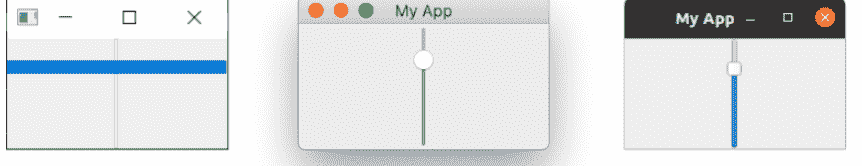

*图 17. Windows、macOS 和 Ubuntu 上的 QSlider。在 Windows 上，手柄会扩展到控件的大小。*

你也可以通过在创建时传入方向来构建一个垂直或水平方向的滑块。方向标志在 `Qt` 命名空间中定义。例如——

```python
widget.QSlider(Qt.Orientation.Vertical)
```

或——

```python
widget.QSlider(Qt.Orientation.Horizontal)
```

## QDial

最后，QDial 是一个可旋转的控件，功能与滑块相同，但外观类似模拟表盘。这看起来不错，但从用户界面的角度来看，并不是特别友好。然而，它们经常在音频应用程序中用作真实世界模拟表盘的表示。

清单 22. basic/widgets_9.py

```python
import sys

from PyQt6.QtCore import Qt
from PyQt6.QtWidgets import QApplication, QDial, QMainWindow

class MainWindow(QMainWindow):
    def __init__(self):
        super().__init__()

        self.setWindowTitle("My App")

        widget = QDial()
        widget.setRange(-10, 100)
        widget.setSingleStep(0.5)

        widget.valueChanged.connect(self.value_changed)
        widget.sliderMoved.connect(self.slider_position)
        widget.sliderPressed.connect(self.slider_pressed)
        widget.sliderReleased.connect(self.slider_released)

        self.setCentralWidget(widget)

    def value_changed(self, i):
        print(i)

    def slider_position(self, p):
        print("position", p)

    def slider_pressed(self):
        print("Pressed!")

    def slider_released(self):
        print("Released")

app = QApplication(sys.argv)

window = MainWindow()
window.show()

app.exec()
```

🚀 **运行它！** 你将看到一个表盘，旋转它以从范围内选择一个数字。

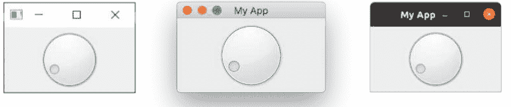

*图 18. Windows、macOS 和 Ubuntu 上的 QDial*

其信号与 `QSlider` 相同，并保留相同的名称（例如 `.sliderMoved`）。

至此，我们对 PyQt6 中可用的 Qt 控件进行了简要介绍。要查看可用控件的完整列表，包括它们所有的信号和属性，请查看 [Qt 文档](https://doc.qt.io/qt-6/)。

## QWidget

我们的演示中有一个 QWidget，但你看不到它。我们之前在第一个示例中使用 QWidget 来创建一个空窗口。但 QWidget 也可以用作其他控件的*容器*，与 [布局](https://doc.qt.io/qt-6/layout.html) 一起，用于构建窗口或复合控件。我们将在后面更详细地介绍 [创建自定义控件](https://doc.qt.io/qt-6/widgets-custom.html)。

请记住 QWidget，因为你将会经常看到它！

# 8. 布局

到目前为止，我们已经成功创建了一个窗口并向其中添加了一个控件。但是，你通常会希望向一个窗口添加多个控件，并对你添加的控件最终放置的位置进行一些控制。在 Qt 中，我们使用*布局*来将控件组合在一起。Qt 中有 4 种基本布局，如下表所列。

| 布局 | 行为 |
| :--- | :--- |
| `QHBoxLayout` | 线性水平布局 |
| `QVBoxLayout` | 线性垂直布局 |
| `QGridLayout` | 可索引的网格 XxY |
| `QStackedLayout` | 堆叠（z）在彼此前面 |

Qt 中有三种二维布局可用：`QVBoxLayout`、`QHBoxLayout` 和 `QGridLayout`。此外，还有 `QStackedLayout`，它允许你将控件一个叠放在另一个之上，位于同一空间内，但一次只显示一个布局。

在本章中，我们将依次介绍这些布局，展示如何使用它们在应用程序中定位控件。

> **Qt Designer**

你实际上可以使用 Qt Designer 以图形方式设计和布局你的界面，我们将在后面介绍。这里我们使用代码，因为它更容易理解和试验底层系统。

### # 占位控件

> 💡 加载 `myapp.py` 的一个新副本，并将其另存为新名称用于本节。

为了更容易可视化布局，我们将首先创建一个简单的自定义控件，显示我们选择的纯色。这将有助于区分我们添加到布局中的控件。将以下代码作为顶层类添加到你的文件中——

*清单 23. basic/layout_colorwidget.py*

```python
from PyQt6.QtGui import QColor, QPalette
from PyQt6.QtWidgets import QWidget


class Color(QWidget):
    def __init__(self, color):
        super().__init__()
        self.setAutoFillBackground(True)

        palette = self.palette()
        palette.setColor(QPalette.ColorRole.Window, QColor(color))
        self.setPalette(palette)
```

在这段代码中，我们继承 `QWidget` 来创建我们自己的自定义控件 `Color`。在创建控件时，我们接受一个参数——`color`（一个 `str`）。我们首先将 `.setAutoFillBackground` 设置为 `True`，告诉控件自动用窗口颜色填充其背景。接下来，我们将控件的 `QPalette.Window` 颜色更改为由我们传入的值 `color` 描述的新 `QColor`。最后，我们将此调色板应用回控件。最终结果是一个填充了纯色的控件，我们在创建它时指定该颜色。

如果你觉得上面的内容令人困惑，不要太担心！我们将在后面详细介绍 [创建自定义控件](https://www.pythonguis.com/tutorials/pyqt6/custom-widgets/) 和 [调色板](https://www.pythonguis.com/tutorials/pyqt6/palettes/)。现在，你只需理解你可以通过以下代码创建一个纯红色的填充控件——

```python
Color('red')
```

首先，让我们通过使用新的 Color 控件用单一颜色填充整个窗口来测试它。完成后，我们可以使用 `.setCentralWidget` 将其添加到主窗口，从而得到一个纯红色的窗口。

清单 24. basic/layout_1.py

```python
import sys

from PyQt6.QtCore import Qt
from PyQt6.QtWidgets import QApplication, QMainWindow

from layout_colorwidget import Color

class MainWindow(QMainWindow):
    def __init__(self):
        super().__init__()

        self.setWindowTitle("My App")

        widget = Color("red")
        self.setCentralWidget(widget)

app = QApplication(sys.argv)

window = MainWindow()
window.show()

app.exec()
```

> 🚀 运行它！窗口将出现，完全填充为红色。注意控件如何扩展以填充所有可用空间。

## QVBoxLayout 垂直排列的控件

使用 `QVBoxLayout`，你可以将控件一个接一个地垂直线性排列。添加一个控件会将其添加到列的底部。

图 20. 一个 QVBoxLayout，从上到下填充。

让我们将控件添加到布局中。请注意，为了将布局添加到 `QMainWindow`，我们需要将其应用到一个虚拟的 `QWidget` 上。这允许我们随后使用 `.setCentralWidget` 将控件（以及布局）应用到窗口。我们的彩色控件将在布局中自行排列，包含在窗口的 `QWidget` 内。首先，我们像之前一样只添加红色控件。

清单 25. basic/layout_2a.py

```python
import sys

from PyQt6.QtCore import Qt
from PyQt6.QtWidgets import QApplication, QMainWindow, QVBoxLayout, QWidget

from layout_colorwidget import Color

class MainWindow(QMainWindow):
    def __init__(self):
        super().__init__()

        self.setWindowTitle("My App")

        layout = QVBoxLayout()

        layout.addWidget(Color("red"))

        widget = QWidget()
        widget.setLayout(layout)
        self.setCentralWidget(widget)

app = QApplication(sys.argv)

window = MainWindow()
window.show()

app.exec()
```

🚀 **运行它！** 注意现在红色控件周围可见的边框。这是布局间距——我们稍后会看到如何调整它。

图 21. 我们的 Color 控件，在一个布局中。

接下来，向布局中添加更多彩色控件：

清单 26. basic/layout_2b.py

```python
import sys

from PyQt6.QtCore import Qt
from PyQt6.QtWidgets import QApplication, QMainWindow, QVBoxLayout, QWidget

from layout_colorwidget import Color

class MainWindow(QMainWindow):
    def __init__(self):
        super().__init__()

        self.setWindowTitle("My App")

        layout = QVBoxLayout()

        layout.addWidget(Color("red"))
        layout.addWidget(Color("green"))
        layout.addWidget(Color("blue"))

        widget = QWidget()
        widget.setLayout(layout)
        self.setCentralWidget(widget)

app = QApplication(sys.argv)

window = MainWindow()
window.show()

app.exec()
```

当我们添加控件时，它们会按照添加的顺序垂直排列。

图 22. 三个 Color 控件在 QVBoxLayout 中垂直排列。

## QHBoxLayout 水平排列的控件

QHBoxLayout 是相同的，只是水平移动。添加一个控件会将其添加到右侧。

图 23. 一个 QHBoxLayout，从左到右填充。

要使用它，我们只需将 QVBoxLayout 更改为 QHBoxLayout。现在方框从左到右流动。

清单 27. basic/layout_3.py

```python
import sys

from PyQt6.QtCore import Qt
from PyQt6.QtWidgets import QApplication, QHBoxLayout, QLabel,
    QMainWindow, QWidget

from layout_colorwidget import Color

class MainWindow(QMainWindow):
    def __init__(self):
        super().__init__()

        self.setWindowTitle("My App")

        layout = QHBoxLayout()

        layout.addWidget(Color("red"))
        layout.addWidget(Color("green"))
        layout.addWidget(Color("blue"))

        widget = QWidget()
        widget.setLayout(layout)
        self.setCentralWidget(widget)

app = QApplication(sys.argv)

window = MainWindow()
window.show()

app.exec()
```

🚀 **运行它！** 控件应该会水平排列。

图 24. 三个 Color 控件在 QHBoxLayout 中水平排列。

### 嵌套布局

对于更复杂的布局，你可以使用布局上的 `.addLayout` 将布局相互嵌套。下面我们将一个 `QVBoxLayout` 添加到主 `QHBoxLayout` 中。如果我们向 `QVBoxLayout` 添加一些控件，它们将垂直排列在父布局的第一个槽位中。

清单 28. basic/layout_4.py

```python
import sys

from PyQt6.QtCore import Qt
from PyQt6.QtWidgets import (
    QApplication,
    QHBoxLayout,
    QLabel,
    QMainWindow,
    QVBoxLayout,
    QWidget,
)

from layout_colorwidget import Color

class MainWindow(QMainWindow):
    def __init__(self):
        super().__init__()

        self.setWindowTitle("My App")

        layout1 = QHBoxLayout()
        layout2 = QVBoxLayout()
        layout3 = QVBoxLayout()

        layout2.addWidget(Color("red"))
        layout2.addWidget(Color("yellow"))
        layout2.addWidget(Color("purple"))

        layout1.addLayout(layout2)

        layout1.addWidget(Color("green"))

        layout3.addWidget(Color("red"))
        layout3.addWidget(Color("purple"))

        layout1.addLayout(layout3)

        widget = QWidget()
        widget.setLayout(layout1)
        self.setCentralWidget(widget)

app = QApplication(sys.argv)

window = MainWindow()
window.show()

app.exec()
```

> **运行它！** 控件应该会水平排列成 3 列，其中第一列还包含 3 个垂直堆叠的控件。试试看！

*图 25. 嵌套的 QHBoxLayout 和 QVBoxLayout 布局。*

你可以使用 `.setContentMargins` 设置布局周围的间距，或使用 `.setSpacing` 设置元素之间的间距。

```python
layout1.setContentsMargins(0,0,0,0)
layout1.setSpacing(20)
```

以下代码展示了嵌套控件与布局边距和间距的组合效果。

清单 29. basic/layout_5.py

```python
import sys

from PyQt6.QtCore import Qt
from PyQt6.QtWidgets import (
    QApplication,
    QHBoxLayout,
    QLabel,
    QMainWindow,
    QVBoxLayout,
    QWidget,
)

from layout_colorwidget import Color

class MainWindow(QMainWindow):
    def __init__(self):
        super().__init__()

        self.setWindowTitle("My App")

        layout1 = QHBoxLayout()
        layout2 = QVBoxLayout()
        layout3 = QVBoxLayout()

        layout1.setContentsMargins(0, 0, 0, 0)
        layout1.setSpacing(20)

        layout2.addWidget(Color("red"))
        layout2.addWidget(Color("yellow"))
        layout2.addWidget(Color("purple"))

        layout1.addLayout(layout2)

        layout1.addWidget(Color("green"))

        layout3.addWidget(Color("red"))
        layout3.addWidget(Color("purple"))

        layout1.addLayout(layout3)

        widget = QWidget()
        widget.setLayout(layout1)
        self.setCentralWidget(widget)

app = QApplication(sys.argv)

window = MainWindow()
window.show()

app.exec()
```

🚀 **运行它！** 你应该能看到间距和边距的效果。尝试调整这些数字，直到你对它们有感觉。

图 26. 嵌套的 QHBoxLayout 和 QVBoxLayout 布局，控件周围有间距和边距。

## QGridLayout 网格排列的控件

尽管 QVBoxLayout 和 QHBoxLayout 很有用，但如果你尝试使用它们来布局多个元素，例如一个表单，你会发现很难确保不同大小的控件对齐。解决方案是 QGridLayout。

QGridLayout 允许你将项目专门定位在网格中。你为每个控件指定行和列位置。你可以跳过元素，它们将被留空。

清单 30. basic/layout_6.py

```python
import sys

from PyQt6.QtCore import Qt
from PyQt6.QtWidgets import QApplication, QGridLayout, QLabel,
    QMainWindow, QWidget

from layout_colorwidget import Color

class MainWindow(QMainWindow):
    def __init__(self):
        super().__init__()

        self.setWindowTitle("My App")

        layout = QGridLayout()

        layout.addWidget(Color("red"), 0, 0)
        layout.addWidget(Color("green"), 1, 0)
        layout.addWidget(Color("blue"), 1, 1)
        layout.addWidget(Color("purple"), 2, 1)

        widget = QWidget()
        widget.setLayout(layout)
        self.setCentralWidget(widget)

app = QApplication(sys.argv)

window = MainWindow()
window.show()

app.exec()
```

🚀 运行它！你应该能看到控件排列成网格，即使缺少条目也能对齐。

## QStackedLayout：同一空间中的多个部件

我们要介绍的最后一种布局是 `QStackedLayout`。如前所述，这种布局允许你将元素直接堆叠放置。然后你可以选择要显示哪个部件。你可以将其用于图形应用程序中的绘图图层，或者模拟标签页界面。请注意，还有一个 `QStackedWidget`，它是一个容器部件，工作方式完全相同。如果你想直接将堆栈添加到 `QMainWindow` 中并使用 `.setCentralWidget`，这会很有用。

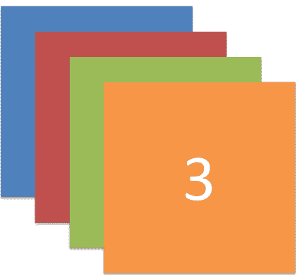

图 30. QStackedLayout —— 使用时只有最顶层的部件可见，默认是添加到布局中的第一个部件。

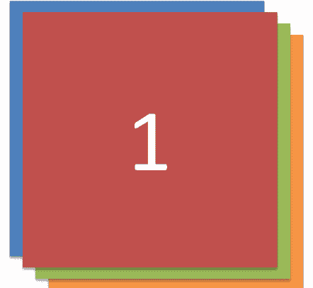

图 31. QStackedLayout，选中了第二个（索引为1）部件并将其带到前面

代码清单 31. basic/layout_7.py

```python
import sys

from PyQt6.QtCore import Qt
from PyQt6.QtWidgets import QApplication, QLabel, QMainWindow,
    QStackedLayout, QWidget

from layout_colorwidget import Color

class MainWindow(QMainWindow):
    def __init__(self):
        super().__init__()

        self.setWindowTitle("My App")

        layout = QStackedLayout()

        layout.addWidget(Color("red"))
        layout.addWidget(Color("green"))
        layout.addWidget(Color("blue"))
        layout.addWidget(Color("yellow"))

        layout.setCurrentIndex(3)

        widget = QWidget()
        widget.setLayout(layout)
        self.setCentralWidget(widget)

app = QApplication(sys.argv)

window = MainWindow()
window.show()

app.exec()
```

🚀 运行它！你将只看到最后添加的部件。

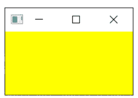

图 32. 一个堆栈部件，只显示一个部件（最后添加的部件）。

QStackedWidget 是应用程序中标签页视图的工作方式。任何时候只有一个视图（“标签页”）是可见的。你可以随时通过使用 `.setCurrentIndex()` 或 `.setCurrentWidget()` 来控制显示哪个部件，前者按部件添加的顺序索引设置，后者直接按部件本身设置。

下面是一个简短的演示，使用 QStackedLayout 结合 QButton 为应用程序提供类似标签页的界面 —

代码清单 32. basic/layout_8.py

```python
import sys

from PyQt6.QtCore import Qt
from PyQt6.QtWidgets import (
    QApplication,
    QHBoxLayout,
    QLabel,
    QMainWindow,
    QPushButton,
    QStackedLayout,
    QVBoxLayout,
    QWidget,
)

from layout_colorwidget import Color

class MainWindow(QMainWindow):
    def __init__(self):
        super().__init__()

        self.setWindowTitle("My App")

        pagelayout = QVBoxLayout()
        button_layout = QHBoxLayout()
        self.stacklayout = QStackedLayout()

        pagelayout.addLayout(button_layout)
        pagelayout.addLayout(self.stacklayout)

        btn = QPushButton("red")
        btn.pressed.connect(self.activate_tab_1)
        button_layout.addWidget(btn)
        self.stacklayout.addWidget(Color("red"))

        btn = QPushButton("green")
        btn.pressed.connect(self.activate_tab_2)
        button_layout.addWidget(btn)
        self.stacklayout.addWidget(Color("green"))

        btn = QPushButton("yellow")
        btn.pressed.connect(self.activate_tab_3)
        button_layout.addWidget(btn)
        self.stacklayout.addWidget(Color("yellow"))

        widget = QWidget()
        widget.setLayout(pagelayout)
        self.setCentralWidget(widget)

    def activate_tab_1(self):
        self.stacklayout.setCurrentIndex(0)

    def activate_tab_2(self):
        self.stacklayout.setCurrentIndex(1)

    def activate_tab_3(self):
        self.stacklayout.setCurrentIndex(2)

app = QApplication(sys.argv)

window = MainWindow()
window.show()

app.exec()
```

> 🚀 **运行它！** 你现在可以通过按钮更改可见的部件。

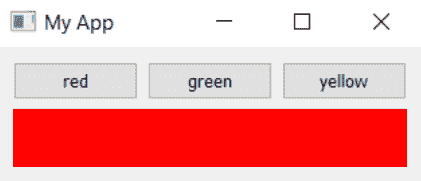

*图 33. 一个堆栈部件，带有控制活动部件的按钮。*

Qt 提供了一个内置的标签页部件，可以开箱即用地提供这种布局——尽管它实际上是一个部件，而不是一个布局。下面使用 `QTabWidget` 重新创建了标签页演示 —

代码清单 33. basic/layout_9.py

```python
import sys

from PyQt6.QtCore import Qt
from PyQt6.QtWidgets import (
    QApplication,
    QLabel,
    QMainWindow,
    QPushButton,
    QTabWidget,
    QWidget,
)

from layout_colorwidget import Color

class MainWindow(QMainWindow):
    def __init__(self):
        super().__init__()

        self.setWindowTitle("My App")

        tabs = QTabWidget()
        tabs.setTabPosition(QTabWidget.TabPosition.West)
        tabs.setMovable(True)

        for n, color in enumerate(["red", "green", "blue", "yellow"]):
            tabs.addTab(Color(color), color)

        self.setCentralWidget(tabs)

app = QApplication(sys.argv)

window = MainWindow()
window.show()

app.exec()
```

如你所见，它更直接一些——也更吸引人！你可以使用基本方向设置标签页的位置，并使用 `.setMoveable` 切换标签页是否可移动。

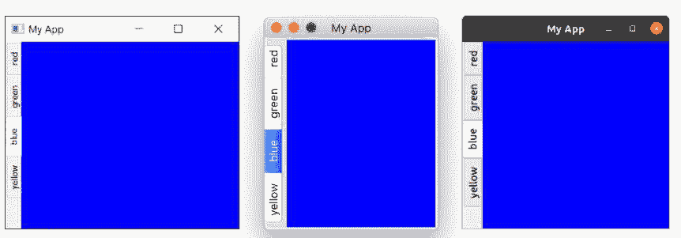

图 34. 包含我们部件的 `QTabWidget`，标签页显示在左侧（西）。截图展示了 Windows、macOS 和 Ubuntu 的外观。

你会注意到 macOS 的标签栏与其他系统看起来非常不同——默认情况下，macOS 上的标签页采用 *药丸* 或 *气泡* 样式。在 macOS 上，这通常用于标签页配置面板。对于文档，你可以开启 *文档模式* 以获得类似其他平台的细长标签页。此选项在其他平台上没有效果。

代码清单 34. basic/layout_9b.py

```python
tabs = QTabWidget()
tabs.setDocumentMode(True)
```

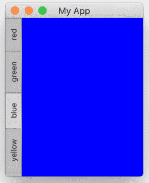

图 35. 在 macOS 上将文档模式设置为 True 的 QTabWidget。

# 9. 动作、工具栏和菜单

接下来，我们将介绍一些常见的用户界面元素，你可能在许多其他应用程序中见过——工具栏和菜单。我们还将探索 Qt 提供的一个巧妙系统，用于最小化不同 UI 区域之间的重复——`QAction`。

## 工具栏

最常见的用户界面元素之一是工具栏。工具栏是图标和/或文本的条带，用于在应用程序中执行常见任务，通过菜单访问这些任务会很繁琐。它们是许多应用程序中最常见的 UI 功能之一。虽然一些复杂的应用程序，特别是 Microsoft Office 套件，已经迁移到上下文相关的“功能区”界面，但标准工具栏对于你将创建的大多数应用程序来说已经足够。


图 36. 标准 GUI 元素 - 工具栏

Qt 工具栏支持显示图标、文本，也可以包含任何标准的 Qt 部件。然而，对于按钮，最好的方法是利用 `QAction` 系统将按钮放置在工具栏上。

让我们从向应用程序添加一个工具栏开始。

> 💡 加载 `myapp.py` 的一个新副本，并将其保存为本节的新名称。

在 Qt 中，工具栏是从 QToolBar 类创建的。首先，你创建该类的一个实例，然后在 QMainWindow 上调用 `.addToolBar`。将字符串作为第一个参数传递给 `QToolBar` 会设置工具栏的名称，该名称将用于在 UI 中标识该工具栏。

代码清单 35. basic/toolbars_and_menus_1.py

```python
class MainWindow(QMainWindow):
    def __init__(self):
        super().__init__()

        self.setWindowTitle("My App")

        label = QLabel("Hello!")
        label.setAlignment(Qt.AlignmentFlag.AlignCenter)

        self.setCentralWidget(label)

        toolbar = QToolBar("My main toolbar")
        self.addToolBar(toolbar)

    def onMyToolBarButtonClick(self, s):
        print("click", s)
```

> 🚀 **运行它！** 你会在窗口顶部看到一个细灰色的条。这就是你的工具栏。右键单击并点击名称可以将其关闭。

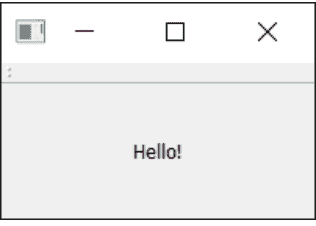

图 37. 带有工具栏的窗口。

> ⚠️ *我无法找回我的工具栏了！？*

不幸的是，一旦你移除了一个工具栏，就没有地方可以右键单击来重新添加它了。因此，作为一个通用规则，你要么保持一个工具栏不可移除，要么提供一个替代界面来打开和关闭工具栏。

让我们把工具栏做得更有趣一些。我们可以直接添加一个 `QButton` 控件，但在 Qt 中有一个更好的方法，能让你获得一些很酷的功能——那就是通过 `QAction`。`QAction` 是一个提供描述抽象用户界面方式的类。用大白话说，就是你可以在一个对象中定义多个界面元素，这些元素通过与之交互产生的效果统一起来。例如，通常有些功能既在工具栏中表示，也在菜单中表示——想想“编辑→剪切”这样的功能，它既出现在“编辑”菜单中，也作为工具栏上的一把剪刀图标出现，还可以通过键盘快捷键 `Ctrl-X`（在 macOS 上是 `Cmd-X`）触发。

如果没有 `QAction`，你就必须在多个地方分别定义。但有了 `QAction`，你可以定义一个单独的 `QAction`，定义触发的动作，然后将这个动作同时添加到菜单和工具栏中。每个 `QAction` 都有名称、状态消息、图标和可以连接的信号（以及更多功能）。

请参阅下面的代码，了解如何添加你的第一个 `QAction`。

清单 36. basic/toolbars_and_menus_2.py

```
class MainWindow(QMainWindow):
    def __init__(self):
        super().__init__()

        self.setWindowTitle("My App")

        label = QLabel("Hello!")
        label.setAlignment(Qt.AlignmentFlag.AlignCenter)

        self.setCentralWidget(label)

        toolbar = QToolBar("My main toolbar")
        self.addToolBar(toolbar)

        button_action = QAction("Your button", self)
        button_action.setStatusTip("This is your button")
        button_action.triggered.connect(self.onMyToolBarButtonClick)
        toolbar.addAction(button_action)

    def onMyToolBarButtonClick(self, s):
        print("click", s)
```

首先，我们创建一个函数来接收来自 `QAction` 的信号，以便我们能看到它是否工作。接下来我们定义 `QAction` 本身。在创建实例时，我们可以传递一个动作的标签和/或一个图标。你还必须传递任何 `QObject` 作为该动作的父对象——这里我们传递 `self` 作为对主窗口的引用。奇怪的是，对于 `QAction`，父元素是作为最后一个参数传递的。

接下来，我们可以选择设置一个状态提示——一旦我们有了状态栏，这个文本就会显示在状态栏上。最后，我们将 `.triggered` 信号连接到自定义函数。每当 `QAction` 被“触发”（或激活）时，这个信号就会触发。

> **🚀 运行它！** 你应该能看到带有你定义标签的按钮。点击它，我们的自定义函数就会输出 "click" 和按钮的状态。

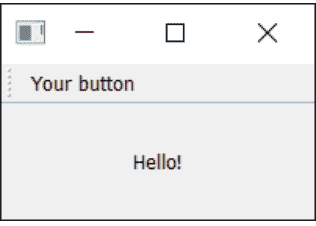

*图 38. 显示我们 QAction 按钮的工具栏。*

> *为什么信号总是 false？*

传递的信号指示该动作是否被**选中**，由于我们的按钮不可选中——只是可点击——所以它总是 false。这就像我们之前看到的 `QPushButton` 一样。

让我们添加一个状态栏。

我们通过调用 `QStatusBar` 并将结果传递给 `.setStatusBar` 来创建一个状态栏对象。由于我们不需要更改状态栏设置，我们可以在创建时直接传递它。我们可以在一行中创建并定义状态栏：

清单 37. basic/toolbars_and_menus_3.py

```
class MainWindow(QMainWindow):
    def __init__(self):
        super().__init__()

        self.setWindowTitle("My App")

        label = QLabel("Hello!")
        label.setAlignment(Qt.AlignmentFlag.AlignCenter)

        self.setCentralWidget(label)

        toolbar = QToolBar("My main toolbar")
        self.addToolBar(toolbar)

        button_action = QAction("Your button", self)
        button_action.setStatusTip("This is your button")
        button_action.triggered.connect(self.onMyToolBarButtonClick)
        toolbar.addAction(button_action)

        self.setStatusBar(QStatusBar(self))

    def onMyToolBarButtonClick(self, s):
        print("click", s)
```

🚀 运行它！将鼠标悬停在工具栏按钮上，你会在窗口底部的状态栏中看到状态文本出现。

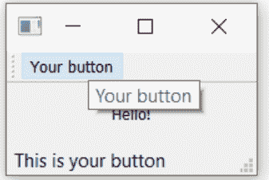

图 39. 当我们悬停在动作上时，状态栏文本会更新。

接下来，我们将把我们的 `QAction` 变成可切换的——这样点击会打开它，再次点击会关闭它。为此，我们只需在 `QAction` 对象上调用 `setCheckable(True)`。

清单 38. basic/toolbars_and_menus_4.py

```
class MainWindow(QMainWindow):
    def __init__(self):
        super().__init__()

        self.setWindowTitle("My App")

        label = QLabel("Hello!")
        label.setAlignment(Qt.AlignmentFlag.AlignCenter)

        self.setCentralWidget(label)

        toolbar = QToolBar("My main toolbar")
        self.addToolBar(toolbar)

        button_action = QAction("Your button", self)
        button_action.setStatusTip("This is your button")
        button_action.triggered.connect(self.onMyToolBarButtonClick)
        button_action.setCheckable(True)
        toolbar.addAction(button_action)

        self.setStatusBar(QStatusBar(self))

    def onMyToolBarButtonClick(self, s):
        print("click", s)
```

🚀 运行它！点击按钮，看看它如何在选中和未选中状态之间切换。注意我们现在创建的自定义槽函数会交替输出 True 和 False。

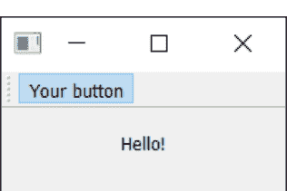

图 40. 工具栏按钮已切换为开启状态。

> .toggled 信号

还有一个 `.toggled` 信号，它只在按钮被切换时才发出信号。但效果是一样的，所以这基本上没什么用。

现在看起来相当简陋——所以让我们给按钮添加一个图标。为此，我建议你下载设计师 Yusuke Kamiyamane 的 [fugue 图标集](http://p.yusukekamiyamane.com/)。这是一套很棒的精美 16x16 图标，可以让你的应用程序看起来很专业。它是免费提供的，分发应用程序时只需注明出处——尽管我相信如果你有多余的钱，设计师也会很感激。

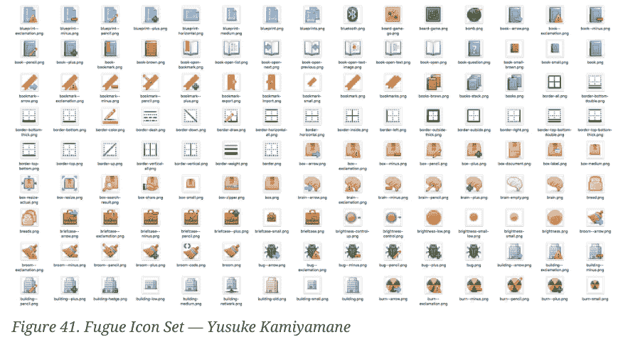

从图标集中选择一张图片（在本例中我选择了文件 `bug.png`），并将其复制到与源代码相同的文件夹中。要将图标添加到 `QAction`（从而添加到按钮），我们只需在创建 `QAction` 时将其作为第一个参数传递。如果图标与源代码在同一文件夹中，你只需将其复制到

你还需要让工具栏知道你的图标有多大，否则你的图标周围会有很多填充。你可以通过使用 `QSize` 对象调用 `.setIconSize()` 来实现这一点。

清单 39. basic/toolbars_and_menus_5.py

```
class MainWindow(QMainWindow):
    def __init__(self):
        super().__init__()

        self.setWindowTitle("My App")

        label = QLabel("Hello!")
        label.setAlignment(Qt.AlignmentFlag.AlignCenter)

        self.setCentralWidget(label)

        toolbar = QToolBar("My main toolbar")
        toolbar.setIconSize(QSize(16, 16))
        self.addToolBar(toolbar)

        button_action = QAction(QIcon("bug.png"), "Your button", self)
        button_action.setStatusTip("This is your button")
        button_action.triggered.connect(self.onMyToolBarButtonClick)
        button_action.setCheckable(True)
        toolbar.addAction(button_action)

        self.setStatusBar(QStatusBar(self))

    def onMyToolBarButtonClick(self, s):
        print("click", s)
```

> 运行它！QAction 现在由一个图标表示。
一切功能应与之前完全相同。


图 42. 带有图标的操作按钮。

请注意，Qt 使用你的操作系统默认设置来决定在工具栏中显示图标、文本还是图标和文本。但你可以通过使用 `.setToolButtonStyle` 来覆盖此设置。此槽接受来自 `Qt.` 命名空间的以下任何标志：

| 标志 | 行为 |
| :--- | :--- |
| `Qt.ToolButtonStyle.ToolButtonIconOnly` | 仅图标，无文本 |
| `Qt.ToolButtonStyle.ToolButtonTextOnly` | 仅文本，无图标 |
| `Qt.ToolButtonStyle.ToolButtonTextBesideIcon` | 图标和文本，文本在图标旁边 |
| `Qt.ToolButtonStyle.ToolButtonTextUnderIcon` | 图标和文本，文本在图标下方 |
| `Qt.ToolButtonStyle.ToolButtonIconOnly` | 仅图标，无文本 |
| `Qt.ToolButtonStyle.ToolButtonFollowStyle` | 遵循主机桌面样式 |

> > **我应该使用哪种样式？**
>
> 默认值是 `Qt.ToolButtonStyle.ToolButtonFollowStyle`，这意味着你的应用程序将默认遵循运行该应用程序的桌面的标准/全局设置。通常建议这样做，以使你的应用程序尽可能感觉**原生**。

接下来，我们将在工具栏中添加更多内容。我们将添加第二个按钮以及一个复选框小部件。如前所述，你确实可以在这里放置任何小部件，所以请随意发挥。

清单 40. basic/toolbars_and_menus_6.py

```python
class MainWindow(QMainWindow):
    def __init__(self):
        super().__init__()

        self.setWindowTitle("My App")

        label = QLabel("Hello!")
        label.setAlignment(Qt.AlignmentFlag.AlignCenter)

        self.setCentralWidget(label)

        toolbar = QToolBar("My main toolbar")
        toolbar.setIconSize(QSize(16, 16))
        self.addToolBar(toolbar)

        button_action = QAction(QIcon("bug.png"), "Your button", self)
        button_action.setStatusTip("This is your button")
        button_action.triggered.connect(self.onMyToolBarButtonClick)
        button_action.setCheckable(True)
        toolbar.addAction(button_action)

        toolbar.addSeparator()

        button_action2 = QAction(QIcon("bug.png"), "Your button2", self)
        button_action2.setStatusTip("This is your button2")
        button_action2.triggered.connect(self.onMyToolBarButtonClick)
        button_action2.setCheckable(True)
        toolbar.addAction(button_action2)

        toolbar.addWidget(QLabel("Hello"))
        toolbar.addWidget(QCheckBox())

        self.setStatusBar(QStatusBar(self))

    def onMyToolBarButtonClick(self, s):
        print("click", s)
```

> 🚀 **运行它！** 现在你会看到多个按钮和一个复选框。

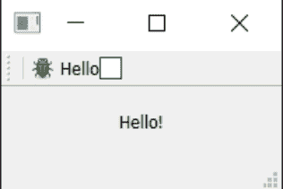

*图 43. 带有操作和两个小部件的工具栏。*

## 菜单

菜单是用户界面的另一个标准组件。通常它们位于窗口顶部，或者在 macOS 上位于屏幕顶部。它们允许访问所有标准的应用程序功能。存在一些标准菜单——例如文件、编辑、帮助。菜单可以嵌套以创建功能的分层树，并且它们通常支持并显示键盘快捷键，以便快速访问其功能。

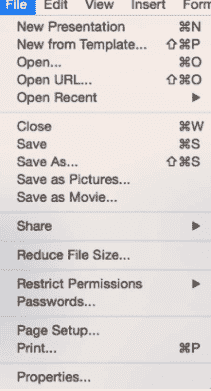

*图 44. 标准 GUI 元素 - 菜单*

要创建一个菜单，我们创建一个菜单栏，我们在 `QMainWindow` 上调用 `.menuBar()`。我们通过调用 `.addMenu()` 并传入菜单名称来在菜单栏上添加一个菜单。我将其命名为 `'&File'`。& 符号定义了一个快捷键，当按下 Alt 时可以跳转到此菜单。

> macOS 上的快捷键
这在 macOS 上不可见。请注意，这与键盘快捷键不同——我们稍后会介绍。

这就是操作（actions）的强大之处。我们可以重用已存在的 QAction，将相同的功能添加到菜单中。要添加一个操作，你调用 `.addAction` 并传入我们定义的操作之一。

清单 41. basic/toolbars_and_menus_7.py

```python
class MainWindow(QMainWindow):
    def __init__(self):
        super().__init__()

        self.setWindowTitle("My App")

        label = QLabel("Hello!")
        label.setAlignment(Qt.AlignmentFlag.AlignCenter)

        self.setCentralWidget(label)

        toolbar = QToolBar("My main toolbar")
        toolbar.setIconSize(QSize(16, 16))
        self.addToolBar(toolbar)

        button_action = QAction(QIcon("bug.png"), "&Your button", self)
        button_action.setStatusTip("This is your button")
        button_action.triggered.connect(self.onMyToolBarButtonClick)
        button_action.setCheckable(True)
        toolbar.addAction(button_action)

        toolbar.addSeparator()

        button_action2 = QAction(QIcon("bug.png"), "Your &button2", self)
        button_action2.setStatusTip("This is your button2")
        button_action2.triggered.connect(self.onMyToolBarButtonClick)
        button_action2.setCheckable(True)
        toolbar.addAction(button_action2)

        toolbar.addWidget(QLabel("Hello"))
        toolbar.addWidget(QCheckBox())

        self.setStatusBar(QStatusBar(self))

        menu = self.menuBar()

        file_menu = menu.addMenu("&File")
        file_menu.addAction(button_action)

    def onMyToolBarButtonClick(self, s):
        print("click", s)
```

点击菜单中的项目，你会注意到它是可切换的——它继承了 QAction 的特性。

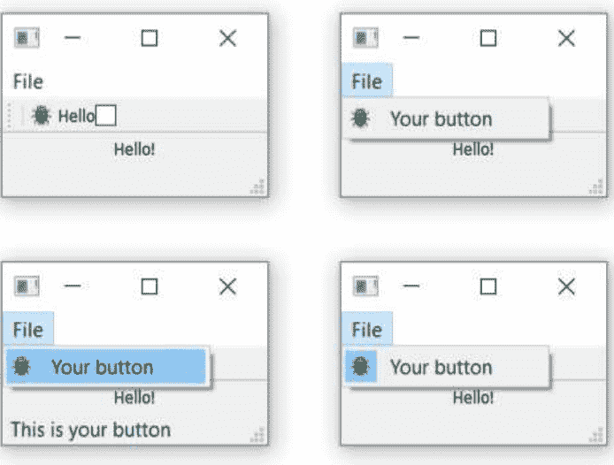

图 45. 显示在窗口上的菜单——在 macOS 上，这将位于屏幕顶部。

让我们向菜单添加更多内容。这里我们将向菜单添加一个分隔符，它将在菜单中显示为一条水平线，然后添加我们创建的第二个 QAction。

清单 42. basic/toolbars_and_menus_8.py

```python
class MainWindow(QMainWindow):
    def __init__(self):
        super().__init__()

        self.setWindowTitle("My App")

        label = QLabel("Hello!")
        label.setAlignment(Qt.AlignmentFlag.AlignCenter)

        self.setCentralWidget(label)

        toolbar = QToolBar("My main toolbar")
        toolbar.setIconSize(QSize(16, 16))
        self.addToolBar(toolbar)

        button_action = QAction(QIcon("bug.png"), "&Your button", self)
        button_action.setStatusTip("This is your button")
        button_action.triggered.connect(self.onMyToolBarButtonClick)
        button_action.setCheckable(True)
        toolbar.addAction(button_action)

        toolbar.addSeparator()

        button_action2 = QAction(QIcon("bug.png"), "Your &button2", self)
        button_action2.setStatusTip("This is your button2")
        button_action2.triggered.connect(self.onMyToolBarButtonClick)
        button_action2.setCheckable(True)
        toolbar.addAction(button_action2)

        toolbar.addWidget(QLabel("Hello"))
        toolbar.addWidget(QCheckBox())

        self.setStatusBar(QStatusBar(self))

        menu = self.menuBar()

        file_menu = menu.addMenu("&File")
        file_menu.addAction(button_action)
        file_menu.addSeparator()
        file_menu.addAction(button_action2)

    def onMyToolBarButtonClick(self, s):
        print("click", s)
```

> 🚀 运行它！你应该会看到两个菜单项，它们之间有一条分隔线。

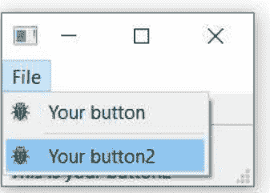

图 46. 我们的操作显示在菜单中。

你也可以使用 & 符号为菜单添加*加速键*，以便在菜单打开时使用单个键跳转到菜单项。同样，这在 macOS 上不起作用。

要添加子菜单，你只需通过在父菜单上调用 `addMenu()` 来创建一个新菜单。然后你可以像往常一样向其添加操作。例如：

清单 43. basic/toolbars_and_menus_9.py

```python
class MainWindow(QMainWindow):
    def __init__(self):
        super().__init__()

        self.setWindowTitle("My App")

        label = QLabel("Hello!")
        label.setAlignment(Qt.AlignmentFlag.AlignCenter)

        self.setCentralWidget(label)

        toolbar = QToolBar("My main toolbar")
        toolbar.setIconSize(QSize(16, 16))
        self.addToolBar(toolbar)

        button_action = QAction(QIcon("bug.png"), "&Your button", self)
        button_action.setStatusTip("This is your button")
        button_action.triggered.connect(self.onMyToolBarButtonClick)
        button_action.setCheckable(True)
        toolbar.addAction(button_action)

        toolbar.addSeparator()

        button_action2 = QAction(QIcon("bug.png"), "Your &button2", self)
        button_action2.setStatusTip("This is your button2")
        button_action2.triggered.connect(self.onMyToolBarButtonClick)
        button_action2.setCheckable(True)
        toolbar.addAction(button_action2)

        toolbar.addWidget(QLabel("Hello"))
        toolbar.addWidget(QCheckBox())

        self.setStatusBar(QStatusBar(self))

        menu = self.menuBar()

        file_menu = menu.addMenu("&File")
        file_menu.addAction(button_action)
        file_menu.addSeparator()

        file_submenu = file_menu.addMenu("Submenu")
        file_submenu.addAction(button_action2)

    def onMyToolBarButtonClick(self, s):
        print("click", s)
```

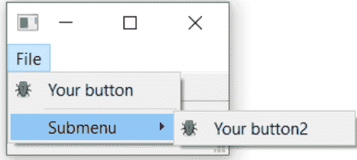

图 47. 嵌套在文件菜单中的子菜单。

最后，我们将为 `QAction` 添加一个键盘快捷键。你通过传递 `setKeySequence()` 并传入按键序列来定义键盘快捷键。任何定义的按键序列都将显示在菜单中。

> **隐藏的快捷键**

请注意，键盘快捷键与 `QAction` 相关联，无论 `QAction` 是否添加到菜单或工具栏，它都将正常工作。

按键序列可以通过多种方式定义——可以作为文本传递，使用 Qt 命名空间中的按键名称，或者使用 Qt 命名空间中定义的按键序列。尽可能使用后者，以确保符合操作系统标准。

完成的代码，显示工具栏按钮和菜单如下所示。

清单 44. basic/toolbars_and_menus_end.py

```python
class MainWindow(QMainWindow):
    def __init__(self):
        super().__init__()

        self.setWindowTitle("My App")

        label = QLabel("Hello!")
```

## `Qt` 命名空间拥有大量用于自定义控件的属性。详见：http://doc.qt.io/qt-5/qt.html

label.setAlignment(Qt.AlignmentFlag.AlignCenter)

# 设置窗口的中心控件。默认情况下，控件会扩展以占据窗口中的所有空间。
self.setCentralWidget(label)

toolbar = QToolBar("My main toolbar")
toolbar.setIconSize(QSize(16, 16))
self.addToolBar(toolbar)

button_action = QAction(QIcon("bug.png"), "&Your button", self)
button_action.setStatusTip("This is your button")
button_action.triggered.connect(self.onMyToolBarButtonClick)
button_action.setCheckable(True)
# 你可以使用按键名称（例如 Ctrl+p）
# Qt 命名空间标识符（例如 Qt.CTRL + Qt.Key_P）
# 或系统无关的标识符（例如 QKeySequence.Print）来设置键盘快捷键
button_action.setShortcut(QKeySequence("Ctrl+p"))
toolbar.addAction(button_action)

toolbar.addSeparator()

button_action2 = QAction(QIcon("bug.png"), "Your &button2", self)
button_action2.setStatusTip("This is your button2")
button_action2.triggered.connect(self.onMyToolBarButtonClick)
button_action2.setCheckable(True)
toolbar.addAction(button_action)

toolbar.addWidget(QLabel("Hello"))
toolbar.addWidget(QCheckBox())

self.setStatusBar(QStatusBar(self))

menu = self.menuBar()

file_menu = menu.addMenu("&File")
file_menu.addAction(button_action)
file_menu.addSeparator()

file_submenu = file_menu.addMenu("Submenu")

file_submenu.addAction(button_action2)

def onMyToolBarButtonClick(self, s):
    print("click", s)

### 组织菜单与工具栏

如果用户找不到应用程序的操作，他们就无法充分发挥应用的潜力。让操作易于发现是创建用户友好型应用的关键。一个常见的错误是试图通过在*所有地方*添加操作来解决这个问题，结果反而让用户感到不知所措和困惑。

将常用且必要的操作放在首位，确保它们易于查找和记忆。想想大多数编辑应用中的 **文件** › **保存**。它位于文件菜单顶部，易于快速访问，并绑定了简单的键盘快捷键 `Ctrl` + `S`。如果 **保存文件...** 需要通过 **文件** › **常用操作** › **文件操作** › **活动文档** › **保存** 或快捷键 `Ctrl` + `Alt` + `J` 才能访问，用户会更难找到它，更难使用它，并且**不太可能**保存他们的文档。

将操作组织成逻辑分组。在少量选项中查找某物比在长列表中查找更容易。如果它在相似的事物中，查找起来会更容易。

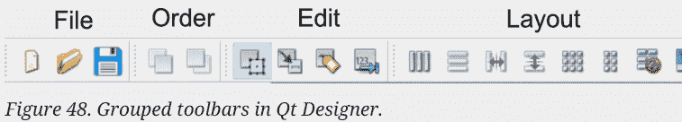

避免在多个菜单中复制操作，因为这会引入“这些操作是否做同样事情？”的歧义，即使它们的标签完全相同。最后，不要试图通过动态隐藏/删除条目来简化菜单。这会导致用户困惑，因为他们会寻找一个不存在的东西“...它刚才还在这里”。不同的状态应该通过禁用菜单项或使用单独的窗口和对话框来指示。

### ✔ 应该做

- 将菜单组织成逻辑层次结构。
- 将*最常用*的功能复制到工具栏上。
- 逻辑地分组工具栏操作。
- 当菜单项无法使用时，将其禁用。

### ✖ 不应该做

- 将相同的操作添加到多个菜单中。
- 将所有菜单操作都添加到工具栏上。
- 在不同地方为相同的操作使用不同的名称或图标。
- 从菜单中删除项目——应该禁用它们。

# 10. 对话框

对话框是有用的 GUI 组件，允许你与用户*交流*（因此得名对话框）。它们通常用于文件打开/保存、设置、首选项，或用于不适合应用程序主界面的功能。它们是小型的模态（或*阻塞*）窗口，位于主应用程序前面，直到被关闭。Qt 实际上为最常见的用例提供了许多“特殊”对话框，允许你提供平台原生体验以获得更好的用户体验。

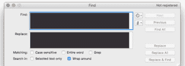

图 49. 标准 GUI 功能 — 搜索对话框

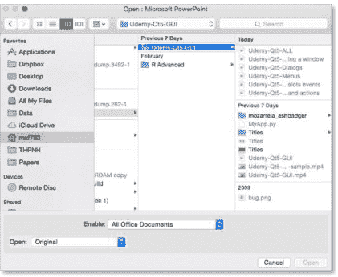

图 50. 标准 GUI 功能 — 文件打开对话框

在 Qt 中，对话框由 `QDialog` 类处理。要创建一个新的对话框，只需创建一个新的 `QDialog` 类型对象，并传入一个父控件（例如 `QMainWindow`）作为其父对象。

让我们创建自己的 `QDialog`。我们将从一个简单的骨架应用开始，其中有一个按钮可以按下，并连接到一个槽方法。

清单 45. basic/dialogs_start.py

```python
import sys

from PyQt6.QtWidgets import QApplication, QMainWindow, QPushButton

class MainWindow(QMainWindow):
    def __init__(self):
        super().__init__()

        self.setWindowTitle("My App")

        button = QPushButton("Press me for a dialog!")
        button.clicked.connect(self.button_clicked)
        self.setCentralWidget(button)

    def button_clicked(self, s):
        print("click", s)

app = QApplication(sys.argv)

window = MainWindow()
window.show()

app.exec()
```

在槽 `button_clicked`（它接收来自按钮按下的信号）中，我们创建对话框实例，并将我们的 `QMainWindow` 实例作为父对象传入。这将使对话框成为 `QMainWindow` 的*模态窗口*。这意味着对话框将完全阻止与父窗口的交互。

清单 46. basic/dialogs_1.py

```python
import sys

from PyQt6.QtWidgets import QApplication, QDialog, QMainWindow, QPushButton

class MainWindow(QMainWindow):
    def __init__(self):
        super().__init__()

        self.setWindowTitle("My App")

        button = QPushButton("Press me for a dialog!")
        button.clicked.connect(self.button_clicked)
        self.setCentralWidget(button)

    def button_clicked(self, s):
        print("click", s)

        dlg = QDialog(self)
        dlg.setWindowTitle("HELLO!")
        dlg.exec()

app = QApplication(sys.argv)

window = MainWindow()
window.show()

app.exec()
```

> 🚀 运行它！点击按钮，你会看到一个空的对话框出现。

一旦我们创建了对话框，我们使用 `.exec_()` 启动它——就像我们为 `QApplication` 创建应用程序的主事件循环所做的那样。这并非巧合：当你执行 `QDialog` 时，会创建一个全新的事件循环——专用于该对话框。

## 一个事件循环统治一切

记得我说过任何时候只能有一个 Qt 事件循环在运行吗？我是认真的！`QDialog` 会完全阻止你的应用程序执行。不要启动一个对话框并期望应用程序中的其他任何地方还能发生任何事情。

我们稍后会看到如何使用多线程来摆脱这个困境。

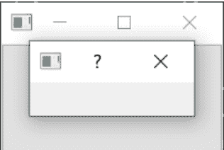

图 51. 我们的空对话框覆盖在窗口上。

就像我们的第一个窗口一样，这并不十分有趣。让我们通过添加一个对话框标题和一组“确定”和“取消”按钮来修复它，允许用户*接受*或*拒绝*模态框。

要自定义 `QDialog`，我们可以对其进行子类化。

清单 47. basic/dialogs_2a.py

```python
class CustomDialog(QDialog):
    def __init__(self):
        super().__init__()

        self.setWindowTitle("HELLO!")

        QBtn = QDialogButtonBox.StandardButton.Ok | QDialogButtonBox.StandardButton.Cancel

        self.buttonBox = QDialogButtonBox(QBtn)
        self.buttonBox.accepted.connect(self.accept)
        self.buttonBox.rejected.connect(self.reject)

        self.layout = QVBoxLayout()
        message = QLabel("Something happened, is that OK?")
        self.layout.addWidget(message)
        self.layout.addWidget(self.buttonBox)
        self.setLayout(self.layout)
```

在上面的代码中，我们首先创建了 QDialog 的子类，我们称之为 CustomDialog。对于 QMainWindow，我们在类的 `__init__` 块中应用自定义设置，这样自定义设置就会在对象创建时应用。首先，我们使用 `.setWindowTitle()` 为 QDialog 设置标题，这与我们为主窗口所做的完全相同。

下一块代码涉及创建和显示对话框按钮。这可能比你预期的要复杂一些。然而，这是由于 Qt 在处理不同平台上对话框按钮定位的灵活性所致。

### 简单的解决方法？

当然，你可以选择忽略这一点，在布局中使用标准的`QButton`，但这里概述的方法能确保你的对话框遵循宿主桌面的标准（例如，确定按钮在左侧还是右侧）。随意更改这些行为可能会让用户感到非常困扰，因此我不推荐这样做。

创建对话框按钮盒的第一步是定义你想要显示的按钮，使用`QDialogButtonBox`的命名空间属性。所有可用的按钮列表如下：

表 1. QDialogButtonBox 可用的按钮类型。

| 按钮类型 |
|---|
| QDialogButtonBox.Ok |
| QDialogButtonBox.Open |
| QDialogButtonBox.Save |
| QDialogButtonBox.Cancel |
| QDialogButtonBox.Close |
| QDialogButtonBox.Discard |
| QDialogButtonBox.Apply |
| QDialogButtonBox.Reset |
| QDialogButtonBox.RestoreDefaults |
| QDialogButtonBox.Help |
| QDialogButtonBox.SaveAll |
| QDialogButtonBox.Yes |
| QDialogButtonBox.YesToAll |
| QDialogButtonBox.No |
| QDialogButtonBox.NoToAll |
| QDialogButtonBox.Abort |
| QDialogButtonBox.Retry |
| QDialogButtonBox.Ignore |
| QDialogButtonBox.NoButton |

这些应该足以创建你能想到的任何对话框。你可以使用管道符（|）将多个按钮进行或运算来构建一行按钮。Qt会根据平台标准自动处理顺序。例如，要显示一个确定和一个取消按钮，我们使用：

```
buttons = QDialogButtonBox.Ok | QDialogButtonBox.Cancel
```

变量`buttons`现在包含一个表示这两个按钮的整数值。接下来，我们必须创建`QDialogButtonBox`实例来容纳这些按钮。要显示的按钮标志作为第一个参数传入。

为了使按钮产生任何效果，你必须将正确的`QDialogButtonBox`信号连接到对话框上的槽。在我们的例子中，我们将`QDialogButtonBox`的`.accepted`和`.rejected`信号连接到了我们`QDialog`子类上的`.accept()`和`.reject()`处理程序。

最后，为了使`QDialogButtonBox`出现在我们的对话框中，我们必须将其添加到对话框布局中。因此，就像主窗口一样，我们创建一个布局，将我们的`QDialogButtonBox`添加到其中（`QDialogButtonBox`是一个控件），然后将该布局设置到我们的对话框上。

最后，我们在`MainWindow.button_clicked`槽中启动`CustomDialog`。

代码清单 48. basic/dialogs_2a.py

```
python
def button_clicked(self, s):
    print("click", s)

    dlg = CustomDialog()
    if dlg.exec():
        print("Success!")
    else:
        print("Cancel!")
```

🚀 **运行它！** 点击启动对话框，你将看到一个包含按钮的对话框。


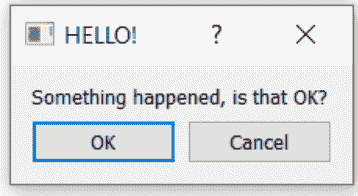

*图 52. 我们带有标签和按钮的对话框。*

当你点击按钮启动对话框时，你可能会注意到它出现在父窗口之外——可能在屏幕中央。通常，你希望对话框出现在其启动窗口之上，以便用户更容易找到。为此，我们需要给Qt一个对话框的**父对象**。如果我们把主窗口作为父对象传递，Qt将定位新的对话框，使其中心与窗口中心对齐。

我们可以修改`CustomDialog`类以接受一个`parent`参数。

代码清单 49. basic/dialogs_2b.py

```
class CustomDialog(QDialog):
    def __init__(self, parent=None): ①
        super().__init__(parent)

        self.setWindowTitle("HELLO!")

        QBtn = QDialogButtonBox.StandardButton.Ok | QDialogButtonBox.StandardButton.Cancel

        self.buttonBox = QDialogButtonBox(QBtn)
        self.buttonBox.accepted.connect(self.accept)
        self.buttonBox.rejected.connect(self.reject)

        self.layout = QVBoxLayout()
        message = QLabel("Something happened, is that OK?")
        self.layout.addWidget(message)
        self.layout.addWidget(self.buttonBox)
        self.setLayout(self.layout)
```

① 我们设置默认值为None，这样我们就可以选择省略父对象。

然后，当我们创建`CustomDialog`的实例时，我们可以将主窗口作为参数传递。在我们的`button_clicked`方法中，`self`就是我们的主窗口对象。

代码清单 50. basic/dialogs_2b.py

```
def button_clicked(self, s):
    print("click", s)

    dlg = CustomDialog(self)
    if dlg.exec():
        print("Success!")
    else:
        print("Cancel!")
```

🚀 **运行它！** 点击启动对话框，你应该会看到对话框正好弹出在父窗口的中央。

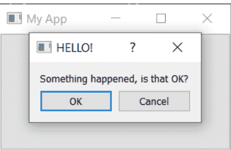

图 53. 我们的对话框，居中显示在父窗口上方。

恭喜！你已经创建了你的第一个对话框。当然，你可以继续向对话框中添加任何你喜欢的其他内容。只需像往常一样将其插入布局即可。

### 使用 QMessageBox 的简单消息对话框

有许多对话框遵循我们刚刚看到的简单模式——一条消息和一些按钮，你可以用它们来接受或取消对话框。虽然你可以自己构建这些对话框，但Qt也提供了一个内置的消息对话框类，称为`QMessageBox`。它可以用来创建信息、警告、关于或问题对话框。

下面的示例创建了一个简单的`QMessageBox`并显示它。

代码清单 51. basic/dialogs_3.py

```
def button_clicked(self, s):
    dlg = QMessageBox(self)
    dlg.setWindowTitle("I have a question!")
    dlg.setText("This is a simple dialog")
    button = dlg.exec()

    # Look up the button enum entry for the result.
    button = QMessageBox.StandardButton(button)

    if button == QMessageBox.StandardButton.Ok:
        print("OK!")
```

🚀 运行它！你将看到一个带有*确定*按钮的简单对话框。

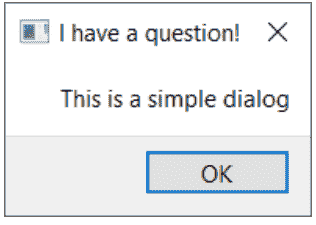

图 54. 一个 QMessageBox 对话框。

与我们已经看过的对话框按钮盒一样，`QMessageBox`上显示的按钮也是通过一组常量配置的，这些常量可以与`|`组合以显示多个按钮。所有可用的按钮类型列表如下所示。

表 2. QMessageBox 可用的按钮类型。

| 按钮类型 |
| --- |
| QMessageBox.Ok |
| QMessageBox.Open |
| QMessageBox.Save |
| QMessageBox.Cancel |
| QMessageBox.Close |
| QMessageBox.Discard |
| QMessageBox.Apply |
| QMessageBox.Reset |
| QMessageBox.RestoreDefaults |
| QMessageBox.Help |
| QMessageBox.SaveAll |
| QMessageBox.Yes |
| QMessageBox.YesToAll |
| QMessageBox.No |
| QMessageBox.NoToAll |
| QMessageBox.Abort |
| QMessageBox.Retry |
| QMessageBox.Ignore |
| QMessageBox.NoButton |

你还可以通过设置以下图标之一来调整对话框上显示的图标。

表 3. QMessageBox 图标常量。

| 图标状态 | 描述 |
| --- | --- |
| QMessageBox.NoIcon | 消息框没有图标。 |
| QMessageBox.Question | 消息是在提问。 |
| QMessageBox.Information | 消息仅供参考。 |
| QMessageBox.Warning | 消息是警告。 |
| QMessageBox.Critical | 消息表示一个严重问题。 |

例如，以下代码创建了一个带有*是*和*否*按钮的问题对话框。

*代码清单 52. basic/dialogs_4.py*

```
from PyQt6.QtWidgets import QApplication, QDialog, QMainWindow,
QMessageBox, QPushButton

class MainWindow(QMainWindow):

    # __init__ skipped for clarity
    def button_clicked(self, s):
        dlg = QMessageBox(self)
        dlg.setWindowTitle("I have a question!")
        dlg.setText("This is a question dialog")
        dlg.setStandardButtons(QMessageBox.StandardButton.Yes |
QMessageBox.StandardButton.No)
        dlg.setIcon(QMessageBox.Icon.Question)
        button = dlg.exec()

        # Look up the button enum entry for the result.
        button = QMessageBox.StandardButton(button)

        if button == QMessageBox.StandardButton.Yes:
            print("Yes!")
        else:
            print("No!")
```

🚀 **运行它！** 你将看到一个带有*是*和*否*按钮的问题对话框。

### 内置 QMessageBox 对话框

为了使操作更简单，QMessageBox 提供了多种方法来构建这些类型的消息对话框。这些方法如下所示 —

```
QMessageBox.about(parent, title, message)
QMessageBox.critical(parent, title, message)
QMessageBox.information(parent, title, message)
QMessageBox.question(parent, title, message)
QMessageBox.warning(parent, title, message)
```

`parent` 参数是对话框所属的父窗口。如果你从主窗口启动对话框，只需传入 `self` 即可。以下示例创建了一个问题对话框，与之前一样，带有“是”和“否”按钮。

清单 53. basic/dialogs_5.py

```
def button_clicked(self, s):
    button = QMessageBox.question(self, "Question dialog", "The longer message")
    if button == QMessageBox.StandardButton.Yes:
        print("Yes!")
    else:
        print("No!")
```

> 🚀 **运行它！** 你将看到相同的结果，这次使用的是内置的 `.question()` 方法。

*图 56. 内置的问题对话框。*

请注意，我们现在不再调用 `exec()`，而是直接调用对话框方法，对话框即被创建。每个方法的返回值是被按下的按钮。我们可以通过将返回值与按钮常量进行比较来检测按下了哪个按钮。

`information`、`question`、`warning` 和 `critical` 这四个方法还接受可选的 `buttons` 和 `defaultButton` 参数，可用于调整对话框上显示的按钮并默认选中一个。但通常情况下，你不需要更改默认设置。

清单 54. basic/dialogs_6.py

```
def button_clicked(self, s):
    button = QMessageBox.critical(
        self,
        "Oh dear!",
        "Something went very wrong.",
        buttons=QMessageBox.StandardButton.Discard | QMessageBox
        .StandardButton.NoToAll | QMessageBox.StandardButton.Ignore,
        defaultButton=QMessageBox.StandardButton.Discard,
    )

    if button == QMessageBox.StandardButton.Discard:
        print("Discard!")
    elif button == QMessageBox.StandardButton.NoToAll:
        print("No to all!")
    else:
        print("Ignore!")
```

🚀 运行它！你将看到一个带有自定义按钮的严重错误对话框。

*图 57. 严重错误！这是一个糟糕的对话框。*

对于大多数情况，这些简单的对话框就是你所需要的全部。

### 👋 对话框

创建糟糕的对话框尤其容易。从用令人困惑的选项困住用户的对话框，到嵌套的、永无止境的弹出窗口，有很多方式可以伤害你的用户。

*图 58. 一些糟糕对话框的示例。*[2]

**对话框按钮**由系统标准定义。你可能从未注意到，在 macOS 和 Linux 上，“确定”和“取消”按钮的位置与 Windows 上不同，但你的大脑注意到了。如果你不遵循系统标准，你会让用户感到困惑，并导致他们犯错。

*图 59. 对话框按钮顺序取决于平台。*

使用 Qt 时，通过内置的 `QDialogButtonBox` 控件，你可以*免费*获得这种一致性。但你*必须使用它们*！

**错误对话框**会惹恼用户。当你显示错误对话框时，你是在给用户传递*坏消息*。当你给别人坏消息时，你需要考虑它会给他们带来的影响。

以这个（幸好是虚构的）对话框为例，它是在文档中遇到错误时产生的。对话框告诉你有一个错误，但没有说明后果是什么或该如何处理。阅读这个对话框，你的用户会问（甚至可能尖叫）“……然后呢？”

*图 60. 一个糟糕错误对话框的示例。*

来自 Acrobat Reader DC 的这个真实对话框更好。它解释了存在一个错误，可能的后果是什么，以及如何解决它。

*图 61. Adobe Acrobat Reader DC 对话框*

但这仍然不是*完美*的。错误显示为*信息*对话框，这并未暗示有任何问题。错误在每一页都会触发，并且可能在文档中出现多次——警告对话框应该只触发*一次*。通过明确错误是永久性的，也可以改进错误提示。

*图 62. Adobe Acrobat Reader DC 对话框的改进版本*

好的错误消息应该解释：

- 发生了什么
- 什么受到了影响
- 它的后果是什么
- 可以采取什么措施

# 11. 窗口

在上一章中，我们了解了如何打开*对话框*窗口。这些是特殊的窗口，它们（默认情况下）会获取用户的焦点，并运行自己的事件循环，从而有效地阻塞应用程序其余部分的执行。

然而，很多时候你会希望在应用程序中打开第二个窗口，而不阻塞主窗口——例如，显示某个长时间运行过程的输出，或显示图表或其他可视化内容。或者，你可能希望创建一个允许你同时处理多个文档的应用程序，每个文档都在自己的窗口中。

在 PyQt6 中打开新窗口相对简单，但有几件事需要记住以确保它们正常工作。在本教程中，我们将逐步介绍如何创建新窗口，以及如何根据需要显示和隐藏外部窗口。

### 创建新窗口

要在 PyQt6 中创建新窗口，你只需创建一个没有父对象的 widget 对象的新实例。这可以是任何 widget（技术上是 `QWidget` 的任何子类），如果你愿意，也可以是另一个 `QMainWindow`。

> 对 `QMainWindow` 实例的数量没有限制，如果你需要在第二个窗口上使用工具栏或菜单，你也需要使用 `QMainWindow`。

与主窗口一样，*创建*窗口是不够的，你还必须显示它。

清单 55. basic/windows_1.py

```
import sys

from PyQt6.QtWidgets import (QApplication, QLabel, QMainWindow,
    QPushButton,
    QVBoxLayout, QWidget)

class AnotherWindow(QWidget):
    """
    This "window" is a QWidget. If it has no parent, it
    will appear as a free-floating window.
    """

    def __init__(self):
        super().__init__()
        layout = QVBoxLayout()
        self.label = QLabel("Another Window")
        layout.addWidget(self.label)
        self.setLayout(layout)

class MainWindow(QMainWindow):
    def __init__(self):
        super().__init__()
        self.button = QPushButton("Push for Window")
        self.button.clicked.connect(self.show_new_window)
        self.setCentralWidget(self.button)

    def show_new_window(self, checked):
        w = AnotherWindow()
        w.show()

app = QApplication(sys.argv)
w = MainWindow()
w.show()
app.exec()
```

如果你运行这个程序，你会看到主窗口。点击按钮*可能*会显示第二个窗口，但即使你看到了它，也只会显示一瞬间。发生了什么？

```
def show_new_window(self, checked):
    w = AnotherWindow()
    w.show()
```

我们在这个方法内部创建第二个窗口，将其存储在变量 `w` 中并显示它。然而，一旦我们离开这个方法，`w` 变量将被 Python 清理，窗口将被销毁。为了解决这个问题，我们需要在*某处*保持对窗口的引用——例如，在主窗口的 `self` 对象上。

清单 56. basic/windows_1b.py

```
def show_new_window(self, checked):
    self.w = AnotherWindow()
    self.w.show()
```

现在，当你点击按钮显示新窗口时，它将保持存在。

*图 63. 持续存在的第二个窗口。*

然而，如果你再次点击按钮会发生什么？窗口将被重新创建！这个新窗口将替换 `self.w` 变量中的旧窗口，而之前的窗口将被销毁。如果你将 `AnotherWindow` 的定义更改为在每次创建时在标签中显示一个随机数，你可以更清楚地看到这一点。

### 代码清单 57. basic/windows_2.py

```python
from random import randint

from PyQt6.QtWidgets import (
    QApplication,
    QLabel,
    QMainWindow,
    QPushButton,
    QVBoxLayout,
    QWidget,
)

class AnotherWindow(QWidget):
    """
    这个“窗口”是一个 QWidget。如果它没有父对象，
    它将作为一个自由浮动的窗口出现。
    """

    def __init__(self):
        super().__init__()
        layout = QVBoxLayout()
        self.label = QLabel("Another Window % d" % randint(0, 100))
        layout.addWidget(self.label)
        self.setLayout(layout)
```

`__init__` 代码块仅在创建窗口时运行。如果你持续点击按钮，数字将会改变，这表明窗口正在被重新创建。


图 64. 如果再次按下按钮，数字将会改变。

一个解决方案是在创建窗口之前，简单地检查该窗口是否已经被创建。下面的完整示例展示了这一操作。

### 代码清单 58. basic/windows_3.py

```python
class MainWindow(QMainWindow):
    def __init__(self):
        super().__init__()
        self.w = None  # 尚无外部窗口。
        self.button = QPushButton("Push for Window")
        self.button.clicked.connect(self.show_new_window)
        self.setCentralWidget(self.button)

    def show_new_window(self, checked):
        if self.w is None:
            self.w = AnotherWindow()
            self.w.show()
```

这种方法对于临时创建的窗口，或者需要根据程序当前状态进行更改的窗口来说是很好的——例如，如果你想显示特定的图表或日志输出。然而，对于许多应用程序，你有一些标准窗口，你希望能够按需显示/隐藏。

在下一部分，我们将探讨如何处理这些类型的窗口。

### 关闭窗口

正如我们之前看到的，如果没有保留对窗口的引用，它将被丢弃（并关闭）。我们可以利用这种行为来关闭窗口，用以下代码替换上一个示例中的 `show_new_window` 方法——

### 代码清单 59. basic/windows_4.py

```python
def show_new_window(self, checked):
    if self.w is None:
        self.w = AnotherWindow()
        self.w.show()

    else:
        self.w = None  # 丢弃引用，关闭窗口。
```

通过将 `self.w` 设置为 `None`（或任何其他值），对窗口的引用将丢失，窗口将关闭。但是，如果我们将其设置为 `None` 以外的任何值，第一个测试将不会通过，我们将无法重新创建窗口。

这只有在你没有在其他地方保留对此窗口的引用时才有效。为了确保窗口无论如何都能关闭，你可能需要显式地调用 `.close()`。

### 代码清单 60. basic/windows_4b.py

```python
def show_new_window(self, checked):
    if self.w is None:
        self.w = AnotherWindow()
        self.w.show()

    else:
        self.w.close()
        self.w = None  # 丢弃引用，关闭窗口。
```

### 持久窗口

到目前为止，我们已经探讨了如何按需创建新窗口。然而，有时你有一些标准的应用程序窗口。在这种情况下，通常更有意义的做法是先创建额外的窗口，然后在需要时使用 `.show()` 来显示它们。

在下面的示例中，我们在主窗口的 `__init__` 代码块中创建我们的外部窗口，然后我们的 `show_new_window` 方法只需调用 `self.w.show()` 来显示它。

### 代码清单 61. basic/windows_5.py

```python
import sys
from random import randint

from PyQt6.QtWidgets import (
    QApplication,
    QLabel,
    QMainWindow,
    QPushButton,
    QVBoxLayout,
    QWidget,
)


class AnotherWindow(QWidget):
    """
    这个“窗口”是一个 QWidget。如果它没有父对象，
    它将作为一个自由浮动的窗口出现。
    """

    def __init__(self):
        super().__init__()
        layout = QVBoxLayout()
        self.label = QLabel("Another Window % d" % randint(0, 100))
        layout.addWidget(self.label)
        self.setLayout(layout)


class MainWindow(QMainWindow):
    def __init__(self):
        super().__init__()
        self.w = AnotherWindow()
        self.button = QPushButton("Push for Window")
        self.button.clicked.connect(self.show_new_window)
        self.setCentralWidget(self.button)

    def show_new_window(self, checked):
        self.w.show()

app = QApplication(sys.argv)
w = MainWindow()
w.show()
app.exec()
```

如果你运行这个程序，点击按钮将像以前一样显示窗口。请注意，窗口只创建一次，对已经可见的窗口调用 `.show()` 不会产生任何效果。

### 显示与隐藏窗口

一旦你创建了一个持久窗口，你就可以在不重新创建它的情况下显示和隐藏它。一旦隐藏，窗口仍然存在，但将不可见且不接受鼠标/其他输入。但是，你可以继续在窗口上调用方法并更新其状态——包括更改其外观。一旦重新显示，任何更改都将可见。

下面我们更新主窗口，创建一个 `toggle_window` 方法，该方法使用 `.isVisible()` 检查窗口当前是否可见。如果不可见，则使用 `.show()` 显示它；如果已经可见，则使用 `.hide()` 隐藏它。

```python
class MainWindow(QMainWindow):

    def __init__(self):
        super().__init__()
        self.w = AnotherWindow()
        self.button = QPushButton("Push for Window")
        self.button.clicked.connect(self.toggle_window)
        self.setCentralWidget(self.button)

    def toggle_window(self, checked):
        if self.w.isVisible():
            self.w.hide()

        else:
            self.w.show()
```

这个持久窗口以及切换显示/隐藏状态的完整工作示例如下所示。

### 代码清单 62. basic/windows_6.py

```python
import sys
from random import randint

from PyQt6.QtWidgets import (
    QApplication,
    QLabel,
    QMainWindow,
    QPushButton,
    QVBoxLayout,
    QWidget,
)

class AnotherWindow(QWidget):
    """
    这个“窗口”是一个 QWidget。如果它没有父对象，
    它将作为一个自由浮动的窗口出现。
    """

    def __init__(self):
        super().__init__()
        layout = QVBoxLayout()
        self.label = QLabel("Another Window % d" % randint(0, 100))
        layout.addWidget(self.label)
        self.setLayout(layout)

class MainWindow(QMainWindow):
    def __init__(self):
        super().__init__()
        self.w = AnotherWindow()
        self.button = QPushButton("Push for Window")
        self.button.clicked.connect(self.toggle_window)
        self.setCentralWidget(self.button)

    def toggle_window(self, checked):
        if self.w.isVisible():
            self.w.hide()

        else:
            self.w.show()

app = QApplication(sys.argv)
w = MainWindow()
w.show()
app.exec()
```

同样，窗口只创建一次——每次重新显示窗口时，窗口的 `__init__` 代码块不会重新运行（因此标签中的数字不会改变）。

### 在窗口之间连接信号

在信号章节中，我们看到了如何使用信号和槽直接连接控件。我们所需要的是目标控件已经被创建，并且可以通过变量获得引用。同样的原理也适用于跨窗口连接信号——你可以将一个窗口中的信号连接到另一个窗口中的槽，你只需要能够访问该槽。

在下面的示例中，我们将主窗口上的文本输入连接到子窗口上的 QLabel。

### 代码清单 63. basic/windows_7.py

```python
import sys
from random import randint

from PyQt6.QtWidgets import (
    QApplication,
    QLabel,
    QMainWindow,
    QPushButton,
    QVBoxLayout,
    QWidget,
    QLineEdit
)


class AnotherWindow(QWidget):
    """
    这个“窗口”是一个 QWidget。如果它没有父对象，
    它将作为一个自由浮动的窗口出现。
    """

    def __init__(self):
        super().__init__()
        layout = QVBoxLayout()
        self.label = QLabel("Another Window") ②
        layout.addWidget(self.label)
        self.setLayout(layout)


class MainWindow(QMainWindow):
    def __init__(self):
        super().__init__()
        self.w = AnotherWindow()
        self.button = QPushButton("Push for Window")
        self.button.clicked.connect(self.toggle_window)

        self.input = QLineEdit()
        self.input.textChanged.connect(self.w.label.setText) ①
```

layout = QVBoxLayout()
layout.addWidget(self.button)
layout.addWidget(self.input)
container = QWidget()
container.setLayout(layout)

self.setCentralWidget(container)

def toggle_window(self, checked):
    if self.w.isVisible():
        self.w.hide()
    else:
        self.w.show()

app = QApplication(sys.argv)
w = MainWindow()
w.show()
app.exec()

① `AnotherWindow` 窗口对象可通过变量 `self.w` 访问。`QLabel` 通过 `self.w.label` 访问，`.setText` 插槽通过 `self.w.label.setText` 访问。

② 当我们创建 `QLabel` 时，我们将其引用存储在 `self` 上，作为 `self.label`，因此它可以在对象外部访问。

> 🚀 **运行它！** 在上方框中输入一些文本，你会看到它立即出现在标签上。看看如果在窗口隐藏时在框中输入文本会发生什么——它仍然会在后台更新！更新控件的状态并不依赖于它们是否可见。

当然，你也可以自由地将一个窗口上的信号连接到另一个窗口上的自定义方法。只要它是可访问的（对于 Qt 插槽，类型匹配），你就可以用信号连接它。


确保组件可导入且彼此可访问，是构建逻辑项目结构的一个良好动机。通常，在主窗口/模块中集中连接组件是有意义的，以避免交叉导入所有内容。

# 12. 事件

用户与 Qt 应用程序的每一次交互都是一个*事件*。事件有很多种类型，每种代表不同类型的交互。Qt 使用*事件对象*来表示这些事件，这些对象封装了关于发生了什么的信息。这些事件被传递到交互发生所在控件的特定*事件处理器*。

通过定义自定义或扩展的*事件处理器*，你可以改变控件响应这些事件的方式。事件处理器的定义就像任何其他方法一样，但名称是特定于它们处理的事件类型的。

控件接收的主要事件之一是 `QMouseEvent`。`QMouseEvent` 事件是为控件上的每一次鼠标移动和按钮点击而创建的。以下事件处理器可用于处理鼠标事件——

| 事件处理器 | 事件类型 |
| :--- | :--- |
| `mouseMoveEvent` | 鼠标移动 |
| `mousePressEvent` | 鼠标按钮按下 |
| `mouseReleaseEvent` | 鼠标按钮释放 |
| `mouseDoubleClickEvent` | 检测到双击 |

例如，点击控件将导致一个 `QMouseEvent` 被发送到该控件上的 `.mousePressEvent` 事件处理器。此处理器可以使用事件对象来查找有关发生了什么的信息，例如是什么触发了事件以及具体发生在哪里。

你可以通过子类化并重写类上的处理器方法来拦截事件。你可以选择过滤、修改或忽略事件，通过使用 `super()` 调用父类函数将它们传递给事件的正常处理器。这些可以添加到你的主窗口类中，如下所示。在每种情况下，`e` 都将接收传入的事件。

清单 64. basic/events_1.py

```
import sys

from PyQt6.QtCore import Qt
from PyQt6.QtWidgets import QApplication, QLabel, QMainWindow,
QTextEdit

class MainWindow(QMainWindow):
    def __init__(self):
        super().__init__()
        self.label = QLabel("Click in this window")
        self.setCentralWidget(self.label)

    def mouseMoveEvent(self, e):
        self.label.setText("mouseMoveEvent")

    def mousePressEvent(self, e):
        self.label.setText("mousePressEvent")

    def mouseReleaseEvent(self, e):
        self.label.setText("mouseReleaseEvent")

    def mouseDoubleClickEvent(self, e):
        self.label.setText("mouseDoubleClickEvent")

app = QApplication(sys.argv)

window = MainWindow()
window.show()

app.exec()
```

> 🚀 运行它！尝试在窗口中移动和点击（以及双击），并观察事件出现。

你会注意到，只有在按下按钮时才会注册鼠标移动事件。你可以通过在窗口上调用 `self.setMouseTracking(True)` 来更改此行为。你可能还会注意到，按下（点击）和双击事件在按钮按下时都会触发。只有释放事件在按钮释放时触发。通常，要注册用户的点击，你应该同时监视鼠标按下*和*释放。

在事件处理器内部，你可以访问一个事件对象。此对象包含有关事件的信息，可用于根据实际发生的情况做出不同的响应。接下来我们将查看鼠标事件对象。

### 鼠标事件

Qt 中的所有鼠标事件都通过 `QMouseEvent` 对象进行跟踪，有关事件的信息可从以下事件方法读取。

| 方法 | 返回值 |
| :--- | :--- |
| `.button()` | 触发此事件的特定按钮 |
| `.buttons()` | 所有鼠标按钮的状态（或运算标志） |
| `.position()` | 以 `QPoint` 整数表示的控件相对位置 |

你可以在事件处理器中使用这些方法来对不同的事件做出不同的响应，或者完全忽略它们。`.position()` 方法以 `QPoint` 对象的形式提供控件相对位置信息，而按钮则使用 `Qt` 命名空间中的鼠标按钮类型报告。

例如，以下代码允许我们对窗口上的左键、右键或中键点击做出不同的响应。

清单 65. basic/events_2.py

```
def mousePressEvent(self, e):
    if e.button() == Qt.MouseButton.LeftButton:
        # 在此处处理左键按下
        self.label.setText("mousePressEvent LEFT")

    elif e.button() == Qt.MouseButton.MiddleButton:
        # 在此处处理中键按下。
        self.label.setText("mousePressEvent MIDDLE")

    elif e.button() == Qt.MouseButton.RightButton:
        # 在此处处理右键按下。
        self.label.setText("mousePressEvent RIGHT")

def mouseReleaseEvent(self, e):
    if e.button() == Qt.MouseButton.LeftButton:
        self.label.setText("mouseReleaseEvent LEFT")

    elif e.button() == Qt.MouseButton.MiddleButton:
        self.label.setText("mouseReleaseEvent MIDDLE")

    elif e.button() == Qt.MouseButton.RightButton:
        self.label.setText("mouseReleaseEvent RIGHT")

def mouseDoubleClickEvent(self, e):
    if e.button() == Qt.MouseButton.LeftButton:
        self.label.setText("mouseDoubleClickEvent LEFT")

    elif e.button() == Qt.MouseButton.MiddleButton:
        self.label.setText("mouseDoubleClickEvent MIDDLE")

    elif e.button() == Qt.MouseButton.RightButton:
        self.label.setText("mouseDoubleClickEvent RIGHT")
```

按钮标识符在 Qt 命名空间中定义，如下所示——

| 标识符 | 值（二进制） | 代表 |
| :--- | :--- | :--- |
| `Qt.MouseButtons.NoButton` | 0 (000) | 未按下任何按钮，或事件与按钮按下无关。 |
| `Qt.MouseButtons.LeftButton` | 1 (001) | 左键被按下 |
| `Qt.MouseButtons.RightButton` | 2 (010) | 右键被按下。 |
| `Qt.MouseButtons.MiddleButton` | 4 (100) | 中键被按下。 |

> 在右手鼠标上，左键和右键的位置是相反的，即按下最右边的按钮将返回 `Qt.MouseButtons.LeftButton`。这意味着你不需要在代码中考虑鼠标的方向。

> 要更深入地了解这一切是如何工作的，请稍后查看[枚举与 Qt 命名空间](https://www.riverbankcomputing.com/static/Docs/PyQt6/)。

### 上下文菜单

上下文菜单是小型的上下文相关菜单，通常在右键点击窗口时出现。Qt 支持生成这些菜单，控件有一个特定的事件用于触发它们。在以下示例中，我们将拦截 `QMainWindow` 的 `.contextMenuEvent`。每当上下文菜单*即将*显示时，就会触发此事件，并传递一个类型为 `QContextMenuEvent` 的单一值 `event`。

要拦截事件，我们只需用同名的新方法重写对象方法。因此，在这种情况下，我们可以在 `MainWindow` 子类上创建一个名为 `contextMenuEvent` 的方法，它将接收所有事件

这种类型。

清单 66. basic/events_3.py

```python
import sys

from PyQt6.QtCore import Qt
from PyQt6.QtGui import QAction
from PyQt6.QtWidgets import QApplication, QLabel, QMainWindow, QMenu

class MainWindow(QMainWindow):
    def __init__(self):
        super().__init__()

    def contextMenuEvent(self, e):
        context = QMenu(self)
        context.addAction(QAction("test 1", self))
        context.addAction(QAction("test 2", self))
        context.addAction(QAction("test 3", self))
        context.exec(e.globalPos())

app = QApplication(sys.argv)

window = MainWindow()
window.show()

app.exec()
```

如果你运行上面的代码并在窗口内右键单击，你会看到一个上下文菜单出现。你可以像往常一样在菜单动作上设置`.triggered`槽（并且可以重用为菜单和工具栏定义的动作）。

> 当将初始位置传递给`exec_`函数时，该位置必须相对于定义时传入的父级。在本例中，我们传递`self`作为父级，因此可以使用全局位置。

为了完整起见，实际上还有一种基于信号的方法来创建上下文菜单。

清单 67. basic/events_4.py

```python
class MainWindow(QMainWindow):
    def __init__(self):
        super().__init__()
        self.show()

        self.setContextMenuPolicy(Qt.ContextMenuPolicy
.CustomContextMenu)
        self.customContextMenuRequested.connect(self.on_context_menu)

    def on_context_menu(self, pos):
        context = QMenu(self)
        context.addAction(QAction("test 1", self))
        context.addAction(QAction("test 2", self))
        context.addAction(QAction("test 3", self))
        context.exec(self.mapToGlobal(pos))
```

选择哪种方式完全取决于你。

## 事件层次结构

在 pyqt6 中，每个控件都属于两个不同的层次结构：Python 对象层次结构和 Qt 布局层次结构。你如何响应或忽略事件会影响你的 UI 行为。

### Python 继承转发

通常你可能希望拦截一个事件，对其进行一些处理，但仍然触发默认的事件处理行为。如果你的对象继承自标准控件，它很可能默认实现了合理的行为。你可以通过使用`super()`调用父类实现来触发此行为。

> 这是 Python 父类，而不是 pyqt6 的`.parent()`。

```python
def mousePressEvent(self, event):
    print("Mouse pressed!")
    super(self, MainWindow).contextMenuEvent(event)
```

事件将继续正常表现，但你已经添加了一些不干扰的行为。

### 布局转发

当你将控件添加到应用程序时，它还会从布局中获得另一个*父级*。可以通过调用`.parent()`找到控件的父级。有时你会手动指定这些父级，例如对于`QMenu`或`QDialog`，通常是自动的。例如，当你将控件添加到主窗口时，主窗口将成为该控件的父级。

当为用户与 UI 交互创建事件时，这些事件会传递给 UI 中*最上层*的控件。因此，如果你有一个按钮在窗口上，并点击该按钮，按钮将首先接收事件。

如果第一个控件无法处理该事件，或者选择不处理，该事件将*冒泡*到父控件，父控件将获得处理机会。这种*冒泡*会一直向上经过嵌套的控件，直到事件被处理或到达主窗口。

在你自己的事件处理程序中，你可以选择通过调用`.accept()`将事件标记为*已处理*——

```python
class CustomButton(Qbutton)
    def mousePressEvent(self, e):
        e.accept()
```

或者，你可以通过在事件对象上调用`.ignore()`将其标记为*未处理*。在这种情况下，事件将继续在层次结构中冒泡。

```python
class CustomButton(Qbutton)
    def event(self, e):
        e.ignore()
```

如果你希望你的控件对事件表现得透明，你可以安全地忽略那些你实际上已经以某种方式响应过的事件。同样，你可以选择接受你没有响应的事件以使其静默。

### Qt Designer

到目前为止，我们一直在使用 Python 代码创建应用程序。这在许多情况下效果很好，但随着你的应用程序变大或界面变得更复杂，以编程方式定义所有控件可能会变得有点繁琐。好消息是 Qt 附带了一个图形编辑器——*Qt Designer*——它包含一个拖放式 UI 编辑器。使用*Qt Designer*，你可以直观地定义你的 UI，然后只需稍后连接应用程序逻辑。

在本章中，我们将介绍使用*Qt Designer*创建 UI 的基础知识。原理、布局和控件是相同的，因此你可以应用你已经学到的所有知识。你还需要你的 Python API 知识来稍后连接你的应用程序逻辑。

# 13. 安装 Qt Designer

Qt Designer 在 [Qt 下载页面](https://www.qt.io/download) 提供的 Qt 安装包中可用。下载并运行适合你系统的安装程序，然后按照下面特定于平台的说明进行操作。安装 Qt Designer 不会影响你的 PyQt6 安装。

> Qt Creator 与 Qt Designer

你可能还会看到对 Qt Creator 的提及。Qt Creator 是一个功能齐全的 Qt 项目 IDE，而 Qt Designer 是 UI 设计组件。Qt Designer 包含在 Qt Creator 中，因此如果你愿意，可以安装它，尽管它对 Python 项目没有提供任何额外价值。

### Windows

Windows Qt 安装程序中没有提到 Qt Designer，但当你安装任何版本的 Qt 核心库时，它会自动安装。例如，在下面的截图中，我们选择安装 MSVC 2017 64 位版本的 Qt——你选择什么不会影响你的 Designer 安装。

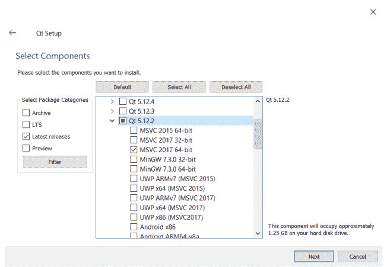

如果你想安装*Qt Creator*，它列在“Developer and Designer Tools”下。相当令人困惑的是，*Qt Designer*不在这里。

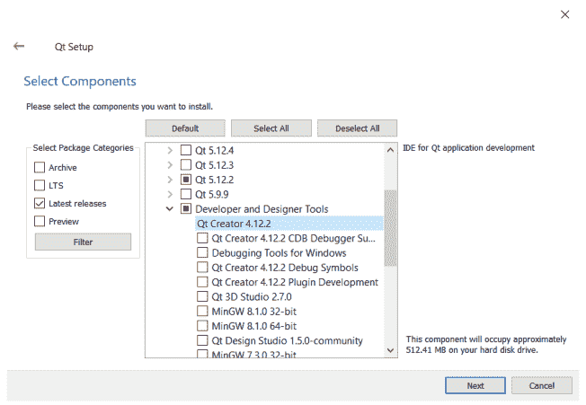

*图 66. 安装 Qt Creator 组件。*

### macOS

macOS Qt 安装程序中没有提到*Qt Designer*，但当你安装任何版本的 Qt 核心库时，它会自动安装。从 Qt 网站下载安装程序——你可以选择开源版本。


*图 67. 在下载的 .dmg 文件中，你会找到安装程序。*

打开安装程序开始安装。继续到它要求你选择要安装的组件的地方。在最新版本的 Qt 下选择*macOS*包。

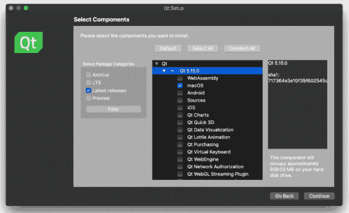

*图 68. 你只需要最新版本下的 macOS 包。*

安装完成后，打开你安装 Qt 的文件夹。*Designer*的启动器位于`<version>/clang_64/bin`下。你会注意到*Qt Creator*也安装在 Qt 安装文件夹的根目录中。

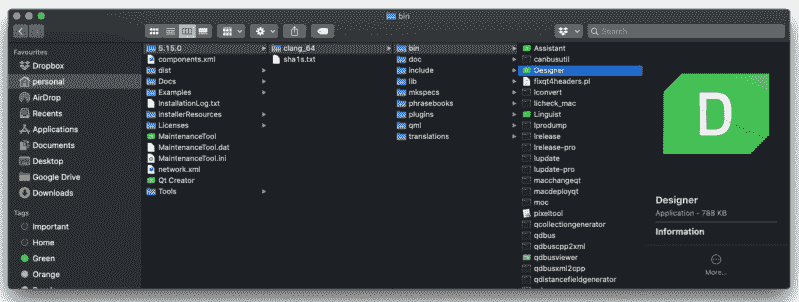

*图 69. 你可以在`<version>/clang_64/bin`文件夹下找到 Designer 启动器。*

你可以从它所在的位置运行*Designer*，或者将其移动到你的 Applications 文件夹中，以便可以从 macOS Launchpad 启动。

### Linux (Ubuntu & Debian)

你可以使用以下命令从命令行安装*Qt Designer*。*Qt Designer*在`qttools5-dev-tools`包中。

```bash
sudo apt-get install qttools5-dev-tools
```

安装后，*Qt Designer*将在启动器中可用。

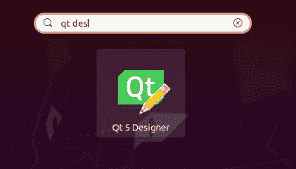

*图 70. Ubuntu 启动器中的 Qt Designer。*

# 14. Qt Designer 入门

在本章中，我们将快速浏览使用*Qt Designer*设计 UI 并将该 UI 导出以在你的 PyQt6 应用程序中使用。我们在这里只触及了你可以用*Qt Designer*做的事情的皮毛，但一旦你掌握了基础知识，可以随意进行更详细的实验。

打开*Qt Designer*，你将看到主窗口。设计器通过左侧的选项卡提供。但是，要激活它，你首先需要开始创建一个`.ui`文件。

### Qt Designer

*Qt Designer*启动时会显示*New Form*对话框。在这里你可以选择你正在构建的界面类型——这决定了你将构建界面的基础控件。如果你正在启动应用程序，那么*Main Window*通常是正确的选择。但是，你也可以为对话框和自定义复合控件创建`.ui`文件。

> Form 是给 UI 布局的技术名称，因为许多 UI 类似于带有各种输入框的纸质表格。

### Qt Creator

如果你已经安装了 *Qt Creator*，其界面和操作流程会略有不同。左侧是一个类似标签页的界面，你可以从中选择应用程序的各个组件。其中一个是 *Design*，它会在主面板中显示 *Qt Designer*。


图 73. Qt Creator 界面，左侧选中了 Design 部分。Qt Designer 界面与嵌入式 Designer 相同。

> Qt Designer 的所有功能在 Qt Creator 中都可用，但用户界面的某些方面有所不同。

要创建一个 .ui 文件，请转到 文件 → 新建文件或项目...。在出现的窗口中，在左侧的“文件和类”下选择 Qt，然后在右侧选择 Qt Designer Form。你会注意到图标上有 "ui" 字样，表明你正在创建的文件类型。

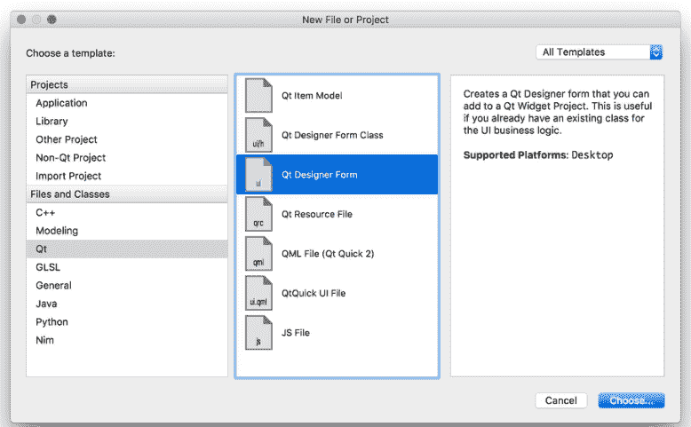

图 74. 创建一个新的 Qt .ui 文件。

在下一步中，系统会询问你想要创建哪种类型的 UI。对于大多数应用程序，*主窗口* 是正确的选择。但是，你也可以为其他对话框创建 `.ui` 文件，或使用 `QWidget`（列为 "Widget"）构建自定义小部件。

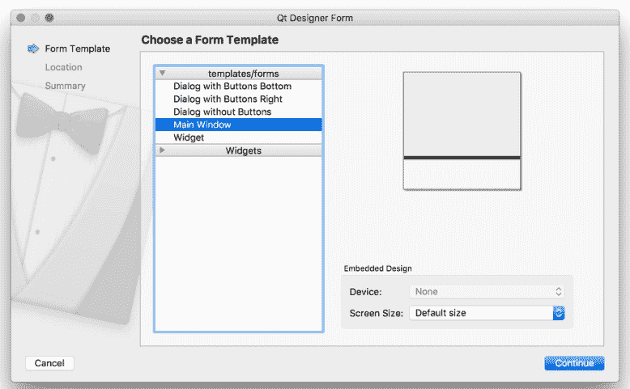

图 75. 选择要创建的小部件类型，对于大多数应用程序，这将是主窗口。

接下来，为你的文件选择一个文件名和保存文件夹。将你的 `.ui` 文件保存为与你将要创建的类相同的名称，只是为了使后续命令更简单。

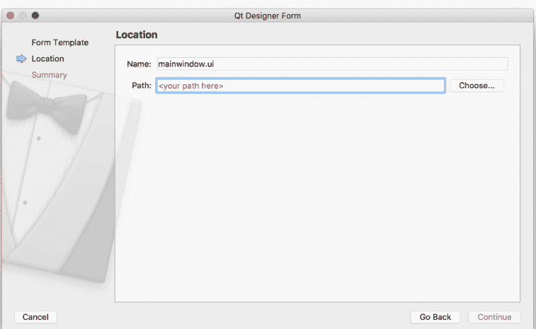

图 76. 为你的文件选择保存名称和文件夹。

最后，如果你正在使用版本控制系统，可以选择将文件添加到其中。请随意跳过此步骤——它不会影响你的 UI。

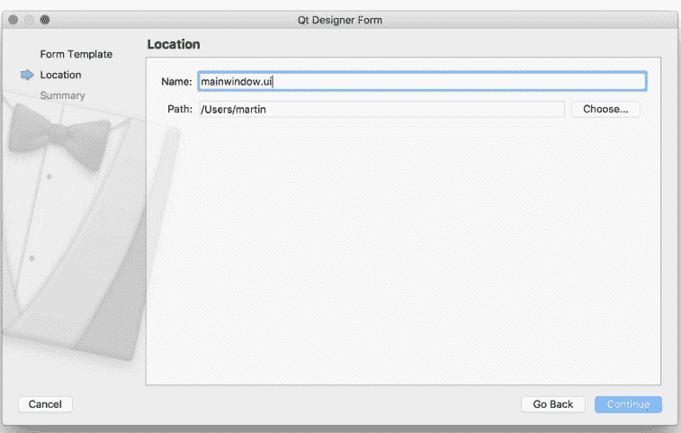

图 77. 可选地将文件添加到你的版本控制中，例如 Git。

### 布局你的主窗口

你将在 UI 设计器中看到新创建的主窗口。起初并没有太多可看的，只是一个代表窗口的灰色工作区，以及窗口菜单栏的初始部分。


图 78. 创建的主窗口的初始视图。

你可以通过点击窗口并拖动每个角上的蓝色手柄来调整窗口大小。


图 79. 主窗口调整为 300 x 300 像素。

构建应用程序的第一步是向窗口添加一些小部件。在我们的第一个应用程序中，我们了解到要为 `QMainWindow` 设置中心小部件，我们需要使用 `.setCentralWidget()`。我们还看到，要添加带有布局的多个小部件，我们需要一个中间 `QWidget` 来应用布局，而不是直接将布局添加到窗口。

*Qt Designer* 会自动为你处理这一点，尽管它对此并不是特别明显。

要向主窗口添加带有布局的多个小部件，首先将你的小部件拖到 `QMainWindow` 上。在这里，我们拖动了一个 `QLabel` 和一个 `QPushButton`，你将它们放在哪里并不重要。

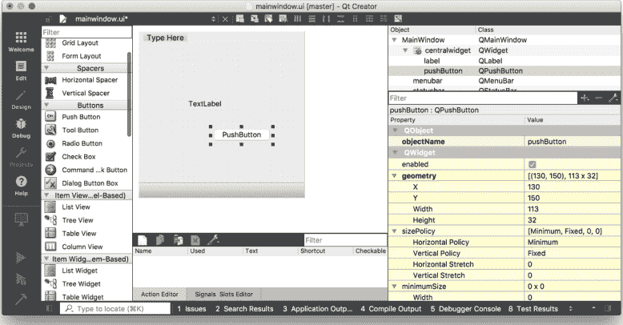

*图 80. 添加了 1 个标签和 1 个按钮的主窗口。*

我们通过将它们拖到窗口上创建了 2 个小部件，使它们成为该窗口的子部件。我们现在可以应用布局了。

在右侧面板中找到 `QMainWindow`（它应该在最顶部）。在它下面，你会看到 *centralwidget*，代表窗口的中心小部件。中心小部件的图标显示了当前应用的布局。最初，它有一个红色的圆圈叉号穿过，表示没有活动布局。右键单击 `QMainWindow` 对象，并在出现的下拉菜单中找到 'Layout'。

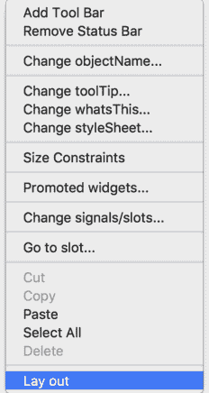

图 81. 右键单击主窗口，然后选择布局。

接下来，你将看到可以应用于窗口的布局列表。选择 *水平布局*，布局将应用于小部件。

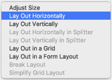

图 82. 选择要应用于主窗口的布局。

选定的布局应用于 `QMainWindow` 的 *centralwidget*，小部件被添加到布局中，并根据选定的布局进行排列。请注意，在 Qt Creator 中，你实际上可以拖动并重新排列布局中的小部件，或者根据需要选择不同的布局。这使得它特别适合原型设计和尝试。

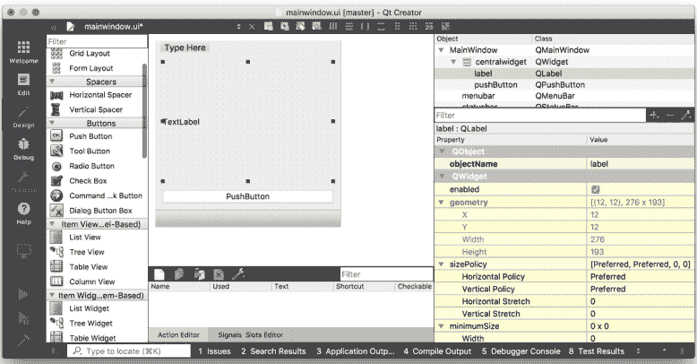

图 83. 应用于主窗口上小部件的水平布局。

我们已经在 Qt Designer 中创建了一个非常简单的 UI。下一步是将此 UI 引入我们的 Python 代码，并使用它来构建一个可工作的应用程序。

首先保存你的 `.ui` 文件——默认情况下，它将保存在你创建时选择的位置，尽管你可以选择其他位置。`.ui` 文件是 XML 格式。要在 Python 中使用我们的 UI，我们可以直接从 Python 加载它，*或者*首先使用 `pyuic6` 工具将其转换为 Python `.py` 文件。

### 在 Python 中加载你的 .ui 文件

要加载 .ui 文件，我们可以使用 PyQt5 中包含的 `uic` 模块，特别是 `uic.loadUI()` 方法。它接受一个 UI 文件的文件名并加载它，创建一个功能齐全的 PyQt5 对象。

清单 68. designer/example_1.py

```python
import sys

from PyQt6 import QtWidgets
from PyQt6.QtUiTools import QUiLoader

loader = QUiLoader()

app = QtWidgets.QApplication(sys.argv)
window = loader.load("mainwindow.ui", None)
window.show()
app.exec()
```

要从现有小部件（例如 QMainWindow）的 `__init__` 块加载 UI，你可以使用 `uic.loadUI(filename, self)`。

清单 69. designer/example_2.py

```python
import sys

from PyQt6 import QtWidgets
from PyQt6.QtUiTools import QUiLoader

loader = QUiLoader()

def mainwindow_setup(w):
    w.setWindowTitle("MainWindow Title")

app = QtWidgets.QApplication(sys.argv)
window = loader.load("mainwindow.ui", None)
mainwindow_setup(window)
window.show()
app.exec()
```

### 将你的 .ui 文件转换为 Python

要生成 Python 输出文件，我们可以使用 PyQt6 命令行实用程序 `pyuic6`。我们运行它，传入 .ui 文件的文件名和输出的目标文件，使用 -o 参数。以下命令将生成一个名为 MainWindow.py 的 Python 文件，其中包含我们创建的 UI。我在文件名中使用驼峰命名法来提醒自己它是一个 PyQt6 类文件。

```
pyuic6 mainwindow.ui -o MainWindow.py
```

你可以在编辑器中打开生成的 MainWindow.py 文件查看，但你不应该编辑此文件——如果你编辑了，从 Qt Designer 重新生成 UI 时，任何更改都会丢失。使用 Qt Designer 的强大之处在于能够随时编辑和更新你的应用程序。

### 构建你的应用程序

导入生成的 Python 文件与导入任何其他文件一样。你可以按如下方式导入你的类。pyuic6 工具在 Qt Designer 中定义的对象名称前添加了 Ui_，这就是你想要导入的对象。

```python
from MainWindow import Ui_MainWindow
```

要在你的应用程序中创建主窗口，像往常一样创建一个类，但同时继承 QMainWindow 和你导入的 Ui_MainWindow 类。最后，在 __init__ 中调用 self.setupUi(self) 以触发界面的设置。

```python
class MainWindow(QMainWindow, Ui_MainWindow):
    def __init__(self, *args, obj=None, **kwargs):
        super(MainWindow, self).__init__(*args, **kwargs)
        self.setupUi(self)
```

就是这样。你的窗口现在已完全设置好了。

### 添加应用逻辑

你可以像与代码创建的控件交互一样，与通过*Qt Designer*创建的控件进行交互。为了简化操作，`pyuic6`会将所有控件添加到窗口对象中。

> 对象使用的名称可以通过*Qt Designer*找到。只需在编辑器窗口中点击它，然后在属性面板中查找objectName。

在下面的示例中，我们使用生成的主窗口类来构建一个可运行的应用程序。

```python
import random
import sys

from PyQt6.QtCore import Qt
from PyQt6.QtWidgets import QApplication, QMainWindow

from MainWindow import Ui_MainWindow

class MainWindow(QMainWindow, Ui_MainWindow):
    def __init__(self):
        super().__init__()
        self.setupUi(self)
        self.show()

        # You can still override values from your UI file within your code,
        # but if possible, set them in Qt Creator. See the properties panel.
        f = self.label.font()
        f.setPointSize(25)
        self.label.setAlignment(Qt.AlignmentFlag.AlignHCenter | Qt.AlignmentFlag.AlignVCenter)
        self.label.setFont(f)

        # Signals from UI widgets can be connected as normal.
        self.pushButton.pressed.connect(self.update_label)

    def update_label(self):
        n = random.randint(1, 6)
        self.label.setText("%d" % n)

app = QApplication(sys.argv)
w = MainWindow()
app.exec()
```

请注意，由于我们没有在Qt Designer的.ui定义中设置字体大小和对齐方式，因此必须通过代码手动设置。你可以像以前一样，通过这种方式更改任何控件参数。然而，通常最好在*Qt Designer*本身中配置这些内容。

你可以通过窗口右下角的属性面板设置任何控件属性。大多数控件属性都在这里暴露出来，例如，下面我们正在更新`QLabel`控件的字体大小 —

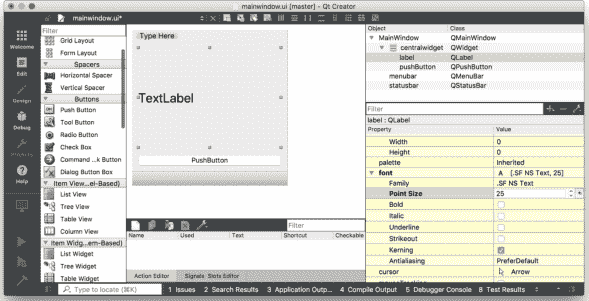

*图84. 为QLabel设置字体大小。*

你也可以配置对齐方式。对于复合属性（你可以设置多个值，例如左+中），它们是嵌套的。

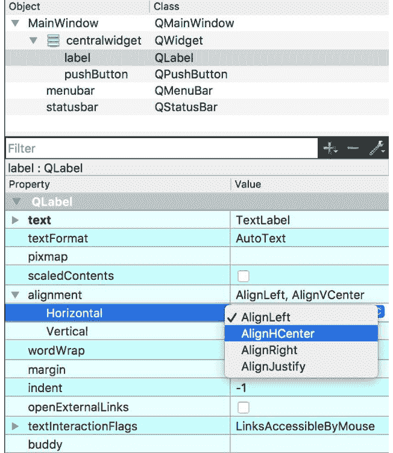

*图85. 详细的字体属性。*

所有对象属性都可以从这两个地方进行编辑——你可以选择在代码中还是在*Qt Designer*中进行特定的修改。作为一个通用规则，将*动态*更改保留在代码中，而将基础或默认状态保留在你设计的UI中是有意义的。

本介绍仅触及了*Qt Designer*功能的皮毛。我强烈建议你深入挖掘并进行实验——记住，你之后仍然可以从代码中添加或调整控件。

### 美学

如果你不是设计师，可能很难创建*美观*的界面，甚至不知道它们是什么。幸运的是，有一些简单的规则可以遵循，以创建即使不*美观*至少也不会*丑陋*的界面。关键概念是——对齐、分组和间距。

**对齐**是为了减少视觉噪音。将控件的角视为*对齐点*，并旨在最小化UI中*唯一*对齐点的数量。在实践中，这意味着确保界面中元素的边缘彼此*对齐*。

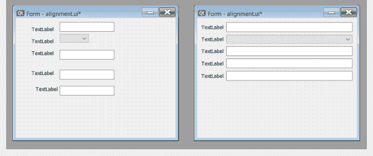

> 如果你有不同大小的输入，请对齐你阅读*起始*的边缘。英语是从左到右的语言，因此如果你的应用是英语，请对齐左侧。

相关控件的**分组**会获得上下文，使其更容易*理解*。构建你的界面，使相关的事物放在一起。

**间距**是在界面中创建视觉上不同区域的关键——分组之间没有间距，就没有分组！保持间距一致且有意义。

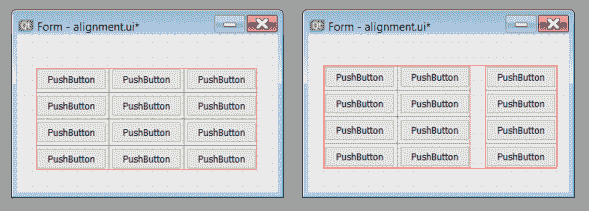

*图87. 对元素进行分组并在分组之间添加间距。*

### 主题

开箱即用的Qt应用程序看起来*具有平台原生风格*。也就是说，它们呈现出运行所在操作系统的*外观和感觉*。这意味着它们在任何系统上都显得很合适，并且对用户来说感觉很自然。但这也可能意味着它们看起来有点*乏味*。值得庆幸的是，Qt让你完全控制应用程序中控件的外观。

无论你是想让你的应用程序脱颖而出，还是正在设计自定义控件并希望它们融入其中，本章将解释如何在PyQt6中实现这一点。

# 15. 样式

样式是Qt对应用程序进行广泛外观和感觉更改的方式，修改控件的显示和行为方式。Qt在给定平台上运行你的应用程序时会自动应用特定于平台的样式——这就是为什么你的应用程序在macOS上运行时看起来像macOS应用程序，在Windows上运行时看起来像Windows应用程序。这些特定于平台的样式使用主机平台上的原生控件，这意味着它们不能在其他平台上使用。

然而，平台样式并不是你为应用程序设置样式的唯一选择。Qt还附带了一个名为*Fusion*的跨平台样式，它为你的应用程序提供了一致的跨平台、现代的风格。

### Fusion

Qt的Fusion样式为你提供了在所有系统上保持UI一致性的优势，代价是与操作系统标准的一致性有所降低。哪个更重要取决于你需要对正在创建的UI的控制程度、你正在对其进行多少自定义以及你正在使用哪些控件。

> Fusion样式是一种平台无关的样式，提供面向桌面的外观和感觉。它实现了与Qt Widgets的Fusion样式相同的设计语言。
>
> — Qt文档

要启用该样式，请在`QApplication`实例上调用`.setStyle()`，并传入样式名称（在本例中为*Fusion*）作为字符串。

```python
app = QApplication(sys.argv)
app.setStyle('Fusion')
#...
app.exec_()
```

下面显示了之前的小部件列表示例，但应用了Fusion样式。

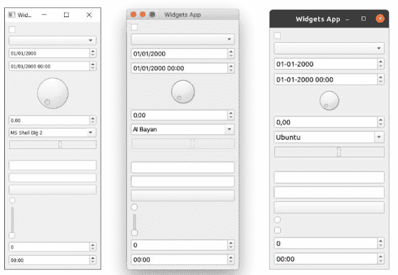

*图88. "Fusion"样式控件。它们在所有平台上看起来都一样。*

> 在[Qt文档](https://doc.qt.io/qt-5/qapplication.html#setStyle)中可以找到更多应用了Fusion样式的控件示例。

# 16. 调色板

Qt中用于绘制用户界面的颜色选择称为*调色板*。应用程序级别和控件特定的调色板都通过`QPalette`对象进行管理。调色板可以在应用程序和控件级别设置，允许你设置全局标准调色板，并在每个控件基础上覆盖它。全局调色板通常由Qt主题定义（主题本身通常依赖于操作系统），但你可以覆盖它以更改整个应用程序的外观。

活动的全局调色板可以从`QApplication.palette()`访问，或者通过创建一个新的*空*`QPalette`实例。例如 —

```python
from PyQt6.QtGui import QPalette
palette = QPalette()
```

你可以通过调用`palette.setColor(role, color)`来修改调色板，其中*role*决定颜色的用途，`QColor`是要使用的颜色。使用的颜色可以是自定义的`QColor`对象，也可以是`Qt.GlobalColor`命名空间中的内置基本颜色之一。

```python
palette.setColor(QPalette.ColorRole.Window, QColor(53,53,53))
palette.setColor(QPalette.ColorRole.WindowText, Qt.GlobalColor.white)
```

> 在Windows 10和macOS特定于平台的主题上使用调色板时存在一些限制。

有相当多不同的*角色*。主要角色如下表所示 —

*表4. 主要角色*

| 常量 | 值 | 描述 |
| :--- | :--- | :--- |
| QPalette.ColorRole.Window | 10 | 窗口的背景颜色。 |
| QPalette.ColorRole.WindowText | 0 | 窗口的默认文本颜色。 |
| QPalette.ColorRole.Base | 9 | 文本输入控件、组合框下拉列表和工具栏手柄的背景。*通常是白色或浅色* |
| QPalette.ColorRole.AlternateBase | 16 | 在条纹（交替）行中使用的第二种Base颜色——例如`QAbstractItemView.setAlternatingRowColors()` |
| QPalette.ColorRole.ToolTipBase | 18 | QToolTip和QWhatsThis悬停指示器的背景颜色。两个提示都使用Inactive组（见后文），因为它们不是活动窗口。 |
| QPalette.ColorRole.ToolTipText | 19 | QToolTip和QWhatsThis的前景色。两个提示都使用Inactive组（见后文），因为它们不是活动窗口。 |
| QPalette.ColorRole.PlaceholderText | 20 | 控件中占位符文本的颜色。 |
| QPalette.ColorRole.Text | 6 | 使用Base背景着色的控件的文本颜色。必须与Window和Base都提供良好的对比度。 |
| QPalette.ColorRole.Button | 1 | 默认按钮背景颜色。这可能与Window不同，但必须与ButtonText提供良好的对比度。 |
| QPalette.ColorRole.ButtonText | 8 | 按钮上使用的文本颜色，必须与Button颜色形成对比。 |

## 深色模式

随着人们在屏幕前花费的时间越来越多，深色模式正变得流行起来。深色主题的操作系统和应用程序有助于减轻眼睛疲劳，并在晚间工作时减少对睡眠的干扰。

Windows、macOS 和 Linux 都支持深色模式主题，好消息是，如果你使用 PyQt6 构建应用程序，你将免费获得深色模式支持。

> 在为分发构建 macOS 安装包时，你需要在应用中将 `NSRequiresAquaSystemAppearance` 设置为 `False`，这样打包后的 `.app` 文件才会遵循深色模式设置——这将在打包章节中介绍。

### 颜色

你的操作系统有一个标准主题，大多数软件都会遵循它。Qt 会自动识别这个配色方案，并将其应用到你的 PyQt6 应用程序中，以帮助它们融入系统。使用这些颜色有一些优势——

1.  你的应用在用户的桌面上会显得很自然。
2.  你的用户熟悉上下文颜色的含义。
3.  已经有人花时间设计了有效的配色方案。

如果你想替换配色方案，请确保收益大于成本。

有时你的应用程序可能需要额外的上下文颜色或对高亮色进行调整。对于数据可视化，一个很好的资源是 *Cynthia Brewer* 的 [Color Brewer](https://colorbrewer2.org/)，它提供了定性和定量的配色方案。如果你只需要几种颜色，[coolors.co](https://coolors.co/) 可以让你生成自定义的、搭配和谐的 4 色主题。


*图 91. 来自 coolors.co 的配色方案示例*

简洁有效地使用颜色，尽可能限制你的调色板。如果特定颜色在某处有特定含义，那么在*所有地方*都使用相同的含义。避免使用多种色调，除非这些色调本身具有含义。

### ✔ 应该做

- 考虑首先在你的应用中使用 GUI 标准颜色。

### ✖ 不要这样做

-   使用自定义颜色时，定义一个配色方案并坚持使用。
-   选择颜色和对比度时，要考虑色盲用户。
-   将标准颜色用于非标准目的，例如：红色 = 正常。

# 17. 图标

图标是用于辅助用户界面导航或理解的小图片。它们常见于按钮上，与文字并列或替代文字，或与菜单中的操作并列。通过使用易于识别的指示符，你可以使你的界面更易于使用。

在 PyQt6 中，你有多种不同的选项来获取图标并将其集成到你的应用程序中。在本节中，我们将探讨这些选项及其各自的优缺点。

### Qt 标准图标

为你的应用程序添加简单图标最简单的方法是使用 Qt 本身附带的内置图标。这小组图标涵盖了多种标准用例，从文件操作、前进和后退箭头到消息框指示器。

完整的内置图标列表如下所示。


图 92. Qt 内置图标

你会注意到这组图标有点*局限*。如果这对你要构建的应用程序来说不是问题，或者如果你的应用程序只需要几个图标，这可能仍然是一个可行的选择。

这些图标可以通过当前应用程序样式使用 `QStyle.standardIcon(name)` 或 `QStyle.<constant>` 来访问。完整的内置图标名称表如下所示 —

| SP_ArrowBack | SP_DirIcon | SP_MediaSkipBackward |
| SP_ArrowDown | SP_DirLinkIcon | SP_MediaSkipForward |
| SP_ArrowForward | SP_DirOpenIcon | SP_MediaStop |
| SP_ArrowLeft | SP_DockWidgetCloseButton | SP_MediaVolume |
| SP_ArrowRight | SP_DriveCDIcon | SP_MediaVolumeMuted |
| SP_ArrowUp | SP_DriveDVDIcon | SP_MessageBoxCritical |
| SP_BrowserReload | SP_DriveFDIcon | SP_MessageBoxInformation |
| SP_BrowserStop | SP_DriveHDIcon | SP_MessageBoxQuestion |
| SP_CommandLink | SP_DriveNetIcon | SP_MessageBoxWarning |
| SP_ComputerIcon | SP_FileDialogBack | SP_TitleBarCloseButton |
| SP_CustomBase | SP_FileDialogContentsView | SP_TitleBarContextHelpButton |
| SP_DesktopIcon | SP_FileDialogDetailedView | SP_TitleBarMaxButton |
| SP_DialogApplyButton | SP_FileDialogEnd | SP_TitleBarMenuButton |
| SP_DialogCancelButton | SP_FileDialogInfoView | SP_TitleBarMinButton |
| SP_DialogCloseButton | SP_FileDialogListView | SP_TitleBarNormalButton |
| SP_DialogDiscardButton | SP_FileDialogNewFolder | SP_TitleBarShadeButton |
| SP_DialogHelpButton | SP_FileDialogStart | SP_TitleBarUnshadeButton |
| SP_DialogNoButton | SP_FileDialogToParent | SP_ToolBarHorizontalExtensionButton |
| SP_DialogOkButton | SP_FileIcon | SP_ToolBarVerticalExtensionButton |
| SP_DialogResetButton | SP_FileLinkIcon | SP_TrashIcon |
| SP_DialogSaveButton | SP_MediaPause | SP_VistaShield |
| SP_DialogYesButton | SP_MediaPlay | SP_DirClosedIcon |
| SP_MediaSeekBackward | SP_DirHomeIcon | SP_MediaSeekForward |

你可以通过 QStyle 命名空间直接访问这些图标，如下所示。

```
style = button.style() # Get the QStyle object from the widget.
icon = style.standardIcon(QStyle.SP_MessageBoxCritical)
button.setIcon(icon)
```

你也可以使用来自特定小部件的样式对象。使用哪种方式并不重要，因为我们只是在访问内置图标。

```
style = button.style() # Get the QStyle object from the widget.
icon = style.standardIcon(style.SP_MessageBoxCritical)
button.setIcon(icon)
```

如果你在这个标准集中找不到你需要的图标，你将需要使用下面概述的其他方法之一。

> 虽然你*可以*混合搭配来自不同图标集的图标，但最好在整个应用中使用单一风格，以保持应用程序的连贯性。

### 图标文件

如果标准图标不是你想要的，或者你需要的图标不可用，你可以使用任何你喜欢的自定义图标。图标可以是你的平台上 Qt 支持的任何图像类型，尽管对于大多数用例，PNG 或 SVG 图像是首选。

> 要获取你所在平台上支持的图像格式列表，你可以调用 `QtGui.QImageReader.supportedImageFormats()`。

### 图标集

如果你不是平面设计师，使用众多可用的图标集之一将为你节省大量时间（和麻烦）。网上有成千上万种这样的图标集，根据其在开源或商业软件中的使用情况，具有不同的许可。

在本书和示例应用程序中，我使用了 [Fugue](https://example.com) 图标集，它也可以在你的软件中免费使用，但需要注明作者。Tango 图标集是为在 Linux 上使用而开发的大型图标集，然而没有许可要求，可以在任何平台上使用。

| 资源 | 描述 | 许可 |
| :--- | :--- | :--- |
| [Fugue by p.yusukekamiyamane](http://p.yusukekamiyamane.com/) | 3,570 个 16x16 PNG 格式图标 | CC BY 3.0 |
| [Diagona by p.yusukekamiyamane](http://p.yusukekamiyamane.com/) | 400 个 16x16 和 10x10 PNG 格式图标 | CC BY 3.0 |
| [Tango Icons by The Tango Desktop Project](http://tango.freedesktop.org/) | 使用 Tango 项目颜色主题的图标。 | 公共领域 |

> 虽然你确实可以控制菜单和工具栏中使用的图标大小，但在大多数情况下，你应该保持原样。菜单的标准图标大小为 20x20 像素。

> 小于此尺寸的也可以，图标将居中显示而不是放大。

### 创建你自己的图标

如果你不喜欢任何可用的图标集，或者希望你的应用程序具有独特的外观，你当然可以设计自己的图标。图标可以使用任何标准图形软件创建，并保存为具有透明背景的 PNG 图像。图标应该是正方形的，并且分辨率足够高，以便在你的应用程序中使用时无需放大或缩小。

### 使用图标文件

一旦你有了图标文件——无论是来自图标集还是自己绘制的——都可以通过创建 `QtGui.QIcon` 实例并在其中直接传入图标文件名来在你的 Qt 应用程序中使用它们。

```
QtGui.QIcon("<filename>")
```

虽然你可以使用绝对（完整）和相对（部分）路径来指向你的文件，但在分发应用程序时，绝对路径容易出错。只要图标文件相对于你的脚本存储在相同的位置，相对路径就可以工作，尽管即使这样在打包时也可能难以管理。

> 为了创建图标实例，你必须已经创建了 QApplication 实例。为确保这一点，你可以在源文件的顶部创建你的应用程序实例，或者在使用它们的小部件或窗口的 __init__ 中创建你的 QIcon 实例。

### Free Desktop 规范图标（Linux）

在 Linux 桌面上，有一个叫做 *Free Desktop 规范* 的东西，它为特定操作的图标定义了标准名称。

如果你的应用程序使用这些特定的图标名称（并从“主题”加载图标），那么在 Linux 上，你的应用程序将使用桌面上启用的当前图标集。其理念是让所有应用程序具有相同的外观和感觉，同时保持可配置性。

要在 Qt Designer 中使用这些，你需要选择下拉菜单并选择“从主题设置图标...”


然后输入你要使用的图标的**名称**，例如 `document-new`（[完整有效名称列表](https://specifications.freedesktop.org/icon-naming-spec/latest/)）。


图 94. 选择图标主题

在代码中，你可以使用 `icon = QtGui.QIcon.fromTheme("document-new")` 从活动的 Linux 桌面主题获取图标。以下代码片段生成一个小窗口（按钮），其中显示来自活动主题的“新建文档”图标。

清单 71. icons/linux.py

```
from PyQt6.QtWidgets import QApplication, QPushButton
from PyQt6.QtGui import QIcon

import sys

app = QApplication(sys.argv)
button = QPushButton("Hello")
icon = QIcon.fromTheme("document-new")
button.setIcon(icon)
button.show()

app.exec()
```

生成的窗口在 Ubuntu 上使用默认图标主题时将如下所示。

# 18. Qt 样式表 (QSS)

到目前为止，我们已经了解了如何使用 QPalette 为 PyQt6 应用程序应用自定义颜色。然而，在 Qt5 中，你还可以对控件的外观进行许多其他自定义。用于实现此自定义的系统称为 Qt 样式表 (QSS)。

QSS 在概念上与用于网页样式的层叠样式表 (CSS) 非常相似，共享类似的语法和方法。在本节中，我们将看一些 QSS 的示例，以及如何使用它来修改控件外观。

> 在控件上使用 QSS 会对性能产生轻微影响，因为在重绘控件时需要查找相应的规则。但是，除非你进行非常繁重的控件操作，否则这不太可能产生影响。

## 样式编辑器

为了使尝试 QSS 规则更容易一些，我们可以创建一个简单的演示应用程序，允许输入规则并将其应用于一些示例控件。我们将使用它来测试各种样式属性和规则。

> 样式查看器的源代码如下所示，但它也包含在本书的源代码中。

清单 72. themes/qss_tester.py

```python
import sys

from PyQt6.QtCore import Qt
from PyQt6.QtGui import QColor, QPalette
from PyQt6.QtWidgets import (
    QApplication,
    QCheckBox,
    QComboBox,
    QLabel,
    QLineEdit,
    QMainWindow,
    QPlainTextEdit,
    QPushButton,
    QSpinBox,
    QVBoxLayout,
    QWidget,
)

class MainWindow(QMainWindow):
    def __init__(self):
        super().__init__()

        self.setWindowTitle("QSS Tester")

        self.editor = QPlainTextEdit()
        self.editor.textChanged.connect(self.update_styles)

        layout = QVBoxLayout()
        layout.addWidget(self.editor)

        # Define a set of simple widgets.
        cb = QCheckBox("Checkbox")
        layout.addWidget(cb)

        combo = QComboBox()
        combo.setObjectName("thecombo")
        combo.addItems(["First", "Second", "Third", "Fourth"])
        layout.addWidget(combo)

        sb = QSpinBox()
        sb.setRange(0, 99999)
        layout.addWidget(sb)

        l = QLabel("This is a label")
        layout.addWidget(l)

        le = QLineEdit()
        le.setObjectName("mylineedit")
        layout.addWidget(le)

        pb = QPushButton("Push me!")
        layout.addWidget(pb)

        self.container = QWidget()
        self.container.setLayout(layout)

        self.setCentralWidget(self.container)

    def update_styles(self):
        qss = self.editor.toPlainText()
        self.setStyleSheet(qss)

app = QApplication(sys.argv)
app.setStyle("Fusion")

w = MainWindow()
w.show()

app.exec()
```

运行此应用程序，你将看到以下窗口，顶部有一个文本编辑器（你可以在其中输入 QSS 规则），以及一组将应用这些规则的控件——我们稍后将了解应用规则和继承的工作原理。

*图 96. QSS 测试器应用程序，未应用规则。*

尝试在顶部的框中输入以下样式规则，并将结果与屏幕截图进行比较以确保其正常工作。

```css
QLabel { background-color: yellow }
```

*图 97. 将 background-color: yellow 应用于 QLabel*

```css
QLineEdit { background-color: rgb(255, 0, 0) }
```

*图 98. 将 background-color: rgb(255, 0, 0)（红色）应用于 QLineEdit*

```css
QLineEdit {
    border-width: 7px;
    border-style: dashed;
    border-color: red;
}
```

*图 99. 将红色虚线边框应用于 QLineEdit*

接下来，我们将详细研究这些 QSS 规则如何设置控件样式，逐步构建一些更复杂的规则集。

> 💡 可样式化的控件完整列表可在 [Qt 文档](https://doc.qt.io/qt-5/stylesheet-reference.html) 中找到。

## 样式属性

接下来，我们将介绍可用于使用 QSS 设置控件样式的属性。这些属性已分解为逻辑部分，包含相互关联的属性，以便于理解。你可以使用我们刚刚创建的 QSS 规则测试器应用程序在各种控件上测试这些样式。

下表中使用的类型如下所列。其中一些是复合类型，由其他条目组成。

> 你现在可以跳过此表，但需要将其作为参考来解释每个属性的有效值。

| 属性 | 类型 | 描述 |
| :--- | :--- | :--- |
| Alignment | top \| bottom \| left \| right \| center | 水平和/或垂直对齐。 |
| Attachment | scroll \| fixed | 滚动或固定附件。 |
| Background | Brush \| Url \| Repeat \| Alignment | Brush、Url、Repeat 和 Alignment 的复合类型。 |
| Boolean | 0 \| 1 | 真 (1) 或假 (0)。 |
| Border | Border Style \| Length \| Brush | 简写边框属性。 |
| Border Image | none \| Url Number (stretch \| repeat) | 由九部分组成的图像（左上、上中、右上、左中、中、右中、左下、下中、右下）。 |
| Border Style | dashed \| dot-dash \| dot-dot-dash \| dotted \| double \| groove \| inset \| outset \| ridge \| solid \| none | 用于绘制边框的图案。 |
| Box Colors | Brush | 最多四个 Brush 值，分别指定框的上、右、下和左边缘。如果省略左侧颜色，将复制右侧颜色；如果省略底部颜色，将复制顶部颜色。 |
| Box Lengths | Length | 最多四个 Length 值，分别指定框的上、右、下和左边缘。如果省略左侧长度，将复制右侧长度；如果省略底部长度，将复制顶部长度。 |
| Brush | Color \| Gradient \| PaletteRole | 一个颜色、渐变或调色板中的条目。 |
| Color | rgb(r,g,b) \| rgba(r,g,b,a) \| hsv(h,s,v) \| hsva(h,s,v,a) \| hsl(h,s,l) \| hsla(h,s,l,a) \| #rrggbb \| Color Name | 指定颜色为 RGB（红、绿、蓝）、RGBA（红、绿、蓝、alpha）、HSV（色调、饱和度、值）、HSVA（色调、饱和度、值、alpha）、HSL（色调、饱和度、亮度）、HSLA（色调、饱和度、亮度、alpha）或命名颜色。rgb() 或 rgba() 语法可以使用 0 到 255 之间的整数值，也可以使用百分比。 |
| Font | (Font Style \| Font Weight) Font Size | 简写字体属性。 |
| Font Size | Length | 字体的大小。 |
| Font Style | normal \| italic \| oblique | 字体的样式。 |
| Font Weight | normal \| bold \| 100 \| 200... \| 900 | 字体的粗细。 |
| Gradient | qlineargradient \| qradialgradient \| qconicalgradient | 起点和终点之间的线性渐变。焦点和围绕它的圆上的终点之间的径向渐变。围绕中心点的锥形渐变。语法请参阅 [QLinearGradient 文档](https://doc.qt.io/qt-6/qlineargradient.html)。 |
| Icon | Url(disabled \| active \| normal \| selected) (on \| off) | url、QIcon.Mode 和 QIcon.State 的列表。例如 `file-icon: url(file.png), url(file_selected.png) selected;` |
| Length | Number(px \| pt \| em \| ex) | 后跟测量单位的数字。如果未给出单位，在大多数上下文中使用像素。px：像素；pt：一点的大小（即 1/72 英寸）；em：字体的 em 宽度（即 'M' 的宽度）；ex：字体的 ex 宽度（即 'x' 的高度） |
| Number | 十进制整数或实数 | 例如 123 或 12.2312 |
| Origin | margin \| border \| padding \| content | 更多详情请参阅框模型。 |

| 属性 | 类型 | 描述 |
| :--- | :--- | :--- |
| PaletteRole | alternate-base, base, bright-text, button, button-text, dark, highlight, highlighted-text, light, link, link-visited, mid, midlight, shadow, text, window, window-text | 这些值对应于控件 QPalette 中的颜色角色，例如 `color: palette(dark);` |
| Radius | Length | 一个或两个 Length 值。 |
| Repeat | repeat-x, repeat-y, repeat, no-repeat | repeat-x：水平重复。repeat-y：垂直重复。repeat：水平和垂直重复。no-repeat：不重复。 |
| Url | url(filename) | filename 是本地磁盘上的文件名或使用 Qt 资源系统存储的文件名。 |

这些属性和类型的完整详细信息也可在 [QSS 参考文档](https://doc.qt.io/qt-5/stylesheet-reference.html)中找到。

### 文本样式

我们将从文本属性开始，这些属性可用于修改文本的字体、颜色和样式（粗体、斜体、下划线）。它们可以应用于任何控件或部件。

| 属性 | 类型（默认值） | 描述 |
| :--- | :--- | :--- |
| color | Brush (`QPalette` Foreground) | 用于渲染文本的颜色。 |
| `font` | Font | 设置文本字体的简写表示法。等同于指定 font-family、font-size、font-style 和/或 font-weight。 |
| `font-family` | String | 字体族。 |
| `font-size` | Font Size | 字体大小。在此版本的 Qt 中，仅支持 pt 和 px 度量单位。 |
| `font-style` | normal \| italic \| oblique | 字体样式。 |
| `font-weight` | Font Weight | 字体粗细。 |
| `selection-background-color` | Brush (`QPalette::Highlight`) | 选中文本或项目的背景色。 |
| `selection-color` | Brush (`Palette::HighlightedText`) | 选中文本或项目的前景色。 |
| `text-align` | Alignment | 控件内容中文本和图标的对齐方式。 |
| `text-decoration` | none \| underline \| overline \| line-through | 附加文本效果 |

下面的示例代码片段，将 `QLineEdit` 的颜色设置为*红色*，选中文本的背景色设置为*黄色*，选中文本的颜色设置为*蓝色*。

```
QLineEdit {
    color: red;
    selection-color: blue;
    selection-background-color: yellow;
}
```

在 QSS 测试器中尝试此操作，以查看对 QLineEdit 的影响，它将产生以下结果。请注意，只有目标控件（QLineEdit）受样式影响。


图 100. 将文本样式应用于 QLineEdit

我们可以通过将两种不同类型的控件都作为目标（用逗号分隔）来将此规则应用于它们。

```
QSpinBox, QLineEdit {
    color: red;
    selection-color: blue;
    selection-background-color: yellow;
}
```


图 101. 将文本样式应用于 QLineEdit 和 QSpinBox

在最后一个示例中，我们将样式应用于 `QSpinBox`、`QLineEdit` 和 `QPushButton`，设置字体为粗体和斜体，并将 text-align 设置为**右对齐**。

```
QSpinBox, QLineEdit, QPushButton {
    color: red;
    selection-color: blue;
    selection-background-color: yellow;
    font-style: italic;
    font-weight: bold;
    text-align: right;
}
```

这将产生如下所示的结果。请注意，`text-align` 属性并未影响 `QSpinBox` 或 `QLineEdit` 的对齐方式。对于这两个控件，必须使用 `.setAlignment()` 方法而不是样式来设置对齐方式。


图 102. 将文本样式应用于 QPushButton、QLineEdit 和 QSpinBox

### 背景

除了设置文本样式外，您还可以设置控件背景样式，包括纯色和图像。对于图像，有许多额外的属性定义了图像如何在控件区域内重复和定位。

| 属性 | 类型（默认值） | 描述 |
| :--- | :--- | :--- |
| background | Background | 设置背景的简写表示法。等同于指定 background-color、background-image、background-repeat 和/或 background-position。另请参阅 background-origin、selection-background-color、background-clip、background-attachment 和 alternate-background-color。 |
| background-color | Brush | 用于控件的背景色。 |
| background-image | Url | 用于控件的背景图像。图像的半透明部分允许背景色透出。 |
| background-repeat | Repeat (both) | 背景图像是否以及如何重复以填充 background-origin 矩形。 |
| `background-position` | Alignment (top-left) | 背景图像在 background-origin 矩形内的对齐方式。 |
| `background-clip` | Origin (border) | 绘制背景的控件矩形。 |
| `background-origin` | Origin (padding) | 控件的背景矩形，与 background-position 和 background-image 一起使用。 |

以下示例将指定的图像应用于我们用于输入规则的 `QPlainTextEdit` 的背景。

```
QPlainTextEdit {
    color: white;
    background-image: url(../otje.jpg);
}
```

图像使用 `url()` 语法引用，传入文件路径。这里我们使用 `../otje.jpg` 指向父目录中的文件。


图 103. 背景图像。

> 虽然此语法与 CSS 中使用的语法相同，但无法使用 URL 加载远程文件。

要将背景定位在控件中，您可以使用 `background-position` 属性。这定义了图像的哪个点将与控件*原始矩形*上的*同一点*对齐。默认情况下，*原始矩形*是控件的内边距区域。


图 104. 背景位置示例

因此，`center`、`center` 的位置意味着图像的中心将与控件的中心沿两个轴对齐。

```
QPlainTextEdit {
    color: white;
    background-image: url(../otje.jpg);
    background-position: center center;
}
```


图 105. 居中的背景图像。

要将图像的右下角与控件*原始矩形*的右下角对齐，您将使用：

```
QPlainTextEdit {
    color: white;
    background-image: url(../otje.jpg);
    background-position: bottom right;
}
```

*原始矩形*可以使用 `background-origin` 属性进行修改。它接受 `margin`、`border`、`padding` 或 `content` 之一的值，该值定义该特定框作为背景位置对齐的参考。

要理解这意味着什么，我们需要查看控件盒模型。

### 控件盒模型

术语*盒模型*描述了围绕每个控件的*框*（矩形）之间的关系，以及这些框对控件之间大小或布局的影响。每个 Qt 控件都被四个同心框包围——从内到外，它们是内容、内边距、边框和外边距。


*图 106. 盒模型。*

增加内部框的大小会增加外部框的大小。这种安排意味着，例如，增加控件的*内边距*将在内容和边框之间添加空间，同时增加边框本身的尺寸。


*图 107. 向右侧添加内边距对其他框的影响。*

可用于修改各种框的属性如下所示。

| 属性 | 类型（默认值） | 描述 |
| :--- | :--- | :--- |
| `border` | Border | 设置控件边框的简写表示法。等同于指定 border-color、border-style 和/或 border-width。还有 `border-top`、`border-right`、`border-bottom` 和 `border-left`。 |
| `border-color` | Box Colors (QPalette Foreground) | 所有边框边缘的颜色。还有 `border-top-color`、`border-right-color`、`border-bottom-color`、`border-left-color` 用于特定边缘。 |
| `border-image` | Border Image | 用于填充边框的图像。图像被切成九部分，并在必要时适当拉伸。 |
| `border-radius` | Radius | 边框角的半径（曲线）。还有 `border-top-left-radius`、`border-top-right-radius`、`border-bottom-right-radius` 和 `border-bottom-left-radius` 用于特定角。 |
| `border-style` | Border Style (none) | 所有边框边缘的样式。还有 `border-top-style`、`border-right-style`、`border-bottom-style` 和 `border-left-style` 用于特定边缘。 |
| `border-width` | Box Lengths | 边框的宽度。还有 `border-top-width`、`border-right-width`、`border-bottom-width` 和 `border-left-width`。 |

| 属性 | 类型（默认值） | 描述 |
| :--- | :--- | :--- |
| margin | Box Lengths | 控件的外边距。也包括 margin-top、margin-right、margin-bottom 和 margin-left。 |
| outline | | 绘制在对象边框周围的轮廓线。 |
| outline-color | Color | 轮廓线的颜色。另见 border-color |
| outline-offset | Length | 轮廓线相对于控件边框的偏移量。 |
| outline-style | | 指定绘制轮廓线的样式。另见 border-style |
| outline-radius | | 为轮廓线添加圆角。也包括 outline-bottom-left-radius、outline-bottom-right-radius、outline-top-left-radius 和 outline-top-right-radius |
| padding | Box Lengths | 控件的内边距。也包括 padding-top、padding-right、padding-bottom 和 padding-left。 |

以下示例修改了 QPlainTextEdit 控件的 margin、border 和 padding。

```
QPlainTextEdit {
    margin: 10;
    padding: 10px;
    border: 5px solid red;
}
```

### 关于单位的说明

在此示例中，我们为 *padding* 和 *border* 使用了 `px` 或 *像素* 单位。*margin* 的值也以像素为单位，因为这是未指定单位时的默认单位。你也可以使用以下单位之一 —

- `px` 像素
- `pt` 磅值（即 1/72 英寸）
- `em` 字体的 *em* 宽度（即 'M' 的宽度）
- `ex` 字体的 *ex* 宽度（即 'x' 的高度）

在 QSS 测试器中查看结果，你可以看到红色边框 *内部* 的 padding 和红色边框 *外部* 的 margin。


*图 108. 盒模型*

你也可以为轮廓线添加 *半径* 以创建弯曲的边缘。

```
QPlainTextEdit {
    margin: 10;
    padding: 10px;
    border: 5px solid red;
    border-radius: 15px;
}
```


图 109. 带有 15px 半径（曲线）的边框

### 调整控件大小

可以使用 QSS 控制控件的大小。然而，虽然有特定的 `width` 和 `height` 属性（见后文），但它们仅用于指定子控件的大小。要控制控件，你必须使用 `max-` 和 `min-` 属性。

| 属性 | 类型（默认值） | 描述 |
| :--- | :--- | :--- |
| `max-height` | Length | 控件或子控件的最大高度。 |
| `max-width` | Length | 控件或子控件的最大宽度。 |
| `min-height` | Length | 控件或子控件的最小高度。 |
| `min-width` | Length | 控件或子控件的最小宽度。 |

如果你提供的 `min-height` 属性值大于控件 *通常* 的高度，那么控件将被放大。

```
QLineEdit {
    min-height: 50;
}
```


图 110. 为 `QLineEdit` 设置 `min-height` 以放大它。

然而，当设置 `min-height` 时，控件当然可以比这个值更大。要为控件指定精确的大小，你可以为该维度同时指定 `min-` 和 `max-` 值。

```
QLineEdit {
    min-height: 50;
    max-height: 50;
}
```

这将把控件锁定在此高度，防止其因内容变化而调整大小。

> 小心使用此方法，因为它可能导致控件内容无法显示！

### 控件特定样式

到目前为止，我们看到的样式是通用的，可用于大多数控件。然而，还有一些控件特定的属性可以设置。

| 属性 | 类型（默认值） | 描述 |
| :--- | :--- | :--- |
| `alternate-background-color` | Brush (`QPalette::AlternateBase`) | `QAbstractItemView` 子类中使用的交替背景色。 |
| `background-attachment` | Attachment (scroll) | 确定 `QAbstractScrollArea` 中的背景图像是随视口滚动还是固定。 |
| `button-layout` | Number (`SH_DialogButtonLayout`) | `QDialogButtonBox` 或 `QMessageBox` 中按钮的布局。可能的值有 0 (Win)、1 (Mac)、2 (KDE)、3 (Gnome) 和 5 (Android)。 |
| `dialogbuttonbox-buttons-have-icons` | Boolean | `QDialogButtonBox` 中的按钮是否显示图标。如果此属性设置为 1，则 `QDialogButtonBox` 的按钮显示图标；如果设置为 0，则不显示图标。 |
| `gridline-color` | Color (`SH_Table_GridLineColor`) | `QTableView` 中网格线的颜色。 |
| `icon` | Url+ | 控件图标。目前唯一支持此属性的控件是 QPushButton。 |
| `icon-size` | Length | 控件中图标的宽度和高度。 |
| `lineedit-password-character` | Number (SH_LineEdit_PasswordCharacter) | QLineEdit 密码字符的 Unicode 编号。 |
| `lineedit-password-mask-delay` | Number (SH_LineEdit_PasswordMaskDelay) | 应用 lineedit-password-character 之前，QLineEdit 密码掩码的延迟时间（毫秒）。 |
| `messagebox-text-interaction-flags` | Number (SH_MessageBox_TextInteractionFlags) | 消息框中文本的交互行为。（来自 Qt.TextInteractionFlags） |
| `opacity` | Number (SH_ToolTipLabel_Opacity) | 控件的不透明度（仅限工具提示）0-255。 |
| `paint-alternating-row-colors-for-empty-area` | bool | QTreeView 是否在数据末尾之后绘制交替行颜色。 |
| `show-decoration-selected` | Boolean (SH_ItemView_ShowDecorationSelected) | 控制 QListView 中的选择是覆盖整行还是仅覆盖文本范围。 |
| `titlebar-show-tooltips-on-buttons` | bool | 窗口标题栏按钮上是否显示工具提示。 |
| `widget-animation-duration` | Number | 动画应持续的时间（毫秒）。 |

这些仅适用于描述中指定的控件（或其子类）。

### 目标选择

我们已经看到一系列不同的 QSS 属性，并根据控件类型应用了它们。但是，如何针对单个控件进行选择，Qt 又如何决定将哪些规则应用于哪些控件以及何时应用？接下来，我们将探讨目标选择 QSS 规则的其他选项以及继承的影响。

| 类型 | 示例 | 描述 |
| :--- | :--- | :--- |
| 通用 | `*` | 匹配所有控件。 |
| 类型 | `QPushButton` | QPushButton 或其子类的实例。 |
| 属性 | `QPushButton[flat="false"]` | 非扁平的 QPushButton 实例。可以与支持 `.toString()` 的 *任何* 属性进行比较。也可以使用 `class="classname"` |
| 属性包含 | `QPushButton[property~="something"]` | 属性（QString 列表）不包含给定值的 QPushButton 实例。 |
| 类 | `.QPushButton` | QPushButton 的实例，但不包括子类。 |
| ID | `QPushButton#okButton` | 对象名称为 okButton 的 QPushButton 实例。 |
| 后代 | `QDialog QPushButton` | 是 QDialog 后代（子级、孙级等）的 QPushButton 实例。 |
| 子级 | `QDialog > QPushButton` | 是 QDialog *直接* 子级的 QPushButton 实例。 |

我们现在将依次查看每种目标选择规则，并使用我们的 QSS 测试器进行尝试。

### 类型

我们已经在 QSS 测试器中看到了 *类型选择* 的实际应用。这里我们针对单个控件的类型名称应用规则，例如 `QComboBox` 或 `QLineEdit`。


*图 111. 针对 QComboBox 进行选择不会影响其他无关类型。*

然而，以这种方式选择类型 *也会* 选择该类型的任何子类。因此，例如，我们可以选择 QAbstractButton 来选择任何从它派生的类型。

```
QAbstractButton {
    background: orange;
}
```


图 112. 针对 QAbstractButton 会影响所有子类

这种行为意味着 *所有* 控件都可以使用 QWidget 进行选择。例如，以下代码将所有控件的背景设置为 *红色*。

```
QWidget {
    background: red;
}
```

### 类

然而，有时你*希望*只针对特定类的控件，而非其所有子类。为此，你可以使用*类目标*——在类型名称前添加一个`.`。

以下规则针对`QWidget`的实例，但*不*包括从`QWidget`派生的任何类。在我们的QSS测试器中，我们唯一的`QWidget`是用于承载布局的中心控件。因此，以下规则会将*该*容器控件的背景变为橙色。

```css
.QWidget {
    background: orange;
}
```

### ID 目标

所有Qt控件都有一个*对象名称*，用于唯一标识它们。在Qt Designer中创建控件时，你会使用对象名称来指定该对象在父窗口中的可用名称。然而，这种关系只是为了方便——你可以在自己的代码中为控件设置任何你想要的*对象名称*。这些名称随后可用于将QSS规则直接定向到特定控件。

在我们的QSS测试器应用中，我们为`QComboBox`和`QLineEdit`设置了ID用于测试。

```python
combo.setObjectName('thecombo')
le.setObjectName('mylineedit')
```

### 属性 [property="<value>"]

你可以通过任何可作为字符串访问的控件属性（或其值具有`.toString()`方法）来定位控件。这可用于在控件上定义一些相当复杂的状态。

以下是一个通过文本标签定位`QPushButton`的简单示例。

```css
QPushButton[text="Push me!"] {
    background: red;
}
```

> 通常，通过可见文本来定位控件是一个*非常糟糕的主意*，因为当你尝试翻译应用程序或更改标签时，它会引入错误。

规则在样式表首次设置时应用于控件，并且不会响应属性的更改。如果QSS规则所针对的属性被修改，你必须触发样式表重新计算才能使其生效——例如，通过重新设置样式表。

### 后代

要定位给定类型控件的后代，你可以将控件链接在一起。以下示例定位任何作为`QMainWindow`子控件的`QComboBox`——无论是直接子控件，还是嵌套在其他控件或布局中。

```css
QMainWindow QComboBox {
    background: yellow;
}
```

要定位*所有*后代，你可以使用全局选择器作为目标中的最后一个元素。你也可以将多种类型链接在一起，以仅定位应用程序中存在该层次结构的位置。

```css
QMainWindow QWidget * {
    background: yellow;
}
```

在我们的QSS测试器应用程序中，我们有一个外部的`QMainWindow`，一个承载布局的`QWidget`中心控件，以及布局中的我们的控件。因此，上述规则仅匹配各个控件（它们都按此顺序拥有`QMainWindow QWidget`作为父级）。

### 子级 >

你也可以使用`>`选择器来定位作为另一个控件*直接*子级的控件。这仅在存在该确切层次结构时匹配。

例如，以下规则将*仅*定位作为`QMainWindow`直接子级的`QWidget`容器。

```css
QMainWindow > QWidget {
    background: green;
}
```

但以下规则将不匹配任何内容，因为在我们的QSS应用中，`QComboBox`控件*不是*`QMainWindow`的直接子级。

```css
QMainWindow > QComboBox { /* 不匹配任何内容 */
    background: yellow;
}
```

### 继承

样式表可以应用于`QApplication`和控件，并将应用于该样式化的控件及其所有子控件。控件的有效样式表由其所有祖先（父级、祖父级……一直到窗口）的样式表以及`QApplication`本身的样式表组合确定。

规则按*特异性*顺序应用。这意味着，通过ID针对特定控件的规则，将覆盖针对*所有*该类型控件的规则。例如，以下规则将把我们QSS测试器应用中的`QLineEdit`背景设置为蓝色——特定的ID覆盖了通用的控件规则。

```css
QLineEdit#mylineedit {
    background: blue;
}

QLineEdit {
    background: red;
}
```

在存在两个冲突规则的情况下，控件自身的样式表将优先于继承的样式，而较近的祖先将优先于较远的祖先——例如，父级将优先于祖父级。

### 无继承属性

控件仅受专门针对它们的规则影响。虽然规则可以*设置*在父级上，但它们仍然必须引用目标控件才能影响它。考虑以下规则——

```css
QLineEdit {
    background: red;
}
```

如果设置在`QMainWindow`上，该窗口中的所有`QLineEdit`对象都将具有红色背景（假设没有其他规则）。然而，如果设置了以下内容...

```css
QMainWindow {
    background: red;
}
```

...则只有`QMainWindow`本身会被设置为红色背景。背景颜色*本身*不会传播到子控件。

> 然而，如果子控件具有透明背景，红色*会*显示出来。

除非被匹配的规则所针对，否则控件将对每个属性使用其默认的系统样式值。控件不会从父控件继承样式属性，即使在复合控件内部也是如此，并且控件必须被规则直接针对才能受到它们的影响。

> 这与CSS形成对比，在CSS中，元素可以从其父级继承值。

### 伪选择器

到目前为止，我们已经研究了静态样式，使用属性来更改控件的默认外观。然而，QSS还允许你根据动态控件状态进行样式设置。一个例子是当鼠标悬停在按钮上时看到的高亮显示——高亮有助于指示控件已获得焦点，如果你点击它，它会响应。

活动样式有许多其他用途，从可用性（高亮数据行或特定选项卡）到可视化数据层次结构。这些都可以通过QSS中的*伪选择器*来实现。伪选择器使QSS规则仅在特定情况下应用。

有许多不同的伪选择器可以应用于控件。有些如`:hover`是通用的，可以与所有控件一起使用，而另一些则是特定于控件的。完整列表如下——

| 伪状态 | 描述 |
| :--- | :--- |
| `:active` | 控件是活动窗口的一部分。 |
| `:adjoins-item` | `QTreeView`的`::branch`与一个项目相邻。 |
| `:alternate` | 在绘制`QAbstractItemView`的行时，为每个交替行设置（`QAbstractItemView.alternatingRowColors()`为`True`）。 |
| `:bottom` | 位于底部，例如标签位于底部的`QTabBar`。 |
| `:checked` | 项目被选中，例如`QAbstractButton`的选中状态。 |
| `:closable` | 项目可以关闭，例如启用了`QDockWidget.DockWidgetClosable`的`QDockWidget`。 |
| `:closed` | 项目处于关闭状态，例如`QTreeView`中未展开的项目。 |
| `:default` | 项目是默认操作，例如默认的`QPushButton`或`QMenu`中的默认操作。 |
| `:disabled` | 项目被禁用。 |
| `:editable` | `QComboBox`是可编辑的。 |
| `:enabled` | 项目被启用。 |
| `:exclusive` | 项目是排他性项目组的一部分，例如排他性`QActionGroup`中的菜单项。 |

| 伪状态 | 描述 |
| :--- | :--- |
| :first | 项目是列表中的第一个，例如 `QTabBar` 中的第一个标签页。 |
| :flat | 项目是扁平的，例如扁平的 `QPushButton`。 |
| :floatable | 项目可以浮动，例如 `QDockWidget` 启用了 `QDockWidget.DockWidgetFloatable`。 |
| :focus | 项目拥有输入焦点。 |
| :has-children | 项目拥有子项，例如 `QTreeView` 中带有子项的项目。 |
| :has-siblings | 项目拥有同级项，例如 `QTreeView` 中带有同级项的项目。 |
| :horizontal | 项目具有水平方向。 |
| :hover | 鼠标正悬停在项目上。 |
| :indeterminate | 项目处于不确定状态，例如部分选中的 `QCheckBox` 或 `QRadioButton`。 |
| :last | 项目是列表中的最后一个，例如 `QTabBar` 中的最后一个标签页。 |
| :left | 项目位于左侧，例如标签页位于左侧的 `QTabBar`。 |
| :maximized | 项目已最大化，例如最大化的 `QMdiSubWindow`。 |
| :middle | 项目位于列表中间，例如 `QTabBar` 中既不在开头也不在结尾的标签页。 |
| :minimized | 项目已最小化，例如最小化的 `QMdiSubWindow`。 |
| :movable | 项目可以移动，例如 `QDockWidget` 启用了 `QDockWidget.DockWidgetMovable`。 |
| :no-frame | 项目没有边框，例如无边框的 `QSpinBox` 或 `QLineEdit`。 |
| :non-exclusive | 项目属于非排他性项目组，例如非排他性 `QActionGroup` 中的菜单项。 |
| :off | 可切换的项目，适用于处于“关闭”状态的项目。 |
| :on | 可切换的项目，适用于处于“开启”状态的部件。 |
| :only-one | 项目是列表中唯一的，例如 `QTabBar` 中的单个标签页。 |
| :open | 项目处于打开状态，例如 `QTreeView` 中展开的项目，或带有打开菜单的 `QComboBox` 或 `QPushButton`。 |
| :next-selected | 下一个项目被选中，例如 `QTabBar` 中选中的标签页紧邻此项目。 |
| :pressed | 项目正被鼠标按下。 |
| :previous-selected | 上一个项目被选中，例如 `QTabBar` 中紧邻选中标签页的标签页。 |
| :read-only | 项目被标记为只读或不可编辑，例如只读的 `QLineEdit` 或不可编辑的 `QComboBox`。 |
| :right | 项目位于右侧，例如标签页位于右侧的 `QTabBar`。 |
| :selected | 项目被选中，例如 `QTabBar` 中选中的标签页或 `QMenu` 中选中的项目。 |
| :top | 项目位于顶部，例如标签页位于顶部的 `QTabBar`。 |
| :unchecked | 项目未被选中。 |
| :vertical | 项目具有垂直方向。 |
| :window | 部件是一个窗口（即顶层部件）。 |

我们可以使用 QSS 测试器来查看伪选择器的实际效果。例如，以下代码将在鼠标悬停于部件上时，将 `QPushButton` 的背景变为红色。

```
QPushButton:hover {
    background: red;
}
```

以下代码将在所有部件被悬停时改变其背景。

```
*:hover {
    background: red;
}
```

悬停一个部件意味着其所有父部件也处于悬停状态（鼠标在其边界框内），如下图所示。


图 121. 左图，`QPushButton` 悬停时高亮显示。右图，当一个部件被悬停时，所有父部件也处于悬停状态。

你还可以使用 `!` 来*否定*伪选择器。这意味着当该选择器不活跃时，规则将生效。例如，以下代码...

```
QPushButton:!hover {
    background: yellow;
}
```

...将使 `QPushButton` 在*未被悬停*时变为黄色。

你还可以将多个伪选择器链接在一起。例如，以下代码将在 `QCheckBox` *被选中*且*未被悬停*时将其背景设为绿色，在*被选中*且*被悬停*时设为黄色。

```
QCheckBox:checked:!hover {
    background: green;
}

QCheckBox:checked:hover {
    background: yellow;
}
```


图 122. 悬停状态的链接伪选择器。

与所有其他规则一样，你也可以使用 `,` 分隔符将它们链接起来，使定义的规则适用于两种（或多种）情况。例如，以下代码将在复选框*被选中*或*被悬停*时将其背景设为绿色。

```
QCheckBox:checked, QCheckBox:hover {
    background: yellow;
}
```

### 样式化部件子控件

许多部件是由其他子部件或*控件*组合构建的。QSS 提供了直接寻址这些子控件的语法，因此你可以单独对子控件进行样式更改。这些子控件可以通过使用 `::`（双冒号）选择器后跟给定子控件的标识符来寻址。

一个很好的例子是 `QComboBox`。以下样式片段直接应用于组合框右侧的下拉箭头。

```
QComboBox::drop-down {
    background: yellow;
    image: url('puzzle.png')
}
```


图 123. 使用 QSS 设置 QComboBox 下拉框的背景和图标。

QSS 中有相当多的子控件选择器可用，下面列出了它们。你会注意到其中许多仅适用于特定部件（或部件类型）。

| 子控件 | 描述 |
| :--- | :--- |
| ::add-line | `QScrollBar` 上移动到下一行的按钮。 |
| ::add-page | `QScrollBar` 中滑块与 add-line 之间的空间。 |
| ::branch | `QTreeView` 的分支指示器。 |
| ::chunk | `QProgressBar` 的进度块。 |
| ::close-button | `QDockWidget` 的关闭按钮或 `QTabBar` 的标签页。 |
| ::corner | `QAbstractScrollArea` 中两个滚动条之间的角落。 |
| ::down-arrow | `QComboBox`、`QHeaderView`、`QScrollBar` 或 `QSpinBox` 的下箭头。 |
| ::down-button | `QScrollBar` 或 `QSpinBox` 的下按钮。 |
| ::drop-down | `QComboBox` 的下拉按钮。 |
| ::float-button | `QDockWidget` 的浮动按钮。 |
| ::groove | `QSlider` 的凹槽。 |
| ::indicator | `QAbstractItemView`、`QCheckBox`、`QRadioButton`、可选中的 `QMenu` 项或可选中的 `QGroupBox` 的指示器。 |
| ::handle | `QScrollBar`、`QSplitter` 或 `QSlider` 的滑块。 |
| ::icon | `QAbstractItemView` 或 `QMenu` 的图标。 |
| ::item | `QAbstractItemView`、`QMenuBar`、`QMenu` 或 `QStatusBar` 的项目。 |
| ::left-arrow | `QScrollBar` 的左箭头。 |
| ::left-corner | `QTabWidget` 的左上角，例如控制 `QTabWidget` 中的左上角部件。 |
| ::menu-arrow | 带有菜单的 `QToolButton` 的箭头。 |
| ::menu-button | `QToolButton` 的菜单按钮。 |
| ::menu-indicator | `QPushButton` 的菜单指示器。 |
| ::right-arrow | `QMenu` 或 `QScrollBar` 的右箭头。 |
| ::pane | `QTabWidget` 的窗格（边框）。 |
| ::right-corner | `QTabWidget` 的右上角。例如，此控件可用于控制 `QTabWidget` 中右上角部件的位置。 |
| ::scroller | `QMenu` 或 `QTabBar` 的滚动条。 |
| ::section | `QHeaderView` 的区段。 |
| ::separator | `QMenu` 或 `QMainWindow` 中的分隔符。 |
| ::sub-line | `QScrollBar` 上减去一行的按钮。 |
| ::sub-page | `QScrollBar` 中滑块与 sub-line 之间的区域。 |
| ::tab | `QTabBar` 或 `QToolBox` 的标签页。 |
| ::tab-bar | `QTabWidget` 的标签栏。此子控件仅用于控制 `QTabBar` 在 `QTabWidget` 内的位置。要使用 `::tab` 子控件来样式化标签页。 |
| ::tear | `QTabBar` 的撕裂指示器。 |
| ::tearoff | `QMenu` 的撕裂指示器。 |
| ::text | `QAbstractItemView` 的文本。 |
| ::title | `QGroupBox` 或 `QDockWidget` 的标题。 |
| ::up-arrow | `QHeaderView`（排序指示器）、`QScrollBar` 或 `QSpinBox` 的上箭头。 |
| ::up-button | `QSpinBox` 的上按钮。 |

以下代码针对 `QSpinBox` 的上、下按钮，分别将其背景设为绿色和红色。

```
QSpinBox::up-button {
    background: green;
}

QSpinBox::down-button {
    background: red;
}
```

### 子控件伪状态

你可以像使用其他部件一样，使用伪状态来定位子控件。为此，只需在控件后链接伪状态即可。例如 —

```
QSpinBox::up-button:hover {
    background: green;
}

QSpinBox::down-button:hover {
    background: red;
}
```

### 子控件定位

使用 QSS，你还可以精确控制子控件在部件内部的位置。这允许你相对于其正常位置进行*相对*定位，或相对于其父部件进行*绝对*定位。我们将在下文中介绍这些定位方法。

| 属性 | 类型（默认值） | 描述 |
| :--- | :--- | :--- |
| `position` | relative \| absolute (relative) | 使用 left、right、top 和 bottom 指定的偏移量是相对坐标还是绝对坐标。 |
| `bottom` | 长度 | 如果 position 是 relative（默认值），则将子控件向上移动一定的偏移量；此时指定 bottom: y 等同于指定 top: -y。如果 position 是 absolute，则 bottom 属性指定子控件底边相对于父部件底边的位置（另请参阅 subcontrol-origin）。 |
| `left` | 长度 | 如果 position=relative，则将子控件向右移动给定的偏移量（即指定左侧的额外空间）。如果 position 是 absolute，则指定距离父部件左边缘的距离。 |
| `right` | 长度 | 如果 position=relative，则将子控件向左移动给定的偏移量（即指定右侧的额外空间）。如果 position 是 absolute，则指定距离父部件右边缘的距离。 |
| `top` | 长度 | 如果 position=relative，则将子控件向下移动给定的偏移量（即指定顶部的额外空间）。如果 position 是 absolute，则指定距离父部件上边缘的距离。 |

默认情况下，定位是*相对*的。在此模式下，*left*、*right*、*top* 和 *bottom* 属性定义了在相应侧添加的额外间距。这有点令人困惑，意味着 *left* 会将部件向*右*移动。

> 为了帮助你记忆，可以将它们理解为“在*左侧*添加空间”等等。

```
QSpinBox {
    min-height: 100;
}

QSpinBox::up-button {
    width: 50;
}

QSpinBox::down-button {
    width: 50;
    left: 5;
}
```

当 position 设置为 *absolute* 时，*left*、*right*、*top* 和 *bottom* 属性定义了部件与其父部件相同边缘之间的间距。因此，例如，`top: 5`、`left: 5` 将使部件的顶部和左边缘距离其父部件的顶部和左边缘 5 像素。

```
css
QSpinBox {
    min-height: 100;
}

QSpinBox::up-button {
    width: 50;
}

QSpinBox::down-button {
    position: absolute;
    width: 50;
    right: 25;
}
```

下面你可以看到使用 *absolute* 定位下按钮的效果，将其放置在距离右侧 25 像素的位置。

这不是最实用的示例，但它演示了以这种方式定位子控件的一个限制——你无法将子控件定位在其父部件边界框之外。

### 子控件样式

最后，有一些 QSS 属性专门针对子控件进行样式设置。如下所示——请参阅描述以了解具体受影响的部件和控件。

| 属性 | 类型（默认值） | 描述 |
| :--- | :--- | :--- |
| `image` | Url+ | 在子控件的内容矩形中绘制的图像。在子控件上设置 image 属性会隐式设置子控件的宽度和高度（除非图像是 SVG）。 |
| `image-position` | 对齐方式 | 图像 image 的位置可以使用相对或绝对位置指定。有关说明，请参阅 relative 和 absolute。 |
| `height` | 长度 | 子控件的高度。如果你想要一个固定高度的部件，请将 min-height 和 max-height 设置为相同的值。 |
| `spacing` | 长度 | 部件内部的间距。 |
| `subcontrol-origin` | 原点 (padding) | 子控件在父元素内的原点矩形。 |
| `subcontrol-position` | 对齐方式 | 子控件在 subcontrol-origin 指定的原点矩形内的对齐方式。 |
| `width` | 长度 | 子控件的宽度。如果你想要一个固定宽度的部件，请将 min-width 和 max-width 设置为相同的值。 |

### 在 Qt Designer 中编辑样式表

到目前为止，我们看到的示例都是通过代码将 QSS 应用于部件。但是，你也可以在 Qt Designer 中为部件设置样式表。

要在 Qt Designer 中为部件设置 QSS 样式表，请右键单击该部件，然后从上下文菜单中选择“更改样式表...”。

这将打开以下窗口，你可以在其中以文本形式输入 QSS 规则，这些规则将应用于此部件（以及任何匹配规则的子部件）。

除了以文本形式输入规则外，Qt Designer 中的 QSS 编辑器还提供了资源查找工具、颜色选择部件和渐变设计器。此工具（如下所示）提供了许多内置渐变，你可以将其添加到规则中，但如果你愿意，也可以定义自己的自定义渐变。

渐变使用 QSS 规则定义，因此你可以将它们复制并粘贴到其他地方（包括代码中）以重复使用。

清单 73. 使用 QSS qlineargradient 规则绘制的荷兰国旗。

```
QWidget {
    background: qlineargradient(spread:pad, x1:0, y1:0, x2:0, y2:1, stop:0 rgba(255, 0, 0, 255), stop:0.339795 rgba(255, 0, 0, 255), stop:0.339799 rgba(255, 255, 255, 255), stop:0.662444 rgba(255, 255, 255, 255), stop:0.662469 rgba(0, 0, 255, 255), stop:1 rgba(0, 0, 255, 255))
}
```

## 模型视图架构

> ...通过适当的设计，功能可以轻松实现。
>
> — 丹尼斯·里奇

当你开始使用 PyQt6 构建更复杂的应用程序时，你可能会遇到保持部件与数据同步的问题。

存储在部件中的数据（例如简单的 `QListWidget`）不容易从 Python 中操作——更改需要你获取项目、获取数据，然后将其设置回去。对此的默认解决方案是在 Python 中保持外部数据表示，然后要么同时更新数据和部件，要么简单地根据数据重写整个部件。当你开始处理更大的数据时，这种方法可能会开始对应用程序的性能产生影响。

幸运的是，Qt 为此提供了一个解决方案——模型视图。模型视图是标准显示部件的强大替代方案，它使用标准化的模型接口与数据源交互——从简单的数据结构到外部数据库。这隔离了你的数据，意味着你可以将其保持在任何你喜欢的结构中，而视图负责呈现和更新。

本章介绍了 Qt 模型视图架构的关键方面，并使用它在 PyQt6 中构建一个简单的桌面待办事项应用程序。

# 19. 模型视图架构 — 模型视图控制器

*模型–视图–控制器*（MVC）是一种用于开发用户界面的架构模式。它将应用程序划分为三个相互连接的部分，将数据的内部表示与数据呈现给用户以及从用户接收数据的方式分离开来。

MVC模式将界面划分为以下组件 —

- **模型** 持有应用程序正在处理的数据结构。
- **视图** 是向用户展示信息的任何形式，无论是图形还是表格。同一数据可以有多个视图。
- **控制器** 接受用户的输入，将其转换为命令，并将这些命令应用于模型或视图。

在Qt领域，视图与控制器之间的区别变得有些模糊。Qt通过操作系统接受用户的输入事件，并将这些事件委托给控件（控制器）处理。然而，控件也负责向用户展示其自身状态，这使它们明确地属于视图。与其纠结于界限在哪里，在Qt术语中，视图和控制器被合并在一起，创建了模型/视图控制器架构——为简便起见，称为“模型视图”。


图133. 比较MVC模型和Qt模型/视图架构。

重要的是，*数据*与*数据如何呈现*之间的区别得以保留。

## 模型视图

模型充当数据存储与视图控制器之间的接口。模型持有数据（或其引用），并通过标准化的API呈现这些数据，视图随后使用这些数据并将其呈现给用户。多个视图可以共享相同的数据，并以完全不同的方式呈现它。

你可以为模型使用任何“数据存储”，例如标准的Python列表或字典，或数据库（通过Qt本身或SQLAlchemy）——这完全取决于你。

这两个部分主要负责 —

1. **模型** 存储数据或其引用，并返回单个或范围内的记录，以及相关的元数据或*显示*指令。
2. **视图** 从模型请求数据，并在控件上显示返回的内容。

> Qt文档中对Qt模型/视图架构有很好的介绍。

# 20. 一个简单的模型视图 — 待办事项列表

为了演示如何在实践中使用模型视图，我们将构建一个非常简单的桌面待办事项列表实现。它将包括一个用于显示项目列表的`QListView`，一个用于输入新项目的`QLineEdit`，以及一组用于添加、删除或将项目标记为完成的按钮。

> 此示例的文件位于源代码中。

### 用户界面

简单的用户界面是使用Qt Creator布局的，并保存为`mainwindow.ui`。`.ui`文件包含在本书的下载文件中。


`.ui`文件已使用命令行工具转换为Python文件，如前所述。

这会生成一个`MainWindow.py`文件，其中包含我们在Qt Designer中设计的自定义窗口类。它可以在我们的应用程序代码中正常导入——下面显示了一个用于显示我们UI的基本骨架应用程序。

清单74. model-views/todo_skeleton.py

```
import sys

from PyQt6 import QtCore, QtGui, QtWidgets
from PyQt6.QtCore import Qt

from MainWindow import Ui_MainWindow

class MainWindow(QtWidgets.QMainWindow, Ui_MainWindow):
    def __init__(self):
        super().__init__()
        self.setupUi(self)

app = QtWidgets.QApplication(sys.argv)
window = MainWindow()
window.show()
app.exec()
```

> 运行它！你会看到窗口出现，尽管目前还没有任何功能。


图135. 主窗口

添加到界面中的控件被赋予了下表所示的ID。

| objectName | 类型 | 描述 |
| :--- | :--- | :--- |
| `todoView` | `QListView` | 当前待办事项列表 |
| `todoEdit` | `QLineEdit` | 用于创建新待办事项的文本输入框 |
| `addButton` | `QPushButton` | 创建新的待办事项，将其添加到待办事项列表 |
| `deleteButton` | `QPushButton` | 删除当前选中的待办事项，将其从待办事项列表中移除 |
| `completeButton` | `QPushButton` | 将当前选中的待办事项标记为完成 |

我们将在稍后使用这些标识符来连接应用程序逻辑。

### 模型

我们通过继承一个基类实现来定义自定义模型，使我们能够专注于模型特有的部分。Qt提供了多种不同的模型基类，包括列表、树和表格（非常适合电子表格）。

在此示例中，我们将结果显示到`QListView`。与此匹配的基模型是`QAbstractListModel`。我们模型的概要定义如下所示。

清单75. model-views/todo_1.py

```
class TodoModel(QtCore.QAbstractListModel):
    def __init__(self, todos=None):
        super().__init__()
        self.todos = todos or []

    def data(self, index, role):
        if role == Qt.ItemDataRole.DisplayRole:
            status, text = self.todos[index.row()]
            return text

    def rowCount(self, index):
        return len(self.todos)
```

`.todos`变量是我们的数据存储。`rowcount()`和`data()`这两个方法是我们必须为列表模型实现的标准模型方法。我们将在下面依次介绍这些方法。

### .todos 列表

我们模型的数据存储是`.todos`，一个简单的Python列表，我们将在其中存储格式为`[(bool, str), (bool, str), (bool, str)]`的值元组，其中`bool`是给定条目的*完成*状态，`str`是待办事项的文本。

我们在启动时将`self.todo`初始化为空列表，除非通过`todos`关键字参数传入一个列表。

> `self.todos = todos or []` 会将`self.todos`设置为提供的`todos`值（如果它是真值，即除了空列表、布尔值`False`或默认值None之外的任何值），否则将其设置为空列表`[]`。

要创建此模型的实例，我们可以简单地这样做 —

```
model = TodoModel()  # 创建一个空的待办事项列表
```

或者传入一个现有列表 —

```
todos = [(False, 'an item'), (False, 'another item')]
model = TodoModel(todos)
```

### .rowcount()

`.rowcount()`方法由视图调用，以获取当前数据中的行数。视图需要知道它可以向数据存储请求的最大索引（行数-1）。由于我们使用Python列表作为数据存储，此方法的返回值就是列表的`len()`。

### .data()

这是模型的核心，它处理来自视图的数据请求并返回适当的结果。它接收两个参数`index`和`role`。

`index`是视图请求的数据的位置/坐标，可以通过`.row()`和`.column()`方法访问，这两个方法分别给出每个维度的位置。对于列表视图，列可以忽略。

> 对于我们的`QListView`，列始终为0，可以忽略，但如果你在电子表格视图中处理二维数据，则需要使用此参数。

`role`是一个标志，指示视图请求的数据*类型*。这是因为`.data()`方法实际上不仅仅负责核心数据。它还处理样式信息、工具提示、状态栏等请求——基本上任何可以由数据本身提供的信息。

`Qt.ItemDataRole.DisplayRole`的命名有点奇怪，但这表明*视图*在问我们“请给我用于显示的数据”。`data`还可以接收其他*角色*，用于样式请求或以“可编辑格式”请求数据。

| 角色 | 值 | 描述 |
| :--- | :--- | :--- |
| `Qt.ItemDataRole.DisplayRole` | 0 | 以文本形式呈现的关键数据。`QString` |
| `Qt.ItemDataRole.DecorationRole` | 1 | 以图标形式呈现的装饰数据。`QColor`、`QIcon`或`QPixmap` |
| `Qt.ItemDataRole.EditRole` | 2 | 适合在编辑器中编辑的数据。`QString` |
| `Qt.ItemDataRole.ToolTipRole` | 3 | 在项目工具提示中显示的数据。`QString` |
| `Qt.ItemDataRole.StatusTipRole` | 4 | 在状态栏中显示的数据。`QString` |
| `Qt.ItemDataRole.WhatsThisRole` | 5 | 在“这是什么？”模式下为项目显示的数据。`QString` |
| `Qt.ItemDataRole.SizeHintRole` | 13 | 将提供给视图的项目大小提示。`QSize` |

有关你可以接收的所有可用*角色*的完整列表，请参阅[Qt.ItemDataRole文档](https://doc.qt.io/qtforpython-5/PySide2/QtCore/Qt.html)。我们的待办事项列表将只使用`Qt.ItemDataRole.DisplayRole`和`Qt.ItemDataRole.DecorationRole`。

### 基本实现

以下代码展示了我们在应用骨架中创建的基本模型，其中包含了获取模型并显示它的必要代码——尽管目前它是空的！我们将在此基础上添加模型代码和应用逻辑。

清单 76. model-views/todo_1.py

```python
import sys

from PyQt6 import QtCore, QtGui, QtWidgets
from PyQt6.QtCore import Qt

from MainWindow import Ui_MainWindow

# tag::model[]
class TodoModel(QtCore.QAbstractListModel):
    def __init__(self, todos=None):
        super().__init__()
        self.todos = todos or []

    def data(self, index, role):
        if role == Qt.ItemDataRole.DisplayRole:
            status, text = self.todos[index.row()]
            return text

    def rowCount(self, index):
        return len(self.todos)
# end::model[]

class MainWindow(QtWidgets.QMainWindow, Ui_MainWindow):
    def __init__(self):
        super().__init__()
        self.setupUi(self)
        self.model = TodoModel()
        self.todoView.setModel(self.model)

app = QtWidgets.QApplication(sys.argv)
window = MainWindow()
window.show()
app.exec()
```

我们像之前一样定义了 `TodoModel` 并初始化了 `MainWindow` 对象。在 `MainWindow` 的 `__init__` 方法中，我们创建了待办事项模型的一个实例，并将此模型设置到 `todo_view` 上。将此文件保存为 `todo.py` 并运行——

```bash
python3 todo.py
```

虽然目前还没有太多可看的内容，但 `QListView` 和我们的模型实际上正在工作——如果你添加一些默认数据，你会看到它出现在列表中。

```python
self.model = TodoModel(todos=[(False, 'my first todo')])
```


*图 136. QListView 显示硬编码的待办事项*

你可以像这样手动添加项目，它们会按顺序显示在 `QListView` 中。接下来，我们将使从应用程序内部添加项目成为可能。

首先，在 `MainWindow` 上创建一个名为 `add` 的新方法。这是我们的回调函数，负责将输入框中的当前文本作为新的待办事项添加。在 `__init__` 块的末尾，将此方法连接到 `addButton.pressed` 信号。

清单 77. model-views/todo_2.py

```python
class MainWindow(QtWidgets.QMainWindow, Ui_MainWindow):
    def __init__(self):
        QtWidgets.QMainWindow.__init__(self)
        Ui_MainWindow.__init__(self)
        self.setupUi(self)
        self.model = TodoModel()
        self.todoView.setModel(self.model)
        # 连接按钮。
        self.addButton.pressed.connect(self.add)

    def add(self):
        """
        向我们的待办事项列表添加一个项目，从
        QLineEdit .todoEdit
        获取文本，然后清空它。
        """
        text = self.todoEdit.text()
        text = text.strip()  # 移除字符串两端的空白字符。
        if text:  # 不要添加空字符串。
            # 通过模型访问列表。
            self.model.todos.append((False, text))
            # 触发刷新。
            self.model.layoutChanged.emit()  # ①
            # 清空输入框
            self.todoEdit.setText("")
```

① 这里我们发出一个模型信号 `.layoutChanged`，让视图知道数据的*形状*已经改变。这会触发整个视图的刷新。如果你省略这一行，待办事项仍然会被添加，但 `QListView` 不会更新。

如果只是数据被更改，但行/列的数量不受影响，你可以改用 `.dataChanged()` 信号。该信号还使用左上角和右下角位置定义了数据中的一个更改区域，以避免重绘整个视图。

### 连接其他操作

我们现在可以连接其余按钮的信号，并添加用于执行*删除*和*完成*操作的辅助函数。像之前一样，我们将按钮信号添加到 `__init__` 块中。

```python
self.addButton.pressed.connect(self.add)
self.deleteButton.pressed.connect(self.delete)
self.completeButton.pressed.connect(self.complete)
```

然后定义一个新的 `delete` 方法，如下所示——

清单 78. model-views/todo_3.py

```python
class MainWindow(QtWidgets.QMainWindow, Ui_MainWindow):

    def delete(self):
        indexes = self.todoView.selectedIndexes()
        if indexes:
            # 在单选模式下，indexes 是一个包含单个项目的列表。
            index = indexes[0]
            # 删除项目并刷新。
            del self.model.todos[index.row()]
            self.model.layoutChanged.emit()
            # 清除选择（因为它不再有效）。
            self.todoView.clearSelection()
```

我们使用 `self.todoView.selectedIndexes` 获取索引（实际上是一个包含单个项目的列表，因为我们处于单选模式），然后使用 `.row()` 作为模型上待办事项列表的索引。我们使用 Python 的 `del` 运算符删除索引的项目，然后触发 `layoutChanged` 信号，因为数据的形状已被修改。

最后，我们清除活动选择，因为你选择的项目现在已消失，其位置本身可能已超出范围（如果你选择了最后一个项目）。

> 你可以让这个功能更智能，改为选择列表中的相邻项目。

`complete` 方法如下所示——

清单 79. model-views/todo_4.py

```python
class MainWindow(QtWidgets.QMainWindow, Ui_MainWindow):

    def complete(self):
        indexes = self.todoView.selectedIndexes()
        if indexes:
            index = indexes[0]
            row = index.row()
            status, text = self.model.todos[row]
            self.model.todos[row] = (True, text)
            # .dataChanged 接受左上角和右下角，对于单选来说它们是相同的。
            self.model.dataChanged.emit(index, index)
            # 清除选择（因为它不再有效）。
            self.todoView.clearSelection()
```

这使用了与删除相同的索引方式，但这次我们从模型 `.todos` 列表中获取项目，然后将状态替换为 `True`。

> 我们必须执行这种获取并替换的操作，因为我们的数据存储为 Python 元组，而元组是不可修改的。

这里与标准 Qt 小部件的关键区别在于，我们直接对数据进行更改，只需要通知 Qt 发生了某些更改——更新小部件状态是自动处理的。

### 使用 DecorationRole

如果你运行应用程序，现在应该会发现添加和删除都有效，但完成项目虽然有效，视图中却没有指示。我们需要更新模型，为视图提供一个在项目完成时显示的指示器。更新后的模型如下所示。

清单 80. model-views/todo_5.py

```python
tick = QtGui.QImage('tick.png')

class TodoModel(QtCore.QAbstractListModel):
    def __init__(self, *args, todos=None, **kwargs):
        super(TodoModel, self).__init__(*args, **kwargs)
        self.todos = todos or []

    def data(self, index, role):
        if role == Qt.ItemDataRole.DisplayRole:
            _, text = self.todos[index.row()]
            return text

        if role == Qt.ItemDataRole.DecorationRole:
            status, _ = self.todos[index.row()]
            if status:
                return tick

    def rowCount(self, index):
        return len(self.todos)
```

我们使用一个勾选图标 `tick.png` 来表示已完成的项目，我们将其加载到一个名为 `tick` 的 `QImage` 对象中。在模型中，我们为 `Qt.ItemDataRole.DecorationRole` 实现了一个处理程序，它为 `status` 为 `True`（表示完成）的行返回勾选图标。

> 我使用的图标来自 [p.yusukekamiyamane](http://p.yusukekamiyamane.com/) 的 Fugue 集。

> 你也可以返回一个颜色，例如 `QtGui.QColor('green')`，它将被绘制为一个实心方块。

运行应用程序，你现在应该能够将项目标记为完成了。


*图 137. 待办事项完成*

### 持久化数据存储

我们的待办事项应用运行良好，但它有一个致命缺陷——一旦你关闭应用程序，它就会忘记你的待办事项。虽然在你确实无事可做时认为自己无事可做可能有助于短期的禅意感受，但长期来看这可能是个坏主意。

解决方案是实现某种持久化数据存储。最简单的方法是简单的文件存储，我们从 JSON 或 Pickle 文件中加载项目

# 21. ModelView 中的表格数据，使用 numpy 与 pandas

在上一节中，我们介绍了 Model View 架构。然而，我们只涉及了其中一种模型视图——`QListView`。Qt5 中还有另外两种模型视图——`QTableView` 和 `QTreeView`，它们使用相同的 `QStandardItemModel`，分别提供类似 Excel 的表格视图和类似文件目录浏览器的树形视图。

在本部分，我们将探讨如何使用 PyQt6 中的 `QTableView`，包括如何建模数据、格式化显示值以及添加条件格式化。

你可以将模型视图与*任何*数据源一起使用，只要你的模型能以 Qt 可以理解的格式返回数据。在 Python 中处理表格数据，为我们加载和操作数据提供了多种可能性。这里我们将从一个简单的嵌套 `list` 的 `list` 开始，然后逐步介绍如何将你的 Qt 应用程序与流行的 *numpy* 和 *pandas* 库集成。这将为你构建以数据为中心的应用程序打下坚实的基础。

### QTableView 简介

`QTableView` 是一个 Qt 视图部件，它以类似电子表格的表格视图呈现数据。与*模型视图架构*中的所有部件一样，它使用一个独立的*模型*向视图提供数据和展示信息。模型中的数据可以根据需要更新，视图会收到这些变化的通知并重新绘制/显示。通过自定义模型，可以极大地控制数据的呈现方式。

要使用模型，我们需要一个基本的应用程序结构和一些示例数据。下面展示了一个简单的工作示例，它定义了一个自定义模型，使用一个简单的嵌套列表作为数据存储。

清单 83. tableview_demo.py

```python
import sys
from PyQt6 import QtCore, QtGui, QtWidgets
from PyQt6.QtCore import Qt

class TableModel(QtCore.QAbstractTableModel):
    def __init__(self, data):
        super().__init__()
        self._data = data

    def data(self, index, role):
        if role == Qt.ItemDataRole.DisplayRole:
            # 参见下面的嵌套列表数据结构。
            # .row() 索引外部列表，
            # .column() 索引子列表
            return self._data[index.row()][index.column()]

    def rowCount(self, index):
        # 外部列表的长度。
        return len(self._data)

    def columnCount(self, index):
        # 以下代码获取第一个子列表，并返回其长度
        # （仅在所有行长度相同时有效）
        return len(self._data[0])

class MainWindow(QtWidgets.QMainWindow):
    def __init__(self):
        super().__init__()

        self.table = QtWidgets.QTableView()

        data = [
            [4, 9, 2],
            [1, -1, -1],
            [3, 5, -5],
            [3, 3, 2],
            [7, 8, 9],
        ]

        self.model = TableModel(data)
        self.table.setModel(self.model)

        self.setCentralWidget(self.table)

app = QtWidgets.QApplication(sys.argv)
window = MainWindow()
window.show()
app.exec()
```

与我们之前的模型视图示例一样，我们创建了 `QTableView` 部件，然后创建了自定义模型的实例（我们已编写代码使其接受数据源作为参数），接着在视图上设置该模型。这就是我们需要做的全部——视图部件现在使用模型来获取数据，并确定如何绘制它。


图 138. 基本表格示例

### 嵌套列表作为二维数据存储

对于表格，你需要一个具有列和行的二维数据结构。如上面的示例所示，你可以使用嵌套的 Python `list` 来建模一个简单的二维数据结构。我们将在下面花一点时间来探讨这种数据结构及其局限性——

```python
table = [
    [4, 1, 3, 3, 7],
    [9, 1, 5, 3, 8],
    [2, 1, 5, 3, 9],
]
```

嵌套列表是一个“值的列表的列表”——一个外部列表包含若干子列表，而子列表本身包含值。使用这种结构，要索引到单个值（或“单元格”），你必须进行两次索引：首先返回一个内部 `list` 对象，然后再次索引该 `list`。

典型的排列方式是外部列表保存*行*，每个嵌套列表包含*列*的值。在这种排列下，当你索引时，首先按*行*索引，然后按*列*索引——这使得我们的示例 `table` 成为一个 3 行 5 列的表格。有帮助的是，这与源代码中的视觉布局相匹配。

第一次索引表格将返回一个嵌套的子列表——

```python
row = 2
col = 4

>>> table[row]
[2, 1, 5, 3, 9]
```

然后你再次索引以返回值——

```python
>>> table[row][col]
9
```

请注意，使用这种结构，你无法轻松地返回整个*列*，而是需要遍历所有行。当然，你可以根据按列访问还是按行访问对你更有用，来自由地颠倒顺序，将第一个索引用作*列*。

---

启动并写回任何更改。

为此，我们在 `MainWindow` 类上定义了两个新方法——`load` 和 `save`。它们分别从名为 `data.json` 的 JSON 文件（如果存在，忽略不存在时的错误）加载数据到 `self.model.todos`，以及将当前的 `self.model.todos` 写入同一文件。

清单 81. model-views/todo_6.py

```python
def load(self):
    try:
        with open('data.json', 'r') as f:
            self.model.todos = json.load(f)
    except Exception:
        pass

def save(self):
    with open('data.json', 'w') as f:
        data = json.dump(self.model.todos, f)
```

为了将更改持久化到数据中，我们需要在任何修改数据的方法末尾添加 `.save()` 处理程序，并在模型创建后，在 `__init__` 块中添加 `.load()` 处理程序。

最终代码如下——

清单 82. model-views/todo_complete.py

```python
import json
import sys

from PyQt6 import QtCore, QtGui, QtWidgets
from PyQt6.QtCore import Qt

from MainWindow import Ui_MainWindow

tick = QtGui.QImage("tick.png")

class TodoModel(QtCore.QAbstractListModel):
    def __init__(self, todos=None):
        super().__init__()
        self.todos = todos or []

    def data(self, index, role):
        if role == Qt.ItemDataRole.DisplayRole:
            _, text = self.todos[index.row()]
            return text

        if role == Qt.ItemDataRole.DecorationRole:
            status, _ = self.todos[index.row()]
            if status:
                return tick

    def rowCount(self, index):
        return len(self.todos)

class MainWindow(QtWidgets.QMainWindow, Ui_MainWindow):
    def __init__(self):
        super().__init__()

        self.setupUi(self)
        self.model = TodoModel()
        self.load()
        self.todoView.setModel(self.model)
        self.addButton.pressed.connect(self.add)
        self.deleteButton.pressed.connect(self.delete)
        self.completeButton.pressed.connect(self.complete)

    def add(self):
        """
        向我们的待办事项列表添加一个项目，从
        QLineEdit .todoEdit 获取文本
        然后清空它。
        """
        text = self.todoEdit.text()
        if text:  # 不要添加空字符串。
            # 通过模型访问列表。
            self.model.todos.append((False, text))
            # 触发刷新。
            self.model.layoutChanged.emit()
            # 清空输入
            self.todoEdit.setText("")
            self.save()

    def delete(self):
        indexes = self.todoView.selectedIndexes()
        if indexes:
            # 在单选模式下，indexes 是一个包含单个项目的列表。
            index = indexes[0]
            # 删除项目并刷新。
            del self.model.todos[index.row()]
            self.model.layoutChanged.emit()
            # 清除选择（因为它不再有效）。
            self.todoView.clearSelection()
            self.save()

    def complete(self):
        indexes = self.todoView.selectedIndexes()
        if indexes:
            index = indexes[0]
            row = index.row()
            status, text = self.model.todos[row]
            self.model.todos[row] = (True, text)
            # .dataChanged 接受左上角和右下角，对于单个选择
            # 它们是相同的。
            self.model.dataChanged.emit(index, index)
            # 清除选择（因为它不再有效）。
            self.todoView.clearSelection()
            self.save()

    def load(self):
        try:
            with open("data.json", "r") as f:
                self.model.todos = json.load(f)
        except Exception:
            pass

    def save(self):
        with open("data.json", "w") as f:
            data = json.dump(self.model.todos, f)

app = QtWidgets.QApplication(sys.argv)
window = MainWindow()
window.show()
app.exec()
```

如果你应用程序中的数据可能变得庞大或更复杂，你可能更倾向于使用实际的数据库来存储它。Qt 提供了与 SQL 数据库交互的模型，我们很快就会介绍。

> 关于 `QListView` 的另一个有趣示例，请参阅我的[示例媒体播放器应用程序](https://example.com)。它使用 Qt 内置的 `QMediaPlaylist` 作为数据存储，内容显示在 `QListView` 中。

```
table = [
    [4, 9, 2],
    [1, 1, 1],
    [3, 5, 5],
    [3, 3, 2],
    [7, 8, 9],
]

row = 4  # reversed
col = 2  # reversed

>>> table[col]
[3, 5, 5]

>>> table[col][row]
9
```

> 这种数据结构本身并不强制要求行或列的长度相等——一行可以有5个元素，另一行可以有200个。这种不一致性可能导致表格视图出现意外错误。如果你正在处理大型或复杂的数据表，请参考后面介绍的替代数据存储方式。

接下来，我们将更详细地了解我们自定义的 `TableModel`，并看看它如何与这个简单的数据结构配合来显示值。

### 编写自定义的 QAbstractTableModel

在*模型-视图架构*中，模型负责为视图的显示提供数据和呈现元数据。为了在我们的数据对象和视图之间建立接口，我们需要编写自己的自定义模型，该模型需要理解我们数据的结构。

要编写自定义模型，我们可以创建 `QAbstractTableModel` 的一个子类。自定义表格模型唯一*必需*的方法是 `data`、`rowCount` 和 `columnCount`。第一个方法返回表格中给定位置的数据（或呈现信息），而后两个方法必须返回一个整数值，表示数据源的维度。

```python
class TableModel(QtCore.QAbstractTableModel):

    def __init__(self, data):
        super(TableModel, self).__init__()
        self._data = data

    def data(self, index, role):
        if role == Qt.ItemDataRole.DisplayRole:
            # 参见下面的嵌套列表数据结构。
            # .row() 索引外层列表，
            # .column() 索引子列表
            return self._data[index.row()][index.column()]

    def rowCount(self, index):
        # 外层列表的长度。
        return len(self._data)

    def columnCount(self, index):
        # 以下代码获取第一个子列表，并返回其长度
        # （仅在所有行长度相等时有效）
        return len(self._data[0])
```

> `QtCore.QAbstractTableModel` 是一个*抽象基类*，这意味着它没有方法的具体实现。如果你尝试直接使用它，它将无法工作。你必须对其进行子类化。

在 `__init__` 构造函数中，我们接受一个参数 `data`，并将其存储为实例属性 `self._data`，以便我们可以在方法中访问它。传入的数据结构是通过引用存储的，因此任何外部更改都会反映在这里。

> 要通知模型发生了更改，你需要触发模型的 `layoutChanged` 信号，使用 `self.model.layoutChanged.emit()`。

`data` 方法被调用时带有两个值：`index` 和 `role`。`index` 参数给出了当前请求信息的表格位置，并有两个方法 `.row()` 和 `.column()`，分别给出*在视图中*的行号和列号。在我们的示例中，数据存储为嵌套列表，行和列索引按如下方式使用：`data[row][column]`。

视图对源数据的结构一无所知，模型负责在视图的*行*和*列*与你自己的数据存储中的相关位置之间进行转换。

`role` 参数描述了此调用中方法应返回*哪种*信息。为了获取要显示的数据，视图使用 `role` 为 `Qt.ItemDataRole.DisplayRole` 来调用此模型方法。然而，`role` 可以有许多其他值，包括 `Qt.ItemDataRole.BackgroundRole`、`Qt.ItemDataRole.CheckStateRole`、`Qt.ItemDataRole.DecorationRole`、`Qt.ItemDataRole.FontRole`、`Qt.ItemDataRole.TextAlignmentRole` 和 `Qt.ItemDataRole.ForegroundRole`，每个角色都期望特定的返回值（稍后介绍）。

> 💡 `Qt.ItemDataRole.DisplayRole` 实际上期望返回一个字符串，尽管其他基本 Python 类型（包括 `float`、`int` 和 `bool`）也会使用其默认字符串表示形式进行显示。但是，通常最好将这些类型格式化为你的字符串。

我们将在后面介绍如何使用这些其他角色类型，现在只需要知道，在返回数据进行显示之前，你**必须**检查角色类型是否为 `Qt.ItemDataRole.DisplayRole`。

两个自定义方法 `columnCount` 和 `rowCount` 返回我们数据结构中的列数和行数。对于我们这里使用的嵌套 `list` 的 `list` 结构，行数就是外层列表中的元素数量，列数就是**其中一个**内层列表中的元素数量——假设它们长度都相等。

> 如果这些方法返回的值过高，你会看到越界错误；如果返回的值过低，你会看到表格被截断。

### 格式化数字和日期

模型返回用于显示的数据预期是字符串。虽然 `int` 和 `float` 值也会使用其默认字符串表示形式显示，但复杂的 Python 类型则不会。要显示这些类型，或者要覆盖 `float`、`int` 或 `bool` 值的默认格式，你必须自己将它们格式化为字符串。

你可能会想通过提前将数据转换为字符串表来实现这一点。然而，这样做会使你在表格中继续处理数据变得非常困难，无论是进行计算还是更新。

相反，你应该使用模型的 `data` 方法按需执行字符串转换。通过这样做，你可以继续使用原始数据，同时完全控制它如何呈现给用户——包括通过配置随时更改。

下面是一个简单的自定义格式化程序，它查找我们数据表中的值，并根据数据的 Python `type` 以多种不同的方式显示它们。

清单 84. tableview_format_1.py

```python
import sys
from datetime import datetime ①

from PyQt6 import QtCore, QtGui, QtWidgets
from PyQt6.QtCore import Qt


class TableModel(QtCore.QAbstractTableModel):
    def __init__(self, data):
        super().__init__()
        self._data = data

    def data(self, index, role):
        if role == Qt.ItemDataRole.DisplayRole:
            # 获取原始值
            value = self._data[index.row()][index.column()]

            # 根据类型进行检查并相应地渲染。
            if isinstance(value, datetime):
                # 将时间渲染为 YYYY-MM-DD 格式。
                return value.strftime("%Y-%m-%d")

            if isinstance(value, float):
                # 将浮点数渲染为2位小数
                return "%.2f" % value

            if isinstance(value, str):
                # 用引号渲染字符串
                return '"%s"' % value

            # 默认情况（未捕获的任何类型：例如 int）
            return value

    def rowCount(self, index):
        return len(self._data)

    def columnCount(self, index):
        return len(self._data[0])
```

① 注意文件顶部额外导入了 `from datetime import datetime`。

将此与下面修改后的示例数据一起使用，以查看其实际效果。

```python
data = [
    [4, 9, 2],
    [1, -1, 'hello'],
    [3.023, 5, -5],
    [3, 3, datetime(2017,10,1)],
    [7.555, 8, 9],
]
```


图 139. 自定义数据格式化

到目前为止，我们只研究了如何自定义数据本身的格式。然而，模型接口让你对表格单元格的显示有更大的控制权，包括颜色和图标。在下一部分，我们将研究如何使用模型来自定义 `QTableView` 的外观。

### 使用角色设置样式和颜色

使用颜色和图标来突出显示数据表中的单元格，可以帮助数据更易于查找和理解，或者帮助用户选择或标记感兴趣的数据。Qt 允许通过在 `data` 方法中响应相关的 `role` 来从模型完全控制所有这些。

下表显示了响应各种 `role` 类型时预期返回的类型。

| 角色 | 类型 |
|---|---|
| Qt.ItemDataRole.BackgroundRole | QBrush（也支持 QColor） |
| Qt.ItemDataRole.CheckStateRole | Qt.CheckState |
| Qt.ItemDataRole.DecorationRole | QIcon、QPixmap、QColor |
| Qt.ItemDataRole.DisplayRole | QString（也支持 int、float、bool） |
| Qt.ItemDataRole.FontRole | QFont |
| Qt.ItemDataRole.SizeHintRole | QSize |
| Qt.ItemDataRole.TextAlignmentRole | Qt.Alignment |
| Qt.ItemDataRole.ForegroundRole | QBrush（也支持 QColor） |

通过响应特定的 `role` 和 `index` 组合，我们可以修改表格中特定单元格、列或行的外观——例如，为第3列的所有单元格设置蓝色背景。

清单 85. tableview_format_2.py

```python
def data(self, index, role):
    if role == Qt.ItemDataRole.BackgroundRole and index.column() == 2:
        # 数据结构见下文。
        return QtGui.QColor(Qt.GlobalColor.blue)

    # 已有的 `if role == Qt.ItemDataRole.DisplayRole:` 代码块已隐藏
    # 为清晰起见而隐藏。
```

通过使用 `index` 从我们自己的数据中查找值，我们还可以根据数据中的值来自定义外观。我们将在下面介绍一些更常见的用例。

### 文本对齐

在我们之前的格式化示例中，我们使用了文本格式化来显示保留2位小数的 `float`。然而，在显示数字时，通常也会将它们右对齐，以便更容易比较数字列表。这可以通过在响应 `Qt.ItemDataRole.TextAlignmentRole` 时为任何数值返回 `Qt.Alignment.AlignRight` 来实现。

修改后的 `data` 方法如下所示。我们检查 `role == Qt.ItemDataRole.TextAlignmentRole`，并像之前一样通过索引查找值，然后确定该值是否为数值。如果是，我们可以返回 `Qt.Alignment.AlignVCenter + Qt.Alignment.AlignRight` 以实现垂直居中、水平右对齐。

清单 86. tableview_format_3.py

```python
def data(self, index, role):
    if role == Qt.ItemDataRole.TextAlignmentRole:
        value = self._data[index.row()][index.column()]

        if isinstance(value, int) or isinstance(value, float):
            # 右对齐，垂直居中。
            return Qt.AlignmentFlag.AlignVCenter | Qt.AlignmentFlag.AlignRight

    # 已有的 `if role == Qt.ItemDataRole.DisplayRole:` 代码块已隐藏
    # 为清晰起见而隐藏。
```

> 其他对齐方式也是可能的，包括 `Qt.Alignment.AlignHCenter` 用于水平居中对齐。你可以通过 OR 运算将它们组合在一起，例如 `Qt.Alignment.AlignBottom | Qt.Alignment.AlignRight`。


图 140. QTableView 单元格对齐

### 文本颜色

如果你使用过像 Excel 这样的电子表格，你可能熟悉 *条件格式* 的概念。这些是你可以应用于单元格（或行、或列）的规则，它们会根据单元格的值改变文本和背景颜色。

这对于可视化数据很有用，例如，对负数使用红色，或使用从蓝色到红色的渐变色来突出显示数字范围（例如，低 ... 高）。

首先，下面的示例实现了一个处理程序，它检查索引单元格中的值是否为数值且小于零。如果是，则处理程序返回文本（前景）颜色为红色。

清单 87. tableview_format_4.py

```python
def data(self, index, role):
    if role == Qt.ItemDataRole.ForegroundRole:
        value = self._data[index.row()][index.column()]

        if (isinstance(value, int) or isinstance(value, float)) and value < 0:
            return QtGui.QColor("red")

    # 已有的 `if role == Qt.ItemDataRole.DisplayRole:` 代码块已隐藏
    # 为清晰起见而隐藏。
```

如果你将此添加到模型的 data 处理程序中，所有负数现在都将显示为红色。


图 141. QTableView 文本格式化，负数显示为红色

### 数值范围渐变

同样的原理可用于为表格中的数值应用渐变，例如，突出显示低值和高值。首先我们定义颜色比例尺，它取自 [colorbrewer2.org](http://colorbrewer2.org)。

```python
COLORS = ['#053061', '#2166ac', '#4393c3', '#92c5de', '#d1e5f0',
          '#f7f7f7', '#fddbc7', '#f4a582', '#d6604d', '#b2182b', '#67001f']
```

接下来我们定义自定义处理程序，这次是针对 `Qt.ItemDataRole.BackgroundRole`。它获取给定索引处的值，检查其是否为数值，然后执行一系列操作将其约束到索引到我们列表所需的 0...10 范围。

清单 88. tableview_format_5.py

```python
def data(self, index, role):
    if role == Qt.ItemDataRole.BackgroundRole:
        value = self._data[index.row()][index.column()]
        if isinstance(value, int) or isinstance(value, float):
            value = int(value)  # 转换为整数用于索引。

        # 限制在 -5 ... +5 范围内，然后转换为 0..10
        value = max(-5, value)  # 小于 -5 的值变为 -5
        value = min(5, value)   # 大于 +5 的值变为 +5
        value = value + 5       # -5 变为 0，+5 变为 +10

        return QtGui.QColor(COLORS[value])

    # 已有的 `if role == Qt.ItemDataRole.DisplayRole:` 代码块
    # 为清晰起见而隐藏。
```

这里用于将值转换为渐变的逻辑非常基础，它截断了高/低值，并且没有根据数据的范围进行调整。然而，你可以根据需要进行调整，只要你的处理程序最终返回 QColor 或 QBrush 即可。


图 142. 带有数值范围颜色渐变的 QTableView

### 图标与图像装饰

每个表格单元格都包含一个小的 *装饰* 区域，可用于在数据左侧显示图标、图像或纯色块。这可用于指示数据类型，例如，日期使用日历，布尔值使用勾号和叉号，或者用于更微妙的数值范围条件格式。

以下是一些这些想法的简单实现。

### 用图标指示布尔/日期数据类型

对于日期，我们将使用 Python 内置的 `datetime` 类型。首先，在文件顶部添加以下导入以导入此类型。

```python
from datetime import datetime
```

然后，更新数据（在 `MainWindow.__init__` 中设置）以添加 `datetime` 和 `bool`（True 或 False 值），例如。

```python
data = [
    [True, 9, 2],
    [1, 0, -1],
    [3, 5, False],
    [3, 3, 2],
    [datetime(2019, 5, 4), 8, 9],
]
```

有了这些，你可以更新模型的 `data` 方法，以显示日期类型的图标和格式化日期，如下所示。

清单 89. tableview_format_6.py

```python
def data(self, index, role):
    if role == Qt.ItemDataRole.DisplayRole:
        value = self._data[index.row()][index.column()]
        if isinstance(value, datetime):
            return value.strftime("%Y-%m-%d")

        return value

    if role == Qt.ItemDataRole.DecorationRole:
        value = self._data[index.row()][index.column()]
        if isinstance(value, datetime):
            return QtGui.QIcon("calendar.png")
```


图 143. 带有指示图标的格式化日期的 QTableView

以下展示了如何分别使用勾号和叉号表示布尔值 True 和 False。

清单 90. tableview_format_7.py

```python
def data(self, index, role):
    if role == Qt.ItemDataRole.DecorationRole:
        value = self._data[index.row()][index.column()]
        if isinstance(value, bool):
            if value:
                return QtGui.QIcon("tick.png")

            return QtGui.QIcon("cross.png")
```

当然，你可以将上述内容组合在一起，或者混合使用 `Qt.ItemDataRole.DecorationRole` 和 `Qt.ItemDataRole.DisplayRole` 处理程序。通常更简单的方法是将每种类型分组在同一个 *if* 分支下，或者当你的模型变得更复杂时，创建子方法来处理每个角色。


图 144. 布尔指示器的 QTableView

### 色块

如果你为 `Qt.ItemDataRole.DecorationRole` 返回一个 QColor，单元格左侧的图标位置将显示一个小的彩色方块。这与之前的 `Qt.ItemDataRole.BackgroundRole` 条件格式化示例相同，只是现在处理和响应的是 `Qt.ItemDataRole.DecorationRole`。

### 替代的 Python 数据结构

到目前为止，在我们的示例中，我们一直使用简单的嵌套 Python 列表来存储要显示的数据。这对于简单的数据表格来说是没问题的，但是如果你处理的是大型数据表，Python 中还有一些其他更好的选择，它们能带来额外的好处。在接下来的部分，我们将探讨两个 Python 数据表库——*numpy* 和 *pandas*——以及如何将它们与 Qt 集成。

### Numpy

*Numpy* 是一个在 Python 中为大型多维数组或矩阵数据结构提供支持的库。它对大型数组的高效和高性能处理，使得 *numpy* 非常适合科学和数学应用。这也使得 *numpy* 数组成为 PyQt6 中大型、单一类型数据表的良好数据存储。

### 将 numpy 用作数据源

为了支持 *numpy* 数组，我们需要对模型进行一些修改，首先修改 `data` 方法中的索引，然后更改 `rowCount` 和 `columnCount` 的行列计数计算。

标准的 *numpy* API 通过在同一个切片操作中传递行和列来提供对二维数组的元素级访问，例如 `_data[index.row(), index.column()]`。这比像 `list` of `list` 示例中那样分两步索引更高效。

在 *numpy* 中，数组的维度可以通过 `.shape` 获得，它返回一个元组，依次包含每个轴的维度。我们通过从该元组中选择正确的项来获取每个轴的长度，例如 `_data.shape[0]` 获取第一个轴的大小。

以下完整示例展示了如何使用自定义模型通过 Qt 的 `QTableView` 显示 *numpy* 数组。

*清单 92. model-views/tableview_numpy.py*

```python
import sys

import numpy as np
from PyQt6 import QtCore, QtGui, QtWidgets
from PyQt6.QtCore import Qt

class TableModel(QtCore.QAbstractTableModel):
    def __init__(self, data):
        super().__init__()
        self._data = data

    def data(self, index, role):
        if role == Qt.ItemDataRole.DisplayRole:
            # 注意：self._data[index.row()][index.column()] 也可以工作
            value = self._data[index.row(), index.column()]
            return str(value)

    def rowCount(self, index):
        return self._data.shape[0]

    def columnCount(self, index):
        return self._data.shape[1]

class MainWindow(QtWidgets.QMainWindow):
    def __init__(self):
        super().__init__()

        self.table = QtWidgets.QTableView()

        data = np.array([[1, 9, 2], [1, 0, -1], [3, 5, 2], [3, 3, 2], [5, 8, 9],])

        self.model = TableModel(data)
        self.table.setModel(self.model)

        self.setCentralWidget(self.table)
        self.setGeometry(600, 100, 400, 200)

app = QtWidgets.QApplication(sys.argv)
window = MainWindow()
window.show()
app.exec()
```

虽然像 `int` 和 `float` 这样的简单 Python 类型无需转换为字符串即可显示，但 *numpy* 使用自己的类型（例如 `numpy.int32`）作为数组值。为了能够显示这些值，我们**必须**先将它们转换为字符串。

使用 `QTableView` 只能显示二维数组，但是如果你有更高维度的数据结构，你可以将 `QTableView` 与选项卡或滚动条 UI 结合使用，以允许访问和显示这些更高维度。

### Pandas

*Pandas* 是一个常用于数据操作和分析的 Python 库。它提供了一个很好的 API，用于从各种数据源加载二维表格数据并对其进行数据分析。通过使用 *numpy* `DataTable` 作为你的 `QTableView` 模型，你可以使用这些 API 直接在应用程序内加载和分析数据。

### 将 Pandas 用作数据源

为使模型与 *numpy* 配合工作而进行的修改相当小，需要更改 `data` 方法中的索引以及修改 `rowCount` 和 `columnCount`。`rowCount` 和 `columnCount` 的更改与 *numpy* 相同，*pandas* 使用 `_data.shape` 元组来表示数据的维度。

对于索引，我们使用 *pandas* 的 `.iloc` 方法进行索引位置查找——即按列和/或行索引进行查找。这是通过将行，然后列传递给切片 `_data.iloc[index.row(), index.column()]` 来完成的。

以下完整示例展示了如何使用自定义模型通过 Qt `QTableView` 显示 *pandas* 数据框。

*清单 93. model-views/tableview_pandas.py*

```python
import sys

import pandas as pd
from PyQt6 import QtCore, QtGui, QtWidgets
from PyQt6.QtCore import Qt

class TableModel(QtCore.QAbstractTableModel):
    def __init__(self, data):
        super().__init__()
        self._data = data

    def data(self, index, role):
        if role == Qt.ItemDataRole.DisplayRole:
            value = self._data.iloc[index.row(), index.column()]
            return str(value)

    def rowCount(self, index):
        return self._data.shape[0]

    def columnCount(self, index):
        return self._data.shape[1]

    def headerData(self, section, orientation, role):
        if role == Qt.ItemDataRole.DisplayRole:
            if orientation == Qt.Orientation.Horizontal:
                return str(self._data.columns[section])

            if orientation == Qt.Orientation.Vertical:
                return str(self._data.index[section])

class MainWindow(QtWidgets.QMainWindow):
    def __init__(self):
        super().__init__()

        self.table = QtWidgets.QTableView()

        data = pd.DataFrame(
            [[1, 9, 2], [1, 0, -1], [3, 5, 2], [3, 3, 2], [5, 8, 9],],
            columns=["A", "B", "C"],
            index=["Row 1", "Row 2", "Row 3", "Row 4", "Row 5"],
        )

        self.model = TableModel(data)
        self.table.setModel(self.model)

        self.setCentralWidget(self.table)
        self.setGeometry(600, 100, 400, 200)

app = QtWidgets.QApplication(sys.argv)
window = MainWindow()
window.show()
app.exec()
```

这里一个有趣的扩展是使用 `QTableView` 的表头来显示行和 *pandas* 列标题值，这些值可以分别从 `DataFrame.index` 和 `DataFrame.columns` 获取。

为此，我们需要在自定义的 `headerData` 方法中实现一个 `Qt.ItemDataRole.DisplayRole` 处理程序。它接收 `section`（行/列的索引，0...n）、`orientation`（可以是 `Qt.Orientations.Horizontal` 表示列标题，或 `Qt.Orientations.Vertical` 表示行标题）以及 `role`（其工作方式与 `data` 方法相同）。

> `headerData` 方法还接收其他角色，可用于进一步自定义标题的外观。

### 结论

在本章中，我们介绍了使用 `QTableView` 和自定义模型在应用程序中显示表格数据的基础知识。我们扩展了这一内容，演示了如何格式化数据以及用图标和颜色装饰单元格。最后，我们演示了如何将 `QTableView` 与来自 *numpy* 和 *pandas* 结构的表格数据一起使用，包括显示自定义的列和行标题。

> 如果你想对表格数据进行计算，请查看[使用线程池](Using the thread pool)。

# 22. 使用 Qt 模型查询 SQL 数据库

到目前为止，我们已经使用表格模型来访问加载或存储在应用程序本身中的数据——从简单的列表到 *numpy* 和 *pandas* 表格。然而，所有这些方法都有一个共同点，即你正在查看的数据必须完全加载到内存中。

为了简化与 SQL 数据库的交互，Qt 提供了许多 SQL 模型，这些模型可以连接到视图以显示 SQL 查询或数据库表的输出。在本章中，我们将探讨两种替代方案——在 `QTableView` 中显示数据库数据，以及使用 `QDataWidgetMapper`，它允许你将数据库字段映射到 Qt 小部件。

你使用哪种模型取决于你是想要对数据库进行只读访问、读写访问，还是具有关系的只读访问（查询多个表）。在接下来的章节中，我们将依次探讨这些选项。

以下示例从这个简单的框架开始，在窗口中显示一个表格视图，但未设置模型。

清单 94. databases/tableview.py

```python
import sys
from PyQt6.QtWidgets import QMainWindow, QApplication, QTableView
from PyQt6.QtCore import Qt

class MainWindow(QMainWindow):
    def __init__(self):
        super().__init__()

        self.table = QTableView()

        # self.model = ?
        # self.table.setModel(self.model)

        self.setCentralWidget(self.table)

app = QApplication(sys.argv)
window = MainWindow()
window.show()
app.exec()
```

在我们连接模型之前，运行此代码只会显示一个空窗口。

> 对于这些示例，我们使用的是 SQLite 文件数据库 demo.sqlite，它包含在本书的下载文件中。

> 如果你愿意，可以使用自己的数据库，包括 SQLite 数据库或数据库服务器（PostgreSQL、MySQL 等）。有关如何连接到远程服务器的说明，请参阅使用 QSqlDatabase 进行身份验证。

## 连接到数据库

为了能够在你的应用程序中显示数据库中的数据，你必须首先与其连接。Qt 支持服务器（IP，例如 PostgreSQL 或 MySQL）和基于文件（SQLite）的数据库，唯一的区别在于设置方式。

对于所有这些示例，我们使用的是 [Chinook 示例数据库](https://www.sqlitetutorial.net/sqlite-sample-database/)——一个专为测试和演示设计的示例数据库。该数据库代表一个数字媒体商店，包括艺术家、专辑、媒体曲目、发票和客户等表。

> 此数据库的 SQLite 版本副本包含在本书的代码中，名为 `chinook.sqlite`。你也可以[从这里](https://www.sqlitetutorial.net/sqlite-sample-database/)下载最新版本。

```python
from PyQt6.QtSql import QSqlDatabase

db = QSqlDatabase("QSQLITE")
db.setDatabaseName("chinook.sqlite")
db.open()
```

> 你将此代码放在哪里取决于你的应用程序。通常，你希望创建一个单一的数据库连接并在整个应用程序中使用它——在这种情况下，最好创建一个单独的模块，例如 db.py 来保存此代码（以及其他相关功能）。

所有数据库的过程都是相同的——创建数据库对象，设置名称，然后*打开*数据库以初始化连接。但是，如果你想连接到远程数据库，则需要一些额外的参数。有关更多信息，请参阅[使用 QSqlDatabase 进行身份验证](https://www.riverbankcomputing.com/static/Docs/PyQt6/sql QSqlDatabase.html)。

## 使用 `QSqlTableModel` 显示表格

一旦你将应用程序连接到数据库存储，你能做的最简单的事情就是在应用程序中显示单个表格。为此，我们可以使用 `QSqlTableModel`。此模型直接从表中显示数据，并允许编辑。

首先，我们需要创建表格模型的实例，传入我们上面创建的数据库。然后，我们需要设置要查询的表——这是数据库中的表名，这里是 <table name>。最后，我们需要在模型上调用 `.select()`。

```python
model = QSqlTableModel(db=db)
model.setTable('<table name>')
model.select()
```

通过调用 `.select()`，我们告诉模型查询数据库并保留结果，准备显示。要将此数据显示在 `QTableView` 中，我们只需将其传递给视图的 `.setModel()` 方法。

```python
table = QTableView()
table.setModel(self.model)
```

数据将显示在表格模型中，并可以使用滚动条浏览。请参阅下面的完整代码，该代码加载数据库并在视图中显示 *track* 表。

清单 95. tableview_tablemodel.py

```python
import sys

from PyQt6.QtCore import QSize, Qt
from PyQt6.QtSql import QSqlDatabase, QSqlTableModel
from PyQt6.QtWidgets import QApplication, QMainWindow, QTableView

db = QSqlDatabase("QSQLITE")
db.setDatabaseName("chinook.sqlite")
db.open()

class MainWindow(QMainWindow):
    def __init__(self):
        super().__init__()

        self.table = QTableView()

        self.model = QSqlTableModel(db=db)

        self.table.setModel(self.model)

        self.model.setTable("Track")
        self.model.select()

        self.setMinimumSize(QSize(1024, 600))
        self.setCentralWidget(self.table)

app = QApplication(sys.argv)
window = MainWindow()
window.show()
app.exec()
```

运行时，你将看到以下窗口。


图 148. 在 `QTableView` 中显示的 tracks 表。

> 💡 你可以通过拖动右边缘来调整列的大小。双击右边缘可以调整大小以适应内容。

### 编辑数据

在 `QTableView` 中显示的数据库数据默认是可编辑的——只需双击任何单元格，你就可以修改内容。编辑完成后，更改会立即持久化回数据库。

Qt 提供了一些对这种编辑行为的控制，你可能希望根据构建的应用程序类型进行更改。Qt 将这些行为称为*编辑策略*，可以是以下之一 -

| 策略 | 描述 |
| :--- | :--- |
| `QSqlTableModel.OnFieldChange` | 当用户取消选择编辑的单元格时，更改会自动应用。 |
| `QSqlTableModel.OnRowChange` | 当用户选择不同的行时，更改会自动应用。 |
| `QSqlTableModel.OnManualSubmit` | 更改会缓存在模型中，仅在调用 `.submitAll()` 时写入数据库，或在调用 `revertAll()` 时丢弃。 |

你可以通过在模型上调用 `.setEditStrategy` 来设置当前的编辑策略。例如 —

```python
self.model.setEditStrategy(QSqlTableModel.OnRowChange)
```

### 对列进行排序

要按给定列对表格进行排序，我们可以在模型上调用 `.setSort()`，传入列索引和 `Qt.SortOrder.AscendingOrder` 或 `Qt.SortOrder.DescendingOrder`。

清单 96. databases/tableview_tablemodel_sort.py

```python
import sys

from PyQt6.QtCore import QSize, Qt
from PyQt6.QtSql import QSqlDatabase, QSqlTableModel
from PyQt6.QtWidgets import QApplication, QMainWindow, QTableView

db = QSqlDatabase("QSQLITE")
db.setDatabaseName("chinook.sqlite")
db.open()

class MainWindow(QMainWindow):
    def __init__(self):
        super().__init__()

        self.table = QTableView()

        self.model = QSqlTableModel(db=db)

        self.table.setModel(self.model)

        # tag::sortTable[]
        self.model.setTable("Track")
        self.model.setSort(2, Qt.SortOrder.DescendingOrder)
        self.model.select()
        # end::sortTable[]

        self.setMinimumSize(QSize(1024, 600))
        self.setCentralWidget(self.table)

app = QApplication(sys.argv)
window = MainWindow()
window.show()
app.exec()
```

这必须在调用 `.select()` *之前*完成。如果你想在获取数据后进行排序，可以执行另一次 `.select()` 调用以刷新。


图 149. 按列索引 2（`album_id`）排序的 tracks 表。

你可能更喜欢使用*列名*而不是列索引来对表进行排序。为此，你可以通过名称查找列索引。

清单 97. databases/tableview_tablemodel_sortname.py

```python
self.model.setTable("Track")
idx = self.model.fieldIndex("Milliseconds")
self.model.setSort(idx, Qt.SortOrder.DescendingOrder)
self.model.select()
```

现在表格已按 `milliseconds` 列排序。

### 列标题

默认情况下，表格的列标题来自数据库中的列名。这通常不太友好，因此你可以使用 `.setHeaderData` 方法，通过传入列索引、方向（水平（顶部）或垂直（左侧）表头）和标签，将其替换为合适的标题。

清单 98. database/tableview_tablemodel_titles.py

```python
self.model.setTable("Track")
self.model.setHeaderData(1, Qt.Orientation.Horizontal, "Name")
self.model.setHeaderData(2, Qt.Orientation.Horizontal, "Album (ID)")
self.model.setHeaderData(3, Qt.Orientation.Horizontal, "Media Type (ID)")
self.model.setHeaderData(4, Qt.Orientation.Horizontal, "Genre (ID)")
self.model.setHeaderData(5, Qt.Orientation.Horizontal, "Composer")
self.model.select()
```

与排序时一样，使用列索引进行此操作并不总是方便——如果数据库中的列顺序发生变化，你在应用程序中设置的名称就会不同步。

与之前一样，我们可以使用 `.fieldIndex()` 来查找给定名称的索引。你还可以更进一步，定义一个包含列名和标题的 Python `dict`，以便在设置模型时一次性应用。

清单 99. database/tableview_tablemodel_titlesname.py

```python
self.model.setTable("Track")
column_titles = {
    "Name": "Name",
    "AlbumId": "Album (ID)",
    "MediaTypeId": "Media Type (ID)",
    "GenreId": "Genre (ID)",
    "Composer": "Composer",
}
for n, t in column_titles.items():
    idx = self.model.fieldIndex(n)
    self.model.setHeaderData(idx, Qt.Orientation.Horizontal, t)

self.model.select()
```

### 选择列

通常，你可能不想显示表中的所有列。你可以通过从模型中移除列来选择要显示的列。为此，请调用 `.removeColumns()`，传入要移除的第一列的索引以及后续要移除的列数。

```python
self.model.removeColumns(2, 5)
```

移除后，这些列将不再显示在表格上。你可以使用与列标签相同的名称查找方法，按名称移除列。

```python
columns_to_remove = ['name', 'something']

for cn in columns_to_remove:
    idx = self.model.fieldIndex(cn)
    self.model.removeColumns(idx, 1)
```

> 以这种方式移除列只是将其从视图中移除。如果你想通过 SQL 过滤列，请参阅下面的查询模型。

### 过滤表格

我们可以通过在模型上调用 `.setFilter()` 并传入描述过滤器的参数来过滤表格。过滤器参数可以是任何有效的 SQL WHERE 子句，但不要包含开头的 WHERE。例如，`name="Martin"` 用于精确匹配，或 `name LIKE "Ma%"` 用于匹配以 "Ma" 开头的字段。

如果你不熟悉 SQL，下面是一些可用于执行不同类型搜索的示例搜索模式。

| 模式 | 描述 |
| :--- | :--- |
| `field="{}"` | 字段与字符串精确匹配。 |
| `field LIKE "{}%"` | 字段以给定字符串开头。 |
| `field LIKE "%{}"` | 字段以给定字符串结尾。 |
| `field LIKE "%{}%"` | 字段包含给定字符串。 |

在每个示例中，`{}` 是搜索字符串，你必须使用 python `"{}".format(search_str)` 进行插值。与排序不同，过滤器会自动应用于数据，无需再次调用 `.select()`。

> 如果尚未调用 `.select()`，过滤器将在第一次调用时应用。

在下面的示例中，我们添加了一个 `QLineEdit` 字段，并将其连接到搜索表格的 `name` 字段。我们将行编辑器的 changed 信号连接起来，以构建过滤器并将其应用于模型。

清单 100. databases/tableview_tablemodel_filter.py

```python
import sys

from PyQt6.QtCore import QSize, Qt
from PyQt6.QtSql import QSqlDatabase, QSqlTableModel
from PyQt6.QtWidgets import (
    QApplication,
    QLineEdit,
    QMainWindow,
    QTableView,
    QVBoxLayout,
    QWidget,
)

db = QSqlDatabase("QSQLITE")
db.setDatabaseName("chinook.sqlite")
db.open()

class MainWindow(QMainWindow):
    def __init__(self):
        super().__init__()

        container = QWidget()
        layout = QVBoxLayout()

        self.search = QLineEdit()
        self.search.textChanged.connect(self.update_filter)
        self.table = QTableView()

        layout.addWidget(self.search)
        layout.addWidget(self.table)
        container.setLayout(layout)

        self.model = QSqlTableModel(db=db)

        self.table.setModel(self.model)

        self.model.setTable("Track")
        self.model.select()

        self.setMinimumSize(QSize(1024, 600))
        self.setCentralWidget(container)

    def update_filter(self, s):
        filter_str = 'Name LIKE "%{}%"'.format(s)
        self.model.setFilter(filter_str)

app = QApplication(sys.argv)
window = MainWindow()
window.show()
app.exec()
```

> 这容易受到 SQL 注入攻击。

虽然这能工作，但这是一种*非常*糟糕的启用表格搜索的方式，因为用户可以构造无效或恶意的 SQL 语句。例如，尝试在搜索框中输入单个字符 "——过滤将停止工作，并且在你重新启动应用程序之前都不会再次工作。

这是因为你创建了一个无效的 SQL 语句，例如：

```
'name LIKE "%"%"'
```

解决此问题的理想方法是使用参数化查询——将输入的转义留给数据库，以确保不会传递任何危险或格式错误的内容。然而，这在 Qt 过滤器接口中是不可能的，我们只能传递一个字符串。

对于简单的纯文本搜索，我们可以简单地从字符串中删除任何非字母数字或空格字符。这是否合适取决于你的用例。

```python
import re

s = re.sub('[\W_]+', '', s)
query = 'field="%s"' % s
```

将其放入我们示例中的过滤器方法，我们得到以下代码。

清单 101. databases/tableview_tablemodel_filter_clean.py

```python
def update_filter(self, s):
    s = re.sub("[\W_]+", "", s)
    filter_str = 'Name LIKE "%{}%"'.format(s)
    self.model.setFilter(filter_str)
```

尝试再次运行示例，并输入 " 以及你能想到的任何其他垃圾字符。你应该会发现搜索继续有效。

## 使用 QSqlRelationalTableModel 显示关联数据

在前面的示例中，我们使用了 QSqlTableModel 来显示单个表中的数据。然而，在关系数据库中，表可以与其他表建立关系，并且能够内联查看这些关联数据通常很有用。

关系数据库中的关系是通过外键处理的。这些是（通常是）存储在一个表的列中的数值，它引用另一个表中某行的主键。

在我们的示例 tracks 表中，外键的一个例子是 album_id 或 genre_id。两者都是数值，分别指向 album 和 genre 表中的记录。向用户显示这些值（1、2、3.. 等）没有帮助，因为它们本身没有意义。

更好的做法是提取专辑的名称或流派的名称，并将其显示在我们的表格视图中。为此，我们可以使用 QSqlRelationalTableModel。

此模型的设置与之前相同。要定义关系，我们调用 `.setRelation()`，传入列索引和一个 `QSqlRelation` 对象。

```python
from PyQt6.QtSql import QSqlRelation, QSqlRelationalTableModel

self.model = QSqlRelationalTableModel(db=db)

relation = QSqlRelation('<related_table>',
    '<related_table_foreign_key_column>', '<column_to_display>')
self.model.setRelation(<column>, relation)
```

`QSqlRelation` 对象接受三个参数：第一个是我们将从中提取数据的关联*表*，该表上的*外键列*，以及最后要从中提取数据的*列*。

对于我们的测试数据库 *tracks* 表，以下代码将从关联表中提取 album ID、media_type ID 和 genre ID（分别是第 3、4、5 列）的数据。

清单 102. databases/tableview_relationalmodel.py

```python
self.model.setTable("Track")
self.model.setRelation(2, QSqlRelation("Album", "AlbumId",
    "Title"))
self.model.setRelation(3, QSqlRelation("MediaType",
    "MediaTypeId", "Name"))
self.model.setRelation(4, QSqlRelation("Genre", "GenreId",
    "Name"))
self.model.select()
```

运行时，你将看到三个 _id 列已被从关联表中提取的数据替换。这些列将采用关联字段的名称（如果它们不冲突），或者会为其构造一个名称。

## 使用 QSqlRelationalDelegate 编辑关联字段

如果你尝试编辑 `QSqlRelationalTableModel` 中的字段，你会注意到一个问题——虽然你可以编辑基础表（此处为 *Tracks*）的字段，但你对关联字段（例如 *Album Title*）所做的任何编辑都不会被保存。这些字段目前只是数据的视图。

关联字段的有效值受限于关联表中的值——为了有更多选择，我们需要向关联表中添加另一行。由于选项是受限的，通常将选择显示在 `QComboBox` 中是合理的。Qt 自带一个模型项委托，可以为我们执行此查找和显示——`QSqlRelationalTableModel`。

清单 103. databases/tableview_relationalmodel_delegate.py

```
self.model.setTable("Track")
self.model.setRelation(2, QSqlRelation("Album", "AlbumId", "Title"))
self.model.setRelation(3, QSqlRelation("MediaType", "MediaTypeId", "Name"))
self.model.setRelation(4, QSqlRelation("Genre", "GenreId", "Name"))

delegate = QSqlRelationalDelegate(self.table)
self.table.setItemDelegate(delegate)

self.model.select()
```

此委托自动处理*任何*关联字段的映射。我们只需创建委托并传入 `QTableView` 实例，然后将生成的委托设置到模型上，一切都会自动处理。

运行此代码，当你编辑关联字段时，你会看到下拉菜单。

图 154. 通过 QSqlRelationalDelegate 的下拉菜单使关联字段可编辑

## 使用 QSqlQueryModel 进行通用查询

到目前为止，我们一直在 QTableView 上显示整个数据库表，并进行一些可选的列过滤和排序。然而，Qt 也允许使用 QSqlQueryModel 显示更复杂的查询。在本节中，我们将探讨如何使用 QSqlQueryModel 显示 SQL 查询，首先从简单的单表查询开始，然后是关联查询和参数化查询。

使用此模型进行查询的过程略有不同。我们不是将数据库传递给模型构造函数，而是创建一个 QSqlQuery 对象，该对象接受数据库连接，然后将*该对象*传递给模型。

```
query = QSqlQuery("SELECT name, composer FROM track ", db=db)
```

这意味着你可以使用单个 QSqlQueryModel，并在需要时对不同的数据库执行查询。此查询的完整工作示例如下所示。

清单 104. databases/tableview_querymodel.py

```
import sys

from PyQt6.QtCore import QSize, Qt
from PyQt6.QtSql import QSqlDatabase, QSqlQuery, QSqlQueryModel
from PyQt6.QtWidgets import QApplication, QMainWindow, QTableView

db = QSqlDatabase("QSQLITE")
db.setDatabaseName("chinook.sqlite")
db.open()

class MainWindow(QMainWindow):
    def __init__(self):
        super().__init__()

        self.table = QTableView()

        self.model = QSqlQueryModel()
        self.table.setModel(self.model)

        query = QSqlQuery("SELECT Name, Composer FROM track ", db=db)

        self.model.setQuery(query)

        self.setMinimumSize(QSize(1024, 600))
        self.setCentralWidget(self.table)

app = QApplication(sys.argv)
window = MainWindow()
window.show()
app.exec()
```

图 155. 执行一个简单的查询。

在这个第一个示例中，我们对 *track* 表执行了一个非常简单的查询，只返回该表中的两个字段。然而，`QSqlQuery` 对象可用于更复杂的查询，包括跨表连接和参数化查询——我们可以传入值来修改查询。

> 参数化查询可以保护你的应用程序免受 SQL 注入攻击。

在下面的示例中，我们扩展了简单查询，添加了对 *album* 表的关联查找。此外，我们绑定一个 `album_title` 参数，该参数用于对专辑表进行 *包含* 搜索。

清单 105. databases/tableview_querymodel_parameter.py

```
import sys

from PyQt6.QtCore import QSize, Qt
from PyQt6.QtSql import QSqlDatabase, QSqlQuery, QSqlQueryModel
from PyQt6.QtWidgets import QApplication, QMainWindow, QTableView

db = QSqlDatabase("QSQLITE")
db.setDatabaseName("chinook.sqlite")
db.open()

class MainWindow(QMainWindow):
    def __init__(self):
        super().__init__()

        self.table = QTableView()

        self.model = QSqlQueryModel()
        self.table.setModel(self.model)

        query = QSqlQuery(db=db)
        query.prepare(
            "SELECT Name, Composer, Album.Title FROM Track "
            "INNER JOIN Album ON Track.AlbumId = Album.AlbumId "
            "WHERE Album.Title LIKE '%' || :album_title || '%' "
        )
        query.bindValue(":album_title", "Sinatra")
        query.exec()

        self.model.setQuery(query)
        self.setMinimumSize(QSize(1024, 600))
        self.setCentralWidget(self.table)

app = QApplication(sys.argv)
window = MainWindow()
window.show()
app.exec()
```

现在我们想向查询添加参数，因此不能在创建 QSqlQuery 时直接传递它。这样做会立即执行查询，而不会进行参数替换。相反，我们现在需要将查询传递给 `.prepare()`，告诉驱动程序识别查询中的参数并等待值。

接下来，我们使用 `.bindValue()` 绑定每个参数，最后调用 `query.exec_()` 来实际在数据库上执行查询。

此参数化查询等效于以下 SQL —

```
SELECT Name, Composer, Album.Title FROM Track
INNER JOIN Album ON Track.AlbumId = Album.AlbumId
WHERE Album.Title LIKE '%Sinatra%'
```

这将产生以下结果 —

在最后一个示例中，我们添加了三个搜索字段——一个用于曲目标题，一个用于艺术家，一个用于专辑标题。我们将每个字段的 `.textChanged` 信号连接到一个自定义方法，该方法更新查询的参数。

清单 106. databases/tableview_querymodel_search.py

```
import sys

from PyQt6.QtCore import QSize, Qt
from PyQt6.QtSql import QSqlDatabase, QSqlQuery, QSqlQueryModel
from PyQt6.QtWidgets import (
    QApplication,
    QHBoxLayout,
    QLineEdit,
    QMainWindow,
    QTableView,
    QVBoxLayout,
    QWidget,
)

db = QSqlDatabase("QSQLITE")
db.setDatabaseName("chinook.sqlite")
db.open()

class MainWindow(QMainWindow):
    def __init__(self):
        super().__init__()

        container = QWidget()
        layout_search = QHBoxLayout()

        self.track = QLineEdit()
        self.track.setPlaceholderText("Track name...")
        self.track.textChanged.connect(self.update_query)

        self.composer = QLineEdit()
        self.composer.setPlaceholderText("Artist name...")
        self.composer.textChanged.connect(self.update_query)

        self.album = QLineEdit()
        self.album.setPlaceholderText("Album name...")
        self.album.textChanged.connect(self.update_query)

        layout_search.addWidget(self.track)
        layout_search.addWidget(self.composer)
        layout_search.addWidget(self.album)

        layout_view = QVBoxLayout()
        layout_view.addLayout(layout_search)

        self.table = QTableView()
        layout_view.addWidget(self.table)

        container.setLayout(layout_view)

        self.model = QSqlQueryModel()
        self.table.setModel(self.model)

        self.query = QSqlQuery(db=db)

        self.query.prepare(
            "SELECT Name, Composer, Album.Title FROM Track "
            "INNER JOIN Album ON Track.AlbumId=Album.AlbumId WHERE "
            "Track.Name LIKE '%' || :track_name || '%' AND "
            "Track.Composer LIKE '%' || :track_composer || '%' AND "
            "Album.Title LIKE '%' || :album_title || '%'"
        )

        self.update_query()

        self.setMinimumSize(QSize(1024, 600))
        self.setCentralWidget(container)

    def update_query(self, s=None):

        # Get the text values from the widgets.
        track_name = self.track.text()
        track_composer = self.composer.text()
        album_title = self.album.text()

        self.query.bindValue(":track_name", track_name)
        self.query.bindValue(":track_composer", track_composer)
        self.query.bindValue(":album_title", album_title)

        self.query.exec()
        self.model.setQuery(self.query)

app = QApplication(sys.argv)
window = MainWindow()
window.show()
app.exec()
```

如果你运行此程序，可以使用每个字段独立搜索数据库，每次搜索查询更改时结果会自动更新。


图 157. 多参数搜索查询的结果。

## QDataWidgetMapper

到目前为止的所有示例中，我们都是使用 `QTableView` 在表格中显示数据库的输出数据。虽然这对于*查看*数据通常很有意义，但对于数据输入或编辑，通常更倾向于将输入显示为可以键入和切换的表单。

> 这些被称为创建、读取、更新和删除（CRUD）操作和接口。

完整的可运行示例如下所示。

清单 107. databases/widget_mapper.py

```python
import sys

from PyQt6.QtCore import QSize, Qt
from PyQt6.QtSql import QSqlDatabase, QSqlTableModel
from PyQt6.QtWidgets import (
    QApplication,
    QComboBox,
    QDataWidgetMapper,
    QDoubleSpinBox,
    QFormLayout,
    QLabel,
    QLineEdit,
    QMainWindow,
    QSpinBox,
    QTableView,
    QWidget,
)

db = QSqlDatabase("QSQLITE")
db.setDatabaseName("chinook.sqlite")
db.open()

class MainWindow(QMainWindow):
    def __init__(self):
        super().__init__()

        form = QFormLayout()

        self.track_id = QSpinBox()
        self.track_id.setRange(0, 2147483647)
        self.track_id.setDisabled(True)
        self.name = QLineEdit()
        self.album = QComboBox()
        self.media_type = QComboBox()
        self.genre = QComboBox()
        self.composer = QLineEdit()

        self.milliseconds = QSpinBox()
        self.milliseconds.setRange(0, 2147483647) ①
        self.milliseconds.setSingleStep(1)

        self.bytes = QSpinBox()
        self.bytes.setRange(0, 2147483647)
        self.bytes.setSingleStep(1)

        self.unit_price = QDoubleSpinBox()
        self.unit_price.setRange(0, 999)
        self.unit_price.setSingleStep(0.01)
        self.unit_price.setPrefix("$")

        form.addRow(QLabel("Track ID"), self.track_id)
        form.addRow(QLabel("Track name"), self.name)
        form.addRow(QLabel("Composer"), self.composer)
        form.addRow(QLabel("Milliseconds"), self.milliseconds)
        form.addRow(QLabel("Bytes"), self.bytes)
        form.addRow(QLabel("Unit Price"), self.unit_price)

        self.model = QSqlTableModel(db=db)

        self.mapper = QDataWidgetMapper() ②
        self.mapper.setModel(self.model)

        self.mapper.addMapping(self.track_id, 0) ③
        self.mapper.addMapping(self.name, 1)
        self.mapper.addMapping(self.composer, 5)
        self.mapper.addMapping(self.milliseconds, 6)
        self.mapper.addMapping(self.bytes, 7)
        self.mapper.addMapping(self.unit_price, 8)

        self.model.setTable("Track")
        self.model.select() ④

        self.mapper.toFirst() ⑤

        self.setMinimumSize(QSize(400, 400))

        widget = QWidget()
        widget.setLayout(form)
        self.setCentralWidget(widget)

app = QApplication(sys.argv)
window = MainWindow()
window.show()
app.exec()
```

① 控件必须配置为接受表中的所有有效值。

② 为所有控件使用一个 QDataWidgetMapper。

③ 控件映射到_列。

④ 执行 select 以填充模型。

⑤ 将映射器向前移动到第一条记录。

如果你运行此示例，你将看到以下窗口。`self.mapper.toFirst()` 调用会选择表中的第一条记录，然后将其显示在映射的控件中。


图 158. 通过映射控件查看记录。

我们目前无法更改正在查看的记录，也无法保存对记录所做的任何更改。为了实现这一点，我们可以添加 3 个按钮——分别用于浏览记录的*上一条*和*下一条*，以及*保存*以将更改提交到数据库。为此，我们可以将一些 `QPushButton` 控件连接到*映射器*的槽 `.toPrevious`、`.toNext` 和 `.submit`。

更新 `__init__` 方法的末尾以添加以下内容，将控件添加到现有布局中。

清单 108. databases/widget_mapper_controls.py

```python
self.setMinimumSize(QSize(400, 400))

controls = QHBoxLayout()

prev_rec = QPushButton("Previous")
prev_rec.clicked.connect(self.mapper.toPrevious)

next_rec = QPushButton("Next")
next_rec.clicked.connect(self.mapper.toNext)

save_rec = QPushButton("Save Changes")
save_rec.clicked.connect(self.mapper.submit)

controls.addWidget(prev_rec)
controls.addWidget(next_rec)
controls.addWidget(save_rec)

layout.addLayout(form)
layout.addLayout(controls)

widget = QWidget()
widget.setLayout(layout)
self.setCentralWidget(widget)
```

你还需要更新文件顶部的导入以导入 QPushButton 和 QHBoxLayout。

清单 109. databases/widget_mapper_controls.py

```python
from PyQt6.QtWidgets import (
    QApplication,
    QComboBox,
    QDataWidgetMapper,
    QDoubleSpinBox,
    QFormLayout,
    QHBoxLayout,
    QLabel,
    QLineEdit,
    QMainWindow,
    QPushButton,
    QSpinBox,
    QTableView,
    QVBoxLayout,
    QWidget,
)
```

现在你可以浏览 *Tracks* 表中的记录，对曲目数据进行更改，并将这些更改提交到数据库。此示例的完整源代码可在本书源代码中的 [databases/widget_mapper_controls.py](databases/widget_mapper_controls.py) 找到。


图 159. 查看记录，带有上一条/下一条控件和保存以提交。

## 使用 QSqlDatabase 进行身份验证

到目前为止的所有示例中，我们都使用了 SQLite 数据库文件。但通常你会希望连接到远程 SQL 服务器。这需要一些额外的参数，包括主机名（数据库所在的位置）以及适当的用户名和密码。

```python
# 创建数据库连接。
db = QSqlDatabase('<driver>')
db.setHostName('<localhost>')
db.setDatabaseName('<databasename>')
db.setUserName('<username>')
db.setPassword('<password>')
db.open()
```

注意：<driver> 的值可以是以下任何一个 ['QSQLITE', 'QMYSQL', 'QMYSQL3', 'QODBC', 'QODBC3', 'QPSQL', 'QPSQL7']。要在你的系统上获取此列表，请运行 QSqlDatabase.drivers()。

就是这样！一旦连接建立，模型的行为将与之前完全相同。

## 更多 PyQt6 特性

到目前为止我们涵盖的主题足以使用 PyQt6 构建功能完善的桌面应用程序。在本章中，我们将探讨 Qt 框架中一些更技术性和鲜为人知的方面，以更深入地了解其工作原理。

对于许多应用程序来说，这里涵盖的主题是不必要的，但它们是你工具箱中的好东西，以备不时之需！

# 23. 扩展信号

我们已经看到了信号的基本介绍，但这只是你可以用它们做的事情的皮毛。在本章中，我们将探讨如何创建自己的信号以及自定义随信号发送的数据。

### 自定义信号

到目前为止，我们只查看了 Qt 本身在内置控件上提供的信号。但是，你也可以在自己的代码中利用信号。这是*解耦*应用程序模块化部分的好方法——你的应用程序的某些部分可以响应其他地方发生的事情，而无需了解应用程序的任何结构。

> 需要*解耦*的一个好迹象是使用 `.parent()` 来访问其他不相关控件上的数据。

通过将这些更新放入事件队列，你还有助于保持应用程序的响应性——而不是有一个大的*更新*方法，你可以将工作分成多个槽，并用单个信号触发它们。

你可以使用 PyQt6 提供的 `pyqtSignal` 方法定义自己的信号。信号被定义为*类属性*，传入将随信号发出的 Python 类型（或类型）。你可以为信号名称选择任何有效的 Python 变量名，为信号类型选择任何 Python 类型。

清单 110. further/signals_custom.py

```python
import sys

from PyQt6.QtCore import pyqtSignal
from PyQt6.QtWidgets import QApplication, QMainWindow

class MainWindow(QMainWindow):

    message = pyqtSignal(str) ①
    value = pyqtSignal(int, str, int) ②
    another = pyqtSignal(list) ③
    onemore = pyqtSignal(dict) ④
    anything = pyqtSignal(object) ⑤

    def __init__(self):
        super().__init__()

        self.message.connect(self.custom_slot)
        self.value.connect(self.custom_slot)
        self.another.connect(self.custom_slot)
        self.onemore.connect(self.custom_slot)
        self.anything.connect(self.custom_slot)

        self.message.emit("my message")
        self.value.emit(23, "abc", 1)
        self.another.emit([1, 2, 3, 4, 5])
        self.onemore.emit({"a": 2, "b": 7})
        self.anything.emit(1223)

    def custom_slot(self, *args):
        print(args)

app = QApplication(sys.argv)
window = MainWindow()
window.show()

app.exec()
```

### 转发信号

每个信号对象都有一个 `.emit` 方法，用于触发数据的发送。与其他任何方法一样，这也可以用作信号的*槽*目标。这允许你*链接*信号，使得一个信号被触发时可以触发另一个信号。除非你修改数据（见下一节），否则链接的信号必须携带与原始信号相同的数据。

清单 111. further/signals_forward.py

```python
import sys

from PyQt6.QtCore import pyqtSignal
from PyQt6.QtWidgets import QApplication, QLineEdit, QMainWindow

class MainWindow(QMainWindow):
    message = pyqtSignal(str)

    def __init__(self):
        super().__init__()

        self.message.connect(self.my_custom_fn)

        le = QLineEdit("Enter some text")
        le.textChanged.connect(self.message.emit) ①

        self.setCentralWidget(le)

    def my_custom_fn(self, s):
        print(s)

app = QApplication(sys.argv)
window = MainWindow()
window.show()
app.exec()
```

① 通过将信号连接到另一个信号的 `.emit`，我们可以将信号转发给接收信号的监听器。

如果一开始不明白这有什么用，别担心——通常确实如此！但这有助于保持组件之间的隔离，特别是当你要连接的接收槽是私有方法时。通过连接公共信号，你可以在保持组件适当解耦的同时实现预期效果。

### 修改信号数据

*信号*连接到*槽*，槽是每次信号触发时都会运行的函数（或方法）。许多信号还会传输数据，提供有关触发它们的状态变化或控件的信息。接收槽可以使用这些数据来对同一信号执行不同的操作。

然而，有一个限制——信号只能发送它被设计好的数据。以 `QPushButton.clicked` 信号为例，当按钮被点击时触发。*clicked* 信号发送单个数据——按钮被点击后的 _checked_ 状态。

> 💡 对于不可复选的按钮，这始终为 `False`。

槽接收此数据，但仅此而已。它不知道是*哪个*控件触发了它，也不知道关于它的任何信息。这通常没问题。你可以将特定控件绑定到一个唯一函数，该函数精确执行该控件所需的操作。但有时你希望添加额外数据，以便你的槽方法可以更智能一些。有一个巧妙的技巧可以做到这一点。

你可以发送的额外数据可以是触发的控件本身，或者是你的槽需要执行信号预期结果所需的某些关联元数据。

### 拦截信号

你不是将信号直接连接到目标槽函数，而是使用一个中间函数来拦截信号，修改信号数据，然后将其转发到你的目标槽。如果你在可以访问发出信号的控件的上下文中定义中间函数，你也可以将该控件与信号一起传递。

此槽函数必须接受信号发送的值（此处为 `checked` 状态），然后调用*真正的*槽，并将任何额外数据作为参数传递。

```python
def fn(checked):
    self.button_clicked(checked, <additional args>)
```

除了这样定义中间函数，你也可以使用 `lambda` 函数内联实现相同的功能。如上所述，它接受单个参数 `checked`，然后调用真正的槽。

```python
lambda checked: self.button_clicked(checked, <additional args>)
```

在两个示例中，`<additional args>` 都可以替换为任何你想转发给槽的内容。在下面的示例中，我们将 `QPushButton` 对象 `action` 转发给接收槽。

```python
btn = QPushButton()
btn.clicked.connect( lambda checked: self.button_clicked(checked, btn)
)
```

我们的 `button_clicked` 槽方法将同时接收原始的 `checked` 值和 `QPushButton` 对象。我们的接收槽可能看起来像这样——

```python
# 一个类方法。
def button_clicked(self, checked, btn):
    # 在这里做一些事情。
```

> 你可以根据需要在中间函数中重新排列参数。

以下示例展示了实际应用，我们的 `button_clicked` 槽接收复选状态和控件对象。在这个示例中，我们在处理程序中隐藏按钮，这样你就无法再次点击它了！

清单 112. further/signals_extra_1.py

```python
import sys

from PyQt6.QtWidgets import QApplication, QMainWindow, QPushButton

class MainWindow(QMainWindow):
    def __init__(self):
        super().__init__()

        btn = QPushButton("Press me")
        btn.setCheckable(True)
        btn.clicked.connect(lambda checked: self.button_clicked(checked, btn))

        self.setCentralWidget(btn)

    def button_clicked(self, checked, btn):
        print(btn, checked)
        btn.hide()

app = QApplication(sys.argv)

window = MainWindow()
window.show()
app.exec()
```

### 循环中的问题

想要以这种方式连接信号的一个常见原因是，当你在循环中构建一系列控件并以编程方式连接信号时。不幸的是，事情并不总是那么简单。

如果你在循环中构造拦截信号，并希望将循环变量传递给接收槽，你会遇到问题。例如，在下面的示例中，我们创建了一系列按钮，并尝试将序列号与信号一起传递。点击按钮应该用按钮的值更新标签。

清单 113. further/signals_extra_2.py

```python
import sys

from PyQt6.QtWidgets import (
    QApplication,
    QHBoxLayout,
    QLabel,
    QMainWindow,
    QPushButton,
    QVBoxLayout,
    QWidget,
)

class MainWindow(QMainWindow):
    def __init__(self):
        super().__init__()

        v = QVBoxLayout()
        h = QHBoxLayout()

        for a in range(10):
            button = QPushButton(str(a))
            button.clicked.connect(lambda checked: self.button_clicked(a)) ①
            h.addWidget(button)

        v.addLayout(h)
        self.label = QLabel("")
        v.addWidget(self.label)

        w = QWidget()
        w.setLayout(v)
        self.setCentralWidget(w)

    def button_clicked(self, n):
        self.label.setText(str(n))

app = QApplication(sys.argv)

window = MainWindow()
window.show()
app.exec()
```

① 我们在 `lambda` 中接受 `checked` 变量但丢弃它。此按钮不可复选，因此它始终为 `False`。

如果你运行这个，你会看到问题——无论你点击哪个按钮，标签上显示的都是同一个数字（9）。为什么是 9？它是循环的最后一个值。


图 160. 无论你按哪个按钮，标签总是显示 9。

问题出在这里——

```python
for a in range(10):
    button = QPushButton(str(a))
    button.clicked.connect(
        lambda checked: self.button_clicked(a)
    )
```

问题在于 `lambda: self.button_clicked(a)` 这一行，我们在这里定义了对最终槽的调用。这里我们传递了 `a`，但它仍然绑定到循环变量。当 `lambda` 被求值时（当信号触发时），`a` 的值将是*循环结束时*的值，因此点击任何一个按钮都会导致发送相同的值（此处为 9）。

解决方案是将值作为命名参数传递。通过这样做，值在创建 `lambda` 时就被*绑定*，并且将保持*该次循环迭代*时 `a` 的值。这确保了无论何时调用，都能获得正确的值。

> 💡 如果这让你一头雾水，别担心！只需记住始终为你的中间函数使用命名参数。

# 24. 路由

在构建可维护的软件时，一个经验法则是函数应该只做*一件事*，并且*只做一件事*。这使得代码更具可读性和可维护性——更容易理解函数应该做什么，并发现错误。

有时你会觉得 Qt 似乎在故意阻碍你实现这一目标——有许多方法会接收多种类型的事件或状态，并且必须处理所有这些情况。你的 PyQt6 应用程序很可能使用类似下面这样的代码，包含嵌套的 if 语句和冗长的函数体。

*清单 116. further/routing_1.py*

```python
import sys

from PyQt6.QtCore import QSize, Qt
from PyQt6.QtWidgets import QApplication, QLabel, QMainWindow

class MainWindow(QMainWindow):
    def __init__(self):
        super().__init__()
        self.label = QLabel("Click in this window")
        self.status = self.statusBar()
        self.setFixedSize(QSize(200, 100))
        self.setCentralWidget(self.label)

    def mouseMoveEvent(self, e):
        self.label.setText("mouseMoveEvent")

    def mousePressEvent(self, e):
        button = e.button()
        pos = e.position()
        if button == Qt.MouseButton.LeftButton:
            self.label.setText("mousePressEvent LEFT")
            if pos.x() < 100:
                self.status.showMessage("Left click on left")
                self.move(self.x() - 10, self.y())
            else:
                self.status.showMessage("Left click on right")
                self.move(self.x() + 10, self.y())

        elif button == Qt.MouseButton.MiddleButton:
            self.label.setText("mousePressEvent MIDDLE")

        elif button == Qt.MouseButton.RightButton:
            self.label.setText("mousePressEvent RIGHT")
            if pos.x() < 100:
                self.status.showMessage("Right click on left")
                print("Something else here.")
                self.move(10, 10)
            else:
                self.status.showMessage("Right click on right")
                self.move(400, 400)

app = QApplication(sys.argv)

window = MainWindow()
window.show()

app.exec()
```

> 这是一个有趣的例子，它会根据你点击的位置在桌面上移动窗口。

这段代码很*混乱*。在我们的 `mousePressEvent` 中，我们做了多件事——每个按钮一个分支。这些按钮是否独立，或者我们如何不同地处理中键，这些并不立即显而易见。任何时候你想改变*任何*按钮的行为，你都必须阅读不相关的代码来理解上下文。

但是，一个处理多个状态的方法*如何*才能有*单一目的*呢？通过重新定义方法的目的！我们修改方法，不是为了*处理*事件，而是为了*路由*它。这里的*路由*意味着获取*状态信息*并调用另一个方法来处理该特定状态。

然后，你的事件处理可以拆分成单独的方法，每个事件类型或状态一个。这意味着更好的可维护性——不再需要费力阅读 100 行的 `if / else` 分支方法，而是通过单一入口点路由的、具有单一目的的方法。

### 路由字典

一些语言有 *case* 语句，允许你分支并处理变量的不同值。Python 中没有直接的等价物，但我们可以使用字典来达到相同的效果。

这利用了 Python 中函数（和方法）是对象并且可以存储为字典值这一事实。使用*路由*函数的输入，我们可以查找要调用的特定方法，并传递数据。

以下代码展示了如何在上面的例子中实现这一点。

*清单 117. further/routing_2.py*

```python
def mousePressEvent(self, e):
    route = { ①
        Qt.MouseButton.LeftButton: self.left_mousePressEvent,
        Qt.MouseButton.MiddleButton: self.middle_mousePressEvent,
        Qt.MouseButton.RightButton: self.right_mouse_press_event,
    }
    button = e.button()
    fn = route[button] ②
    return fn(e) ③

def left_mouse_press_event(self, e):
    pos = e.position()
    self.label.setText("mousePressEvent LEFT")
    if pos.x() < 100:
        self.status.showMessage("Left click on left")
        self.move(self.x() - 10, self.y())
    else:
        self.status.showMessage("Left click on right")
        self.move(self.x() + 10, self.y())

def middle_mouse_press_event(self, e):
    self.label.setText("mousePressEvent MIDDLE")

def right_mouse_press_event(self, e):
    pos = e.position()
    if pos.x() < 100:
        self.status.showMessage("Right click on left")
        print("Something else here.")
        self.move(10, 10)
    else:
        self.status.showMessage("Right click on right")
        self.move(400, 400)
```

① 定义路由字典，以事件类型为键，处理方法为值。

② 从字典中获取路由方法。

③ 调用该方法，传递事件参数。

`e.button()` 的值用于在我们的*路由*字典中执行查找。这返回一个单一方法，我们可以调用它来处理该特定按钮状态。我们将 `e` 对象作为参数传递，并返回返回值（如果有的话）。

这只有在处理的状态都在我们的路由字典中时才有效——如果存在我们未准备好的状态，查找将抛出 `KeyError` 并导致应用程序崩溃。为了避免需要为*所有*状态定义路由，我们需要处理这种情况。

*清单 118. further/routing_3.py*

```python
def mousePressEvent(self, e):
    route = { ①
        Qt.MouseButton.LeftButton: self.left_mouse_press_event,
        Qt.MouseButton.MiddleButton: self.middle_mouse_press_event,
        # Qt.MouseButton.RightButton missing!
    }
    button = e.button()
    fn = route.get(button) ②
    if fn: ③
        return fn(e)
```

① 定义路由字典，这里我们省略了右键状态。

② 使用 `.get()` 在没有匹配时会返回 `None`。

③ 任何方法都是*真值*，`None` 是*假值*。

如果你运行这个并右键单击，你的应用程序会正常处理（并且什么都不做）。

> 另一种方法是定义一个空函数并将其设置为查找的默认返回值。对于不在路由字典中的任何状态，都会返回并调用这个默认值。

现在我们有了一个单一的路由方法，它调用一系列特定的、定义良好的方法，这些方法具有描述性的名称，说明了它们的功能。这是提高事件和模型视图代码*可维护性*的最强大方法之一。你可以在模型视图的 `.data` 处理程序中使用相同的方法，

# 25. 处理命令行参数

如果你创建了一个处理特定文件类型的应用程序——例如打开视频的视频编辑器，或打开文档文件的文档编辑器——让你的应用程序自动打开这些文件会很有用。在所有平台上，当你告诉操作系统用特定应用程序打开文件时，要打开的*文件名*会作为命令行*参数*传递给该应用程序。

当你的应用程序运行时，传递给应用程序的参数始终可在 `sys.argv` 中获取。要自动打开文件，你可以在启动时检查 `sys.argv` 的值，如果发现其中有文件名，就打开它。

以下应用程序运行时将打开一个窗口，显示所有接收到的命令行参数。

清单 119. further/arguments.py

```python
from PyQt6.QtWidgets import QApplication, QWidget, QLabel, QVBoxLayout

import sys


class Window(QWidget):
    def __init__(self):
        super().__init__()

        layout = QVBoxLayout()

        for arg in sys.argv: ①
            l = QLabel(arg)
            layout.addWidget(l)

        self.setLayout(layout)
        self.setWindowTitle("Arguments")


app = QApplication(sys.argv)
w = Window()
w.show()

app.exec()
```

① `sys.argv` 是一个字符串列表。*所有*参数都是字符串。

从命令行运行此应用程序，传入一个文件名（你可以随意编造，我们不会加载它）。你可以传入任意数量的参数。

参数以 `str` 的 `list` 形式传递给你的应用程序。*所有*参数都是字符串，即使是数字参数。你可以使用常规列表索引访问任何参数——例如 `sys.argv[1]` 将返回第2个参数。

尝试使用以下命令运行上面的脚本——

```
python arguments.py filename.mp4
```

这将产生下面的窗口。注意，当使用 `python` 运行时，第一个参数*实际上*是正在执行的 Python 文件。


图 162. 显示命令行参数的打开窗口。

如果你将应用程序打包分发，情况可能就不同了——第一个参数现在可能是你正在打开的文件，因为没有 Python 文件作为参数传递。这可能会导致问题，但一个简单的解决方法是使用传递给应用程序的*最后一个*参数作为文件名，例如

```python
if len(sys.argv) > 0:
    filename_to_open = sys.argv[-1]
```

或者，你可以从列表中移除当前正在执行的脚本名称。当前正在执行的 Python 脚本名称始终可在 `__file__` 中获取。

```python
if __file__ in sys.argv:
    sys.argv.remove(__file__)
```

> 除非你已打包应用程序，否则它*总是*在列表中。

下面是一个进一步的例子，我们在命令行上接受一个文件名，然后打开该文本文件以在 `QTextEdit` 中显示。

清单 120. further/arguments_open.py

```python
from PyQt6.QtWidgets import QApplication, QMainWindow, QTextEdit

import sys

class MainWindow(QMainWindow):
    def __init__(self):
        super().__init__()

        self.editor = QTextEdit()

        if __file__ in sys.argv: ①
            sys.argv.remove(__file__)

        if sys.argv: ②
            filename = sys.argv[0] ③
            self.open_file(filename)

        self.setCentralWidget(self.editor)
        self.setWindowTitle("Text viewer")

    def open_file(self, fn):

        with open(fn, "r") as f:
            text = f.read()

        self.editor.setPlainText(text)

app = QApplication(sys.argv)
w = MainWindow()
w.show()

app.exec()
```

① 如果脚本名称在 sys.argv 中，则移除它。

② 如果 sys.argv 中仍有内容（非空）。

③ 将第一个参数作为要打开的文件名。

你可以按如下方式运行此程序，以查看传入的文本文件。

```
python arguments_open.py notes.txt
```

# 26. 系统托盘与 macOS 菜单

系统托盘应用程序（或菜单栏应用程序）对于以少量点击次数提供常用功能非常有用。对于完整的桌面应用程序，它们是无需打开整个窗口即可控制应用程序的有用快捷方式。

Qt 提供了一个简单的接口来构建跨平台的系统托盘（Windows）或菜单栏（macOS）应用程序。下面是一个最小的工作示例，用于在工具栏/系统托盘中显示一个带菜单的图标。菜单中的操作尚未连接，因此目前不会执行任何操作。

清单 121. further/systray.py

```python
from PyQt6.QtWidgets import QApplication, QSystemTrayIcon,
QColorDialog, QMenu
from PyQt6.QtGui import QAction, QIcon

import sys

app = QApplication(sys.argv)
app.setQuitOnLastWindowClosed(False)

# Create the icon
icon = QIcon("icon.png")

# Create the tray
tray = QSystemTrayIcon()
tray.setIcon(icon)
tray.setVisible(True)

# Create the menu
menu = QMenu()
action = QAction("A menu item")
menu.addAction(action)

# Add a Quit option to the menu.
quit = QAction("Quit")
quit.triggered.connect(app.quit)
menu.addAction(quit)

# Add the menu to the tray
tray.setContextMenu(menu)

app.exec()
```

你会注意到没有 QMainWindow，仅仅是因为我们没有任何窗口需要显示。你可以像往常一样创建一个窗口，而不会影响系统托盘图标的行为。

> Qt 中的默认行为是在所有活动窗口关闭后关闭应用程序。这不会影响这个简单的示例，但在你创建窗口然后关闭它们的应用程序中会成为一个问题。设置 `app.setQuitOnLastWindowClosed(False)` 可以阻止这种情况，并确保你的应用程序持续运行。

提供的图标显示在工具栏中（你可以在系统托盘或菜单栏右侧图标组的左侧看到它）。


*图 163. 显示在菜单栏上的图标。*

点击（或在 Windows 上右键点击）图标会显示添加的菜单。


*图 164. 菜单栏应用程序菜单。*

此应用程序目前没有任何功能，因此在下一部分中，我们将扩展此示例以创建一个迷你颜色选择器。

下面是一个更完整的工作示例，使用 Qt 内置的 `QColorDialog` 提供一个可通过工具栏访问的颜色选择器。菜单允许你选择以 HTML 格式 `#RRGGBB`、`rgb(R,G,B)` 或 `hsv(H,S,V)` 获取所选颜色。

清单 122. further/systray_color.py

```python
from PyQt6.QtWidgets import QApplication, QSystemTrayIcon,
QColorDialog, QMenu
from PyQt6.QtGui import QAction, QIcon

import sys

app = QApplication(sys.argv)
app.setQuitOnLastWindowClosed(False)

# Create the icon
icon = QIcon("color.png")

clipboard = QApplication.clipboard()
dialog = QColorDialog()

def copy_color_hex():
    if dialog.exec():
        color = dialog.currentColor()
        clipboard.setText(color.name())

def copy_color_rgb():
    if dialog.exec():
        color = dialog.currentColor()
        clipboard.setText(
            "rgb(%d, %d, %d)" % (color.red(), color.green(), color.blue())
        )

def copy_color_hsv():
    if dialog.exec():
        color = dialog.currentColor()
        clipboard.setText(
            "hsv(%d, %d, %d)" % (color.hue(), color.saturation(), color.value())
        )

# Create the tray
tray = QSystemTrayIcon()
tray.setIcon(icon)
tray.setVisible(True)

# Create the menu
menu = QMenu()
action1 = QAction("Hex")
action1.triggered.connect(copy_color_hex)
menu.addAction(action1)

action2 = QAction("RGB")
action2.triggered.connect(copy_color_rgb)
menu.addAction(action2)

action3 = QAction("HSV")
action3.triggered.connect(copy_color_hsv)
menu.addAction(action3)

quit = QAction("Quit")
quit.triggered.connect(app.quit)
menu.addAction(quit)

# Add the menu to the tray
tray.setContextMenu(menu)

app.exec()
```

与前面的示例一样，此示例中没有 QMainWindow。菜单的创建方式与之前相同，但添加了3个用于不同输出格式的操作。每个操作都连接到一个特定的处理函数，该函数对应它所代表的格式。每个处理函数显示一个对话框，如果选择了颜色，则将该颜色以给定格式复制到剪贴板。

与之前一样，图标出现在工具栏中。

### 为完整应用添加系统托盘图标

到目前为止，我们已经展示了如何创建一个没有主窗口的独立系统托盘应用程序。然而，有时你可能希望在拥有窗口的同时*也*拥有一个系统托盘图标。当这样做时，通常可以从托盘图标打开和关闭（隐藏）主窗口，而无需关闭应用程序。在本节中，我们将探讨如何使用Qt5构建此类应用程序。

原则上这相当直接——创建我们的主窗口，并将一个动作的信号连接到窗口的`.show()`方法。

下面是一个名为“PenguinNotes”的小型托盘笔记应用程序。运行时，它会在你的系统托盘或macOS工具栏中放置一个小企鹅图标。

点击托盘中的小企鹅图标将显示窗口。该窗口包含一个`QTextEdit`编辑器，你可以在其中编写笔记。你可以像平常一样关闭窗口，或者再次点击托盘图标来关闭。应用程序将继续在托盘中运行。要关闭应用程序，你可以使用**文件 > 关闭**——关闭将自动保存笔记。

清单123. further/systray_window.py

```python
from PyQt6.QtWidgets import (
    QApplication,
    QSystemTrayIcon,
    QMainWindow,
    QTextEdit,
    QMenu,
)
from PyQt6.QtGui import QAction, QIcon

import sys

app = QApplication(sys.argv)
app.setQuitOnLastWindowClosed(False)

# Create the icon
icon = QIcon("animal-penguin.png")

# Create the tray
tray = QSystemTrayIcon()
tray.setIcon(icon)
tray.setVisible(True)

class MainWindow(QMainWindow):
    def __init__(self):
        super().__init__()

        self.editor = QTextEdit()
        self.load()  # Load up the text from file.

        menu = self.menuBar()
        file_menu = menu.addMenu("&File")

        self.reset = QAction("&Reset")
        self.reset.triggered.connect(self.editor.clear)
        file_menu.addAction(self.reset)

        self.quit = QAction("&Quit")
        self.quit.triggered.connect(app.quit)
        file_menu.addAction(self.quit)

        self.setCentralWidget(self.editor)

        self.setWindowTitle("PenguinNotes")

    def load(self):
        with open("notes.txt", "r") as f:
            text = f.read()
        self.editor.setPlainText(text)

    def save(self):
        text = self.editor.toPlainText()
        with open("notes.txt", "w") as f:
            f.write(text)

    def activate(self, reason):
        if reason == QSystemTrayIcon.ActivationReason.Trigger:  # Icon clicked.
            self.show()

w = MainWindow()

tray.activated.connect(w.activate)
app.aboutToQuit.connect(w.save)

app.exec()
```

> 在macOS上，“退出”操作将出现在应用程序菜单中（最左侧，带有应用程序名称），而不是“文件”菜单中。如果我们没有同时添加**文件 > 重置**操作，文件菜单将是空的并被隐藏（试试看！）

下面是笔记应用程序窗口打开时的截图。

显示和隐藏窗口的控制在我们的`QMainWindow`的`activate`方法中处理。这在代码底部通过`tray.activated.connect(w.activate)`连接到托盘图标的`.activated`信号。

```python
def activate(self, reason):
    if reason == QSystemTrayIcon.Trigger:  # Icon clicked.
        if self.isVisible():
            self.hide()
        else:
            self.show()
```

此信号在多种不同情况下触发，因此我们必须首先检查以确保我们只使用`QSystemTrayIcon.Trigger`。

| 原因 | 值 | 描述 |
| :--- | :--- | :--- |
| `QSystemTrayIcon.Unknown` | 0 | 未知原因。 |
| `QSystemTrayIcon.Context` | 1 | 请求上下文菜单（macOS上单击，Windows上右键单击）。 |
| `QSystemTrayIcon.DoubleClick` | 2 | 双击图标。在macOS上，仅当未设置上下文菜单时才触发双击，因为菜单在单击时打开。 |
| `QSystemTrayIcon.Trigger` | 3 | 单击图标一次。 |
| `QSystemTrayIcon.MiddleClick` | 4 | 用鼠标中键点击图标。 |

通过监听这些事件，你应该能够构建任何你想要的系统托盘行为类型。但是，请务必在所有目标平台上检查行为。

# 27. 枚举与Qt命名空间

当你在应用程序中看到类似下面的行时，你可能想知道`Qt.ItemDataRole.DisplayRole`或`Qt.ItemDataRole.CheckStateRole`对象实际上*是*什么。

> 在早期版本的PyQt中，也有像`Qt.DisplayRole`这样的快捷名称，因此你可能仍然会在代码中看到这些。在PyQt6中，你必须始终使用长格式。本书中的所有示例都使用完全限定的名称。

```python
def data(self, role, index):
    if role == Qt.ItemDataRole.DisplayRole:
        # do something
```

Qt在代码中广泛使用这些类型来表示有意义的常量。其中许多在Qt*命名空间*中可用，即`Qt.<something>`，尽管也有对象特定的类型，如`QDialogButtonBox.StandardButton.Ok`，其工作方式完全相同。

但它们*如何*工作呢？在本章中，我们将仔细研究这些常量是如何形成的，以及如何有效地使用它们。为此，我们需要涉及一些基础知识，如二进制数。但深入理解这些对于从本章中获得知识并非*必要*——一如既往，我们将专注于如何在学习时应用它们。

### 全都是数字

如果你检查一个标志的`type()`，你会看到一个类的名称。这些类是给定标志所属的*组*。例如，`Qt.ItemDataRole.DecorationRole`的类型是`Qt.ItemDataRole`——你可以在[Qt文档](https://doc.qt.io/qt-6/qt.html)中看到这些组。

你可以在Python shell中运行以下代码，只需先使用`from PyQt6.QtCore import Qt`导入Qt命名空间。

```python
>>> type(Qt.ItemDataRole.DecorationRole)
<enum 'ItemDataRole'>
```

这些类型是*枚举*——一种将其值限制为一组预定义值的类型。在PyQt6中，它们被定义为Python `Enum`类型。

每个值*实际上*都是一个简单的整数。`Qt.ItemDataRole.DisplayRole`的值是0，而`Qt.ItemDataRole.EditRole`的值是2。整数值本身是*无意义的*，但在它们使用的特定上下文中具有意义。

```python
>>> int(Qt.ItemDataRole.DecorationRole)
1
```

例如，你期望以下表达式的结果为`True`吗？

```python
>>> Qt.ItemDataRole.DecorationRole == Qt.AlignmentFlag.AlignLeft
True
```

可能不会。但`Qt.ItemDataRole.DecorationRole`和`Qt.AlignmentFlag.AlignLeft`的整数值都是1，因此在数值上相等。这些数值通常可以忽略。只要你在适当的上下文中使用常量，它们将始终按预期工作。

*表7. 文档中给出的值可以是十进制或二进制。*

| 标识符 | 值（十六进制） | 值（十进制） | 描述 |
| :--- | :--- | :--- | :--- |
| `Qt.AlignmentFlag.AlignLeft` | `0x0001` | 1 | 与左边缘对齐。 |
| `Qt.AlignmentFlag.AlignRight` | `0x0002` | 2 | 与右边缘对齐。 |
| `Qt.AlignmentFlag.AlignHCenter` | `0x0004` | 4 | 在可用空间中水平居中。 |
| `Qt.AlignmentFlag.AlignJustify` | `0x0008` | 8 | 在可用空间中两端对齐文本。 |
| `Qt.AlignmentFlag.AlignTop` | `0x0020` | 32 | 与顶部对齐。 |
| `Qt.AlignmentFlag.AlignBottom` | `0x0040` | 64 | 与底部对齐。 |
| `Qt.AlignmentFlag.AlignVCenter` | `0x0080` | 128 | 在可用空间中垂直居中。 |
| `Qt.AlignmentFlag.AlignBaseline` | `0x0100` | 256 | 与基线对齐。 |

如果你查看上表中的数字，你可能会注意到一些奇怪之处。首先，它们不是每个常量增加1，而是每次翻倍。其次，水平对齐的十六进制数字都在一列中，而垂直对齐的数字在另一列中。

这种数字模式是有意为之的，它允许我们做一些非常巧妙的事情——将标志组合在一起以创建复合标志。为了理解这一点，我们需要快速了解一下计算机如何表示整数。

### 二进制与十六进制

当我们正常计数时，我们使用*十进制*，一种以10为基数的数字系统。它有10数字，从0到9，十进制数中的每一位数字的值是前一位的10倍。在下面的例子中，我们的数字1251由1x1000、2x100、5x10和1x1组成。

| 1000 | 100 | 10 | 1 |
|---|---|---|---|
| 1 | 2 | 5 | 1 |

计算机以二进制存储数据，这是一系列开和关的状态，在书写形式上表示为1和0。二进制是一种基数为2的数字系统。它有2个数字，从0到1，二进制数中的每一位数字的值是前一位的2倍。在下面的例子中，我们的数字5由1x4和1x1组成。

| 8 | 4 | 2 | 1 | 十进制 |
|---|---|---|---|---|
| 0 | 1 | 0 | 1 | 5 |

书写二进制数很快会变得繁琐——5893的二进制是1011100000101——但来回转换为十进制也好不到哪里去。为了更方便地处理二进制数，计算中经常使用*十六进制*。这是一种有16个数字（0-9，A-F）的数字系统。每个十六进制数字的值在0-15（0-A）之间，相当于4个二进制数字。这使得两者之间的转换变得直接明了。

下表显示了数字0-15，以及它们在二进制和十六进制中的相同值。给定二进制数的值可以通过将每个列顶部有1的数字相加来计算。

| 8 | 4 | 2 | 1 | 十六进制 | 十进制 |
|---|---|---|---|---|---|
| 0 | 0 | 0 | 0 | 0 | 0 |
| 0 | 0 | 0 | 1 | 1 | 1 |
| 0 | 0 | 1 | 0 | 2 | 2 |
| 0 | 0 | 1 | 1 | 3 | 3 |
| 0 | 1 | 0 | 0 | 4 | 4 |
| 0 | 1 | 0 | 1 | 5 | 5 |
| 0 | 1 | 1 | 0 | 6 | 6 |
| 0 | 1 | 1 | 1 | 7 | 7 |
| 1 | 0 | 0 | 0 | 8 | 8 |
| 1 | 0 | 0 | 1 | 9 | 9 |
| 1 | 0 | 1 | 0 | A | 10 |
| 1 | 0 | 1 | 1 | B | 11 |
| 1 | 1 | 0 | 0 | C | 12 |
| 1 | 1 | 0 | 1 | D | 13 |
| 1 | 1 | 1 | 0 | E | 14 |
| 1 | 1 | 1 | 1 | F | 15 |

这种模式对于更大的数字也适用。例如，下面是二进制的数字25，由16 x 1、8 x 1和1 x 1构成。

| 16 | 8 | 4 | 2 | 1 |
|----|---|---|---|---|
| 1 | 1 | 0 | 0 | 1 |

因为二进制值中的每一位数字要么是1要么是0（真或假），我们可以使用单个二进制数字作为*布尔标志*。一个整数值可以存储多个标志，每个标志使用唯一的二进制数字。这些标志中的每一个都有自己的*数值*，基于它们设置为1的二进制数字的位置。

这正是Qt标志的工作原理。再次查看我们的对齐标志，我们现在可以看到为什么选择这些数字——每个标志都是一个唯一的、不重叠的位。标志的*值*来自标志设置为1的二进制数字。

| Qt.AlignmentFlag.AlignLeft | 1 | 00000001 |
| Qt.AlignmentFlag.AlignRight | 2 | 00000010 |
| Qt.AlignmentFlag.AlignHCenter | 4 | 00000100 |
| Qt.AlignmentFlag.AlignJustify | 8 | 00001000 |
| Qt.AlignmentFlag.AlignTop | 32 | 00100000 |
| Qt.AlignmentFlag.AlignBottom | 64 | 01000000 |
| Qt.AlignmentFlag.AlignVCenter | 128 | 10000000 |

当直接使用`==`测试这些标志时，你不需要担心所有这些。但这种值的排列方式解锁了将标志*组合*在一起以创建复合标志的能力，这些复合标志*同时*表示多个状态。这允许你拥有一个标志变量，例如，表示左对齐和底部对齐。

### 按位或（|）组合

任何两个具有不重叠二进制表示的数字可以相加，同时保留它们原始的二进制数字。例如，下面我们把1和2相加，得到3——

*表8. 加法*

| 001 | 1 |
| 010 | + 2 |
| 011 | = 3 |

原始数字中的1数字在输出中得以保留。相反，如果我们把1和3相加得到4，原始数字的1数字不在结果中——两者现在都是零。

| 001 | 1 |
| 011 | + 3 |
| 100 | = 4 |

> 你可以在十进制中看到同样的效果——比较100加50得到150与161加50得到211。

由于我们使用特定二进制位置中的1值来*表示*某些东西，这就带来了一个问题。例如，如果我们*相加*一个对齐标志的值两次，我们会在数学上完全正确，但在意义上完全错误。

*表9. 加法*

| 00000001 | 1 | Qt.AlignmentFlag.AlignLeft |
| 00000001 | + 1 | + Qt.AlignmentFlag.AlignLeft |
| 00000010 | = 2 | = Qt.AlignmentFlag.AlignRight |

```
>>> Qt.AlignmentFlag.AlignLeft + Qt.AlignmentFlag.AlignLeft == Qt.AlignmentFlag.AlignRight
True
```

因此，当处理二进制标志时，我们使用*按位或*来组合它们——在Python中使用`|`（管道）运算符执行。在*按位或*中，你通过在二进制级别比较两个数字来将它们组合在一起。结果是一个新数字，其中二进制数字在*任一*输入中为1时设置为1。但重要的是，*数字不进位*，也不影响相邻数字。

> 当你有不重叠的数字时，按位或与加法（+）相同。

| Qt.AlignmentFlag.AlignLeft | 00000001 |
| Qt.AlignmentFlag.AlignTop | 00100000 |

取上面的两个对齐常量，我们可以使用*按位或*将它们的值组合在一起，产生输出以给出*左上*对齐。

*表10. 按位或*

| 00000001 | 1 | Qt.AlignmentFlag.AlignLeft |
| 00100000 | OR 32 | Qt.AlignmentFlag.AlignTop |
| 00100001 | = 33 | Qt.AlignmentFlag.AlignLeft | Qt.AlignmentFlag.AlignTop |

```
>>> int(Qt.AlignmentFlag.AlignLeft | Qt.AlignmentFlag.AlignTop)
33
```

所以，如果我们把32和1组合，我们得到33。这应该不会太令人惊讶。但如果我们不小心多次添加`Qt.AlignmentFlag.AlignLeft`会怎样？

```
>>> int(Qt.AlignmentFlag.AlignLeft | Qt.AlignmentFlag.AlignLeft | Qt.AlignmentFlag.AlignTop)
33
```

相同的结果！*按位或*在二进制位置输出1，如果任何输入中在该位置有1。它不将它们相加、进位或将任何东西溢出到其他数字中——这意味着你可以多次将相同的值进行|操作，最终得到你开始时的值。

```
>>> int(Qt.AlignmentFlag.AlignLeft | Qt.AlignmentFlag.AlignLeft | Qt.AlignmentFlag.AlignLeft)
1
```

或者，用二进制表示——

*表11. 按位或*

| 00000001 | 1 | Qt.AlignmentFlag.AlignLeft |
| 00000001 | OR 1 | Qt.AlignmentFlag.AlignLeft |
| 00000001 | = 1 | = Qt.AlignmentFlag.AlignLeft |

最后，比较这些值。

```
>>> Qt.AlignmentFlag.AlignLeft | Qt.AlignmentFlag.AlignLeft == Qt.AlignmentFlag.AlignLeft
True

>>> Qt.AlignmentFlag.AlignLeft | Qt.AlignmentFlag.AlignLeft == Qt.AlignmentFlag.AlignRight
False
```

### 检查复合标志

我们可以通过与标志本身比较来检查简单标志，正如我们已经看到的——

```
>>> align = Qt.AlignmentFlag.AlignLeft
>>> align == Qt.AlignmentFlag.AlignLeft
True
```

对于组合标志，我们也可以通过与标志的组合进行相等性检查——

```
>>> align = Qt.AlignmentFlag.AlignLeft | Qt.AlignmentFlag.AlignTop
>>> align == Qt.AlignmentFlag.AlignLeft | Qt.AlignmentFlag.AlignTop
True
```

但有时，你想知道一个给定的变量是否*包含*特定的标志。例如，也许我们想知道`align`是否设置了*左对齐*标志，而不考虑任何其他对齐状态。

一旦一个元素与另一个元素组合，我们如何检查它是否应用了`Qt.AlignmentFlag.AlignLeft`？在这种情况下，`==`比较将不起作用，因为它们在数值上不相等。

```
>> alignment = Qt.AlignmentFlag.AlignLeft | Qt.AlignmentFlag.AlignTop
>> alignment == Qt.AlignmentFlag.AlignLeft  # 33 == 1
False
```

我们需要一种方法来将`Qt.AlignmentFlag.AlignLeft`标志与我们复合标志的位进行比较。为此，我们可以使用*按位与*。

### 按位与（&）检查

在Python中，*按位与*操作使用`&`运算符执行。

在上一步中，我们将`Qt.AlignmentFlag.AlignLeft`（1）和`Qt.AlignmentFlag.AlignTop`（32）组合在一起，产生了“左上”（33）。现在我们想检查生成的组合标志是否设置了左对齐标志。要测试，我们需要使用*按位与*，它逐位检查两个输入值是否都为1，如果为真则在该位置返回1。

*表12. 按位与*

| 00100001 | 33 | Qt.AlignmentFlag.AlignLeft | Qt.AlignmentFlag.AlignTop |
| 00000001 | AND 1 | & Qt.AlignmentFlag.AlignLeft |
| 00000001 | = 1 | = Qt.AlignmentFlag.AlignLeft |

这具有*过滤*输入变量中位的效果，只保留目标标志`Qt.AlignmentFlag.AlignLeft`中设置的位。如果这一位被设置，结果是非零的；如果未设置，结果为0。

```
>>> int(alignment & Qt.AlignmentFlag.AlignLeft)
1  # 结果是标志的数值，这里是1。
```

例如，如果我们用 `Qt.AlignmentFlag.AlignRight` 测试我们的对齐变量，结果是 0。

| 00100001 | 33 | Qt.AlignmentFlag.AlignLeft | Qt.AlignmentFlag.AlignTop |
| --- | --- | --- | --- |
| 00000010 | 2 | & Qt.AlignmentFlag.AlignRight | |
| 00000000 | 0 | = Qt.AlignmentFlag.AlignLeft | |

```
>>> int(alignment & Qt.AlignmentFlag.AlignRight)
0
```

因为在 Python 中，0 等于 `False`，而任何其他值都等于 `True`。这意味着当使用按位与运算测试两个数字时，如果*任何*位是相同的，结果将大于 0，并且为 `True`。

通过按位或和按位与的组合，你应该能够实现使用 Qt 标志所需的一切。

## 自定义控件

正如我们所看到的，Qt 内置了各种各样的控件，你可以用它们来构建你的应用程序。即便如此，有时这些简单的控件还不够——也许你需要为某些自定义类型提供输入，或者想以独特的方式可视化数据。在 Qt 中，你可以自由地创建自己的控件，无论是从头开始还是通过组合现有的控件。

在本章中，我们将了解如何使用位图图形和自定义信号来创建你自己的控件。


*图 169. 一个自定义的颜色渐变输入控件，是我们库中的控件之一。*

> 💡 你可能还想查看我们的[自定义控件库](https://example.com)。

# 28. Qt 中的位图图形

在 PyQt6 中创建自定义控件的第一步是理解位图（基于像素的）图形操作。所有标准控件都以位图的形式绘制自身，位于构成控件形状的矩形“画布”上。一旦你理解了这是如何工作的，你就可以绘制任何你喜欢的自定义控件！

信息：位图是*像素*的矩形网格，其中每个像素（及其颜色）由一定数量的“位”表示。它们与矢量图形不同，后者将图像存储为一系列线条（或*矢量*）绘制形状，用于形成图像。如果你在屏幕上查看矢量图形，它们正在被*光栅化*——转换为位图图像——以便作为像素显示在屏幕上。

在本教程中，我们将了解 `QPainter`，这是 Qt 用于执行位图图形操作的 API，也是绘制你自己的控件的基础。我们将介绍一些基本的绘图操作，最后将它们组合在一起创建我们自己的小型绘图应用程序。

### QPainter

Qt 中的位图绘图操作通过 `QPainter` 类处理。这是一个通用接口，可用于在各种*表面*上绘图，例如 `QPixmap`。在本章中，我们将研究 `QPainter` 绘图方法，首先在 `QPixmap` 表面上使用基本操作，然后使用我们所学的知识构建一个简单的绘图应用程序。

为了便于演示，我们将使用以下示例应用程序，该程序处理创建我们的容器（一个 `QLabel`）、创建一个 pixmap 画布、将其设置到容器中并将容器添加到主窗口。

### 清单 124. bitmap/stub.py

```
import sys

from PyQt6 import QtCore, QtGui, QtWidgets
from PyQt6.QtCore import Qt

class MainWindow(QtWidgets.QMainWindow):
    def __init__(self):
        super().__init__()

        self.label = QtWidgets.QLabel()
        self.canvas = QtGui.QPixmap(400, 300) ①
        self.canvas.fill(Qt.GlobalColor.white) ②

        self.setCentralWidget(self.label)
        self.draw_something()

    def draw_something(self):
        pass

app = QtWidgets.QApplication(sys.argv)
window = MainWindow()
window.show()
app.exec()
```

① 创建我们将要绘制的 QPixmap 对象。

② 用白色填充整个画布（这样我们就能看到我们的线条）。

> 为什么我们使用 QLabel 来绘图？QLabel 控件也可用于显示图像是，它是显示 QPixmap 的最简单控件。

我们需要首先用白色填充画布，因为根据平台和当前的深色模式，背景可能是从浅灰色到黑色的任何颜色。我们可以从绘制一些非常简单的东西开始。

### 清单 125. /bitmap/line.py

```
import sys

from PyQt6 import QtCore, QtGui, QtWidgets
from PyQt6.QtCore import Qt


class MainWindow(QtWidgets.QMainWindow):
    def __init__(self):
        super().__init__()

        self.label = QtWidgets.QLabel()
        self.canvas = QtGui.QPixmap(400, 300) ①
        self.canvas.fill(Qt.GlobalColor.white) ②
        self.label.setPixmap(self.canvas)
        self.setCentralWidget(self.label)
        self.draw_something()

    def draw_something(self):
        painter = QtGui.QPainter(self.canvas)
        painter.drawLine(10, 10, 300, 200) ③
        painter.end()
        self.label.setPixmap(self.canvas)


app = QtWidgets.QApplication(sys.argv)
window = MainWindow()
window.show()
app.exec()
```

① 创建我们将要绘制的 QPixmap 对象。

② 用白色填充整个画布（这样我们就能看到我们的线条）。

③ 从 (10, 10) 到 (300, 200) 绘制一条线。坐标是 x, y，其中 0, 0 在左上角。

将其保存到文件并运行，你应该会看到以下内容——窗口框架内的一条黑色线条——


图 170. 画布上的一条黑色线条。

所有的绘图都发生在 `draw_something` 方法中——我们创建一个 `QPainter` 实例，传入画布（`self.label.pixmap()`），然后发出绘制线条的命令。最后，我们调用 `.end()` 来关闭画笔并应用更改。

> 你通常还需要调用 `.update()` 来触发控件的刷新，但由于我们在应用程序窗口显示之前进行绘图，刷新将自动发生。

`QPainter` 的坐标系将 0, 0 放在画布的左上角，x 向右增加，y 向*下*增加。如果你习惯于 0, 0 在左下角的图表，这可能会让你感到惊讶。


图 171. 标注了坐标的黑色线条。

### 绘制基本图形

QPainter 提供了大量用于在位图表面上绘制形状和线条的方法（在 5.12 中有 192 个 QPainter 特定的非事件方法）。好消息是，其中大多数是重载方法，它们只是调用相同基础方法的不同方式。

例如，有 5 个不同的 drawLine 方法，它们都绘制相同的线条，但定义绘制内容坐标的方式不同。

| 方法 | 描述 |
| :--- | :--- |
| drawLine(line) | 绘制一个 QLine 实例 |
| drawLine(line) | 绘制一个 QLineF 实例 |
| drawLine(x1, y1, x2, y2) | 在 x1, y1 和 x2, y2 之间绘制一条线（两者都是 int）。 |
| `drawLine(p1, p2)` | 在点 p1 和 p2 之间绘制一条线（两者都是 `QPoint`） |
| `drawLine(p1, p2)` | 在点 p1 和 p2 之间绘制一条线（两者都是 `QPointF`） |

如果你想知道 `QLine` 和 `QLineF` 之间的区别，后者的坐标指定为 `float`。如果你的浮点位置是其他计算的结果，这很方便，但除此之外就没那么方便了。

忽略 F 变体，我们有 3 种绘制线条的独特方式——使用线条对象、使用两组坐标 `(x1, y1)`, `(x2, y2)` 或使用两个 `QPoint` 对象。当你发现 `QLine` 本身被定义为 `QLine(const QPoint & p1, const QPoint & p2)` 或 `QLine(int x1, int y1, int x2, int y2)` 时，你会看到它们实际上都是完全相同的东西。不同的调用签名只是为了方便。

> 给定 x1, y1, x2, y2 坐标，两个 `QPoint` 对象将被定义为 `QPoint(x1, y1)` 和 `QPoint(x2, y2)`。

因此，去掉重复项，我们有以下绘图操作——`drawArc`、`drawChord`、`drawConvexPolygon`、`drawEllipse`、`drawLine`、`drawPath`、`drawPie`、`drawPoint`、`drawPolygon`、`drawPolyline`、`drawRect`、`drawRects` 和 `drawRoundedRect`。为了避免不知所措，我们将首先关注基本形状和线条，一旦我们掌握了基础知识，再回到更复杂的操作。

> 对于每个示例，请替换示例应用程序中的 `draw_something` 方法并重新运行以查看输出。

### drawPoint

这会在画布上的给定点绘制一个点或`像素`。每次调用 `drawPoint` 都会绘制一个像素。用以下代码替换你的 `draw_something` 代码。

清单 126. bitmap/point.py

```python
def draw_something(self):
    painter = QtGui.QPainter(self.canvas)
    painter.drawPoint(200, 150)
    painter.end()
    self.label.setPixmap(self.canvas)
```

如果你重新运行这个文件，你会看到一个窗口，但这次窗口中央有一个黑色的单点。你可能需要移动窗口才能发现它。


图 172. 使用 QPainter 绘制单个点（像素）。

这确实没什么好看的。为了让事情更有趣，我们可以改变所绘制点的颜色和大小。在 PyQt6 中，线条的颜色和粗细是通过 QPainter 上的活动 *画笔* 来定义的。你可以通过创建一个 QPen 实例并应用它来设置。

清单 127. bitmap/point_with_pen.py

```python
def draw_something(self):
    painter = QtGui.QPainter(self.canvas)
    pen = QtGui.QPen()
    pen.setWidth(40)
    pen.setColor(QtGui.QColor('red'))
    painter.setPen(pen)
    painter.drawPoint(200, 150)
    painter.end()
    self.label.setPixmap(self.canvas)
```

这将产生以下稍微更有趣的结果..


图 173. 一个大的红点。

你可以自由地使用 `QPainter` 执行多次绘制操作，直到画笔被 *结束*。在画布上绘制非常快——这里我们随机绘制了 1 万个点。

清单 128. bitmap/points.py

```python
from random import choice, randint ①

def draw_something(self):
    painter = QtGui.QPainter(self.canvas)
    pen = QtGui.QPen()
    pen.setWidth(3)
    painter.setPen(pen)

    for n in range(10000):
        painter.drawPoint(
            200 + randint(-100, 100), 150 + randint(-100, 100) # x # y
        )
    painter.end()
    self.label.setPixmap(self.canvas)
```

① 在文件顶部添加此导入。

这些点的宽度为 3 像素，颜色为黑色（默认画笔）。


图 174. 画布上的 1 万个 3 像素点。

你经常会在绘制过程中更新当前画笔——例如，在保持其他特征（宽度）相同的同时，绘制不同颜色的多个点。为了做到这一点而无需每次都重新创建一个新的 QPen 实例，你可以使用 `pen = painter.pen()` 从 QPainter 获取当前活动的画笔。你也可以多次重新应用一个现有的画笔，每次对其进行更改。

清单 129. bitmap/points_color.py

```python
def draw_something(self):
    colors = ["#FFD141", "#376F9F", "#0D1F2D", "#E9EBEF",
              "#EB5160"]

    painter = QtGui.QPainter(self.canvas)
    pen = QtGui.QPen()
    pen.setWidth(3)
    painter.setPen(pen)

    for n in range(10000):
        # pen = painter.pen() you could get the active pen here
        pen.setColor(QtGui.QColor(choice(colors)))
        painter.setPen(pen)
        painter.drawPoint(
            200 + randint(-100, 100), 150 + randint(-100, 100)  # x  # y
        )
    painter.end()
    self.label.setPixmap(self.canvas)
```

将产生以下输出 —


图 175. 宽度为 3 的随机点图案。

> 在 `QPainter` 上永远只能有一个活动的 `QPen`——即当前画笔。

在屏幕上绘制点所能带来的兴奋感大概就到此为止了，所以我们将继续看看其他一些绘制操作。

### drawLine

我们一开始就在画布上画了一条线来测试一切是否正常工作。但我们没有尝试的是设置画笔来控制线条的外观。

清单 130. bitmap/line_with_pen.py

```python
def draw_something(self):
    painter = QtGui.QPainter(self.canvas)
    pen = QtGui.QPen()
    pen.setWidth(15)
    pen.setColor(QtGui.QColor("blue"))
    painter.setPen(pen)
    painter.drawLine(QtCore.QPoint(100, 100), QtCore.QPoint(300, 200))
    painter.end()
    self.label.setPixmap(self.canvas)
```

在这个例子中，我们还使用了 `QPoint` 来定义要连接成线的两个点，而不是传递单独的 `x1`、`y1`、`x2`、`y2` 参数——请记住，这两种方法在功能上是相同的。


图 176. 一条粗蓝线。

### `drawRect`、`drawRects` 和 `drawRoundedRect`

这些函数都绘制矩形，由一系列点或 `QRect` 或 `QRectF` 实例定义。

清单 131. bitmap/rect.py

```python
def draw_something(self):
    painter = QtGui.QPainter(self.canvas)
    pen = QtGui.QPen()
    pen.setWidth(3)
    pen.setColor(QtGui.QColor("#EB5160"))
    painter.setPen(pen)
    painter.drawRect(50, 50, 100, 100)
    painter.drawRect(60, 60, 150, 100)
    painter.drawRect(70, 70, 100, 150)
    painter.drawRect(80, 80, 150, 100)
    painter.drawRect(90, 90, 100, 150)
    painter.end()
    self.label.setPixmap(self.canvas)
```

> 正方形只是宽度和高度相同的矩形


图 177. 绘制矩形。

你也可以用一次 `drawRects` 调用替换多次 `drawRect` 调用，传入多个 `QRect` 对象。这将产生完全相同的结果。

```python
painter.drawRects(
    QtCore.QRect(50, 50, 100, 100),
    QtCore.QRect(60, 60, 150, 100),
    QtCore.QRect(70, 70, 100, 150),
    QtCore.QRect(80, 80, 150, 100),
    QtCore.QRect(90, 90, 100, 150),
)
```

在 PyQt6 中，可以通过设置当前活动的 painter *画刷* 来填充绘制的形状，将 `QBrush` 实例传递给 `painter.setBrush()`。以下示例用图案化的黄色填充所有矩形。

清单 132. bitmap/rect_with_brush.py

```python
def draw_something(self):
    painter = QtGui.QPainter(self.canvas)
    pen = QtGui.QPen()
    pen.setWidth(3)
    pen.setColor(QtGui.QColor("#376F9F"))
    painter.setPen(pen)

    brush = QtGui.QBrush()
    brush.setColor(QtGui.QColor("#FFD141"))
    brush.setStyle(Qt.BrushStyle.Dense1Pattern)
    painter.setBrush(brush)

    painter.drawRects(
        QtCore.QRect(50, 50, 100, 100),
        QtCore.QRect(60, 60, 150, 100),
        QtCore.QRect(70, 70, 100, 150),
        QtCore.QRect(80, 80, 150, 100),
        QtCore.QRect(90, 90, 100, 150),
    )
    painter.end()
    self.label.setPixmap(self.canvas)
```


图 178. 填充的矩形。

与画笔一样，给定的 painter 上永远只有一个活动的画刷，但你可以在绘制过程中切换或更改它们。有[多种画刷样式图案可用](https://doc.qt.io/qtforpython-6/PySide6/QtCore/Qt.html#PySide6.QtCore.Qt.BrushStyle)。不过你可能会比其他任何样式更常使用 `Qt.BrushStyle.SolidPattern`。

> 你**必须**设置一个样式才能看到任何填充，因为默认值是 `Qt.BrushStyle.NoBrush`。

`drawRoundedRect` 方法绘制一个矩形，但带有圆角，因此需要两个额外的参数来指定角落的 x 和 y *半径*。

清单 133. bitmap/roundrect.py

```python
def draw_something(self):
    painter = QtGui.QPainter(self.canvas)
    pen = QtGui.QPen()
    pen.setWidth(3)
    pen.setColor(QtGui.QColor("#376F9F"))
    painter.setPen(pen)
    painter.drawRoundedRect(40, 40, 100, 100, 10, 10)
    painter.drawRoundedRect(80, 80, 100, 100, 10, 50)
    painter.drawRoundedRect(120, 120, 100, 100, 50, 10)
    painter.drawRoundedRect(160, 160, 100, 100, 50, 50)
    painter.end()
    self.label.setPixmap(self.canvas)
```


图 179. 圆角矩形。

> 有一个可选的最终参数，用于在角落的 x 和 y 椭圆半径是以绝对像素值定义（Qt.SizeMode.RelativeSize，这是默认值）还是相对于矩形大小（传递一个 0...100 的值）之间切换。传递 Qt.SizeMode.RelativeSize 以启用此功能。

### drawEllipse

我们现在要看的最后一个基本绘制方法是 `drawEllipse`，它可以用来绘制 *椭圆* 或 *圆*。

> 💡 圆只是宽度和高度相等的椭圆。

清单 134. bitmap/ellipse.py

```python
def draw_something(self):
    painter = QtGui.QPainter(self.canvas)
    pen = QtGui.QPen()
    pen.setWidth(3)
    pen.setColor(QtGui.QColor(204, 0, 0))  # r, g, b
    painter.setPen(pen)

    painter.drawEllipse(10, 10, 100, 100)
    painter.drawEllipse(10, 10, 150, 200)
    painter.drawEllipse(10, 10, 200, 300)
    painter.end()

    self.label.setPixmap(self.canvas)
```

在这个例子中，`drawEllipse` 接受 4 个参数，前两个是椭圆将被绘制的 *矩形左上角* 的 x 和 y 位置，而后两个参数分别是该矩形的宽度和高度。

### 使用 x、y、宽度、高度或 QRect 绘制椭圆。

> 💡 通过传入 QRect 也可以实现相同效果。

还有另一种调用签名，它将*椭圆的中心*作为第一个参数（以 `QPoint` 或 `QPointF` 对象形式提供），然后是 x 和 y 方向的*半径*。下面的示例展示了其用法。

```python
painter.drawEllipse(QtCore.QPoint(100, 100), 10, 10)
painter.drawEllipse(QtCore.QPoint(100, 100), 15, 20)
painter.drawEllipse(QtCore.QPoint(100, 100), 20, 30)
painter.drawEllipse(QtCore.QPoint(100, 100), 25, 40)
painter.drawEllipse(QtCore.QPoint(100, 100), 30, 50)
painter.drawEllipse(QtCore.QPoint(100, 100), 35, 60)
```

*图 181. 使用点和半径绘制椭圆。*

你可以使用与矩形相同的 `QBrush` 方法来填充椭圆。

### 文本

最后，我们将简要介绍 `QPainter` 的文本绘制方法。要控制 `QPainter` 上的当前字体，你可以使用 `setFont` 方法并传入一个 `QFont` 实例。通过它，你可以控制所写文本的字体族、粗细和大小（以及其他属性）。文本的颜色仍然使用当前画笔定义，但画笔的宽度不会产生影响。

清单 135. bitmap/text.py

```python
def draw_something(self):
    painter = QtGui.QPainter(self.canvas)

    pen = QtGui.QPen()
    pen.setWidth(1)
    pen.setColor(QtGui.QColor("green"))
    painter.setPen(pen)

    font = QtGui.QFont()
    font.setFamily("Times")
    font.setBold(True)
    font.setPointSize(40)
    painter.setFont(font)

    painter.drawText(100, 100, "Hello, world!")
    painter.end()
    self.label.setPixmap(self.canvas)
```

> 你也可以使用 `QPoint` 或 `QPointF` 来指定位置。

*图 182. 位图文本 "hello world" 示例。*

还有一些方法可以在指定区域内绘制文本。这里的参数定义了边界框的 x 和 y 位置以及宽度和高度。超出此框的文本将被裁剪（隐藏）。第 5 个参数 *flags* 可用于控制文本在框内的对齐方式等。

```python
painter.drawText(100, 100, 100, 100, Qt.AlignmentFlag.AlignHCenter, 'Hello, world!')
```

*图 183. drawText 中的边界框裁剪。*

通过使用 `QFont` 对象设置画笔上的活动字体，你可以完全控制文本的显示。更多信息请查看 [QFont 文档](https://doc.qt.io/qtforpython-6/PySide6/QtGui/QFont.html)。

### QPainter 的一点趣味应用

刚才的内容有点沉重，让我们喘口气，做点有趣的东西。到目前为止，我们一直在以编程方式定义要在 `QPixmap` 表面上执行的绘制操作。但我们同样可以响应用户输入进行绘制——例如允许用户在画布上随意涂鸦。让我们利用目前所学的知识来构建一个基础的绘图应用。

我们可以从相同的简单应用程序大纲开始，将 `MainWindow` 类中的绘制方法替换为 `mouseMoveEvent` 处理程序。这里我们获取用户鼠标当前位置并将其绘制到画布上。

清单 136. bitmap/paint_start.py

```python
import sys

from PyQt6 import QtCore, QtGui, QtWidgets
from PyQt6.QtCore import Qt

class MainWindow(QtWidgets.QMainWindow):
    def __init__(self):
        super().__init__()

        self.label = QtWidgets.QLabel()
        self.canvas = QtGui.QPixmap(400, 300)
        self.canvas.fill(Qt.GlobalColor.white)
        self.label.setPixmap(self.canvas)
        self.setCentralWidget(self.label)

    def mouseMoveEvent(self, e):
        pos = e.position()
        painter = QtGui.QPainter(self.canvas)
        painter.drawPoint(pos.x(), pos.y())
        painter.end()
        self.label.setPixmap(self.canvas)

app = QtWidgets.QApplication(sys.argv)
window = MainWindow()
window.show()
app.exec()
```

> 默认情况下，控件只有在按下鼠标按钮时才会接收鼠标移动事件，除非启用了*鼠标跟踪*。这可以使用 `.setMouseTracking` 方法进行配置——将其设置为 `True`（默认为 `False`）将连续跟踪鼠标。

如果你保存并运行此代码，你应该能够在屏幕上移动鼠标并点击绘制单个点。它看起来应该像这样——

*图 184. 绘制单个 mouseMoveEvent 点。*

这里的问题是，当你快速移动鼠标时，它实际上是在屏幕上的位置之间跳跃，而不是平滑地从一个地方移动到另一个地方。`mouseMoveEvent` 会为鼠标所在的每个位置触发，但这不足以绘制连续的线，除非你移动得*非常慢*。

解决方案是绘制*线*而不是*点*。在每个事件中，我们只需从之前的位置（上一个 `e.x()` 和 `e.y()`）绘制一条线到当前位置（当前的 `e.x()` 和 `e.y()`）。我们可以通过自己跟踪 `last_x` 和 `last_y` 来实现这一点。

我们还需要在释放鼠标时*忘记*上一个位置，否则在移动鼠标穿过页面后，我们将再次从该位置开始绘制——即我们将无法断开线条。

清单 137. bitmap/paint_line.py

```python
import sys

from PyQt6 import QtCore, QtGui, QtWidgets
from PyQt6.QtCore import Qt

class MainWindow(QtWidgets.QMainWindow):

    def __init__(self):
        super().__init__()

        self.label = QtWidgets.QLabel()
        self.canvas = QtGui.QPixmap(400, 300)
        self.canvas.fill(Qt.GlobalColor.white)
        self.label.setPixmap(self.canvas)
        self.setCentralWidget(self.label)

        self.last_x, self.last_y = None, None

    def mouseMoveEvent(self, e):
        pos = e.position()
        if self.last_x is None: # First event.
            self.last_x = pos.x()
            self.last_y = pos.y()
            return # Ignore the first time.

        painter = QtGui.QPainter(self.canvas)
        painter.drawLine(self.last_x, self.last_y, pos.x(), pos.y())
        painter.end()

        self.label.setPixmap(self.canvas)

        # Update the origin for next time.
        self.last_x = pos.x()
        self.last_y = pos.y()

    def mouseReleaseEvent(self, e):
        self.last_x = None
        self.last_y = None

app = QtWidgets.QApplication(sys.argv)
window = MainWindow()
window.show()
app.exec()
```

如果你运行这个，你应该能够像预期的那样在屏幕上涂鸦。

*图 185. 使用连续线条进行鼠标绘图。*

这仍然有点单调，所以让我们添加一个简单的调色板来允许我们更改画笔颜色。

这需要一些重新架构，以确保准确检测鼠标位置。到目前为止，我们一直在使用 `QMainWindow` 上的 `mouseMoveEvent`。当窗口中只有一个控件时，这没问题——只要你不调整窗口大小，容器和单个嵌套控件的坐标就会对齐。但是，如果我们向布局中添加其他控件，这就不成立了——`QLabel` 的坐标将相对于窗口偏移，我们将在错误的位置绘制。

这很容易通过将鼠标处理移到 `QLabel` 本身来解决——它的事件坐标始终相对于自身。因此，我们将其封装为一个独立的 `Canvas` 对象，它处理像素图表面的创建，设置 x 和 y 位置，并保存当前画笔颜色（默认设置为黑色）。

> 💡 这个自包含的 `Canvas` 是一个可直接使用的可绘制表面，你可以在自己的应用程序中使用。

清单 138. bitmap/paint.py

```python
import sys

from PyQt6 import QtCore, QtGui, QtWidgets
from PyQt6.QtCore import Qt

class Canvas(QtWidgets.QLabel):
    def __init__(self):
        super().__init__()
        self._pixmap = QtGui.QPixmap(600, 300)
        self._pixmap.fill(Qt.GlobalColor.white)
        self.setPixmap(self._pixmap)

        self.last_x, self.last_y = None, None
        self.pen_color = QtGui.QColor("#000000")

    def set_pen_color(self, c):
        self.pen_color = QtGui.QColor(c)
```

# 29. 创建自定义控件

在上一章中，我们介绍了 `QPainter`，并了解了一些基本的位图绘制操作，这些操作可用于在 `QPainter` *表面*（如 `QPixmap`）上绘制点、线、矩形和圆形。实际上，使用 `QPainter` *在表面上绘制*的过程是 Qt 中所有控件绘制的基础。现在你知道了如何使用 `QPainter`，也就知道了如何绘制自己的自定义控件！在本章中，我们将运用目前所学的知识来构建一个全新的*自定义*控件。作为一个实际的例子，我们将构建以下控件——一个带有旋钮控制的可自定义 PowerBar 仪表。


*图 188. PowerBar 仪表。*

这个控件实际上是*复合控件*和*自定义控件*的混合体，因为我们使用了内置的 Qt `QDial` 组件作为旋钮，同时自己绘制了功率条。然后我们将这两个部分组装到一个父控件中，该控件可以无缝地放入任何应用程序中，而无需了解其内部构造。最终的控件提供了通用的 `QAbstractSlider` 接口，并添加了一些用于配置条形显示的选项。

完成本示例后，你将能够构建自己的自定义控件——无论是内置组件的复合体，还是完全新颖的自绘杰作。

### 入门

正如我们之前所见，复合控件就是应用了布局的控件，该布局本身包含 >1 个其他控件。由此产生的“控件”可以像任何其他控件一样使用，其内部细节可以根据需要隐藏或暴露。

我们的 **PowerBar** 控件的概要如下——我们将从这个概要存根开始逐步构建我们的自定义控件。

清单 142. custom-widgets/stub.py

```python
import sys

from PyQt6 import QtCore, QtGui, QtWidgets
from PyQt6.QtCore import Qt


class _Bar(QtWidgets.QWidget):
    pass


class PowerBar(QtWidgets.QWidget):
    """
    Custom Qt Widget to show a power bar and dial.
    Demonstrating compound and custom-drawn widget.
    """

    def __init__(self, parent=None, steps=5):
        super().__init__(parent)

        layout = QtWidgets.QVBoxLayout()
        self._bar = _Bar()
        layout.addWidget(self._bar)

        self._dial = QtWidgets.QDial()
        layout.addWidget(self._dial)

        self.setLayout(layout)


app = QtWidgets.QApplication(sys.argv)
volume = PowerBar()
volume.show()
app.exec()
```

这仅仅定义了我们的自定义功率条，它在 `_Bar` 对象中定义——这里只是一个未修改的 `QWidget` 子类。`PowerBar` 控件（即完整的控件）将这个对象与内置的 `QDial` 结合起来，使用 `QVBoxLayout` 将它们一起显示。

对于颜色选择，我们将构建一个基于 `QPushButton` 的自定义控件。这个控件接受一个 `color` 参数，该参数可以是 `QColor` 实例、颜色名称（'red', 'black'）或十六进制值。这个颜色被设置为控件的背景色，以便于识别。我们可以使用标准的 `QPushButton.pressed` 信号将其连接到任何操作。

清单 139. bitmap/paint.py

```python
COLORS = [
    # 17 undertones https://lospec.com/palette-list/17undertones
    "#000000",
    "#141923",
    "#414168",
    "#3a7fa7",
    "#35e3e3",
    "#8fd970",
    "#5ebb49",
    "#458352",
    "#dcd37b",
    "#fffee5",
    "#ffd035",
    "#cc9245",
    "#a15c3e",
    "#a42f3b",
    "#f45b7a",
    "#c24998",
    "#81588d",
    "#bcb0c2",
    "#ffffff",
]

class QPaletteButton(QtWidgets.QPushButton):
    def __init__(self, color):
        super().__init__()
        self.setFixedSize(QtCore.QSize(24, 24))
        self.color = color
        self.setStyleSheet("background-color: %s;" % color)
```

定义了这两个新部分后，我们只需要遍历颜色列表，为每种颜色创建一个 `QPaletteButton`，并传入颜色。然后将其 pressed 信号连接到画布上的 `set_pen_color` 处理程序（通过 `lambda` 间接传递额外的颜色数据），并将其添加到调色板布局中。

清单 140. bitmap/paint.py

```python
class MainWindow(QtWidgets.QMainWindow):
    def __init__(self):
        super().__init__()

        self.canvas = Canvas()

        w = QtWidgets.QWidget()
        l = QtWidgets.QVBoxLayout()
        w.setLayout(l)
        l.addWidget(self.canvas)

        palette = QtWidgets.QHBoxLayout()
        self.add_palette_buttons(palette)
        l.addLayout(palette)

        self.setCentralWidget(w)

    def add_palette_buttons(self, layout):
        for c in COLORS:
            b = QPaletteButton(c)
            b.pressed.connect(lambda c=c: self.canvas.set_pen_color(c))
            layout.addWidget(b)

app = QtWidgets.QApplication(sys.argv)
window = MainWindow()
window.show()
app.exec()
```

这应该能给你一个功能齐全的多色绘图应用程序，你可以在画布上画线，并从调色板中选择颜色。


图 186. 不幸的是，它并不能让你成为好画家。

不幸的是，它并不能让你成为好画家。

### 喷枪效果

作为最后一点乐趣，你可以将 `mouseMoveEvent` 替换为以下内容，以使用“喷枪”效果而不是画线来绘制。这是通过使用 `random.gauss` 在当前鼠标位置周围生成一系列*正态分布*的点来模拟的，我们使用 `drawPoint` 来绘制这些点。

清单 141. bitmap/spraypaint.py

```python
import random
import sys

from PyQt6 import QtCore, QtGui, QtWidgets
from PyQt6.QtCore import Qt

SPRAY_PARTICLES = 100
SPRAY_DIAMETER = 10

class Canvas(QtWidgets.QLabel):
    def __init__(self):
        super().__init__()
        self._pixmap = QtGui.QPixmap(600, 300)
        self._pixmap.fill(Qt.GlobalColor.white)
        self.setPixmap(self._pixmap)

        self.pen_color = QtGui.QColor("#000000")

    def set_pen_color(self, c):
        self.pen_color = QtGui.QColor(c)

    def mouseMoveEvent(self, e):
        pos = e.position()
        painter = QtGui.QPainter(self._pixmap)
        p = painter.pen()
        p.setWidth(1)
        p.setColor(self.pen_color)
        painter.setPen(p)

        for n in range(SPRAY_PARTICLES):
            xo = random.gauss(0, SPRAY_DIAMETER)
            yo = random.gauss(0, SPRAY_DIAMETER)
            painter.drawPoint(pos.x() + xo, pos.y() + yo)

        self.setPixmap(self._pixmap)
```

> 对于喷枪效果，我们不需要跟踪上一个位置，因为我们总是围绕当前点进行喷涂。

在文件顶部定义 `SPRAY_PARTICLES` 和 `SPRAY_DIAMETER` 变量，并导入 `random` 标准库模块。下图显示了使用以下设置时的喷枪行为：

```python
import random

SPRAY_PARTICLES = 100
SPRAY_DIAMETER = 10
```


图 187. 就叫我毕加索吧。

如果你想挑战一下，可以尝试添加一个额外的按钮来在绘图和喷枪模式之间切换，或者添加一个输入控件来定义画笔/喷枪的直径。

> 要查看用 Python & Qt 编写的全功能绘图应用程序，请查看我们 Github 上的 "Minute apps" 仓库中的 [Piecasso](https://github.com)。

这个介绍应该让你对 `QPainter` 的功能有了很好的了解。如前所述，该系统是所有控件绘制的基础。如果你想进一步了解，请查看控件的 `.paint()` 方法，该方法接收一个 `QPainter` 实例，允许控件在自身上绘制。你在这里学到的相同方法可以在 `.paint()` 中使用，以绘制一些基本的自定义控件。

```python
def mouseMoveEvent(self, e):
    pos = e.position()
    if self.last_x is None:  # First event.
        self.last_x = pos.x()
        self.last_y = pos.y()
        return  # Ignore the first time.

    painter = QtGui.QPainter(self._pixmap)
    p = painter.pen()
    p.setWidth(4)
    p.setColor(self.pen_color)
    painter.setPen(p)
    painter.drawLine(self.last_x, self.last_y, pos.x(), pos.y())
    painter.end()
    self.setPixmap(self._pixmap)

    # Update the origin for next time.
    self.last_x = pos.x()
    self.last_y = pos.y()

def mouseReleaseEvent(self, e):
    self.last_x = None
    self.last_y = None
```

我们不需要创建`QMainWindow`，因为任何没有父控件的控件本身就是一个窗口。我们自定义的`PowerBar`控件将作为普通窗口显示。

你可以随时运行此文件来查看你的控件效果。现在运行它，你应该会看到类似这样的内容：


*图 189. PowerBar 表盘。*

如果你向下拉伸窗口，你会看到表盘上方的空间比下方多——这部分空间被我们（目前不可见的）`_Bar`控件占据了。

### paintEvent

`paintEvent`处理器是PyQt6中所有控件绘制的核心。控件的每一次完整或部分重绘都是通过`paintEvent`触发的，控件通过处理该事件来绘制自身。`paintEvent`可能由以下情况触发——

- 调用了`repaint()`或`update()`
- 控件之前被遮挡，现在已显露出来
- 控件被调整了大小

——但它也可能因许多其他原因而发生。重要的是，当`paintEvent`被触发时，你的控件能够重绘它。

如果一个控件足够简单（比如我们的这个），通常可以简单地在*任何*事情发生时重绘整个控件。但对于更复杂的控件，这可能会变得非常低效。对于这些情况，`paintEvent`包含了需要更新的特定区域。我们将在后面更复杂的示例中利用这一点。

目前，我们将做一些非常简单的事情，就是用单一颜色填充整个控件。这将使我们能够看到开始绘制条形图的工作区域。将以下代码添加到`_Bar`类中。

清单 143. custom-widgets/powerbar_1.py

```
def paintEvent(self, e):
    painter = QtGui.QPainter(self)
    brush = QtGui.QBrush()
    brush.setColor(QtGui.QColor("black"))
    brush.setStyle(Qt.BrushStyle.SolidPattern)
    rect = QtCore.QRect(0, 0, painter.device().width(), painter.device().height())
    painter.fillRect(rect, brush)
```

### 定位

现在我们可以看到`_Bar`控件了，可以调整它的位置和大小。如果你拖动窗口的形状，你会看到两个控件改变形状以适应可用空间。这是我们想要的，但`QDial`在垂直方向上也过度扩展了，留下了我们可以用于条形图的空白空间。


*图 190. 拉伸的 PowerBar 留下空白空间。*

我们可以对`_Bar`控件使用`setSizePolicy`来确保它尽可能扩展。通过使用`QSizePolicy.MinimumExpanding`，提供的`sizeHint`将被用作最小值，控件将尽可能扩展。

清单 144. custom-widgets/powerbar_2.py

```
class _Bar(QtWidgets.QWidget):
    def __init__(self):
        super().__init__()

        self.setSizePolicy(
            QtWidgets.QSizePolicy.Policy.MinimumExpanding,
            QtWidgets.QSizePolicy.Policy.MinimumExpanding,
        )

    def sizeHint(self):
        return QtCore.QSize(40, 120)

    def paintEvent(self, e):
        painter = QtGui.QPainter(self)
        brush = QtGui.QBrush()
        brush.setColor(QtGui.QColor("black"))
        brush.setStyle(Qt.BrushStyle.SolidPattern)
        rect = QtCore.QRect(0, 0, painter.device().width(), painter.device().height())
        painter.fillRect(rect, brush)
```

这仍然不*完美*，因为`QDial`控件调整自身大小的方式有点笨拙，但我们的条形图现在正在扩展以填充所有可用空间。


*图 191. 策略设置为 QSizePolicy.MinimumExpanding 的 PowerBar。*

定位问题解决后，我们现在可以继续定义绘制方法，在控件的顶部（目前是黑色的）绘制我们的 PowerBar 仪表。

### 更新显示

现在我们的画布已完全填充为黑色，接下来我们将使用 QPainter 绘制命令在控件上实际绘制一些东西。

在开始绘制条形图之前，我们需要进行一些测试，以确保我们可以用表盘的值更新显示。用以下代码更新 `_Bar.paintEvent`。

清单 145. custom-widgets/powerbar_3.py

```
def paintEvent(self, e):
    painter = QtGui.QPainter(self)

    brush = QtGui.QBrush()
    brush.setColor(QtGui.QColor("black"))
    brush.setStyle(Qt.BrushStyle.SolidPattern)
    rect = QtCore.QRect(0, 0, painter.device().width(), painter.device().height())
    painter.fillRect(rect, brush)

    # Get current state.
    dial = self.parent()._dial
    vmin, vmax = dial.minimum(), dial.maximum()
    value = dial.value()

    pen = painter.pen()
    pen.setColor(QtGui.QColor("red"))
    painter.setPen(pen)

    font = painter.font()
    font.setFamily("Times")
    font.setPointSize(18)
    painter.setFont(font)

    painter.drawText(25, 25, "{}-->{}<--{}".format(vmin, value, vmax))
    painter.end()
```

这会像之前一样绘制黑色背景，然后使用`.parent()`访问我们的父`PowerBar`控件，并通过它访问`_dial`的`QDial`。从中我们获取当前值，以及允许的范围最小值和最大值。最后，我们使用画笔绘制这些值，就像我们在上一部分中所做的那样。

> 我们在这里将当前值、最小值和最大值的处理留给了`QDial`，但我们也可以自己存储该值，并使用信号与表盘保持同步。

运行这个，摆动表盘……什么也没发生。虽然我们定义了`paintEvent`处理器，但当表盘变化时，我们没有触发重绘。

> 你可以通过调整窗口大小来强制刷新，一旦你这样做，你应该会看到文本出现。很巧妙，但用户体验很差——“只需调整应用大小即可查看你的设置！”

为了解决这个问题，我们需要将我们的`_Bar`控件连接起来，以响应表盘值的变化来重绘自身。我们可以使用`QDial.valueChanged`信号，将其连接到一个自定义的槽方法，该方法调用`.refresh()`——触发完全重绘。

将以下方法添加到`_Bar`控件。

清单 146. custom-widgets/powerbar_4.py

```
def _trigger_refresh(self):
    self.update()
```

...并将以下内容添加到父`PowerBar`控件的`__init__`块中。

清单 147. custom-widgets/powerbar_4.py

```
self._dial = QtWidgets.QDial()
self._dial.valueChanged.connect(self._bar._trigger_refresh)
layout.addWidget(self._dial)
```

如果你现在重新运行代码，当你转动表盘（用鼠标点击并拖动）时，你会看到显示自动更新。当前值以文本形式显示。


*图 192. PowerBar 以文本形式显示当前值。*

### 绘制条形图

现在显示已更新并显示了表盘的当前值，我们可以继续绘制实际的条形图显示。这有点复杂，需要一些数学计算来确定条形图的位置，但我们会逐步讲解，以清楚地说明发生了什么。

下面的草图展示了我们的目标——一系列**N**个方框，从控件边缘内缩，彼此之间有空隙。


*图 193. 我们目标的条形图段和布局。*

### 计算要绘制的内容

要绘制的方框数量由当前值决定——以及它在为`QDial`配置的最小值和最大值之间的位置。我们在上面的示例中已经有了这些信息。

```
dial = self.parent()._dial
vmin, vmax = dial.minimum(), dial.maximum()
value = dial.value()
```

如果`value`在`vmin`和`vmax`之间的一半，那么我们想要绘制一半的方框（如果我们总共有4个方框，就绘制2个）。如果`value`在`vmax`，我们想要绘制全部。

为此，我们首先将`value`转换为0到1之间的数字，其中`0 = vmin`，`1 = vmax`。我们首先从`value`中减去`vmin`，将可能值的范围调整为从零开始——即从`vmin…vmax`到`0…(vmax-vmin)`。将此值除以`vmax-vmin`（新的最大值），然后得到一个0到1之间的数字。

然后，诀窍是将这个值（下面称为`pc`）乘以步数，这样我们就得到了一个0到5之间的数字——要绘制的方框数量。

```
pc = (value - vmin) / (vmax - vmin)
n_steps_to_draw = int(pc * 5)
```

我们用`int`包装结果，将其转换为整数（向下取整），以去除任何部分方框。

更新你的paint事件中的`drawText`方法，改为输出这个数字。

### 绘制方块

接下来，我们要将这个 0...5 的数字转换为在画布上绘制的若干条形。首先，移除 `drawText` 以及字体和画笔设置，因为我们不再需要它们。

为了精确绘制，我们需要知道画布的大小——即控件的尺寸。我们还会在边缘添加一些内边距，以便在黑色背景上为方块边缘留出空间。

> QPainter 中的所有测量单位都是像素。

清单 149. custom-widgets/powerbar_6.py

```python
padding = 5

# Define our canvas.
d_height = painter.device().height() - (padding * 2)
d_width = painter.device().width() - (padding * 2)
```

我们获取高度和宽度，并从中减去 2 * padding——之所以是 2 倍，是因为我们在左右（以及上下）两侧都添加了内边距。这样，我们就得到了 `d_height` 和 `d_width` 中最终的有效画布区域。


图 194. 布局外部的内边距。

我们需要将 `d_height` 分成 5 个相等的部分，每个部分对应一个方块——我们可以通过 `d_height / 5` 来简单计算出这个高度。此外，由于我们希望在方块之间留有空隙，我们需要计算这个步长中有多少被空隙占据（顶部和底部，所以要减半），以及多少是实际的方块高度。

清单 150. custom-widgets/powerbar_6.py

```python
step_size = d_height / 5
bar_height = step_size * 0.6
```

这些值就是我们在画布上绘制方块所需的全部信息。为此，我们使用 `range` 从 0 开始计数到步数减 1，然后为每个方块在相应区域绘制一个 `fillRect`。

清单 151. custom-widgets/powerbar_6.py

```python
brush.setColor(QtGui.QColor("red"))

for n in range(n_steps_to_draw):
    ypos = (1 + n) * step_size
    rect = QtCore.QRect(
        padding,
        padding + d_height - int(ypos),
        d_width,
        int(bar_height),
    )
    painter.fillRect(rect, brush)
```

方块的放置计算涉及很多内容，让我们先逐步分析。

用 `fillRect` 绘制的方框被定义为一个 `QRect` 对象，我们依次向其传递左 x 坐标、上 y 坐标、宽度和高度。

*宽度*是画布的完整宽度减去内边距，我们之前已经计算并存储在 `d_width` 中。*左 x 坐标*同样只是控件左侧的 `padding` 值（5px）。

方块的*高度* `bar_height` 我们计算为 `step_size` 的 0.6 倍。

剩下的参数 2 `d_height - ((1 + n) * step_size)` 给出了要绘制的矩形的*上 y 坐标*位置。这是在绘制方块时唯一会变化的计算。

> 请记住，QPainter 中的 y 坐标从顶部开始，向下增加。这意味着在 `d_height` 处绘制就是在画布的最底部绘制。

> 要在最底部绘制一个方块，我们必须从 `d_height-step_size` 开始绘制，即向上移动一个方块的位置，以便留出向下绘制的空间。

在我们的条形图中，我们依次从底部向上绘制方块。因此，我们的第一个方块必须放置在 `d_height-step_size`，第二个放置在 `d_height-(step_size*2)`。我们的循环从 0 向上迭代，因此我们可以通过以下公式实现这一点——

```python
ypos = (1 + n) * step_size
y = d_height - ypos
```

这会产生以下布局。

> 在下图中，当前的 n 值已打印在方块上方，并且围绕整个 `step_size` 绘制了一个蓝色方框，以便您可以看到内边距和间隔的实际效果。


图 195. 显示每个段占用的整个区域（蓝色）。

将所有这些组合起来，得到以下代码，运行后将生成一个带有红色方块的可用功率条控件。您可以来回拖动滚轮，条形将随之上下移动。

清单 152. custom-widgets/powerbar_6.py

```python
import sys

from PyQt6 import QtCore, QtGui, QtWidgets
from PyQt6.QtCore import Qt


class _Bar(QtWidgets.QWidget):
    def __init__(self):
        super().__init__()

        self.setSizePolicy(
            QtWidgets.QSizePolicy.Policy.MinimumExpanding,
            QtWidgets.QSizePolicy.Policy.MinimumExpanding,
        )

    def sizeHint(self):
        return QtCore.QSize(40, 120)

    def paintEvent(self, e):
        painter = QtGui.QPainter(self)

        brush = QtGui.QBrush()
        brush.setColor(QtGui.QColor("black"))
        brush.setStyle(Qt.BrushStyle.SolidPattern)
        rect = QtCore.QRect(0, 0, painter.device().width(), painter.device().height())
        painter.fillRect(rect, brush)

        # Get current state.
        dial = self.parent()._dial
        vmin, vmax = dial.minimum(), dial.maximum()
        value = dial.value()

        pc = (value - vmin) / (vmax - vmin)
        n_steps_to_draw = int(pc * 5)

        # tag::dimensions[]
        padding = 5

        # Define our canvas.
        d_height = painter.device().height() - (padding * 2)
        d_width = painter.device().width() - (padding * 2)
        # end::dimensions[]

        # tag::layout[]
        step_size = d_height / 5
        bar_height = step_size * 0.6
        # end::layout[]

        # tag::draw[]
        brush.setColor(QtGui.QColor("red"))

        for n in range(n_steps_to_draw):
            ypos = (1 + n) * step_size
            rect = QtCore.QRect(
                padding,
                padding + d_height - int(ypos),
                d_width,
                int(bar_height),
            )
            painter.fillRect(rect, brush)
        # end::draw[]
        painter.end()

    def _trigger_refresh(self):
        self.update()

class PowerBar(QtWidgets.QWidget):
    """
    Custom Qt Widget to show a power bar and dial.
    Demonstrating compound and custom-drawn widget.
    """

    def __init__(self, parent=None, steps=5):
        super().__init__(parent)

        layout = QtWidgets.QVBoxLayout()
        self._bar = _Bar()
        layout.addWidget(self._bar)

        self._dial = QtWidgets.QDial()
        self._dial.valueChanged.connect(self._bar._trigger_refresh)
        layout.addWidget(self._dial)

        self.setLayout(layout)

app = QtWidgets.QApplication(sys.argv)
volume = PowerBar()
volume.show()
app.exec()
```


图 196. 基本完整的 PowerBar。

这已经完成了任务，但我们可以更进一步，提供更多自定义选项，添加一些用户体验改进，并改进使用我们控件的 API。

### 自定义条形

我们现在有了一个可用的功率条，可以通过旋钮控制。但在创建控件时，提供配置控件行为的选项以使其更灵活是很不错的。在本部分中，我们将添加方法来设置可自定义的段数、颜色、内边距和间距。

我们将提供自定义的元素有——

| 选项 | 描述 |
|---|---|
| 条形数量 | 控件上显示多少条形 |
| 颜色 | 每个条形的单独颜色 |
| 背景颜色 | 绘图画布的颜色（默认为黑色） |
| 内边距 | 控件边缘、条形与画布边缘之间的空间 |
| 条形高度 / 条形百分比 | 条形实心部分的比例（0...1）（其余部分将是相邻条形之间的间距） |

我们可以将这些作为属性存储在 `_bar` 对象上，并在 `paintEvent` 方法中使用它们来改变其行为。

`_Bar.__init__` 已更新，以接受一个初始参数，该参数可以是条形数量（作为整数）或条形颜色（作为 `QColor`、十六进制值或名称的列表）。如果提供了一个数字，所有条形将被着色为红色。如果提供了一个颜色列表，条形数量将由颜色列表的长度决定。`self._bar_solid_percent`、`self._background_color` 的默认值`self._padding` 也被设置。

清单 153. custom-widgets/powerbar_7.py

```python
class _Bar(QtWidgets.QWidget):

    def __init__(self, steps):
        super().__init__()

        self.setSizePolicy(
            QtWidgets.QSizePolicy.Policy.MinimumExpanding,
            QtWidgets.QSizePolicy.Policy.MinimumExpanding,
        )

        if isinstance(steps, list):
            # 颜色列表。
            self.n_steps = len(steps)
            self.steps = steps

        elif isinstance(steps, int):
            # 条形图数量，默认为红色。
            self.n_steps = steps
            self.steps = ["red"] * steps

        else:
            raise TypeError("steps must be a list or int")

        self._bar_solid_percent = 0.8
        self._background_color = QtGui.QColor("black")
        self._padding = 4  # 边缘周围的像素间隙。
```

同样，我们更新 `PowerBar.__init__` 以接受 `steps` 参数，并将其传递下去。

清单 154. custom-widgets/powerbar_7.py

```python
class PowerBar(QtWidgets.QWidget):
    """
    自定义 Qt 小部件，用于显示功率条和表盘。
    演示复合和自定义绘制的小部件。
    """

    def __init__(self, parent=None, steps=5):
        super().__init__(parent)

        layout = QtWidgets.QVBoxLayout()
        self._bar = _Bar(steps)

        layout.addWidget(self._bar)

        self._dial = QtWidgets.QDial()
        self._dial.valueChanged.connect(self._bar._trigger_refresh)
        layout.addWidget(self._dial)

        self.setLayout(layout)
```

我们现在已准备好参数来更新 `paintEvent` 方法。修改后的代码如下所示。

清单 155. custom-widgets/powerbar_7.py

```python
def paintEvent(self, e):
    painter = QtGui.QPainter(self)

    brush = QtGui.QBrush()
    brush.setColor(self._background_color)
    brush.setStyle(Qt.BrushStyle.SolidPattern)
    rect = QtCore.QRect(0, 0, painter.device().width(), painter.device().height())
    painter.fillRect(rect, brush)

    # 获取当前状态。
    dial = self.parent()._dial
    vmin, vmax = dial.minimum(), dial.maximum()
    value = dial.value()

    # 定义我们的画布。
    d_height = painter.device().height() - (self._padding * 2)
    d_width = painter.device().width() - (self._padding * 2)

    # 绘制条形图。
    step_size = d_height / self.n_steps
    bar_height = step_size * self._bar_solid_percent

    # 根据范围内的值计算 y 停止位置。
    pc = (value - vmin) / (vmax - vmin)
    n_steps_to_draw = int(pc * self.n_steps)

    for n in range(n_steps_to_draw):
        brush.setColor(QtGui.QColor(self.steps[n]))
        ypos = (1 + n) * step_size
        rect = QtCore.QRect(
            self._padding,
            self._padding + d_height - int(ypos),
            d_width,
            int(bar_height),
        )
        painter.fillRect(rect, brush)

    painter.end()
```

你现在可以尝试为 `PowerBar` 的 `__init__` 传入不同的值，例如增加条形图的数量或提供颜色列表。下面是一些示例。

> 十六进制颜色调色板的一个好来源是 [Bokeh 源](https://bokeh.pydata.org/)。

```python
PowerBar(10)
PowerBar(3)
PowerBar(["#5e4fa2", "#3288bd", "#66c2a5", "#abdda4", "#e6f598",
"#ffffbf", "#fee08b", "#fdae61", "#f46d43", "#d53e4f", "#9e0142"])
PowerBar(["#a63603", "#e6550d", "#fd8d3c", "#fdae6b", "#fdd0a2",
"#feedde"])
```


图 197. 一些 PowerBar 示例。

你可以通过变量（例如 `self._bar_solid_percent`）来调整填充设置，但提供适当的方法来设置这些会更好。

> 我们遵循 Qt 的 camelCase 方法命名标准，以保持与从 `QDial` 继承的其他方法的一致性。

清单 156. custom-widgets/powerbar_8.py

```python
def setColor(self, color):
    self._bar.steps = [color] * self._bar.n_steps
    self._bar.update()

def setColors(self, colors):
    self._bar.n_steps = len(colors)
    self._bar.steps = colors
    self._bar.update()

def setBarPadding(self, i):
    self._bar._padding = int(i)
    self._bar.update()

def setBarSolidPercent(self, f):
    self._bar._bar_solid_percent = float(f)
    self._bar.update()

def setBackgroundColor(self, color):
    self._bar._background_color = QtGui.QColor(color)
    self._bar.update()
```

在每种情况下，我们都设置 `_bar` 对象上的私有变量，然后调用 `_bar.update()` 来触发小部件的重绘。该方法支持将颜色更改为单一颜色，或更新颜色列表——设置颜色列表也可用于更改条形图的数量。

> 没有设置条形图数量的方法，因为扩展颜色列表会很棘手。但请随意尝试自己添加！

这是一个使用 25px 填充、完全实心条和灰色背景的示例。

```python
bar = PowerBar(["#49006a", "#7a0177", "#ae017e", "#dd3497", "#f768a1",
"#fa9fb5", "#fcc5c0", "#fde0dd", "#fff7f3"])
bar.setBarPadding(2)
bar.setBarSolidPercent(0.9)
bar.setBackgroundColor('gray')
```

使用这些设置，你将得到以下结果。


图 198. 配置 PowerBar。

### 添加 QAbstractSlider 接口

我们已经添加了配置功率条行为的方法。但我们目前没有提供从我们的小部件配置标准 `QDial` 方法的方法——例如，设置最小值、最大值或步长。我们可以为所有这些方法添加包装器方法，但这很快就会变得非常乏味。

```python
# 单个包装器的示例，我们需要 30 多个这样的方法。
def setNotchesVisible(self, b):
    return self._dial.setNotchesVisible(b)
```

相反，我们可以在外部小部件上添加一个小处理程序，如果方法（或属性）在我们的类上不存在，则自动在 `QDial` 实例上查找。这样我们就可以实现自己的方法，同时仍然免费获得所有 `QAbstractSlider` 的优点。

包装器如下所示，实现为自定义 `__getattr__` 方法。

清单 157. custom-widgets/powerbar_8.py

```python
def __getattr__(self, name):
    if name in self.__dict__:
        return self[name]

    try:
        return getattr(self._dial, name)
    except AttributeError:
        raise AttributeError(
            "'{}' object has no attribute '{}'".format(
                self.__class__.__name__, name
            )
        )
```

当访问属性（或方法）时——例如，当我们调用 `PowerBar.setNotchesVisible(true)` 时，Python 内部使用 `__getattr__` 从当前对象获取属性。此处理程序通过对象字典 `self.__dict__` 执行此操作。我们重写了此方法以提供自定义处理逻辑。

现在，当我们调用 `PowerBar.setNotchesVisible(true)` 时，此处理程序首先在我们当前的对象（一个 `PowerBar` 实例）上查找 `.setNotchesVisible` 是否存在，如果存在则使用它。如果**不存在**，则改为在 `self._dial` 上调用 `getattr()` 并返回在那里找到的内容。这使我们能够从自定义 `PowerBar` 小部件访问 `QDial` 的所有方法。

如果 `QDial` 也没有该属性，并引发 `AttributeError`，我们捕获它并从我们的自定义小部件中再次引发它，这是它应有的位置。

> 这适用于任何属性或方法，包括信号。因此，标准的 `QDial` 信号（如 `.valueChanged`）也可用。

得益于这些更改，我们还可以简化 `paintEvent` 中的代码，直接从 `.parent()` 获取当前状态，而不是 `.parent()._dial`。这完全不会改变行为，但使事情更具可读性。

清单 158. custom-widgets/powerbar_8.py

```python
def paintEvent(self, e):
    painter = QtGui.QPainter(self)

    brush = QtGui.QBrush()
    brush.setColor(self._background_color)
    brush.setStyle(Qt.BrushStyle.SolidPattern)
    rect = QtCore.QRect(0, 0, painter.device().width(), painter.device().height())
    painter.fillRect(rect, brush)

    # 获取当前状态。
    parent = self.parent()
    vmin, vmax = parent.minimum(), parent.maximum()
    value = parent.value()

    # 定义我们的画布。
    d_height = painter.device().height() - (self._padding * 2)
    d_width = painter.device().width() - (self._padding * 2)

    # 绘制条形图。
    step_size = d_height / self.n_steps
    bar_height = step_size * self._bar_solid_percent

    # 根据范围内的值计算 y 停止位置。
    pc = (value - vmin) / (vmax - vmin)
    n_steps_to_draw = int(pc * self.n_steps)

    for n in range(n_steps_to_draw):
        brush.setColor(QtGui.QColor(self.steps[n]))
        ypos = (1 + n) * step_size
        rect = QtCore.QRect(
            self._padding,
            self._padding + d_height - int(ypos),
            d_width,
            int(bar_height),
        )
        painter.fillRect(rect, brush)

    painter.end()
```

### 从仪表盘显示更新

目前，你可以通过旋转旋钮来更新 PowerBar 仪表的当前值。但如果你也能通过点击仪表条上的某个位置，或者上下拖动鼠标来更新值，那就更好了。为此，我们可以更新 `_Bar` 控件以处理鼠标事件。

清单 159. custom-widgets/powerbar_9.py

```python
class _Bar(QtWidgets.QWidget):

    clickedValue = QtCore.pyqtSignal(int)
    def _calculate_clicked_value(self, e):
        parent = self.parent()
        vmin, vmax = parent.minimum(), parent.maximum()
        d_height = self.size().height() + (self._padding * 2)
        step_size = d_height / self.n_steps
        click_y = e.y() - self._padding - step_size / 2

        pc = (d_height - click_y) / d_height
        value = int(vmin + pc * (vmax - vmin))
        self.clickedValue.emit(value)

    def mouseMoveEvent(self, e):
        self._calculate_clicked_value(e)

    def mousePressEvent(self, e):
        self._calculate_clicked_value(e)
```

在 `PowerBar` 控件的 `__init__` 代码块中，我们可以连接到 `_Bar.clickedValue` 信号，并将值发送到 `self._dial.setValue` 以设置旋钮上的当前值。

```python
# 从仪表上的点击事件获取反馈。
self._bar.clickedValue.connect(self._dial.setValue)
```

如果你现在运行该控件，你将能够在条形区域内点击，值会更新，旋钮也会同步旋转。

### 最终代码

以下是我们的 PowerBar 仪表控件的完整最终代码，名为 PowerBar。

清单 160. custom-widgets/powerbar.py

```python
from PyQt6 import QtCore, QtGui, QtWidgets
from PyQt6.QtCore import Qt

class _Bar(QtWidgets.QWidget):

    clickedValue = QtCore.pyqtSignal(int)

    def __init__(self, steps):
        super().__init__()

        self.setSizePolicy(
            QtWidgets.QSizePolicy.Policy.MinimumExpanding,
            QtWidgets.QSizePolicy.Policy.MinimumExpanding,
        )

        if isinstance(steps, list):
            # 颜色列表。
            self.n_steps = len(steps)
            self.steps = steps

        elif isinstance(steps, int):
            # 整数表示条形数量，默认为红色。
            self.n_steps = steps
            self.steps = ["red"] * steps

        else:
            raise TypeError("steps must be a list or int")

        self._bar_solid_percent = 0.8
        self._background_color = QtGui.QColor("black")
        self._padding = 4  # 边缘周围的像素间隙。

    def paintEvent(self, e):
        painter = QtGui.QPainter(self)
        brush = QtGui.QBrush()
        brush.setColor(self._background_color)
        brush.setStyle(Qt.BrushStyle.SolidPattern)
        rect = QtCore.QRect(0, 0, painter.device().width(), painter.device().height())
        painter.fillRect(rect, brush)

        # 获取当前状态。
        parent = self.parent()
        vmin, vmax = parent.minimum(), parent.maximum()
        value = parent.value()

        # 定义我们的画布。
        d_height = painter.device().height() - (self._padding * 2)
        d_width = painter.device().width() - (self._padding * 2)

        # 绘制条形。
        step_size = d_height / self.n_steps
        bar_height = step_size * self._bar_solid_percent

        # 根据范围内的值计算 y 停止位置。
        pc = (value - vmin) / (vmax - vmin)
        n_steps_to_draw = int(pc * self.n_steps)

        for n in range(n_steps_to_draw):
            brush.setColor(QtGui.QColor(self.steps[n]))
            ypos = (1 + n) * step_size
            rect = QtCore.QRect(
                self._padding,
                self._padding + d_height - int(ypos),
                d_width,
                int(bar_height),
            )
            painter.fillRect(rect, brush)

        painter.end()

    def sizeHint(self):
        return QtCore.QSize(40, 120)

    def _trigger_refresh(self):
        self.update()

    def _calculate_clicked_value(self, e):
        parent = self.parent()
        vmin, vmax = parent.minimum(), parent.maximum()
        d_height = self.size().height() + (self._padding * 2)
        step_size = d_height / self.n_steps
        click_y = e.y() - self._padding - step_size / 2

        pc = (d_height - click_y) / d_height
        value = int(vmin + pc * (vmax - vmin))
        self.clickedValue.emit(value)

    def mouseMoveEvent(self, e):
        self._calculate_clicked_value(e)

    def mousePressEvent(self, e):
        self._calculate_clicked_value(e)

class PowerBar(QtWidgets.QWidget):
    """
    自定义 Qt 控件，用于显示一个功率条和旋钮。
    演示复合和自定义绘制的控件。
    """

    def __init__(self, parent=None, steps=5):
        super().__init__(parent)

        layout = QtWidgets.QVBoxLayout()
        self._bar = _Bar(steps)
        layout.addWidget(self._bar)

        # 创建 QDial 控件并设置默认值。
        # - 我们在此类上提供访问器以进行覆盖。
        self._dial = QtWidgets.QDial()
        self._dial.setNotchesVisible(True)
        self._dial.setWrapping(False)
        self._dial.valueChanged.connect(self._bar._trigger_refresh)

        # 从仪表上的点击事件获取反馈。
        self._bar.clickedValue.connect(self._dial.setValue)

        layout.addWidget(self._dial)
        self.setLayout(layout)

    def __getattr__(self, name):
        if name in self.__dict__:
            return self[name]

        try:
            return getattr(self._dial, name)
        except AttributeError:
            raise AttributeError(
                "'{}' object has no attribute '{}'".format(
                    self.__class__.__name__, name
                )
            )

    def setColor(self, color):
        self._bar.steps = [color] * self._bar.n_steps
        self._bar.update()

    def setColors(self, colors):
        self._bar.n_steps = len(colors)
        self._bar.steps = colors
        self._bar.update()

    def setBarPadding(self, i):
        self._bar._padding = int(i)
        self._bar.update()

    def setBarSolidPercent(self, f):
        self._bar._bar_solid_percent = float(f)
        self._bar.update()

    def setBackgroundColor(self, color):
        self._bar._background_color = QtGui.QColor(color)
        self._bar.update()
```

你会注意到这个版本的文件没有创建 QApplication 或 PowerBar 的实例——它旨在作为库使用。你可以将此文件添加到你自己的项目中，然后通过 `from powerbar import PowerBar` 导入，以便在你自己的应用程序中使用此控件。下面的示例将 PowerBar 添加到标准主窗口布局中。

清单 161. custom-widgets/powerbar_demo.py

```python
import sys
from PyQt6.QtWidgets import QApplication, QMainWindow, QVBoxLayout, QWidget

from powerbar import PowerBar

class MainWindow(QMainWindow):

    def __init__(self):
        super().__init__()

        layout = QVBoxLayout()

        powerbar = PowerBar(steps=10)
        layout.addWidget(powerbar)

        container = QWidget()
        container.setLayout(layout)
        self.setCentralWidget(container)

app = QApplication(sys.argv)
w = MainWindow()
w.show()
app.exec()
```

你应该能够运用这些想法中的许多来创建你自己的自定义控件。要查看更多示例，请查看 [Learn PyQt 控件库](https://www.learnpyqt.com/)——这些控件都是开源的，可以在你自己的项目中免费使用。

### 👋 熟悉感与拟物化

构建用户界面时，你可以利用的最强大的工具之一是*熟悉感*。也就是说，让你的用户感觉你的界面是他们以前使用过的东西。

好的界面通常被描述为*直观的*。在屏幕上移动鼠标指针并点击方形凸起，这本身并没有什么自然的直观性。但是，在我们花费多年时间做同样的事情之后，它就变得非常熟悉了。没有什么比忽视这种经验的价值更能确保一个应用程序变得极其不友好。

在用户界面中寻找*熟悉感*导致了 GUI 设计中*拟物化*的使用。拟物化是将其他对象中非功能性设计线索应用于功能性设计元素。这可能意味着使用常见的界面元素，或者复制你正在替代的手动过程的某些方面。在 GUI 的上下文中，这通常意味着看起来像真实对象的用户界面。


*图 199. RealPhone — IBM 的 RealThings™ 之一*

苹果公司在史蒂夫·乔布斯时代是拟物化的大力支持者。近年来，受网络启发，GUI 越来越多地转向“扁平化”设计。然而，现代用户界面仍然具有

## 并发执行

> 计算机不应浪费你的时间，也不应要求你做超出严格必要范围的工作。
>
> —— 杰夫·拉斯金，用户界面设计第二定律

通过在 `QApplication` 对象上调用 `.exec_()` 启动的事件循环，与你的 Python 代码在同一个线程中运行。运行此事件循环的线程——通常称为 *GUI 线程*——也负责处理与主机操作系统的所有窗口通信。

默认情况下，由事件循环触发的任何执行也会在此线程内同步运行。在实践中，这意味着每当你的 PyQt6 应用程序在代码中*执行某些操作*时，窗口通信和 GUI 交互都会被冻结。

如果你执行的操作很简单，并且能快速将控制权交还给 GUI 循环，这种冻结对用户来说将是难以察觉的。然而，如果你需要执行耗时较长的任务，例如打开/写入大文件、下载数据或渲染复杂图像，就会出现问题。对用户而言，应用程序将显得无响应。由于你的应用程序不再与操作系统通信，操作系统会认为它已崩溃——在 macOS 上你会看到旋转的死亡之轮，在 Windows 上窗口会变暗。这可不是什么好现象。

解决方案很简单——将你的工作从 *GUI 线程*中移出。PyQt6 提供了直接的接口来实现这一点。

# 30. 线程与进程简介

下面是一个最小的 PyQt6 桩应用程序，它将允许我们演示问题并稍后修复它。你可以将其复制粘贴到一个新文件中，并保存为合适的文件名，例如 `concurrent.py`。

清单 162. bad_example_1.py

```python
import sys
import time

from PyQt6.QtCore import QTimer
from PyQt6.QtWidgets import (
    QApplication,
    QLabel,
    QMainWindow,
    QPushButton,
    QVBoxLayout,
    QWidget,
)

class MainWindow(QMainWindow):
    def __init__(self):
        super().__init__()

        self.counter = 0

        layout = QVBoxLayout()

        self.l = QLabel("Start")
        b = QPushButton("DANGER!")
        b.pressed.connect(self.oh_no)

        layout.addWidget(self.l)
        layout.addWidget(b)

        w = QWidget()
        w.setLayout(layout)
        self.setCentralWidget(w)

        self.show()

        self.timer = QTimer()
        self.timer.setInterval(1000)
        self.timer.timeout.connect(self.recurring_timer)
        self.timer.start()

    def oh_no(self):
        time.sleep(5)

    def recurring_timer(self):
        self.counter += 1
        self.l.setText("Counter: %d" % self.counter)

app = QApplication(sys.argv)
window = MainWindow()
app.exec()
```

🚀 **运行它！** 一个窗口将出现，包含一个按钮和一个向上计数的数字。


*图 201. 只要事件循环在运行，数字每秒将增加 1。*

这是由一个简单的重复计时器生成的，每秒触发一次。可以将其视为我们的*事件循环指示器*——一种让我们知道应用程序正在正常运行的简单方式。还有一个带有 **"DANGER!"** 字样的按钮。按下它。


*图 202. 按下按钮。*

你会注意到，每次按下按钮时，计数器停止计时，你的应用程序完全冻结。在 Windows 上，你可能会看到窗口变白，表示它没有响应，而在 macOS 上，你可能会看到旋转的死亡之轮。

表面上的*界面冻结*实际上是由 Qt 事件循环被阻止处理（并响应）窗口事件引起的。你对窗口的点击仍然被主机操作系统记录并发送到你的应用程序，但由于它正卡在你那一大段代码（`time.sleep`）中，它无法接受或响应这些点击。你的应用程序没有响应，操作系统将其解释为冻结或挂起。

## 错误的方法

解决这个问题最简单的方法是在你的代码内部接受事件。这允许 Qt 继续响应主机操作系统，你的应用程序将保持响应。你可以通过使用 `QApplication` 类上的静态 `.processEvents()` 函数轻松实现这一点。只需在你的长时间运行代码块中的某个位置添加如下一行：

```python
QApplication.processEvents()
```

如果我们把长时间运行的 `time.sleep` 代码分解成多个步骤，我们可以在它们之间插入 `.processEvents`。相应的代码将是：

```python
def oh_no(self):
    for n in range(5):
        QApplication.processEvents()
        time.sleep(1)
```

现在，当你按下按钮时，你的代码会像以前一样被进入。然而，现在 `QApplication.processEvents()` 会间歇性地将控制权交还给 Qt，并允许它像往常一样响应操作系统事件。Qt 现在会接受事件*并处理它们*，然后返回运行你代码的剩余部分。

这可以工作，但很糟糕，原因有几个。

首先，当你将控制权交还给 Qt 时，你的代码就不再运行了。这意味着你试图执行的任何长时间运行的任务将花费*更长*的时间。这可能不是你想要的。

其次，在主事件循环（`app.exec_()`）之外处理事件会导致你的应用程序在循环中分支到处理代码（例如，用于触发的槽或事件）。如果你的代码依赖于/响应外部状态，这可能导致未定义的行为。下面的代码演示了这一点：

*清单 163. bad_example_2.py*

```python
import sys
import time

from PyQt6.QtCore import QTimer
from PyQt6.QtWidgets import (
    QApplication,
    QLabel,
    QMainWindow,
    QPushButton,
    QVBoxLayout,
    QWidget,
)

class MainWindow(QMainWindow):
    def __init__(self):
        super().__init__()

        self.counter = 0

        layout = QVBoxLayout()

        self.l = QLabel("Start")
        b = QPushButton("DANGER!")
        b.pressed.connect(self.oh_no)

        c = QPushButton("?")
        c.pressed.connect(self.change_message)

        layout.addWidget(self.l)
        layout.addWidget(b)

        layout.addWidget(c)

        w = QWidget()
        w.setLayout(layout)

        self.setCentralWidget(w)

        self.show()

    def change_message(self):
        self.message = "OH NO"

    def oh_no(self):
        self.message = "Pressed"

        for _ in range(100):
            time.sleep(0.1)
            self.l.setText(self.message)
            QApplication.processEvents()

app = QApplication(sys.argv)
```

window = MainWindow()
app.exec()

如果你运行这段代码，你会看到计数器和之前一样。按下“DANGER!”按钮会将显示的文本更改为“Pressed”，正如`oh_no`函数入口点所定义的那样。然而，如果在`oh_no`仍在运行时按下“?”按钮，你会看到消息发生了变化。状态正从你的循环外部被改变。

这是一个简单的示例。但是，如果你的应用程序中有多个长时间运行的进程，每个都调用`QApplication.processEvents()`来保持运行，那么你的应用程序行为很快就会变得不可预测。

## 线程与进程

如果你退一步思考你希望在应用程序中发生什么，可以总结为“某些事情与其他事情同时发生”。在计算机上运行独立任务有两种主要方法：*线程*和*进程*。

*线程*共享相同的内存空间，因此启动速度快且消耗最少的资源。共享内存使得在线程之间传递数据变得非常简单，然而从不同线程读写内存可能导致竞态条件或段错误。在Python中，还有一个额外的问题：多个线程受同一个全局解释器锁（GIL）的限制——这意味着不释放GIL的Python代码一次只能在一个线程中执行。然而，对于PyQt6来说，这并不是一个主要问题，因为大部分时间都花在Python之外。

*进程*使用独立的内存空间（以及完全独立的Python解释器）。这绕过了GIL的任何潜在问题，但代价是启动时间更慢、内存开销更大以及发送/接收数据的复杂性。

为了简单起见，通常使用线程是合理的。Qt中的进程更适合运行和与外部程序通信。在本章中，我们将探讨Qt中可用的选项，以便将工作转移到单独的线程和进程中。

# 31. 使用线程池

Qt提供了一个非常简单的接口，用于在其他线程中运行任务，这在PyQt6中得到了很好的体现。它围绕两个类构建——`QRunnable`和`QThreadPool`。前者是你想要执行的工作的容器，而后者是你的工作线程的管理器。

使用`QThreadPool`的妙处在于它为你处理了工作线程的排队和执行。除了排队任务和检索结果之外，几乎不需要做太多事情。

要定义一个自定义的`QRunnable`，你可以继承基类`QRunnable`，然后将你希望执行的代码放在`run()`方法中。以下是我们长时间运行的`time.sleep`任务作为`QRunnable`的实现。将以下代码添加到`multithread.py`中，位于`MainWindow`类定义之前。

清单164. concurrent/qrunner_1.py

```
class Worker(QRunnable):
    """
    Worker thread
    """

    @pyqtSlot()
    def run(self):
        """
        Your code goes in this function
        """
        print("Thread start")
        time.sleep(5)
        print("Thread complete")
```

在另一个线程中执行我们的函数，只需创建一个`Worker`实例，然后将其传递给我们的`QThreadPool`实例，它就会自动执行。

接下来，在`__init__`块中添加以下内容，以设置我们的线程池。

清单165. concurrent/qrunner_1.py

```
class MainWindow(QMainWindow):
    def __init__(self):
        super().__init__()

        self.threadpool = QThreadPool()
        print(
            "Multithreading with maximum %d threads" % self.
            threadpool.maxThreadCount()
        )
```

最后，用以下内容替换`oh_no`方法。

清单166. concurrent/qrunner_1.py

```
def oh_no(self):
    worker = Worker()
    self.threadpool.start(worker)
```

现在，点击按钮将创建一个工作线程来处理（长时间运行的）进程，并通过`QThreadPool`池将其转移到另一个线程。如果没有足够的线程来处理传入的工作线程，它们将被排队并在稍后按顺序执行。

> 🚀 **运行它！** 你会看到你的应用程序现在可以毫无问题地处理你疯狂点击按钮的情况。


图203. 简单的QRunner示例应用程序。只要GUI线程在运行，计数器每秒增加一。

查看控制台输出，查看工作线程的启动和完成。

```
Multithreading with maximum 12 threads
Thread start
Thread start
Thread start
Thread complete
Thread complete
Thread complete
```

检查多次点击按钮会发生什么。你应该会看到你的线程立即执行，*直到*达到`.maxThreadCount`报告的数量。如果在已经有这么多活动工作线程的情况下再次点击按钮，后续的工作线程将被排队，直到有线程可用。

在这个例子中，我们让`QThreadPool`决定使用*理想*数量的活动线程。这个数量在不同的计算机上不同，旨在获得最佳性能。然而，有时你需要一个*特定*数量的线程——在这种情况下，你可以使用`.setMaxThreadCount`来显式设置这个值。这个值是*每个线程池*的。

## 扩展运行器

如果你想将自定义数据传递给执行函数，你可以设置你的运行器以接受*参数*或*关键字*，然后将这些数据存储在`QRunner self`对象上。然后，这些数据将可以从`run`方法内部访问。

清单167. concurrent/qrunner_2.py

```
class Worker(QRunnable):
    """
    Worker thread

    :param args: Arguments to make available to the run code
    :param kwargs: Keywords arguments to make available to the run
    :code
    :
    """

    def __init__(self, *args, **kwargs):
        super().__init__()
        self.args = args
        self.kwargs = kwargs

    @pyqtSlot()
    def run(self):
        """
        Initialize the runner function with passed self.args,
        self.kwargs.
        """
        print(self.args, self.kwargs)

    def oh_no(self):
        worker = Worker("some", "arguments", keywords=2)
        self.threadpool.start(worker)
```

> 由于函数在Python中也是对象，你也可以将一个函数传递给你的运行器执行。参见[通用](https://www.riverbankcomputing.com/static/Docs/PyQt6/signals_slots.html)获取示例。

## 线程IO

有时，能够从运行的工作线程传回*状态*和*数据*是很有帮助的。这可能包括计算结果、引发的异常或持续进度（想想进度条）。Qt提供了*信号和槽*框架，允许你做到这一点，并且是线程安全的，允许从运行的线程直接安全地与你的GUI前端通信。*信号*允许你`.emit`值，然后这些值在代码的其他地方被通过`.connect`链接的*槽*函数接收。

下面是一个简单的`WorkerSignals`类定义，包含一些示例信号。

> 自定义信号只能在从`QObject`派生的对象上定义。由于`QRunnable`不是从`QObject`派生的，我们不能直接在那里定义信号。一个自定义的`QObject`来保存信号是最简单的解决方案。

*清单168. concurrent/qrunner_3.py*

```
class WorkerSignals(QObject):
    """
    Defines the signals available from a running worker thread.

    Supported signals are:

    finished
        No data

    error
        `str` Exception string

    result
        `dict` data returned from processing

    """

    finished = pyqtSignal()
    error = pyqtSignal(str)
    result = pyqtSignal(dict)
```

在这个例子中，我们定义了3个自定义信号：

1. *finished*信号，没有数据，表示任务完成。
2. *error*信号，接收一个`Exception`类型、`Exception`值和格式化回溯的`tuple`。
3. *result*信号，接收执行函数返回的任何`object`类型。

你可能不需要所有这些信号，但它们被包含在内以指示可能的功能。在下面的代码中，我们使用这些信号来通知简单计算工作线程的完成和错误。

清单169. concurrent/qrunner_3.py

```
import random
import sys
import time

from PyQt6.QtCore import QObject, QRunnable, QThreadPool, QTimer,
    pyqtSignal, pyqtSlot
from PyQt6.QtWidgets import (
    QApplication,
    QLabel,
    QMainWindow,
    QPushButton,
    QVBoxLayout,
    QWidget,
)

class WorkerSignals(QObject):
    """
    Defines the signals available from a running worker thread.

    Supported signals are:

    finished
        No data

    error
        `str` Exception string

    result
        `dict` data returned from processing
```

```python
"""
finished = pyqtSignal()
error = pyqtSignal(str)
result = pyqtSignal(dict)
"""

class Worker(QRunnable):
    """
    工作线程

    :param args: 传递给运行代码的参数
    :param kwargs: 传递给运行代码的关键字参数
    :code
    :
    """

    def __init__(self, iterations=5):
        super().__init__()
        self.signals = WorkerSignals()  # 创建信号类的实例。
        self.iterations = iterations

    @pyqtSlot()
    def run(self):
        """
        使用传入的 self.args 和 self.kwargs 初始化运行器函数。
        """
        try:
            for n in range(self.iterations):
                time.sleep(0.01)
                v = 5 / (40 - n)

        except Exception as e:
            self.signals.error.emit(str(e))

        else:
            self.signals.finished.emit()
            self.signals.result.emit({"n": n, "value": v})

class MainWindow(QMainWindow):
    def __init__(self):
        super().__init__()

        self.threadpool = QThreadPool()
        print(
            "使用最多 %d 个线程进行多线程处理" % self.threadpool.maxThreadCount()
        )

        self.counter = 0

        layout = QVBoxLayout()

        self.l = QLabel("开始")
        b = QPushButton("危险！")
        b.pressed.connect(self.oh_no)

        layout.addWidget(self.l)
        layout.addWidget(b)

        w = QWidget()
        w.setLayout(layout)

        self.setCentralWidget(w)

        self.show()

        self.timer = QTimer()
        self.timer.setInterval(1000)
        self.timer.timeout.connect(self.recurring_timer)
        self.timer.start()

    def oh_no(self):
        worker = Worker(iterations=random.randint(10, 50))
        worker.signals.result.connect(self.worker_output)
        worker.signals.finished.connect(self.worker_complete)
        worker.signals.error.connect(self.worker_error)
        self.threadpool.start(worker)

    def worker_output(self, s):
        print("结果", s)

    def worker_complete(self):
        print("线程完成！")

    def worker_error(self, t):
        print("错误: %s" % t)

    def recurring_timer(self):
        self.counter += 1
        self.l.setText("计数器: %d" % self.counter)

app = QApplication(sys.argv)
window = MainWindow()
app.exec()
```

你可以将自己的处理函数连接到这些信号，以接收线程完成（或结果）的通知。该示例设计为偶尔抛出*除以零*异常，你将在输出中看到。

```
使用最多 12 个线程进行多线程处理
线程完成！
结果 {'n': 16, 'value': 0.20833333333333334}
错误: division by zero
线程完成！
结果 {'n': 11, 'value': 0.1724137931034483}
线程完成！
结果 {'n': 22, 'value': 0.2777777777777778}
错误: division by zero
```

在下一节中，我们将探讨这种方法的多种不同变体，这些变体允许你在自己的应用程序中使用 `QThreadPool` 完成一些有趣的事情。

# 32. 线程示例

`QThreadPool` 和 `QRunnable` 是在其他线程中运行任务的极其灵活的方式。通过调整信号和参数，你可以执行任何你能想象到的任务。在本章中，我们将看一些如何为特定场景构建运行器的示例。

所有示例都遵循相同的一般模式——一个带有自定义 `WorkerSignals` 的自定义 `QRunnable` 类。区别在于我们传递给运行器的内容、它如何处理这些参数以及我们如何连接信号。

### 清单 170. concurrent/qrunner_base.py

```python
import sys
import time
import traceback

from PyQt6.QtCore import QObject, QRunnable, QThreadPool, pyqtSignal, pyqtSlot
from PyQt6.QtWidgets import QApplication, QMainWindow

class WorkerSignals(QObject):
    pass

class Worker(QRunnable):
    def __init__(self, *args, **kwargs):
        super().__init__()
        # 存储构造函数参数（用于处理）
        self.args = args
        self.kwargs = kwargs
        self.signals = WorkerSignals()

    @pyqtSlot()
    def run(self):
        pass

class MainWindow(QMainWindow):
    def __init__(self):
        super().__init__()
        self.show()

app = QApplication(sys.argv)
window = MainWindow()
app.exec()
```

### 进度监视器

如果你使用线程来执行长时间运行的操作，你应该让用户了解任务的进展。一种常见的方法是向用户显示一个*进度条*，通过从左到右填充的条形来指示任务完成了多少。为了显示任务的进度条，你需要从工作线程发出当前进度状态。

为此，我们可以在 `WorkerSignals` 对象上定义另一个名为 `progress` 的信号。随着“任务”的进行，该信号在每次循环中发出一个 0..100 的数字。此进度信号的输出连接到显示在主窗口状态栏上的标准 `QProgressBar`。

### 清单 171. concurrent/qrunner_progress.py

```python
import sys
import time

from PyQt6.QtCore import QObject, QRunnable, QThreadPool, QTimer,
    pyqtSignal, pyqtSlot
from PyQt6.QtWidgets import (
    QApplication,
    QLabel,
    QMainWindow,
    QProgressBar,
    QPushButton,
    QVBoxLayout,
    QWidget,
)


class WorkerSignals(QObject):
    """
    定义从运行中的工作线程可用的信号。

    progress
        int 进度完成，从 0-100
    """

    progress = pyqtSignal(int)


class Worker(QRunnable):
    """
    工作线程

    继承自 QRunnable 以处理工作线程设置、信号和收尾工作。
    """

    def __init__(self):
        super().__init__()

        self.signals = WorkerSignals()

    @pyqtSlot()
    def run(self):
        total_n = 1000
        for n in range(total_n):
            progress_pc = int(100 * float(n + 1) / total_n)  # 进度 0-100% 作为整数
            self.signals.progress.emit(progress_pc)
            time.sleep(0.01)

class MainWindow(QMainWindow):
    def __init__(self, *args, **kwargs):
        super().__init__(*args, **kwargs)

        layout = QVBoxLayout()

        self.progress = QProgressBar()

        button = QPushButton("启动")
        button.pressed.connect(self.execute)

        layout.addWidget(self.progress)
        layout.addWidget(button)

        w = QWidget()
        w.setLayout(layout)

        self.setCentralWidget(w)

        self.show()

        self.threadpool = QThreadPool()
        print(
            "使用最多 %d 个线程进行多线程处理" % self.threadpool.maxThreadCount()
        )

    def execute(self):
        worker = Worker()
        worker.signals.progress.connect(self.update_progress)

        # 执行
        self.threadpool.start(worker)

    def update_progress(self, progress):
        self.progress.setValue(progress)

app = QApplication(sys.argv)
window = MainWindow()
app.exec()
```


图 204. 显示长时间运行工作线程当前进度的进度条。

如果你在另一个运行器正在工作时按下按钮，你会注意到一个问题——两个运行器将它们的进度发送到同一个进度条，因此数值会来回跳动。

使用单个进度条跟踪多个工作线程是可能的——我们只需要两样东西：一个*存储*每个工作线程进度值的地方，以及每个工作线程的唯一标识符。在每次进度更新时，我们就可以计算所有工作线程的*平均*进度并显示出来。

### 清单 172. concurrent/qrunner_progress_many.py

```python
import random
import sys
import time
import uuid

from PyQt6.QtCore import QObject, QRunnable, QThreadPool, QTimer,
    pyqtSignal, pyqtSlot
from PyQt6.QtWidgets import (
    QApplication,
    QLabel,
    QMainWindow,
    QProgressBar,
    QPushButton,
    QVBoxLayout,
    QWidget,
)

class WorkerSignals(QObject):
    """
    定义从运行中的工作线程可用的信号。

    progress
        int 进度完成，从 0-100
    """

    progress = pyqtSignal(str, int)
    finished = pyqtSignal(str)

class Worker(QRunnable):
    """
    工作线程

    继承自 QRunnable 以处理工作线程设置、信号和收尾工作。
    """

    def __init__(self):
        super().__init__()
        self.job_id = uuid.uuid4().hex ①
        self.signals = WorkerSignals()
```

## 计算器

当你需要执行复杂计算时，线程是一个不错的选择。如果你使用的是Python的*numpy*、*scipy*或*pandas*库，那么这些计算也可能释放GIL，这意味着你的GUI和计算线程都可以全速运行。

在这个例子中，我们将创建多个工作线程，它们都执行一些简单的计算。这些计算的结果将返回到GUI线程，并在图表中显示。

> 我们在[使用PyQtGraph绘图](Plotting with PyQtGraph)中详细介绍了PyQtGraph，现在只需关注`QRunner`。

清单174. concurrent/qrunner_logger.py

```python
import random
import sys
import time
import uuid

from PyQt6.QtCore import QObject, QRunnable, QThreadPool, QTimer,
    pyqtSignal, pyqtSlot
from PyQt6.QtWidgets import QApplication, QMainWindow, QPushButton,
    QVBoxLayout, QWidget
import pyqtgraph as pg

class WorkerSignals(QObject):
    """
    Defines the signals available from a running worker thread.

    data
        tuple data point (worker_id, x, y)
    """

    data = pyqtSignal(tuple) ①

class Worker(QRunnable):
    """
    Worker thread

    Inherits from QRunnable to handle worker thread setup, signals
    and wrap-up.
    """

    def __init__(self):
        super().__init__()
        self.worker_id = uuid.uuid4().hex  # Unique ID for this worker.
        self.signals = WorkerSignals()

    @pyqtSlot()
    def run(self):

        total_n = 1000
        y2 = random.randint(0, 10)
        delay = random.random() / 100  # Random delay value.
        value = 0

        for n in range(total_n):
            # Dummy calculation, each worker will produce different values,
            # because of the random y & y2 values.
            y = random.randint(0, 10)
            value += n * y2 - n * y

            self.signals.data.emit((self.worker_id, n, value)) ②
            time.sleep(delay)

class MainWindow(QMainWindow):
    def __init__(self):
        super().__init__()

        self.threadpool = QThreadPool()

        self.x = {}  # Keep timepoints.
        self.y = {}  # Keep data.
        self.lines = {}  # Keep references to plotted lines, to update.

        self.plot = pg.PlotWidget()
        self.plot.setTitle("Worker progress")
        self.plot.setLabel("left", "Value")
        self.plot.setLabel("bottom", "Iteration")

        button = QPushButton("START IT UP")
        button.pressed.connect(self.execute)

        layout = QVBoxLayout()
        layout.addWidget(self.plot)
        layout.addWidget(button)

        w = QWidget()
        w.setLayout(layout)

        self.setCentralWidget(w)

        self.show()

        self.timer = QTimer()
        self.timer.setInterval(100)
        self.timer.timeout.connect(self.refresh_plot)
        self.timer.start()

    def execute(self):
        worker = Worker()
        worker.signals.data.connect(self.update_data)

        # Execute
        self.threadpool.start(worker)

    def update_data(self, data):
        worker_id, x, y = data

        if worker_id not in self.x:
            self.x[worker_id] = []
            self.y[worker_id] = []
            self.lines[worker_id] = self.plot.plot(pen='r')

        self.x[worker_id].append(x)
        self.y[worker_id].append(y)

    def refresh_plot(self):
        for worker_id in self.lines:
            self.lines[worker_id].setData(self.x[worker_id], self.y[worker_id])

app = QApplication(sys.argv)
window = MainWindow()
app.exec()
```

虽然这可以工作，并且对于简单的用例来说没问题，但如果能将这个工作线程的状态（和控制）封装到它自己的*管理器*组件中，而不是通过主窗口来处理，那会更好。请查看后面的[管理器](The Manager)部分，了解我们如何实现这一点。

### 停止正在运行的 QRunner

一旦启动了 QRunner，默认情况下是无法停止它的。从用户体验的角度来看，这并不理想——如果用户误启动了任务，他们只能坐等任务完成。不幸的是，我们无法*强制终止*一个运行器，但我们可以礼貌地请求它停止。在本例中，我们将探讨如何使用*标志*来通知运行器需要停止。

> 在计算机领域，*标志*是用于指示当前状态或状态变化的变量。可以想象一下船只之间如何通过旗帜进行通信。


图 209. Lima，"你应该立即停止你的船只。"

下面的代码实现了一个简单的运行器，带有一个进度条（每 0.01 秒从左向右增加）和一个 **[ 停止 ]** 按钮。如果你点击 **[ 停止 ]**，工作线程将退出，进度条将永久停止。

清单 175. concurrent/qrunner_stop.py

```python
import sys
import time

from PyQt6.QtCore import QObject, QRunnable, Qt, QThreadPool,
    pyqtSignal, pyqtSlot
from PyQt6.QtWidgets import (
    QApplication,
    QHBoxLayout,
    QMainWindow,
    QProgressBar,
    QPushButton,
    QWidget,
)

class WorkerKilledException(Exception):
    pass

class WorkerSignals(QObject):
    progress = pyqtSignal(int)

class JobRunner(QRunnable):

    signals = WorkerSignals()

    def __init__(self):
        super().__init__()

        self.is_killed = False ①

    @pyqtSlot()
    def run(self):
        try:
            for n in range(100):
                self.signals.progress.emit(n + 1)
                time.sleep(0.1)

                if self.is_killed: ②
                    raise WorkerKilledException

        except WorkerKilledException:
            pass ③

    def kill(self): ④
        self.is_killed = True

class MainWindow(QMainWindow):
    def __init__(self):
        super().__init__()

        # Some buttons
        w = QWidget()
        l = QHBoxLayout()
        w.setLayout(l)

        btn_stop = QPushButton("Stop")
        l.addWidget(btn_stop)

        self.setCentralWidget(w)

        # Create a statusbar.
        self.status = self.statusBar()
        self.progress = QProgressBar()
        self.status.addPermanentWidget(self.progress)

        # Thread runner
        self.threadpool = QThreadPool()

        # Create a runner
        self.runner = JobRunner()
        self.runner.signals.progress.connect(self.update_progress)
        self.threadpool.start(self.runner)

        btn_stop.pressed.connect(self.runner.kill)

        self.show()

    def update_progress(self, n):
        self.progress.setValue(n)

app = QApplication(sys.argv)
w = MainWindow()
app.exec()
```

- ① 用于指示运行器是否应被终止的标志称为 `.is_killed`。
- ② 在每次循环中，我们检查 `.is_killed` 是否为 `True`，如果是，则抛出一个异常。
- ③ 捕获异常，我们也可以在这里发出一个 `finished` 或 `error` 信号。
- ④ `.kill()` 是一个便捷函数，这样我们就可以调用 `worker.kill()` 来终止它。

如果你想在不抛出错误的情况下停止工作线程，你可以简单地从 `run` 方法中 `return`，例如：

```python
def run(self):
    for n in range(100):
        self.signals.progress.emit(n + 1)
        time.sleep(0)

        if self.is_killed:
            return
```

在上面的例子中，我们只有一个工作线程。然而，在许多应用中，你会有多个。当有多个运行器在运行时，你如何处理停止工作线程的问题？

如果你想让停止操作停止*所有*工作线程，那么无需改变任何东西。你可以简单地将所有工作线程连接到同一个“停止”信号，当该信号被触发时——例如通过按下按钮——所有工作线程将同时停止。

如果你想能够停止单个工作线程，你需要为每个运行器在用户界面中创建一个单独的按钮，或者实现一个*管理器*来跟踪工作线程并提供一个更好的接口来终止它们。请查看 [管理器](https://www.riverbankcomputing.com/static/Docs/PyQt6/signals_slots.html) 以获取一个可运行的示例。

### 暂停运行器

暂停运行器是一个更少见的需求——通常你希望事情*尽可能快地*进行。但有时你可能想让工作线程“休眠”，使其暂时停止从数据源读取数据。你可以通过对用于停止运行器的方法进行小幅修改来实现这一点。实现此功能的代码如下所示。

清单 176. concurrent/qrunner_pause.py

```python
import sys
import time

from PyQt6.QtCore import (QObject, QRunnable, Qt, QThreadPool,
                          pyqtSignal,
                          pyqtSlot)
from PyQt6.QtWidgets import (QApplication, QHBoxLayout, QMainWindow,
    QProgressBar, QPushButton, QWidget)


class WorkerKilledException(Exception):
    pass


class WorkerSignals(QObject):
    progress = pyqtSignal(int)


class JobRunner(QRunnable):

    signals = WorkerSignals()

    def __init__(self):
        super().__init__()

        self.is_paused = False
        self.is_killed = False

    @pyqtSlot()
    def run(self):
        for n in range(100):
            self.signals.progress.emit(n + 1)
            time.sleep(0.1)

            while self.is_paused:
                time.sleep(0) ①

            if self.is_killed:
                raise WorkerKilledException

    def pause(self):
        self.is_paused = True

    def resume(self):
        self.is_paused = False

    def kill(self):
        self.is_killed = True
```

## 通信器

运行线程时，你通常希望能够获取正在发生的事情的输出。

在这个示例中，我们将创建一个运行器，它在单独的线程中向远程服务器发送请求，并将输出转储到日志记录器。我们还将了解如何将自定义*解析器*传递给运行器，以从请求中提取我们感兴趣的数据。

> 如果你想从外部进程（而非线程）记录数据，请查看[运行外部进程](Running External processes)和[运行外部命令与进程](Running external commands & processes)。

### 转储数据

在这个第一个示例中，我们将使用自定义信号，将每个请求的原始数据（HTML）转储到输出。

*清单 177. concurrent/qrunner_io.py*

```python
import sys

import requests
from PyQt6.QtCore import QObject, QRunnable, QThreadPool, QTimer, pyqtSignal, pyqtSlot
from PyQt6.QtWidgets import (
    QApplication,
    QLabel,
    QMainWindow,
    QPlainTextEdit,
    QPushButton,
    QVBoxLayout,
    QWidget,
)

class WorkerSignals(QObject):
    """
    Defines the signals available from a running worker thread.

    data
        tuple of (identifier, data)
    """

    data = pyqtSignal(tuple)

class Worker(QRunnable):
    """
    Worker thread

    Inherits from QRunnable to handle worker thread setup, signals
    and wrap-up.

    :param id: The id for this worker
    :param url: The url to retrieve
    """

    def __init__(self, id, url):
        super().__init__()
        self.id = id
        self.url = url

        self.signals = WorkerSignals()

    @pyqtSlot()
    def run(self):
        r = requests.get(self.url)

        for line in r.text.splitlines():
            self.signals.data.emit((self.id, line))

class MainWindow(QMainWindow):
    def __init__(self):
        super().__init__()

        self.urls = [
            "https://www.learnpyqt.com/",
            "https://www.mfitzp.com/",
            "https://www.google.com",
            "https://www.udemy.com/create-simple-gui-applications-with-python-and-qt/",
        ]

        layout = QVBoxLayout()

        self.text = QPlainTextEdit()
        self.text.setReadOnly(True)

        button = QPushButton("GO GET EM!")
        button.pressed.connect(self.execute)

        layout.addWidget(self.text)
        layout.addWidget(button)

        w = QWidget()
        w.setLayout(layout)

        self.setCentralWidget(w)

        self.show()

        self.threadpool = QThreadPool()
        print(
            "Multithreading with maximum %d threads" % self.threadpool.maxThreadCount()
        )

    def execute(self):
        for n, url in enumerate(self.urls):
            worker = Worker(n, url)
            worker.signals.data.connect(self.display_output)

            # Execute
            self.threadpool.start(worker)

    def display_output(self, data):
        id, s = data
        self.text.appendPlainText("WORKER %d: %s" % (id, s))

app = QApplication(sys.argv)
window = MainWindow()
app.exec()
```

如果你运行这个示例并按下按钮，你将看到来自多个网站的HTML输出，前面带有检索它们的工作线程ID。请注意，不同工作线程的输出是交错的。


`tuple`当然是可选的，如果你只有一个运行器，或者不需要将输出与来源关联，你可以发送回裸字符串。通过适当地设置信号，也可以发送`bytestring`或任何其他类型的数据。

### 解析数据

通常，你并不关心来自线程的原始数据（无论是来自服务器还是其他外部设备），而是希望先以某种方式处理数据。在这个示例中，我们创建自定义解析器，可以从请求的页面中提取*特定*数据。我们可以创建多个工作线程，每个接收不同的站点列表和解析器。

*清单 178. concurrent/qrunner_io_parser.py*

```python
self.parsers = { ①
    # Regular expression parsers, to extract data from the HTML.
    "title": re.compile(r"<title.*?>(.*?)<\/title>", re.M | re.S),
    "h1": re.compile(r"<h1.*?>(.*?)<\/h1>", re.M | re.S),
    "h2": re.compile(r"<h2.*?>(.*?)<\/h2>", re.M | re.S),
}
```

① 解析器被定义为一系列编译的正则表达式。但你可以根据自己的喜好定义解析器。

*清单 179. concurrent/qrunner_io_parser.py*

```python
def execute(self):
    for n, url in enumerate(self.urls):
        worker = Worker(n, url, self.parsers) ①
        worker.signals.data.connect(self.display_output)

        # Execute
        self.threadpool.start(worker)
```

① 将解析器列表传递给每个工作线程。

*清单 180. concurrent/qrunner_io_parser.py*

```python
class Worker(QRunnable):
    """
    Worker thread

    Inherits from QRunnable to handle worker thread setup, signals
    and wrap-up.

    :param id: The id for this worker
    :param url: The url to retrieve
    """

    def __init__(self, id, url, parsers):
        super().__init__()
        self.id = id
        self.url = url
        self.parsers = parsers

        self.signals = WorkerSignals()

    @pyqtSlot()
    def run(self):
        r = requests.get(self.url)

        data = {}
        for name, parser in self.parsers.items(): ①
            m = parser.search(r.text)
            if m: ②
                data[name] = m.group(1).strip()

        self.signals.data.emit((self.id, data))
```

① 遍历我们传递给工作线程的解析器列表。对这个页面的数据运行每个解析器。

② 如果正则表达式匹配，将数据添加到我们的`data`字典中。

运行此程序，你将看到每个工作线程的输出，其中提取了H1、H2和TITLE标签。


图 211. 显示来自多个工作线程的解析输出。

> 如果你正在构建从网站提取数据的工具，请查看[BeautifulSoup 4](https://www.crummy.com/software/BeautifulSoup/)，它比使用正则表达式要健壮得多。

## 通用方法

你并不总是能提前知道要用工作线程做什么。或者你可能有许多类似的功能需要执行，并希望有一个常规的 API 来运行它们。在这种情况下，你可以利用 Python 中函数是对象这一事实，构建一个*通用*的运行器，它不仅接受参数，还接受要运行的函数。

在下面的例子中，我们创建一个单独的 `Worker` 类，然后用它来运行多个不同的函数。通过这种设置，你可以传入任何 Python 函数，并让它在单独的线程中执行。

下面给出了一个完整的可运行示例，展示了自定义的 `QRunnable` 工作线程以及工作线程和进度信号。你应该能够将此代码适配到你开发的任何应用程序中。

清单 181. concurrent/qrunner_generic.py

```python
import sys
import time
import traceback

from PyQt6.QtCore import QObject, QRunnable, QThreadPool, QTimer,
    pyqtSignal, pyqtSlot
from PyQt6.QtWidgets import (
    QApplication,
    QLabel,
    QMainWindow,
    QPushButton,
    QVBoxLayout,
    QWidget,
)

def execute_this_fn():
    for _ in range(0, 5):
        time.sleep(1)

    return "Done."

class WorkerSignals(QObject):
    """
    Defines the signals available from a running worker thread.

    Supported signals are:

    finished
        No data

    error
        `tuple` (exctype, value, traceback.format_exc() )

    result
        `object` data returned from processing, anything
    """

    finished = pyqtSignal()
    error = pyqtSignal(tuple)
    result = pyqtSignal(object)


class Worker(QRunnable):
    """
    Worker thread

    Inherits from QRunnable to handle worker thread setup, signals and
    wrap-up.

    :param callback: The function callback to run on this worker
    :thread. Supplied args and
                     kwargs will be passed through to the runner.
    :type callback: function
    :param args: Arguments to pass to the callback function
    :param kwargs: Keywords to pass to the callback function
    :
    """

    def __init__(self, fn, *args, **kwargs):
        super().__init__()
        # Store constructor arguments (re-used for processing)
        self.fn = fn
        self.args = args
        self.kwargs = kwargs
        self.signals = WorkerSignals()

    @pyqtSlot()
    def run(self):
        """
        Initialize the runner function with passed args, kwargs.
        """

        # Retrieve args/kwargs here; and fire processing using them
        try:
            result = self.fn(*self.args, **self.kwargs)
        except:
            traceback.print_exc()
            exctype, value = sys.exc_info()[:2]
            self.signals.error.emit((exctype, value, traceback.format_exc()))
        else:
            self.signals.result.emit(result)  # Return the result of the processing
        finally:
            self.signals.finished.emit()  # Done

class MainWindow(QMainWindow):
    def __init__(self):
        super().__init__()

        self.counter = 0

        layout = QVBoxLayout()

        self.l = QLabel("Start")
        b = QPushButton("DANGER!")
        b.pressed.connect(self.oh_no)

        layout.addWidget(self.l)
        layout.addWidget(b)

        w = QWidget()
        w.setLayout(layout)
        self.setCentralWidget(w)

        self.show()

        self.threadpool = QThreadPool()
        print(
            "Multithreading with maximum %d threads" % self.threadpool.maxThreadCount()
        )

        self.timer = QTimer()
        self.timer.setInterval(1000)
        self.timer.timeout.connect(self.recurring_timer)
        self.timer.start()

    def print_output(self, s):
        print(s)

    def thread_complete(self):
        print("THREAD COMPLETE!")

    def oh_no(self):
        # Pass the function to execute
        worker = Worker(
            execute_this_fn
        )  # Any other args, kwargs are passed to the run function
        worker.signals.result.connect(self.print_output)
        worker.signals.finished.connect(self.thread_complete)

        # Execute
        self.threadpool.start(worker)

    def recurring_timer(self):
        self.counter += 1
        self.l.setText("Counter: %d" % self.counter)

app = QApplication(sys.argv)
window = MainWindow()
app.exec()
```

通用函数方法增加了一个可能不会立即显现的限制——运行函数无法访问运行器的 `self` 对象，因此无法访问信号来发射数据本身。我们只能在函数结束后发射其返回值。虽然你可以返回一个复合类型，比如 `tuple`，来返回多个值，但你无法获得进度信号或进行中的数据。

然而，有一个解决方法。既然你可以将任何你想要的东西**传入**自定义函数，你也可以传入 `self` 或 `self.signals` 对象，以便在函数内部使用它们。

清单 182. concurrent/qrunner_generic_callback.py

```python
import sys
import time
import traceback

from PyQt6.QtCore import QObject, QRunnable, QThreadPool, QTimer,
    pyqtSignal, pyqtSlot
from PyQt6.QtWidgets import (
    QApplication,
    QLabel,
    QMainWindow,
    QPushButton,
    QVBoxLayout,
    QWidget,
)

def execute_this_fn(signals):
    for n in range(0, 5):
        time.sleep(1)
        signals.progress.emit(n * 100 / 4)

    return "Done."

class WorkerSignals(QObject):
    """
    Defines the signals available from a running worker thread.

    Supported signals are:

    finished
        No data

    error
        `tuple` (exctype, value, traceback.format_exc() )

    result
        `object` data returned from processing, anything

    progress
        `int` indicating % progress

    """

    finished = pyqtSignal()
    error = pyqtSignal(tuple)
    result = pyqtSignal(object)
    progress = pyqtSignal(int)

class Worker(QRunnable):
    """
    Worker thread

    Inherits from QRunnable to handle worker thread setup, signals and
    wrap-up.

    :param callback: The function callback to run on this worker
    :thread. Supplied args and
                     kwargs will be passed through to the runner.
    :type callback: function
    :param args: Arguments to pass to the callback function
    :param kwargs: Keywords to pass to the callback function
    :
    """

    def __init__(self, fn, *args, **kwargs):
        super().__init__()
        # Store constructor arguments (re-used for processing)
        self.fn = fn
        self.args = args
        self.kwargs = kwargs
        self.signals = WorkerSignals()

        # Add the callback to our kwargs
        kwargs["signals"] = self.signals

    @pyqtSlot()
    def run(self):
        """
        Initialize the runner function with passed args, kwargs.
        """

        # Retrieve args/kwargs here; and fire processing using them
        try:
            result = self.fn(*self.args, **self.kwargs)
        except Exception:
            traceback.print_exc()
            exctype, value = sys.exc_info()[:2]
            self.signals.error.emit((exctype, value, traceback.format_exc()))
        else:
            self.signals.result.emit(result)  # Return the result of the processing
        finally:
            self.signals.finished.emit()  # Done

class MainWindow(QMainWindow):
    def __init__(self):
        super().__init__()

        self.counter = 0

        layout = QVBoxLayout()

        self.l = QLabel("Start")
        b = QPushButton("DANGER!")
        b.pressed.connect(self.oh_no)

        layout.addWidget(self.l)
        layout.addWidget(b)

        w = QWidget()
        w.setLayout(layout)

        self.setCentralWidget(w)

        self.show()

        self.threadpool = QThreadPool()
        print(
            "Multithreading with maximum %d threads" % self.threadpool.maxThreadCount()
        )

        self.timer = QTimer()
        self.timer.setInterval(1000)
        self.timer.timeout.connect(self.recurring_timer)
        self.timer.start()

    def progress_fn(self, n):
        print("%d%% done" % n)

    def print_output(self, s):
        print(s)

    def thread_complete(self):
        print("THREAD COMPLETE!")

    def oh_no(self):
        # Pass the function to execute
        worker = Worker(
            execute_this_fn
        )  # Any other args, kwargs are passed to the run function
        worker.signals.result.connect(self.print_output)
        worker.signals.finished.connect(self.thread_complete)
        worker.signals.progress.connect(self.progress_fn)

        # Execute
        self.threadpool.start(worker)

    def recurring_timer(self):
        self.counter += 1
        self.l.setText("Counter: %d" % self.counter)
```

### 运行外部进程

到目前为止，我们已经了解了如何在另一个*线程*中运行 Python 代码。然而，有时你需要在另一个*进程*中运行外部程序——例如命令行程序。

使用 PyQt6 启动外部进程时，你实际上有两个选择。你可以使用 Python 内置的 `subprocess` 模块来启动进程，或者使用 Qt 的 `QProcess`。

> 关于使用 `QProcess` 运行外部进程的更多信息，请参阅[运行外部命令与进程](Running external commands & processes)章节。

启动新进程总会带来一点执行开销，并会短暂阻塞你的图形用户界面。这通常不易察觉，但根据你的使用情况，它可能会累积起来并影响性能。你可以通过在另一个线程中启动进程来规避这个问题。

如果你想与进程进行实时通信，你需要一个单独的线程以避免阻塞 GUI。`QProcess` 在内部为你处理这个单独的线程，但使用 Python 的 `subprocess`，你需要自己处理。

在这个 `QRunner` 示例中，我们使用工作线程实例来处理通过 Python `subprocess` 启动外部进程。这使得进程的启动开销远离 GUI 线程，并允许我们直接通过 Python 与进程交互。

清单 183. concurrent/qrunner_process.py

```python
import subprocess
import sys
import time
import traceback
import uuid
from collections import namedtuple

from PyQt6.QtCore import (
    QObject,
    QRunnable,
    Qt,
    QThreadPool,
    QTimer,
    pyqtSignal,
    pyqtSlot,
)
from PyQt6.QtWidgets import (
    QApplication,
    QMainWindow,
    QPlainTextEdit,
    QPushButton,
    QVBoxLayout,
    QWidget,
)

class WorkerSignals(QObject):
    """
    Defines the signals available from a running worker thread.

    Supported signals are:

    finished: No data
    result: str
    """

    result = pyqtSignal(str)  # Send back the output from the process as a string.
    finished = pyqtSignal()

class SubProcessWorker(QRunnable):
    """
    ProcessWorker worker thread

    Inherits from QRunnable to handle worker thread setup, signals and wrap-up.

    :param command: command to execute with `subprocess`.
    """

    def __init__(self, command):
        super().__init__()

        # Store constructor arguments (re-used for processing).
        self.signals = WorkerSignals()

        # The command to be executed.
        self.command = command

    @pyqtSlot()
    def run(self):
        """
        Execute the command, returning the result.
        """
        output = subprocess.getoutput(self.command)
        self.signals.result.emit(output)
        self.signals.finished.emit()

class MainWindow(QMainWindow):
    def __init__(self):
        super().__init__()

        # Some buttons
        layout = QVBoxLayout()

        self.text = QPlainTextEdit()
        layout.addWidget(self.text)

        btn_run = QPushButton("Execute")
        btn_run.clicked.connect(self.start)

        layout.addWidget(btn_run)

        w = QWidget()
        w.setLayout(layout)
        self.setCentralWidget(w)

        # Thread runner
        self.threadpool = QThreadPool()

        self.show()

    def start(self):
        # Create a runner
        self.runner = SubProcessWorker("python dummy_script.py")
        self.runner.signals.result.connect(self.result)
        self.threadpool.start(self.runner)

    def result(self, s):
        self.text.appendPlainText(s)

app = QApplication(sys.argv)
w = MainWindow()
app.exec()
```

> 此示例中的“外部程序”是一个简单的 Python 脚本 `python dummy_script.py`。不过，你可以将其替换为任何其他你喜欢的程序。

运行中的进程有两个输出流——*标准输出*和*标准错误*。标准输出返回执行的实际结果（如果有的话），而标准错误返回任何错误*或*日志信息。

在这个示例中，我们使用 `subprocess.getoutput` 运行外部脚本。这会运行外部程序，等待其完成后再返回。一旦完成，`getoutput` 会将*标准输出*和*标准错误*一起作为单个字符串返回。

### 解析结果

你不必原样传递输出。如果你需要对命令的输出进行后处理，在工作线程中处理也是合理的，以保持其自包含性。然后，工作线程可以将数据以结构化格式返回给你的 GUI 线程，以便直接使用。

在下面的示例中，我们传入一个函数来对演示脚本的结果进行后处理，将感兴趣的值提取到一个字典中。此数据用于更新 GUI 端的部件。

清单 184. concurrent/qrunner_process_result.py

```python
import subprocess
import sys
import time
import traceback
import uuid
from collections import namedtuple

from PyQt6.QtCore import (QObject, QRunnable, Qt, QThreadPool, QTimer,
                          pyqtSignal, pyqtSlot)
from PyQt6.QtWidgets import (
    QApplication, QLineEdit, QMainWindow, QPushButton, QSpinBox,
    QVBoxLayout,
    QWidget)


def extract_vars(l):
    """
    Extracts variables from lines, looking for lines
    containing an equals, and splitting into key=value.
    """
    data = {}
    for s in l.splitlines():
        if '=' in s:
            name, value = s.split('=')
            data[name] = value

    data['number_of_lines'] = len(l)
    return data


class WorkerSignals(QObject):
    """
    Defines the signals available from a running worker thread.

    Supported signals are:

    finished: No data
    result: dict
    """

    result = pyqtSignal(dict)  # Send back the output as dictionary.
    finished = pyqtSignal()


class SubProcessWorker(QRunnable):
    """
    ProcessWorker worker thread

    Inherits from QRunnable to handle worker thread setup, signals and
    wrap-up.

    :param command: command to execute with `subprocess`.

    """

    def __init__(self, command, process_result=None):
        super().__init__()

        # Store constructor arguments (re-used for processing).
        self.signals = WorkerSignals()

        # The command to be executed.
        self.command = command

        # The post-processing fn.
        self.process_result = process_result

    @pyqtSlot()
    def run(self):
        """
        Execute the command, returning the result.
        """
        output = subprocess.getoutput(self.command)

        if self.process_result:
            output = self.process_result(output)

        self.signals.result.emit(output)
        self.signals.finished.emit()


class MainWindow(QMainWindow):
    def __init__(self):
        super().__init__()

        # Some buttons
        layout = QVBoxLayout()

        self.name = QLineEdit()
        layout.addWidget(self.name)

        self.country = QLineEdit()
        layout.addWidget(self.country)

        self.website = QLineEdit()
        layout.addWidget(self.website)

        self.number_of_lines = QSpinBox()
        layout.addWidget(self.number_of_lines)

        btn_run = QPushButton("Execute")
        btn_run.clicked.connect(self.start)

        layout.addWidget(btn_run)

        w = QWidget()
        w.setLayout(layout)
        self.setCentralWidget(w)

        # Thread runner
        self.threadpool = QThreadPool()

        self.show()

    def start(self):
        # Create a runner
        self.runner = SubProcessWorker(
            "python dummy_script.py", process_result=extract_vars
        )
        self.runner.signals.result.connect(self.result)
        self.threadpool.start(self.runner)
```

def result(self, data):
    print(data)
    self.name.setText(data['name'])
    self.country.setText(data['country'])
    self.website.setText(data['website'])
    self.number_of_lines.setValue(data['number_of_lines'])

app = QApplication(sys.argv)
w = MainWindow()
app.exec()

在这个例子中，简单的解析器会查找所有包含 `=` 的行，通过分割来生成名称和值，然后将它们存储在一个 `dict` 中。不过，你可以使用任何你喜欢的工具从字符串输出中提取数据。

因为 `getoutput` 会*阻塞*直到程序完成，所以我们无法看到程序的运行情况——例如，获取进度信息。在下一个示例中，我们将展示如何从运行中的进程获取实时输出。

### 跟踪进度

通常，外部程序会将进度信息输出到控制台。你可能希望捕获这些信息，并将其显示给用户，或者用它来生成进度条。

对于执行结果，你通常希望捕获标准输出；对于进度，则希望捕获*标准错误*。在下面的例子中，我们同时捕获两者。除了命令之外，我们还向工作线程传递一个自定义的解析函数，以捕获当前工作线程的进度，并将其作为 0-99 的数字发出。

这个例子相当复杂。完整的源代码可在本书的源代码中找到，但这里我们将介绍与更简单版本的关键区别。

清单 185. concurrent/qrunner_process_parser.py

```python
@pyqtSlot()
def run(self):
    """
    Initialize the runner function with passed args, kwargs.
    """

    result = []

    with subprocess.Popen(
        self.command,
        bufsize=1,
        stdout=subprocess.PIPE,
        stderr=subprocess.STDOUT,
        universal_newlines=True,
    ) as proc:
        while proc.poll() is None:
            data = proc.stdout.readline()
            result.append(data)
            if self.parser:
                value = self.parser(data)
                if value:
                    self.signals.progress.emit(value)

    output = "".join(result)

    self.signals.result.emit(output)
```

- ① 使用 Popen 运行，以便我们可以访问输出流。
- ② 我们将*标准错误*与*标准输出*一起管道传输。
- ③ 从进程中读取一行（或等待一行）。
- ④ 将到目前为止收集的所有数据传递给解析器。

解析由这个简单的解析器函数处理，它接收一个字符串并匹配正则表达式 `Total complete: (\d+)%`。

清单 186. concurrent/qrunner_process_parser.py

```python
progress_re = re.compile("Total complete: (\d+)%")

def simple_percent_parser(output):
    """
    Matches lines using the progress_re regex,
    returning a single integer for the % progress.
    """
    m = progress_re.search(output)
    if m:
        pc_complete = m.group(1)
        return int(pc_complete)
```

解析器与命令一起传递给运行器——这意味着我们可以为所有子进程使用一个通用的运行器，并为不同的命令以不同的方式处理输出。

清单 187. concurrent/qrunner_process_parser.py

```python
def start(self):
    # Create a runner
    self.runner = SubProcessWorker(
        command="python dummy_script.py", parser=simple_percent_parser
    )
    self.runner.signals.result.connect(self.result)
    self.runner.signals.progress.connect(self.progress.setValue)
    self.threadpool.start(self.runner)
```

在这个简单的例子中，我们只传递来自进程的*最新*行，因为我们的自定义脚本输出类似 `Total complete: 25%` 的行。这意味着我们只需要*最新*的行就能计算当前进度。

然而，有时脚本的帮助性会稍差一些。例如，视频编码器 `ffmpeg` 会在开始时输出要处理的视频文件的*总时长*，然后输出当前已处理的*时长*。要计算进度百分比，你需要*同时*拥有这两个值。

为此，你可以将收集到的输出传递给解析器。本书的源代码中有一个这样的例子，名为 concurrent/qrunner_process_parser_elapsed.py。

## 管理器

在前面的例子中，我们创建了许多不同的 `QRunner` 实现，可用于应用程序中的不同目的。在所有情况下，你都可以在同一个或多个 `QThreadPool` 池上运行任意数量的这些运行器。然而，有时你会希望跟踪正在运行的运行器，以便对其输出进行处理，或者为用户提供直接控制运行器的能力。

`QThreadPool` 本身不提供对当前运行的运行器的访问，因此我们需要自己创建一个*管理器*，通过它来启动和控制我们的工作线程。

下面的例子汇集了已经介绍过的一些其他工作线程功能——进度、暂停和停止控制——以及模型视图，以呈现各个进度条。这个管理器很可能可以作为大多数运行线程用例的即插即用解决方案。

> 这是一个相当复杂的例子，完整的源代码可在本书的资源中找到。这里我们将依次介绍 `QRunner` 管理器的关键部分。

### 工作线程管理器

工作线程管理器类持有线程池、我们的工作线程及其进度和状态信息。它派生自 `QAbstractListModel`，这意味着它还提供了一个类似 Qt 模型的接口，允许它用作 `QListView` 的模型——为每个工作线程提供一个进度条和状态指示器。状态跟踪通过许多内部信号处理，这些信号会自动附加到每个添加的工作线程。

清单 188. concurrent/qrunner_manager.py

```python
class WorkerManager(QAbstractListModel):
    """
    Manager to handle our worker queues and state.
    Also functions as a Qt data model for a view
    displaying progress for each worker.
    """

    _workers = {}
    _state = {}

    status = pyqtSignal(str)

    def __init__(self):
        super().__init__()

        # Create a threadpool for our workers.
        self.threadpool = QThreadPool()
        # self.threadpool.setMaxThreadCount(1)
        self.max_threads = self.threadpool.maxThreadCount()
        print("Multithreading with maximum %d threads" % self.max_threads)

        self.status_timer = QTimer()
        self.status_timer.setInterval(100)
        self.status_timer.timeout.connect(self.notify_status)
        self.status_timer.start()

    def notify_status(self):
        n_workers = len(self._workers)
        running = min(n_workers, self.max_threads)
        waiting = max(0, n_workers - self.max_threads)
        self.status.emit(
            "{} running, {} waiting, {} threads".format(
                running, waiting, self.max_threads
            )
        )

    def enqueue(self, worker):
        """
        Enqueue a worker to run (at some point) by passing it to the
        QThreadPool.
        """
        worker.signals.error.connect(self.receive_error)
        worker.signals.status.connect(self.receive_status)
        worker.signals.progress.connect(self.receive_progress)
        worker.signals.finished.connect(self.done)

        self.threadpool.start(worker)
        self._workers[worker.job_id] = worker

        # Set default status to waiting, 0 progress.
        self._state[worker.job_id] = DEFAULT_STATE.copy()

        self.layoutChanged.emit()

    def receive_status(self, job_id, status):
        self._state[job_id]["status"] = status
        self.layoutChanged.emit()

    def receive_progress(self, job_id, progress):
        self._state[job_id]["progress"] = progress
        self.layoutChanged.emit()

    def receive_error(self, job_id, message):
        print(job_id, message)

    def done(self, job_id):
        """
        Task/worker complete. Remove it from the active workers
        dictionary. We leave it in worker_state, as this is used to
        to display past/complete workers too.
        """
        del self._workers[job_id]
        self.layoutChanged.emit()

    def cleanup(self):
        """
        Remove any complete/failed workers from worker_state.
        """
        for job_id, s in list(self._state.items()):
            if s["status"] in (STATUS_COMPLETE, STATUS_ERROR):
                del self._state[job_id]
        self.layoutChanged.emit()

    # Model interface
    def data(self, index, role):
        if role == Qt.ItemDataRole.DisplayRole:
```

### 工作线程

工作线程本身遵循与我们之前所有示例相同的模式。对我们的管理器来说，唯一的*要求*是添加一个`.job_id`属性，该属性在创建工作线程时设置。

工作线程发出的信号必须包含此*作业ID*，以便管理器知道是哪个工作线程发送了信号——从而更新正确的状态、进度和完成状态。

工作线程本身是一个简单的虚拟工作线程，它迭代100次（每次代表1%的进度）并执行一个简单的计算。这个工作线程的计算会生成一系列数字，但被设计为偶尔抛出*除以零*错误。

清单 189. concurrent/qrunner_manager.py

```python
class WorkerSignals(QObject):
    """
    Defines the signals available from a running worker thread.

    Supported signals are:

    finished
        No data

    error
        `tuple` (exctype, value, traceback.format_exc() )

    result
        `object` data returned from processing, anything

    progress
        `int` indicating % progress

    """

    error = pyqtSignal(str, str)
    result = pyqtSignal(str, object)  # We can send anything back.

    finished = pyqtSignal(str)
    progress = pyqtSignal(str, int)
    status = pyqtSignal(str, str)

class Worker(QRunnable):
    """
    Worker thread

    Inherits from QRunnable to handle worker thread setup, signals and wrap-up.

    :param args: Arguments to pass for the worker
    :param kwargs: Keywords to pass for the worker

    """

    def __init__(self, *args, **kwargs):
        super().__init__()

        # Store constructor arguments (re-used for processing).
        self.signals = WorkerSignals()

        # Give this job a unique ID.
        self.job_id = str(uuid.uuid4())

        # The arguments for the worker
        self.args = args
        self.kwargs = kwargs

        self.signals.status.emit(self.job_id, STATUS_WAITING)

    @pyqtSlot()
    def run(self):
        """
        Initialize the runner function with passed args, kwargs.
        """

        self.signals.status.emit(self.job_id, STATUS_RUNNING)

        x, y = self.args

        try:

            value = random.randint(0, 100) * x
            delay = random.random() / 10
            result = []

            for n in range(100):
                # Generate some numbers.
                value = value / y
                y -= 1

                # The following will sometimes throw a division by
                # zero error.
                result.append(value)

                # Pass out the current progress.
                self.signals.progress.emit(self.job_id, n + 1)
                time.sleep(delay)

        except Exception as e:
            print(e)
            # We swallow the error and continue.
            self.signals.error.emit(self.job_id, str(e))
            self.signals.status.emit(self.job_id, STATUS_ERROR)

        else:
            self.signals.result.emit(self.job_id, result)
            self.signals.status.emit(self.job_id, STATUS_COMPLETE)

        self.signals.finished.emit(self.job_id)
```

除了我们之前见过的进度信号外，我们还有一个*状态*信号，它会发出以下状态之一。异常被捕获，异常文本和错误状态都通过*error*和*status*信号发出。

清单 190. concurrent/qrunner_manager.py

```python
STATUS_WAITING = "waiting"
STATUS_RUNNING = "running"
STATUS_ERROR = "error"
STATUS_COMPLETE = "complete"

STATUS_COLORS = {
    STATUS_RUNNING: "#33a02c",
    STATUS_ERROR: "#e31a1c",
    STATUS_COMPLETE: "#b2df8a",
}

DEFAULT_STATE = {"progress": 0, "status": STATUS_WAITING}
```

每个活动状态都分配了颜色，这些颜色将用于在进度条上绘制。

### 自定义行显示

我们使用`QListView`来显示进度条。通常，列表视图的每一行显示一个简单的文本值。为了修改这一点，我们使用`QItemDelegate`，它允许我们为每一行绘制一个自定义控件。

清单 191. concurrent/qrunner_manager.py

```python
class ProgressBarDelegate(QStyledItemDelegate):
    def paint(self, painter, option, index):
        # data is our status dict, containing progress, id, status
        job_id, data = index.model().data(index, Qt.ItemDataRole.DisplayRole)
        if data["progress"] > 0:
            color = QColor(STATUS_COLORS[data["status"]])

            brush = QBrush()
            brush.setColor(color)
            brush.setStyle(Qt.BrushStyle.SolidPattern)

            width = option.rect.width() * data["progress"] / 100

            rect = QRect(option.rect)  # Copy of the rect, so we can modify.
            rect.setWidth(width)

            painter.fillRect(rect, brush)

        pen = QPen()
        pen.setColor(Qt.GlobalColor.black)
        painter.drawText(option.rect, Qt.AlignmentFlag.AlignLeft, job_id)
```

我们通过`index.model().data(index, Qt.ItemDataRole.DisplayRole)`从模型获取当前行的数据。这调用了我们自定义模型（管理器）的`.data()`方法，传入`index`和`role`。在我们的`.data()`方法中，我们返回两部分数据——`job_id`和包含`progress`和`status`键的`state`字典。

对于活动作业（`progress > 0`），`status`用于为进度条选择颜色。这被绘制为一个矩形，大小为`option.rect()`，宽度根据完成百分比进行调整。最后，我们将`job_id`文本写在这个矩形的顶部。

### 启动作业

一切就绪后，我们现在可以通过调用`.self.worker.enqueue()`并传入工作线程的参数来将作业加入队列。

清单 192. concurrent/qrunner_manager.py

```python
def start_worker(self):
    x = random.randint(0, 1000)
    y = random.randint(0, 1000)

    w = Worker(x, y)
    w.signals.result.connect(self.display_result)
    w.signals.error.connect(self.display_result)

    self.workers.enqueue(w)
```

`.enqueue()`方法接受一个已构造的工作线程，并将内部信号附加到它上面以跟踪进度。但是，我们仍然可以附加任何其他我们想要的外部信号。


图 212. 管理器界面，您可以在其中启动新作业并查看进度。

此外，虽然这个示例只有一个工作线程类，但您可以将此管理器与任何其他从QRunner派生的类一起使用，只要它们具有相同的可用信号。这意味着您可以使用单个工作线程管理器来管理应用程序中的所有工作线程。

> 请查看本书源文件中的完整代码，并尝试根据您的需求修改管理器——例如，尝试添加终止和暂停功能、通用函数运行器。

### 停止作业

我们可以启动作业，其中一些会因错误而终止。但如果我们想停止那些耗时过长的作业呢？QListView允许我们选择行，通过选中的行，我们可以终止特定的工作线程。下面的方法链接到一个按钮，并从列表中当前选中的项查找工作线程。

清单 193. concurrent/qrunner_manager_stop.py

```python
def stop_worker(self):
    selected = self.progress.selectedIndexes()
    for idx in selected:
        job_id, _ = self.workers.data(idx, Qt.ItemDataRole
        .DisplayRole)
        self.workers.kill(job_id)
```

除此之外，我们还需要修改委托以绘制当前选中的项，并更新工作线程和管理器以传递终止信号。请查看此示例的完整源代码，了解所有部分如何协同工作。

### 进度感

当用户在你的应用中执行某项操作时，该操作的结果应立即显现——要么通过操作本身的结果，要么通过某种指示表明*某事*正在进行中并最终会提供结果。这对于长时间运行的任务（如计算或网络请求）尤为重要，因为缺乏反馈可能会促使用户反复点击按钮却看不到任何响应。

一种简单的方法是在操作触发后禁用按钮。但如果没有其他指示，这看起来很像“已损坏”。更好的替代方案是将按钮更新为“处理中”消息，并在附近添加一个活动的进度指示器。进度条是解决此问题的常用方式，它能告知用户当前状况。但不要陷入认为进度条总是有用的陷阱。它们应始终呈现任务的线性进度，如果不能做到这一点，它们可能比没有信息更糟糕——

进度条在以下情况下没有帮助：

-   它们来回波动
-   它们不随任务进度线性增加
-   它们完成得太快

这些行为中的任何一种都会让用户感觉*有些不对劲*，从“情况在变糟”到“我刚才错过了什么对话框？”。你的用户必须始终*感觉*自己掌控着局面。

### ✓ 应该做

-   为长时间运行的任务提供进度条。
-   在适当时提供子任务的详细粒度信息。
-   在可能的情况下，估算任务所需时间。

### ✗ 不应该做

-   假设你的用户知道哪些任务是长时间运行的，哪些是短时间运行的。
-   在你对进度一无所知时使用进度条。
-   使用上下波动的进度条。

# 33. 运行外部命令和进程

到目前为止，我们已经了解了如何在单独的线程中运行任务，包括使用 Python `subprocess` 运行外部程序。但在 PyQt6 中，我们也可以利用基于 Qt 的系统来运行外部程序，即 `QProcess`。使用 `QProcess` 创建和执行任务相对简单。

下面展示了最简单的示例——我们创建一个 `QProcess` 对象，然后调用 `.start`，传入要执行的命令和一个字符串参数的 `list`。在这个例子中，我们使用 Python 运行自定义的演示脚本：`python dummy_script.py`。

```
p = QProcess()
p.start("python", ["dummy_script.py"])
```

> 根据你的环境，你可能需要指定 `python3` 而不是 `python`。

> 在进程运行期间，你需要保持对创建的 `QProcess` 实例的引用，可以将其存储在 `self` 或其他地方。

如果你只想*运行*一个程序而不关心它的后续情况，这个简单的例子就足够了。然而，如果你想了解更多关于程序正在做什么的信息，`QProcess` 提供了许多信号，可用于跟踪进程的进度和状态。

最有用的是 `.readyReadStandardOutput` 和 `.readyReadStandardError`，每当进程有*标准输出*和*标准错误*可供读取时，它们就会触发。所有运行中的进程都有两个输出流——*标准输出*和*标准错误*。标准输出返回执行的实际结果（如果有的话），而标准错误返回任何错误*或*日志信息。

```
p = QProcess()
p.readyReadStandardOutput.connect(self.handle_stdout)
p.readyReadStandardError.connect(self.handle_stderr)
p.stateChanged.connect(self.handle_state)
p.finished.connect(self.cleanup)
p.start("python", ["dummy_script.py"])
```

此外，还有一个 `.finished` 信号，在进程完成时触发，以及一个 `.stateChanged` 信号，在进程状态改变时触发。有效值——在 `QProcess.ProcessState` 枚举中定义——如下所示。

| 常量 | 值 | 描述 |
| :--- | :--- | :--- |
| QProcess.NotRunning | 0 | 进程未运行。 |
| QProcess.Starting | 1 | 进程正在启动，但程序尚未被调用。 |
| QProcess.Running | 2 | 进程正在运行，并已准备好进行读写。 |

在下面的示例中，我们扩展了这个基本的 `QProcess` 设置，为*标准输出*和*标准错误*添加了处理程序。通知有可用数据的信号连接到这些处理程序，并触发从进程请求数据，使用 `.readAllStandardError()` 和 `.readAllStandardOutput()`。

> 这些方法输出原始 `bytes`，因此你需要先对其进行解码。

在这个例子中，我们的演示脚本 `dummy_script.py` 返回一系列字符串，这些字符串被解析以提供进度信息和结构化数据。进程的状态也会显示在状态栏上。

完整代码如下——

清单 194. concurrent/qprocess.py

```
import re
import sys

from PyQt6.QtCore import (
    QObject,
    QProcess,
    QRunnable,
    Qt,
    QThreadPool,
    QTimer,
    pyqtSignal,
    pyqtSlot,
)
from PyQt6.QtWidgets import (
    QApplication,
    QMainWindow,
    QPlainTextEdit,
    QProgressBar,
    QPushButton,
    QVBoxLayout,
    QWidget,
)

STATES = {
    QProcess.ProcessState.NotRunning: "Not running",
    QProcess.ProcessState.Starting: "Starting...",
    QProcess.ProcessState.Running: "Running...",
}

progress_re = re.compile("Total complete: (\d+)%")

def simple_percent_parser(output):
    """
    Matches lines using the progress_re regex,
    returning a single integer for the % progress.
    """
    m = progress_re.search(output)
    if m:
        pc_complete = m.group(1)
        return int(pc_complete)

def extract_vars(l):
    """
    Extracts variables from lines, looking for lines
    containing an equals, and splitting into key=value.
    """
    data = {}
    for s in l.splitlines():
        if "=" in s:
            name, value = s.split("=")
            data[name] = value
    return data

class MainWindow(QMainWindow):
    def __init__(self):
        super().__init__()

        # Hold process reference.
        self.p = None

        layout = QVBoxLayout()

        self.text = QPlainTextEdit()
        layout.addWidget(self.text)

        self.progress = QProgressBar()
        layout.addWidget(self.progress)

        btn_run = QPushButton("Execute")
        btn_run.clicked.connect(self.start)

        layout.addWidget(btn_run)

        w = QWidget()
        w.setLayout(layout)
        self.setCentralWidget(w)

        self.show()

    def start(self):
        if self.p is not None:
            return

        self.p = QProcess()
        self.p.readyReadStandardOutput.connect(self.handle_stdout)
        self.p.readyReadStandardError.connect(self.handle_stderr)
        self.p.stateChanged.connect(self.handle_state)
        self.p.finished.connect(self.cleanup)
        self.p.start("python", ["dummy_script.py"])

    def handle_stderr(self):
        result = bytes(self.p.readAllStandardError()).decode("utf8")
        progress = simple_percent_parser(result)

        self.progress.setValue(progress)

    def handle_stdout(self):
        result = bytes(self.p.readAllStandardOutput()).decode("utf8")
        data = extract_vars(result)

        self.text.appendPlainText(str(data))

    def handle_state(self, state):
        self.statusBar().showMessage(STATES[state])

    def cleanup(self):
        self.p = None

app = QApplication(sys.argv)
w = MainWindow()
app.exec()
```

在这个例子中，我们将进程的引用存储在 `self.p` 中，这意味着我们一次只能运行一个进程。但你可以自由地在应用程序旁边运行任意数量的进程。如果你不需要跟踪它们的信息，你可以简单地将进程的引用存储在一个 `list` 中。

然而，如果你想单独跟踪进度并解析来自工作者的输出，你可能需要考虑创建一个管理器类来处理和跟踪你所有的进程。本书的源文件中有一个这样的例子，名为 `qprocess_manager.py`。

该示例的完整源代码可在本书的源代码中找到，但下面我们来看看 `JobManager` 类本身。

清单 195. concurrent/qprocess_manager.py

```
class JobManager(QAbstractListModel):
    """
    Manager to handle active jobs and stdout, stderr
    and progress parsers.
    Also functions as a Qt data model for a view
    displaying progress for each process.
    """

    _jobs = {}
    _state = {}
    _parsers = {}

    status = pyqtSignal(str)
    result = pyqtSignal(str, object)

    def __init__(self):
        super().__init__()

        self.status_timer = QTimer()
        self.status_timer.setInterval(100)
        self.status_timer.timeout.connect(self.notify_status)
        self.status_timer.start()

    def notify_status(self):
        n_jobs = len(self._jobs)
        self.status.emit("{} jobs".format(n_jobs))

    def execute(self, command, arguments, parsers=no_parsers):
        """
        Execute a command by starting a new process.
        """

        job_id = uuid.uuid4().hex

        # By default, the signals do not have access to any
```

## 绘图

Python 的主要优势之一在于数据科学和可视化，它使用 *Pandas*、*numpy* 和 *sklearn* 等工具进行数据分析。使用 PyQt6 构建 GUI 应用程序，你可以直接在应用内访问所有这些 Python 工具，从而构建复杂的数据驱动型应用和交互式仪表板。我们已经介绍了模型视图，它允许我们在列表和表格中显示数据。在本章中，我们将探讨这个拼图的最后一块——绘制数据。

使用 PyQt6 构建应用时，你有两个主要选择——matplotlib（它也支持访问 Pandas 绘图）和 PyQtGraph，后者使用 Qt 原生图形创建图表。在本章中，我们将探讨如何使用这些库在你的应用程序中可视化数据。

# 34. 使用 PyQtGraph 绘图

虽然可以将 `matplotlib` 图表嵌入 PyQt6，但体验并不完全 *原生*。对于简单且高度交互的图表，你可能需要考虑使用 PyQtGraph。PyQtGraph 构建在 PyQt6 原生的 `QGraphicsScene` 之上，提供了更好的绘图性能，尤其适用于实时数据，同时还提供了交互性以及使用 Qt 图形小部件轻松自定义图表的能力。

在本章中，我们将逐步介绍使用 PyQtGraph 创建图表小部件的初步步骤，然后演示如何使用线条颜色、线条类型、轴标签、背景颜色以及绘制多条线来定制图表。

### 入门

要将 PyQtGraph 与 PyQt6 一起使用，你首先需要将该包安装到你的 Python 环境中。你可以使用 `pip` 来完成此操作。

在撰写本文时，PyQt6 还非常新，因此你需要使用 PyQtGraph 的开发者安装版本。

```
pip install git+https://github.com/pyqtgraph/pyqtgraph@master
```

安装完成后，你应该能够像往常一样导入该模块。

### 创建 PyQtGraph 小部件

在 PyQtGraph 中，所有图表都是使用 `PlotWidget` 小部件创建的。该小部件提供了一个独立的 *画布*，可以在其上添加和配置任何类型的图表。在底层，这个图表小部件使用 Qt 原生的 `QGraphicsScene`，这意味着它快速高效，同时易于与你的应用程序的其余部分集成。你可以像创建任何其他小部件一样创建 `PlotWidget`。

下面显示了基本的模板应用程序，在 `QMainWindow` 中包含一个 `PlotWidget`。

> 在下面的示例中，我们将在代码中创建 PyQtGraph 小部件。但是，你也可以从 Qt Designer 嵌入 PyQtGraph 小部件。

清单 197. plotting/pyqtgraph_1.py

```python
import sys

from PyQt6 import QtWidgets
import pyqtgraph as pg  # import PyQtGraph after Qt


class MainWindow(QtWidgets.QMainWindow):
    def __init__(self):
        super().__init__()

        self.graphWidget = pg.PlotWidget()
        self.setCentralWidget(self.graphWidget)

        hour = [1, 2, 3, 4, 5, 6, 7, 8, 9, 10]
        temperature = [30, 32, 34, 32, 33, 31, 29, 32, 35, 45]

        # plot data: x, y values
        self.graphWidget.plot(hour, temperature)

app = QtWidgets.QApplication(sys.argv)
main = MainWindow()
main.show()
app.exec()
```

> 在下面的所有示例中，我们使用 `import pyqtgraph as pg` 导入 PyQtGraph。这是 PyQtGraph 示例中的常见约定，以保持整洁并减少输入。如果你愿意，也可以使用 `import pyqtgraph` 导入。


图 215. 显示虚拟数据的自定义 PyQtGraph 小部件。

PyQtGraph 的默认图表样式相当简陋——黑色背景，带有一条细（几乎看不见的）白线。在下一节中，我们将探讨在 PyQtGraph 中有哪些可用选项来改善图表的外观和可用性。

### 设置图表样式

PyQtGraph 使用 Qt 的 `QGraphicsScene` 来渲染图表。这使我们可以访问所有标准的 Qt 线条和形状样式选项，用于图表中。然而，PyQtGraph 提供了一个 API 来使用这些选项绘制图表和管理图表画布。

下面，我们将介绍创建和自定义你自己的图表时最常用的样式功能。

### 背景颜色

从上面的应用程序框架开始，我们可以通过在 `PlotWidget` 实例（即 `self.graphWidget`）上调用 `.setBackground` 来更改背景颜色。下面的代码将通过传入字符串 'w' 将背景设置为白色。

```
self.graphWidget.setBackground('w')
```

这个类提供了一个模型视图接口，允许它用作 `QListView` 的基础。自定义委托 `ProgressBarDelegate` 为每个项目绘制一个进度条以及作业标识符。进度条的颜色由进程的状态决定——如果处于活动状态则为深绿色，如果已完成则为浅绿色。

在这种设置中，从工作进程解析进度信息很棘手，因为 `.readyReadStandardError` 和 `.readyReadStandardOutput` 信号不传递数据或有关就绪作业的信息。为了解决这个问题，我们定义了自定义的 `job_id` 并拦截信号以将此数据添加到其中。

作业的解析器在执行命令时传入并存储在 `_parsers` 中。从每个作业接收到的输出通过相应的解析器传递，并用于发出数据或更新作业的进度。

清单 196. concurrent/qprocess_manager.py

```python
def simple_percent_parser(output):
    """
    Matches lines using the progress_re regex,
    returning a single integer for the % progress.
    """
    m = progress_re.search(output)
    if m:
        pc_complete = m.group(1)
        return int(pc_complete)


def extract_vars(l):
    """
    Extracts variables from lines, looking for lines
    containing an equals, and splitting into key=value.
    """
    data = {}
    for s in l.splitlines():
        if "=" in s:
            name, value = s.split("=")
            data[name] = value
    return data
```

你可以启动多个作业，并观察它们完成，在进行过程中更新其当前进度。尝试为你自己的作业添加额外的命令和解析器。


图 214. 进程管理器，显示活动进程和进度。

```python
# information about
# the process that sent it. So we use this constructor to annotate
# each signal with a job_id.

def fwd_signal(target):
    return lambda *args: target(job_id, *args)

self._parsers[job_id] = parsers

# Set default status to waiting, 0 progress.
self._state[job_id] = DEFAULT_STATE.copy()

p = QProcess()
p.readyReadStandardOutput.connect(fwd_signal(self.handle_output))
p.readyReadStandardError.connect(fwd_signal(self.handle_output))
p.stateChanged.connect(fwd_signal(self.handle_state))
p.finished.connect(fwd_signal(self.done))

self._jobs[job_id] = p

p.start(command, arguments)

self.layoutChanged.emit()

def handle_output(self, job_id):
    p = self._jobs[job_id]
    stderr = bytes(p.readAllStandardError()).decode("utf8")
    stdout = bytes(p.readAllStandardOutput()).decode("utf8")
    output = stderr + stdout

    parser = self._parsers.get(job_id)

    if parser.progress:
        progress = parser.progress(output)
        if progress:
            self._state[job_id]["progress"] = progress
            self.layoutChanged.emit()

    if parser.data:
        data = parser.data(output)
        if data:
            self.result.emit(job_id, data)

def handle_state(self, job_id, state):
    self._state[job_id]["status"] = state
    self.layoutChanged.emit()

def done(self, job_id, exit_code, exit_status):
    """
    Task/worker complete. Remove it from the active workers
    dictionary. We leave it in worker_state, as this is used to
    to display past/complete workers too.
    """
    del self._jobs[job_id]
    self.layoutChanged.emit()

def cleanup(self):
    """
    Remove any complete/failed workers from worker_state.
    """
    for job_id, s in list(self._state.items()):
        if s["status"] == QProcess.ProcessState.NotRunning:
            del self._state[job_id]
    self.layoutChanged.emit()

# Model interface
def data(self, index, role):
    if role == Qt.ItemDataRole.DisplayRole:
        # See below for the data structure.
        job_ids = list(self._state.keys())
        job_id = job_ids[index.row()]
        return job_id, self._state[job_id]

def rowCount(self, index):
    return len(self._state)
```

你可以随时设置（并更新）绘图的背景颜色。

清单 198. plotting/pyqtgraph_2.py

```python
import sys

from PyQt6 import QtWidgets
import pyqtgraph as pg  # import PyQtGraph after Qt

class MainWindow(QtWidgets.QMainWindow):
    def __init__(self):
        super().__init__()

        self.graphWidget = pg.PlotWidget()
        self.setCentralWidget(self.graphWidget)

        hour = [1, 2, 3, 4, 5, 6, 7, 8, 9, 10]
        temperature = [30, 32, 34, 32, 33, 31, 29, 32, 35, 45]

        self.graphWidget.setBackground("w")
        self.graphWidget.plot(hour, temperature)

app = QtWidgets.QApplication(sys.argv)
main = MainWindow()
main.show()
app.exec()
```


图 216. 将 PyQtGraph 绘图背景更改为白色。

有许多简单的颜色可以使用单个字母表示，这些颜色基于 matplotlib 中使用的标准颜色。它们大多不令人意外，除了 'k' 用于表示黑色。

表 13. 常用颜色代码

| 颜色 | 字母代码 |
|---|---|
| 蓝色 | b |
| 绿色 | g |
| 红色 | r |
| 青色（亮蓝绿色） | c |
| 品红色（亮粉色） | m |
| 黄色 | y |
| 黑色 | k |
| 白色 | w |

除了这些单字母代码，你还可以使用十六进制表示法设置颜色，例如 '#672922' 作为字符串。

```python
self.graphWidget.setBackground('#bbccaa')  # hex
```

RGB 和 RGBA 值可以分别作为 3 元组或 4 元组传入，使用 0-255 的值。

```python
self.graphWidget.setBackground((100,50,255))  # RGB each 0-255
self.graphWidget.setBackground((100,50,255,25))  # RGBA (A = alpha opacity)
```

最后，你也可以直接使用 Qt 的 QColor 类型来指定颜色。

```python
self.graphWidget.setBackground(QtGui.QColor(100,50,254,25))
```

如果你在应用程序的其他地方使用特定的 `QColor` 对象，或者想将绘图背景设置为默认的 GUI 背景颜色，这会很有用。

```python
color = self.palette().color(QtGui.QPalette.Window)  # Get the default window background,
self.graphWidget.setBackground(color)
```

### 线条颜色、宽度和样式

PyQtGraph 中的线条使用标准的 Qt `QPen` 类型绘制。这为你提供了与在任何其他 `QGraphicsScene` 绘图中相同的对线条绘制的完全控制。要使用画笔绘制线条，你只需创建一个新的 `QPen` 实例并将其传递给 `plot` 方法。

下面我们创建一个 `QPen` 对象，传入一个指定 RGB 值（纯红色）的 `int` 值 3 元组。我们也可以通过传递 'r' 或一个 `QColor` 对象来定义它。然后我们通过 `pen` 参数将其传递给 `plot`。

```python
pen = pg.mkPen(color=(255, 0, 0))
self.graphWidget.plot(hour, temperature, pen=pen)
```

完整代码如下所示。

清单 199. plotting/pyqtgraph_3.py

```python
import sys

from PyQt6 import QtWidgets
import pyqtgraph as pg  # import PyQtGraph after Qt

class MainWindow(QtWidgets.QMainWindow):
    def __init__(self):
        super().__init__()

        self.graphWidget = pg.PlotWidget()
        self.setCentralWidget(self.graphWidget)

        hour = [1, 2, 3, 4, 5, 6, 7, 8, 9, 10]
        temperature = [30, 32, 34, 32, 33, 31, 29, 32, 35, 45]

        self.graphWidget.setBackground("w")

        pen = pg.mkPen(color=(255, 0, 0))
        self.graphWidget.plot(hour, temperature, pen=pen)

app = QtWidgets.QApplication(sys.argv)
main = MainWindow()
main.show()
app.exec()
```


图 217. 更改线条颜色。

通过更改 QPen 对象，我们可以改变线条的外观，包括以像素为单位的线条宽度和样式（虚线、点线等），使用标准的 Qt 线条样式。例如，以下示例创建了一条 15 像素宽的红色虚线。

```python
pen = pg.mkPen(color=(255, 0, 0), width=15, style=QtCore.Qt.PenStyle.DashLine)
```

结果如下所示，显示了一条 15 像素宽的红色虚线。


图 218. 更改线条宽度和样式。

所有标准的 Qt 线条样式都可以使用，包括 Qt.PenStyle.SolidLine、Qt.PenStyle.DashLine、Qt.PenStyle.DotLine、Qt.PenStyle.DashDotLine 和 Qt.PenStyle.DashDotDotLine。下图展示了每种线条的示例，你可以在 Qt 文档中阅读更多内容。

### 线条标记

对于许多绘图，在绘图上放置标记（除了或代替线条）可能会很有帮助。要在绘图上绘制标记，请在调用 .plot 时传递要用作标记的符号，如下所示。

```python
self.graphWidget.plot(hour, temperature, symbol='+')
```

除了 `symbol`，你还可以传递 `symbolSize`、`symbolBrush` 和 `symbolPen` 参数。传递给 `symbolBrush` 的值可以是任何颜色或 `QBrush` 类型，而 `symbolPen` 可以传递任何颜色或一个 `QPen` 实例。`pen` 用于绘制形状的轮廓，而 **brush** 用于填充。

例如，以下代码将在一条粗红线上显示一个大小为 30 的蓝色十字标记。

```python
pen = pg.mkPen(color=(255, 0, 0), width=15, style=QtCore.Qt.PenStyle.DashLine)
self.graphWidget.plot(hour, temperature, pen=pen, symbol='+', symbolSize=30, symbolBrush=('b'))
```


图 219. 符号显示在线条上的每个数据点处。

除了 `+` 绘图标记外，PyQtGraph 还支持下表中显示的以下标准标记。这些都可以以相同的方式使用。

| 变量 | 标记类型 |
| :--- | :--- |
| o | 圆形 |
| s | 正方形 |
| t | 三角形 |
| d | 菱形 |
| + | 十字 |

> 💡 如果你有更复杂的需求，你也可以传入任何 QPainterPath 对象，允许你绘制完全自定义的标记形状。

### 绘图标题

图表标题对于提供给定图表上显示内容的上下文非常重要。在 PyQtGraph 中，你可以使用 `PlotWidget` 上的 `setTitle()` 方法添加主绘图标题，传入你的标题字符串。

```python
self.graphWidget.setTitle("Your Title Here")
```

你可以通过传递额外的参数来应用文本样式，包括颜色、字体大小和粗细，应用于你的标题（以及 PyQtGraph 中的任何其他标签）。可用的样式参数如下所示。

| 样式 | 类型 |
| --- | --- |
| color | (str) 例如 'CCFF00' |
| size | (str) 例如 '8pt' |
| bold | (bool) True 或 False |
| italic | (bool) True 或 False |

以下代码将颜色设置为蓝色，字体大小为 30pt。

```python
self.graphWidget.setTitle("Your Title Here", color="b", size="30pt")
```

如果你愿意，也可以使用 HTML 标签语法来设置标题样式，尽管可读性较差。

```python
self.graphWidget.setTitle("<span style=\"color:blue;font-size:30pt \">Your Title Here</span>")
```


图 220. 带有样式化标题的绘图。

### 轴标签

与标题类似，我们可以使用 `setLabel()` 方法来创建轴标题。这需要两个参数，*position* 和 *text*。*position* 可以是 'left'、'right'、'top'、'bottom' 中的任何一个，描述放置文本的轴的位置。第二个参数 *text* 是你想用于标签的文本。

你可以向该方法传递额外的样式参数。这些参数与标题的参数略有不同，因为它们需要是有效的 CSS 名称-值对。例如，大小现在是 `font-size`。因为名称 `font-size` 中有连字符，你不能直接将其作为参数传递，而必须使用**字典方法。

```python
styles = {'color':'r', 'font-size':'30pt'}
self.graphWidget.setLabel('left', 'Temperature (°C)', **styles)
self.graphWidget.setLabel('bottom', 'Hour (H)', **styles)
```

如果你愿意，这些也支持 HTML 语法。

```python
self.graphWidget.setLabel('left', "<span style=\"color:red;font-size:30px\">Temperature (°C)</span>")
self.graphWidget.setLabel('bottom', "<span style=\"color:red;font-size:30px\">Hour (H)</span>")
```


图 221. 带有自定义样式的轴标签。

### 图例

除了轴和绘图标题外，你通常还想显示一个图例来标识给定线条代表什么。当你开始向绘图添加多条线条时，这一点尤为重要。可以通过在 `PlotWidget` 上调用 `.addLegend` 来向绘图添加图例，但在此之前，你需要在调用 `.plot()` 时为每条线条提供一个名称。

下面的示例为我们使用 `.plot()` 绘制的线条分配了一个名称 "Sensor 1"。此名称将用于在图例中标识该线条。

```python
self.graphWidget.plot(hour, temperature, name = "Sensor 1", pen = NewPen, symbol='+', symbolSize=30, symbolBrush=('b'))
self.graphWidget.addLegend()
```


图 222. 带有图例的绘图，显示单个数据项。

> 图例默认出现在左上角。如果你想移动它，可以轻松地将图例拖放到其他位置。你也可以在创建图例时，通过向 *offset* 参数传递一个二元组来指定默认偏移量。

### 背景网格

添加背景网格可以使你的绘图更易于阅读，尤其是在尝试比较相对的 x 和 y 值时。你可以通过在 `PlotWidget` 上调用 `.showGrid` 来为绘图开启背景网格。你可以独立切换 x 和 y 网格。

以下代码将为 X 轴和 Y 轴都创建网格。

```
self.graphWidget.showGrid(x=True, y=True)
```


图 223. 绘图网格。

### 设置坐标轴范围

有时，限制绘图上可见数据的范围，或者无论输入数据如何都将坐标轴锁定到一致的范围（例如，已知的最小-最大范围）会很有用。在 PyQtGraph 中，可以使用 `.setXRange()` 和 `.setYRange()` 方法来完成。这些方法强制绘图仅显示每个轴上指定范围内的数据。

下面我们设置两个范围，每个轴一个。第一个参数是最小值，第二个是最大值。

```
self.graphWidget.setXRange(5, 20, padding=0)
self.graphWidget.setYRange(30, 40, padding=0)
```

一个可选的 padding 参数会导致范围设置得比指定的更大，其增量为指定的比例（默认在 0.02 到 0.1 之间，具体取决于 ViewBox 的大小）。如果你想完全移除此填充，请传递 0。

```
self.graphWidget.setXRange(5, 20, padding=0)
self.graphWidget.setYRange(30, 40, padding=0)
```

到目前为止的完整代码如下所示：

清单 200. plotting/pyqtgraph_4.py

```
import sys

from PyQt6 import QtWidgets
import pyqtgraph as pg  # import PyQtGraph after Qt

class MainWindow(QtWidgets.QMainWindow):
    def __init__(self):
        super().__init__()

        self.graphWidget = pg.PlotWidget()
        self.setCentralWidget(self.graphWidget)

        hour = [1, 2, 3, 4, 5, 6, 7, 8, 9, 10]
        temperature = [30, 32, 34, 32, 33, 31, 29, 32, 35, 45]

        # Add Background color to white
        self.graphWidget.setBackground("w")
        # Add Title
        self.graphWidget.setTitle("Your Title Here", color="b", size="30pt")
        # Add Axis Labels
        styles = {"color": "#f00", "font-size": "20px"}
        self.graphWidget.setLabel("left", "Temperature (°C)", **styles)
        self.graphWidget.setLabel("bottom", "Hour (H)", **styles)
        # Add legend
        self.graphWidget.addLegend()
        # Add grid
        self.graphWidget.showGrid(x=True, y=True)
        # Set Range
        self.graphWidget.setXRange(0, 10, padding=0)
        self.graphWidget.setYRange(20, 55, padding=0)

        pen = pg.mkPen(color=(255, 0, 0))
        self.graphWidget.plot(
            hour,
            temperature,
            name="Sensor 1",
            pen=pen,
            symbol="+",
            symbolSize=30,
            symbolBrush=("b"),
        )

app = QtWidgets.QApplication(sys.argv)
main = MainWindow()
main.show()
app.exec()
```


图 224. 限制坐标轴的范围。

### 绘制多条线

绘图涉及多条线是很常见的。在 PyQtGraph 中，这就像在同一个 `PlotWidget` 上多次调用 `.plot()` 一样简单。在下面的例子中，我们将绘制两条相似数据的线，每条线使用相同的线型、粗细等，但改变线的颜色。

为了简化这一点，我们可以在 `MainWindow` 上创建自己的自定义 `plot` 方法。它接受要绘制的 `x` 和 `y` 参数、线的名称（用于图例）和一个颜色。我们同时将颜色用于线和标记的颜色。

```
def plot(self, x, y, plotname, color):
    pen = pg.mkPen(color=color)
    self.graphWidget.plot(x, y, name=plotname, pen=pen, symbol='+', symbolSize=30, symbolBrush=(color))
```

为了绘制独立的线，我们将创建一个名为 `temperature_2` 的新数组，并用与 `temperature`（现在是 `temperature_1`）类似的随机数填充它。将它们并排绘制允许我们进行比较。现在，你可以调用 plot 函数两次，这将在绘图上生成 2 条线。

```
self.plot(hour, temperature_1, "Sensor1", 'r')
self.plot(hour, temperature_2, "Sensor2", 'b')
```

清单 201. plotting/pyqtgraph_5.py

```
import sys

from PyQt6 import QtWidgets
import pyqtgraph as pg  # import PyQtGraph after Qt

class MainWindow(QtWidgets.QMainWindow):
    def __init__(self):
        super().__init__()

        self.graphWidget = pg.PlotWidget()
        self.setCentralWidget(self.graphWidget)

        hour = [1, 2, 3, 4, 5, 6, 7, 8, 9, 10]
        temperature_1 = [30, 32, 34, 32, 33, 31, 29, 32, 35, 45]
        temperature_2 = [50, 35, 44, 22, 38, 32, 27, 38, 32, 44]

        # Add Background color to white
        self.graphWidget.setBackground("w")
        # Add Title
        self.graphWidget.setTitle("Your Title Here", color="b", size="30pt")
        # Add Axis Labels
        styles = {"color": "#f00", "font-size": "20px"}
        self.graphWidget.setLabel("left", "Temperature (°C)", **styles)
        self.graphWidget.setLabel("bottom", "Hour (H)", **styles)
        # Add legend
        self.graphWidget.addLegend()
        # Add grid
        self.graphWidget.showGrid(x=True, y=True)
        # Set Range
        self.graphWidget.setXRange(0, 10, padding=0)
        self.graphWidget.setYRange(20, 55, padding=0)

        self.plot(hour, temperature_1, "Sensor1", "r")
        self.plot(hour, temperature_2, "Sensor2", "b")

    def plot(self, x, y, plotname, color):
        pen = pg.mkPen(color=color)
        self.graphWidget.plot(
            x, y, name=plotname, pen=pen, symbol="+", symbolSize=30,
            symbolBrush=(color)
        )

app = QtWidgets.QApplication(sys.argv)
main = MainWindow()
main.show()
app.exec()
```


图 225. 带有两条线的绘图。

尝试使用此函数，自定义你的标记、线宽、颜色和其他参数。

### 清除绘图

最后，有时你可能想要定期清除和刷新绘图。你可以通过调用 `.clear()` 轻松完成。

```
self.graphWidget.clear()
```

这将从绘图中移除线条，但保持所有其他属性不变。

### 更新绘图

虽然你*可以*简单地清除绘图并重新绘制所有元素，但这意味着 Qt 必须销毁并重新创建所有 `QGraphicsScene` 对象。对于小型或简单的绘图，这可能不明显，但如果你想创建高性能的流式绘图，最好就地更新数据。PyQtGraph 获取新数据并更新绘制的线条以匹配，而不会影响绘图中的任何其他元素。

要更新一条线，我们需要对线对象的引用。此引用在首次使用 `.plot` 创建线时返回，我们可以简单地将其存储在一个变量中。请注意，这是对*线*的引用，而不是对绘图的引用。

```
my_line_ref = graphWidget.plot(x, y)
```

一旦我们有了引用，更新绘图就只是在引用上调用 `.setData` 以应用新数据的情况。

清单 202. plotting/pyqtgraph_6.py

```
import sys
from random import randint
from PyQt6 import QtWidgets, QtCore
import pyqtgraph as pg  # import PyQtGraph after Qt

class MainWindow(QtWidgets.QMainWindow):
    def __init__(self):
        super().__init__()

        self.graphWidget = pg.PlotWidget()
        self.setCentralWidget(self.graphWidget)

        self.x = list(range(100))  # 100 time points
        self.y = [randint(0, 100) for _ in range(100)]  # 100 data points

        self.graphWidget.setBackground("w")

        pen = pg.mkPen(color=(255, 0, 0))
        self.data_line = self.graphWidget.plot(self.x, self.y, pen=pen) ①

        self.timer = QtCore.QTimer()
        self.timer.setInterval(50)
        self.timer.timeout.connect(self.update_plot_data)
        self.timer.start()

    def update_plot_data(self):

        self.x = self.x[1:]  # Remove the first y element.
        self.x.append(self.x[-1] + 1)  # Add a new value 1 higher than the last.

        self.y = self.y[1:]  # Remove the first
        self.y.append(randint(0, 100))  # Add a new random value.

        self.data_line.setData(self.x, self.y)  # Update the data.

app = QtWidgets.QApplication(sys.argv)
w = MainWindow()
w.show()
app.exec()
```

这里我们引用了绘制的线条，将其存储为 `self.data_line`。

我们使用一个 `QTimer` 每 50 毫秒更新一次数据，将触发器设置为调用一个自定义的槽方法 `update_plot_data`，我们将在其中更改数据。我们在 `__init__` 代码块中定义这个定时器，这样它就会自动启动。

如果你运行这个应用程序，你会看到一个带有随机数据的图表快速向左滚动，X 值也会同步更新和滚动，就像流式数据一样。你可以用你自己的真实数据替换随机数据，例如来自实时传感器读数或 API。PyQtGraph 的性能足以支持使用此方法绘制多个图表。

### 结论

在本章中，我们学习了如何使用 PyQtGraph 绘制简单的图表，并自定义线条、标记和标签。要全面了解 PyQtGraph 的方法和功能，请参阅 [PyQtGraph 文档与 API 参考](https://www.pyqtgraph.org/documentation/)。[Github 上的 PyQtGraph 仓库](https://github.com/pyqtgraph/pyqtgraph) 也在 Plotting.py 中提供了一套完整的更复杂的示例图表（如下所示）。


图 226. 取自 PyQtGraph 文档的示例图表。

# 35. 使用 Matplotlib 绘图

在上一部分中，我们介绍了如何在 PyQt6 中使用 PyQtGraph 进行绘图。该库使用基于 Qt 矢量的 QGraphicsScene 来绘制图表，并为交互式和高性能绘图提供了出色的接口。

然而，Python 还有另一个使用更广泛的绘图库，它提供了更丰富的图表类型——[Matplotlib](https://matplotlib.org/)。如果你正在将现有的数据分析工具迁移到 PyQt6 GUI，或者你只是想使用 Matplotlib 提供的各种绘图功能，那么你需要知道如何在应用程序中包含 Matplotlib 图表。

在本章中，我们将介绍如何在 PyQt6 应用程序中嵌入 Matplotlib 图表。

> 许多其他 Python 库——例如 [seaborn](https://seaborn.pydata.org/) 和 [pandas](https://pandas.pydata.org/)——都使用 Matplotlib 进行绘图。这些图表可以按照此处所示的相同方式嵌入到 PyQt6 中，并在绘图时传递对坐标轴的引用。本章末尾有一个 pandas 的示例。

### 安装 Matplotlib

以下示例假设你已安装 Matplotlib。如果没有，你可以使用 `pip` 安装它。

在撰写本文时，PyQt6 非常新。有一个支持 [Qt6 的实验性分支](https://github.com/matplotlib/matplotlib/pull/19255)，你可以通过以下方式安装——

```
pip install git+https://github.com/anntzer/matplotlib.git@qt6
```

### 一个简单的例子

以下最小示例设置了一个 Matplotlib 画布 `FigureCanvasQTAgg`，它创建了 `Figure` 并向其添加了一组坐标轴。这个画布对象也是一个 `QWidget`，因此可以像任何其他 Qt 小部件一样直接嵌入到应用程序中。

清单 203. plotting/matplotlib_1.py

```python
import sys

from PyQt6 import QtWidgets # import PyQt6 before matplotlib

import matplotlib
from matplotlib.backends.backend_qtagg import FigureCanvasQTAgg
from matplotlib.figure import Figure

matplotlib.use("QtAgg")

class MplCanvas(FigureCanvasQTAgg):
    def __init__(self, parent=None, width=5, height=4, dpi=100):
        fig = Figure(figsize=(width, height), dpi=dpi)
        self.axes = fig.add_subplot(111)
        super().__init__(fig)

class MainWindow(QtWidgets.QMainWindow):
    def __init__(self):
        super().__init__()

        # Create the maplotlib FigureCanvas object,
        # which defines a single set of axes as self.axes.
        sc = MplCanvas(self, width=5, height=4, dpi=100)
        sc.axes.plot([0, 1, 2, 3, 4], [10, 1, 20, 3, 40])
        self.setCentralWidget(sc)

        self.show()

app = QtWidgets.QApplication(sys.argv)
w = MainWindow()
app.exec()
```

在这种情况下，我们使用 `.setCentralWidget()` 将我们的 `MplCanvas` 小部件作为窗口的中心小部件添加。这意味着它将占据整个窗口，并随窗口一起调整大小。绘制的数据 `[0,1,2,3,4]`、`[10,1,20,3,40]` 作为两个数字列表（分别是 x 和 y）提供，这是 `.plot` 方法所要求的。


图 227. 一个简单的图表。

### 图表控件

在 PyQt6 中显示的 Matplotlib 图表实际上是由 *Agg* 后端渲染为简单的（位图）图像。`FigureCanvasQTAgg` 类封装了这个后端，并将生成的图像显示在 Qt 小部件上。这种架构的效果是，Qt 不知道线条和其他图表元素的位置——只知道小部件上任何点击和鼠标移动的 x、y 坐标。

然而，Matplotlib 内置了处理 Qt 鼠标事件并将其转换为图表交互的支持。这可以通过一个自定义工具栏来控制，该工具栏可以与图表一起添加到你的应用程序中。在本节中，我们将研究如何添加这些控件，以便我们可以缩放、平移和从嵌入的 Matplotlib 图表中获取数据。

完整的代码，导入工具栏小部件 `NavigationToolbar2QT` 并将其添加到 `QVBoxLayout` 中的界面，如下所示——

清单 204. plotting/matplotlib_2.py

```python
import sys

from PyQt6 import QtWidgets  # import PyQt6 before matplotlib

import matplotlib
from matplotlib.backends.backend_qtagg import FigureCanvasQTAgg
from matplotlib.backends.backend_qtagg import NavigationToolbar2QT as NavigationToolbar
from matplotlib.figure import Figure

matplotlib.use("QtAgg")

class MplCanvas(FigureCanvasQTAgg):
    def __init__(self, parent=None, width=5, height=4, dpi=100):
        fig = Figure(figsize=(width, height), dpi=dpi)
        self.axes = fig.add_subplot(111)
        super().__init__(fig)

class MainWindow(QtWidgets.QMainWindow):
    def __init__(self):
        super().__init__()

        sc = MplCanvas(self, width=5, height=4, dpi=100)
        sc.axes.plot([0, 1, 2, 3, 4], [10, 1, 20, 3, 40])

        # Create toolbar, passing canvas as first parameter, parent
        # (self, the MainWindow) as second.
        toolbar = NavigationToolbar(sc, self)

        layout = QtWidgets.QVBoxLayout()
        layout.addWidget(toolbar)
        layout.addWidget(sc)

        # Create a placeholder widget to hold our toolbar and canvas.
        widget = QtWidgets.QWidget()
        widget.setLayout(layout)
        self.setCentralWidget(widget)

        self.show()

app = QtWidgets.QApplication(sys.argv)
w = MainWindow()
app.exec()
```

我们将逐步讲解这些更改。

首先，我们从 `matplotlib.backends.backend_qt5agg.NavigationToolbar2QT` 导入工具栏小部件，并将其重命名为更简单的名称 `NavigationToolbar`。我们通过调用 `NavigationToolbar` 并传入两个参数来创建工具栏的实例：第一个是画布对象 `sc`，第二个是工具栏的父对象，在本例中是我们的 `MainWindow` 对象 `self`。传入画布会将创建的工具栏链接到它，允许对其进行控制。生成的工具栏对象存储在变量 `toolbar` 中。

我们需要将两个小部件添加到窗口中，一个在另一个上面，因此我们使用 `QVBoxLayout`。首先，我们将工具栏小部件 `toolbar` 添加到此布局中，然后是画布小部件 `sc`。最后，我们将此布局设置到我们简单的 `widget` 布局容器上，该容器被设置为窗口的中心小部件。

运行上述代码将产生以下窗口布局，显示图表在底部，控件在顶部作为工具栏。


`NavigationToolbar2QT` 提供的按钮允许控制以下操作——

- 主页、后退/前进、平移和缩放，用于在图表中导航。后退/前进按钮可以在导航步骤中前后移动，例如放大后点击后退将返回到之前的缩放状态。主页返回到图表的初始状态。
- 图表边距/位置配置，可以调整图表在窗口中的位置。
- 坐标轴/曲线样式编辑器，你可以在其中修改图表标题和坐标轴刻度，以及设置图表线条颜色和线条样式。颜色选择使用平台默认的颜色选择器，允许选择任何可用的颜色。
- 保存，将生成的图形保存为图像（所有 Matplotlib 支持的格式）。

下面显示了其中一些配置设置。


图 229. Matplotlib 图形选项。

关于如何导航和配置 Matplotlib 图表的更多信息，请参阅官方 [Matplotlib 工具栏文档](https://matplotlib.org/stable/users/explain/figure/interactive.html)。

## 更新图表

在应用程序中，你经常需要更新图表中显示的数据，无论是响应用户输入还是来自 API 的更新数据。在 Matplotlib 中更新图表有两种方式：

1.  清除并重绘画布（更简单，但更慢），或者
2.  保留对绘制线条的引用并更新数据。

如果你的应用对性能很重要，建议采用第二种方式，但第一种更简单。下面我们首先介绍简单的清除并重绘方法。

### 清除并重绘

清单 205. plotting/matplotlib_3.py

```python
import random
import sys

from PyQt6 import QtCore, QtWidgets  # import PyQt6 before matplotlib

import matplotlib
from matplotlib.backends.backend_qtagg import FigureCanvasQTAgg
from matplotlib.figure import Figure

matplotlib.use("QtAgg")


class MplCanvas(FigureCanvasQTAgg):
    def __init__(self, parent=None, width=5, height=4, dpi=100):
        fig = Figure(figsize=(width, height), dpi=dpi)
        self.axes = fig.add_subplot(111)
        super().__init__(fig)


class MainWindow(QtWidgets.QMainWindow):
    def __init__(self):
        super().__init__()

        self.canvas = MplCanvas(self, width=5, height=4, dpi=100)
        self.setCentralWidget(self.canvas)

        n_data = 50
        self.xdata = list(range(n_data))
        self.ydata = [random.randint(0, 10) for i in range(n_data)]
        self.update_plot()

        self.show()

        # Setup a timer to trigger the redraw by calling update_plot.
        self.timer = QtCore.QTimer()
        self.timer.setInterval(100)
        self.timer.timeout.connect(self.update_plot)
        self.timer.start()

    def update_plot(self):
        # Drop off the first y element, append a new one.
        self.ydata = self.ydata[1:] + [random.randint(0, 10)]
        self.canvas.axes.cla()  # Clear the canvas.
        self.canvas.axes.plot(self.xdata, self.ydata, "r")
        # Trigger the canvas to update and redraw.
        self.canvas.draw()


app = QtWidgets.QApplication(sys.argv)
w = MainWindow()
app.exec()
```

在这个例子中，我们将绘图逻辑移到了一个 `update_plot` 方法中，以保持其独立性。在这个方法中，我们获取 `ydata` 数组，使用 `[1:]` 去掉第一个值，然后追加一个新的 0 到 10 之间的随机整数。这会产生数据向左滚动的效果。

要重绘，我们只需调用 `axes.cla()` 清除坐标轴（整个画布），然后调用 `axes.plot(...)` 重新绘制数据，包括更新后的值。最后通过调用 `canvas.draw()` 将结果画布重绘到小部件上。

`update_plot` 方法每 100 毫秒通过 `QTimer` 调用一次。清除并刷新的方法足以在此速率下保持图表更新，但正如我们稍后将看到的，随着速度增加，它会变得力不从心。

### 就地重绘

就地更新绘制线条所需的更改相当小，只需要一个额外的变量来存储和检索对绘制线条的引用。更新后的 `MainWindow` 代码如下所示。

清单 206. plotting/matplotlib_4.py

```python
class MainWindow(QtWidgets.QMainWindow):
    def __init__(self):
        super().__init__()

        self.canvas = MplCanvas(self, width=5, height=4, dpi=100)
        self.setCentralWidget(self.canvas)

        n_data = 50
        self.xdata = list(range(n_data))
        self.ydata = [random.randint(0, 10) for i in range(n_data)]

        # We need to store a reference to the plotted line
        # somewhere, so we can apply the new data to it.
        self._plot_ref = None
        self.update_plot()

        self.show()

        # Setup a timer to trigger the redraw by calling update_plot.
        self.timer = QtCore.QTimer()
        self.timer.setInterval(100)
        self.timer.timeout.connect(self.update_plot)
        self.timer.start()

    def update_plot(self):
        # Drop off the first y element, append a new one.
        self.ydata = self.ydata[1:] + [random.randint(0, 10)]

        # Note: we no longer need to clear the axis.
        if self._plot_ref is None:
            # First time we have no plot reference, so do a normal
            # plot.
            # .plot returns a list of line <reference>s, as we're
            # only getting one we can take the first element.
            plot_refs = self.canvas.axes.plot(self.xdata, self.ydata,
                                             "r")
            self._plot_ref = plot_refs[0]
        else:
            # We have a reference, we can use it to update the data
            # for that line.
            self._plot_ref.set_ydata(self.ydata)

        # Trigger the canvas to update and redraw.
        self.canvas.draw()
```

首先，我们需要一个变量来保存对我们要更新的绘制线条的引用，这里我们称之为 `_plot_ref`。我们将 `self._plot_ref` 初始化为 `None`，以便稍后检查其值来确定线条是否已经绘制——如果值仍然是 `None`，则表示我们尚未绘制该线条。

> 如果你绘制多条线条，你可能需要使用 `list` 或 `dict` 数据结构来存储多个引用，并跟踪哪个是哪个。

最后，我们像之前一样更新 `ydata` 数据，将其向左旋转并追加一个新的随机值。然后我们执行以下操作之一：

1.  如果 `self._plot_ref` 是 `None`（即我们尚未绘制线条），则绘制线条并将引用存储在 `self._plot_ref` 中，或者
2.  通过调用 `self._plot_ref.set_ydata(self.ydata)` 就地更新线条。

我们在调用 `.plot` 时获得对绘制线条的引用。然而 `.plot` 返回一个列表（以支持单个 `.plot` 调用可以绘制多条线条的情况）。在我们的例子中，我们只绘制一条线条，所以我们只需要该列表中的第一个元素——一个单独的 `Line2D` 对象。要将这个单一值放入我们的变量，我们可以将其赋给一个临时变量 `plot_refs`，然后将第一个元素赋给我们的 `self._plot_ref` 变量。

```python
plot_refs = self.canvas.axes.plot(self.xdata, self.ydata, 'r')
self._plot_ref = plot_refs[0]
```

你也可以使用元组解包，通过以下方式获取列表中的第一个（也是唯一的）元素：

```python
self._plot_ref, = self.canvas.axes.plot(self.xdata, self.ydata, 'r')
```

如果你运行生成的代码，在此速度下，此方法与前一种方法在性能上没有明显差异。但是，如果你尝试更快地更新图表（例如，降至每 10 *毫秒* 一次），你会开始注意到清除图表并重新绘制需要更长时间，并且更新无法跟上计时器。这种性能差异是否足以在你的应用程序中产生影响，取决于你正在构建的内容，并且应该与保留和管理绘制线条引用所带来的额外复杂性进行权衡。

### 嵌入来自 Pandas 的图表

Pandas 是一个专注于处理表格（数据框）和序列数据结构的 Python 包，这对于数据分析工作流程特别有用。它内置了对使用 Matplotlib 绘图的支持，这里我们将快速了解如何将这些图表嵌入到 PyQt6 中。通过这种方式，你将能够开始构建围绕 Pandas 构建的 PyQt6 数据分析应用程序。

Pandas 绘图函数可以直接从 `DataFrame` 对象访问。函数签名相当复杂，提供了许多选项来控制图表的绘制方式。

```python
DataFrame.plot(
    x=None, y=None, kind='line', ax=None, subplots=False,
    sharex=None, sharey=False, layout=None, figsize=None,
    use_index=True, title=None, grid=None, legend=True, style=None,
    logx=False, logy=False, loglog=False, xticks=None, yticks=None,
    xlim=None, ylim=None, rot=None, fontsize=None, colormap=None,
    table=False, yerr=None, xerr=None, secondary_y=False,
    sort_columns=False, **kwargs
)
```

我们最感兴趣的参数是 `ax`，它允许我们传入自己的 `matplotlib.Axes` 实例，Pandas 将在该实例上绘制 `DataFrame`。

清单 207. plotting/matplotlib_5.py

```python
import sys
```

from PyQt6 import QtCore, QtWidgets  # 在 matplotlib 之前导入 PyQt6

import matplotlib
import pandas as pd
from matplotlib.backends.backend_qtagg import FigureCanvasQTAgg
from matplotlib.figure import Figure

matplotlib.use("QtAgg")

class MplCanvas(FigureCanvasQTAgg):
    def __init__(self, parent=None, width=5, height=4, dpi=100):
        fig = Figure(figsize=(width, height), dpi=dpi)
        self.axes = fig.add_subplot(111)
        super().__init__(fig)

class MainWindow(QtWidgets.QMainWindow):
    def __init__(self):
        super().__init__()

        # 创建 matplotlib 的 FigureCanvas 对象，
        # 它定义了一组坐标轴作为 self.axes。
        sc = MplCanvas(self, width=5, height=4, dpi=100)

        # 创建一个包含简单数据和表头的
        # pandas DataFrame。
        df = pd.DataFrame(
            [[0, 10], [5, 15], [2, 20], [15, 25], [4, 10],], columns=["A", "B"]
        )

        # 绘制 pandas DataFrame，传入
        # matplotlib 的 Canvas 坐标轴。
        df.plot(ax=sc.axes)

        self.setCentralWidget(sc)
        self.show()

app = QtWidgets.QApplication(sys.argv)
w = MainWindow()
app.exec()

这里的关键步骤是在调用 DataFrame 的 `df.plot(ax=sc.axes)` 方法时传入画布坐标轴。你可以使用相同的模式随时更新绘图，但请记住，Pandas 会清除并重绘整个画布，这意味着它不适合高性能绘图。

通过 Pandas 生成的绘图如下所示 —


图 231. 在 matplotlib Canvas 中生成的 Pandas 绘图。

与之前一样，你可以为使用 Pandas 生成的绘图添加 Matplotlib 工具栏和控件支持，允许你进行缩放/平移并实时修改它们。以下代码将我们之前的工具栏示例与 Pandas 示例结合在一起。

清单 208. plotting/matplotlib_6.py

```
import sys

from PyQt6 import QtCore, QtWidgets  # 在 matplotlib 之前导入 PyQt6

import matplotlib
import pandas as pd
from matplotlib.backends.backend_qtagg import FigureCanvasQTAgg
from matplotlib.backends.backend_qtagg import NavigationToolbar2QT as NavigationToolbar
from matplotlib.figure import Figure

matplotlib.use("QtAgg")

class MplCanvas(FigureCanvasQTAgg):
    def __init__(self, parent=None, width=5, height=4, dpi=100):
        fig = Figure(figsize=(width, height), dpi=dpi)
        self.axes = fig.add_subplot(111)
        super().__init__(fig)

class MainWindow(QtWidgets.QMainWindow):
    def __init__(self):
        super().__init__()

        # 创建 matplotlib 的 FigureCanvas 对象，
        # 它定义了一组坐标轴作为 self.axes。
        sc = MplCanvas(self, width=5, height=4, dpi=100)

        # 创建一个包含简单数据和表头的
        # pandas DataFrame。
        df = pd.DataFrame(
            [[0, 10], [5, 15], [2, 20], [15, 25], [4, 10],], columns=["A", "B"]
        )

        # 绘制 pandas DataFrame，传入
        # matplotlib 的 Canvas 坐标轴。
        df.plot(ax=sc.axes)

        # 创建工具栏，将画布作为第一个参数，父对象
        # (self，即 MainWindow) 作为第二个参数。
        toolbar = NavigationToolbar(sc, self)

        layout = QtWidgets.QVBoxLayout()
        layout.addWidget(toolbar)
        layout.addWidget(sc)

        # 创建一个占位 widget 来容纳我们的工具栏和画布。
        widget = QtWidgets.QWidget()
        widget.setLayout(layout)
        self.setCentralWidget(widget)
        self.show()

app = QtWidgets.QApplication(sys.argv)
w = MainWindow()
app.exec()
```

运行此代码，你应该会看到以下窗口，显示一个嵌入在 PyQt6 中的 Pandas 绘图以及 Matplotlib 工具栏。


*图 232. 带有 matplotlib 工具栏的 Pandas 绘图。*

### 下一步

在本章中，我们探讨了如何在 PyQt6 应用程序中嵌入 Matplotlib 绘图。能够在应用程序中使用 Matplotlib 绘图，使你能够从 Python 创建自定义的数据分析和可视化工具。

Matplotlib 是一个*庞大*的库，内容太多，无法详细涵盖。如果你不熟悉 Matplotlib 绘图并想尝试一下，请查看[文档](https://matplotlib.org/)和[示例绘图](https://matplotlib.org/stable/gallery/)，看看有哪些可能性。

# 附录 A：安装 PyQt6

在开始编码之前，你首先需要在系统上安装一个可用的 PyQt6。如果你还没有设置 PyQt6，以下部分将指导你如何在 Windows、macOS 和 Linux 上完成此操作。

> 请注意，以下说明**仅**适用于安装 **GPL 许可**版本的 PyQt。如果你需要在非 GPL 项目中使用 PyQt，你需要从 [Riverbank Computing](https://riverbankcomputing.com) 购买替代许可证来发布你的软件。

### 在 Windows 上安装

PyQt6 for Windows 可以像任何其他应用程序或库一样安装。从 Qt 5.6 开始，可以通过 PyPi（Python 包存档）安装安装程序。要从 Python3 安装 PyQt6，只需运行 —

```
pip3 install pyqt6
```

安装完成后，你应该能够运行 `python` 并 `import PyQt6`。

请注意，如果你想访问 Qt Designer 或 Qt Creator，你需要从 [Qt 下载站点](https://www.qt.io/download) 下载。

### 在 macOS 上安装

如果你已经在 macOS 上安装了可用的 Python 3，你可以像安装任何其他 Python 包一样继续安装 PyQt6，使用以下命令 —

```
pip3 install pyqt6
```

如果你*没有*安装 Python 3，你需要先安装一个。你可以从 [Python 主页](https://www.python.org) 下载 macOS 的 Python 3 安装程序。安装后，你应该能够使用上面的 `pip3 install` 命令来安装 PyQt6。

另一个选择是使用 [Homebrew](https://brew.sh/)。Homebrew 是 macOS 上命令行软件的包管理器。Homebrew 的仓库中同时提供了 Python 3 和 PyQt6。


*图 233. Homebrew — macOS 缺失的包管理器。*

要安装 homebrew，请从命令行运行以下命令 —

```
bash
ruby -e "$(curl -fsSL https://raw.githubusercontent.com/Homebrew/install/master/install)"
```

> > 💡 这也可以从 Homebrew 主页复制粘贴。

安装 Homebrew 后，你可以使用以下命令安装 Python —

```
bash
brew install python3
```

安装 Python 后，你可以像往常一样使用 `pip3 install pyqt6` 安装 PyQt6，或者选择使用 Homebrew 安装 —

```
bash
brew install pyqt6
```

### 在 Linux (Ubuntu & Debian) 上安装

在 Linux 上安装非常简单，因为大多数发行版的仓库中都提供了 PyQt6 的软件包。在 Ubuntu 中，你可以从命令行或通过“软件中心”安装。你要找的软件包名为 `python3-pyqt6`。

你也可以从命令行安装，如下所示 —

```
apt-get install python3-pyqt6
```

安装完成后，你应该能够运行 `python3` 或 `python` 并 `import PyQt6`。

# 附录 B：将 C++ 示例翻译为 Python

在使用 PyQt6 编写应用程序时，我们实际上是在使用 Qt 编写应用程序。

PyQt6 充当 Qt 库的包装器，将 Python 方法调用翻译为 C++，处理类型转换，并透明地创建 Python 对象来表示应用程序中的 Qt 对象。所有这些巧妙设计的结果是，你可以从 Python 中使用 Qt，同时编写*大部分*符合 Python 风格的代码——如果我们忽略 *camelCase* 的话。

虽然网上有很多 PyQt6 示例代码，但 Qt C++ 示例要多得多。核心文档是为 C++ 编写的。库本身也是用 C++ 编写的。这意味着有时，当你寻找如何做某事时，你找到的唯一资源可能是一个 C++ 教程或一些 C++ 代码。

你能使用它吗？是的！如果你没有 C++（或类 C 语言）经验，那么代码可能看起来像天书。但在你熟悉 Python 之前，Python 可能看起来也有点像天书。你不需要能够*编写* C++ 才能*阅读*它。理解和解码比编写更容易。

稍加努力，你就能将任何 C++ 示例代码翻译成功能完整的 Python & PyQt6。在本章中，我们将取一段 Qt5 代码片段，并逐步将其转换为完全可工作的 Python 代码。

### 示例代码

我们将从以下示例代码块开始，它创建一个带有 QPushButton 和 QLineEdit 的简单窗口。按下按钮将清除行编辑。这是相当令人兴奋的东西，但这包括了将 Qt 示例翻译为 PyQt6 的几个关键部分——即，控件、布局和信号。

#include <QtWidgets>

int main(int argc, char *argv[])
{
    QApplication app(argc, argv);
    QWidget window;
    QLineEdit *lineEdit = new QLineEdit();
    QPushButton *button = new QPushButton("Clear");
    QHBoxLayout *layout = new QHBoxLayout();
    layout->addWidget(lineEdit);
    layout->addWidget(button);

    QObject::connect(&button, &QPushButton::pressed,
                     &lineEdit, &QLineEdit::clear);

    window.setLayout(layout);
    window.setWindowTitle("Why?");
    window.show();
    return app.exec();
}

> 请记住，没有父对象的 Qt 控件总是一个独立的窗口。这里我们创建了一个单独的 QWidget 窗口。

接下来，我们将逐步讲解如何将这段代码转换为 Python。

## 导入

在 C++ 中，*导入*被称为*包含*。它们位于文件的顶部，就像在 Python 中一样（尽管这只是约定俗成），看起来像这样 —

```
#include <QtWidgets>
```

在类 C 语言中，`#` 表示 `include` 是一个*预处理指令*，而不是注释。`<>` 之间的值是要导入的模块名称。请注意，与 Python 不同，导入一个模块会使其所有内容在全局命名空间中可用。这等同于在 Python 中执行以下操作 —

```
from PyQt6.QtWidgets import *
```

在 Python 中，像这样的全局导入通常是不被推荐的，你应该改为 —

- 1. 只导入你需要的对象，或者
- 2. 导入模块本身，然后用它来引用其子项

```
from PyQt6.QtWidgets import QApplication, QWidget, QLineEdit,
QPushButton, QHBoxLayout
```

或者，也可以...

```
from PyQt6 import QtWidgets
```

...然后通过 `QtWidgets.QApplication()` 来引用。你选择哪种方式完全取决于你自己，不过在这个示例中，我们将遵循第一种风格。将其应用到代码中，我们目前得到以下结果。

```
from PyQt6.QtWidgets import (
    QApplication, QWidget, QLineEdit, QPushButton, QHBoxLayout
)

int main(int argc, char *argv[])
{
    QApplication app(argc, argv);
    QWidget window;
    QLineEdit *lineEdit = new QLineEdit();
    QPushButton *button = new QPushButton("Clear");
    QHBoxLayout *layout = new QHBoxLayout();
    layout->addWidget(lineEdit);
    layout->addWidget(button);

    QObject::connect(&button, &QPushButton::pressed,
                     &lineEdit, &QLineEdit::clear);

    window.setLayout(layout);
    window.setWindowTitle("Why?");
    window.show();
    return app.exec();
}
```

> 由于我们是逐步进行修改，代码在最终完成前将无法运行。

## int main(int argc, char *argv[])

每个 C++ 程序都需要一个 `main(){}` 块，其中包含应用程序执行时要运行的第一段代码。在 Python 中，模块顶层（即不在函数、类或方法内部缩进）的*任何*代码都会在脚本执行时运行。

```
from PyQt6.QtWidgets import (
    QApplication, QWidget, QLineEdit, QPushButton, QHBoxLayout
)

QApplication app(argc, argv);
QWidget window;
QLineEdit *lineEdit = new QLineEdit();
QPushButton *button = new QPushButton("Clear");
QHBoxLayout *layout = new QHBoxLayout();
layout->addWidget(lineEdit);
layout->addWidget(button);

QObject::connect(&button, &QPushButton::pressed,
                 &lineEdit, &QLineEdit::clear);

window.setLayout(layout);
window.setWindowTitle("Why?");
window.show();
app.exec();
```

你可能在 Python 应用程序代码中见过以下代码块，它通常也被称为 `__main__` 块。

```
if __name__ == '__main__':
    ...你的代码放在这里...
```

然而，它的工作方式有细微的不同。虽然这个块*确实*会在脚本执行时运行，但任何未缩进的代码也会运行。这个块的目的实际上是*防止*在模块被导入（而不是作为脚本执行）时运行这些代码。

如果你愿意，可以将代码嵌套在这个块中，但除非你的文件将被作为模块导入，否则严格来说并非必须。

## C++ 类型

Python 是一种*动态类型*语言，这意味着你可以在变量定义后更改其类型。例如，以下代码在 Python 中是完全有效的。

```
a = 1
a = 'my string'
a = [1,2,3]
```

许多其他语言，包括 C++，是*静态类型*的，这意味着一旦你定义了变量的类型，就不能更改。例如，以下代码在 C++ 中绝对是*无效*的。

```
int a = 1;
a = 'my string';
```

上面的例子突显了静态类型语言的一个直接后果：你在*创建变量时*定义其类型。

在 C++ 中，这是通过在定义变量的行上提供类型修饰符（如上面的 `int`）来显式完成的。

在像下面这样的行中，第一个名称是该行其余部分所创建的类型（类）的名称。

```
QApplication app(argc, argv);
QWidget window;

QLineEdit *lineEdit = new QLineEdit();
QPushButton *button = new QPushButton("Clear");
QHBoxLayout *layout = new QHBoxLayout();
```

在 Python 中，我们不需要这些类型定义，所以可以直接删除它们。

```
lineEdit = new QLineEdit();
button = new QPushButton("Clear");
layout = new QHBoxLayout();
```

对于应用程序和窗口，原理完全相同。但是，如果你不熟悉 C++，可能不会明显看出这些行是在创建变量。

在 C++ 中，使用 `new` 和不使用 `new` 创建对象是有区别的，但在 Python 中你不需要关心这个，可以认为它们是等价的。

```
QWidget *window = new QWidget();
QWidget window;

QApplication *app = new QApplication(argc, argv);
QApplication app;
```

要转换为 Python，从左侧获取类名（例如 `QApplication`），将其放在开括号和闭括号 `()` 之前（如果还没有括号则添加它们）。然后将变量名移到左侧，并加上 `=`。对于 `window`，我们得到 —

```
window = QWidget()
```

在 Python 中，`QApplication` 只接受一个参数，即来自 `sys.argv`（等同于 `argv`）的参数列表。这给我们以下代码 —

```
import sys

app = QApplication(sys.argv);
```

到目前为止，我们完整的代码块如下所示。

```
from PyQt6.QtWidgets import (
    QApplication, QWidget, QLineEdit, QPushButton, QHBoxLayout
)

import sys

app = QApplication(argc, argv);
window = QWidget()
lineEdit = QLineEdit();
button = QPushButton("Clear");
layout = QHBoxLayout();
layout->addWidget(lineEdit);
layout->addWidget(button);

QObject::connect(&button,   &QPushButton::pressed,
                  &lineEdit, &QLineEdit::clear);

window.setLayout(layout);
window.setWindowTitle("Why?");
window.show();
app.exec();
```

## 信号

信号是使示例工作的关键，不幸的是，Qt 信号的 C++ 语法有点棘手。我们正在处理的示例信号如下所示。

```
QObject::connect(&button,   &QPushButton::pressed,
                  &lineEdit, &QLineEdit::clear);
```

如果你不熟悉 C++，这将很难解析。但如果我们去掉所有语法，它会变得清晰得多。

```
connect(button, QPushButton.pressed, lineEdit, QLineEdit.clear)
// 或者...
connect(<源对象>, <源信号>, <目标对象>, <目标槽>)
```

从左到右，我们有：我们连接的*源对象*，该对象上的*源信号*，然后是连接到的*目标对象*，最后是连接到的该对象上的*槽*（或函数）。这等同于在 PyQt6 中编写以下代码 —

```
button.pressed.connect(lineedit.clear)
```

进行此更改后，我们得到以下进行中的代码。

```
from PyQt6.QtWidgets import (
    QApplication, QWidget, QLineEdit, QPushButton, QHBoxLayout
)

app = QApplication(sys.argv)
window = QWidget()
lineEdit = QLineEdit()
button = QPushButton("Clear")
layout = QHBoxLayout()
layout->addWidget(lineEdit);
layout->addWidget(button);

button.pressed.connect(lineEdit.clear)

window.setLayout(layout);
window.setWindowTitle("Why?");
window.show();
app.exec();
```

## 语法

到现在为止，我们已经转换了所有真正棘手的部分，所以我们可以进行最后的语法修正。这些是简单的查找替换。

首先查找所有 `->` 或 `::` 的实例，并替换为 `.`。你会注意到 C++ 代码在某些地方也使用了 `.` — 这又回到了之前那些变量是如何创建的（使用 `new` 与不使用 `new`）。同样，你可以忽略这一点，只需使用无处不在。

```python
layout.addWidget(lineEdit)
layout.addWidget(button)
```

最后，移除所有行尾的分号 `;` 标记。

```python
layout.addWidget(lineEdit)
layout.addWidget(button)
```

> 严格来说，你*不必*这样做，因为 `;` 在 Python 中是有效的行终止符。只是没有必要。

以下代码现在是可运行的 Python 代码。

```python
import sys

from PyQt6.QtWidgets import QApplication, QHBoxLayout, QLineEdit,
QPushButton, QWidget

app = QApplication(sys.argv)
window = QWidget()
lineEdit = QLineEdit()
button = QPushButton("Clear")
layout = QHBoxLayout()
layout.addWidget(lineEdit)
layout.addWidget(button)

button.pressed.connect(lineEdit.clear)

window.setLayout(layout)
window.setWindowTitle("Why?")
window.show()
app.exec()
```

在 Python 代码中，通常（尽管不是*必须*）会将窗口类子类化，以便初始化代码可以自包含在 `__init__` 块中。下面的代码已重构为该结构，将除窗口对象（现在是 `MyWindow`）和 `app` 的创建，以及 `app.exec()` 调用之外的所有内容都移入了 `__init__` 块。

```python
import sys

from PyQt6.QtWidgets import QApplication, QHBoxLayout, QLineEdit,
    QPushButton, QWidget

class MyWindow(QWidget):
    def __init__(self, *args, **kwargs):
        super().__init__(*args, **kwargs)

        lineEdit = QLineEdit()
        button = QPushButton("Clear")
        layout = QHBoxLayout()
        layout.addWidget(lineEdit)
        layout.addWidget(button)

        button.pressed.connect(lineEdit.clear)

        self.setLayout(layout)
        self.setWindowTitle("Why?")
        self.show()

app = QApplication(sys.argv)
window = MyWindow()
app.exec()
```

## 将此过程应用于你自己的代码

这是一个非常简单的例子，然而，如果你遵循相同的过程，你可以可靠地将任何 C++ Qt 代码转换为其 Python 等效代码。在转换你自己的代码示例时，尽量坚持这种逐步方法，以最大限度地减少遗漏或无意中破坏代码的风险。如果你最终得到的 Python 代码可以运行但有细微差别，调试起来可能会很困难。

如果你有一个希望帮助翻译的代码示例，你随时可以联系我，我会尽力帮助你。

# 附录 C：PyQt6 和 PySide6 —— 有什么区别？

如果你开始使用 Qt6 构建 Python 应用程序，你很快就会发现实际上有两个包可以用来做这件事——PyQt6 和 PySide6。

在这个简短的章节中，我将介绍为什么会有这两个包，你是否需要关心（剧透：你真的不需要），它们之间（少数）的区别是什么，以及如何绕过这些区别。读完本章后，你应该能够自如地重用 PyQt6 和 PySide6 教程中的代码示例来构建你的应用程序，无论你自己使用的是哪个包。

### 背景

为什么会有两个库？

PyQt 由 [Riverbank Computing Ltd.](https://riverbankcomputing.com/) 的 Phil Thompson 开发，并且已经存在了很长时间——支持的 Qt 版本可以追溯到 2.x。2009 年，当时拥有 Qt 工具包的诺基亚希望以更宽松的 LGPL 许可证提供 Qt 的 Python 绑定。由于无法与 Riverbank 达成协议（这会让 Riverbank 损失收入，所以这很公平），他们随后发布了他们自己的*绑定，命名为 _PySide*。

> 它被称为 *PySide*，因为 "side" 在芬兰语中是 "绑定器" 的意思。

这两个接口基本上是等效的，但随着时间的推移，PySide 的开发落后于 PyQt。这在 Qt 5 发布后尤为明显——PyQt 的 Qt5 版本（PyQt5）自 2016 年中期就已可用，而 PySide2 的第一个稳定版本是在两年后发布的。考虑到这一点，许多 Qt5 的 Python 示例使用 PyQt5 就不足为奇了——仅仅因为它*可用*。

然而，Qt 项目最近已将 PySide 作为官方的 [Qt for Python 发布版](https://wiki.qt.io/Qt_for_Python)，这应该能确保其未来的可行性。当 Qt6 发布时，两个 Python 绑定在不久后都可用了。

| | PyQt6 | PySide6 |
|---|---|---|
| 首个稳定版本 | 2021年1月 | 2020年12月 |
| 开发者 | Riverbank Computing Ltd. | Qt |
| 许可证 | GPL 或商业许可 | LGPL |
| 平台 | Python 3 | Python 3 |

你应该使用哪个？嗯，老实说，这并不重要。

这两个包都封装了同一个库——Qt6——因此有 99.9% 相同的 API（少数区别见下文）。你用一个库学到的任何东西都可以轻松应用到使用另一个库的项目中。此外，无论你选择使用哪个，都值得熟悉另一个，以便你能充分利用所有可用的在线资源——例如，使用 PyQt6 教程来构建你的 PySide6 应用程序，反之亦然。

在这个简短的章节中，我将介绍这两个包之间少数几个显著的区别，并解释如何编写能与两者无缝协作的代码。阅读本文后，你应该能够获取任何在线的 PyQt6 示例并将其转换为与 PySide6 兼容。

### 许可证

两个版本之间最显著的区别是许可证——PyQt6 在 GPL 或商业许可下提供，而 PySide6 在 LGPL 许可下提供。

如果你计划在 GPL 下发布你的软件本身，或者你正在开发不会*分发*的软件，PyQt6 的 GPL 要求不太可能成为问题。但是，如果你想分发你的软件但不共享源代码，你需要从 Riverbank 购买 PyQt6 的商业许可证或使用 PySide6。

> Qt 本身在 Qt 商业许可证、GPL 2.0、GPL 3.0 和 LGPL 3.0 许可证下提供。

### 命名空间和枚举

PyQt6 引入的主要变化之一是需要使用枚举和标志的完全限定名称。以前，在 PyQt5 和 PySide2 中，你可以使用快捷方式——例如 `Qt.DecorationRole`、`Qt.AlignLeft`。在 PyQt6 中，它们现在分别是 `Qt.ItemDataRole.DisplayRole` 和 `Qt.Alignment.AlignLeft`。此更改影响 Qt 中的所有枚举和标志组。在 PySide6 中，长名称和短名称仍然受支持。

### UI 文件

这两个库之间的另一个主要区别在于它们处理从 Qt Creator/Designer 导出的 `.ui` 文件的方式。PyQt6 提供了 `uic` 子模块，可用于直接加载 UI 文件以生成对象。这感觉非常 Pythonic（如果你忽略 camelCase 的话）。

```python
import sys
from PyQt6 import QtWidgets, uic

app = QtWidgets.QApplication(sys.argv)

window = uic.loadUi("mainwindow.ui")
window.show()
app.exec()
```

PySide6 的等效代码要多一行，因为你需要先创建一个 `QUILoader` 对象。不幸的是，这两个接口的 API 也不同（`.load` 与 `.loadUI`）。

```python
import sys
from PySide6 import QtCore, QtGui, QtWidgets
from PySide6.QtUiTools import QUiLoader

loader = QUiLoader()

app = QtWidgets.QApplication(sys.argv)
window = loader.load("mainwindow.ui", None)
window.show()
app.exec_()
```

要在 PyQt6 中将 UI 加载到现有对象上，例如在你的 `QMainWindow.init` 中，你可以调用 `uic.loadUI` 并将 `self`（现有小部件）作为第二个参数传入。

```python
import sys
from PyQt6 import QtCore, QtGui, QtWidgets
from PyQt6 import uic

class MainWindow(QtWidgets.QMainWindow):
    def __init__(self, *args, **kwargs):
        super().__init__(*args, **kwargs)
        uic.loadUi("mainwindow.ui", self)

app = QtWidgets.QApplication(sys.argv)
window = MainWindow()
window.show()
app.exec_()
```

PySide6 的加载器不支持此功能——`.load` 的第二个参数是你正在创建的小部件的*父*小部件。这阻止了你向小部件的 `__init__` 块添加自定义代码，但你可以通过一个单独的函数来解决这个问题。

```python
import sys
from PySide6 import QtWidgets
from PySide6.QtUiTools import QUiLoader

loader = QUiLoader()

def mainwindow_setup(w):
    w.setWindowTitle("MainWindow Title")

app = QtWidgets.QApplication(sys.argv)

window = loader.load("mainwindow.ui", None)
mainwindow_setup(window)
window.show()
app.exec()
```

### 将 UI 文件转换为 Python

两个库都提供相同的脚本，用于从 Qt Designer `.ui` 文件生成可导入的 Python 模块。对于 PyQt6，该脚本名为 `pyuic6` —

```bash
pyuic6 mainwindow.ui -o MainWindow.py
```

然后你可以导入 `UI_MainWindow` 对象，使用多重继承从你正在使用的基类（例如 `QMainWindow`）进行子类化，然后调用 `self.setupUI(self)` 来设置 UI。

### exec() 或 exec_()

`.exec()` 方法在 Qt 中用于启动 `QApplication` 或对话框的事件循环。在 Python 2.7 中，`exec` 是一个关键字，这意味着它不能用作变量、函数或方法的名称。PyQt4 和 PySide 中采用的解决方案是将 `.exec` 的用法重命名为 `.exec_()` 以避免此冲突。

Python 3 移除了 `exec` 关键字，释放了该名称以供使用。因此，从 PyQt6 开始，所有 `.exec()` 调用都与 Qt 本身中的命名一致。然而，PySide6 仍然使用 `.exec_()`。

### 槽与信号

定义自定义槽和信号时，两个库使用的语法略有不同。PySide6 在 `Signal` 和 `Slot` 名称下提供了此接口，而 PyQt6 则分别将其提供为 `pyqtSignal` 和 `pyqtSlot`。它们在定义槽和信号时的行为是相同的。

以下 PyQt6 和 PySide6 示例是相同的 —

```
my_custom_signal = pyqtSignal()  # PyQt6
my_custom_signal = Signal()  # PySide6

my_other_signal = pyqtSignal(int)  # PyQt6
my_other_signal = Signal(int)  # PySide6
```

或者对于槽 —

```
@pyqtslot
def my_custom_slot():
    pass

@Slot
def my_custom_slot():
    pass
```

如果你想确保在 PyQt6 和 PySide6 之间保持一致性，可以为 PyQt6 使用以下导入模式，以便在那里也使用 `Signal` 和 `@Slot` 风格。

```
from PyQt6.QtCore import pyqtSignal as Signal, pyqtSlot as Slot
```

> 当然，你也可以反向操作 `from PySide6.QtCore import Signal as pyqtSignal, Slot as pyqtSlot`，尽管这有点令人困惑。

### QMouseEvent

在 PyQt6 中，`QMouseEvent` 对象不再具有用于访问事件位置的 `.pos()`、`.x()` 或 `.y()` 简写属性方法。你必须使用 `.position()` 属性来获取 `QPoint` 对象，并访问其上的 `.x()` 或 `.y()` 方法。`.position()` 方法在 PySide6 中也可用。

### PySide6 中有而 PyQt6 中没有的功能

截至 Qt 6，PySide 支持两个 Python `feature` 标志，以帮助使代码更 *Pythonic*，支持 `snake_case` 变量名以及直接赋值和访问属性的能力，而不是使用 getter/setter 函数。下面的示例展示了这些更改对代码的影响 —

清单 209. 标准 PySide6 代码。

```
table = QTableWidget()
table.setColumnCount(2)

button = QPushButton("Add")
button.setEnabled(False)

layout = QVBoxLayout()
layout.addWidget(table)
layout.addWidget(button)
```

相同的代码，但启用了 `snake_case` 和 `true_property`。

清单 210. 启用了蛇形命名和属性的 PySide6 代码。

```
from __feature__ import snake_case, true_property

table = QTableWidget()
table.column_count = 2

button = QPushButton("Add")
button.enabled = False

layout = QVBoxLayout()
layout.add_widget(table)
layout.add_widget(button)
```

这些功能标志是代码可读性的很好改进，但由于 PyQt6 不支持它们，这使得在库之间迁移变得更加困难。

### 在库中同时支持两者

> 如果你正在编写独立应用程序，则无需担心此问题，只需使用你偏好的任何 API 即可。

如果你正在编写一个库、控件或其他工具，并希望与 PyQt6 和 PySide6 都兼容，你可以通过添加两组导入轻松实现。

```
import sys

if 'PyQt6' in sys.modules:
    # PyQt6
    from PyQt6 import QtGui, QtWidgets, QtCore
    from PyQt6.QtCore import pyqtSignal as Signal, pyqtSlot as Slot

else:
    # PySide6
    from PySide6 import QtGui, QtWidgets, QtCore
    from PySide6.QtCore import Signal, Slot
```

这是我们在自定义控件库中使用的方法，我们通过单个库导入支持 PyQt6 和 PySide6。唯一的注意事项是，你必须确保在导入此库之前（如在上面的行或更早）导入了 PyQt6，以确保它在 `sys.modules` 中。

为了解决 PyQt6 中缺少简写枚举和标志的问题，你可以自己生成它们。例如，以下代码将为每个枚举对象元素复制引用到其父对象，使其可以像在 PyQt5、PySide2 和 PySide6 中一样访问。此代码仅需要在 PyQt6 下运行。

```
enums = [
    (QtCore.Qt, 'Alignment'),
    (QtCore.Qt, 'ApplicationAttribute'),
    (QtCore.Qt, 'CheckState'),
    (QtCore.Qt, 'CursorShape'),
    (QtWidgets.QSizePolicy, 'Policy'),
]

# 使用长名称查找（例如 QtCore.Qt.CheckState.Checked，在 PyQt6 中使用）
# 并存储在短名称下（例如 QtCore.Checked，在 PyQt5、PySide2 中使用，
# PySide6 也接受）。
for module, enum_name in enums:
    for entry in getattr(module, enum_name):
        setattr(module, entry.name, entry)
```

或者，你可以定义一个自定义函数来处理命名空间查找。

```
def _enum(obj, name):
    parent, child = name.split('.')
    result = getattr(obj, child, False)
    if result:  # 仅使用短名称找到。
        return result

    obj = getattr(obj, parent)  # 获取父对象，然后子对象。
    return getattr(obj, child)
```

当传递一个对象和一个 PyQt6 兼容的长格式名称时，此函数将在 PyQt6 和 PySide6 上返回正确的枚举或标志。

```
>>> _enum(PySide6.QtCore.Qt, 'Alignment.AlignLeft')
PySide6.QtCore.Qt.AlignmentFlag.AlignLeft
>>> _enum(PyQt6.QtCore.Qt, 'Alignment.AlignLeft')
<Alignment.AlignLeft: 1>
```

最后的复杂之处在于 `exec_()` 和 `exec()` 方法调用的不匹配。你可以通过实现一个函数来传递要调用的对象来解决这个问题。

```
def _exec(obj):
    if hasattr(obj, 'exec'):
        return obj.exec()
    else:
        return obj.exec_()
```

如果你在多个文件中执行此操作，可能会变得有点繁琐。一个很好的解决方案是将导入逻辑和自定义垫片方法移动到它们自己的文件中，例如在项目根目录中命名为 `qt.py`。此模块从两个库之一导入 Qt 模块（`QtCore`、`QtGui`、`QtWidgets` 等），然后你从那里导入到你的应用程序中。

`qt.py` 的内容与我们之前使用的内容相同 —

```
import sys

if 'PyQt6' in sys.modules:
    # PyQt6
    from PyQt6 import QtGui, QtWidgets, QtCore
    from PyQt6.QtCore import pyqtSignal as Signal, pyqtSlot as Slot

else:
    # PySide6
    from PySide6 import QtGui, QtWidgets, QtCore
    from PySide6.QtCore import Signal, Slot

def _enum(obj, name):
    parent, child = name.split('.')
    result = getattr(obj, child, False)
    if result:  # 仅使用短名称找到。
        return result

    obj = getattr(obj, parent)  # 获取父对象，然后子对象。
    return getattr(obj, child)

def _exec(obj):
    if hasattr(obj, 'exec'):
        return obj.exec()
    else:
        return obj.exec_()
```

你必须记住在 if 块的两个分支中添加你使用的任何其他 PyQt6 模块（浏览器、多媒体等）。然后你可以按照以下方式将 Qt6 导入你自己的应用程序 —

```
from .qt import QtGui, QtWidgets, QtCore, _enum, _exec
```

...它将无缝地在任一库中工作。

### 真的就这些了

没什么更多可说的——这两个库确实如此相似。不过，如果你确实遇到了其他无法轻松转换的 PyQt6/PySide6 示例或功能，请给我留言。

# 附录 D：接下来做什么？

本书涵盖了使用 Python 创建 GUI 应用程序所需了解的关键内容。如果你已经读到这里，那么你应该已经准备好创建自己的应用程序了！

但在构建应用程序的过程中，还有很多东西需要探索。为了帮助你，我在[配套网站](https://www.learnpyqt.com)上定期发布技巧、教程和代码片段。和本书一样，所有示例都采用 MIT 许可证，可以自由地混合到你自己的应用程序中。

你也可以访问[论坛](https://forum.learnpyqt.com)提问，并从我和同学们那里获得帮助。你可能还会对我的[相关视频课程](https://www.learnpyqt.com/courses/)感兴趣，该课程允许你跟随并实时观看 PyQt 应用程序的开发过程。

感谢阅读，如果你有任何反馈或建议，请[告诉我](https://www.learnpyqt.com/contact/)！

## 获取更新

如果你直接从我这里购买了本书，你将在 [LearnPyQt](https://www.learnpyqt.com) 上拥有一个账户，你将自动收到本书的更新。

如果你在其他地方购买了本书，请在 [LearnPyQt](https://www.learnpyqt.com) 上创建一个账户，然后[将你的收据通过电子邮件发送给我](https://www.learnpyqt.com/contact/)。我会立即将书籍添加到你的账户中。

## 文档

| 资源 |
| --- |
| [Qt6 文档](https://doc.qt.io/qt-6/) |
| [PyQt6 库文档](https://www.riverbankcomputing.com/static/Docs/PyQt6/) |
| [PySide "Qt for Python" 库文档](https://doc.qt.io/qtforpython-6/) |

## 索引

### A

- 加速键，111
- 接受，121
- 动作，108
- 美学，182
- 对齐点，182
- 参数，13

### B

- 位图图形，387
- 位图图像，388
- 按位，382

### C

- C++，5，593
- 取消，121
- 可选中，100，98
- 复选框，105，45
- 已选中，23
- 类，96
- 点击，14
- 已点击，23
- 颜色，67
- 列，79
- 命令行，13
- 命令行参数，360
- currentItemChanged，51
- currentTextChanged，51

### D

- 深色模式，194
- 数据库，308
- DecorationRole，277
- 对话框，125
- 对话框按钮，122
- 对话框，118
- 已关闭，118
- 文档模式，92
- drawLine，392
- drawPoint，393
- drawRect，399
- drawRects，399
- drawRoundedRect，399

### E

- 编辑策略，313
- 事件，14，151
- 事件过滤器，151
- 事件处理器，14
- 事件循环，121，13，14
- 事件队列，14
- 事件，151

### F

- 熟悉度，455
- 过滤器，319
- Free Desktop 规范，202
- Fugue 图标，102
- Fusion，185，194

### G

- GIL，464

### H

- 水平，79

### I

- 图标，197，94
- 拦截事件，151
- 直观，455

### K

- 键序列，113
- 键盘快捷键，113

### L

- 布局，66

### M

- 主窗口，16
- matplotlib，573
- 菜单栏，365
- 菜单，94
- 模态，118
- 模型视图，262
- 鼠标移动，14
- mouseDoubleClickEvent，151
- mouseMoveEvent，151，413
- mousePressEvent，151，153
- mouseReleaseEvent，151
- MVC，262，283
- MySQL，340

### N

- numpy，302

### O

- 确定，121

### P

- 调色板，187
- Pandas，304
- PEP8，5
- PNG，200
- PostgreSQL，340
- 进程，464
- processEvents，461
- 伪选择器，242
- PyQtGraph，488，552

### Q

- QAbstractSlider，420
- QAbstractTableModel，287
- QApplication，10，461
- QBrush，401
- QCheckBox，44
- QColor，414
- QComboBox，47，51
- QContextMenuEvent，155
- QDataWidgetMapper，334
- QDial，422，446，63
- QDialogButtonBox，125
- QDoubleSpinBox，57
- QEvent，151
- QFont，406
- QGridLayout，66
- QHBoxLayout，66
- QIcon，197
- QLabel，37，41
- QLineEdit，54
- QListItem，51
- QListView，265
- QListWidget，51
- QMouseEvent，151
- QPainter，388，420
- QPalette，187
- QPen，397
- QPixmap，388，41
- QProcess，541
- QPushButton，414
- QRect，399
- QRectF，400
- QRunnable，475
- QSlider，60
- QSpinBox，57
- QSqlQuery，329
- QSqlQueryModel，327
- QSqlRelation，324
- QSqlRelationalDelegate，325
- QSqlRelationalTableModel，323
- QSqlTableModel，310
- QSS，205
- QStackedLayout，66
- QStandardItemModel，283
- QStyle，199
- Qt Creator，161，166
- Qt Designer，161，165，202，66
- Qt 命名空间，104，113，154，376，39
- QTableView，283
- QTabWidget，90
- QThreadPool，475
- QVBoxLayout，66
- QWidget，422，65

### R

- 拒绝，121
- 移除工具栏，95
- 功能区，94
- 角色，292
- 路由，354

### S

- setSizePolicy，425
- 信号，21，31，342，346
- 拟物化，455
- 槽，21，31，346
- SQL，308
- SQLite，309
- 堆叠，79
- standardIcon，198
- 状态提示，97
- 样式表，205
- 子类，121
- 子进程，541
- SVG，200
- sys.argv，360
- 系统托盘，365

### T

- 选项卡式，85
- 线程，464
- 定时器，460
- 可切换，100
- 已切换，102
- 工具栏，102
- 工具栏，94
- 触发的动作，96

### U

- 可用性，116，135，182，195，455，539

### V

- 垂直，79

### W

- 控件，94
- 控件，35
- 窗口，12
- 窗口装饰，12
- windowTitleChanged，29