# 使用 PyGame 创建电子游戏

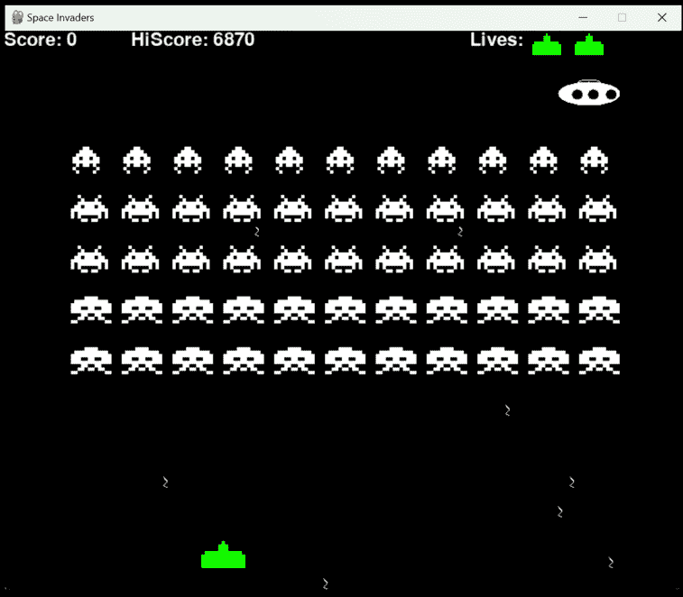

迈克·戈尔德

# 使用 PyGame 创建电子游戏

## 附带分步示例

迈克·戈尔德

本书可在以下地址购买
http://leanpub.com/creatingagameusingpygame

本版本发布于 2023-05-02 ISBN 979-8-89034-116-7


这是一本 Leanpub 图书。Leanpub 通过精益出版流程赋能作者和出版商。精益出版是指使用轻量级工具和多次迭代来发布进行中的电子书，以获取读者反馈，不断调整直到找到合适的书籍，并在完成后建立影响力。

© 2023 迈克·戈尔德

## 目录

- 设置 Python 和 Pygame
- 创建基本的 Pygame 窗口
- 绘制形状和图像
- 处理用户输入
- 创建游戏对象
- 实现游戏逻辑
- 添加声音和音乐
- 打磨和完善你的游戏

# 目录

- 游戏设计

## 设置 Python 和 Pygame

欢迎来到 PyGame 和 Python 编程的世界！本书将为你全面介绍 PyGame 库，并教你如何使用 Python 语言创建自己的定制游戏。我们将从 Python 和 PyGame 库的基本概述开始，然后逐步深入到我们自己的游戏的设计、编写和调试。从添加图形和声音，到创建动画和增强道具，我们将涵盖创建丰富、互动游戏所需了解的一切。最后，我们将经历调试和测试游戏的过程，然后将其发布供全世界欣赏。那么，让我们开始学习如何使用 PyGame 和 Python 制作你自己的游戏吧！

## 入门

### 安装 Python

你可以在 [Python.org](https://www.python.org/downloads/)¹ 找到最新版本的 Python。有 32 位和 64 位版本可供选择。点击下载按钮后，运行你下载的可执行文件，并按照说明在你的机器上安装最新的 Python。

¹https://www.python.org/downloads/

### 安装 VSCode

Visual Studio Code 可用于 Windows、MacOS 和 Linux 操作系统。你可以从 https://code.visualstudio.com/download 下载 Visual Studio Code。选择适合你操作系统的版本，然后运行安装程序。安装 Visual Studio Code 后，你需要安装 Python 和 Pylance 扩展。

**Python 扩展：**

Visual Studio Code 的 Python 扩展提供了广泛的功能，旨在简化 VS Code 中的 Python 开发，包括代码检查、调试、IntelliSense 代码补全、代码格式化、重构、单元测试等。该扩展是开源且免费的，可以通过在 VS Code 扩展市场中搜索来安装。借助 Python 扩展，开发者可以快速轻松地创建和管理他们的 Python 项目，并利用各种高级功能。

**Pylance 扩展：**

Pylance 是一个 Visual Studio Code 扩展，提供增强的 Python 语言支持，包括快速、功能丰富的 IntelliSense、代码检查、项目范围分析和调试。Pylance 使用语言服务器协议与语言服务器通信，并支持自动完成、代码重构、代码导航和错误诊断等广泛功能。Pylance 还提供自动导入功能，当你在代码中输入符号时，它可以自动添加导入语句。Pylance 是 Python 开发者快速高效编写代码的绝佳工具。

要安装扩展，请转到 Visual Studio Code 左侧栏的扩展图标，在市场中搜索 Pylance。点击它并将扩展安装到 Visual Studio Code 中。同时，也请查找名为 Python 的扩展并安装它。

### 安装 Pygame

Pygame 是一个用于在 Python 中制作游戏的开源库。它具有广泛的功能和函数，使得入门制作游戏变得容易。

你可以在 [pygame.org](http://pygame.org) 找到 Pygame 的文档。

要开始使用 Pygame，你需要安装它。安装 Pygame 最简单的方法是在 VSCode 内的终端中进行。点击菜单顶部的终端，然后输入以下命令：

```
pip install pygame
```

如果你还没有安装 pip，你需要前往 https://bootstrap.pypa.io/get-pip.py 并将文件下载到你的 Python 应用程序目录中。要找出 Python 的安装位置，你实际上可以询问 Python！转到 Visual Code 中的终端并输入

```
python
```

你会看到 `>>>` 提示符。输入以下代码

```
>>> import os
>>> import sys
>>> os.path.dirname(sys.executable)
```

这将输出你放置 get-pip.py 文件的路径。

例如，在 Windows 上是 `C:\Python310`

将 get-pip.py 放在显示的路径中，然后运行

```
py get-pip.py
```

> 注意：你可能需要将 Python 路径添加到你的环境变量路径中。

我拥有的两个路径如下所示

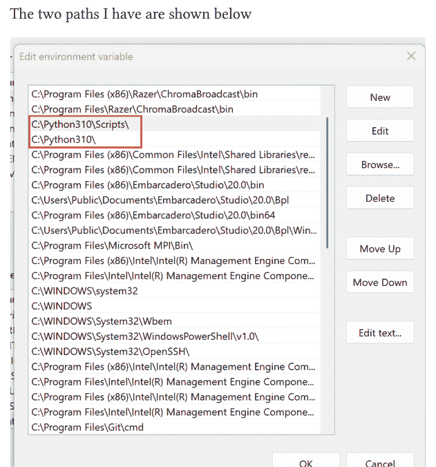

## Python 简介

在接下来的章节中，我们将使用 Python 进行编程，因此我们需要为你提供基础，以理解我们将使用的语言结构以及如何运行它们。下一章将指导你使用该语言最常见的部分，以及我们将用于构建游戏的内容。首先，让我们回答一些关于 Python 的常见问题。

### Python 的历史

Python 由 Guido van Rossum 创建，于 1991 年首次发布。Python 是一种高级、解释型、通用编程语言。Python 因其清晰的语法和可读性而广受欢迎。Python 还支持模块和包，这允许代码重用。

Python 是一种解释型语言，这意味着它在运行时编译。这使得 Python 代码对错误更具容忍性，并使调试更容易。Python 还支持许多开源系统和框架，例如 Django 和 Flask。

Python 通常用于科学计算、Web 开发、机器学习和自动化。Python 拥有一个庞大且活跃的社区，使得在网上寻求帮助和支持变得容易。Google、Yahoo 和 NASA 等组织都在使用 Python。

### Python 与其他语言有何不同？

Python 是一种解释型语言，这使得它比 C 或 Java 等其他语言更容易上手。它也是动态类型的，这意味着在创建变量时不需要声明类型。这使得语言更具表现力，并可以减少某些应用程序的复杂性。Python 还具有高度可扩展性，这意味着它可以使用现有的库以及用 C、C++ 或其他语言编写的新模块进行扩展。此外，Python 的语法相对简单且易于学习。

### 使用 Python 构建哪些类型的应用程序？

Python 被广泛应用于各种应用程序，包括桌面 GUI 应用程序、Web 应用程序、软件开发、科学和数值计算以及人工智能和机器学习。许多最受欢迎的网站和服务，如 YouTube、Instagram、Quora 和 Dropbox，都是使用 Python 构建的。

### 为什么我应该学习 Python？

如前所述，Python 是一种强大且通用的编程语言，具有广泛的应用和用途。它易于学习且具有很高的可读性，使其成为初学者的绝佳选择，同时也受到经验丰富的开发者的欢迎。它是一种多功能语言，意味着它可以用于各种任务——从 Web 开发到数据科学和机器学习。Python 还拥有一个强大的开发者和用户社区，因此总是有支持和新工具可用。此外，Python 是一种开源语言，意味着它可以免费使用，并且任何有互联网访问权限的人都可以访问。

现在你对这门语言有了一点了解，让我们创建你的第一个 Python 程序，只是为了让你初步体验一下。我们将直接进入 Python。

让我们从一个打印 Hello World 的简单程序开始：
在 VSCode 中创建一个名为 **HelloWorld** 的新文件夹。然后创建一个名为 **HelloWorld.py** 的新文件，并添加以下行。

```
print("Hello World")
```

保存你的文件。转到 VSCode 中的终端（bash 终端），并使用以下命令运行 Python：

```
py -m HelloWorld
```

你应该在终端窗口中看到以下输出：

```
Hello World
```

不错！如果你已经做到这一步，说明你已经成功运行起来了。让我们稍微提高一点难度。让我们编写一个打印 Hello World 10 次的程序。为此，我们将使用 for 循环。for 循环让我们可以遍历一系列值，并在每次循环中打印 'Hello World'。将你的 HelloWorld.py 文件修改为以下代码并运行。

```
for number in range(5):
    print ('Hello World')
```

此程序产生以下输出

## 你好，世界

1 你好，世界
2 你好，世界
3 你好，世界
4 你好，世界
5 你好，世界

请注意，我们的 `for` 循环中包含一个数字。每次循环时，这个数字都会递增到下一个数字。我们可以通过在打印语句中使用字符串插值来展示这一点。将 `HelloWorld.py` 修改为以下代码：

```python
for number in range(5):
    print(f'Hello World #{number}')
```

运行此程序后，将产生以下输出：

1 Hello World #0
2 Hello World #1
3 Hello World #2
4 Hello World #3
5 Hello World #4

请注意，`range` 函数从 0 开始，到 4 结束，而不是 5。如果我们希望“你好，世界”计数到五，只需将数字加一即可。

```python
for number in range(5):
    print(f'Hello World #{number+1}')
```

这将产生编号为 1-5 的“你好，世界”输出：

1 Hello World #1
2 Hello World #2
3 Hello World #3
4 Hello World #4
5 Hello World #5

## if 语句

如果我们只想打印偶数的“你好，世界”呢？现在我们可以引入 `if` 语句，它允许我们决定打印哪些“你好，世界”。

```python
for number in range(5):
    numberToPrint = number + 1
    if numberToPrint % 2 == 0:
        print(f'Even Hello World #{numberToPrint}')
```

此代码引入了用于决策的 `if` 语句。在这个例子中，`if` 语句使用取模函数（`%`）来判断下一个数字除以 2 时是否有余数。如果 `numberToPrint` 除以 2 的余数为零，则执行打印操作。例如，`2 % 2` 没有余数，因此它通过了 `numberToPrint % 2 == 0` 的取模测试，将打印“偶数你好，世界 #2”。另一方面，`5 % 2` 等于 1，因此它未能通过等于 0 的测试，因为 0 不等于 1。对于数字 5，打印将被跳过。

因此，运行程序后，代码将打印“偶数你好，世界 #2”和“偶数你好，世界 #4”。它将跳过打印“偶数你好，世界 #1”、“偶数你好，世界 #3”和“偶数你好，世界 #5”，因为这些数字都不是偶数，不符合取模函数的条件。

1. 偶数你好，世界 #2
2. 偶数你好，世界 #4

## else 语句

如果我们希望偶数打印的答案更完整，我们也可以打印数字是偶数还是奇数。我们将使用 `else` 语句来帮助我们：

```python
for number in range(5):
    numberToPrint = number + 1
    if (numberToPrint) % 2 == 0:
        print(f'Even Hello World #{numberToPrint}')
    else:
        print(f'Odd Hello World #{numberToPrint}')
```

当 `if` 语句中的条件为假时，将执行 `else` 语句。它用于在条件不为真时执行不同的代码。在上面的例子中，当数字为奇数时，`else` 语句会打印一条包含 *奇数你好，世界 #{numberToPrint}* 的消息。

1. 奇数你好，世界 #1
2. 偶数你好，世界 #2
3. 奇数你好，世界 #3
4. 偶数你好，世界 #4
5. 奇数你好，世界 #5

## elif

在 Python 中，**elif** 语句（“else if”的缩写）是一种条件语句，允许你检查多个表达式是否为真，并在其中一个条件求值为真时立即执行一段代码块。**elif** 语句遵循与 `if` 语句相同的语法，但多了一个关键字：`elif`。例如，以下代码将检查 `numberToPrint` 是否能被 3 整除，如果不能，则检查 `numberToPrint` 是否为偶数。如果两者都不为真，则 **else** 将生效，并打印它既不是偶数也不能被 3 整除：

```python
for number in range(5):
    numberToPrint = number + 1
    if numberToPrint % 3 == 0:
        print(f'{numberToPrint} is divisible by 3')
    elif numberToPrint % 2 == 0:
        print(f'{numberToPrint} is even')
    else:
        print(f'{numberToPrint} Not even and not divisible by 3')
```

以下是代码的输出，展示了 `if`、`elif`、`else` 的工作方式：

1 1 既不是偶数也不能被 3 整除
2 2 是偶数
3 3 能被 3 整除
4 4 是偶数
5 5 既不是偶数也不能被 3 整除

## while 循环

`while` 循环让我们在循环遍历数据时拥有很大的灵活性：有时它给了我们太多的灵活性！以下 `while` 循环将永远运行：

```python
while True:
    print('Hello World')
```

这里的条件始终为真，因此它永远不会结束循环。当 `while` 后面的条件为假时，`while` 循环结束。跳出循环的另一种方式是使用 `break` 语句：

```python
while True:
    print('Hello World')
    break
```

此循环的输出为：

1 Hello World

因为程序仍然会进入 `while` 循环并打印“Hello World”，但就在它执行完打印语句后，它会遇到 `break`，这将导致它跳出循环。

我们可以通过重写上面的 `for` 循环来展示 `while` 循环的强大功能：

```python
number = 1
while number <= 5:
    print(f'Hello World #{number}')
    number = number + 1
```

`while` 循环从一个等于 1 的数字开始，因此 `while` 循环的守卫条件为真，因为 1 小于或等于 5。打印语句使用 1 执行，接下来数字递增 1 变为 2。然后程序将循环回去，由于 2 仍然小于或等于 5，它将再次执行打印并将数字递增到 3。它将继续这样做，直到不再满足守卫条件。当数字等于 6 时，它不再小于或等于 5，因此它将跳出循环。以下是运行此程序的结果：

1 Hello World #1
2 Hello World #2
3 Hello World #3
4 Hello World #4
5 Hello World #5

## Python 列表

Python 列表是存储项目集合的数据结构，这些项目可以是不同的数据类型。列表中的项目使用索引进行访问。列表通过允许快速检索和修改存储在其中的数据，实现了高效的数据存储。列表可用于各种任务，例如排序、搜索和操作数据。

我们可以通过遍历列表来完成与之前循环相同的操作：

```python
numbers = [1, 2, 3, 4, 5]
for number in numbers:
    print(f'Hello World #{number}')
```

`numbers` 是编号从 1 到 5 的项目列表。我们遍历数字的方式与遍历 `range` 函数返回的值的方式相同。

输出：

1 Hello World #1
2 Hello World #2
3 Hello World #3
4 Hello World #4
5 Hello World #5

## 向列表添加、插入和删除元素

在 Python 中，可以使用 `append`、`insert` 和 `remove` 方法修改列表。`append` 方法将元素添加到列表末尾，`insert` 方法在指定索引处添加元素，`remove` 方法删除指定索引处的元素。例如，以下代码将元素‘c’添加到列表末尾，在索引 2 处添加元素‘d’，并删除值为‘a’的元素：

```python
letters = ['a', 'b', 'e']
print(letters, 'starting letters')
letters.append('c')
print('append c: ', letters)
letters.insert(2, 'd')
print('insert d at position 2: ', letters)
letters.remove('a')
print('remove a: ', letters)
```

输出：

1 starting letters:  ['a', 'b', 'e']
2 append c:  ['a', 'b', 'e', 'c']
3 insert d at position 2:  ['a', 'b', 'd', 'e', 'c']
4 remove a:  ['b', 'd', 'e', 'c']

当你想修改列表而无需从头创建一个新列表时，这些方法非常有用。

## 二维列表

Python 中的二维列表是一种在多个维度存储数据的数据结构。¹ 它本质上是一个列表的列表，其中每个内部列表是一行数据，每个外部列表是一列数据。二维列表对于以行和列组织的数据非常有用，例如表格、电子表格和矩阵。要访问二维列表中的数据，你需要引用

> ¹ 这在 Stack Overflow 上有很好的描述：https://stackoverflow.com/questions/2397141/how-to-initialize-a-two-dimensional-array-in-python

## 二维列表

要访问二维列表中的特定元素，需要使用行和列的索引。例如，要访问一个二维列表中第三行、第四列的项目，可以使用以下代码：

```python
my_list = [[1,2,3,4], [5,6,7,8], [9,10,11,12]]

value = my_list[2][3]
print(value)
```

此代码的输出为：

```
12
```

数字12位于第三个数组（即第三行）的第4个元素中（请记住，列表的索引从0开始，所以我们从0开始计数）。

```python
value = my_list[0][0]
print(value)
```

上述代码输出1，因为1位于索引0处，即数组中的第一个列表，以及该第一个数组中的第0个元素。

另一种理解二维数组的方式是将其视为行和列。这段代码可以理解为访问二维数组中第一行、第一列的数字1。变量`my_list`是一个二维数组，两个索引用于指定我们希望访问的项目的行和列。第一个索引（0）指定第0行，该行由`[1,2,3,4]`组成。第二个索引（0）指定第0列。代码打印第0行、第0列项目的值，在本例中为1。

## 列表推导式

列表推导式是在Python中创建列表的一种简洁方式。它是一种语法构造，允许你通过指定要包含的元素来创建一个新列表，这些元素通常源自现有列表或其他可迭代对象。列表推导式还可以包含可选的条件来过滤元素。它们比使用循环的等效代码更具可读性，且通常更快。

### 映射列表

假设你有一个数字列表，并想创建一个包含这些数字平方的新列表。使用列表推导式：

```python
numbers = [1, 2, 3, 4, 5]

squares = [x**2 for x in numbers]
print(squares)
```

输出：`[1, 4, 9, 16, 25]`

使用列表推导式通过对现有列表中的每个数字求平方来创建新列表，等同于遍历这些数字、对它们求平方并将结果附加到新列表，但列表推导式提供了更紧凑和简洁的语法。

### 过滤列表

如果你想创建一个仅包含原始列表中偶数的新列表，可以在列表推导式中添加过滤条件。下面是一个从`numbers`列表中提取所有偶数的例子。

```python
even_numbers = [x for x in numbers if x % 2 == 0]
print(even_numbers)
```

输出：`[2, 4]`

列表推导式使用条件`if x % 2 == 0`对`numbers`列表应用过滤器，以选择性地仅将偶数包含在新的`even_numbers`列表中。任何不满足条件的数字都会从结果列表中排除。

## 二维列表

列表推导式也可用于创建或修改二维列表。例如，如果你有一个二维列表（矩阵）并想创建其转置，可以使用嵌套列表推导式：

```python
matrix = [
    [1, 2, 3],
    [4, 5, 6],
    [7, 8, 9]
]

transpose = [[row[i] for row in matrix] for i in range(len(matrix[0]))]
print(transpose)
```

输出：`[[1, 4, 7], [2, 5, 8], [3, 6, 9]]`

在这个例子中，外层列表推导式遍历列的索引，而内层列表推导式遍历行。生成的转置列表是一个新的二维列表，包含原始矩阵的转置元素。

## 函数

在Python中，函数是可重用的代码块，可以接受一个或多个输入值，对它们执行一些操作，并返回一个结果。函数用于使代码更有组织性、可读性和可重用性。函数可以使用`def`关键字定义，它们可以接受任意数量的参数。例如，以下函数接受两个参数`x`和`y`，并返回它们的和：

```python
def add(x, y):
    return x + y

sum = add(2, 3)
print(sum) # 5
```

函数也可以接受可选参数，即具有默认值的参数。例如，以下函数接受两个参数`x`和`y`，以及一个名为`z`的可选参数，其默认值为0：

```python
def add(x, y, z=0):
    return x + y + z

sum = add(2, 3)
print(sum) # 5
```

Python还支持匿名函数，即没有名称的函数，使用`lambda`关键字定义。匿名函数可以接受任意数量的参数，并且总是返回一个表达式。以下是一个用于将两个数字相加的匿名函数：

```python
sum = lambda a, b: a + b
```

我们可以通过调用赋值给它的变量来简单地调用lambda函数：

```python
result = sum(4,5)
print('4 + 5 = ', result)
```

函数还可以有可变长度参数，这允许它们接受任意数量的参数。这些参数存储在一个元组中。例如，以下函数接受任意数量的参数并打印它们：

```python
def print_args(*args):
    for arg in args:
        print(arg)

print_args('a', 'b', 'c', 'd')
```

此函数的输出将是：

```
a b c d
```

此外，函数也可以返回多个值。你可以返回一个包含多个值的元组，而不是返回单个值。这允许你从单个函数调用中返回多个数据。例如，以下函数返回两个值：

```python
def get_info():
    name = "John"
    age = 25
    return (name, age)

name, age = get_info()
print(name) # John
print(age) # 25
```

函数是Python中强大而通用的工具，可用于编写更有组织性、可读性和可重用性的代码。使用函数，你可以将代码分解成更小的块，并将它们组织成有意义的、自包含的单元。这使你可以在程序的不同部分轻松重用代码，并使调试和故障排除变得容易得多。此外，函数还可用于简化复杂逻辑并使代码更具可读性。最后，函数还可用于通过允许代码并行运行来提高性能，从而加快执行时间。

## 元组

在Python中，元组是对象的不可变序列。它们通常用于存储相关的信息片段，例如坐标或数据记录。元组使用括号创建，可以包含任何类型的对象，包括其他元组。元组也可用于从函数返回多个值。例如，你可以使用以下代码从函数返回两个值：

```python
def get_info():
    name = "John"
    age = 25
    return (name, age)

name, age = get_info()
print(name) # John
print(age) # 25
```

元组对于将相关数据分组在一起也很有用。例如，如果你有一个坐标列表，你可以使用元组将每个坐标存储在一个地方。

元组也是创建高效且安全的字典的好方法。当你用元组创建字典时，每个元组中元素的顺序将决定字典中键的顺序。这可以帮助你避免意外覆盖或删除数据。

### 类

Python中的类就像是创建对象的模板。它们是任何面向对象编程语言的基本构建块。类定义了对象的属性、行为和特征。类还提供方法，这些是作用于类中数据的函数。类通常用于创建代表现实世界对象的对象，如汽车或人。从类创建的对象可以拥有自己的值和方法，这些值和方法可用于执行任务。

以下是一个简单的Python `Person`类示例：

```python
class Person:
    def __init__(self, name, age, gender):
        self.name = name
        self.age = age
        self.gender = gender

    def introduce(self):
        print(f'Hello, my name is {self.name}')
```

`Person`类定义了一个人的属性和可以执行的功能。下面是一个从`Person`类实例化一个名为`tim`的新对象的例子。创建`tim`后，我们可以为`tim`调用`introduce`方法。

```python
tim = Person("Tim", 28, "Male")
tim.introduce()
```

调用`introduce`的输出如下所示：

```
Hello, my name is Tim
```

`introduce`方法使用了我们构造`Person`对象`tim`时使用的名字。如果我们想构造一个名为Mary的人，我们将这样做：mary = Person("Mary", 30, "Female")

mary 是另一个 Person 的实例，就像 tim 一样，但 Mary 在自我介绍时会给出不同的回应：

```
mary.introduce()
```

输出：

```
Hello, my name is Mary
```

在构建 PyGame 时，我们将广泛使用类，因为当游戏被组织成类时，管理起来会容易得多。

以下是 PyGame 中使用的一些内置类：

## pygame.Surface

pygame.Surface 是 pygame 库中的一个基础类，它表示内存中的一个矩形二维区域，你可以在其中绘制、操作和存储像素数据。Surface 在 pygame 中用于各种图形操作，例如渲染图像、文本和形状。

## pygame.sprite.Sprite

这是可见游戏对象的基类。所有可见的游戏对象都派生自这个类。

## pygame.rect.Rect

这个类用于定义屏幕上的一个矩形区域。它用于存储和操作矩形区域的大小、位置和位置。它用于确定对象之间的碰撞。

## pygame.time.Clock

这个类用于管理时间和游戏循环。它帮助你跟踪时间并管理游戏的帧率。

## pygame.font.Font

这个类用于在屏幕上渲染文本。它帮助你使用指定的字体、大小、样式和颜色渲染文本。

## PyGame 简介

Pygame 是一个专门为游戏开发设计的 Python 模块。它提供了一套用于构建游戏和多媒体应用的工具和库。Pygame 最初由 Pete Shinners 于 2000 年创建，作为探索 Python 多媒体能力的一个副项目。他在 2000 年 3 月发布了 Pygame 的第一个版本，其中包含了图像加载、声音播放和事件处理等基本功能。多年来，Pygame 随着 Python 语言的发展而成长和演变，增加了新的功能和能力。2007 年，Pygame 社区创建了 Pygame Subset for Android，这使得 Pygame 应用程序可以在 Android 设备上运行。如今，Pygame 被游戏开发者和爱好者广泛使用，随着 Python 作为游戏开发编程语言日益流行，其受欢迎程度也在持续增长。

要开始使用 PyGame，你可以使用以下代码将一个 320x240 像素的窗口填充为白色背景：

```python
import pygame

# Initialize the game

pygame.init()

# Create the screen
gamewindow = pygame.display.set_mode((320, 240))

WHITE = (255, 255, 255)

while True:
    for event in pygame.event.get():
        if event.type == pygame.QUIT:
            sys.exit()
    gamewindow.fill(WHITE)
    pygame.display.flip()
```

**pygame.init()** 初始化 pygame，而 pygame.display 让我们能够访问游戏窗口。**while True:** 是我们的游戏循环，它会永远循环我们的游戏，或者直到有人关闭 pygame 屏幕，这会触发一个退出事件。**pygame.display.flip** 函数更新整个显示的内容。它通常在绘制或更新显示之后使用，以确保更改可见。这个函数也被称为“屏幕翻转”或“页面翻转”，因为它交换了包含显示内容的前缓冲区和后缓冲区。

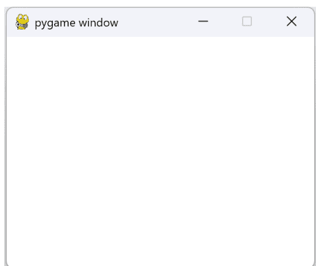

## Hello World

要将 hello world 文本添加到我们的空白屏幕，我们需要创建一个字体对象。**font = pygame.font.Font(None, 32)** 这行代码创建了一个大小为 32 的字体对象。然后这个字体对象可以用来将文本渲染到显示表面上。None 参数指定应使用默认字体。如果传入一个字体文件，那么将使用该字体。字体大小以磅为单位指定，其中 1 磅是 1/72 英寸。

**font.render()** 函数用于将文本渲染到显示表面上。它接受三个参数：要渲染的文本、文本是否应进行抗锯齿处理以及文本的颜色。在这种情况下，font.render() 函数用于渲染文本“Hello World”，抗锯齿功能开启，颜色为黑色。渲染后的文本存储在文本表面中。

要将文本放在屏幕上，我们首先需要将文本对象 blit（位块传输）到屏幕表面。我们将使用 blit 函数将文本表面绘制到屏幕的中心。screen.blit() 函数接受两个参数：要绘制的表面和绘制的位置。在这种情况下，第一个参数是在上一个 font.render 中创建的文本表面。第二个参数是一个包含屏幕中心坐标的元组，该坐标是通过从屏幕的宽度和高度中减去文本表面的宽度和高度的一半来计算的。这允许文本在屏幕上居中显示。

```python
import pygame

# Initialize the game

pygame.init()

# Create the screen
screen = pygame.display.set_mode((320, 240))
WHITE = (255, 255, 255)
BLACK = (0, 0, 0)

# create the font object
font = pygame.font.Font(None, 32)

while True:
    screen.fill(WHITE)  # fill the background

    # check for quit event
    for event in pygame.event.get():
        if event.type == pygame.QUIT:
            sys.exit()

    # create the text surface
    text = font.render("Hello World", True, BLACK)

    # blit the text surface to the center of the screen
    screen.blit(text, ((screen.get_width() -
                text.get_width())/2,
                (screen.get_height() - text.get_height()) / 2))

    # update the screen
    pygame.display.flip()
```

这段代码将产生以下输出窗口：

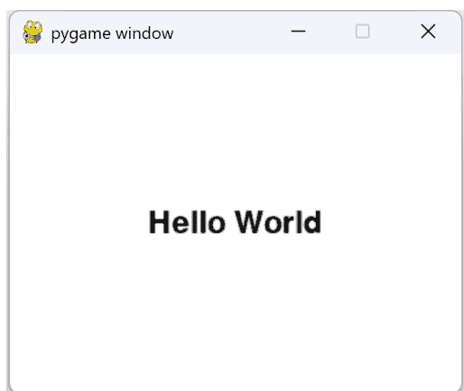

## 闪烁的 Hello World

假设我们想让 **Hello World** 每秒在黑色和红色之间闪烁。我们可以在游戏循环中添加时间延迟，并交替使用不同颜色的文本对象。这里我们利用一个 python 列表在创建文本对象时交替颜色：

```python
import pygame

# Initialize the game

pygame.init()

# Create the screen
screen = pygame.display.set_mode((320, 240))
WHITE = (255, 255, 255)
BLACK = (0, 0, 0)
RED = (255, 0, 0)

HelloWorldColors = [BLACK, RED]

# create the font object
font = pygame.font.Font(None, 32)

count = 0
while True:
    count = count + 1
    screen.fill(WHITE)  # fill the background

    # check for quit event
    for event in pygame.event.get():
        if event.type == pygame.QUIT:
            sys.exit()

    # create the text surface
    # and alternate the color using either RED or BLACK
    text = font.render("Hello World", True,
                       HelloWorldColors[count % 2])

    # wait 1 second (or 1000 milliseconds)
    pygame.time.delay(1000)

    # blit the text surface to the screen
    screen.blit(text, ((screen.get_width() -
                        text.get_width())/2,
                       (screen.get_height() -
                        text.get_height()) / 2))

    # update the screen
    pygame.display.flip()
```

## 添加边框

如果我们想在闪烁的 hello world 周围放置一个黑色边框怎么办？下面显示的代码用于在文本表面周围绘制一个黑色矩形边框。**pygame.draw.rect()** 函数接受五个参数：要绘制的显示表面、矩形的颜色、矩形左上角的坐标、矩形的宽度和高度以及线条的粗细。在这种情况下，矩形的左上角是通过从屏幕中心的坐标中减去 10 来计算的，矩形的宽度和高度是通过在文本表面的宽度和高度上加上 20 来计算的。参数 1 指定线条应为 1 像素粗。

```python
while True:
    count = count + 1
    screen.fill(WHITE)  # fill the background

    # check for quit event
    for event in pygame.event.get():
        if event.type == pygame.QUIT:
            sys.exit()

    # create the text surface
    text = font.render("Hello World", True,
                        HelloWorldColors[count % 2])
    pygame.time.delay(1000)

    # surround text with black rectangular border
    pygame.draw.rect(screen, BLACK,
                     ((screen.get_width() -
                     text.get_width())/2 - 10,
                     (screen.get_height() -
                     text.get_height()) / 2 - 10,
                     text.get_width() + 20,
```

## 添加图像

向视图中添加图像就像加载它并将其绘制到屏幕表面一样简单。在创建游戏时，你可能会使用大量图像，因此了解如何绘制图像很有帮助。在下面的代码中，我们加载一个笑脸图像，然后将其居中绘制在“Hello World”文本上方：

```python
# 在边框上方绘制一个32x32大小的笑脸图像

screen.blit(pygame.image.load("resources/smiley.png"),
            (screen.get_width()/2 - 16,
             (screen.get_height()
              - text.get_height()) / 2 - 60))
```

这将产生以下屏幕渲染效果：

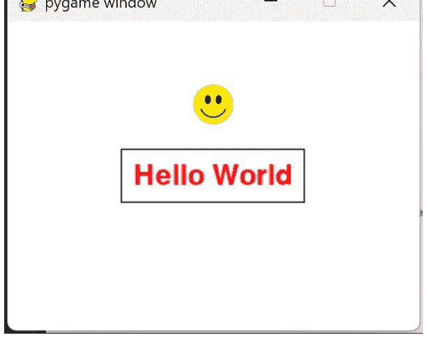

## 为游戏添加声音

Pygame 完全具备在屏幕上绘制形状、字体和图像的能力。它还提供了播放声音和音乐的功能。以下代码向你展示如何在“Hello World”屏幕每次闪烁时添加一个蜂鸣声。

首先，我们需要在游戏循环之前初始化 pygame 声音模块：

```python
# 初始化混音器
# 以播放声音
pygame.mixer.init()
pygame.mixer.music.load("resources/shortbeep.mp3")
```

在我们的游戏循环内部，我们可以在每次绘制完所有内容后播放声音。游戏循环中已经添加了 1 秒的延迟，因此 shortbeep 文件将每秒播放一次。

```python
count = 0
while True:
    count = count + 1
    screen.fill(WHITE)  # 填充背景

    # 检查退出事件
    for event in pygame.event.get():
        if event.type == pygame.QUIT:
            sys.exit()

    # 创建文本表面
    text = font.render("Hello World", True, HelloWorldColors[count % 2])

    # 1秒延迟
    pygame.time.delay(1000)

    # 用黑色矩形边框包围文本
    pygame.draw.rect(screen, BLACK,
        ((screen.get_width() - text.get_width())/2 - 10,
         (screen.get_height() -
          text.get_height()) / 2 - 10,
         text.get_width() + 20,
         text.get_height() + 20), 1)

    # 在边框上方绘制一个32x32大小的笑脸图像
    screen.blit(pygame.image.load("resources/smiley.png"),
        (screen.get_width()/2 - 16,
         (screen.get_height() -
          text.get_height()) / 2 - 60))

    # 将文本表面绘制到屏幕上
    screen.blit(text, ((screen.get_width() -
                        text.get_width())/2,
                       (screen.get_height() - text.get_height()) / 2))

    # 播放蜂鸣声
    pygame.mixer.music.play()

    # 更新屏幕
    pygame.display.flip()
```

## 响应键盘

你可能已经注意到，我们在游戏循环的开头添加了事件处理，如下所示。目前，事件处理仅检查我们是否退出游戏。

```python
# 检查退出事件
for event in pygame.event.get():
    if event.type == pygame.QUIT:
        sys.exit()
```

事件处理还可以让我们读取键盘和鼠标事件，并在我们的游戏中使用它们。让我们首先看看是否可以使用鼠标左键来指示放置笑脸的位置。当按下鼠标左键时，它将在游戏循环内触发 `pygame.MOUSEBUTTONDOWN` 事件。事件循环将从鼠标获取鼠标位置，我们可以用它在屏幕上的鼠标位置放置笑脸。

```python
for event in pygame.event.get():
    if event.type == pygame.MOUSEBUTTONDOWN:
        mouse_pos = pygame.mouse.get_pos()
    ...

    # 在边框上方绘制一个32x32大小的笑脸图像
    if mouse_pos != None:
        screen.blit(pygame.image.load(
            "resources/smiley.png"),
            (mouse_pos[0] - 16, mouse_pos[1] - 16))
    else:
        screen.blit(pygame.image.load(
            "resources/smiley.png"),
            (screen.get_width()/2 - 16,
             (screen.get_height() -
              text.get_height()) / 2 - 60))
```

所以现在，当你在游戏窗口中点击某个位置时，你会看到笑脸移动到你点击的位置！你可能会注意到，从你点击到笑脸实际绘制出来之间存在延迟。这是因为我们在声音代码中添加了 1 秒的延迟。实际上，有一种更好的方法来处理“Hello World”的闪烁和每秒一次的蜂鸣声，这样它就不会干扰事件检索。方法是添加一个时钟而不是延迟，并且只在时钟达到 1 秒标记时才执行蜂鸣和闪烁。说明时钟使用的最佳方式是查看代码：

```python
time = pygame.time

count = 0
oneSecondMarkReached = False
lastTime = 0

while True:
    # 每秒增加计数
    if oneSecondMarkReached:
        count = count + 1

    screen.fill(WHITE)  # 填充背景

    # 检查退出事件
    for event in pygame.event.get():
        if event.type == pygame.QUIT:
            sys.exit()
        elif event.type == pygame.MOUSEBUTTONDOWN:
            mouse_pos = pygame.mouse.get_pos()

    # 创建文本表面
    text = font.render("Hello World", True,
            HelloWorldColors[count % 2])

    # 用黑色矩形边框包围文本
    pygame.draw.rect(screen, BLACK,
        ((screen.get_width() - text.get_width())/2 - 10,
         (screen.get_height() -
          text.get_height()) / 2 - 10,
         text.get_width() + 20,
         text.get_height() + 20), 1)

    # 在边框上方绘制一个32x32大小的笑脸图像
    if mouse_pos != None:
        screen.blit(pygame.image.load(
            "resources/smiley.png"),
            (mouse_pos[0] - 16, mouse_pos[1] - 16))
    else:
        screen.blit(pygame.image.load(
            "resources/smiley.png"),
            (screen.get_width()/2 - 16,
             (screen.get_height() -
              text.get_height()) / 2 - 10 - 50))

    # 将文本表面绘制到屏幕上
    screen.blit(text,
        ((screen.get_width() -
            text.get_width())/2,
         (screen.get_height()
            - text.get_height()) / 2))

    if oneSecondMarkReached:
        pygame.mixer.music.play()

    # 更新屏幕
    pygame.display.flip()

    # 重置 oneSecondMarkReached 标志
    oneSecondMarkReached = False

    # 每次达到1秒标记时通知程序
    currentTime = time.get_ticks()
    if currentTime - lastTime > 1000:
        lastTime = currentTime
        oneSecondMarkReached = True
```

我们需要稍微修改代码，以便闪烁每秒发生一次，蜂鸣声也每秒发生一次。我们使用 `oneSecondMarkReached` 标志，并在每 1000 个 tick（时间上为 1 秒）设置它。然后，一旦它执行了蜂鸣声并对“Hello World”文本执行了颜色更改，它就会被重置。

## 结论

我们已经研究了一系列概念，以开始使用 pygame 库提供的许多游戏相关元素。我们学习了如何填充屏幕背景、绘制文本、加载和绘制图像，以及播放音乐和声音。在下一章中，我们将直接开始创建我们的第一个游戏——井字棋。

## PyGame 中的井字棋

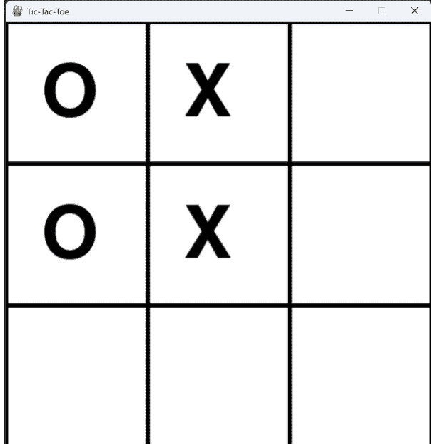

## 简介

欢迎来到使用 PyGame 编写井字棋游戏的章节。在本章中，我们将探索 PyGame 库的基础知识以及如何使用它来编写一个简单的双人井字棋游戏。我们将介绍如何绘制游戏棋盘，如何检测

## 主循环

以下代码是一个使用 PyGame 库实现的井字棋游戏的主游戏循环。它运行一个事件处理循环来检查用户输入，然后绘制游戏棋盘。如果游戏尚未结束，它会检查玩家是否放置了 X，然后等待半秒钟以模拟 AI 思考，之后再放置 O。放置 O 后，它会检查是否有人赢得游戏，如果没有人获胜，则检查是否平局。最后，它更新显示。

```python
#####################################################
# 主游戏循环
#####################################################
while True:
    if game_over:
        pygame.display.flip()
        pygame.time.delay(1000)
        draw_game_over_screen()
        # 运行事件处理以检查退出
        check_for_quit_event()
    else:
        game_window.fill(WHITE) # 白色背景
        # 检查退出和鼠标按下
        run_event_processing()
        # 检查胜负或平局
        game_over = check_for_win_or_draw()
        draw_the_board()  # 绘制游戏棋盘
        pygame.display.flip()  # 更新显示

        # 在放置 X 后检查是否有人获胜
        if game_over:
            continue

        # AI 在此放置 O
        if X_placed:
            # 等待 1/2 秒，使其看起来像 AI 在思考
            pygame.time.delay(500)
            O_placed = run_algorithm_to_place_O()
            game_over = check_if_anyone_won()
            # 再次绘制棋盘以显示我们刚刚放置的 O
            draw_the_board()
            X_placed = False

        # 更新显示
        pygame.display.flip()

        # 将循环限制为每秒 60 帧
        clock.tick(60)
```

## 处理事件

游戏循环内容的底层是几个利用 PyGame 来处理繁重工作的函数。让我们首先看看 `DoEventProcessing` 函数。这段代码是 PyGame 中的一个函数，它运行一个事件处理循环来检查用户输入和鼠标点击。当用户点击棋盘时，它处理 X 的鼠标按下事件，并将 `X_placed` 标志设置为 True。它还检查用户是否选择退出游戏。当用户关闭窗口时，会触发退出事件。

```python
def run_event_processing():
    global X_placed
    global game_over

    for event in pygame.event.get():
        if event.type == pygame.QUIT:
            pygame.quit()  # 退出游戏
            quit()
        if event.type == pygame.MOUSEBUTTONDOWN:
            # 在棋盘上填充 X
            handle_mouse_down_for_x()
            X_placed = True
```

现在让我们看看被调用的 `handle_mouse_down_for_x` 函数。这段代码用于处理在井字棋棋盘上放置 X 的鼠标按下事件。它使用 PyGame 库的 `mouse.get_pos()` 函数获取鼠标位置，然后将行和列除以网格宽度和高度以获取点击的行和列。最后，它将棋盘数组中对应的位置设置为 "X"。

```python
def handle_mouse_down_for_x():
    (row, col) = pygame.mouse.get_pos()
    row = int(row / grid_width)
    col = int(col / grid_height)
    board[row][col] = "X"
```

## 绘制棋盘

`draw_the_board` 函数用于绘制井字棋棋盘的当前状态。它遍历棋盘的所有行和列，并调用 `draw_game_board_square()` 函数来绘制每个方格。然后，它检查该行和列的棋盘是否包含 "X" 或 "O"，并调用 `draw_tic_tac_toe_letter()` 函数来绘制相应的字母。

```python
def draw_the_board():
    for row in range(grid_size):
        for col in range(grid_size):
            draw_game_board_square(row, col)
            # 渲染字母 X
            if (board[row][col] == "X"):
                draw_tic_tac_toe_letter(row, col, 'X')
            # 渲染字母 O
            if (board[row][col] == "O"):
                draw_tic_tac_toe_letter(row, col, 'O')
```

## 绘制游戏方格

这段代码用于绘制指定行和列的游戏棋盘方格。它使用 PyGame 库的 `Rect()` 函数创建一个具有给定行、列、宽度和高度的矩形对象。然后，它使用 `draw.rect()` 函数在游戏窗口上绘制一个黑色、线宽为 3 的矩形。

```python
def draw_game_board_square(row, col):
    rect = pygame.Rect(col * grid_width, row *
                        grid_height,
                        grid_width,
                        grid_height)
    pygame.draw.rect(game_window, BLACK, rect, 3)
```

## 绘制井字棋字母

这段代码用于在指定的行和列绘制字母 'X' 或 'O'。它使用 PyGame 库的 `font.render()` 函数将字母渲染为 Surface 对象，并将颜色设置为黑色。然后，它使用 `game_window.blit()` 方法在指定的行和列绘制字母，行和列乘以网格宽度和高度，再加上网格宽度和高度的四分之一以使其居中。

```python
def draw_tic_tac_toe_letter(row, col, letter):
    letter_piece = font.render(letter, True, BLACK)
    game_window.blit(
        letter_piece, (row * grid_width + grid_width/4,
                       col * grid_height + grid_height/4))
```

## 用于放置 O 的 "AI"

为了简化，放置 O 的算法只是寻找下一个可用的方格。我们将在本章后面改进这一点，但这个策略至少应该允许你与计算机对手玩游戏。

```python
###################################################
# 一个非常简单的在棋盘上放置 O 的算法。
# 遍历整个棋盘，寻找第一个可用的方格。
# 将 O 放在那里。
###################################################
def run_algorithm_to_place_O():
    for rowo in range(grid_size):
        for colo in range(grid_size):
            if (board[rowo][colo] == 0):
                board[rowo][colo] = "O"
                return True

    return False
```

## 检查胜利

以下代码检查棋盘上是否有人获胜。它查看棋盘上是否有三个相同的字符排成一行（水平、垂直和对角线）。

```python
def check_if_anyone_won():
    global winner
    # 检查是否有人水平获胜
    for row in range(3):
        if board[row][0] == board[row][1] \
                == board[row][2] != 0:
            winner = board[row][0]
            return True
    # 检查是否有人垂直获胜
    for col in range(3):
        if board[0][col] == board[1][col] \
                == board[2][col] != 0:
            winner = board[0][col]
            return True
    # 检查是否有人对角线获胜
    if board[0][0] == board[1][1] \
            == board[2][2] != 0:
        winner = board[0][0]
        return True
    if board[0][2] == board[1][1] \
            == board[2][0] != 0:
        winner = board[0][2]
        return True

    # 没有人获胜，返回 false
    return False
```

## 检查平局

我们还需要检查是否没有更多地方可以放置 X 或 O，并且没有玩家赢得游戏。我们这样做的方法是创建一个新函数来检查棋盘是否已满。如果没有人获胜且棋盘已满，那么就是平局。

```python
def check_if_board_is_full():
    for row in range(3):
        for col in range(3):
            if board[row][col] == 0:
                return False
    return True


###################################################
# 通过检查棋盘是否已满且无人获胜来检查是否平局
###################################################

def check_if_draw():
    return not (check_if_anyone_won()) and \
        check_if_board_is_full()
```

## 处理游戏结束状态

一旦我们确定是胜利、失败还是平局，我们就将 `game_over` 标志设置为 True。当我们检测到游戏结束时，我们希望显示游戏结束屏幕，而不是井字棋棋盘。在我们的主循环中，我们检查 `game_over` 标志，如果为真，我们就绘制游戏结束屏幕，而不是井字棋棋盘：

if game_over:
    # 绘制游戏结束画面
    pygame.display.flip()
    pygame.time.delay(1000)
    draw_game_over_screen()
    check_for_quit_event()  # 运行事件处理以检查退出
else:
    # 绘制井字棋棋盘

以下 Python 代码在确定游戏结束后，绘制游戏结束画面而非井字棋棋盘。它检查获胜者字符串，并根据该字符串显示游戏中发生情况的相应消息。游戏结束画面还向玩家传达了是否开始新游戏的选项：

```python
###############################################
# 绘制显示获胜者的结束画面
###############################################
def draw_game_over_screen():
    game_window.fill(WHITE)
    if winner == "X":
        text = font.render('X Wins!', True, BLACK)
    elif winner == "O":
        text = font.render('O Wins!', True, BLACK)
    else:
        text = font.render('Draw!', True, BLACK)

    playAgainText = smallfont.render(
        'Play Again (y/n)?', True, BLACK)

    game_window.blit(text,
        (window_width/2 - 200, window_height/2 - 100))
    game_window.blit(playAgainText,
        (window_width/2 - 200, window_height/2 + 50))
```

生成的游戏结束画面图像如下所示：

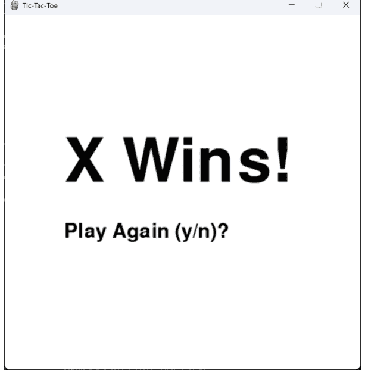

## 再次游玩

为了允许玩家开始新游戏，我们需要在用户按下 y 键时清除当前游戏的状态。

我们使用一个名为 **initialize_game_values** 的新函数来重置全局游戏状态。如果用户在游戏结束状态下按下 'y' 键，此方法将被触发：

```python
def check_for_quit_event():
    for event in pygame.event.get():
        if event.type == pygame.QUIT:
            pygame.quit()
            quit()
        if event.type == pygame.KEYDOWN:
            if event.key == pygame.K_y:
                initialize_game_values()
                game_window.fill(WHITE)
                return True
            elif event.key == pygame.K_n:
                pygame.quit()
                quit()
```

一旦在事件循环中检测到 y，我们就初始化游戏棋盘并重新开始。我们没有停止游戏循环，因此一旦调用 `initialize_game_values`，游戏循环将根据重置后的变量状态自动绘制棋盘。

```python
def initialize_game_values():
    global board
    global game_over
    global X_placed
    global O_placed
    global winner
    global clock

    game_over = False
    X_placed = False
    O_placed = False
    winner = ''

    board = [
        [0, 0, 0],
        [0, 0, 0],
        [0, 0, 0],
    ]

    clock = pygame.time.Clock()
```

## 更好的 AI

还记得我们之前讨论过为游戏中的“O”玩家实现更高级的 AI 吗？这个增强算法旨在永不失败！以下是这个精炼算法的步骤：

1.  计算到目前为止已进行的移动次数。
2.  如果是第二步移动（只进行了一步移动）：
    a. 如果中心为空，则将“O”放在棋盘中心。
    b. 如果中心已被占用，则将“O”放在第一个可用的角落。
3.  对于棋盘上的所有空位置：
    a. 检查在当前位置放置“O”是否会导致“O”玩家获胜。如果是，则放置“O”并返回 True。
    b. 检查在当前位置放置“O”是否会阻止“X”玩家获胜。如果是，则放置“O”并返回 True。
4.  如果“O”从角落开始，则将“O”放在第一个可用的角落并返回 True。
5.  将“O”放在第一个可用的非角落边位置并返回 True。
6.  如果以上条件都不适用，则将“O”放在第一个可用位置并返回 True。
7.  如果没有可用的空位置，则返回 False。

该算法使用一系列规则来决定在井字棋棋盘上放置“O”的最佳位置。它考虑了棋盘的当前状态，并根据获胜或阻止对手获胜做出决策，同时根据情况优先考虑角落和非角落边位置。

以下是 Python 代码。注意我们将其分解为 3 个函数：**run_better_algorithm_to_place_O**、**is_winning_move** 和 **get_empty_positions**：

```python
# 检查在行和列放置棋子是否会导致获胜移动
def is_winning_move(player, row, col):
    n = len(board)
    # 检查行
    if all(board[row][j] == player
        for j in range(n)):
        return True
    # 检查列
    if all(board[i][col] == player
        for i in range(n)):
        return True
    # 检查主对角线
    if row == col and all(board[i][i]
        == player for i in range(n)):
        return True
    # 检查副对角线
    if row + col == n - 1 and
        all(board[i][n - i - 1]
            == player for i in range(n)):
        return True
    return False

# 以列表形式返回棋盘上的空位置
def get_empty_positions():
    empty_positions = []
    for i, row in enumerate(board):
        for j, cell in enumerate(row):
            if cell == 0:
                empty_positions.append((i, j))
    return empty_positions

def run_better_algorithm_to_place_O():
    grid_size = len(board)
    empty_positions = get_empty_positions()
    num_moves = sum(1 for row in board for
                    cell in row if cell != 0)

    # 第二步移动：将“O”放在中心或角落
    if num_moves == 1:
        center = grid_size // 2
        if board[center][center] == 0:
            board[center][center] = "O"
            return True
        else:
            for row, col in
                [(0, 0), (0, grid_size - 1),
                 (grid_size - 1, 0),
                 (grid_size - 1, grid_size - 1)]:
                if board[row][col] == 0:
                    board[row][col] = "O"
                    return True

    # 尝试获胜或阻止 X 获胜
    for row, col in empty_positions:
        # 检查放置“O”是否会赢得游戏
        board[row][col] = "O"
        if is_winning_move("O", row, col):
            return True
        board[row][col] = 0

    # 检查放置“O”是否会阻止 X 获胜
    for row, col in empty_positions:
        board[row][col] = "X"
        if is_winning_move("X", row, col):
            board[row][col] = "O"
            return True
        board[row][col] = 0

    # 如果“O”从角落开始，则将“O”放在角落
    if board[0][0] == "O"
        or board[0][grid_size - 1] == "O"
        or board[grid_size - 1][0] == "O"
        or board[grid_size - 1][grid_size - 1]
            == "O":
        for row, col in
            [(0, 0), (0, grid_size - 1),
            (grid_size - 1, 0),
            (grid_size - 1, grid_size - 1)]:
            if board[row][col] == 0:
                board[row][col] = "O"
                return True

    # 将“O”放在非角落边位置
    for row, col in empty_positions:
        if row not in [0, grid_size - 1]
            and col not in [0, grid_size - 1]:
            board[row][col] = "O"
            return True

    # 将“O”放在任何可用空间
    for row, col in empty_positions:
        board[row][col] = "O"
        return True

    return False
```

## 结论

在学习了使用 pygame 创建游戏的基础知识后，我们现在可以通过面向对象编程来简化代码，从而将我们的技能提升到一个新的水平。通过将游戏对象组织成类，我们可以简化和精简代码，使其更易于管理和维护。在接下来的章节中，我们将更详细地探讨这项技术，并向您展示如何在自己的游戏中实现它。

## 在 Pygame 中使用类

## 简介

我们用 Pygame 编写的井字棋和其他游戏，都适合被分解成程序可以操作的更小的对象。Python 中的类可以帮助开发者创建可重用且易于维护的代码。通过将代码组织成类，代码更易于阅读和理解，并允许更高效的调试和测试。此外，它还允许开发者轻松地修改和添加游戏的新部分，而无需重写代码，这在开发复杂游戏时尤其有用。类还有助于保持代码的组织性，并使实现新功能变得更容易。最后，使用类有助于开发者创建更高效的代码，因为他们可以轻松地将相同的代码用于类似的游戏部件。

让我们深入探讨如何为我们的游戏创建类。一个可以在 pygame 屏幕上绘制的字母（X 或 O）的 Python 类可以定义如下：

这是一个继承自 Sprite 类并在屏幕上绘制 'X' 或 'O' 的 Pygame 类示例：

```python
import pygame

class LetterSprite(pygame.sprite.Sprite):
    def __init__(self, letter, row, column,
                grid_width, grid_height):
        # initialize the sprite base class
        super().__init__()
        font = pygame.font.Font(None, 150)
        # render the font to an image surface
        self.image = font.render(letter, True, (0, 0, 0))
        # determine the image boundaries on the board
        self.rect = self.image.get_rect().move(
            row * grid_width + grid_width / 3,
            column * grid_height + grid_height / 3)

    def update(self):
        pass

    def draw(self, surface):
        letter_piece = self.image
        surface.blit(letter_piece, self.rect)
```

Letter 类接受 5 个参数：字母本身（存储为实例变量）、字母在棋盘上的行和列位置，以及网格尺寸。init 构造函数完成了大部分繁重的工作。它从默认字体创建图像，并根据行、列和网格尺寸计算矩形位置。由于字母没有从当前位置移动，因此不需要 update 方法，所以我们不对 update 做任何处理。draw() 方法只接受一个参数：screen，即游戏表面。然后它使用 pygame.Surface 作为将字母绘制到游戏屏幕上的手段。

一旦玩家发生鼠标按下事件，我们就可以构造我们的 LetterSprite，然后我们可以使用 pygame 中的 Group 类来收集我们添加到棋盘上的所有 X。

```python
def handle_mouse_down_for_x():
    (row, col) = pygame.mouse.get_pos()
    row = int(row / grid_width)
    col = int(col / grid_height)
    board[row][col] = "X"
    letterX = LetterSprite('X', row, col,
            grid_width, grid_height)
    group.add(letterX)
```

我们将 X 添加到组中的原因是，当我们想要绘制所有游戏部件时，只需调用 group.draw(surface)，它就会一次性为我们绘制所有游戏部件。正如我们很快将看到的，我们也可以对 "O" 做同样的事情！

现在我们可以移除 90% 绘制 X 和 O 的代码，它将简化为一行代码：group.draw(game_window)

```python
def draw_the_board():
    group.draw(game_window)

    for row in range(grid_size):
        for col in range(grid_size):
            draw_game_board_square(row, col)
```

请注意，我们仍然在循环创建游戏方块。我们也可以为游戏方块创建精灵：

```python
import pygame

# Create the sprite
class GameBoardSquareSprite(pygame.sprite.Sprite):
    def __init__(self, color, row, column, width, height):
        super().__init__()
        self.width = width
        self.height = height
        # Create a surface for the sprite
        self.image = pygame.Surface([width, height])
        # make the background game tile white
        self.image.fill((255, 255, 255))
        self.rect = self.image.get_rect().move(row*width,
            column*height)
        # Draw the rectangle to the sprite surface
        pygame.draw.rect(self.image, color, pygame.Rect(
            0, 0, width, height), 2)

    # Draw the sprite on the screen
    def draw(self, surface):
        surface.blit(self.image, 0, 0)
```

现在在我们的 initialize_game_board 中，我们将游戏方块添加到组中：

```python
def initialize_game_board():
    for row in range(3):
        for column in range(3):
            game_board_square = GameBoardSquareSprite(
                (0, 255, 0), row, column,
                grid_width, grid_height)
            group.add(game_board_square)
```

当调用 group.draw 时，它将绘制方块以及已放置的 X 和 O。我们的 draw_the_board 函数现在看起来像这样：

```python
def draw_the_board():
    group.draw(game_window)
```

由于我们选择将游戏棋盘方块设为绿色，最终的棋盘看起来如下图所示：

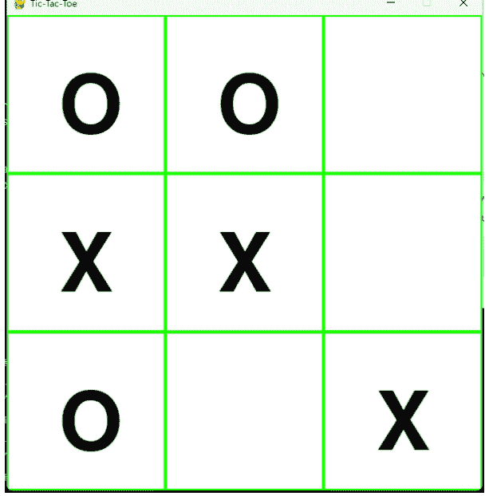

## 重构游戏逻辑

为了进一步模块化代码，我们可以将所有游戏逻辑从主 Python 模块中提取出来，放入一个名为 GameBoard 的类中。GameBoard 类将检查胜利、失败和平局，并为我们提供一种用猜测填充棋盘的方法。

它还可以控制放置 O 的算法逻辑。

```python
class GameBoard:
    def __init__(self, grid_size):
        self.grid_size = grid_size
        self.winner = ''
        self.initialize_board()

    ##################################################
    # Initialize the board with zeroes
    ##################################################

    def initialize_board(self):
        self.board = [
            [0, 0, 0],
            [0, 0, 0],
            [0, 0, 0],
        ]

    ##################################################
    # Check if someone won in any row, column or diagonal
    ##################################################

    def check_if_anybody_won(self):
        # Check if someone won horizontally
        for row in range(3):
            if self.board[row][0] == self.board[row][1] \
                == self.board[row][2] != 0:
                    self.winner = self.board[row][0]
                    return True

        # Check if someone won vertically
        for col in range(3):
            if self.board[0][col] == self.board[1][col] \
                == self.board[2][col] != 0:
                    self.winner = self.board[0][col]
                    return True

        # Check if someone won diagonally
        if self.board[0][0] == self.board[1][1] \
            == self.board[2][2] != 0:
                self.winner = self.board[0][0]
                return True
        if self.board[0][2] == self.board[1][1] \
            == self.board[2][0] != 0:
                self.winner = self.board[0][2]
                return True

        return False

    ##################################################
    # Check if the board is full
    ##################################################

    def check_if_board_is_full(self):
        for row in range(3):
            for col in range(3):
                if self.board[row][col] == 0:
                    return False
        return True

    ##################################################
    # Check if there is a draw by checking if the
    # board is full and no one has won
    ##################################################

    def check_if_draw(self):
        return not (self.check_if_anybody_won()) and \
            self.check_if_board_is_full()

    ##################################################
    # Place the X
    ##################################################

    def place_X(self, row, col):
        self.board[row][col] = "X"

    ##################################################
    # Used by run_better_algorithm_to_place_0 to
    # determine if placing the piece in the row or column
    # on the board results in the winning move.  This
    # is used for determining blocking as well as winning
    # for the "0" opponent
    ##################################################

    def is_winning_move(self, player, row, col):
        n = len(self.board)
        # Check row
        if all(self.board[row][j] == player
            for j in range(n)):
            return True
        # Check column
        if all(self.board[i][col] == player
            for i in range(n)):
```

## 重构游戏逻辑

```python
92            return True
93        # 检查主对角线
94        if row == col and all(self.board[i][i] ==
95            player for i in range(n)):
96            return True
97        # 检查副对角线
98        if row + col == n - 1 and
99            all(self.board[i][n - i - 1]
100            == player for i in range(n)):
101            return True
102        return False
103
104    ###############################################
105    # 供 run_better_algorithm_to_place_O 方法使用
106    # 用于收集棋盘上所有可用位置
107    ###############################################
108    def get_empty_positions(self):
109        empty_positions = []
110        for i, row in enumerate(self.board):
111            for j, cell in enumerate(row):
112                if cell == 0:
113                    empty_positions.append((i, j))
114        return empty_positions
115
116    ###############################################
117    # 使用算法决定在哪里放置 "O"
118    # 此算法不会输
119    ###############################################
120    def run_better_algorithm_to_place_O(self):
121        grid_size = len(self.board)
122        empty_positions = self.get_empty_positions()
123        num_moves = sum(1 for row in self.board for
124                        cell in row if cell != 0)
125
126        # 第二步：将 "O" 放在中心或角落
127        if num_moves == 1:
128            center = grid_size // 2
129            if self.board[center][center] == 0:
130                self.board[center][center] = "O"
131                return (True, center, center)
132            else:
133                for row, col in [(0, 0),
134                    (0, grid_size - 1),
135                    (grid_size - 1, 0),
136                    (grid_size - 1, grid_size - 1)]:
137                    if self.board[row][col] == 0:
138                        self.board[row][col] = "O"
139                        return (True, row, col)
140
141        # 尝试获胜或阻止 X 获胜
142        for row, col in empty_positions:
143            # 检查放置 "O" 是否会赢得游戏
144            self.board[row][col] = "O"
145            if self.is_winning_move("O", row, col):
146                return (True, row, col)
147            self.board[row][col] = 0
148
149        # 检查放置 "O" 是否会阻止 X 获胜
150        for row, col in empty_positions:
151            self.board[row][col] = "X"
152            if self.is_winning_move("X", row, col):
153                self.board[row][col] = "O"
154                return (True, row, col)
155            self.board[row][col] = 0
156
157        # 如果 "O" 开始于角落，则将其放在角落
158        if self.board[0][0] == "O"
159            or self.board[0][grid_size - 1] == "O"
160            or self.board[grid_size - 1][0] == "O"
161            or self.board[grid_size - 1][grid_size - 1]
162            == "O":
163            for row, col in [(0, 0), (0, grid_size - 1),
164                            (grid_size - 1, 0),
165                            (grid_size - 1, grid_size - 1)]:
166                if self.board[row][col] == 0:
167                    self.board[row][col] = "O"
168                    return (True, row, col)
169
170        # 将 "O" 放在非角落的边上
171        for row, col in empty_positions:
172            if row not in [0, grid_size - 1]
173            and col not in [0, grid_size - 1]:
174                self.board[row][col] = "O"
175                return (True, row, col)
176
177        # 将 "O" 放在任何可用空间
178        for row, col in empty_positions:
179            self.board[row][col] = "O"
180            return (True, row, col)
181
182        return (False, -1, -1)
```

现在我们可以从主游戏文件中调用所有这些函数来检查谁赢了以及在棋盘上放置 X 和 O，主游戏文件变得整洁多了。

在我们的 `initialize_game_values` 中，我们如下构建棋盘：

```python
1     board = GameBoard(grid_size)
```

然后在任何使用棋盘的地方，我们只需调用它的方法。

下面是调用 **run_better_algorithm_to_place_O** GameBoard 方法的代码，我们从主游戏程序中放置 O 精灵。棋盘上的算法方法返回一个元组，指示我们是否能在棋盘上找到放置棋子的位置，如果找到，则返回放置的行和列。

```python
1  (O_placed, rowo, colo) =
2      board.run_better_algorithm_to_place_O()
3  if O_placed:
4          letterO = LetterSprite(
5              'O', colo, rowo,
6              grid_width,
7              grid_height)
8          group.add(letterO)
```

我们也可以访问 GameBoard 类的任何内部属性，比如游戏的获胜者：

```python
1  if board.winner == "X":
2      text = font.render('X Wins!', True, BLACK)
3  elif board.winner == "O":
4      text = font.render('O Wins!', True, BLACK)
5  else:
6      text = font.render('Draw!', True, BLACK)
```

查看这段代码，这实际上是一个重构为返回游戏结束屏幕获胜者字符串的方法的机会。因此，我们将向 GameBoard 添加一个新方法 `get_winner_display_message`：

```python
def get_winner_display_message(self):
    if self.winner == 'X':
        return 'X Wins!'
    elif self.winner == 'O':
        return 'O Wins!'
    else:
        return 'Draw!'
```

然后从我们的主 pygame 程序中的 `draw_game_over_screen` 函数调用它。

```python
def draw_game_over_screen():
    game_window.fill(WHITE)
    winnerMessage = board.get_winner_display_message()

    text = font.render(winnerMessage, True, BLACK)

    # 获取文本宽度以便
    # 水平居中
    text_width = text.get_width()

    playAgainText = smallfont.render('Play Again (y/n)?',
        True, BLACK)

    # 获取“再玩一次”提示的宽度
    # 以便水平居中
    playAgainText_width = playAgainText.get_width()

    game_window.blit(
        text, (window_width/2 - text_width/2,
            window_height/2 - 100))

    game_window.blit(playAgainText,
        (window_width/2 - playAgainText_width/2,
            window_height/2 + 50))
```

这次代码重构将必须知道如何确定获胜者的责任从主程序中移出，并将其放入一个我们可以从棋盘对象调用的黑盒子中。

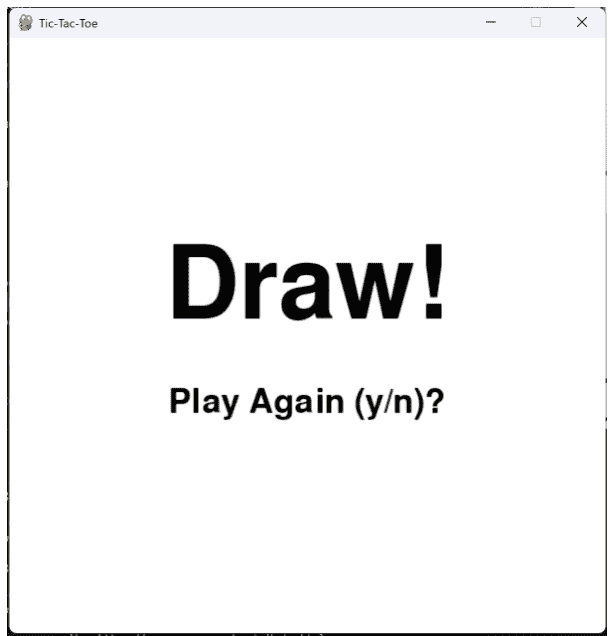

## 结论

在本章中，我们探讨了在 pygame 中使用类来增强代码的组织性和可维护性。我们通过使用 GameBoard 类处理游戏逻辑和数据管理，同时将绘制责任分配给精灵类来实现这一点。通过它们的方法和属性，这些类被集成到主循环中。此外，我们将许多底层绘图工作转移到了精灵类，使主程序更加清晰。在接下来的章节中，我们将介绍一个游戏，玩家必须在指定时间内使用箭头键收集宝石。我们将结合前面章节中讨论过的许多概念。

## 第六章 - 石头吞噬者

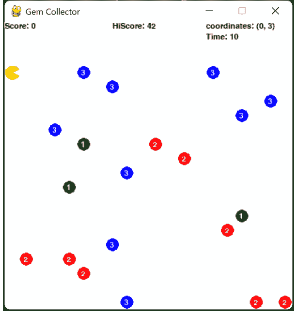

## 简介

在上一章中，我们创建了一个与计算机对战的井字棋游戏。石头吞噬者是一个与时间赛跑的游戏！游戏的目标是在时间耗尽之前尽可能多地吃掉有价值的石头。每块石头价值 1、2 或 3 分，因此你会想要吃掉价值更高的石头。石头吞噬者在游戏中引入了一些新概念。在本章中，我们将学习如何处理键盘事件、为玩家角色添加动画以及播放声音，为游戏增添另一个维度。

### 游戏设计

### 类

我们将利用类来构建我们的游戏。游戏中将使用多个精灵类，每个精灵代表一个游戏对象。将有一个精灵用于绘制石头吞噬者，还有一个精灵用于绘制游戏中的所有宝石。此外，我们还将为游戏中使用的每个统计数据（分数、最高分、坐标和时间）创建精灵。我们还将创建一个通用的消息精灵来显示诸如“再玩一次？”之类的文本。另外，就像我们在井字棋中所做的那样，我们将创建一个游戏棋盘类，用于控制玩家吃石头时的所有游戏逻辑和游戏状态。以下是我们刚刚提到的类的列表：

- PlayerSprite
- StoneSprite
- GameBoard
- ScoreSprite
- HiScoreSprite
- TimeSprite
- CoordinateSprite
- MessageSprite

### 游戏布局

与井字棋类似，石头吞噬者游戏也以网格形式布局。这个游戏中的游戏棋盘是一个 20x20 的网格，每个单元格宽度为 20 像素。当玩家向上、下、左或右移动时，石头吞噬者会移动到网格中下一个相邻的单元格。宝石也会随机放置在网格内的不同单元格中。

虽然游戏棋盘是 20 x 20 的网格，但我们只使用底部的 17 行，以便为游戏顶部的计分精灵留出空间。

我们本可以采用不同的方式，比如将网格放在分数下方，但只要我们将玩家限制在网格的第三行以内，这种方法同样有效。

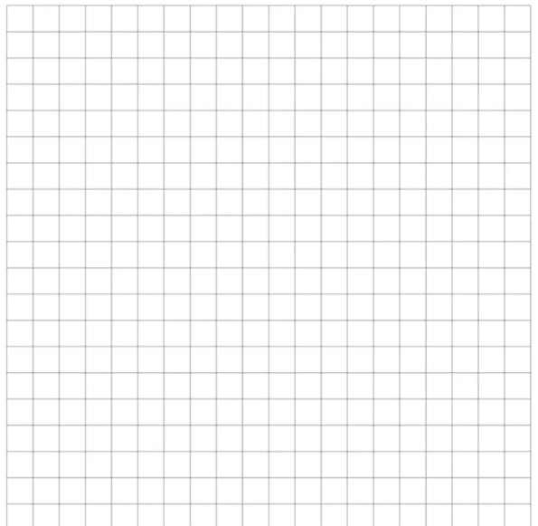

## 初始化游戏

在开始游戏循环之前，像任何游戏一样，我们需要初始化游戏棋子。**initialize_game_state** 函数为“食石者”游戏设置初始状态。该函数首先声明了几个将在整个游戏中使用的全局变量：**gems_collected**、**gems_score**、**start_time**、**times_up** 和 **already_played**。

然后，该函数清空 gem_group 以移除游戏板上任何现有的宝石。它将 **start_time** 设置为当前时间，并将 **times_up** 设置为 False。玩家的初始位置被设置为游戏板的第三行和第一列。游戏时间和分数被更新为各自的起始值 time_limit 和 0。**gems_collected** 和 gems_score 变量被设置为 0，**already_played** 被设置为 False。最后，该函数调用 **initialize_board** 方法将游戏板逻辑重置为其初始状态。

```python
def initialize_game_state():
    global gems_collected, gems_score, start_time, times_up, already_played
    print("Initializing game state")
    gem_group.empty()
    start_time = pygame.time.get_ticks()
    times_up = False
    player.row = player_limit
    player.column = 0
    player.update()
    game_time.update_time(time_limit, 0)
    score.update_score(0)
    gems_collected = 0
    gems_score = 0
    already_played = False

    game_board.initialize_board()

initialize_game_state()
```

## 游戏循环

正如在井字棋中所见，游戏由接收事件和根据棋盘状态及事件绘制精灵组成。

下面是驱动整个“食石者”游戏的游戏循环的大致架构。

```
while running:
    # 获取移动玩家的键盘事件
    # 如果按下了键，则更新玩家精灵的位置
    # 判断玩家是否与石头精灵发生碰撞
    # 如果玩家发生碰撞，
    #     移除石头并播放声音
    #
    # 更新计分精灵
    # 绘制所有宝石，
    # 如果时间到
    #     绘制重新开始 (y/n) 消息
    #     更新最高分
    #     播放游戏结束音乐
    # 否则
    #     绘制玩家和游戏时间精灵
    # 绘制所有宝石精灵
    # 绘制所有分数精灵，
    # 循环返回
```

现在让我们看看真实的游戏循环。下面是“食石者”游戏循环的完整代码，你会注意到它看起来与井字棋游戏循环相似。正如我们在伪代码中描述的那样，该循环处理来自用户的事件，相应地更新游戏板，并在游戏板上绘制所有内容。它利用精灵组在每次循环中执行精灵的更新和绘制。游戏循环还在适当的时候播放声音：每次吃掉石头时我们都会播放声音，当时间用完且游戏完成时我们会播放音乐。

第六章 - 食石者

75

```python
# 主游戏循环
running = True
while running:

    running = process_events()  # 处理键盘

    # 检查玩家是否拾取了宝石
    if game_board.check_for_gem(player) and \
        (times_up == False):
        # 找到宝石，更新分数
        gems_collected += 1
        gems_score += game_board.get_cell_value(
            player.row, player.column)
        score.update_score(gems_score)
        # 从棋盘和宝石精灵组中移除宝石
        game_board.remove_gem(player)
        which_sprite = detect_collisions(player,
            gem_group, piece_size)
        remove_sprite_from_group(which_sprite, gem_group)
        got_coin_sound.play()

    # 更新坐标
    coordinates.update_coordinatees(player.row, player.column)

    # 更新时间
    game_time.update_time(time_limit,
                pygame.time.get_ticks() - start_time)

    # 检查时间是否到
    if (pygame.time.get_ticks() - \
        start_time > time_limit * 1000) \
        and (times_up == False):
        times_up = True
```

```python
# 清空屏幕
window.fill(WHITE)

# 检查时间到标志是否设置
if times_up:
    # 设置当前分数，以便与
    # 最高分比较
    # 并播放一次游戏结束音乐
    if already_played == False:
        hi_score.current_score = gems_score
        victory_sound.play()
        already_played = True

    gems_collected_message.update_message(
        f'You collected {str(gems_collected)} gems!')

    gems_collected_message.update()
    gems_collected_message.draw(window)
    play_again_message.draw(window)
else:
    # 绘制玩家和游戏时间
    player.draw(window)
    game_time.draw(window)

# 绘制宝石
gem_group.draw(window)

# 更新统计数据
# （分数、最高分、坐标、剩余时间）
score_group.update()

# 绘制统计数据
score_group.draw(window)

# 显示我们刚刚绘制的所有图形
pygame.display.flip()
```

该代码充分利用了精灵和精灵组。宝石在一个组中，分数在另一个组中，因此它们可以一次性绘制。

## 检测按键

在我们的事件循环内部，我们检查用户是否按下了任何箭头键，以便我们可以根据玩家按下的箭头键将食石者向左、向右、向上或向下移动。我们通过遍历 pygame 事件队列中的所有事件并查看其中是否有任何是 keydown 来实现这一点。如果是，那么我们检查选择了哪个键盘键，并将其与我们感兴趣的键进行比较。例如，我们查看是否选择了向上箭头 (pygame.K_UP)。

一旦确定他们选择了向上箭头，我们还会检查玩家是否试图移出棋盘，因为我们不希望玩家超出游戏板。对于向上箭头的情况，我们将玩家限制在网格的第三行，这样玩家就不会开始移动到游戏统计数据区域。一旦确定玩家在游戏板内，我们就将玩家向按键方向移动一个单元格。对于向上箭头，我们将玩家行减一，以使其在游戏板网格中向上移动一行。

第六章 - 食石者

78

```python
for event in pygame.event.get():
    if event.type == pygame.QUIT or \
        (event.type == pygame.KEYDOWN and \
        event.key == pygame.K_n and times_up == True):
        running = False
    elif event.type == pygame.KEYDOWN:
        # 检查玩家是否移动
        if event.key == pygame.K_UP \
            and player.row > player_limit:
            player.row -= 1
            player.update()
        elif event.key == pygame.K_DOWN \
            and player.row < GRID_LENGTH - 1:
            player.row += 1
            player.update()
        elif event.key == pygame.K_LEFT and \
            player.column > 0:
            player.column -= 1
            player.update()
        elif event.key == pygame.K_RIGHT and \
            player.column < GRID_LENGTH - 1:
            player.column += 1
            player.update()
        elif event.key == pygame.K_y and \
            times_up == True:
            initialize_game_state()
```

## 游戏板

与井字棋类似，“食石者”中的游戏板用于放置宝石，也用于跟踪宝石的位置并确定它们是否已被吃掉。下面是游戏板类的方法及其用途。

**init（构造函数）initialize_board** - 在棋盘上放置初始石头 **check-for-gem** - 检查指定行和列是否有宝石 **remove_gem** - 从棋盘上移除宝石 **get_cell_value** - 获取指定行和列单元格的值

当我们初始化棋盘时，我们在棋盘上随机的空位放置宝石。

```python
def initialize_board(self):
    # 用 20 x 20 的 0 矩阵填充空网格
    self.grid = []
    for i in range(self.grid_size):
        self.grid.append([])
        for j in range(self.grid_size):
            self.grid[i].append(0)

    # 在 self.grid 上随机放置宝石
    num_gems = 20
    for i in range(num_gems):
        gem_placed = False
        while not gem_placed:
            row = random.randint(self.player_limit,
                self.grid_size - 1)
            column = random.randint(0,
                self.grid_size - 1)
            if self.grid[row][column] == 0:
                self.grid[row][column] \
                    = random.randint(1, 3)
                gem_placed = True
                # 在棋盘上放置宝石时，
                # 将石头精灵添加到宝石组
                self.gem_group.add(StoneSprite(
                    self.colors[
                        self.grid[row][column]-1],
                    row, column, self.piece_size,
                        self.grid[row][column]))
```

以下是包含上述所有方法的完整类。`GameBoard`类使得处理与棋盘相关的所有游戏逻辑变得更加容易，并将内部网格映射从游戏循环中隐藏起来，这样游戏循环就不必考虑它。

```python
class GameBoard:
    def __init__(self, size, piece_size,
        player_limit, gem_group):
        self.grid_size = size
        self.piece_size = piece_size
        self.player_limit = player_limit
        self.grid = []
        self.gem_group = gem_group
        # gem colors
        GREEN = (0, 150, 0)
        RED = (255, 0, 0)
        BLUE = (0, 0, 255)
        self.colors = [GREEN, RED, BLUE]

    def initialize_board(self):
        # fill the empty grid with a 20 x 20 matrix of 0's
        self.grid = []
        for i in range(self.grid_size):
            self.grid.append([])
            for j in range(self.grid_size):
                self.grid[i].append(0)

        # Place gems randomly on the self.grid
        num_gems = 20
        for i in range(num_gems):
            gem_placed = False
            while not gem_placed:
                row = random.randint(self.player_limit,
                    self.grid_size - 1)
                column = random.randint(
                    0, self.grid_size - 1)
                if self.grid[row][column] == 0:
                    self.grid[row][column] = random.randint(1, 3)
                    gem_placed = True
                    # add stone sprites to the gem group
                    # as we place them on the board
                    self.gem_group.add(StoneSprite(
                        self.colors[
                            self.grid[row][column]-1],
                        row, column,
                        self.piece_size,
                        self.grid[row][column]))

    def check_for_gem(self, player):
        if self.grid[player.row][player.column] > 0:
            return True
        else:
            return False

    def remove_gem(self, player):
        self.grid[player.row][player.column] = 0

    def get_cell_value(self, row, column):
        return self.grid[row][column]
```

## 游戏精灵

每个游戏精灵在游戏绘制一个对象。所有精灵在其结构中都遵循以下约定：

```
class MySprite
    __init__
    def update(self)
    def draw(self, surface)
```

我们并不总是需要实现**update**，因为游戏精灵可能不会以任何方式移动或改变。例如，石头一旦创建，其图形或位置就不会改变，因此没有理由更新它们。另一方面，玩家精灵随着每次按键而移动，因此在检测到方向键时必须在游戏里不断更新它。**draw**函数用于绘制精灵，因此它总是被使用。让我们看看石头精灵和玩家精灵：

下面的石头精灵，其大部分代码都在构造函数中。这是因为一旦我们定义了它的图像，它就不会改变。甚至绘制精灵也是在构造函数早期就预先确定的。所有draw函数需要做的就是将构造函数中创建的图像和宝石的值（1、2或3）绘制到屏幕上。如果调用update函数，它什么也不做。

让我们仔细看看构造函数（**__init__**），因为这是类的核心所在。构造函数创建一个字体对象，并从一个空白的20x20图像开始。然后用白色填充图像，并在其表面绘制一个填充圆。圆的颜色将取决于传递给精灵的颜色（红色、绿色或蓝色）。构造函数绘制圆之后，它将白色字体渲染在圆的顶部，并将其绘制到圆的中心。最后，它将矩形移动到传递给构造函数的行和列。移动矩形会将整个石头移动到棋盘上的行和列位置。

```python
class StoneSprite(pygame.sprite.Sprite):
    def __init__(self, color, row, column,
                 piece_size, gem_value):
        super().__init__()
        WHITE = (255, 255, 255)
        BLACK = (0, 0, 0)
        small_font = pygame.font.Font(None, 16)

        self.row = row
        self.column = column

        self.piece_size = piece_size
        # Create a surface for the sprite
        self.image = pygame.Surface(
            [piece_size, piece_size])
        self.image.fill(WHITE)

        # Draw the rectangle to the sprite surface
        pygame.draw.circle(self.image, color,
            (piece_size/2, piece_size/2),
            int(piece_size/2.2))
        self.gem_value = small_font.render(
            str(gem_value), True, WHITE)
        self.image.blit(self.gem_value, (piece_size/3,
            piece_size/4))
        self.rect = self.image.get_rect().move(
            column*piece_size,
            row*piece_size)

    def update(self):
        pass

    # Draw the sprite on the screen
    def draw(self, surface):
        surface.blit(self.image, self.rect)
        surface.blit(self.gem_value, self.rect)
```

现在让我们看看食石者精灵。在这个精灵中，我们引入了一个名为pyganim（pygame动画）的新库。你需要使用pip安装pyganim库：

```
pip install pyganim
```

动画库使我们更容易为食石者制作动画，而无需在游戏循环中处理它。我们将通过让食石者张开和闭合嘴巴来制作动画，使其看起来像是在吃石头（有点像吃豆人！）。我们只需要两张图片来实现这一点：食石者张开嘴巴和食石者闭上嘴巴。


pygame动画库让我们可以轻松地使用PygAnimation方法制作动画，该方法接受图像和以毫秒为单位的帧时间。对于我们的吃豆人，我们每250毫秒或四分之一秒在两张图片之间交替一次。这将给我们带来食石者张开和闭合嘴巴的预期效果。此外，由于我们的图像相当大，我们需要将它们缩小到网格单元的大小。我们可以通过调整图像大小手动完成，也可以使用动画库提供的scale函数。我们选择使用scale函数来缩小尺寸。

为了播放动画，我们只需在动画对象上调用play，它就会在整个游戏过程中运行食石者嘴巴张开和闭合的动画。

## 第6章 - 食石者

85

```python
import pygame
import pyganim

class PlayerSprite(pygame.sprite.Sprite):
    def __init__(self, row, column, piece_size):
        super().__init__()

        self.row = row
        self.column = column
        self.piece_size = piece_size
        self.anim = pyganim.PygAnimation(
            [("pacopen.png", 250), ("pacclose.png", 250)])
        self.anim.scale((piece_size, piece_size))
        self.anim.play()
        self.rect = pygame.Rect(
            column*piece_size, row*self.piece_size,
            self.piece_size, self.piece_size)

    def update(self):
        self.rect = self.anim.getRect().move(
            self.column*self.piece_size,
            self.row*self.piece_size)

    def draw(self, surface):
        self.anim.blit(surface, self.rect)
```

注意在食石者对象中，update函数不是空的。这是因为每次在游戏中按下方向键时，我们都会更新玩家的行或列位置。我们必须在玩家对象上调用update，以便将其位置矩形移动到按键确定的新网格单元位置。要绘制玩家，我们只需将动画对象绘制到游戏表面，并将其放置在棋盘上的rect位置。

我们经常更新的另一个精灵是时间精灵。这个精灵将显示用户在游戏中剩余的时间。

在主循环中，我们每次迭代都会更新剩余时间：

```python
# Update time
game_time.update_time(time_limit,
    pygame.time.get_ticks() - start_time)
```

TimeSprite 会更新其内部时间，随后在 update 函数中使用该时间，将其渲染成一个包含剩余时间的字体对象：

```python
import pygame


class TimeSprite(pygame.sprite.Sprite):
    def __init__(self):
        super().__init__()
        BLACK = (0, 0, 0)
        self.time = 0
        self.small_font = pygame.font.Font(None, 16)
        self.image = self.small_font.render(
            f'Time: {self.time}', True, BLACK)
        self.rect = self.image.get_rect().move(280, 15)


    def update(self):
        BLACK = (0, 0, 0)
        # update the time image
        self.image = self.small_font.render(
            f'Time: {self.time}',
            True, BLACK)
        self.rect = self.image.get_rect().move(280, 15)


    def draw(self, surface):
        # Draw the time on the screen
        surface.blit(self.image, self.rect)

    def update_time(self, time_limit, time_in_milliseconds):
        # calculate the time remaining
        calculated_time = int(time_limit -
            (time_in_milliseconds / 1000))

        # no need to go below 0
        if calculated_time < 0:
            calculated_time = 0
        self.time = calculated_time
```

ScoreSprite 与 TimeSprite 类似。它包含一个用于更新分数的函数，然后在 update 函数中，使用 self.score 创建用于绘制分数的图像。

```python
import pygame

class ScoreSprite(pygame.sprite.Sprite):
    def __init__(self):
        super().__init__()
        BLACK = (0, 0, 0)
        self.score = 0
        self.small_font = pygame.font.Font(None, 16)
        # need initial image to determine rect
        self.image = self.small_font.render(
            f'Score: {self.score}', True, BLACK)
        # get rect bounding the score
        self.rect = self.image.get_rect().move(0, 0)

    def update(self):
        BLACK = (0, 0, 0)
        self.image = self.small_font.render(
            f'Score: {self.score}', True, BLACK)
        # recalculate the rectangle
        # since the image changed
        self.rect = self.image.get_rect().move(0, 0)

    def draw(self, surface):
        # Draw the sprite on the screen
        surface.blit(self.image, self.rect)

    def update_score(self, score):
        self.score = score
```

## 追踪最高分

**HiScoreSprite** 负责追踪游戏的最高分。它与 Score Sprite 的不同之处在于，它会记住最高分，并且只在达到更高分数时才更新。分数存储在文件中，因此即使用户关闭计算机，它也能被记住。

**HiScoreSprite** 类首先初始化分数变量，该变量代表玩家取得的最高分。它打开一个名为 hiscore.txt 的文件，读取其中存储的分数，将其转换为整数并保存为 score 变量。

然后，该类设置分数的显示，创建一个小字体并将文本 “HiScore: [score]” 渲染成图像。rect 属性被设置为屏幕上的一个位置，在本例中是 (150, 0)。**update** 方法调用 **update_high_score** 方法来更新最高分。与 Score sprite 类似，**draw** 方法将最高分绘制在屏幕上。

**update_high_score** 方法用于更新游戏中的最高分。它将新分数与当前最高分进行比较，如果新分数更高，它会更新分数变量和屏幕上显示的文本，将新分数写入 hiscore.txt 文件并保存。如果新分数不高，则不做任何操作。

```python
import pygame

class HiScoreSprite(pygame.sprite.Sprite):
    def __init__(self):
        super().__init__()
        WHITE = (255, 255, 255)
        BLACK = (0, 0, 0)
        f = open('files/hiscore.txt', 'r')
        self.hi_score = int(f.read())
        print(f'read hi score of {self.hi_score}')
        f.close()
        self.current_score = -1
        self.small_font = pygame.font.Font(None, 16)
        self.image = self.small_font.render(
            f'HiScore: {self.hi_score}', True, BLACK)
        self.rect = self.image.get_rect().move(150, 0)
    # Draw the sprite on the screen

    def update(self):
        self.update_high_score(self.current_score)

    def draw(self, surface):
        surface.blit(self.image, self.rect)

    def update_high_score(self, score):
        BLACK = (0, 0, 0)
        if self.hi_score < score:
            self.hi_score = score
            self.image = self.small_font.render(
                f'HiScore: {self.hi_score}', True, BLACK)
            self.rect = self.image.get_rect().move(150, 0)
            print(f'write hi score of {self.hi_score}')
            f = open('files/hiscore.txt', 'w')
            f.write(str(score))
            f.close()
        else:
            pass
```

## 检测碰撞

有一个内置函数叫做 **rect.colliderect**，用于检测精灵之间的碰撞。我们可以遍历棋盘上的所有石头，并使用 colliderect 函数来确定其中一块石头是否与棋盘上的玩家矩形发生碰撞。

我们将创建的函数名为 detect_collisions，它接受三个参数：

- **playerSprite**：一个 PlayerSprite 对象，代表玩家角色。
- **group**：一个 StoneSprites 组，代表棋盘上的石头。
- **piece_size**：一个整数，代表每个精灵的长度和宽度，以像素为单位。

该函数的目的是检查玩家精灵是否与组中的任何精灵发生碰撞。

函数首先使用 .sprites() 方法遍历组中的所有精灵。对于每个精灵，它使用 **pygame.Rect** 构造函数创建玩家精灵的矩形表示（playerRect）。玩家精灵的位置通过将其行和列属性乘以 piece_size 来计算，矩形的大小设置为 (piece_size, piece_size)。

然后，对当前正在循环的 StoneSprite 的 rect 属性调用 playerRect 对象的 colliderect 方法。如果玩家精灵矩形和当前精灵矩形相交，即发生碰撞，则此方法返回 True。

如果检测到碰撞，则从函数返回当前的石头精灵。如果循环完成而没有发现碰撞，则返回 None 以表示没有发生碰撞。

```python
def detect_collisions(playerSprite: PlayerSprite, group: pygame.sprite.Group, piece_size: int):

    for sprite in group.sprites():
        # detect collision with a sprite
        playerRect = pygame.Rect((playerSprite.column *
            piece_size,
            playerSprite.row * piece_size),
            (piece_size, piece_size))
        if playerRect.colliderect(sprite.rect):
            return sprite
    return None
```

为什么我们不直接从精灵本身获取 playerRect？因为我们使用了动画库并缩放了食石者的图像，出于某种原因，rect 并没有随之缩放。为了解决这个问题，我们可以简单地根据行、列和 piece_size 重新创建食石者的位置矩形。

## PyGame 中的太空入侵

## 简介

《太空侵略者》是 Taito 公司于 1978 年开发的经典电子游戏。该游戏由西角友宏设计，他受到了热门游戏《打砖块》和科幻经典电影《星球大战》的启发。

该游戏最初在日本发行，但很快在世界各地流行起来，成为 1980 年代的文化现象。其简单的玩法和标志性的 8 位图形使其成为玩家的最爱，并确立了其作为街机时代经典的地位。

在游戏中，玩家控制一艘飞船，必须击败从屏幕顶部下降的外星入侵者波次。随着玩家的进展，游戏的难度会增加，外星人的攻击会变得更快、更具侵略性。

《太空侵略者》不仅在街机中大获成功，还帮助启动了电子游戏产业，并引发了一波太空主题游戏的浪潮。多年来，它已被移植到众多平台，包括家用游戏机和个人电脑，确保了其持续的流行度和作为游戏图标的的地位。

在本章中，我们将描述如何使用 pygame 重现这款经典游戏。

## 如何游玩

游戏的目标是通过玩家控制的激光炮射击从屏幕顶部不断涌来的外星入侵者波次。玩家必须左右移动炮台以躲避外星人的攻击并瞄准射击。炮台一次只能发射一枚子弹，因此玩家需要仔细把握射击时机，避免被敌人淹没。

外星人在屏幕上左右移动，并逐渐向玩家的炮台逼近。如果外星人到达屏幕底部，游戏即告结束。玩家必须在它们到达底部之前将其全部摧毁，才能进入下一关。

随着玩家通过的关卡增多，外星人会变得更快、更具攻击性，并且会出现具有不同能力的新类型外星人。有些外星人移动速度更快或轨迹难以预测，而另一些则需要多次射击才能被击败。

游戏的生命次数有限，因此玩家必须尽量避免被外星人的攻击击中。如果玩家的炮台被外星人的激光束击中，就会失去一条生命，当所有生命耗尽时，游戏结束。

总的来说，《太空侵略者》是一款简单但令人上瘾的游戏，需要快速的反应和精准的时机把握才能成功。

PyGame中的太空侵略

94

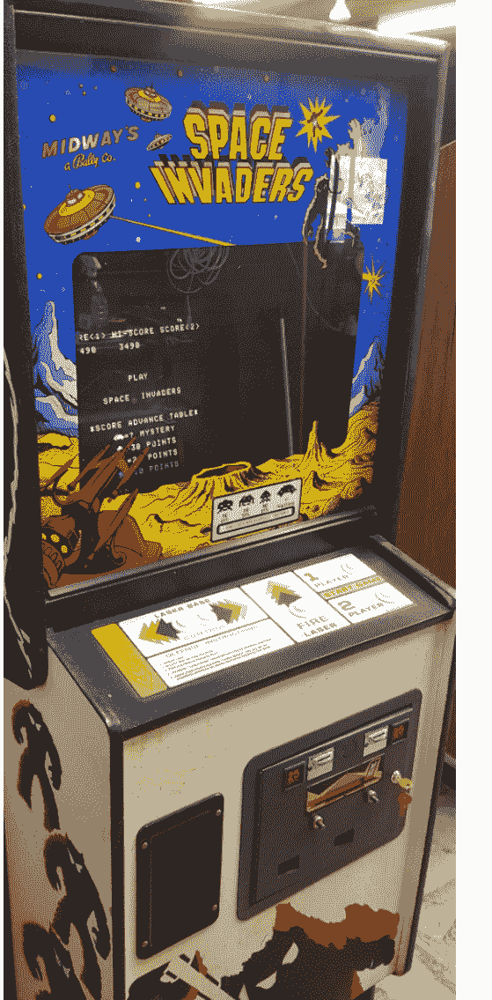

## 主循环

与我们为“吃石头”游戏设置主循环类似，我们需要为太空侵略者做同样的事情。该循环包括响应游戏中的键盘事件、绘制各种精灵以及检测它们之间的碰撞。为了使主循环更易于阅读，我们将代码分解为几个高级函数。

第一个高级函数是 **process_events**，它处理玩家移动和射击的键盘事件。以下是其他高级函数及其描述：

**handle_scoring** - 根据玩家的分数更新屏幕上的当前得分。此函数还会更新最高分和生命值指示器。

**handle_alien_movement** - 此函数引导外星人在屏幕上移动，并在它们碰到屏幕边缘时帮助其改变方向。它们每次碰到边缘时也会向下移动。

**handle_player_movement** - 根据玩家按下的方向键处理玩家移动。左箭头键使玩家向左移动直到松开按键，右箭头键同理。

**handle_bullet** - 此函数处理来自玩家的、试图击中外星人的活跃子弹。它在每次游戏循环中以特定速度将子弹向上移动。它还通过 **handle_alien_hit** 函数检查子弹是否与外星人发生碰撞。

**check_for_bomb_activation** - 此函数根据一个随机生成的值检查外星人是否释放了炸弹。如果外星人释放了炸弹，它会被记录在一个数组中，以便稍后处理其移动。

**handle_active_bombs** 遍历炸弹数组并绘制活跃的炸弹。同时通过调用 **handle_player_hit** 检查炸弹是否击中了玩家。

**draw_aliens** - 绘制所有外星人。通过遍历存储在 **alien_groups** 中的外星人行，然后遍历每一行中的每个外星人来绘制外星人。一行是一个pygame组。

**handle_alien_speedup** - 随着玩家杀死越来越多的外星人，外星人在达到某个阈值后会加速。目前该阈值是当只剩下25个外星人时，然后是只剩下5个外星人时，最后是只剩下1个外星人时。

```
while running:
    (player_x, player_y) = player.position
    window.fill(BLACK)

    running = process_events()  # process the keyboard

    if (game_over):
        show_game_over_prompt()
        pygame.display.flip()
        continue

    # scoring
    handle_scoring(window, score, player_score)

    # move the aliens
    handle_alien_movement()

    # move the player
    handle_player_movement(window_width, player_left,
        player_right, player, player_x)

    # move the bullet
    if bullet_active:
        handle_bullet(bullet, bullet_active)

    # check for bomb activation every 2 seconds
    check_for_bomb_activation()

    # update active bombs
    handle_active_bombs(active_bombs)

    # draw the aliens and check for removal
    draw_aliens(window, alien_groups)

    # check if its time to speed up the aliens
    # based on the number of aliens left
    handle_alien_speedup(total_aliens)

    # show the display
    pygame.display.flip()

    # update the game time
    game_time = pygame.time.get_ticks() - start_time
```

## 游戏精灵

与“吃石头”游戏一样，通过创建精灵来构建太空侵略者是最简单的方法。本游戏包含以下精灵。

**ImageSprite** - 所有精灵的基类，用于加载图像并跟踪位置。
**PlayerSprite** - 你控制的、用于射击外星人的玩家炮台。
**BombSprite** - 代表外星人投下的炸弹图像的精灵。
**BulletSprite** - 显示射向入侵者的子弹的精灵。
**InvaderSprite** - 使用两张图像绘制入侵者以使其移动动画化。
**MessageSprite** - 用于绘制游戏结束消息。
**ScoreSprite** - 在屏幕顶部绘制游戏得分。
**HighScoreSprite** - 与我们在“吃石头”游戏中用于跟踪最高分的精灵相同。
**LivesSprite** - 绘制玩家剩余的生命次数。

## 玩家精灵

让我们首先深入了解一下玩家精灵。这段代码定义了一个名为PlayerSprite的类，它继承自ImageSprite。PlayerSprite类代表一个玩家控制的精灵，可以左右移动、被杀死并爆炸。它具有以下属性：

**dead**：一个布尔标志，指示精灵是否已死亡。
**speed**：一个浮点数，表示精灵左右移动的速度。
**death_time**：一个整数，表示精灵被杀死的时间。
**animate_explosion**：一个PygAnim对象，表示精灵爆炸的动画。

PlayerSprite类具有以下方法：

**init(self, name, x, y)**：PlayerSprite类的构造函数。它初始化精灵的位置，并将其属性设置为初始值。
**update**：更新精灵位置的方法。
**kill**：杀死精灵的方法，触发爆炸动画。
**draw**：在给定表面上绘制精灵的方法。如果精灵未死亡，它会调用超类的draw()方法来绘制精灵图像。如果精灵已死亡，它会播放爆炸动画并检查爆炸是否已完成足够的时间。
**move_left**：通过调整位置将精灵向左移动的方法。
**move_right**：通过调整位置将精灵向右移动的方法。

```python
import pygame
import pyganim
from ImageSprite import ImageSprite

class PlayerSprite(ImageSprite):
    def __init__(self, name, x, y):
        super().__init__(name, x, y)
        self.dead = False
        self.speed = .1
        self.death_time = 0
        self.animate_explosion = pyganim.PygAnimation(
            [("images/shipexplosion/frame1.gif", 250),
             ("images/shipexplosion/frame2.gif", 250),
             ("images/shipexplosion/frame3.gif", 250),
             ("images/shipexplosion/frame4.gif", 250),
             ("images/shipexplosion/frame5.gif", 250),
             ("images/shipexplosion/frame6.gif", 250),
             ("images/shipexplosion/frame7.gif", 250),
             ("images/shipexplosion/frame8.gif", 250),],
            loop=False)

    # just call the super class to adjust the rect
    def update(self):
        super().update()

    # Draw the sprite on the screen
    def kill(self):
        self.animate_explosion.play()
        self.dead = True
        self.death_time = pygame.time.get_ticks()

    def draw(self, surface):
        if not self.dead:
            super().draw(surface)
```

## 玩家爆炸效果

`animate_explosion` 对象使用 `pyganim` 库来处理飞船爆炸的动画，它会快速依次绘制爆炸的 8 帧画面。动画初始化时包含了播放爆炸帧所需的所有信息，以及每帧的显示时长：

```python
self.animate_explosion = pyganim.PygAnimation(
    [("images/shipexplosion/frame1.gif", 250),
     ("images/shipexplosion/frame2.gif", 250),
     ("images/shipexplosion/frame3.gif", 250),
     ("images/shipexplosion/frame4.gif", 250),
     ("images/shipexplosion/frame5.gif", 250),
     ("images/shipexplosion/frame6.gif", 250),
     ("images/shipexplosion/frame7.gif", 250),
     ("images/shipexplosion/frame8.gif", 250),],
    loop=False)
```

要播放动画，我们只需在 `kill` 方法中调用 `animate_explosion` 的 **play** 方法：

```python
def kill(self):
    self.animate_explosion.play()
    self.dead = True
    self.death_time = pygame.time.get_ticks()
```

## 入侵者精灵

接下来，我们来看看绘制在屏幕上移动的动画外星人的 `InvaderSprite`。`InvaderSprite` 类继承自 `pygame.sprite.Sprite`，这是 Pygame 中所有精灵的基类。**init()** 方法初始化了各种实例变量，例如用于绘制和动画化外星人的两个图像精灵（`name1` 和 `name2`）、爆炸图像精灵、表示父行的精灵组、外星人的速度、其当前方向（向左或向右）、初始位置以及它的分值。**update()** 方法根据外星人的当前位置更新代表它的两个图像精灵的位置。`draw()` 方法在游戏表面上绘制当前的图像精灵。**move_left()**、**move_right()** 和 **move_down()** 方法分别将外星人向左、向右或向下移动。**switch_image()** 方法根据传入的图像编号在两个外星人图像精灵之间切换。**get_width()** 和 **get_height()** 方法返回外星人当前图像精灵的宽度和高度。**kill()** 方法将图像精灵切换为爆炸精灵，并将外星人标记为已死亡。

```python
import pygame
from ImageSprite import ImageSprite
from BombSprite import BombSprite

class InvaderSprite(pygame.sprite.Sprite):
    def __init__(self, name1, name2, x, y, parent, points):
        super().__init__()
        self.imageSprite1 = ImageSprite(name1, x, y)
        self.imageSprite2 = ImageSprite(name2, x, y)
        self.explosion = ImageSprite('explosion', x, y)
        self.imageSprite = self.imageSprite1
        self.parent = parent
        self.speed = .01
        self.currentDirection = 'right'
        self.position = (x, y)
        self.rect = self.imageSprite.image.get_rect().move(self.position)
        self.dead = False
        self.death_time = 0
        self.bomb_active = False
        self.points = points

    # 更新代表外星人的两个精灵的位置
    def update(self):
        self.imageSprite.rect = self.imageSprite.image.get_rect().move(self.position)
        self.imageSprite1.rect = self.imageSprite.rect
        self.imageSprite2.rect = self.imageSprite.rect

    # 在屏幕上绘制精灵
    def draw(self, surface):
        self.imageSprite.draw(surface)

    def move_left(self):
        (x, y) = self.position
        self.position = (x - self.speed, y)

    def move_right(self):
        (x, y) = self.position
        self.position = (x + self.speed, y)

    def move_down(self):
        (x, y) = self.position
        self.position = (x, y + 10)

    # 在代表外星人的两个图像之间切换
    def switch_image(self, imageNumber):
        if self.dead == True: return
        if (imageNumber == 1):
            self.imageSprite = self.imageSprite1
        else:
            self.imageSprite = self.imageSprite2

    def get_width(self):
        return self.imageSprite.get_width()

    def get_height(self):
        return self.imageSprite.get_height()

    def kill(self):
        self.imageSprite = self.explosion
        self.imageSprite.draw(self.imageSprite.image)
        self.imageSprite.update()
        self.dead = True
        self.death_time = pygame.time.get_ticks()
```

### 外星人移动时是如何实现动画的？

`InvaderSprite` 类在这里使用了一个技巧来实现外星人爪子开合的动画。在任何给定时间，`self.imageSprite` 属性都持有对外星人张开爪子图像或闭合爪子图像的引用。程序要么向 **switch_image** 方法传入 1 或 0，然后相应地将图像精灵分配给两个图像之一。当需要绘制外星人时，无论 `imageSprite` 当时被分配给了哪个图像，它都会被绘制到表面上。

## 子弹精灵

当玩家按下上方向键时，一个绿色的子弹会被激活，如果它与外星人碰撞，就可以射击外星人。子弹图像的创建很简单，只需用绿色填充子弹的矩形表面即可。

```python
class BulletSprite(pygame.sprite.Sprite):
    def __init__(self, x, y, bullet_width,
            bullet_height, speed):
        super().__init__()
        WHITE = (255, 255, 255)
        GREEN = (0, 255, 0)
        BLACK = (0, 0, 0)
        small_font = pygame.font.Font(None, 16)

        self.position = (x, y)
        self.speed = speed

        # 为精灵创建一个表面
        self.image = pygame.Surface(
            [bullet_width, bullet_height])
        self.image.fill(GREEN)

        # 将矩形绘制到精灵表面
        self.rect = self.image.get_rect().move(x, y)

    # 根据子弹的位置移动精灵
    def update(self):
        (x, y) = self.position
        self.rect = self.image.get_rect().move(x, y)

    # 在屏幕上绘制精灵
    def draw(self, surface):
        surface.blit(self.image, self.rect)
```

## 炸弹精灵

炸弹精灵是从外星人那里掉落下来的精灵。它被绘制到图像表面上，是一系列对角线的白色线条，形成了闪电的形状。

```python
class BombSprite(pygame.sprite.Sprite):
    def __init__(self, x, y, bullet_width,
        bullet_height, speed, parent):
        super().__init__()
        WHITE = (255, 255, 255)
        GREEN = (0, 255, 0)
        BLACK = (0, 0, 0)
        small_font = pygame.font.Font(None, 16)

        self.position = (x, y)
        self.speed = speed
        self.parent = parent

        # 为精灵创建一个表面
        self.image = pygame.Surface(
            [bullet_width, bullet_height])

        pygame.draw.lines(self.image, WHITE, True,
            [(0, 0), (5, 5), (0, 10), (10, 15)], 1)

        # 将矩形绘制到精灵表面
        self.rect = self.image.get_rect().move(x, y)

    # 根据当前位置更新炸弹
    def update(self):
        (x, y) = self.position
        self.rect = self.image.get_rect().move(x, y)

    # 在屏幕上绘制精灵
    def draw(self, surface):
        surface.blit(self.image, self.rect)
```

## 移动玩家

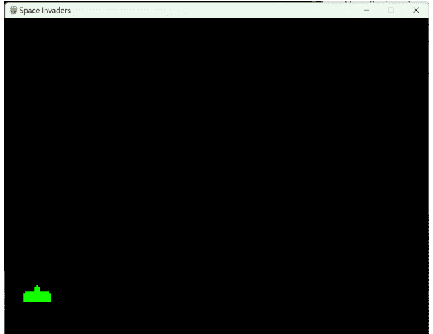

现在我们有了玩家精灵，就可以根据按键来移动玩家了。在我们的 `process_events` 方法中，我们将捕获按键。如果用户按下左方向键，我们将标记一个标志，表示玩家正在向左移动。当他们松开左方向键时，该标志将被清除。右方向键的情况也是如此。如果用户按下右方向键，将标记一个标志以指示玩家正在向右移动。一旦用户松开右方向键，该标志将被清除。

def process_events():
    global player_left, player_right
    (player_x, player_y) = player.position
    running = True
    for event in pygame.event.get():
        if event.type == pygame.KEYDOWN:
            # 检查玩家是否移动
            if event.key == pygame.K_LEFT and player_x > 0:
                player_left = True
                player_right = False
            elif event.key == pygame.K_RIGHT and player_x < window_width:
                player_right = True
                player_left = False
        elif event.type == pygame.KEYUP:
            player_left = False
            player_right = False
    return running

在我们的游戏循环中，我们使用由 `process_events` 方法设置的 **player_left** 和 **player_right** 标志来移动玩家。我们将玩家的行为整合到一个名为 **handle_player_movement** 的方法中，该方法包含移动玩家精灵所需的参数。请注意，我们会检查边界，如果玩家将超出屏幕边界，则不允许移动。同时请注意，如果玩家被标记为死亡，则无需移动它。玩家以与其速度相对应的速率移动。一旦速度被加到或从玩家位置中减去，玩家精灵就会被更新并重新绘制。

def handle_player_movement(window_width, player_left,
    player_right, player, player_x):
    if (player.dead):
        pass
    elif player_left:
        if (player_x - player.speed) > 0:
            player.move_left()
    elif player_right:
        if (player_x + player.speed) < window_width - player.get_width():
            player.move_right()

    player.update()
    player.draw(window)

## 发射子弹

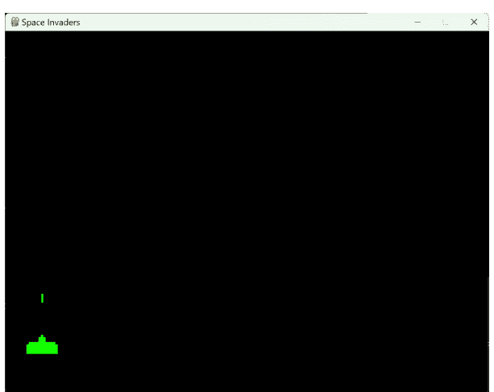

子弹使用上箭头键发射。一旦子弹发射，在子弹击中外星人或移动到屏幕顶部之前，无法再次发射。子弹由上箭头激活，因此我们在 `process_event` 方法中查找此事件：

```python
def process_events():
    global player_left, player_right, bullet_active
    (player_x, player_y) = player.position
    running = True
    for event in pygame.event.get():
        if event.type == pygame.QUIT:
            running = False
        elif event.type == pygame.KEYDOWN:
            # 检查玩家是否移动
            if event.key == pygame.K_UP:
                if bullet_active == False:
                    bullet_active = True
                    bullet.position = (player_x + 30,
                        player_y - 20)
                    bullet_fire_sound.play()
                    ...
            return running
```

一旦我们激活了子弹，就可以在主循环中一个名为 **handle_bullet** 的方法中处理其状态和移动。在主循环中，如果子弹处于活动状态，我们就调用 `handle_bullet` 来绘制移动的子弹。`handle_bullet` 接收子弹精灵和我们在 `process_events` 方法中设置的 `bullet_active` 标志。子弹的 y 位置通过从当前 y 位置减去子弹速度并更新子弹位置来设置。如果子弹的 y 位置超出屏幕顶部（在 y=0 处），我们将 `bullet_active` 标志设置为 false。

```python
def handle_bullet(bullet, bullet_active):
    (bullet_x, bullet_y) = bullet.position
    bullet_y = bullet_y - bullet.speed
    bullet.position = (bullet_x, bullet_y)
    bullet.update()
    bullet.draw(window)
    if (handle_alien_hit(bullet_x, bullet_y)):
        bullet_active = False
        bullet.position = (0, 0)

    if (bullet_y < 0):
        bullet_active = False

    return bullet_active
```

## 检查外星人是否被击中

**handle_bullet** 方法还通过使用子弹的当前坐标调用 **handle_alien_hit** 方法来检查我们是否击中了外星人。`handle_alien_hit` 不仅检查所有外星人以查看是否有任何一个被子弹击中，它还处理杀死外星人。`handle_alien_hit` 遍历所有外星人行以及每行中的每个外星人，并检查子弹位置是否在外星人目标范围内。如果是，则外星人精灵被杀死并播放爆炸声音。同时玩家的分数也会更新。

```python
def handle_alien_hit(bullet_x, bullet_y):
    global gems_collected, player_score, bullet, alien_groups
    for alien_group in alien_groups:
        for alien in alien_group:
            (x, y) = alien.position
            if bullet_x > x and bullet_x < x + alien.get_width() and bullet_y > y and bullet_y < y + alien.get_height():
                alien.kill()
                alien.death_time = pygame.time.get_ticks()
                alien_dying.play()
                player_score += alien.points
                return True
    return False
```

当外星人死亡时，它会被替换为外星人爆炸图像，并被标记为死亡，如下方的 InvaderSprite 所示。同时标记死亡时间，以便我们可以让爆炸持续一段时间。

```python
class InvaderSprite(pygame.sprite.Sprite):
    ...
    def kill(self):
        self.imageSprite = self.explosion
        self.imageSprite.draw(self.imageSprite.image)
        self.imageSprite.update()
        self.dead = True
        self.death_time = pygame.time.get_ticks()
```

在我们的主循环中，每次循环都会调用 **check_for_removal**。如果一个外星人死亡超过 1/4 秒（或 250 毫秒），我们就将其从行中移除。如果一行中的所有外星人都被消灭，我们就移除该行本身。

```python
def check_for_removal(alien):
    if alien.death_time > 0 and alien.death_time + 250 < pygame.time.get_ticks():
        alien.parent.remove(alien)
        if (len(alien.parent) == 0):
            alien_groups.remove(alien.parent)
```

## 绘制外星人

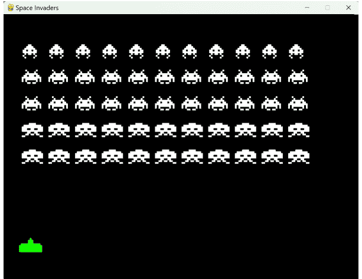

为了检测外星人是否被击中，你需要有外星人可以击中！在本节中，我们将描述如何绘制外星人。我们已经看过了入侵者精灵，下一步是使用 InvaderSprite 类在屏幕上绘制不同行中的所有不同种类的入侵者。请注意，底部两行的入侵者是相同的精灵，每个值 10 分，第二行和第三行是不同类型的入侵者，每个值 20 分。顶部一行也是独特的入侵者，每个值 30 分。

最初，我们将使用 **create_aliens** 方法创建上图中看到的外星人配置。在我们的游戏循环中，我们将使用 **handle_alien_movement** 函数更新外星人的移动，并使用 **draw_aliens** 方法绘制外星人。

**create_aliens** 绘制所有 5 行外星人。代码定义了一个名为 `alien_names` 的列表，其中包含游戏中不同类型外星人的名称。每种类型的外星人名称指的是使用 InvaderSprite 创建的外星人图像。每个 InvaderSprite 有两个文件图像：打开的外星人精灵和关闭的外星人精灵（以 c 结尾）。

函数 `create_aliens()` 用于在游戏中创建实际的外星人。它首先创建一个名为 `alien_groups` 的空列表。

接下来，该函数使用一个循环创建五行外星人。在每一行中，该函数使用另一个循环在该行中创建 11 个外星人。创建外星人时，它会构造一个包含特定外星人打开和关闭版本的 InvaderSprite。

InvaderSprite 构造函数还为每个外星人在屏幕上分配一个位置，该位置由其在外星人网格中的行和列决定。构造函数中还分配了父组以及外星人被击中时的分值。每个外星人被添加到一个 `pygame.sprite.Group()` 对象中，这是 Pygame 中用于多个精灵的容器。

最后，每个 `pygame.sprite.Group()` 对象都被添加到 `alien_groups` 列表中，该列表用于跟踪游戏中所有的外星人行。

总的来说，这段代码设置了游戏中不同类型的外星人，并使用 Pygame 的精灵功能以网格状模式在屏幕上创建它们。

```python
## 用于计分的字典
score_dict = {
    'invader1': 30,
    'invader2': 20,
    'invader3': 10
}

alien_names = ['invader1', 'invader2', 'invader2', 'invader3', 'invader3']
```

def create_aliens():
    global alien_groups
    alien_groups = []
    for i in range(0, 5):
        alien_group = pygame.sprite.Group()
        for j in range(0, 11):
            alien = InvaderSprite(alien_names[i],
                alien_names[i] + 'c',
                30 + (j * 60), 60 + i*60, alien_group,
                score_dict[alien_names[i]])
            alien_group.add(alien)
        alien_groups.append(alien_group)

好了，我们已经绘制好了外星人队列，那么如何让它们移动呢？为此，我们在主循环中调用 **handle_alien_movement** 方法。该方法首先寻找最左边和最右边的外星人。之所以要找到它们，是因为需要知道哪个外星人会触发外星人群改变方向并向下移动一格。我们还需要知道最底部的外星人，以判断外星人何时着陆。**handle_alien_movement** 内部调用的 **move_aliens** 函数执行实际的外星人移动，我们稍后会讨论。代码的下一部分遍历所有外星人，并执行它们张开和闭合爪子的动画。循环对每个入侵者精灵调用 **switch_image**，并传递总游戏时间除以闪烁速率再对2取模的结果，这将生成1或0。1或0代表外星人是张开还是闭合爪子。闪烁速率越高，外星人张合爪子的速度就越慢。稍后，随着外星人数量减少，我们将改变闪烁速率以加快外星人的动画速度。

我们还可以利用游戏时间来确定何时播放外星人移动时的音效。我们检查 `pygame.time` 对400取模，当结果为零时，大约每1/2秒播放一次声音。最后的代码根据 **move_aliens** 方法计算出的标志位设置所有外星人的位置。无论标志位设置如何，所有外星人都将跟随这些标志的方向移动，因为所有外星人都在屏幕上同步移动。

最后一行代码 `move_aliens_down = False` 将指示外星人向下移动的标志设置为假。我们希望在已经将外星人向下移动后重置此标志，因为我们只想让外星人向下移动一行，然后继续向左或向右移动。否则，外星人会向下移动得非常快！

```python
def handle_alien_movement():
    global game_time, move_aliens_down, alien_groups, move_aliens_right
    alien_rightmost = find_rightmost_alien()
    alien_leftmost = find_leftmost_alien()
    alien_bottommost = find_bottommost_alien()
    (move_aliens_right, move_aliens_down) = move_aliens(
        alien_leftmost,
        alien_rightmost,
        alien_bottommost,
        move_aliens_right,
        move_aliens_down)

    # 执行动画
    for alien_group in alien_groups:
        for next_alien in alien_group:
            next_alien.switch_image(int(game_time/blink_speed) % 2)
            next_alien.update()

    # 每半秒播放一次外星人音效
    if game_time % 400 == 0 and aliens_exist():
        alien_movement.play()
```

```python
    for alien_group in alien_groups:
        for alien in alien_group:
            (x,y) = alien.position
            if move_aliens_right:
                alien.move_right()
            else:
                alien.move_left()
            if move_aliens_down:
                alien.move_down()
            alien.update()

    # 重置外星人向下移动标志，我们只想让它们
    # 向下移动一行。
    move_aliens_down = False
```

下面展示的 **move_aliens** 函数，展示了我们如何计算所有外星人群的移动判定。首先，我们获取最左边的外星人 **first_alien** 和最右边的外星人 **last_alien** 的位置。然后，如果我们当前正在向右移动外星人，我们会检查外星人是否撞到了屏幕右侧。如果它们在向右移动时撞到了边界，那么是时候改变方向并向下移动了。因此，如果外星人撞到了右墙，我们将 **move_right** 标志设置为假，表示我们现在向左移动。我们还将 **move_down** 标志设置为真，当然，除非我们已经到达屏幕底部。

如果我们当前正在向左移动（或没有向右移动），我们也会对 **first_alien** 的坐标进行类似的检查。如果第一个外星人的位置超出了屏幕左侧，那么是时候改变外星人的方向，让它们向右以及向下移动了。

```python
def move_aliens(leftmost, rightmost, bottommost, move_right, move_down):
    global game_time

    last_alien = rightmost
    first_alien = leftmost

    # 如果第一个和最后一个外星人为空，则不执行任何操作
    if (last_alien is None) or (first_alien is None):
        return (move_right, move_down)

    # 获取第一个和最后一个外星人的位置坐标
    (last_alien_x, last_alien_y) = last_alien.position
    (first_alien_x, first_alien_y) = first_alien.position

    # 如果我们已经在向右移动，判断是否应该继续，
    # 或者向下移动并改变方向
    if move_right:
        if last_alien_x + last_alien.speed >= \
            window_width - (last_alien.rect.width + 5):
            move_right = False
            if last_alien_y + last_alien.speed < \
                window_height - last_alien.rect.height:
                if (bottommost.position[1] < \
                    window_height - 50):
                    move_down = True

    # 如果我们已经在向左移动，判断是否应该继续，
    # 或者向下移动并改变方向
    if not move_right:
        if first_alien_x - first_alien.speed <= 0:
            move_right = True
            if first_alien_y + first_alien.speed < \
                window_height - first_alien.rect.height:
                if (bottommost.position[1] < \
                    window_height - 50):
                    move_down = True

    return move_right, move_down
```

## 轰炸玩家

如果外星人只是像活靶子一样在屏幕上移动，游戏就不会很有挑战性，所以让我们在画面中加入一些外星人炸弹。来自上方外星人的轰炸通过主循环中的两个函数执行：**check_for_bomb_activation()** 和 **handle_active_bombs**。第一个方法检查是否有外星人将要释放炸弹。为了确定外星人是否在轰炸我们，我们遍历所有外星人，并为每个外星人生成一个随机数。如果随机数低于轰炸频率，那么该外星人就在轰炸，我们将该外星人标记为拥有一个活跃的炸弹。我们还会在判定时标记该外星人的位置。

```python
def check_for_bomb_activation():
    global game_time, active_bombs, alien_groups, bomb_frequency
    if (game_time/1000 % 2 == 0):
        if len(alien_groups) <= 0: return
        # 找到所有当前有能力向下投弹的外星人
        bombing_aliens = [alien
            for alien_group in alien_groups
            for alien in alien_group.sprites()]
        for alien in bombing_aliens:
            # 如果外星人已经在投弹，则不再投弹
            # 得给我们的玩家一个战斗的机会！
            if (alien.bomb_active == False):
                # 如果生成的随机数低于轰炸频率
                # 外星人就在投弹
                activate_bomb = random.randint(0, 100) < bomb_frequency
                if activate_bomb and alien.bomb_active == False:
                    alien.bomb_active = True
```

## 加速外星人

随着游戏进程的推进，我们希望通过加快外星人穿越屏幕的着陆速度来挑战玩家。我们创建了一个名为 **handle_alien_speedup** 的方法，并在主循环中调用它，根据剩余外星人的数量来增加它们的速度。下面的代码将通过调用 **total_aliens** 来获取外星人的总数，并根据这个总数改变外星人的速度。如果外星人总数达到20、5或1，外星人的速度以及它们开合爪子的动画速度都会增加（这会让外星人显得更具威胁性！）

```python
def handle_alien_speedup(total_aliens):
    global blink_speed, bomb_frequency, \
        first_speed_up, second_speed_up, third_speed_up

    if (total_aliens() == 20):
        if first_speed_up == False:
            blink_speed = 200
            bomb_frequency = 10
            speed_up_aliens()
            first_speed_up = True

    if (total_aliens() == 5):
        if second_speed_up == False:
            blink_speed = 100
            bomb_frequency = 20
            speed_up_aliens()
            second_speed_up = True

    if (total_aliens() == 1):
        if third_speed_up == False:
            bomb_frequency = 40
            blink_speed = 50
            speed_up_aliens(2.0)
            third_speed_up = True
```

提供的代码定义了一个名为 **speed_up_aliens** 的函数，它接受一个可选参数 `factor`，默认值为1.0。该函数遍历存在于不同外星人组中的所有外星人，并使用给定的 `factor` 参数计算出的因子来增加它们的速度。如果未传递 `factor` 参数，所有组中所有外星人的速度将增加一个固定的因子0.01。由于所有外星人的初始速度是0.01，第一次 *加速* 会使外星人的速度翻倍。

函数 **speed_up_aliens** 首先遍历 `alien_groups` 列表中的每个 `alien_group`，该列表代表外星人的每一行。在每个 `alien_group` 内，函数遍历该组中的每个外星人，然后通过将0.01乘以 `factor` 值的结果加到当前速度上来更新外星人的 `speed` 属性。这个计算的结果将被添加到 `alien.speed` 属性的当前值中，从而有效地将外星人的速度增加计算出的因子。

请注意，`factor` 参数是可选的，即使不传递任何参数，函数也能正常工作。在这种情况下，将使用默认的 `factor` 值1.0，所有外星人的速度将增加0.01 * 1.0，即0.01。如果向函数传递了一个 `factor` 值，那么所有外星人的速度将增加该因子。最后一个外星人的速度被提升为其原始速度的3倍（0.01 + 0.01 * 2.0）。

```python
def speed_up_aliens(factor = 1.0):
    for alien_group in alien_groups:
        for alien in alien_group:
            alien.speed = alien.speed + .01 * factor
```

## 添加计分系统

在玩游戏的过程中，我们希望跟踪并显示用户的某些统计数据。在太空入侵者游戏中，我们将跟踪得分、最高分和生命值。我们已经在“吃石头”游戏中创建了得分和最高分精灵，我们可以在太空入侵者游戏中使用相同的类。生命值是唯一的新类，如下所示。该类将以3个飞船徽章的形式显示剩余生命值，显示在屏幕右上角。当一艘飞船被摧毁时，一个飞船徽章就会被移除，直到没有剩余，此时游戏结束。

```python
import pygame

class LivesSprite(pygame.sprite.Sprite):
    def __init__(self, window_width):
        super().__init__()
        WHITE = (255, 255, 255)
        self.window_width = window_width
        self.lives = 3
        self.livesImage = pygame.image.load(
            'images/man.gif')
        self.livesImage = \
            pygame.transform.scale(self.livesImage,
                (40, 32))
        self.rect = pygame.Rect(0, 0, 0, 0)
        self.small_font = pygame.font.Font(None, 32)
        self.image = self.small_font.render(
            f'Lives: {self.lives}', True, WHITE)

    # 在屏幕上绘制精灵
    def update(self):
        WHITE = (255, 255, 255)
        self.image = self.small_font.render(
            f'Lives:', True, WHITE)
        self.rect = self.image.get_rect() \
            .move(self.window_width - 250, 0)

    def draw(self, surface):
        surface.blit(self.image, self.rect)
        for i in range(self.lives):
            surface.blit(self.livesImage,
                (self.window_width - 180 + i * 50, 0))

    def update_lives(self, lives):
        self.lives = lives
```

我们可以使用与玩家角色相同的图像作为生命值指示器，只需使用 `pygame.transform.scale` 方法将其缩小即可。

以下是代码的详细解释：

1.  **class LivesSprite(pygame.sprite.Sprite):** 定义了一个名为 `LivesSprite` 的新类，它继承自 `pygame.sprite.Sprite`。
2.  **def __init__(self, window_width):** 定义了 `LivesSprite` 类的构造函数。它接受窗口宽度作为参数，以帮助确定在屏幕顶部放置指示器的位置。
3.  **super().__init__()** 初始化父类（`pygame.sprite.Sprite`），以确保 `LivesSprite` 类继承所有必要的属性和方法。
4.  **WHITE = (255, 255, 255)** 定义了一个用于文本渲染的白色颜色元组。
5.  **self.window_width = window_width** 将窗口宽度存储在一个实例变量中。
6.  **self.lives = 3** 将生命数量初始化为3。
7.  **self.livesImage = pygame.image.load('images/man.gif')** 从 'images/man.gif' 文件加载用于表示玩家生命的图像。
8.  **self.livesImage = pygame.transform.scale(self.livesImage, (40, 32))** 将生命图像缩小到尺寸 (40, 32)。
9.  **self.rect = pygame.Rect(0, 0, 0, 0)** 为生命值显示文本初始化一个矩形区域。
10. **self.small_font = pygame.font.Font(None, 32)** 创建一个大小为32的字体对象，用于渲染文本 *Lives*。
11. **self.image = self.small_font.render(f'Lives: {self.lives}', True, WHITE)** 渲染生命值显示的初始文本。
12. **def update(self):** 定义了 `update` 方法，用于更新 *Lives* 显示文本。
13. **def draw(self, surface):** 定义了 `draw` 方法，用于在屏幕上绘制生命值显示文本和生命图像。`surface` 参数是要绘制生命值显示的表面。
14. **def update_lives(self, lives):** 定义了 `update_lives` 方法，用于更新生命数量，当玩家死亡时从主循环中更新。`lives` 参数是新的生命数量。
15. 总之，`LivesSprite` 类负责在太空入侵者游戏中显示玩家拥有的生命数量。它处理在游戏屏幕上渲染文本和生命图像。

在主程序的 `handle_player_hit` 方法中，如果玩家被外星人炸弹击中，我们会减少生命数量并更新 `LivesSprite` 以反映失去的生命：

```
def handle_player_hit(bomb_x, bomb_y):
    ...
    player_lives = player_lives - 1
    lives_indicator.update_lives(player_lives)
```

## 启动 UFO

在经典的街机游戏《太空侵略者》中，飞碟（也称为 UFO 或神秘飞船）会出现在屏幕顶部，并以固定的时间间隔在屏幕上水平移动。飞碟通常每 25 到 30 秒出现一次，但具体时间可能因游戏版本或玩家所处的关卡而异。飞碟的目的是为玩家提供机会，通过在其从屏幕一侧移动到另一侧时将其击落来获得额外分数。在我们的版本中，我们将每 20 秒启动一次飞碟。

要实现这个功能，我们将首先创建一个 `SaucerSprite`。这个精灵将使用 3 张飞碟图像进行动画处理，以营造飞碟旋转的错觉。以下是 `SaucerSprite` 代码的分解说明：

以下是该类及其方法的分解说明：

- **init**：构造函数方法使用三张不同的飞碟图像（name1、name2 和 name3）初始化飞碟精灵，设置初始位置（x, y）和一个可选的 level 参数。它设置初始图像精灵，为飞碟生成一个随机分数，根据关卡计算速度，并初始化其他相关属性。
- **reset**：此方法将飞碟重置到给定的位置和关卡，更新速度、分数和其他属性。
- **update**：此方法更新飞碟精灵及其三个图像精灵的位置，只要飞碟未被销毁。
- **draw**：此方法在给定的表面上绘制飞碟精灵。如果飞碟已被销毁，它会绘制飞碟的分数而不是精灵图像。
- **move_left**：此方法将飞碟精灵向左移动其速度值，前提是飞碟未被销毁。
- **switch_image**：此方法根据给定的图像编号，在提供的三张图像之间切换飞碟的图像精灵。
- **get_width** 和 **get_height**：这些方法分别返回飞碟精灵的宽度和高度。
- **kill**：此方法将飞碟的 `dead` 属性设置为 True，并使用 Pygame 的 `get_ticks()` 函数记录飞碟被销毁的时间。记录销毁时间的原因是让精灵在飞碟死亡后有时间在屏幕上显示获得的分数。

以下是飞碟精灵的完整代码：

```python
import random
import pygame
from ImageSprite import ImageSprite


class SaucerSprite(pygame.sprite.Sprite):
    def __init__(self, name1, name2, name3, x, y, level=1):
        super().__init__()
        self.active = False
        self.imageSprite1 = ImageSprite(name1, x, y)
        self.imageSprite2 = ImageSprite(name2, x, y)
        self.imageSprite3 = ImageSprite(name3, x, y)
        self.imageSprite = self.imageSprite1
        self.explosion = pygame.font.Font(None, 32)
        self.imageSprite = self.imageSprite1
        self.points = random.randint(1, 6) * 50
        self.saucerScore = self.explosion.render(
            str(self.points), True, (255, 255, 255))
        self.speed = .05 * (.9 + level/10.0)
        self.position = (x, y)
        self.rect = self.imageSprite.image.get_rect().move(self.position)
        self.dead = False
        self.death_time = 0

    def reset(self, x, y, level=1):
        self.imageSprite = self.imageSprite1
        self.points = random.randint(1, 6) * 50
        self.saucerScore = self.explosion.render(
            str(self.points), True, (255, 255, 255))
        self.speed = .05 * (.9 + level/10.0)
        self.currentDirection = 'left'
        self.position = (x, y)
        self.rect = self.imageSprite.image.get_rect().move(self.position)
        self.dead = False
        self.death_time = 0

    # 更新代表 UFO 的 3 个精灵的位置
    def update(self):
        self.rect = self.imageSprite.rect
        if self.dead == True: return
        self.imageSprite.rect = self.imageSprite.image.get_rect().move(self.position)
        self.imageSprite1.rect = self.imageSprite.rect
        self.imageSprite2.rect = self.imageSprite.rect
        self.imageSprite3.rect = self.imageSprite.rect
        self.rect = self.imageSprite.rect

    # 在屏幕上绘制精灵
    def draw(self, surface):
        if self.dead == True:
            surface.blit(self.saucerScore, self.rect)
        else:
            self.imageSprite.draw(surface)

    def move_left(self):
        if self.dead == True: return
        (x, y) = self.position
        self.position = (x - self.speed, y)

    # 在代表飞碟的 3 张图像之间切换
    def switch_image(self, imageNumber):
        if self.dead == True: return
        if (imageNumber == 1):
            self.imageSprite = self.imageSprite1
        elif (imageNumber == 2):
            self.imageSprite = self.imageSprite2
        else:
            self.imageSprite = self.imageSprite3

    def get_width(self):
        return self.imageSprite.get_width()

    def get_height(self):
        return self.imageSprite.get_height()

    def kill(self):
        self.dead = True
        self.death_time = pygame.time.get_ticks()
```

我们将如何决定何时启动 UFO？在原版游戏中，飞碟大约每 25 秒会横穿屏幕一次。我们将在游戏循环中做同样的事情：

```python
# 如果游戏未结束，则每 20 秒启动一次飞碟。
if game_over == False and game_time % 20000 == 0 and game_time > 0:
    start_saucer()
```

`start_saucer` 函数初始化我们的飞碟并准备让它横穿屏幕。它还会播放一个特殊的飞碟音效：

```python
def start_saucer():
    if saucer.active == False:
        saucer.reset(window_width - 50, 50, level1)
        saucer.active = True
        saucer_sound.play()
        saucer.position = (window_width - 50, 50)
```

一旦飞碟被初始化，我们需要让它持续在屏幕上移动。我们通过主循环中的 `handle_saucer_movement` 函数来实现这一点。

```python
def handle_saucer_movement():
    global game_time
    saucer_show_score_time = 1000

    if saucer.active:
        saucer.move_left()
        saucer.update()
        saucer.draw(window)
        saucer.switch_image(
            int(game_time/saucer_blink_speed) % 3)
        (saucer_x, saucer_y) = saucer.position
        if (saucer_x <= -100):
            saucer.dead = True
            saucer.position = (0, 0)

    if saucer.dead:
        current_saucer_death_time = pygame.time.get_ticks() - saucer.death_time
        if current_saucer_death_time > saucer_show_score_time:
            saucer.active = False
```

此函数负责移动、更新和绘制一个类似《太空侵略者》游戏中的飞碟（或 UFO）。它还处理飞碟“死亡”（例如被投射物击中）的情况。

以下是代码的逐步解释：

1. **saucer_show_score_time = 1000**：此行设置一个变量，表示飞碟被销毁后，其分数将在屏幕上显示的时间（以毫秒为单位）。
2. **if saucer.active**：此条件检查飞碟是否处于活动状态（在屏幕上可见并移动）。
3. **saucer.move_left()**：如果飞碟处于活动状态，此方法将飞碟向左移动。
4. **saucer.update()**：此方法更新飞碟的位置及其图像精灵。
5. **saucer.draw(window)**：飞碟被绘制在给定的表面（窗口）上。
6. **saucer.switch_image(int(game_time/saucer_blink_speed) % 3)**：此行根据当前游戏时间以及一个名为 `saucer_blink_speed` 的变量切换飞碟的图像精灵，从而创建动画效果。
7. 接下来的几行检查飞碟是否已移出屏幕（向左）。如果是，则认为飞碟已死亡，并将其位置重置为 (0, 0)。
8. **if saucer.dead**：此条件检查飞碟是否已死亡。
9. **current_saucer_death_time = pygame.time.get_ticks() - saucer.death_time**：此行计算自飞碟被销毁以来经过的时间。
10. **if current_saucer_death_time > saucer_show_score_time**：此条件检查自飞碟死亡以来经过的时间是否大于其分数应显示的时间。如果为真，则将飞碟设置为非活动状态（`saucer.active = False`），这意味着在它被重置并再次激活之前，它将不会被显示或更新。

总结来说，`handle_saucer_movement` 函数确保飞碟在屏幕上移动、更新其位置，并在激活状态下切换其图像。当飞碟被击毁时，它会显示分数一段设定的时间，然后将其设置为非激活状态。

## 检查是否击中飞碟

当我们从玩家角色发射子弹时，子弹可能击中外星人、击中飞碟，或者一直飞到屏幕顶部。我们需要处理子弹击中在屏幕上移动的飞碟的情况：

在 `handle_bullet` 函数内部，我们需要检查子弹是否与飞碟发生了碰撞：

```
def handle_bullet(bullet, bullet_active):
    ...

    if (handle_saucer_hit(bullet_x, bullet_y)):
        bullet_active = False
        bullet.position = (0, 0)
```

`handle_saucer_hit` 函数检查飞碟与子弹是否发生碰撞。如果碰撞发生，该函数会调用飞碟精灵（SaucerSprite）的 `kill` 函数。`kill` 函数将飞碟置于死亡状态，这使得飞碟在被击中后能显示分数几秒钟。此函数还会播放一个音效来表示飞碟被击中，并将飞碟的奖励分数加到玩家得分中。

```
def handle_saucer_hit(bullet_x, bullet_y):
    global player_score, bullet, saucer
    (x, y) = saucer.position
    # 检查子弹是否与飞碟碰撞
    if bullet_x > x
        and bullet_x < x + saucer.get_width()
        and bullet_y > y
        and bullet_y < y + saucer.get_height():
            saucer.kill()
            saucer_dying.play()
            player_score += saucer.points
            return True
    return False
```

## 结论

在本章中，我们深入探讨了一款动态的第一人称2D射击游戏《太空入侵者》的开发过程。我们的旅程涵盖了游戏的基本组件，如用户输入、音效设计、敌人移动、碰撞检测和引人入胜的动画。

尽管《太空入侵者》比我们之前的项目稍微复杂一些，但它为构建你自己的实时游戏体验提供了一个绝佳的蓝图。在设计独特的精灵时，你可以通过组合和调整它们来应用于多种游戏类型和概念，从而释放你的创造力。这项努力不仅扩展了你的技能集，也为游戏领域的创新打开了无限可能。

## 附录

### 源代码

要获取本书的源代码，请访问 GitHub 仓库：https://github.com/microgold/pygames。该仓库包含所有相关的代码示例，并组织在清晰简洁的文件夹结构中，方便你浏览内容。要开始使用，只需将仓库克隆或下载到你的本地机器，并按照 [README.md](https://github.com/microgold/pygames/blob/master/ReadMe.md) 文件中提供的说明操作即可。如果你有任何问题或遇到任何问题，请随时在仓库中提交 issue，我将非常乐意为你提供帮助。编码愉快！

### 在哪里寻找图片

- [Open Game Art](https://opengameart.org/) 提供免费图片可供选择
- [Itch.io](https://itch.io/) 提供免费和付费的游戏素材混合资源

### 在哪里寻找音效

- [FreeSound.org](https://freesound.org/) 提供大量免费音效，你可以下载用于你的游戏。
- [SoundBible.com](https://soundbible.com/) 提供免版税音效供你浏览。

### 其他资源

Python 和 Pygame 可能具有挑战性，但有许多优秀的资源可以帮助你入门。我们推荐：

#### Python 学习资源

- [Python 教程 - 学习 Python 编程（分步指南）](https://www.youtube.com/watch?v=XGf2GcyHPhc)
- [Python 教程 - 初学者完整课程](https://www.youtube.com/watch?v=rfscVS0vtbw)
- [Python.org](https://www.python.org/)：Python 编程语言的官方网站为初学者提供了丰富的信息，包括教程、文档和社区资源。
- [Codecademy](https://www.codecademy.com/learn/learn-python)：Codecademy 为初学者提供免费的 Python 课程。
- [Coursera](https://www.coursera.org/courses?query=python)：Coursera 提供来自顶尖大学和机构的免费 Python 课程。
- [笨办法学 Python](https://learnpythonthehardway.org/python3/)：一本免费的在线书籍，提供一种实践驱动、以练习为导向的 Python 学习方法。
- [Python for Everybody](https://www.py4e.com/lessons)：密歇根大学提供的一系列免费在线课程，介绍 Python 编程。
- W3Schools：一个提供各种教程和资源的网站，用于学习 Python 以及其他编程语言和 Web 开发技术。

#### 更多 PyGames 项目

- 打砖块
- 数独
- 贪吃蛇游戏