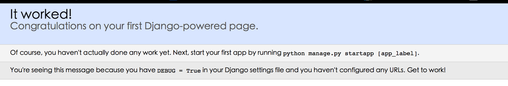

# 项目与 APP

# 项目创建

现在正式开始吧, 我们创建一个名为`my_blog`的 Django 项目

**创建项目的指令如下:**

```py
$ django-admin.py startproject my_blog 
```

现在来看一下整个项目的文件结构

```py
$ tree my_blog   #打印树形文件结构

my_blog
├── manage.py
└── my_blog
    ├── __init__.py
    ├── settings.py
    ├── urls.py
    └── wsgi.py

1 directory, 5 files 
```

# 建立 Django app

> 在`Django`中的 app 我认为就是一个功能模块, 与其他的 web 框架可能有很大的区别, 将不能功能放在不同的 app 中, 方便代码的复用

建立一个`article` app

```py
$ python manage.py startapp article 
```

现在让我们重新看一下整个项目的结构

```py
── article
│   ├── __init__.py
│   ├── admin.py
│   ├── migrations
│   │   └── __init__.py
│   ├── models.py
│   ├── tests.py
│   └── views.py
├── db.sqlite3
├── manage.py
├── my_blog
    ├── __init__.py
    ├── __pycache__
    │   ├── __init__.cpython-34.pyc
    │   ├── settings.cpython-34.pyc
    │   ├── urls.cpython-34.pyc
    │   └── wsgi.cpython-34.pyc
    ├── settings.py
    ├── urls.py
    └── wsgi.py 
```

并在 my_blog/my_blog/setting.py 下添加新建 app

```py
INSTALLED_APPS = (
    ...
    'article',  #这里填写的是 app 的名称
) 
```

# 运行程序

```py
$ python manage.py runserver   #启动 Django 中的开发服务器 
```

```py
#如果运行上面命令出现以下提示
You have unapplied migrations; your app may not work properly until they are applied.
Run 'python manage.py migrate' to apply them.
#请先使用下面命令
python manage.py migrate
#输出如下信息
Operations to perform:
  Apply all migrations: contenttypes, sessions, admin, auth
Running migrations:
  Applying contenttypes.0001_initial... OK
  Applying auth.0001_initial... OK
  Applying admin.0001_initial... OK
  Applying sessions.0001_initial... OK 
```

运行成功后,会显示如下信息

```py
#重新运行启动 Django 中的开发服务器
$ python manage.py runserver

#运行成功显示如下信息
System check identified no issues (0 silenced).
December 21, 2014 - 08:56:00
Django version 1.7.1, using settings 'my_blog.settings'
Starting development server at http://127.0.0.1:8000/
Quit the server with CONTROL-C. 
```

现在可以启动浏览器, 输入[`127.0.0.1:8000/`](http://127.0.0.1:8000/), 当出现



说明你成功走出了第一步!

命令梳理:

```py
python manage.py <command> [options]  #Django Command python manange.py -h 帮助文档
django-admin.py startproject my_blog  #创建项目
python manage.py startapp article  #创建 app 
```