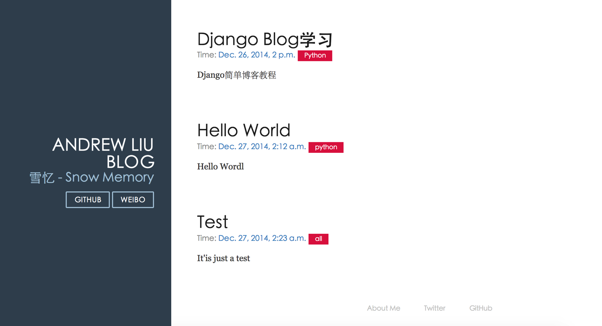

# Template 初探

到目前为止我们只是简单的将后端数据显示到页面上, 没有涉及到`HTML`代码, 而优雅的网站总算通过 CSS+HTML, 甚至还有强大的 JS 的支持.

在这个教程中要打造一个 Blog, 所以我们设置一个 Blog 界面, 原本打算使用`Bootstrap`作为前段的工具, 不过经过`@游逸`的建议, 使用了更加轻量级的[Pure](http://purecss.io/), 同样是响应式页面设置, 这也将是未来的主流吧..

在 my_blog 下添加文件名, 文件夹名为`templates`

```py
mkdir templates
#看到当前文件构成
my_blog
├── article
│   ├── __init__.py
│   ├── __pycache__
│   │   ├── __init__.cpython-34.pyc
│   │   ├── admin.cpython-34.pyc
│   │   ├── models.cpython-34.pyc
│   │   └── views.cpython-34.pyc
│   ├── admin.py
│   ├── migrations
│   │   ├── 0001_initial.py
│   │   ├── __init__.py
│   │   └── __pycache__
│   │       ├── 0001_initial.cpython-34.pyc
│   │       └── __init__.cpython-34.pyc
│   ├── models.py
│   ├── tests.py
│   └── views.py
├── db.sqlite3
├── manage.py
├── my_blog
│   ├── __init__.py
│   ├── __pycache__
│   │   ├── __init__.cpython-34.pyc
│   │   ├── settings.cpython-34.pyc
│   │   ├── urls.cpython-34.pyc
│   │   └── wsgi.cpython-34.pyc
│   ├── settings.py
│   ├── urls.py
│   └── wsgi.py
└── templates 
```

在 my_blog/my_blog/setting.py 下设置 templates 的位置

```py
TEMPLATE_DIRS = (
    os.path.join(BASE_DIR, 'templates').replace('\\', '/'),
    ) 
```

**1.7/1.8 版本 Django 已经修改的 template 添加形式**

```py
#尝试这种写法
TEMPLATE_PATH = os.path.join(BASE_DIR, 'templates')
TEMPLATE_DIRS = (
    TEMPLATE_PATH,
) 
```

意思是告知项目 templates 文件夹在项目根目录下

# 第一个 template

templates/test.html 简单第一个 template html 文件

```py
<!--在 test.html 文件夹下添加-->
<!DOCTYPE html>
<html>
    <head>
        <title>Just test template</title>
        <style>
            body {
               background-color: red;
            }
            em {
                color: LightSeaGreen;
            }
        </style>
    </head>
    <body>
        <h1>Hello World!</h1>
        <strong>{{ current_time }}</strong>
    </body>
</html> 
```

其中`{{ current_time }}`是 Django Template 中变量的表示方式

在 article/view.py 中添加一个函数逻辑

```py
from django.shortcuts import render
from django.http import HttpResponse
from article.models import Article
from datetime import datetime

# Create your views here.
def home(request):
    return HttpResponse("Hello World, Django")

def detail(request, my_args):
    post = Article.objects.all()[int(my_args)]
    str = ("title = %s, category = %s, date_time = %s, content = %s" 
        % (post.title, post.category, post.date_time, post.content))
    return HttpResponse(str)

def test(request) :
    return render(request, 'test.html', {'current_time': datetime.now()}) 
```

`render()`函数中第一个参数是`request` 对象, 第二个参数是一个`模板名称`，第三个是一个`字典类型`的可选参数. 它将返回一个包含有给定模板根据给定的上下文渲染结果的 `HttpResponse`对象。

然后设置对应的 url 在 my_blog/urls.py 下

```py
 url(r'^test/$', 'article.views.test'), 
```

重新启动服务器`python manage.py runserver`, 然后在浏览器中输入[`127.0.0.1:8000/test/`](http://127.0.0.1:8000/test/), 可以看到


# 正式编写 template

在 template 文件夹下增加 base.html, 并在其中增加如下代码

```py
<!doctype html>
<html lang="en">
<head>
    <meta charset="utf-8">
<meta name="viewport" content="width=device-width, initial-scale=1.0">
<meta name="description" content="A layout example that shows off a blog page with a list of posts.">

    <title>Andrew Liu Blog</title>
    <link rel="stylesheet" href="http://yui.yahooapis.com/pure/0.5.0/pure-min.css">
    <link rel="stylesheet" href="http://yui.yahooapis.com/pure/0.5.0/grids-responsive-min.css">
    <link rel="stylesheet" href="http://picturebag.qiniudn.com/blog.css">
</head>
<body>
<div id="layout" class="pure-g">
    <div class="sidebar pure-u-1 pure-u-md-1-4">
        <div class="header">
            <h1 class="brand-title">Andrew Liu Blog</h1>
            <h2 class="brand-tagline">雪忆 - Snow Memory</h2>
            <nav class="nav">
                <ul class="nav-list">
                    <li class="nav-item">
                        <a class="pure-button" href="https://github.com/Andrew-liu">Github</a>
                    </li>
                    <li class="nav-item">
                        <a class="pure-button" href="http://weibo.com/dinosaurliu">Weibo</a>
                    </li>
                </ul>
            </nav>
        </div>
    </div>

    <div class="content pure-u-1 pure-u-md-3-4">
        <div>
            
            
            <div class="footer">
                <div class="pure-menu pure-menu-horizontal pure-menu-open">
                    <ul>
                        <li><a href="http://andrewliu.tk/about/">About Me</a></li>
                        <li><a href="http://twitter.com/yuilibrary/">Twitter</a></li>
                        <li><a href="http://github.com/yahoo/pure/">GitHub</a></li>
                    </ul>
                </div>
            </div>
        </div>
    </div>
</div>

</body>
</html> 
```

上面这段 html 编写的页面是一个模板, 其中` `字段用来被其他继承这个基类模板进行重写

我们继续在 templates 文件夹下添加 home.html 文件

```py



<div class="posts">
    
        <section class="post">
            <header class="post-header">
                <h2 class="post-title">{{ post.title }}</h2>

                    <p class="post-meta">
                        Time:  <a class="post-author" href="#">{{ post.date_time }}</a> <a class="post-category post-category-js" href="#">{{ post.category }}</a>
                    </p>
            </header>

                <div class="post-description">
                    <p>
                        {{ post.content }}
                    </p>
                </div>
        </section>
    
</div><!-- /.blog-post -->
 
```

```py
其中
- 与成对存在, 这是 template 中提供的 for 循环 tag
-   是 template 中提供的 if 语句 tag
- template 中还提供了一些过滤器 
```

然后修改 my_blog/article/view.py, 并删除 test.html

```py
# -*- coding: utf-8 -*-
from django.shortcuts import render
from django.http import HttpResponse
from article.models import Article
from datetime import datetime

# Create your views here.
def home(request):
    post_list = Article.objects.all()  #获取全部的 Article 对象
    return render(request, 'home.html', {'post_list' : post_list}) 
```

修改 my_blog/my_blog/urls.py

```py
from django.conf.urls import patterns, include, url
from django.contrib import admin

urlpatterns = patterns('',
    # Examples:
    # url(r'^$', 'my_blog.views.home', name='home'),
    # url(r'^blog/', include('blog.urls')),

    url(r'^admin/', include(admin.site.urls)),
    url(r'^$', 'article.views.home'),
) 
```

现在重新打开[`127.0.0.1:8000/`](http://127.0.0.1:8000/), 发现 Blog 的整理框架已经基本完成, 到现在我们已经了解了一些 Django 的基本知识, 搭建了简单地 Blog 框架, 剩下的就是给 Blog 添加功能



查看当前整个程序的目录结构

```py
my_blog
├── article
│   ├── __init__.py
│   ├── __pycache__
│   │   ├── __init__.cpython-34.pyc
│   │   ├── admin.cpython-34.pyc
│   │   ├── models.cpython-34.pyc
│   │   └── views.cpython-34.pyc
│   ├── admin.py
│   ├── migrations
│   │   ├── 0001_initial.py
│   │   ├── __init__.py
│   │   └── __pycache__
│   │       ├── 0001_initial.cpython-34.pyc
│   │       └── __init__.cpython-34.pyc
│   ├── models.py
│   ├── tests.py
│   └── views.py
├── db.sqlite3
├── manage.py
├── my_blog
│   ├── __init__.py
│   ├── __pycache__
│   │   ├── __init__.cpython-34.pyc
│   │   ├── settings.cpython-34.pyc
│   │   ├── urls.cpython-34.pyc
│   │   └── wsgi.cpython-34.pyc
│   ├── settings.py
│   ├── urls.py
│   └── wsgi.py
└── templates
    ├── base.html
    └── home.html 
```

# 将代码上传到 Github

在 github 中新建仓库`my_blog_tutorial`, 填写简单的描述

```py
#查看当前目录位置
$ pwd
/Users/andrew_liu/Python/Django/my_blog

#在项目的根目录下初始化 git
git init
Initialized empty Git repository in/Users/andrew_liu/Python/Django/my_blog/.git/

#添加远程 github
$ git remote add blog git@github.com:Andrew-liu/my_blog_tutorial.git 
```

在根目录下增加`.gitignore'和'LICENSE'和'README.md'文件

```py
#添加所有文件
$ git add .

#查看当前状态
$ git status

#commit 操作
$ git commit -m "django tutorial init"

#上传 github
$ git push -u blog master
Counting objects: 23, done.
Delta compression using up to 4 threads.
Compressing objects: 100% (22/22), done.
Writing objects: 100% (23/23), 19.56 KiB | 0 bytes/s, done.
Total 23 (delta 1), reused 0 (delta 0)
To git@github.com:Andrew-liu/my_blog_tutorial.git
 * [new branch]      master -> master
Branch master set up to track remote branch master from blog. 
```