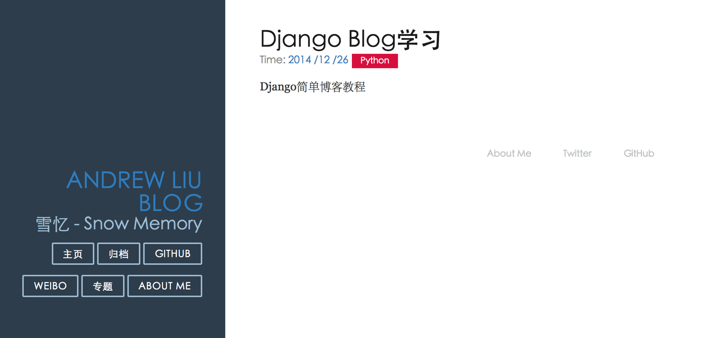

# 动态 URL

运行已经做好的博客框架, 会发现一个问题, 只有一个主页的空盒子, 而大部分时候我们希望能够让每篇博客文章都有一个独立的页面.

我第一个想到的方法是给每篇博客文章加一个 view 函数逻辑, 然后设置一个独立的 url(我不知道语言比如 PHP, 或者 web 框架 rail 等是如果解决的, 我是第一次仔细的学习 web 框架, 也没有前端开发经验), 但是这种方法耦合性太强, 而且用户不友好, 缺点非常多

> Django 给我们提供了一个方便的解决方法, 就是`动态 URL`

现在修改 my_blog/article/views.py 代码:

```py
# -*- coding: utf-8 -*-
from django.shortcuts import render
from django.http import HttpResponse
from article.models import Article
from datetime import datetime
from django.http import Http404

# Create your views here.
def home(request):
    post_list = Article.objects.all()  #获取全部的 Article 对象
    return render(request, 'home.html', {'post_list' : post_list})

def detail(request, id):
    try:
        post = Article.objects.get(id=str(id))
    except Article.DoesNotExist:
        raise Http404
    return render(request, 'post.html', {'post' : post}) 
```

因为 id 是每个博文的唯一标识, 所以这里使用 id 对数据库中的博文进行查找

在 my_blog/my_blog/urls.py 中修改 url 设置:

```py
from django.conf.urls import patterns, include, url
from django.contrib import admin

urlpatterns = patterns('',
    # Examples:
    # url(r'^$', 'my_blog.views.home', name='home'),
    # url(r'^blog/', include('blog.urls')),

    url(r'^admin/', include(admin.site.urls)),
    url(r'^$', 'article.views.home', name = 'home'),
    url(r'^(?P<id>\d+)/$', 'article.views.detail', name='detail'),
) 
```

然后在 templates 下建立一个用于显示单页博文的界面:

```py
#post.html



<div class="posts">
        <section class="post">
            <header class="post-header">
                <h2 class="post-title">{{ post.title }}</h2>

                    <p class="post-meta">
                        Time:  <a class="post-author" href="#">{{ post.date_time|date:"Y /m /d"}}</a> <a class="post-category post-category-js" href="#">{{ post.category }}</a>
                    </p>
            </header>

                <div class="post-description">
                    <p>
                        {{ post.content }}
                    </p>
                </div>
        </section>
</div><!-- /.blog-post -->
 
```

可以发现只需要对 home.html 进行简单的修改, 去掉循环就可以了.

修改 home.html 和 base.html, 加入动态链接和主页, 归档, 专题和 About Me 按钮

```py
<!--home.html-->



<div class="posts">
    
        <section class="post">
            <header class="post-header">
                <h2 class="post-title"><a href="">{{ post.title }}</a></h2>

                    <p class="post-meta">
                        Time:  <a class="post-author" href="#">{{ post.date_time |date:"Y /m /d"}}</a> <a class="post-category post-category-js" href="#">{{ post.category }}</a>
                    </p>
            </header>

                <div class="post-description">
                    <p>
                        {{ post.content }}
                    </p>
                </div>
                <a class="pure-button" href="">Read More >>> </a>
        </section>
    
</div><!-- /.blog-post -->
 
```

```py
<!--base.html-->
<!doctype html>
<html lang="en">
<head>
    <meta charset="utf-8">
<meta name="viewport" content="width=device-width, initial-scale=1.0">
<meta name="description" content="A layout example that shows off a blog page with a list of posts.">

    <title>Andrew Liu Blog</title>
    <link rel="stylesheet" href="http://yui.yahooapis.com/pure/0.5.0/pure-min.css">
    <link rel="stylesheet" href="http://yui.yahooapis.com/pure/0.5.0/grids-responsive-min.css">
    <link rel="stylesheet" href="http://picturebag.qiniudn.com/blog.css">

</head>
<body>
<div id="layout" class="pure-g">
    <div class="sidebar pure-u-1 pure-u-md-1-4">
        <div class="header">
            <h1 class="brand-title"><a href="">Andrew Liu Blog</a></h1>
            <h2 class="brand-tagline">雪忆 - Snow Memory</h2>
            <nav class="nav">
                <ul class="nav-list">
                    <li class="nav-item">
                        <a class="button-success pure-button" href="/">主页</a>
                    </li>
                    <li class="nav-item">
                        <a class="button-success pure-button" href="/">归档</a>
                    </li>
                    <li class="nav-item">
                        <a class="pure-button" href="https://github.com/Andrew-liu/my_blog_tutorial">Github</a>
                    </li>
                    <li class="nav-item">
                        <a class="button-error pure-button" href="http://weibo.com/dinosaurliu">Weibo</a>
                    </li>
                    <li class="nav-item">
                        <a class="button-success pure-button" href="/">专题</a>
                    </li>
                    <li class="nav-item">
                        <a class="button-success pure-button" href="/">About Me</a>
                    </li>
                </ul>
            </nav>
        </div>
    </div>

    <div class="content pure-u-1 pure-u-md-3-4">
        <div>
            
            
            <div class="footer">
                <div class="pure-menu pure-menu-horizontal pure-menu-open">
                    <ul>
                        <li><a href="http://andrewliu.tk/about/">About Me</a></li>
                        <li><a href="http://twitter.com/yuilibrary/">Twitter</a></li>
                        <li><a href="http://github.com/yahoo/pure/">GitHub</a></li>
                    </ul>
                </div>
            </div>
        </div>
    </div>
</div>

</body>
</html> 
```

其中主要改动

```py
- 添加了几个导航按钮, 方便以后添加功能(暂时不添加登陆功能)
- 添加 read more 按钮
- 在博客文章的增加一个链接, 链接的 href 属性为``, 当点击这个文章题目时, 会将对应的数据库对象的 id 传入的 url 中, 类似于 url 传参, 不记得的同学可以重新回到前几页翻一下. 这里将数据库对象唯一的 id 传送给 url 设置, url 取出这个 id 给对应的 view 中的函数逻辑当做参数. 这样这个 id 就传入对应的参数中被使用 
```

> 比如: 点击到的博客文章标题的对象对应的`id=2`, 这个 id 被传送到`name=detail`的 url 中, `'^(?P<id>\d+)/$'`正则表达式匹配后取出 id, 然后将 id 传送到`article.views.detail`作为函数参数, 然后通过 get 方法获取对应的数据库对象, 然后对对应的模板进行渲染, 发送到浏览器中..

此时重新运行服务器, 然后在浏览器中输入[`127.0.0.1:8000/`](http://127.0.0.1:8000/)点击对应的博客文章题目, 可以成功的跳转到一个独立的页面中

