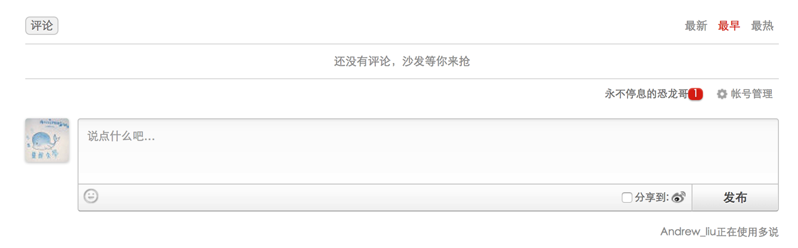
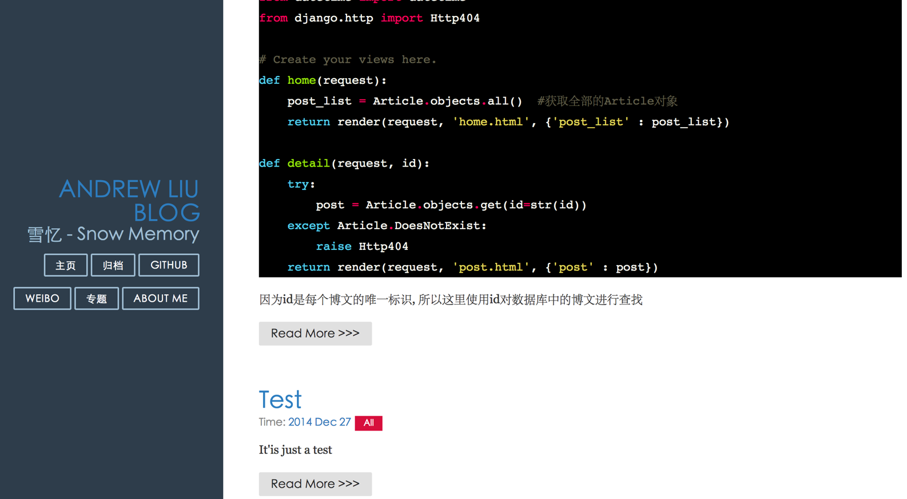

# 多说,markdown 和代码高亮

# 添加多说

在 Django1.5 版本前是有内置的评论系统的, 不过现在已经放弃使用了, 在国内比较常用的是`多说`, 在国外是`disqus`, 因为文章主要面对 国内用户, 所以采用[多说](http://duoshuo.com/)

在网站上注册账号或者直接用社交账号进行登录,并会生成一个`short_name`, 可以在个人界面中的工具中找到一段通用代码, 这段代码非常重要, 用于多说评论框的代码段:

> 请一定要把短名换成自己的多说短名, 非常感谢

```py
<!-- 多说评论框 start -->
    <div class="ds-thread" data-thread-key="请将此处替换成文章在你的站点中的 ID" data-title="请替换成文章的标题" data-url="请替换成文章的网址"></div>
<!-- 多说评论框 end -->
<!-- 多说公共 JS 代码 start (一个网页只需插入一次) -->
<script type="text/javascript">
var duoshuoQuery = {short_name:"请在此处替换成自己的短名"};
    (function() {
        var ds = document.createElement('script');
        ds.type = 'text/javascript';ds.async = true;
        ds.src = (document.location.protocol == 'https:' ? 'https:' : 'http:') + '//static.duoshuo.com/embed.js';
        ds.charset = 'UTF-8';
        (document.getElementsByTagName('head')[0] 
         || document.getElementsByTagName('body')[0]).appendChild(ds);
    })();
    </script>
<!-- 多说公共 JS 代码 end --> 
```

在 templates 中新建一个 duoshuo.html 并将代码放入其中, 并做一些修改

```py
<!-- 多说评论框 start -->
    <div class="ds-thread" data-thread-key="{{ post.id }}" data-title="{{ post.title }}" data-url="{{ post.get_absolute_url }}"></div>
<!-- 多说评论框 end -->
<!-- 多说公共 JS 代码 start (一个网页只需插入一次) -->
<script type="text/javascript"> var duoshuoQuery = {short_name:"andrewliu"};
    (function() {
        var ds = document.createElement('script');
        ds.type = 'text/javascript';ds.async = true;
        ds.src = (document.location.protocol == 'https:' ? 'https:' : 'http:') + '//static.duoshuo.com/embed.js';
        ds.charset = 'UTF-8';
        (document.getElementsByTagName('head')[0] 
         || document.getElementsByTagName('body')[0]).appendChild(ds);
    })(); </script>
<!-- 多说公共 JS 代码 end --> 
```

然后在 my_blog/article/models.py 中重写`get_absolute_url`方法

```py
from django.db import models
from django.core.urlresolvers import reverse

# Create your models here.
class Article(models.Model) :
    title = models.CharField(max_length = 100)  #博客题目
    category = models.CharField(max_length = 50, blank = True)  #博客标签
    date_time = models.DateTimeField(auto_now_add = True)  #博客日期
    content = models.TextField(blank = True, null = True)  #博客文章正文

 #获取 URL 并转换成 url 的表示格式
    def get_absolute_url(self):
        path = reverse('detail', kwargs={'id':self.id})
        return "http://127.0.0.1:8000%s" % path

    def __str__(self) :
        return self.title

    class Meta:
        ordering = ['-date_time'] 
```

然后修改`post.html`

```py




<div class="posts">
        <section class="post">
            <header class="post-header">
                <h2 class="post-title">{{ post.title }}</h2>

                    <p class="post-meta">
                        Time:  <a class="post-author" href="#">{{ post.date_time|date:"Y /m /d"}}</a> <a class="post-category post-category-js" href="">{{ post.category }}</a>
                    </p>
            </header>

                <div class="post-description">
                    <p>
                        {{ post.content|custom_markdown }}
                    </p>
                </div>
        </section>
        
</div><!-- /.blog-post -->
 
```

只需要将`duoshuo.html`加入到当前页面中, ``这句代码就是将 duoshuo.html 加入到当前的页面中

现在启动 web 服务器, 在浏览器中输入[`127.0.0.1:8000/`](http://127.0.0.1:8000/), 看看是不是每个博文页面下都有一个多说评论框了..



# markdown 你的博文

`markdown`越来越流行, 越来越多的写博客的博主都喜欢上了 makrdown 这种标记性语言的易用性和美观性. 像[简书](http://www.jianshu.com/), [作业部落](https://www.zybuluo.com/), [Mou](http://25.io/mou/)都是比较出名的 markdown 在线或者离线形式

现在我们就来 markdown 自己的博客吗, 首先是安装`markdown`库, 使用下面命令

```py
#首先是安装 markdown
$ pip install markdown  #记得激活虚拟环境 
```

现在说说怎么 markdown 你的博文, 在 article 下建立新文件夹`templatetags`,然后我们来定义的自己的 template filter, 然后在 templatetags 中建立`__init__.py`, 让文件夹可以被看做一个包, 然后在文件夹中新建`custom_markdown.py`文件, 添加代码

```py
import markdown

from django import template
from django.template.defaultfilters import stringfilter
from django.utils.encoding import force_text
from django.utils.safestring import mark_safe

register = template.Library()  #自定义 filter 时必须加上

@register.filter(is_safe=True)  #注册 template filter
@stringfilter  #希望字符串作为参数
def custom_markdown(value):
    return mark_safe(markdown.markdown(value,
        extensions = ['markdown.extensions.fenced_code', 'markdown.extensions.codehilite'],
                                       safe_mode=True,
                                       enable_attributes=False)) 
```

然后只需要对需要进行 markdown 化的地方进行简单的修改,

```py




<div class="posts">
        <section class="post">
            <header class="post-header">
                <h2 class="post-title">{{ post.title }}</h2>

                    <p class="post-meta">
                        Time:  <a class="post-author" href="#">{{ post.date_time|date:"Y /m /d"}}</a> <a class="post-category post-category-js" href="">{{ post.category }}</a>
                    </p>
            </header>

                <div class="post-description">
                    <p>
                        {{ post.content|custom_markdown }}
                    </p>
                </div>
        </section>
        
</div><!-- /.blog-post -->
 
```

``添加自定义的 filter, 然后使用 filter 的方式为`{{ post.content|custom_markdown }}`, 只需要对需要使用 markdown 格式的文本添加管道然后再添加一个自定义 filter 就好了.

现在启动 web 服务器, 在浏览器中输入[`127.0.0.1:8000/`](http://127.0.0.1:8000/), 可以看到全新的的 markdown 效果

# 代码高亮

这里代码高亮使用一个 CSS 文件导入到网页中就可以实现了, 因为在上面写`markdown`的 filter 中已经添加了扩展高亮的功能, 所以现在只要下载 CSS 文件就好了.

在[pygments](http://pygments.org/demo/440022/?style=paraiso-light_)找到你想要的代码主题, 我比较喜欢`monokai`, 然后在[pygments-css](https://github.com/richleland/pygments-css)下载你喜欢的 CSS 主题, 然后加入当博客目录的 static 目录下, 或者最简单的直接上传七牛进行 CDN 加速

修改`base.html`的头部

```py
<!doctype html>
<html lang="en">
<head>
    <meta charset="utf-8">
<meta name="viewport" content="width=device-width, initial-scale=1.0">
<meta name="description" content="A layout example that shows off a blog page with a list of posts.">

    <title> Andrew Liu Blog </title>
    <link rel="stylesheet" href="http://yui.yahooapis.com/pure/0.5.0/pure-min.css">
    <link rel="stylesheet" href="http://yui.yahooapis.com/pure/0.5.0/grids-responsive-min.css">
    <link rel="stylesheet" href="http://picturebag.qiniudn.com/blog.css">
    <link rel="stylesheet" href="http://picturebag.qiniudn.com/monokai.css">
</head> 
```

`<link rel="stylesheet" href="http://picturebag.qiniudn.com/monokai.css">`添加 CSS 样式到 base.html 就可以了.

现在启动 web 服务器, 添加一个带有 markdown 样式的代码的文章, 就能看到效果了, 在浏览器中输入[`127.0.0.1:8000/`](http://127.0.0.1:8000/)

