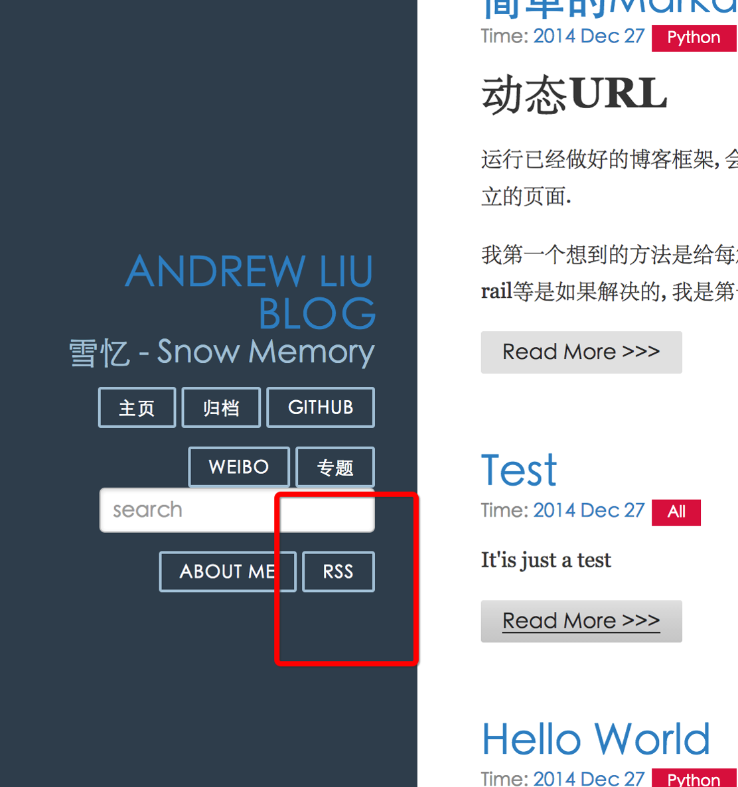
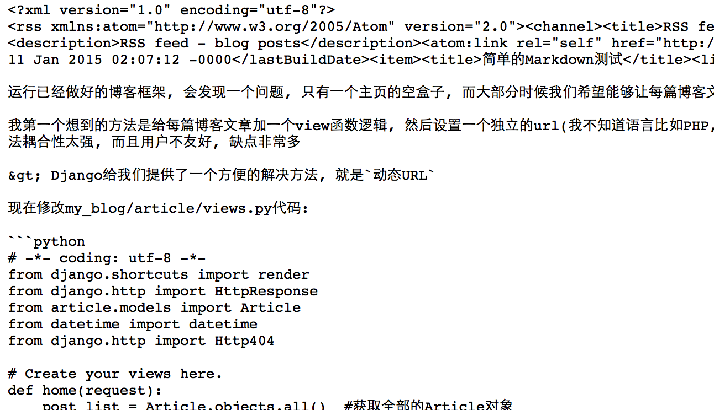

# RSS 和分页

# RSS 功能

Django 是一个全面型框架, 很多功能都可以直接找到, 对于 RSS 功能, 可以从其中的高层框架的`聚合 Feed 框架`中找到([The syndication feed framework](https://docs.djangoproject.com/en/1.7/ref/contrib/syndication/))

上层 Feed 生成框架可以直接应用`Feed 类`, 我们可以直接继承 Feed 在其中定义自己的方法

在 my_blog/article/views.py 中定义类

```py
from django.contrib.syndication.views import Feed  #注意加入 import 语句

class RSSFeed(Feed) :
    title = "RSS feed - article"
    link = "feeds/posts/"
    description = "RSS feed - blog posts"

    def items(self):
        return Article.objects.order_by('-date_time')

    def item_title(self, item):
        return item.title

    def item_pubdate(self, item):
        return item.add_date

    def item_description(self, item):
        return item.content 
```

然后在 my_blog/my_blog/urls.py 中设置对应的 url

```py
from django.conf.urls import patterns, include, url
from django.contrib import admin
from article.views import RSSFeed

urlpatterns = patterns('',
    # Examples:
    # url(r'^$', 'my_blog.views.home', name='home'),
    # url(r'^blog/', include('blog.urls')),

    url(r'^admin/', include(admin.site.urls)),
    url(r'^$', 'article.views.home', name = 'home'),
    url(r'^(?P<id>\d+)/$', 'article.views.detail', name='detail'),
    url(r'^archives/$', 'article.views.archives', name = 'archives'),
    url(r'^aboutme/$', 'article.views.about_me', name = 'about_me'),
    url(r'^tag(?P<tag>\w+)/$', 'article.views.search_tag', name = 'search_tag'),
    url(r'^search/$','article.views.blog_search', name = 'search'),
    url(r'^feed/$', RSSFeed(), name = "RSS"),  #新添加的 urlconf, 并将 name 设置为 RSS, 方便在模板中使用 url
) 
```

下面修改 my_blog/templates/base.html, 在其中添加 RSS 按钮

```py
<!doctype html>
<html lang="en">
<head>
    <meta charset="utf-8">
<meta name="viewport" content="width=device-width, initial-scale=1.0">
<meta name="description" content="A layout example that shows off a blog page with a list of posts.">

    <title> Andrew Liu Blog </title>
    <link rel="stylesheet" href="http://yui.yahooapis.com/pure/0.5.0/pure-min.css">
    <link rel="stylesheet" href="http://yui.yahooapis.com/pure/0.5.0/grids-responsive-min.css">
    <link rel="stylesheet" href="http://picturebag.qiniudn.com/blog.css">
    <link rel="stylesheet" href="http://picturebag.qiniudn.com/monokai.css">
</head>
<body>
<div id="layout" class="pure-g">
    <div class="sidebar pure-u-1 pure-u-md-1-4">
        <div class="header">
            <h1 class="brand-title"><a href="">Andrew Liu Blog</a></h1>
            <h2 class="brand-tagline">雪忆 - Snow Memory</h2>
            <nav class="nav">
                <ul class="nav-list">
                    <li class="nav-item">
                        <a class="button-success pure-button" href="/">主页</a>
                    </li>
                    <li class="nav-item">
                        <a class="button-success pure-button" href="">归档</a>
                    </li>
                    <li class="nav-item">
                        <a class="pure-button" href="https://github.com/Andrew-liu/my_blog_tutorial">Github</a>
                    </li>
                    <li class="nav-item">
                        <a class="button-error pure-button" href="http://weibo.com/dinosaurliu">Weibo</a>
                    </li>
                    <li class="nav-item">
                        <a class="button-success pure-button" href="/">专题</a>
                    </li>
                    <li>
                    <form class="pure-form" action="/search/" method="get">
                    <input class="pure-input-3-3" type="text" name="s" placeholder="search">
                    </form>
                    </li>
                    <li class="nav-item">
                        <a class="button-success pure-button" href="">About Me</a>
                    </li>
                    <li class="nav-item">
                        <a class="button-success pure-button" href="">RSS</a>  
                    </li>
                </ul>
            </nav>
        </div>
    </div>

    <div class="content pure-u-1 pure-u-md-3-4">
        <div>
            
            
            <div class="footer">
                <div class="pure-menu pure-menu-horizontal pure-menu-open">
                    <ul>
                        <li><a href="http://andrewliu.tk/about/">About Me</a></li>
                        <li><a href="http://twitter.com/yuilibrary/">Twitter</a></li>
                        <li><a href="http://github.com/yahoo/pure/">GitHub</a></li>
                    </ul>
                </div>
            </div>
        </div>
    </div>
</div>

</body>
</html> 
```

保存后, 在浏览器中输入[`127.0.0.1:8000/`](http://127.0.0.1:8000/)可以看到新增的 RSS 按钮, 点击看以看到对应的效果





更多功能可以查看[The syndication feed framework](https://docs.djangoproject.com/en/1.7/ref/contrib/syndication/)官方文档

# 分页功能

当博客文章较多的时候, 我们并不希望以此在主页上显示全部的博客文章, 而是希望能够每页显示固定的文章数目, 这样既能提高性能, 也能提高美观度, 何乐而不为呢?

> 现在这一章节来看看怎么实现分页功能

*   首先添加包
*   重写 home 方法
*   修改模板

修改 my_blog/my_blog/views.py 中的 home 函数

```py
from django.core.paginator import Paginator, EmptyPage, PageNotAnInteger  #添加包

def home(request):
    posts = Article.objects.all()  #获取全部的 Article 对象
    paginator = Paginator(posts, 2) #每页显示两个
    page = request.GET.get('page')
    try :
        post_list = paginator.page(page)
    except PageNotAnInteger :
        post_list = paginator.page(1)
    except EmptyPage :
        post_list = paginator.paginator(paginator.num_pages)
    return render(request, 'home.html', {'post_list' : post_list}) 
```

修改 my_blog/templates 下的`home.html`

```py




<div class="posts">
    
        <section class="post">
            <header class="post-header">
                <h2 class="post-title"><a href="">{{ post.title }}</a></h2>

                    <p class="post-meta">
                        Time:  <a class="post-author" href="#">{{ post.date_time |date:"Y M d"}}</a> <a class="post-category post-category-js" href="">{{ post.category|title }}</a>
                    </p>
            </header>

                <div class="post-description">
                    <p>
                        {{ post.content|custom_markdown|truncatewords:10 }}
                    </p>
                </div>
                <a class="pure-button" href="">Read More >>> </a>
        </section>
    

    
      <div>
      <ul class="pager">
      
        <li><a href="?page={{ post_list.previous_page_number }}">上一页</a></li>
      

      
        <li><a href="?page={{ post_list.next_page_number }}">下一页</a></li>
      
      </ul>
      </div>
    
</div><!-- /.blog-post -->
 
```

我设置的是每页显示两篇博文, 可以修改成其他数值

更多细节可以查看[pagination](https://docs.djangoproject.com/en/1.7/topics/pagination/)官方文档

保存后, 在浏览器中输入[`127.0.0.1:8000/`](http://127.0.0.1:8000/)可以看到新增的下一页按钮(博客文章要多加几篇), 点击看以看到对应的效果

> 到目前为止, 博客的基本功能都实现了, 下一篇我们将讲到怎么在云端进行部署

最后我们把整个 blog 更新到 github 仓库中

```py
 $  git add .  #添加全部更新到暂存区
$  git commit -m "rss and paginator"  #提交到 git
[master b53356b] rss and paginator
 2 files changed, 24 insertions(+), 1 deletion(-)
$  git push  #提交到 github 中 
```