# 提前访问

# 代码整洁之道

消除复杂性、简化生活的最佳实践

克里斯蒂安·梅耶


# NO STARCH PRESS
提前访问计划：
欢迎反馈！

欢迎阅读克里斯蒂安·梅耶尚未出版的《代码整洁之道》的提前访问版！作为一本预出版书，本书可能不完整，部分章节可能未经校对。
我们的目标始终是制作尽可能好的书籍，我们期待听到您的想法。如果您有任何意见或问题，请通过 earlyaccess@nostarch.com 发送邮件给我们。如果您有具体的反馈，请在邮件中注明页码、书名和版本日期，我们一定会认真审阅。感谢您的帮助和支持！
当新章节可用时，我们会通过邮件通知您。在此期间，请尽情享受阅读！

# 代码整洁之道

## 克里斯蒂安·梅耶

提前访问版，2022年2月23日

版权所有 © 2022 克里斯蒂安·梅耶。

ISBN 13: 978-1-7185-0218-5（印刷版）
ISBN 13: 978-1-7185-0219-2（电子书）

出版人：威廉·波洛克
执行编辑：芭芭拉·严
制作编辑：卡特里娜·泰勒
开发编辑：利兹·查德威克
封面与内页设计：章鱼工作室
封面插画师：吉娜·雷德曼
技术审阅：诺亚·斯潘
文字编辑：萨迪·巴里
排版：杰夫·莱特尔，Happenstance Type-O-Rama
校对：保拉·弗莱明
索引：BIM Creatives, Inc

No Starch Press 和 No Starch Press 标志是 No Starch Press, Inc. 的注册商标。本书中提及的其他产品和公司名称可能是其各自所有者的商标。我们并非每次使用商标名称时都附带商标符号，而是仅以编辑方式使用这些名称，旨在为商标所有者带来利益，并无侵犯商标的意图。

保留所有权利。未经版权所有者和出版商事先书面许可，不得以任何形式或任何方式（电子或机械，包括影印、录制或任何信息存储或检索系统）复制或传播本作品的任何部分。

本书中的信息按“原样”基础分发，不作任何保证。虽然在准备本作品时已采取一切预防措施，但作者和 No Starch Press, Inc. 均不对任何个人或实体因其中包含的信息直接或间接造成的任何损失或损害承担责任。

# 目录

- 引言
- 代码整洁之道

献给我的孩子们，阿玛莉和加布里埃尔

## 关于作者

克里斯蒂安·梅耶是热门Python网站Finxter.com的创始人，该教育平台每年帮助超过五百万人学习编程。他拥有计算机科学博士学位，并出版了多本书籍，包括《*Python一行代码*》（No Starch Press，2020年）、《*用Python告别内卷*》（2021年）以及《*咖啡时间学Python*》系列。

## 关于技术审校

诺亚·斯潘在软件工程领域拥有多元化背景。他拥有加州州立大学富勒顿分校的软件工程硕士学位，目前在加州大学圣巴巴拉分校（UCSB）的计算机安全组工作。诺亚曾在UCSB跨学科协作实验室教授Python课程，并在西蒙特学院开设了编程语言概念的高年级课程。诺亚乐于教导任何有兴趣学习的人。

## 致谢

编写一本编程书籍是建立在众多人士的想法和贡献之上的。与其试图一一列举，我想遵循我自己的建议：*少即是多*。

首先，我要感谢你。我写这本书是为了帮助你提高编程技能，解决现实世界中的实际问题。感谢你将宝贵的时间托付给我，我深表感激。我写这本书的主要目标是通过分享技巧和策略，为你节省时间，减轻整个编程生涯中的压力，让这本书物有所值。

我最大的动力源泉来自Finxter社区的活跃成员。每天，我都会收到Finxter学员的鼓励信息，激励我持续创作内容。当你阅读这本书时，我想衷心欢迎你加入Finxter社区。¹ 很高兴你能来到这里！

我由衷感谢No Starch Press团队，他们让书籍编写过程成为一次富有启发性的经历。我要感谢我的编辑莉兹·查德威克；正是因为她出色的领导，这本书才达到了我自己无法企及的清晰度。我的技术审校诺亚·斯潘运用他精湛的技术能力来“调试我的文字”。特别感谢No Starch Press的创始人比尔·波洛克，允许我以微薄之力——继《*Python一行代码*》和《*Python Dash*》之后又一本书——为他教育和娱乐程序员的使命做出贡献。比尔是编程行业中一位鼓舞人心且备受追捧的领导者，但他仍然抽出时间做些小事，比如在假期、周末和晚上回复我的信息和问题！

我永远感激我美丽而支持我的妻子安娜；我可爱的女儿阿玛莉，她充满了奇妙的故事和想法；以及我好奇的儿子加布里埃尔，他总能让周围的每个人都更快乐。

那么，让我们开始吧，好吗？

¹ 你可以在这里加入我们的免费Python邮件学院：https://blog.finxter.com/subscribe/。我们有速查表！

## 引言


从前，比尔·盖茨的父母邀请传奇投资者沃伦·巴菲特到家中做客。在一次CNBC采访中，沃伦·巴菲特回忆说，当时比尔的父亲让沃伦和比尔写下他们成功的秘诀。我稍后会告诉你他们写了什么。

当时，科技奇才比尔·盖茨只见过著名投资者巴菲特一两次，但他们很快成为了朋友，两人都领导着价值数十亿美元的成功公司。年轻的比尔·盖茨正通过他快速发展的软件巨头微软，接近实现他“让每张桌子上都有一台电脑”的使命。沃伦·巴菲特则被誉为世界上最成功的商业天才之一。众所周知，沃伦将他控股的公司*伯克希尔·哈撒韦*，从一家濒临破产的纺织公司，发展成为在保险、运输和能源等多元化业务领域具有国际影响力的巨头。

《代码整洁的艺术》（早期访问版）© 2022 克里斯蒂安·梅耶

那么，这两位不相上下的商业传奇人物认为他们成功的秘诀是什么呢？据说，比尔和沃伦在没有任何商量的情况下，写下了同一个词：*专注*。

> 你可以在YouTube上观看沃伦·巴菲特在CNBC采访中讨论这次互动的片段，标题为“一个词解释了比尔·盖茨和我的成功：专注”——沃伦·巴菲特。

虽然这个“成功秘诀”听起来很简单，但你可能会想：它也适用于我作为程序员的职业生涯吗？专注在实践中是什么样子——是喝着能量饮料、吃着披萨通宵编码，还是吃全蛋白质饮食、日出即起？过一种专注的生活有哪些不那么明显的后果？而且，重要的是，有没有可操作的建议，让我这样的程序员能从这个抽象原则中受益，从而提高生产力？

本书旨在回答这些问题，帮助你作为程序员过上更专注的生活，并在日常工作中变得更有效率。我将向你展示如何通过编写简洁、清晰、专注的代码来提高生产力，这种代码更易于阅读、编写以及与其他程序员协作。正如我将在后续章节中展示的，专注原则在软件开发的每个阶段都适用；你将学习如何编写整洁的代码，创建*只做好一件事*的专注函数，创建快速响应的应用程序，为可用性和美观性设计专注的用户界面，以及使用最小可行产品来规划产品路线图。我甚至会向你展示，达到纯粹的专注状态如何能极大地提高你的专注力，并帮助你在任务中体验到更多的兴奋和乐趣。正如你将看到的，本书的总体主题是尽可能地在各个方面保持专注——我将在接下来的章节中确切地告诉你如何做到这一点。

对于任何认真的程序员来说，不断提高专注力和生产力至关重要。当你完成更有价值的工作时，你往往会从社会获得更高的回报。然而，仅仅增加产出并不是解决方案。陷阱是这样的：*如果我写更多代码，创建更多测试，读更多书，学更多东西，思考更多，沟通更多，认识更多人，我就能完成更多事情*。但你不能在不减少某些事情的情况下做*更多*。时间是有限的——你和我以及其他人一样，每天只有24小时，每周只有7天。存在一个不可避免的数学限制：在有限的空间里，如果一件事增长，另一件事就必须收缩以腾出空间。如果你读更多书，你可能认识的人就更少。如果你认识更多人，你可能写的代码就更少。如果你写更多代码，你可能陪伴所爱之人的时间就更少。你无法逃避这个基本的权衡：在有限的空间里，没有*减少*就不可能有*更多*。

本书不关注简单地做更多事情的明显后果，而是采取相反的视角：你减少复杂性，从而能够工作更少，同时从结果中获得更多价值。深思熟虑的极简主义是个人生产力的圣杯，正如你将在后面的章节中看到的，它是有效的。通过正确地编程计算机并运用本书中提出的永恒原则，你可以用更少的资源创造更多价值。

通过创造更多价值，你也可以要求更高的报酬。比尔·盖茨有句名言：“*一个优秀的车床操作员的工资是普通车床操作员的数倍，但一个优秀的软件代码编写者的价值是普通软件编写者的一万倍。*”

原因之一是，优秀的软件开发人员执行的是高度杠杆化的活动：正确地编程计算机可以替代成千上万的工作岗位和数百万小时的有偿工作。例如，运行自动驾驶汽车的代码可以替代数百万名人类司机的劳动，同时成本更低、更可靠，并且（可以说）安全得多。

### 这本书适合谁？

你是否是一位编程实践者，希望用更快的代码和更少的痛苦创造更多价值？你是否曾陷入寻找错误的模式？代码的复杂性是否常常让你不堪重负？你是否在决定下一步学习什么时感到挣扎，不得不从数百种编程语言——Python、Java、C++、HTML、CSS、JavaScript——和数千种框架与技术——Android应用、Bootstrap、TensorFlow、NumPy——中做出选择？如果你对以上任何一个问题的回答是“是！”（甚至是“是的”），那么你手中拿的就是正确的书！

本书面向每一位有兴趣提高生产力的程序员——用更少的资源做更多的事。如果你追求简单并相信奥卡姆剃刀原则：“*用更多东西去做能用更少东西完成的事情是徒劳的*”，那么这本书就是为你准备的。

### 你将学到什么？

本书向你展示如何实际应用九项原则，将你的程序员潜力提升数个数量级。这些原则将简化你的生活，减少复杂性、挣扎和工作时间。我并不声称这些原则是新的。它们广为人知且已确立——并被最成功的程序员、工程师、哲学家和创造者证明是有效的。这正是它们成为原则的原因！然而，在本书中，我将明确地将这些原则应用于程序员，提供现实世界的例子，并在可能的情况下提供代码示例。

**第1章**将阐述提高生产力价值的主要挑战：复杂性。你将学会识别生活和代码中复杂性的来源，并理解复杂性会损害你的生产力和产出。复杂性无处不在，你需要时刻警惕它。*保持简单！*

在**第2章**中，你将了解*80/20原则*对你作为程序员的生活可能产生的深远影响。大部分结果（80%）来自少数原因（20%）；这是编程中一个普遍的主题。你将了解到80/20原则是分形的：20%的程序员中的20%将获得80%的80%的收入。换句话说，全球4%的程序员赚取了64%的收入。对持续杠杆和优化的追求永无止境！

在**第3章**，你将学习*构建最小可行产品*，以便尽早验证假设、减少浪费，并加快*构建、衡量、学习*循环的速度。核心思想是通过早期反馈来明确应集中精力和关注的方向。

在**第4章**，你将了解*编写简洁清晰代码*的益处。与大多数人的直觉相反，代码首先应为最大化可读性而编写，而非最小化中央处理器（CPU）周期的使用。程序员的集体时间和精力远比CPU周期更稀缺，而编写难以理解的代码会降低组织效率，削弱我们集体的人类智慧。

在**第5章**，你将学习性能优化的概念基础以及过早优化的陷阱。计算机科学之父之一唐纳德·克努特曾说过：“*过早优化是万恶之源！*”当你确实需要优化代码时，请运用80/20法则：优化那20%运行时间占80%的函数。消除瓶颈，忽略其余部分，重复此过程。

在**第6章**，你将随我一同探索米哈里·契克森米哈赖（字面意思）令人兴奋的*心流*世界。心流状态是一种纯粹专注的状态，能成倍提升生产力，并有助于围绕深度工作建立文化——借用计算机科学教授卡尔·纽波特的话，他将在本章提供一些思路。

在**第7章**，你将学习Unix哲学：*专注做好一件事*。Unix开发者没有选择构建一个庞大（且可能更高效）的内核来提供海量功能，而是实现了一个小型内核配合众多可选辅助函数。这帮助Unix生态系统在保持简洁和（相对）简单的同时实现扩展。我们将探讨如何将这些原则应用于你自己的工作。

在**第8章**，你将进入计算机科学中另一个受益于极简思维的重要领域：设计与用户体验（UX）。想想雅虎搜索与谷歌搜索、黑莓与iPhone、OkCupid与Tinder之间的差异。最成功的技术往往采用极其简洁的用户界面，因为在设计中，*少即是多*。

在**第9章**，你将重新审视*专注*的力量，并学习如何将其应用于不同领域，从而大幅提升你（和你的程序）的产出！

最后，我们将总结全文，为你提供可操作的下一步建议，并让你带着一套可靠的工具进入复杂世界，以简化这个世界。

### 复杂性如何损害你的生产力

本章我们将全面探讨复杂性这一重要且尚未被充分研究的话题。究竟什么是*复杂性*？它出现在何处？如何损害你的生产力？复杂性是精益高效组织和个人的敌人，因此值得深入审视我们发现复杂性的所有领域及其表现形式。本章聚焦于问题——复杂性，后续章节将探讨通过重新分配复杂性所占用的资源来有效应对其的方法。

让我们先快速概览复杂性可能让新手程序员望而生畏的几个方面：

- 选择编程语言
- 从数千个开源项目和无数问题中选择编码项目
- 决定使用哪些库（scikit-learn、NumPy还是TensorFlow）
- 决定投资时间学习哪些新兴技术——Alexa应用、智能手机应用、基于浏览器的Web应用、集成Facebook或微信的应用、虚拟现实应用
- 选择编码编辑器，如PyCharm、集成开发与学习环境（IDLE）和Atom

鉴于这些复杂性来源造成的巨大困惑，“*我该如何开始？*”成为编程初学者最常见的问题之一也就不足为奇了。

最佳的起步方式*不是*选择一本编程书并通读所有语法特性。许多雄心勃勃的学生购买编程书作为激励，然后将学习任务加入待办事项列表——既然花了钱买书，最好读完，否则投资就浪费了。但就像待办事项列表上的许多其他任务一样，*阅读编程书*很少能完成。

最佳的起步方式是选择一个实际的编码项目——如果是初学者就选简单的——并坚持完成它。在完成一个完整项目之前，不要阅读编码书籍或网络上的随机教程。不要无休止地浏览StackOverflow上的内容。只需搭建项目，用你现有的有限技能和常识开始编码。我的一位学生想创建一个金融仪表板应用，用于检查不同资产配置的历史回报率，以回答诸如“由50%股票和50%政府债券组成的投资组合，历史最大回撤年份是哪一年？”之类的问题。起初她不知如何着手，但很快发现了一个名为*Python Dash*的框架，专门用于构建数据驱动的Web应用。她学习了如何搭建服务器，并只研究了推进项目所需的超文本标记语言（HTML）和层叠样式表（CSS）。现在她的应用已上线，帮助了数千人找到合适的资产配置。但更重要的是，她加入了创建Python Dash的开发团队，甚至正在与No Starch Press合作撰写相关书籍。她在一年内完成了这一切——你也可以做到。即使不理解自己在做什么也没关系；你会逐渐加深理解。阅读文章只为推进眼前的项目。完成第一个项目的过程会引入许多高度相关的问题，包括：

- 应该使用哪个代码编辑器？
- 如何安装项目的编程语言？
- 如何从文件读取输入？
- 如何在程序中存储输入以供后续使用？
- 如何处理输入以获得所需输出？

通过回答这些问题，你将逐步构建全面的技能集。随着时间的推移，你将能更好、更轻松地回答这些问题。你将能解决更大的问题，并建立起编程模式和概念洞察的内部数据库。即使是高级程序员也通过同样的过程学习和提升——只是编码项目变得更大、更复杂。

采用这种基于项目的学习方法，你可能会发现自己在以下领域与复杂性作斗争：在不断增长的代码库中查找错误、理解代码组件及其交互方式、选择下一个要实现的功能，以及理解代码的数学和概念基础。

复杂性无处不在，存在于项目的每个阶段。这种复杂性的隐藏成本往往是：新手程序员半途而废，项目永远无法面世。那么问题来了：如何解决复杂性问题？

答案很简单：*简单性*。在编码周期的每个阶段都追求简单和专注。如果从本书中只记住一点，那就是：在编程中遇到的每个领域都采取彻底的极简主义立场。全书将讨论以下所有方法：

- 精简你的日常，减少任务数量，将精力集中在重要任务上。例如，不要同时启动十个新的有趣编码项目，而是精心选择一个，并集中所有精力完成它。在第2章，你将更详细地了解编程中的80/20法则。
- 对于一个软件项目，剥离所有不必要的功能，专注于最小可行产品（见第3章），发布它，并快速有效地验证你的假设。
- 在任何可能的地方编写简单简洁的代码。在第4章，你将学到许多实现这一点的实用技巧。
- 减少在过早优化上花费的时间和精力——在不必要的情况下优化代码是导致不必要复杂性的主要原因之一（见第5章）。
- 通过为编程预留大块时间来减少切换时间，以达到*心流*状态——这是心理学研究中的一个术语，描述一种专注的心理状态，能提升你的注意力、专注度和生产力。第6章将专门探讨如何达到心流状态。
- 应用Unix哲学，使代码功能只专注于一个目标（“专注做好一件事”）。第7章将通过Python代码示例详细介绍Unix哲学。
- 在设计中应用简单性，创建美观、简洁、专注的用户界面，使其易于使用且直观（见第8章）。
- 在规划职业生涯、下一个项目、日常安排或专业领域时应用专注技巧（见第9章）。

让我们深入探讨复杂性的概念，以理解这个编程生产力大敌之一。

#### 什么是复杂性？

在不同领域，“复杂性”一词有着不同的含义。有时，它被严格定义，例如计算机程序的*计算复杂性*，它提供了一种分析给定代码函数在不同输入下表现的方法。其他时候，它被宽泛地定义为系统组件之间交互的数量或结构。在本书中，我们将更通用地使用这个概念。

我们将复杂性定义如下：

**复杂性** “一个由多个部分组成的整体，难以分析、理解或解释”

复杂性描述的是一个完整的系统或实体。由于解释这个系统的困难，复杂性会导致挣扎和困惑。由于现实世界系统是混乱的，你会发现复杂性无处不在：股票市场、社会趋势、新兴的政治观点，以及拥有数十万行代码的大型计算机程序——比如 Windows 操作系统。

如果你是一名程序员，你尤其容易受到压倒性复杂性的影响，例如来自我们将在本章中涵盖的这些不同来源：

- 项目生命周期中的复杂性
- 软件和算法理论中的复杂性
- 学习中的复杂性
- 流程中的复杂性
- 社交网络中的复杂性
- 日常生活中的复杂性

#### 项目生命周期中的复杂性

让我们深入探讨项目生命周期的不同阶段：规划、定义、设计、构建、测试和部署（见图 1-1）。

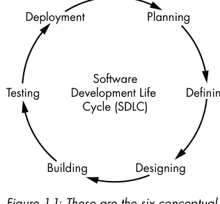

> 图 1-1：这是基于电气与电子工程师协会（IEEE）官方软件工程标准的软件项目的六个概念阶段。

即使你正在处理一个非常小的软件项目，你也可能会经历软件开发生命周期的所有六个阶段。请注意，你不一定只经历每个阶段一次——在现代软件开发中，通常更倾向于采用迭代方法，即多次回顾每个阶段。接下来，我们将看看复杂性如何对每个阶段产生重大影响。

##### 规划

软件开发生命周期的第一个阶段是规划阶段，在工程文献中有时也称为*需求分析*。这个阶段的目的是确定产品将是什么样子。成功的规划阶段会带来一套严格定义的、需要交付给最终用户的功能特性。

无论你是一个人从事你的业余项目，还是负责管理和协调多个软件开发团队之间的协作，你都必须找出软件的最佳功能集。必须考虑许多因素：构建某个功能的成本、无法成功实现该功能的风险、对最终用户的预期价值、市场营销和销售影响、可维护性、可扩展性、法律限制等等。

这个阶段至关重要，因为它可以让你避免在后期浪费大量精力。规划错误可能导致价值数百万美元的资源浪费。另一方面，仔细的规划可以为业务在未来几年取得巨大成功奠定基础。规划阶段是应用你新获得的 80/20 思维技巧的时候（参见[第 2 章](#)）。

规划阶段也很难做好，因为涉及的复杂性。几个因素增加了复杂性：提前正确评估风险、确定公司或组织的战略方向、猜测客户的反应、权衡不同候选功能的积极影响，以及确定给定软件功能的法律含义。总的来说，解决这个多维问题的纯粹复杂性正在压垮我们。

##### 定义

定义阶段包括将规划阶段的结果转化为适当指定的软件需求。换句话说，它将前一阶段的输出形式化，以获得客户和最终用户的批准或反馈，他们将在以后使用该产品。

如果你花了很多时间来规划和确定项目需求，但未能很好地传达它们，这将在以后造成重大问题和困难。一个错误指定的、可能有助于项目的需求，可能和一个正确制定但无助于项目的需求一样糟糕。有效的沟通和精确的规范对于避免歧义和误解至关重要。在所有人类沟通中，由于“知识的诅咒”和其他高估个人经验相关性的心理偏见，将你的信息传达出去是一项高度复杂的任务。如果你试图将想法（或需求）从你的头脑中传递到另一个人的头脑中，请小心：复杂性正等着对付你！

##### 设计

设计阶段的目标是起草系统架构，决定交付已定义功能的模块和组件，并设计用户界面——同时牢记前两个阶段制定的需求。设计阶段的黄金标准是创建一个关于最终软件产品外观和构建方式的清晰图景。这适用于所有软件工程方法。敏捷方法只是更快地迭代这些阶段。

但魔鬼在于细节！一个优秀的系统设计师必须了解他们可能用来构建系统的各种软件工具的优缺点。例如，某些库可能对程序员来说易于使用，但执行速度较慢。构建自定义库对程序员来说更难，但可能导致更高的速度，从而提高最终软件产品的可用性。设计阶段必须确定这些变量，以使效益成本比最大化。

##### 构建

构建阶段是许多程序员希望投入所有时间的地方。这是从架构草案到软件产品的转变发生的地方。你的想法转化为有形的结果。

通过前几个阶段的适当准备，许多复杂性已经被消除了。理想情况下，构建者应该知道从所有可能的功能中实现哪些功能，这些功能是什么样子，以及使用哪些工具来实现它们。然而，构建阶段总是充满新的和不断出现的问题。意外情况，如外部库中的错误、性能问题、数据损坏和人为错误，都可能减慢进度。构建软件产品是一项高度复杂的工作。一个小小的拼写错误就可能决定整个软件产品的正确性和可行性。

##### 测试

恭喜，你已经实现了所有请求的功能，程序似乎可以运行了。不过，你还没有完成。你仍然必须针对不同的用户输入和使用模式测试你的软件产品的行为。这个阶段通常是所有阶段中最重要的——以至于许多从业者现在提倡使用*测试驱动开发*，即在编写所有测试之前甚至不开始实现（在构建阶段）。虽然你可以反对这种观点，但花时间通过创建测试用例并检查软件是否为这些测试用例提供正确结果来测试你的产品，通常是一个好主意。

例如，假设你正在实现一辆自动驾驶汽车。你必须编写*单元测试*来检查代码中的每个小函数（一个*单元*）是否为给定的输入生成了所需的输出。单元测试通常会发现一些在某些（极端）输入下行为异常的有缺陷的函数。例如，考虑以下计算图像平均红、绿、蓝（RGB）颜色值的 Python 函数存根，可能用于区分你是穿过城市还是森林：

```python
def average_rgb(pixels):
    r = [x[0] for x in pixels]
    g = [x[1] for x in pixels]
    b = [x[2] for x in pixels]
    n = len(r)
    return (sum(r)/n, sum(g)/n, sum(b)/n)
```

例如，以下像素列表将分别创建平均红、绿、蓝值为 96.0、64.0 和 11.0：

```python
print(average_rgb([(0, 0, 0),
                   (256, 128, 0),
                   (32, 64, 33)]))
```

输出如下：

```
(96.0, 64.0, 11.0)
```

尽管该函数看起来足够简单，但在实践中可能会出错。如果像素元组列表损坏，并且某些（红、绿、蓝）元组只有两个而不是三个元素怎么办？如果其中一个值是非整数类型怎么办？如果输出必须是整数元组以避免所有浮点计算固有的浮点错误怎么办？单元测试可以测试所有这些条件，以确保函数在隔离状态下正常工作。以下是两个简单的单元测试，一个检查函数在输入为零的边界情况下是否正常工作，另一个检查函数是否返回整数元组：

```python
def unit_test_avg():
    print('Test average...')
    print(average_rgb([(0, 0, 0)]) == average_rgb([(0, 0, 0), (0, 0, 0)]))

def unit_test_type():
    print('Test type...')
    for i in range(3):
        print(type(average_rgb([(1, 2, 3), (4, 5, 6)])[i]) == int)

unit_test_avg()
unit_test_type()
```

结果显示类型检查失败，函数没有返回正确的类型，即应该是整数元组值：

```
Test average...
True
Test type...
```

在更现实的场景中，测试人员会编写数百个单元测试，以检查函数对所有类型输入的响应——以及它是否生成预期的输出。只有当单元测试表明函数正常工作后，我们才能进一步测试应用程序更高级的功能。

事实上，即使你所有的单元测试都成功通过，你也尚未完成测试阶段。你必须测试各个单元在构建更大整体时的正确交互。你必须设计真实世界的测试，驾驶汽车行驶数千甚至数万英里，以在奇怪且不可预测的情况下发现异常行为模式。如果你的车行驶在没有路标的小路上怎么办？如果你前面的车突然停下怎么办？如果多辆车在十字路口互相等待怎么办？如果司机突然转向驶入对向车流怎么办？

有如此多的测试需要考虑；复杂性如此之高，以至于许多人在这里就放弃了。理论上看起来不错的东西，即使在你的第一次实现之后，也常常在应用了不同级别的软件测试（如单元测试或真实世界使用测试）后在实践中失败。

##### 部署

软件现在已经通过了严格的测试阶段。是时候部署它了！部署可以采取多种形式。应用程序可以发布到应用市场，软件包可以发布到代码仓库，主要（或次要）版本可以公开发布。在更迭代和敏捷的软件开发方法中，你会使用*持续部署*多次重新审视部署阶段。根据你的具体项目，这个阶段要求你启动产品、创建营销活动、与产品的早期用户交流、修复在暴露给用户后肯定会显现的新错误、协调软件在不同操作系统上的部署、支持和解决各种问题，或者维护代码库以适应和改进。考虑到你在前面阶段做出并实施的各种设计选择的复杂性和相互依赖性，这个阶段可能会变得相当混乱。后续章节将提供策略来帮助你克服这种混乱。

#### 软件与算法理论中的复杂性

软件内部的复杂性可能与围绕软件开发过程的复杂性一样高。软件工程中的许多指标以正式的方式衡量软件的复杂性。

首先，我们将看看*算法复杂性*，它关注不同算法的资源需求。使用算法复杂性，你可以比较解决同一问题的不同算法。例如，假设你实现了一个带有高分评级系统的游戏应用程序。你希望得分最高的玩家出现在列表顶部，得分最低的玩家出现在列表底部。换句话说，你需要对列表进行*排序*。存在数千种对列表进行排序的算法，并且对1,000,000名玩家进行排序比对100名玩家进行排序在计算上要求更高。一些算法随着列表输入规模的增加而扩展得更好；另一些则扩展得更差。虽然你的应用程序服务于几百名用户时，选择哪种算法并不真正重要，但随着用户群的增长，列表的运行时复杂性会超线性增长。很快，最终用户将不得不等待越来越长的时间才能看到排序后的列表。他们开始抱怨——你需要更好的算法！

图1-2展示了两个示意性算法的算法复杂性。x轴显示要排序的列表大小。y轴显示算法的运行时间（以时间单位计）。算法1比算法2慢得多。事实上，随着需要排序的列表元素越来越多，算法1的低效性变得越来越明显。使用算法1，你的游戏应用程序会随着用户数量的增加而变慢。

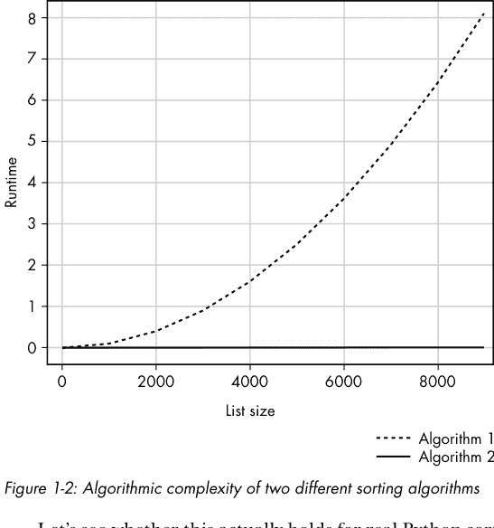

让我们看看这在实际的Python排序例程中是否成立。图1-3比较了三种流行的排序算法：冒泡排序、快速排序和Timsort。冒泡排序具有最高的算法复杂性。快速排序和Timsort具有相同的渐近算法复杂性。但Timsort算法仍然快得多——这就是为什么它被用作Python的默认排序例程。冒泡排序算法的运行时间随着列表大小的增长而急剧增加。

在图1-4中，我们重复这个实验，但只针对快速排序和Timsort。同样，算法复杂性存在巨大差异：Timsort扩展性更好，并且对于不断增长的列表大小更快。现在你明白为什么Python的内置排序算法这么长时间没有改变了！

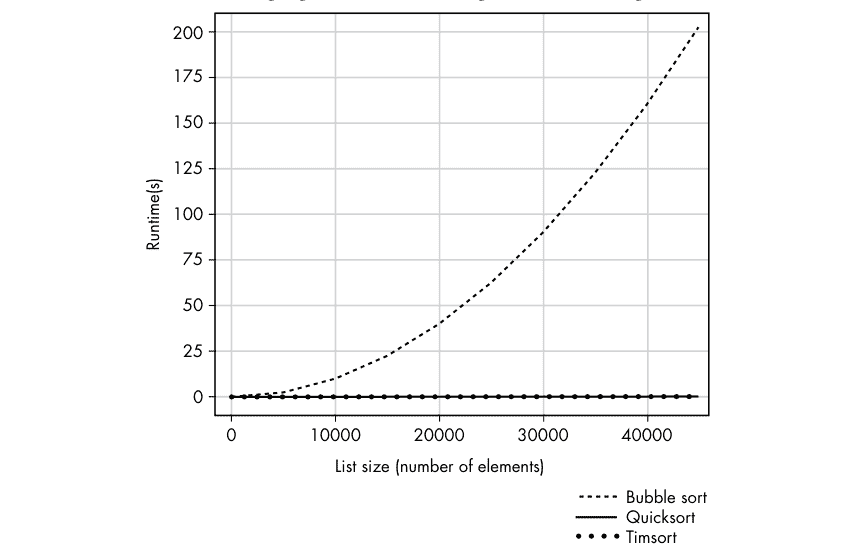

图1-3：冒泡排序、快速排序和Timsort的算法复杂性

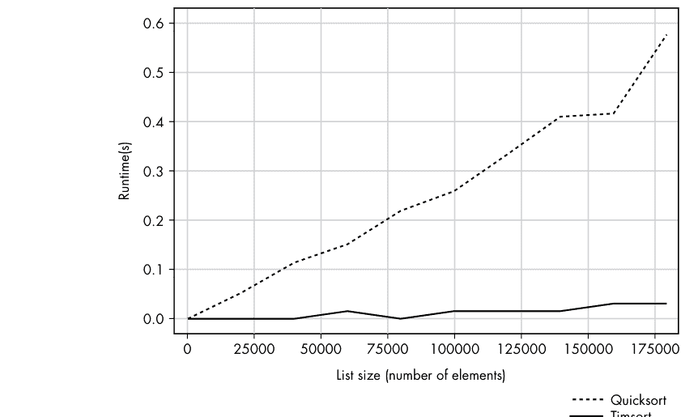

图1-4：快速排序和Timsort的算法复杂性

清单1-1展示了Python代码，以防你想重现这个实验。我建议你为n选择一个较小的值，因为代码在我的机器上运行很长时间才会终止。

```python
import matplotlib.pyplot as plt
import math
import time
import random

def bubblesort(l):
    # src: https://blog.finxter.com/daily-python-puzzle-bubble-sort/
    lst = l[:] # work with a copy, don't modify the original
    for passesLeft in range(len(lst)-1, 0, -1):
        for i in range(passesLeft):
            if lst[i] > lst[i + 1]:
                lst[i], lst[i + 1] = lst[i + 1], lst[i]
    return lst

def qsort(lst):
    # Explanation: https://blog.finxter.com/python-one-line-quicksort/
    q = lambda lst: q([x for x in lst[1:] if x <= lst[0]])
                    + [lst[0]]
                    + q([x for x in lst if x > lst[0]]) if lst else []
    return q(lst)

def timsort(l):
    # sorted()uses Timsort internally
    return sorted(l)

def create_random_list(n):
    return random.sample(range(n), n)

n = 50000
xs = list(range(1,n,n//10))
y_bubble = []
y_qsort = []
y_tim = []

for x in xs:

    # Create list
    lst = create_random_list(x)

    # Measure time bubble sort
    start = time.time()
    bubblesort(lst)
    y_bubble.append(time.time()-start)

    # Measure time qsort
    start = time.time()
    qsort(lst)
    y_qsort.append(time.time()-start)

    # Measure time Timsort
    start = time.time()
    timsort(lst)
    y_tim.append(time.time()-start)

plt.plot(xs, y_bubble, '-x', label='Bubblesort')
plt.plot(xs, y_qsort, '-o', label='Quicksort')
plt.plot(xs, y_tim, '--.', label='Timsort')

plt.grid()
plt.xlabel('List Size (No. Elements)')
plt.ylabel('Runtime (s)')
plt.legend()
plt.savefig('alg_complexity_new.pdf')
plt.savefig('alg_complexity_new.jpg')
plt.show()
```

清单1-1：测量三种流行排序例程的运行时间

算法复杂性是一个经过深入研究的领域。在我看来，这项研究产生的改进算法是人类最有价值的技术资产之一，使我们能够一次又一次地用更少的资源解决相同的问题。我们确实站在巨人的肩膀上。

除了算法复杂性，我们还可以用*圈复杂性*来衡量代码的复杂性，这是Thomas McCabe在1976年开发的一个指标，它描述了代码中*线性独立路径*的数量：至少有一条边不在另一条路径中的路径数量。例如，包含if语句的代码将导致两条独立的路径通过你的代码，因此它将比没有像if语句中那样的任何分支的扁平代码具有更高的圈复杂性。图1-5展示了两个处理用户输入并相应响应的Python程序的圈复杂性。第一个程序只包含一个条件分支，可以被视为道路上的一个分叉。两个分支都可以被选择，但不能同时选择。因此，圈复杂性为2，因为有两条线性独立的路径。第二个程序包含两个条件分支，总共导致三条线性独立的路径和圈复杂性为3。每个额外的if语句都会增加圈复杂性。

#### 学习中的复杂性

事实并非孤立存在，而是相互关联的。请看以下两个事实：

-   沃尔特·迪士尼出生于1901年。
-   路易斯·阿姆斯特朗出生于1901年。

如果你将这些事实输入一个程序，它既能回答“*沃尔特·迪士尼的出生年份是哪一年？*”这样的问题，也能回答“*谁出生于1901年？*”这样的问题。要回答后者，程序必须弄清楚不同事实之间的相互依赖关系。它可能会这样建模信息：

```
(Walt Disney, born, 1901)
(Louis Armstrong, born, 1901)
```

要获取所有出生于1901年的人，它可以使用查询 `(*, born, 1901)` 或任何将事实关联并分组的方式。

2012年，谷歌推出了一项新的搜索功能，在搜索结果页面上显示信息框。这些基于事实的信息框是使用一种名为*知识图谱*的数据结构填充的，这是一个包含数十亿相互关联事实的庞大数据库，以网络状结构表示信息。这个数据库不是存储客观独立的事实，而是维护不同事实和信息片段之间相互关系的信息。谷歌搜索引擎使用这个知识图谱，用更高层次的知识来丰富其搜索结果，并自主形成答案。

图1-6展示了一个例子。知识图谱中的一个节点可能关于著名的计算机科学家*艾伦·图灵*。在知识图谱中，艾伦·图灵的概念与不同的信息片段相连，例如他的出生年份（1912年）、他的研究领域（计算机科学、哲学、语言理论）以及他的博士导师（阿隆佐·邱奇）。这些信息片段中的每一个又与其他事实相连（阿隆佐·邱奇的研究领域也是计算机科学），形成了一个庞大的相互关联事实网络。你可以利用这个网络来获取新信息，并以编程方式回答用户查询。一个关于“图灵博士导师的研究领域”的查询，会得出推导出的答案“计算机科学”。虽然这听起来可能微不足道或显而易见，但生成此类新事实的能力已经在信息检索和搜索引擎相关性方面带来了突破。你可能会同意，通过联想学习比记忆不相关的事实要有效得多。

```
知识图谱表示（三元组）：
("Alan Turing", "has doctoral advisor", "Alonzo Church")
("Alan Turing", "has field of study", "Philosophy")
("Alan Turing", "has field of study", "Linguistics")
...
```

每个研究领域只关注图谱的一小部分，每一部分都由无数相互关联的事实片段组成。只有考虑到相关事实，你才能真正理解一个领域。要彻底理解艾伦·图灵，你必须研究他的信仰、哲学以及他博士导师的特征。要理解邱奇，你必须调查他与图灵的关系。当然，图谱中有太多相互依赖的关系和事实，不可能期望理解所有内容。这些相互关系的复杂性，对你学习的雄心构成了最基本的限制。学习和复杂性是同一枚硬币的两面：复杂性处于你已获得知识的边界。要学习更多，你必须首先知道如何控制复杂性。

我们这里讲得有点抽象了，所以让我们来看一个实际的例子！假设你想编写一个交易机器人，根据一套复杂的规则买卖资产。在开始项目之前，你可以学习很多有用的知识：编程基础、分布式系统、数据库、应用程序编程接口（API）、网络服务、机器学习、数据科学及相关数学。你可以学习实用工具，如Python、NumPy、scikit-learn、ccxt、TensorFlow和Flask。你可以学习交易策略和股市哲学。许多人带着这样的心态处理这些问题，因此从未觉得准备好开始项目。问题在于，你学得越多，就越觉得自己知识不足。你永远无法在所有这些领域都达到足够的精通程度，从而真正满足你希望做好准备的愿望。被整个事业的复杂性所压倒，你想要放弃。复杂性即将夺走它的下一个受害者：你。

幸运的是，在本书的章节中，你将学习应对复杂性的技能：专注、简化、缩减、精简和极简主义。本书将教你这些技能。

#### 流程中的复杂性

*流程*是一系列旨在实现既定结果的行动。流程的复杂性由其行动数量、参与者数量或分支数量来计算。通常，行动（和参与者）越多，流程就越复杂（见图1-7）。

许多软件公司为业务的不同方面遵循流程模型，试图简化流程；例如：

-   软件开发可能使用敏捷开发或Scrum。
-   客户关系发展可能使用客户关系管理（CRM）和销售脚本。
-   新产品和商业模式的创建可能使用商业模式画布。

当组织积累了过多的流程时，复杂性开始堵塞系统。例如，在优步出现之前，从A地到B地的旅行过程通常涉及许多步骤：查找出租车公司的电话号码、比较费率、准备不同的支付方式以及规划不同的交通方式。对许多人来说，优步简化了从A地到B地的旅行流程，将整个规划过程整合到一个易于使用的移动应用程序中。优步进行的彻底简化使客户出行更加便捷，并与传统出租车行业相比，减少了规划时间和成本。

在过于复杂的组织中，创新找到的变革载体更少，因为它无法突破复杂性。随着流程内的行动变得冗余，资源被浪费。试图挽救陷入困境的业务，管理者投入精力建立新的流程和新的行动，恶性循环开始摧毁业务或组织。

复杂性是效率的敌人。这里的解决方案是极简主义：要保持流程高效，你必须彻底剔除不必要的步骤和行动。你发现你的流程被*过度简化*的可能性非常小。

#### 你日常生活中的复杂性，或千刀万剐之死

本书的目的是提高你编程工作的生产力。这可能会被你个人的日常习惯和惯例所打断。你必须应对日常的干扰和对你宝贵时间的持续争夺。计算机科学教授卡尔·纽波特在他优秀的著作《*深度工作：在分心世界中专注成功的规则*》（Grand Central Publishing, 2016）中谈到了这一点。他认为，对需要深度思考的工作（如编程、研究、医学和写作）的需求在*增加*，而由于通信设备、机会和娱乐系统的激增，这种工作的供应却在*减少*。如果需求增加而供应减少，经济理论表明价格将会上涨。如果你能够从事深度工作，你的经济价值将会增加。对于能够从事深度工作的程序员来说，从来没有比现在更好的时代了。

现在，需要注意的是：如果你不强制执行，几乎不可能从事深度工作。外部世界要求你注意力。你的同事会突然走进你的办公室。你的智能手机每20分钟就要求你关注一次。你的收件箱每天会弹出几十封新邮件——每一封都要求你分出一点时间。

深度工作带来的是延迟满足；花费数周时间编写一个计算机程序并发现它能正常运行，这是一种令人满足的感觉。然而，在大多数时刻，你*渴望*的是即时满足。你的潜意识常常寻找逃避深度工作努力的方法。小奖励能轻松产生内啡肽：查看消息、进行无意义的闲聊、浏览Netflix。与即时满足那个快乐、多彩、生动的世界相比，延迟满足的承诺变得越来越没有吸引力。

你保持专注和高效的努力很容易被千刀万剐般地消磨掉。是的，你可以一次性关掉智能手机，并用意志力避免查看社交媒体和打开你最喜欢的节目，但你能日复一日地坚持这样做吗？同样，答案在于将彻底的极简主义应用于问题的根源：*卸载*社交媒体应用，而不是试图管理使用量；*减少*你参与的项目和任务数量，而不是试图通过更努力工作来做更多事；*深入*学习一种编程语言，而不是花大量时间在多种语言之间切换。

### 结论

至此，你应该已经完全被克服复杂性的必要性所激励。关于复杂性以及我们如何可能克服它，我强烈推荐阅读卡尔·纽波特的《*深度工作*》。

复杂性损害生产力并降低专注力。如果你不尽早控制复杂性，它将迅速消耗你最宝贵的资源：时间。在生命尽头，你不会根据回复了多少封邮件或解了多少个数独谜题来判断自己是否过上了有意义的生活。通过学习如何处理复杂性，通过保持简单，你将能够对抗复杂性，并为自己赢得强大的竞争优势。

在第二章，你将了解80/20法则的力量：专注于至关重要的少数，忽略无关紧要的多数。

## 2 80/20法则

在本章中，你将了解*80/20法则*对你作为程序员生活的深远影响。它有许多名称，包括*帕累托法则*，以其发现者维尔弗雷多·帕累托命名。那么，这个法则是如何运作的，你又为何应该关心它？80/20法则指的是，大多数结果（80%）来自少数原因（20%）。它为你指明了一条道路：通过将精力集中在少数重要事情上，忽略那些几乎不起作用的众多事情，作为专业程序员可以取得更多成果。

### 80/20法则基础

该法则指出，大多数结果来自少数原因。例如，大多数收入由少数人赚取，大多数创新来自少数研究人员，大多数书籍由少数作者撰写，等等。

你可能听说过80/20法则——它在个人效率文献中无处不在。它受欢迎的原因有两方面。首先，只要你能够找出那些重要的事情——即构成导致80%结果的20%活动——并坚持不懈地专注于它们，这个法则就能让你在放松的同时保持高效。其次，我们可以在各种各样的情境中观察到这个法则，这赋予了它相当大的可信度。甚至很难找到一个反例，即结果平均地来自原因。试着找一些50/50分布的例子，其中50%的结果来自50%的原因！当然，分布并不总是80/20——具体数字可能会变成70/30、90/10，甚至95/5——但分布总是严重偏向于少数产生多数结果的情况。

我们用帕累托分布来表示帕累托法则，如图2-1所示。

图2-1：一般帕累托分布示例

帕累托分布将结果（y轴）与原因（x轴）对应绘制。结果可以是任何成功或失败的衡量标准，如收入、生产力或软件项目中的缺陷数量。原因可以是与这些结果相关的任何实体，例如员工、企业或软件项目。为了得到特征性的帕累托曲线，我们根据它们产生的结果对原因进行排序。例如，收入最高的人排在x轴的第一位，然后是收入第二高的人，依此类推。

让我们看一个实际的例子。

#### 应用软件优化

图2-2展示了帕累托法则在一个假想软件项目中的应用：少数代码负责大部分的运行时间。x轴显示按其产生的运行时间排序的代码函数。y轴显示这些代码函数的运行时间。主导图表下总面积的阴影区域表明，大多数代码函数对总运行时间的贡献远小于少数选定的代码函数。帕累托法则的早期发现者之一约瑟夫·朱兰将后者称为*至关重要的少数*，将前者称为*无关紧要的多数*。花费大量时间优化*无关紧要的多数*几乎不会改善整体运行时间。软件项目中帕累托分布的存在得到了科学证据的有力支持，例如Louridas、Spinellis和Vlachos（2008）的《软件中的幂律》。

图2-2：软件工程中的帕累托分布示例

像国际商业机器公司（IBM）、微软和苹果这样的大公司运用帕累托法则，通过将注意力集中在至关重要的少数上，制造出更快、更用户友好的计算机；也就是说，通过反复优化普通用户最常执行的20%的代码。并非所有代码都是平等的。少数代码对用户体验有主导性影响，而大部分代码影响甚微。你可能每天多次双击文件资源管理器图标，但你很少更改文件的访问权限。80/20法则告诉你应该将优化精力集中在哪里！

这个法则很容易理解，但要了解如何在自己的生活中运用它可能更难。

#### 生产力

通过专注于至关重要的少数而非无关紧要的多数，你可以将生产力提高10倍，甚至100倍。不相信我？让我们计算一下这些数字的来源，假设存在一个基础的80/20分布。

我们将使用保守的80/20参数（80%的结果来自20%的人），然后计算每个群体的生产率。在某些领域（如编程），分布可能更加倾斜。

图2-3显示，在一个拥有10名员工的公司中，仅2名员工就产生了80%的结果，而8名员工只产生了20%的结果。我们将80%除以两名员工，得出公司中顶尖员工的平均产出为40%。如果我们把八名员工产生的20%结果除以八，得到每位表现不佳员工的平均产出为2.5%。绩效差异达到了16倍！

这种平均绩效16倍的差异是全球数百万组织中的一个事实。帕累托分布也是分形的，这意味着顶尖20%中的顶尖20%产生了80%中的80%的结果，这导致在拥有数千名员工的大型组织中出现了更显著的绩效差异。

结果的差异不能仅用智力来解释——一个人不可能比另一个人聪明1000倍。相反，结果的差异来自个人或组织的特定行为。如果你做同样的事情，你也能得到同样的结果。然而，在你改变行为之前，你必须清楚自己想要达成什么结果，因为研究表明，在你所能想象的几乎任何指标上，结果都存在极端的不平等。

**收入** 在美国，10%的人赚取了近50%的收入。

**幸福感** 在北美，只有不到25%的人在0-10分的幸福感量表上（“0到10分，0代表最糟糕的生活，10代表最美好的生活”）给自己打9分或10分。

**月活跃用户** 如表2-1所示（基于*www.ahrefs.com*的信息），排名前10的网站中，仅两个网站就占据了累计流量的48%。

**图书销量** 仅20%的作者可能获得了高达97%的销售额。

**科研产出** 例如，5.2%的科学家贡献了38%的已发表文章。

本章末尾的资源部分链接了一些支持这些数据的文章。结果不平等是社会科学中一个公认的现象，通常用一个称为*基尼系数*的指标来衡量。

**表2-1：** 美国流量最高的10个网站的累计流量

| # | 域名 | 月流量 | 累计 |
|---|---|---|---|
| 1 | en.wikipedia.org | 1,134,008,294 | 26% |
| 2 | youtube.com | 935,537,251 | 48% |
| 3 | amazon.com | 585,497,848 | 62% |
| 4 | facebook.com | 467,339,001 | 72% |
| 5 | twitter.com | 285,460,434 | 79% |
| 6 | fandom.com | 228,808,284 | 84% |
| 7 | pinterest.com | 203,270,264 | 89% |
| 8 | imdb.com | 168,810,268 | 93% |
| 9 | reddit.com | 166,277,100 | 97% |
| 10 | yelp.com | 139,979,616 | 100% |
| | | 4,314,988,360 | |

那么，你如何才能成为顶尖表现者之一？或者，更普遍地表述：你如何在组织的帕累托分布曲线上*向左移动*（参见图2-4）？

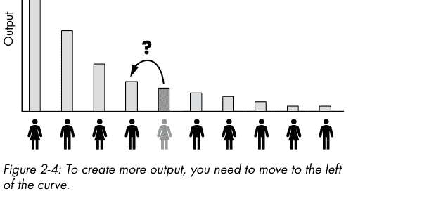

#### 成功指标

假设你想优化收入。如何在帕累托曲线上向左移动？我们在此已脱离精确科学，因为你需要找出在你特定行业中一些人成功的原因，并制定出可操作的、你能控制和实施的*成功指标*。我们将*成功指标*一词定义为能带来你在该领域更多成功的行为度量。棘手的是，最关键的成功指标在大多数领域各不相同。80/20原则也适用于成功指标：一些成功指标对你的领域表现有主导性影响，而另一些则几乎无关紧要。

例如，当我担任博士研究员时，我很快意识到成功完全取决于被其他研究人员引用。作为研究人员，你获得的引用越多，你的可信度、知名度和机会就越多。然而，*增加引用次数*几乎不是一个你可以每天优化的可操作成功指标。引用次数是一个*滞后指标*，因为它基于你过去的行动。滞后指标的问题在于，它们只记录过去行动的结果。它们不会告诉你每天为成功应采取哪些正确行动。

为了获得衡量正确行动的指标，引入了先行指标的概念。*先行指标*是一种在滞后指标发生变化之前就能预测其变化的指标。如果你更多地执行先行指标，滞后指标很可能会因此得到改善。那么，作为研究人员，你将通过发表更多高质量的研究论文（先行指标）来获得更多引用（滞后指标）。这意味着撰写高质量论文是大多数科学家最重要的活动，而不是准备演讲、组织、教学或喝咖啡等次要活动。因此，研究人员的成功指标是产出最大数量的高质量论文，如图2-5所示。

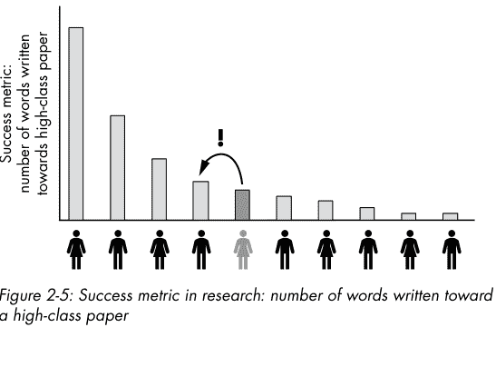

要在研究领域向左推进，你必须今天写更多文字，更快发表下一篇高质量论文，更快获得更多引用，扩大你的科学影响力，并成为更成功的科学家。粗略地说，许多不同的成功指标可以作为“在科学上取得成功”的代理指标。例如，如果将它们按从滞后到先行的尺度排序，你可能会得到*引用次数*、*撰写的高质量论文数量*、*一生中撰写的总字数*和*今天撰写的字数*。

80/20方法让你能够识别必须专注于的活动。更多地执行成功指标，最好是可操作的先行指标，将增加你的职业成功，而这才是唯一重要的事情。减少花在所有不同任务上的时间。拒绝被千头万绪的琐事拖垮。除了一个活动外，对其他所有活动都保持“懒惰”：*每天写更多文字*。

假设你每天工作8小时，并将一天分成八个1小时的活动。完成成功指标练习后，你意识到你可以每天跳过两个1小时的活动，并通过减少完美主义将另外四个活动的时间减半。你每天节省了4小时，但仍然完成了80%的结果。现在你可以每天投入2小时来撰写更多高质量论文的文字。几个月内，你将提交一篇额外的论文，随着时间的推移，你将比任何同事提交更多论文。你每天只工作6小时，并且在大多数工作任务中产出不完美的质量。但你在重要的地方表现出色：你提交的研究论文比环境中的任何人都多。结果，你很快将成为顶尖20%的研究人员之一。你用更少的资源产出更多。

你没有成为“样样通，样样松”，而是在对你最重要的领域获得了专业知识。你高度专注于关键的少数，忽略琐碎的多数。你过着压力更小的生活，但从投入的劳动、努力、时间和金钱中享受更多成果。

#### 专注与帕累托分布

我想讨论的一个密切相关的话题是*专注*。我们将在本书的许多地方讨论专注——例如，第10章详细讨论了专注的力量——但80/20原则解释了*为什么*专注如此强大。让我们深入探讨这个论点！

考虑图2-6中的帕累托分布，它显示了向分布顶端移动的百分比改进。爱丽丝是组织中生产力第五高的人。如果她只超过组织中的一个人，从而成为生产力第四高的人，她的产出（薪水）将增加10%。再进一步，她的产出将*额外*增加20%。在帕累托分布中，每个排名的增长呈指数级爆炸，因此即使生产力的小幅提高也可能导致收入的大幅增加。提高你的生产力会带来收入、幸福感和工作乐趣的超线性改善。有些人称这种现象为“赢家通吃”。

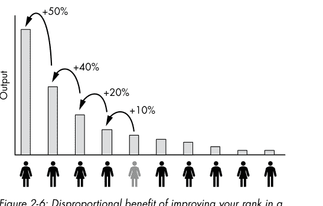

这就是为什么分散注意力不划算：*如果你不专注，你就参与了许多帕累托分布*。考虑图2-7：爱丽丝和鲍勃每天可以各投入三个单位的学习努力。爱丽丝专注于一件事：编程。她只是将三个单位的努力花在学习编程上。鲍勃将注意力分散到多个领域：一个单位时间磨练他的国际象棋技能，一个单位时间提高他的编程技能，一个单位时间提高他的政治技能。他在三个领域都达到了平均水平和产出。但帕累托分布不成比例地奖励顶尖表现者，因此爱丽丝获得了更多的总产出奖励。

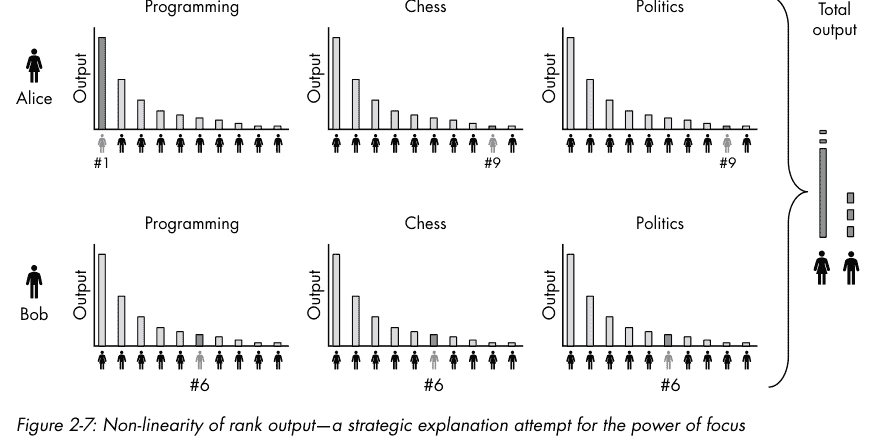

不成比例的奖励在每个领域内也成立。例如，鲍勃可能花时间阅读三本通用书籍（我们称之为*Python入门*、*C++入门*和*Java入门*），而爱丽丝则阅读三本深入探讨Python机器学习的书籍（我们称之为*Python入门*、*Python机器学习入门*和*机器学习专家指南*）。结果，爱丽丝将专注于成为机器学习专家，并因其专业技能组合而要求更高的薪水。

#### 对程序员的启示

在编程领域，结果往往比大多数其他领域更严重地偏向顶端。分布通常看起来更像是90/10或95/5，而不是80/20。比尔·盖茨说过：“一个优秀的车床操作员的工资是普通车床操作员的几倍，但一个优秀的软件代码编写者的价值是普通软件编写者的10,000倍。”盖茨认为，优秀和普通软件编写者之间的差异不是16倍，而是10,000倍！以下是软件领域容易出现如此极端帕累托分布的几个原因：

- 一个优秀的程序员可以解决一些普通程序员根本无法解决的问题。在某些情况下，这使他的生产力无限倍提高。
- 一个优秀的程序员可以编写出比普通程序员的代码快10,000倍的代码。
- 一个优秀的程序员编写的代码错误更少。想想一个安全漏洞对微软声誉和品牌的影响！此外，每一个额外的错误都会为后续的代码库修改和功能添加带来时间、精力和金钱成本——错误的有害、复合效应。
- 一个优秀的程序员编写的代码更容易扩展，这可能会提高在软件开发过程后期阶段处理其代码的数千名开发人员的生产力。
- 一个优秀的程序员跳出框框思考，找到创造性的解决方案来规避昂贵的开发工作，并帮助专注于最重要的事情。

在实践中，这些因素的组合在起作用，因此差异可能更大。

那么，对你来说，关键问题可能是：*如何成为一名优秀的程序员？*

#### 程序员的成功指标

不幸的是，“成为一名优秀的程序员”这个陈述不是一个你可以直接优化的成功指标——它是一个多维度的问题。一个优秀的程序员能快速理解代码，了解算法和数据结构、了解不同技术及其优缺点、能与他人协作、善于沟通且富有创造力、持续学习并了解组织软件开发流程的方法，并且掌握数百种软技能和硬技能。但你不可能精通所有这些！如果不专注于关键的少数，你就会被琐碎的多数所淹没。要成为一名优秀的程序员，你必须专注于关键的少数。

需要专注的关键活动之一是编写更多代码行。你编写的代码行越多，你就会成为越好的程序员。这是对多维问题的简化：通过优化代理指标（编写更多代码行），你增加了在目标指标（成为优秀的软件代码编写者）上成功的几率。参见图2-8。

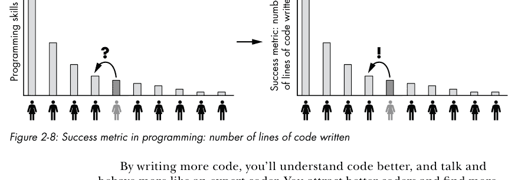

通过编写更多代码，你会更好地理解代码，并且在言行上更像一个专家程序员。你会吸引更优秀的程序员，并找到更具挑战性的编程任务，因此你会编写更多代码并变得更好。你编写的每一行代码获得的报酬会越来越多。你或你的公司可以外包那些琐碎的多数任务。

这里有一个你可以每天遵循的80/20活动：*跟踪你每天编写的代码行数并优化它*。把它当作一个游戏，至少每天达到你的平均水平。

#### 现实世界中的帕累托分布

我们将快速看看一些帕累托分布发挥作用的真实世界例子。

#### GitHub 仓库 TensorFlow 贡献

我们可以在 GitHub 仓库的贡献中看到帕累托分布的一个极端例子。让我们考虑一个非常流行的用于 Python 机器学习计算的仓库：*TensorFlow*。图2-9显示了该 GitHub 仓库的前七位贡献者。表2-2以数字形式显示了相同的数据。

《整洁代码的艺术》（早期访问版）© 2022 Christian Mayer

GitHub TensorFlow 仓库提交

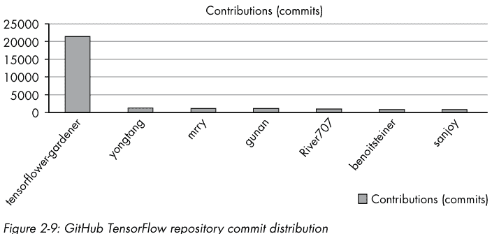

图2-9：GitHub TensorFlow 仓库提交分布

**表2-2：TensorFlow 提交数量及其贡献者**

| 贡献者 | 提交数 |
|---|---|
| tensorflower-gardener | 21426 |
| yongtang | 1251 |
| mrry | 1120 |
| gunan | 1091 |
| River707 | 868 |
| benoitsteiner | 838 |
| sanjoy | 795 |

用户 *tensorflow-gardener* 贡献了该仓库93,000次提交中的20%以上。考虑到有数千名贡献者，这种分布比80/20分布要极端得多。原因是贡献者 *tensorflow-gardener* 由一个在 Google 创建并维护此仓库的程序员团队组成。然而，即使过滤掉这个团队，剩下的个人顶级贡献者也是拥有令人印象深刻履历的极其成功的程序员。你可以在公共 GitHub 页面上查看他们。他们中的许多人已经在非常有吸引力的公司找到了令人兴奋的工作。他们在向开源仓库提交大量代码之前还是之后取得成功，这只是一个理论上的讨论。对于所有实际问题，你应该开始你的成功习惯：现在就开始每天编写更多代码行。没有什么能阻止你成为 TensorFlow 仓库上的第二名——通过在未来2-3年内每天向 TensorFlow 仓库提交两到三次有价值的代码。如果你坚持下去，只需选择一个强大的习惯并坚持短短几年，你就能跻身世界上最成功的程序员行列！

#### 程序员净资产

果然，程序员的净资产也呈帕累托分布。出于隐私原因，很难获得个人净资产的数据，但网站 www.networthshare.com 确实显示了包括程序员在内的各种职业的自我报告净资产。数据有些嘈杂，但它显示了现实世界帕累托分布特有的偏斜性（图2-10）。

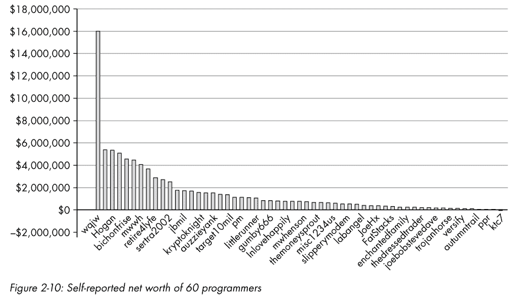

在我们29个数据点的小样本中，有相当多的软件百万富翁！但在现实世界中，曲线可能更加偏斜，因为还有许多亿万富翁程序员——马克·扎克伯格、比尔·盖茨、埃隆·马斯克和史蒂夫·沃兹尼亚克就是例子。这些技术天才中的每一个都亲手创建了他们服务的原型，接触过源代码。最近，我们在区块链领域看到了更多这样的软件亿万富翁。

#### 自由职业项目

自由职业开发领域由两个市场主导，自由职业者可以在其中提供服务，客户可以雇佣自由职业者：Upwork 和 Fiverr。这两个平台在用户和收入方面每年都在以两位数增长，并且都致力于颠覆全球人才的组织方式。

自由职业开发者的平均收入是每小时51美元。但这只是平均费率——前10%的自由职业开发者可以达到更高的时薪。在或多或少开放的市场中，收入类似于帕累托分布。

我从三个角度观察到了这种偏斜的收入分布：（1）作为自由职业者，（2）作为雇佣数百名自由职业者的客户，以及（3）作为提供 Python 自由职业教育的课程创建者。大多数学生甚至无法达到平均收入潜力，因为他们在这个领域待不了一个月左右。那些每天坚持从事自由职业业务几个月的人通常能达到平均每小时51美元的收入目标。少数非常有抱负和敬业的学生能达到每小时100美元甚至更多。

但为什么有些学生失败而另一些成功呢？让我们绘制一下在 Fiverr 平台上完成的成功项目数量，这些项目的平均评分至少为4分（满分5分）。我在图2-11中关注了机器学习这个热门领域。我从 Fiverr 网站收集了数据，并跟踪了类别 *Machine Learning Gigs* 的两个顶级搜索结果中71名自由职业者完成的项目数量。对我们来说，不足为奇的是，这种分布类似于帕累托分布。

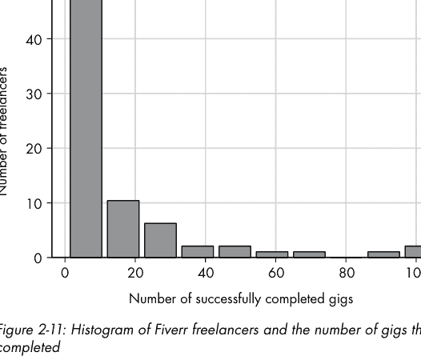

根据我作为数千名自由职业学生的老师的个人经验，我惊讶地发现绝大多数学生完成的项目少于十个。我非常确定这些学生中许多后来会宣称：“自由职业行不通。”对我来说，这种说法就像“工作行不通”或“生意行不通”一样自相矛盾。这些自由职业学生失败是因为他们没有足够努力和坚持。他们以为可以轻松赚钱，当他们意识到必须坚持不懈才能加入自由职业赢家行列时，他们很快就放弃了。

这种缺乏自由职业坚持力的情况实际上为你提供了一个在帕累托分布中向上移动的绝佳机会。一个几乎可以确保你最终跻身前1-3%自由职业者的简单成功指标是：*完成更多项目*。在这个领域待得更久。任何人都能做到这一点。你正在阅读这本书的事实表明，你有成为前1-3%自由职业程序员和编程专业人士的承诺、抱负和动力。大多数参与者缺乏专注，即使他们非常熟练、聪明且人脉广泛，他们也没有机会与专注、敬业且了解帕累托的程序员竞争。

#### 帕累托是分形的

帕累托分布是分形的。如果你放大，只观察整个分布的一部分，那里还有另一个帕累托分布！只要数据不是太稀疏，这就会起作用；在这种情况下，它会失去其分形特性。例如，单个数据点不能被视为帕累托分布。让我们在图2-12中看看这个特性。

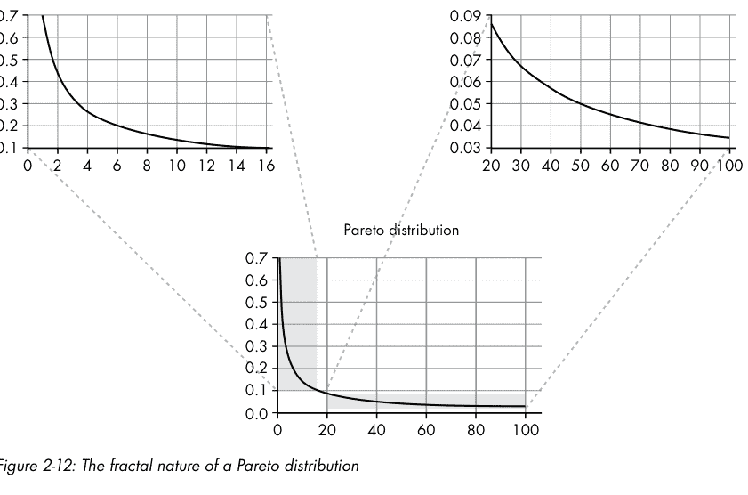

图2-12的中心是来自图2-1的帕累托分布。我使用了清单2-1中的简单Python脚本来放大这个帕累托分布：

```python
import numpy as np
import matplotlib.pyplot as plt

alpha = 0.7

x = np.arange(100)
y = alpha * x / x**(alpha+1)
```

plt.plot(x, y)

plt.grid()
plt.title('帕累托分布')
plt.show()

清单 2-1：一个可交互的脚本，用于放大查看帕累托分布

你可以自己尝试这段代码；只需将其复制到你的 Python shell 中并运行即可。如果你在 Python shell 中这样做，你将能够放大查看帕累托分布的不同区域。

帕累托分布在生活和编程中有着多种实际应用，我将在本书中讨论其中一些。但根据我的经验，对你而言最具变革性的应用将是成为一个*80/20 思考者*，也就是说，你不断尝试寻找用更少资源完成更多事情的方法。请注意，虽然具体的帕累托数字——80/20、70/30 或 90/10——在你自己的生活中可能有所不同，但你或许能从产出和成果分布的分形特性中获得一些价值。例如，不仅少数程序员的收入远高于其他人，而且这些高收入者中也有少数人的收入高于其他高收入者，这一点总是成立的。这种模式只有在数据变得过于稀疏时才会停止。以下是一些例子：

**收入** 20% 的程序员中的 20% 将赚取 80% 的程序员所赚取收入的 80%。换句话说，4% 的程序员将赚取 64% 的收入！这意味着你永远不会被困在当前的财务状况中，即使你已经属于前 20% 的程序员。（这篇论文只是众多展示收入分布分形特性的论文之一：http://journalarticle.ukm.my/12411/1/29%20Fatimah%20Abdul%20Razak.pdf。）

**活动** 你本周所做活动的 20% 中的 20% 中的 20%，通常导致你成果的 80% 中的 80% 中的 80%。在这种情况下，0.8% 的活动将带来 51% 的成果。粗略地说，如果你每周工作 40 小时，20 分钟可能占你工作周成果的一半！一个这样的 20 分钟活动的例子是编写一个脚本，自动化一项业务任务，每隔几周为你节省几个小时，你可以将这些时间投入到其他活动中。如果你是一名程序员，决定跳过实现一个不必要的功能可以为你节省数十小时的不必要工作。如果你开始应用一些 80/20 思维，你将很快在你自己的工作中找到许多这样的杠杆活动。

**进步** 无论你处于任何帕累托分布的哪个位置，你都可以通过运用你的成功习惯和专注的力量“向左移动”来指数级地增加你的产出。只要尚未达到最佳状态，总有进步的空间，总有用更少资源达成更多目标的可能——即使你已经是一个高度发达的个人、公司或经济体。

那些能让你在帕累托曲线上攀升的活动并不总是显而易见的，但它们绝非随机。许多人放弃了在他们领域中寻找成功指标，因为他们认为结果的概率性质使其完全随机。多么错误的结论！要成为一名编程大师，每天少写代码并不能让你达到目标，就像每天少下棋也不能让你成为职业棋手一样。其他因素会起作用，但这并不会使成功变成一场机会游戏。通过专注于你所在行业的成功指标，你将操纵概率使其对你有利。作为一个 80/20 思考者，你就是庄家——而庄家*大多*会赢。

### 80/20 实践技巧

让我们用十个实践技巧来结束本章，以利用帕累托原则的力量。

**找出你的成功指标。**
首先定义你的行业。找出你所在行业中最成功的专业人士做得特别出色的事情，以及你每天可以做哪些任务来推动你更接近前 20%。如果你是一名程序员，你的成功指标可能是编写的代码行数。如果你是一名作家，你的成功指标可能是为下一本书撰写的字数。创建一个电子表格，每天跟踪你的成功指标。把它当作一个游戏，坚持下去并超越自己。设定一个最低阈值，每天在完成最低阈值之前不要结束一天。更好的是，在完成之前不要开始新的一天！

**找出你人生的大目标。**
把它们写下来。没有清晰定义的大目标（想想：10 年目标），你不会在一件事上坚持足够长的时间。你已经看到，沿着帕累托曲线攀升的一个关键策略是，在参与更少游戏的同时，在游戏中停留更长时间。

**寻找用更少资源实现相同目标的方法。**
你如何在 20% 的时间内完成 80% 的成果？你能移除那些占用 80% 时间但只带来 20% 成果的剩余活动吗？如果不能，你能外包它们吗？Fiverr 和 Upwork 是寻找人才的廉价方式，利用他人的技能是值得的。

**反思你自己的成功。**
你做了什么带来了好结果？你如何能做更多这样的事情？

**反思你自己的失败。**
你如何能减少那些导致失败的事情？

**多读你所在行业的书籍。**
通过阅读更多书籍，你可以在没有实际经历所需的巨大时间和精力投入的情况下模拟实践经验。你从他人的错误中学习。你了解做事的新方法。你获得所在领域更多的技能。一个受过高等教育的专家程序员解决问题的速度可以比初学者快 10 到 100 倍。阅读你所在领域的书籍很可能是你所在领域的成功指标之一，它将助你走向成功。

**花大量时间改进和调整现有产品。**
这样做而不是发明新产品。同样，这源于帕累托分布。如果你的业务中有一个产品，你可以投入所有精力将这一个产品推向帕累托曲线，为你和你的公司带来指数级增长的成果。但如果你不断创造新产品而不改进和优化旧产品，你将永远只有低于平均水平的产品。永远不要忘记：巨大的成果位于帕累托分布的左侧。

**微笑。**
令人惊讶的是，有些后果是多么简单。如果你是一个积极的人，很多事情会变得更容易。更多人会与你合作。你会体验到更多的积极性、幸福和支持。微笑是一项高杠杆活动，影响巨大而成本低廉。

**不要做降低价值的事情。**
这些事情包括吸烟、不健康饮食、睡眠不足、饮酒和看太多 Netflix。避免那些拖累你的事情是你最大的杠杆点之一。如果你不做那些伤害你的事情，你会变得更健康、更快乐、更成功。并且你会有更多的时间和金钱去享受生活中的美好事物：人际关系、自然和积极的体验。

在下一章，你将学习一个关键概念，帮助你专注于软件的关键少数特性：你将学习如何构建一个最小可行产品。

### 资源

让我们看看本章使用的来源——欢迎进一步探索它们，以发现更多帕累托原则的应用！

> Panagiotis Louridas, Diomidis Spinellis, and Vasileios Vlachos, “Power Laws in Software,” *ACM Transactions on Software Engineering and Methodology* 18, no.1 (September 2008), https://doi.org/10.1145/1391984.1391986.

关于开源项目贡献遵循帕累托分布的科学证据：

Mathieu Goeminne and Tom Mens, “Evidence for the Pareto Principle in Open Source Software Activity,” Conference: CSMR 2011 Workshop on Software Quality and Maintainability (SQM), (January 2011), https://www.researchgate.net/publication/228728263_Evidence_for_the_Pareto_principle_in_Open_Source_Software_Activity.

GitHub 仓库 TensorFlow 中提交分布的来源：

https://github.com/tensorflow/tensorflow/graphs/contributors.

我关于自由职业开发者收入分布的博客文章：

Christian Mayer, “What’s the Hourly Rate of a Python Freelancer?” Finxter, https://blog.finxter.com/whats-the-hourly-rate-of-a-python-freelancer/.

关于开放市场遵循帕累托原则的科学证据：

William J. Reed, “The Pareto Law of Incomes—an Explanation and an Extension,” Physica A: Statistical Mechanics and its Applications 319 (March 2003), https://doi.org/10.1016/S0378-4371(02)01507-8.

一篇展示收入分布分形特性的论文：

Fatimah Abdul Razak and Faridatulazna Ahmad Shahabuddin, “Malaysian Household Income Distribution: A Fractal Point of View,” Sains Malaysianna 47, no. 9 (2018), http://dx.doi.org/10.17576/jsm-2018-4709-29.

关于如何通过 Python 建立自由职业者副业收入的信息：

Christian Mayer, “How to Build Your High-Income Skill Python.” Video, https://blog.finxter.com/webinar-freelancer/.

Python 自由职业者资源页面，Finxter（博客），https://blog.finxter.com/python-freelancing/.

深入了解 80/20 思维的力量：

Richard Koch, The 80/20 Principle: The Secret to Achieving More with Less, London: Nicholas Brealey, 1997.

美国 10% 的人赚取了近 50% 的收入。

Facundo Alvaredo, Lucas Chancel, Thomas Piketty, Emmanuel Saez, and Gabriel Zucman, World Inequality Report 2018, World Inequality Lab, https://wir2018.wid.world/files/download/wir2018-summary-english.pdf.

在北美，只有不到25%的人在0-10分的幸福量表中给自己打出9或10分（“0到10分，0代表最糟糕的生活，10代表最美好的生活”）。

> John Helliwell, Richard Layard, and Jeffrey Sachs, eds., *World Happiness Report 2016, Update* (Vol. 1). New York: Sustainable Development Solutions Network, ISBN 978-0-9968513-3-6, https://worldhappiness.report/ed/2016/.

20%的作者可能获得了97%的销售额。

> Xindi Wang, Burcu Yucesoy, Onur Varol, Tina Eliassi-Rad, and Albert-László Barabási, “Success in books: predicting book sales before publication,” *EPJ Data Sci.* 8, no. 31 (October 2019), https://doi.org/10.1140/epjds/s13688-019-0208-6.

> Jordi Prats, “Harry Potter and Pareto’s fat tail,” *Significance* (August 2011) https://www.significancemagazine.com/14-the-statistics-dictionary/105-harry-potter-and-pareto-s-fat-tail.

在科学家中，5.2%的人贡献了38%的论文。

> Javier Ruiz-Castillo and Rodrigo Costas, “Individual and field citation distributions in 29 broad scientific fields,” *Journal of Informetrics* 12, no. 3 (August 2018), https://doi.org/10.1016/j.joi.2018.07.002.

## 3

### 构建最小可行产品


本章涵盖了一个广为人知但仍然被低估的理念，该理念因埃里克·莱斯的著作《精益创业》（Crown Business, 2011）而普及。这个理念是构建一个*最小可行产品*（MVP），即一个剥离了所有非必要功能、只保留最核心功能的产品版本，以便快速测试和验证你的假设，避免在实现用户最终可能并不使用的功能上浪费大量时间。特别是，你将学习如何通过专注于你已知用户想要的功能（因为他们已从你的MVP中确认了这一点）来从根本上降低软件开发周期的复杂性。

在本章中，我们将通过审视不使用MVP开发软件的陷阱来介绍MVP。然后，我们将更详细地阐述这个概念，并为你提供一些关于如何在自己的项目中使用MVP以加速进展的实用技巧。

### 问题场景

构建MVP的理念是为了应对在“隐身模式”下编程时出现的问题（见图3-1）。*隐身模式*是指你在完成一个项目的过程中，不寻求任何潜在用户的反馈。假设你想出了一个改变世界的绝妙程序创意：一个专门用于搜索代码的、由机器学习增强的搜索引擎。你连续几个晚上热情地开始为你的想法编码。

*隐身模式编程*

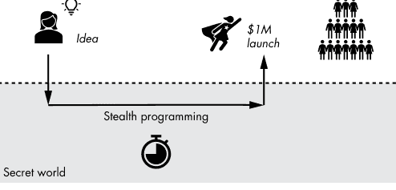

*图3-1：隐身模式编程包括将应用程序保密，直到最终打磨好的版本可以发布，希望能立即成功。在大多数情况下，这是一种谬论。*

然而，在实践中，一次性编写一个应用程序实际上能带来立即成功的概率非常、非常、非常低。以下是遵循隐身模式编程更可能的结果：

你快速开发了原型，但当你尝试你的搜索引擎时，你发现推荐结果中的许多搜索词并不相关。当你搜索“快速排序”时，你得到的是一段归并排序的代码片段，注释写着“# 这不是快速排序”。这似乎不对。于是，你不断调整模型，但每次你为一个关键词改进了结果，又为其他搜索结果制造了新问题。你对结果总不满意，而且你不想把这个糟糕的代码搜索引擎展示给世界，原因有三：没人会觉得它有用；第一批用户会因为你的网站感觉不专业、不完善而制造负面宣传；你担心如果竞争对手看到你这个实现不佳的概念，他们会窃取它并以更好的方式实现。这些令人沮丧的想法让你失去信心和动力，你在应用程序上的进展降至零。

图3-2描绘了在隐身模式编程中可能并且将会出错的地方。

这里我将讨论在隐身模式下工作的六个最常见的陷阱。

The Art of Clean Code (Early Access) © 2022 by Christian Mayer

哪里出了问题？

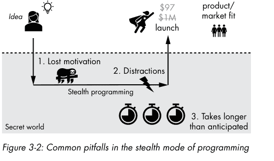

#### 动力丧失

在隐身模式下，你独自面对你的想法，怀疑会定期出现。最初，当你的项目热情足够大时，你会抵制这些怀疑，但你在项目上工作的时间越长，你的怀疑就越大。也许你遇到了一个已经存在的类似工具，或者你开始相信这是不可能完成的。动力丧失可能会彻底扼杀你的项目。

另一方面，如果你发布了一个早期版本的工具，早期采用者的鼓励话语可能会让你保持足够的动力坚持下去，用户的反馈可能会启发你如何改进工具或克服问题。你有了外部动力。

#### 分心

当你独自在隐身模式下工作时，日常的干扰很难忽视。你做着日常工作，花时间陪伴家人和朋友，其他想法也会闯入你的脑海。如今，你的注意力是众多设备和服务争夺的稀缺资源。你在隐身模式下待的时间越长，在完成打磨好的应用程序之前分心的可能性就越高。

MVP可以通过缩短从想法到市场响应的时间来对抗这一点，创造一个更即时反馈的环境，帮助你重新集中注意力。而且谁知道呢——也许你会发现一些热切的早期用户，他们可以帮助推动应用程序的开发。

#### 超时

项目完成的另一个强大敌人是有缺陷的规划。假设你估计你的产品需要60小时完成，所以你最初计划每天工作2小时，持续一个月。然而，动力丧失和分心导致你平均每天只工作一小时。

进一步的延误是由你必须投入的研究、外部干扰以及你必须处理的意外事件和错误造成的。无数因素会增加你预期的项目持续时间，而很少有因素会减少它。到第一个月结束时，你离预期目标还差得很远，这又反馈到动力丧失的循环中。

MVP剥离了所有不必要的功能。因此，你的规划错误会相应减少，你的进展将更加可预测。更少的功能意味着更少的事情会出错。此外，你的项目可预测性越高，你或投资于你项目的人就越相信项目的成功。投资者和利益相关者喜欢可预测性！

#### 缺乏响应

假设你克服了低动力，完成了产品。你终于启动了你的项目，但什么也没发生。只有少数用户查看了它，而且他们并不热情。任何软件项目最可能的结果是沉默——没有正面或负面的反馈。一个常见原因是你的产品没有提供用户需求的特定价值。第一次尝试就找到所谓的*产品市场契合*几乎是不可能的。如果你在开发过程中没有从现实世界得到任何反馈，你就会开始偏离现实，开发没人会使用的功能。

你的MVP将帮助你更快地找到产品市场契合，因为正如你将在本章后面看到的，基于MVP的方法直接针对最紧迫的客户需求来开发项目，这增加了你获得客户参与的机会，从而获得对早期产品版本的响应。

#### 错误的假设

隐身模式失败的主要原因是你自己的假设。你带着一堆假设开始一个项目，比如用户是谁、他们以什么为生、他们面临什么问题，或者他们使用你产品的频率。这些假设通常是错误的，如果没有外部测试，你会盲目地继续创建你的实际受众并不想要的产品。一旦你得不到任何反馈或得到负面反馈，它就会腐蚀任何动力。

当我创建我的*Finxter.com*应用（通过解决评级代码谜题来学习Python）时，我假设大多数用户会是计算机科学专业的学生，因为我自己就是（*现实*：大多数用户不是计算机科学家）。我假设当我发布应用时用户会来（*现实*：最初没人来）。我假设许多用户会通过他们的社交媒体账户在Finxter上分享他们的成功（*现实*：只有一小部分用户分享了他们的编码排名）。我假设用户会提交他们自己的代码谜题（*现实*：在数十万用户中，只有一小部分人提交了代码谜题）。我假设用户想要一个花哨的设计，颜色和图像（*现实情况*：一个简单而极客的设计反而提升了使用行为——参见**第8章**关于简单设计的内容）。所有这些假设都导致了具体的实施决策，这些决策耗费了我数十甚至数百小时来实现许多用户并不需要的功能。如果我早知道，我会在最小可行产品（MVP）中测试这些假设，根据用户反馈进行调整，从而节省时间和精力，并降低危及项目成功的可能性。

### 不必要的复杂性

编程的“隐形模式”还存在另一个问题：*不必要的复杂性*。假设你实现了一个包含四个功能的软件产品（见图3-3）。你很幸运——市场接受了它。你花费了大量时间实现这四个功能，并将积极的反馈视为对所有四个功能的肯定。该软件产品的所有未来版本都将包含这四个功能——此外还有你将添加到软件产品中的未来功能。

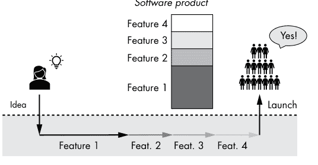

图3-3：一个由四个功能组成的有价值的软件产品

然而，通过一次性发布包含四个功能的软件包，而不是一次发布一个或两个功能，你无法知道市场是否会接受甚至偏好其中的任何功能子集（见图3-4）。

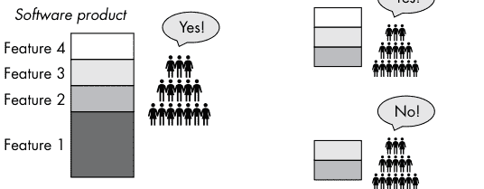

图3-4：市场会接受哪些功能子集？

功能1可能完全无关紧要，尽管它花费了你最多的实现时间。与此同时，功能4可能是市场急需的高价值功能。从 $n$ 个功能中可以产生 $2^n$ 种不同的软件产品组合。如果你将它们作为功能捆绑包发布，你怎么可能知道哪些有价值，哪些是浪费时间？

实现错误功能的成本已经很高，而发布错误功能的捆绑包则增加了维护不必要功能的累积成本：

- 更长、功能繁重的项目需要更多时间在脑海中“加载”整个项目。
- 每个功能都有引入新错误的风险。
- 每一行代码都增加了打开、加载和编译项目的时间成本。
- 实现功能 $n$ 需要你检查所有先前的功能 $1, 2, \dots, n-1$，以确保功能 $n$ 不会干扰它们的功能。
- 每个新功能都需要新的单元测试，这些测试必须在发布下一个代码版本之前编译并运行。
- 每个添加的功能都会使代码库对程序员来说更复杂，增加了新程序员加入项目的学习时间。

这并非详尽无遗的列表，但你明白要点。如果每个功能使你未来的实现成本增加X%，那么维护不必要功能可能导致编码生产力出现数量级的差异。你无法承受在代码项目中系统性地保留不必要的功能！

所以，你可能会问：如果编程的隐形模式不太可能成功，那么解决方案是什么？

### 构建最小可行产品

解决方案很简单：构建一系列MVP。制定一个明确的假设——例如*用户喜欢解决Python谜题*——并创建一个仅验证此假设的产品。移除所有无助于验证此假设的功能。基于该功能构建一个MVP。通过每次发布只实现一个功能，你可以更透彻地了解市场接受哪些功能以及哪些假设是真实的。但无论如何，要避免复杂性。毕竟，如果用户不喜欢解决Python谜题，为什么还要继续实现*Fintexter.com*网站呢？一旦你在真实市场中测试了你的MVP并分析了其效果，你就可以构建第二个MVP，添加下一个最重要的功能。这种通过一系列MVP来寻找合适产品的策略被称为*快速原型设计*。每个原型都建立在你从之前发布中学到的东西之上，每个原型都旨在以最少的时间和精力为你带来最大的学习。你*尽早并经常发布*，以找到*产品市场契合点*，这需要精准把握目标市场的产品需求和愿望（即使这个目标市场一开始非常小）。

让我们看一个使用代码搜索引擎的例子。你首先制定一个待测试的假设：程序员需要一种搜索代码的方式。思考一下，对于你的代码搜索引擎应用，第一个MVP可能采取什么形式？一个基于Shell的API？一个对所有开源GitHub项目进行精确单词匹配数据库查询的后端服务器？第一个MVP必须验证主要假设。因此，你决定验证此假设并获得一些关于可能查询的见解的最简单方法是构建一个用户界面，而没有任何复杂的后端功能来自动检索查询结果。你建立一个带有输入框的网站，并通过在编程小组和社交媒体上分享你的想法以及花费少量广告费来吸引一些流量。应用界面很简单：用户输入他们想要搜索的代码并点击搜索按钮。你不会费心过多优化搜索结果；这不是你第一个MVP的重点。相反，你决定在快速后处理后简单地将结果转发给Google的搜索结果。重点是收集最初的，比如说，一百个搜索查询，以发现一些常见的用户行为模式，甚至在你开始开发搜索引擎之前！

你分析数据，发现90%的搜索查询与错误信息有关；程序员只是将他们的编码错误复制粘贴到搜索框中。此外，你发现90个查询中有60个与JavaScript有关。你得出结论，最初的假设得到了验证：程序员确实在搜索代码。然而，你获得了宝贵的信息，即大多数程序员搜索的是错误，而不是，比如说，函数。根据你的分析，你决定将你的第二个MVP从通用代码搜索引擎缩小到一个*错误*搜索引擎。这样，你可以根据实际用户需求定制产品，并从程序员的一个子群体中获得更投入的反馈，以便快速学习并将你的学习整合到一个有用的产品中。随着你获得越来越多的吸引力和市场洞察力，你总是可以扩展到其他语言和查询类型。如果没有你的第一个MVP，你可能会花费数月时间在几乎没人使用的功能上，比如用于在代码中查找任意模式的正则表达式功能，而牺牲了每个人都使用的功能，如错误信息搜索。

图3-5勾勒了软件开发和产品创建的黄金标准。首先，你通过迭代发布MVP直到用户喜欢它来找到产品市场契合点。MVP的连锁发布随着时间的推移建立兴趣，并让你能够整合用户反馈，逐步改进软件的核心理念。一旦你达到产品市场契合点，你就添加新功能——一次一个。只有当一个功能能够证明它改善了关键用户指标时，它才能保留在产品中。

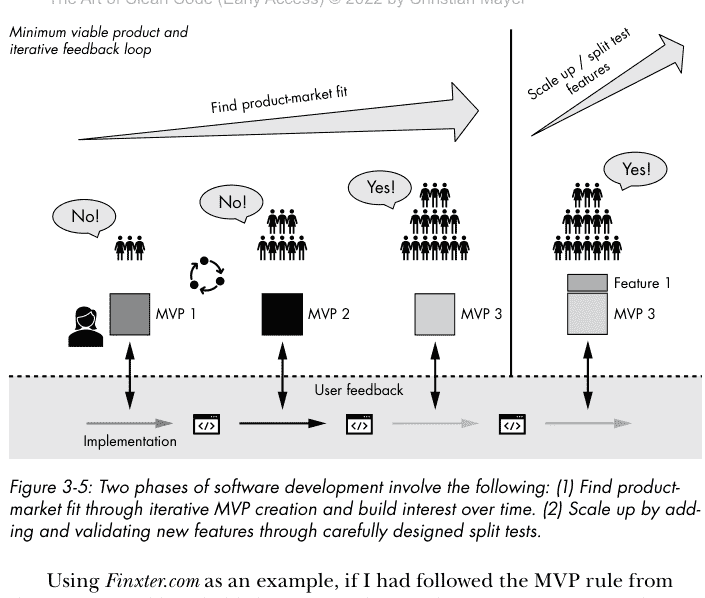

以*Finxter.com*为例，如果我从一开始就遵循MVP规则，我可能会创建一个简单的Instagram账户来分享代码谜题，并检查用户是否喜欢解决它们。与其花费一年时间在没有验证的情况下编写Finxter应用，我本可以花几周甚至几个月在社交网络上分享谜题。然后，我可以从与社区的互动中吸取教训，构建第二个具有稍多功能的MVP，例如一个托管编码谜题及其正确解决方案的专用网站。这种方法本可以让我以一小部分时间和一小部分不必要的功能来构建Finxter应用。构建一个剥离了所有不必要功能的MVP的教训，是我艰难学到的。

MVP的概念由企业家埃里克·莱斯在其畅销书《精益创业》（Crown Publishing，2011）中推广。价值数十亿美元的公司Dropbox就采用了MVP方法。根据《精益创业》，Dropbox的创始人没有花费时间和精力在一个未经测试的想法上，去实现将文件夹结构同步到云的复杂Dropbox功能——这需要在不同操作系统中进行紧密集成，并彻底实现诸如副本同步等繁琐的分布式系统概念——而是用一个简单的产品视频验证了这个想法，尽管视频中展示的产品还不存在。在经过验证的Dropbox MVP之后，进行了无数次迭代，为这个核心项目添加了更多有用的功能，简化了用户的生活。自那时起，这个概念已经在软件行业（以及其他行业）的数千家成功公司中得到了检验。

如果市场信号表明用户喜爱并重视你的产品创意，那么你仅通过一个简单、精心打造的最小可行产品就实现了产品市场契合。在此基础上，你可以迭代地构建和完善你的最小可行产品。

当你采用基于最小可行产品的方法进行软件开发，一次添加一个功能时，能够识别哪些功能该保留、哪些该舍弃至关重要。最小可行产品软件创建过程的最后一步是*拆分测试*：不要将带有新功能的迭代版本发布给所有用户，而是将其发布给一小部分用户，并观察他们的隐性和显性反应。只有当你对结果满意——例如，用户在你网站上的平均停留时间增加了——你才保留该功能。否则，你就舍弃它，并保持没有该功能的上一个迭代版本。这意味着你必须牺牲开发该功能所投入的时间和精力，但这确实能让你的产品尽可能保持简单，使你保持敏捷、灵活和高效。通过使用拆分测试，你便能进行数据驱动的软件开发。

### 构建最小可行产品的四大支柱

在基于最小可行产品思维构建你的第一个软件时，请考虑以下四大支柱：

**功能性** 产品为用户提供一个明确表述的功能，并且做得很好。该功能不必以极高的经济效率提供。你的聊天机器人最小可行产品可能实际上就是你自己与用户聊天；这显然无法规模化，但你正在展示高质量聊天的功能性——即使你尚未想出如何以经济可行的方式提供此功能。

**设计** 产品设计精良且专注，其设计支持你的产品为目标细分市场提供的价值。最小可行产品生成中的一个常见错误是创建一个不能准确反映你单一功能最小可行产品网站的界面。设计可以简单直接，但必须支持价值主张。想想谷歌搜索——他们在发布第一个版本的搜索引擎时肯定没有在设计上投入大量精力，但该设计非常适合他们提供的产品：无干扰的搜索。

**可靠性** 仅仅因为你的产品是极简的，并不意味着它可以不可靠。务必编写测试用例，并严格测试代码中的所有功能。否则，你从最小可行产品中获得的洞见将被基于其不可靠性的负面用户反馈所扭曲，而不是基于功能本身的反馈。记住：你的目标是以最小的努力最大化学习。

**易用性** 最小可行产品必须易于使用。功能被清晰地阐述，设计也对其提供支持。用户不需要花大量时间去弄清楚该做什么或该点击哪些按钮。最小可行产品响应迅速且足够快，以允许流畅的交互。对于一个专注、极简的产品来说，这通常更容易实现：一个只有一个按钮和一个输入框的页面，你应该如何使用是显而易见的。同样，谷歌搜索引擎的初始原型就是一个绝佳的例子，它如此易用，以至于持续使用了二十多年。

许多人经常误解最小可行产品的这一特性：他们错误地假设，因为它是一个产品的极简版本，所以最小可行产品必然提供很少的价值、糟糕的易用性和草率的设计。然而，极简主义者知道，最小可行产品的简洁实际上源于对一个核心功能的严格专注，而非源于懒惰的产品创建。对于Dropbox来说，创建一个展示其意图的有效视频比实现服务本身更容易。该最小可行产品是一个具有出色功能性、设计、可靠性和易用性的高质量产品。

### 最小可行产品的优势

由最小可行产品驱动的软件设计优势是多方面的。

- 你可以尽可能低成本地测试你的假设。
- 你通常可以避免在知道必要之前实际编写代码，而当你确实编写代码时，你可以在收集真实世界反馈之前将工作量降至最低。
- 你编写代码和查找错误所需的时间要少得多——如果你确实这样做了，你会知道这项活动对你的用户具有极高的价值。
- 你交付给用户的任何新功能都会提供即时反馈，持续的进展让你和你的团队保持动力，不断推出一个又一个功能。这极大地最小化了你在编程“隐身模式”下所面临的风险。
- 你降低了未来的维护成本，因为最小可行产品方法极大地降低了代码库的复杂性——并且所有未来的功能都将更容易实现且更不易出错。
- 你将取得更快的进展，并且在整个软件生命周期中实现将更容易——这让你保持积极状态，走在通往成功的道路上。
- 你将更快地交付产品，更快地从软件中赚钱，并更可预测、更可靠地建立你的品牌。

### 隐身模式与最小可行产品方法

反对快速原型开发并*支持*编程隐身模式的一个常见反驳论点是，隐身编程可以保护你的想法。人们假设他们的想法足够特别和独特，如果他们以原始形式（即最小可行产品）发布，它会被更大、更强大的公司窃取，这些公司可以更快地实现它。坦率地说，这是一个谬论。想法廉价；执行为王。任何给定的想法都不太可能是独特的，并且很有可能你的想法已经被其他人想到过。隐身模式非但没有减少竞争，甚至可能鼓励其他人研究相同的想法，因为和你一样，他们假设没有其他人已经想到过它。一个想法要成功，需要有人将其推向现实。如果你快进几年，成功的人将是那些采取快速果断行动、尽早且频繁发布、整合真实用户反馈，并通过利用先前发布的势头逐步改进其软件的人。将想法保密只会限制其增长潜力。

### 结论

在编写任何代码之前，设想你的最终产品并考虑用户的需求。致力于你的最小可行产品，使其有价值、设计精良、响应迅速且易于使用。移除所有功能，只保留那些为实现目标绝对必要的功能。一次专注于一件事。然后，快速且频繁地发布最小可行产品——通过逐步测试和添加更多功能，随时间推移改进它们。少即是多！花更多时间思考下一个要实现的功能，而不是实际实现每个功能。每个功能不仅会产生直接的实现成本，还会为未来所有功能带来间接的实现成本。使用拆分测试一次测试两个产品变体的反应，并快速舍弃那些不能改善关键用户指标（如留存率、页面停留时间或活跃度）的功能。这导致了一种更全面的业务方法——承认软件开发只是整个产品创建和价值交付过程中的一个步骤。

在下一章中，你将学习为什么以及如何编写干净简洁的代码，但请记住：不编写不必要的代码是通往干净简洁代码最可靠的道路！

# 4

## 编写干净简洁的代码


*干净的代码*是易于阅读、理解和修改的代码。只要这些属性不干扰可读性，它就是极简和简洁的。虽然编写干净的代码更像是一门艺术而非科学，但软件工程行业已经就多项原则达成共识，如果遵循这些原则，将帮助你编写*更干净*的代码。在本章中，你将学习17条关于如何编写干净代码的原则，这些原则将显著提高你的生产力并应对复杂性问题。

### 为何要编写整洁代码？

在前面的章节中，你已经了解到复杂性是任何代码项目的头号公敌。你也明白了简洁性能提升你的生产力、动力以及代码库的可维护性。在本章中，我们将进一步探讨这个概念，并向你展示如何编写*整洁代码*。

整洁代码对于未来的你和其他程序员来说都更容易理解，因为人们更愿意在整洁代码的基础上进行添加，协作的可能性也会增加。因此，整洁代码能显著降低项目成本。正如罗伯特·C·马丁在其著作《整洁代码》（Prentice Hall, 2008）中指出的那样，程序员将绝大部分时间花在阅读旧代码上，以便编写新代码。如果旧代码易于阅读，这个过程将会大大加快。

> 事实上，阅读与编写代码所花费的时间比例远超过10比1。我们不断阅读旧代码，这是编写新代码努力的一部分。[因此，]让代码易于阅读，也就让编写代码变得更容易。

如果我们从字面上理解这个比例，这种关系可以用图4-1来可视化。x轴对应于给定代码项目中编写的代码行数。y轴对应于编写额外一行代码所需的时间。通常，你在项目中已经编写的代码越多，编写额外一行代码所需的时间就越长。无论是整洁代码还是混乱代码，这一点都成立。

假设你已经编写了*n*行代码，现在添加第*n+1*行代码。添加这一行可能会潜在地影响所有先前编写的代码行。例如，它可能带来微小的性能损耗，从而影响整个项目。它可能使用了在其他地方定义的变量。它可能引入一个bug（概率为*c*），而要找到这个bug，你必须搜索整个项目。这意味着你的预期时间——因此也是成本——每行代码是*c* * *T(n)*，其中*T*是一个随输入*n*增加而稳定增长的时间函数。添加一行代码也可能迫使你编写额外的代码行以确保向后兼容性。

更长的代码可能会引入许多其他复杂性，但你明白要点了：你编写的代码越多，额外的复杂性就越会拖慢你的进度。

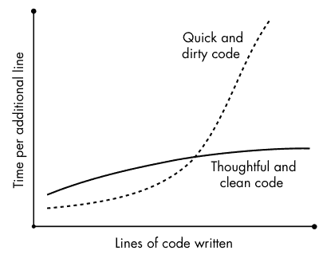

图4-1：整洁代码提升了代码库的可扩展性和可维护性。

图4-1也展示了编写混乱代码与整洁代码的区别。在短期内和对于小型代码项目来说，混乱代码更省时——如果编写混乱代码没有任何好处，就不会有人这么做了！如果你将所有功能塞进一个100行的代码脚本中，你不需要花太多时间思考和重构你的项目。只有当你添加更多代码时，问题才会开始出现：随着你的单体代码文件从100行增长到1000行，与一种更周全的方法（即在不同模块、类或文件中逻辑地组织代码）相比，它的效率会降低。

根据经验法则：始终编写经过深思熟虑的整洁代码。对于任何非平凡项目，重新思考、重构和重组的额外成本将获得数倍的回报。风险有时可能相当高：1962年，美国国家航空航天局（NASA）试图将一艘航天器送往金星，但一个微小的bug——源代码中遗漏了一个连字符——导致工程师们发出了自毁命令，造成了一枚当时价值超过1800万美元的火箭损失。如果代码更整洁，工程师们可能在发射前就发现了这个错误。

无论你是否在从事火箭科学，精心打磨编程的哲学将使你在人生道路上走得更远。简洁的代码也有助于将你的项目扩展到更多程序员和更多功能，因为更少的程序员会被项目的复杂性吓退。

那么，让我们来学习如何编写整洁而简洁的代码，好吗？

### 编写整洁代码：原则

我在攻读博士学位期间，从头开始开发一个分布式图处理系统时，通过艰难的方式学会了编写整洁代码。如果你曾经编写过分布式应用程序——即两个位于不同计算机上的进程通过消息相互交互——你就知道复杂性会迅速变得难以承受。我的代码增长到数千行，bug频繁出现。我有时连续几周毫无进展；这非常令人沮丧。这些概念在理论上很有说服力，但不知为何在我的实现中行不通。

最终，在全职处理代码库大约一个月而没有看到任何令人鼓舞的进展后，我决定彻底简化代码库。在其他改变中，我开始使用库，而不是自己编写功能代码。我删除了那些为了可能以后使用而注释掉的代码块。我重命名了变量和函数。我将代码组织成逻辑单元，并创建了新的类，而不是将所有东西塞进一个“上帝”类中。大约一周后，我的代码不仅对其他研究人员更具可读性和可理解性，而且更高效、bug更少。我的沮丧变成了热情——整洁代码拯救了我的研究项目！

改进代码库并降低复杂性被称为*重构*，如果你想编写整洁而简洁的代码，它必须是你软件开发过程中一个有计划且至关重要的环节。编写整洁代码主要是要记住两件事：知道从头构建代码的最佳方式，并定期回头进行修订。我将在接下来的19个原则中介绍一些保持代码整洁的重要技巧。虽然每个原则都涵盖了编写更整洁代码的独特策略，但有些原则存在重叠，不过我觉得合并重叠的原则会降低清晰度和可操作性。闲话少说，让我们开始第一个原则吧！

#### 原则一：从大局着眼

如果你从事一个非平凡的项目，你最终可能会有多个文件、模块和库在整体应用程序中协同工作。你的*软件架构*定义了你的软件元素如何交互。良好的架构决策可以在性能、可维护性和可用性方面带来巨大的飞跃。要构建良好的架构，你需要退一步，从大局着眼。首先确定需要的功能。在关于构建MVP的[第3章](#)中，你已经学会了如何将项目集中在必要的功能上。如果你这样做，你会节省大量工作，代码在设计上也会整洁得多。此时，我们假设你已经创建了第一个包含多个模块、文件和类的应用程序。你如何运用大局思维来为混乱带来一些秩序？考虑以下问题可以给你一些关于如何最好地使代码更整洁的想法：

- 你是否需要所有单独的文件和模块，或者能否合并其中一些并减少代码的相互依赖性？
- 你能将一个大而复杂的文件分成两个更简单的文件吗？注意，通常在两个极端之间存在一个最佳平衡点：一个完全不可读的大型单体代码块，或者无数个无法在头脑中跟踪的小代码块。两者都不可取，大多数中间阶段都是更好的选择。可以将其想象为一个倒“U”形曲线，其中最大值代表几个大代码块和许多小代码块之间的最佳平衡点。
- 你能将代码泛化并将其转换为库以简化主应用程序吗？
- 你能使用现有的库来消除许多行代码吗？
- 你能使用缓存来避免一遍又一遍地重新计算相同的结果吗？
- 你能使用更直接、更合适的算法来完成与当前算法相同的事情吗？
- 你能移除那些不能提高整体性能的过早优化吗？
- 你能使用另一种更适合当前问题的编程语言吗？

从大局着眼是一种高效的方法，可以大幅降低整个应用程序的复杂性。有时在后期各个阶段实施这些更改很困难，或者因为协作可能会受到干扰。特别是，对于像Windows操作系统这样拥有数百万行代码的应用程序，这种高层次的思考可能很困难。然而，你根本无法完全忽视这些问题，因为所有小的调整加起来也无法减轻错误或懒惰设计选择的负面影响。如果你在一家小型初创公司工作，或者只是为自己工作，你通常可以做出大胆的架构决策，例如快速更改算法。如果你在一个大组织工作，你可能没有那么大的灵活性。应用程序越大，你就越有可能找到简单的修复方法和唾手可得的成果。

#### 原则二：站在巨人的肩膀上

重新发明轮子很少有价值。编程是一个有数十年历史的行业。世界上最好的程序员为我们留下了宝贵的遗产：一个包含数百万经过精心调整和充分测试的算法和代码函数的数据库。访问数百万程序员的集体智慧就像使用一行导入语句一样简单。没有理由不在你自己的项目中使用这种超能力。

使用库代码很可能会提高你的代码效率。被成千上万程序员使用过的函数往往比你自己编写的函数优化得多。此外，库调用比你自己编写的代码更容易理解，并且在你的代码项目中占用的空间更少。例如，假设你需要一个聚类算法来可视化客户群。你可以通过从外部库导入一个经过充分测试的聚类算法并将你的数据传递给它来*站在巨人的肩膀上*。这比使用你自己的代码节省时间得多——它将以更少的bug、更少的空间和更高效的代码实现相同的功能。库是编程大师用来将生产力提高千倍的主要工具之一。

#### 原则三：为人类编写代码，而非机器

你可能认为一段源代码的主要目的是定义机器应该做什么以及如何做。事实并非如此。像 Python 这样的编程语言，其唯一目的是帮助人类编写代码。编译器承担繁重的工作，将你的高级代码翻译成机器能理解的低级代码。是的，你的代码最终将由机器运行。但代码仍然主要由人类编写，在当今的软件开发流程中，代码在部署前很可能需要经过多层人类评判。首先，也是最重要的，你是在为人类编写代码，而不是为机器。

始终假设其他人会阅读你的源代码。想象一下，你转到一个新项目，而其他人必须接手你的代码库。有很多方法可以让他们工作更轻松，并最大限度地减少挫败感。首先，使用有意义的变量名，这样读者就能轻松理解某行代码的意图。清单 4-1 展示了一个变量名选择不当的例子。

```
xxx = 10000
yyy = 0.1
zzz = 10

for iii in range(zzz):
    print(xxx * (1 + yyy)**iii)
```

清单 4-1：使用了选择不当的变量名的代码

很难猜测这段代码计算的是什么。另一方面，清单 4-2 是语义等价的代码，但使用了有意义的变量名。

```
investments = 10000
yearly_return = 0.1
years = 10

for year in range(years):
    print(investments * (1 + yearly_return)**year)
```

清单 4-2：使用了有意义的变量名的代码

这里发生的事情更容易理解：变量名表明了如何计算一笔 10,000 的初始投资，在年回报率为 10% 的情况下，复利计算 10 年后的价值。

虽然我们不会在这里深入探讨实现这一原则的所有方法（尽管后面的原则会更详细地介绍其中一些），但它也适用于其他可能澄清意图的方面，例如缩进、空格、注释和行长度等。简洁的代码从根本上优化了人类的可读性。正如国际软件工程专家、畅销书《重构》的作者马丁·福勒所言：“任何傻瓜都能写出计算机能理解的代码。优秀的程序员写出人类能理解的代码”（Addison-Wesley, 1999）。

#### 原则四：使用正确的名称

与此相关，经验丰富的程序员通常对函数、函数参数、对象、方法和变量（无论是隐式还是显式）有一套特定的命名约定达成共识。遵守这些约定对每个人都有好处：代码变得更具可读性、更易于理解、更整洁。如果你违反这些约定，代码的读者很可能会认为这是由一个缺乏经验的程序员编写的，并且可能不会认真对待你的代码。

这些约定可能因语言而异。例如，按照惯例，Java 使用 `camelCaseNaming` 来命名变量，而 Python 使用 `underscore_naming` 来命名变量和函数。如果你开始在 Python 中使用驼峰命名法，可能会让读者感到困惑。你不希望你非传统的命名约定分散阅读你代码的人的注意力。你希望他们关注你的代码做了什么，而不是你的编码风格。正如*最小惊讶原则*所概述的，通过选择非常规的变量名来让其他程序员感到惊讶是没有价值的。

那么，让我们深入探讨一些在编写源代码时可以考虑的命名规则。

-   选择描述性的名称。假设你创建了一个函数，用于在 Python 中将美元（USD）转换为欧元（EUR）。将其命名为 `usd_to_eur(amount)` 而不是 `f(x)`。
-   选择无歧义的名称。你可能认为 `dollar_to_euro(amount)` 是一个货币转换函数的好名字。虽然它比 `f(x)` 好，但比 `usd_to_eur(amount)` 差，因为它引入了不必要的歧义。你指的是美国、加拿大还是澳大利亚的美元？如果你在美国，答案对你来说可能显而易见，但一个澳大利亚的程序员可能不知道代码是在美国编写的，并可能假设不同的输出。尽量减少这些混淆！
-   使用可发音的名称。大多数程序员在潜意识里通过在心中发音来阅读代码。如果一个变量名不可发音，解读它的问题会耗费注意力和宝贵的心理空间。例如，变量名 `cstmr_1st` 可能具有描述性且无歧义，但它不可发音。选择变量名 `customer_list` 完全值得在代码中多占用一些空间。
-   使用命名常量，而不是魔术数字。在你的代码中，你可能多次使用魔术数字 0.9 作为将美元金额转换为欧元金额的因子。然而，你的代码的读者——包括未来的你——必须思考这个数字的目的。它不是不言自明的。处理魔术数字 0.9 的一个好得多的方法是将其存储在一个全大写的变量中——用于表示它是一个不会改变的常量——例如 `CONVERSION_RATE = 0.9`，并在你的转换计算中将其用作因子。例如，你可能随后将你的收入计算为欧元：`income_euro = CONVERSION_RATE * income_usd`。

这些只是少数命名规则。除了这些快速提示之外，学习命名约定的最佳方式是研究专家精心编写的代码。谷歌搜索相关约定（例如，“Python naming conventions”）是一个很好的起点。你也可以阅读编程教程，加入 StackOverflow 向其他程序员提问，查看开源项目的 GitHub 代码，并加入 Finxter 博客社区，这是一个雄心勃勃的程序员互相帮助提升编程技能的社区。

#### 原则五：遵守标准并保持一致

每种编程语言都有一套隐式或显式的规则，规定如何编写简洁的代码。如果你是一个活跃的程序员，这些标准最终总会追上你。然而，你可以通过花时间学习你正在学习的编程语言的代码标准来加速这个过程。

例如，你可以通过以下链接访问官方 Python 风格指南 PEP 8：https://www.python.org/dev/peps/pep-0008/。与任何风格指南一样，PEP 8 定义了正确的代码布局和缩进；设置换行的方法；一行中的最大字符数；注释的正确使用；你自己的函数文档的编写；以及类、变量和函数的命名约定。例如，清单 4-3 展示了 PEP 8 指南中关于正确使用不同样式和约定的正面示例。你每个缩进级别使用四个空格，一致地对齐函数参数，在参数列表中列出逗号分隔的值时使用单个空格，并通过用下划线组合多个单词来正确命名函数和变量：

```
# Aligned with the opening delimiter.
foo = long_function_name(var_one, var_two,
                        var_three, var_four)

# Add 4 spaces (an extra level of indentation) to distinguish
# arguments from the rest.
def long_function_name(
        var_one, var_two, var_three,
        var_four):
    print(var_one)

# Hanging indents should add a level.
foo = long_function_name(
    var_one, var_two,
    var_three, var_four)
```

清单 4-3：根据 PEP 8 标准在 Python 中使用缩进、空格和命名

清单 4-4 展示了错误的做法。参数没有对齐，变量和函数名中的多个单词没有正确组合，参数列表没有用单个空格正确分隔，缩进级别只有两个或三个空格而不是四个：

```
# Arguments on first line forbidden when not using vertical alignment.
foo = longFunctionName(varone,varTwo,
    var3,varxfour)

# Further indentation required as indentation is not distinguishable.
def longfunctionname(
    var1,var2,var3,
    var4):
    print(var_one)
```

清单 4-4：在 Python 中错误地使用缩进、空格和命名

你代码的所有读者都会期望你遵守公认的标准。任何其他做法都会导致混淆和挫败感。

然而，通读风格指南可能是一项乏味的任务。作为一种不那么枯燥的学习约定和标准的方法，使用代码检查工具和集成开发环境（IDE），它们会告诉你在哪里以及如何犯了错误。在与我的 Finxter 团队参加的一个周末黑客马拉松中，我们创建了一个名为 *Pythonchecker.com* 的工具，它以一种有趣的方式帮助你将 Python 代码从混乱重构为超级整洁。对于 Python，这方面最好的项目之一是 PyCharm 的 *black* 模块。所有主要编程语言都有类似的工具。只需在网上搜索 *<Your Language> Linter* 即可找到适合你编程环境的最佳工具。

#### 原则六：使用注释

如前所述，当为人类而非机器编写代码时，你需要使用注释来帮助读者理解它。考虑清单 4-5 中没有注释的代码。

```
import re

text = '''
    Ha! let me see her: out, alas! She's cold:
    Her blood is settled, and her joints are stiff;
    Life and these lips have long been separated:
    Death lies on her like an untimely frost
    Upon the sweetest flower of all the field.
'''
```

#### 原则七：避免不必要的注释

话虽如此，并非所有注释都能帮助读者更好地理解代码。在某些情况下，注释实际上会降低清晰度，并让给定代码库的读者感到困惑。要编写整洁的代码，你不仅应该使用有价值的注释，还应该避免不必要的注释。

在我担任计算机科学研究员期间，我一位优秀的学生成功申请到了谷歌的工作。他告诉我，谷歌的招聘人员批评了他的代码风格，因为他添加了太多不必要的注释。这类注释是资深程序员判断你是初学者、中级程序员还是专家程序员的另一种方式。代码中的问题，例如违反风格指南、注释懒散或马虎，或者为给定编程语言编写非地道的代码，被称为*代码异味*，它们指向代码中潜在的问题，资深程序员能一眼看穿。

你怎么知道哪些注释应该省略？在大多数情况下，如果注释是多余的，那么它就是不必要的。例如，如果你使用了有意义的变量名，代码通常会变得不言自明，不需要逐行注释。让我们看看清单4-9中使用有意义变量名的代码片段。

```
investments = 10000
yearly_return = 0.1
years = 10

for year in range(years):
    print(investments * (1 + yearly_return)**year)
```

*清单4-9：使用有意义变量名的代码片段*

代码已经清楚地表明，它计算的是你在10%收益率下10年的累计投资回报。为了论证，让我们在清单4-10中添加一些不必要的注释。

```
investments = 10000 # your investments, change if needed
yearly_return = 0.1 # annual return (e.g., 0.1 --> 10%)
years = 10 # number of years to compound

# Go over each year
for year in range(years):
    # Print value of your investment in current year
    print(investments * (1 + yearly_return)**year)
```

*清单4-10：不必要的注释*

清单4-10中的所有注释都是多余的。如果你选择了不太有意义的变量名，其中一些注释本来会有用，但用注释解释一个名为`yearly_return`的变量代表年度回报，只会增加不必要的杂乱。

一般来说，你应该运用常识来判断一个注释是否必要，但以下是一些主要准则。

-   不要使用行内注释。通过选择有意义的变量名，这些注释完全可以避免。
-   不要添加显而易见的注释。在清单4-10中，解释`for`循环语句的注释是不必要的。每个程序员都知道`for`循环，因此在表达式`for year in range(years)`的基础上添加注释`# Go over each year`没有额外价值。
-   不要注释掉旧代码；直接删除它。我们程序员常常会保留我们钟爱的代码片段，即使在（不情愿地）决定删除它们之后，也只是简单地注释掉。这会损害你代码的可读性！始终删除不必要的代码——为了安心，你可以使用版本历史工具，比如Git，它会保存你项目的早期草稿。
-   使用文档功能。许多编程语言，如Python，都内置了文档功能，允许你描述代码中每个函数、方法和类的目的。如果每个函数、方法或类都只承担单一职责（根据原则十），那么通常使用文档而不是注释来描述代码的功能就足够了。

#### 原则八：最小惊讶原则

最小惊讶原则指出，系统的组件应该以大多数用户期望的方式运行。这个原则是设计有效应用程序和用户体验的黄金法则之一。例如，如果你打开谷歌搜索引擎，光标会自动放置在搜索输入框中，这样你就可以立即开始输入搜索关键词，正如你所期望的那样：没有意外。

整洁的代码也运用了这个设计原则。假设你编写了一个货币转换器，将用户的输入从美元转换为人民币。你将用户输入存储在一个变量中。哪个变量名更合适，`user_input`还是`var_x`？最小惊讶原则为你回答了这个问题！

#### 原则九：不要重复自己

不要重复自己（DRY）是一个被广泛认可的原则，它直观地建议避免重复代码。例如，看看清单4-11中的Python代码，它向shell打印了相同的字符串五次。

```
print('hello world')
print('hello world')
print('hello world')
print('hello world')
print('hello world')
```

*清单4-11：打印“hello world”五次*

为了减少重复，更好的写法如清单4-12所示。

```
for i in range(5):
    print('hello world')
```

*清单4-12：减少清单4-11中的重复*

清单4-12中的代码将打印`hello world`五次，与清单4-11一样，但没有冗余。

---

清单4-5：没有注释的代码

清单4-5使用正则表达式分析了莎士比亚《罗密欧与朱丽叶》中的一小段文本。如果你不熟悉正则表达式，你可能很难理解代码的作用。即使是有意义的变量名也帮不上多大忙。
让我们看看添加一些注释是否能解决你的困惑（见清单4-6）。

```
import re

text = '''
    Ha! let me see her: out, alas! She's cold:
    Her blood is settled, and her joints are stiff;
    Life and these lips have long been separated:
    Death lies on her like an untimely frost
    Upon the sweetest flower of all the field.
'''

# Find all words starting with character 'f'
f_words = re.findall('\bf\w+\b', text)
print(f_words)

# Find all words starting with character 'l'
l_words = re.findall('\bl\w+\b', text)
print(l_words)

'''
OUTPUT:
['frost', 'flower', 'field']
['let', 'lips', 'long', 'lies', 'like']
'''
```

*清单4-6：带注释的代码*

❶和❷处的两个简短注释阐明了正则表达式模式`'\bf\w+\b'`和`'\bl\w+\b'`的目的。我不会在这里深入探讨正则表达式，但这个例子展示了注释如何帮助你在不理解语法糖的情况下，粗略理解他人的代码。

你也可以使用注释来抽象代码块。例如，如果你有五行代码用于更新数据库中的客户信息，可以在代码块前添加一个简短的注释来解释这一点，如清单4-7所示。

```
# Process next order
order = get_next_order()
user = order.get_user()
database.update_user(user)
database.update_product(order.get_order())

# Ship order & confirm customer
logistics.ship(order, user.get_address())
user.send_confirmation()
```

*清单4-7：带注释的代码块提供了代码概览*

这展示了一个在线商店如何通过两个高级步骤完成客户订单：❶处理下一个订单和❷发货订单。注释帮助你快速理解代码的目的，而无需解读每个方法调用。

你还可以使用注释来警告程序员潜在的不良后果。例如，清单4-8提醒我们，调用函数`ship_yacht()`实际上会将一艘昂贵的游艇运送给客户。

```
###############################################################
# WARNING                                                     #
# EXECUTING THIS FUNCTION WILL SHIP A $1,569,420 YACHT!! #
###############################################################
def ship_yacht(customer):
    database.update(customer.get_address())
    logistics.ship_yacht(customer.get_address())
    logistics.send_confirmation(customer)
```

*清单4-8：作为警告的注释*

你可以以更多有用的方式使用注释；它们不仅仅是关于正确应用标准。在编写注释时，始终牢记*为人类编写代码*的原则，你就会做得很好。当你阅读经验丰富的程序员的代码时，你会随着时间的推移有效地、几乎是自动地吸收那些不成文的规则。既然你是自己所写代码的专家，有帮助的注释可以让外界一窥你的思考过程。不要错过与他人分享你的见解！

函数也可以作为减少重复的有用工具。假设你需要在代码的多个地方将英里转换为公里，如清单4-13所示。

首先，你创建一个变量 `miles`，并通过乘以1.60934将其转换为公里。其次，你将20英里转换为公里，再次使用相同的转换系数1.60934，并将结果存储在变量 `distance` 中。

```python
miles = 100
kilometers = miles * 1.60934
distance = 20 * 1.60934
print(kilometers)
print(distance)
'''
OUTPUT:
160.934
32.1868
'''
```

清单4-13：两次将英里转换为公里

你通过将英里值乘以系数1.60934来将英里转换为公里，这个乘法过程你已经使用了两次。DRY原则建议，最好编写一个函数 `miles_to_km(miles)` 一次，如清单4-14所示，而不是在代码中多次显式执行相同的转换。

```python
def miles_to_km(miles):
    return miles * 1.60934

miles = 100
kilometers = miles_to_km(miles)
distance = miles_to_km(20)
print(kilometers)
print(distance)
'''
OUTPUT:
160.934
32.1868
'''
```

清单4-14：使用函数将英里转换为公里

这样，代码更容易维护。例如，你可以调整函数以提高转换精度，而你只需在一个地方进行更改。在清单4-13中，你必须搜索代码中的所有实例才能进行此改进。应用DRY原则也使代码更容易被人类读者理解。函数 `miles_to_km(20)` 的目的毫无疑问，但你可能需要更仔细地思考计算 `20 * 1.60934` 的目的。

> 违反DRY原则通常被缩写为WET：*我们喜欢打字，把所有东西写两遍，浪费每个人的时间。*

#### 原则10：单一职责原则

单一职责原则意味着每个函数都应该有一个主要任务。使用许多小函数比使用一个同时完成所有事情的大函数更好。功能的封装降低了整体代码的复杂性。

根据经验法则，每个类和每个函数都应该只有一个职责。该原则的发明者罗伯特·C·马丁将职责定义为*变更的原因*。因此，他在定义类和函数时的黄金标准是，将它们专注于单一职责，这样只有需要更改此单一职责的程序员才会请求更改定义——而其他有不同职责的程序员甚至不会考虑发出更改请求，当然，假设代码是正确的。例如，一个负责从数据库读取数据的函数不应该也负责处理数据。否则，该函数将有两个变更原因：数据库模型的变更和处理需求的变更。如果有多个变更原因，多个程序员可能会同时更改同一个类。你的类职责过多，变得混乱不堪。

让我们考虑一个可能在电子书阅读器上运行的小型Python示例，用于建模和管理用户的阅读体验（清单4-15）。

```python
class Book:
    def __init__(self):
        self.title = "Python One-Liners"
        self.publisher = "NoStarch"
        self.author = "Mayer"
        self.current_page = 0

    def get_title(self):
        return self.title

    def get_author(self):
        return self.author

    def get_publisher(self):
        return self.publisher

    def next_page(self):
        self.current_page += 1
        return self.current_page

    def print_page(self):
        print(f"... Page Content {self.current_page} ...")

python_one_liners = Book()

print(python_one_liners.get_publisher())
# NoStarch

python_one_liners.print_page()
# ... Page Content 0 ...

python_one_liners.next_page()
python_one_liners.print_page()
# ... Page Content 1 ...
```

清单4-15：在违反单一职责原则的同时建模Book类

清单4-15中的代码定义了 `Book` 类，包含四个属性：`title`、`author`、`publisher` 和当前页码。你为这些属性定义了getter方法，以及一些最小功能以移动到下一页，这可能在用户每次按下阅读设备上的按钮时被调用。函数 `print_page()` 负责将当前页面打印到阅读设备。这里只给出了一个桩，在现实世界中会更复杂。最后，你创建了一个名为 `python_one_liners` 的 `Book` 实例，并在最后几行通过一系列方法调用和打印语句访问其属性。例如，一个真正的电子书阅读器实现会在用户阅读书籍时每次请求新页面时调用 `next_page()` 和 `print_page()` 方法。

虽然代码看起来干净简单，但它违反了单一职责原则：`Book` 类既负责建模数据（如书籍内容），又负责将书籍打印到设备。建模和打印是两个不同的功能，但被封装在一个类中。你有多个变更原因。你可能想要更改书籍数据的建模：例如，你可以使用数据库而不是基于文件的输入/输出方法。但你也可能想要通过使用另一种书籍格式方案在其他类型的屏幕上来更改建模数据的表示。

让我们在清单4-16中修复这个问题。

```python
class Book:
    def __init__(self):
        self.title = "Python One-Liners"
        self.publisher = "NoStarch"
        self.author = "Mayer"
        self.current_page = 0

    def get_title(self):
        return self.title

    def get_author(self):
        return self.author

    def get_publisher(self):
        return self.publisher

    def get_page(self):
        return self.current_page

    def next_page(self):
        self.current_page += 1

class Printer:
    def print_page(self, book):
        print(f"... Page Content {book.get_page()} ...")

python_one_liners = Book()
printer = Printer()

printer.print_page(python_one_liners)
# ... Page Content 0 ...

python_one_liners.next_page()
printer.print_page(python_one_liners)
# ... Page Content 1 ...
```

清单4-16：遵循单一职责原则

清单4-16中的代码完成了相同的任务，但它满足了单一职责原则。你同时创建了 `Book` 和 `Printer` 类。`Book` 类表示书籍元数据和当前页码，而 `Printer` 类负责将书籍打印到设备。你将要打印当前页面的书籍传递给方法 `Printer.print_page()`。这样，数据建模（数据是什么？）和数据呈现（数据如何呈现给用户？）被解耦，代码变得更容易维护。例如，如果你想通过添加新属性 `publishing_year` 来更改书籍数据模型，你会在 `Book` 类中进行。如果你想通过向读者提供此信息来反映数据呈现中的更改，你会在 `Printer` 类中进行。

#### 原则11：测试

测试驱动开发是现代软件开发不可或缺的一部分。无论你多么熟练，你都会在代码中犯错。为了发现它们，你需要定期运行测试，或者首先构建测试驱动的代码。每个伟大的软件公司在将最终产品发布给公众之前都会进行多级测试，因为在内部发现错误远比从不满意的用户那里得知要好。

虽然你可以执行的测试类型没有限制，但以下是最常见的类型：

- **单元测试** 通过单元测试，你编写一个单独的应用程序来检查应用程序中每个函数的不同输入的正确输入/输出关系。单元测试通常定期应用——例如，每次发布新的软件版本时。这通过降低软件更改导致以前稳定的功能突然失败的可能性来确保一定程度的进展。

- **用户验收测试** 这些测试允许你目标市场中的人在受控环境中使用你的应用程序，同时你观察他们的行为。然后你询问他们对应用程序的看法以及如何改进。这些测试通常在组织内进行广泛测试后，在项目开发的最后阶段部署。

- **冒烟测试** 冒烟测试是粗略的测试，旨在尝试使正在开发的应用程序在构建软件的团队将其交给测试团队之前失败。换句话说，冒烟测试通常由应用程序构建团队在交给测试团队之前进行质量保证。当应用程序通过冒烟测试时，它就准备好进行下一轮测试。

- **性能测试** 性能测试旨在显示应用程序是否满足甚至超过用户的性能要求，而不是测试实际功能。例如，在Netflix发布新功能之前，它必须测试其网站的页面加载时间。如果新功能使前端速度过慢，Netflix就不会发布它，主动避免负面的用户体验。

- **可扩展性测试** 如果你的应用程序变得成功，你可能需要处理每分钟1000个请求，而不是原来的2个请求。可扩展性测试将显示你的应用程序是否具有足够的可扩展性来处理这种情况。请注意，高性能的应用程序不一定可扩展，反之亦然。例如，快艇性能非常高，但无法同时扩展到数千人！

测试和重构通常会降低代码的复杂性和错误数量。但是，要小心不要过度工程化（参见*原则14*）——你需要测试只能在现实世界中发生的场景。例如，考虑到地球上只有70亿潜在观众，测试Netflix应用程序是否能处理1000亿个流媒体设备是没有必要的。

#### 原则12：小即是美

小代码是指仅需相对较少的行数就能完成单一指定任务的代码。以下是一个小代码函数的示例，它从用户处读取一个整数值，并确保输入确实是一个整数：

```python
def read_int(query):
    print(query)
    print('Please type an integer next:')
    try:
        x = int(input())
    except:
        print('Try again - type an integer!')
        return read_int(query)
    return x

print(read_int('Your age?'))
```

该代码会一直运行，直到用户输入一个整数。以下是一个运行示例：

```
Your age?
Please type an integer next:
hello
Try again - type an integer!
Your age?
Please type an integer next:
twenty
Try again - type an integer!
Your age?
Please type an integer next:
20
20
```

通过将从用户处读取整数值的逻辑分离出来，你可以多次重用同一个函数。但更重要的是，你已将代码分解成更小的功能单元，这些单元相对易于阅读和理解。

相反，许多初学者程序员（或懒惰的中级程序员）会编写大型、整体式的代码函数，或所谓的*上帝对象*，以集中方式完成所有事情。这些整体式代码块是维护的噩梦。首先，人类一次理解一个小代码函数，比试图将一个特定功能集成到一个万行代码块中要容易得多。在大型代码块中，你可能犯的错误远比在几个小函数和代码块中多，而后者可以与你现有的代码库集成。

在本章开头，图4-1显示，随着每一行代码的增加，编写代码变得更加耗时，尽管从长远来看，编写整洁代码比编写混乱代码要快得多。图4-2比较了处理小代码块与整体式代码块所需的时间。对于大型代码块，添加每一行额外代码所需的时间将超线性增长。然而，如果你将多个小代码函数堆叠在一起，每增加一行代码所花费的时间则呈准线性增长。为了最好地实现这种效果，你需要确保每个代码函数或多或少独立于其他代码函数。你将在下一个原则*迪米特法则*中了解更多关于这个想法的内容。

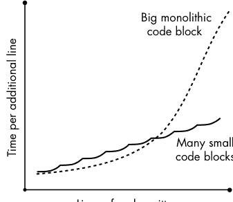

*图4-2：编写小而解耦的代码函数可以减轻复杂性的负担。对于大型整体式代码块，时间呈指数级增长。对于许多小代码块，时间呈准线性增长。*

#### 原则13：迪米特法则

依赖无处不在。当你在代码中导入一个库时，你的代码部分依赖于该库的功能，但它内部也会有相互依赖。在面向对象编程中，一个函数可能依赖于另一个函数，一个对象依赖于另一个对象，一个类定义依赖于另一个类定义。

要编写整洁代码，请遵循*迪米特法则*来最小化代码元素之间的相互依赖。该法则由软件开发者伊恩·霍兰德在20世纪80年代末提出，他当时参与了一个以希腊农业、生长和生育女神*得墨忒耳*命名的软件项目。该项目组提倡“培育软件”的理念，而不是简单地构建它。然而，后来被称为迪米特法则的东西与这些可以说更具形而上学的理念关系不大——它是在面向对象编程中编写松耦合代码的一种实用方法。以下是项目组网站 http://ccs.neu.edu/home/lieber/what-is-demeter.html 上解释迪米特法则的一段简洁引文：

> 得墨忒耳的一个重要概念是将软件分成至少两部分：第一部分定义对象。第二部分定义操作。得墨忒耳的目标是保持对象和操作之间的松耦合，以便可以对任一方进行修改而不会对另一方产生严重影响。这大大减少了维护时间。

换句话说，你应该最小化代码对象的依赖。通过减少代码对象之间的依赖，你可以降低代码的复杂性，从而提高可维护性。一个具体的含义是，每个对象应该只调用自己的方法或相邻对象的方法，而不是调用它通过调用相邻对象的方法获得的对象的方法。为了便于解释，让我们定义两个对象A和B为*朋友*，如果A调用B提供的方法。很简单。但如果B的方法返回一个指向对象C的引用呢？现在，对象A可能执行类似这样的操作：`B.method_of_B().method_of_C()`。这被称为方法调用的*链式调用*——在我们的比喻中，你在和你朋友的朋友说话。迪米特法则指出*只和你直接的朋友交谈*，因此它不鼓励这种类型的链式调用。这起初可能听起来令人困惑，所以让我们深入探讨图4-3中展示的一个更实际的例子。

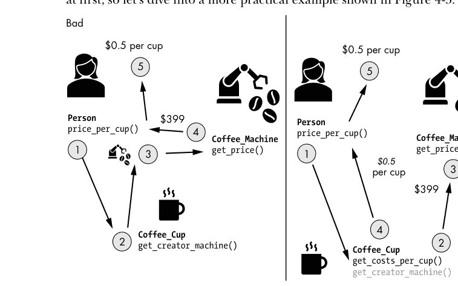

图4-3展示了两个面向对象的代码项目，它们计算给定人物每杯咖啡的价格。其中一个实现违反了迪米特法则，而另一个则遵守了它。让我们先从反面例子开始，其中你在Person类中使用链式调用在❶处与陌生人交谈（见清单4-17）。

```python
# VIOLATE LAW OF DEMETER (BAD)

class Person:
    def __init__(self, coffee_cup):
        self.coffee_cup = coffee_cup

    def price_per_cup(self):
        cups = 798
        ❶ machine_price = self.coffee_cup.get_creator_machine().get_price()
        return machine_price / cups

class Coffee_Machine:
    def __init__(self, price):
        self.price = price

    def get_price(self):
        return self.price


class Coffee_Cup:
    def __init__(self, machine):
        self.machine = machine

    def get_creator_machine(self):
        return self.machine

m = Coffee_Machine(399)
c = Coffee_Cup(m)
p = Person(c)

print('Price per cup:', p.price_per_cup())
# 0.5
```

清单4-17：在❶处违反迪米特法则的代码

你创建了一个方法`price_per_cup()`，它根据咖啡机的价格和该机器生产的杯数来计算每杯咖啡的硬成本。`Coffee_Cup`对象收集有关咖啡机价格的信息（这影响了每杯的价格），并将其传递给`Person`对象上`price_per_cup()`方法的调用者。

左侧的图示展示了这样做的一个糟糕策略。让我们首先看看清单4-17代码的逐步解释。

1.  方法`price_per_cup()`调用方法`Coffee_Cup.get_creator_machine()`以获取创建该咖啡的`Coffee_Machine`对象的引用。
2.  方法`get_creator_machine()`返回一个指向生产了杯中内容的`Coffee_Machine`对象的对象引用。
3.  方法`price_per_cup()`在它刚刚从之前的`Coffee_Cup`方法调用中获得的`Coffee_Machine`对象上调用方法`Coffee_Machine.get_price()`。
4.  方法`get_price()`返回机器的价格。
5.  方法`price_per_cup()`计算每杯的折旧，并用此来估算单杯的价格。这被返回给方法的调用者。

这是一个糟糕的策略，因为`Person`类依赖于两个对象：`Coffee_Cup`和`Coffee_Machine`。负责维护此类的程序员必须了解这两个父类定义——其中任何一个的更改都可能影响`Person`类。

迪米特法则最小化了此类依赖。你可以在图4-3的右侧以及代码清单4-18中看到建模同一问题的更好方法。在此代码片段中，Person类不直接与Machine类交谈——它甚至不需要知道它的存在！

```python
# ADHERE TO LAW OF DEMETER (GOOD)
class Person:
    def __init__(self, coffee_cup):
        self.coffee_cup = coffee_cup

    def price_per_cup(self):
        cups = 798
        return self.coffee_cup.get_costs_per_cup(cups)

class Coffee_Machine:
    def __init__(self, price):
        self.price = price

    def get_price(self):
        return self.price

class Coffee_Cup:
    def __init__(self, machine):
        self.machine = machine

    def get_creator_machine(self):
        return self.machine

    def get_costs_per_cup(self, cups):
        return self.machine.get_price() / cups

m = Coffee_Machine(399)
c = Coffee_Cup(m)
p = Person(c)

print('Price per cup:', p.price_per_cup())
# 0.5
```

清单4-18：通过不与陌生人交谈来遵守迪米特法则的代码

让我们逐步检查这段代码：

1.  方法`price_per_cup()`调用方法`Coffee_Cup.get_costs_per_cup()`以获取估算的每杯价格。
2.  方法`get_costs_per_cup()`在回复调用方法之前，调用方法`Coffee_Machine.get_price()`以访问整台机器所需的定价信息。
3.  方法`get_price()`返回价格信息。
4.  方法`get_costs_per_cup()`计算每杯价格，并将其返回给调用方法`price_per_cup()`。
5.  方法`price_per_cup()`只是将这个计算出的值转发给它的调用者。

这是一种更优的方法，因为`Person`类现在独立于`Coffee_Machine`类。依赖总数减少了。对于一个拥有数百个类的项目，减少依赖能显著降低应用程序的整体复杂性。以下是大型应用程序在复杂性增长方面的风险：潜在依赖的数量随对象数量呈超线性增长。粗略地说，超线性曲线比具有恒定斜率的直线增长得更快。例如，对象数量翻倍很容易导致依赖数量（等于复杂性）增加四倍。然而，迪米特法则可以通过显著减少依赖数量来抵消这种趋势。如果每个对象只与*k*个其他对象通信，并且你有*n*个对象，那么依赖总数将被限制在*k*n*以内，如果*k*是常数，这就是一种线性关系。因此，迪米特法则在数学上能帮助你优雅地扩展应用程序！

#### 原则 14：你不会需要它

该原则建议，如果你只是*怀疑*将来某天可能需要使用某段代码，就不应该实现它——因为你不会需要它！只有在百分之百确定必要时才编写代码。为今天的需求编码，而不是为明天。如果将来你确实需要之前只是怀疑需要的代码，你仍然可以那时再实现该功能。但与此同时，你已经节省了许多不必要的代码行。

从第一性原理思考会有所帮助：最简单、最干净的代码是空文件。那么，从那里开始——你*需要*添加什么？在第3章中，你了解了MVP：剥离了功能以专注于核心功能的代码。如果你最小化追求的功能数量，你将获得比通过重构方法或所有其他原则组合所能达到的更干净、更简单的代码。考虑省略那些相比其他可实现功能价值相对较小的功能。机会成本很少被衡量，但往往意义重大。在考虑实现某个功能之前，你真的应该*需要*它。

其含义之一是避免*过度工程化*：创建一个性能更高、更健壮或包含比所需更多功能的产品。这会增加不必要的复杂性，应立即引起你的警觉。

例如，我经常遇到一些问题，使用简单的算法方法几分钟内就能解决，但像许多程序员一样，我拒绝接受这些算法的微小限制。相反，我研究了最先进的聚类算法，以比简单的KMeans算法多挤出几个百分点的聚类性能。这些长尾优化成本极高——我花了80%的时间才获得20%的改进。如果我*需要*那20%并且没有其他方法获得它，这将是不可避免的，但实际上，我并不需要实现花哨的聚类算法。一个典型的过度工程化案例！

始终优先选择唾手可得的成果。使用简单的算法和直接的方法建立基准，然后分析哪些新功能和性能优化能为整体应用带来更优的结果。全局思考，而非局部：关注大局（根据*原则1*），而不是耗时的小修补。

#### 原则 15：不要使用过多的缩进层级

大多数编程语言使用文本缩进来可视化可能嵌套的条件块、函数定义或代码循环的层次结构。然而，过度使用缩进会降低代码的可读性。清单4-19展示了一个缩进层级过多的代码片段示例，这使得快速理解变得困难。

```
def if_confusion(x, y):
    if x>y:
        if x-5>0:
            x = y
            if y==y+y:
                return "A"
            else:
                return "B"
        elif x+y>0:
            while x>y:
                x = x-1
            while y>x:
                y = y-1
            if x==y:
                return "E"
        else:
            x = 2 * x
            if x==y:
                return "F"
            else:
                return "G"
    else:
        if x-2>y-4:
            x_old = x
            x = y * y
            y = 2 * x_old
            if (x-4)**2>(y-7)**2:
                return "C"
            else:
                return "D"
        else:
            return "H"

print(if_confusion(2, 8))
```

*清单 4-19：嵌套代码块层级过多*

如果你现在尝试猜测这段代码的输出，你会发现它实际上很难追踪。代码函数`if_confusion(x, y)`对变量`x`和`y`执行相对简单的检查。然而，很容易在不同的缩进层级中迷失。代码一点也不干净。
清单4-20展示了如何更干净、更简单地编写相同的代码。

```
def if_confusion(x,y):
    if x>y and x>5 and y==0:
        return "A"
    if x>y and x>5:
        return "B"
    if x>y and x+y>0:
        return "E"
    if x>y and 2*x==y:
        return "F"
    if x>y:
        return "G"
    if x>y-2 and (y*y-4)**2>(2*x-7)**2:
        return "C"
    if x>y-2:
        return "D"
    return "H"
```

*清单 4-20：更少的嵌套代码块层级*

在清单4-20中，我们减少了缩进和嵌套。你现在可以查看所有检查，看看哪个首先适用于你的两个参数`x`和`y`。大多数程序员会更喜欢阅读扁平的代码，而不是高度嵌套的代码——即使这以冗余检查为代价；例如，这里多次检查了`x>y`。

#### 原则 16：使用度量指标

使用代码质量指标来跟踪代码复杂性随时间的变化。最终的、虽然是非正式的指标被称为每分钟WTF数，旨在衡量代码读者的挫败感。对于干净简单的代码，结果会很低；对于混乱、令人困惑的代码，结果会很高。
作为这个难以量化标准的替代，你可以使用已建立的指标，如NPath复杂度或圈复杂度，这些在第1章“复杂性如何损害你的生产力”中已经展示过。对于大多数IDE，许多在线工具和插件会在你编写源代码时自动计算复杂度，例如CyclomaticComplexity，你可以在JetBrains的插件部分搜索找到，网址是https://plugins.jetbrains.com/。根据我的经验，实际使用的复杂度度量不如意识到你需要尽可能消除复杂性这一事实重要。我强烈推荐使用这些工具来帮助你编写更干净、更简单的代码。你投入时间的回报将是巨大的。

《整洁代码的艺术》（早期访问版）© 2022 Christian Mayer

#### 原则 17：童子军规则与重构

童子军规则很简单：*离开时比你来时更干净。* 这是一个生活和编码的好规则。养成清理你遇到的每一段代码的习惯。这不仅会改善你参与的代码库，让你自己的生活更轻松，还能帮助你培养出大师级程序员的敏锐眼光，能够快速批判性地评估源代码。作为额外的好处，它将帮助你的团队提高生产力，你的同事也会感激你以价值为导向的态度。请注意，这不应违反我们之前陈述的关于避免过早优化（过度工程化）的规则。花时间清理代码以减少复杂性几乎总是高效的。这样做将在减少维护开销、错误和认知需求方面产生巨大的回报。简而言之，过度工程化可能会*增加*复杂性，而清理代码则会*减少*复杂性。

改进代码的过程称为*重构*。你可以说重构是包含我们在此讨论的每个原则的整体方法。作为一个优秀的程序员，你会从一开始就融入许多整洁代码的原则。即便如此，你仍然需要偶尔重构代码，以清理你制造的任何混乱。特别是在发布任何新功能之前，你应该重构代码以保持代码整洁。

重构代码有许多技巧。一种是向同事解释你的代码，或者让他们检查，以发现你自己没有注意到的任何不良决策。例如，你可能创建了两个类`Cars`和`Trucks`，因为你预期你的应用程序需要对两者进行建模。当你向队友解释代码时，你意识到你并不经常使用`Trucks`类——而当你使用时，你使用的是`Car`类中已经存在的方法。你的同事建议创建一个`Vehicle`类来处理所有的汽车和卡车。这让你能够立即删除许多行代码。这种思维方式可以带来巨大的改进，因为它将迫使你解释你的决策，并从鸟瞰视角解释你的项目。

如果你是一个内向的程序员，你也可以向橡皮鸭解释你的代码——这种技术被称为*橡皮鸭调试*。

除了与同事（或你的橡皮鸭）交流，你还可以使用这里列出的其他整洁代码原则，不时地快速评估你的代码。当你这样做时，你可能会发现一些可以快速应用的调整，通过清理代码库来大大降低复杂性。这个软件开发过程的重要组成部分将显著改善你的成果。

### 结论

在本章中，你学习了17个关于如何编写干净简单代码的原则。你了解到整洁代码能降低复杂性，提高你的生产力以及应用程序的可扩展性和可维护性。

项目。你已经了解到，应该尽可能使用库来减少代码混乱并提高代码质量。你已经了解到，选择有意义的变量和函数名称，同时遵守标准，对于减少未来代码阅读者的理解障碍至关重要。你已经了解到，设计函数时应使其只做一件事。通过最小化依赖关系（根据迪米特法则）来降低复杂性、提高可扩展性，可以通过避免直接和间接的方法链来实现。你已经学会了以一种能提供有价值洞察的方式来注释代码，但你也学会了避免不必要或琐碎的注释。而且，最重要的是，你已经明白，解锁你编写整洁代码超能力的关键在于为人类编写代码，而非为机器。

你可以通过与优秀的程序员合作、在GitHub上阅读他们的代码，以及研究你所用编程语言的最佳实践，来逐步提升编写整洁代码的技能。将一个能动态检查你的代码是否符合这些最佳实践的代码检查工具集成到你的编程环境中。时不时地，回顾这些整洁代码原则，并用它们来审视你当前的项目。

在下一章中，你将学习另一个超越编写整洁代码的有效编码原则：过早优化。你会惊讶于程序员们浪费了多少时间和精力，因为他们尚未意识到*过早优化是万恶之源！*

## 5 过早优化是万恶之源


在本章中，你将了解过早优化如何阻碍你的生产力。*过早优化*是指在拥有所有相关信息之前，就将宝贵的资源——时间、精力、代码行数——投入到不必要的代码优化中。这是编写糟糕代码的主要问题之一。

过早优化有多种形式；本章将介绍其中一些最相关的类型。我们将研究过早优化发生的一些实际案例，这些案例与你自己的代码项目最为相关。本章最后将提供关于性能调优的可操作建议，确保它*不是*过早的。

### 六种过早优化

优化代码本身并无问题，但它总是伴随着代价，无论是额外的编程时间还是更多的代码行数。当你优化代码片段时，你通常是在用复杂性换取性能。有时你可以同时获得低复杂性和高性能，例如通过编写整洁的代码，但这需要你投入编程时间来实现！如果你在过程中过早地这样做，你常常会浪费时间去优化那些在实践中可能永远不会被使用，或者对程序整体运行时间影响甚微的代码。你还会在没有足够上下文（关于代码何时被调用）和数据（关于可能的输入值）的情况下进行优化。浪费宝贵的资源，如编程时间和代码行数，可能会使你的生产力降低几个数量级，因此了解如何明智地使用它们非常重要。

但不要只听我一个人的说法。以下是计算机科学史上最具影响力的人物之一，唐纳德·克努特，关于过早优化的论述：

> 程序员在思考或担心其程序中非关键部分的速度上浪费了大量时间，而这些对效率的追求在考虑调试和维护时实际上会产生强烈的负面影响。我们应该忘记小的效率提升，大约97%的时间都应如此：过早优化是万恶之源。¹

过早优化可以采取多种形式，因此为了探讨这个问题，我们将看看我遇到的六种常见情况，在这些情况下，你也可能忍不住过早地关注小的效率提升，从而拖慢你的进度。

#### 优化代码函数

在了解函数将被使用多少次之前，要警惕花时间优化它们。假设你遇到一个函数，你实在无法忍受它未被优化。你对自己说，使用朴素的方法是糟糕的编程风格，应该使用更高效的数据结构或算法来解决问题。你进入研究模式，花数小时研究和微调算法。但事实证明，这个函数在最终项目中只执行了几次：优化并未带来有意义的性能提升。

#### 优化功能

避免添加并非绝对必要的功能，并浪费时间去优化这些功能。假设你开发了一款将文本转换为摩尔斯电码（通过闪烁灯光表示）的智能手机应用。你在第3章中了解到，首先实现一个最小可行产品（MVP），而不是创建一个包含许多可能不必要的功能的精致最终产品，是最佳方式。在这种情况下，MVP将是一个简单的应用，只有一个功能：通过简单的输入表单提供文本并点击按钮，将文本转换为摩尔斯电码。然而，你认为MVP规则不适用于你的项目，并决定添加一些额外功能：一个文本转音频转换器和一个将光信号转换为文本的接收器。应用发布后，你发现用户从未使用过这些功能。过早优化显著拖慢了你的产品开发周期，并延迟了你整合用户反馈的能力。

#### 优化规划

如果你过早地优化规划阶段，试图为尚未发生的问题寻找解决方案，你可能会延迟获得宝贵反馈的能力。虽然你当然不应该完全避免规划，但陷入规划阶段同样代价高昂。为了向现实世界交付有价值的东西，你必须接受不完美。你需要用户反馈和测试人员的合理性检查来确定重点。规划可以帮助你避免某些陷阱，但如果你不采取行动，你将永远无法完成项目，并将困在理论的象牙塔中。

#### 优化可扩展性

在你对目标受众有现实了解之前，过早地优化应用程序的可扩展性可能是一个主要的干扰项，并且很容易让你损失数万美元的开发和服务器时间。预期有数百万用户，你设计了一个分布式架构，在必要时动态添加虚拟机来处理峰值负载。然而，创建分布式系统是一项复杂且容易出错的任务，可能需要你数月时间来实现。许多项目最终还是失败了；即使你真的像你最狂野的梦想那样成功，你也会有充足的机会随着需求的增加来扩展你的系统。更糟糕的是，由于增加了通信和数据一致性开销，分布式架构可能会*降低*应用程序的可扩展性。可扩展的分布式系统是有代价的——你确定需要支付这个代价吗？在服务第一个用户之前，不要试图扩展到数百万用户。

#### 优化测试设计

过早地为测试进行优化也是浪费开发人员时间的一个主要驱动因素。测试驱动开发有许多狂热的追随者，他们误解了*在功能实现之前编写测试*的理念，认为总是要先写测试——即使代码函数的目的纯粹是实验性的，或者代码函数本身就不适合测试。编写实验性代码是为了测试概念和想法，给实验性代码再添加一层测试可能会阻碍进度，并且不符合快速原型设计的理念。除此之外，假设你信奉严格的测试驱动开发，并坚持100%的测试覆盖率。有些函数——例如，处理用户自由文本的函数——由于其不可预测的基于人类的输入，与单元测试配合得并不好。对于这些函数，只有真实的人类才能以有意义的方式进行测试——在这些情况下，真实的用户*是*唯一重要的测试。

¹ "Structured Programming with *go to* Statements," *ACM Computing Surveys* 6 no. 1 (1974).

然而，你过早地为实现单元测试的完美覆盖而进行优化。这种做法价值甚微：它不仅拖慢了软件开发周期，还引入了不必要的复杂性。

#### 优化面向对象的世界构建

面向对象的方法常常会引入重大的不必要复杂性和过早的“概念”优化。假设你想用一个复杂的类层次结构来建模你的应用世界。你编写了一个关于赛车的小游戏。你创建了一个类层次结构，其中保时捷类继承自汽车类，而汽车类又继承自车辆类。毕竟，每辆保时捷都是一辆汽车，每辆汽车都是一辆交通工具。然而，这种多级类层次结构会导致你的代码库变得复杂，未来的程序员会难以理解你的代码功能。在许多情况下，这类堆叠的继承结构会增加不必要的复杂性。通过运用最小可行产品（MVP）的理念来避免它们：从最简单的模型开始，只在需要时才进行扩展。不要为了建模一个比应用实际需要更详细的世界而优化你的代码。

### 过早优化：一个故事

既然你已经大致了解了过早优化可能带来的问题，让我们编写一个小型的 Python 应用程序，并实时观察过早优化如何为一个不需要优雅扩展到数千用户的小型交易跟踪应用程序的代码增加不必要的复杂性。

爱丽丝、鲍勃和卡尔每周五晚上玩扑克。几轮之后，他们决定需要开发一个系统来跟踪每个玩家在给定游戏之夜后所欠的钱。爱丽丝是一位充满热情的程序员，她创建了一个跟踪玩家余额的小应用程序，如代码清单 5-1 所示。

```python
transactions = []
balances = {}

def transfer(sender, receiver, amount):
    transactions.append((sender, receiver, amount))
    if not sender in balances:
        balances[sender] = 0
    if not receiver in balances:
        balances[receiver] = 0
    balances[sender] -= amount
    balances[receiver] += amount

def get_balance(user):
    return balances[user]

def max_transaction():
    return max(transactions, key=lambda x: x[2])
```

```python
transfer('Alice', 'Bob', 2000)
transfer('Bob', 'Carl', 4000)
transfer('Alice', 'Carl', 2000)
```

```python
print('Balance Alice: ' + str(get_balance('Alice')))
print('Balance Bob: ' + str(get_balance('Bob')))
print('Balance Carl: ' + str(get_balance('Carl')))
```

```python
print('Max Transaction: ' + str(max_transaction()))
```

```python
transfer('Alice', 'Bob', 1000)
transfer('Carl', 'Alice', 8000)
```

```python
print('Balance Alice: ' + str(get_balance('Alice')))
print('Balance Bob: ' + str(get_balance('Bob')))
print('Balance Carl: ' + str(get_balance('Carl')))
```

```python
print('Max Transaction: ' + str(max_transaction()))
```

*代码清单 5-1：一个跟踪交易和余额的简单脚本*

该脚本有两个全局变量：`transactions` 和 `balances`。列表 `transactions` 跟踪游戏之夜期间玩家之间发生的交易。每笔交易是一个元组，包含发送者标识符、接收者标识符以及从发送者转移到接收者的金额 ①。字典 `balances` 跟踪玩家的当前余额：一个将用户标识符映射到该用户基于迄今为止发生的交易所得信用点数的字典 ②。

函数 `transfer(sender, receiver, amount)` 在全局列表中创建并存储一笔新交易，如果发送者和接收者的余额尚不存在则为其创建新余额，并根据给定金额更新余额。函数 `get_balance(user)` 返回作为参数传入的用户的余额，而 `max_transaction()` 遍历所有交易并返回第三个元组元素（即交易金额）最大的那一笔。

最初所有余额均为零。应用程序将 2000 单位从爱丽丝转给鲍勃 ③，将 4000 单位从鲍勃转给卡尔 ④，并将 2000 单位从爱丽丝转给卡尔 ⑤。此时，爱丽丝欠 4000（余额为 -4000），鲍勃欠 2000，卡尔有 6000 单位。在打印最大交易之后，爱丽丝将 1000 单位转给鲍勃 ⑥，卡尔将 8000 单位转给爱丽丝 ⑦。现在，账户发生了变化：爱丽丝有 3000，鲍勃 -1000，卡尔 -2000 单位。具体来说，应用程序输出如下：

```
Balance Alice: -4000
Balance Bob: -2000
Balance Carl: 6000
Max Transaction: ('Bob', 'Carl', 4000)
Balance Alice: 3000
Balance Bob: -1000
Balance Carl: -2000
Max Transaction: ('Carl', 'Alice', 8000)
```

但爱丽丝对这个应用程序并不满意。她意识到调用 `max_transaction()` 会导致冗余计算——因为该函数被调用了两次，脚本遍历了 `transactions` 列表两次以找到金额最大的交易。但在第二次计算 `max_transaction()` 时，它通过遍历所有交易来寻找最大值，部分重复了相同的计算——包括那些它已经知道最大值的交易，即前三笔交易 ❶–❸。爱丽丝正确地看到了一些*优化潜力*，她引入了一个新变量 `max_transaction`，每当创建新交易时，该变量都会跟踪迄今为止看到的最大交易。

代码清单 5-2 展示了爱丽丝为实现这一更改而添加的三行代码。

```python
transactions = []
balance = {}
max_transaction = ('X', 'Y', float('-Inf'))

def transfer(sender, receiver, amount):
    ...
    if amount > max_transaction[2]:
        max_transaction = (sender, receiver, amount)
```

*代码清单 5-2：应用优化以减少冗余计算*

变量 `max_transaction` 维护着迄今为止所有交易中的最大交易金额。因此，无需在每个游戏之夜后重新计算最大值。最初，你将最大交易值设置为负无穷大，这样第一笔真实交易肯定会更大。每次添加新交易时，程序都会将该新交易与当前最大值进行比较，如果它更大，则当前交易成为当前最大值。如果没有优化，如果你在一个包含 1000 笔交易的列表上调用 `max_transaction()` 函数 1000 次，你将需要执行 1,000,000 次比较才能找到 1000 个最大值，因为你遍历了 1000 个元素的列表 1000 次（1000 × 1000 = 1,000,000）。有了优化，你只需在每次函数调用时检索 `max_transaction` 中当前存储的值一次。由于列表有 1000 个元素，你最多需要 1000 次操作来维护当前最大值。这使得所需操作数量减少了三个数量级。

许多程序员无法抗拒实现此类优化，但它们的复杂性会累积。在爱丽丝的案例中，她很快将不得不跟踪一些额外的变量，以跟踪她的朋友们可能感兴趣的其他统计数据：`min_transaction`、`avg_transaction`、`median_transaction` 和 `alice_max_transaction`（跟踪她自己的最大交易值）。每个变量都会向项目注入更多几行代码，增加了出现错误的可能性。例如，如果爱丽丝忘记在适当的位置更新某个变量，她将不得不花费宝贵的时间来修复它。更糟糕的是，她可能完全错过这个错误，导致爱丽丝的账户余额损坏，造成数百美元的损失。她的朋友们甚至可能怀疑爱丽丝编写了有利于她的代码！最后一点听起来可能有点开玩笑的意味，但在现实世界的情况下，风险更高。二阶后果可能比更可预测的一阶复杂性后果更为严重。

如果爱丽丝没有在没有完全思考这种优化是否过早的情况下应用*潜在优化*，所有这些潜在问题本可以避免。该应用程序的目标是为三位朋友协调一晚上的交易。实际上，最多只有几百笔交易和十几次对 `max_transaction` 的调用，而不是优化代码所设计的数千次。爱丽丝的计算机本可以在瞬间执行未优化的代码，鲍勃和卡尔甚至都不会意识到代码未经过优化。此外，未优化的代码更简单，更容易维护。

然而，假设消息传开了，一家赌场——依赖于高性能、可扩展性和长期交易历史——联系爱丽丝来实现相同的系统。在这种情况下，她仍然可以快速修复重新计算最大值而不是跟踪它的瓶颈。但现在她会确信额外的代码复杂性确实是一项很好的投资。通过避免在应用程序需要之前进行优化，她本可以为自己节省数十次那些不必要的过早优化。

### 性能调优的六个技巧

爱丽丝的故事不仅让我们详细看到了实践中的过早优化，还暗示了成功优化的正确方式。重要的是要记住，唐纳德·克努特并非主张优化*本身*是万恶之源。相反，真正的问题是*过早*优化。既然克努特的名言已经广为流传，许多人错误地将其视为反对所有优化的论点。然而，当优化在正确的时机出现时，它可能至关重要。

近几十年来技术的快速进步在很大程度上归功于优化：芯片上的电路布局、算法和软件可用性随着时间的推移不断得到优化。摩尔定律指出，使计算变得极其廉价和高效的计算机芯片技术的改进将在很长一段时间内继续呈指数级增长。芯片技术的改进具有巨大的潜力，不能被视为过早。如果它们为许多人创造价值，那么优化就是进步的核心。

根据经验法则，只有当你有明确的证据——例如来自性能优化工具的测量结果——表明要优化的代码部分或函数确实是瓶颈之一，并且应用程序的用户会欣赏甚至要求更好的性能。优化Windows操作系统的启动速度并非过早优化，因为它将直接惠及数百万用户；而为每月仅处理1000个静态网站请求的Web应用优化可扩展性，则属于过早优化。*开发*应用的成本远低于成千上万用户*使用*它的成本。如果你能花一小时为用户节省几秒时间，这通常是值得的！用户的时间比你自己的更宝贵。这正是我们使用计算机的初衷——预先投入少量资源，事后获得更多回报。优化并非总是过早的。有时，你必须通过优化才能创造出有价值的产品——何必费力发布一个无法产生任何价值的未优化产品？在了解了避免过早优化的若干理由后，现在让我们看看六条性能优化建议，帮助你选择如何以及何时优化代码。

#### 先测量，后改进

测量软件性能，明确其可改进且应改进之处。未测量的部分无法改进，因为你无法追踪进展。

过早优化通常发生在测量之前，这正是“过早优化是万恶之源”这一观点的直接成因。你应始终在开始测量未优化代码的性能（如内存占用或速度）后才进行优化。这就是你的基准。例如，若不知道原始运行时长，试图改进运行时长便毫无意义。除非从明确的基准开始，否则无法判断你的“优化”是否实际增加了总运行时长或未产生可测量效果。

作为测量性能的通用策略，首先编写尽可能直接、简单且易于阅读的代码。你可以称之为*原型*、*简单方法*或*MVP*。将测量结果记录在电子表格中，这是你的第一个基准。创建替代代码方案，并将其性能与基准进行对比。一旦严格证明优化提升了代码性能，新的优化代码即成为新基准，后续所有改进都应超越它。若优化未带来可测量的性能提升，就应舍弃它。

如此，你便能追踪代码随时间的改进。你还可以向老板、同事甚至科学界记录、证明并捍卫一项优化。

#### 帕累托法则为王

第2章讨论的80/20法则（或*帕累托法则*）同样适用于性能优化。某些功能会比其他功能消耗更多资源（如时间和内存占用），因此专注于改进此类瓶颈将帮助你有效优化代码。

以我操作系统中并行运行的不同进程的高度不均衡性为例，查看图5-1中我当前的中央处理器（CPU）使用情况。

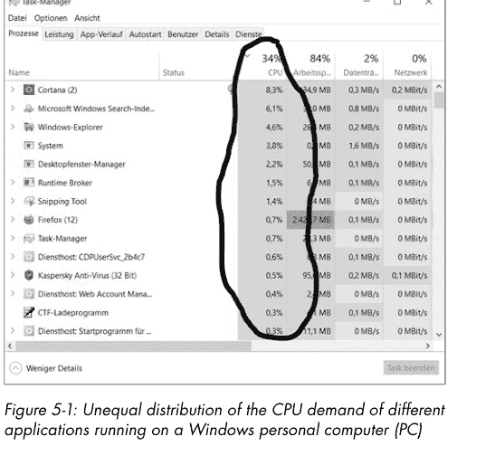

若用Python绘制此图，你会看到类似帕累托的分布，如图5-2所示。

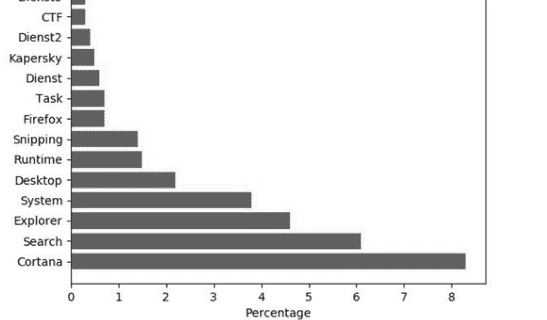

一小部分应用代码需要占用显著比例的CPU使用率。如果我想降低电脑的CPU使用率，只需关闭Cortana和搜索功能——瞧，大部分CPU负载消失了，如图5-3所示。

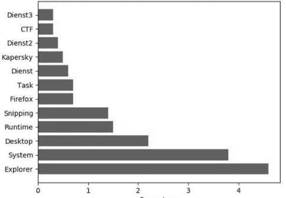

图5-3：通过关闭不需要的应用“优化”Windows系统后的结果

移除两个最耗资源的任务显著降低了CPU负载，但请注意，新图表乍看之下与第一张相似：两个任务（这次是资源管理器和系统）仍远比其他任务消耗更多资源。这揭示了性能调优的一条重要规则：性能优化具有分形特性。一旦移除一个瓶颈，你会发现另一个瓶颈潜伏其中。瓶颈将始终存在于任何系统中，但如果你在它们出现时反复移除，就能获得最大的“性价比”。在实际代码项目中，你会看到类似的分布：相对较少的函数占用大部分资源（例如CPU周期）。通常，你可以将优化精力集中在最耗资源的瓶颈函数上，例如用更复杂的算法重写它，或思考如何避免计算（例如缓存中间结果）。当然，解决当前瓶颈后，下一个瓶颈会立即出现；这就是为什么你需要测量代码并决定何时停止优化。例如，将Web应用的响应时间从2毫秒提升到1毫秒意义不大，因为用户根本察觉不到差异。由于优化的分形特性和帕累托法则（见第2章），获得这些微小收益通常需要大量努力和开发时间，且可能在可用性或应用效用方面收效甚微。

#### 算法优化制胜

假设你已决定代码需要特定优化，因为用户反馈和统计数据表明你的应用运行过慢。你已测量当前速度（以秒或字节为单位），知道目标速度，并找到了瓶颈。下一步是找出如何克服该瓶颈。

许多瓶颈可以通过调整*算法和数据结构*来解决。例如，假设你正在开发一个金融应用。你知道瓶颈是`calculate_ROI()`函数，它遍历所有潜在买卖点组合以计算最大利润。由于此函数是整个应用的瓶颈，你想为它找到更好的算法。经过一番研究，你发现了*最大利润算法*——一个简单而强大的替代方案，能显著加速计算。对于导致瓶颈的数据结构，也可以进行类似研究。

为减少瓶颈并优化性能，请自问：

- 你能否找到已证实的更好算法——例如，在书籍、研究论文甚至维基百科中？
- 你能否为手头的具体问题调整现有算法？
- 你能否改进其数据结构？一些常见的简单解决方案包括使用*集合*代替列表（例如，检查成员资格时集合比列表快得多）或使用*字典*代替元组集合。

花时间研究这些问题，无论对你的应用还是对你个人都大有裨益。在此过程中，你将成为更出色的计算机科学家。

#### 缓存为王

根据前述建议完成必要更改后，你可以采用这个快速而直接的技巧来移除不必要的计算：将已执行的部分计算结果存储在*缓存*中。此技巧对各种应用效果显著。在执行任何新计算前，先检查缓存是否已进行过该计算。这类似于你进行简单心算的方式——在某个时刻，你并非*实际*计算6 × 5，而是直接依赖记忆立即得出结果。因此，只有当相同类型的中间计算在应用中多次重现时，缓存才有意义。幸运的是，大多数现实应用都满足此条件——例如，成千上万的用户可能在同一天观看同一个YouTube视频，因此将其缓存在用户附近（而非遥远数据中心的数千英里外）能节省宝贵的网络带宽资源。

让我们通过一个简短的代码示例来探索缓存如何带来显著的性能提升：斐波那契算法。

```python
def fib(n):
    if n < 2:
        return n
    fib_n = fib(n-1) + fib(n-2)
    return fib_n

print(fib(100))
```

这将输出将序列的最后一个和倒数第二个元素反复相加，直到第100个序列元素的结果：

354224848179261915075

这个算法很慢，因为函数 `fib(n-1)` 和 `fib(n-2)` 计算的内容或多或少是相同的。例如，两者都分别计算了第 (n-3) 个斐波那契元素，而不是重用对方的计算结果。这种冗余会累积——即使对于这个简单的函数调用，计算也花费了太长时间。

提高性能的一种方法是创建一个缓存。*缓存*允许你存储先前计算的结果，因此在这种情况下，`fib2(n-3)` 只计算一次，当你再次需要它时，你可以立即从缓存中获取结果。

在 Python 中，我们可以通过创建一个字典来制作一个简单的缓存，其中你将每个函数输入（例如作为输入字符串）与函数输出关联起来。然后你可以向缓存询问你已经执行过的计算。

以下是 Python 斐波那契数列的缓存变体：

```
cache = dict()

def fib(n):
    if n in cache:
        return cache[n]
    if n < 2:
        return n
    fib_n = fib(n-1) + fib(n-2)
    cache[n] = fib_n
    return fib_n

print(fib(100))
# 354224848179261915075
```

你将 `fib(n-1) + fib(n-2)` 的结果存储在缓存中 ❶。如果你已经有了第 n 个斐波那契数的结果，你会从缓存中获取它，而不是一遍又一遍地重新计算。在我的机器上，计算前 40 个斐波那契数时，这几乎将速度提高了 2000 倍！

有效的缓存有两个基本策略：

**提前执行计算（“离线”）并将其结果存储在缓存中。**

对于 Web 应用程序来说，这是一个很好的策略，你可以一次性或每天一次填充一个大缓存，然后将预计算的结果提供给用户。对他们来说，你的计算看起来快得惊人。地图服务大量使用这个技巧来加速最短路径计算。

#### 在计算出现时执行计算（“在线”）并将其结果存储在缓存中。

一个例子是在线比特币地址检查器，它汇总所有传入交易并扣除所有传出交易，以计算给定比特币地址的余额。完成后，它可以缓存该地址的中间结果，以避免在用户再次检查时重新计算相同的交易。这种反应式形式是最基本的缓存形式，你不需要预先决定执行哪些计算。

在这两种情况下，你存储的计算越多，*缓存命中*的可能性就越高，即可以立即返回相关计算。然而，由于通常对你可以保存的缓存条目数量有内存限制，你需要一个合理的*缓存替换策略*：由于缓存大小有限，它可能很快就会填满。此时，缓存只能通过替换旧值来存储新值。一种常见的替换策略是先进先出（FIFO），它将用新的缓存条目替换最旧的缓存条目。最佳策略取决于具体应用，但 FIFO 是一个好的初步选择。

#### 少即是多

你的问题是否太难而无法高效解决？让它变得更容易！这听起来显而易见，但许多程序员都是完美主义者。他们接受巨大的复杂性和计算开销，只是为了实现一个可能甚至不会被用户认可的小功能。与其优化，不如降低复杂性并消除不必要的功能和计算，这通常要好得多。以搜索引擎开发者面临的问题为例：“对于给定的搜索查询，什么是完美的匹配？”找到这样一个问题的最优解极其困难，涉及搜索数十亿个网站。然而，像 Google 这样的搜索引擎并没有最优地解决这个问题；相反，它们在有限的时间内利用启发式方法尽力而为。它们不是将数十亿个网站与用户搜索查询进行比较，而是通过使用粗略的启发式方法来估计单个网站的质量（例如著名的 PageRank 算法），专注于几个高概率的选项，并在没有其他高质量网站回答查询时参考次优网站。在大多数情况下，你也应该使用启发式方法而不是最优算法。问自己以下问题：你当前的计算瓶颈是什么？它为什么存在？解决这个问题值得吗？你能移除这个功能或提供一个精简版本吗？如果这个功能只有 1% 的用户使用，但 100% 的用户都感受到了增加的延迟，那么可能是时候进行一些极简主义处理了（移除那个很少使用但给使用者带来糟糕体验的功能）。

为了简化你的代码，考虑以下做法是否有意义：

-   通过直接跳过该功能来完全移除你当前的瓶颈。
-   通过用更简单的问题版本替换原问题来简化问题。
-   根据 80/20 法则，放弃一个昂贵的功能来添加十个廉价的功能。
-   省略一个重要功能，以便你可以追求一个更重要的功能；考虑机会成本。

#### 知道何时停止

性能优化可能是编码中最耗时的方面之一。总有改进的空间，但一旦你已经用尽了唾手可得的技术，提高性能所需的努力往往会增加。在某些时候，提高性能只是浪费你的时间。

经常问自己：继续优化值得吗？答案通常可以通过研究你的应用程序的用户来找到。他们需要什么性能？他们甚至能感知到应用程序原始版本和优化版本之间的区别吗？他们中的一些人是否抱怨性能不佳？回答这些问题将让你粗略估计应用程序的最大运行时间。现在，你可以开始优化瓶颈，直到达到这个阈值。然后停止。

### 结论

在本章中，你已经了解了为什么避免过早优化很重要。如果一项优化所消耗的价值超过了它所增加的价值，那么它就是过早的。根据具体项目，价值通常可以用开发人员时间、可用性指标、应用程序或功能的预期收入，或其对用户子群体的效用来衡量。例如，如果一项优化可以为成千上万的用户节省时间或金钱，那么即使你必须花费大量的开发资源来优化代码库，它也可能不是过早的。然而，如果优化无法在用户或程序员的生活质量上带来可感知的差异，那么它很可能是过早的。是的，关于软件工程过程还有更多高级模型，但常识和对过早优化危险的普遍认识大有裨益，你无需研究关于软件开发模型的花哨书籍或研究论文。例如，一个有用的经验法则是*首先编写可读且整洁的代码*，不要太在意性能，然后*根据经验、性能跟踪工具的硬性事实以及用户研究的真实世界结果来优化具有高预期价值的部分*。

在下一章中，你将学习*心流*的概念——程序员最好的朋友。

# 6

### 心流

> 心流是人类终极表现的源代码。
> ——史蒂文·科特勒


在本章中，你将了解*心流*的概念以及如何利用它来提高你的编程生产力。许多程序员发现自己身处不断被打断、开会和其他干扰的办公环境中，这使得几乎不可能达到纯粹的高效编程状态。为了更深入地了解什么是心流以及如何在实践中实现它，我们将在本章中考察许多例子，但总的来说，心流是一种纯粹的专注和集中状态，有些人可能称之为“进入状态”。

心流不是一个严格的编程概念，而是一种可以应用于任何领域任何任务的状态。在这里，我们将探讨如何达到心流状态，以及它如何对你有用。

### 什么是心流？

心流的概念由米哈里·契克森米哈赖（发音为“chick-sent-me-high”）推广开来，他是克莱蒙特研究生大学杰出的心理学与管理学教授，曾任芝加哥大学心理学系主任。1990年，契克森米哈赖出版了具有开创性的同名著作《*心流*》，总结了他毕生的研究成果。

但什么是心流？让我们先从描述其感受的、略带主观性的定义开始。之后，你将了解到一个基于可测量指标的、更具体的心流定义——作为程序员，你会更喜欢第二个定义！

体验心流，就是完全沉浸在手头的任务中：专注且集中。你忘记了时间；你进入了状态，高度警觉。你可能会感到一种狂喜，摆脱了日常生活的所有负担。你的内心变得清晰，接下来需要做什么变得显而易见——活动自然地从一个流向另一个。你对自己完成下一项活动的能力充满信心，毫不动摇。完成活动本身就是一种奖励，你享受每一秒。你的表现和成果都会突飞猛进。

根据米哈里·契克森米哈赖领导的心理学研究，心流状态包含六个组成部分：

- **注意力** 你感到深度的专注和完全的集中。
- **行动** 你倾向于采取行动，并能快速高效地推进当前任务——你专注的意识有助于推动势头。每一个行动都为下一个行动铺垫，形成一连串成功的行动流。
- **自我** 你对自身的意识减弱，关闭了内心的批评、怀疑和恐惧。你更少地思考自己（*反思*），更多地关注手头的任务（*行动*）。你沉浸在当前的任务中。
- **控制** 即使自我意识减弱，你对当前情境的控制感却增强了，这带给你冷静的自信，让你能够跳出框框思考，发展出创造性的解决方案。
- **时间** 你失去了感知时间流逝的能力。
- **奖励** 从事这项活动本身就是你想要的一切；可能没有外部奖励，但沉浸在活动中本身就具有内在的回报。

“心流”和“注意力”这两个术语密切相关。在2013年一篇关于注意力缺陷多动障碍（ADHD）的论文中，罗尼·斯克拉指出，“注意力缺陷”这个术语错误地暗示了经历它的患者无法集中注意力。心流的另一个术语是*超专注*，大量的心理学研究人员（例如，Kaufmann等人，2000年）已经证明，ADHD患者完全有能力进入超专注状态，他们只是难以对那些本身不具有内在奖励的任务保持注意力。你不需要被诊断出ADHD也知道，专注于自己不喜欢的事情有多难。

但如果你曾经完全沉浸在玩一个激动人心的游戏、编写一个有趣的应用程序或观看一部引人入胜的电影中——你就知道，如果你喜欢这项活动，达到心流状态是多么容易。在心流状态下，你的身体会释放五种*令人愉悦*的神经化学物质，如内啡肽、多巴胺和血清素。这就像体验了服用娱乐性药物的“好处”，却没有一些负面后果——就连契克森米哈赖也警告说，它可能会上瘾（契克森米哈赖，1992年）。学会进入心流状态会让你更聪明、更高效——如果你能将心流活动引导到像编程这样富有成效的努力中。

现在，你可能会问：给我看实质内容——我如何获得心流？我们接下来就回答这个问题！

### 如何达到心流

契克森米哈赖提出了达到心流的三个条件：（1）你的目标必须清晰，（2）你环境中的反馈机制必须是即时的，（3）机会与能力之间必须保持平衡。

#### 清晰的目标

如果你在编写代码，你必须有一个清晰的目标，让较小的行动与之对齐。在心流状态下，每一个行动都自然地导向下一个，再导向下一个，因此必须有一个最终目标。获得心流的一个基本条件是设定一个你想要完成的清晰目标，并将你的小行动指向这个目标。玩电脑游戏是达到心流状态的常见环境，因为如果你在小行动上成功了——比如跳过一个移动的障碍物——你最终就能在大目标上成功——比如赢得关卡。要利用心流来加速你的编程效率，你必须有一个清晰的项目目标。每一行代码都让你离成功完成更大的代码项目更近一步。记录你写的代码行数是让你的编码工作游戏化的一种方式！

#### 反馈机制

反馈机制奖励期望的行为，惩罚不期望的行为。机器学习工程师知道，他们需要一个强大的反馈机制来训练高效的模型。例如，你可以通过奖励机器人每秒钟不摔倒，并告诉它优化以获得最大总奖励来教它走路。然后，机器人可以自动调整其动作，以随时间获得最大奖励。我们人类在学习新事物时的行为也相当相似。我们寻求父母、老师、朋友或导师的赞赏——甚至来自我们不喜欢的邻居——并调整我们的行动以最大化赞赏，同时最小化（社会）惩罚。这样，我们就学会了采取特定的行动并避免其他行动。接收反馈对于这种学习方式至关重要。

反馈是心流的前提条件。要在你的工作日中实现更多的心流，就要寻求更多反馈。找到每周见面讨论你的代码和项目目标的项目伙伴，然后整合你伙伴的反馈。在Reddit或StackOverflow上发布你的代码并寻求反馈。尽早并经常发布你的最小可行产品（MVP）以接收用户反馈。为你的编程工作寻求反馈效果显著，即使它是延迟满足，因为它会增加你对导致反馈的活动的投入程度。在我发布了Finxter（我的Python学习软件应用程序）之后，我开始收到源源不断的用户反馈，并且我沉迷其中。这些反馈让我不断回去修改代码，并在改进应用程序的编码工作中体验到了许多心流状态。

#### 平衡机会与能力

心流是一种积极的心理状态。如果任务太容易，你会感到无聊并失去沉浸感。如果太难，你会过早放弃。任务必须具有挑战性但又不至于压倒性。
图6-1展示了可能的心理状态图景；这张图片取自并重新绘制自契克森米哈赖的原始研究。

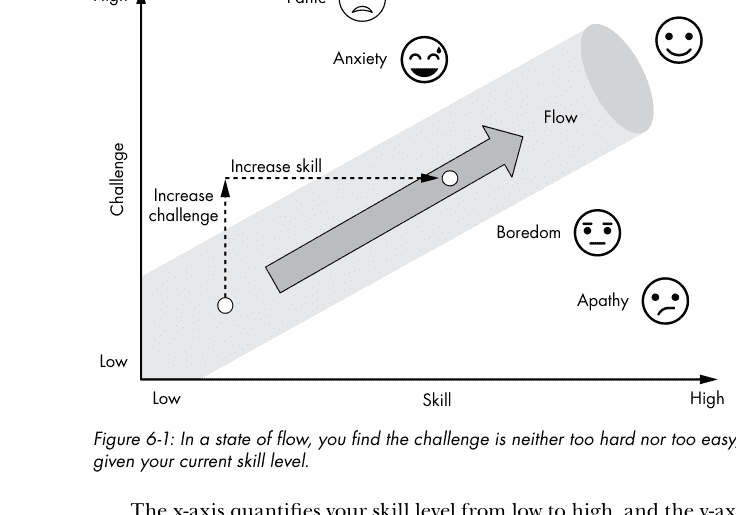

x轴量化了你的技能水平，从低到高；y轴量化了给定任务的难度，从低到高。因此，例如，如果任务对你的技能水平来说太难，你会感到恐慌；如果太容易，你会感到冷漠。但如果任务的难度与你当前的技能相匹配，你将最大化达到心流的可能性。

诀窍在于不断寻求更具挑战性的任务，同时避免达到焦虑水平，并相应地提高你的技能水平。这个学习循环让你处于一个不断向更高生产力和技能发展的循环中，同时也增加了工作的乐趣。

### 程序员的心流技巧

欧文·谢弗在他2015年题为《*打造有趣的用户体验：促进心流的方法*》的白皮书中，确定了这七个心流条件：（1）知道做什么，（2）知道怎么做，（3）知道做得如何，（4）知道去哪里，（5）寻求挑战，（6）提升技能以克服高难度挑战，以及（7）让自己远离干扰（Human Factors International）。基于这些条件和我自己的思考，我为达到心流状态整理了一些快速技巧和策略，这些技巧高度偏向于编程领域。

**始终进行一个实际的代码项目**，而不是将时间花在无专注的学习状态上。当新信息对你关心的事情产生实际影响时，你能更快地吸收它。我建议将你的学习时间分为70%用于你选择的实用有趣项目，30%用于阅读书籍和教程或观看教育课程。根据我在Finxter社区与成千上万程序员的个人互动和通信，我了解到很大一部分编程学生本末倒置，陷入了学习循环，从未感觉准备好投入真正的项目。情况总是相同：这些程序员困在编程理论中，不断学习却没有实际应用，这让他们更加意识到自己的知识局限——这是一个导致瘫痪的负面螺旋。解决之道是设定你清晰的项目目标，并无论如何都要将项目推进到完成。这符合心流的三个前提条件之一。

**从事能实现你目标的有趣项目。** 心流是一种兴奋的状态，所以你必须对你的工作感到兴奋。如果你是一名专业程序员，花时间思考你工作的目的。找到你项目的价值。如果你正在学习编程，那你很幸运——你可以选择一个让你兴奋的有趣项目！从事对你有意义的项目。你会获得更多乐趣，更高的成功概率，以及更强的抵御暂时挫折的能力。如果你醒来时迫不及待地想开始你的项目，你就知道心流近在咫尺。

**发挥你的优势。** 这条来自管理顾问彼得·德鲁克的建议是金玉良言。你薄弱的领域总是比你擅长的领域多。在大多数活动中，你的技能低于平均水平。如果你专注于自己的弱点，你几乎注定会失败。相反，专注于你的优势，在它们周围建立庞大的技能岛屿，并基本上忽略你的大部分弱点。你有什么独特的优势？

## 7

### 专注一事及其他Unix原则

> 这就是Unix哲学：编写只做一件事并把它做好的程序。编写能协同工作的程序。编写能处理文本流的程序，因为那是一个通用的接口。[...]
> ——道格拉斯·麦克罗伊

Unix操作系统盛行的哲学很简单：专注一事。例如，这意味着通常最好创建一个能可靠高效地解决一个问题的函数或模块，而不是试图同时处理多个问题。在本章后面，你将看到一些Python代码示例，展示“专注一事”的实际应用，并了解Unix哲学如何应用于编程。然后，我将介绍一些世界上最杰出的计算机工程师在创建当今操作系统时所采用的首要原则。如果你是一名软件工程师，你将发现许多关于在自己的项目中编写更好代码的宝贵建议。

但首先：Unix到底是什么，你为什么应该关心它？

### Unix的崛起

Unix是一种设计哲学，它启发了当今许多最受欢迎的操作系统，包括Linux和macOS。Unix操作系统家族诞生于20世纪70年代末，当时贝尔系统将其技术的源代码向公众开放。此后，大学、个人和公司开发了大量的扩展和新版本。

如今，受商标保护的Unix标准认证操作系统符合特定的质量要求。Unix和类Unix操作系统对计算领域产生了重大影响。大约十分之七的Web服务器运行在以Unix为基础的Linux系统上。如今大多数超级计算机运行基于Unix的系统。即使是macOS也是一个注册的Unix系统。

林纳斯·托瓦兹、肯·汤普森、布莱恩·柯林汉——Unix开发者和维护者的名单中包含了一些全球最具影响力的程序员的名字。你可能会认为，一定有强大的组织系统，才能让世界各地的程序员协作构建由数百万行代码组成的庞大Unix代码生态系统。确实如此！实现这种规模协作的哲学是首字母缩写词DOTADIW（说真的）——或者*专注一事并把它做好*。关于Unix哲学的书籍已经有很多，所以这里我们只关注最相关的理念，并使用Python代码片段来展示一些例子。据我所知，此前还没有任何书籍将Unix原则置于Python编程语言的背景下进行阐述。那么，让我们开始吧！

### 哲学概述

Unix哲学的基本思想是构建简单、清晰、简洁、模块化的代码，易于扩展和维护。这可能意味着许多不同的事情——本章后面会详细讨论——但目标是让许多人能够在一个代码库上协同工作，优先考虑可读性而非效率，并倾向于可组合性而非单体设计。单体应用程序在设计时没有模块化，这意味着大部分代码逻辑无法在不访问整个应用程序的情况下重用、执行或调试。

假设你编写了一个程序，它接受一个统一资源定位符（URL），并在命令行打印该URL的HTML内容。我们称这个程序为`url_to_html()`。根据Unix哲学，这个程序应该专注一事，而这一件事就是获取URL的HTML并将其打印到shell（见清单7-1）。仅此而已。

```python
import urllib.request

def url_to_html(url):
    html = urllib.request.urlopen(url).read()
    return html
```

清单7-1：一个简单的代码函数，从给定的URL读取HTML并返回字符串

擅长什么？在计算机科学的广阔领域中，你具体对什么感兴趣？列出清单来回答这些问题。最有益于你进步的活动之一，就是找出你的优势，然后严格地围绕这些优势安排你的一天。

**将你的编码时间划分为大块。** 这将给你时间去理解前方的问题和任务——每个程序员都知道，将一个复杂的代码项目加载到脑海中需要时间——并进入你任务的节奏。假设爱丽丝和鲍勃在一个给定的代码项目上工作。通过浏览项目、深入研究几个代码函数并思考全局，他们需要20分钟才能达到完全理解代码项目要求的状态。爱丽丝每三天花三小时在这个项目上，而鲍勃每天花一小时。谁会在项目上取得更多进展？爱丽丝每天在这个项目上工作53分钟（[3小时 – 20分钟] ÷ 3）。考虑到较高的恒定加载时间，鲍勃每天只在这个项目上工作40分钟。因此，在其他条件相同的情况下，爱丽丝每天将比鲍勃多工作13分钟。她更有可能达到心流状态，因为她可以更深入地钻研问题并完全沉浸其中。

**在你的心流时间消除干扰。** 这似乎显而易见，但实施起来却多么少见！能够减少干扰——社交网络、娱乐应用、关于同事的闲聊——的程序员比不能做到的程序员更容易达到心流状态。要取得成功，你必须做大多数其他人不愿意做的事：消除干扰。关掉你的智能手机，关闭那个社交媒体标签页。

**做你知道需要做的显而易见的事情，** 在手头任务之外：保证充足的睡眠，健康饮食，定期锻炼。作为一名程序员，你知道*垃圾进，垃圾出*这个说法：如果你给系统输入糟糕的数据，你就会得到糟糕的结果。试着用腐烂的食物做一顿美味的饭菜——几乎不可能！高质量的输入带来高质量的输出。

**消费高质量的信息，** 因为你的输入质量越高，你的输出质量就越高。阅读编程书籍，而不是浅薄的博客文章；更好的是，阅读顶级期刊上发表的研究论文，那是最高质量的信息。

### 结论

总结一下，以下是一些你可以开始尝试达到心流状态的最简单方法：划出大块时间，专注于一项任务，保持健康并合理睡眠，设定明确的目标，找到你喜欢做的工作，并积极寻求心流。

如果你寻求心流，你最终会找到它。如果你每天系统地在心流状态下工作，你将把工作效率提高一个数量级。对于程序员和其他知识工作者来说，这是一个简单而强大的概念。正如米哈里·契克森米哈赖所说：

> 我们生命中最美好的时刻，不是被动、接受、放松的时刻……最美好的时刻通常发生在一个人的身体或心灵在自愿努力完成某件困难而有价值的事情时，被推向极限。

在下一章中，你将深入探讨关于*专注一事*的Unix哲学，这一原则已被证明不仅是创建可扩展操作系统的绝佳方式，也是生活的绝佳方式！

### 参考文献

- F. Massimini, M. Csikszentmihalyi, and M. Carli, “The monitoring of optimal experience: A tool for psychiatric rehabilitation,” *Journal of Nervous and Mental Disease* 175, no. 9 (September 1987).
- Rony Sklar, “Hyperfocus in adult ADHD: An EEG study of the differences in cortical activity in resting and arousal states” (M.A. thesis, University of Johannesburg, 2013), http://hdl.handle.net/10210/8640.
- Kevin Rathunde, “Montessori Education and Optimal Experience: A Framework for New Research,” *NAMTA Journal* 26, no. 1 (January 2001): 11–43.
- Steven Kotler, “How to Get Into The Flow State,” filmed at A-Fest Jamaica, February 19, 2019, Mindvalley video, https://youtu.be/XG_hNZ5T4nY.
- Troy Erstling, “The Neurochemistry of Flow States,” *Troy Erstling* (blog), https://troyerstling.com/the-neurochemistry-of-flow-states/.
- Owen Schaffer, “Crafting Fun User Experiences: A Method to Facilitate Flow,” *Human Factors International* white paper (2015), https://humanfactors.com/hfi_new/whitepapers/crafting_fun_ux.asp.

这就是你所需要的全部。不要添加更多功能，例如过滤标签或修复错误。例如，你可能会忍不住添加代码来修复用户可能犯的常见错误，比如忘记闭合标签，例如一个未被 `</span>` 闭合的 `<span>` 标签，如这里高亮所示：

```
<a href='nostarch.com'><span>Python One-Liners</a>
```

根据 Unix 哲学，即使你发现了这类错误，也不应在该特定函数内修复它们。

对于这个简单的 HTML 函数，另一个诱惑是自动修复格式。例如，以下 HTML 代码看起来并不美观：

```
<a href='nostarch.com'><span>Python One-Liners</span></a>
```

你可能更喜欢这种代码格式：

```
<a href='nostarch.com'>
    <span>
        Python One-Liners
    </span>
</a>
```

然而，你的函数名是 `url_to_html()`，而不是 `prettify_html()`。添加诸如代码美化之类的功能会引入第二个功能，而这可能并非该函数的所有用户都需要。

相反，你应该被鼓励创建另一个名为 `prettify_html(url)` 的函数，其“一件事”就是修复 HTML 的样式问题。该函数内部可以使用 `url_to_html()` 函数来获取 HTML，然后再进行进一步处理。

通过让每个函数只专注于一个目的，你可以提高代码的可维护性和可扩展性。一个程序的输出是另一个程序的输入。你减少了复杂性，避免了输出中的杂乱，并专注于将一件事做好。

尽管单个子程序可能看起来很小，甚至微不足道，但你可以将这些子程序组合起来创建更复杂的程序，同时仍然保持它们易于调试。

### 15 个实用的 Unix 原则

接下来，我们将深入探讨与当今最相关的 15 个 Unix 原则，并在可能的情况下用 Python 示例来实现它们。我从 Unix 编码专家 Eric Raymond 和 Mike Gancarz 那里汇编了这些原则，并将其调整为适用于现代 Python 编程。你会注意到，其中许多原则与本书中的其他原则相符或重叠。

#### 1. 让每个函数做好一件事

Unix 哲学的首要原则是*做好一件事*。让我们看看这在代码中会是什么样子。在清单 7-2 中，你实现了一个函数 `display_html()`，它接受一个 URL 字符串，并显示该 URL 上美化后的 HTML。

```python
import urllib.request
import re

def url_to_html(url):
    html = urllib.request.urlopen(url).read()
    return html

def prettify_html(html):
    return re.sub('\s+', ' ', html)

def fix_missing_tags(html):
    if not re.match('<!DOCTYPE html>', html):
        html = '<!DOCTYPE html>\n' + html
    return html

def display_html(url):
    html = url_to_html(url)
    fixed_html = fix_missing_tags(html)
    prettified_html = prettify_html(fixed_html)
    return prettified_html
```

清单 7-2：让每个函数或程序做好一件事。

此代码如图 7-1 所示。

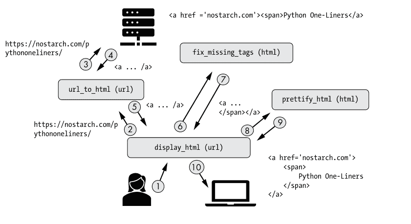

此代码提供了一个示例实现，在 `display_html` 函数中执行以下步骤：

1.  从给定的 URL 位置获取 HTML。
2.  修复一些缺失的标签。
3.  美化 HTML。
4.  将结果返回给函数调用者。

如果你运行代码时使用的 URL 指向不太美观的 HTML 代码 `<a href="https://finxter.com">Solve next Puzzle</a>`，函数 `display_html` 将通过分解小型代码函数的输入和输出来修复格式不良（且不正确）的 HTML，因为每个函数都做好了它自己的那一件事。

你可以用这行代码打印主函数的结果：

```python
print(display_html('https://finxter.com'))
```

此代码会将 HTML 代码打印到你的 shell，添加了新标签并移除了多余的空白字符：

```
<!DOCTYPE html>
<a href="https://finxter.com">Solve next Puzzle</a>
```

将整个程序想象成你终端中的一个浏览器。Alice 调用函数 `display_html(url)`，该函数接受 URL 并将其传递给另一个函数 `url_to_html(url)`，后者从给定的 URL 位置收集 HTML。无需重复实现相同的功能。幸运的是，函数 `url_to_html()` 的编码者保持了该函数的最小化，因此你可以将其返回的 HTML 输出直接用作函数 `fix_missing_tags(html)` 的输入。在 Unix 术语中，这被称为*管道*：一个程序的输出作为另一个程序的输入传递。`fix_missing_tags()` 的返回值是修复后的 HTML 代码，其中包含了原始 HTML 中缺失的闭合 `</span>` 标签。然后，你将输出管道传输到函数 `prettify_html(html)` 并等待结果：带有缩进的修正后 HTML，使其更易于用户阅读。只有这样，函数 `display_html(url)` 才会将美化并修复后的 HTML 代码返回给 Alice。你看，一系列连接并管道化在一起的小函数可以完成相当大的任务！

在你的项目中，你可以实现另一个函数，它不美化 HTML，而只是添加 `<!DOCTYPE html>` 标签。然后你可以实现第三个函数，它美化 HTML 但不添加新标签。通过保持小规模，你可以轻松地基于现有功能创建新代码，并且不会有太多冗余。代码的模块化设计实现了可重用性、可维护性和可扩展性。

将此版本与可能的单体实现进行比较，其中函数 `display_html(url)` 必须自己完成所有这些小任务。你无法部分重用功能，例如从 URL 检索 HTML 代码或修复错误的 HTML 代码。如果你使用一个自己完成所有事情的单体代码函数，它看起来会是这样：

```python
def display_html(url):
    html = urllib.request.urlopen(url).read()
    if not re.match('<!DOCTYPE html>', html):
        html = '<!DOCTYPE html>\n' + html
    html = re.sub('\s+', ' ', html)
    return html
```

这个函数现在更复杂了：它处理多个任务，而不是专注于一个。更糟糕的是，如果你实现同一函数的变体而不移除开标签后的空格，你将不得不复制和粘贴剩余的代码行。这将导致代码冗余和可读性降低。你添加的功能越多，情况就会越糟！

#### 2. 简单优于复杂

简单优于复杂是整本书压倒性的原则。你已经以多种形式看到了它——我强烈强调这一点，因为如果你不采取果断行动来简化，你就会滋生复杂性。在 Python 中，简单优于复杂的原则甚至进入了非官方规则手册。如果你打开一个 Python shell 并输入 `import this`，你会得到著名的 Python 之禅（见清单 7-3）。

```python
> import this
The Zen of Python, by Tim Peters

Beautiful is better than ugly.
Explicit is better than implicit.
Simple is better than complex.
Complex is better than complicated.
Flat is better than nested.
Sparse is better than dense.
Readability counts.
Special cases aren't special enough to break the rules.
Although practicality beats purity.
Errors should never pass silently.
Unless explicitly silenced.
In the face of ambiguity, refuse the temptation to guess.
There should be one-- and preferably only one --obvious way to do it.
Although that way may not be obvious at first unless you're Dutch.
Now is better than never.
Although never is often better than *right* now.
If the implementation is hard to explain, it's a bad idea.
If the implementation is easy to explain, it may be a good idea.
Namespaces are one honking great idea -- let's do more of those!
```

清单 7-3：Python 之禅

由于我们已经详细讨论了简单性的概念，我将不再在此赘述。如果你仍然想知道为什么简单优于复杂，请回到第 1 章，了解高复杂性带来的负面生产力影响。

#### 3. 小即是美

与其编写庞大的代码块，不如编写小型函数，并像架构师一样协调这些函数之间的交互，如图7-1所示。保持程序小巧主要有三个原因：

**降低复杂性。**
代码越长，理解起来就越困难。这是一个认知事实：你的大脑只能同时跟踪有限数量的信息块。过多的信息会让人难以把握全局。通过保持小巧并减少函数中的代码行数，你可以*提高可读性*，并降低在代码库中引入代价高昂的错误的可能性。

**提高可维护性。**
将代码组织成许多小的功能模块，使其更易于维护。添加更多小函数不太可能产生副作用，而在一个庞大的、单体的代码块中，你所做的任何更改都很容易产生意想不到的全局影响，尤其是当多个程序员同时处理代码时。

**提高可测试性。**
许多现代软件公司使用*测试驱动开发*，这涉及使用单元测试来对每个函数和单元的输入进行压力测试，并将输出与预期结果进行比较。这使你能够发现并隔离错误。单元测试在小型代码中更有效且更容易实现，因为每个函数只专注于一件事，所以你知道预期的结果应该是什么。

与其为这个原则用Python实现一个小代码示例，Python本身就是最好的例子。任何编程高手都会利用他人的代码来提高自己的编码效率。数百万开发者花费了无数小时优化代码，而你可以在瞬间将这些代码导入到你的代码中。Python和大多数其他编程语言一样，通过库来提供这种功能。许多不常用的库并不包含在默认实现中，需要显式安装。通过不将所有库作为内置功能提供，你计算机上的Python安装保持相对小巧，但又不牺牲外部库的潜在能力。除此之外，库本身也相对小巧——它们都专注于一个有限的功能子集。我们不是用一个庞大的库来解决所有问题，而是有许多小库，每个库负责图景的一小部分。小即是美。

每隔几年，新的架构模式就会出现，承诺将大型、单体的应用程序分解成美丽的小型应用程序，以扩展软件开发生命周期。最近的例子包括公共对象请求代理体系结构（CORBA）、面向服务的体系结构（SOA）和微服务。这些模式的思想是将一个大型软件块分解成一系列可独立部署的组件，然后可以被多个程序访问，而不仅仅是一个程序。其希望是通过共享和构建彼此的微服务来加速软件开发领域的整体进步。

这些趋势的底层驱动力是编写模块化和可重用代码的思想。通过学习本章介绍的思想，你已经准备好快速而根本地理解这些以及未来具有相同模块化方向的趋势。从一开始就应用健全的原则，有助于你领先一步。

> 注意：深入探讨这个激动人心的话题超出了本书的范围，但我建议你查看Martin Fowler关于微服务的在线资源：https://martinfowler.com/articles/microservices.html。

#### 4. 尽快构建原型

Unix团队是我们在第3章讨论的原则——构建MVP（最小可行产品）——的坚定支持者。这使你能够避免陷入完美主义的循环，不必要地添加越来越多的功能并指数级地增加复杂性。如果你正在开发大型软件应用程序，比如操作系统，你根本无法承受走向复杂化的道路！

图7-2展示了一个早期应用发布的例子，它违背了MVP原则，塞满了不必要的功能。

不必要的功能！

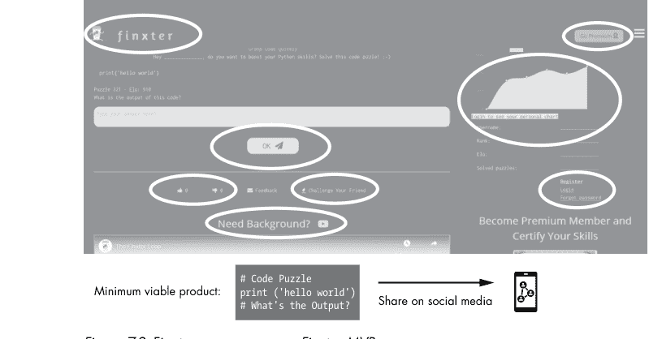

该应用具有交互式解决方案检查、拼图投票、用户统计、用户管理、高级功能、相关视频等功能，甚至还有像标志这样的简单功能。所有这些对于产品的初始发布都是不必要的。事实上，Finxter应用的MVP应该只是一个在社交媒体上分享的简单代码拼图图片。这足以验证用户需求的假设，而无需花费数年时间构建应用程序。*尽早失败，经常失败，向前失败。*

#### 5. 选择可移植性而非效率

可移植性是系统或程序能够从一个环境移动到另一个环境并仍然正常工作的能力。软件的一个主要优势是其可移植性：你可以在你的计算机上编写一个程序，数百万用户可以在他们的计算机上运行同一个程序，而完全不需要进行适配。

然而，可移植性是以效率为代价的。这种*可移植性/效率权衡*在技术文献中有充分记载：通过将软件定制为仅适用于一种环境，你可以达到更高的效率，但这牺牲了可移植性。*虚拟化*是这种权衡的一个很好的例子：通过在软件和软件运行的底层基础设施之间放置一个额外的软件层，你的程序几乎可以在任何*物理机器*上运行。此外，虚拟机可以将当前执行状态从一台物理机器携带到另一台物理机器。这提高了软件的可移植性。然而，虚拟化所需的额外层由于在程序和物理机器之间进行中介的额外开销，降低了运行时和内存效率。

Unix哲学倡导选择可移植性而非效率；这是有道理的，因为操作系统被如此多的人使用。

但倾向于可移植性的经验法则也适用于更广泛的软件开发者群体。降低可移植性意味着你降低了应用程序的价值。如今，彻底提高可移植性——即使以效率为代价——是很常见的。基于Web的应用程序被期望在每台装有浏览器的计算机上运行，无论是macOS、Windows还是Linux。Web应用程序也越来越易于访问，能够适应诸如失明等情况，尽管托管一个促进无障碍访问的网站可能效率较低。许多资源比计算周期更有价值：人类生命、人类时间以及计算机的其他二阶后果。

但是，除了这些一般性考虑之外，为可移植性编程意味着什么？在清单7-4中，我们创建了一个计算指定参数平均值的函数——按照我们的写法，它没有针对可移植性进行优化。

```python
import numpy as np

def calculate_average_age(*args):
    a = np.array(args)
    return np.average(a)

print(calculate_average_age(19, 20, 21))
# 20.0
```

*清单7-4：平均值函数，未最大化可移植性*

这段代码不可移植有两个原因。首先，函数名`calculate_average_age()`不够通用，无法在任何其他上下文中使用，尽管它只是计算了一个平均值。例如，你可能不会想到用它来计算网站访问者的平均数量。其次，它不必要地使用了一个库，因为你可以轻松地在不使用任何外部库的情况下计算平均值（见清单7-5）。使用库通常是个好主意，但前提是它们能增加价值。在这种情况下，添加一个库会降低可移植性，因为用户可能没有安装这个库；而且，它带来的效率收益很小（如果有的话）。

在清单7-5中，我们重新创建了具有更好可移植性的函数。

```python
def average(*args):
    return sum(args) / len(args)

print(average(19, 20, 21))
# 20.0
```

*清单7-5：平均值函数，可移植*

我们将函数重命名为更通用的名称，并去掉了不必要的导入。现在你不必担心库是否会被弃用，并且可以将相同的代码移植到你的其他项目中。

#### 6. 将数据存储在纯文本文件中

Unix哲学鼓励使用纯文本文件来存储数据。纯文本文件是简单的文本或二进制文件，没有高级的文件内容访问机制——不像数据库社区使用的许多更高效但也更复杂的文件格式。这些是简单的、人类可读的数据文件。常见的逗号分隔值（CSV）格式就是纯文件格式的一个例子，其中每一行对应一个数据条目（见清单7-6），数据新手只需看一眼就能获得一些理解。

| 财产编号 | 日期 | 品牌 | 型号 | 颜色 | 被盗 | 被盗自 | 状态 | 事件编号 | 机构 |
| :--- | :--- | :--- | :--- | :--- | :--- | :--- | :--- | :--- | :--- |
| P13827 | 01/06/2016 | HI POINT | 9MM | BLK | 本地被盗 | 车辆 | 本地找回 | B16-00694 | BPD |
| P14174 | 01/15/2016 | JENNINGS J22 | | COM | 本地被盗 | 住所 | 未找回 | B16-01892 | BPD |
| P14377 | 01/24/2016 | CENTURY ARMS | M92 | | 本地被盗 | 住所 | 本地找回 | B16-03125 | BPD |
| P14707 | 02/08/2016 | TAURUS | PT740 SLIM | | 本地被盗 | 住所 | 未找回 | B16-05095 | BPD |
| P15042 | 02/23/2016 | HIGHPOINT | CARBINE | | 本地被盗 | 住所 | 本地找回 | B16-06990 | BPD |
| P15043 | 02/23/2016 | RUGAR | | | 本地被盗 | 住所 | 本地找回 | B16-06990 | BPD |
| P15556 | 03/18/2016 | HENRY ARMS | .17 CALIBRE | | 本地被盗 | 住所 | 本地找回 | B16-08308 | BPD |

*清单7-6：被盗枪支数据，来自Data.gov，以纯文件格式（CSV）提供*

你可以轻松地共享纯文本文件，在任何文本编辑器中打开它们，并手动进行修改。然而，这种便利是以效率为代价的：一种专为特定目的设计的数据格式可以更高效地存储和读取数据。例如，数据库在磁盘上使用自己的数据文件，这些文件采用优化措施，如详细的索引和压缩方案来表示数据。如果你打开它们，你会看不懂。这些优化使得程序能够以比通用纯文本文件更少的内存消耗和更低的开销来读取数据。在纯文本文件中，系统必须扫描整个文件才能读取特定的一行。Web 应用程序也需要更高效的优化数据表示，以便用户能够以低延迟快速访问，因此它们很少使用纯文本表示和数据库。

然而，你应该只在确定需要时才使用优化的数据表示——例如，如果你创建一个对性能高度敏感的应用程序，比如能在毫秒内为给定用户查询找到最相关网页文档的 Google 搜索引擎！对于许多较小的应用程序，例如从包含 10,000 条记录的真实世界数据集训练机器学习模型，CSV 格式是推荐的数据存储方式。使用具有专用格式的数据库会降低可移植性并增加不必要的复杂性。

清单 7-7 给出了一个使用 Python（数据科学和机器学习应用中最流行的语言之一）的示例，说明了在何种情况下纯文本格式更可取。这里我们想要对一个图像（人脸）数据集执行数据分析任务，因此我们从一个纯文本 CSV 文件加载数据并进行处理，优先选择可移植的方法，而不是使用数据库这种更高效的方法。

```
from sklearn.datasets import fetch_olivetti_faces
from numpy.random import RandomState

rng = RandomState(0)

# Load faces data
faces, _ = fetch_olivetti_faces(...)
```

清单 7-7：在 Python 数据分析任务中从纯文本文件加载数据

在函数 `fetch_olivetti_faces` 中，我们加载 scikit-learn 的 *Olivetti faces* 数据集，该数据集包含一组人脸图像。加载函数只是读取这些数据并将其加载到内存中，然后才开始真正的计算。不需要数据库或分层数据结构。该程序是自包含的，无需安装数据库或设置高级数据库连接。

> 注意 我已经为你设置了一个交互式 Jupyter notebook，你可以在这里运行此示例：https://blog.finxter.com/clean-code/#Olivetti_Faces/。

#### 7. 利用软件杠杆优势

利用杠杆意味着施加少量能量来放大你努力的效果。例如，在金融领域，杠杆意味着使用他人的资金进行投资和增长。在大公司中，它可能意味着雇佣成千上万的员工来提供时间和精力。作为一名程序员，你应该利用几代程序员的集体智慧：使用库来实现复杂功能，而不是从头开始编码；使用 StackOverflow 和群体智慧来修复代码中的错误；或者请其他程序员审查你的代码。这些都是杠杆的形式，让你能够以更少的努力完成更多的事情。

杠杆的第二个来源是计算能力。计算机执行工作的速度比人类快得多（成本也低得多）。创建更好的软件，与更多人分享，使用更多的计算能力，并更频繁地使用他人的库和软件。优秀的程序员能快速创建好的源代码，但伟大的程序员会利用他们可用的多种杠杆来源来提升他们的代码。

例如，清单 7-8 展示了我书中的一个单行程序（来自《Python One-Liners》（No Starch Press, 2020）），该程序抓取给定的 HTML 文档，并找到所有包含子字符串 'finxter' 以及 'test' 或 'puzzle' 的 URL。

```
## Dependencies
import re

## Data
page = '''
<!DOCTYPE html>
<html>
<body>

<h1>My Programming Links</h1>
<a href="https://app.finxter.com/">test your Python skills</a>
<a href="https://blog.finxter.com/recursion/">Learn recursion</a>
<a href="https://nostarch.com/">Great books from NoStarchPress</a>
<a href="http://finxter.com/">Solve more Python puzzles</a>

</body>
</html>
'''

## One-Liner
practice_tests = re.findall("(<a.*?finxter.*?(test|puzzle).*?>)", page)

## Result
print(practice_tests)
# [('<a href="https://app.finxter.com/ ">test your Python skills</a>',
#  'test'),
#  ('<a href="http://finxter.com/">Solve more Python puzzles</a>', 'puzzle')]
```

*清单 7-8：分析网页链接的单行程序解决方案*

通过导入 re 库，我们利用了正则表达式的强大技术，立即投入了数千行代码的工作，使我们能够用一行代码编写整个程序。杠杆是你成为伟大程序员道路上的强大伙伴。例如，在代码中使用库而不是自己实现所有功能，就像使用应用程序来规划你的旅程，而不是用纸质地图来规划每一个细节。

> 参见 https://pythononeliners.com/ 了解解释此解决方案的视频。

#### 8. 避免强制用户界面

强制用户界面是指那些要求用户在程序继续执行主流程之前进行交互的界面。例如，像安全外壳（SSH）、top、cat 和 vim 这样的小程序，以及像 Python 的 input() 函数这样的编程语言特性。强制用户界面限制了代码的可用性，因为它们的设计不是为了在没有人为干预的情况下运行。然而，很多时候，强制用户界面背后的代码所提供的功能对于必须能够无需与用户手动交互即可运行的自动化程序也很有用。粗略地说，如果你把好的代码放在强制用户界面后面，没有用户交互就无法访问它！

假设你用 Python 创建了一个简单的预期寿命计算器，它接受用户的年龄作为输入，并基于一个简单的启发式方法返回预期剩余年数。

> “如果你小于 85 岁，你的预期寿命是 72 减去你年龄的 80%。否则，就是 22 减去你年龄的 20%。”

> 这个启发式方法（而非代码）基于 Decision Science News 网站上的一篇文章。

你最初的 Python 代码可能看起来像清单 7-9。

```
def your_life_expectancy():
    age = int(input('how old are you? '))

    if age<85:
        exp_years = 72 - 0.8 * age
    else:
        exp_years = 22 - 0.2 * age

    print(f'People your age have on average {exp_years} years left - use them wisely!')

your_life_expectancy()
```

清单 7-9：预期寿命计算器——一个简单的启发式方法——实现为强制用户界面

以下是清单 7-9 中代码的一些运行示例。

```
> how old are you? 10
People your age have on average 64.0 years left - use them wisely!
> how old are you? 20
People your age have on average 56.0 years left - use them wisely!
> how old are you? 77
People your age have on average 10.399999999999999 years left - use them wisely!
```

如果你想自己尝试，我已经在 Jupyter notebook 中分享了这个程序：https://blog.finxter.com/clean-code/#Life_Expectancy_Calculator/。但是，请不要太当真！

在清单中，我们使用了 Python 的 input() 函数，它会阻塞程序执行，直到接收到用户输入。没有用户输入，代码就什么也不做。这个强制用户界面限制了代码的可用性。如果你想计算从 1 到 100 每个年龄的预期寿命并绘制图表，你必须手动输入 100 个不同的年龄，并将结果存储在一个单独的文件中。然后，你必须将结果复制粘贴到一个新的脚本中进行绘图。就目前而言，这个函数实际上做了两件事：处理用户输入和计算预期寿命，这也违反了第一个 Unix 原则：让每个函数只做一件事并做好。

为了使代码符合这个原则，我们将用户界面与功能分离，这通常是改进代码的好主意（见清单 7-10）。

```
# Functionality
def your_life_expectancy(age):
    if age<85:
        return 72 - 0.8 * age
    return 22 - 0.2 * age

# User Interface
age = int(input('how old are you? '))

# Combine user input with functionality and print result
exp_years = your_life_expectancy(age)
print(f'People your age have on average {exp_years} years left - use them wisely!')
```

清单 7-10：预期寿命计算器——一个简单的启发式方法——没有强制用户界面

清单 7-10 中的代码在功能上与清单 7-9 相同，但有一个显著优势：我们可以在各种情况下使用这个新函数，甚至是初始开发者未预料到的情况。在清单 7-11 中，我们使用该函数计算输入年龄在 0 到 99 之间的预期寿命并绘制结果；注意通过移除用户输入界面所获得的可移植性。

```
import matplotlib.pyplot as plt

def your_life_expectancy(age):
    '''Returns the expected remaining number of years.'''
    if age<85:
```

#### 9. 让每个程序都成为过滤器

有充分的理由认为，每个程序本身就是一个过滤器。过滤器使用特定的过滤机制将输入转换为输出。这使我们能够轻松地将多个程序组合在一起，将一个程序的输出作为另一个程序的输入。这显著提高了代码的可重用性。例如，通常不建议在函数内部直接打印计算结果——相反，更好的做法是让程序返回一个字符串，然后可以将其打印出来、写入文件或用作另一个程序的输入。

例如，一个对列表进行排序的程序可以被视为一个过滤器，它将未排序的元素过滤成有序的排列，如清单7-12所示。

```python
def insert_sort(lst):
    # Check if the list is empty
    if not lst:
        return []

    # Start with sorted 1-element list
    new = [lst[0]]

    # Insert each remaining element
    for x in lst[1:]:
        i = 0
        while i<len(new) and x>new[i]:
            i = i + 1
        new.insert(i, x)

    return new

print(insert_sort([42, 11, 44, 33, 1]))
print(insert_sort([0, 0, 0, 1]))
print(insert_sort([4, 3, 2, 1]))
```

清单7-12：这个插入排序算法将一个未排序的列表过滤成一个有序的列表。

该算法创建一个新列表，并将每个元素插入到其左侧所有元素都小于该插入元素的位置。该函数使用一个复杂的过滤器来改变元素的顺序，将输入列表转换为排序后的输出列表。

如果任何程序本身就是一个过滤器，你就应该通过使用直观的输入/输出映射来设计它。接下来我将解释这一点。

过滤器的黄金标准是使用*同构*的输入/输出映射，即一种类型的输入映射到相同类型的输出。例如，如果有人用英语和你交谈，他们期望你用英语回应——而不是用另一种语言。同样，如果一个函数接受一个输入参数，期望的输出就是函数的返回值。如果一个程序从文件读取，期望的输出就是一个文件。如果一个程序从标准输入读取输入，它应该将程序输出写入标准输出。你明白了：设计过滤器最直观的方式是将数据保持在同一类别中。

清单7-13展示了一个使用*异构*输入/输出映射的反面例子，我们构建了一个`average()`函数，它将输入参数转换为它们的平均值——但`average()`没有返回平均值，而是将结果打印到shell。

```python
def average(*args):
    print(sum(args)/len(args))

average(1, 2, 3)
# 2.0
```

*清单7-13：异构输入/输出映射的反面例子*

一个更好的方法，如清单7-14所示，让函数`average()`返回平均值（同构输入/输出映射），然后你可以在单独的函数调用中使用`print()`函数将其打印到标准输出。这样更好，因为它允许你，例如，将输出写入文件而不是打印出来——甚至将其用作另一个函数的输入。

```python
def average(*args):
    return sum(args)/len(args)

avg = average(1, 2, 3)
print(avg)
# 2.0
```

*清单7-14：同构输入/输出映射的正面例子*

当然，有些程序会从一个类别过滤到另一个类别——例如，将文件写入标准输出或将英语翻译成西班牙语。但是，遵循创建只做一件事的程序的原则（参见Unix原则1），这些程序应该只做这一件事。这是编写直观且自然程序的黄金标准——将它们设计为过滤器！

#### 10. 更差即更好

这个原则表明，在实践中，开发功能较少的代码往往是更好的方法。当资源有限时，发布一个较差的产品并率先占领市场，比在发布前不断努力使其变得更好要好。这个原则由列表处理（LISP）开发者Richard Gabriel在八十年代末提出，与第3章的MVP原则类似。不要从字面上理解这个反直觉的原则。从质量角度来看，更差并不意味着更好。如果你有无限的时间和资源，最好总是让程序在所有情况下都完美。然而，在资源有限的世界里，发布一些较差的东西通常会更有效率。例如，一个粗糙而直接的问题解决方案能给你带来先发优势，吸引早期用户的快速反馈，并在软件开发过程的早期获得动力和关注。许多从业者认为，后来者必须投入更多的精力和资源来创造一个远超前者的产品，才能将用户从先驱者那里吸引过来。

#### 11. 整洁的代码优于聪明的代码

我稍微修改了Unix哲学中的原始原则*清晰优于聪明*，首先是为了将原则聚焦于编程代码，其次是为了与你已经学到的原则保持一致：如何*编写整洁的代码*（参见第4章）。

这个原则强调了整洁代码与聪明代码之间的权衡：聪明的代码不应以牺牲简洁性为代价。

例如，看看清单7-15中的简单冒泡排序算法。冒泡排序算法通过迭代遍历列表并交换任何两个未排序的相邻元素的位置来对列表进行排序：较小的元素移到左边，较大的元素移到右边。每次发生这种情况，列表就变得更有序一些。

```python
def bubblesort(l):
    for boundary in range(len(l)-1, 0, -1):
        for i in range(boundary):
            if l[i] > l[i+1]:
                l[i], l[i+1] = l[i+1], l[i]
    return l

l = [5, 3, 4, 1, 2, 0]
print(bubblesort(l))
# [0, 1, 2, 3, 4, 5]
```

清单7-15：Python中的冒泡排序算法

清单7-15中的算法可读且清晰，它实现了目标，并且不包含不必要的代码。

现在，假设你聪明的同事认为你可以使用*条件赋值*来缩短代码，用少一行代码来表达if语句（参见清单7-16）。

```python
def bubblesort_clever(l):
    for boundary in range(len(l)-1, 0, -1):
        for i in range(boundary):
            l[i], l[i+1] = (l[i+1], l[i]) if l[i] > l[i+1] else (l[i], l[i+1])
    return l

print(bubblesort_clever(l))
# [0, 1, 2, 3, 4, 5]
```

清单7-16：Python中的“聪明”冒泡排序算法

这个技巧并没有改进代码，反而降低了可读性和清晰度。条件赋值功能可能很聪明，但使用它们是以用整洁代码表达你的想法为代价的。有关如何编写整洁代码的更多提示，请参阅[第4章](#)。

#### 12. 设计程序以与其他程序连接

你的程序不是孤立存在的。一个程序被调用来执行任务，无论是由人还是由另一个程序调用。因此，你需要设计API以与外部世界——用户或其他程序——协同工作。通过遵守Unix原则9*让任何程序都成为过滤器*，该原则要求确保输入/输出映射是直观的，你已经在设计相互连接的程序，而不是让它们孤立存在。优秀的程序员既是建筑师也是工匠。他们将旧功能、新功能以及他人的程序作为独特的组合来创建新程序。因此，接口能够成为开发周期的核心。

#### 13. 让你的代码健壮

如果一个代码库不容易被破坏，那么它就是*健壮的*。关于代码健壮性有两个视角：程序员的视角和用户的视角。

作为程序员，你可能会通过修改代码来破坏它。因此，如果一个粗心的程序员在代码库上工作而不容易破坏其功能，那么这个代码库就是*对变更健壮的*。假设你有一个庞大的、单体的代码块，你组织中的每个程序员都有对该整体的*编辑权限*。任何小的改动都可能破坏整个东西。现在，将其与Netflix或Google这样的软件组织进行比较，在这些组织中，任何更改在部署到现实世界之前都必须经过多个审批级别；更改经过彻底测试，因此部署的代码受到保护，免受破坏性更改的影响。通过增加保护层，与脆弱的、单体的代码库场景相比，Google和Netflix使其代码更加健壮。

实现代码库健壮性的一种方法是控制访问权限，使单个开发人员无法在未经至少另一人验证更改更有可能增加价值而非损害代码的情况下损害应用程序。这个过程可能会以牺牲敏捷性为代价，但如果你不是一个人的初创公司，这个代价是值得付出的。我们已经在本书中看到了确保代码健壮性的其他方法：小即是美，创建只做一件事的函数，使用测试驱动开发，保持简单。还有一些其他易于应用的技术如下：

- 使用版本控制系统（如Git），以便你可以恢复代码的先前版本。
- 定期备份应用程序数据，使其可恢复（数据不是版本控制系统的一部分）。

#### 14. 尽可能修复问题——但要尽早且高调地失败

-   使用分布式系统来避免单点故障：在多台机器上运行你的应用程序，以降低单台机器故障对你的应用产生不利影响的概率。假设一台机器每天的故障概率为1%——它大约每100天就会故障一次。创建一个由五台独立故障的机器组成的分布式系统，理论上可以将你的故障概率降低到0.01^5 × 100% = 0.00000001%。

对于用户而言，如果一个应用程序不容易因提供错误甚至恶意输入而崩溃，那么它就是健壮的。假设你的用户会像一群大猩猩一样拍打键盘并提交随机字符序列，并且技术高超的黑客比你更了解你的应用程序，并准备利用哪怕是最小的安全问题。你的应用程序必须对这两类用户都保持健壮。

抵御前一类用户相对简单。单元测试是一个强大的工具：针对你能想到的任何函数输入测试任何函数，尤其是边界情况。例如，如果你的函数接受一个整数并计算平方根，请检查它是否能处理负数输入和0，因为未处理的异常会中断可靠、简单、可链接的程序链。然而，未处理的异常会导致另一个更微妙的问题，这个问题是由安全专家、本书的技术编辑诺亚·斯潘（Noah Spahn）提醒我的：提供输入来破坏程序可能为攻击者提供进入宿主操作系统的立足点。因此，请检查你的程序处理各种输入的能力，从而使你的代码更加健壮！

虽然你应该尽可能修复代码中的问题，但你不应该隐藏无法修复的错误。隐藏的错误会迅速累积，隐藏的时间越长，它就变得越大。

错误具有累积的能力。例如，假设你的驾驶辅助应用中的语音识别系统接收到了错误的训练数据，将两个完全不同的语音波形分类为同一个单词（见图7-4）。因此，你的代码在尝试将两个完全不同的语音波形映射到同一个英语单词时会引发错误（例如，当你尝试将这些矛盾的信息存储在将英语术语映射到语音波形的倒排索引中时，可能会发生错误）。你可以用两种方式编写代码：隐藏错误或将错误向上传播给应用程序、用户或程序员。虽然许多程序员直觉上想向用户隐藏错误以提高可用性，但这并不是最明智的做法。错误消息应携带有用的信息。如果你的代码能让你尽早意识到这个问题，你就可以提前想出解决方案。你最好在错误的后果累积并摧毁数百万美元甚至人类生命之前，尽早意识到错误。

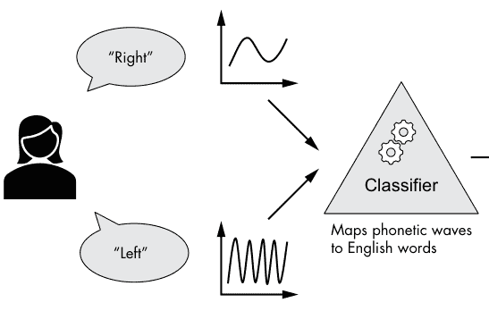

图7-4：训练阶段的分类器将两个非常不同的语音波形映射到相同的英语单词。

最好提出无法修复的错误并将其交给用户，而不是将其埋藏，即使用户不喜欢错误消息并且你的应用程序的可用性降低了。另一种选择是埋藏错误，直到它们变得太大而无法处理。

继续我们的错误训练数据示例，清单7-17展示了一个例子，其中Python的classify()函数接受一个输入参数——要分类的波形——并返回与此分类关联的英语单词。假设你已经实现了一个duplicate_check(wave, word)函数，该函数检查数据库中一个显著不同的波形是否使用波形和单词对导致相同的分类。在这种情况下，分类是模糊的，因为两个完全不同的波形映射到同一个英语单词，你应该通过引发ClassificationError而不是返回一个随机的分类单词猜测来与用户分享这一点。是的，用户会感到恼火，但至少他们有机会自己处理错误的后果。*尽可能修复问题——但要尽早且高调地失败！*

```python
def classify(wave):
    # Do the classification
    word = # ...

    # Check if another wave
    # results in the same word
    if duplicate_check(wave, word):

        # Do not return a random guess
        # and hide the error!
        raise ClassificationError('Not Understood')

    return word
```

清单7-17：当波形无法被明确分类时，使用高调失败而非随机猜测的代码片段

#### 15. 避免手工修改：如果可以，编写程序来编写程序

该原则建议，可以自动生成的代码*应该*自动生成，因为人类在重复和枯燥的活动中极易出错。有许多方法可以实现这一点——事实上，现代高级编程语言（如Python）就是使用此类程序编译成机器代码的。通过编写程序来编写程序，这些编译器的创建者帮助高级程序员创建各种应用软件，而无需担心底层的硬件编程语言。如果没有这些程序为我们编写程序，计算机产业仍将处于起步阶段。

代码生成器和编译器今天已经产生了大量的源代码。让我们探讨思考这一原则的另一种方式。如今，机器学习和人工智能技术将这种编写程序来编写程序的概念提升到了另一个层次。智能机器（机器学习模型）由人类组装，然后根据数据继续重写（和调整）自身。从技术上讲，机器学习模型是一个程序，它已经多次重写自身，直到其行为最大化了一组适应度函数（通常由人类设定）。随着机器学习渗透（并主导）计算机科学的更多领域，这一原则在现代计算中将变得越来越重要。人类程序员在使用这些强大工具方面仍将发挥主要作用；毕竟，编译器并没有取代人类劳动，而是开辟了一个由人类程序员创造的应用新世界。我预计编程领域也会发生同样的事情：机器学习工程师和软件架构师将通过连接不同的底层程序（如机器学习模型）来设计高级应用程序。嗯，这是关于这个话题的一种观点——你的观点可能或多或少更乐观！

### 结论

在本章中，你学习了Unix创建者设计的15条原则，旨在编写更好的代码。值得重复的是——当你阅读这个列表时，思考每条原则如何应用于你当前的代码项目。

-   让每个函数做好一件事
-   简单优于复杂
-   小即是美
-   尽快构建原型
-   选择可移植性而非效率
-   将数据存储在纯文本文件中
-   利用软件杠杆优势
-   避免受限的用户界面
-   让每个程序都成为一个过滤器
-   更差即更好
-   清洁的代码优于聪明的代码
-   设计程序以与其他程序连接
-   让你的代码健壮
-   尽可能修复问题——但要尽早且高调地失败
-   编写程序来编写程序

在下一章中，你将了解设计中极简主义的影响，以及它如何帮助你通过少做来设计让用户愉悦的应用程序。

### 资源

Mike Gancarz, *The Unix Philosophy*, Boston: Digital Press, 1994.
Eric Raymond, *The Art of Unix*, Boston: Addison-Wesley, 2004, *http://www.catb.org/~esr/writings/taoup/html/*.

# 8

## 设计中少即是多


简洁是程序员的生活方式。虽然你可能不认为自己是设计师，但很可能在你的编程生涯中会创建许多用户界面。无论你是作为数据科学家需要创建一个视觉上吸引人的仪表板，作为数据库工程师需要创建一个易于使用的API，还是作为区块链开发者需要创建一个简单的Web前端将数据填充到智能合约中，了解基本的设计原则将为你和你的团队节省时间——而且它们也很容易掌握！本章涵盖的设计原则是通用的。

具体来说，你将探索计算机科学中一个受益于极简主义思维的关键领域：设计和用户体验（UX）。为了了解设计和用户体验中极简主义的重要性，想想雅虎搜索和谷歌搜索、黑莓和iPhone、Facebook Dating和Tinder之间的区别：获胜的技术通常伴随着极其简单的用户界面。难道在设计中*少即是多*吗？

我们将首先简要介绍一些因其创作者的极致专注而受益匪浅的作品。随后，我们将探讨如何在自己的设计工作中应用极简主义。

### 手机演进中的极简主义

计算设计中的极简主义典范，可见于手机的演进历程（参见图8-1）。诺基亚Mobira Senator是最早的商用“移动”电话之一，于1980年代推出，重达10公斤，操作相当复杂。一年后，摩托罗拉推出了自己的DynaTAC 8000X型号，重量仅为前者的十分之一——只有1公斤。诺基亚不得不提升竞争力。1992年，诺基亚推出了1011型号，重量仅为DynaTAC 8000X的一半。近十年后的2000年，根据摩尔定律，诺基亚凭借其标志性的诺基亚3310取得了巨大成功，重量仅为88克。随着手机技术变得日益精密和复杂，*用户界面的复杂性*，包括尺寸、重量甚至按钮数量，却*急剧降低*。手机的演进证明，即使应用程序的复杂性呈指数级增长，彻底的极简设计也是可行的。你甚至可以说，极简设计为智能手机应用的成功及其在当今世界的爆炸式普及铺平了道路。用诺基亚Senator，你恐怕很难浏览网页、使用地图服务或发送视频信息！

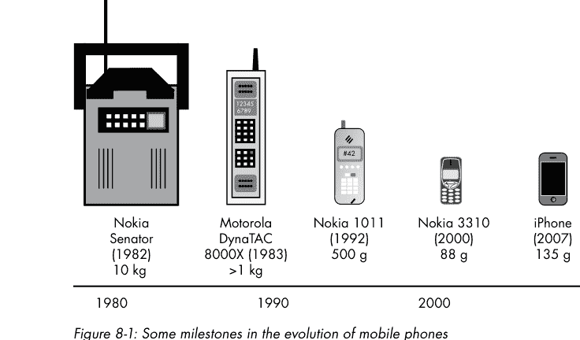

极简设计不仅在智能手机发展中显而易见。各家公司也利用它来提升用户体验并打造专注的应用程序。还有什么比谷歌搜索引擎更好的例子呢？

### 搜索中的极简主义

在图8-2中，我勾勒了一个极简设计，它类似于谷歌——以及其模仿者——如何将其主要用户界面设计成一个通向网络的、彻底简化的入口。请不要误会，这种极简而干净的设计并非偶然。这个着陆页每天有数十亿用户访问。它可能是网络上*最*重要的黄金地段。谷歌着陆页上的一个小广告就可能产生数十亿次点击，并为谷歌带来数十亿美元的收入，但谷歌并未允许这些广告充斥其着陆页，尽管这牺牲了短期的收入机会——公司管理者深知，通过极简设计所体现的品牌完整性和专注度，比通过出售其黄金地段所产生的收入更有价值。

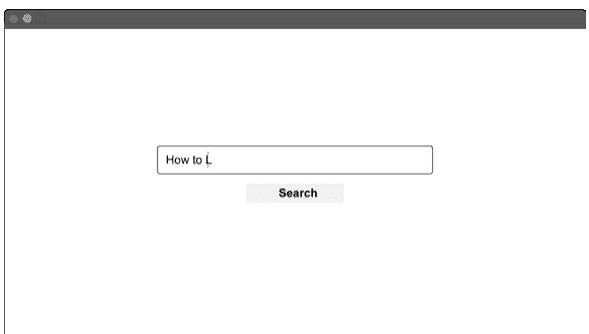

现在，将这种干净、专注的设计与必应和雅虎等替代搜索引擎利用其主要黄金地段的设计进行比较（参见图8-3）。

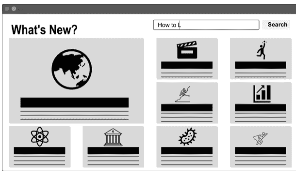

即使是像雅虎这样的基础搜索引擎公司，也走了同样的道路：他们用新闻和广告充斥宝贵的黄金地段，以提升短期收入。但这些收入并未持久，因为这种设计赶走了产生收入的源泉：用户。可用性的降低导致了竞争劣势，并持续侵蚀着用户的习惯性搜索行为。任何与搜索无关的额外网站元素，都会增加用户的认知挑战，他们必须忽略那些吸引眼球的标题、广告和图片。流畅的搜索体验是谷歌持续增加其市场份额的原因之一。最终结论尚未尘埃落定，但过去几十年专注型搜索引擎的日益流行，表明了极简和专注设计的优越性。

### Material Design

谷歌开发并目前遵循*Material Design*（材料设计）哲学和设计语言，它描述了一种根据用户已直观理解的内容来组织和设计屏幕元素的方式：物理世界元素，如纸张、卡片、笔和阴影。上一节的图8-3展示了这样一个Material Design的例子。该网站被结构化为卡片，每张卡片代表一块内容，创造出一种类似报纸的布局，包含图片和一些标题文字。网站的外观和感觉几乎是物质化的，尽管三维（3D）效果在二维（2D）屏幕上纯粹是一种错觉。

图8-4对比了左侧的Material Design和右侧去除了不必要元素的非Material Design。你可能会认为非Material设计更极简，并且在某种程度上你是对的。它占用更少的空间，使用更少的颜色和更少的非功能性视觉元素，如阴影。然而，由于缺乏边界和直观熟悉的布局，非Material设计往往让读者更加困惑。真正的极简主义者总是使用更少的昂贵资源来完成相同的任务。在某些情况下，这意味着减少网站上的视觉元素数量。在其他情况下，这意味着添加一些元素以减少用户需要思考的时间。根据经验法则：用户时间是比屏幕空间稀缺得多的资源。

你可以在 https://material.io/design/ 找到关于Material Design的完整介绍和许多精彩的案例研究。新的设计系统将会出现，用户将越来越习惯数字化工作，因此对于下一代计算机用户来说，材料隐喻可能变得不那么有用。目前，只需注意极简主义需要仔细考虑相关资源：时间、空间和金钱——你必须根据应用程序的需求来权衡它们。总而言之，极简设计去除了所有不必要的元素，创造出一个可能让用户愉悦的精美产品。

接下来，你将学习如何实现它。

《整洁代码的艺术》（早期访问版）© 2022 Christian Mayer

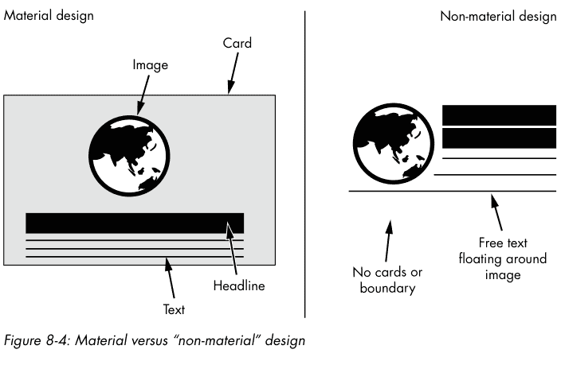

### 如何实现极简设计

在本节中，你将学习一些关于如何实现专注、极简设计的技术技巧和方法。

#### 使用留白

留白是极简设计的关键支柱之一。首先在你的应用程序中添加留白，可能看起来像是浪费了宝贵的黄金地段。不充分利用高流量网站的每一寸空间，你一定是疯了，对吧？你可以用它来做广告、“行动号召”以销售更多产品、提供关于价值主张的额外信息，或更多个性化推荐。你的应用越成功，利益相关者就会为争取他们能得到的每一点关注而争斗，很可能没人会要求你从应用中移除非留白元素。

“减法式”思考可能并非与生俱来；然而，用留白替换设计元素将提高清晰度，并带来更专注的用户体验。成功的公司通过使用留白来保持专注和敏锐，设法让主要的事情保持为主要的事情。例如，谷歌的着陆页使用了大量留白，苹果在展示其产品时也使用了大量留白。在考虑你的用户时，请记住这一点：如果你让他们感到困惑，你就会失去他们。留白提高了用户界面的清晰度。

图8-5展示了一个在线披萨外卖服务的简单设计思路。留白支持了对主要事情的关注：让顾客订购披萨。不幸的是，很少有披萨外卖服务敢于如此极端地使用留白。

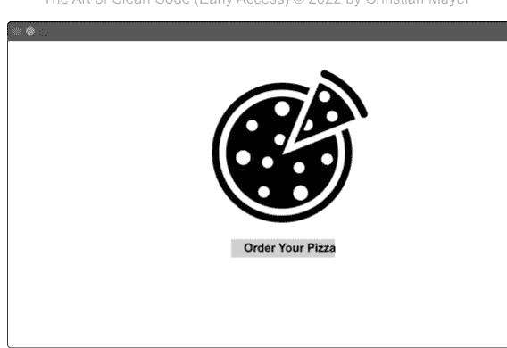

图8-5：使用大量留白

留白也能提高文本的清晰度。看看图8-6，它比较了两种格式化段落的方式。

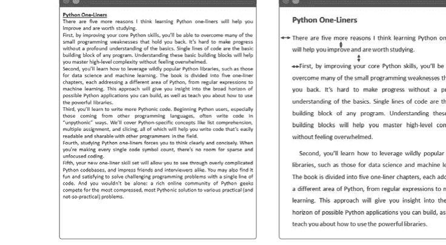

图8-6：文本中的留白

图8-6左侧的可读性要差得多。右侧注入了留白以提高可读性和用户体验：文本块左右两侧的页边距、段落缩进、增加的行高、段落上下的页边距以及增大的字体大小。这些额外空间的成本可以忽略不计：滚动很廉价，而且当出版物是数字形式时，我们不必为了纸张而砍伐更多的树木。另一方面，好处是非常真实的：你的网站或应用程序的用户体验得到了显著提升！

#### 移除设计元素

原则很简单：逐一审视每个设计元素，尽可能将其移除。*设计元素*是指用户界面中任何可见的元素，例如菜单项、行动号召、精选列表、按钮、图片、方框、阴影、表单字段、弹出窗口、视频，以及所有在用户界面中占据空间的其他内容。实际上，你需要审视所有设计元素并问：*我能移除它吗？*你会惊讶地发现，答案常常是*可以！*

请不要误解——移除设计元素并非易事！你曾花费时间和精力创建它们，而沉没成本偏差会让你即使在它们不必要时也忍不住想保留自己的创作。图8-7展示了一个理想化的编辑过程，其中你根据每个元素对用户体验的重要性进行分类。例如，一个指向公司博客的菜单项，在用户订购产品时的结账过程中能提供帮助吗？不能，因此它应被归类为不重要。例如，亚马逊通过引入一键购买按钮，从订购流程中剥离了所有不必要的设计元素。当我第一次在科学写作研讨会上了解到这种方法时，它彻底改变了我对编辑的思考方式。移除不重要和较不重要的设计元素，能在风险极小的情况下保证可用性的提升。但只有真正优秀的设计移除*重要*设计元素并仅保留*非常重要*元素的魄力。然而，这正是卓越设计与仅仅良好设计之间的分水岭。

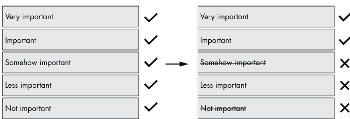

*图8-7：理想化的编辑过程*

图8-8展示了一个杂乱设计与一个极简、编辑后设计的示例。左侧的订单页面可能是你在线上披萨外卖服务中常见的样子。有些元素非常重要，例如披萨的配送地址和订单按钮，但像过于详细的配料清单和“最新动态”信息框这样的元素则较不重要。右侧是该订单页面的编辑版本。我们移除了不必要的元素，专注于最受欢迎的附加销售，将配料清单与标题合并，并将标签与表单元素结合。这使我们能够增加更多留白，甚至增大了一个*非常重要*设计元素的尺寸：美味披萨的图片！减少的杂乱和增加的专注度，很可能通过改善用户体验来提高订单页面的转化率。

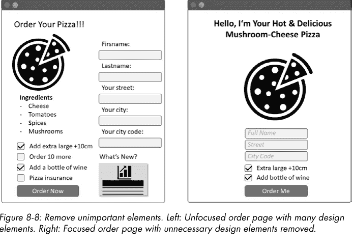

#### 移除功能

实现极简设计的最佳方法是从你的应用程序中移除整个功能！你已经在第3章关于创建最小可行产品的部分研究过这个想法，即拥有验证假设所需的最少功能数量。最小化功能数量对于帮助成熟企业重新聚焦其产品同样有益。

随着时间的推移，应用程序往往会累积功能——这种现象被称为*功能蔓延*。结果，越来越多的精力必须转向维护现有功能。功能蔓延导致软件臃肿，而臃肿的软件导致技术债务。这降低了组织的敏捷性。移除功能背后的理念是释放能量、时间和资源，并将其重新投入到对用户最重要的少数功能中。

功能蔓延及其对可用性有害影响的常见例子是雅虎、AOL和MySpace，它们都因在用户界面中添加了太多东西而某种程度上失去了其专注的产品。

相比之下，世界上最成功的产品都是专注的，并抵制了功能蔓延，即使表面上看起来并非如此。微软是一个很好的例子，说明如何通过构建*专注的产品*帮助其成为一家超级成功的公司。一种普遍的看法是，微软产品如Windows运行缓慢、效率低下，并且加载了太多功能。但事实远非如此！*你所见即全部*——你没有看到微软移除的无数功能。尽管微软规模庞大，但考虑到其规模，它实际上非常专注。成千上万的软件开发者每天都在编写新的微软代码。以下是曾在苹果和微软工作过的著名工程师埃里克·特劳特对微软专注软件工程方法的评价：

> 很多人认为Windows是一个非常庞大、臃肿的操作系统，我必须承认，这可能是一个公正的评价。它确实很大，包含了很多东西。但在其核心，内核和构成操作系统最核心的组件实际上相当精简。

总而言之，在创建一个被众多用户长期使用的应用程序时，移除功能必须成为你日常工作的核心活动，因为它能释放资源、时间、精力和用户界面空间，这些可以重新投入到改进重要功能上。

#### 减少字体和颜色的变化

过度的变化会导致复杂性。如果你过多地改变字体类型、字体大小和颜色，会增加认知摩擦，增加用户界面的感知复杂性，并牺牲清晰度。作为一名极简主义程序员，你不希望将这些心理效应构建到你的应用程序中。有效的极简设计通常只专注于一到两种字体类型、一到两种颜色以及一到两种不同的字体大小。图8-9展示了字体类型、大小、颜色和对比度的一致且极简的使用。话虽如此，请注意设计有许多方法，实现各个层面的专注和极简也有多种途径。例如，极简设计可能会使用许多不同的颜色来突出应用程序的趣味性和多彩属性。

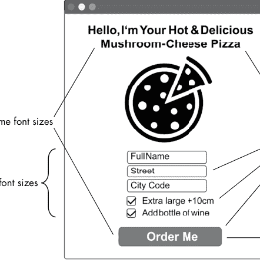

#### 保持一致性

一个应用程序通常不是由单个用户界面组成，而是由一系列处理用户交互的界面组成。这引出了极简设计的另一个维度：*一致性*。我们将一致性定义为在给定应用程序中最小化设计选择可变性的程度。一致性确保应用程序感觉像一个连贯的整体，而不是在交互的每一步都向用户呈现不同的“外观和感觉”。例如，苹果提供了许多iPhone应用程序，如浏览器、健康应用或地图服务，它们都具有相似的外观和感觉，并且可以被识别为苹果产品。让不同的应用程序开发者就一致的设计达成一致可能具有挑战性，但这对于苹果品牌的实力至关重要。为了确保品牌一致性，软件公司使用*品牌指南*，任何参与的开发者都必须遵守。在创建自己的应用程序时，请务必确保做到这一点。你可以通过一致地使用模板和（CSS）样式表来实现这一点。

### 结论

本章重点介绍了极简设计师如何主导设计世界，以苹果和谷歌等一些最成功的软件公司为例。通常，领先的技术和用户界面都极其简单。没有人知道未来会怎样，但语音识别和虚拟现实的广泛采用似乎将导致更简单的用户界面。终极的极简设计是无形的。随着无处不在的计算的兴起——Alexa和Siri——我认为在未来几十年，我们将看到更简单、更专注的用户界面。因此，回答开头提出的问题：*是的，在设计中，少即是多！*在本书的下一章也是最后一章中，我们将以专注——及其对当今程序员的相关性——作为结尾。

### 参考资料

Material Design风格文档：*https://material.io/design/introduction/*

苹果人机界面设计文档：*https://developer.apple.com/design/human-interface-guidelines/*

## 9

## 专注


在本章中，我们将快速回顾本书最重要的经验教训：如何保持专注。本书开篇讨论了复杂性——许多生产力障碍的根源。在此，我们将根据你在本书中学到的内容，总结如何应对复杂性。

### 对抗复杂性的武器

本书的核心论点是：复杂性导致混乱。混乱是专注的对立面。要解决复杂性带来的挑战，你需要使用*专注*这一强大武器。

为了论证这一观点，让我们来看看*熵*这一科学概念，它在热力学和信息论等许多科学领域广为人知。熵定义了系统中随机性、无序性和不确定性的程度。高熵意味着高随机性和混乱。低熵意味着有序和可预测性。熵是著名的热力学第二定律的核心，该定律指出*系统的熵随时间增加——最终导致高熵状态*。

图9-1展示了熵如何体现为固定数量粒子的排列方式。左侧是低熵状态，粒子的结构类似于一座房子。每个粒子的位置都是可预测的，并遵循更高层次的秩序和结构。粒子的排列方式存在一个更大的*计划*。右侧是高熵状态：房子的结构在某种程度上被破坏了。许多粒子失去了秩序，让位于混乱。随着时间的推移——如果没有外力施加能量来降低熵——熵会增加，所有秩序都将被摧毁。例如，废墟城堡就是热力学第二定律的明证。你可能会问：热力学与编码生产力有什么关系？稍后就会变得清晰。让我们继续从第一性原理思考。

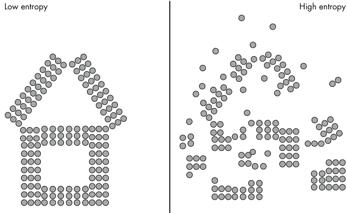

*图9-1：低熵与高熵状态*

生产力意味着创造事物，无论你是在建造房子、写书还是编写软件应用。本质上，要提高生产力，你必须*降低熵*，使整体资源以一种能够实现你更大计划的方式进行排列。

图9-2展示了熵与生产力之间的关系。你是一个创造者和建设者。你获取原始资源，并通过*为实现更大计划而付出的专注努力*，将其从高熵状态转变为低熵状态。就是这样！这就是成功的秘诀，也是你在生活中实现超级生产力和成功所需的一切：花时间仔细*规划*你的行动路线，设定具体目标，并设计定期的习惯和行动步骤，以获得你想要的结果。然后，运用你所拥有的所有资源——时间、精力、金钱和人力——进行*专注的努力*，直到你的计划实现。

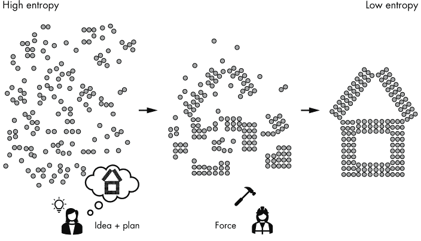

这听起来可能很简单，但大多数人都做错了。他们可能从未将专注的努力应用于实现某个想法，因此这个想法始终停留在他们的脑海中。另一些人可能得过且过，从不规划任何新事物。只有当你两者兼备——仔细规划并集中精力——你才能成为一个有生产力的人。因此，要成为一名建设者，比如开发一款智能手机应用，你必须通过规划和付出专注的努力，为混乱带来秩序，直到实现目标。

如果事情如此简单，为什么不是每个人都这样做呢？正如你所猜测的，主要障碍是复杂性，而这通常源于缺乏专注。如果你有多个计划，或者你允许你的计划随时间发生不必要的变化，你很可能在朝着目标前进几步后就放弃了整个事情。只有当你足够长时间地专注于*一个*计划时，你才能真正完成它。这适用于小的成就，比如读完一本书（你几乎快完成了！），也适用于大的成就，比如编写并发布你的第一个应用。专注是缺失的关键环节。

图9-3用图形清晰地解释了专注的力量。

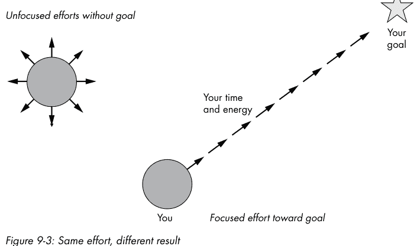

你的时间和精力是有限的。假设你在一天中有8小时的全神贯注时间或精力。你可以决定如何分配这些单位。大多数人会在很多活动上花一点时间。例如，鲍勃可能花一小时开会，一小时编码，一小时浏览社交媒体，一小时讨论项目，一小时闲聊，一小时编辑代码文档，一小时思考一个新项目，一小时写小说。鲍勃很可能在他所做的所有活动中都只能取得平庸的结果，因为他在每项活动上花费的时间和精力都太少。爱丽丝可能花8小时做一件事：编码。她每天都这样做。她在实现发布成功应用的目标上取得了快速进展。她在少数几件事上变得卓越，而不是在许多事上表现平平。事实上，她只精通一项强大的技能：编码。她朝着目标的进展势不可挡。

### 统一原则

我开始写这本书时，假设专注只是众多生产力原则之一，但我很快意识到，专注是本书中概述的所有原则的统一原则。下面我将概述如何做到这一点：

### 80/20原则

专注于关键的少数：记住，20%的努力带来80%的结果，忽略琐碎的多数，将你的生产力提高一到两个数量级。

### 构建最小可行产品

一次专注于一个假设，从而降低产品的复杂性，减少功能蔓延，并最大化产品市场契合度的进展速度。在编写任何代码之前，先弄清楚关于用户需求的清晰假设。移除所有非绝对必要的功能。少即是多！花更多时间思考要实现哪些功能，而不是实际实现它们。快速且频繁地发布你的MVP，并通过测试和逐步添加功能来随时间改进它。使用拆分测试来测试两个产品变体的响应，并丢弃那些不能改善关键用户指标的功能。

### 编写简洁清晰的代码

复杂性会减慢你对代码的理解，并增加出错的风险。正如我们从罗伯特·C·马丁那里学到的：“阅读与编写代码所花费的时间比例远超过10比1。我们不断地阅读旧代码，作为编写新代码努力的一部分。”让你的代码易于阅读，可以简化新代码的编写。在斯特伦克和怀特著名的《风格的要素》（麦克米伦出版公司，1959年）一书中，作者提出了一个永恒的写作原则：*省略不必要的词语*。我建议你将这一原则扩展到编程中，*省略不必要的代码*。

### 过早优化是万恶之源

将你的优化精力集中在重要的地方。过早优化是指将宝贵的资源花费在最终证明不必要的代码优化上。正如唐纳德·克努特告诉我们的：“忘记小的效率提升，大约97%的时间都是如此：过早优化是万恶之源。”在本章中，我讨论了我最重要的六个性能调优技巧：收集指标进行比较、考虑80/20原则、投资改进算法、应用*少即是多*原则、缓存重复结果以及知道何时停止——所有这些都可以用一个词来概括，那就是*专注*。

### 心流

心流是一种你完全沉浸在手头任务中的状态——你专注且集中。心流研究者契克森米哈伊提出了实现心流的三个条件。（1）*你的目标必须清晰*。每一行代码都让你更接近成功完成更大的代码项目。（2）*你环境中的反馈机制必须存在，最好是即时的*。寻找线上或线下的人来审查你的工作，并遵循MVP原则。（3）*机会与能力之间存在平衡*。如果任务太容易，你会失去兴奋感；如果太难，你会过早放弃。如果你遵循这些条件，你更有可能达到纯粹专注的状态。每天问自己：我*今天*能做些什么来推动我的软件项目更上一层楼？这个问题具有挑战性，但不会让人不堪重负。

### 一次做好一件事（Unix）

Unix哲学的基本思想是构建简单、清晰、简洁、模块化的代码，易于扩展和维护。这可能意味着许多不同的事物，但目标是让许多人能够通过优先考虑人类效率而非计算机效率、倾向于可组合性而非整体设计，共同协作于一个代码库。你专注于让每个函数只承担一个目的。你已经学习了15条Unix原则来编写更好的代码，包括*小即是美*、*让每个函数只做好一件事*、*尽快构建原型*以及*尽早且大声地失败*。如果你始终牢记*专注*原则，那么在遵循这些原则方面你就会做得很好，而不必记住每一条。

### 设计中的少即是多

这关乎用极简主义来聚焦你的设计。想想雅虎搜索与谷歌搜索、黑莓与iPhone、OkCupid与Tinder之间的区别：胜出的技术往往是那些拥有极其简洁用户界面的技术。通过使用极简的网页或应用设计，你专注于自己最擅长的那一件事。将用户的注意力集中在你的产品所提供的独特价值上！

### 结论

复杂是你的敌人，因为它最大化了熵。作为构建者和创造者，你希望最小化熵：创造的纯粹行为就是最小化熵的过程。你通过应用专注的努力来实现这一点。专注是每位创造者的成功秘诀。请记住沃伦·巴菲特和比尔·盖茨都认为是他们成功秘诀的东西：*专注*。

要在工作中贯彻专注，请问自己这些问题：

- 我想将精力集中在哪个软件项目上？
- 我想专注于哪些功能来创建我的最小可行产品（MVP）？
- 我可以实现的最少设计元素数量是多少，以测试产品的可行性？
- 谁会使用我的产品，为什么？
- 我可以从代码中移除什么？
- 我的函数是否只做一件事？
- 如何在更短的时间内实现相同的结果？

如果你不断问自己这些或类似的*专注问题*，那么你花在本书上的金钱和时间就是非常值得的。

### 作者寄语


你已经读完了整本书，并对如何实际提升编程技能有了深入的理解。你学习了编写简洁代码的策略和成功实践者的战略。请允许我以个人笔记来结束这本书！

在研究了复杂性难题之后，你可能会问：如果简化如此强大，为什么不是每个人都在做呢？问题在于，实施简化虽然好处巨大，但需要极大的勇气、精力和意志力。大大小小的组织通常会坚决抵制移除工作和简化流程。有人负责实施、维护和管理这些功能，即使他们知道这些功能在很大程度上无关紧要，他们也常常会竭尽全力保住自己的工作。这是一个损失厌恶的问题——很难放弃任何提供哪怕最微小价值的东西。这是需要对抗的事情；我一生中从未后悔过采取的任何简化措施。几乎所有东西都有价值，但重要的是要考虑你为获得的价值付出了多少代价。当我创办Finxter教育网站时，我有意识地决定在很大程度上忽略社交媒体，立即我就从额外获得的时间中看到了显著的积极成果，这些时间可以花在真正推动进展的事情上。简化不仅有益于编码，也有益于生活的所有领域；它有能力让你的生活更高效、更平静。希望通过阅读本书，你对简化、精简和专注变得更加开放。如果你确实决定走简化的道路，你将与伟大的人为伴：阿尔伯特·爱因斯坦相信“简单而谦逊的生活方式对每个人都是最好的，对身体和心灵都是最好的。”亨利·戴维·梭罗总结道：“简单，简单，简单！我说，让你的事情只有两三件，而不是一百件或一千件。”孔子知道“生活其实很简单，但我们却坚持把它变得复杂。”

为了帮助你持续努力简化，我制作了一份一页的书籍摘要，以便携式文档格式（PDF）提供，你可以在本书的配套页面下载、打印并钉在办公室墙上：https://blog.finxter.com/simplicity/。也欢迎注册我的免费*Finxter邮件学院*，它教授简短而简单的编程课程——我们通常专注于激动人心的科技行业，如Python、数据科学、区块链开发或机器学习——但我们也讨论关于极简主义、自由职业和商业策略的生产力技巧。

在你离开之前，请允许我对你花这么多时间陪伴我表示深深的感谢。我的生活目标是帮助人们通过代码完成更多事情，我希望这本书能帮助你实现这一点。我希望你已经获得了关于如何通过少做来提升编码生产力的见解。我希望你在翻过这一页后，立即开始你的第一个或下一个编码项目——并继续活跃在志同道合的编码者组成的Finxter社区中。为你的成功干杯！