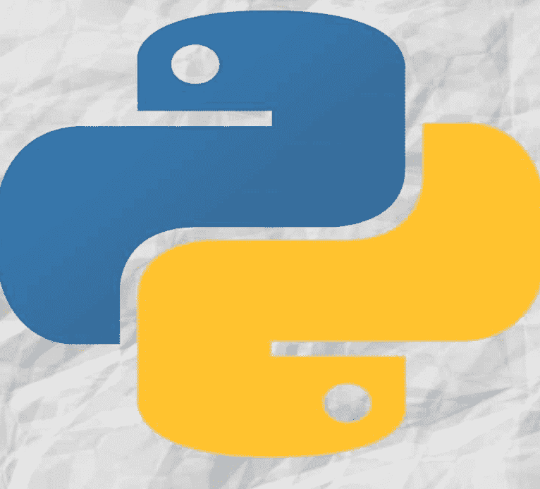
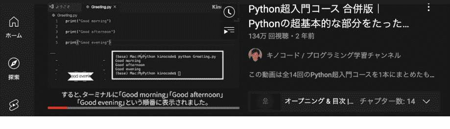
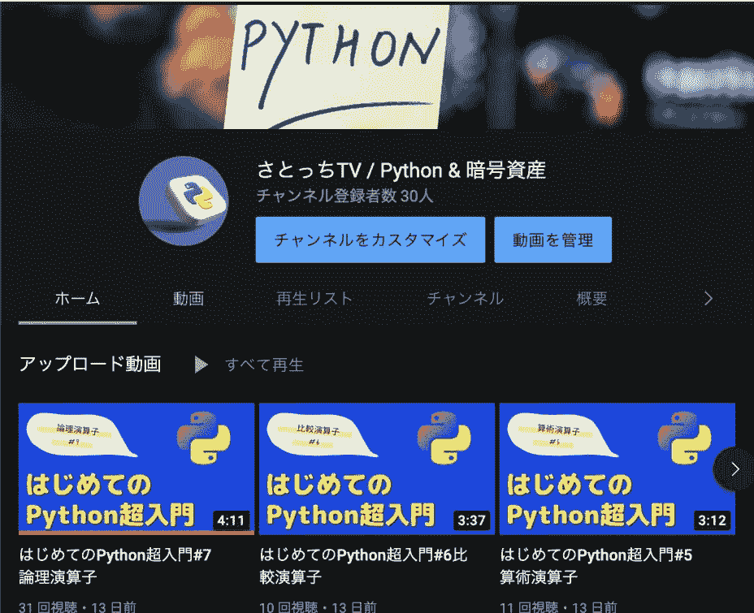
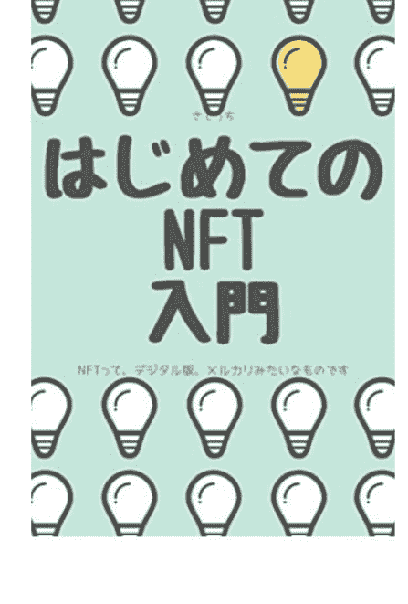
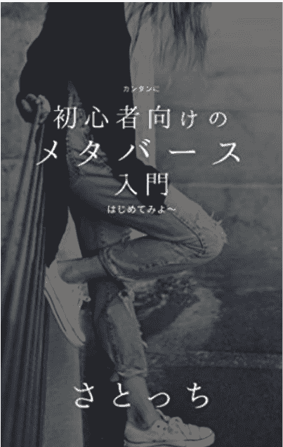
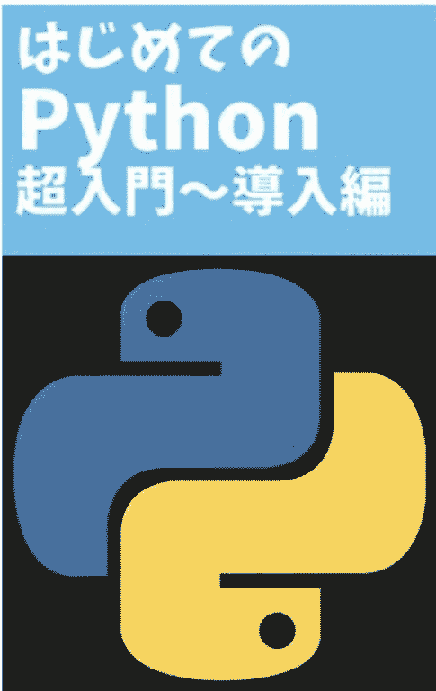

# Python速成课程：游戏应用食谱

即使对于初学者，也能轻松用Python开发游戏应用

SATOCCHI



Python

**初学者学习指南。编程非常有趣。**

## 开始之前

制作游戏应用，你完全不需要任何经验。

大家好，我是Satocchi (@stcheeee)。

这次，我编写了一本关于游戏编程的书。

原因是我想让初学者也能享受编程挑战的乐趣。
我希望初学者尝试编程时也能乐在其中。

学习编程，最好是动手制作一个能实际运行的东西，并为之感到震撼。
我认为按这个顺序来效果更好。

正如Horiemon(@takapon_jp)和Hiroyuki(@hirox246)所说：
“首先，你心里得有个想做的东西。”

然后，他们会从这个目标出发倒推，去学习所需的技能。
这就是他们的学习顺序。

我写这本书，就是为了让你也能体验这个过程。
在本书中，我将向你展示如何使用流行的Python语言制作俄罗斯方块。

## 目标读者

本书的目标读者是想要开始编程的人。

本书适合那些想要开始编程的人。

具体来说，本书适合那些刚刚在Progate等网站完成一系列Python课程的人。

我想分享编程的乐趣。

我以前上编程课时会想：“该死，太无聊了！”
学会编程后，我能拥有全远程的工作，8小时就能完成工作。
工作可以一口气做完，诸如此类。
在我意识到这些巨大的环境优势后，我开始喜欢编程。在认识到这些后，我爱上了编程。

过去，我曾被嘲笑为“数字民工”，像骡马一样为分包商卖命。
然而，如今的工作机会很多，如果你有技能和沟通能力，就可以自由选择自己的工作环境。

提升的最快方式就是“沉浸在编程中”。

希望这本书能唤醒你对编程的乐趣。

## 第1章：即使是自学者也能创建游戏应用

为什么我决定制作俄罗斯方块

### 要点

- (1) 大家似乎都想做这个。
- (2) 享受成就感

因为初学者可以以有趣的方式学习

这本书是用来学习编程的，但大多数通用书籍都只讲解语法，很难找到你想做的具体东西。

所以，我想自己尝试做一个有趣的游戏。我想自己尝试制作一个有趣的游戏。

我希望之后你能深入钻研，思考它为什么能运行。
要用Python制作俄罗斯方块，有很多东西要学。
你可能会有很多疑问，比如“为什么它能这样运行？”

如果你养成在Google上逐行查找或查看官方文档的习惯，虽然会花很多时间，但你会变得非常熟练。
这正是编程的成就感所在。

起初，有些人可能会感到自厌，纳闷为什么这么耗时，但SATOCCHI的建议是保持好奇，问自己：“为什么它能这样运行？”我希望你能抱着“为什么它能这样运行？”的真实感受去尝试编程。
这非常有趣。

以后可以自定义。
一旦你具备了一定的编程技能，你可能会想添加声音，或者给俄罗斯方块方块添加更多形状等等。你可以做任何你想做的事。游戏编程有很多后续自定义的动力。
因为游戏编程很容易让人产生后续自定义的动力，所以这次让我们尝试编程制作俄罗斯方块吧。

### 本节小结

- (1) 在快乐中学习编程！
- (2) 为世界留下遗产！

## 第2章：了解俄罗斯方块所用的技术

创建应用所需的前置知识

### 要点

- (1) 了解一下编程语言。
- (2) 确认一下开发环境

#### ☆Python知识

Python是一种编程语言。在本书中，我们将尝试使用Python编程制作俄罗斯方块。

本书会讲解一些基础内容，但如果你想系统学习，建议尝试在Progate网站上学习编程。Progate非常适合初学者透彻、易懂地学习编程。如果你先通过Progate学习Python，然后再看本书，你的学习会进展得更顺利。

#### 用编程
拓展人生的更多可能

👤 2,600,000 用户 🌐 覆盖国家/地区 100+

## 第3章：学习Python

### 通过Progate学习基础

### 要点

- 1. 完成Progate的Python课程1到5。
- 2. 将基础学习保持在最低限度。

#### 为什么选择Progate？

Progate是一个非常易于理解的在线学习服务。

Satochi研究过各种学习服务，我认为Progate是快速学习一门语言的最佳选择。Progate提供课程1到5。

Progate的课程从1到5，完成所有课程大约需要10小时，但我推荐你尝试一下。

### 编程学校怎么样？

在编程学校学习通常取决于学校，但大约20万日元的课程可以进行约一个月的密集学习。
你可以获得大约10次与工程师的1对1辅导，以解答不清楚的地方。在我看来，学校的属性非常好。

在Satocchi看来，对于本身属性就是工程师的人来说，这是不必要的。我认为对于天生就是工程师的人来说，这是不必要的。
对于完全的初学者来说，或许可以把学校当作一个尝试学习的环境。但我担心成本太高。
但我仍然担心高昂的费用。（如果你有钱，那没问题。）

基础学习应保持在最低限度。
在Progate上能学到的课程只是Python实际编程的皮毛。
在学了一些基础之后，最好亲自接手项目、构建软件，所以我不推荐你参加Progate 10周的课程。

### 本节小结

- (1) 基础学习，使用Progate快速起步。
- (2) 如果你有钱，可以去编程学校。

### 也可以通过视频（youtube）学习

### 要点

- (1) 可以在路上学习！
- (2) 一定要动手实践！

#### 在Youtube上学习的优势

Youtube上有很多优质的编程学习资料，而且免费。因此，我们也推荐通过视频学习。



### Satocchi TV（youtube）频道也开放了。

Satocchi不仅为Kindle书籍开设了youtube频道，还通过视频帮助大家以易懂的方式学习编程。

https://www.youtube.com/channel/UC-5DcUCMb3g-28FRK3EtlfQ

未来我们会添加各种课程，请务必来看看。



### 关于视频学习的一点说明

学习视频往往会让人产生“我已经学了编程”的错觉。但我希望你一定要“动手实践”。
如果不实际动手，最终只会“感觉懂了”。
如果要费心学习，就自己动手去做。

### 本节小结

- (1) 视频学习免费，且有很多高质量内容。
- (2) 重要的是要自己动手实践。

## 第4章：提前做好准备

### 买一台Macbook吧！

### 要点

- (1) Macbook是工程师的唯一选择。
- (2) 享受有格调的编程！

### 为什么是Mac？

(1) 因为人人都用Mac（容易搜到解决方案）。

这是核心。
系统开发70%的时间在抓bug。
当我们遇到瓶颈时会去Google搜索，但大多数文章都是关于Mac的。
因此，为了增加信息量，Mac是必备的。

(2) 感染病毒的可能性比Windows低得多。

(3) 它很酷。

字面意思。

(4) 性能好。

我的主力机是一台12英寸MacBook。
我记得大约花了12万日元，这是我人生中最划算的购买之一。

(5) 轻便。
轻便就易于携带。

(6) 基于Linux。
命令行与Linux几乎相同，因此对Linux用户来说易于使用，即使你从未使用过Linux，我想通过这本书学习后，你也能正常地使用Linux。

### 本节总结

-   (1) 如果你是工程师，选择 Mac。
-   (2) 如果你不喜欢，就在 Mercari 上卖掉它。

### 让我们创建一个环境

#### 关于 Google 协作的考量

我们寻找一个即使初学者也能进行开发的环境。
最简单的选择之一是 Google 协作。
只需一分钟即可获得开发环境。而且它是免费的。

我以为这样就完成了，于是继续创建内容，但在执行阶段遇到了困难。

我无法使用绘制对象的功能。
原因在于应用程序运行在云端。
因此，我决定将环境部署到自己的设备上。
由于我只有 Mac，而开发社区又充斥着 Mac，所以我决定大力推荐 Mac。

### 如何在 Mac 上设置开发环境

#### 步骤 1：准备开始构建环境

1.  检查 Python 版本

```
python --version
```

默认版本是 2 系列。因此，请安装 pyenv 并安装 3 系列。

#### 步骤 2：安装 Homebrew

```
brew -v
```

确认显示了 Homebrew x.x.x 和版本信息。

#### 步骤 3：安装 pyenv

1.  pyenv -v

当显示 "pyenv: command not found" 时，执行以下命令。

```
brew install pyenv
```

#### 步骤 4：安装 Python

1.  pyenv install --list

2.  pyenv install 3.x.x

建议安装最新版本的 Python 3.x.x。本例中，最新版本是 3.10.x。此处，我们选择了 3.10.4。

3.  pyenv versions

4.  pyenv global 3.x.x

5.  python --version

#### 步骤 5：执行 Python 代码

1.  python XXXX.py

## 第 5 章：让我们为俄罗斯方块编写代码

让我们来看看整体代码。

```python
import tkinter as tk
from queue import Queue
import numpy as np
from random import randint
from time import time

GAME_W , GAME_H = 10, 18
SCN_W , SCN_H = 400, 720
BLOCK_W, BLOCK_H = SCN_W // GAME_W, SCN_H // GAME_H
TIMER_WAIT = 50

get_time = lambda: time() * 1000
out_of_screen = lambda x, y: x < 0 or x >= GAME_W or y < 0 or y >= GAME_H
g_pos = {'x': 0, 'y': 0}
g_events = Queue()

def init_game():
    global g_buf, g_pat, g_time, g_scene
    g_buf = [[0 for _ in range(GAME_W)] for _ in range(GAME_H)]
    g_pat, g_time, g_scene = None, get_time(), 0 # g_scene = 0: Playing, 1: Game Over
```

```python
def create_pattern():
    pats = [['0100', '0100', '0100', '0100'], ['0000', '0100', '0110', '0100'],
            ['0000', '0110', '0100', '0100'], ['0000', '0110', '0010', '0010'],
            ['0000', '0010', '0110', '0100'], ['0000', '0100', '0110', '0010']]
    return [p := pats[randint(0, 5)], [p := np.rot90(np.array(list(map(lambda x: [int(v) for v in x], p)), int).tolist() for _ in range(randint(1, 4))][-1][1]]
```

```python
def is_crashed(pat, x, y):
    for i in range(16):
        if pat[i // 4][i % 4]:
            if out_of_screen(i % 4 + x, i // 4 + y) or pat[i // 4][i % 4] & g_buf[i // 4 + y][i % 4 + x]:
                return True
    return False
```

```python
def draw_one_block(canvas, x, y):
    if not out_of_screen(x, y):
        x1, y1 = x * BLOCK_W, y * BLOCK_H
        x2, y2 = x1 + BLOCK_W - 1, y1 + BLOCK_H - 1
        canvas.create_rectangle(x1, y1, x2, y2, fill='white', width=0, tag='objects')
```

```python
def draw_game(canvas):
    canvas.delete('objects')
    for i in range(GAME_W * GAME_H):
        if g_buf[i // GAME_W][i % GAME_W]:
            draw_one_block(canvas, i % GAME_W, i // GAME_W)
    if g_pat:
        for i in range(4 * 4):
            if g_pat[i // 4][i % 4]:
                draw_one_block(canvas, i % 4 + g_pos['x'], i // 4 + g_pos['y'])
    if g_scene == 1:
        canvas.create_rectangle(40, SCN_H // 2 - 50, SCN_W - 40, SCN_H // 2 + 50, fill='gray', tag='objects')
        canvas.create_text(SCN_W // 2, SCN_H // 2, text='Game Over\n\nPlease Space Key', font=('Monospace', 14, 'bold'), justify='center', fill='white', anchor='center', tag='objects')
```

```python
def main_proc(root, canvas):
    global g_buf, g_pat, g_time, g_scene

    if (e := g_events.get() if not g_events.empty() else None) is not None:
        if g_scene == 0 and g_pat is not None:
            if e == 'Left':     g_pos['x'] += -1 if not is_crashed(g_pat, g_pos['x'] - 1, g_pos['y']) else 0
            elif e == 'Right':  g_pos['x'] += 1 if not is_crashed(g_pat, g_pos['x'] + 1, g_pos['y']) else 0
            elif e == 'space':  g_pat = pat if not is_crashed(pat := np.rot90(np.array(g_pat, int)).tolist(), **g_pos) else g_pat
        elif g_scene == 1 and e == 'space':
            init_game()

    if g_scene == 0:
        if g_pat is None:
            g_pat = create_pattern()
            for top in range(4):
                if any(g_pat[top]):
                    g_pos['x'], g_pos['y'] = (GAME_W - 4) // 2, -top
                    break
            g_scene = 1 if is_crashed(g_pat, **g_pos) else 0

        if get_time() - g_time > 400 or e == 'Down':
            if is_crashed(g_pat, g_pos['x'], g_pos['y'] + 1):
                for y in range(4):
                    for x in range(4):
                        if not out_of_screen(g_pos['x'] + x, g_pos['y'] + y):
                            g_buf[g_pos['y'] + y][g_pos['x'] + x] |= g_pat[y][x]
                g_pat = None
                new_buf = list(filter(lambda line: not all(line), g_buf))
                g_buf = [[0 for _ in range(GAME_W)] for _ in range(GAME_H - len(new_buf))] + new_buf
            else:
                g_pos['y'] += 1

            g_time = get_time()

    draw_game(canvas)
    root.after(TIMER_WAIT, main_proc, root, canvas)
```

```python
if __name__ == '__main__':
    root = tk.Tk()
    root.geometry(f'{SCN_W}x{SCN_H}')
    canvas = tk.Canvas(root, width=SCN_W, height=SCN_H, bg='black')
    canvas.place(x=0, y=0)
    root.bind('<Key>', lambda e: g_events.put(e.keysym) if e.keysym in ('Left', 'Right', 'Down', 'space') else None)
    init_game()
    root.after(TIMER_WAIT, main_proc, root, canvas)
    root.mainloop()
```

我认为，光是看整体代码，可能很难形成一个清晰的印象，所以接下来我将按顺序进行说明。

### 玩俄罗斯方块需要什么

这涉及到从哪里开始学习编程的问题。

#### 必要的功能

1.  屏幕
2.  方块
3.  控制器
4.  定时器

##### (1) 屏幕

Python 有一个专门用于游戏的库。
关于屏幕功能，有一个名为 tkinter 的库，它有一个叫做 Canvas 的功能。

##### (2) 方块

将方块附着到屏幕上的功能可以在 tkinter 中创建。

##### (3) 通过键盘操作

使用 tkinter 创建的窗口的 "bind()" 函数可以实现此功能。

##### (4) 定时器

需要一个机制，使得方块在时间流逝时下落。
定时器可以通过 Tkinter 中的 "after" 函数实现。

我思考了这个游戏的程序流程。

我将程序分成了几个步骤。

1.  在数组中定义方块的存在
2.  绘制方块的函数
3.  创建方块图案的函数
4.  方块碰撞的判定
5.  防止方块移出屏幕的函数
6.  消除已对齐的一行
7.  用主函数进行循环

让我们把这些内容转化为实际的编程。

### 让我们做出声明。

```python
import tkinter as tk
from queue import Queue
import numpy as np
from random import randint
from time import time
```

说明

tkinter. 一个用于创建屏幕的库。
queue 用于管理键盘上按下的键。
numpy 是一个用于快速处理向量和矩阵的库。
random 用于生成随机数。
time 用于获取时间的流逝。

### 让我们定义变量

```python
GAME_W, GAME_H = 10, 18
SCN_W, SCN_H = 400, 720
BLOCK_W, BLOCK_H = SCN_W // GAME_W, SCN_H // GAME_H
TIMER_WAIT = 50

get_time = lambda: time() * 1000
out_of_screen = lambda x, y: x < 0 or x >= GAME_W or y < 0 or y >= GAME_H
g_pos = {'x': 0, 'y': 0}
g_events = Queue()
```

#### 解释

- `GAME_W`, `GAME_H = 10, 18`：指定可绘制方块的范围。
- `SCN_W`, `SCN_H = 400, 720`：指定屏幕尺寸（像素）。
- `BLOCK_W, BLOCK_H = SCN_W // GAME_W, SCN_H // GAME_H`：定义每个方块的像素大小。使用 `//` 运算符返回整数。
- `TIMER_WAIT = 50`：指定计时器等待时间（毫秒）。
- `get_time = lambda: time() * 1000`：`time()` 返回经过的秒数。此处使用毫秒，因此乘以 1000。
- `out_of_screen = lambda x, y: x < 0 or x >= GAME_W or y < 0 or y >= GAME_H`：测试以方块为单位的坐标 x 和 y 是否在屏幕外。如果在屏幕外则返回 True。
- `g_pos = {'x': 0, 'y': 0}`：管理操作过程中方块图案的坐标。
- `g_events = Queue()`：用于存储和管理键盘按键的队列。实际上，当按下键盘上的 ←、→、↓ 或空格键时，它会被填入队列，并在主循环中检索。

### 函数创建（用于初始化游戏的函数）

```python
def init_game():
    global g_buf, g_pat, g_time, g_scene
    g_buf = [[0 for _ in range(GAME_W)] for _ in range(GAME_H)]
    g_pat, g_time, g_scene = None, get_time(), 0  # g_scene = 0: 游戏中, 1: 游戏结束
```

#### 解释

创建一个用 0 初始化的 10x18 数组。
- `g_pat`：表示操作过程中方块图案的数组（列表）。初始化时设置为 None。
- `g_time`：主循环中方块图案最后一次下落的时间。
- `g_scene`：指示游戏状态的标志。0 表示游戏中，1 表示正在显示游戏结束画面。

### 函数创建（方块图案创建）

```python
def create_pattern():
    pats = [['0100', '0100', '0100', '0100'], ['0000', '0100', '0110', '0100'],
            ['0000', '0110', '0100', '0100'], ['0000', '0110', '0010', '0010'],
            ['0000', '0010', '0110', '0100'], ['0000', '0100', '0110', '0010']]
    return [p := pats[randint(0, 5)], [p := np.rot90(np.array(list(map(lambda x: [int(v) for v in x], p)),
    int)).tolist() for _ in range(randint(1, 4))][-1][1]
```

#### 解释

在 `pats` 中定义图案，它是一个包含字符串的列表（0 表示无方块，1 表示有方块）。

### 函数创建（方块碰撞检测）

```python
def is_crashed(pat, x, y):
    for i in range(16):
        if pat[i // 4][i % 4]:
            if out_of_screen(i % 4 + x, i // 4 + y) or pat[i // 4][i % 4] & g_buf[i // 4 + y][i % 4 + x]:
                return True
    return False
```

#### 描述

接收方块图案 `pat` 及其左上角坐标 `x`, `y`。然后，判断已放置的方块与正在操作的方块图案之间的碰撞。这是检查坐标是否超出屏幕，或者正在操作的方块图案中的方块是否与已放置的方块发生碰撞的地方。如果两个方块都存在，结果为 1，表示发生碰撞。

### 函数创建（方块绘制）

```python
def draw_one_block(canvas, x, y):
    if not out_of_screen(x, y):
        x1, y1 = x * BLOCK_W, y * BLOCK_H
        x2, y2 = x1 + BLOCK_W - 1, y1 + BLOCK_H - 1
        canvas.create_rectangle(x1, y1, x2, y2, fill='white', width=0, tag='objects')
```

#### 描述

这部分在 tkinter 的 Canvas 中绘制一个方块。在绘制方块之前，会检查其坐标是否在屏幕外。如果在屏幕外，则不绘制。

### 函数创建（方块图案绘制）

```python
def draw_game(canvas):
    canvas.delete('objects')

    for i in range(GAME_W * GAME_H):
        if g_buf[i // GAME_W][i % GAME_W]:
            draw_one_block(canvas, i % GAME_W, i // GAME_W)
    if g_pat:
        for i in range(4 * 4):
            if g_pat[i // 4][i % 4]:
                draw_one_block(canvas, i % 4 + g_pos['x'], i // 4 + g_pos['y'])
    if g_scene == 1:
        canvas.create_rectangle(40, SCN_H // 2 - 50, SCN_W - 40, SCN_H // 2 + 50, fill='gray', tag='objects')
        canvas.create_text(SCN_W // 2, SCN_H // 2, text='Game Over\n\nPlease Space Key', font=('Monospace', 14, 'bold'), justify='center', fill='white', anchor='center', tag='objects')
```

#### 描述

此函数绘制已放置的方块和正在操作的方块图案。没有它，游戏会随着进行逐渐变得过于沉重而无法运行。

### 函数创建（主函数）

```python
def main_proc(root, canvas):
    global g_buf, g_pat, g_time, g_scene

    if (e := g_events.get() if not g_events.empty() else None) is not None:
        if g_scene == 0 and g_pat is not None:
            if e == 'Left':    g_pos['x'] += -1 if not is_crashed(g_pat, g_pos['x'] - 1, g_pos['y']) else 0
            elif e == 'Right': g_pos['x'] += 1 if not is_crashed(g_pat, g_pos['x'] + 1, g_pos['y']) else 0
            elif e == 'space': g_pat = pat if not is_crashed(pat := np.rot90(np.array(g_pat, int)).tolist(), **g_pos) else g_pat
        elif g_scene == 1 and e == 'space':
            init_game()

    if g_scene == 0:
        if g_pat is None:
            g_pat = create_pattern()
            for top in range(4):
                if any(g_pat[top]):
                    g_pos['x'], g_pos['y'] = (GAME_W - 4) // 2, -top
                    break
            g_scene = 1 if is_crashed(g_pat, **g_pos) else 0

        if get_time() - g_time > 400 or e == 'Down':
            if is_crashed(g_pat, g_pos['x'], g_pos['y'] + 1):
                for y in range(4):
                    for x in range(4):
                        if not out_of_screen(g_pos['x'] + x, g_pos['y'] + y):
                            g_buf[g_pos['y'] + y][g_pos['x'] + x] |= g_pat[y][x]
                g_pat = None
                new_buf = list(filter(lambda line: not all(line), g_buf))
                g_buf = [[0 for _ in range(GAME_W)] for _ in range(GAME_H - len(new_buf))] + new_buf
            else:
                g_pos['y'] += 1

            g_time = get_time()

    draw_game(canvas)
    root.after(TIMER_WAIT, main_proc, root, canvas)
```

#### 解释

这是主函数。
从 `g_events`（队列）中检索按下的键并进行处理。
处理左右方向键，并覆盖方块图案的坐标。
使用空格键执行旋转处理。
当显示游戏结束时，也处理空格键。
如果 `g_pat` 为 None，则生成方块图案。
如果图案与方块发生碰撞，则游戏结束。
还执行速度控制。
与已放置的方块进行碰撞检测。
如果发生碰撞，则停止（将 `g_pat` 的内容移动到 `g_buf`）。
检查已放置的方块，并删除该行。
然后，将坐标向下移动一个单位。
更新之前的下落处理时间。
通过调用 `main_proc()` 更新的信息反映在屏幕上。
设置从现在起多少毫秒后调用 `main_proc()`，并且随着 `main_proc()` 的持续调用更新游戏。

### 函数创建（最初启动的函数）

```python
if __name__ == '__main__':
    root = tk.Tk()
    root.geometry(f'{SCN_W}x{SCN_H}')
    canvas = tk.Canvas(root, width=SCN_W, height=SCN_H, bg='black')
    canvas.place(x=0, y=0)
    root.bind('<Key>', lambda e: g_events.put(e.keysym) if e.keysym in ('Left', 'Right', 'Down', 'space') else None)
    init_game()
    root.after(TIMER_WAIT, main_proc, root, canvas)
    root.mainloop()
```

#### 解释

这是移动的第一部分。
如果代码直接执行，名为 `__name__` 的全局变量将变为 `'__main__'`。
此处生成 tkinter 的窗口。
生成画布并放置在窗口中。
当按下键时，使用 `bind()` 将其打包到 `g_events`（队列）中。
通过调用 `init_game()` 初始化游戏。
该过程在指定时间后调用 `main_proc()`。
这是用于控制窗口的 tkinter 主循环。在屏幕关闭之前不会返回。换句话说，它会在此处停止。

## 第六章 欢迎来到编程世界 发生错误时该怎么办

### 要点

- (1) 了解发生错误时该怎么做。
- (2) 学会如何将问题与错误隔离开来。

### 发生错误时需要准备什么

错误是编程初学者放弃编程的原因之一。

尤其是当你刚开始编程时，你往往会因为不知道如何处理错误而认为自己不适合编程。

然而，一旦你掌握了窍门，错误应对就不再是问题，所以这里列出了一些你应该做的具体事情。

### 编码拼写错误

编程时，你只输入英文字符，所以作为初学者很容易出现拼写错误。

首先检查错误信息，确保没有拼写错误。

### 检查错误信息

当程序执行过程中发生错误时，会显示错误信息。

用谷歌搜索这条信息。

你很可能会找到一篇有人已经遇到同样错误并解决了它的文章。

此外，如果你有任何问题，可以在 teratail 或 stackoverflow 上提问。

### 本节小结

- (1) 如果发生错误，不要钻牛角尖。（这是每个人都会走的路）
- (2) 修复错误占程序开发的80%。

## 未来如何学习

### 要点

- (1) 创造你想创造的东西
- (2) 尝试基础知识并发布信息

让我们决定你想做什么。

- (1) 首先，明确你想做什么。
- (2) 让我们想出各种点子，制作你想用的东西。

让我们询问如何制作。

一旦你有了明确的想法，就去询问如何从技术上实现它。让我们去问。

建议由实际的工程师进行指导。

另外，通过众包实际订购一个项目可能是个好主意。

传播信息

尝试实际创建一个编程项目，并将你的技术问题发布在 Qiita 或你自己的博客上。

通过发布信息，你将能够客观地证明你的技术能力。

### 找工作

- ◎众包
尝试基于你已掌握的技能承接众包项目。你会享受在业余时间赚钱的乐趣。
- ◎就业
尝试找一份工程师的工作。

利用你的 Qiita 文章和其他成果来促进你的求职。

我相信，根据你平时如何积累工作成果，一些公司会对你感兴趣。

如果你转行成为工程师，有很多工作是完全远程的，所以你不必来办公室，不必再接电话，也不必再做一个低生产力的人。

务必尝试转行成为工程师。

### 本节小结

- (1) 制作你想制作的东西。
- (2) 快乐地生活！

## 结语

再见了，老家伙们。

日本的生产力已经触及天花板，公司里有大量“不工作的老家伙”。

我想象着自己未来的样子，每天乘坐通勤列车，沉溺于一份自己甚至都不想做的工作。

我只想设法摆脱这种处境。我想设法摆脱这种处境。

学习编程是逃离这个地狱的出路。

### 从一个被要求接电话的社会毕业

即使是严重愚蠢的人也能接电话，但这种缺乏生产力的情况足以让你感到恶心和厌倦。

我讨厌工作的一个重要原因是，所有高层职位都被无能的人占据了。
我相信这就是我讨厌工作的原因。

日式雇佣制度已经彻底终结了。
底层员工对此感到厌倦，因为在工作中是“全面防守和缠斗地狱”，因为那些“不工作的老家伙”是学习最刻苦的人。

我相信许多公司看到越来越多的年轻人离开劳动力市场，但让我们尽快离开这些有老家伙的公司。没有未来。”

### 留在本地，成为硅谷工程师，同时当个渔夫。

Satocchi 喜欢中里聪，我一边听着 VOICY 一边写下“终章”。

所以，在硅谷远程工作。他推荐“在硅谷远程工作”。

Satocchi 正在朝这个目标努力。

即使在实现 FIRE 之后，在硅谷的公司远程工作听起来也真的很有趣。

在过去的几年里，我一直在努力学习英语和编程，我打算去海外工作。

而且这一切都发生在日本国内。这是 Satocchi 最近的目标。

我不会为了学习而学习。

我不会为了辞掉现在的工作而跳槽到另一家公司。我会销售数字内容并获利。

我将基于我的成果创建一个英文技术博客。

我将与一位海外工程师交朋友，并在美国公司实习。

经过2.3年的全身心投入，你将拥有一个可以在世界任何地方工作的 Satocchi。

现在，我只觉得我能做到。

我想以我自己的方式玩肖申克的天空。

Satocchi。

## 书籍介绍

### NFT 初学者指南



让我们第一次尝试 NFT。当你准备好开始使用 NFT 进行交易时，请阅读本书。它介绍了开始交易所需的步骤，即使是初学者也会喜欢阅读。

### 元宇宙初学者指南



想知道元宇宙到底是怎么回事吗？这适合那些有兴趣了解更多的人。请将其作为入门书籍使用，因为它快速概述了元宇宙。

### 使用 NISA 和 ideco 进行 FIRE 入门


我们将以易于理解的方式解释热门话题 FIRE。通过利用“积立 NISA”和“ideco”，扎实理解税收制度，让我们长期积累资产。

### Python 初学者超级入门



本书旨在帮助完全的初学者迈出编程的第一步。使用现在流行的 Python 语言学习编程基础。本书是该系列的第一本。请随意翻阅。

## 关于作者

### **Satocchi**

在金融机构担任内部 SE 15年。

作为“一人信息系统”，他经历了许多艰辛和努力。

现在，他试图帮助许多“一人系统管理员”或那些想学习新编程技术的人。

他还帮助那些想学习新编程技能的人和那些想成为理财规划师的人。

他基于自己作为理财规划师的经验，指导许多想要挑战“FIRE”的人，并帮助他们建立资产。

### **博客**

- 1. Satocchi 谈论极其小众话题的博客。
   https://stcheeeee.com/
- 2. Python 和虚拟货币带来的幸福生活
   https://py.stcheeeee.com/py/

### **技术博客**

- 1. crypto tech babes
   https://tech.stcheeeee.com/tech/

### **Youtube**

- 1. satocchi TV
   https://www.youtube.com/channel/UC-5DcUCMb3g-28FRK3EtIfQ