# 面向初学者的Python与MySQL

FATIMAH RAHMAT  
MOHAMAD IQBAL HAKIM CHE OMAR  
NURUL SHAKIRAH MOHD ZAWAWI

2023年第一版

# 版权声明 ©2023

版权所有。未经出版者事先书面许可，不得以任何形式或任何方式（包括影印、录制或其他电子或机械方法）复制、分发或传播本出版物的任何部分，除非版权法允许的用于评论的简短引用和其他某些非商业性用途。如需获取许可，请致函出版者，地址注明“收件人：许可协调员”，地址如下：

Politeknik Mersing  
Jalan Nitar,  
86800 Mersing  
Johor Darul Ta’zim  
电话：07-7980001  
传真：07-7980002  
网站：https://pmj.mypolycc.edu.my/

马来西亚印刷  
2023年第一次印刷  
eISBN：978-967-2904-57-1

作者：
Fatimah Rahmat  
Mohamad Iqbal Hakim Che Omar  
Nurul Shakirah Mohd Zawawi

# 前言

分享关于Python编程语言如何对学习过程产生积极影响的知识和经验的需求，促使本书的诞生。本书重点介绍安装过程、使用MySQL进行数据库连接以及Python语言的基本概念。

本书提供了有用的资源、建议和示例，特别适合学生和其他任何有兴趣学习Python编程语言的人士。

本书的示例还演示了如何使用Python脚本与MySQL结合，实现应用程序的创建、读取、更新和删除功能。

本书旨在帮助读者实现他们的目标。

# 目录

## I. 引言

- 什么是Python编程？ ........................ 2
- Python的基本原则 ........................... 3

## II. 要求

- 需要什么？ .................................... 5
- Visual Studio Code 与 PyCharm 与 IDLE ........ 6
- 最低要求：
  - Visual Studio Code (VS Code) 安装 ........ 8
  - PyCharm 安装 ............................. 8
  - IDLE 安装 ................................ 9
- Laragon ............................................ 10

## III. 安装

- 安装Python及IDE环境设置 .. 12

## IV. 第一个项目活动

- 设置本地Web服务器 Laragon ................... 17
- 选择你喜爱的IDE，PyCharm或VSCode ... 19
- 活动
  - 创建 insertData.py ............................ 25
  - 创建 deleteData.py ............................ 26
  - 创建 displayData.py ........................... 27
  - 创建 updateData.py ............................ 28
  - 在 main.py 中导入模块 ......................... 29
  - 在 main.py 中创建数据库函数 .............. 29
  - 在 main.py 中删除数据库函数 ................ 30
  - 在 main.py 中创建表函数 ................ 30
  - 在 main.py 中删除表函数 .................. 31
  - 显示所有数据库函数 ................... 31
  - 完成整个程序 ......................... 32

- 参考文献 ......................................... 33

> “PYTHON是一种对初学者易于使用的语言，同时又足够强大以满足专家的需求。” - 肯尼思·赖茨 -

# 第一章：引言

### 什么是Python编程？

**解释型**
Python在运行时由解释器处理。执行前无需编译程序。这与PERL和PHP类似。执行直接且自由地从源代码进行，无需编译成机器码或二进制格式。

**交互式**
你可以直接坐在Python提示符下，与解释器直接交互来编写程序。

**面向对象**
Python支持面向对象风格或技术，将代码封装在对象中。

**初学者语言**
Python非常适合初学者程序员，并支持开发从简单文本处理到WWW浏览器再到游戏的各种应用。

**动态类型语言**
在代码运行之前，它并不知道变量的类型。因此声明没有意义。它所做的是将值存储在某个内存位置，然后将该变量名绑定到该内存容器。

> Python是一种**高级编程语言**，于1991年由**吉多·范罗苏姆**首次发布。该语言设计得易于读写，**注重代码可读性**。Python的设计哲学强调代码可读性，其语法允许程序员用比C++或Java等语言更少的行数来表达概念。

### Python的基本原则

#### 基础核心语言

Python的设计使得基础语言需要学习的内容并不多。例如，条件编程（if/else/elif）只有一种基本结构，两种循环命令（while和for），以及一种一致的错误处理方法（try/except），这些适用于所有Python程序。

#### 模块

自包含的程序，定义了各种函数和数据类型，你可以通过使用import命令来调用它们，以完成超出基础核心语言范围的任务。

#### 面向对象编程

面向对象编程的一个基本概念是封装，即能够定义一个对象，该对象包含你的数据以及程序在该数据上运行所需的所有信息。这样，当你调用一个函数（在面向对象术语中称为方法）时，你不需要指定很多关于数据的细节，因为你的数据对象“知道”关于自身的一切。此外，对象可以从其他对象继承，所以如果你或其他人设计了一个非常接近你感兴趣对象的对象，你只需要构建那些与现有对象不同的方法，从而节省大量工作。

#### 命名空间和变量作用域

同一个变量名可以在程序的不同部分使用，而不用担心破坏你不关心的变量的值。

#### 异常处理

当你执行可能导致错误的操作时，可以用try循环将其包围，并提供一个异常子句来告诉Python当特定错误发生时该怎么做。

一些最受欢迎的Python**库和框架**包括：

- NumPy，用于数值计算的库
- pandas，用于数据操作和分析的库
- scikit-learn，机器学习库
- TensorFlow，深度学习库
- Django，Web框架
- Flask，微Web框架

# 第二章：要求

## 需要什么？
每个类别选择一项

### IDE
（集成开发环境）
- Visual Studio Code (VS Code)
- PyCharm
- IDLE

### Web服务器
- Laragon
- XAMPP

## 表1：Visual Studio Code 与 PyCharm 与 IDLE 对比

| 标准 | VS Code | PyCharm | IDLE |
|----------|---------|---------|------|
| 环境 | 一个IDE（集成开发环境）。 | 通过扩展提供与IDE类似体验的代码编辑器。 | 一个IDLE（集成开发与学习环境） |
| 性能 | 轻量级，因为它不需要太多空间。 | 消耗大量资源，因为它需要大量内存和较大的存储空间。 | 100%纯Python编码，使用tkinter GUI工具包 |
| 平台 | 免费且兼容所有平台：Windows、Linux和Mac | 跨平台IDE。功能更强大，有商业版本。 | 跨平台：在Windows、Unix和macOS上工作方式大致相同 |
| 功能 | 潜在错误会自动以红色高亮显示，便于查找和修复错误。它更进一步添加了“问题”选项卡，将所有潜在缺陷列在一个地方，便于审查。要在VS Code中使用Python，需要安装Python格式化程序和检查工具。 | 主要功能是“到处搜索”，允许你在项目之外进行搜索。即使文件、类、符号和用户界面元素不存在于当前项目中，也能找到它们。PyCharm的代码补全功能更好。它将函数签名作为自动补全选择列表的一部分显示。具有一些附加功能，如按名称排序、快速文档和快速定义。快速文档显示函数的签名和返回类型，以及函数的注释，而快速定义显示特征代码，使用方便。 | Python shell窗口（交互式解释器），具有代码输入、输出和错误消息的颜色区分。多窗口文本编辑器，具有多次撤销、颜色区分、智能缩进、调用提示、自动完成等功能。在任意窗口中搜索，在编辑器窗口中替换，并通过多个文件进行搜索（grep）。具有持久断点、单步执行和查看全局及本地命名空间的调试器。配置、浏览器和其他对话框 |## 面向初学者的 Python 与 MySQL

| 标准 | VS Code | PyCharm | IDLE |
|----------|---------|---------|------|
| 扩展 | 需要安装一些扩展，才能将你的代码编辑器变成适合 Python 的 IDE。它能检测你正在处理的项目类型，然后为该项目建议并嵌入必要的扩展。 | 专为 Python 设计，并且可用的扩展都旨在改进 PyCharm。提供超过 3000 个 JetBrains 插件，并且全部兼容。 | 可以通过使用 Python 的包管理器 pip 来扩展额外的库和工具。 |
| 数据库集成 | VS Code 通过名为 SQLTools 的扩展提供数据库集成功能。初学者可能会发现它难以使用或操作，并且它可能容易受到 bug 的影响。 | 使用名为 Database Navigator 的插件，允许在应用程序内连接到 MySQL、Oracle、PostgreSQL 等数据库。除此之外，你还可以创建数据库连接、向数据库发送查询、获取数据库对象等。但此功能仅在专业版中可用，需要购买。 | 需要为所使用的特定数据库安装相应的数据库驱动程序（例如，用于 PostgreSQL 的 psycopg2 或用于 MySQL 的 mysql-connector-python）。安装驱动程序后，你可以使用相应的库来连接数据库并执行查询和更新数据等操作。你也可以使用 ORM（对象关系映射）库，如 SQLAlchemy，来简化与数据库交互的过程。 |

## Visual Studio Code (VS Code) 安装的最低要求


要**安装和运行** Visual Studio Code (VS Code) 进行 Python 开发，**你的系统应满足以下最低要求：**

1. 操作系统：Windows 7 或更高版本，macOS 10.10 或更高版本，或 Linux（64 位）
2. 处理器：1.6GHz 或更快，2 核
3. 内存：2 GB 或更多
4. 硬盘空间：至少 1 GB 可用空间
5. 显示器：1024x768 分辨率或更高
6. 互联网连接：安装和更新需要
7. 管理员权限：在 Windows 和 macOS 上安装 VS Code 需要管理员权限。
8. Python：要在 VS Code 中进行 Python 开发，你需要在系统上安装 Python。你可以从官方网站下载最新版本的 Python。
9. Python Extension for Visual Studio Code：为了在 VS Code 中进行 Python 开发，你需要为 VS Code 安装 Python 扩展。此扩展为 Python 开发提供丰富支持，包括智能感知、调试和代码检查。
10. Python 环境：Python 可以与 Anaconda、venv、virtualenv 和 pipenv 等虚拟环境一起使用。

## PyCharm 安装的最低要求


PyCharm 是 JetBrains 开发的一款流行且广泛使用的 Python 开发集成开发环境 (IDE)。要**安装和运行** PyCharm，**你的系统应满足以下最低要求：**

1. 操作系统：Windows、macOS 或 Linux
2. 处理器：2 GHz 或更快
3. 内存：2 GB RAM 或更多
4. 硬盘空间：至少 1 GB 可用空间
5. 显示器：1024x768 分辨率或更高
6. 互联网连接：安装和更新需要
7. 管理员权限：在 Windows 和 macOS 上安装 PyCharm 需要管理员权限。
8. Python：PyCharm 是一个 Python IDE，所以你需要在系统上安装 Python。你可以从官方网站下载最新版本的 Python。
9. Java：PyCharm 需要在系统上安装 Java。你可以从官方网站下载最新版本的 Java。
10. Python 环境：PyCharm 可以与 Anaconda、venv、virtualenv 和 pipenv 等虚拟环境一起使用。

> 你可能需要根据计划执行的具体 Python 开发任务安装额外的工具或库。请务必查阅你计划使用的任何库或框架的文档，以确保你的系统满足其要求。

## IDLE 安装的最低要求

IDLE（集成开发和学习环境）是随 Python 附带的默认内置 Python 开发环境。安装和运行 IDLE 的要求如下：

1. 操作系统：Windows、macOS 或 Linux
2. Python：IDLE 内置于 Python 中，因此你需要在系统上安装 Python。你可以从官方网站下载最新版本的 Python。
3. 内存：IDLE 是一个轻量级的开发环境，因此运行它不需要大量内存。
4. 显示器：IDLE 需要至少 1024x768 或更高的分辨率。
5. 互联网连接：IDLE 安装不需要互联网连接，因为它随 Python 安装包一同提供。
6. 管理员权限：IDLE 安装或运行不需要管理员权限。
7. Python 环境：IDLE 可以与 Anaconda、venv、virtualenv 和 pipenv 等虚拟环境一起使用。

由于 IDLE 已包含在 Python 安装中，因此无需单独安装。你只需打开终端或命令提示符，然后输入 `python -m idlelib` 即可打开 IDLE。

请注意，IDLE 是一个基本的文本编辑器，不具备 PyCharm、Visual Studio Code 等高级 IDE 的某些功能。它最适合初学者或小规模项目。

## Laragon

Laragon 的第一个版本于 2016 年发布，主要致力于提供一个简单轻量的包，用于搭建本地 Web 开发环境。

提供了一种快速简便的方法来启动隔离的 Windows 开发环境（类似于虚拟机，它不会影响你的操作系统）。用户可以将其作为软件安装，启动后进行编程，完成后只需退出。该平台预装了许多流行的应用程序，如 Node。

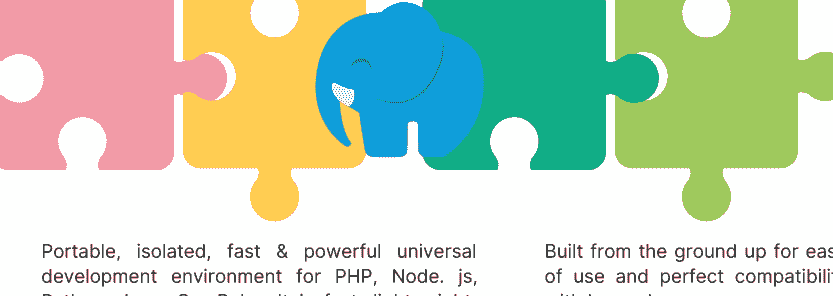

一个可移植、隔离、快速且强大的通用开发环境，支持 PHP、Node.js、Python、Java、Go、Ruby。它快速、轻量、易于使用且易于扩展。非常适合构建和管理现代 Web 应用程序。

从头开始构建，易于使用，并且与 Laravel 完美兼容。

在安装 Laragon 之前，你应该了解以下几点：

1. **系统要求：** Laragon 需要 Windows 7 或更高版本，以及至少 1 GB 的 RAM。
2. **磁盘空间：** 确保你有足够的磁盘空间来安装 Laragon 以及你计划处理的任何项目。
3. **防火墙：** 如果你启用了防火墙，你可能需要配置它以允许 Laragon 访问互联网并连接到其他服务。
4. **防病毒软件：** 某些防病毒软件可能会干扰 Laragon 的安装或运行。确保在安装 Laragon 之前临时禁用防病毒软件，如果需要，为其添加例外。
5. **现有安装：** 如果你已有 Web 服务器、PHP 或 MySQL 的安装，你可能需要在安装 Laragon 之前将其移除或重新配置。
6. **备份：** 在对系统进行任何更改之前，最好备份所有重要文件或数据，以防安装过程中出现问题。
7. **熟悉工具：** 为了充分利用 Laragon，最好熟悉它包含的工具，如 Apache、PHP 和 MySQL，以便根据需要配置和排除故障。

遵循这些步骤，应会使 Laragon 的安装过程更加顺利，并避免任何潜在问题。

# 第三章：安装 Python 及 IDE 环境配置


安装 Python。访问图 1 (https://www.python.org/) 并下载最新版本的 Python。请按照说明扫描二维码操作。


> 来源：YouTube

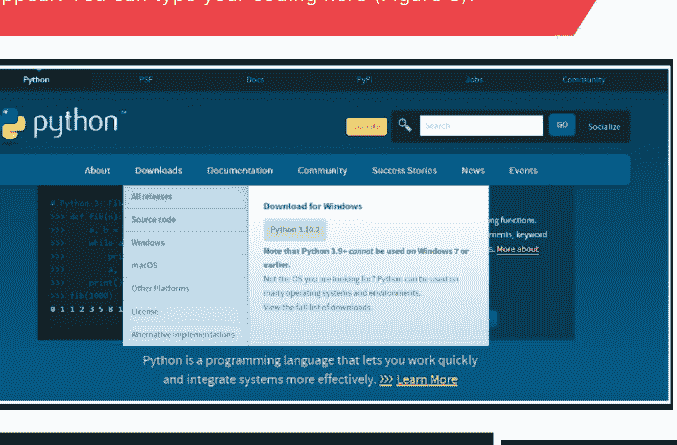

安装完成后，你可以通过在 Windows 搜索栏中输入 `IDLE` 并按回车键（图 2）来运行 Python 解释器。将出现一个 IDLE Shell。你可以在此处输入你的代码（图 3）。

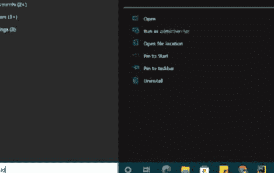

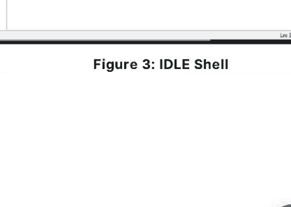

## 02

**Visual Studio Code** 的 **IDE** 安装。请前往图 4（https://code.visualstudio.com/Download）并下载与您机器匹配的版本。扫描二维码，按照《如何在 Windows 10/11 上安装 Visual Studio Code [2022 更新] 完整指南》中的说明操作。**VSCode** 界面如图 5 所示。您可以在此处开始编码。


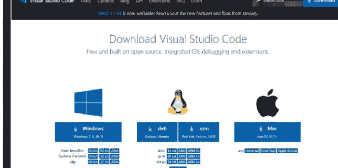

图 4：下载 Visual Studio Code - Mac、Linux、Windows

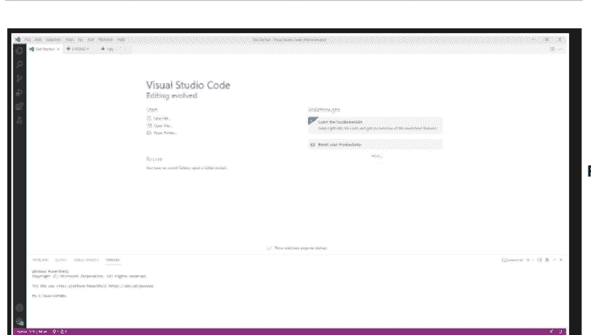

图 5：VSCode 界面

**PyCharm** 的 **IDE** 安装。请前往图 6（https://www.jetbrains.com/pycharm/download/#section=windows）并下载社区版。扫描二维码，按照《在 Windows 10 上安装 Python 3.10 和 PyCharm》中的说明操作。

**PyCharm** 界面如图 7 所示。您可以在此处开始编码。对于 **PyCharm** 用户，如果模块涉及不同的项目，则每次都需要进行模块安装。


来源：YouTube

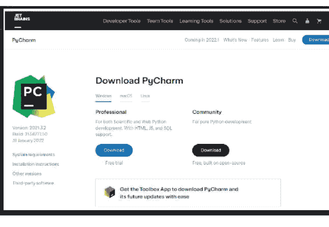

图 6：下载 PyCharm：JetBrains 为专业开发者打造的 Python IDE

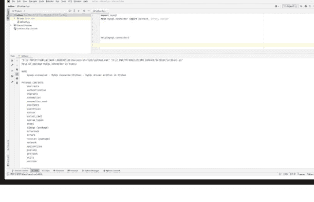

图 7：PyCharm 界面

## 命令提示符应用的需求

在您的 Windows 操作系统上检查 Python 版本的三个步骤。

1.  打开命令提示符应用：按 Windows 键打开开始屏幕。在搜索框中输入 "command"。单击命令提示符应用，如图 8。
2.  执行命令：输入 `python --version` 并按回车键。
3.  Python 版本将显示在您命令下方的下一行。

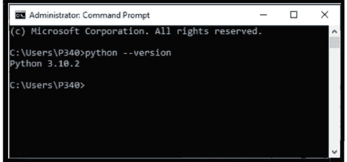

图 8：命令提示符界面

**Laragon** 的 Web 服务器安装。前往图 9（https://laragon.org/download/），下载 Laragon - Full (173 MB)。按照完整安装的说明操作。

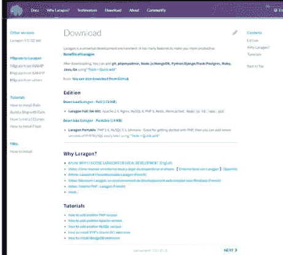

图 9：下载 | Laragon - 适用于 PHP、Node.js、Python、Java、Go、Ruby 的便携、隔离、快速且强大的通用开发环境。

## 第四章
首个项目活动


Python 和 MySQL 初学者指南

# 第四章：首个项目活动

### 设置本地 Web 服务器 Laragon

右键单击 “开始” 全部 > 单击 MySQL > 单击 MySQL（图 10）

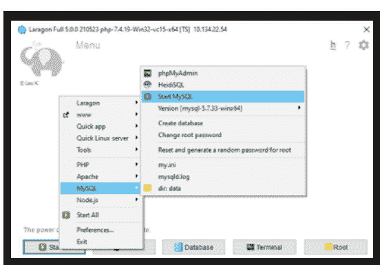

单击数据库，如图 11 所示。

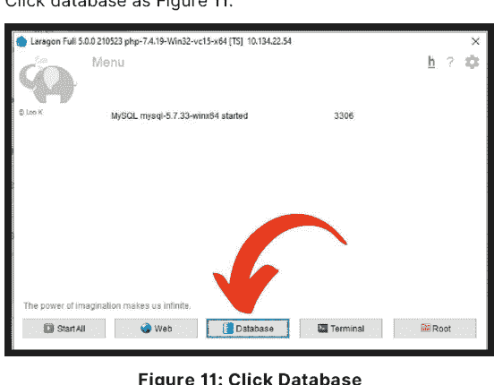

会话管理器窗口将出现。单击 “新建”。*请确保端口正确，用户（通常是 root）和密码（通常是空的）*，然后单击 “打开”（图 12）

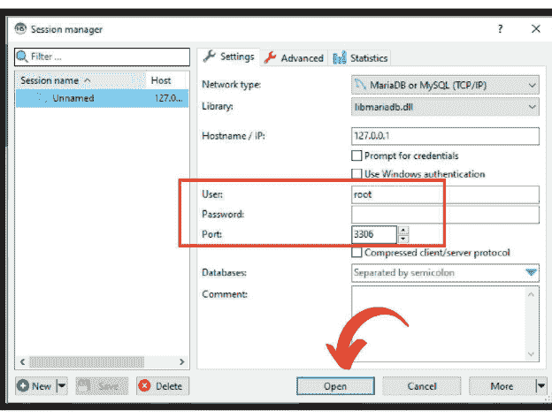

**图 12：会话管理器**

屏幕将显示如图 13 所示。`db1`（数据库名称）和 `table1`（表名）。如果您想重命名 -> 右键单击数据库或表名 > 重命名。按 F5 刷新表或数据库。如果用户想查看表的数据，用户需要单击所选表 > 单击 “数据”。

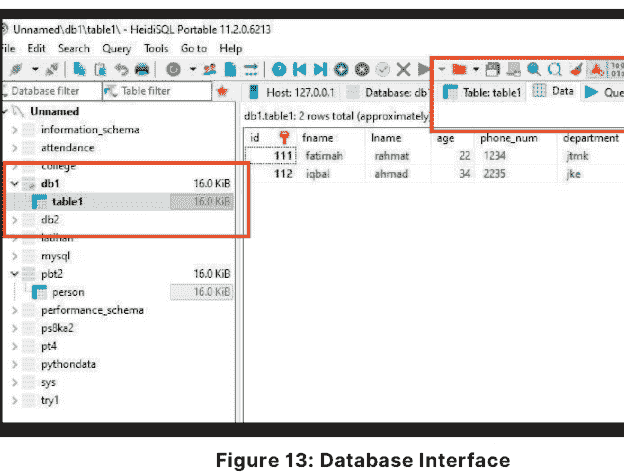

**图 13：数据库界面**

Python 和 MySQL 初学者指南

### 选择您喜欢的 IDE，PyCharm 或 VSCode。

这些 **IDE** 使用不同的数据库配置。

#### PyCharm 用户配置数据库

创建一个名为 `PythonAndMysql` 的新项目。

单击 “设置” 图标 > 选择 “设置” 或使用快捷键 `Ctrl + Alt + S`（图 14）。

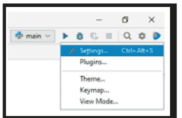

将出现弹出窗口。

展开 `Project: PythonAndMysql` 并选择 `Python Interpreter`（图 15）。

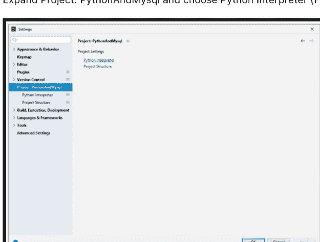

Python 和 MySQL 初学者指南

将显示 **Python Interpreter** 界面。在这里，我们将安装一个名为 `mysql.connector` 的特定模块。此操作可以通过单击加号图标（+）或使用快捷键 `Alt + Insert` 来完成（图 16）

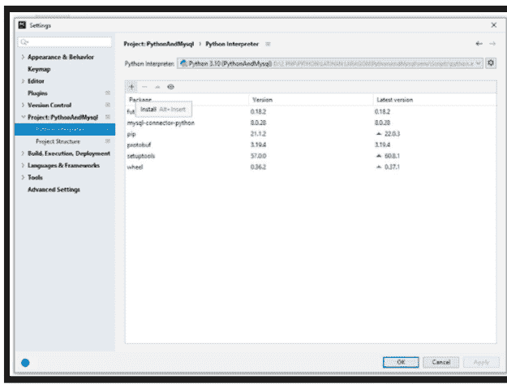

在搜索字段中搜索 `mysql-connector-python`，然后单击 “Install Package”。请确保您有互联网连接，因为您正在从云端安装软件包。（图 17）

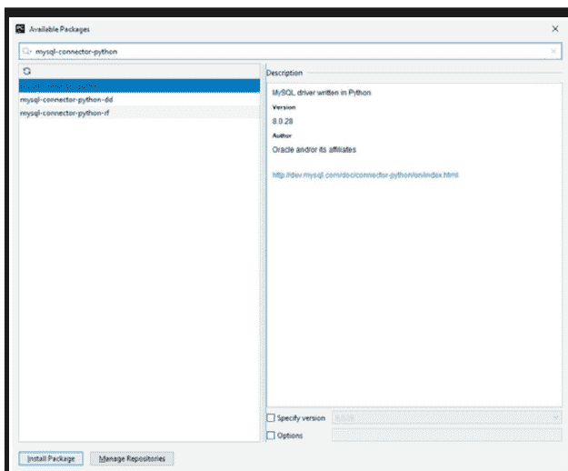

Python 和 MySQL 初学者指南

如果安装成功，将出现一个绿色条，并显示安装成功的信息。如果未成功，请重试。关闭 Python 解释器弹出屏幕，转到代码编辑器界面。（图 18）。

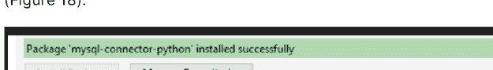

图 18：软件包安装成功

文件名 `main.py` 是 PyCharm 将运行的默认文件（图 19）。


图 19：默认文件

#### VSCode 用户配置数据库

1.  打开命令提示符应用：按 Windows 键打开开始屏幕。在搜索框中输入 "command"。单击命令提示符应用。
2.  执行命令：输入 `pip install mysql-connector-python` 并按回车键。
3.  使用 **VSCode** 的优势在于，用户只需安装一次，该模块就可以被任何 Python 项目使用。

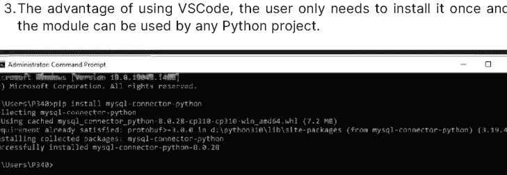

图 20：用于安装 `mysql-connector-python` 模块的命令提示符界面

Python 和 MySQL 初学者指南

### 要求将 `mysql.connector` 安装到数据库。

**MySQL** 是一个关系数据库管理系统（**RDBMS**），而结构化查询语言（**SQL**）是用于通过命令（即创建、插入、更新和删除数据库中的数据）处理 **RDBMS** 的语言。**SQL** 命令不区分大小写，例如 `CREATE` 和 `create` 表示相同的命令。

**MySQL Connector/Python** 使 Python 程序能够访问 **MySQL** 数据库，使用符合 Python 数据库 API 规范 v2.0（**PEP 249**）的 **API**。它用纯 **Python** 编写，除了 **Python** 标准库外没有任何依赖项。

### 您需要了解的基本 Python 关键字。

-   `connect`：连接到数据库，需要指定所有凭据，例如用户名、服务器名称、服务器密码和数据库名称。


-   `error`：这是异常处理，如果出现任何问题，将包含在此错误中
-   `cursor`：帮助我们的程序执行 **SQL** 命令/操作（可以使用 `as` 方法重命名）

Python 和 MySQL 初学者指南

### 在此活动中：

-   您将使用创建、读取、更新、删除（**CRUD**）方法构建一个程序。
-   您的程序将显示 **10 个菜单**（图 21）。
-   每个菜单都有其特定的任务。即使没有创建数据库，用户也可以选择任何菜单。
-   您将创建自己的特定模块和子模块。
-   您将从头开始构建自己的函数来填充所选菜单。
-   使用条件结构显示菜单。
-   编写代码并观察每个菜单的输出。

```
**********POLYTECHNIC MERSING DATABASE**********
1. CREATE DATABASE
2. DROP DATABASE
3. CREATE TABLE
4. DROP TABLE
5. INSERT
6. UPDATE
7. DELETE
8. DISPLAY
9. SHOW DATABASE
10. EXIT

Enter your choice :
```

图 21：程序菜单


### 让我们尝试一下活动

**创建模块**

在您的目录中创建您自己的模块，命名为 `moduleDB`，并包含四个（4）个子模块（图 22）：

-   `deleteData.py`
-   `displayData.py`
-   `insertData.py`
-   `updateData.py`

您的主程序是 `main.py`。

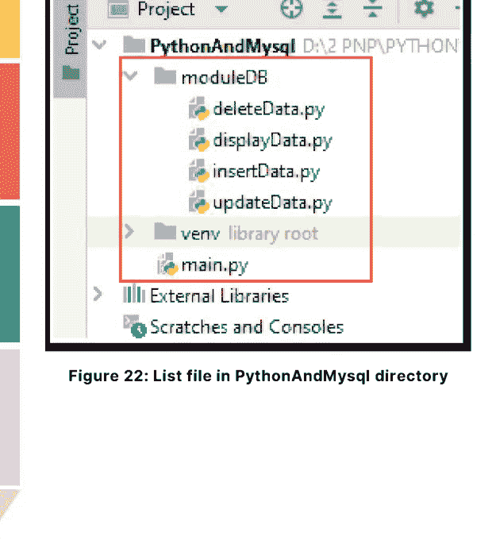

图 22：`PythonAndMysql` 目录中的文件列表

现在，转到 `ModuleDb` 目录以完成我们的子模块

1.  创建 `insertData.py`

```python
import mysql.connector

### insert data into table
def insert(host, username, password, database, table_name):
    try:
        db = mysql.connector.connect(
            host=host,
            user=username,
            password=password,
            database=database
        )

        # A display to insert data
        id = input("Enter Lecturer Id : ")
        fname = input("Enter Lecturer First Name : ")
        lname = input("Enter Lecturer Last Name : ")
        age = input("Enter Age : ")
        phone_num = input("Enter Phone Number : ")
        department = input("Enter Department : ")

        cursor = db.cursor()
        sql = "insert into " + table_name + "(id, fname, lname, age, phone_num, department) values(%s, %s, %s, %s, %s, %s)"
        print(sql)

        val = (id, fname, lname, age, phone_num, department)
        cursor.execute(sql, val)
        db.commit()
        # For a connection obtained from a connection pool,
        # close() does not actually close it but returns it to the pool
        # and makes it available for subsequent connection requests.
        db.close()
        print('One record inserted into ' + table_name)

    except:
        # .rollback method sends a ROLLBACK statement to the MySQL server,
        # undoing all data changes from the current transaction.
        # By default, Connector/Python does not autocommit,
        # so it is possible to cancel transactions when using
        # transactional storage engines such as InnoDB.
        db.rollback()
```

### 创建 deleteData.py

```python
import mysql.connector

### 删除表中的数据
def delete(host, username, password, database, table_name):
    print("")

    # connect()构造函数用于创建到MySQL服务器的连接，
    # 并返回一个MySQLConnection对象
    db = mysql.connector.connect(
        host=host,
        user=username,
        password=password,
        database=database
    )

    # .cursor方法返回一个MySQLCursor()对象，或者根据传入参数
    # 返回其子类。返回的对象是一个游标。
    cursor = db.cursor()
    sql_Delete_query = "Delete from "+table_name+" where id = %s"
    Id = input('请输入讲师ID：')
    # .execute方法执行给定的数据库操作（查询或命令）
    cursor.execute(sql_Delete_query, (Id,))

    # 此方法向MySQL服务器发送一条COMMIT语句，提交当前事务。
    # 由于Connector/Python默认不自动提交，因此在每次修改使用
    # 事务存储引擎的表的数据的事务后，调用此方法非常重要。
    # https://dev.mysql.com/doc/connector-python/en/connector-python-
    # api-mysqlconnection-commit.html
    db.commit()
    print("已从 "+table_name+" 中删除一行数据")
```

### 创建 displayData.py

```python
import mysql.connector

### 显示数据
def displayTableInfromation(host, username, password, database, table_name):

    # connect()构造函数用于创建到MySQL服务器的连接，
    # 并返回一个MySQLConnection对象
    db = mysql.connector.connect(
        host=host,
        user=username,
        password=password,
        database=database
    )

    # .cursor方法返回一个MySQLCursor()对象，或者根据传入参数
    # 返回其子类。返回的对象是一个游标。
    cursor = db.cursor()

    # 报告与MySQL服务器的连接是否可用。
    if db.is_connected():

        # .execute方法执行给定的数据库操作（查询或命令）
        cursor.execute("SELECT * FROM "+table_name)

        # row只是一个变量。
        # 这个变量将打印数据每一行的每个列。
        for row in cursor:
            print("\n讲师ID：", row[0])
            print("名：", row[1])
            print("姓：", row[2])
            print("年龄：", row[3])
            print("电话号码：", row[4])
            print("部门：", row[5])
```

### 创建 updateData.py

```python
import mysql.connector

### 更新表中的数据
def update(host, username, password, database, table_name):
    db = mysql.connector.connect(
        host=host,
        user=username,
        password=password,
        database=database
    )
    id = input("请输入讲师ID：")
    fname = input("请输入讲师名：")
    lname = input("请输入讲师姓：")
    age = input("请输入年龄：")
    phone_num = input("请输入电话号码：")
    department = input("请输入部门：")

    cursor = db.cursor()
    try:
        sqlFormula = "UPDATE "+table_name+" SET fname = %s WHERE id = %s"
        cursor.execute(sqlFormula, (fname, id))

        sqlFormula = "UPDATE "+table_name+" SET lname = %s WHERE id = %s"
        cursor.execute(sqlFormula, (lname, id))

        sqlFormula = "UPDATE "+table_name+" SET age = %s WHERE id = %s"
        cursor.execute(sqlFormula, (age, id))

        sqlFormula = "UPDATE "+table_name+" SET phone_num = %s WHERE id = %s"
        cursor.execute(sqlFormula, (phone_num, id))

        sqlFormula = "UPDATE "+table_name+" SET department = %s WHERE id = %s"
        cursor.execute(sqlFormula, (department, id))

        db.commit()

        print("已在 " + table_name + " 中更新条目")

    except:
        db.rollback()
```

### 运行并观察输出。

### 在 main.py 中导入模块

```python
### 导入mysql.connector并指定要使用的子模块：connect, Error 和 cursor
from mysql.connector import connect, Error, cursor

### 导入我们自己的模块moduleDB，并指定子模块insertData, updateData, deleteData 和 displayData
### "as"关键字用于创建别名
from moduleDB import insertData as insert, updateData as update, deleteData as delete, displayData as display
```

### 在 main.py 中创建数据库函数

```python
#### 函数1：创建新数据库
def create_db(username, password):
    try: # try块让你测试一段代码是否有错误
        with connect(
            # "host"是要连接的服务器名称/目标服务器
            host=glbHost,
            user=username,
            password=password
        ) as connection:
            dbname = input("您想创建的数据库名称是什么？")
            create_db_query = "CREATE DATABASE "+dbname
            print(create_db_query)
            with connection.cursor() as cursor:
                cursor.execute(create_db_query)
            print("数据库 "+dbname+" 已创建！")
    # except块让你处理错误
    except Error as e:
        print("哎呀，出错了", e)
    # 当变量在局部或全局作用域中找不到时，引发NameError。
    except NameError:
        print("当访问的标识符未在局部或全局作用域中定义时，会引发NameError。")
```

#### 在 main.py 中删除数据库函数

```python
#### 函数2：删除数据库
def drop_db(username, password):
    try:
        # 数据库连接
        # 设置所有数据库凭据（主机，用户，密码）
        with connect(
            host=glbHost,
            user=username,
            password=password
        ) as connection:
            dbname = input("您想删除的数据库名称是什么？：")
            drop_db_query = "DROP DATABASE %s" % dbname
            with connection.cursor() as cursor:
                cursor.execute(drop_db_query)
                print('数据库', dbname, '已被删除。')

    except Error as e:
        print(format(e))
```

#### 在 main.py 中创建表函数

```python
#### 函数3：创建新表
def create_table(username, password):
    dbName = input('请先输入数据库名称：')
    try:
        # 数据库连接
        # 设置所有数据库凭据（主机，用户，密码，数据库）
        with connect(
            host=glbHost,
            user=username,
            password=password,
            database=dbName
        ) as connection:
            table_name = input('请输入您想创建的表名：')
            create_table_query = "CREATE TABLE "+table_name+"\n(id INT AUTO_INCREMENT PRIMARY KEY, fname VARCHAR(50), " \n            "lname VARCHAR(50), age INT, phone_num VARCHAR(100), " \n            "department VARCHAR(100)) "
            print(create_table_query)
            with connection.cursor() as cursor:
                cursor.execute(create_table_query)

                for x in cursor:
                    print(x)
    except Error as e:
        print(format(e))
```

Python和MySQL入门指南

#### 在 main.py 中删除表函数

```python
#### 函数4：删除表
def drop_table(username, password):
    dbName = input('您想从哪个数据库中删除表？：')
    try:
        # 数据库连接
        # 设置所有数据库凭据（主机，用户，密码，数据库）
        with connect(
            host=glbHost,
            user=username,
            password=password,
            database=dbName
        ) as connection:
            dbtable = input('请输入表名：')
            drop_table_query = "DROP Tables " + dbtable
            print(drop_table_query)
            with connection.cursor() as cursor:
                cursor.execute(drop_table_query)
                print('表', dbtable, '已被删除。')
    except Error as e:
        print(format(e))
```

#### 显示所有数据库函数

```python
#### 函数5：显示所有已存在的数据库
def show_database(username, password):
    try:
        # 数据库连接
        # 设置所有数据库凭据（主机，用户，密码）
        with connect(
            host=glbHost,
            user=username,
            password=password
        ) as connection:
            cursor = connection.cursor()
            databases = ("show databases")
            cursor.execute(databases)
            i = 0
            for (databases) in cursor:
                i = i+1
                print("数据库", i, "是：", databases[0])
    except Error as e:
        print("哎呀，出错了", e)
    except NameError:
        print("当访问的标识符未在局部或全局作用域中定义时，会引发NameError。")
```

### 07 完成整个程序

```
### 显示文本
print("***********POLYTECHNIC MERSING 数据库***********")
print("1. 创建数据库 \n2. 删除数据库 \n3. 创建表 "
      "\n4. 删除表 \n5. 插入 \n6. 更新 \n7. 删除 "
      "\n8. 显示 \n9. 显示数据库 \n10. 退出\n")

while True:
    choice = input("请输入您的选择：")
    if choice in ('1', '2', '3', '4', '5', '6', '7', '8', '9'):

        # glbHost 是一个代表 "localhost" 的全局变量
        # "localhost" 是要连接的目标服务器
        glbHost = "localhost"
        u = input("请输入 MySQL 用户名：")
        p = input("请输入 MySQL 密码：")
        i = 0

        if choice == '1':
            # 调用 create_db 函数
            create_db(u, p)

        elif choice == '2':
            # 调用 drop_db 函数
            drop_db(u, p)

        elif choice == '3':
            # 调用 create_table 函数
            create_table(u, p)

        elif choice == '4':
            # 调用 drop_table 函数
            drop_table(u, p)

        elif choice == '5':
            database = input("请输入数据库名称：")
            table_name = input("请输入表名：")
            # 调用 moduleDB 中的 insertData.py
            insert.insert(glbHost, u, p, database, table_name)

        elif choice == '6':
            database = input("请输入数据库名称：")
            table_name = input("请输入表名：")
            # 调用 moduleDB 中的 updateData.py
            update.update(glbHost, u, p, database, table_name)

        elif choice == '7':
            database = input("请输入数据库名称：")
            table_name = input("请输入表名：")
            # 调用 moduleDB 中的 deleteData.py
            delete.delete(glbHost, u, p, database, table_name)

        elif choice == '8':
            database = input("请输入数据库名称：")
            table_name = input("请输入表名：")
            # 调用 moduleDB 中的 displayData.py
            display.displayTableInfromation(glbHost, u, p, database,
                                            table_name)

        elif choice == '9':
            # 调用 show_database 函数
            show_database(u, p)

        elif choice == '10':
            exit()
    else:
        print("输入无效")
```

## 参考文献

Akhter, M. (2022, January 11). 如何在 Windows 10/11 上安装 Visual Studio Code [2022 更新] 完整指南 [视频]. YouTube. https://www.youtube.com/watch?v=JPZsB_6yHVo

Ansgar, B. (n.d.). HeidiSQL. 检索自 https://www.heidisql.com/

Computer Science. (2021, November 13). 在 Windows 10 上安装 Python 3.10 和 PyCharm [视频]. YouTube. https://www.youtube.com/watch?v=WJynvGY-2wk

Downey, A. (n.d.). GUI 编程入门. Python 教科书. 检索自 https://python-textbook.readthedocs.io/en/1.0/Introduction_to_GUI_Programming.html

GeeksforGeeks. (n.d.). Python 中的 MySQL-Connector-Python 模块. 检索自 https://www.geeksforgeeks.org/mysql-connector-python-module-in-python/

JetBrains. (n.d.). PyCharm 下载. 检索自 https://www.jetbrains.com/pycharm/download/#section=windows

Laragon. (n.d.). Laragon - 用于 PHP、Node.js、Python、Java、Go、Ruby 的便携、隔离、快速且强大的通用开发环境. 检索自 https://laragon.org/download/

Microsoft. (n.d.). Visual Studio Code 下载. 检索自 https://code.visualstudio.com/Download

Ngo, J. (2021, February 3). PyCharm 与 VS Code：哪个是更好的代码编辑器？[博客文章]. LogRocket. https://blog.logrocket.com/pycharm-vs-vscode/#:~:text=PyCharm%20and%20VS%20Code%20are,to%20an%20IDE%20through%20extensions.

Oracle Corporation. (n.d.). MySQL Connector/Python 开发者指南. 检索自 https://dev.mysql.com/doc/connector-python/en/

Python Software Foundation. (n.d.). IDLE. Python 3 文档. 检索自 https://docs.python.org/3/library/idle.html

Python Software Foundation. (n.d.). Python. 检索自 https://www.python.org/

Santos, A. (2021, November 5). 如何在 Windows 10 上安装 Python 3.10.2 [视频]. YouTube. https://www.youtube.com/watch?v=uKHVNKd3f20

Sid Martin Biotechnology Institute. (n.d.). Laragon 的用途是什么？检索自 https://www.sidmartinbio.org/what-is-laragon-used-for/

Srinivasan, S. (2019, December 3). PyCharm 与 VS Code. Tangent Technologies. https://tangenttechnologies.ca/blog/pycharm-vs-vscode/

POLITEKNIK MERSING
Jalan Nitar,
86800 Mersing
Johor Darul Ta’zim
电话：07-7980001
传真：07-7980002
网站：https://pmj.mypolycc.edu.my/

电子 ISBN 978-967-2904-57-1

