# 前言

我们非常荣幸地向您介绍《轻松入门Python：全年龄段指南》。本书旨在为所有想要学习Python的人提供一本既有趣又易于阅读的指南。书中通过贴近现实的生动类比组织内容，使其成为编程初学者的绝佳选择。

Python是一种强大且用途广泛的编程语言，其应用范围从网页开发到数据分析无所不包。通过本书，您将能以轻松有趣的方式学习Python编程的基础知识。本书的设计就像阅读故事书一样简单易懂，因此您可以按照自己的节奏学习，享受整个过程。

无论您是学生、专业人士，还是仅仅想学习一项新技能的人，本书都是您的理想选择。凭借清晰的讲解、现实世界的实例以及易于理解的类比，您将能快速掌握Python。

那么，请坐好，放松心情，准备好与《轻松入门Python：全年龄段指南》一起踏上探索之旅吧。编程快乐！🐍

# 关于本书


编程入门的体验，应该像在繁花似锦的公园里漫步一样愉悦。

然而，通常这种学习过程却被设计得像在寒冷雨天被迫跑上山坡。

本书正是我们尝试提供的一种不同的选择，旨在实现前者描述的轻松体验。

# 关于本书：续

本书源于一个认识：我们需要改变学习Python等编程语言的方式。

理解编程的关键点之一在于，它与我们日常的自然行为并不容易直接关联。我们计数或用钱时，会联想到数学；说话、看节目则与语言艺术和语法相关；生物、物理和化学现象时刻围绕在我们周围。

然而，技术却像魔法一样运作。它的运作方式既不直观也不明显。学习技术需要强大而主动的想象力，这使得学习过程更加令人畏惧。

在您的Python学习之旅中，会遇到许多减速带和坑洼。首先便是新词汇和短语的引入。

新术语，如果没有被清晰定义、讲解和确认，会给人一种需要预存知识的印象。这很容易让人感到不安。通过在书的前端设置专门的词汇部分，我们的书正面解决了这个问题。学生在遇到这些新术语时，可以随时快速滚动查阅。

### 词汇部分示例
- **变量：** 可以存储不同类型数据的容器
- **数据类型：** ...
- **整数：** 一个完整的数字
- **浮点数：** ...

# 关于本书：续

## 一次只专注一个概念

每一页都致力于聚焦和教授一个知识点。清晰界定并视觉分离的部分，进一步让学生能轻松区分示例和解释——这是学习的两个关键要素。彩色插图使内容完整，同时使其引人入胜且充满乐趣。

```
x = 5
print(x)
```

示例呈现清晰，强调了所涵盖的概念

## 语法解释

这些部分提供了一种快速、简单的方式来理解代码的语义和结构。

- 你的条件语句 -> if 5 < 4:
- 如果为真则打印 -> print("Correct")
- 如果不为真 -> else:
- 则打印此内容 -> print("Are you sure")

```
name = input("Please enter your name: ")
```

用于存储输入的变量
输入函数
向用户显示为问题的提示语

# 关于本书：续

那么...Python语言易于学习。但这有什么理由应该成为你投入宝贵时间和注意力的理由呢？

1. Instagram
2. Youtube
3. Pinterest
4. Dropbox
5. Reddit
6. Uber
7. Quora

...以及许多其他流行应用都是用Python构建的！

Python是编写AI应用的关键语言。最强大和最厉害的AI工具都是用Python开发的。

1. Tensorflow
2. Keras
3. Pytorch
4. SciKit Learn 等等...

MicroPython是用于为使用Arduino等硬件制作的机器人编程的最流行语言。

总而言之，如果你精通Python及其库，你将解锁编写应用、创造机器人以及其他一切的强大能力。这会让你变得相当有价值，不是吗？

# 第1章

# 引言

### 总结

在本节课中，我们将探索Python的基本元素，包括数据类型、变量、如何区分它们、识别它们的用处以及如何产生输出。我们还将通过练习算术运算和字符串连接来操作变量，以创建新的值。

### 目标

学生将理解如何以及何时使用适当的数据类型，这将对他们未来的所有作业有所帮助。变量和数据类型在Python代码中至关重要，每次开始练习或作业时都会用到。

### 词汇
- **变量：** 可以存储不同类型数据的容器
- **数据类型：** 特定种类的数据项，只能对其执行特定的操作
- **输出：** 你的程序生成的信息
- **连接：** 将多个字符串类型添加在一起形成一个
- **整数：** 一个完整的数字
- **浮点数：** 带小数的数字
- **布尔值：** 一个值只能是真或假
- **空类型：** 不包含任何信息的数据类型
- **字符串：** 文本形式的字母或单词

# 理解变量

### 使用变量

### 什么是变量？

- 变量是信息的容器
- 它们可以包含许多不同类型的信息
- 这包括单词、数字、列表等等


## 我们如何创建变量

- 变量可以用一个字母或单词表示
- 创建一个变量有三个基本部分
  - 变量的名称
  - 一个等号
  - 信息内容

# 让我们从简单开始

## 变量语法

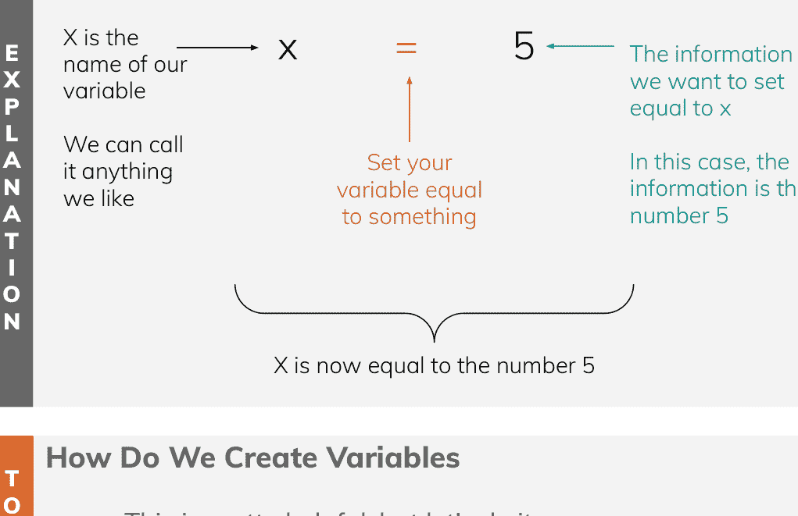

## 我们如何创建变量

- 这非常有帮助，但让我们在代码中一起实践
- 我们需要学习如何打印信息

让我们分解一下

# 我们的第一段代码

## 使用打印函数

解释

### 我们如何打印代码？

- 要打印代码，我们使用称为打印函数的东西，print()
- 你想打印的信息放在括号内

```
python
x = 5
print(x)
```

示例

### 一些有用的提示

- print语句必须全部使用小写字母
  - Python区分大小写
- 括号放在函数之后，我们将来会更详细地解释这些

```
output
5
```

## 数据类型

## 字符串与数字

### 什么是字符串？

- 字符串是一系列数字和/或字符的组合
- 字符串**总是**放在引号内
- 这就是Python如何知道我们正在使用字符串

# 数字

- 数字有不同的类型，包括整数、浮点数和实数
- 数字有助于执行数学运算

## 数据类型

## 字符串与数字

### 什么是字符串？

- 字符串是一系列数字和/或字符的组合
- 字符串总是放在引号内
- 这就是Python如何知道我们正在使用字符串

```
thisIsAString = "5"
thisIsANumber = 5
```

# 数字

- 数字有不同的类型，包括整数、浮点数和实数
- 数字有助于执行数学运算

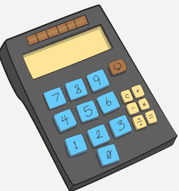

# 数字

## 有哪些不同类型？

### 数字的类型

- **整数**是完整的数字
- **浮点数**在小数点后有特定位数
- **实数**在小数点后有无限位数字


### 为什么这很重要

- 这总是取决于我们正在做的工作类型
- 有时当你在做数学运算时，小数甚至根本不重要

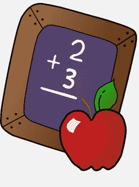

## 算术

## 我们如何进行数学运算？

### 不使用变量
-   我们可以在 `print` 语句中直接进行数学运算
-   Python 中的数学运算包括：
    -   +, -, / 和 *
    -   加法、减法、除法和乘法
    -   还有更多，但我们以后会接触

```python
print(5.7 + 12.9)
```

**输出：**
18.6

### 使用变量
-   我们可以在变量上进行数学运算，而不是只用简单的数字

```python
a = 15
b = 10
c = a * b

print(c)
```

**输出：**
150

## 连接

## 我们甚至可以“加”字符串

### 但怎么做呢？
-   一开始，“加”单词的想法可能看起来很奇怪，但这在 Python 中非常常见
-   当然，“apple”和“banana”这两个词加起来不会创建一个新词
-   但是我们可以把两个字符串放在一起
-   这被称为连接

```python
stringOne = 'apple'
stringTwo = 'banana'

print(stringOne + stringTwo)
```

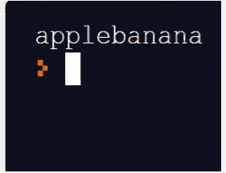

-   这样做有一个问题
-   两个词紧贴在一起，中间没有空格

## 数据类型

## 布尔值和空值

### 布尔值
-   布尔值用于判断某事是真还是假
-   例子：如果你抛一枚硬币，你得到正面了吗？
-   如果得到了，那么 `heads = true`
    -   如果没有，`heads = false`


### 空值
-   空值是一个真正什么也不包含的值
-   说实话，我们不会经常用到它们，但它们是 Python 中第四种也是最后一种基本数据类型


# 第 2 章

## 条件语句

## 第 2 课：条件语句

### 总结

在本课中，我们将讨论 Python 中的条件语句。条件语句在我们只想在满足特定条件或标准时执行特定操作时使用。如果条件不满足，那么我们想执行不同的操作或完全停止代码运行。条件语句在做决策或当我们的行动可能导致几种不同结果时非常有用。

### 目标

本课的目标是学习条件语句所需的语法和决策制定。

### 词汇表

-   **条件**：执行操作所需的要求或标准
-   **If**：开始一个 if 语句的关键字，需要一个条件并以冒号结束
-   **Elif**：if 语句中的一个可选关键字，用在 `if` 关键字之后、`else` 关键字之前，它需要一个条件，为你的代码增加了更多灵活性
-   **Else**：if 语句中的一个可选关键字，不接受条件，是默认输出

## 条件语句

## 什么是条件？

当我们编写 Python 代码时，情况也是一样。有时我们希望在满足特定条件时做某件事，如果条件不满足，就做别的事。

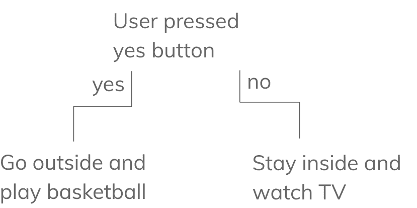

## 条件语句

## 什么是条件？

条件语句仅在满足或不满足某个特定标准时执行代码
我们希望在发生某事时执行一个操作
但如果这件事从未发生，我们同样需要做出反应

## 条件的例子

-   我们日常说话时就使用了大量的条件
-   如果天气冷，你会穿夹克；如果天气暖和，你会穿短裤
-   我们的代码工作方式也是一样的

## 语法

## If 语句语法

```
你的条件    ----->  if 5 < 4:
如果为真则打印这里 ---->  print("Correct")
如果为假        ---->  else:
打印这里作为替代  ---->  print("Are you sure")
```

-   在第 1 行，我们可以观察到两个重要部分
    -   所有 if 语句都以关键字 `if` 开始
    -   接下来是我们的条件，`5 < 4`
-   换句话说，我们希望在条件 `5 < 4` 为 `True` 时打印 "Correct"
    -   如果为 `False`，我们希望打印 "Are you sure"
-   它应该自动缩进，如果没有，请使用制表符键（而不是空格键）进行缩进

## 语法

## If 语句语法

你的条件 → if 5 < 4:
如果为真则打印这里 → print("Correct")
如果为假 → else:
打印这里作为替代 → print("Are you sure")

-   在第 3 行，我们可以观察到另一个重要的关键字 `else`
-   `else` 是 if 语句中一个极其有用的关键字
-   `Else` 不允许有条件
-   如果我们的 if 语句从未为真，`else` 是我们的默认输出
-   `Else` 不是必须的，但强烈建议使用

解释

## 语法

## If 语句语法

```python
if 5 < 4:
    print("Correct")
else:
    print("Are you sure")
```

-   与循环类似，包含 if 语句关键字（如 **if**、**elif** 和 **else**）的行总是以冒号结尾
-   关键字后面的代码总是**缩进的**
    -   这让我们知道哪些代码属于该 if 语句的部分

## 语法

## If 语句语法

```
你的条件 ———> If food < 12:
如果为真则打印这里 ———> print("Breakfast")
另一个条件 ———> Elif food >= 12 and food < 17:
打印这里作为替代 ———> print("Lunch!")
另一个条件 ———> Elif food >= 17 and food <= 24
打印这里作为替代 ———> print("Dinner")
如果所有条件都不满足 ———> Else:
打印这里作为替代 ———> print("Invalid :/")
```

-   为了增加额外的步骤，有时我们需要考虑多个条件
-   为此，我们使用 `elif` 关键字
-   你可以有**无限**数量的 `elif` 语句
-   `Elif` 确实需要一个条件

## 条件

## 不同条件的例子

解释

| 运算符 | 描述 |
|----------|-------------|
| < | 小于 |
| <= | 小于或等于 |
| > | 大于 |
| >= | 大于或等于 |

-   我们使用条件来比较一个变量或数据类型与另一个
-   通常，在比较数字时，我们使用比较运算符
-   使用这些运算符的一个例子是 `4 < 5`，或者说 4 小于 5
-   我们也可以使用变量，例如 `a < b`

## 条件

## 不同条件的例子

| 运算符 | 描述 |
|----------|-------------|
| == | 等于 |
| and | 所有条件必须都满足 |
| or | 至少一个条件必须满足 |

-   这里是另外三个可能有点棘手的条件
-   如果我们想比较两个字符串，我们使用两个等号而不是一个
-   例如，`if a == "Apple"`
-   注意：这与 `a = "Apple"` 不同，后者是将变量 `a` 设置为等于 Apple

## 条件

## 不同条件的例子

| 运算符 | 描述 |
|----------|-------------|
| == | 等于 |
| and | 所有条件必须都满足 |
| or | 至少一个条件必须满足 |

-   有时我们希望有多个条件
-   如果我们希望**所有**条件都满足，我们使用 `and` 条件
-   如果我们有多个条件，其中至少一个需要为真，我们使用 `or`
-   例子：如果你饿了**并且**是早上，你应该吃早餐

# 第 3 章

## 循环

## 循环

### 总结

在本课中，我们将讨论什么是循环，它们为什么有用，以及我们可以在 Python 中使用的两种循环类型。循环是强大而简单的工具，我们可以用它们比不用它们时更快地完成代码。我们可以使用 while 循环来运行代码直到满足特定条件。或者我们可以使用 for 循环来遍历给定的列表并对其执行某种操作。

### 目标

本课的目标是理解循环是如何使用的，以及何时适合使用 for 循环与 while 循环。我们将复习语法以及如何防止错误，以确保我们的代码每次都能完美运行。

### 词汇表
-   **循环**：用于遍历序列（如列表），以快速高效地完成代码
-   **While 循环**：一种循环，用于重复直到满足特定条件
-   **For 循环**：一种循环，用于遍历给定的序列，如列表
-   **计数器**：一个用于跟踪循环被迭代次数的变量
-   **迭代**：实际遍历可迭代对象中的每个单独元素
-   **可迭代对象**：一系列元素的表示，如列表、字典、元组或集合

## 理解循环

## 使用循环

什么是循环？

- 循环会重复一组指令，直到满足特定条件
- 当你需要多次使用相同代码时，循环能提高代码的复用性

我们在现实生活中哪里能看到循环？

- 每天都有！
- 你一直醒着，直到感到疲倦
- **当**你还在学校时，你就在学习
- **对于**你赚的每一美元，你都会花一部分在食物上

## 理解循环

## 这有什么问题

指令：
打印数字 0 - 9

```
Input
print('0')
print('1')
print('2')
print('3')
print('4')
print('5')
print('6')
print('7')
print('8')
print('9')
```

```
Output
0
1
2
3
4
5
6
7
8
9
```

## 理解循环

## 这有什么问题？

一些令人沮丧的地方：

- 我们在重复**几乎**相同的事情
  - 我们使用了 **10 次** print 语句，而**唯一**改变的是字符串
- 我们能用一个**变量**吗？
  - 那会是什么样子？

```
Input

i = 0
print(i)
print(i + 1)
print(i + 2)
print(i + 3)
print(i + 4)
print(i + 5)
print(i + 6)
print(i + 7)
print(i + 8)
print(i + 9)
```

## 理解循环

## 这有什么问题？

一些令人沮丧的地方：

- 我们在重复*几乎*相同的事情
  - 我们使用了 **10 次** print 语句，而*唯一*改变的是字符串
- 我们能用一个*变量*吗？
  - 那会是什么样子？
- 看起来我们可以！
  - 但仍然有很多重复
  - 让我们再深入分析一下

```
Input

i = 0
print(i)
print(i + 1)
print(i + 2)
print(i + 3)
print(i + 4)
print(i + 5)
print(i + 6)
print(i + 7)
print(i + 8)
print(i + 9)
```

## 理解循环

## 分解问题

我们需要什么？

- 我们有一个变量
  - 也就是 i
- 我们有一个起点
  - 也就是 i = 1
- 我们有一个限制
  - 也就是 10
- 我们以某个量增加 i
  - 也就是 i + 1

```
Input

i = 0
print(i)
print(i + 1)
print(i + 2)
print(i + 3)
print(i + 4)
print(i + 5)
print(i + 6)
print(i + 7)
print(i + 8)
print(i + 9)
```

让我们口头描述一下我们想做什么：

- 我们想打印数字 0-9
- 当 i 小于 10 时，我们想将 i 增加 1

幸好我们懂不等式 :)
是时候使用 while 循环了！

## 使用 While 循环

## While 循环语法

```
while count < 10:
```

这里我们有两个主要的语法部分

- 首先：
  - 每个 `while` 循环都以 'while' 关键字开始
    - 当你在 python 中输入它时，你会看到它变色
- 其次：
  - 每个 while 循环都有一个条件部分
  - 我们的条件控制着我们想要执行代码的次数
  - 每个条件都以 ':' 结尾

## 使用 While 循环

## 循环内部

所有缩进的内容都属于循环

- Count 初始设置为 0，所以 0 将是第一个输出
- Count 然后在下一行代码中增加 1，所以接下来会打印 '1'
- 在到达最后一句之后

```
count = 0

while count < 10:
    print(count)
    count += 1
```

底部发生了什么？

- 到达最后一行后，代码会循环回到顶部
- 代码将继续重复，直到满足条件

```
count = 0

while count < 10:
    print(count)
    count += 1
```

## 理解计数器

## 使用计数器

count = count + 1

- 以下代码跟踪我们的旧总数和新总数
- 我们的新总数会增加，直到循环完成

```
count = 0

while count < 10:
    print(count)
    count = count + 1
```

count += 1

- 以下代码与上面完全相同
- 左边是要计数的变量
- 右边是你想增加计数的量

```
count = 0

while count < 10:
    print(count)
    count += 1
```

另一种看待它的方式

## 使用 While 循环

## While 循环语法

解释

创建一个计数器

```
count = 0
```

启动我们的 While 循环

```
while count < 10:
```

> 我们的条件以冒号结尾

缩进我们的代码

```
print(count)
```

增加我们的计数器

```
count += 1 | count = count + 1
```

两种增加计数器的方法
效果相同

让我们分解一下

## 使用 While 循环

## While 循环语法

```
count = 0
while count <= 20:
    print(count)
    count += 5

# EXPLANATION:
# Count 从 0 开始
# 增量是 5
# 继续直到 count <= 20

# Example Calculation:
# 0 + 5 = 5
# 5 + 5 = 10
# 10 + 5 = 15
# 15 + 5 = 20
```

## 理解循环

## While 循环：优点与缺点

### While 循环的优点

- 当你想根据特定条件运行代码时，While 循环非常棒
- 特别是当你不确定代码应该运行多少次时

### While 循环的缺点

- 有时我们确切地知道需要重复任务多少次
- 如果你想为一天中的每个小时做某事呢？
- 如果我们每赚 100 美元，就想存 50 美元呢？
- While 循环在这里并不理想

## 术语

## 可迭代对象/迭代

### 什么是可迭代对象？
- **可迭代对象** 是一个你可以循环遍历的对象
- 例如，如果我们为 **你一天中的每个小时** 创建一个时间表
  - **这一天** 就是可迭代对象

### 什么是迭代？
- 使用这个逻辑，**迭代** 实际上是查看列表中的每个元素
- **for 循环** 使用 **确定性迭代**，其中迭代次数是预先已知的
  - 例如：一天总是有 24 小时

## 使用 For 循环

## For 循环语法

```
for name in myList:
    print(name)
```

解释

让我们分解一下

## 使用 For 循环

### 可迭代对象

### 可迭代对象

- 可迭代对象是你在创建 for 循环的同时创建的一个变量
- 它代表你定义范围内的一个元素
- 例如：一个学生

### 序列

- 序列是你正在循环遍历的整个信息集合或组
- 常见的序列有列表、元组、字典、集合、列表和 range 函数
- 例如：整个教室

## 使用 For 循环

## 运算符

- in
  - in 是你的可迭代对象和序列之间的桥梁
  - 它指代序列中的每个元素
- not in
  - not in 与 in 运算符的作用相反
  - 如果你的可迭代变量在序列中找不到，它将执行代码

## 使用 For 循环

## Range

什么是 Range？

- Range 是一个遍历数字序列的函数
- Range() 接受 1 个必需参数和 2 个关键字参数
- Start, Stop, 和 Step

```
for i in range(10):
    print (i)
```

使用 Range

- Range 默认从 0 开始
- range(10) 打印数字 0-9
- range(10,100) 打印数字 10-99
- range(10,100,2) 打印 10-99 之间的偶数

# 第 4 章

## 用户输入

## Python 用户输入

### 总结

在本课中，我们将重点关注程序中的用户输入 - 为什么我们需要用户输入？它用在哪里？为什么它很重要？我们还将看看如何通过包含用户输入数据的方式，使我们的程序更具动态性和实用性。

### 目标

学生将理解用户输入在程序中的用途 - 学生还将能够在他们的 Python 程序中接受用户输入并与输入进行交互。

### 准备

学生应该打开一个新的 python 窗口

## 课程词汇

- **Input 函数：** 从用户那里捕获键盘输入的方法 - 这个函数允许我们向用户提供提示并捕获他们的响应。

## Python中的用户输入

在我们的编程中，很少有完全不与用户交互的完整程序。

事实上，我们作为开发者编写的许多程序，都是为了与最终用户进行交互！

试想一下——你现在为这门课所交互的**一切**，都需要你的输入才能运行。


## Python中的用户输入

你可能会问，输入有哪些例子呢？好吧，让我们看看你与程序交互的一些方式！

-   **鼠标** - 你移动鼠标，屏幕就会移动屏幕上鼠标的位置。
-   **键盘** - 你打一个字，这个词就会显示在屏幕上的文本框中。
-   **控制器** - 你在玩赛车游戏——你按下扳机按钮，你的车在屏幕上加速。
-   **麦克风** - Siri/Alexa 问你想播放什么歌曲——它让你大声说出来，然后它会照做！


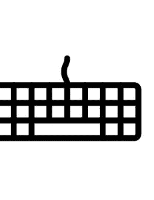

## Python中的用户输入

试着想一个程序，它能在**没有**任何用户输入（甚至**启动程序**）的情况下自行运行。这相当困难，如果有的话，也不多！


## Python中的用户输入

因此，了解如何在Python中实现同样的功能对我们来说至关重要——通过学习如何在程序中**捕获用户输入**，我们可以扩展程序，使其变得比以前更加有用和**交互式**！


## Python中的用户输入

在Python中，我们可以使用`input()`函数从键盘捕获用户输入。

假设我们想询问用户的名字，以便存储并在之后使用，使其更具个性化？

```python
name = input("Please enter your name: ")
```

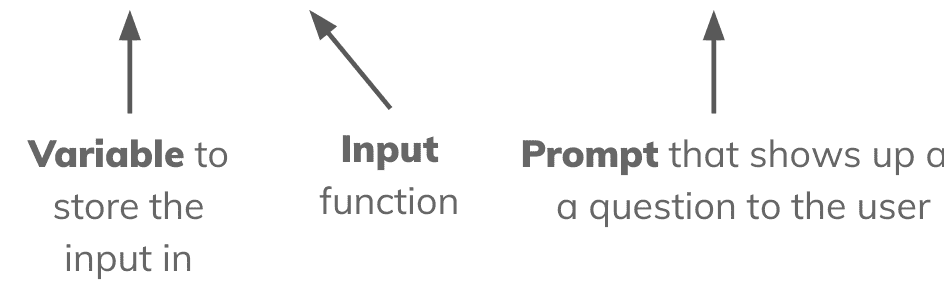

## Python中的用户输入

那么这是如何工作的呢？我们使用`input`函数来捕获用户输入。我们可以输入一个**提示**来告诉用户我们希望他们输入什么。

在这行代码之后，用户可以输入任何他们想要的内容——每当他们按下**回车键**，输入的内容就会被存储到变量`name`中。

```python
name = input("Please enter your name: ")
```

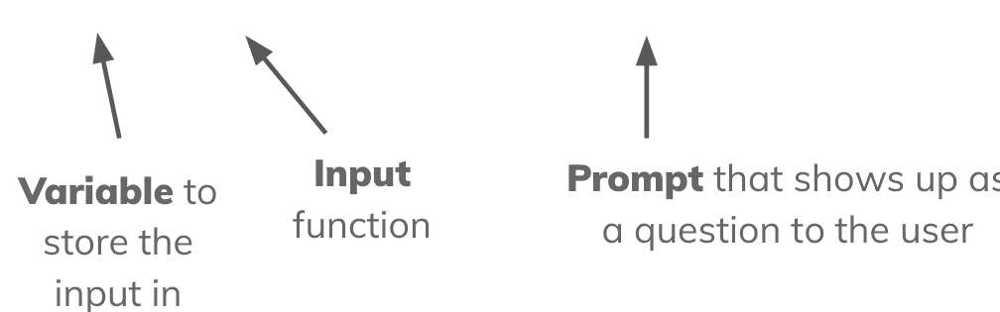

## 让我们试试

让我们试着写一个程序，询问用户的名字然后向他们问好！我们可以运用刚学到的知识来实现！

```python
name = input("Please enter your name: ")
print("Hey there, " + name + ", I hope you're doing great!")
```

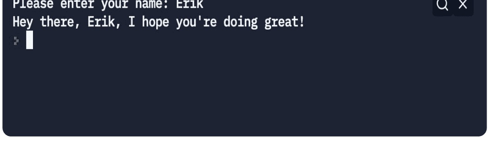

## 用户输入

我们可以要求输入任何可以从键盘输入的数据类型。也许我们想询问用户的**年龄**！以下是我们可以这样做的方法。

```python
age = input("Please enter your age: ")

print("I can see you are " + age + " years old.")
```

```
Please enter your age: 15
I can see you are 15 years old.
```

## 让我们试试别的

让我们试着询问用户**两个**数字：他们的年龄和他们最喜欢的数字。然后，让我们尝试将它们**相加**并打印结果。

```python
age = input("Enter your age: ")
num = input("Enter your favorite number: ")

print(age + num)
```

```
Enter your age: 15
Enter your favorite number: 7
157
```

**问题：** 这里的答案有什么问题？

## 让我们试试别的

如你所见，当用户输入15作为年龄，7作为幸运数字，我们将它们相加时，我们得到了157。这似乎不对……

这是因为在我们请求用户输入时，它们是以字符串形式传入的。即使我们只输入数字也是如此！

因此，如果我们想对输入的值执行任何算术运算，就必须将其转换为整数。

```python
age = input("Enter your age: ")
num = input("Enter your favorite number: ")

print(age + num) # prints 157
print(int(age) + int(num)) # prints 22
```

## 数据类型输入

话虽如此，我们可以接受用户想要的任何数据类型，只要我们将其从字符串转换过来。

```python
age = int(input("Enter your age: "))
```

```python
name = input("Enter your name: ")
```

```python
temp = float(input("Enter a temp: "))
```

**警告：** 如果用户输入的值无法成功转换为正确的类型，将会引发错误。

## 练习1：用户输入

创建一个Python程序，询问用户的名字和家乡。

使用两个输入值为用户打印一句问候。

```
Enter your name: Erik
Enter your hometown: El Monte
Hi, Erik! I can see you are from El Monte.
```

## 练习1：用户输入

```python
name = input("Enter your name: ")
hometown = input("Enter your hometown: ")
print("Hi there, " + name + " from " + hometown + "!")
```

## 练习2：数字求和

询问用户5个随机数字。打印所有数字的总和。

```
Enter number 1: 12
Enter number 2: 55
Enter number 3: 3
Enter number 4: 100
Enter number 5: 23
193
```

## 练习2：数字求和

```python
num1 = int(input("Enter number 1: "))
num2 = int(input("Enter number 2: "))
num3 = int(input("Enter number 3: "))
num4 = int(input("Enter number 4: "))
num5 = int(input("Enter number 5: "))

sumnum = num1 + num2 + num3 + num4 + num5

print(sumnum)
```

## 练习3：猜数字游戏 - 高或低

生成一个随机数，让用户猜测这个数字，直到猜对！你可以一路给他们提示：高了还是低了。你可以这样生成随机数：

```python
import random

rand = random.randint(0,100) # generates between 0 and 100
```

```
Enter your guess: 35
Lower.
Enter your guess: 34
Lower.
Enter your guess: 33
Lower.
Enter your guess: 32
Correct! Congratulations!
```

## 练习3：猜数字游戏 - 高或低

```python
import random

rand = random.randint(0,100)

while True:
    guess = int(input("Enter your guess: "))

    if guess < rand:
        print("Higher.")
    elif guess > rand:
        print("Lower.")
    else:
        print("Correct! Congratulations!")
        break
```

# 第5章

# 字符串

## 课程词汇

-   **字符串：** 构成句子、单词或更多内容的字符数组/集合！
-   **零索引：** 第一个项目位于索引0的集合。
-   **下标表示法：** 用于在集合/字符串/列表中标识特定索引项的表示法。在Python中，我们使用方括号 `[]`
-   **字符串连接：** 将多个字符串连接在一起。

## Python字符串

### 总结

在本课程中，我们将学习Python中的基本数据类型之一：字符串。本课程将涵盖字符串是什么以及我们如何在Python中使用它们。除此之外，我们还将学习一些操作和访问字符串的方法。

### 目标

本课程的目标是让学生更深入地理解字符串及其用法。学生将能够创建、修改和遍历字符串。

### 准备

学生应打开一个新的python窗口。

## Python中的数据类型

在Python中，有不同的信息和数据类型，每种都有其特定的用途！

-   **整数** - 这些是没有小数点的数字。这些数字可以是正数或负数！

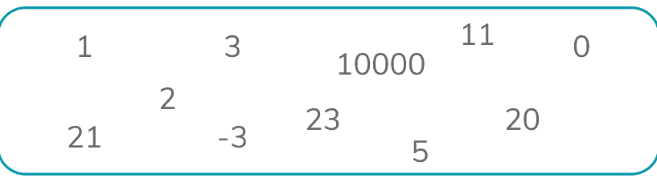

-   **浮点数** - 这些是带有小数点的数字。


## Python中的数据类型

在Python中，有不同的信息和数据类型，每种都有其特定的用途！

-   **布尔值** - 布尔值用于表示真或假。它们可以是真...或假！

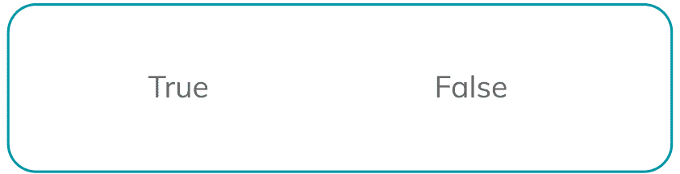

如果我们想表示单词或字母呢？或者文本数据？

## Python 中的字符串

好了，这就引出了我们的下一个数据类型——**字符串**。到目前为止，你可能已经对它们有所耳闻！它们是什么呢？

> **字符串**是由引号包围的**字符集合**。字符串可以是任意长度，并且可以包含任何字符！

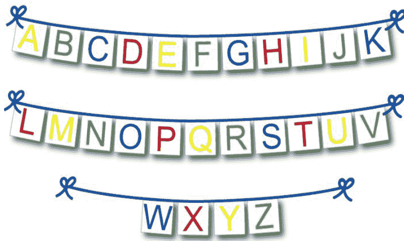

我们如何在 Python 中创建一个字符串呢？嗯，字符串是用**引号**表示的。这就是 Python 识别字符串开始和结束位置的方式。

```
"Hello, world!"
```

```
"Hello"
```

```
" "
```

```
"Y"
```

```
"I am a string!"
```

```
"abcdefg"
```

## 让我们试试看！

让我们尝试在 **Python 解释器**中输入一些字符串！在 Repl 上，Python 解释器位于**右侧**。如果你输入正确，它应该会将值打印回来给你。

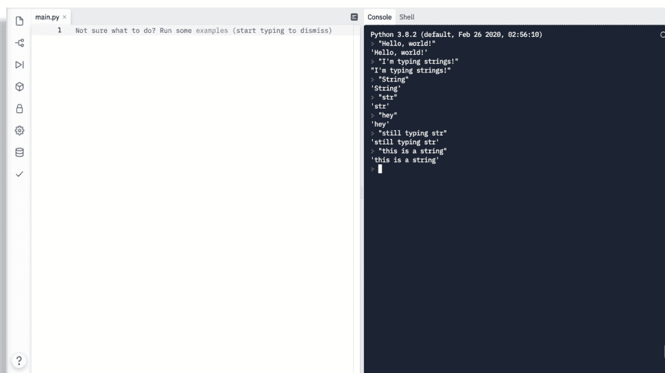

## 打印字符串

当我们想要向控制台打印某些内容时，我们需要给它一个字符串值来打印！

让我们看看如何在 Python 中将字符串打印到屏幕上。你能猜出这里的字符串是什么吗？

```
print("Hello, world!")
```

没错！字符串就是引号内的值："Hello, world!"。

我们可以打印任何想要的字符串值，当我们运行代码时，它将**被打印到我们的控制台！**

```
print("Hello, world!")
print("This is a string")
print("Hey there Code Heroes!")
print("You are smart")
```

## 字符串作为变量

好的，我们可以打印字符串了！但是，这有什么用呢？如果我们想存储一个值以备后用呢？

我们可以像存储任何其他变量一样将字符串存储为变量！

```
myString = "Hello, world!"

print(myString)
```

这会将值 'Hello, world!' 存储到变量 myString 中——然后我们打印 myString 的值，它就会将 'Hello, world!' 打印到我们的屏幕上！

## 多行字符串

如果我们想创建一个多行字符串呢？嗯，我们只需要用**三个引号**开始和结束它，告诉 Python 我们正在创建一个多行字符串。

```
longstring = '''Lorem ipsum dolor sit amet,
consectetur adipiscing elit,
sed do eiusmod tempor incididunt
ut labore et dolore magna aliqua.'''

print(longstring)
```

## 更改变量字符串

我们可以像为任何其他数据类型赋值一样，为字符串变量分配一个新值。如果我们使用赋值运算符和一个新的字符串值，该值将会被更改。

```
myString = "Hello, world!"

myString = "Goodbye, planet."

print(myString)
```

在这种情况下，将会打印什么？

## Python 中的字符串

字符串是**字符的集合**。所以，你可以把它们想象成由字符串捆绑在一起的一堆字符，其中每个字符在字符串上都有一个位置。

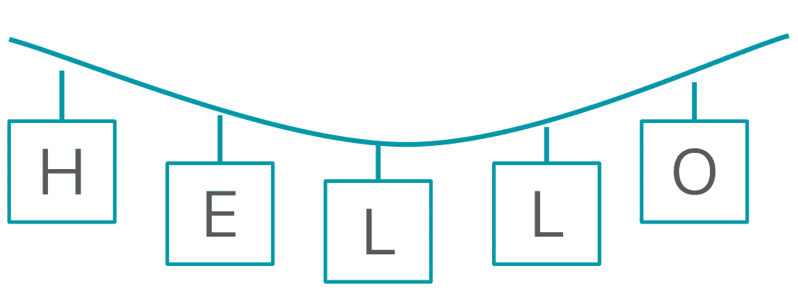

字符串上的每个字符都有一个已知的位置。位置从 0 开始，到字符串中的最后一个字符结束！这是因为在 Python 中，字符串和集合是**从零开始索引的**，这意味着第一个索引是 0，而不是 1。

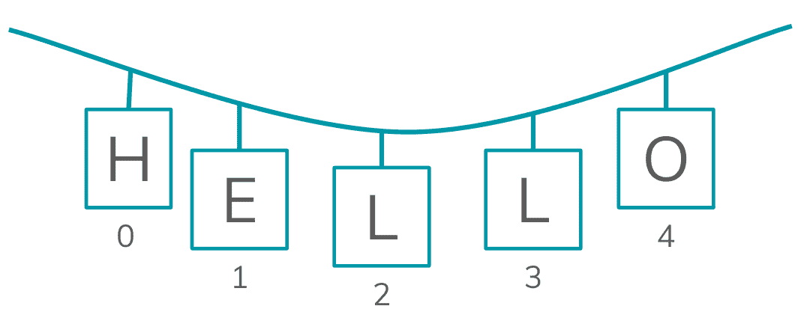

## 访问每个字符

那么，话虽如此，我们实际上可以访问字符串中的每个字符！我们可以使用**下标表示法**来访问每个项目。我们可以这样做：

```
myString[要访问的索引]
```

例如，如果我有一个字符串 "Hello, world!"，并且我只想打印 'e'，我们可以使用下标表示法和索引 **1** 来打印它。

```python
myString = "Hello, world!"
print(myString[1])
```

让我们看看为什么这行得通！看看下面的索引。

| H | e | l | l | o | , |   | w | o | r | l | d | ! |
|---|---|---|---|---|---|---|---|---|---|---|---|---|
| 0 | 1 | 2 | 3 | 4 | 5 | 6 | 7 | 8 | 9 | 10 | 11 | 12 |


我们可以看到 'e' 在字符串中的索引 1 处！记住，字符串是从零开始索引的，所以第一个项目在位置 0，而不是 1。

## 字符串的长度

在 Python 中，我们经常需要找到字符串的长度，这样我们就不会尝试访问不存在的元素。

我们可以通过使用 `len()` 函数来查看**字符串的长度**

```
myString = "Hello, world!"

print(len(myString))

# 打印 13
```

## 遍历字符串

现在我们知道可以通过索引访问字符串中的每个元素，让我们看看如何使用循环来遍历字符串的内容！

假设我们想遍历 "Hello, world!" 的内容并打印每个字母。

```python
myString = "Hello, world!"
for letter in myString:
    print(letter)
```

这与 **for 循环**配合得很好，因为我们确切地知道我们想要从哪里开始和停止。

在这种情况下，**letter** 在每次循环运行时被分配给 **myString** 中的一个新索引，直到我们到达字符串的末尾。

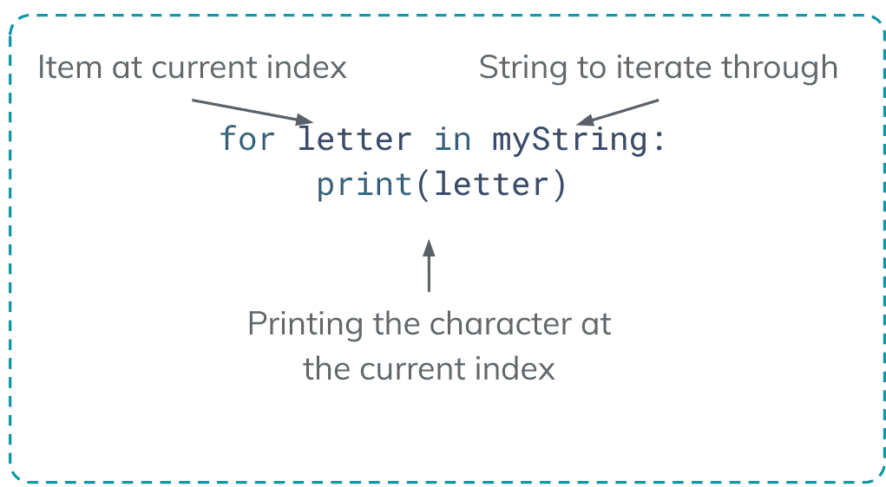

我们也可以使用 range 通过其索引来遍历字符串！

```
myString = "Hello, world!"

for i in range(len(myString)):
    print(myString[i])
```

在这种情况下，我们正在遍历一个数字范围：**0 到字符串的长度**。我们使用这个数字范围来遍历字符串中的每个索引！

## 让我们试试看！

让我们尝试玩一些字符串！按照下面的说明操作，以便我们进行一些练习。

1. 创建一个字符串
2. 打印整个字符串一次
3. 使用循环，打印字符串中的所有单个字符
4. 打印字符串中的最后一个项目
   a. 额外加分：我们如何在**不**使用单个**数字**作为索引的情况下做到这一点？想想 LENGTH


```python
# 步骤 1
myString = "Hello, world!"

# 步骤 2
print(myString)

# 步骤 3
for letter in myString:
    print(letter)

# 步骤 4
print(myString[len(myString) - 1])
```

## 在... 还是不在...？！

因为字符串是集合/序列，Python 允许我们检查其中是否存在某些模式！

例如，如果我们想检查单词 'hello' 是否存在于字符串中呢？

或者，如果我们想看看某个字母是否存在于单词中呢？

我们可以使用关键字 **in** 和 **not in** 来做到这一点。看看吧。

```
myString = "Hello, world!"

if 'Hello' in myString:
    print("Hello is in the string!")
```

**not in** 的工作方式相同——只是相反！我们可以使用 **not in** 来确保某些内容不存在于字符串或序列中。

```
myString = "Alphabet"
if 'z' not in myString:
    print("myString does not contain 'z'")
```

## 字符串连接

在 Python 中，我们可以对字符串做很多事情！包括将它们组合在一起以创建新字符串。这被称为**字符串连接**。让我们看看一些我们可以用它们做的不同例子。

```
a = "hello"
b = "world"

a + b # "helloworld"
a * 2 # hellohello
a + ", " + b + "!" # "hello, world!"

a + 5 # 抛出错误 - 5 不是字符串！
```

## 练习 1：

编写一个 Python 程序，**不**使用 `len()` 函数打印字符串的长度。

## 练习 2

在 Python 中创建两个字符串变量：`sentence` 和 `letter_to_check`。编写一个 Python 程序，打印 `letter_to_check` 在 `sentence` 中出现的次数。

## 练习 3：挑战

编写一个 Python 程序，检查一个字符串是否是**回文**。

回文是**正向**和**反向**都相同的字符串。例如，racecar、kayak、mom 等。

## 练习 2：参考答案

```python
sentence = "this is a sentence in python"
letter_to_check = "a"

count = 0

for letter in sentence:
    if letter == letter_to_check:
        count += 1

print(letter_to_check + " occurs " + str(count) + " times.")
```

## 练习 3：挑战题参考答案

```python
mystring = "helloolleh"

ispalindrome = True

for i in range(len(mystring)):
    if mystring[i] != mystring[len(mystring) - 1 - i]:
        ispalindrome = False

print(ispalindrome)
```

# 第 6 章

## 函数

## 课程：函数

### 总结

本课程中，我们将通过增强对内置函数的理解以及学习如何创建自定义函数，来探讨 Python 中的函数。函数用于利用代码的可重用性，使其更具可读性和操作效率。我们将明确一个新定义函数的每个主要组成部分，如何调用它们，并构建日益复杂的程序。

### 目标

学生将理解如何创建函数以完成日益复杂的项目，如何有效地调用它们，以及如何有效地传递参数。

### 词汇表

- 内置函数：已内置于 Python 中的常用函数
  - 例如：`len()`、`range()`、`sorted()`
- 定义函数：用户自定义的函数，旨在提高代码的可重用性和效率
- 返回：一个用于结束函数执行并“返回”结果的语句
- 参数：提供给函数以进行操作的变量
- 关键字参数：传递给函数的可选参数
- 全局变量：在函数外部声明的变量，可在代码中的任何位置使用
- 局部变量：在函数内部声明的变量，不能在其他地方使用

## 理解函数

### 使用函数

什么是函数？

- 函数是**可重用**的代码块，仅在**被调用**时运行
- Python 拥有**内置**函数，我们也可以**定义**自己的函数

我们以前在哪里见过函数？

- 打印输出
  - `print()`
- 请求用户输入
  - `input()`
- 获取列表长度
  - `len()`

## 理解函数

### 使用函数

**我们为什么使用函数？**

- 函数效率高
- 它们让我们可以多次重用相似的代码
- 减少代码中的冗余

**哪种看起来更整洁？**

```python
print("Hello, " + name + ". Good morning!")
print("Hello, " + name + ". Good morning!")
print("Hello, " + name + ". Good morning!")
print("Hello, " + name + ". Good morning!")
```

**或者**

```python
print(greet("May"))
print(greet("May"))
print(greet("May"))
print(greet("May"))
```

## 创建函数

## 定义函数

我们需要 4 个组成部分

- `def`：
  - Python 中定义函数的关键字
  - 类似于我们告诉 Python 想要使用循环时的 `while` 和 `for`
- 函数名
  - 命名函数时，最好使用与其功能相关的名称，这是个好习惯
- 参数
  - 你可以拥有无限数量的参数，也可以没有任何参数
  - 始终需要使用括号
- 你的代码
  - 你的所有代码都必须在函数内缩进，类似于使用循环时
  - 大多数代码以 `print` 函数或 `return` 语句结束
- 可选：返回值：停止函数的执行，并将值返回给函数调用者

下一页有示例！

## 别担心，这里是概述

## 定义函数

4 个组成部分总结

- `def` 关键字
- 函数名
- 参数
- 我们的代码

```python
def square(num):
    return num ** 2
```

## 我们如何使用函数？

### 调用函数

**如何调用函数：**

- 调用已定义的函数与调用内置函数相同
- 输入你的函数名，并在括号中填入所需的参数（如果它需要的话）

**必须使用 print 函数吗？**

- 这取决于你想做什么：
  - 如果你函数的唯一目的是打印某些内容——那么是的
  - 如果你想能够使用函数输出的值在代码的其他地方，那么就需要一个 `return` 语句
  - 你也可以在函数外部打印函数的返回值

## 我们如何使用函数？

### 调用函数

要在 Python 中调用函数，我们只需要写上函数名，然后在括号中给出函数所需的任何参数（有时是无！）

假设我们有一个名为 `greet()` 的函数，它接受一个名字字符串作为参数，并打印 "hello" + 给定的名字。

```python
def greet(name):
    print("Hello,", name)
```

我们将通过调用函数名称并在括号中给出一个函数将要问候的名字来调用此函数！

```python
greet("John")
# 打印 'Hello, John'
```

## 定义函数

很简单！！！

示例 1：

```python
def square(num):
    return num ** 2

print(square(10))
```

## 有什么区别？

### Print 与 Return

**什么是 return？**

- Return 是一个用于停止代码执行的**关键字**
- Return 将一个值从你的函数发送到调用该函数的地方
- Return **不会**产生输出

**什么是 print()？**

- Print 是一个向你展示输出的函数
- 只打印而不返回函数的值，会在屏幕上**显示**该值，但**不允许**你在函数外部的其他地方使用它

延续解释

## 练习 Print 与 Return

### 看看区别

#### 该怎么做：

取消注释代码的不同部分以查看不同的输出。在 `multiply` 函数中，你应该测试：

- 仅一个 print 语句
- 仅一个 return 语句
- 一个 print 语句，然后一个 return 语句
- 一个 return 语句，然后一个 print 语句

```python
def multiply(x):
    print(x * 3)
    #return (x * 5)
    #print(x * 10)

multiply(3)
#print(multiply(5))
#print(multiply(10))
```

## 练习 Print 与 Return

### 为什么使用 return？

从函数中返回值是编写函数时我们所做的最核心的事情之一。它使我们的函数非常**可重用**，并允许我们在其他地方使用从中得到的值，而不仅仅是打印一次。

你为什么要返回一个值？有 3 种选择：

1. 保存以供代码稍后使用
   a. 将输出保存在一个变量中
2. 在更复杂的表达式中使用它
   a. 将函数用作另一个函数的参数
3. 打印出来供人类查看
   a. 打印函数的输出

## 练习 Print 与 Return

### 为什么使用 return？

正如你在这些示例中所看到的，使用 `return` 而不仅仅是 `print` 语句有几个非常重要的原因，特别是当你多次调用该函数并希望保存其输出以供稍后使用时。

```python
# 选项 1 - 保存以供稍后使用
squareOfSix = square(6)

# 选项 2 - 复杂表达式
my_list.append(square(6))

# 选项 3 - 打印供人类查看
print(square(6))
```

## Return 的重要性

为了真正强调返回的重要性，我们应该看一个打印与返回的例子。

假设我们有一个包含 20,000 个数字的列表，我们想使用 **square** 函数对列表中的每个数字求平方。

如果我们只是打印——我们就无法使用函数的输出！而且我们还打印了 20,000 个数字的平方。这读起来可不容易。

```python
for i in range(len(numbers)):
    numbers[i] = square(numbers[i])
```

在这个例子中，我们为数字列表中的每个项目重用了为 square 函数编写的代码——这是可重用函数的一个完美例子！

## 参数与关键字参数

编写函数时，当我们请求一个参数，该参数是**必需**的，如果没有提供参数，将会抛出错误。

Python 还允许我们为参数定义一个默认值，使其成为可选的或**关键字**参数。

- **参数**
  - 参数也被称为形参
  - 参数是必需的
  - 在被传递之前，它们不会被赋值
- **关键字参数**
  - 可选参数
  - 如果从未使用，则会分配一个默认值
  - 让我们在一个内置函数中看看例子

## 默认参数与关键字参数

### 让我们使用 sorted 函数

`sorted()` 接收一个集合并将其按从小到大排序。我们可以通过以下代码调用 `sorted` 函数：

```python
lst = [54,23,42,34,17]

# we can call the sorted function
lst = sorted(lst)

# prints [17, 23, 34, 42, 54]
print(lst)
```

`sorted()` 有一个我们之前没有使用也不必使用的关键字参数，名为 `reverse`。

`reverse` 默认设置为 `False`，但我们可以更改它。

```python
lst = [54,23,42,34,17]
lst = sorted(lst, reverse=True)

# prints [54, 42, 34, 23, 17]
print(lst)
```

### 编写我们自己的函数

让我们编写一个计算两个数之和的函数。

```python
def sum(n1, n2):
    sum = n1 + n2
    return sum

x = sum(2, 4) # x = 6

x = sum(2) # throws an error because only 1 arg given
```

正如你所见，当我们要求两个参数但只提供一个时，Python 会抛出错误。而且，这是有充分理由的——我们没有运行函数所需的所有值。

### 编写我们自己的默认参数

通过在函数定义中添加默认值，我们可以让用户选择是否为每个参数提供值。

```python
def sum(n1 = 100, n2 = 10):
    sum = n1 + n2
    return sum

# x = 6, because these values override the default
x = sum(2, 4)

# x = 12, because n2 was default at 10
x = sum(2)

# x = 310, because n2 wasn't given
x = sum(300)
```

到目前为止，我们所有的参数主要都是**位置参数**，这意味着我们传递参数的**位置**决定了该值**被赋给**函数中的哪个变量。

```python
def sum(n1, n2):
    sum = n1 + n2
    return sum

x = sum(100, 30)  # 100 is n1, 30 is n2

y = sum(30, 100)  # 30 is n1, 100 is n2
```

我们可以通过在函数调用中直接指定变量名来**命名**我们想要赋值的参数变量。这样，顺序就不重要了。Python 会知道每个值对应哪个变量。

```python
def sum(n1, n2):
    sum = n1 + n2
    return sum

x = sum(n1 = 100, n2 = 30) # 100 is n1, 30 is n2

y = sum(n2 = 30, n1 = 100) # 30 is n2, 100 is n1
```

我们可以将这两个主题结合起来，从而获得极大的灵活性。试试看！

```python
def greet(firstname = "John", lastname = "Doe"):
    print("Hi,", firstname, lastname)

greet() # prints 'Hi, John Doe'
greet('Alex') # prints 'Hi, Alex Doe'
greet(lastname = 'Appleseed') # prints 'Hi, John Appleseed'
greet('Johnny', 'Appleseed') # prints 'Hi, Johnny Appleseed'
```

## 有什么区别？

### 局部变量与全局变量

#### 局部变量
-   局部变量在函数内部声明
-   它们只能在函数内部使用
-   如果一个局部变量和全局变量同名，则局部变量优先

#### 全局变量
-   全局变量在函数外部声明
-   它们可以在函数内部和外部使用

## 练习局部和全局变量

### 看看区别

这是一个全局变量及其输出

```python
globalVariable = 'This will work anywhere'
print(globalVariable)

#def local_practice():
# localVariable = 'This will not work outside the function'

#print(localVariable)
```

This will work anywhere

这是一个局部变量及其报错信息

```python
globalVariable = 'This will work anywhere'
print(globalVariable)

def local_practice():
    localVariable = 'This will not work outside the function'

print(localVariable)
```

This will work anywhere
Traceback (most recent call last):
  File "main.py", line 7, in <module>
    print(localVariable)
NameError: name 'localVariable' is not defined

提示：要打印 `localVariable`，请调用该函数！

# 第 7 章

# 列表

## Python 列表

### 总结

在本课中，我们将重点讨论编程中一个非常重要的部分：集合！在这种情况下，我们将学习 Python 列表。这是一个非常有用的工具，可以将多个数据项存储在一个变量中。我们将重点讨论如何创建、操作和处理这些列表。

### 目标

学生将能够在 Python 中有效地创建、操作和使用列表，并且知道何时列表可能是一个好工具。

### 准备

学生应打开一个新的 Python 窗口。

## 课程词汇

-   **列表：** Python 中的一种集合类型，允许我们在一个变量中存储多个项目。
-   **索引：** 字符串或列表中的特定位置 - 其索引是我们访问各个项目的方式！
-   **下标表示法：** Python 访问列表中每个单独项目的方式 - 通过使用列表名称，后跟方括号和索引。
-   **可迭代对象：** Python 中我们可以通过循环遍历的任何序列。例如，字符串或列表！

## 运动队：球员

让我们以一个例子开始本课：运动队的球员。假设每个球员都用他们的名字表示。

我们如何在 Python 中表示一支球队中的不同球员？


嗯，根据我们目前的知识，你可能会想到将每个球员表示为一个变量，如下所示：

```python
player1 = "Tarik"
player2 = "Alec"
player3 = "Jordan"
player4 = "Franko"
player5 = "Erik"
```

但是，这样做的缺点是什么？如果我们想**添加**另一个球员或**移除**一个球员呢？

这正是这个解决方案的问题所在：我们无法以一种简单的方式添加或减去球员。

我们寻找的答案是一个**列表**。Python 中的列表是项目的有序集合，我们可以在运行时进行操作。

这将**完美**适用于我们的团队！我们可以在运行时添加、减去，甚至更改不同队友的名字！


列表如何工作？嗯，我们可以通过在方括号 `[]` 中放入不同的项目并用逗号分隔来在 Python 中创建一个列表。例如：

```python
players = ["Tarik", "Alec", "Jordan", "Franko", "Erik"]
```

这使我们能够将所有队友的字符串值**浓缩到一个变量中：一个列表**。

这如何工作？嗯，现在我们已经创建了一个**列表**并填充了球员的字符串，我们已经将这些变量浓缩成了一个。

我们现在还可以访问一大堆可以对列表进行的操作！

-   我们现在可以：
    -   **添加** 球员
    -   **移除** 球员
    -   **单独访问** 每个球员
    -   更多！

```python
players = ["Tarik", "Alec", "Jordan", "Franko", "Erik"]
```

## Python 中的列表

让我们看看一些关于列表的重要注意事项。

1.  列表可以通过将所有你想要的元素放在**方括号**内来创建
2.  列表中的项目必须用**逗号**分隔
3.  列表中可以有任意数量的项目 - 它是**无限的！**
4.  列表中的项目**不必**是**相同类型** - 我们可以有整数、字符串、布尔值等等！
5.  列表是**从零开始索引**的
6.  一个空列表表示为 **`[]`**

## 访问列表中的项目

现在我们已经将球员浓缩为一个列表，而不是单独的变量，我们如何访问每一个球员？

我们可以通过**索引**我们想要访问的项目来实现这一点。

列表是**有序**的集合，因此列表中的每个项目都有一个**索引**或位置。因此，我们可以使用其在列表中的索引来访问每个项目。

# 值

| “Tarik” | “Alec” | “Jordan” | “Franko” | “Erik” |
| :---: | :---: | :---: | :---: | :---: |
| 0 | 1 | 2 | 3 | 4 |

### 索引

**注意：** 列表是**从零开始索引**的，就像字符串一样，这意味着第一个索引是 **`0`**，而不是 `1`。

## 访问列表中的项目

让我们看看代码。我们可以使用**下标表示法**来访问每个单独的项目。

这就是在列表名称后包含**方括号**——并在括号内包含我们想要访问的**索引**。

```
players = ["Tarik", "Alec", "Jordan", "Franko", "Erik"]

print(players[0]) # prints 'Tarik'
print(players[2]) # prints 'Jordan'
print(players[10]) # Error - out of bounds!
```

> **警告：** 我们只能访问到列表末尾的项目——如果超出范围，将会得到一个错误！

## 更换队友

好的——教练做出了一个决定——**Alec** 不再是团队的一员。他将被 Omar **替换**。我们如何在代码中反映这一变化呢？

我们可以使用相同的方法——下标表示法并为其赋一个新值——来更改列表中不同项目的值！

```
players = ["Tarik", "Alec", "Jordan", "Franko", "Erik"]

players[1] = "Omar"

print(players[1]) # prints 'Omar'
```

## 添加队友

如果我们的团队需要一名额外的替补球员怎么办？我们如何向列表中添加一个项目？

在 Python 中，我们可以使用 `append` 向列表中添加项目。我们使用以下语法来实现：

```
mylist.append(item)
```

```
players = ["Tarik", "Alec", "Jordan", "Franko", "Erik"]
players.append("John")
# players is now
# ["Tarik", "Alec", "Jordan", "Franko", "Erik", "John"]
```

## 移除队友

我们可以添加项目，但能移除它们吗？**可以。** 如果我们需要从团队中移除一名球员怎么办？我们可以通过两种不同的方式来完成：**remove** 和 **pop**。

```
mylist.remove(item)
```

此方法将移除与给定项目匹配的**第一个**项目。

> **警告：** 这样做的缺点是，如果你有重复的项目——如果你想移除特定索引的项目怎么办？

## 移除队友

使用此方法，你可以移除特定索引处的项目。

```
mylist.pop(index)
```

当我们的列表中有重复项，并且我们想非常具体地移除哪一个时，这很有帮助。

## 移除队友

让我们测试一下这两种方法，看看我们能得出什么结果。假设有两名名为‘Tarik’的团队成员。

如果我们想使用 remove 函数，看看会发生什么。

```
players = ["Tarik", "Alec", "Jordan", "Franko", "Erik", "Tarik"]

players.remove("Tarik")

# Removes the first instance of 'Tarik'
# ['Alec', 'Jordan', 'Franko', 'Erik', 'Tarik']
```

## 移除队友

但是，如果那是错误的 Tarik 怎么办！？我们刚刚移除了错误的那一个！

通过他在团队中的索引而不是名字来移除他可能是一个更好的主意。这正是 **pop** 函数大显身手的时候。

```
players = ["Tarik", "Alec", "Jordan", "Franko", "Erik", "Tarik"]
players.pop(5)
# Removes the item at index 5 - 'Tarik'
# ['Tarik', 'Alec', 'Jordan', 'Franko', 'Erik']
```

## 遍历列表

在 Python 中，我们经常需要使用循环来访问列表的每个项目。我们可以用与字符串相同的方式来做到这一点！使用 **for 循环**，我们可以打印列表的每个项目。

```
players = ["Tarik", "Alec", "Jordan", "Franko", "Erik", "Tarik"]

for p in players:
    print(p)
```

在 for 循环内部，我们可以使用 p 来访问循环的当前项目。每次循环运行时，p 将是列表中的下一个球员。

## 遍历列表

这里有一些关于理解循环以及它如何与球员列表一起工作的帮助。

```
for p in players:
    print(p)
```

| "Tarik" | "Alec" | "Jordan" | "Franko" | "Erik" |
| :---: | :---: | :---: | :---: | :---: |
| 0 | 1 | 2 | 3 | 4 |

对于循环的每次迭代，p 被赋值为球员列表中的下一个球员。

## 让我们试试吧！

让我们练习一下到目前为止学到的一些东西！请按照以下步骤操作：

1. 创建一个包含你最喜欢食物的列表
2. 打印列表中的第二个项目
3. 将列表中的第三个项目更改为列表中第一个项目的值
4. 如果‘Vegetables’不在列表中，则将其添加到列表中。（它们对你有好处！）
5. 使用 `remove` 或 `pop`，移除一个不是蔬菜的项目
6. 使用循环打印列表中的项目

## 让我们试试吧！

```
# 1
foods = ['pizza', 'cheeseburgers', 'chicken wings']

# 2
print(foods[1])

# 3
foods[2] = foods[0]

# 4
foods.append('vegetables')

# 5
foods.remove('pizza')

# 6
for f in food:
    print(f)
```

## 关于列表的更多信息

关于列表，我们还有很多很多可以学习的内容，但本节课我们将只关注重要的部分。让我们看看我们还可以做的一些其他事情：

1. 获取列表中某个元素的**计数**
2. 获取列表的**长度**
3. **反转**列表的顺序
4. 在特定索引处**插入**一个项目
5. **清空**列表中的所有项目

## 关于列表的更多信息

在 Python 中，我们可以对列表做的每一件事都像是附在列表上的工具。

我们可以将列表数据类型想象成一个工具带，上面附着许多用途和工具！

### 我的列表

## 关于列表的更多信息

我们可以通过使用列表名称、一个点，然后是工具名称来访问所有这些**工具**。

例如：`myList.append()` - 这是使用我们列表的 **append** 工具，它添加一个项目！

## 列表长度

在 Python 中，我们可以使用 **len()** 函数来获取列表中项目的**计数**。我们可以这样写：

```
foods = ['pizza', 'cheeseburgers', 'chicken wings']

count = len(foods)

print(count) # prints 3
```

在这种情况下，我们创建了一个包含 3 种食物的食物列表。然后我们创建一个 count 变量，它被设置为食物列表中项目的 **len()**！我们得到数字 3。

## 列表计数

在 Python 中，我们可能还需要查看某个项目在列表中出现了多少次。

例如，如果我们想统计有多少学生名叫‘Eric’怎么办？

```
foods = ['pizza', 'cheeseburgers', 'chicken wings']

count = len(foods)

print(count) # prints 3
```

## 反转列表的顺序

我们可以使用 `.reverse()` 函数来**反转**列表的顺序。这会将列表的顺序从后到前切换。

```
foods = ['pizza', 'cheeseburgers', 'chicken wings']
foods.reverse()  # switches the order
print(foods)  # ['chicken wings', 'cheeseburgers', 'pizza']
```

**注意**：这会更改原始列表的顺序，而不会返回一个**新列表**。

## 插入项目

工具还不止于此！我们也可以在特定索引处**插入**一个项目！

为此，我们使用 `insert()` 函数并给它两样东西：要插入的**索引**和**新项目**。

```
foods = ['pizza', 'cheeseburgers', 'chicken wings']

foods.insert(1, 'vegetables')

print(foods) # ['pizza', 'vegetables', 'cheeseburgers', 'chicken wings']
```

## 插入项目

对于本节课的最后一个工具，我们将学习如何清空列表。要**清空**列表，我们可以使用 `clear()` 函数。这会将列表中的所有项目移除。

```
foods = ['pizza', 'cheeseburgers', 'chicken wings']

foods.clear()

print(foods) # prints []
```

## 练习 1：列表操作

请按照以下说明使用 Python 来练习我们学过的各种列表操作！

1. 创建一个名为 students 的**列表**，包含班级里的每个人。
2. 以一种吸引人的方式**打印**班级里的学生人数。例如：‘这个班级有 3 名学生。’
3. 将一名名为‘Sarah’的学生**插入**到列表的中间。
4. **反转**列表的顺序。
5. 使用循环，**打印**每个学生的名字。
6. **清空**列表。

## 练习1：列表操作
```
python
students = ["Drew", "Michael", "Sai", "Alex",
"Abhay"]

print("There are " + str(len(students)) + "
students in this class")

students.insert(2, "Emmett")

students.reverse()

for s in students:
    print(s)

students.clear()
```

## 练习2：平均年龄
每位同学必须在班级聊天中输入自己的年龄。使用Python，创建一个年龄列表——完成后，使用循环来计算全班的平均年龄。

这可以通过将所有年龄**相加**，然后除以列表中项目的**总数**来完成！

## 练习2：班级平均年龄
```
python
ages = [8, 9, 9, 14, 13, 15, 15, 14]

sum = 0

for a in ages:
    sum += a

print("The average age in this class is " + str(sum/len(ages)))
```

## 练习3：待办事项列表
创建一个Python程序，从一个代表待办事项列表的空列表开始。

在你的程序中，你将允许用户持续**添加**项目到列表，直到他们输入'quit'为止。每次用户输入新项目时，**打印**整个列表。

```
----Your list----
[]

Enter a new item: Go to bank
----Your list----
['Go to bank']

Enter a new item: Do homework
----Your list----
['Go to bank', 'Do homework']

Enter a new item: 
```

## 练习3：待办事项列表
```
lst = []

while True:
    print("----Your list----")
    print(lst)
    print()
    
    userinput = input("Enter a new item: ")
    if userinput != 'quit':
        lst.append(userinput)
    else:
        print("Program ended.")
        break
```

# 第8章
### 集合
### Python 集合
### 总结
在本课中，我们将讨论Python四种内置数据类型的最后一种：集合。集合用于在一个变量中存储多个元素，是你编码工具箱中非常强大的工具！在本课中，你将学习如何创建和使用自己的集合，以及它们的实际用途。

### 目标
学生将学习如何在代码中创建和使用集合。他们还将学习集合的实际用途以及在解决问题时何时使用它们。这里另一个主要目标是向学生展示每种集合类型何时具有优势，以及何时使用集合是最好的选择。学生还将对集合理论有基本的了解。

### 词汇
- **集合：** Python的四种内置数据类型之一——用于在一个变量中存储多个项目。本质上，是一组唯一的值。
- **可变：** 能够被更改或更新
- **无序：** 没有特定的顺序，因此无法进行索引。
- **集合理论：** 数学的一个分支，围绕集合和集合运算构建。

### 集合
Python中的集合是四种内置数据类型之一。其他是列表、元组和字典。它用花括号表示。集合有点像**只有**键的字典。

集合允许我们在一个变量中存储多个**唯一**的项目——见下例。

```
# 一堆独特的水果
fruit1 = "apple"
fruit2 = "banana"
fruit3 = "grape"
fruit4 = "orange"

# 我们可以将它们打包成一个集合
myset = {"apple", "banana", "grape", "orange"}
```

### 集合
所以，我们现在已经学完了所有4种数据集合。集合与它们有什么不同？

嗯，**集合**是仅包含唯一项目的集合。因此，不允许重复。集合也是无序的，这使得其项目无法被索引。

```
myset = {"apple", "banana", "orange", "grapes"}
```

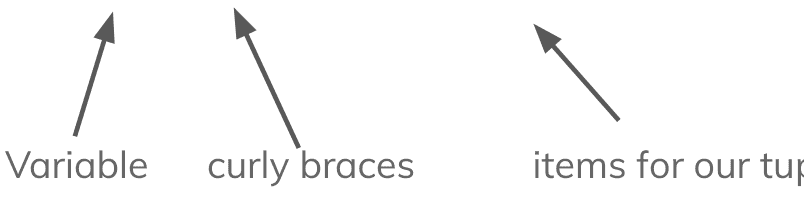

通过集合，我们不仅引入了一种新的数据结构，还引入了许多与**集合理论**相关的能力和操作，集合理论是专门研究集合及其运算的数学分支！

### 集合的一些规则
Python中的集合功能强大，但也涉及一些规则。

以下是集合涉及的一些规则。

- 集合是**可更改的**，或**可变的**，这意味着一旦创建，就可以更改。
- 项目一旦添加到集合中，就不能更改。但是，集合可以添加和删除项目。
- 集合是**无序的**，这意味着集合中的每个项目都**不能**被索引。
- 集合不允许**重复值**

```
rules = {"unordered", "changeable", "no duplicates"}
```

### 集合的一些规则
如下所示，我们展示了集合的一些限制。

```
myset = {"apple", "banana", "orange", "grapes"}

# 不允许重复
# 输出：{"apple", "orange"}
duplicates = {"apple", "orange", "apple"}

# 错误，我们不能索引项目，因此
# 我们不能通过索引来更改特定项目
myset[0] = "grapefruit"

# 我们不能在集合中使用可变对象
# 这会导致错误
mutable = {1, 2, [3, 4]}

# 让我们尝试将一个包含重复项的列表
# 转换为集合
# 输出：{1,2,3,4}
mylst = [1,1,2,2,3,3,4,4]
test = set(mylst)
```

## 它们如何比较？
在Python中，我们有相当多的不同数据结构可供选择。即列表、集合、元组和字典。为什么你会选择其中之一而不是另一种？

了解它们之间的区别以及为什么一个可能比另一个更好是非常重要的。让我们来看看。

| 集合 | 列表 | 元组 |
| :--- | :--- | :--- |
| ● 无序 | ● 有序 | ● 有序 |
| ● 可变 | ● 可变 | ● 不可变 |
| ● 多种数据类型 | ● 多种数据类型 | ● 多种数据类型 |

### 那么，为什么使用集合？
在学习了Python中所有这些不同的集合之后，你可能会问自己：为什么用集合？它们有什么特别之处？为什么我要用集合而不是列表或字典？

- 集合确保你不会添加重复项，所以如果你只想要唯一的值，请使用集合。
- 集合的项目是不可更改的，所以如果你希望项目保持不变，请使用集合。
- 你的计算机检查一个项目是否在集合中，要比检查列表或元组快得多。
- 你可以将列表或元组转换为集合以移除重复项。

### 让我们来练习！
学习创建集合的最佳方法就是通过实践！那么，让我们创建一些集合，并探索我们可以用它们做什么。

```
myset = {"apple", "banana", "orange"}
```

创建一个集合我们只需写变量名、赋值运算符，然后在花括号中给出所有我们希望包含在集合中的项目。

*这些项目是不可更改的。

### 访问集合中的项目
在集合中访问单个项目的方式有很大不同，因为我们**不能**直接索引它们。但是，我们可以做两件事：

- 检查一个项目是否**在**集合中。
- **循环**遍历集合中的项目。

```
myset = {"apple", "banana", "orange", "blueberry"}

if "apple" in myset:
    print("Apples all around!")

for item in myset:
    print(item)
```

### 更新集合
集合是**可变的**，因此我们可以向其中添加项目。我们只是不能**更改**每个项目。我们可以使用 **.add()** 方法添加项目。

```
python
myset = {"carrot", "celery", "spinach"}

# 将西兰花添加到集合
myset.add("broccoli")
```

我们也可以使用 **.update()** 方法来添加可迭代对象，如列表和元组。

```
python
myset = {"carrot", "celery", "spinach"}
fruits = {"banana", "apple", "orange"}

# 用 fruits 更新 myset
myset.update(fruits)
```

## 让我们试试看！
这节课我们还有很长的路要走，为了让我们完全理解集合以及我们能用它们做什么，在继续之前让我们先尝试一下。

- 创建一个包含3种你最喜欢吃的食物的集合。
- 里面有种蔬菜吗？应该有的！使用 **.add()** 方法添加一种蔬菜进去！
- 创建一个水果集合，并使用 **.update()** 方法将这些水果添加到你的主集合中。
- 使用循环打印出集合中的所有项目。


### 让我们试试看！参考答案
```
python
foods = {"pizza", "chicken", "cheeseburger"}

# 添加蔬菜
foods.add("broccoli")

# 水果集合
fruit = {"apple", "banana", "grape"}

# 合并集合
foods.update(fruit)

# 打印集合中的项目
for item in foods:
    print(item)

```## 循环集合

迭代集合是访问其中所有元素的唯一方式，因为我们无法单独访问它们。我们可以简单地使用 **for 循环** 来实现。

```python
foods = {"pizza", "chicken", "cheeseburger"}

# using a for loop we can print all values
for food in foods:
    print(food)
```

## 转换为集合以移除重复项

在 Python 中，我们可以将不同的数据类型和数据结构转换为元组。大多数情况下，我们只需使用集合构造器即可实现。

转换为集合的特别之处在于它 **可以移除任何重复值**。

```python
mylst = [1,1,2,2,3,3,4,4]

mytuple = ("apple", "apple", "orange")

# output: {1,2,3,4}
set1 = set(mylst)

# output: {"apple", "orange"}
set2 = set(mytuple)
```

## 动手试试！

Python 中集合的一个非常有用的特性是，当我们把其他数据类型转换为集合时，任何重复的项都会被移除。让我们试试看：

-   创建一个包含数字 1 到 5 的列表，每个数字出现不止一次。
-   打印 “Before: ” 然后是该列表。
-   使用 `set()` 构造器将你的列表转换为集合。
-   打印 “After: ” 然后是转换后的集合。

## 移除集合元素

我们可以通过几种不同的方式从集合中移除元素。来看看。

我们可以使用 **remove()** 方法移除元素。对不存在的元素使用此方法会 **引发错误**。

```python
myset = {"apple", "orange", "banana"}
myset.remove("apple")
```

我们也可以使用 **discard()** 方法。对不存在的元素使用此方法 **不会** 引发错误。

```python
myset = {"apple", "orange", "banana"}
myset.discard("apple")
```

我们还可以使用 **pop()** 方法 - 这会移除集合中的 **最后一个** 元素。由于集合是无序的，我们并不总是知道哪个元素会被移除。

```python
myset = {"apple", "orange", "banana"}

myset.pop()
```

**clear()** 方法和 **del** 关键字都会删除集合的内容。

```python
myset = {"apple", "orange", "banana"}

myset.clear()

# or

del myset
```

## 集合方法

Python 包含许多不同的集合方法。我们将更详细地介绍它们能做的事情，但下面列出了一个清单。

-   add(): 向集合添加一个元素
-   clear(): 清空集合中的所有元素
-   copy(): 返回集合的一个副本
-   difference(): 返回一个包含两个或多个集合差集的集合
-   discard(): 移除指定的元素
-   intersection(): 返回一个包含两个集合交集的集合
-   intersection_update(): 移除此集合中那些不在指定集合中的项
-   isdisjoint(): 返回两个集合是否没有交集。
-   issubset(): 返回另一个集合是否包含此集合
-   issuperset(): 返回此集合是否包含另一个集合
-   pop(): 从集合中移除一个元素
-   remove(): 移除指定的元素
-   symmetric_difference(): 返回两个集合对称差集的集合
-   symmetric_difference_update(): 将此集合与另一个集合的对称差集插入到此集合中
-   union(): 返回一个包含集合并集的集合
-   update(): 用此集合与其他集合的并集更新集合

## 集合论

因此，为了理解集合的全部威力，我们必须向你介绍一些非常非常基础的集合论。

集合论是数学的一个分支，专门研究集合以及集合在数学中的应用。以下是一些词汇，在接下来的课程中会有用。

**词汇**

-   **集合 (Set)**：一组唯一的值/项
-   **差集 (Difference)**：两个或多个集合之间的差集
-   **交集 (Intersection)**：两个或多个集合中共有的项的集合
-   **子集 (Subset)**：子集是由另一个集合中的项组成的集合
-   **超集 (Superset)**：超集是包含另一个集合所有项的集合
-   **并集 (Union)**：包含两个或多个集合中所有项的集合
-   **互斥 (Disjoint)**：如果两个集合没有共同元素，则它们是互斥的
-   **对称差集 (Symmetric Difference)**：两个或多个集合中未被共享的所有项的集合

## 什么是集合？

那么，我们如何可视化一个集合呢？让我们从制作一个颜色集合开始，将所有颜色放在一个圆圈内。

## 交集

那么，如果我们有两组颜色，如果我们想创建一个集合来表示这两组颜色共有的所有颜色呢？这被称为两个集合的**交集**。

当我们把这些集合合并成一个**韦恩图**时，我们可以看到交集，因为它在图形的中间。

这里的**交集**是 {yellow, purple, orange, cyan}（黄色、紫色、橙色、青色）

## Python 中的交集

我们可以使用 **intersection()** 集合方法在 Python 中找到交集。下面，你可以看到前一张幻灯片的 Python 表示。

```python
colors1 = {"pink", "brown", "purple", "yellow", "peach", "orange", "cyan"}
colors2 = {"blue", "red", "purple", "yellow", "orange", "cyan"}

# creates a new set representing the intersection
# intersection = {'orange', 'purple', 'yellow', 'cyan'}
intersection = colors1.intersection(colors2)

# removes any items that are not present in the other
# colors1 = {'orange', 'purple', 'yellow', 'cyan'}
colors1.intersection_update(colors2)
```

## 并集

那么，如果我们想把两个集合合并成一个大的集合呢？这被称为**并集**。并集表示所有集合中所有项的组合。

这两个集合的**并集**是所有颜色：{pink, brown, peach, yellow, purple, orange, cyan, red, blue}（粉色、棕色、桃色、黄色、紫色、橙色、青色、红色、蓝色）

## Python 中的并集

我们在 Python 中如何表示这个？我们可以使用 **union** 集合方法来创建两个或多个集合的并集。

```python
colors1 = {"red", "orange", "yellow"}
colors2 = {"green", "blue", "purple"}

union = colors1.union(colors2)

# union = {'red', 'orange', 'yellow', 'green', 'blue', 'purple'}
```

## 差集

集合的差集定义为在 A 中但不在 B 中的所有元素的集合。例如，高亮显示的区域。

这两个集合的**差集**是 {pink, brown, peach}（粉色、棕色、桃色）。另一个差集是 {blue, red}（蓝色、红色）

## Python 中的差集

我们在 Python 中如何表示这个？我们可以使用 **difference** 集合方法来创建两个或多个集合的差集。如你所见，**yellow**（黄色）是两个集合共有的，因此差集是 colors1 中除黄色以外的所有内容。

```python
colors1 = {"red", "orange", "yellow"}
colors2 = {"yellow", "blue", "purple"}

difference = colors1.difference(colors2)

# difference = {'orange', 'red'}
```

## 对称差集

集合的**对称差集**定义为给定集合中未被共享的所有项的集合。例如，高亮显示的区域。

这里的**对称差集**是中间区域**之外**的所有内容 - {pink, brown, peach, blue, red}（粉色、棕色、桃色、蓝色、红色）

## Python 中的对称差集

我们可以使用 **symmetric_difference** 集合方法来创建两个或多个集合的对称差集。**Yellow**（黄色）是两个集合共有的，因此差集是两个集合中除黄色以外的所有内容。我们可以使用更新版本来将原始集合更改为对称差集。

```python
colors1 = {"red", "orange", "yellow"}
colors2 = {"yellow", "blue", "purple"}

# symmetric_difference = {'orange', 'red', 'blue', 'purple'}
symmetric_difference = colors1.symmetric_difference(colors2)

# colors1 = {'orange', 'red', 'blue', 'purple'}
colors1.symmetric_difference_update(colors2)
```

# 子集

那么，假设我们有两个集合：**A** 和 **B**。解释子集的最佳方式是：如果 **A** 仅由 **B** 中存在的元素组成，那么 **A** 就是 **B** 的子集。

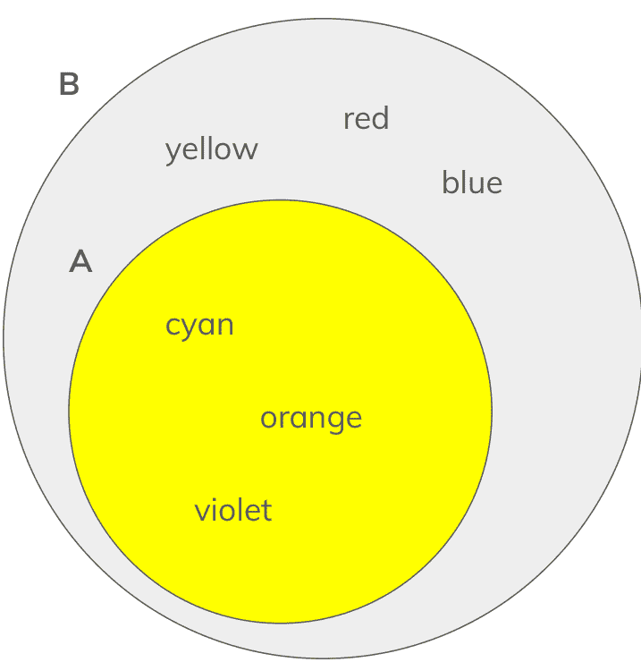

所以，**A** 是 **B** 的子集，因为它仅由 **B** 中的元素组成。这就是为什么它被画在 **B** 的内部。

# 超集

超集是子集的另一面。如果 **B** 包含 **A** 的所有元素，那么 **B** 就是 **A** 的超集。这个图示完全相同——因为 **B** 是 **A** 的超集。

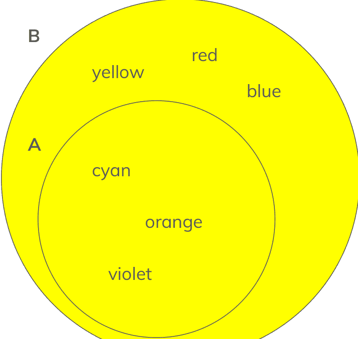

所以，**B** 是 **A** 的超集，因为它包含了 **A** 中的所有元素。这就是为什么它被画在 **A** 的周围。

# Python 中的子集和超集

在 Python 中，我们可以使用一些内置方法来检查一个集合是否是另一个集合的超集或子集。

```python
colors1 = {"red", "orange", "yellow", "green", "blue"}
colors2 = {"red", "yellow", "blue"}

# which one is the superset?
print(colors1.issuperset(colors2)) # true
print(colors2.issuperset(colors1)) # false

# which one is the subset?
print(colors1.issubset(colors2)) # false
print(colors2.issubset(colors1)) # true
```

# 不相交

在集合论中，我们将两个不包含任何共同元素的集合描述为不相交。换句话说，如果两个集合没有交集，它们就被认为是不相交的。

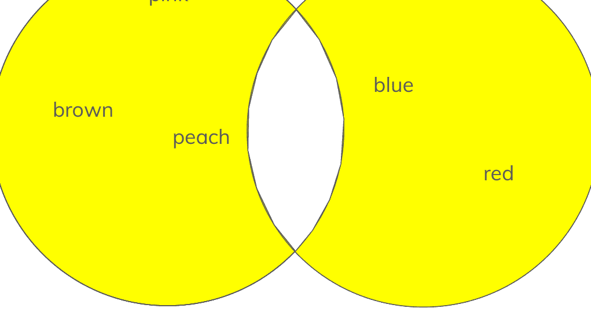

如果维恩图的中间没有任何东西，那么从技术上讲它们就是不相交的。

# Python 中的不相交

我们可以使用以下方法在 Python 中检查两个集合是否不相交

```python
colors1 = {"red", "orange", "yellow"}
colors2 = {"green", "blue", "purple"}

colors3 = {"red", "orange", "yellow"}
colors4 = {"red", "blue", "purple"}

# we can see whether or not they are disjoint
# by using the .isdisjoint() method
a = colors1.isdisjoint(colors2) # true
b = colors2.isdisjoint(colors1) # true

c = colors3.isdisjoint(colors4) # false
d = colors4.isdisjoint(colors3) # false
```

# 练习：重复项

编写一个 Python 程序，接收用户输入的数字列表，并返回列表中重复项的数量。

考虑使用**集合**来解决这个问题，因为我们知道集合有处理重复项的特定方式。

```
Enter some numbers: 1 2 2 3 3 4 4
There were 4 duplicates in this list!
Here is the new list with no duplicates: {'2', '1', '3', '4'}
>>> 
```

# 练习：重复项关键点

为了解决这个问题，Python 使其变得简单，因为当我们把列表转换为集合时，任何重复的项目都会被移除。

```python
# split the user input into a list
nums = input("Enter some numbers: ").split()

# convert to a set to remove duplicates
numset = set(nums)

# find difference in length to find amount of duplicates
numduplicates = len(nums) - len(numset)

# print for user using f-string
print(f"There were {numduplicates} duplicates in this list!")
print(f"Here is the new list with no duplicates: {numset}")
```

# 练习：Hello World 高中

Hello World 高中有两个班级。**1 班**和 **2 班**。一些学生同时上这两个班，一些学生只上一个班，还有一些学生两个班都不上。

使用下面的集合，创建以下 3 个集合。

1.  没有共同课程的学生
2.  有共同课程的学生
3.  不在任何一个班级的学生

```python
students = {
    "Erick",
    "Georgia",
    "Abhay",
    "Raquel",
    "Becky",
    "Jack",
    "Max",
    "Andrew",
    "Shawn",
    "Patrick",
    "Henrique"
}

class1 = {
    "Georgia",
    "Jack",
    "Max",
    "Patrick",
    "Henrique"
}

class2 = {
    "Erick",
    "Becky",
    "Jack",
    "Max",
    "Shawn",
    "Patrick"
}
```

# 练习：Hello World 高中关键点

```python
students = {"Erick","Georgia","Abhay","Raquel","Becky",
        "Jack","Max","Andrew","Shawn","Patrick","Henrique"}
class1 = {"Georgia","Jack","Max","Patrick","Henrique"}
class2 = {
"Erick","Becky","Jack","Max","Shawn","Patrick"}

# students that have classes together:
# intersections give us common set items
classtogether = class1.intersection(class2)

# students that have no classes together:
# symmetric difference gives us only uncommon values
noclasstogether = class1.symmetric_difference(class2)

# students that aren't in either class
# first, we join the two together and compare it
# to the full student list
fullclass = class1.union(class2)
noclass = students.difference(fullclass)
```

# 练习：购物清单

你和你的室友需要杂货——所以你们都写下了各自认为公寓需要从杂货店购买的东西。

唯一的问题是——你们都认为需要从杂货店买不同的东西。

编写一个程序，接收以下购物清单并提供以下信息：

1.  两个清单中共同的物品
2.  两个清单中不共同的物品
3.  包含所有物品的完整购物清单

**清单 1：**
- 香蕉
- 鸡蛋
- 鸡肉
- 草莓
- 葡萄
- 牛奶
- 饼干
- 番茄
- 酸奶

**清单 2：**
- 鸡蛋
- 蓝莓
- 葡萄
- 杏仁奶
- 饼干
- 酸奶
- 香蕉
- 麦片
- 鸡肉

# 练习：购物清单关键点

```python
list1 = {
    "Bananas", "Eggs", "Chicken", "Strawberries",
    "Grapes", "Milk", "Crackers", "Tomatoes", "Yogurt" }
list2 = {
    "Eggs","Blueberries","Grapes","Almond Milk",
    "Crackers","Yogurt","Bananas","Cereal","Chicken" }

# find intersection to find common elements
common = list1.intersection(list2)

# use symmetric difference to find uncommon elements
uncommon = list1.symmetric_difference(list2)

# the full grocery list
grocerylist = list1.union(list2)

print(common)
print(uncommon)
print(grocerylist)
```

# 第 9 章

# 元组

# 课程：Python 元组

### 总结

在本课程中，我们将讨论 Python 的 4 种内置数据类型之一：元组。元组用于在单个变量中存储多个元素，是您编码工具箱中非常强大的工具！在本课程中，您将学习如何创建和使用自己的元组，以及它们的实际用途。

### 目标

学生将学习如何在代码中创建和使用元组。他们还将学习元组的实际用途以及在编码过程中何时使用它们。另一个主要目标是了解 4 种内置数据类型之间的区别，以及为什么你会选择使用元组而不是列表、集合或字典。

### 词汇

- **元组：** Python 的 4 种内置数据类型之一——用于在单个变量中存储多个项目。
- **不可更改：** 元组内的项目无法更改或更新。
- **不可变：** 无法更改或更新。
- **有序：** 具有特定的顺序，因此可以被索引。

# 元组

Python 中的元组是 4 种内置数据类型之一。其他的是集合、列表、字典。它用圆括号表示。元组有点像没有键的字典——但只有值。

元组允许我们在一个变量中存储多个项目——请参见下面的示例！

```python
name = "John Appleseed"
age = 55
birthday = "01/01/66"
lovesApples = True

# or, we could package these together
# as a tuple

johnappleseed = ("John Appleseed", 55, "01/01/66", True)
```

# 元组

从上一个示例中可以看到，我们可以摆脱不需要的额外变量，并且可以使用元组将项目打包到一个变量中。

让我们分解一下语法！

```python
johnappleseed = ("John Appleseed", 55, "01/01/66", True)
```

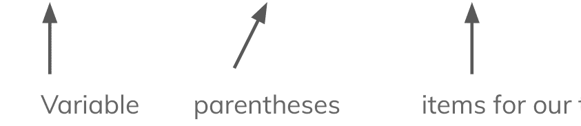

使用元组时，**数据类型不需要全部相同**，因此我们可以混合字符串、整数、布尔值等。

# 元组的一些规则

Python 中的元组非常强大——但也有一些规则！

以下是元组涉及的一些规则。

- 元组是**不可更改的**，这意味着一旦创建，其中的项目就不能被更改。
- 元组是**有序的**，这意味着元组中的每个项目都可以被索引。
- 元组允许重复值。
- 单项目元组必须在值后面加一个逗号。

```python
rules = ("ordered", "unchangeable")
```## 关于元组的一些规则

下面我们可以看到，尝试为“不可变的”变量赋新值会引发错误。并且，由于它是有序的，我们可以通过元组的索引来打印“有序的”变量的值！

```python
rules = ("ordered", "unchangeable")

# 这会引发一个错误
rules[1] = "changeable"

# 我们可以通过索引访问 'ordered'
print(rules[0])

# 允许重复项
duplicates = (1, 1, 1)

# 单个元素的元组后面需要跟一个逗号
singleItem = ("singleItem",)
```

## 它们如何比较？

在 Python 中，我们有很多不同的数据结构可供选择。即列表、集合、元组和字典。你为什么会选择其中一种而放弃另一种呢？

了解它们之间的区别，以及为什么一种可能比另一种更合适，这一点非常重要。让我们来看看。

| 元组 | 列表 | 集合 |
|---|---|---|
| - 有序 | - 有序 | - 无序 |
| - 不可变 | - 可变 | - 可变 |
| - 多种数据类型 | - 多种数据类型 | - 多种数据类型 |
| - 允许重复项 | - 允许重复项 | - 不允许重复项 |

## 让我们实践一下！

学习如何创建元组的最佳方式是通过练习！那么，让我们创建一些元组，探索一下我们可以用它们做些什么。

```python
mytuple = (123, "banana", 321, "apple")
```

创建元组时，我们只需写下变量名、赋值运算符，然后在括号中列出我们希望包含在元组中的所有项目。

*这些项目是不可变的。*

## 访问元组中的项目

如果我们想访问元组中的单个项目以供进一步使用怎么办？很简单！

```python
mytuple = (123, "banana", 321, "apple")
print(mytuple[0]) # 打印 '123'
```

那么，发生了什么？我们访问了第一个项目并打印它，就像我们对列表所做的那样：方括号和索引。

因为元组是**有序的**，我们可以像访问列表一样访问它们。

## 更新元组

在 Python 中，元组是**不可变的**，因此我们不能直接添加或更改元组中的任何项目。

要执行此类操作，我们需要将其转换为列表，进行所需的更改，然后将其转换回元组。

```python
mytuple = (123, "banana", 321, "apple")

mylist = list(mytuple)

mylist.append('789')

mytuple = tuple(mylist)
```

## 让我们试试看！

还有什么比创建元组并在 Python 中使用它们更好的方法来提高元组技能呢？请按照以下步骤进行一点练习。

- 创建一个包含 3 个不同学校科目的元组。
- 在单独的 print 语句中打印每个科目。
- 更新你的元组以添加一个科目。
- 再次打印它们。


## 让我们试试看！答案

```python
subjects = ("social studies", "math", "science")

print(subjects[0])
print(subjects[1])
print(subjects[2])

subjects = list(subjects)
subjects.append("physical education")
subjects = tuple(subjects)

print(subjects[0])
print(subjects[1])
print(subjects[2])
print(subjects[3])
```

# 解包元组

这里有一个非常有用的功能 - 我们可以获取元组中的值，并将每个项目存储在它自己的变量中以供以后使用。

这称为解包。语法相当简单，这允许我们隔离这些值，通过这样做，我们可以像更改任何变量一样更改它们的值。

```python
colors = ("red", "orange", "yellow")
(colorOne, colorTwo, colorThree) = colors
print(colorOne) # 打印 'red'
print(colorTwo) # 打印 'orange'
print(colorThree) # 打印 'yellow'
```

## 遍历元组

如果我们想用循环**遍历**元组怎么办？或者也许我们想分别打印元组内的所有内容。我们可以使用以下语法来做到这一点。

```python
colors = ("red", "orange", "yellow")

# 使用 for 循环
for color in colors:
    print(color)

# 或者我们可以使用 range() 和 len()
for i in range(len(colors)):
    print(colors[i])
```

## 连接元组

在 Python 中，我们可以将多个元组连接在一起 - 无论是复制我们当前的元组，还是向其添加另一个元组 - 我们都可以做到！

```python
colors = ("red", "orange", "yellow")
numbers = (1, 2, 3)

# 将两个元组连接在一起
# 成为 ("red", "orange", "yellow", 1, 2, 3)
bohttuple = colors + numbers

# 我们也可以乘以元组使其翻倍
# ("red", "orange", "yellow", "red", "orange", "yellow")
doubletuple = colors * 2
```

## 转换为元组

在 Python 中，我们可以将不同的数据类型和数据结构转换为元组。在大多数情况下，我们只需使用元组构造函数即可。

```python
data = [1, 2, 3, 4, 5, 6]
mydict = {"name" : "Johnny Appleseed", "age" : 55}

# 将列表转换为元组
mytuple = tuple(data)

# 将字典项转换为元组
keystuple = tuple(mydict)
# ("name", "age")

valuestuple = tuple(mydict.values())
# ('Johnny Appleseed', 55)

itemstuple = tuple(mydict.items())
# (('name', 'Johnny Appleseed'), ('age', 55))
```

## 让我们试试看！

所以，我们现在知道如何使用元组做很多事情了 - 这是尝试一些新知识的好时机。让我们尝试一下，并按照以下步骤操作。

- 创建两个元组，每个元组包含 2 个随机数。
- 将两个元组合并在一起。
- 使用循环，找出元组中所有数字的总和。
- 将总和作为一个项目添加到元组中。
- 将元组解包到各自的单独变量中。


## 让我们试试看！答案

```python
tuple1 = (3, 4)
tuple2 = (9, 10)

tuple3 = tuple1 + tuple2

# 计算总和
sum = 0
for item in tuple3:
    sum = sum + item

# 将总和追加到元组
tuple3 = list(tuple3)
tuple3.append(sum)
tuple3 = tuple(tuple3)

# 解包元组
(num1, num2, num3, num4, num5) = tuple3
```

## 嵌套元组

在 Python 中，与大多数数据类型一样，支持在元组内嵌套元组！我们如何做到这一点？很简单，我们只需将元组作为项目放在更大的元组中即可。这可以嵌套得很深！

```python
tup1 = (1, 2)
tup2 = (3, 4)

tup3 = (tup1, tup2)

# tup3 = ((1, 2), (3, 4))
```

## 元组方法

对于 Python 中的大多数对象和类型，都有一些内置方法可以为我们提供更多功能和实用性。

元组有几个这样的方法：

- **count()**：返回给定值在元组中出现的次数。
- **index()**：在元组中搜索给定值并返回其索引。

```python
colors = ("red", "orange", "red", "yellow")
print(colors.count("red")) # 打印 2
print(colors.index("orange")) # 打印 1
```

## 从函数返回元组

在 Python 中，我们可以通过返回元组来从函数返回多个值。当仅返回一个值不够时，这非常有用。

要返回多个值，我们所要做的就是在 return 关键字后添加它们，并用逗号分隔。

```python
def returnTwo():
    return "hello world", 100

# 存储为元组
returnValues = returnTwo()

# 打印两个值
print(returnValues[0], returnValues[1]) # hello world 100
```

## 元组练习 1：你的元组

在这个练习中，你将为以下各项创建变量：你的名字、你的年龄、你最喜欢的颜色以及你是否喜欢编程（true 或 false 值）。

使用这些单独的变量，用它们创建一个元组并打印它。

```python
('Johnny Appleseed', 55, 'red', True)
>>> 
```

## 元组练习 1：你的元组答案

```python
name = "Johnny Appleseed"
age = 55
favColor = "red"
likesProgramming = True

mytuple = (name, age, favColor, likesProgramming)

print(mytuple)
```

## 元组练习 2：杂货清单

编写一个程序，获取用户输入的一系列杂货物品来制作杂货清单。用户输入完所有杂货物品后，程序应通知用户是否有重复的物品。

注意：你应该使用**元组**和**元组方法**来解决这个问题。

```
Enter groceries: bananas chicken eggs bananas
Duplicate item found!
```

## 元组练习 2：杂货清单答案

```python
glist = input("Enter groceries: ")
glist = glist.split()
glist = tuple(glist)

duplicate = False

for item in glist:
    if glist.count(item) > 1:
        duplicate = True

if duplicate:
    print("Duplicate item found!")
else:
    print("No duplicates here...")
```

## 元组练习 3：一周七天

编写一个函数，输入当前是星期几，返回下一天是星期几，以及本周到星期五还剩多少天。例如，如果输入“星期二”，将返回“星期三”和3，表示到周末还有3天。


## 元组练习 3：一周七天 答案

```
daysofweek = ("monday", "tuesday", "wednesday",
"thursday", "friday", "saturday", "sunday")

dayinput = input("enter a day of the week: ")

def daysLeft(dayinput):
    index = daysofweek.index(dayinput)

    # days in week - current day = days left
    daysleft = len(daysofweek) - index - 1

    # next day, but mod 7 to wrap around to beginning of week
    nextday = daysofweek[(index+1)%7]

    return daysleft, nextday

print(daysLeft(dayinput))
```

# 第 10 章

## 字典

### 概要

在本课中，我们将介绍 Python 字典 - 一种强大的数据结构，允许你以 **键 : 值** 对的形式存储数据。这为组织数据提供了便捷的方式，并允许轻松查找值。字典也非常适合表示对象！

### 目标

学生将理解 Python 字典的实际和关键用途。学生还将了解如何创建、更新和删除自己的字典。

### 词汇表

- **字典（Dictionary）:** Python 中的一种数据结构，允许你以键值对的形式存储数据。
- **数据结构（Data Structure）:** 一种数据存储结构，允许高效访问和操作。
- **键（Key）:** 一个唯一的值，该值关联着一个值。可以将其想象成字典中的一个单词。
- **值（Value）:** 与唯一键关联的值 - 可以将其想象成字典中一个单词的定义。

## 理解字典

现实生活中的例子：

想一想字典（工具书）：

- 一本包含单词和定义（键和值）的书。
- 每个单词都是唯一的（每个键都是唯一的）。
- 每个单词都有一个定义（每个键都有一个值）。

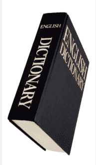

在 Python 中呢？

- 键和值的集合。
- 每个键都有一个与之关联的值。
- 不允许有两个相同的键。
- 值通过其键进行引用。

## 让我们从简单的开始

### 字典语法

```
my_dict = {
    "brand" : "chevrolet",
    "model" : "camaro",
    "color" : "black"
}
```

我们通过以下方式创建一个字典：变量名、花括号，然后是用逗号分隔的键值对！

### 我们如何创建一个字典？

- 包含在花括号内的键值对，用逗号分隔！
- 让我们一起做一个例子，为我们最喜欢的汽车创建一个字典。

## 理解字典

Python 中的字典是非常强大的工具，要更好地理解它们，你还需要理解它们的工作原理！

- 字典在 Python 3.7 中是 **有序的**。
- 它们是 **可变的（changeable）** - 意味着你可以更改其中的元素！
- 它们 **不允许重复的键**。

例如：以下代码会抛出错误：

```
my_dict = {
    "brand" : "chevrolet",
    "model" : "camaro",
    "color" : "red",
    "color" : "blue"
}
```

这里有重复的键，这是行不通的！Python 不知道汽车的实际颜色是什么！

## 理解字典

Python 中的字典对值的处理非常灵活。它们可以是字符串、整数、布尔值、列表，甚至是其他字典！

这为我们自定义字典汽车提供了极大的灵活性。

```
my_dict = {
  "brand" : "chevrolet",
  "model" : "camaro",
  "electric" : False,
  "year" : 2021,
  "colors" : ["black", "red", "white"]
}
```

如你所见 - 我们在这个字典中使用了字符串、整数、布尔值甚至列表。

键也可以是字符串、整数和布尔值：

## 理解字典

键也可以是字符串、整数、布尔值？什么？！是的，我和你一样困惑。让我们换一下这个字典看看：

```python
my_dict = {
    True : "chevrolet",
    20 : "camaro",
    32 : False,
    "year" : 2021,
    False : ["black", "red", "white"]
}

print(my_dict[False])
print(my_dict[20])
print(my_dict["year"])
```

```
['black', 'red', 'white']
camaro
2021
```

这确实提供了很大的灵活性 - 但也可能很快变得混乱！确保你的键有意义，这样你的字典才能高效且方便！

## 字典操作

所以，我们创建了一个字典 - 很酷。你可能会问，我们可以用它做什么？嗯，在 Python 中，我们可以做很多事情：

- 添加项目
- 更改项目
- 删除项目
- 同时更新/添加项目
- 迭代项目
- 嵌套字典

很多，对吧？字典是我们 Python 工具箱中非常强大且方便的工具。

让我们从一些示例开始，以便你更好地理解其中的一些操作。别担心！到本章结束时，你将成为一个字典专家！


## 访问字典中的值

访问字典中的值非常简单 - 就像访问列表中的一个项目一样！但是，我们不是用索引，而是在括号内给出键。

```
my_dict = {
    "brand" : "chevrolet",
    "model" : "camaro",
    "color" : "black"
}

brand = my_dict["brand"]

print(brand)
```

我们也可以使用 `.get()` 方法从字典中检索一个值 - 像这样：

```
my_dict = {
    "brand" : "chevrolet",
    "model" : "camaro",
    "color" : "black"
}

brand = my_dict.get("brand")

print(brand)
```

## 向字典中添加项目

我们有了自己的字典 - 如果我们想向其中添加一个项目怎么办？让我们再次从基础字典开始：

```
my_dict = {
    "brand" : "chevrolet",
    "model" : "camaro",
    "color" : "black"
}
```

如果我们想给汽车添加一个年份怎么办？嗯，这超级简单！

```
my_dict = {
    "brand" : "chevrolet",
    "model" : "camaro",
    "color" : "black"
}

my_dict["year"] = 1972
```

## 从字典中删除项目

如果我们想删除添加到字典中的“年份”项目怎么办？嗯，在 Python 中，我们有两种方法可以实现：

```
my_dict = {
  "brand" : "chevrolet",
  "model" : "camaro",
  "color" : "black",
  "year" : 1972
}
# 选项1
del my_dict["year"]
# 选项2
my_dict.pop("year")
```

我们删除项目的两种选择是使用 `pop()` 方法或 `del` 关键字。两种方法的工作原理完全相同，所以你可以自由选择！

对于选项1：你所要做的就是在字典中你想要删除的项目前加上 `del` 关键字。

对于选项2：你所要做的就是使用 `.pop()` 方法，并将要删除的项目的键作为参数传递！

## 更新我们的字典

Python 中的字典有一种非常有用的更新和添加项目的方式 - 它叫做 `update()` 方法。

`update()` 方法允许我们传递一个字典作为参数，它将使用该字典来 **更新/添加** 到我们的字典中！

任何存在的键的值将被更新，任何不存在的键将被添加到你的字典中！

> 假设我们想对汽车做一些更改：我们想更新 **年份** 和 **颜色**，同时为 **车牌号** 添加一个新项目。在 Python 中，我们可以使用 `update()` 方法在 <u>一行代码</u> 中完成所有这些操作。

```
my_dict.update({"year" : 2021, "color" : "red",
    "licenseplate" : "2fast4u"})
```

## 迭代字典

在 Python 中，我们也可以使用循环来迭代字典。有多种方法可以做到这一点！我们可以迭代键、值，以及两者一起。

```python
# 键
for key in my_dict:
    print(key)

# 打印所有键
```

```python
# 值
for value in my_dict.values():
    print(value)

# 打印所有值
```

```python
# 两者
for key,value in my_dict.items():
    print(key, value)

# 打印所有键值对
```## 遍历字典

在Python中，我们也可以使用循环来遍历字典。实现的方式有很多种！我们可以遍历键、值，或者同时遍历两者。

```python
for key in my_dict:
    print(key)

# 打印所有键
```

```python
for value in my_dict.values():
    print(value)

# 打印所有值
```

```python
for key, value in my_dict.items():
    print(key, value)

# 打印所有的键值对
```

## 嵌套字典

你知道吗？你可以将一个字典作为另一个字典的值！假设我们想在自己的字典里添加一个竞争品牌的字典！

```python
my_dict = {
    "brand": "chevrolet",
    "model": "camaro",
    "color": "black",
    "year": 1972,
    "rival": {"brand": "ford", "model": "mustang"}
}
```

如果我们想访问竞争品牌字典中的项目呢？很简单。

```python
rivalBrand = my_dict["rival"]["brand"]
print(rivalBrand)
```

## Python的字典方法

Python为字典内置了一系列方法（也称为操作）。它们都能帮助你对字典执行不同的操作——从清空所有项目到更新字典！

- **clear()** - 从字典中移除所有元素
- **copy()** - 返回字典的一个副本
- **fromkeys()** - 返回一个由指定键和值组成的新字典
- **get()** - 返回与给定键关联的值
- **items()** - 返回一个包含每个键值对的元组的列表
- **pop()** - 移除指定键对应的元素
- **popitem()** - 移除最后插入的键值对
- **setdefault()** - 返回指定键的值。如果键不存在 - 则插入具有指定值的键。
- **update()** - 使用一组键值对更新字典
- **values()** - 返回字典中所有值的列表

## 练习 #1：我的字典

体验字典还有什么比亲手创建一个——关于我们自己的字典——更好的方式呢？没错，是时候创建一个代表你自己的字典了。

1. 创建一个代表你自己的字典
2. 你的字典的键应包含：
    a. 姓名（字符串）
    b. 年龄（整数）
    c. 学校（字符串）
    d. 最喜欢的颜色
    e. 最喜欢的食物（列表）
3. 使用你的字典打印出你的姓名和年龄
4. 今天是你的生日。添加代码将你的年龄加1。打印“it's my birthday, I'm _”然后是你的新年龄。
5. 使用循环打印出你最喜欢的食物列表中的所有食物。

## 练习 #1：我的字典参考答案

```python
# 创建我们的字典
my_dict = {
    "name": "John",
    "age": 14,
    "school": "Appleseed Central",
    "favoritecolors": ["red", "green", "brown"],
    "favoritefoods": ["apples", "seeds", "pizza"]
}

# 打印姓名和年龄
print(my_dict["name"], my_dict["age"])

# 生日时间！给年龄加一：
my_dict["age"] += 1

print(f"It's my birthday! I'm {my_dict['age']}")

# 使用循环打印所有最喜欢的食物
for food in my_dict["favoritefoods"]:
    print(food)
```

## 练习 #2：字典操作

按照以下步骤操作你自己的“汽车”字典。

1. 为你自己的汽车创建一个字典，包含以下键：
   a. 品牌、型号、颜色列表、最高速度、轮毂颜色和年份
2. 打印“My favorite car: ”然后打印你汽车的品牌。
3. 使用 `update()` 方法添加一个“车牌号”并更新你的颜色
4. 从你的汽车中移除轮毂颜色
5. 添加一个代表竞争汽车的嵌套字典（包括品牌和型号）
6. 仅使用 `.get()` 方法打印出竞争对手的型号。
7. 使用 for 循环以吸引人的方式打印你的字典

## 练习 #2：字典操作参考答案

```python
my_dict = {
    "brand": "ford",
    "model": "mustang",
    "year": 1964,
    "colors": ["red", "black", "silver"],
    "topspeed": 140,
    "wheelcolor": "black"
}

print("My favorite car: ", my_dict['model'])

my_dict.update({"licenseplate": 12342, "colors": ["blue",
    "black", "silver"]})

my_dict.pop("wheelcolor")

my_dict["rival"] = {"brand": "chevrolet", "model": "camaro"}

print("Rival car:", my_dict.get("rival").get("brand"))

for key, value in my_dict.items():
    print(f"{key} : {value}")
```

## 练习 #3：汽车定制程序

那么——我们有一个创建汽车字典的程序。让我们给它增加点趣味。在这个问题中，你将把这个简单的小程序改造成一个完整的汽车定制程序！

1. 修改你的程序以欢迎用户
2. 一旦汽车创建完成，向用户展示一个包含以下选项的菜单
   a. 打印汽车
   b. 为汽车添加一个特征
   c. 更新汽车的一个特征
   d. 删除汽车的一个特征
   e. 退出

```
Welcome to Drew's Car Customizer
----------------------------------
Pick an option:
1. Print Car
2. Add a trait
3. Update a trait
4. Delete a trait
5. Quit
2
Enter a trait to add: licenseplate
Enter a value for licenseplate: 12345216
licenseplate was added to your car!
> _
```

# 第11章

## 字符串和列表函数

## 字符串和列表函数

### 总结

本节课，我们将讨论Python内置的众多字符串和集合函数中的一部分。这些函数涵盖了从分割函数到连接和压缩函数等。这些不同的工具将让你在这个语言中对字符串有更大的灵活性。

### 目标

学生将掌握各种字符串函数的知识，并能够认识到在解决问题的过程中，何时需要且能够使用这些函数。

### 词汇表

- **分割（Split）：** Python字符串的内置方法，用于将字符串分割成一个列表。
- **分隔符（Delimiter）：** 用于确定字符串中给定子字符串之间的边界。
- **去除（Strip）：** 字符串函数，用于修剪字符串两侧多余的空格或特殊字符。
- **连接（Join）：** 一个字符串函数，它接受一个可迭代对象，并使用给定的分隔符将每个元素连接起来。
- **压缩（Zip）：** 一个将多个可迭代对象压缩在一起的函数，返回一个压缩对象。该压缩对象是将每个可迭代对象中的元素配对成元组。
- **可迭代对象（Iterable）：**

## 分割函数有什么用？

假设我们有一个程序，它向你的老师询问你最近一次考试的所有分数。

问题是：你的老师将它们全部输入为一个单独的字符串，每个分数之间用空格隔开。

> ### 问题
> 考试分数是以字符串形式输入的，因此我们不一定能方便地访问每个单独的分数。

如果能有一个简单的方法将其转换为字符串列表就好了……

## 分割函数有什么用？

解决方案：使用内置的分割方法将单词字符串转换为单词列表。

让我们看看语法。

```python
scorestring = "93 54 67 78 79 83 92 99 100 75 76 75 15 83"
scorelist = scorestring.split()
print(scorelist)
```

```
['93', '54', '67', '78', '79', '83', '92', '99', '100', '75', '75', '15', '83']
```

## 分割函数有什么用？

那么，发生了什么？Python内置的分割方法将我们用空格分隔的考试分数字符串拆分成一个包含每个考试分数的列表。这是如何工作的？

```
### 描述
返回字符串中单词的列表，由分隔符字符串分隔。

## 语法
`str.split(sep, maxSplit)`

### sep
可选。用于将字符串分割成组的字符。默认是空格。

### maxSplit
可选。执行分割的最大次数。默认为 -1，表示分割所有。
```

## 示例 #1

如果考试分数字符串是用逗号而不是空格分隔的呢？我们可以指定分隔符字符作为参数。

```python
scorestring = "93,54,67,78,79,83,92,99,100,75,76,75,15,83"
scorelist = scorestring.split(",")
print(scorelist)
```

分隔符字符的默认值是空格，但如果我们指定希望字符串按逗号分割，那么就可以将其作为参数传递给分割函数。

## 示例 #2

如果我们只想拆分特定次数，让剩余部分保持在一起呢？我们可以在参数中指定 `maxSplit` 来实现：

```
words = "wordOne wordTwo everything else in the list ever"
splitwords = words.split(" ", 2)
print(splitwords)
```

```
['wordOne', 'wordTwo', 'everything else in the list ever']
```

## 示例 #3

我们也可以将完整字符串作为分隔符，并结合 `maxSplit` 参数以获得更大的灵活性。

```
friendgroup = "Max and Jack and Pete and everyone else in the group ever"
friendlist = friendgroup.split(" and ", 3)
print(friendlist)
```

```
['Max', 'Jack', 'Pete', 'everyone else in the group ever']
```

## join 的作用是什么？

Join 的功能基本上是 split 的反操作！它接受一个可迭代对象（如列表、元组等），并将其中所有元素用给定的分隔符连接起来。

假设我们有一个字母列表，并想用它构建一个单词。

> **问题**

我们想要将一个字符列表转换为字符串。例如，["C","o","d","e"," ", "H", "e", "r", "o"] 应该变成 "Code Hero"。

```
["C","o","d","e"," ", "H", "e", "r", "o"]
↓
"Code Hero"
```

解决方案：使用内置的 `join` 方法将字符列表转换为字符串。

我们来看看语法。

```
charlist = ["C","o","d","e"," ","H","e","r","o"]
delimiter = ""
string = delimiter.join(charlist)
print(string)
```


```
Code Hero
```

那么，发生了什么？Python 的内置 `join` 方法接收了我们的字符列表，并使用给定的分隔符（这里是一个空字符串，表示字母之间没有空格）将它们连接在一起。这是如何工作的呢？

文档说明

### 描述

返回一个由可迭代对象的元素组成的字符串。

## 语法

`str.join(iterable)`

### str

用于连接可迭代对象的分隔符字符串。

### iterable

用于创建字符串的可迭代对象。例如，一个字符列表。

## 示例 #1

我们可以在连接元素后使用其他分隔符和符号来分隔它们。请看下面。

```
charlist = ["1","2","3","4","5","6","7","8","9"]
delimiter = "-"
string = delimiter.join(charlist)
print(string)
```


```
1-2-3-4-5-6-7-8-9
```

## 示例 #2

我们也可以通过在 `join` 调用中直接指定分隔符来缩短代码量。请看：

```
wordlist = ["hello","world","I","am","a","programmer!"]
sentence = " ".join(wordlist)
print(sentence)
```


```
hello world I am a programmer!
```

## 示例 #3

我们可以取一个朋友组的人员列表，用 “and” 将它们连接成一个字符串！

```
friendlist = ["Max", "Jack", "Pete", "everyone else in the group"]
friendgroup = " and ".join(friendlist)
print(friendgroup)
```


```
Max and Jack and Pete and everyone else in the group
```

## strip 的作用是什么？

Python 中的 `strip` 函数用于清除字符串开头或结尾不必要的空白字符或指定字符。当试图清理来自大字符串的数据时，这特别有用！

> 我们想要清除字符串周围不必要的空白字符和指定字符。例如，如果我们的字符串是 `" hello world "`，它应该变成 `"hello world"`。

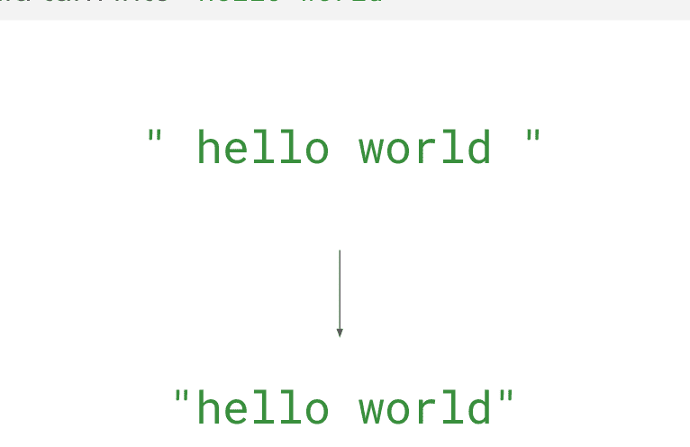

解决方案：使用内置的 `strip` 函数来清理字符串的两端。
我们来看看语法。

```
dirtystring = "       hello world.       "
cleanstring = dirtystring.strip()
print(cleanstring) # prints "hello world."
```


```
hello world.
```

那么，发生了什么？Python 的内置 `strip` 函数接收了我们那个在内容前后有很多空白字符的字符串，并将其清理干净。这是如何工作的呢？

### 描述
返回字符串的一个副本，其中开头和结尾的字符已被移除。

## 语法

`str.strip(chars)`

### str
要被处理的字符串。

### chars
可选。指定要移除的字符集的字符串。如果省略或为 `None`，则 `chars` 参数默认移除空白字符。`chars` 参数不是前缀；而是其值的所有组合都会被移除。

## 示例 #1

通过不给 `strip` 函数传递任何参数，我们可以移除内容两侧的空白字符。请看下面。

```
my_str = "           I'm a code hero!       "
clean_str = my_str.strip()
print(clean_str) # prints I'm a code hero!
```

```
I'm a code hero!
```

## 示例 #2

通过将其他字符作为参数传递给 `strip` 函数，我们可以移除内容两侧的这些字符。请看下面。

```
my_str = "____I'm a code hero!____"
clean_str = my_str.strip("_")
print(clean_str) # prints I'm a code hero!
```

```
I'm a code hero!
```

## 示例 #3

我们可以在 `chars` 参数中提供多个字符——这会移除 `chars` 字符串中位于我们字符串开头和结尾处的任何字符。

```
my_str = "_!-= >I'm a code hero! <=-_!"
clean_str = my_str.strip(" _!-=<>")
print(clean_str) # prints I'm a code hero!
```


```
I'm a code hero!
```

## zip 的作用是什么？

假设在学校里，你的班级和另一个班级配对完成一个学校项目。如果我们有一个包含两个班级所有学生的列表或元组，我们可以使用 **zip** 函数来创建班级内的配对！

> **问题**

我们想要使用班级列表在两个班级之间创建配对。
我们如何轻松地将不同的学生配对起来？

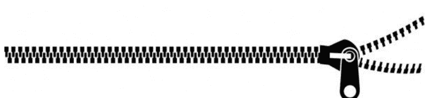

解决方案：使用内置的 `zip` 函数在两个班级列表之间创建配对。我们来看看语法。

```
classOne = ["Steven", "Rebecca", "Rachel", "Abir", "Michel"]
classTwo = ["Adam", "Raquel", "Mason", "Rahul", "David"]

pairings = zip(classOne, classTwo) # returns zip object

print(list(pairings)) # print list version of zip object
```

```
[('Steven', 'Adam'), ('Rebecca', 'Raquel'), ('Rachel', 'Mason'), ('Abir', 'Rahul'), ('Michel', 'David')]
```

Python 的 `zip` 函数接收两个或多个可迭代对象（如列表等），并将它们配对或分组为元组。它基本上把它们都“拉链”在一起了！

### 描述
返回一个元组列表，其中第 i 个元组包含来自每个参数序列的第 i 个元素。

## 语法
`zip([iterables, ...])`

### iterables
你希望被拉链在一起的可迭代对象。

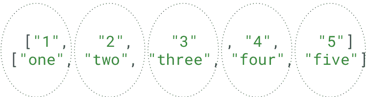

## 示例 #1

我们可以使用 `zip` 函数将两个可迭代对象（例如列表）拉链在一起。

```
nums = ["1", "2", "3", "4", "5"]
numbers = ["one", "two", "three", "four", "five"]

pairings = zip(nums, numbers) # returns zip object

print(list(pairings)) # print list version of zip object
```


```
[('1', 'one'), ('2', 'two'), ('3', 'three'), ('4', 'four'), ('5', 'five')]
```

## 示例 #2

当其中一个可迭代对象的元素多于另一个时，配对只进行到最短可迭代对象的长度。

```
nums = ["1", "2", "3", "4", "5", "6", "7"]
numbers = ["one", "two", "three", "four", "five"]

pairings = zip(nums, numbers) # returns zip object

print(list(pairings)) # print list version of zip object
```


```
[('1', 'one'), ('2', 'two'), ('3', 'three'), ('4', 'four'), ('5', 'five')]
```

## 示例 #3

我们也可以将两个以上的可迭代对象拉链在一起，每个元组包含的元素数量与我们传给 `zip` 的可迭代对象数量相同。

```
nums = ["1", "2", "3", "4", "5", "6", "7"]
numbers = ["one", "two", "three", "four", "five"]
third = ["uno", "dos", "tres", "cuatro"]

groups = zip(nums, numbers, third) # returns zip object

print(list(groups)) # print list version of zip object
```


```
[('1', 'one', 'uno'), ('2', 'two', 'dos'), ('3', 'three', 'tres'), ('4', 'four', 'cuatro')]
```

## 练习 #1：数字

创建一个程序，该程序接受用户输入的数字 1 到 20，这些数字作为以空格分隔的单个字符串输入。然后逐个打印出每个数字。

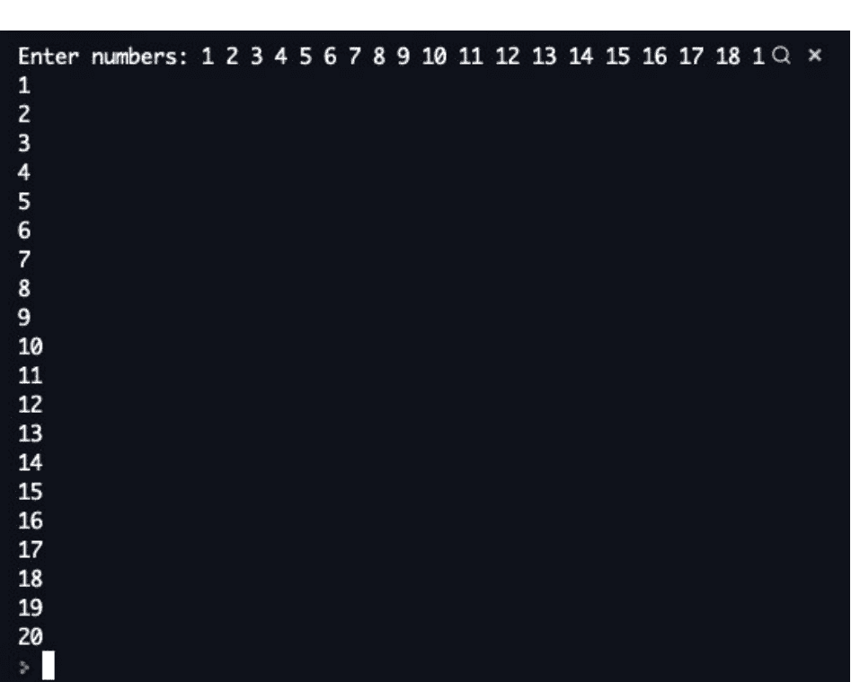

## 练习 #1：数字 答案

我们通过使用 split 函数（默认/无参数）按空格分割用户输入字符串来解决这个问题。然后，我们使用 for 循环打印列表中的每个单独数字。

```
numstr = input("Enter numbers: ")

numlist = numstr.split()

for num in numlist:
    print(num)
```

## 练习 #2：替换空格！

仅使用字符串函数，将以下句子中的每个空格替换为下划线（_）。

```
"The quick brown fox jumped over the lazy dog"
to
"The_quick_brown_fox_jumped_over_the_lazy_dog"
```

## 练习 #2：替换空格！ 答案

要将空格替换为下划线，我们使用 split 函数按句子中的空格进行分割。然后我们使用 join 函数，并以“_”作为分隔符。

```
string = "The quick brown fox jumped over the lazy dog"

words = string.split()

print("_".join(words))
```

## 练习 #3：计算器

这个问题的目标是创建一个程序，允许用户以字符串形式输入一个包含两个数字的数学表达式，然后你打印出结果。

用户可以使用任何数学运算符，包括 +、-、/、*。

例如：

```
Enter your math expression: 42 * 6
Result: 252
```

## 练习 #3：计算器 答案

```
exp = input("Enter an expression: ")
expElements = exp.split()
if(expElements[1] == "+"):
    print(int(expElements[0]) + int(expElements[2]))
elif(expElements[1] == "-"):
    print(int(expElements[0]) - int(expElements[2]))
elif(expElements[1] == "*"):
    print(int(expElements[0]) * int(expElements[2]))
elif(expElements[1] == "/"):
    print(int(expElements[0]) / int(expElements[2]))
elif(expElements[1] == "%"):
    print(int(expElements[0]) % int(expElements[2]))
elif(expElements[1] == "**"):
    print(int(expElements[0]) ** int(expElements[2]))
else:
    print("invalid operator!")
```

## 练习 #4：好友列表

给定以下字符串，仅使用字符串函数，将其转换为如下所示的名字字符串：

```
text
"1.Alex!>>2.Max!<>,3.Jack?<<,4.Rachel.$$$$,5.Abir^&*"
```


```
text
"Alex and Max and Jack and Rachel and Abir"
```

## 练习 #4：好友列表 答案

我们通过使用 split 函数在逗号处分割字符串来解决这个问题。然后，我们使用 for 循环来去除每个字符串中的给定字符。最后，我们使用 join 函数将所有部分重新组合在一起，并以单词“and”（两边各带一个空格）作为分隔符。

```
string = "1.Alex!>>,2.Max!<> ,3.Jack?<,4.Rachel.$$$$ ,5.Air^&*"
lst = string.split(",")
for i in range(len(lst)):
    lst[i] = lst[i].strip("!?<>0123456789.$*^")
print(" and ".join(lst))
```

## 练习 #5：合并单词！

在这个问题中，你的程序应该接受用户输入的**两个单词**，然后返回合并后的单词，合并方式为交替排列字母。

例如，如果用户给出的单词是“hello”和“world”，程序应该返回 hweolrllod。

```
Enter word 1: hello
Enter word 2: world
hweolrllod
```

## 练习 #5：合并单词！ 答案

在这个问题中，你的程序应该接受用户输入的**两个单词**，然后返回合并后的单词，合并方式为交替排列字母。

例如，如果用户给出的单词是“hello”和“world”，程序应该返回 hweolrllod。

```
str1 = input("Enter word 1: ")
str2 = input("Enter word 2: ")

zipper = list(zip(str1,str2))

result = ""
for tup in zipper:
    for i in range(2):
        result += tup[i]

print(result)
```

## 练习 #6：电子邮件

假设我们有一个程序，允许你给别人写一封电子邮件。它接受用户输入，并希望你只输入一个符合以下规范的字符串：

- 第一个词：收件人
- 第二个词：发件人
- 其余部分：邮件正文

```
Welcome to Gmail!
Email string format:
"to from [everything else in the email]"

johndoe@gmail.com johnappleseed@gmail.com hey john, nice name!
--------------------------------------------------
To: johndoe@gmail.com
From: johnappleseed@gmail.com

hey john, nice name!
--------------------------------------------------
> []
```

# 第 12 章

## 切片

## 切片

### 总结

在本节课中，我们将讨论数据处理中一个非常有用的主题 - 切片。切片是 Python 中一个灵活的工具，它允许你通过对现有字符串、列表和元组进行部分提取、重新排序和重组来创建新的字符串、列表和元组。切片可以应用于 Python 中任何序列数据！例如：列表、字符串、元组、字节数组、字节和范围。其他数据类型也可以变得兼容！

### 目标

学生们将把切片添加到他们的编码工具包中，并在需要时准确地知道何时使用它。

### 词汇

-   子串：从索引 a 开始到索引 b 结束的字符串部分。
-   切片：Python 字符串操作工具的名称。

## 什么是切片？

### 现实案例：

如果我们有一个字符串表示老师的全名，而我们只想取他们的名字部分来制作问候语，该怎么办？

例如：你的老师的名字是 **"Rachel Fuller"**，而你只想让 Python 写出 **"Good morning, Rachel!"**

我们如何只从字符串中取出名字？

或者，假设我们有一个**列表**或**元组**，我们想反转它或取其中一部分。

例如：
我们有班级所有考试的分数，并想制作一个**前5名分数**列表。

我们如何只引用前5个分数？

## 什么是切片？

### 现实案例：


### 欢迎来到切片世界

我们可以使用**切片**来解决这个确切的问题！

切片将允许我们在字符串、列表或元组中指定起始和结束索引，并从中创建一个新的！

- 我们可以非常轻松地将“Rachel Fuller”变成“Rachel”！
- 我们也可以非常、非常轻松地将一个排好序的班级考试分数列表变成前5名的分数！


## 什么是切片？续

### 现实案例：

那么，具体的语法是什么样的呢？我们在 Python 中该如何写呢？

很简单。来看一下！

```python
teacher = "Rachel Fuller"

# We want to make a greeting string for her just using
# her last name: Mrs. Fuller

first_name = teacher[0:6]
print("Good morning,", first_name)
```

## 什么是切片？续

### 现实案例：

回到**前5名考试分数列表的例子**。如果我们有一个按从高到低排序的班级所有考试分数列表，我们可以使用**切片**来截取前5名！

很简单。来看一下！

```python
# test scores, ordered highest to lowest
testscores = [99, 93, 92, 88, 75, 63, 62, 55, 55, 47, 36, 34]

# slice the first 5 as top 5 scores
topfive = testscores[0:5]

print(topfive)
```

好的，刚才发生了什么？让我们在下一页更详细地看看。

## 切片语法

在第一个例子中，我们能够截取全名字符串的一部分，只取我们老师的名字。让我们看看语法：

```
first_name = teacher[0:6]
```

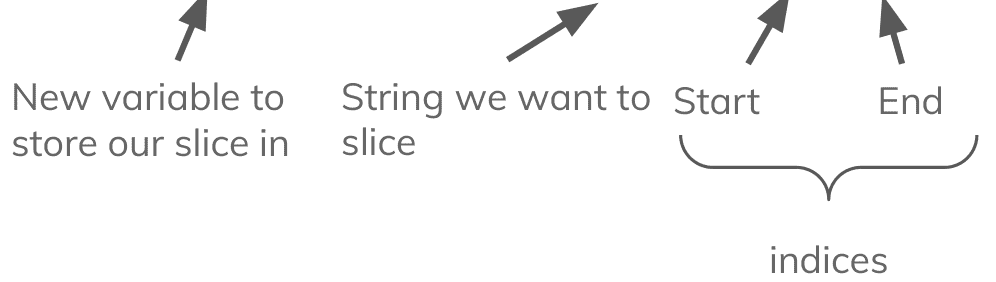

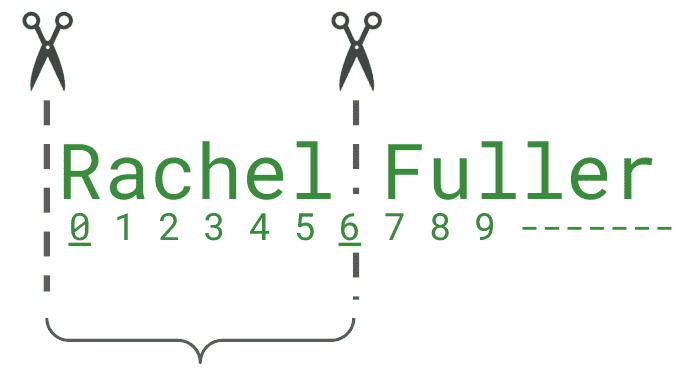

## 切片语法

在第二个例子中，我们能够截取班级考试分数的前5名高分。让我们看看语法：

```
topfive = testscores[0:5]
```

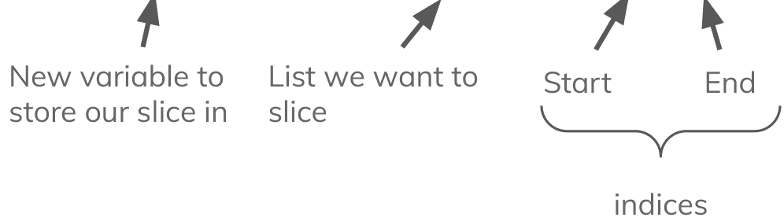

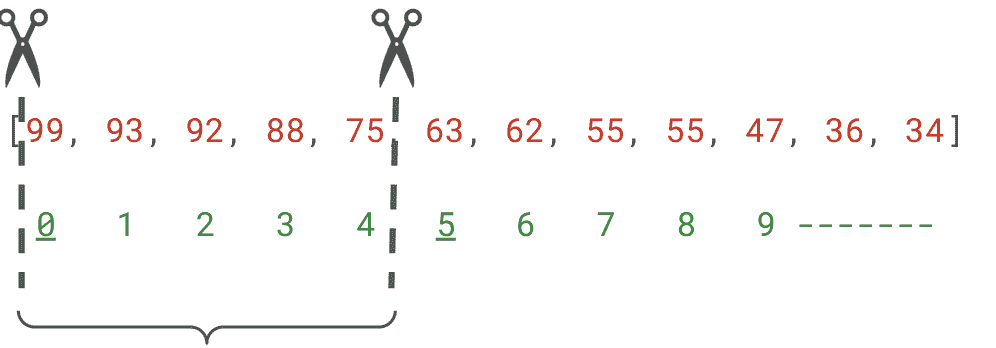

## 切片语法详解

这里更深入地探讨了字符串切片背后的语法

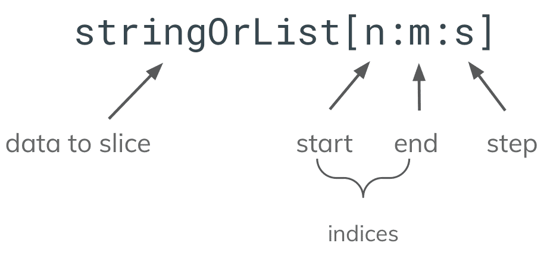

> **词汇**

**要切片的数据：** 你要切片的集合

**起始：** 切片/子串的起始索引。包含在内。

**结束：** 切片/子串的结束索引。**不**包含在内。

**步长：** 两个索引之间的增量。默认值为 1。

## 切片语法（续）

### 快捷方式

-   以 `:` 开头表示从字符串起始位置开始
-   以 `:` 结尾表示到字符串末尾结束
-   单独使用 `:` 表示整个字符串/集合
-   **负数**从字符串/集合的末尾开始索引
    -   例如：-1 是最后一个字符

```
teacher = "Rachel Fuller"

firstname = teacher[:6] # Rachel
lastname = teacher[7:]  # Fuller
fullname = teacher[:] # Rachel Fuller
nolastletter = teacher[:-1] # Rachel Fulle
```

## 负索引

在 Python 索引中，一个实用的技巧是使用**负数**从集合或字符串的末尾开始索引。例如，如果我们只想从完整姓名字符串中获取某人的姓氏，从后往前数可能比从前往后数更容易。

例如，我们可以编写索引 -6 来引用字母 F

```
teacher = "Rachel Fuller"

lastname = teacher[-6:]

greeting = "Good morning, Ms. " + lastname

# 输出 "Good morning, Ms. Fuller"
```

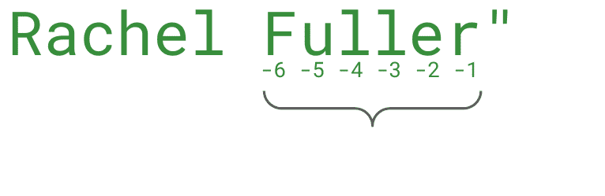

## 其他数据类型

在 Python 中，切片不仅限于字符串和列表。切片可用于任何顺序数据类型。这包括范围、列表、字符串、元组、字节、字节数组等。任何新的数据结构都可以通过一点帮助来使用切片！

```python
# 对范围使用切片！
zerotofifty = range(51)

zerototwenty = zerotofifty[:21]

# 对元组使用切片！
mytuple = ("Rachel Fuller", 28, "April 26", "Red")

nameage = mytuple[:2]

# 打印它们
print(zerototwenty)
print(nameage)
```

## 切片对象

在 Python 中，我们可以在方括号中编写切片索引，如 `teacher[0:6]`，但我们也可以创建一个包含切片所有信息的切片对象，然后将其放入方括号中。

要省略起始值、结束值或步长，可以用 `None` 关键字替代。

```python
my_slice = slice(0,6)
reverse_slice = slice(6, None, -1)
teacher = "Rachel Fuller"
firstname = teacher[my_slice]
reversename = teacher[reverse_slice]
print(firstname) # 输出 Rachel
print(reversename) # 输出 lehcaR
```

## 练习时间

### 填空！

```
PRACTICE

my_string = "hello, world. I'm a programmer!"

my_string[_:_] == "hello,"
my_string[_:_] == "I'm a programmer!"
my_string[_:_] == "world."
my_string[_:_] == "hello, world. I'm a programmer"
my_string[_:_] == "hello, world. I'm a programmer!"
my_string[_:_] == "mer!"
my_string[_:_] == ", world."
```

## 练习时间 答案

### 填空！

```python
my_string = "hello, world. I'm a programmer!"

my_string[0:6] == "hello,"
my_string[14:] == "I'm a programmer!"
my_string[7:13] == "world."
my_string[:-1] == "hello, world. I'm a programmer"
my_string[:] == "hello, world. I'm a programmer!"
my_string[-4:] == "mer!"
my_string[5:13] == ", world."
```

## 步长值

现在我们已经掌握了前两个数字，是时候学习最后一个数字了：**步长**。步长表示新切片中每个值之间的索引差。

```
`my_string[n:m:s]`
```

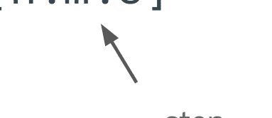

使用步长数字，我们可以做很多事！我们可以让它使用每隔一个元素、每隔第三个元素，甚至可以通过使用负数来反转切片！看看吧


## 步长值（续）

让我们看几个步长值的示例：

```python
teacher = "Rachel Fuller"

backwardsteps = teacher[::-1] # "relluF lehcaR"
twosteps = teacher[::2] # "Rce ulr"
threesteps = teacher[::3] # "Rh lr"

alltogether = teacher[-1:6:-1] # "relluF"
alltogetheragain = teacher[0:6:2] # "rce"
```

从这些例子可以看出，步长值功能非常强大！它让我们在切片时能够真正实现更高阶的**控制**！

## 练习 1：只输出奇数！

给定一个包含数字 0 到 9 的字符串，使用切片打印出其中所有的奇数。

```
nums = "0123456789" # 数字 0 到 9

# 我们如何只打印奇数？
```

记住，步长值对于这类任务非常有用！

## 练习 1：只输出奇数！答案

我们使用切片从第一个奇数（索引 1）开始，步长值为 2 以跳过其他数字。

```python
nums = "0123456789"

oddnums = nums[1::2]

print(oddnums)
```

## 练习 2：5 的倍数

给定一个包含数字 0 到 100 的列表或范围，使用切片只打印出 5 的倍数。例如：5, 10, 15, 20 等。

**提示：** 不要手动将数字 0 到 100 添加到列表中，尝试使用 `list(range(101))` 来为你生成列表。

```python
zerotohundred = list(range(101))

# 使用切片打印所有 5 的倍数。不要包含 0。
```

## 练习 2：5 的倍数 答案

我们通过创建一个从 0 到 100 的范围来生成 0 到 100 的列表。然后将其转换为列表。一旦我们有了 0 到 100 的数字列表，我们就可以使用切片来只挑选出 5 的倍数。

我们通过从第一个倍数（索引 5，就是 5）开始，并使用步长值为 5 来挑选出 5 的倍数。

```python
nums = list(range(101)) # 创建我们的数字 0 到 100 的列表
onlyfives = nums[5::5]
print(onlyfives)
```

这会打印出所有 5 的倍数。所以，

[5, 10, 15, 20, 25, 30, 35, ... 等等。

## 练习 3：填空：步长版！

填空，使以下陈述成立。

```
my_string = "hello, world. I'm a programmer!"
my_string[_:_:_] == "hlo ol.Imaporme!"
my_string[_:_:_] == "!remmargorp a m'I .dlrow ,olleh"
my_string[_:_:_] == "olleh"
my_string[_:_:_] == "remmargorp"
my_string[_:_:_] == "I'm a programmer!"
my_string[_:_:_] == "drw,"
my_string[_:_:_] == "hlo ol.Imapo"
my_string[_:_:_] == "h,l'pa!"
my_string[_:_:_] == "pgmr"
```

## 练习 3：填空：步长版！答案

填空，使以下陈述成立。

```
my_string = "hello, world. I'm a programmer!"
my_string[0::2] == "hlo ol.Imaporme!"
my_string[::-1] == "!remmargorp a m'I .dlrow ,olleh"
my_string[4::-1] == "olleh"
my_string[-2:-11:-1] == "remmargorp"
my_string[14:] == "I'm a programmer!"
my_string[11:4:-2] == "drw,"
my_string[:-8:2] == "hlo ol.Imapo"
my_string[::5] == "h,l'pa!"
my_string[-11::3] == "pgmr"
```

## 练习 4：字符串切片程序

编写一个程序，要求用户输入一个字符串以及如何对给定字符串进行切片。

```
请输入一个字符串: hello world
输入起始索引（留空则使用默认值）: 0
输入结束索引（留空则使用默认值）: 5
输入步长值（留空则使用默认值）: 2
hlo
> _
```

**额外要求：** 让它能够接受空白答案作为切片值。例如：[::3]

别忘了处理默认情况！例如，如果他们没有输入起始和结束值，那就等同于整个字符串！

## 练习 4：字符串切片程序 答案

首先，我们获取用户输入的字符串和切片信息。接下来我们使用切片信息创建一个切片对象——在其中我们使用三元运算符来处理哪些字段被留空。然后我们对字符串使用该切片对象并打印结果。

```python
userinput = input("请输入一个字符串: ")
start = input("输入起始索引（留空则使用默认值）: ")
end = input("输入结束索引（留空则使用默认值）: ")
step = input("输入步长值（留空则使用默认值）: ")

wordslice = slice(int(start) if start else None, int(end) if end else None, int(step) if step else None)

output = userinput[wordslice]

print(output)
```

## 练习 5：列表切片程序

修改你的字符串切片程序，使其兼容列表。修改你的程序，使其询问用户想要处理字符串还是列表。

如果用户选择列表，他们应该能够输入用空格分隔的数字或字母作为列表项。要将此字符串转换为列表，只需使用 `split()` 函数。

参见下面的示例。

```
欢迎使用切片器！
字符串还是列表？: 列表
输入你的列表项（用空格分隔）: 10 20 30 40 50 60 70
输入切片的起始索引: 0
输入切片的结束索引: 3
输入切片的步长: 1
['10', '20', '30']
```

## 练习5：列表切片程序答案

```python
stringorlist = input("String or list?: ")
listInput = []
stringInput = ""

# 字符串
if stringorlist.lower() == "string":
    stringInput = input("Enter a string: ")
    start = input("Enter the start (empty for default): ")
    end = input("Enter the end (empty for default): ")
    step = input("Enter the step (empty for default): ")

    wordslice = slice(int(start) if start else None, int(end) if end else None, int(step) if step else None)

    output = stringInput[wordslice]

    print(output)

# 列表
elif stringorlist.lower() == "list":
    listInput = input("Enter a list with each element separated by space: ").split()

    start = input("Enter the start (empty for default): ")
    end = input("Enter the end (empty for default): ")
    step = input("Enter the step (empty for default): ")

    wordslice = slice(int(start) if start else None, int(end) if end else None, int(step) if step else None)

    output = listInput[wordslice]

    print(output)

# 输入错误
else:
    print("Error, incorrect answer!")
```

# 第13章

# 推导式

## 课程：推导式

### 总结

在本课中，我们将讨论一种更优雅的方式来创建列表、集合和字典——全部在一行代码中完成！推导式是Python中的一种工具，它允许我们基于现有列表的值创建一个新的列表。

### 目标

学生将学习如何使用推导式更优雅地创建列表、集合和字典。学生还将理解在创建新的列表、集合和字典时，何时最适合使用推导式。

### 词汇

- **推导式：** Python中从其他列表创建新列表、集合和字典的简写方式

## 什么是推导式？

描述它们是什么的最佳方式是描述它们最有帮助的情境。推导式是创建新集合的简写方式，所以让我们先看看传统的方法。

**目标：** 从现有列表创建一个填充了数字的新列表

```
nums = [1, 2, 3, 4, 5]
newlst = []
# 我想要 nums 中每个 'n' 的 'n'
for num in nums:
    newlst.append(num)

print(newlst)
# 打印 [1, 2, 3, 4, 5]
```

为了解决这个问题，我们创建了一个**空列表**，并使用**for循环**将每个新项目**追加**到列表中。

我们如何缩短这个过程？嗯，Python包含一个很好的方法，叫做“推导式”。这允许我们用一行代码完成完全相同的事情。

```
nums = [1, 2, 3, 4, 5]

'''
newlst = []
# 我想要 nums 中每个 'n' 的 'n'
for num in nums:
    newlst.append(num)
'''

# 我想要 nums 中每个 'n' 的 'n'
newlst = [n for n in nums]

print(newlst)
# 打印 [1, 2, 3, 4, 5]
```

## 语法

这起初可能看起来有点令人困惑——让我们更仔细地看看语法，以便我们了解如何制作任何我们想要的推导式。

```
newlist = [expression for item in iterable if condition == True]
```

```
fruits = ["apple", "banana", "cherry", "kiwi", "mango"]
newlist = [x for x in fruits if "a" in x]
print(newlist)
# 打印 ["apple", "banana", "mango"]，因为它们都包含 'a'
```

## 我们还能用它们做什么？

假设我们想从 **lst** 中取出每个项目并对其进行平方。我们该怎么做？推导式让这变得很容易！

```
newlst = [n**2 for n in nums]
```

这会对 nums 中的每个项目进行平方，并将其放入新列表中！

```
nums = [1, 2, 3, 4, 5]

# 我想要 nums 中每个 'n' 的 n 的 2 次方
newlst = [n**2 for n in nums]

print(newlst)
# 打印 [1, 4, 9, 16, 25]
```

我们也可以使用推导式和 **range** 从头开始生成一个列表。这样，我们就不需要有一个初始列表来创建。

```
mylst = [n for n in range(100)]
```

让我们增加一点趣味，只使用偶数而不是奇数。通过添加一个条件，我们可以实现这一点！

```
mylst = [n for n in range(100) if n%2 == 0]
```

## 推导式中的条件

我们也可以使用条件来过滤我们正在从中创建列表的项目。例如，如果我们只想添加小于10的数字呢？

```
under_ten = [n for n in nums if n < 10]
```

通过在末尾添加一个条件，我们能够过滤被放入新列表的项目。

```
nums = [1, 7, 22, 3, 16, 233, 9]

# 我想要 nums 中每个 'n' 的 'n'，如果 'n' 小于 10
under_ten = [n for n in nums if n < 10]

print(under_ten)

# 打印 [1, 7, 3, 9]
```

## 推导式中的嵌套For循环

我们也可以在推导式中使用多个for循环——下面我们将使用一个**嵌套for循环**来创建两个团队之间的不同配对！

```python
team1 = ['Drew', 'Alex']
team2 = ['Rachel', 'Ari']

pairings = [(x,y) for x in team1 for y in team2]

print(pairings)

# 打印 [('Drew', 'Rachel'), ('Drew', 'Ari'),
# ('Alex', 'Rachel'), ('Alex', 'Ari')]
```

## 让我们试试看！

让我们尝试制作我们自己的推导式，并从这个给定的数字列表中创建一个列表！

- 创建一个包含数字1到10的普通列表
- 使用该列表，使用推导式创建一个所有元素乘以2的新列表
- 打印新列表


## 让我们试试看！答案

我们可以通过使用以下推导式来做到这一点——指定我们想要将每个数字乘以2。

```python
lst = [1, 2, 3, 4, 5, 6, 7, 8, 9, 10]

newlist = [n*2 for n in lst]

print(newlist)
```


## 集合推导式

我们也可以将推导式用于集合——唯一的区别是我们使用**花括号**而不是**方括号**。

假设我们想获取一个单词中所有唯一字母的集合——我们可以使用集合推导式来做到这一点！

```python
mywords = "hello world"

letters = {letter for letter in mywords}

print(letters)

# 打印 {'h', 'r', ' ', 'o', 'w', 'l', 'd', 'e'}
```

## 字典

字典也可以使用推导式制作。让我们从制作一个重复的字典开始。我们所要做的就是使用**花括号**并给出一个**键**和一个**值**。

```python
thisdict = {
  "brand" : "Ford",
  "model" : "Mustang"
}

dupldict = {key : val for (key,val) in thisdict.items()}

print(dupldict)

# 打印 {'brand': 'Ford', 'model': 'Mustang'}
```

如果我们想从一个列表创建一个字典呢？例如，一个平方数字典。

```python
mylst = [1, 2, 3, 4, 5]

# 传统方法
squaredict = dict()

for num in mylst:
    squaredict[num] = num**2

# 推导式
squaresdict = {n : n**2 for n in mylst}
```

## 练习1：小于50的集合

让我们尝试制作我们自己的推导式，并从这个给定的数字列表中创建一个列表！

- 创建一个包含0到100之间随机数字的普通列表，其中包含一些重复项
- 使用集合推导式，创建一个仅包含列表中小于50的数字的集合。
- 打印结果


## 练习1：小于50的集合 答案

```python
lst = [1, 63, 52, 33, 76, 76, 52, 15, 15, 23, 58, 48]

comp = {n for n in lst if n < 50}

print(comp)
# 打印 {1, 33, 15, 48, 23}
```


## 练习2：修复代码

修复以下代码，使其按预期工作。

```python
mylst = [n for x in range(100]

doubles = (x*2 for x in lst)

evendoubles = (n for n in doubleslst, if n%2 = 0)

print(evendoubles)
```


## 练习2：修复代码 答案

修复以下代码，使其按预期工作。

```python
mylst = [n for n in range(100)]
doubles = [n*2 for n in mylst]
evendoubles = [n for n in doubles if n%2 == 0]
print(evendoubles)
```

# 更多练习！

请为以下内容创建理解练习：

1.  一个字典，键为1到100，值为键的平方
2.  一个集合，包含字符串 'Hello World' 中所有不重复的字母
3.  一个列表，包含1000以下的所有偶数
4.  一个列表，包含以下颜色的所有配对组合：
    a. 集合1：红色、橙色、黄色
    b. 集合2：绿色、蓝色、紫色
5.  一个列表，包含此字典中所有价格低于5美元的食品杂货
    a. {"eggs": 2.50, "chicken": 5.65, "bread": 1.50, "veggies": 3.50, "snack mix": 7.99, "gourmet cheese": 10.15}

# 更多练习！答案

```
# 问题 1
squares = {n : n**2 for n in range(100)}

# 问题 2
uniqueletters = {letter for letter in 'Hello World'}

# 问题 3
evenunder1000 = [n for n in range(1000) if n%2 == 0]

# 问题 4
colors1 = {'Red', 'orange', 'yellow'}
colors2 = {'green', 'blue', 'purple'}

pairings = [(color1, color2) for color1 in colors1
            for color2 in colors2]

# 问题 5
groceries = {"eggs": 2.50, "chicken": 5.65, "bread": 1.50,
             "veggies": 3.50, "snack mix": 7.99, "gourmet cheese": 10.15}

under5 = [grocery for grocery in groceries if groceries[grocery] < 5]
```

# 结语

恭喜你完成了《人人皆宜的Python轻松入门》第一部分！在本节中，你学习了Python编程的基础知识，包括变量、输入、类型转换、字符串、算术运算、比较运算、逻辑运算符、if语句、while循环、列表、元组以及range函数。我们希望你喜欢这本书，并发现它在你提升Python技能的探索中有所帮助。

在本书系列的第二部分（即将推出）中，你将学习一些更深入的Python编程概念，包括模块、文件和库。这些概念对于使用Python执行有用且有趣的事情至关重要。模块是可以在其他程序中使用的函数和变量的集合。它们允许你重用代码，使你的程序更具模块化且更易于维护。文件用于存储数据和代码，Python程序可以对其进行读写操作。库是模块的集合，为你的程序提供额外的功能。

我希望你继续享受阅读《人人皆宜的Python轻松入门》，并希望它能帮助你与Python编程艺术建立一种轻松而欣赏的关系。编程快乐！🐍