# 计算物理系列丛书

## 基于 Python 模拟的电动力学教程

Taejoon Kouh
Minjoon Kouh

## 基于 Python 模拟的电动力学教程

本书以易于理解的方式，介绍了中级水平的电动力学，并运用计算方法补充了传统的数学处理方式。书中涵盖了电动力学的核心主题，例如电磁场、力、势、波以及狭义相对论。

通过直观的示例和使用 Python 编程语言进行的可视化，本书帮助读者培养在数值与符号计算、建模仿真及可视化方面的技术计算能力。Python 是一种高度可读且实用的编程语言，使得本书适合没有丰富编程经验的学生阅读。

本书可作为电动力学教材，适用于正在学习中级或高级电动力学，并希望同时学习科学计算技巧的本科二、三年级物理与工程专业学生。本书也适合计算机科学专业的学生，他们希望在不依赖过多物理背景知识的情况下，了解如何将编程技能应用于科学，特别是物理学领域。

**主要特点**

-   通过计算与数学处理，系统性地介绍了经典电动力学的主要概念。
-   基于 Python 编程语言的计算示例，指导学生如何自主模拟和可视化电动力学原理与现象。

**Taejoon Kouh** 是韩国国民大学纳米与电子物理学教授。他于波士顿大学获得物理学学士学位，并于布朗大学获得物理学硕士与博士学位。在罗德岛州普罗维登斯完成学业后，他返回马萨诸塞州波士顿，在波士顿大学航空航天与机械工程系担任博士后研究助理。现为韩国首尔国民大学纳米与电子物理学系正式教员，从事本科及研究生的教学与指导工作。他的研究领域涉及纳米机电系统动力学，以及基于微小运动的快速可靠换能方法与创新应用的开发。

**Minjoon Kouh** 是一位慈善项目科学家。他曾任美国德鲁大学物理学与神经科学教授，在此期间教授过30多门不同课程。他拥有麻省理工学院物理学博士学位和学士学位，以及加州大学伯克利分校文学硕士学位。他曾在加州拉霍亚的索尔克生物研究所完成博士后研究。他的研究包括灵长类视觉皮层的计算建模、神经反应的信息理论分析、机器学习，以及本科科学教育的教学创新。

# 计算物理系列丛书

丛书编辑：Steven A. Gottlieb 和 Rubin H. Landau

**并行科学与工程应用：The Charm++ 方法**
*Laxmikant V. Kale, Abhinav Bhatele*

**数值编程入门：使用 Python 和 C/C++ 的科学家与工程师实践指南**
*Titus A. Beu*

**物理学计算问题：使用 Python 的引导式解决方案**
*Rubin H. Landau, Manuel José Páez*

**面向科学与工程的 Python 入门**
*David J. Pine*

**基于 Python 模拟的热物理教程**
*Minjoon Kouh and Taejoon Kouh*

**基于 Python 模拟的电动力学教程**
*Taejoon Kouh and Minjoon Kouh*

欲了解本系列丛书的更多信息，请访问：[https://www.crcpress.com/Series-in-Computational-Physics/book-series/CRCSERCOMPHY](https://www.crcpress.com/Series-in-Computational-Physics/book-series/CRCSERCOMPHY)

## 基于 Python 模拟的电动力学教程

Taejoon Kouh and Minjoon Kouh

CRC Press
Taylor & Francis Group
Boca Raton London New York

CRC Press 是 Taylor & Francis 集团旗下品牌
Taylor & Francis 集团， informa 旗下企业

封面设计图像：Taejoon Kouh and Minjoon Kouh
第一版于 2024 年出版
由 CRC Press 出版
地址：2385 NW Executive Center Drive, Suite 320, Boca Raton FL 33431
同时由 CRC Press 出版
地址：4 Park Square, Milton Park, Abingdon, Oxon, OX14 4RN
*CRC Press 是 Taylor & Francis Group, LLC 旗下品牌*
© 2024 Taejoon Kouh and Minjoon Kouh

我们已尽合理努力确保所发布数据和信息的可靠性，但作者和出版商无法对所有材料的有效性或使用后果承担责任。作者和出版商已尽力追踪本出版物中所有转载材料的版权持有者，如果未获得以本形式出版的许可，特向版权持有者致歉。如有任何版权材料未被致谢，请来信告知，以便我们在未来的再版中予以更正。

除美国版权法允许的情况外，未经出版商书面许可，不得以任何电子、机械或其他方式（无论现已发明或今后发明）对本书任何部分进行重印、复制、传播或利用，包括影印、缩微拍摄和录音，或任何信息存储或检索系统。

如需获取许可以影印或电子方式使用本作品中的材料，请访问 [www.copyright.com](http://www.copyright.com) 或联系版权结算中心（CCC），地址：222 Rosewood Drive, Danvers, MA 01923, 978-750-8400。对于 CCC 上未提供的作品，请联系 mpkbookspermissions@tandf.co.uk

*商标声明：* 产品或企业名称可能是商标或注册商标，仅用于识别和解释，无侵犯意图。

## 美国国会图书馆编目出版数据

姓名：Kouh, Taejoon, 作者。| Kouh, Minjoon, 作者。
题名：基于 Python 模拟的电动力学教程 / Taejoon Kouh and Minjoon Kouh。
描述：第一版。| Boca Raton, FL : CRC Press, 2024。| 包含参考文献和索引。| 摘要：“本书以易于理解的方式介绍了中级水平的电动力学，并运用计算方法补充了传统的数学处理方式。它涵盖了电动力学的核心主题，例如电磁场、力、势、波以及狭义相对论。
标识符：LCCN 2023048007 | ISBN 9781032498034 (精装) | ISBN 9781032502311 (平装) | ISBN 9781003397496 (电子书)
主题：LCSH: 电动力学--教科书。| 电动力学--数学模型--教科书。| 电动力学--计算机模拟--教科书。| Python (计算机程序语言)--教科书。
分类：LCC QC631 .K68 2024 | DDC 537.60285/5133--dc23/eng/20231229
LC 记录可在 [https://lccn.loc.gov/2023048007](https://lccn.loc.gov/2023048007) 获取

ISBN：978-1-032-49803-4 (精装)
ISBN：978-1-032-50231-1 (平装)
ISBN：978-1-003-39749-6 (电子书)
DOI：[10.1201/9781003397496](https://doi.org/10.1201/9781003397496)
SFRM1000 字体排版
KnowledgeWorks Global Ltd. 制作

*出版者注：* 本书由作者提供的定稿副本编制而成。

献给我们的家人，Sarah, Chris, Cailyn, and Yumi

## Taylor & Francis

Taylor & Francis Group

http://taylorandfrancis.com

## 目录

前言 xi

关于作者 xiii

致谢 xv

第 1 章 ■ 丘陵与山谷 1

1.1 使用 Python 创建一系列数值 1

1.2 高斯景观 6

第 2 章 ■ 向量 14

2.1 使用 Python 绘制向量 15

2.2 向量乘积 16

2.3 向量分解 18

2.4 向量微积分 20

2.5 ∇ 的附加运算 23

第 3 章 ■ 向量场 25

3.1 简单向量场 25

3.2 通量 29

3.3 通量计算 34

3.4 通过封闭面的通量 41

3.5 一个特殊的向量场 53

## 目录

- 第4章 ■ 电场
  - 4.1 电荷与库仑定律 61
  - 4.2 叠加原理 64
  - 4.3 示例：无限长线电荷 67
  - 4.4 示例：圆环 73
  - 4.5 高斯定理 82
  - 4.6 高斯定理的数值验证 89
  - 4.7 再论线电荷与圆环 95
  - 4.8 三维空间中的电场 100
  - 4.9 散度 101
  - 4.10 再论高斯定理 102

- 第5章 ■ 磁场
  - 5.1 电流与毕奥-萨伐尔定律 104
  - 5.2 安培定律 122
  - 5.3 一个警示性例子 129
  - 5.4 示例：粗导线 131
  - 5.5 旋度 142
  - 5.6 再论安培定律 154

- 第6章 ■ 力
  - 6.1 电场力 156
  - 6.2 磁场力 157
  - 6.3 洛伦兹力 161
  - 6.4 汤姆逊实验 163

- 第7章 ■ 狭义相对论
  - 7.1 物理定律的绝对性 167
  - 7.2 时间膨胀与长度收缩 169
  - 7.3 洛伦兹变换 175
  - 7.4 相对论动量与能量 177
  - 7.5 电磁力的相对性 182

- 第8章 ■ 势 188
  - 8.1 电势 188
  - 8.2 电路 191
  - 8.3 RC电路 192
  - 8.4 交流电下的RC电路 197
  - 8.5 磁矢势 201
  - 8.6 数学：标量势与矢量势 202
  - 8.7 泊松方程 207
  - 8.8 示例：连续电荷分布的电势 208
  - 8.9 示例：连续电流分布的磁矢势 214

- 第9章 ■ 电磁感应 217
  - 9.1 动生电动势 217
  - 9.2 法拉第定律 219
  - 9.3 LC电路 224
  - 9.4 麦克斯韦对安培定律的修正 235

- 第10章 ■ 麦克斯韦方程组与电磁波 239
  - 10.1 不存在磁单极子 239
  - 10.2 麦克斯韦方程组 240
  - 10.3 由麦克斯韦方程组导出的波动方程 241
  - 10.4 单色平面波 246

- 附录 259
  - 附录A：Python入门 259
  - 附录B：Python编程基础 259
  - 附录C：曲线坐标 262
  - 附录D：场线 271
  - 后记 275
  - 索引 277

## 前言

当我们“做”物理研究时，我们会运用各种各样的智力工具和方法论。数学是一门不可或缺的基础性工具，而计算方法已成为另一种强大的工具。对物理学家而言，掌握最新的计算技能现在变得至关重要。我们编写这本教程，旨在帮助读者在经典电动力学的背景下，学习使用2020年代最流行且用途广泛的编程语言Python，掌握数值计算、符号计算、建模与仿真以及数据可视化等基本技能。如果你是Python新手，Python语言的官方网站（www.python.org）是一个绝佳的起点。

本书涵盖了本科阶段电动力学的关键主题，重点在于通过示例和可视化来建立对电场和磁场的直观理解。在介绍了矢量和编程的一些背景知识后，为便于可视化和理解，我们首先讨论二维电场，然后过渡到完整的三维表述。接着，我们引入磁场，随后讨论电磁力和势。爱因斯坦的狭义相对论也被包含在内，以展示电磁力的相对性。在介绍电磁感应的一章后，我们以积分和微分形式总结了完整的麦克斯韦方程组。最后一章阐述了麦克斯韦方程组在自由空间中电磁波方面的重要推论。本书主要侧重于理论，但电动力学的应用领域有如此多有趣的例子（例如电动机、发电机、变压器、电子电路、数据存储、光学等），因此我们鼓励读者去探索其他相关资源。市面上有许多优秀的电动力学教科书，我们最喜爱的一些是由Purcell、Griffiths和Jackson撰写的。


Taylor & Francis

Taylor & Francis Group

http://taylorandfrancis.com

## 关于作者

T. Kouh 在波士顿大学获得物理学学士学位，并在布朗大学获得物理学硕士和博士学位。在罗德岛州普罗维登斯完成学业后，他返回马萨诸塞州波士顿，在波士顿大学航空航天与机械工程系担任博士后研究助理。他是韩国首尔国民大学纳米与电子物理系的正式教职成员，负责教学并指导本科生和研究生。他目前的研究涉及纳米机电系统的动力学，以及基于微小运动的快速可靠信号转换方法和创新应用开发。

M. Kouh 的学术生涯先后在麻省理工学院、加州大学伯克利分校、索尔克研究所和德鲁大学度过。他的研究专注于视觉皮层的计算建模、神经反应的分析、机器学习以及本科科学教育中的教学创新。作为物理和神经科学项目的教授，他在德鲁大学教授了超过30种不同类型的课程。他的其他专业经历包括：担任一个慈善项目的项目科学家、一家医疗AI初创公司的数据科学家，以及一家软件公司的IT顾问。


## 致谢

T. Kouh 想感谢系内外的同事以及他实验室的学生们的支持。与他的学生就物理学各种主题进行的启发性和参与性讨论，促使他开始思考如何以引人入胜且有趣的方式来回答问题，这对完成本书非常宝贵。他也感激他的导师们在他学术生涯中给予的指导，并向他展示了做物理研究的乐趣。最后但同样重要的是，他最深最真诚的感谢献给他最亲爱的Sarah。

M. Kouh 想感谢他的导师、同事和学生们。他们帮助他从第一性原理和不同角度深入思考物理学。他深感亏欠他的学术导师们，是他们展示了计算方法的强大威力和广泛适用性，尤其是当计算方法与数学和实验方法深思熟虑地结合在一起时。他的家庭是他不断获得灵感和动力的源泉。谢谢你，Yumi、Chris和Cailyn！


Taylor & Francis

Taylor & Francis Group

http://taylorandfrancis.com

# 山丘与山谷

## 1.1 使用Python创建数值范围

对物理现象的大多数计算和数值分析，包括我们对电动力学的研究，都需要处理大量以各种格式（如表格、数组和向量）组织的数字。在Python中，我们可以使用`import`命令访问许多有用的数据结构和数学运算。在下面的代码块中，`import numpy as np`这一行允许我们调用诸如`arange()`等预先编程好的有用函数。例如，`x = np.arange(-5,7,2)`创建一个从-5（包含）到7（不包含），步长为2的一维数值数组，并将该数组存储在名为`x`的变量中。然后，`print(x)`会打印出整个数组。我们可以通过方括号`[]`内的索引来访问数组中的单个元素。数组的第一个元素的索引是0，所以`x[0]`返回数组的第一个元素-5，`x[1]`返回下一个元素-3。我们可以使用负整数从最后一个元素开始索引。最后一个元素的索引是-1，所以`x[-1]`返回5，`x[-2]`返回3。

```
# 代码块 1.1

import numpy as np

x = np.arange(-5,7,2)

print("Full array:",x)
print("First element:",x[0])
print("Second element:",x[1])
```## 2 ■ 使用Python模拟的电动力学教程

```python
print("Last element:", x[-1])
print("Second to the last element:", x[-2])
```

完整数组：[-5 -3 -1 1 3 5]
第一个元素：-5
第二个元素：-3
最后一个元素：5
倒数第二个元素：3

我们也可以使用`:`来指定元素的范围。例如，`x[1:4]`会返回一个包含三个元素的子数组：`x[1]`、`x[2]`、`x[3]`，但不包含`x[4]`。如果像`x[:4]`一样省略起始索引，则范围假定从第一个元素`x[0]`开始。如果像`x[1:]`一样省略结束索引，则范围假定延伸到最后一个元素。我们还可以通过添加另一个`:`来跳过一些索引，因此`x[1:6:2]`将返回一个包含索引为1、3和5的元素的子数组，步长为2，如以下代码块所示：

```python
# 代码块 1.2

print(x[1:4]) # 元素1, 2, 3 (但不包括4)
print(x[:4]) # 元素0, 1, 2, 3
print(x[1:]) # 元素1, 2, ..., -1。
print(x[:]) # 完整数组。
print(x[1:6:2]) # 元素1, 3, 5
```

输出：
[-3 -1 1]
[-5 -3 -1 1]
[-3 -1 1 3 5]
[-5 -3 -1 1 3 5]
[-3 1 5]

对于绘图，我们使用`matplotlib`模块中的各种函数，如以下代码块所示。像往常一样，我们导入`numpy`和`matplotlib`模块，并分别赋予它们别名`np`和`plt`。这样的别名可以让我们避免潜在的命名冲突。

我们使用`arange()`函数定义在-1和1之间以规则间隔排列的一系列数据点。通过指定一个范围上限为`1+step`的数组，我们确保了1作为数组的最后一个元素被包含在内。下一行`y = 2*(x**2)+1`指定了数学等式，$y = 2(x^2) + 1$。

代码块中的接下来的几行说明了`scatter()`和`plot()`函数的用法。`scatter()`函数在指定坐标处放置标记，而`plot()`函数在它们之间绘制直线。因此，如果数据点之间的距离很小，`plot()`函数生成的直线段将共同构成一条看起来平滑的曲线。

代码块中的接下来的几行改善了图表的外观。良好的数据可视化实践是在图表中只包含有信息量、相关的项目，移除不必要的、分散注意力的元素。例如，三个等距的刻度线足以表示轴的线性刻度。除非要求读者精确读取坐标，否则更细的刻度线或网格线是不必要的。描述性的轴标签、标题和图例也有助于提高图表的可读性。目标是提高我们图表和可视化的信噪比。

```python
# 代码块 1.3

import numpy as np
import matplotlib.pyplot as plt

# 定义x和y。
step = 0.25
x = np.arange(-1, 1+step, step)
y = 2*(x**2) + 1

# 创建一个散点图，并用线连接相邻点。
plt.scatter(x, y, color='gray')
plt.plot(x, y, color='black')

# 通过指定限制和刻度线使图表看起来更美观。
# 提高可视化的信噪比。
plt.xlim((-1.25, 1.25))
plt.ylim((-1, 5))
plt.xticks((-1, 0, 1))
plt.yticks(np.arange(0, 5, 2))
plt.xlabel('x')
plt.ylabel('y')

# 保存图表。
plt.savefig('fig_ch1_scatter_plot.eps')
plt.show()
```

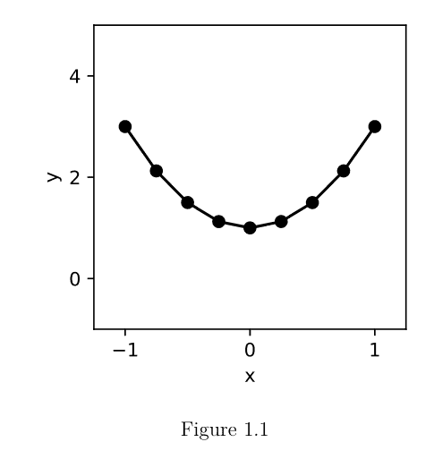

图 1.1

`numpy`模块中的`arange()`函数用于方便地生成一维等间距值数组。`meshgrid()`函数创建二维或多维值数组，如以下代码块所示。

```python
# 代码块 1.4

step = 0.1
x = np.arange(-1, 1+step, step)
y = np.arange(0, 2+step, step)
xv, yv = np.meshgrid(x, y, indexing='ij')

plt.scatter(xv, yv, color='gray')
plt.xlim((-1.5, 1.5))
plt.ylim((-0.5, 2.5))
plt.xticks((-1, 0, 1))
plt.yticks((0, 1, 2))
plt.xlabel('x')
plt.ylabel('y')
plt.axis('equal')
plt.axis('square')

plt.savefig('fig_ch1_meshgrid.eps')
plt.show()
```

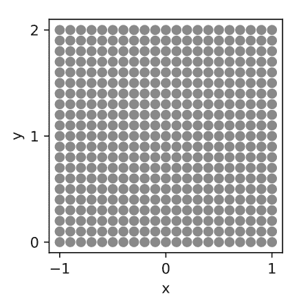

`meshgrid()`函数中的可选参数`indexing`指定了返回的数组是否可以像矩阵（先行列）或像笛卡尔坐标（先水平后垂直轴）一样进行索引和寻址。生成的数组`xv`和`yv`都是二维矩阵，它们的值共同覆盖了`x`和`y`指定的范围的完整组合。

作为比较，以下代码块展示了一种更繁琐、更慢的方法来生成二维数字数组。我们可以从一个零数组开始，其形状由`x`和`y`数组的长度指定。此初始化通过`np.zeros()`函数和返回每个一维数组长度的`len()`函数完成。使用两个嵌套的`for`循环，我们将`x`和`y`数组中的值插入到二维数组的对应位置。生成的数组`x_slow`和`y_slow`与`xv`和`yv`相同。这种一致性可以通过`np.array_equal()`函数进行检查。如果两个数组不同，`np.array_equal()`函数将返回false，而`assert`命令将生成错误消息。

```python
# 代码块 1.5

# 一种生成二维数组的繁琐方法。
# meshgrid() 更方便。
x_slow = np.zeros((len(x), len(y)))
y_slow = np.zeros((len(x), len(y)))
for i in range(len(x)):
    for j in range(len(y)):
        x_slow[i,j] = x[i]
        y_slow[i,j] = y[j]

# 检查两种不同的方法是否生成相同的数组。
assert np.array_equal(xv, x_slow)
assert np.array_equal(yv, y_slow)
```

## 6 ■ 使用Python模拟的电动力学教程

有时我们可能希望将这两个二维矩阵（`xv`和`yv`）组合成一个配对列表`p`，允许我们简单地将所有x坐标表示为`p[0]`，所有y坐标表示为`p[1]`。我们可以使用`flatten()`方法将每个二维矩阵重塑为一维数组，然后使用`vstack()`函数将它们堆叠在一起。

```python
# 代码块 1.6
p = np.vstack((xv.flatten(), yv.flatten()))
# 使用数组 p，可以用以下命令创建相同的图表：
# plt.scatter(p[0], p[1], color='gray')
```

## 1.2 高斯函数景观

想象一个由山丘和山谷组成的景观。我们可以用高斯函数作为山丘的数学模型，用反高斯函数作为山谷的数学模型。高斯函数定义为 $$ f(x) = e^{-\frac{(x-x_0)^2}{2\sigma^2}}, $$ 其中 $ x_0 $ 决定峰的位置，$ \sigma $ 决定其宽度。以下代码块定义并绘制了一个一维高斯函数。一个山丘f位于$ x_0 = +0.3 $，$ \sigma = 0.2 $。一个山谷g位于$ x_0 = -0.3 $，$ \sigma = 0.3 $。

```python
# 代码块 1.7

import matplotlib.pyplot as plt
import numpy as np

step = 0.01
x = np.arange(-1, 1, step)

f = +np.exp(-(x-0.3)**2 / 2 / 0.2**2)
g = -np.exp(-(x+0.3)**2 / 2 / 0.3**2)
f_label = r'$e^{-\frac{(x-0.3)^2}{2 \times 0.2^2}}$'
g_label = r'$e^{-\frac{(x+0.3)^2}{2 \times 0.3^2}}$'

fig = plt.figure(figsize=(5,3))
plt.plot(x, f, label=f_label, color='black')
plt.plot(x, g, label=g_label, color='gray')
plt.legend(framealpha=1)
plt.xticks((-1, 0, 1))
plt.yticks((-1, 0, 1))
plt.ylim((-1.2, 1.2))
plt.xlabel('x')
plt.ylabel('y')
plt.savefig('fig_ch1_gauss_1d.eps')
plt.show()

# 绘制两个高斯函数之和的图表。
h = f + 0.5*g
h_label = r'$e^{-\frac{(x-0.3)^2}{2 \times 0.2^2}}$'
h_label = h_label + r'$-0.5e^{-\frac{(x+0.3)^2}{2 \times 0.3^2}}$'

fig = plt.figure(figsize=(5,3))
plt.plot(x, h, color='black', label=h_label)
plt.legend(framealpha=1)
plt.xticks((-1, 0, 1))
plt.yticks((-1, 0, 1))
plt.ylim((-1.2, 1.2))
plt.xlabel('x')
plt.ylabel('y')
plt.savefig('fig_ch1_gauss_1d_sum.eps')
plt.show()
```

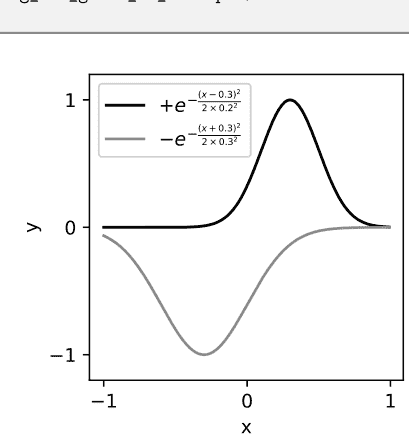

图 1.3

## 8 ■ 使用Python模拟的电动力学教程

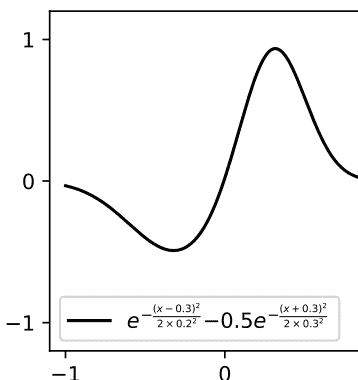

图 1.4

一个二维高斯函数，其峰位于$(x_o, y_o)$，定义为

$g(x, y) = e^{-\frac{(x-x_o)^2+(y-y_o)^2}{2\sigma^2}}$

可以如以下代码块所示进行绘制：

```python
# 代码块 1.8

step = 0.05
x, y = np.meshgrid(np.arange(-1,1,step),
                   np.arange(-1,1,step),
                   indexing='ij')
x0, y0 = 0.3, 0.1
sig = 0.3
g = np.exp(-((x-x0)**2 + (y-y0)**2) / 2 / sig**2)

fig = plt.figure(figsize=(5,4))
ax = plt.axes(projection='3d')
ax.plot_surface(x, y, g, cmap='gray')
ax.set_xlabel('x')
ax.set_ylabel('y')
ax.set_zlabel('z')
ax.set_xticks((-1,0,1))
ax.set_yticks((-1,0,1))
ax.set_zticks((0,0.5,1))
ax.view_init(10, -60)
```

## 图 1.5

我们可以通过添加更多高斯函数，使生成的地形更加有趣。

```python
# Code Block 1.9

# 绘制一个地形的 3D 图。

def sample_sum_of_gauss(step=0.01):
    x, y = np.meshgrid(np.arange(-1,1,step),
                       np.arange(-1,1,step),
                       indexing='ij')
    x0,y0,x1,y1,x2,y2 = -0.3,-0.2,0.3,0.1,0.0,0.1
    sig0,sig1,sig2 = 0.3,0.2,0.5
    g0 = +3.0*np.exp(-((x-x0)**2+(y-y0)**2)/2/sig0**2)
    g1 = +2.0*np.exp(-((x-x1)**2+(y-y1)**2)/2/sig1**2)
    g2 = -2.0*np.exp(-((x-x2)**2+(y-y2)**2)/2/sig2**2)
    z = g0+g1+g2
    return x,y,z

x,y,z = sample_sum_of_gauss()
fig = plt.figure(figsize=(5,4))
ax = plt.axes(projection='3d')
ax.plot_surface(x,y,z,cmap='gray')
ax.set_xlabel('x')
ax.set_ylabel('y')
ax.set_zlabel('z')
ax.set_xticks((-1,0,1))
ax.set_yticks((-1,0,1))
ax.set_zticks((-1,0,1))
ax.view_init(30, -70)
ax.set_rasterized(True)
plt.tight_layout()
plt.savefig('fig_ch1_gauss_2d_sum.eps')
```

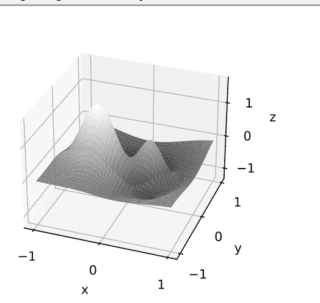

图 1.6

我们可以使用绘图命令 `plt.contourf()` 从俯视图（从正 z 轴方向）观察这个地形。

```python
# Code Block 1.10

# 绘制一个二维等高线图。

fig = plt.figure(figsize=(4,4))
plt.contourf(x,y,z,cmap='gray')
plt.xlim((-2,2))
plt.ylim((-2,2))
plt.axis('square')
plt.axis('equal')
plt.axis('off')
plt.savefig('fig_ch1_gauss_2d_sum_contour.eps')
plt.show()
```


图 1.7

现在想象持续不断的雨水落在这片有山丘和山谷的地形上。当雨滴落地时，它们会顺着地形的起伏，开始向低处流动。当水从高处流向低处时，它会在陡坡上快速流动，在缓坡上缓慢流动。水流在不同位置的速度可以用一个指向向下坡方向的箭头来表示。每个箭头的长度可以表示该位置地形的陡峭程度。

下面的代码块使用 `np.gradient()` 和 `plt.quiver()` 函数将这个想法可视化。我们将在后面的章节中详细讨论这些函数。现在，只需关注图表，而不是生成它的代码。等高线图显示了地形的高处和低处，叠加的箭头则指示了该区域不同位置的斜坡陡峭程度和方向。

```python
# Code Block 1.11

# 使用 quiver 显示梯度。
fig = plt.figure(figsize=(4,4))
plt.contour(x,y,z,cmap='gray')

# x, y, z 的粗略版本
xc,yc,zc = sample_sum_of_gauss(step=0.1)
u,v = np.gradient(zc)
plt.quiver(xc,yc,-u,-v)
plt.xlim((-2,2))
plt.ylim((-2,2))
plt.axis('square')
plt.axis('equal')
plt.axis('off')
plt.savefig('fig_ch1_gauss_2d_sum_grad.eps')
plt.show()
```

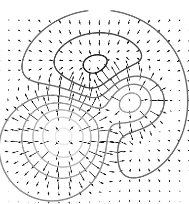

图 1.8

这里有一个不同的类比。上面的图表可以解释为一个地区的**天气图**。等高线代表气压，箭头代表风。一些子区域可能气压较高，而另一些则可能气压较低。风会从高气压区吹向低气压区。气压差越大，风就越强。如果你在不同位置放飞气球，它们会开始沿着箭头方向移动。

在我们学习电动力学时，我们将利用这些直觉，因为它们对于发展电磁势和电磁场的概念特别有用。

# 第 2 章

## 向量

无论是滚下山坡的雨滴，还是因气压差而吹起的风，我们经常需要处理一个向量量的大小（快与慢，或强与弱）以及方向（从高到低，或从北到南）。以下是对向量及其数学运算的非全面回顾。更全面的介绍，我们请读者参阅线性代数和向量微积分的教科书。

一个三维向量可以写成：

$\vec{A} = a_x\hat{x} + a_y\hat{y} + a_z\hat{z} = (a_x, a_y, a_z)$，

其中 $a_x$ 是向量在 $x$ 轴方向上的分量大小。类似地，$a_y$ 和 $a_z$ 是沿 $y$ 轴和 $z$ 轴的分量。一个向量的大小定义为：

$|\vec{A}| = \sqrt{a_x^2 + a_y^2 + a_z^2}$。

单位向量是大小为1的向量，用帽符号表示。因此，沿 $x$、$y$ 和 $z$ 轴的三个正交方向分别表示为 $\hat{x}$、$\hat{y}$ 和 $\hat{z}$。我们可以通过将任何向量除以其大小来将其转换为单位向量。

$\hat{A} = \frac{\vec{A}}{|\vec{A}|} = \frac{a_x}{\sqrt{a_x^2 + a_y^2 + a_z^2}}\hat{x} + \frac{a_y}{\sqrt{a_x^2 + a_y^2 + a_z^2}}\hat{y} + \frac{a_z}{\sqrt{a_x^2 + a_y^2 + a_z^2}}\hat{z}$。

两个向量相加，只需将它们在每个维度上的分量相加，结果仍然是一个向量。

$\vec{A} + \vec{B} = (a_x + b_x)\hat{x} + (a_y + b_y)\hat{y} + (a_z + b_z)\hat{z}$。

减法是加一个逆向量，或逐分量相减。

$\vec{A} - \vec{B} = \vec{A} + (-\vec{B}) = (a_x - b_x)\hat{x} + (a_y - b_y)\hat{y} + (a_z - b_z)\hat{z}$。

### 2.1 使用 Python 绘制向量

`plt.quiver()` 函数允许我们绘制一个箭头来表示一个向量。该函数的前两个输入参数指定向量尾部的位置，接下来的两个输入参数是相应的 $x$ 和 $y$ 方向的向量分量。如下面的代码块所示，命令 `plt.quiver(0,0,A[0],A[1])` 绘制一个尾部位于原点，分量由 `A[0]` 和 `A[1]` 给出的向量。在这个例子中，$\vec{A} = 1\hat{x} + 2\hat{y}$。

```python
# Code Block 2.1

import numpy as np
import matplotlib.pyplot as plt

# 让我们用 quiver() 函数绘制一个向量。
# 注意：额外的参数（angles, scale, ...）确保箭头长度被正确缩放。
A = np.array([1,2])
plt.quiver(0,0,A[0],A[1],angles='xy',scale_units='xy',scale=1)
plt.text(A[0]+0.1,A[1]+0.1,r"$\vec{A}$")

B = np.array([1,-2])
plt.quiver(0,0,B[0],B[1],angles='xy',scale_units='xy',scale=1)
plt.text(B[0]+0.1,B[1]+0.1,r"$\vec{B}$")

C = np.array([-2,-1])
plt.quiver(0,0,C[0],C[1],angles='xy',scale_units='xy',scale=1)
plt.text(C[0]+0.1,C[1]-0.5,r"$\vec{C}$")

plt.grid()
plt.axis('square')
plt.xlabel('x')
plt.ylabel('y')
lim = 3
plt.xlim((-lim,lim))
plt.ylim((-lim,lim))
plt.xticks(np.arange(-lim,lim+0.1))
plt.yticks(np.arange(-lim,lim+0.1))
plt.savefig('fig_ch2_vector_quiver.eps')
plt.show()
```

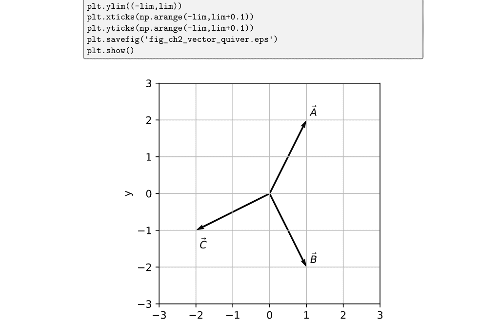

图 2.1

### 2.2 向量乘积

两个向量 $\vec{A}$ 和 $\vec{B}$ 之间的**点积**（也称为标量积或内积）定义为 $$\vec{A} \cdot \vec{B} = a_x b_x + a_y b_y + a_z b_z = \sum_{i=1}^{d} a_i b_i,$$ 其中在最后的表达式中，每个维度的分量由一个整数索引 $i$ 标识，并且求和遍历所有 $d$ 个维度。

顾名思义，这个运算的结果是一个标量值，而不是向量。也可以证明 $\vec{A} \cdot \vec{B} = |\vec{A}||\vec{B}| \cos \theta$，其中 $\theta$ 是两个向量之间的夹角。

向量 $\vec{A}$ 和 $\vec{B}$ 之间的**叉积**（也称为向量积）在三维空间中定义为：

$$\vec{A} \times \vec{B} = \begin{vmatrix} \hat{\mathbf{x}} & \hat{\mathbf{y}} & \hat{\mathbf{z}} \\ A_x & A_y & A_z \\ B_x & B_y & B_z \end{vmatrix} = (A_y B_z - A_z B_y)\hat{\mathbf{x}} + (A_z B_x - A_x B_z)\hat{\mathbf{y}} + (A_x B_y - A_y B_x)\hat{\mathbf{z}}$$

它是一个向量量。可以证明 $\vec{A} \times \vec{B} = |\vec{A}||\vec{B}| \sin \theta \ \hat{\mathbf{n}}$，其中 $\theta$ 是两个向量之间的夹角，$\hat{\mathbf{n}}$ 是垂直于 $\vec{A}$ 和 $\vec{B}$ 所构成平面的单位向量。

$\hat{\mathbf{n}}$ 的具体方向可以用你的右手找到。当你将右手的四指从 $\vec{A}$ 弯曲到 $\vec{B}$ 时，$\hat{\mathbf{n}}$ 的方向将与你的右拇指方向一致。叉积是反交换的，这意味着 $\vec{A} \times \vec{B} = -\vec{B} \times \vec{A}$，因此这个向量运算的顺序很重要。`np.cross()` 函数计算叉积。

```python
# Code Block 2.2

# 可视化叉积

A = np.array([2,1,0])
B = np.array([0,0,1])
C = np.cross(A,B)

x, z = np.meshgrid(np.linspace(-1,1,5), np.linspace(-1,1,5))
y = x/2 # 定义一个由 A 和 B 形成的平面。

fig = plt.figure(figsize=(5,5))
ax = plt.axes(projection='3d')
ax.plot_surface(x,y,z,color='#CCCCCCC',alpha=0.2)
ax.quiver(0,0,0,A[0],A[1],A[2],color='k',
          arrow_length_ratio=0.1,normalize=True)
ax.quiver(0,0,0,B[0],B[1],B[2],color='k',
          arrow_length_ratio=0.1,normalize=True)
ax.quiver(0,0,0,C[0],C[1],C[2],color='k',
          arrow_length_ratio=0.1,normalize=True)
ax.text(1,0.5,0,r"$\vec{A}$")
ax.text(0,0,1.1,r"$\vec{B}$")
ax.text(0.5,-1,0,r"$\vec{A}\times\vec{B}$")
ax.set_xticks((-1,0,1))
```

### 2.3 向量分解

求解向量各分量的过程称为向量分解。一个二维向量**A**沿 x 轴和 y 轴的分量，可以根据向量的大小（r）和方向角（ϕ）通过余弦和正弦函数计算得出，其中 ϕ 通常被方便地选为从正 x 轴逆时针度量的角度。那么，\( a_x = r \cos \phi \) 且 \( a_y = r \sin \phi \)，如下方代码块所示。

利用点积运算，\( a_x = \vec{A} \cdot \hat{x} \) 且 \( a_y = \vec{A} \cdot \hat{y} \)。换句话说，沿每个坐标轴的向量分量可以通过将向量投影到每个轴上并度量该投影的大小来确定。

```python
# Code Block 2.3

# Vector decomposition

# defining the famous constant pi = 3.14...
pi = np.pi

r = 1
phi_circle = np.arange(0,2*pi,0.01)
x_circle = r*np.cos(phi_circle)
y_circle = r*np.sin(phi_circle)

phi = pi/6
x = r*np.cos(phi)
y = r*np.sin(phi)

plt.figure(figsize=(5,5))
plt.plot(x_circle,y_circle,color='gray')
plt.quiver(0,0,x,y,angles='xy',scale_units='xy',scale=1)
plt.quiver(0,0,x,0,angles='xy',scale_units='xy',scale=1)
plt.quiver(0,0,0,y,angles='xy',scale_units='xy',scale=1)

plt.plot([0,0],[-r,r],linestyle='dotted',color='gray')
plt.plot([-r,r],[0,0],linestyle='dotted',color='gray')

plt.plot([0,x],[y,y],linestyle='dotted',color='gray')
plt.plot([x,x],[0,y],linestyle='dotted',color='gray')
plt.text(0.3,-0.15,r"$a_x = r\ \cos \phi$")
plt.text(-0.1,0.6,r"$a_y = r\ \sin \phi$")
plt.text(0.4,0.3,"r")
plt.text(0.25,0.05,r"$\phi$")
plt.text(1.1,0,"x")
plt.text(0,1.1,"y")
plt.axis('square')
plt.axis('off')
plt.xlim(np.array([-1,1])*r*1.1)
plt.ylim(np.array([-1,1])*r*1.1)
plt.savefig('fig_ch2_vector_decompose.eps')
plt.show()
```

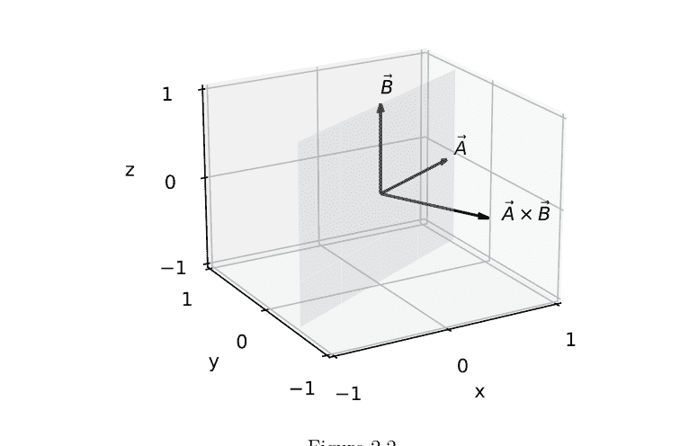

图 2.2

两个向量之间没有除法运算，因为不存在数学上有意义的方式来将一个方向除以另一个方向。

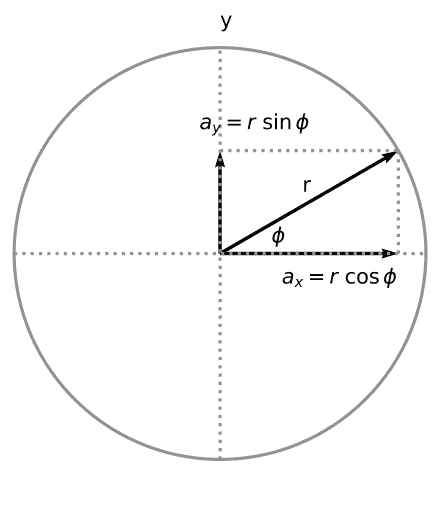

图 2.3

### 2.4 向量微积分

微积分为描述运动提供了一种数学上精确而简洁的方法。在经典力学中，一个经历恒定加速度 *a* 的物体（例如在重力作用下自由下落的质点）的运动可以用一组运动学方程来描述：

$$
\begin{aligned}
x(t) &= x_o + v_o t + \frac{1}{2} a t^2 \\
v(t) &= v_o + at,
\end{aligned}
$$

其中物体的速度随时间线性变化，其位置随时间二次变化。

速度 \( v(t) \) 与位置 \( x(t) \) 之间的关系是导数与反导数的关系，因此如果你知道其中一个量，就可以确定另一个量。

如果你知道 \( x(t) \)，那么 \( v(t) = \frac{dx}{dt} \)。如果你知道 \( v(t) \) 和 \( x_0 \)，那么 \( x(t) = \int_0^t v(t')dt' + x_0 \)。

换句话说，物体的运动可以用某些物理量的导数或积分来表述。无论是从 \( x(t) \) 还是 \( v(t) \) 开始的表述，都描述的是同一种运动。同样，电磁学的数学描述也可以用积分或导数来表述，正如我们将在后续章节中看到的那样。在本节中，我们将介绍几个基本的向量微积分运算的定义和示例。

给定一个三维标量函数 \( f(x, y, z) \)，其沿 \( x \) 轴的空间变化率由 \( \frac{\partial f}{\partial x} \) 给出。给定一个三维向量函数 \( \vec{K} = K_x \hat{x} + K_y \hat{y} + K_z \hat{z} \)，我们可以通过计算 \( \frac{\partial K_x}{\partial x} + \frac{\partial K_y}{\partial y} + \frac{\partial K_z}{\partial z} \) 来考虑沿各维度变化率的总和。这些导数的物理解释将在我们稍后在电场和磁场的背景下再次遇到时进一步讨论。现在，我们引入一个称为 del 或 nabla（\( \nabla \)）的向量算子，以更紧凑和优雅的方式表达高维导数。该算子定义为 \( \nabla = \frac{\partial}{\partial x} \hat{x} + \frac{\partial}{\partial y} \hat{y} + \frac{\partial}{\partial z} \hat{z} \)。如果将此算子应用于一个标量函数 \( f(x, y, z) \)，我们得到一个称为**梯度**的新向量量：

梯度：\( \nabla f(x, y, z) = \frac{\partial f}{\partial x} \hat{x} + \frac{\partial f}{\partial y} \hat{y} + \frac{\partial f}{\partial z} \hat{z} \)。

此算子也可以应用于一个向量函数。给定一个向量函数 \( \vec{K} \)，其**散度**（一个标量量）定义为

散度：\( \nabla \cdot \vec{K} = \frac{\partial K_x}{\partial x} + \frac{\partial K_y}{\partial y} + \frac{\partial K_z}{\partial z} \)。

\( \vec{K} \) 的**旋度**是一个向量量，定义为

旋度：\( \nabla \times \vec{K} = \begin{vmatrix} \hat{x} & \hat{y} & \hat{z} \\ \frac{\partial}{\partial x} & \frac{\partial}{\partial y} & \frac{\partial}{\partial z} \\ K_x & K_y & K_z \end{vmatrix} = \left( \frac{\partial K_z}{\partial y} - \frac{\partial K_y}{\partial z} \right) \hat{x} + \left( \frac{\partial K_x}{\partial z} - \frac{\partial K_z}{\partial x} \right) \hat{y} + \left( \frac{\partial K_y}{\partial x} - \frac{\partial K_x}{\partial y} \right) \hat{z} \)。

在高维进行积分需要额外注意。例如，给定一个三维标量函数 \( f(x, y, z) \)，我们可以在由二维边界包围的特定区域内进行体积分。这种积分的表示法为：

$$\iiint_{\text{Volume}} f(x, y, z) dxdydz,$$

其中积分符号上的圆圈表示在包围的体积上进行积分。同样，我们有时可能会处理在二维表面上的积分或沿一维轮廓的积分。这些积分将在接下来的章节中结合相关背景进行介绍和解释。

本节的最后一个主题是向量微积分的基本定理。根据更熟悉的微积分基本定理：

$$\int_a^b \frac{df(x)}{dx} dx = f(b) - f(a),$$

它表明，导数在一个区间上的积分可以用该区间端点（即 \( a \) 和 \( b \)）处的反导数值来计算。它优雅地捕捉了函数、其导数、积分和边界条件之间的关系。

类似地，梯度的基本定理指出：

$$\int_{\vec{a}}^{\vec{b}} \nabla f \cdot d\vec{l} = f(\vec{b}) - f(\vec{a}).$$

作为一个建立直观理解的例子，考虑一个像重力这样的保守力 \( \vec{F} \)。想象在此力下做功，将物体从点 \( \vec{a} \) 移动到点 \( \vec{b} \)。所做的功由 \( \int_{\vec{a}}^{\vec{b}} \vec{F} \cdot d\vec{l} \) 给出，它等于物体势能的变化 \( \Delta U = U(\vec{b}) - U(\vec{a}) \)。在没有摩擦力（即假设为保守力）的情况下，所做的功仅取决于物体的终点和起点，而物体如何到达其最终位置并不重要。换句话说，无论物体是通过直线还是曲线路径从 \( \vec{a} \) 被带到 \( \vec{b} \)，势能的变化都是相同的。对于一个质量为 \( m \) 的物体在地球表面附近上升高度 \( h \) 的情况，这被总结为重力势能的公式：\( \Delta U = mgh \)。

散度和旋度各有其基本定理。散度的基本定理指出，向量函数散度的体积分等于该向量函数在包围相关体积的表面上的面积分。对于向量函数的旋度，其面积分等于定义此表面的闭合线轮廓上的线积分。后面的章节将讨论它们的含义和应用。现在，我们将它们一起列在下方，以便于参考和比较。

$$ \iiint_{\text{Volume}} (\nabla \cdot \vec{K}) dV = \iint_{\text{Area}} \vec{K} \cdot d\vec{a} $$

$$ \iint_{\text{Area}} (\nabla \times \vec{K}) \cdot d\vec{a} = \oint_{\text{Contour}} \vec{K} \cdot d\vec{l} $$

## 2.5 \(\nabla\) 的附加运算

正如我们对两个函数的乘积进行微分有法则 \( \frac{d}{dt}(f(t)g(t)) = f(t)\frac{dg(t)}{dt} + g(t)\frac{df(t)}{dt} \) 一样，当 \( \nabla \)-算子应用于标量和向量函数时，也有相应的乘积法则。例如，如果你有两个向量函数 \( \vec{K} \) 和 \( \vec{G} \) 的点积，其梯度由下式给出：

$$ \nabla(\vec{K} \cdot \vec{G}) = \vec{K} \times (\nabla \times \vec{G}) + \vec{G} \times (\nabla \times \vec{K}) + (\vec{K} \cdot \nabla)\vec{G} + (\vec{G} \cdot \nabla)\vec{K} $$

给定两个向量函数的叉积，其散度和旋度可由下式确定：

$$ \nabla \cdot (\vec{K} \times \vec{G}) = \vec{G} \cdot (\nabla \times \vec{K}) - \vec{K} \cdot (\nabla \times \vec{G}) $$

以及

$$ \nabla \times (\vec{K} \times \vec{G}) = (\vec{G} \cdot \nabla)\vec{K} - (\vec{K} \cdot \nabla)\vec{G} + \vec{K}(\nabla \cdot \vec{G}) - \vec{G}(\nabla \cdot \vec{K}) $$

```
ax.set_yticks((-1,0,1))
ax.set_zticks((-1,0,1))
ax.set_xlim(-1, 1)
ax.set_ylim(-1, 1)
ax.set_zlim(-1, 1)
ax.set_xlabel('x')
ax.set_ylabel('y')
ax.set_zlabel('z')
ax.view_init(20,-120)
plt.savefig('fig_ch2_vector_cross.eps')
```

这些乘积法则在评估复杂的矢量关系时非常有用。

∇-算子也可以用于求二阶导数。标量函数的梯度的散度由下式给出：

∇·∇f(x,y,z) = ∇²f(x,y,z) = ∂²f/∂x² + ∂²f/∂y² + ∂²f/∂z²

矢量函数的旋度的旋度也是一个有意义的量。可以证明：

∇×(∇×K⃗) = ∇(∇·K⃗) − ∇²K⃗

我们注意到，并非所有∇运算的组合都有意义。例如，∇×(∇·K⃗)不是一个有效的数学表达式，因为散度∇·K⃗不是一个矢量函数，所以我们无法计算其旋度。类似地，∇(∇×K⃗)，即矢量函数旋度的梯度，也不是一个有效的表达式，因为矢量函数的旋度是一个矢量函数，而梯度在矢量函数上没有定义。

## 第3章

## 矢量场

我们在第一章末尾看到的箭头图被称为矢量场，其中在每个位置都指定了一个箭头（一个既有方向又有大小的矢量量）。术语“矢量场”通常与“矢量函数”互换使用，但它强调函数的定义域是空间。在静态矢量场中，这些矢量不随时间变化。在动态矢量场中，这些矢量可以随时间变化和演化。动态矢量场就像不断变化的风景或随天气变化的风图。我们将在接下来的几章中首先讨论静态矢量场，然后再处理动态矢量场。

### 3.1 简单矢量场

以下代码块创建了一个简单的矢量场，其中空间中的每个点，矢量都指向正\hat{x}方向。由于矢量在各处都相同，这个矢量场是均匀的（即，没有空间依赖性）且静态的（即，没有时间依赖性）。

```
# Code Block 3.1
import numpy as np
import matplotlib.pyplot as plt

step = 0.25

# Set up a grid of (x,y) coordinates
x,y = np.meshgrid(np.arange(-1,1+step,step),
                  np.arange(-1,1+step,step),
                  indexing='ij')
```

## 26 ■ 使用Python模拟的电动力学教程

```
dx = 1
dy = 0
fig = plt.figure(figsize=(2,2))
plt.quiver(x,y,dx,dy,angles='xy',scale_units='xy')
plt.axis('square')
plt.axis('off')
plt.xlim(np.array([-1,1])*1.1)
plt.ylim(np.array([-1,1])*1.1)
plt.savefig('fig_ch3_simple_field.pdf')
plt.show()
```

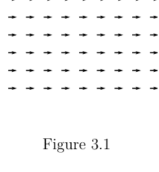

图 3.1

我们可以创建其他均匀且静态的矢量场示例，如下所示。

```
# Code Block 3.2

f, axes = plt.subplots(2,2,figsize=(6,6))

ax = axes[0,0]
ax.set_title('(a) left')
ax.quiver(x,y,-1,0,angles='xy',scale_units='xy')

ax = axes[0,1]
ax.set_title('(b) up')
ax.quiver(x,y,0,1,angles='xy',scale_units='xy')

ax = axes[1,0]
ax.set_title('(c) up-right')
ax.quiver(x,y,1,1,angles='xy',scale_units='xy')

ax = axes[1,1]
ax.set_title('(d) down-right')
ax.quiver(x,y,1,-1,angles='xy',scale_units='xy')

for i in range(2):
    for j in range(2):
        ax = axes[i,j]
        ax.axis('square')
        ax.axis('off')
        ax.set_xlim(np.array([-1,1])*1.1)
        ax.set_ylim(np.array([-1,1])*1.1)

plt.tight_layout()
plt.savefig('fig_ch3_other_fields_1.pdf')
plt.show()
```

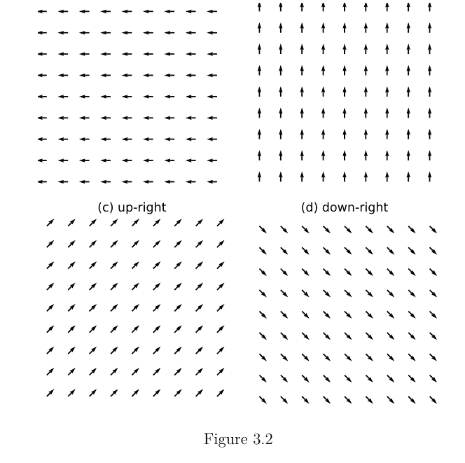

## 图 3.2

其他模式的矢量场也是可能的。以下代码块显示了几个非均匀矢量场的例子，其中(a)矢量从原点径向向外指向，大小相等；(b)矢量径向指向，但其大小随$r = \sqrt{x^2 + y^2}$按$\frac{1}{r}$递减。在(c)和(d)中，矢量分别沿顺时针和逆时针方向旋转。

```
# Code Block 3.3

# Add a small number to avoid dividing by zero.
small_number = 10**(-10)
r = np.sqrt(x**2+y**2)+small_number
xhat = x/r
yhat = y/r

f, axes = plt.subplots(2,2,figsize=(6,6))

ax = axes[0,0]
ax.set_title('(a) radial')
ax.quiver(x,y,xhat,yhat,angles='xy',scale_units='xy')

ax = axes[0,1]
ax.set_title('(b) 1/r')
ax.quiver(x,y,xhat/r,yhat/r,angles='xy',scale_units='xy')

ax = axes[1,0]
ax.set_title('(c) cw swirl')
ax.quiver(x,y,y,-x,angles='xy',scale_units='xy')

ax = axes[1,1]
ax.set_title('(d) ccw swirl')
ax.quiver(x,y,-y,x,angles='xy',scale_units='xy')

for i in range(2):
    for j in range(2):
        ax = axes[i,j]
        ax.axis('square')
        ax.axis('off')
        ax.set_xlim(np.array([-1,1])*1.1)
        ax.set_ylim(np.array([-1,1])*1.1)

plt.tight_layout()
plt.savefig('fig_ch3_other_fields_2.pdf')
plt.show()
```

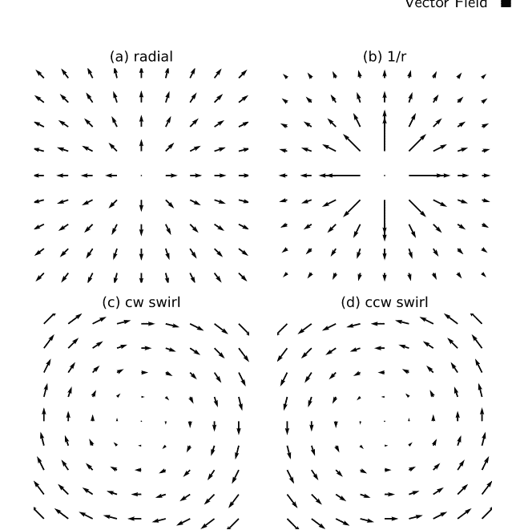

### 3.2 通量

我们可能会问这样的问题：“我们能否从数值上表征矢量场的整体模式？”或者“矢量场中有多少流量？”让我们从关于流量的问题开始。如下图所示，考虑在指向右侧的均匀矢量场中放置一条垂直线。绘制了一些样本矢量，其起点位于该线上。这条线不是一个物理物体，因此它不会阻挡或干扰矢量场的流动。它只是标记了一个分析区域，使我们能够讨论矢量场的流量。我们也将其称为边界。边界可以是直的、弯曲的，或者闭合形成圆形或方形等形状。在处理三维矢量场时，这样的边界将是一个二维曲面。

```
# Code Block 3.4
fig = plt.figure(figsize=(2,2))

# Put a line inside the vector field.
lw = 8 # line-width
pos = 0.5
plt.plot([0,0],[-pos,+pos],color='gray',linewidth=lw,alpha=0.4)

# Make a uniform vector field.
step = 0.25
x,y = np.meshgrid(np.arange(-1,1+step,step),
                   np.arange(-1,1+step,step),
                   indexing='ij')
plt.quiver(x,y,1,0,angles='xy',scale_units='xy',color='k')

plt.axis('square')
plt.axis('off')
plt.xlim(np.array([-1,1])*1.1)
plt.ylim(np.array([-1,1])*1.1)
plt.savefig('fig_ch3_uniform_flux_through_line.pdf')
plt.show()
```

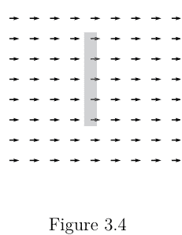

## 图 3.4

毫不奇怪，矢量场的流量与边界的大小或范围以及边界处矢量的大小成正比，如下图所示。

```
# Code Block 3.5

scale = 3
N = 8

fig = plt.figure(figsize=(6,3))
for i in range(3):
    vec_mag = 1
    lim = 2**(i-2)
    step = 0.1
    
    plt.subplot(1,4,i+1)
    y = np.linspace(-lim,lim,N)
    y = np.arange(-lim,lim+step,step)
    x = np.zeros(len(y))
    plt.quiver(x,y,vec_mag,0,color='k',
               angles='xy',scale_units='xy',scale=scale)
    plt.plot([0,0],[-lim,+lim],color='gray',linewidth=lw,alpha=0.4)
    plt.axis('square')
    plt.axis('off')
    plt.xlim(np.array([-0.5,1])*0.8)
    plt.ylim(np.array([-1,1])*1.1)
    plt.title('L = %2.1f'%(2*lim))

plt.tight_layout()
plt.savefig('fig_ch3_diff_boundary_extent.pdf',bbox_inches='tight')
plt.show()

fig = plt.figure(figsize=(6,3))
N = 11
for i in range(3):
    vec_mag = 2**(i-1) # (0.5, 1, 2)
    plt.subplot(1,4,i+1)
    plt.quiver(np.zeros(N),np.linspace(-1,1,N)*0.5,vec_mag,0,
               color='k',angles='xy',scale_units='xy',scale=scale)
    plt.plot([0,0],[-0.5,+0.5],color='gray',linewidth=lw,alpha=0.4)
    plt.axis('square')
    plt.axis('off')
    plt.xlim(np.array([-0.5,1])*0.8)
    plt.ylim(np.array([-1,1])*1.1)
    plt.title('|v| = %2.1f'%vec_mag)

plt.tight_layout()
plt.savefig('fig_ch3_diff_v_mag.pdf',bbox_inches='tight')
plt.show()
```

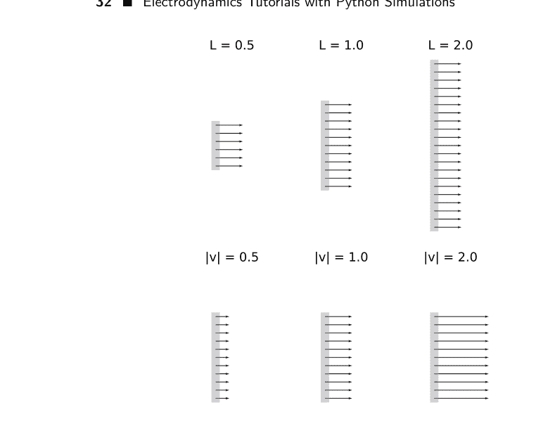

图 3.5

根据上述观察，量化流量的一个合理的初始表达式是对边界范围内矢量大小的积分，\(\int_{a}^{b} |\vec{v}| dl\)，其中\(\vec{v}\)是边界处的矢量，边界的总长度\(L\)被分成无穷小段\(dl\)，使得\(\int_{a}^{b} dl = L\)。

让我们进一步完善这个想法。当流动与边界不垂直时，我们应该如何处理？考虑以下两种情况。在第一种情况下，边界与矢量垂直。在第二种情况下，边界相对于矢量是倾斜的（非正交的）。即使倾斜的边界更长，但两个边界跨越相同的垂直范围，因此流量应该是相等的。想象一个类似的情况：一根水管连接到一个水龙头，水龙头在给定时间内提供固定量的水。无论水管的末端是直的（因此其横截面与水流垂直）还是水管端部有一个斜切口，流出的水量将保持不变。

```
# Code Block 3.6

lw = 8
pos = 0.5

# Make a uniform vector field.
step = 0.25
x,y = np.meshgrid(np.arange(-1,1+step,step),
                  np.arange(-1,1+step,step),
                  indexing='ij')

fig = plt.figure(figsize=(6,3))

plt.subplot(1,2,1)
plt.title('(a) Perpendicular')
plt.plot([+0.0,-0.0],[-0.5,+0.5],color='gray',linewidth=lw,alpha=0.4)

plt.subplot(1,2,2)
plt.title('(b) Slanted')
plt.plot([+0.6,-0.6],[-0.5,+0.5],color='gray',linewidth=lw,alpha=0.4)

for i in range(2):
    plt.subplot(1,2,i+1)
    plt.quiver(x,y,1,0,angles='xy',scale_units='xy',color='k')
    plt.axis('square')
    plt.axis('off')
    plt.xlim(np.array([-1,1])*1.1)
    plt.ylim(np.array([-1,1])*1.1)

plt.tight_layout()
plt.savefig('fig_ch3_boundary_slanted.pdf',bbox_inches='tight')
plt.show()
```

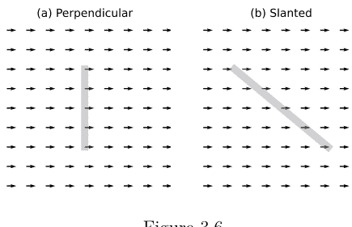

图 3.6

这个观察结果促使我们改进了之前关于流量的定义，引入一个垂直于边界指向的单位法向量 \(\hat{\mathbf{n}}\)。请注意，边界处的向量 \(\vec{\mathbf{v}}\) 有两个相互正交的分量。\(\vec{\mathbf{v}}_{\perp}\) 垂直于边界，并与 \(\hat{\mathbf{n}}\) 平行。\(\vec{\mathbf{v}}_{\parallel}\) 平行于边界，并与 \(\hat{\mathbf{n}}\) 垂直。因此，\(\vec{\mathbf{v}}_{\perp} \cdot \vec{\mathbf{v}}_{\parallel} = 0\)。\(\vec{\mathbf{v}}_{\parallel}\) 对穿过边界的流量没有贡献。只有 \(\vec{\mathbf{v}}_{\perp}\) 有贡献，并且 \(|\vec{\mathbf{v}} \cdot \hat{\mathbf{n}}| = |\vec{\mathbf{v}}_{\perp}|\)。

因此，我们得到了一个改进的流量定义，称为通量，通常用符号 \(\Phi\) 表示：

> \(\Phi = \int_a^b (\vec{\mathbf{v}} \cdot \hat{\mathbf{n}}) \, dl\).

### 3.3 通量计算

在本节中，我们将为二维中给定的向量场建立一个计算通过任意边界的通量的常规方法。首先，看几个倾斜边界线及其法向量的例子。一旦我们有了边界线的斜率，就可以通过其负倒数来计算其法向量的斜率。

```
python
# Code Block 3.7

lw = 8
theta_range = [-90,-75,-60,-45] # in degrees

fig = plt.figure(figsize=(6,3))
for i,theta in enumerate(theta_range):
    plt.subplot(1,4,i+1)
    y0 = -0.5
    y1 = +0.5
    x0 = y0/np.tan(theta*np.pi/180)
    x1 = -x0
    plt.plot([x0,x1], [y0,y1],color='gray',linewidth=lw,alpha=0.4)
    nx = 1
    ny = -(x1-x0)/(y1-y0)
    n_mag = np.sqrt(nx**2+ny**2)
    plt.quiver(0,0,nx/n_mag,ny/n_mag,
               angles='xy',scale_units='xy',color='black',scale=2)
    plt.axis('square')
    plt.xlim(np.array([-1,1])*1.1)
    plt.ylim(np.array([-1,1])*1.1)
    plt.xticks((-1,0,1))
    plt.yticks((-1,0,1))

plt.tight_layout()
plt.savefig('fig_ch3_normal_vectors.pdf',bbox_inches='tight')
plt.show()
```

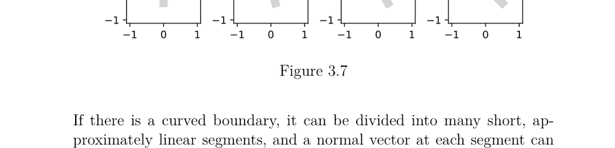

图 3.7

如果存在弯曲的边界，可以将其分割成许多近似的短线段，并在每个线段上找到法向量。更具体地说，考虑一组描述连续边界的坐标：$(x_1, y_1)$, $(x_2, y_2)$, $\cdots$, $(x_N, y_N)$。点 $(x_i, y_i)$ 处的法向量 $\hat{\mathbf{n}}$ 可以通过找到一条垂直于连接 $(x_{i-1}, y_{i-1})$ 和 $(x_{i+1}, y_{i+1})$ 之间线段的直线来近似得到。在点 $(x_i, y_i)$ 处，$\hat{\mathbf{n}}$ 的斜率是 $-\frac{x_{i+1}-x_{i-1}}{y_{i+1}-y_{i-1}}$。以下代码块演示了这个想法。

```
# Code Block 3.8

# Illustration of how a normal vector is found.

# Define a boundary.
step = 0.05
x = np.arange(0,1,step)
y = np.sqrt(1**2 - x**2)

i = 16 # Point to focus on.

plt.figure(figsize=(4,6))
plt.subplot(3,1,1)

plt.scatter(x,y,color='gray')
plt.plot(x,y,color='gray')
plt.text(x[i+0]+0.05,y[i+0],r"$(x_{i}, y_{i})$")
plt.axis('square')
plt.xlim((0.0,1.2))
plt.ylim((0.0,1.2))
plt.xlabel('x')
plt.ylabel('y')
plt.xticks((0,0.5,1))
plt.yticks((0,0.5,1))
plt.title('Boundary')

space = 0.012
plt.subplot(3,1,2)
plt.scatter(x[i-1:i+2],y[i-1:i+2],color='gray')
plt.plot([x[i-1],x[i+1]],[y[i-1],y[i+1]],color='gray')
plt.text(x[i+0]+space,y[i+0],r"$(x_{i}, y_{i})$")
plt.text(x[i-1]+space,y[i-1],r"$(x_{i-1}, y_{i-1})$")
plt.text(x[i+1]+space,y[i+1],r"$(x_{i+1}, y_{i+1})$")
plt.axis('square')
plt.xlim((0.7,1.0))
plt.ylim((0.5,0.7))
plt.xlabel('x')
plt.ylabel('y')
plt.xticks((0.7,0.8,0.9))
plt.yticks((0.5,0.6,0.7))
plt.title('Line between neighbors')

plt.subplot(3,1,3)

# Calculate the slope of two immediate neighbors.
slope = (y[i+1]-y[i-1])/(x[i+1]-x[i-1])
# Calculate the slope of an orthogonal line.
norm_vec_slope = -1/(slope)
# Find the components of the normal vector.
u, v = 1, norm_vec_slope
# Normalize the vector.
mag = np.sqrt(u**2+v**2)
u, v = u/mag, v/mag

plt.scatter(x[i-1:i+2],y[i-1:i+2],color='gray')
plt.quiver(x[i],y[i],u,v,color='black',
           angles='xy',scale_units='xy',scale=10,width=0.01)
plt.text(x[i+0]+space,y[i+0]-0.01,r"$(x_{i}, y_{i})$")
plt.axis('square')
plt.xlabel('x')
plt.ylabel('y')
plt.xlim((0.7,1.0))
plt.ylim((0.5,0.7))
plt.xticks((0.7,0.8,0.9))
plt.yticks((0.5,0.6,0.7))
plt.title('Normal Vector')

plt.tight_layout()
plt.savefig('fig_ch3_normal_illustrate.pdf',bbox_inches='tight')
plt.show()
```

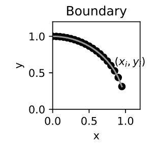

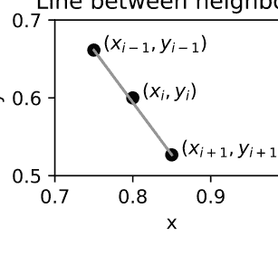

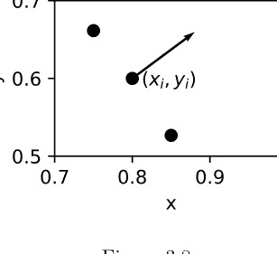

图 3.8

在以下代码块中，我们将这个想法封装成一个可复用的函数 `get_normals()`，它接受一个参数，即定义边界的相邻点集。注意，`x` 和 `y` 表示边界的 $x$ 和 $y$ 坐标。代码中的索引约定是：如果 `x` 有 $N$ 个元素，`x[:-2]` 指的是前 $N-2$ 个元素（不含最后两个元素），而 x[2:] 指的是从第三个元素开始到最后的最后 $N – 2$ 个元素（不含前两个元素）。因此，x[2:]-x[:-2] 计算的是边界内两个端点（x[0] 和 x[-1]）之间的 $x_{i+1} - x_{i-1}$。端点只有一个直接邻居，因此不在这些位置计算法向量。

```
python
# Code Block 3.9

def get_normals (boundary):
    # The input argument defines a boundary
    # as a set of adjacent points.
    very_small_num = 10**(-10) # avoid divide by zero.
    x, y = boundary[0], boundary[1]
    slope = (y[2:]-y[:-2])/(x[2:]-x[:-2] + very_small_num)
    norm_vec_slope = -1/(slope + very_small_num)
    u, v = 1, norm_vec_slope
    mag = np.sqrt(u**2+v**2)
    u, v = u/mag, v/mag
    n = np.vstack((u,v))
    return n

def plot_normals (boundary,ax,scale=2):
    n = get_normals(boundary)
    x, y = boundary[0], boundary[1]
    ax.scatter(x,y,color='gray')
    ax.plot(x,y,color='gray')
    ax.quiver(x[1:-1],y[1:-1],n[0],n[1],color='gray',
             angles='xy',scale_units='xy',scale=scale)
    ax.axis('equal')
    ax.axis('square')
    #ax.set_xlabel('x')
    #ax.set_ylabel('y')
    ax.set_xlim((-1.0,2.0))
    ax.set_ylim((-1.5,1.5))
    ax.set_xticks((-1,0,1,2))
    ax.set_yticks((-1,0,1))
    return

# Examples of normal vectors for different boundaries.
fig, ax = plt.subplots(1,4,figsize=(6,3),sharey=True)

step = 0.2
y = np.arange(-1,1+step,step)

# Vertical line.
x = np.zeros(len(y))
p0 = np.vstack((x,y))
plot_normals(p0,ax[0])

# Slanted line
x = -y/3
p1 = np.vstack((x,y))
plot_normals(p1,ax[1])

# Parabola (concave from right)
x = 1-y**2
p2 = np.vstack((x,y))
plot_normals(p2,ax[2])

# Half circle.
theta = np.arange(np.pi/2,-np.pi/2-step,-step)
x = np.cos(theta)
y = np.sin(theta)
p3 = np.vstack((x,y))
plot_normals(p3,ax[3])
plt.tight_layout()
plt.savefig('fig_ch3_normal_diff_boundary.pdf',bbox_inches='tight')
plt.show()
```

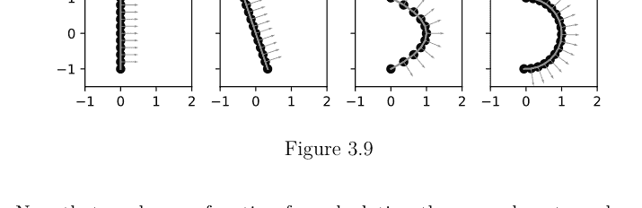

现在我们有了计算边界上法向量的函数，让我们来开发一个计算给定边界和向量场的通量的函数。如以下代码块所示，总通量是通过累加法向量 $\hat{\mathbf{n}}$（$n[0]$ 和 $n[1]$）与向量 $\vec{\mathbf{v}}$（$xv$ 和 $yv$）之间的点积来计算的。

无穷小长度元素 $dl$ 是通过找到到两个直接相邻点的平均距离来计算的。换句话说，$dl_i = \frac{1}{2}(\sqrt{(x_{i+1} - x_i)^2 + (y_{i+1} - y_i)^2} + \sqrt{(x_i - x_{i-1})^2 + (y_i - y_{i-1})^2})$。$x[1:]$ 指的是边界上从数组第二个元素到最后一个元素的 $x$ 坐标，$x[:-1]$ 指的是边界上从第一个元素到倒数第二个元素数组中的最后一个元素。因此，`x[1:]-x[:-1]` 会生成一个相邻 x 坐标值之间差值的数组。

```python
# Code Block 3.10
def get_flux(boundary,vfield):
    x, y = boundary[0], boundary[1]
    dl_neighbor = np.sqrt((x[1:]-x[:-1])**2+(y[1:]-y[:-1])**2)
    dl = (0.5)*(dl_neighbor[1:]+dl_neighbor[:-1])
    n = get_normals(boundary)
    xv, yv = vfield[0][1:-1], vfield[1][1:-1]
    dotprod = xv*n[0] + yv*n[1]
    flux = np.sum(dl*dotprod)
    return flux
```

在下面的代码块中，我们将测试 `get_flux()` 函数。让我们计算一个均匀向量场在四种不同边界下的通量，如上图所示。在所有情况下，边界跨越相同的垂直范围 2（在 -1 和 1 之间），且均匀场的大小为 1。因此，无论边界形状如何，预期的总通量都应为 2。随着我们减小步长参数并减少离散化带来的误差，计算结果会趋近于 2。

```python
# Code Block 3.11
step = 0.01
def flux_calculation_example (step=0.01):
    y = np.arange(-1,1+step,step)

    x = np.zeros(len(y))
    p0 = np.vstack((x,y))
    vf0 = np.vstack((np.ones(len(x)),np.zeros(len(y))))

    x = -y/3
    p1 = np.vstack((x,y))
    vf1 = np.vstack((np.ones(len(x)),np.zeros(len(y))))

    x = 1-y**2
    p2 = np.vstack((x,y))
    vf2 = np.vstack((np.ones(len(x)),np.zeros(len(y))))

    theta = np.arange(np.pi/2,-np.pi/2-step,-step)
    p3 = np.vstack((np.cos(theta),np.sin(theta)))
    vf3 = np.vstack((np.ones(len(theta)),np.zeros(len(theta))))

    print('Flux with different boundaries (Answer = 2.0)')
    print(' Vertical Line %8.7f'%get_flux(p0,vf0))
    print(' Slanted Line  %8.7f'%get_flux(p1,vf1))
    print(' Parabola      %8.7f'%get_flux(p2,vf2))
    print(' Half Circle   %8.7f'%get_flux(p3,vf3))

    print('\nstep = 0.1')
    flux_calculation_example(step=0.1)

    print('\nstep = 0.01')
    flux_calculation_example(step=0.01)

    print('\nstep = 0.001')
    flux_calculation_example(step=0.001)
```

```
step = 0.1
Flux with different boundaries (Answer = 2.0)
  Vertical Line 1.9000000
  Slanted Line  1.9000000
  Parabola      1.9037454
  Half Circle   1.9987149
```

```
step = 0.01
Flux with different boundaries (Answer = 2.0)
  Vertical Line 1.9900000
  Slanted Line  1.9900000
  Parabola      1.9900377
  Half Circle   1.9999817
```

```
step = 0.001
Flux with different boundaries (Answer = 2.0)
  Vertical Line 1.9990000
  Slanted Line  1.9990000
  Parabola      1.9990004
  Half Circle   1.9999999
```

我们观察到，对于均匀向量场，只要边界的端点固定，边界的形状不会改变总通量，但这只是一个非常简单的场景。让我们继续探索向量场的通量。

### 3.4 通过封闭区域的通量

让我们考虑一个起点和终点重合的边界。这样的边界会形成一个封闭的形状，比如正方形或圆形。下面的代码块展示了三个具有正方形边界的不同向量场。

继续用水流来类比向量场：在第一种情况下，流入正方形边界左侧的水量多于从右侧流出的水量。在第二种情况下，存在均匀的水流，流入和流出的水量相等。在第三种情况下，从正方形右侧流出的水量更多。由于向量与正方形边界的上下两边平行，因此没有水流从这两边流入或流出正方形区域。在正方形区域内，我们会看到水在积累（如果流入 > 流出），保持恒定水位（如果流入 = 流出），或者干涸（如果流入 < 流出）。

```python
# Code Block 3.12

scale = 8
step = 0.25
x,y = np.meshgrid(np.arange(-1,1+step,step),
                   np.arange(-1,1+step,step),
                   indexing='ij')

pos = 0.5
x0, y0 = 0, pos
x_square = [x0,+pos,+pos,-pos,-pos,x0]
y_square = [y0,+pos,-pos,-pos,+pos,y0]

f, axes = plt.subplots(1,3,figsize=(6,3))

ax = axes[0]
ax.set_title('(a) influx > outflux')
ax.quiver(x,y,1-x,np.zeros(x.shape),
          angles='xy',scale_units='xy',scale=scale,color='k')

ax = axes[1]
ax.set_title('(b) influx = outflux')
ax.quiver(x,y,np.zeros(x.shape)+1,np.zeros(x.shape),
          angles='xy',scale_units='xy',scale=scale,color='k')

ax = axes[2]
ax.set_title('(c) influx < outflux')
ax.quiver(x,y,1+x,np.zeros(x.shape),
          angles='xy',scale_units='xy',scale=scale,color='k')

for i in range(3):
    ax = axes[i]
    ax.plot(x_square,y_square,color='gray',
            linewidth=lw,alpha=0.4)
    ax.axis('square')
    ax.axis('off')
    ax.set_xlim(np.array([-1,1])*1.2)
    ax.set_ylim(np.array([-1,1])*1.2)
plt.savefig('fig_ch3_flux_square_examples.pdf',bbox_inches='tight')
plt.show()
```

(a) 流入 > 流出 (b) 流入 = 流出 (c) 流入 < 流出

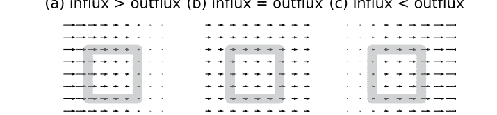

图 3.10

像这个例子一样，我们经常想要分析流入或流出一个封闭区域的总通量。在接下来的几个代码块中，我们将更新上述部分代码，并构建新的代码来计算通过封闭区域的通量。为了说明为什么需要一些额外的代码，让我们构建一个圆形边界并应用我们之前开发的 `plot_normals()` 函数。我们很快注意到，一些法向量指向圆心，而另一些指向外部，因为对于给定的边界段，有两个可能的垂直方向。我们需要选择一个方向并解决这种固有的歧义。

```python
# Code Block 3.13

step = np.pi/10
r = 0.75
phi = np.arange(0,2*np.pi,step)
p = np.vstack((r*np.cos(phi),r*np.sin(phi)))
fig, ax = plt.subplots(1,1,figsize=(2,2))
plot_normals(p,ax)
plt.xlim((-1.5,1.5))
plt.ylim((-1.5,1.5))
plt.savefig('fig_ch3_normal_in_out.pdf',bbox_inches='tight')
```

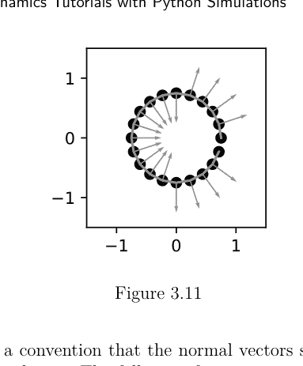

我们将选择一个约定，即法向量应从封闭区域向外指。以下函数 `get_normals_enc()` 和 `plot_normals_enc()` 接受一个额外的输入参数 `inside`，该参数指定一个点以消除边界内外的歧义。默认的 `inside` 点是坐标系的原点 (0,0)。我们还做了一个简化的假设，即边界表面不太复杂（即没有凹陷或凹形）。

然后，考虑边界上一点 $\vec{p}_b$ 和内部点 $\vec{p}_i$ 之间的一个向量。我们可以定义一个指向外部的向量 $\vec{o} = \vec{p}_b - \vec{p}_i = (x_b - x_i, y_b - y_i)$。给定边界上的一个法向量 $\vec{n}$，我们可以通过将其乘以 $\vec{o}$ 和 $\vec{n}$ 之间点积的符号来使其指向外部。如果 $\vec{n}$ 确实指向外部，点积的符号将为正。如果不是，则可以反转 $\vec{n}$ 的方向。这个策略在 `get_normals_enc()` 中实现。

`get_normals()` 和 `get_normals_enc()` 之间还有另一个微妙的区别。因为特定点的法向量是基于两个相邻点计算的，所以无法在边界上的第一个或最后一个点计算法向量。这种省略在上图中很明显。当我们处理封闭边界时，第一个和最后一个点是相邻的，通过将前两个点连接到边界数组的末尾（代码中为 `boundary_ext = np.hstack((boundary,boundary[:,:2]))`），可以计算边界上所有点的法向量。下面的图显示了沿边界所有点的法向量都已显示。

```python
# Code Block 3.14

def get_normals_enc (boundary,inside=(0,0)):
    boundary_ext = np.hstack((boundary,boundary[:,:2]))
    x, y = boundary_ext[0], boundary_ext[1]

    very_small_num = 10**(-10) # avoid divide by zero.
    slope = (y[2:]-y[:-2])/(x[2:]-x[:-2] + very_small_num)
    norm_vec_slope = -1/(slope + very_small_num)
    u, v = 1, norm_vec_slope
    mag = np.sqrt(u**2+v**2)
    u, v = u/mag, v/mag
    n = np.vstack((u,v))

    # Calculate the sign of a dot product between n and
    # vector between (x,y)-inside, which determines
    # which way n should point.
    x, y = x[1:-1]-inside[0], y[1:-1]-inside[1]
    dot_prod_sign = np.sign(x*n[0] + y*n[1])
    n = n*dot_prod_sign
    return n

def plot_normals_enc (boundary,ax,inside=(0,0),scale=3):
    n = get_normals_enc(boundary,inside=inside)

    boundary_ext = np.hstack((boundary,boundary[:,:2]))
    x, y = boundary_ext[0], boundary_ext[1]

    color = '#CCCCCC'
    ax.scatter(x,y,color='gray')
    ax.plot(x,y,color='gray')
    # Mark the inside point with a diamond marker.
    #ax.scatter(inside[0],inside[1],marker='d',color='black')
    ax.quiver(x[1:-1],y[1:-1],n[0],n[1],color=color,
              angles='xy',scale_units='xy',scale=scale)
    ax.set_xlabel('x')
    ax.set_ylabel('y')
    ax.axis('equal')
    ax.axis('square')
    return

fig, ax = plt.subplots(1,1,figsize=(2,2))
plot_normals_enc(p,ax,inside=(0,0))
lim = 1.5
ax.set_xlim((-lim,lim))
ax.set_ylim((-lim,lim))
ax.set_xticks((-1,0,1))
ax.set_yticks((-1,0,1))
```在我们研究电动力学的整个过程中，将会考虑不同形状的封闭区域。有时，我们会证明关于矢量场的某些数学量与封闭边界的形状无关。例如，一个特殊矢量场的通量，其大小在二维中随 \(\frac{1}{r}\) 衰减，只要满足某些条件（我们将在后面的章节讨论这些条件是什么），那么无论封闭边界是正方形还是圆形，通量都是相同的。在其他一些例子中，我们会以不同的方式布置矢量场的源（例如，电荷或电流）。因此，在下面的代码块中，我们定义了两个本书将多次使用的函数。这两个辅助函数 **points_along_circle()** 和 **points_along_square()** 返回一组追踪圆形和正方形封闭区域的点。两个函数都有一个参数 **step**，用于控制相邻点之间的间距。

```python
# 代码块 3.15

def points_along_circle(r=1, step=np.pi/10):
    phi = np.arange(-np.pi, np.pi, step)
    p = np.vstack((r*np.cos(phi), r*np.sin(phi)))
    return p

def points_along_square(s=1, step=0.1):
    # 获取正方形的点，其边长为 s。
    d = s/2
    one_side = np.arange(-d, d, step)
    N = len(one_side)
    p_top = np.vstack((+one_side, np.zeros(N)+d))  # 上边
    p_rgt = np.vstack((np.zeros(N)+d, -one_side))  # 右边
    p_bot = np.vstack((-one_side, np.zeros(N)-d))  # 下边
    p_lft = np.vstack((np.zeros(N)-d, +one_side))  # 左边
    p = np.hstack((p_top, p_rgt, p_bot, p_lft))
    return p

fig = plt.figure(figsize=(2,2))
p = points_along_square(s=4)
plt.plot(p[0], p[1], color='gray')
p = points_along_circle(r=2, step=np.pi/100)
plt.plot(p[0], p[1], color='gray')
p = points_along_circle(r=np.sqrt(8), step=np.pi/100)
plt.plot(p[0], p[1], color='gray')

plt.axis('equal')
plt.axis('square')
plt.xlabel('x')
plt.ylabel('y')
plt.xlim((-4,4))
plt.ylim((-4,4))
plt.xticks((-2,0,2))
plt.yticks((-2,0,2))
plt.savefig('fig_ch3_diff_enclosures.pdf', bbox_inches='tight')
plt.show()
```

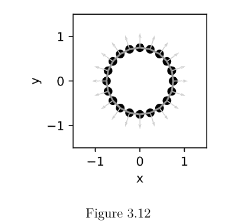

图 3.13

除了上述函数，让我们再创建两个辅助函数：`get_vfield_uniform()` 和 `get_vfield_radial()`，它们分别返回均匀矢量场和径向矢量场。两个函数都接受一个输入参数 `p`，即要指定矢量场的点集。

`get_vfield_radial()` 函数通过 `r = np.sqrt(np.sum(p**2, axis=0))` 计算到原点的距离，即计算 \(r = \sqrt{x^2 + y^2}\)。为了生成一个大小随 \(1/r\) 减小的矢量场，我们必须将 x 和 y 坐标除以 \(r^2\)。要生成一个大小与 r 无关的矢量场，我们则将 x 和 y 除以 r。只要存在除法，就可能遇到除数（这里是 r）过小导致严重数值误差的不幸情况。避免除以零或过小的数有很多不同的方法。这里，我们丢弃那些离原点太近的点。“太近”是什么意思？在我们的例子中，我们丢弃那些距离原点小于最大距离 1% 的点。我们找到满足此条件的索引（在代码中为 `valid_idx = np.where(r > np.max(r)*0.01)`），并用 `squeeze()` 方法挤出不需要的点。因此，`get_vfield_radial()` 函数可能返回的 `p` 包含原始输入参数 `p` 的一个子集。

```python
# 代码块 3.16

def get_vfield_uniform(p, type='right'):
    if type=='right':
        dx, dy = 1, 0
    if type=='left':
        dx, dy = -1, 0
    if type=='up':
        dx, dy = 0, 1
    if type=='down':
        dx, dy = 0, -1
    vf = np.zeros(p.shape)
    vf[0] = dx
    vf[1] = dy
    return vf, p

def get_vfield_radial(p, type='1/r'):
    r = np.sqrt(np.sum(p**2, axis=0))
    # 上面这行代码等同于：
    # r = np.sqrt(p[0]**2+p[1]**2)
    # 当我们除以 r 时，r 的值过小
    # 可能导致矢量的大小变得极大。
    # 有多种方法可以避免这种情况。
    # 这里，我们将丢弃 r 相对较小的点
    # （与最大 r 相比较小）。
    # 因此，此函数可能返回的 p
    # 与原始输入参数 p 不同。
    valid_idx = np.where(r > np.max(r)*0.01)
    q, s = p[:,valid_idx].squeeze(), r[valid_idx].squeeze()
    p, r = q, s

    if type=='r':
        dx, dy = p[0], p[1]
    if type=='l':
        dx, dy = p[0]/r, p[1]/r
    if type=='1/r':
        dx, dy = p[0]/r**2, p[1]/r**2
    if type=='1/r**2':
        dx, dy = p[0]/r**3, p[1]/r**3

    vf = np.zeros(p.shape)
    vf[0], vf[1] = dx, dy
    return vf, p

def plot_vfield(p, vf):
    fig = plt.figure(figsize=(2.5,2.5))
    plt.quiver(p[0], p[1], vf[0], vf[1],
            angles='xy', scale_units='xy')
    plt.axis('equal')
    plt.axis('square')
    plt.xlabel('x')
    plt.ylabel('y')
    lim = 1.25
    plt.xlim((-lim,lim))
    plt.ylim((-lim,lim))
    plt.xticks((-1,0,1))
    plt.yticks((-1,0,1))

step = 0.2
x, y = np.meshgrid(np.arange(-1, 1+step, step),
                   np.arange(-1, 1+step, step))
p = np.vstack((x.flatten(), y.flatten()))

vf, p = get_vfield_uniform(p, type='down')
plot_vfield(p, vf)
plt.title('Uniform Vector Field: Down')
plt.savefig('fig_ch3_diff_vfield_uniform_down.pdf')
plt.show()

vf, p = get_vfield_uniform(p, type='left')
plot_vfield(p, vf)
plt.title('Uniform Vector Field: Left')
plt.savefig('fig_ch3_diff_vfield_uniform_left.pdf')
plt.show()

vf, p = get_vfield_radial(p, type='r')
plot_vfield(p, vf)
plt.title('Radial Vector Field: r')
plt.savefig('fig_ch3_diff_vfield_linear_r.pdf')
plt.show()

vf, p = get_vfield_radial(p, type='1')
plot_vfield(p, vf)
plt.title('Radial Vector Field: Constant')
plt.savefig('fig_ch3_diff_vfield_constant_r.pdf')
plt.show()

vf, p = get_vfield_radial(p, type='1/r')
plot_vfield(p, vf)
plt.title('Radial Vector Field: 1/r')
plt.savefig('fig_ch3_diff_vfield_inverse_r.pdf')
plt.show()

vf, p = get_vfield_radial(p, type='1/r**2')
plot_vfield(p, vf)
plt.title('Radial Vector Field: 1/r^2')
plt.savefig('fig_ch3_diff_vfield_inverse_r2.pdf')
plt.show()
```

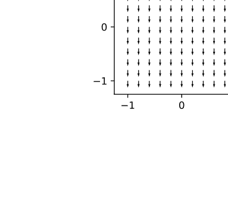

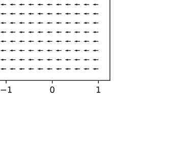

## 图 3.14

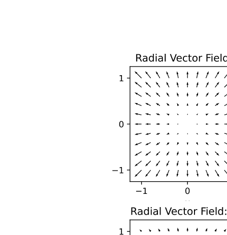

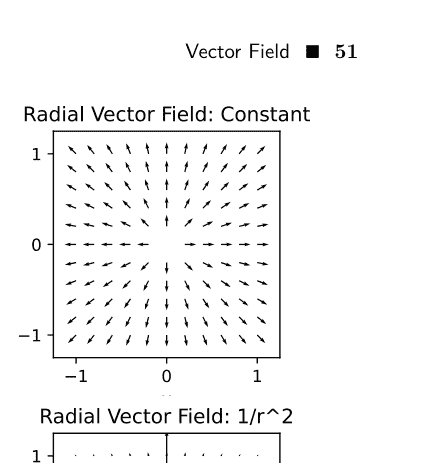

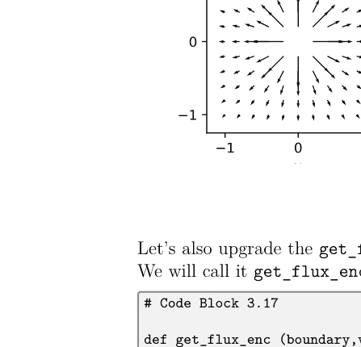

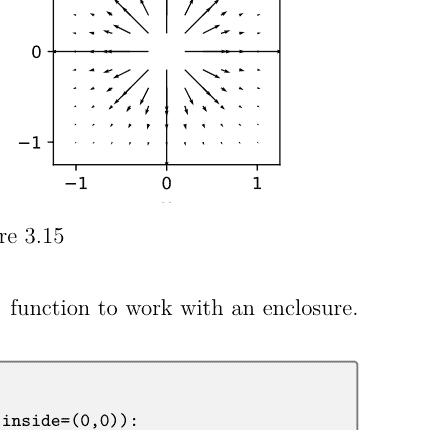

图 3.15

我们还可以升级 `get_flux()` 函数以处理封闭区域。我们将其命名为 `get_flux_enc()`。

```python
# 代码块 3.17

def get_flux_enc(boundary, vfield, inside=(0,0)):
    boundary_ext = np.hstack((boundary, boundary[:,:2]))
    x, y = boundary_ext[0], boundary_ext[1]
    dl_neighbor = np.sqrt((x[1:]-x[:-1])**2+(y[1:]-y[:-1])**2)
    dl = (0.5)*(dl_neighbor[1:]+dl_neighbor[:-1])
    n = get_normals_enc(boundary, inside=inside)
    xv, yv = vfield[0], vfield[1]
    dotprod = xv*n[0] + yv*n[1]
    flux = np.sum(dl*dotprod)
    return flux
```

让我们将这些辅助函数结合起来，计算通过不同边界形状的总通量：圆形和正方形。对于均匀矢量场，我们已经证明，只要端点相同，通过不同开放边界（例如垂直线、斜线、抛物线或半圆）的通量是相等的。因此，均匀矢量场通过封闭边界的总通量始终为零，这一点并不令人意外。下图显示了法向量（灰色）和矢量场（黑色）。在边界的左侧，法向量与矢量场的点积产生负值，而在边界右侧点积为正值。当这些值相加时，总通量为零。

```python
# 代码块 3.18

fig, axs = plt.subplots(1,2, figsize=(6,3))

ax = axs[0]
p = points_along_square(s=2, step=0.25)
vf, p = get_vfield_uniform(p, type='right')
plot_normals_enc(p, ax)
ax.quiver(p[0], p[1], vf[0], vf[1], color='black')
ax.set_title('Flux = %3.2f'%get_flux_enc(p, vf))

ax = axs[1]
p = points_along_circle(r=1, step=np.pi/10)
vf, p = get_vfield_uniform(p, type='right')
plot_normals_enc(p, ax)
ax.quiver(p[0], p[1], vf[0], vf[1], color='black')
ax.set_title('Flux = %3.2f'%get_flux_enc(p, vf))

for i in range(2):
    ax = axs[i]
    lim = 2
    ax.set_xlim((-lim,lim))
    ax.set_ylim((-lim,lim))
    ax.set_xticks((-1,0,1))
    ax.set_yticks((-1,0,1))

plt.tight_layout()
plt.savefig('fig_ch3_uniform_v_flux.pdf')
plt.show()
```

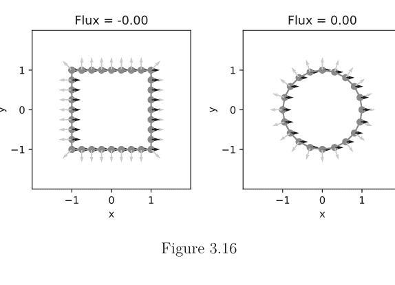

图 3.16

随着边界上考虑的点增多，通量的数值计算精度也随之提高，如下所示。

```
# Code Block 3.19

print('Flux should approach zero with smaller step size.')
for step in (0.5,0.1,0.05,0.01):
    p = points_along_circle(r=1,step=step)
    vf, p = get_vfield_uniform(p,type='right')
    print('With step = %6.5f, flux = %9.8f'%(step,get_flux_enc(p,vf)))
```

随着步长减小，通量应趋近于零。
步长 = 0.50000，通量 = 0.01032620
步长 = 0.10000，通量 = 0.00003844
步长 = 0.05000，通量 = 0.00000874
步长 = 0.01000，通量 = 0.00000011

### 3.5 一个特殊的向量场

我们以考虑一个特殊的向量场来结束本章，该向量场在二维空间中呈径向指向，其大小与 $r$ 成反比。正如下面的计算所示，这种径向向量场的通量不依赖于边界的形状或大小。通量接近 6.29 或 $2\pi$。

```
# Code Block 3.20

# The flux of the 1/r vector field is constant,
# no matter what.
```

```
step = 0.01

fig = plt.figure(figsize=(3,3))
# Circular boundary
p_cl = points_along_circle(r=3,step=step)
vf_cl, p_cl = get_vfield_radial (p_cl,type='1/r')
plt.plot(p_cl[0],p_cl[1],color='gray')

p_cm = points_along_circle(r=2,step=step)
vf_cm, p_cm = get_vfield_radial (p_cm,type='1/r')
plt.plot(p_cm[0],p_cm[1],color='gray')

p_cs = points_along_circle(r=1,step=step)
vf_cs, p_cs = get_vfield_radial (p_cs,type='1/r')
plt.plot(p_cs[0],p_cs[1],color='gray')

# Square boundary
p_sl = points_along_square(s=6,step=step)
vf_sl, p_sl = get_vfield_radial (p_sl,type='1/r')
plt.plot(p_sl[0],p_sl[1],color='gray')

p_sm = points_along_square(s=4,step=step)
vf_sm, p_sm = get_vfield_radial (p_sm,type='1/r')
plt.plot(p_sm[0],p_sm[1],color='gray')

p_ss = points_along_square(s=2,step=step)
vf_ss, p_ss = get_vfield_radial (p_ss,type='1/r')
plt.plot(p_ss[0],p_ss[1],color='gray')

step = 1
x,y = np.meshgrid(np.arange(-5,5+step,step),
                   np.arange(-5,5+step,step))
p = np.vstack((x.flatten(),y.flatten()))
vf, p = get_vfield_radial(p,type='1/r')
plt.quiver(p[0],p[1],vf[0],vf[1],angles='xy',scale_units='xy')

plt.axis('equal')
plt.axis('square')
plt.xlabel('x')
plt.ylabel('y')
plt.xlim((-5,5))
plt.ylim((-5,5))
plt.xticks((-4,-2,0,2,4))
plt.yticks((-4,-2,0,2,4))
plt.title('Different Boundaries under radial vector field')
plt.savefig('fig_ch3_radial_flux.pdf',bbox_inches='tight')
plt.show()

print('Flux with a large circle = %8.7f'%get_flux_enc(p_cl,vf_cl))
```

```
python
print('Flux with a medium circle = %8.7f'%get_flux_enc(p_cm,vf_cm))
print('Flux with a small circle = %8.7f'%get_flux_enc(p_cs,vf_cs))
print('Flux with a large square = %8.7f'%get_flux_enc(p_sl,vf_sl))
print('Flux with a medium square = %8.7f'%get_flux_enc(p_sm,vf_sm))
print('Flux with a small square = %8.7f'%get_flux_enc(p_ss,vf_ss))

```

大圆的通量 = 6.2828454
中圆的通量 = 6.2828454
小圆的通量 = 6.2828454
大方形的通量 = 6.2859365
中方形的通量 = 6.2873043
小方形的通量 = 6.2913767

### 径向向量场下的不同边界

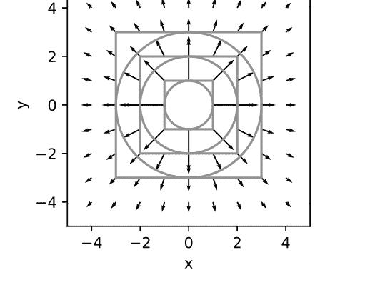

图 3.17

这种恒定性非常显著，因为在所有情况下，法线与向量场之间的模长和相对角度都大不相同。下图展示了四个代表性案例。为了绘制图形，我们使用了边界上点之间相对较大的间距，以避免绘制出杂乱、拥挤的图表。通量值是使用较小的 **step** 值计算的。

```
python
# Code Block 3.21
def make_flux_plots(type='1/r', scale=1):
    inside = (0,0)
```

```
fig, axs = plt.subplots(2,2,figsize=(6,6))

ax = axs[0,0]
p = points_along_circle(r=0.6,step=np.pi/12)
vf, p = get_vfield_radial (p,type=type)
plot_normals_enc(p,ax,inside=inside)
ax.quiver(p[0],p[1],vf[0],vf[1],color='black',scale=scale)
p = points_along_circle(r=0.6,step=np.pi/120)
vf, p = get_vfield_radial (p,type=type)
ax.set_title('Flux = %4.3f'%get_flux_enc(p,vf))

ax = axs[0,1]
p = points_along_circle(r=0.3,step=np.pi/12)
vf, p = get_vfield_radial (p,type=type)
plot_normals_enc(p,ax,inside=inside)
ax.quiver(p[0],p[1],vf[0],vf[1],color='black',scale=scale)
p = points_along_circle(r=0.3,step=np.pi/120)
vf, p = get_vfield_radial (p,type=type)
ax.set_title('Flux = %4.3f'%get_flux_enc(p,vf))

step = 0.2

ax = axs[1,0]
p = points_along_square(s=1.6,step=step)
vf, p = get_vfield_radial (p,type=type)
plot_normals_enc(p,ax,inside=inside)
ax.quiver(p[0],p[1],vf[0],vf[1],color='black',scale=scale)
p = points_along_square(s=1.6,step=0.01)
vf, p = get_vfield_radial (p,type=type)
ax.set_title('Flux = %4.3f'%get_flux_enc(p,vf))

ax = axs[1,1]
p = points_along_square(s=1,step=step)
vf, p = get_vfield_radial (p,type=type)
plot_normals_enc(p,ax,inside=inside)
ax.quiver(p[0],p[1],vf[0],vf[1],color='black',scale=scale)
p = points_along_square(s=1,step=0.01)
vf, p = get_vfield_radial (p,type=type)
ax.set_title('Flux = %4.3f'%get_flux_enc(p,vf))

for i in range(2):
    for j in range(2):
        ax = axs[i,j]
        lim = 1.5
        ax.set_xlim((-lim,lim))
        ax.set_ylim((-lim,lim))
        ax.set_xticks((-1,0,1))
        ax.set_yticks((-1,0,1))
```

```
python
plt.tight_layout()

return

print('Vector field: radial with 1/r')
make_flux_plots(type='1/r', scale=16)
plt.savefig('fig_ch3_radial_diff_boundary.pdf')
plt.show()

```

### 向量场：径向，大小与 1/r 成正比

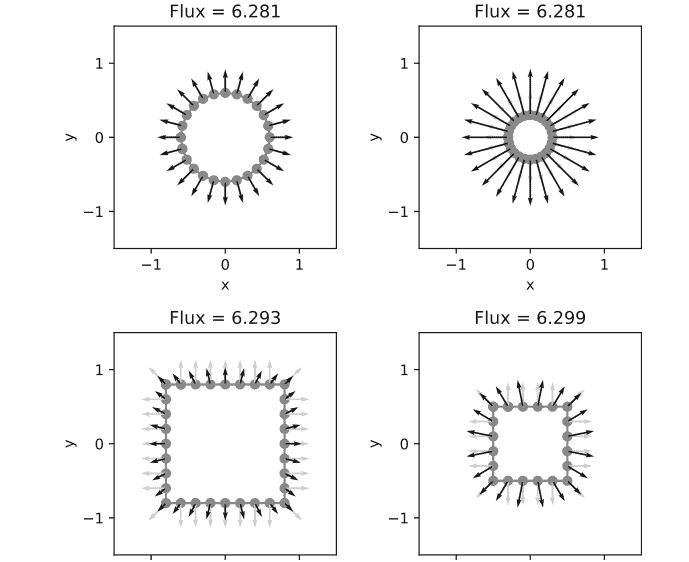

图 3.18

在其他情况下（对于大小与 r 的不同次方成正比的向量场），通量取决于边界的形状，如下所示。

```
python
# Code Block 3.22

print('Vector field: radial with 1/r**2')
```

```
make_flux_plots(type='1/r**2',scale=32)
plt.savefig('fig_ch3_other_vf_diff_boundary1.pdf')
plt.show()

print('Vector field: radial with 1')
make_flux_plots(type='1',scale=16)
plt.savefig('fig_ch3_other_vf_diff_boundary2.pdf')
plt.show()

print('Vector field: radial with r')
make_flux_plots(type='r',scale=8)
plt.savefig('fig_ch3_other_vf_diff_boundary3.pdf')
plt.show()
```

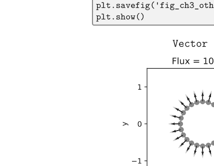

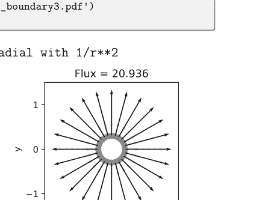

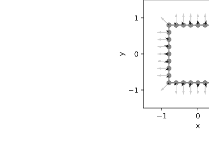

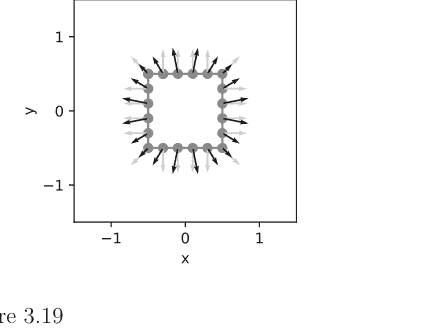

图 3.19

### 向量场：径向，大小恒为 1

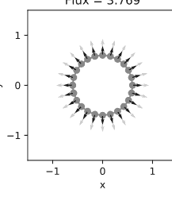

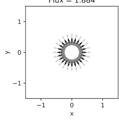

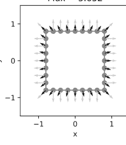

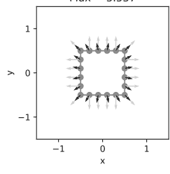

图 3.20

### 向量场：径向，大小与 r 成正比

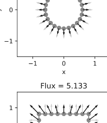

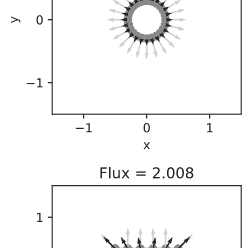

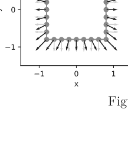

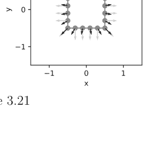

图 3.21

在下一章中，我们将讨论为什么 $\frac{1}{r}$ 向量场在二维空间中尤为特殊。目前，本章的主要要点是，我们可以沿着边界对向量场进行有趣的数学运算。在通量计算的案例中，我们计算边界上每个点处向量场与法向量的点积，并对点积值进行积分。

## 电场

### 4.1 电荷与库仑定律

在本书开头，我们介绍了水流在地表景观上的类比。我们可以说，指导水流的这种向量场是由山丘或山谷中陆地的丰富或缺乏所创造的。在电学语境下，电的向量场，即电场，是由电荷创造的。与始终为非负量的质量不同，电荷可以是正的、中性的或负的。电荷的典型例子是质子、中子和电子。在我们的许多分析中，我们经常考虑点电荷，相对于分析的长度尺度，它占据的空间区域非常小，因此出于所有实际目的，它被视为空间中的一个点。电荷的单位是库仑（C）。相反的电荷（正和负）相互吸引，相同的电荷相互排斥。这种相互作用是通过电场介导的。

一个电点电荷产生的电场，其强度随与电荷距离的倒数函数减小。更具体地说，在二维空间中，如果一个电荷 $q$ 放置在位置 $(x_s, y_s)$，则点 $(x, y)$ 处的电场强度由下式给出：

```
$\vec{\mathbf{E}}_{2D}(x,y) = \frac{q}{2\pi\epsilon_0} \left( \frac{x - x_s}{r^2} \hat{\mathbf{x}} + \frac{y - y_s}{r^2} \hat{\mathbf{y}} \right)$
```

```
$r = \sqrt{(x - x_s)^2 + (y - y_s)^2}$
```

Then,

$$|\vec{E}_{2D}| = \frac{q}{2\pi\epsilon_0} \frac{1}{r}$$

这很容易通过 $\sqrt{(x-x_q)^2 + (y-y_q)^2} = \frac{1}{r}$ 来验证。常数 $\epsilon_0$ 被称为真空介电常数，其值为 $8.85 \times 10^{-12}$ C$^2$ N m$^{-2}$。上述公式仅在二维宇宙中成立，其中电场的大小按 $\frac{1}{r}$ 衰减。我们将首先建立对二维电场的直观理解和公式，因为它更容易可视化。在后面的章节中，我们将介绍适用于我们这个宇宙的三维公式，其中场强按 $\frac{1}{r^2}$ 衰减。

### 代码块 4.1

```python
import numpy as np
import matplotlib.pyplot as plt

def get_vfield_radial_2d(p, p_charge):
    # p: points at which the electric field is calculated.
    # p_charge: location of a point charge.
    x, y = p[0]-p_charge[0], p[1]-p_charge[1]
    r = np.sqrt(x**2 + y**2)
    
    # Avoid dividing by a very small number.
    valid_idx = np.where(r > np.max(r)*0.01)
    p, r = p[:,valid_idx].squeeze(), r[valid_idx].squeeze()
    
    vf = np.zeros(p.shape)
    vf[0] = (p[0]-p_charge[0])/r**2
    vf[1] = (p[1]-p_charge[1])/r**2
    vf = vf/(2*np.pi)
    return vf, p
```

让我们来可视化一个放置在原点的点电荷的电场。当电荷的符号为负时，我们只需反转电场的方向，如 `vf_neg = -vf_pos` 所示。

### 代码块 4.2

```python
# Set up a grid to plot the vector field.
step = 0.1
x,y = np.meshgrid(np.arange(-1,1+step,step),
                  np.arange(-1,1+step,step))
xs, ys = 0.0, 0.0
p = np.vstack((x.flatten(),y.flatten()))

def tidy_up_ax (ax):
    ax.axis('equal')
    ax.axis('square')
    lim = 1.25
    ax.set_xlim((-lim,lim))
    ax.set_ylim((-lim,lim))
    ax.set_xlabel('x')
    ax.set_ylabel('y')
    ax.set_xticks((-1,0,1))
    ax.set_yticks((-1,0,1))
    return

scale = 6

# Positive point charge
vf_pos, p = get_vfield_radial_2d (p,(xs,ys))
fig = plt.figure(figsize=(2,2))
plt.scatter(xs,ys,marker="+",color='black')
plt.quiver(p[0],p[1],vf_pos[0],vf_pos[1],
           angles='xy',scale_units='xy',scale=scale)
tidy_up_ax(plt.gca())
plt.title('Positive Point Charge')
plt.savefig('fig_ch4_single_charge_pos.pdf',bbox_inches='tight')
plt.show()

# Negative point charge
vf_neg = -vf_pos
fig = plt.figure(figsize=(2,2))
plt.scatter(xs,ys,marker="_",color='black')
plt.quiver(p[0],p[1],vf_neg[0],vf_neg[1],
           angles='xy',scale_units='xy',scale=scale)
tidy_up_ax(plt.gca())
plt.title('Negative Point Charge')
plt.savefig('fig_ch4_single_charge_neg.pdf',bbox_inches='tight')
plt.show()
```

64 ■ 使用 Python 模拟的电动力学教程

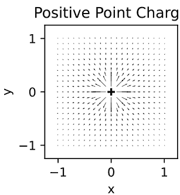

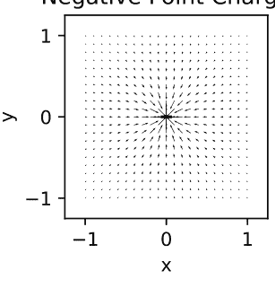

图4.1

### 4.2 叠加原理

当存在不止一个电荷时会发生什么？答案是电场会简单地线性相加，这被称为叠加原理。这种加性性质看起来似乎最合理，并且确实使我们的计算更容易，但它并非逻辑上的必然。在其他情境和现象中，集体的“总量”可能由最小值（例如，链条的强度取决于其最弱的一环）、平均值、最大值（例如，一个团队的表现可能由最主导的成员决定）或非线性增强（例如，整体可能大于各部分之和）给出。在量子力学的情况下，概率幅是线性相加的（$\psi_1 + \psi_2 + \cdots$），但观测到的概率是振幅的平方（$|\psi_1 + \psi_2 + \cdots|^2$）。电磁学定律似乎在叠加原理下运作，这是一个实验事实。总电场可以通过将各个电荷的贡献相加来计算。如下方的代码块所示，当有两个点电荷时，每个点电荷产生的电场可以分别计算，然后在后面加在一起（`vf = vf0 + vf1`）。最后一个例子被称为电偶极子，其中一对等量异号电荷相隔很小的距离排列。

### 代码块 4.3

```python
# Two charges.
xs0, ys0 = 0.55, 0.00
xs1, ys1 = -0.55, 0.00
p = np.vstack((x.flatten(),y.flatten()))
vf0, p = get_vfield_radial_2d (p,(xs0,ys0))
vf1, p = get_vfield_radial_2d (p,(xs1,ys1))

# Two positive charges.
vf = vf0 + vf1
fig = plt.figure(figsize=(2,2))
plt.scatter(xs0,ys0,marker='+',color='black')
plt.scatter(xs1,ys1,marker='+',color='black')
plt.quiver(p[0],p[1],vf[0],vf[1],
           angles='xy',scale_units='xy',scale=scale)
tidy_up_ax(plt.gca())
plt.title('Two Positive Charges')
plt.savefig('fig_ch4_double_charge_pos.pdf',bbox_inches='tight')
plt.show()

# Two negative charges.
vf = (-vf0) + (-vf1)
fig = plt.figure(figsize=(2,2))
plt.scatter(xs0,ys0,marker='_',color='black')
plt.scatter(xs1,ys1,marker='_',color='black')
plt.quiver(p[0],p[1],vf[0],vf[1],
           angles='xy',scale_units='xy',scale=scale)
tidy_up_ax(plt.gca())
plt.title('Two Negative Charges')
plt.savefig('fig_ch4_double_charge_neg.pdf',bbox_inches='tight')
plt.show()

vf = vf0 + (-vf1) # Dipole.
fig = plt.figure(figsize=(2,2))
plt.scatter(xs0,ys0,marker="+",color='black')
plt.scatter(xs1,ys1,marker="_",color='black')
plt.quiver(p[0],p[1],vf[0],vf[1],
           angles='xy',scale_units='xy',scale=scale)
tidy_up_ax(plt.gca())
plt.title('Dipole')
plt.savefig('fig_ch4_double_charge_dipole.pdf',bbox_inches='tight')
plt.show()
```

### 两个正电荷

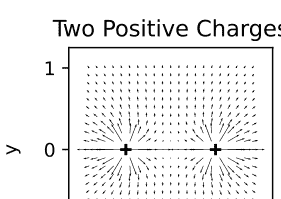

### 两个负电荷

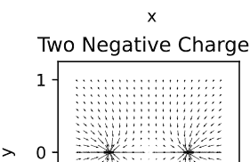

### 电偶极子

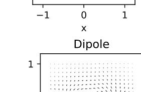

图4.2

### 4.3 示例：无限长直线

让我们应用叠加原理来计算电荷沿一条长线分布时的电场。作为一个理论练习，考虑一条线性电荷密度为 $\rho$ 的直线，使得沿无限小长度 $dy$ 的电荷量为 $\rho dy$。那么，距离该直线 $D$ 处的电场将由下式给出：

$$|\vec{\mathbf{E}}(x=D)| = \int_{-\infty}^{\infty} dE_x(y)$$

其中 $dE_x(y)$ 是位于位置 $y$ 的无限小电荷 $\rho dy$ 产生的电场的 $\hat{\mathbf{x}}$ 分量。我们可以忽略 $\hat{\mathbf{y}}$ 分量，原因如下。因为我们考虑的是一条无限长的直线，我们可以不失一般性地选择感兴趣的点位于 $(D,0)$，并且总能找到一对电荷（下图中的 $q_i$ 和 $q_j$）关于 $x$ 轴对称分布。因此，它们电场的 $\hat{\mathbf{y}}$ 分量大小相等、方向相反，而 $\hat{\mathbf{x}}$ 分量指向相同的方向。多亏了这种对称性，总场的 $\hat{\mathbf{y}}$ 分量为零。

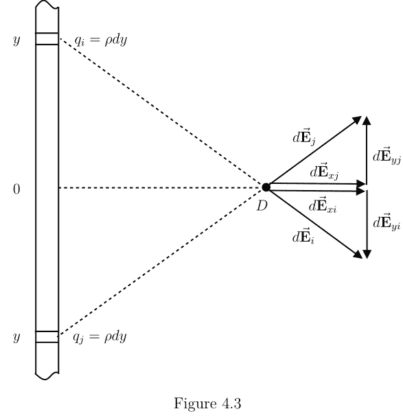

68 ■ 使用 Python 模拟的电动力学教程

位于 y 处的无限小电荷产生的电场大小为：

$$|d\vec{E}(x = D, y)| = \frac{\rho dy}{2\pi\epsilon_0} \frac{1}{\sqrt{D^2 + y^2}}$$

上述表达式的 x 分量为

$$|d\vec{E}_x(x = D, y)| = \frac{\rho dy}{2\pi\epsilon_0} \frac{1}{\sqrt{D^2 + y^2}} \frac{D}{\sqrt{D^2 + y^2}} = \frac{\rho dy}{2\pi\epsilon_0} \frac{D}{D^2 + y^2}$$

那么，总电场为

$$|\vec{E}(x = D)| = \frac{\rho}{2\pi\epsilon_0} \int_{-\infty}^{\infty} \frac{Ddy}{D^2 + y^2} = \frac{\rho}{2\pi\epsilon_0} \int_{-\infty}^{\infty} \frac{dt}{1 + t^2}$$

其中我们定义了一个新的变量 $t = y/D$。

这个定积分收敛，结果为 $\pi$，如下方使用 sympy 模块的代码块所示。代码行 `sym.Symbol('t')` 允许我们将 t 视为一个符号常数，而 `sym.integrate()` 评估函数在指定范围内的积分。

### 代码块 4.4

```python
import sympy as sym
t = sym.Symbol('t')
# sym.oo is symbolic constant for infinity.
sym.integrate(1/(1+t**2), (t,-sym.oo,sym.oo))
```

$$\pi$$

我们还可以通过变量代换 $t = \tan \theta = \frac{\sin \theta}{\cos \theta}$ 来解析地证明 $\int_{-\infty}^{\infty} \frac{dt}{1+t^2} = \pi$。我们注意到 $dt = (1 + \tan^2 \theta)d\theta$ 且 $1 + \tan^2 \theta = \frac{1}{\cos^2 \theta}$。然后，原始积分变为

$$\int_{-\infty}^{\infty} \frac{dt}{1 + t^2} = \int_{-\pi/2}^{\pi/2} \cos^2 \theta (1 + \tan^2 \theta) d\theta = \int_{-\pi/2}^{\pi/2} (\cos^2 \theta + \sin^2 \theta) d\theta = \int_{-\pi/2}^{\pi/2} d\theta = \pi$$

我们得出结论 $|\vec{E}(x=D)| = \frac{\rho}{2\epsilon_0}$，这是一个有趣的结果，因为它是一个不依赖于距离 $D$ 的常数。

让我们通过数值模拟来验证这一情形。在以下代码中，`y_max` 表示线段的长度。当我们增加这个长度时，模拟结果会逼近理论极限。请尝试 `y_max = 0.5` 和 `y_max = 10`。在后一种情况下，矢量的大小几乎相同，方向是水平的，这与上述分析的预期一致。

```python
# Code Block 4.5

# Infinite line
step = 0.1
x,y = np.meshgrid(np.arange(-1,1+step,step),
                  np.arange(-1,1+step,step))
p = np.vstack((x.flatten(),y.flatten()))
idx = np.where(np.abs(p[0])>0.001)
p = np.vstack((p[0,idx],p[1,idx]))

dy = 0.1
y_max = 10
y_range = np.arange(-y_max,y_max,dy) # Infinite line.

# Test run to see the size of returned p.
vf0, p = get_vfield_radial_2d (p,(0,0))
vf_single = np.zeros(p.shape)

for ys in y_range:
    vf0, p = get_vfield_radial_2d (p,(0,ys))
    vf_single = vf_single + (vf0)*dy

fig = plt.figure(figsize=(2,2))
plt.scatter(np.zeros(y_range.shape),y_range,marker='+',color='black')
plt.quiver(p[0],p[1],vf_single[0],vf_single[1],
           angles='xy',scale_units='xy')
plt.axis('equal')
plt.axis('square')
plt.xlabel('x')
plt.ylabel('y')
lim = 1.0
plt.xlim((-lim,lim))
plt.ylim((-lim,lim))
plt.xticks((-1,0,1))
plt.yticks((-1,0,1))
plt.savefig('fig_ch4_infinite_line.pdf', bbox_inches='tight')
plt.show()
```


图 4.4

让我们来考察这个近似有多好。在我们的代码中，$\epsilon_0$ 被设为1，且 $\rho = 1$。因此，我们预期 $|\vec{E}(x = D)|$ 会趋近于 0.5。我们将 `y_max` 的值从1增加到2、4、$\cdots$、1024。随着线段的长度相对于分析尺度（0.1 到 1 之间）变得有效地无限长，矢量的大小（vf_mag）确实与离线的距离 D 无关。

```python
# Code Block 4.6

# How good is the approximation?

def approx_line (dy,y_max):
    dx = 0.1
    x_range = np.arange(dx,1+dx,dx)
    p = np.vstack((x_range,np.zeros(len(x_range))))
    vf = np.zeros(p.shape)
    y_range = np.arange(-y_max,y_max+dy,dy)
    for ys in y_range:
        vf0, _ = get_vfield_radial_2d (p,(0,ys))
        vf = vf + (vf0)*dy
    return vf, p

dy = 0.01
y_max_range = (1,2,4,8,16,1024)
fig = plt.figure(figsize=(3,3))
for y_max in y_max_range:
    vf, p = approx_line (dy,y_max)
    vf_mag = np.sqrt(np.sum(vf**2,axis=0))
    plt.plot(p[0],vf_mag,color='gray')
    plt.text(1.05,vf_mag[-1],"%d"%y_max)

plt.xlim((0,1.3))
plt.ylim((0.2,0.6))
plt.xticks((0,0.5,1))
plt.yticks((0.3,0.4,0.5))
plt.ylabel('|E|')
plt.xlabel('x')
plt.savefig('fig_ch4_infinite_line_approx.pdf',bbox_inches='tight')
plt.show()

print('Numerical approximation = %6.5f'%(np.mean(vf_mag)))

rho = 1
print('Theoretical value = %6.5f'%(rho/2))
```
```
Numerical approximation = 0.49983
Theoretical value = 0.50000
```


图 4.5

正如我们所看到的，沿无限长直线分布的线电荷会产生一个矢量场，该场在直线两侧均匀地指向相反的方向。因此，通过平行放置等量异种电荷的直线，我们可以创建一个受限的均匀矢量场区域。两条直线之间的两个矢量场方向一致，其和不为零，而外部区域的电场为零，这由以下代码块所演示。

```python
# Code Block 4.7

# Parallel lines.

step = 0.1
x,y = np.meshgrid(np.arange(-1,1+step,step),
                   np.arange(-1,1+step,step),
                   indexing='ij')
p = np.vstack((x.flatten(),y.flatten()))
vf_double = np.zeros(p.shape)

# Choose x0 carefully,
# so that the location of the infinite line
# (namely, +x0 and -x0) does not land at
# one of the meshgrid points.
x0 = 0.55
dy = 0.1
y_max = 10
y_range = np.arange(-y_max,y_max+dy,dy)
for y0 in y_range:
    vf_r, _ = get_vfield_radial_2d (p,(+x0,y0))
    vf_l, _ = get_vfield_radial_2d (p,(-x0,y0))
    vf_double = vf_double + (vf_r - vf_l)*dy

fig = plt.figure(figsize=(2,2))
plt.scatter(np.zeros(y_range.shape)+x0,
            y_range,marker='+',color='black')
plt.scatter(np.zeros(y_range.shape)-x0,
            y_range,marker='_',color='black')
plt.quiver(p[0],p[1],vf_double[0],vf_double[1],
           angles='xy',scale_units='xy',scale=16)
plt.axis('equal')
plt.axis('square')
lim = 1.0
plt.xlim((-lim,lim))
plt.ylim((-lim,lim))
plt.xlabel('x')
plt.ylabel('y')
plt.xticks((-1,0,1))
plt.yticks((-1,0,1))
plt.savefig('fig_ch4_two_infinite_lines.pdf',bbox_inches='tight')
plt.show()
```


图 4.6

### 4.4 示例：圆环

另一种常被研究的电荷特殊排列是圆环。以下代码块计算了若干采样位置的电场。圆环外，电场是径向的，其大小随距圆心距离的增加而减小。圆环内，电场为零。因此，在圆环内部的采样点 (-0.5,-0.5), (-0.5,0.5), (0.5,-0.5), (0.5,0.5) 处，用 `quiver()` 绘制的电场矢量非常短，几乎不可见。

```python
# Code Block 4.8

# Calculate the electric field from a circular charge distribution.
def approx_circ (p, r=1, d_phi=2*np.pi/200):
    phi_range = np.arange(0,2*np.pi,d_phi)
    vf = np.zeros(p.shape)

    for phi in phi_range:
        x0, y0 = r*np.cos(phi), r*np.sin(phi)
        vf0, _ = get_vfield_radial_2d (p,(x0,y0))
        vf = vf + (vf0)*r*d_phi
    return vf

d_phi=2*np.pi/200

scale = 1 # scale of the arrows
lim = 4.5
step = 1
x,y = np.meshgrid(np.arange(-lim,lim+step,step),
                   np.arange(-lim,lim+step,step),
                   indexing='ij')
p = np.vstack((x.flatten(),y.flatten()))
vf = approx_circ (p,d_phi=d_phi)

fig = plt.figure(figsize=(2,2))
plt.quiver(p[0],p[1],vf[0],vf[1],
           angles='xy',scale_units='xy',scale=scale)

# Draw charge distribution for illustration.
R = 1
phi_range = np.arange(0,np.pi*2,np.pi/7)
for phi in phi_range:
    x0, y0 = R*np.cos(phi), R*np.sin(phi)
    plt.scatter(x0,y0,marker='+',color='black')

plt.axis('equal')
plt.axis('square')
plt.xlim((-lim,lim))
plt.ylim((-lim,lim))
plt.xlabel('x')
plt.ylabel('y')
plt.xticks((-2,0,2))
plt.yticks((-2,0,2))
plt.savefig('fig_ch4_circle.pdf',bbox_inches='tight')
plt.show()
```


图 4.7

我们可以通过数值计算 y = 0 时沿 x 轴方向的电场大小来进一步考察这种行为。以下图表再次表明，内部（阴影区域）电场为零，而圆环外部的电场递减。我们可以通过拟合 log(|E|) 与 log(r) 的数据点来定量验证外部区域电场随 1/r 衰减的行为。使用 `np.polyfit()` 函数得到的最佳拟合直线斜率为 -1，这证实了 |E| 对 1/r 的依赖关系。

```python
# Code Block 4.9

# Verify E is zero inside the circular shell and drops off 1/r.
px = np.array([0,0.2,0.4,0.8,1.2,1.4,1.6,1.8,2,4,8,16])
px = np.hstack((-px,px))
py = np.zeros(len(px))
p = np.vstack((px,py))

vf = approx_circ (p,d_phi=d_phi)
vf_mag = np.sqrt(np.sum(vf**2,axis=0))

fig = plt.figure(figsize=(3,3))
plt.scatter(px,vf_mag,color='black',zorder=2)

q_enc = 1
D_range = np.arange(1.2,16,0.01)
plt.plot(+D_range,q_enc/D_range,color='black')
plt.plot(-D_range,q_enc/D_range,color='black')

xbox = np.array([-1,-1,1,1])
ybox = np.array([0,q_enc/D_range[0],q_enc/D_range[0],0])
plt.fill(xbox,ybox,color='#CCCCCC',zorder=1)

plt.xlabel('D')
plt.ylabel('|E|')
plt.xticks(np.arange(-16,18,8))
plt.title('E field from a circular charge distribution')
plt.savefig('fig_ch4_circle_E.pdf',bbox_inches='tight')
plt.show()

logx, logy = np.log(px[px>1]), np.log(vf_mag[px>1])
fig = plt.figure(figsize=(3,3))
plt.scatter(logx,logy,color='black')
pfit = np.polyfit(logx,logy,1)
plt.plot(logx,logx*pfit[0]+pfit[1],color='black')
plt.xlim((0,3))
plt.xticks((0,1,2,3))
plt.xlabel('log(D)')
plt.ylabel('log(|E|)')
plt.title('log-log plot (outside)')
plt.legend(('Slope = %4.3f'%pfit[0],'log(|E|)'))
```## 圆形电荷分布产生的电场


## 对数-对数图（外部）


## 图 4.8

借助 sympy 模块，我们可以通过解析方法验证上述模拟结果。我们可以从下面这个半径为 \( R \) 的圆形电荷分布示意图开始。我们将要计算电场强度的位置距离圆心为 \( D \)。线性电荷密度由 \( \rho = \frac{q}{2\pi R} \) 给出，其中 \( q \) 是圆上的总电荷量。

### 代码块 4.10

```python
D = 3
R = 1
step = 0.01
phi_range = np.arange(0,2*np.pi+step,step)

phi = np.pi/4
fig = plt.figure(figsize=(5,3))
plt.plot(R*np.cos(phi_range),R*np.sin(phi_range),
         color='gray',linewidth=4)
x, y = R*np.cos(phi), R*np.sin(phi)
plt.plot((0,x),(0,y),color='black')
plt.plot((x,D),(y,0),color='black')
plt.plot((0,D),(0,0),color='black')
plt.plot((x,x),(0,y),color='gray')
plt.text(x-0.5,y-0.3,'R')
plt.text(D,-0.15,'D')
plt.text(-0.1,-0.15,'O')
plt.text(x,y+0.1,'P')
plt.text(x,-0.15,'Q')
plt.text(D-1.5,+0.6,'r')
plt.text(0.2,0.07,r'$\phi$')
plt.text(D-0.7,0.07,r'$\theta$')
plt.axis('square')
plt.axis('off')
plt.xlim(np.array([-R,D])*1.1)
plt.ylim(np.array([-1,1])*R*1.1)
plt.savefig('fig_ch4_circle_diagram.pdf')
plt.show()
```


图 4.9

让我们考虑位于图中三角形顶端的点 \(P = (R \cos \phi, R \sin \phi)\) 处的一个微小电荷元 \(dq = \rho R d\phi\)。角 \(\angle POQ\) 记为 \(\phi\)。角 \(\angle PDQ\) 记为 \(\theta\)。待求点 \(D\) 与电荷元 \(dq\) 之间的距离 \(r\) 由 \(r = \sqrt{(D - R \cos \phi)^2 + (R \sin \phi)^2} = \sqrt{(D^2 + R^2 - 2DR \cos \phi)}\) 给出。

根据二维库仑定律，位于 \(P\) 的电荷元 \(dq\) 产生的电场将沿 \(\overline{PD}\) 方向，其大小为 \(\frac{\rho R d\phi}{2\pi\epsilon_0 r}\)。由于存在一个关于 \(\overline{OD}\) 对称的匹配电荷元，当对整个圆周上所有电荷元产生的电场求和时，点 \(D\) 处的电场垂直分量将为零。我们在计算无限长带电直线的电场时曾使用过相同的对称性论证。因此，\(dq\) 产生的电场水平分量为 \(\frac{\rho R d\phi}{2\pi\epsilon_0 r} \cos \theta\)，其中 \(\cos \theta = \frac{(D-R \cos \phi)}{r}\)。

因此，\(\vec{\mathbf{E}}\) 沿水平方向的总大小可通过以下积分计算：

$$\begin{aligned} |\mathbf{E}| &= \frac{\rho}{2\pi\epsilon_0} \int_0^{2\pi} \frac{Rd\phi}{r} \cos\theta \\ &= \frac{\rho}{2\pi\epsilon_0} \int_0^{2\pi} \frac{D - R\cos\phi}{D^2 + R^2 - 2DR\cos\phi} Rd\phi \\ &= \frac{\rho}{2\pi\epsilon_0} \int_0^{2\pi} \frac{k - \cos\phi}{k^2 + 1 - 2k\cos\phi} d\phi \\ &= \frac{\rho}{2\pi\epsilon_0} \frac{2\pi}{k} \\ &= \frac{\rho 2\pi R}{2\pi\epsilon_0 D} \\ &= \frac{q}{2\pi\epsilon_0 D} \end{aligned}$$

其中我们暂时使用了一个新的无量纲变量 \(k = \frac{D}{R}\)。这个复杂的积分结果等于 \(\frac{2\pi}{k}\)，如下所示可通过数值计算验证。最终结果表明，电场强度随 \(\frac{1}{D}\) 减小，就好像所有总电荷量为 \(q\) 的电荷元都集中在圆心 \(O\) 处一样。

### 代码块 4.11

```python
# Numerical verification of the integral
# by summing the area under the curve.

fig = plt.figure(figsize=(6,3))

k = 2
d_phi = 0.00001
phi = np.arange(0,2*np.pi,d_phi)

i = 0
for k in (2, 0.25):
    integrand = (k-np.cos(phi))/(k**2+1-2*k*np.cos(phi))
    integral_result = np.sum(integrand)*d_phi

    print('k = %4.3f'%k)
    print('Numerical result = %8.7f'%integral_result)

    if k>1:
        print(' Expected result = %8.7f (2*pi/k for k>1)'
              %(2*np.pi/k))
    else:
        print(' Expected result = 0.0 (for 0<k<1)')
    print('')

    i = i+1
    plt.subplot(1,2,i)
    y = (k-np.cos(phi))/(k**2+1-2*k*np.cos(phi))
    plt.plot(phi,y,color='black')
    plt.fill_between(phi,y,color='gray')
    plt.title('k = %3.2f'%k)
    plt.xlabel(r'$\phi$')
    plt.ylabel(r'$\frac{k-\cos \phi}{k^2+1-2k\cos \phi}$')

plt.tight_layout()
plt.savefig('fig_ch4_numerical_integral.pdf',bbox_inches='tight')
plt.show()
```

```
k = 2.000
Numerical result = 3.1415973
 Expected result = 3.1415927 (2*pi/k for k>1)

k = 0.250
Numerical result = -0.0000063
 Expected result = 0.0 (for 0<k<1)
```

## 图 4.10


有人可能会尝试解析或符号化地计算上述积分，但这会带来一个有趣的挑战。在圆形电荷分布的例子中，变量 \(k\) 意味着两种可能性：待求点位于圆内 (\(0 < k < 1\)) 还是圆外 (\(k > 1\))。根据点的位置不同，分布电荷产生的总电场强度可能为零或非零。

以下代码块展示了符号计算如何处理上述表达式。当指定了 \(k\) 的值时，符号积分会返回预期的 \(0\) 或 \(2\pi/k\)。然而，当我们要求 sympy 在将 \(k\) 视为符号而不明确指定其具体值的情况下进行积分时，我们得到了一个不正确的结果 \(\pi/k\)，而不是正确的结果 \(2\pi/k\)。

### 代码块 4.12

```python
import sympy as sym
t = sym.Symbol('t')

k = 2
print('When k = %4.3f (exterior)'%k)
print('symbolic integration returns correct result (2*pi/k for k>1):')
res = sym.integrate((k - sym.cos(t))/((k)**2 + 1 - 2*(k)*sym.cos(t)),
                  (t, 0, 2*sym.pi))
display(res)
print('')

k = 0.25
print('When k = %4.3f (interior)'%k)
print('symbolic integration returns correct result (0 for 0<k<1):')
res = sym.integrate((k-sym.cos(t))/((k)**2+1-2*(k)*sym.cos(t)),
                    (t,0,2*sym.pi))
print('%4.3f'%res)

print('')

# Unfortunately, sympy may not calculate
# the following integral correctly.
k = sym.Symbol('k',positive=True)

print('When k is a symbol,')
print('symbolic integration returns incorrect result:')
res = sym.integrate((k-sym.cos(t))/((k)**2+1-2*(k)*sym.cos(t)),
                    (t,0,2*sym.pi))
display(res)
```

```
When k = 2.000 (exterior)
symbolic integration returns correct result (2*pi/k for k>1):
```
$\pi$
```

```
When k = 0.250 (interior)
symbolic integration returns correct result (0 for 0<k<1):
0.000
```

```
When k is a symbol,
symbolic integration returns incorrect result:
```
$\frac{\pi}{k}$
```

这是一个值得记住的有趣教训。我们总是期望能用多种方法来解决问题并相互印证，因为某些方法可能会有预料之外的局限性。顺便说一句，对于这个特定的例子有一个变通方法。我们可以用另一个正变量 \(g\) 来对变量 \(k\) 施加条件。如果定义 \(k = g+1\)，我们可以确保 \(k = g+1 > 1\)。另一方面，通过设定 \(k = 1-g\)，我们可以确保 \(k < 1\)。这些在下面的代码块中实现，并且 **sympy** 返回了预期的答案。

### 代码块 4.13

```python
g = sym.Symbol('g',positive=True)
k = sym.Symbol('k',positive=True)

k = g+1 # Ensures k>1
print('When k = g+1 > 1 with positive g,')
res = sym.integrate((k-sym.cos(t))/((k)**2+1-2*(k)*sym.cos(t)),
                    (t,0,2*sym.pi))
display(res)

print('')

k = 1-g # Ensures k<1
print('When k = 1-g < 1 with positive g, ')
res = sym.integrate((k-sym.cos(t))/((k)**2+1-2*(k)*sym.cos(t)),
                     (t,0,2*sym.pi))
display(res)
```

```
When k = g+1 > 1 with positive g,
```
$$
\frac{4\pi}{2g+2}
$$
```

```
When k = 1-g < 1 with positive g,
```
$$
\left\{
\begin{cases}
\frac{2\pi \text{sign}(1-\frac{2}{g})}{2g-2} - \frac{2\pi}{2g-2} & \text{for } g \neq 1 \\
0 & \text{otherwise}
\end{cases}
\right.
$$
```

### 4.5 高斯定律

在上一章中，我们计算了几个矢量场示例的通量，并注意到一个有趣的结果：对于一个大小随 \(\frac{1}{r}\) 减小的二维径向矢量场，无论边界形状如何，通量都是恒定的。本节我们将重新探讨这个话题。

我们将从考虑原点处的一个点电荷开始，它被不同形状的边界所包围。以原点为中心的圆形边界最为直观，但边界只是一个用于计算通量的构想，因此它可以以不同的位置为中心、呈椭圆形、或由几段曲线组成，如下图所示。我们可以将每个边界分解成微小的线段，使得每一段从原点所张的角为一个无穷小角 \(d\phi\)。也就是说，如果我们从电荷所在的原点向外看，每一段只占据我们视野中极小的一部分。下图中的径向线用于说明这一点，代表了边界被分解成更小的部分。它们并不代表电场。

### 代码块 4.14

```python

```step = 0.001
x = np.arange(-1,1,step)

fig = plt.figure(figsize=(6,4))

plt.subplot(1,3,1)
plt.title('(a) 圆形')
y_top = np.sqrt(1-x**2)
y_bot = -y_top
plt.plot(x,y_top,color='gray',linewidth=2)
plt.plot(x,y_bot,color='gray',linewidth=2)
plt.plot([1,1],[y_top[-1],y_bot[-1]],color='gray',linewidth=2)

plt.subplot(1,3,2)
plt.title('(b) 平移椭圆')
y_top = +np.sqrt((1-x**2)*1.5)-0.4
y_bot = -np.sqrt((1-x**2)*1.5)-0.4
plt.plot(x,y_top,color='gray',linewidth=2)
plt.plot(x,y_bot,color='gray',linewidth=2)
plt.plot([1,1],[y_top[-1],y_bot[-1]],color='gray',linewidth=2)

plt.subplot(1,3,3)
plt.title('(c) 任意形状')
y_top = 0.5*x**3+0.5
y_bot = x**2+0.5*x-0.5
plt.plot(x,y_top,color='gray',linewidth=2)
plt.plot(x,y_bot,color='gray',linewidth=2)

dtheta = np.pi/16
ray = 5
theta = np.arange(0,2*np.pi,dtheta)
zeros = np.zeros(len(theta))
for i in range(3):
    plt.subplot(1,3,i+1)
    plt.plot([zeros,ray*np.cos(theta)],
             [zeros,ray*np.sin(theta)],
             color='gray',linewidth=0.5)
    plt.scatter(0,0,marker='+',color='black')
    plt.axis('square')
    plt.axis('off')
    plt.xlim(np.array([-1,1])*2)
    plt.ylim(np.array([-1,1])*2)

plt.tight_layout()
plt.savefig('fig_ch4_gauss_law_boundary.pdf',bbox_inches='tight')
plt.show()


我们可以证明，如果这个二维矢量场根据库仑定律具有 $\frac{1}{r}$ 的依赖关系，那么电场的通量与包围边界的半径无关。因为边界的范围也具有 $r$ 的依赖关系，这些因素会相互抵消。换句话说，考虑一个点电荷 $+q$ 和一个以该点为中心的圆形边界。法向量和电场矢量彼此平行，因此 $\vec{E}\cdot\hat{n}=|\vec{E}|=\frac{q}{2\pi\epsilon_0 r}$。此外，微分长度 $dl$ 由 $rd\phi$ 给出，其中 $\phi$ 是围绕电荷位置的角度。那么，通过张角为 $d\phi$ 的边界片段的通量为

$$d\Phi_{\mathrm{E}} = \vec{E}\cdot\hat{n} dl = |\vec{E}| dl = \frac{q}{2\pi\epsilon_0 r} r d\phi = \frac{q d\phi}{2\pi\epsilon_0},$$

它与 $r$ 无关。对于更大的 $r$（或者对于离源电荷更远的通量边界片段），电场按 $\frac{1}{r}$ 的因子减弱，而边界的范围又按 $r$ 的因子增大（$dl = r d\phi$），只要边界段覆盖相同的角度范围 $d\phi$。对于更小的 $r$，电场更强，但电场穿过的边界范围更小。$r$ 的这两种变化相互抵消。在三维空间中，边界的表面积与 $r^2$ 成正比（或者在球坐标中为 $da = r^2 \sin\theta d\theta d\phi$），具有 $\frac{1}{r^2}$ 依赖关系的电场将具有相同的性质。

```
# 代码块 4.15

lw = 6
scale = 0.2
dphi = 0.2
loc = [5,9]
```

```python
fig = plt.figure(figsize=(6,4))
gs = fig.add_gridspec(2,1)

ax_titles = ['(a) 近处','(b) 远处']
for i in range(2):
    ax = fig.add_subplot(gs[i])
    ax.set_title(ax_titles[i])
    ax.scatter(0,0,marker='+',color='black')
    ax.plot([0,10],[0,+dphi],color='gray',linewidth=1)
    ax.plot([0,10],[0,-dphi],color='gray',linewidth=1)

    ax.plot(np.array([1,1])*loc[i],np.array([-1,1])*dphi*loc[i]/10,
            color='black',linewidth=lw,alpha=0.25)
    x,y = np.meshgrid(loc[i],np.arange(-0.3,0.4,0.15),indexing='ij')

    ax.quiver(x,y,x/(x**2+y**2),y/(x**2+y**2),
              angles='xy',scale_units='xy',scale=scale,
              color='gray',linewidth=1)
    ax.set_xlim((-1,11))
    ax.set_ylim((-0.5,0.5))
    ax.axis('off')

plt.tight_layout()
plt.savefig('fig_ch4_gauss_boundary_distance.pdf',bbox_inches='tight')
plt.show()
```


图 4.12

通量的独立性不仅适用于 $r$，也适用于边界的朝向。在前面的章节中，我们比较了均匀矢量场中通过垂直和倾斜边界的通量。现在，让我们将这个想法扩展到二维的 $\frac{1}{r}$ 矢量场。

```python
# 代码块 4.16

lw = 6
scale = 0.2
dphi = 0.2
loc = 7

fig = plt.figure(figsize=(6,4))
gs = fig.add_gridspec(2,1)

ax_titles = ['(a) 垂直','(b) 倾斜']
for i in range(2):
    ax = fig.add_subplot(gs[i])
    ax.set_title(ax_titles[i])
    ax.scatter(0,0,marker='+',color='black')
    ax.plot([0,10],[0,+dphi],color='gray',linewidth=1)
    ax.plot([0,10],[0,-dphi],color='gray',linewidth=1)
    
    xs = i*0.7 # 决定倾斜程度
    ax.plot(np.array([loc+xs,loc-xs]),np.array([-1,1])*dphi*loc/10,
            color='black',linewidth=lw,alpha=0.5)
    x,y = np.meshgrid(np.array([loc-0.8,loc,loc+0.8]),
                      np.arange(-0.3,0.4,0.15),
                      indexing='ij')
    ax.quiver(x,y,x/(x**2+y**2),y/(x**2+y**2),
              angles='xy',scale_units='xy',scale=scale,
              color='gray',linewidth=1)
    
    ax.set_xlim((-1,11))
    ax.set_ylim((-0.5,0.5))
    ax.axis('off')

plt.tight_layout()
plt.savefig('fig_ch4_gauss_boundary_orientation.pdf')
plt.show()
```


我们可以将垂直边界和倾斜边界之间的相对角度表示为 $\theta$，如下图所示。那么，它们各自法向量之间的相对角度也是 $\theta$。在垂直边界的情况下，矢量场 $\vec{v}$ 与垂直边界的法向量 $\hat{\mathbf{n}}_{\perp}$ 之间的点积为 $\vec{v} \cdot \hat{\mathbf{n}}_{\perp} = |\vec{v}|$。在倾斜边界的情况下，$\vec{v}$ 与倾斜边界的法向量之间的点积为 $\vec{v} \cdot \hat{\mathbf{n}}_{s} = |\vec{v}| \cos \theta$。同时，倾斜边界的长度按 $\frac{1}{\cos \theta}$ 的因子增大。换句话说，$dl_{s} = \frac{dl_{\perp}}{\cos \theta}$。

因此，通过垂直边界微分长度 $dl_{\perp}$ 的通量为 $d\Phi_{\perp} = |\vec{v}|dl_{\perp}$，而通过倾斜边界的通量为 $d\Phi_{s} = |\vec{v}| \cos \theta dl_{s} = |\vec{v}| \cos \theta \frac{dl_{\perp}}{\cos \theta}$，这表明 $d\Phi_{\perp} = d\Phi_{s}$。因此，边界的朝向不会改变通量。请注意，我们考虑的是边界的无穷小段，使得从源电荷出发、夹角为 $d\phi$ 的两条射线在 $d\phi$ 趋于零的极限下被视为平行。

```
# 代码块 4.17

lw = 12
fs = 14
fig = plt.figure(figsize=(4,4))
```

```python
# 垂直边界
plt.plot([+0.0,-0.0],[-0.5,+0.5],color='black',linewidth=lw)
plt.quiver(0,0,1,0,
           angles='xy',scale_units='xy',scale=2,color='black')
plt.text(-0.15,0.35,r'$dl_{\perp}$',fontsize=fs)
plt.text(0.5,0.05,r'$\hat{n}_{\perp}$',fontsize=fs)

# 倾斜边界
plt.plot([+0.5,-0.5],[-0.5,+0.5],color='gray',linewidth=lw)
plt.quiver(0,0,0.7,0.7,
           angles='xy',scale_units='xy',scale=2,color='gray')
plt.text(-0.4,0.2,r'$dl_{s}$',fontsize=fs)
plt.text(0.3,0.4,r'$\hat{n}_{s}$',fontsize=fs)

plt.plot([0,-0.5],[+0.5,+0.5],color='gray',linewidth=1,ls='--')
plt.plot([0,+0.5],[-0.5,-0.5],color='gray',linewidth=1,ls='--')
plt.text(-0.1,0.15,r'$\theta$',fontsize=fs)
plt.text(0.15,0.05,r'$\theta$',fontsize=fs)

plt.axis('square')
plt.axis('off')
plt.tight_layout()
plt.savefig('fig_ch4_perp_vs_slanted.pdf',bbox_inches='tight')
plt.show()
```


我们刚刚证明了，对于具有 $\frac{1}{r}$ 依赖关系的特殊矢量场，通量与 $r$ 和 $\theta$（到源电荷的距离和边界的朝向）无关。由此因此，基于独立性原则，一个包围点电荷的圆形边界与一个包围相同电荷但形状不同的边界所通过的通量是相同的，因为任何边界都可以被分解成微小片段，这些片段所张开的角度范围与圆形边界上的片段相同。

总通量，即通过每个边界片段的通量之和，可以表示为一个积分：ΦE = ∮ E·n dl，其中 ∮ 表示沿一个闭合边界的积分。

当这个边界是以点电荷 q 为中心、半径为 r 的圆时，总通量可以很容易地计算出来。

$$\Phi_E = \oint \vec{E} \cdot \hat{n} dl = \int_0^{2\pi} \frac{q}{2\pi\epsilon_0 r} r d\phi = \frac{q}{\epsilon_0}.$$

上述结果对于任何包围相同电荷 q 的、任意形状的边界都是有效的。

如果存在多个点电荷 (q1, q2, ...) 或电荷分布在有限体积内，我们可以利用叠加原理，对包围这些电荷的边界进行通量计算。

$$\Phi_E = \oint \vec{E} \cdot \hat{n} dl = \oint (\vec{E}_1 + \vec{E}_2 + \cdots) \cdot \hat{n} dl$$
$$= \oint \vec{E}_1 \cdot \hat{n} dl + \oint \vec{E}_2 \cdot \hat{n} dl + \cdots$$
$$= \frac{q_1 + q_2 + \cdots}{\epsilon_0}$$
$$= \frac{q_{\text{enc}}}{\epsilon_0},$$

其中 q_enc 是边界内包围的总电荷量。

这个卓越的结论被称为**高斯定律**。包围的边界被称为高斯面。“面”这个术语源于在三维空间中，边界是一个二维的表面，就像包围一团体积空气的柔性气球膜一样。在二维中，边界是一个一维的闭合轮廓。

### 4.6 高斯定律的数值验证

让我们对几种情况数值验证高斯定律。以下一系列代码块在空间中设置单个或多个电点荷，并计算通过不同边界配置的电通量。对于每种情况，我们可以看到边界上的电场模式可能复杂且不对称，但总通量始终等于包围的电荷数除以 $\epsilon_0$（在代码中设置为1）。无论边界是圆形、方形还是任何其他形状，这个结果都成立。

```
# Code Block 4.18

# The following functions have already been defined
# and used in the earlier chapters.

# Excerpt from Code Block 3.14

def get_normals_enc (boundary,inside=(0,0)):
    boundary_ext = np.hstack((boundary,boundary[:,:2]))
    x, y = boundary_ext[0], boundary_ext[1]

    very_small_num = 10**(-10) # avoid divide by zero.
    slope = (y[2:]-y[:-2])/(x[2:]-x[:-2] + very_small_num)
    norm_vec_slope = -1/(slope + very_small_num)
    u, v = 1, norm_vec_slope
    mag = np.sqrt(u**2+v**2)
    u, v = u/mag, v/mag
    n = np.vstack((u,v))

    # Calculate the sign of a dot product between n and
    # vector between (x,y)-inside, which determines
    # which way n should point.
    x, y = x[1:-1]-inside[0], y[1:-1]-inside[1]
    dot_prod_sign = np.sign(x*n[0] + y*n[1])
    n = n*dot_prod_sign
    return n

def plot_normals_enc (boundary,ax,inside=(0,0),scale=3):
    n = get_normals_enc(boundary,inside=inside)

    boundary_ext = np.hstack((boundary,boundary[:,:2]))
    x, y = boundary_ext[0], boundary_ext[1]

    color = '#CCCCCC'
    ax.scatter(x,y,color='gray')
    ax.plot(x,y,color='gray')
    # Mark the inside point with a diamond marker.
    #ax.scatter(inside[0],inside[1],marker='d',color='black')
    ax.quiver(x[1:-1],y[1:-1],n[0],n[1],color=color,
              angles='xy',scale_units='xy',scale=scale)
    ax.set_xlabel('x')
    ax.set_ylabel('y')
    ax.axis('equal')
    ax.axis('square')
    return

# Excerpt from Code Block 3.15

def points_along_circle (r=1, step=np.pi/10):
    phi = np.arange(-np.pi,np.pi,step)
    p = np.vstack((r*np.cos(phi),r*np.sin(phi)))
    return p

def points_along_square (s=1, step=0.1):
    # Get points along a square, whose sides are of length s.
    d = s/2
    one_side = np.arange(-d,d,step)
    N = len(one_side)
    p_top = np.vstack((+one_side,np.zeros(N)+d)) # top side
    p_rgt = np.vstack((np.zeros(N)+d,-one_side)) # right side
    p_bot = np.vstack((-one_side,np.zeros(N)-d)) # bottom side
    p_lft = np.vstack((np.zeros(N)-d,+one_side)) # left side
    p = np.hstack((p_top,p_rgt,p_bot,p_lft))
    return p

# Excerpt from Code Block 3.17

def get_flux_enc (boundary,vfield,inside=(0,0)):
    boundary_ext = np.hstack((boundary,boundary[:,:2]))
    x, y = boundary_ext[0], boundary_ext[1]
    dl_neighbor = np.sqrt((x[1:]-x[:-1])**2+(y[1:]-y[:-1])**2)
    dl = (0.5)*(dl_neighbor[1:]+dl_neighbor[:-1])
    n = get_normals_enc(boundary,inside=inside)
    xv, yv = vfield[0], vfield[1]
    dotprod = xv*n[0] + yv*n[1]
    flux = np.sum(dl*dotprod)
    return flux
```

```
# Code Block 4.19

# Verifying Gauss's law numerically.

def verify_gauss (q,p_charges,boundary_type='circle'):
    # q: sign of each point charge (either +1 or -1)
    # p_charges: location of point charge
    # Use small step to make the calculation more precise.
    # Use large step to make plots less cluttered with arrows.
    if boundary_type=='circle':
        p = points_along_circle(r=1,step=0.001)
        p_plot = points_along_circle(r=1,step=0.3)
    else:
        p = points_along_square(s=2,step=0.001)
        p_plot = points_along_square(s=2,step=0.3)

    total_vf = np.zeros(p.shape)
    total_vf_plot = np.zeros(p_plot.shape)

    # Loop through each point charge.
    for i, p_charge in enumerate(p_charges):
        vf, _ = get_vfield_radial_2d (p,p_charge)
        total_vf = total_vf + vf*q[i]
        
        vf, _ = get_vfield_radial_2d (p_plot,p_charge)
        total_vf_plot = total_vf_plot + vf*q[i]

    flux = get_flux_enc(p,total_vf)

    plt.figure(figsize=(3,3))
    for i in range(len(q)):
        if q[i] > 0:
            marker = '+'
        else:
            marker = '_'
        plt.scatter(p_charges[i,0],p_charges[i,1],
                    marker=marker,s=100,color='black')

    plot_normals_enc(p_plot,plt.gca(),inside=(0,0))
    plt.quiver(p_plot[0],p_plot[1],
               total_vf_plot[0],total_vf_plot[1],
               color='black',scale=2)
    plt.xlim((-2,2))
    plt.ylim((-2,2))
    plt.xticks((-1,0,1))
    plt.yticks((-1,0,1))
    plt.title('Flux = %4.3f'%(flux))
    return

# Create and examine many examples.

verify_gauss ([1],np.array([[0,0]]))
plt.savefig('fig_ch4_verify_gauss_example01.pdf')
plt.show()

verify_gauss ([1],np.array([[0.4,0.4]]))
plt.savefig('fig_ch4_verify_gauss_example02.pdf')
plt.show()

python
verify_gauss ([1],np.array([[1.1,1.1]]))
plt.savefig('fig_ch4_verify_gauss_example03.pdf')
plt.show()

verify_gauss ([1],np.array([[0,0]]),boundary_type='square')
plt.savefig('fig_ch4_verify_gauss_example04.pdf')
plt.show()

verify_gauss ([1],np.array([[0.4,0.4]]),boundary_type='square')
plt.savefig('fig_ch4_verify_gauss_example05.pdf')
plt.show()

verify_gauss ([1],np.array([[0.7,1.4]]),boundary_type='square')
plt.savefig('fig_ch4_verify_gauss_example06.pdf')
plt.show()

verify_gauss ([1,-1],np.array([[-0.4,-0.4],[0.3,0.3]]))
plt.savefig('fig_ch4_verify_gauss_example07.pdf')
plt.show()

verify_gauss ([1,-1,1],np.array([[0,0],[0.3,0.3],[-0.2,0.1]]))
plt.savefig('fig_ch4_verify_gauss_example08.pdf')
plt.show()

verify_gauss ([1,-1,-1,1],
                 np.array([[0,0],[0.3,0.3],[-0.4,0.1],[-0.1,-0.4]]))
plt.savefig('fig_ch4_verify_gauss_example09.pdf')
plt.show()

verify_gauss ([1,1,-1,1],
                 np.array([[0,0],[-0.2,0.2],[-0.4,0.1],[1.4,1.4]]))
plt.savefig('fig_ch4_verify_gauss_example10.pdf')
plt.show()

verify_gauss ([1,-1,-1,1],
                 np.array([[0,0],[0.3,0.3],[-0.4,0.1],[-0.1,-0.4]]),
                 boundary_type='square')
plt.savefig('fig_ch4_verify_gauss_example11.pdf')
plt.show()

verify_gauss ([1,1,-1,1],
                 np.array([[0,0],[-0.2,0.2],[-0.4,0.1],[1.4,1.4]]),
                 boundary_type='square')
plt.savefig('fig_ch4_verify_gauss_example12.pdf')
plt.show()
```


图 4.16

### 4.7 直线与圆，再探

正如前面的例子所示，电荷分布产生的电场可能相当复杂，难以进行解析研究。然而，当电荷分布存在可利用的对称性时，就可以使用高斯定律高效地计算电场。这类特殊情况包括沿无限长直线或圆分布的电荷，我们之前已经使用库仑定律和叠加原理分析过。这里，我们回到这些例子，演示如何使用高斯定律快速得到与之前相同的结果。

对于具有均匀电荷密度 $\rho$ 的竖直无限长直线，电场将只有 $\hat{x}$ 分量。如前所述，$\vec{E}(x, y)$ 将指向 $+\hat{x}$ 或 $-\hat{x}$ 方向。换句话说，电场可以写成 $\vec{E}(x, y) = \pm|\vec{E}(x)|\hat{x}$。

利用这种对称性，我们可以考虑一个正方形边界，这样电场与边界法向量的点积就会是简单的标量值，要么为零，要么等于电场的大小。下图显示了无限长直线和一个边长为 $2D$ 的正方形边界，该边界包围了直线的一段。

```python
# Code Block 4.20

fig = plt.figure(figsize=(3,3))
# Infinite line
D = 0.5
step = 0.1
x,y = np.meshgrid(np.arange(-1,1+step,step),
                  np.arange(-1,1+step,step),
                  indexing='ij')
p = np.vstack((x.flatten(),y.flatten()))
# Avoid choosing positions along the y-axis.
idx = np.where(np.abs(p[0])>0.01)
p = np.vstack((p[0,idx],p[1,idx]))

dy = 0.1
y_max = 10
y_range = np.arange(-y_max,y_max,dy) # Practically infinite.

vf_total = np.zeros(p.shape)
for ys in y_range:
    vf, p = get_vfield_radial_2d (p,(0,ys))
    vf_total = vf_total + (vf)*dy

plt.plot([-D,D,D,-D,-D],[D,D,-D,-D,D],color='gray',
         linewidth=8,alpha=0.5)

p_square = points_along_square(s=D*2,step=0.2)
plot_normals_enc(p_square,plt.gca())

plt.scatter(np.zeros(y_range.shape),y_range,
            marker='+',color='black')
plt.quiver(p[0],p[1],vf_total[0],vf_total[1],color='black',
           angles='xy',scale_units='xy',scale=8)
plt.axis('equal')
plt.axis('square')
plt.xlabel('x')
plt.ylabel('y')
lim = 1.25
plt.xlim((-lim,lim))
plt.ylim((-lim,lim))
plt.xticks((-1,0,1))
plt.yticks((-1,0,1))
plt.savefig('fig_ch4_infinite_line_gauss.pdf',bbox_inches='tight')
plt.show()
```


我们可以轻松计算通过正方形四条边的通量并将其相加。这就是高斯定律的左边。对于上下两边，通量为零，因为电场与法向量相互垂直，它们的点积为零。

对于左侧边界 $x = -D$，$\vec{E}(x = -D, y) \cdot \hat{n} = (-|\vec{E}(x = -D)|\hat{x}) \cdot (-\hat{x}) = |\vec{E}(x = -D)|$。同样，对于右侧边界 $x = +D$，$\vec{E}(x = +D, y) \cdot \hat{n} = (+|\vec{E}(x = +D)|\hat{x}) \cdot (+\hat{x}) = |\vec{E}(x = +D)|$。当我们沿正方形逆时针方向绕行时，总通量变为

$\Phi_{\mathbf{E}} = \oint \mathbf{E} \cdot \mathbf{n} dl = \int_{\text{top}} \mathbf{E} \cdot \mathbf{n} dl + \int_{\text{left}} \mathbf{E} \cdot \mathbf{n} dl + \int_{\text{bottom}} \mathbf{E} \cdot \mathbf{n} dl + \int_{\text{right}} \mathbf{E} \cdot \mathbf{n} dl = 0 + \int_{+D}^{-D} \mathbf{E}(x = -D) \cdot \mathbf{n}(-dy) + 0 + \int_{-D}^{+D} \mathbf{E}(x = +D) \cdot \mathbf{n} dy = 2D(|\mathbf{E}(x = -D)| + |\mathbf{E}(x = +D)|)$。

由于这条无限长带电直线关于 $y$ 轴对称，$x = +D$ 处的场强大小与 $x = -D$ 处的场强大小相同，即 $|\mathbf{E}(x = -D)| = |\mathbf{E}(x = +D)|$。因此，$\Phi_{\mathbf{E}} = 4D|\mathbf{E}(x = D)|$。

现在，让我们考虑高斯定律的右边。我们需要计算边界内包围的总电荷量。已知线电荷密度为 $\rho$，正方形的高度为 $2D$，边界内的净电荷为 $2D\rho$。最后，当我们令高斯定律的两边相等时，得到

$4D|\mathbf{E}(x = D)| = \frac{2D\rho}{\epsilon_0}$。

换句话说，电场的大小为 $\frac{\rho}{2\epsilon_0}$，它不依赖于 $D$，这与我们之前得到的结果一致。

第二个例子是一个半径为 $R$ 的圆环。与之前一样，我们假设总电荷 $q$ 均匀分布，因此圆环的线电荷密度为 $\rho = \frac{q}{2\pi R}$。考虑到圆对称性，我们预期这个电荷分布的电场是径向的，即 $\hat{\mathbf{r}}$ 方向。接下来，假设我们用一个半径为 $D$ 的圆形边界包围这个带电圆环，如下图所示。圆形边界的法向量也是径向的，所以 $\hat{\mathbf{n}} = \hat{\mathbf{r}}$。

因此，圆环产生的电场 $\mathbf{E}$ 与圆形边界法向量 $\hat{\mathbf{n}}$ 的点积为 $\mathbf{E} \cdot \hat{\mathbf{n}} = |\mathbf{E}|\hat{\mathbf{r}} \cdot \hat{\mathbf{r}} = |\mathbf{E}|$。通过圆形边界的通量为 $\Phi_{\mathbf{E}} = \oint \mathbf{E} \cdot \hat{\mathbf{n}} dl = \int_0^{2\pi} |\mathbf{E}| D d\phi = 2\pi D|\mathbf{E}|$。

```python
# Code Block 4.21

# Circular charge distribution with radius = 1.

scale = 0.8 # scale of the arrows
step = 1
lim = 4.5
x, y = np.meshgrid(np.arange(-lim,lim+step,step),
                    np.arange(-lim,lim+step,step),
                    indexing='ij')
p = np.vstack((x.flatten(),y.flatten()))
vf = approx_circ(p)

fig = plt.figure(figsize=(3,3))
plt.quiver(p[0],p[1],vf[0],vf[1],
           angles='xy',scale_units='xy',scale=scale)

p_circle = points_along_circle(r=2.5,step=0.25)
plt.plot(p_circle[0],p_circle[1],color='gray',
         linewidth=8,alpha=0.5)
plot_normals_enc(p_circle,plt.gca())

# Draw charge distribution for illustration.
for phi in np.arange(0,np.pi*2,np.pi/7):
    x0, y0 = np.cos(phi), np.sin(phi)
    plt.scatter(x0,y0,marker='+',color='black')

plt.axis('equal')
plt.axis('square')
plt.xlim((-lim,lim))
plt.ylim((-lim,lim))
plt.xlabel('x')
plt.ylabel('y')
plt.xticks((-2,0,2))
plt.yticks((-2,0,2))
plt.text(+2.9,0,'D')
plt.text(+1.4,0,'R')
plt.savefig('fig_ch4_circle_gauss.pdf',bbox_inches='tight')
plt.show()
```


下一步是考虑高斯定律的右边，并计算边界内的净电荷。当 D > R 时，所有电荷都被边界包围，因此 q_enc = q。当 D < R 时，边界位于带电圆环内部，q_enc = 0。由于 Φ_E = 2πD|E| = q_enc/ε_0，所以在圆环内部 |E| = 0。在圆环外部，|E| = q/(2πε_0 D)，因此电场随 D 的增加而反比减小。这些结果与我们之前的模拟结果一致。

这两个关于无限长直线和圆环的特殊例子表明，当电荷分布的几何形状存在可利用的对称性时，可以很容易地利用高斯定律确定电场。

### 4.8 三维空间中的电场

之前所有关于电学（库仑定律、高斯定律等）的讨论，为了便于可视化说明和数学简化，都呈现为仿佛我们生活在二维空间中。然而，我们生活在三维空间中，因此必须更新几个方程。考虑一个位移向量是很方便的，它是源点 (x_s, y_s, z_s) 与正在计算向量场的感兴趣点 (x, y, z) 之间的“视线”。这个位移矢量 $\vec{r} = (x - x_s)\hat{x} + (y - y_s)\hat{y} + (z - z_s)\hat{z}$，其大小为 $r = \sqrt{(x - x_s)^2 + (y - y_s)^2 + (z - z_s)^2}$。点电荷产生的电场沿 $\vec{r}$ 方向作用，在三维空间中，电场强度与距离的平方成反比，因此三维库仑定律表达为：

$$\vec{E}_{3D}(x, y, z) = \frac{q}{4\pi\epsilon_0} \frac{\vec{r}}{r^3} = \frac{q}{4\pi\epsilon_0} \left( \frac{x - x_s}{r^3}\hat{x} + \frac{y - y_s}{r^3}\hat{y} + \frac{z - z_s}{r^3}\hat{z} \right).$$

表达式 $\frac{\vec{r}}{r^3}$ 表明电场方向从源电荷沿径向向外，场强按 $\frac{1}{r^2}$ 衰减。于是，

$$|\vec{E}_{3D}| = \frac{q}{4\pi\epsilon_0} \frac{1}{r^2}.$$

高斯定律的公式保持不变：

$$\oint \vec{E} \cdot \hat{n} \, da = \frac{q_{\text{enc}}}{\epsilon_0},$$

其中，包围 $q_{\text{enc}}$ 的三维体积拥有一个二维边界面。我们已经讨论过 $\vec{E}_{2D}$ 的情况，它在二维空间中具有 $\frac{1}{r}$ 依赖性。在三维空间中，$\vec{E}_{3D}$ 的变化则具有 $\frac{1}{r^2}$ 依赖性。当我们对三维电场在二维边界面（其空间范围随 $r^2$ 增大）上进行积分时，总通量是一个恒定值，仅由所包围的电荷量决定。

### 4.9 散度

矢量场 $\vec{K}$ 的散度定义为

$$\nabla \cdot \vec{K} = \frac{\partial K_x}{\partial x} + \frac{\partial K_y}{\partial y} + \frac{\partial K_z}{\partial z}.$$

散度是一个标量，表示矢量场向外通量的密度。例如，考虑一个简单的均匀矢量场 $\vec{K}(x, y, z) = \hat{x}$，如图 3.1 所示。其散度为零。在空间中任选一个有限区域，我们会看到矢量场从左侧沿 x 轴流入，又从右侧流出。该区域内没有流动的源，总通量等于零。

现在考虑另一个矢量场 $\vec{K} = x\hat{x}$，其散度为 +1。在这种情况下，离开有限区域的通量大于进入的通量。换句话说，该区域内存在矢量场的源。对于矢量场 $\vec{K} = -x\hat{x}$，散度为 -1，表示进入的通量大于离开的通量，即该区域内存在矢量场的汇。

同样具有启发意义的是考虑形如 $\vec{K} = f(y,z)\hat{x}$ 的矢量场，其中函数 $f(y,z)$ 不依赖于 x。无论此函数多复杂，$\frac{\partial f(y,z)}{\partial x} = 0$，因此 $\vec{K}$ 的散度为零。通过垂直于 x 轴的表面流入和流出的通量总是相等。换句话说，在任何有限区域内，该矢量场没有源或汇。

散度定理捕捉了这个思想：

$$ \iiint_{\text{体积}} (\nabla \cdot \vec{K}) dV = \iint_{\text{区域}} \vec{K} \cdot d\vec{a}, $$

其中，左侧三重积分的体积由右侧二重积分的封闭曲面界定。

### 4.10 高斯定律，再探

利用散度定理，让我们再次审视高斯定律。我们可以用 $\vec{E}$ 替换 $\vec{K}$，得到

$$ \iint_{\text{区域}} \vec{E} \cdot d\vec{a} = \iiint_{\text{体积}} (\nabla \cdot \vec{E}) dV. $$

根据高斯定律，对于给定的电荷密度 $\rho$，

$$ \iint_{\text{区域}} \vec{E} \cdot d\vec{a} = \frac{q_{\text{enc}}}{\epsilon_0} = \frac{1}{\epsilon_0} \iiint_{\text{体积}} \rho dV. $$

由于这些等式对于任意形状的边界及其包围的体积都必须成立，因此这两个表达式右侧的被积函数必须相等。换言之，

$$\nabla \cdot \vec{E} = \frac{1}{\epsilon_0} \rho$$

这就是高斯定律的微分形式。

# 磁场

## 5.1 电流与毕奥-萨伐尔定律

电荷的持续流动称为电流，它会产生另一种特殊的矢量场，称为磁场。丹麦物理学家奥斯特最早注意到磁针在通电导线附近发生偏转。随后的实验和理论研究得出了由载有稳恒电流 $I$ 的任意形状导线产生的磁矢量场 $\vec{\mathbf{B}}$ 的以下数学表达式。

$$\vec{\mathbf{B}}(x, y, z) = \frac{\mu_0}{4\pi} \int_{\text{沿导线}} \frac{I d\vec{\mathbf{l}} \times \vec{\mathbf{r}}}{r^3}.$$

上述表达式，即毕奥-萨伐尔定律，指出位置 $(x, y, z)$ 处的磁场方向和大小，可以通过对位于导线上 $(x_s, y_s, z_s)$ 处的稳恒电流微元所产生的所有磁场进行积分来计算。正如我们在讨论电场时提到的，位移矢量定义为：$\vec{\mathbf{r}} = (x - x_s)\hat{\mathbf{x}} + (y - y_s)\hat{\mathbf{y}} + (z - z_s)\hat{\mathbf{z}}$，其大小为：$r = \sqrt{(x - x_s)^2 + (y - y_s)^2 + (z - z_s)^2}$。

这与我们在计算电场时已经遇到的叠加原理相同：当存在电荷的静态分布（例如，沿一条线或一个圆）时，总电场是各电荷元产生电场的总和。对于磁场，磁场源不再是单个电荷，而是电荷的运动或单个电流元 $I d\vec{\mathbf{l}}$。

与三维库仑定律类似，毕奥-萨伐尔定律描述了位于导线上 $(x_s, y_s, z_s)$ 处的微小电流在点 $(x, y, z)$ 产生的磁场强度按 $\frac{1}{r^2}$ 衰减。$d\vec{l}$ 是沿导线的微小长度元。如果 $I$ 为正，电流方向与 $d\vec{l}$ 方向相同；如果 $I$ 为负，则方向相反。一个非常有趣且反直觉的事实是：磁场的方向由电流 $Id\vec{l}$ 的方向与位移矢量 $\vec{r}$ 的叉积决定。

比例常数 $\mu_0$ 称为真空磁导率，其值为 $4\pi \times 10^{-7} \text{ T m A}^{-1}$。当电流和距离采用标准单位安培 (A) 和米 (m) 表示时，此常数给出以特斯拉 (T) 为单位的磁场。我们将考虑几种由不同电流模式产生的磁场的例子。

此图说明了 $(x, y, z)$、$(x_s, y_s, z_s)$、位移矢量 $\vec{r}$ 和微小长度段 $d\vec{l}$ 之间的关系。


作为起始示例，考虑一根长度为 $L$ 并载有稳恒电流 $I$ 的直导线。稳恒电流意味着在任何给定时间，流入导线任意点的电荷数等于流出该点的电荷数，因此没有净电荷积累。因此，在这种有限长度导线的情况下，我们假设电荷到达一端后，以某种方式返回另一端，或者假设导线延伸至无穷远。为了数学上的简便，我们进一步假设直导线通过原点并沿 z 轴延伸，电流沿 +\hat{z} 方向流动。毕奥-萨伐尔定律中的电流元 $Id\vec{l}$ 就是 $+Idz\hat{z}$。

下面的代码块定义并绘制了这种情况。函数 `currents_along_line()` 接受多个输入参数，用于定义线段长度 dL、导线的总长度 L 以及稳恒电流的大小 I。函数的输出是两个数组，指定导线上各点的 $Id\vec{l}$。第一个输出数组 `p` 指定 $(x_s, y_s, z_s)$，第二个输出数组 `curr` 包含这些位置的电流段 $Id\vec{l}$。在沿 z 轴的直导线情况下，电流段仅有 z 分量，大小为 I。我们使用 `quiver()` 函数来显示电流段。

```
# 代码块 5.1

import numpy as np
import matplotlib.pyplot as plt

def currents_along_line (I,L,dL,x0=0,y0=0):
    # 直导线的电流分布，
    # 垂直放置于 (x0,y0)。
    # I: 流过导线的总电流。
    # L: 沿z轴的导线长度。
    # dL: 导线的微小线段 (L >> dL)
    # p = (x0,y0,z)
    # curr = (0,0,I*dL)
    vec = np.arange(-L/2,L/2+dL,dL)
    N = len(vec)
    p = np.zeros((3,N))
    p[0], p[1] = x0, y0
    p[2] = vec

    curr = np.zeros((3,N))
    curr[2] = I*dL
    return p, curr

def tidy_ax(ax):
    ax.set_xlim((-1,1))
    ax.set_ylim((-1,1))
    ax.set_zlim((-1,1))
    ax.set_xticks((-1,0,1))
    ax.set_yticks((-1,0,1))
    ax.set_zticks((-1,0,1))
    ax.set_xlabel('x')
    ax.set_ylabel('y')
    ax.set_zlabel('z')
    return
``````python
s = 2 # 跳过几个数据点以便显示。
lw = 0.5 # 箭头的线宽。
figsize = (3,3)

# 直线电流示例
p, curr = currents_along_line(1,2,0.1)
ax = plt.figure(figsize=figsize).add_subplot(projection='3d')
ax.set_box_aspect(aspect=(1,1,1))
ax.quiver(p[0,::s],p[1,::s],p[2,::s],
          curr[0,::s],curr[1,::s],curr[2,::s],
          color='black',linewidth=lw)
tidy_ax(ax)
plt.title('直线电流')
plt.tight_layout()
plt.savefig('fig_ch5_curr_line.pdf',bbox_inches='tight')
plt.show()
```

## 直线电流


图 5.2

在接下来的两个代码块中，我们将定义并可视化一个边长为 $L$ 的正方形电流环和一个半径为 $R$ 的圆形电流环中的恒定电流。与之前的代码块一样，它们上的电流源点 $(x_s, y_s, z_s)$ 使用 `np.arange()` 函数定义，具有恒定间隔 $d\mathrm{L}$（对于正方形）或 $d\_\mathrm{phi}$（对于圆环）。`np.zeros()` 函数用于准备已知大小的数组。

为简化起见，正方形和圆环都放置在 $xy$ 平面上，从正 $z$ 轴观察时电流为逆时针方向流动。对于正方形电流环，长度元向量 $d\vec{l}$ 取决于当前考虑的是四条边中的哪一条。例如，沿着环的顶边，$d\vec{l}$ 为 $-dx\hat{x}$，而沿着右边，$d\vec{l}$ 为 $+dy\hat{y}$。我们通过指定四条独立边上的位置和电流向量来构建正方形电流环，这已在 `currents_along_square()` 函数中实现。或者，我们可以利用旋转矩阵。一旦定义了正方形的一条边，我们可以将其绕原点旋转 90º（数学上等同于将 x 变为 -y，将 y 变为 x）来构建正方形的另一条边。函数 `currents_along_square_with_rotation_matrix()` 定义了此旋转矩阵 R90，并在 `for` 循环中应用了它三次。

# 108 ■ 使用 Python 模拟的电动力学教程

```python
# 代码块 5.2

def currents_along_square (I,L,dL):
    # 边长为 L、中心位于原点的正方形电流环的电流分布
    # 每条边分别定义。
    d = L/2
    vec = np.arange(-d,d,dL) # 一条边
    N = len(vec)
    p = np.zeros((3,4*N))
    curr = np.zeros((3,4*N))

    i = 0 # 右边
    p[0,i*N:(i+1)*N] = d
    p[1,i*N:(i+1)*N] = vec
    curr[1,i*N:(i+1)*N] = I*dL

    i = 1 # 顶边
    p[0,i*N:(i+1)*N] = -vec
    p[1,i*N:(i+1)*N] = d
    curr[0,i*N:(i+1)*N] = -I*dL

    i = 2 # 左边
    p[0,i*N:(i+1)*N] = -d
    p[1,i*N:(i+1)*N] = -vec
    curr[1,i*N:(i+1)*N] = -I*dL

    i = 3 # 底边
    p[0,i*N:(i+1)*N] = vec
    p[1,i*N:(i+1)*N] = -d
    curr[0,i*N:(i+1)*N] = I*dL

    return p, curr

def currents_along_square_with_rotation_matrix (I,L,dL):
    # 正方形电流环可以通过反复旋转
    # 单根导线 90 度来构建。

    # 旋转矩阵（绕 z 轴旋转 90 度）。
    R90 = np.array([[0,-1,0],[1,0,0],[0,0,1]])

    vec = np.arange(-L/2,L/2,dL) # 一条边
    N = len(vec)
    p = np.zeros((3,4*N))
    curr = np.zeros((3,4*N))

    # 指定正方形的右边。
    p[0] = L/2
    p[1,:N] = vec
    curr[1,:N] = 1

    # 其他三条边是此边的旋转版本。
    for i in range(3):
        p[:,(i+1)*N:(i+2)*N] = np.matmul(R90,p[:,i*N:(i+1)*N])
        curr[:,(i+1)*N:(i+2)*N] = np.matmul(R90,curr[:,i*N:(i+1)*N])
    curr = curr*I*dL
    return p, curr

# 正方形示例
p, curr = currents_along_square(1,1.6,0.1)
ax = plt.figure(figsize=figsize).add_subplot(projection='3d')
ax.quiver(p[0,:s],p[1,:s],p[2,:s],
          curr[0,:s],curr[1,:s],curr[2,:s],
          color='black',linewidth=lw)
tidy_ax(ax)
ax.set_title('正方形电流')
plt.tight_layout()
plt.savefig('fig_ch5_curr_square.pdf',bbox_inches='tight')
plt.show()
```

对于圆环的情况，我们使用单个变量 $\phi$（代码块中的 phi）来指定每个源点为 $(x_s, y_s) = (R \cos \phi, R \sin \phi)$，其中角度 $\phi$ 从正 x 轴开始以弧度测量。从 +z 轴观察，电流沿逆时针方向流动，因此 $\vec{Idl} = -IRd\phi \sin \phi \hat{x} + IRd\phi \cos \phi \hat{y}$。

## 圆形电流


图 5.3

```python
# 代码块 5.3

def currents_along_circle(I,R,d_phi):
    # 中心位于原点的圆环的电流分布。
    # phi 是从正 x 轴开始的角度。
    # p = (x,y,0)
    # curr = I*d_phi * (-y,x,0)
    phi = np.arange(0,2*np.pi+d_phi,d_phi)
    N = len(phi)
    p = np.zeros((3,N))
    x, y = R*np.cos(phi), R*np.sin(phi)
    p[0], p[1] = x, y

    curr = np.zeros((3,N))
    curr[0], curr[1] = -y/R, x/R
    curr = curr*I*R*d_phi
    return p, curr

# 圆环示例
p, curr = currents_along_circle(1,1,np.pi/30)
ax = plt.figure(figsize=figsize).add_subplot(projection='3d')
ax.quiver(p[0,::s],p[1,::s],p[2,::s],
          curr[0,::s],curr[1,::s],curr[2,::s],
          color='black',linewidth=lw)
tidy_ax(ax)
ax.set_title('圆形电流')
plt.tight_layout()
plt.savefig('fig_ch5_curr_ring.pdf',bbox_inches='tight')
plt.show()
```

现在我们已经在上面的代码块中准备了三种不同情况（直线、正方形电流环和圆环）的电流分布，接下来让我们着手准备观测点 $(x,y,z)$，以便根据毕奥-萨伐尔定律计算磁场。正如前几章处理电场一样，我们将使用


图 5.4

`np.meshgrid()` 和 `np.vstack()` 函数来形成一个三维点阵。下面的代码块准备并显示笛卡尔坐标系中的点。

```python
# 代码块 5.4

# 准备一组三维点
# 用于计算磁场。

def points_cartesian (d,delta):
    # (x,y,z) 在 -d 到 d 之间，间距为 delta。
    v = np.arange(-d,d+delta,delta)
    x, y, z = np.meshgrid(v,v,v,indexing='ij')
    p = np.vstack((x.flatten(),y.flatten(),z.flatten()))
    return p

def plot_coordinates(p,title=''):
    fig = plt.figure(figsize=(3,3))
    ax = fig.add_subplot(projection='3d')
    ax.scatter(p[0],p[1],p[2],color='black')
    ax.set_xlabel('x')
    ax.set_ylabel('y')
    ax.set_zlabel('z')
    ax.set_xticks((-1,0,1))
    ax.set_yticks((-1,0,1))
    ax.set_zticks((-1,0,1))
    ax.set_title(title)
    plt.tight_layout()

p = points_cartesian(1,0.5)
plot_coordinates(p,title='笛卡尔坐标系中的点')
plt.savefig('fig_ch5_cartesian_coord.pdf',bbox_inches='tight')
plt.show()
```

以下代码块中的数组 p 存储了我们将计算磁场的点 $(x, y, z)$。磁场由位于 $(x_s, y_s, z_s)$ 的电流元 $Id\vec{l}$ 产生。电流向量和它们的位置分别存储在 `curr` 和 `p_curr` 数组中。


由于数组 p 和 p_curr 指定了两组不同的位置，我们不能简单地通过相减来计算位移向量，因为 `p - p_curr` 会导致错误。因此，我们创建一个大小匹配的临时数组 `p_tmp` 来找出 $(x,y,z)$ 和 $(x_s, y_s, z_s)$ 之间的差异，并将这个位移向量赋值给数组 `r`。

位移向量和电流向量之间的叉积可以使用内置的 NumPy 函数 `np.cross()` 计算，或者我们可以创建自己的 `cross_product()` 函数。数组 `dB` 存储由各个电流元产生的磁场。因此，通过对 `dB` 沿适当轴求和，我们可以计算 p 中指定的每个观测位置的总磁场。

如果某些源点和观测点重合会发生什么？我们会遇到错误，因为分母 `dist3` 将为零。因此，我们将通过仔细选择源点和观测点的位置并确保它们不重合来尽量避免此类错误。虽然此处未实现，但可以设置一个筛选过程，以找到并忽略 `dist3` 为零（或非常小）的点。

```python
# 代码块 5.5

def cross_product (A, B):
    # A 和 B：3 行 N 列的数组
    # 此函数等同于 np.cross(A.T,B.T).T
    V = np.zeros(A.shape)
    V[0] = A[1]*B[2] - A[2]*B[1]
    V[1] = A[2]*B[0] - A[0]*B[2]
    V[2] = A[0]*B[1] - A[1]*B[0]
    return V

def get_magnetic_field (p,p_curr,curr):

    # p：观测点
    # p_curr：电流的位置坐标
    # curr：电流向量（乘以 dl）

    assert p_curr.shape[1]==curr.shape[1]

    mu0 = 4*np.pi*(10**-7)
    M = p.shape[1]
    N = p_curr.shape[1]

    B = np.zeros(p.shape)

    for i in range(M):
```p_tmp = np.reshape(p[:,i],(3,1)).dot(np.ones((1,N)))
r = p_tmp - p_curr # 位移向量：3 行 N 列
dist3 = np.sqrt(np.sum(r**2,axis=0))**3
# 警告：dist3 可能非常小或为零。
dB = cross_product(curr,r) / dist3

# 叉积也可以使用 numpy 模块中的内置函数 np.cross 计算。
#dB = np.cross(curr.T,r.T).T / dist3

B[:,i] = np.nansum(dB,axis=1)
B = (mu0/(4*np.pi))*B

# B 的大小可以通过以下方式计算：
#B_mag = np.sqrt(np.sum(B**2,axis=1))

return B
```

让我们将以上所有内容整合起来。在接下来的代码块中，我们将研究三种不同情况下的磁场。第一个例子是由直导线产生的磁场。根据右手定则，磁场可以被描述为围绕导线“流动”或“旋转”。如果你将右手拇指指向电流方向，其余四指自然弯曲的方向就显示了磁场的方向。磁场在远离导线的地方会变弱。

```
# 代码块 5.6

# 在三维空间中绘制磁场。

def plot_magnetic_field_3d (p,p_curr,curr,B,title=''):

    fig = plt.figure(figsize=(3,3))
    ax = fig.add_subplot(projection='3d')

    ax.plot(p_curr[0],p_curr[1],p_curr[2],
            color='gray',linewidth=10,alpha=0.5)
    ax.quiver(p[0],p[1],p[2],B[0],B[1],B[2],
            color='black',linewidth=0.5,
            length=0.2,alpha=0.5,normalize=True)
    ax.set_title(title)
    ax.set_xlabel('x')
    ax.set_ylabel('y')
    ax.set_zlabel('z')
    ax.set_xticks((-1,0,1))
    ax.set_yticks((-1,0,1))
    ax.set_zticks((-1,0,1))
    plt.tight_layout()
```

```
# 代码块 5.7

# 可视化以下结构周围的磁场：
# 直导线、方形线圈、圆环。
# 箭头长度与磁场大小不成比例。

# 直导线
I, L, dL = 1, 5, 0.1
p_curr, curr = currents_along_line(I,L,dL)
p = points_cartesian (0.8,0.4)
B = get_magnetic_field(p,p_curr,curr)
plot_magnetic_field_3d(p,p_curr,curr,B,title='Line')
plt.savefig('fig_ch5_B_line.pdf')
plt.show()

# 方形线圈
I, L, dL = 1, 1, 0.01
p_curr, curr = currents_along_square(I,L,dL)
p = points_cartesian (0.7,0.2)
B = get_magnetic_field(p,p_curr,curr)
plot_magnetic_field_3d(p,p_curr,curr,B,title='Square')
plt.savefig('fig_ch5_B_square.pdf')
plt.show()

# 圆环
I, R = 1, 0.5
p_curr, curr = currents_along_circle(I,R,np.pi/100)
p = points_cartesian (0.7,0.2)
B = get_magnetic_field(p,p_curr,curr)
plot_magnetic_field_3d(p,p_curr,curr,B,title='Ring')
plt.savefig('fig_ch5_B_ring.pdf')
plt.show()
```

## 直导线


图 5.6

## 方形线圈


图 5.7

## 圆环


图 5.8

磁场的二维截面图是由以下代码块生成的。

```
# 代码块 5.8

# 在二维平面（xy 或 xz）上定义观测点。

def points_cartesian_xy (xmin=-1,xmax=1,ymin=-1,ymax=1,delta=0.1):
    x = np.arange(xmin,xmax+delta,delta)
    y = np.arange(ymin,ymax+delta,delta)
    z = 0
    xv,yv,zv = np.meshgrid(x,y,z,indexing='ij')
    p = np.vstack((xv.flatten(),yv.flatten(),zv.flatten()))
    return p

def points_cartesian_xz (xmin=-1,xmax=1,zmin=-1,zmax=1,delta=0.1):
    x = np.arange(xmin,xmax+delta,delta)
    z = np.arange(zmin,zmax+delta,delta)
    y = 0
    xv,yv,zv = np.meshgrid(x,y,z,indexing='ij')
    p = np.vstack((xv.flatten(),yv.flatten(),zv.flatten()))
    return p
```

```
# 代码块 5.9

# 在二维空间中绘制磁场。

def plot_magnetic_field_2d (p,p_curr,curr,B,view='xy',title=''):

    fig = plt.figure(figsize=(3,3))
    scale = 7*(10**(-6))
    lw = 0.5
    ax = fig.add_subplot()
    if view=='xy':
        # 考虑那些不太靠近 z 轴的点。
        idx = np.where(np.sqrt(p[0]**2+p[1]**2)>=0.15)
        ax.quiver(p[0,idx],p[1,idx],B[0,idx],B[1,idx],
                  angles='xy',scale_units='xy',scale=scale,
                  linewidth=lw,zorder=0)
        ax.set_ylabel('y')

    if view=='xz':
        # 考虑那些不太靠近 xy 平面的点。
        idx = np.where(np.abs(p[2])>=0.02)
        ax.quiver(p[0,idx],p[2,idx],B[0,idx],B[2,idx],
                  angles='xy',scale_units='xy',scale=scale,
                  linewidth=lw,zorder=0)
        ax.set_ylabel('z')
    ax.set_title(title)
    ax.axis('square')
    ax.set_xlabel('x')
    ax.set_xticks((-1,0,1))
    ax.set_yticks((-1,0,1))
    ax.set_xlim((-1,1))
    ax.set_ylim((-1,1))

    lw = 15 # 导线的线宽

    # 直导线
    I, L, dL = 1, 5, 0.1
    p_curr, curr = currents_along_line(I,L,dL)
    p = points_cartesian_xy()
    B = get_magnetic_field(p,p_curr,curr)
    plot_magnetic_field_2d(p,p_curr,curr,B,view='xy',title='')
    plt.scatter([0],[0],s=400,color='gray') # 导线
    plt.tight_layout()
    plt.savefig('fig_ch5_B_line_2d.pdf',bbox_inches='tight')
    plt.show()

    # 方形线圈
    I, L, dL = 1, 1, 0.01
    p_curr, curr = currents_along_square(I,L,dL)
    p = points_cartesian_xz (zmin=-0.9,zmax=0.9,delta=0.1)
    B = get_magnetic_field(p,p_curr,curr)
    plot_magnetic_field_2d(p,p_curr,curr,B,view='xz',title='')
    plt.plot([-L/2,L/2],[0,0],linewidth=lw,color='gray',zorder=1)
    plt.tight_layout()
    plt.savefig('fig_ch5_B_square_2d.pdf',bbox_inches='tight')
    plt.show()

    # 圆环
    I, R = 1, 0.6
    p_curr, curr = currents_along_circle(I,R,np.pi/100)
    p = points_cartesian_xz (zmin=-0.9,zmax=0.9,delta=0.1)
    B = get_magnetic_field(p,p_curr,curr)
    plot_magnetic_field_2d(p,p_curr,curr,B,view='xz',title='')
    plt.plot([-R,R],[0,0],linewidth=lw,color='gray',zorder=1)
    plt.tight_layout()
    plt.savefig('fig_ch5_B_ring_2d.pdf',bbox_inches='tight')
    plt.show()
```

如上所示，毕奥-萨伐尔定律允许我们通过将任意形状的稳恒电流分割成小的电流段，并将它们各自的贡献相加，来计算其产生的磁场。我们已经用三个例子说明了毕奥-萨伐尔定律。嵌入在毕奥-萨伐尔定律中的叉积意味着磁场围绕电流“循环”，其循环方向可以用右手定则来描述。

对于通过线圈（无论是方形还是圆形）的电流，右手定则揭示了线圈内部和外部的磁场方向。如果从顶部观察线圈时电流是逆时针流动的，那么线圈内部的磁场方向指向顶部。当多个线圈以长线圈（也称为螺线管）的形式堆叠在一起时，每个线圈产生的磁场相互增强，在内部产生一个强大而均匀的磁场。

对于一些简单的情况，毕奥-萨伐尔定律的积分可以解析地计算出来，得到精确的公式。我们可以用这些公式来验证我们数值计算的有效性。对于长度为 $L$、电流 $I$ 沿 $+z$ 方向流动的直导线，其中点距离 $r$ 处的磁场由下式给出：

$$ \vec{\mathbf{B}}_{\text{wire}} = \frac{\mu_0 IL}{2\pi r\sqrt{4r^2 + L^2}}(-\sin\phi\hat{\mathbf{x}} + \cos\phi\hat{\mathbf{y}}). $$

对于边长为 $L$ 的方形线圈和半径为 $R$ 的圆形线圈，它们位于 $xy$ 平面上，电流 $I$ 从 $+z$ 轴方向看是逆时针流动的，其中心上方距离 $r$ 处的磁场分别为

$$ \vec{\mathbf{B}}_{\text{square}} = \frac{\mu_0 IL^2}{2\pi\left(\left(\frac{L}{2}\right)^2 + r^2\right)\sqrt{\frac{L^2}{2} + r^2}}\hat{\mathbf{z}} $$

和

$$ \vec{\mathbf{B}}_{\text{ring}} = \frac{\mu_0 IR^2}{2(R^2 + r^2)^{3/2}}\hat{\mathbf{z}}. $$

我们将这些结果的验证留给读者作为练习。在我们用两种不同方式（解析法和数值法）计算磁场并进行比较之前，让我们先讨论一下通常如何比较两个向量。如下图所示，两个向量 $\vec{A}$ 和 $\vec{B}$ 之间的差也是一个向量。因此，我们可以参考其中一个原始向量来检查差向量的大小，并计算差值的比例 $\frac{|\vec{B}-\vec{A}|}{|\vec{A}|}$。此外，我们可以计算两个向量之间的归一化点积 $\frac{\vec{A}\cdot\vec{B}}{|\vec{A}||\vec{B}|}$，并检查它们的对齐程度。如果这两个向量匹配得很好，归一化点积将接近 1。

```python
# Code Block 5.10

# Quantify the difference between two vectors.

fig = plt.figure(figsize=(3,3))
A = np.array([0.5, 0.8])
B = np.array([0.55, 0.75])
C = B-A
plt.quiver(0,0,A[0],A[1],
           angles='xy',scale_units='xy',scale=1,color='#000000')
plt.quiver(0,0,B[0],B[1],
           angles='xy',scale_units='xy',scale=1,color='#CCCCCC')
plt.quiver(A[0],A[1],C[0],C[1],
           angles='xy',scale_units='xy',scale=1,color='#808080')
plt.legend(('A','B','B-A'))
plt.xticks((0,0.5,1))
plt.yticks((0,0.5,1))
plt.xlim((-0.1,1.1))
plt.ylim((-0.1,1.1))
plt.axis('square')
plt.savefig('fig_ch5_vec_diff.pdf')
plt.show()

def compare_two_vectors (V_exact, V_apprx):
    norm_exact = np.sqrt(np.sum(V_exact**2))
    norm_apprx = np.sqrt(np.sum(V_apprx**2))
    diff = V_exact - V_apprx
    norm_diff = np.sqrt(np.sum(diff**2))
    print("Difference in magnitudes: %4.3f percent"
          %(norm_diff/norm_exact*100))

    dot_prod = np.sum(V_exact*V_apprx)/(norm_exact*norm_apprx)
    print("Difference in direction (Norm. Dot Product): %4.3f"
          %dot_prod)
    print('')

print('Example case: comparing two vectors')
compare_two_vectors(A,B)
```


图 5.9

示例情况：比较两个向量
大小差异：7.495 percent
方向差异（归一化点积）：0.997

以下代码块使用了这种比较两个向量的方法。我们计算并比较从精确解析公式和数值方法计算出的磁场。正如预期的那样，这两个向量匹配得很好，并且当我们考虑更小的电流段（代码中的 dL）时，一致性会提高。解析公式给出了精确值，但它们仅适用于具有简单形状和特定观察点的特殊情况（例如，圆形环中心的磁场）。相比之下，数值方法可用于任意形状的导线和任意放置的观察点。

```python
# Code Block 5.11

# Comparison of analytical and numerical solutions.

mu0 = 4*np.pi*(10**-7)

print("Comparison 1: Straight wire")
print("B at (0.2,0,0) due to a line of L = 5 with I = 2")
L, I, r = 5, 2, 0.2
phi = 0 # Because the observation point is on the x-axis.

# Analytical solution.
Bx = (-np.sin(phi))/(r*np.sqrt((4*r**2)+L**2))*L
By = (+np.cos(phi))/(r*np.sqrt((4*r**2)+L**2))*L
Bz = 0
B_wire_exact = np.array([[Bx],[By],[Bz]])*(mu0*I)/(2*np.pi)
B_wire_exact = B_wire_exact

# Numerical solution.
p = np.array([[r],[0],[0]])
p_curr, curr = currents_along_line(I,L,L*0.05)
B_wire_approx = get_magnetic_field(p,p_curr,curr)

compare_two_vectors (B_wire_exact,B_wire_approx)

print("Comparison 2: Square loop")
print("B at (0,0,0.3) due to a square of L = 1 with I = 2")
L, I, r = 1, 2, 0.3

# Analytical solution
Bx, By = 0, 0
Bz = (L**2)/((((L/2)**2)+(r**2))*np.sqrt(((L**2)/2+(r**2))))
B_square_exact = np.array([[Bx],[By],[Bz]])*(mu0*I)/(2*np.pi)

# Numerical solution
p = np.array([[0],[0],[r]])
p_curr, curr = currents_along_square(I,L,L*0.05)
B_square_approx = get_magnetic_field(p,p_curr,curr)

compare_two_vectors (B_square_exact,B_square_approx)

print("Comparison 3: Ring")
print("B at (0,0,0.3) due to a ring of R = 0.5 with I = 2")
R, I, r = 0.5, 2, 0.3

# Analytical calculation for the ring.
Bx, By = 0, 0
Bz = (mu0*I*R**2)/(2*(R**2+r**2)**(3/2))
B_ring_exact = np.array([[Bx],[By],[Bz]])

# Numerical calculation for the ring.
p = np.array([[0],[0],[r]])
p_curr, curr = currents_along_circle(I,R,np.pi/10)
B_ring_approx = get_magnetic_field(p,p_curr,curr)

compare_two_vectors (B_ring_exact,B_ring_approx)
```

比较 1：直导线
在 (0.2,0,0) 处由于 L = 5, I = 2 的线产生的 B 场
大小差异：4.026 percent
方向差异（归一化点积）：1.000

比较 2：方环
在 (0,0,0.3) 处由于 L = 1, I = 2 的方形产生的 B 场
大小差异：0.061 percent
方向差异（归一化点积）：1.000

比较 3：圆环
在 (0,0,0.3) 处由于 R = 0.5, I = 2 的圆环产生的 B 场
大小差异：5.831 percent
方向差异（归一化点积）：1.000

## 5.2 安培定律

在上一章中，我们讨论了高斯定律，该定律指出电场的表面积分与积分边界（也称为高斯面）内包围的总电荷量有关。类似地，磁场沿闭合路径或轮廓（也称为安培环路）的线积分与包围的总电流量有关，我们将在本章中讨论。作为一个起始示例，考虑两根载流导线和不同位置（圆形或方形）的不同形状的闭合路径。在下面的代码块中，我们重用之前定义的函数 `currents_along_line()` 来指定沿 z 轴的两根导线。我们还重用 `currents_along_square()` 和 `currents_along_circle()` 来指定 xy 平面上不同位置的闭合路径。

```python
# Code Block 5.12

# Calculate the magnetic field from two current wires.

L, dL = 100, 0.1

# You may experiment with these values.
I1, x01, y01 = +1, -0.65, -0.15 # wire 1
I2, x02, y02 = -1, +0.65, +0.15 # wire 2

p_curr1, curr1 = currents_along_line(I1,L,dL,x0=x01,y0=y01)
p_curr2, curr2 = currents_along_line(I2,L,dL,x0=x02,y0=y02)

# Calculate the total magnetic fields due to two currents.
p = points_cartesian_xy(xmin=-2,xmax=2,ymin=-2,ymax=2,delta=0.25)
B1 = get_magnetic_field(p, p_curr1, curr1)
B2 = get_magnetic_field(p, p_curr2, curr2)
B = B1 + B2

# Define 5 different closed paths for line integral.
C1, _ = currents_along_square (I=0, L=1.2, dL=0.1)
C1[0] = C1[0]-0.7

C2, _ = currents_along_circle (I=0, R=0.5, d_phi=np.pi/100)
C2[0] = C2[0]-0.4

C3, _ = currents_along_square (I=0, L=0.8, dL=0.1)
C3[0], C3[1] = C3[0]+0.9, C3[1]+1.2,

C4, _ = currents_along_circle (I=0, R=0.5, d_phi=np.pi/100)
C4[0] = C4[0]+1.5

C5, _ = currents_along_circle (I=0, R=2, d_phi=np.pi/100)

# Plot.
plt.figure(figsize=(6,6))

def get_marker (I):
    # Marker convention.
    # "." for a direction pointing out of the page.
    # "x" for a direction pointing into the page.
    if I > 0:
        marker = '.'
    else:
        marker = 'x'
    return marker
m1 = get_marker(I1)
m2 = get_marker(I2)

plt.scatter(p_curr1[0,0],p_curr1[1,0],color='gray',s=200)
plt.scatter(p_curr2[0,0],p_curr2[1,0],color='gray',s=200)
plt.scatter(p_curr1[0,0],p_curr1[1,0],color='white',s=80,marker=m1)
plt.scatter(p_curr2[0,0],p_curr2[1,0],color='white',s=80,marker=m2)
plt.quiver(p[0],p[1],B[0],B[1],color='black',
           angles='xy',scale_units='xy',scale=3*10**(-6))

lw = 2
marg = 0.05
fs = 14 # fontsize
plt.plot(C1[0],C1[1],color='gray',linewidth=lw)
plt.plot((C1[0,0],C1[0,-1]),(C1[1,0],C1[1,-1]),
         color='gray',linewidth=lw) # close up the square.
plt.plot(C2[0],C2[1],color='gray',linewidth=lw)
plt.plot(C3[0],C3[1],color='gray',linewidth=lw)
plt.plot((C3[0,0],C3[0,-1]),(C3[1,0],C3[1,-1]),
         color='gray',linewidth=lw) # close up the square.
plt.plot(C4[0],C4[1],color='gray',linewidth=lw)
plt.plot(C5[0],C5[1],color='gray',linewidth=lw)
plt.text(C1[0,24]+marg,C1[1,24]+marg,r"$C_1$",fontsize=fs)
plt.text(C2[0,100]+marg,C2[1,100]+marg,r"$C_2$",fontsize=fs)
plt.text(C3[0,0]+marg,C3[1,0]+marg,r"$C_3$",fontsize=fs)
plt.text(C4[0,50]+marg,C4[1,50]+marg,r"$C_4$",fontsize=fs)
plt.text(C5[0,100]+marg,C5[1,100]+marg,r"$C_5$",fontsize=fs)
plt.xlabel('x')
plt.ylabel('y')
plt.xlim((-2,2))
plt.ylim((-2,2))
plt.xticks((-2,0,2))
plt.yticks((-2,0,2))
plt.title('Currents, magnetic fields, and closed paths')
plt.axis('square')
plt.savefig('fig_ch5_curr_B_paths.pdf',bbox_inches='tight')
plt.show()
```


一旦定义了矢量场，路径上的线积分就是通过积分无穷小路径段与每个点处的场矢量。其数学符号表示为 $\oint_{\text{contour}} \mathbf{B} \cdot d\mathbf{l}$，即磁场 $\mathbf{B}$ 沿闭合回路的线积分。

以下代码块包含一个函数，用于对五个不同的回路示例执行线积分。按照惯例，我们将沿闭合路径逆时针方向行进。代码底部的 `for` 循环打印出相对于 $\mu_0$ 归一化后的计算值。当回路仅包含一根导线时，线积分值为 1。当回路包含零根或两根载有等大反向电流的导线时，线积分为零。

```python
# Code Block 5.13
# Perform line integrals over different closed paths.
def line_integral_vector_field(vfield, p):
    dx, dy = np.diff(p[0]), np.diff(p[1])
    vx, vy = vfield[0][:-1], vfield[1][:-1]
    val0 = np.sum(vx*dx+vy*dy)
    vx, vy = vfield[0][1:], vfield[1][1:]
    val1 = np.sum(vx*dx+vy*dy)
    line_integral = (val0 + val1)/2
    return line_integral

B1_C1 = get_magnetic_field(C1, p_curr1, curr1)
B1_C2 = get_magnetic_field(C2, p_curr1, curr1)
B1_C3 = get_magnetic_field(C3, p_curr1, curr1)
B1_C4 = get_magnetic_field(C4, p_curr1, curr1)
B1_C5 = get_magnetic_field(C5, p_curr1, curr1)

B2_C1 = get_magnetic_field(C1, p_curr2, curr2)
B2_C2 = get_magnetic_field(C2, p_curr2, curr2)
B2_C3 = get_magnetic_field(C3, p_curr2, curr2)
B2_C4 = get_magnetic_field(C4, p_curr2, curr2)
B2_C5 = get_magnetic_field(C5, p_curr2, curr2)

lint_C1 = line_integral_vector_field(B1_C1+B2_C1,C1)
lint_C2 = line_integral_vector_field(B1_C2+B2_C2,C2)
lint_C3 = line_integral_vector_field(B1_C3+B2_C3,C3)
lint_C4 = line_integral_vector_field(B1_C4+B2_C4,C4)
lint_C5 = line_integral_vector_field(B1_C5+B2_C5,C5)

lint = np.array([lint_C1,lint_C2,lint_C3,lint_C4,lint_C5])

for i,v in enumerate(lint/mu0):
    print(f"Contour {i+1}: {v}")
```

```
print("Line integral over C%d = %+5.4f"%(i+1,v))
```

Line integral over C1 = +0.9921
Line integral over C2 = +0.9998
Line integral over C3 = -0.0104
Line integral over C4 = +0.0000
Line integral over C5 = -0.0000

作为进一步的实验，让我们在以下代码块中改变其中一根导线的电流大小，同时计算线积分。上图显示了磁场沿四个闭合回路 $C_1$、$C_2$、$C_3$ 和 $C_4$ 的线积分。比较磁场沿路径 $C_1$ 和 $C_2$ 的线积分，它们返回相同的值 $\oint_{C_1} \vec{B} \cdot d\vec{l} = \oint_{C_2} \vec{B} \cdot d\vec{l} = \mu_0$，在数值精度范围内。对于 $C_3$ 和 $C_4$ 也是如此，其中 $\oint_{C_3} \vec{B} \cdot d\vec{l} = \oint_{C_4} \vec{B} \cdot d\vec{l} = 0$。使得 $C_1$ 和 $C_2$ 上的线积分相同的原因是，这两个回路都包含通过单根导线的相同、固定的电流量。回路 $C_3$ 和 $C_4$ 不包含任何电流，因此它们的线积分为零。这一观察表明，回路的位置和形状对线积分并不重要。重要的是路径所包围的电流量。此外，流经闭合路径外部的电流不会影响线积分的值。对于同时包围两根导线的 $C_5$，线积分取决于所包围的总电流量，如下图所示。由于 I2 是线性变化的，计算出的线积分值也显示出线性增加，其斜率等于 $\mu_0$。

```python
# Code Block 5.14
# Explore how the line integral varies as I2 is varied (I1 fixed).
I1 = 1
I2_range = np.arange(-2.5,0.6,0.25)
integral = np.zeros((len(I2_range),5))
# Calculate B1 due to I1
p_curr1, curr1 = currents_along_line(I1,L,dL,x0=x01,y0=y01)
B1_C1 = get_magnetic_field(C1, p_curr1, curr1)
B1_C2 = get_magnetic_field(C2, p_curr1, curr1)
B1_C3 = get_magnetic_field(C3, p_curr1, curr1)
B1_C4 = get_magnetic_field(C4, p_curr1, curr1)
```

```python
B1_C5 = get_magnetic_field(C5, p_curr1, curr1)

for i, I2 in enumerate(I2_range):

    # Calculate B2 due to I2
    p_curr2, curr2 = currents_along_line(I2,L,dL,x0=x02,y0=y02)
    B2_C1 = get_magnetic_field(C1, p_curr2, curr2)
    B2_C2 = get_magnetic_field(C2, p_curr2, curr2)
    B2_C3 = get_magnetic_field(C3, p_curr2, curr2)
    B2_C4 = get_magnetic_field(C4, p_curr2, curr2)
    B2_C5 = get_magnetic_field(C5, p_curr2, curr2)

    # Calculate line integral of B1+B2 over different paths.
    lint_C1 = line_integral_vector_field(B1_C1+B2_C1,C1)
    lint_C2 = line_integral_vector_field(B1_C2+B2_C2,C2)
    lint_C3 = line_integral_vector_field(B1_C3+B2_C3,C3)
    lint_C4 = line_integral_vector_field(B1_C4+B2_C4,C4)
    lint_C5 = line_integral_vector_field(B1_C5+B2_C5,C5)

    lint = np.array([lint_C1,lint_C2,lint_C3,lint_C4,lint_C5])
    integral[i,:] = lint / mu0

fig = plt.figure(figsize=(4,3))
plt.scatter(I2_range,integral[:,0],color='#CCCCCC',label='$C_1$',s=90)
plt.scatter(I2_range,integral[:,1],color='#000000',label='$C_2$',s=10)
plt.scatter(I2_range,integral[:,2],color='#808080',label='$C_3$',s=90)
plt.scatter(I2_range,integral[:,3],color='#CCCCCC',label='$C_4$',s=10)
plt.title(r'$\oint Bdl$ over $C_1$, $C_2$, $C_3$, $C_4$')
plt.xlabel('$I_2$')
plt.xticks((-2,-1,0))
plt.yticks((0,0.5,1))
plt.ylabel(r'$\frac{1}{\mu_0}\oint Bdl$')
plt.legend(framealpha=1)
plt.savefig('fig_ch5_diff_paths_1.pdf',bbox_inches='tight')
plt.show()

fig = plt.figure(figsize=(4,3))
plt.scatter(I1+I2_range,integral[:,4],label='$C_5$',color='black')
plt.plot((-1.5,1.5),(-1.5,1.5),color='#AAAAAA',
        label='Line with a slope of 1')
plt.title('$\oint Bdl$ over $C_5$')
plt.xlabel('$I_1+I_2$')
plt.yticks((-1,0,1))
plt.xticks((-1,0,1))
plt.ylabel(r'$\frac{1}{\mu_0}\oint Bdl$')
plt.legend(framealpha=1)
plt.savefig('fig_ch5_diff_paths_2.pdf',bbox_inches='tight')
plt.show()
```


图 5.11


图 5.12

我们目前的观察揭示了以下规律：

$$
\oint_{\text{Contour}} \vec{B} \cdot d\vec{l} = \mu_0 \sum I,
$$

其中 $\sum I$ 是回路或路径内的净电流。这个结果被称为安培定律。我们注意到电流的方向很重要。如果两根导线载有大小相等但方向相反的电流，$\sum I$ 将为零，而不是每根导线所载电流的两倍，如路径 $C_5$ 所示。

## 5.3 注意事项示例

让我们讨论一个简短的注意事项示例，说明数值不精确性如何可能潜入我们的计算中。在以下代码块中，我们准备了三个多电流并联流动的案例。电流间隔为 $dx$，并沿 $x$ 轴对称排列。由于对称性，原点处的磁场预期为零，但即使在这些只有 4 或 6 个电流源的简单案例中，我们在 `B_total` 中沿 $y$ 轴得到了非零（尽管很小）的磁场。

我们还注意到，当调用 `np.arange()` 生成一个介于 $-1$ 和 $1$ 之间的等间距数字数组时，中点并非精确的零，而是带有一个小的数值。这种数值精度的损失并非 Python 独有。其他计算平台或编程语言也存在同样的问题，因为浮点数是用固定位数表示的。

在计算电场或磁场时，我们有时会遇到场源（即电荷或电流）可能放置在非常靠近计算场点的情况。由于库仑定律或毕奥-萨伐尔定律涉及除以距离的某次幂，分母中的小数值不精确性可能会被放大并产生不精确的结果。我们将在下一节中看到这样的例子。

```python
# Code Block 5.15

# Calculate magnetic field from multiple currents.

def calculate_B_multiple_currents(x0_range):
    I = 1
    L, dL = 10, 0.1
    p = np.array([[0], [0], [0]])
``````
B_tot = np.zeros((3,1))
for x0 in x0_range:
    p_curr, curr = currents_along_line(I,L,dL,x0=x0,y0=0)
    B = get_magnetic_field(p, p_curr, curr)
    B_tot = B_tot + B
return B_tot

def plot_multiple_currents(x0_range):
    plt.figure(figsize=(5,1))
    for x0 in x0_range:
        plt.scatter(x0,0,color='black',s=200)
        plt.scatter(x0,0,color='white',s=80,marker='.')
    plt.yticks((-1,0,1))
    plt.xticks((-1,0,1))
    plt.ylim((-0.5,0.5))
    plt.xlim((-1.1,1.1))
    plt.xticks(None)
    plt.tight_layout()

# In all cases, we are supposed to see B_total = [0,0,0],
# but we may run into numerical precision issues.

for i in (1,3,5):
    dx = 0.2
    x0_range = np.arange(-i*dx/2,i*dx/2+dx,dx)
    B_total = calculate_B_multiple_currents(x0_range)
    print("B in the middle =",B_total.T[0])
    plot_multiple_currents(x0_range)
    plt.savefig('fig_ch5_mult_current_%d.pdf'%(i+1),
                bbox_inches='tight')
    plt.show()

# Even the built-in function np.arange returns
# a small non-zero value at the position of zero.
print('Print: np.arange(-1,1.1,0.1)')
print(np.arange(-1,1.1,0.1))
```

B in the middle = [0. 0. 0.]


## 图 5.13

```
B in the middle = [ 0.00000000e+00 -1.05879118e-21  0.00000000e+00]
```


```
B in the middle = [0.00000000e+00  2.01170325e-21  0.00000000e+00]
```


```
Print: np.arange(-1,1.1,0.1)
[-1.00000000e+00 -9.00000000e-01 -8.00000000e-01 -7.00000000e-01
 -6.00000000e-01 -5.00000000e-01 -4.00000000e-01 -3.00000000e-01
 -2.00000000e-01 -1.00000000e-01 -2.22044605e-16  1.00000000e-01
  2.00000000e-01  3.00000000e-01  4.00000000e-01  5.00000000e-01
  6.00000000e-01  7.00000000e-01  8.00000000e-01  9.00000000e-01
  1.00000000e+00]
```

## 5.4 示例：粗导线

到目前为止，我们的讨论一直涉及通过厚度可忽略不计的细导线的电流。这里，我们将考虑一根具有非零厚度的导线以及其中的电流密度 $\vec{J}$。$\vec{J}$ 的方向对应于电流流动的方向，其大小等于单位横截面积上的电流量。因此，$\vec{J}$ 是一个矢量量。

```
$I = \iint_{\text{Area}} \vec{J} \cdot \hat{n} da$
```

其中 $\hat{n}$ 是垂直于横截面积 $da$ 的单位矢量。换言之，电流是电流密度在某个面积上的通量。

132 ■ 使用 Python 模拟的电动力学教程

下图比较了通过零厚度和具有非零厚度导线的电流。对于零厚度情况，我们通过沿导线长度积分应用毕奥-萨伐尔定律。对于具有有限厚度导线中的电流情况，电流元 $Id\vec{l}$ 必须被视为 $(\vec{J} \cdot \hat{n}da)d\vec{l}$，因此我们必须对导线的微分横截面积以及长度元进行积分。

```
$$\vec{B}(x, y, z) = \frac{\mu_0}{4\pi} \int_{\text{length}} \iint_{\text{cross-sectional area}} \frac{(\vec{J} \cdot \hat{n}da)d\vec{l} \times \vec{r}}{r^3}.$$
```

换言之，毕奥-萨伐尔定律涉及对 $da$ 和 $d\vec{l}$ 的积分，本质上是对导线的体积分。


考虑一根横截面为半径 $R$ 的圆盘且总电流为 $I$ 的导线。为了让问题更有趣，想象这根导线具有非均匀的电流密度，使得越靠近导线边缘的电流越大。更具体地说，让我们假设电流密度与 $r^2$ 成正比，其中 $r$ 是距离导线圆形横截面中心的距离。因此，$\vec{J} = \alpha r^2 \hat{n}$，其中 $\alpha$ 是比例常数，$\hat{n}$ 与 $\vec{J}$ 方向相同。$r^2$ 依赖性只是一个任意的例子。我们本可以选择电流密度与 $r$ 或 $r^3$ 成正比。这种非均匀电流密度可能是由于导线非均匀的物理特性造成的，例如温度梯度或不同的材料成分。

我们可以通过在极坐标中计算总电流来确定 $\alpha$ 的表达式：$I = \iint_{\text{Area}} \vec{J} \cdot \hat{n}da = \int_0^R \int_0^{2\pi} \vec{J} \cdot \hat{n}rdrd\phi = \int_0^R \int_0^{2\pi} \alpha r^3 drd\phi = \frac{\alpha \pi R^4}{2}$。因此，$\alpha = \frac{2I}{\pi R^4}$。以下代码块使用 sympy 模块验证 $\alpha$ 的表达式。

### 代码块 5.16

```
# Code Block 5.16

# Find the proportionality constant, alpha,
# for current density J = alpha*r^2.

import sympy as sym
I, r, R, phi = sym.symbols('I r R phi')
alpha_symbolic = I/sym.integrate(r**3,(r,0,R),(phi,0,2*sym.pi))
display(alpha_symbolic)
```

$\frac{2I}{\pi R^4}$

现在我们有了电流密度的明确表达式：

$\vec{J}(r) = \frac{2I}{\pi R^4} r^2 \hat{z}$

其中我们假设电流沿 z 方向流动，因此导线在 xy 平面上的横截面是半径为 R 的圆盘。

使用毕奥-萨伐尔定律计算磁场所需的量 $Idl$ 是 $Idl = \vec{J} \cdot \hat{z} dV = \alpha r^2 dV$，其中 $dV$ 是导线内的一个小体积元。在下面的代码块中，函数 `r2_curr_from_p_curr()` 对于给定的 `p_curr`（导线中的位置向量）、$I$、$R$、$L$ 以及微分体积元 $dV$，返回 `curr`。由于 `p_curr` 指定了 $(x, y, z)$ 坐标值，因此很容易计算距离导线中心的距离 $r$，即 $r = \sqrt{p_{curr}[0]^2 + p_{curr}[1]^2}$。

为了系统地指定导线内的一组样本位置（`p_curr`）及其对应的体积元（`dV`），我们可以采取几种不同的方法。在函数 `curr_density_r2_polar()` 中，点在极坐标中沿 $r$ 和 $\phi$ 采样，$dV = r \, dr \, d\phi$。如果像 `curr_density_r2_cartesian()` 所示那样沿笛卡尔坐标对点进行采样，则 $dV = dxdydz$（或 $dV = (dR^2)*dL$）。最后，在 `curr_density_r2_random()` 中，我们在导线的体积内随机选取 $N$ 个点。因此，每个点处的微分体积元近似为 $dV = V/N = \pi R^2 L/N$。

### 代码块 5.17

```
# Code Block 5.17

# Consider a wire of length L with a finite thickness.
# It has a circular cross section with radius R.
# The current density is not uniform (r-dependence).

# Define current vector at each point in the array p_curr.
def r2_curr_from_p_curr (I,R,L,p_curr,dV):
    # Specify r^2 current from the p_curr array.
    r = np.sqrt(p_curr[0]**2 + p_curr[1]**2)
    N = len(r) # Number of sample points
    alpha = (2*I)/(np.pi*(R**4))
    curr = np.zeros((3,N))
    curr[2] = alpha*(r**2)*dV # r^2 dependence.
    return curr

# Define the source point and current vector within the wire
# based on polar, cartesian coordinates and random sampling.

def curr_density_r2_polar (I,R,L,dR,dL):
    dphi = np.pi/32
    r,phi,z = np.meshgrid(np.arange(0,R+dR,dR),
                          np.arange(0,2*np.pi,dphi),
                          np.arange(-L/2,L/2+dL,dL),
                          indexing='ij')
    x, y = r*np.cos(phi), r*np.sin(phi)
    p_curr = np.vstack((x.flatten(),y.flatten(),z.flatten()))
    dV = r.flatten()*dR*dphi
    curr = r2_curr_from_p_curr(I,R,L,p_curr,dV)
    return p_curr, curr

def curr_density_r2_cartesian (I,R,L,dR,dL):
    v = np.arange(-R,R+dR,dR)
    x,y,z = np.meshgrid(v,v,np.arange(-L/2,L/2+dL,dL),
                        indexing='ij')
    p_tmp = np.vstack((x.flatten(),y.flatten(),z.flatten()))
    # So far, we have collected points within a square prism.
    # Just keep the points inside the cylinder.
    r_tmp = np.sqrt(p_tmp[0]**2+p_tmp[1]**2)
    p_curr = p_tmp[:,r_tmp<=R]
    dV = (dR**2)*dL
    curr = r2_curr_from_p_curr(I,R,L,p_curr,dV)
    return p_curr, curr

def curr_density_r2_random (I,R,L,N=10000):
    # We take sqrt to ensure uniform distribution.
    r = np.sqrt(np.random.rand(N))*R
    phi = np.random.rand(N)*2*np.pi
    z = (np.random.rand(N)*2-1)*L/2 # between -L/2 and L/2
    x = r*np.cos(phi)
    y = r*np.sin(phi)
    dV = np.pi*(R**2)*L/N
    p_curr = np.vstack((x.flatten(),y.flatten(),z.flatten()))
```

134 ■ 使用 Python 模拟的电动力学教程

## 代码块 5.18

```python
# 可视化电流源点。

def show_r2_density(I,R,L,p_curr,curr,title=''):
    r = np.sqrt(p_curr[0]**2+p_curr[1]**2)
    curr_r = curr[2]
    axis_lim = np.array([-R,R])*1.1

    f,(a0,a1) = plt.subplots(1,2,figsize=(7,3),sharey=True,
                               gridspec_kw={'width_ratios':[1,2]})
    a0.scatter(p_curr[0],p_curr[1],s=1,color='black')
    a0.axis('square')
    a0.set_xlim(axis_lim)
    a0.set_xticks((-R,0,R))
    a0.set_xlabel('x')
    a0.set_ylim(axis_lim)
    a0.set_yticks((-R,0,R))
    a0.set_ylabel('y')

    a1.scatter(p_curr[2],p_curr[1],s=1,color='black')
    a1.set_xlim(np.array([-L/2,L/2])*1.1)
    a1.set_xticks(np.array([-L/2,0,L/2]))
    a1.set_xlabel('z')
    a1.set_ylim(axis_lim)
    a1.set_yticks((-R,0,R))

    f.suptitle('N = %d'%len(r))
    plt.tight_layout()
    plt.savefig('fig_ch5_r2_density_%s.pdf'%title)
    plt.show()

I = 1
R, L = 0.5, 10
dR, dL = R/10, L/30

print('Sampling in the polar coordinates')
p_curr, curr = curr_density_r2_polar (I,R,L,dR,dL)
show_r2_density(I,R,L,p_curr,curr,title='polar')

print('Sampling in the cartesian coordinates')
p_curr, curr = curr_density_r2_cartesian (I,R,L,dR,dL)
show_r2_density(I,R,L,p_curr,curr,title='cartesian')

print('Sampling randomly')
p_curr, curr = curr_density_r2_random (I,R,L,N=5000)
show_r2_density(I,R,L,p_curr,curr,title='random')
```

在极坐标中采样


在笛卡尔坐标中采样


随机采样


图 5.17：极坐标、笛卡尔和随机采样

让我们通过计算距离导线中心不同距离处的磁场来比较不同的采样方法。由于围绕 z 轴的圆对称性，我们只需考察一个径向方向，例如正 x 轴。为了考虑沿 x 轴的几个点，我们设定 `p_axis = np.arange(0,4*R,R/5)` 并将 `p[0] = p_axis`（x 坐标），而 `p[1]` 和 `p[2]`（y 和 z 坐标）设为零。

下图说明，这些计算结果可能包含一些由数值误差和有限采样引起的严重伪影。例如，计算出的磁场矢量，特别是圆形截面内部的磁场矢量，具有错误的径向分量且不平行于 y 轴。这些磁场矢量的大小可能被严重高估或低估。这些误差在导线内部更为明显，因为观察点 (p) 和源点 (p_curr) 可能位置非常接近。因此，如前一节所讨论，`get_magnetic_field()` 中的除法操作会放大数值误差并产生错误结果。

## 代码块 5.19

```python
# 基于不同采样方法绘制磁场。

def plot_ball_and_B (R, p_curr, curr, rotate=False, title=''):
    p_axis = np.arange(0,4*R,R/5)
    maxval = np.max(p_axis)
    p = np.zeros((3,len(p_axis))) # 观察点
    p[0] = p_axis
    B = get_magnetic_field(p, p_curr, curr)
    B_mag = np.sqrt(np.sum(B**2,axis=0))

    fig, ax = plt.subplots(figsize=(3,3))
    circle = plt.Circle((0,0), R, facecolor ='none')
    ax.add_patch(circle)

    v = np.linspace(-R,R,101)
    x,y = np.meshgrid(v,v)
    current_density = x**2 + y**2
    im = ax.imshow(current_density, clip_path = circle,
                   cmap = plt.cm.Greys, extent = [-R, R, -R, R],
                   clip_on = True, zorder=0)
    im.set_clip_path(circle)
    ax.quiver(p[0],p[1],B[0],B[1],angles='xy',scale_units='xy')

    # 也显示其他方向上的磁场。
    if rotate:
        phi_range = np.arange(np.pi/4,np.pi*2,np.pi/4)
        for phi in phi_range:
            rot_mat = np.array([[np.cos(phi),np.sin(phi)],
                               [-np.sin(phi),np.cos(phi)]])
            rot_px = np.cos(phi)*p[0] - np.sin(phi)*p[1]
            rot_py = np.sin(phi)*p[0] + np.cos(phi)*p[1]
            rot_Bx = np.cos(phi)*B[0] - np.sin(phi)*B[1]
            rot_By = np.sin(phi)*B[0] + np.cos(phi)*B[1]
            ax.quiver(rot_px,rot_py,rot_Bx,rot_By,
                      angles='xy',scale_units='xy')

    N = p_curr.shape[1] # 样本数量
    plt.title('B with $J \sim r^{2}$ (N=%d)'%N)
    plt.axis('square')
    plt.xlabel('x')
    plt.ylabel('y')
    plt.xlim((-maxval,maxval))
    plt.ylim((-maxval,maxval))
    plt.xticks(())
    plt.yticks(())
    plt.tight_layout()
    plt.savefig('fig_ch5_ball_B_%s.pdf'%(title))
    plt.show()
    return p, B_mag

#print('Sampling in the polar coordinates')
p_curr, curr = curr_density_r2_polar (I,R,L,R/20,L/30)
_, _ = plot_ball_and_B (R,p_curr,curr,title='polar')

#print('Sampling in the cartesian coordinates')
p_curr, curr = curr_density_r2_cartesian (I,R,L,R/20,L/30)
_, _ = plot_ball_and_B (R,p_curr,curr,title='cartesian')

#print('Sampling randomly')
p_curr, curr = curr_density_r2_random (I,R,L,N=40000)
_, _ = plot_ball_and_B (R,p_curr,curr,title='random_40000')

# 最精确（N 最大）。
# 保留返回值以供后续使用。
p_curr, curr = curr_density_r2_random (I,R,L,N=10000000)
p_biot, B_mag_biot = plot_ball_and_B (R,p_curr,curr,
                                       title='random_10e7')
```

138 ■ 使用 Python 模拟的电动力学教程


在这三种不同的方法中，随机采样最容易扩展到更高的 $N$ 值，并且最不容易出现不需要的伪影，因为选择到与任何观察点都非常接近的随机源点的概率非常小。我们可以将基于毕奥-萨伐尔定律的数值结果与基于安培定律的精确结果进行比较。考虑一个围绕导线横截面、半径为 $r$ 的圆形环路 C。由于磁场沿环路切向（即没有径向分量），我们可以很容易地计算线积分，如下所示。

$$\oint_{\text{Contour}} \vec{B} \cdot d\vec{l} = B \oint_{\text{Contour}} ds = 2\pi r B,$$

其中 $B$ 是距离导线中心 $r$ 处的磁场强度。

根据安培定律，上述量应该等于 $\mu_0$ 乘以安培环路所包围的电流量。当 $r > R$ 时，这很容易，因为该环路所包围的总电流始终是 $I$。因此，$B = \frac{\mu_0 I}{2\pi r}$。

对于 $r < R$ 的情况稍微复杂一些，因为包围的总电流取决于 $r$。

$$I_{\text{enclosed}} = \int_0^r \int_0^{2\pi} \vec{J} \cdot \hat{n} r' dr' d\phi = \frac{\alpha \pi}{2} r^4.$$

因此，导线内部的磁场为 $B = \frac{\mu_0 I_{\text{enclosed}}}{2\pi r} = \frac{\mu_0 \alpha}{4} r^3$。

下面的代码块绘制了使用安培定律和毕奥-萨伐尔定律计算的磁场强度。

## 代码块 5.20

```python
# 毕奥-萨伐尔定律与安培定律的比较。

mu0 = 4*np.pi*(10**-7)
B_norm = mu0*I/(2*np.pi*R) # 已知 I 和 R 时的最大 B。

# J ~ r**2 时的安培定律
alpha = (2*I)/(np.pi*(R**4))
r_axis = np.arange(0,4*R,R/5)
r = np.zeros((3,len(r_axis)))
r[0] = r_axis
B_ampere = np.zeros((3,len(r_axis)))

# 场的方向可以从右手定则推断，
# 在我们的例子中是 +y 方向。
B_ampere[1][r_axis<=R] = mu0*alpha*(r[0][r_axis<=R]**3)/4
B_ampere[1][r_axis>=R] = mu0*I/(2*np.pi*r[0][r_axis>=R])

fig, ax = plt.subplots(figsize=(3,3))
circle = plt.Circle((0,0), R, facecolor ='none')
ax.add_patch(circle)

v = np.linspace(-R,R,101)
x,y = np.meshgrid(v,v)
current_density = x**2 + y**2
im = ax.imshow(current_density, clip_path = circle,
               cmap = plt.cm.Greys, extent = [-R, R, -R, R],
               clip_on = True, zorder=0)
im.set_clip_path(circle)
ax.quiver(r[0],r[1],B_ampere[0],B_ampere[1],
          angles='xy',scale_units='xy')

plt.title("B from Ampere's law")
plt.axis('square')
plt.xlabel('x')
plt.ylabel('y')
plt.xlim((-np.max(r_axis),np.max(r_axis)))
plt.ylim((-np.max(r_axis),np.max(r_axis)))
plt.xticks(())
plt.yticks(())
plt.tight_layout()
plt.savefig('fig_ch5_ball_B_ampere.pdf')
plt.show()

# 比较毕奥-萨伐尔定律和安培定律得到的 B 的大小。
plt.figure(figsize=(6,3))
plt.scatter(p_biot[0]/R, B_mag_biot/B_norm, s=50,
            color='gray', label ="Biot-Savart")
plt.plot(r[0]/R,B_ampere[1]/B_norm,
         color='black', label="Ampere")

plt.title("Comparison of Biot-Savart and Ampere")
plt.xticks((0,1,2,3,4))
plt.xlabel('$r/R$')
plt.ylabel('normalized B')
plt.ylim((-0.1,1.1))
plt.yticks((0,0.5,1))
plt.legend(framealpha=1)
plt.savefig('fig_ch5_ball_B_biot_ampere.pdf')
plt.show()
```

## 142 ■ 使用 Python 模拟的电动力学教程


图 5.20

考虑到在上一个示例中使用毕奥-萨伐尔定律时出现的数值不精确问题，我们可能会问：是否总是应该使用安培定律来计算磁场？遗憾的是，安培定律仅在存在可利用的几何对称性时才有效。在上一个示例中，**圆对称性**使我们能够轻松地计算安培定律中的线积分，因为我们利用了磁场 $B$ 在圆形路径上为常数这一事实。当电流分布没有对称性时，我们就必须依赖于毕奥-萨伐尔定律。

## 5.5 旋度

想象一个风车在三种不同风力条件下的情况，如下图所示。所有情况下，风都是从左向右吹。

在第一种情况下，顶部的风更强，所以风车顺时针旋转。在第三种情况下，底部的风更强，它逆时针旋转。如果风均匀吹动，如第二种情况所示，风车将不会旋转，因为净扭矩为零。

```
# Code Block 5.21

# Visualize the circulation of a vector field.

# To determine the circulation, we need a vector field definition
# and a closed path around which we can calculate the dot product
# between its line segments and the vectors.

# Define a closed path as a circle centered at the origin.
path, _ = currents_along_circle (I=0, R=0.5, d_phi=np.pi/128)
x, y = np.meshgrid(np.arange(-1,1,0.5),np.arange(-1,1.5,0.5),
                    indexing='ij')
p = np.vstack((x.flatten(),y.flatten()))

def get_vfield_example (p,case=1):
    strength = 100/2
    vfield = np.zeros(p.shape)
    if case==0: # Top-heavy wind
        vfield[0] = strength*(1+p[1])
    if case==1: # Equal wind
        vfield[0] = strength*2
    if case==2: # Bottom-heavy wind
        vfield[0] = strength*(1-p[1])
    return vfield

def plot_full_field (ax,p,vfield,scale=250):
    ax.quiver(p[0],p[1],vfield[0],vfield[1],
              angles='xy',scale_units='xy',scale=scale)
    return

def plot_around_path (ax,path,vfield,scale=250):
    s = 16
    ax.plot(path[0],path[1],color='gray',linewidth=1)
    ax.quiver(path[0][::s],path[1][::s],
              vfield[0][::s],vfield[1][::s],
              angles='xy',scale_units='xy',scale=scale)
    return

def plot_windmill (ax,rotate_mag=0):
    R = 1.0
    c = ('#EEEEEE','#CCCCCC','#AAAAAA','#000000')
    phi_range = np.array([0,1,2,3])*np.pi/20*rotate_mag
for i, phi in enumerate(phi_range):
    # Plot blades of the windmill.
    ax.plot([-R*np.cos(-phi),+R*np.cos(-phi)],
            [-R*np.sin(-phi),+R*np.sin(-phi)],
            color=c[i],linewidth=6)
    ax.plot([-R*np.cos(-phi+np.pi/2),+R*np.cos(-phi+np.pi/2)],
            [-R*np.sin(-phi+np.pi/2),+R*np.sin(-phi+np.pi/2)],
            color=c[i],linewidth=6)
return

def tidy_axis(ax):
    lim = 1.25
    ax.axis('square')
    ax.set_xticks(())
    ax.set_yticks(())
    ax.set_xlim((-lim,lim))
    ax.set_ylim((-lim,lim))

scale = 250
fig, axs = plt.subplots(3,3,figsize=(5,5),sharey=True,sharex=True)

for i in range(3):
    full_vfield = get_vfield_example(p,case=i)
    vfield = get_vfield_example(path,case=i)
    circulation = line_integral_vector_field(vfield,path)
    
    plot_full_field(axs[0,i],p,full_vfield,scale=scale)
    tidy_axis(axs[0,i])
    
    plot_windmill(axs[1,i],rotate_mag=circulation)
    tidy_axis(axs[1,i])
    
    plot_around_path(axs[2,i],path,vfield,scale=scale)
    tidy_axis(axs[2,i])
    axs[2,i].set_title('%3.2f'%circulation)

axs[0,0].set_title('Top-heavy')
axs[0,1].set_title('Uniform')
axs[0,2].set_title('Bottom-heavy')
axs[1,0].set_title('Clockwise')
axs[1,1].set_title('No Rotation')
axs[1,2].set_title('Counterclockwise')
axs[0,0].set_ylabel('Full Field')
axs[1,0].set_ylabel('Windmill')
axs[2,0].set_ylabel('Path')

plt.tight_layout()
plt.savefig('fig_ch5_wind_circulation.pdf',bbox_inches='tight')
plt.show()
```


对于一个给定的向量场 $\vec{K}$，比如一张风力地图，我们定义一个称为**环流量**的数学量，它是一个沿闭合路径的线积分：$\oint_{\text{Contour}} \vec{K} \cdot d\vec{l}$。这个积分的符号指示了旋转的方向，其大小与向量场“旋转”程度成正比。

一个相关的数学运算是向量场的**旋度**。如第 2 章所述，其定义为：

$$\nabla \times \vec{K} = \left( \frac{\partial K_z}{\partial y} - \frac{\partial K_y}{\partial z} \right) \hat{x} + \left( \frac{\partial K_x}{\partial z} - \frac{\partial K_z}{\partial x} \right) \hat{y} + \left( \frac{\partial K_y}{\partial x} - \frac{\partial K_x}{\partial y} \right) \hat{z}.$$

例如，对于一个向量场 $\vec{K}(x, y, z) = (x^2 + y)\hat{x} + (y + z^2)\hat{y} + (x + y)\hat{z}$，它的旋度是：$\nabla \times \vec{K} = (1 - 2z)\hat{x} - \hat{y} - \hat{z}$。下面的代码块使用 sympy 符号数学对此进行了验证。这里，旋度向量的分量是用向量场的一阶导数定义的，这些导数通过函数 `sym.diff()` 获得。

## 146 ■ 使用 Python 模拟的电动力学教程

```
# Code Block 5.22

# curl with sympy

x, y, z = sym.symbols('x y z')

# vector field example
vx = x**2+y
vy = y+z**2
vz = x+y

# Calculation of curl
curlx=(sym.diff(vz,y)-sym.diff(vy,z))
curly=(sym.diff(vx,z)-sym.diff(vz,x))
curlz=(sym.diff(vy,x)-sym.diff(vx,y))

print("\tVector Field:",[vx,vy,vz])
print("\tCurl:",[curlx,curly,curlz])
```

Vector Field: [x**2 + y, y + z**2, x + y]
Curl: [1 - 2*z, -1, -1]

旋度是在向量场的每个点定义的。下面的代码块展示了向量场及其在不同点计算的相应旋度的示例。

```
# Code Block 5.23

# Visualization of curl

# Variables for symbolic calculation.
x,y,z = sym.symbols('x y z')

# Variables for numerical calculation.
step = 0.25
v = np.arange(-1,1+step,step)
x_range,y_range,z_range = np.meshgrid(v,v,0,indexing='ij')
p = np.vstack((x_range.flatten(),y_range.flatten(),z_range.flatten()))
N = p.shape[1]

p_line, _ = currents_along_square (I=0, L=2, dL=step)

for s in range(2):
    print("Example",s+1)
    if s==0:
        vx,vy,vz = -y,x,sym.Integer(0)
        v_line = np.vstack((-p_line[1],p_line[0]))
    if s==1:
        vx,vy,vz = -y**2,x**2,sym.Integer(0)
v_line = np.vstack((-p_line[1]**2,p_line[0]**2))

curlx = sym.diff(vz,y)-sym.diff(vy,z)
curly = sym.diff(vx,z)-sym.diff(vz,x)
curlz = sym.diff(vy,x)-sym.diff(vx,y)

print("\tVector Field:",[vx,vy,vz])
print("\tCurl:",[curlx,curly,curlz])

v = np.zeros((3,N))
curl = np.zeros((3,N))
for i in range(N):
    v[0,i] = vx.subs([(x,p[0][i]),(y,p[1][i]),(z,p[2][i])])
    v[1,i] = vy.subs([(x,p[0][i]),(y,p[1][i]),(z,p[2][i])])
    v[2,i] = vz.subs([(x,p[0][i]),(y,p[1][i]),(z,p[2][i])])
    curl[0,i] = curlx.subs([(x,p[0][i]),(y,p[1][i]),(z,p[2][i])])
    curl[1,i] = curly.subs([(x,p[0][i]),(y,p[1][i]),(z,p[2][i])])
    curl[2,i] = curlz.subs([(x,p[0][i]),(y,p[1][i]),(z,p[2][i])])

fig = plt.figure(figsize=(6,3))
grid = fig.add_gridspec(1,2)

ax0 = fig.add_subplot(grid[0,0])
ax0.quiver(p[0],p[1],v[0],v[1], scale=5, color='gray')
ax0.axis('square')
lim = 2
ax0.set_xlim(np.array([-1,1])*lim)
ax0.set_ylim(np.array([-1,1])*lim)
ax0.set_xticks((-1,0,1))
ax0.set_yticks((-1,0,1))
ax0.set_xlabel('x')
ax0.set_ylabel('y')
ax0.set_title('Vector Field')

ax1 = fig.add_subplot(grid[0,1], projection='3d')
ax1.quiver(p[0],p[1],p[2],curl[0],curl[1],curl[2], 
          length=0.2,color='black')
ax1.set_zticks((-1,0,1))
ax1.set_zlim(np.array([-1,1]))
lim = 1.25
ax1.set_xlim(np.array([-1,1])*lim)
ax1.set_ylim(np.array([-1,1])*lim)
ax1.set_xticks((-1,0,1))
ax1.set_yticks((-1,0,1))
ax1.set_xlabel('x')
ax1.set_ylabel('y')
ax1.set_zlabel('z')
ax1.set_title('Curl')
```plt.tight_layout()
plt.savefig('fig_ch5_curl_ex%d.pdf'%(s+1),bbox_inches='tight')
plt.show()

### 示例1
向量场：[-y, x, 0]
旋度：[0, 0, 2]


图 5.22

### 示例2
向量场：[-y**2, x**2, 0]
旋度：[0, 0, 2*x + 2*y]


图 5.23

第一个示例展示了一个经典的向量场，其围绕z轴呈现漩涡状的旋转。在此例中，$\vec{K} = -y\hat{x} + x\hat{y}$ 且 $\nabla \times \vec{K} = 2\hat{z}$。这里适用右手定则的惯例，该惯例定义了 $x$、$y$ 和 $z$ 轴的相对方向。当我们用右手的四个手指跟随向量场的旋转方向时，大拇指指向的就是旋转轴的方向。这与经典力学中定义物体转动或角动量的惯例相同。在此例中，向量场各点计算出的旋度矢量一致地指向 $+z$ 轴方向。

第二个示例展示了一个更复杂的向量场，该向量场的旋转在 $xy$ 平面的右上角（第一象限）为逆时针方向，而在左下角（第三象限）则为顺时针方向。同样明显的是，当我们沿 $y = x$ 的对角线方向远离原点时，向量场的旋转强度增加。因此，该向量场的旋度在第一象限为正，在第三象限为负。旋度矢量的大小随我们远离原点而增大。

根据旋度定理（也称为斯托克斯定理），向量场 $\mathbf{K}$ 在一个感兴趣区域上的旋度之和等于沿该区域边界计算出的向量场总环量。

$$\iint_{\text{Area}} (\nabla \times \mathbf{K}) \cdot d\vec{a} = \oint_{\text{Contour}} \mathbf{K} \cdot d\vec{l}$$

微分面积元 $d\vec{a}$ 定义在由边界轮廓所围成的感兴趣区域上。微分线段 $d\vec{l}$ 则沿一维闭合轮廓定义。

下面的代码块比较了旋度的面积分（斯托克斯定理的左端）和向量场的线积分（斯托克斯定理的右端）。我们使用与上面相同的向量场示例，用不同的边界形状和位置来计算积分，并演示这两种计算方法在 `step` 参数的数值精度范围内得到相同的结果。对于面积分，我们将使用 $xy$ 平面上的表面积。

在第一个向量场示例中，旋度是均匀的，$\nabla \times \mathbf{K} = 2\hat{z}$，因此面积分可以简单地计算为 $2A$，其中 $A$ 是区域的面积。因此，可以轻松地将数值结果与精确值进行核对。对于第二个示例，解析计算则不那么简单。然而，我们注意到当边界中心位于原点或 $x0$、$y0 = 0.5, -0.5$ 时，这个特定向量场的对称性迫使线积分或面积分精确等于零。数值结果与这一观察一致。

```python
# Code Block 5.24

# Demonstration of Stokes' theorem with square loops.

def demo_stokes(p_boundary, step=0.001, skip=200, title=''):
    
    # Variables for numerical calculation.
    dxdy = step**2
    fig, axs = plt.subplots(2,3,figsize=(7,6),
                            sharey=True,sharex=True)
    
    for s in range(2):
        # Use the same examples as before.
        # curl has no x or y components, so calculation is simple.
        for ctr in range(3):
            
            x,y = np.meshgrid(np.arange(-1/2,1/2,step),
                              np.arange(-1/2,1/2,step),
                              indexing='ij')
            p_area = np.vstack((x.flatten(),y.flatten()))
            
            # Special consideration for the circular area.
            if title=='circle':
                r = np.sqrt(p_area[0]**2+p_area[1]**2)
                # Estimate R, assuming a circle at the origin.
                R = np.max(p_boundary[0])
                p_area = p_area[:,r<=R]
            
            # Different boundary cases
            if ctr==0:
                x0,y0 = 0,0
            if ctr==1:
                x0,y0 = -0.25, -0.5
            if ctr==2:
                x0,y0 = 0.5, -0.5
            
            p_line = np.zeros(p_boundary.shape)
            p_line[0], p_line[1] = p_boundary[0]+x0, p_boundary[1]+y0
            p_area[0], p_area[1] = p_area[0]+x0, p_area[1]+y0
            
            # Different examples
            if s==0:
                v_line = np.vstack((-p_line[1],p_line[0]))
                curlz = 2*np.zeros(p_area.shape[1])
            if s==1:
                v_line = np.vstack((-p_line[1]**2,p_line[0]**2))
                curlz = 2*(p_area[0]+p_area[1])

            method1 = line_integral_vector_field(v_line, p_line)
            method2 = np.sum(curlz)*dxdy

            ax = axs[s,ctr]
            ax.plot(p_line[0],p_line[1],color='black',linewidth=1)
            ax.quiver(p_line[0][::skip],p_line[1][::skip],
                      v_line[0][::skip],v_line[1][::skip],
                      scale=4,color='gray')
            del p_line, p_area

            ax.axis('square')
            lim = 2
            ax.set_xlim(np.array([-1,2])*lim)
            ax.set_ylim(np.array([-1,2])*lim)
            ax.set_xticks((-1,0,1,2))
            ax.set_yticks((-1,0,1,2))
            ax.set_xlabel('x')
            ax.set_ylabel('y')
            ax.set_title('Example %d'%(s+1))
            ax.legend((r'$\oint_C$: %+4.3f'%method1,
                       r'$\iint_A$: %+4.3f'%method2),
                      handlelength=0)

    plt.tight_layout()
    plt.savefig('fig_ch5_stokes_%s.pdf'%(title),bbox_inches='tight')
    plt.show()
```

```python
# Code Block 5.25
step = 0.001

p_boundary, _ = currents_along_square(I=0, L=1, dL=step)
demo_stokes(p_boundary, title='square')

p_boundary, _ = currents_along_circle(I=0, R=0.5, d_phi=step)
demo_stokes(p_boundary, title='circle', skip=250)
```


图 5.24


图 5.25

值得一提的是，旋度定理具有类似于保守力下势能变化与路径无关的曲面无关性。只要闭合边界轮廓相同，我们进行二维面积积分的曲面就无关紧要。由同一边界轮廓可以围成无限多个曲面。下面的图展示了由同一圆形边界 x² + y² = R² (R = 0.5) 定义的三个不同曲面。其中任何一个都可用于计算旋度定理的面积分，并且它们将得到相同的结果。当然，xy 平面上的平坦曲面（第一张图）由于其简单性，将是计算积分的一个显而易见的选择。其他曲面上的法向量会随其位置而变化，而平坦曲面上的每一点都具有相同的法向量 +ẑ。

类似于我们之前关于向量场穿过曲面通量的讨论，必须指定曲面法向量 $d\vec{a}$ 的方向。惯例上，它由右手定则确定。当你用右手的四指沿着闭合路径环绕时（再次说明，当我们从正z轴俯视xy平面时，正方向将是逆时针方向），大拇指所指的方向就是法向量的大致方向。我们可以将旋度定理的面积分表示为 $\iint_{\text{Area}} (\nabla \times \vec{K}) \cdot \hat{n}da$。我们不会在本书中证明斯托克斯定理，但鼓励读者查阅其他向量微积分资料。

```python
# Code Block 5.26

# Visualize different surfaces with the same boundary.

R = 0.5
dR = 0.01
r, phi, z = np.meshgrid(np.arange(0,R,dR),
                        np.arange(0,2*np.pi,np.pi/100),
                        0, indexing='ij')
x, y = r*np.cos(phi), r*np.sin(phi)

# Same boundary.
p = np.vstack((x.flatten(), y.flatten(), z.flatten()))

# Different examples.
surface = [0*(p[0]+p[1]),
           -np.cos((3*np.pi/2)*(p[0]**2+p[1]**2)/(0.5**2)),
           (1.5*np.exp(-((p[0]**2+p[1]**2)-0.5**2)/0.3))-1.5]
```## 5.6 再次探讨安培定律

运用旋度定理，让我们再次审视安培定律。我们可以将$\vec{K}$替换为$\vec{B}$，从而得到：

$$\oint_{\text{Contour}} \vec{B} \cdot d\vec{l} = \iint_{\text{Area}} (\nabla \times \vec{B}) \cdot \hat{n} da.$$

根据安培定律，

$$\oint_{\text{Contour}} \vec{B} \cdot d\vec{l} = \mu_0 \sum I = \mu_0 \iint_{\text{Area}} \vec{J} \cdot \hat{n} da.$$

这一情况令人联想到高斯定律，该定律指出，只要积分曲面包裹着相同量的电荷，电场的通量就与积分曲面的形状无关。同样，磁场的线积分与闭合轮廓线（以及该轮廓线所定义的曲面）的形状无关，只要该轮廓线包围着相同的电流量。

由于对于给定的任意轮廓边界，面积可以是任意曲面，因此等式右侧的被积函数必须彼此相等。

$$\nabla \times \vec{\mathbf{B}} = \mu_0 \vec{\mathbf{J}}.$$

这就是安培定律的微分形式。

# 第六章

## 力

### 6.1 电场力

风能移动云朵和热气球。气象学家使用风图来分析天气模式并进行预测。行星、太阳和星系之间相互施加引力。天文学家可以分析它们的相互作用，并预测天体的运动。类似地，电荷通过电场对彼此施加电场力，从而影响电荷的运动。更精确地说，位于某一位置的电荷 $q$ 所受的电场力 $\vec{F}_{\text{electric}}$ 与该位置的电场 $\vec{E}$ 成正比。

$\vec{F}_{\text{electric}} = q\vec{E}$

这表明电场是单位电荷所受的力。考虑一个位于原点的电荷 $Q$，它在三维空间中建立了一个电场：

$\vec{E}(x, y, z) = \frac{1}{4\pi\epsilon_0} \frac{Q}{r^2} \hat{\mathbf{r}},$

其中 $r^2 = x^2 + y^2 + z^2$。位于位置 $(x, y, z)$ 的另一个电荷 $q$ 将因此受到 $Q$ 的电场施加的电场力：

$\vec{F}_{\text{electric}} = \frac{1}{4\pi\epsilon_0} \frac{qQ}{r^2} \hat{\mathbf{r}}$

上述表达式被称为库仑电场力定律。请注意，该公式对 q 和 Q 是对称的，它也可以被理解为 q 的电场对 Q 施加的电场力。引入电场概念的论证思路解决了超距作用问题：两个相隔一定距离的电荷如何对彼此施加力？答案是它们通过彼此的电场发生相互作用。这一简洁的表述同时涵盖了电荷的不同符号组合以及力的方向。如果 q 和 Q 均为正，结果力为正号，q 将被推离 Q。如果 q 和 Q 均为负，结果力同样为正号，这表示该力仍是斥力。如果 Q 和 q 符号相反，则该力为引力。分别作用在 q 和 Q 上的力，其大小相等、方向相反。

### 6.2 磁场力

以速度 $\vec{v}$ 运动的电荷 $q$ 在该位置会受到由磁场 $\vec{B}$ 引起的磁场力。

$\vec{F}_{\text{magnetic}} = q \vec{v} \times \vec{B}$

不同于与电场方向共线的电场力，磁场力同时垂直于 $\vec{v}$ 和 $\vec{B}$。电荷 $q$ 的符号影响着力的方向。力的大小取决于电荷量、速度大小、磁场强度以及 $\vec{v}$ 与 $\vec{B}$ 之间的夹角。

为什么磁场力比电场力更复杂且更“反直觉”？我们必须接受它的存在，因为它已经过众多严谨实验的验证和证实。我们还将在后续章节（关于法拉第定律和爱因斯坦狭义相对论）中了解到，这种形式的磁场力使得电磁学呈现出奇妙的统一性和一致性。

考虑一个具有均匀磁场的空间区域，该磁场可以由螺线管产生。下图用均匀分布的圆点示意了这个均匀磁场。每个圆点代表一个箭头的尖端，表示磁场方向垂直纸面向外。为了表示磁场方向垂直纸面向内，我们使用符号 x，它看起来像箭头的尾部。电荷的速度用灰色箭头表示，而由此产生的磁场力用黑色箭头标记。速度、力和磁场的标准单位分别是 m/s、N 和 T。

```python
# Code Block 6.1

# Relationship between magnetic force, velocity, and field.

import numpy as np
import matplotlib.pyplot as plt

# Define the amount of charge, velocity, position,
# and the magnetic field.
q = 2
x, y = -1, -1.5
vx, vy, vz = -1, 1, 0 # vz=0, so it moves on the xy plane.
Bx, By, Bz =  0, 0, 1 # Bx=By=0, so B field is along z.

# magnetic force F = q*(v x B)
Fx, Fy = q*(vy*Bz-vz*By), q*(vz*Bx-vx*Bz)

fig = plt.figure(figsize=(3,3))
plt.quiver(x,y,vx,vy,color='gray',
           angles='xy',scale_units='xy',scale=1)
plt.quiver(x,y,Fx,Fy,color='black',
           angles='xy',scale_units='xy',scale=1)

lim, step = 3, 1
xgrid, ygrid = np.meshgrid(np.arange(-lim,lim+step,step),
                           np.arange(-lim,lim+step,step),
                           indexing='ij')

plt.scatter(xgrid,ygrid,marker='.',color='gray')
plt.scatter(x,y,s=100,marker='o',color='black')
plt.legend(('velocity [m/s]','Force [N]','B field [T]'),
           framealpha=1)
plt.axis('square')
plt.xlim((-lim-0.5,lim+0.5))
plt.ylim((-lim-0.5,lim+0.5))
plt.xticks((-lim,0,lim))
plt.yticks((-lim,0,lim))
plt.xlabel('x')
plt.ylabel('y')
plt.tight_layout()
plt.savefig('fig_ch6_mag_force.pdf')
plt.show()
```

由于磁场力总是垂直于带电粒子的速度，因此磁场力不做功。磁场力引起的加速度会改变运动电荷的方向，但不会改变其速率。一个有趣的应用是，利用磁场将一个质量为 \( m \) 的带电粒子约束在磁场中，使其做半径为 \( R \) 的匀速圆周运动，向心加速度为 \( a_c = \frac{v^2}{R} \)。

\( a_c = \frac{v^2}{R} = \frac{F_{\text{magnetic}}}{m} = \frac{qvB}{m} \)

这意味着 \( R = \frac{mv}{qB} \)。质谱仪就是基于 \( R \) 与 \( m \) 相关的这一原理工作的。如果已知分子的电荷量 \( q \) 和速率 \( v \)，那么通过测量该分子在均匀磁场 \( B \) 中轨迹的弯曲程度，就可以确定其质量。下面的代码块展示了一个被约束的带电粒子做匀速圆周运动的情形。

```python
# Code Block 6.2

# a charge trapped in a circular orbit under uniform B field.

fig = plt.figure(figsize=(5,5))

# Define the charge, velocity, and position of a charge
phi_range = np.arange(0,2*np.pi,2*np.pi/7)
v = -1
q = 1
R = 1.75 # This effectively fixes m = qBR/v.

lim, step = 3, 1
xgrid, ygrid = np.meshgrid(np.arange(-lim,lim+step,step),
                           np.arange(-lim,lim+step,step),
                           indexing='ij')

for phi in phi_range:
    x, y = R*np.cos(phi), R*np.sin(phi)
    vx, vy, vz = -np.sin(phi)*v, np.cos(phi)*v, 0
    Bx, By, Bz =  0, 0, 1 # Bx=By=0, so B field is along z.
    Fx, Fy = q*(vy*Bz-vz*By), q*(vz*Bx-vx*Bz) # F = q*(v x B)

    plt.quiver(x,y,vx,vy,color='gray',
               angles='xy',scale_units='xy',scale=1)
    plt.quiver(x,y,Fx,Fy,color='black',
               angles='xy',scale_units='xy',scale=1)
    plt.scatter(xgrid,ygrid,marker='.',color='gray')
    plt.scatter(x,y,s=100,marker='o',color='black')

plt.legend(('velocity [m/s]','Force [N]','B field [T]'),
           framealpha=1)
plt.axis('square')
plt.xlim((-lim-0.5,lim+0.5))
plt.ylim((-lim-0.5,lim+0.5))
plt.xticks((-lim,0,lim))
plt.yticks((-lim,0,lim))
plt.xlabel('x')
plt.ylabel('y')
plt.tight_layout()
plt.savefig('fig_ch6_mag_circ.pdf')
plt.show()
```

### 6.3 洛伦兹力

当电场和磁场同时存在时，施加在电荷 \( q \) 上的完整电磁力由下式给出：

$$\vec{F} = q\vec{E} + q\vec{v} \times \vec{B},$$

这被称为洛伦兹力。我们可以用一对带相反电荷的平行板（一个电容器）来产生具有恒定电场 \(\vec{E}\) 的空间区域，也可以用通有稳定电流的线圈（一个螺线管）来产生恒定磁场 \(\vec{B}\)。此外，我们可以安排这两个场的方向，使得运动电荷所受的电场力和磁场力方向相反。

一个这样的布局示例是 \(\vec{v} = v\hat{x}\)，\(\vec{E} = E\hat{y}\)，以及 \(\vec{B} = B\hat{z}\)，其中 \(v\)、\(E\) 和 \(B\) 均为正值。你可以很快验证电场力和磁场力方向相反。如果电场和磁场的大小被调节到与这两个相反的力的强度匹配（即 \(q\vec{E} + q\vec{v} \times \vec{B} = 0\)），运动的电荷将受到零合力和零加速度。这个区域被称为速度选择器，因为速度等于 \(v = E/B\) 的带电粒子可以直线通过并射出这个区域，而不会撞到电容器极板。以不同速度运动的粒子将有弯曲的轨迹，无法直线穿过速度选择区域。

```
# Code Block 6.3

# velocity selector

fig = plt.figure(figsize=(6,3))

step = 2
xlim, ylim = 4, 1.5
x_range = np.arange(-xlim,xlim+step,step)

# Draw B field
xgrid, ygrid = np.meshgrid(x_range,
                           np.arange(-ylim,ylim+0.5,0.5),
                           indexing='ij')
plt.scatter(xgrid,ygrid,marker='.',color='gray',label='B')

# Draw charged parallel plates that produces E field.
xgrid_top, ygrid_top = np.meshgrid(x_range,+2.0,indexing='ij')
xgrid_bot, ygrid_bot = np.meshgrid(x_range,-2.2,indexing='ij')
plt.scatter(xgrid_top,ygrid_top,marker='_',s=50,color='black')
plt.scatter(xgrid_bot,ygrid_bot,marker='+',s=50,color='black')
plt.plot([-xlim,xlim],[+ylim,+ylim],color='black',linewidth=7)
plt.plot([-xlim,xlim],[-ylim,-ylim],color='black',linewidth=7)

# Draw a charge and the force on it.
x, y = -1, 0
v = 3
F = 1
plt.quiver(x,y,0,+F,angles='xy',scale_units='xy',scale=1,
           linewidth=2,label='F (electric)',color='black')
plt.quiver(x,y,0,-F,angles='xy',scale_units='xy',scale=1,
           linewidth=2,label='F (magnetic)',color='gray')
plt.quiver(x,y,+v,0,angles='xy',scale_units='xy',scale=1,
           label='v = E/B',color='#CCCCCC')
plt.scatter(x,y,s=100,marker='o',color='black')

plt.quiver(-10,y,+v,0,color='#CCCCCC',
           angles='xy',scale_units='xy',scale=1)
plt.scatter(-10,y,s=100,marker='o',color='black')

plt.quiver(9,y,+v,0,color='#CCCCCC',
           angles='xy',scale_units='xy',scale=1)
plt.scatter(9,y,s=100,marker='o',color='black')

plt.xlim((-13,15))
plt.ylim((-3,5))
plt.xticks(())
plt.yticks(())
plt.legend()
plt.tight_layout()
plt.savefig('fig_ch6_vel_selector.pdf')
plt.show()
```

### 图 6.2

### 6.4 汤姆逊实验

19世纪末，英国物理学家J.J.汤姆逊使用阴极射线管产生了一束稳定的电子束，并将它们通过一个速度选择器。通过控制电场和磁场的大小并使电子束直线运动，他确定了电子的速度为 \(v_x = E/B\)。

当电场关闭时，电子束将不再有直线轨迹。没有了电磁力的抵消，由于剩余的磁场力 \(F_y = q v_x B\)，电子会在 \(y\) 方向获得速度，再加上初始的水平速度 \(v_x\)。最终速度由下式给出：

$$\vec{v}_f = v_x \hat{x} + v_y \hat{y}$$

```
# Code Block 6.4

# Deflection of an electron beam with E field off.

fig = plt.figure(figsize=(6,3))

step = 2
xlim, ylim = 4, 1.5

# Draw B.
xgrid, ygrid = np.meshgrid(np.arange(-xlim,xlim+step,step),
                           np.arange(-ylim,ylim+0.5,0.5),
                           indexing='ij')
plt.scatter(xgrid,ygrid,marker='.',color='gray',label='B')

# Draw parallel plates (without charges)
plt.plot([-xlim,xlim],[-ylim,-ylim],color='black',linewidth=7)
plt.plot([-xlim,xlim],[+ylim,+ylim],color='black',linewidth=7)
plt.text(0,ylim+0.5,'L')

# Draw a charge and the force on it.
x, y = -1, 0
v = 3
F = 1
plt.quiver(x,y,0,-F,angles='xy',scale_units='xy',scale=1,
           linewidth=2,label='F (magnetic)',color='gray')
plt.quiver(x,y,+v,-0.2,angles='xy',scale_units='xy',scale=1,
           label='v',color='#CCCCCC')
plt.scatter(x,y,s=100,marker='o',color='black')

plt.quiver(-10,y,+v,0,color='#CCCCCC',
           angles='xy',scale_units='xy',scale=1)
plt.scatter(-10,y,s=100,marker='o',color='black')
plt.text(-10,y+0.5,r'$v = E/B$')

y = -1
plt.quiver(9,y,+v,-0.75,color='#CCCCCC',
           angles='xy',scale_units='xy',scale=1)
plt.scatter(9,y,s=100,marker='o',color='black')
plt.text(10,y,r'$v_f$')
plt.xlim((-13,15))
plt.ylim((-3,5))
plt.xticks(())
plt.yticks(())
plt.legend()
plt.tight_layout()
plt.savefig('fig_ch6_thomson.pdf')
plt.show()
```

### 图 6.4

作为一阶近似，假设速度选择器的水平范围 \(L\) 足够短，因此电子在区域内停留的时间非常短，路径弯曲不大。那么在速度选择器区域内的运动就像一个基本的运动学问题，其中抛射物水平发射并因重力而经历匀速垂直加速度。行进距离 \(L\) 后的垂直速度是多少？这个答案可以推导如下。电子行进距离 \(L\) 所花费的时间是 \(t = \frac{L}{v_x}\)。额外的垂直速度 \(v_y\) 与这个时间成正比，所以 \(v_y = (a_y)t = \frac{q v_x B}{m} t\)，其中根据牛顿第二运动定律，垂直加速度 \(a_y = \frac{F_y}{m}\)。

将这些关系结合起来，我们可以计算速度分量的比值：

$$\frac{v_y}{v_x} = \left( \frac{q v_x B}{m} \frac{L}{v_x} \right) \frac{1}{v_x} = \frac{q}{m} \frac{B^2 L}{E}$$

假设垂直加速度由电场而非磁场提供。该比值仍然由下式给出：

$$\frac{v_y}{v_x} = \left(\frac{qE}{m} \frac{L}{v_x}\right) \frac{1}{v_x} = \frac{q}{m} \frac{B^2 L}{E}.$$

注意，\(E\)、\(B\) 以及 \(L\) 都是可测量的量。比值 \(\frac{v_y}{v_x}\) 等于偏转电子射出速度选择器区域时的角度正切值。因此，汤姆逊的历史性实验给出了电子的荷质比：

$$\frac{q}{m} = \frac{E}{B^2 L} \tan \theta.$$

# 第七章 狭义相对论

阿尔伯特·爱因斯坦的狭义相对论源于他对电磁学的深入思考，而我们一直渴望向你们介绍这个理论。是时候了。

## 7.1 物理定律的绝对性

考虑两个在不同惯性参考系中的观察者，这意味着他们彼此以恒定速度运动。例如，你作为一个观察者，可能正乘坐一辆保持恒定巡航速度、不加速也不减速的火车或飞机。我作为另一个观察者，就站在地面上。你可能经历过一种令人困惑的感觉：你在平稳行驶的车上感觉自己是静止的，而车外的其他物体似乎在运动。换句话说，我看到你和你的车以速度 \(\vec{v}\) 运动，而在你看来，我正以 \(-\vec{v}\) 运动。

狭义相对论的一个关键思想是不存在绝对的参考系。因此，所有惯性参考系都是等价的，并且无论你在两个不同惯性系中的哪一个观察到，物理学的基本定律都应该是相同的。原则上，如果你的车运动得完全平滑，那么从根本上就不可能确定是你和你的车在运动，还是我在相反方向运动。

> *哈哈...假设你在一个平稳行驶的车辆内将一个球垂直向上抛出，你会看到球的运动轨迹遵循牛顿第二运动定律 $\vec{\mathbf{F}}_{\text{net}} = m\vec{\mathbf{a}}$，即先上升后下落。而我从外部观察这个球的运动，则会看到球沿着抛物线轨迹 $\vec{\mathbf{r}}(t)$ 运动，这与你观察到的上下运动 $\vec{\mathbf{r}}'(t)$ 不同。然而，同样的力学定律解释了这种抛物线运动。

甚至在爱因斯坦之前，这种物理学定律必须具有普适性的直观且合理的观念就已被广泛接受。球的轨迹作为时间的函数，根据观察者的不同，可以用以下两个经典的表达式描述：

$\vec{\mathbf{r}}(t) = (vt)\hat{\mathbf{x}} + (v_{0y}t - \frac{1}{2}gt^2)\hat{\mathbf{y}}$
$\vec{\mathbf{r}}'(t) = (v_{0y}t - \frac{1}{2}gt^2)\hat{\mathbf{y}},$

其中车辆以恒定速度 $\vec{\mathbf{v}} = v\hat{\mathbf{x}}$ 运动，球的初始竖直速度为 $v_{0y}$。在两个惯性参考系中，由重力产生的竖直加速度均为 $-g$。一个看似合理的假设是，你和我所观察到的时间是相同的 ($t' = t$)，因此两个表达式都使用 $t$。正如我们将在下一节看到的，这个假设将被爱因斯坦剧烈挑战并推翻。

上述表达式的二阶时间导数彼此相等，即 $\frac{d^2\vec{\mathbf{r}}}{dt^2} = \frac{d^2\vec{\mathbf{r}}'}{dt^2} = -g\hat{\mathbf{y}}$。在两个惯性参考系中，观察到的重力（$-mg\hat{\mathbf{y}}$）预期是相同的。因此，基于经典的、爱因斯坦之前的绝对时间和空间假设，牛顿第二运动定律被证明是普适的。也就是说，对于一个惯性参考系中的观察者，$\vec{\mathbf{F}}_{\text{net}} = m\vec{\mathbf{a}}$；而对于另一个不同惯性参考系中的观察者，$\mathbf{F}'_{\text{net}} = m'\vec{\mathbf{a}}'$。

尽管这些经典假设和结果看起来自然且符合逻辑，但爱因斯坦和其他物理学家在电动力学的背景下注意到一些差异。考虑以下情景：你在一个以恒定速度 $v$ 运动的车辆内，以水平速度 $u$ 抛出一个球。我站在地面上观察你抛出的球的运动。根据经典分析，我会看到球以 $u + v$ 的速度运动。如果 $u = 0.5c$（光速的一半）且 $v = 0.9c$（光速的 90%），球的速度看起来会是 1.4c，比光速还快吗？在本书的最后章节，我们将看到电磁学定律意味着电磁波（即我们所知的光）在真空中以恒定速度 $c$ 运动。这个结果在任何惯性参考系中都成立，因为每个惯性参考系都应遵循相同的电动力学定律。一个著名的思想实验是：如果你以光速运动，并在面前举一面镜子，你能看到自己的镜像吗？从你身上反射并朝镜子运动的光线，能否追上同样以光速运动的镜子？作为一个看到你以速度 $c$ 运动的观察者，我会观察到你的镜像光速是 2c（答案：否）还是仍然是 c（答案：是）？爱因斯坦基于狭义相对论的两个基本假设开始推导：（1）物理定律在所有惯性参考系中相同，以及（2）光速 $c$ 是一个常数，与光源的相对运动无关。他表明，这些假设自然地得出了关于时间和空间的相当引人注目的结论。

## 7.2 时间膨胀和长度收缩

让我们设计另一个思想实验，测量光行进一定距离所需的时间。我们不是将镜子举在面前，而是将镜子固定在移动的火车（汽车、飞机或火箭，只要它以恒定速度运动）的天花板上。光束的光源和探测器安装在地板上，当光源打开时，光会传播到天花板，从镜子反射，并在有限时间后返回地板。火车以恒定的水平速度 $v$ 运动，因此我们将再次考虑两个参考系，S 和 S′。参考系 S 对应于地面上的观察者，他看到光束随火车运动而垂直和水平移动。参考系 S′ 对应于火车内的观察者，他看到光束严格地上下垂直运动。每个观察者使用自己的秒表，在各自参考系中测量从光源激活到光返回地板的时间间隔。

```python
# 代码块 7.1

import numpy as np
import matplotlib.pyplot as plt
from matplotlib.patches import Rectangle
import sympy

# 在两个惯性参考系中的时间测量。

h = 1
vt = 1
ct = np.sqrt(h**2 + vt**2)
lw = 8

fig = plt.figure(figsize=(3,2))
plt.subplot(1,2,1)
plt.plot([0,vt],[0,0],color='gray')
plt.plot([vt,vt],[0,h],color='gray')
plt.quiver(0,0,vt,h,linewidth=lw,
           angles='xy',scale_units='xy',scale=1,color='k')
plt.title("(a) 参考系 S")
plt.text(vt+0.1,h/2,r"$h$")
plt.text(vt/2,-0.2,r"$v\Delta t/2$")
plt.text(vt/2-0.5,h/2,r"$c\Delta t/2$")
plt.xlim((-0.2,0.2+vt))
plt.ylim((0,h+0.1))
plt.xticks(())
plt.yticks(())
plt.axis('off')

plt.subplot(1,2,2)
plt.quiver(0,0,0,h,linewidth=8,
           angles='xy',scale_units='xy',scale=1,color='k')
plt.title("(b) 参考系 S'")
plt.text(-0.17,h/2,r"$c'\Delta t'/2$")
plt.text(+0.03,h/2,r"$h'$")
plt.xlim((-0.2,0.2))
plt.ylim((0,h+0.1))
plt.xticks(())
plt.yticks(())
plt.axis('off')
plt.tight_layout()
plt.savefig('fig_ch7_time_dilation.pdf')
plt.show()
```


在参考系 S' 中，光源、探测器和镜子看起来是静止的，$h'$（地板与天花板之间的垂直距离）、$c'$（光速）和 $\Delta t'$（光束从光源出发、到达天花板镜子并返回地板的时间）之间的关系由 $2h' = c'\Delta t'$ 或 $\Delta t' = \frac{2h'}{c'}$ 给出。

在参考系 S 中，光源、探测器和镜子相对于地面上的观察者以速度 $v$ 运动。因此，光的轨迹会走一条对角线路径。垂直距离 $h$、光速 $c$、速度 $v$ 和光行进路径时间 $\Delta t$ 之间的关系由勾股定理给出，$(c\Delta t/2)^2 = (v\Delta t/2)^2 + (h)^2$。我们可以解出 $\Delta t$ 并得到以下结果：
$$\Delta t = \frac{2h}{\sqrt{c^2 - v^2}} = \frac{2h}{c\sqrt{1-\beta^2}} = \gamma \frac{2h}{c}$$
其中 $\beta \equiv \frac{v}{c}$（一个无量纲因子，小于 1，因为 $c > v$），且 $\gamma \equiv \frac{1}{\sqrt{1-\beta^2}}$（一个无量纲因子，大于 1）。

根据狭义相对论的一个假设，$c' = c$，或者说光速在所有参考系中相同。同时，$h' = h$，因为垂直于相对速度的垂直距离测量在所有参考系中都是相同的。为了说明这一点，你可以想象在移动的火车（参考系 S'）外部安装两支画笔，它们在垂直方向上间隔 $h'$。当火车以恒定的水平速度 $v$ 移动时，每支画笔在地面上固定的垂直杆（参考系 S）上留下一个标记。杆上油漆标记之间的距离 $h$ 将等于 $h'$。

我们可以将 $\Delta t$ 和 $\Delta t'$ 联系起来。因为 $\frac{h'}{c} = \frac{h}{c}$，所以 $\Delta t = \gamma \Delta t'$。由于 $\Delta t'$ 是发生在同一位置的两个事件之间的时间间隔，它也被称为固有时间，通常表示为 $\Delta t_0$。这意味着在两个不同的惯性参考系中测量两个事件之间的时间是相对的：

$$\Delta t = \gamma \Delta t_0$$

这个结果被称为时间膨胀。两个处于不同惯性参考系的观察者正在观察相同的事件：光从光源出发并到达探测器。地面上的观察者测量的这些事件之间的时间间隔，会比火车内的观察者测量的时间间隔长。换句话说，地面上的观察者会得出结论：移动火车上的计时设备一定运行得更慢。从物理定律的绝对性和 $c$ 的绝对性，我们得出了时间测量的相对性。

让我们进行一个不同的思想实验，在两个不同的惯性参考系中测量长度。想象我们在一个物体的一端安装一个光源和一个探测器，在另一端放置一面镜子。物体的长度可以根据光从光源到镜子再返回探测器所用的时间来确定。这个物体被带上一辆移动的火车，由两个观察者测量它的长度：一个在火车内（参考系 $S'$），另一个在地面上（参考系 $S$）。

在移动的火车内部，观察者会看到物体是静止的，这个参考系 $S'$ 被称为该物体的静止参考系，其在静止参考系中的长度 $L_0$ 称为固有长度。我们可以将固有长度 $L_0$ 和光的往返时间 $\Delta t'$ 联系起来，如下所示：在往返过程中，光两次穿越物体的整个长度，并且在静止参考系中单程旅行所需的时间相同，因此 $2L_0 = c \frac{\Delta t'}{2} + c \frac{\Delta t'}{2}$，其中 $\frac{\Delta t'}{2}$ 是单程旅行时间。根据相对论假设，光速始终为 $c$。因此，

$$\Delta t' = \frac{2L_0}{c}$$

测量移动物体的长度更为棘手。当光在单程旅行中从光源传播到镜子时，它必须额外行进一段距离以追上同样以速度 $v$ 移动的镜子。在从镜子反射后的返程旅行中，光行进的距离更短，因为探测器会向镜子移动。我们将光第一次单程到达镜子的时间记为 $\Delta t_1$，从镜子返回探测器的时间记为 $\Delta t_2$。同时，我们将根据外部观察者在参考系 $S$ 中测得的物体长度记为 $L$。

在第一段行程中，根据 $S$ 系中的观察者，光在时间 $\Delta t_1$ 内行进的距离为 $L + v\Delta t_1$，因此 $\Delta t_1 = \frac{L + v\Delta t_1}{c}$。在第二段行程中，光在时间 $\Delta t_2$ 内行进的距离为 $L - v\Delta t_2$，因此 $\Delta t_2 = \frac{L - v\Delta t_2}{c}$。我们可以分别解出 $\Delta t_1$ 和 $\Delta t_2$。那么，往返的总时间为

$$\Delta t = \Delta t_1 + \Delta t_2 = \frac{L}{c - v} + \frac{L}{c + v} = \frac{2L}{c} \frac{1}{1 - \frac{v^2}{c^2}}.$$

现在回想一下，根据时间膨胀，两个参考系中的 $\Delta t$ 和 $\Delta t'$ 通过因子 $\gamma$ 相关联，即 $\Delta t = \gamma \Delta t'$。因此，我们可以得出结论

$$L = \frac{L_0}{\gamma}.$$

运动物体看起来比其静止长度短，这个结果被称为长度收缩。

```python
# 代码块 7.2

# 两个惯性参考系中的长度测量。

v = 0.6 # 尝试改变这个值。
c = 1
y0 = 0.4
h = 0.3
gamma = 1/np.sqrt(1-v**2/c**2)
L0 = 1
L = L0/gamma

t1 = L/(c-v)
t2 = L/(c+v)

fig = plt.figure(figsize=(3,2))
plt.subplot(1,2,1)
ax = plt.gca()
ax.add_patch(Rectangle((0,y0),L,h,lw=1,alpha=0.3,
        edgecolor='k',facecolor='gray'))
ax.add_patch(Rectangle((v*t1,y0),L,h,lw=1,alpha=0.3,
        edgecolor='k',facecolor='gray',
        linestyle='--'))
ax.add_patch(Rectangle((v*(t1+t2),y0),L,h,lw=1,alpha=0.3,
    edgecolor='k',facecolor='gray'))
plt.quiver(0,0.5,L+v*t1,0,linewidth=8,
    angles='xy',scale_units='xy',scale=1,color='k')
plt.quiver(L+v*t1,0.6,-(L-v*t2),0,linewidth=8,
    angles='xy',scale_units='xy',scale=1,color='k')
plt.title("(a) 参考系 S")
plt.text(v*(t1+t2+0.1),0.62,r"$c\Delta t_2$")
plt.text(v*(t1+t2+0.1),0.52,r"$c\Delta t_1$")
plt.text(L/2,y0-0.1,r"$L$")

plt.ylim((0.2,0.8))
plt.xticks(())
plt.yticks(())
plt.axis('off')

plt.subplot(1,2,2)
ax = plt.gca()
ax.add_patch(Rectangle((0,y0),L0,h,lw=1,alpha=0.3,
    edgecolor='k',facecolor='gray'))
plt.quiver(0,0.5,L0,0,linewidth=8,
    angles='xy',scale_units='xy',scale=1,color='k')
plt.quiver(L0,0.6,-L0,0,linewidth=8,
    angles='xy',scale_units='xy',scale=1,color='k')
plt.title("(b) 参考系 S'")
plt.text(L0/2,0.62,r"$c'\Delta t'/2$")
plt.text(L0/2,0.52,r"$c'\Delta t'/2$")
plt.text(L0/2,y0-0.1,r"$L_0$")

plt.ylim((0.2,0.8))
plt.xticks(())
plt.yticks(())
plt.axis('off')
plt.tight_layout()
plt.savefig('fig_ch7_length_contraction.pdf')
plt.show()
```


## 7.3 洛伦兹变换

不同的观察者会根据各自参考系所关联的坐标系，对同一事件（时空中的一个点）给出不同的描述。这些空间和时间坐标的描述之间的关系被称为坐标变换。如果坐标系处于不同的惯性参考系中，坐标变换必须与时间膨胀和长度收缩的结果相一致。

假设我们有两个笛卡尔坐标系，分别属于惯性参考系 $S$ 和 $S'$，它们沿 $x$ 轴以恒定速度 $v$ 相对运动。根据 $S$ 系中的观察者，一个事件的位置和时间可以用空间坐标 $(x, y, z)$ 和时间坐标 $t$ 来指定。根据 $S'$ 系中的观察者，同一事件在 $S'$ 系中的坐标将是 $(x', y', z')$ 和 $t'$。我们假设两个坐标系的原点 $O$ 和 $O'$ 在 $t = t' = 0$ 时重合。从 $S$ 系中观察者在时间 $t$ 的视角看，$S'$ 系的原点沿 $x$ 轴的位置是 $vt$。同时，在 $S$ 系中观察时，$S'$ 系中 $O'$ 和 $x'$ 之间的水平距离会经历长度收缩。因此，$x'$、$x$ 和 $t$ 之间的关系可以表示为 $x = vt + \frac{x'}{\gamma}$，或 $x' = \gamma(x - vt)$。


根据 $S'$ 系中的观察者，$S$ 系的坐标系以恒定速度 $-v$ 运动。因此，我们可以通过将 \(x\) 写为 \(x'\)，\(t\) 写为 \(t'\)，\(x'\) 写为 \(x\)，以及 \(v\) 写为 \(-v\) 来获得逆变换。于是，\(x = \gamma(x' + vt')\)。我们可以将这两个表达式结合起来，找到 \(t'\)、\(t\) 和 \(x\) 之间的关系。代数运算很直接，如下所示：

```
\(x = \gamma(x' + vt') = \gamma [\gamma(x - vt) + vt'] = \gamma^2(x - vt) + \gamma(vt'),\)

\(\gamma(vt') = \gamma^2(vt) + (1 - \gamma^2)x = \gamma^2 v \left[ t + \left( \frac{1}{\gamma^2} - 1 \right) \frac{x}{v} \right],\)

\(t' = \gamma \left[ t + \left( \frac{1}{\gamma^2} - 1 \right) \frac{x}{v} \right] = \gamma \left( t - \frac{v}{c^2} x \right).\)
```

另外两个空间维度的坐标不受水平运动的影响（还记得之前提到的两个画笔的思想实验吗？），所以 \(y' = y\) 且 \(z' = z\)。

因此，相对论坐标变换，即洛伦兹变换，可以总结为：

```
\(\begin{aligned}
x' &= \gamma(x - vt) \\
y' &= y \\
z' &= z \\
t' &= \gamma\left(t - \frac{v}{c^2}x\right).
\end{aligned}\)
```

从 \(S'\) 到 \(S\) 的逆变换由下式给出：

```
\(\begin{aligned}
x &= \gamma(x' + vt') \\
y &= y' \\
z &= z' \\
t &= \gamma\left(t' + \frac{v}{c^2}x'\right),
\end{aligned}\)
```

这可以通过交换带撇和不带撇的变量并改变 \(v\) 的符号轻松得到。洛伦兹变换公式明确地展示了空间和时间之间的深刻关系和对称性，在相对论中，我们通常将时空视为一个单一的四维矢量量。

从洛伦兹变换，我们还可以推导出相对论速度叠加公式。考虑一个在参考系 \(S'\) 中以速度 \(u'\) 运动的物体。该物体的微分位移在 $dt'$ 时间内为 $dx'$，因此 $u' = dx'/dt'$。根据逆变换公式，我们有 $dx = \gamma(dx' + vdt')$ 和 $dt = \gamma(dt' + \frac{v}{c^2}dx')$。这些空间和时间的微分位移使我们能够根据 $S$ 系中的观察者计算物体的速度。

$$
u = \frac{dx}{dt} = \frac{\gamma(dx' + vdt')}{\gamma(dt' + \frac{v}{c^2}dx')} = \frac{\frac{dx'}{dt'} + v}{1 + \frac{v}{c^2}\frac{dx'}{dt'}} = \frac{u' + v}{1 + \frac{vu'}{c^2}}
$$

这个公式意味着，如果 $u' = c$，那么 $u = c$。换句话说，光速在任何参考系中都是恒定的，这与狭义相对论的假设一致。

我们也可以轻松推导出逆速度叠加公式，如果已知 $u$ 和 $v$，它允许我们根据 $S'$ 系中的观察者计算物体的速度：

$$
u' = \frac{u - v}{1 - \frac{uv}{c^2}}
$$

## 7.4 相对论动量和能量

相对论动量定义为 $p = m \frac{dx}{dt_0}$，其中 $t_0$ 是在质量 $m$ 的静止参考系中测量的固有时。将动量定义为 $m \frac{dx}{dt}$（如牛顿力学中那样）是一个糟糕的选择，因为长度收缩和时间膨胀会使旧的牛顿动量定义成为一个不守恒的量。

时间膨胀的结果表明 $\Delta t = \gamma\Delta t_0$。因此，相对论动量的定义意味着 $p = m \frac{dx}{dt_0} = \gamma m \frac{dx}{dt}$，其中 $\gamma$ 涉及物体的速度，因为固有时 $t_0$ 是在物体自身的静止参考系中测量的。能量类似地定义为 $E = mc^2 \frac{dt}{dt_0} = \gamma mc^2$。

动量的相对论定义 $p = m \frac{dx}{dt_0}$ 根据前面给出的洛伦兹变换公式在不同惯性参考系之间转换，因为 $dt_0$ 在所有参考系中都是相同的，只有分子需要变换。然而，对于牛顿动量定义 $m \frac{dx}{dt}$，分子和分母都必须通过洛伦兹变换在不同参考系之间转换。这确保了如果相对论动量和能量在一个惯性参考系中守恒，它们在另一个惯性参考系中也守恒。

例如，假设 $p = m \frac{dx}{dt_0}$ 和 $E = mc^2 \frac{dt}{dt_0}$ 在 $S$ 系中守恒。那么，在 $S'$ 系中，$p' = m \frac{dx'}{dt_0} = m\gamma(\frac{dx}{dt} - v \frac{dt}{dt_0})$ 且 $E' = mc^2 \frac{dt'}{dt_0} = mc^2 \gamma(\frac{dt}{dt_0} - \frac{v}{c^2} \frac{dx}{dt_0})$，此处的γ涉及S与S'之间的恒定相对速度v，而非物体的速度。动量p'和能量E'在S'中同样守恒，因为p和E在S中守恒。

让我们通过考虑一个以速度u⃗ = dr⃗/dt = (dx/dt)û + (dy/dt)ŷ + (dz/dt)ẑ运动的粒子，对动量和能量的这些相对论定义进行几点补充说明。注意u² = (dx/dt)² + (dy/dt)² + (dz/dt)²。首先，当u²/c² << 1（即非相对论区域）时，我们可以对γ使用泰勒展开：

```
E = \gamma m c^2 = \frac{1}{\sqrt{1 - u^2/c^2}} m c^2 \approx \left(1 + \frac{u^2}{2c^2} + \cdots\right) m c^2 = m c^2 + \frac{1}{2} m u^2 \cdots
```

其中，超出常数mc²的主要项是熟悉的（非相对论）动能公式½mu²。

其次，使用洛伦兹变换，我们可以证明以下与参考系无关的等式：

```
E^2 - (\vec{p}c)^2 = (\gamma m c^2)^2 - \gamma^2 m^2 c^2 \left[\left(\frac{dx}{dt}\right)^2 + \left(\frac{dy}{dt}\right)^2 + \left(\frac{dz}{dt}\right)^2\right] \\
= (\gamma m c^2)^2 \left(1 - \frac{1}{c^2} u^2\right) \\
= (\gamma m c^2)^2 \frac{1}{\gamma^2} \\
= (m c^2)^2.
```

一个特殊情况是p⃗ = 0的静止粒子，上述等式简化为E = mc²，这当然是举世闻名的物理方程。

牢记相对论动量和能量的概念，让我们从两个不同的参考系来分析一个一维完全非弹性碰撞过程。在固定参考系S中，第一个质量m₁以速度u₁运动，而第二个质量m₂以速度u₂朝向m₁运动。碰撞后，两个质量粘在一起共同运动。根据经典力学，牛顿动量守恒意味着：

```
m_1 u_1 + m_2 u_2 = (m_1 + m_2) u_{\text{Newton}}
```

其中uNewton是碰撞后组合质量的速度（代码中的u_tot_newt），因此我们有uNewton = (m₁u₁ + m₂u₂)/(m₁ + m₂)。

然而，与动量不同，在这种非弹性碰撞事件中会损失部分动能。

作为一个具体例子，如果 $m_2 = 2m_1$ 且 $u_1 = -u_2 = u$，则 $u_{\text{Newton}} = -\frac{1}{3}u$。让我们从另一个相对于S以恒定速度v运动的参考系 $S'$ 来观察这次碰撞事件。根据相对论速度相加公式，碰撞前 $m_1$ 和 $m_2$ 的速度分别为 $\frac{u-v}{1-vu/c^2}$ 和 $\frac{-u-v}{1+vu/c^2}$，碰撞后它们的速度将是 $\frac{-\frac{1}{3}u-v}{1+vu/3c^2}$。我们期望动量守恒——这一物理学中的普遍定律——在 $S'$ 中仍然成立。然而，如下面的代码块所示，在新参考系 $S'$ 中，碰撞前后的牛顿动量之和并不守恒。

根据相对论，动量和能量都是守恒量，它们在碰撞前后的关系可以描述为：

$$\gamma_1 m_1 u_1 + \gamma_2 m_2 u_2 = \gamma_t m_t u_t \quad (\text{动量守恒})$$
$$\gamma_1 m_1 c^2 + \gamma_2 m_2 c^2 = \gamma_t m_t c^2 \quad (\text{能量守恒})$$

其中 $\gamma_1 = 1/\sqrt{1-u_1^2/c^2}$，$\gamma_2 = 1/\sqrt{1-u_2^2/c^2}$，且 $\gamma_t = 1/\sqrt{1-u_t^2/c^2}$，因为这些相对论因子涉及每个物体的速度。同时求解上述方程可以得到碰撞后的速度 $u_t$ 和质量 $m_t$。考虑到在经典物理中我们一直认为质量是一个恒定不变的值，我们必须求解质量这一点有些令人惊讶。与牛顿情况相反，相对论质量不是不变量，因此我们不能假设 $m_t = m_1 + m_2$。我们之前对 $E = mc^2$ 的讨论暗示，碰撞过程中损失的动能表现为质量的变化。

该代码块使用 `sympy` 模块执行此分析，以求解 $u_t$ 和 $m_t$（代码中的 `u_tot_eins` 和 `m_tot_eins`）。爱因斯坦定义的动量在两个惯性参考系中都是守恒的。如果有兴趣，你可以插入一个 `print()` 命令来检查碰撞后 `m_tot_eins` 的值。

```
# Code Block 7.3

# Perfectly inelastic collision between two masses

# The velocities (u, v) are in unit of c, so c = 1.
m1, m2 = 1, 2
u1, u2 = 0.8, -0.8

def add_velocity (u,v):
    return (u-v)/(1-u*v)

def momentum_eins (m,u):
    gamma = (1-u**2)**(-0.5)
    return gamma*m*u

def momentum_newt (m,u):
    return m*u

hw, hl = 0.03, 0.1 # size of arrowheads
s1, s2 = 50, 200 # size of the markers
c1, c2 = 'black', 'gray'
frame = ("(a) Frame S","(b) Frame S'")

fig,ax = plt.subplots(2,2,figsize=(3,2))
for i in range(2):

    if i==0: # Frame S with v=0
        # Newtonian case
        m_tot_newt = m1+m2
        u_tot_newt = (m1*u1 + m2*u2) / m_tot_newt

        # Einsteinian case
        # Solve for u_t and m_t using the conservations of
        # relativistic momentum and energy.
        m_t, u_t = sympy.symbols('m_t u_t')
        gamma_t = (1-u_t**2)**(-0.5)
        g1m1 = (1-u1**2)**(-0.5)*m1
        g2m2 = (1-u2**2)**(-0.5)*m2
        equations = [g1m1*u1+g2m2*u2-gamma_t*m_t*u_t,
                     g1m1+g2m2-gamma_t*m_t]
        solutions = sympy.solve(equations, m_t, u_t)
        m_tot_eins = float(solutions[0][0])
        u_tot_eins = float(solutions[0][1])

    else: # Frame S'
        v = 0.5
        # Velocities in a different reference frame
        u1 = add_velocity(u1,v)
        u2 = add_velocity(u2,v)
        u_tot_newt = add_velocity(u_tot_newt,v)
        u_tot_eins = add_velocity(u_tot_eins,v)

p_beg_newt = momentum_newt(m1,u1) + momentum_newt(m2,u2)
p_beg_eins = momentum_eins(m1,u1) + momentum_eins(m2,u2)
p_end_newt = momentum_newt(m_tot_newt,u_tot_newt)
p_end_eins = momentum_eins(m_tot_eins,u_tot_eins)
p_newt = (p_beg_newt,p_end_newt)
p_eins = (p_beg_eins,p_end_eins)
print(frame[i])
txt = 'momenta (before, after) = '
print('  Newtonian %s(%3.2f, %3.2f)'%(txt,*p_newt))
print('Einsteinian %s(%3.2f, %3.2f)'%(txt,*p_eins))
print('')

# Before collision
ax[0,i].scatter(-1,0,s=s1,color=c1)
ax[0,i].scatter(+1,0,s=s2,color=c2)
ax[0,i].arrow(-1,0,u1,0,color=c1,
              head_width=hw,head_length=hl)
ax[0,i].arrow(+1,0,u2,0,color=c2,
              head_width=hw,head_length=hl)

# After collision
ax[1,i].scatter(0,0,s=s2,color=c2)
ax[1,i].scatter(0,0,s=s1,color=c1)
ax[1,i].arrow(0,0,u_tot_eins,0,color=c1,
              head_width=hw,head_length=hl)

for j in range(2):
    ax[j,i].set_xlim((-1.2,1.2))
    ax[j,i].set_ylim((-0.2,0.2))
    ax[j,i].axis('off')

ax[0,i].set_title(frame[i])

plt.tight_layout()
plt.savefig('fig_ch7_inelastic_collision.pdf')
plt.show()
```

(a) S参考系
牛顿动量（碰撞前，碰撞后） = (-0.80, -0.80)
爱因斯坦动量（碰撞前，碰撞后） = (-1.33, -1.33)

(b) S'参考系
牛顿动量（碰撞前，碰撞后） = (-1.36, -2.03)
爱因斯坦动量（碰撞前，碰撞后） = (-4.43, -4.43)


## 7.5 电磁力的相对性

现在，我们准备讨论一个看似矛盾的情况，它完美地说明了电力与磁力之间的深刻联系。为了理解电和磁是如何通过相对运动相互交织的，让我们考虑两个惯性参考系。在第一个参考系$S$中，有一根载流直导线，以及一个正电荷$q$在距离导线$d$处平行于直导线运动。该电荷以与电流相同的方向、速度$v$运动，它将受到大小为$qvB$的磁力，其中$B$是由于导线中的电流$I$产生的磁场强度。在关于磁学的章节中，我们已经讨论过，载有电流$I$的直导线在距离$d$处产生的磁场大小为$\frac{\mu_0 I}{2\pi d}$。

为了简化我们的分析，我们可以假设该电流是由导线中正负电荷以相反方向、速度$u$的运动产生的。因此，导线中的线性电荷密度$\lambda$必须满足$I = 2\lambda u$。因子2反映了这样一个事实：正负电荷在导线中相对滑过，每种电荷各贡献总电流的一半。在这个参考系中，正电荷密度等于负电荷密度，因此导线本身是电中性的。作用在$q$上的力纯粹是磁力，其大小由下式给出：

$$F_B = qv\frac{\mu_0 \lambda u}{\pi d}$$

力的方向由右手定则给出。如果电流$I$和电荷速度$v$彼此平行，则磁力指向导线。

在第二个参考系$S'$中，电荷$q$静止，因此$q$上将没有磁力。因此，似乎存在一个悖论。电荷$q$如何能在$S$中受力，而在$S'$中却不受力？力的存在怎么会依赖于参考系？正如我们接下来将看到的，长度收缩的相对论效应解决了这个悖论。在$q$的静止参考系中，与$q$并排行进的正电荷，其运动速度比反向行进的负电荷要慢。作为一种极端情况，假设正负电荷都以与$q$相同的速度反向运动。那么，根据$S'$中的观察者，正电荷和$q$是静止的，而负电荷在运动。

## 图 7.5

由于长度收缩，相邻负电荷之间的间距会小于其固有长度以及正电荷之间的间距。换言之，在 $S'$ 参考系中，负电荷的电荷密度因长度收缩而增大，因此 $q$ 将暴露于比正电荷更多的负电荷之下，导线不再像在 $S$ 参考系中那样呈电中性。$q$ 将受到一个净电力。在这个参考系中，电荷仅受到电力作用。

以下代码块展示了这两个不同的参考系。通过改变正负电荷的速度 $u$ 或导线旁电荷 $q$ 的速度 $v_q$，你可以可视化在 $S$ 和 $S'$ 参考系中观察到的导线电荷密度。

```python
# Code Block 7.4

u = 0.6 # speed of the pos and neg charges (currents) in the wire.
v_q = 0.4 # speed of charge q
c = 1 # light speed (set to 1, so other speeds are relative to c).

plt.figure(figsize=(3,2))
step = 0.25 # spacing between charge symbols.
marg = 0.08 # spacing between the arrow and charge symbols.

for i in range(2):
    if i==0:
        v = 0
        title_str = "(a) Frame S"
    else:
        v = v_q # S' is the rest frame of q.
        title_str = "(b) Frame S'"

    # Relativistic velocity addition for
    # the pos and neg charges in the wire.
    u_pos = (+u-v)/(1-u*v/c**2)
    u_neg = (-u-v)/(1+u*v/c**2)

    # Length contraction
    gamma_pos = 1/np.sqrt(1-u_pos**2/c**2)
    gamma_neg = 1/np.sqrt(1-u_neg**2/c**2)
    range_pos = np.arange(-0.5,1+step/gamma_pos,step/gamma_pos)
    range_neg = np.arange(-0.5,1+step/gamma_neg,step/gamma_neg)

    plt.subplot(1,2,i+1)
    plt.title(title_str)
    plt.scatter(range_pos,np.zeros(len(range_pos))+marg,
                marker='+',color='k')
    plt.scatter(range_neg,np.zeros(len(range_neg))-marg,
                marker='_',color='k')
    plt.quiver(0,+3*marg,u_pos,0,scale=2,color='k')
    plt.quiver(0,-3*marg,u_neg,0,scale=2,color='k')

    # Plot the single charge q.
    plt.scatter(0,-0.5,marker='o',s=100,color='gray')
    plt.quiver(0,-0.5,v_q-v,0,scale=2,color='gray')
    plt.text(0,-0.8, 'q')

    plt.xlim((-1,1))
    plt.ylim((-1.25,0.5))
    plt.axis('off')

plt.tight_layout()
plt.savefig('fig_ch7_relativistic_EM_force.pdf')
plt.show()
```


让我们对这种情况进行更精确和仔细的分析。我们将导线中相邻电荷在其静止参考系中的间距，即固有长度，记为 $L_0$。根据在 $S$ 参考系中观察到电荷已以速度 $u$ 运动的观察者，电荷之间的间距将因长度收缩而等于 $\frac{L_0}{\gamma_0}$，其中 $\gamma_0 = \frac{1}{\sqrt{1-u^2/c^2}}$。$L_0$ 的这种长度收缩涉及 $u$，而不是 $v$，因为它关乎导线中电荷的运动，而非 $q$ 的运动。相应地，如果导线中电荷在其静止参考系中的电荷密度记为 $\lambda_0$，那么在电荷运动的 $S$ 参考系中，电荷密度为 $\lambda = \gamma_0\lambda_0$。

在 $q$ 的静止参考系中，运动电荷的速度是多少？要回答这个问题，我们必须使用速度相加公式，用 $v$ 和 $u$ 表示 $u'$：

$$u' = \frac{u - v}{1 - vu/c^2}.$$

在 $S'$ 参考系中观察到的导线中正电荷的速度为 $u'_+ = \frac{u-v}{1-vu/c^2}$，负电荷的速度为 $u'_- = \frac{-u-v}{1+vu/c^2}$。这种速度差异导致正负电荷在 $S'$ 中的长度收缩量不同。正负电荷的长度收缩因子分别为：$\gamma_+ = \frac{1}{\sqrt{1-(u'_+/c)^2}}$ 和 $\gamma_- = \frac{1}{\sqrt{1-(u'_-/c)^2}}$。相应的电荷密度分别为 $\lambda_+ = +(\gamma_+\lambda_0)$ 和 $\lambda_- = -(\gamma_-\lambda_0)$。由于密度不相等，当在 $S'$ 中观察时，导线将带电，总电荷密度 $\lambda_T = \lambda_+ + \lambda_-$ 不为零。

距离电荷密度为 $\lambda_T$ 的无限长导线 $d$ 处的电场强度由 $E = \frac{|\lambda_T|}{2\pi\epsilon_0 d}$ 给出，这可以通过高斯定律快速验证。因此，在 $S'$ 中作用于静止电荷 $q$ 的电力大小为：

$$F'_E = \frac{q|\lambda_T|}{2\pi\epsilon_0 d} = \frac{q\lambda_0|\gamma_+ - \gamma_-|}{2\pi\epsilon_0 d} = \frac{q\lambda_0|\gamma_+ - \gamma_-|}{\gamma_0 2\pi\epsilon_0 d}.$$

出现在 $F'_E$ 中的表达式 $|\gamma_+ - \gamma_-|$ 可以进一步简化。为了了解它可能如何简化，我们使用 sympy 模块，该模块表明这两项可以用一个公共分母 $\sqrt{(c+u)(c-u)(c+v)(c-v)}$ 合并。

```python
# Code Block 7.5

u, v, c = sympy.symbols('u v c')
u_pos = (+u-v)/ (1-u*v/c**2)
u_neg = (-u-v)/ (1+u*v/c**2)
gamma_pos = 1/sympy.sqrt(1-u_pos**2/c**2)
gamma_neg = 1/sympy.sqrt(1-u_neg**2/c**2)

display(sympy.combsimp(gamma_pos))
display(sympy.combsimp(gamma_neg))
```

$$\frac{1}{\sqrt{\frac{(-c+u)(-c+v)(c+u)(c+v)}{c^4-2c^2uv+u^2v^2}}}$$

$$\frac{1}{\sqrt{\frac{(-c+u)(-c+v)(c+u)(c+v)}{c^4+2c^2uv+u^2v^2}}}$$

因此，

$$|\gamma_+ - \gamma_-| = \left| \frac{(c^2 - uv) - (c^2 + uv)}{\sqrt{(c+u)(c-u)(c+v)(c-v)}} \right| = \left| \frac{-2uv}{\sqrt{(c+u)(c-u)(c+v)(c-v)}} \right| = \left| \frac{2uv}{c^2} \frac{1}{\sqrt{1 - u^2/c^2}} \frac{1}{\sqrt{1 - v^2/c^2}} \right| = \frac{2uv}{c^2} \gamma_0 \gamma,$$

其中 $\gamma_0 = \frac{1}{\sqrt{1 - u^2/c^2}}$ 且 $\gamma = \frac{1}{\sqrt{1 - v^2/c^2}}$。用 $u$ 和 $v$ 表示的电力变为

$$F'_E = \gamma \frac{q \lambda u v}{c^2 \pi \epsilon_0 d}.$$

力的方向会是什么？这可以通过检查在 $S'$ 中观察到的导线极性来推断。由于负电荷运动相对较快，我们有 $\gamma_- > \gamma_+$，这进而导致 $\lambda_T < 0$（导线带负电）。因此，正电荷 $q$ 将受到一个指向导线的吸引力，这与在 $S$ 参考系中的磁力 $F_B$ 方向相同。

最后，为了比较两个不同参考系中的两个力，即 $S'$ 中的 $F'_E$ 和 $S$ 中的 $F_B$，我们需要再做一次从 $S'$ 到 $S$ 的转换。也就是说，如果 $S'$ 中的向上力被确定为 $F'_E$，那么在相对于 $q$ 以速度 $-v$ 运动的 $S$ 参考系中，它会是什么？

一个特定参考系中的观察者可以根据牛顿第二运动定律，将力描述为相对论动量的时间变化率。观察者将看到动量相对于他或她自己在该参考系中的时间的变化。因此，力被定义为动量对 $t$ 的导数，而不是对固有时 $t_0$ 的导数，即 $\vec{F} = \frac{d\vec{p}}{dt}$。

有了这个相对论动力学中的力定义，我们可以回到关于导线附近运动电荷的原始问题。上述确定的向上力促使我们关注同样向上的动量方向，该方向垂直于 $S$ 中 $q$ 的水平路径和参考系 $S'$ 的相对运动。让我们将这个垂直方向分别记为 $S$ 和 $S'$ 中的 $y$ 和 $y'$ 轴，而水平方向记为 $x$ 和 $x'$ 轴。在 $S'$ 中，$F'_E = \frac{dp'_y}{dt'}$ 且 $p'_y = m\frac{dy'}{dt_0}$。在 $S$ 中，$F_E = \frac{dp_y}{dt}$ 且 $p_y = m\frac{dy}{dt_0}$。注意，垂直于参考系相对运动的空间维度在坐标变换下是不变的，即 $y = y'$。因此，$p_y = m\frac{dy}{dt_0} = m\frac{dy'}{dt_0} = p_y'$。

让我们找出每个参考系中负责动量变化的垂直力之间的关系：$F_y = \frac{dp_y}{dt}$ 和 $F'_y = \frac{dp'_y}{dt'}$。由于根据洛伦兹变换，微分时间由 $dt = \gamma(dt' + \frac{v}{c^2}dx')$ 给出，

$$
\begin{aligned}
F_y &= \frac{dp_y}{dt} \\
&= \frac{dp'_y}{\gamma(dt' + \frac{v}{c^2}dx')} \\
&= \frac{\frac{dp'_y}{dt'}}{\gamma(1 + \frac{v}{c^2}\frac{dx'}{dt'})} \\
&= \frac{1}{\gamma} \frac{dp'_y}{dt'} \\
&= \frac{1}{\gamma} F'_y
\end{aligned}
$$

其中我们使用了在 $q$ 的静止参考系中 $\frac{dx'}{dt'} = 0$。

换句话说，我们可以通过将 $F'_E$ 乘以 $\frac{1}{\gamma}$ 来找到 $F_E$ 的表达式：

$$F_E = \frac{1}{\gamma} F'_E = \frac{q\lambda u v}{c^2 \pi \epsilon_0 d} = qv \frac{\mu_0 \lambda u}{\pi d} = F_B.$$

这里，我们使用了光速由 $c \equiv \frac{1}{\sqrt{\epsilon_0 \mu_0}}$ 给出的事实，这将在后面关于电磁波的章节中讨论。在 $S$ 中观察到的磁力与在 $S'$ 中观察到的电力完全相同。

这完成了我们对电磁力相对性的分析，揭示了电和磁是彼此的相对论表现。当我们手持一块普通磁铁时，我们正在见证一个相对论现象，而无需接近光速。

# 第八章
## 电势

### 8.1 电势

考虑沿着电场方向通过某条特定路径移动。沿此路径，我们将与电场方向一致的电场强度累加起来。在数学上，这个求和可表示为 $\int_{\text{Path}} \vec{E} \cdot d\vec{l}$，其中 $d\vec{l}$ 表示沿路径的微小线段。这与电通量的计算类似，电通量是电场在垂直于某个指定表面方向上的分量的积分。

电势 $V$ 定义为
$$
V = - \int_{\text{Path}} \vec{E} \cdot d\vec{l}.
$$
一伏特（$V$）的电势相当于一焦耳每库仑。不幸的是，符号 $V$ 关联着几个不同的量，可能会引起一些混淆。$V$ 可以指电势、电势的单位伏特、体积，或小写的速度。我们有时不得不根据上下文来区分它们。负号意味着我们正逆着电场方向移动。也就是说，电势的定义是“逆”着或与电场方向相反，而不是“顺”着。

$V$ 的意义和重要性是什么？作为一个启发性的例子，考虑经典力学中一个被充分研究的案例：在地球表面附近，一个质量为 $m$ 的物体受重力影响。当我通过做机械功将这个物体提升一个垂直高度 $h$ 时，它沿着与重力相反的方向（再次出现负号）移动，并获得了重力势能 $mgh$，因为
$$
\begin{aligned}
\text{重力势能} &= -\text{功} \\
&= - \int \mathbf{F} \cdot d\mathbf{l} \\
&= - \int_{0}^{h} (-mg)dy = mgh.
\end{aligned}
$$
由于电场力 $\mathbf{F} = q\mathbf{E}$，电势的定义导致
$$
\begin{aligned}
V &= - \int \mathbf{E} \cdot d\mathbf{l} \\
&= -\frac{1}{q} \int \mathbf{F} \cdot d\mathbf{l} \\
&= \text{电势能除以 } q.
\end{aligned}
$$
反过来，我们也可以用电势来定义电场。电势沿无穷小线段 $d\mathbf{l} = dx\hat{\mathbf{x}} + dy\hat{\mathbf{y}} + dz\hat{\mathbf{z}}$ 的微分 $dV$ 是 $dV = \frac{\partial V}{\partial x}dx + \frac{\partial V}{\partial y}dy + \frac{\partial V}{\partial z}dz$，它可以表示为 $\nabla V\cdot d\mathbf{l}$，或电势函数的梯度，因此电势变为
$$
V = \int_{\text{Path}} dV = \int_{\text{Path}} \nabla V \cdot d\mathbf{l}.
$$
我们最初的电势定义是 $V = - \int_{\text{Path}} \mathbf{E} \cdot d\mathbf{l}$，因此我们确定 $\mathbf{E} = -\nabla V$。换句话说，电势 $V$ 的三维斜率是电场 $\mathbf{E}$ 的负值。

电势的概念类似于重力势能除以 $m$，或上例中的 $gh$。正如 $gh$ 表示单位质量被提升高度 $h$ 时所拥有的重力势能一样，电势 $V$ 表示单位电荷在电场作用下，从初始位置移动到最终位置时所拥有的电势能。

在重力势能的情况下，地球表面通常作为一个方便的参考点，此处重力势能设为零。类似地，我们通常选择将无穷远处的点作为电势的参考点，使得 $V(\infty) = 0$。以无穷远处的零电势为参考点，我们可以将空间中某点的电势视为：在电场作用下，将单位电荷从无穷远带到该特定位置所需要做的功。有时，选择非无穷远的参考点可能更方便。例如，当我们处理电路时，我们经常定义“地”，它充当电荷的无限源或汇，并将其电势设为零。生物细胞膜两侧也存在电势差，习惯上认为细胞外部为零电势，从而使细胞内部区域处于负电势。

重力是保守力。在重力场中移动物体时，所做的机械功的大小与其运动路径无关。只要不涉及空气阻力或摩擦力等非保守力，物体重力势能的变化仅取决于其位置的变化。换句话说，我们只需要高度变化 $h$ 就可以计算重力势能的变化。无论质量 $m$ 是直线提升还是沿之字形路径提升都没有关系。同样，电势也是与路径无关的。你可以沿非常不同的路径移动电荷，但电荷电势的变化仅由两个位置决定：电荷的起始位置和终止位置。

一个位于起伏地面上的小球会向山下滚动，将其势能转化为动能。放置在较高电势处的电荷也会沿着电势“地势”的梯度向下“滚动”。使用压力的类比也有助于描述电势。正如水压差导致水的流动一样，电势差导致电荷的流动。电荷可以是正的也可以是负的，不像物体的质量总是正量。正电荷沿着电势“地势”“向下”滚动，而负电荷则“向上”滚动，移动方向与正电荷相反。

### 8.2 电路

在汤姆逊的实验中，两个带相反电荷的极板产生了一个从正极板指向负极板的电场，两者之间存在电势差。放置在两极板之间的正电荷会沿着电场方向，在电势差作用下加速。负电荷则会向相反方向加速。电路工作原理相同。一个典型的电池之所以能提供电势差，是由于电极两端不同材料的电子具有不同的亲和力。这种能力称为*电动势*$^*$或 $\mathcal{E}$。当各种电子元件（如电阻器或电容器）通过导线连接到电池时，电池的*电动势*为电荷在电路中流动提供了必要的“推力”。

电阻器控制电路中的电流量。当电阻器两端处于不同电势时，电荷会流动，电荷流动的速率 $I$ 取决于电阻器两端的电势差 $\Delta V$ 和电阻器的电阻 $R$。电阻取决于多种因素，如电阻器的材料、温度、形状和尺寸（横截面积和长度）。电阻的单位是欧姆（$\Omega$）。在电路的典型运行过程中，电阻器具有恒定的电阻，并表现出线性关系 $\Delta V = IR$，这被称为欧姆定律。

另一个常见的电路元件是电容器，它可以储存和释放电荷，充当一个临时的储存器，并能影响电路的时间行为。一对被非导电介质隔开的导电极板是电容器的典型结构。电容 $C$ 是衡量电容器容纳电荷能力的量，主要由极板的尺寸和它们之间的间隙决定。可以通过增加极板尺寸和用介电材料填充间隙来提高电容。电容的单位是法拉（$F$）。

当在两电容器极板间施加*电动势*时，电荷开始流动。自由电子可以移动并积累在一个极板上，使其带负电，而另一个极板则由于感应而带正电。

---
*它过去被称为“electromotive force”（电动势），但这是一个历史上的误称，因为*emf*实际上并不是一种力。对应自由电子的损失。这种电荷分离是以做功为代价的，因为将一个电子移动到带负电的极板上需要克服电子与极板之间的斥力。增加额外的电荷会变得越来越困难。当两个极板积累等量异号电荷时，电容器获得电势差$\Delta V$，它与电荷积累量$q$成正比。电容等于电容器每单位电势差所能容纳的电荷量，即1法拉=1库仑每伏特，因此$\Delta V = q/C$。

### 8.3 RC 电路

让我们考虑一个简单的电路，其中电阻$R$和电容$C$串联连接到电动势为$\mathcal{E}$的电池上。在上一节中，我们讨论了每个元件的单独作用，这里我们使用两个守恒定律来分析电路的行为：电荷守恒和能量守恒，这在电路的背景下也被称为基尔霍夫第一和第二定律。第一定律指出，流入电路中任何一点的电流总是等于流出该点的电流。即使该点包含多个分支，这仍然成立。换句话说，电荷不会在电路内凭空产生或消失，即电荷是守恒的。第二定律指出，电路中任何回路内的电势变化之和总是为零。换句话说，当一个电荷流经电路并返回其起点时，其电势能的净变化为零。这意味着，当电荷在回路中行进时，任何电势能的增加都会被损失所抵消，这是由于电荷所做的功或向电路不同部分贡献的能量所致。能量不会在电路中凭空产生或消失，即能量是守恒的。

在$RC$电路的背景下，第一定律意味着在任何时刻，移动到或离开电容器极板的电荷数量等于流过电阻的电荷数量，因此我们可以使用相同的符号$q$来指代$R$和$C$处的电荷。第二定律意味着电池的$\mathcal{E}$等于$R$和$C$上的电势降之和。电池所做的功被分割为克服电阻移动电荷所做的功和为电容器充电所做的功。$\mathcal{E} = IR + \frac{q}{C} = R\frac{dq}{dt} + \frac{q}{C}$，其中$I = \frac{dq}{dt}$。这个关于时间的微分方程有一个解：$q(t) = C\mathcal{E}(1 - e^{-t/RC})$，它显示了具有特征时间常数$RC$的电容器的充电行为。$q(t)$的时间导数为$\frac{dq}{dt} = \frac{\mathcal{E}}{R}e^{-t/RC}$，它显示了电路中随着电容器充电而指数衰减的电流。

```
# Code Block 8.1
import numpy as np
import matplotlib.pyplot as plt
import sympy as sym

# Analyze RC circuit, symbolically.

# Define emf, resistance, capacitance, and time.
E, R, C, t = sym.symbols('E R C t')

# Define charge as a function.
q = sym.symbols('q', cls=sym.Function)

# Define the ordinary differential equation.
potential_eqn = sym.Eq(R*q(t).diff(t)+q(t)/C,E)

# Solve the ordinary differential equation.
q_func = sym.dsolve(potential_eqn,ics={q(0): 0},simplify=True).rhs

# Solve for current.
I_func = sym.diff(q_func,t)

# Display the results.
print('charges q(t) =', q_func)
print('current I(t) =', I_func)
```

charges q(t) = C*E - C*E*exp(-t/(C*R))
current I(t) = E*exp(-t/(C*R))/R

以下代码块说明了这个电容器充电过程。负电荷（或电子）积聚在连接到电池负极的电容器极板上，而另一块极板则呈现正极性。这个电荷积累过程指数地减慢，通过电阻的电流减小表明了这一点。电阻和电容器上的电压变化，即$IR$和$\frac{q}{C}$，分别相加等于电池的电动势。

```
# Code Block 8.2

# Visualizing an RC circuit with cartoon sketches.

def draw_RC_circuit(i,t_now,V):

    # Plotting parameters.
    lw = 1 # linewidth.
    fs = 8 # fontsize.
    V_R, V_C = V

    # Positions of circuit elements:
    # battery, capacitor, resistor, wires.
    bat_x = [(-1.5,-0.8),(1.5,0.8)]
    bat_y = [(2,1.5),(2,1.5)]
    cap_x = [(8,8),(12,12)]
    cap_y = [(2,1),(2,1)]
    res_x = [2.5,7.5,7.5,2.5]
    res_y = [4.5,4.5,5.5,5.5]
    wire_x = [(0,0,0,7.5,10,10,0),(0,0,2.5,10,10,10,10)]
    wire_y = [(2,1.5,5,5,5,1,-2),(5,-2,5,5,2,-2,-2)]

    plt.plot(bat_x, bat_y, color='gray', linewidth=lw)
    plt.plot(cap_x, cap_y, color='gray', linewidth=lw)
    plt.fill(res_x, res_y, edgecolor='gray', facecolor='none', linewidth=lw)
    plt.plot(wire_x, wire_y, color='gray', linewidth=lw)
    plt.text(2,1,r'$\mathcal{E}$',fontsize=fs)
    plt.text(6,1,r'$C$',fontsize=fs)
    plt.text(4,3,r'$R$',fontsize=fs)

    # Number and positions of charges on each capacitor plate.
    # For a visualization purpose (it's just a cartoon),
    # increase the number of charge markers linearly.
    q_num = 2*i
    x = np.linspace(8,12,q_num)
    y_p = 2.5*np.ones(len(x)) # location of positive markers
    y_m = 0.5*np.ones(len(x)) # location of negative markers
    plt.scatter(x,y_p,s=10,marker='+',color='black',linewidths=lw)
    plt.scatter(x,y_m,s=10,marker='_',color='black',linewidths=lw)

    plt.yticks([])
    plt.xticks([])
    plt.axis('equal')
    plt.text(14,4,r'at t = %2.1f $RC$'%(t_now),fontsize=fs)
    plt.text(14,2,r'$\Delta V$ at $R$ = %3.2f $\mathcal{E}$'%(V_R),
              fontsize=fs)
    plt.text(14,0,r'$\Delta V$ at $C$ = %3.2f $\mathcal{E}$'%(V_C),
              fontsize=fs)
    plt.box(on=False)
    return

# Simulate RC circuit at different times.
R_value, C_value = 1, 2
RC = R_value*C_value
t_range = np.array([0,0.5,1,1.5])*RC

fig = plt.figure(figsize=(4,5))
for i, t_now in enumerate(t_range):
    # Calculate charge and current at t_now.
    value_dict = {E:1,R:R_value,C:C_value,t:t_now}
    q_now = q_func.subs(value_dict).evalf()
    I_now = I_func.subs(value_dict).evalf()
    V_R, V_C = I_now*R_value, q_now/C_value
    plt.subplot(len(t_range),1,i+1)
    draw_RC_circuit(i,t_now/RC,(V_R,V_C))

plt.tight_layout()
plt.savefig('fig_ch8_RC_circuit_cartoon.pdf')
plt.show()
```


## 图 8.1

以下代码块计算了一个包含200 kΩ电阻、2 μF电容和12 V电动势电池的RC电路的行为。

```
# Code Block 8.3

# Calculate voltage changes in R and C over time.
fig = plt.figure(figsize=(3,3))
t_range = np.arange(0,20.1,0.2)
q = np.zeros(len(t_range))
I = np.zeros(len(t_range))

E_value = 12 # 12 volt battery
R_value = 200*10**3 # 200 kOhm resistor
C_value = 20*10**(-6) # 20 micro farad capacitor
for i, t_value in enumerate(t_range):
    value_dict = {E:E_value,R:R_value,C:C_value,t:t_value}
    q[i] = q_func.subs(value_dict).evalf()
    I[i] = I_func.subs(value_dict).evalf()

plt.plot(t_range,q/C_value,color='black',linestyle='solid')
plt.plot(t_range,I*R_value,color='black',linestyle='dotted')
plt.legend((r'$\Delta V$ (capacitor)',
            r'$\Delta V$ (resistor)'),
           framealpha=1)
plt.xlabel('t (sec)')
plt.ylabel('Volts')
plt.yticks(np.array([0,0.5,1])*E_value)
plt.xticks(np.array([0,0.5,1])*np.max(t_range))
plt.tight_layout()
plt.savefig('fig_ch8_RC_circuit.pdf')
plt.show()
```


图 8.2

### 8.4 交流电源下的RC电路

当电源随时间变化时，RC电路的行为变得更加有趣。例如，当*电动势*## 8.4 交流RC电路

驱动电动势是频率为 $\omega$、幅值为 $A$ 的正弦波：

$$\mathcal{E}(t) = A \sin (\omega t) = R \frac{dq(t)}{dt} + \frac{q(t)}{C}.$$

我们可以调整之前的代码块，来观察交流（AC）作用下RC电路的一个有趣行为。以下的图示表明，驱动电动势与电荷量 $q$ 及电流 $I$ 之间存在频率相关的相位差。每个电路元件两端的电压也与频率有关。当 $\omega$ 较大时，电容器两端电压 $\Delta V(t)$（$= q(t)/C$）的幅值很小。换句话说，高频电压被衰减，而低频电压信号通过电路时幅值减小不多。因此，这种电路配置也被称为**低通滤波器**。通过使用其他类型的电路元件，也可以实现高通和带通滤波器。

$$\mathcal{E}(t) = (1 - f)A \sin (\omega t) + fA \sin (4\omega t),$$

其中，分数 $f$ 决定了 $\mathcal{E}(t)$ 中掺入了多少高频噪声。在这个例子中，高频被设定为基频 $\omega$ 的四倍。当驱动电动势是多个频率之和时，RC电路会滤除高频成分，并输出一个经过平滑处理的、低频版本的输入信号。$R$ 和 $C$ 的值决定了截止频率。在声学中，低通滤波器可用于强调低音，例如低音炮就应用了此原理。

```python
# Code Block 8.4

# Analyze an AC RC circuit.
R_value = 200*10**3  # 200 kOhm resistor
C_value = 20*10**(-6)  # 20 micro farad capacitor
A_value = 2

# Different cases
which_case = 1
if which_case==1:
    w_value = 0.5
    noise_fraction = 0
if which_case==2:
    w_value = 2
    noise_fraction = 0
if which_case==3:
    w_value = 1
    noise_fraction = 0
if which_case==4:
    w_value = 1
    noise_fraction = 0.3

# Define resistance, capacitance, amplitude, frequency, and time.
R, C, A, w, t = sym.symbols('R C A w t')

q = sym.symbols('q', cls=sym.Function)
E = sym.symbols('E', cls=sym.Function)
E = (1-noise_fraction)*A*sym.sin(w*t)
E = E + noise_fraction*A*sym.sin(4*w*t)

# Define the ordinary differential equation.
potential_eqn = sym.Eq(R*q(t).diff(t)+q(t)/C,E)

# Solve the ordinary differential equation.
q_func = sym.dsolve(potential_eqn,ics={q(0): 0},simplify=True).rhs
I_func = sym.diff(q_func,t)

# Calculate voltage changes in R and C over a time interval.
fig = plt.figure(figsize=(3,3))
t_range = np.arange(0,40.1,0.2)
q = np.zeros(len(t_range))
I = np.zeros(len(t_range))

for i, t_value in enumerate(t_range):
    value_dict = {A:A_value,w:w_value,R:R_value,C:C_value,t:t_value}
    q[i] = q_func.subs(value_dict).evalf()
    I[i] = I_func.subs(value_dict).evalf()

emf = I*R_value + q/C_value
plt.plot(t_range,emf,color='#CCCCCC',linestyle='solid')
plt.plot(t_range,q/C_value,color='#000000',linestyle='solid')
plt.plot(t_range,I*R_value,color='#AAAAAA',linestyle='dotted')
plt.legend((r'$\mathcal{E}$ (emf)',
            r'$\Delta V$ (capacitor)',
            r'$\Delta V$ (resistor)'),
           loc='lower left',framealpha=1)
plt.xlabel('t (sec)')
plt.ylabel('Volts')
title_str = r'$\omega$ = %2.1f, $f$ = %2.1f' %(w_value,noise_fraction)
plt.title(title_str)
plt.yticks(np.array([-1,0,1])*A_value)
plt.ylim(np.array([-1.1,1.1])*A_value)
plt.xticks(np.array([0,0.5,1])*np.max(t_range))
plt.tight_layout()
plt.savefig('fig_ch8_RC_circuit_AC_case%d.pdf'%which_case)
plt.show()
```


RC电路的物理原理也奠定了我们大脑工作方式的基础。神经元被并充满了含有各种离子的液体溶液（最显著的是Na+、K+、Ca++和Cl-）。一个活跃的离子泵送过程在细胞膜两侧产生了离子浓度差和电位差，该电位差通常维持在约70毫伏。因此，细胞膜充当了一个分隔细胞内外的电容器。膜上也有许多门控孔道，或称离子通道。有电压门控、配体门控和牵拉门控通道，每种通道还可以针对不同的离子种类进一步特化。离子通道的开启和关闭，允许或阻止离子流穿过细胞膜，因此它们起到了可变电阻器的作用。当这些离子通道协同工作时，离子流会在细胞电位上产生快速而显著的波动，称为动作电位或尖峰脉冲。这是神经元之间相互传递信号的方式之一。另一种通信方式是通过化学扩散。

### 8.5 磁矢势

将电势想象成一个标量函数，在空间的每个位置具有特定的值，类似于重力势，这是相当直观的。电势景观中最陡峭的斜坡方向与电场方向一致，而电荷所受的电场力也指向该方向。另一方面，磁场力使电荷垂直于速度和磁场方向运动。与电场力和电场的关系不同，磁场力和磁场并不指向同一方向。因此，在磁场的情况下，我们必须使用一种不同形式的势函数。

一个没有方向的标量量——电荷，建立了电势 $V$，而电势本身是一个标量函数。类似地，一个既有大小又有方向的矢量量——电流，是磁场的来源，并建立了磁矢势，它是一个矢量函数。磁矢势通常用 $ \vec{A} $ 表示。磁场与磁矢势的关系是：

$ \vec{B} = \nabla \times \vec{A} $。

电势与电荷的势能有关，电势差告诉我们电场对单位电荷所做的功。然而，磁矢势没有这样的物理解释，因为磁场不做功。当从量子力学的角度同时考虑电场和磁场时，磁矢势扮演着重要的理论角色，但这超出了本书的范围。目前，我们可以将磁矢势 $ \vec{A} $ 视为获得磁场 $ \vec{B} $ 的另一种方式，就像电场 $ \vec{E} $ 可以描述为电势 $V$ 的梯度一样。有时，使用磁矢势比使用毕奥-萨伐尔定律能更简便地计算磁场。

### 8.6 数学：标量势与矢量势

在本节中，我们将介绍场与势关系背后一个优美的数学理论。矢量微积分的基本定理，也称为亥姆霍兹定理，指出像 $\vec{E}$ 或 $\vec{B}$ 这样的矢量场总可以表示为或分解为梯度场和旋度场的组合，例如分别表示为 $\nabla V$ 和 $\nabla \times \vec{A}$。梯度场总是无旋的（旋度为零），而旋度场总是无散的（散度为零）。

关于分解或表示的定理在数学和物理学中具有基础性作用。例如，算术基本定理指出任何整数都可以表示为素数的乘积。傅里叶定理指出任何周期函数都可以分解为一系列正弦函数的级数。有了数学对象（在我们这里是矢量场）可以用具有独特性质（如无旋或无散）的其他数学对象来表示的知识，我们就能更容易地分析、综合、理解和操纵它们的行为。

我们理解和认识宇宙的许多科学与认知努力，都在于将一个复杂的系统或现象分解成更易于处理的组成部分。例如，在化学中，分子的结构是基于其构成原子的性质来分析的。在生物学中，细胞是基于其组成部分（如核酸、蛋白质和细胞器）之间的复杂相互作用来研究的。在粒子物理的标准模型中，基本力的理论是基于一小撮基本粒子来考虑的：夸克、轻子、基本玻色子及其反粒子。在经济学中，市场的行为是基于其组成部分（如消费者和生产者）的不同激励和行动来分析的。现在，让我们更详细地探讨电磁场的标量势和矢量势。

场与势的关系，即 $\vec{E} = -\nabla V$ 和 $\vec{B} = \nabla \times \vec{A}$，源于关于矢量场更一般的数学表述。一个旋度为零的梯度矢量场 $\vec{K}$ 总可以表示为某个标量函数 $V$ 的梯度，其中 $\vec{K} = \nabla V$。

由 $\vec{K} = \nabla V$，$\vec{K}$ 的旋度为：

$$\nabla \times \vec{K} = \nabla \times (\nabla V) = \left( \frac{\partial^2 V}{\partial y \partial z} - \frac{\partial^2 V}{\partial z \partial y} \right) \hat{x} + \left( \frac{\partial^2 V}{\partial z \partial x} - \frac{\partial^2 V}{\partial x \partial z} \right) \hat{y} + \left( \frac{\partial^2 V}{\partial x \partial y} - \frac{\partial^2 V}{\partial y \partial x} \right) \hat{z}.$$由于变量 \( x, y, \) 和 \( z \) 是独立的，微分的顺序不影响这些混合二阶偏导数，因此 \( \nabla \times \vec{K} = 0 \)，这与梯度场的预期一致。

一个散度为零的旋量场 \( \vec{K} \) 总可以表示为某个矢量函数 \( \vec{A} \) 的旋度，即 \( \vec{K} = \nabla \times \vec{A} \)。设 \( \vec{A} = A_x \hat{\imath} + A_y \hat{\jmath} + A_z \hat{k} \)，则 \( \vec{K} \) 的散度为：

$$
\nabla \cdot \vec{K} = \nabla \cdot (\nabla \times \vec{A}) = \left( \frac{\partial^2 A_z}{\partial x \partial y} - \frac{\partial^2 A_y}{\partial x \partial z} \right) + \left( \frac{\partial^2 A_x}{\partial y \partial z} - \frac{\partial^2 A_z}{\partial y \partial x} \right) + \left( \frac{\partial^2 A_y}{\partial z \partial x} - \frac{\partial^2 A_x}{\partial z \partial y} \right)
$$

如前所述，由于连续微分是可交换的，这些项的总和等于零。

让我们更具体地讨论这些矢量场的形式。点电荷的电场是无旋的吗？换句话说，它是无旋场吗？以下陈述是否成立？

$$
\nabla \times \frac{1}{4\pi\epsilon_0} \frac{Q}{r^2} \hat{r} = 0
$$

答案是肯定的，如下所示。

```python
# Code Block 8.5

# Demonstrate that curl of E equals zero.
# No need to consider constants likes: pi, Q, epsilon_0

x, y, z = sym.symbols('x y z')

# E-field from single charge
Ex = x/(x**2+y**2+z**2)**(3/2)
Ey = y/(x**2+y**2+z**2)**(3/2)
Ez = z/(x**2+y**2+z**2)**(3/2)

# Calculation of curl
curlx = (sym.diff(Ez,y)-sym.diff(Ey,z))
curly = (sym.diff(Ex,z)-sym.diff(Ez,x))
curlz = (sym.diff(Ey,x)-sym.diff(Ex,y))

print("Curl of E-field =", [curlx,curly,curlz])
```

Curl of E-field = [0, 0, 0]

如果点电荷不在原点，我们可以考虑一个平移的坐标系 \( x' = x + C \)，其中 \( C \) 是一个常数。在这个新坐标系中的 \( \nabla' \) 运算将涉及 $\frac{\partial}{\partial x'}$，但它等于 $\frac{\partial}{\partial x}$，因为添加的常数 C 不影响导数。因此，无论电荷的位置如何，$\nabla \times \vec{E} = 0$。

电场的无旋性质也可以通过斯托克斯定理来理解。我们已经讨论过，电场的线积分与路径无关，仅取决于起点和终点位置。因此，电场沿闭合路径的线积分必须等于零，而斯托克斯定理确保 $\oint_{\text{Contour}} \vec{E} \cdot d\vec{s} = \iint_{\text{Area}} (\nabla \times \vec{E}) \cdot d\vec{a} = 0$。由于这对任何任意的曲面面积都必须成立，其被积函数应始终为零，即 $\nabla \times \vec{E} = 0$，并且 $\vec{E}$ 可以用一个标量函数表示为 $\vec{E} = -\nabla V$。

由于叠加原理，任何电荷分布的总电场可以写成许多不同点电荷电场的总和。这些电场中的每一个都将具有零旋度。因此，总电场也将是无旋的。换句话说，$\nabla \times \vec{E}_{\text{total}} = \nabla \times \vec{E}_1 + \nabla \times \vec{E}_2 + \cdots = 0 + 0 + \cdots = 0$。

稳恒电流产生的磁场是无散的还是有旋的？让我们考虑一根无限长导线（假设厚度为零）通有电流 $I$ 沿 $+\hat{z}$ 方向流动时产生的磁场。我们可以通过考虑安培定律或使用有限长度 $L$ 导线得到的 $\vec{B}_{\text{wire}}$ 并取 $L$ 趋于无穷大的极限来确定这个磁场：

$$\vec{B} = \frac{\mu_0 I}{2\pi r} (-\sin \phi \hat{x} + \cos \phi \hat{y}),$$

其中极角 $\phi$ 由 $\tan^{-1}(y/x)$ 给出。这个场的散度为零吗？换句话说，以下陈述是否成立？

$$\nabla \cdot \frac{\mu_0 I}{2\pi r} (-\sin \phi \hat{x} + \cos \phi \hat{y}) = 0.$$

答案是肯定的，如下所示。

```python
# Code Block 8.6

# Demonstrate that divergence of B is zero.
# No need to consider constants likes: pi, I, mu_0

x, y, z = sym.symbols('x y z')
phi = sym.atan2(y, x)

# B-field from single charge
Bx = -sym.sin(phi)/(x**2+y**2)**(1/2)
By = +sym.cos(phi)/(x**2+y**2)**(1/2)
Bz = 0

# Calculation of divergence
div = sym.diff(Bx,x)+sym.diff(By,y)+sym.diff(Bz,z)

print("Divergence of B-field =",div)
```

Divergence of B-field = 0

无限长导线产生的磁场是无散的。

其他形状的电流，例如圆形回路，情况如何？毕奥-萨伐尔定律告诉我们，一个具有电流密度 $\vec{J}(x_s, y_s, z_s)$ 的任意形状电流源产生的磁场 $\vec{B}(x, y, z)$ 可以通过对电流源的体积分给出：

$$\vec{B}(x, y, z) = \frac{\mu_0}{4\pi} \iiint \frac{\vec{J}(x_s, y_s, z_s) \times \vec{r}}{r^3} dx_s dy_s dz_s$$

其中源点与观察点之间的位移矢量为 $\vec{r} = (x - x_s)\hat{x} + (y - y_s)\hat{y} + (z - z_s)\hat{z}$，且 $r = \sqrt{(x - x_s)^2 + (y - y_s)^2 + (z - z_s)^2}$。

这个积分形式的磁场的散度为：

$$\nabla \cdot \vec{B}(x, y, z) = \frac{\mu_0}{4\pi} \iiint \nabla \cdot \left[ \frac{\vec{J}(x_s, y_s, z_s) \times \vec{r}}{r^3} \right] dx_s dy_s dz_s.$$

这里，$\nabla$ 算子 $\nabla = \frac{\partial}{\partial x}\hat{x} + \frac{\partial}{\partial y}\hat{y} + \frac{\partial}{\partial z}\hat{z}$ 被放置在体积分内部，因为散度是相对于观察点 $(x, y, z)$ 计算的，而不是源点 $(x_s, y_s, z_s)$。此外，被积函数可以重新表示为

$$\nabla \cdot \left[ \frac{\vec{J}(x_s, y_s, z_s) \times \vec{r}}{r^3} \right] = \frac{\vec{r}}{r^3} \cdot [\nabla \times \vec{J}(x_s, y_s, z_s)] - \vec{J}(x_s, y_s, z_s) \cdot \left( \nabla \times \frac{\vec{r}}{r^3} \right)$$

这是通过应用叉积散度的乘积法则得到的。

由于电流密度仅是 $x_s$、$y_s$ 和 $z_s$ 的函数，第一项（其中微分是对 $x$、$y$ 和 $z$ 进行的）为零。我们将在第二项中使用以下代码块来计算 $\nabla \times \frac{\vec{r}}{r^3}$。

```python
# Code Block 8.7

# Curl of a displacement vector over distance cubed.

x, y, z, xs, ys, zs = sym.symbols('x y z xs ys zs')

# distance
r_cubed = (sym.sqrt((x-xs)**2+(y-ys)**2+(z-zs)**2))**3
rx = (x-xs)/r_cubed
ry = (y-ys)/r_cubed
rz = (z-zs)/r_cubed

# Calculation of curl
curlx = (sym.diff(rz,y)-sym.diff(ry,z)).simplify()
curly = (sym.diff(rx,z)-sym.diff(rz,x)).simplify()
curlz = (sym.diff(ry,x)-sym.diff(rx,y)).simplify()

print("Curl of displacement vector over distance cubed =")
print([curlx,curly,curlz])
```

Curl of displacement vector over distance cubed = [0, 0, 0]

我们证明了 $\nabla \times \frac{\vec{r}}{r^3}$ 总是等于零。这可以通过注意到 $\frac{\vec{r}}{r^3} = -\nabla\left(\frac{1}{r}\right)$ 并回忆标量函数的梯度的旋度为零来轻松得到。我们也可以应用直觉，即旋度代表矢量场的环流量，而径向矢量场没有任何环流。最后，由于被积函数的两项都为零，我们得出结论 $\nabla \cdot \vec{B} = 0$ 总是成立。此外，存在一个矢量势 $\vec{A}$，其旋度定义了磁场矢量，即 $\vec{B} = \nabla \times \vec{A}$。

人们可能会问，对于给定的梯度场或旋量场 $\vec{K}$，是否存在唯一的标量函数或矢量函数 $V$ 或 $\vec{A}$。在我们对电磁学的研究中，这对应于期望对于给定的电场存在唯一的电势，对于给定的磁场存在唯一的矢量势。答案是否定的。正如函数 $f(x)$ 的反导数 $F(x)$ 仅在常数意义上是唯一的（即，对于任何常数 $C$，函数 $F(x) + C$ 都可以是 $f(x)$ 的反导数），$\vec{K}$ 的标量势和矢量势函数也不是唯一的。

给定一个梯度场 $\vec{K}$ 的特定标量函数 $V$，我们可以添加一个常数 $C$ 来形成一个不同的标量函数 $V' = V + C$，它也我们已经讨论过，静电场总可以表示为一个无旋场，即用一个标量函数的梯度来表示；而静磁场总可以表示为一个无散场，即用一个矢量函数的旋度来表示。这些表示并不唯一，但这种非唯一性意味着我们可以调整这些函数，并选择最便于处理当前问题的表示方式。这种灵活性使我们能够简化电磁场的数学表达式，并利用特定问题的对称性，而不会改变其底层的物理规律。

### 8.7 泊松方程

至此，我们主要处理的是标量和矢量函数的一阶导数，并看到了几个二阶导数的例子，其中算符 $\nabla$ 被应用了两次。其中特别重要的是一个标量函数梯度的散度：$\nabla \cdot \nabla V = \frac{\partial^2 V}{\partial x^2} + \frac{\partial^2 V}{\partial y^2} + \frac{\partial^2 V}{\partial z^2}$，它也常写作 $\nabla^2 V$。这个二阶导数算符 $\nabla^2$ 被称为**拉普拉斯算符**。

让我们考虑一类包含拉普拉斯算符的微分方程：

$\nabla^2 V(x, y, z) = f(x, y, z)$

这被称为**泊松方程**。泊松方程的一个特殊形式，即当 $f(x, y, z) = 0$ 时，被称为**拉普拉斯方程**。

如果标量函数 $V$ 在无穷远处趋于零，即 $V(\infty) \to 0$，那么泊松方程的一个解可以表示为：

$V(x, y, z) = -\frac{1}{4\pi} \iiint \frac{f(x', y', z')}{\sqrt{(x-x')^2 + (y-y')^2 + (z-z')^2}}dx'dy'dz'$

这个结果的证明超出了本书的范围，因为它涉及其他高等数学主题，如狄拉克δ函数。在本章的剩余部分，我们将利用这个结果来探讨电磁势的一些例子。

### 8.8 示例：连续电荷分布的电势

这个二阶微分方程在静电学（以及物理学的其他分支，如热力学）中非常重要，因为 $\nabla V = -\vec{E}$ 且 $\nabla \cdot \vec{E} = \frac{\rho}{\epsilon_0}$，因此 $\nabla \cdot \nabla V = \nabla^2 V = -\frac{\rho}{\epsilon_0}$。换句话说，泊松方程的解就是给定电荷分布 $\rho$ 的电势。在没有电荷的自由空间中（$\rho = 0$），我们有 $\nabla^2 V(x, y, z) = 0$。

对于电荷密度 $\rho$，相应的电势 $V$ 可以表示为：

$$V(x, y, z) = \frac{1}{4\pi\epsilon_0} \iiint \frac{\rho}{r} dx_s dy_s dz_s$$

其中 $r = \sqrt{(x - x_s)^2 + (y - y_s)^2 + (z - z_s)^2}$ 是观察点 $(x, y, z)$ 与电荷密度源点 $(x_s, y_s, z_s)$ 之间的距离。该积分需在电荷密度不为零的整个体积上进行。

我们可以这样直观地理解这个解。在前面的章节中，我们已经确定，通过一个封闭曲面的电场总通量与该曲面所包围体积内的总电荷量成正比（即高斯定律）。因此，电场的展布，或者说散度，是由电荷密度 $\rho$ 决定的。我们之前观察到的另一个现象是，电场强度随与源电荷的距离增加而衰减，在三维空间中按 $\frac{1}{r^2}$ 规律变化。由于电场与电势的负梯度（即空间变化率）有关，因此电势本身可以通过叠加所有电荷的贡献来计算，并根据它们的位置调整其相对贡献。距离观察点较远的电荷，其对电势的贡献按 $\frac{1}{r}$ 因子减小。

作为一个简单的例子，考虑位于原点 $(x_s, y_s, z_s) = (0, 0, 0)$ 的一个点电荷 $q$。此时，包围原点的体积分简化为 $q$，而原点以外 $(x, y, z)$ 点的电势由下式给出：

$$V(x, y, z) = \frac{1}{4\pi\epsilon_0} \frac{q}{\sqrt{x^2 + y^2 + z^2}} = \frac{q}{4\pi\epsilon_0 r}$$

其中 $r = \sqrt{x^2 + y^2 + z^2}$。（在 $r = 0$ 的原点处，我们必须处理无限大的电荷密度，这可以用狄拉克δ函数的表述来解决。不过，我们可以暂且回避这个讨论，只考虑电势有限的区域。）$V$ 的负梯度，即 $-\frac{dV}{dr}\hat{\mathbf{r}}$，确实等于电场 $\vec{\mathbf{E}} = \frac{q}{4\pi\epsilon_0 r^2}\hat{\mathbf{r}}$，这与预期一致。

如果电荷分布在空间中，我们再次依赖叠加原理，将电荷分布视为无数个点电荷的总和。对于每个点电荷，其电场等于其电势的负梯度。因此，$\vec{\mathbf{E}}_{\text{total}} = \vec{\mathbf{E}}_1 + \vec{\mathbf{E}}_2 + \cdots = -\nabla V_1 - \nabla V_2 - \cdots = -\nabla V_{\text{total}}$，且 $V_{\text{total}} = V_1 + V_2 + \cdots$。

当电荷沿一条直线分布时，电势可以计算为一个线积分。例如，考虑一根长度为 $L$、均匀带电 $Q$ 且沿 $x$ 轴放置的杆。其线电荷密度为 $\lambda = Q/L$。我们可以求出杆中心距离 $z$ 处的电势：

$$V(x=0, y=0, z) = \frac{1}{4\pi\epsilon_0} \int_{\text{Rod}} \frac{\lambda}{r} dx_s = \frac{\lambda}{4\pi\epsilon_0} \int_{-L/2}^{+L/2} \frac{1}{\sqrt{z^2 + x_s^2}} dx_s.$$

以下代码块使用 `sympy` 模块计算上述积分。

```
# Code Block 8.8

# Electric potential of a thin wire.

Q, e, L, x, z = sym.symbols('Q \epsilon_0 L x z')
charge_density = Q/L

# Integral form of Poisson equation solution.
d = sym.sqrt(z**2+x**2)
V = sym.integrate(charge_density/(4*sym.pi*e*d), (x,-L/2,L/2))

print('Electric potential V(z) =')
display(V.nsimplify())
```

得到的电势为：

$$V(z) = \frac{Q \operatorname{asinh}\left(\frac{L}{2z}\right)}{2\pi L\epsilon_{0}}$$

反双曲正弦函数，`asinh()`，也可以写成不同的形式：$$\operatorname{asinh}\left(\frac{L}{2z}\right) = \ln\left(\frac{L}{2z} + \sqrt{1 + \left(\frac{L}{2z}\right)^{2}}\right)$$

其图像如下所示。

```
python
# Code Block 8.9

# inverse hyperbolic sine function in a logarithmic form

x = np.arange(0,5,0.1)
y1 = np.arcsinh(x)
y2 = np.log(x + np.sqrt(1+x**2))

fig = plt.figure(figsize=(3,3))
plt.plot(x,y1,linewidth=5,color='#CCCCCC')
plt.plot(x,y2,linewidth=1,color='#000000')
plt.xticks((0,1,2,3,4,5))
plt.yticks((0,1,2))
plt.legend(('arcsinh(x)',r'$\ln(x + \sqrt{1+x^2})$'))
plt.axis('equal')
plt.tight_layout()
plt.savefig('fig_ch8_asinh.pdf')
plt.show()
```


图 8.4

我们可以考察杆两端附近和远距离处电势的极限行为。当 $z \gg L$ 或 $\frac{L}{2z} \ll 1$ 时，`asinh()` 的表现近似线性，即 $\text{asinh}\left(\frac{L}{2z}\right) \rightarrow \frac{L}{2z}$。因此，电势 $V(z) \rightarrow \frac{Q}{4\pi\epsilon_0 z}$。这与位于原点的单个电荷 $Q$ 产生的电势相同，该电荷在 $z$ 处的电场为 $\mathbf{E} = \frac{Q}{4\pi\epsilon_0 z^2} \hat{z}$。这个单个电荷在 $z$ 处的电势由下式给出：$V = - \int_{\infty}^{z} \mathbf{E} \cdot d\vec{l} = \frac{Q}{4\pi\epsilon_0 z}$。换句话说，这个有限长度的杆在远大于其长度的距离上，看起来就像一个点电荷。

在另一个极限 $z \ll L$ 或 $\frac{L}{2z} \gg 1$ 下，该解简化为 $V(z) = \frac{Q}{2\pi L\epsilon_0} \ln\left(\frac{L}{z}\right)$。我们可以对其取负梯度，从而确定电荷密度为 $\lambda$ 的电场：

$$\vec{E} = -\nabla V = -\frac{\partial}{\partial z} \left( \frac{\lambda}{2\pi\epsilon_0} \ln\left(\frac{L}{z}\right) \right) \hat{z} = \frac{\lambda}{2\pi\epsilon_0 z} \hat{z}.$$

这与无限长均匀带电杆的电场相同，因为当观察点非常靠近导线时，导线看起来相当长。人们可以用高斯定律（使用一个圆柱形高斯面）快速验证这个结果。我们还指出一个有趣的观察：在二维空间中的无限长直线电荷的电场（在早先章节中考察过）是一个常数值，而在三维空间中，它随距离变化，正如这里所示。

这里是另一个例子。考虑一个半径为 $R$、总电荷为 $Q$ 的均匀带电圆环，放置在原点的 $xy$ 平面上。圆环的电荷密度为 $\lambda = \frac{Q}{2\pi R}$。我们可以求出通过圆环中心的 $z$ 轴上的电势。泊松方程的解可以作为一个沿着圆环的线积分来计算：

$$
\begin{aligned}
V(z) &= \frac{1}{4\pi\epsilon_0} \int_{\text{Ring}} \frac{\lambda}{\sqrt{z^2 + R^2}} dl \\
&= \frac{1}{4\pi\epsilon_0} \int_0^{2\pi} \frac{\lambda}{\sqrt{z^2 + R^2}} Rd\phi \\
&= \frac{1}{4\pi\epsilon_0} \frac{Q}{\sqrt{z^2 + R^2}},
\end{aligned}
$$

其中圆环的微分长度 $dl$ 为 $Rd\phi$，积分在角度 $\phi$ 上进行。当观察点 $z$ 远离圆环时，圆环产生的电势将与位于原点的单个电荷 $Q$ 产生的电势相同，即 $V(z) = \frac{Q}{4\pi\epsilon_0 z}$。

作为另一个例子，考虑一个半径为R、总电荷为Q的均匀带电圆盘，放置在xy平面的原点处。圆盘的面电荷密度为σ = Q/(πR²)。泊松方程的解可以通过面积分来计算。

$$
V(z) = \frac{1}{4\pi\epsilon_0} \iint_{\text{圆盘}} \frac{\sigma}{\sqrt{r^2 + z^2}} r \, dr \, d\phi = \frac{1}{4\pi\epsilon_0} \int_0^{2\pi} d\phi \int_0^R \frac{\sigma}{\sqrt{r^2 + z^2}} r \, dr = \frac{\sigma}{2\epsilon_0} \int_0^R \frac{r \, dr}{\sqrt{r^2 + z^2}} = \frac{\sigma}{2\epsilon_0} \left. \sqrt{r^2 + z^2} \right|_0^R = \frac{\sigma}{2\epsilon_0} \left( \sqrt{R^2 + z^2} - z \right).
$$

让我们考虑一个极限情况，即圆盘延伸到无穷远，或R → ∞。上述表达式可以用z/R进一步简化。

$$
V(z) = \frac{\sigma R}{2\epsilon_0} \left( \sqrt{1 + \left( \frac{z}{R} \right)^2} - \frac{z}{R} \right) = \frac{\sigma R}{2\epsilon_0} \left( 1 + \frac{1}{2} \left( \frac{z}{R} \right)^2 + \cdots - \frac{z}{R} \right) = \frac{\sigma}{2\epsilon_0} \left( R - z + \frac{z^2}{2R} + \cdots \right).
$$

无限大平面的电场可以通过对上述表达式关于z求负导数，然后取R → ∞的极限来计算。

$$
\vec{E} = -\frac{dV}{dz} \hat{z} = \frac{\sigma}{2\epsilon_0} \hat{z}.
$$

这与距离平面的距离无关，并且与前面章节中得到的结果一致。

作为我们电势的最后一个例子，考虑一个位于原点、半径为R的球体。它均匀带电，电荷密度为ρ = Q/(4/3 πR³)。这个球体的电势在球坐标系中更容易计算。你可以在本书的附录部分找到关于球坐标系的详细信息。得益于球对称性，我们在这个问题中只需要考虑径向方向，并且可以方便地假设观察点在z轴上。作为距球心距离r的函数的电势由下式给出：

$$
V(r) = \frac{1}{4\pi\epsilon_0} \int_0^{2\pi} \int_0^{\pi} \int_0^R \frac{\rho}{\sqrt{r^2 + r_s^2 - 2rr_s \cos \theta_s}} r_s^2 \sin \theta_s \, dr_s \, d\theta_s \, d\phi_s,
$$

其中$\sqrt{r^2 + r_s^2 - 2rr_s \cos \theta_s}$是位于$(x, y, z) = (0, 0, r)$的观察点与源点之间的距离。源点的坐标为$(x_s, y_s, z_s) = (r_s \sin \theta_s \cos \phi_s, r_s \sin \theta_s \sin \phi_s, r_s \cos \theta_s)$。下面的代码块执行了这个积分的符号计算，并绘制了单位球体（R = 1）的结果。

```python
# 代码块 8.10

# 球对称电荷分布的电势。
R, r = sym.symbols('R r', positive=True)
rho = 1/((4/3)*sym.pi*R**3)
theta_s, phi_s, r_s = sym.symbols('\theta_s \phi_s r_s',
                                  positive=True)

# 泊松方程解的积分形式。
d = sym.sqrt(r**2 + r_s**2 - 2*r*r_s*sym.cos(theta_s))
V = sym.integrate((r_s**2)*sym.sin(theta_s)/d,
                   (theta_s,0,sym.pi),(phi_s,0,2*sym.pi),(r_s,0,R))
V = rho/(4*sym.pi)*V.simplify()
#display(V)

# 绘制球体内外的电势。
r_range = np.arange(0.1,3.1,0.1)
norm_pot = np.zeros(len(r_range))

for k, r_value in enumerate(r_range):
    norm_pot[k] = 4*np.pi*V.subs({R:1,r:r_value}).evalf()

fig = plt.figure(figsize=(4,3))
plt.plot(r_range,norm_pot,label=r'$V_{sphere}$',
         color='black',linestyle='solid',linewidth=1)
plt.plot(r_range,1/r_range,label='1/r',
         color='gray',linestyle='dotted',linewidth=4)
plt.xlabel('r')
plt.ylabel(r'归一化电势 ($\frac{Q}{4\pi \epsilon_0} = 1)$')
plt.legend()
plt.xticks(np.array([0,1,2,3]))

plt.yticks(np.array([0,1,2]))
plt.ylim(np.array([0,2.5]))
plt.tight_layout()
plt.savefig('fig_ch8_sphere.pdf')
plt.show()
```

这个例子中有两个不同的区域：带电球体的内部（r < R）和外部（r > R）。在球体外部，$V(r > R) = \frac{Q}{4\pi\epsilon_0 r}$，这与单个点电荷的电势相同。在球体内部，$V(r < R) = \frac{Q}{8\pi\epsilon_0 R} \left(3 - \left(\frac{r}{R}\right)^2\right)$。

### 8.9 示例：连续电流分布的磁矢势

对于磁矢势，我们将使用关于矢量场旋度的旋度的以下数学恒等式：$\nabla \times (\nabla \times \vec{\mathbf{K}}) = \nabla(\nabla \cdot \vec{\mathbf{K}}) - \nabla^2\vec{\mathbf{K}}$。让我们对磁场取旋度：

$$
\nabla \times \vec{\mathbf{B}} = \nabla \times (\nabla \times \vec{\mathbf{A}}) = \nabla(\nabla \cdot \vec{\mathbf{A}}) - \nabla^2\vec{\mathbf{A}} = \mu_0\vec{\mathbf{J}},
$$

其中我们使用了$\vec{\mathbf{B}} = \nabla \times \vec{\mathbf{A}}$和安培定律的微分形式。

如前所述，磁场的矢势不是唯一确定的，我们可以通过加上或减去一个标量函数的任意梯度来选择一个可能简化方程的解。我们将选择无散度的矢势$\vec{A}$，使得$\nabla \cdot \vec{A} = 0$。那么，上述表达式简化为：

$$
\nabla^2 \vec{A} = -\mu_0 \vec{J}
$$

这是泊松方程的矢量形式。它的解可以表示为：

$$
\vec{A}(x,y,z) = \frac{\mu_0}{4\pi} \iiint \frac{\vec{J}}{r} \, dx_s \, dy_s \, dz_s
$$

其中$r$是计算势的点与电流源点之间的距离。

我们可以将这个表达式分解为三维空间中的三个泊松方程，每个空间维度一个泊松方程。在笛卡尔坐标系中，磁矢势$\vec{A}$的三个分量可以通过求解三个方程得到：$\nabla^2 A_x = -\mu_0 J_x$，$\nabla^2 A_y = -\mu_0 J_y$，和$\nabla^2 A_z = -\mu_0 J_z$。

让我们考虑一根长度为L、电流I沿$+\hat{x}$方向流动的导线。假设是细导线，电流密度由$\vec{J} \, dx_s \, dy_s \, dz_s = +I \, dx_s \hat{x}$给出。因为$\vec{J}$没有y和z分量，$\vec{A}$将只有x分量$A_x$。在距离导线中点z处的泊松方程的解为：

$$
A_x(z) = \frac{\mu_0}{4\pi} \int_{-L/2}^{+L/2} \frac{I}{\sqrt{z^2 + x_s^2}} \, dx_s.
$$

我们在处理带电导线的电势时遇到过相同的积分。我们可以简单地将$\mu_0$换成$\frac{1}{\epsilon_0}$，将I换成λ。载流导线的磁矢势为：

$$
\vec{A}(z) = \frac{\mu_0 I}{2\pi} \ln\left[ \frac{L}{2z} + \sqrt{1 + \left( \frac{L}{2z} \right)^2} \right] \hat{x}.
$$

当z ≪ L时，这个解变为$\vec{A}(z) = \frac{\mu_0 I}{2\pi} \ln\left( \frac{L}{z} \right) \hat{x}$。在这个极限下，让我们通过取这个矢势的旋度来求磁场：

$$
\vec{B} = \nabla \times \vec{A}(z) = \frac{\partial A_x(z)}{\partial z} \hat{y} = -\frac{\mu_0 I}{2\pi z} \hat{y}.
$$

正如预期的那样，这与使用安培定律和右手定则得到的结果相同。

作为磁矢势的另一个例子，考虑一个位于xy平面原点、半径为R的载流圆环。电流可以表示为$Id\vec{l} = -IRd\phi \sin \phi\hat{x} + IRd\phi \cos \phi\hat{y}$。磁矢势只有x和y分量。在距离圆环中心z处，$A_x$和$A_y$由下式给出：

$$
A_x(z) = \frac{\mu_0}{4\pi} \int_0^{2\pi} \frac{-IR\sin\phi}{\sqrt{z^2+R^2}}d\phi = 0
$$
$$
A_y(z) = \frac{\mu_0}{4\pi} \int_0^{2\pi} \frac{IR\cos\phi}{\sqrt{z^2+R^2}}d\phi = 0
$$

上述积分看起来很复杂，但它们只是正弦函数在其整个周期上的积分，因此等于零。磁矢势沿z轴为零，即使磁场不为零，这是否令人惊讶？

磁场是由磁势如何变化决定的，即$\vec{B} = \nabla \times \vec{A}$，而不仅仅是由特定点的势值决定。这类似于经典力学中的一个情况：放置在地球表面的物体的重力势能被定义为零，但重力并不为零。同样，零加速度也不一定意味着零速度。

我们也可以基于问题的对称性来理解磁矢势为零的结果。对于圆环上的任何电流段，总会有另一个电流方向相反的段位于直径的另一端。因此，这两个段产生的磁矢势会相互抵消。

我们通过提及电磁“四势”来结束本章，它结合了电标势和磁矢势函数。这是更高级场论的主题，其中电场和磁场根据完整的亥姆霍兹定理被视为一个统一的场。

# 第九章

## 电磁感应

### 9.1 动生电动势

在本章之前，我们讨论的都是由固定在空间中的电荷和电流源产生的静态电场和磁场。现在，让我们考虑以下情况。一根长度为 $L$ 的导体以速度 $v_x$ 穿过一个恒定磁场区域。我们假设磁场沿 $+z$ 方向垂直纸面向外，而导体的运动方向为 $+x$ 方向。尽管下图未显示，但导体的两端通过导线连接，形成一个电阻为 $R$ 的完整回路。

当导体内的电子在恒定磁场中运动时，会受到磁场力的作用。根据洛伦兹力公式，磁场力方向沿 $+y$ 方向，单位电荷所受力的大小为 $v_xB$。

这个力会使电子沿导体长度方向运动。换句话说，导体两端之间会产生电动势（$emf$ 或 $\mathcal{E}$），可以通过对单位电荷所受的这个恒定力沿其长度积分来计算：

$$\mathcal{E} = v_xBL$$

此外，根据欧姆定律，电荷流动的量可以确定为 $I = \frac{\mathcal{E}}{R} = \frac{v_xBL}{R}$。这个电流表达式告诉我们电子沿 $+y$ 方向移动的速度 $v_y$。用 $\lambda$ 表示导体内的线电荷密度，则 $I = \frac{dq}{dt} = \frac{\lambda dy}{dt} = \lambda v_y$，或 $v_y = \frac{I}{\lambda}$。

由于电荷以速度 ($v_y$) 运动，导体本身也会受到磁场力。根据右手定则，并考虑到电子带负电，这个磁场力的方向将是 $-x$ 方向，与导体以速度 ($v_x$) 向 $+x$ 方向的运动方向相反。单位电荷所受的力的大小为 $v_yB$。作用在导体上的总力可以通过对每个运动电荷所受的力沿整个导体长度积分再次得到。

$F = \int_{0}^{L} (\lambda dy) v_y B = \lambda L \left( \frac{I}{\lambda} \right) B = LIB.$

换句话说，要使导体在磁场 $B$ 区域内以恒定速度 $v_x$ 运动，必须克服这个阻碍运动的磁场力。需要提供的单位时间机械功，即功率，为：

$P_{\text{mechanical}} = Fv_x = LIBv_x.$

它恰好等于电路中消耗的电功率：

$P_{\text{electric}} = I\mathcal{E} = Iv_xBL.$

这个结果意味着机械功产生了电能。电磁学定律与能量守恒原理是一致的。

```python
# Code Block 9.1

import numpy as np
import matplotlib.pyplot as plt
from matplotlib.patches import Rectangle

ax = plt.figure(figsize=(3,4)).gca()
ax.add_patch(Rectangle((-1,-1),2,2,color='#CCCCCC'))
ax.plot((0,0),(-0.75,0.75),linewidth=6,alpha=0.5,color='k')

step = 0.4
xgrid, ygrid = np.meshgrid(np.arange(-1,1+step,step),
                          np.arange(-1,1+step,step),
                          indexing='ij')
ax.scatter(xgrid,ygrid,marker='.',color='gray')
ax.axis('equal')
ax.axis('square')
ax.set_xlim((-1.2,3))
ax.set_ylim((-1.2,1.2))
ax.axis('off')

ax.quiver(1.5,-0.5,1,0,angles='xy',scale_units='xy',scale=1)
ax.quiver(1.5,-0.5,0,1,angles='xy',scale_units='xy',scale=1)
ax.quiver(+0.25,0,+1,0,angles='xy',scale_units='xy',scale=2)
ax.quiver(-0.25,0,-1,0,angles='xy',scale_units='xy',scale=2)
ax.text(2.25,-0.25,r'$v_x$',fontsize=fs)
ax.text(1.5,+0.75,r'$v_y$',fontsize=fs)
ax.text(+0.25,+0.3,r'$F_{mech}$',fontsize=fs)
ax.text(-0.75,-0.5,r'$F_{mag}$',fontsize=fs)
plt.tight_layout()
plt.savefig('fig_ch9_motional_emf.pdf')
plt.show()
```


图 9.1

### 9.2 法拉第定律

在下面的代码块中，我们将展示涉及一个方形导线回路和一个磁场区域的三种不同情况。该区域显示为一个灰色正方形，与前图类似。均匀分布的点表示磁场垂直纸面向外。

```python
# Code Block 9.2

fig, axs = plt.subplots(3,1,figsize=(3,6),sharey=True)
fs = 12

for i in range(3):
    ax = axs[i]

    ax.add_patch(Rectangle((-1,-1),2,2,color='#CCCCCC'))
    ax.add_patch(Rectangle((0.5,-0.5),1,1,linewidth=6,alpha=0.5,
                           edgecolor='black',facecolor='white'))
    step = 0.25
    xgrid, ygrid = np.meshgrid(np.arange(-1,1+step,step),
                               np.arange(-1,1+step,step),
                               indexing='ij')
    ax.scatter(xgrid,ygrid,marker='.',color='gray')

    ax.quiver(0.3,0.5,0,-1,angles='xy',scale_units='xy',scale=1,
              linewidth=6)
    ax.text(0.05,0,r'$I$',fontsize=fs)

    ax.axis('equal')
    ax.axis('square')
    ax.set_xlim((-3,3))
    ax.set_ylim((-1.5,1.5))
    ax.axis('off')

axs[0].quiver(1.5,0,1,0,angles='xy',scale_units='xy',scale=1,
              linewidth=6)
axs[1].quiver(-1,0,-1,0,angles='xy',scale_units='xy',scale=1,
              linewidth=6)

axs[0].set_title("(a) Moving loop",loc='center',
                 fontsize=fs)
axs[1].set_title("(b) Moving magnetic field",loc='center',
                 fontsize=fs)
axs[2].set_title("(c) Decreasing magnetic field",loc='center',
                 fontsize=fs)

plt.tight_layout()
plt.savefig('fig_ch9_faraday_3cases.pdf')
plt.show()
```

(a) 移动的回路


(b) 移动的磁场


(c) 减弱的磁场


图 9.2

在第一种情况下，回路被向右拉动。这与之前的动生电动势例子情况相同。位于磁场内的回路段将产生感应电动势，并且回路内将有顺时针方向的电子流。由于电流方向按惯例定义为正电荷流动的方向，因此电流方向是逆时针的。

在第二种情况下，回路固定在空间中，但磁场区域向左移动。直观且毫不意外地，这种情况也会在方形回路中产生逆时针方向的电流，因为导体回路与磁场区域的相对运动与第一种情况相同。

在第三种情况下，没有任何东西在移动，但灰色区域内磁场的强度在减弱。磁场不再是静态的，因为它随时间变化。相对于磁场没有运动电荷，然而，正如实验所验证的，这种情况也会产生逆时针方向的电流。是什么导致电荷运动？我们需要扩展我们的电磁学定律，而这个扩展就是由法拉第定律给出的。

根据法拉第定律，

$$\mathcal{E} = -\frac{d\Phi_B}{dt}.$$

$\mathcal{E}$ 或 $emf$ 等于将单位电荷绕闭合路径或完整电路一周所做的功，定义为 $\mathcal{E} = \oint \vec{E} \cdot d\vec{l}$。$\Phi_B$ 表示磁通量，即通过用于计算 $\mathcal{E}$ 的同一回路所包围表面的磁场量，类似于我们定义电通量的方式。数学上，$\Phi_B = \iint \vec{B} \cdot d\vec{a}$。

在上面的三个例子中，边长为 $L$ 的方形回路形成一个闭合路径。用于计算磁通量的面元矢量 $d\vec{a}$ 与磁场 $\vec{B}$ 平行。设 $A$ 为方形回路中存在非零、恒定磁场的阴影子区域面积。那么，没有任何磁场的方形回路其余部分面积为 $L^2 - A$。通过方形区域的总磁通量为 $\Phi_B = B \cdot A + 0 \cdot (L^2 - A) = BA$。

让我们用法拉第定律来考察上述三种情况。在第一种和第二种情况下，由于回路或磁场区域的运动，磁场穿过的面积 $A$ 减小。$A$ 的变化率为 $\frac{dA}{dt} = -Lv_x$，其中负号表示面积在减小。由于在这两种情况下磁场被假定为恒定，磁通量的变化完全是由 $A$ 的变化引起的，即

$$\frac{d\Phi_B}{dt} = B \frac{dA}{dt} = -BLv_x.$$

应用法拉第定律中的负号后，我们得到了与动生电动势分析相同的 $\mathcal{E}$ 表达式。

在上一节的动生电动势分析中，用于确定磁场力方向的右手定则表明电流沿逆时针方向流动。我们能否也用法拉第定律来确定感应电流的方向？答案是肯定的。方向由楞次定律给出，该定律指出感应电流的方向将阻碍产生它的磁通量变化。在所有三种情况下，通过回路的磁通量都在减小（要么是因为面积 $A$ 减小，要么是因为磁场 $B$ 减小）。为了阻碍这种减小，感应电流必须产生一个与原磁场方向相同（垂直纸面向外）的磁场。根据右手定则，这需要一个逆时针方向的电流，与我们之前的结论一致。

### 9.3 LC 电路

电感器是另一种有用的电路元件，其功能基于电磁感应现象。最简单的电感器是一个线圈或螺线管。螺线管的总磁场是各匝线圈磁场的叠加，近似地，磁场被限制在螺线管内部，外部磁场可以忽略不计。此外，内部磁场是均匀的，并沿着螺线管的轴线方向。这种情况与电容器类似，平行板之间存在均匀的电场，而外部电场可以忽略不计。

在下面的代码块中，我们计算了螺线管的磁场 `B_solenoid`，并演示了其内部的均匀性。螺线管每一匝线圈的磁场由之前使用的 `currents_along_circle()` 和 `get_magnetic_field()` 函数计算。我们将螺线管建模为一个长度为 $h$ 的圆柱体，沿 z 轴从 $-h/2$ 延伸到 $+h/2$。其圆形截面半径为 $R$，中心位于 $x = 0$ 和 $y = 0$。螺线管由 $N$ 匝线圈组成，它们相互堆叠，间距为 $h/(N-1)$。螺线管的总磁场是所有 $N$ 匝线圈磁场的总和，我们将在沿 $x$ 轴的几个样本观察点上进行计算。

```
# 代码块 9.3

# 以下函数已在前面的章节中定义并使用。

# 摘自代码块 5.3

def currents_along_circle (I,R,d_phi):
    # 创建位于原点、半径为 R 的环形电流分布。
    # phi 是从正 x 轴开始的角度。
    # p = (x,y,0)
    # curr = I*d_phi * (-y,x,0)
    phi = np.arange(0,2*np.pi+d_phi,d_phi)
    N = len(phi)
    p = np.zeros((3,N))
    x, y = R*np.cos(phi), R*np.sin(phi)
    p[0], p[1] = x, y

    curr = np.zeros((3,N))
    curr[0], curr[1] = -y/R, x/R

    curr = curr*I*R*d_phi
    return p, curr

# 摘自代码块 5.5

def cross_product (A, B):
    # A 和 B：3 行 N 列的数组
    # 此函数与 np.cross(A.T,B.T).T 相同
    V = np.zeros(A.shape)
    V[0] = A[1]*B[2] - A[2]*B[1]
    V[1] = A[2]*B[0] - A[0]*B[2]
    V[2] = A[0]*B[1] - A[1]*B[0]
    return V

def get_magnetic_field (p,p_curr,curr):
    # p：观察点
    # p_curr：电流的位置坐标
    # curr：电流向量（乘以 dl）

    assert p_curr.shape[1]==curr.shape[1]

    mu0 = 4*np.pi*(10**-7)
    M = p.shape[1]
    N = p_curr.shape[1]

    B = np.zeros(p.shape)

    for i in range(M):
        p_tmp = np.reshape(p[:,i],(3,1)).dot(np.ones((1,N)))
        r = p_tmp - p_curr # 位移向量：3 行 N 列
        dist3 = np.sqrt(np.sum(r**2,axis=0))**3 # 长度为 N 的向量

        # 警告：dist3 可能非常小或为零。
        # 在这种情况下，计算出的 B 值将不可靠。
        dB = cross_product(curr,r) / dist3

        # 叉积也可以用 numpy 模块中的内置函数 np.cross 计算。
        #dB = np.cross(curr.T,r.T).T / dist3

        B[:,i] = np.nansum(dB,axis=1)
    B = (mu0/(4*np.pi))*B

    # B 的大小可以通过以下方式计算：
    #B_mag = np.sqrt(np.sum(B**2,axis=1))

    return B

# 摘自代码块 5.8

def points_cartesian_xz(xmin=-1,xmax=1,zmin=-1,zmax=1,delta=0.1):
    x = np.arange(xmin,xmax+delta,delta)
    z = np.arange(zmin,zmax+delta,delta)
    y = 0
    xv,yv,zv = np.meshgrid(x,y,z,indexing='ij')
    p = np.vstack((xv.flatten(),yv.flatten(),zv.flatten()))
    return p

# 代码块 9.4

# 螺线管的磁场。

I = 1 # 螺线管中的电流
N = 100 # 线圈匝数
R = 0.5 # 每匝线圈的半径
h = 10 # 螺线管的长度

mu0 = 4*np.pi*(10**-7)

p = points_cartesian_xz(xmin=-1.1,xmax=1.1,zmin=0,zmax=0,delta=0.2)
B_solenoid = np.zeros(p.shape)

for i in range(N):
    p_curr, curr = currents_along_circle(I,R,np.pi/400)
    # currents_along_circle() 函数
    # 假设圆形线圈位于 z = 0，
    # 因此需要修正螺线管每匝线圈的 z 位置，
    # 即 p_curr[2]。
    p_curr[2] = i*h/(N-1)-h/2

    B_coil = get_magnetic_field(p,p_curr,curr)
    B_solenoid = B_solenoid + B_coil

# 总磁场的大小
B_total = np.sqrt(np.sum(B_solenoid**2,axis=0))

fig = plt.figure(figsize=(3,3))
plt.scatter(p[0],B_total/mu0,color='#CCCCCC',label='总 $B$',s=90)
plt.scatter(p[0],B_solenoid[2]/mu0,color='#000000',label='$B_z$',s=10)
plt.xlabel('$x$')
plt.ylabel(r'$$\frac{1}{\mu_0} B_{solenoid}$$')
plt.xticks((-1,0,1))
plt.yticks((0,5,10))
plt.ylim((-2,16))
plt.legend(framealpha=1)
plt.tight_layout()

plt.savefig('fig_ch9_solenoid.pdf')
plt.show()
```


图 9.3

上图表明，当我们在 $y = z = 0$ 处沿 $x$ 轴取一个剖面时，螺线管内部（$-0.5 < x < +0.5$）存在均匀磁场，外部（$x < -0.5$ 和 $x > +0.5$）磁场为零。该图还表明磁场沿 $z$ 轴直线指向，因为磁场的 $z$ 分量等于总场的大小，即 $B_x = B_y = 0$。

我们可以通过调整 `points_cartesian_xz()` 函数的输入参数 `zmin` 和 `zmax` 来计算该螺线管在不同 $z$ 值处的磁场。只要 $z$ 远小于 $h$（换言之，在无限长螺线管的极限情况下），我们就会得到相同的结果。

让我们进一步从解析角度深入探讨。我们可以利用之前关于电流环在其中心轴上的磁场 $\vec{B}_{\text{ring}}$ 的结果。考虑在位置 $z$ 处厚度为 $dz$ 的一段螺线管。该段将有 $\frac{N}{h}dz$ 匝线圈，通过它们的总电流为 $dI = I \frac{N}{h} dz$。中间处的磁场螺线管内的总磁场可以通过叠加螺线管各部分的磁场来确定：

$\vec{B}_{\text{solenoid}} = \int_{-h/2}^{+h/2} \frac{\mu_0 N I R^2}{2h (R^2 + z^2)^{3/2}} dz \hat{z}.$

由于螺线管内部的磁场是均匀的，上述关于螺线管中心的结果可以推广到螺线管内的其他位置。以下代码块对上述积分进行符号计算。

```
# Code Block 9.5

import sympy as sym

# Magnetic field inside a solenoid.
R, h, z, mu, N, I = sym.symbols('R h z \mu_0 N I')
B_sol = sym.integrate(mu*N*I*R**2/(2*h*sym.sqrt(R**2+z**2)**3),
                    (z,-h/2,+h/2))
display(B_sol.nsimplify())
```

$\frac{IN\mu_0}{2R\sqrt{1+\frac{h^2}{4R^2}}}$

对于满足 $\frac{h}{2R} >> 1$ 的长螺线管，上述解析解趋近于 $\vec{B}_{\text{solenoid}} = \frac{\mu_0 N I}{h} \hat{z}$。当 $N = 100$，$h = 10$ 且 $I = 1$ 时，我们得到 $B_{\text{solenoid}} = 10\mu_0$，与数值计算的结果一致。

螺线管的磁场也可以通过安培定律来确定。考虑一个长度为 $h$ 的矩形安培回路，其一边位于螺线管内部，对边位于外部。该矩形所包围的总电流为 $NI$，而沿安培回路的线积分为 $h B_{\text{solenoid}}$，这立即确认了螺线管磁场的大小为 $\mu_0 NI/h$。

螺线管中每匝线圈的磁通量等于线圈的圆形面积 $\pi R^2$ 与磁场大小 $\mu_0 NI/h$ 的乘积。如果电流随时间变化，每一环中将产生感应电动势。一个由 $N$ 匝线圈串联组成的螺线管，其总感应电动势为：

$$\mathcal{E} = -N \frac{d\Phi_B}{dt} = -\frac{\mu_0 N^2 \pi R^2}{h} \frac{dI}{dt}$$

其中 $\Phi_B$ 是穿过每匝线圈的磁通量。

将常数项合并记为 $L$，我们可以将上述表达式改写为：

$$\mathcal{E} = -L \frac{dI}{dt}$$

其中 $L$ 称为电感，单位为亨利（$H$）。电感描述了电感器在电流瞬时变化时产生电动势的能力，它主要取决于其几何因素，例如 $N$、$R$ 和 $h$。

正如我们分析 $RC$ 电路那样，现在让我们通过将一个电感 $L$ 和一个电容 $C$ 串联来研究 $LC$ 电路。根据基尔霍夫定律，绕闭合电路一周的电势变化之和为零，因此可以用以下方程描述 $LC$ 电路：

$$L \frac{dI}{dt} + \frac{q}{C} = 0$$

利用 $I = \frac{dq}{dt}$，得到：

$$L \frac{d^2 q}{dt^2} + \frac{q}{C} = 0$$

这个二阶微分方程的解可以表示为 $\cos()$ 和 $\sin()$ 函数的线性组合。假设 $LC$ 电路的初始条件为：电容器在 $t = 0$ 时已充电至 $Q_0$，且初始电流为零。那么，电容器上的电荷量由 $q(t) = Q_0 \cos\left(\frac{t}{\sqrt{LC}}\right)$ 给出，通过电感器的电流由 $I(t) = -\frac{Q_0}{\sqrt{LC}} \sin\left(\frac{t}{\sqrt{LC}}\right)$ 给出。以下代码块展示了如何使用 `sympy` 模块求解微分方程。

```
# Code Block 9.6
# Analyze an LC circuit.

# Define inductance, capacitance, time, and initial charge.
L, C, t, Q0 = sym.symbols('L C t Q_0', positive=True)

# Define charge as a function.
q = sym.symbols('q', cls=sym.Function)

# Define the ordinary differential equation.
diff_eqn = sym.Eq(L*q(t).diff(t,2)+q(t)/C,0)

# Solve the differential equation.
q_func = sym.dsolve(diff_eqn,
                    ics={q(0):Q0,sym.diff(q(t),t).subs(t,0):0},
                    simplify=True).rhs

# Solve for current.
I_func = sym.diff(q_func,t)

# Display the results.
print('charge at C, q(t)')
display(q_func.nsimplify())

print('current through L, I(t)')
display(I_func.nsimplify())
```

charge at C, q(t)

$$Q_0 \cos\left(\frac{t}{\sqrt{C} \sqrt{L}}\right)$$

current through L, I(t)

$$-\frac{Q_0 \sin\left(\frac{t}{\sqrt{C} \sqrt{L}}\right)}{\sqrt{C} \sqrt{L}}$$

以下代码块展示了 $LC$ 电路随时间变化的行为。一旦将已充电电容器的两端连接到电感器，电容器就会开始通过电感器放电，这个放电电流在电感器内部产生磁场。根据法拉第定律，磁通量的这种变化会在电感器中感应出电动势（$emf$），阻碍电流流动。因此，放电过程需要时间。经过足够长的时间后，电容器完全放电，但即使在此刻，电流仍会继续，因为电感器（根据法拉第定律）会阻碍磁通量的变化。这导致电容器以相反的极性重新充电，然后放电再次开始。伴随着极性切换的放电-充电过程，其振荡周期由 $L$ 和 $C$ 的值决定，$f = \frac{1}{2\pi\sqrt{LC}}$。这个 $LC$ 电路类似于一个由质量块和弹簧组成的简谐振荡器。电感器反对变化且具有惯性的特性使得 $L$ 类比于质量 $m$，而电容器储存势能的特性使得 $C$ 类比于弹簧常数 $k$ 的倒数。

```
# Code Block 9.7

# Visualizing an LC circuit with cartoon sketches.

def draw_LC_circuit(Q,q_now,I_now,t_now,V):

    # Plotting parameters.
    lw = 1 # linewidth.
    fs = 8 # fontsize.
    V_L, V_C = V

    # Positions of circuit elements: capacitor, inductor, wires.
    cap_x = [(-2,-2),(2,2)]
    cap_y = [(2,1),(2,1)]
    ind_x = [9.5,10.5,10.5,9.5]
    ind_y = [-1,-1,4,4]
    wire_x = [(0,0,0,10,10,0),(0,0,10,10,10,10)]
    wire_y = [(2,1,5,5,-1,-2),(5,-2,5,4,-2,-2)]

    plt.plot(cap_x, cap_y, color='gray', linewidth=lw)
    plt.fill(ind_x, ind_y, facecolor='none',
             edgecolor='gray', linewidth=lw)
    plt.plot(wire_x, wire_y, color='gray', linewidth=lw)
    plt.text(3,1,r'$C$',fontsize=fs)
    plt.text(8,1,r'$L$',fontsize=fs)

    # Number and positions of charges on each capacitor plate.
    q_num = int(q_now)
    x = np.linspace(-2,2,abs(q_num))
    y_t = 2.5*np.ones(len(x)) # location of top markers
    y_b = 0.5*np.ones(len(x)) # location of bottom markers
    if q_now >= 0:
        plt.scatter(x,y_t,s=10,marker='+',color='k',linewidths=lw)
        plt.scatter(x,y_b,s=10,marker='_',color='k',linewidths=lw)

    if q_now < 0:
        plt.scatter(x,y_t,s=10,marker='_',color='k',linewidths=lw)
        plt.scatter(x,y_b,s=10,marker='+',color='k',linewidths=lw)

    plt.quiver(5,+5,int(-I_now),0,scale_units='xy',scale=1)
    plt.quiver(5,-2,int(+I_now),0,scale_units='xy',scale=1)
    plt.yticks([])
    plt.xticks([])
    plt.axis('equal')
    plt.text(14,4,r"at t = %2.2f $\sqrt{LC}$"%(t_now),fontsize=fs)
    plt.text(14,2,r"$\Delta V$ at $L$ = %3.2f "%(V_L),fontsize=fs)
    plt.text(14,0,r"$\Delta V$ at $C$ = %3.2f "%(V_C),fontsize=fs)
    plt.box(on=False)

    return

# Simulate LC circuit at different times.
L_value, C_value = 1, 2
LC = L_value*C_value
Q_0 = 6 # initial number of charge on capacitor
t_range = np.array([0,0.25,0.5,0.75])*np.pi*np.sqrt(LC)

fig = plt.figure(figsize=(4,5))
for i, t_now in enumerate(t_range):
    # Calculate charge and current at t_now.
    value_dict = {Q0:Q_0, L:L_value, C:C_value, t:t_now}
    q_now = q_func.subs(value_dict).evalf()
    I_now = I_func.subs(value_dict).evalf()
    # time rate of change of current
    dI_now = I_func.diff(t).subs(value_dict).evalf()
    V_L, V_C = dI_now*L_value, q_now/C_value
    plt.subplot(len(t_range),1,i+1)
    draw_LC_circuit(Q_0, q_now, I_now, t_now/np.sqrt(LC), (V_L,V_C))

plt.tight_layout()
plt.savefig('fig_ch9_LC_circuit_cartoon.pdf')
plt.show()
```

图 9.4

下图展示了一个 LC 电路的振荡行为，该电路由一个 3 $\mu F$ 的电容器和一个 2 $\mu H$ 的电感器串联组成。电容器初始充电至 10 伏特。LC 电路的一个应用是生成周期性信号。通过选择特定的电容和电感组合，该电路可以实现精确的频率控制和调谐。

计算在一段时间间隔内 L 和 C 中的电流和电荷量。

```
fig = plt.figure(figsize=(3,3))

L_value = 2*10**(-6) # 2 micro-henry inductor
C_value = 3*10**(-6) # 3 micro-farad capacitor
Q_0 = 10 * C_value # initial charge
f = 1/(2*np.pi*np.sqrt(L_value*C_value)) # oscillation frequency

t_range = np.arange(0,(4+0.1)/f,0.01/f)
q = np.zeros(len(t_range))
I = np.zeros(len(t_range))

for i, t_value in enumerate(t_range):
    value_dict = {Q0:Q_0, L:L_value, C:C_value, t:t_value}
    q[i] = q_func.subs(value_dict).evalf()
    I[i] = I_func.subs(value_dict).evalf()

fig, ax1 = plt.subplots()

plot1, = ax1.plot(t_range,q,color='black',
                  linestyle='solid',label='charge (capacitor)')
ax1.set_ylabel('Coulombs')
ax1.set_yticks(np.array([-2,-1,0,1,2])*np.max(q))
ax1.set_xlabel('t (sec)')
ax1.set_xticks(np.array([0,0.5,1])*np.max(t_range))

ax2 = ax1.twinx()
plot2, = ax2.plot(t_range,I,color='black',
                  linestyle='dotted',label='current (inductor)')
ax2.set_ylabel('Amps')
ax2.set_yticks(np.array([-2,-1,0,1,2])*int(np.max(I)))

ax2.set_title('LC Circuit (L = %d $\mu$H, C = %d $\mu$F)\n'
              %(L_value*10**6,C_value*10**6))
ax2.legend(handles=[plot1, plot2],framealpha=1,loc='lower right')
plt.tight_layout()
plt.savefig('fig_ch9_LC_circuit.pdf')
plt.show()
```


图 9.5

### 9.4 麦克斯韦对安培定律的修正

LC 电路的工作可以描述为电容器中的电场与电感器中的磁场之间连续、渐进的切换，其中一个场的变化会导致另一个场的变化。法拉第定律明确指出，变化的磁场可以感应出电动势。麦克斯韦推测，变化的电场可能类似地感应出磁场现象，但在他开始研究电磁理论时，已知的电磁学定律都没有涉及这种可能性。他假设当时已知的安培定律，$\oint_{\text{Contour}} \vec{\mathbf{B}} \cdot d\vec{l} = \mu_0 \iint_{\text{Area}} \vec{\mathbf{J}} \cdot \hat{\mathbf{n}}da$，可能并不完整。

在 LC 电路中，电磁场之间的切换是通过电路中的电流流动来实现的，但电容器两极板之间究竟发生了什么？电荷不会跳过极板，因此没有物理电流。我们无法用电流密度 $\vec{\mathbf{J}}$ 来描述电容器内部的情况。


图 9.6

上图显示了一个具有两个圆形极板的电容器。电流 I(t) 影响极板上的电荷量 q(t)，而电荷量决定了极板间的电场 E(t)。在连接电容器的导线周围画一个安培环路，记为 C。注意，C 指的是环路的轮廓，而不是电容。让我们考虑两个具有相同边界的曲面。第一个曲面 S₁ 是与环路处于同一平面的平面，导线穿过这个曲面。第二个曲面 S₂ 是一个半球面，位于电容器两个极板之间，没有电流穿过。

根据安培定律，由于导线中的电流，围绕闭合路径 C 存在一个环形磁场。然后，根据斯托克斯定理，围绕 C 的这个磁场的线积分可以表示为一个涉及磁场旋度的面积分。这个面积分可以使用任何具有相同边界的曲面来计算。特别是，S₁ 和 S₂ 这两个曲面都包含了轮廓 C，因此通过每个曲面的磁场旋度的面积分应该是等价的。

对于曲面 $S_1$，它包围了总电流 $I(t)$，线积分 $\oint_{\mathcal{C}} \mathbf{B}(t) \cdot d\mathbf{l}$ 可以写成面积分 $\iint_{S_1} (\nabla \times \mathbf{B}(t)) \cdot \hat{\mathbf{n}} da$。这个面积分也等于内部总电流乘以自由空间磁导率，即 $\mu_0 \iint_{S_1} \mathbf{J} \cdot \hat{\mathbf{n}} da = \mu_0 I(t)$。然而，对于第二个曲面 $S_2$，没有电流，因此 $\mu_0 \iint_{S_2} \mathbf{J} \cdot \hat{\mathbf{n}} da = 0$。

这令人困惑，因为面积分 $\iint_{S_2} (\nabla \times \mathbf{B}(t)) \cdot \hat{\mathbf{n}} da$ 必须等于另一个面积分 $\iint_{S_1} (\nabla \times \mathbf{B}(t)) \cdot \hat{\mathbf{n}} da$，而后者又应该等于 $\oint_{\mathcal{C}} \mathbf{B}(t) \cdot d\mathbf{l}$。

为了解决电磁学定律中的这一明显矛盾，麦克斯韦提出了电容器内部的**位移电流**概念，它不同于电路中流过导线的**传导电流**。即使单个电荷不会跳过电容器两个极板之间的间隙，但电容器上的电荷量会发生变化，并伴随着电场的变化。位移电流的概念解释了电容器中的这些变化。

$q(t)$ 和 $\mathbf{E}(t)$ 之间的关系可以从高斯定律推导出来。由于一个极板上的电荷 $q(t)$ 被限制在 S₁ 和 S₂ 围成的体积内，

$$ \frac{q(t)}{\epsilon_0} = \iint_{S_1} \vec{0} \cdot \hat{\mathbf{n}} da + \iint_{S_2} \vec{\mathbf{E}}(t) \cdot \hat{\mathbf{n}} da, $$

其中电场在电容器外部靠近 S₁ 处为零。因此，位移电流定义为电荷的变化率，可以用电场来表示：

$$ \frac{dq(t)}{dt} = \epsilon_0 \iint_{S_2} \frac{\partial \vec{\mathbf{E}}(t)}{\partial t} \cdot \hat{\mathbf{n}} da, $$

根据莱布尼茨法则，积分内使用了偏导数。

于是，我们提出了修正后的安培定律，它适用于任何任意轮廓及其包围的面积，同时包含了传导电流密度 $\mathbf{J}$ 和时变电场 $\mathbf{E}(t)$：

$$ \oint_{\text{Contour}} \mathbf{B}(t) \cdot d\mathbf{l} = \iint_{\text{Area}} (\nabla \times \mathbf{B}(t)) \cdot \hat{\mathbf{n}} da \ = \mu_0 \iint_{\text{Area}} \left( \mathbf{J} + \epsilon_0 \frac{\partial \vec{\mathbf{E}}(t)}{\partial t} \right) \cdot \hat{\mathbf{n}} da. $$

以微分形式表示，麦克斯韦修正后的安培定律为

$$\nabla \times \vec{\mathbf{B}} = \mu_0 \vec{\mathbf{J}} + \mu_0 \epsilon_0 \frac{\partial \vec{\mathbf{E}}}{\partial t}$$

现在，就像法拉第定律一样，麦克斯韦修正后的安培定律展示了变化的电场如何产生磁场。在下一章中，我们将看到电场和磁场之间这种对称的、相互的感应会引发电磁波。

# 第 10 章

## 麦克斯韦方程组与电磁波

### 10.1 不存在磁单极子

我们之前研究过的高斯定律指出，穿过一个闭合曲面的电通量与该曲面所包围的总电荷量成正比，其数学表达式为：$\oiint_{\mathrm{Area}} \vec{\mathbf{E}} \cdot d\vec{\mathbf{a}} = \frac{q_{\mathrm{enc}}}{\epsilon_0}$。该定律表达了电荷与电场之间的关系。我们还讨论过，电荷有两种不同的类型：正电荷和负电荷。电场及其通量从正电荷发出，正电荷充当源；流入负电荷，负电荷充当汇。

类比于电荷，我们是否也可以考虑存在一种磁单极子，或一个单独的磁荷，作为磁场的源或汇？或许，条形磁铁的两极就是极性相反的磁单极子？条形磁铁的北极是“正”磁荷，南极是“负”磁荷吗？

如果磁单极子存在，我们预期会存在一个版本的磁高斯定律，它将表明，穿过一个闭合曲面的磁通量 $\oiint_{\mathrm{Area}} \vec{\mathbf{B}} \cdot d\vec{\mathbf{a}}$ 与该曲面所包围的体积内的总磁荷量成正比。根据散度定理，这个面积分可以表示为磁场散度的体积分：$\oiint_{\text{Area}} \vec{B} \cdot d\vec{a} = \iiint_{\text{Volume}} (\nabla \cdot \vec{B})dV$。然而，我们已经讨论过磁场的散度为零，即$\nabla \cdot \vec{B} = 0$。这就是为什么磁场可以由一个矢量势描述，并且$\oiint_{\text{Area}} \vec{B} \cdot d\vec{a}$总是等于$0$。

$\oiint_{\text{Area}} \vec{B} \cdot d\vec{a} = 0$这一事实，或等价地$\nabla \cdot \vec{B} = 0$，意味着磁单极子无法被单独找到。换句话说，如果磁单极子存在，它们不能孤立地存在。一个正磁单极子必须始终与一个大小相等的负磁单极子位于同一位置，形成一个净磁荷为零的磁偶极子。由于高斯定律积分所选的体积可以无限小，磁偶极子必须作为一个间距为零的不可分割的对存在，永远无法找到单独的磁单极子。与电场不同，磁场的源和汇恰好位于空间的同一点，因此磁场的散度始终为零。即使一块磁体被分成许多小块，也绝不会有一块只携带单一磁极。北极和南极将始终完美匹配。

### 10.2 麦克斯韦方程组

至此，我们对电磁学的研究揭示了以下观察和见解：电荷与电流是静电场和磁场形成的基础。电场与磁场之间存在动态关系，其中一方的变化会引发另一方的变化。与电荷不同，磁单极子不能孤立存在。这些关系可以用积分形式总结如下：

$$
\oiint_{\text{Area}} \vec{E} \cdot d\vec{a} = \frac{q_{\text{enc}}}{\epsilon_0} \quad (\text{高斯定律})，
$$
$$
\oiint_{\text{Area}} \vec{B} \cdot d\vec{a} = 0 \quad (\text{无磁单极子})，
$$
$$
\oint_{\text{Contour}} \vec{E} \cdot d\vec{l} = -\frac{d}{dt} \iint_{\text{Area}} \vec{B} \cdot d\vec{a} \quad (\text{法拉第定律})，
$$
$$
\oint_{\text{Contour}} \vec{B} \cdot d\vec{l} = \mu_0 I_{\text{enc}} + \mu_0 \epsilon_0 \frac{d}{dt} \iint_{\text{Area}} \vec{E} \cdot d\vec{a} \quad (\text{安培定律（含麦克斯韦修正）})。
$$

这四个方程统称为麦克斯韦方程组，它们连同洛伦兹力方程$\vec{F} = q\vec{E} + q\vec{v} \times \vec{B}$，共同描述了电磁学的所有基本原理。麦克斯韦方程组也可以用微分形式表示：

$\nabla \cdot \vec{E} = \dfrac{\rho}{\epsilon_o}$ (高斯定律)，

$\nabla \cdot \vec{B} = 0$ (无磁单极子)，

$\nabla \times \vec{E} = -\dfrac{\partial \vec{B}}{\partial t}$ (法拉第定律)，

$\nabla \times \vec{B} = \mu_o\vec{J} + \mu_o\epsilon_o\dfrac{\partial \vec{E}}{\partial t}$ (安培定律（含麦克斯韦修正）)。

在没有自由电荷和电流的自由空间中（即$\rho = 0$且$\vec{J} = 0$），麦克斯韦方程组可简化为：

$\nabla \cdot \vec{E} = 0$

$\nabla \cdot \vec{B} = 0$

$\nabla \times \vec{E} = -\dfrac{\partial \vec{B}}{\partial t}$

$\nabla \times \vec{B} = \mu_o\epsilon_o\dfrac{\partial \vec{E}}{\partial t}$

### 10.3 由麦克斯韦方程组导出的波动方程

让我们对自由空间中的安培定律取旋度，或者说，对第四个自由空间麦克斯韦方程的两边应用$\nabla\times$。等式左边变为

$$\nabla \times (\nabla \times \vec{B}) = \nabla(\nabla \cdot \vec{B}) - \nabla^2\vec{B} = \nabla(0) - \nabla^2\vec{B} = -\nabla^2\vec{B}，$$

这里我们使用了矢量微积分章节中的二阶导数恒等式$\nabla\times(\nabla\times\vec{K}) = \nabla(\nabla\cdot\vec{K})-\nabla^2\vec{K}$，并结合了磁场的散度为零（即第二个麦克斯韦方程）。

等式右边的旋度可写为

$$\nabla \times (\mu_o\epsilon_o\dfrac{\partial \vec{E}}{\partial t}) = \mu_o\epsilon_o\dfrac{\partial}{\partial t}(\nabla \times \vec{E}) = \mu_o\epsilon_o\dfrac{\partial}{\partial t}\left(-\dfrac{\partial \vec{B}}{\partial t}\right) = -\mu_o\epsilon_o\dfrac{\partial^2 \vec{B}}{\partial t^2}。$$

这里我们用到了$\nabla$中的空间偏导数和时间导数$\dfrac{\partial}{\partial t}$的次序可以交换，即$\dfrac{\partial^2}{\partial x\partial t} = \dfrac{\partial^2}{\partial t\partial x}$，因此$\nabla \times \dfrac{\partial \vec{E}}{\partial t} = \dfrac{\partial}{\partial t}(\nabla \times \vec{E})$。此外，根据法拉第定律，电场的旋度可以表示为磁场的时间导数。

通过使等式左右两边相等，我们得到了关于磁场的以下二阶偏微分方程。

$$\nabla^2 \vec{B} = \mu_0 \epsilon_0 \frac{\partial^2 \vec{B}}{\partial t^2}$$

我们也可以对法拉第定律（即自由空间中的第三个麦克斯韦方程）取旋度。考虑到自由空间中不存在电荷以及安培定律，我们可以得到另一个关于电场的二阶偏微分方程。

$$\nabla^2 \vec{E} = \mu_0 \epsilon_0 \frac{\partial^2 \vec{E}}{\partial t^2}$$

上述结果可以改写为以下一般形式：

$$\frac{\partial^2 \vec{U}}{\partial x^2} + \frac{\partial^2 \vec{U}}{\partial y^2} + \frac{\partial^2 \vec{U}}{\partial z^2} = \frac{1}{v^2} \frac{\partial^2 \vec{U}}{\partial t^2}$$

这被称为波动方程，其解以速度$v$传播。该方程也出现在经典力学中。例如，当我们处理固体介质中具有体积模量$B$和质量密度$\rho$的声波时，声波的矢量场$\vec{U}$满足相同的方程，其中传播速度$v = \sqrt{B/\rho}$。

让我们考虑一个更简单的、关于空间变量$z$和时间$t$的一维波动方程：

$$\frac{\partial^2 U}{\partial z^2} = \frac{1}{v^2} \frac{\partial^2 U}{\partial t^2}$$

对于任何自变量可以写成$(z-vt)$或$(z+vt)$的函数$U(z,t)$，该方程都有解。换句话说，如果$U(z,t) = f(u) = f(z \pm vt)$，它就满足波动方程。我们可以通过对$U(z,t)$求偏导数来验证这一点。

$$\frac{\partial U}{\partial z} = \frac{df}{du} \frac{\partial u}{\partial z} = \frac{df}{du}$$
$$\frac{\partial U}{\partial t} = \frac{df}{du} \frac{\partial u}{\partial t} = \pm v \frac{df}{du}$$

现在，我们来求二阶导数。

$$\frac{\partial^2 U}{\partial z^2} = \frac{\partial}{\partial z} \left( \frac{df}{du} \right) = \frac{d^2 f}{du^2} \frac{\partial u}{\partial z} = \frac{d^2 f}{du^2}$$

$$\frac{\partial^2 U}{\partial t^2} = \frac{\partial}{\partial t}\left(\pm v\frac{df}{du}\right) = \pm v\frac{d^2 f}{du^2}\frac{\partial u}{\partial t} = v^2\frac{d^2 f}{du^2}$$

因此，我们刚刚证明了任何表示为$f(z \pm vt)$的函数都满足一维波动方程。通常将解表示为$f(z \pm vt) = U(kz \pm \omega t)$，其中$\omega = vk$。量$k$被称为波数，$\omega$是角频率。类似地，三维波动方程的解可以表示为$U(\vec{k} \cdot \vec{r} \pm \omega t)$，其中$\omega = \vec{v} \cdot \vec{k}$，$\vec{v}$是三维速度矢量，$\vec{k}$是波矢。

一个可以写成$f(z−vt)$的函数会将其在$t = 0$时刻的瞬时剖面$f(z)$以恒定速度$v$沿正$z$方向随时间平移。同样，$f(z+vt)$将保持其形状并向相反方向移动。以下代码块展示了波包如何沿相反方向传播：一个向右，另一个向左。

```python
# 代码块 10.1
import numpy as np
import matplotlib.pyplot as plt

def wave_packet(z,t,v=2,k=10):
    sig = 0.5
    f = z+v*t
    u = 0.5*np.exp(-f**2/2/sig**2)*np.sin(k*f)
    return u

fig = plt.figure(figsize=(3,3))
z = np.arange(-15,15,0.1)
t_range = np.arange(0,8,3)
c_range = np.linspace(0.8,0,len(t_range))
v = 2
for t,c in zip(t_range,c_range):
    plt.plot(z,wave_packet(z,t,v=+v)-1,color=(c,c,c),
             label='t = %d'%t)
    plt.plot(z,wave_packet(z,t,v=-v)+1,color=(c,c,c))
plt.legend(loc='center right')
plt.text(-13,1.1,'$f(z-vt)$')
plt.text(5,-0.9,'$f(z+vt)$')
plt.xlabel('$z$')
plt.xticks((-10,0,10))
plt.yticks(())
plt.title('Wave packet propagation (v=%d)'%v)
plt.tight_layout()
plt.savefig('fig_ch10_traveling_wave.pdf')
plt.show()
```


## 图 10.1

值得注意的是，同一波动方程解的线性组合仍然是其解。换句话说，如果 $f_1(z,t)$ 和 $f_2(z,t)$ 分别是同一波动方程的解，那么由于导数运算的线性性质，它们的线性组合 $c_1 f_1(z,t) \pm c_2 f_2(z,t)$（其中 $c_1$ 和 $c_2$ 是任意常数）也是一个解。

作为一个有趣的特例，考虑 $\sin(kz - \omega t)$ 和 $\sin(kz + \omega t)$，它们描述了两个以相同速度 $v = \frac{\omega}{k}$ 沿相反方向传播的正弦行波。它们的和也是一个解。根据三角恒等式 $\sin \alpha + \sin \beta = 2 \cos \frac{\alpha - \beta}{2} \sin \frac{\alpha + \beta}{2}$，这个新解是一个驻波，其中空间变量 $z$ 和时间变量 $t$ 是分离的。

$$\sin(kz - \omega t) + \sin(kz + \omega t) = 2 \cos(\omega t) \sin(kz).$$

```
# 代码块 10.2

# 驻波

fig = plt.figure(figsize=(3,3))
z = np.arange(-10,10,0.1)
t_range = np.arange(-8,0,2)
c_range = np.linspace(0.8,0,len(t_range))

k = 1
w = 0.25
for t,c in zip(t_range,c_range):
    plt.subplot(3,1,1)
    plt.plot(z,np.sin(k*z-w*t),color=(c,c,c))
    plt.xlim((-10,10))
    plt.ylim((-2.1,2.1))
    plt.xticks(())
    plt.yticks(())
    plt.title(r'$\sin (kz-\omega t)$')

    plt.subplot(3,1,2)
    plt.plot(z,np.sin(k*z+w*t),color=(c,c,c))
    plt.xlim((-10,10))
    plt.ylim((-2.1,2.1))
    plt.xticks(())
    plt.yticks(())
    plt.title(r'$\sin (kz+\omega t)$')

    plt.subplot(3,1,3)
    plt.plot(z,np.sin(k*z-w*t)+np.sin(k*z+w*t),color=(c,c,c))
    plt.title(r'$\sin(kz-\omega t) + \sin(kz+\omega t)$')

# 相同色调的曲线代表
# 同一时刻的波形。
    plt.xlabel('z')
    plt.xticks(())
    plt.yticks(())
    plt.xlim((-10,10))
    plt.ylim((-2.1,2.1))
plt.tight_layout()
plt.savefig('fig_ch10_standing_wave.pdf')
plt.show()
```


## 图 10.2

通过分析从麦克斯韦方程组导出的波动方程，我们得出结论：自由空间中的电磁场 $\vec{E}$ 和 $\vec{B}$ 是以速度 $c \equiv \frac{1}{\sqrt{\epsilon_0 \mu_0}} = 2.99 \times 10^8$ m/s 传播的波。认识到这个速度实际上与实验测定的光速非常接近，麦克斯韦正确地提出光是一种电磁波。这是现代物理学最著名的成就之一，统一了先前三个独立的物理科学领域：电学、磁学和光学。

### 10.4 单色平面波

满足自由空间麦克斯韦方程组的一类函数是平面波，其波面（共享振动周期中相同位置的点的集合）是一个平面，并且垂直于该平面移动，不发生弯曲或扩散。

平面波是对许多波形式的良好近似。例如，在经典光学中，来自足够远光源的光线照射到足够小的横截面上（比如从太阳或遥远恒星到达地球的光线），这些光线实际上是相互平行的，因此这些光线的垂直横截面可以被视为平面波。

位置 \( \vec{r} \) 和时间 \( t \) 处的正弦平面波可以通过 \( A \sin(\vec{k} \cdot \vec{r} - \omega t) \)、\( A \cos(\vec{k} \cdot \vec{r} - \omega t) \) 或复指数形式 \( Ae^{i(\vec{k} \cdot \vec{r} - \omega t)} \) 在数学上表示。这里，\( A \) 是一个常数值，表示波的最大振幅，参数 \( (\vec{k} \cdot \vec{r} - \omega t) \) 在波动学中被称为相位或相位角。波矢 \( \vec{k} \) 对应于波的传播方向，因此，相同振动周期或等相位的波面是一个垂直于 \( \vec{k} \) 的平面。角频率 \( \omega \) 描述了波单位时间内的角位移。频率 \( \frac{\omega}{2\pi} \) 描述了单位时间内的波周期位移，以 Hz 为单位测量。

波矢和角频率都与波的空间和时间周期性相关。对于波长为 \( \lambda \)、周期为 \( T \)、以速度 \( v = \frac{\lambda}{T} \) 传播的平面波，波矢的大小和角频率由 \( |\vec{k}| = \frac{2\pi}{\lambda} \) 和 \( \omega = \frac{2\pi}{T} \) 给出。以下代码块显示了一个在 t = 0 时沿直线 \( y = x \) 或方向 \( \vec{k} = \frac{2\pi}{\lambda} \left( \frac{1}{\sqrt{2}} \hat{x} + \frac{1}{\sqrt{2}} \hat{y} \right) \) 移动的正弦平面波的快照。不同的灰度对应于波周期的不同相位。

```
# 代码块 10.3

# 可视化一个沿直线 y=x 移动的正弦平面波。

A = 1 # 振幅
wavelength = 3
k = 2*np.pi/wavelength # 波矢

# 用于 x, y 和 z 坐标的网格
N = 30
x, y, z = np.meshgrid(np.linspace(0,20,N),
                      np.linspace(0,20,N),
                      np.linspace(-10,10,N))

# t=0 时的正弦平面波。
wave = A*np.cos(k*x/np.sqrt(2)+k*y/np.sqrt(2))

# 只显示波的一部分。
wave[(y - x > 8) | (y - x < -8)] = np.nan
wave[(y + x < 8) | (y + x > 28)] = np.nan

fig = plt.figure(figsize=(3,3))
ax = fig.add_subplot(111, projection='3d')
ax.scatter(x.flatten(),y.flatten(),z.flatten(),
           c=wave.flatten(), cmap='gray')

# 用箭头指示波的传播方向。
ax.quiver(15,15,0,1.5*k,1.5*k,0, color='black')

ax.set_xlabel('x')
ax.set_ylabel('y')
ax.set_zlabel('z')
ax.set_xticks([0,10,20])
ax.set_yticks([0,10,20])
ax.set_zticks([-10,0,10])
ax.view_init(20, 120)
ax.set_box_aspect(aspect=None, zoom=0.8)
plt.tight_layout()
plt.savefig('fig_ch10_plane_wave_diag.pdf')
plt.show()
```


## 图 10.3

现在，让我们研究电磁场的平面波。我们可以从电场 $\vec{E}(x, y, z, t)$ 的一般表达式开始：

$\vec{E}(x, y, z, t) = E_x(x, y, z, t)\hat{x} + E_y(x, y, z, t)\hat{y} + E_z(x, y, z, t)\hat{z},$

其中 $E_x(x, y, z, t)$ 是位置 $(x, y, z)$ 和时间 $t$ 处电场的 $x$ 分量。$E_y(x, y, z, t)$ 和 $E_z(x, y, z, t)$ 分别对应于 $y$ 和 $z$ 分量。正如我们在上一节中所讨论的，自由空间（即没有 $\rho$ 和 $\vec{J}$）中的电场满足波动方程，因此我们将考虑一个具有固定角频率 $\omega$ 的正弦平面波电场。由于电磁波以速度 $c$ 传播，我们知道其波长为：$\lambda = \frac{2\pi c}{\omega}$。这种具有单一波长或单一频率的波被称为单色波。单色电磁波的一个例子是单色激光。

一般来说，$E_x$、$E_y$ 和 $E_z$ 可以彼此不同，具有不同的函数形式，但对于单色正弦平面波，

$E_x(x, y, z, t) = E_x(\vec{k} \cdot \vec{r} - \omega t) = \tilde{E}_x e^{i(\vec{k} \cdot \vec{r} - \omega t)},$

其中 $\tilde{E}_x$ 表示一个常数（可能是复数）。同样，$E_y$ 和 $E_z$ 也是 $\vec{k} \cdot \vec{r} - \omega t$ 的函数：$E_y(x, y, z, t) = \tilde{E}_y e^{i(\vec{k} \cdot \vec{r} - \omega t)}$ 和 $E_z(x, y, z, t) = \tilde{E}_z e^{i(\vec{k} \cdot \vec{r} - \omega t)}$。

为简单起见，我们假设波沿 z 轴传播，波矢为 $\mathbf{k} = k\hat{\mathbf{z}}$。这意味着合成的电场 $\vec{\mathbf{E}}(x, y, z, t)$ 可以表示为

$$\vec{\mathbf{E}}(x, y, z, t) = \bar{E}_x e^{i(kz - \omega t)} \hat{\mathbf{x}} + \bar{E}_y e^{i(kz - \omega t)} \hat{\mathbf{y}} + \bar{E}_z e^{i(kz - \omega t)} \hat{\mathbf{z}}.$$

$E_x$、$E_y$ 和 $E_z$ 是 $(kz - \omega t)$ 的函数，独立于与波传播方向横向的变量 $x$ 和 $y$。在特定时间 $t$ 的任何固定 $z$ 值处，所有位于垂直于 z 轴的 $xy$ 平面上的点都具有相同的波相位，这正是平面波的预期特性。

我们可以类似地将磁场表示为：

$$\vec{\mathbf{B}}(x, y, z, t) = \bar{B}_x e^{i(kz - \omega t)} \hat{\mathbf{x}} + \bar{B}_y e^{i(kz - \omega t)} \hat{\mathbf{y}} + \bar{B}_z e^{i(kz - \omega t)} \hat{\mathbf{z}}.$$

麦克斯韦方程组进一步约束了 $\bar{E}$ 和 $\bar{B}$。特别是，因为在自由空间中 $\nabla \cdot \vec{\mathbf{E}} = \frac{\partial}{\partial x}E_x + \frac{\partial}{\partial y}E_y + \frac{\partial}{\partial z}E_z = 0$，

$$\frac{\partial}{\partial x}\left(\bar{E}_x e^{i(kz - \omega t)}\right) + \frac{\partial}{\partial y}\left(\bar{E}_y e^{i(kz - \omega t)}\right) + \frac{\partial}{\partial z}\left(\bar{E}_z e^{i(kz - \omega t)}\right)$$
$$= 0 + 0 + \frac{\partial}{\partial z}\left(\bar{E}_z e^{i(kz - \omega t)}\right)$$
$$= 0,$$

其中前两项关于 $x$ 和 $y$ 的偏导数由于不依赖于 $x$ 或 $y$ 而显然为零。为使上述等式成立，第三项必须等于零，从而得出结论：$\bar{E}_z = 0$。类似地，因为 $\nabla \cdot \vec{\mathbf{B}} = 0$，我们也得出 $\bar{B}_z = 0$。换言之，在沿 $z$ 方向传播的电磁平面波中没有 $z$ 分量。因此，它是一个纯粹的横波，没有任何纵向分量。

现在，让我们应用法拉第定律 $\nabla \times \vec{\mathbf{E}} = -\frac{\partial \vec{\mathbf{B}}}{\partial t}$，并分别收集 $x$ 和 $y$ 分量。许多项如 $\frac{\partial}{\partial y}E_z$ 或 $\frac{\partial}{\partial x}E_z$ 将显然消失，因为 $\bar{E}_z = \bar{B}_z = 0$。

法拉第定律左右两边的 $x$ 分量应该相等，即

$$-\frac{\partial}{\partial z}\left(\bar{E}_y e^{i(kz - \omega t)}\right) = -\frac{\partial}{\partial t}\left(\bar{B}_x e^{i(kz - \omega t)}\right)$$
$$-(ik)\bar{E}_y = (i\omega)\bar{B}_x.$$

y分量也应该彼此相等，即

> \[ \frac{\partial}{\partial z}\left(\tilde{E}_{x}e^{i(kz-\omega t)}\right) = -\frac{\partial}{\partial t}\left(\tilde{B}_{y}e^{i(kz-\omega t)}\right) \]
> \[ (ik)\tilde{E}_{x} = (i\omega)\tilde{B}_{y}. \]

使用 \vec{k} = k\hat{z}，这两个关系可以简洁地由以下表达式概括：

> \[ \vec{B} = \left(\frac{k}{\omega}\right)\hat{z} \times \vec{E} = \frac{1}{\omega}\vec{k} \times \vec{E}. \]

这意味着单色平面波的电场和磁场彼此垂直。它们还具有相同的相位，或者说彼此同相，同时达到最大值或最小值。

通过考虑三个矢量（\vec{E}、\vec{B} 和 \vec{k}）的相互正交性，以及电磁波速度 c 等于 ω/k 的事实，我们还可以得出结论：

> \[ \frac{|\vec{E}|}{|\vec{B}|} = \frac{\omega}{|\vec{k}|} = c. \]

单色电磁平面波有时可以用两个同相的正交正弦函数来表示，如下图所示。波的传播方向沿 z 轴，电磁场在 xy 平面的每个切片上都是均匀的。电场指向 x 轴，磁场沿 y 轴。

```python
# Code Block 10.4

def tidy_axis(ax,lim=3,maxz=10,elev=15,azim=20):
    # Clean up the axis.
    ax.set_xlim((-lim,lim))
    ax.set_ylim((-lim,lim))
    ax.set_zlim((0,maxz))
    ax.set_xticks((-1,0,1))
    ax.set_yticks((-1,0,1))
    ax.set_zticks((0,int(maxz/2),int(maxz)))
    ax.set_xlabel('x')
    ax.set_ylabel('y')
    ax.set_zlabel('z')
```

```python
ax.view_init(elev=elev, azim=azim, vertical_axis="x")
t = 0
k, w = 1, 1
maxz = 4*np.pi/k
z = np.arange(0, maxz+0.1, 0.1)
Ex = np.sin(k*z - w*t)
By = np.sin(k*z - w*t)
fig = plt.figure(figsize=(3, 3))
ax = fig.add_subplot(projection='3d')
ax.plot3D(Ex, np.zeros(len(z)), z, color='black')
ax.plot3D(np.zeros(len(z)), By, z, color='gray')
ax.plot3D([0, 0], [0, 0], [0, maxz], color='gray', linestyle='dashed')
tidy_axis(ax, lim=2, maxz=maxz)
plt.savefig('fig_ch10_plane_EMwave.pdf', bbox_inches='tight')
plt.show()
```


## 图 10.4

另一种，也许更具说明性的可视化方式是可能的，即在不同时间对 xy 平面的多个采样切片进行电磁场快照，如下所示。

```python
# Code Block 10.5

example = 1 # Specify plane wave example.

def plane_wave(k,z,w,t,example=1):
    if example==1:
        Ex = np.sin(k*z-w*t)
        Ey = np.zeros(z.shape)
        Bx = np.zeros(z.shape)
        By = np.sin(k*z-w*t)
    if example==2:
        Ex = np.sin(k*z-w*t)
        Ey = np.sin(k*z-w*t)
        Bx = -np.sin(k*z-w*t)
        By = np.sin(k*z-w*t)
    if example==3:
        Ex = np.sin(k*z-w*t)
        Ey = np.sin(k*z-w*t-(np.pi/2))
        Bx = -np.sin(k*z-w*t-(np.pi/2))
        By = np.sin(k*z-w*t)
    if example==4:
        Ex = np.sin(k*z-w*t)
        Ey = np.sin(k*z-w*t+(np.pi/2))
        Bx = -np.sin(k*z-w*t+(np.pi/2))
        By = np.sin(k*z-w*t)

    return Ex, Ey, Bx, By

fig0 = plt.figure(figsize=(6,4))
ax = fig0.add_subplot(projection='3d')

fig = plt.figure(figsize=(8,8))
gs = fig.add_gridspec(3,4)

k, w = 1, 1 # parameters for the EM field.
# Set up the grids for x, y, z.
lim, num = 2, 5
x, y = np.meshgrid(np.linspace(-lim,lim,num),
                   np.linspace(-lim,lim,num),
                   indexing='ij')
z_range = (np.array([0,0.25,0.5,0.75]) + 1.0)*np.pi/k
t_range = np.array([0,np.pi/4,np.pi/2])/w
maxz = 4*np.pi/k

for i in range(4): # Update each subplot as we vary z.
    for j in range(3): # Update each subplot as we vary t.
        z = z_range[i]
        t = t_range[j]
        Ex, Ey, Bx, By = plane_wave(k,z,w,t,example=example)
```

```python
ax_sub = fig.add_subplot(gs[j,i])
ax_sub.quiver(x,y,Ex,Ey,label='E',color='black',
              angles='xy',scale_units='xy',scale=2)
ax_sub.quiver(x,y,Bx,By,label='B',color='gray',
              angles='xy',scale_units='xy',scale=2)
ax_sub.set_title('(z, t) = (%2.1f, %2.1f)'%(z,t))

ax_sub.set_xlim((-lim,lim))
ax_sub.set_ylim((-lim,lim))
ax_sub.set_xticks(())
ax_sub.set_yticks(())
ax_sub.set_xlabel('x')
ax_sub.set_ylabel('y')
ax_sub.axis('square')
if (i==0) & (j==0):
    ax_sub.legend(loc='upper right')

# Put an xy-plane at the corresponding z.
z_grid = z+np.zeros(x.shape)
ax.plot_surface(x,y,z_grid,color='#CCCCCCC',alpha=0.1)

elev, azim = 15, 20 # Default viewing angle of the 3D plot.
if example == 3 or example == 4:
    # For the circular polarization visualizations,
    # use a longer range.
    maxz = maxz * 2
    # Use a different viewing angle.
    elev, azim = 5, 60

# Display the sinusoidal wave at t=0 in the top figure.
t = 0
z = np.arange(0,maxz/2+0.1,0.1)
Ex, Ey, Bx, By = plane_wave(k,z,w,t,example=example)
ax.plot3D(Ex,Ey,z,color='black')
ax.plot3D(Bx,By,z,color='gray')
ax.plot3D([0,0],[0,0],[0,maxz/2],color='gray',linestyle='dashed')
tidy_axis(ax,lim,maxz/2,elev=elev,azim=azim)

fig.tight_layout()
fig0.savefig('fig_ch10_plane_wave_ex%d.pdf'%example)
fig.savefig('fig_ch10_plane_wave_snapshots_ex%d.pdf'%example)
plt.show()
```

通过观察电磁场的快照，我们看到电场和磁场彼此正交，并且在时间上（快照图的行）和空间上（列）以相同的相位振荡。

当然，电磁场的轴相对于 x 轴或 y 轴成一定角度也是可能的。例如，沿 z 轴传播的波


## 图 10.5

可能具有非零的 $E_x$、$E_y$、$B_x$ 和 $B_y$ 分量，而 $E_z = B_z = 0$，如下图所示。此图对应于 plane_wave() 函数中的 example=2。$E_x$、$E_y$、$E_z$、$B_x$、$B_y$ 和 $B_z$ 的不同组合将产生沿不同方向 $\vec{k}$ 传播的电磁波，但在所有情况下，关系式 $\vec{B} = \frac{1}{\omega} \vec{k} \times \vec{E}$ 仍然成立。这些 $\vec{E}$ 和 $\vec{B}$ 都沿两个相互垂直方向振荡的平面波被称为**线偏振**波。来自太阳的光是非偏振的，没有特定的振荡方向，但当阳光在水面反射时，它就变成了线偏振光。电磁场与物质之间的相互作用（我们在本书中没有深入探讨）是一个重要且有趣的话题。

其他（非线性）类型的偏振是可能的，我们可以通过为电磁场引入复振幅来分析它们。一个复数可以用笛卡尔形式 $a + ib$，或者用极坐标或指数形式 $\alpha e^{i\beta}$ 表示。它们的关系是：$\alpha = \sqrt{a^2 + b^2}$ 和 $\beta = \tan^{-1}(b/a)$。

我们可以将电场重写为：

```python
$$\vec{\mathbf{E}}(x, y, z, t) = |\tilde{E}_x|e^{i\phi_x}e^{i(kz-\omega t)}\hat{\mathbf{x}} + |\tilde{E}_y|e^{i\phi_y}e^{i(kz-\omega t)}\hat{\mathbf{y}}$$
$$= |\tilde{E}_x|e^{i(kz-\omega t+\phi_x)}\hat{\mathbf{x}} + |\tilde{E}_y|e^{i(kz-\omega t+\phi_y)}\hat{\mathbf{y}},$$
```

其中电场振幅 $\tilde{E}_x$ 和 $\tilde{E}_y$ 已用指数形式表示为 $|\tilde{E}_x|$、$|\tilde{E}_y|$、$\phi_x$ 和 $\phi_y$。

需要提醒的是，电场的 x 分量和 y 分量是独立的函数，它们可能具有不同的振幅和相位，尽管它们以相同的频率 ω 振荡。线偏振电场的相位差为零，即 φₓ − φᵧ = 0，但也可能存在非零的相位差。

下图说明了当 Eₓ 和 Eᵧ 具有相同幅度但相位差为 +π/2（即 |Eₓ| = |Eᵧ| 且 φₓ − φᵧ = +π/2）的情况。此示例可以通过在上述代码块中设置 example=3 来生成。


## 图 10.7

从电场和磁场的一系列时间快照中可以看出，复振幅中的相位差导致电磁场发生旋转，这被称为圆偏振。如果相位差为 $-\frac{\pi}{2}$（在代码块中对应 **example=4**），则场会向相反方向旋转，如下图所示。如果两个分量的幅度不同，除了具有相对相位差外，电磁波还将表现出椭圆偏振。


电磁波的传播涉及电磁能量的流动或传输，这由坡印廷矢量来量化：

$$\vec{S} = \frac{1}{\mu_0} \vec{E} \times \vec{B}.$$

坡印廷矢量的方向与波矢量相同，其大小表示单位时间内穿过单位面积的能量。对于声波、水波或地震波等机械波，波的能量可以直观地想象为通过介质的运动和弹性来传输和交换。另一方面，电磁波可以在真空中传播，因此它们的能量传输不需要介质，这本身就是一个相当显著的事实。热辐射就是这种现象的一个实例。

电磁理论还表明，电磁波携带动量，这是另一个非凡的事实。在经典力学中，动量被定义为质量与速度的乘积，即 $\vec{p} = m\vec{v}$，那么无质量的电磁波如何能携带动量呢？根据爱因斯坦的狭义相对论，动量 $\vec{p}$ 和能量 $E$ 之间存在以下不变关系 $E^2 - |\vec{p}|^2c^2 = (mc^2)^2$，因此对于 $m = 0$，有 $|\vec{p}| = \frac{E}{c}$。动量通量，即单位面积和单位时间的电磁波动量，由 $\vec{g} = \frac{\vec{S}}{c}$ 给出。因此，利用光子风的动量驱动宇宙飞船推进并非异想天开。

从20世纪初开始，量子力学提出了另一个引人入胜、且在理论和实验上都得到充分验证的观点——波粒二象性。根据这一观点，光以及其他基本粒子必须被视为同时具有波动性和粒子性。我们将不得不把这一讨论以及电磁波的其他有趣方面留待另一本书中探讨。

# 附录

## 附录 A：Python 入门

在本书中跟随代码实践，最具挑战性的第一步或许是入门 Python。幸运的是，在撰写本文时，有一些用户友好的选择。

第一个选择是使用免费的、基于云的 Python 环境，例如 Google Colaboratory（或 Colab）（[research.google.com/colaboratory](research.google.com/colaboratory)）。你可以使用浏览器在 Jupyter Notebook 环境中打开、编辑和运行 Python 代码。第二个选择是下载并安装一个已经包含相关包（如 `numpy` 和 `matplotlib`）以及其他有价值工具（如 Jupyter Notebook）的 Python 发行版（[jupyter.org](jupyter.org)）。我们推荐 Anaconda 发行版（[www.anaconda.com](www.anaconda.com)），它支持不同的操作系统（Windows、iOS 和 Linux），并且可以轻松配置你的计算机。第三个选择是单独安装每个模块和依赖项。

## 附录 B：Python 编程基础

无论是 Python 还是其他编程语言，都有许多标准实践、符号、结构和技术。如果你是编程新手，本附录将介绍一些基本概念。

以下代码块演示了使用变量保存值并进行计算的实践。

```
python
# Code Block Appendix B.1

x = 5
y = 2
print(x+y)
print(x-y)
print(x*y)
```

260 ■ 附录

```
print(x/y)
print(x**y)
```

7
3
10
2.5
25

两种强大的控制结构是 `if` 条件语句和 `for` 循环，如下所示。`for` 循环允许你迭代循环内由缩进标记的代码块。迭代次数通常由内置函数 `range()` 指定。你也可以轻松地处理数组中的单个元素。如果 `if` 条件语句中给出的条件评估为真，则将执行由缩进标记的一组代码。

```
# Code Block Appendix B.2

for i in range(5):
    print(i**2)
    if (i**2 == 9):
        print('This was a nice number.')
```

0
1
4
9
This was a nice number.
16

编程中另一个强大的实践是将复杂的任务或过程分解成更小、更易于管理的部分，这些部分被称为函数或模块。例如，你可能需要反复计算多个值的平均值。那么，创建一个函数，该函数接受一个任意值数组作为输入参数并返回其平均值，将是可取的。

除了能够编写自己的函数或模块外，能够使用编写良好且广泛采用的模块也至关重要。例如，许多常见且关键的计算例程已经写入像 `numpy` 和 `scipy` 这样的模块中。通过使用它们，而不是自己编写，你的代码将更具可读性，更易于他人使用，并且可能更健壮、更不易出错。

```
# Code Block Appendix B.3

import numpy as np

def calculate_average(x):
    avg = 0
    for val in x:
        avg = avg + val
    return avg/len(x)

x = [1,5,3,7,2]

# Using a function created above.
print(calculate_average(x))

# Using a function from numpy module.
print(np.mean(np.array(x)))
```

3.6

编程的另一个重要方面是犯错并从中学习。以下代码块演示了你可能看到的一些常见错误消息。

```
# Code Block Appendix B.4

# Using numpy module without importing it ahead will
# generate an error message like:
# "NameError: name 'np' is not defined"

# Because we are demonstrating the importance of import,
# let's unimport or del numpy.
del numpy

x = np.array([1,2,3])
```

> ---------------------------------------------------------------------------
NameError                         Traceback (most recent call last)
<ipython-input-4-976cd16bfa8a> in <module>
      7 # Because we are demonstrating the importance of import,
      8 # let's unimport or del numpy.
----> 9 del numpy
     10 
     11 x = np.array([1,2,3])

NameError: name 'numpy' is not defined

```
python
# Code Block Appendix B.5

# Python's indexing convention is to start at zero.
# The first element in an array is indexed by 0.
# The last element in an array is indexed by -1 or its length-1.
# If you try to index after the last element,
# you will get an error like:
# "IndexError: list index out of range"

x = [10,20,30]
print(x[0])
print(x[1])
print(x[2])
print(x[3])


10
20
30
---------------------------------------------------------------------------
IndexError                                Traceback (most recent call last)
<ipython-input-5-1487e342efb9> in <module>
     11 print(x[1])
     12 print(x[2])
---> 13 print(x[3])

IndexError: list index out of range

```

## 附录 C：曲线坐标

笛卡尔坐标系允许我们使用一组沿正交线的实数（即 (x, y, z)）来指定三维空间中的一个位置。使用球坐标系，这个位置可以用另一组实数 (r, θ, φ) 来指定。考虑从该位置到原点画一条线段。径向距离 r 对应于这条线段的长度。方位角 θ 是线段与 z 轴之间的夹角，其值在 0 到 π 之间。极角 φ 是 x 轴与线段在 xy 平面上的投影之间的夹角，其值在 0 到 2π 之间。(x, y, z) 和 (r, θ, φ) 之间的关系由以下等式描述：## 264 ■ 附录

$$
\begin{aligned}
x &= r \sin \theta \cos \phi \\
y &= r \sin \theta \sin \phi \\
z &= r \cos \theta.
\end{aligned}
$$

我们还可以定义一组逆关系。

$$
\begin{aligned}
r &= \sqrt{x^2 + y^2 + z^2} \\
\theta &= \arccos \frac{z}{r} \\
\phi &= \arctan \frac{y}{x}.
\end{aligned}
$$

以下代码块展示了笛卡尔坐标系与球坐标系之间的关系。

```python
# Code Block Appendix C.1

import numpy as np
import matplotlib.pyplot as plt

def tidy_axis_3d(ax):
    # Clean up axes.
    ax.set_xlim((-1.1,1.1))
    ax.set_ylim((-1.1,1.1))
    ax.set_zlim((-1.1,1.1))
    ax.set_xticks(())
    ax.set_yticks(())
    ax.set_zticks(())
    ax.set_xlabel('x',labelpad=-15)
    ax.set_ylabel('y',labelpad=-15)
    ax.set_zlabel('z',labelpad=-15)

    # Draw the x, y, and z axes.
    lim = 1
    ax.plot3D([-lim,lim],[0,0],[0,0],color='gray',linewidth=0.5)
    ax.plot3D([0,0],[-lim,lim],[0,0],color='gray',linewidth=0.5)
    ax.plot3D([0,0],[0,0],[-lim,lim],color='gray',linewidth=0.5)
    ax.set_box_aspect([1,1,1])
    return

# Spherical coordinates
r = 1
step = np.pi/25
theta, phi = np.mgrid[0:np.pi+step:step, 0:2*np.pi+step:step]
x = r*np.sin(theta)*np.cos(phi)
y = r*np.sin(theta)*np.sin(phi)
z = r*np.cos(theta)

fig = plt.figure(figsize=(3,3))
ax = fig.add_subplot(projection='3d')
ax.plot_surface(x,y,z, cmap='gray')
tidy_axis_3d(ax)
plt.savefig('fig_appC_sphere.pdf', bbox_inches="tight")
plt.show()
```


以下图示展示了在与原点相同距离（即 $r = 1$）处，由 $\theta$ 和 $\phi$ 指定的空间范围。

```python
# Code Block Appendix C.2

# Visualize the theta and phi coordinates.

r = 1
step = np.pi/25
nrow = 5

fig = plt.figure(figsize=(4,10))
subfigs = fig.subfigures(nrow,1)
for i in range(nrow):
    subfigs[i].suptitle(r'$0 \leq \phi < \frac{%d}{5} 2\pi$'%(i+1))
    ax = subfigs[i].add_subplot(1,2,1,projection='3d')
    theta, phi = np.mgrid[np.pi/5:np.pi/2+step:step,
                          0:(i+1)*step*10+step:step]
    x = r*np.sin(theta)*np.cos(phi)
    y = r*np.sin(theta)*np.sin(phi)
    z = r*np.cos(theta)
    ax.plot_surface(x,y,z, cmap='gray')
    tidy_axis_3d(ax)

    ax = subfigs[i].add_subplot(1,2,2,projection='3d')
    ax.plot_wireframe(x,y,z, color='gray')
    tidy_axis_3d(ax)
    ax.set_zlabel('')
    ax.view_init(90,-90)

plt.tight_layout()
plt.savefig("fig_appC_spherical_phi.pdf", bbox_inches="tight")
plt.show()

fig = plt.figure(figsize=(4,10))
subfigs = fig.subfigures(nrow,1)
for i in range(nrow):
    subfigs[i].suptitle(r'$0 \leq \theta < \frac{%d}{5} \pi$'%(i+1))

    ax = subfigs[i].add_subplot(1,2,1,projection='3d')
    theta, phi = np.mgrid[0:(i+1)*step*5+step:step,
                        0:2*np.pi+step:step]
    x = r*np.sin(theta)*np.cos(phi)
    y = r*np.sin(theta)*np.sin(phi)
    z = r*np.cos(theta)
    ax.plot_surface(x,y,z, cmap='gray')
    tidy_axis_3d(ax)

    ax = subfigs[i].add_subplot(1,2,2,projection='3d')
    ax.plot_wireframe(x,y,z, color='gray', linewidth=0.5)
    tidy_axis_3d(ax)
    ax.set_ylabel('')
    ax.view_init(0,90)

plt.tight_layout()
plt.savefig("fig_appC_spherical_theta.pdf", bbox_inches="tight")
plt.show()
```

## 266 ■ 附录

$0 \le \phi < \frac{1}{2}\pi$


$0 \le \phi < \frac{2}{3}\pi$


$0 \le \phi < \frac{3}{4}\pi$


$0 \le \phi < \frac{4}{5}\pi$


$0 \le \phi < \frac{5}{6}\pi$


图 S2

# $0 \leq \theta < \frac{1}{5}\pi$


# $0 \leq \theta < \frac{2}{5}\pi$


# $0 \leq \theta < \frac{3}{5}\pi$


# $0 \leq \theta < \frac{4}{5}\pi$


# $0 \leq \theta < \frac{5}{5}\pi$


# 图 S3

## 268 ■ 附录

有时，我们可能需要处理球体上的一块表面区域。例如，我们可能需要计算电场或磁场穿过球面的通量。如下图所示，在球坐标 $(r, \theta, \phi)$ 处张角为 $d\theta$ 和 $d\phi$ 的球面微元面积为 $da = r^2 \sin \theta d\theta d\phi$。由此，我们可以很容易地推导出半径为 $R$ 的球体的表面积公式：

$$A_{\text{sphere}} = \int_{0}^{\pi} \int_{0}^{2\pi} R^2 \sin \theta d\theta d\phi = 4\pi R^2.$$

对于球体的体积，我们注意到微元体积为 $dV = da dr = r^2 \sin \theta dr d\theta d\phi$，因此

$$V_{\text{sphere}} = \int_{0}^{R} \int_{0}^{\pi} \int_{0}^{2\pi} r^2 \sin \theta dr d\theta d\phi = \frac{4}{3}\pi R^3.$$

```python
# Code Block Appendix C.3

# Visualize a patch of a sphere.

def plot_patch_3D (ax,lim=1):
    r = 1
    step = np.pi/16

    theta_i, phi_j = 5, 0
    theta, phi = np.mgrid[(theta_i-1)*step:(theta_i+3)*step:step,
                          (phi_j-1)*step:(phi_j+3)*step:step]
    x = r*np.sin(theta)*np.cos(phi)
    y = r*np.sin(theta)*np.sin(phi)
    z = r*np.cos(theta)

    ax.plot_wireframe(x,y,z,color='gray',alpha=0.5)
    ax.plot_surface(x[1:-1,1:-1],y[1:-1,1:-1],z[1:-1,1:-1],
                    color='gray',alpha=0.5)
    line = np.array([0,1.05])
    for i in range(2):
        for j in range(2):
            xline = np.sin(step*(theta_i+i))*np.cos(step*(phi_j+j))
            yline = np.sin(step*(theta_i+i))*np.sin(step*(phi_j+j))
            zline = np.cos(step*(theta_i+i))
            ax.plot3D(xline*line, yline*line, zline*line,
                      'black', linewidth=1)

    ax.set_xlim((-lim,lim))
    ax.set_ylim((-lim,lim))
    ax.set_zlim((-lim,lim))
    ticks = (-lim,0,lim)
    ax.set_xticks(ticks)
    ax.set_yticks(ticks)
    ax.set_zticks(ticks)
    ax.set_xlabel('x')
    ax.set_ylabel('y')
    ax.set_zlabel('z')
    ax.set_box_aspect([1,1,1])

    return

fig = plt.figure(figsize=(8,4))

ax = fig.add_subplot(1,2,1,projection='3d')
plot_patch_3D(ax,lim=1)

ax = fig.add_subplot(1,2,2,projection='3d')
plot_patch_3D(ax,lim=1)
ax.set_ylabel('')
ax.set_yticks(())
ax.view_init(0,-90)

plt.tight_layout()
plt.savefig('fig_appC_spherical_patch.pdf', bbox_inches="tight")
plt.show()
```


有时，我们可能需要处理球对称分布的电磁场源，并计算远离源处指定位置的场强。源点的球坐标记为 $(r_s, \theta_s, \phi_s)$，而观测点位于 $(r, \theta, \phi)$。源点与观测点之间的距离为 $\sqrt{r^2 + r_s^2 - 2rr_s(\sin\theta\sin\theta_s\cos(\phi - \phi_s) + \cos\theta\cos\theta_s)}$。在观测点位于 z 轴上的特殊情况下，即 $\theta = 0$，上述距离表达式简化为 $\sqrt{r^2 + r_s^2 - 2rr_s\cos\theta_s}$，这也可以通过余弦定理验证。

## 270 附录

三维中另一个曲线坐标系的例子是柱坐标系，其中点由 $(r, \phi, z)$ 指定。$r$ 是从 z 轴到该点的距离。有时使用另一个符号 $\rho$ 来代替，以区分于球坐标系中从原点的径向距离。$\phi$ 是在 $xy$ 平面上测量的极角，与球坐标中的 $\phi$ 类似。最后一个坐标 $z$ 是该点在 z 轴上的投影，与笛卡尔坐标系中的 $z$ 类似。因此，笛卡尔坐标与柱坐标之间的关系由下式给出：

$$
\begin{aligned}
    x & = r\cos\phi \\
    y & = r\sin\phi \\
    z & = z.
\end{aligned}
$$

在柱坐标系中，两点 $(r, \phi, z)$ 和 $(r_s, \phi_s, z_s)$ 之间的距离为 $\sqrt{r^2 + r_s^2 - 2rr_s\cos(\phi - \phi_s) + (z - z_s)^2}$。当存在绕 z 轴的旋转对称性时，该坐标系非常有用。例如，当我们考虑沿 z 轴的电流时，其磁场可以方便地用柱坐标系描述。

```python
# Code Block Appendix C.4

# Cylindrical coordinates
r = 1
step = np.pi/25
z, phi = np.mgrid[-0.9:0.9+step:step, 0:2*np.pi+step:step]
x = r*np.cos(phi)
y = r*np.sin(phi)

fig = plt.figure(figsize=(3,3))
ax = fig.add_subplot(projection='3d')
ax.plot_surface(x,y,z,cmap='gray')
tidy_axis_3d(ax)
```

plt.tight_layout()
plt.savefig('fig_appC_cylinder.pdf', bbox_inches="tight")
plt.show()


## 附录 D：场线

在本书中，我们使用在空间中绘制大量采样点上箭头的惯例来可视化矢量场。我们广泛使用了 `quiver()` 函数来设置每个箭头的方向和长度。另一种可视化方法是绘制场线，即其切线方向指向矢量场方向的连续轮廓线，线条的疏密程度表示场强。例如，下方使用 `streamplot()` 函数绘制了一个电偶极子（两个相距很近的等量异号电荷）的电场线。电场线从正电荷出发，终止于负电荷。场强较强的地方，场线分布得更密集。你可以修改代码中的 `charges` 变量，可视化不同点电荷分布的场线。

```python
# Code Block Appendix D
import numpy as np
import matplotlib.pyplot as plt

# Function to determine electric field
def E(q, q_position, x, y):
    q_x, q_y = q_position[0], q_position[1]
    d3 = np.hypot(x-q_x,y-q_y)**3
    return q*(x-q_x)/d3, q*(y-q_y)/d3

# Grid of x, y points
nx, ny = 64, 64
x = np.linspace(-4, 4, nx)
y = np.linspace(-3, 3, ny)
X, Y = np.meshgrid(x, y)

# Charge locations.
charges = []
charges.append((+1,(-1.5,-0.3)))
charges.append((-1,(+1.5,+0.3)))

# Prepare an array for electric field, E = (Ex, Ey).
Ex, Ey = np.zeros((ny, nx)), np.zeros((ny, nx))

for charge in charges:
    ex, ey = E(*charge,x = X,y = Y)
    Ex = Ex + ex
    Ey = Ey + ey

fig = plt.figure(figsize =(4, 3))

plt.streamplot(x, y, Ex, Ey, color = 'black', linewidth = 1,
               density = 0.25, arrowstyle ='-', arrowsize = 1.5,
               broken_streamlines=False)

# Add filled circles for the charges themselves
charge_colors = {True: '#AAAAAA', False: '#000000'}
for q, pos in charges:
    plt.scatter(pos[0], pos[1], s=200,
                color=charge_colors[q>0], zorder=2)

plt.xlim(-4, 4)
plt.ylim(-3, 3)
plt.axis('equal')
plt.axis('off')
plt.savefig('fig_appD_field_lines.pdf')
plt.show()
```


## 图 S6


## 后记

这仅仅是深入研究电动力学的起点。尽管电磁学的基本定律可以被概括为寥寥几个数学关系式（即麦克斯韦方程组和洛伦兹力定律），但由它们衍生出的物理现象却异常丰富多样。其多样性使得电、磁、光曾被认为是彼此独立、截然不同的现象。经过几代科学家的努力，才将它们统一到我们今天所知的单一连贯框架中。随着我们电磁学知识的进步，我们见证了新技术（电子学、激光等）、新方法（显微术、光谱学等）以及对宇宙认识（量子力学、场论、宇宙学等）的进一步发展。物理学家理查德·费曼曾指出：“从人类历史的长远视角来看——比如从一万年后回望——19世纪最重大的事件无疑将被认定为麦克斯韦发现电动力学定律。”* 我们很享受撰写这本书的过程，也希望读者觉得我们对电动力学的呈现同样引人入胜。

*此引言出自《费曼物理学讲义》第二卷第一章。


## Taylor & Francis

Taylor & Francis Group

http://taylorandfrancis.com

## 索引

- 安培定律，129
    - 微分形式，155
    - 麦克斯韦修正，238
- 毕奥-萨伐尔定律，104
- 电容，191
- 环流，145
- 库仑定律，61，157
- 叉积，17
- 旋度，21
    - 旋度基本定理，23
    - 斯托克斯定律，149
- 微分算子，21
    - 纳布拉算子，21
- 偶极子，65
- 位移电流，237
- 散度，21
    - 散度基本定理，23
- 点积，16
- 电荷，61
- 电流，104
- 电场，61
- 电场力，156
- 电势，188
- 电动势，191
    - emf，191
    - 动生电动势，217
- 法拉第定律，222
    - 微分形式，223
- 通量，34
- 高斯定律，89
    - 微分形式，103
- 梯度，21
    - 梯度基本定理，22
-亥姆霍兹定理，202
- 电感，229
- 基尔霍夫定律，192
- 拉普拉斯方程，207
- 拉普拉斯算子，207
- 长度收缩，173
- 楞次定律，223
- 洛伦兹力，161
- 洛伦兹变换，176
- 磁场，104
- 磁场力，157
- 磁矢势，201
- 麦克斯韦方程组，241
    - 微分形式，241
- 动量通量，258
- 欧姆定律，191
- 平面波，246
    - 单色波，248
- 泊松方程，207
- 极化
    - 圆极化，257
    - 椭圆极化，257
    - 线极化，254
- 坡印廷矢量，258
- 固有长度，172
- 固有时，172
- 电阻，191
- 标量势，202
- 狭义相对论，167
    - 能量，177
    - 基本假设，169
    - 相对论动量，177
- 光速，246
- 叠加原理，64
- 时间膨胀，172
- 矢量，14
- 矢量场，25
- 矢量势，202
- 波动方程，242