## 电子学全书（傻瓜书），第3版

**一册在手！八书全有！**

## 电子学全集

第3版

作者：道格·莱夫

## 电子学全书（傻瓜书），第3版

出版方：John Wiley & Sons, Inc.，地址：111 River Street, Hoboken, NJ 07030-5774, www.wiley.com

版权所有 © 2022 归 John Wiley & Sons, Inc.（新泽西州霍博肯）所有

加拿大同步出版

未经出版商事先书面许可，不得以任何形式或任何方式（电子、机械、影印、录音、扫描或其他方式）复制、存储在检索系统中或传播本出版物的任何部分，除非符合1976年《美国版权法》第107条或第108条的规定。向出版商提出许可请求应致函 Permissions Department, John Wiley & Sons, Inc., 111 River Street, Hoboken, NJ 07030，电话：(201) 748-6011，传真：(201) 748-6008，或在线访问：http://www.wiley.com/go/permissions。

商标：Wiley、For Dummies（傻瓜书）、傻瓜人标志、Dummies.com、Making Everything Easier（让一切更简单）以及相关的商业外观是 John Wiley & Sons, Inc. 的商标或注册商标，未经书面许可不得使用。所有其他商标均为其各自所有者的财产。John Wiley & Sons, Inc. 与本书中提及的任何产品或供应商均无关联。

> **责任限制/免责声明**：出版商和作者对本作品内容的准确性和完整性不作任何陈述或保证，并明确否认所有保证，包括但不限于对特定用途适用性的保证。销售或宣传材料不得创建或扩展任何保证。本书包含的建议和策略可能不适用于所有情况。本书的销售基于如下理解：出版商并未提供法律、会计或其他专业服务。如需专业协助，应寻求合格专业人士的服务。对于由此产生的任何损害，出版商和作者均不承担责任。本作品中提及任何组织或网站作为参考文献和/或获取进一步信息的可能来源，并不意味着作者或出版商认可该组织或网站可能提供的信息或其可能做出的建议。此外，读者应知晓，本作品中列出的互联网网站在本书撰写完成至阅读期间可能已发生变更或消失。

有关我们其他产品和服务的一般信息，请在美国境内致电 877-762-2974 或在美国境外致电 317-572-3993，或传真至 317-572-4002 联系我们的客户服务部门。如需技术支持，请访问 https://hub.wiley.com/community/support/dummies。

Wiley 以多种印刷和电子格式出版，并通过按需印刷方式发行。某些随本书标准印刷版附带的材料可能不包含在电子书或按需印刷版本中。如果本书提及您购买的版本中未包含的 CD 或 DVD 等介质，您可以从 http://booksupport.wiley.com 下载该材料。有关 Wiley 产品的更多信息，请访问 www.wiley.com。

美国国会图书馆控制号：2022932613

ISBN 978-1-119-82211-0 (平装)；ISBN 978-1-119-82212-7 (电子书)；ISBN 978-1-119-82213-4 (电子书)

## 快速目录

### 简介

### 第1册：电子学入门

- 第1章：欢迎来到电子学世界
- 第2章：理解电
- 第3章：打造你的疯狂科学家实验室
- 第4章：安全第一
- 第5章：读懂电路原理图
- 第6章：搭建项目
- 第7章：成功焊接的秘诀
- 第8章：用万用表测量电路
- 第9章：用示波器捕捉波形

### 第2册：基础电子元件

- 第1章：基础电路实践
- 第2章：电阻器
- 第3章：电容器
- 第4章：电感器
- 第5章：二极管与LED
- 第6章：晶体管

### 第3册：集成电路

- 第1章：集成电路入门
- 第2章：神奇的555定时器芯片
- 第3章：运算放大器

### 第4册：超越直流

- 第1章：走进交流电
- 第2章：制作电源
- 第3章：理解无线电
- 第4章：红外线应用

### 第5册：数字电子学

- 第1章：理解数字电子学
- 第2章：逻辑入门
- 第3章：逻辑电路实践
- 第4章：触发器实践
- 第5章：微控制器入门

### 第6册：Arduino微处理器实践

- 第1章：Arduino入门
- 第2章：创建Arduino草图
- 第3章：更多Arduino编程技巧
- 第4章：Arduino接近传感器
- 第5章：为你的Arduino项目添加声音与动作
- 第6章：键盘与键区

### 第7册：树莓派实践

- 第1章：树莓派入门
- 第2章：Python编程
- 第3章：读取数字与模拟输入

### 第8册：特效制作

- 第1章：制作色彩风琴
- 第2章：动画节日灯
- 第3章：制作动画机械道具控制器
- 第4章：重现复古科幻机器人头

# 索引

## 目录

- **简介**
  - 关于本书
  - 愚蠢的假设
  - 本书图标说明
  - 本书之外
  - 从哪里开始

- **第1册：电子学入门**

- **第1章：欢迎来到电子学世界**
  - 什么是电？
  - 但究竟什么是电？
  - 什么是电子学？
  - 你能用电子学做什么？
    - 制造声响
    - 发出光芒
    - 向世界传输信号
    - 进行计算
  - 探秘电子设备内部

- **第2章：理解电**
  - 思考电的奇妙
  - 寻找电
  - 探究原子内部
  - 审视元素
  - 了解你的电荷
  - 导体与绝缘体
  - 理解电流
  - 理解电压
  - 直流与交流比较
  - 理解功率

- **第3章：打造你的疯狂科学家实验室**
  - 搭建你的疯狂科学家实验室
  - 配备你的疯狂科学家实验室
    - 基本手工工具
    - 放大镜
    - 辅助手与台钳
    - 电烙铁
    - 万用表
    - 无焊面包板

## 第四章：保持安全

- 电线 ........................................................................................................50
- 电池 ........................................................................................................51
- 其他需要储备的物品 ........................................................................53
- 储备基本电子元件 ............................................................................54
  - 电阻 ....................................................................................................54
  - 电容 ..................................................................................................55
  - 二极管 ........................................................................................................56
  - 发光二极管 ................................................................................57
  - 晶体管 ..................................................................................................58
  - 集成电路 ......................................................................................59
- 最后一件事 ..........................................................................................59

## 第四章：保持安全

- 面对电气危险的现实 ............................................................................62
  - 家用电流可能致命！ ............................................................................62
  - 即使相对较小的电压也可能伤害你。 ........................................................................64
  - 有时电压隐藏在意想不到的地方。 ........................................................................65
- 其他保持安全的方法 ........................................................................................................66
  - 手边备好安全设备 ....................................................................................69
  - 保护你的设备免受静电放电影响 ........................................................................69

## 第五章：阅读电路原理图

- 介绍一个简单的电路原理图 ............................................................................72
  - 布置电路 ................................................................................................................73
  - 连接还是不连接。 ................................................................................................74
  - 查看常用符号。 ....................................................................................75
  - 简化接地和电源连接 ........................................................................78
  - 在电路原理图中标注元件 ....................................................................80
  - 在电路原理图中表示集成电路 ....................................................82

## 第六章：构建项目

- 查看构建电子项目的过程。 ....................................................86
  - 构想你的项目。 ........................................................................................................87
  - 设计你的电路 ............................................................................................................89
  - 在无焊面包板上制作你的电路原型。 ..........................................................94
    - 理解无焊面包板的工作原理 ..............................................................94
    - 布置你的电路 ............................................................................................................96
    - 在无焊面包板上组装抛硬币电路 ..............................................98
    - 如果它不工作怎么办？ ........................................................................................................104
  - 在印刷电路板（PCB）上构建你的电路 ..............................................104
    - 理解印刷电路板的工作原理 ................................................................105
    - 使用预印 PCB ........................................................................................................106
    - 在 PCB 上构建抛硬币电路。 ..............................................................................108
  - 为你的电路寻找一个外壳 ..................................................................................112

## 使用开关

开关的多种操作方式

通过极和掷建立连接

构建开关控制的灯电路

项目 2：由开关控制的灯

所需部件

操作步骤

理解串联和并联电路

构建串联灯电路

项目 3：串联灯电路

所需部件

操作步骤

构建并联灯电路

项目 4：并联灯电路

所需部件

操作步骤

在串联和并联中使用开关

构建串联开关电路

项目 5：串联开关电路

所需部件

操作步骤

构建并联开关电路

项目 6：并联开关电路

所需部件

操作步骤

在两个灯之间切换

项目 7：用一个开关控制两个灯

所需部件

操作步骤

构建三路灯开关

项目 8：三路灯开关

所需部件

操作步骤

反转极性

项目 9：极性反转电路

所需部件

操作步骤

## 第 2 章：使用电阻器

什么是电阻？

测量电阻

了解欧姆定律

介绍电阻器

读取电阻器色环

读取电阻器的阻值

理解电阻器公差

理解电阻器功率额定值

用电阻器限制电流

### 项目 10：使用限流电阻器

- 所需部件

- 操作步骤

## 组合电阻器

- 电阻器串联

- 电阻器并联

- 混合串联和并联电阻器

- 电阻器的串并联组合

### 项目 11：串联和并联电阻器

- 所需部件

- 操作步骤

分压

用电阻器分压

### 项目 12：分压电路

- 所需部件

- 操作步骤

用电位器改变电阻

## 第 3 章：使用电容器

- 什么是电容器？

- 计算电容

- 读取电容器数值

- 电容器的多种尺寸和形状

- 计算电阻器/电容器网络的时间常数

## 组合电容器

- 电容器并联

- 电容器串联

- 让电容器工作

- 电容器的充电和放电

### 项目 13：电容器的充电和放电

- 所需部件

- 操作步骤

- 阻断直流，通过交流

## 项目 14：阻断直流电

- 所需部件

- 操作步骤

## 第 4 章：使用电感器

- 什么是磁性？

- 磁性的南北极

- 思考永磁体

- 探究电磁铁

- 感应电流项目 19：非门。...........................................319

    零件 ...........................................321

    步骤 ...........................................321

使用晶体管产生振荡。...........................................323

制作 LED 闪烁器 ...........................................325

项目 20：LED 闪烁器。...........................................327

    零件 ...........................................328

    步骤 ...........................................328

总结我们对分立元件的探索。..........330

# 第三册：使用集成电路 ..........331

# 第一章：集成电路简介 ....................333

    什么是集成电路？ ....................334

    了解集成电路的制造过程 ....................335

    集成电路封装。....................336

    在原理图中使用集成电路 ....................339

    为集成电路供电。....................340

    避免静电和热损伤。....................341

    阅读集成电路数据手册。....................342

    常见集成电路 ....................343

        555 定时器 ....................343

        741 和 LM324 运算放大器。....................344

        78xx 稳压器。....................344

        74xx 逻辑系列。....................344

# 第二章：神奇的 555 定时器芯片 ....................345

    了解 555 的工作原理。....................346

    理解 555 的工作模式。....................348

    在单稳态（单次触发）模式下使用 555 ....................349

        查看典型的 555 单稳态电路 ....................349

        查看单稳态定时器中的电阻-电容电路 ....................350

        计算单稳态电路的时间间隔。..........351

    在无稳态（振荡器）模式下使用 555 ....................352

        查看典型的无稳态电路 ....................353

        控制无稳态 555 电路中的时间间隔 ....................354

        计算占空比。....................356

    在双稳态（触发器）模式下使用 555 ....................357

    使用 555 定时器输出 ....................359

    使用 556 双定时器实现双倍功能。....................361

    制作单次触发定时器。....................364

项目 21：单次触发 555 定时器电路。....................366

        零件 ....................366

        步骤 ....................367

制作 LED 闪烁器 ……… 369

项目 22：LED 闪烁器 ……… 370

零件 ……… 371

步骤 ……… 372

使用置位/复位开关 ……… 373

项目 23：带置位/复位开关的 LED 闪烁器 ……… 374

零件 ……… 375

步骤 ……… 376

制作蜂鸣器 ……… 377

项目 24：声音蜂鸣器 ……… 379

零件 ……… 379

步骤 ……… 380

# 第三章：使用运算放大器 ……… 383

了解运算放大器 ……… 384

理解开环放大器 ……… 388

了解闭环放大器 ……… 391

将运算放大器用作单位增益放大器 ……… 393

配置单位增益跟随器 ……… 394

配置单位增益反相器 ……… 394

将运算放大器用作电压比较器 ……… 395

电压相加 ……… 398

使用运算放大器集成电路 ……… 401

# 第四册：超越直流电 ……… 403

# 第一章：进入交流电领域 ……… 405

什么是交流电？ ……… 406

测量交流电 ……… 408

理解交流发电机 ……… 411

理解电动机 ……… 413

理解变压器 ……… 413

使用市电电压 ……… 416

在你的项目中使用市电电压 ……… 417

安全使用市电电压 ……… 418

理解火线、零线和地线 ……… 419

用于市电电压的电线和连接器 ……… 421

使用保险丝保护市电电路 ……… 423

使用继电器控制市电电路 ……… 425

# 第二章：构建电源 ……… 429

使用电源适配器 ……… 430

理解电源的作用 ……… 431

电压变换 ……… 432

将交流电转换为直流电 ……… 433

半波整流器 . . . . . . . . . . . . . . . . . . . . . . . . . . . . . . . . . . . . . . . .434

全波整流器 . . . . . . . . . . . . . . . . . . . . . . . . . . . . . . . . . . . . . . . .435

桥式整流器 . . . . . . . . . . . . . . . . . . . . . . . . . . . . . . . . . . . . . . . .435

滤波整流电流 . . . . . . . . . . . . . . . . . . . . . . . . . . . . . . . . . . . . . .436

电压调节 . . . . . . . . . . . . . . . . . . . . . . . . . . . . . . . . . . . . . . . .438

# 第三章：理解无线电 . . . . . . . . . . . . . . . . . . . . . . . . . . . . . . . . . . . . . .441

理解无线电波 . . . . . . . . . . . . . . . . . . . . . . . . . . . . . . . . . . . . . .442

无线电的发射与接收. . . . . . . . . . . . . . . . . . . . . . . . . . . . . . . . . . . . . .445

理解无线电发射器 . . . . . . . . . . . . . . . . . . . . . . . . . . . . . . . . . . . . . .445

理解无线电接收器 . . . . . . . . . . . . . . . . . . . . . . . . . . . . . . . . . . . . . .446

理解调幅广播 . . . . . . . . . . . . . . . . . . . . . . . . . . . . . . . . . . . . . .449

理解调频广播 . . . . . . . . . . . . . . . . . . . . . . . . . . . . . . . . . . . . . .451

制作矿石收音机 . . . . . . . . . . . . . . . . . . . . . . . . . . . . . . . . . . . . . .454

查看一个简单的矿石收音机电路。. . . . . . . . . . . . . . . . . . . . . . . . . . . . . . . . . . . . . .455

收集你的零件。. . . . . . . . . . . . . . . . . . . . . . . . . . . . . . . . . . . . . . .456

制作线圈 . . . . . . . . . . . . . . . . . . . . . . . . . . . . . . . . . . . . . . . .457

组装电路。. . . . . . . . . . . . . . . . . . . . . . . . . . . . . . . . . . . . . . .460

架设天线。. . . . . . . . . . . . . . . . . . . . . . . . . . . . . . . . . . . . . . .462

连接地线。. . . . . . . . . . . . . . . . . . . . . . . . . . . . . . . . . . . . . . .464

使用矿石收音机 . . . . . . . . . . . . . . . . . . . . . . . . . . . . . . . . . . . . . . .465

# 第四章：使用红外线 . . . . . . . . . . . . . . . . . . . . . . . . . . . . . . . . . . . . . .467

红外光简介 . . . . . . . . . . . . . . . . . . . . . . . . . . . . . . . . . . . . . . .467

检测红外光 . . . . . . . . . . . . . . . . . . . . . . . . . . . . . . . . . . . . . . .469

项目 25：简单的红外探测器。. . . . . . . . . . . . . . . . . . . . . . . . . . . . . . . . . . . . . .471

零件 . . . . . . . . . . . . . . . . . . . . . . . . . . . . . . . . . . . . . . . . . . . . . . .472

步骤 . . . . . . . . . . . . . . . . . . . . . . . . . . . . . . . . . . . . . . . . . . . . . . . .472

产生红外光 . . . . . . . . . . . . . . . . . . . . . . . . . . . . . . . . . . . . . . .473

制作接近探测器 . . . . . . . . . . . . . . . . . . . . . . . . . . . . . . . . . . . . . .475

制作共发射极接近探测器 . . . . . . . . . . . . . . . . . . . . . . . . . . . . . . . . . . . . . .476

项目 26：共发射极接近探测器。. . . . . . . . . . . . . . . . . . . . . . . . . . . . . . . . . . . . . .477

零件 . . . . . . . . . . . . . . . . . . . . . . . . . . . . . . . . . . . . . . . . . . . . . . .479

步骤 . . . . . . . . . . . . . . . . . . . . . . . . . . . . . . . . . . . . . . . . . . . . . . . .479

制作共集电极接近探测器 . . . . . . . . . . . . . . . . . . . . . . . . . . . . . . . . . . . . . .480

项目 27：共集电极接近探测器。. . . . . . . . . . . . . . . . . . . . . . . . . . . . . . . . . . . . . .482

零件 . . . . . . . . . . . . . . . . . . . . . . . . . . . . . . . . . . . . . . . . . . . . . . .483

步骤 . . . . . . . . . . . . . . . . . . . . . . . . . . . . . . . . . . . . . . . . . . . . . . . .483

# 第五册：数字电子学 . . . . . . . . . . . . . . . . . . . . . . . . . . . . . . . . . .485

# 第一章：理解数字电子学 . . . . . . . . . . . . . . . . . . . . . . . . . . . . . . . . . . . . . .487

区分模拟电子学和数字电子学 . . . . . . . . . . . . . . . . . . . . . . . . . . . . . . . . . . . . . .487

理解二进制。. . . . . . . . . . . . . . . . . . . . . . . . . . . . . . . . . . . . . . . .490

了解你的数字系统。. . . . . . . . . . . . . . . . . . . . . . . . . . . . . . . . . . . . . . . .490

## 按个计数

- 按个计数。

## 使用4011四路双输入与非门构建项目

- 项目34：CMOS与非门
  - 所需部件
  - 操作步骤

- 项目35：CMOS与门
  - 所需部件
  - 操作步骤

- 项目36：CMOS或门
  - 所需部件
  - 操作步骤

- 项目37：CMOS或非门
  - 所需部件
  - 操作步骤

## 第四章：触发器入门

了解锁存器。

- 项目38：高电平有效锁存器
  - 所需部件
  - 操作步骤

- 项目39：低电平有效锁存器
  - 所需部件
  - 操作步骤

了解门控锁存器。

- 项目40：门控D锁存器
  - 所需部件
  - 操作步骤

触发器简介。

- 项目41：D触发器
  - 所需部件
  - 操作步骤

- 项目42：翻转触发器
  - 所需部件
  - 操作步骤

时钟输入去抖

## 第五章：微控制器入门

微控制器简介。

编写微控制器程序

使用I/O引脚

## 第六册：Arduino微处理器实战

## 第一章：Arduino入门

Arduino UNO简介

购买UNO入门套件

安装Arduino IDE

连接到UNO

查看一个简单的Arduino程序

运行Blink程序

使用数字I/O引脚控制LED

- 项目43：使用Arduino UNO闪烁LED
  - 所需部件
  - 操作步骤

## 第二章：创建Arduino程序

C语言简介

使用原型扩展板

构建测试电路

- 项目44：Arduino LED测试电路
  - 所需部件
  - 操作步骤

点亮LED

使用注释

创建标识符

使用变量

进行数学运算

一个使用变量和数学运算的程序

使用If语句

使用While循环

使用For循环

编写你自己的函数

## 第三章：更多Arduino编程技巧

在Arduino中使用按钮

检查Arduino中开关的状态

- 项目45：按钮控制的Arduino LED闪烁器
  - 所需部件
  - 操作步骤

让你的程序随机化

从电位器读取值

- 项目46：可变速率LED闪烁器
  - 所需部件
  - 操作步骤

## 第四章：Arduino接近传感器

使用超声波测距仪

- 了解HC-SR04测距仪
- 生成触发脉冲
- 读取脉冲输入
- 进行数学计算

### 定义行数和列数

定义行引脚和列引脚

定义键盘映射

使用 Keypad 变量

检测按键按下事件

构建键盘电路

### 项目 51：使用键盘

所需零件

操作步骤

使用 Arduino 作为计算机键盘输入

使用键盘库

通过键盘发送一行文本

使用 switch 语句简化选择

按键长按功能

构建 Windows 键盘小工具

### 项目 52：Windows 键盘小工具

所需零件

操作步骤

## 第七册：树莓派实践

## 第一章：树莓派简介

树莓派简介

了解树莓派的不同版本

设置树莓派

安装树莓派操作系统

启动你的树莓派

理解文件系统

编写你的第一个树莓派程序

检查 GPIO 端口

将 LED 连接到 GPIO 端口

在 Python 中控制 LED 闪烁

构建树莓派 LED 闪烁器

### 项目 51：使用树莓派控制 LED 闪烁

所需零件

操作步骤

## 第二章：Python 编程

深入了解 Python

使用常量

使用变量

创建自己的函数

使用 If 语句

使用 While 循环

使用 For 循环

了解 Python 列表

## 第三章：读取数字和模拟输入

使用 GPIO 端口进行数字输入

在 Python 中检查开关状态

### 项目 53：按钮控制的树莓派 LED 闪烁器

所需零件

操作步骤

读取模拟输入

在你的树莓派上启用 SPI

在 Python 中使用 MCP3008

使用 mcp3008 包

### 项目 54：可变频率 LED 闪烁器

所需零件

操作步骤

## 第八册：特效制作

## 第一章：构建声光控制器

了解声光控制器项目

理解声光控制器的工作原理

准备构建声光控制器所需的材料

组装声光控制器

使用声光控制器

## 第二章：动画节日灯饰

介绍 ShowTime PC 控制器

了解基本的 Light-O-Rama 设置

理解通道和序列

为你的展示选择灯光

设计你的布局

组装 ShowTime PC 控制器

将控制器连接到计算机

测试 ShowTime PC 控制器

使用 Light-O-Rama 序列编辑器

理解序列

创建音乐序列

可视化你的表演

## 第三章：构建动画机械道具控制器

- 了解动画机械道具控制的需求
- 查看典型的动画机械道具
- 构建道具控制器
- 为 Prop-1 控制器编程
- 向 RC-4 或 AP-16+ 模块发送命令
- 为 RC-4 继电器控制模块编程
  - 关闭所有继电器
  - 打开或关闭单个继电器
  - 同时设置全部四个继电器
  - 使用符号使 RC-4 命令更易读
  - 控制全部四个 RC-4 继电器的示例程序
- 为 AP-16+ 音频播放模块编程
  - 重置 AP-16+
  - 调节音量
  - 播放特定文件
  - 等待文件播放结束
- AP-16+ 示例程序
- 为 PIR 运动探测器编程
- 查看完整的惊吓盒子程序

## 第四章：复刻复古科幻机器人头部

- 从 Robby 和 B-9 中寻找灵感
- 构思 VIN-e
- 介绍 VIN-e 1.0
  - 圆顶
  - 底座
  - 中心柱
  - 眼睛和鼻子
  - 嘴巴
  - “真空管”
  - 天线
- 了解 VIN-e 的电子部件
- 关于安全的最后提示

# 索引

## 引言

欢迎来到令人惊叹的电子世界！

从孩提时代起，我就对电子学着迷。大约 10 岁时，我父亲在当地 RadioShack 店给我买了一个电子实验套件。我至今还保留着它，就是这里的这张图片。


我仍清晰地记得那些和父亲一起度过的夜晚，连接示例电路，制作发出刺耳声的警笛、闪烁的灯光、收音机接收器，甚至是一台电报机。

最美好的部分是梦想着长大后，我能从事电子领域的工作，有朝一日我能完全理解那些电阻、电容、电感、晶体管和集成电路是如何工作的，并利用这些知识设计电视、计算机或通信卫星。

嗯，那个梦想并未实现。相反，我进入了密切相关的一个领域：计算机编程。但我对电子学的热爱从未消逝，在过去大约 40 年里，我一直作为业余爱好者进行电子实验。

这本书是为那些一直对电子学着迷但未将其作为职业的人编写的电子学入门读物。在这些书页中，你将找到清晰简洁的解释，涵盖构成所有电子设备基础的最重要概念，例如电的本质（如果你以为自己真的了解它是什么，那你是在自欺欺人）；电压、安培和瓦特之间的区别；以及电阻、电容、二极管和晶体管等基本元件如何工作。

你不仅会欣赏到日常生活中那些电子设备，还将学习如何构建简单的电路，这些电路不仅能给朋友留下深刻印象，而且可能真的实用！

## 关于本书

*《电子学全能速成》第三版*旨在成为你涉猎构建自己电子电路时需要了解最重要主题的参考书。这是一本大书，由八本更小的书组成，我们总编室喜欢称之为“迷你书”。每本迷你书涵盖了一个电子学关键主题的基础知识，例如电路构建技巧、像二极管和晶体管这样的电子元件如何工作，或使用集成电路。

本书并非试图成为涵盖电子学每个相关主题所有细节的综合性参考书。相反，它向你展示如何快速入门并运行，以便你有更多时间去做真正想做的事情。本书采用易于遵循的*For Dummies*格式设计，帮助你无需费力寻找就能获得所需信息。

当一件大事物由几个小部分组成时，混淆总是有可能发生的。这就是为什么本书设计了多种访问点，以帮助你找到所需内容。书的开头是一个涵盖全书的详细目录。然后每本迷你书以一个迷你目录开始，让你一瞥之下就能看到该迷你书包含哪些章节。每页底部出现有用的页脚，指出该页讨论的主题，页面侧边的便捷拇指标签帮助你快速找到每本迷你书。最后，一个全面的索引让你能在全书的任何地方找到信息。

这不是那种你可以像读廉价小说一样从头到尾一口气读完的书。如果我看到你在海滩上读它，我会把沙子踢到你脸上。海滩是用来读爱情小说或谋杀悬疑小说的，不是用来读电子书的。虽然你可以从头到尾通读这本书，但本书的设计更像是一本参考书，那种你可以随手拿起，翻到任意一页就开始阅读的书。

你不需要记住这本书里的任何内容。这是一本“按需查阅”的书：当你需要了解某些知识时，就拿起它。需要提醒如何计算LED电路的正确负载电阻？拿起这本书。记不住555定时器IC的引脚排列？拿起这本书。找到你需要的信息后，放下书，继续你的生活。

你可以在本书各章节中找到总共54个项目。你会发现大量简单的项目，你可以搭建它们来演示典型电路的工作原理。例如，在关于晶体管的章节中，你会发现几个简单的项目，演示了晶体管的常见用途，如驱动LED、创建振荡器或反转输入信号。

我建议你在阅读各章节时，动手搭建每个项目。阅读关于电子电路的内容是一回事，但要理解电路如何工作，你真的需要亲手搭建并观察其运行。大多数项目都很简单，假设你手头有零件，你可以在20到30分钟内完成搭建。

如果你所在的社区幸运地有一家销售电子元件的商店，那你就太幸运了！如果你想在周六下午搭建其中一个项目，你可以快速跑到当地的电子商店，买好需要的零件，带回家，然后搭建电路。

当然，你也可以在任何其他销售电子爱好者元件的商店购买所需零件，并且你可以在网上找到许多购买零件的渠道。

最后，本书中描述的大多数电子电路都是完全安全的：它们使用常见的AA电池或9V电池供电，因此不会产生足以伤害你的电压。

然而，你偶尔会遇到使用更高电压工作的电路，这可能是危险的。任何涉及市电电压（即插入电源插座）的项目都应被视为具有潜在危险，必须极其小心地操作。此外，即使是使用大电容的电池供电电路，也可能积累电荷，从而可能造成痛苦的电击。

在操作电子设备时，你还会遇到除电击以外的其他危险。烙铁很烫，可能会烫伤你。线剪很锋利，可能会割伤你。还有很多小零件可能会掉在地上，被孩子或宠物误食。

## 愚蠢的假设

在整本书中，我对您可能了解的电子学知识做了很少的假设。我当然不假设您曾经上过电子学课程、组装过电路，或者精通高等科学或数学。

事实上，我确实假设的事情非常少：

- **您对迷人的电子世界充满好奇。** 例如，如果您曾经想知道收音机如何工作或是什么让计算机成为可能，那么这本书就是为您准备的。
- **您喜欢动手制作。** 学习电子学的最佳方式是*动手实践*。本书提供了大量简单的项目供您搭建，并用第一手经验来巩固您的知识。
- **您有一个工作空间和一些基本工具。** 您至少需要一个小工作区和基本工具，如螺丝刀和线剪。
- **您能负担得起花一点钱购买所需的零件。** 虽然本书后面的一些项目要求您购买可能花费一百美元或更多的物品，但您需要的大多数零件只需几美元就能买到。

## 本书中使用的图标

像任何*傻瓜书*一样，本书充满了有用的图标，以吸引您注意特别重要的内容。您会在本书中找到以下图标：


特别注意这个图标；它让您知道手边有一些特别有用的信息。


等一下——过于技术性的内容就在眼前。显然，因为这是一本电子书，整本书几乎每个段落都可能获得这个图标。因此，我将其保留给那些深入探讨、解释事物底层工作原理的段落——可能比您实际需要了解的更深，但通常很有启发性。有时您也会在我想用一个例子来说明某个观点时看到这个图标，而这个例子使用了本书前面尚未介绍但后面会介绍的电子小工具。在这些情况下，该图标只是提醒您不要陷入说明的细节，而应关注更大的要点。


危险，威尔·罗宾逊！此图标突出显示可能帮助您避免灾难的信息。您绝对应该注意警告图标，因为它们会让您了解潜在的安全隐患。


我告诉过你我参加的记忆课程吗？

## 本书之外

除了您正在阅读的印刷版或电子版内容外，本产品还附带一些可在网络上随时访问的额外内容。查看免费的速查表，了解一些需要遵守的安全规则、电子电阻色码列表等。要获取此速查表，只需访问 www.dummies.com 并在搜索框中输入 **Electronics All-in-One For Dummies Cheat Sheet**。

## 从这里开始

是的，您*可以*从这里到达那里。手握本书，您已准备好投身于令人兴奋的电子爱好。浏览目录，决定从哪里开始。大胆一点！勇敢一点！敢于冒险！最重要的是，玩得开心！

# 1 电子学入门

## 内容概览

- 第1章：欢迎来到电子学。. . . . . . . . . . . . . . . . . . . . . . . . . 9
- 第2章：理解电。. . . . . . . . . . . . . . . . . . . . . . . . . . . . . . . 21
- 第3章：创建你的疯狂科学家实验室。. . . . . . . . . . . . . . . . . . . . 37
- 第4章：保持安全。. . . . . . . . . . . . . . . . . . . . . . . . . . . . . . 61
- 第5章：阅读电路原理图。. . . . . . . . . . . . . . . . . . . . . . . . . 71
- 第6章：搭建项目。. . . . . . . . . . . . . . . . . . . . . . . . . . . . . . 85
- 第7章：成功焊接的秘诀。. . . . . . . . . . . . . . . . . . . . . . . . . 121
- 第8章：用万用表测量电路。. . . . . . . . . . . . . . . . . . . . . . . . 133
- 第9章：用示波器捕捉波形。. . . . . . . . . . . . . . . . . . . . . . . . 149

# 第1章
## 欢迎来到电子学

> 我觉得以一个故事开始这本书会很有趣，所以请耐心听我说。1880年1月，托马斯·爱迪生为一种新型装置申请了专利，该装置通过让电流通过密封玻璃管内的碳涂层灯丝来产生光。换句话说，爱迪生发明了灯泡。（历史学家会告诉你，爱迪生并没有真正发明灯泡；他只是改进了之前的想法。但这不是故事的重点。）

爱迪生的灯泡专利获得了批准，但在他开始制造商业上可行的灯泡之前，还有很多工作要做。他的设计最大的问题是，灯泡使用得越多，光线就越暗。这是因为当灯泡内的碳涂层灯丝变热时，它会脱落微小的碳颗粒，这些颗粒会粘在玻璃内壁上。这些颗粒导致灯泡内壁形成一层黑色涂层，阻碍了光线。

爱迪生和他的工程师团队拼命寻找防止这种碳脱落的方法。有一天，他团队中的一名成员注意到，黑色的碳只从灯丝的一端脱落，而不是两端。团队认为，也许有某种电荷从灯丝中释放出来。为了验证这个理论，他们在灯中引入了第三根导线，看看它是否能捕获一些这种电荷。

的确如此。他们很快发现，电流会从加热的灯丝流向这第三根导线，而且灯丝越热，流过的电流就越大。这一发现后来被称为**爱迪生效应**，标志着被称为电子学的技术的开端。爱迪生于1883年11月15日为该装置申请了专利，它是世界上第一个电子设备。

当爱迪生在1883年为他的发明申请专利时，他完全没料到这会带来什么。如今，近140年后，很难想象一个没有电子学的世界。电子设备无处不在。美国的电视机数量比人口还多。现在几乎没人用胶片拍照了；相机已经变成了电子设备。你也很难再看到没戴着耳机的青少年了。

没有电子学，生活将会大不相同。

你是否曾好奇是什么让这些电子设备运转起来？在本章中，我将打下一些重要的基础，以便理解本书的其余内容。我将考察构成最常见电子设备类型的各个部分，并审视所有电子学背后的基本概念：电。

我保证不会用枯燥或复杂的物理概念让你感到厌烦，但我必须一开始就提醒你：为了在能够开始设计和构建自己的电子设备的层次上学习电子学的工作原理，你至少需要对电是什么有个基本概念。不仅仅是它做什么，而是它实际上是什么。所以，开动脑筋，我们开始吧。

## 什么是电？

在你能理解电子学最简单的概念之前，你必须首先理解电是什么。毕竟，电子学的全部目的就是让电去做有用而有趣的事情。

电的概念既熟悉又神秘。我们都知道电是什么，或者至少根据实践经验有个大致的概念。特别是，请考虑以下几点：

> 我们非常熟悉电在电线中流动，就像水在管道中流动一样。这种电来自燃煤、捕风、吸收阳光或利用核反应的发电厂。它通过高悬空中或埋在地下的粗大电缆从发电厂输送到我们家中。一旦到达我们家，它就通过墙壁中的电线流向电源插座。从那里，我们插上电源线，将电引入我们每天依赖的电器，例如烤箱、烤面包机和吸尘器。

> 我们知道，因为电力公司每月都向我们收费，电不是免费的。如果我们不付账单，电力公司就会切断我们的供电。因此，我们知道电是宝贵的。

> 我们知道电可以储存在电池中，电池包含有限的电量，这些电量会被用完。当电池耗尽时，它们所有的电也就没了。

> 我们知道有些电池，比如我们手机里的，是*可充电的*，这意味着当它们电量耗尽时，可以通过插入充电器将更多电放回去，充电器将电从电源插座转移到电池中。可充电电池可以反复充电和放电，但最终它们会失去充电能力——你必须用新电池替换它们。（或者，以你的iPhone为例，你必须买一部全新的手机。）

> 我们也知道电是让雷暴中闪电发生的东西。在小学，我们学到本·富兰克林通过一个涉及风筝和钥匙的实验发现了这一点，我们不应该在家里尝试重复这个实验。

> 我们知道电可以用*伏特*来测量。家庭用电是120伏特（缩写为120 V）。手电筒电池是1.5伏特。汽车电池是12伏特。

> 我们还知道电可以用*瓦特*来测量。传统的白炽灯泡通常是60、75或100瓦特（缩写为100 W）。微波炉和吹风机是1000或1200瓦特。瓦数越高，灯光越亮，或者你的披萨加热和头发烘干的速度越快。

> 但我们还知道，对于给定的瓦数，有些技术可以做更多的工作。因此，一个20瓦的紧凑型荧光灯泡和一个12瓦的LED灯泡都能产生与75瓦白炽灯泡一样多的光。

> 我们可能还知道，有第三种测量电的方法，叫做*安培*。一个典型的家用电源插座是15安培（缩写为15 A）。

> 事实上，我们大多数人并不真正理解伏特、瓦特和安培之间的区别。（别担心；当你读完这本迷你书的第2章时，你就会明白了！）

> 我们知道有一种特殊的电叫做*静电*，它就像悬浮在空气中，但可以通过在地毯上拖着脚走、用气球摩擦我们毛茸茸的手臂，或者忘记在烘干机里放一张抗静电纸而转移到我们身上。

> 最后，我们知道电可以非常危险。事实上，危险到近100年来，电一直被用于执行死刑。在美国，每年有数百人死于意外触电。

## 但事实上，电到底是什么？

在前一节中，我列出了我们大多数人基于日常经验对电的几个看法。但电的现实是非常不同的。这本迷你书的第2章专门深入探讨电的本质，但为了本章的目的，我想先介绍三个非常基本的电的概念：即*电荷*、*电流*和*电路*。

> *电荷*指的是物质的一种基本属性，即使是像尼尔·德格拉斯·泰森这样聪明的物理学家也没有完全理解。简单来说，构成原子的两种微小粒子——质子和电子——是电荷的承载者。电荷有两种类型：*正电荷*和*负电荷*。质子带正电荷，电子带负电荷。

电荷是将宇宙维系在一起的基本自然力之一。正负电荷之间有着不可抗拒的相互吸引力。因此，带负电的电子对带正电的质子的吸引力将原子结合在一起。

如果一个原子拥有的质子数与电子数相同，那么质子的正电荷与电子的负电荷相互抵消，原子本身就没有净电荷。

然而，如果一个原子失去一个电子，原子就会多出一个质子，这给原子带来了净正电荷。当原子带有净正电荷时，它会去寻找一个电子来恢复其平衡的电荷。

同样地，如果一个原子不知怎么地获得了一个额外的电子，原子就带有净负电荷。当这种情况发生时，原子会寻找一种方式来摆脱这个额外的电子，以再次恢复平衡。

好吧，严格来说，原子并不会真正“寻找”任何东西。它们没有眼睛，当它们缺少一个电子或多了几个电子时，它们也不会感到困扰。然而，负电荷对正电荷的天然吸引力，使得缺少电子的原子会被吸引到拥有过多电子的原子。当它们找到彼此时，几乎神奇的事情发生了……那个拥有额外电子的原子将其电子给了缺少电子的那个原子。因此，由电子代表的电荷从一个原子移动到另一个原子，这引出了第二个重要的概念……

> *电流*指的是电子在从一个原子跳到另一个原子时所携带电荷的流动。电流是一个非常熟悉的概念：当你打开电灯开关时，电流从开关通过电线流向灯，房间瞬间被照亮。

电流在某些类型的原子中比在另一些中更容易流动。允许电流轻松流动的原子被称为导体，而不允许电流轻松流动的原子被称为绝缘体。

电线由导体和绝缘体共同构成，如图1-1所示。电线内部是导体，例如铜或铝。导体为电流提供了流动的通道。导体外部包裹着一层绝缘体，例如塑料或橡胶。

绝缘体有两个用途。首先，它防止你在电流流动时触摸电线，从而避免你受到严重的电击。但同样重要的是，绝缘体防止电线内部的导体接触到附近电线内部的导体。如果导体被允许接触，结果将是短路，这引出了第三个重要的概念……

> *一个电路*是由导体和其他电子元件构成的闭合回路，电流可以在其中流动。例如，图1-2显示了一个非常简单的电路，由三个元件组成：一个电池、一盏灯和一根连接两者的电线。

如图1-2所示的电路，如我刚才所说，非常简单。电路可以变得复杂得多，由数十、数百甚至数千或数百万个独立元件组成，所有这些元件都以精确协调的方式通过导体连接，使得每个元件都能为电路的总体目的做出贡献。但所有电路都必须遵循闭合回路的基本原则。

所有电路都必须创建一个闭合回路，提供一条从电压源（在此例中是电池）经过构成电路的各种元件（在此例中是灯），再返回到电压源（同样是电池）的完整路径。

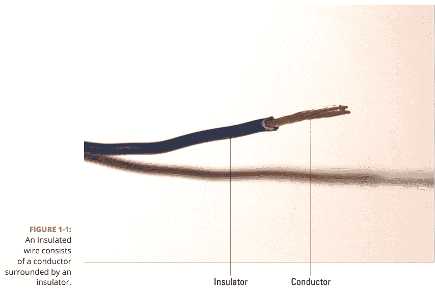

**图 1-1：**
一根绝缘导线由导体及环绕其外的绝缘体构成。

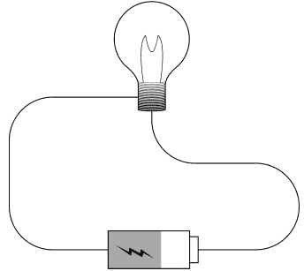

**图 1-2：**
一个由电池、灯泡和导线组成的简单电路。

## 什么是电子学？

我之所以在本章开头讲述关于托马斯·爱迪生的历史课程，原因之一是为了指出，当电子学整个领域于1883年被发明时，电器设备已经存在了至少100年。例如：

- 本杰明·富兰克在一百多年前就已经在雷雨中放风筝了。
- 第一个电池是由一位名叫亚历山德罗·伏打的人在1800年发明的。伏打的贡献如此重要，以至于通用的电压单位“伏特”就是以他的名字命名的。（有一些考古证据表明，古代帕提亚帝国可能在公元前二世纪就发明了电池，但即便如此，我们也不知道他们用电池来做什么，他们的发明被遗忘了2000年。）
- 电报发明于19世纪30年代，并由塞缪尔·莫尔斯在美国推广。他发明了著名的莫尔斯电码，用于将字母和数字编码成一系列可通过电报传输的短促和长声信号。1866年，一条横跨大西洋的电报电缆铺设完成，使得美国和欧洲之间能够进行即时通信。
- 与普遍看法相反，本杰明·富兰克并非第一个在雷雨中放风筝的人。1752年，他发表了一篇论文概述了自己的想法。然后他让其他人先尝试。在他们安然无恙之后，他自己才进行了实验，并最终获得了所有荣誉。本杰明·富兰克不仅非常聪明；他还非常明智。

所有这些设备以及许多其他至今仍在使用的常见设备，例如灯泡、吸尘器和烤面包机，都被称为电器设备。那么，电器设备和电子设备之间到底有什么区别呢？

答案在于设备如何操纵电力来完成工作。电器设备利用电流的能量，并以简单的方式将其转化为其他形式的能量——最常见的是光、热或运动。例如，灯泡将电能转化为光，这样你才能熬夜阅读这本书。烤面包机中的加热元件将电能转化为热，这样你就能把你的吐司烤焦。而吸尘器中的电机将电能转化为运动，驱动一个泵，从你的地毯中吸走烧焦的吐司碎屑。

相比之下，电子设备能做更多的事情。电子设备不仅仅是将电能转化为热、光或运动，它们的设计目的是操纵电流本身，引导它做一些有趣且有用的事情。

1883年由托马斯·爱迪生发明的第一台电子设备，以一种独特的方式操纵通过灯泡的电流，使爱迪生得以创造出一种能够监测提供给电路的电压，并在电压过低或过高时自动升高或降低电压的装置。


**提示**

如果你现在不确定“电压”这个术语是什么意思，请不要担心。你将在本迷你书的第2章中学习电压。

电子设备最常见的功能之一是以一种为电流添加有意义信息的方式来操纵电流。例如，音频电子设备将声音信息添加到电流中，这样你就可以听音乐或使用手机通话。而视频设备则将图像添加到电流中，这样你就可以一遍又一遍地观看《办公空间》、《春天不是读书天》或《公主新娘》等精彩电影，直到你记住每一句台词。

请记住，电器设备和电子设备之间的区别有点模糊。过去简单的电器设备现在通常包含一些电子元件。例如，你的烤面包机可能包含一个电子恒温器，试图将热量保持在恰好的温度以制作完美的吐司。（它可能仍然会把你的吐司烤焦，但至少它努力不这样做。）即使是最复杂的电子设备，里面也有简单的电器元件。例如，虽然你的电视遥控器是一个相当复杂的小型电子设备，但它包含电池，而电池是简单的电器设备。

## 你能用电子技术做什么？

电子技术的奇妙之处在于，今天它正在被用于完成几年前甚至无法想象的事情。当然，这意味着在短短几年内，我们将拥有尚未被构想出来的电子设备。

话虽如此，以下部分将简要概述一些你可以用电子技术实现的基本功能。

### 发出声音

电子技术最常见的应用之一是发出声音。通常以音乐的形式出现，尽管噪声和音乐之间的区别经常有争议。发出声音的电子设备通常被称为音频设备。这些设备将声波转换为电流，然后存储、放大并以其他方式操纵电流，最终将电流转换回你可以听到的声波。

大多数音频设备都有这三个部分：

- 一个源，即系统的输入。源可以是麦克风，这是一种将声波转换为电信号的设备。声波的细微波动被转换为电信号的细微波动。因此，来自源的电信号包含音频信息。源也可以是声音的录制形式，例如录制在CD或MP3上的声音。
- 一个放大器，它将来自源的微弱电信号转换成一个大得多的电信号，当该信号发送到扬声器或耳机时，就可以被听到。有些放大器很小，因为它们只需要将信号增强到足以让戴耳机的单个听者听到的程度。其他放大器则非常巨大，因为它们需要将信号增强到足够让80,000人听到的程度，例如，让一位著名歌手忘掉《星条旗永不落》的歌词。
- 扬声器，将电流转换为你可以听到的声音。扬声器可能非常大，也可能小到可以放进你的耳朵里。

### 发光

电子技术的另一个常见用途是发光。最简单的电子发光电路是LED，它是灯泡的电子等效物。


LED代表发光二极管，但至少在本章中，这不会是考试内容。然而，它肯定会出现在第2册第5章的考试中，届时你将学习如何使用LED。

视频电子设备旨在创造不仅是简单的光点，而且是你能够观看的完整图像。最明显的例子是电视机，它可以提供数小时的娱乐，而要求的回报却很少——仅仅是你的一些脑细胞。

某些类型的电子设备使用你看不见的光。最常见的就是电视遥控器，当你按下按钮时，它会向电视机发送红外光。（也就是说，假设你能找到遥控器。）遥控器内部的电子设备以一种特定的方式操纵红外光，从而将信息从遥控器发送到电视，告诉它调高音量、切换频道或关闭电源。（你将在第4册第4章中学习如何使用红外设备。）

### 向世界传输

无线电指的是无线传输信息。最初，无线电被用作一种无线形式的电报，广播的只是可听闻的## 计算

过去50年中，电子学最重要的应用之一就是计算机技术的发展。在短短几十年间，计算机已从简单的计算机器，发展到能在我们曾以为人类独占鳌头的游戏中击败人类的机器，例如国际象棋、《危险边缘》和围棋。

计算机是整个被称为数字电子学的电子学领域中最先进的形式，该领域专注于处理以0和1二进制语言表示的数据。你将在第5至8册中学习大量关于数字电子学的知识。

## 探秘电子设备内部

你是否曾拆开过一台不再工作的电子设备，比如一个旧的钟控收音机或录像机，只是为了看看它内部是什么样子？

我刚把几台笨重的服务器电脑送到电子废物回收站。可以肯定的是，在送去之前，我打开了它们，看看内部是什么样子。我还取出了几个更有趣的部件，放在我的架子上。（随你怎么说我怪。有些人收集茶杯，有些人收集来自世界各地的勺子，还有些人收集小酒杯。我收集旧的电脑CPU。）

在大多数电子设备内部，你会发现一块电路板（或电路卡；都是一回事），这是一块平坦、薄薄的板子，上面安装着各种电子小玩意儿。在大多数情况下，电路板的一面布满了看起来像小建筑物的微小器件。这些是构成电路的元件：电阻器、电容器、二极管、晶体管和集成电路，它们执行电路预定要完成的工作。另一面则涂有看起来像街道的银色或铜色细线。这些是导体，连接所有元件，使它们能够协同工作。

电子电路板看起来就像一个小城市！例如，看看图1-3中描绘的典型电路板。卡片的顶部显示在上方；它有各种常见的电子元件。电路卡的底部显示在下方；它有典型的银色导体条纹，连接着顶部的元件，使它们能够执行有用的工作。

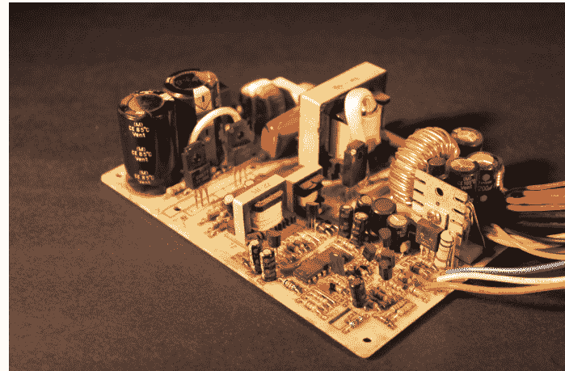

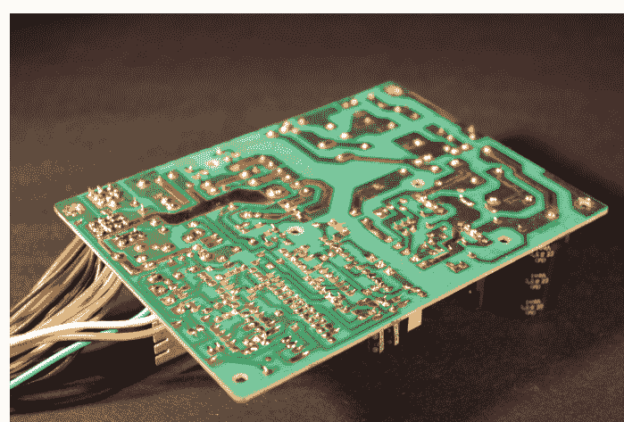

图1-3：
一块典型的
电子
电路板。

以下是电路卡这两面本质的概述：

- 卡片的*元件*面——带有小建筑物的那一面——承载着一组电子元件，它们存在的唯一目的就是弯曲、转向和扭转电流，使其完成有趣且有用的工作。其中一些元件限制电流的流动，就像道路上的减速带。另一些则增强电流。有些元件的工作原理类似于单行道标志，只允许电流朝一个方向流动。还有一些元件试图平滑电流中的任何波动或变化，从而实现更顺畅的“交通”流动。

- 卡片的*电路*面——带有“道路”的那一面——为电流从一个元件流向另一个元件提供了导电路径，且遵循特定的顺序。设计和构建电子电路的全部诀窍在于，以正确的方式将所有元件连接在一起，使得从一个元件流出的电流能够传递给下一个元件。电路板的电路面使得元件能够以协调的方式协同工作。


好吧，我甚至还没读完这本书的第一章，就不得不给你第一个关于操作电子设备危险的警告。所以请注意：在任何情况下，除非你确定自己知道自己在做什么，否则切勿贸然拆卸旧的电子电路。

电路卡上的小元件，如图1-3所示的那块，即使在拔掉电源后也可能是危险的。事实上，这块电路卡后部边缘附近的两个高大的圆柱形元件被称为*电容器*。它们可能储存着电能，即使在你拔掉电源线很久之后，仍能释放出强大的——甚至是致命的——电击。在开始拆卸任何东西之前，请先阅读本迷你书的第4章！

## 第2章 理解电

本章内容

* 揭开物质与能量的深层奥秘（好吧，只是一点点）
* 了解电路的三个重要方面：电流、电压和功率
* 查看直流电和交流电的区别
* 学习你的第一个电气方程（别担心；它很简单）

坦率地说，这一章的标题有点雄心勃勃。在你能用电子学做很多有趣的事情之前，你需要对电是什么以及它如何工作有一个基本的理解，但不幸的是，理解电是一项艰巨的任务。不要因此而气馁或退缩：即使是世界上最聪明的物理学家也并不真正理解它。

在本章的开头，你将探究电的本质：它是什么以及是什么导致了它。本章的第一部分会让你想起七年级或八年级的科学课，因为你将深入原子的内部，了解质子、中子和电子。

本章的第二部分将向你介绍如果你想设计和构建电路必须了解的三件事：电流、电压和功率——电的“曼尼、莫和杰克”。或者如果你愿意，也可以是“休伊、杜伊和路易”，或者“培根、生菜和番茄”，或者——你明白这个意思。

### 思考电的奇迹

电的确切本质是宇宙的核心奥秘之一。尽管我们并不真正确切地知道电是什么，但我们确实知道很多关于它的作用和行为方式。

尽管听起来可能很奇怪，但如果你避免使用*电*这个术语来描述它，你对电的理解会立即提高。这是因为*电*这个术语并不十分精确。我们使用*电*这个词来指代几种不同但相关的事物中的任何一种。每一种都有更精确的名称，例如*电荷*、*电流*、*电能*、*电场*等等。所有这些事物通常都被称为*电*。

电与其说是一种特定的东西，不如说是一种具有许多不同面孔的现象。因此，为了避免混淆，我将在本书的其余部分尽量避免使用*电*这个词。相反，我将使用更精确的术语，如*电荷*或*电流*。

我真的很讨厌在这里使用*现象*这个词，因为它听起来太科学了。我觉得每次说*现象*这个词时都应该戴个领结。我查了查同义词词典，看看有没有更简单的词可以代替。没有一个建议真正合适，但最接近的一个是*奇迹*。

#### “电”这个词从何而来？

你还记得电影《侏罗纪公园》吗？科学家们在琥珀碎片中发现了恐龙的DNA。琥珀是石化的树脂，它在我们关于电的知识史上扮演了关键角色。

自古希腊时代起，人们就知道，如果你用毛皮摩擦琥珀棒，琥珀就能用来竖起你头上的头发，而且像羽毛这样的轻质物体会粘在上面。他们不知道为什么会发生这种情况，但他们知道它确实发生了。

希腊语中琥珀的词是*elektron*。拉丁语版本是*electricus*。

在十七世纪初，一位名叫威廉·吉尔伯特的英国科学家开始研究电。他使用这些古老的词汇来描述他正在研究的现象，包括拉丁术语*electricus*。吉尔伯特用拉丁文写成的书的影响力，导致了英语中*electricity*（电）一词的出现。

惊叹本身不失为一种绝佳的替代。归根结底，我们称之为电的现象确实令人惊叹，它绝对算得上宇宙的伟大奇观之一。

还记得所谓的"古代世界七大奇迹"吗？它包括吉萨大金字塔、巴比伦空中花园、以弗所的阿尔忒弥斯神庙、奥林匹亚的宙斯雕像、哈利卡纳苏斯的摩索拉斯陵墓、罗德岛太阳神巨岛以及亚历山大灯塔。如果我们拟定一份名为"宇宙七大奇迹"的清单，我想它必然包括：物质、引力、时间、光、生命、披萨，以及电。

## 寻找电

电最神奇的特性之一在于，它确实无处不在。我并非指电很常见或数量庞大，也不是指宇宙中电资源充沛。我的意思是，电是万事万物的基本组成部分。

要理解我的意思，先想想关于电流的一个常见误解。我们大多数人认为电线是将电从一处输送到另一处的通道。当我们插上吸尘器并打开开关时，我们相信电从电源插座进入吸尘器的电源线，通过导线流向吸尘器，然后驱动马达转动，使吸尘器吸走灰尘、污垢和狗毛。但事实并非如此。真相是，电原本就在导线中。电始终存在于导线里，即使在吸尘器关闭或电源线未插入插座时也是如此。这是因为电是构成电源线内部铜导线的铜原子的基本组成部分。电也是构成橡胶绝缘层的原子的基本组成部分，正是这层绝缘层在您触碰电源线时保护您免受电击。同时，电还是构成您指尖原子的基本组成部分，正是这层橡胶使您的指尖无法接触到裸露的导线。

简而言之，电是构成所有物质的原子的基本组成部分。因此，要理解电是什么，我们必须先从原子说起。

## 原子内部探秘

正如您在小学可能学过的，所有物质都是由一种叫做原子的、极其微小的颗粒构成的。它们如此微小，以至于这个句子末尾的句号里就包含着数万亿个原子。

我们很难理解"万亿"这样庞大的数字。为了便于比较，假设您可以将这个句子末尾的句号放大到大约德克萨斯州那么大，那么每个原子的大小将大约是——您猜对了——就是这个句子末尾的句号那么大。

"原子"（atom）一词源自古希腊哲学家德谟克利特。与您可能的预期相反，"atom"一词并非指"非常小"，而是意为"不可分割"。原子是物质中最小的单位，若再分割则会变成另一种物质。换句话说，如果您分割某种特定元素的原子，得到的部分将不再是原来那种物质。

例如，假设您手中有一些基础元素，比如铜，您将其切成两半。现在您有了两块铜。将其中一块放到一边，再将另一块切成两半。这样，您又得到了两块铜。您可以持续这样操作，将这块铜不断分割成更小的部分。但最终，您的这块铜会只剩下一个单独的铜原子。

如果您试图将这个单独的铜原子一分为二，得到的部分将不再是铜。相反，您会得到构成原子的基本粒子集合体。这类粒子有三种，分别称为中子、质子和电子。

每个原子的中子和质子聚集在原子中心，这个中心称为原子核。电子则围绕原子核外部旋转。

我小时候第一次学习原子时，被教导电子围绕原子核的轨道运动，就像我们太阳系中的行星围绕太阳运行一样。时至今日，孩子们仍然接受这样的教育。学生们依然被教导用泡沫塑料球和导线制作原子模型，如图 2-1 所示。

事实证明，这是一个非常不恰当的类比。实际上，电子是以一团被称为电子云的形态快速环绕原子核运动，这个名称十分贴切。电子云具有奇特的形状和性质，并且，奇怪的是，几乎无法精确确定某一时刻电子在云中的具体位置。


**图 2-1：** 原子的常见模型。

## 审视元素

本章中，我多次使用"元素"（*element*）一词而未作解释。那么现在说明一下：元素是一种特定类型的原子，由其原子核中的质子数定义。例如，氢原子的原子核中只有一个质子，有两个质子的原子是氦原子，有三个质子的原子称为锂原子，依此类推。

原子核中的质子数被称为*原子序数*（*atomic number*）。因此，氢的原子序数是 1，氦是 2，锂是 3，如此等等。铜——在电子学中扮演重要角色的元素——的原子序数是 29。因此，它的原子核中有 29 个质子。

那么中子呢？这是在原子核中发现的另一种粒子。中子对化学家和物理学家极其重要。但它们在电流工作原理中所起的作用并不那么关键，因此我们在本章可以安全地忽略它们。只需说明一点：除了质子，每个原子（氢除外）的原子核中还含有中子。在大多数情况下，中子的数量比质子多几个。

构成原子的第三种粒子是电子。在涉及电的工作中，我们最感兴趣的就是电子，因为它们是电流的来源。它们小得难以置信；一个电子的大小大约是一个质子的 20 万分之一。为了有个直观感受，如果单个电子像这个句子末尾的句号那么大，那么一个质子就大约有一个足球场那么大。


原子通常拥有与质子数相同的电子数，因此一个铜元素的原子在原子核中有 29 个质子，核外有 29 个电子围绕旋转。当一个原子获得一个额外电子或失去一个电子时，事情就变得有趣了，这是由于质子和电子具有一种被称为电荷的特殊性质，我将在下一节解释。

## 了解您的电荷

构成原子的三种粒子中有两种——电子和质子——具有一种非常有趣的特性，称为电荷（electric charge）。电荷可以是两种极性之一：负极性或正极性。电子带负极性质子带正极性。

关于电荷，最重要的是要知道：异种电荷相互吸引，同种电荷相互排斥。负电荷吸引正电荷，正电荷吸引负电荷，但负电荷排斥负电荷，正电荷排斥正电荷。

因此，电子和质子相互吸引，但电子排斥其他电子，质子排斥其他质子。

质子和电子之间的吸引力将原子的电子和质子束缚在一起。这种吸引力使电子保持在围绕原子核中质子的轨道上运动。

关于电荷，还有更多富有启发性的细节：

-   电荷是自然界四种基本力之一——电磁力的一种属性。其他三种力是引力、强核力和弱核力。
-   如前一节所述，原子通常拥有与质子数相同的电子数。这是因为电磁力导致每个质子恰好吸引一个电子。当质子数和电子数相等时，原子本身没有净电荷。这时原子被称为中性（neutral）。

## 技术细节

然而，原子有可能捕获一个额外的电子。当它这样做时，由于额外的电子，原子会带有净负电荷。原子也有可能失去一个电子，这会导致原子带有净正电荷，因为它拥有的质子比电子多。

如果你一直在留意，你可能想知道，如果原子核由两个或更多带正电荷的质子组成，它如何能保持在一起。毕竟，同种电荷不是会相互排斥吗？是的，它们会，但这种电斥力被一种更强大的力克服了，这种力由于缺乏更好的术语，被称为*强力*。因此，尽管质子有相互避开的自然倾向，强力仍将质子（和中子）束缚在一起。

强力不影响电子，所以你永远不会看到电子像原子核中的质子那样聚集在一起。原子中的电子彼此保持相当远的距离。

如果有人愿意，他可能会将强力比作一种爱国力量，这种力量将一个国家的公民团结在一起，尽管他们存在差异。正是这种力量使一个国家保持统一，尽管其政党似乎彼此憎恨。让我们希望强力保持强大。

## 导体和绝缘体

有些元素对其最外层电子的束缚并不十分紧密。这些元素经常失去电子或捕获额外电子，因此它们经常脱离中性状态，变成带负电或带正电。这类元素被称为*导体*。最好的导体是金属银、铜和铝。

其他元素则紧紧抓住它们的电子。在这些元素中，很难撬开一个电子或强行塞入另一个电子。这些元素几乎总是保持中性。它们被称为*绝缘体*。

在导体中，电子不断地在附近的原子之间跳跃。一个电子从一个原子——称之为原子A——跳到一个附近的原子，我称之为原子B。这在原子A中产生了净正电荷，在原子B中产生了净负电荷。但几乎立即，另一个附近的电子——称之为原子C——会跳出来进入原子A。因此，原子A再次变为中性，而现在原子C带负电。

导体中电子的这种跳跃是持续不断的。原子处于永恒的动荡之中，给予和接收电子，并不断将其净电荷从正变为中性，再变为负，然后又变回正。

通常，这种电子的运动是完全随机的。一个电子可能向左跳，但另一个向右跳。一个向上，另一个向下。一个向东，另一个向西。净效应是，尽管所有电子都在移动，但它们集体上并没有去任何地方。它们就像基斯通警察（Keystone Kops），漫无目的地朝每个方向奔跑，互相碰撞，摔倒，爬起来，然后继续奔跑。当这种随机性停止，基斯通警察组织起来时，结果就是电流，如下一节所述。

## 理解电流

电流是指导体中持续发生的随机电子交换变得有组织并开始朝同一方向移动时发生的情况。

当电流流过导体（如铜线）时，所有那些先前随机移动的电子聚集在一起，开始朝同一方向移动。然后发生一个非常有趣的现象：电子几乎瞬间通过导线传递它们的电磁力。电子本身移动得相对较慢——大约每秒几毫米。但当每个电子离开一个原子并加入另一个原子时，第二个原子立即失去一个电子给第三个原子，第三个原子立即失去一个电子给第四个原子，如此反复数万亿次。

结果是，尽管单个电子移动缓慢，但电流本身以接近光速的速度移动。因此，当你打开电灯开关时，无论电灯开关与灯之间有多远的距离，灯几乎立即亮起。

以下几点可能有助于你理解电流的本质：

- 阐明这一原理的一种方法是在台球桌上将15个球排成一条完美的直线，如图2-2所示。如果你击打直线一端的母球，直线另一端的球几乎会立即移动。其他球会移动一点，但不多（假设你将它们排成直线并直击母球）。

这与电流发生的情况类似。尽管每个电子移动缓慢，但每个原子失去和获得电子时产生的涟漪效应是闪电般快速的（字面意思！）。

- 流动的水也被称为*电流*并非巧合。许多早期探索电本质的科学家认为电是一种流体，它在导线中的流动方式与水在河流中的流动方式非常相似。

- 电流的强度用一个称为*安培*的单位来衡量，有时简称为*安*或缩写为A。安培不过是测量每秒有多少电荷载体（在大多数情况下是电子）流过某一点。一安培等于每秒6,240,000,000,000,000,000个电子。那是每秒6.24×10^18个电子。（这是一个巨大的数字，但请记住电子极其微小。不过，为了提供一些视角，想象一下每个电子的重量与一粒普通沙子相同。如果这是真的，一安培的电流将相当于每秒移动近350吨沙子。）

- 大多数白炽灯泡在打开时，大约有一安培的电流流过它们。一个吹风机使用大约12安培。

- 电子电路中的电流通常比灯泡和吹风机等电气设备中的电流小得多。电子电路中的电流通常以安培的千分之一，或*毫安*（缩写为mA）来测量。

- 在电气方程中，电流通常用字母*I*表示。*I*代表*强度*（intensity）。

## 理解电压

在自然状态下，导体（如铜）中的电子自由地从一个原子移动到另一个原子，但方式完全随机。要让它们朝一个方向一起移动，你只需给它们一个推力。这个推力的专业术语是*电动势*，缩写为*EMF*，有时简称为*E*。但你更常称它为*电压*。

电压不过是两个地方之间的电荷差异。例如，假设你有一小块金属，其原子拥有大量带负电荷的原子，另一小块金属，其原子拥有大量带正电荷的原子。换句话说，第一块有太多电子，第二块电子太少。这两块金属之间存在电压。如果你用导体（如铜线）连接这两块金属，你就创造了一个*电路*，电流将通过它流动。

这种电流持续流动，直到电路负极一侧的所有额外负电荷都移动到正极一侧。当这种情况发生时，电路的两侧都变为电中性，电流停止流动。

关于电压，还有一些额外的要点值得思考：

- 只要两个位置之间存在电荷差异，如果这两个位置通过导体连接，就有可能在这两个位置之间产生电流。由于这种可能性，术语*电势*常被用来描述电压。没有电压，就不可能有电流。因此，电压创造了电流流动的潜力。

- 如果电流可以比作水流过软管，那么电压可以比作水龙头处的水压。正是水压导致水在软管中流动。

- 电压使用一个称为*伏特*的单位来衡量，通常缩写为V。美国标准电源插座中可用的电压约为117伏。手电筒电池中可用的电压约为1.5伏。汽车电池提供约12伏。

- 你可以通过使用一种称为*电压表*的设备来找出两点之间存在多少电压，它有两个导线*测试引线*，你可以将它们接触到电路中的不同点，以测量这些点之间的电压。图2-3显示了一个典型的电压表。（实际上，图中所示的仪表技术上称为*万用表*，因为它可以测量电压以外的其他东西。有关使用电压表的更多信息，请参阅本迷你书的第8章。）

## 你对此确定吗？

在对电的本质进行严肃研究的最初约150年里，科学家们对电流的理解是错误的：他们认为电流是正电荷的流动，并且电流从电路的正极流向负极。

直到1900年左右，科学家们才开始揭示原子的结构。他们很快弄清楚电子带负电，而电流实际上是这些带负电的电子的流动。换句话说，他们发现电流的流动方向与长期以来认为的相反。

旧观念根深蒂固，直到今天，大多数人仍然认为电流是从正极流向负极的。这种电流流动的概念有时被称为**常规电流**。现代电子电路几乎总是用常规电流来描述，因此假设电流从正极流向负极，尽管实际上电路中的电子流动方向是相反的。

> » 电压可以是正的也可以是负的，但只有在与某个参考点比较时才有意义。例如，在手电筒电池中，正极相对于负极的电压是+1.5 V。负极相对于正极的电压是-1.5 V。

- 我想告诉你伏特的准确定义，但我不能——至少现在还不能。在你学习功率的概念之前，伏特的定义不会有任何意义，这将在本章后面的“理解功率”一节中描述。
- 尽管当电路两侧中和后电流停止流动，但电路中的电子并不会停止运动。相反，它们只是恢复到自然的随机运动。电子在导体中总是在运动。当它们受到电压的推动时，它们会朝同一个方向移动。当没有电压推动它们时，它们会随机运动。
- 在电学方程中，电压通常用字母E表示，代表电动势。

## 比较直流电和交流电

在单一方向上持续流动的电流称为**直流电**，或**DC**。在承载直流电的导线中，电子移动缓慢，但最终它们会从导线的一端移动到另一端，因为它们始终朝同一个方向缓慢前进。

直流电路中的电压必须是恒定的，或者至少是相对恒定的，以保持电流在单一方向上流动。因此，手电筒电池提供的电压保持在约1.5 V的稳定值。电池的正极始终相对于负极为正，负极始终相对于正极为负。这种恒定性推动电子朝单一方向运动。

另一种常见的电流类型称为*交流电*，缩写为*AC*。在交流电路中，电压周期性地反转。当电压反转时，电流流动的方向也随之反转。在世界上最常见的交流电形式中，用于大多数电力分配系统，电压每秒反转50或60次，具体取决于国家。在美国，电压每秒反转60次。

交流电被用于世界上几乎所有的电力分配系统，原因很简单：当通过导线长距离传输时，交流电的效率要高得多。所有电流在长距离流动时都会损失功率，但交流电路比直流电路损失的功率少得多。

交流电路中的电子并不真正随电流流动而移动。相反，它们只是坐着前后摆动。它们朝一个方向移动1/60秒，然后转身朝另一个方向移动1/60秒。净效果是它们实际上没有移动到任何地方。

为了进一步阐明，以下是一些关于交流电的额外有趣且有用的事实：

> » 一个名为*牛顿摆*的流行玩具可能帮助你理解交流电的工作原理。这个玩具由一系列用绳子悬挂在框架上的金属球组成，使得这些球排成一条直线并刚好相互接触，如图2-4所示。如果你将直线一端的球从其他球旁拉开然后释放，那个球会摆回球列，撞击末端的球，并瞬间推动直线另一端的球离开球群。那个球会向上摆动一会儿，然后转身摆回，从另一端撞击球群，这又会推动第一个球离开球群。如果玩具制作精良，这种来回交替的运动会持续令人惊讶的长时间。

交流电的工作方式大致相同。电子最初朝一个方向移动，然后反转方向朝另一个方向移动。只要电压继续反转，电路中电子的来回运动就会持续。

> **提示**
>
> 如果你想观看牛顿摆的实际运作，请前往YouTube搜索*牛顿摆*。
>
> 典型交流电路中的电压反转并非瞬时完成。相反，电压从一个极性平滑地摆动到另一个极性。因此，交流电路中的电压不断变化。它从零开始，然后在正方向增加一段时间，直到达到最大正电压，然后减小直到回到零。此时，它在负方向增加，直到达到最大负电压，然后再次减小直到回到零。然后整个循环重复。
>
> 交流电路中的电压量始终在变化这一事实被证明是极其有用的。你将在第4册第1章中了解原因，届时我将更深入地探讨交流电。

## 理解功率

在本章开头，我提到了在开始自己动手搭建电路之前需要了解的三个关键电学概念。前两个——电流和电压——已在本章前面描述过。回顾一下，电流是电荷通过导体的有序流动，而电压是推动电荷产生电流的驱动力。

第三个关键概念称为**功率**（在方程中缩写为P）。简单来说，功率是电路所做的功。电流本身并不是那么有用。只有当电流携带的能量转换成其他形式的能量，如热、光、声或无线电波时，它才变得有用。例如，在白炽灯泡中，电压推动电流通过灯丝，灯丝将电流携带的能量转换为热和光。

功率的测量单位称为**瓦特**（缩写为W）。一瓦特的定义很简单：一瓦特是一安培电流在一伏特电压驱动下所做的功。

这种关系可以用一个简单的方程表示。我在开始写这本书时向自己保证会尽可能少用方程，但我知道至少要包含一些基本方程。幸运的是，这个方程相当简单：

```
P = E × I
```

换句话说，功率（P）等于电压（E）乘以电流（I）。

要正确使用该方程，必须确保使用标准单位测量功率、电压和电流：瓦特、伏特和安培。例如，假设你有一个连接到10伏电源的灯泡，流过灯泡的电流是十分之一安培。要计算灯泡的瓦特数，你可以使用P = E × I公式，如下所示：

```
P = 10 V × 0.1 A = 1 W
```

因此，灯泡正在做1瓦特的功。

通常，你知道电路的电压和功率，并希望使用这些值来确定流过电路的电流。你可以通过转换方程来做到这一点，如下所示：

```
I = P / E
```

例如，如果你想确定当一个100瓦灯泡的灯接入117伏电源插座时，流过它的电流是多少，可以使用如下公式：

I = \frac{100 W}{117 V} = 0.855 A

因此，流过电路的电流是0.855安培。

关于功率的概念，这里有一些最后的想法：

-   *耗散*这个术语经常与功率一起使用。当电流携带的能量转换成另一种形式，如热或光时，就说电路在耗散功率。
-   你是否注意到电流和电压分别用字母*I*和*E*表示，而不是你可能预期的字母*C*或*V*，但功率却用字母*P*表示？有时你会怀疑制定规则的人是不是想把大家都搞糊涂。

也许下面的表格能帮你理清思路：

| 概念 | 缩写 | 单位 |
| :--- | :--- | :--- |
| 电流 | I | 安培 (A) |
| 电压 | E 或 EMF | 伏特 (V) |
| 功率 | P | 瓦特 (W) |

-   在本章前面的“理解电压”一节中，我说过在你知道什么是功率之前，我无法定义“一伏特”。现在你知道了，你就会发现伏特的定义很简单：一伏特是在一安培电流下做一瓦特功所需的电动势（EMF）量。


-   计算电路耗散的功率通常是电路设计中非常重要的一部分。这是因为电阻器、晶体管、电容器和集成电路等电子元件都有最大功率额定值。例如，最常见的电阻器最多只能耗散¼瓦特。如果你在一个耗散功率超过¼瓦特的电路中使用¼瓦特的电阻器，就有烧毁电阻器的风险。

-   找一个可以建立你的疯狂科学家实验室的地方
-   投资购买好的工具
-   挑选一套好的入门元件

## 第3章 创建你的疯狂科学家实验室

我小时候喜欢看弗兰肯斯坦的电影。我最喜欢的场景总是弗兰肯斯坦博士走进他的实验室。那些实验室里摆满了前所未见的最神奇、最奇特的电子装置。疯狂医生的助手伊戈尔会在恰当时刻扳动一个巨大的刀开关，火花四溅，音乐达到高潮，那个生物猛地活了过来，疯狂的医生大喊：“它活了！”

有史以来最好的弗兰肯斯坦电影仍然是1931年的原版《弗兰肯斯坦》，由詹姆斯·怀尔德执导，鲍里斯·卡洛夫主演。第二好的弗兰肯斯坦电影是1974年的《年轻的弗兰肯斯坦》，由梅尔·布鲁克斯执导，吉恩·怀尔德主演。两部电影都有很棒的实验室场景。

事实上，你知道吗？《年轻的弗兰肯斯坦》中的实验室使用的正是1931年原版经典电影中的那些道具。创造这些道具的天才名叫肯尼斯·斯特里克法登，他是好莱坞特效的先驱之一。斯特里克法登将原版弗兰肯斯坦的道具在他的车库里保存了几十年。当梅尔·布鲁克斯询问是否可以为《年轻的弗兰肯斯坦》借用这些道具时，斯特里克法登欣然同意。

你不需要像弗兰肯斯坦电影里那样复杂的疯狂科学家实验室来搭建基本的电子电路。然而，你需要为自己建立一个更简朴的工作场所，并配备一套基本的工具以及一些基本的电子元件来操作。

然而，无论你的工作区域多么简陋，你仍然可以称之为你的疯狂科学家实验室。毕竟，当你开始制作自己的电子小装置时，你的大多数朋友会认为你有点疯狂，也有点天才。

在本章中，我将介绍你在开始搭建电子电路之前需要获取的东西。当然，你不必一次性购买所有东西。你可以从一套简单的工具和一个小工作空间开始。随着你的电子技能变得更加高级，你可以根据需求的变化获取额外的工具和设备。

### 设置你的疯狂科学家实验室

首先，你必须创建一个良好的工作场所。你可以在车库或空房间里搭建一个漂亮的工作台，但如果你没有那么多空间，你几乎可以在任何地方临时搭建一个疯狂科学家实验室。你只需要一个地方来放置一个小工作台和一把椅子。

我大部分的电子工作都是在我家的一个空房间里完成的，这个房间也兼作我多年来为我的鬼屋制作的一些万圣节道具的展示区。因此，如图3-1所示，我的疯狂科学家实验室确实是一个疯狂科学家实验室！

任何用于电子捣鼓的良好工作区域的基本要素如下：

-   **充足的空间：** 你需要有足够的工作空间。刚开始时，你的工作区域可以很小——也许只是车库角落里的2或3英尺。但随着你的技能进步，你需要更多的空间。你选择的工作区域位置是否安全非常重要，特别是如果你身边有年幼的孩子。你的工作区域将充满危险——可能导致触电、烧伤和割伤的东西，以及绝对不能吞食的东西。小手非常好奇，孩子们很容易把任何他们不认识的东西放进嘴里。所以一定要把所有东西都安全地放在够不到的地方，最好是在锁着的门后面。

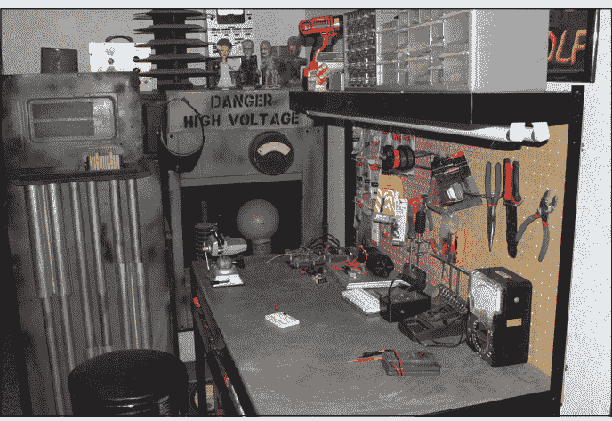

**图3-1：** 我的疯狂科学家实验室确实是一个疯狂科学家实验室！

-   **良好的照明：** 理想的照明应该是来自头顶，而不是侧面或身后。如果可能，购买一个便宜的荧光车间灯，直接悬挂在你的工作区域上方。如果你选择的位置不允许你从头顶悬挂灯具，下一个最佳选择是一个可以悬在头顶的台灯，将光线直接投射到你的工作区域。
-   **坚固的工作台：** 最初，你可以用一张牌桌或一张小折叠桌这样简单的东西凑合。但最终，你会想要一个更永久、更结实的东西。你可以用一扇旧门架在一对旧文件柜上，为自己制作一个极好的工作台，或者你可以在周六早上去庭院旧货市场寻找一张便宜但结实的办公桌。如果你唯一的选择是你的厨房桌子，那就去当地的大型五金店买一块24英寸见方、⅝英寸厚的胶合板。这将作为一个良好、坚固的工作表面，保护你的厨房桌子，直到你能弄到一个真正的工作台。
-   **舒适的座椅：** 如果你的工作台是折叠桌或书桌，最好的座椅是一把好的办公椅。然而，许多工作台比书桌高度高出4到6英寸。这允许你舒适地站着工作。如果你的工作台很高，你需要一个高度合适的座位。你可以从五金店购买一个工作凳，或者去庭院旧货市场淘一个便宜的吧凳。
-   **充足的电力：** 显然，当你搭建电子项目时，你需要附近有电源。一个标准的15安培电源插座可以提供足够的电流容量，但它可能无法提供足够的插座来满足你的需求。满足这一需求最简单的方法是购买几个多插座电源板，将它们放置在工作区域后面或两侧方便的位置。
-   **充足的存储空间：** 你需要一个地方来存放你的工具、用品和元件。手工工具的理想存储方式是在工作台正后方的墙上安装一块小洞洞板。然后，你可以用挂钩将工具挂在触手可及的地方。对于较大的工具，如电钻或锯子，内置橱柜是最好的。对于小零件，如图3-2所示的多格储物盒是最好的。我建议你买一两个这样的盒子来存放所有小元件，如电阻器、二极管、电容器、晶体管等。如果你买两个盒子，买一个有几个较大隔间的，另一个有更多较小隔间的。

> **提示：** 手边备几个小而浅的储物盒也是个好主意。这些对于存放你正在处理的项目的零件特别有用。将零件集中放在一个浅盒子里，而不是散落在工作区域各处，会很有帮助。

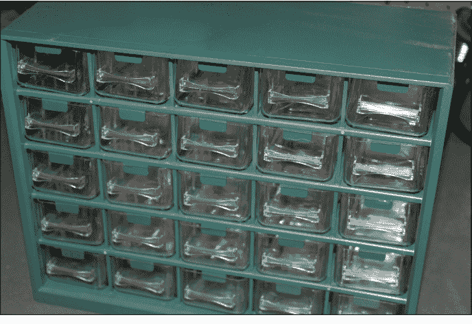

**图3-2：** 多格储物盒是存放小元件的理想选择。

## 装备你的疯狂科学家实验室

和任何爱好一样，电子学也有其专用的工具和材料。幸运的是，你不需要立刻冲出去把所有东西都买齐。但你对这个爱好投入得越深，就越会想要投资购买各种高质量的工具和材料。以下部分概述了你需要备置的一些必备物品。

### 基本手工具

首先，你需要一套基本手工具，类似于图 3-3 所示的组合。具体来说，你需要这些物品：

- **螺丝刀：** 大多数电子工作都比较精细，所以你不需要巨大、重型的螺丝刀。但你应该为自己准备一套质量不错的小号和中号螺丝刀，包括一字头和十字头。

  一套珠宝匠螺丝刀有时会非常有用。每把螺丝刀顶部的旋转旋钮，让你在转动刀头时能轻松地将螺丝刀保持在精确位置。

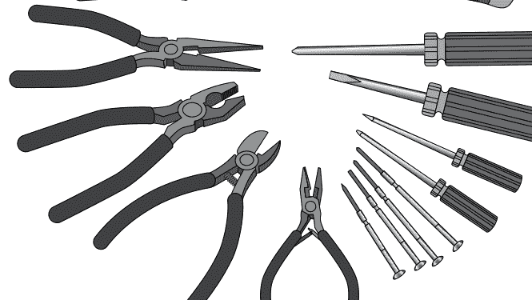

图 3-3：你会想要拥有的基本手工具。

- **钳子：** 你偶尔会用到标准的平口钳，但对于大多数电子工作，你将更依赖于尖嘴钳，它在处理导线时特别擅长——弯曲和扭绞它们，将它们推过孔洞等等。大多数尖嘴钳还带有切割刃，可以当作剪线钳使用。

  准备一小套钳口较薄的尖嘴钳用于处理小零件，再准备一大套用于处理较大的工作。

- **剪线钳：** 尽管你可以用尖嘴钳来剪线，但你仍希望备有几种不同类型的剪线钳。准备一把重型的用于剪断粗导线，再准备一把小一点的用于剪断细导线或元件引脚。

- **剥线钳：** 图 3-4 展示了两根我剥去了绝缘皮的导线。上面那根我是用一套剪线钳剥的，下面那根是用一套剥线钳剥的。注意上面那根导线在绝缘层结束处出现的压痕了吗？那是由于剪线钳施加的压力过大导致的。这个压痕在导线上造成了一个薄弱点，最终可能会断裂。

### 一分钱一分货

对于工具来说，古老的箴言“一分钱一分货”通常是正确的。用最好的材料和最好的工艺制造的高质量工具会卖高价。廉价工具嘛，就是便宜。价格区间可能很大。你可以轻松花 20 或 25 美元买一把不错的剪线钳，也可以花 3 或 4 美元买一把便宜的。

廉价工具有两个主要缺点。首先，它们不耐用。廉价工具的工作端磨损得非常快。每次你用一把 4 美元的剪线钳剪导线，都会对切割刃造成一点损坏。很快，这把钳子就几乎剪不断导线了。廉价工具的第二个缺点是第一个缺点的后果：当工具磨损时，它们往往会损坏被操作的材料。例如，用一把磨损严重的螺丝刀拧紧螺丝，可能会拧花螺钉头。同样，试图用一把磨损的扳手拧松一个紧固的螺母，也可能把螺母拧花。

有几种情况我会赞成花钱购买廉价工具。一种是将成本降到最低，以便开始参与这个迷人的爱好。你总可以先用廉价工具起步，然后随着你的经验、信心、对爱好的热爱以及预算的增加，再逐一替换为更昂贵的工具。另一个购买廉价工具的好理由是，如果你像我一样心不在焉，容易丢东西。如果你每隔几个月就得因为弄丢了而更换工具，那么买昂贵的工具就没什么意义了！

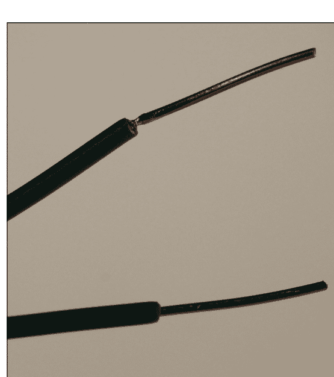

图 3-4：上面的导线是用剪线钳剥的；下面的是用剥线钳剥的。

> 为了避免在剥线时损坏导线，我建议你购买一把不贵的（10 美元以下）剥线工具。你会感谢我的。

### 放大镜

你的工具库中最有用的物品之一就是一面好的放大镜。毕竟，电子元件很小。电阻、二极管和晶体管简直微乎其微。

实际上，我建议你手头至少备有三种类型的放大镜：

- 一个手持放大镜，用于检查焊点、读取小元件上的标识等。
- 一个安装在底座上的放大镜，这样你可以将工件举到镜片后面。最好的固定式放大镜将灯与放大镜结合在一起，这样你放大的物体就很明亮。
- 放大头戴镜，它可以在进行精细工作时提供完全解放双手的放大效果。理想情况下，头戴镜应该装有灯（见图 3-5）。


### 辅助支架和台虎钳

辅助支架是爱好者中的常用工具。它是一个带有几个夹子的小支架，你可以用夹子夹住工件，从而解放你的双手去进行精细工作。大多数辅助支架还附带一个放大镜。图 3-6 展示了一个廉价的辅助支架夹着一块电路板。

在电子学中，辅助支架最常见的用途是焊接。你用夹子夹住想要焊接的元件，并将它们定位在放大镜后面，以便你看得清楚。

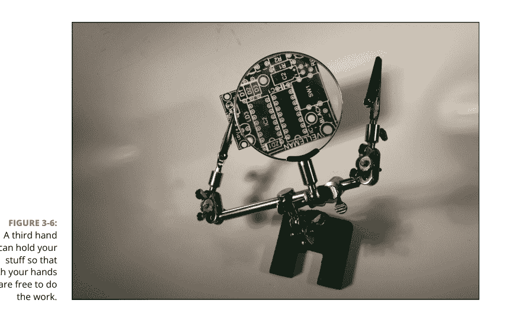

**图 3-6：** 辅助支架可以固定你的东西，这样你就可以双手空出来工作。

**提示：** 虽然辅助支架上的放大镜很有用，但它确实容易妨碍工作。在放大镜后面操作电烙铁和焊料可能会很别扭。因此，我经常把辅助支架上的放大镜拆下来，改用我最喜欢的放大头戴镜。

辅助支架对于组装小型项目通常很有帮助，但它缺乏支撑较大项目所需的坚固性。最终你会想要投资购买一个小型台虎钳，比如图 3-7 所示的那个。这个是 PanaVise (www.panavise.com) 公司的产品。

在选购台虎钳时，有几点需要关注：

- **底座：** 选择带有合适类型工作台安装座底座的台虎钳。有三种常见的安装方式：
  - 螺栓安装：底座有孔，你可以通过螺栓或螺丝将台虎钳固定在你的工作台上。这是最稳固的安装方式，但它需要你在工作台上打孔。
  - 夹具安装：底座带有一个夹具，你可以拧紧它，将底座固定在工作台的顶部和底部。夹具安装相当稳固，但只能放置在靠近工作台边缘的位置。
  - 真空吸附安装：底座有一个橡胶密封圈和一个拉杆，拉动拉杆可以在密封圈和工作台面之间形成真空。真空吸附安装最便于移动，但只有在工作台面光滑时效果才好。

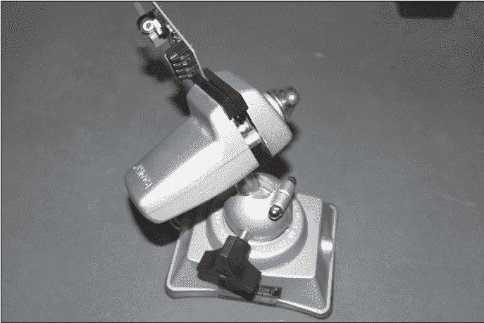

图 3-7：一个台虎钳。

- **活动性：** 选择一个活动范围大的台虎钳，这样你可以将工件旋转到各种不同的工作位置。确保当你锁定旋转底座时，它能保持不动。你肯定不想在你试图焊接时，工件还在滑动。
- **保护性：** 确保钳口有橡胶涂层，以保护你的工件。

### 电烙铁

*焊接*是用于组装电子电路的基本技术之一。焊接的目的是在两个导体之间形成一个永久连接——通常是在两根导线之间，或在一根导线与印刷电路板上的导电表面之间。

焊接的基本技术是物理连接好要焊接的两个部件，然后用电烙铁加热它们，直到它们足够热，可以熔化*焊料*（一种由铅和锡制成的特殊金属，熔点较低），接着将焊料施加到加热的部件上，使其熔化并流过部件表面。

一旦焊料流过两个导体，你就移开电烙铁。随着焊料冷却，它会变硬并将两个导体粘合在一起。

你将在本手册的第7章学习所有关于焊接的知识。现在，只需知道成功焊接需要三样东西：

-   **烙铁**：一种手持的小工具，能加热到足以熔化焊锡。从RadioShack或其他电子零件商店购买一把便宜的烙铁作为入门工具就足够了。随着你对电子学兴趣的加深，你会想投资一把更好的烙铁，它具有更精确的温度控制和内部接地。
-   **焊锡**：熔化后能在导体之间形成连接的软金属。
-   **烙铁架**：不焊接时放置烙铁用的架子。有些烙铁自带架子，但最便宜的通常不带。图3-8展示了一把带有支架的烙铁。你可以在RadioShack以大约25美元的价格购买到这种类型的烙铁。

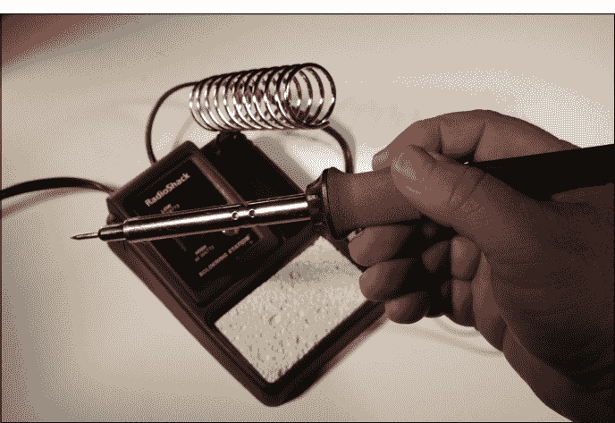

图3-8：带支架的烙铁。

## 万用表

在本手册的第2章中，你学习了如何用电压表测量电压。你也可以使用仪表来测量电子学中许多其他重要的物理量。除了电压，你需要进行的两个最常见的测量是电流和电阻。

与其使用三个不同的仪表来测量，更常见的做法是使用一种叫做万用表的单一仪器。图3-9展示了一个在RadioShack以大约20美元购买的典型万用表。

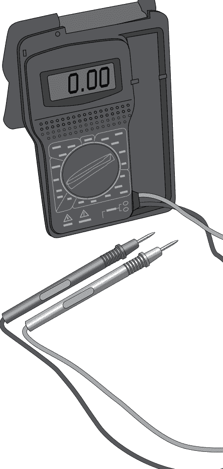

图3-9：一个便宜的万用表。

## 无焊面包板

无焊面包板——通常简称为面包板——是实验电路布局的必备工具。面包板是一种带有孔洞的板，你可以将导线或电阻、电容、晶体管等电子元件插入这些孔中，无需任何焊接即可创建一个完整的电子电路。当你完成电路实验后，可以将其拆解，然后重复使用面包板、导线和元件来创建一个完全不同的电路。

图3-10展示了一个典型的面包板，这个是在RadioShack以大约20美元购买的。你可以购买更便宜、尺寸更小的面包板，但这个（略大于7 x 4英寸）足够大，可以容纳本书中介绍的所有电路。

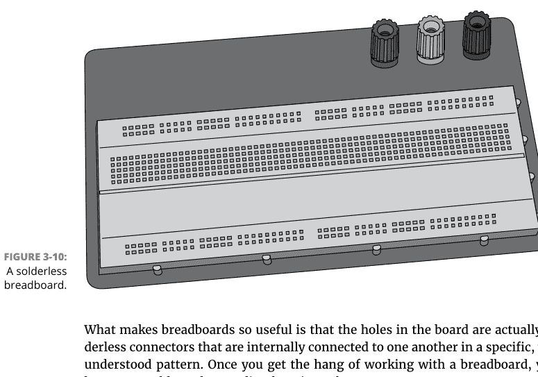

图3-10：一个无焊面包板。

面包板之所以如此有用，是因为板上的孔洞实际上是无焊连接器，它们在内部按照特定且众所周知的模式相互连接。一旦你掌握了使用面包板的技巧，理解其工作原理就不会有任何困难。

在本书的学习过程中，我将向你展示如何在面包板上创建几十种不同的电路。因此，你至少需要投资一个。我建议你购买一个类似于图3-10所示的面包板，再加上一两个其他较小的面包板。这样，你就无需总是拆掉一个电路来搭建另一个。

你可以在本手册的第6章了解更多关于使用无焊面包板的知识。

## 导线

你的实验室中最重要的必备物品之一是*导线*，它就是一段导体，通常由铜制成，但有时也由铝或其他金属制成。导体通常覆盖着一层绝缘层。大多数导线的绝缘层由聚乙烯制成，这与制作塑料袋的材料相同。

导线主要有两种基本类型：

-   实心导线：由单股金属制成
-   多股绞线：由多股细小的导线编织而成

图3-11展示了两种类型的导线，其绝缘层已剥去，以便你能看到它们的区别。

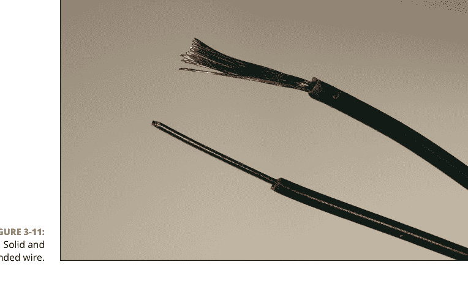

图3-11：实心导线与多股绞线。

对于本书中的大多数应用，你会希望使用实心导线，因为它更容易插入面包板孔洞和其他类型的端子连接处。实心导线也更容易焊接。当你尝试焊接多股绞线时，不可避免地会有一根细小的线股从其余部分分离，这可能会造成短路。

另一方面，多股绞线比实心导线更柔韧。如果你多次弯折一根实心导线，最终它会断裂。因此，经常需要移动的导线通常是多股绞线。

导线有多种尺寸，通过其线径（gauge）来指定，通常卷绕或装在包装里。奇怪的是，线径数字越大，导线越细。对于大多数电子项目，你会需要20号或22号线径的导线。在处理家用电力时，你需要使用较粗的导线（通常是14号或16号线径）。

最后，你可能注意到导线周围的绝缘层有不同的颜色。颜色对导线的性能没有任何影响，但通常用不同的颜色来表示导线的用途。例如，在直流电路中，通常用红色导线表示正电压连接，黑色导线表示负电压连接。

作为入门，我建议你购买各种导线——至少四卷：20号实心、20号多股、22号实心和22号多股。如果能找到多种颜色的组合，那就更好了。


图3-12：用于无焊面包板的跳线。

除了成卷的导线，你可能还想购买一些跳线，这些是预先切割、剥好皮并弯折好的，适用于无焊面包板。图3-12展示了一组我在RadioShack以大约6美元购买的跳线。

## 电池

别忘了电池！本书涵盖的大多数电路都使用AA电池或9伏电池，所以你会想要储备一些。

如果你愿意，可以使用可充电电池。它们初始成本较高，但当电量耗尽时无需更换。如果你使用可充电电池，你还需要一个电池充电器。

为了将电池连接到电路中，你需要几个AA电池盒。弄一个能装两节电池的和一个能装四节电池的。你还应该准备几个9伏电池夹。这些电池盒和电池夹如图3-13所示。

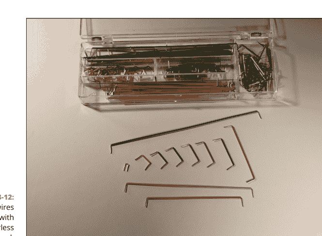

9伏电池夹

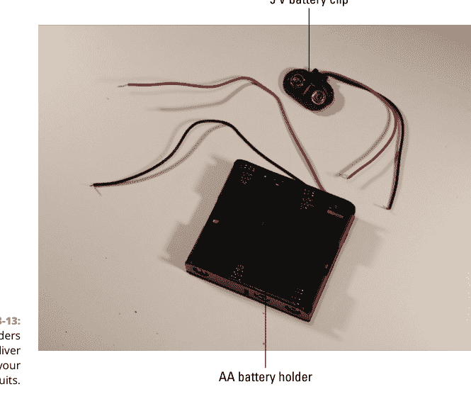

图3-13：电池盒将帮助为你的电路提供电源。

AA电池盒

## 其他需要储备的物品

除了我到目前为止列出的所有东西，这里还有一些你可能时不时需要的其他物品：

-   **电工胶带**：购买一两卷普通的黑色电工胶带。你主要会用它来缠绕临时连接，将其固定在一起并防止短路。帮自己一个忙，别把时间浪费在便宜的电工胶带上。质量差别很大。在我看来，最好的电工胶带无疑是Scotch Super 33+乙烯基电工胶带。它的价格大约是廉价胶带的两倍，但你不会为多花几美元而后悔。
-   **压缩空气**：一小罐压缩空气可以方便地用来吹掉旧电路板或元件上的灰尘。
-   **扎带**：也称为*线束扎带*，这些小塑料带对于临时（或永久）固定导线和其他物品非常方便。
-   **鳄鱼夹线**：这些是短导线（通常12或18英寸），两端带有*鳄鱼夹*，如图3-14所示。你会用它们在元件之间进行快速连接以进行测试。


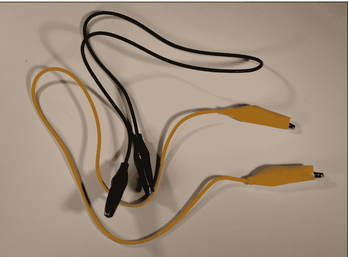

图3-14：鳄鱼夹线非常适合快速连接。

## 储备基本电子元件

除了本章至今描述的所有工具和耗材外，你还需要收集一些廉价的电子元件，以便开始你的电路实验。你不必一次性购买所有东西，但在继续深入学习本书之前，你至少应该收集一些基本的元件。

不幸的是，大多数社区都没有可以直接购买这些元件的实体店。（如果你所在的社区有幸有一家专业的电子零件商店，请从他们那里购买零件，以帮助这些本地生意维持下去！）如果没有本地供应商，你可以从Amazon (www.amazon.com)、Jameco (www.jameco.com)、RadioShack (www.radioshack.com)或其他任何电子零件分销商在线购买零件。

## 电阻

*电阻*是一种阻碍电流流动的元件。它是电子电路中使用的基本元件之一；事实上，你在本书中找不到任何一个不使用至少一个电阻的电路。图3-15展示了三个电阻，旁边放了一枚硬币，以便你了解它们有多小。你将在第2册的第2章中学习关于电阻的所有知识。

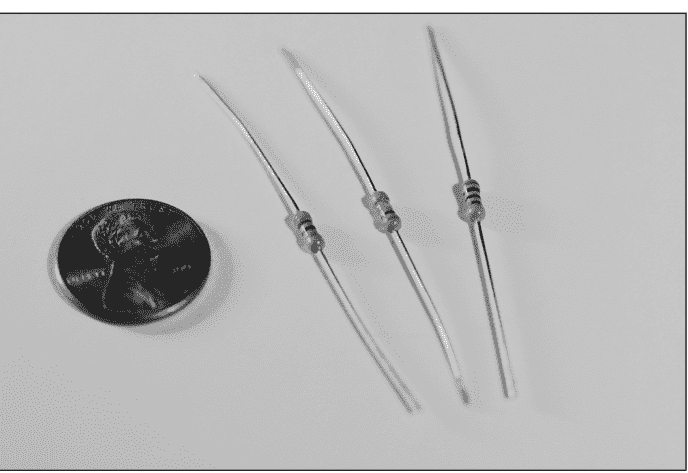

电阻器具有多种不同的*阻值*（它们对电流的阻碍程度，以欧姆为单位，符号为Ω）和*功率等级*（它们在不烧毁的情况下能承受的最大功率，以瓦特为单位）。

本书中的所有电路都可以使用额定功率为1/2瓦的电阻器。你需要准备多种不同的阻值。我建议你至少购买以下12种电阻各10个：

| 470 Ω | 4.7 kΩ | 47 kΩ | 470 kΩ |
|-------|--------|-------|--------|
| 1 kΩ | 10 kΩ | 100 kΩ | 1 MΩ |
| 2.2 kΩ | 22 kΩ | 33 kΩ | 220 kΩ |

> **提示**
> 购买包含大量不同电阻的套装可以节省开支。例如，大多数供应商销售包含约500个不同电阻的套装——其中包含了上述列出的所有阻值至少10个，外加其他一些阻值，价格大约在15美元左右。

## 电容器

除了电阻器，电容器可能是电子电路中第二常用的元件。*电容器*是一种可以临时存储电荷的器件。你将在第二册第3章中全面了解电容器。图3-16展示了一些电容器。

创建你的疯狂科学家实验室

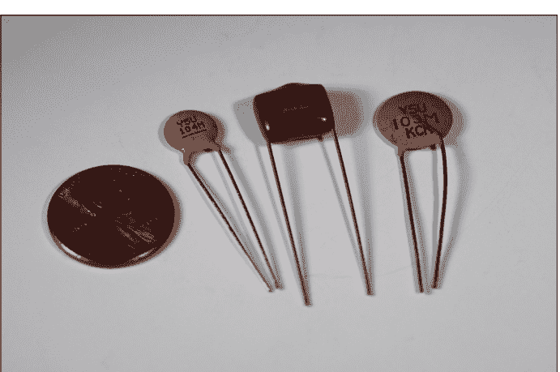

**图 3-16：** 电容器有各种形状和尺寸。

电容器有几种不同的类型，其中最常见的是瓷片电容和电解电容。给定电容器的电容量通常以微法拉为单位，缩写为µF。作为起始电容套装，我建议你至少购买以下电容器各五个：

- 瓷片电容：0.01 µF 和 0.1 µF
- 电解电容：1 µF, 10 µF, 100 µF, 220 µF 和 470 µF

与电阻器类似，你可以购买包含多种不同电容值的套装。大约15美元，你就可以获得500个或更多具有各种实用电容值的电容器。

### 二极管

二极管是一种只允许电流单向流动的器件。图3-17展示了各种类型的二极管。

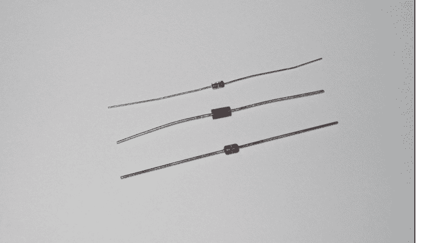

**图 3-17：** 一组二极管。

二极管有两个引脚，称为阳极和阴极。只有当正电压施加到阳极、负电压施加到阴极时，电流才会流过二极管。如果电压反向，电流则不会流动。

你将在第二册第5章中全面了解二极管。目前，我建议你至少购买五个基本的、型号为1N4001的二极管（图3–17中间的那种）。你应该能在任何电子元件分销商处找到它们。

## 发光二极管

发光二极管（或称LED）是一种特殊类型的二极管，当电流通过时会发光。你将在第二册第5章中了解LED。虽然有许多不同类型的LED，但我建议你从购买至少五个红色二极管开始。图3–18展示了一个典型的红色LED。

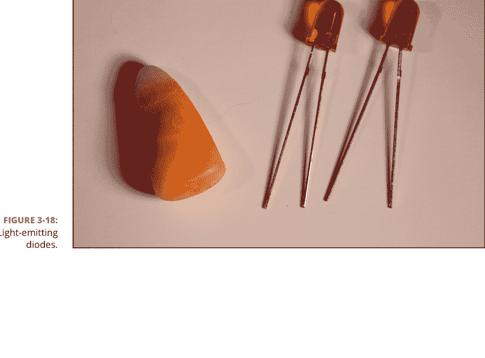

**图 3–18：** 发光二极管。

创建你的疯狂科学家实验室

### 晶体管

*晶体管*是一种三端器件，施加在一个端子（称为*基极*）上的电压可以控制流过另外两个端子（称为*集电极*和*发射极*）的电流。晶体管是电子学中最重要的器件之一，我将在第二册第6章中详细介绍它。现在，你可以先准备几个简单的2N3904 NPN晶体管（如图3-19所示）备用。

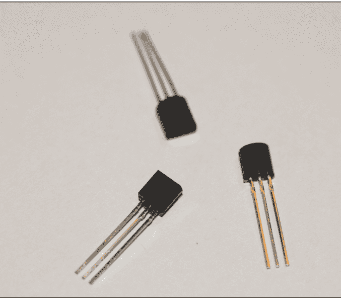

> 不用担心；等你学完第二册第6章，你就会明白2N3904 NPN这个型号的含义了。

## 集成电路

集成电路是一种特殊元件，它包含了一个完整的电子电路，包括晶体管、二极管和其他元件，全部通过光刻技术蚀刻在一小块硅片上。集成电路是现代电子设备（如计算机和手机）的基本构建模块。

你将在第三册中学习如何使用一些基本的集成电路。要入门，你需要至少购买两种不同类型的集成电路各几个：一种是555定时器，另一种是LM741运算放大器。这些芯片如图3-20所示。

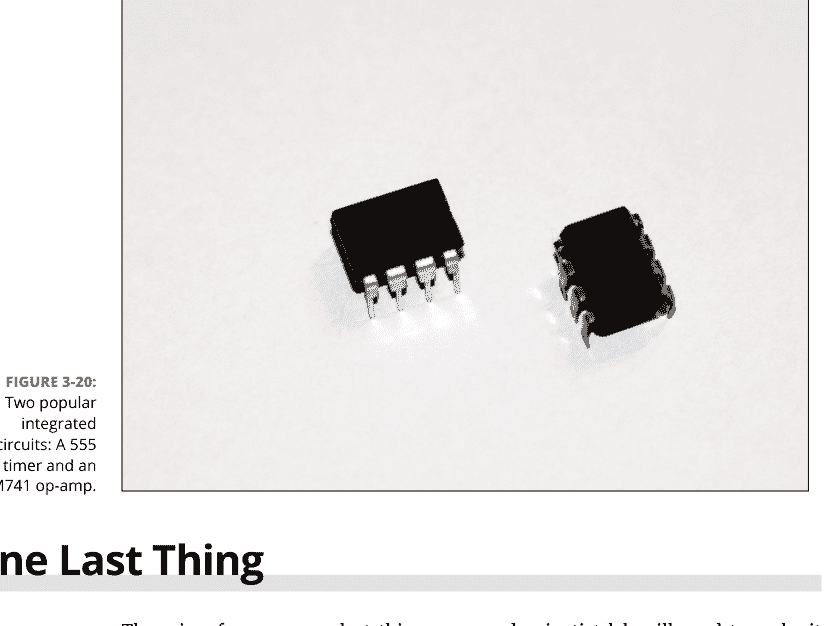

## 最后一件事

当然，你的疯狂科学家实验室要变得完整，还需要最后一样东西。这最后一样东西是一个恰当的警示牌，用以提醒你的朋友和家人，你确实是一个疯狂科学家。我正式授权你复印图3-21所示的警示牌，并将其放置在工作台附近的显眼位置。


**图 3-21：** 确保你的朋友和家人得到恰当的警示。

## 本章内容

- 了解处理电的潜在风险
- 保护自己免受杂散电流的危害
- 保护你的设备免受静电损害

# 第4章

## 保持安全

当我还是个孩子的时候，我帮助过一个名叫巴里的好朋友，他制作了一个特斯拉线圈。我说的“帮助”，意思是在他的车库里闲逛，看着他一丝不苟地将成千上万匝裸铜线缠绕在一个巨大的玻璃牛奶瓶上，涂上几十层漆，并打磨固定在线圈最顶端的黄铜球。我非常确定，没有我他做不成这件事。

完成后，我们把它插上电，惊叹于它所能做的事。火花随机地从线圈顶端的球体向空中飞溅一两英尺。如果你一只手拿着撬棍，你可以从球体到撬棍之间引出几英尺长的火花。从球体出来的电流在空气中飞过，进入撬棍，然后通过我们的身体流入地下。你也可以通过在离线圈几英尺内手持荧光灯管来点亮它。

直到今天，我都不敢相信巴里的父母会让他做这个。我知道我的父母不会让我做这个。我妈妈有点像《圣诞故事》里那位妈妈，不让她儿子拉尔菲拥有那把Red Ryder BB枪（枪托里有个指南针和那个能报时的东西），因为“你会打瞎自己的眼睛。”

那就是我妈妈。不让我碰特斯拉线圈。太危险了。

本书中描述的电子项目没有一个像特斯拉线圈那样危险。事实上，它们大多数根本没有威胁。话虽如此，重要的是要记住，每当你处理电时，你处理的都是一种可能非常危险的东西。

触电的可能性在你处理电时总是存在的，但也存在其他潜在危险。你可能不会打瞎自己的眼睛，但如果你不小心，你可能会引发火灾，或者以其他方式伤害自己或他人。

因此，本章的目的就是让你在进行电子实验时保持安全。请仔细阅读，并请注意我在这里给出的每一条建议。

## 直面电气危险的现实

有一个简单事实无法回避：触电，如果足够强烈，可以致命。所以，每当你处理电时，你必须确保采取一切可能的预防措施，避免受到足以造成伤害的电击。

在美国，每年大约有500到1000人死于意外触电。其中许多是工业事故或与天气有关的事故，涉及接触倒下的电线。但许多是完全可以避免的、发生在家中事故。在接下来的章节中，我将给你提供避免意外触电的具体指导方针。

## 家庭电流可以杀死你！

太多人错误地认为流经家庭电线的120伏交流电不足以致命。所以，让我们首先明确一个事实：


> 你家庭布线系统中的电力足以致命。

你主要在两个地方接触到家庭电流：电源插座和灯具内的灯泡插座。因此，你应该在将插头插入或拔出电源插座时格外小心，并且在更换灯泡时也要小心。具体来说，你应该遵循以下预防措施：-   **切勿在灯亮时更换灯泡**。若灯由开关控制，请关闭开关；若无开关，则拔下灯的电源插头。
-   **若延长线出现磨损或任何损坏，请立即丢弃**。一旦延长线的绝缘层开始剥落，电击风险便真实存在。
-   **切勿在电路带电时进行接线作业**。如您坚持自行更换电灯开关或电源插座，请务必在开始前关闭控制该电路的断路器以切断电源。每年都有许多人因自认为足够小心、能在带电情况下安全操作而丧生。

## 是电流而非电压致死吗？

有句老话说：“致死的是电流，而非电压。” 虽然从技术上讲这句话可能正确，但它却具有危险的误导性。事实上，这种说法源于对电流和电压本质的根本性误解。若不理解电流与电压的关系，可能会导致你采取危险的风险行为。

电击的危险发生在电流流经身体关键部位——尤其是心脏之时。仅需几毫安的电流即可使心脏停跳。约在10毫安时，肌肉会痉挛，若握住带电导线则无法松手。约15毫安时，胸部肌肉可能痉挛，导致呼吸困难。而约60毫安时，心脏便会停止跳动。这些效应只需短暂暴露即可发生。

因此，是的，流经你身体的电流确实能致命。

但电流与电压密不可分。没有电压就不会有电流，且在其他条件相同的情况下，电压越高，电流越大。因此，即使你浑身湿透站在裸露的水泥地上，也很难因三伏特电压而遭受致命电击。但在相同条件下，30伏特可能就足以造成痛苦且具破坏性的电击。

说“致死的是电流，而非电压”有点像说“导致溺水的是缺氧，而非水”。虽然技术上可能正确，但难道不是水导致了缺氧吗？

-   **切勿在交流电供电的电器接通电源时进行操作。**
仅关闭电器开关不足以确保安全。若电器有电源线，请在操作前拔下插头；若无电源线，请通过关闭家中配电盘上的断路器来切断电源。

-   **操作自己的交流电路时，请采取额外防护措施。**
在第四册中，我将详细介绍交流电路的操作；届时会更多地讨论交流电安全。

## 即使相对较低的电压也可能伤人

本书中的大多数项目使用AA电池，通常是两节或四节串联，总电压为三或六伏特。此电压不足以造成严重伤害。即使因三或六伏特电压受到电击，你可能几乎感觉不到。

然而，即使在三或六伏特这样低的电压下，也可能造成伤害。若意外导致电池两极短路，大量电流将迅速流过。这极可能导致连接电池两端的导线变得非常热，电池本身也可能发热。产生的热量足以造成严重灼伤。


若奔腾的电流未加控制，电池还可能爆炸。相信我；你绝对不想在那种情况下待在附近。你肯定不想因为需要去急诊室取出眼中炸入的电池碎片而跑一趟。

鉴于此危险，在使用本书所述的电池供电电路时，你应采取以下预防措施：

-   **在电路完全完成并经复查确保所有连接正确之前，切勿接通电源。**

-   **电路接通电源时，切勿无人看管。**
离开工作台前务必取下电池。

-   **定期用手指触摸电池，确保其未发热。** 若电池变热，请取下电池并重新检查电路，确保没有接线错误。

-   **若闻到任何焦糊味，立即取下电池并重新检查电路。**

## 保持干燥，确保安全

我们在电视剧犯罪剧中都见过这样的谋杀场景：趁受害者在浴缸洗澡时，将通电的电器（如吹风机）扔进浴缸。我一直想知道这在现实中发生的频率，以及其致命性的可能性有多大。例如，断路器会多快介入切断吹风机的电源？现代浴室强制要求的特殊GFCI保护装置能否按设计及时切断电源？

我从未想过通过实验来实际验证——你也不应在任何情况下这样做。水与电的组合非常危险，因为水是电的优良导体，且无处不在。

严格来说，纯净未受污染的水实际上是绝缘体。但纯水非常稀有。大多数水都充满杂质，而这些杂质使水成为优良的导体。因此，在接触电流时，避免接触水是正确的。以下是一些通过保持干燥来确保安全的建议：

-   **确保地面干燥。** 不要在地面潮湿的区域操作电子或电气设备。
-   **注意高湿度，尤其是当其在你项目上凝结成水汽时。**
-   **操作电流前请擦干双手。** 即使手上有少量汗水也会降低身体的天然电阻，加剧低电压电击的危险。

> **务必佩戴防护眼镜，以防电池爆炸。（在特定情况下，其他元件也可能爆炸！）**

## 有时电压隐藏在意想不到之处

电子学中最大的电击风险之一来自你未曾预料到的电压。留意已知的电压（如电源或电池中的电压）相对容易，但有些电路的设计就是为了放大电压。因此，即使你的电路使用六伏电池运行，电路内部的某些特定点可能存在高得多的电压。

此外，一些电气设备在电路断电后实际上仍能储存电荷。具有这一特性的最知名设备是*电容器*，它能交替积累和释放电荷。因此，你应对任何包含电容器的电路保持警惕——尤其是大型电容器。常见的瓷片电容器通常小于塑料筹码，储存的电荷不多。然而，若你的电路中有电池大小的电容器，操作时必须格外小心。这类电容器在断电后很长一段时间内仍能保持大量电荷。

以下是关于电容器的一些安全要点：

-   **大型电容器最常见的位置之一是电源电路中。** 任何插入家用电源插座的电子设备，其电源电路中都可能包含一个大型电容器。操作这些电容器时要极其小心。事实上，若电源电路位于其自身的封闭盒内，*切勿打开盒子*。相反，若怀疑电源损坏，应更换整个电源。
-   **另一个常见的高压电容器位置是闪光灯相机中。** 尽管电池可能仅为1.5伏，但驱动闪光灯单元的电容器可能存储着300伏或更高的电荷。
-   **在操作包含电容器的电路前，务必先将电容器放电。** 你可以通过用螺丝刀刀片短接其引脚来为小型电容器放电。短接引脚时，确保只触摸螺丝刀的绝缘手柄，并且不要用另一只手接触电路的任何其他部分。
-   **较大的电容器应通过将其引脚连接到灯泡或大电阻来放电。** 最简单的方法是制作一个带鳄鱼夹的灯座，将灯泡拧入灯座，然后小心地将鳄鱼夹连接到电容器引脚。若电容器储存有电荷，当电荷通过灯泡放电时，灯泡会短暂发光。
-   **若对涉及大型电容器的操作缺乏完全信心，请远离该项目。**

## 其他安全方法

在从事电子工作时，电击并非你将面临的唯一危险。以下段落总结了你可能面临的其他一些风险，并描述了为将这些风险降至最低而应采取的预防措施：# 焊接存在明显的火灾隐患。

如果你的电烙铁热到足以熔化焊锡，那么它同样也热到足以点燃纸张、电线绝缘层等易燃材料。因此：

-   始终留意你的电烙铁是否处于通电状态。在需要使用前不要插上电源，焊接完成后请拔掉插头。
-   切勿将热的电烙铁直接放在工作台上。相反，请准备一个电烙铁架，在电烙铁发热时安全地放置它。图4-1展示了一个放置在简易支架上的电烙铁。如图所示，这个支架将电烙铁的工作端安全地抬离工作台面。

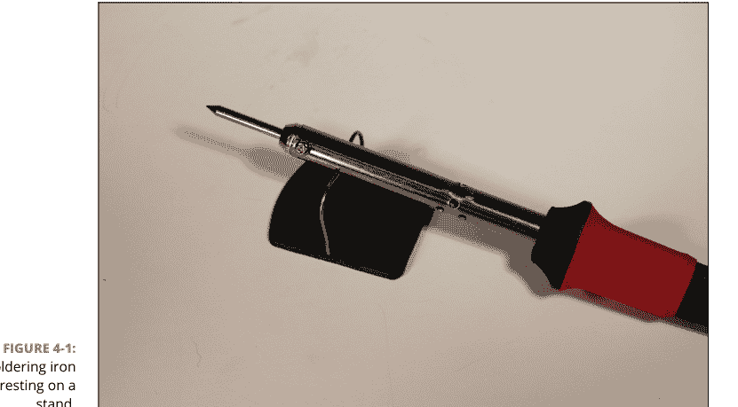

-   在处理焊接点之前，请让它们冷却几分钟。
-   注意电烙铁的电源线。显然，你要避免电烙铁烧到电源线。虽然听起来很荒谬，但我自己就曾不小心把电烙铁直接放在了它自己的电源线上。幸运的是，在电烙铁熔化大部分电源线绝缘层之前，我注意到了自己的错误。

确保电烙铁的电源线放置在远离你物品的安全位置，这样你在工作时就不会碰到它，导致它从支架上掉落，可能造成烫伤。


-   焊接时务必佩戴护目镜。焊锡熔化时，偶尔会沸腾并溅射出微小的热焊锡球。你绝对不希望熔化的金属靠近你的眼睛。

**电子学——尤其是焊接——也可能造成化学危害。** 焊接时，少量的铅会释放到空气中。因此：

-   始终在通风良好的地方工作。
-   在接触脸部、嘴巴、鼻子或眼睛之前，请洗手。少量的铅和其他潜在的有毒物质肯定会沾到你的手上。最好经常洗手，以防止手上沾染的任何污垢进入体内。
-   将你的焊接工具远离儿童。幼儿和宠物喜欢把东西放进嘴里。如果你把焊锡或像电阻、二极管这样的小电子元件随意放在工作台上，你的孩子或宠物可能会决定把它们当食物吃掉，所以请将这些东西安全地存放在盒子或柜子里，并且如果可能的话，让你整个工作区域安全地远离并关上门。
-   不要养成在工作时把零件放进嘴里含着的习惯。虽然听起来很疯狂，但我见过有人在焊接时把十几个电阻含在嘴里，然后逐个焊接到印刷电路板上。这绝对是个坏主意。

**使用锋利的工具，如刀、钢丝钳和电钻，存在割伤的风险。** 因此：

-   切割前先思考。确保你确切知道要在哪里切割，并在开始切割前确保你确切知道所有手指的位置。
-   让工具完成工作。不要施加过大的力量，强迫工具做出超出其设计范围的更大、更深或更宽的切割。
-   保持你的工具锋利。使用钝的工具会让你用额外的力，这通常会导致工具打滑并卡在你的手指里。
-   在开始之前，取下戒指、手表和长的悬挂项链等首饰——特别是如果你使用电动工具的话。
-   在切割、锯切或钻孔时，务必佩戴安全眼镜。工件或锯片的小碎片很容易断裂并击中你的面部。再加上绝缘碎片、铜线和断裂的钻头，这些你都不想进入眼睛的东西清单越来越长。

# 随身携带安全设备

尽管你可能采取了各种预防措施，但在进行电子工作时，事故仍有可能发生。除了首先防止事故发生之外，处理事故的最佳策略是做好准备，因此我建议你在进行电子工作时，随时将以下物品放在附近：

-   **灭火器：** 以便在火灾发生时迅速扑灭，防止其失控。
-   **急救箱：** 用于处理小伤口、擦伤和小烧伤。急救箱应包括绷带、抗菌药膏或喷雾以及烧伤药膏。
-   **电话：** 以便在情况真的变得糟糕时呼叫援助。
-   **朋友：** 如果你的项目使用家用电源（120伏），朋友可以在你触电时提供帮助。

# 保护你的设备免受静电放电

*静电*——更准确地称为*静电荷*——是在没有允许电流流动的电路的情况下，电荷（即电压）积聚时产生的。你自己的身体通常是静电荷的载体，静电荷可由多种原因产生。最常见的是由简单的事情引起的摩擦，例如走过地毯。你的衣服也可能带上静电荷，通常在你把它们扔进烘干机时就会带上。

积聚在你体内的静电荷通常会随时间自行放电。然而，如果你在带电时触摸导体——比如黄铜门把手——电荷会迅速消散，产生恼人的电击。

如果导体恰好是敏感的电子元件，如晶体管或集成电路，而不是黄铜门把手，那么放电可能不仅仅是恼人；它可能会烧毁元件的内部结构，使其在你的项目中无法使用。因此，在进行电子项目时，保护你的设备免受静电放电是明智的。最简单的方法是在开始工作前确保你已正确放电。如果你有一个金属工作台或附近有一个大型金属工具，如钻床或砂轮机，只需在坐定后、开始工作前伸手触摸它即可。

一种更可靠的方法是保护你的设备免受静电放电，就是在一只手腕上佩戴特殊的防静电腕带，如图4-2所示。将腕带戴紧，使其在整个手腕周围与皮肤保持良好接触。然后，将鳄鱼夹插入金属表面，如你的工作台框架或附近的钻床。

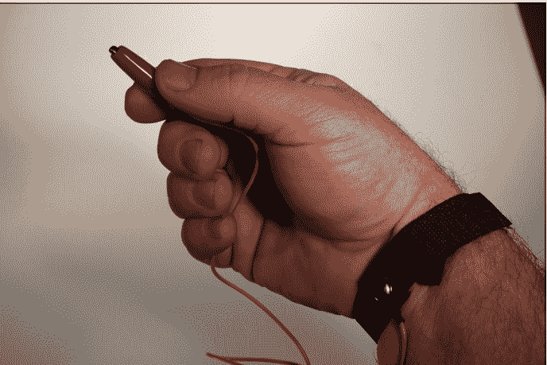

图4-2：防静电腕带。

> **提示** 为获得最佳效果，防静电腕带上的鳄鱼夹应连接到适当的接地。要创建适当的接地，请将一根长电线夹在金属水管上。电线应足够长，能从水管延伸到你的工作台。小心地将电线从水管布线到你的工作台，剥去约一英寸的绝缘层，并用钉书钉或夹子将电线固定在工作台上，留下剥开的末端，以便你可以将防静电腕带的鳄鱼夹连接到上面。（注意，此技术仅在建筑物全程使用金属管道时有效。如果建筑物使用塑料管道，水管将无法提供适当的接地。）

> **警告** 一种经常推荐的将腕带连接到接地的方法是将其连接到正确接地的电源插座的接地插孔。我绝对不赞成这种方法，因为其操作的关键在于“正确接地的电源插座”这个术语。只需要一个愚蠢的接线错误，或者一根被音爆或轻微地震震松的电线，那么那根接地线可能就不再是接地线了——它可能带电了。如果你愿意，可以叫我偏执狂，但我无法推荐将导体绑在手腕上然后插入电源插座。

+ 本章内容
-   探讨原理图如何为电子电路提供路线图
-   查看最常用的元件符号
-   注意电压源和公共地线电路通常如何绘制
-   了解元件通常如何标注

# 第五章 阅读原理图

我喜欢地图。我想我保留了每次旅行中使用的每一张地图。我有整个国家和州的大地图、城市地图、步行地图、公园和博物馆地图，甚至还有地铁地图。我最喜欢的地图是我进行为期一周的背包旅行地区的地形图。这些地图不仅显示了我徒步旅行的路线，还显示了代表我背着50磅背包艰难上坡的每一步的等高线。

没有地图，我们会迷路。我们永远无法到达目的地，因为我们不知道路在哪里。想想我们会错过沿途的所有风景！

电子学有其自己的地图形式。它们被称为*原理图*。它们显示了构成电子电路的所有不同部件是如何连接的。

就像地图使用符号来代表城市、桥梁和铁路等特征一样，原理图使用特殊符号来代表电路的不同部件，如电池、电阻和二极管，并且像地图一样，原理图这些惯例几乎总是被遵循使用。例如，正电压几乎总是显示在电路原理图的顶部，就像北方几乎总是显示在地图的顶部一样。

在本章中，你将了解原理图中使用的符号以及绘制它们时遵循的惯例。

## 介绍一个简单的原理图

我读过很多计算机编程书籍，自己也写过几本。在计算机编程书中，通常展示的第一个完整计算机程序被称为“Hello World”，这个程序只是在屏幕上显示文本“Hello World!”然后退出。它基本上是能编写的最简单的计算机程序。它没有做任何有用的事，但它是学习如何编写计算机程序的一个很好的起点。

图5-1展示了一个电路原理图，它是“Hello World”程序的电子等价物。这个图表展示了最简单的、实际上能起作用的原理图：它点亮一盏灯，从而向世界宣告一个电路确实在工作。

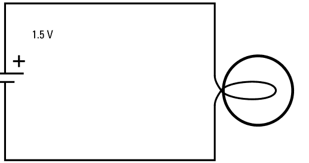

图5-1：一个点亮灯泡的简单电路原理图。

此图包含两个符号，代表电路中的两个组件：一个1.5V电池和一个白炽灯。连接这两个组件的线代表导体，这些导体可以是实际的电线，也可以是印刷电路板上的铜迹线。

在此原理图描绘的电路中，电池的正极连接到灯泡的一个引线，灯泡的另一个引线连接到电池的负极。一旦这些连接建立，电流就会从电池流向灯泡，通过灯丝产生光，然后回到电池。

原理图总是描绘常规电流方向，正如你在本小册子的第2章中所学的，这意味着电流从正极流向负极。因此，电流从电池的正极端子流出，通过灯泡，然后回到电池的负极端子。


实际上，常规电流方向与电子通过电路的实际流动方向相反。电池的负极一侧有过量的带负电粒子（多余的电子），而正极一侧则有过量的带正电粒子（缺少电子）。因此，电荷通过导体从电池的负极一侧流出，通过灯泡，再回到正极一侧。（有关实际电流方向与常规电流方向之间差异的更多信息，请参阅本小册子的第2章。）

当电流通过灯泡时，灯丝的电阻使电流加热灯丝，这又导致灯丝发射可见光。

## 布置电路


关于原理图最重要的一点是要认识到，图中组件的排列方式并不一定对应于你实际构建电路时物理部件的排列方式。

例如，图5-1所示的电路显示电池在电路的左侧，灯泡在右侧。它还显示电池的方向是正极端子在顶部，负极端子在底部。然而，这并不意味着电路实际上必须这样构建。如果你愿意，你可以把灯泡放在左边，电池放在右边，或者你可以把电池放在顶部，灯泡放在底部。

只要组件的连接保持与原理图中所示相同，电路的物理排列就无关紧要。因此，在这个例子中，无论你如何物理排列组件，你都必须将电池的正极端子连接到灯泡的一个引线，将负极端子连接到另一个引线。

由于图5-1所示的电路中只有两个组件和两个导体，所以要搞错连接相当困难。然而，在一个可能包含数十个组件和数十个连接的更复杂的电路中，布置电路并确保所有连接与原理图中指示的连接完全匹配可能是一个挑战。必须仔细检查每个连接以确保其正确性。

## 连接还是不连接

绘制原理图电路图的目标之一是尽可能保持图表简单。然而，除了最简单的原理图外，所有原理图中的线条在某些地方都需要相互交叉。当它们交叉时，至关重要的是能够分辨交叉的线是代表导体之间的实际连接（也称为接点），还是仅仅交叉而没有实际连接。

不幸的是，没有一个明确且通用的标准来规定如何表示交叉线是否代表接点。图5-2展示了一些表示交叉导线是否带有接点的方法。


图5-2：交叉的导线可能连接也可能不连接。

图5-2左侧的三个例子展示了如何指示接点。左上角的例子展示了表示接点最常见的方法：在导线交叉点放置一个醒目的点。每次你看到两条线相交处有一个点，就知道这两条线形成了一个接点。

在图5-2中左中和左下例子所示的两种接点样式中，垂直线被倾斜以避免在水平线的同一点汇聚。无论是否有接点，这两种样式都清晰地指示了接点。

图5-2右侧的三个例子展示了最常用的表示交叉但不连接形成接点的方式。在上面的两个例子中，一条线“跳过”另一条线，并且其中一条线在交叉处断开。

图5-2右下角的例子有点模糊。在这里，线条相互交叉。然而，没有跳线或断开来表示没有接点存在，也没有一个点来表示应该存在接点。那么这里到底有没有接点？答案是，在大多数情况下，没有。通常你可以假设当线条交叉但没有点时，接点*不存在*。但是，你应该检查图表的其余部分以确保。如果你发现图表的其他地方，非接点是通过跳线或断开来指示的，那么没有跳线或断开的交叉线可能确实指示一个接点。

 为了避免歧义，本书中的原理图始终使用点表示接点，使用跳线表示非接点。你绝不会看到线条只是交叉而没有跳线或点。

## 查看常用符号

图5-1所示的电路只有两个组件：电池和灯泡。大多数电子电路将包含额外的组件。有数百种不同类型的电子组件，每种都有其独特的原理图符号。幸运的是，你只需要了解一些基本符号就可以开始。这些符号总结在表5-1中。（注意，在实际电路图中使用时，符号通常会被旋转。）

图5-3展示了一个包含其中几个组件的原理图。别担心——你现在不需要理解这个图表。我只是想让你对真实的原理图是什么样子以及如何阅读它们有个概念。

### 表5-1 原理图常用符号

| 符号 | 描述 |
| :--- | :--- |
| | 电池 |
| | 电容器 |
| | 二极管 |
| | 接地 |
| | 电感器（线圈） |
| | 灯 |
| | 发光二极管 |
| | 电阻器 |
| | 电源电压连接 |
| | 扬声器 |
| | 开关 |
| | 变压器 |
| | 晶体管（NPN） |
| | 晶体管（PNP） |
| | 可变电阻器（电位器） |如图5-3所示，电路包含六个元件。从左至右依次为：

- 6V电池
- NPN晶体管
- 电阻器
- 电容器
- PNP晶体管（右上角）
- 发光二极管（右下角）

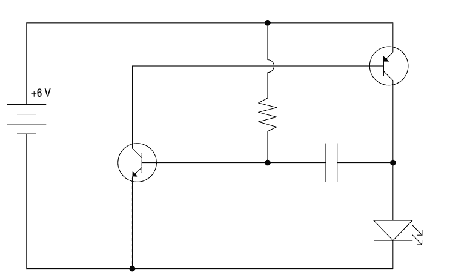

## 图5-3：典型电路原理图

在本书中，我将在描述电路的原理图中使用这些及其他符号。每次首次使用某个符号时，我都会解释其含义和工作原理。

## 简化接地与电源连接

在许多电子电路中，电压连接的分布是电路最复杂的方面之一。例如，图5-3所示原理图中约一半的连接用于将电阻器、晶体管和LED连接到电池的正极或负极。

在更复杂的电路中，可能存在数十甚至数百个电源连接。如果所有代表这些连接的线路都必须绘制到电池符号的正极或负极侧，原理图很快就会被电源连接淹没。

大多数电路都有一条电流返回电源的公共路径。在图5-3中，这条路径是原理图最底部的导线，它收集来自LED和电阻器的电流并将其返回电池。这条导线对于完成电路是必要的，这样电流才能从电池流经各个元件，然后返回电池，形成完整回路。

这条公共返回路径通常称为*接地*，可以用接地符号替代，如表5-1所示。图5-4展示了使用三个接地符号表示电流返回电池路径的原理图。图5-4所示电路在功能上与图5-3所示电路完全相同。

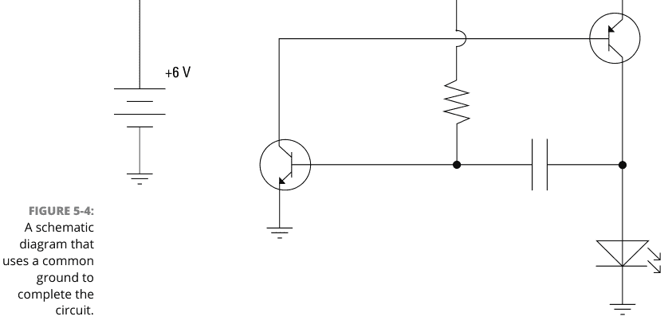

除了公共接地路径外，大多数电路还有一条公共电压路径。在图5-3和图5-4所示电路中，公共电压路径从电池延伸到电阻器，再到第二个晶体管。这条导线可以用代表电压源的符号替代，这些符号出现在电路中需要电压的任何位置。

电压源的符号可以是空心圆圈或箭头。电压值始终标注在圆圈或箭头旁边。当在原理图中使用电压源符号时，电池符号（或如果电路不由电池供电，则其他电源符号）会被省略。相反，电压源符号的存在意味着电压由某种方式提供，无论是通过电池还是其他设备，如太阳能电池或插入电源插座的电源。

图5-5展示了与图5-3和图5-4相同电路的原理图，但使用了电压源符号代替电池符号。如图所示，电路中有两处需要+6V电压：电阻器处和第二个晶体管处。该电路在功能上与图5-3和图5-4所示电路完全相同。


尽管图5-5所示电路具有正电压源且接地为负极，但情况并非总是如此。你也可以使用电压源符号来表示负电压。在这种情况下，接地实际上将正电压返回电源。

## 图5-5：使用公共接地完成电路并带有电压源符号的原理图

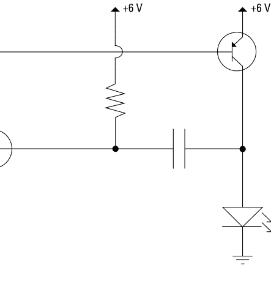

在某些情况下，电路可能在不同位置需要正电压和负电压。请记住本迷你书第2章的内容：电压始终是相对于电路中的两个点进行测量的。因此，电压总是相对的。例如，AAA电池的正极相对于负极是+1.5V。同时，电池的负极相对于正极是-1.5V。

现在假设你将两节AAA电池首尾相连。那么，第一节电池正极的电压相对于第二节电池负极的电压是+3V。但是，第一节电池正极的电压相对于两节电池之间的点是+1.5V，而第二节电池负极的电压相对于两节电池之间的点是-1.5V。

图5-6展示了这种布置在原理图中的绘制方式，其中一对电阻器分别连接在每节电池两端到中间点。左侧图示显示了电池及其连接。右侧图示显示了使用接地和电压源符号的相同电路。

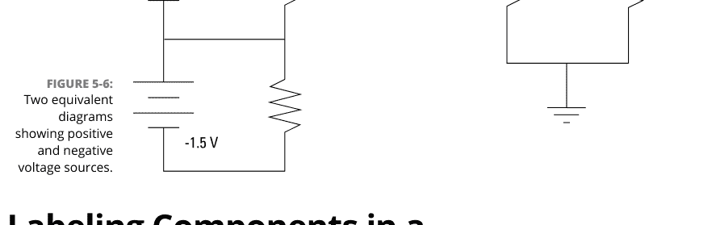

## 在原理图中标记元件

仅凭符号通常不足以完全识别原理图中的电子元件。通常需要在符号旁边添加文本提供更多信息，如图5-7所示。这些附加信息通常包括以下内容：

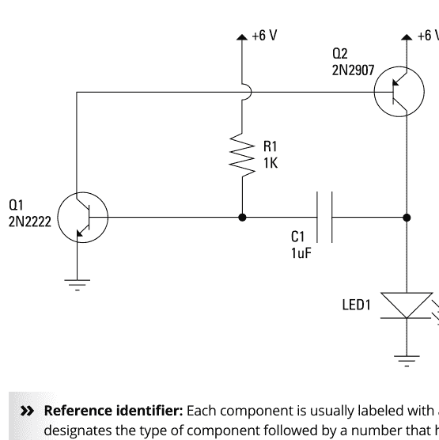

## 图5-7：带有元件标记的原理图

- 参考标识符：每个元件通常用一个字母标记，表示元件类型，后跟一个数字，用于帮助识别同类型的每个元件。例如，如果电路有四个电阻器，则电阻器标识为R1、R2、R3和R4。最常用的字母如表5-2所示。
- 值或零件号：对于电阻器和电容器等元件，值以欧姆（电阻器）和微法（电容器）为单位给出。因此，470Ω电阻器旁边会有数字470，100µF电容器旁边会有数字100。

字母k和M用于表示千和百万。例如，10,000Ω电阻器在原理图中标识为10k。

二极管、晶体管和集成电路等元件没有值；相反，它们有制造商的零件号。因此，你可能会在这些元件旁边找到零件号，如1N4001（二极管）、2N2222（晶体管）或555（集成电路，IC）。

在某些情况下，值或零件号会从原理图本身中省略，而是包含在单独的零件列表中，该列表标识原理图中出现的每个参考零件的值或零件号。然后，要查找特定元件的值或零件号，你需要在零件列表中通过其参考标识符查找该元件。

### 表5-2 常用参考标识符

| 字母 | 含义 |
|--------|---------|
| R      | 电阻器 |
| C      | 电容器 |
| L      | 电感器 |
| D      | 二极管 |
| LED    | 发光二极管 |
| Q      | 晶体管 |
| SW     | 开关 |
| IC     | 集成电路 |

## 在原理图中表示集成电路

表5-1中未显示的一个重要符号是集成电路（IC）的符号。集成电路是小型组件，通常有多个引脚，称为引脚，连接到组件内部包含的电路的各个部分。有些集成电路只有六个或八个引脚；而另一些则有数十甚至数百个。这些引脚从引脚1开始编号。集成电路中的每个引脚都有独特的用途，因此在电路中连接到正确的引脚对于电路的正常运行至关重要。如果连接到错误的引脚，电路将无法工作，并且可能会损坏集成电路。

在原理图中表示集成电路最常见的方法是使用一个简单的矩形，引线从矩形中伸出以表示各个引脚。原理图中引脚的排列不一定对应于集成电路本身引脚的物理排列。相反，引脚的位置是为了在原理图中提供最简单的电路路径。原理图中的引脚编号用于指示要使用的正确引脚。

例如，图5-8展示了一个使用流行的555定时器集成电路使LED闪烁的原理图。555有八个引脚，你可以看到原理图要求连接所有八个引脚。然而，原理图中的引脚排列方式简化了与引脚的连接。在实际的555集成电路中，引脚按数字顺序排列在集成电路的两侧，引脚1至4在一侧，引脚5至8在另一侧。

## 第六章 构建项目

有人认为尤吉·贝拉曾说过：“理论上，理论和实践没有区别。但实际上，有。”

本书的大部分内容都是理论性的——电流如何工作，电阻、电容和晶体管等单个电子元件如何工作，数字逻辑如何工作等等。

但电子学的核心在于构建事物。学习所有理论的原因，是为了能够通过实际构建电路并加以应用来实践这门艺术。

在整本书中，我通过各种电子元件工作原理的理论解释，并辅以你可以构建的简单制作项目，以在实际应用中演示理论。在本章中，你将学习构建这些项目所需的基本制作技巧。

## 本章内容

- 构思电子项目的想法
- 创建可行的电路设计
- 在无焊面包板上构建原型
- 在印刷电路板上创建永久性电路
- 通过将所有部件装入合适的外壳来完成项目

在本章中，我将带你完成构建一个相当复杂的电子项目的过程。虽然你可以在阅读本章时选择亲自构建该项目，但我并不要求你实际这样做。相反，我只是希望你能够欣赏从头到尾构建一个非平凡项目的整个过程。

## 了解构建电子项目的流程

你将在本书中学习的电子项目，通常遵循从开始到结束这一可预测的通用步骤顺序：

1.  **决定你要构建什么。**
    在设计或构建电子项目之前，你必须对项目预期的功能、外观以及人类如何与之互动有一个明确的想法。
2.  **设计电路。**
    在确定了要构建什么之后，你需要设计一个能完成任务的电子电路。此步骤的最终成果是一张原理图。
3.  **构建原型。**
    在投入构建永久电路所需的时间和材料之前，最好先构建一个*原型*，以便快速测试电路是否正常工作。通常，你会在无焊面包板上构建原型。
4.  **构建永久性电路。**
    当你的原型工作正常时，你就可以构建电路的永久版本。通常，你会通过将元件焊接到印刷电路板上来构建永久版本。
5.  **完成项目。**
    要完成项目，你需要将电路板以及任何其他必要的元件（如电池、开关或发光二极管）安装到一个合适的外壳中。

本章的后续部分将更详细地描述这些步骤中的每一步。

## 构思你的项目

在迷失于设计和构建项目的细节之前，你应该退后一步，审视全局。首先，你需要确保你对项目有一个明确的想法。你为什么想构建它？它将做什么，谁会使用它，以及为什么？

例如，我喜欢每年构建一些东西来吓唬万圣节的不给糖就捣蛋的孩子。几年前，我构建了一个巨大的惊吓盒，当人们走近时，它会弹出并尖叫。盒子由胶合板制成，使门打开并让可怕的小丑弹出的弹出机构由压缩空气驱动。图6-1展示了完成的装置。相信我；我用它吓坏了许多孩子和不少大人。

我立刻知道我需要某种电子电路来控制这个惊吓盒。起初，我不确定具体需要什么样的电路，但我知道我需要某种电路。

当你对项目有了一个大致的想法后，你可以充实细节。你需要回答类似这样的问题：

-   它的*用户界面*将是什么？也就是说，一个人将如何操作这个设备来让它执行应有功能？
-   它将是一个独立设备，还是会与其他设备交互？
-   它将由电池供电，还是插入墙上的插座获取电源？或者是太阳能供电？
-   它会有多大？它需要小到可以拿在手里或放进口袋里吗？还是它会放在架子上？

万圣节惊吓盒道具是一个相当复杂的项目——太复杂了，不适合在本书的这个阶段作为例子。因此，这里有一个更简单的项目：一个电子决策器。你是否曾为了做出困难的决定而抛硬币？对于这个项目，你将创建一个电子版的抛硬币。你不是将硬币抛向空中看它落地是正面还是反面，而是构建一个执行抛硬币动作的电子设备。这样，即使你身无分文，也能做出决定。

抛硬币项目的规格如下：

-   该设备将有两个LED指示灯，分别表示正面和反面。
-   它还将有两个小的金属触点，用户可以用手指触摸。当用户同时触摸这两个触点时，LED灯开始闪烁，来回交替，很像硬币在空中翻转时上下翻转的样子。
-   当用户将手指从两个金属触点上移开时，两盏灯中的一盏将保持亮起，表明抛硬币的结果是正面还是反面。哪盏灯保持亮起基本上是随机的。
-   为了节省电池寿命，该设备将有一个开/关按钮。用户必须按下按钮才能使设备工作；按钮松开时，设备关闭。
-   该设备将由电池供电，并包含在一个小到可以拿在手里的外壳中。

在你充实项目的细节时，你可能想开始绘制图表来展示它的外观。图6-2展示了我为电子抛硬币器绘制的手绘草图。

## 设计你的电路

在对项目有了想法之后，下一步是设计一个满足项目需求的电路。起初，你会发现设计自己的电路非常困难，因此你会参考像本书这样的书籍或互联网来寻找他人的电路设计。只需用Google搜索一下，你很可能就能找到一张非常接近你项目需求的原理图。

在很多情况下，你无法找到你正在寻找的完全相同的电路。你可能会找到一个接近的电路，但你可能需要进行一些小的修改才能使电路符合你项目的需求。起初，修改电路可能看起来超出了你的能力。但随着你获得经验，你会发现自己经常在调整电路以适应特定应用。

设计电路的一个有用策略是将复杂的要求分解成更简单的部分。例如，考虑我之前提到的弹出式惊吓盒万圣节道具。这个项目的完整电路需要几个不同的部分，包括：

-   一个检测有人进入房间以触发道具动作的电路
-   一个控制惊吓盒打开和关闭的电路
-   一个计时惊吓盒应保持打开多长时间的电路
-   一个播放尖叫声的电路
-   一个在道具再次激活前提供30秒延迟的电路

抛硬币项目比惊吓盒项目简单得多。事实上，快速的Google搜索会找出几个几乎完全满足抛硬币项目需求的可能电路。例如，图6-3展示了你可能在网上找到的典型抛硬币电路的原理图。这个电路图使用了一个555定时器集成电路、四个电阻、两个LED灯、一个电容器、一个开关和一个9V电源（很可能是9V电池）。

图6-3所示的原理图与我们项目的需求只有两个不同之处。首先，它没有开/关开关。其次，它使用一个按钮而不是用户的手指来启动和停止LED灯的闪烁。

图6-4展示了我进行这些修改后的原理图。如你所见，我添加了一个按钮开关，必须按下它才能提供运行电路所需的+9V电压，并且我将原始原理图中的按钮替换为两个开放的端子。当用户触摸这两个端子时，他们手指的电阻就接通了电路。

> 如果你不理解图6-4所示电路的工作原理，请完全不要担心。在本书的这个阶段，我并不指望你理解！理解电路如何工作和构建该电路是两件完全不同的事情；你可以（并且可能将会）构建许多你不理解其工作原理的电路。你现在唯一应该关注的是原理图如何表示电路中各个部件之间的连接。你将在第3册第2章学习这个电路工作原理的细节。

在设计电路时，你可能想考虑的最后一步是创建原理图的最终版本，该版本将标明哪些元件将安装在你最终的电路板上，哪些元件将不会在电路板上。当你准备好创建将成为你电路永久载体的电路板时，这张图表会派上用场。

## 图 6-3：简单抛硬币电路的示意图。

例如，图 6-5 展示了一个抛硬币电路的版本，其中用虚线标出了不会安装在电路板上的部件：电池电源（即 +9V 电压源和地）、按钮电源开关、两个金属指触点以及两个 LED。相反，它们将被单独安装在项目盒内。因此，电路板只需要容纳六个元件：555 定时器集成电路、四个电阻和一个电容。

## 图 6-4：为我们的项目稍作修改后的抛硬币电路示意图。

完成电路设计后，你需要编译一份构建电路所需的所有部件清单。然后，你可以翻找你的零件箱，弄清楚你已经有哪些可用的部件，以及需要购买哪些部件。以下是构建抛硬币电路所需的元件列表：

| 部件编号 | 描述 |
|---|---|
| R1 | 1 kΩ, ¼ W 电阻 |
| R2 | 10 kΩ, ¼ W 电阻 |
| R3 | 470 Ω, ¼ W 电阻 |
| R4 | 470 Ω, ¼ W 电阻 |
| C1 | 0.1 µF 电容 |
| LED1 | 5 mm 红色 LED |
| LED2 | 5 mm 绿色 LED |
| IC1 | 555 定时器 IC |
| SW1 | 瞬时接触、常开按钮 |

图 6-5：一张示意图，标明了哪些元件在主电路板上，哪些不在。

## 在无焊面包板上制作你的电路原型

在将电路永久焊接到电路板上之前，你需要确保它能正常工作。最简单的方法是在*无焊面包板*上构建电路。无焊面包板让你无需焊接即可快速组装电路元件。你只需将所需各种元件的裸露导线引脚插入面包板上的孔中，然后使用*跳线*将元件连接在一起。

使用无焊面包板的妙处在于，如果电路没有按预期工作，你可以通过拔出元件或跳线并插入新的来轻松修改电路。如果你发现原理图缺少一个重要的连接，你可以添加另一根跳线来创建缺失的连接；或者，如果你想看看电路使用不同的电阻或电容会如何工作，你可以拔出原来的电阻或电容，插入一个不同的。图 6-6 展示了一个典型的无焊面包板。

图 6-6：一个典型的无焊面包板。

## 理解无焊面包板的工作原理

尽管许多不同的制造商生产无焊面包板，但它们的工作原理基本相同。该板由数百个称为接触孔的小孔组成，间距为 1/10 英寸。这是一个方便的间距，因为它恰好也是大多数集成电路底部或侧面引脚的标准间距。因此，即使是一个大型集成电路的所有引脚也可以直接插入无焊面包板。

在无焊面包板的塑料表面下方，接触孔在面包板内部相互连接。这些连接是根据特定的模式进行的，旨在使构建即使是复杂的电路也变得容易。图 6-7 展示了这种模式的工作原理。

无焊面包板中间部分的孔以五个为一组连接，称为端子条。这些端子条分为两组，两组之间有一个长的开放槽，就像一条小沟。你将在这些孔中连接电阻、电容、二极管和集成电路等元件。

需要注意的是，孔的行在沟的两侧是不连通的。因此，每一行包含两个电气上独立的端子条：一个连接标记为 A 到 E 的孔，另一个连接标记为 F 到 J 的孔。

面包板的设计使得集成电路可以跨在沟的顶部，集成电路两侧的引脚插入沟两侧的孔中。

面包板外边缘的孔称为*总线条*。面包板的两侧各有两个总线条。对于大多数电路，你将使用面包板一侧的总线条作为电压源，另一侧的总线条作为地线电路。

大多数无焊面包板使用数字和字母来指定端子条中的各个连接孔。在图 6-7 中，行用数字 1 到 30 标记，列用字母 A 到 J 标识。因此，端子条区域左上角的连接孔是 A1，右下角的孔是 J30。总线条中的孔通常不编号。

无焊面包板有几种不同的尺寸。小型面包板通常有大约 30 行端子条，总共约 400 个孔。但你可以买到更大的面包板，有 60 行或更多，800 个孔或更多。

## 布局你的电路

在无焊面包板上创建电路最困难的挑战是将原理图转换为可以在面包板上组装的布局。在面包板上组装的电路看起来像原理图的情况很少见。在大多数情况下，元件的排列方式不同，并且需要跳线将元件连接在一起。

在无焊面包板上组装电路的关键是确保原理图中表示的每个连接都在面包板上忠实地重新创建。例如，图 6-4 中的原理图表明 555 定时器 IC 的引脚 1 必须接地。因此，当你在面包板上构建电路时，必须确保这个连接正确完成。

在面包板上构建电路时，你面临的第一个挑战之一是连接集成电路的引脚。在原理图中，集成电路的引脚连接很少按数字顺序绘制。例如，在图 6-4 所示的原理图中，555 定时器 IC 的引脚连接按以下顺序列出，从左上角逆时针方向：7、6、2、1、3、8 和 4。（引脚 5 未使用。）

但实际的 555 定时器 IC 芯片上的引脚是按数字顺序排列的，从芯片的左上角开始，如图 6-8 所示。还要注意，芯片的左侧和右侧有引脚，但顶部或底部没有。（芯片顶部的压印点用于识别引脚 1。）

## 图 6-8：555 定时器集成电路上的引脚编号方式。

你必须运用你的智慧，在无焊面包板上重新创建原理图所表示的电路。以下是一些入门提示：

- 首先，将顶部总线条指定为正电源，底部总线条指定为地。将你的电池连接器连接到这些总线条一端的孔中，但暂时不要连接电池；在完成组装之前给电路通电从来都不是个好主意。
- 接下来，插入电路所需的任何 IC。插入时，让它们跨在端子行中间的沟上，如果你的电路有多个 IC，请将它们全部朝向相同。如果一些 IC 的引脚 1 在左下角，而另一些在右上角，你只会让自己困惑。
- 每个 IC 的每个引脚都连接到一个端子条，该端子条还有四个额外的连接孔。因此，你可以将多达四个额外的元件或跳线连接到每个引脚。如果你的电路需要将超过四个元件连接到单个引脚，请使用跳线将该引脚的端子条延伸到面包板上任何未使用的行。
- 使用跳线将每个 IC 的电压源和地引脚连接到电压和地总线上最近的可用连接孔。
- 现在，依次处理每个 IC 的其余引脚，根据需要连接每个元件。如果一个元件的一端连接到 IC 引脚，另一端连接到电压源或地，请将元件的一端插入 IC 引脚端子条上的可用连接孔，另一端插入电压源或地总线上最近的可用连接孔。

如果你愿意，可以修剪各种元件的引脚，使零件更贴合面包板。这样制成的面包板电路会更整洁，且减少裸露引脚高高伸出面包板的情况，从而降低引脚意外接触造成短路的可能性。不过，我通常不会修剪引脚——除非电路足够复杂，以至于我不剪短引脚就无法让元件引脚彼此保持距离。

## 在无焊面包板上组装抛硬币电路

本节将详细介绍在小型无焊面包板上组装抛硬币电路的完整步骤。准备好所有材料后，你应该能在大约一小时内完成这个项目。

构建此原型电路所需的所有零件均可从RadioShack购买，或从任何电子元件供应商在线订购。为方便起见，以下是构建此原型电路所需的完整零件清单，以及RadioShack的目录零件编号：

| 数量 | 描述 |
| --- | --- |
| 1 | 小型无焊面包板 |
| 1 | 无焊面包板跳线套件 |
| 1 | LM555定时器集成电路 |
| 1 | 1 kΩ, ¼ W电阻（每包5个） |
| 1 | 10 kΩ, ¼ W电阻（每包5个） |
| 2 | 470 Ω, ¼ W电阻（每包5个） |
| 1 | 0.1 µF聚酯薄膜电容 |
| 1 | 红色LED 5 mm |
| 1 | 绿色LED 5 mm |
| 1 | 9 V电池扣连接器 |
| 1 | 9 V电池 |

你可以使用任何供应商的等效零件来搭建此电路。因此，如果你手头已有等效零件，就不必专门跑去RadioShack购买。

本项目不需要太多工具。你很可能无需任何工具即可组装，但可能需要准备好钢丝钳、剥线钳和镊子。

接下来的步骤使用数字和字母标识面包板接线条区域的特定孔位。如果你使用的面包板与零件清单中列出的不同，可能会遇到不同的编号系统。如果是这样，你可以参考图6-7，将步骤中给出的编号转换为你所用面包板的对应编号。

准备好所有物品后，按照以下步骤组装电路：

遵循以下三个步骤插入集成电路并将其连接至电源。

1.  **插入555定时器集成电路。**
    仔细观察555定时器集成电路。在其顶部，注意一个角上有一个小点；该点标记了引脚1的位置。小心地将555定时器集成电路的引脚插入面包板中央附近，将引脚1插入孔E14，引脚8插入孔F14。该集成电路将跨越面包板中央的凹槽。

2.  **将555定时器集成电路的引脚1连接到接地总线。**
    将一根小跳线的一端插入孔A14，另一端插入最下方总线条中最近的可用孔。

3.  **将555定时器集成电路的引脚8连接到+9V总线。**
    将一根小跳线的一端插入孔J14，另一端插入最上方总线条中最近的可用孔。

4.  **将555定时器集成电路的引脚2和引脚6连接在一起。**
    将一根小跳线的一端插入孔C15，另一端插入孔H16。这根跳线将跨越555定时器芯片的顶部。

    图6-9展示了完成这三个步骤后面包板的样子。

接下来的五个步骤连接LED和电阻R3、R4。LED将使用第19行和第21行的接线条。

1.  **将集成电路的引脚3连接到第19行。**
    将一根短跳线的一端插入孔C16，另一端插入孔C19。

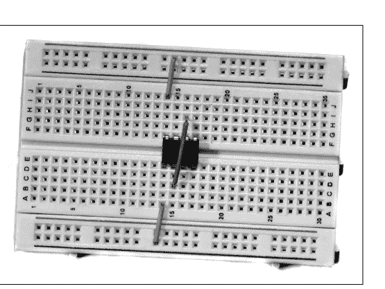

图6-9：插入集成电路并将其连接至电源总线后的面包板。

2.  **连接第19行的两个区段。**
    将一根短跳线的一端插入孔E19，另一端插入孔F19。这根跳线桥接了第19行两个接线条之间的间隙，有效地使它们成为一个单一的接线条。

3.  **插入红色LED。**
    如果你仔细观察红色LED，会看到一个引脚比另一个稍短。这个较短的引脚称为阴极。较长的引脚称为阳极。将阴极（较短引脚）插入孔D21。然后，将阳极（较长引脚）插入孔D19。

4.  **插入绿色LED。**
    绿色LED同样有一个较短的阴极引脚和一个较长的阳极引脚。将阳极（长）引脚插入孔G21，阴极（短）引脚插入孔G19。

    > 注意，两个LED的引脚安装方向是相反的：红色LED的阳极和绿色LED的阴极插入第19行，而红色LED的阴极和绿色LED的阳极插入第21行。这样做有非常充分的理由，但即使我尝试解释，我也不指望你现在就能理解。所以目前，请相信为了电路正常工作，你必须像这样反向安装两个LED。（你将在第2册第5章学习更多关于LED、阴极和阳极的知识。）

5.  **插入电阻R3和R4。**
    这两个电阻都是470 Ω。你可以通过观察电阻上绘制的三条色带来识别它们——它们是黄色、紫色和棕色。将第一个电阻的一端插入孔B21，另一端插入最下方总线条（接地总线）中最近的可用孔。然后，将另一个电阻的一端插入孔I21，另一端插入最上方总线条（+9V总线）中最近的可用孔。

图6-10展示了完成这些步骤后面包板的样子。

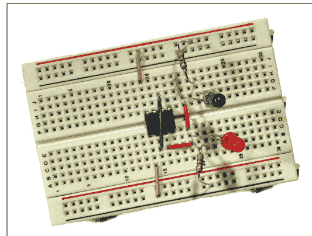

接下来的五个步骤连接触摸电路，使用户可以通过触摸两个金属触点来激活抛硬币功能。对于此原型，你将一对跳线的一端连接到电路，另一端则伸出面包板末端。用手指触摸这些导线的裸露端，将模拟你在最终版本电路中使用的金属触点的触摸动作。两根跳线将插入第9行的孔中。

1.  **插入电阻R1，从集成电路的引脚7到+9V总线。**
    电阻R1是1 kΩ电阻，应连接在集成电路的引脚7和+9V总线之间。该电阻的色带顺序为：棕色、黑色和红色。将此电阻的一端插入孔J15，另一端插入最上方总线条中最近的可用孔。

2.  **插入电容C1，从集成电路的引脚2到接地总线。**
    将电容的一个引脚（哪一个都可以）插入孔B15，然后将另一个引脚插入最下方总线条中最近的可用孔。

3.  **插入电阻R2，从集成电路的引脚7到其中一个金属触点。**
    该电阻是10 kΩ电阻。它应连接在集成电路的引脚7和用户将用手指触摸以激活抛硬币功能的其中一个金属触点之间。该电阻的色带顺序为：棕色、黑色和橙色。将其一端插入孔H15，另一端插入孔H9。

4.  **连接一根跳线，从集成电路的引脚2到另一个金属触点。**
    将一根短跳线的一端插入孔B15，另一端插入孔B9。

5.  **插入模拟金属触点的两根跳线。**
    挑选两根足够长的跳线，使其能从第9行伸出并悬垂在面包板边缘约一英寸。将这些导线的一端插入孔E9和F9，另一端保持悬空。将两根跳线的末端分开，确保它们不相互接触；它们之间应间隔约½英寸。

图6-11展示了完成这些步骤后面包板的样子。

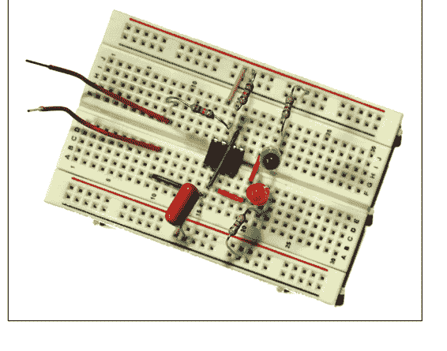

最后两个步骤通过连接电源来完成电路。

1.  **连接电池扣连接器。**
    电池扣连接器上的引线使用的是多股线而非实心线，因此在插入面包板之前需要稍作准备。

## 2. 将9V电池连接到电池扣连接器。

a. 使用剥线钳剥去两根引线末端约½英寸的绝缘层。
b. 用手指将引线尽可能拧紧，确保线头最尖端没有散开的细丝。
c. 将红色引线插入最顶行的最后一个孔，将黑色引线插入最底行的最后一个孔。

红色LED应立即亮起。（如果未亮起，请参阅下一节的故障排除提示。）

现在，你可以通过触摸两根空闲的跳线来测试电路。用拇指和食指捏住两根跳线，但不要让它们直接接触。你皮肤的电阻会导通足够的电流来完成电路，LED将开始交替闪烁：红、绿、红、绿，如此循环。它们会持续闪烁，直到你松开跳线。然后，其中一盏灯会保持常亮。当你再次触摸跳线时，闪烁将恢复。

图6-12展示了完成后的电路运行情况。

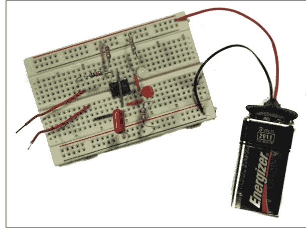

图6-12：运行中的抛硬币器原型。

请注意，如果你捏紧跳线，LED的闪烁频率会增加。如果捏得足够紧，LED会闪烁得非常快，以至于两盏灯看起来都像是常亮的。LED实际上仍在交替闪烁，但闪烁速度快于你眼睛的辨别能力，因此它们看起来是持续亮着的。

## 如果它不工作怎么办？

如果你的电路不工作，可以采取一些故障排除步骤来找出原因并解决问题。以下是一些有用的故障排除提示：

- 检查所有元件引线，确保它们没有相互接触。如果有引线接触，请轻轻调整它们使其分开。
- 确保电路已通电。使用万用表测试电池电压（具体方法请参阅本手册第8章），并验证电池扣连接器的引线已正确插入无焊面包板。
- 仔细复查你的接线，确保每个跳线和每个元件都插入了正确的位置。
- 验证555定时器集成电路的方向，确保引脚1在孔E14，引脚8在孔F14。
- 验证LED的插入方向是否正确。对于红色LED，短引脚（阴极）插入D21，长引脚（阳极）插入D19。对于绿色LED，短引脚（阴极）插入G19，长引脚（阳极）插入G21。

## 在印刷电路板（PCB）上构建你的电路

当你对电路的运行感到满意后，下一步就是构建一个永久版本的电路。虽然有几种方法可以做到这一点，但最常见的是在印刷电路板（也称为PCB）上构建电路。在接下来的章节中，你将了解印刷电路板的工作原理以及如何在PCB上组装抛硬币电路。

请注意，在PCB上组装电路需要你掌握焊接技能。要学习这项至关重要的技能，请参阅本手册第7章。

### 了解印刷电路板的工作原理

印刷电路板由一层绝缘材料（如塑料或类似材料）制成。铜电路路径被压合在板的一侧。电路路径由走线（类似于连接元件的导线）和焊盘（元件引线可以焊接上去的小铜圈）组成。图6-13展示了一个典型的印刷电路板。

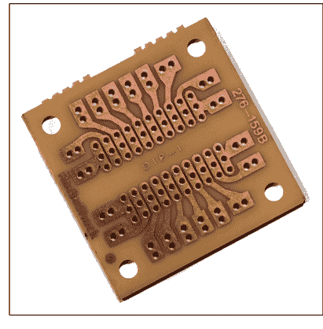

图6-13：一块印刷电路板。

印刷电路板有两种基本类型：

- **通孔式：** 铜电路位于板的一侧，元件安装在另一侧的PCB。在通孔式PCB中，铜焊盘中心钻有小孔（通常直径为1/16英寸）。元件通过将引线穿过这些孔并焊接到板另一侧的铜焊盘上来安装到板的空白面。焊接完成后，任何多余的引线都会被剪掉。
- **表面贴装式：** 元件与铜电路安装在板同一侧的PCB。不钻孔。

表面贴装式PCB更易于大规模自动化电路组装。然而，对于爱好者来说，它们要难处理得多，因为元件往往更小，引线间距更近。因此，本书中使用的所有PCB都是通孔式的。

### 使用预印PCB

使用印刷电路板最简单的方法是从电子元件供应商处购买预印板。你可以在Hobby Engineering (www.hobbyengineering.com)、Jameco Electronics (www.jameco.com) 或 All Electronics (www.allelectronics.com) 等在线分销商处找到各种各样的预印PCB。

如你所见，预印PCB有各种形状和尺寸。从爱好者的角度来看，最有用的是那些模仿无焊面包板端子条和总线条布局的PCB。例如，图6-14展示了一块有550个孔、按标准面包板排列的PCB。使用具有面包板布局的预印PCB，你可以将面包板原型电路转移到PCB上，而无需设计全新的布局。

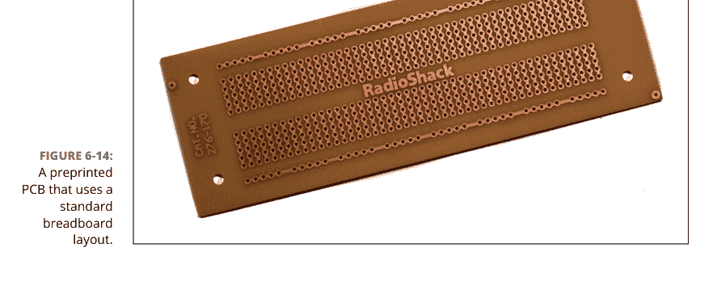

图6-14：使用标准面包板布局的预印PCB。

一些预印电路板的布局与标准面包板布局相似，但不完全相同。因此，在制作前请仔细检查；你可能需要对电路布局进行微调，以适应你使用的PCB。


如果需要，你可以将较大的PCB切割成较小的尺寸。切割PCB的一种方法是用重型美工刀在两面划痕，然后沿划痕折断。另一种方法是用旋转工具（如Dremel）切割。

### 创建定制PCB

随着你的电子技能日益精进，你可能会发现自己想要创建自己的定制印刷电路板，而不是强迫你的电路设计去适应有限的预印电路板种类。虽然这不是一个简单或廉价的过程，但为你的电路定制自己的印刷电路板是可行的。

1. **购买一块空白PCB。这块板的一面整个表面将完全覆盖着铜。**
2. **在铜表面创建一个指示电路布局的掩膜。** 有几种方法可以做到这一点。对于简单电路，你可以直接用为此目的设计的特殊笔在铜上手绘电路。对于更复杂的电路，你可以购买形状像焊盘和常见走线的特殊贴纸，直接贴在铜面上。或者，你可以在电脑上使用任何图形绘制软件设计电路，将设计打印在特殊纸上，然后用热熨斗将设计转印到铜面上。
3. **通过将板浸入一种特殊化学溶液中来蚀刻电路板，该溶液会腐蚀掉所有未被掩膜覆盖的铜。** 这是一个需要在室外通风良好的区域进行的危险过程，需要佩戴手套、面罩和护目镜。蚀刻完成后，所有未被掩膜覆盖的铜都会消失。
4. **清洗电路板，去除所有有害的铜蚀刻液。**
5. **擦掉掩膜，露出下面美丽的铜电路图案。**
6. **在每个焊盘中心钻孔，然后组装你的电路。**

请注意，互联网上有几家公司可以为你制作小型印刷电路板。这并不便宜，但如果你让他们制作不止一块，每块板的价格会大幅下降。例如，PCBWay (www.pcbway.com) 如果你订购十块，制作4英寸见方的电路板大约每块3美元。

## 在PCB上构建抛硬币电路

本节将详细介绍在小型预印制PCB上构建抛硬币电路的完整流程。当你备齐所有材料后，应能在约一小时内完成此项目。

构建此原型电路所需的所有部件均可在当地RadioShack商店购买，或从任何电子零件供应商在线订购。为方便起见，此处列出了构建此原型电路所需的完整零件清单及对应的RadioShack产品目录编号：

| 数量 | 描述 |
| --- | --- |
| 1 | 通用双面印刷电路板 |
| 1 | LM555定时器集成电路 |
| 1 | 1 kΩ, ¼ W 电阻（每包5个） |
| 1 | 10 kΩ, ¼ W 电阻（每包5个） |
| 2 | 470 Ω, ¼ W 电阻（每包5个） |
| 1 | 0.1 µF 聚酯薄膜电容 |
| 1 | 红色LED 5 mm |
| 1 | 绿色LED 5 mm |
| 1 | 常开按钮开关 |
| 1 | 9V电池扣连接器 |
| 1 | 9V电池 |

此外，你还需要约一英尺长的22号实心绝缘导线和22号绞合绝缘导线。颜色不限。

**注意：** 此清单与本章前文为在无焊面包板上构建抛硬币电路所列的清单相似。如果你已有上一个项目的零件，可以在此处重复使用。

图6–15展示了预印制电路板的布局。在我们开始构建电路之前，请花点时间研究此板的布局以熟悉它。如图所示，此板并不包含面包板上那样的总线导轨。但是，其整体布局与面包板上的接线条布局类似。板的中心部分总共有20个接线条，沟槽两侧各10个。每个条带有三个孔，但还与沿板边缘的一个两孔接线条相连。因此，每个条带实际上有五个孔。

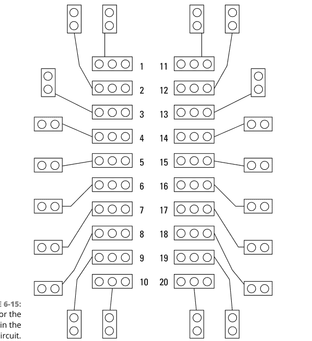

板上的条带并未编号，但我在图6–15中为它们编了号。我使用数字1到10为板左侧的条带编号，使用数字11到20为板右侧的条带编号。在后续的说明中，我将使用这些数字来指明应将元件或跳线连接到哪个孔。注意：为保持简单，我仅指定条带编号，具体使用该条带五个孔中的哪一个由你决定。

> **记住**
> PCB布局中使用的数字是相对于板底面的——即带有铜迹线和焊盘的板面。因此，数字1到10在左侧，数字11到20在右侧。当你将板翻转过来，从板顶面插入元件时，必须在心理上反转这些数字：1到10会在右侧，11到20会在左侧。


将元件安装到PCB上时，可使用鳄鱼夹作为临时夹具，将元件固定在与板齐平的位置。这样你就可以将板翻转过来，以便将引脚焊接到焊盘上。如果不将元件固定在板上，翻转板子时元件会掉落，或者你可能会试图用一根手指按住元件进行焊接。这是个坏主意：焊接时电阻会变得非常烫。

以下是在预印制PCB上构建抛硬币电路的步骤。

1.  **将PCB板掰成两半。**
    预印制电路板包含两个相同的部分。本项目只需其中一部分，因此你可以将板掰成两半，将另一半保存用于其他项目。（要掰开板子，只需双手各握一端，将其折断即可。）

2.  **插入555定时器集成电路。**
    请记住，555 IC上的圆点或凹口标记了引脚1。安装芯片时，确保引脚1位于条带4，引脚8位于条脚14。然后小心地将芯片焊接到位。（焊接技巧请参阅本手册的第7章。）

3.  **安装跳线。**
    此电路总共需要九根跳线。从22号实心导线上剪下跳线，并小心地剥去每端的绝缘层。用尖嘴钳将每根跳线的裸线端弯折，将两端插入相应的孔中，将引脚焊接到焊盘上，然后用剪线钳剪掉每根引脚末端的多余部分。

    下表提供了每根跳线的PCB条带位置。请自行判断应将跳线放置在指定条带的哪个孔中。在可能的情况下，为每根跳线使用尽可能短的路径。

| 跳线编号 | 起始条带 | 终止条带 |
| --- | --- | --- |
| 1 | 9 | 10 |
| 2 | 19 | 20 |
| 3 | 5 | 16 |
| 4 | 4 | 10 |
| 5 | 7 | 19 |
| 6 | 2 | 6 |
| 7 | 1 | 5 |
| 8 | 2 | 12 |
| 9 | 14 | 19 |

4.  **安装电阻。**
    共有四个电阻需要安装。使用下表将每个电阻安装到正确的位置。将引脚弯折，将每个电阻插入正确的孔中，将电阻焊接到位，然后剪掉引脚末端多余的导线。

| 电阻编号 | 阻值 | 色环 | 起始条带 | 终止条带 |
| --- | --- | --- | --- | --- |
| R1 | 1 kΩ | 棕、黑、红 | 15 | 20 |
| R2 | 10 kΩ | 棕、黑、橙 | 11 | 15 |
| R3 | 470 Ω | 黄、紫、棕 | 13 | 19 |
| R4 | 470 Ω | 黄、紫、棕 | 3 | 10 |

5.  **安装电容。**
    将电容安装到条带5和10中。将电容完全推入，直至与板面齐平。然后将引脚焊接到焊盘上，并剪掉多余的导线。

6.  **安装LED。**
    请记住，LED是有方向性的，必须安装正确才能工作。其中一个引脚比另一个短，以便你区分哪个是哪个。这个短引脚是阴极，较长的引脚是阳极。

    下表显示了LED的安装位置：

| LED颜色 | 阴极（短引脚） | 阳极（长引脚） |
| --- | --- | --- |
| 红色 | 12 | 13 |
| 绿色 | 3 | 2 |

    安装LED时，*不要*将LED推到与电路板齐平。相反，只需将引脚稍微插入孔中，使LED从板顶面立起约一英寸高。

7.  **安装金属触点的跳线。**
    剪两段2英寸长的绞合线，并从每端剥去约3/8英寸的绝缘层。将每根线的一端焊接在条带1和11的孔中，另一端留空。当电路安装到最终外壳中时，你将把这些线的末端连接到用户触摸以激活抛硬币电路的金属柱上。


    将绞合线穿过电路板上的孔可能有点棘手。首先，小心地拧紧松散的线股，确保没有散乱的线头从线末端伸出。然后，小心地将线推过孔。如果任何线股被卡住无法穿过孔，请将线拉出并重试。

8.  **连接按钮开关。**
    剪一段2英寸长的绞合线，并从每端剥去约3/8英寸的绝缘层。将一端焊接到按钮开关的任一端子上（哪一端均可）。将另一端穿过条带10上的一个孔，并将其焊接固定。

9.  **连接电池扣连接器。**
    从两根引线的末端各剥去约3/8英寸的绝缘层。然后，将黑色引线焊接到按钮开关的空闲端子上（即第8步中未使用的端子），将红色引线焊接到PCB上条带20的一个孔中。

10. **将9V电池连接到电池扣连接器。**
    红色LED应立即亮起，表明电路已准备好进行决策工作。

11. **关闭电烙铁。**
    你完成了！

通过用手指夹住两根空闲的跳线末端来测试电路。LED应交替闪烁，直到你松开，此时其中一个LED将保持常亮。

图6–16展示了完成电路的运行情况。

## 为电路寻找合适的外壳

当你的电路板制作完成后，完成项目的最后一步就是将其安装在一个精美的外壳中，例如塑料、金属或木制盒子。大多数电子元件供应商都销售专为电子项目设计的塑料或金属盒。大多数RadioShack门店会备有大约六种不同尺寸的盒子，但如果你在线购物，会发现尺寸选择更加丰富。图6-17展示了我从本地RadioShack店里挑选的一系列盒子。

如果你不想花钱购买正宗的电子项目盒，这里有一些寻找完美替代外壳的方法：

- **去折扣百货商店购买小型储物盒。** 你可能会找到尺寸和形状正合适的盒子，而且价格比相同尺寸的官方项目盒便宜得多。（如果储物盒的颜色不好看，你可以随时给它快速刷上一层漆。）
- **在任何五金店的电气用品区，你会找到为家用布线设计的便宜塑料和金属盒。** 其中许多盒子可以改用于你的电子项目。
- **在你扔掉一个旧电子产品之前，先快速查看一下它装在什么盒子里。** 如果你认为它将来可能对某个项目有用，就把它拆开，丢掉所有内部零件，只保留空的外壳。

拆卸任何电子设备时都要小心。确保首先完全移除电源，并注意那些可能仍然储存着电荷的大电容器。

- **如果你经常逛旧货摊（yard sales），请留意那些可能用作项目容器的物品。**

## 使用项目盒

大多数项目盒由塑料或金属制成，带有一个可拆卸的盖子，盖子用四颗螺丝固定，每个角一颗。要打开盒子，只需拧下螺丝即可取下盖子。

盒子内部可能完全光滑，也可能带有凹脊或安装柱，旨在更方便地将组件安装到盒子内部。如果盒子内部没有这些辅助结构，你就必须自己想办法将各种需要放入内部的部件固定好。以下是一些建议：

-   你需要准备一套各种尺寸的小型钻头，以便在盒子上钻孔来安装组件。你需要钻孔来安装电路板，以及电池盒、开关、LED、扬声器等你的项目可能需要的任何其他部件。
-   在开始钻孔之前，先对你的项目盒及其内部部件的布局进行详细绘图。当你确信所有部件都按你想要的方式布局后，使用记号笔标出需要钻的孔的准确位置。
-   要安装电路板，请使用支撑柱在电路板和外壳之间提供一些空隙。支撑柱是一种螺丝，可以让你将电路板安装起来，使其高于项目盒的底部。你可以从任何电子元件供应商那里购买支撑柱，但它们出奇地昂贵，通常每个要45美分。如果你有足够的螺母和螺栓，你只需剪一段短的塑料管——我最喜欢的材料是1/4英寸滴灌软管——然后在里面穿一根长螺栓，就可以自制支撑柱。
-   考虑将电路板安装在盖子的背面，而不是盒体的内部。这有时可以为盒子内部腾出更多空间，用于放置电池或扬声器等更大的物品。
-   大多数开关可以通过钻一个足够大的孔穿过其螺颈来安装到盒子上。开关通常带有一个螺母，你可以将其拧紧在螺颈上，从而将开关固定在盒子上。
-   有些组件没有用于固定到盒子的螺母。对于它们，少量的环氧树脂或其他胶水可以帮助将组件固定到位。
-   在项目盒内部连接时，请使用多股线。多股线在偶尔打开盒子（例如更换电池）时能更好地承受操作。

## 将抛币电路安装到盒子中

在本节中，你将通过将抛币项目的电路板与一个9V电池、一个电源按钮以及用户可以触摸来抛硬币的两个金属触点一起安装到一个塑料项目盒中，来完成该项目。

该项目需要的所有零件都可以在大多数RadioShack门店购买——除了支撑柱，我是在本地五金店购买的。

除了本章前面组装好的电路板外，你还需要以下材料：

| 数量 | 描述 |
|----------|-------------|
| 1        | 项目外壳 5 x 2½ x 2 英寸 |
| 1        | 9V 电池盒 |
| 8        | ½英寸 6-32 雄-雌支撑柱 |
| 6        | 6-32 螺母（适配支撑柱） |
| 4        | 6-32 ¼英寸 螺栓（适配支撑柱） |

当你收集好零件后，以下是组装项目的步骤：

1.  **在盖子上钻出所需的安装孔。**

    你需要在盖子上钻总共八个孔。四个用于安装电路板，两个用于LED，两个用于金属指触点。

    图6-18提供了一个你可以使用的模板。较小的孔是³⁄₁₆英寸，两个较大的孔是¼英寸。**注意：** 盖子顶部四个孔之间的距离必须恰好是1⅝英寸，以便与电路板上的安装孔对齐。其他孔的尺寸则不需要那么精确。

2.  **在盒子左侧靠近顶部的位置钻一个⁵⁄₁₆英寸的孔，用于安装按钮开关。**

    具体位置并非那么重要。我建议你用左手握住盒子，以确定最佳的钻孔位置，让你的拇指能够轻松够到按钮。

3.  **将按钮开关安装到盒子中。**

    从按钮开关的螺颈上取下螺母，将螺颈从盒子内部穿过你在上一步钻好的孔，然后从盒子外部将螺母拧到螺颈上，并用钳子拧紧。

4.  **使用环氧树脂或热熔胶将9V电池盒粘在盒子底部。**

    将电池盒放置在盒子顶部附近，紧挨着你为开关钻的孔。

5.  **安装电路板支撑柱。**

    将四个½英寸支撑柱的螺纹端插入盖子底部相应的孔中，并在另一侧拧上一个6-32螺母，即可将它们安装在盖子的下方。关于如何安装这四个支撑柱，请参见图6-19的左侧部分。

6.  **在盖子上安装手指触碰触点。**

    为了制作用户可以触摸来抛硬币的金属触点，首先将一个支撑柱的螺纹端从盖子的顶面插入孔中，然后从盖子底部拧入第二个支撑柱。然后，将一个6-32螺母固定到盖子下方支撑柱的螺纹端。关于如何安装这些支撑柱，请参见图6-19的右侧部分。

    图6-20显示了此时盒子应有的外观。在此图中，你可以看到电池盒和按钮开关已经安装在盒子内，并且可以看到盖子下方的支撑柱。

7.  **将电路板安装到支撑柱上。**

    要完成此步骤，你必须首先将LED弯折，使其包裹过电路板边缘并朝向正下方。务必非常小心。

在弯曲 LED 时，要小心不要折断引脚或损坏任何焊点。图 6-21 展示了 LED 正确翻转后电路板的样子。

当 LED 准备就绪后，将电路板定位在四个支柱上方。LED 应该能顺利滑入您在步骤 1 中钻好的两个 3/16 英寸孔中。如果滑不进去，只需稍微调整一下使它们合适。当所有部件就位后，使用 6-32 螺栓将电路板固定到支柱上。

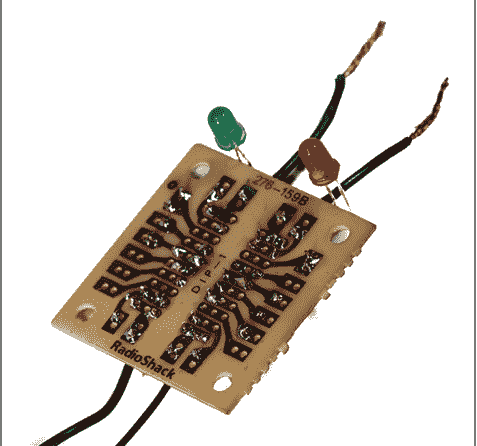

**图 6-21：** LED 翻转后的电路板。

### 8. 连接手指触点。

将连接到电路板的两根跳线的自由端连接到两个手指触点上。要连接每根线，请将剥好的线端紧密缠绕在支柱的螺纹部分。然后，在支柱上装一个 6-32 螺母，并用钳子拧紧。

图 6-22 展示了将电路板安装到盖子上并连接好跳线到手指触点后的项目外观。

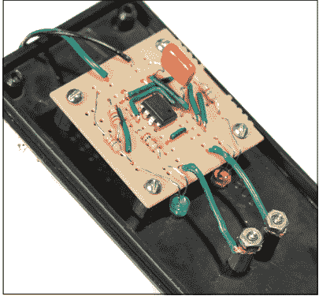

**图 6-22：** 电路板连接到盖子上，手指触点已连接。

### 9. 安装电池。

将电池插入电池座，然后将按扣适配器连接到电池上。

### 10. 将盖子安装到盒子上。

小心地将盖子翻过来，并使用项目盒附带的螺丝将其固定在盒子上。

### 11. 开机并抛硬币！

您终于可以准备好使用抛硬币项目来帮助您做决策了。用左手握住项目盒，用拇指按下按钮。然后，用右手的食指触碰两个手指触点，并观察 LED 交替闪烁。当您准备好时，松开手，看看是红灯还是绿灯保持亮着。

图 6-23 展示了完成后的项目。

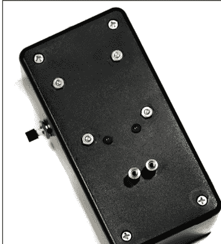

**图 6-23：** 完成后的抛硬币项目。

## 本章内容

- 组装您的焊接工具箱
- 焊接
- 区分好坏焊点
- 修复不良焊点

## 第七章：成功焊接的秘诀

焊接是构建电子项目的基本技能之一。虽然您可以使用无焊面包板来构建电路的测试版本，但迟早您会想要构建电路的永久版本。要做到这一点，您需要了解如何焊接。

在本章中，您将学习焊接的基础知识：焊接的工作原理、焊接所需的工具和设备，以及如何创建完美的焊点。您还将学习如何在出错时（而不是如果出错时）纠正您的错误。

请记住，焊接是一项需要一些练习才能掌握的技能。它远没有吹奏法国号那么难，但焊接确实有一个学习曲线。刚开始时，您可能会感到笨手笨脚，您的焊点看起来可能不太完美。但请坚持下去——稍加练习，您很快就能掌握焊接技巧。

### 理解焊锡的工作原理

在我们深入探讨制造焊点的具体细节之前，请花几分钟思考一下焊接是什么，以及它不是什么。

*焊接*指的是通过加热两个或多个金属物体，然后在接合处涂上*焊锡*，从而将它们连接起来的过程。焊锡是一种由锡和铅组合而成的软金属。当焊锡熔化时（大约在华氏 700 度），它会流过需要连接的金属表面。当焊锡冷却后，它会将金属锁定在连接中。

> 提示
您可以购买无铅焊锡以避免铅中毒的危险。然而，无铅焊锡比普通的铅锡焊锡要难处理得多，所以我建议您在掌握焊接艺术之前避免使用无铅焊锡。

> 警告
华氏七百度相当烫——肯定热到能在接触瞬间灼伤您的皮肤——因此焊接本质上是一项危险的任务。它并非极其危险，因为您实际使用的焊锡量以及用于焊接的工具都相当小。所以您可能受到的任何灼伤可能都很小。但它们会很痛，所以焊接时请务必非常小心。

焊接在电子学中尤其有用，因为它不仅在金属之间建立了坚固的物理连接，而且还为电流从一个导体流向另一个导体创造了优良的导电路径。这是因为焊锡本身就是一种优良的导体。例如，您可以通过剥离每根导线末端的绝缘层并将它们绞合在一起，在两根导线之间创建一个相当好的连接。然而，电流只能流过实际物理接触的区域。即使绞合得很紧，两根导线的大部分表面积实际上也不会接触。但当您焊接它们时，焊锡会流过并填充绞合处周围的任何间隙，同时连接两根导线的整个表面积。

> 提示
焊接不同于钎焊或熔接。*钎焊*与焊接类似，但使用的是熔点较高的金属（通常在华氏 850 度或更高）代替焊锡。钎焊形成的连接比焊接更强。*熔接*则是一个完全不同的过程。在熔接中，要连接的金属实际上被熔化了。在液态下，金属混合在一起，然后冷却形成极其坚固的连接。

### 准备焊接所需物品

在您开始焊接之前，您需要获取一些物品，如下文各节所述。

### 购买电烙铁

*电烙铁*——也称为*焊接笔*——是焊接的基本工具。图 7-1 展示了一个典型的电烙铁。

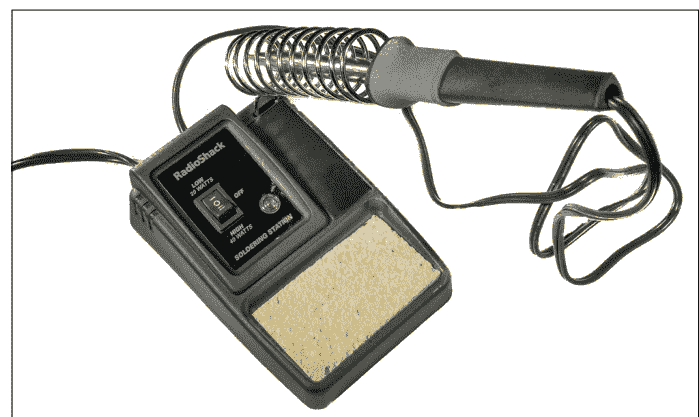

**图 7-1：** 电烙铁。

以下是购买电烙铁时需要考虑的一些事项：

- **功率额定值应在 20 到 50 瓦之间。**请注意，功率并不控制电烙铁变得多热。相反，它控制其升温速度以及完成每个焊点后恢复正常工作温度的速度。（每次焊接时，电烙铁的尖端在将其热量传递给您正在连接的导线和焊锡本身时会稍微冷却。更高功率的电烙铁在您焊接连接时可以更长时间地保持稳定温度，并在间隔期间更快地重新加热自身。）
- 烙铁头应可更换。购买电烙铁时，多买几个备用烙铁头，以便在需要时手头有替换品。
- 虽然您可以花不到 10 美元单独购买电烙铁，但我建议您多花几美元，购买一个带有集成支架的焊接台。一个良好、安全的地方来放置不用的电烙铁至关重要。没有一个好支架，我保证您的工作台很快就会布满难看的烧痕。（图 7-1 中展示的电烙铁就包括一个焊接台。）
- 接地三芯电源插头是理想的选择，但并非必需。接地有助于防止静电放电，这可能在您焊接敏感的电子元件时损坏它们。
- 更昂贵的型号具有内置温度控制。虽然不是必需的，但如果您要做很多焊接工作，温度控制是一个不错的功能。
- 一些型号还具有内置的静电放电功能。这可以帮助消除在焊接电路元件时损坏它们的风险。

### 储备焊锡

焊锡是用于创建焊点的软金属，是一种锡和铅的合金。大多数焊锡含锡 60%，含铅 40%，但比例可能略有不同。

虽然焊锡缠绕在线轴上，看起来像导线，但它实际上是一根细中空管，中心有一层薄薄的松香芯。这种松香被称为助焊剂，在焊接过程中起着至关重要的作用。它的熔点比锡铅合金稍低，因此它会在锡铅混合物熔化前片刻熔化。助焊剂通过清洁和润滑待连接的表面来为连接金属做准备。

焊锡有各种不同的粗细，您需要手头备有几种不同粗细的焊锡以应对不同类型的工件。我建议您从三卷开始：0.062 英寸、0.032 英寸和 0.020 英寸。您将主要使用 0.032 英寸的焊锡进行大部分工作，但粗焊锡（0.062 英寸）在焊接较粗的绞合线时很有用——而细焊锡（0.020 英寸）则适用于小型元件的精密焊接工作。

焊锡大约含40%的铅，正如您可能知道的那样，铅中毒是真实存在的健康风险。幸运的是，在焊接过程中，您实际接触到的铅非常少。焊接时常常冒起的烟雾来自松香助焊剂，而非铅或锡的熔化。即便如此，始终在通风良好的区域工作，并在焊后洗手以去除残留的铅，仍是一个好习惯。

您可以购买无铅焊锡，尽管它比普通的铅锡焊锡贵很多。然而，无铅焊锡比普通焊锡更难操作，可靠性也较低。如果您担心长期使用含铅焊锡的影响，我建议您转用无铅焊锡，但前提是您已熟练掌握含铅焊锡的操作。

我的律师建议我改写上一段，强调在任何情况下都不应使用含铅焊锡。他还坚持要求我警告您，永远不要插上您的电烙铁电源，以免它发热并造成烫伤风险；并且您永远不应将您的电子电路连接到实际电源，因为这可能导致触电危险。事实上，您甚至不应该阅读这本书，因为它可能会损伤您的眼睛或导致割伤。或者您可能会不小心将它掉在脚上。

请*不要*购买酸性助焊剂焊锡，那是水管工用来焊接管道的。这种焊锡中的酸会毁掉您的电子项目。

## 您需要的其他工具

除了电烙铁和焊锡，成功进行焊接还需要手头备有几件额外物品。即：

-   **第三只手工具或台钳：** 焊接至少需要三只手：一只拿您要焊接的物品，一只拿电烙铁，一只拿焊锡。除非您真的有三只手，否则您需要使用第三只手工具、台钳或其他巧妙的装置来固定要焊接的物品，以便您能操作电烙铁和焊锡。（参见本书第3章，其中包含第三只手工具和业余爱好者台钳的照片。）
-   **海绵：** 用于清洁电烙铁头。
-   **鳄鱼夹：** 焊接时它们有两个用途。首先，您可以使用鳄鱼夹作为夹具，在焊接时固定元件位置；其次，作为散热器，在焊接元件引线时避免损坏敏感元件。（散热器就是一块连接在热敏元件上的金属片，有助于耗散传导的热量。）
-   **眼部防护：** 焊接时始终佩戴眼部防护装备。有时热焊锡会迸溅飞出。您的眼睛和熔化的焊锡可不是好搭档。
-   **放大镜：** 通过放大镜进行焊接会容易得多，这样您可以更清楚地观察您的操作。您可以使用台式放大镜，或连接到第三只手工具上的放大镜，或专用放大护目镜。
-   **吸锡线和吸锡球：** 这些工具用于在必要时拆解焊接点以纠正错误。更多信息，请参阅本章后面的“拆焊”部分。

## 焊接准备

开始焊接前，您应该首先通过清洁和镀锡来准备您的电烙铁。请遵循以下步骤：

1.  **打开您的电烙铁。**
    它大约需要一分钟来预热。

2.  **当烙铁头热了之后，清洁它。**
    清洁电烙铁的最佳方法是将烙铁头在湿海绵上擦拭。在使用过程中，您应经常在海绵上擦拭烙铁以保持烙铁头清洁。

3.  **为电烙铁镀锡。**
    *镀锡*是指在烙铁头上涂抹薄薄一层焊锡的过程。为烙铁头镀锡有助于焊锡在加热后更自由地流动。要给电烙铁镀锡，可在烙铁头尖端熔化少量焊锡。然后，用海绵擦干烙铁头。

> 您在工作中应频繁清洁电烙铁头——理想情况下，每焊接一个点后立即清洁。您也应偶尔为电烙铁镀锡。通常，每个项目开始时镀一次锡就足够了。但如果焊锡从烙铁头上消失了，您应该重新镀锡。

## 焊接十条诫命

您听说过“焊接十条诫命”吗？实际上，它们更像是准则而非诫命。但如果您遵守它们，您的焊点、您子女的焊点以及您孙辈的焊点都将安然无恙。记录在案；务必遵行。

1.  焊接时应佩戴眼部防护装备，以防熔化的焊锡溅入眼中。
2.  切勿触摸电烙铁的加热端，以免烫伤。
3.  不得将熔化的焊锡做成虚假的焊团。
4.  焊接后应洗手，去除手上可怕的铅污染，然后再进食。
5.  应为焊接物体提供明亮的照明，以便清晰地看清焊锡应施加的位置。
6.  不要将多余的焊锡溅到邻近的焊盘上，以免形成非预期的电流路径。
7.  不得将灼热的电烙铁无人看管。
8.  不得贪图邻居家的专业级温控焊台。
9.  不得直接将焊锡施加到电烙铁上，而应将焊锡施加到您所焊接的物体上，让物体的热量熔化您的焊锡。
10. 始终将灼热的电烙铁放置在合适的支架中。

## 焊接一个牢固的焊点

在制作电子项目时，最常见的焊接形式是将元件引线焊接到印刷电路板背面的铜焊盘上。如果您能做到这一点，其他类型的焊接，如焊接两根导线或将导线焊接到开关端子上，就不会有问题。

 趣味挑战：试着快速将“焊接一个牢固的焊点”说十遍。

以下是将元件引线焊接到PC板上的步骤概述：

1.  **检查元件引线，确保它们清洁。**
    如果元件确实很旧，您可能需要用砂纸板处理一下，去除积聚的污垢。

2.  **将元件引线穿过正确的孔。**
    仔细检查电路图，确保您已将元件安装在正确的位置。如果元件有极性（如二极管或集成电路），请验证元件方向是否正确。您肯定不想把它焊反了。

3.  **将元件固定到电路板上。**
    如果元件靠近电路板边缘，最简单的固定方法是使用鳄鱼夹。您也可以用一点胶带固定元件。

4.  **用您的第三只手工具或台钳将电路板夹紧固定。**
    调整电路板方向，使镀铜面朝上。如果您使用放大镜，请将电路板置于放大镜下方。

5.  **确保光线充足。**
    如果您有台灯，现在调整它，使其直接照射在待焊接的连接点上。

6.  **将电烙铁头同时接触焊盘和引线。**
    将电烙铁头同时接触铜焊盘和导线引线非常重要。目的是同时加热它们，使焊锡能够流动并附着在两者上。
    实现正确接触的最简单方法是用电烙铁头将引线压在孔边缘，如图7-2所示。

7.  **让引线和焊盘加热片刻。**
    引线和焊盘充分加热只需几秒钟。

8.  **施加焊锡。**
    将焊锡施加到电烙铁头对侧的引线上，就在铜焊盘的上方。焊锡应几乎立即开始熔化。
    图7-3展示了施加焊锡的正确方法。

## 第7章 焊接（续）

**图7-2：** 定位烙铁。

*不要*将焊锡直接接触烙铁。如果你这样做，焊锡会立即熔化，最终可能导致连接不稳定，这通常被称为*冷焊点*，即焊锡无法与铜焊盘或引线正确融合。

**图7-3：** 施加焊锡。

**9. 当焊锡开始熔化时，送入足量的焊锡覆盖焊盘。**

随着焊锡熔化，它会沿着引线流下，然后扩散到焊盘上。你需要送入恰好足够覆盖焊盘的焊锡量，但不要多到在焊盘顶部形成一个大焊锡球。

施加焊锡时要吝啬些。焊锡过多比过少更常见，而且如果覆盖不足，后续再添加一点焊锡比焊锡过多后去除要容易得多。

**10. 移开焊锡和烙铁，让焊锡冷却。**

要有耐心——焊锡需要几秒钟才能冷却。在焊点冷却期间不要移动任何东西。如果不慎移动了引线，你会制造出不稳定的冷焊点，需要重新焊接。

**11. 用剪线钳在焊点顶部上方剪掉多余的引线。**

使用小号剪线钳，以便能贴近焊点进行修剪。

## 检查你的工作

完成一个焊点后，你应该检查它以确保质量良好。用放大镜观察，并轻轻晃动元件以查看焊点是否稳定。一个良好的焊点应该是光亮的，并且应该完全填充但不溢出焊盘，如图7-4所示。

几乎所有不良焊点都是由以下三种原因之一造成的：未使导线和焊盘充分加热、施加过多焊锡，或使用烙铁而非导线引线熔化焊锡。以下是一些不良焊点的迹象：

- **焊盘和引线未被焊锡完全覆盖，能从引线穿过的孔的一侧看过去。** 要么你施加的焊锡不够，要么焊盘不够热无法接受焊锡。
- **引线在孔中松动，或焊锡未牢固附着在焊盘上。** 一个可能的原因是，在焊锡完全冷却之前移动了引线。
- **焊锡不光亮。** 光亮的焊锡表明焊锡经过了适当的加热、流动和冷却。如果焊锡仅仅达到勉强熔化的温度，然后流过未充分加热的导线或焊盘，冷却后就会变得暗淡。（不幸的是，新的无铅焊锡几乎总是冷却后发暗，所以即使焊点良好，看起来也像是不良焊点！）
- **焊锡溢出焊盘并接触到相邻的焊盘。** 如果焊锡施加过多，或者焊盘不够热无法接受焊锡导致焊锡从焊盘流到相邻焊盘上，都可能发生这种情况。如果焊锡从一个焊盘溢出到相邻焊盘，你的电路可能无法正常工作。

## 拆焊

拆焊是指解除一个焊接点的过程。如果你发现焊点质量不佳、元件失效，或者电路连接错误，就可能需要进行拆焊。

要拆焊一个焊接点，你需要一个拆焊吸球和一条拆焊编织带。图7-5显示了这些工具。

**图7-5：** 一个拆焊吸球和一条拆焊编织带。

以下是解除焊点的步骤：

1. **将发热的烙铁头接触需要移除的焊点。**
   稍等片刻让焊锡熔化。
2. **挤压拆焊吸球以排出内部的空气，然后将吸球尖端触碰熔化的焊点并松开吸球。**
   当吸球膨胀时，它会吸走焊点上的焊锡并将其吸入球内。
3. **如果拆焊吸球未能完全移除引线，再次加热并用拆焊编织带接触剩余的熔化焊锡。**
   拆焊编织带经过特殊设计，能像蜡烛芯吸收蜡一样吸起焊锡。
4. **使用尖嘴钳或镊子移除引线。**
   在拆焊连接后，*不要*尝试用手指移除引线。引线在拆焊后一段时间内仍会很热。

**警告**

## 第8章 用万用表测量电路

**本章内容**
- 熟悉万用表
- 测量电流、电压和电阻
- 认识你的第一个电子学方程：欧姆定律

要是你构建的每个电路在第一次就正常工作，那该多好？你会迅速树立起电子天才的名声，并且很快成为英特尔公司的总裁。

但在现实世界中，电路并不总是第一次就能正常工作。当它不工作时，你可以挠头、盯着它看、把死鸡装在袋子里在头上挥舞，或者你可以拿出测试设备，分析电路以找出问题所在。

在本章中，你将学习如何使用电子爱好者最喜欢的工具之一：万用表。学习如何好好使用它。它将成为你电子探索之旅中值得信赖的伙伴。

### 认识万用表

你知道那些深夜电视购物广告吗？它们试图向你推销那些功能惊人的厨房用具，就像把搅拌机、榨汁机、食物处理机、搅拌器和刨冰机合为一体的机器？万用表有点像那些疯狂的厨房用具，但不同的是，与那些疯狂的厨房用具不同，万用表真的*能*做到它所宣称的所有功能。而且，与那些疯狂的厨房用具不同，万用表能做的事情被证明是真正有用的。

除了一个好的烙铁，一个好的万用表是工具箱中最重要的物品。学会如何使用它，你的电子实践活动将会更加富有成效。

图8-1展示了一个简单、价格低廉的万用表。这个几乎任何五金店都能买到，价格低于20美元。不过，如果你货比三家，通常可以找到低于10美元的基础万用表，有时甚至只要5美元。

**图8-1：** 你可以花不到20美元买到像这样一个基础万用表。

当然，你也可以花更多钱，但如果你只是刚入门，一个便宜的万用表就够了。最终，你会想投资多一点钱购买一个质量更好的万用表。

图8-1所示的万用表是一个*数字*万用表，它使用数字显示屏来显示实际的测量数值。数字万用表的替代选择是*模拟*万用表，它通过指针在刻度盘上移动来显示读数。要确定测量值，你只需直接看指针下方读取其后的刻度。

图8-2展示了一个典型的模拟万用表。这恰好是我最喜欢的型号之一。尽管它已经老到可以称为古董，但它仍然是一个优秀而精确的仪表。多花一点钱购买优质设备的一个好处是，该设备会为你提供多年——有时是数十年——的可靠服务。

**图8-2：** 一个模拟万用表。

为了获得最精确的测量，你可以选择实验室级别的台式万用表，如图8-3所示。这些仪表通常价格在100美元或更高，但提供额外功能，如数据记录、USB或网络连接，以及适用于不同情况的各种测试导线。

以下段落描述了构成典型万用表的各个部分：

显示屏或表头：指示正在进行的测量值。在数字万用表中，显示屏是一个数字，显示正在测量的安培数（电流）、电压或电阻。在模拟表中，电流、电压或电阻由跨越印刷刻度移动的指针指示。要读取数值，请垂直向下看指针并读取其后印刷的刻度。

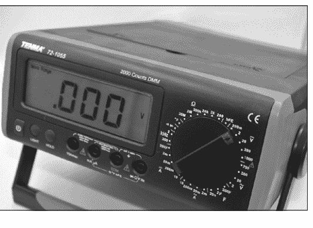

图 8-3：一台台式万用表。

- **选择器：** 大多数万用表——无论是数字式还是模拟式——都有一个可以旋转的拨盘，用来告诉仪表你想测量什么。这个拨盘上的各种设置不仅指示了你想进行的测量类型（电压、电流或电阻），还指示了预期测量值的范围。该范围由可测量的最大电压、电流或电阻值表示。


更高的量程允许你测量更高的值，但精度较低。例如，图 8-2 所示的模拟万用表具有以下直流电压读数量程：2.5 V、10 V、50 V、250 V 和 500 V。如果你使用 2.5 V 量程，你可以轻松分辨出十分之一伏的差异，例如 1.6 V 和 1.7 V 之间的差异。但当量程设置为 500 V 时，你能分辨出 10 伏的差异就算幸运了。

- **开关：** 有些万用表没有独立的开关。相反，选择器拨盘上的一个位置是“关”。其他万用表则有一个单独的开关。如果你的仪表没有显示任何读数，请检查电源开关是否已打开，或者电池是否需要更换。

- **测试导线：** *测试导线*是一对末端带有金属探针的红黑电线。这些电线的一端插入仪表。你使用另一端连接到要测量的电路上。红色导线为正极；黑色导线为负极。

## 万用表测量什么

仪表是一种测量电学量的设备。因此，万用表是几种不同类型仪表的组合，全部集成在一个盒子里。至少，万用表将三种不同类型的仪表（电流表、电压表和欧姆表）组合成一个设备，如下所述。

### 电流表

正如你在本迷你书的第 2 章所学，*电流*是电荷通过导体的流动。电流的单位称为*安培*。因此，测量安培数的仪表称为*电流表*，这并不奇怪。

别问我为什么去掉 *p* 形成 *ammeter*（电流表）这个词，而不是 *ampmeter*。毕竟，*ampere*（安培）的缩写是 *amp*，而不是 *am*。真是奇怪。

很少有电子电路的电流强到可以用实际的安培来测量。因此，电流表通常以*毫安*为单位测量电流，也称为*毫安培*，通常缩写为 *mA*。一 *mA* 是一安培的千分之一；换句话说，一安培等于 1,000 毫安。


世界上第一台电流表是由一位名叫汉斯·克里斯蒂安·奥斯特的荷兰物理学家于 1821 年发明的，当时他不小心将一个指南针放在一根有电流流过的导线旁边。汉斯注意到，当电流流动时，指针会偏离其正常的北方指向，指向导线。这是因为流过导线的电流会在导线周围产生磁场，而该磁场足够强，足以吸引磁化的指南针针尖。

在摆弄了一会儿之后，汉斯发现，他通过导线的电流越大，指针偏离北方就越远。他很快就意识到，这一发现可以用来测量流过电路的电流量。即使在今天，模拟电流表也是基于完全相同的原理工作的。

汉斯·克里斯蒂安·奥斯特并不是著名的儿童故事作家；那是汉斯·克里斯蒂安·安徒生。然而，在历史的奇妙转折中，汉斯·克里斯蒂安·奥斯特与汉斯·克里斯蒂安·安徒生是亲密的朋友。他们完全有可能是某个邪恶疯狂科学家儿童读物作家秘密社团的创始成员。也许我们会在丹·布朗的下一部小说中读到他们的故事。

## 电压表

在本迷你书的第 2 章中，你学习了电学的第二个基本量——*电压*，这个术语指的是两点之间电荷的差异。如果这两点连接到一个导体，电流就会流过导体。因此，电压是电流的引发者。

电压的单位自然是*伏特*，测量电压的设备称为*电压表*。

事实证明，在其他条件相同的情况下，两点之间电压量的变化会导致电流的相应变化。因此，如果你能保持其他条件不变，你就可以通过测量电流来测量电压，而你已经知道一种可以测量电流的设备：它叫做电流表。

电流表和电压表的基本区别在于，在电流表中，你让电流直接流过仪表，以便测量电流量。在电压表中，电流首先流过一个非常大的电阻，然后流过电流表，设备会进行必要的计算，如下所示。

你还没有学到这个（除非你急切地跳着看书），但在第 2 册第 1 章中，你会发现电路中电压、电阻和电流之间存在直接关系。特别是，如果你知道其中任意两个量，第三个量就很容易计算。在电压表中，使用一个大的固定电阻，电流表测量电流。因为你知道固定电阻的量和电流量，所以你可以轻松计算出电路两端的电压量。

别担心；你不需要做任何数学计算来计算这个电压。电压表会为你做计算。在模拟电压表中，计算被内置在印在仪表上的刻度中，所以你所要做的就是查看指针在刻度上的位置来读取电压。在数字电压表中，电压会自动计算并以数字方式显示。

> 关于电流、电压和电阻之间关系的简要说明，请参阅侧边栏“欧姆定律初探”。

## 欧姆表

如你所知，*电阻器*是一种阻碍电流流动的材料。电流被限制的程度取决于电阻器中的电阻量，其单位称为*欧姆*。欧姆的符号是希腊字母 omega (Ω)。测量电阻的设备称为*欧姆表*。

与电压一样，电阻也可以用电流表测量。还记得我在上一节中说过，在任何电路中，电压、电阻和电流之间存在直接关系，并且如果你知道其中任意两个量，就可以轻松计算出第三个量吗？回顾一下，为了测量电压，电压表提供一个固定电阻，使用电流表测量电流，然后使用电阻和电流来计算电压。

为了测量电路的电阻，欧姆表在电路两端提供一个固定的电压，使用电流表测量流过电路的电流，然后使用仪表提供的电压量和仪表读取的电流量来计算电阻。

与电压一样，你不需要进行此计算；数字万用表会自动进行计算，模拟万用表则将其内置在仪表刻度中。因此，你所要做的就是读取显示屏或仪表上的指针来确定电阻。

## 其他测量

所有万用表都可以测量电流、电压和电阻。有些万用表还可以执行其他类型的测量。例如，有些仪表可以测量电容器的电容，有些仪表可以测试二极管或晶体管。这些功能很方便，但不是必需的。

## 仪表功能的电路图符号

电流表、电压表和欧姆表通常包含在电路图中。当它们出现时，使用以下符号：

| 符号 | 含义 |
|---|---|
| (A) | 电流表 |
| (V) | 电压表 |
| (Ω) | 欧姆表 |

## 欧姆定律初探

在第二册第二章中，你将更深入地了解电阻器，并深入探讨欧姆定律——这是电子学中最重要的数学关系之一。但在此，我不想深入探讨欧姆定律的所有细节，至少想先给你一个初步预览。

欧姆定律描述了电路中电流、电压和电阻之间的基本关系。回顾第二章的内容，电压是两点之间电荷的差异，如果这两点通过导体连接，电流就会流过导体。

除了实验室中才存在的特殊超导体外，没有完美的导体。所有导体都有一定的电阻，会抑制电流的流动。电阻越大，电流越小；电阻越小，电流越大。

欧姆定律是一个数学公式，它形式化了电流、电压和电阻之间的关系。公式如下：

$$I = \frac{V}{R}$$

换句话说，流过电路的电流大小等于电路两端的电压除以电路中的电阻。电流的单位是安培，用字母 I 表示（别问为什么，它就是这么规定的）。V 代表电压，单位是伏特；R 代表电阻，单位是欧姆。

利用基础数学知识，如果你知道电流和电阻，就可以用这个公式计算电压。此时，公式变为：

$$V = IR$$

换句话说，电压等于电流乘以电阻。

同样，如果你知道电流和电压，也可以计算电阻。此时，公式变为：

$$R = \frac{V}{I}$$

换句话说，电阻等于电压除以电流。

## 使用你的万用表

在接下来的章节中，我将向你展示如何使用万用表测量简单电路中的电流、电压和电阻。被测量的电路仅由三个元件组成：一个 9V 电池、一个发光二极管（LED）和一个电阻器。该电路的原理图如图 8-4 所示。

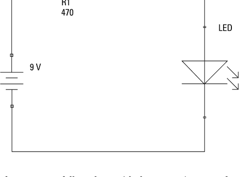

图 8-4：一个包含电池、电阻器和 LED 的简单电路。

如果你想跟随以下章节中详述的测量步骤，可以在无焊面包板上搭建这个电路。你需要以下部件：

- 小型无焊面包板
- 470 Ω, ¼ W 电阻器
- 红色 LED，5 mm
- 9V 电池扣连接器
- 9V 电池
- 短跳线（1 英寸或更短）

图 8-5 显示了安装在面包板上的电路。以下是搭建此电路的步骤：

1.  **连接电池扣连接器。**
    将黑色引线插入顶部总线条，红色引线插入底部总线条。任何孔都可以，但将电池连接在面包板的末端是合理的。

2.  **连接电阻器。**
    将电阻器的一端插入底部总线条的任意孔中。然后，在附近的端子条中选择一行，将另一端插入该端子条的一个孔中。

3.  **连接 LED。**
    注意 LED 的引线长度不同；一根引线比另一根短。将短引线插入顶部总线条的一个孔中，然后将较长的引线插入附近端子条的一个孔中。
    将 LED 插入与电阻器相同的行。在图中，LED 和电阻器都在第 26 行。

4.  **使用短跳线连接插入了 LED 和电阻器的端子条。**
    跳线将跨越面包板中间的间隙。

5.  **将电池连接到电池扣连接器。**
    LED 应该会亮起。如果没有，请仔细检查你的连接，确保电路组装正确。如果仍然不亮，尝试反转 LED 的引线（你可能插反了）。如果这样还不行，尝试换一块电池。

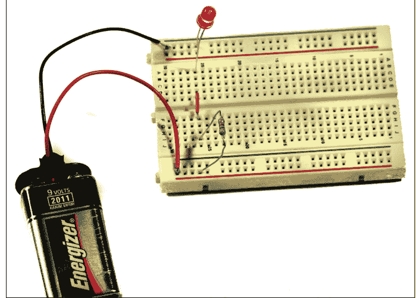

警告：*不要*在没有电阻器的情况下将 LED 直接连接到电池。如果你这样做，LED 会闪亮一下，然后永久损坏。

## 测量电流

电流以安培为单位测量，但实际上在大多数电子工作中，你会以毫安（mA）为单位测量电流。要测量电流，你必须将电流表的两个引线连接到电路中，使电流流过电流表。换句话说，电流表必须成为电路本身的一部分。

测量图 8-4 所示 LED 电路中流过的电流的唯一方法是将你的电流表插入电路中。图 8-6 显示了一种方法。这里，电流表被插入到 LED 和电阻器之间的电路中。

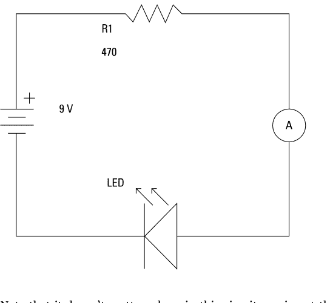

图 8-6：使用电流表测量 LED 电路中的电流。

请注意，在此电路中，将电流表插入何处并不重要。无论你将电流表插入 LED 和电阻器之间、电阻器和电池之间，还是 LED 和电池之间，你都会得到相同的电流读数。

要测量 LED 电路中的电流，请按照以下步骤操作：

1.  **将万用表的量程选择器设置为至少 20 mA 的直流毫安量程。**
    此电路使用直流电（DC），因此你需要确保万用表设置为直流电流量程。

2.  **取下连接两个端子条的跳线。**
    LED 应该会熄灭，因为取下跳线会断开电路。

3.  **将万用表的黑色引线接触到连接到端子条（而不是总线条）的 LED 引线上。**

4.  **将万用表的红色引线接触到连接到端子条（而不是总线条）的电阻器引线上。**
    LED 应该会再次亮起，因为电流表现在是电路的一部分，电流可以流动。

5.  **读取万用表显示屏上的数字。**
    读数应在 12 mA 到 13 mA 之间。（确切读数取决于电阻器的确切阻值。电阻器的阻值并不精确，因此即使你在此电路中使用 470 Ω 的电阻器，其实际电阻也可能在 420 Ω 到 520 Ω 之间。有关此效应的更多信息，请参阅第二册第二章。）

6.  **祝贺你自己！**
    你完成了第一次正式的电流测量。

7.  **在适当的庆祝之后，将你在步骤 2 中取下的跳线放回原处。**
    如果你忘记放回跳线，下一节中描述的测量电压的步骤将无法进行。


在此电路中，有两个地方你*不应该*连接电流表。首先，不要将电流表直接连接在两个电池端子之间。这实际上会使电池短路。它会变得非常热，非常快。其次，不要将电流表的一个引线连接到电池正极，另一个直接连接到 LED 引线。这将绕过电阻器，很可能会烧坏 LED。

如果你想多做些尝试，可以尝试测量电路中其他位置的电流。例如，从电池上取下电池扣连接器，然后重新连接，只连接电池负极端子。然后，将红色表笔接触电池正极端子，黑色引线接触连接到总线条的电阻器引线（而不是连接到 LED 的引线）。你会读到一个不同的电流值，但它会小于 13 mA。

（那是连接到端子条的）。这是通过将电流表插入电阻器和电池之间来测量电流。你应该得到与在 LED 和电阻器之间测量时相同的值。

你可以使用类似的方法测量 LED 和电池负极端子之间的电流。同样，结果应该相同。

## 测量电压

测量电压比测量电流稍微容易一些，因为测量电压时，你不必将仪表插入电路中。相反，你只需将万用表的引线接触到电路中的任意两点即可。当你这样做时，万用表会显示这两点之间存在的电压。

例如，图 8-7 显示了如何将电压表插入 LED 电路以测量电压。在这种情况下，电压是跨电池测量的。读数应在 9.3 V 左右。（9V 电池通常提供略高于 9V 的电压，除非你给电路加了负载。）

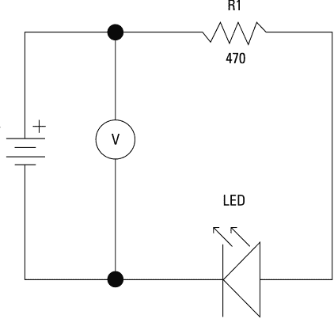

要测量 LED 电路中的电压，首先将电路重新组装好（假设你为了测量电流而拆开了它）。然后将万用表旋钮转到最大值至少为 10 V 的量程。现在只需将引线接触到电路中的不同点。要测量如图 8-7 所示的整个电路的电压，将黑色引线接触到插入负极的 LED 引线上...总线条，并将红色表笔接触插入正极总线条的电阻引脚。

> 如果你在测量电压时接反了表笔，将会读到负电压。在数字电压表上，仪表会显示一个负数。在指针式仪表上，指针会向错误的方向偏转。（除非电压很大，否则不会损坏你的仪表。）

这里有一个有趣的练习。写下以下三个电压测量值：

- **跨接电池：** 将红色仪表表笔接触插入正极总线条的电阻引脚，黑色表笔接触插入负极总线条的LED引脚。
- **跨接电阻：** 将红色仪表表笔接触插入正极总线的电阻引脚，黑色表笔接触另一根电阻引脚。
- **跨接LED：** 将黑色仪表表笔接触插入负极总线的LED引脚，红色表笔接触另一根LED引脚。

你对这三个测量值有何发现？（这有点像个小谜题，所以我在此不给出答案。但你可以在《第二册》第二章中找到答案。）

## 测量电阻

测量电阻与测量电压类似，但有一个关键区别：

> 你必须首先断开待测电阻所在电路中的所有电压源。这是因为万用表会向电路注入一个已知电压，以便测量电流并计算电阻。如果电路中存在任何外部电压源，电压将无法固定，因此计算出的电阻值将是错误的。

以下是在LED电路中测量电阻的步骤：

1. **取下电池。**
   只需将其从电池扣连接器上拔下，将电池放在一边。
2. **将仪表选择旋钮转到电阻测量档位之一。**
   如果你对电阻值有大致概念，请选择大于预期值的最小量程。否则，请选择你仪表上最大的可用量程。
3. **如果你使用的是指针式仪表，请进行校准。**
   指针式仪表在给出准确的电阻测量之前，必须先进行校准。校准指针式仪表时，将两根仪表表笔接触在一起。然后，调整仪表的校准旋钮，直到仪表指示0电阻。
4. **将仪表表笔接触电路中你希望测量电阻的两点。**
   例如，要测量电阻器的电阻，将仪表表笔接触电阻器的两个引脚。结果应该在470 Ω左右。

你可以在《第二册》第二章中学到更多关于测量电阻的知识。但在此之前，这里有一些额外的想法供你参考：

> - 当你测量单个电阻或仅由电阻组成的电路的电阻时，电流流过电阻的方向并不重要。因此，你可以反转万用表表笔，仍然会得到相同的结果。
> - 某些元件（如二极管）在一个方向上传导电流比另一个方向更好。在这种情况下，电流的方向确实很重要。你可以在《第二册》第五章中学到更多关于这种效应的知识。
> - 电阻器并非完美。因此，一个470 Ω的电阻很少能提供精确的470 Ω电阻。电阻器的通常公差为5%，这意味着一个470 Ω电阻的阻值应在446.5 Ω到495.5 Ω之间。对于大多数电路来说，这种程度的不精确并不重要。但在那些重要的电路中，你可以使用万用表的欧姆表功能来确定特定电阻的确切值。然后，你可以相应地调整电路的其余部分。（更多内容见《第三册》第二章。）

## 本章内容

- 了解示波器是什么
- 开始使用示波器
- 校准你的示波器
- 观察波形

# 第9章
用示波器捕捉波形

老兄，电子设备能产生一些非常复杂的波形。你将在你的电子电路中遇到各种完全棘手的波形。你会遇到正弦波，它们平稳地滚动，就像地平线上的灯芯绒布。锯齿波很震撼：它们缓慢上升，然后急剧下降。当然，还有方波。它们就是，你知道的，方方正正的。

你在前一章学到的基本万用表至关重要。没有它，你无法进行电子制作。在本章中，我将告诉你另一种极其有用的工具，称为示波器。虽然电压表可以给你一个代表电压的简单数字，但示波器可以绘制一幅电压的图像。而且，正如他们所说，一幅图胜过千言万语——呃，或者说，千个数字。

为什么在电压方面，一幅图像比一个数字有价值得多呢？因为除了最简单的电路外，电压总是在运动；它总是在变化，而示波器是观察运动中电压的完美工具。

正如我所说，示波器——通常简称为scope——是你工作台上一个极其有用的工具。虽然示波器有点贵，但你可以花几百美元买到一台不错的数字示波器。在没有示波器的情况下你也能应付一段时间，但最终你会想要一台。

本章的目的实际上是双重的。首先，我想向你展示如何使用示波器——如果你设法弄到一台的话。其次，也许更重要的是，我想说服你开始攒零钱，以便将来你能买得起一台。一旦你的工作台上有了示波器，你会想知道没有它你是怎么过来的。

## 理解示波器

图9-1显示了一台典型的中端示波器，售价约500美元。这样一台示波器将为你服务多年。

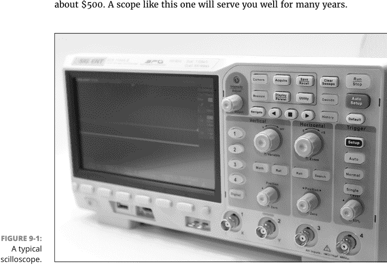

图9-1：一台典型的示波器。

任何示波器最明显的特征是其屏幕。在较旧的示波器上，屏幕是阴极射线管（CRT），类似于旧电视机或计算机显示器。在较新的示波器上，屏幕是LCD显示屏，类似于平面计算机显示器。

无论是CRT还是LCD，屏幕的目的都是一样的：显示电信号的简单图形。这个图形，称为*扫描线*，显示了电压随时间的变化。这个图形的水平轴（从左向右读）代表时间。垂直轴（从上到下）代表电压。

图9-2显示了典型的示波器显示屏，展示了一种非常常见的波形，称为*正弦波*。不过，在我告诉你正弦波之前，关于显示屏有几点需要注意：

- 显示屏上印有网格线。在大多数示波器上，这些线相距1厘米，水平方向有10格，垂直方向有8格。
- 中间的垂直线和水平线比其他线更粗，并包含刻度线，通常相距2毫米。这些刻度线帮助你精确定位扫描线在主要间隔之间的位置。
- 示波器上的各种旋钮和表盘允许你设置绘制波形图的*刻度*。
- 垂直格代表电压。在大多数示波器上，你可以将电压刻度设置为低至0.5 mV（半毫伏）和高至10 V或更多。示波器通常用中间的水平线表示0 V——因此显示屏上半部分的线代表正电压，下半部分的线代表负电压。因为中心线以上有4个垂直格，以下有4个格，当电压刻度设置为1 V时，显示屏可以显示+4 V到–4 V之间的电压。如果你将刻度设置为2 V，显示屏可以显示+8 V到–8 V之间的电压。
- 水平格代表时间。你可以设置的时间范围取决于示波器的质量。以我的示波器为例，最大时间为100秒，最小时间为1 ns——即1纳秒，十亿分之一秒。

为了绘制波形，示波器实际上绘制一个从左到右在屏幕上移动的单点。点从屏幕左边缘到右边缘的每次移动称为一次*扫描*。点的垂直位置指示电压，而点移动的速度由时间间隔决定，这有时称为*扫描时间*。因为总共有10个水平格，如果扫描时间设置为0.2秒，那么点每2秒就会扫描一次显示屏。

电子学中的大多数波形重复的间隔远小于2秒，因此你通常需要缩短时间间隔。在使用示波器时，你通常需要调整扫描时间，直到你正在检查的波形至少一个完整周期能显示在屏幕上。（还要注意，许多示波器有一个自动按钮，可以自动调整示波器以稳定波形。）

## 波形检验

*波形*是示波器轨迹通常呈现的特征模式。这些模式表明信号中的电压如何随时间变化——它是缓慢还是快速地起伏，电压变化是平稳还是不规则，等等。

在电子电路中，你会反复遇到四种基本类型的波形。这四种波形如图9-3所示。它们是：

- **正弦波：** 电压在一条平滑的曲线上升和下降。如果你还记得高中三角课，可能记得一个叫做*正弦*的三角函数，它与直角三角形中测量的角度有关。

我们大多数人不想回到高中三角学，所以关于正弦波背后的数学，我就说到这里。然而，可以这样说，正弦波在自然界中随处可见。例如，可以在声波、光波、海浪中发现正弦波——甚至弹簧玩具（slinky）的弹跳也是一种正弦波。

而且，从电子学的角度来看最重要的是，公共电网提供的交流电压就是正弦波形式。在交流正弦波中，电压稳步上升直到达到峰值电压。然后，电压开始下降直到达到零点。此时，电压变为负值，导致电流方向反转。一旦变为负值，电压继续变化直到达到负峰值，然后开始上升直到再次达到零点。接着，电压变为正值，电流再次反转，正弦波周期重复。

正弦波（或任何其他波）在给定时间单位内（通常是1秒）重复自身的次数称为其频率。频率以称为赫兹的单位计量，缩写为Hz。标准电源插座提供的交流电每秒循环60次。因此，家用交流电的频率为60 Hz。电子电路中发现的大多数波形频率比家用交流电高得多，通常在几千赫兹（千赫，kHz）或几百万赫兹（兆赫，MHz）的范围内。

- **方波：** 代表一种信号，其中电压简单地开启，保持一段时间，关闭，保持一段时间，然后重复。这种波的图显示出尖锐的直角转折，这就是为什么它被称为方波。

在实际中，大多数试图产生方波的电路并不能完美地完成任务。因此，电压很少绝对瞬间开启，也很少绝对瞬间关闭。因此，图9-3中方波的垂直部分在现实世界中并非真正垂直。此外，有时初始电压会略微超过目标电压，因此初始垂直上升部分会瞬间升得稍高，然后稳定到正确的电压。

方波存在于许多电子电路中。例如，本书迷你系列第6章硬币投掷项目中使用的555定时器IC产生方波，以闪烁方式点亮和熄灭发光二极管，而数字逻辑电路（例如计算机电路）几乎完全依赖于方波来表示数字电子学中的1和0。（关于555定时器IC和数字电子学，我在本系列的第3册第2章和第5册中有更多介绍。）

- **三角波：** 电压沿直线上升直到达到峰值，然后沿直线下降。如果电压达到零点然后开始再次上升，则三角波是直流电的一种形式。如果电压穿过零点变为负值后才开始再次上升，则三角波是交流电的一种形式。

- **锯齿波：** 这是三角波和方波的混合体。在大多数锯齿波中，电压沿直线上升直到达到其峰值电压，然后电压瞬间（或尽可能接近瞬间）降至零，并立即重复。

锯齿波有许多有趣的应用。对于本章的目的，最合适的应用之一是在具有CRT显示的示波器内部。以下是示波器中CRT工作原理的简化说明：它向涂有特殊涂层的玻璃表面发射一束电子，电子撞击时该表面会发光，并使用电磁铁来引导电子束。电子束上方和下方的电磁铁垂直引导它；右侧和左侧的电磁铁水平引导它。

为了在水平方向上创建电子束从左向右的扫描，锯齿波被施加到电子束左侧和右侧的电磁铁上。随着电压升高，电磁铁产生越来越强的磁场，将电子束拉向显示屏的右侧。当电压达到峰值并瞬间回落至零时，磁场消失，电子束迅速回弹到显示屏的左侧。

改变示波器的扫描速率，只需改变施加到示波器CRT中水平电磁铁上的锯齿波的频率即可。

## 示波器的校准

快问：从月球表面说的第一句话是什么？

如果你猜是“这是一个人的一小步”，那你就差远了。在尼尔·阿姆斯特朗说出那句话之前，尼尔·阿姆斯特朗和巴兹·奥尔德林已经在月球上待了几个小时。

如果你猜是“休斯顿，这里是静海基地；鹰已经着陆”，那就接近了，但还不完全正确。

与普遍看法相反，从月球表面说出的第一句话是巴兹·奥尔德林说的，而不是尼尔·阿姆斯特朗。那第一句话是：“发动机关机。自动控制器不在卡位。自动模式控制，两个都设为自动。下降发动机指令覆盖，关。发动机保险，关。413已接入。”

在尼尔·阿姆斯特朗能够做出鹰号已在月球着陆的历史性宣告之前，巴兹（作为登月舱驾驶员）必须迅速核实登月舱内一些关键控制装置的设置，以确保一切运行良好。

同样，在你进行历史性首次波形测量之前，你必须首先核实示波器上一些关键控制装置的设置，以确保一切运行良好。设置示波器所需的确切步骤取决于你示波器的具体类型和型号，因此务必阅读随示波器附带的说明书。但一般步骤应如下：

1.  **检查示波器上的所有控件，并将其设置为正常位置。**
    对于大多数示波器，所有旋转旋钮应居中，所有按钮应处于弹出状态，所有滑动开关和拨动开关应置于上方。

2.  **打开示波器电源。**
    如果是老式的CRT类型，请给它一两分钟预热时间。

3.  **将VOLTS/DIV（伏特/格）控件设置为1。**
    这将示波器设置为每垂直格显示一伏特。根据你要显示的信号，可能需要增加或减小此设置，但一伏特是一个好的起点。

4.  **将TIME/DIV（时间/格）控件设置为1毫秒。**
    此控件决定显示屏每次水平扫描所代表的时间间隔。尝试将此旋钮转到最慢设置，例如5秒。然后，一次转动旋钮一档，并观察光点加速直到它变成一条实线。

## 5. 将触发开关设置为自动（Auto）位置。

自动位置使示波器能够将波形稳定在一个共同的触发点上。如果触发模式未设置为自动，波形可能会在屏幕上漂移，难以观察。

## 6. 将探头连接到输入端口。

如果您的示波器有多个输入端口，请将探头连接到标有 A 的端口。

示波器探头包括一个探针点，用于连接输入信号，以及一根独立的接地线。接地线通常带有一个鳄鱼夹。测试电路时，此夹子可以连接到电路中的任何公共接地点。在某些探头中，接地线是可拆卸的，因此在不需要时可以将其取下。

## 7. 将探头末端触碰示波器的校准端子。

此端子提供一个示例方波，可用于校准示波器的显示。有些示波器有两个校准端子，分别标为 0.2 V 和 2 V。如果您的示波器有两个端子，请将探头触碰 2 V 端子。

校准最好使用带鳄鱼夹的测试探头。如果您的测试探头是尖头而不是鳄鱼夹，通常可以将尖头推入校准端子末端的小孔中以固定探头。

> 校准无需连接测试探头的接地线。

## 8. 如有必要，调整 TIME/DIV 和 VOLTS/DIV 控制，使方波在显示区域内合适地显示。

例如，参见图 9-4。

## 9. 如有必要，调整 Y-POS 控制以将波形垂直居中。

## 10. 如有必要，调整 X-POS 控制以将波形水平居中。

## 11. 如有必要，调整亮度和聚焦设置以获得清晰的波形。

## 12. 祝贺您！

您现在可以开始查看实际电子信号的波形了。

> 请记住，每种品牌和型号的示波器的控制方式都是独特的。务必阅读随示波器附带的用户手册，以了解在向示波器输入真实信号之前是否需要遵循任何其他设置或校准程序。

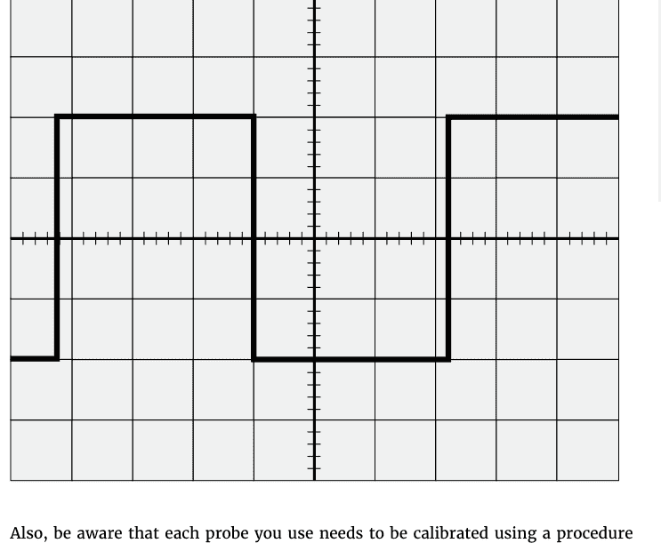

图 9-4：显示方波的示波器波形。

另外，请注意，您使用的每个探头都需要使用称为补偿的程序进行校准。这通常通过使用非金属螺丝刀转动探头中的一个小螺丝来完成，直到示波器上显示的方波信号变得完全方正。如果未能正确调整补偿，您将从示波器获得不正确的读数。

## 显示信号

使用示波器测试电路的基本步骤是：将示波器测试线的接地连接器连接到电路中的接地点，然后将探针尖端触碰电路中要测试的点。

例如，如果您想验证集成电路某个引脚的输出是否发出方波，请将示波器探头触碰该引脚，并查看示波器上的显示。请注意，您可能需要调整示波器上的 VOLTS/DIV 和 TIME/DIV 设置才能清晰地看到波形。但一旦正确调整了这些设置，您应该能够看到方波。如果方波没有出现，很可能是电路有问题。


> 切勿将示波器探头直接连接到电源插座。这很可能会损坏您的示波器或危及您的安全。（如果您想测量电源插座的电压，请使用普通的万用表。）

以下段落提供了一些使用示波器观察各种波形的想法：

- 要观察简单的直流波形，可以尝试将示波器连接到 1.5 V 电池，例如 AA 或 AAA 电池。将 VOLTS/DIV 旋钮设置为 2 V，然后将探头接地连接器触碰电池负极，将探针尖端触碰正极。显示结果应该是一条简单的直线，位于中心线上方第二和第三垂直分度线之间。（如果电池没电或电量不足，这条线可能会更低。）
- 如果您想查看来自电源插座的 60 Hz 正弦波，请找一个能产生低压交流电的插墙式电源适手器（通常称为“墙插”）。如果您手边没有，可以在许多商店购买新的。也可以在旧货店花大约 1 美元买到。将墙插插入电源插座，然后将示波器探头连接到墙插的低压插头。调整 VOLTS/DIV 和 TIME/DIV 设置，直到您能看到正弦波。
- 如果您想看看音频波形是什么样子，请找一根两端都是公头的短 ⅛ 英寸音频线。将一端插入任何音频设备（如收音机或 iPod）的耳机插孔。然后，将探头的接地线连接到音频线自由端插头的轴上，并将探针尖端触碰音频插头的尖端，如图 9-5 所示。在调整了 VOLTS/DIV 和 TIME/DIV 设置后，您应该能看到音频信号典型的杂乱波形显示。
- 当您在学习本书的过程中搭建电路时，请将示波器放在手边。随时拿起示波器探头，检查电路中各个点产生的信号，不要犹豫。将探头的接地夹连接到电路中的任何接地点，然后将探针尖端触碰每一根松散的导线和暴露的引脚，以查看电路内部的情况。


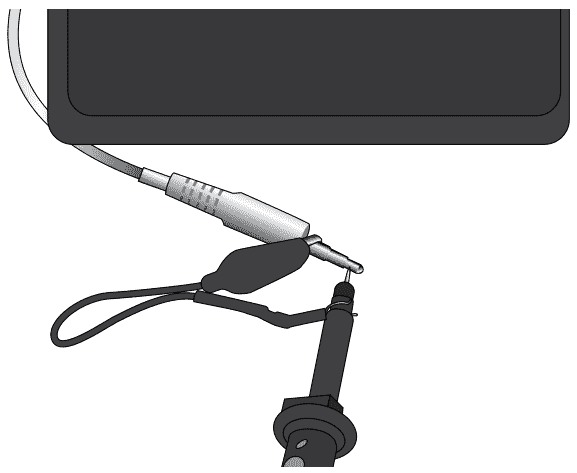

图 9-5：将示波器探头连接到音频插头。

# 2 使用基本电子元件

## 内容概览

- 第 1 章：使用基本电路 ....................... 163
- 第 2 章：使用电阻器 ............................... 203
- 第 3 章：使用电容器 ............................ 235
- 第 4 章：使用电感器 .............................. 261
- 第 5 章：使用二极管和 LED .................... 275
- 第 6 章：使用晶体管 ............................ 301

## 本章内容

- 探究电路的基本元件
- 了解可用于为电路供电的不同电池
- 分类可用于控制电路的各种开关
- 学习串联电路和并联电路的区别
- 搭建各种电路以演示基本电路

# 第 1 章 使用基本电路

第 1 册向您介绍了电的基本概念，并概述了开始学习电子技术所需的工具和技能。既然您已经了解了什么是电，并且已经购买了一些基本工具（如无焊面包板、烙铁和万用表），现在是时候开始学习电子电路的工作原理了。

本章探讨电路的基本概念。本章涵盖的电路非常简单，仅由提供电压的电池、传输电流的导线以及消耗功率的灯泡（因为它们在过程中会发光！）组成。我还加入了一些开关，让您可以打开和关闭电路。

尽管简单，但这里介绍的电路是学习更复杂电路的绝佳入门。本小册子的其余章节将添加所有电路都具备的基本元件，如电阻器、电容器、线圈、二极管、晶体管和集成电路。当您学完本小册子时，您将熟悉电子电路的所有基本元件。

## 什么是电路？

*电路*是电流可以流经的完整导体路径。电路为电流流动提供路径。要成为电路，此路径必须从同一点开始并结束。换句话说，电路必须形成一个回路。

例如，图 1-1 显示了一个简单的电路，包含两个元件：一个电池和一个灯泡。该电路允许电流从电池流向灯泡，通过灯泡，然后返回电池。因此，电路形成了一个完整的回路。

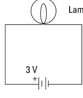

当然，电路可以更复杂。然而，所有电路都可以归结为三个基本要素：

- **电压源：** 电压源使电流流动。在图 1-1 中，电压源是电池。
- **负载：** 负载消耗功率；它代表电路所做的实际工作。没有负载，电路就没有太大意义。在图 1-1 中，负载是灯泡。在复杂电路中，负载是元件的组合，例如电阻器、电容器、晶体管等。
- **导电路径：** 导电路径提供电流流动的路径。此路径从电压源开始，经过负载，然后返回电压源。此路径必须从电压源的负极到正极形成一个回路。

在图 1-1 中，电池和灯泡之间往返的两条线代表导电通路。在复杂电路中，导电通路可能错综复杂，但它必须形成一个从电压源负极到正极的回路。

以下段落描述了几个值得牢记的、关于基本电路特性的有趣要点：

-   当电路完整并形成允许电流流通的回路时，该电路称为*闭合电路*。如果电路的任何部分断开或损坏导致回路无法形成，电流就无法流通。此时，该电路称为*开路电路*。

*开路电路*是一个矛盾修辞。毕竟，只有各元件形成完整路径，才能被视作电路。如果路径是断开的，它就不是电路。因此，*开路电路*最常用来描述已经损坏的电路，这种损坏可能是有意的（例如使用开关——我将在本章后续讨论），也可能是由于某种错误，比如连接松动或元件损坏。

-   *短路*是指没有负载的电路。例如，图 1-2 显示了一个短路；灯泡已连接到电路中，但同时电池的负极与正极之间也存在直接连接。

短路中的电流可能达到危险的高水平。短路会损坏电子元件，导致电池爆炸，甚至可能引发火灾。

图 1-2 所示的短路阐明了关于电路的一个重要观点：电路存在多条电流通路是可能的——甚至很常见。在图 1-2 中，电流既可以通过灯泡，也可以通过直接连接两个电池端子的路径。

电流会流经它能流经的所有路径。如果你的电路有两条电流通路，电流不会二选一；它会同时选择两条路径。然而，并非所有通路都相同，因此电流在所有通路中不会平均分配。在图 1-2 所示的电路中，电流通过短路会比通过灯泡容易得多。因此，灯泡不会发光，因为几乎所有电流都将绕过灯泡，选择更容易通过的短路路径。尽管有少量电流会流过灯泡，但流过灯泡的电流不足以使其明显发光。

要确定流过特定路径的电流量，你需要使用本书第 2 章解释的数学公式。不过，当可用路径之一是短路时，你无需费心使用公式，因为几乎所有电流都会流经短路。

你可以想象电流从电压源的正极流经电路到负极，因为这通常是你研究电路时的可视化方式。例如，在图 1-1 中，你可以认为电流沿顺时针方向流动，从电池正极开始，流经图表左侧的路径到图表顶部的灯泡，穿过灯泡，然后流经图表右侧的路径，最后回到电池的负极。

正如你在第 1 册第 2 章所见，这种关于电流流向的思考方式称为常规电流。实际上，电路中的电荷——以及电子——是从电压源的负极通过电路流向电压源的正极。

## 使用基本电路

## 使用电池

为电路提供电压源的最简单方法是使用电池。提供电压的方式还有很多，包括交流适配器（可插入墙壁插座）和太阳能电池（将阳光转化为电压）。然而，对于你将在本书中搭建的大多数电路来说，电池仍然是最实用的“能量”来源。

电池是一种将化学能转化为电压形式的电能的装置，而电压反过来可以引起电流流动。电池的工作原理是将两块由不同金属制成的板浸入一种称为电解质的特殊化学溶液中。金属与电解质发生反应，产生电荷流，这些电荷在负极板上积累，该板称为*阳极*。正极板称为*阴极*，其电荷被吸走。结果，在两极板之间形成了电压。这些极板连接到外部端子，你可以将电路连接到这些端子以引起电流流动。

图 1-3 展示了电池工作原理的简化图。一个装有合适化学物质的碗，加上由合适金属制成的阳极和阴极，就构成了一个可用的电池。

严格来说，图 1-3 显示的是一个*电池单元*，而不是电池。*电池*是两个或多个电池单元的组合。

电池有许多不同的形状和尺寸，但就本书而言，你只需要关注几种标准类型的电池，它们都可以在任何杂货店、药店或百货商店买到。图 1-4 展示了最常见的可用尺寸。

圆柱形电池有四种标准尺寸：AAA、AA、C 和 D。无论尺寸如何，这些电池每节提供 1.5 V；较小尺寸和较大尺寸之间的唯一区别在于，较大电池可以提供更大的电流。严格来说，AAA、AA、C 和 D 电池单元就是单元本身——单个电池单元，而非电池。但如果称它们为电池是犯罪，我们的监狱会比现在更加拥挤不堪。

圆柱形电池的阴极，即正极端子，是带有金属凸起的一端。平坦的金属端是阳极，即负极端子。

图 1-4 中的矩形电池是 9 V 电池。它确实是一个电池，因为那个小矩形盒子实际上包含了六个小电池单元，每个大约是 AAA 单元尺寸的一半。每个小电池单元产生的 1.5 伏电压组合起来，总电压为 9 伏。

关于电池，你还需要了解以下几点：

-   除了 AAA、AA、C、D 和 9 V 电池外，还有许多其他电池尺寸可用。其中大多数电池是为特殊应用设计的，例如数码相机、助听器、笔记本电脑等。
-   所有电池都含有对你和环境有毒的化学物质。请小心处理它们，并根据当地法律妥善处置。不要直接扔进垃圾桶。
-   你可以（并且应该）使用万用表测量电池产生的电压。将万用表设置为合适的直流电压量程（例如 20 V）。然后，将红色测试导线接触电池的正极端子，黑色测试导线接触负极端子。万用表将显示负极和正极端子之间的电压差。对于圆柱形电池（AAA、AA、C 或 D），电压应约为 1.5 V。对于 9 V 电池，电压应约为 9 V。
-   *可充电*电池比不可充电电池成本更高，但使用时间更长，因为它们耗尽后可以充电。
-   无法充电的电池单元的技术术语是*原电池*。可充电电池单元正确称为*二次电池*。不过，如果你走进任何销售电池的商店，并询问二次电池，而销售人员知道你在说什么，我会感到震惊。
-   在电子电路中使用电池的最简单方法是使用电池盒，这是一种用于装一块或多块电池的小塑料装置。
-   奇怪为什么他们卖 AAA、AA、C 和 D 电池单元，却不卖 A 或 B 吗？实际上，A 单元和 B 单元电池确实存在。然而，这些尺寸在消费设备中从未真正流行起来，因此在零售商店不容易买到。

## 搭建灯泡电路

项目 1 向你展示如何搭建一个使用电池点亮灯泡的简单电路。虽然这个电路非常简单，但它有助于说明我到目前为止解释的基本原理。图 1-5 展示了组装好的电路。

使用基本电路

电路## 项目 1：简单灯电路

在本项目中，你将搭建一个将灯泡连接到电池的简单电路。你还将使用万用表测量电路中的电压和电流。要组装并测试电路，你需要一把小型十字头螺丝刀和一个万用表。

## 零件

- 两节 AA 电池
- 一个 2 x AA 电池盒
- 一个手电筒灯座
- 一个 2.33 V 手电筒灯泡

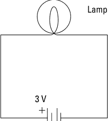

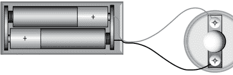

## 步骤

1.  **将电池盒的红色导线连接到灯座的一个螺丝端子上。**

    稍微拧松螺丝端子，在螺丝下方形成一个间隙。接下来，将红色导线的剥线端弯成钩形（你可以通过将电线绕在螺丝刀尖上来轻松完成此操作）。将剥线端的导线插入端子螺丝下方，然后拧紧螺丝以固定电线。

2.  将黑色导线连接到灯座的另一个端子上。
3.  将灯泡插入灯座。
4.  将电池插入电池盒。
    灯泡应该会亮起。
5.  将万用表量程设置到能测量至少 3 伏直流电压的最低直流电压档位。
    我的万用表有 5 V 直流电压档，所以我用了那个设置。
6.  将红色万用表表笔接触与电池盒红色导线相连的灯座端子，然后将黑色表笔接触另一个端子。
    万用表读数应约为 3 伏。
7.  将红色电池导线从灯座上断开。
    这会断开电路，因此灯泡会熄灭。
8.  将万用表旋钮转到直流毫安档位的最高设置。
    我的万用表最高设置是 1000 直流毫安。
9.  将红色电池导线的剥线端接触红色万用表表笔的笔尖，然后将黑色万用表表笔的笔尖接触灯座上未连接的端子。
    万用表读数应约为 250 毫安。如果你的万用表最大直流毫安档位小于 250 毫安，你可能无法获得准确的读数。不过，你应该会看到电流超过该档位最大值的指示。
    此外，当你测试电流时，灯泡会再次亮起，因为万用表接通了电路。

## 使用开关

*开关*是大多数电子电路的重要组成部分。在最简单的情况下，大多数电路包含一个开关来打开和关闭电路。除了开/关开关外，许多电路还包含额外的开关，用于控制电路的工作方式或激活电路的不同功能。

开关是带有两个或更多*引线*（或*端子*）的机械装置，这些引线内部连接到金属触点，可通过操作开关的人来打开或关闭。当开关处于“开”位置时，触点接触在一起以接通电路，电流得以流通。当触点接触在一起时，开关是闭合的。当触点分开时，开关是断开的，电流无法流通。

以下部分描述了两种分类开关的方法：按操作开关的方法分类和按开关进行的连接分类。

### 操作开关的多种方式

一种对开关进行分类的方法是根据人打开或关闭触点所使用的动作。图 1–6 显示了许多不同的开关设计。最常见的有：

-   **滑动开关：** *滑动开关*有一个旋钮，你可以来回滑动它来打开或关闭触点。
-   **拨动开关：** *拨动开关*有一个杠杆，你可以将其向上或向下翻动来打开或关闭触点。常见的家用灯开关就是拨动开关的例子。
-   **旋转开关：** *旋转开关*有一个旋钮，你可以转动它来打开和关闭触点。许多台灯底座中的开关就是旋转开关的例子。
-   **翘板开关：** *翘板开关*具有跷跷板动作。你按下开关的一侧来闭合触点，按下另一侧来打开触点。
-   **刀开关：** *刀开关*是弗兰肯斯坦电影中伊戈尔用来复活怪物的那种开关。在刀开关中，触点是暴露在外，人人可见的。
-   **按钮开关：** *按钮开关*是一种带有旋钮的开关，你可以按下旋钮来打开或关闭触点。在一些按钮开关中，你按一次开关打开触点，再按一次闭合触点。换句话说，每次你按下开关，触点都会在打开和闭合之间交替。

其他按钮开关是*瞬时接触开关*，只有在按钮被按下并按住时，触点才会从其默认状态改变。两种类型的瞬时接触开关是：

-   *常开 (NO)：* 在常开开关中，触点的默认状态是断开的。当你按下按钮时，触点闭合。当你松开按钮时，触点再次断开。因此，只有在你按下并按住按钮时才有电流流动。
-   *常闭 (NC)*：在常闭开关中，触点的默认状态是闭合的。因此，电流会持续流动，直到你按下按钮。当你按下按钮时，触点断开，电流停止流动。当你松开按钮时，触点再次闭合，电流恢复流动。

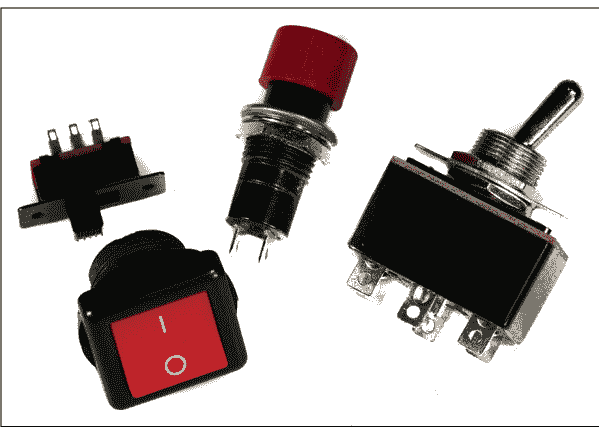

**图 1-6：** 有适用于各种需求的开关。

### 使用极和掷进行连接

另一种对开关进行分类的方法是根据它们建立的连接。如果你曾认为开关只是简单地打开和关闭电路，那请再想一想。决定开关进行何种连接的两个重要因素是：

-   **极：** 开关的*极*指开关控制的独立电路的数量。*单极*开关仅控制一个电路。*双极*开关控制两个独立的电路。
    双极开关就像两个独立的单极开关，由同一个杠杆、旋钮或按钮机械地操作。

-   **掷：** *掷*的数量表示每个开关极可以将其输入连接到多少个不同的输出连接。图 1-7 显示了两种最常见的类型，单掷和双掷：
    -   *单掷*开关是一个简单的开/关开关，用于连接或断开两个端子。当开关关闭时，两个端子连接在一起，电流在它们之间流动。当开关打开时，端子不连接，因此没有电流流动。
    -   *双掷*开关将一个输入端子连接到两个输出端子中的一个。因此，双掷开关有三个端子。其中一个端子称为*公共端子*。另外两个端子通常称为*A*和*B*。当开关处于一个位置时，公共端子连接到 A 端子，因此电流从公共端子流向 A 端子，而没有电流流向 B 端子。当开关移到另一个位置时，端子连接反转：电流从公共端子流向 B 端子，而没有电流流过 A 端子。

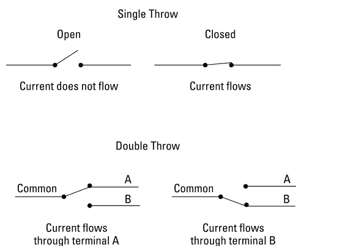

开关在极数和掷数上各不相同。理论上，任何数量的极和任何数量的掷都是可能的。然而，大多数开关有一或两个极，以及一或两个掷。这导致了四种常见的组合，如下文段落所述。原理图中用于每种开关的符号显示在边栏中。

-   **SPST（单极单掷）：** 一种基本的开/关开关，用于打开或关闭单个电路。SPST 开关有两个端子：一个用于输入，一个用于输出。
-   **SPDT（单极双掷）：** SPDT 开关将一个输入电路路由到两个输出电路中的一个。这种类型的开关有时被称为 A/B 开关，因为它让你在两个电路（称为 A 和 B）之间进行选择。SPDT 开关有三个端子：一个用于输入，两个用于 A 和 B 输出。
-   **DPST（双极单掷）：** DPST 开关同时打开或关闭两个电路。DPST 开关有四个端子：两个输入和两个输出。
-   **DPDT（双极双掷）：** DPDT 开关路由两个独立的电路，将两个输入中的每一个连接到两个输出中的一个。DPDT 开关有六个端子：两个用于输入，两个用于 A 输出，两个用于 B 输出。

以下是一些关于极和掷排列的其他要点：

-   极数超过两个或掷数超过两个的开关并不常见，但它们确实存在。旋转开关尤其适合拥有多掷。例如，万用表中的旋转开关通常有 16 个或更多掷，对应于万用表可以进行的每一个测量量程。
-   双掷开关的一种常见变体是具有一个中间位置，该位置不连接到任一输出。通常称为*中心断开*，这种类型的开关有三个位置但只有两个掷。例如，一个 SPDT 中心断开开关可以将一个输入切换到两个输出中的任一个，但在其中间位置，两个输出都不连接。
-   如果你为了备用而囤积开关，最好购买 DPDT 开关，而不是单极或单掷开关，因为当电路要求更简单的 SPST、SPDT 或 DPST 开关时，可以使用 DPDT。当电路要求更简单的类型时，你可以使用 DPDT 开关，因为没有法律规定你必须连接开关上的所有触点。例如，要将 DPDT 开关用作 SPST 开关，你只需使用其中一个极和其中一个掷，其余连接不使用即可。

## 构建一个开关控制灯电路

项目 2 介绍了一个简单的制作项目，让你探索如何使用一个简单的开/关开关来控制灯。图 1–8 展示了组装完成的项目。

## 项目二：由开关控制的灯

本项目及本章剩余项目均使用来自RadioShack的DPDT刀开关，如图1-9所示。在实际电子电路中，你不太可能使用刀开关。然而，像这样的刀开关是学习开关工作原理的绝佳工具。首先，它完全暴露在外，因此你可以看到其工作原理。此外，由于它们自带底座并配有螺丝端子，在临时电路中连接它们非常简单，无需进行任何焊接。

如图所示，该刀开关是双刀双掷（DPDT）开关，这意味着它的工作方式类似于两个机械联动的SPDT开关。我将开关上的六个端子编号为1X、1A、1B、2X、2A和2B。数字1和2表示正在切换的两个电路中的哪一个。X端子是位于开关中心的输入端子，A和B端子用于两个可能的输出。因此，当开关向一个方向拨动时，1X连接到1A，2X连接到2A。当开关向另一个方向拨动时，1X连接到1B，2X连接到2B。

在本项目中，你将构建一个简单的电路，将灯连接到电池，并使用开关来控制灯的开关。要组装和测试电路，你需要一把小号十字螺丝刀、一把钢丝钳和一把剥线钳。

## 零件

- 两节AA电池
- 一个电池盒
- 一个灯座
- 一个2.33V手电筒灯泡
- 一个DPDT刀开关
- 一段6英寸长的22号线规多股线

## 步骤

1.  剥去导线两端各½英寸的绝缘层。
2.  打开刀开关。将其手柄抬起至直立位置，使电路断开。
3.  将电池盒的红色引线连接到刀开关的1X端子。
4.  将黑色引线连接到灯座的一个端子上。
5.  使用6英寸导线将刀开关的1A端子连接到灯座的另一个端子。
6.  将电池插入电池盒。
7.  将刀开关拨向A侧闭合。

灯应该会亮起。

如果你想尝试本项目的不同变体，请尝试以下操作：

> 尝试将开关从电路的正极侧移到负极侧。换句话说，将电池盒的红色引线连接到灯，将黑色引线连接到开关的1X端子。

电路的功能将相同。这表明开关在电路中的位置通常并不重要。如果电路在任何地方断开，电流就无法流动。因此，开关在灯之前还是之后并不重要。

> 剪一段6英寸长的导线，剥去两端的绝缘层。然后，连接电路，使红色电池引线连接到开关端子1X，黑色引线连接到开关端子2X，一根导线从开关端子1A连接到灯的一个端子，另一根导线从开关端子2A连接到灯的一个端子。

现在你已经创建了图1-10所示的电路。在这个电路中，刀开关被用作DPST（双刀单掷）开关，在灯的负极和正极两侧同时中断电路。

## 理解串联和并联电路

每当你的电路包含多个组件时，这些组件必须连接在一起。在电路中连接组件的两种方式是串联和并联。图1-11展示了如何使用串联和并联电路在单个电路中连接两个灯。

在*串联*连接中，组件首尾相连，因此电流首先流过一个组件，然后流过另一个组件。如图1-11中的第一个电路所示，电流先流过一个灯，然后流过另一个灯。灯是首尾相连串联在一起的。

串联连接的一个缺点是，如果一个组件以导致开路的方式发生故障，整个电路就会断开，所有组件都将无法工作。例如，如果图1-11中串联电路的任何一个灯烧坏，两个灯都不会工作。这是因为电流必须流经两个灯，电路才能完整。

在图1-12所示的*并联*连接中，每个灯都有自己直接连接到电池的路径。这种安排避免了串联连接中“一个失效，全部失效”的特性。在并联连接中，组件不依赖彼此来连接到电池。因此，如果一个灯烧坏，另一个灯将继续发光。

当组件串联连接时，电压会发生一个有趣的现象：每个组件上的电压会被分配。例如，在一个包含3V电池和两个相同灯串联的电路中，每个灯将只看到1.5伏特。如果你将三个相同的灯串联，每个灯将只看到1伏特。

你可以通过将万用表设置到合适的电压范围，然后将表笔接触组件的两侧来测量电路中任何组件所承受的电压。你在那里测量到的电压称为该组件的电压降。

## 构建串联灯电路

在项目三中，你将构建一个将两个灯串联连接的简单电路。然后，你将使用万用表测量电路中各个点的电压。完成的项目如图1-12所示。

## 项目三：串联灯电路

在本项目中，你将两个灯串联连接。灯由一对AA电池供电。要构建此项目，你需要一把小号十字螺丝刀、钢丝钳、剥线钳和一个万用表。

## 零件

- 两节AA电池
- 一个电池盒
- 两个灯座
- 两个2.33V手电筒灯泡
- 一段6英寸长的22号线规多股线

## 步骤

1.  剥去导线两端各½英寸的绝缘层。
2.  将电池盒的红色引线连接到其中一个灯座的一个端子上。
3.  将黑色引线连接到另一个灯座的一个端子上。
4.  使用6英寸导线将第一个灯座未使用的端子连接到第二个灯座未使用的端子。
5.  将电池插入电池盒。两个灯都亮了。注意灯比较暗。这是因为在由两个相同灯组成的串联电路中，每个灯只看到总电压的一半。
6.  从灯座中取出一个灯。另一个灯熄灭。这是因为在串联电路中，任何一个组件的故障都会断开电路，因此其他组件都无法工作。
7.  将你在步骤6中取出的灯放回原位。
8.  将你的万用表设置到至少能读取3伏特的直流电压档位。
9.  将表笔接触第一个灯座的两个端子。万用表应显示约1.5V。（如果你使用的是指针式万用表且指针反向移动，只需交换表笔即可。）
10. 将表笔接触另一个灯座的两个端子。同样，万用表应显示约1.5V。
11. 将万用表的红色表笔接触电池红色引线所连接的端子，将黑色表笔接触电池黑色引线所连接的端子。这测量的是两个灯组合两端的电压。万用表将显示3V。

> 💡 **提示**

## 构建并联灯电路

在项目四中，你将构建一个将两个灯并联连接的电路，并使用万用表测量电路中各个点的电压。完成的项目如图1-13所示。

## 项目4：并联灯电路

在本项目中，你将两个灯泡连接成串联电路。灯泡由一对AA电池供电。要构建此项目，你需要一把小十字螺丝刀、一把钢丝钳、一把剥线钳和一个万用表。

## 零件

- 两个AA电池
- 一个电池盒（RadioShack 2700408）
- 两个灯座（RadioShack 2720357）
- 两个2.33 V手电筒灯泡（RadioShack 2721175）
- 两根6英寸22号线规多股导线

## 步骤

1.  从每根导线的两端各剥去½英寸的绝缘皮。
2.  将电池盒的红色引线连接到第一个灯座的一个端子上。
3.  将黑色引线连接到第一个灯座的另一个端子上。
4.  使用两根导线将第一个灯座的每个端子分别连接到第二个灯座的对应端子。

这种接线将两个灯座并联连接起来。

5.  装入电池。
6.  移除其中一个灯泡。
7.  更换你在步骤6中移除的灯泡。
8.  将你的万用表设置到至少能读数3伏的直流电压档位。
9.  将万用表的表笔接触第一个灯座的两个端子。
10. 将万用表的表笔接触第二个灯架的端子。

灯泡点亮，比你在项目3中串联连接时更亮。因为灯泡是并联连接的，移除其中一个灯泡并不会断开另一个灯泡的电路。

注意另一个灯泡仍然亮着。

确保你将红色表笔接触红色电池引线所连接的端子，将黑色表笔接触黑色电池引线所连接的端子。

注意电压读数是完整的3 V。

注意电压再次读数为3 V。当元件并联连接时，电压不会在它们之间分配。相反，每个元件承受相同的电压。这就是为什么在并联电路中灯泡能全亮度点亮的原因。

## 串联和并联中使用开关

就像灯泡可以串联或并联连接一样，开关也可以串联或并联连接。例如，图1-14展示了两个电路，每个电路都使用一对SPST开关来开启或关闭一个灯泡。在第一个电路中，开关是串联连接的。在第二个电路中，开关是并联连接的。

关于串联连接开关的有趣之处在于，必须两个开关都闭合才能完成电路。一个很好的串联开关的例子出现在典型的核战争电影中，两个人必须扳动一个开关才能发射导弹。串联连接的开关意味着丹泽尔·华盛顿和吉恩·哈克曼都必须同意发射导弹。

当开关并联连接时，闭合任一开关都会完成电路。因此，当你想从两个不同位置方便地控制一个电路时，经常使用并联开关。如果核导弹开关是并联连接的，那么丹泽尔·华盛顿或吉恩·哈克曼中的任何一个都可以发射导弹。

## 构建串联开关电路

项目5展示了一个简单的项目，它使用两个开关来打开或闭合一个点亮灯泡的电路。开关是串联连接的，因此两个开关都必须闭合才能点亮灯泡。图1-15展示了完成的项目。

## 项目5：串联开关电路

在本项目中，你将构建一个简单的电路，使用两个刀开关控制一个灯泡。要完成此项目，你需要一把小十字螺丝刀、一把钢丝钳和一把剥线钳。

## 零件

- 两个AA电池
- 一个电池盒
- 一个灯座
- 一个2.33 V手电筒灯泡
- 两个DPDT刀开关
- 两根6英寸22号线规多股导线

## 步骤

1.  从每根导线的两端各剥去½英寸的绝缘皮。
2.  打开两个开关。将手柄移到直立位置，使触点不连接。
3.  将电池盒的红色引线连接到其中一个开关的1X端子上。
4.  将黑色引线连接到灯座的一个端子上。
5.  用一根6英寸导线将第一个开关的1A端子连接到第二个开关的1X端子。
6.  用另一根6英寸导线将第二个开关的1A端子连接到灯座未使用的端子。
7.  将电池装入电池盒。
8.  闭合第一个开关。注意灯泡不亮。
9.  闭合第二个开关。灯泡点亮。当两个开关串联时，必须两个开关都闭合电路才能接通。

## 构建并联开关电路

在项目6中，你将构建一个简单的电路，使用两个并联连接的开关来控制一个灯泡。因为开关是并联连接的，所以只要闭合任一开关，灯泡就会点亮。图1-16展示了完成的项目。

## 项目6：并联开关电路

本项目是一个电路，使用两个并联连接的开关来控制一个灯泡。要完成此项目，你需要一把小十字螺丝刀、一把钢丝钳和一把剥线钳。

## 零件

- 两个AA电池
- 一个电池盒
- 一个灯座
- 一个2.33 V手电筒灯泡
- 两个DPDT刀开关
- 三根6英寸22号线规多股导线

## 步骤

1.  从每根导线的两端各剥去½英寸的绝缘皮。
2.  打开两个开关。将手柄移到直立位置，使触点不连接。
3.  将电池盒的红色引线连接到第一个开关的1X端子。
4.  将黑色引线连接到灯座的第一个端子。
5.  使用第一根6英寸导线将第一个开关的1X端子连接到第二个开关的1X端子。确保红色电池线保留在第一个开关的1X端子位置。第一个开关的1X端子应该有两根线：红色电池端子线和通向第二个开关1X端子的线。
6.  使用第二根6英寸导线将第一个开关的1A端子连接到灯座的第二个端子。
7.  使用第三根6英寸导线将第二个开关的1A端子连接到灯座的第二个端子。换句话说，灯座的第二个端子应连接到两个刀开关的1A端子。
8.  装入电池。
9.  闭合其中一个开关。灯泡点亮。
10. 打开你在步骤9中闭合的开关，然后闭合另一个开关。灯泡再次点亮。当开关并联连接时，当任一开关闭合时，电流就会流过电路。
11. 闭合两个开关。灯泡保持点亮，因为当两个开关都闭合时，电流继续流动。
12. 打开两个开关。灯泡熄灭。当开关并联连接时，至少需要一个开关处于闭合状态，电流才能流动。

## 在两个灯泡之间切换

在项目7中，你将构建一个简单的电路，使用一个单刀双掷（SPDT）开关将电路在其中一个灯泡之间切换。换句话说，其中一个灯泡会根据开关的位置而点亮。这种开关切换是电子电路中的常见需求。图1-17展示了完成的电路。

## 项目7：用一个开关控制两个灯泡

在本项目中，你将构建一个电路，使用一个开关控制两个灯泡。当开关处于第一个位置时，第一个灯泡点亮，第二个灯泡是暗的。当开关拨到第二个位置时，第二盏灯亮起，第一盏灯熄灭。你需要一把小号十字螺丝刀、一把钢丝钳和一把剥线钳来完成这个项目。

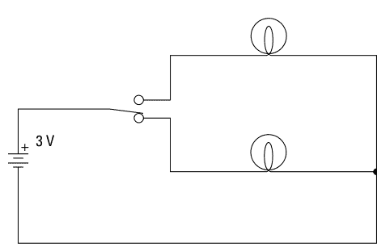

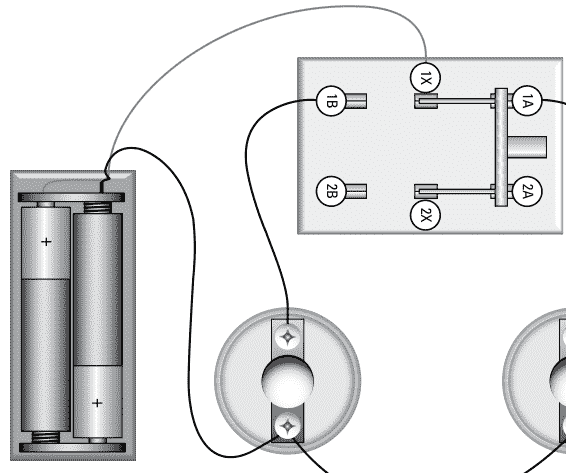

## 零件

- 两节AA电池
- 一个电池盒
- 两个灯座
- 两个2.33伏手电筒灯泡
- 一个双刀双掷闸刀开关
- 三根6英寸22号线规多股导线

## 步骤

1.  剥去每根导线两端½英寸的绝缘层。
2.  打开开关。
    将手柄抬起至竖直位置，使触点断开。
3.  将电池盒的红色引线连接到开关的1X端子。
4.  将黑色引线连接到第一个灯座的一个端子上。
5.  用一根6英寸导线将开关的1A端子连接到第二个灯座的一个端子上。
6.  用另一根6英寸导线将开关的1B端子连接到第一个灯座的空闲端子上。
7.  用第三根6英寸导线将第二个灯座的空闲端子连接到第一个灯座上连接了黑色电池引线的端子。
8.  将灯泡插入灯座。
9.  将电池插入电池盒。
10. 将开关拨到A位置。
    第二盏灯亮起。
11. 将开关拨到B位置。
    第一盏灯亮起。

项目7中的电路有一个有趣的变体，它使用双刀双掷闸刀开关的两个极来切换灯泡负极和正极两侧的电路。对于这个电路，你需要四根6英寸导线。按如下方式连接双刀双掷开关的六个端子：

| 端子 | 连接到 |
|----------|------------|
| 1X       | 红色电池引线 |
| 1A       | 第二个灯泡的端子1 |
| 1B       | 第一个灯泡的端子1 |
| 2X       | 黑色电池引线 |
| 2A       | 第二个灯泡的端子2 |
| 2B       | 第一个灯泡的端子2 |

图1-18展示了组装好的这个电路。


## 制作三路灯开关

许多家庭和办公室的走廊两端都有一个电灯开关。你可以通过拨动任意一个开关来开灯或关灯。这种开关配置被称为*三路开关*。

你是否曾好奇这些三路开关是如何工作的？仔细想想，这些开关确实令人费解。如果灯是亮的，拨动任意一个开关都会把它关掉。如果灯是灭的，拨动任意一个开关都会把它打开。假设你把一个开关拨到“开”的位置，灯亮了。然后你走到另一个开关，把它拨到“关”的位置，再回到第一个开关。它仍然在“开”的位置，但灯是灭的。要重新开灯，你可以再次拨动第一个开关。

换句话说，有时开关向上时灯是亮的，有时开关向下时灯是亮的。这怎么可能呢？

答案是，两个开关都是单刀双掷开关，它们串联连接，使得两个开关必须同时向上或同时向下才能接通电路。如果一个开关向上而另一个向下，电路就是断开的。

>  有时电工为了迷惑你，会把其中一个开关倒着安装，或者把三路开关的线接反。这样，开关的工作方式就反过来了：如果两个开关都向上或都向下，电路是断开的，只有当一个开关向上而另一个向下时，灯才会亮。但这并不是三路开关的正常接线方式。

在项目8中，你将构建一个简单的电路，使用两个单刀双掷开关来展示三路灯开关的工作原理。图1-19展示了完成的项目。


图1-19：完成的三路灯开关电路。

## 项目8：三路灯开关

在这个项目中，你将创建一个三路开关电路，其中一盏灯由两个开关中的任意一个控制。你需要一把小号十字螺丝刀、一把钢丝钳和一把剥线钳来完成这个项目。


## 零件

- 两节AA电池
- 一个电池盒
- 一个灯座
- 一个2.33伏手电筒灯泡
- 两个双刀双掷闸刀开关
- 三根6英寸22号线规多股导线

## 步骤

1.  剥去每根导线两端½英寸的绝缘层。
2.  打开两个开关。
    > 将手柄移至竖直位置，使触点断开。
3.  将电池盒的红色引线连接到第一个开关的1X端子。
4.  将黑色引线连接到灯座的一个端子上。
5.  用一根6英寸导线将第一个开关的1A端子连接到第二个开关的1A端子。
6.  用另一根6英寸导线将第一个开关的1B端子连接到第二个开关的1B端子。
7.  用最后一根6英寸导线将第二个开关的1X端子连接到灯座的空闲端子。
8.  将灯泡插入灯座。
9.  将电池插入电池盒。
10. 拨动开关，观察三路开关的工作原理。
    > 只有当两个开关都在A位置或两个开关都在B位置时，灯才会亮。

### 反转极性

本章的最后一个项目——项目9——向你展示一个常见的技巧：使用双刀双掷开关来反转电路的极性。这个技巧的一个常见用途是为直流电机供电。当你反转直流电机的极性时，电机就会向相反方向旋转。因此，你可以使用双刀双掷开关来控制直流电机的转动方向。图1-20展示了组装好的项目。


## 项目9：极性反转电路

在这个项目中，你将构建一个使用双刀双掷开关来反转电路极性的电路。换句话说，将开关从一个位置拨到另一个位置，会反转电流流经电路的方向。要构建这个电路，你需要一把小号十字螺丝刀、一把钢丝钳和一把剥线钳。


## 零件

- 两节AA电池
- 一个电池盒
- 一个灯座
- 一个2.33伏手电筒灯泡
- 一个双刀双掷闸刀开关
- 四根6英寸22号线规多股导线

## 步骤

1.  剥去每根导线两端½英寸的绝缘层。
2.  打开开关。
    将手柄移至竖直位置，使触点断开。
3.  将电池盒的红色引线连接到开关的1X端子。
4.  将电池的黑色引线连接到开关的2X端子。
5.  用第一根6英寸导线将开关的1B端子连接到开关的2A端子。
6.  用第二根6英寸导线将开关的2B端子连接到开关的1A端子。
7.  用第三根6英寸导线将开关的1A端子连接到灯座的一个端子。
8.  用第四根6英寸导线将开关的2A端子连接到灯座的另一个端子。
9.  将灯泡插入灯座。
10. 将电池插入电池盒。
11. 将开关拨到A位置，并测量灯泡两端的电压。
    将红色表笔接触连接到开关1A端子的灯泡端子，将黑色表笔接触另一个灯泡端子。你应该读到大约+3伏。
12. 将开关拨到B位置，再次测量电压。
    你应该读到大约-3伏。（如果你使用的是模拟万用表，你需要交换表笔才能读到负电压。）

- 理解和测量电阻
- 用欧姆定律计算电阻
- 确定电阻值和容差
- 处理串联、并联和组合电路中的电阻
- 创建分压电路
- 了解电位器如何改变电阻

## 第2章：使用电阻器

我最喜欢的科幻反派是《星际迷航：下一代》中的博格人。他们有句名言：“抵抗是徒劳的。”

在《星际迷航》的世界里，事实证明抵抗博格人并非徒劳。皮卡德和“企业号”的其他船员进行了抵抗，并最终战胜了博格人。

在电子世界里，电阻并非徒劳。事实上，电阻非常有用。没有电阻，电子学就不可能实现。电子学的核心是操纵电流的流动，而操纵电流最基本的方法之一就是通过电阻来减小电流。没有电阻，电流将不受控制地流动，无法引导它去做有用的工作。

在本章中，你将学习什么是电阻，以及如何使用*电阻器*——这些小器件可以让你有意地在电路中引入电阻。你还将学习自然界中电学的一个基本关系：电压、电流和电阻之间的关系。这个关系是## 什么是电阻？

正如你所知，*导体*是允许电流通过的材料，而*绝缘体*则是不允许电流通过的材料。良好的导体允许电流畅通无阻地流过，没有障碍。优良导体的例子包括铜和铝等金属。碳也是一种极好的导体。另一方面，良好的绝缘体则筑起坚固的壁垒，完全阻挡电流。良好绝缘体的例子包括玻璃、特氟龙和塑料。决定一种材料是导体还是绝缘体的关键因素在于其原子释放电子以传递电荷的难易程度。大多数原子对其电子紧抓不放，因此是良好的绝缘体。但有些原子对其最外层电子的控制力不强，这些原子就是良好的导体。

如果将导体和绝缘体混合在一起，结果就是一种能导电但导电性能不佳的化合物。这种化合物具有*电阻*——也就是说，它阻碍电流的流动。化合物阻碍电流的程度取决于构成该化合物的具体元素混合比例。

例如，像碳这样的导电材料可能与像陶瓷这样的绝缘材料混合。如果混合物中碳占大部分，混合物的总电阻就会很低。如果混合物中陶瓷占大部分，总电阻就会很高。


事实是，*所有*材料都具有一定的电阻。即使是最好的导体也有很小但可测量的电阻。唯一的例外是某些被称为*超导体*的材料，当它们被冷却到难以置信的低温时，能以100%的效率导电。不幸的是，你无法在RadioShack买到超导体，即使你能买到，也无法在Sears买到能将其冷却到绝对零度的强大冷冻设备。

## 测量电阻

电阻的计量单位是*欧姆*，用希腊字母omega (Ω)表示。*1欧姆*的标准定义很简单：它是当1伏特电压施加到电路上时，允许1安培电流流过所需的电阻量。换句话说，如果你将一个1欧姆的电阻器连接到一节1伏电池的两端，就会有1安培的电流流过该电阻器。

单个欧姆（1 Ω）实际上是一个非常小的电阻值。电子电路中通常需要使用数百、数千甚至数百万欧姆的电阻。

在第1册第8章中，你学习了如何使用*欧姆表*来测量电路的电阻，欧姆表是大多数万用表的标准功能。步骤很简单：首先，断开电路的所有电压源；然后，将欧姆表的两个探头接触到电路的两端，并读取表盘上的电阻值（以欧姆为单位）。

关于电阻和欧姆，以下几点也值得考虑：

-   前缀*k*（代表*kilo*，千）和*M*（代表*mega*，兆）用于表示千欧和兆欧。因此，1,000欧姆的电阻写作1 kΩ，1,000,000欧姆的电阻写作1 MΩ。
-   对于大多数电子电路，你可以认为普通导线的电阻是零欧姆（0 Ω）。然而实际上，只有超导体的电阻才是0 Ω。即使是铜线也有一定的电阻。因此，导线的电阻通常以每公里或每英里的欧姆数来衡量。电子电路通常处理的导线最多只有几英寸或几英尺长，而不是几公里或几英里。
-   短路本质上也是零电阻。
-   就像普通导线和短路可以被认为是零电阻一样，绝缘体和开路可以被认为是无限电阻，而实际上，完全无限的电阻并不存在。如果你将两根导线连接到电池的两端并把它们分开，这两根导线的末端之间就存在电压差，即使通过空气也会有非常微小的电流在它们之间流动——因为空气并非无限电阻。这个电流非常微小——小到甚至无法测量——但它确实存在。电流实际上无处不在。
-   单位*欧姆*以著名的德国物理学家乔治·欧姆命名，他在1827年首次解释了电压、电流和电阻之间的关系。
-   实际上，这一发现是由一位名叫亨利·卡文迪许的英国科学家在45年前首先做出的，但卡文迪许从未发表他的工作。如果他发表了，电阻的单位就会是“卡文”（cavens），而不是欧姆了。


## 探究欧姆定律

术语*欧姆定律*指的是电路中发现的基本关系之一：对于给定的电阻，电流与电压成正比。换句话说，如果你增加一个电阻固定的电路两端的电压，电流就会上升。如果降低电压，电流就会下降。

欧姆定律用一个简单的数学公式表达了这种关系：

$$V = I \times R$$

在这个公式中，*V*代表电压（单位：伏特），*I*代表电流（单位：安培），*R*代表电阻（单位：欧姆）。（你可能想知道为什么这里*V*代表电压，而在其他方程中电压有时用字母*E*表示。尽管科学家们有时会对在不同情况下应使用*V*还是*E*争论不休，但在大多数情况下，当指代电压时，*V*和*E*是可以互换的。）

这是一个计算由两节AA电池供电的灯泡电路中电压的例子。假设你已知灯泡的电阻为12 Ω，流过灯泡的电流为250 mA，即0.25 A。那么，你可以按照以下步骤计算电压：

欧姆定律非常有用，因为它让你能够计算未知的电压、电流或电阻。简而言之，如果你知道这三个量中的任意两个，就可以计算出第三个。

回到（如果你敢的话）你的高中代数课，记住你可以重新排列像欧姆定律这样的简单公式中的各项，以创建其他等效公式。具体来说：

-   如果你不知道电压，可以通过将电流乘以电阻来计算它：

$$V = I \times R$$

-   如果你不知道电流，可以通过将电压除以电阻来计算它：

$$I = \frac{V}{R}$$

-   如果你不知道电阻，可以通过将电压除以电流来计算它：

$$R = \frac{V}{I}$$

为了证明这些公式是有效的，再看一遍那个灯泡电阻为12 Ω，连接到两节总电压为3V的AA电池的电路。那么你可以计算出流过灯泡的电流为0.25 A（或250 mA），如下所示：

```
$ I = \frac{V}{R} = \frac{3V}{12\Omega} = 0.25A $
```

如果你知道电池电压（3 V）和电流（250 mA，即0.25 A），你可以计算出灯泡的电阻为12 Ω，如下：

```
$ R = \frac{V}{I} = \frac{3V}{0.25A} = 12\Omega $
```

回到高中代数课很有趣，不是吗？接下来你可能会开始寻找舞会约会对象了。


关于欧姆定律，最重要的一点是你必须始终以伏特、安培和欧姆为单位进行计算。例如，如果你测量的电流是毫安（在电子电路中通常如此），你必须通过除以1000将毫安转换为安培。例如，250 mA等于0.25 A。

关于欧姆定律，还有其他几点你应该记住：


-   记得我在前面章节中说1欧姆的定义是当施加1伏特电位时允许1安培电流流过的电阻量吗？这个定义是基于欧姆定律的。如果V是1，I是1，那么R也必须是1。
  $ R = \frac{V}{I} = \frac{1V}{1A} = 1\Omega $
-   如果你想知道为什么电压和电阻的符号是V和R（这很合理），但电流的符号是I（这看起来毫无道理），这与历史有关。电流的计量单位——安培——是以安德烈-玛丽·安培的名字命名的，他是一位法国物理学家，是早期电学科学的先驱之一。他用来描述电流强度的法语词是intensité——在英语中是intensity。因此，安培量度是电流强度的度量。所以用了字母I。
-   为了国际合作，术语“伏特”（volt）是以意大利科学家亚历山德罗·伏打的名字命名的，他在1800年发明了第一个电池。（实际上，他的全名是亚历山德罗·朱塞佩·安东尼奥·安娜斯塔西奥·伏打伯爵。但这不会出现在考试中。）

## 介绍电阻器

*电阻器*是一种专门设计用来在电路中提供特定阻值的元件。因为电阻是几乎所有电子电路的基本要素，所以你在构建的几乎每一个电路中都会用到电阻器。

尽管电阻器有各种尺寸和形状，但在业余电子学中最常见的类型是*碳膜电阻器*，如图2-1所示。这些小型电阻器由一层沉积在绝缘材料上并封装在小圆柱体内的碳膜构成，两端连接有引线。电阻器本身约1/4英寸长，引线约1英寸长，整个元件总长约2.25英寸。

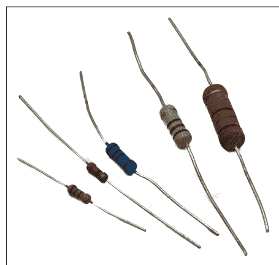

**图 2-1：** 碳膜电阻器。

电阻器在电路中对极性不敏感。因此，你不必担心将其装反。电流可以以任意方向均匀地通过电阻器。

在电路原理图中，电阻器用一条锯齿线表示，如边栏所示。阻值通常标注在电阻器符号旁边。此外，有时也会在符号旁标注如R1或R2之类的标识符。

在一些原理图中，特别是欧洲绘制的原理图，会使用边栏所示的符号来代替锯齿线。

电阻器在电子电路中有多种用途。最常见的三种是：


- **限流：** 通过在电路中引入电阻，电阻器可以限制流过电路的电流。根据欧姆定律，如果电路中的电压保持不变，增加电阻将导致电流减小。

许多电子元件对电流的需求必须通过电阻器来调节。最著名的例子之一是发光二极管（LED），它是一种特殊的二极管，当电流流过时会发出可见光。遗憾的是，LED在消耗电流方面不知节制。这是因为它们的内阻非常小。不幸的是，LED对电流的耐受性不高，过大的电流会将其烧毁。因此，在LED串联一个电阻器以防止其烧毁总是谨慎的——实际上是必要的。（你可以在本手册的第5章了解更多关于LED的知识。）

在使用限流电阻器时，你可以利用欧姆定律。例如，如果你知道电源电压以及所需的电流，就可以利用欧姆定律来确定电路中应使用的合适电阻器，如上一节所述。

- **分压：** 你还可以使用电阻器将电压降低到适合电路特定部分的水平。例如，假设你的电路由3V电池供电，但电路的某一部分需要1.5V。你可以使用两个阻值相等的电阻器将该电压平分，得到1.5V。更多信息请参阅本章稍后的“分压”部分。

更多信息请参阅本章稍后的“分压”部分。

- **电阻/电容网络：** 电阻器可以与电容器组合使用，以实现各种有趣的功能。你可以在本手册的第3章了解电阻器的这种用途。

## 识别电阻器色环

你可以通过检查电阻器上涂的色环来确定其提供的阻值。这些彩色条纹表示了关于电阻器的两个重要信息：其阻值（以欧姆为单位）以及容差，后者表示电阻器实际阻值与标称阻值的接近程度。

大多数电阻器有四条色环。前三条色环表示阻值，第四条色环表示容差。一些电阻器有五条色环，其中四条代表阻值，最后一条代表容差。

> 如果你不确定从电阻器的哪一侧开始读取颜色，请从最靠近色环条纹的一侧开始。第一条色环通常涂在非常靠近电阻器边缘的位置；最后一条色环则不那么靠近边缘。

### 读取电阻器的阻值

要读取电阻器的色码，请参阅表2-1。以下是确定具有四条色环的电阻器阻值的步骤：

1. **调整电阻器方向，以便正确读取色环。**
   应从左到右读取色环。第一条色环是靠近电阻器一端的那条。如果这条色环在电阻器的右侧，请将电阻器翻转过来，使第一条色环位于左侧。
2. **查找第一条色环的颜色以确定第一位数字的值。**
   例如，如果第一条色环是黄色，则第一位数字是4。
3. **查找第二条色环的颜色以确定第二位数字的值。**
   例如，如果第二条色环是紫色，则第二位数字是7。
4. **查找第三条色环的颜色以确定倍率。**
   例如，如果第三条色环是棕色，则倍率是10。
5. **将两位数字的值乘以倍率以确定电阻器的阻值。**
   例如，47乘以10等于470。因此，一个黄紫棕电阻器的阻值是470 Ω。

> 如果一个电阻器有五条色环，前三条色环是数字值，第四条色环是倍率。第五条色环是容差，如下一节所述。

这里有一些示例，应能帮助你理解如何读取电阻器色码：

| 色环颜色 | 数字值 | 倍率 (欧姆) | 电阻器阻值 |
|---|---|---|---|
| 棕-黑-棕 | 10 | 10 | 100 Ω |
| 棕-黑-红 | 10 | 100 | 1 kΩ |
| 红-红-橙 | 22 | 1 k | 22 kΩ |
| 红-红-黄 | 22 | 10 k | 220 kΩ |
| 黄-紫-黑 | 47 | 1 | 47 Ω |

#### 表 2-1 电阻器色码（阻值）

| 颜色 | 数字 | 倍率 |
|---|---|---|
| 黑 | 0 | 1 |
| 棕 | 1 | 10 |
| 红 | 2 | 100 |
| 橙 | 3 | 1 k |
| 黄 | 4 | 10 k |
| 绿 | 5 | 100 k |
| 蓝 | 6 | 1 M |
| 紫 | 7 | 10 M |
| 灰 | 8 | 100 M |
| 白 | 9 | 1,000 M |
| 金 | | 0.1 |
| 银 | | 0.01 |

### 理解电阻器容差

涂在电阻器上的色环所指示的值提供了实际阻值的一个估计值。精确的阻值会根据电阻器的容差因子在一定百分比范围内变化。

例如，一个22 kΩ、容差为±5%的电阻器，其实际阻值在22 kΩ的5%上下范围内，即大约在20.9 kΩ到23.1 kΩ之间。一个470 Ω、容差为10%的电阻器，其实际阻值在423 Ω到517 Ω之间。

## 注意标准电阻值

理论上，前两条色环有100种不同的颜色组合，覆盖了从00到99的值范围。然而，在实践中，常见的只有少数几种颜色组合。这些颜色组合代表了标准化的值，使得制造商能够生产出适用于各种应用的电阻器。

例如，取值为47（由颜色代码黄-紫表示）。47恰好是优选电阻数值之一，因此你可以轻松获得4.7 Ω、47 Ω、470 Ω、4.7 kΩ、47 kΩ、470 kΩ和4.7 MΩ的电阻器。

但45不是优选值之一。因此，你找不到45 Ω或450 Ω的电阻器。

尽管有几种不同的系统用于标准化优选电阻值，但最常用的系统使用12个不同的标准值：

| 前两条颜色 | 标准值 |
|---|---|
| 棕, 黑 | 10 |
| 棕, 红 | 12 |
| 棕, 绿 | 15 |
| 棕, 灰 | 18 |
| 红, 红 | 22 |
| 红, 紫 | 27 |
| 橙, 橙 | 33 |
| 橙, 白 | 39 |
| 黄, 紫 | 47 |
| 绿, 蓝 | 56 |
| 蓝, 灰 | 68 |
| 灰, 红 | 82 |

这些是标准化值，旨在提供广泛的阻值范围。虽然不是精确的，但每个值大约是前一个值的1.2倍。

为何采用近似值？原因很简单：制造公差极小的电阻器成本更高，而对于大多数电子电路而言，5%或10%的误差范围完全可接受。例如，若你正在构建一个将流经某元件的电流限制在200 mA的电路，实际电流略高于或低于200 mA通常并无大碍。因此，使用5%或10%公差的电阻器是可行的。

若你的应用需要更高精度，可以多花些钱购买公差更小的电阻器。但±5%或±10%公差的电阻器已能满足大多数工作需求，包括本书中介绍的所有电路（除非另有说明）。

电阻器的公差由其最后一道色环标示，具体对应关系见表2–2。

### 电阻器色环代码（公差值）

| 颜色 | 公差 |
| :--- | :--- |
| 棕色 | ±1% |
| 红色 | ±2% |
| 橙色 | ±3% |
| 黄色 | ±4% |
| 金色 | ±5% |
| 银色 | ±10% |
| 无色环 | ±20% |

## 理解电阻器功率额定值

电阻器如同电流的刹车。就像汽车的刹车一样，电阻器通过施加与电流流动方向相反的电摩擦力来工作。这种摩擦力通过吸收部分电流能量并将其以热能形式耗散，从而抑制电流流动。在电路中使用电阻器时，必须确保其能承受产生的热量。

电阻器的*功率额定值*表示其在过热烧毁前能处理的最大功率。你可能还记得第一册第二章的内容：功率的单位是*瓦特*。电阻器能承受的瓦数越大，其体积通常也越大、价格也越高。

大多数电阻器设计为处理⅛ W或¼ W功率。你也能找到额定½ W或1 W的电阻器，但在本书介绍的电子项目中很少需要。除非特别说明，本书中使用的所有电阻器均为¼ W额定值。

遗憾的是，仅凭外观无法判断电阻器的功率额定值。与电阻值和公差不同，功率额定值没有色环标识。不过，电阻器的尺寸是其功率额定值的良好指标。购买新电阻器时，包装上会标明功率额定值。使用一段时间后，你将能快速识别不同功率额定值电阻器的尺寸差异。

若想确保安全，可以计算电路中特定电阻器的功率需求。首先，利用欧姆定律计算电阻器两端的电压和流经它的电流。例如，若一个1,000 Ω电阻器两端电压为3 V，通过电压除以电阻（3 V ÷ 1,000 Ω = 0.03 A，即30 mA）可计算出流经电阻器的电流为30 mA。

一旦知道电压和电流，即可使用第一册第二章中学到的功率公式计算电阻器耗散的功率：

$$P = I \times V$$

因此，该电阻器耗散的功率仅为0.09 W，远低于¼ W（0.25 W）电阻器的最大处理能力。（⅛ W电阻器也应能处理此功率，但在功率额定值方面，选择稍大的规格总是更稳妥。）

## 使用电阻器限制电流

电阻器最常见的用途之一是限制流经元件的电流。某些元件（如发光二极管）对电流非常敏感。几毫安的电流足以使LED发光；而几百毫安的电流则足以将其烧毁。

要使用电阻器限制流经元件的电流，只需将电阻器与该元件串联。例如，图2–2展示了将电阻器与LED串联的两种方式。如图所示，左侧版本将电阻器置于LED的正电压侧（称为*阳极*），右侧版本则将其置于LED的负侧（称为*阴极*）。

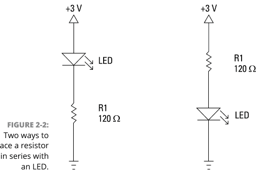

可以说，左侧版本将限流电阻器置于LED*之前*，右侧版本则将其置于LED*之后*。这与电流从正极流向负极的传统观念一致。无论电阻器位于LED之前还是之后，只要与LED串联即可。

项目10将指导你构建一个简单电路，演示如何使用电阻器限制LED的电流，电阻器置于LED之后，连接在LED与接地端之间。图2-3展示了组装完成的电路。

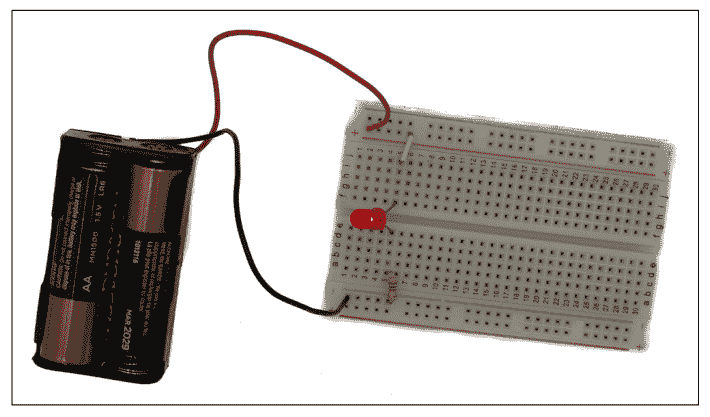

在开始构建电路前，先思考一个简单问题：为何选择120 Ω电阻器？为何不用更大或更小的阻值？换言之，在此类电路中如何确定电阻器的阻值？

答案很简单：欧姆定律能轻松告诉你该使用多大的电阻器，但你必须先知道电压和电流。本例中，电压很容易确定：你知道两节AA电池提供3 V电压。要确定电流，只需决定电路可接受的电流大小。LED的技术规格会说明其能承受的最大电流。以标准5 mm红色LED为例，最大允许电流为28 mA。为确保安全，避免过大电流烧毁LED，可将最大电流向下取整为25 mA。

要计算所需电阻值，将电压（3 V）除以电流（0.025 A），结果为120 Ω。

> **提示**
无需过分纠结于为LED限流选择完全精确的电阻值。若所需阻值不对应标准电阻值，只需向上取整至下一个标准值。例如，若需要135 Ω电阻器，可向上取整使用150 Ω电阻器。若手头没有150 Ω电阻器，220 Ω电阻器也可替代。

> **警告**
切勿将LED直接连接到电池而不使用电阻器。否则，LED会瞬间闪亮，然后永久损坏。

## 项目10：使用限流电阻器

本项目将构建一个简单电路，使用电阻器限制LED的电流。若无此限流电阻器，过大电流将流经LED并导致其损坏。

本项目所需工具可能仅需一把小型十字螺丝刀（用于打开电池盒）以及剪线钳和剥线钳（用于剪切和剥开跳线）。

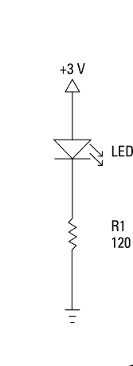

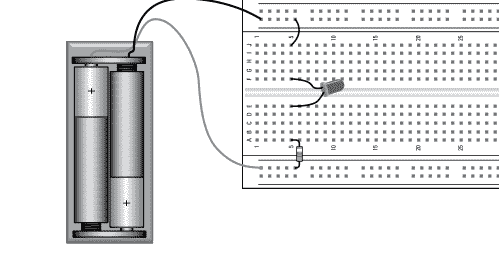

## 零件

- 两节AA电池
- 一个电池盒
- 一个5 mm红色LED
- 一个120 Ω电阻器（棕、红、棕）
- 一个无焊面包板
- 一根1英寸跳线

## 步骤

1. **连接电池盒。**
   调整面包板方向，使孔A1位于左下角，与图示方向一致。然后，将黑色引线插入面包板底部的负极（−）总线条，红色引线插入顶部的正极（+）总线条。

   总线条上的任何位置均可，但建议将引线插入面包板最末端的孔中。

   大多数电池盒的引线为多股线而非实心线。剥去每根引线末端约¼英寸绝缘层后，需将多股线紧密绞合，以便插入面包板孔中。

2. **连接电阻器。**
   将电阻器一端插入面包板孔A5，另一端插入底部负极电压总线条（连接黑色电池线的那条）的任意附近孔中。

3. **连接LED。**
   注意LED的引线长度不同；一长一短。将较短引线（称为*阳极*）插入孔E5，较长引线（称为*阴极*）插入孔F5。
   注意：若LED方向接反，电路将无法工作。

4. **用短跳线将LED连接到正极总线。**
   将跳线一端插入孔J5，另一端插入面包板顶部正极总线的任意孔中。

5. **装入电池。**
   LED应亮起。若未亮起，请仔细检查连接，确保电路组装正确。若仍不亮，请尝试更换电池。

## 组合电阻器

假设你设计了一个完美电路，其中关键位置需要1,100 Ω电阻器。你跑到当地的RadioShack，却因找不到1,100 Ω电阻器而懊恼。于是你上网搜索喜爱的在线供应商，更令人沮丧的是他们也没有1,100 Ω电阻器。你可以买到1 kΩ和100 Ω电阻器，但似乎无人提供1,100 Ω电阻器。

是时候放弃了吗？还是必须将就使用1 kΩ电阻器，希望其阻值足够接近？

当然不是！

你需要做的就是将两个或更多电阻组合起来，以创造出所需的电阻值。这种电阻的组合有时被称为电阻网络。你可以随时用一个电阻网络来替代单个电阻。

组合电阻有两种基本方式：串联（首尾相连）和并联（并列连接）。接下来的章节将解释如何计算串联和并联电阻网络的总电阻。

阅读以下章节时，你需要开动脑筋。欧姆定律虽然简单，但计算并联电阻所需的数学运算可能会有点复杂。这些数学计算并不特别复杂，但也绝非易事。

## 串联电阻

计算两个或更多首尾相连（即串联）的电阻的总电阻很简单：你只需将电阻值相加即可得到总电阻。

例如，如果你需要 1,100 欧姆的电阻却找不到 1,100 Ω 的电阻，你可以将一个 1 kΩ 电阻和一个 100 Ω 电阻串联。将这两个电阻值相加，总电阻即为 1,100 Ω。

你也可以将两个以上的电阻串联。只需不断将所有电阻值相加，即可得到总电阻值。例如，如果你需要 1,800 Ω 的电阻，你可以使用一个 1 kΩ 电阻和八个 100 Ω 电阻串联。

图 2–4 展示了串联电阻的工作原理。这里，两个电路具有相同的电阻。左边的电路用一个电阻完成任务；右边的电路用三个电阻完成。因此，这两个电路是等效的。


任何时候你在电路中看到两个或更多串联的电阻，你都可以用一个阻值等于各单个电阻之和的电阻来替代。同样，任何时候你在电路中看到一个电阻，只要你用串联的两个或更多电阻的阻值之和等于所需的阻值，你就可以进行替代。


串联电阻的总电阻总是大于任何单个电阻的电阻值。这是因为每个电阻都将其自身的电阻添加到了总电阻中。

## 并联电阻

你也可以将电阻并联以创建等效电阻。然而，计算并联电阻的总电阻比计算串联电阻的总电阻要复杂一些。

如图 2–5 所示的电路所示，当你将两个电阻并联时，电流可以同时流过两个电阻。虽然每个电阻都起着阻碍电流的作用，但两个并联电阻的总电阻总是小于其中任何一个电阻的电阻值，因为电流有两条路径可以流过。

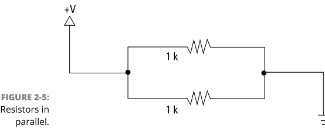

那么，如何计算并联电阻的总电阻呢？要非常仔细。规则如下：

+ 首先，最简单的情况：阻值相等的电阻并联。在这种情况下，你可以通过将一个单个电阻的阻值除以并联的电阻数量来计算总电阻。例如，两个 1 kΩ 电阻并联的总电阻是 500 Ω，四个 1 kΩ 电阻并联的总电阻是 250 Ω。

不幸的是，这是唯一简单的情况。当并联电阻的阻值不相等时，数学计算会更复杂。

+ 如果只涉及两个阻值不同的电阻，计算还不算太糟：

$$R_{total} = \frac{R1 \times R2}{R1 + R2}$$

在这个公式中，R1 和 R2 是两个电阻的阻值。

+ 这里有一个基于一个 2 kΩ 和一个 3 kΩ 电阻并联的示例：

$$R_{total} = \frac{R1 \times R2}{R1 + R2} = \frac{2,000\Omega \times 3,000\Omega}{2,000\Omega + 3,000\Omega} = 1,200\Omega$$

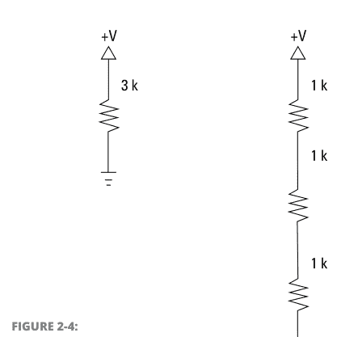

图 2-4：串联电阻。

+ 对于三个或更多并联电阻，计算开始变得像火箭科学：
  $$R_{total} = \frac{1}{\frac{1}{R1} + \frac{1}{R2} + \frac{1}{R3}...}$$
+ 表达式末尾的省略号表示你需要持续将尽可能多的电阻的倒数相加。
+ 如果你疯狂到真想做这种数学题，这里有一个三个电阻（阻值分别为 2 kΩ、4 kΩ 和 8 kΩ）的示例：
  $$R_{total} = \frac{1}{\frac{1}{2,000\ \Omega} + \frac{1}{4,000\ \Omega} + \frac{1}{8,000\ \Omega}} = \frac{1}{0.000875\ \Omega} = 1,142.857\ \Omega$$
+ 如你所见，最终结果是 1,142.857 Ω。这个精度可能超出了你的需要，所以你很可能可以安全地将其四舍五入为 1,142 Ω，甚至 1,150 Ω。

## 混联电阻

电阻可以组合成复杂的网络，其中一些电阻串联，另一些并联。例如，图 2-6 显示了一个由三个 1 kΩ 电阻和一个 2 kΩ 电阻组成的网络。这些电阻以串并联混合的方式排列。

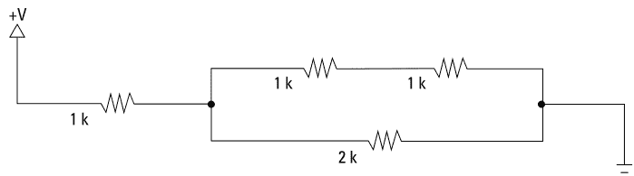

图 2-6：串并联电阻。

### 从导电性理解并联电阻

并联电阻公式的意义在于，如果你从电阻的反面——称为*电导*——来思考，会更容易理解。电阻是导体阻碍电流的能力；电导是导体传导电流的能力。电导与电阻成反比关系：当你增加电阻时，电导就会减小，反之亦然。

由于电学理论的先驱们具有一种极客式的幽默感，他们将电导的度量单位命名为 *mho*（姆欧），这是 *ohm*（欧姆）倒过来拼写。姆欧是欧姆的倒数（也称为逆数）。要计算任何电路或元件（包括单个电阻）的电导，你只需用 1 除以该电路或元件的电阻（以欧姆为单位）。因此，一个 100 Ω 的电阻具有 1/100 姆欧的电导。

当电路并联连接时，电流有多条路径可以流过。结果表明，并联电阻网络的总电导很容易计算：你只需将每个单个电阻的电导相加即可。例如，假设你有三个并联的电阻，其电导分别为 0.1 姆欧、0.02 姆欧和 0.005 姆欧。（它们分别是 10 Ω、50 Ω 和 200 Ω 电阻的电导。）这个电路的总电导是 0.125 姆欧（0.1 + 0.02 + 0.005 = 0.125）。

进行倒数运算的一条基本规则是，如果一个数是第二个数的倒数，那么第二个数也是第一个数的倒数。因此，既然姆欧是欧姆的倒数，那么欧姆也是姆欧的倒数。要将电导转换为电阻，你只需用 1 除以电导。所以，等效于 0.125 姆欧的电阻是 8 Ω（1 ÷ 0.125 = 8）。

当你意识到你真正做的是将每个电阻值转换为电导，将它们相加，然后再将结果转换回电阻时，这可能会帮助你理解并联电阻公式的工作原理。换句话说，将欧姆转换为姆欧，将它们相加，然后再将它们转换回欧姆。这就是电阻公式实际工作的方式和原因。

计算此类网络总电阻的方法是“分而治之”。寻找简单的串联或并联电阻，计算它们的总电阻，然后用一个等效值的单个电阻替代。例如，你可以用一个 2 kΩ 的电阻替代串联的那两个 1 kΩ 电阻。现在，你有两个并联的 2 kΩ 电阻。记住两个相同阻值电阻的总电阻是阻值的一半，你可以用一个 1 kΩ 电阻替代这两个 2 kΩ 电阻。现在你还剩两个串联的 1 kΩ 电阻。因此，这个电路的总电阻是 2 kΩ。

看似简单，对吧？

### 组合串并联电阻

实验 11 让你亲手操作一些简单的串并联电阻连接，这样你就能亲眼看到前三节中描述的计算在现实世界中是如何工作的。你可能会发现，由于实际电阻的个体差异（源于其制造公差），计算出的电阻值并不总是与实际电路的电阻值相符。但在大多数情况下，这些差异并不显著，不会影响电路的工作。

在这个项目中，你将五个电阻组装成三种不同的配置。第一种是所有五个电阻串联。第二种是所有五个电阻并联。第三种则创建了一个由两组并联电阻串联组成的网络。

## 实验 11：串联与并联电阻

在这个实验中，你将研究串联和并联的电阻。你需要一个带有欧姆表功能的万用表来测量电阻。

### 所需零件

+ 一个无焊面包板（RadioShack 2760003）
+ 五个 1 kΩ ¼ W 电阻（棕-黑-红）
+ 一个带有欧姆表功能的万用表## 串联布局

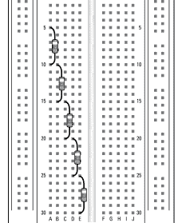

## 并联布局

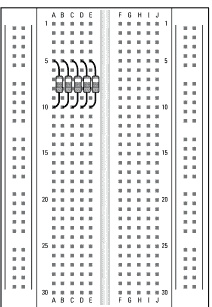

## 串并联布局

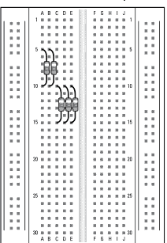

## 步骤

1.  将你的万用表设置为欧姆表功能，选择一个足够大的量程，以测量至少 5 kΩ 的电阻。

    在我的欧姆表上，最接近的量程是 20 kΩ。

2.  将五个 1 kΩ 电阻串联插入。

    使用面包板上的以下孔位：

| 电阻 | 第一引脚 | 第二引脚 |
| :--- | :--- | :--- |
| 1 | A5 | A10 |
| 2 | B10 | B15 |
| 3 | C15 | C20 |
| 4 | D20 | D25 |
| 5 | E25 | E30 |

请参考串联布局图了解这些电阻的布局。

3.  使用万用表，分别测量每个电阻的阻值，然后测量两个、三个、四个和五个电阻串联的总电阻。

    要进行这些测量，请将万用表探针放在表 2-3 中指示的面包板孔位引脚上。将你的实际测量值写在最右侧的列中。

4.  将电阻重新排列成并联电路。

    取下电阻，并将它们重新插入以下孔位：

| 电阻 | 第一引脚 | 第二引脚 |
| :---: | :---: | :---: |
| 1 | A5 | A10 |
| 2 | B5 | B10 |
| 3 | C5 | C10 |
| 4 | D5 | D10 |
| 5 | E5 | E10 |

请参考并联布局图了解这些电阻的布局。

5.  使用欧姆表测量并联电阻电路的电阻。

    因为有五个 1 kΩ 电阻，你的测量值应该大约是 200 Ω。

6.  将电阻重新排列成串并联网络。

    取下电阻 3、4 和 5，并按如下方式插入：

| 电阻 | 第一引脚 | 第二引脚 |
| :---: | :---: | :---: |
| 1 | A5 | A10 |
| 2 | B5 | B10 |
| 3 | C10 | C15 |
| 4 | D10 | D15 |
| 5 | E10 | E15 |

请参考串并联布局图了解这些电阻的布局。

此配置将前两个电阻放在一个并联电路中，另外三个放在第二个并联电路中。这两个并联电路连接形成一个串联电路。

7.  **使用欧姆表测量两个并联电路和整个电路的电阻。**

    将你的测量值记录在表 2-4 中。

你完成了！除非你是个自讨苦吃的人。那样的话，欢迎尝试其他串联和并联电阻电路的组合。拿一些其他阻值的电阻加入进来。每次，都进行计算以预测最终的电阻应该是多少。通过一些练习，你将擅长计算电阻网络。

### 表 2-3 串联电阻测量

| 红色探针 | 黑色探针 | 电阻数量 | 预期测量值 | 你的测量值 |
| :--- | :--- | :--- | :--- | :--- |
| A5 | A10 | 1 | 1 kΩ | |
| B10 | B15 | 1 | 1 kΩ | |
| C15 | C20 | 1 | 1 kΩ | |
| D20 | D25 | 1 | 1 kΩ | |
| E25 | E30 | 1 | 1 kΩ | |
| A5 | B15 | 2 | 2 kΩ | |
| A5 | C20 | 3 | 3 kΩ | |
| A5 | D25 | 4 | 4 kΩ | |
| A5 | E30 | 5 | 5 kΩ | |

### 表 2-4 串并联电阻测量

| 红色探针 | 黑色探针 | 电阻数量 | 预期测量值 | 你的测量值 |
| :--- | :--- | :--- | :--- | :--- |
| A5 | A10 | 2 | 500 Ω | |
| C10 | C15 | 3 | 333 Ω | |
| A5 | C15 | 5 | 833 Ω | |

## 分压

电阻一个有趣且有用的特性是，如果你将两个电阻串联，你可以从两个电阻之间的点引出电压，得到一个总电压的分数值。这种电路称为*分压器*，它是电路中降低电压的常用方法。图 2-7 显示了一个典型的分压器电路。

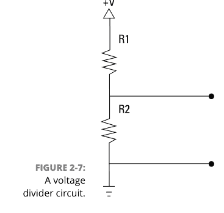

当分压器中的两个电阻值相同时，电压被减半。例如，假设你的电路由 9 V 电池供电，但你的电路实际上只需要 4.5 V。你可以在电池引脚两端使用一对等值电阻来提供所需的 4.5 V。

当电阻值不同时，你必须进行一些计算来计算分压器中心的电压。公式如下：

$V_{out} = \frac{V_{in} \times R2}{R1 + R2}$

例如，假设你使用 9 V 电池，但你的电路需要 6 V。在这种情况下，你可以使用一个 1 kΩ 电阻作为 R1 和一个 2 kΩ 电阻作为 R2 来创建一个分压器。计算如下：

$V_{out} = \frac{9\mathrm{V} \times 2,000 \Omega}{1,000 \Omega + 2,000 \Omega} = \frac{18,000 \mathrm{V}}{3,000} = 6 \mathrm{V}$

如你所见，这些电阻值将电压降低到了 6 V。

> 💡 提示 这是看待同一问题的另一种方式：6 V 是 9 V 的三分之二。所以，你需要一个能给你 9 V 三分之二的分压器。你可以使用任何三个相同阻值的电阻来实现这一点，将电压分配在分压器一侧的一个电阻和另一侧的两个电阻上。

## 使用电阻分压

在项目 12 中，你在无焊面包板上构建一个简单的分压器电路，从 9 V 电池提供 3 V 或 6 V 电压。组装好的电路如图 2-8 所示。

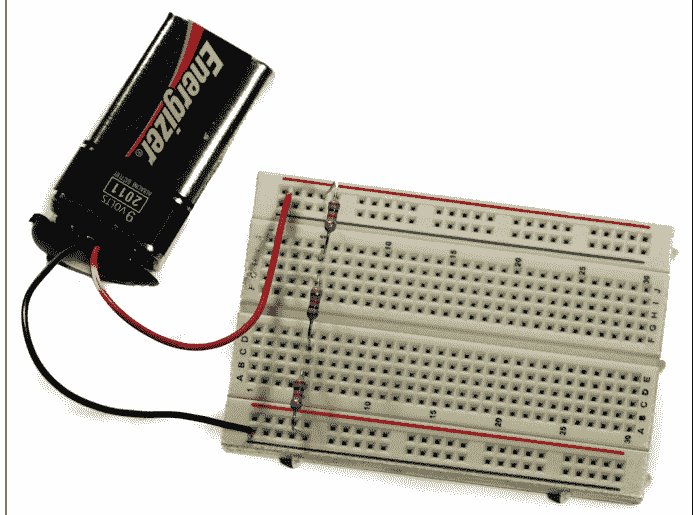

图 2-8：组装好的分压器电路。

## 项目 12：分压器电路

在这个项目中，你使用三个 1 kΩ 电阻构建一个简单的分压器电路，并使用万用表的欧姆表功能测量分压器的效果。

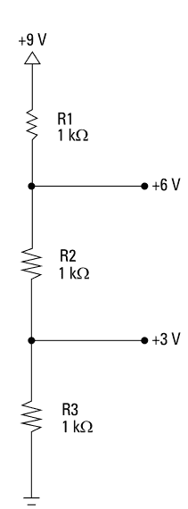

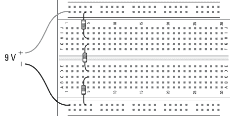

## 零件

-   一个无焊面包板
-   一个 9 V 电池
-   一个 9 V 电池扣座
-   三个 1 kΩ ¼ W 电阻（棕-黑-红）
-   一个带电压表功能的万用表

## 步骤

1.  **连接电池座。**

    将黑色引线插入靠近 A 列一侧的接地总线的第一个孔中。然后将红色引线插入靠近 J 列一侧的正电压总线的第一个孔中。

2.  **插入电阻。**

    将电阻引脚放入下表指示的孔中：

| 电阻 | 第一引脚 | 第二引脚 |
| :--- | :--- | :--- |
| 1 | 靠近第 5 行的接地总线 | C5 |
| 2 | D5 | G5 |
| 3 | H5 | 靠近第 5 行的正总线 |

3.  **连接电池。**

4.  **使用电压表观察电压如何分配。**

    将电压表设置为至少能测量 10 V 直流电的量程。然后，通过将万用表探针接触插入表中指示孔位的电阻引脚，进行表 2-5 中指示的测量：

你完成了！

务必从电路上拔下电池。如果你让它保持连接，电流将继续流过串联电阻电路，电池很快就会耗尽。

### 表 2-5 串联电阻测量

| 黑色探针 | 红色探针 | 预期测量值 | 你的测量值 |
| :--- | :--- | :--- | :--- |
| 接地总线 | 正总线 | 9 V | |
| 接地总线 | H5 | 6 V | |
| 接地总线 | C5 | 3 V | |
| D5 | G5 | 3 V | |

> 使用电阻

## 使用电位器改变电阻

许多电路需要用户可调的电阻。例如，大多数音频放大器都包含一个音量控制，允许用户调高或调低音量，你也可以通过改变与灯串联的电阻来创建一个简单的调光器。

可变电阻的正式名称是*电位器*，或简称*电位器*。电位器只是一个有三个端子的电阻。其中两个端子永久固定在电阻的两端，但中间端子连接到一个滑片，该滑片在电阻的整个表面上滑动接触。因此，随着滑片的移动，这个中心端子与两个侧端子之间的电阻量会发生变化。

图 2-9 显示了典型电位器的外部外观。电阻轨道和滑片（正式称为*滑片*）封闭在金属罐内，三个端子位于其下方。从金属罐顶部伸出的杆连接到滑片，因此当用户转动杆时，滑片在电阻上移动以改变电阻。

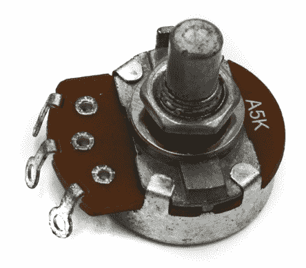

图 2-9：一个电位器。

图 2-10 显示了电位器的内部工作原理。在这里，你可以看到电阻是由半圆形电阻材料（如碳）制成的。两个外部端子连接到电阻的两端。连接到第三个端子的滑片安装成可以绕电阻旋转。当滑片移动时，中心端子与其他两个端子之间的电阻发生变化。

## 第三章
电容器

我最喜欢的科幻装置是《回到未来》中布朗博士发明的、能将他的朋友马蒂·麦克弗莱送回1955年的设备：通量电容器。布朗博士著名的通量电容器能够将1.21吉瓦的功率转化为时空连续体的扭曲，从而改变历史的进程。

在本章中，你将研究普通的电容器，它们是虚构的通量电容器的小兄弟。虽然如果时间旅行通量电容器真的存在会非常有用，但真实的电容器确实存在，并且极其有用。事实上，电容器是所有电子元件中最有用的元件之一。你构建的几乎每个电路都会用到一个或多个电容器。

> 在第一册第四章中，我曾警告过你使用大型电容器的危险。在我们开始电容之旅之前，我想提醒你注意那个警告：大型电容器可能很危险，因为即使在断开电源后，它们仍能长时间保持大量电荷。如果你正在处理包含比顶针还大的电容器的电路，请小心！在操作这些电容器之前，你应该先将它们放电。真正大型的电容器应通过高电流电阻放电。请注意，本书中使用的电容器都不够大，不足以构成危险，除了第四册第二章中描述的电源中使用的电容器。

## 什么是电容器？

要开始理解什么是电容器，请思考这个问题：是什么让电流在导体中流动？在第一册第二章中，你了解到异种电荷相互吸引，同种电荷相互排斥。这种吸引或排斥是由一种称为*电磁力*的力引起的。所有带电粒子都表现出与这种力相关的电场。正是这个电场将*电子*（负电荷）吸引向*质子*（正电荷），也是这个电场将电子彼此推开。

在铜这样的导体中，单个电子产生的电场导致导体内的电子不断运动。然而，这种运动是完全随机的。当在导体两端施加电压时，会产生一个电场，使电子的运动变得有序。电场以有序的方式将电子推过导体，从电压的负极流向正极。结果就是：电流。

电场是神奇的。与电流不同，电场不需要导体就能传播。电场可以穿过绝缘体，推开或拉动绝缘体另一侧的电荷。

这看起来可能像魔法，但你以前遇到过。吹起一个气球，用它快速摩擦你的衬衫，然后把它举到你的头发附近。摩擦气球会在气球上产生静电荷。当这个电荷靠近你的头发时，它的电场会拉动你头发中的电荷，头发就会神奇地向上飘向气球。

*电容器*是一种利用电场看似神奇的、能够穿过绝缘体能力的电子元件。它由两个由银或铝等导电材料制成的平板组成，中间由聚酯薄膜或陶瓷等薄绝缘材料隔开，如图3-1所示。两个导电板连接到端子，以便可以在板之间施加电压。

请注意，由于两个板被绝缘体隔开，因此*没有*形成闭合回路。尽管如此，电流还是会流动——至少是暂时的。

这怎么可能呢？当连接来自电池等电源的电压时，电池电压的负极立即开始将负电荷推向其中一个板。同时，电池电压的正极开始将电子（负电荷）从第二个板拉走。

允许电流流动的是在两个板之间迅速建立的电场。随着电路负极侧的板充满电子，这些电子产生的电场开始将电子从绝缘体另一侧的板推开，推向电池电压的正极。

随着电流流动，电容器的负极板积累了多余的电子，而正极板则相应地缺少电子。因此，在电容器的两个板之间产生了电压。（记住，电压的定义是两点之间的电荷差。）

但有一个问题：这种电流只流动很短的时间。随着电子在负极板上积累并从正极板上耗尽，两个板之间的电压增加，因为两个板之间的电荷差增加了。电压持续增加，直到电容器电压等于电池电压。一旦电压相同，电流就停止流过电路，电容器就被称为已充电。

此时，魔法变得更加奇妙。一旦电容器充电，你就可以将电池与电容器断开，电压将保留在电容器中。换句话说，尽管电容器中的电压是由电池产生的，但这种电压的存在并不依赖于电池。断开电池，电压仍然存在于电容器的两个板之间。

因此，电容器具有存储电荷的能力——这种能力被称为电容。

电位器在原理图中的符号如边栏所示。如你所见，电阻的中心抽头由一个箭头表示，该箭头旨在反映当滑片移动时，该端子的电阻值会发生变化。

电位器以其总电阻来标定。中心端子与另外两个端子之间的电阻之和总是等于电位器的总电阻额定值。例如，一个100 Ω电位器分出的两个电阻之和总是100 Ω。当旋钮正好在中间时，两个电阻都是50 Ω。当你将滑片向任一方向移动时，一个电阻增加而另一个减少；但在所有情况下，两个电阻的总和总是等于100 Ω。

关于电位器，还有几点其他零散的想法需要记住：

-   电位器有各种各样的形状和尺寸。在商店或网上稍加寻找，你应该能够为每个需求找到完美的电位器。
-   一些电位器非常小，只能使用小螺丝刀进行调整。这种类型的电位器称为*微调电位器*，旨在对电路进行偶尔的精细调整。
-   一些电位器内置了开关，因此当你将旋钮完全转到一侧或将旋钮拉出时，开关会操作以打开或关闭电路。
-   当滑片到达电阻的一端或另一端时，中心端子与该端端子之间的电阻基本上为零。在设计电路时请记住这一点。为避免电路路径没有电阻，通常会在电位器中串联一个小电阻。
-   一些电位器，当你转动旋钮时，电阻均匀变化。例如，如果总电阻为10 kΩ，则半程标记处的电阻为5 kΩ，四分之一标记处的电阻为2.5 kΩ。这种类型的电位器称为*线性渐变*电位器，因为电阻变化是线性的。

然而，许多电位器不是线性的。例如，为音频应用设计的电位器通常具有*对数渐变*，这意味着当你移动旋钮时，电阻不会均匀变化。

-   一些可变电阻只有两个端子：一个在电阻本身的一端，另一个连接到滑片。这种类型的可变电阻正确称为*变阻器*，但大多数人使用术语*电位器*或*电位器*来指代两端和三端可变电阻。

## 本章内容

-   深入探究电容器的奥秘
-   了解电容器的测量单位
-   计算重要的电容器参数
-   构建一些基本的电容器电路

请注意，从纯物理学的角度来看，说电容器具有储存电荷的能力并不完全准确。电容器实际储存的是以电场形式存在的能量，该电场在两个极板间产生电压。严格来说，当电容器完全“充电”时，其内部的电荷量并不比未充电时多。区别在于，当电容器未充电时，其总负电荷和正电荷均匀分布在两个极板上，因此极板间没有电压。相反，当电容器充电时，负电荷集中在一块极板上，而正电荷集中在另一块极板上。无论哪种情况，电容器内的总电荷量是相同的。

还有一些奇妙之处：如果一个已充电的电容器接入电路，极板间的电压将驱动电流流过电路。这被称为电容器的 *放电*。就像给电容器充电的电流只会持续很短时间一样，电容器放电产生的电流也只会持续很短时间。随着电容器放电，两极板间的电荷差异减小，电场坍缩。一旦两极板达到平衡，极板间电压变为零，电流停止流动。

在继续之前，关于电容器你还需要了解几点：

- 电路图中电容器最常见的符号就是两条被间隙隔开的平行线，如边栏所示。
- 另一种符号使用一条直线和一条曲线来表示极板。曲线通常用于电路的负极侧。
- 虽然有些电容器对极性不敏感，但许多其他电容器是敏感的。这种敏感性与制造电容器所选材料有关：使用某些材料时，如果接错电压方向可能会损坏电容器。具有明确正负端子的电容器称为 *极性电容器*。电路图中使用加号来表示极性，如边栏所示。
- 有时电容器简称为 *电容*。
- 两个导电极板之间的绝缘材料正确称为 *介电质*，这个术语指的是绝缘层在两极板充电时被极板间存在的电场极化的能力。
- 很久以前，电容器被称为 *冷凝器*。 *电容器* 这个术语在20世纪20年代开始普遍使用。我的祖父出生于1910年，在1970年代他向我介绍电子学时就使用了 *冷凝器* 这个词。（他还认为 *mile* 这个词是复数形式。因此，如果我问他：“我们离默塞德有多远？”，他会回答：“大约5 mile。”）

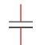

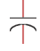

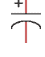


## 计算电容值

*电容* 是指电容器储存电荷能力的术语。它也是用来衡量特定电容器能储存多少能量的单位。电容器的电容越大，它能储存的电荷就越多。

电容的测量单位称为 *法拉*（缩写为 F）。一法拉的定义看似简单。一个一法拉的电容器在充电时，如果充入的电流恰好为一安培每秒，那么它极板间的电压恰好为一伏特。

请注意，在这个定义中，“一安培每秒的电流”实际上指的是电容器中存在的电荷量。并没有规则要求电流必须流动整整一秒钟。可以是一安培持续一秒，或两安培持续半秒，或半安培持续两秒。也可以是100毫安持续10秒，或10毫安持续100秒。

一安培每秒对应于测量电荷的标准单位，称为 *库仑*。因此，一法拉的另一种表述方式是：它是指在极板间电压为一伏特时，能储存一库仑电荷的电容量。

结果证明，一法拉是一个巨大的电容量，这仅仅是因为一库仑是一个非常大的电荷量。举个例子，一道普通闪电所包含的总电荷大约是五库仑，你只需要五个一法拉的电容器就能储存一道闪电所包含的电荷。（有些闪电要强烈得多，高达350库仑。）

布朗博士的通量电容器肯定是法拉级别的，因为他是用闪电来充电的。但是电子设备中使用的电容器充电电源则要*温和*得多。事实上，你可能用到的最大的电容器，其电容量也是以百万分之一法拉为单位来衡量的，称为 *微法拉*，缩写为 µF。而更小的电容器则以百万分之一微法拉为单位，也称为 *皮法拉*，缩写为 pF。

关于电容器的测量，你还需要知道以下几点：

- 与电阻器一样，电容器也不是制造得完美无缺的。相反，大多数电容器都有一个误差范围，也称为 *容差*。在某些情况下，误差范围可能高达80%。幸运的是，这种程度的差异很少对大多数电路产生明显影响。
- µF 中的 µ 不是斜体字母 *u*；它是希腊字母 *mu*，是 *micro*（微）的常用缩写。


- 通常，1,000 pF 或更高的值会用 µF 而不是 pF 来表示。例如，1,000 pF 通常写作 0.001 µF，22,000 pF 通常写作 0.022 µF。
- 历史注记：与电子学中的许多计量单位一样，法拉是以有史以来最伟大的电力先驱之一、一位名叫迈克尔·法拉第的英国人的名字命名的，他在磁学及其与电流关系方面进行了开创性的研究。
- 作为法拉第和物理学家詹姆斯·麦克斯韦因其工作而受到尊重的例证，请考虑阿尔伯特·爱因斯坦在普林斯顿书房的墙上挂了三个人的画像。他们是艾萨克·牛顿爵士（被许多人认为是有史以来最伟大的物理学家）、詹姆斯·麦克斯韦（他发展了电磁理论，被许多人认为是与牛顿在万有引力方面的工作同等伟大的成就）和迈克尔·法拉第。

## 读取电容器的数值

如果电容器上有足够的空间，大多数制造商会直接将电容量与其他信息（如工作电压和容差）一起印在电容器上。然而，小型电容器没有足够的空间容纳所有这些信息。许多电容器制造商使用简写符号在小型电容器上表示电容量。

如果你有一个电容器，上面只印有一个三位数字，那么第三位数字代表要在前两位数字后面添加的零的数量。得到的数字就是以皮法拉为单位的电容量。例如，101 代表 100 pF：数字 10 后面加一个零。

如果只列出两位数字，那么该数字就是以皮法拉为单位的电容量。因此，数字 22 表示一个 22 pF 的电容器。

表 3-1 列出了一些常见电容器值使用此符号的表示方法。

## 表 3-1 电容值标识

| 标识 | 电容值 | 换算值 |
|---|---|---|
| 101 | 100 pF | 0.0001 µF |
| 221 | 220 pF | 0.00022 µF |
| 471 | 470 pF | 0.00047 µF |
| 102 | 1,000 pF | 0.001 µF |
| 222 | 2,200 pF | 0.0022 µF |
| 472 | 4,700 pF | 0.0047 µF |
| 103 | 10,000 pF | 0.01 µF |
| 223 | 22,000 pF | 0.022 µF |
| 473 | 47,000 pF | 0.047 µF |
| 104 | 100,000 pF | 0.1 µF |
| 224 | 220,000 pF | 0.22 µF |
| 474 | 470,000 pF | 0.47 µF |
| 105 | 1,000,000 pF | 1 µF |
| 225 | 2,200,000 pF | 2.2 µF |
| 475 | 4,700,000 pF | 4.7 µF |

你可能还会在电容器上看到一个字母，表示容差。你可以根据表 3-2 来解读容差字母。

请注意，代码 P 到 Z 的容差有点特殊。对于代码 P 和 W，制造商承诺电容量不会低于标称值，但可能比标称值高出最多 100% 或 200%。对于代码 S、X 和 Z，实际电容量可能比标称值低最多 20%，或高出最多 50%、40% 或 80%。例如，如果标识是 101P，实际电容量不低于 100 pF，但可能高达 200 pF。如果标识是 101Z，电容量在 80 pF 到 180 pF 之间。

## 表 3-2 电容器容差标识

| 字母 | 容差 |
|---|---|
| A | ±0.05pF |
| B | ±0.1pF |
| C | ±0.25pF |
| D | ±0.5pF |
| E | ±0.5% |
| F | ±1% |
| G | ±2% |
| H | ±3% |
| J | ±5% |
| K | ±10% |
| L | ±15% |
| M | ±20% |
| N | ±30% |
| P | –0%,+100% |
| S | –20%, +50% |
| W | –0%, +200% |
| X | –20%, +40% |
| Z | –20%, +80% |

## 电容器的多种尺寸与形状

电容器有各种各样的形状和尺寸，主要受三个因素影响：用于制造极板的材料类型、用于制造介质的材料类型以及电容值。图 3-2 展示了一些最常见的电容器种类。

最常见的电容器类型有：

- **陶瓷圆片：** 极板是通过在小型陶瓷或瓷盘的两面涂覆银焊料制成的。陶瓷或瓷盘是介质，银焊料形成极板。引线焊接在极板上，整个元件浸入树脂中。陶瓷圆片电容器体积小，电容值通常较低，范围从 1 pF 到几微法。由于体积小，其数值通常使用本章前面“读取电容器数值”部分描述的三位数简写表示法来印刷。陶瓷圆片电容器是非极性的，因此使用时无需担心极性。

- **云母：** 介质由云母制成，这种电容器有时简称为云母电容器。与陶瓷电容器一样，云母电容器的极板也由银制成。电极连接到极板上，然后电容器浸入环氧树脂中。云母电容器的电容范围与陶瓷圆片电容器大致相同。然而，它们可以制造得容差更高——在某些情况下可接近 1%。与陶瓷圆片电容器一样，云母电容器也是非极性的。尽管陶瓷圆片和云母电容器的结构相似，但它们很容易区分。陶瓷圆片电容器是薄而扁平的圆片，几乎总是暗淡的浅棕色。云母电容器更厚，引线连接处末端凸起，表面有光泽，有时是彩色的——红色、蓝色、黄色和绿色是云母电容器的常见颜色。（有趣的是，我从未见过云母电容器。）

- **薄膜：** 介质由薄片状的绝缘材料制成，极板由薄膜状的金属箔制成。在某些情况下，极板和介质随后被紧密卷绕在一起，并封装在金属或塑料外壳中。在其他情况下，各层被堆叠起来，然后浸入环氧树脂中。根据所用材料的不同，薄膜电容器的电容可以小至 1,000 pF，也可以大至 100 μF。薄膜电容器是非极性的。

- **电解：** 其中一个极板是通过在金属箔上涂覆一种称为电解质的高导电性半液体溶液制成的。另一个极板是另一片金属箔，其上沉积了一层极薄的氧化层；这层薄氧化层用作介质。然后将这两层卷绕起来并封装在金属外壳中。电解电容器是极性的，因此必须确保以正确的方向施加电压。如果施加电压的方向错误，电容器可能会损坏，甚至可能爆炸。你会找到两种常见的电解电容器：
    - **铝电解电容器：** 可以相当大，容量可达十分之一法拉或更大（100,000 μF）。
    - **钽电解电容器：** 体积较小，容量最高约 1,000 μF。

- **可变电容器：** 一种电容值可通过旋钮调节的电容器。可变电容器的一个常见用途是将无线电电路调谐到特定频率。在最常见的可变电容器类型中，空气用作介质，极板由刚性金属制成。如图 3-3 所示，通常使用多对极板以交错排列的方式组合。一组极板是固定的（不可移动），但另一组连接到一个旋转旋钮上。当你转动旋钮时，你改变了极板重叠的表面积。这反过来又改变了器件的电容。可变电容器的电路图符号显示在页边空白处。

## 计算电阻/电容器网络的时间常数

正如我在前面“什么是电容器”部分提到的，当你在电容器两端施加电压时，电容器需要一点时间才能完全充电。在此期间，电流流过电容器。类似地，当你通过在电容器两端连接负载来放电时，电容器也需要一点时间才能完全放电。准确知道电容器充电所需的时间是在电路中正确使用电容器的关键之一，你可以通过计算 RC 时间常数来获得该信息。

计算电容器充电或放电所需的确切时间需要比本书愿意向你介绍的更多的数学知识。我不介意抛出一点简单的代数，但我会在微积分面前止步。幸运的是，如果你愿意接受近似值而非精确值，你可以跳过微积分，只使用简单的代数。考虑到大多数电阻器和电容器的容差本身就是正负 5% 或 10%，使用近似计算不会对你的电路产生任何显著影响。

但在告诉你如何进行这些近似计算之前，重要的是你要理解微积分背后的概念，即使你实际上并不进行微积分运算。所以请耐心听我说。

当电容器充电时，电流从电压源流过电容器。在大多数电路中，一个电阻器与电容器串联工作，如图 3-4 所示。实际上，电路总是有电阻的，即使你没有使用电阻器。这是因为不存在完美的导体，所以即使是实心导线也有一定的电阻。出于本讨论的目的，假设电路中有一个电阻器，但其电阻值可能为 0 Ω。

电容器通过电阻器充电的速率称为 RC 时间常数（RC 代表电阻-电容），可以通过将电阻值（欧姆）乘以电容值（法拉）来简单计算。公式如下：

```
T = R×C
```

例如，假设电阻为 10 kΩ，电容为 100 μF。在进行乘法运算之前，你必须先将 μF 转换为法拉。由于 1 μF 是一百万分之一法拉，你可以通过将 μF 除以一百万来将其转换为法拉。因此，100 μF 等于 0.0001 F。将 10 kΩ 乘以 0.0001 F 得到时间常数为 1 秒（10,000 × 0.0001 = 1）。

请注意，如果你想增加 RC 时间常数，你可以增加电阻或电容，或者两者都增加。还要注意，你可以使用无限多种电阻和电容值的组合来达到所需的 RC 时间常数。例如，以下所有电阻和电容的组合都产生 1 秒的时间常数：

| 电阻 | 电容 | RC 时间常数 |
|------------|-------------|------------------|
| 1 kΩ       | 1,000 μF    | 1 s              |
| 10 kΩ      | 100 μF      | 1 s              |
| 100 kΩ     | 10 μF       | 1 s              |
| 1 MΩ       | 1 μF        | 1 s              |

那么 RC 时间常数的意义是什么呢？事实证明，在每个 RC 时间常数间隔内，电容器会向完全充电状态靠近 63.2%。例如，在第一个间隔之后，电容器电压等于电池电压的 63.2%。因此，如果电池电压为 9 V，那么在第一个间隔之后，电容器电压略低于 6 V，距离完全充电还剩略高于 3 V。

在第二个时间间隔内，电容器增加的不是全部 9 V 电池电压的 63.2%，而是起始电荷（略低于 6 V）与电池电压（9 V）之间差值的 63.2%。因此，电容器电荷增加了略高于两伏，使其达到约 8 V。

这个过程不断重复：在每个时间间隔内，电容器都会增加其起始电压与总电压之间差值的 63.2%。

理论上，电容器永远不会完全充满，因为随着每个RC时间常数的过去，电容器只获得剩余可用电荷的百分比。但在仅仅几个时间常数内，电容器就非常接近完全充电。

下表给出了前五个时间常数后电容器达到的电荷百分比的近似值。实际上，在五个时间常数过后，你可以认为电容器已完全充电。

| RC 时间常数区间 | 总电荷百分比 |
| --- | --- |
| 1 | 63.2% |
| 2 | 86.5% |
| 3 | 95.0% |
| 4 | 98.2% |
| 5 | 99.3% |


正如我刚才提到的，理论上电容器永远不会完全充电。但在现实中，电容器最终确实会完全充电。这里理论和现实的区别在于，在数学中，我们可以在小数点后使用任意多位数字。换句话说，一个数字可以无限小。但电荷有一个最小值：电荷不能小于一个电子。当足够的时间常数过去后，电池电压和电容器电荷之间的差异只是一个电子。一旦那个电子加入电荷，电容器就满了。

## 组合电容器

在上一章中，你学到你可以将电阻器以串联或并联网络组合，以创建你需要的任意电阻值。你也可以对电容器做同样的事情。但正如你在以下部分中所学到的，计算电容器网络总电容的公式与计算电阻器网络的规则相反。换句话说，你用于电阻器串联的公式适用于电容器并联，而你用于电阻器并联的公式适用于电容器串联。科学有时喜欢戏弄你的思维，这不是很有趣吗？

### 并联组合电容器

计算两个或多个电容器并联的总电容很简单：只需将各个电容器的值相加即可得到总电容。例如，如果你将三个100 µF的电容器并联，电路的总电容为300 µF。

如果你稍加思考，这个规则是有道理的。当你将电容器并联时，你实际上是在连接各个电容器的极板。因此，将两个相同的电容器并联相当于将极板尺寸加倍，这有效地使电容加倍。

图3-5显示了并联电容器的工作原理。这里，两个电路具有相同的电容。第一个电路用一个电容器完成工作，第二个用三个。因此，这些电路是等效的。

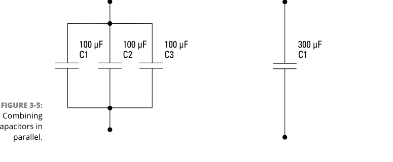

每当你在电路中看到两个或多个电容器并联时，你可以用一个其值为各个电容器之和的单个电容器代替。类似地，任何时候你在电路中看到一个单个电容器，你可以用两个或多个并联的电容器代替，只要它们的值加起来等于原始值。

并联电容器的总电容总是大于任何单个电容器的电容。这是因为每个电容器都将其自身的电容添加到总电容中。

### 串联连接电容器

你也可以将电容器串联组合以创建等效电容，如图3-6所示。当你这样做时，数学计算稍微复杂一些。事实证明，电容器串联所需的计算与计算电阻器并联相同。

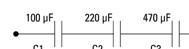

图3-6：将电容器串联组合。

以下是计算串联电容的规则：

- 如果电容器的值相同，你就幸运了。你只需将一个电容器的值除以电容器的数量。例如，两个100 µF电容器的总电容为50 µF。
- 如果只涉及两个电容器，请使用此计算：
  $$C_{total} = \frac{C1 \times C2}{C1 + C2}$$
- 在此公式中，C1和C2是两个电容器的值。
- 这是一个基于220 µF和470 µF电容器串联的例子：
  $$C_{total} = \frac{C1 \times C2}{C1 + C2} = \frac{220\ \mu F \times 470\ \mu F}{220\ \mu F + 470\ \mu F} = 149.855\ \mu F$$
- 对于三个或更多电容器串联，公式为：
  $$C_{total} = \frac{1}{\frac{1}{C1} + \frac{1}{C2} + \frac{1}{C3} \cdots}$$
- 注意，表达式末尾的省略号表示你为拥有多个电容器而继续添加电容的倒数。
- 这是一个三个电容器的示例，其值为100 µF、220 µF和470 µF：
  $$C_{total} = \frac{1}{\frac{1}{100\ \mu F} + \frac{1}{220\ \mu F} + \frac{1}{470\ \mu F}} = \frac{1}{0.016673\ \mu F^{-1}} = 59.977\ \mu F$$
- 如你所见，最终结果为59.9768 µF。除非你的名字碰巧是史波克，否则你可能不关心答案如此精确，因此你可以安全地四舍五入到60 µF。

使用电容器

### 将电容器投入工作

现在你已经了解了电容器的工作原理，并理解了充电、放电、时间常数以及串联和并联电容器，你可能想知道电容器在真实电路中实际用于什么。事实证明，电容器非常有用。以下段落描述了电容器最常见的使用方式：

- **存储能量：** 一旦充电，电容器就有能力存储大量能量并在需要时放电。这种能力最熟悉的用途之一是在相机闪光灯中。其他例子包括需要在家庭电源中断几分钟时仍保持供电的设备，如闹钟。
- **定时电路：** 许多电路依赖电容器和电阻器来提供时间间隔。例如，在本小书的第6章中，你将学习如何使用电阻器和电容器与晶体管一起创建一个使LED闪烁的电路。
- **稳定不稳定的直流电：** 许多电子设备使用直流电，但其电源来自家用交流电。这些设备使用电源电路将交流电转换为直流电。正如你在第4本书第2章中所学，此电路的一个重要部分是电容器，它从交流电路不断变化的电压中创建稳定的直流电压。
- **阻断直流同时通过交流：** 有时你需要防止直流电流动，同时允许交流电通过。电容器可以做到这一点。基本技巧是选择一个在交流电循环内能完全充电和放电的电容器。记住，当电容器充电和放电时，它允许电流流动。因此，只要你能保持电容器充电和放电，它就会通过电流。
- **过滤某些频率：** 电容器通常用于音频或无线电电路中以选择某些频率。例如，可变电容器通常用于无线电电路中，将电路调谐到特定频率。

### 电容器的充电和放电

电容器最常见的用途之一是存储电荷，以便在需要时放电。项目13展示了一个简单的焊接板构建项目，演示了如何使用电容器来完成此操作。你将一个LED连接到3V电池电源，并使用电容器，这样当你

从电路中断开电池时，LED不会立即熄灭。相反，在电容器放电的过程中，它会持续发光片刻。

请注意，此项目使用了一个可以直接安装在无焊面包板上的小按钮开关。与本书项目中使用的大多数其他组件不同，这个按钮没有RadioShack零件号。然而，此类按钮可以从许多在线来源以低价获得。使用你最喜欢的搜索引擎搜索网络寻找 *DIP Push Button*。

图3-7显示了完成的项目。

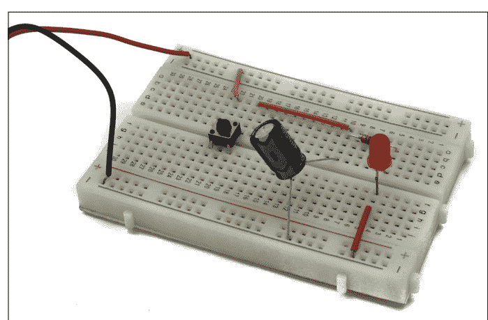

**图3-7：**
电容器放电电路（项目13）。

### 项目13：电容器的充电和放电

在此项目中，你构建一个将电容器与LED并联的电路。当电源施加到LED时，电容器充电。当电源断开时，电容器放电，这导致LED在电源断开后短暂保持点亮。

你需要使用钢丝钳和剥线钳来剪切和剥开跳线。

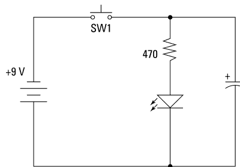

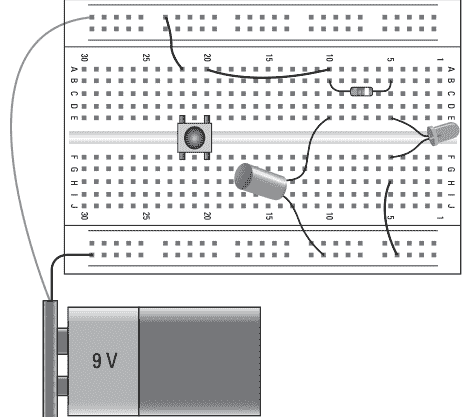

## 零件

- 一个无焊面包板
- 一个 9 V 电池
- 一个 9 V 电池扣座
- 一个 470 Ω ¼ W 电阻
- 一个 1,000 µF 电解电容
- 一个红色 LED，5 mm
- 一个常开 DIP 面包板按钮开关
- 三根短（约 1 英寸）22 号实心跳线
- 一根 1 英寸 22 号实心跳线

## 步骤

在这些步骤中，使用面包板底部的负极 (-) 母线条作为地线，使用顶部的正极 (+) 母线条作为正电压。

1.  **连接电池座。**
    将红色导线插入左侧正极母线条的最后一个孔（位于 A30 孔附近），将黑色导线插入左侧负极母线条的最后一个孔（位于 J30 孔附近）。
2.  **将按钮开关安装在面包板上。**
    按钮开关应插入 E22、E20、F22 和 F20 孔中。
3.  **连接电阻。**
    将电阻插入面包板的 B5 和 B10 孔中。
4.  **插入 LED。**
    将长引脚插入 E5 孔，短引脚插入 F5 孔。
    注意，如果 LED 插反了，电路将无法工作。短引脚必须位于电路的负极侧。
5.  **插入电容。**
    电容的负极（由电容上的一系列虚线标记）应插入底部负极接地母线条上第 10 行附近的一个孔中。另一个引脚应插入 E10 孔。
6.  **插入三根跳线。**
    第一根跳线应从 A10 孔连接到 A20 孔。
    第二根跳线应从 A22 孔连接到顶部正极母线条附近的一个孔。
    第三根跳线应从 H5 孔连接到底部负极母线条附近的一个孔。
7.  **将 9 V 电池连接到电池扣上。**
8.  **按下按钮开关。**
9.  **几秒钟后，松开按钮。**

LED 会亮起。如果没有亮起，请确保你正确插入了 LED。

如果 LED 仍然不亮，可能是按钮开关在面包板上的方向不正确。取下按钮，将其旋转 90 度，然后重新插入。

观察 LED 如何熄灭。它不是瞬间熄灭，而是在几秒钟内逐渐变暗。这是因为当电池与电路断开时，电容通过 LED 放电。随着电容放电，LED 逐渐变暗，然后完全熄灭。

完成项目 13 后，你可能想思考或尝试以下一些额外要点：

-   将 LED 从面包板上拔出，然后按下按钮。几秒钟后，松开按钮。然后，使用万用表的电压表功能测量电容两个引脚之间的电压。注意，即使电池已与电路断开，电容仍显示 9 V。
-   尝试改变电容的大小，看看会发生什么。如果你使用较小的电容，当你移除电源时，LED 会更快熄灭。如果你使用较大的电容，LED 会更慢地变暗。
-   你可能找不到大于 1,000 µF 的电容，但你可以通过将更多电容与 1,000 µF 电容并联来增加电容量。
-   尝试在电容上串联一个电阻。为此，只需将第三根跳线（从 H5 到负极母线的那根）替换为一个电阻即可。


## 阻断直流电，通过交流电

电容的一个重要特性是它们能够阻断直流电，同时允许交流电通过。这之所以可行，是因为电容在极板充电或放电时允许电流流动，但一旦电容完全充电，就会阻止电流流动。因此，只要电源电压不断变化，电容就允许电流流动。当电源电压稳定时，电容就会阻断电流流动。

在项目 14 中，你将构建一个简单的电路来演示这一原理的实际应用。该电路将一个电阻和一个发光二极管与一个电容串联。然后，它使用一个双刀双掷闸刀开关，以便你可以在 9 V 电池（直流电）和 9 V 交流电源适配器（交流电）之间切换电流的电压源。该电路还包括一个按钮开关，用于短路电容，使其放电。

图 3-8 展示了完成的项目。

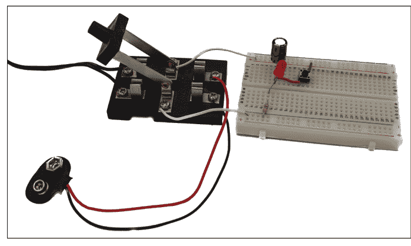

成功构建此电路的关键是找到一个 9 V 交流电源适配器。如果你在当地 RadioShack 或百货商店寻找，你可能会找到一个，但它可能要花费 20 美元或更多。如果你在网上搜索，你可能可以找到一个价格更接近 10 美元或 15 美元的。

图 3-9 展示了我用于此项目的适配器；我在一家旧货店花了 1 美元购买了它。注意这个电源适配器背面的标记：

输入：120 V AC 60 Hz 15 W
输出：9 V AC 1,000 mA

当你搜索用于此项目的交流适配器时，这些就是你想要寻找的规格。特别是，输出电压必须标明为 9 V AC。

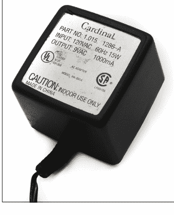

### 图 3-9：
一个 9 V 交流电源适配器。

## 项目 14：阻断直流电

在这个项目中，你将构建一个使用电容来允许交流电通过但阻断直流电的电路。该电路简单地将一个电容与一个 LED 串联，然后使用一个 DPDT 开关将 LED/电容电路连接到 9 V DC 或 9 V AC。

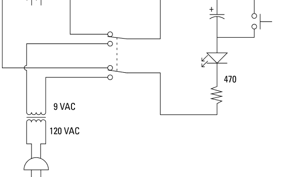

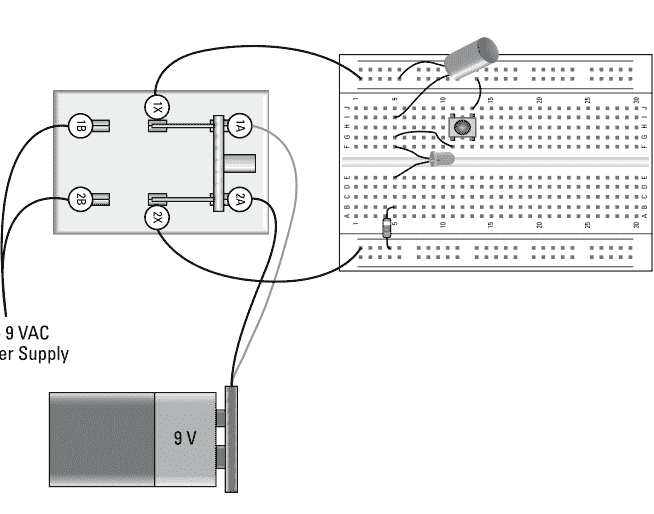

## 零件

- 一个无焊面包板
- 一个 9 V 电池
- 一个 9 V 电池扣座
- 一个 9 V 交流电源适配器
- 一个 470 Ω ¼ W 电阻（黄-紫-棕）
- 一个 1,000 µF 电解电容
- 一个红色 LED，5 mm
- 一个 DPDT 闸刀开关
- 一个触觉按钮开关（例如 Jameco 零件号 149948）
- 两根 1 英寸 22 号实心跳线
- 两根 3 英寸 22 号实心跳线

## 步骤

在这些步骤中，使用面包板底部的负极 (–) 母线条作为地线，使用顶部的正极 (+) 母线条作为正电压。

1.  **连接电阻。**
    将电阻插入面包板，使一个引脚位于负电压母线条（连接到通往开关端子 2X 的跳线的那条母线）上，另一个引脚位于 B5 孔中。

2.  **连接 LED。**
    将 LED 的长引脚（阳极）插入 F5 孔，短引脚（阴极）插入 E5 孔。
    注意，如果 LED 插反了，电路将无法工作。短引脚必须位于电路的负极侧，长引脚位于正极侧。

3.  **插入电容。**
    电容的负极（由电容上的一系列虚线标记）应插入 I5 孔。另一个引脚应插入第 5 行附近正电压母线条上的一个孔中。
    与 LED 一样，如果电容插反了，电路将无法工作。电容的正极引脚必须位于正电压母线上。

4.  **将按钮开关插入 G11、I11、G13 和 I13 孔中。**
    按钮开关的方向必须使得当按钮被按下时，第 11 行连接到第 13 行。（虽然这里使用的按钮是双极开关，但这并不重要，因为两个极都连接到面包板的同一行；面包板每一行的 F 到 J 孔在内部是连通的。）
    你通常可以通过查看按钮的背面来判断其引脚的方向；通常有一个凹槽指示按下按钮时电流流动的路径。调整按钮方向，使这个凹槽在面包板上纵向延伸，这样当按钮被按下时，第 11 行就会连接到第 13 行。
    还要注意，你可能需要使用一把小钳子来调整按钮的引脚，使其能很好地适应面包板孔的 0.1 英寸间距。

5.  **插入其中一根短跳线，将 J13 孔连接到正极母线条附近的任意一个孔。**

6.  **插入另一根短跳线，连接 G5 和 F11 孔。**

## 7. 将电池扣连接到闸刀开关。

将红色导线连接到闸刀开关的端子1A，然后将黑色导线连接到端子2A。

## 8. 将9V交流适配器连接到闸刀开关。

9V交流适配器应连接到闸刀开关的端子1B和2B。连接电源适配器最简单的方法是剪掉电源适配器电缆末端的插头，然后剥去构成电缆的两根导线末端约3/8英寸的绝缘层。

## 9. 将闸刀开关连接到面包板。

使用其中一根3英寸实心跳线将闸刀开关的端子1X连接到无焊面包板顶部正极总线条的第一个孔。然后使用另一根3英寸跳线将闸刀开关的端子2X连接到面包板底部接地总线条的第一个孔。

## 10. 将开关拨到垂直位置，使开关两侧均不闭合。

## 11. 插入9V电池。

## 12. 将9V交流电源适配器插入墙壁插座。

电路现已完成，准备进行测试。

## 13. 将闸刀开关拨向A触点。

这将9V电池连接到电路。LED最初点亮，但片刻后开始变暗。当它完全熄灭时，电容器已完全充电。充电后，电容器不允许直流电通过，因此LED保持熄灭状态。

## 14. 短暂按下按钮。

这会使电容器的引线短路，导致其放电。当你松开按钮时，LED将再次点亮，但随着电容器放电，它会再次开始变暗。

## 15. 将开关拨向B触点。

此操作将电池与电路断开，转而连接交流电源适配器。现在LED点亮并保持亮着。只要交流电源施加在电路上，电容器就允许电流流过，LED就会发光。

## 16. 将开关拨回A触点。

由于电容器现在已完全充电，LED立即熄灭。

你完成了！恭喜！你现在见证了电容器工作原理的一个重要方面。

# MIL-STD-1472H

本标准已获批准，供国防部所有部门和机构使用。

## 1. 范围

- 1.1. 目的。本标准为军事系统、设备和设施的设计和开发建立了通用人机工程准则。

- 1.2. 应用。本标准适用于军事系统、设备和设施的设计和开发。它不适用于这些系统、设备和设施投入使用后的使用，也不适用于商业项目的开发。

## 本章内容

- 探究感应的奥秘
- 了解什么是电抗
- 学习如何串联和并联组合电感器
- 观察电感器在电子电路中的应用

# 第4章
使用电感器

我的书架上有很多关于电子学的书籍，涵盖了广泛的主题。其中一些是新的；有些已有几十年历史。我最喜欢的一本是切斯特·L·道斯所著的《电气工程课程》。它写于1920年，当时电子学还处于起步阶段。无线电是全新的。真空管刚刚开始流行。晶体管还要再过四分之一个世纪才会被发明。

你可能会认为，在这个年代写的电气工程书籍已经完全过时了。但令人惊讶的是，这本书中有多少内容至今仍然准确。例如，欧姆定律自1920年以来就没有改变过。道斯对欧姆定律的解释和我读过的任何解释一样好。

这本旧书最吸引我的地方是它的开头方式。第1章的标题是“磁学与磁铁”，它是这样开始的：

> 磁铁和磁学几乎涉及所有电气设备的运行。因此，理解它们的基本原理对于清晰理解所有此类设备的运行至关重要。

考虑到那个时代电气技术的状况，这完全说得通。在利用电的惊人特性方面，我们已经超越了简单的磁学。然而，电流和磁学之间的基本关系仍然是许多不同类型基本电路的核心。

例如，将墙壁插座的120V交流电转换为更安全的电压（例如9V）的电源适配器，使用的是依赖磁学来降压的变压器。模拟万用表（指针随电压、电流或电阻移动的那种）依赖磁学来偏转指针。电动机将电流转化为磁能，然后再转化为运动。

在本章中，我将你的注意力转向一类特殊的元件，称为*电感器*，它们利用磁学的本质及其与电流的关系。电感器有点像电容器的表亲，因为它们可以用来做类似的事情，并且遵循类似的规则。例如，电容器的一个重要特性是其抵抗电压变化的能力。电感器具有类似的抵抗变化的能力，但不是抵抗电压变化，而是抵抗电流变化。

> 本章与本小册子中的其他章节有些不同，因为它不包含任何制作项目。电感器的实际应用在于你可能尚未准备构建的电路中，例如无线电调谐器或电源。你在本章学习电感器工作原理的重要概念，以便以后在实际电路中使用电感器时，你知道它的作用。你随时可以回到本章复习电感器的工作原理。事实上，如果你在第一次阅读本书时只是浏览本章，或者甚至暂时跳过它，我也不会介意。你随时可以在需要时回到本章。

## 什么是磁学？

当阿尔伯特·爱因斯坦5岁生病卧床时，他的父亲给了他一个指南针玩。小阿尔伯特看到，无论他如何旋转指南针，指针总是会摆回指向北方，他感到非常惊讶。多年后，他写道，正是这个指南针激发了他对物理学的终生兴趣。他当时意识到“事物背后有某种东西，某种深藏的东西。”

就指南针而言，爱因斯坦所惊叹的那个深藏的东西就是*磁学*。我们都熟悉磁学，尽管它究竟是什么仍然是个谜。*磁场*在空间中延伸，吸引或排斥某些材料。受磁场强烈影响的材料称为*磁性*材料。产生磁场的材料称为*磁铁*。

## 磁学的南北极

磁场和电场是不同的事物，但它们密切相关且有许多共同点。例如，磁场的极化方式与电场的极化方式非常相似。电场存在于极性相反（负极和正极）的电荷之间。磁场存在于相反的磁极之间，称为*北极*和*南极*。

正如相反的电荷相互吸引，同种电荷相互排斥一样，相反的磁极相互吸引，同种磁极相互排斥。这就是为什么如果你拿两个强磁铁，试图将两个北极推到一起或将两个南极推到一起，磁铁会反抗，你无法将磁极合拢。但如果你将其中一个磁铁转过来，试图将北极与南极连接，磁铁会相互吸引，你将很难将它们分开。

磁场具有独特的形状，你可以通过一个在小学常做的简单实验来可视化。你只需要一根条形磁铁、一些铁屑和一张纸。将纸放在磁铁上，然后将铁屑撒在纸上。铁屑神奇地排列起来，揭示了磁场的形状，如图4-1所示。如你所见，铁屑排列成从磁铁的一个极到另一个极的线条。

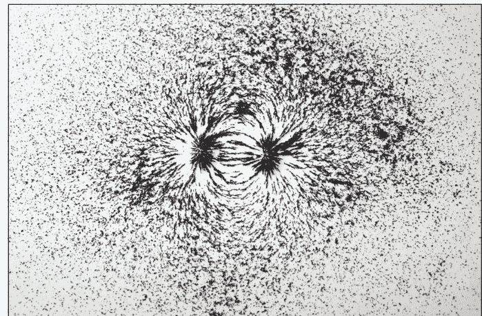

## 思考永磁体

永磁体是一种能产生自身磁场的材料。一些天然存在的材料，如磁石，本身就具有磁性，能独立产生磁场。但大多数永磁体是由本身不具磁性的材料制成的，这些材料在暴露于强磁场时会变得具有磁性。

你家里可能就有几个永磁体。事实上，你的冰箱上可能就贴着几个，用来固定你孩子的幼儿园照片或购物清单。

## 探究电磁铁

永磁体能独立产生磁场。电磁铁则依赖于电与磁之间的关键关系来产生磁场。具体来说，只要有电流流过，就会产生磁场。这个磁场是由运动的电荷产生的。简而言之，运动的电子就变成了磁铁。

正如我在本书中多次提到的，电子总是在运动，那么是不是到处都有小磁铁呢？答案是肯定的，就像电流无处不在一样。但是，当材料内部电子的运动是随机的时，电子产生的磁场方向也是随机的，因此它们最终会相互抵消。但是，当你用电压推动电子时，它们都会开始朝同一个方向运动。这会增强并组织磁场，使它们能够结合形成一个大的磁场。

电流流过单根导线产生的磁场是可测量的，但很微弱。然而，如果你像图4-2所示那样将导线紧密地绕成线圈，磁场会因为彼此靠近而增强。例如，你可以通过将几英尺长的细绝缘导线缠绕在铅笔、圆珠笔或任何其他刚性管子或圆柱体上来制作一个简单的电磁铁。

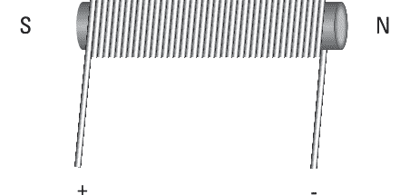

图4-2：一个电磁铁。

这种线圈的磁场强度取决于几个因素，其中最重要的是：

-   线圈的匝数。
-   流过电磁铁的电流量。增加电流会指数级地增强电磁铁的强度。例如，如果你将电流加倍，电磁铁的强度会变为原来的四倍。
-   电磁铁所缠绕的铁芯材料。任何缠绕在铁芯上的线圈，其强度大约是缠绕在惰性芯（如空气、塑料或木头）上的相同线圈的十倍。

> **提示**
>
> 电磁铁的极性很容易确定：线圈的负极是磁铁的北极，而正极是南极。

## 感应电流

电磁铁之所以可能，是因为运动的电流会产生磁场。有趣的是，反过来也成立：运动的磁场会产生电流。换句话说，如果你在一根导线上方挥动磁铁，就会在导线中产生电流。这种效应被称为*电磁感应*，有时也简称为*磁感应*。

还记得我们的老朋友迈克尔·法拉第吗？在本小册子的第3章中，我提到过，尽管他没有发明电容器，但他的名字是*法拉*的基础，这是我们用来测量电容器的单位。1831年，法拉第发现了电磁感应。这是电气科学史上最重要的发现之一，因为它是几乎所有形式的电力生产的核心。燃煤、水力甚至核电厂都使用流动的水来驱动连接到发电机的涡轮机。这些发电机利用电磁感应原理，将磁场的旋转运动转化为电流。

你可以通过将导线绕成线圈来增加导线中感应电流的强度，这样可以让更长的导线暴露在磁场中。此外，无论是磁铁移动还是线圈移动，都没有关系。只要线圈相对于磁铁运动，并且线圈穿过磁铁的磁场，就会在线圈中感应出电流。

> **记住** 请注意，只要有电流流过，就一定有电压。因此，电磁感应除了引起电流流过线圈外，还会在线圈两端产生电压。

## 电感与抗拒变化的艺术

电感器是设计用于电子电路中的线圈。图4-3显示了几种典型的电感器。如你所见，电感器是简单的装置，不过是一个线圈，通常缠绕在铁芯上。

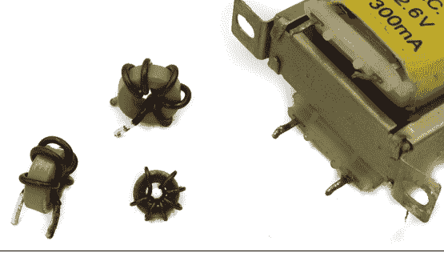

图4-3：电感器是简单的装置。

电感器利用了线圈的一个重要特性，称为自感，也简称为电感。电感器利用自感概念的能力是天才之举。

自感与上一节描述的电磁感应类似，但有一个微妙的区别。电磁感应指的是线圈在穿过磁场时产生电流的能力，而自感指的是线圈产生磁场，而该磁场又感应出电压的能力。换句话说，通过自感，线圈实现了自我反馈。施加在线圈两端的电压导致电流流动，电流产生磁场，磁场又产生更多的电压。

电感只在流过线圈的电流发生变化时发生。这是因为只有运动的磁场才能在线圈中感应出电压。每当线圈中的电流发生变化时，电流产生的磁场就会增长或收缩，这取决于电流是增加还是减少。当磁场增长或收缩时，它实际上是在运动，因此由于这种运动，线圈中会感应出电压。当电流保持稳定时，就不会发生电感。

自感是一个难以理解的概念，所以如果第一次看不懂，不要惊慌。我第一次学习这个概念时也花了一段时间才弄明白。让我们更详细地、逐点地回顾一下这个想法：

-   **当电压施加在线圈两端时，电压会导致电流流过线圈。** 请记住，电流总是需要电压，而电压施加在导体两端时总会产生电流。
-   **流过线圈的电流在线圈周围产生磁场。** 请记住，产生磁场的线圈本身就在磁场内，因此会受到磁场的影响。
-   **如果流过线圈的电流发生变化，电流产生的磁场也会发生变化。** 磁场会增长或收缩，这取决于电流是增加还是减少。无论哪种方式，变化的磁场实际上是在运动。
-   **因为磁场在运动，所以在线圈中感应出电压。** 这是一个额外的电压，叠加在驱动主线圈电流的电压之上。
-   **由变化的磁场感应出的电压量取决于电流变化的速度。** 电流变化越快，磁场运动越剧烈，因此感应出的电压就越大。
-   **感应电压的极性取决于电流是增加还是减少。** 这是因为磁场运动的方向取决于磁场是增长还是收缩，而运动磁场感应出的电压取决于磁场运动的方向，遵循以下规则：
    -   当电流增加时，感应电压的极性与驱动线圈的电压极性相反。这个感应电压通常被称为*反向电压*，因为它与电源电压的极性相反。
    -   当电流减少时，由此产生的自感电压与电源电压具有相同的极性。

> 感应电压会在**线圈**中产生电流，该电流可能与主线圈电流同向或反向流动，具体取决于线圈电流是减小还是增大，遵循以下规则：

- 当线圈电流增大时，附加电流与主线圈电流反向流动。其效果是抵消增大的主线电流，从而实际上减缓了电流的变化速率。
- 当线圈电流减小时，附加电流与主线圈电流同向流动，从而抵消线圈电流的减小。

> **当线圈电流停止变化时，自感现象便会停止。** 因此，当电流稳定时，电感器就只是一个导体。（它也是一个电磁铁，因为流经它的电流会产生磁场。）

由于自感现象的存在，电感器被认为能够阻碍电流的变化。如果电流增大，线圈上会感应出反向电压，这会减缓电流增大的速率。如果电流减小，线圈上会感应出正向电压，这会减缓电流减小的速率。电感器对电流的增大和减小施加相等的阻碍作用。

事实证明，这种阻碍电流变化的能力在电子电路中非常有用，我将在本章后面的“电感器的应用”一节中进行解释。

以下是一些关于电感器的其他重要细节：

> 电感器无法阻止电流的变化；它们只能减缓变化。衡量电感器能减缓电流变化程度的多少，是下一节的主题。
> 
> 一个电感器产生的磁场可能会扩散到附近的另一个电感器并在其中感应出电压。为防止这种情况发生，许多电感器周围设有特殊屏蔽层以保持磁隔离。如果在电路中使用未屏蔽的电感器，请务必尽可能将它们分开放置——当然，除非你*希望*它们相互作用。

## 关于亨利

电感只是一种瞬时特性。其瞬时特性的具体程度取决于电感器所具有的电感量大小。电感量的计量单位称为**亨利**（H）。

一个亨利的定义很简单：当线圈中的电流以每秒一安培的速率变化时，能够感应出一伏特电压所需的电感量即为一亨利。

正如你可能猜到的，一亨利是相当大的电感值。在处理家用交流电（120V AC，60Hz）时，常会用到单位数字亨利范围的电感器。但对于大多数电子制作，你会使用以千分之一亨利（**毫亨**，缩写为 **mH**）或百万分之一亨利（**微亨**，缩写为 **μH**）为单位的电感量。

以下是一些关于电感器和亨利的补充知识：

- *亨利*的复数形式是 *henrys*，而不是 *henries*。
- 在公式中，字母 *L* 常被用来表示电感量。电路图中的电感器通常用字母 L 标示。例如，如果一个电路需要三个电感器，它们将被标识为 L1、L2 和 L3。
- 说到电路图，原理图中用来表示电感器的符号如页边所示。
- 当我最初学习自感和亨利时，我曾期望既然亨利是衡量线圈抵抗电流变化能力的单位，那么亨利应该是以某位以“抵抗变化”而闻名的人命名，比如《窈窕淑女》中的亨利·希金斯教授。
- 想象一下我有多么失望，后来发现亨利是以约瑟夫·亨利命名的。他所做的不过是发现了自感现象并发明了电感器。好吧，除此之外，他还是史密森尼学会的首任秘书。他肯定认识某个真正重要的人物，才能让亨利这个单位以他的名字命名。

## 计算 RL 时间常数

在前一章中，你学习了如何计算电阻-电容（RC）电路的 RC 时间常数。对于电感器也可以进行类似的计算，只不过我们不叫它 RC 时间常数，而称之为 **RL 时间常数**。（记住，*L* 是用来表示电感量的符号。）

RL 时间常数表示在电感器两端施加电压后，传导由该电压引起的电流的 63.2% 所需的时间。（嗯，我们之前在哪里见过 63.2% 这个数字？对了！这与计算电阻-电容网络时间常数所用的百分比相同。63.2% 这个值来源于用于确定电阻-电容和电阻-电感网络精确时间常数的微积分方程。）

以下是计算 RL 时间常数的公式：

$$T = \frac{L}{R}$$

换句话说，以秒为单位的 RL 时间常数等于以亨利为单位的电感量除以以欧姆为单位的电路电阻。

例如，假设电阻为 100 Ω，电感为 100 mH。在进行乘法运算之前，你首先需要将 100 mH 转换为亨利。因为 1 毫亨（mH）等于一亨利的千分之一，你可以通过将毫亨数除以 1,000 来将毫亨转换为亨利。因此，100 mH 相当于 0.1 H。将 0.1 H 除以 100 Ω，你得到的时间常数是 0.001 秒（s），即一毫秒（ms）。

下表为你提供了一个有用的近似值，显示了在经过前五个时间常数后电感器所通过电流的百分比。出于所有实际目的，你可以认为在经过五个时间常数后，电流已完全流通。

| RL 时间常数间隔 | 通过的电流百分比（占总电流） |
|---|---|
| 1 | 62.3% |
| 2 | 86.5% |
| 3 | 95.0% |
| 4 | 98.2% |
| 5 | 99.3% |

因此，在我电阻为 100 Ω、电感为 0.1 H 的示例电路中，你可以预期在施加电压后 5 ms 内，电流将达到满容量流动。

五毫秒是一个非常短的时间。但电子电路通常被设计为在极短的时间间隔内响应。例如，标准家用交流电的正弦波从正峰值电压摆动到负峰值电压大约需要 8 ms。人耳能听到的声音波段上限的循环周期约为 25 μs（微秒），而无线电波的时间间隔可以是几分之一微秒。因此，非常小的 RL 时间常数在某些类型的电子电路中非常有用。

## 计算感抗

虽然电感器阻碍电流的变化，但它们对所有变化的阻碍程度并不相同。所有电感器对快速电流变化的阻碍都大于对较慢变化的阻碍，或者换句话说，电感器对高频信号电流变化的阻碍大于对低频信号的阻碍。

电感器在特定频率下阻碍电流变化的程度称为该电感器的**电抗**。感抗的单位与电阻一样是欧姆，并可以用以下公式计算：

$$X_L = 2\pi \times f \times L$$

这里，符号 $X_L$ 表示以欧姆为单位的感抗，$f$ 表示以赫兹（每秒周期数）为单位的信号频率，$L$ 等于以亨利为单位的电感量。哦，还有 $\pi$，就是你高中时学过的那个神奇的数学常数，其值约为 3.14，只不过在我们弗雷斯诺这里，我们把它四舍五入到 3，因为这样计算起来容易多了。

例如，假设你想知道一个 1 mH 电感器对 60 Hz 正弦波（并非巧合，这正是家庭用电的频率）的电抗是多少。计算过程如下：

$$X_L = 2\pi \times f \times L = 2 \times 3.14 \times 60 \times 0.001 = 0.3768 \Omega$$

因此，一个 1 mH 的电感器在 60 Hz 时的电抗约为三分之一欧姆。

同一个电感器在 20 kHz 时的电抗是多少呢？要大得多：

$$X_L = 2 \times 3.14 \times 20,000 \times 0.001 = 125.6 \Omega$$

将频率增加到 100 MHz，看看电感器有多大电阻：

$$X_L = 2 \times 3.14 \times 100,000,000 \times 0.001 = 628,000 \Omega$$

在低频下，电感器比在高频下更容易让电流通过。正如下一节将解释的，这一特性可以用来创建能够阻挡高于或低于特定频率值的电路。

## 组合电感器

就像电阻器或电容器一样，你可以将电感器串联或并联组合，并使用简单的方程来计算电路的总电感量。但请注意，为了使计算有效，这些电感器必须是屏蔽的。如果电感器不是屏蔽的，它们不仅会受到自身磁场的影响，还会相互影响，这会使计算复杂化。

电感不仅受自身电流产生的磁场影响，还受周围其他电感磁场的影响。在这种情况下，所有规则都不再适用。

计算电感组合的方法与计算电阻组合的方法完全相同，只是用亨利（henrys）代替欧姆（ohms）。以下是计算公式：

+   - **串联电感：** 将每个单独电感的值直接相加。
    - **两个或多个相同的并联电感：** 将它们的值相加，然后除以电感的数量。
    - **两个并联且不等的电感：** 使用此公式：
    $$L_{total} = \frac{L1 \times L2}{L1 + L2}$$
    - **三个或更多并联且不等的电感：** 使用此公式：
    $$L_{total} = \frac{1}{\frac{1}{L1} + \frac{1}{L2} + \frac{1}{L3} \dots}$$

这里有一个例子，三个电感值分别为 20 mH、100 mH 和 50 mH 的电感并联连接：

$$L_{total} = \frac{1}{\frac{1}{L1} + \frac{1}{L2} + \frac{1}{L3} \dots} = \frac{1}{\frac{1}{20} + \frac{1}{100} + \frac{1}{50}}$$
$$= \frac{1}{0.05 + 0.01 + 0.02} = \frac{1}{0.08} = 12.5 \text{ mH}$$

在此示例中，电路的总电感为 12.5 mH。

## 将电感投入使用

现在您已经了解了电感的工作原理，理解了感抗、时间常数以及所有其他相关知识，您可能想知道电感在实际电路中的具体用途。以下是电感的一些更常见的用途：

+   - **平滑电源中的电压：** 典型的电源电路将120 V交流家庭电流转换为可用直流电的最后阶段，通常是一个滤波电路，用于消除由于输入为60 Hz交流电而产生的电压中任何残余的不规则性。

    - **滤波器：** 选择应允许通过的频率，或选择应阻止的频率。您可能熟悉立体声音响系统上的音调设置，它们可以让您增强低音、减弱中音，或者为了增加亮度而稍微提升高频。滤波器有三种不同的类型：*高通滤波器*，只允许高于某个值的频率通过；*低通滤波器*，只允许低于某个值的频率通过；以及*带通滤波器*，只允许介于上限和下限值之间的频率通过。

    - **无线电调谐电路：** 线圈可用于帮助无线电调谐电路调谐到特定的频率信号并锁定它。在第4册第3章中，我将向您展示如何制作一个非常简单的收音机，它利用了一个通过将导线缠绕在空汽水瓶上自制的线圈。

    - **变压器：** 电感最常见的用途之一是在变压器中。最简单的变压器由一对相互靠近的电感组成。变压器有两个功能。首先，它可以升高或降低电压；其次，它可以将电路的某一部分在电气上与其他部分隔离。这两个特性都非常宝贵。第一个特性使您能够通过将只需要几伏电压的电路插入提供120伏电压的墙壁插座来为其供电。第二个特性则通过隔离低压部分电路，使其免受危险高电流的影响，从而使其安全。

图4-4展示了一个典型的变压器。您将在第4册第1章中了解更多关于这些神奇装置的知识。

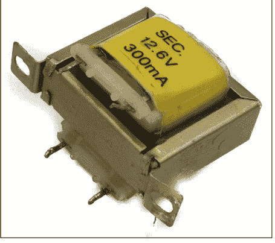

图 4-4：一个典型的变压器。

## 第5章 使用二极管和LED

到目前为止，本书中向您介绍的所有元件都是在1800年亚历山德罗·伏打发明第一个电池后的约100年内发明的。从1900年到1950年的大约50年间，电子技术主要由一种如今几乎已过时的技术主导：真空管。真空管体积大、价格昂贵、易碎（由玻璃制成），并且需要大量电流。

在20世纪40年代，研究人员开发了一种新技术，催生了新的元件，这些元件在性能上是真空管的质的飞跃。这些新元件被称为*半导体*。

本章向您介绍最基本的半导体，称为*二极管*。二极管有多种形状和尺寸，但大多数类似于图5-1所示的那些。这些二极管的大小与电阻差不多，可以从任何电子元件供应商店（如RadioShack）买到。

虽然二极管看起来有点像电阻，但它们的行为非常不同。二极管有一种独特的能力：它们允许电流在一个方向上自由流动，但如果电流试图从另一个方向流动，则会将其阻断。换句话说，二极管就像一个旋转栅门，您可以从一个方向通过，但不能从另一个方向通过。这种特性在电子电路中非常有用。


图 5-1：几种常见的二极管。

> 我想从一开始就提醒您，本章的第一部分相当困难，因为它深入探讨了一点半导体在原子层面的工作原理。您并不真正需要理解二极管的物理原理才能在电路中使用它们，因此如果您愿意，可以跳过整个第一部分，直接从本章后面的“介绍二极管”一节开始。然而，无论如何，我建议您还是啃下这第一部分。如果理解半导体的工作原理有困难，也不必太担心。只需注意关键术语，如 *p*-型、*n*-型 和 *p*-*n* 结，然后继续前进。

### 什么是半导体？

顾名思义，*半导体*是一种能够导电但只是部分导电的材料。半导体的导电性介于绝缘体（几乎没有导电性）和导体（几乎完全导电）之间。大多数半导体是由某些材料制成的晶体，最常见的是硅。

要了解半导体的工作原理，您必须首先理解电子在原子中是如何组织的。原子中的电子是分层组织的，有点像洋葱的层。这些层被称为*壳层*。最外层的壳称为*价电子*壳。这个壳中的电子是与邻近原子形成化学键的电子。这种键被称为*共价键*，因为它们共享价电子，这些价电子也是有时会游离出去寻找其他原子的电子。

大多数导体，包括铜和银，在其价电子壳中只有一个电子。只有一个价电子的原子很难保持住那个电子。这就是铜和银成为良好导体的原因：当价电子移动时，它们会产生移动的电场，推动其他电子让路。这就是电流产生的原因。

另一方面，半导体通常在其价电子壳中有四个电子。已知具有四个价电子的元素最著名的是碳、硅和锗。具有四个价电子的原子很少失去其中一个电子。然而，它们确实喜欢与邻近的原子共享这些电子。

如果所有邻近的原子都是同一种类型，就有可能所有的价电子都与其他原子的价电子结合。当这种情况发生时，原子会排列成整齐有序的结构，称为*晶体*。半导体就是由这种晶体构成的。

含量最丰富的具有四个价电子的元素是碳。然而，碳晶体很少用作半导体，因为它们有其他用途，比如用于结婚戒指。因此，半导体通常由硅晶体制成，偶尔也使用锗晶体。

图5-2展示了硅晶体中形成的共价键。这里，每个圆圈代表一个硅原子，原子之间的线代表共享的电子。每个硅原子中的四个价电子都与一个相邻的硅原子共享。因此，每个硅原子与另外四个硅原子成键。

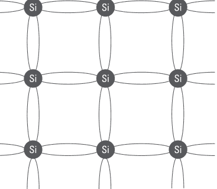

**图 5-2：** 硅晶体是在每个硅原子与邻近原子共享其最外层电子时形成的。

## 掺杂：不只是运动员的事

纯净的硅晶体本身虽然美观，但在电子学方面用处不大。由于其所有价电子都与相邻原子紧密结合，电流很难在纯净的硅晶体中流动。但如果你将少量其他元素引入晶体，情况就会变得有趣。此时，晶体开始以一种有趣的方式导电。

这种故意将其他元素引入晶体的过程称为**掺杂**。通过掺杂引入的元素称为**掺杂剂**。通过仔细控制掺杂工艺和所使用的掺杂剂，硅晶体可以转变为两种不同类型的导体：

-   **N型半导体**：当掺杂剂是价层具有五个电子的元素时产生。磷（P）通常用于此目的。磷原子直接嵌入硅的晶格结构，每个磷原子与四个相邻的硅原子成键，就像硅原子本身一样。由于磷原子的价电子层有五个电子，而只有四个与邻近原子成键，第五个价电子就空闲下来，没有成键对象。
    磷原子中额外的价电子开始表现得像常规导体（如铜）中的单个价电子一样。它们可以自由移动，如图5-3所示。由于这种半导体有多余的电子，它被称为 ***N型半导体***。

-   **P型半导体**：当掺杂剂是价层只有三个电子的元素（如硼）时产生。当少量硼掺入晶体时，硼原子能够与四个硅原子成键，但由于它只能提供三个电子，因此会在本应存在电子的位置产生一个空缺，如图5-4所示。这个电子空缺称为 **空穴**。空穴表现得像正电荷，因此以这种方式掺杂的半导体称为 ***P型半导体***。
    与正电荷一样，空穴吸引电子。但当一个电子移动到一个空穴中时，电子会在其原来的位置留下一个新的空穴。因此，在P型半导体中，当电子不断试图填补空穴时，空穴就在晶体内部持续移动。P型半导体就像疯狂移动的瑞士奶酪孔洞，因为你无法准确定位它们，它们总在移动。

当在N型或P型半导体上施加电压时，电流流动的原因与在常规导体中相同：电压的负极推动电子，正极吸引电子。结果是，半导体中始终存在的随机电子和空穴运动变得有方向性，从而产生可测量的电流。

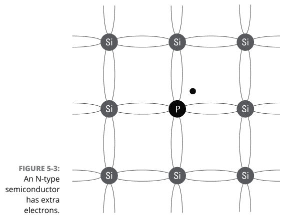
图5-3：N型半导体具有额外的电子。

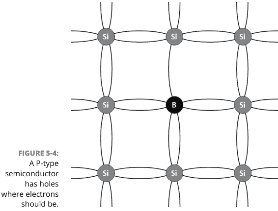
图5-4：P型半导体在电子本应存在的地方有空穴。

## 理解PN结

P型和N型半导体本身只是导体。但如果你把它们放在一起，一个有趣且非常有用的现象会发生：电流可以流过形成的半导体，但只能单向流动。

这种被称为 **PN结** 的结构，就像一个单向门。如果你在结的P侧施加正电压，在N侧施加负电压，电流就会流过该结。但如果你反转电压，在P侧施加负电压，在N侧施加正电压，电流就不会流动。

想象一个旋转栅门，就像进入棒球场或地铁站必须通过的那种门：你可以朝一个方向穿过门，但不能朝另一个方向。这本质上就是PN结的作用。它允许电流单向流动，但不能反向流动。

要理解为什么PN结只允许电流单向流动，你必须首先了解在P型材料和N型材料交界处发生的事情。由于异种电荷相互吸引，结区N型侧多余的电子会被P型侧的空穴吸引。因此，它们开始向另一侧漂移。

当一个电子离开N型侧去填充P型侧的空穴时，在原来电子所在的N型侧会留下一个空穴。因此，就好像电子和空穴交换了位置。PN结的边界最终充满了“叛逃者”：电子和空穴已经跨越边界，现在处于结的错误一侧。

这个被跨越过来的电子和空穴占据的区域称为 **耗尽区**。因为耗尽区的一侧有电子（负电荷），另一侧有空穴（正电荷），所以在耗尽区的两个边缘之间存在一个电压。这个电压对“叛逃者”有一个有趣的影响：它吸引它们转身回家。换句话说，跳到结的负极侧的空穴，会吸引那些跳到正极侧的电子。

想象一下，作为一个越过边界进入结的P型侧的电子会是什么感觉。作为负电荷，你会被前方看到的带正电的空穴吸引，向P区更深处移动。但同时，你也会被现在位于你身后的带正电的空穴所吸引——那个与你交换位置的空穴现在对你产生拉力，阻止你继续前进。

无法下定决心，你决定就待在原地。这正是那些跨越到另一侧的电子和空穴所发生的事情。耗尽区变得稳定——这种状态称为 **平衡状态**。

现在考虑当在PN结两端施加电压扰动平衡时会发生什么。效果取决于施加电压的方向，如下所述：
-   如果你在P型侧施加正电压，在N型侧施加负电压，耗尽区会从两侧被推向中心，使其变小。结区N型侧的电子被电压推向耗尽区，并最终完全使其坍塌。当这种情况发生时，PN结变成导体，电流流动。
-   当电压反向施加时，耗尽区从结的两侧被拉开，因此它会扩大。它越大，PN结就变得越像绝缘体。因此，当电压反向施加时，电流不会流过结区。

## 介绍二极管

**二极管** 是由单个PN结制成的器件。如图5-5所示，在PN结的两端连接了引线。这些引线使你可以轻松地将二极管接入电路。

连接在N型半导体上的引线称为 **阴极**。因此，阴极是二极管的负极。二极管的正极——即连接在P型半导体上的引线——称为 **阳极**。

当电压源以正极接阳极、负极接阴极的方式连接到二极管时，二极管变为导体并允许电流流动。以这种方式连接到二极管的电压称为 **正向偏置**。

但如果你反转电压方向，将正极接阴极、负极接阳极，电流就不会流动。实际上，二极管变成了绝缘体。以这种方式连接到二极管的电压称为 **反向偏置**。

> 正向偏置允许电流流过二极管。反向偏置不允许电流流动。（至少在一定程度上是这样。正如你马上会了解到的，二极管能够承受的反向偏置电压是有极限的。）

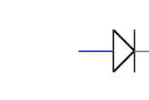

二极管的原理图符号如图所示。左侧为阳极，右侧为阴极。这里有两个有用的技巧，可以帮助你记住符号的哪一侧是阳极，哪一侧是阴极：

-   将符号的阳极侧想象成一个箭头，指示常规电流的流向——从正极到负极。因此，二极管允许电流沿箭头方向流动。
-   将阴极侧的垂直线想象成一个巨大的减号，指示在正向偏置时二极管的哪一侧是负极。

图 5-6 用两个非常简单的电路（将灯泡通过二极管连接到电池）说明了正向偏置和反向偏置。在左侧电路中，二极管是正向偏置的，因此电流流过电路，灯泡点亮。在右侧电路中，二极管是反向偏置的，因此没有电流流过，灯泡保持熄灭。

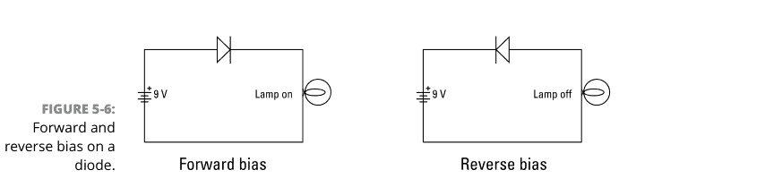

请注意，在典型的二极管中，需要达到一定的正向电压才会有电流流过。这个电压通常非常小。在大多数二极管中，这个电压约为半伏特。在此电压之下，没有电流流动。一旦达到正向电压，电流就能轻松地流过二极管。

这个最小的正向电压阈值被称为二极管的*正向电压降*。这是因为电路在二极管上损失了这部分电压。例如，如果你在图 5-6（左）所示的正向偏置电路中，将电压表接在二极管的两个引脚上，你读到的就是二极管的正向电压降。然后，如果你将电压表接在灯泡两端，电压将是电池电压（9 V）与二极管正向电压降的差值。

例如，如果二极管的正向电压降是 0.7 V，电池电压正好是 9 V，那么灯泡两端的电压就是 8.3 V。

二极管还有一个能承受的最大反向电压，超过此电压二极管会击穿并允许电流反向流过。这个反向电压（有时称为 PIV，即*峰值反向电压*，或 PRV，即*峰值反向电压*）是你在电路中使用二极管时的一个重要规格，因为你需要确保二极管不会暴露在超过其 PIV 额定值的电压下。

除了正向电压降和峰值反向电压外，二极管还有一个最大电流额定值。超过这个电流，二极管将永久损坏。

## 二极管的多种类型

二极管有许多不同的种类。有些是特殊的，业余爱好者很少使用，但许多是常用的。以下各节描述了你在电子探索中可能遇到的三种二极管：整流二极管、信号二极管和齐纳二极管。在本章后面，你还将了解发光二极管，或称 LED。

### 整流二极管

*整流二极管*专为需要将交流电转换为直流电的电路而设计。最常见的整流二极管型号为 1N4001 至 1N4007。这些二极管可以传输高达 1 A 的电流，其峰值反向电压（PIV）额定值范围从 50 V 到 1,000 V。

表 5-1 列出了每种常见二极管的峰值反向电压。在为你的电路选择这些二极管时，应选择一个 PIV 至少是你预期它会承受的电压两倍的型号。对于大多数电池供电的电路，1N4001 的 50 V PIV 已经绰绰有余。

#### 1N400x 二极管的峰值反向电压

| 型号 | 二极管类型 | 峰值反向电压 | 电流 |
| :--- | :--- | :--- | :--- |
| 1N4001 | 整流 | 50 V | 1 A |
| 1N4002 | 整流 | 100 V | 1 A |
| 1N4003 | 整流 | 200 V | 1 A |
| 1N4004 | 整流 | 400 V | 1 A |
| 1N4005 | 整流 | 600 V | 1 A |
| 1N4006 | 整流 | 800 V | 1 A |
| 1N4007 | 整流 | 1,000 V | 1 A |

大多数整流二极管的*正向电压降*约为 0.7 V。因此，电流流过二极管至少需要 0.7 V 的电压。

### 信号二极管

*信号二极管*设计用于比整流二极管小得多的电流负载，通常可以处理约 100 mA 或 200 mA 的电流。

最常用的信号二极管是 1N4148。它有一个 close brother 叫 1N914，如果你找不到 1N4148，可以用它代替。这种二极管的正向电压降为 0.7 V，峰值反向电压为 100 V，最大可承载 200 mA 电流。

关于信号二极管，还有几个有趣的地方值得思考：

-   它们明显比整流二极管小，通常由玻璃制成。你需要仔细观察才能看到，但信号二极管的阴极端标有一条小黑带。
-   在处理高频信号时，它们比整流二极管更好，因此常用于处理音频或射频信号的电路中。由于它们能在高频下快速响应，信号二极管有时被称为*高速二极管*。它们有时也被称为*开关二极管*，因为数字电路（你将在第 5 册中学习）经常将它们用作高速开关。
-   一些信号二极管由锗制成，而不是硅（锗是晶体，不要与 geranium 花混淆）。锗二极管的正向电压降比硅二极管小得多——低至 0.15 V。这使它们在处理非常微弱信号的无线电应用中非常有用。

### 齐纳二极管

在普通二极管中，峰值反向电压通常相当高——50 V、100 V，甚至 1,000 V。如果二极管两端的反向电压超过此数值，电流会以雪崩方式反向涌入二极管，这通常会导致二极管损坏。普通二极管的设计无法承受反向电流雪崩。*齐纳二极管*可以。它们是专门设计来承受在达到或超过峰值反向电压时流过的电流的。不仅如此，齐纳二极管的设计使得当施加在其上的反向电压超过阈值电压时，电流会以保持二极管两端电压降固定不变的方式流动。换句话说，齐纳二极管可用于调节电路两端的电压。

## 续流信号二极管

像 1N4148 这样的信号二极管常常与电感器（最常见的是继电器）一起使用，以保护周围电路免受电感器突然关断时可能出现的电压尖峰的影响。继电器是一种机械开关，它不是由手指操作，而是由线圈产生的磁场操作。继电器非常有用，因为它们允许你使用低压电路来控制高压电路。例如，你可以使用一个由 9 V 电池供电的电路来打开或关闭一个 120 V 的交流灯。

继电器的问题在于它们有线圈，而正如约瑟夫·亨利在 19 世纪发现的，线圈有一个有趣的特性，称为*自感*。（如果你需要复习自感是什么以及它如何工作，请参阅本小册子的第 4 章。）

自感在包含继电器的电路中可能是个问题。当电流施加到继电器时，线圈周围会形成磁场。当电流突然关断时，磁场迅速崩溃。这种崩溃在线圈中感应出一个与开启线圈的电压极性相反的电压。如果你不采取措施来抑制这个电压，它会让你的电路中的电流像高速公路上逆行的醉酒司机一样乱窜。

信号二极管正是阻止这种“逆行”电压的理想选择。只需将一个信号二极管与继电器并联，方向与施加到继电器线圈的电压相反。

现在考虑一下这个二极管如何与继电器协同工作。当你闭合开关时，电压施加，电流流动。由于二极管是反向偏置的（正电压在二极管的阴极端），所有电流都流过继电器。

当你打开开关时，继电器两端的电压被切断。电流停止流动，线圈周围的磁场突然崩溃。这在线圈两端产生一个与电路中所示电压相反的电压。换句话说，感应电压在顶部为负，在底部为正。此时二极管变为正向偏置，因此成为导体。然后，二极管创建一个电路，让电流可以流过，从而将自感电压安全地限制在线圈和二极管内部。

以这种方式使用的二极管有几个名字，包括*续流二极管*、*反激二极管*、*钳位二极管*和*缓冲二极管*。

在稳压二极管中，峰值反向电压被称为*稳压电压*。这个电压可以很低——只有几伏——也可能高达数百伏。

稳压二极管常用于需要稳定电压的电路中。例如，假设你有一个电路，若供给的电压超过5V就会损坏。在这种情况下，你可以在该电路两端并联一个5V稳压二极管，从而有效地将电路限制在5V。如果施加到电路上的电压超过5V，稳压二极管就会将多余的电压导走，保护敏感电路。

稳压二极管具有其独特的标准二极管原理图符号，如边栏所示。你可以在第4册第2章中了解更多关于使用稳压二极管的信息。

## 使用二极管阻止反向极性

项目15展示了一个简单的小制作项目，演示了二极管只能在一个方向导通电流的能力。在这个项目中，你将一个整流二极管与一个3V手电筒灯泡和一对AA电池串联连接。我让你在电池和二极管/灯泡电路之间使用一个双刀双掷（DPDT）闸刀开关，这样当开关从一个位置切换到另一个位置时，二极管和灯泡两端的电压极性就会反转。因此，灯泡只会在开关的两个位置中的一个点亮。图5-7展示了完成后的项目。

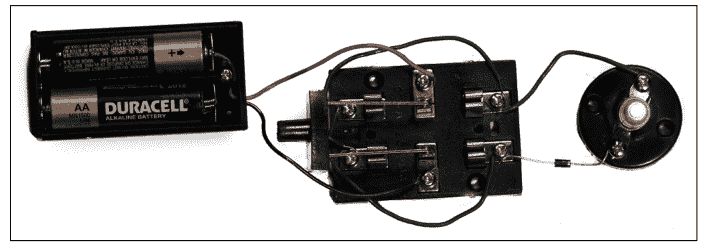

图5-7：阻止反向极性（项目15）。

## 项目15：阻止反向极性

在这个项目中，你将构建一个简单的电路，利用二极管使电流只能单向流过灯泡电路。该电路使用一个双刀双掷闸刀开关来反转电池的极性。当极性反转时，二极管会阻断电流，使灯泡无法点亮。

你需要一个小十字螺丝刀、剥线钳、电线剥皮钳和一个万用表来完成这个项目。

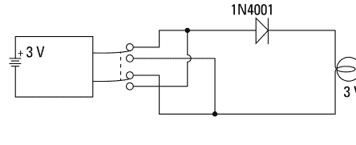

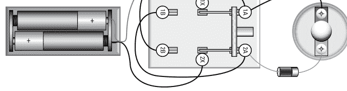

## 零件

- 两节AA电池
- 一个电池盒
- 一个灯座
- 一个2.33V手电筒灯泡
- 一个双刀双掷闸刀开关
- 一个1N4001整流二极管（RadioShack 2761101）
- 三根5英寸22号线多股电线

## 步骤

1.  剥去电线两端各½英寸的绝缘层。
2.  打开开关。将手柄置于直立位置，确保没有任何触点相连。
3.  将电池盒的红色引线连接到开关的1X端子。
4.  将电池的黑色引线连接到开关的2X端子。
5.  使用三根5英寸电线中的一根，连接开关的1B端子和2A端子。
6.  使用第二根5英寸电线，连接开关的2B端子和1A端子。
7.  使用第三根5英寸电线，连接开关的1A端子和灯座的一个端子。
8.  将二极管连接到开关的2A端子和灯座的另一个空端子。阴极（带条纹的一侧）应连接到灯泡。
9.  将灯泡插入灯座。
10. 将电池插入电池盒。电路现在准备好进行测试。
11. 将开关拨到B位置。灯泡点亮，因为正极电压连接到二极管的阳极，负极电压施加到电路的阴极一侧。这使得电流能够流过二极管，灯泡点亮。
12. 将开关拨到A位置。这次，灯泡熄灭，因为电压在二极管上反向了。
13. 使用万用表测量电池、灯泡和二极管两端的电压。将万用表设置在能容纳3V电池电压的直流电压档位。然后按照表5-2所示进行测量。第三次测量（二极管两端的电压）应非常接近0.7V。第二次测量（灯泡两端的电压）加上二极管两端的电压应等于第一次测量（电池两端的电压）。如果它们略有偏差也不用担心——差异可能是由你的电压表不准确造成的，特别是如果你使用的是模拟表或非常廉价的数字表。


表5-2 电压测量

| 黑色引线 | 红色引线 | 电压 |
| :--- | :--- | :--- |
| 开关2X | 开关1X | |
| 灯泡1 | 灯泡2 | |
| 二极管阴极 | 二极管阳极 | |

## 让整流器工作起来

整流二极管最常见的用途之一是将家庭交流电转换为可以替代电池使用的直流电。你将在第4册第2章中全面学习如何为此目的创建完整的电源。目前，只需专注于完整直流电源的一部分：整流电路，它通常由一组巧妙互锁的二极管构成。（*整流器*是一种将交流电转换为直流电的电路。）

在家庭用电中，电压以每秒60次的频率在正负极性之间循环摆动。如果你将一个二极管与交流电压串联，你就消除了电压周期的负半部分，最终只剩下正电压，如图5-8所示。

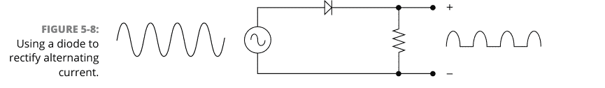

如果你观察这个整流二极管输出的电压波形，你会看到它由电压短暂上升和完全无电压的时段交替组成。这是一种直流电形式，因为它完全由正电压构成。然而，它是脉动的：首先它接通，然后断开，接着又接通，如此往复。

总的来说，单个二极管整流的电压有一半时间是断开的。因此，尽管正电压达到了与输入电压相同的峰值，但整流电压的平均值只有输入电压的一半。这种类型的整流电路有时被称为*半波整流器*，因为它只通过了输入交流波形的一半。

一种更好的整流电路使用四个整流二极管，构成一种称为*全波整流器*的特殊电路，通常也称为*桥式整流器*。图5-9展示了一个全波整流电路。

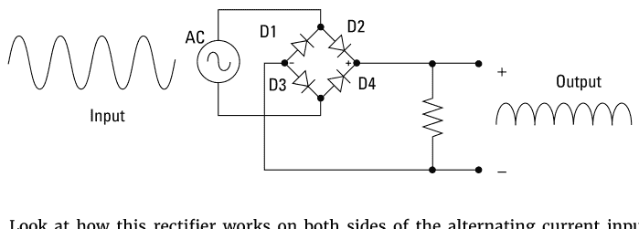

图5-9：一个全波整流电路，也称为桥式整流器。

看看这个整流器如何在交流输入信号的两侧工作：

- 在AC周期的第一个半周期，D2和D3导通，因为它们处于正向偏置状态。正电压在D2的阳极，负电压在D3的阴极。因此，这两个二极管协同工作，使信号的前半部分通过。
- 在AC周期的第二个半周期，D1和D4导通，因为它们处于正向偏置状态：正电压在D1的阳极，负电压在D4的阴极。

桥式整流器的最终效果是，交流正弦波的两个半波都被允许通过，但负半波被反转，从而变成了正半波。

产生的直流信号在半个周期内不会降至零。然而，它仍然不能提供稳定的直流电压水平。不过，想一想你在本小册子第3章和第4章所学到的知识。电容器和电感器都可以用来减缓电流和电压的变化。因此，电容器和电感器常被用于电源电路，以提高整流电路输出的直流电压质量。你可以在第4册第2章了解更多相关信息。但首先，让我们看看整流器的实际应用。

为方便起见，桥式整流电路通常被封装成一个单一组件。例如，图5-10展示了一个典型的桥式整流器封装，KBPC 6005。该型号推荐用于高达50V的输入电压和高达6A的电流。你可以从Jameco (www.jameco.com) 或 DigiKey (www.digikey.com) 等主要电子元件分销商处购买这种或类似的器件，每个只需几美元。

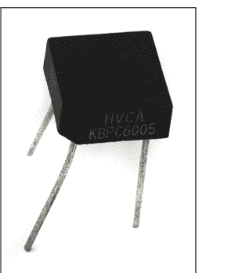

图 5-10：一个桥式整流器封装。

## 构建整流电路

在项目 16 中，你将构建简单的半波和桥式整流电路，以了解二极管如何将交流电转换为直流电。你不会用这个电路点亮任何灯或其他东西；相反，只需使用万用表来验证二极管是否正常工作。为了安全起见，请使用一个 9V 交流电源适配器作为交流电源。你应该能在网上花大约 15 美元买到一个 9V 交流电源适配器，或者在旧货店花一两美元淘到一个。

为了让 9V 交流电源适配器的电压更容易操作，我建议你剪掉电源插头，分开两根导线，剥掉线头的一点绝缘层，并在导线上夹上鳄鱼夹。鳄鱼夹使将电源连接到你的实验电路变得容易得多。

在构建项目之前，使用万用表测量你的电源适配器实际产生的交流电压。虽然它可能标称为 9V 交流，但你测量到的实际电压可能略高于 9V 交流。

你可以在第 4 册第 2 章中找到更多关于整流器及其在电源电路中应用的信息。在本章的剩余部分，请将注意力转向另一种有用的二极管类型：发光二极管。

## 项目 16：整流电路

在这个项目中，你将构建一个简单的半波整流器和一个桥式整流器。你将整流器连接到一个 9V 交流电源，然后使用万用表测量直流输出电压，以验证交流电压已被转换为直流。

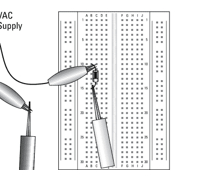

连接至万用表

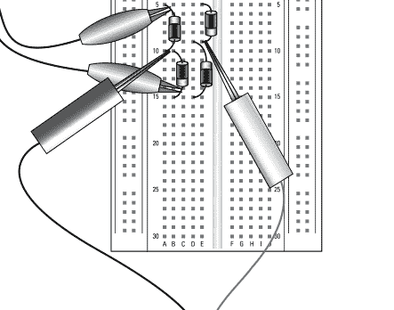

连接至万用表

## 所需部件

- 一个 9V 交流电源适配器
- 两根鳄鱼夹导线（两端都有鳄鱼夹）
- 一个小的无焊面包板
- 四个 1N4001 整流二极管（RadioShack 2761101）
- 一个具有交流和直流电压表功能的万用表

## 步骤

首先构建一个简单的半波整流器：

1.  **将其中一个二极管插入无焊面包板。**
    将阳极插入孔 B10，阴极插入孔 B15。（阴极是带有条纹的引脚。）
2.  **将万用表设置到合适的直流电压档位。**
    10V 直流或 20V 直流档位应该都可以。
3.  **将电源适配器的一根引线连接到二极管的阳极。**
    阳极是插入孔 B10 的引脚。
4.  **将电源适配器的另一根引线连接到万用表的黑色探针。**
    使用鳄鱼夹。
5.  **将电源适配器插入墙壁插座。**
    当电源适配器插入时，小心防止电源适配器的两根引线相互接触。由此产生的短路可能会损坏电源适配器。
6.  **将万用表的红色探针接触二极管的阴极，以测量二极管整流后的直流电压。**
    注意，直流电压大约是输入交流电压的一半。这是因为单个二极管只允许交流正弦波的一半通过。
7.  **拔掉电源适配器。**
    半波整流器就完成了。现在构建桥式整流器。
8.  **插入剩余的三个二极管以完成桥式整流器。**

完成后，四个二极管应插入以下孔中。

| 阴极（带条纹端） | 阳极 |
| :--- | :--- |
| B15 | B10 |
| A5 | A10 |
| E9 | E5 |
| D9 | D15 |

需要注意的是，前两个二极管在第 10 行共享一个公共引脚，而后两个二极管在第 9 行共享一个公共引脚。确保不要将所有四个二极管都插入同一行。如果这样做，桥式整流电路将无法工作。

9.  **将交流电源适配器的一根引线连接到孔 A5 中的二极管引脚。**
10. **将交流电源适配器的另一根引线连接到孔 B15 中的二极管引脚。**
11. **插入 9V 交流电源适配器。**
12. **测量桥式整流器两端的电压。**

    将万用表的黑色探针接触孔 A10 中的二极管引脚，红色探针接触孔 E9 中的二极管引脚。

    小心不要在用万用表探针接触时意外短路任何引脚。

## 介绍发光二极管

发光二极管（也称为 LED）是一种特殊类型的二极管，当电流通过时会发出可见光。最常见的 LED 发出红光，但也有发出蓝光、绿光、黄光或白光的 LED。


LED 这个词的发音是拼读字母（el-ee-dee），而不是像单词 lead 那样发音。

LED 的电路图符号如边栏所示，图 5-11 展示了如何识别从 LED 底部伸出的两个引脚中哪个是阴极，哪个是阳极。注意引脚长度不同：较短的引脚是阴极，而较长的引脚是阳极。每当在电路中使用 LED 时，正确使用 LED 的方向非常重要。如果你将 LED 反向插入电路（阴极在阳极的位置，反之亦然），电路将无法工作。

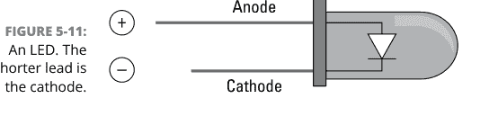

每当在电路中使用 LED 时，你必须在 LED 串联一些电阻，如图 5-12 中的电路图所示。否则，LED 会瞬间明亮地发光，然后烧毁。在这个例子中，LED 通过一个 470 Ω 电阻连接到 9V 直流电源。

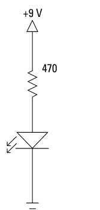

严格来说，只有当施加在 LED 上的电压超过其额定电压（通常约为 2V）时，才需要电阻来限制 LED 的电流。然而，为了安全起见，几乎总是使用限流电阻。

要确定应使用的电阻值，你需要知道以下三件事：

- **电源电压：** 例如，9V。
- **LED 正向压降：** 对于大多数红色 LED，正向压降为 2V。对于其他类型的 LED，压降可能不同。如果使用其他类型的 LED，请查看包装上的规格说明。
- **期望的 LED 电流：** 通常，流过 LED 的电流应保持在 20 mA 以下。

一旦你知道了这三件事，就可以使用欧姆定律计算所需的电阻值。计算只需四步，如下所示：

1.  **计算电阻上的压降。**
    通过从总电源电压中减去 LED 的压降（通常为 2V）来计算。例如，如果总电源电压为 9V，LED 压降为 2V，则电阻上的压降为 7V。
2.  **将期望电流转换为安培。**
    在欧姆定律中，电流必须以安培为单位。你可以通过将毫安除以 1,000 来将毫安转换为安培。因此，如果你期望的 LED 电流为 20 mA，则必须在欧姆定律计算中使用 0.02。
3.  **用电阻压降除以安培电流。**
    这将给出以欧姆为单位的所需电阻值。例如，如果电阻压降为 7V，期望电流为 20 mA，则需要一个 350 Ω 的电阻。
4.  **向上舍入到最接近的标准电阻值。**
    350 Ω 之后下一个更高的电阻值是 390 Ω。如果你找不到 390 Ω 的电阻，470 Ω 也可以。
    注意，电阻值的微小增加意味着流过电阻的电流会略微减少，但差异不会明显。但是，你应该避免使用更低的电阻值。降低电阻会增加电流，这可能会损坏 LED。

在使用 LED 时，还有几点需要记住：

- 如果你要将多个 LED 串联在一起，只需将压降相加来计算所需电阻的大小。例如，如果你有一个 9V 电池将为三个 LED 供电，每个 LED 的压降为 2V，则总压降为 6V，因此电阻上的压降为 3V。然后，使用欧姆定律，你可以计算出将电流限制在 20 mA 所需的电阻为 150 Ω。

- 对于9V及以下电压，¼ W的电阻器就完全足够了。如果你在LED电路中施加更大的电压，可能需要使用能承受更大功率的电阻器。要计算电阻器应额定多少瓦特的功率，只需将电阻器两端的电压降乘以电流（单位为安培）。例如，如果电阻器上的电压降为3V，电流为20mA，那么电阻器消耗的功率将是0.06W，这远低于¼ W电阻器的极限。

- 你可以将两个LED（通常是不同颜色的）组合成一个封装。绿色和红色是常见的组合。当两个LED封装在一起时，它们通常是反向连接的。这样，你可以通过改变施加在LED两端的电压极性来控制哪个LED发光。在某些情况下，会使用第三个引脚。这个引脚连接到两个LED的阴极。第三个引脚使你能够同时点亮两个LED，从而产生第三种颜色。例如，当绿色和红色组合的LED中的两个LED都点亮时，产生的颜色是黄色。

## 使用LED检测极性

在本节中，你将构建一个使用两个LED来指示输入电压极性的项目。电压由一个9V电池提供，该电池通过一个双刀双掷（DPDT）闸刀开关连接到电路，该开关用于反转电池极性。两个LED及其相应的电阻器安装在一个小型无焊面包板上。图5-13展示了完成的电路。

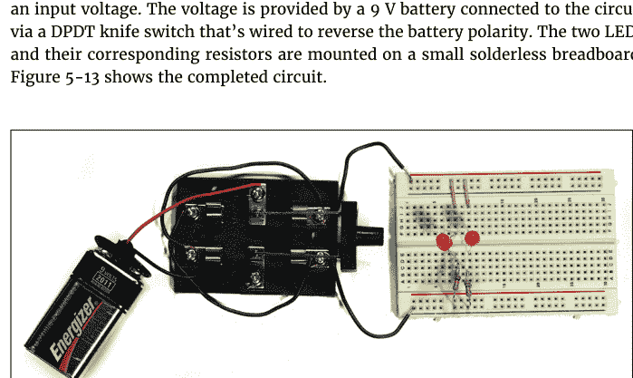

图5-13：完成的LED极性检测器（项目17）

## 项目17：LED极性检测器

在这个项目中，你将构建一个使用LED来指示电源极性的极性检测器。

你需要一把小号十字螺丝刀、钢丝钳和剥线钳来组装电路。

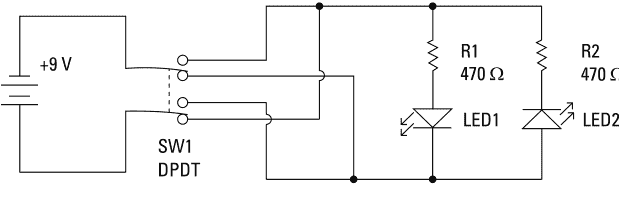

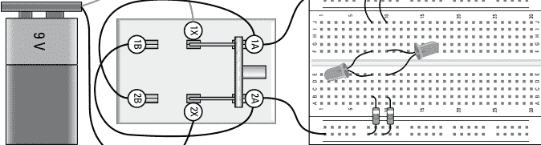

## 零件

- 一个9V电池
- 一个9V卡扣式电池座
- 一个DPDT闸刀开关
- 两个红色LED，5mm
- 两个470 Ω电阻器
- 两根短（小于1英寸）跳线
- 四根5英寸22号线规多股线

## 步骤

在这些步骤中，使用电路板底侧的负（–）总线条作为地线，使用电路板顶部的正（+）总线条作为正电压。

1.  剥去每根导线两端½英寸的绝缘层。
2.  打开开关。将手柄移到直立位置，使所有触点都不连接。
3.  将电池座的红色引线连接到开关的1X端子。
4.  将电池座的黑色引线连接到开关的2X端子。
5.  使用一根5英寸的导线将开关的1B端子连接到2A端子。
6.  使用一根5英寸的导线将开关的2B端子连接到1A端子。
7.  使用一根5英寸的导线将开关的1A端子连接到面包板正总线上的任意孔。
8.  使用一根5英寸的导线将开关的2A端子连接到面包板负总线上的任意孔。
9.  使用一根短跳线将面包板上的J8孔连接到正总线条附近的任意孔。
10. 使用一根短跳线将A10孔连接到正总线条附近的任意孔。
11. 将一个电阻器插入B8孔和负总线条附近的任意孔。
12. 将另一个电阻器插入B10孔和负总线条附近的任意孔。
13. 在面包板上按如下方式连接两个LED：

| 阴极（短引脚） | 阳极（长引脚） |
|----------------------|-------------------|
| 孔 E8              | 孔 F8           |
| 孔 F10             | 孔 E10          |

> 注意，两个LED的极性彼此相反，这样一个LED允许电流在一个方向通过，而另一个LED允许电流在相反方向通过。

**14. 将9V电池插入电池座。**

**15. 将开关拨到A位置。**

第8行的LED会亮起，因为电池的电压对该LED是正向偏置的。

**16. 将开关拨到B位置。**

第8行的LED会熄灭，但第10行的LED会亮起。这是因为拨动闸刀开关反转了二极管两端的极性。

- 本章内容
  - 了解电子学的奇迹器件
  - 理解晶体管的基本工作原理
  - 概述多种不同类型的晶体管
  - 将晶体管用作放大器
  - 将晶体管用作开关
  - 构建一些简单的晶体管电路

# 第6章
使用晶体管

我出生在晶体管时代开始后的几年。小时候，我有时会（趁父母不在家时）拆下我们那台旧黑白电视机的后盖，对里面整齐的电子元件感到惊奇。除了巨大的显像管，里面最有趣的小玩意儿就是那些拇指大小的玻璃管。我记得有成百上千个，每个都发出舒适温暖的橙色光芒。

到了我开始学习电子学的年纪，那台旧电视已经被一台新的彩色电视取代了，它的内部看起来远没有那么有趣。大的显像管还在，但所有那些发光的拇指大小的管子都被比顶针还小的银色小罐子取代了。

晶体管接管了，而我讨厌它们。管子比晶体管有趣多了。它们会发热、发光。你可以看到里面的小线结构——带有网格、栅格和其他不知是什么的小塔楼。

晶体管看起来就像小顶针。就好像有人用我妈妈针线盒里找到的东西组装了一台电视机。

我非常确定我最喜欢的电视节目，比如《星际迷航》、《迷失太空》和《巨人国》中的宇宙飞船都是由管子驱动的，而不是晶体管。直到我发现像“双子座”和“阿波罗”这样的真实宇宙飞船里装满了晶体管，而没有一个管子时，我才决定也许晶体管还不错。如果它们对美国国家航空航天局（NASA）来说足够好，那对我来说也足够好。

在我父亲买下第一台彩色电视机后的40年里，那些顶针大小的晶体管已经让位给了实际上小数百万倍的晶体管。如今，我们可以在一块大约指甲盖大小的单晶硅片上放置1亿个晶体管。

在本章中，你将了解晶体管是什么，以及如何在你自己的电路中使用它们。在此过程中，你将构建几个简单的晶体管电路来学习它们的工作原理。

## 晶体管有什么了不起的？

关于晶体管，有一件有趣的事情：当它在1947年被发明时，它并没有真正做任何以前没做过的事情。它只是以一种截然不同的方式来做。

晶体管背后的基本思想是，它让你能够通过改变流经第二个通道的微小电流的强度，来控制流经第一个通道的电流。

把晶体管想象成一个电子杠杆。杠杆是一种让你用很小的力举起大负载的装置。本质上，杠杆放大了你的努力。这就是晶体管的作用：它让你用小电流来控制大得多的电流。

图6-1展示了当今可用的多种不同类型晶体管中的一些。如你所见，晶体管有各种不同的尺寸和形状。所有这些晶体管的一个共同点是它们都有三个引脚。

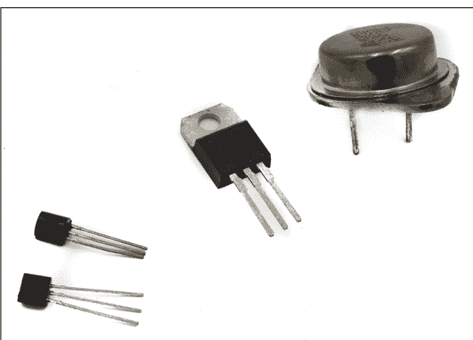

## 为什么发明晶体管？

在晶体管发明之前30到40年，执行晶体管功能的器件就已经存在了。它们被称为*真空管*。真空管由一个玻璃或金属制成的真空室、一个加热室内空间的加热元件和伸入室内的电极组成。（我这里使用过去时，因为尽管真空管仍然存在，但它们实际上并不常用。）

一种特定类型的真空管被称为*三极管*；它有三个电极。在三极管中，流经两个电极（称为*阳极*和*阴极*）的大电流可以通过在阴极和阳极之间放置一个线栅（称为*控制栅*）来调节。向这个栅极施加小电流会减慢阴极和阳极之间的电子流动。

人们很快就发现，你可以在控制栅上使用波动信号，如无线电或音频波。当你这样做时，阳极上的电流会跟随控制栅电流的波动，但变化幅度要大得多。因此，三极管是一个电子杠杆：控制栅上的微小电流变化被放大，在阳极上产生大的电流变化。

真空管三极管于1907年获得专利，是使无线电、电视和计算机得以发展的关键发明。但真空管有许多严重的局限性：制造成本高、体积大（小的也有拇指大小）、需要大量电力运行、产生大量热量，并且只能使用几年就会烧坏。

晶体管改变了一切。晶体管的功能与真空管三极管相同，但它使用半导体结，而非真空室中的加热电极。尽管晶体管并未实现真空管三极管尚未完成的功能，但它以一种截然不同的方式工作，相比真空管具有巨大优势。最早的晶体管体积小巧，功耗极低，产生的热量少得多，且使用寿命远长于真空管。

## 探究晶体管内部

晶体管种类繁多。最基本的一种称为*双极型晶体管*。双极型晶体管最容易理解，也是业余爱好者最可能接触到的类型。因此，本章大部分内容将聚焦于双极型晶体管。我将在本章后续部分介绍其他类型的晶体管。但目前——实际上贯穿本书始终——你可以假定，每当我单独使用*晶体管*一词时，指的都是双极型晶体管。

现在，让我们深入晶体管内部，看看它是如何工作的。

在上一章中，你了解到*二极管*是最简单的半导体，由单个p-n结构成，而p-n结仅仅是两种不同类型半导体的结：一种缺少几个电子从而带正电（*p*型半导体），另一种则多出几个电子，因此带负电（*n*型半导体）。

p-n结本身就像一个电流的单向门。换句话说，p-n结允许电流沿一个方向流动，但不允许反向流动。二极管就是一个两端都连接了引线的p-n结。

晶体管就像一个在一端多了一层p型或n型半导体的二极管。因此，晶体管有三个区域，而不是两个。每个区域之间的界面都形成一个p-n结。所以，另一种理解晶体管的方式是将其视为具有两个p-n结的半导体。

图6-2展示了两种常见晶体管的结构及其电路图符号。图中所示的细节将在后续段落中解释。

制造晶体管的一种方法是将p型半导体夹在两个n型半导体之间。这种晶体管称为*NPN晶体管*，因为它有三个区域：n型、p型和n型。它在图6-2的上半部分展示。

制造晶体管的另一种方法正好相反，将n型半导体夹在两个p型半导体之间。这种类型称为PNP晶体管，因为它的三个区域是p型、n型和p型。它在图6-2的下半部分展示。

晶体管中三个半导体区域的每一个都连接着一根引线，每根引线都有一个名称：

- **集电极：** 这根引线连接到最大的半导体区域。电流在基极的控制下，从集电极流向发射极。
- **发射极：** 连接到第二大的半导体区域。当基极电压允许时，电流从集电极流向发射极。
- **基极：** 连接到中间的半导体区域。这个区域充当守门员，决定有多少电流可以流过集电极-发射极电路。当电压施加到基极时，电流才被允许流动。

晶体管中有两条重要的电流路径：

- **集电极-发射极：** 流经晶体管的主电流。施加在集电极和发射极之间的电压通常称为 $V_{ce}$，流经集电极-发射极路径的电流称为 $I_{ce}$。
- **基极-发射极：** 控制集电极-发射极路径电流流动的电流路径。基极-发射极路径两端的电压称为 $V_{BE}$，有时也称为*偏置电压*。流经基极-发射极路径的电流称为 $I_{BE}$。

在进入更详细的讨论之前，关于晶体管还有几点需要思考：

- 在NPN晶体管中，发射极是晶体管的负极。集电极和基极是正极。
- 在PNP晶体管中，发射极是晶体管的正极。集电极和基极是负极。
- 大多数用NPN晶体管搭建的电路，也可以用PNP晶体管搭建。但如果你这样做，必须记住要反转电源连接。
- 在电路图中，晶体管通常用字母Q表示。
- 是的，选择*集电极*、*发射极*和*基极*这三个术语来命名晶体管的三个引脚是有原因的。不幸的是，这些原因涉及晶体管内部工作原理的深层知识，超出了本书所需探讨的范围。所以请相信我：发明晶体管的人选择*集电极*、*发射极*和*基极*这些术语，并非为了迷惑你。

## 审视晶体管规格

晶体管是比电阻器、电容器、电感器和二极管更复杂的器件。那些元件只有少数几个规格需要处理，例如电阻的欧姆值和最大功耗瓦数，而晶体管则有一系列规格。

你可以通过在互联网上查找晶体管的*数据手册*来获取其完整规格；只需将型号输入你常用的搜索引擎即可。数据手册会提供关于你感兴趣的晶体管的数十条有趣信息，以及只有火箭科学家才会喜欢的图表和曲线图。

如果你碰巧是火箭科学家，并且正在考虑将晶体管用于导弹，那么请务必关注数据手册中的每一个细节。但如果你只是想做一些业余的电路设计，你只需要关注最重要的规格——特别是以下几项：

- **电流增益 (H<sub>FE</sub>)：** 这是晶体管放大能力的度量。它指的是基极电流与集电极电流的比值。典型值范围在50到200之间。这个数值越高，晶体管放大输入信号的能力就越强。
- **集电极-发射极电压 (V<sub>CEO</sub>)：** 集电极和发射极之间的最大电压。通常为30V或更高，这远高于大多数业余电路中使用的电压水平。
- **发射极-基极电压 (V<sub>BEO</sub>)：** 发射极和基极之间的最大电压。这通常是一个相对较小的数值，例如6V。大多数电路设计只向基极施加小电压，因此这个限制通常不是问题。
- **集电极-基极电压 (V<sub>CBO</sub>)：** 集电极和基极之间的最大电压。通常为50V或更高。
- **集电极电流 (I<sub>CE</sub>)：** 可以流经集电极-发射极路径的最大电流。大多数电路使用电阻器来限制此电流；必须使用欧姆定律计算电阻值，以使集电极电流保持在限制值以下。如果长时间超过此限制，晶体管可能会损坏。
- **总功耗 (P<sub>D</sub>)：** 这是器件可以耗散的总功率。对于大多数小型晶体管，功率额定值在几百毫瓦 (mW) 的量级。

只有在设计自己的电路时，你才需要担心这些规格。如果你搭建的是在书本或互联网上找到的电路，你只需要知道电路原理图中指定的晶体管型号即可。

## 考察场效应晶体管

双极型晶体管并非半导体领域的唯一选择。另一种被称为*场效应晶体管 (FET)* 的晶体管近年来变得极为流行，尤其是在*集成电路*（亦称*IC*）中作为构建模块。场效应晶体管可以制造得比双极型晶体管小得多，并且使用电流少得多。

场效应晶体管的行为与双极型晶体管很相似，但有其自己的术语体系：场效应晶体管的三个端子不称为*基极*、*发射极*和*集电极*，而是称为*栅极*、*漏极*和*源极*。在内部结构上，场效应晶体管与双极型晶体管截然不同。它不是利用一对 p-n 结，而是由单块 n 型或 p 型半导体构成，并在其上放置一种特殊物质，用以控制通过半导体的电流。

现有的场效应晶体管类型有十几种，但最常用的是*MOSFET*（金属氧化物半导体场效应晶体管）和*JFET*（结型场效应晶体管）。

需注意，场效应晶体管非常容易受到意外静电放电的影响。如果你触摸一个场效应晶体管，听到“啪”的一声（皮肤上的静电通过 FET 放电），那它可能就报废了。在处理场效应晶体管或包含场效应晶体管的集成电路时，应始终采取预防静电放电的措施。

## 使用晶体管进行放大

将晶体管用作放大器的最常见方式如图 6–3 所示。这类电路有时被称为*共射极*电路，因为如图所示，发射极接地，这意味着输入信号和输出信号共享发射极连接。


### 图 6-3：一个基本的晶体管放大电路。

还有另外两种使用晶体管作为放大器的方式，称为*共基极*和*共集电极*。顾名思义，它们分别涉及将基极和集电极接地。共射极电路比共基极或共集电极电路使用得更广泛，因此本章将重点介绍它。

图 6–3 中的电路使用一对电阻构成分压器，以精确控制施加在晶体管基极和发射极之间的电压。然后，来自输入的交流信号叠加在此偏置电压上，以改变偏置电流。接着，放大后的输出从集电极和发射极取出。偏置电流的变化在输出电流中被放大。

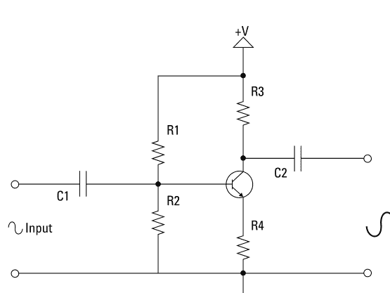

你可能还记得本系列书籍第 2 章的内容，分压器就是一对电阻。两个电阻两端的总电压等于每个电阻两端电压之和。通过为电阻选择合适的值，你可以任意分配电压。如果两个电阻阻值相同，分压器会将电压减半。否则，你可以使用一个简单的公式来确定电压分配的比例。（如果你想复习这个公式，请参阅本系列书籍的第 2 章。）

如果你仔细观察图 6–3 中的原理图，可能会发现电路中实际上存在两个分压器。第一个是电阻 R1 和 R2 的组合，它们为晶体管的基极提供偏置电压。第二个是电阻 R3 和 R4 的组合，它们为输出提供电压。

实际上，输出分压器中还有一个电阻：晶体管内部的集电极-发射极路径。事实上，解释晶体管工作原理的一种常见方法，是将集电极-发射极路径视为一个电位器（可变电阻），其旋钮由偏置电压转动。更详细的解释请参见题为“魔法电位器”的旁注。

这第二个分压器是一个可变分压器：电阻比例基于偏置电压而变化，这意味着集电极处的电压也随之变化。放大的发生是因为输入信号中非常微小的波动，会在输出信号中体现为大得多的波动。

## 使用晶体管


我在上一段中有意使用了*体现*这个术语。在共射极放大电路中，放大后的输出是输入信号的一种体现。换句话说，输入中的正电压波动在输出中表现为负波动。另一种说法是输出信号*反相*——这只是说它上下颠倒的一个花哨说法。

由于这是比较棘手的内容，让我们更仔细地看看这个电路：

-   输入以信号的形式到达电路左侧，该信号通常同时包含直流和交流分量。也就是说，电压会波动，但永远不会变为负值。
-   输入的一端接地，电池的负极也连接到地。晶体管的发射极也通过一个电阻接地，输出的一端同样接地。
-   C1 的作用是阻隔输入信号的直流分量。只有纯粹的交流信号能通过电容器。没有这个电容器，输入信号中的任何直流电压都会叠加到施加于晶体管的偏置电压上，这可能会破坏晶体管忠实放大输入信号交流部分的能力。
-   R1 和 R2 构成分压器，决定施加到晶体管基极的直流电压大小。通过 C1 的信号交流部分与此直流电压结合，导致晶体管的基极电流随电压而变化。
-   R3、R4 以及集电极-发射极电路的可变电阻在放大器的输出侧形成一个分压器。放大的发生是因为完整的电源电压施加在输出电路上。集电极-发射极路径的可变电阻将小的交流输入信号体现在大得多的输出信号上。
-   C2 阻隔输出信号的直流分量，因此只有纯粹的交流信号被传递到放大器电路的下一级。


设计晶体管放大器的诀窍在于为所有电阻和电容器选择正确的值。这涉及不少数学和工程知识，超出了本书的范围。大多数爱好者可以直接使用在套件或互联网上可以找到的已发布电路。但如果你真的想了解如何自己计算这些值，可以在互联网上找到优秀的相关教程。只需搜索*共射极*，你就会找到你想要的内容。

## 魔法电位器

我的高中电子学老师解释说，晶体管的工作原理就像一个“魔法电位器”，或者像我们孩子喜欢称呼的“魔法罐”。我们常开玩笑说，Puff 魔法龙会喜欢电子课，因为有魔法罐。（嘿，那可是七十年代！）

基本思想是这样的：晶体管的作用类似于二极管和可变电阻（也称为电位器或电位器）的组合。但这不仅仅是一个普通的电位器；它是一个魔法电位器，其旋钮通过无形的射线神秘地连接到二极管，有点像这样：

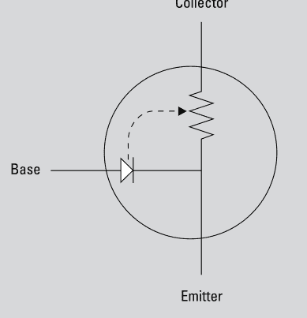

当正向电压施加到二极管时，魔法电位器的旋钮转动，很像电压表上的指针。这改变了电位器的电阻，进而改变了可以流经集电极-发射极路径的电流量。

请注意，魔法电位器的接线方式是：当偏置电压增加时，电阻减小；当偏置电压减小时，电阻增加。

除了通过无形的射线与二极管相连外，魔法电位器还有另一个神奇之处：其最大电阻是无穷大的。现实世界的电位器具有有限的最大电阻，例如 10 kΩ 或 1 MΩ，但魔法电位器的最大电阻是无穷大。

了解了这个神奇电位器的特性后，你就可以想象晶体管是如何工作的了。这个神奇旋钮有三个位置，对应晶体管的三种工作模式：

- **无限电阻：** 当没有偏置电压时，神奇电位器的旋钮被完全旋到一个方向，提供无限电阻。因此没有电流流过晶体管。（实际上，请记住晶体管的基极就像一个二极管，这意味着需要一定的正向电压才能让电流开始流过基极。在达到该电压——通常约为0.7 V——之前，神奇电位器一直保持在其无限设置。）这种状态被称为*截止*，因为电流被切断了。没有电流给你！
- **一些电阻：** 当偏置电压超过0.7 V时，二极管开始导通，无形的射线开始转动神奇电位器上的旋钮。因此电流开始流动。流过多少电流取决于偏置电压使旋钮转动了多远。
- **无电阻：** 最终，偏置电压将旋钮转到其停止点，电阻完全消失。电流不受限制地流过集电极-发射极电路。你可以继续增加偏置电压，但无法将电阻降低到零以下！这种状态被称为饱和。

## 将晶体管用作开关

晶体管最常见的用途之一是作为简单的开关。简而言之，只有当电压施加到基极时，晶体管才允许电流流过集电极-发射极路径。当没有基极电压时，开关断开。当有基极电压时，开关接通。

在理想开关中，晶体管应只处于两种状态之一：断开或接通。当没有偏置电压或偏置电压小于0.7 V时，晶体管断开。当基极饱和时，开关接通，集电极电流可以不受限制地流动。

图6-4显示了一个使用NPN晶体管作为开关来点亮或熄灭LED的电路原理图。

让我们逐个组件查看这个电路：

- **LED：** 这是一个标准的5毫米红色LED。这种类型的LED压降为1.8 V，额定最大电流为20 mA。

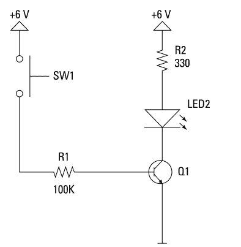

- **R1：** 这个100 kΩ电阻限制流入晶体管基极的电流。你可以使用欧姆定律计算基极的电流。因为基极-发射极结压降约为0.7 V（与二极管相同），所以R1两端的电压为5.3 V。将5.3除以100,000得到电流为0.000053 A，或0.053 mA。因此，12.7 mA的集电极电流（I<sub>CE</sub>）由小得多的基极电流（I<sub>BE</sub>）控制。
- **R2：** 这个330 Ω电阻限制流过LED的电流，以防止LED烧毁。你可以使用欧姆定律计算该电阻允许流过的电流量。因为电源电压为+6 V，LED压降为1.8 V，所以R2两端的电压为4.2 V（6 – 1.8）。将电压除以电阻得到电流（安培），约为0.0127 A。乘以1,000得到毫安电流：12.7 mA，远低于20 mA的限制。
- **Q1：** 这是一个常见的NPN晶体管。我使用了2N2222A晶体管，但几乎任何NPN晶体管都可以工作。R2和LED连接到集电极，发射极接地。当晶体管导通时，电流流过集电极和发射极，从而点亮LED。当晶体管关断时，晶体管充当绝缘体，LED不亮。
- **SW1：** 这个开关控制是否允许电流流向基极。闭合此开关会打开晶体管，导致电流流过LED。因此，即使开关没有直接放置在LED电路中，闭合此开关也会点亮LED。

你可能想知道为什么在这个电路中需要或想要使用晶体管。毕竟，你难道不能直接把开关放在LED电路中，省去晶体管和第二个电阻吗？当然可以，但这将违背这个电路所说明的原理：晶体管允许你使用小电流来控制大得多的电流。如果电路的唯一目的是打开或关闭LED，那么完全可以省略晶体管和额外的电阻。但是，当你处理更高级的电路时，你会发现很多情况，电路某一级的输出非常小，你需要用那微小的电流来切换大得多的电流。在这种情况下，这里所示的晶体管电路正是你所需要的。

## LED驱动电路

在项目18中，你将构建上一节所示的电路。该电路使用晶体管，利用比LED电流小得多的电流来点亮LED。该项目的原理图与图6-4所示的原理图相同。

图6-5显示了完成的项目。

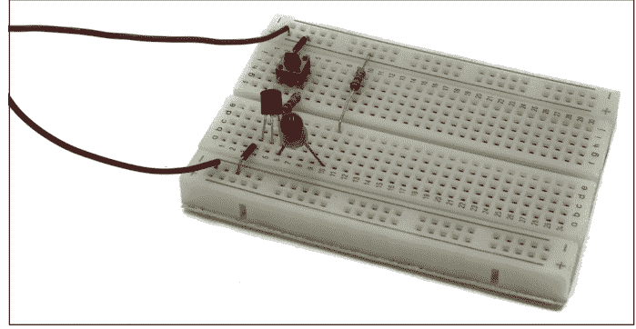

如果你在完成此项目后想尝试一些实验，这里有一些建议：

- 尝试用更大的电阻值替换R1，例如150 kΩ、220 kΩ或330 kΩ。在什么点基极电流不再足以点亮LED？
- 测量基极电流和集电极电流，方法如下：
    - *要测量基极电流*，从F5孔中取出R1引线，将万用表探针接触你取出的引线和按钮上的G5端子。
    - *要测量集电极电流*，从E10取出R1引线，将万用表探针接触你取出的引线和A10处的LED1阳极。

## 项目18：晶体管LED驱动器

在这个项目中，你将构建一个使用晶体管驱动LED的电路。晶体管允许小电流控制流过LED的较大电流。

要完成此项目，你需要剪线钳、剥线钳和万用表。

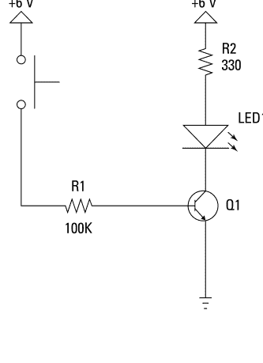

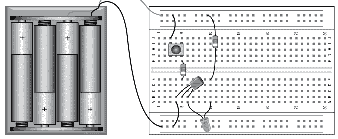


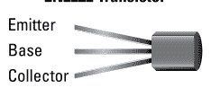

## 零件

- 四节AA电池
- 一个四节AA电池盒
- 一个小无焊面包板
- 一个常开DIP面包板按钮
- 一个NPN开关晶体管，2N2222A或类似型号
- 一个5毫米红色LED
- 一个330 Ω电阻（橙-橙-棕）
- 一个100 kΩ电阻（棕-黑-黄）
- 两根1¼英寸跳线

## 步骤

在这些步骤中，使用板底部的负（–）总线条作为地，板顶部的正（+）总线条作为正电压。

1. 将按钮安装在面包板上，使其跨越G3、I3、G5和I5孔。调整按钮方向，使其按下时，G3和G5之间的电路闭合。
2. 将100 kΩ电阻安装在E5和F5孔中。
3. 将330 Ω电阻安装在E10孔和面包板顶部正总线中的任意附近孔中。
4. 安装晶体管。下表显示了晶体管三个引脚的连接：
5. 安装LED。将LED1安装好，使阴极（较短的引脚）在A6孔中，阳极（较长的引脚）在A10孔中。
6. 安装第一根跳线，一端在J3孔，另一端在面包板顶部正总线中的任意附近孔中。
7. 安装第二根跳线，一端在A4孔，另一端在面包板底部负总线中的任意附近孔中。
8. 连接电池盒。红线应插入面包板顶部正总线的任意孔中；黑线应插入底部负总线的任意孔中。
9. 将四节AA电池插入电池盒。
10. 按下按钮。LED亮起。松开按钮，LED熄灭。
11. 祝贺自己！你已经构建了你的第一个晶体管电路！

| 引脚 | 孔 |
|---|---|
| 发射极 | B4 |
| 基极 | B5 |
| 集电极 | B6 |

## 观察一个简单的非门电路

门电路是数字电子学的基本元件，你将在第5册中全面学习。门电路由处于导通或截止状态的晶体管开关构成。总共有16种不同类型的门电路，你将在第5册第2章中学习全部16种。不过，现在我想向你介绍最简单的门电路之一，称为非门。它接收一个可以是导通或截止的输入，并将其转换为与输入相反的输出。换句话说，如果输入是导通的，输出就是截止的；如果输入是截止的，输出就是导通的。

图6-6展示了使用单个晶体管实现非门的电路原理图。电路工作原理如下：

-   输入由一个单刀按钮控制。
-   输入状态由LED1显示。按下按钮时LED1点亮，表示输入为导通状态。未按下按钮时，输入为截止状态，LED1熄灭。
-   输出状态由LED2显示。每当按钮未被按下时，LED2点亮，表示输出为导通状态。按下按钮时，LED2熄灭，表示输出为截止状态。
-   注意，LED1和LED2的状态总是相反的：每当LED1点亮时，LED2就熄灭，反之亦然。

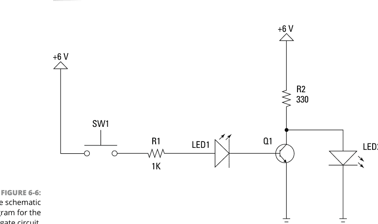

-   当按钮未被按下时，晶体管截止，因此没有电流能流过集电极。因此，流过R2的电流会流过LED2，使其点亮并指示输出为导通状态——与输入相反。
-   当按钮被按下时，晶体管导通，允许电流通过集电极流向地。这会将电流从LED2引开，导致其熄灭，指示输出为截止状态——与输入相反。

## 构建非门

项目19将向你展示如何在无焊面包板上构建单晶体管非门电路。完成的项目如图6-7所示。

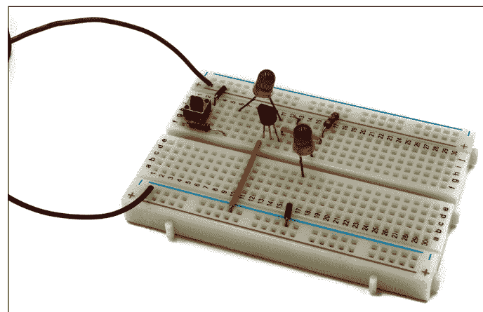

图6-7：晶体管非门（项目19）。

## 项目19：非门

在这个项目中，你将构建一个简单的非门电路，它使用晶体管来反转输入信号。也就是说，如果输入信号是导通的，输出就是截止的；如果输入信号是截止的，输出就是导通的。一个LED用于指示输入状态，第二个LED用于指示输出状态。该电路的原理图与图6-6所示的原理图相同。

完成此项目所需的唯一工具是剪线钳和剥线钳。

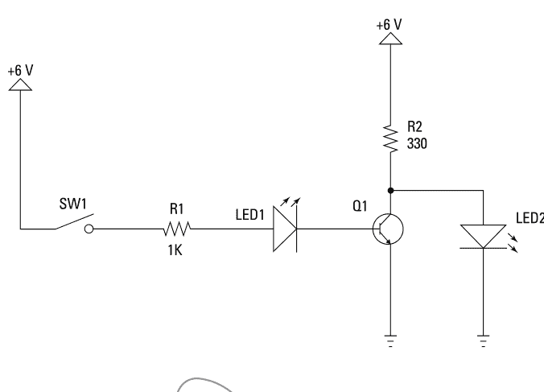

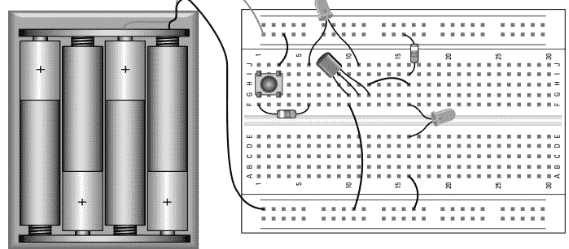

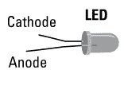

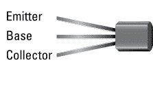

## 元件清单

-   四节AA电池
-   一个四节AA电池盒
-   一个小型无焊面包板
-   一个常开DIP面包板按钮
-   一个NPN开关晶体管，2N2222A或类似型号
-   两个5毫米红色LED
-   一个1 kΩ电阻（棕-黑-红）
-   一个330 Ω电阻（橙-橙-棕）
-   四根短跳线

## 步骤

在这些步骤中，使用面包板底部的负（-）总线条作为地线，顶部的正（+）总线条作为正电压。

1.  **将按钮安装在面包板上，使其跨接孔G1、I1、G3和I3。**

    调整按钮方向，使其按下时，G1和G3之间的电路闭合。

2.  **插入跳线。**

    按如下方式插入四根跳线：

| 从 | 到 |
|---|---|
| J3 | 面包板顶部正总线上的任意孔 |
| H12 | H16 |
| F10 | 面包板底部负总线上的任意孔 |
| A16 | 面包板底部负总线上的任意孔 |

3.  **插入电阻。**

    按如下方式插入两个电阻：

| 电阻 | 从 | 到 |
|----------|------|----|
| 1 kΩ | F1 | F6 |
| 330 Ω | I15 | 面包板顶部正总线上的任意孔 |

4.  **插入晶体管。**

    下表显示了晶体管三个引脚的连接方式：

| 引脚 | 孔 |
|------|------|
| 发射极 | G10 |
| 基极 | G11 |
| 集电极 | G12 |

5.  **插入LED1。**

    将阴极（两个引脚中较短的一个）插入孔I11，将阳极（两个引脚中较长的一个）插入孔I6。

6.  **插入LED2。**

    将阴极（短引脚）插入孔E16，将阳极（长引脚）插入F16。

7.  **连接电池盒。**

    将红色引线插入面包板顶部正总线上的任意孔，将黑色引线插入面包板底部负总线上的任意孔。

8.  **将四节AA电池放入电池盒。**

    电池连接后，LED2点亮，表示按钮未被按下。

9.  **按下按钮。**

    LED2熄灭，LED1点亮，表示按钮被按下。

10. **松开按钮。**

    LED恢复到原始状态。

## 使用晶体管产生振荡

*振荡器*是一种产生重复波形的电子电路。产生的具体波形取决于用于创建振荡器的电路类型。有些电路产生正弦波，有些产生方波，还有些产生其他类型的波。振荡器是许多不同类型电子设备（包括收音机和计算机）的基本组成部分。

最常用的振荡器电路之一由一对晶体管构成，它们被设置为交替导通和截止。这种类型的电路称为*多谐振荡器*。如果电路设计为在两个晶体管之间持续循环，则称为*非稳态多谐振荡器*，因为电路永远不会达到稳定点——也就是说，它永远不会决定哪个晶体管应该导通，所以它只是在两者之间不断切换。非稳态多谐振荡器非常适合产生方波。

图6-8是由一对NPN晶体管构成的非稳态多谐振荡器的通用原理图。

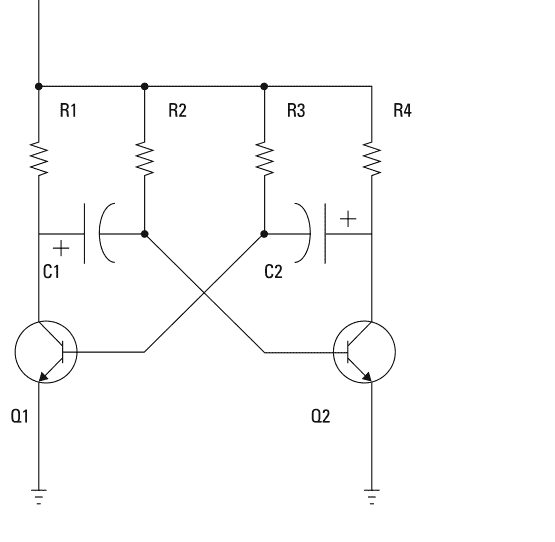

研究这个电路，看看它是如何工作的。当你第一次通电时，只有一个晶体管导通。你可能认为两个都会导通，因为两个晶体管的基极都连接到+V，但事实并非如此：其中一个会先导通。为了讨论方便，假设Q1是那个幸运儿。

当Q1导通时，电流通过R1流入集电极，然后通过晶体管流向地。同时，C1开始通过R2充电，在其右极板上产生正电压。由于这个右极板连接到Q2的基极，Q2的基极上也会产生正电压。

当C1充电足够时，Q2基极的电压导致Q2开始导通。现在电流通过R4流过Q2的集电极，C2开始通过R3充电。由于C2的右极板受到正电荷的轰击，C2左极板的电压变为负值，这降低了Q1基极的电压。这导致Q1截止。

C1放电，同时C2充电。最终，C2左极板的电压达到使Q1重新导通的点，整个循环重复。

如果这一切看起来令人困惑，请不要担心。确实如此。如果细节似乎令人费解，只需考虑大局：两个电容器交替充电和放电，使两个晶体管交替导通和截止，这反过来又允许电流流过它们的集电极电路。它来回往复，就像温布尔登网球赛中一场无人能赢的精彩拉锯战——球员们只是永远地将球来回击打，直到他们的电池耗尽。

关于非稳态多谐振荡器，还有其他一些有趣的事情需要了解：

-   多谐振荡器每一半导通的时间由电容器充电电路形成的RC时间常数决定。因此，你可以通过调整电容器和电阻值来改变电路的振荡速度。有关计算电阻和电容器时间常数的更多信息，请参阅本迷你书的第3章。
-   如果你愿意，可以通过简单地将地线与+V电压源互换，使用PNP晶体管创建非稳态多谐振荡器。
-   多谐振荡器电路的输出可以直接从任一晶体管的集电极取出。例如，你可以在R1或R4中串联一个LED或扬声器，以观察或听到振荡器的工作。你可以在下一节中看到一个例子。

## 制作LED闪光器

或者，你也可以使用第三个晶体管将多谐振荡器与输出负载耦合，如图6-9所示。只需将多谐振荡器其中一个晶体管的发射极连接到第三个晶体管的基极，并将负载连接到集电极，如图所示。

这种配置有两个优点。首先，如果你直接从Q1或Q2的集电极取出负载，负载本身会干扰多谐振荡器电路。通过使用第三个晶体管，你可以将负载与多谐振荡器电路隔离。其次，当使用耦合晶体管时，输出波形更接近真正的方波；如果不使用，由于电容充电效应的影响，输出波形不会是干净的方波。

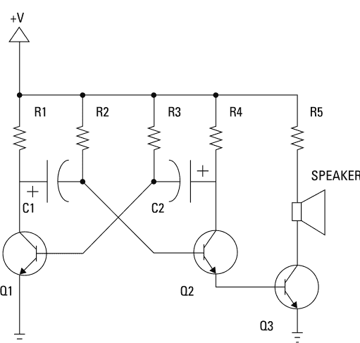

图6-9：使用晶体管将输出负载耦合到非稳态多谐振荡器。

在项目20中，你将构建一个电路，该电路使用非稳态多谐振荡器交替闪烁两个LED。LED闪光器电路是电子爱好者的最爱，因为闪烁的LED有各种有趣的用途。例如，你可以为万圣节的南瓜灯添加令人毛骨悚然的闪烁眼睛，或者为你的模型铁路布局添加闪烁的警告灯。图6-10展示了完成的LED闪光器项目。

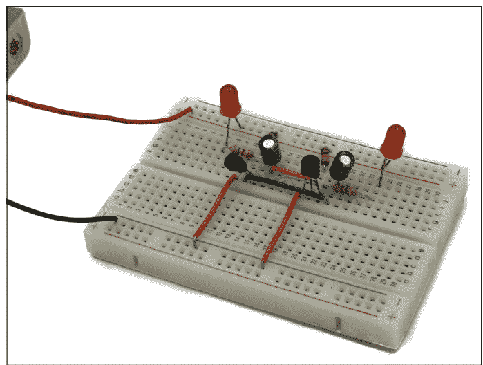

LED闪光器电路本质上就是一个与图6-8所示类似的非稳态多谐振荡器。唯一的区别是我在每个晶体管的集电极电路中添加了LED，并填充了具体的电阻和电容值。根据我为本项目选择的数值，灯光交替速度很快，大约比每秒一次稍快一点。

如果你在完成此项目后想进一步尝试，这里有一些建议：

- 尝试用不同阻值的电阻替换R2和R3，例如1 kΩ和100 kΩ。这对闪光器有何影响？
- 尝试在R2或R3上串联一个电位器。这允许你通过转动电位器旋钮来改变闪光频率。
- 尝试更换电容器。

## 项目20：LED闪光器

在本项目中，你将构建一个使用双晶体管非稳态多谐振荡器来顺序闪烁两个LED的电路。你需要一把小十字螺丝刀、一把线剪和一把剥线钳来构建此项目。

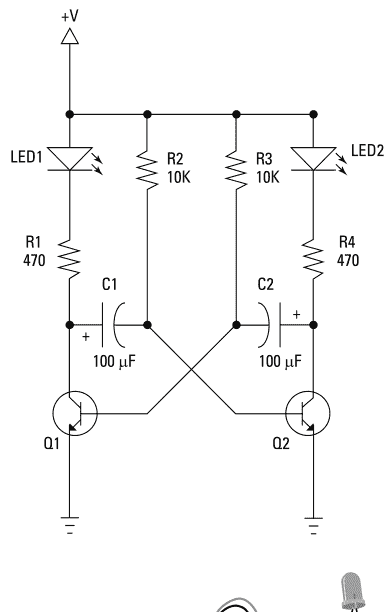

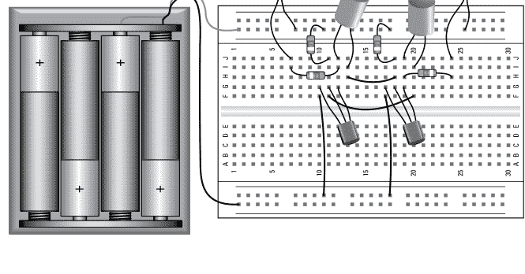

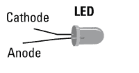

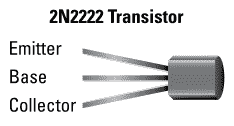

## 元器件

- 四节AA电池
- 一个四节AA电池盒
- 一块小型无焊面包板
- 两个NPN开关晶体管，2N2222A或类似型号
- 两个5毫米红色LED
- 两个100 μF电解电容
- 两个10 kΩ电阻（棕-黑-橙）
- 两个470 Ω电阻（黄-紫-棕）
- 两根1½英寸跳线
- 一根1英寸跳线
- 一根¾英寸跳线

## 步骤

在整个步骤中，使用面包板底部的负极（-）总线作为接地，使用顶部的正极（+）总线作为正电压。

1.  插入跳线。
    如下表所示插入四根跳线：

| 长度 | 从 | 到 |
| :--- | :--- | :--- |
| 1¼英寸 | F10 | 面包板底部负极总线中的任意孔 |
| 1¼英寸 | F17 | 面包板底部负极总线中的任意孔 |
| 1英寸 | F11 | F20 |
| ¾英寸 | H13 | H18 |

2.  插入电容器。
    如下表所示插入两个电解电容：

| 电容器 | - | + |
| :--- | :--- | :--- |
| C1 | I13 | J12 |
| C2 | I20 | J19 |

务必注意电容器的正确极性。负极引脚标有减号。

3.  插入晶体管。
    下表显示了两个晶体管每个引脚的连接：

| 引脚 | Q1 | Q2 |
| :--- | :--- | :--- |
| 发射极 | G10 | G17 |
| 基极 | G11 | G18 |
| 集电极 | G12 | G19 |

4.  插入LED。

| LED | 阴极（短） | 阳极（长） |
| :--- | :--- | :--- |
| LED1 | J7 | 面包板顶部正极总线中的任意孔 |
| LED2 | J24 | 面包板顶部正极总线中的任意孔 |

5.  插入电阻。

| 电阻 | 从 | 到 |
| :--- | :--- | :--- |
| R1 (470 Ω) | I7 | I12 |
| R2 (10 kΩ) | J11 | 面包板顶部正极总线中的任意孔 |
| R3 (10 kΩ) | J18 | 面包板顶部正极总线中的任意孔 |
| R4 (470 Ω) | H19 | H24 |

6.  将电池盒连接到面包板。
    将电池盒的红线连接到无焊面包板顶部正极总线中的任意孔。将电池盒的黑线连接到面包板底部负极总线中的任意孔。

7.  将四节AA电池插入电池盒。

8.  享受视觉效果吧！
    只要电池在位，LED就会交替闪烁。

## 探索分立元件小结

关于晶体管的探索就到这里——事实上，这也结束了我们对最常见类型分立电子元件（即单一封装中仅包含单个部件的元件）的概述。如果你已经通读了这本迷你书的所有章节，你现在应该了解了电阻器、电容器、电感器、二极管和晶体管的基础知识。

从某种意义上说，这就是全部了。剩下的就是如何巧妙地将这些元件组合成不同类型的电路，并将其用于不同用途的方法。

在第3册中，你将学习如何使用集成电路，它使你能够用一个微小的芯片替代一整个由分立元件组成的电路。集成电路本质上就是将一堆半导体、电阻和电容器组合到一个微型封装中的方法。

继续前进吧！

## 3 使用集成电路

## 内容概览

- 第1章：**介绍集成电路** ..................... 333
- 第2章：**神奇的555定时器芯片** ..................... 345
- 第3章：**使用运算放大器** ..................... 383

## 本章内容

- 探究集成电路的工作原理
- 查看集成电路封装
- 学习如何在电路中使用集成电路
- 了解最常见的集成电路类型

## 第1章 介绍集成电路

1961年4月25日，一位名叫罗伯特·诺伊斯的工程师在加利福尼亚州的帕洛阿尔托收到消息，他一年前提交的专利申请终于获得批准。该专利是一种新型器件，后来被称为*集成电路*。

恰好一个月后，即5月25日，约翰·F·肯尼迪总统向全世界宣布，美国将登上月球。

这两个事件有什么共同点？很多。没有集成电路，NASA（美国国家航空航天局）能否完成肯尼迪的挑战是值得怀疑的。

1961年5月，NASA完全不知道如何登月。但有一件事NASA很清楚，那就是它的月球飞船需要一台前所未有的计算机。NASA必须想办法将当时占满整个房间的计算机缩小到一个野餐篮大小的盒子里。

因此，NASA为阿波罗计划授予的第一份合同就是关于计算机的。随后还将有更多合同——用于指令舱、登月舱、运载火箭、太空服以及数千个其他关键部件，所有这些都必须建造出来才能实现登月。但NASA的首要任务是建造计算机。

计算机合同交给了麻省理工学院，那里的工程师很快意识到，建造计算机的唯一方法就是利用全新的集成电路技术。NASA成为了集成电路的第一个大规模用户。

在本章中，你将了解帮助我们登月并永远改变了电子世界的设备。你将了解这些设备是如何制造的，它们能做什么，以及为什么它们会变得越来越小和越来越便宜。你还将学习如何将它们融入你自己的电子项目中。

### 到底什么是集成电路？

*集成电路*（也称为*IC*或简称*芯片*）是一个完整的电子电路，由多个独立元件（如晶体管、二极管、电阻器、电容器）以及连接所有元件的导电路径组成，所有这些都由单块硅晶体制成。

需要明确的是，集成电路并不是一个非常小的、上面安装了元件的电路板。在集成电路中，各个元件是直接嵌入硅晶体中的。以前的电路制造技术依赖于在越来越小的电路板上安装越来越小的部件，但集成电路是单一整体。集成电路不是只有两个或三个PN结（如二极管或晶体管），而是拥有成千上万个独立的PN结。事实上，许多现代集成电路拥有数百万甚至数十亿个PN结，全部由单块硅制成。

最早的集成电路是简单的晶体管放大电路，只有几个晶体管、电阻器和电容器。事实上，它们并不比你在第2册第6章中构建的电路复杂多少。

现在，集成电路复杂得令人难以置信。在我撰写本文时，最新的Xbox游戏机包含一个拥有超过70亿个晶体管的处理器芯片。

你将用于爱好的大多数集成电路要简单得多，大约有几十个晶体管。例如，你将在本迷你书第2章学习的555定时器集成电路，包含20个晶体管、2个二极管和15个电阻器，成本大约一美元。

## 摩尔定律的奇迹

你可能听说过摩尔定律，它简要预测了能够放置在单个集成电路上的晶体管数量大约每两年翻一番。英特尔的创始人之一戈登·摩尔于1965年首次提出了他的预测。当时，这个预测甚至更为雄心勃勃。最初，摩尔定律指出晶体管数量每年翻一番，而不是每两年。到了20世纪70年代中期，增长速度有所放缓，因此该预测也随之调整。

摩尔定律令人震惊的现实是，电子技术的复杂性增长是指数级的，而并非像大多数技术那样是渐进式的。例如，考虑一下汽车行业，其燃油效率每年都在逐步提高。戈登·摩尔曾说过，如果摩尔定律适用于汽车，那么一辆劳斯莱斯的油耗将达到每加仑50万英里，买一辆新车比为停放在那里的旧车支付停车费还要便宜。

多年来，科学家们曾多次担心摩尔定律即将终结，因为芯片制造技术正接近某些无法超越的物理极限，例如用于蚀刻电路的光波长。但每一次，新的技术突破都能让制造商轻松绕过旧有的极限。摩尔定律至今已保持有效超过50年，并有望在可预见的未来继续成立。

摩尔定律之所以能保持惊人准确性，一个可能的解释是它已成为一种自我实现的预言。集成电路制造商依靠摩尔定律来设定自身的工程目标，然后竭尽全力去实现这些目标。因此，摩尔定律已成为半导体行业的目标。

## 探索集成电路的制造过程

每次我在历史频道看到《现代奇迹》节目，他们花一个小时讲述铲子、卡车、冷切肉、润滑脂或狗粮这类话题时，我就会生气，对着电视大喊。为什么他们不做一期关于集成电路的节目？

你不必了解集成电路的制造过程也能使用它们，所以如果你想跳过这一节也没问题。不过，这个过程相当有趣——绝对值得《现代奇迹》做一期节目。

集成电路（IC）的制造过程很复杂，并且会根据所生产芯片的类型而变化。但以下过程具有代表性：

1.  一大块圆柱形的硅晶体被切割成约百分之一英寸厚的薄晶圆。每个晶圆将用于制造数百或数千个成品集成电路。
2.  在晶圆顶部沉积一层特殊的光刻胶溶液。
3.  在光刻胶上覆盖一个掩模。掩模是实际电路的图像，某些区域是透明的以让光线通过，其他区域是不透明的以阻挡光线。
4.  晶圆暴露在强烈的紫外光下，紫外线会蚀刻掩模透明部分下方的晶圆，但不触及掩模不透明部分下方的区域。
5.  移除掩模，并清洁掉任何残留的光刻胶。
6.  然后，将晶圆暴露于掺杂材料，这会在晶圆的蚀刻区域形成n型和p型区域。（关于掺杂以及n型和p型半导体的回顾，请参阅第2册，第5章。）
7.  如果电路设计需要多个层叠在一起，则需要对每一层重复此过程，直到所有层都被创建。
8.  然后，将单个集成电路切割分开，并安装到其最终的封装中。

以下是一些关于集成电路制造过程的其他值得了解的细节：

> 正如你在英特尔广告中可能看到的，集成电路的制造过程是在洁净室中进行的，工作人员穿着特制的防护服和面罩。这是必要的，因为在集成电路的尺度上，即使是最小的灰尘颗粒也显得巨大无比。

> 每个集成电路在电路完成后都会经过各种复杂的质量测试。制造过程绝非完美，因此许多芯片会被丢弃。

## 集成电路的封装

集成电路有多种不同的封装类型，但你在业余电子学中会接触到的几乎所有IC都采用一种称为*双列直插式封装*，即*DIP*的类型。图1-1显示了几个采用DIP封装的IC。（其中一个IC是倒置的，以便你能看到其底部。）

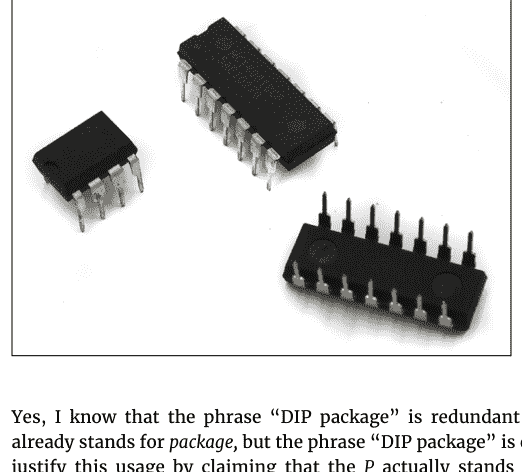

**图1-1：采用常见DIP封装的集成电路。**

> 注意，我知道“DIP封装”这个说法是多余的，因为DIP中的P本身已经代表封装，但“DIP封装”这个说法仍被广泛使用。有人为其辩护，声称P实际上代表引脚，因此没有冗余。但这只是牵强的辩解。不管你喜不喜欢，DIP代表双列直插式封装，“DIP封装”这个说法被普遍使用并被认为是正确的。习惯它吧。

“DIP芯片”这个说法有时也用来指代采用DIP封装的集成电路。它听起来不错，就像你可能会在超级碗派对上供应的东西。

DIP封装由一个矩形的塑料或树脂外壳构成，外壳内部封装了IC本身，矩形的长边上有两排引脚。每一侧的引脚从外壳中稍微伸出，然后垂直向下弯折。这种排列方式使封装看起来像一只昆虫。（实际上，使用DIP芯片的一种常见布线方法是将它们倒置粘在电路板上，并直接将导线焊接到引脚上；这种技术被称为“死虫接线法”。）

DIP封装每一侧的引脚间距精确为0.1英寸，两排引脚之间的间距通常为0.3英寸，尽管一些较大的DIP封装可能有更宽的间距。无论如何，标准的十分之一英寸间距非常适合用于无焊面包板，因为面包板上的孔间距为0.1英寸。事实上，无焊面包板中心贯通的间隙恰好是0.3英寸，这使得DIP芯片可以轻松地跨接在间隙上安装，如图1-2所示。

**图1-2：无焊面包板在设计时考虑到了DIP芯片。**

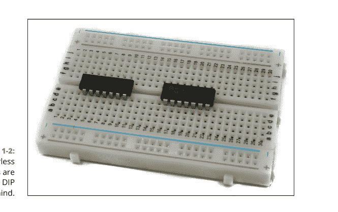

DIP封装中的每个引脚都有编号。从上方俯视封装，你会看到一个方向标记，通常是一个缺口、凹槽或圆点。将封装摆放好，使该标记位于顶部，并且引脚1正好在该标记的左侧。引脚按逆时针方向编号，从左侧向下，然后沿右侧向上，直到最后一个引脚，它正好位于方向标记的右侧。

如果我对DIP引脚编号的解释不清楚，请参阅图1-3。

**图1-3：识别DIP封装上的引脚。**

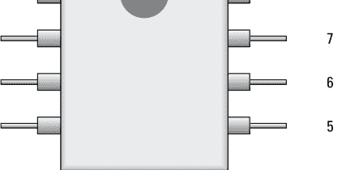

图1-3中的DIP封装是一个8引脚DIP。更大的DIP有更多的引脚，但编号方案总是相同的：引脚1在方向标记的左侧，其余引脚从引脚1开始逆时针编号。

## 在原理图中使用集成电路

在原理图中，IC通常简单地表示为一个矩形，电路连接点被方便地放置在矩形周围，而不考虑引脚的物理位置。每个引脚连接都已标注，如图1-4所示。

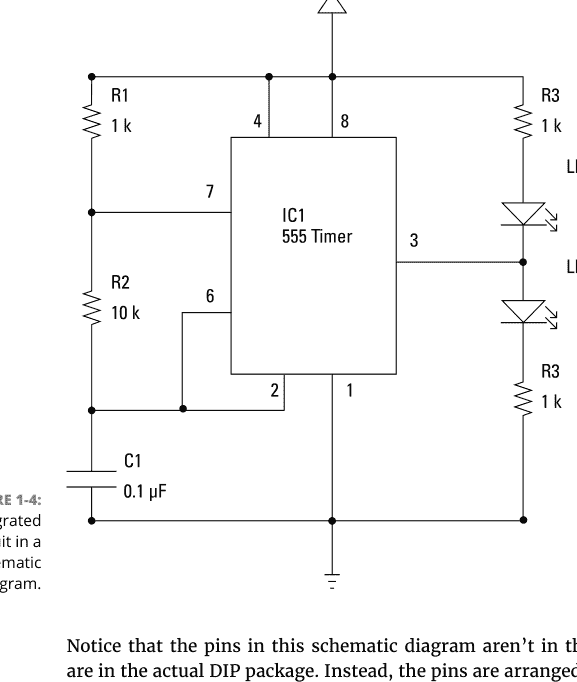

注意，在这个原理图中，引脚的顺序与实际DIP封装中的顺序不同。相反，引脚是按照最有利于简化原理图的顺序排列的。因此，当你实际搭建这个电路时，必须调整布线布局以适应DIP封装的引脚排列。

还要注意，集成电路的引脚并非总是全部使用。未使用的引脚通常在原理图中省略。例如，在图1-4所示的电路中，引脚5未被使用，因此在原理图中被省略了。

某些集成电路包含两个或多个独立电路，但共享一个公共电源，有点像连体双胞胎。例如，556双定时器芯片在一个14引脚封装内包含两个完整的555定时器电路。当在电路中使用此类芯片时，原理图可能会将它们分开绘制。例如，图1-5展示了一个使用556双定时器芯片的电路，但每个定时器部分都在原理图中单独列出。

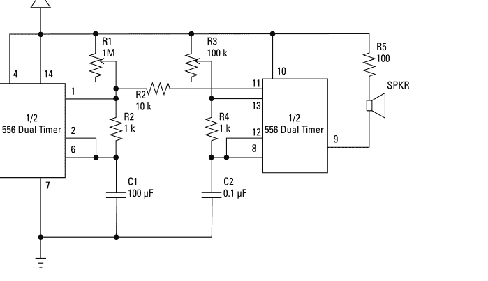

请不要担心这个电路（或图1-4所示电路）的细节。我在此的意图并非解释这些电路如何工作，而只是向你展示集成电路在原理图中的表示方式。你可以在下一章中了解更多关于这些电路工作原理的内容。

## 为集成电路供电

在大多数DIP封装的集成电路中，有两个引脚用于为电路提供电源。其中一个被指定为正电压，通常用符号Vcc标识。另一个是接地引脚。例如，555定时器芯片（你将在本迷你书的第2章中了解它）需要在第8引脚提供4.5-15V的正电源电压，第1引脚连接到地。

对于包含两个或多个独立电路的集成电路，这些电路通常共享一个公共电源。因此，尽管556双定时器芯片包含两个独立的555定时器电路，但该芯片只有一个正电压引脚和一个接地引脚。

此外，你应该注意，有些集成电路要求提供独立的正、负电源电压，而不仅仅是正极和地连接。你可以使用图1-6所示的电路来创建这样的电源。


## 避免静电和热损坏

当你组装一个包含一个或多个集成电路的电路板时，请小心不要在构建电路时损坏IC。尤其要注意以下两个可能的问题：

-   **静电放电：** 许多集成电路在用手处理芯片时，可能被通过手指放电的静电损坏。因此，请确保在处理集成电路之前，通过触摸接地的金属表面来释放自身的静电。在处理IC时，你可能还需要使用防静电腕带。
-   **热损坏：** 某些集成电路对热敏感，因此在将IC焊接到电路板上时应采取预防措施。如果可能，将鳄鱼夹或其他类型的散热器夹在引脚上，以帮助将部分热量从IC本身散发出去。

你可以通过使用DIP插座来完全避免焊接集成电路，如图1-7所示。该图中，右侧的8引脚IC与左侧的8引脚DIP插座匹配。当你使用类似图中的插座时，在将IC插入插座之前，先将插座的引脚焊接到你的电路板上。这样，任何多余的热量都会被无害地散发到空的插座中。当插座安全焊接到位后，你就可以安全地将IC插入插座。插座也很方便，因为它们允许你在不拆焊旧芯片的情况下更换损坏的芯片。


**图1-7：** DIP插座让你可以避免焊接精密的集成电路。

## 阅读IC数据手册

在使用特定类型的IC之前，你应该下载该IC的数据手册副本。IC数据手册包含大量有用的信息。除了制造商名称和IC型号等基本信息外，你还会找到诸如以下信息：

-   关于电路功能的描述。
-   详细的引脚定义，告诉你每个引脚的用途。
-   芯片内部电路的示意图。对于简单电路，你可能会得到整个详细的示意图。对于更复杂的芯片，你会得到概念图而非详细原理图。
-   详细的电气规格，例如可以通过Vcc引脚馈入电路的最大电压或输出引脚的最大电流负载。
-   工作条件，例如最高和最低温度。
-   阐述电路在不同工作条件下行为的图表和图形。
-   计算电路工作特性的公式。例如，如果电路的工作取决于外部RC（电阻/电容）电路，你会得到用于计算这些外部组件如何影响电路工作的公式。
-   示例电路图。
-   包括尺寸在内的机械描述。

IC数据手册可以从互联网上的许多来源获取。使用像Google这样的搜索引擎搜索IC型号和单词*datasheet*。例如，要查找555定时器芯片的数据手册，请搜索*555 datasheet*。

## 常用集成电路

实际上有数千种不同类型的集成电路可用。其中大多数是为非常特定的应用而设计的。然而，许多集成电路被设计为通用型，因此被用于各种各样的电路中。

在接下来的部分中，我将简要介绍一些最受欢迎的通用集成电路。所有这些IC已经存在了几十年，但它们的多功能设计、广泛可用性和低成本使其持久流行。

### 555定时器

555定时器芯片于1971年发明，但至今仍是最受欢迎的集成电路之一。据估计，每年生产和销售的555芯片超过十亿个。

顾名思义，555是一个定时器电路。定时间隔由外部电阻/电容（RC）网络控制。换句话说，通过仔细选择电阻和电容的值，你可以改变定时持续时间。

555可以配置成几种不同的方式。在一种配置（称为*单稳态*）中，它的工作原理类似于煮蛋计时器：你设置它，然后在一段时间过去后它会响起。在另一种配置（称为*无稳态*）中，它的工作原理类似于节拍器，以规律的间隔触发脉冲。

除了基本的8引脚DIP封装的555芯片外，你还可以买到556双定时器，它在一个14引脚DIP封装中包含两个独立的555定时器。因为许多常见电路需要两个555定时器协同工作，所以556封装非常受欢迎。

你可以在下一章中了解更多关于555和556定时器的内容。

### 741和LM324运算放大器

运算放大器是一种特殊类型的放大器电路，在整个电子学领域有许多应用。尽管有许多不同类型的运算放大器电路，但741和LM324是最常见的。

741是一个八引脚DIP封装的单运算放大器电路。它于1968年首次推出，至今仍是迄今为止使用最广泛的集成电路之一。741是那些需要正负电压的IC之一，如前文“为集成电路供电”部分所述。

LM324于1972年推出。它在一个14引脚DIP封装中包含四个独立的运算放大器电路。与741不同，LM324不需要独立的负极和正极电源。

你可以在本迷你书的第3章中了解更多关于运算放大器的内容。

### 78xx稳压器

78xx是一系列简单的稳压集成电路。稳压器是一种电路，它接受一个可以在一定范围内变化的输入电压，并产生一个恒定值的输出电压，无论输入电压如何波动。

78xx中的xx代表芯片实际稳压的电压。例如，7805产生5V输出。输入电压必须至少比输出电压高出几伏，最高可达35V。

### 74xx逻辑系列

集成电路的主要用途之一是数字电子学，而74xx是最古老且至今仍使用最广泛的数字集成电路系列之一。74xx系列包括各种各样的芯片，为数字电路提供了基本构建模块。因此，你不会在74xx系列中找到完整的微处理器。但你会找到诸如逻辑门、触发器、计数器、缓冲器等电路。

## 本章内容

- 了解555定时器芯片
- 探索配置555定时器芯片的不同方式
- 使用556双定时器芯片
- 构建基本的555定时器芯片电路

## 第2章：奇妙的555定时器芯片

555定时器芯片于1970年问世，可能是有史以来最受欢迎的集成电路。据估计，每年生产超过十亿片。它的受欢迎程度实至名归。555是常用电路——多谐振荡器——的单芯片版本，广泛应用于各种电子电路。你可以使用555芯片实现基本的定时功能，例如让灯亮一段时间，或者用它制作闪烁的警示灯。你可以用它产生特定频率的音符，或者用它控制伺服设备的定位。（关于伺服电机，你将在第6册第5章学习。）其应用不胜枚举。

在本章中，你将学习如何在各种电路中使用这种多功能芯片。首先，我将解释555的工作原理及其每个引脚的功能。然后，你将看到并搭建多种常见的555电路。

## 了解555的工作原理

555可以看作是模拟电路和数字电路的混合体。555产生的输出是纯数字的：要么是关断状态（0 V），要么是导通状态（正电压至少为2.5 V）。555内部的定时机制决定了输出导通和关断的持续时间。

电路的模拟部分在于你如何控制输出信号导通和关断的时间。这是通过使用电阻和电容创建一个RC网络来实现的。你为电阻和电容选择的值决定了定时间隔。本章稍后将提供选择正确电阻和电容值所需的所有信息，但如果你觉得需要复习RC网络的工作原理，请参阅第2册第3章。

你还可以控制555是只执行一次定时任务（像煮蛋计时器），还是循环地反复开关输出（像节拍器一样持续滴答作响）。这是通过以不同方式连接555芯片的引脚来实现的。

图2-1展示了标准555集成电路中八个引脚的排列。如图所示，555采用8引脚DIP封装。

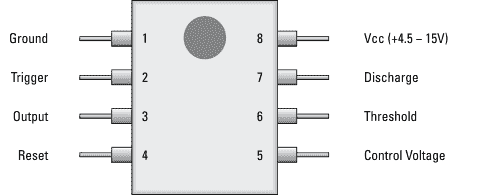

以下段落描述了八个引脚的功能（非按数字顺序）：

- **接地**：引脚1连接到地。
- **V<sub>cc</sub>**：引脚8连接到正电源电压。该电压必须至少为4.5 V，且不超过15 V。通常使用四节AA或AAA电池（提供6 V）或一节9 V电池为555电路供电。
- **输出**：引脚3是输出引脚。输出要么是低电平（非常接近0 V），要么是高电平（接近施加在引脚8上的电源电压）。（在某些型号的555上，输出电压可能比电源电压低多达2 V。）输出的确切波形——即高电平持续多久，低电平持续多久——取决于其余五个引脚的连接方式。

有关使用引脚3输出的更多信息，请参阅本章后面的“使用555定时器输出”部分。

- **触发**：引脚2是*触发*端，其作用如同发令枪，用于启动555定时器。触发是*低电平有效*触发，这意味着当引脚2的电压降至电源电压的三分之一以下时，定时器开始工作。当通过引脚2触发555时，引脚3的输出变为高电平。

例如，如果你想通过按按钮来启动定时器，你会将引脚2连接到电源电压。然后，要触发定时器，你只需中断这个电源电压。有几种方法可以做到这一点，但最常见的是在引脚2和地之间连接一个常开按钮。按下按钮时，电源电压通过限流电阻短路到地；因此引脚2的电压降至零，定时器被触发。你将在本章后面的“在单稳态（单次）模式下使用555”部分看到这种触发方式的示例。

- **放电**：引脚7称为*放电*端。该引脚用于放电一个外部电容，该电容与电阻配合工作以控制定时间隔。在大多数电路中，引脚7通过电阻连接到电源电压，并通过电容连接到地。

- **阈值**：引脚6称为*阈值*端。该引脚的目的是监测由引脚7放电的电容两端的电压。当该电压达到电源电压（Vcc）的三分之二时，定时周期结束，引脚3的输出变为低电平。

- **控制**：引脚5是*控制*引脚。在大多数555电路中，该引脚通常通过一个小的0.01 µF电容接地。（该电容的目的是平滑电源电压中可能影响定时器工作的任何波动。）

在某些电路中，使用一个电阻连接在控制引脚和Vcc之间，向引脚5施加一个小电压。该电压会改变阈值电压，从而改变定时间隔。然而，大多数电路并不使用此功能。在本章中，所有555电路都只是通过一个0.01 µF电容将引脚5接地。

- **复位**：引脚4是复位引脚，可用于重新启动555的定时操作。与触发输入一样，复位也是低电平有效输入。因此，引脚4必须连接到电源电压，555定时器才能工作。如果引脚4瞬间接地，555定时器的操作将被中断，并且在再次通过引脚2触发之前不会重新启动。

在原理图中使用时，555定时器芯片的引脚几乎总是如图2-2所示排列。如图所示，这种排列遵循原理图中元件的惯例顺序：电源电压在顶部，地在底部，输入在左侧，输出在右侧。这种排列使得从原理图中确定电路的工作方式变得容易。

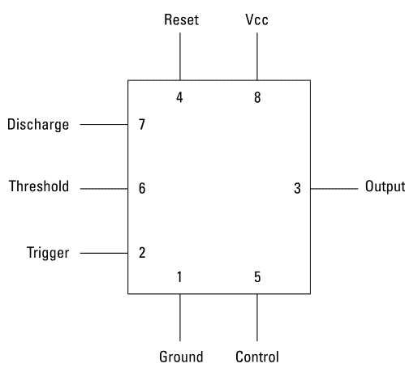

## 理解555的工作模式

有三种基本方式——称为*模式*——可以连接555定时器集成电路：

- **单稳态模式**：工作原理类似煮蛋计时器。启动后，定时器打开输出，等待时间间隔过去，然后关闭输出并停止。
- **无稳态模式**：工作原理类似节拍器：它持续运行直到你将其关闭。
- **双稳态模式**：实际上不是定时器模式。相反，它使用触发输入来交替地打开和关闭输出。这种电路通常称为*触发器*，在数字电子学中非常常用。

以下部分将解释这三种工作模式各自的工作原理。

## 在单稳态（单次）模式下使用555

单稳态模式允许你将555定时器芯片用作单次事件定时器。这种模式称为单稳态，因为当这样连接时，555只有一个稳定状态，即引脚3的输出关闭。当555接收到触发脉冲时，这个稳定状态会被暂时中断，中断间隔由电阻和电容的值决定。在此间隔期间，引脚3的输出变为高电平，但一旦时间间隔过去，555将返回其稳定状态，引脚3变为低电平。

单稳态模式有时称为单次模式，我认为这似乎更具描述性。单次模式传达了这样的意思：当被触发时，555产生一个且仅一个输出脉冲。当时间间隔到达时，输出脉冲停止，电路保持静默，直到检测到另一个触发脉冲。每个触发脉冲产生一个单独的输出脉冲。

## 查看典型的555单稳态电路

图2-3展示了用于单稳态模式的555定时器的典型接线。

要理解这个电路的工作原理，首先看10 kΩ电阻和开关如何连接到引脚2（触发输入）。开关是一个常开按钮。当按钮未按下时，10 kΩ电阻为引脚2提供电压输入，使触发输入保持高电平。当触发输入为高电平时，引脚3的输出电压接近零。

当按下按钮开关时，电源电压短路到地。这导致引脚2的电压降至零，定时器被触发。一旦定时器被触发，引脚3的输出电压变为高电平，定时间隔开始。

## 观察单稳态定时器中的电阻-电容电路

现在您已经了解了触发电路的工作原理，接下来让我们看看RC电路（R1和C1）是如何工作的。电阻和电容协同工作，决定了输出保持高电平的时长。简而言之，一旦电路被触发，C1便开始充电。

在单稳态555电路中，引脚6和引脚7——即阈值引脚和放电引脚——是连接在一起的。引脚6监测电容两端的电压。随着电容充电，该电压逐渐升高。当电容电压达到Vcc电源电压的三分之二时，定时周期结束，引脚3的输出变为低电平。

放电引脚（引脚7）负责电容的充放电。要理解引脚7的工作方式，参考图2-4所示的模型来想象其内部工作原理可能会有所帮助。此处，引脚7连接到一个由引脚3输出状态控制的开关。当输出为高电平时，开关断开；当输出为低电平时，开关闭合。当开关闭合时，555内部的一个小阻值10 kΩ电阻将引脚7接地。（实际上555内部并没有这样一个开关或10 kΩ电阻，但这个模型或许能帮助您理解引脚7的工作方式。）

当引脚3的输出为低电平时，555内部的模拟开关闭合，引脚7通过10 kΩ电阻接地。这使得C1上的电压能够通过555放电。

但当引脚3的输出变为高电平时，555内部的模拟开关断开。这迫使流经R1的电流转向C1，从而导致电容以一个取决于R1和电容数值的速率充电。

在电容充电期间，引脚6监测其两端逐渐累积的电压。一旦该电压达到电源电压的三分之二，引脚6便向555发出信号，表明定时区间已结束，输出变为低电平。这进而会闭合555内部的模拟开关，允许电容放电。

## 计算单稳态电路的时间间隔

555单稳态电路的时间间隔，是其被触发后输出保持高电平的时长。要计算时间间隔，只需使用以下公式：

$T = 1.1 \times R \times C$

其中，T是以秒为单位的时间间隔，R是R1的电阻值（单位为欧姆），C是C1的电容值（单位为法拉）。

例如，假设R1为500 kΩ，C1为10 µF。那么，您可以按如下方式计算时间间隔：

$T = 1.1 \times 500,000 \Omega \times 0.00001 F$

$T = 5.5 s$

因此，电路在触发后将持续导通5.5秒。

进行此计算时，务必确保电阻和电容值使用的零的个数正确。可参考表2-1作为指导：

### 表 2-1 电阻与电容值换算

| 电阻 | 电容 |
| :--- | :--- |
| 1 kΩ = 1,000 Ω | 0.01 µF = 0.00000001 F |
| 10 kΩ = 10,000 Ω | 0.1 µF = 0.0000001 F |
| 100 kΩ = 100,000 Ω | 1 µF = 0.000001 F |
| 1 MΩ = 1,000,000 Ω | 10 µF = 0.00001 F |
| 10 MΩ = 10,000,000 Ω | 100 µF = 0.0001 F |
| 100 MΩ = 100,000,000 Ω | 1,000 µF = 0.001 F |

> 如果您不想自行进行这些计算，可以在网上找到555定时器计算器。只需访问Google或其他任何搜索引擎，搜索 *555定时器计算器* 即可。

## 将555用于无稳态（振荡器）模式

使用555定时器的另一种常见方式是*无稳态模式*。术语*无稳态*仅仅意味着555没有稳定的状态：当它刚刚稳定在一个状态（例如，引脚3输出为高电平）时，它就会切换到相反的状态（输出为低电平）。然后它又切换回第一个状态，如此循环往复，无穷无尽。这种模式也称为*振荡器模式*，因为它将555用作振荡器，产生方波信号。

## 观察典型的无稳态电路

图2-5展示了555无稳态模式的基本电路。

要理解这个电路的工作原理，首先请注意触发引脚（引脚2）直接连接到C1。在单稳态电路中，定时器是通过一个将引脚2电压短路的开关来触发的。在无稳态电路中，定时器是在电容放电时被触发的——一旦电容两端的电压降至电源电压的三分之一，引脚2就会触发定时器开始另一个周期。

这里，我将从引脚3输出处于高电平状态开始，逐步分析这个定时周期是如何工作的：

- 1. 输出为高电平，放电引脚（引脚7）断开，迫使电流流经电阻R2和C1。这导致电容以一个取决于R1与R2的总阻值以及C1数值的速率充电。
- 2. 随着电容充电，引脚2和引脚6的电压升高。
- 3. 当引脚6（阈值引脚）的电压达到电源电压的三分之二时，555内部的阈值电路使得引脚3的输出电压变为低电平。
- 4. 当引脚3的输出变为低电平时，放电引脚（引脚7）在555内部连接到地。这允许C1放电。放电通过R2进行，因此R2的阻值以及电容的数值决定了电容放电的速率。
- 5. 随着电容放电，引脚2和引脚6的电压降低。
- 6. 当引脚2（触发引脚）的电压降至电源电压的三分之一时，555内部的触发电路使得引脚3的输出变为高电平。
- 7. 当引脚3的输出变为高电平时，放电引脚（引脚7）断开，周期重新开始。

## 控制无稳态555电路的时间间隔

555电路在无稳态模式下的输出是一个方波，如图2-6所示。对于方波，有三个重要的时间测量值：

- **T**：从一个高电平脉冲开始到下一个高电平脉冲开始的总波形持续时间
- **T<sub>high</sub>**：周期中高电平部分的长度
- **T<sub>low</sub>**：周期中低电平部分的长度

自然，总时间T是T<sub>high</sub>与T<sub>low</sub>之和。

这些时间常数的值取决于两个电阻（R1和R2）以及C1的数值。

以下是计算每个时间常数（以秒为单位）的公式：

```
T = 0.7 × (R1 + 2R2) × C1
T<sub>high</sub> = 0.7 × (R1 + R2) × C1
T<sub>low</sub> = 0.7 × R2 × C1
```

这些计算中蕴含着一个您需要了解的有趣事实：C1通过R1和R2两个电阻充电，但它仅通过R2放电。这就是为什么在计算T<sub>high</sub>时必须将两个电阻值相加，而在计算T<sub>low</sub>时仅使用R2。这也是为什么在计算总时间（T）时必须将R2加倍而R1不加倍。

现在，代入一些实际数字看看公式如何运算。假设两个电阻都是100 kΩ，电容是10 µF。那么，总周期时长计算如下：

```
T = 0.7 × (100,000 + 2 × 100,000) × 0.00001
T = 2.1 秒

T<sub>high</sub> = 0.7 × (100,000 + 100,000) × 0.00001
T<sub>high</sub> = 1.4 秒

T<sub>low</sub> = 0.7 × 100,000 × 0.00001
T<sub>low</sub> = 0.7 秒
```

因此，总周期时间将是2.1秒，其中输出高电平持续1.4秒，低电平持续0.7秒。

如果您愿意，也可以通过用1除以总周期时间来计算输出信号的频率。对于上述计算，频率为0.47619 Hz。

如果使用更小的电阻和电容值，您将获得更短的脉冲和更高的输出频率。例如，如果使用1 kΩ电阻和0.1 µF电容，输出信号频率将是48 kHz，每个周期仅持续几百万分之一秒。

你可能还注意到，如果两个电阻值相同，信号的高电平持续时间将是低电平的两倍。通过使用不同的电阻值，你可以改变信号高电平和低电平部分之间的差异。

## 计算占空比

555电路中的*占空比*是指在每个方波周期中，输出为高电平的时间百分比。例如，如果总周期时间为1秒，且每个周期的前0.4秒输出为高电平，则占空比为40%。

对于如图2-5所示的非稳态电路，占空比必须始终大于50%。换句话说，输出为高电平的持续时间必须始终长于输出为低电平的持续时间。

对此的解释很简单：要使占空比为50%，电容器必须通过相同的电阻进行充电和放电。实现这一点的唯一方法是完全省略R1，使电容器仅通过R2进行充电和放电。但这样做的问题是，你最终会将引脚7直接连接到Vcc。由于引脚7和电压源之间没有电阻，流过引脚7的电流将超过555内部电路所能承受的最大值，从而损坏芯片。

有一个巧妙的方法可以绕过这个限制：如图2-7所示，在R2两端并联一个二极管。当电容器充电时，这个二极管会旁路R2。这样，电容器通过R1充电，通过R2放电。

当以这种方式使用二极管时，你可以完全控制充电和放电时间的持续时间。如果R1和R2的阻值相同，电容器充电和放电所需的时间相同，因此占空比将为50%。如果R2小于R1，占空比将小于50%，因为电容器放电比充电快。

如果按照图2-7所示使用二极管，你必须调整计算时间间隔的公式，如下所示：

```
T = 0.7 × (R1 + R2) × C1
T_high = 0.7 × R1 × C1
T_low = 0.7 × R2 × C1
```

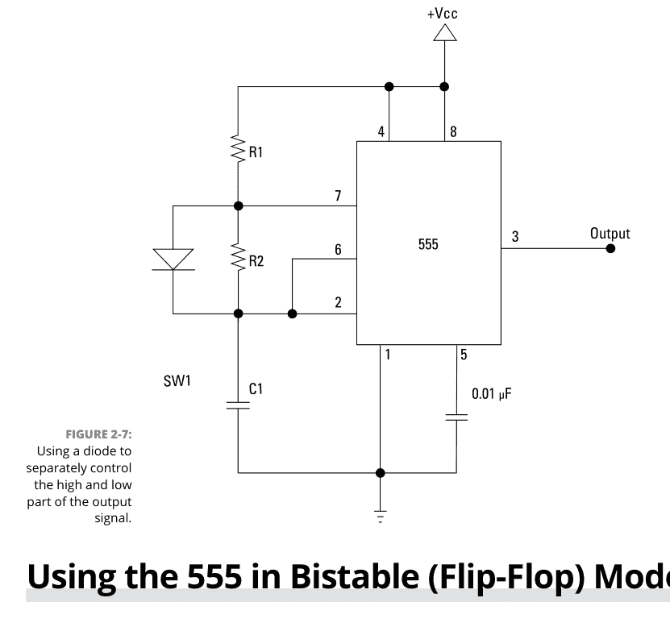

## 在双稳态（触发器）模式下使用555

*触发器*是一种在两种输出状态之间交替的电路。在触发器中，触发器上的短脉冲会使输出变为高电平并保持高电平，即使在触发脉冲结束后也是如此。输出保持高电平，直到接收到复位脉冲，此时输出变为低电平。

这种类型的电路被称为*双稳态*，因为电路有两个稳定状态：高电平和低电平。电路在被触发之前保持低电平。然后，在被复位之前保持高电平。这种类型的电路在计算机和其他数字电路中被广泛使用。

> 对于计算机应用，555作为触发器的选择并不理想。这是因为在由高速时钟脉冲驱动的计算机电路中，其输出对触发或复位脉冲的响应速度不够快。对于计算机应用，有更好的触发器芯片可供选择，如你在第5册第4章所学。

话虽如此，555经常在非计算机应用中以双稳态模式使用，这些应用不需要高速响应。例如，想象一个简单的机器人，它向前行驶直到撞到前面的东西，然后向后行驶直到撞到后面的东西。机器人将在前后配备接触开关，连接到双稳态模式下555的触发和复位输入。机器人的驱动电机将连接到输出，使得当输出为低电平时，电机向前运行；当输出为高电平时，电机向后运行。然后，双稳态555将使机器人在两个障碍物之间来回行驶。

图2-8显示了以双稳态模式使用的555的原理图。如你所见，这个电路不需要电容器。这是因为在双稳态模式下，555不是用作定时器。输出信号的高低电平由触发和复位输入控制，而不是由电容器的充电和放电控制。

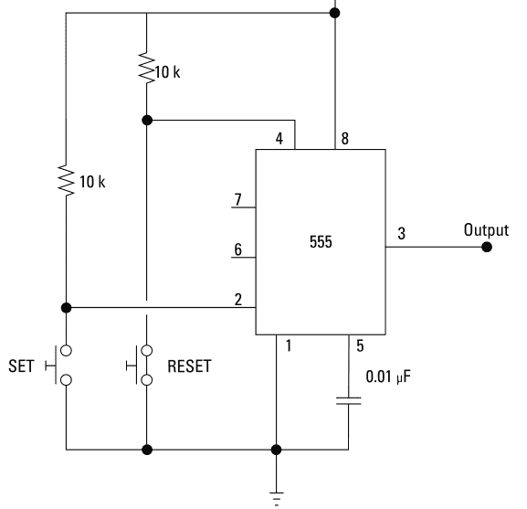

**图2-8：** 双稳态模式下的555定时器电路原理图。

触发（引脚2）和复位（引脚4）输入都通过一个10 kΩ电阻连接到Vcc。当按下设置开关时，引脚2被短接到地。这导致电压绕过引脚2，产生一个瞬时的低电平脉冲，从而触发555。一旦触发，输出引脚变为高电平。

在非稳态或单稳态模式下，输出引脚将保持高电平，直到阈值引脚（引脚6）的电压达到电源电压的三分之二。然而，由于在此电路中引脚6未连接任何东西，引脚6上永远不会出现电压。因此，阈值永远不会达到，所以输出将无限期地保持高电平，直到555通过复位引脚（引脚4）上的低电平脉冲复位。

复位输入（引脚4）以与触发输入相同的方式连接到Vcc。因此，当按下复位开关时，引脚4被短接到地，产生一个低电平脉冲，该脉冲复位555并将输出恢复为低电平。

## 使用555定时器输出

555的输出引脚（引脚3）可以处于两种状态之一：高电平或低电平。在高电平状态下，引脚的电压接近电源电压。低电平状态为0 V。

有两种方法可以将输出组件连接到输出引脚。图2-9以LED作为输出设备说明了这两种配置。电路中还包含一个电阻以限制电流流动。如果没有电阻，电流将不受阻碍地流过电路，这将很快烧毁LED，并可能损坏555。

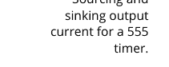

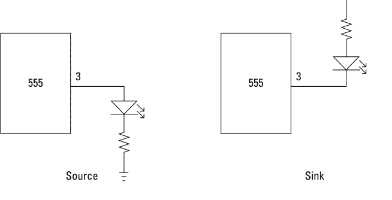

在左侧的电路中，当输出为高电平时，电流流过LED电路。电流从输出引脚流过LED和电阻到地。这种输出配置称为*源电流*，因为555是驱动输出的电流源。

在右侧的电路中，当输出为低电平时，电流流过LED电路。电流从Vcc电源流过LED和电阻，进入555，然后通过引脚1内部路由到地。这种输出配置称为*灌电流*，因为电流被送入555。

你是使用源电流还是灌电流输出电路，取决于你希望输出电路在输出为高电平还是低电平时开启。

图2-10显示，你可以在单个电路中同时使用源电流和灌电流。这里，两个LED连接到输出引脚。一个是源电流；另一个是灌电流。在此电路中，当输出在高电平和低电平之间切换时，LED交替闪烁。当输出为低电平时，LED1点亮；当输出为高电平时，LED2点亮。

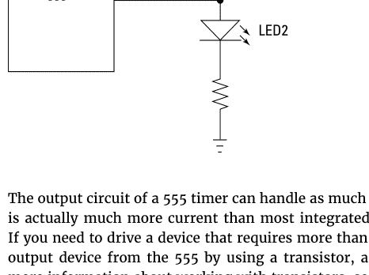

**图2-10：** 你可以为555定时器的输出组合使用源电流和灌电流。

555定时器的输出电路可以处理高达200 mA的电流，这实际上比大多数集成电路所能提供或吸收的电流要大得多。如果你需要驱动需要超过200 mA的设备，你可以使用晶体管将输出设备与555隔离，如图2-11所示。有关使用晶体管的更多信息，请参见第2册第6章。

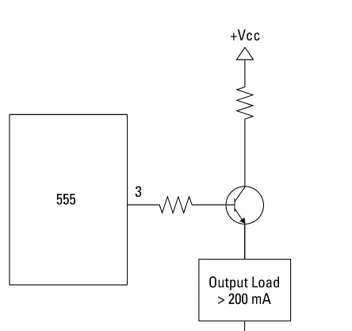

**图2-11：** 使用晶体管驱动更高电流的设备。

## 使用556双定时器加倍

如果一个555定时器芯片很好，那么两个就更好了！事实上，事实证明，在单个电路中使用两个（或更多）555定时器有很多用途——用途之多，以至于你可以在一个芯片中获得两个555定时器，称为556双定时器芯片。

556双定时器芯片采用14引脚DIP封装。两个555定时器共享一个公共电源和地引脚。其余12个引脚分配给各个555定时器的输入和输出。表2-2列出了556双定时器芯片中每个555定时器的引脚连接。作为额外的奖励（免费！），我还在表2-2中列出了标准555定时器芯片的引脚排列。

使用556双定时器的一种常见方法是将两个555电路都连接为单稳态（单次）模式，第一个555定时器的输出引脚连接到第二个555定时器的触发引脚。然后，当第一个定时器的输出变为低电平时，第二个定时器被触发。你可以以这种方式连接任意数量的555定时器，每个定时器的输出连接到下一个定时器的触发器，使定时器按顺序一个接一个地工作。

# 表 2-2：555 定时器与 556 双定时器芯片引脚功能

| 功能 | 555 定时器 | 556 第一定时器 | 556 第二定时器 |
| :--- | :--- | :--- | :--- |
| 接地 | 1 | 7 | 7 |
| 触发 | 2 | 6 | 8 |
| 输出 | 3 | 5 | 9 |
| 复位 | 4 | 4 | 10 |
| 控制 | 5 | 3 | 11 |
| 阈值 | 6 | 2 | 12 |
| 放电 | 7 | 1 | 13 |
| Vcc | 8 | 14 | 14 |

例如，图 2-12 展示了一个使用两个独立 555 定时器芯片的级联定时器电路。在此电路中，两个 555 定时器芯片均配置为*单稳态模式*，与图 2-3 中的电路类似。第一个 555 的时间间隔由 R1 和 C1 控制。第二个 555 的时间间隔则由 R2 和 C2 控制。你可以根据需要选择这些元件的数值，以实现你想要的任何时间间隔。

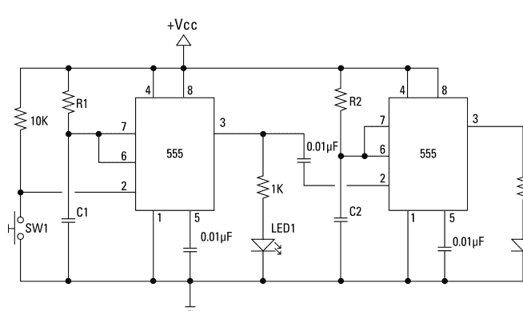

当按下 SW1 时，第一个 555 芯片被触发，将引脚 2 接地。这使得引脚 3 的输出变为高电平，点亮 LED1。但请注意，第一个 555 的引脚 3 通过一个小电容连接到第二个 555 的触发输入。一旦第一个 555 的时间间隔结束，其输出变为低电平，关闭 LED1，同时触发第二个 555，进而点亮 LED2。LED2 保持亮灯状态直到 C2 充电完成，然后熄灭。电路随后等待开关再次被按下以重新触发。

图 2-13 展示了如何使用单个 556 双定时器芯片实现相同的电路。此原理图与图 2-13 中展示的原理图几乎相同，但有几个重要区别：

- 两个 555 定时器电路被标记为 556（1）和 556（2），以表示这些定时器电路属于同一个 556 双定时器芯片。
- 引脚编号指示的是 556 的两个定时器电路的引脚分配，而非 555 的引脚分配。
- 第二个定时器电路未显示电源或接地连接。这是因为两个定时器电路共享一个公共的电源和接地连接，该连接在图中显示连接到了第一个定时器。

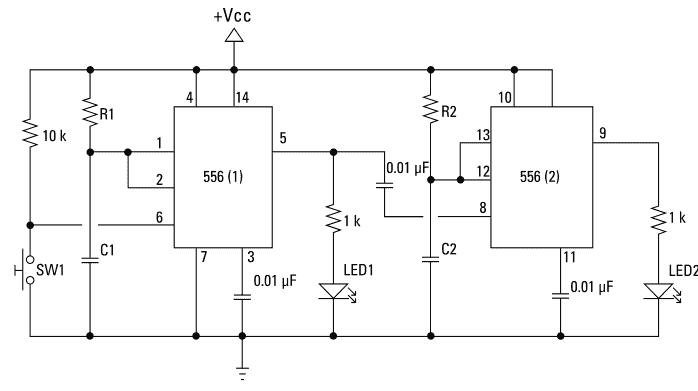

尽管在原理图中将 556 双定时器的两半显示为独立元件很方便，但你也可以选择将 556 显示为一个单一元件。图 2-14 展示了如何为级联定时器电路绘制使用单一元件表示 556 双定时器的原理图。此电路与图 2-13 中展示的电路几乎相同；唯一的区别在于原理图描绘 556 双定时器芯片两个部分的方式。

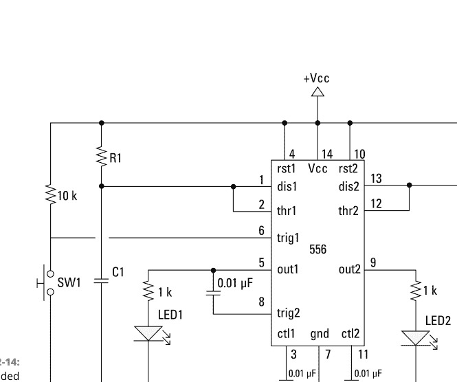

图 2-14：使用 556 双定时器芯片绘制为单一元件的级联定时器电路。

> 当你将 556 绘制为单一元件时，将两个定时器的连接画在元件的相对两侧会很有帮助。在图 2-14 中，我将第一个定时器的连接画在左侧，第二个定时器的画在右侧，除了第二个定时器的触发输入（引脚 8）。将该连接画在元件的右侧会使图表复杂化，所以我将其放在左侧，紧挨着第一个定时器的输出引脚下方。

> 由于难以记住 556 中哪个引脚是哪个功能，像我在图 2–14 所示原理图中那样标记每个引脚的功能会很有帮助。

# 制作单次触发定时器

在本节中，你将搭建一个使用 555 定时器芯片配置为*单稳态模式*的电路。当触发开关被按下时，一个 LED 点亮并保持亮灯约 5 秒钟。然后，LED 熄灭，直到按钮再次被按下。

项目 21 提供了组装此电路所需的所有信息。该电路基于图 2–3 中所示的单稳态电路原理图。唯一的区别是在输出引脚（引脚 3）上添加了一个 LED，并且在电容充电电路中包含了电阻和电容的数值。

完成后，电路将如图 2–15 所示。要测试电路，请按下按钮。LED 应该点亮，保持亮灯略超过 5 秒钟，然后熄灭。只有当你再次按下按钮时，它才会再次点亮。

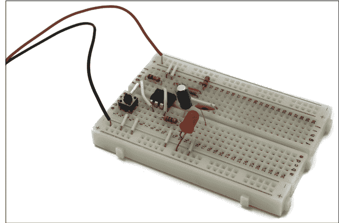

如果电路不工作，可以检查以下几点：

-   确保电池状态良好。（使用万用表进行测试。）
-   仔细复查所有跳线和其他元件，确保连接正确。
-   确保 LED 没有反向插入。作为测试，可以将其拔出并反向重新插入。
-   确保电解电容的负极插入电路的接地侧。
-   确保按钮的焊接点牢固。

# 项目 21：单次触发 555 定时器电路

在本项目中，你将搭建一个使用 555 定时器芯片配置为*单稳态模式*以创建单次触发定时器的电路。该电路包含一个按钮和一个 LED。当你按下按钮时，LED 将点亮并保持亮灯约 5 秒钟。然后 LED 将熄灭并保持熄灭状态，直到你再次按下按钮。

完成此项目所需的唯一工具是剪线钳和剥线钳。

# 元器件清单

-   一个 9 V 电池
-   一个 9 V 电池扣座
-   一个小型无焊面包板
-   一个常开按钮开关
-   一个 555 定时器芯片
-   一个 5 mm 红色 LED
-   一个 10 Ω 电阻（棕-黑-橙）
-   一个 470 Ω 电阻（黄-紫-棕）
-   一个 470 kΩ 电阻（黄-紫-黄）
-   一个 10 µF 电解电容
-   一个 0.01 µF 瓷片电容
-   一个常开 DIP 面包板按钮
-   八根跳线（各种长度）

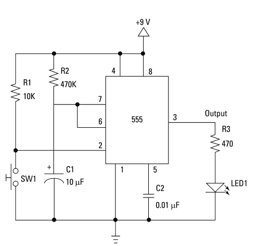

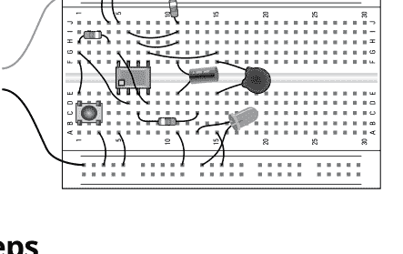

## 步骤

在整个步骤中，使用面包板底部的负（-）电源条作为接地，顶部的正（+）电源条作为正电源。

1.  **插入 555 定时器芯片。**
    将芯片插入，使其跨接在无焊面包板中央的间隙上，引脚 1 插入孔 E5，引脚 8 插入孔 F5。

2.  **插入跳线。**
    如果你使用预裁剪的跳线，请为每段选择合适的长度。否则，根据需要自行裁剪跳线。总共需要八根跳线，按以下方式插入无焊面包板：

    | 从 | 到 |
    |---|---|
    | A3 | 接地电源条 |
    | A5 | 接地电源条 |
    | A11 | 接地电源条 |
    | A15 | 接地电源条 |
    | J4 | + 电压电源条 |
    | J5 | + 电压电源条 |
    | E1 | F1 |
    | D6 | G1 |
    | D8 | G5（注意这根线从 555 芯片上方穿过。） |
    | G8 | G15 |
    | H7 | H11 |
    | I6 | I11 |

3.  **插入电阻。**
    按如下方式插入三个电阻：

    | 电阻 | 从 | 到 |
    |---|---|---|
    | 10 kΩ | H1 | H4 |
    | 470 kΩ | J11 | + 电压电源条 |
    | 470 Ω | C7 | C13 |

4.  **插入电容。**
    按如下方式插入两个电容：

    | 电容 | 从 | 到 |
    | --- | --- | --- |
    | 10 μF | E11 | F11 |
    | 0.01 μF | E15 | F15 |

    确保电解电容的负极引线插入孔 E11。

5.  **插入 LED。**
    阳极（较长的引脚）应插入孔 A13，阴极（较短的引脚）插入接地电源条。

6.  **插入按钮。**
    将按钮插入孔 B1、D1、B3 和 D3。（确保开关方向正确，使其从 B1/D1 闭合到 B3/D3。）

7.  **连接电池。**
    将 9 V 电池插入电池扣连接器，然后将红色引线连接到正电压电源条，黑色引线连接到接地电源条。

你完成了！现在你可以按下按钮点亮 LED。LED 会在约 5 秒钟后再次熄灭。

# 制作 LED 闪烁器

在本节中，你将搭建一个使用 555 定时器芯片来交替闪烁两个 LED 的电路。对于此电路，555 配置为*非稳态模式*，选择的电阻值使得高电平和低电平时间非常接近，各自约为十分之一秒。

项目 22 向你展示如何搭建 LED 闪烁器电路。此项目的原理图与图 2-5 所示的类似，但在输出电路中增加了一对 LED。当输出为低电平时 LED1 点亮，当输出为高电平时 LED2 点亮。注意，该电路同时使用了输出电流的灌入和拉出。

图 2-16 展示了完成的项目。

如果电路不工作，以下是一些需要检查的地方：

- 检查电池电压。
- 再次确认所有跳线和电阻器，确保它们插入了正确的孔位。
- 确保二极管和电解电容正确插入。对于发光二极管，阳极必须连接在电路的正极侧，阴极连接在负极侧。对于电容，负极端必须连接在接地总线上。

当你完成并调试好这个项目后，可能希望将其保持组装状态。在本章后面，项目23中，你将为这个电路添加第二个555定时器，以增加额外的功能。

## 项目22：LED闪光器

在本项目中，你将搭建一个让一对发光二极管交替闪烁的电路。该电路使用一个配置为非稳态模式的555定时器来驱动LED闪烁。所选的电阻和电容值使得占空比接近50%，每个LED大约点亮十分之一秒。

完成本项目所需的唯一工具是剪线钳和剥线钳。

## 元件清单

- 一节9V电池
- 一个9V电池扣
- 一块小型无焊面包板
- 一个555定时器芯片
- 两个5mm红色LED
- 一个10 kΩ电阻（棕-黑-橙）
- 三个1 kΩ电阻（棕-黑-红）
- 一个22 μF电解电容
- 一个0.01 μF陶瓷圆片电容
- 八根跳线（各种长度）

## 步骤

1.  **插入555定时器芯片。**

    将芯片插入，使其跨接在无焊面包板中央的凹槽上，引脚1插入E5孔，引脚8插入F5孔。

2.  **插入跳线。**

    如果你使用预制跳线，请为每段选择合适的长度。否则，根据需要自行剪切跳线。总共需要八根跳线，按以下方式插入无焊面包板：

| 从 | 到 |
|---|---|
| A5 | 接地总线 |
| C3 | C6 |
| C7 | C10 |
| D6 | G7 (这根线跨过555芯片顶部) |
| D8 | G5 (这根线同样跨过555芯片顶部) |
| H3 | H6 |
| F9 | 接地总线 |
| J5 | +电压总线 |

3.  **插入电阻器。**

    按以下方式插入四个电阻器：

| 电阻 | 从 | 到 |
| --- | --- | --- |
| 10 kΩ | D3 | G3 |
| 1 kΩ | J3 | +电压总线 |
| 1 kΩ | B10 | B13 |
| 1 kΩ | D10 | F13 |

4.  **插入电容器。**

    按以下方式插入两个电容器：

| 电容 | 从 | 到 |
| --- | --- | --- |
| 0.01 µF | G8 | G9 |
| 22 µF | A3 | 接地总线 |

    确保电解电容的负极引线插入接地总线。

5.  **插入LED。**

    按以下方式插入两个LED：

| LED | 阴极（短引脚） | 阳极（长引脚） |
| --- | --- | --- |
| LED1 | J13 | +电压总线 |
| LED2 | 接地总线 | A13 |

6.  **连接电池。**

    将9V电池插入电池扣连接器，然后将红色引线连接到正电压总线，黑色引线连接到接地总线。连接电池后，LED应立即开始闪烁。

完成了！

如果你打算构建项目23，请在完成本项目后将其保持组装状态。

## 使用置位/复位开关

在本节中，你将修改项目22中搭建的电路，使其由两个按钮控制，这两个按钮用作置位/复位开关。当给此电路通电时，LED1点亮并保持亮起。当你按下置位按钮时，两个LED开始交替闪烁，直到你按下复位按钮才会停止闪烁。

本项目的电路使用两个555定时器芯片。第一个配置为双稳态模式，两个按钮分别作为置位和复位开关。第二个配置为非稳态模式，与项目22中使用的555定时器几乎完全相同。区别在于，非稳态555定时器芯片的电源电压引脚（引脚8）不是直接连接到电池，而是连接到第一个555的输出端。这样，第一个555控制第二个555的电源，因此只有当第一个555的输出为高电平时，第二个555才会使LED闪烁。

项目23将向你展示如何搭建此电路，完成后的项目如图2-17所示。

## 项目23：带置位/复位开关的LED闪光器

在本项目中，你将扩展项目22中搭建的电路，添加一个控制LED闪烁的置位/复位开关。在尝试本项目之前，你应该先构建项目22。

完成本项目所需的唯一工具是剪线钳和剥线钳。

## 元件清单

你需要项目22中的所有元件，加上以下额外部分：

- 一个555定时器芯片（在项目22使用的那个之外）
- 两个10 kΩ电阻（棕-黑-橙）
- 一个0.01 µF陶瓷圆片电容
- 一个常开DIP按钮开关
- 八根跳线（各种长度）

## 步骤

1.  **如果你还没有完成，请构建上一节描述的LED闪光器电路。**

    该项目中的555定时器芯片即为本项目指定的555(2)。

2.  **拔掉你从J5孔插入到正电压总线的跳线。**

    此步骤断开了555(2)的Vcc电源（引脚8）。555(2)的电压由555(1)的输出提供。

3.  **插入第二个555芯片。**

    将芯片插入，使其跨接在无焊面包板中央的凹槽上，引脚1插入E17孔，引脚8插入F17孔。

4.  **插入额外的跳线。**

    如果你使用预制跳线，请为每段选择合适的长度。否则，根据需要自行剪切跳线。总共需要八根额外的跳线，按以下方式插入无焊面包板：

| 从 | 到 |
|---|---|
| A17 | 接地总线 |
| I5 | D19 |
| C18 | I27 |
| B20 | H30 |
| F21 | 接地总线上的任意孔 |
| A25 | 接地总线 |
| A28 | 接地总线 |

5.  **插入电阻器。**

    按以下方式插入两个电阻器：

| 电阻 | 从 | 到 |
|---|---|---|
| 10 kΩ | J27 | +电压总线 |
| 10 kΩ | J30 | +电压总线 |

6.  **插入电容器。**

    0.01 µF电容器应插入G20和G21孔。

7.  **插入按钮开关。**

    按以下方式插入两个按钮开关，使其跨接在凹槽上：

| 按钮 | 位置 |
|--------|----------|
| 置位 | E25, F25, E27, F27 |
| 复位 | E28, F28, E30, F30 |

8.  **连接电池。**

    将9V电池插入电池扣连接器，然后将红色引线连接到正电压总线，黑色引线连接到接地总线。LED1应立即点亮。（如果没有，请仔细检查所有连接，并确保电池没有耗尽。）

完成了！

9.  按下置位按钮开始让LED闪烁。让它们闪烁一会儿，然后按下复位按钮使闪烁停止。

## 制作蜂鸣器

在本节中，你将使用两个555定时器芯片搭建一个声音蜂鸣器，两个定时器都配置为非稳态模式。一个定时器产生可听的方波音调并发送到扬声器，以便可以听到声音。另一个定时器产生一个慢得多的频率，连接到第一个定时器的复位端，以控制音调的开启和关闭，从而产生蜂鸣效果。

项目24展示了如何搭建此电路。开始之前，先看一下项目的电路原理图。对于第一个定时器芯片——在原理图中指定为555(1)——RC网络使用1 kΩ和470 kΩ电阻以及一个1 µF电容来产生1.5Hz的输出。第二个定时器——555(2)——使用4.7 kΩ和15 kΩ电阻以及一个0.01 µF电容来产生输出音调。第一个定时器的输出连接到第二个定时器的复位端，第二个定时器的输出通过一个22 µF电容连接到8Ω扬声器。

> 注意：你也可以很容易地使用单个556双定时器芯片来搭建此电路。那样的话，你需要相应地调整原理图上的引脚编号。

## 项目 24：一个可发声的蜂鸣器

在这个项目中，你将使用一对 555 定时器集成电路来构建一个电路，该电路能在小扬声器上产生可听见的蜂鸣声。两个 555 定时器集成电路都配置为非稳态模式。第一个 555 提供蜂鸣间隔，大约是每十分之一秒蜂鸣一次。第二个 555 产生一个可听见的频率，该频率被馈送到扬声器以产生输出音调。

要构建这个项目，你需要剪线钳和剥线钳。

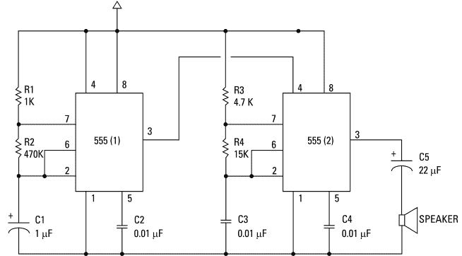

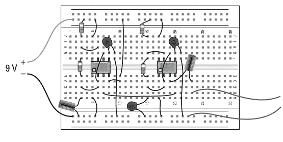

## 零件

- 一个 9 V 电池
- 一个 9 V 电池扣座（RadioShack 2700325）
- 一个小型无焊面包板（RadioShack 2760003）
- 两个 555 定时器芯片（RadioShack 2761718）
- 一个 1 kΩ 电阻（棕-黑-红）
- 一个 470 kΩ 电阻（黄-紫-黄）
- 一个 4.7 kΩ 电阻（黄-紫-红）
- 一个 15 kΩ 电阻（棕-绿-橙）
- 一个 1 µF 电解电容器
- 一个 22 µF 电解电容器
- 三个 0.01 µF 陶瓷圆片电容器
- 一个 8 欧姆扬声器
- 15 根跳线（各种长度）

## 步骤

1.  **插入 555 定时器芯片。**
    插入芯片，使其跨接在无焊面包板中心的间隙上。对于第一个芯片，将引脚 1 插入孔 E5，引脚 8 插入孔 F5。对于第二个芯片，将引脚 1 插入孔 E17，引脚 8 插入孔 F17。

2.  **插入跳线。**
    如果你使用的是预切跳线，请为每段选择合适的长度。否则，根据需要自行剪切跳线。你总共需要 15 根跳线，按如下方式插入无焊面包板：

| 从 | 到 |
|---|---|
| A5 | 接地总线 |
| A17 | 接地总线 |
| J5 | 正 (+) 电压总线 |
| J17 | + 电压总线 |
| C3 | C6 |
| H3 | H6 |
| C15 | C18 |
| G15 | G18 |
| F9 | 接地总线 |
| E10 | 正 (+) 电压总线 |
| D8 | D10 |
| D6 | G7（这根线跨过第一个 555 芯片的顶部。） |
| D18 | G19（这根线跨过第二个 555 芯片的顶部。） |
| F21 | 接地总线 |

3.  **插入电阻。**
    按如下方式插入四个电阻：

| 电阻 | 从 | 到 |
|---|---|---|
| R1 – 1 kΩ | J3 | 正 (+) 电压总线 |
| R2 – 470 kΩ | E3 | F3 |
| R3 – 4.7 kΩ | J15 | 正 (+) 电压总线 |
| R4 – 15 kΩ | E15 | F15 |

4.  **插入电容器。**
    按如下方式插入五个电容器：

| 标号 | 电容器 | 从 | 到 |
|---|---|---|---|
| C1 | 1 µF 电解电容 | A3 | 接地总线 |
| C2 | 0.01 µF 陶瓷圆片电容 | G8 | G9 |
| C3 | 0.01 µF 陶瓷圆片电容 | A15 | 接地总线 |
| C4 | 0.01 µF 陶瓷圆片电容 | G20 | G21 |
| C5 | 22 µF 电解电容 | D19 | D23 |

    请注意，对于 C1，负极引线应插入接地总线。对于 C5，负极引线应在 D23。

5.  **连接扬声器。**
    扬声器的一根引线应插入孔 B23。另一根可以插入接地总线的任何孔中。
    请注意，扬声器对极性不敏感，因此哪根引线插入接地总线，哪根插入 B23 并不重要。

6.  **连接电池。**
    将 9 V 电池插入电池扣连接器，然后将红色引线连接到正电压总线，黑色引线连接到接地总线。你应该立即听到扬声器发出蜂鸣声。
    你完成了！

7.  **当你再也无法忍受蜂鸣声时，断开电池。**

此电路中使用的扬声器可以是任何 8Ω 扬声器。如果你有一个旧的无放大电脑扬声器，你可以使用它。我建议你在扬声器端子上焊接 2 到 3 英寸长的 20 号实心线，这样你就可以轻松地将扬声器连接到面包板。

图 2-18 显示了完成的项目。

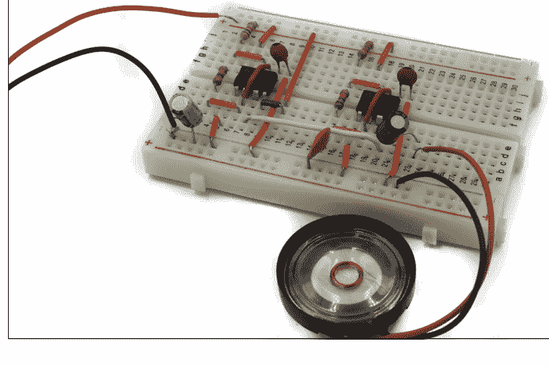

图 2-18：完成的蜂鸣器项目（项目 24）。

以下是一些额外的作业，如果你想对电路进行一些实验：

- 尝试使用单个 556 芯片而不是两个 555 芯片来构建电路。
- 将 4.7 kΩ 的 R3 替换为 1 kΩ 电阻，然后在电阻上串联一个 1 MΩ 电位器。当你转动电位器时，音调会改变。
- 在 R1 上串联一个 1 MΩ 电位器。然后，当你转动电位器时，蜂鸣速率会改变。

## 本章内容

- 熟悉运算放大器
- 探索反馈电路如何与运算放大器配合工作
- 了解求和放大器和比较器
- 探索几种流行的运算放大器封装

# 第 3 章
使用运算放大器

你玩过“Operation”游戏吗？在这个游戏中，你必须使用带电的镊子从身体上的小孔中取出塑料身体部件。孔的边缘是金属导体，所以如果你在试图取出里面的塑料部件时用镊子碰到了孔的边缘，蜂鸣器就会响，病人的鼻子（那是一个红色灯泡）就会亮起。

我从来都不太擅长这个游戏，因为它需要钢铁般的神经和对镊子的精确控制。镊子最轻微的抖动都会被放大成闪烁的灯光、响亮的蜂鸣声，以及我哥哥的嘲笑——他比我更擅长当“Operation”外科医生。

运算放大器（简称运放）有点像“Operation”游戏。嗯，实际上，它并不真的像，除了输入（你拿着镊子的手）最轻微的变化会被放大成输出（闪烁的红鼻子、刺耳的蜂鸣声和你哥哥的嘲笑）的巨大变化这一点。

运放是最常见的集成电路类型之一——可能仅次于上一章描述的 555 定时器芯片。在本章中，你将学习什么是运放，以及如何用它构建几个有用的电路。所以，穿上你的手术服，让我们开始“手术”吧！

### 了解运算放大器

*运放*是一种超灵敏的放大器电路，旨在放大两个输入电压的差值。因此，运放有两个输入和一个输出。输出电压通常比输入电压的差值大几十甚至几十万倍。因此，两个输入电压之间非常小的差异——可能只有几百分之一甚至几千分之一伏——就可能导致很大的输出电压。

尽管运放是一种集成电路，但运放的发明远早于集成电路。然而，运放电路非常适合集成电路，因此在第一代集成电路推出后不久，集成电路版本的运放就问世了。如今，运放是最受欢迎的集成电路类型之一。


*运算放大器*这个名字可能有点令人困惑。最初，运放电路是为在电话分配系统中用作放大器而创建的。后来，计算机工程师发现该电路可以很容易地被改编用于执行数学运算，如加法、减法、乘法和除法。大约在那个时候，*运算放大器*这个术语被创造出来，因为这些电路是可以执行（数学）运算的放大器。（更多信息，请参阅附近的侧边栏“运放是如何诞生的”。）

在内部，最简单的运放由几十个晶体管组成，更复杂的品种则有更多。在本章中，我完全忽略运放的内部电路，并将其视为它本身：一个你可以使用而无需理解其工作原理的便捷设备。你应该感谢几十年前的工程师们，他们解决了所有内部细节，使运放能够发挥其魔力。

运放的标准原理图符号是一个三角形，如图 3-1 所示。如你所见，两个输入在三角形的左侧，输出在右侧，电路的电源连接在三角形的顶部和底部。

如今制造了许多类型的运放芯片，但所有芯片都具有图 3-1 所示的五个连接。以下段落描述了每个连接的功能：

- **+V 和 –V：** 运放的电源通过两个通常标记为 +V 和 –V 的引脚提供。（这些引脚也可能标记为 V<sub>s+</sub> 和 V<sub>s-</sub>，但它们的功能相同。）大多数运放需要正负电压电源，电压通常在 ±6V 到 ±18V 之间。这种类型的电源称为*分裂电源*。± 表示需要正电压和负电压。例如，±6V 表示需要 +6V 和 –6V。

图 3-1：运算放大器的电路符号。

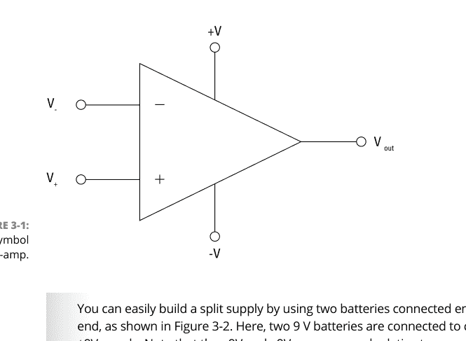

你可以通过将两个电池首尾相连，轻松构建一个分裂电源，如图 3-2 所示。这里，两个 9V 电池连接在一起，创建了一个 ±9V 电源。请注意，+9V 和 –9V 是相对于地线测量的，地线位于两个电池之间。

请注意，有些运算放大器不需要分裂电压电源。使用单电源的运算放大器有一个接地端子，而不是 –V 端子。

图 3-2：用于运算放大器的 ±9V 分裂电源。

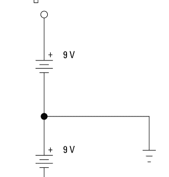

- **V<sub>out</sub>**：运算放大器的输出从 V<sub>out</sub> 端子取出。输出端子的电压可以是正的也可以是负的，这取决于两个输入端子之间的电压差。最大电压通常比 +V 和 –V 端子的电源电压低几伏。因此，如果运算放大器的电源是 ±9V，最大输出将在 ±7V 或 ±8V 左右。

大多数运算放大器只能处理通过输出端子的少量电流——通常在 25 mA 左右或更少。如图 3-3 所示，输出通过一个外部电阻（标记为 R<sub>L</sub>）传递。该电阻的另一端接地。因此，流过运算放大器的输出电流最终必须流向地。

请注意，负载电阻不一定以简单电阻器的形式存在；它可以是任何其他提供一定负载电阻的电路，例如晶体管的基极-发射极电路，甚至是另一个运算放大器的输入。

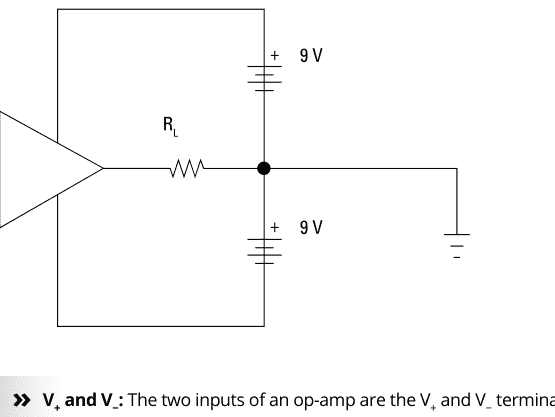

- **V<sub>+</sub> 和 V<sub>–</sub>**：运算放大器的两个输入是 V<sub>+</sub> 和 V<sub>–</sub> 端子。这些端子有时在三角形内部用 + 和 – 符号标识。这些输入被称为*差分输入*，因为出现在 V<sub>out</sub> 端子上的输出电压取决于 + 和 – 端子之间的电压差。

对于大多数运算放大器，最大允许输入电压略低于最大电源电压。±12V 是一个典型的限制。但请记住，运算放大器放大的是两个输入电压之间的*差值*。在许多情况下，两个输入电压非常接近，因此差值非常小。

我已经说过，但值得重复：运算放大器输出的极性取决于 V<sub>+</sub> 和 V<sub>–</sub> 输入之间差值的极性。因此，如果 V<sub>+</sub> 大于 V<sub>–</sub>，输出将是正电压；但如果 V<sub>+</sub> 小于 V<sub>–</sub>，输出将是负电压。

在许多运算放大器电路中，一个输入接地。如果 V+ 输入接地，输出极性总是与 V- 端子上的输入电压极性相反。换句话说，V- 上的负电压将在 Vout 上产生正电压，而 V- 上的正电压将在 Vout 上产生负电压。因此，V- 输入通常被称为反相输入，因为其极性在输出中被反转。

另一方面，如果 V- 输入接地，输出的极性与施加到 V+ 的输入电压极性相同。因此，如果 V+ 为正，Vout 将为正；如果 V+ 为负，Vout 将为负。因此，V+ 输入被称为同相输入，因为其极性在输出中相同——即 V- 输入电压没有被反转。

## 运算放大器的由来

现代运算放大器可以追溯到 1930 年代初，当时贝尔电话公司刚开始在全国铺设电话线。在电话的早期，工程师们对于运行数千英尺以上的电话线遇到了一个难题。长距离电话线需要放大器来增强信号，但当时可用的放大器非常不稳定——对天气（温度和湿度）过于敏感，并且无法在早期电话线使用的电压范围内持续工作。

1934 年，一位名叫哈里·布莱克的贝尔工程师正在研究放大器问题，当他下班乘渡轮回家时，一个想法突然闪现。这个想法是几十年后看来显而易见的天才之举。布莱克的想法不是设计一个具有工作所需精确增益的放大器，而是使用一个增益远高于所需——实际上是数千倍——的放大器，然后通过一个电阻器将部分输出反馈到输入端。这个反馈电路将根据电路中的电阻值来降低放大器的总增益。

直到大约十年后计算机时代开始，计算机研究人员弄清楚如何利用放大器的独特特性对输入电压执行加法、减法、乘法和除法等基本数学运算，该电路才获得了“运算放大器”这个名称。最终，数字计算机取代了由运算放大器构建的模拟计算机。然而，运算放大器在今天的计算机中仍然扮演着重要角色，主要是为与真实世界的输入测量设备（如电压传感器和湿度检测器）提供接口。

最初的运算放大器电路是用真空管构建的。它们体积庞大，需要几百伏的电压才能工作，并产生大量热量。当晶体管在 1950 年代取代真空管时，运算放大器变得更小，而当集成电路在 1960 年代被发明时，运算放大器是最早被设计的芯片之一。

## 理解开环放大器

顾名思义，运算放大器最基本的应用之一是作为放大器。如果你将输入源连接到其中一个输入端子，并将另一个输入端子接地，那么在输出端子上就会出现输入信号的放大版本。

运算放大器电路中的一个重要概念是*电压增益*，它简单地表示两个输入电压之间的差值被乘以多少倍以产生输出电压。例如，如果输入电压差为 2 V，输出电压为 12 V，则放大器的电压增益为 6。

如果你只是将输入信号施加到运算放大器的 V- 端子，如图 3-4 所示，该电路被称为*开环放大器*。之所以这样称呼，当你进入下一节时会变得更加明显。目前，只需知道这种类型的电路被称为*开环*。

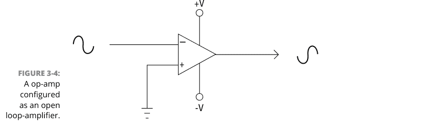

在开环运算放大器电路中，V+ 输入接地，输入信号施加到 V- 输入。在这种配置中，要放大的电压与 V- 输入的电压相同。虽然图 3-4 显示输入为交流电，但开环运算放大器电路也适用于直流电。

开环运算放大器电路中的电压增益非常高——达到数万甚至数十万倍。假设你使用的运算放大器的开环电压增益为 200,000，电源为 ±9 V。在这种情况下，+0.000025 V 的输入电压将产生 +5V 的输出电压。+0.00004 V 的输入电压将给你 8 V 的输出电压。

> 输出电压永远不能超过电源电压。事实上，最大输出电压通常比电源电压低约 1 V。因此，如果你使用一对 9 V 电池提供 ±9 V 电源，最大输出电压为 ±8 V。因此，开环增益为 200,000 的开环运算放大器电路能够可靠放大的最大值是 0.00004 V。如果输入电压差大于 0.00004 V，则认为运算放大器已饱和，输出电压将达到最大值。

我敢保证，无论你在顶级电压表上投入了多少钱，它都不够灵敏，无法测量那么小的电压。加州理工学院的物理学家可能能够测量那么小的电压，但出于所有实际目的，0.00004 V 与 0 V 相同。

因此，开环运算放大器电路的基本特征之一是，如果输入电压差不为零，运算放大器将饱和，输出电压将保持在最大值。因此，如果最大输出电压为 ±8 V，输出将只有三种电压之一：+8V、0V 或 –8V。

开环运算放大器电路听起来可能不太有用，但实际上，它们有许多有用的应用。你将在本章后面的“将运算放大器用作电压比较器”中看到一个例子。

## 理想运算放大器

如果你在网上或电子书中阅读关于运算放大器的内容，你无疑会遇到“理想运算放大器”这个术语。理想运算放大器是一种假设的运算放大器，具有真实运算放大器努力实现的某些特性。真实的运算放大器非常接近理想运算放大器，但现实中没有任何运算放大器能够达到理想运算放大器的完美程度。所以你看，在许多方面，运算放大器几乎和人一样。

根据你阅读的列表不同，理想运算放大器具有两到七个特性，其中最重要的是：

- 无限开环增益：在本章中，我多次提到运算放大器的开环增益非常大——达到数万甚至数十万倍。在理想运算放大器中，开环增益是无限的，这意味着两个输入端子上的任何电压差都会在输出上产生无限的电压。在真实的运算放大器中，输出电压受电源电压限制。由于输出电压不能是无限的，增益也不能是无限的。

- 无限输入阻抗：阻抗代表电路对电流流动的阻碍，无论是交流电还是直流电。在理想运算放大器中，两个输入端子的阻抗是无限的，这意味着没有电流从输入端进入运算放大器。输入端能够感知并响应电压，但该电压无法将任何电流推入运算放大器。在实践中，这意味着运算放大器对输入电压没有影响。在实际的运算放大器中，少量的电流——通常是几毫安或更少——确实会泄漏到运算放大器的输入电路中。

-   **零输出阻抗：** 在理想运算放大器中，输出电路的内部阻抗为零，这意味着无论输出连接的负载有多大，输出提供的电压都保持不变。实际上，大多数运算放大器的输出阻抗为几欧姆，这意味着输出端提供的实际电压会因负载的不同而略有变化。
-   **零失调电压：** *失调电压*指的是当两个输入端完全相同时，输出端的电压值。例如，若将两个输入端都接地，输出端应恰好为 0V。实际上，即使在两个输入端接地、相互连接或完全不连接任何东西时，实际运算放大器的输出端也会存在非常微小的电压。对于大多数运算放大器，这个失调电压仅为几毫伏。
-   **无限带宽：** *带宽*一词指的是运算放大器能够精确放大的交流频率范围。在理想运算放大器中，输入信号的频率不会影响其工作性能。在实际运算放大器中，当频率超过某一上限（通常是几兆赫兹，即每秒数百万个周期）时，运算放大器的工作性能会下降。

这些特性通常可以归结为运算放大器的以下两条“黄金法则”：

1.  **输出会尽力使两个输入端的电压差为零。** 此规则仅适用于闭环放大器电路，意味着从输出反馈到输入的信号会使两个输入电压变得相同。
2.  **输入端不吸取电流。** 此规则意味着输入端会检测其两端的电压，但不允许任何电流流入运算放大器。

尽管没有真正的运算放大器能达到理想运算放大器的标准，但大多数都非常接近。实际上，其接近程度足以让你在设计运算放大器电路时，可以放心地将其视为理想运算放大器。特别是，上述两条黄金法则是适用的：反馈会平衡输入电压，且运算放大器不会从输入端吸取电流。

390 第3册 *使用集成电路*

## 探索闭环放大器

如我在前一节所述，开环运算放大器电路作为放大器并不实用，因为它们很容易饱和。要使运算放大器作为放大器发挥作用，必须将其置于反馈电路中，该电路将增益降低到更可控的水平，从而能够可靠地放大可用（甚至可测量的！）输入电压。

我相信你已经熟悉反馈的概念。你可能曾坐在礼堂里听某人通过公共广播系统讲话，突然从扬声器里传来刺耳的尖叫声。那种尖叫声就是反馈。在公共广播系统中，麦克风拾取了部分扬声器的输出信号，并将其再次送回放大器。结果便是恼人的高频尖叫声。

然而，并非所有反馈都是有害的。在运算放大器放大电路中，反馈用于将巨大的开环放大增益降低到更可控的增益，例如 10。为此，输出信号通过 V+ 端反馈回输入端。使用一个电阻来降低反馈到输入端的电压。这种电路被称为闭环放大器，因为输出和输入之间存在一个闭合的电流回路。（现在你明白为什么没有反馈环路的运算放大器电路被称为开环放大器了。）

最常见的运算放大器配置称为反相放大器，因为输出电压与输入电压极性相反。图 3-5 展示了一个基本的反相放大器电路。

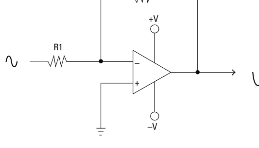

在反相放大器电路中，输入信号经过一个电阻到达 V- 输入端，而输出通过第二个电阻反馈回 V- 输入端。在图 3-5 中，这些电阻分别标记为 R1 和 R2。你可以使用以下公式轻松计算电路的整体电压增益：

$$A_{CL} = -\frac{R2}{R1}$$

这里，增益用 A<sub>CL</sub> 表示（CL 代表 *闭环*）。

如果 R1 为 1 kΩ，R2 为 10 kΩ，则电路的电压增益将为 –10。那么，如果输入电压为 +0.5 V，输出电压将为 –5 V（0.5 × –10）。

请注意，负号是必需的，因为图 3-5 是一个反相放大器电路，所以正输入会产生负输出，反之亦然。

闭环放大器也可以设计成 *同相放大器*，其中输出电压不反转。为此，只需交换输入端的连接方式，如图 3-6 所示。不是将输入电压通过电阻连接到 V- 并将 V+ 接地，而是将 V- 通过电阻接地，并将输入电压连接到 V+。反馈电路保持不变：输出通过电阻 R1 连接到 V- 输入端。


计算同相放大器增益的公式与反相放大器的公式略有不同：

$$A_{CL} = 1 + \frac{R1}{R2}$$

如果 R1 为 10 kΩ，R2 为 1 kΩ，则增益为 11。因此，+0.5 V 的输入电压将产生 +5.5 V 的输出电压。

### 深入了解反馈

如果你有兴趣理解反馈电路的工作原理，请记住我在“理解开环放大器”一节中描述的规则：如果输入电压不为零，运算放大器将会饱和，输出电压将达到其允许的最大值。反馈电路的目的就是将部分输出电压反馈回反相输入端，从而驱使输入电压差趋向于零。随着电压趋近于零，运算放大器的增益开始下降到可用范围。

假设反相运算放大器电路的输入电压差为 +0.5 V。这个差值导致运算放大器饱和，因此输出端出现 -8 V 电压。取决于 R1 和 R2 构成的分压器，一部分负电压被反馈到 V- 输入端，其效果是降低输入电压。这导致电压差变小，但还不够小到足以阻止运算放大器仍然处于饱和状态。

然而，请记住，反馈环路就是一个环路。随着越来越多的饱和输出电压通过环路被反馈回来，输入电压差越来越接近零。当它非常接近零时，输出电压降至零到最大电压之间的某个范围。

闭环放大器电路最出色的特点是，位于运算放大器芯片外部的两个电阻，让你能够精确控制电路最终具有的增益大小。你只需选择合适的电阻值，就能获得任何你想要的增益（在运算放大器的限制范围内）。

使用运算放大器

## 将运算放大器用作单位增益放大器

*单位增益放大器*是一种不进行放大的放大器电路。换句话说，它的增益为 1。单位增益放大器的输出电压与输入电压相同。

你可能认为这样的电路毫无价值。毕竟，一根简单的导线不也是单位增益电路吗？没错，但单位增益放大器提供了一个重要的好处：它不会从输入源吸取任何电流。（记住，这是理想运算放大器的黄金法则之一。）因此，它完全隔离了电路的输入部分与输出部分。运算放大器经常被用作单位增益放大器，以将电路的不同级彼此隔离。

单位增益放大器有两种类型：电压跟随器和电压反相器。跟随器是一种输出电压与输入电压完全相同的电路。反相器是一种输出电压与输入电压大小相同但极性相反的电路。

如果你稍加思考，或许自己就能想出单位增益跟随器和反相器的电路。计算反相放大器和同相放大器增益的公式都需要将 R1 除以 R2，因此你只需选择能产生增益为 1 的电阻值即可。

以下部分将解释如何创建单位增益跟随器和单位增益反相器。

### 配置单位增益跟随器

单位增益跟随器就是一个增益为 1 的同相放大器。回忆一下计算同相放大器增益的公式：

$A_{CL} = 1 + \frac{R2}{R1}$

要创建一个单位增益跟随器，只需省略 R2，并将输出直接连接到反相输入端，如图 3-7 所示。因为 R2 为零，所以 R1 的值无关紧要，因为零除以任何数都等于零。因此，R1 通常也被省略，V- 输入端不接地。


### 配置单位增益反相器

计算反相放大器增益的公式如下：

$A_{CL} = -\frac{R2}{R1}$在这种情况下，你只需为R1和R2使用相同的值，即可使放大器增益等于1。图3-8展示了一个使用1 kΩ电阻的单位增益反相器电路。

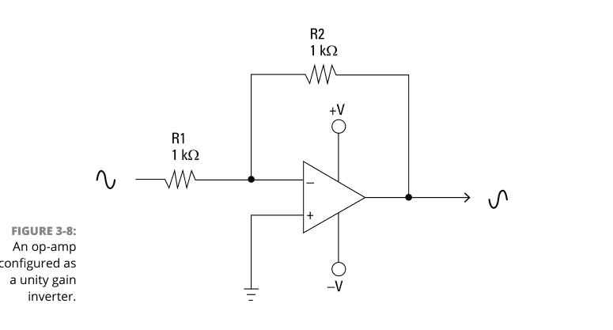

## 将运算放大器用作电压比较器

电压比较器是一种比较两个输入电压并告知你哪个电压更大的电路。假设你有一个光电传感器，在阳光直射下产生0.5 V电压，并且你想用这个光电传感器作为传感器来判断何时是白天。你可以使用电压比较器将光电传感器的电压与0.5 V参考电压进行比较，以确定是否有阳光照射。

使用运算放大器很容易创建电压比较器，因为运算放大器输出电路的极性取决于两个输入电压差值的极性。图3-9展示了运算放大器电压比较器的基本电路。

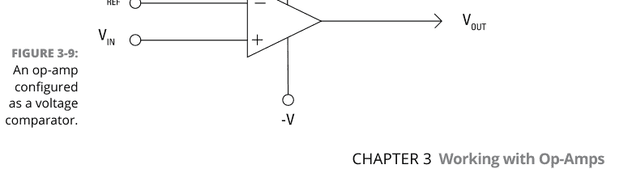

在电压比较器电路中，首先将参考电压施加到反相输入端（V₋）；然后将要与参考电压比较的电压施加到同相输入端。输出电压取决于输入电压相对于参考电压的值，如下所示：

| 输入电压 | 输出电压 |
| --- | --- |
| 小于参考电压 | 负 |
| 等于参考电压 | 零 |
| 大于参考电压 | 正 |

请注意，正负输出电压的电平都将比电源电压低约1 V。因此，如果运算放大器电源为±9 V，那么当输入电压大于参考电压时，输出电压将为+8 V；当输入电压等于参考电压时，输出电压为0 V；当输入电压小于参考电压时，输出电压为−8 V。

你可以修改电路，通过将输出通过一个二极管来消除输入小于参考电压时的负电压，如图3-10所示。在此电路中，如果输入电压大于参考电压，则输出端出现正电压；否则，没有输出电压。

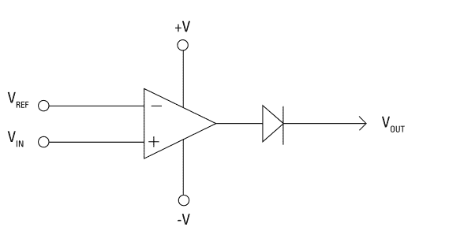

### 图3-10：在电压比较器电路中使用二极管。

要创建一个在输入电压小于参考电压时产生正电压输出的电压比较器，请使用图3-11所示的电路。这里，输入电压施加到反相（V₋）输入端，参考电压施加到同相（V₊）输入端。

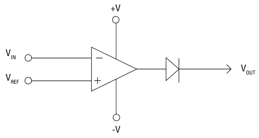

你应该了解的最后一个电压比较器电路是*窗口比较器*，它让你知道输入电压是否落在给定范围内。窗口比较器需要三个输入：一个低参考电压、一个高参考电压和一个输入电压。只有当输入电压大于低参考电压且小于高参考电压时，窗口比较器的输出才会是正电压。如果输入电压小于低参考电压，输出将为零。同样，如果输入电压大于高参考电压，输出也将为零。

你需要两个运算放大器来创建一个窗口比较器，如图3-12所示。如图所示，一个运算放大器被配置为仅在输入大于低参考电压（V<sub>REF(LOW)</sub>）时产生正输出电压。另一个运算放大器被配置为仅在输入小于高参考电压（V<sub>REF(HIGH)</sub>）时产生正输出电压。

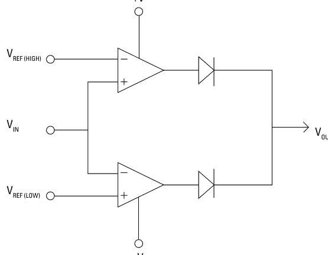

输入电压连接到两个运算放大器；输出电压通过二极管传输，只允许正电压通过，然后合并。最终的输出只有在输入电压介于低参考电压和高参考电压之间时才会有正电压。

> 请注意图3-12中，电路中没有单独显示每个运算放大器的电源连接。在单个电路中使用多个运算放大器时，通常省略电源连接。如果显示所有运算放大器的电源连接，会使原理图不必要地复杂化。我不知道你怎么想，但我的生活中不需要任何不必要的复杂。必要的复杂已经够多了。

## 电压相加

运算放大器可用于将两个或多个电压相加或相减。将电压相加的电路称为*求和放大器*。求和放大器有两个输入，输出电压是两个输入电压之和，但极性相反。例如，如果一个输入是+1.5 V，另一个是+1.0 V，那么输出电压将是-2.5 V。

图3-13展示了求和放大器的基本电路。为了使求和放大器工作，电阻R1、R2和R3的值应全部相同。

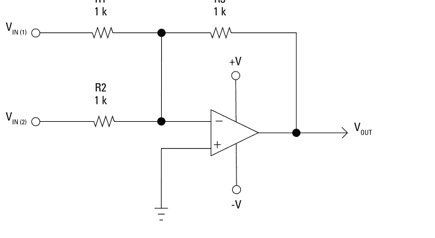

如果求和放大器中的所有电阻都相同，输出电压将是输入电压之和。这是配置求和放大器的常用方式，尽管你可以根据需要改变电阻值。

如果电阻值不同，每个输入电压将根据其输入电路上电阻的值进行加权，这相当于在电压相加之前将每个输入电压乘以某个值。每个输入被乘以的确切值取决于你使用的电阻组合。

例如，如果R1是1 kΩ，R2是10 kΩ，那么通过1 kΩ电阻施加的输入电压将在与通过10 kΩ电阻施加的电压相加之前乘以10。因此，如果R1处的输入为+1 V，R2处的输入为+2 V，输出电压将为–12 V。（为了使此公式成立，R3也必须是10 kΩ。）

根据输入电压和电阻值计算输出电压的实际公式如下：

$V_{out} = -R3\left(\frac{V1}{R1} + \frac{V2}{R2}\right)$

我将为你计算各种电阻值和输入电压组合的数学运算。不过，这里有几个例子，可以让你了解当R1为1 kΩ且R2和R3均为10 kΩ时电路的行为：

| $V_{in (1)}$ | $V_{in (2)}$ | $V_{out}$ |
|--------------|--------------|-----------|
| +1 V         | +1 V         | –11 V     |
| +1 V         | +5 V         | –15 V     |
| 0 V          | +5 V         | –5 V      |
| +2 V         | –5 V         | –15 V     |
| –1 V         | –5 V         | +15 V     |

求和放大器的一个缺点是它会反转输入的极性，但你可以很容易地将求和放大器的输出馈送到单位增益反相器的输入，如图3-14所示。这里，第二个运算放大器反转了求和放大器输出的极性，其效果是将输出电压的极性恢复为原始输入的极性。（有关此电路电压反相部分的更多信息，请参阅本章前面的“将运算放大器用作单位增益放大器”。）

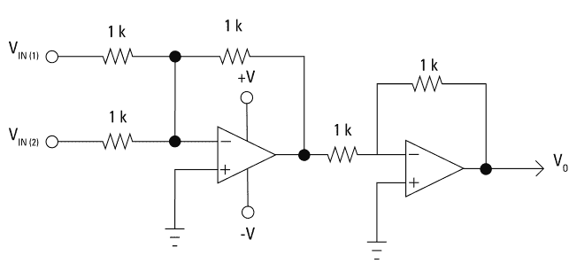

### 图3-14：求和放大器可以与电压反相器结合使用以保持输入极性。

求和放大器电路的一个常见用途是作为音频混音器。当这种类型的电路用作音频混音器时，每个输入都连接到一个麦克风。求和放大器通过将每个麦克风的电压相加来组合所有麦克风输入，然后将结果输出发送到另一个放大器级。

每个输入电路中的电阻通常是电位器，这允许你改变每个输入源的信号电平。当你增加其中一个输入电路的电阻时，该输入在输出混合中的比例就会减少——如果你的一个歌手有点跑调，这特别有用。

求和放大器电路可以通过添加额外的输入来扩展。图3-15展示了一个具有四个输入的电路，使用电位器控制每个输入的电平。你可以根据需要添加任意数量的输入，但你需要确保所有输入的总组合电压不超过电源电压（减去一两伏）。


请注意，运算放大器有最大输出电压额定值。如果你处理的输出电压高于±15 V，你应该检查运算放大器的最大输出电压额定值，以确保运算放大器能够承受。

警告

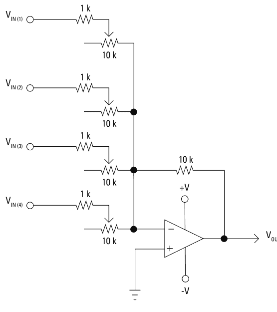

图3-15：一个具有四个输入的简易音频混音器。

# 运算放大器集成电路的使用

到目前为止，本章的所有示例都假设你在电路中使用的是通用运算放大器。当然，当你准备构建一个真实的运算放大器电路时，你需要使用真正的运算放大器。幸运的是，运算放大器集成电路种类繁多，几乎所有销售电子元件的商店都提供几种廉价的运算放大器集成电路。

最受欢迎的运算放大器集成电路是LM741，它采用标准的八引脚双列直插封装。图3-16展示了LM741运算放大器的引脚连接方式。

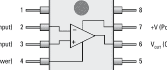

图3-16：LM741运算放大器的引脚排列图。

你也可以买到在单个封装内包含两个或更多运算放大器的集成电路。最常见的之一是LM324四运算放大器，它在一个14引脚双列直插封装内包含四个运算放大器。与LM741不同，LM324使用单电源运算放大器。因此，你无需提供正负分割电压电源，只需提供一个正电压电源和一个地线即可。

图3-17展示了LM324的引脚排列图。如你所见，第一个运算放大器通过引脚1-3接入，第二个通过引脚5-7，第三个通过引脚8-10，第四个通过引脚12-14。正电压电源连接到引脚4，引脚11连接到地线。

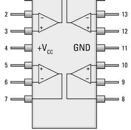

# 第四章 超越直流电

## 内容概览

- 第一章：**走进交流电** .................... 405
- 第二章：**构建电源** ............................ 429
- 第三章：**理解无线电** ............................... 441
- 第四章：**使用红外线** ............................. 467

- 探索交流电
- 瞥见交流电如何胜过直流电的历史
- 研究发电机如何将机械能转换为交流电
- 探索电动机的工作原理
- 揭示变压器的奥秘

## 第一章

## 走进交流电

几年前，我观看了我最喜欢的音乐剧之一，《悲惨世界》。当然，它与电毫无关系，但在第一幕结束时，当那群勇敢的革命学生和其他角色一起高唱《明天无尽》时，他们做了一个非常酷的行进步伐——他们朝观众方向迈一步，然后退一步，再前进一步，再退一步，如此往复。这创造出了一种人群在移动的逼真效果，即使这群人实际上并没有去任何地方。

交流电的工作原理就是如此。到目前为止，本书主要聚焦于直流电的应用，其中电流仅沿一个方向流动。如果《悲惨世界》里的革命者们演示的是直流电，他们就会径直冲下舞台，越过乐池，穿过观众席，从礼堂的后门离开。

在*交流电*中，电流沿两个方向流动——向前和向后——就像革命者们一步一步前进和后退那样。

交流电在电子学中至关重要，原因很简单：通过插入墙上的插座可以获取的电流恰好是交流电。因此，如果你想让你的电路摆脱电池最终会耗尽的束缚，你就需要学习如何让电路使用交流电电源工作。

在本章中，你将了解交流电的本质以及它如何为你家庭或工作场所提供可靠的电压。你还将看到三种基本的交流电设备：将蒸汽轮机或风车等运动源转换为交流电的发电机；将交流电转换为运动的电动机；以及能够在电路之间传输交流电而无需任何物理连接的变压器。最后，你将学习安全使用交流电的基础知识。

顺便说一句，如果你想亲眼看看著名的*悲惨世界*行进步伐，请访问 https://youtu.be/x-1B0PL9TJs。你可以在视频大约3分钟处看到这段行进。

# 什么是交流电？

如你所知，持续沿单一方向流动的电流称为*直流电*，或*DC*。在直流电路中，电流是由所有朝一个方向排列并移动的电子引起的。在承载直流电的导线内，电子在沿单一方向移动时从一个原子跳到另一个原子。因此，一个从导线一端开始其旅程的特定电子最终会到达导线的另一端。

在*交流电*中，电子并非只朝一个方向移动。相反，它们在一段时间内从一个原子跳到另一个原子，朝一个方向移动，然后转过身来朝相反方向从一个原子跳到另一个原子。电子会不时地改变方向。在交流电中，电子不是稳定地向前移动，而是来回移动。

当交流电中的电子切换方向时，电流的方向和电路的电压本身会反转。在美国的公共配电系统（包括家庭用电）中，电压每秒反转60次。在一些国家，电压每秒反转50次。

交流电改变方向的速率称为其*频率*，以赫兹为单位表示。因此，美国标准的家庭用电是60赫兹。

重要的是要认识到，交流电路中的电压不会立即反转极性。相反，电压从零开始稳步上升，直到达到最大电压，这称为*峰值电压*。然后，电压开始再次下降回到零。接着电压反转极性并跌至零以下，再次朝着负极性的峰值电压变化。当它达到负峰值电压时，又开始回升，直到回到零。然后这个周期重复。

电压的这种摆动变化很重要，这源于磁场和电流之间的基本关系。当导体（如一根导线）在磁场中移动时，磁场会在导线中感应出电流。但如果导体相对于磁场是静止的，则不会产生感应电流。

产生这种效果并不一定需要物理运动。如果导体保持在固定位置，但磁场的强度增加或减少（即磁场扩张或收缩），导体中同样会产生感应电流，其效果与磁场固定而导体在物理上穿过磁场时相同。

因为交流电的电压在从正到负再返回的极性摆动过程中总是在增加或减少，所以围绕电流的磁场总是在扩张或塌缩。因此，如果你将导体置于这个扩张和塌缩的磁场中，电流就会在导体中被感应出来。并且该电流会随着磁场的运动而交替变化。

这看起来像魔术！使用交流电，一根导线中的电流可以在相邻的导线中感应出电流，即使这两根导线之间没有物理接触。

底线是：交流电可用于产生变化的磁场，而变化的磁场可用于产生交流电。

交流电与磁场之间的这种关系使得三种重要的设备成为可能：

- **发电机：** 一种从旋转运动源（如由流水或蒸汽驱动的涡轮机或风车）产生交流电的装置。发电机的工作原理是利用旋转运动使放置在线圈内的磁体旋转。随着磁体的旋转，其磁场移动，从而在线圈导线中感应出交流电。（使用线圈导线而非直线导线，仅仅是因为将导线卷绕起来可以让更长长度的导线暴露在变化的磁场中。）
- **电动机：** 与发电机相反。它将交流电转换为旋转运动。在其最简单的形式中，电动机只是一个反向连接的发电机。一个磁体安装在可以旋转的轴上；磁体被放置在线圈导线的线圈内部。当交流电施加到线圈时，电流产生的上升和下降的磁场导致磁体旋转，从而带动轴转动。
- **变压器：** 由两个彼此靠近放置的线圈组成。如果在一个线圈上施加交流电，塌缩和扩张的磁场会在另一个线圈中感应出交流电。

# 测量交流电

对于直流电，确定两点之间存在的电压很容易：你只需用电压表测量即可。

然而，对于交流电，测量电压就不那么简单了。这是因为交流电路中的电压在不断变化。因此，例如，当我们说墙上插座的电压是120伏交流电时，这实际上意味着什么？

实际上，有三种方法可以测量交流电路中的电压。它们在图1-1中说明。这三种方法是：

- **峰值电压：** 测量0伏与交流周期上最高点之间存在的最大电压。它是交流电压所达到的最大电压值。
- **峰峰值电压：** 交流电压最高峰值与最低峰值之间的差值。在大多数交流电压中，峰峰值电压是峰值电压的两倍。

## 有效值电压

电路的平均电压；也称为平均电压。RMS 代表 *均方根*，但这只有在你备考或做其他特定事情时才重要。有效值电压是描述交流电路电压时最常用、也远为通用的方式。例如，当我们说家用电源插座的电压是 120 VAC 时，实际指的是有效值电压为 120 V。

如果交流电压遵循标准的正弦波，那么有效值电压等于峰值电压的 0.707 倍。或者反过来说，峰值电压大约是有效值电压的 1.4 倍。因此，家用电源插座的实际峰值电压大约是 168 V。

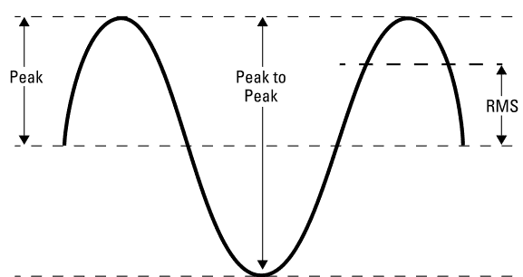

计算真正的有效值电压有点复杂，因为它涉及一些相当复杂的数学。有效值是通过以极小的时间增量对实际电压进行采样来计算的。然后，将这些采样电压求平方，再将这些平方值相加，并计算所有平方值的平均值。最后，计算这个平均值的平方根。这才是真正的有效值。

对于标准的正弦波，上述计算结果非常接近于将峰值电压乘以 0.707。然而，对于非标准正弦波的交流电压，实际有效值可能与"乘以 0.707"的简化算法得出的结果有所不同。

几乎所有交流电压表都报告有效值电压，但只有更昂贵的交流电压表才通过对输入电压采样并进行平方和计算来得出实际的有效值。便宜的电压表则简单地测量峰值电压并乘以 0.707。幸运的是，对于大多数用途来说，这样做的结果已经足够接近。

## 电流大战

交流电是全球电力分配的标准。然而，情况并非一直如此。在电力刚投入实际使用的年代，直流电是分配电力的常规方式。直流电最坚定的支持者不是别人，正是托马斯·爱迪生本人，这位伟大的美国发明家被认为是发明了从灯泡到留声机再到电影等各种东西的人。

1880 年，爱迪生为基于直流电的电力分配系统申请了专利，并于 1882 年成立了第一家公共电力公用事业公司，为纽约的 59 名客户提供电力。到 1890 年，他的发电厂已在全国超过 100 家运营。

托马斯·爱迪生最大的竞争对手是一位名叫乔治·威斯汀豪斯的人，他主张使用交流电进行电力分配，并推广由才华横溢但性格古怪的发明家尼古拉·特斯拉开发的系统。威斯汀豪斯宣扬交流电相对于直流电的优势——主要是交流电能在比直流电大得多的距离上高效地传输电力。爱迪生的直流电系统要求发电厂必须位于距离客户几英里的范围内。而特斯拉的交流电系统则可以将电力输送到距离发电厂几百英里外的地方。

爱迪生回应直流电负面宣传的方式，正如任何一个真正的美国营销人员会做的那样：发起了一场抹黑运动。1887 年，一名男子因意外触碰裸露的电线而死亡。爱迪生让他的一个员工开发了一种*故意*用电杀死人的方法。于是，电椅被发明了出来。

当然，电椅使用交流电来处决犯人。爱迪生发起了一场全国性的宣传活动，试图让公众相信交流电极其危险，以至于被监狱用来处决被判死刑的杀人犯。他甚至走得更远，公开处决流浪狗，有一次还处决了一头大象。传递的信息很明确：你不希望这种危险的东西进入你的家庭。

幸运的是，这场抹黑运动没有成功。交流电的优势最终胜出。转折点出现在 1896 年，位于尼亚加拉大瀑布的交流发电机开始运行，将电力输送到 20 英里外的纽约州布法罗市。到二十世纪初，全球几乎所有的电力分配都使用交流电。

然而，直流电分配持续的时间比你想象的要长。爱迪生原始电力公司的直系后裔——世界上最大的电力公司之一联合爱迪生公司——直到 2007 年才将其最后几个坚持使用直流电的客户转换为交流电。

## 理解交流发电机

理解交流电工作原理的一个好方法，是观察最常用来产生它的设备：*交流发电机*。交流发电机是一种将旋转运动（通常来自水、蒸汽驱动的涡轮或风车）转换为电流的设备。根据其本质，交流发电机产生的是交流电。

图 1-2 展示了交流发电机工作原理的简化示意图。本质上，一个大型磁体被放置在一组固定的线圈内。磁体安装在与涡轮或风车相连的旋转轴上。因此，当水流或蒸汽流过涡轮，或当风转动风车时，磁体就会旋转。

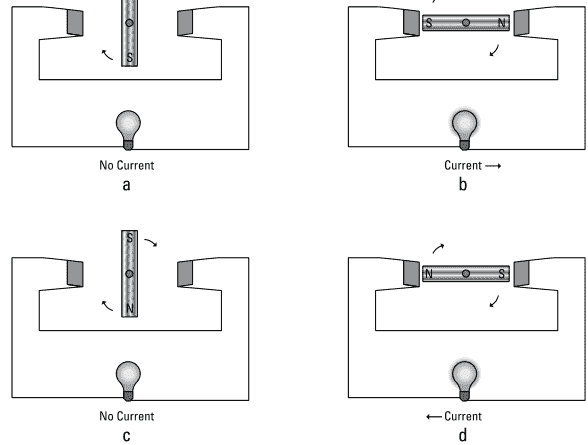

当磁体旋转时，它的磁场会扫过线圈。由于电磁感应现象，移动的磁场在线圈中感应出电流。这个电流的强度和方向取决于旋转磁体的位置和方向。

在图 1-2 中，你可以看到在磁体旋转的四个不同位置是如何在线圈中感应出电流的。在 A 部分，磁体距离线圈最远，并且方向与线圈方向相同。此时，磁场完全没有感应出任何电流。因此，灯泡是暗的。

但随着磁体开始顺时针旋转，它靠近线圈，从而使其更多的磁场暴露在线圈面前。移动的磁场感应出电流，并且随着磁体继续旋转靠近线圈，电流不断增强。这导致灯泡开始发光。很快，磁体到达距离线圈最近的位置，如 B 部分所示。此时，电流和电压达到最大值，灯泡发出最亮的光。

随着磁体继续逆时针旋转，它开始远离线圈。移动的磁场继续在线圈中感应电流，但随着磁体退后并远离线圈，电流（和电压）逐渐减小。当磁体到达距离线圈最远的位置时，如 C 部分所示，电流停止，灯泡熄灭。

随着磁体继续旋转，它再次靠近线圈。但这一次，磁体的极性反转了。因此，移动磁场在线圈中感应出的电流方向相反，如 D 部分所示。随着通过灯泡的电流再次增大，灯泡重新发光。

如此循环往复。随着磁体的每一次旋转，电压从零开始，稳定上升至最大值，然后下降直到再次归零。接着，过程反转，电流沿相反方向流动。

关于交流发电机，这里还有一些其他有趣的要点：

- *发电机*一词指的是任何将机械能转换为电能的装置。交流发电机是一种特定类型的发电机，因此将交流发电机称为发电机是常见且正确的。
- 从旋转磁场中产生直流电是可能的。然而，直流发电机比交流发电机更复杂，并且包含额外的、可能随时间磨损的部件。
- 交流发电机产生的交流电频率由磁体的旋转速度决定。磁体旋转得越快，产生的交流电频率就越高。
- 如果你在磁体周围均匀间隔地放置两组线圈，每组都形成自己完整的电路，那么每组线圈中都会感应出交流电。然而，这两个电压的极性将互为镜像。换句话说，当一个电路中的电压为正时，另一个电路中的电压将为负。电路极性之间的关系称为*相位*，以这种方式布置两个电路的发电系统称为*两相系统*。这两个电路被称为彼此相位差 180°。

若采用三组线圈，该系统即称为三相系统。在三相系统中，三相电路存在120°相位差。大多数公共发电系统均为三相系统，因为这种设计能从旋转磁场中最高效地产生电能。

## 理解电动机

电动机将电流形式的电能转换为旋转机械能。最简单的电动机本质上与发电机相同。区别在于：发电机使用水力或蒸汽等外力驱动磁铁旋转，从而在线圈中感应电流；而电动机则相反——电流被施加于线圈，从而驱动磁铁旋转。

我本可以展示一张描述电动机工作原理的示意图，但其外观与图1-2所示的发电机示意图几乎完全相同。唯一区别在于灯泡被交流电源取代。线圈通过移动磁场时感应电流的原理，与电流通过线圈时产生移动磁场的原理是相同的。移动磁场继而驱动磁铁旋转，该旋转运动传递至与磁铁相连的转轴。

与发电机类似，也可制造适用于直流电路的直流电动机。与发电机相同，直流电动机比交流电动机更复杂。在直流电动机中，磁铁每旋转半周，线圈的极性必须反转，以确保磁铁持续旋转。通常采用金属电刷实现这一功能。而交流电动机不需要电刷，因为交流电本身会周期性反转极性。

## 理解变压器

在第二册第四章中，你学习了磁学和电感的基本原理。变压器正是利用了这两项原理：

- 通过导线的变化电流在导线周围产生移动磁场。
- 处于移动磁场中的导线会感应出变化电流。

变压器通过将两个线圈靠近放置（如图1-3所示）来结合上述原理。当交流电源连接至其中一个线圈时，该线圈会产生随交流电压变化而同步扩张与收缩的磁场。换言之，当线圈两端电压升高时，线圈产生扩张的磁场；当电压达到峰值并开始下降时，线圈周围的磁场开始收缩。

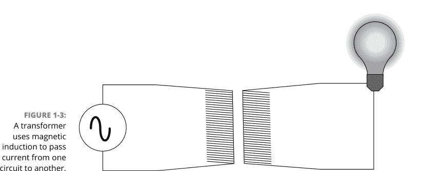

第二个线圈位于第一个线圈产生的磁场中。当磁场扩张时，会在第二个线圈中感应电流。只要磁场持续扩张，第二个线圈两端的电压就会升高；当磁场开始收缩，该线圈两端电压便开始下降。

因此，第二个线圈中感应的电流与第一个线圈的输入电流呈现镜像关系。该过程会产生少量能量损耗，但若变压器制造精良，第二个线圈中感应的电流强度将非常接近第一个线圈的输入电流强度。

变压器中连接交流电压的第一个线圈称为*初级线圈*，感应出交流电压的第二个线圈称为*次级线圈*。所有变压器都同时具备初级和次级线圈。

严格来说，并非*所有*变压器都同时具备初级和次级线圈。存在一种称为*自耦变压器*的特殊类型，它仅有一个带多抽头的线圈。在自耦变压器中，单个线圈同时承担普通变压器中初级和次级线圈的功能。本书不涉及自耦变压器的内容。

变压器最实用的特性之一是：次级线圈的感应电压等于初级线圈的施加电压乘以初级与次级线圈的匝数比。

最简单的情况是，当初级和次级线圈匝数相同时，次级线圈的感应电压将等于初级线圈的施加电压。但若初级线圈匝数多于次级呢？此时次级线圈的感应电压将低于初级施加电压。

具体降低程度取决于初、次级线圈的匝数比。若次级线圈匝数为初级的一半，次级感应电压将是初级施加电压的一半。例如，当在初级线圈施加110V交流电时，次级线圈将感应出55V交流电。

同理，若次级线圈匝数多于初级，感应电压将高于初级施加电压。例如，假设初级线圈有1000匝，次级线圈有2000匝，则在初级施加110V电压时，次级将感应出220V电压。

初级线圈匝数多于次级的变压器称为降压变压器，因其能降低电压（即次级电压低于初级电压）。反之，次级匝数多于初级的变压器称为升压变压器，因其能提高电压。

虽然升压变压器能提高电压，但电流会相应降低。例如，若初级线圈匝数为次级的一半，次级感应电压将是初级施加电压的两倍，但次级线圈的电流将仅为初级线圈电流的一半。

同理，降压变压器降低电压时，电流会成比例增加。因此电压减半时，电流将加倍。（存在因效率损耗导致的少量能量损失，但这些损耗通常不显著。）

思考后便会发现这完全合乎逻辑。毕竟变压器无法凭空创造能量。若能如此，地球能源问题早已解决。但世上并不存在免费的能量。

请记住计算电功率的基本公式：

$P = V \times I$

即功率等于电压乘以电流。变压器将功率从初级线圈传输至次级线圈。由于功率必须保持不变，若电压升高，电流必然降低；反之电压降低时，电流必然升高。

变压器是我们使用交流电而非直流电进行大规模电力分配的主要原因。因为在远距离输送大功率时，以高压低电流形式传输能显著提高效率。这就是为什么架空输电线路常承载高达40万伏的交流电压——如此高电压使得输送同等功率所需的导线远小于120伏交流电输电所需的规格。

配电系统使用大型升压变压器将发电厂产生的电压提升至数千甚至数十万伏。当电力接近终端用户（如家庭）时，一系列降压变压器将电压逐步降至更易管理的水平，最终在入户前降至最终电压（120V交流电）。

> 变压器仅适用于交流电。因为正是初级线圈产生的*变化*磁场才能在次级线圈中感应电压。为产生变化磁场，初级线圈施加的电压必须持续变化。由于直流电是稳定恒定的电压，它会产生恒定磁场，无法在次级线圈中感应电压。

## 处理线电压

*线电压*指标准住宅或商业墙插中可用的电压。在美国，该电压通常接近120V交流电，但常被称作110V、115V或117V交流电。在世界其他地区，电压可能更低或更高。

> 在欧洲，线电压常被称为*市电电压*或简称*市电*。

与家用电池提供的电压不同，线电压具有危险性。实际上，若不谨慎处理，线电压可能致命。因此，构建涉及线电压的电路时必须采取预防措施。本章将指导你如何安全使用线电压，确保自己和他人免受伤害。

## 在项目中使用线路电压

截至目前，本书介绍的所有项目均未涉及线路电压的使用。但许多——如果不是大多数——现实世界中的项目确实需要你使用线路电压。

在项目中使用线路电压最常见的原因是消除对电池的需求。电池是为电路供电的便捷电源，但它们会耗尽。对于许多电路，你希望提供一个能持久存在的电源。如果你使用电池，它们最终会耗尽电量并不得不被更换。如果你使用线路电压，只需将项目插上电源，就无需担心更换电池。

当然，大多数电子元件需要的是直流电而非交流电，而且电压等级远低于线路电压所提供的等级。因此，要让你的项目使用线路电压作为电源，你需要为项目提供一个电源，将 120 VAC 的线路电压转换为更有用的电压，例如 5 VDC。

至少有两种方法可以实现这一点：

- **使用电源适配器：** 最简单的方法是使用外部电源适配器，通常称为“墙插”或“电源砖”。图 1-4 显示了一个典型的外部电源适配器。你几乎可以从任何有消费电子产品部门的商店购买电源适配器。只需购买一个能提供合适直流电压等级的适配器，用它来代替电池即可。
- **构建自己的电源：** 购买电源适配器的替代方案是构建自己的电源电路。这个电路必须完成两件事。首先，它必须将电压从 120 VAC 降低到你的电路所需的任何电压；其次，它必须将交流电压转换为直流电压。你将在下一章学习如何设计和构建电源电路。

在线路电压中使用的第二个常见原因是，如果项目需要控制某个使用线路电压运行的外部设备，例如泛光灯或泵。在这种情况下，你的项目需要能够开启和关闭线路电压。

从电子电路开启和关闭线路电压设备最常用的方法是使用一种称为**继电器**的器件，它本质上是一个电子开关，使用低电流输入来控制高电流输出。例如，继电器可以让你使用 12 VDC 电路来控制一个单独的线路电压电路。你将在本章稍后的“使用继电器控制线路电压电路”一节中学习如何为此目的使用继电器。

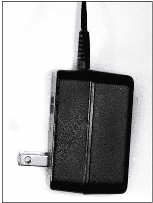

图 1-4：一个外部电源适配器。

## 安全使用线路电压

每当你构建一个使用线路电压的电子项目时，必须采取额外的预防措施，以确保你和任何可能接触你项目的人的安全。线路电压可能致命，因此这些预防措施是绝对必须的。

>  **警告**

许多人错误地认为线路电压不足以造成严重伤害或死亡。这根本不是事实；在合适的条件下，120 VAC 的电压足以致命。事实上，你应该将任何高于 50 V 的电压视为潜在致命电压。

在处理线路电压时，请务必采取以下预防措施：

- *切勿*在电源插头插着的时候操作电路。
- *切勿*将任何裸露的线路电压接头留在你或任何接触你项目的人可能意外触碰到的地方。*所有*线路电压接头必须完全绝缘，或包含在绝缘的项目盒或接地的金属项目盒内。
- *务必*将使用线路电压的项目密封在项目盒中，以防意外的手接触裸露的电线或其他部件。
- 如果你的项目装在金属盒中，*务必*使用接地的电源线，并*务必*将金属盒本身连接到电源线的地线。
- 始终使用与你电路将承载的电流量相匹配的正确线规的电线。更多信息，请参阅“用于处理线路电压的电线和连接器”一节。
- 始终确保所有线路电压接头都拧紧且牢固。如果你使用的是多股线而非单股线，请始终检查接头处是否有散开的线股。
- 始终为承载线路电压的电线提供某种形式的应力消除。最常见的方法是将电线穿过项目盒上一个带护圈的孔，并在盒子内部将电线打一个结。这个结可以防止电线从盒子上的孔滑出并可能松脱。
- 始终在你的线路电压电路的初级侧加入保险丝。保险丝会自动检测电流过载，并立即断开电路。
- 切勿使用额定值超过你的电路设计所能承受的最大电流的保险丝。例如，如果你使用一个能切换 5 A 电流的继电器，应使用额定值为 5 A 或更小的保险丝。（关于保险丝的更多信息，请参见本章后面的“使用保险丝保护线路电压电路”一节。）
- 切勿以导致电线移动或相互摩擦的方式安排项目的布线。摩擦最终会磨损绝缘层，造成触电危险。
- 始终注意可能发热的散热器。
- 切勿使用三孔转两孔适配器将三孔电源插头插入两孔延长线。这会禁用正确接地提供的安全保护，如果发生短路，可能导致潜在的致命电击。

## 理解火线、零线和地线

在开始处理电路中的线路电压之前，你需要了解大多数住宅和商业建筑布线的一些细节。以下描述仅适用于美国；如果你在不同的国家，你需要确定你所在国家的布线标准。

美国标准的线路电压布线使用塑料护套电缆，这种电缆通常有三根导体，如图 1-5 所示。这种电缆在技术上称为 *NMB* 电缆，但大多数电工使用其最流行的品牌名称 Romex 来指代它。

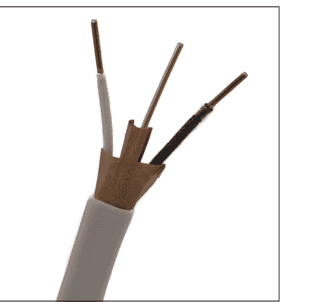

图 1-5：NMB 电缆。

NMB 电缆中的两根导体覆盖有塑料绝缘层（一根白色，另一根黑色）。第三根导体是裸铜线。这些导体被指定如下：

- **火线：** 黑色电线是*火线*，提供 120 VAC 的电流源。
- **零线：** 白色电线称为*零线*。它提供由火线提供的电流的回路路径。零线连接到大地地线。
- **地线：** 裸线称为*地线*。与零线一样，地线也连接到大地地线。然而，零线和地线有两个不同的用途。零线与火线一起构成带电电路的一部分。相比之下，地线连接到电器（如微波炉或咖啡壶）的任何金属部件。这是一项安全特性，以防火线或零线以某种方式与金属部件接触。将金属部件连接到大地地线消除了短路情况下的触电危险。

请注意，某些电路需要第四根导体。当使用第四根导体时，它覆盖有红色绝缘层，也是一根火线。

标准 NMB 电缆中的三根电线连接到标准电源插座（正确称为*插座*）的三个插脚上，如图 1-6 所示。如你所见，零线和火线连接到插座顶部的两个垂直插脚（零线在左，火线在右），地线连接到底部的圆形插脚。

## 处理市电的电线与连接器

处理市电时，必须始终使用专门设计用于承载市电电流的电线。根据需求，可选择实心线或多股线。多股线通常更易操作，因其柔韧性更好。

选择电线时，务必确保其线规与电路将承载的电流匹配。对于设计承载15 A或以下电流的电路（这是大多数家用插座所接设备的最大电流限制），可使用14号线规电线。若电路电流不超过13 A，16号线规电线即可满足需求。低于10 A时，18号线规电线足够。

灯线，也称为拉链线，是灯线和室内延长线所用的电线。它通常是双导体、非接地的16或18号线规多股线，两个导体以可轻松剥离的方式连接在一起。灯线是项目中短距离连接最易使用的电线。可在大多数五金店批量购买灯线，或在折扣店购买廉价的室内延长线并剪掉两端。

确保所有承载市电的电线连接牢固。最简单的连接方式是使用电线螺母，如图1-7所示。使用电线螺母时，剥去待连接两根电线约3/8英寸的绝缘层，并将两端松散地拧在一起。然后，将电线螺母套在拧好的末端，通过下压并旋转将其拧紧到连接处。当电线螺母拧到最紧时，检查确保没有裸露的电线延伸到电线螺母底座以下。为保险起见，可在连接处缠绕一小段黑色电工胶带。

另一种连接方式是使用接线端子排，如图1-8所示。接线端子排有各种尺寸和形状。图中所示的小型端子排可进行四个连接；较大的可进行八个。使用接线端子排时，只需剥去待连接电线末端的一小段绝缘层，并将其固定在端子螺丝下。若使用多股线，确保所有线股都被螺丝固定。松散的线股可能导致短路。

## 使用保险丝保护市电电路

保险丝是一种廉价装置，只能承载一定量的电流。若电流超过额定水平，保险丝会熔断（烧断），从而断开电路，防止过大电流流过。保险丝是任何使用市电且可能发生短路或过热引发火灾的电气系统的基本组件。

最常见的保险丝类型是筒式保险丝，由通常由玻璃、塑料或陶瓷制成的圆柱体和两个金属端组成。金属端是保险丝的两个端子。圆柱体内有一根细导线导体，设计为在电流超过额定阈值时熔断。只要电流保持在最大水平以下，导体就将电流从一个金属端传导到另一个。但当电流超过额定最大值时，导体会熔断，电路断开。

图1-9展示了一个*AGC保险丝*，这是一种小型玻璃保险丝，长1¼英寸，直径¼英寸。此特定保险丝额定电流为2 A，但可购买额定电流更大的AGC保险丝，最高达15 A。（AGC代表*汽车玻璃筒式*，但这不会出现在考试中。）

保险丝应始终连接到火线，并应放置在电路中任何其他组件之前。在大多数项目中，保险丝应是火线进入项目外壳后连接的第一件东西。图1-10展示了保险丝在原理图中的表示。此处，保险丝放置在灯之前的火线上。

若计划在电路中使用保险丝，需购买保险丝座来固定保险丝。对于AGC筒式保险丝，有两种不同类型的保险丝座可供选择。若保险丝将安装在项目外壳内部，可使用底盘式保险丝座。若希望保险丝可从项目外壳外部接触，则应选择面板安装式保险丝座。图1-11展示了这两种类型的保险丝座。

## 使用继电器控制市电电路

在许多项目中，需要使用低压直流电源电路来开关市电电路。例如，假设希望以固定间隔闪烁一个120 VAC泛光灯。可以使用555定时器IC构建电路来提供必要的定时，如第3册第2章所述，但555定时器IC仅需5至15 V范围的小型直流电源。且输出电流不能超过200 mA，远不足以点亮泛光灯。

继电器来救援！

继电器是一种机电装置，使用电磁铁来打开或关闭开关。为电磁铁线圈供电的电路与由继电器开关切换的电路完全分离，因此可以使用线圈仅需几伏电压的继电器来开关市电电路。

图1-12展示了一个典型继电器。对于此继电器，线圈仅需12 VDC即可工作，且仅消耗75 mA电流，远低于555定时器IC输出引脚可提供的电流限制。但此继电器的开关部分可处理高达10 A的120 VAC电流，足以点亮泛光灯。

继电器的开关部分有不同配置，类似于手动开关。最常见的开关配置是双刀双掷（DPDT），这意味着继电器实际上控制两个独立且同步操作的开关，每个开关都有常开和常闭触点。

图1-13展示了一个简单电路的原理图，该电路使用9 VDC电路和手持按钮来开关120 VAC灯。电路中的继电器线圈额定电压为9 VDC，开关额定值为117 VAC下10 A。因此，只有9 VDC通过手持按钮。若持开关者决定拆开它，不会暴露在危险电压下。

图1-14展示了一个更复杂的电路，其中555定时器IC通过继电器控制泛光灯。在此电路中，继电器线圈的一端连接到555定时器IC的输出引脚（引脚3），另一端接地。当555的输出导通时，继电器闭合，泛光灯电路接通。

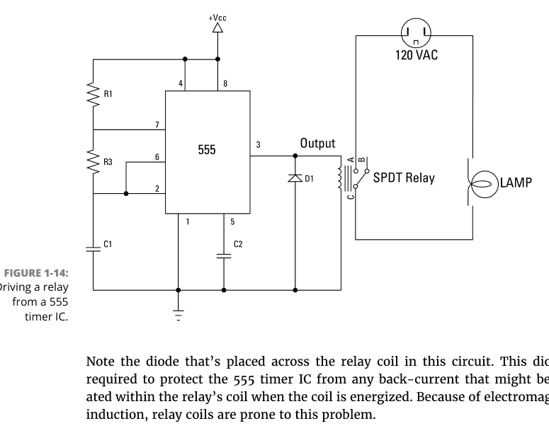

请注意电路中跨接在继电器线圈两端的二极管。这个二极管是必需的，用于保护555定时器IC免受继电器线圈通电时可能产生的任何反向电流的影响。由于电磁感应，继电器线圈容易出现这个问题。

当线圈通电时，它会产生一个磁场，使继电器的开关触点动作。然而，这个磁场有一个微妙的副作用。在线圈电压从零上升到Vss电源电压的瞬间，线圈周围的磁场从无到有扩展到最大强度。在此扩展过程中，磁场相对于线圈本身在移动。根据感应原理，这个移动的磁场会在线圈本身中感应出一个电流，其方向与为线圈通电的电流方向相反。

根据情况，这个反向电流可能很强大——强大到足以压倒来自555定时器IC的输出电流，并且可能强大到足以将电流送入输出引脚，从而损坏或烧毁555芯片。D1通过为流向输出引脚的电流提供一个等效于线圈两端的短路路径来防止这种情况发生。


每当您从包含集成电路或晶体管等精密元件的电路驱动继电器时，都应始终在继电器线圈两端并联一个二极管，以防止继电器损坏您的电路。二极管的阴极应位于线圈的正电压侧。

+   本章内容

* 了解电源的工作原理
* 降低电压
* 将交流电转换为直流电
* 滤除脉动直流电
* 通过稳压使电压水平更可靠

## 第2章
构建电源

除了极少数例外，每个电子电路都需要某种电源。虽然一些项目使用太阳能或更奇特的电源（如风力涡轮机、燃料电池或核反应堆）运行，但您构建的大多数项目将从两种电源之一获取电力：电池或电源插座。

到目前为止，在本书中，我假设所有电路都从电池获取电力。在本章中，您将了解如何从电源插座获取电力。电源插座相比电池有一个显著的优势：除非停电，否则电源插座不会像电池那样耗尽。然而，电源插座相比电池也有一个同样显著的劣势：除非使用非常长的延长线，否则您无法将由电源插座供电的项目带离插座太远。

大多数电子电路需要相对较低的直流电压，通常在3V至12V范围内。从电池获得这个范围的电压很容易。由于每节电池提供约1.5V，您只需将两节或多节电池组合起来即可获得合适的电压。例如，如果您的电路需要6V，您可以使用四节串联的电池。

从电源插座为项目供电则更具挑战性。首先，电源插座提供的120V远高于大多数电路所需，因此您必须将电压降低到更合适的水平。其次，电子电路通常需要直流电——而墙壁插座提供的是交流电——因此您必须将交流电转换为直流电。第三，直接在120V交流电上运行的电路本质上比在较低电压下运行的电路更危险，因为高电压伴随着触电危险。

将120V交流电转换为较低电压直流电的电路称为*电源*。在本章中，您将学习创建自己的电源的基础知识，以便您可以从墙壁插座而不是电池为项目供电。

## 使用电源适配器

在我向您展示如何构建自己的电源电路之前，我想让您知道，您可能可以购买一个预组装的*电源适配器*，它能提供您所需的电压，价格只比您自己构建电路贵几美元。电源适配器，也称为*墙壁适配器*，是一种自包含的电源电路，可插入墙壁插座，并提供指定水平的交流或直流电压作为其输出。只要电源适配器提供正确的电压，您就可以在几乎所有电路中使用电源适配器代替电池。

购买电源适配器时，您需要检查规格以确保购买正确的适配器。规格通常印在适配器本身上。请查找以下重要规格：

- **交流或直流：** 并非所有电源适配器都提供直流电；有些是为低压交流设备供电而制造的。因此，请确保您获得的是提供直流输出的适配器。
- **电压水平：** 接下来，检查输出电压。一些电源适配器有一个开关，允许您从几个输出电压中选择。如果您使用这样的适配器，请确保将开关设置为适合您电路的正确输出水平。
- **电流容量：** 大多数电源适配器会有一个以毫安为单位的最大电流额定值。较小的适配器可以处理几百毫安，而较大的适配器可能能够处理一安培或更多。确保您使用的适配器能够处理您项目的电流需求。（虽然有些电源适配器可以处理几安培，但很少有能处理更多电流的。）
- **极性：** 大多数电源适配器使用*桶形连接器*将电源适配器插入电路。在几乎所有现代电源适配器中，桶形连接器的中心连接是正极，外部连接是负极。然而，有些电源适配器的接线正好相反，中心为负极，外部为正极。连接器的极性应与电压和电流规格一起印在适配器上。
- **连接器尺寸：** 不幸的是，用于电源适配器的连接器有太多不同的尺寸和样式。一旦您购买了电源适配器，您可以去当地的电子商店（如RadioShack）购买一个与电源适配器上的连接器兼容的插座。然后，您可以使用该插座将电源适配器连接到您的电路。（请注意，一些电源适配器具有不同尺寸的可互换插头。）


使用电源适配器而不是自己构建电源可以使您的项目在构建和使用时更安全。这是因为您项目中潜在危险的部分——直接处理120V交流线路电压的部分——完全包含在预组装的电源适配器内部。

然而，正如您很快就会发现的，在电源方面，一分钱一分货。便宜的墙壁适配器可以将交流电转换为直流电并降低电压，但大多数不能提供非常干净（即纯净的直流电水平）或稳定（即具有可预测的电压）的电源。因此，即使您使用墙壁适配器为项目供电，您可能仍然需要添加电路来改善墙壁适配器提供的直流电质量。

## 了解电源的功能

如果您想为项目添加自己的电源电路，将120V交流线路电压转换为适合您电路的直流电压，您将需要设计一个至少提供三种不同功能的电源电路：

- **电压变换：** 将120V交流线路电压降低到您的电路所需的电压。
- **整流：** 将降低后的交流电压转换为直流电压。请注意，整流电路产生的直流电压在技术上是直流电，但它不是稳定的直流电。相反，整流器产生的是脉动直流电，其电压与从变换阶段输入的60Hz交流电同步波动。
- **滤波：** 平滑整流阶段产生的直流电压中的纹波。

## 电压转换

你已经知道，*变压器*是一种利用电磁感应原理将电压和电流从一个电路传输到另一个电路的设备。变压器使用一个连接到线路电压的*初级线圈*和一个提供输出电压的*次级线圈*。

在大多数电源中，变压器会降低电压。电压降低的量取决于初级线圈匝数与次级线圈匝数的比值。例如，如果次级线圈的匝数是初级线圈的一半，那么初级线圈的电压在次级线圈处将减半。换句话说，如果在初级线圈上施加120 VAC，那么在次级线圈上将得到60 VAC。

用于低压电源的变压器，其常见的次级电压范围为6 V至24 VAC。请注意，由于在整流和滤波阶段会损失一些电压，因此你需要选择一个比电路实际所需的最终直流电压高出几伏的次级线圈电压。（但请注意，对于大多数电路来说，实际使用的直流电压水平并非那么关键。因此，如果你正在为一个需要6 VDC的电路设计电源，并且你使用了一个次级线圈提供6 VAC的变压器，那么电源在整流为直流电压后的输出将更接近5 VDC。很可能，5 VDC已经足够接近，电路也能正常工作。）

请注意，许多变压器的次级线圈有多个*抽头*。抽头只是连接在线圈中间某处的导线，实际上将一个线圈分成了两个较小的线圈。多个抽头让你可以在次级线圈上获得几个不同的电压。最常见的配置是*中心抽头变压器*，它提供两个电压，如图2-1所示。

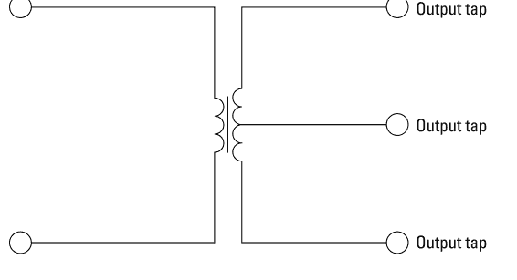

在中心抽头变压器中，测量两个外侧抽头之间的电压是从中心抽头到任一外侧抽头电压的两倍。因此，如果两个外侧抽头之间的电压是24 VAC，那么中心抽头与任一外侧抽头之间的电压就是12 VAC。

需要注意的是，当变压器降低电压时，它会增加电流。因此，如果变压器将电压减半，电流将加倍。结果，系统中的总功率（定义为电压乘以电流）保持不变。

如果电流不随电压降低而增加，变压器将违反一条基本的物理定律——能量守恒定律，该定律指出能量不会凭空消失。这是件好事。除非你知道自己在做什么，或者你身处科幻电影中（那样你可以随意违反物理定律），否则你不会想要违反物理定律。

变压器严格来说是一种交流电设备。这意味着：

- 变压器只有在交流电施加到初级线圈时才工作。如果你在初级线圈上施加直流电，次级线圈上将不会出现电压。（实际上，在电压施加到初级线圈的瞬间，次级线圈上会出现一个短暂的电压尖峰，但在大多数电路中，这个瞬时电压微不足道。）
- 降压变压器降低了从初级线圈到次级线圈的电压，但*不会*将交流电转换为直流电。次级线圈上的电压始终是交流电。
- 变压器将连接到次级线圈的电路与连接到初级线圈的电路隔离开来。因此，你可以使用变压器将你的项目与线路电压隔离。

## 将交流电转换为直流电

将交流电转换为直流电的任务称为*整流*，完成这项工作的电路称为*整流器*。将交流电转换为直流电最常用的方法是使用一个或多个*二极管*，这些方便的电子元件允许电流单向通过，但反向则不行。二极管在第2册第5章中有详细介绍。如果这个概念听起来不熟悉，你可能想在继续阅读之前简要回顾一下那一章。

尽管整流器将交流电转换为直流电，但产生的直流电并不是稳定的电压。更准确地称其为“脉动直流电”更为恰当。虽然脉动直流电始终朝同一方向流动，但电压水平有明显的纹波，随着输入到整流器的交流电压波形同步地略微上升和下降。对于许多直流电路来说，电源中大量的纹波可能导致电路故障。因此，需要额外的滤波来“平滑”来自整流器的脉动直流电，以消除纹波。（有关滤波的更多信息，请参阅本章后面的“滤波整流电流”部分。）

你可以构建三种不同类型的整流器电路：半波、全波和桥式。以下部分将描述这三种整流器类型。

### 半波整流器

最简单的整流器类型由单个二极管构成，如图2-2所示。这种类型的整流器称为*半波整流器*，因为它只将交流输入电压的一半传递到输出端。当交流电压在二极管的阴极侧为正时，二极管允许电流通过到输出端。但当交流电流反向，在二极管的阴极侧变为负时，二极管会阻断电流，因此输出端不会出现电压。

半波整流器构建起来足够简单，但效率不高。这是因为交流输入的整个负半周期都被半波整流器阻断了。结果，输出电压有一半时间为零。这导致输出端的平均电压是输入电压的一半。

> 注意图2-2中标记为R_L的电阻。这个电阻实际上不是整流器电路的一部分。相反，它代表了当电源投入使用时，最终将施加到电路上的负载所呈现的电阻。

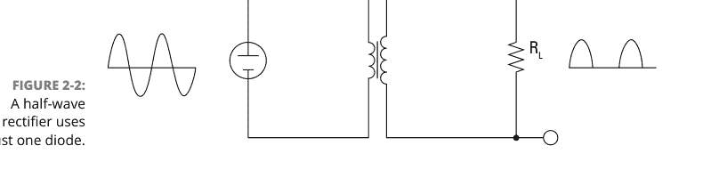

### 全波整流器

全波整流器使用两个二极管，使其能够通过交流电输入的正半周和负半周。二极管连接到变压器，如图2-3所示。

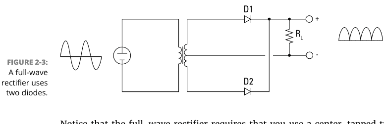

请注意，全波整流器要求你使用中心抽头变压器。二极管连接到两个外侧抽头，中心抽头用作整流后直流电压的公共地。全波整流器将交流正弦波的两个半周都转换为正电压直流电。结果是直流电压以输入交流电压频率的两倍进行脉动。换句话说，假设输入是60 Hz的家用交流电，输出将是120 Hz的脉动直流电。

### 桥式整流器

全波整流器的问题在于它需要中心抽头变压器，因此产生的直流电压仅为变压器总输出电压的一半。如图2-4所示的桥式整流器通过使用四个二极管而不是两个来克服这一限制。二极管以菱形排列，使得在交流正弦波的每个半周期内，两个二极管将电流传递到输出的正负两侧，而另外两个二极管则阻断电流。桥式整流器不需要中心抽头变压器。

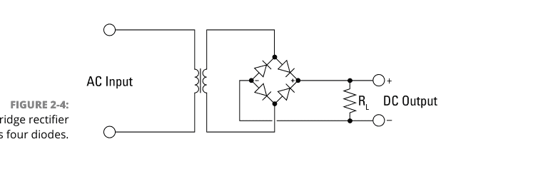

桥式整流器的输出是脉动直流电，就像全波整流器的输出一样。然而，它使用了变压器次级线圈的全部电压。

你可以使用四个二极管构建桥式整流器，也可以使用包含四个二极管并按正确排列的桥式整流器集成电路。桥式整流器集成电路有四个引脚：两个用于交流输入，两个用于直流输出。

## 滤波整流电流

尽管整流器电路的输出在技术上是直流电，因为所有电流都朝同一方向流动，但对于大多数用途来说，它不够稳定。即使是全波和桥式整流器产生的直流电，也会随着施加到变压器的120 VAC电流产生的60 Hz交流正弦波的节奏而脉动。而这种脉动电流不适合大多数电子电路。

这就是滤波的用武之地。电源电路的滤波阶段平滑整流后直流电中的纹波，产生平滑的直流电，即使是最敏感的电路也适用。

滤波通常通过在电源电路中引入一个电容器来实现，如图2-5所示。这里，电容器只是并联在直流输出端。


正如你在第2册第3章中学到的，电容器具有抵抗电压变化的有用特性。它通过在输入电压增加时在其极板上积累电荷来实现这一神奇功能。当输入电压降低时，电容器极板上的电压也会降低，但比输入电压降低得慢。这起到了平滑电压纹波的作用，如图2-6所示。

## 图 2-6：滤波电路平滑输出电压。

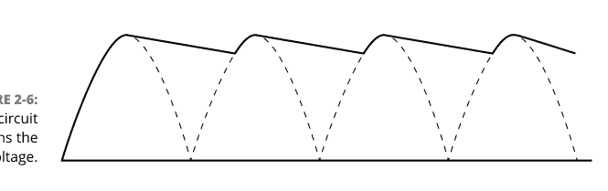

在滤波阶段，最小直流电压与最大直流电压之间的差值被称为*电压纹波*，或简称*纹波*，通常以平均电压的百分比来衡量。例如，一个 5V 电源中 10% 的纹波意味着实际输出电压有 0.5V 的变化。

滤波电容通常必须足够大，才能提供可接受的滤波水平。对于典型的 5V 电源，一个 2,200 µF 的电解电容就能胜任。电容越大，产生的纹波电压就越低。


别忘了注意电解电容的极性。电容的正极必须连接到整流器的正电压输出端，负极必须接地。

改进滤波电路的一种方法是使用两个电容配合一个电阻，如图 2-7 所示。在这个电路中，第一个电容的作用类似于图 2-6 中的电容，消除了大部分纹波电压。电阻和第二个电容构成一个 RC 网络，进一步消除了纹波电压。

## 图 2-7：两个电容和一个电阻降低纹波电压，但同时也降低了直流输出电压。

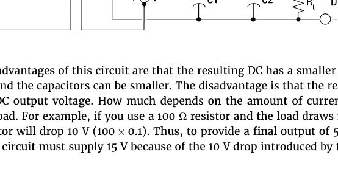

这个电路的优点是产生的直流电纹波电压更小，且电容可以更小。缺点是电阻会降低直流输出电压。降低多少取决于负载吸取的电流大小。例如，如果你使用 100 Ω 的电阻，负载吸取 100 mA 的电流，那么电阻会压降 10 V (100 × 0.1)。因此，为了提供最终的 5V 输出，整流电路必须提供 15V，因为电阻引入了 10V 的压降。

你也可以在滤波电路中使用电感，如图 2-8 所示。与阻容滤波器不同，LC 滤波器（电感-电容滤波器）不会显著降低直流输出电压。虽然 LC 滤波电路能产生最小的纹波电压，但所需范围内的电感（通常 10 亨利）体积大且相对昂贵。因此，大多数滤波电路使用单个电容或一对电容配合一个电阻。

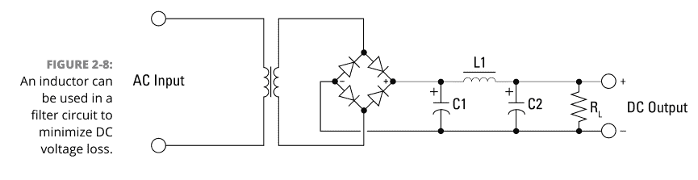

## 稳定电压

电源的目的是为电子电路提供能量。计算电路功耗有一个基本公式：

$$P = I \times V$$

功率，以瓦特为单位，等于以安培为单位的电流乘以以伏特为单位的电压。

如果你知道这三个要素中的任意两个，你就可以轻松计算出第三个。例如，如果你知道电流是 0.5 A，电压是 10 V，那么通过将 0.5 乘以 10，你就可以计算出该电路消耗 5 W 的功率。

对于给定的功率量，电压和电流之间存在反比关系。每当电流增加时，电压必须降低；每当电流减少时，电压必须增加。不幸的是，这个简单的事实会对电源电路产生不利影响。当你将电压表连接到电源的输出端子时，电表本身会吸取几乎可以忽略不计的电流，因此电表读数非常接近你期望从电源获得的电压。

然而，如果你连接一个从电源吸取较大电流的电路，电源的电压将按电流比例下降。根据你连接到电源的电路性质，这种电压下降可能是好事，也可能不是。一些设计用于 12VDC 的电路即使只给它 9VDC 也能正常工作。但其他电路对输入电压很敏感，因此电源需要更加努力工作以确保其提供所需的电压。

为了在从电源吸取的电流量变化时保持稳定的电压水平，电源可以包含一个*稳压器*电路。稳压器监控负载吸取的电流，并相应地增加或降低电压，以保持电压水平恒定。


> **提示**
> 包含稳压器的电源称为*稳压电源*。

如果你想，你可以使用几个晶体管、一些电阻和一个齐纳二极管来设计自己的稳压器电路。然而，购买现成的集成稳压器要容易得多。稳压器集成电路很便宜（低于 2 美元），而且只有三个引脚需要连接，很容易集成到你的电路中。

最受欢迎的稳压器集成电路类型是 78XX 系列，有时称为 LM78XX 系列。这些稳压器将 17 个晶体管、三个齐纳二极管和一些电阻封装成一个方便的三引脚封装，并带有一个散热器，帮助散发稳压器为补偿电流变化而消耗的多余功率。

78XX ID 号的最后两位数字表示该 IC 调节的输出电压。最常见的型号是：

| 型号 | 电压 |
|-------|---------|
| 7805  | 5       |
| 7806  | 6       |
| 7809  | 9       |
| 7810  | 10      |
| 7812  | 12      |
| 7815  | 15      |
| 7818  | 18      |
| 7824  | 24      |

其中，最常见的是 7805 (5 V) 和 7812 (12 V)。

### 构建电源

要使用 78XX 稳压器，你只需将其串联插入电源电路的正极侧，并将接地引脚连接到负极侧，如图 2-9 所示。如图所示，在稳压器之后放置一个小电容（通常 0.1 µF）也是一个好主意。

## 图 2-9：使用 78XX 稳压器。

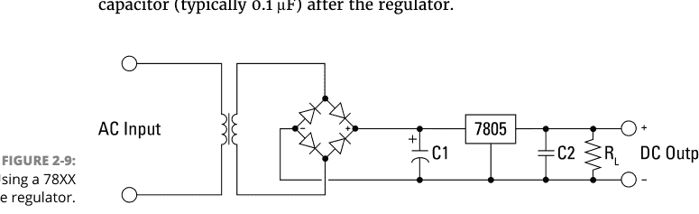

你必须向稳压器提供比其稳压输出电压高约 3V 的电压。因此，对于 7805 稳压器，你至少应该给它 8V。7805 的最大输入电压是 30V。请记住，桥式整流器中的二极管会从变压器输出压降约 3V，因此你需要一个次级输出至少 11V 的变压器才能产生 5V 的稳压输出。

11V 的变压器很少见，但 12V 的变压器很容易获得。因此，一个 5V 的稳压电源通常从一个输出 12VAC 的变压器开始，它向桥式整流器提供 12V，整流器将交流电转换为直流电并将电压降至约 9V，然后将电压输送到滤波电路，滤波电路平滑纹波并将电压传递给 7805 稳压器，稳压器将输出电压保持在 5V。

另一种流行的稳压器集成电路是 LM317，它是一个可调压稳压器。LM317 稳压器的工作原理与 78XX 稳压器非常相似，不同之处在于，你不是将中间引脚直接接地，而是将其连接到由一对电阻构成的分压器，如图 2-10 所示。电阻的值决定了稳压电压。在图 2-10 中，我使用了一个电位器，以便用户可以通过调节电位器来改变输出电压。

## 图 2-10：使用 LM317 可调压稳压器。

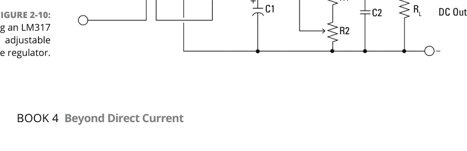

## 本章内容

- 了解无线电波的工作原理
- 看看发射机和接收机如何工作
- 考察调幅（AM）和调频（FM）无线电之间的区别
- 回顾一些有趣的无线电历史
- 制作一个简单的无线电

# 第 3 章

## 了解无线电

> 这是让我反感的时候了！让我反感的短语之一是“广播的黄金时代”，这意味着广播流行的高峰是在 20 世纪 30 和 40 年代，并且从那以后广播的受欢迎程度就下降了。

实际上，无线电——即使不是指音频节目，而是指这项技术——从未像现在这样受欢迎。在 20 世纪 30 和 40 年代，大多数人只知道无线电的一个用途：播放音频信号。今天，通过无线电播放音频与以往一样普遍，但通过无线电技术广播的其他类型信息的列表已经飞速增长。

首先是广播电视，它不过是通过无线电同时播放音频和视频。然后是手机，它利用无线电将世界的电话网络延伸到电话线缆无法到达的地方。接着是无线网络，它用通过无线电传输的数据取代了笨重的计算机网络电缆。现在还有蜂窝数据计划，通过无线电传输互联网数据。无线电技术还有许多其他流行用途，包括雷达、GPS 导航系统和蓝牙无线设备。

在本章中，你将学习一些无线电的基本概念，包括它是什么、如何工作以及它是如何被发现的。在此过程中，你将了解到...关于早期无线电先驱者们那些或有趣、有时令人伤感的故事。读完本章，你还将学会如何组装一台晶体收音机——所有无线电电路中最简单的一种。

在本章中，我偶尔会违反自己的习惯，提及无线电时仿佛它只用于声音广播。每当我这样做时，请记住：无线电同样可用于广播视频、数字数据以及其他类型的信息。

个人特别在意的事物很有趣，不是吗？我认为它们确实能成为有趣的“宠物”。它们虽然不如小狗或小猫那样可爱，但如果你在它们“年幼”时就培养这种习惯，它能给你带来一生的乐趣。不过要小心，就像深夜吠叫的狗或闯入别人院子的猫一样，个人特别在意的事可能会惹恼你的朋友和邻居。

我一直想知道，为什么城市和县要求你为宠物狗和猫登记，却不要求登记你那些特别在意的事。想想地方政府因此错失的收入吧！即使每件特别在意的事只收10美元的费用，也足以筹集到足够的资金来填补那些“用良好意愿铺就”的道路上的所有坑洼，而且部分资金可以用来照顾无家可归的“特别在意的事”。

## 理解无线电波

大多数人认为无线电是声音的无线广播，最常见的是音乐和语音。但“无线电”这个词的范围实际上要广泛得多；声音的广播实际上只是这种极其有用的电现象——被称为无线电——的一种应用。

无线电利用的是所有电现象中最有趣的一种：电磁辐射（通常缩写为EMR），这是一种以光速在波中传播的能量。电磁辐射可以自由地穿过空气，甚至穿越太空的真空。

电磁波可以以任何可想象的频率振荡。振荡的速率以每秒周期数来衡量，也称为赫兹（缩写为Hz）。这里的“赫兹”并非指汽车租赁公司，而是为了纪念伟大的德国物理学家海因里希·赫兹，他是第一个制造出能够产生和探测无线电波装置的人。

无线电只是电磁波的一个特定频率范围。这个范围的低端是每秒几个周期，高端大约是每秒3000亿周期（也称为千兆赫，缩写为GHz）。这是一个相当大的范围，但频率比无线电波高得多的电磁波也存在，而且实际上很常见。频率高于无线电波的电磁波有各种名称，包括红外线、紫外线、X射线、伽马射线，以及最重要的——可见光。

没错；我们称之为光的东西，与我们称之为无线电的东西完全相同，只是频率更高。可见光的频率以十亿赫兹来衡量，也称为*太赫兹*，缩写为*THz*。可见光的低端（红色）约为405 THz，高端（紫色）约为790 THz。

所以这里有一个有趣的想法值得思考：广播电台在一个特定的频率上广播。例如在旧金山，有一个名为KNBR的流行广播电台，自1922年以来一直在680 kHz的频率上广播。该地区有许多其他广播电台，但只有KNBR在680 kHz上广播。

术语*频道*通常用于指在特定频率上广播的广播电台。例如，如果有人问我，当我在旧金山时喜欢听哪个广播频道，我会告诉他KNBR。

我可能会用我的便携式收音机收听KNBR，那收音机碰巧是紫色塑料做的。*紫色*是我们看到频率恰好在680 THz左右的光时感知到的颜色。还有很多其他颜色，但只有紫色在680 THz。所以在某种程度上，颜色与频道是相同的。如果电磁波以680 kHz振动，它们就是KNBR广播电台。如果相同的电磁波振动速度快一百万倍，达到680 THz，它们就是紫色。


一个与频率相关的重要概念是波长的想法。术语*波长*是指特定频率电磁波每个周期波峰之间的距离。由于电磁波以光速传播，你可以通过将光在一秒钟内传播的距离除以每秒的周期数来计算给定频率的波长。

光相当快：它的速度是每秒186,282英里。因此，以100 kHz振荡的电磁波波长约为1.86英里：186,282除以100,000。

频率越高，波长越短。大多数AM广播电台的波长是几百英尺。可见光的波长是一个非常小的分数英寸。


声波不是电磁波的一种。声波是当物质粒子相互碰撞时产生的。因此，你必须有物质——例如空气或水——来传播声波。无线电波不需要物质粒子来传播。事实上，无线电波在太空的真空环境中传播得最好，那里没有物质阻挡。

## 究竟是谁发明了无线电？

无线电技术的历史一直困扰着关于究竟是谁真正发明了它的争论。最常见的答案是意大利发明家古列尔莫·马可尼，但许多其他人做出了重要发现，也有充分理由声称拥有这一称号。

以下是对“无线电之父”头衔竞争者的简要介绍：

- **马可尼：** 他是第一个成功演示无线电并对其进行商业开发的人。1901年，马可尼通过无线电从英国向加拿大发送了一条横跨大西洋的信息，尽管这条信息很微弱，只包含字母“S”，且接收信息并未得到独立证实。然而，马可尼的成就令人震惊，他对无线电技术和商业做出了许多重要贡献。
- **特斯拉：** 1943年，美国最高法院裁定马可尼的许多重要无线电专利无效，因为尼古拉·特斯拉早已描述了这些专利所涵盖的装置。特斯拉是一位杰出的工程师，他最著名的是作为交流电在电力分配中优于直流电的倡导者。早在1893年，他就公开演示了无线通信设备。特斯拉认为无线技术不仅可用于通信，还可用于电力分配。
- **洛奇：** 在英国，奥利弗·洛奇爵士在19世纪90年代中期就正在建造无线电报系统。
- **波波夫：** 在俄国，亚历山大·斯捷潘诺维奇·波波夫在与洛奇几乎同一时期演示了无线电报传输。
- **博斯：** 在印度，贾格迪什·钱德拉·博斯爵士在19世纪90年代初也演示了无线电报传输。这些演示是否发生在洛奇、波波夫等人其他演示之前、之后或同时发生，目前仍有争议。
- **许多其他人：** 在19世纪最后几十年进行重要研究和做出重要发现的其他人的名单很长：海因里希·赫兹、爱德华·布兰利、罗伯托·德·穆拉、欧内斯特·卢瑟福、费迪南德·布劳恩、胡里奥·巴维耶拉和雷金纳德·费辛登等等，都是众多做出重要贡献的个体中的一部分。

因此，似乎没有任何一个人拥有无可争议的、作为第一个发明无线电的人的称号。世界各地都有人在进行工作，而且看起来每天都有发现产生。

> 最好的答案可能是，没有人“发明”了无线电。无线电是一种自然现象。它是被*发现*的，而不是被*发明*的。

被发明的是开发利用无线电现象的方法，包括构建能够产生无线电波并通过调制添加信息的装置，以及能够接收无线电波并提取所添加信息的装置。

## 发射与接收无线电

自然界有许多无线电波源。但在19世纪后期，科学家们弄清楚了如何使用电流产生无线电波。简而言之，如果将交流电通过一段导线，就会产生与交流电频率相同的无线电波。

无线电通信需要两个组件：一个*发射器*和一个*接收器*。发射器产生无线电波，接收器检测它们。以下部分描述了无线电发射器和接收器的基本操作。

### 理解无线电发射器

一个无线电发射器由几个协同工作的元件组成，用于产生包含有用信息（如音频、视频或数字数据）的无线电波。这些组件如图3–1所示，此处描述如下：

- **电源：** 提供运行发射器所需的必要电力。
- **振荡器：** 产生发射器将要传输的频率的交流电。振荡器通常产生正弦波，这被称为*载波*。
- **调制器：** 将有用信息添加到载波中。有两种主要方法可以添加这些信息。第一种称为调幅或AM，它对载波的强度进行轻微的增减。第二种称为调频或FM，它对载波的频率进行轻微的增减。有关AM和FM的更多信息，请参见本章后面的“理解AM广播”和“理解FM广播”部分。

（实际上，还有第三种方法可以向无线电信号添加信息：通过按照代表信息的模式简单地开关信号。例如，无线电信号可以这种方式发送莫尔斯电码。）

- **放大器：** 放大调制后的载波以增加其功率。放大器功率越大，广播信号就越强。
- **天线：** 将放大后的信号转换为无线电波。

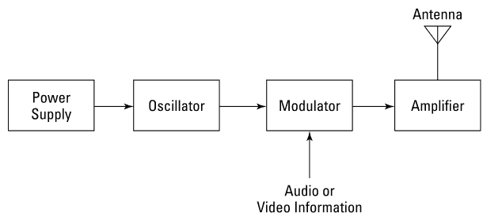

图 3-1：无线电发射机的基本组成部分。

## 理解无线电接收机

无线电接收机与无线电发射机相反。它使用天线捕获无线电波，处理这些波以提取仅在所需频率上振动的波，提取添加到这些波中的音频信号，放大音频信号，最后通过扬声器播放。图 3-2 显示了这些组件，以下段落解释了每个组件的工作原理：

- **天线：** 捕获无线电波。通常，天线只是一段导线。当这段导线暴露在无线电波中时，波会在天线中感应出非常小的交流电流。
- **射频放大器：** 一种灵敏的放大器，用于放大来自天线的非常微弱的射频信号，以便信号可以被调谐器处理。
- **调谐器：** 一种可以从不同频率的信号混合中提取特定频率信号的电路。天线本身会捕获所有频率的无线电波并将其发送到射频放大器，射频放大器会忠实地放大所有信号。除非你想同时收听所有广播频道，否则你需要一个电路来挑选出你想要收听的频道的信号。这就是调谐器的作用。

调谐器通常使用电感器（例如线圈）和电容器的组合来形成在特定频率上谐振的电路。这个频率称为*谐振频率*，由为线圈和电容器选择的值决定。这种电路往往会阻断任何高于或低于谐振频率的交流信号。

你可以通过改变线圈中的电感量或电容器的电容量来调整谐振频率。在简单的无线电接收机电路中，例如你在本章末尾学习的那种，调谐是通过改变线圈中导线的匝数来调整的。更复杂的调谐器使用可变电容器（也称为*调谐电容器*）来改变频率。

- **检波器：** 负责将音频信息从载波中分离出来。对于调幅信号，这可以通过一个仅整流交流信号的二极管来完成。二极管处理交流信号后，剩下的是直流信号，可以馈送到音频放大器电路。对于调频信号，检波器电路稍微复杂一些。
- **音频放大器：** 这个组件的工作是放大来自检波器的微弱信号，以便能够听到。这可以使用简单的晶体管放大器电路来完成，如第 2 册第 6 章所述。你也可以使用运算放大器集成电路，如第 3 册第 3 章所述。

当然，这种基本的无线电接收机设计有许多变体。许多接收机包括额外的滤波和调谐电路，以更好地锁定目标频率——或产生更高质量的音频输出——并排除其他信号。尽管如此，这些基本元素在大多数接收机电路中都能找到。

## 查看无线电频谱

术语*频谱*仅指频率范围。无线电通常被认为是在 3 Hz 到 300 GHz 之间的频率。这个广泛的频率范围被划分为更小的部分，用于特定类型的无线电，如下表所述：

| 频率 | 缩写 | 描述 |
|---|---|---|
| 3-30 Hz | ELF | 极低频，用于与潜艇通信。 |
| 30-300 Hz | SLF | 超低频，也用于与潜艇通信。 |
| 300 Hz-3 kHz | ULF | 特低频，用于矿井内的地下通信。 |
| 3-30 kHz | VLF | 甚低频，也用于潜艇通信和一些其他特殊应用。 |
| 30-300 kHz | LF | 低频，用于导航、RFID 和一些其他应用。 |
| 300-3,000 kHz | MF | 中频，用于调幅广播。 |
| 3-30 MHz | HF | 高频，用于短波和民用波段无线电。 |
| 30-300 MHz | VHF | 甚高频，用于调频广播和电视。 |
| 300-3,000 MHz | UHF | 特高频，用于电视、移动电话、无线网络、蓝牙等。 |
| 3-30 GHz | SHF | 超高频，用于高速无线网络、雷达和通信卫星。 |
| 30-300 GHz | EHF | 极高频，用于微波通信。 |
| 300-3,000 GHz | THF | 至高频（不，这不是我编的），用于接近科幻小说的特殊应用。 |
| 高于 3,000 GHz | | 你已经超出了频谱图的边缘，伙计。这里有龙。 |

## 理解调幅广播

在无线电波上编码声音信息的原始方法称为*调幅*，或 *AM*。它是在二十世纪最初几十年发展起来的。AM 是一种相对简单的方法，可以将音频信息添加到载波中，从而传输声音。

最简单的调幅调制器形式之一只是将振荡器电路的电源通过一个音频变压器，该变压器与麦克风或其他声源耦合。图 3-3 显示了这种布置。

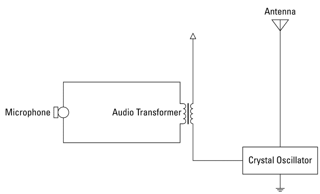

图 3-3 中的电路使用了一个 1 MHz *晶体振荡器*，它通常用于为微处理器电路生成时钟频率。1 MHz 非常适合简单的调幅发射机电路，因为 1 MHz 正好位于用于调幅广播传输的频段中间。

虽然你无法在当地 RadioShack 购买到晶体振荡器，但你可以在互联网上找到它。使用 Google 搜索 *1 MHz crystal oscillator*，你应该能找到几个在线来源，以低于 2 美元的价格卖给你一个。

晶体振荡器包含在一个有三个引脚的金属罐中。一个引脚用于接地，第二个引脚是电源电压（通常为 9 VDC），第三个是振荡器输出。

通过将 Vss 电源通过变压器的次级线圈，初级线圈连接到音频输入源（如麦克风），实际提供给振荡器的电压将根据输入信号的变化而波动。由于晶体振荡器非常稳定，这些电压变化不会影响振荡器产生的频率，但会影响振荡器输出的电压。因此，音频输入信号将反映为振荡器输出信号中的电压变化。

更好的调幅调制电路使用晶体管，如图 3-4 所示。在这个电路中，由电路中未显示的振荡器产生的载波被施加到晶体管的基极。然后，音频输入通过变压器施加到晶体管的发射极。调幅信号从晶体管的集电极取出。

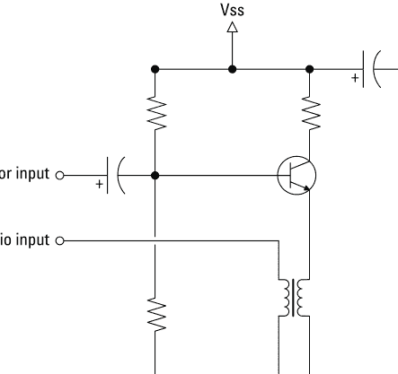

图 3-4：使用晶体管进行调幅。

那么这个电路是如何工作的呢？晶体管通过发射极-集电极电路放大来自振荡器的输入。然而，随着音频输入的变化，它会在变压器的次级线圈中感应出一个小电流。这反过来又会影响流经集电极-发射极电路的电流量。通过这种方式，输出的强度随音频输入而变化。

图 3-5 显示了载波如何与音频信号结合以产生调幅无线电波形。如你所见，载波是恒定频率和幅度的。换句话说，正弦波的每个周期都具有相同的强度。然而，音频波的电流是变化的。当两者通过调制器电路结合时，结果是一个具有稳定频率的信号，但正弦波每个周期的强度取决于音频信号的强度。

## 理解FM广播

调幅广播相对简单。然而，它存在几个缺点。调幅广播的主要缺点在于，调幅收音机几乎无法区分广播发射机发出的信号与其他同频干扰源产生的杂散信号。最明显的例子就是雷电。当闪电发生时，它会产生短暂而强烈的电磁辐射脉冲，其频率范围极广。雷击产生的噪声几乎覆盖了调幅广播使用的所有频段。如果你在收听调幅电台时遭遇雷电，你正在收听的频率上会突然出现无线电能量脉冲，并被转换为声音。因此，雷电发生时，你能在收音机里听到它的声音。

干扰正常广播的信号被称为*静电噪声*，而静电噪声正是调幅广播的主要缺点。为了对抗静电噪声，一种更好的将信息叠加到无线电波上的方法——称为*频率调制*或*FM*——在1933年被开发出来。（关于调幅广播发明者引人入胜又令人惋惜的故事，请参阅题为“调幅广播背后悲剧天才”的侧栏。）

在频率调制中，载波的强度不变。相反，载波的精确频率会与音频信号同步变化。当音频信号较高时，广播信号的频率会略微升高；当音频信号较低时，频率会略微降低。图3-6展示了这种情况在图表中的表现。图的顶部是代表广播电台特定频率的载波时钟信号。中间是需要叠加到载波上的音频信号。底部则是最终的调制信号。如你所见，当输入信号变低时频率降低，输入信号变高时频率升高。

请注意，频率调制信号中的频率变化幅度相对于载波频率来说很小。通常，频率在基准频率的±100 kHz范围内变化。

FM广播电台的发射频率在88至108 MHz之间，但在美国，每个电台的基准频率总是以0.1、0.3、0.5、0.7或0.9结尾。这就是为什么FM电台的频率是89.3或107.5，而绝不是92.0或98.6。

以0.2 MHz为间隔分配基准频率，为每个电台提供了中心频率两侧各100 kHz的空间用于频率调制。因此，一个在103.1 MHz广播的电台，实际发送的信号频率范围是103.0至103.2 MHz。大多数电台将相对于基准频率的偏移限制在±75 kHz，以帮助防止相邻电台相互干扰。

FM调制器通常使用一种称为*变容二极管*的电子元件，这是一种具有特殊特性的二极管：它像电容器一样具有电容，并且当在其两端施加电压时，电容会减小。本质上，变容二极管是一个电压控制的可变电容器。变容二极管的电路图符号（如侧边栏所示）看起来像是二极管和电容器的结合体。

变容二极管可用于振荡器电路，以创建电压增加时振动更快的振荡器。这一特性使其非常适合用于FM无线电调制器。随着音频输入电压的增加，变容二极管的电容减小，从而振荡器的频率增加。当电压降低时，变容二极管的电容增加，振荡器的频率随之降低。图3-7展示了一个使用变容二极管的FM调制器电路示例。

**图 3-7：**
一个使用变容二极管的FM调制器电路。

## FM广播背后悲剧的天才

广播史上最伟大的发明家之一是一位才华横溢的工程师，名叫埃德温·H·阿姆斯特朗。他于1890年出生，从小就对电子技术着迷。14岁时，他开始尝试无线电电路，在他家后院建造了一个超过100英尺高的天线。

他在哥伦比亚大学读大三时，于1912年对无线电技术做出了他的首个重大贡献。他的发明是一个通过反馈放大电子管来放大接收到的无线电信号的电路，这后来被称为*再生电路*。这是无线电技术早期的一个重要突破，首次使得无线电可以通过扬声器而不是耳机来收听。

在第一次世界大战期间，阿姆斯特朗发明了另一种类型的无线电接收机，他称之为*超外差电路*。超外差电路的基本原理是，一个高频广播信号——比如1,500 kHz——可以与来自振荡器的附近频率——比如1,560 kHz——以一种方式结合，使得原始信号也能在60 kHz——即原始信号频率（1,560 kHz）与振荡器频率（1,500 kHz）的差值——被检测到。超外差电路可能是有史以来发明的最重要的电子电路之一。时至今日，它仍被用于几乎所有无线电接收机中。

他的第三个伟大发明出现在1933年，当时他创造了一种传输无线电信号的方法，这种方法不受闪电等大气扰动的干扰。他的新系统被称为*频率调制*。我们称之为FM广播。

阿姆斯特朗为他的发明申请了专利，但他的专利遭到了广播行业巨头的挑战或无视。1934年，他失去了保护其再生电路专利的诉讼，因为最高法院的法官们不理解该电路的工作原理。业界在20世纪40年代和50年代一直挑战他的FM广播专利，并自由使用他的技术。

最终，在1954年，因法律斗争而病痛缠身、破产潦倒的阿姆斯特朗从他的高层公寓窗口跳下自杀身亡。

最终，他的遗孀玛丽昂赢得了一系列专利诉讼，并获得了1000万美元的赔偿。

## 制作晶体收音机

在本节中，你将学习如何制作最简单但实用的电子电路之一：*晶体收音机*，这是一种可以接收调幅广播的无线电接收机。它不是特别好的无线电接收机。一次只能一个人收听，因为它使用耳机或晶体听筒而不是扬声器。而且它不是非常灵敏；即使你所在的地区有数十个调幅电台广播，你能接收到两三个不同的电台就算幸运了。

但晶体收音机的独特之处在于，与本书描述的所有其他电子电路不同，晶体收音机没有明显的电源，没有电池或其他电源供应。晶体收音机使用的唯一电源是无线电波本身所携带的能量。

晶体收音机自无线电广播诞生之初就已存在。在20世纪20代，人们自己制作晶体收音机是常事。报纸和杂志刊登文章，告诉读者如何主要使用木头和金属碎片、空麦片盒等家用物品，再加上晶体和电话耳机等少数专用部件来制作晶体收音机。

一台20世纪20年代晶体收音机的总成本约为10美元。这听起来很便宜，但经过通货膨胀调整后，这相当于今天的125美元左右。幸运的是，如今一台晶体收音机的总成本仍然在10美元左右。

如果你愿意，你可以购买一个套件来自己制作晶体收音机。亚马逊上有一个不错的套件售价约15美元，你也可以在当地许多爱好品或学校用品店找到晶体收音机套件。虽然你可以单独凑齐零件，成本可能低于套件价格，但有几个部件在套件外相对难找。（你可以考虑的一个方案是：购买套件以获得这几个难找的部件，但使用本章提供的说明来制作收音机。）

## 查看一个简单的晶体收音机电路

图3-8展示了一个基本的晶体收音机接收机电路。如你所见，该电路仅由几个基本组件构成：天线和接地连接、一个线圈、一个可变电容器、一个二极管和一个耳机。

天线用于捕捉空气中传播的无线电波，并将其转换为交流电。为了使电流流动，需要一个完整的回路。接地连接就是完成这个回路，从而允许电流流动。

线圈和电容器的组合形成了调谐电路。线圈的电感与可变电容器的电容相结合，创建了一个在特定频率谐振的电路，允许该频率通过，同时阻塞其他频率。在如图3-8所示的基本晶体收音机中，调谐电路的选择性不是很好。因此，你可能会同时听到几个电台。然而，可以构建更具选择性的调谐电路来锁定单个电台。

二极管构成了电路的检波部分。它简单地将来自天线和调谐电路的交流电信号转换为直流电。这种直流电极其微弱，但足以驱动灵敏的压电耳机，将电流转换为声音。

所以，简而言之，这就是晶体收音机的工作原理。本章的其余部分将向你展示如何制作自己的晶体收音机。

## 收集零件

制作你的晶体收音机，你需要准备一些零件。以下是推荐清单：

-   至少 50 英尺的**天线导线**。几乎所有导线都可用于天线。我个人推荐 18 号实心连接导线，可在 RadioShack 购买。
-   几英尺**连接导线**，用于将收音机连接到接地端。
-   至少 50 英尺的 30 号漆包**磁线**。你可以在网上电子零件供应商或亚马逊购买。只需搜索“磁线”即可。
-   用于绕制线圈的物体。我使用了一个空的汽水瓶。
-   一个**可变电容器**，也称为*调谐电容器*。如果你手边有一台旧收音机——即使不能用——你也可以从中取出调谐电容器。或者，你可以在线购买——只需在你喜欢的在线电子零件商店（或亚马逊）搜索“调谐电容器”。请注意，可变电容器是一个可选组件。如果找不到，你仍然可以不带它制作你的晶体套件；只是无法调谐排除干扰电台。
-   一个**锗二极管**。同样，你可能需要在线购买这个组件。只需用你喜欢的搜索引擎搜索 *1N34A*，就会找到几家供应商。
-   一个**压电耳机**。像 iPod 或手机使用的普通耳机无法工作。搜索 *piezoelectric earphone*，你会找到几家供应商，售价约为 3 美元。
-   一个用于安装收音机的**底板**。大约 6 x 9 英寸应该足够。
-   用于进行电气连接的物品。我喜欢使用四路屏障端子排，但你也可以临时变通。

如果你手边有一台不工作的旧收音机，尽可以拆开它，取用其零件。特别留意调谐电容器。你应该能很容易认出它，因为它会连接到收音机的调谐旋钮上。

锗二极管、调谐电容器和压电耳机是这三种有点难找的零件。你可能想从爱好商店或学校用品商店购买一个晶体收音机套件，然后从套件中获取这三个零件。

## 制作线圈

当你观察一台晶体收音机时，你可能首先注意到的是那个大线圈。线圈通常由 100 匝或更多匝的小号磁线绕在一个直径从 1 到 5 英寸不等的非导电管上制成。线圈是收音机调谐电路的核心部件。

可以用多种不同类型的材料来缠绕线圈。这里有一些想法：

-   一个空的 16 盎司汽水瓶。这就是我为本章制作的收音机所使用的。为了让线圈看起来更漂亮，你可能想先用黑色喷漆喷涂瓶子。参见图 3-10。（不要使用金属漆！）
-   一个空的卫生纸卷筒。
-   一个空的燕麦片罐子。
-   一个空的隐形眼镜液瓶或类似大小的塑料瓶。
-   一段 6 英寸长、直径 2 或 3 英寸的 PVC 喷淋管。
-   一段 6 英寸长的木质壁橱杆。
-   一段 6 英寸长的纸板邮寄筒。

简而言之，任何由绝缘材料制成的坚固圆柱形物体都可以用作你线圈的骨架。只要它是圆柱形且非金属的，就可以使用。

至于选择用于线圈的导线，最常见的是磁线，它涂有薄漆绝缘层，而不是包裹在塑料绝缘层中。包裹塑料绝缘层的导线也能用，但漆绝缘层更薄，因此允许线匝排列得更紧密。

线圈的匝数和你绕线圈的圆柱体直径将决定你需要多少导线。你至少需要绕 100 匝。要计算每匝需要多少导线，将圆柱体直径乘以 3.14。然后，将结果乘以匝数，再除以 12，就能确定你需要多少英尺的导线。

例如，假设你在一个直径 2 英寸的圆柱体上绕 100 匝。在这种情况下，每匝将需要 6.28 英寸导线（2 英寸 × 3.14）。因此，你将需要略多于 52 英尺的导线（6.28 英寸 × 100 ÷ 12 英寸）。考虑到线圈两端需要各留出一英尺左右的额外导线用于连接收音机电路，你大约需要 54 英尺导线来制作线圈。

对于最简单的晶体收音机，确切的匝数不会显著影响收音机的运行。所以在这个例子中，如果你有一卷 50 英尺的导线，你可以绕少于 100 匝几圈，收音机同样能很好地工作。

绕制线圈最简单的方法是将你要绕线的管子放在螺丝刀刀片或其他细长物体上，使管子可以自由旋转。这样，你可以转动管子，同时慢慢将导线从线轴上引导到管子上。这可以防止导线在你绕线时扭曲。如果你的工作台上有台钳，你可以将螺丝刀水平夹在台钳上，然后将管子套在螺丝刀上，使管子可以自由旋转。

开始绕线圈时，你必须先将磁线的一端固定在管子的一端。最简单的方法是用一点热熔胶。如果你愿意，也可以在管子上打个洞，将导线穿过去。无论哪种方式，一定要留出 6 英寸或更多的自由导线。这将确保你在完成绕线后，有足够的导线将线圈连接到电路。

固定好线圈一端后，一边慢慢转动管子，一边将导线从线轴上引导到管子上。每绕半圈左右，用手指小心地将刚绕上的导线推紧到已绕好的线匝旁。目标是让每一匝导线都紧挨着前一匝，线匝之间没有间隙。

你会发现，在将导线引导到管子上时，需要保持一点张力，以使绕组紧密而整齐。如果你不小心松开了张力，几匝线可能会松开，你得将它们解开以恢复线圈的紧密度。

将线圈分成每组约十匝来绕会更容易些。完成每一组后，滴一点热熔胶将其固定到位。

当到达管子末端（或用完导线）时，用一点热熔胶固定最后一匝，或者在管子上切一个缝，将导线穿过去。务必在最后一匝后留出大约 6 英寸的自由导线。

完成后，线圈应该看起来紧密而整齐，线匝之间没有明显的间隙，并且线圈两端各应留有大约 6 英寸的自由导线。

## 组装电路

有了线圈之后，下一步是将收音机的各个零件组装到一个底座上。我建议你使用一块大约 6 × 9 英寸的木板。为了让你的收音机看起来更美观，考虑在组装电路之前对木板进行喷漆或染色。

以下是组装电路所需的零件清单：

-   你按照本章前一部分说明组装好的**线圈**
-   一个四路**屏障端子排**
-   一个**锗二极管**（1N34A 或类似型号）
-   一个**调谐电容器**（可选）
-   一段**连接导线**，长度约 1½ 英寸
-   两段**连接导线**，长度约 3 英寸

制作晶体收音机电路你需要以下工具：

-   **一把热熔胶枪和一些胶棒**
-   **一把十字螺丝刀**
-   **剪线钳**
-   **剥线钳**
-   **电烙铁和一些焊锡**

图 3-11 显示了组装好的晶体收音机电路的布局。

在接下来的说明中，我通过从左到右将屏障端子排的各个端子编号为 1 到 4 来指代它们。顶行的端子连接器标记为字母 A，底行的标记为字母 B。因此，屏障端子排左上角的端子是 1A，右下角的端子是 4B。

要组装晶体收音机电路，请遵循以下步骤：

1. **将接线排、调谐电容和线圈粘贴到电路板上。**
   参照图3-11判断每个部件的放置位置。务必让胶水有足够时间冷却硬化，然后再继续后续操作。
2. **将二极管连接在接线端子1A和3A之间。**
   有趣的是，在晶体收音机电路中，二极管的连接方向并不重要。
3. 从所有三根连接线的两端各剥去约⅜英寸的绝缘层。
4. 将1½英寸长的连接线一端接到接线排的端子2A上，另一端接到端子4A上。
5. **用砂纸轻轻刮去线圈线两端的漆包绝缘层。**
6. 将线圈的两根导线分别连接到端子1A和4A。
7. **将一根3英寸连接线的一端焊接到电容的中心引脚上，另一根3英寸连接线的一端焊接到另外两个引脚中的任意一个上。**
   使用两个外侧引脚中的哪一个都无关紧要。
8. **将你在步骤7中焊接好的导线的自由端，连接到接线排的端子1A和1D上。**
   组装完成！

电路组装完成后，请仔细检查所有部件是否都已按图3-11所示正确连接。

## 战壕收音机

在第二次世界大战期间，士兵们经常利用能搜集到的任何材料自制晶体收音机。这些被称为*战壕收音机*，尽管我并不确定到底有多少是在战壕里制作出来的。我想，如果我在战壕里，敌人正向我发射迫击炮弹，我大概不会有太大兴趣去听我的晶体收音机。不过，它们就是这么叫的。

制作天线和线圈的导线并不难找到，超灵敏的耳机也不难搜集。但制作电路中检波器部分的晶体则是另一回事。于是，士兵们想出了一个巧妙的临时解决方案：他们使用剃须刀片、铅笔芯和安全别针。

要制作战壕收音机的检波器，刀片必须是蓝钢制成的。大多数现代刀片都不是，但你可以通过以下方法修复：将刀片夹在金属虎钳上，用丙烷喷枪将其加热至通红。冷却后再触摸！

注意，刀片略微有些锈迹也没关系；锈中的氧化物实际上会有帮助。

制作检波器时，首先将剃须刀片粘在一块木头上。削尖铅笔，然后将其剪短（½英寸就足够了）。将安全别针掰开约90度，并将别针的尖端插入你剪断的铅笔的铅芯中。然后，用钉子或螺丝将安全别针的扁平端固定在电路板上，调整位置使铅笔尖端正好位于刀片上。

将一根导线连接到刀片上，另一根连接到安全别针上，然后将其接入你电路中原先放置锗二极管的位置。接着，将你的收音机连接到天线和地线，将耳机戴在耳朵上，然后拖动铅笔尖在刀片的不同部位移动，直到你听到信号。

这种类型的检波器非常挑剔，你可能需要尝试不同的角度和位置，也可能需要尝试不同的刀片或铅笔。但一旦它成功工作，你会非常高兴能用一片旧剃须刀片、一个安全别针和一支铅笔制作出收音机。

### 架设天线

一根良好且足够长的天线对于晶体收音机的成功运行至关重要。一般来说，天线越长越好。如果可能，尽量让你的天线至少有50英尺长。更长一些更好。

你可以用几乎任何类型的导线（绝缘或非绝缘）来制作天线。你应该能在当地的RadioShack或大多数五金店找到合适的导线。

晶体收音机天线的最佳配置是将导线水平悬挂在两个尽可能高的支撑物之间，如图3-12所示。对于你的天线，你可能找不到图中所示的电线杆。但如果你环顾四周，应该能找到两个合适的点来固定天线的两端。栅栏柱、树木、篮球架、旗杆、秋千架或任何其他高大结构都可以胜任。

请注意，天线的一端必须延伸到地面，连接到一个方便的地方，以便将其接入你的晶体收音机。你需要将这根导线引到你打算操作收音机的位置。

> **提示** 木材不是很好的绝缘体，而大多数金属当然是优良的导体。你的天线必须与地面良好绝缘，这一点至关重要。因此，你必须小心支撑天线两端的方式，以确保不会无意中将天线接地。

如果你使用的是绝缘导线，你可以用任何五金店都能买到的1/2英寸环头螺钉将两端固定在木头上。将环头螺钉拧入木头，然后简单地将天线导线的末端系在上面。

如果导线是非绝缘的，你需要用不导电的东西来支撑它。我建议浏览一下当地五金店的喷灌部件区，寻找PVC管接头。你可以将这个接头拧入木头，或用胶带或扎带将其固定在金属上，然后将天线导线穿过接头并系好。

**警告**

晶体收音机是一个相对安全的电子制作项目，但与天线相关存在一些危险。以下事项需注意：

- 不要在雷暴天气架设天线！闪电喜欢导线，你可不想通过提供便捷的放电路径来挑逗大自然。
- 同样，不要在雷暴天气操作你的晶体收音机！
- 在任何情况下，都不要将你的天线导线铺设在电力电缆或其他公用设施线路附近。那无疑是成为统计数字的捷径。
- 如果你必须爬梯子架设天线，请务必非常小心。虽然我没有统计数据支持，但我敢打赌，在制作晶体收音机时，最常见的导致严重受伤的方式就是在架设10英尺延伸梯时摔下来。

### 连接地线

良好的地线连接与良好的天线同等重要。建立良好地线连接的最佳方法是使用金属冷水管。假设你将天线架设在室外，你可能很幸运地能在天线末端附近找到一个户外水龙头。然后，你可以将一段连接线的一端接到水管上，另一端接到你的晶体收音机上。（注意，如果房屋使用的是塑料水管，则此方法无效；仅适用于金属水管。）

如果找不到水管，可以找一段金属钢筋打入地下。打得越深，接地效果越好。

将导线连接到水管（或一段钢筋）的最简单方法是使用管卡，你可以在任何五金店的管道区找到。用粗砂纸打磨你安装管卡的位置，以改善电气连接，特别是如果水管已经上漆或涂漆的话。剥去接地线末端一两英寸的绝缘层，将其缠绕在管卡上，然后将管卡套在水管上并拧紧，如图3-13所示。

图3-13：良好的地线连接。

## 使用晶体收音机

晶体收音机组装完毕，天线架设好，地线连接完成后，就可以测试你的晶体收音机了。请遵循以下步骤：

1. 将压电耳机的两根引线连接到接线排的端子3B和4B上。
2. 将天线引线连接到接线排的端子1B上。
3. 将地线引线连接到接线排的端子2B上。
4. 将耳机戴在耳朵上。
5. 转动调谐电容上的旋钮，收听其他电台。

你可能立刻就能听到一个电台。

这个晶体收音机电路中的调谐器不是很灵敏，所以你大概只能区分出两三个不同的电台。

请注意，如果你没有添加调谐电容，你将完全无法调谐到特定电台。相反，你可能会同时听到几个电台。（即使有调谐电容，你可能仍然会同时听到几个电台。正如我所说，像这样简单的晶体收音机的调谐电路选择性并不强。）

## 本章内容

-   探索利用红外光传输信息的方法
-   产生红外光
-   探测红外光
-   制作接近探测器

## 第四章：红外光的应用

在本章中，你将学习如何使用电路来探测通常被称为*红外光*的不可见光。红外光在无线通信领域有着广泛的应用，其中最常见的就是电视遥控器。红外光的其他用途还包括夜视仪、摄像机以及温度检测。

祝你学习愉快！

## 红外光简介

*红外光*是一种频率略低于可见红光范围的光。具体来说，红外光的频率介于1太赫兹（THz）至400太赫兹之间（1太赫兹等于每秒一万亿次振荡）。红外光谱恰好位于微波与可见光之间。

在本迷你书的第一章中，你了解到*频率*和*波长*之间存在反比关系。换句话说，频率越低，波长越长。如果用波长而非频率来描述红外光，那么红外光的波长比可见光长，但比微波短。红外光的波长范围在0.75至300微米之间（一微米是百万分之一米）。因此，在红外光谱的最低端，红外波的长度约为一毫米的三分之一。在最高端，波长约为一毫米的千分之一。如果波长再短，就会变成可见光。图4-1展示了整个电磁波谱，以便你能看清红外光在宏观辐射范畴中的位置。

### 图4-1：红外光位于可见光与微波之间。

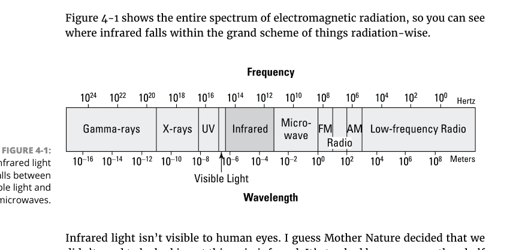

人眼看不见红外光。我猜大自然母亲认为我们不需要用红外光观察事物。这很可惜，因为太阳发出的所有光能中，有一半以上是以红外光形式存在的。如果我们的眼睛既能看见可见光，也能看见红外光，那么晴天的亮度会感觉加倍。


有时红外光会与热量混淆。这是因为我们看不见红外波，但能感受到它们以热的形式存在。换句话说，红外波会加热吸收它们的表面。可见光也能做到这一点。这就是为什么阴凉处比阳光下凉爽。由于热量是红外光的一种效应，红外光可以被用作热源。但红外光和热量并非同一回事。

红外光常用于探测我们在可见光下看不见的物体。一个常见的应用是夜视。根据一个名为普朗克定律的物理原理，所有物质的温度只要高于绝对零度，就会发出电磁辐射。其中一些辐射处于红外波段，因此能够探测红外光的设备确实可以在黑暗中“看见”。

为了增强效果，一些夜视设备实际上会用红外光照射某个区域。因为人眼看不见红外光，所以被照射的区域在我们看来仍然是黑暗的，但对于对红外光敏感的探测器而言，该区域被照亮并且完全可见。

红外光的另一个常见应用是短距离无线通信。最知名的红外设备是电视遥控器。遥控器单元内包含一个明亮的红外光源，电视本身则包含一个红外探测器。当你将遥控器对准电视并按下按钮时，遥控器会打开红外光源并在其上编码一条信息。接收器接收到这个信号，解码信息，并执行信息所指示的任何操作——如调高音量、切换频道等。

与可见光一样，红外光可以被固体物体阻挡，也可以从反射物体上反弹。这就是为什么当你的配偶站在你和电视之间时，遥控器会失灵。但这也是为什么你可以将遥控器对准窗户来绕过你的配偶。红外波从玻璃上反射，如果角度合适，就能到达电视。


第一个无线遥控器是1955年由Zenith公司开发的。它使用普通可见光，可以开关电视，也可以切换频道。它有一个恼人的缺陷：你必须将电视放在房间里，确保外部光源（例如夕阳透过窗户照射的光）的光不会照射到光传感器上。否则，当太阳角度恰好照射到传感器时，电视可能会在晚间新闻中途自动关闭。

如今的遥控器使用复杂的编码方案来避免这种随机的误触发。你可能熟悉为遥控器编程以适配特定电视时必须经历的过程。这种编程是必要的，因为遥控器代码如何工作并没有被广泛接受的标准，所以每个制造商都使用自己的编码方案。

## 探测红外光

在电子电路中有几种探测红外光的方法，但最常见的是使用一种称为*光电晶体管*的器件。你可以在RadioShack或任何其他销售电子元件的商店花几美元买到一个光电晶体管。

要理解光电晶体管的工作原理，首先需要回顾晶体管如何工作。晶体管有三个端子，称为*基极*、*集电极*和*发射极*。在晶体管内部，集电极和发射极之间有一条通路。这条通路的导通性能取决于基极和发射极之间是否施加电压。如果施加了电压，集电极-发射极通路导通良好。如果基极没有电压，集电极-发射极通路则不导通。

在光电晶体管中，基极不是一个连接到电路中电压源的独立端子。相反，基极暴露在光线下。当红外光照射到基极时，光中的能量被转换为电压，发射极-集电极通路开始导通。

因此，红外光照射基极产生的效果与在传统晶体管基极施加电压相同：红外光将晶体管打开。红外光越强，发射极-集电极通路的导通性能越好。

图4-2展示了一个使用红外光电晶体管探测红外光的简单电路。当存在红外光时，集电极-发射极电路导通，LED点亮。因此，当光电晶体管暴露在红外光下时，LED会亮起。

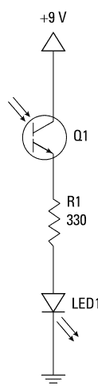

项目25将向你展示如何在无焊面包板上搭建这个电路，图4-3展示了组装好的电路。

一旦你组装好这个电路，尝试将光电晶体管暴露在不同的光源下，看看它们是否发出红外光。一个确定的红外光源是电视遥控器。将遥控器对准光电晶体管并按下遥控器上的任意按钮。你应该会看到LED随着遥控器发送的红外信号快速闪烁。

另一个有趣的红外光源是明火。当然要非常小心；我不希望你为了看看火焰是否产生红外光而烧掉房子。如果你有一个小型打火机，点燃它并将其靠近光电晶体管。

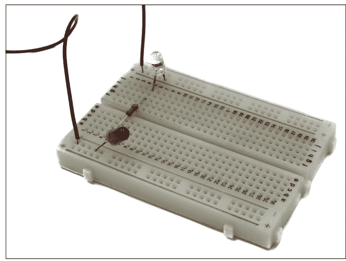

### 图4-3：组装好的红外探测电路（项目25）。

## 项目25：一个简单的红外探测器

在这个项目中，你将使用光电晶体管制作一个简单的红外光探测器。当光电晶体管暴露在红外光下时，LED会亮起。

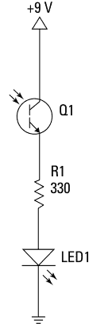

## 部件

-   一个 9V 电池扣座
-   一个 9V 电池
-   一个红外光电晶体管
-   一个红色 LED
-   一个 330 Ω ¼ W 电阻（橙-橙-棕）

## 步骤

在以下步骤中，使用电路板左侧的负（−）总线条作为地线，使用右侧的正（+）总线条作为正电压。

1.  **插入光电晶体管。**

    按以下方式插入光电晶体管：

    | 集电极（长引脚） | 发射极（短引脚） |
    | :--- | :--- |
    | 正总线 | J5 |

2.  **插入电阻。**

    按以下方式插入电阻：

    | 从 | 到 |
    | :--- | :--- |
    | C5 | H5 |

3.  **插入 LED。**

    按以下方式插入 LED：

    | 阴极（短引脚） | 阳极（长引脚） |
    | :--- | :--- |
    | 地线总线 | A5 |

4.  **连接电池。**

    将红色引线插入正总线，黑色引线插入负总线。

5.  **将光电晶体管暴露于红外光源。**

    尝试多种光源，包括电视遥控器、火焰（注意安全！）和阳光。同时，尝试其他不发射红外线的光源，如 LED 手电筒。

## 产生红外光

产生红外光最简单的方法是使用一种特殊的发光二极管（LED），它工作在红外光谱范围内。红外 LED（通常称为 *红外 LED*）在 RadioShack 或任何其他销售电子零件的商店都很容易买到。

红外 LED 与普通 LED 类似，只是你看不见它们发出的光。LED 本身通常是深紫色或蓝色。与其他 LED 一样，阴极引脚比阳极引脚短。

与任何 LED 一样，你必须在红外 LED 上串联一个电阻，以防止过大的电流烧毁 LED。要计算电阻的大小，你需要知道三件事：

-   **电源电压：** 例如 9V。
-   **LED 正向压降：** 对于大多数红外 LED，正向压降为 1.3V。
-   **期望通过 LED 的电流：** 通常，流过红外 LED 的电流应保持在 50mA 以下。然而，红外 LED 通常比普通 LED 能承受更大的电流。我从 RadioShack 购买的红外 LED 可以承受高达 150mA 的电流。

掌握了这三个数据，你就可以用欧姆定律计算出正确的电阻值：

1.  **计算电阻的压降。**
    方法是用总电源电压减去红外 LED 的压降（通常为 1.3V）。例如，如果总电源电压为 9V，LED 压降为 1.3V，则电阻的压降为 7.7V。
2.  **将期望电流转换为安培。**
    在欧姆定律中，电流必须用安培表示。你可以通过将毫安除以 1,000 将毫安转换为安培。因此，如果你期望通过红外 LED 的电流是 50mA，则必须在欧姆定律计算中使用 0.05A。
3.  **用电阻压降除以安培为单位的电流。**
    这将得到你所需的欧姆值电阻。例如，如果电阻压降为 7.6V，期望电流为 50mA，则你需要一个 152Ω 的电阻。
4.  **选择一个接近计算值的标准电阻。**
    150Ω 的电阻对于 9V 电路已经足够接近。如果你没有 150Ω 的电阻，220Ω 或 300Ω 的电阻也能完成工作。

一旦你选择了正确的电阻值，只需将其与红外 LED 串联连接，如图 4-4 的原理图所示。

## 构建接近检测器

红外 LED 和光电二极管的组合通常用作接近检测器，这是一种检测附近是否有物体的装置。构建接近检测器有两种方法。一种是安装红外 LED 和光电晶体管，使它们彼此相对。然后，光电晶体管检测来自红外 LED 的红外光。如果有物体进入红外 LED 和光电晶体管之间，光线被阻挡，光电晶体管就会关闭。

构建接近检测器的另一种方法是将红外 LED 和红外光电二极管并排安装，朝向同一方向。当物体靠近红外 LED 时，部分红外光会从物体上反射回来，被光电晶体管检测到。

你将在本章的接下来两节中学习如何构建两种类型的接近检测器电路。

## 构建共发射极接近检测器

图 4-5 显示了一个简单接近检测电路的原理图。虽然原理图中没有明确画出，但此电路假设红外 LED 和 Q1 的朝向使得 Q1 能够检测到红外 LED 发出的红外光，无论是间接的（用于接近检测器）还是直接的（用于中断器）。

该电路称为 *共发射极* 电路，因为光电晶体管的发射极是光电晶体管电路部分和连接到红外 LED 的输出电路部分的公共点。在共发射极电路中，当光电晶体管检测到红外光时，输出电压为导通状态。因此，当红外 LED 和光电晶体管之间的路径未被阻挡时，红色 LED 会亮起。如果你阻挡了红外 LED 和光电晶体管之间的路径，红色 LED 就会熄灭。

项目 26 展示了如何将该电路配置为中断器，图 4-6 展示了完成的项目。当你将此电路接通电源时，红色 LED 将会亮起。如果让一张纸等物体从红外 LED 和光电晶体管之间通过，红色 LED 就会熄灭。

此电路的输出只是一个红色 LED。然而，你同样可以轻松地将输出连接到其他电路组件。例如，如果你想用接近检测器来打开泛光灯或其他 120V 交流设备，输出可以驱动机械继电器；或者，你可以将输出连接到数字逻辑电路，如第 5 卷第 3 章所述。

## 项目 26：一个共发射极接近检测器

在本项目中，你将构建一个共发射极接近检测器，当红外 LED 和光电晶体管之间的路径畅通时，它会点亮一个红色 LED。如果任何物体阻挡了路径，红色 LED 就会熄灭。

## 红外 LED

## 部件

-   一个 9V 电池扣座
-   一个 9V 电池
-   一个红外光电晶体管
-   一个红外 LED
-   一个红色 LED
-   一个 33 kΩ ¼ W 电阻（橙-橙-橙）
-   一个 330 Ω ¼ W 电阻（橙-橙-棕）

## 步骤

在以下步骤中，使用电路板左侧的负（–）总线条作为地线，使用右侧的正（+）总线条作为正电压。

1.  **插入光电晶体管。**

    按以下方式插入光电晶体管：

    | 引脚 | 插孔 |
    | :--- | :--- |
    | 集电极（长引脚） | 正总线 |
    | 发射极（短引脚） | J3 |

2.  **插入 LED。**

    按以下方式插入 LED：

    | LED | 阴极（短引脚） | 阳极（长引脚） |
    | :--- | :--- | :--- |
    | 红色 | 地线总线 | A3 |
    | 红外 | J15 | 正总线 |

3.  **插入电阻。**

    按以下方式插入电阻：

    | 电阻 | 从 | 到 |
    | :--- | :--- | :--- |
    | R1 (330 Ω) | F15 | 地线总线 |
    | R2 (33 kΩ) | C3 | H3 |

4.  **连接电池。**

    将红色引线连接到正总线，黑色引线连接到负总线。接通电源时，红色 LED 将会亮起。

5.  **使用一张纸或其他扁平物体阻挡红外 LED 和光电晶体管之间的光路。**

    当你中断红外 LED 和光电晶体管之间的光路时，红色 LED 将会熄灭。

## 构建共集电极接近检测器

图 4–7 展示了一个使用共集电极电路的电路，其中集电极是光电晶体管电路和 LED 输出电路之间的公共点。当以这种方式连接时，只要红外 LED 和光电晶体管之间的路径畅通，LED 就会熄灭。当有物体阻挡路径，光电晶体管停止检测红外光时，红色 LED 就会亮起。

项目 27 展示了如何将此电路配置为中断器，图 4–8 展示了完成的项目。当你将此电路接通电源时，红色 LED 保持熄灭。但如果让物体从红外 LED 和光电晶体管之间通过，红色 LED 就会亮起。

## 图 4-7：共集电极接近检测器电路。

## 图 4-8：当红外 LED 与光电晶体管之间的光路被阻挡时，此电路会点亮一个红色 LED（项目 27）。

## 项目 27：共集电极接近检测器

在本项目中，你将搭建一个共集电极接近检测器，每当有物体阻挡在红外 LED 和光电晶体管之间时，它就会点亮一个红色 LED。

### 零件清单

- 一个 9 V 电池扣座
- 一块 9 V 电池
- 一个红外光电晶体管
- 一个红外 LED
- 一个红色 LED
- 两个 330 Ω ¼ W 电阻（橙-橙-棕）
- 一个 22 kΩ ¼ W 电阻（橙-橙-橙）
- 三段短跳线

## 步骤

在这些步骤中，始终使用电路板左侧的负极 (-) 总线作为地线，使用右侧的正极 (+) 总线作为正电压。

#### 1. 插入红色 LED。

| 阴极（短脚） | 阳极（长脚） |
|--------------|--------------|
| E3           | F3           |

#### 2. 插入光电晶体管。

按如下方式插入光电晶体管：

| 集电极（长脚） | 发射极（短脚） |
|----------------|----------------|
| F6             | E6             |

#### 3. 插入红外 LED。

按如下方式插入红外 LED：

| 阴极（短脚） | 阳极（长脚） |
|--------------|--------------|
| E20          | F20          |

#### 4. 插入电阻。

| 电阻       | 起点    | 终点         |
|------------|---------|--------------|
| R1 (330 Ω) | A20     | 地线总线     |
| R2 (22 kΩ) | A6      | 地线总线     |
| R3 (330 Ω) | D3      | D6           |

#### 5. 插入跳线。

按如下方式插入跳线：

| 起点 | 终点         |
|------|--------------|
| J3   | 正极总线     |
| J6   | 正极总线     |
| J20  | 正极总线     |

#### 6. 连接电池。

将红色导线连接到正极总线，黑色导线连接到负极总线。

#### 7. 用一张纸或其他平面物体阻挡红外 LED 与光电晶体管之间的光路。

当你中断红外 LED 与光电晶体管之间的光路时，红色 LED 会亮起。当你移开障碍物时，红色 LED 会熄灭。

## 5 进行数字电子学

## 内容概览

- 第一章：**理解数字电子学** .................... 487
- 第二章：**逻辑入门** ..................................................... 503
- 第三章：**逻辑电路实践** ................................. 523
- 第四章：**触发器应用** ........................................ 561
- 第五章：**微控制器简介** ................................. 591

## 本章内容

- 了解模拟电路和数字电路的区别
- 探索二进制编码
- 学习逻辑运算符
- 用开关和指示灯搭建一些非常简单的逻辑电路

## 第一章
理解数字电子学

欢迎来到数字电子学的世界。从本章开始，你将开始学习那些最终用于构建计算机和其他先进电子设备的基本构建模块电路。

数字电子学是一个复杂、几乎令人望而生畏的主题，但其基本构建模块实际上相当简单。在本章中，你将学习一些基本原理，例如如何区分模拟电路和数字电路、二进制系统如何工作，以及基本逻辑运算如何进行。在本部分的后续章节中，你将在此基础上深入探索数字电子学的奇妙世界。

坚持住！

### 区分模拟电子学和数字电子学

所有电子学可以分为两大类：模拟和数字。

*模拟*是指电压或电流等量以连续速率变化的电路。例如，当你旋转电位器的旋钮时，你是以连续变化的速率改变电阻。电位器的电阻可以是该电位器所允许的最小值和最大值之间的任何值。

如果你将一个固定电阻与电位器串联形成分压器，那么当你转动电位器的旋钮时，固定电阻和电位器之间的点的电压会平滑地增加或减少。

在*数字*电子学中，数量是被计数而非测量的。计数和测量之间有一个重要的区别。当你*计数*某物时，你得到的是一个精确的结果。当你*测量*某物时，你得到的是一个近似的结果。

考虑一个蛋糕食谱，它需要2杯面粉、1杯牛奶和2个鸡蛋。要得到2杯面粉，你舀一些面粉到1杯量杯中，将面粉倒入碗中，然后再做一次。要得到1杯牛奶，你将牛奶倒入液体量杯，直到牛奶的顶部与量杯上印的1杯刻度线对齐，然后将牛奶倒入搅拌碗。要得到2个鸡蛋，你数出2个鸡蛋，将它们敲开，然后加入搅拌碗。

这个食谱中面粉和牛奶的测量是近似的。多一茶匙或少一茶匙不会影响结果。但鸡蛋是精确计数的：正好是2个。不是3个，不是1个，不是1个半，而是2个。你不能多一茶匙或少一茶匙鸡蛋。因为你是数出来的，所以正好是2个鸡蛋。

模拟设备和数字设备之间区别的一个最常见的例子是时钟。图1-1展示了两个时钟：一个是模拟的，另一个是数字的。在模拟时钟上，时间由绕表盘旋转的指针表示，指针指向表盘上表示近似时间的位置。在数字时钟上，数字显示指示精确的时间。

另一个例子是温度计。传统的玻璃水银温度计在玻璃柱内含有少量液态水银。水银受热膨胀，因此水银越热，它在玻璃柱中爬得越高。柱上印有小刻度线以帮助你读取温度。在数字温度计上，精确的温度由数字显示指示。

那么，哪个更准确——模拟还是数字？从某种意义上说，数字电路更准确，因为它们以完全的精度进行计数。例如，你可以精确地计数出罐子里有多少颗果冻豆。但如果你将罐子放在模拟秤上称重，你的读数可能有点不精确，因为你无法总是判断指针的精确位置。假设秤的指针大约在4磅和5磅的中间。这个罐子是重4.5磅还是4.6磅？你无法确定，所以你满足于大约4.5磅。

另一方面，数字电路在精度上固有地受限，因为它们必须以固定的单位进行计数。例如，大多数数字温度计在小数点后只有一位数字。因此，它们可以指示98.6或98.7的温度，但不能指示98.65。

以下是关于数字和模拟系统区别的另外一些值得思考的想法：

- *数字*一词实际上是指你的*手指*——即你的手指。我们人类最自然的计数方式就是用手指。
- *模拟*一词是*钓鱼者*（angler）一词的变体——指的是古代通过张开双臂说“他至少有这么大！”来估计鱼大小的做法。这就是最初的模拟测量。
- 说一个系统是数字的，并不等同于说它是二进制的。*二进制*是一种特定类型的数字系统，其中的计数全部使用二进制数系统完成。几乎所有的数字系统也是二进制系统，但这两个词不能互换。（有关二进制数系统的更多信息，请参见下一节“理解二进制”。）
- 许多系统是二进制和模拟系统的结合。在一个结合了二进制和模拟值的系统中，需要特殊的电路来进行从模拟到数字或反之的转换。输入电压（模拟）可能会被转换为一连串脉冲，每个脉冲代表一伏；然后可以计数这些脉冲来确定电压。
- 关于钓鱼者的那一项当然是我编的。不过，它让你思考了一秒钟，不是吗？

# 理解二进制

大多数数字电子电路都使用二进制数字系统。因此，在理解数字电路工作原理的细节之前，你需要先了解二进制数系统是如何运作的。

## 认识你的数系统

*数系统*仅仅是表示数值的一种方式。数系统使用称为*数字符号*的符号来表示数量。数字符号1、2和3代表通常被称为一、二、三的数量。

在大多数数系统中，数字符号可以串联在一起形成更大的数值，而每个数字符号在字符串中的位置决定了其相对值。在数字12中，数字符号1代表十这个数量，数字符号2代表二这个数量。在数字238中，数字符号2代表二百，数字符号3代表三十，数字符号8代表八。

你在小学就学过所有这些东西，所以这完全是直觉性的。不幸的是，正是因为它太直觉化了，我们很容易忽略其精妙之处——也忽略了它完全是任意规定的这一事实。

我们日常计数系统——称为*十进制系统*或*基数为10*——拥有十个数字符号，这简单地源于人类有十根手指这个事实。如果人类进化出12根手指，我们就会学习用12进制计数，并且会再发明两个数字符号。

不同的数制基数可能看起来很奇怪，但我们实际上每天都会在不经意间遇到它们。一个常见的例子就是我们用来计时的系统。我们测量时间的系统实际上使用了几种不同的基数。例如，一小时包含60分钟。我们甚至不用思考就能认识到1:30是介于1:00和2:00之间的中间点。你可能没有意识到，但当你报时时，你就是在使用60进制思考。

## 逐个计数

二进制是最简单的数系统之一，因为它只有两个数字符号：0和1。在十进制系统（大多数人习惯使用的系统）中，你使用十个数字符号：0到9。在一个普通的十进制数中，如3,482，最右边的数字代表个位；其左边的下一个数字代表十位；再下一个，百位；再下一个，千位，以此类推。这些数字代表10的幂：首先是10⁰（等于1）；然后是10¹（10）；接着是10²（100）；然后是10³（1,000），以此类推。

在二进制中，你只有两个数字符号而不是十个，这就是为什么二进制数看起来有点单调，比如110011、101111和100001。

二进制数中的位置（称为*比特*而不是*数字*）代表2的幂而不是10的幂：1, 2, 4, 8, 16, 32，以此类推。要计算一个二进制数的十进制值，你需要将每个比特乘以对应的2的幂，然后将结果相加。例如，二进制数10111的十进制值计算如下：

```
1×2⁰ = 1×1 = 1
+1×2¹ = 1×2 = 2
+1×2² = 1×4 = 4
+0×2³ = 0×8 = 0
+1×2⁴ = 1×16 = 16
23
```

幸运的是，在二进制和十进制之间转换数字是计算机擅长的事情——事实上，它做得如此之好，以至于你几乎永远不需要自己做任何转换。学习二进制的意义不在于让你看到像1110110110110这样的数字时能立刻说出：“啊！十进制的7,606！”（如果你能做到这一点，芭芭拉·沃尔特斯很可能会采访你，好莱坞甚至会为你拍一部电影。你可能会由达斯汀·霍夫曼主演。）

相反，其意义在于理解计算机如何存储信息——最重要的是，理解二进制计数系统的工作原理，我将在下一节中描述。

如果你确实发现需要将二进制数转换为十进制，或反之，并且你能访问计算机，你可以使用Windows自带的计算器程序来为你进行转换。更多信息，请参阅附近的侧边栏“使用Windows计算器进行二进制转换”。

以下是二进制的一些最有趣的特性，它们解释了该系统与十进制系统的相似之处和不同之处：

> 在十进制中，分配给一个数字的小数位数决定了该数字可以有多大。例如，如果你分配六位数字，最大的可能数字是999,999。然而，由于0本身也是一个数字，一个6位数字可以拥有100万个不同的值。
>
> 同样，分配给二进制数的比特数决定了该数字可以有多大。如果你分配8位，该数字可以存储的最大值是11111111，这恰好是十进制的255。因此，一个8位长的二进制数可以拥有256个不同的值（包括0）。

## 理解数字电子学

> **提示** 要快速计算一个给定长度的二进制数可以存储多少个不同的值，请使用比特数作为2的指数。例如，一个8位二进制数可以容纳2^8个值。因为2^8是256，所以一个8位数可以拥有256个不同的值。这就是为什么一个字节（8位）可以有256个不同的值。

> **技术要点** 这种“2的幂”特性就是为什么数字系统在使用诸如内存容量等数值时，不会使用整齐的、偶数的圆整数字。例如，1k的值并不是正好1,000字节：它实际上是1,024字节，因为1,024是2^10。同样，1MB不是正好1,000,000字节，而是1,048,576字节，这恰好是2^20。

> **记住** 数字极客的一个基本测试是知道你的2的幂，因为它们在二进制数中扮演着如此重要的角色。仅为乐趣，而不是因为你真的需要知道，表1-1列出了2的幂，最高到32。表1-1还显示了各种2的幂的常用简写符号。缩写k代表2^10 (1,024)。MB中的M代表2^20，或1,024k，GB中的G代表2^30，即1,024MB。

### 2的幂

| 幂 | 字节 | 千字节 | 幂 | 字节 | k, MB, 或 GB |
|-------|-------|-----------|-------|-------|--------------|
| 2^1   | 2     |           | 2^17  | 131,072 | 128k        |
| 2^2   | 4     |           | 2^18  | 262,144 | 256k        |
| 2^3   | 8     |           | 2^19  | 524,288 | 512k        |
| 2^4   | 16    |           | 2^20  | 1,048,576 | 1MB        |
| 2^5   | 32    |           | 2^21  | 2,097,152 | 2MB        |
| 2^6   | 64    |           | 2^22  | 4,194,304 | 4MB        |
| 2^7   | 128   |           | 2^23  | 8,388,608 | 8MB        |
| 2^8   | 256   |           | 2^24  | 16,777,216 | 16MB       |
| 2^9   | 512   |           | 2^25  | 33,554,432 | 32MB       |
| 2^10  | 1,024 | 1k        | 2^26  | 67,108,864 | 64MB       |
| 2^11  | 2,048 | 2k        | 2^27  | 134,217,728 | 128MB      |
| 2^12  | 4,096 | 4k        | 2^28  | 268,435,456 | 256MB      |
| 2^13  | 8,192 | 8k        | 2^29  | 536,870,912 | 512MB      |
| 2^14  | 16,384| 16k       | 2^30  | 1,073,741,824 | 1GB       |
| 2^15  | 32,768| 32k       | 2^31  | 2,147,483,648 | 2GB       |
| 2^16  | 65,536| 64k       | 2^32  | 4,294,967,296 | 4GB       |

## 处理逻辑运算

二进制的一个伟大之处在于它非常擅长处理称为逻辑运算的特殊操作。*逻辑运算*比较两个二进制比特，并产生第三个二进制比特作为结果。有16种可能的逻辑运算。目前，我想向你介绍其中三种：AND（与）、OR（或）和XOR（异或）。

以下列表总结了这三种基本逻辑运算：

- **AND（与）：** AND运算比较两个二进制值。如果两个值都是1，AND运算的结果是1。如果其中一个值为0或两个值都为0，结果为0。
- **OR（或）：** OR运算比较两个二进制值。如果至少一个值为1，OR运算的结果是1。如果两个值都为0，结果为0。
- **XOR（异或）：** XOR运算比较两个二进制值。如果恰好有一个值为1，结果是1。如果两个值都为0或两个值都为1，结果为0。

表1-2总结了AND、OR和XOR的工作原理。

### 二进制值的逻辑运算

| 第一个值 | 第二个值 | AND | OR | XOR |
| :--- | :--- | :--- | :--- | :--- |
| 0 | 0 | 0 | 0 | 0 |
| 0 | 1 | 0 | 1 | 1 |
| 1 | 0 | 0 | 1 | 1 |
| 1 | 1 | 1 | 1 | 0 |

你可以通过一次应用一个比特的方式，将逻辑运算应用于具有多个二进制数字的二进制数。手动完成此操作的最简单方法是将两个二进制数上下对齐，然后将运算结果写在每个二进制数字的下方。以下示例展示了如何计算10010100 AND 11011101：

```
10010100
AND11011101
10010100
```

如你所见，结果是10010100。

## 使用 Windows 计算器进行二进制转换

如果你有一台电脑，你可以使用所有 Windows 版本自带的免费计算器程序来处理二进制数。这个计算器程序有一个许多用户不知道的特殊程序员模式。当你将计算器切换到这个模式时，你可以进行即时的二进制和十进制转换，这在处理 IP 地址时偶尔会派上用场。

要使用程序员模式的 Windows 计算器，请启动计算器（点击“开始”按钮并输入 **计算器** 来找到它）。然后点击计算器左上角附近的菜单图标，选择“查看” > “程序员”。计算器会变成一个花哨的程序员模型——就像我 40 年前还是个新手计算机程序员时花 150 美元买的那种。各种按钮会出现：

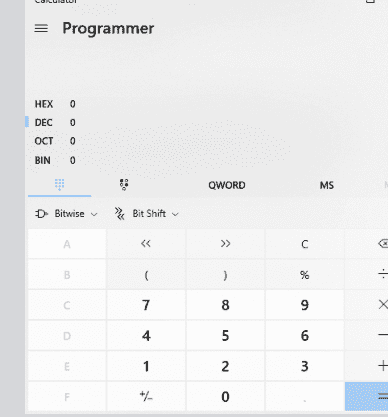

你可以选择十六进制、十进制、八进制和二进制单选按钮，从十进制切换到数字电子学中常用的不同编号系统：十六进制、八进制和二进制。例如，要找到十进制数 155 的二进制等效值，输入 **155**，然后选择二进制单选按钮。显示框中的值会变为 10011011。

以下是关于计算器程序员模式的其他几点注意事项：

- 程序员计算器有几个专门为二进制计算设计的功能，例如 AND、XOR、NOT 和 NOR。
- 程序员计算器还可以处理十六进制转换。在处理 IP 地址时不会用到十六进制，但它用于其他类型的二进制数，因此这个功能有时被证明是有用的。
- 早期版本的 Windows（Windows 7 之前）中的计算器没有程序员模式。但是，旧版本确实有一个科学模式，其中包含处理二进制数的功能。

## 使用开关构建门电路

为了让你了解基本门电路的工作原理，项目 28、29 和 30 向你展示如何使用简单的 DPDT 刀开关组装一个与门、一个或门和一个异或门。在实际应用中，门电路是用晶体管或集成电路构建的。但这三个项目将让你很好地了解门电路的工作原理。

图 1-2 展示了这三个完全组装好的项目。与门（项目 28）显示在顶部的照片中。如你所见，与门是通过将两个开关串联连接来实现的。两个开关都必须闭合，灯才会亮。

或门（项目 29）的电路显示在图 1-2 的中间照片中。要用开关实现或门，你只需将开关并联连接。然后，如果任一开关闭合，灯就会亮。

异或门电路（项目 30）显示在图 1-2 的底部照片中。这种接线有点棘手。DPDT 开关以交叉连接的方式连接，使得只有当其中一个开关处于 A 位置而另一个处于 B 位置，或者反之亦然时，通往灯的电路才会接通。如果两个开关处于相同位置，则电路未接通，因此灯不会亮。

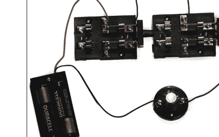

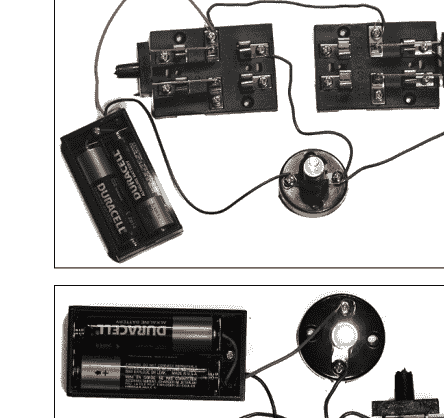

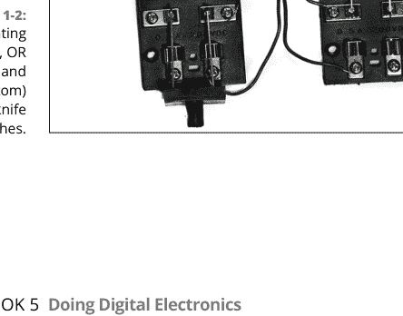

### 图 1-2：使用刀开关实现与门（顶部）、或门（中间）和异或门（底部）。

## 项目 28：一个简单的与门电路

在这个项目中，你使用两个开关和一个灯来创建一个执行逻辑与运算的简单电路。

这两个开关代表输入到与运算的两个二进制值。闭合的开关代表二进制值 1，断开的开关代表二进制值 0。

灯代表与运算的二进制输出。当灯亮时，代表二进制值 1。当灯不亮时，代表二进制值 0。

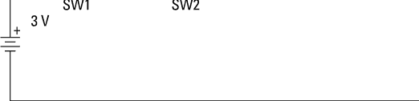

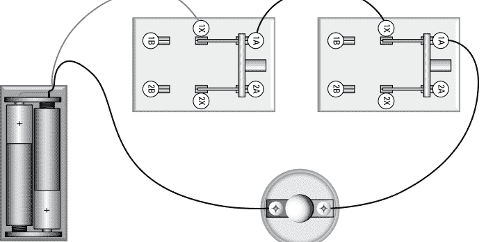

## 部件

- 两节 AA 电池
- 一个电池盒
- 一个灯座
- 一个 2.33 V 手电筒灯泡
- 两个 DPDT 刀开关
- 两根 5 英寸长的 22 号多股线，每端剥去 ½ 英寸绝缘层

## 步骤

1.  **断开两个开关。**
    将手柄移到直立位置，使所有触点都不连接。

2.  **将电池盒的红色引线连接到其中一个开关的端子 1X。**

3.  **将黑色引线连接到灯座的一个端子上。**

4.  **按如下方式连接两根 5 英寸的导线：**

| 从哪里连接 | 连接到哪里 |
| :--- | :--- |
| 第一个开关的端子 1A | 第二个开关的端子 1X |
| 第二个开关的端子 1A | 灯座的未使用端子 |

5.  **将电池插入电池盒。**

6.  **操作开关以验证与门电路的正确操作。**

    开关应按如下方式操作：

    | 开关 1 | 开关 2 | 灯 |
    | :--- | :--- | :--- |
    | 断开 | 断开 | 灭 |
    | 断开 | 闭合 | 灭 |
    | 闭合 | 断开 | 灭 |
    | 闭合 | 闭合 | 亮 |

注意，只有当两个开关都闭合时灯才会亮，这正是与门电路应有的工作方式。

你完成了！给自己鼓鼓掌，因为你刚刚构建了你的第一个逻辑电路。

## 项目 29：一个简单的或门电路

在这个项目中，你通过将两个开关并联连接来控制一个灯，从而构建一个简单的或门电路。当两个开关中的任何一个闭合时，灯就会亮。这两个开关代表或运算的两个二进制输入，灯代表二进制输出。

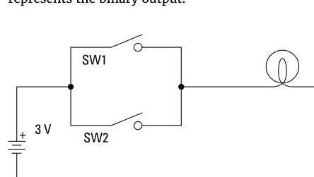

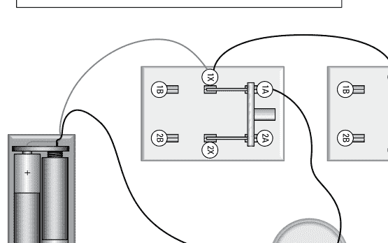


## 部件

- 两节 AA 电池
- 一个电池盒
- 一个灯座
- 一个 2.33 V 手电筒灯泡
- 两个 DPDT 刀开关
- 三根 5 英寸长的 22 号多股线

## 步骤

1.  **断开两个开关。**
    将手柄移到直立位置，使所有触点都不连接。
2.  **将电池盒的红色引线连接到第一个开关的端子 1X。**
3.  **将电池盒的黑色引线连接到灯座的第一个端子。**
4.  **将第一根 5 英寸导线从第一个开关的端子 1X 连接到第二个开关的端子 1X。**
5.  **将第二根 5 英寸导线从第一个开关的端子 1A 连接到灯座的第二个端子。**
6.  **将第三根 5 英寸导线从第二个开关的端子 1A 连接到灯座的第二个端子。**
7.  **将电池插入电池盒。**
8.  **操作开关以验证或门电路的正确操作。**

    开关应按如下方式操作：

    | 开关 1 | 开关 2 | 灯 |
    | :--- | :--- | :--- |
    | 断开 | 断开 | 灭 |
    | 断开 | 闭合 | 亮 |
    | 闭合 | 断开 | 亮 |
    | 闭合 | 闭合 | 亮 |

注意，只要两个开关中至少有一个闭合，灯就会亮。只有当两个开关都断开时，灯才会熄灭。这就是或门电路应有的工作方式。

你完成了！祝贺你出色地完成了工作。你已经完成了你的第二个逻辑电路。

## 项目 30：一个简单的异或门电路

在这个项目中，你通过将两个开关连接起来控制一个灯来构建一个简单的异或门电路。在这个电路中，当其中一个开关闭合时，灯会亮。如果两个开关都断开或都闭合，灯就不会亮。这两个开关代表异或运算的两个二进制输入，灯代表二进制输出。

与本章中的其他两个项目不同，这个项目中的开关同时使用了 A 和 B 位置。因此，当开关处于 A 位置时，它代表二进制 1。在 B 位置时，开关代表二进制 0。

注意原理图中 A 和 B 端子是如何在两个开关之间交叉连接的。这样，只有当开关处于相反位置时，通往灯的电路才会接通。换句话说，如果 SW1 处于 A 位置而 SW2 处于 B 位置，或者 SW1 处于 B 位置而 SW2 处于 A 位置，灯就会亮。如果两个开关都处于 A 位置或都处于 B 位置，灯就不会亮。

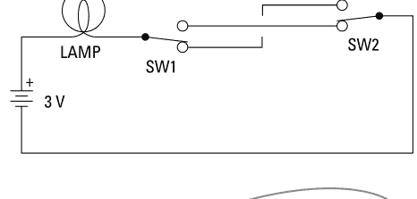

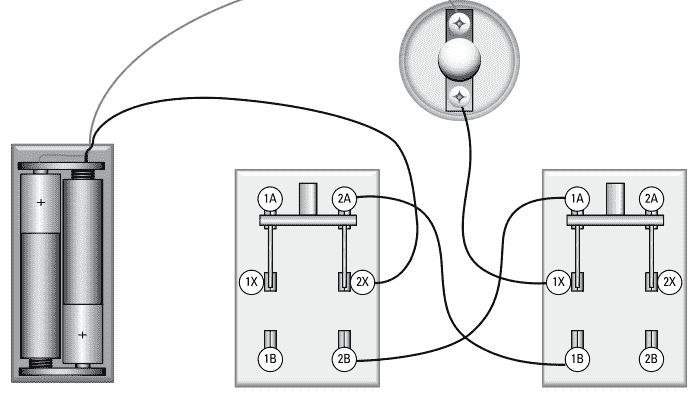

## 部件

-   两节AA电池
-   一个电池盒
-   一个灯座
-   一个2.33伏手电筒灯泡
-   两个双刀双掷（DPDT）闸刀开关
-   三段5英寸长的22号线多股导线

## 步骤

- 1. **打开两个开关。**
将手柄移至竖直位置，使所有触点均断开。
- 2. **将电池盒的黑色引线连接到第一个开关的2X端子。**
- 3. **将红色引线连接到灯座的第一个端子。**
- 4. **用第一段5英寸导线，将灯座的第二个端子连接到第二个开关的1X端子。**
- 5. **用第二段5英寸导线，将第一个开关的2A端子连接到第二个开关的1B端子。**
- 6. **用第三段5英寸导线，将第一个开关的2B端子连接到第二个开关的1A端子。**
- 7. **将电池装入电池盒。**
- 8. **操作开关，验证异或（XOR）电路的正确功能。**

开关应按如下方式工作：

| 开关1 | 开关2 | 灯泡 |
| :--- | :--- | :--- |
| 断开 | 断开 | 灭 |
| 断开 | 闭合 | 亮 |
| 闭合 | 断开 | 亮 |
| 闭合 | 闭合 | 灭 |

你完成了！为自己出色的工作喝彩吧。你已经完成了你的第三个逻辑电路！

本章内容

- 了解布尔逻辑
- 探究不同类型的逻辑门
- 观察两个或多个门如何组合使用
- 仅使用与非（NAND）或或非（NOR）门构建逻辑电路
- 使用软件模拟逻辑门电路

## 第2章
### 逻辑入门

我是在*《星际迷航》*中长大的。柯克船长和他英勇的船员们在银河系中进行的奇妙冒险激发了我的想象力。因此，从逻辑上讲，我倾向于以提及斯波克先生来开始关于逻辑的章节。事实上，以任何其他方式开始本章都是不合逻辑的。

在本章中，我将探讨逻辑的基本原理，这是数字电子学的基础。特别是，我将探索*逻辑门*，这是一种便捷的器件，对两个二进制输入执行逻辑操作，并产生单个二进制输出结果。

令人难以置信的是，现代计算机系统压倒性的复杂性是建立在逻辑门这一简单概念之上的。现代计算机处理器由数十亿个独立的逻辑门组成，这些门以某种方式连接，使处理器能够以惊人的速度执行复杂的操作。

那么回到斯波克先生：我最喜欢的斯波克关于逻辑的引语出自一集名为“变体”的剧集。在剧集的最后，斯波克祝贺柯克船长通过运用复杂的逻辑，使*企业号*船员摆脱了一个真正的困境，对付了一个一心要毁灭的机器人：

*斯波克*：祝贺你，船长。一段令人眼花缭乱的逻辑。

*柯克*：你没想到我能做到，对吧，斯波克？

*斯波克*：是的。

嗯，柯克确实做到了，我认为你也具备这种能力。那么，让我们开始吧！

## 介绍布尔逻辑和逻辑门

在数字电子学中，*布尔逻辑*指的是对二进制值的处理，其中1代表*真*的概念，0代表*假*的概念。在实现逻辑的电子电路中，二进制值由电压电平表示。在最常见的约定中，二进制值1由+5伏（也称为*高电平*）表示，二进制值0由0伏（也称为*低电平*）表示。

这种逻辑被称为*布尔*逻辑，因为它是由19世纪英国数学家兼哲学家乔治·布尔发明的。1854年，他出版了一本名为《思维规律的研究》的书，该书阐述了最初被称为布尔代数（也称为布尔逻辑）的概念。布尔逻辑是现代计算机最重要的原理之一。因此，大多数人认为布尔是计算机科学之父。

正如我在本节开头提到的，在布尔逻辑中，*真*由二进制数字1表示，*假*由二进制数字0表示。*逻辑操作*（也称为*逻辑函数*）是可应用于一个或多个逻辑输入并产生单个逻辑输出的函数。最常见的逻辑操作类型之一是NOT（非），它简单地反转其输入的状态。换句话说，使用NOT操作，如果输入为真，则输出为假；如果输入为假，则输出为真。

*门*是实现逻辑功能的电路或器件。因此，NOT门是实现逻辑NOT操作的电路或器件。NOT门在数字电路中非常常见。

你可以通过多种方式创建门开关。最常见的方法是使用晶体管作为开关，以某种方式排列，使得根据逻辑输入和所实现的门类型产生正确的输出。在本迷你书的第3章中，你将看到门是如何实现的。在本章的其余部分，我将讨论各种类型的门的功能以及它们如何在现实世界的电路中组合使用。

无论用于创建门电路的方法如何，所有逻辑电路都依赖于不同的电压范围来表示1和0。正如我已经提到的，最常见的电压约定是用大约+5伏表示1，用大约0伏表示0。+5伏信号通常称为*高电平*，0伏信号通常简称为*低电平*。

在本章的其余部分，我将介绍七种最常见的逻辑门类型：NOT（非）、AND（与）、OR（或）、NAND（与非）、NOR（或非）、XOR（异或）和NXOR（同或）。除了NOT门，所有这些门都至少使用两个输入；NOT门只有一个输入。为了帮助你理清思路，表2-1简要概述了各种门类型之间的区别：

表2-1

| 门 | 描述 |
| :--- | :--- |
| NOT | 反转输入（高电平变低电平，低电平变高电平） |
| AND | 仅当所有输入均为高电平时输出高电平；否则输出低电平 |
| OR | 只要至少有一个输入为高电平，就输出高电平；否则输出低电平 |
| NAND | 仅当所有输入均为低电平时输出高电平；否则输出低电平 |
| NOR | 只要至少有一个输入为低电平，就输出高电平；否则输出低电平 |
| XOR | 仅当其中一个输入为高电平时输出高电平；否则输出低电平 |
| NXOR | 仅当其中一个输入为低电平时输出高电平；否则输出低电平 |

## 探究NOT门

所有门中最简单的是*NOT*门，也称为*反相器*。NOT门只有一个输入，其输出与输入相反。如果输入为低电平，则输出为高电平。如果输入为高电平，则输出为低电平。

表2-2显示了反相器的真值表。*真值表*是列出所有可能的输入值组合并显示每种组合对应输出的表格。对于反相器，真值表很简单。因为只有一个输入，所以只有两种可能性：输入为低电平，或输入为高电平。如表所示，输出就是输入的相反值。

> 请注意，在真值表中，通常使用0和1来表示逻辑值，而不是使用*高电平*和*低电平*这些术语。

表2-2 反相器的真值表

| 输入 | 输出 |
|-------|--------|
| 0     | 1      |
| 1     | 0      |

图2-1显示了NOT门的标准逻辑符号。此类符号通常用于使用门的电路原理图中。NOT符号就是一个三角形，输入在一端，输出在另一端。输出端的小圆圈称为*取反气泡*，表示输出被反转。


## 探究AND门

*双输入与门*是一种具有两个输入和一个输出的门。仅当两个输入均为高电平时，输出才为高电平。任何其他输入组合都会导致输出为低电平。表2-3显示了双输入与门的真值表。

表2-3 双输入与门的真值表

| 输入A | 输入B | 输出 |
|---------|---------|--------|
| 0       | 0       | 0      |
| 0       | 1       | 0      |
| 1       | 0       | 0      |
| 1       | 1       | 1      |

图2-2显示了与门的标准符号。输入在左侧，输出在右侧。

请注意，你可以创建具有两个以上输入的与门。每向门添加一个额外的输入，可能的输入组合数量就会翻倍。双输入门有四种可能的输入组合；三输入门有八种可能的组合；四输入门有十六种可能的输入组合，依此类推。

## 图 2-2：双输入与门的符号。


表 2-4 展示了三输入与门的真值表。如你所见，只有当所有输入均为高电平时，输出才为高电平。任何其他输入组合都会产生低电平输出。

## 三输入与门的真值表

| 输入 A | 输入 B | 输入 C | 输出 |
|---------|---------|---------|--------|
| 0       | 0       | 0       | 0      |
| 0       | 0       | 1       | 0      |
| 0       | 1       | 0       | 0      |
| 0       | 1       | 1       | 0      |
| 1       | 0       | 0       | 0      |
| 1       | 0       | 1       | 0      |
| 1       | 1       | 0       | 0      |
| 1       | 1       | 1       | 1      |

你可以在电路中组合门电路，以创建比单个门电路更复杂的逻辑网络。例如，你可以使用两个双输入与门来创建一个三输入与门，如图 2-3 所示。在该图中，第一个与门仅在输入 A 和 B 均为真时才产生高电平输出。然后，第一个与门的输出被用作第二个与门的输入之一；另一个输入是输入 C。

## 图 2-3：一对双输入与门可用于创建一个功能类似于三输入与门的逻辑网络。


因为第二个门的输出只有在其两个输入均为高电平时才为高电平，并且因为第二个门的第一个输入来自第一个门的输出（该输出仅在第一个门的两个输入均为高电平时才为高电平），所以整个电路（标记为 X）的输出只有在所有三个输入（A、B 和 C）均为高电平时才为高电平。

如果你愿意，可以将与门视为一种乘法形式。要理解这一点，首先考虑当你将任意数量的单比特二进制数相乘时，只存在两种可能的结果：零或一。然后，考虑任何值乘以零都等于零。因此，无论有多少个输入，如果其中任何一个为零（低电平），乘法的结果都将为零。

回顾表 2-3 和表 2-4 中的真值表，并尝试将每一行中的二进制输入相乘。在每种情况下，只要输入组合中包含零，答案就是零。只有当所有输入都为 1 时，答案才会是 1。

以下段落仅描述了在实际电子电路中可能使用与门的众多情况中的两种：

> 图 2-4 展示了与门在家庭报警系统中的可能应用。在这里，安装在家庭门窗上的各种传感器的输入由传感器电路处理，如果任何传感器检测到房屋内任何位置的入侵，传感器电路会向与门的一个输入发送高电平信号。然后，如果系统处于布防状态，布防电路会向与门的另一个输入发送 1。最后，如果与门的输出为 1，报警电路会发出声音警报。因此，如果检测到入侵且系统已布防，警报就会响起。

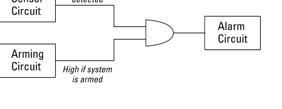

以这种方式使用时，与门通常被称为*使能输入*，因为与门的一个输入使能另一个输入被处理。当使能输入为高电平时，受控输入被允许通过与门。当使能输入为低电平时，受控输入被禁止。

图 2-5 展示了使用使能输入的家庭报警系统的更高级版本。在此版本中，当检测到入侵时，警报不会立即响起。相反，警报在触发 30 秒后响起。这为你提供了在吵醒邻居之前禁用警报的时间。当传感器电路检测到入侵时，它会向 555 定时器电路发送一个触发脉冲，该定时器随后产生一个 30 秒的高电平脉冲。来自 555 定时器输出的高电平信号通过一个非门，该非门将信号反转为低电平。低电平信号被发送到第二个与门的输入之一。第二个与门的另一个输入是第一个与门的输出，该输出表明已检测到入侵且系统已布防。

在检测到入侵后的前 30 秒内，第二个与门的第一个输入为低电平，第二个输入为高电平，因此第二个与门的输出为低电平。因此，警报不会响起。实际上，定时器输出禁止了警报响起。但是，当 555 定时器电路的输出在 30 秒脉冲结束后变为低电平时，非门将信号反转，向第二个与门发送高电平输出。这种情况导致第二个与门的输出变为高电平，因此警报响起。因此，来自定时器电路的反转脉冲使能了报警电路。

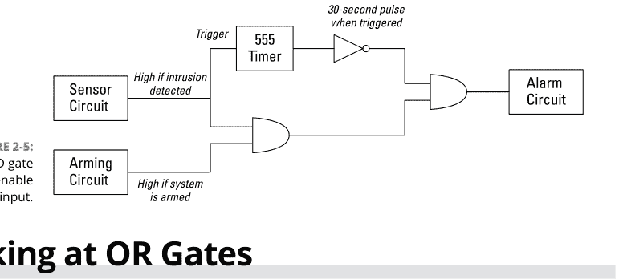

## 了解或门

或门在任一输入为高电平时产生高电平输出。或门的输出仅在所有输入均为低电平时才为低电平。表 2-5 展示了双输入或门的真值表。

## 表 2-5：双输入或门的真值表

| 输入 A | 输入 B | 输出 |
| :---: | :---: | :---: |
| 0 | 0 | 0 |
| 0 | 1 | 1 |
| 1 | 0 | 1 |
| 1 | 1 | 1 |

需要注意的是，在或门中，有多少个输入为高电平并不重要。只要至少有一个输入为高电平，输出就会为高电平。因此，在双输入或门中，如果任一输入为高电平或两个输入均为高电平，输出将为高电平。在三输入或门中，如果任一、任意两个或所有三个输入为高电平，输出将为高电平。

或门的标准符号如图 2-6 所示。输入在左侧，输出在右侧。

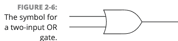

与与门一样，具有两个以上输入的或门也很容易创建。无论或门有多少个输入，只要任一输入为高电平，输出就为高电平。

通过组合双输入或门可以轻松创建多输入或门。图 2-7 展示了一个包含三个或门的逻辑网络，其功能相当于一个四输入或门：如果四个输入中任一为高电平，输出将为高电平。

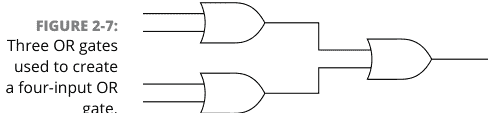

你可以在电路中组合双输入或门，以创建具有两个以上输入的或网络。例如，图 2-8 展示了或门在具有两个以上输入的家庭报警系统传感器电路中的可能应用。在此电路中，八个独立的报警传感器被馈送到一个或门网络中。如果任一输入为高电平，传感器电路的输出就为高电平。

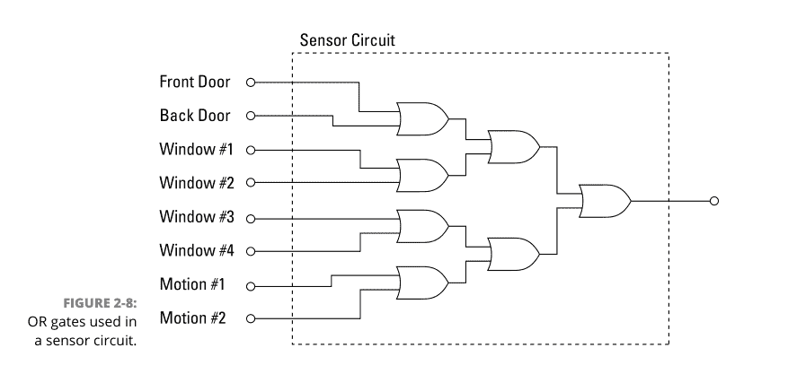

图 2-8：传感器电路中使用的或门。

该传感器电路使用七个或门创建了一个八输入或门。花点时间研究一下这个网络中或门的排列方式，以确保你理解其工作原理。八个输入中的每一个都被路由到第一层门中的四个或门之一。这四个或门将八个输入减少为四个输出，然后这些输出被发送到第二层的两个或门。这两个或门将其四个输入减少为两个输出，这些输出被发送到最后一个或门。然后，最后一个或门的输出成为整个传感器电路的输出。

## 了解与非门

与非门是与门和非门的组合。事实上，NAND 这个名称是 NOT 和 AND 的缩写。如表 2-6 所示，当两个输入均为高电平时，与非门的输出为低电平。否则，与非门的输出为高电平。

### 双输入与非门的真值表

| 输入 A | 输入 B | 输出 |
|---------|---------|--------|
| 0       | 0       | 1      |
| 0       | 1       | 1      |
| 1       | 0       | 1      |
| 1       | 1       | 0      |

与非门的标准符号如图 2-9 所示。该符号与与门的符号相同，只是在输出端增加了一个小圆圈。与非门符号中的小圆圈表示输出被反转。换句话说，与非门是一个输出被反转的与门。

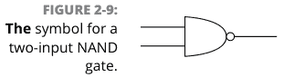

与非门很特殊，因为你可以使用各种组合的与非门来创建与门、或门或非门。因此，一个由非门、与门和或门组合而成的逻辑网络，可以用仅由与非门组成的等效组合来创建。由于这个原因，与非门被称为*通用门*。你将在本章后面的“通用与非门”中了解更多关于与非门的这一特性。

与非门的另一个有趣之处在于，它可以被用作一种测试低电平输入而非高电平输入的或门。换句话说，只要任一输入为低电平，与非门的输出就为高电平。

与非门的这一特性在许多情况下都很有用。例如，考虑上一节和图 2-8 中介绍的报警传感器电路。假设所有报警传感器在没有入侵时产生高电平信号，而在有入侵时变为低电平。在现实世界中，许多报警传感器正是以这种方式工作的。例如，检测门是否打开的传感器本质上是一个简单的开关，当门关闭时开关闭合，当门打开时开关断开。当门关闭时，电流流过开关，因此传感器的信号为高电平。当门打开时，电流停止流动，传感器的信号变为低电平。

图 2-10 展示了如何使用与非门来测试八个传感器中任一的低电平输入。该电路与图 2-8 中所示的电路相同，只是所有的或门都被替换为与非门。

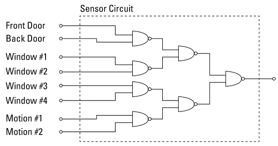

图 2-10：传感器电路中使用的与非门。

## 了解或非门

或非门是或门和非门的组合。与与非门类似，NOR 这个名称是 NOT 和 OR 的缩写。或非门的真值表如表 2-7 所示。如你所见，当或非门的任何一个输入为高电平时，其输出为低电平。否则，或非门的输出为高电平。

表 2-7：双输入或非门的真值表

| 输入 A | 输入 B | 输出 |
| :---: | :---: | :---: |
| 0 | 0 | 1 |
| 0 | 1 | 0 |
| 1 | 0 | 0 |
| 1 | 1 | 0 |

如图 2-11 所示，或非门的标准符号与或门的符号相同，只是在输出端添加了一个取反圆圈。这个圆圈仅表示输出被反转。或非门本质上是或门和非门的组合。

图 2-11：双输入或非门的符号。

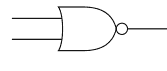

与与非门一样，或非门也是一种通用门。任何由非门、与门和或门组成的逻辑网络都可以仅用或非门重新创建。更多信息，请参阅“你需要的只是与非门（或或非门）”一节。

正如与非门对于低电平输入来说相当于或门一样，或非门对于低电平输入来说相当于与门。换句话说，当两个输入都为低电平时，或非门的输出为高电平。

本章前面的图 2-5 显示了一个报警电路，该电路在输入传感器检测到入侵后 30 秒发出警报。在该电路中，555 定时器电路的输出脉冲经非门反转后送入与门，当传感器电路的输出为高电平且 30 秒定时器脉冲结束时，与门向声音报警电路发送高电平输出。

图 2-12 显示了同一电路的一个版本，它使用或非门代替与门来驱动声音报警电路。在此电路中，当传感器电路的输出为低电平且定时器电路的输出也为低电平时，报警器响起。555 定时器的输出不需要非门，但现在与门的输出需要一个非门来反转其信号，以便在系统布防且报警被触发时发出低电平。

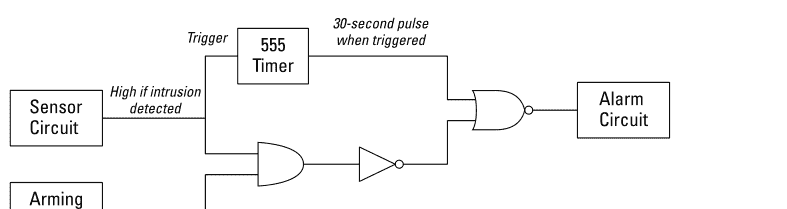

图 2-12：在传感器电路中使用或非门。

## 了解异或门和同或门

本章中我只剩下两种门类型需要你了解：异或门（XOR，代表 *Exclusive* OR）和同或门（XNOR，代表 *Exclusive* NOR）。

在异或门中，如果其中一个且仅有一个输入为高电平，则输出为高电平。如果两个输入都为低电平或都为高电平，则输出为低电平。异或门的真值表如表 2-8 所示。

表 2-8：双输入异或门的真值表

| 输入 A | 输入 B | 输出 |
| :--- | :--- | :--- |
| 0 | 0 | 0 |
| 0 | 1 | 1 |
| 1 | 0 | 1 |
| 1 | 1 | 0 |

解释异或门的另一种方式是：如果输入不同，则输出为高电平；如果输入相同，则输出为低电平。

异或门有一个不太为人知的兄弟，叫做同或门。*同或门* 是一个输出被反转的异或门。表 2-9 列出了同或门的真值表。

表 2-9：双输入同或门的真值表

| 输入 A | 输入 B | 输出 |
| :--- | :--- | :--- |
| 0 | 0 | 1 |
| 0 | 1 | 0 |
| 1 | 0 | 0 |
| 1 | 1 | 1 |

图 2-13 显示了用于异或门和同或门的符号。如你所见，这两个符号之间的唯一区别是同或门的输出端有一个圆圈，表示输出被反转。

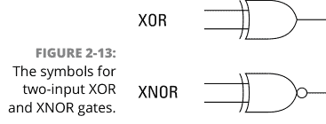

异或门最常见的用途之一是将两个二进制数相加。为了使此操作正常工作，异或门必须与与门结合使用，如图 2-14 所示。

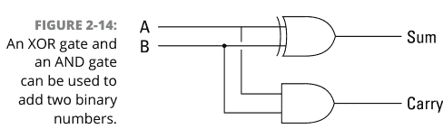

要理解图 2-14 所示电路的工作原理，请回顾二进制加法的工作原理：

```
0 + 0 = 0
0 + 1 = 1
1 + 0 = 1
1 + 1 = 10
```

如果你愿意，你可以用两个二进制数字写出每个加法语句的结果，如下所示：

```
0 + 0 = 00
0 + 1 = 01
1 + 0 = 01
1 + 1 = 10
```

当结果用两个二进制数字书写时，如本例所示，你可以很容易地看出如何结合使用异或门和与门电路来执行二进制加法。如果你只考虑每个结果的第一个二进制数字，你会注意到它看起来就像与门电路的真值表，而每个结果的第二个数字看起来就像异或门的真值表。

图 2-14 所示的加法器电路有两个输出。第一个称为和（Sum），第二个称为进位（Carry）。当使用多个加法器来加长度超过 1 位的二进制数时，进位输出非常重要。

## 德摩根定理

是时候介绍一个定理了！虽然我在本章中介绍了一些相当复杂的逻辑概念，但我一直避免提及任何被称为 *定理* 的内容——至少到现在为止是这样。

德摩根定理由 19 世纪英国数学家奥古斯都·德摩根创立，他提出了许多使布尔逻辑得以工作的概念。德摩根最重要的工作包括两个相关的定理，涉及非门如何与与门和或门结合使用：

- 输出反转的与门与输入反转的或门行为相同。
- 输出反转的或门与输入反转的与门行为相同。

输出反转的与门当然也称为与非门，输出反转的或门也称为或非门。因此，德摩根定律也可以这样表述：

- 与非门与输入反转的或门行为相同。
- 或非门与输入反转的与门行为相同。


输入反转的或门称为 *负或门*，输入反转的与门称为 *负与门*。

如果你还不信服，请回顾一下与非门的真值表：

| A | B | X |
|---|---|---|
| 0 | 0 | 1 |
| 0 | 1 | 1 |
| 1 | 0 | 1 |
| 1 | 1 | 0 |

现在看看或门的真值表，额外添加了一组列来显示反转的输入：

| A | B | NOT A | NOT B | X |
|---|---|---|---|---|
| 0 | 0 | 1 | 1 | 1 |
| 0 | 1 | 1 | 0 | 1 |
| 1 | 0 | 0 | 1 | 1 |
| 1 | 1 | 0 | 0 | 0 |

这里，A 和 B 列代表输入。NOT A 和 NOT B 列是输入反转后的值。最后，X 列代表应用于 NOT A 和 NOT B 值的或运算。

如你所见，这些真值表的最终输出列是相同的。因此，与非门等效于负或门。任何时候你在电路图中看到与非门，你都可以用负或门代替。

现在看看德摩根定理的另一面。这是或非门的真值表：

| A | B | X |
|---|---|---|
| 0 | 0 | 1 |
| 0 | 1 | 0 |
| 1 | 0 | 0 |
| 1 | 1 | 0 |

这是负与门的输出：

| A | B | NOT A | NOT B | X |
|---|---|---|---|---|
| 0 | 0 | 1 | 1 | 1 |
| 0 | 1 | 1 | 0 | 0 |
| 1 | 0 | 0 | 1 | 0 |
| 1 | 1 | 0 | 0 | 0 |

同样，你可以看到这两个真值表给出相同的输出。

正如在与非门或或非门的输出端使用圆圈表示输出被反转一样，你可以在或门或与门的输入端使用圆圈表示输入被反转。图 2-15 显示了这些符号。该图还显示了负或门和负与门可以与与非门和或非门互换使用。

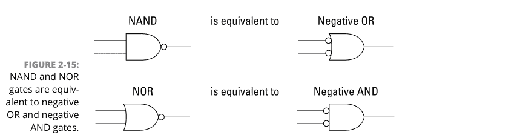

## 你需要的只是与非门（或或非门）

在本章前面的“了解与非门”和“了解或非门”中，我提到与非门是一种通用门，因为任何其他类型的门（如与门、或门、异或门和同或门）都可以仅由与非门的组合构建。

这个事实非常有用，因为它使你能够仅使用与非门构建任何逻辑电路，无论简单还是复杂。当你开始构建自己的数字电路时，你可以储备只包含与非门的集成电路，并确信你可以用你的与非门库存构建最复杂的电路。

在“了解或非门”中，我也提到或非门是一种通用门。因此，你也可以仅使用或非门构建任何逻辑电路。

在以下部分中，我首先解释如何使用与非门构建其他类型的门；然后向你展示如何用或非门做同样的事情。

### 通用与非门

图 2-16 显示了如何使用与非门的各种组合来创建非门、与门、或门和或非门。以下段落描述了这些电路的工作原理：

- **非门**：你只需将与非门的两个输入连接在一起，就可以从与非门创建一个非门。因为与非门的两个输入连接在一起，所以只有两种输入组合是可能的：两个都为高电平或两个都为低电平。如果两个输入都为高电平，与非门将输出低电平。如果两个输入都为低电平，与非门将输出高电平。因此，该电路的行为与非门完全相同。

## 通用或非门

与与非门一样，或非门也是一种通用门。图2-17展示了如何以多种多样的方式组合或非门，以创建非门、与门、或门以及与非门。

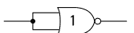


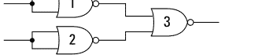

**图2-17：** 仅使用或非门创建非门、或门、与门和与非门。

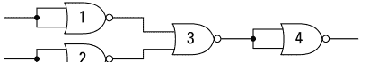

以下段落描述了这些电路的工作原理：

-   **非门：** 用或非门构建非门，与用与非门构建非门的方法相同：你只需将或非门的两个输入端连接在一起。如果两个输入均为低电平，或非门将输出高电平。否则，输出为低电平。
-   **或门：** 你需要两个或非门来构建一个或门。第一个或非门在任一输入为高电平或两个输入均为高电平时，输出低电平。然后第二个或非门被配置为非门，以反转第一个或非门的输出。
-   **与门：** 你需要三个或非门来构建一个与门。前两个或非门被配置为非门，因此它们反转输入信号。然后，当两个原始输入均为高电平时，第三个或非门产生高电平输出。
-   **与非门：** 创建一个与非门需要四个或非门。前三个或非门的配置与构建与门时相同。然后，一个配置为非门的第四个或非门反转来自第三个或非门的输出。

## 使用软件练习门电路

💡 **提示** 如果你真的想学习逻辑门的工作原理，最好的方法之一是使用网上众多免费可用的逻辑门模拟软件之一。你可以通过打开Google，搜索“logic gate simulator”等关键词来找到这些程序。

我最喜欢的工具之一是CircuitVerse (https://circuitverse.org/simulator)，这是一个由班加罗尔国际信息技术学院学生开发的基于云端的电路模拟器。图2-18展示了CircuitVerse的运行效果。

以下是CircuitVerse的部分功能：

-   你可以通过从工具栏拖拽的方式，轻松地向电路中添加与门、或门、非门、异或门、与非门、或非门和同或门。
-   你可以通过点击输入或输出端，然后将其拖动到另一个门的输入或输出端来连接门的输入和输出。
-   你可以为电路添加简单的开关，作为外部输入。
-   你可以在电路的任何位置添加LED，以指示输出或输入的状态。

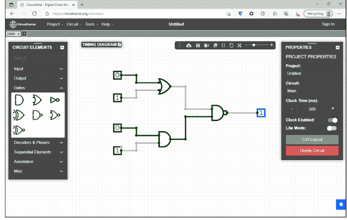

**图2-18：** 使用CircuitVerse模拟逻辑电路。

## 本章内容

-   用晶体管实现逻辑门
-   了解TTL和CMOS集成电路
-   构建一些简单的逻辑电路

# 第3章
# 逻辑电路实践

在《卷5》的第2章中，你学习了关于逻辑门的所有知识，包括七种最流行的门：非门、与门、或门、与非门、或非门、异或门和同或门。

在本章中，你将学习如何创建使用逻辑门的实际电路。我首先向你展示如何从简单的晶体管电路创建逻辑门的基础知识。然后，我将介绍两种流行的集成电路系列，它们提供了预先构建好的逻辑门。

如果你还没有阅读本小册的第2章，我建议你现在回去读一下，然后再阅读本章。如果你不熟悉第2章中描述的不同类型的门，本章的大部分内容你将无法理解。

## 用晶体管创建逻辑门

在《卷2》的第6章中，你学习了晶体管如何用作开关。简而言之，施加在晶体管基极的电压允许电流从集电极流向发射极。因此，通过向晶体管的基极施加输入信号，你可以控制从集电极-发射极路径取出的输出信号。

你可以通过以正确的方式组合几个晶体管和电阻来构建任何你想要的逻辑门。在本节中，我将研究五种门类型——非门、与门、或门、与非门和或非门——的简单晶体管电路，并提供项目来向你展示如何构建其中的三种：非门、与非门和或非门。


💡 **提示** 如果你需要复习晶体管的工作原理，请参阅《卷2》的第6章。本章的所有电路都假设高电平（逻辑1）由+5 V或更高的直流电压表示。低电平（逻辑0）由接近零的电压表示。


⚙️ **技术细节** 请注意，你通常不会真正用晶体管和电阻自己构建逻辑门。相反，你会使用包含预制逻辑门的集成电路。但是，在电路中使用逻辑IC之前，你应该对它们所包含的门的工作原理有基本的了解。在看过基本逻辑门的简单晶体管电路后，你将开始了解逻辑IC。

### 晶体管非门电路

非门的作用就是反转其输入。如果输入为高电平，输出为低电平；如果输入为低电平，输出为高电平。使用一个晶体管和两个电阻，很容易构建这样的电路。图3-1展示了原理图。

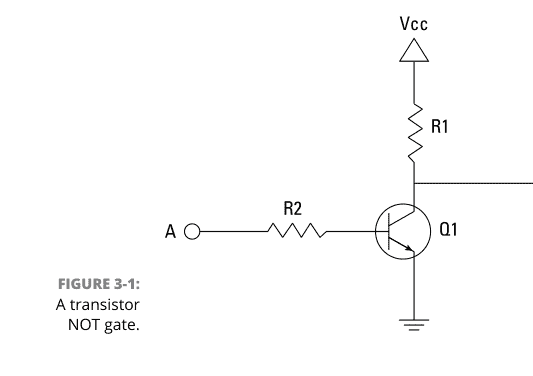

这个电路的工作原理很简单。输入通过电阻R2连接到晶体管的基极。当输入端没有电压时，晶体管截止。当晶体管截止时，没有电流流过集电极-发射极路径。因此，来自电源电压的电流（原理图中的Vcc，通常在+5 V和+9 V之间）通过电阻R1流向输出端。这样，当电路输入为低电平时，其输出为高电平。

当输入端有电压时，晶体管导通，允许电流直接通过集电极-发射极电路流向地。这个接地路径创建了一个绕过输出的捷径，导致输出变为低电平。

这样，当输入为低电平时，输出为高电平；当输入为高电平时，输出为低电平。

项目31展示了如何在无焊面包板上组装一个简单的晶体管非门。在这个项目中，一个常开按钮用作输入。当按钮未被按下时，输入为低电平，输出为高电平，这使得LED点亮。当你按下按钮时，输入变为高电平，输出变为低电平，LED熄灭。组装好的项目如图3-2所示。

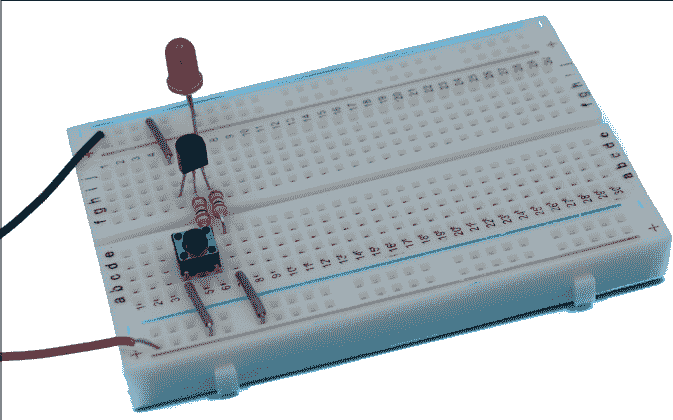

### 项目31：晶体管非门

在这个项目中，你将使用一个双极晶体管来构建一个简单的非门。非门，如表3-1所示，也被称为反相器。它只是反转其输入的逻辑电平。因此，如果输入为高电平，非门的输出就是低电平。如果输入为低电平，输出就是高电平。

这个门的输入由一个按钮开关（SW1）控制。当开关断开（未被按下）时，输入为低电平。当开关被按下时，输入为高电平。

## 表 3-1

### 非门真值表

| 输入 | 输出 |
|-------|--------|
| 0     | 1      |
| 1     | 0      |

该门的输出通过一个 LED 发送，因此当输出为高电平时 LED 点亮，当输出为低电平时 LED 熄灭。

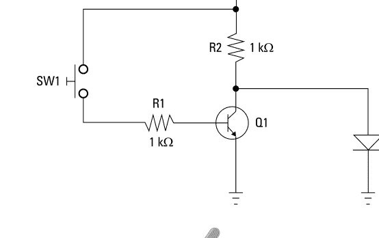

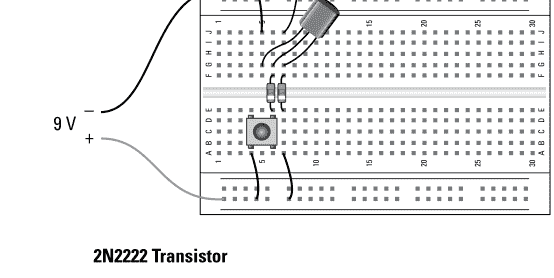

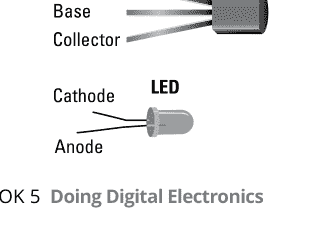

## 部件

- 一个 9 伏电池
- 一个 9 伏电池扣
- 一个小号无焊面包板
- 一个常开 DIP 面包板按钮开关
- 一个 NPN 开关晶体管，2N2222A 或类似型号
- 一个 5 毫米红色 LED
- 两个 1 kΩ 电阻（棕-黑-红）
- 三根短跳线

## 步骤

对于以下步骤，请将面包板放置好，使 A1 位置的孔靠近面包板的左下角。本项目将使用面包板底部的正极总线和顶部的负极总线。

1.  **插入晶体管 Q1。**
    发射极：G5
    基极：G6
    集电极：G7

2.  **插入电阻 R1 和 R2。**
    R1 (1 kΩ：E7 到 F7)。
    R2 (1 kΩ：E6 到 F6)。

3.  **插入 LED1。**
    阴极（短引脚）：面包板顶部的负极总线
    阳极（长引脚）：I7

4.  **插入 SW1。**
    引脚应插入 B4、D4、B4 和 D6，使开关跨接在第 4 行和第 6 行之间开合。

5.  **插入跳线。**
    1：面包板底部的正极总线到 A4。
    2：面包板底部的正极总线到 A6。
    3：面包板顶部的负极总线到 J5。

6.  **连接电池扣引线。**
    红色引线：面包板底部的正极总线。
    黑色引线：面包板顶部的负极总线。

7.  **测试电路。**
    将电池连接到电池座。LED 将会点亮，表示输出为高电平，因为输入为低电平（即开关断开，晶体管基极上没有电压）。
    当你按下按钮时，输入为高电平，基极上有电压。LED 熄灭，表示输出为低电平。
    松开按钮，输入变回低电平；LED 重新点亮，表示输出为高电平。

> **提示**
> 如果电路行为不符合预期，请仔细检查接线。确保晶体管方向正确；如果它被反向插入面包板，电路将无法工作。同时，确认 LED 方向正确；如果电路中阴极和阳极接反，LED 将不会点亮。最后，验证电池座引线是否连接到正确的负极和正极总线。

## 晶体管与门电路

一个双输入与门在两个输入均为高电平时产生高电平输出。你可以使用两个晶体管和三个电阻来创建一个双输入与门，如图 3-3 所示。在此电路中，输出电流必须从 Vcc 电源电压流经两个晶体管的集电极-发射极电路才能到达输出端。因此，只有当两个晶体管都导通时，电流才会流向输出端。

两个晶体管的基极通过 R2 和 R3 从两个输入端馈入。因此，如果两个输入均为高电平，电流将流经两个晶体管的基极-发射极路径，使两个晶体管导通，从而允许电流流向输出端。如果任一输入为低电平，相应的晶体管将截止，输出变为低电平。

图 3-3：晶体管与门。

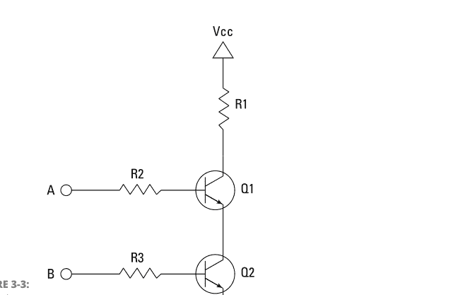

## 晶体管与非门电路

一个双输入与非门在两个输入均为高电平时产生低电平输出。你可以通过组合图 3-1 和图 3-3 所示的电路来创建一个与非门，使与门的输出用作非门的输入，但这种组合需要三个晶体管。仅使用两个晶体管就可以轻松创建一个与非门，如图 3-4 所示。

图 3-4：晶体管与非门。

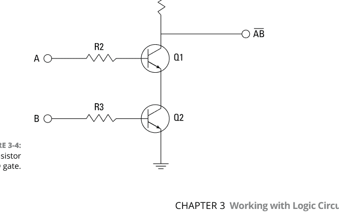

这个与非门电路与本章前面图 3-3 所示的与门电路几乎完全相同。唯一的区别是，输出不是连接到第二个晶体管的发射极，而是在第一个晶体管的集电极之前获取。如果两个输入均为高电平，两个晶体管将通过其集电极-发射极路径导通，从而形成对地的短路。这会导致电流完全绕过输出端，进而导致输出变为低电平。

然而，如果任一晶体管截止，电源电流就无法通过晶体管流向地，因此它会流经输出电路。因此，如果任一输入为低电平，输出就是高电平。如果两个输入均为高电平，输出就是低电平。

项目 32 展示了如何在无焊面包板上组装一个简单的晶体管与非门。使用常开按钮开关作为两个输入。在你按下两个按钮之前，LED 将保持点亮状态。此操作导致两个输入都变为高电平，从而使输出变为低电平，LED 熄灭。完成的项目如图 3-5 所示。

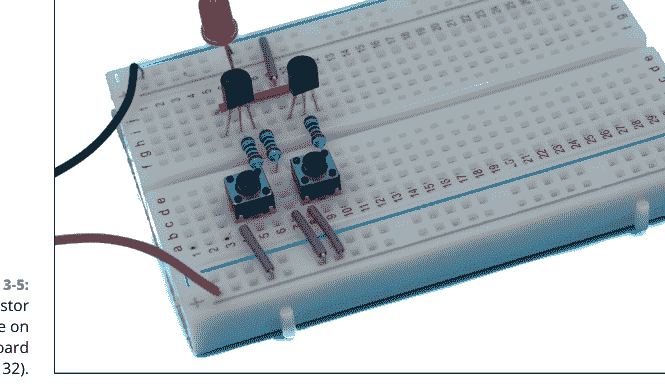

图 3-5：面包板上的双晶体管与非门（项目 32）。

## 项目 32：晶体管与非门

在本项目中，你将使用一对双极晶体管构建一个简单的与非门。如表 3-2 所示，与非门的输出在两个输入均为高电平时为低电平；否则，输出为高电平。

### 表 3-2 与非门真值表

| 输入 A | 输入 B | 输出 |
|---------|---------|--------|
| 0       | 0       | 1      |
| 0       | 1       | 1      |
| 1       | 0       | 1      |
| 1       | 1       | 0      |

本项目的输入由两个面包板安装的按钮开关提供，输出由一个 LED 指示。除非两个按钮都被按下，否则 LED 将保持点亮。

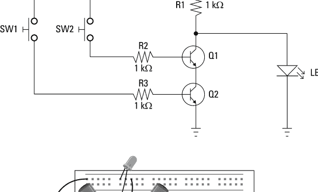

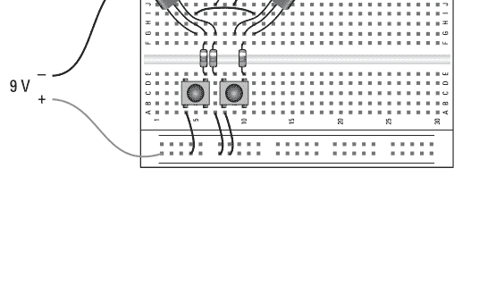

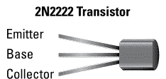

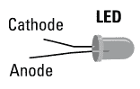

## 部件

- 一个 9 伏电池
- 一个 9 伏电池扣
- 一个小号无焊面包板
- 两个常开 DIP 面包板按钮开关
- 两个 NPN 开关晶体管，2N2222A 或类似型号
- 一个 5 毫米红色 LED
- 三个 1 kΩ 电阻（棕-黑-红）
- 五根短跳线

## 步骤

1.  插入晶体管 Q1 和 Q2。

| 引脚 | Q1 | Q2 |
|---|---|---|
| 发射极 | G5 | G9 |
| 基极 | G6 | G10 |
| 集电极 | G7 | G11 |

2.  插入电阻 R1、R2 和 R3。

    R1 (1 kΩ)：E7 到 F7
    R2 (1 kΩ)：E6 到 F6
    R3 (1 kΩ)：E10 到 F10

3.  **插入 LED1。**
    阴极（短引脚）：负极总线
    阳极（长引脚）：J7

4.  **插入 SW1。**
    引脚应插入 B4、D4、B6 和 D6，使开关跨接在第 4 行和第 6 行之间开合。

5.  **插入 SW2。**
    引脚应插入 B8、D8、B10 和 D10，使开关跨接在第 8 行和第 10 行之间开合。

6.  **插入跳线。**
    1：正极总线到 A4
    2：正极总线到 A7
    3：正极总线到 A8
    4：负极总线到 J9
    5：I5 到 I11

7.  **连接电池扣引线。**
    红色引线：正极总线
    黑色引线：负极总线

8.  **测试电路。**
    插入电池。LED 将会点亮。这是因为两个开关都处于断开状态（未按下）。由于两个输入均为低电平，输出为高电平。

    按下第一个按钮；LED 将保持点亮。此时两个输入分别为高电平和低电平，输出仍然是高电平。

    松开第一个按钮并按下第二个按钮；LED 再次保持点亮。在这种情况下，输入分别为低电平和高电平，因此输出为高电平。

    最后，同时按下两个按钮。现在，两个输入均为高电平。LED 熄灭，确认输出为低电平。

> 如果电路行为不符合预期，请仔细检查接线。确保晶体管方向正确；如果任一晶体管被反向插入面包板，电路将无法工作。同时确认 LED 方向正确；如果电路中阴极和阳极接反，LED 将不会点亮。最后，验证电池座引线是否连接到正确的负极和正极总线。

## 晶体管或门电路

双输入或门在任一输入为高电平或两个输入均为高电平时，会产生高电平输出。图3-6展示了由两个晶体管和三个电阻构成的或门电路原理图。

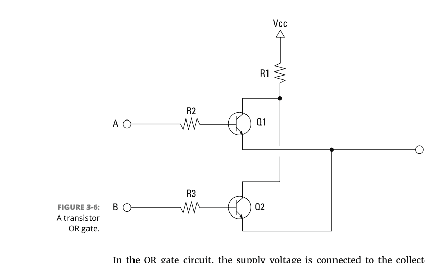

在或门电路中，电源电压连接到每个晶体管的集电极。然后，两个晶体管的发射极都连接到输出端。这样，如果任一晶体管的基极施加电压，该晶体管就会导通，并将电流传递到输出端。

因此，当一个输入为高电平或两个输入均为高电平时，输出为高电平。仅当两个输入均为低电平时，输出才为低电平。

## 晶体管或非门电路

或非门是或门的反相。如果至少有一个输入为高电平，则输出为低电平。如果两个输入均为低电平，则输出为高电平。

图3-7展示了或非门的原理图。该电路与本章前面图3-6所示的电路类似，不同之处在于输出连接到两个晶体管的集电极，而每个晶体管的发射极接地。如果任一晶体管导通，来自Vcc的电流将被短路到地，绕过输出端。因此，仅当两个输入均为低电平时，输出才为高电平。如果任一输入为高电平或两个输入均为高电平，输出将为低电平。

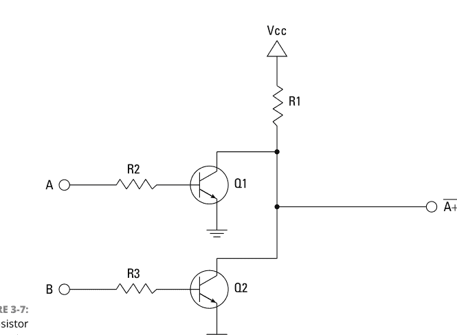

**图3-7：晶体管或非门。**

你可以按照项目33中概述的步骤来构建一个双晶体管或非门。与本章的其他项目一样，项目33使用常开按钮来控制输入电路。当电路通电时，两个输入初始均为低电平，输出为高电平。按下任一开关会导致该开关的输入变为高电平，进而导致输出变为低电平。组装好的项目如图3-8所示。

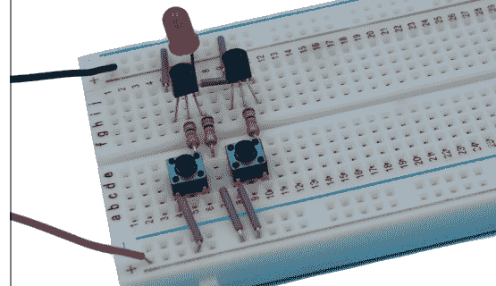

**图3-8：面包板上的双晶体管或非门（项目33）。**

## 项目33：晶体管或非门

在本项目中，你将使用一对双极晶体管构建一个简单的或非门。如表3-3所示，或非门的输出在两个输入均为低电平时为高电平。如果任一输入为高电平，则输出为低电平。

**表3-3 或非门真值表**

| 输入 A | 输入 B | 输出 |
| :---: | :---: | :---: |
| 0 | 0 | 1 |
| 0 | 1 | 0 |
| 1 | 0 | 0 |
| 1 | 1 | 0 |

本项目的输入由两个面包板安装的按钮提供，输出由一个LED指示。除非至少按下其中一个按钮，否则LED会点亮。

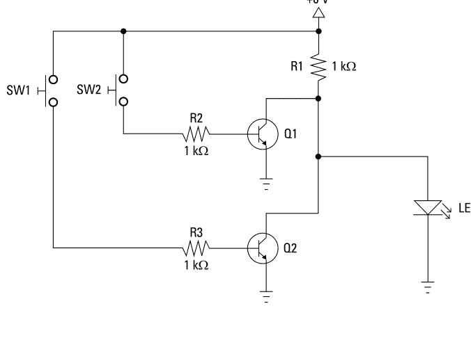

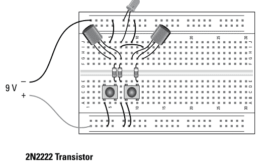

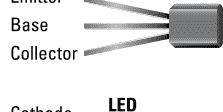

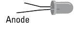

## 元件清单

- 一个9伏电池
- 一个9伏电池扣
- 一个小型无焊面包板
- 两个常开DIP面包板按钮
- 两个NPN开关晶体管，2N2222A或类似型号
- 一个5毫米红色LED
- 三个1 kΩ电阻（棕-黑-红）
- 六根短跳线

## 步骤

插入晶体管Q1和Q2。

| 引脚     | Q1  | Q2  |
|----------|-----|-----|
| 集电极| G7  | G11 |
| 基极     | G6  | G10 |
| 发射极  | G5  | G9  |

插入电阻R1、R2和R3。

R1 (1 kΩ): E7 到 F7
R2 (1 kΩ): E6 到 F6
R3 (1 kΩ): E10 到 F10

插入LED1。

阴极（短引脚）：接地总线
阳极（长引脚）：J7

插入SW1。

引脚应插入B4、D4、B6和D6，使开关在第4行和第6行之间开合。

插入SW2。

引脚应插入B8、D8、B10和D10，使开关在第8行和第10行之间开合。

插入跳线。

1: 正极总线 到 A4
2: 正极总线 到 A7
3: 正极总线 到 A8
4: 接地总线 到 J5
5: 接地总线 到 J9
6: I7 到 I11

连接电池扣引线。

红色引线：正极总线
黑色引线：接地总线

### 8. 测试电路。

插入电池。LED会亮起。这是因为两个开关都处于断开状态（未按下）。由于两个输入均为低电平，输出为高电平。

按下第一个按钮。LED熄灭，因为第一个输入变为高电平，输出变为低电平。

松开第一个按钮。LED重新亮起，因为现在两个输入均为低电平。

现在按下第二个按钮。LED再次熄灭，因为第二个输入为高电平。

最后，同时按下两个按钮。LED再次熄灭，正确反映了或非门的真值表：当任一或两个输入为高电平时，输出为低电平。


如果电路行为不符合预期，请仔细检查你的接线。确保晶体管方向正确；如果任一晶体管插入面包板的方向错误，电路将无法工作。同时确认LED方向正确；如果电路中阴极和阳极接反，LED将不会亮起。最后，验证电池盒引线是否连接到正确的负极和正极总线。

## 集成电路逻辑门简介

尽管你可以像本章前面描述的那样，使用晶体管和电阻来构建自己的逻辑门，但购买预封装的集成电路来实现逻辑门要容易得多。使用集成电路逻辑门的主要优点是，你不必自己设计各个门电路，也不必浪费时间去组装它们。

到目前为止，你在本书中学到的逻辑门电路是创建逻辑门的最简单电路之一，但它们绝不是唯一的——也不一定是最好的——创建逻辑门的方法。在电路设计师致力于基于半导体的逻辑电路的大约50年里，已经开发出许多创建逻辑门的设计。

因为设计逻辑电路的每种方法都会产生一整套用于各种类型门（非门、与门、或门、与非门、或非门、异或门和同或门）的逻辑电路，所以不同的设计通常被称为设计系列。此外，因为这些设计系列是由比你我更极客的工程师开发的，每个系列都有一个不错的三字母或四字母缩写。以下是最流行的几种：

- **RTL：** *电阻-晶体管逻辑*，使用电阻和双极晶体管。本章目前介绍的电路就是RTL电路的例子。
- **DTL：** *二极管-晶体管逻辑*，与RTL类似，但在每个输入电路中增加了一个二极管。
- **TTL：** 不是玩具逻辑，而是*晶体管-晶体管逻辑*。它使用两个晶体管，一个配置为开关，另一个配置为放大器。开关晶体管用于输入电路，放大器晶体管用于输出电路。放大器允许门的输出连接到比RTL或DTL电路更多的输入。

在TTL电路中，开关晶体管实际上是具有两个或更多发射极的特殊晶体管。这些晶体管被称为*多发射极晶体管*。

每个输入连接到其中一个发射极，这样各个输入都控制着相同的集电极-发射极电路。开关晶体管的基极连接到Vcc电源电压，集电极连接到放大晶体管的基极。如果在任一或所有发射极输入端存在电压，基极-集电极电路会被拉低，从而有效地创建一个与非门。图3-9展示了一个典型的TTL电路。

尽管你可以使用单个晶体管来构建TTL电路，但带有TTL电路的集成电路很容易获得。最受欢迎的TTL集成电路类型之一是以74*nn*形式编号的。总共有几百种7400系列集成电路可用。其中许多提供了你不太可能用于家庭电子项目的高级逻辑电路。表3-4中列出的集成电路在单个封装中提供了几个基本逻辑门。

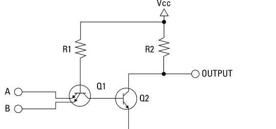

**图3-9：典型的TTL门。**

## 表格 3-4 7400系列TTL逻辑门

| 型号 | 描述 |
|---|---|
| 7400 | 四路双输入与非门（四个与非门） |
| 7402 | 四路双输入或非门（四个或非门） |
| 7404 | 六反相器（六个非门） |
| 7408 | 四路双输入与门（四个与门） |
| 7432 | 四路双输入或门（四个或门） |
| 7486 | 四路双输入异或门（四个异或门） |

实际上真有“积木逻辑”（Tinkertoy Logic）这回事。事实上，麻省理工学院的一个学生团队就用积木搭建了一台能玩井字棋的完整计算机。要了解更多信息，请上网搜索“积木计算机”。

» **CMOS：** *互补金属氧化物半导体逻辑*，指的是用一种叫做MOSFET的特殊晶体管构建的逻辑电路。*MOSFET*代表*金属氧化物半导体场效应晶体管*，不过这个不会考。除非你想成为IC设计师，否则MOSFET与标准双极性晶体管在物理原理上的差异并不那么重要。重要的是，MOSFET功耗低得多，状态切换速度快得多，体积也比双极性晶体管小得多。这些差异使得MOSFET非常适合现代集成电路，这种电路通常需要在单个芯片上集成数百万个晶体管。

除了功耗低于TTL电路、工作速度更快之外，CMOS电路的工作原理与TTL电路非常相似。事实上，CMOS芯片的设计就是为了能与同类的TTL芯片互换使用。

CMOS逻辑芯片的部件号是四位数，以数字4开头，通常被称为4000系列芯片。与7400系列TTL逻辑芯片类似，4000系列芯片有几百种类型。表格3-5列出了提供基本逻辑门的4000系列芯片。

| 型号 | 描述 |
|---|---|
| 4001 | 四路双输入或非门（四个或非门） |
| 4009 | 六反相器（六个非门） |
| 4011 | 四路双输入与非门（四个与非门） |
| 4030 | 四路双输入异或门（四个异或门） |
| 4071 | 四路双输入或门（四个或门） |
| 4077 | 四路双输入同或门（四个同或门） |
| 4081 | 四路双输入与门（四个与门） |

CMOS逻辑电路对静电非常敏感。因此，在处理它们时应采取特殊预防措施。在触摸CMOS芯片之前，请务必通过触摸接地的金属表面来妥善释放身上的静电。为获得最佳保护，请佩戴防静电腕带。关于静电预防措施的更多信息，请参见第1册第4章。

本章剩余部分将介绍几种流行的4000系列集成电路，并展示一些使用它们的项目。

## 功能多样的4000系列逻辑门简介

4000系列CMOS逻辑电路包含多种集成电路，每个封装内提供多个逻辑门。图3-10展示了六种流行的4000系列芯片的引脚连接图。这六种芯片中的每一种都在14引脚DIP封装中包含4个双输入逻辑门。电源（电压范围可以从+3V到+15V）连接到引脚14，地线连接到引脚7。

请注意，4001和4011芯片包含四个或非门和与非门。由于或非门和与非门是通用门，你可以将它们组合起来创建其他类型的门。因此，如果你储备了4001或4011芯片，就能创建任何你可能需要的逻辑电路。

在开始使用CMOS逻辑芯片构建电路之前，这里有一些使用4000系列芯片的提示：

- 在9V电源下，输出引脚可提供高达10mA的电流。在6V时，最大值约为5mA，刚好足以点亮一个LED。如果你的输出电路需要更大电流，可以使用晶体管。只需将晶体管的集电极连接到正电压源，基极连接到逻辑门输出。然后将你的输出电路连接到晶体管的发射极。当然，输出电路最终应接地以形成完整回路。
- CMOS逻辑芯片的输入引脚极易拾取杂散信号，表现为电气噪声。虽然在实验面包板电路中不必要这样做，但在实际电路中，应将所有未使用的输入引脚连接到正电源电压或地线。（未使用的输出引脚则无需连接任何东西。）
- 除了将未使用的输入连接到正电压或地线外，在电源引线（引脚7和14）之间并联一个小电容（通常为47μF）也是个好主意。这个电容有助于确保电源电压保持稳定。
- 不要忘记CMOS芯片很容易被少量静电损坏。在触摸CMOS芯片之前，务必通过触摸金属物体来接地。

**图3-10：** 4000系列四路双输入逻辑门芯片的引脚连接图。

## 使用4011四路双输入与非门构建项目

4011四路双输入与非门是一款流行的CMOS逻辑门集成电路。顾名思义，该集成电路包含四个双输入与非门。该集成电路的引脚排列见于本章前面的图3-10，其中还展示了几种其他四路双输入门芯片的引脚排列。

与本书中使用的大多数组件不同，你无法在当地电子元件商店（如RadioShack）买到4011集成电路。因此，你需要找到一家销售CMOS逻辑芯片等零件的本地电子商店，或者从在线供应商处订购。我在第1册第3章列出了几家信誉良好的供应商。

在第5册第2章中，你将了解到与非门（和或非门一起）是*通用门*，这意味着你可以仅通过以各种方式组合与非门来构建任何其他类型的门。项目34到37将一步步指导你仅使用与非门构建各种类型门电路的过程。

项目34仅使用4011中的一个与非门。与非门的两个输入连接到按钮开关，输出连接到一个LED。当你完成这个项目时，你将能够直观地看到与非门的操作：除非你同时按下两个按钮，否则LED将一直点亮。

图3-11展示了在无焊面包板上组装好的项目34。该图应能让你很好地了解如何将组件连接到面包板上。项目描述本身提供了详细的说明。项目35、36和37的电路外观非常相似，你可以将图3-11作为完成项目整体外观的参考。（唯一的区别在于跳线的位置。）

项目35使用4011上的两个与非门来创建一个与门。因为与非门本质上就是一个输出取反的与门，所以你可以通过对与非门的输出取反来创建一个与门。这种取反之所以有效，是基于逻辑学的一个基本规则：如果你对一个值取反两次，就会得到原始值。因此，如果你对与门取反一次，会得到与非门；如果再取反一次，就会变回与门。

碰巧的是，你可以通过将与非门的两个输入端连接在一起，轻松地将其转换为单输入反相器（即非门）。这种连接方式使得两个输入总是相同的：要么都是高电平，要么都是低电平。在与非门中，如果两个输入都是高电平，输出为低电平；如果两个输入都是低电平，输出为高电平。因此，将与非门的输入端短接在一起具有对输入取反的效果。

在项目36中，你将看到如何使用三个与非门创建一个或门。第5册第2章表明，与非门等同于一个输入端取反的或门。因此，要使用与非门创建或门，你需要用配置为反相器（即输入端短接）的与非门对两个输入进行取反。这些反相器的输出被送到第三个与非门的输入端。

本章的最后一个项目，项目37，使用4011芯片上的全部四个与非门来创建一个或非门。或非门本质上就是一个输出取反的或门。因此，你首先使用三个与非门，按照项目36中的技术创建一个或门；然后将4011芯片上的第四个与非门配置为反相器，对或门的输出进行取反。

由于这些项目是逐步递进的，我建议你在完成每个项目后不要拆除面包板。相反，你可以将每个组装好的项目作为下一个项目的起点。如果你选择以这种方式构建项目，只需快速浏览步骤，看看每个项目需要移动哪些电阻和跳线即可。（4011集成电路本身、LED和两个开关在所有四个项目中的位置都是相同的。）

## 项目 34：CMOS 与非门

在本项目中，你将使用一个 4011 CMOS 芯片来构建一个与非门。如表 3-6 所示，当两个输入均为高电平时，与非门的输出为低电平。否则，输出为高电平。

表 3-6 与非门真值表
| 输入 A | 输入 B | 输出 |
| :---: | :---: | :---: |
| 0 | 0 | 1 |
| 0 | 1 | 1 |
| 1 | 0 | 1 |
| 1 | 1 | 0 |

该门的输入通过两个面包板安装的按钮提供，输出由一个 LED 指示。

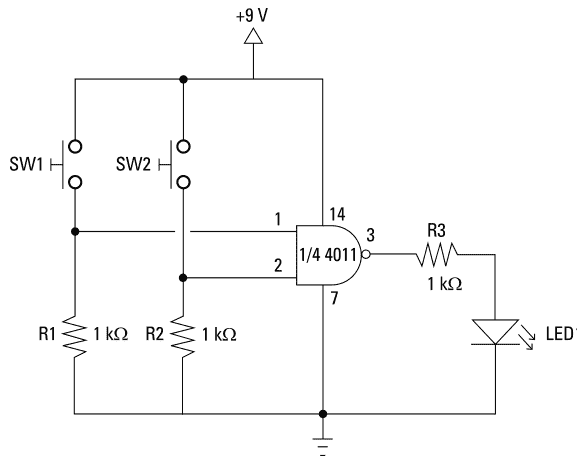
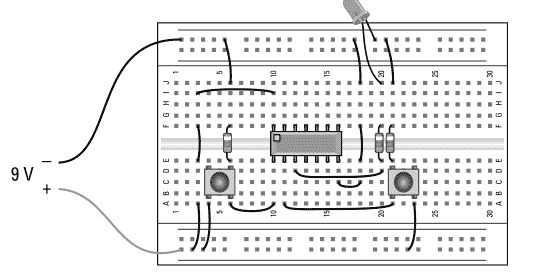
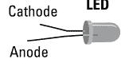

## 元件

- 一个 9 伏电池
- 一个 9 伏电池扣
- 一个小型无焊面包板
- 两个常开 DIP 面包板按钮
- 一个 4011 CMOS 四路双输入与非门
- 一个 5 毫米红色 LED
- 三个 1 kΩ 电阻
- 13 根跳线

## 步骤

1.  **插入 4011 IC。**
    引脚 1 应位于 E10。
2.  **插入电阻 R1、R2 和 R3。**
    R1 (1 kΩ)：E6 到 F6
    R2 (1 kΩ)：E21 到 F21
    R3 (1 kΩ)：E20 到 F20
3.  **插入 LED1。**
    阴极（短引脚）：接地总线
    阳极（长引脚）：J20
4.  **插入 SW1。**
    引脚应插入 B4、D4、B6 和 D6，使得开关在第 4 行和第 6 行之间开合。
5.  **插入 SW2。**
    引脚应插入 B21、D21、B23 和 D23，使得开关在第 21 行和第 23 行之间开合。
6.  **插入跳线。**
    - 正极总线到 A3
    - 正极总线到 A4
    - 正极总线到 A23
    - 接地总线到 J6
    - 接地总线到 J18
    - 接地总线到 J21
    - E3 到 F3
    - E18 到 F18
    - A6 到 A10
    - A11 到 A21
    - C16 到 C18
    - D12 到 D20
    - I3 到 I10
7.  **连接电池扣引线。**
    红色引线：正极总线
    黑色引线：接地总线
8.  **测试电路。**
    插入电池。LED 将会亮起。这是因为两个按钮都处于断开状态（未按下），因此两个输入均为低电平。所以，输出为高电平。
    按下第一个按钮。LED 保持亮起。当只有一个输入为高电平时，与非门的输出保持高电平。
    释放第一个按钮并按下第二个按钮。同样，LED 保持亮起，因为只有一个输入为高电平。
    现在同时按下两个按钮。这使得两个输入均为高电平，导致输出变为低电平并关闭 LED。

## 项目 35：CMOS 与门

在本项目中，你将使用 4011 CMOS 芯片中的两个与非门来构建一个与门。如表 3-7 所示，当两个输入均为高电平时，与门的输出为高电平；否则，输出为低电平。

表 3-7 与门真值表
| 输入 A | 输入 B | 输出 |
| :---: | :---: | :---: |
| 0 | 0 | 0 |
| 0 | 1 | 0 |
| 1 | 0 | 0 |
| 1 | 1 | 1 |

要创建与门，你需要将第一个与非门的输出发送到第二个与非门，你通过将其输入连接在一起将其配置为反相器。反转与非门的输出即可创建与门。
该门的输入通过两个面包板安装的按钮提供，输出由一个 LED 指示。
请注意，本项目与项目 34 的唯一区别在于几根跳线的位置。

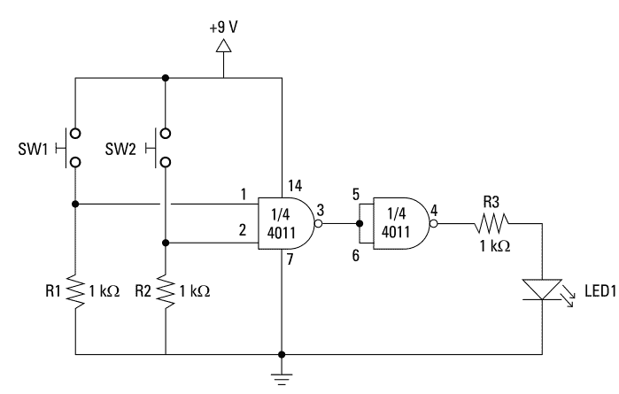
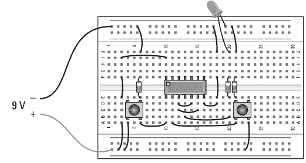
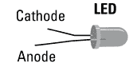

## 元件

- 一个 9 伏电池
- 一个 9 伏电池扣
- 一个小型无焊面包板
- 两个常开 DIP 面包板按钮
- 一个 4011 CMOS 四路双输入与非门
- 一个 5 毫米红色 LED
- 三个 1 kΩ 电阻（棕-黑-红）
- 15 根跳线

## 步骤

1.  **插入 4011 IC。**
    引脚 1 应位于 E10。
2.  **插入电阻 R1、R2 和 R3。**
    R1 (1 kΩ)：E6 到 F6
    R2 (1 kΩ)：E21 到 F21
    R3 (1 kΩ)：E20 到 F20
3.  **插入 LED1。**
    阴极（短引脚）：接地总线
    阳极（长引脚）：J20
4.  **插入 SW1。**
    引脚应插入 B4、D4、B6 和 D6，使得开关在第 4 行和第 6 行之间开合。
5.  **插入 SW2。**
    引脚应插入 B21、D21、B23 和 D23，使得开关在第 21 行和第 23 行之间开合。
6.  **插入跳线。**
    - 正极总线到 A3
    - 正极总线到 A4
    - 正极总线到 A23
    - 接地总线到 J6
    - 接地总线到 J18
    - 接地总线到 J21
    - E3 到 F3
    - E18 到 F18
    - A6 到 A10
    - A11 到 A21
    - B13 到 B20
    - C12 到 C15
    - D16 到 D18
    - D12 到 D14
    - I3 到 I10
7.  **连接电池扣引线。**
    红色引线：正极总线
    黑色引线：接地总线
8.  **测试电路。**
    插入电池。LED 将保持熄灭，因为没有输入为高电平。
    按下第一个按钮。LED 保持熄灭。单个输入为高电平不足以打开与门的输出。
    释放第一个按钮并按下第二个按钮。同样，LED 保持熄灭，因为只有一个输入为高电平。
    现在同时按下两个按钮。这使得两个输入均为高电平，导致输出变为高电平并点亮 LED。

## 项目 36：CMOS 或门

在本项目中，你将使用 4011 CMOS 芯片中的两个与非门来构建一个或门。如表 3-8 所示，当任一输入（或两个输入）为高电平时，或门的输出为高电平。如果两个输入均为低电平，输出也为低电平。

表 3-8 或门真值表
| 输入 A | 输入 B | 输出 |
| :---: | :---: | :---: |
| 0 | 0 | 0 |
| 0 | 1 | 1 |
| 1 | 0 | 1 |
| 1 | 1 | 1 |

要创建或门，你只需反转与非门的两个输入。因此，该电路使用 4011 上的两个与非门来反转两个输入。然后，它将这些反转后的输入发送到第三个与非门的输入，以完成或门。
该门的输入通过两个面包板安装的按钮提供，输出由一个 LED 指示。
请注意，本项目与项目 35 的唯一区别在于一个电阻和几根跳线的位置。

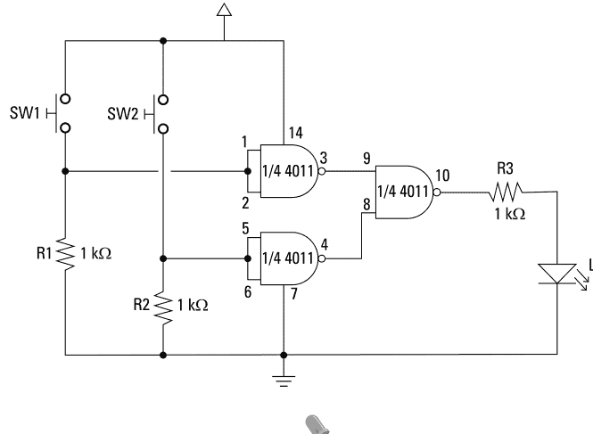
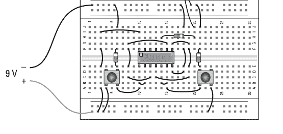
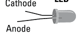

## 元件

- 一个 9 伏电池
- 一个 9 伏电池扣
- 一个小型无焊面包板
- 两个常开 DIP 面包板按钮
- 一个 4011 CMOS 四路双输入与非门
- 一个 5 毫米红色 LED
- 三个 1 kΩ 电阻（棕-黑-红）
- 20 根跳线

## 步骤

1.  **插入 4011 IC。**
    引脚 1 应位于 E10。
2.  **插入电阻 R1、R2 和 R3。**
    R1 (1 kΩ)：E6 到 F6
    R2 (1 kΩ)：E21 到 F21
    R3 (1 kΩ)：H14 到 H20
3.  **插入 LED1。**
    阴极（短引脚）：接地总线
    阳极（长引脚）：J20
4.  **插入 SW1。**
    引脚应插入 B4、D4、B6 和 D6，使得开关在第 4 行和第 6 行之间开合。
5.  **插入 SW2。**
    引脚应插入 B21、D21、B23 和 D23，使得开关在第 21 行和第 23 行之间开合。
6.  **插入跳线。**
    - 正极总线到 A3
    - 正极总线到 A4
    - 正极总线到 A23
    - 接地总线到 J6
    - 接地总线到 J18
    - 接地总线到 J21
    - E3 到 F3
    - E8 到 F8
    - E18 到 F18
    - E19 到 F19
    - A6 到 A10
    - A15 到 A21
    - B10 到 B11
    - B14 到 B15
    - C8 到 C12
    - C13 到 C19
    - D16 到 D18
    - G8 到 G15
    - G16 到 G19
    - I3 到 I10
7.  **连接电池扣引线。**
    红色引线：正极总线。
    黑色引线：接地总线。
8.  **测试电路。**
    插入电池。LED 将保持熄灭，因为没有输入为高电平。
    按下第一个按钮。LED 亮起。两个输入之一为高电平会使输出变为高电平，从而点亮 LED。
    释放第一个按钮并按下第二个按钮。同样，LED 亮起，这次是因为另一个输入为高电平。
    现在同时按下两个按钮。两个输入均为高电平，LED 亮起，反映了或门的真值表。

## 项目 37：CMOS 或非门

在本项目中，你将使用 4011 CMOS 芯片中的全部四个与非门来构建一个或非门。如表 3-9 所示，当任一输入（或两个输入）为高电平时，或非门的输出为低电平。如果两个输入均为低电平，输出为高电平。

表 3-9 或非门真值表
| 输入 A | 输入 B | 输出 |
| :---: | :---: | :---: |
| 0 | 0 | 1 |
| 0 | 1 | 0 |
| 1 | 0 | 0 |
| 1 | 1 | 0 |

或非门就是一个输出被反转的或门。因此，要创建或非门，你需要使用 4011 上的三个与非门来创建一个或门，如项目 36 所述。然后，你使用第四个与非门来反转或门的输出。
该门的输入通过两个面包板安装的按钮提供，输出由一个 LED 指示。
请注意，本项目与项目 36 的唯一区别在于第三个电阻的位置以及增加了两根跳线。

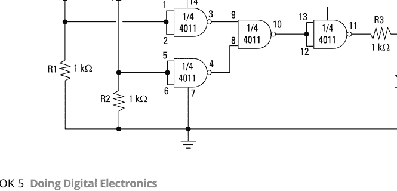

## 零件

- 一节9伏电池
- 一个9伏电池扣
- 一块小型无焊面包板
- 两个常开DIP面包板按钮开关
- 一个4011 CMOS四路双输入与非门
- 一个5毫米红色LED
- 三个1千欧电阻（棕-黑-红）
- 22根跳线

## 步骤

1.  **插入4011集成电路。**
    引脚1应位于E10。

2.  **插入电阻R1、R2和R3。**
    R1（1千欧）：E6至F6
    R2（1千欧）：E21至F21
    R3（1千欧）：H13至H20

3.  **插入LED1。**
    阴极（短引脚）：接地总线
    阳极（长引脚）：J20

4.  **插入SW1。**
    引脚应插入B4、D4、B6和D6，使得开关在第4行和第6行之间通断。

5.  **插入SW2。**
    引脚应插入B21、D21、B23和D23，使得开关在第21行和第23行之间通断。

6.  **插入跳线。**
    1：正极总线至A3
    2：正极总线至A4
    3：正极总线至A23
    4：接地总线至J6
    5：接地总线至J18
    6：接地总线至J21
    7：E3至F3
    8：E8至F8
    9：E18至F18
    10：E19至F19
    11：A6至A10
    12：A15至A21
    13：B10至B11
    14：B14至B15
    15：C8至C12
    16：C13至C19
    17：D16至D18
    18：G8至G15
    19：G16至G19
    20：H11至H12
    21：I3至I10
    22：I12至I14

7.  **连接电池扣引线。**
    红色引线：正极总线
    黑色引线：接地总线

8.  **测试电路。**
    插入电池。LED立即亮起。当两个输入均为低电平时，或非门的输出为高电平。

    或非门的所有其他输入组合都会导致输出变为低电平，从而关闭LED。

    按下第一个按钮；LED熄灭。

    松开第一个按钮，然后按下第二个按钮。LED再次熄灭。

    现在同时按下两个按钮。当两个输入均为高电平时，输出变为低电平，因此LED再次熄灭。

---

# 第4章
### 触发器

本章是关于触发器的，但不是你脚上穿的那种。我真希望是关于你脚上穿的那种，特别是如果我写这章时恰好穿着一双的话，因为那可能意味着我是在海滩上，坐在沙滩椅里，看着孩子们玩海浪。

难道你不喜欢看孩子们玩海浪吗？他们追逐着退去的海浪，无法控制地大笑。但当下一波海浪涌来时，孩子们会转身跑开，兴奋地尖叫着，生怕海浪会追上他们，而他们——天哪——可能会被弄湿。

唉，本章讲的不是你穿去海滩的那种人字拖。相反，它讲的是电子学意义上的触发器。*触发器*是一种存储数据的电路。因此，触发器是现代计算机的基础。

你不觉得奇怪吗？现代思维机器的基本构建模块之一，其名称却暗示它无法下定决心？

在本章中，你将学习如何使用简单的触发器电路。不过，在我告诉你触发器之前，我先向你展示一种更简单的电路类型，称为*锁存器*。

## 了解锁存器

*锁存器*是一种具有两个输入和一个输出的逻辑电路。其中一个输入称为*置位输入*；另一个称为*复位输入*。

锁存器电路可以是高电平有效或低电平有效。区别在于锁存器电路的操作是由输入端的高电平还是低电平信号触发的。（关于高电平和低电平等概念的解释，请参见本迷你书的第2章。）

- **高电平有效电路：** 两个输入通常都接地（低电平），锁存器由任一输入上的瞬时高电平信号触发。
- **低电平有效电路：** 两个输入通常为高电平，锁存器由任一输入上的瞬时低电平信号触发。

在高电平有效锁存器中，置位和复位输入通常都连接到地。当置位输入变为高电平时，输出也变为高电平。然而，当置位输入恢复为低电平时，输出保持高电平。高电平有效锁存器的输出保持高电平，直到复位输入变为高电平。然后，输出恢复为低电平，并且只有在置位输入再次被触发时才会再次变为高电平。

换句话说，锁存器记住了置位输入已被激活。如果置位输入哪怕只变为高电平一瞬间，输出就会变为高电平并保持高电平，即使在置位输入恢复为低电平之后也是如此。只有当复位输入变为高电平时，输出才会恢复为低电平。

另一方面，在低电平有效锁存器中，输入通常保持高电平。当置位输入瞬间变为低电平时，输出变为高电平。然后输出保持高电平，直到复位输入瞬间变为低电平。

请注意，大多数锁存器电路实际上有第二个输出，它只是第一个输出的反相。换句话说，每当第一个输出为高电平时，第二个输出为低电平，反之亦然。这些输出通常称为Q和Q̄。

符号Q̄通常读作“Q非”或“Q bar”，尽管有些人读作“非Q”。标签上方的横线符号是表示反相的常用逻辑简写。也就是说，Q̄是Q的反相。如果Q为高电平，则Q̄为低电平；如果Q为低电平，则Q̄为高电平。

你可以很容易地用一对或非门创建一个高电平有效锁存器，如图4-1所示。（在本迷你书的第2章中，你会看到或非门的输出在两个输入均为低电平时为高电平；否则，输出为低电平。）在这个电路中，复位输入连接到第一个或非门的一个输入端，置位输入连接到第二个或非门的一个输入端。锁存器电路的巧妙之处在于，或非门的输出交叉连接到剩余的或非门输入端。换句话说，第一个或非门的输出连接到第二个或非门的一个输入端，而第二个或非门的输出连接到第一个或非门的一个输入端。

### 图4-1：高电平有效锁存器的原理图。

这可能看起来有点令人困惑，但在高电平有效锁存器中，复位输入位于电路顶部，置位输入连接到电路底部的门。起初，这使得电路看起来像是接反了。但对于高电平有效锁存器，这是描绘电路的标准方式，复位在顶部，置位在底部。

低电平有效锁存器的原理图如图4-2所示。如你所见，此电路原理图与图4-1所示的原理图有几个不同之处：

### 图4-2：低电平有效锁存器的原理图。

- 低电平有效锁存器使用与非门而不是或非门。
- 输入是低电平有效而非高电平有效，并且称为SET和RESET而不是SET和RESET。
- 输入在电路中的位置是相反的：SET连接到电路顶部的第一个与非门，RESET连接到电路底部的第二个与非门。

项目38和39向你展示如何使用4001四路双输入或非门集成电路和4011四路双输入与非门集成电路构建简单的高电平有效和低电平有效锁存器电路。Q和Q̄输出都用于驱动LED，以便你可以看到锁存器的状态，两个输入都由常开按钮开关控制，以便你可以通过瞬间按下按钮来触发锁存器。图4-3显示了组装好的高电平有效锁存器，图4-4显示了组装好的低电平有效锁存器。

如果你比较这两个项目的原理图，你会发现它们之间只有这两个区别：

- 逻辑门：高电平有效电路使用包含或非门的4001集成电路，而低电平有效电路使用包含与非门的4011集成电路。
- 电阻和开关位置：R1和R2以及SW1和SW2的位置是相反的。在高电平有效电路中，电阻将两个门输入连接到地，开关将门输入短接到+6V。在低电平有效电路中，电阻将门输入连接到+6V，开关将门输入短接到地。

这两个电路都使用简单的按钮开关提供触发输入。然而，你可以很容易地想象其他触发脉冲来源。例如，在家庭报警系统中，低电平有效锁存器中的置位输入可能来自一个窗户开关，当窗户打开时该开关断开连接，而复位输入可能来自报警系统控制面板上的钥匙锁，用于重置报警。

# 图4-4：组装完成的低电平有效锁存器（项目39）。

## 提示

在我们继续之前，关于锁存器还有几点需要了解：

- 带有置位（SET）和复位（RESET）输入的锁存器通常称为SR锁存器。有时也使用RS锁存器这个术语。
- 在某些情况下，你可能需要一个其中一个输入为高电平有效、另一个为低电平有效的锁存器。例如，你家的报警系统可能在窗户打开时向SET输入发送高电平（HIGH），但在需要复位系统时发送低电平（LOW）。

你可以很容易地通过向其中一个输入添加一个反相器来实现，如图4-5所示。这里，我使用了或非门（NOR gates）来构建一个高电平有效锁存器，但我添加了一个非门（NOT gate）来反转RESET输入。严格来说，该门的RESET输入是高电平有效的，但由于反相器的存在，该电路的行为就像RESET输入是低电平有效的一样。

# 图4-5：SET为低电平有效、RESET为高电平有效的锁存器。

## 项目38：一个高电平有效锁存器

在本项目中，你将使用4001 CMOS芯片中的两个或非门来构建一个高电平有效锁存器。该锁存器的输入由两个面包板上的按键开关控制；SW1是RESET输入，SW2是SET输入。输出由LED指示；LED1是Q，LED2是$\overline{Q}$。

## 部件

-   四节AA电池
-   一个四节AA电池盒
-   一个小型无焊面包板
-   两个常开DIP面包板按键开关
-   一个4001 CMOS四路二输入或非门
-   两个5毫米红色LED
-   两个10千欧电阻（棕-黑-橙）
-   两个1千欧电阻（棕-黑-红）
-   16根跳线

## 步骤

1.  **插入4001集成电路（IC）。**
    引脚1应位于E10。

2.  **插入电阻R1、R2、R3和R4。**
    R1（10千欧）：E20到F20
    R2（10千欧）：E7到F7
    R3（1千欧）：E18到F18
    R4（1千欧）：E8到F8

3.  **插入LED1和LED2。**
    LED1：J18到地线总线
    LED2：J8到地线总线
    将阴极（较短的引脚）连接到地线总线。

4.  **插入SW1。**
    引脚应插入B5、D5、B7和D7，使开关在第5行和第7行之间开合。

5.  **插入SW2。**
    引脚应插入B20、D20、B22和D22，使开关在第20行和第22行之间开合。

6.  **插入跳线。**
    1：正极总线到A4
    2：正极总线到A5
    3：正极总线到A22
    4：地线总线到J7
    5：地线总线到J19
    6：地线总线到J20
    7：E4到F4
    8：E19到F19
    9：A7到A10
    10：A15到A20
    11：B8到B12
    12：B13到B18
    13：C12到C14
    14：D11到D13
    15：D16到D19
    16：G4到G10

7.  **连接电池盒跳线引线。**
    红线：正极总线
    黑线：地线总线

8.  **测试电路。**
    装入电池。在其初始状态下，Q很可能为低电平（Low），$\overline{Q}$为高电平（High），因此LED1熄灭，LED2点亮。（在某些情况下，情况可能相反。SR锁存器的初始状态是不可预测的。）
    
    无论你在上电时LED1还是LED2点亮，按下并释放复位按钮（SW1）来复位锁存器。Q变为低电平，$\overline{Q}$变为高电平，因此LED1熄灭，LED2点亮。此时，你可以重复按下复位按钮（SW1）而不会改变输出状态。
    
    现在按下并释放置位按钮（SW2）。Q现在变为高电平，$\overline{Q}$变为低电平，因此LED1点亮，LED2熄灭。当你松开置位按钮（SW2）时，输出状态保持不变。你可以重复按下并释放置位按钮而不影响输出。
    
    最后，再次按下并释放复位按钮（SW1）来复位锁存器。Q变为低电平，$\overline{Q}$变为高电平，因此LED1熄灭，LED2点亮，表明锁存器已复位。你可以重复此过程来验证按下置位（SW2）会使Q输出置为高电平，按下复位（SW1）会复位锁存器使Q为低电平。

## 项目39：一个低电平有效锁存器

在本项目中，你将使用4011 CMOS芯片中的两个与非门（NAND gates）来构建一个低电平有效锁存器。该锁存器的输入由两个面包板上的按键开关控制（SW1是$\overline{SET}$，SW2是$\overline{RESET}$），输出由LED指示（LED1是Q，LED2是$\overline{Q}$）。

## 部件

-   四节AA电池
-   一个四节AA电池盒
-   一个小型无焊面包板
-   两个常开DIP面包板按键开关
-   一个4011 CMOS四路二输入与非门
-   两个5毫米红色LED
-   两个10千欧电阻（棕-黑-橙）
-   两个1千欧电阻（棕-黑-红）
-   18根跳线

## 步骤

1.  **插入4011集成电路（IC）。**
    引脚1应位于E10。

2.  **插入电阻R1、R2、R3和R4。**
    R1（10千欧）：A7到正极总线
    R2（10千欧）：A20到正极总线
    R3（1千欧）：E18到F18
    R4（1千欧）：E8到F8

3.  **插入LED1和LED2。**
    LED1：J8到地线总线
    LED2：J18到地线总线
    将阴极（较短的引脚）连接到地线总线。

4.  **插入SW1。**
    引脚应插入A4、C4、A6和C6，使开关在第4行和第6行之间开合。

5.  **插入SW2。**
    引脚应插入A21、C21、A23和C23，使开关在第21行和第23行之间开合。

6.  **插入跳线。**
    1：正极总线到A3
    2：地线总线到J4
    3：地线总线到J19
    4：地线总线到J23
    5：E3到F3
    6：E4到F4
    7：E19到F19
    8：E23到F23
    9：B8到B12
    10：B13到B18
    11：C12到C14
    12：C16到C19
    13：D7到D10
    14：D11到D13
    15：D15到D20
    16：E6到E7
    17：E20到E21
    18：G3到G10

7.  **连接电池盒引线。**
    红线：正极总线
    黑线：地线总线

8.  **测试电路。**
    装入电池。在其初始状态下，Q为低电平，$\overline{Q}$为高电平，因此LED2点亮，LED1熄灭。
    
    按下并释放置位按钮（SW1）来置位锁存器。Q变为高电平，$\overline{Q}$变为低电平，因此LED1点亮，LED2熄灭。你可以重复按下并释放SW1而不会改变任一输出的状态。
    
    现在按下并释放复位按钮（SW2）。Q现在返回低电平，$\overline{Q}$变为高电平。你现在可以重复按下并释放SW2，同样不会影响输出。但如果你按下SW1，锁存器将被置位，因此LED1点亮，LED2熄灭。

## 了解门控锁存器

门控锁存器是一种具有第三个输入的锁存器，必须使该第三个输入有效，置位（SET）和复位（RESET）输入才能起作用。这第三个输入有时被称为使能（ENABLE），因为它使能了SET和RESET输入的操作。

使能输入可以连接到一个简单的开关。这样，当开关闭合时，SET和RESET输入被使能；当开关断开时，SET和RESET输入的任何变化都将被忽略。

或者，使能输入可以连接到一个时钟脉冲。例如，你可以将555定时器电路的输出连接到使能输入。那么，锁存器输入只在555定时器输出为高电平时才有效。注意，使能输入通常被称为时钟（CLOCK）输入。（有关555定时器电路的更多信息，请参见本书第3册第2章。）

与非门的另一个输入相连。然后，这些门的输出被用作基本锁存器电路的输入。

# 图4-6：一个门控SR锁存器。

另一种常见的门控锁存器称为*门控D锁存器*，它只有两个输入：数据（DATA）和使能（ENABLE）。当使能输入接收到高电平时，数据输入被复制到输出。即使使能输入随后变为低电平，输出也保持不变。只有在使能输入再次变为高电平时，输出才能改变。

要从一个门控SR锁存器创建门控D锁存器，你只需通过一个反相器将SET和RESET输入连接在一起，如图4-7所示。因此，SET和RESET输入将始终彼此相反。当数据输入为高电平时，SET输入为高电平，RESET输入为低电平。当数据输入为低电平时，SET输入为低电平，RESET输入为高电平。

# 图4-7：一个门控D锁存器。

项目40展示了如何使用两个4011四路二输入与非门来构建门控D锁存器。需要两个4011芯片，因为该锁存器总共需要五个门（四个与非门和一个非门），而每个4011只提供四个门。在本书本册的第2章中，你了解到你可以用与非门创建一个非门，然后将这些门的输出用作基本锁存器电路的输入。gate simply by tying the two inputs of the NAND gate together. In this project, you use that technique to convert one of the 4011’s NAND gates to a NOT gate.

只需要将与非门的两个输入端连接在一起即可构成非门。在本项目中，你将使用此技术将4011芯片中的一个与非门转换为非门。

Figure 4–8 shows the assembled gated D latch. In this circuit, the ENABLE input push button is on the top side of the breadboard, in columns B through D, and the DATA input push button is on the bottom side of the breadboard, in columns F through G. The Q output is indicated by the LED at the bottom of the breadboard, in H30 and I29, and the $\bar{Q}$ output LED is at the top of the breadboard, in A28 and B29.

图4-8展示了组装完成的门控D锁存器。在此电路中，使能输入按钮位于面包板上方，B列至D列；数据输入按钮位于面包板下方，F列至G列。Q输出由面包板底部（H30和I29处）的LED指示，$\bar{Q}$输出LED位于面包板顶部（A28和B29处）。

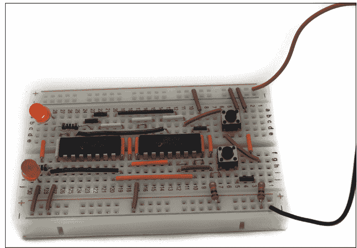

FIGURE 4-8: The assembled gated D latch (Project 40).
图4-8：组装完成的门控D锁存器（项目40）

After you’ve assembled the circuit, you can operate the latch, as follows:
组装好电路后，你可以如下操作该锁存器：

- **Set the Q output to HIGH.** First, press and hold the DATA input button, and then press and release the ENABLE input button to activate the latch. Then release the DATA input button. The Q LED lights to indicate that the output is HIGH and remains lit even after you release the ENABLE and DATA buttons. The Q LED remains lit because the input value that was read while the ENABLE button was pressed is held by the latch.
- **设置Q输出为高电平。** 首先，按住数据输入按钮，然后按下并释放使能输入按钮以激活锁存器。接着释放数据输入按钮。Q输出LED点亮，表示输出为高电平，并且即使在你释放使能和数据按钮后，它仍保持点亮状态。Q输出LED保持点亮，因为锁存器保持了在按下使能按钮时读取到的输入值。
- **Set the Q output to LOW (which sets the $\bar{Q}$ output to HIGH).** Just press and release the ENABLE button without pressing the DATA button. The Q LED goes out and the $\bar{Q}$ LED comes on when you pressed the ENABLE button, the input on the DATA switch was LOW. Therefore, the Q output becomes LOW and is held at LOW when the ENABLE button is released.
- **设置Q输出为低电平（这会将$\bar{Q}$输出设置为高电平）。** 只需在未按数据按钮的情况下，按下并释放使能按钮。当你按下使能按钮时，数据开关上的输入为低电平，因此Q输出LED熄灭，$\bar{Q}$输出LED点亮。所以，Q输出变为低电平，并在使能按钮释放后保持低电平。

The operation of the gated D latch can seem confusing, because pressing the ENABLE button by itself seems to reset the latch. That’s not really what’s happening. Instead, each time you press the ENABLE button, the Q output is set to match the input.
门控D锁存器的操作初看可能有些令人困惑，因为单独按下使能按钮似乎会复位锁存器。但实际情况并非如此。实际上，每次你按下使能按钮时，Q输出都会被设置为与输入匹配。

To get an idea of how a gated D latch would work when the ENABLE input is connected to a clock, press and quickly release the ENABLE button repeatedly about once per second, as if it were connected to a metronome. Each press of the ENABLE button represents a clock tick. While you keep clicking ENABLE, press and hold the DATA button for a few ENABLE clicks and note that the Q LED turns on, indicating that the output is HIGH and remains high. Now release the DATA button and continue clicking the ENABLE button. The Q LED will turn off, indicating that the LOW value on the DATA input has been read.
为了了解当使能输入连接到时钟信号时门控D锁存器如何工作，请反复按下并快速释放使能按钮，频率约为每秒一次，仿佛它连接到了节拍器。每次按下使能按钮都代表一个时钟滴答。在你持续点击使能按钮的同时，按住数据按钮几个使能周期，并注意Q输出LED点亮，表示输出为高电平并保持高电平。现在释放数据按钮并继续点击使能按钮。Q输出LED将熄灭，表示数据输入端的低电平值已被读取。

## Project 40: A Gated D Latch

## 项目40：门控D锁存器

In this project, you use five NAND gates provided by two 4011 CMOS chips to build a gated D latch. The inputs are controlled by two breadboard-mounted push buttons, and the outputs are indicated by LEDs.
在本项目中，你将使用两块4011 CMOS芯片提供的五个与非门来构建一个门控D锁存器。输入由两个安装在面包板上的按钮控制，输出由LED指示。

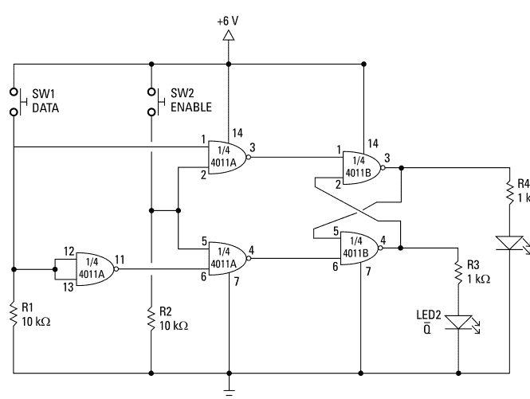

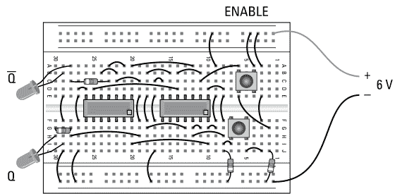

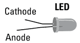

## Parts

## 部件清单

- Four AA batteries
- 四节AA电池
- One four AA battery holder
- 一个四节AA电池座
- One small solderless breadboard
- 一个小无焊面包板
- Two normally open DIP breadboard push buttons
- 两个常开型DIP面包板按钮
- Two 4011 CMOS Quad Two-Input NAND Gates
- 两个4011 CMOS四路双输入与非门芯片
- Two 5 mm red LEDs
- 两个5毫米红色LED
- Two 10 kΩ resistors (brown-black-orange)
- 两个10 kΩ电阻（棕-黑-橙）
- Two 1 kΩ resistors (brown-black-red)
- 两个1 kΩ电阻（棕-黑-红）
- 35 jumper wires
- 35根跳线

## Steps

## 步骤

1. **Insert the 4011 ICs.**
   For the first one, pin 1 should be in E10. For the second one, pin 1 should be in E20.
1. **插入4011集成电路芯片。**
   第一块芯片，1号引脚插入E10。第二块芯片，1号引脚插入E20。

2. **Insert resistors R1, R2, R3, and R4.**
   R1 (10 kΩ) J8 to ground bus
   R2 (10 kΩ): J2 to ground bus
   R3 (1 kΩ): C23 to C28
   R4 (1 kΩ): G28 to G30
2. **插入电阻R1、R2、R3和R4。**
   R1 (10 kΩ)：J8至地线轨
   R2 (10 kΩ)：J2至地线轨
   R3 (1 kΩ)：C23至C28
   R4 (1 kΩ)：G28至G30

3. **Insert LED1 and LED2.**
   LED1: Cathode in I29, anode in H30
   LED2: Cathode in B29, anode in A28
3. **插入LED1和LED2。**
   LED1：阴极在I29，阳极在H30
   LED2：阴极在B29，阳极在A28

4. **Insert SW1.**
   The pins should be inserted in B4, D4, B6, and D6 such that the switch opens and closes across rows 4 and 6.
4. **插入SW1。**
   引脚应插入B4、D4、B6和D6，使开关在第4行和第6行之间通断。

5. **Insert SW2.**
   The pins should be inserted in F5, H5, F7, and H7 such that the switch opens and closes across rows 5 and 7.
5. **插入SW2。**
   引脚应插入F5、H5、F7和H7，使开关在第5行和第7行之间通断。

6. **Insert the jumper wires.**
   1: Positive bus to A3
   2: Positive bus to A4
   3: Positive bus to A9
   4: Ground bus to J17
   5: Ground bus to J27
   6: Ground bus to J29
   7: E3 to F3
   8: E8 to F8
   9: E9 to F9
   10: E17 to F17
   11: E18 to F18
   12: E19 to F19
   13: E27 to F27
   14: E29 to F29
   15: A6 to C11
   16: A12 to A20
   17: A21 to A23
   18: B11 to B14
   19: B15 to B18
   20: B22 to B24
   21: C16 to C17
   22: C19 to C22
   23: D8 to D10
   24: D13 to D25
   25: D26 to D27
   26: G2 to E6
   27: G9 to G10
   28: G11 to G12
   29: G13 to G18
   30: H8 to H12
   31: H19 to H28
   32: I7 to I8
   33: H19 to H28
   34: J3 to J5
   35: I10 to I20
6. **插入跳线。**
   1：正电源轨至A3
   2：正电源轨至A4
   3：正电源轨至A9
   4：地线轨至J17
   5：地线轨至J27
   6：地线轨至J29
   7：E3至F3
   8：E8至F8
   9：E9至F9
   10：E17至F17
   11：E18至F18
   12：E19至F19
   13：E27至F27
   14：E29至F29
   15：A6至C11
   16：A12至A20
   17：A21至A23
   18：B11至B14
   19：B15至B18
   20：B22至B24
   21：C16至C17
   22：C19至C22
   23：D8至D10
   24：D13至D25
   25：D26至D27
   26：G2至E6
   27：G9至G10
   28：G11至G12
   29：G13至G18
   30：H8至H12
   31：H19至H28
   32：I7至I8
   33：H19至H28
   34：J3至J5
   35：I10至I20

7. **Connect the battery leads.**
   Red lead: Positive bus.
   Black lead: Ground bus.
7. **连接电池引线。**
   红色引线：正电源轨。
   黑色引线：地线轨。

8. **Test the circuit.**
   Connect the batteries. In its initial state, no input has been read. The Q output is Low, so the Q LED is dark and the $\bar{Q}$ LED is on.

   Press and hold the INPUT button and tap the ENABLE button. When you tap the ENABLE button, the input will be read and the Q LED will come on. (The $\bar{Q}$ LED will turn off to show the inverse of the input.)

   Tap the ENABLE button again without holding the INPUT button. The input will be read again, and the Q LED will go off to indicate the output is zero. (The $\bar{Q}$ LED will turn on to show the inverse of the output.)
8. **测试电路。**
   连接电池。在初始状态下，尚未读取任何输入。Q输出为低电平，因此Q输出LED熄灭，$\bar{Q}$输出LED点亮。

   按住输入按钮并轻按使能按钮。当你轻按使能按钮时，输入将被读取，Q输出LED将点亮。（$\bar{Q}$输出LED将熄灭以显示输入的反相。）

   不按住输入按钮，再次轻按使能按钮。输入将被再次读取，Q输出LED将熄灭，表示输出为零。（$\bar{Q}$输出LED将点亮以显示输出的反相。）

## Introducing Flip-Flops

## 触发器简介

A *flip-flop* is a special type of gated latch. The difference between a flip-flop and a gated latch is that in a flip-flop, the inputs aren't enabled merely by the presence of a HIGH signal on the CLOCK input. Instead, the inputs are enabled by the *transition* of the CLOCK input. Thus, at the moment that the clock input transitions from low to high, the inputs are briefly enabled. Once the clock stabilizes at the HIGH setting, the output state of the flip-flop is latched until the next clock pulse.
*触发器*是门控锁存器的一种特殊类型。触发器与门控锁存器的区别在于，触发器的输入并非仅仅由时钟输入端的高电平信号存在而使能。相反，输入是由时钟输入端的*跳变*使能的。因此，当时钟输入从低电平跳变到高电平的瞬间，输入会被短暂地使能。一旦时钟稳定在高电平状态，触发器的输出状态就被锁存，直到下一个时钟脉冲到来。

Flip-flops are often said to be *edge-triggered* because it's the edge of the clock signal that triggers the flip-flop. When used in clock-driven computer circuits, edge-triggering is an important characteristic because it helps circuit designers maintain better control over the timing in circuits that contain hundreds or perhaps thousands of flip-flops.
触发器常被称为*边沿触发*，因为是时钟信号的边沿触发了触发器。在时钟驱动的计算机电路中使用时，边沿触发是一个重要特性，因为它有助于电路设计人员在包含成百上千个触发器的电路中保持更好的时序控制。

The circuitry that enables a flip-flop to respond to just the leading edge can be pretty complicated. One of the simplest methods is to feed the clock input into a NAND gate, passing one of the legs through an inverter, as shown in Figure 4–9. This works because in all logic gates, there is a very small delay between the time a signal arrives at the input and the correct signal arrives at the output.
使触发器仅对前沿（上升沿）响应的电路可能相当复杂。最简单的方法之一是将时钟输入送入一个与非门，其中一个输入引脚先通过一个非门，如图4-9所示。这是可行的，因为在所有逻辑门中，信号到达输入端和正确的信号到达输出端之间存在非常小的延迟。

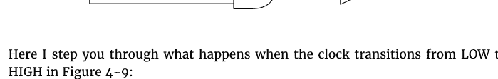

Here I step you through what happens when the clock transitions from LOW to HIGH in Figure 4–9:
下面我将逐步讲解图4-9中时钟从低电平跳变到高电平时发生的情况：

1. Initially, the clock input is LOW. The inverter causes the first input to the NAND gate (marked 1 in the figure) to be HIGH, while the second input is LOW. Because the inputs aren't both HIGH, the output from the NAND gate at point 2 in the figure is HIGH. The second inverter inverts the NAND gate output so the final output from the circuit at point 3 is LOW, just like the clock input.
1. 初始状态，时钟输入为低电平。非门使与非门的第一个输入（图中标记为1）为高电平，而第二个输入为低电平。由于两个输入并非同时为高电平，图中点2处的与非门输出为高电平。第二个非门将与非门的输出反相，因此电路在点3处的最终输出为低电平，与时钟输入一致。
2. When the clock input goes high, the second input to the NAND gate goes high immediately. However, it takes a few milliseconds for the inverter to respond, so for those few milliseconds, the output from the inverter is still HIGH. Thus, both inputs to the NAND gate are HIGH for a few milliseconds, which causes the output from the NAND gate at point 2 in the figure to go LOW. Then, the second NOT gate inverts the NAND gate output, causing the output at point 3 in the signal to go HIGH for a brief moment.
2. 当时钟输入变为高电平时，与非门的第二个输入立即变为高电平。然而，非门需要几毫秒的响应时间，因此在这几毫秒内，非门的输出仍然是高电平。于是，与非门的两个输入同时为高电平持续了几毫秒，这导致图中点2处的与非门输出变为低电平。接着，第二个非门将与非门的输出反相，使得信号中点3处的输出瞬间跳变为高电平。
3. Once the first NOT gate catches up and its output goes LOW (at point 1 in the figure), the NAND gate responds to the LOW and HIGH input by setting its output to HIGH at point 2 in the figure. The second NOT gate then inverts that output at point 3 in the figure.
3. 一旦第一个非门跟上变化且其输出变为低电平（在图中点1处），与非门响应低电平和高电平输入，将其在图中点2处的输出设置为高电平。然后，第二个非门在图中点3处将该输出反相。

The net result of the circuit in Figure 4-9 is that long clock pulses are turned into short clock pulses. The duration between the pulses remains the same, but the HIGH part of the pulse becomes much shorter.
图4-9电路的最终结果是将长时钟脉冲转换为短时钟脉冲。脉冲之间的持续时间保持不变，但脉冲的高电平部分变得非常短。

Flip-flops are designed for use in circuits that use steady clock pulses. An easy way to provide clock pulses for a flip-flop circuit is to use a 555 timer IC, as described in Book 3, Chapter 2. However, the input source for the CLOCK input of a flip-flop doesn't have to be an actual clock; it can also be a one-shot input triggered by a push button.
触发器设计用于使用稳定时钟脉冲的电路。为触发器电路提供时钟脉冲的一个简便方法是使用555定时器芯片，如第3册第2章所述。然而，触发器时钟输入的信号源不必是实际的时钟；也可以是通过按钮触发的一次性输入。

As with latches, there are several different types of flip-flops. The most common are:
与锁存器类似，触发器也有几种不同的类型。最常见的是：

- **SR flip-flop:** Is similar to an SR latch. Besides the CLOCK input, an SR flip-flop has two inputs, labeled SET and RESET. If the SET input is HIGH when the clock is triggered, the Q output goes HIGH. If the RESET input is HIGH when the clock is triggered, the Q output goes LOW.
- **SR触发器：** 类似于SR锁存器。除了时钟输入外，SR触发器有两个输入，分别标记为置位（SET）和复位（RESET）。如果时钟触发时置位输入为高电平，则Q输出变为高电平。如果时钟触发时复位输入为高电平，则Q输出变为低电平。
  Note that in an SR flip-flop, the SET and RESET inputs shouldn't both be HIGH when the clock is triggered. This is considered an invalid input condition, and the resulting output isn't predictable if this condition occurs.
  注意，在SR触发器中，当时钟触发时，置位和复位输入不应同时为高电平。这被视为无效的输入条件，如果发生此情况，产生的输出是不可预测的。

- **D flip-flop:** Has just one input in addition to the CLOCK input. This input is called the DATA input. When the clock is triggered, the Q output is matched to the DATA input. Thus, if the DATA input is HIGH, the Q output goes HIGH, and if the DATA input is LOW, the Q output goes LOW.
- **D触发器：** 除了时钟输入外，只有一个输入。这个输入称为数据输入。当时钟触发时，Q输出与数据输入匹配。因此，如果数据输入为高电平，则Q输出变为高电平；如果数据输入为低电平，则Q输出变为低电平。
  Most D-type flip-flops also include S and R inputs that let you set or reset the flip-flop. Note that the S and R inputs in a D flip-flop ignore the CLOCK input. Thus, if you apply a HIGH to either S or R, the flip-flop will be set or reset immediately, without waiting for a clock pulse.
  大多数D型触发器还包括S和R输入，允许你设置或复位触发器。请注意，D触发器中的S和R输入会忽略时钟输入。因此，如果你将高电平施加到S或R输入，触发器将立即被设置或复位，无需等待时钟脉冲。

- **JK flip-flop:** A common variation of the SR flip-flop. A JK flip-flop has two inputs, labeled J and K. The J input corresponds to the SET input in an SR flip-flop, and the K input corresponds to the RESET input.
- **JK触发器：** SR触发器的一种常见变体。JK触发器有两个输入，标记为J和K。J输入对应于SR触发器中的置位输入，K输入对应于复位输入。
  The difference between a JK flip-flop and an SR flip-flop is that in a JK flip-flop, both inputs can be HIGH. When both the J and K inputs are HIGH, the Q output is *toggled*, which means that the output alternates between HIGH and LOW. For example, if the Q output is HIGH when the clock is triggered and J and K are both HIGH, the Q output is set to LOW. If the clock is triggered again
  JK触发器与SR触发器的区别在于，JK触发器的两个输入可以同时为高电平。当J和K输入同时为高电平时，Q输出会*翻转*，这意味着输出在高电平和低电平之间交替。例如，如果时钟触发时Q输出为高电平且J和K同时为高电平，则Q输出被设置为低电平。如果再次触发时钟...当 J 和 K 同时保持高电平时，Q 输出会再次被置为高电平，如此循环，Q 输出在每个时钟脉冲到来时在高电平和低电平之间交替变化。

### T 触发器
这实际上是一个 JK 触发器，其输出在每个时钟脉冲到来时在高电平和低电平之间交替。触发器在逻辑电路中被广泛使用，因为它们可以组合形成计数电路，用于计算接收到的时钟脉冲数量。

你可以通过将 $\overline{Q}$ 输出直接连接到 D 输入，从 D 触发器创建一个 T 触发器。这样，每当接收到一个时钟脉冲，Q 输出的当前状态就会被反转（这正是 $\overline{Q}$ 输出的作用）并反馈到 D 输入。这会导致输出在高电平和低电平之间交替。

你也可以简单地通过将 J 和 K 输入都硬连线到高电平，从 JK 触发器创建一个 T 触发器。当 J 和 K 都为高电平时，JK 触发器就充当一个触发器。

虽然你可以使用与非门构建自己的触发器电路，但使用包含触发器的集成电路要容易得多。一个常见的例子是 4013 双 D 触发器。该芯片在 14 引脚 DIP 封装中包含两个 D 型触发器。引脚排列如表 4-1 所示。

## 表 4-1：4013 双 D 触发器集成电路引脚排列

| 引脚 | 名称 | 说明 | 引脚 | 名称 | 说明 |
|---|---|---|---|---|---|
| 1 | Q1 | 触发器 1 Q 输出 | 8 | SET2 | 触发器 2 置位输入 |
| 2 | $\overline{Q1}$ | 触发器 1 $\overline{Q}$ 输出 | 9 | DATA2 | 触发器 2 数据输入 |
| 3 | CLOCK1 | 触发器 1 时钟输入 | 10 | RESET2 | 触发器 2 复位输入 |
| 4 | RESET1 | 触发器 1 复位输入 | 11 | CLOCK2 | 触发器 2 时钟输入 |
| 5 | DATA1 | 触发器 1 数据输入 | 12 | $\overline{Q2}$ | 触发器 2 $\overline{Q}$ 输出 |
| 6 | SET | 触发器 1 置位输入 | 13 | Q2 | 触发器 2 Q 输出 |
| 7 | GND | 接地 | 14 | $V_{DD}$ | +3 至 15 V |

当你使用 4013 集成电路中的一个触发器时，务必确保将任何未使用的输入连接到地。CMOS 逻辑芯片中所有未使用的输入都应接地，但对于简单的面包板电路，通常不需要接地连接。然而，如果你不将 SET 和 RESET 输入接地，4013 触发器的 DATA 和 CLOCK 输入将无法正常工作。

项目 41 展示了如何使用 4013 集成电路创建一个基本的 D 触发器。该电路的工作原理与你在项目 40 中创建的 D 型锁存器非常相似。然而，它只需要一个集成电路而不是两个，并且布线要简单得多。这是因为设计 4013 集成电路的工程师将所有布线都集成在了芯片内部的各个与非门之间，因此你不必在面包板上将门连接在一起。相反，你所要做的就是连接输入和输出，然后观察电路工作。图 4-10 显示了组装好的电路。

## 项目 41：一个 D 触发器

在这个项目中，你将构建一个演示 D 触发器操作的电路。该电路使用 4013 双 D 触发器集成电路中的一个触发器。数据和时钟输入通过面包板上的按钮控制，Q 输出连接到一个 LED。$\bar{Q}$ 输出未连接。

## 元件

- 四节 AA 电池
- 一个四节 AA 电池盒
- 一个小型无焊面包板
- 两个常开 DIP 面包板按钮
- 一个 4013 CMOS 双 D 触发器
- 一个 5 毫米红色 LED
- 两个 10 kΩ 电阻（棕-黑-橙）
- 一个 1 kΩ 电阻（棕-黑-红）
- 15 根跳线

## 步骤

1.  **插入 4013 集成电路。**
    引脚 1 应位于 E10。
2.  **插入电阻 R1、R2 和 R3。**
    R1 (10 kΩ)：E20 到 F20
    R2 (10 kΩ)：E6 到 F6
    R3 (1 kΩ)：E8 到 F8
3.  **插入 LED1。**
    阴极（短引脚）：接地总线
    阳极（长引脚）：J8
4.  **插入 SW1。**
    引脚应插入 B20、D20、B22 和 D22，使开关在第 20 行和第 22 行之间开合。
5.  **插入 SW2。**
    引脚应插入 B4、D4、B6 和 D6，使开关在第 4 行和第 6 行之间开合。
6.  **插入跳线。**
    1：正电源总线到 A3
    2：正电源总线到 A4
    3：正电源总线到 A22
    4：接地总线到 J6
    5：接地总线到 J18
    6：接地总线到 J20
    7：E3 到 F3
    8：E18 到 F18
    9：A6 到 A12
    10：A14 到 A20
    11：B13 到 B18
    12：C15 到 C18
    13：D8 到 D10
    14：D16 到 D18
    15：G3 到 G10
7.  **连接电池引线。**
    红色引线：正电源总线
    黑色引线：接地总线
8.  **测试电路。**
    插入电池。按住数据按钮以表示高电平输入；然后按下并释放时钟按钮以读取输入。LED 将亮起，表示输出已被置为高电平。

    现在，在不按数据按钮的情况下按下并释放时钟按钮。这次输入是低电平，因此 LED 熄灭以指示新的输出状态。

项目 42 展示了如何构建一个 T 触发器，其中每次按下按钮都会导致输出 LED 在开和关之间交替。在这个项目中，触发器的 $\bar{Q}$ 输出连接到 DATA 输入。然后，每次时钟输入变为高电平时，$\bar{Q}$ 输出的反转输出就会被馈送到 DATA 输入。这导致 Q 输出反转。图 4-11 显示了组装好的电路。

## 图 4-11：组装好的 T 触发器电路（项目 42）。

在这个项目中，你将使用 4013 双 D 触发器集成电路构建一个触发器。时钟输入连接到面包板上的按钮，Q 输出连接到一个 LED。$\bar{Q}$ 输出连接到 DATA 输入，这导致 Q 输出在每个时钟脉冲到来时反转。

## 元件

- 四节 AA 电池
- 一个四节 AA 电池盒
- 一个小型无焊面包板
- 一个常开 DIP 面包板按钮
- 一个 4013 CMOS 双 D 触发器
- 一个 5 毫米红色 LED
- 一个 10 kΩ 电阻（棕-黑-橙）
- 一个 1 kΩ 电阻（棕-黑-红）
- 15 根跳线

## 步骤

1.  **插入 4013 集成电路。**
    引脚 1 应位于 E10。
2.  **插入电阻 R1 和 R2。**
    R1 (10 kΩ)：E6 到 F6
    R2 (1 kΩ)：E8 到 F8
3.  **插入 LED1。**
    阴极（短引脚）：接地总线
    阳极（长引脚）：J8
4.  **插入 SW1。**
    引脚应插入 B4、D4、B6 和 D6，使开关在第 4 行和第 6 行之间开合。
5.  **插入跳线。**
    1：正电源总线到 A3
    2：正电源总线到 A4
    3：接地总线到 J6
    4：接地总线到 J18
    5：E3 到 F3
    6：E18 到 F18
    7：A6 到 A12
    8：B13 到 B18
    9：C15 到 C18
    10：D8 到 D10
    11：D11 到 D14
    12：D16 到 D18
    13：G3 到 G10
6.  **连接电池引线。**
    红色引线：正电源总线
    黑色引线：接地总线
7.  **测试电路。**
    插入电池。按下并释放按钮。LED 将亮起，表示输出为高电平。再次按下并释放按钮以关闭 LED。每次按下按钮，输出都会从低电平变为高电平，或从高电平变为低电平。

### 时钟输入的去抖动

当你使用机械开关触发触发器的时钟输入时，开关很可能会有一些机械抖动。当开关触点没有完全干净地闭合时，就会发生这种抖动；相反，触点在第一次接触时会稍微弹跳一下。尽管这些抖动通常只相隔几毫秒，但最终可能会使触发器感到困惑，因为它认为开关触点的每次抖动实际上都是一次单独的按钮按下。因此，一次按钮按下可能不会仅仅将连接到 Q 输出的 LED 从关变为开，而是可能将其从关变为开，然后又关，再开，再关，如此反复，直到开关稳定到完全闭合的位置。

有几种不同的方法可以对机械开关进行去抖动——即消除抖动效应。最简单的方法是将机械开关连接到一个单稳态定时器电路，该电路使用 RC 网络创建一个非常短的时间间隔，例如 10 或 20 毫秒。虽然很短，但这个间隔足以消除负向抖动效应。

有关如何使用 555 定时器集成电路构建单稳态电路的更多信息，请参阅第 3 册，第 2 章。

## 本章内容

-   了解微控制器及其工作原理
-   探究微控制器的编程方式
-   学习微控制器的数字 I/O 引脚

## 第五章：微控制器简介

我初次接触微控制器是在多年前，当时我想为万圣节展示制作一个自动化道具。这个道具是一个弗兰肯斯坦怪物，连接在一个气动（气压驱动）弹出装置上。毫无防备的“不给糖就捣蛋”孩子们会走进弗兰肯斯坦的实验室，怪物正坐在一张大工作台上。片刻之后，一个声音会喊道：“它活了！它*活了*！它*活了*！”同时灯光会闪烁。接着，怪物会开始抽搐，然后弹起来尖叫着“puttin' on the Ritz!”。当怪物弹起时，一盏明亮的泛光灯会照亮它。几秒钟后，灯光熄灭，怪物会重新躺下。

我思考着如何设计电子电路来控制我的道具。这可以通过一台旧电脑和连接到电脑并行端口的继电器接口来实现。但我随后意识到，使用微控制器来实现会更有趣，而且成本与使用旧笔记本电脑和并行端口继电器板差不多。因此，我决定改用微控制器来构建这个道具。微控制器将处理道具的所有灯光和动作序列，甚至可以在怪物开始苏醒并最终弹起时播放声音。

简而言之，*微控制器*是一块单板上的小型计算机，通常购买价格低于 50 美元。本章将向你介绍微控制器的一些基本概念。接下来的两本迷你书将向你展示如何使用两种流行的微控制器：Arduino 和 Raspberry Pi。

在本章中，你将学习适用于所有类型微控制器的几个基本概念：它们是什么，如何编程，以及如何通过数字 I/O 引脚连接到外部世界。关于 Arduino 和 Raspberry Pi 微控制器的具体操作，你将在第 6 册和第 7 册中学习。

### 微控制器简介

*微控制器*是单芯片上的完整计算机。与所有计算机系统一样，微计算机由几个基本子系统组成：

-   **中央处理单元（CPU）：** 微处理器的大脑。CPU 执行程序提供给它的指令。CPU 可以进行基本的算术运算，以及计算机正常运行所需的其他操作，例如将数据从内存的一个位置移动到另一个位置，或从外部世界接收输入数据。

微控制器的 CPU 通常比台式计算机中的 CPU 简单得多。然而，从概念上讲它们非常相似。事实上，许多现代微控制器中的 CPU 与几年前台式计算机中使用的 CPU 一样先进。

-   **时钟：** 微控制器的 CPU 和其他组件由时钟驱动，时钟提供定时脉冲，控制程序指令在 CPU 中逐条执行的节奏。对于大多数微控制器，时钟以每秒几百万次的速率滴答。相比之下，驱动典型台式计算机的时钟以每秒几十*亿*次的速率滴答。

-   **随机存取存储器（RAM）：** 提供一个临时存储区，计算机可以在此存储其正在处理的数据。例如，如果你想让计算机计算一个结果（如 2 + 2），你需要在 RAM 中提供一个位置，以便计算机存储结果。

在台式计算机中，可用 RAM 的数量以数十亿字节（GB，千兆字节）为单位。微控制器通常可用的 RAM 要少得多。例如，一个典型的 Arduino 处理器只有 2KB 的 RAM。而某些版本的 BASIC Stamp 只有 32 字节的 RAM。编程微控制器的挑战之一通常是想办法让你的程序在可用的少量内存上运行。

-   **EEPROM：** 一种特殊类型的存储器，用于保存在微控制器上运行的程序。*EEPROM* 代表 *电可擦除可编程只读存储器*，但这个名称不会在考试中出现。

EEPROM 是*只读*的，这意味着一旦数据存储在 EEPROM 中，就无法通过微控制器 CPU 上运行的程序来更改。但是，可以通过 USB 端口将 EEPROM 连接到计算机，然后向 EEPROM 存储器写入数据。这样，计算机就可以向 EEPROM 发送数据。

这就是微控制器的编程方式。你在 PC 上使用特殊软件创建要在微控制器上运行的程序。然后，将微控制器连接到 PC，并将程序从 PC 传输到微控制器。微控制器随后执行程序中规定的指令。

大多数微控制器有几千字节的 EEPROM 存储器，这足以存储从 PC 下载的相对复杂的程序。

EEPROM 存储器最重要的特性之一是，当你关闭电源时，它不会丢失数据。因此，一旦你将程序从 PC 传输到微控制器的 EEPROM，该程序就会保留在微控制器中，直到你用其他程序替换它。你可以关闭微控制器电源，将其放在壁橱架子上多年，当你再次打开微控制器电源时，多年前记录的程序将再次运行。

-   **I/O 引脚：** 微控制器最重要的特性之一是其 *I/O 引脚*，它使微控制器能够与外部世界通信。虽然一些微控制器有单独的输入引脚和输出引脚，但大多数具有共享的 I/O 引脚，可用于输入和输出。

I/O 引脚通常使用我在本迷你书中描述的基本 TTL 逻辑接口：HIGH（逻辑 1）由 +5 V 表示，LOW（逻辑 0）由 0 V 表示。

大多数微控制器只能通过 I/O 引脚直接处理少量电流。20 mA 到 25 mA 是典型值。这足以点亮一个 LED，但需要更大电流的电路应将高电流负载与微控制器 I/O 引脚隔离。这通常通过使用晶体管驱动器来实现。

### 微控制器编程

如果你以前从未做过任何形式的计算机编程，那么你将开始一段有趣而迷人的冒险，在此过程中你将学到很多关于计算机实际工作原理的知识。简而言之，计算机程序是一组计算机知道如何读取、解释和执行的书面指令。这些指令是用人类和计算机都能读取的语言编写的。这些指令不完全是英语，但它们与英语足够相似，以至于我们说英语的人能够理解它们的意思。（存在基于英语以外口语的编程语言，但基于英语的编程语言在全世界最流行。）

计算机程序存储在由一行或多行书面指令组成的文本文件中。在大多数情况下，计算机程序的每一行包含一条指令。每条指令告诉计算机执行特定的操作，例如将两个数字相加或读取特定输入引脚的状态。

计算机编程的诀窍是将正确的指令按正确的顺序组合起来，使程序完全按照你的意愿执行。当然，要做到这一点，你需要对程序要做什么有扎实的理解，并且需要对可用的各种指令有扎实的理解。你还必须考虑你正在使用的特定微控制器的资源，以及哪些电路或设备连接到微控制器。

编程微控制器最常见的方法是通过 USB 电缆将微控制器连接到 PC，使用称为集成开发环境（IDE）的特殊程序编写程序，然后使用 IDE 将程序下载到微控制器。

当你将程序下载到微控制器时，程序被传输到微控制器的 EEPROM 中，然后执行。一旦程序进入 EEPROM，你就可以将微控制器与计算机断开连接。如果你关闭微控制器电源或切断电源，程序将保留在 EEPROM 中，直到你再次打开微控制器电源。换句话说，微控制器会将其 EEPROM 中的程序保留下来，以便可以反复运行，即使微控制器未连接到计算机。我将在第 6 册和第 7 册中分别解释如何为 Arduino 和 Raspberry Pi 执行此操作。

### 使用 I/O 引脚

大多数微控制器有几个 I/O 引脚，你可以将外部电路连接到这些引脚。I/O 引脚的确切数量取决于你使用的具体微控制器。

输入/输出引脚遵循数字逻辑的标准惯例，这些内容我在本迷你书的前面章节中已经介绍过。因此，5V的正电压电平被视为高电平，0V的电平被视为低电平。

大多数微控制器的输入/输出引脚能够处理大约20毫安的电流，因此你需要确保在电路中使用限流电阻，以避免电路过载并可能损坏微控制器。

图5-1展示了一个简单的电路原理图，该电路通过微控制器的输入/输出引脚驱动一个LED。请注意，在这个原理图中，引脚输出用一个简单的五边形表示。在原理图中，*通常不会*像画其他集成电路那样将微控制器画成一个单一的矩形。相反，电路中的每个输入/输出连接都使用五边形的连接器形状来表示。这种惯例为你如何布局电路原理图提供了极大的灵活性。

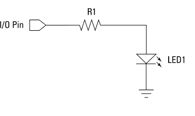

**图5-1：**
连接到微控制器输入/输出引脚的LED电路原理图。

# 6 使用Arduino微处理器

# 目录概览

| 章节 | 标题 | 页码 |
| :--- | :--- | :--- |
| 1 | **Arduino简介** | 599 |
| 2 | **创建Arduino程序** | 615 |
| 3 | **更多Arduino编程技巧** | 647 |
| 4 | **一个Arduino接近传感器** | 665 |
| 5 | **为你的Arduino项目添加声音和运动** | 681 |
| 6 | **键盘和按键板** | 711 |

- 了解各种型号的Arduino微控制器
- 探索Arduino最受欢迎的微控制器UNO
- 学习如何编程Arduino
- 创建一个简单的Arduino项目

# 第1章 Arduino简介

Arduino（发音为ar-dwee-no）是当今最流行的微处理器系统之一。Arduino最初于2005年在意大利伊夫雷亚起步，现已成为一个全球性的现象。Arduino开发板可以在网上以低于10美元的价格购买到。

Arduino的正式名称是Arduino项目，这反映了Arduino是一个由在线社区开发的开源项目这一事实。因此，有几家不同的公司生产兼容Arduino的微处理器开发板。你可以直接从Arduino网站（www.arduino.cc）购买Arduino板，也可以从亚马逊或新蛋等其他在线零售商处购买。

## Arduino UNO简介

在撰写本文时，大约有三十几种不同的Arduino板变体，每种都提供不同的功能。例如，一些Arduino板内置有线或无线网络功能，而另一些则设计用于机器人或游戏控制器。

最受欢迎的Arduino板称为UNO（见图1-1）。本迷你书将重点介绍UNO，但在这里学到的几乎所有关于UNO的知识也适用于其他Arduino型号。此外，本迷你书的第6章将深入探讨另一种名为Leonardo的Arduino型号。

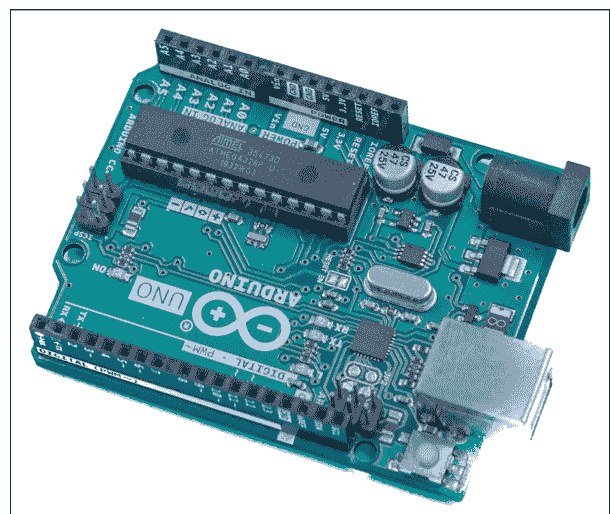

图1-1：
一块Arduino UNO。

几家制造商生产兼容版本的UNO板。你可以使用任何这些兼容的UNO板来构建本书中的项目。

图1-2展示了UNO板上组件的布局。以下是其主要特性：

- 一块Atmel ATmega328P单片微处理器，具有2KB的RAM用于数据存储，1KB的EEPROM存储器用于程序存储，32KB的闪存，以及多种有用的输入和输出功能，这些功能被UNO板所利用。
- 一个6V至20V的电源连接器，可用于从电池或壁式适配器为设备供电。内置的5V和3.3V稳压器将电压降低到Arduino所需的水平。（请注意，设备也可以通过USB Type B连接器供电。）
- 一个电源LED，指示UNO的电源状态。
- 一个USB Type B连接器，用于将UNO连接到计算机进行编程。（Type B连接器是方形USB连接器，常用于连接打印机。）连接时，UNO直接从USB连接获取电源，因此不需要单独的电源连接。
- 十四个数字输入/输出引脚，在板上标识为D0到D13。（在所有Arduino板上，数字引脚从零开始编号。）
- 一个连接到引脚13的板载LED。这个LED可以通过从计算机上传到UNO的程序来控制。
- 六个模拟输入引脚，标识为A0到A5。（与数字引脚类似，模拟引脚也是从零开始编号。）请注意，如果你想，模拟引脚可以用作额外的数字引脚。在这种情况下，模拟引脚被标识为数字引脚14到19。（A0变成D14，A1变成D15。）
- 电源引脚，为外部电路提供5V、3.3V和地线接入。
- 板载TX和RX LED，指示板子是否通过USB端口与计算机通信。
- 一个复位按钮，可中断当前正在运行的程序并重新启动UNO。

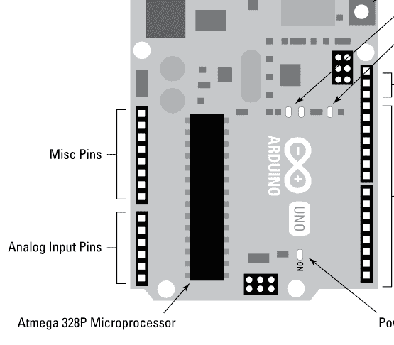

图1-2：Arduino UNO的组件。

# 竖起扩展板！

Arduino微控制器最有趣且实用的功能之一是被称为*扩展板*的附加板。这些附加板可以堆叠在Arduino板的顶部，以提供额外的功能。例如，你可以获得使你的Arduino项目能够连接到互联网、控制电机或为Arduino提供语音提示的扩展板。

Arduino扩展板最棒的地方在于它们是可堆叠的。换句话说，你可以将两个或多个扩展板堆叠在Arduino板的顶部，以提供多种功能。例如，你可以使用无线网络扩展板、电机驱动板和GPS扩展板来创建一个自主机器人。或者你可以将语音生成扩展板与语音识别扩展板结合起来，创建一个既能听又能说的项目。

你还可以获得原型扩展板，允许你将自己的电路作为扩展板整合进去。其中一些板子带有面包板，用于你的电路原型设计。当你调试完毕并且电路工作正常后，你可以直接将组件焊接到扩展板上，使电路更加稳定。

大多数扩展板都附带一个编程库，你需要学习它，才能将扩展板的功能整合到你的程序中。如果你使用其中一块原型板创建自己的扩展板，你就需要自己解决编程问题，这可能相当有挑战性，但也很有趣！

事实上，使用Arduino的大部分乐趣在于使用扩展板。所以，在你掌握了基础知识之后，你会想要开始尝试使用扩展板。

在本迷你书中，你会了解到几种类型的扩展板。首先，大多数项目都使用一种叫做*原型扩展板*的板子，它可以堆叠在Arduino UNO板顶部，并提供一个小型无焊面包板区域，用于组装基本电路。在本迷你书的第5章，你还会了解到如何使用一个可以播放MP3音频文件的音频扩展板。

快速在线搜索*Arduino shield*，你会发现几十种额外的扩展板类型可供尝试。祝你玩得开心！

# 购买UNO入门套件


虽然你可以单独购买Arduino UNO板，但你可能希望将第一块UNO板作为入门套件的一部分购买，该套件包含各种其他组件，这些组件在构建项目时将非常有用。这些入门套件的价格通常在30美元到100美元或更多之间，具体取决于它们包含的额外组件。

我建议你从一个便宜的套件开始，比如Elegoo UNO Project Super Starter Kit，它附带一块兼容的UNO板、一本小型教程书和各种配件，如面包板、LCD显示屏、伺服和步进电机、一些跳线、LED、电阻和按钮等。总的来说，它包含了足够的零件来构建各种UNO项目。

如果你已经有面包板、电阻、LED、跳线等，你可以花大约25美元买一块真正的Arduino UNO板，或者花不到10美元买一块兼容的UNO板。

我还建议你购买一个或多个原型扩展板，用于构建后续章节中项目的电路。最受欢迎的是由Adafruit制造的，称为*Proto Shield*。我在本迷你书的第2章会更详细地介绍这个有用的扩展板。你可以直接从Adafruit（www.adafruit.com）购买Proto Shield，也可以从亚马逊或沃尔玛等在线零售商处购买。

别忘了，你还需要一根短的mini-B USB线，将UNO板连接到你的计算机以对该板进行编程。

# 安装Arduino IDE

Arduino IDE是你在计算机上用来创建程序的软件，这些程序可以从计算机上传到Arduino板。该软件可从Arduino网站免费获得。只需将你的浏览器指向www.arduino.cc，然后点击Software菜单。接着下载适用于你所使用操作系统的IDE安装包。（IDE有单独的Windows、Mac和Linux版本。）

如果你使用Windows，你应该选择Windows Installer而不是zip版本。Windows Installer版本会直接安装到你的计算机上，这样你就可以从开始菜单运行它。

如果你是 Mac 用户，请下载 Arduino IDE 程序。然后，将下载的程序复制到你的“应用程序”文件夹。最后，为了更方便地运行程序，请将其从“应用程序”文件夹拖到屏幕底部的程序 Dock 栏上。

软件安装完成后，你可以从“开始”菜单（Windows）或 Dock 栏（Mac）中选择 Arduino IDE 来运行它。图 1-3 显示了该 IDE 在 Windows PC 上首次运行时的界面。

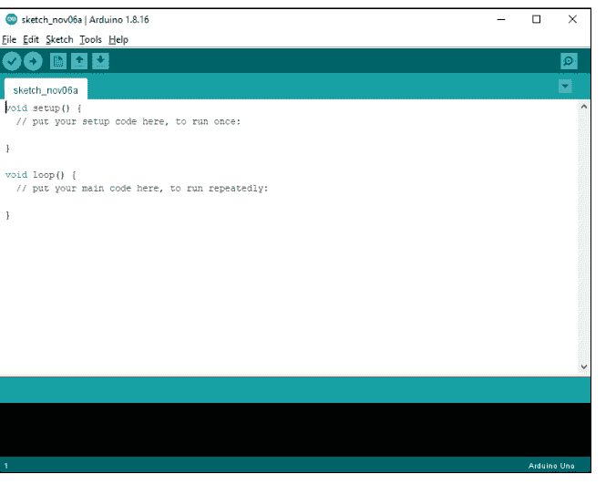

图 1-3：Arduino IDE 界面。

## 连接到 UNO

在使用 IDE 为 Arduino 编程之前，你必须先将 Arduino 连接到你的电脑。对于 UNO 板，这很简单：只需将 USB 电缆方形的一端插入 UNO 板上的 USB 插座，然后将电缆另一端的标准 USB 连接器插入电脑上任意可用的 USB 端口。UNO 板上的电源 LED 会亮起，Arduino IDE 会自动识别 USB 端口上的 UNO 板。

要验证 Arduino 是否正确连接，请打开 IDE 软件并执行以下步骤：

1.  在 IDE 中，选择 **工具 → 开发板**，并确认已选择 **Arduino UNO**。
    如果没有，请选择 **工具 → 开发板 → Arduino UNO**。
2.  选择 **工具 → 端口**，并确认已选择 USB 端口。
    如果没有，请手动选择 USB 端口。

确认 UNO 板已连接后，你就可以继续将你的第一个程序上传到 UNO 板了。

## 查看一个简单的 Arduino 程序

在 Arduino 世界中，一个程序被称为 *sketch*（程序）。然而，与这个听起来温和的术语所暗示的相反，Arduino 程序并没有什么艺术性或视觉性可言：它只是用一种称为 C++ 的高级编程语言编写的程序。将程序称为 *sketch* 而不是 program，只是帮助你降低对学习编程这项艰巨任务的防备心理的一种方式。

在几乎所有关于编程语言的书籍中，第一个程序都被称为 Hello World。这个简单的程序显示字符串“Hello, World!”，以此来演示最简单的程序是什么样子的。

在 Arduino 中也可以实现这样的程序，但它并不是一个最佳的入门示例程序。这是因为与大多数电脑不同，像 Arduino 这样的微处理器没有内置的控制台来显示“Hello, World!”文本。

因此，我们将从一个简单的程序开始，该程序让 Arduino UNO 板引脚 13 上内置的 LED 灯闪烁。这个程序会反复让 LED 灯闪烁，只要程序被允许运行——换句话说，直到你关闭 UNO 板。程序会让 LED 灯亮一秒，然后灭一秒，再亮一秒，如此循环，无限重复。

在向你展示此程序的代码之前，让我们先梳理一下程序必须执行的步骤：

1.  首先，程序必须将 I/O 引脚 13 指定为输出引脚。它将使用名为 `pinMode` 的命令来执行此操作。
2.  接着，它必须打开 LED 灯。它通过使用名为 `digitalWrite` 的命令来实现，该命令用于将值 HIGH（高电平）写入引脚 13。
3.  然后，程序等待一秒过去。它通过使用名为 `delay` 的命令来实现。在此延迟期间，LED 灯保持点亮，因为引脚 13 的输出状态为 HIGH。
4.  一秒延迟后，再次使用 `digitalWrite`，这次通过将值 LOW（低电平）写入引脚 13 来关闭 LED 灯。
5.  然后程序再次使用 `delay` 等待一秒。在此延迟期间，LED 灯保持熄灭，因为引脚 13 的输出状态为 LOW。
6.  现在，程序重复步骤 2 到 5，按顺序一遍又一遍地执行，直到 UNO 板被关闭。

实现这些步骤的实际 Arduino 程序如代码清单 1-1 所示。

### 代码清单 1-1：闪烁（Blink）程序

```
void setup() {
  pinMode(13, OUTPUT);
}

void loop() {
  digitalWrite(13, HIGH);
  delay(1000);
  digitalWrite(13, LOW);
  delay(1000);
}
```

如果你是编程新手，这个代码清单中有许多细节我不指望你现在就能理解。别担心——我会在下一章中解释它们。目前，我只希望你大致浏览一下代码，并注意该程序使用了前面步骤中描述的 `pinMode`、`digitalWrite` 和 `delay` 命令。

闪烁程序中的命令被组织成两个函数，函数就是收集在一起的代码段。这两个函数是：

- **setup**：setup 函数中的命令在程序开始时只执行一次。换句话说，每当 UNO 板开启或按下 UNO 板的重置按钮时，setup 函数就会运行一次。在闪烁程序中，setup 函数只有一条命令——`pinMode`，它将引脚 13 设置为 OUTPUT（输出）模式。
- **loop**：在 setup 函数完成后，loop 函数中的命令会反复执行，直到 UNO 板关闭或重置。这些命令打开 LED 灯，等待一秒，关闭 LED 灯，然后再等待一秒。因此，每次执行 loop 函数时，都会发生一个闪烁周期——LED 灯亮一秒，然后灭一秒。

> **记住**：所有 Arduino 程序，从最简单的到最复杂的，都被组织成这两个基本函数：**setup**，在程序开始时执行一次；以及 **loop**，在程序停止前反复执行。

## 运行闪烁程序

要在你的 Arduino UNO 板上实际运行上一节描述的闪烁程序，请按照以下步骤操作：

1.  **将 Arduino UNO 板连接到你的电脑。**
    使用 USB 电缆将 UNO 板上的 USB 端口连接到电脑上的 USB 端口。
2.  **在你的电脑上打开 Arduino IDE 程序。**
    在 Windows 电脑上，从“开始”菜单选择 Arduino IDE。在 Mac 上，双击 Dock 栏中的 Arduino IDE 图标，或从“应用程序”文件夹中打开它。
3.  **选择 文件 → 新建 命令。**
    将出现一个新程序的窗口。请注意，该程序已经包含了 setup 和 loop 函数的框架。
4.  **编辑程序，使其与代码清单 1-1 完全一样。**
    IDE 编辑器的工作方式与你使用过的任何其他文本编辑器一样。如果你愿意，可以先选择编辑器窗口的全部内容，然后按 Delete 键。然后，只需将程序完全按照代码清单 1-1 所示输入到编辑窗口中。
5.  **保存程序。**
    选择 文件 → 保存，输入名称“Blink-1”，然后单击“保存”按钮。
    创建并保存程序后，编辑器窗口应如图 1-4 所示。

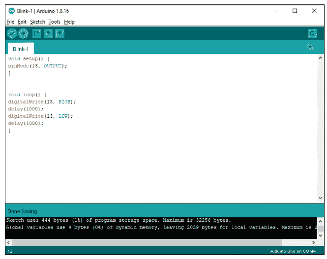

图 1-4：准备运行的闪烁程序。

6.  **选择 程序 → 上传。**
    程序将被上传到 UNO 板。在将程序上传到 UNO 板期间，UNO 板上的 TX 和 RX LED 会闪烁几秒钟。程序上传完成后，板载 LED 将开始以一秒的间隔闪烁。

板载 LED 非常小——你可能需要眯着眼睛才能看到它。但它稳定闪烁的开关状态是程序正在运行的确凿标志。


> **提示**：恭喜！你已经编写了你的第一个 Arduino 程序，现在你已经踏入了微控制器编程的世界！

## 使用数字 I/O 引脚控制 LED

既然你已经编写了一个可以让连接到引脚 13 的板载 LED 闪烁的 Arduino 程序，下一步就是使用 UNO 板上的引脚 13 来点亮一个外部 LED。

UNO 板总共有 14 个数字 I/O 引脚，为了方便你，板上对这些引脚都有标注。这些引脚可以通过两组引脚排针（通常简称为排针）来访问。排针是连接到数字电路板的常用方式。

```
void setup() {
  pinMode(13, OUTPUT);
}

void loop() {
  digitalWrite(13, HIGH);
  delay(1000);
  digitalWrite(13, LOW);
  delay(1000);
}
```UNO板上的排针为**母头**，针脚间距为0.1英寸。如果将板子上的电源和USB接口朝上放置，你会看到两排母头排针——一排在板子的左边缘，另一排在右边缘。图1–5标明了这些排针上的每个引脚。

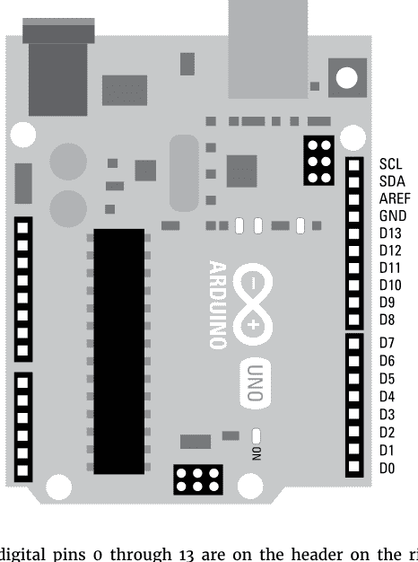

数字引脚0到13位于UNO板右侧的排针上。从下往上，它们被标记为D0到D13。紧挨在D13排针上方的是一个接地连接，标记为GND。这个引脚用于为每个数字I/O引脚构成回路。在GND引脚上方还有几个额外的引脚，但在这本迷你书中我不会使用它们。

供你参考，表1-1列出了通过UNO板排针可用的所有引脚连接。

与大多数微控制器一样，UNO上的数字I/O引脚在标准逻辑电平电压下工作，因此当引脚为高电平时为+5 V，为低电平时为0 V。在UNO上，I/O引脚能够提供20 mA的电流，因此你需要提供合适的限流电阻，以避免烧毁LED。在这个示例中，我们使用一个470 Ω的电阻。

## 表1-1 UNO板排针引脚

| 标记 | 用途 | 补充信息 |
| :--- | :--- | :--- |
| D0→RX | 数字I/O引脚0 | 也用于串行通信（RX） |
| D1←TX | 数字I/O引脚1 | 也用于串行通信（TX） |
| D2 | 数字I/O引脚2 | |
| ~D3 | 数字I/O引脚3 | 可以使用脉冲宽度调制（PWM） |
| D4 | 数字I/O引脚4 | |
| ~D5 | 数字I/O引脚5 | 可以使用脉冲宽度调制（PWM） |
| ~D6 | 数字I/O引脚6 | 可以使用脉冲宽度调制（PWM） |
| D7 | 数字I/O引脚7 | |
| D8 | 数字I/O引脚8 | |
| ~D9 | 数字I/O引脚9 | 可以使用脉冲宽度调制（PWM） |
| ~D10 | 数字I/O引脚10 | 可以使用脉冲宽度调制（PWM） |
| ~D11 | 数字I/O引脚11 | 可以使用脉冲宽度调制（PWM） |
| D12 | 数字I/O引脚12 | |
| D13 | 数字I/O引脚13 | |
| GND | 接地 | |
| AREF | 模拟电压参考 | |
| SDA | | 用于双线接口（TWI）连接，本书不涉及 |
| SCL | | 用于双线接口（TWI）连接，本书不涉及 |
| A0 | 模拟输入引脚0 | 也可以用作数字I/O引脚14 |
| A1 | 模拟输入引脚1 | 也可以用作数字I/O引脚15 |
| A2 | 模拟输入引脚2 | 也可以用作数字I/O引脚16 |
| A3 | 模拟输入引脚3 | 也可以用作数字I/O引脚17 |
| A4 | 模拟输入引脚4 | 也可以用作数字I/O引脚18 |
| A5 | 模拟输入引脚5 | 也可以用作数字I/O引脚19 |
| VIN | 输入电源（6–20 V） | 可用于为Arduino供电 |
| GND | 接地 | |
| GND | 接地 | |
| +5 V | +5 V | 为外部电路提供稳压的+5 V（最大400 mA） |
| +3.3 V | +3.3 V | 为外部电路提供稳压的+3.3 V（最大50 mA） |
| RESET | 复位 | 本书不涉及 |
| IOREF | 电压参考 | 本书不涉及 |

图1–6展示了该电路的原理图。如图所示，电路非常简单：引脚13连接到470 Ω电阻，电阻再连接到LED的阳极。然后阴极接地。虽然原理图中未标明，但我们使用了UNO板上的两个接地引脚之一来完成这个接地连接。

## 图1-6: 为UNO板添加外部LED

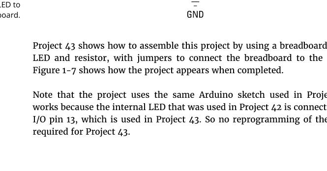

项目43展示了如何使用面包板来固定LED和电阻，并使用跳线将面包板连接到UNO板，从而组装这个项目。图1–7显示了项目完成后的样子。

请注意，该项目使用了与项目42相同的Arduino程序。之所以可行，是因为项目42中使用的内部LED连接在数字I/O引脚13上，而项目43也使用了这个引脚。因此，项目43无需重新编程Arduino。

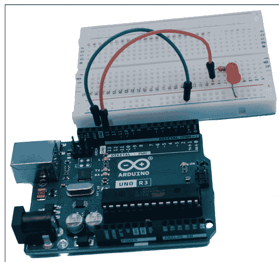

图1-7: 组装好的Arduino LED电路（项目43）

## 项目43：使用Arduino UNO闪烁LED

在这个项目中，你将一个外部LED连接到Arduino UNO板。然后使用一个简单的程序，让LED以一秒的间隔闪烁。

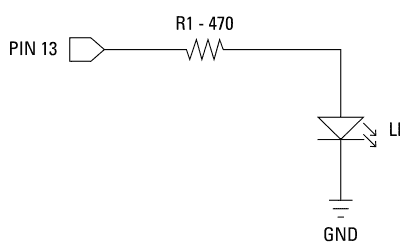

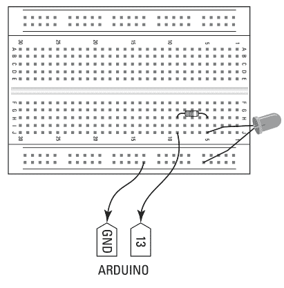

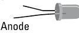

## 零件

- 一台安装了Arduino IDE的计算机
- 一块Arduino UNO板
- 一根USB线
- 一个小型无焊面包板
- 一个红色LED
- 一个470 Ω电阻
- 两根跳线（公对公）

## 步骤

1.  **插入电阻R1。**
    R1 (470 Ω): H5 至 H9

2.  **插入LED1。**
    阴极（短引脚）：接地总线
    阳极（长引脚）：J5

3.  将接地总线连接到UNO板的接地端。
    使用跳线，将面包板上接地总线上的任意一个孔连接到UNO板上三个GND引脚中的任意一个。

4.  将UNO板上的引脚13连接到面包板的J9。

5.  将UNO连接到计算机。
    使用USB连接器。

6.  如果尚未上传，将闪烁程序（见代码清单1-1）上传到UNO。

同样，这与项目42使用的程序相同。因为板载LED在内部连接到数字I/O引脚13，所以项目43不需要重新编程。

当程序上传到Arduino后，面包板上的LED将以一秒的间隔闪烁。请注意，面包板上的LED会与UNO板上的内置LED同步闪烁。

> 如果面包板上的LED没有闪烁，请仔细检查你的连接。很可能，你将LED装反了。请记住，短引脚（阴极）必须连接到面包板的接地轨。


## 本章内容

- 学习Arduino语言基础
- 使用变量
- 在程序中添加if语句
- 使用while和for循环
- 创建自己的函数
- 使用原型板

## 第2章
创建Arduino程序

欢迎来到编程的世界！本章将非常简要地介绍用于开发Arduino程序的编程语言。如果你以前从未做过任何类型的计算机编程，你将迎来一段有趣且充满乐趣的旅程。计算机编程的微妙之处起初可能难以掌握，但一旦你掌握了某些基本概念，你就会发现你能引导Arduino做各种各样的事情。


Arduino语言实际上是一种被称为C++的标准编程语言。C++恰好是一种更简单的语言C的高级版本。因为大多数初级Arduino程序实际上并不使用任何高级特性，所以目前你可以将Arduino语言简单地视为C。事实上，在整个本章中，我将Arduino语言简称为C而不是C++。在某些时候，你可能会想用C++为你的Arduino编程，但C++编程超出了这本入门书籍的范围。

## C语言简介

如你在本迷你书的第1章所学，你使用Arduino IDE来创建程序并将其上传到你的Arduino。术语*程序*只是Arduino对C程序的称呼。

> ⚠️ 警告

如果你不清楚如何创建程序并将其上传到你的Arduino，请阅读本迷你书的第1章。如果不编写一些实际程序、将其下载到Arduino并观察它们如何工作，你很难在Arduino编程中取得进展。

在开始之前，我来回顾一下本迷你书第1章中介绍的程序。为了方便起见，程序在代码清单2-1中重复列出。

```
代码清单 2-1: **闪烁程序**


void setup()
    pinMode(13, OUTPUT);
}

void loop() {
    digitalWrite(13, HIGH);
    delay(1000);
    digitalWrite(13, LOW);
    delay(1000);
}
```

关于这个程序，有一些重要的细节——逐行分析——你需要理解，以便创建其他更复杂的程序：

> ➜ →1 程序的第一行声明了一个名为setup的函数。正如你在本迷你书的第1章中所了解的，*函数*是一组被收集在一起并赋予名称的编程指令。在这个例子中，只有一个指令（第2行的 *pinMode* 指令）。setup函数在Arduino启动或复位后立即被调用一次。这个函数通常用于执行只需要执行一次的指令，例如 *pinMode* 指令，它用于确定某个特定引脚将作为输入还是输出引脚。

关于这一行还有几个其他细节需要注意：## 使用原型开发板

在下一节中，我将向你展示如何构建一个测试电路，你可以用它来实验 Arduino 编程的基础知识。该测试电路以及本迷你书中剩余的所有 UNO 项目都使用一个 Arduino 原型开发板，它可以卡入 Arduino UNO 的顶部，并提供一个小型面包板，你可以在上面组装简单电路。

许多制造商都生产原型开发板。我使用的是 HiLetgo (www.hiletgo.com) 制造的产品，可以直接从亚马逊购买。如果你愿意，也可以使用其他公司制造的原型开发板，但它们的布局可能与本书中使用的 HiLetgo 开发板不同。

以下是原型开发板的主要特点：

-   可堆叠排针，可卡入 UNO 开发板上的排针，以传递 UNO 各排针引脚的功能。
-   带有预钻孔和焊盘的原型区域，用于添加元件。
-   一个小型面包板（称为 *微型面包板*），你可以在其上组装简单电路。微型面包板带有背胶，可以永久地放置在原型区域上方。对于本迷你书中的所有示例，我都使用面包板而不是原型区域来组装电路。

图 2-1 展示了正在使用的原型开发板，它被连接到 UNO 卡的顶部。在这张照片中，你可以看到原型开发板的排针如何提供对 UNO 排针引脚的访问。你还可以看到用于组装电路的微型面包板。

图 2-2 是一个示意图，能更清楚地展示原型开发板的各个组成部分。如你所见，原型开发板左右两侧的排针提供了对 UNO 卡上 I/O 引脚的访问。此外，卡底部的排针提供了一排五个 GND 引脚和五个 +5 V 引脚。

面包板本身有 17 行，每行 10 个孔，分为两组，每组五个。在每一行中，左侧的五个孔在内部是相连的，右侧的五个孔在内部也是相连的。与其他面包板一样，这些孔在中心间隙的两侧内部并不相通。

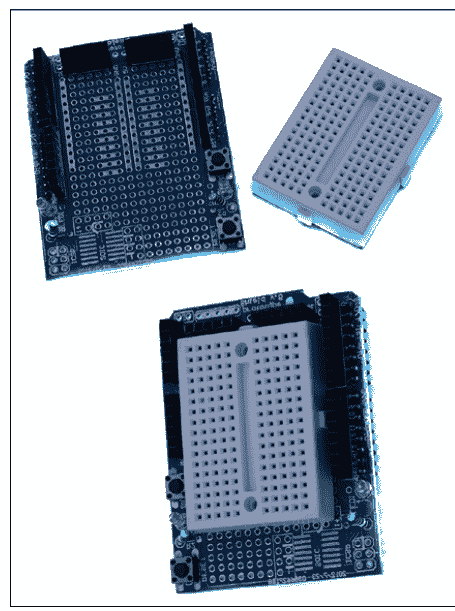

图 2-1：原型开发板卡入 Arduino UNO 的顶部。

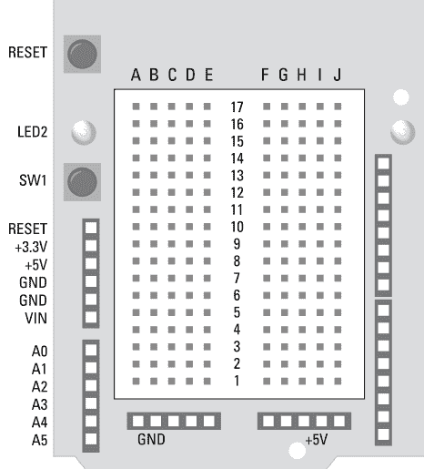

图 2-2：识别原型开发板上的连接

> 大多数微型面包板上的行和列没有以任何方式标记。为方便起见，我使用数字 1 到 17 表示行，使用字母 A 到 J 表示列，如图 2-2 所示。

## 搭建测试电路

项目 44 提供了一个简单的测试环境，当你学习 Arduino 编程的基础知识时，它将对你非常有用。该项目只是在面包板上放置八个 LED 和八个限流电阻，并将它们连接到 Arduino 的数字引脚 0 到 7 上。搭建好这个电路后，你将创建几个 Arduino 程序，使用各种编程技术以有趣的图案闪烁这些 LED。

图 2-3 显示了完成的电路，准备好用于测试你将在学习本章过程中编写的程序。

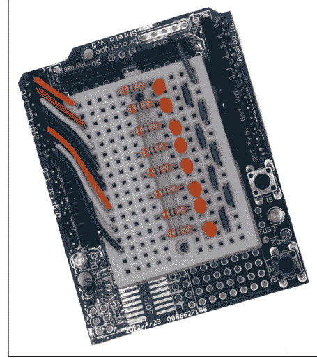

图 2-3：带有八个 LED 的 Arduino UNO 和原型开发板（项目 44）。

---

该行以单词 `void` 开头。在 C 语言中，所有函数都可以返回一个值。也就是说，当一个函数执行完毕时，它可以返回一个值，该值可在程序的其他地方使用。然而，并非所有函数实际上都会返回值。当一个函数不返回值时，其声明必须以单词 `void` 开头。这仅仅表示 `setup` 函数不返回值。

函数名 `setup` 后面跟着一对括号，括号之间没有任何内容。在 C 语言中，可以使用所谓的参数将数据传递给函数。这些参数必须列在函数名后的括号内。对于 `setup` 函数，不需要任何参数。但是，括号是始终必需的；因此，`setup` 后面必须始终跟着一组空括号。

左花括号字符跟在括号之后。这标志着 `setup` 函数内包含的编程指令的开始。从此左花括号到匹配的右花括号（在第 3 行）之间的所有内容都属于该函数。在这种情况下，那就是一条指令，即第 2 行中的那条。

→2 这行代码设置引脚 13 的输入/输出模式。它通过调用一个名为 `pinMode` 的内置函数来实现。`pinMode` 函数与 `setup` 函数一样是一个函数，不同之处在于它是 Arduino 作为标准函数库的一部分预先定义的——这是一个包含许多标准函数的集合，你可以在你的 Arduino 程序中使用。`pinMode` 函数只是指定某个特定的 I/O 引脚是用作输入引脚还是输出引脚。

与大多数标准库函数一样，也不同于 `setup` 函数，`pinMode` 函数确实需要参数。实际上，它需要两个参数。这些参数必须用括号括起来：

-   第一个参数指定你要设置模式的引脚。在这种情况下，我们设置的是引脚 13 的模式。
-   第二个参数指定模式应该是什么。在这种情况下，我们将引脚设置为作为输出引脚工作。

你可能想知道为什么单词 `OUTPUT` 是用全大写字母书写的。那是因为单词 `OUTPUT` 在 C 语言中被称为一个常量。常量是在 C 程序内定义的一个词，代表某个预定义的值。在这种情况下，常量 `OUTPUT` 由定义 `pinMode` 函数的同一标准库定义。

关于这一行，最后一点也是非常重要的一点：它以分号结尾。在 C 语言中，所有语句都必须以分号结尾。通常，语句是指示程序执行某项操作的指令。在这种情况下，该语句告诉程序执行 `pinMode` 函数来定义引脚 13 的模式。程序的第一行不需要分号，因为它没有告诉程序做任何事情；它只是标记了 `setup` 函数的开始。

→3 这个结束（右）花括号与第 1 行末尾的开始（左）花括号配对，标记 `setup` 函数的结束。因此，这个花括号和第 1 行中的花括号包围了 `setup` 函数的指令。

→4 这行标志着 `loop` 函数的开始。如你所见，它与标记 `setup` 函数开始的第 1 行非常相似。与 `setup` 函数一样，`loop` 函数不返回值，所以它以单词 `void` 开头。而且与 `setup` 函数一样，`loop` 函数不使用任何参数，因此它包含一组空括号。这一行以左花括号结尾，标记当 Arduino 调用 `loop` 函数时将要执行的语句的开始。

→5 这行调用 `digitalWrite` 函数，这是另一个标准的 Arduino 库函数。此函数将输出数据发送到引脚。两个参数指定了数据应发送到的引脚和要发送到该引脚的数据值。在这种情况下，值 `HIGH` 被发送到引脚 13，这导致引脚 13 的电压电平变为 +5 V，从而点亮 LED。你可能猜到了，`HIGH` 是标准库定义的另一个常量。还要注意，这一行以分号结尾，标记语句的结束。

→6 这行调用另一个内置函数 `delay`。`delay` 函数接受一个参数，该参数表示程序应暂停的毫秒数。在这种情况下，指定了 1,000 毫秒作为参数；这会使程序暂停整整一秒。注意参数值 1000 中没有使用逗号。还要注意，这条语句以分号结尾。

→7 在允许引脚 13 上的 LED 保持点亮一秒钟后，这行再次调用 `digitalWrite` 来关闭 LED。为此，它使用常量 `LOW` 作为要发送到引脚的数据。这会将引脚 13 的输出设置为低电平，从而关闭 LED。

→8 现在程序再次调用 `delay`，让程序暂停另外 1,000 毫秒，使 LED 保持熄灭一秒钟。

→9 最后的结束（右）花括号标记 `loop` 函数的结束。因此，`loop` 函数包含四条语句：两条将数据写入引脚 13，两条暂停程序。因为 `loop` 函数被 Arduino 反复调用，所以只要程序继续运行，`loop` 函数就会导致 LED 反复闪烁。

## 项目 44：Arduino LED 测试电路

在本项目中，你将在原型扩展板上组装一个包含八个 LED 的电路，将 LED 连接到数字端口 0 到 7。你可以使用这个测试电路来测试本章中展示的程序。

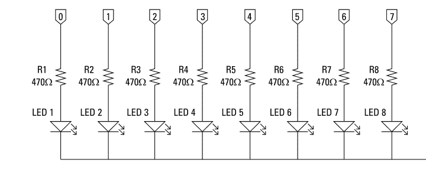

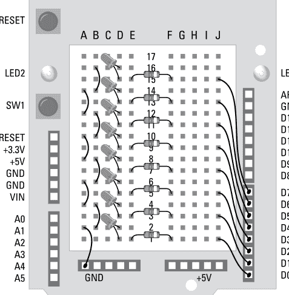

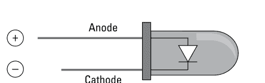

## 所需部件

- 一台安装了 Arduino IDE 的电脑
- 一根 A-B 型 USB 线（打印机常用的那种）
- 一块 Arduino UNO 开发板
- 一块原型扩展板
- 八个红色 LED
- 八个 470 Ω 电阻
- 十六根跳线

## 步骤

1.  插入电阻。

| 电阻 | 从 | 到 |
|---|---|---|
| R1 (470 Ω) | E1 | F1 |
| R2 (470 Ω) | E3 | F3 |
| R3 (470 Ω) | E5 | F5 |
| R4 (470 Ω) | E7 | F7 |
| R5 (470 Ω) | E9 | F9 |
| R6 (470 Ω) | E11 | F11 |
| R7 (470 Ω) | E13 | F13 |
| R8 (470 Ω) | E15 | F15 |

2.  插入 LED。

| LED | 阳极 | 阴极 |
|---|---|---|
| LED1 | D1 | D2 |
| LED2 | D3 | D4 |
| LED3 | D5 | D6 |
| LED4 | D7 | D8 |
| LED5 | D9 | D10 |
| LED6 | D11 | D12 |
| LED7 | D13 | D14 |
| LED8 | D15 | D16 |

3.  使用跳线将数字引脚连接到面包板。

| 数字引脚 | 面包板引脚 |
|---|---|
| D0 | J1 |
| D1 | J3 |
| D2 | J5 |
| D3 | J7 |
| D4 | J9 |
| D5 | J11 |
| D6 | J13 |
| D7 | J15 |

4.  使用跳线完成接地电路。

| 从 | 到 |
|---|---|
| GND 1 | A2 |
| B2 | B4 |
| A4 | A6 |
| B6 | B8 |
| A8 | A10 |
| B10 | B12 |
| A12 | A14 |
| B14 | B16 |

5.  将原型扩展板连接到 Arduino UNO。
6.  将 UNO 连接到电脑。使用 B 型 USB 接口。
7.  将 LED 闪烁程序（见下一节的清单 2-2）上传到 UNO。

面包板上的 LED 将以一秒为间隔闪烁。

## 闪烁 LED

在本章前面，你看到了一个让引脚 13 上的单个 LED 闪烁的程序。在本章的其余部分，我将展示该程序的几个变体，它们以不同的顺序闪烁测试项目（项目 44）中的八个 LED。在此过程中，你可以将更多的 C 语句添加到你的技能库中，以提供越来越复杂的闪烁控制方式。

> 请记住，在整个本章中，如果你能用 Arduino 程序控制一个 LED 的开关，你就能控制任何可以连接到 Arduino 数字 I/O 端口的东西。Arduino 本身并不知道也不关心你连接到数字 I/O 引脚的是什么电路。它只知道，当你告诉它时，Arduino 会使 I/O 端口变为高电平或低电平。当引脚变为高电平时发生什么，是由连接到该引脚的外部电路决定的。

唯一的限制是 Arduino 本身只能在其 I/O 引脚上提供大约 20 mA 的电流。如果连接到引脚的电路需要超过 20 mA 的电流，你必须将电路中需要较大电流的部分与 Arduino 隔离开来。最简单的方法是使用晶体管驱动器或继电器。

清单 2-2 展示了一个简单的程序，它以半秒为间隔闪烁所有八个 LED。这个程序只使用了你已经了解的 `pinMode`、`digitalWrite` 和 `delay` 函数。程序打开所有八个 LED，暂停 500 毫秒（半秒），关闭 LED，再等待半秒，然后跳回 `loop` 标签重新开始整个过程。

## 清单 2-2：LED 闪烁程序

```cpp
void setup() { //→1

    pinMode(0, OUTPUT); //→2
    pinMode(1, OUTPUT);
    pinMode(2, OUTPUT);
    pinMode(3, OUTPUT);
    pinMode(4, OUTPUT);
    pinMode(5, OUTPUT);
    pinMode(6, OUTPUT);
    pinMode(7, OUTPUT);

}

void loop() { //→3

    digitalWrite(0, HIGH); //→4
    digitalWrite(1, HIGH);
    digitalWrite(2, HIGH);
    digitalWrite(3, HIGH);
    digitalWrite(4, HIGH);
    digitalWrite(5, HIGH);
    digitalWrite(6, HIGH);
    digitalWrite(7, HIGH);

    delay(500); //→5

    digitalWrite(0, LOW); //→6
    digitalWrite(1, LOW);
    digitalWrite(2, LOW);
    digitalWrite(3, LOW);
    digitalWrite(4, LOW);
    digitalWrite(5, LOW);
    digitalWrite(6, LOW);
    digitalWrite(7, LOW);

    delay(500); //→7

}
```

1.  `setup` 函数的开始，在 UNO 启动或重置时运行一次。
2.  接下来的八行代码调用 `pinMode` 函数八次，将引脚 0 到 7 的 I/O 模式设置为 `OUTPUT`。
3.  `loop` 函数的开始，在 UNO 运行期间被反复调用。
4.  接下来的八行代码调用 `digitalWrite` 函数八次，将引脚 0 到 7 的状态设置为 `HIGH`，从而打开所有八个 LED。
5.  这一行调用 `delay` 函数，使程序暂停 500 毫秒。
6.  接下来的八行代码调用 `digitalWrite` 函数，将引脚 0 到 7 的状态设置为 `LOW`，从而关闭所有八个 LED。
7.  这一行调用 `delay` 函数，使程序暂停 500 毫秒。

## 使用注释

注释是一段解释你代码的文本。Arduino 会完全忽略注释，所以你可以在注释中放入任何你想要的文本。在你的程序中使用大量的注释来解释程序的功能和工作原理是一个好习惯。


要创建注释，请在行首放置两个正斜杠。当 C 语言看到这两个斜杠时，它会忽略该行的其余部分。因此，如果你在行首放置斜杠，整行都被视为注释。如果你在行中间放置注释（例如，在语句之后），斜杠之后的所有内容都会被忽略。

常见的编程实践是在程序开头使用一组注释，说明程序的功能、作者和编写时间。这组注释还可以说明预期连接到 Arduino 的 I/O 设备。清单 2-3 展示了一个包含这两种注释的 LED 闪烁程序版本。

## 清单 2-3：带注释的 LED 闪烁程序

```cpp
// The LED Flasher Program
// Doug Lowe
// December 2, 2021
//
// This program flashes LEDs connected to digital pins 0
// through 7 at half-second intervals.

void setup() {

    // Set pins 0 through 7 to OUTPUT
    pinMode(0, OUTPUT);
    pinMode(1, OUTPUT);
    pinMode(2, OUTPUT);
    pinMode(3, OUTPUT);
    pinMode(4, OUTPUT);
    pinMode(5, OUTPUT);
    pinMode(6, OUTPUT);
    pinMode(7, OUTPUT);

}

void loop() {

    // Turn all LEDs on
    digitalWrite(0, HIGH);
    digitalWrite(1, HIGH);
    digitalWrite(2, HIGH);
    digitalWrite(3, HIGH);
    digitalWrite(4, HIGH);
    digitalWrite(5, HIGH);
    digitalWrite(6, HIGH);
    digitalWrite(7, HIGH);

    // Wait a bit
    delay(500);

    // Turn all LEDs off
    digitalWrite(0, LOW);
    digitalWrite(1, LOW);
    digitalWrite(2, LOW);
    digitalWrite(3, LOW);
    digitalWrite(4, LOW);
    digitalWrite(5, LOW);
    digitalWrite(6, LOW);
    digitalWrite(7, LOW);

    // Wait a bit
    delay(500);

}
```

## 创建标识符

*标识符*是你创造的一个词，用于按名称引用编程元素。虽然你可以为许多类型的元素分配标识符，但它们最常用于以下方面：

- 函数名，例如 `setup` 和 `pinMode`
- 变量和字段，用于保存程序使用的数据
- 参数，用于向函数传递数据值


创建标识符时，必须遵循一些简单的规则：

- **标识符区分大小写。** 因此，`SalesTax` 和 `salesTax` 是不同的标识符。
- **标识符可以由大写或小写字母、数字、下划线字符 (_) 和美元符号 ($) 组成。** 因此，标识符可以有像 `Port1`、`SalesTax$` 和 `Total_Sales` 这样的名称。
- **所有标识符必须以字母开头。** 因此，`a15` 是一个有效的标识符，但 `13Unlucky` 不是（因为它以数字开头）。

## 使用变量

*变量*是分配给程序中特定数据的名称。变量对于几乎所有严肃的 Arduino 程序都是必不可少的，因为它们提供了一种跟踪数据、对数据执行计算以及根据数据做出决策的方法。

## 变量
在C语言中，一个变量可以存储四种不同类型的数据：

- int：int类型存储整数值——即整数。
- float：float类型存储浮点数——即带小数点的数字。
- double：double类型存储所谓的双精度浮点数——即带小数点的数字，其存储的位数是普通float变量的两倍。
- char：char类型存储单个字节的数据。

在Arduino程序中使用变量之前，必须先定义它。声明变量最基本的形式是：

```
type name;
```

以下是一些示例：

```
int time;
float reading;
char status;
```

请注意，变量声明在C语言中被视为一条语句，因此其后必须跟一个分号。

一旦创建了变量，就可以在赋值语句中使用它来赋予一个值。赋值语句由变量名、等号和要赋予的值组成。例如，以下赋值语句将值500赋给名为time的变量：

```
time = 500;
```

你可以将变量的声明和值的赋值合并为一条语句，如下所示：

```
int time = 500;
```

这里，变量time在一条语句中同时被声明并被赋予了值500。

等号右侧的值可以是一个算术计算。例如：

```
time = 500 + 10;
```

在这个例子中，值510被赋给了名为`time`的变量。

仅使用数字进行算术运算意义不大。毕竟，你可以自己进行计算。因此，前面的例子也可以写成：

```
time = 510;
```

变量赋值的真正威力在于当你在等号右侧使用变量时。例如，以下语句将`time`变量的值增加10：

```
time = time + 10;
```

在这个例子中，`time`的先前值增加了10。例如，如果在此语句执行前`time`变量的值是150，那么执行后它将变为160。

关于变量，一个重要的知识点是，你可以在函数内部或外部声明它们。如果在函数内部声明变量，则该变量只能在该函数内使用。但是，如果在函数外部声明变量，则该变量可以在程序中的任何函数中使用。这样的变量有时被称为*全局变量*，因为它可以在整个程序中全局使用。

虽然不是必需的，但通常的做法是在函数内部的所有其他语句之前，在函数的最开始处声明所有变量。对于全局变量，通常的做法是在任何函数之前，在程序的开头附近定义它们。

## 进行数学运算

正如你已经看到的，C语言允许你使用符号（称为*运算符*）`+`、`-`、`*`和`/`来执行加法、减法、乘法和除法。例如：

```
int x = 10;
int y;
y = x * 3;
```

在这个例子中，值30将被赋给变量`y`。

关于C语言如何进行数学运算，你需要了解以下几点：

- **C语言使用数学中正常的运算顺序。** 因此，乘法和除法在加法和减法之前执行。例如：

```
int x = 10;
int y;
y = x + 5 * 3;
```

这条语句将值25赋给y，因为5首先乘以3，然后结果加上10。

- **你可以使用括号来强制先计算公式的特定部分。** 例如：

```
int x = 10;
int y;
y = (x + 5) + 3;
```

这里，C语言首先计算括号内的部分，得到结果15。然后将3加到15上，得到最终结果18。

- **当你用整数进行除法时，答案的小数部分会被丢弃，结果是一个整数。** 例如：

```
int x = 8 / 3;
```

这条语句将值2赋给x。这是因为8除以3等于2，余数为2。余数被丢弃了。

## 一个使用变量和数学运算的程序

清单2-4展示了一个使用全局变量来改变每次调用loop函数时LED闪烁速度的程序。如你所见，一个名为Time的变量用于提供每次调用delay函数时暂停的毫秒数。每次循环，Delay变量的值增加10。因此，程序刚开始时LED闪烁非常快，但随着程序循环，闪烁速度逐渐变慢。

**清单2-4：** 带变量的LED闪烁程序

```
// The LED Flasher Program
// Doug Lowe
// December 2, 2021
//
// This program flashes LEDs connected to digital pins 0
// through 7 at half-second intervals.

// The Time variable
int Time;

void setup() {

  // Set pins 0 through 7 to OUTPUT
  pinMode(0, OUTPUT);
  pinMode(1, OUTPUT);
  pinMode(2, OUTPUT);
  pinMode(3, OUTPUT);
  pinMode(4, OUTPUT);
  pinMode(5, OUTPUT);
  pinMode(6, OUTPUT);
  pinMode(7, OUTPUT);

  // Initialize the Time variable
  Time = 10;

}

void loop() {

  // Turn all LEDs on
  digitalWrite(0, HIGH);
  digitalWrite(1, HIGH);
  digitalWrite(2, HIGH);
  digitalWrite(3, HIGH);
  digitalWrite(4, HIGH);
  digitalWrite(5, HIGH);
  digitalWrite(6, HIGH);
  digitalWrite(7, HIGH);

  // Wait a bit
  delay(Time);

  // Turn all LEDs off
  digitalWrite(0, LOW);
  digitalWrite(1, LOW);
  digitalWrite(2, LOW);
  digitalWrite(3, LOW);
  digitalWrite(4, LOW);
  digitalWrite(5, LOW);
  digitalWrite(6, LOW);
  digitalWrite(7, LOW);

  // Wait a bit
  delay(Time);

  // Increase the wait time
  Time = Time + 10;
}
```

## 使用If语句

if语句允许你为程序添加条件测试。换句话说，它允许你仅在满足特定条件时执行某些语句。这种条件处理是任何非最简单程序的重要组成部分。

每个if语句都必须包含一个*条件表达式*，该表达式设置一个逻辑测试以确定条件是真还是假。例如：

```
x > 5
```

如果变量x的值大于5，则此条件为真。如果x的值等于或小于5，则条件为假。

C编程语言的一个奇特之处是，它要求你使用两个等号来测试相等性。例如：

```
x == 5
```

如果变量x的值恰好是5，则此条件为真。如果值是5以外的任何值，则条件为假。

if语句的基本形式如下所示：

```
if (condition)
    statement
```

请注意，条件必须用括号括起来。

这里有一个简单的例子：

```
if (Time == 500)
    Time = 1000;
```

这个if语句检查Time变量的值，如果当前值是500，则将其更改为1000。

if语句的语句部分可以是单个C语句，也可以是一组语句。如果使用一组语句，则必须用花括号将它们括起来。例如：

```
if (Time == 500)
{
    Time = 1000;
    Counter = 0;
}
```

在这个例子中，如果Time变量的值是500，则执行两条语句。

if语句还可以包含一个else组件，该组件提供一个或多个在条件不为真时执行的语句。例如：

```
if (Time == 500)
    Time = 1000;
else
    Time = 500;
```

在这个例子中，会发生两种情况之一：如果Time变量的值为500，则Time变量的值被设置为1000；但如果Time变量的值不是500，则Time变量的值被设置为500。

与if组件一样，else组件可以包含多条语句。在这种情况下，语句必须用花括号括起来，如下所示：

```
if (Timer == 500)
{
    Timer = 1000;
    Counter = 0;
}
Else
{
    Timer = 500;
    Counter = 0;
}
```

## 使用 While 循环

正如你已经知道的，任何Arduino程序的主要部分是一个名为`loop`的函数，只要程序在运行，Arduino就会反复调用这个函数。因此，你已经熟悉了循环的基本概念，无论使用的编程语言是什么，或者程序运行的设备类型如何，循环都是几乎所有计算机程序的基本要素。

除了`loop`方法提供的基本循环机制外，你还可以在`setup`或`loop`方法内提供其他形式的循环。C语言提供了几种创建程序循环的方式。最基本的一种叫做while循环，它只是在满足某个条件时持续重复的循环。

while循环的基本形式如下：

```
while (condition)
    statement
```

请注意，while循环的`statement`部分可以是单条语句，也可以是用花括号括起来的一系列语句。

这是一个将0到7引脚初始化为输出引脚的while循环示例：

```
int pin = 0;
while (pin < 8)
{
    pinMode(pin, OUTPUT);
    pin = pin + 1;
}
```

每次执行此循环时，都会调用`setMode`方法将`pin`变量指定的引脚模式设置为输出（OUTPUT）。然后将`pin`变量的值增加1。因此，循环第一次执行时，设置引脚0的模式。第二次设置引脚1。依此类推，直到引脚7被设置。在那次循环执行中，`pin`变量增加到8。然后，在下一次循环执行时，条件为假，循环结束。

在循环中将变量加一的操作非常常见，因此C编程语言提供了一个有用的快捷方式，称为递增运算符。递增运算符就是两个加号，写在变量名之后而不是之前。例如：

```
pin++;
```

下面是使用递增运算符的完整循环：

```
int pin = 0;
while (pin < 8)
{
    setMode(pin, OUTPUT);
    pin++;
}
```

代码清单2-6展示了一个LED闪烁器的版本，它从引脚0上的LED开始，依次到引脚7上的LED，每个LED闪烁半秒。请注意，由于循环函数内部的while语句，实际上每次执行循环函数时，程序都会闪烁所有八个LED。

### 代码清单2-6：使用 while 循环的 LED 闪烁器

```
// The LED Flasher Program
// Doug Lowe
// December 2, 2021
//
// This program flashes LEDs connected to digital pins 0
// through 7. The LEDs on each pin are flashed one at a
// time in sequence from pin 0 to pin 7 for half a
// second each.

// The Time and Pin variables
int Time;
int Pin;

void setup() {

  // Set pins 0 through 7 to OUTPUT
  Pin = 0;
  while (Pin < 8)
  {
    pinMode(Pin, OUTPUT);
    Pin++;
  }

  // Initialize the Time variable
  Time = 500;

}

void loop() {

  Pin = 0;
  while (Pin < 8)
  {
    digitalWrite(Pin, HIGH);
    delay(Time);
    digitalWrite(Pin, LOW);
    Pin++;
  }
}
```

## 使用 For 循环

`for`循环是一种特殊类型的循环语句，它自动维护一个计数器变量。当你想将循环执行特定次数，或者想对多个I/O引脚执行操作时，`for`循环是理想的选择。

`for`循环的基本结构如下：

```
for (initialize; test; increment)
    statement
```

以下段落描述了括号中三部分的作用：

-   **initialize**（初始化）部分初始化循环并建立将要使用的计数器变量。该变量可以已经存在，也可以在初始化部分声明。通常，变量在这里被赋予一个起始值。
-   **test**（测试）部分是一个条件测试，用于确定循环何时结束。通常，条件将测试计数器变量的特定值。只要条件为真，循环就会持续执行。当条件测试为假时，循环结束。
-   **increment**（递增）部分用于递增计数器变量。

这是一个简单的示例，将0到7引脚的模式设置为输出：

```
for (int Pin = 0; Pin < 8; Pin++)
{
    pinMode(Pin, OUTPUT);
}
```

在这个例子中，`Pin`在`for`循环内被声明为计数器变量，并被赋予初始值零。只要`Pin`变量小于8，循环就会继续执行，并且在每次循环执行后，`Pin`变量会增加1。通过这种方式，循环设置了引脚0到7的模式。

`for`循环的一个有趣特点是你可以倒数计数。最简单的方法是使用递减运算符，它类似于你在本章前面学到的递增运算符，但使用两个减号而不是两个加号。正如你可能猜到的，递减运算符是减去一而不是加一。

要倒数计数，你应该将计数器变量的初始值设置为起始值，并在条件中测试下限值。例如：

```
for (int Pin = 7; Pin >= 0; Pin--)
{
    digitalWrite(Pin, HIGH);
    delay(500);
    digitalWrite(Pin, LOW);
}
```

这个示例以相反的顺序闪烁LED，从引脚7到引脚0。（注意`>=`条件测试，如果`Pin`变量的值大于或等于零，则测试为真。）

你也可以使用`for`循环进行跳步计数。例如，以下循环每隔一个LED闪烁一次（即闪烁引脚0、2、4和6上的LED）：

```
for (int Pin = 0; Pin < 8; Pin = Pin + 2)
{
    digitalWrite(Pin, HIGH);
    delay(500);
    digitalWrite(Pin, LOW);
}
```

代码清单2-7展示了一个LED闪烁器程序的版本，它使用一对`for`循环先沿一个方向闪烁LED，然后沿相反方向闪烁。这会产生一种类似于旧电视剧《太空堡垒卡拉狄加》中邪恶的赛隆人那令人毛骨悚然的电子眼的效果。（为了达到这种威胁性的赛隆效果，我通过将`Time`变量从500毫秒减少到50毫秒来加速循环。）

`setup`函数使用一个`for`循环来初始化输出引脚。然后，在`loop`函数中，使用了两个`for`循环。第一个`for`循环从引脚0到7依次闪烁LED。第二个`for`循环以相反的顺序闪烁LED，从引脚6到1。请注意，第二个`for`循环没有闪烁所有八个引脚。如果它闪烁了所有八个引脚，那么每次调用`loop`函数时，引脚0和7实际上会闪烁两次，这会影响效果的定时。

### 代码清单2-7：使用 for 循环的 LED 闪烁器程序

```
// The LED Flasher Program
// Doug Lowe
// December 2, 2021
//
// This program flashes LEDs connected to digital pins 0
// through 7. The LEDs are alternately flashed quickly 3
// times, then more slowly 3 times.

// The Time and Counter variables
int Time;
int Counter;

void setup() {

  // Set pins 0 through 7 to OUTPUT
  pinMode(0, OUTPUT);
  pinMode(1, OUTPUT);
  pinMode(2, OUTPUT);
  pinMode(3, OUTPUT);
  pinMode(4, OUTPUT);
  pinMode(5, OUTPUT);
  pinMode(6, OUTPUT);
  pinMode(7, OUTPUT);

  // Initialize the Time and Counter variables
  Time = 500;
  Counter = 0;

}

void loop() {

  // Turn all LEDs on
  digitalWrite(0, HIGH);
  digitalWrite(1, HIGH);
  digitalWrite(2, HIGH);
  digitalWrite(3, HIGH);
  digitalWrite(4, HIGH);
  digitalWrite(5, HIGH);
  digitalWrite(6, HIGH);
  digitalWrite(7, HIGH);

  // Wait a bit
  delay(Time);

  // Turn all LEDs off
  digitalWrite(0, LOW);
  digitalWrite(1, LOW);
  digitalWrite(2, LOW);
  digitalWrite(3, LOW);
  digitalWrite(4, LOW);
  digitalWrite(5, LOW);
  digitalWrite(6, LOW);
  digitalWrite(7, LOW);

  // Wait a bit
  delay(Time);

  // Determine the correct wait time
  if (Counter == 3)
  {
    if (Time == 250)
    {
      Time = 500;
    }
    else
    {
      Time = 250;
    }
    Counter = 0;
  }

  // Increment the counter
  Counter = Counter + 1;
}
```

// 此程序将使连接到数字引脚0至7的LED闪烁。
// 每个引脚上的LED将按顺序从引脚0到引脚7逐个闪烁，
// 然后再反向闪烁，每次持续半秒。

// Time变量
int Time;

void setup() {

  // 将引脚0至7设置为OUTPUT
  for (int Pin = 0; Pin < 8; Pin++)
  {
    pinMode(Pin, OUTPUT);
  }

  // 初始化Time变量
  Time = 50;

}

void loop() {

  // 正向闪烁引脚0至7
  for (int Pin = 0; Pin < 8; Pin++)
  {
    digitalWrite(Pin, HIGH);
    delay(Time);
    digitalWrite(Pin, LOW);
  }

  // 反向闪烁引脚6至1
  for (int Pin = 6; Pin > 0; Pin--)
  {
    digitalWrite(Pin, HIGH);
    delay(Time);
    digitalWrite(Pin, LOW);
  }
}

## 编写你自己的函数

在前面的章节中，我解释了如何创建每个Arduino程序所需的`setup`和`loop`函数，以及如何使用标准库函数，如`pinMode`、`digitalWrite`和`delay`。在本章的最后一节，我将告诉你如何创建自己的函数，以便从`setup`或`loop`函数中调用它们，从而简化你的代码。

为什么你想这样做呢？这里有一个简单的例子：在清单2-7中，你可能已经注意到，在`loop`函数中使用的两个`for`循环里，有三行相同的代码被重复了。与其重复这三行代码，你可以创建一个包含这些行的函数。你可以将这个函数命名为`flashLED`。然后，在`for`循环中，你只需调用`flashLED`函数即可。

要创建一个函数，你必须像声明`setup`和`loop`函数一样声明该函数。主要区别在于，当你创建自己的函数时，你可能需要通过参数向函数传递数据。例如，你需要将引脚号传递给`flashLED`函数。你可能还想将延迟时间作为参数传递。

这是一个函数的示例，该函数打开LED，等待一段时间，然后关闭LED：

```
void flashLED(int Pin, int Time)
{
  digitalWrite(Pin, HIGH);
  delay(Time);
  digitalWrite(Pin, LOW);
}
```

如你所见，函数的第一行以类似于声明变量的方式声明了参数。第一个参数是`int`类型，名为`Pin`，而第二个参数也是`int`类型，但名为`Time`。

### 清单2-8：使用函数的LED闪烁程序

```
// LED闪烁程序
// Doug Lowe
// 2021年11月7日
//
// 此程序将使连接到数字引脚0至7的LED闪烁。
// 每个引脚上的LED将按顺序从引脚0到引脚7逐个闪烁，
// 然后再反向闪烁，每次持续半秒。

void setup() {

  // 将引脚0至7设置为OUTPUT
  for (int Pin = 0; Pin < 8; Pin++)
  {
    pinMode(Pin, OUTPUT);
  }

}

void loop() {

  // 正向闪烁引脚0至7
  for (int Pin = 0; Pin < 8; Pin++)
  {
    flashLED(Pin, 50);
  }

  // 反向闪烁引脚6至1
  for (int Pin = 6; Pin > 0; Pin--)
  {
    flashLED(Pin, 50);
  }
}

void flashLED(int Pin, int Time)
{
  digitalWrite(Pin, HIGH);
  delay(Time);
  digitalWrite(Pin, LOW);
}
```

除了接受参数，函数还可以返回值。在仅仅闪烁LED的程序中，返回值的函数用处不大，所以让我们考虑一个不同的例子。假设你的Arduino项目需要计算一个矩形的面积，其中矩形的高度和宽度由`int`值表示。你可以这样计算面积：

```
int width = 5;
int height = 10;
int a;
a = width * height;
```

另一种方法是创建一个函数，该函数接受宽度和高度作为参数，并返回矩形的面积。你可以这样编写函数：

```
int area(int width, int height)
{
    int area;
    area = width * height;
    return area;
}
```

在这个例子中，函数`area`被赋予了`int`的返回类型，这意味着当函数被调用时，它将返回一个整数值。然后，在函数体内，使用`return`语句来结束函数并提供返回值。

以下是你如何使用此函数来计算面积：

```
int x = 5;
int y = 10;
int a;
a = area(x, y);
```

这里需要注意的是，当你调用函数时指定的参数名称不必与函数内部指定的参数名称匹配。相反，参数是位置性的：你传递给函数的第一个参数将用作宽度，第二个将用作高度。

+   本章内容
* 读取按钮的状态
* 生成随机数
* 使用电位器作为输入

# 第3章
更多Arduino编程技巧

在本章中，你将学习一些额外的Arduino编程技术，这些技术在你的Arduino项目中将变得非常宝贵。具体来说，你将学习如何处理以按钮形式输入的数据，如何生成随机数（通过添加一定程度的随机性使你的程序更有趣），以及如何读取电位器的值。

## 在Arduino中使用按钮

在本迷你书的第2章中，你学习了如何将LED连接到Arduino I/O引脚，并通过在Arduino程序中使用`digitalWrite`函数来打开或关闭LED。`digitalWrite`函数通过将I/O引脚的状态设置为HIGH或LOW，将I/O引脚用作输出引脚，以便外部电路（如LED）可以响应引脚的状态。

但是，如果你想将I/O引脚用作输入而不是输出呢？换句话说，如果你想让Arduino响应外部电路的状态，而不是相反呢？最简单的方法是将按钮连接到I/O引脚。然后，你可以在Arduino程序中添加命令来检测按钮是否被按下。

有两种方法可以将按钮连接到Arduino I/O引脚：

- **高电平有效：** 这种连接方式在按钮按下时将+5V置于I/O引脚上。当按钮释放时，I/O引脚看到0V。
- **低电平有效：** 这种连接方式在按钮未按下时看到+5V。当你按下按钮时，+5V被移除，I/O引脚看不到电压。

图3-1展示了高电平有效和低电平有效按钮的示例。在高电平有效电路中，当按钮未按下时，I/O引脚通过电阻R1连接到地。因此，I/O引脚的电压为0。当按钮按下时，I/O引脚通过R1连接到+5V，导致I/O引脚看到+5V。结果，当按钮未按下时I/O引脚为LOW，当按钮按下时为HIGH。

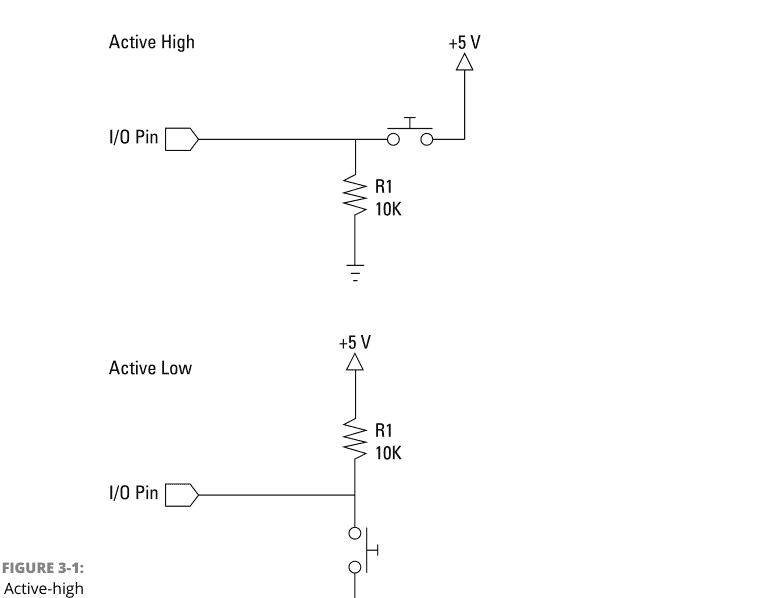

在低电平有效电路中，I/O引脚通过R1连接到+5V，导致I/O引脚变为HIGH。但当按钮按下时，电流通过R1短路到地，导致I/O引脚的电压降至零。因此，当按钮未按下时I/O引脚为HIGH，当按钮按下时为LOW。


请注意，在这两种电路中，R1都连接在+5V和地之间，以防止短路。如果没有这个电阻，当按钮按下时，Arduino很可能会损坏。


在高电平有效电路中，R1被称为下拉电阻，因为当按钮未按下时，它将I/O引脚的电流下拉至零。在低电平有效电路中，R1被称为上拉电阻，因为当按钮未按下时，它将I/O引脚的电压上拉至Vdd（+5V）。

## 在Arduino中检查开关的状态

一旦你将开关连接到Arduino I/O引脚，你需要知道Arduino程序如何确定开关是断开还是闭合。最简单的方法是首先通过调用`pinMode`函数将引脚指定为输入引脚，然后通过调用`digitalRead`函数检查输入引脚的状态。`digitalRead`函数根据输入引脚的当前状态返回0或1。

例如，你可以这样将引脚10指定为输入引脚：

```
pinMode(10, INPUT);
```

然后，要获取引脚的状态，你可以这样调用`digitalRead`：

```
int Pin10Status;
Pin10Status = digitalRead(10);
```

`digitalRead`函数返回引脚10的当前状态，并将其存储在名为`Pin10Status`的`int`变量中。然后，你可以在`if`语句中测试引脚的状态：

```
if (Pin10Status == 1)
{
  // 开关状态为高电平
}
```在许多情况下，你可以跳过需要变量来存储 `pinRead` 函数结果的步骤，从而缩短你的代码，如下所示：

```cpp
if (digitalRead(10))
{
    // The switch status is high
}
```

请注意，在前面的 `if` 语句中，需要两个连续的右括号。第一个括号关闭传递给 `digitalRead` 函数的参数列表；第二个括号关闭 `if` 语句中的表达式。

如果你愿意，可以使用布尔变量来确定引脚状态。一个布尔变量的值可以是 `true` 或 `false`（单词 `bool` 是 Boolean 的缩写）。使用布尔变量，你可以这样测试开关的状态：

```cpp
bool Pin10Status;
Pin10Status = digitalRead(10);
if (Pin10Status == true)
{
    // The switch status is true (high)
}
```

下面是一个示例：当用户按下连接到引脚10的按钮时，点亮引脚0上的LED；当按钮释放时，关闭LED：

```cpp
if (digitalRead(10))
{
    digitalWrite(0, HIGH);
}
else
{
    digitalWrite(0, LOW);
}
```

这里，如果按钮被按下，引脚0上的LED会被设置为`HIGH`，如果按钮未被按下，则设置为`LOW`。

请记住，无论何时测试连接到开关的输入引脚的状态，确定用户是否按下了开关取决于开关配置在**高电平有效**电路还是**低电平有效**电路。在高电平有效电路中，如果用户按下开关，`digitalRead`函数会返回`HIGH`。在低电平有效电路中，按下开关时会返回`LOW`。

清单3-1展示了一个有趣的程序，它适用于一个Arduino，其中连接到引脚10的是一个按钮开关，连接到引脚0和1的是LED。该程序以四分之一秒的间隔闪烁连接到引脚0的LED，直到按钮开关被按下。然后，它闪烁引脚1上的LED。该程序假设按钮连接在高电平有效电路中。

## 清单3-1：按钮程序

```cpp
// The LED Flasher Program with a Push Button
// Doug Lowe
// December 3, 2021
//
// This program flashes one of two LEDs connected to
// pins 0 and 1, depending on whether the push button on
// pin 10 is pressed.

void setup() {
  pinMode(0, OUTPUT);
  pinMode(1, OUTPUT);
  pinMode(10, INPUT);
}

void loop() {
  if (digitalRead(10) == 1)  // Button is pressed
  {
    digitalWrite(1, HIGH);
    delay(250);
    digitalWrite(1, LOW);
    delay(250);
  }
  else                       // Button is not pressed
  {
    digitalWrite(0, HIGH);
    delay(250);
    digitalWrite(0, LOW);
    delay(250);
  }
}
```

项目45展示了如何构建一个简单的电路来测试清单3-1中的程序，图3-2显示了完成后的电路。

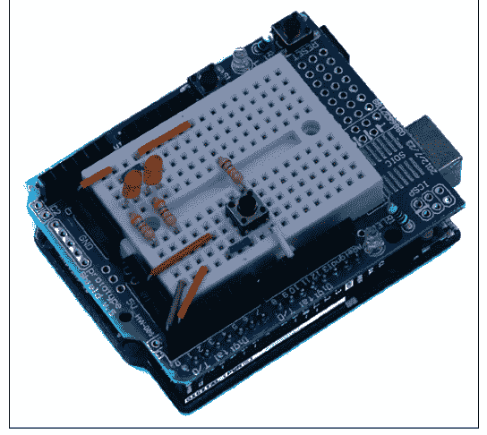

### 项目45：按钮控制的Arduino LED闪烁器

在这个项目中，你将一个带有两个LED和一个按钮的面包板连接到Arduino UNO板上。

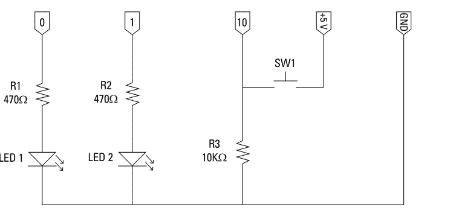
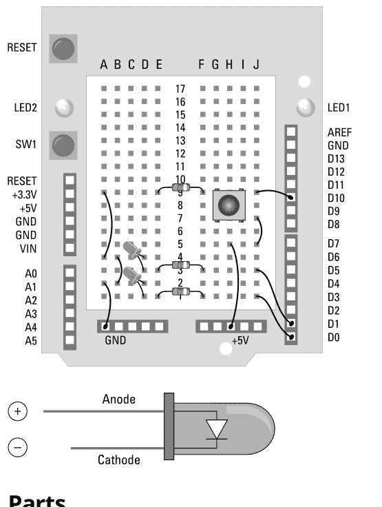


## 零件

- 一台安装了Arduino IDE的计算机
- 一块Arduino UNO板
- 一根A-B USB线
- 一块UNO原型扩展板
- 两个红色LED
- 一个常开DIP面包板按钮开关
- 两个470 Ω电阻（黄-紫-棕）
- 一个10 kΩ电阻
- 八根跳线

## 步骤

1. 插入LED。

| LED | 阳极 | 阴极 |
|---|---|---|
| LED1 | D1 | D2 |
| LED2 | D3 | D4 |

2. 插入电阻。

| 电阻 | 从 | 到 |
|---|---|---|
| R1 (470 Ω) | E1 | F1 |
| R2 (470 Ω) | E3 | F3 |
| R3 (10 kΩ) | E9 | F9 |

3. 插入按钮开关。

引脚应插入G7、I7、G9和F9，使得开关在第7行和第9行之间接通和断开。

4. 连接跳线。

| 从 | 到 |
|---|---|
| GND 排针 | A2 |
| B2 | B4 |
| A4 | A9 |
| +5 V 排针 | H5 |
| J5 | J7 |
| 数字引脚 D0 | J1 |
| 数字引脚 D1 | J3 |
| 数字引脚 D10 | J9 |

5. 将组装好的原型扩展板连接到Arduino UNO。

6. 将UNO连接到计算机。

使用Type-B USB接口。

7. 将闪烁LED程序（见清单3-1）上传到UNO。

LED1将以四分之一秒的间隔闪烁。如果你按下按钮，LED2将开始闪烁。

## 使你的程序随机化

许多计算机控制的应用程序需要一定程度的随机性。一个经典的例子是迪士尼乐园和迪士尼世界中的*印第安纳琼斯*游乐项目。每次你乘坐这个项目，冒险经历都会略有不同。开始时，你的车辆可以选择通过三扇门；你乘坐时选择哪扇门是随机的。项目的许多其他细节也是随机变化的，以使每次乘坐的冒险体验略有不同。

你可以通过使用 `random` 函数为自己的Arduino程序增加一点随机性。该函数返回一个随机数，其值位于你通过一对参数指定的范围内。

第一个参数表示你希望返回的最小值。有点令人困惑的是，第二个参数比你想要的最大值大1。例如，如果你想要一个在1到10范围内的值，你可以这样调用 `random` 函数：

```cpp
random(1,11);
```

清单3-2展示了一个示例程序，它点亮LED1（引脚0），直到引脚10上的按钮被按下。然后它关闭LED1，并随机闪烁LED2（引脚1）若干次（在1到10次之间）。然后它切换回LED1。该程序适用于你为项目45构建的电路。

## 清单3-2：随机程序

```cpp
// Random Program
// Doug Lowe
// December 3, 2021
//
// This program turns on the LED at pin 0. When the user
// presses the button at pin 10, the LED at pin 0 is
// turned off and the LED at pin 1 is flashed a
// random number of times (between 1 and 10).
// Then the LED at pin 0 is turned on again.

void setup() {
  pinMode(0, OUTPUT);
  pinMode(1, OUTPUT);
  digitalWrite(0, HIGH);
  digitalWrite(1, LOW);
}

void loop() {
  if (digitalRead(10) == 1)
  {
    digitalWrite(0, LOW);
    int rnd = random(1, 11);
    for (int i = 1; i < rnd; i++)
    {
      digitalWrite(1, HIGH);
      delay(250);
      digitalWrite(1, LOW);
      delay(250);
    }
    digitalWrite(0, HIGH);
  }
}
```

在该程序中，每次你按下按钮，引脚1上的LED点亮的时间长度都不同，在1到5秒之间。

事实证明，`random` 函数并非真正那么随机。`random` 函数应用复杂的数学计算来创建一个看似随机的数字序列。然而，这些数字实际上并非随机。这是因为当你启动程序时，随机数生成器使用默认的起始值进行播种，`random` 函数将生成相同的数字序列。

因此，清单3-2中的程序总是生成相同的随机延迟序列。特别是，前十次按钮按下的序列总是如下：

- **第一次按下：** 闪烁7次
- **第二次按下：** 闪烁9次
- **第三次按下：** 闪烁3次
- **第四次按下：** 闪烁8次
- **第五次按下：** 闪烁2次
- **第六次按下：** 闪烁4次
- **第七次按下：** 闪烁8次
- **第八次按下：** 闪烁3次
- **第九次按下：** 闪烁9次
- **第十次按下：** 闪烁5次

这个序列看起来相当随机，但每次你重置程序并重新开始时，序列将是完全相同的。

你可以通过调用 `randomSeed` 函数来为 `random` 函数提供种子值，从而解决这个缺乏真正随机性的问题。种子值提供了 `random` 函数生成的随机数序列中的一个起点。如果你每次程序运行时使用不同的种子值，那么每次都会得到不同的随机序列。

那么，如何使用不同的种子值呢？你可以通过使用 `millis` 函数轻松实现，该函数返回程序运行的毫秒数。如果你在用户按下按钮时调用 `millis` 函数，并将其返回值用于种子化随机数计算，你将获得一个真正随机的结果。

清单3-3展示了一个改进版的随机程序，它使用这种技术来创建真正的随机延迟。事实证明，只需要一行额外的代码就能正确随机化延迟：

```cpp
randomSeed(millis());
```

这行代码在每次按钮按下时重新播种随机数生成器。因此，生成了真正的随机值。

## 清单3-3：随机程序的改进版本

```cpp
// Improved Random Program
// Doug Lowe
// December 3, 2021
//
// This program turns on the LED at pin 0. When the user
// presses the button at pin 10, the LED at pin 0 is
// turned off and the LED at pin 1 is flashed a
// random number of times (between 1 and 10).
// Then the LED at pin 0 is turned on again.
// The random seed is reset each time the
// button is pressed.
```

```cpp
void setup() {
  pinMode(0, OUTPUT);
  pinMode(1, OUTPUT);
  digitalWrite(0, HIGH);
  digitalWrite(1, LOW);
}

void loop() {
  if (digitalRead(10) == 1)
  {
    randomSeed(millis());
    digitalWrite(0, LOW);
    int rnd = random(1, 11);
    for (int i = 1; i < rnd; i++)
    {
      digitalWrite(1, HIGH);
      delay(250);
      digitalWrite(1, LOW);
      delay(250);
    }
    digitalWrite(0, HIGH);
  }
}
```

## 从电位器读取数值

如你所知，电位器（通常称为 pot）本质上是一个带旋钮的可变电阻器，通过旋转旋钮可以改变电阻值。各种类型的电位器常被用作 Arduino 项目的输入设备。例如，你可以使用一个简单的电位器来控制一对闪烁 LED 的速度：当你旋转电位器的旋钮时，LED 的闪烁速率会发生变化。

Arduino 可以使用其六个模拟输入端口中的任何一个直接读取电位器的值。在 Uno 板上，这些端口位于与数字端口相对一侧的六针接头上。每个端口都将 0V 与参考电压之间的电压级别转换为 0 到 1023 之间的整数。虽然你可以为模拟端口更改参考电压，但我们将使用标准的 +5V 参考电压。

图 3-3 展示了将电位器连接到 Arduino 是多么简单。此处，电位器的两个外侧端子分别连接到地和 +5V，中间端子则连接到模拟输入端口。

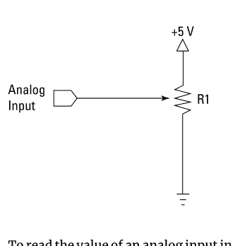

要在 Arduino 程序中读取模拟输入的值，你需要使用 `analogRead` 函数。此函数接受要读取的端口号作为参数，并返回一个 0 到 1023 之间的数字，表示相对于 +5V 参考电压的输入电压。因此，如果电压为 2.5V，`analogRead` 函数将返回 511。

清单 3-4 展示了一个简单的程序，它使连接到引脚 0 和 1 的 LED 交替闪烁。LED 的闪烁速率由模拟引脚 0 上的电位器设定。如你所见，该程序只是简单地使用 `analogRead` 函数返回的值作为闪烁之间的延迟。因此，当用户旋转电位器旋钮时，闪烁速率会在 0 到稍多于一秒之间变化。

### 清单 3-4：使用电位器的 LED 闪烁程序

```cpp
// Variable Rate Flasher
// Doug Lowe
// December 3, 2011
//
// This program flashes a pair of LEDs on pins 0 and 1
// at a rate set by a potentiometer on analog input pin
// 0.

int Rate;

void setup() {
  pinMode(4, OUTPUT);
  pinMode(6, OUTPUT);
}

void loop() {
  Rate = analogRead(0);
  digitalWrite(4, LOW);
  digitalWrite(6, HIGH);
  delay(Rate);
  digitalWrite(6, LOW);
  digitalWrite(4, HIGH);
  delay(Rate);
}
```

项目 46 展示了如何构建一个包含 10 MΩ 电位器的电路，以便你可以测试清单 3-4 中的代码。图 3-4 展示了完成后的电路。

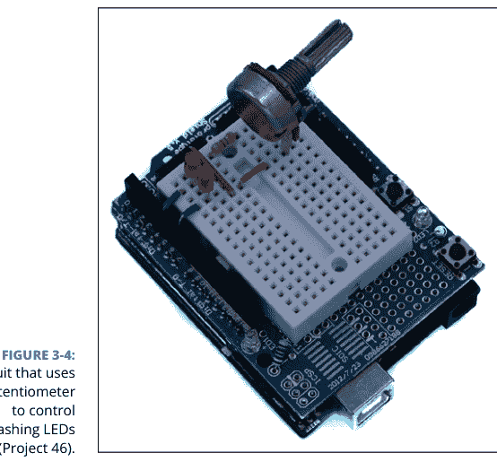

## 项目 46：可变速率 LED 闪烁器

在本项目中，你将一个带有两个闪烁 LED 和一个控制 LED 闪烁速率的电位器的面包板连接起来。

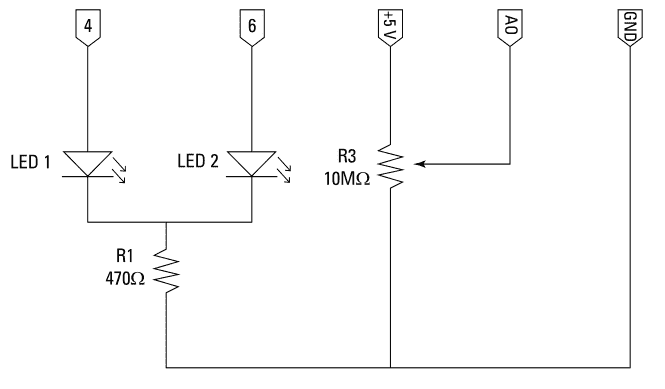

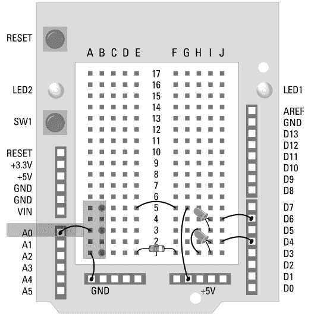

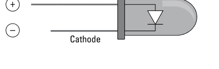

### 所需零件

-   一台安装了 Arduino IDE 的电脑
-   一块 Arduino UNO 开发板
-   一根 A-B USB 数据线
-   一块 UNO 原型扩展板
-   两个红色 LED
-   一个 470 Ω 电阻（黄-紫-棕）
-   一个 10 MΩ 电位器
-   七根跳线

## 步骤

1.  插入 LED。

| LED | 阳极 | 阴极 |
|---|---|---|
| LED1 | I2 | I1 |
| LED2 | I4 | I3 |

2.  插入电阻。

| 电阻 | 起始 | 终止 |
|---|---|---|
| R1 (470 Ω) | E1 | F1 |

3.  连接跳线。

| 起始 | 终止 |
|---|---|
| GND 接口 | A1 |
| 模拟引脚 A0 | A3 |
| E5 | F5 |
| +5 V 接口 | G5 |
| H1 | H3 |
| 数字引脚 D6 | J4 |
| 数字引脚 D4 | J2 |

4.  插入电位器。
    引脚应插入 B1、B3 和 B5。
5.  将组装好的原型扩展板连接到 Arduino UNO。
6.  将 UNO 连接到电脑。
    使用 B 型 USB 接口。
7.  将“可变速率闪烁器”（参见清单 3-4）代码上传到 UNO。
    LED 将以由电位器确定的速率交替闪烁。
    当你旋转电位器上的旋钮时，闪烁速率将增加或减少。

**本章内容**

-   将超声波测距仪连接到 Arduino
-   在 LCD 设备上显示信息
-   使用新的 Arduino 命令来操控测距仪和 LCD
-   构建一个简单的接近传感器

## 第 4 章
Arduino 接近传感器

在本章中，你将学习如何使用两种可以轻松连接到 Arduino 的新设备。第一种是超声波测距仪，它使用短促的超声波脉冲来确定到附近物体的距离。第二种是液晶显示屏（LCD）设备，它允许你显示来自 Arduino 的可读输出。

然后，你将构建一个同时使用这两种设备的项目，以显示 Arduino 与附近物体之间的距离。祝你玩得开心！

## 使用超声波测距仪

*超声波测距仪*是一种通过将超声波从物体上反射回来来确定到附近物体距离的设备。简而言之，测距仪发射一束短促的超声波（即人类听不到的频率范围内的声音），然后聆听从物体反射回来的声音。从初始发射到检测到反射所经过的时间量可用于确定物体距离检测器有多远。

## 认识 HC-SR04 测距仪

图 4-1 展示了一种常用的超声波测距仪，名为 HC-SR04。你可以从包括亚马逊和新蛋网（www.newegg.com）在内的多家在线零售商处以仅几美元的价格在线购买此测距仪。

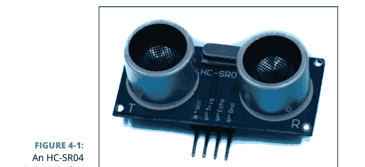

HC-SR04 建立在一块小电路板上（约 2 英寸长，3/4 英寸高），带有一个可轻松连接到面包板的四针连接器。HC-SR04 包括一个可以产生超声波的发射器、一个可以监听超声波的接收器，以及测量从声脉冲发射到接收到声回波所经过时间的电路。

表 4-1 定义了 HC-SR04 上的四个引脚。

#### 表 4-1：HC-SR04 超声波测距仪的引脚定义

| 引脚 | 名称 | 功能 |
| --- | --- | --- |
| 1 | VCC | +5V 电源 |
| 2 | TRIG | 触发生成一个超声波脉冲，以测量到附近物体的距离 |
| 3 | ECHO | 在触发脉冲后，生成一个回波脉冲，其持续时间代表到物体的距离 |
| 4 | GND | 地 |

要将 HC-SR04 连接到 Arduino，首先将引脚 1 和 4 分别连接到电源和地。然后，将引脚 2 和 3 连接到 Arduino 的任意数字 I/O 引脚。

将 HC-SR04 连接到 Arduino 后，你可以通过向 TRIG 引脚发送一个短促的高电平脉冲来启动测距。这会导致 HC-SR04 通过其发射器发出一个短促的超声波脉冲，然后通过其接收器监听回波。当接收到回波后，HC-SR04 会通过其 ECHO 引脚发送一个脉冲。此脉冲的持续时间与接收到超声波回波所花费的时间量相同。

然后，你可以使用 ECHO 脚的持续时间来确定反射超声波脉冲的物体的距离。你需要做一点数学计算，但不会太复杂。

在接下来的几节中，我将向你展示如何为 HC-SR04 生成触发脉冲、如何读取回波脉冲的长度，以及如何根据回波脉冲长度计算到物体的距离。

## 生成触发脉冲

HC-SR04 需要在其 TRIG 引脚上有一个短脉冲来启动测距过程。此脉冲必须至少为 10 微秒，但通常为 100 微秒。

要在 Arduino 数字 I/O 引脚上生成脉冲，你只需将输出引脚设置为高电平，延迟所需的脉冲长度，然后将该引脚设置为低电平。不幸的是，`delay` 函数（参见本迷你书的第 1 章）以毫秒（千分之一秒）为单位工作，而不是以微秒（百万分之一秒）为单位。你需要使用 `delayMicroseconds` 函数来创建短于 1 毫秒的延迟。

这是一段在引脚 9 上生成 100 微秒脉冲的完整代码：

```cpp
digitalWrite(9, LOW);
delayMicroseconds(20);
digitalWrite(9, HIGH);
delayMicroseconds(100);
digitalWrite(9, LOW);
```

这段代码首先将输出引脚设置为低电平并等待 20 微秒。此操作使脉冲有一个干净的开始。然后引脚 9 被设置为高电平 100 微秒，之后再恢复为低电平。

假设引脚 9 连接到 HC-SR04 的 TRIG 引脚，此代码将启动测距。

## 读取脉冲输入

Arduino编程库包含一个名为`pulseIn`的函数，它读取数字输入引脚上的输入脉冲，并将脉冲持续时间作为整数返回。`pulseIn`函数接受两个参数。第一个参数指示要读取的引脚（该引脚必须预先配置为输入引脚）。第二个参数指示您是要监听高电平（HIGH）脉冲还是低电平（LOW）脉冲。

一个可选的第三个参数指定超时值；如果在超时值耗尽前未接收到脉冲，`pulseIn`函数将返回0。

`pulseIn`函数会等待脉冲开始，然后开始计算微秒数，直到脉冲结束。然后它返回计算出的脉冲长度。

以下是一个使用示例，假设引脚9连接到TRIG引脚，引脚8连接到ECHO引脚：

```
int duration;
pinMode(8, INPUT);    // ECHO pin
pinMode(9, OUTPUT);   // TRIG pin

// Trigger the HC-SR04
digitalWrite(9, LOW);
delayMicroseconds(20);
digitalWrite(9, HIGH);
delayMicroseconds(100);
digitalWrite(9, LOW);

// Read the ECHO pulse
duration = pulseIn(8, HIGH)
```

前面的代码首先设置TRIG和ECHO引脚的I/O模式。然后向TRIG引脚发送一个100微秒的触发脉冲，接着读取ECHO引脚上的回波脉冲。当此代码完成时，`duration`变量将包含以微秒为单位的回波脉冲长度。

## 进行计算

当您从HC-SR04获得回波脉冲长度后，可以使用该结果计算反射测距仪超声波的物体距离。

您首先需要决定要使用什么测量单位。在本章中，我们以厘米为单位测量距离。您也可以使用英寸和英尺，但如果使用厘米，计算会简单得多。

要将回波脉冲持续时间转换为以厘米为单位的距离，您需要知道一个关键事实：声音的传播速度约为每秒340米。这是假设声音在环境温度为68°F的普通空气中传播，但对于我们的目的而言，温度较高或较低造成的差异并不显著。

一米等于100厘米，因此声音每秒传播约34,000厘米。脉冲长度以微秒（百万分之一秒）为单位，因此将34,000除以1,000,000得到0.034。所以，回波脉冲的每一微秒表示声音传播了0.034厘米。如果将脉冲长度乘以0.034，结果表示声音传播的距离。

但请记住，声音从脉冲发射器传播到附近的物体，然后回波传播回脉冲检测器。因此，测距仪与接收到其回波的物体之间的实际距离是脉冲长度指示距离的一半。您不是将脉冲长度乘以0.034，而是乘以该值的一半——0.017——来确定最近物体距离测距仪有多远。

因此，在将脉冲持续时间读入pulseLength变量后，计算如下所示：

```
distance = pulseLength * 0.017;
```

前面的语句将以厘米为单位将到物体的距离保存到distance变量中。

在将所有这些组合成一个程序之前，我希望您关注本章测距仪项目的第二个主要组件，即您将用于显示测距仪检测到的距离的LCD。

## 使用LCD

Arduino项目有多种不同类型的显示设备可用。图4-2展示了其中最常见的一种：一个小型液晶显示器（LCD），可以显示两行16个字符，由一种流行的LCD控制器——日立HD44780控制。您可以从亚马逊或新蛋（www.newegg.com）等在线零售商处以几美元的价格购买这种显示器。

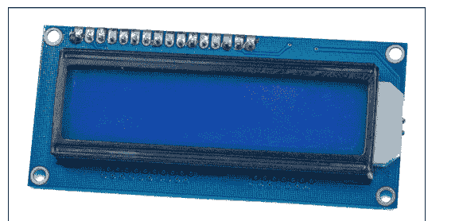

在本节中，我将向您展示如何将这种LCD连接到Arduino板，以及如何在您的Arduino程序中使用LCD。

## 将LCD连接到Arduino

HD44780型LCD包含一个16针连接器，可以直接插入面包板。表4-2列出了LCD接口中每个16针的名称和功能。

LCD模块可以在两种基本模式下工作：

- **8位模式：** 在8位模式下，所有八个数据位引脚都用于向LCD发送单个字节的数据。此模式高效且易于使用，但它要求您将所有八个数据引脚连接到Arduino的数字I/O引脚，只留下少数引脚用于其他目的。
- **4位模式：** 在4位模式下，仅使用四个数据位引脚（引脚11至14）来发送每个字节。由于每个数据字节需要八位，因此需要两次读取四个数据位才能发送一个完整的字节。这使编程复杂化，但减少了必须使用的Arduino引脚数量。（请注意，在4位模式下，使用的是最后四个数据位，而不是前四个数据位。因此，在4位模式下，使用的是数据位4至7。）

幸运的是，使用LCD的4位模式的复杂性不是您的问题。Arduino附带一个特殊的函数库，可以处理所有这些复杂性。因此，您几乎总是以4位模式使用LCD。

除了四个数据位外，还必须将两个额外的引脚连接到Arduino数字I/O引脚：RS引脚（引脚4）和CLOCK引脚（引脚6）。同样，LCD编程库负责正确使用这些引脚在LCD上显示数据的所有细节，因此您无需担心这些引脚如何工作的细节。

### 表4-2 HD44780型LCD的引脚定义

| 引脚 | 名称 | 功能 |
|---|---|---|
| 1 | GND | 接地。 |
| 2 | VSS | +5V电源。 |
| 3 | VO | 控制显示器的对比度。通常连接到电位器的中心抽头。 |
| 4 | RS | 用于指示是向设备发送数据还是命令。 |
| 5 | RW | 读/写，几乎总是连接到地。 |
| 6 | CLOCK | 也称为使能（Enable）或简称E。用于触发读取数据引脚。 |
| 7 | D0 | 数据位0。（在四位模式下不使用。） |
| 8 | D1 | 数据位1。（在四位模式下不使用。） |
| 9 | D2 | 数据位2。（在四位模式下不使用。） |
| 10 | D3 | 数据位3。（在四位模式下不使用。） |
| 11 | D4 | 数据位4。 |
| 12 | D5 | 数据位5。 |
| 13 | D6 | 数据位6。 |
| 14 | D7 | 数据位7。 |
| 15 | LED+ | 背光+5V。 |
| 16 | LED- | 背光接地。 |

引脚1和2必须分别连接到地和+5V，以提供LCD的基本电源，引脚15和16通常也分别连接到电源和地，以点亮背光，使LCD更易于阅读。

引脚3也常用于调节显示器的对比度。您通常会将此引脚连接到电位器的中心抽头（通常1MΩ左右是合适的），电位器的外侧抽头连接到+5V和地。

## 编程LCD

Arduino提供了一整套专门用于直接与HD44780 LCD配合工作的函数库。表4-3列出了此库中可用的一些函数。（完整列表请访问www.arduino.cc/en/Reference/LiquidCrystal）。

### 表4-3 LiquidCrystal库函数

| 函数 | 功能 |
|----------|----------|
| LiquidCrystal() | 创建一个LiquidCrystal类型的变量，然后您可以使用该变量调用其他函数。传递给此函数的参数指定用于各种LCD功能的Arduino引脚。 |
| begin() | 在向LCD写入任何信息之前，必须调用此函数来初始化LCD。参数指示LCD可以显示多少列和多少行字符。 |
| clear() | 清除LCD。 |
| home() | 将光标移动到显示器的左上角。 |
| setCursor() | 将光标移动到特定的行和列位置。 |
| print() | 在LCD上显示文本。 |

为了使用表4-3中列出的任何函数，您的程序必须包含以下语句：

```
#include <LiquidCrystal.h>
```

此语句是必需的，以使LiquidCrystal库的函数对您的程序可用。

接下来，您的程序应创建一个LiquidCrystal类型的变量。创建库类型的变量类似于创建内置类型（如int或float）的变量，不同之处在于您可以在变量声明中提供参数。对于LiquidCrystal数据类型，您总共提供六个参数，代表将用于RS、ENABLE、D4、D5、D6和D7引脚的数字I/O引脚。例如：

```
LiquidCrystal lcd(6, 7, 9, 10, 11, 12);
```

在此示例中，变量将命名为lcd；Arduino引脚6和7将用于RS和ENABLE；引脚9、10、11和12将用于数据输入。

在将数字I/O引脚分配给LCD后，您无需在程序中直接访问这些引脚。相反，其他LiquidCrystal库函数将使用这些引脚来控制LCD。

创建了lcd变量后，下一步是使用begin函数对其进行初始化，如下所示：

```
lcd.begin(16, 2);
```

以下是翻译后的中文文本：


此处，LCD被初始化为显示两行各16个字符。

然后，您可以向LCD打印数据，例如：

```
lcd.print("Hello, World!");
```

这将在LCD上显示文本“Hello, World!”。

在某些情况下，您可能需要精确控制文本的显示位置。为此，可以使用`setCursor`函数，后跟一个`print`函数。例如，如果想在第二行的第5列开始显示文本“Hello, World!”，请使用以下代码：

```
lcd.setCursor(4, 1);
lcd.print("Hello, World!");
```

请注意，行和列的编号均从0开始，而不是从1开始。因此，第5列是第4列，第二行是第1行。

最后，您可能需要擦除LCD的全部内容。为此，请使用`clear`函数：

```
lcd.clear();
```

这将擦除整个LCD屏幕。

既然我已经详细解释了将LCD连接到Arduino板并从程序（sketch）控制它的方法，现在让我们来看一个项目：将测距仪与LCD板结合使用，以显示附近物体的距离，并在物体过近时点亮LED。

## 构建接近传感器

在本节中，您将构建一个简单的接近传感器，它使用HC-SR04超声波测距仪和HD44780兼容的LCD。超声波测距仪用于追踪附近物体的距离；该距离显示在LCD上。如果物体距离小于10厘米，LED将点亮以指示物体靠近。

图4-3显示了组装好的项目。构建项目的详细信息（包括原理图）见项目47，运行项目的完整程序见清单4-1。祝您玩得开心！

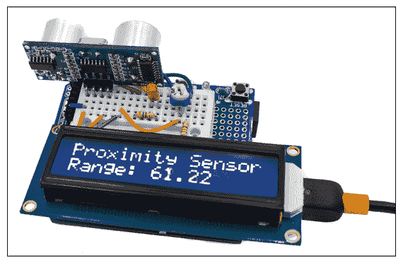

图 4-3：组装好的Arduino接近传感器（项目47）。

## 项目 47：Arduino接近传感器

在此项目中，您将构建一个接近传感器，它在LCD面板上显示附近物体的距离，并在物体距离小于10厘米时闪烁一个LED。

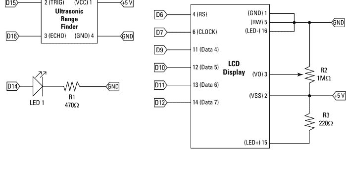

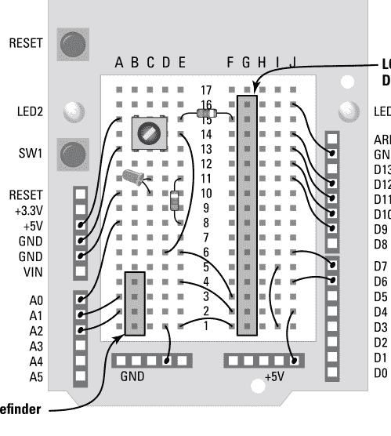

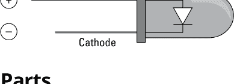

## 部件

- 一台安装了Arduino IDE的电脑
- 一个Arduino UNO板
- 一根A-B型USB线
- 一个UNO原型板扩展板
- 一个红色LED
- 一个HC-SR04型超声波测距仪
- 一个HD44780兼容的16 x 2 LCD
- 一个470 Ω电阻（黄-紫-棕）
- 一个1 MΩ微调电位器
- 20根跳线

## 步骤

1.  插入LED。阳极（长引脚）插入C11，阴极（短引脚）插入C10。

2.  插入电阻。电阻引脚插入E8和E11。

3.  插入跳线。

| 从 | 到 |
|---|---|
| 左侧排针的+5V | A15 |
| 左侧排针的第1个GND | A13 |
| 左侧排针的第2个GND | A10 |
| 左侧排针的模拟A0 | A8 |
| 左侧排针的模拟A1 | A3 |
| 左侧排针的模拟A2 | A2 |
| 底部排针的GND | D1 |
| D6 | E14 |
| E6 | F3 |
| E4 | F2 |
| E1 | F1 |
| I1 | I5 |
| 底部排针的+5 V | J2 |
| 右侧排针的数字引脚6 | J4 |
| 右侧排针的数字引脚7 | J6 |
| 右侧排针的数字引脚9 | J11 |
| 右侧排针的数字引脚10 | J12 |
| 右侧排针的数字引脚11 | J13 |
| 右侧排针的数字引脚12 | J14 |
| 右侧排针的GND | J16 |

4.  插入微调电位器。微调电位器有三个引脚：一侧有两个引脚，另一侧的对面有一个引脚。位于同一侧的两个引脚应插入B13和B15。对面的单个引脚将插入D14。

5.  将原型板扩展板连接到UNO上。

6.  插入LCD。调整LCD方向，使引脚1插入G1，引脚16插入G16。LCD将延伸到迷你面包板的H、I、J列的顶部上方，并超过原型板的右侧。

7.  插入超声波测距仪。调整测距仪方向，使引脚1（Vcc）插入B4，引脚4（Gnd）插入B1。测距仪的发射器和接收器应朝向左侧，远离面包板。

8.  将UNO连接到电脑。使用B型USB连接器。

9.  将接近传感器程序（见清单4-1）上传到UNO。LCD将显示最近物体的距离。如有必要，请调整微调电位器以便读取显示。当距离小于10厘米时，LED将亮起。

## 清单 4-1：接近传感器（项目47）

```
// Proximity Sensor
// Doug Lowe
// December 3, 2021

// This program uses an HC-SR04 Ultrasonic Range
// Detector and an HD44780-compatible LCD to detect and
// display proximity of nearby objects. The distance to
// the object is displayed on the LCD, and the cycle repeats
// every 50 milliseconds. If the object is closer than 10 cm, the
// LED comes on.

#include <LiquidCrystal.h>

// Arduino Digital Pin Constants

int US_Trig = 15;    // Ultrasonic Trigger
int US_Echo = 16;    // Ultrasonic Echo
int LED = 14;            // LED
int LCD_Reset = 6;       // LCD Reset
int LCD_Enable = 7;      // LCD Enable/Clock
int LCD_D4 = 9;          // LCD Data Pin 4
int LCD_D5 = 10;         // LCD Data Pin 5
int LCD_D6 = 11;         // LCD Data Pin 6
int LCD_D7 = 12;         // LCD Data Pin 7

// Create the LCD and assign the interface pins
LiquidCrystal lcd(LCD_Reset, LCD_Enable, LCD_D4, LCD_D5, LCD_D6,
  LCD_D7);

int close = 10;          // The distance that triggers the LED

void setup() {

  // Initialize the LCD and display the headings
  lcd.begin(16, 2);
  lcd.print("Proximity Sensor");
  lcd.setCursor(0, 1);
  lcd.print("Range: ");

  // Set the pin modes
  pinMode(US_Trig,OUTPUT);  // Trigger pin
  pinMode(US_Echo, INPUT);  // Echo pin
  pinMode(LED, OUTPUT); // LED pin

}

void loop() {

  float distance;
  int pulseLength;

  // Send the trigger pulse to start the echo ranging
  digitalWrite(US_Trig, LOW);
  delayMicroseconds(20);
  digitalWrite(US_Trig, HIGH);
  delayMicroseconds(100);
  digitalWrite(US_Trig, LOW);

  // Get the echo pulse and calculate the distance
  pulseLength = pulseIn(US_Echo, HIGH);
  distance=pulseLength * 0.017;

  // Show the distance and erase the rest of the line
  lcd.setCursor(7,1);
  lcd.print(distance);
  lcd.print("    ");

  // Turn on the LED if the object is close
  if (distance < close)
  {
    digitalWrite(LED, HIGH);
  }
  else
  {
    digitalWrite(LED, LOW);
  }

  delay(50);

}
```

- 本章内容
* 使用扬声器发声
* 使用TONE命令产生频率
* 使用MP3扩展板播放音效和音乐
* 使用舵机实现运动

# 第五章
为您的Arduino项目添加声音和运动

在本章中，您将学习如何使用为Arduino项目添加声音和运动的设备。要创建声音，您可以添加扬声器以产生可听的输出音调。这在Arduino程序可能需要引起某人注意或您想创建音效的情况下非常有用。为了获得更逼真的音效和音乐，您可以在Arduino上添加一个扩展板来播放存储在micro-SD卡上的MP3文件。要创建运动，您可以添加一个非常有用的设备，称为舵机，它允许您用Arduino程序控制机械运动。

## 将扬声器与Arduino一起使用

为Arduino项目添加声音的一种经济简便的方法是简单地将一个8 Ω小扬声器连接到数字输出引脚。然后，您可以快速地将引脚在HIGH和LOW之间交替，从而在引脚上产生方波信号，扬声器会将其渲染为声音。此方波的频率将决定声音的音高。

作为扬声器的替代品，您可以使用压电蜂鸣器，有时也称为压电式蜂鸣器。压电蜂鸣器类似于扬声器，但无法播放语音或音乐等复杂波形。当直接连接到数字输出引脚时，压电蜂鸣器和小扬声器基本上可以互换使用。图5–1显示了一个小扬声器（右侧）和一个压电蜂鸣器（左侧）。这两种设备中的任何一种都适用于即将介绍的项目（项目48）。

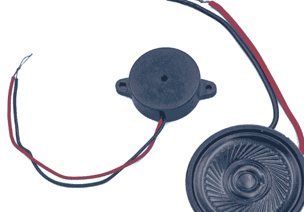

图 5-1：Arduino活动套件中附带的压电扬声器。

请注意，扬声器是有极性的，因此当您将其连接到I/O引脚时，请务必将+端子连接到I/O引脚，将另一端子连接到Vss（地），如图5–2中的原理图所示。

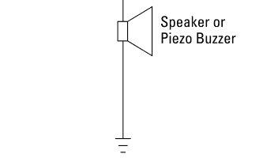

图 5-2：将扬声器或蜂鸣器连接到Arduino数字输出引脚。

## 使用音调功能

为扬声器编程非常简单。Arduino C 语言包含一个名为 `tone` 的命令，它可以将你选择的频率发送到输出引脚。因此，你可以通过 `tone` 命令在扬声器上产生可听见的音调，语法如下：

```
tone(pin, frequency, duration)
```

该语法的工作方式如下：

- `pin` 是你要将频率发送到的引脚编号。
- `frequency` 是你想要产生的频率，单位为赫兹（Hz）。
- `duration` 是你希望频率播放的时间长度，单位为毫秒。请注意，如果你省略 `duration`，音调将无限播放，直到你调用 `noTone` 函数来停止它（稍后会详细介绍）。

例如，以下命令在 8 号引脚上产生 2000 赫兹的频率，持续五秒钟：

```
tone(8, 2000, 5000);
```

请注意，`tone` 函数会立即返回；它不会等待音调播放完成。因此，你的程序可以在音调播放时执行其他工作。

你可以通过交替向扬声器发送短促的频率信号和短暂的暂停，轻松创建蜂鸣声。例如，以下是一个你可以调用的函数，它可以在指定的数字输出引脚上使扬声器蜂鸣指定次数：

```
void beep(int pin, int count)
{
  for(int i=0; i < count; i++)
  {
    tone(8, 1000, 250);
    delay(500);
  }
}
```

要向数字引脚 8 发送三次蜂鸣声，可以这样调用该函数：

```
beep(8, 3);
```

在 `beep` 函数中，`for` 循环负责计算蜂鸣次数。在 `for` 循环的每次迭代中，音调持续 250 毫秒。500 毫秒的延迟包含了音调播放的 250 毫秒以及另外 250 毫秒的静音时间。结果就是一段清晰的“嘟-嘟-嘟”声。

前面提到过，调用 `tone` 函数时可以省略 `duration` 参数。如果你这样做，音调将持续播放，直到你调用 `noTone` 函数使其静音。这是一个省略了 `duration` 参数的 `beep` 函数版本：

```
void beep(int pin, int count)
{
  for(int i=0; i < count; i++)
  {
    tone(8, 1000);
    delay(250);
    noTone(8);
    delay(250);
  }
}
```

在 `for` 循环中，一个 1000 赫兹的音调在 8 号引脚上开始播放。然后，程序延迟 250 毫秒，音调停止。接着程序再次延迟 250 毫秒。结果就是一段“嘟”声响四分之一秒，然后静音四分之一秒的蜂鸣声。

## 将扬声器连接到 Arduino

正如我之前提到的，以及图 5-2 所示的电路图所示，扬声器或压电蜂鸣器通过一个 GND 引脚和一个数字输出引脚连接到 Arduino。从概念上讲，这很容易。但在实践中，它稍微复杂一些，因为扬声器和压电蜂鸣器的引线通常由多股线而非单股线制成。这使得引线更难插入 Arduino 的排针或无焊面包板的孔中。

以下是一些解决此挑战的方法：

- 剥去大约 ⅝ 英寸（约 1.6 厘米）的绝缘层，然后将各根导线干净地拧在一起。接着小心地将拧紧的末端插入相应的 Arduino 排针或面包板孔中。这种方法只有在导线被干净、紧密地拧在一起时才有效。
- 在拧紧导线之前，分离出大约三分之一的导线并剪掉。然后仔细而干净地拧紧剩余的导线。当你得到一个干净的拧接点后，涂上少量焊锡将导线固定在一起。这需要一点焊接技巧，因为焊接后的线头必须光滑才能顺利插入排针或面包板孔中。（这是我为本章中的项目使用的方法。）
- 将一个排针焊接到扬声器或蜂鸣器引线的末端。你可以购买包含排针零件和压线工具的套件来制作排针。
- 使用双端螺丝接线端子块。你可以将接线端子块卡入面包板，然后使用螺丝端子连接多股扬声器线。
- 使用 Arduino *螺丝接线端子扩展板*，如图 5-3 所示。这些扩展板为 UNO 上的每个排针都提供了一个螺丝接线端子。只需将扩展板连接到你的 Arduino UNO，然后将多股扬声器引线连接到相应的螺丝端子即可。

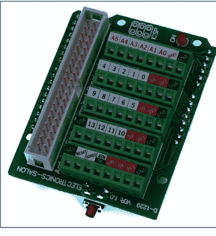

**图 5-3：** 螺丝接线端子扩展板，可以轻松地将多股导线连接到 Arduino 排针。

在下一节中，你将直接把扬声器连接到 Arduino UNO，以便测试产生音调的各种方法。图 5–4 展示了组装好的项目。

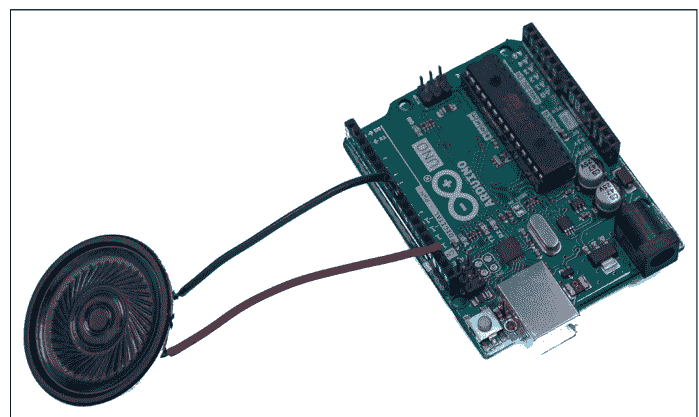

**图 5-4：** 连接到 Arduino 的扬声器（项目 48）。

## 项目 48：使用扬声器创建声音

在这个项目中，你将把一个扬声器连接到 Arduino UNO，以运行产生声音的程序。该项目非常简单，因为除了 UNO 之外，唯一的组件就是一个扬声器。

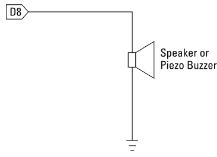

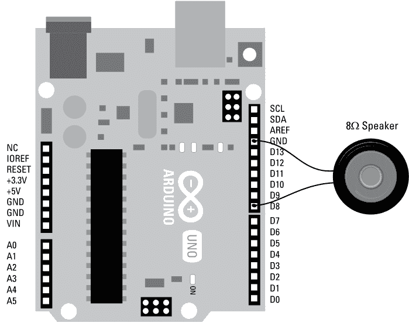

## 所需部件

- 一台安装了 Arduino IDE 软件的计算机
- 一个 Arduino UNO
- 一根 USB Type-B 线缆，用于将 UNO 连接到你的计算机。
- 一个 8 Ω 扬声器（或者，你也可以使用一个压电蜂鸣器）

## 步骤

**1. 准备扬声器引线。**
剥去大约 ¾ 英寸（约 1.9 厘米）的绝缘层。将每根引线中大约三分之一的独立导线分离出来并剪掉。然后小心地将剩余的导线拧在一起。涂上极少量的焊锡将各根导线固定在一起。

**2. 插入扬声器。**
扬声器是不分极性的，因此将一根引线连接到引脚 8，另一根引线连接到 UNO 上三个 GND 引脚中的任意一个。

**3. 打开 Arduino 编辑器。**

**4. 将 Arduino UNO 连接到你的计算机。**

**5. 在 Arduino 编辑器中输入以下程序：**

```
void setup() {
  // 在此处放入你的设置代码，只运行一次：
  pinMode(8, OUTPUT);
}

void loop() {
  // 在此处放入你的主要代码，可重复运行：
  tone(8, 1000);
  delay(250);
  noTone(8);
  delay(250);
}
```

**6. 点击“上传”按钮。**
程序会被编译并上传到 UNO。如果一切正常，你将从扬声器听到稳定的“嘟-嘟-嘟”声。

**7. 现在尝试代码清单 5-1、5-2 和 5-3 中的程序。**
这些程序以不同的方式改变音调，以展示 `tone` 函数的多功能性。

## 用摩尔斯电码报警

代码清单 5-1 是一个 Arduino 程序，它用摩尔斯电码发出熟悉的 SOS 紧急呼叫信号。SOS 的摩尔斯电码是三短声、三长声、三短声。这个程序只是以熟悉的模式播放 1000 赫兹的音调：滴滴滴-嗒嗒嗒-滴滴滴。


摩尔斯电码的正确发音是“dit”代表点，“dah”代表划，所以用摩尔斯电码说“SOS”的正确方式是 dit dit dit dah dah dah dit dit dit。

根据摩尔斯电码的规则，一个划的长度是一个点的三倍，字母之间的间隔是一个点长度的三倍，单词之间的间隔是一个点长度的七倍。然而，对于“SOS”这个特殊代码，字母之间的间隔被省略了。

该程序使用一个名为 `pace` 的变量来确定摩尔斯电码的播放速度。该变量设置为 60，这是一个相当适合阅读摩尔斯电码的速度。（每秒 60 毫秒的速度相当于每分钟 20 个单词。世界纪录是每分钟 75.2 个单词，相当于每秒 16 毫秒的速度。只是为了好玩，你可以试试将 `pace` 变量设置为 16。对我来说，结果就是一堆乱码。如果你能分辨出单独的点和划，你的听力比我的好多了！）

该程序使用四个函数来播放摩尔斯电码的四个元素：

- `soundDot`：使用一个 `pace` 单位播放一个点，然后暂停一个 `pace` 单位。
- `soundDash`：使用三个 `pace` 单位播放一个划，然后暂停一个 `pace` 单位。
- `soundLetterGap`：延迟三个 `pace` 单位。（请注意，该程序中未调用此函数，因为 SOS 不需要字母间的间隔。）
- `soundWordGap`：延迟七个 `pace` 单位。

### 代码清单 5-1：SOS！

```
// SOS 程序
// Doug Lowe
// 2021年12月3日

// 此程序通过在连接到引脚 8 的扬声器或压电蜂鸣器上
// 播放摩尔斯电码的 SOS 来发出警报。

int pin = 8;            // 扬声器引脚。

int pace = 60;          // 设置 SOS 的播放速度。
                        // 摩尔斯电码标准规定了
                        // 编码信号每个元素的持续时间：
                        // 点为一个单位。
                        // 划为三个单位。
                        // 点和划之间的间隔为一个单位。
                        // 字母之间的间隔为三个单位。
                        // 然而，对于特定序列 "SOS"，
                        // 字母间隔被省略。
                        // 单词之间的间隔为七个单位。

void setup() {
  pinMode(8, OUTPUT);
}
```

(接下页)

## 代码清单 5-1：（续）

```
void loop() {

    // 声响 SOS
    soundDots(3);
    soundDashes(3);
    soundDots(3);
    soundWordGap();
}

void soundDots(int count) {
    for(int i=0; i < count; i++)
    {
        tone(pin, 1000);
        delay(pace);
        noTone(pin);
        delay(pace);
    }
}

void soundDashes(int count) {
    for(int i=0; i < count; i++)
    {
        tone(pin, 1000);
        delay(pace * 3);
        noTone(pin);
        delay(pace);
    }
}

void soundLetterGap() {
    delay(pace * 3);
}

void soundWordGap() {
    delay(pace * 7);
}
```

## 播放警报器音效

代码清单 5-2 展示了如何在一对 `for` 循环中使用 `tone` 函数，以产生一种持续上升和下降的音调，非常像警车警报器。第一个 `for` 循环将音调从低值变化到高值，第二个 `for` 循环则将音调从高值降回低值。警报器的声音特性由四个变量设定：

- **low**：设定频率范围的低端。此变量设为 300，但你可以将其更改为从更低或更高的频率开始。
- **high**：设定频率范围的高端。此变量设为 1,000，但你可以根据需要更改。
- **increment**：设定每次循环时增加或减少的频率量。增大此值会使警报器速度加快。
- **pace**：设定每个音调播放的时长。增大此值会使警报器变慢。如果将此值增加到足够大（例如，100 或 150），你将能听到独立的音调。

## 代码清单 5-2：生成警报器效果

```cpp
// 警报器程序
// Doug Lowe
// 2021 年 12 月 3 日

// 此程序在连接到引脚 8 的扬声器或压电蜂鸣器上生成警报器声音。

int pin = 8;            // 扬声器引脚。
int low = 300;          // 警报器最低音调的频率。
int high = 1000;        // 警报器最高音调的频率。
int increment = 5;      // 每次通过 for 循环时
                        // 音调增加或减少的量。
int pace = 10;          // 音调变化的速度。
void setup() {
  pinMode(8, OUTPUT);
}

void loop() {
  for (int f = low; f < high; f = f+increment)
  {
    tone(pin, f);
    delay(pace);
  }
  for (int f = high; f > low; f = f-increment)
  {
    tone(pin, f);
    delay(pace);
  }
}
```

## 播放歌曲

代码清单 5-3 展示了一个播放《玛丽有只小羔羊》的程序。

为了简化生成音符的代码，该程序定义了几个常量，表示歌曲所需每个音符的频率。例如，常量 `NoteC4` 为 262，这是钢琴键盘上中央 C 的赫兹频率。这些常量跨越一个完整的八度，这对于《玛丽有只小羔羊》来说已经足够了。

程序还设置了四分音符、二分音符和全音符时长的常量。这些常量使得在 `tone` 命令中为特定音符指定特定音高和时长变得非常容易。

两个函数用于实际播放音乐：

- **playNote**：接受音符的音高和时长作为参数。这里使用了一个小技巧来确保音符之间有区分，即每个音符时长的 10% 用作音符之间的间隔。
- **playRest**：接受一个时长值，并简单地延迟指定的时长。

因此，播放一段旋律只是按正确顺序调用这两个函数来播放正确音高和正确时长音符的一系列操作。正如你所见，我在每个 `playNote` 调用处都添加了注释，这样你就可以看到正在播放歌曲的哪一部分。

## 代码清单 5-3：使用 Arduino 制作音乐

```cpp
// 玛丽有只小羔羊
// Doug Lowe
// 2021 年 12 月 3 日

// 此程序在连接到引脚 8 的扬声器或压电蜂鸣器上
// 播放《玛丽有只小羔羊》。

int pin = 8;            // 扬声器引脚。
int tempo = 100;        // 音调变化的速度。

// C 大调（从中央 C 开始）的音符音高常量
const int Note_C4 = 262;
const int Note_D4 = 294;
const int Note_E4 = 330;
const int Note_F4 = 349;
const int Note_G4 = 392;
const int Note_A4 = 440;
const int Note_B4 = 494;
const int Note_C5 = 523;

// 音符时长常量
const int quarter = 300;
const int half = quarter * 2;
const int whole = quarter * 4;

void setup() {
  pinMode(8, OUTPUT);
}

void loop() {
  playNote(Note_E4, quarter);       // 玛-
  playNote(Note_D4, quarter);       // 丽-
  playNote(Note_C4, quarter);       // 有
  playNote(Note_D4, quarter);       // 只
  playNote(Note_E4, quarter);       // 小-
  playNote(Note_E4, quarter);       // 羔
  playNote(Note_E4, quarter);       // 羊
  playRest(quarter);
  playNote(Note_D4, quarter);       // 小-
  playNote(Note_D4, quarter);       // 羔
  playNote(Note_D4, quarter);       // 羊
  playRest(quarter);
  playNote(Note_E4, quarter);       // 小-
  playNote(Note_G4, quarter);       // 羔
  playNote(Note_G4, quarter);       // 羊
  playRest(quarter);
  playNote(Note_E4, quarter);       // 玛-
  playNote(Note_D4, quarter);       // 丽-
  playNote(Note_C4, quarter);       // 有
  playNote(Note_D4, quarter);       // 只
  playNote(Note_E4, quarter);       // 小-
  playNote(Note_E4, quarter);       // 羔
  playNote(Note_E4, quarter);       // 羊
  playNote(Note_E4, quarter);       // 它
  playNote(Note_D4, quarter);       // 的
  playNote(Note_D4, quarter);       // 羊
  playNote(Note_E4, quarter);       // 毛
  playNote(Note_D4, quarter);       // 白
  playNote(Note_C4, half);          // 如
  playRest(half);
  playRest(whole);
}

void playNote(int pitch, int duration){
    int phrasing = quarter * 0.1;
    tone(pin, pitch);
    delay(duration - phrasing);
    noTone(pin);
    delay(phrasing);
}

void playRest(int duration) {
    delay(duration);
}
```

## 使用 MP3 扩展板

与扬声器或压电蜂鸣器结合使用的 `tone` 函数对于简单的声音来说是足够的，但如果你的项目需要更复杂的声音效果呢？Arduino 无法直接播放常见的 MP3 音频格式的音频文件，但你可以通过为项目添加一个 MP3 扩展板来轻松地为 Arduino 增加这一功能。

市面上有许多 MP3 扩展板——只需在网上搜索“Arduino MP3 shield”，你就能找到很多选择。本章中我使用的是来自 Adafruit (www.adafruit.com) 的一款流行 MP3 扩展板，名为 Music Maker 扩展板（见图 5-5）。

Music Maker 扩展板有两个版本——一个只有线路输出信号电平，可以连接耳机或作为外部放大器的输入；另一个内置 3 瓦立体声放大器，可以连接小型扬声器。我使用的是带内置放大器的版本。你可以直接从 Adafruit 或其他渠道购买，价格大约 35 美元。

Music Maker 扩展板包含以下特性：

- 一个 micro-SD 卡读卡器，你可以插入加载了音频文件的存储卡。
- 一个板载音频解码芯片，可以播放 MP3 文件以及 WAV 和 MIDI 等其他格式。
- 一个标准的 1/8 英寸立体声音频插孔，用于连接耳机或外部放大器。
- 用于连接外部扬声器的螺丝端子。该扩展板可以与 4 Ω 或 8 Ω 扬声器兼容。不要期望输出非常响亮——3 瓦不是大功率放大器，但在不需要很大音量时很适用。
- 一个编程库，使得播放存储在 micro-SD 卡上的音频文件变得容易。
- 七个额外的数字 I/O 引脚，你可以通过 Music Maker 库访问。（要访问这些引脚，你需要将额外的排针焊接到 Music Maker 扩展板上。）

## 图 5-5：Adafruit Music Maker 扩展板。

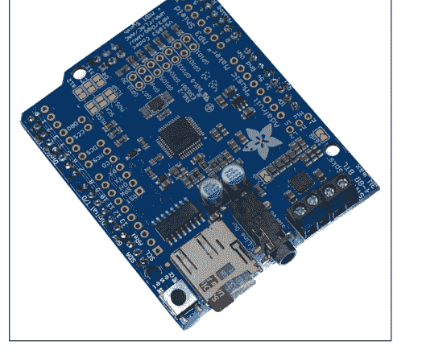

## 组装 Music Maker 扩展板

当你购买 Music Maker 扩展板时，你会发现它需要一点组装：扩展板的主板已完全组装好，但你必须将随附的排针焊接到板上。焊接相当简单，大约只需要 15 分钟。

## 准备 micro-SD 卡

Music Maker 扩展板通过其板载 micro-SD 卡读卡器读取音频文件。在使用 Music Maker 扩展板之前，你需要将至少一个音频文件复制到 micro-SD 卡中。

如果你从未使用过 micro-SD 卡，你会惊讶于它们有多小。大多数配备多格式读卡器的计算机都没有足够小的插槽来容纳 micro-SD 卡。不过，micro-SD 卡通常会附带一个适配器，让你可以在标准 SD 卡读卡器中使用 micro-SD 卡。只需将 micro-SD 卡插入适配器，然后将适配器滑入计算机的 SD 卡读卡器。片刻之后，Windows 就会识别出 micro SD 卡，这样你就可以向其中复制文件了。

关于将音频文件保存到 micro-SD 卡，有一个重要的注意事项需要了解：Music Maker 扩展板无法识别超过八个字符的文件名，并且文件扩展名只能有三个字符长。因此，像 `Puff the Magic Dragon.mp3` 这样的文件名是无法工作的。你需要将名称缩短为类似 `Puff.mp3` 的形式。

你可以在 micro-SD 卡上存放尽可能多的音频文件，只要空间足够。如果你愿意，还可以创建文件夹来组织它们——前提是文件夹名称长度不超过八个字符。

就本章而言，只需将一个 MP3 文件复制到卡上，并将其命名为 `TRACK01.mp3`。这可以是任何你想要的音频文件——你最喜欢的歌曲，或者可能是猫头鹰尖叫或狼人嚎叫的音效文件。只要文件名为 `TRACK01.mp3`，接下来项目中的程序就能够播放该文件。

## 编程 Music Maker 扩展板

Adafruit 为 Music Maker 扩展板提供了一个编程库，使得从你的 Arduino 程序中播放单个音频文件变得简单。在使用此库之前，你必须先下载并将其安装到 Arduino IDE 中。以下是步骤：

1.  **打开 Arduino IDE。**
2.  **选择 工具 > 管理库。** 如图 5-6 所示的对话框将会出现。
3.  **在库管理器顶部的搜索框中输入 Adafruit_VS1053。** 库管理器会在云端定位到此库。
4.  **在“选择版本”下拉列表中选择最新版本。**
5.  **点击“安装”。** 库即安装完成。

你完成了！


图 5-6：库管理器对话框。

安装库之后，你就可以用它来播放加载到扩展板上的 micro-SD 卡中的声音文件了。

Music Maker 扩展板使用四个引脚来播放音频文件：

| 名称 | 功能 | 默认数字引脚 |
| :--- | :--- | :--- |
| MCS | 片选引脚 | D7 |
| DCS | 数据选择引脚 | D6 |
| CCS | 卡片选择引脚 | D4 |
| DREQ | 请求中断引脚 | D3 |

通常没有理由更改这些引脚的默认设置，你也不需要担心这些引脚实际功能的细节。但你需要记住，这些引脚已被 Music Maker 扩展板使用，因此不能在程序中将它们用于其他目的。

在使用 Music Maker 扩展板的 Arduino 程序开头，通常将这些引脚设置定义为常量。例如：

```
#define CS      7       // Select pin (output)
#define DCS     6       // Data/command select pin (output)
#define CARDCS  4       // Card chip select pin
#define DREQ    3       // Data request
```

要播放存储在 micro-SD 卡上的文件，首先需要在你的程序中创建一个媒体播放器对象。这通常在 `setup` 函数之前完成，以便程序中的所有函数都可以使用它。以下是一个示例：

```
Adafruit_VS1053_FilePlayer mediaPlayer =
  Adafruit_VS1053_FilePlayer(
    RESET, CS, DCS, DREQ, CARDCS);
```

不必过于担心这条语句的细节。只需记住，它用于创建一个名为 `mediaPlayer` 的变量，然后你就可以在程序中使用它来播放音频曲目。

在 `setup` 函数中，你必须为媒体播放器和 SD 卡调用 `begin` 函数。如果发生错误，这两个函数都会返回 `false`，因此你也可以使用这些语句来确认 Music Maker 扩展板已安装到 UNO 上，并且卡片已插入 micro-SD 卡读卡器：

```
if (mediaPlayer.begin() == false)
{
  while (true);    // Don't do anything -- Shield is missing
}
if (SD.begin(CARDCS) == false)
{
  while (true);    // Don't do anything -- SD card is missing
}
```

请注意，如果检测到错误，两个 `if` 语句都会执行 `while (true)` 命令。`while (true)` 语句只是无限循环，如果扩展板或卡片缺失，则阻止程序实际执行任何操作。

确认扩展板和 micro-SD 卡都存在后，你可以像这样播放卡上的音频文件：

```
mediaPlayer.playFullFile("TRACK01.mp3");
```

这条语句提供了音频文件的名称。只要卡上有一个名为 `TRACK01.mp3` 的文件，Music Player 扩展板就会播放该文件。

你可能还想使用的另一条语句是 `setVolume`，它用于调整播放的左右声道音量。使用零来设置最大音量：

```
mediaPlayer.setVolume(0, 0);
```

## 构建 Arduino 音乐播放器

在本节中，你将构建一个简单的 Arduino 项目，使用 Music Maker 扩展板播放 MP3 文件。图 5-7 展示了完成后的项目。

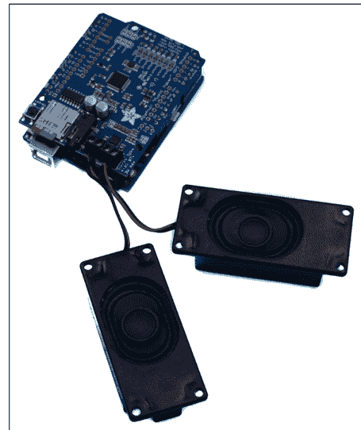

图 5-7：一个 Arduino 音乐播放器（项目 49）。

## 项目 49：使用 Music Maker 扩展板播放声音

本项目使用 Adafruit Music Maker 扩展板，以便你可以为 Arduino 项目添加音效或音乐。

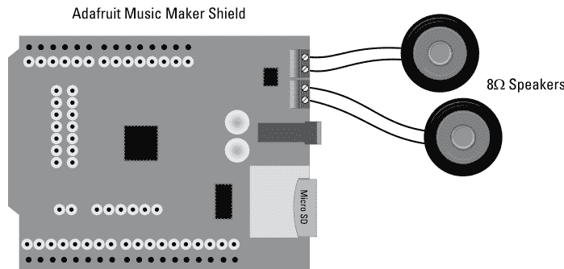

## 部件

- 一台安装了 Arduino IDE 软件的计算机
- 一块 Arduino UNO
- 一根用于将 UNO 连接到计算机的 USB type-B 线缆
- 一块 Adafruit Music Maker 扩展板
- 一张 micro-SD 卡
- 两个 8 Ω 扬声器（或者，你可以使用带有 ⅛ 英寸音频插头的耳机）

## 步骤

1.  **组装 Adafruit Music Maker 扩展板。**
    仔细遵循扩展板附带的说明。（你需要一个烙铁和一些焊锡来执行此步骤。带灯的放大镜或护目镜也会有所帮助。）
2.  **准备 micro-SD 卡。**
    将任何 MP3 文件复制到 SD 卡的根文件夹。将 MP3 文件的名称更改为 TRACK01.mp3。
3.  **打开 Arduino 编辑器。**
4.  **将 Music Maker 扩展板连接到 Arduino UNO。**
5.  **将两个扬声器的引线连接到 Music Maker 扩展板上的扬声器接线端子。**
6.  **将 Arduino UNO 连接到你的计算机。**
7.  **在 Arduino 编辑器中输入清单 5-4 所示的程序。**
8.  **点击“上传”按钮。**

程序编译并上传到 UNO。你很快就会听到扬声器播放你的 MP3 文件。当 MP3 文件播放完毕后，它会在暂停 5 秒后再次播放。

### 清单 5-4：播放 MP3 曲目

```cpp
// MP3 Program
// Doug Lowe
// December 3, 2021

// This program uses an Adafruit Music Player shield
// to play an MP3 file named TRACK01.mp3.

#include <SPI.h>
#include <Adafruit_VS1053.h>
#include <SD.h>

#define CS  7      // Select pin (output)
#define DCS 6      // Data/command select pin (output)
#define CARDCS 4   // Card chip select pin
#define DREQ 3     // Data request

Adafruit_VS1053_FilePlayer mediaPlayer =
    Adafruit_VS1053_FilePlayer(RESET, CS, DCS, DREQ, CARDCS);

void setup() {
  if (mediaPlayer.begin() == false)
  {
    while (true);   // Don't do anything -- Music Maker shield is missing
  }

  if (SD.begin(CARDCS) == false)
  {
    while (true);   // Don't do anything -- SD card is missing
  }

  mediaPlayer.setVolume(0,0);
}

void loop() {
  mediaPlayer.playFullFile("TRACK01.mp3");
  delay(5000);
}
```

## 在 Arduino 中使用舵机

本章前面的部分探讨了创建能发出声音的 Arduino 项目的两种方法。在本节中，你将通过利用一种称为舵机的设备来增加运动元素。

舵机是一种特殊类型的电机，设计用于旋转到特定位置并保持该位置，直到被告知旋转到不同的位置。爱好舵机经常用于遥控车辆，如飞机、船只和汽车，但舵机还有许多其他用途。例如，我经常在万圣节道具中使用它们来增加运动，比如眼睛或嘴巴。

舵机可以从许多渠道轻松获得。电子供应商，如 Adafruit (www.adafruit.com) 和 Jameco (www.jameco.com)，以及大型零售商亚马逊都销售这些产品。你也可以从当地的爱好商店购买舵机。图 5-8 展示了一个典型的爱好舵机。

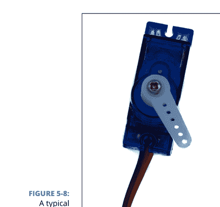

图 5-8：一个典型的爱好舵机。

## 将舵机连接到 Arduino

舵机使用一种特殊的三芯电缆来提供电源和控制信号，该信号告诉舵机应该移动到并保持在哪个位置。电缆的三根线颜色为红色、黑色和白色，具有以下功能：## 编程控制舵机

Arduino 提供了一个舵机库，使得操作舵机变得非常简单。由于舵机使用非常普遍，该库已自动安装在 Arduino 集成开发环境（IDE）中，因此你无需进行任何特殊操作即可使用它。

对于大多数程序，你需要执行以下四个步骤来编程控制舵机：

1.  **包含舵机库，以便你的程序可以使用其功能。**
    为此，请在程序顶部附近添加以下行：
    ```cpp
    #include <Servo.h>
    ```
    Arduino C 语言区分大小写，因此你必须将 *Servo* 这个词首字母大写。

2.  **创建一个舵机变量。**
    `Servo` 是由舵机库定义的一种特殊变量类型。你需要一个此类型的变量来引用你的舵机。最简单的方法是在 `setup()` 或 `loop()` 函数之外创建该变量，如下所示：
    ```cpp
    Servo Servo1;
    ```
    这里，我创建了一个名为 `Servo1` 的舵机变量。

3.  **将引脚连接到舵机变量。**
    你通常会在 `setup()` 函数中使用类似这样的语句来完成：
    ```cpp
    Servo1.attach(2);
    ```
    如果你为舵机引脚号创建了一个常量，那么你会使用类似这样的语句：
    ```cpp
    Servo1.attach(ServoPin);
    ```
    其中 `ServoPin` 是你创建的常量。

4.  **移动舵机。**
    要将舵机移动到特定位置，请使用类似这样的语句：
    ```cpp
    Servo1.write(90);
    ```
    此示例将舵机移动到 90 度位置。到达该位置后，舵机将保持在那里，直到你使用 `write` 函数将其移动到新位置。

清单 5-5 展示了一个完整的程序，该程序根据程序可用的两个按钮开关的状态来移动舵机。这两个开关分别标识为 `SW1`（在引脚 10 上）和 `SW2`（在引脚 11 上）。舵机本身连接在引脚 2 上。

当你按下 `SW1` 时，舵机移动到 0 度。当你按下 `SW2` 时，舵机移动到 180 度。如果你同时按下两个按钮，程序会将舵机移动到中间位置（90 度）。

### 清单 5-5：一个舵机控制程序

```cpp
// Servo Program
// Doug Lowe
// December 5, 2021

#include <Servo.h>

#define ServoPin    2
#define SW1        10
#define SW2        11
#define LowPos      0
#define MidPos     90
#define HighPos   180

Servo Servo1;

int ServoPos = MidPos;

void setup() {
  pinMode(SW1, INPUT);
  pinMode(SW2, INPUT);

  Servo1.attach(ServoPin);
  Servo1.write(ServoPos);

}

void loop() {

  bool sw1HIGH = digitalRead(SW1);
  bool sw2HIGH = digitalRead(SW2);

  if (sw1HIGH & sw2HIGH)
    ServoPos = MidPos;
  else if (sw1HIGH)
    ServoPos = LowPos;
  else if (sw2HIGH)
    ServoPos = HighPos;

  Servo1.write(ServoPos);
  delay(100);
}
```

## 构建舵机项目

项目 50 将向你展示如何构建一个完整的电路，该电路使用一个舵机和两个按钮开关。该电路能够运行清单 5-4 中所示的程序。图 5-11 展示了组装好的项目。

### 项目 50：将舵机与 Arduino 一起使用

在这个项目中，你将一个舵机连接到 Arduino。该电路还包括两个按钮开关（在引脚 10 和 11 上），你可以用它们来控制舵机的动作。

舵机用的 3 针排针座

## 所需部件

- 一台安装了 Arduino 编辑器软件的电脑
- 一块 Arduino UNO
- 一块原型扩展板
- 一根 USB 数据线
- 一个业余爱好用舵机
- 一个三针公对公排针
- 两个常开按钮开关
- 两个 1 kΩ 电阻
- 十根跳线

## 步骤

1.  插入跳线。

| 从 | 到 |
|---|---|
| B11 | B7 |
| C7 | C1 |
| 左下角排针的 GND | D1 |
| E1 | F1 |
| H12 | H8 |
| I8 | I2 |
| 右侧排针的数字引脚 11 | J14 |
| 右侧排针的数字引脚 10 | J10 |
| 右侧排针的数字引脚 2 | J3 |
| 右下角排针的 +5 V | J2 |

2.  插入电阻。

| 电阻 | 从 | 到 |
|---|---|---|
| R1 (470 Ω) | A14 | A11 |
| R2 (470 Ω) | A10 | A7 |

3.  插入开关。

| 开关 | 从 | 到 |
|---|---|---|
| SW1 | E8 和 F8 | E10 和 F10 |
| SW2 | E12 和 F12 | E14 和 F14 |

请确保开关方向正确，如面包板图所示。

4.  插入三针公对公排针。
    三根针应插入 H1、H2 和 H3。

5.  连接舵机。
    将舵机的三针连接器插入三针公对公排针。确保控制线（通常是白色）连接到 H3。

6.  打开 Arduino 编辑器。

7.  将你的 Arduino 连接到电脑，并在 Arduino 编辑器中识别它。
    有关如何操作的更多信息，请参阅本迷你书的第 1 章。

8.  输入并运行以下程序以测试舵机是否工作：
    ```cpp
    #include <Servo.h>

    Servo Servo1;

    void setup() {
      Servo1.attach(2);
    }

    void loop() {
      Servo1.write(45);
      delay(500);
      Servo1.write(135);
      delay(500);
    }
    ```

9.  现在尝试清单 5-4 中的程序。
    该程序使用开关来控制舵机的动作。

## 第 6 章

## 键盘和键盘矩阵

本章向你展示如何使用一种称为 *键盘矩阵* 的常见输入设备。它还向你展示如何使用一些 Arduino 板（包括流行的 Leonardo）的独特功能，将信息发送到计算机，就像 Arduino 是一个键盘一样。

### 使用键盘矩阵

键盘矩阵是使用微控制器（如 Arduino）构建的设备的一种常见输入形式。你可能最熟悉的是计算器和电话等设备上的键盘矩阵——它们由排列成行和列的按钮阵列组成。图 6-1 展示了一个典型的键盘矩阵，有四行，每行四个按钮。

你可以从许多不同的供应商处购买这样的键盘矩阵，包括亚马逊、Jameco Electronics (www.jameco.com) 等。只需在网上搜索“Arduino 键盘矩阵”，你就会发现各种各样的选择。像图 6-1 所示的简单键盘矩阵每个只需几美元。你可以花稍多一点的钱买到更好的。

## 键盘的工作原理

如果键盘中的每个按键都使用两根引线，那么一个4x4键盘将需要32根引线。即使键盘为所有16个按键共用一根接地引线，总共也需要17根引线，这将占用Arduino上的16个数字I/O端口。不幸的是，如果采用这种接线方式，一个4x4键盘几乎会用尽UNO板上所有可用的I/O端口。

幸运的是，一些聪明的人想出了一种更高效的键盘接线方法。关键（双关语）在于认识到键盘中的按键是按行列阵列排列的。它们可以用一根引线连接每一行，另一根引线连接每一列。因此，一个4x4键盘只需八根引线即可接线，而一个3x3键盘则只需六根引线。

图6-2展示了4x4键盘的接线方式。如图所示，一根引线连接同一行的所有按键，另一根引线连接同一列的所有按键。当按下任意一个按键时，连接该按键所在行的引线与连接该按键所在列的引线之间就会形成一个完整的电路。

例如，如果按下标有数字6的按键，那么第2行（R2）的引线与第3列（C3）的引线之间就会形成一个完整的电路。

## 将键盘连接到Arduino

将键盘连接到Arduino是一项简单的任务，但根据键盘的行列数量，可能需要占用大量的数字I/O引脚。一个4x4键盘总共需要八个数字I/O引脚：四个用于行引脚，四个用于列引脚。

虽然不是必须的，但通常会使用连续的引脚来连接键盘，编号较小的引脚用于列，编号较大的引脚用于行。请避免使用引脚0和1，因为这些引脚通常用于串行通信。

除非你连接了其他设备，否则连接4x4键盘最简单的方法是使用引脚2、3、4和5作为行引脚，使用引脚6、7、8和9作为列引脚。对于3x4键盘，则使用引脚2、3和4作为行引脚，使用引脚5、6、7和8作为列引脚。

键盘上的引线通常带有母头连接器，这意味着你需要使用公对公转接头将它们连接到Arduino上的母头端子排或无焊面包板上。对于4x4键盘，你需要一个八针转接头。对于3x4键盘，一个六针转接头就足够了。

> 记住

## 编程控制键盘

将键盘连接到Arduino后，你需要在程序中添加代码来检测按键按下。完成这项任务所需的编程可能有点复杂，但幸运的是，有一些现成的库可以简化编程工作。

### 困难的方法：手动实现

在我们了解Keypad库之前，先大致了解一下Keypad库是如何检测按键按下的，这会很有帮助。其工作原理简要如下：

1.  将所有行对应的数字I/O引脚设置为`OUTPUT`模式，将所有列对应的I/O引脚设置为`INPUT_PULLUP`模式。将使用低电平有效的开关逻辑，Arduino的内部上拉电阻消除了对外部电阻的需求。
2.  确保所有输出引脚都设置为`HIGH`。
3.  将第1行对应的I/O引脚输出值设置为`LOW`；然后检查每个输入引脚是否为`LOW`值。如果发现`LOW`值，你就找到了被按下按键所在的行和列。
4.  对剩余的每一行重复步骤3，将该行对应的I/O引脚设置为`LOW`，并在所有输入引脚上寻找`LOW`值。
5.  如果在任何输入引脚上都没有找到`LOW`值，则表示没有按键被按下；然后从第1行重新开始。

以下是其在实际Arduino代码中的实现方式。步骤1和2在`setup`函数中完成：

```
void setup() {
    for (int row = 2; row<6; row++)          // Set the row pins to OUTPUT
    {
        pinMode(row, OUTPUT);
        digitalWrite(row, LOW);
    }
    for (int col = 6; col<10; col++)
    {
        pinMode(col, INPUT_PULLUP);
    }
}
```

步骤3到5在`loop`函数中完成：

```
void loop() {
    // Look for a completed circuit
    String ButtonPushed = "NONE";
    for (int row = 2; row<6; row++)
    {
        digitalWrite(row, LOW);
        for (int col = 6; col<10; col++)
        {
            if (digitalRead(col) == LOW)
            {
                ButtonPushed = 'R' + row + 'C' + col;
                delay(50);
            }
        }
        digitalWrite(row, HIGH);
    }
}
```

执行一次这个`loop`函数后，`ButtonPushed`字符串变量会指示键盘的状态。如果没有按键被按下，`ButtonPushed`的值将是`NONE`。但如果有一个按键被按下，`ButtonPushed`将指示该按键的行和列。例如，值`R2C3`表示第2行第3列的按键被按下了。

### 简单的方法：使用Keypad库

幸运的是，你不必每次使用键盘时都编写所有这些代码。相反，你可以使用几个库中的一个，它们会为你处理这些细节。本章介绍的库就叫做Keypad。你可以按照以下步骤安装它：

1.  打开Arduino集成开发环境（IDE）。
2.  选择“工具” > “管理库”。如图6-3所示的“库管理器”对话框将会出现。
3.  在“库管理器”顶部的搜索框中输入`Keypad`，然后按回车键。“库管理器”会搜索其庞大的库存储，并显示所有包含“keypad”一词的库。
4.  选择Keypad库。滚动浏览库列表，直到找到那个简单标识为“Keypad”的库。
5.  选择当前版本。使用“选择版本”下拉列表选择你要安装的版本。在撰写本文时，当前版本是3.1.0。
6.  点击“安装”。库就安装好了。大功告成！

安装Keypad库后，你就可以用它来访问矩阵键盘了。为此，你需要在程序的顶部附近包含以下一行代码：

```
#include <keypad.h>
```

## 设置键盘

安装并包含Keypad库后，你就可以编写必要的代码来定义键盘的特性了。你需要定义五件事：

-   键盘的行数
-   键盘的列数
-   连接到键盘行的数字I/O引脚
-   连接到键盘列的数字I/O引脚
-   一个`keymap`，它为键盘上的每个按键提供一个值

设置好这五件事后，你就可以创建一个`Keypad`类型的变量，然后用它来读取键盘的按键输入。

所有这些项目，包括`Keypad`变量，通常最好放在`setup`或`loop`函数之外。这样，它们在整个程序中都是可访问的。

### 定义行数和列数

要定义键盘的行数和列数，只需创建一对`int`变量来表示键盘的行数和列数，如下所示：

```cpp
int rows = 4;
int cols = 4;
```

### 定义行和列引脚

要确定用于连接键盘行和列的引脚，你必须使用Arduino编程中的一个特性，称为`数组`。数组是一个可以容纳多个值的变量。行引脚数组将保存键盘每一行对应的引脚值，列引脚数组将保存每一列对应的引脚值。这些数组的数据类型应该是`byte`。

数组中的各个值通过一个称为`索引`的整数值来标识。索引值放在变量名后的方括号中，例如：`rowPins[0]`。索引值总是从零开始，因此`rowPins[0]`指的是名为`rowPins`的数组中的第一个值。

要创建一个数组，你必须使用数据类型、变量名和数组中的值数量来声明它。例如：

```cpp
byte rowPins[4];
byte colPins[4];
```

在前面的示例中，定义了两个数组——一个用于存放行引脚，另一个用于存放列引脚。这两个数组都将保存四个`byte`类型的值。

你可以在声明数组时就为所有值赋值，就像这样：

```
byte colPins[4] = {6, 7, 8, 9};
byte rowPins[4] = {2, 3, 4, 5};
```

在前面的例子中，`colPins`的值是6、7、8和9，而`rowPins`的值是2、3、4和5。这些值对应于键盘的行引线和列引线将要连接到的Arduino数字I/O引脚。

## 定义键映射

键映射使用一种更复杂的数组类型，称为*二维数组*，也称为*矩阵*。这种类型的数组需要两个索引才能访问一个值：第一个索引是行索引，第二个是列索引。

> 键映射使用`char`值而不是`int`或`byte`值。`char`值是用单引号括起来的单个字符。重要的是要记住，`char`值'4'与`int`值4并不相同。`int`值4代表数量四。`char`值'4'代表数字4，这仅仅是一个符号，不代表一个数量。

你也可以使用初始化简单数组值时使用的特殊语法的一个变体来初始化二维数组，就像这样：

```
char keymap[rows][cols] = {
  {'1','2','3','A'},
  {'4','5','6','B'},
  {'7','8','9','C'},
  {'*','0','#','D'}
};
```

如你所见，这个键值矩阵与4 x 4键盘上按键的物理布局非常相似。

## 使用Keypad变量

`Keypad`变量使你的程序能够检测键盘上的按键。在读取键盘状态之前，你需要定义并初始化这个变量。下面是一个定义并初始化名为`kp`的`Keypad`变量的示例：

```
Keypad kp = Keypad(makeKeymap(keymap), rowPins, colPins, rows, cols);
```

`Keypad`变量是使用你之前创建的`keymap`、`rowPins`、`colPins`、`rows`和`cols`变量来初始化的，正如前面各节所描述的那样。

## 检测按键何时被按下

在创建了`Keypad`变量（参见上一节）之后，你可以通过调用该`Keypad`变量的`waitForKey`函数来读取键盘的状态。此函数会等待，直到键盘上的一个键被按下。然后，它会根据`Keymap`数组，返回与被按下按键对应的`char`值。

你会想在`loop`函数的某个地方调用`waitForKey`函数，就像这样：

```
void loop() {
  char key = kp.waitKey();
  // 根据按下的按键执行某些操作。
}
```
这里有一个简单的示例，它只是将按键值回显到串行端口，你可以通过在Arduino集成开发环境（IDE）中打开串口监视器来查看：

```
void loop() {
  char key = kp.waitKey();
  Serial.println(key);
}
```
注意，为了使其工作，你需要初始化串口并提供波特率。这通常在`setup`函数中通过类似下面的行来完成：

```
Serial.begin(9600);
```

如果你在IDE中打开串口监视器（选择 工具 > 串口监视器），你将看到与键盘上每个被按下按钮对应的字符。

`waitForKey`方法的一个主要缺点是，在等待按键时，你的程序无法做任何其他工作。Keypad库提供了几种检测按键的替代方法，这些方法不会因为等待按键而阻塞主程序。如果你想了解更多，我建议你查阅Keypad库文档（参见 www.arduino.cc/reference/en/libraries/keypad）。

## 构建键盘电路

在本节中，你将构建一个简单的项目，将一个4 x 4键盘连接到Arduino UNO。按键将被回显到串口，你可以通过Arduino IDE的串口监视器进行监控。

构建项目的详细信息在项目51中介绍，运行项目的完整程序如清单6-1所示。

## 项目51：使用键盘

在本项目中，你将一个4 x 4键盘连接到Arduino UNO，并学习如何开发使用它的程序。

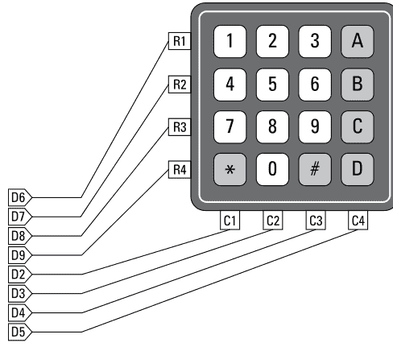

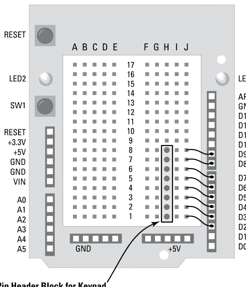

键盘用的8针排针座

## 部件

- 一台安装了Arduino IDE的计算机
- 一个Arduino UNO板
- 一根USB-B线
- 一个UNO原型扩展板
- 一个4 x 4矩阵式键盘
- 一个八针公对公排针适配器
- 八根短跳线（3/8英寸）。

## 步骤

1. 将跳线插入原型扩展板的面包板。

| 从 | 到 |
|------|----|
| 右侧排针的数字引脚D2 | J1 |
| 右侧排针的数字引脚D3 | J2 |
| 右侧排针的数字引脚D4 | J3 |
| 右侧排针的数字引脚D5 | J4 |
| 右侧排针的数字引脚D6 | J5 |
| 右侧排针的数字引脚D7 | J6 |
| 右侧排针的数字引脚D8 | J7 |
| 右侧排针的数字引脚D9 | J8 |

2. 将原型扩展板连接到UNO上。

3. 将八针排针插入原型扩展板。

排针应插入H1到H8引脚。

4. 将键盘连接到八针排针。

第一列的引脚应位于排针的H1一侧。

5. 将UNO连接到计算机。

使用mini-B USB连接器。

6. 将键盘测试程序（见清单6-1）上传到UNO。

7. 在Arduino IDE中选择 工具 > 串口监视器，打开串口监视器。

8. 按下键盘上的每个按钮。

当你按下每个按钮时，串口监视器将显示被按下的按钮（参考图6-4）。

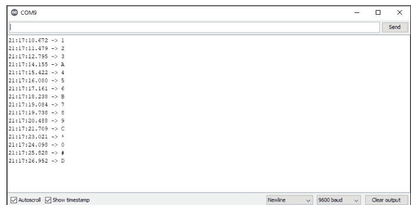

图6-4：监控键盘程序的串口输出。

## 清单6-1：测试键盘

```cpp
// Keypad Tester
// Doug Lowe
// December 5, 2021

#include <Keypad.h>

const byte rows = 4;
const byte cols = 4;

char keymap[rows][cols] = {
  {'1','2','3','A'},
  {'4','5','6','B'},
  {'7','8','9','C'},
  {'*','0','#','D'}
};

byte colPins[rows] = {6, 7, 8, 9};
byte rowPins[cols] = {2, 3, 4, 5};

Keypad keypad = Keypad(makeKeymap(keymap), rowPins, colPins, rows, cols);

void setup() {
  Serial.begin(9600);
}

void loop() {
  char x = keypad.getKey();
  Serial.println(x);
}
```

## 使用Arduino作为计算机键盘输入

所有Arduino板都有一个USB端口，你用它将程序从Windows计算机上传到Arduino。如果你能编写程序，反转这个USB端口的数据流，将数据发送回Windows计算机，那岂不是很好？

UNO无法做到这一点，但一些Arduino板*确实*提供了这种能力。最流行的是Arduino Leonardo，如图6-5所示。

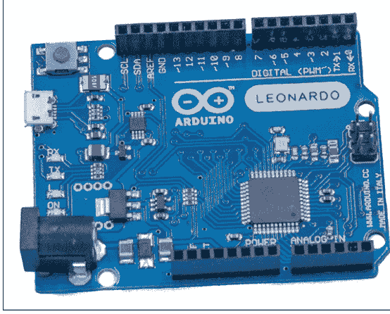

在许多方面，Leonardo与UNO非常相似。特别是，I/O引脚排针是相同的，这意味着大多数能在UNO上工作的程序和电路也能在Leonardo上工作。到目前为止，本迷你书中介绍的所有项目在UNO和Leonardo之间都是可互换的。换句话说，为这些项目构建的任何原型板都可以连接到Leonardo而不是UNO，任何程序也可以在Leonardo而不是UNO上运行。

然而，一个主要的区别是Leonardo板包含了大多数计算机键盘中相同的USB电路。因此，Leonardo可以模拟标准计算机键盘。这意味着你可以编写程序，向Windows计算机发送按键信息。计算机上恰好运行的程序将接收到这些按键，并表现得就像你在普通键盘上输入的一样。

这类Arduino项目可能非常有用。例如，你可以改造项目47（参见第6本书，第4章）来向计算机发送测距信息。如果计算机上打开了Excel，测距数据将填充电子表格的行。

在本节中，我将向你展示如何创建一个Leonardo项目，该项目使用4 x 4键盘向计算机发送Windows快捷键，这样你就可以用键盘锁定或解锁计算机、最小化窗口以显示桌面，或者从任务栏启动程序。

Leonardo和UNO的另一个区别是板上安装的USB端口类型。UNO使用老式的USB-B连接器，这种类型在打印机上很常见。相比之下，Leonardo使用更现代、更小的USB-C连接器。你需要一根USB-C线来连接Leonardo和计算机，既是为了将程序上传到Leonardo，也是为了使Leonardo能够向计算机发送键盘输入。

## 使用Keyboard库

在Leonardo上模拟计算机键盘的秘诀在于Keyboard库。这个库是Arduino IDE的内置部分，因此你不需要使用库管理器来安装它。然而，你必须告诉Arduino IDE你正在使用Leonardo板而不是UNO板。如果你忘记这样做，编译器将无法识别任何Keyboard调用。

Keyboard库包含以下函数，用于帮助你的程序通过USB端口向连接的计算机发送键盘输入：

- **Keyboard.begin**：开始一个键盘模拟会话。你通常会在程序的setup函数中调用此函数。
- **Keyboard.end**：结束一个键盘会话。你的程序可能不需要这个，但如果你想让Leonardo在某些时候像键盘一样工作而在其他时候不工作，你可以使用Keyboard.end来关闭键盘。
- **Keyboard.print**：发送一个完整的字符串，就像你在计算机上输入了这个字符串一样。
- **Keyboard.println**：功能与Keyboard.print相同，但在字符串末尾也会发送回车键。
- **Keyboard.write**：发送单个按键。

## 键盘库函数

**Keyboard.press**：按下并保持一个键。该键将保持按下状态，直到你调用 `Keyboard.release` 或 `Keyboard.releaseAll` 函数。

**Keyboard.release**：释放一个特定的键。

**Keyboard.releaseAll**：释放所有当前被按下的键。

你必须考虑到，在未确保击键是由其他形式输入触发的情况下，通过Arduino草图向计算机发送键盘输入可能带来的后果。特别地，你绝不能在草图的 `loop` 函数中无条件地使用任何发送击键的键盘函数（如 `Keyboard.println`）。如果你这样做，Leonardo在插入电脑USB端口的那一刻就会开始向你的计算机发送击键。唯一阻止它的方法就是拔掉Leonardo。更糟糕的是，你将无法再向Leonardo上传其他草图。这是因为Leonardo会忙于向计算机发送击键而无法接受新草图。Arduino IDE将无法与Leonardo正常通信。你实际上已经损坏了Leonardo。（你可以通过在网上搜索找到修复方法，但这个过程很复杂，你可能不如直接买一个新的Leonardo。）

记下这个警告后，我们来看一些代码。要使用键盘库，你必须包含它。在草图的开头附近使用这个命令：

```cpp
#include <Keyboard.h>
```

然后在 `setup` 函数中使用如下命令来启动一个键盘会话：

```cpp
void setup() {
    Keyboard.begin();
}
```

## 通过键盘发送一行文本

这是一个来自 `loop` 函数的代码片段，它等待小键盘上的一个按键被按下。然后程序会根据在小键盘上按下的键，输入四句莎士比亚式侮辱中的一句：

```cpp
char x = keypad.waitForKey();
if (x=='A')
{
    Keyboard.println("Thine face is not worth sunburning.");
}
if (x=='B')
{
    Keyboard.println("Would thou were clean enough to spit upon.");
}
if (x=='C')
{
    Keyboard.println("I'd beat thee, but I would infect my hands.");
}
if (x=='D')
{
    Keyboard.println("The tartness of his face sours ripe grapes.");
}
```

### 使用 switch 语句简化选择

小键盘的输入迫切需要一种比一堆 `if` 语句更简单的方式来确定哪个键被按下了。幸运的是，Arduino语言通过一个叫做 `switch` 的语句提供了这样的简化。`switch` 语句测试一个变量的值，并根据该值提供几种不同的结果。

前面部分中根据按键产生莎士比亚式侮辱的代码片段，可以用 `switch` 语句这样重写：

```cpp
char x = keypad.waitForKey();
switch (x)
{
  case 'A':
    Keyboard.println("Thine face is not worth sunburning.");
    break;
  
  case 'B':
    Keyboard.println("Would thou were clean enough to spit upon.");
    break;
  
  case 'C':
    Keyboard.println("I'd beat thee, but I would infect my hands.");
    break;
  case 'D':
    Keyboard.println("The tartness of his face sours ripe grapes.");
    break;
}
```

编写 `switch` 语句时需遵循以下重要规则：

-   关键字 `switch` 后在括号中命名一个变量，后面跟一个或多个 `case` 语句，所有这些都包含在一对花括号内。
-   每个 `case` 语句提供一个与变量匹配的值。该值不放在括号中，后面跟一个冒号。
-   如果变量与值匹配，则执行冒号后的语句。与其他语句一样，这些语句必须以分号结尾。
-   你可以在 `case` 语句后编写任意多的语句。你也可以使用其他结构语句，如 `for` 循环。
-   使用 `break` 语句来标记每个 `case` 值应执行的一组语句的结束。当执行 `break` 语句时，整个 `switch` 语句结束，不再处理其他 `case` 语句。
-   如果变量与第一个 `case` 语句的值不匹配，则计算下一个 `case` 语句。如果不匹配，则计算下一个 `case` 语句，直到检查完所有 `case` 语句。


莎士比亚确实是拿起笔来写侮辱语句的最伟大作家之一。在互联网上搜索“Shakespearean insults”来体会我的意思。你甚至可以找到莎士比亚式侮辱生成器，为你定制一句专属的莎士比亚式侮辱！

## 按下并保持按键

标准键盘的一个重要功能是使用组合键。例如，按下Ctrl+Alt+Del会调出一个菜单，让你选择锁定计算机、注销、切换用户或调用Windows任务管理器等操作。

`Keyboard.press` 函数允许你通过按住一个或多个键，然后使用 `Keyboard.print` 或 `Keyboard.write` 连同修饰键一起发送击键来实现组合键。

为方便起见，Arduino语言定义了一组表示修饰键的常量。这些常量列在下面。请注意，某些键有两个版本——一个在键盘左侧，另一个在右侧。

键盘按键和键盘：

-   KEY_LEFT_CTRL
-   KEY_LEFT_SHIFT
-   KEY_LEFT_ALT
-   KEY_LEFT_GUI
-   KEY_RIGHT_CTRL
-   KEY_RIGHT_SHIFT
-   KEY_RIGHT_ALT
-   KEY_RIGHT_GUI
-   KEY_UP_ARROW
-   KEY_DOWN_ARROW
-   KEY_LEFT_ARROW
-   KEY_RIGHT_ARROW
-   KEY_BACKSPACE
-   KEY_TAB
-   KEY_RETURN
-   KEY_ESC
-   KEY_INSERT
-   KEY_DELETE
-   KEY_PAGE_UP
-   KEY_PAGE_DOWN
-   KEY_HOME
-   KEY_END
-   KEY_CAPS_LOCK
-   KEY_F1
-   KEY_F2
-   KEY_F3
-   KEY_F4
-   KEY_F5
-   KEY_F6
-   KEY_F7
-   KEY_F8
-   KEY_F9
-   KEY_F10
-   KEY_F11
-   KEY_F12

这是一个代码片段示例，用于键入Windows快捷键组合Windows+L，该组合会锁定计算机：

```cpp
Keyboard.press(KEY_LEFT_GUI);
Keyboard.print("l");
Keyboard.releaseAll();
```

在此示例中，调用 `Keyboard.press` 函数来按住左图形用户界面（GUI）键，即Windows键。然后发送字母l。最后，释放所有键。结果是计算机立即被锁定。

## 构建一个Windows小键盘工具

我想用一个使用4 x 4小键盘提供常用Windows快捷键组合便捷访问的项目来结束本章。这个项目实际上使用了为项目51构建的同一块原型面包板。唯一的区别是面包板被放置在Leonardo而不是UNO上，并且使用了不同的程序。

这个工具提供以下功能：

| 按键 | Windows 功能 |
|---|---|
| A | 锁定计算机。 |
| B | 通过输入PIN码或密码解锁计算机。 |
| C | 最小化所有窗口。 |
| D | 还原所有窗口。 |
| 1–9 | 打开固定在任务栏上的程序之一。（程序按照它们在任务栏上出现的顺序打开。） |

## 项目52：一个Windows小键盘工具

在这个项目中，你将一个4 x 4小键盘连接到Arduino Leonardo，并学习如何使用它向Windows计算机发送击键。

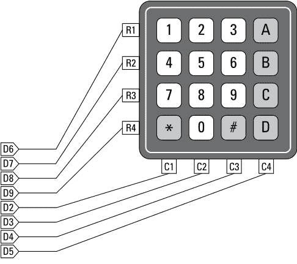
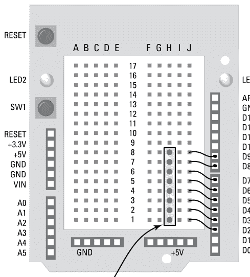

8针排针头用于键盘

## 部件

-   一台安装了Arduino IDE的计算机
-   一个Arduino Leonardo
-   一个USB-C线
-   项目51中组装好的原型盾板，包括4 x 4小键盘

## 步骤

1.  如果你还没有完成，请按照项目51中的步骤组装原型盾板和小键盘。
2.  将组装好的原型盾板安装到Leonardo上。
3.  将Leonardo连接到计算机。请使用USB-C USB接口。
4.  将键盘小工具程序（代码清单6-2）上传到Leonardo。注意：如果你希望解锁功能正常工作，你需要将程序中提供的PIN码或密码更改为你的计算机的PIN码或密码。
5.  按下小键盘上的每个按钮。当你按下每个按钮时，相应的Windows快捷键将被触发。

## 代码清单6-2：Windows小键盘工具草图

```cpp
// Windows Keypad Gadget
// Doug Lowe
// December 10, 2021

#include <Keyboard.h>
#include <Keypad.h>

// Keypad setup
const byte rows = 4;
const byte cols = 4;
byte colPins[rows] = {6, 7, 8, 9};
byte rowPins[cols] = {2, 3, 4, 5};
char keymap[rows][cols] = {
  {'1','2','3','A'},
  {'4','5','6','B'},
  {'7','8','9','C'},
  {'*','0','#','D'}
};

Keypad kp = Keypad( makeKeymap(keymap), rowPins, colPins, rows, cols);

void setup() {
  Keyboard.begin();
}

void loop() {
  char x = kp.waitKey();
  int number = 0;
  switch(x) {
    case 'A':                          // Lock computer
      Keyboard.press(KEY_LEFT_GUI);
      Keyboard.print("l");
      Keyboard.releaseAll();
      break;
    // ... (代码在此处继续)
  }
}
```

# 第7章：使用树莓派

## 第1章：介绍树莓派

## 内容概览

- 第1章：**介绍树莓派** ......................... 737
- 第2章：**Python编程** ........................... 759
- 第3章：**读取数字和模拟输入** ............... 791

### 本章学习目标

- 了解什么是树莓派
- 查看各种树莓派版本
- 连接所有部件使树莓派工作
- 安装树莓派操作系统
- 熟悉树莓派操作系统
- 编写你的第一个Python程序

### 介绍树莓派

> 在第6册中，你学习了如何使用Arduino微处理器，这是目前最受欢迎的微处理器之一。在本小册中，你将学习如何使用树莓派，这是Arduino的一个流行替代品。

从物理外观上看，树莓派与Arduino相似。然而，树莓派远不止是一个微控制器；它是一个完整的计算机系统，实现在一块小卡上。事实上，树莓派具有台式机或笔记本电脑的大部分常见功能。除了体积小之外，树莓派还具有台式机不常见的其他功能，例如直接控制数字I/O引脚的能力。因此，你可以将树莓派与LED、按钮、电位器、各种类型的传感器以及伺服或步进电机等外部设备一起使用。

树莓派和Arduino之间最大的区别在于树莓派有一个操作系统。Arduino实际上是一个没有操作系统的单程序计算机。你只需将程序上传到Arduino，程序就会运行。相比之下，树莓派运行的是Linux操作系统的变体，称为树莓派操作系统。

树莓派操作系统在许多方面类似于Microsoft Windows或Apple macOS，因此树莓派可以完成台式机或笔记本电脑能做的许多事情。对显示器、键盘、鼠标、网络和声音的支持是树莓派的内置功能。

在本章中，你将确切了解什么是树莓派、如何获取一个、如何连接它以及如何让它运行。然后，在接下来的几章中，你将学习如何为树莓派编写程序以及如何为其添加外部组件。

### 介绍树莓派

树莓派（有时简称为Pi）是一台非常小的计算机。它包含了传统台式机的大部分组件，但所有这些都被压缩到一块大约一副扑克牌大小的小板上。最新版本的树莓派，称为树莓派4，如图1-1所示。这个版本的树莓派包括以下所有打包在板上的组件：

- **CPU：** 四核64位ARM Cortex-A72微处理器，运行频率为1.5GHz。
- **RAM：** 2GB、4GB或8GB。
- **USB端口：** 两个USB 2.0端口，两个USB 3.0端口。这些标准尺寸的USB-A端口可用于连接任何USB设备，包括键盘、鼠标或闪存驱动器。
- **视频：** 内置图形处理器，可支持两台分辨率为4K（3,840 x 2,160）的显示器。
- **HDMI：** 两个安装在板上的微型HDMI连接器，用于连接视频显示器。
- **显示串行接口（DSI）：** 一种设计用于通过15针带状电缆连接到小型LCD的显示接口。
- **MicroSDHC卡：** MicroSDHC卡充当计算机的磁盘驱动器。操作系统（Linux）安装在MicroSD卡上，以及你想要使用的任何其他软件。
- **以太网网络：** 内置RJ-45连接器，用于1 Gbps网络。
- **802.11n无线网络：** 内置无线网络连接。天线实际上内置在板本身中，因此不需要外部天线。
- **蓝牙：** 内置蓝牙网络，用于无线设备，如键盘、鼠标和耳机。
- **摄像头串行接口（CSI）：** 一种特殊接口，设计用于通过15针带状电缆连接到摄像头设备。
- **音频：** 用于音频应用的3.5毫米音频插孔。
- **电源：** 树莓派通过USB-C连接到板上的5V电源供电。
- **GPIO排针：** 从电子爱好者的角度来看，树莓派最有趣的是40针GPIO排针，它提供了对各种功能的访问，包括26个通用输入输出（GPIO）引脚。这些引脚的工作方式与Arduino微处理器上的数字I/O引脚相同，可以通过你为树莓派编写的程序进行访问。你可以将这些GPIO引脚用作输出引脚，连接到LED、伺服或步进电机等设备。或者，你可以将它们用作输入引脚，从外部开关、电位器或其他类型的传感器读取输入。

> **警告：** 与Arduino微处理器上的数字I/O引脚不同，树莓派GPIO引脚的工作电压为3.3V，而不是5V来表示高电平信号。你需要相应地调整电路，以处理较小的输入和输出电压电平。特别是，如果你向GPIO输入引脚施加5V输入，你就有损坏树莓派的风险。

### 考虑树莓派版本

自2012年推出最初的树莓派以来，已经发布了几乎令人眼花缭乱的各种版本。树莓派已经经历了四代，分别称为1、2、3和4。每一代新版本都包含了新功能。

树莓派2于2015年推出。它通过使用更强大的处理器和额外的RAM改进了树莓派1，同时保持了相同的价格。重要的是，树莓派2还将GPIO端口的数量从17个增加到26个。不幸的是，在这样做的过程中，GPIO引脚配置发生了变化，这意味着为树莓派1创建的项目与为树莓派2创建的项目不兼容。

2016年，推出了树莓派3。它通过添加更强大的处理器、更快的RAM和内置无线网络改进了树莓派2。（使用无线树莓派2进行无线网络通常通过插入USB端口之一的无线适配器来完成。）

第四代树莓派4于2019年推出。它拥有更快的处理器和更多的RAM——你可以选择2GB、4GB或8GB。树莓派4还支持双显示器和4K分辨率。

所有四个版本的树莓派价格一直是35美元，尽管最近的芯片短缺推高了价格——尤其是Pi 4版本。本书中的所有项目都使用树莓派4，但它们也适用于树莓派3甚至Pi 2。

第一代树莓派1有两种型号：A型和B型。A型版本是B型的精简版，内存较少，I/O选项较少，但功耗更低。2014年，这两种型号被A+型和B+型取代，增加了额外的功能。

最初的树莓派1型号比新版本的GPIO引脚少。最初的版本提供了一个26针排针块，可访问17个GPIO端口。在新版本上，40针排针可访问26个GPIO端口。

本书中显示的所有项目都适用于树莓派2、3或4。如果你还没有树莓派，我建议你购买一个带有4GB RAM的树莓派4作为套件的一部分，该套件包含你入门所需的材料。这些简单的套件包括为树莓派供电的电源、已加载操作系统软件的microSD卡以及一本帮助你入门的小册子。

---

### 清单6-2：（续）

```cpp
case 'B':                    // Unlock computer
  Keyboard.press(KEY_LEFT_CTRL);
  Keyboard.press(KEY_LEFT_ALT);
  Keyboard.press(KEY_DELETE);
  Keyboard.releaseAll();
  delay(100);
  Keyboard.println("******");  // Use your PIN here!
  break;

case 'C':                    // Minimize all windows
  Keyboard.press(KEY_LEFT_GUI);
  Keyboard.print("m");
  Keyboard.releaseAll();
  break;

case 'D':                    // Restore all windows
  Keyboard.press(KEY_LEFT_GUI);
  Keyboard.press(KEY_LEFT_SHIFT);
  Keyboard.print("m");
  Keyboard.releaseAll();
  break;

case '1':
  OpenProgram(1);
  break;

case '2':
  OpenProgram(2);
  break;

case '3':
  OpenProgram(3);
  break;

case '4':
  OpenProgram(4);
  break;

case '5':
  OpenProgram(5);
  break;

case '6':
  OpenProgram(6);
  break;

case '7':
  OpenProgram(7);
  break;

case '8':
  OpenProgram(8);
  break;

case '9':
  OpenProgram(9);
  break;
}

delay(200);
}

void OpenProgram(int num) {
  Keyboard.press(KEY_LEFT_GUI);
  Keyboard.press(KEY_LEFT_SHIFT);
  Keyboard.print(num);
  Keyboard.releaseAll();
}
```

已开始。一些套件还会包含额外配件，例如用于将你的树莓派连接到显示器的HDMI线，可能还有额外的元件，如LED、电阻、跳线和面包板。

## 设置树莓派

在启动树莓派并开始构建项目之前，你需要做一些基本的设置工作。首先设置硬件。你需要以下物品来设置你的树莓派，以便为本书中的项目进行编程：

- 一台树莓派 2、3 或 4。
- 合适的电源：树莓派需要通过卡上的USB-C接口连接5V电源。对于树莓派4，你应使用至少3A的电源。较旧的型号，如树莓派3或2，可以使用较小的电源（树莓派3用2.5A，树莓派2用2.0A）。
- 一台显示器：你不需要巨大的显示器，但我建议至少17英寸。你也不需要4K分辨率，但建议至少1920 x 1080。
- 一根HDMI线：如果你的显示器有HDMI接口，你需要一根一端是标准HDMI接头、另一端是micro-HDMI接头的线缆。如果你的显示器是其他类型的接口，如DVI或VGA，你需要一个适配器来将你的显示器连接到树莓派的HDMI接口。
- 一个USB键盘：任何带USB接口的键盘都可以。
- 一个USB鼠标：任何带USB接口的鼠标都可以。
- 一张microSD卡：microSD卡充当树莓派的磁盘驱动器。最小容量是8GB，但16GB或32GB更好。
- 网络连接：网络连接对于下载本书项目所需的几个支持软件包至关重要。你可以通过以下两种方式之一将你的树莓派连接到网络：
    - 如果你有树莓派3或4，你可以使用内置Wi-Fi连接到无线网络。
    - 你可以使用标准以太网线将树莓派2、3或4插入有线网络，前提是附近有一个可用端口的路由器或交换机。

## 安装树莓派操作系统

虽然你可以在树莓派上运行任何版本的Linux，但专为树莓派设计的官方版本叫做*Raspberry Pi OS*。（它以前叫Raspbian，但几年前改名了。）以下是安装Raspberry Pi OS的步骤：

1.  **将一张空白的micro-SD卡插入你的Windows电脑。**
    你需要一个micro-SD卡适配器才能做到这一点；大多数micro-SD卡都附带必要的适配器。
2.  **打开网页浏览器（如Chrome或Microsoft Edge），访问 www.raspberrypi.com/software。**
3.  **下载Raspberry Pi Imager程序。**
    对于Windows，点击“Download for Windows”。（如果你是Mac用户，可以选择“Download for macOS”。此过程的剩余步骤适用于Windows，但Mac用户的步骤类似。）
4.  **下载完成后，运行下载的文件。**
    请注意，对于所有浏览器，文件都会下载到你的“下载”文件夹。如果你不确定如何在浏览器中运行下载的文件，可以随时打开文件资源管理器窗口并打开“下载”文件夹。然后，双击imager_1.6.2.exe文件运行它。（1.6.2是版本号；如果你的版本更新，你会看到不同的数字。）
5.  **点击“Install”安装该程序。**
    安装过程应不到一分钟。
6.  **安装完成后，点击“Finish”。**
    Raspberry Pi Imager程序出现，如图1-2所示。如你所见，可见两个按钮：Choose OS和Choose Storage。
7.  **点击“Choose OS”。**
    操作系统选项列表出现，如图1-3所示。尽情探索你可以安装在树莓派上的各种操作系统吧。在你对树莓派有了一些经验后，可能想尝试不同的操作系统。
8.  **点击“Raspberry Pi OS (32-bit)”。**
    此操作选择了标准的Raspberry Pi OS。


图1-2：Raspberry Pi Imager程序。

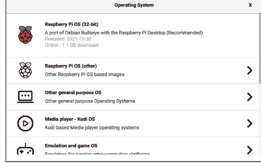

图1-3：选择操作系统。

9.  **点击“Choose Storage”。**
    可用的存储设备列表出现，如图1-4所示。（在大多数情况下，你只会看到一个选项。）
10. **点击你想要安装Raspberry Pi OS的存储设备。**
    你将返回到Imager程序。现在可以看到第三个标有“Write”的按钮。
11. **点击“Write”。**
    系统会询问你是否要继续。

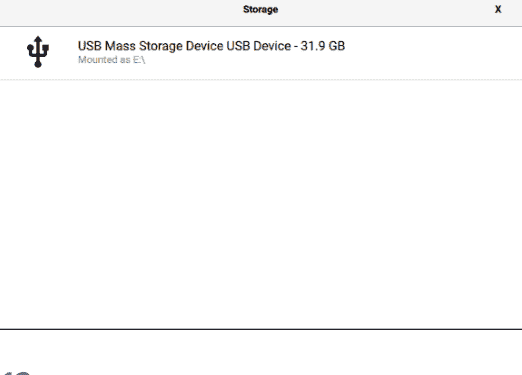

图1-4：选择你的SD卡。

12. **点击“Yes”。**
    操作系统将被安装到micro-SD卡上。此过程需要一两分钟。安装完成后，会显示一条消息，提示你可以从读卡器中取出SD卡。
13. **取出SD卡并点击“Continue”。**
14. **关闭Raspberry Pi Imager程序。**
    如果需要再次使用，你可以在“开始”菜单中找到Imager程序。

## 启动你的树莓派

在将操作系统安装到micro-SD卡上后，你就可以启动你的树莓派了。拿起你的树莓派，按照以下步骤操作：

1.  **将micro-SD卡插入卡槽。**
    卡槽位于树莓派底部，与USB接口相对的一侧。
2.  **将鼠标和键盘插入USB接口。**
    如果你使用的是无线鼠标/键盘组合，只需将USB无线接收器插入树莓派的USB接口之一即可。
3.  **连接显示器。**
    如果你使用的是树莓派4，你需要一根micro-HDMI线。对于早期版本的树莓派，你需要一根标准HDMI线。
4.  **将树莓派连接到USB-C电源。**
    当你这样做时，树莓派将直接启动进入Raspberry Pi OS。片刻之后，你将看到图1-5所示的屏幕。


图1-5：Raspberry Pi OS的初始配置。

5.  **按照Raspberry Pi OS初始配置的步骤操作。**
    配置向导将引导你完成以下配置选项：
    - 国家、语言和时区
    - 默认用户账户（名为pi）的密码
    - 屏幕设置，确认Linux任务栏适合屏幕
    - Wi-Fi网络密码，以便树莓派可以连接到互联网
    - 软件更新
    配置完成后，Raspberry Pi OS会提示你重启树莓派以使更改生效。
6.  **点击“Restart”重启树莓派。**
    树莓派重启后，你将看到树莓派桌面，如图1-6所示。


图1-6：树莓派桌面。

## 理解文件系统

如果你以前没有使用过Linux，可能会对Raspberry Pi OS的文件系统感到有些困惑。所有Linux操作系统，包括Raspberry Pi OS，组织文件和目录的方式与你可能习惯的Windows文件系统略有不同。其中三个最明显的差异实际上是表面的，但如果你不注意，它们可能会让你出错：

- **Linux使用正斜杠而不是反斜杠来分隔目录。** 因此，`/home/pi`在Linux中是有效的路径。（如果你不是有经验的Linux用户，可能难以找到正斜杠键。它位于键盘右侧Shift键旁边的问号键上。）
- **Linux文件名不使用扩展名。** 你可以在文件名中使用句点，但与Windows不同，最后的句点并不标识文件扩展名。
- **Linux区分大小写。** 在Windows中，文件或文件夹名称中的大写和小写字母无关紧要。因此，`workfiles`和`WorkFiles`可以互换使用。在Linux中则不是这样：在Linux中，`workfiles`和`WorkFiles`会指向两个不同的文件夹。

除了这些表面差异之外，Linux和Windows文件系统的主要区别在于，Linux将整个系统中的所有内容都视为文件，并将其组织到一个从单个根目录开始的巨大目录树中。

## Linux 文件系统中的根目录

当我说“一切皆文件”时，我的意思是，像软盘驱动器、串行端口、以太网适配器，甚至树莓派上的 GPIO 引脚等硬件设备，都被视为文件。

整个 Linux 文件系统的根目录，是从树莓派启动的 micro-SD 卡的顶层目录。如果你将 USB 闪存盘或 USB 磁盘驱动器插入树莓派的 USB 端口，该驱动器将被挂载到文件系统树中，作为一个名为挂载点的目录。因此，Linux 文件系统中的一个目录实际上可能是一个设备。

Linux 文件系统中的根目录列在下表中。如果你通过点击屏幕顶部的文件柜图标打开文件管理器，你将看到这些目录。

| 目录 | 描述 |
|---|---|
| /bin | 基本的命令二进制文件 |
| /boot | 引导加载程序的静态文件 |
| /dev | 设备文件 |
| /etc | 本地计算机的配置文件 |
| /home | 用户的主目录 |
| /lib | 共享库和内核模块 |
| /media | 可移动媒体（如 USB 闪存盘）的挂载点 |
| /mnt | 不可移动文件系统的挂载点 |
| /proc | 重要的内核和进程文件 |
| /opt | 附加应用程序和软件包 |
| /root | root 用户的主目录 |
| /sbin | 基本的系统二进制文件 |
| /srv | 服务器数据，如网页、FTP 文件等 |
| /tmp | 临时文件 |
| /usr | 只读的共享文件，如用户命令的二进制文件和库 |
| /var | 可变的数据文件 |

## 编写你的第一个树莓派程序

树莓派操作系统内置了 Python，以及一个名为 *Thonny* 的精美集成开发环境（IDE）。要运行此程序，请点击树莓派图标（如边栏所示），然后选择 Programming ➤ Thonny Python IDE。Thonny 将启动，如图 1-7 所示。

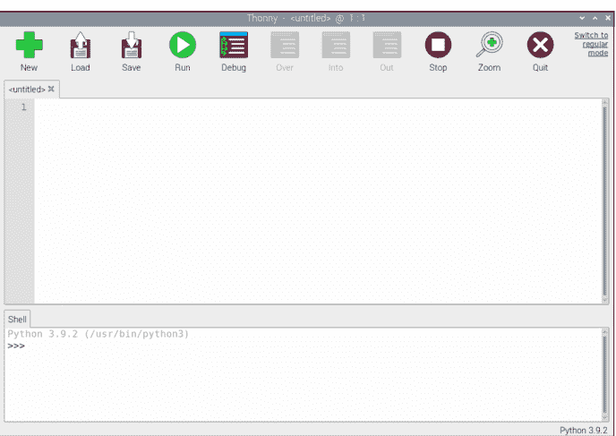

默认情况下，Thonny 以名为 *simple mode* 的简化视图打开。简化模式包含一个简单的工具栏，可一键访问开发基本 Python 程序所需的大部分功能。如果你愿意，可以切换到 *regular mode*，该模式会添加一个包含全套 Python 编程选项的菜单，如图 1-8 所示。

在 Thonny 屏幕底部附近（在简单模式和常规模式下），你会找到一个标记为 Shell 的区域。你可以直接在 shell 中运行 Python 语句，而无需创建程序；当你在 shell 中输入 Python 语句并按 Enter 键时，该语句会立即执行，其生成的任何结果都会显示在 shell 中。

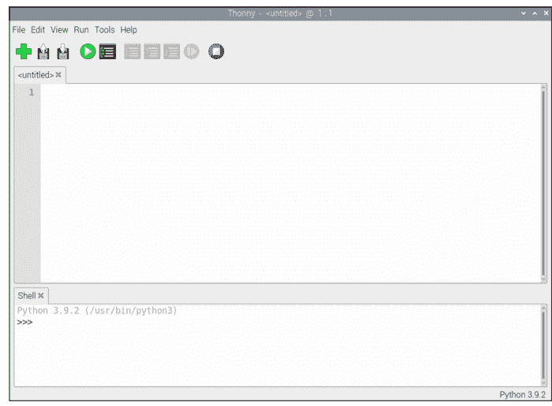

例如，在 shell 中输入以下内容：

```python
print("Hello, World!")
```

shell 会响应并输出 `Hello, World!`

如果你犯了错误，shell 会立即告诉你。例如，尝试输入这个：

```python
print("Hello, World!)
```

注意文本 `Hello, World!` 后面缺少闭合引号。shell 的响应如下：

```
Traceback (most recent call last):
  File "<stdin>", line 1, in <module>
SyntaxError: EOL while scanning string literal
```

这个有些晦涩的响应表明你犯了一个 Python 错误——具体来说，Python 在找到闭合引号之前就到达了行尾（EOL）。

要实际创建一个显示消息 Hello, World! 的 Python 程序，请按照以下步骤操作：

1.  **按下新建按钮（如边栏所示）。** 或者，你可以选择 File ➔ New。请注意，如果 Thonny 中已经显示一个标记为 <untitled> 的新窗口，你可以跳过此步骤。
2.  **输入文本** `print("Hello, World!")`。
3.  **点击保存按钮（如边栏所示）。** 或者，选择 File ➔ Save As。无论哪种方式，都会出现“另存为”对话框。默认情况下，“另存为”对话框在当前用户的主目录（/home/pi）中打开。
4.  **我建议你创建一个名为 Python 的新文件夹。** 为此，请点击“另存为”对话框中的新建文件夹图标（如边栏所示）。然后输入 **Python** 并点击创建按钮。
5.  **输入 hello 作为文件名，然后点击确定。** 文件将以 hello 为名保存。图 1-9 显示了 hello.py 程序保存后的样子。

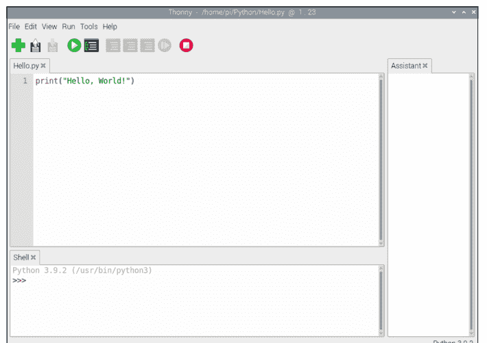

6.  **选择 Run ➜ Run Module（或按 F5）。** 此操作将运行 hello.py 程序。程序的输出（即消息 Hello, World!）将出现在 Python Shell 窗口中，如图 1-10 所示。
7.  **你完成了！** 恭喜自己！你已经成功编写了你的第一个 Python 程序。

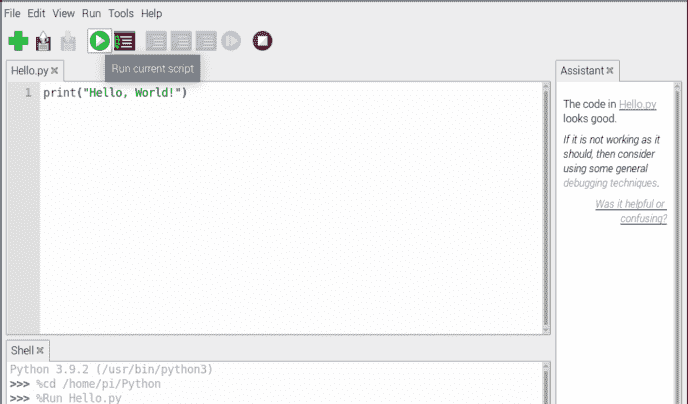

图 1-10：运行中的 Hello, World! 程序。

## 检查 GPIO 端口

通用输入/输出（GPIO）端口使树莓派不仅仅是一台非常小的计算机。GPIO 端口允许你直接从树莓派控制自己的电子电路。树莓派 2 和 3 上的 40 引脚 GPIO 排针总共提供了 17 个 GPIO 端口，这些端口可以通过你用 Python 或其他语言编写的程序来控制。

要使用 GPIO 端口，你必须首先将该端口配置为输入或输出。当配置为输出时，GPIO 端口可以通过你的程序设置为高电平（+3.3 V）或低电平（0 V）状态。当配置为输入时，程序可以轻松确定当前状态（高电平或低电平）。

图 1-11 列出了树莓派 40 引脚排针块上每个引脚的功能。（请注意，此图适用于树莓派 2、3 和 4 版本。已淘汰的树莓派 1 具有不同的引脚布局。）

不幸的是，排针块上的引脚在树莓派电路板上没有任何标记。如果你将电路板定向为 USB 端口在底部，那么排针块将位于电路板的右边缘，就在 USB 端口上方。然后，引脚 1 和 2 位于排针块的顶部。奇数编号的引脚（从顶部的引脚 1 开始）位于排针块的左侧；偶数编号的引脚（从顶部的引脚 2 开始）位于右侧。

你可能已经注意到，排针块上的引脚似乎没有按照任何特定的逻辑或功能顺序排列。GPIO 端口随意地分散在排针块上，与 3.3 V、5 V 和接地引脚交错在看似随机的位置。

为了避免在树莓派项目编程时混淆，人们通常使用排针引脚编号而不是 GPIO 端口号来标记 GPIO 端口。例如，GPIO 端口 19 在 Python 程序中可以称为引脚 10。当你以这种方式编写程序时，你可以完全忽略 GPIO 端口号，而是使用其引脚编号来引用 GPIO 端口。这样做的唯一技巧是记住，并非 40 引脚排针上的所有引脚都用于 GPIO 端口；只有图 1-11 中指定为 GPIO 端口的引脚编号才应被用作 GPIO 端口。（你将在本章后面的实际程序中看到这种编号的示例。）


树莓派上的 GPIO 端口每个的额定电流约为 16 mA，所有 GPIO 端口的总电流为 40 mA。在设计与 GPIO 端口接口的电路时，请牢记此限制。确保提供足够的限流电阻，以避免损坏你的树莓派。

| 引脚 | 功能 | 功能 | 引脚 |
|-----|----------|----------|-----|
| 1 | 3.3V | 5V | 2 |
| 3 | GPIO 2 | 5V | 4 |
| 5 | GPIO 3 | 接地 | 6 |
| 7 | GPIO 4 | GPIO 14 | 8 |
| 9 | 接地 | GPIO 15 | 10 |
| 11 | GPIO 17 | GPIO 18 | 12 |
| 13 | GPIO 27 | 接地 | 14 |
| 15 | GPIO 22 | GPIO 23 | 16 |
| 17 | 3.3V | GPIO 24 | 18 |
| 19 | GPIO 10 | 接地 | 20 |
| 21 | GPIO 9 | GPIO 25 | 22 |
| 23 | GPIO 11 | GPIO 8 | 24 |
| 25 | 接地 | GPIO 7 | 26 |
| 27 | ID_SD | ID_SC | 28 |
| 29 | GPIO 5 | 接地 | 30 |
| 31 | GPIO 6 | GPIO 12 | 32 |
| 33 | GPIO 13 | 接地 | 34 |
| 35 | GPIO 19 | GPIO 16 | 36 |
| 37 | GPIO 26 | GPIO 20 | 38 |
| 39 | 接地 | GPIO 21 | 40 |

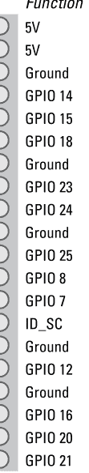

## 将 LED 连接到 GPIO 端口

如果你将 GPIO 端口配置为输出端口，你可以使用该端口驱动一个 LED。你需要一个 LED 和一个合适的限流电阻。图 1-12 显示了一个典型的原理图。在这种情况下，LED 连接到树莓派上的一个 GPIO 引脚。使用一个 330 Ω 的电阻来限制流过 LED 的电流，LED 的阴极连接到接地。

一个你应该注意的细节是，树莓派上的排针使用的是公针，而不是像Arduino和微控制器上常见的母座。因此，要将面包板电路连接到树莓派的引脚上，你需要使用一端是公针（用于插入面包板孔洞）、另一端是母座（用于插入树莓派排针上的公针）的跳线。你可以从许多网络来源购买这些跳线；只需在网上搜索 *树莓派跳线*，你就能找到所需的东西。你想要的跳线通常被称为“母/公延长跳线”或“跳线（M/F）”。

## 用Python闪烁LED

既然你已经知道如何将LED连接到树莓派的GPIO端口，让我们来看看如何使用Python来控制LED的开关。在本迷你书的第2章中，我将提供更多关于Python编程语言的细节。现在，让我们快速看一下一个Python程序，它让连接到GPIO端口2（即树莓派上的物理引脚3）的LED闪烁。LED将以半秒的间隔交替亮灭。完整的程序如清单1-1所示。

### 清单 1-1：一个用Python编写的LED闪烁程序

```python
import RPi.GPIO as GPIO
import time

GPIO.setmode(GPIO.BOARD)
GPIO.setup(3, GPIO.OUT)

while True:
    GPIO.output(3, GPIO.HIGH)
    time.sleep(0.5)
    GPIO.output(3, GPIO.LOW)
    time.sleep(0.5)
```

让我们逐行查看这个程序：

| 程序行 | 功能说明 |
| :--- | :--- |
| `import RPi.GPIO as GPIO` | 告诉Python程序需要一个名为RPi.GPIO的函数包，并且程序将使用缩写GPIO来引用该包中的函数。RPi.GPIO包包含用于操作GPIO端口的函数。 |
| `import time` | 告诉Python程序需要一个名为time的函数包。需要这个包是为了让程序能够控制LED闪烁的时序。 |
| `GPIO.setmode(GPIO.BOARD)` | 表明程序将使用树莓派电路板上的引脚编号来引用GPIO端口，而不是使用内部的GPIO端口号。 |
| `GPIO.setup(3, GPIO.OUT)` | 表明程序将把引脚3上的GPIO端口用作输出端口。 |
| `while True:` | 设置一个永不结束的循环。此行之后所有缩进的语句将按顺序一遍又一遍地执行，直到用户停止程序。 |
| `GPIO.output(3, GPIO.HIGH)` | 将引脚3上端口的状态设置为HIGH。此语句点亮LED。 |
| `time.sleep(0.5)` | 暂停程序执行半秒钟。这使得LED保持亮起半秒钟。 |
| `GPIO.output(3, GPIO.LOW)` | 将引脚3上端口的状态设置为LOW。这会熄灭LED。 |
| `time.sleep(0.5)` | 暂停程序执行半秒钟。这使得LED保持熄灭半秒钟。 |

只要程序被允许运行，`while`语句下缩进的四条语句就会按照列出的顺序一遍又一遍地执行。首先，LED亮起半秒钟；然后LED熄灭半秒钟。闪烁会持续进行，直到用户停止程序。

## 构建树莓派LED闪烁器

项目51展示了如何构建一个简单的面包板电路，通过排针上的引脚3的GPIO端口将LED连接到树莓派。图1-13展示了完成的项目。

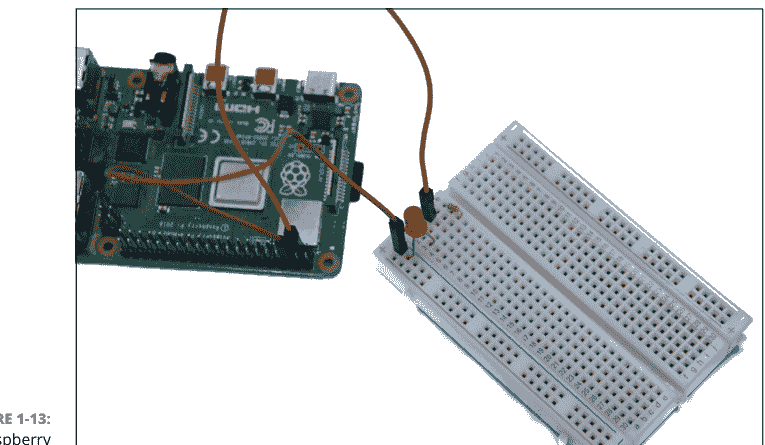

**图 1-13：** 树莓派LED闪烁器（项目51）。

## 项目51：用树莓派闪烁LED

在这个项目中，你将一个外部LED连接到树莓派，然后使用一个简单的程序以0.5秒的间隔控制LED的开关。

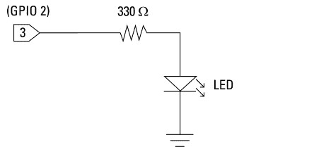

## 树莓派

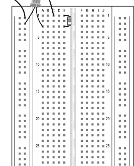

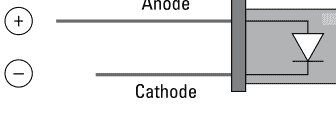

## 部件

- 一个树莓派（推荐4代，但Pi 2或3也可以），已安装树莓派操作系统，连接到显示器、键盘、鼠标和电源
- 一个小的无焊面包板
- 一个LED
- 一个330 Ω电阻（橙-橙-棕）
- 两根跳线（M/F）

## 步骤

1.  **插入电阻R1。**
    R1 (330 Ω)：E1 到 E3
2.  **插入LED1。**
    阴极（短引脚）：接地总线
    阳极（长引脚）：A3
3.  **将面包板的接地总线连接到树莓派排针的引脚6。**
    使用一根跳线将面包板接地总线上的任意孔连接到排针引脚6，这是树莓派上的一个接地连接。
4.  **将树莓派上的排针引脚3连接到面包板上的C1。**
    树莓派上的引脚3是GPIO 2。
5.  **打开THONNY编辑器，通过点击新建按钮（如页边所示）创建一个新文件。**
6.  **创建并保存清单1-1所示的程序，文件名为LedBlink。**
7.  **通过点击运行按钮（如页边所示）运行LedBlink程序。**
    面包板上的LED将以半秒的间隔闪烁。


**本章内容**

- 学习Python语言的基础知识
- 使用变量和常量
- 创建你自己的函数定义
- 使用if逻辑
- 使用列表
- 使用for循环进行循环

## 第2章：Python编程

在前面的章节中，你学习了如何创建一个基本的Python程序，该程序点亮连接到树莓派数字输出端口之一的LED。正确设置Python编程环境并非易事，所以你绝对应该祝贺自己。干得好！

然而，要称自己为树莓派程序员，你需要知道的不仅仅是如何点亮一个LED。在本章中，你将学习足够的Python编程特性，以便对连接到树莓派的电路执行真正有用的操作。你将学习如何使用基本的Python编程特性，如变量、函数定义、if语句、循环和列表。

本章绝不是Python编程的全面指南。如果你想获得更完整的Python编程教程，我建议阅读John Paul Mueller所著的《Beginning Programming with Python For Dummies》（Wiley出版社）。你也可以在互联网上找到大量关于Python编程的优质信息。一个很好的起点是Python软件基金会的官方网站（www.python.org）。

## 深入了解Python

正如你在本迷你书的第1章所学到的，Python是你可以用来创建在树莓派上运行的程序的几种编程语言之一。你已经看到了一个简短的Python程序，它每0.5秒闪烁一次LED。这个程序很简单，但它介绍了许多创建Python程序所需的基本概念。特别是：

> **Python在计算机编程领域被称为一种*解释型语言*。** 这意味着当你运行一个Python程序时，Python解释器会读取你的Python程序文件的文本，然后逐条解释并运行每条语句。事实上，你甚至可以在不创建保存的Python程序的情况下运行Python语句，只需将语句直接输入到Python解释器中即可。例如，当你在解释器中输入`print("Hello, World!")`并按回车键时，Python解释器会解释你输入的语句并执行它，在控制台上显示文本Hello, World!

这与大多数其他编程语言形成对比，后者在执行前需要通过一个称为*编译器*的特殊程序进行处理。编译器将程序的文本转换为计算机可以执行的机器指令。在这种类型的程序（称为*编译程序*）中，整个程序被一次性编译；然后执行编译后的程序。相比之下，在解释型语言中，程序的文本是逐行解释和执行的。

> **与大多数其他编程语言不同，Python使用缩进来表示编程语句如何组合在一起形成代码块。** 在像C++或Java这样的语言中，相关语句的代码块由开始和结束的花括号标记。Python则不然。在Python中，缩进到同一级别的行被视为同一代码块的一部分。

你已经在前面章节的示例程序中看到了这一点：

```python
while True:
    GPIO.output(3, GPIO.HIGH)
    time.sleep(0.5)
    GPIO.output(3, GPIO.LOW)
    time.sleep(0.5)
```

这里，在while语句下缩进的四条语句被视为while语句的一部分。

如果之前的代码换种方式写，解读起来就会大不相同：

```python
while True:
    GPIO.output(3, GPIO.HIGH)
    time.sleep(0.5)
    GPIO.output(3, GPIO.LOW)
    time.sleep(0.5)
```

在这种情况下，最后一行 (`time.sleep(0.5)`) 将*不会*被视为与前面三条语句属于同一个代码块。因此，它将不会在由 `while` 语句指示的循环中执行。

**Python 对变量的使用非常宽松。** 与 C++ 或 Java 不同，你无需在 Python 程序中声明变量，也无需为变量指定数据类型。Python 会根据上下文推断出你使用的每个变量存储了何种数据。

如果你好奇的话，Python 的名字并非来源于蛇。Python 的创建者非常喜爱英国电视系列剧 *《蒙提·派森的飞行马戏团》*，并以这个喜剧团体的名字为该语言命名。（Python 的标准开发环境 IDLE，全称是 *Integrated DeveLopment Environment*，但它同时也是对蒙提·派森创始成员之一埃里克·艾德尔的致敬。）

## 构建测试电路

本章中的所有程序都设计为与“项目 56”中所示的电路配合使用，该电路通过八个 GPIO 端口将八个 LED 连接到树莓派。

本章中的所有程序都假设有一个 LED 连接到以下输出引脚：

| LED | 引脚 | LED | 引脚 |
|---|---|---|---|
| LED1 | 29 | LED5 | 37 |
| LED2 | 31 | LED6 | 36 |
| LED3 | 33 | LED7 | 38 |
| LED4 | 35 | LED8 | 40 |

在程序中，这些引脚将通过变量 `LED1` 到 `LED8` 来引用。

图 2-1 展示了组装完成的电路，已准备好用于测试你将在学习本章内容时编写的程序。

## 项目 52：树莓派 LED 测试板

在本项目中，你将一个带有八个 LED 的面包板连接到树莓派的 GPIO 端口。然后，你可以使用此板来测试本章中展示的程序。

## 所需部件

-   一个装有树莓派操作系统并连接了显示器、键盘和电源的树莓派 4（树莓派 2 或 3 也可工作）
-   一个小型无焊面包板
-   八个红色 LED
-   八个 330 Ω 电阻（橙-橙-棕）
-   九根跳线（公对母）

## 步骤

1.  插入电阻。

| 电阻 | 从 | 到 |
|----------|------|----|
| R1 (330 Ω) | E3 | F3 |
| R2 (330 Ω) | E5 | F5 |
| R3 (330 Ω) | E7 | F7 |
| R4 (330 Ω) | E9 | F9 |
| R5 (330 Ω) | E11 | F11 |
| R6 (330 Ω) | E13 | F13 |
| R7 (330 Ω) | E15 | F15 |
| R8 (330 Ω) | E17 | F17 |

2.  插入 LED。

| LED | 阳极 | 阴极 |
|-----|-------|----------|
| LED1 | J3 | 接地 |
| LED2 | J5 | 接地 |
| LED3 | J7 | 接地 |
| LED4 | J9 | 接地 |
| LED5 | J11 | 接地 |
| LED6 | J13 | 接地 |
| LED7 | J15 | 接地 |
| LED8 | J17 | 接地 |

3.  将跳线从面包板连接到树莓派上的 GPIO 引脚。

| 面包板 | GPIO 引脚 |
|------------|----------|
| A3 | 29 |
| A5 | 31 |
| A7 | 33 |
| A9 | 35 |
| A11 | 37 |
| A13 | 36 |
| A15 | 38 |
| A17 | 40 |

4.  将接地总线连接到树莓派的第 39 号引脚。

## 闪烁 LED

在前面的章节中，我向你展示了一个让单个 LED 闪烁的程序。在本章中，我将展示该程序的几个变体，它们以不同的序列闪烁测试项目中的八个 LED。在这个过程中，你可以将更多的 Python 语句添加到你的技能库中，从而提供越来越复杂的控制闪烁的方法。

请记住，在整个章节中，如果你能用一个 Python 程序控制一个 LED 的开或关，你就能控制任何可以连接到 GPIO 端口的东西。树莓派本身不知道也不关心你将什么样的电路连接到 GPIO 端口。它只知道，当你命令它时，树莓派会让端口处于高电平或低电平。是连接到端口的外部电路决定了当端口变为高电平时会发生什么。

唯一的限制是，树莓派本身通过其 GPIO 端口只能提供约 16 mA 的电流。如果连接到端口的电路需要超过 16 mA 的电流，你必须将电路中需要更大电流的部分与树莓派隔离。最简单的做法是使用晶体管驱动器或继电器。

```python
import RPi.GPIO as GPIO
import time

GPIO.setmode(GPIO.BOARD)
GPIO.setup(29, GPIO.OUT)
GPIO.setup(31, GPIO.OUT)
GPIO.setup(33, GPIO.OUT)
GPIO.setup(35, GPIO.OUT)
GPIO.setup(37, GPIO.OUT)
GPIO.setup(36, GPIO.OUT)
GPIO.setup(38, GPIO.OUT)
GPIO.setup(40, GPIO.OUT)

while True:
    GPIO.output(29, GPIO.HIGH)
    GPIO.output(31, GPIO.HIGH)
    GPIO.output(33, GPIO.HIGH)
    GPIO.output(35, GPIO.HIGH)
    GPIO.output(37, GPIO.HIGH)
    GPIO.output(36, GPIO.HIGH)
    GPIO.output(38, GPIO.HIGH)
    GPIO.output(40, GPIO.HIGH)

    time.sleep(0.5)

    GPIO.output(29, GPIO.LOW)
    GPIO.output(31, GPIO.LOW)
    GPIO.output(33, GPIO.LOW)
    GPIO.output(35, GPIO.LOW)
    GPIO.output(37, GPIO.LOW)
    GPIO.output(36, GPIO.LOW)
    GPIO.output(38, GPIO.LOW)
    GPIO.output(40, GPIO.LOW)

    time.sleep(0.5)
```

## 消除不必要的 GPIO 警告

你可能会注意到，当运行清单 2-1 中的程序时，Thonny 的 Shell 窗格中会显示一堆警告消息。这些消息看起来像这样：

```
/home/pi/Python/Listing_2_1.pi:5 RuntimeWarning: This channel is already in use, continuing anyway. Use GPIO.setwarnings(False) to disable warnings. GPIO.setup(29, GPIO.OUT)
```

```
/home/pi/Python/Listing_2_1.pi:6 RuntimeWarning: This channel is already in use, continuing anyway. Use GPIO.setwarnings(False) to disable warnings. GPIO.setup(31, GPIO.OUT)
/home/pi/Python/Listing_2_1.pi:7 RuntimeWarning: This channel is already in use, continuing anyway. Use GPIO.setwarnings(False) to disable warnings. GPIO.setup(33, GPIO.OUT)
/home/pi/Python/Listing_2_1.pi:8 RuntimeWarning: This channel is already in use, continuing anyway. Use GPIO.setwarnings(False) to disable warnings. GPIO.setup(35, GPIO.OUT)
/home/pi/Python/Listing_2_1.pi:9 RuntimeWarning: This channel is already in use, continuing anyway. Use GPIO.setwarnings(False) to disable warnings. GPIO.setup(37, GPIO.OUT)
/home/pi/Python/Listing_2_1.pi:10 RuntimeWarning: This channel is already in use, continuing anyway. Use GPIO.setwarnings(False) to disable warnings. GPIO.setup(36, GPIO.OUT)
/home/pi/Python/Listing_2_1.pi:11 RuntimeWarning: This channel is already in use, continuing anyway. Use GPIO.setwarnings(False) to disable warnings. GPIO.setup(38, GPIO.OUT)
/home/pi/Python/Listing_2_1.pi:12 RuntimeWarning: This channel is already in use, continuing anyway. Use GPIO.setwarnings(False) to disable warnings. GPIO.setup(40, GPIO.OUT)
```

如果你仔细阅读这些警告消息，会发现它们在告诉你，八个数字输出端口（在消息中称为 *channels*）中的每一个都已在使用中，但程序无论如何都会继续执行。然后每条消息都表明，你可以使用 Python 命令 `GPIO.setwarnings(False)` 来禁用警告消息。

这些消息不会阻止你的程序运行，但它们很烦人。因此，我建议你在使用 `GPIO.setup` 初始化 GPIO 端口之前的启动代码中，始终包含以下行：

```python
GPIO.setwarnings(False)
```

这样，这些警告消息就不会显示了。本章及下一章的所有后续程序都将使用此命令来抑制警告消息。

## 使用注释

*注释*是提供代码解释的文本。Python 会完全忽略注释，因此你可以在注释中放置任何想要的文本。在程序中使用大量注释来解释程序的功能和工作原理是一种良好的编程实践。

Python 允许你使用两种不同类型的注释：

-   **单行注释：** 单行注释以井号字符 (`#`) 开头，并延伸到当前行的末尾。Python 会忽略你在井号字符之后输入的任何内容。这是一个例子：

```python
#Set the GPIO pin mode
```

你也可以将单行注释放在 Python 语句的末尾，如本例所示：

```python
GPIO.output(29, GPIO.HIGH) #LED1
```

这里，我使用注释来表明第 29 号引脚是 LED1。

-   **多行注释：** *多行注释*是跨越多行的注释。它以一组三个相邻的引号开始，并持续到找到另一组三个引号为止。这是一个例子：

```python
"""Listing 2-1: Flash all eight LEDs.
This version of the program demonstrates
the use of comments.
"""
```

虽然这不是强制要求，但通常所有 Python 程序都以提供程序功能基本信息的多行注释开头。

清单 2-2 展示了一个包含两种类型注释的 LED 闪烁程序版本。

### 清单 2-2：带注释的 LED 闪烁器

```python
"""Listing 2-2: Flash all eight LEDs.

This version of the program demonstrates the use of
comments.
"""
```

import RPi.GPIO as GPIO
import time

# 设置 GPIO 模式和输出引脚。
GPIO.setmode(GPIO.BOARD)
GPIO.setwarnings(False)
GPIO.setup(29, GPIO.OUT)  # LED1
GPIO.setup(31, GPIO.OUT)  # LED2
GPIO.setup(33, GPIO.OUT)  # LED3
GPIO.setup(35, GPIO.OUT)  # LED4
GPIO.setup(37, GPIO.OUT)  # LED5
GPIO.setup(36, GPIO.OUT)  # LED6
GPIO.setup(38, GPIO.OUT)  # LED7
GPIO.setup(40, GPIO.OUT)  # LED8

while True:
    # 点亮 LED。
    GPIO.output(29, GPIO.HIGH)  # LED1
    GPIO.output(31, GPIO.HIGH)  # LED2
    GPIO.output(33, GPIO.HIGH)  # LED3
    GPIO.output(35, GPIO.HIGH)  # LED4
    GPIO.output(37, GPIO.HIGH)  # LED5
    GPIO.output(36, GPIO.HIGH)  # LED6
    GPIO.output(38, GPIO.HIGH)  # LED7
    GPIO.output(40, GPIO.HIGH)  # LED8

    # 等待半秒。
    time.sleep(0.5)

    # 熄灭 LED。
    GPIO.output(29, GPIO.LOW)  # LED1
    GPIO.output(31, GPIO.LOW)  # LED2
    GPIO.output(33, GPIO.LOW)  # LED3
    GPIO.output(35, GPIO.LOW)  # LED4
    GPIO.output(37, GPIO.LOW)  # LED5
    GPIO.output(36, GPIO.LOW)  # LED6
    GPIO.output(38, GPIO.LOW)  # LED7
    GPIO.output(40, GPIO.LOW)  # LED8

    # 再等待半秒。
    time.sleep(0.5)

## 创建标识符

在 Python 中，标识符是用来指代变量或函数名等项目的名称。编写 Python 程序时，你经常需要创建自己的标识符。创建自己的标识符时，必须遵循以下简单规则：

- 标识符名称可以包含大写或小写字母、数字 0 到 9 或下划线 (_) 字符。请注意，下划线是唯一允许使用的特殊字符；不能在标识符中使用其他标点符号。
- 标识符必须以字母或下划线开头。不能以数字开头。
- Python 区分大小写，这意味着 `ElapsedTime` 和 `elapsed-time` 是两个不同的标识符。这条规则可能是一个恼人的错误来源，因此如果你的程序没有按预期工作，请检查程序使用的所有标识符的大小写。

## 使用常量

常量是一个被赋予固定值的标识符，该值在程序执行期间不会改变。这允许你在程序中使用常量名称而不是值本身。以后，如果你决定更改值，就不必在程序中搜索常量的每个出现位置。相反，你只需更改定义常量的那一行。在 Python 中，常量名称通常用全大写字母书写。

```python
LED1 = 29
```

这里我创建了一个名为 `LED1` 的常量，其值为 29。然后我可以在程序的后面使用这个常量，像这样：

```python
GPIO.output(LED1, GPIO.HIGH)
```

以这种方式使用常量可以更容易地跟踪程序使用的每个 GPIO 端口的引脚编号。

清单 2-3 展示了一个使用常量来跟踪引脚编号的完整程序。

### 清单 2-3：使用常量的 LED 闪烁程序

```python
"""清单 2-3：闪烁所有八个 LED。

此版本的程序使用常量来标识 LED。
"""

import RPi.GPIO as GPIO
import time

LED1 = 29
LED2 = 31
LED3 = 33
LED4 = 35
LED5 = 37
LED6 = 36
LED7 = 38
LED8 = 40

GPIO.setmode(GPIO.BOARD)
GPIO.setwarnings(False)
GPIO.setup(LED1, GPIO.OUT)
GPIO.setup(LED2, GPIO.OUT)
GPIO.setup(LED3, GPIO.OUT)
GPIO.setup(LED4, GPIO.OUT)
GPIO.setup(LED5, GPIO.OUT)
GPIO.setup(LED6, GPIO.OUT)
GPIO.setup(LED7, GPIO.OUT)
GPIO.setup(LED8, GPIO.OUT)

while True:
    GPIO.output(LED1, GPIO.HIGH)
    GPIO.output(LED2, GPIO.HIGH)
    GPIO.output(LED3, GPIO.HIGH)
    GPIO.output(LED4, GPIO.HIGH)
    GPIO.output(LED5, GPIO.HIGH)
    GPIO.output(LED6, GPIO.HIGH)
    GPIO.output(LED7, GPIO.HIGH)
    GPIO.output(LED8, GPIO.HIGH)

    time.sleep(0.5)

    GPIO.output(LED1, GPIO.LOW)
    GPIO.output(LED2, GPIO.LOW)
    GPIO.output(LED3, GPIO.LOW)
    GPIO.output(LED4, GPIO.LOW)
    GPIO.output(LED5, GPIO.LOW)
    GPIO.output(LED6, GPIO.LOW)
    GPIO.output(LED7, GPIO.LOW)
    GPIO.output(LED8, GPIO.LOW)

    time.sleep(0.5)
```

## 使用变量

变量是一个标识符，它引用一个内存位置，其值可以在程序执行期间更改。例如，假设我想更改 LED 闪烁程序的闪烁速率，从快速闪烁开始，但逐渐以越来越慢的速率闪烁。我可以通过使用一个变量来表示每次闪烁之间的等待时间，并在程序的 `while` 循环每次重复时增加该变量的值来轻松实现这一点。

执行此操作的第一步是创建变量。你创建变量的方式与创建常量相同——事实上，常量只是一个在程序执行期间值不会改变的变量。例如：

```python
sleepTime = 0.05
```

这里，我创建了一个名为 `sleepTime` 的变量，并为其分配了初始值 0.05。

然后你可以在调用 `sleep` 函数时使用这个变量，像这样：

```python
time.sleep(sleepTime)
```

这会导致程序延迟 `sleepTime` 变量指示的秒数——在这种情况下，是百分之五秒。

在程序的后面，你可以更改变量的值。例如，你可以像这样将 0.05 加到变量的值上：

```python
sleepTime = sleepTime + 0.05
```

772 书籍 7 使用树莓派

第一次执行此语句时，`sleepTime` 变量被设置为 0.1，即 0.05 + 0.05。第二次执行该语句时，`sleepTime` 被设置为 0.15；每次执行，`sleepTime` 的值都增加 0.05。

请注意，如果你想，可以进行其他类型的数学运算。例如：

```python
x = 10
y = x * 3
```

在这个例子中，变量 `x` 的值乘以 3，结果被赋给变量 `y`。因此，30 将被赋给变量 `y`。

以下是关于 Python 中数学运算的一些须知：

- **Python 使用数学中常见的正常运算顺序。** 因此，乘法和除法在加法和减法之前执行。例如：

```python
x = 10
y = x + 5 * 3
```

此语句将值 25 赋给 `y`，因为 5 首先乘以 3，然后结果加到 10 上。

- **你可以使用括号来改变计算顺序。** 例如：

```python
x = 10
y = (x + 5) * 3
```

这里，Python 首先计算括号内的内容，得到结果 15。然后将 3 乘以 15 得到最终结果 45。

清单 2-4 展示了一个使用变量来改变每次 `while` 语句导致程序循环时 LED 闪烁速度的程序。如你所见，`sleepTime` 变量用于提供延迟时间。每次循环，`sleepTime` 变量的值增加 0.05。因此，程序刚开始时 LED 闪烁非常快，但随着程序的继续，闪烁逐渐变慢。

### 清单 2-4：使用变量的 LED 闪烁程序

```python
"""清单 2-4：闪烁所有八个 LED。

此版本的程序使用变量来逐渐减慢闪烁速率。
"""

import RPi.GPIO as GPIO
import time

LED1 = 29
LED2 = 31
LED3 = 33
LED4 = 35
LED5 = 37
LED6 = 36
LED7 = 38
LED8 = 40

sleepTime = 0.05

GPIO.setmode(GPIO.BOARD)
GPIO.setwarnings(False)
GPIO.setup(LED1, GPIO.OUT)
GPIO.setup(LED2, GPIO.OUT)
GPIO.setup(LED3, GPIO.OUT)
GPIO.setup(LED4, GPIO.OUT)
GPIO.setup(LED5, GPIO.OUT)
GPIO.setup(LED6, GPIO.OUT)
GPIO.setup(LED7, GPIO.OUT)
GPIO.setup(LED8, GPIO.OUT)

while True:
    GPIO.output(LED1, GPIO.HIGH)
    GPIO.output(LED2, GPIO.HIGH)
    GPIO.output(LED3, GPIO.HIGH)
    GPIO.output(LED4, GPIO.HIGH)
    GPIO.output(LED5, GPIO.HIGH)
    GPIO.output(LED6, GPIO.HIGH)
    GPIO.output(LED7, GPIO.HIGH)
    GPIO.output(LED8, GPIO.HIGH)

    time.sleep(sleepTime)

    GPIO.output(LED1, GPIO.LOW)
    GPIO.output(LED2, GPIO.LOW)
    GPIO.output(LED3, GPIO.LOW)
    GPIO.output(LED4, GPIO.LOW)
    GPIO.output(LED5, GPIO.LOW)
    GPIO.output(LED6, GPIO.LOW)
    GPIO.output(LED7, GPIO.LOW)
    GPIO.output(LED8, GPIO.LOW)

    time.sleep(sleepTime)

    sleepTime = sleepTime + 0.05
```

## 创建你自己的函数

你已经了解了如何使用可以导入 Python 程序的函数库中的各种函数。例如，语句 `time.sleep(1)` 调用一个名为 `sleep` 的函数，将程序的执行延迟一秒。


在任何其他编程语言中，例如 Arduino 的 sketch 语言和 BASIC，等效语句以毫秒而不是微秒来度量时间延迟。

你也可以在 Python 中创建自己的函数。当你的程序中有一长串需要重复的语句时，这尤其有用。你可以将它们放在一个函数中，并在需要这些语句时调用该函数，而不是多次列出这些语句。

例如，你可以创建一个函数来点亮所有八个 LED。为此，你编写一个 `def` 语句来指定函数的名称。然后，在 `def` 语句之后缩进列出属于该函数的所有语句，像这样：

```python
def setLEDsOn():
    GPIO.output(LED1, GPIO.HIGH)
    GPIO.output(LED2, GPIO.HIGH)
    GPIO.output(LED3, GPIO.HIGH)
    GPIO.output(LED4, GPIO.HIGH)
    GPIO.output(LED5, GPIO.HIGH)
    GPIO.output(LED6, GPIO.HIGH)
    GPIO.output(LED7, GPIO.HIGH)
    GPIO.output(LED8, GPIO.HIGH)
```请注意，`def`语句列出了函数的名称（`setLEDsOn`），后跟一组空括号和一个冒号。我稍后会解释空括号的含义。冒号表示，在函数被调用时，随后缩进的代码行都将被执行。

要调用该函数，只需像输入其他任何Python语句一样输入函数名称。例如：

```
setLEDsOn()
```

当遇到这条语句时，为`setLEDsOn`函数定义的语句就会被执行，从而点亮全部八个LED。

关于定义和调用函数，有两个重要细节需要注意：

- 构成函数的语句实际上并非由`def`语句执行。`def`语句*定义*但并不*执行*函数。
- 函数的`def`语句必须在程序中出现于调用该函数的任何语句*之前*。

现在谈谈`def`语句中函数名称后面的空括号。函数可以有一个或多个*参数*，这些参数可以在调用函数时传递给它。您已经见过几个这样的例子。例如，`time.sleep`函数接受一个参数，用于指定休眠的秒数。而`GPIO.output`函数接受两个参数；第一个指定输出引脚，第二个指定输出值。

空括号意味着您定义的函数不使用任何参数。但是，您可以轻松地通过在括号内列出参数名称，为函数定义添加一个或多个参数。

例如，假设您想创建一个名为`setLEDs`的函数，用于将LED的值设置为HIGH或LOW。在这种情况下，您可以这样定义该函数：

```
def setLEDs(value):
    GPIO.output(LED1, value)
    GPIO.output(LED2, value)
    GPIO.output(LED3, value)
    GPIO.output(LED4, value)
    GPIO.output(LED5, value)
    GPIO.output(LED6, value)
    GPIO.output(LED7, value)
    GPIO.output(LED8, value)
```

然后，要打开LED，您可以这样调用setLEDs函数：

```
setLEDs(GPIO.HIGH)
```

要关闭它们，则这样调用setLEDs：

```
setLEDs(GPIO.LOW)
```

清单2-5展示了一个使用函数来闪烁LED的程序版本。如您所见，使用setLEDs函数简化了程序的while循环。

## 清单2-5：使用函数的LED闪烁程序

```
"""清单2-5：闪烁全部八个LED。

此版本的程序定义了一个用于开启或关闭
LED的函数。
"""

import RPi.GPIO as GPIO
import time

LED1 = 29
LED2 = 31
LED3 = 33
LED4 = 35
LED5 = 37
LED6 = 36
LED7 = 38
LED8 = 40

GPIO.setmode(GPIO.BOARD)
GPIO.setwarnings(False)
GPIO.setup(LED1, GPIO.OUT)
GPIO.setup(LED2, GPIO.OUT)
GPIO.setup(LED3, GPIO.OUT)
GPIO.setup(LED4, GPIO.OUT)
GPIO.setup(LED5, GPIO.OUT)
GPIO.setup(LED6, GPIO.OUT)
GPIO.setup(LED7, GPIO.OUT)
GPIO.setup(LED8, GPIO.OUT)

def setLEDs(setValue):
    GPIO.output(LED1, setValue)
    GPIO.output(LED2, setValue)
    GPIO.output(LED3, setValue)
    GPIO.output(LED4, setValue)
    GPIO.output(LED5, setValue)
    GPIO.output(LED6, setValue)
    GPIO.output(LED7, setValue)
    GPIO.output(LED8, setValue)

while True:
    setLEDs(GPIO.HIGH)
    time.sleep(0.5)
    setLEDs(GPIO.LOW)
    time.sleep(0.5)
```

## 使用If语句

If语句允许您在程序中添加条件测试。换句话说，它使您可以仅在满足特定条件时执行某些语句。这种类型的条件处理是任何非最简单程序的重要组成部分。

每个if语句都必须包含一个*条件表达式*，该表达式设置一个逻辑测试以确定条件是真还是假。例如：

```
x > 5
```

如果变量x的值大于5，则此条件为真。如果x的值等于或小于5，则条件为假。

Python与C或Java等其他语言的一个共同点是，它要求使用两个等号来测试相等性。例如：

```
x == 5
```

如果变量x的值恰好是5，则此条件为真。如果值为其他任何数字，则条件为假。

if语句的基本形式如下所示：

```
if condition:
    statements
```

请注意，条件后跟一个冒号，并且如果条件为真，任何要执行的语句都必须在if语句下缩进（相同的量）。

这里有一个简单的例子：

```
if sleepTime == 0.5:
    sleepTime = 1.0
```

这个if语句检查`sleepTime`变量的值，如果当前值为0.5，则将其值更改为1.0。

if语句还可以包含一个else子句，提供一个或多个在条件不为真时执行的语句。例如：

```
if sleepTime == 0.5:
    sleepTime = 1.0
else:
    sleepTime = 0.5
```

在此示例中，会发生两种情况之一：如果`sleepTime`变量的值为0.5，则将`sleepTime`变量的值设置为1.0。但如果`sleepTime`变量的值不是0.5，则将`sleepTime`变量的值设置为0.5。

请记住，`if`和`else`部分都可以包含多个语句。在这种情况下，必须保持缩进，如下例所示：

```
if Timer == 0.5:
    sleepTime = 1.0
    Counter = 0
else:
    sleepTime = 0.5
    Counter = Counter + 1
```

关于if语句，最后要知道的一点是，一个if语句可以包含在另一个if语句内部。这种安排称为*嵌套*，对于实现复杂决策非常有用。当if语句嵌套时，缩进变得尤为重要。

清单2-6展示了一个巧妙使用嵌套if语句以交替模式闪烁LED的程序：先是三次快速闪烁，然后是三次较长的闪烁。程序使用一个名为`sleepTime`的变量来控制延迟间隔（快速闪烁为0.1，较长闪烁为0.5），并使用第二个名为`flashCount`的变量来计算LED闪烁的次数。嵌套的`if`语句如下所示：

```
if flashCount == 3:
    flashCount = 0
    if sleepTime == 0.1:
        sleepTime = 0.5
    else:
        sleepTime = 0.1
```

这里，第一个`if`语句用于检查`flashCount`变量的值。如果其值为3，则将`flashCount`变量重置为零。然后，第二个`if`语句用于将`sleepTime`变量设置为0.1或0.5。本质上，这个内部`if`语句每次在`flashCount`变量达到3时，就在0.1和0.5之间切换`sleepTime`变量。

## 清单2-6：使用If语句的LED闪烁程序

```
"""清单2-6：闪烁全部八个LED。

此版本的程序使用If语句在长闪烁和短闪烁之间
交替切换。
"""

import RPi.GPIO as GPIO
import time

LED1 = 29
LED2 = 31
LED3 = 33
LED4 = 35
LED5 = 37
LED6 = 36
LED7 = 38
LED8 = 40

sleepTime = 0.1
flashCount = 0

GPIO.setmode(GPIO.BOARD)
GPIO.setwarnings(False)
GPIO.setup(LED1, GPIO.OUT)
GPIO.setup(LED2, GPIO.OUT)
GPIO.setup(LED3, GPIO.OUT)
GPIO.setup(LED4, GPIO.OUT)
GPIO.setup(LED5, GPIO.OUT)
GPIO.setup(LED6, GPIO.OUT)
GPIO.setup(LED7, GPIO.OUT)
GPIO.setup(LED8, GPIO.OUT)

def setLEDs(setValue):
    GPIO.output(LED1, setValue)
    GPIO.output(LED2, setValue)
    GPIO.output(LED3, setValue)
    GPIO.output(LED4, setValue)
    GPIO.output(LED5, setValue)
    GPIO.output(LED6, setValue)
    GPIO.output(LED7, setValue)
    GPIO.output(LED8, setValue)

while True:
    setLEDs(GPIO.HIGH)
    time.sleep(sleepTime)
    setLEDs(GPIO.LOW)
    time.sleep(sleepTime)

    flashCount = flashCount + 1
    if flashCount == 3:
        flashCount = 0
        if sleepTime == 0.1:
            sleepTime = .5
        else:
            sleepTime = 0.1
```

## 使用While循环

到目前为止，您见过的所有Python程序都使用了下面的`while`语句，以使程序的主体在程序允许运行期间反复循环：

```
while True:
```

了解到`while`语句的完整语法如下，可能并不会让您感到惊讶：

```
while condition:
    statements
```

这里，`condition`可以是与`if`语句中使用的相同类型的条件测试。仅将`True`一词指定为条件测试是一种特殊形式`while`语句会创建一个无限循环，因为条件测试`True`，顾名思义，其求值结果始终为`True`。

请注意，`while`循环的语句部分可以是单条语句，也可以是用花括号括起来的一系列语句。

以下是一个`while`循环示例，它让LED闪烁三次，每次持续0.1秒：

```
flashCount = 0
while flashCount < 3:
    setLEDs(GPIO.HIGH)
    time.sleep(.1)
    setLEDs(GPIO.LOW)
    time.sleep(.1)
    flashCount = flashCount + 1
```

每次执行此循环时，`setLEDs`函数会被调用两次，分别用于打开和关闭LED。然后，`flashCount`变量增加1。`flashCount`变量的初始值为零，而`while`语句的条件规定，只要`flashCount`变量小于3，就重复循环。因此，循环运行三次：第一次运行时，`flashCount`为零；第二次为1；第三次为2。

与`if`语句类似，`while`循环可以嵌套。清单2-7展示了一个LED闪烁器的版本，它使用两个`while`循环来让LED以特定模式闪烁：先闪烁三次，每次0.1秒，然后再闪烁三次，每次0.5秒。这两个`while`循环嵌套在一个`while True`循环内部，因此“三次短闪、三次长闪”的模式会无限重复，直到程序停止。

## 清单 2-7：使用嵌套 While 循环的 LED 闪烁器

```
"""清单 2-7：闪烁所有八个 LED。

此版本的程序使用嵌套的 while 循环来交替进行长闪和短闪。
"""

import RPi.GPIO as GPIO
import time

LED1 = 29
LED2 = 31
LED3 = 33
LED4 = 35
LED5 = 37
LED6 = 36
LED7 = 38
LED8 = 40

GPIO.setmode(GPIO.BOARD)
GPIO.setwarnings(False)
GPIO.setup(LED1, GPIO.OUT)
GPIO.setup(LED2, GPIO.OUT)
GPIO.setup(LED3, GPIO.OUT)
GPIO.setup(LED4, GPIO.OUT)
GPIO.setup(LED5, GPIO.OUT)
GPIO.setup(LED6, GPIO.OUT)
GPIO.setup(LED7, GPIO.OUT)
GPIO.setup(LED8, GPIO.OUT)

def setLEDs(setValue):
    GPIO.output(LED1, setValue)
    GPIO.output(LED2, setValue)
    GPIO.output(LED3, setValue)
    GPIO.output(LED4, setValue)
    GPIO.output(LED5, setValue)
    GPIO.output(LED6, setValue)
    GPIO.output(LED7, setValue)
    GPIO.output(LED8, setValue)

while True:
    flashCount = 0
    while flashCount < 3:
        setLEDs(GPIO.HIGH)
        time.sleep(.1)
        setLEDs(GPIO.LOW)
        time.sleep(.1)
        flashCount = flashCount + 1
    flashCount = 0
    while flashCount < 3:
        setLEDs(GPIO.HIGH)
        time.sleep(0.5)
        setLEDs(GPIO.LOW)
        time.sleep(0.5)
        flashCount = flashCount + 1
```

## 使用 For 循环

大多数编程语言都有一个`for`循环，它设计用于在给定范围内（例如从1到3）递增一个计数器变量，同时循环执行一系列语句。

在Python中，这种`for`循环看起来像这样：

```
for variable in range(count):
    statements
```

`for`循环下方缩进的语句将执行`count`次。每次循环执行时，`variable`会增加一，第一次循环时从零开始。

例如，考虑这个`for`语句：

```
for x in range(3):
    print(x)
```

这将在Python Shell窗口中产生以下输出：

```
0
1
2
```

`range`函数实际上比这可能让你认为的更复杂。`range`实际上可以接受最多三个参数：`start`、`stop`和`stride`。

如果只使用一个参数，它被视为`stop`参数，实际上`stop`参数是返回值的数量计数，第一次循环时从零开始。

如果使用两个参数，第一个是`start`参数，第二个是`stop`参数。在这种情况下，`start`参数指定循环第一次迭代时变量的值，而`stop`参数比循环最后一次迭代时变量的值大一。

例如，考虑这个`for`语句：

```
for x in range(5, 9):
    print(x)
```

运行此语句时，将显示以下输出：

```
5
6
7
8
```

这里，循环总共运行四次。起始值是5，结束值比9小一。

第三个参数允许你以1以外的值进行计数。例如：

```
for x in range(5, 25, 5):
    print(x)
```

此`for`循环产生的输出是：

```
5
10
15
20
```

你可以通过使用负的步长值来让`for`语句倒序计数。例如：

```
for x in range(5, 0, -1):
    print(x)
```

这会产生以下输出：

```
5
4
3
2
1
```

> 我用过的所有其他编程语言（我用过很多！）都使用术语`step`而不是`stride`。也许这只是对蒙提·派森的“愚蠢的行走部”小品的致敬。默认值1是正常的步长。任何其他值都可能是一个愚蠢的步长。

清单2-8展示了一个LED闪烁器程序的版本，它使用一对`for`语句来让LED闪烁三次，间隔较短，然后再闪烁三次，间隔较长。

## 清单 2-8：使用 FOR 循环的 LED 闪烁器程序

```
"""清单 2-8：闪烁所有八个 LED。

此版本的程序使用 for 语句来交替进行长闪和短闪。
"""

import RPi.GPIO as GPIO
import time

LED1 = 29
LED2 = 31
LED3 = 33
LED4 = 35
LED5 = 37
LED6 = 36
LED7 = 38
LED8 = 40

GPIO.setmode(GPIO.BOARD)
GPIO.setwarnings(False)
GPIO.setup(LED1, GPIO.OUT)
GPIO.setup(LED2, GPIO.OUT)
GPIO.setup(LED3, GPIO.OUT)
GPIO.setup(LED4, GPIO.OUT)
GPIO.setup(LED5, GPIO.OUT)
GPIO.setup(LED6, GPIO.OUT)
GPIO.setup(LED7, GPIO.OUT)
GPIO.setup(LED8, GPIO.OUT)

def setLEDs(setValue):
    GPIO.output(LED1, setValue)
    GPIO.output(LED2, setValue)
    GPIO.output(LED3, setValue)
    GPIO.output(LED4, setValue)
    GPIO.output(LED5, setValue)
    GPIO.output(LED6, setValue)
    GPIO.output(LED7, setValue)
    GPIO.output(LED8, setValue)

while True:
    for flashCount in range(3):
        setLEDs(GPIO.HIGH)
        time.sleep(0.1)
        setLEDs(GPIO.LOW)
        time.sleep(0.1)
    for flashCount in range(3):
        setLEDs(GPIO.HIGH)
        time.sleep(0.5)
        setLEDs(GPIO.LOW)
        time.sleep(0.5)
```

## 了解 Python 列表

本章中我想向你展示的最后一个Python特性，也许是Python最有趣的特性之一：列表特性。在Python中，列表是一个值的序列，可以单独处理或作为整体处理。你可以将任何类型的数据添加到列表中。

列表通常表示为由逗号分隔并用方括号括起来的值序列。例如，这是一个字符串值的列表：

```
names = ["Chapman", "Cleese", "Gilliam", "Idle", "Jones", "Palin"]
```

你可以在`for`语句中使用列表，像这样：

```
for name in names:
    print(name)
```

此示例打印以下输出：

```
Chapman
Cleese
Gilliam
Idle
Jones
Palin
```

事实上，我应该指出，`range`函数（见上一节）实际上是一个简单地返回列表的函数。例如，`range(3)`函数返回列表`[0, 1, 2]`。因此，以下两个`for`循环是等效的：

```
for x in range(3):
    print(x)

for x in [0, 1, 2]:
    print(x)
```

你可以使用列表来简化你的LED闪烁程序，方法是使用一个列表来存储连接到LED的八个GPIO端口的引脚号，像这样：

```
LEDs = [29, 31, 33, 35, 37, 36, 38, 40]
```

然后，你可以用一个简单的`for`循环替换那八行将GPIO端口设置为输出模式的代码：

```
for LED in LEDs:
    GPIO.setup(LED, GPIO.OUT)
```

并且你可以像这样重写你的`setLEDs`函数：

```
def setLEDs(setValue):
    for LED in LEDs:
        GPIO.output(LED, setValue)
```

清单2-9展示了一个使用列表来简化程序的LED闪烁器程序版本。

## 清单 2-9：使用列表的 LED 闪烁器程序

```
"""清单 2-9：闪烁所有八个 LED。

此版本的程序使用一个列表来表示 LED 引脚。
"""

import RPi.GPIO as GPIO
import time

LEDs = [29, 31, 33, 35, 37, 36, 38, 40]

GPIO.setmode(GPIO.BOARD)
GPIO.setwarnings(False)

for LED in LEDs:
    GPIO.setup(LED, GPIO.OUT)

def setLEDs(setValue):
    for LED in LEDs:
        GPIO.output(LED, setValue)

while True:
    for flashCount in range(3):
        setLEDs(GPIO.HIGH)
```

```python
time.sleep(0.1)
setLEDs(GPIO.LOW)
time.sleep(0.1)
for flashCount in range(3):
    setLEDs(GPIO.HIGH)
    time.sleep(0.5)
    setLEDs(GPIO.LOW)
    time.sleep(0.5)
```

你可以通过使用索引号来单独访问列表中的项目。在Python中，这被称为“切片”，因为它只获取整个列表的一个切片。例如，要访问列表中的第一个项目，请使用索引0对列表进行切片：

```python
print(List1[0])
```

此处，打印了名为 `List1` 的列表中的第一个项目。

你可以通过使用负索引号来访问列表末尾的项目。此示例切片出 `List1` 中的最后一个项目：

```python
print(List1[-1])
```

要访问一系列项目，请指定由冒号分隔的起始和停止索引值。例如，切片 `List1` 中的前三个值：

```python
print(List1[0:3])
```

最后，你还可以指定一个步长值。例如：

```python
print(List1[0:-1:2])
```

此示例从第一个开始，打印列表中的每个其他项目。请注意，你可以省略起始或停止索引：

```python
print(List1[::2])
```

此示例同样从第一个开始，打印列表中的每个其他项目。请注意，如果省略了起始或停止值，仍需为省略的值包含冒号。

要以相反顺序打印列表中的项目，请使用 -1 作为步长值：

```python
print(List1[::-1])
```

清单2-10展示了LED闪烁程序的另一个版本。这个版本在 `for` 循环中使用切片，先在一个方向上闪烁LED，然后在相反方向闪烁。这产生了一种类似于老电视剧《太空堡垒卡拉狄加》中邪恶的赛昂人那令人毛骨悚然的电子眼睛的效果。第一个 `for` 循环闪烁所有八个LED。然后，第二个 `for` 循环通过使用以下切片，按相反顺序闪烁中间的六个LED：

```python
for LED in LEDs[-2:1:-1]:
```

此切片从LED列表中的倒数第二个项目开始，到第二个项目结束，按相反顺序选择LED。

## 清单 2-10：赛昂LED闪烁器

```python
"""清单 2-10：赛昂LED闪烁器。

此版本程序使用一对for循环，
像赛昂人一样逐个闪烁LED。
"""

import RPi.GPIO as GPIO
import time

LEDs = [29, 31, 33, 35, 37, 36, 38, 40]

GPIO.setmode(GPIO.BOARD)
GPIO.setwarnings(False)

for LED in LEDs:
    GPIO.setup(LED, GPIO.OUT)

while True:
    for LED in LEDs:
        GPIO.output(LED,GPIO.HIGH)
        time.sleep(0.1)
        GPIO.output(LED,GPIO.LOW)
    for LED in LEDs[-2:1:-1]:
        GPIO.output(LED,GPIO.HIGH)
        time.sleep(0.1)
        GPIO.output(LED,GPIO.LOW)
```

## 本章内容
- 读取GPIO端口状态
- 构建模数转换器
- 使用电位器作为输入

# 第3章
读取数字和模拟输入

> 在上一章中，我解释了如何使用树莓派的GPIO端口以输出模式工作，通过 `GPIO.output` 函数向输出端口发送数字高电平（HIGH）和低电平（LOW）信号。

在本章中，我将反过来，将GPIO端口用作输入。这里，我将解释如何从GPIO端口读取数字输入，这很简单，因为数字输入非高即低。我还将解释如何做一些稍微复杂的事情：通过数字端口读取模拟输入。例如，如果你想使用电位器作为树莓派的输入，这可能会很有用。与Arduino不同，树莓派没有内置读取模拟输入的能力。因此，你将不得不构建一些外部电路，将模拟输入（例如流过电位器的电压电平）转换为树莓派可以使用的数字值。我将在本章中解释如何创建和使用模数转换器。

# 使用GPIO端口进行数字输入

在本手册的第2章中，我解释了如何将LED连接到GPIO端口，并通过在Python程序中使用 `GPIO.output` 函数来打开或关闭LED。`GPIO.output` 函数通过将GPIO端口的状态设置为高电平或低电平，将GPIO端口用作输出引脚，以便外部电路（如LED）可以响应引脚的状态。在使用 `GPIO.output` 之前，你必须调用 `GPIO.setup` 并指定 `GPIO.OUT` 作为端口的I/O模式来将该端口配置为输出。

但如果你想将GPIO端口用于输入而不是输出呢？换句话说，如果你希望树莓派响应外部电路的状态，而不是相反呢？最简单的方法是将一个按钮连接到一个GPIO端口，然后使用Python将该端口编程为输入端口而不是输出端口。然后，你可以使用 `GPIO.input` 函数来读取端口的状态。

> 与本书中介绍的所有其他数字电路（包括Arduino电路）不同，树莓派GPIO端口设计为在3.3V下工作，而不是5V。如果你错误地将5V数字电路连接到GPIO输入端口，你很可能会损坏该端口——甚至可能烧毁整个树莓派。因此，在使用输入端口时要小心，确保只连接3.3V输入。

> 哇，连续两个警告！我想通过提醒你树莓派上的40针GPIO排针模块同时包含+3.3V和+5V引脚，以及模块上的引脚在电路板上均未标明，来强调3.3V与5V警告的重要性。+5V电源位于引脚2和4，因此你必须小心，切勿在连接到GPIO输入端口的电路中使用这些引脚。相反，请使用引脚1或17，它们分别提供+3.3V。

在所有警告都说明之后，让我们看看两种处理连接到开关的数字输入的独特方式：

- **高电平有效**：这种连接方式在按钮按下时将+3.3V置于输入端口。当按钮释放时，输入端口看到0V。
- **低电平有效**：这种连接方式在按钮未按下时输入端口看到+3.3V。当你按下按钮时，+3.3V被移除，输入引脚看到0V。

换句话说，高电平有效电路在按钮按下时为高电平。低电平有效电路在按钮按下时为低电平。两种选择没有优劣之分，但处理输入端口的程序需要知道输入是高电平有效还是低电平有效。

图3-1展示了高电平有效和低电平有效按钮的示例。在高电平有效电路中，当按钮未按下时，输入端口通过电阻R1和R2接地。因此，输入端口的电压为0。当按钮按下时，输入端口通过R1连接到+3.3V，导致输入端口看到+3.3V。结果是，输入端口在按钮按下时为高电平，在按钮未按下时为低电平。

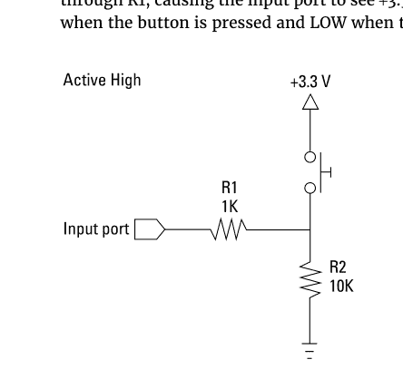

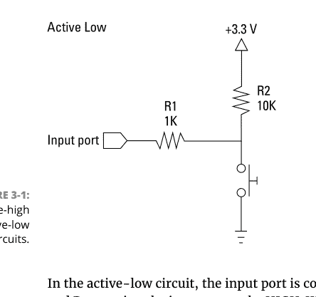

**图 3-1：** 高电平有效和低电平有效输入电路。

在低电平有效电路中，输入端口通过电阻R1和R2连接到+3.3V，导致输入端口为高电平。当按钮按下时，来自+3.3V电源的电流通过R2短路到地，导致输入端口的电压降至零。因此，输入引脚在按钮按下时为低电平，在按钮未按下时为高电平。

在高电平有效电路中，R1被称为*下拉*电阻，因为在按钮未按下时，它将电流从I/O引脚下拉到零。在低电平有效电路中，R1被称为*上拉*电阻，因为在按钮未按下时，它将I/O引脚的电压上拉到+3.3V。


请注意，在两个电路中，R2连接在+3.3V和地之间，以防止按钮按下时短路。如果没有这个电阻，当按钮按下时，树莓派很可能会损坏。


你可能想知道为什么在高电平有效电路中完全需要电阻R1和R2。为什么不直接将输入端口通过按钮直接连接到+3.3V电源？这样，当按钮按下时，+3.3V流入输入端口，记录为高电平状态；当按钮未按下时，输入端口没有任何东西，这将被解释为低电平。有两个原因：

- 当输入端口完全没有连接任何东西时，不能保证树莓派会将其解释为低电平状态。未连接任何东西的活动输入称为悬空输入。悬空输入无法被明确读取为高电平或低电平。
- 需要电阻来限制电流流动，从而防止损坏输入端口或整个电路板。因此，在将按钮等输入连接到GPIO端口时，应始终使用电阻。

# 在Python中检查开关状态

将开关连接到GPIO端口后，你需要知道如何从Python程序中确定开关是断开还是闭合。为此，你必须首先调用 `GPIO.setup` 函数将该端口指定为输入端口。然后，你可以通过调用 `GPIO.input` 函数来检查输入端口的状态。`GPIO.input` 函数根据输入引脚的当前状态返回 `GPIO.LOW` 或 `GPIO.HIGH`。


在Python中，你可以使用GPIO端口的内部端口号或其引脚号来指定它。例如，GPIO端口2实际上连接到引脚3。在本章中，我假设你在程序中使用引脚号而不是内部端口号。要指定此选项，你应该在程序中任何引用端口的语句之前放置以下行：

```python
GPIO.setmode(GPIO.BOARD)
```

要将一个端口指定为输入端口，请使用 `GPIO.setup` 函数，如下所示：

```python
GPIO.setup(3, GPIO.IN)
```

那么，要获取端口的状态，可以调用 `GPIO.input`，如下所示：

```
GPIO.input(3)
```

你可以在 `if` 语句中测试输入端口的状态，像这样：

```
if GPIO.input(3) == GPIO.HIGH:
    print("Input is HIGH")
else:
    print("Input is LOW")
```

下面是一个示例：如果用户按下引脚3（GPIO端口2）上的按钮，则点亮引脚5（GPIO端口3）上的LED；当按钮释放时，则关闭LED：

```
if GPIO.input(3) == GPIO.HIGH:
    GPIO.output(5, HIGH)
else:
    GPIO.output(5, LOW)
```

清单3-1展示了一个有趣的程序，适用于连接了一个有源高电平按钮开关到引脚33，以及连接了LED到引脚35和37的树莓派。该程序会以半秒的间隔闪烁连接在引脚35上的LED，直到按下按钮开关。然后，在按住按钮期间，它会闪烁引脚37上的LED。当你松开按钮时，程序会恢复闪烁引脚35上的LED。

## 清单 3-1: 按钮程序

```
import RPi.GPIO as GPIO
import time

BTN1 = 33
LED1 = 35
LED2 = 37

GPIO.setmode(GPIO.BOARD)
GPIO.setup(BTN1, GPIO.IN)
GPIO.setup(LED1, GPIO.OUT)
GPIO.setup(LED2, GPIO.OUT)

while True:

    if GPIO.input(BTN1) == GPIO.HIGH:
        GPIO.output(LED1, GPIO.HIGH)
        time.sleep(0.5)
        GPIO.output(LED1, GPIO.LOW)
        time.sleep(0.5)
    else:
        GPIO.output(LED2, GPIO.HIGH)
        time.sleep(0.5)
        GPIO.output(LED2, GPIO.LOW)
        time.sleep(0.5)
```

项目53展示了如何构建一个简单的电路来测试清单3-1中的程序，图3-2展示了完成的电路。

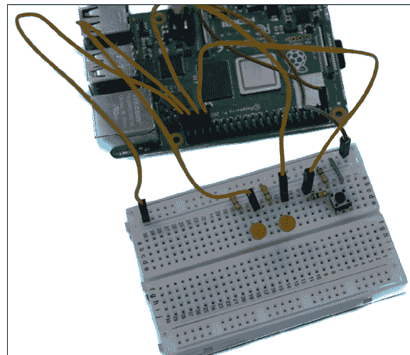

**图 3-2:** 用于测试有源高电平按钮开关的电路（项目53）。

## 项目 53: 按钮控制的树莓派LED闪烁器

在这个项目中，你将一个带有两个LED和一个按钮的面包板连接到树莓派主板上。

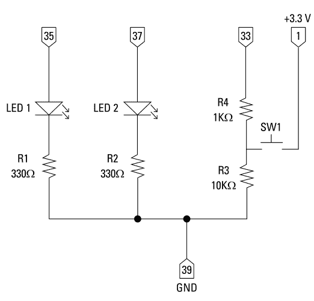

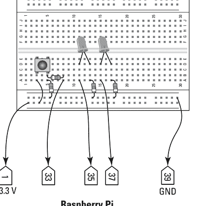

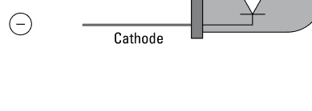

## 零件

- 一块安装了软件、连接了显示器、键盘和鼠标的树莓派
- 一块小型免焊面包板
- 两个5毫米红色LED
- 一个常开DIP面包板按钮
- 两个330 Ω电阻（黄紫棕）
- 一个10 kΩ电阻（棕黑橙）
- 一个1 kΩ电阻（棕黑红）
- 6根跳线

## 步骤

1.  **插入电阻。**

| 电阻 | 起始 | 终止 |
| --- | --- | --- |
| R1 (330 Ω) | A13 | 地线 |
| R2 (330 Ω) | A17 | 地线 |
| R3 (10 kΩ) | A5 | 地线 |
| R4 (1 kΩ) | B5 | B8 |

2.  **插入LED。**

| LED | 阳极 | 阴极 |
| --- | --- | --- |
| LED1 | D11 | D13 |
| LED2 | D15 | D17 |

3.  **插入按钮。**
    引脚应插入C3、E3、C5和E5，使得开关跨接在行3和行5之间打开和关闭。

4.  **用跳线将A3连接到面包板的正电压总线上。**

5.  用跳线将面包板连接到树莓派的GPIO引脚。

| 面包板 | GPIO树莓派引脚 |
|------------|-----------------------|
| A8         | 33                    |
| A11        | 35                    |
| A15        | 37                    |
| 地线总线 | 39                    |
| 正电压总线 | 1                   |

6.  使用Thonny输入并运行LED闪烁程序（参考清单3-1）。

LED2将以半秒的间隔闪烁。如果你按下按钮，LED1将取而代之进行闪烁。

## 读取模拟输入

树莓派是一台纯粹的数字机器。与包括Arduino在内的许多微处理器不同，树莓派没有内置的读取模拟输入的能力。因此，没有直接的方法从电位器、光敏电阻、温度传感器或操纵杆等组件读取像电压电平这样的信号。

要克服这个限制，你需要使用一个将模拟数据转换为数字数据的电路。这样的电路被称为模数转换器（ADC）。构建ADC电路的方法有很多，但最简单的方法是让别人为你构建电路。你可以使用一种叫做MCP3008的廉价IC。这个方便的芯片可以让你将多达八个不同的模拟输入转换为数字输出，供树莓派读取。你可以从在线零售商那里只花几美元就买到一个。

如图3-3所示，MCP3008封装在一个标准的16引脚封装中。表3-1更详细地描述了这16个引脚。

**读取数字和模拟输入**

**图 3-3:** MCP3008模数转换器的引脚图。

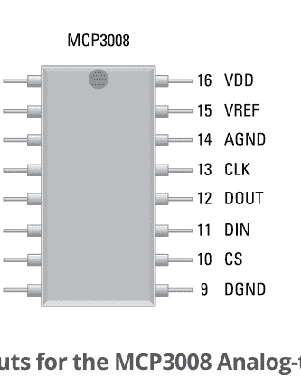

### 表 3-1: MCP3008模数转换器的引脚定义

| 引脚 | 名称 | 功能 |
|-----|------|--------------|
| 1 | CH0 | 模拟输入通道0 |
| 2 | CH1 | 模拟输入通道1 |
| 3 | CH2 | 模拟输入通道2 |
| 4 | CH3 | 模拟输入通道3 |
| 5 | CH4 | 模拟输入通道4 |
| 6 | CH5 | 模拟输入通道5 |
| 7 | CH6 | 模拟输入通道6 |
| 8 | CH7 | 模拟输入通道7 |
| 9 | DGND | 数字电路地 |
| 10 | CS | 片选 |
| 11 | DIN | 数字串行数据输入 |
| 12 | DOUT | 数字串行数据输出 |
| 13 | CLK | 串行时钟 |
| 14 | AGND | 模拟输入地 |
| 15 | VREF | 参考电压输入 |
| 16 | VDD | 电源（+2.7 V至5.5 V） |

当你理解以下关于MCP3008的功能以及如何使用它的要点时，表3-1中描述的每个引脚的功能将变得更加清晰：

- **你可以将多达八个输入电压连接到MCP3008，每个连接到引脚1至8。** 例如，假设你想将电位器用作通道0的输入。为此，将电位器的一端连接到树莓派的任意+3.3 V引脚，另一端连接到树莓派的任意地引脚。然后将电位器的中心端子连接到MCP3008的引脚1。当你转动电位器的轴时，发送到MCP3008通道0的电压将从零变化到+3.3 V。
- **引脚15提供参考电压，它决定了模拟输入通道的电压范围。** 通常，你会将它连接到树莓派提供的+3.3 V电源。这样，模拟输入的最大电压将与参考电压相同：+3.3 V。
- **所有模拟输入通道在引脚14共享一个公共地。** 这通常连接到树莓派的一个地引脚，就像MCP3008的数字地（引脚9）一样。
- **MCP3008将模拟输入引脚上的电压电平转换为一个10位二进制数。** 一个10位二进制数的最大十进制值是1023。因此，MCP3008将模拟输入电压转换为0到1023之间的整数。
- **MCP3008使用一种特殊的串行数据通信形式，称为*串行外设接口*（SPI），来告诉树莓派模拟输入上存在哪些电压电平。** SPI需要四个数字端口才能工作，因此MCP3008将占用你树莓派上的四个GPIO端口。
- **树莓派2、3和4版本中的ARM处理器包含内置的SPI功能，因此你不必担心使SPI工作的细节。** 相反，你只需将MCP3008连接到正确的GPIO引脚，并使用Python中的特殊函数从MCP3008读取数据。
- **默认情况下，SPI通过引脚19、21、23和24上的GPIO端口进行通信。** 虽然可以将SPI通信移动到不同的引脚，但大多数项目没有必要这样做。因此，如果你的项目需要模拟输入，你将希望保留端口19、21、23和24作为MCP3008的通信端口。
- **如果你感兴趣，以下是用于SPI的四个引脚及其功能：**
    - 引脚24是*片选*引脚，用于启动MCP3008和树莓派之间的对话。

## 引脚23是时钟引脚，它提供用于在MCP3008与树莓派之间发送数据的时序。

*   引脚19连接到MCP3008的数据输入引脚，用于将数据从树莓派逐位传输到MCP3008。
*   引脚21连接到MCP3008的数据输出引脚，用于将数据从MCP3008逐位传输到树莓派。

> **MCP3008 提供了模拟输入通道上实际电压的近似值。** 该估算的准确性取决于许多复杂的因素。虽然对于大多数用途来说，这个近似值已经足够接近，但我大概不会用它来操作做眼科手术的激光！

图3-4展示了一个典型电路的原理图，该电路使用MCP3008芯片将电位器连接到树莓派。在此原理图中，电位器的滑动端连接到模拟输入通道0（引脚1），MCP3008的四个SPI引脚连接到树莓派上默认的四个SPI端口。你将在本章后面的实际项目中看到这个电路的一个变体。

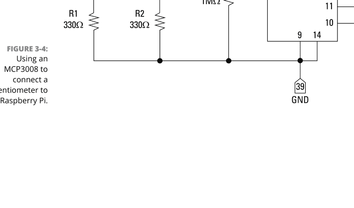

## 在树莓派上启用 SPI

尽管树莓派内置了对MCP3008模数转换器芯片所用的SPI接口的支持，但树莓派操作系统默认禁用了此支持。因此，在使用MCP3008之前，你必须首先在树莓派操作系统中启用SPI支持。步骤如下：

1.  点击树莓派操作系统桌面顶部菜单栏中的终端图标（如边栏所示）。
    一个终端窗口将打开。

2.  输入命令 `sudo raspi-config`。
    如图3-5所示的树莓派软件配置工具将出现。（在图中，我按了两次下箭头键以高亮显示“接口选项”。）

3.  选择 “Interface Options” 并按回车键。
    如图3-6所示的“接口选项”页面将出现。

4.  向下滚动至 “SPI Enter”。

5.  当被问及是否启用SPI接口时，选择 “Yes” 并按回车键。
    一个确认屏幕将显示SPI已启用。

6.  按回车键。

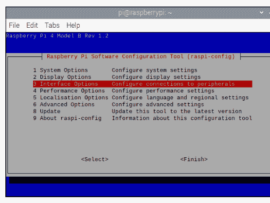

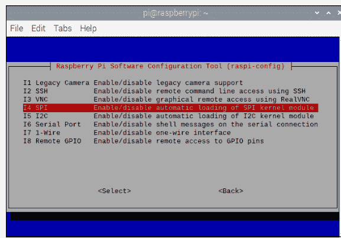

图 3-6：接口选项页面。

7.  选择 “Finish”，然后按回车键。
    你将返回到终端窗口的命令提示符。
8.  关闭终端窗口。
9.  在树莓派操作系统桌面中，选择菜单：Shutdown（关机），选择 Logout（注销），然后选择 Shutdown（关机）。
    你的树莓派将重启。当树莓派操作系统重新启动时，SPI将被启用。

## 在 Python 中使用 MCP3008

Python 没有内置对MCP3008模数转换器芯片的支持，但你可以下载并安装一个方便的函数包，名为 `mcp3008`，它将让你只需一行Python代码就能从MCP3008芯片读取模拟值。安装此软件包需要几个步骤，但并不太困难。

首先，你需要确保你的Python编程环境的关键组件是最新的并且正确安装。确保你的树莓派已连接到互联网；然后通过点击树莓派操作系统桌面顶部菜单栏中的终端图标（如边栏所示）打开一个终端窗口，然后输入以下命令：


```
sudo apt-get update

sudo apt-get dist-upgrade

sudo apt-get install build-essential

sudo apt-get install python-dev

sudo apt-get install python-smbus

sudo apt-get install python3-pip
```

一旦正确的软件包安装完毕，输入以下命令以下载并安装 mcp3008 软件包：

```
pip install https://pypi.python.org/packages/source/m/mcp3008/mcp3008-0.1a2.tar.gz
```

请注意，上述命令必须在一行内完整输入，不能有换行。（命令最后一部分，即最后一个正斜杠之后的内容，应该是 mcp3008-0.1a2.tar.gz。）

mcp3008 软件包下载并安装后，你就可以从 Python 程序访问 MCP3008 了。

## 使用 mcp3008 软件包

mcp3008 软件包提供的函数让你能够确定MCP3008芯片上任意或所有输入端口的值。要使用这些函数，必须在程序开头包含以下行：

```
import mcp3008
```

在读取MCP3008数据之前，还有一点准备工作要做：你必须创建一个变量来访问MCP3008芯片，如下所示：

```
adc = mcp3008.MCP3008
```

此语句创建一个名为 `adc` 的变量，你可以用它来访问MCP3008。

mcp3008 软件包定义了八个常量值，用于引用八个模拟输入通道：

```
mcp3008.CH0
mcp3008.CH1
mcp3008.CH2
mcp3008.CH3
mcp3008.CH4
mcp3008.CH5
mcp3008.CH6
mcp3008.CH7
```

你使用 `read` 函数来读取一个或多个模拟输入端口的值。此函数使用一个端口列表作为参数，这意味着在调用函数时，必须将输入通道常量放在方括号内。例如，要读取输入通道0的值：

```
analog = adc.read([mcp3008.CH0])
```

这里，变量 `analog` 将被设置为一个介于 0 到 1023 之间的整数，对应于模拟输入通道相对于参考电压读取的电压。

你可以读取多个输入通道，如下所示：

```
analog = adc.read([mcp3008.CH0, mcp3008.CH1])
```

在此示例中，读取了通道0和通道1的值。结果是一个包含两个值的列表，然后存储在 `analog` 变量中。要分别获取这些值，你需要对它们进行切片。例如：

```
analogCH0 = analog[0]
analogCH1 = analog[1]
```

这些语句执行后，变量 `analogCH0` 将被设置为模拟通道0的值，`analogCH1` 将被设置为模拟通道1的值。

如果你想，可以通过调用 `read_all` 函数一次读取所有八个模拟通道，如下所示：

```
analog = adc.read_all()
```

这简单地返回一个包含所有八个模拟通道值的列表。

## 清单 3-2：一个使用电位器的 LED 闪烁程序

```
import RPi.GPIO as GPIO
import time
import mcp3008

LED1 = 38
LED2 = 40

GPIO.setmode(GPIO.BOARD)
GPIO.setup(LED1, GPIO.OUT)
GPIO.setup(LED2, GPIO.OUT)

adc = mcp3008.MCP3008

while True:

    pot = adc.read([mcp3008.CH0])
    pause = pot / 1023

    GPIO.output(LED1, GPIO.HIGH)
    GPIO.output(LED2, GPIO.LOW)

    time.sleep(pause)

    GPIO.output(LED1, GPIO.LOW)
    GPIO.output(LED2, GPIO.HIGH)

    time.sleep(pause)
```

项目54展示了如何构建一个包含1 MΩ电位器的电路，以便你可以测试清单3-2中的代码。图3-7展示了完成的电路。

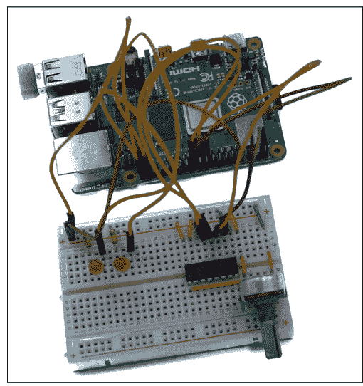

图 3-7：使用电位器控制LED闪烁（项目54）。

## 项目 54：可变速率 LED 闪烁器

在这个项目中，你将连接一个带有两个闪烁LED和一个电位器的面包板，电位器控制LED的闪烁速率。使用一个MCP3008模数转换器芯片将电位器接口到树莓派。

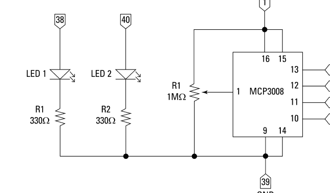

## 树莓派

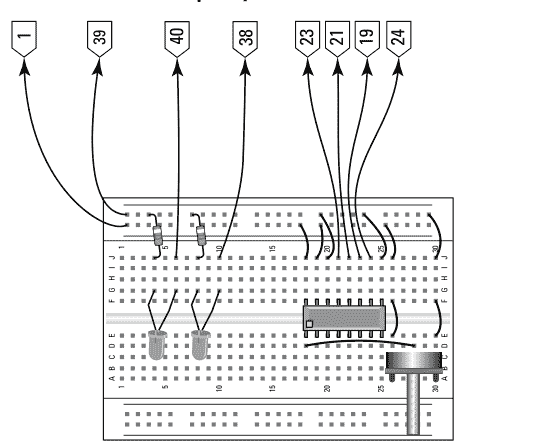

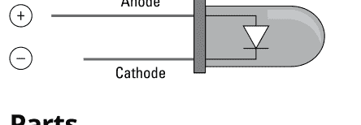

## 部件

- 一个已安装软件、连接了显示器、键盘和鼠标的树莓派
- 一个小型无焊面包板
- 一个MCP3008模数转换器IC
- 两个LED
- 一个1 MΩ电位器
- 两个330 Ω电阻（黄-紫-棕）
- 跳线

## 步骤

1.  **插入MCP3008芯片。**
    调整芯片方向，使引脚1位于E18，引脚16位于F18。

2.  **插入电阻。**

| 电阻 | 从 | 到 |
| --- | --- | --- |
| R1 (330 Ω) | J8 | 接地 |
| R2 (330 Ω) | J4 | 接地 |

3.  **插入LED。**

| LED | 阳极 | 阴极 |
| --- | --- | --- |
| LED1 | G10 | G8 |
| LED2 | G6 | G4 |

4.  **插入电位器。**
    引脚应插入A26、A28和A30。

5.  **插入跳线。**

| 从 | 到 |
| --- | --- |
| D18 | D28 |
| E26 | F26 |
| E30 | F30 |
| J18 | 正极总线 |
| J19 | 正极总线 |
| J20 | 接地总线 |
| J25 | 接地总线 |
| J26 | 正极总线 |
| J30 | 接地总线 |

6.  将面包板上的跳线连接到树莓派的GPIO引脚。

| 面包板 | 树莓派引脚 |
|---|---|
| J6 | 40 |
| J10 | 38 |
| J21 | 23 |
| J22 | 21 |
| J23 | 19 |
| J24 | 24 |
| 接地总线 | 39 |
| 正极总线 | 1 |

7.  使用Thonny输入并运行LED闪烁程序（参见代码清单3-2）。

LED将以由电位器决定的速率交替亮灭。当你转动电位器旋钮时，闪烁速率会增加或减少。


## 特效

## 内容概览

- 第一章：构建色彩风琴 ........................... 815
- 第二章：动画节日灯 .......................... 827
- 第三章：构建动画道具控制器 ............ 851
- 第四章：重现复古科幻机器人头部 ...... 881

本章内容

- 制造一场假雷暴
- 用一台摇摇欲坠的老式发电机为灯光供电
- 让一具骷髅的心脏跳动

## 第一章
## 构建色彩风琴

迪士尼乐园的妙处之一在于，有时你为了乘坐某个游乐项目而排的长队，其体验几乎和项目本身一样精彩。其中一个绝佳的例子就是著名的*印第安纳琼斯冒险：禁忌之眼*。在古老神庙外，你会经过一台勉强运行、摇摇欲坠的蒸汽动力发电机。发电机发出的“咔嗒-咔嗒”声随着它的运转和故障威胁，时而变大时而变小。一进入神庙，你穿过狭窄的隧道和令人毛骨悚然的洞穴，头顶的灯光似乎由那台摇摇欲坠的发电机供电。灯光闪烁、变暗，接着短暂地变亮，然后再次随着吃力的发电机同步闪烁、变暗。

在本章中，你将学习如何构建一个电子电路，用来创造这种令人毛骨悚然的照明效果。我曾多次将此电路用于不同目的，包括在万圣节为我自己的闹鬼墓穴照亮狭窄通道。我还用同一个电路在我前院制造雷暴效果，为我那闹鬼的万圣节墓地增添合适的氛围。同样这个电路还能在守卫场景的塑料骷髅胸中制造出诡异的红色心跳。

这个电路被称为*色彩风琴*，其工作原理很简单：它将音频输入的音量转换为输出电压，声音源越大，输出电压就越高。如果你将一盏灯连接到输出端，当音频输入声音更大时，灯会更亮，声音更小时则更暗。

> 
与本小册子的大多数章节一样，我需要先发出警告：此电路需要你处理线路级电压（120 VAC），因此可能存在危险。电路设计有安全防护措施，但你必须小心，不要绕过它们。每次使用项目时，都应检查所有接线是否松动或磨损，并且绝不能在电路通电时进行操作。

## 探索色彩风琴项目

本章描述的已完成色彩风琴如图1-1所示。该项目安装在一个2x3x6英寸的项目盒中，包括一个将电路连接到墙壁插座的电源插头、一个可连接灯光（最大120W）的电源插座、一个可连接音源（最高60W）的RCA音频输入接口、一个用于调节灵敏度的旋钮以及一个电源开关。

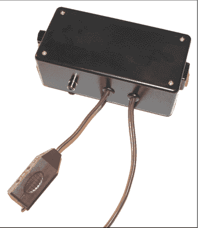

为保持项目简单，你可以使用一个廉价套件来构建电子元件——具体来说，就是Velleman MK110单通道简易灯光风琴套件。这个套件在网上可以以低于10美元的价格广泛购买到；只需搜索*Velleman MK110*，你就能找到多个来源。

图1-2展示了如何将色彩风琴项目连接起来，以创造亮度随音源变化的灯光。你需要一个音源，例如带有外部扬声器输出的组合音响或其他音响系统。

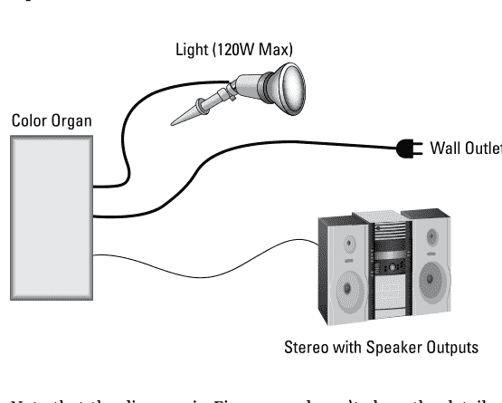

请注意，图1-2中的图表并未显示如何将音响系统连接到色彩风琴和扬声器的细节。将色彩风琴连接到音响系统的最简单方法是，直接用色彩风琴替换其中一个扬声器。这样，色彩风琴响应一个立体声通道，而扬声器播放来自另一个立体声通道的声音。对于这种连接方式，你只需一根一端带有RCA连接器（插入色彩风琴）和另一端具有适合连接音响系统扬声器输出接口的线缆。

你还需要为你的音源准备一个合适的录音。例如，如果你想使用色彩风琴制造雷暴效果，你需要雷声的录音。要让红光随心跳同步闪烁，你需要心跳的录音。互联网上充斥着此类音效，因此找到并下载满足你需求的音效应该不会太困难。如果你想自定义音效，可以从www.sourceforge.net/projects/audacity下载一个名为Audacity的免费音频编辑器。

## 理解色彩风琴的工作原理

设计色彩风琴电路有几种不同的方法。大多数方法都依赖于一种特殊类型的电子元件，称为*双向可控硅*，它本质上是一种设计用于交流电工作的晶体管。它有三个端子。其中两个是阳极，称为A1和A2，第三个是门极。门极上的电压——无论是正电压还是负电压——允许阳极导通。阳极连接到线路负载，门极电压则源自音频输入。

然而，音频输入并未直接连接到双向可控硅的门极。相反，大多数色彩风琴使用两种技术之一来隔离音频输入与电路的线路电压侧。一种方法是使用变压器。另一种是使用*光电隔离器*，它是由一个红外LED和一个光电二极管或其他光敏半导体组成的单一元件。LED两端的电压使LED发光，光电二极管检测到光并将其传递到输出电路。

Velleman MK110套件使用的是光电隔离器双向可控硅，其中光敏半导体实际上是一个由光而非电压触发门极的双向可控硅。光电隔离器是一个采用6引脚DIP封装的集成电路。

图1-3展示了Velleman MK110套件所用电路的简化原理图。如图所示，音频输入施加在光电隔离器的LED侧，由一个电位器控制，该电位器允许你调节电路的灵敏度。光电隔离器的输出施加到双向可控硅的门极，其阳极连接在线路电压电路两端。因此，音频输入的音量直接控制输出电路的电压。

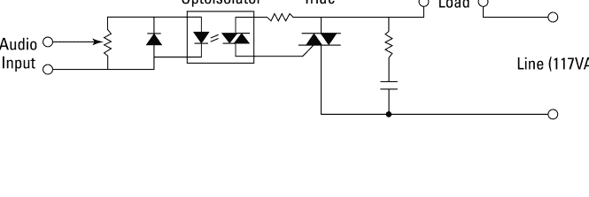

图1-3：色彩风琴电路的原理图。

## 获取构建彩色风琴所需的材料

除了 Velleman 套件本身，构建彩色风琴项目所需的大部分材料都可以在您当地的 RadioShack 商店或任何其他电子元件供应商处购买。下表列出了您需要的所有材料。

| 数量 | 描述 |
|---|---|
| 1 | Velleman MK110 简易单通道灯光风琴套件 |
| 1 | 2-x-3-x-6 英寸塑料项目盒 |
| 1 | 20 毫米电路板支架 |
| 1 | RCA 式唱机插孔 |
| 1 | ¾ 英寸控制旋钮 |
| 1 | 用于 1¼-x-¼ 英寸保险丝的底盘式保险丝座 |
| 1 | 1 A, 250 V, 快速熔断 1¼-x-¼ 英寸保险丝 |
| 1 | ⅜ 英寸 4-40 机器螺钉和螺母（用于安装保险丝座） |
| 1 | SPST 摇臂开关 |
| 2 | ⅜ 英寸护线环 |
| 2 | 螺旋式电线连接器 |
| 5 英寸 | 20 号多股连接线 |
| 1 | 室内延长线 |

## 组装彩色风琴

一旦您收集了彩色风琴的所有材料，就可以开始组装项目了。您需要以下工具：

- 电烙铁，最好具有 20 W 和 40 W 两种设置
- 焊锡

> 对于市电电压的电线使用较粗的焊锡，对于组装 MK110 套件使用较细的焊锡。

- 放大镜
- 十字螺丝刀
- 小型平头珠宝螺丝刀
- 剪线钳
- 剥线钳
- 钳子
- 爱好台钳
- 带有 1/8 英寸、5/32 英寸、1/4 英寸、5/16 英寸、3/8 英寸和 3/4 英寸钻头的钻头

以下是构建此项目的步骤：

1. **组装 Velleman MK110 套件。**

该套件附有简单但准确的说明。基本上，您只需将所有元件安装并焊接到电路板上。特别注意电阻的色环和二极管的方向。

图 1-4 显示了组装完成的 MK110 套件。


> 当我组装这个套件时，我发现最好将电路板固定在一个好的爱好台钳上，并使用鳄鱼夹或遮蔽胶带在焊接时固定元件。


图 1-4：组装完成的 Velleman MK110 套件。

2. **在项目盒上钻出所有安装孔，除了盒子左侧用于灵敏度控制的孔。**

图 1-5 显示了安装孔的大致位置方向。

使用组装好的电路板来确定用于安装电路板的四个孔的精确钻孔位置。其他孔的位置并不关键，但电位器旋钮的孔除外。在步骤 4 之前不要钻那个孔。

3. **将四个支架安装到四个 MK110 电路板安装孔中。**

使用随支架附带的四个机器螺钉。

4. **为电路板的电位器钻孔。**

将电路板放在四个支架顶部，以确定此孔的精确位置。

5. **将两个橡胶护线环插入两个 ⅜ 英寸的孔中。**

护线环很难挤入孔中，但努力一下就能装进去。如果需要，使用平头螺丝刀的小边缘将橡胶边缘推入孔中。

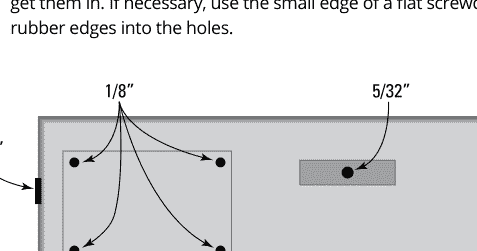

图 1-5：按照此图所示钻孔。

> **提示**：在接下来的步骤中，您将所有部件组装到项目盒中。请参考图 1–6 了解每个部件的正确放置位置。

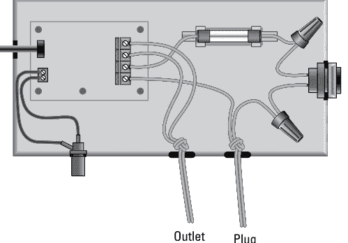

图 1-6：部件在项目盒内的组装方式。

1. **剪断延长线。**
   首先剪断延长线的插座端，留下约 12 英寸的电线连接到插座。然后剪断插头端，留下约 3 或 4 英尺的电线连接到插头。您会剩下几英尺的电线；将这部分电线放在一边以备后用。

2. **将电源线穿过护线环，并在盒子内打一个结。**
   这会很紧，但电线能穿过去。将带有插头的电线拉过靠近开关的孔约一英尺。然后，打一个结，将结拉紧，并拉动插头使结紧贴护线环。这个结起到应力消除的作用。对连接到插座的电线重复相同的过程，将其穿过另一个护线环，打一个紧结，并将结拉紧贴住护线环。当两根电源线都就位后，在项目盒内分开每根电线的两根导线，并从每根导线上剥去约 ½ 英寸的绝缘层。

3. **剪两段 1½ 英寸长的延长线电线，并将它们焊接到开关端子上。**
   您需要从每根电线的两端剥去约 ⅜ 英寸的绝缘层。将电烙铁调至高温设置，并使用粗焊锡。焊锡凝固后，将开关放在一边。

4. **剪两段 1½ 英寸长的延长线电线，并将它们焊接到保险丝座的端子上。**
   同样，您需要从每根电线的两端剥去约 ⅜ 英寸的绝缘层，并使用高温进行焊接。

5. **剪两段 2½ 英寸长的连接线，并从两端剥去 ⅜ 英寸的绝缘层。**

6. **将其中一根连接线焊接到 RCA 式唱机插孔的中心端子上，另一根焊接到接地端子上。**
   此时，您已完成电烙铁的使用，因此可以将其关闭。

7. **将 RCA 式唱机插孔安装到项目盒的 ¼ 英寸孔中。**
   要安装插孔，您首先必须从插孔上取下螺母、接地端子和锁紧垫圈。然后，将连接到唱机插孔中心端子的电线穿过 ¼ 英寸孔，然后将唱机插孔的螺纹端插入孔中。将锁紧垫圈、接地端子和螺母滑过连接到中心端子的电线，然后将它们拧到插孔的螺纹部分。用尖嘴钳拧紧。

在接下来的几个步骤中，您将电线连接到 MK110 电路板。暂时不要将电路板安装到支架上。如果电路板是松动的，连接电线会更容易。所有电线连接完毕后，再安装电路板。


1. **将连接到插座的电线分开的两根导线连接到 MK110 电路板背面标有 Load 的两个端子上。**
   使用小平头螺丝刀拧紧端子。确保电线连接牢固。

2. **将连接到保险丝座的一根电线连接到 MK110 电路板背面的一个 Mains 端子上。**

3. **将连接到插头的一根延长线电线连接到 MK110 电路板背面的另一个 Mains 端子上。**

4. **将来自唱机插孔的两根连接线连接到 MK110 电路板前面的输入端子上。**
   输入端子在电路板上标记为 LS。您需要一个非常小的平头螺丝刀来拧紧这些端子。

5. **将 MK110 电路板安装到支架上。**
   要安装电路板，您需要稍微倾斜它，以便将电位器的轴穿过 5/16 英寸的孔。一旦轴穿过，将电路板放在支架上，并用随支架附带的剩余四个机器螺钉固定。

6. **使用 3/8 英寸 4-40 机器螺钉和螺母安装保险丝座。**
   将机器螺钉穿过项目盒底部的 7/32 英寸孔。然后将机器螺钉穿过保险丝座中心的孔，并拧上螺母。用螺丝刀拧紧。

7. **安装开关。**
   要安装开关，首先取下开关螺纹端的塑料螺母。然后，将电线和开关的螺纹端穿过项目盒侧面的 3/4 英寸孔。最后，将螺母滑过电线并将其拧紧到开关上。

8. **将开关连接到电源线和保险丝。**
   使用其中一个螺旋式电线连接器将一根开关电线连接到保险丝座上未连接的电线上。然后，使用另一个电线连接器将另一根开关电线连接到通向电源插头的未连接电线上。

9. **将保险丝插入保险丝座。**
   猜猜怎么着——您快完成了！图 1-7 显示了所有部件组装完成的项目。

10. **将旋钮安装到从盒子中伸出的电位器轴上。**
    使用小平头螺丝刀拧紧旋钮上的固定螺钉。

11. **将盖子盖在项目盒上，并用提供的螺钉固定。**
    现在您真的完成了！

## 使用色彩风琴

色彩风琴制作完成后，就该用它来创造有趣的声光效果了。为此，你需要将灯光和音响系统都连接到色彩风琴上。

实际使用色彩风琴的步骤相当简单：

1.  将一盏灯连接到色彩风琴的母延长线连接器上。
2.  将扬声器级音频输入连接到 RCA 接口。
3.  将公延长线连接器插入电源插座。
4.  打开色彩风琴。
5.  播放声音。
6.  转动色彩风琴上的旋钮来调节灵敏度。
7.  如果灯始终不亮，请尝试增大立体声音响的输出音量。

色彩风琴的输出电路只能承受 120 瓦的功率，因此需要小心不要使电路过载。你可以使用一个 100 瓦的泛光灯，或者几个 60 瓦的灯泡。也可以使用几串圣诞灯或其他低瓦数的灯。

正如我在本章前面提到的，将色彩风琴连接到音响系统的最简单方法是直接用色彩风琴替换其中一个扬声器。你需要的电缆类型取决于扬声器如何连接到音响系统。如果扬声器使用简单的接线柱连接器，你需要一端是裸线、另一端是 RCA 插头的电缆。如果扬声器使用 RCA 连接器，你需要两端都是 RCA 插头的电缆。

以这种方式使用色彩风琴时，重要的是要意识到色彩风琴将响应立体声录音的一个声道，而扬声器播放另一个声道。在大多数情况下，你不会注意到太大差异。然而，在某些录音中，左声道的声音与右声道的声音非常不同。这可能会影响音质，也可能导致灯光无法与声音完美同步闪烁，因为灯光响应的声音源与通过扬声器听到的声音源不同。

在某些情况下，你可以利用这一点来增强你试图通过色彩风琴实现的效果。例如，在真实的雷暴中，闪电在听到雷声之前很久就会闪烁。要重现这种效果，你只需要一个雷暴的录音，其中雷声先在左声道被听到，然后才在右声道被听到。然后，如果你将色彩风琴连接到左声道，将扬声器连接到右声道，灯光就会在声音被听到之前闪烁。

玩转你的色彩风琴吧！

## 第 2 章
### 动画节日灯光

**本章内容**
- 用电脑控制的炫酷节日灯光装饰你的房子
- 了解 Light-O-Rama 控制器
- 使用 Light-O-Rama 的 Sequence Editor 软件编程灯光序列

你见过那些人们为节日布置的疯狂动画灯光秀吗？成千上万的灯（有时是数万甚至数十万盏）按照音乐节奏排列，创造出令人眼花缭乱的展示效果？通常，灯光会配合曼海姆蒸汽压路机或跨西伯利亚乐团等乐队的酷炫节日音乐进行编排。音乐通常通过低功率 FM 发射机广播，因此当你开车经过房子观看表演时，只需将收音机调到当地广播频率即可听到音乐。如果你不确定我在说什么，只需上 YouTube 搜索“圣诞灯”，你会找到大量视频。

如果你曾想自己创建这样的展示，本章将向你展示如何操作。虽然你可以从头开始设计电路来控制这样的灯光秀，但构建灯光秀最简单的方法是购买一个便宜的灯光控制器。这样，你就可以将精力集中在表演的设计上，而不是灯光控制器的设计上。

有几家公司销售用于节日展示的灯光控制器。我最喜欢的是位于纽约州南格伦斯福尔斯的 Light-O-Rama。我最喜欢 Light-O-Rama 的一点是，你可以购买预组装的灯光控制器，也可以购买套件自己组装控制器。因此，如果你擅长使用烙铁（我假设你是，否则你不会读这本书），你可以通过自己构建电路在基本序列器上节省几百美元。

有关 Light-O-Rama 及其产品的完整信息，请访问 www.lightorama.com。

> Light-O-Rama 控制器不仅适用于节日展示；它们也适用于学校活动、嘉年华、游乐园、商店和博物馆展示、戏剧制作、购物中心等等。事实上，本章展示的 Light-O-Rama 产品是由 Light-O-Rama 的好心人捐赠给弗雷斯诺查菲动物园使用的。

### 介绍 ShowTime PC 控制器

Light-O-Rama 最受欢迎的住宅用灯光控制器叫做 ShowTime PC 控制器，如图 2-1 所示。该控制器（型号 CTB16PC）提供以下基本功能：

- **十六个独立的灯光通道**：每个通道是一个独立的 120 VAC 电路，可以为最多 8 安培的灯光供电。从设备底部垂下的电源线就是你插入灯光的地方；每根电线连接 16 个通道中一个通道的灯光。（控制器的总电流负载不应超过 30 安培。）

在大多数情况下，你不会将灯光直接插入从灯光控制器底部垂下的电源线。相反，你会使用延长线从灯光线连接到灯光实际放置的位置。如果你计划制作节日灯光展示，你需要大量的延长线。

十六个通道足以开始使用 Light-O-Rama 展示，但一旦你设置了第一个表演，你会希望拥有额外的通道。大多数 Light-O-Rama 设置包括两个、三个或四个控制器，总共 32、48 或 64 个通道。

- **能够独立控制每个通道的灯光开关**：控制器还有一些其他特殊效果，例如淡入、淡出、不同的亮度级别、闪烁和微光。

这些特殊效果是 Light-O-Rama 控制器的特别之处。你可以找到便宜得多的方法来简单地开关灯光。例如，两个连接到电脑的 Kit-74 继电器控制器可以以不到 ShowTime PC 控制器一半的价格控制 16 个通道的灯光开关。然而，Kit-74 无法使灯光淡入或淡出，而逐渐使灯光淡入淡出的能力大大增强了灯光秀的效果。

- **电脑控制灯光秀**：你只需通过特殊的 USB 适配器电缆将 ShowTime PC 控制器连接到电脑。然后，运行从 Light-O-Rama 获取的特殊软件来控制表演。

虽然 ShowTime PC 控制器安装在防水容器中，但你的电脑不是。因此，你会想将电脑放在房子或车库里，然后使用长电缆连接到 ShowTime PC 控制器。

- **无需电脑控制灯光秀**：如果你不想从电脑驱动表演，你可以购买一个叫做 *MP3 Director* 的特殊设备，让你无需电脑即可控制表演。

- **可扩展性**：你可以将多达 240 个 ShowTime PC 控制器连接在一起，创建一个拥有多达 3,840 个独立灯光电路的大型表演。你需要一个小型核反应堆来为所有这些供电，但这是可能的。

> 如果你想开始使用 Light-O-Rama，我建议你购买它的入门套件之一。你可以购买一个完全预组装的套件，包括一个 16 通道的 ShowTime PC 控制器、USB 适配器和软件，价格低于 400 美元，或者你可以购买价格低得多的 DIY 套件。这些套件需要你将组件焊接到电路板上，但自己组装电路板会给你带来亲手制作的满足感。

### 查看基本的 Light-O-Rama 设置

图 2-2 展示了使用单个 16 通道 ShowTime PC 控制器控制多达 16 个独立灯串的基本设置。以下段落描述了此设置中的每个元素：**ShowTime PC 控制器：**通常安装在室外靠近灯具的位置。它配备防水外壳，因此可以放置在室外。

虽然图中未显示，但 ShowTime PC 控制器需要交流电源供电。因此，您应将控制器安装在电源插座附近。

控制器有两个电源插头，每个插头为16个灯光通道中的一半提供电力。如果将这两个电源线插入同一个电源插座，控制器的总照明容量将受所插入插座的最大安培额定值（通常为15A）限制。但是，如果将两个插头分别插入不同插座，并且这两个插座位于不同的电路上，则控制器照明容量可以加倍至30A。

**灯具：**连接到从控制器底部垂下的16条电源线。有关选择灯具的更多信息，请参阅本章后面的“为您的展示选择灯具”部分。

**计算机：**运行控制灯光的 ShowTime 软件。您需要将计算机放置在安全且不受天气影响的位置。

遗憾的是，Light-O-Rama 的软件并非免费。如果您购买了 Light-O-Rama 的入门套件，软件已包含在购买价格中；但如果您购买自行组装套件并自行组装电路板，则需要单独购买软件（费用低于50美元）。

有关使用 Light-O-Rama 软件的更多信息，请参阅本章后面的“使用 Light-O-Rama 序列编辑器”部分。

**USB 适配器：**用于将计算机连接到 ShowTime PC 控制器。有关 USB 适配器的更多信息，请参阅本章后面的“将控制器连接到计算机”部分。

**音响系统：**播放或广播与灯光同步的声音。音响系统连接到计算机的耳机输出，并通过扬声器放大声音或广播声音，以便通过调频收音机收听。

如果您希望通过扬声器播放声音，可以使用任何带有输入插孔且功率足够的放大器，以您期望的音量播放声音。我通常使用一个吉他放大器，但我也曾使用过手提音响。

如果您希望通过广播音乐，让人们在开车经过您家时能用汽车收音机收听，可以从互联网上许多来源购买低功率调频广播设备。Light-O-Rama 销售的一款设备价格约为125美元。

## 理解通道和序列

在 ShowTime PC 控制器或其他类似的节日灯光控制器中，灯光通过通道控制。每个通道是一个独立的电路，您可以将一个或多个灯串连接到该通道。重要的是要记住，控制器无法控制连接到某个通道的单个灯；单个通道上的所有灯作为一个整体单元协同工作。

序列只是一个录制的程序，按照特定顺序激活连接到控制器每个通道的灯光，通常与音乐同步。设计优秀节日灯光展示的艺术在于创建巧妙的序列，从有限数量的通道中榨取最大的影响力。

规划灯光表演时，第一步是确定表演需要多少通道，以及每个通道将控制哪些照明元素。例如，您可能在房屋屋顶线安装几串冰柱灯，并将这些灯连接到其中一个通道。这样，控制器就可以作为一个整体单元同时开启或关闭冰柱灯。或者，您可以在灌木上安装彩色灯，并将其连接到自己的通道。然后，控制器就可以开启或关闭该灌木。

没有理由不能将连接到不同通道的灯在物理上重叠放置。例如，您可以将一串连接到一个通道的绿色灯安装在灌木上，并将一串连接到另一个通道的红色灯也放置在同一灌木上。这样，控制器就可以让灌木呈现绿色、红色或同时呈现绿色和红色。或者控制器可以让灌木交替闪烁绿色和红色——当然要与音乐节奏同步。

同样，您也可以将不同颜色或种类的灯安装在院子不同区域，但都连接到同一个控制器。例如，您可以在一个灌木上使用红色灯，在另一个灌木上使用绿色灯，但它们都连接到同一个通道。这样，控制器可以同时开启或关闭这两个灌木——一个绿色，一个红色。

您甚至可以在两个灌木上都安装一串绿色灯和一串红色灯，但将第一个灌木上的绿色灯串和第二个灌木上的红色灯串连接到一个通道，将第一个灌木上的红色灯串和第二个灌木上的绿色灯串连接到另一个通道。然后，您可以创建一个序列，让灌木交替闪烁绿色和红色。

请记住，控制器的功能不仅仅是开关灯。例如，控制器可以按您想要的任意速度让每个通道的灯光渐亮或渐暗。如果单个灌木上有绿色和红色的灯，您可以创建一个序列，使灌木逐渐从绿色变为红色，然后再变回绿色。

您还可以利用通道在灯光表演中创造动态效果。一个简单的例子是，假设您设置几串从中心点辐射出的灯，就像轮子的辐条。如果每个辐条上的灯连接到几个通道，您可以通过依次激活每个辐条来制造轮子旋转的错觉。

可能性仅受限于您的创造力和您可用的通道数量。通道越多越好，因为更多的通道可以让您创建更复杂的序列。如果您从16通道控制器开始，不久您就会想将其扩展到32通道，以便创建更具创意的序列。

## 为您的展示选择灯具

您可以将许多不同类型的灯具与 Light-O-Rama 或其他灯光控制器一起使用。在节日期间去任何百货商店，您都会发现种类繁多的灯具可供选择，或者您可以从在线来源如 www.1000bulbs.com 或 www.christmaslightsetc.com 购买灯具。

为您展示购买灯具的最佳时间是圣诞节后的第二天，届时大多数零售店会将其降价至少50%。

以下段落描述了节日展示中最常用的灯具类型：

- **白炽迷你灯：**100个或更多不同颜色灯泡组成的灯串。这些灯有白色、红色、绿色、蓝色、紫色和黄色等多种颜色。您也可以找到混合颜色的彩色灯串。如果您仔细寻找，还可能找到其他颜色。在万圣节期间，您可以找到橙色和紫色的迷你灯。迷你灯设计为在2.5V交流电压下工作。它们以每50个灯为一组串联连接，使其能够在120V交流电压下工作。这种布置的缺点是，由于灯是串联连接的，如果其中一个灯从插座中弹出或松动，整个回路的连续性就会中断，所有50个灯都会熄灭。您可以将多个迷你灯串首尾相连连接到单个通道上，但不应将超过五串每串100个的灯首尾相连，否则会烧断插头内置的保险丝。

- **网灯：**将迷你灯编织成网状，可以铺在灌木或其他小树上。通常，每张网有300个灯。

- **LED灯：**通常与迷你灯大小相同，但采用LED而非白炽灯泡制成。LED灯比白炽灯消耗的电能少得多；事实上，一整串LED灯消耗的功率大约与一个迷你灯相同，并且您可以将多达20串灯首尾相连。因此，您可以将更多LED灯连接到单个通道上。但是，LED灯比白炽迷你灯更昂贵。

- **C7灯：**与夜灯大小相同的白炽灯。C7灯串通常每串有25个插座。（C7的名称指的是底座的大小。）C7灯在120V交流电压下工作，因此它们是并联连接的。如果一个灯熄灭或被移除，该串的其余灯仍会亮起。您可以将多串C7灯首尾相连，但不应将超过三串连接在一起，以避免电路过载和烧断保险丝。

- **C9灯：**类似于C7灯，但更大。

- **灯带：**将白炽迷你灯或LED灯封装在柔性透明管中制成的灯串。您可以在零售商店购买短段（通常为18英尺）的灯带，或者从在线来源如 www.1000bulbs.com 或 www.christmaslightsetc.com 购买150英尺商业级灯带卷。

- **吹塑模型：**由半透明塑料制成，内部有灯泡的雕塑。大多数吹塑模型内部只有一个白炽灯泡，通常为40W或60W。如果您的展示中有多个吹塑模型，您可以将它们都连接到控制器的同一个通道，以同时开关；或者，如果您有足够的通道，可以将每个连接到单独的通道以单独控制。（明白为什么需要更多通道了吗？）

- **线框雕塑：**由粗电线弯曲并焊接成形状（如鹿、圣诞树、礼物等）制成的雕塑。然后用白炽迷你灯或LED灯串进行照明。

- **大圣诞树：**一种流行的灯光雕塑，制作简单。您只需要一根高杆和几串灯。将每串灯的一端固定在杆顶，然后用桩子将灯串的另一端植入地面，围绕杆底形成一个环。使用的灯串越多效果越好。如果您使用交替颜色的灯，并将每种颜色连接到单独的通道，您可以创造出一些有趣的动画效果。

## 设计布局

创建节日灯光展示最重要的步骤之一是设计灯光布局。为此，首先需要绘制庭院（或您计划使用的任何空间）的示意图。图不必严格按比例绘制，但相对准确的比例会有帮助。如有条件，您可以拿卷尺粗略测量，并在方格纸上勾勒出空间轮廓。接着，标出您希望放置灯光和其他装饰品（如线框雕塑、吹塑人偶或大型树木灯饰）的位置。

确定灯光元素的位置后，开始为每个元素分配通道编号。如果使用16通道控制器，请为每个灯光元素分配1到16的编号。

## 组装ShowTime PC控制器

如果您购买的是Light-O-Rama品牌的ShowTime PC控制器DIY套件，则需要自行组装。这意味着您必须将所有组件焊接到主电路板上，将电路板安装到防水容器中，并连接设备运行所需的所有线缆。

此处不会重复套件附带的组装说明，因为说明书非常详尽。但我想分享几个可能简化流程的技巧：

-   **预留充足时间**。即使您擅长使用电烙铁，电路板上组件众多，完全组装可能需要两三个晚上。
-   **通读完整组装说明**。这样就不会遇到意外情况。
-   **清理工作台**。套件包含大量细小零件，需要足够空间摆放。
-   **整理零件**。准备若干小容器存放不同部件，保持条理清晰。我个人喜欢使用一次性小塑料碗。
-   **焊接前固定零件**。可使用蓝色美纹胶带在焊接时固定零件。
-   **关闭电视**。组装复杂套件时最忌分心。
-   **使用带光源的放大镜**。能大幅降低工作难度。
-   **固定电路板**。焊接时使用第三只手工具或微型台钳固定电路板会更方便。
-   **使用合适的焊接工具和技术**。确保使用低功率电烙铁（25W）和细焊锡处理敏感部件，尤其是集成电路。这些芯片直接焊接在电路板上，过热可能造成损坏。

图2-3展示了电路板组装过程。

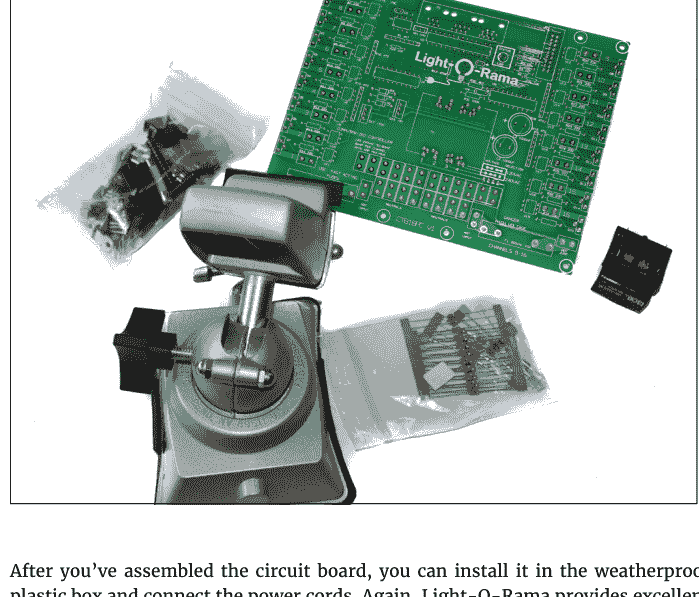

**图2-3：** ShowTime PC电路板组装

完成电路板组装后，可将其安装到防水塑料盒中并连接电源线。Light-O-Rama对此步骤提供了详细的图文说明，此处不再赘述。

另有一条建议：准备一套编号电工贴纸，以便正确标记16条电源线。任何销售电气用品的家装店都能买到这种贴纸。如果安装时不标记线缆，后续将无法分辨哪条线对应哪个通道。

## 连接控制器与计算机

ShowTime PC控制器通过名为RS-485的数字协议与外部设备通信。大多数计算机没有RS-485端口但配有USB接口。USB适配器可将USB信号转换为RS-485信号，使计算机能够与ShowTime PC控制器通信。图2-4展示了USB适配器。

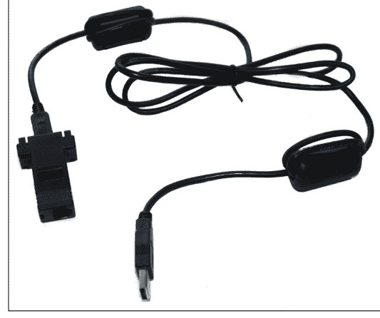

USB适配器附带短线USB线（用于连接计算机USB端口）和Cat5网线（用于连接适配器与控制器）。Cat5线缆与大多数计算机网络使用的线缆相同。这种线缆最远可达4000英尺，这个距离或许适合迪士尼乐园，但您可能希望将控制器控制在计算机数十英尺范围内。

Light-O-Rama也销售串行适配器，可将RS-485信号转换为PC上曾经普遍使用的标准串行端口协议。由于现代计算机通常不配备串行端口，您可能会选择USB适配器。（注意：若使用串行适配器，连接适配器与控制器的Cat5线缆最大长度为100英尺。）

> **重要提示：** 将适配器插入计算机USB端口前，务必先遵循USB适配器附带的说明。具体应先运行随适配器附送CD中的驱动安装程序，完成驱动安装后再插入适配器。若先插入适配器再安装驱动，Windows很可能安装错误驱动程序，且该驱动会与适配器关联，导致正确驱动难以安装。

## 测试ShowTime PC控制器

完成ShowTime PC控制器组装后，应进行测试以确保其正常运行。首先需安装Light-O-Rama ShowTime软件套件和USB适配器驱动程序，然后按以下步骤连接控制器：

1.  将ShowTime PC控制器的两根电源线插入插座。电路板上的状态LED灯闪烁，表示电源已接通但设备尚未连接计算机。
2.  将USB适配器附带的USB线一端插入适配器，另一端插入计算机。
3.  将连接ShowTime PC控制器的Cat5网线插入USB适配器。控制器状态LED灯持续闪烁。
4.  在一条或多条电源线上插入灯具。建议使用廉价小夜灯，通常在任何一元店都能买到——没错，单价一美元。由于价格低廉，您或许想购买16个分别插入各通道测试，或少量插入前几个通道测试。

连接控制器与计算机后，可使用Light-O-Rama软件测试连接。操作步骤如下：

1.  在计算机上运行Light-O-Rama Hardware程序。点击开始按钮，选择所有程序，进入Light-O-Rama文件夹，选择Light-O-Rama Hardware。程序启动后显示图2-5界面。
2.  点击程序窗口左上方的“自动配置”按钮。程序将搜索计算机所有可用COM端口，直至找到与USB适配器关联的端口。

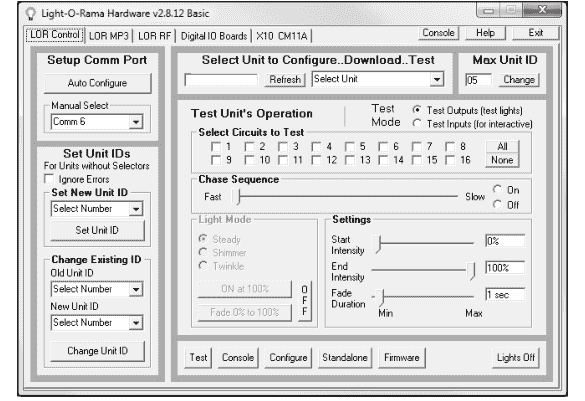

**图2-5：** Light-O-Rama硬件程序

3.  将最大搜索设备数改为5。点击窗口右上角“最大设备数”区域的“更改”按钮，在弹出对话框中将滑块拖至最左端，然后点击“保存”。
    此步骤能节省后续搜索时间。程序遍历所有可能地址寻找控制器需要数秒时间，将最大值从240改为5可避免漫长等待。
4.  点击“刷新”按钮搜索ShowTime PC控制器。完成上一步后，程序将在数秒内找到控制器。界面轻微变化表示控制器已识别。
5.  点击窗口底部的“控制台”按钮，打开如图2-6所示的控制窗口。
6.  为每个连接灯具的通道上下拖动对应滑块，验证灯具开关状态。若某通道不工作，请检查灯泡是否损坏、灯具是否连接正确电源线，带开关的灯具需确认开关已打开。
7.  将灯具移至其他电源线重复步骤6，测试所有通道。需确认控制器全部16个通道均正常工作。

## 使用 Light-O-Rama 序列编辑器

Light-O-Rama 软件套件的核心部分是序列编辑器，它允许您创建与音乐同步的灯光序列。*序列* 是一个文件，存储了将灯光与一段选定音乐同步所需的信息。音乐本身则存储为一个单独的 MP3 格式音频文件。

您也可以使用序列编辑器来播放一个序列。当它播放序列时，MP3 文件会被加载并通过计算机的扬声器或其他音频输出设备播放。此外，序列编辑器会向 ShowTime PC 控制器发送指令，以配合音乐依次激活灯光。

在 Light-O-Rama 中，一个 *序列* 通常与一首单独的歌曲相关联。两个或多个序列可以组合创建一个 *表演*，这使您可以循环播放一组歌曲，这样观众就不必反复观看同一首歌。您还可以设置一个 *日程表*，它会在特定时间和日期自动启动和停止表演。因此，通过设置序列、表演和日程表，您可以完全自动化灯光表演的各个方面。

在本章的剩余部分，我将向您介绍使用序列编辑器创建简单序列的一些基本概念。不过，您应该了解，您可以从 Light-O-Rama 的网站上购买预编程的序列，价格大约为每首歌 30 美元。即使为一首简单的歌曲编程序列，也轻易需要 10 个小时或更长时间，而编程复杂的序列很快就会变成一项全职工作。因此，即使每首歌 30 美元，购买预编程序列也可能是值得的。

## 理解序列

在 Light-O-Rama 中，序列以类似电子表格程序中的网格形式表示。例如，图 2-7 展示了一个非常简单的序列的一部分，其中通道 1、3 和 5 上的灯光每隔半秒交替开关。

网格中的每一行代表控制器中的一个可用通道。因此，一个在 16 通道控制器上播放的序列的网格将有 16 行，每行对应一个通道。最初，这些通道根据控制单元编号（图中为 01）和通道编号（图中为 1 到 16）命名。但是，您可以轻松地将行名称更改为更有意义的内容，例如 *红灌木丛* 或 *圣诞老人帽子*。

网格中的每一列代表一个时间间隔。当您首次设置序列时，您可以指定网格使用的时间间隔。对于图 2-7 中的序列，我指定每列应为十分之一秒。

当网格单元格填充为深色时，对应的通道打开。当网格单元格为空时，对应的通道关闭。因此，从左到右查看网格单元格，您可以看到通道 1、3 和 5 打开 0.5 秒，关闭 0.5 秒，打开 0.5 秒，依此类推。

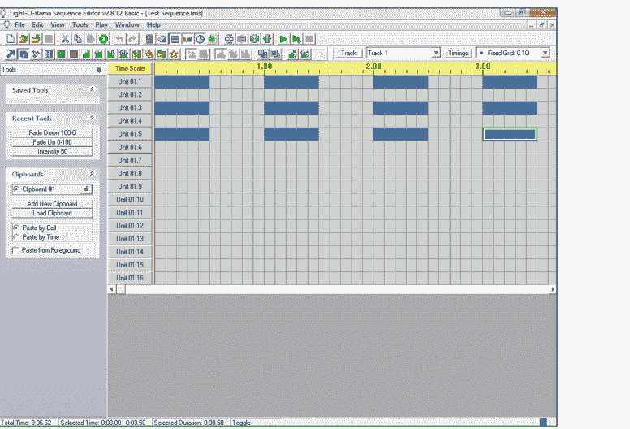

图 2-7：一个简单的 Light-O-Rama 序列。

> 💡 提示

Light-O-Rama 允许您创建这两种不同类型的序列：

- **音乐序列：** 灯光在此序列中与音乐同步。音乐序列始终关联一个 MP3 文件，并且 Light-O-Rama 一次只能播放一个音乐序列。
- **动画序列：** 此序列没有关联音乐文件。动画序列不是将灯光与音乐同步，而是用于创建简单的灯光动画，例如挥动的圣诞老人或抛雪球的雪人。Light-O-Rama 可以同时播放多个动画序列。因此，如果您愿意，可以让您的雪人向挥动的圣诞老人抛雪球。

### 创建音乐序列

要使用序列编辑器创建音乐序列，请按照以下步骤操作：

1. **在序列编辑器中，选择 文件 ➤ 新建。**
   这将显示如图 2-8 所示的对话框。


图 2-8：选择要创建的序列类型。

2. 选择 新建音乐序列，然后点击 确定。

系统会提示您选择一个 MP3 文件作为序列的音乐基础。

3. 找到并选择要用作序列的 MP3 文件，然后点击 打开。

随后将出现如图 2-9 所示的对话框。

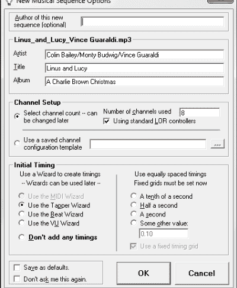

图 2-9：填写音乐序列选项。

4. 仔细查看所有选项，如果需要，更改其中一些选项。

您应该熟悉创建新音乐序列时可用的各种选项。对于您的前几个序列，我建议您选择以下选项：

- *使用的通道数*：将其设置为您的控制器中的通道数。默认值为 8。如果您使用的是 16 通道控制器，请将此值更改为 16。
- *初始时序*：将此值从默认选项（使用轻敲向导）更改为 十分之一秒。轻敲向导非常有用，但您应该在尝试它之前创建一些不使用它的简单序列。

5. 点击 确定。

序列编辑器将创建一个空白序列，如图 2-10 所示。

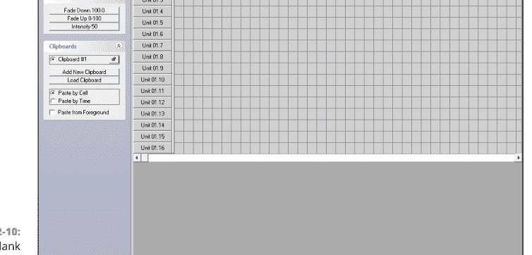

6. 填充序列。

为此，您使用工具栏中的按钮以各种方式打开和关闭通道。以下是这些常用按钮的功能说明：

| 按钮 | 名称 | 功能说明 |
|---|---|---|
|  | 开 | 打开灯光。 |
|  | 关 | 关闭灯光。 |
|  | 切换 | 切换灯光状态：如果关闭则打开，如果打开则关闭。 |
|  | 设置亮度 | 将灯光设置为您选择的任何亮度。 |
|  | 淡入 | 灯光逐渐从关变亮。点击此工具，然后在单元格范围内拖动，以指示淡入速度。 |
|  | 淡出 | 灯光逐渐从亮变关。点击此工具，然后在单元格范围内拖动，以指示淡出速度。 |
|  | 智能渐变 | 如果从左向右拖动，灯光渐亮。如果从右向左拖动，灯光渐暗。 |
|  | 闪烁 | 使灯光缓慢闪烁。 |
|  | 微光 | 使灯光快速微光。 |

7. 要测试序列，请点击工具栏中的播放按钮。

当您听得差不多时，点击停止按钮以停止播放。

8. 使用 文件 > 保存 命令保存您的序列。

在创建序列时，请务必经常保存，这样即使出现错误，您也不会丢失太多工作。

以下是在创建序列时需要考虑的一些额外提示和要点：

- 您可以使用撤消（Ctrl+Z）来撤消任何错误。
- 如果您选择一个工具，然后在单元格范围内拖动，该工具将应用于范围内的所有单元格。请注意，如果您在拖动范围时使用切换工具，范围内的每个单元格将单独从开变为关或从关变为开。
- 当您使用渐变工具时，涉及渐变的单元格的颜色表示灯光将如何渐变。
- 您可以通过点击行左侧边距中的行按钮来更改每行的名称及其渲染颜色。这将显示如图 2-11 所示的通道设置对话框。虽然不是必须的，但将行颜色更改为与通道显示的灯光颜色相匹配可以帮助您更好地可视化表演，而更改通道名称使得跟踪通道在表演中的使用情况变得更加容易。
- 应用效果的另一种方法是右键单击一个单元格或单元格范围。当您这样做时，会弹出一个列出所有各种效果的菜单。
- 您可以使用 查看 ➤ 缩放 命令来放大或缩小，以获得更精细的控制或查看更多全局内容。
- 如果有所帮助，您可以通过选择 查看 ➤ 波形 使波形文件可见。图 2-12 显示了一个波形可见的序列。

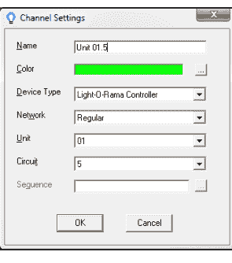

图 2-11：更改行的名称或颜色。

## 可视化您的演出

为了帮助您预览演出运行时的样子，您可以使用 View ⇨ Animation 命令。这将打开如图 2–13 所示的窗口，您可以在其中粗略绘制您的灯光布局。当您在序列编辑器中运行演出时，您在此窗口中绘制的灯光会模拟实际演出效果进行开关。

在开始向动画窗口绘制灯光之前，您应首先导入一张您院子的照片。为此，您显然需要先拍摄您院子的照片并上传到您的计算机上。然后，单击 Select 按钮，浏览并选中该照片。系统会询问您希望叠加在照片上的网格大小。之后，照片将被添加到动画窗口中，如图 2–14 所示。

要为您的灯光着色，首先从照片左侧的下拉菜单中选择您想要着色的通道。然后，选择 Draw 单选按钮，并在照片上大致按照它们在您院子里的实际位置绘制灯光。请逐个通道绘制灯光。如果画错了，选择 Erase 单选按钮，然后单击错误之处以擦除。图 2–15 展示了一张绘制了部分灯光的房子照片。

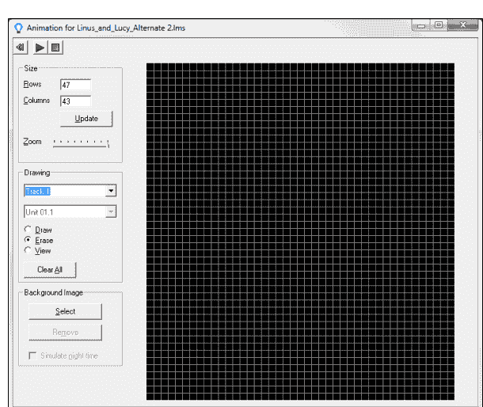
图 2-13：动画窗口。


图 2-14：带有背景图片的动画窗口。

848 书籍 8 特效


图 2-15：已绘制灯光的动画窗口。

## 构建动画电子道具控制器

## 本章内容
- 考虑动画电子道具的控制需求
- 了解 EFX-TEK 的微控制器产品
- 检查继电器控制的编程要求
- 研究声音控制的编程要求
- 响应运动探测器
- 一个完整的吓人玩偶盒道具程序

动画电子技术是指用于创建自动运动木偶的技术。其运动由电机、伺服电机、压缩空气或气动技术等机械方式提供。动画电子木偶通常由微处理器控制。

我对动画电子技术的迷恋始于幼年，当时我第一次游览迪士尼乐园，被有生以来见过最奇妙的三样东西迷住了：*魔法提基屋*，里面充满了会唱歌和讲笑话的奇妙机器鸟；*加勒比海盗*，里面有那些英勇的海盗们；当然还有*幽灵公馆*，里面有 999 个幽灵，还为一个新来的留着位置。

幽灵公馆是 *pièce de résistance*。从那以后，我就对所有与万圣节有关的事物着了迷，并多年来断断续续地捣鼓制作自己的动画电子幽灵和妖精。

在本章中，我将向您展示如何构建一个基于微处理器的控制系统，我曾在我最好的几个万圣节道具中使用过它。我曾用这个完全相同的电路制作了一个会突然出现的科学怪人、一个会突然出现的木乃伊和一个巨大的玩偶盒，但您可以使用这个电路来控制几乎您能想象出的任何种类的动画电子装置。

请注意，动画电子技术的应用并不仅限于万圣节。您可以将它们用于戏剧演出、学校募捐活动，或用于推广和营销目的。例如，如果您拥有一家花店，您可以为店面展示制作动画电子花；或者如果您拥有一家礼服店，您可以制作一个穿着您最精美礼服的动画电子舞者来吸引顾客。唯一的限制是您的想象力。


动画电子装置在构建和使用时都应小心，因为它们可能很危险。您必须确保观看您的动画电子装置的任何人都不会暴露于任何危险之下，例如松动的电气连接或有故障的压缩空气接头。请确保将您完成的动画电子装置放置在一个安全的区域，任何人都无法触碰到它，并确保所有电气和压缩空气接头都完全牢固。

如果您的动画电子道具使用压缩空气，请格外小心！本章不会向您展示如何处理压缩空气，因为那是一整本书的内容。如果您想使用压缩空气，请始终使用专业设计和制造的组件，例如气缸和弹出机构。不要尝试用 PVC 管、自行车泵或任何其他非专门为压缩空气设计的材料来制作您自己的压缩空气缸。并且要小心 eBay 或其他在线网站上出售的廉价压缩空气设备。一个优质、安全的压缩空气装置应该花费您几百美元。如果它在网上只卖 49 美元，那它可能并不安全。

# 了解动画电子道具控制的需求

无论是用于鬼屋、贸易展会展位、商店展示还是博物馆，一个典型的动画电子道具都需要以下要素来实现预期效果：

- 大多数道具都需要某种触发器来启动道具的例程。触发器可以像您或顾客按下的启动例程的按钮那样简单，也可以是一个每 5 或 10 分钟自动启动道具的计时器。第三种选择是使用运动探测器，当在道具附近检测到运动时，道具就会启动。

- 所有道具都需要一种方法来控制道具的执行器，即导致道具移动的部件。最常见的执行器类型是电动机、伺服电机和压缩气缸。如果您使用电动机，道具控制器通常通过直接向电机施加电流来打开或关闭电机。如果您使用伺服电机，道具控制器必须向伺服电机发送时序脉冲来控制其位置。如果您使用压缩气缸，道具控制器则会打开和关闭允许空气进入气缸的电动阀门。

- 大多数道具需要灯光效果，使观众能够看到道具的运作。在某些情况下，这就像当道具启动其例程时一个或多个灯亮起，当例程结束时灯熄灭那样简单。在其他情况下，会在例程期间使用各种灯光，在演出的不同部分突出道具的不同部位。

- 一些道具使用与道具动作同步的声音。例如，一个动画面孔可能会说话，一个可怕的生物在突然移动时可能会尖叫，或者道具可能会使用音乐来增强其效果。

本章我向您展示如何构建的道具控制器满足了所有这些需求。它基于一种名为 BASIC Stamp 的微处理器，在许多方面与 Arduino 类似。BASIC Stamp 提供了足够的计算能力来控制灯光和声音，并激活一些气动阀门和电动机。

本章展示的控制器并非使用 Parallax 公司的 BASIC Stamp 模块构建，而是使用一家名为 EFX-TEK 的公司的组件，该公司专门从事用于动画电子道具控制的微处理器组件。该道具控制器使用了 EFX-TEK 的三种产品：一个 Prop-1 控制器板，其中包含一个 BASIC Stamp 微处理器；一个 RC-4 继电器板，最多可容纳四个继电器以切换 120 VAC 电路；以及一个 AP-16+ 声音板，可编程播放存储在标准 SD 存储卡上的声音。

有关这些组件及其使用方法的更多信息，请参阅本章后面的“构建道具控制器”部分。


EFX-TEK 最近用一款名为 RC-4+ 的新型改进版本取代了其 RC-4 继电器板。RC-4+ 与 RC-4 兼容，因此您可以使用任意一种板来构建道具控制器。

## 剖析一个典型的电子动画道具

图 3-1 展示了一个我几年前制作的、用于万圣节鬼屋的典型电子动画道具。这个道具是一个大惊吓盒子，它会无害地播放“《鼬鼠，蹦出来！》”这首歌，同时道具一侧的曲柄会慢慢转动，直到一个毫无戒心的访客靠近它。然后——在令人惊骇的一瞬间——音乐停止，盒盖猛地弹开，一个巨大的小丑头冒出来，一盏明亮的灯亮起以确保你能看到小丑，同时一个阴森的声音尖叫道：“不给糖就捣蛋！”片刻之后，灯熄灭，小丑缩回盒子里。几秒钟后，曲柄重新开始转动，音乐再次播放，而这个惊吓盒子则等待着下一个受害者。


图 3-1：惊吓盒子道具。

惊吓盒子基本的弹出动作是由一个压缩空气装置实现的，该装置可以通过一个电控阀门来控制。当阀门关闭时，机构收缩在盒子内部。当阀门打开时，压缩空气流入一个气缸，将机构向上推起。小丑头就安装在这个机构的顶部。惊吓盒子的盖子位置设置得恰到好处，当机构向上推起时，小丑的头会将盖子顶开。当机构收缩，小丑缩回盒内时，重力会负责将盖子关上。

请注意，本章的重点是向你展示如何构建这个道具的电子部分——即控制道具动作的道具控制器。本章不会教你如何制作道具本身。这个道具控制器具有通用性，足以控制几乎所有包含简单动作（如气动弹出、电机、灯光和声音）的道具。事实上，我已经将这个完全相同的设计用在了六个不同的万圣节道具上。

尽管如此，了解道具控制器如何在具体道具中运作仍然很有益处，因此以下段落将大致描述我是如何制作这个惊吓盒子道具的。这将让你对其运作方式有个大致的了解，以便你能理解道具控制器如何与之配合工作：

- 这个道具最重要的组成部分是气动升降机构。我大约花了 250 美元从一个在线的万圣节道具机构分销商那里购买了它。如果你在网上搜索，会找到几家制造安全、专业品质压缩空气机构的分销商。只需搜索“Halloween prop lifter”（万圣节道具升降机），你就能找到多家供应商。你也可以在 eBay 上找到它们出售。

图 3-2 显示了升降机构的特写照片。

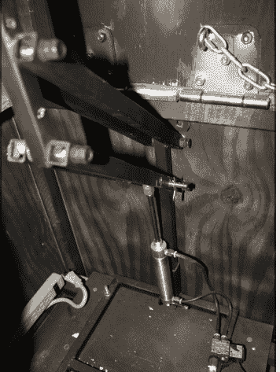

图 3-2：升降机构。


我购买的升降机构包括一个焊接的钢架、一个提供提升框架所需动力的气动气缸，以及一个可以连接到压缩空气软管的电动阀门。当阀门连接到压缩空气源并施加电压时，阀门打开，让压缩空气进入气缸。

在任何情况下，除非你是经验丰富的金属加工者，否则绝对不要试图通过自己制作升降机构来偷工减料。网上有用洒水管或自行车打气筒制作类似装置的图纸，但将压缩空气放入设计上并非用于承受压缩空气的塑料或金属部件中，是造成严重伤害甚至死亡的绝佳方式。即使是厚实的 40 号 PVC 管，其强度也不足以承受空气压缩机的压力。

- 道具被容纳在一个我用 3/8 英寸胶合板制作的 22 英寸见方的盒子里，内部用 2x2 英寸的木材加固。我能够用一张 4x8 英尺的胶合板切出所有六个面和盖子。

- 为了制作盖子，我用马刀锯切出了开口。然后，我切了一块比开口大约 1 英寸的单独胶合板作为盖子。我用一对小门铰链将盖子连接到盒子上。

- 我将升降机构直接安装在盒子底部。根据你所用机构的设计，你可能需要将升降机构安装在盒子背面而不是底部。

- 我在盒子背面钻了两个直径 1 英寸的孔，用于将电源线和压缩空气软管引入盒内。

- 小丑由一个我在旧货店买的小泡沫假人头和一个我在季节性万圣节服装店买的面具组成。

- 我用一个多余的汽车挡风玻璃雨刷电机来转动曲柄。你可以在网上以大约 15 美元的价格找到它们出售。曲柄本身是我用手头的一些废金属片制作的。

- 道具控制器安装在盒子内部，用四颗螺丝固定在其中一块侧板上。

- 为了触发道具，使用了一个称为 PIR 的红外运动探测器。运动探测器安装在盒子外部，并通过一条 24 英寸长的电缆连接到道具控制器。当运动探测器检测到附近有运动时，道具控制器中的程序会触发道具激活阀门，使小丑弹出。

- 为了在小丑弹出时照亮他的脸，我使用了一个 75W 的白色泛光灯，安装在从家居装修店买来的塑料泛光灯座中。

- 声音方面，我用了一组手头已有的廉价扬声器。扬声器连接到道具控制器音频板的音频输出端。这个音频板包括一个 20W 的放大器，其音量完全足够在小丑弹出时制造良好的惊吓效果。

图 3-3 显示了该道具的接线图，以便你了解道具的电气需求。如你所见，该道具总共需要三个 12V DC 电源适配器，通常被称为 *壁式变压器*。第一个为道具控制器供电，第二个为挡风玻璃雨刷电机提供 12V DC 电源，第三个为气动阀门提供 12V DC 电源。

为了简化接线，我使用了三个六孔电源插排和一个八端子屏障条，这些在该图中未显示。其中一个电源插排直接插入墙壁插座，为道具提供主 120V AC 电源。另外两个电源插排连接到 RC-4 继电器控制板。使用这些电源插排可以方便地插入 12V DC 电源适配器和泛光灯座。

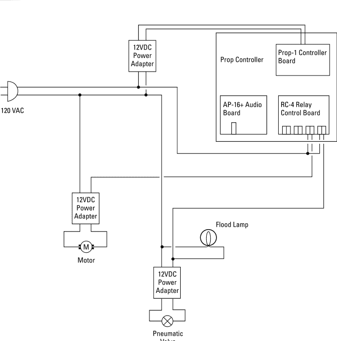

图 3-3：惊吓盒子道具原理图。


该道具使用 120V AC 家用电源，并且盒子内部有几处裸露的电气连接。因此，必须确保盒子内部对人类或宠物无法触及。

特别重要的是，布线必须足够牢固，能够承受每次道具激活时盒子所经历的振动。当阀门关闭、气缸伸出、盒盖甩开、小丑弹出他的头时，盒子会经历相当大的震动。为了确保频繁的震动不会导致任何电气连接松动，所有电线都用线夹固定，所有连接均采用焊接到屏障条上的螺钉端子进行。

关于惊吓盒子道具本身的内容就差不多这些了。正如我之前提到的，本章的重点是构建为该道具提供“大脑”的道具控制器。该道具控制器可以用于任何其他具有类似需求的其他类型道具。而且，如果你的道具比惊吓盒子更复杂，你可以通过添加额外的继电器控制板来轻松扩展道具控制器，以控制更多设备。

## 构建道具控制器

图 3-4 显示了用于控制惊吓盒子道具的完全组装好的道具控制器。如你所见，道具控制器由三块电路板组成，你可以从 EFX-TEK (www.efx-tek.com) 购买这些板子。这些板子安装在一块 8x10 英寸的有机玻璃板上，你可以从大多数五金店购买到它。在将组件安装到有机玻璃板上之前，请将有机玻璃板的背面喷成黑色，以创建一个外观专业的漂亮板子。

以下是构建道具控制器所需的完整零件清单：

| 数量 | 描述 |
| --- | --- |
| 1 | EFX-TEK Prop-1 控制器 |
| 1 | EFX-TEK PIR 传感器（包含一条用于连接到 Prop-1 的 14 英寸延长线） |
| 1 | EFX-TEK AP-16+ 音频播放器 |
| 1 | EFX-TEK RC-4 继电器控制板 |
| 2 | Crydom D2W203F 固态继电器 |
| 3 | EFX-TEK 支柱套件（每个套件包括四个 ½ 英寸支柱和八个 4-40 机械螺钉） |

| 数量 | 描述 |
| --- | --- |
| 2 | 14英寸伺服式延长线 |
| 2 | 6英寸长的16号线规多股线 |
| 1 | 一张8x10英寸的3/16英寸厚的有机玻璃板 |
| 1 | 一罐黑色喷漆 |

除了多股线、有机玻璃板和喷漆，所有这些组件都可以在 www.efx-tek.com 上的 EFX-TEK 订购。所有组件的总价应在275美元左右。

以下段落描述了道具控制器的四个主要组件，这些组件在零件清单中首先列出：

- **Prop-1 控制器：** 道具控制器的大脑。这款价格低廉的控制器板（$39.95）包含一个 BASIC Stamp 微控制器和两条 I/O 总线，让你可以直接访问 BASIC Stamp 的八个 I/O 引脚：
  - 第一条总线是一系列三针排针，你可以连接标准的伺服线缆。这些连接器为 BASIC Stamp 提供一个 TTL 接口，用于低电流应用，例如与其他道具控制元件通信。
  - 第二条总线用于可处理高达 500 mA 的高电流应用。这些输出可用于直接驱动小型电机、继电器、螺线管阀等。

Prop-1 还包括一个 5V 稳压电源和一个编程接口，因此你可以将其直接连接到计算机以下载程序。

- **PIR 传感器：** 一个廉价（低于10美元）的运动探测器，可以通过三芯伺服线缆连接到 Prop-1 的任何低电流 I/O 引脚。此设备用于触发现象动作。

- **AP-16+ 音频播放器：** 价格为129.95美元，这个音频播放器是道具控制器中最昂贵的组件。然而，声音是任何优秀道具必不可少的元素，而 AP-16+ 是一款极其多功能的音频播放器。它可以播放存储在 micro-SD 卡中的 WAV 格式声音，并内置20W放大器，因此你可以将扬声器直接连接到 AP-16+，无需单独的放大器。AP-16+ 也通过三芯伺服线缆连接到 Prop-1。此连接允许 Prop-1 向 AP-16+ 发送命令，以告诉 AP-16+ 播放 micro-SD 卡上的特定声音文件。

- **RC-4 继电器控制：** 该模块让你可以使用固态继电器控制最多四个市电电压（120 VAC）电路。它通过三芯伺服线缆连接到 Prop-1，使 Prop-1 能够向 RC-4 发送命令，以在程序控制下将其继电器打开或关闭。

在本章中，我怎样强调都不过分：道具控制器使用行电平电压，如果不小心，可能会造成伤害甚至致命。请确保行电平布线已妥善固定并封闭，并且切勿在线电平电路接通时操作控制器板。

以下是组装道具控制器的步骤：

1.  在有机玻璃板的一面喷上黑色喷漆，并等待其干燥。

2.  在有机玻璃板上钻出必要的安装孔。你需要为要安装到有机玻璃板上的三块板（Prop-1、RC-4 和 AP-16+）的每块板钻四个安装孔。使用3/16英寸的钻头。图3-5是一个粗略的钻孔指南，但请注意此图并非按比例绘制。你需要将实际组件摆放在有机玻璃板上，以确定精确的钻孔位置。

3.  将 Prop-1 控制器安装到有机玻璃板上。使用四个支撑柱和八个4-40机用螺钉。按照图3-5所示的方向，定位 Prop-1 控制器，使其螺钉端子连接器排位于控制器的左侧。

4.  将 RC-4 板安装到有机玻璃板上。使用四个支撑柱和八个4-40机用螺钉。按照图3-5所示的方向，定位 RC-4 板，使其四个螺钉端子连接器位于板的底部。

5.  将 AP-16+ 板安装到有机玻璃板上。使用四个支撑柱和八个4-40机用螺钉。按照图3-5所示的方向，定位 AP-16+ 板，使其音频输出连接器位于板的底部。

6.  使用两根导线将 Prop-1 上的 V+ 和 GND 端子连接到 AP-16+ 板上的 V+ 和 GND 端子。这些导线用于为 AP-16+ 板提供电源。试装导线后，将其剪至合适长度，并剥去每端3/4英寸的绝缘层。然后将每根导线的两端插入相应的螺钉端子，并拧紧螺钉以确保连接牢固。

7.  使用其中一根延长线缆将 Prop-1 控制器上的 P7 排针连接到 RC-4 上的 SER 排针。此线缆使 Prop-1 控制器能够向 RC-4 板发送命令，以使 RC-4 板打开或关闭其继电器。在 Prop-1 控制器板中心附近有八个三针排针。这些排针提供了对 BASIC Stamp 微处理器的八个 I/O 端口的访问。排针标记为 P0 至 P7，因此找到正确的排针应该不难。RC-4 板上有两个三针排针，都标记为 SER。这两个排针彼此连接，因此使用哪一个都没有问题，因为它们在电气上是相同的。连接延长线的唯一技巧是确保正确地定向。延长线有三根线：白色、红色和黑色。线缆必须正确插入排针，否则 Prop-1 将无法与 RC-4 通信。在 Prop-1 上正确地定向线缆很容易，因为三针排针有标记，指示哪个引脚是白色，哪个是红色，哪个是黑色。在 RC-4 上，线缆应插入排针，黑线朝向板的外侧边缘，白线朝向板的中心。

8.  使用第二根延长线缆将 RC-4 板上空的 SER 排针连接到 AP-16+ 板上的一个 SERIAL 排针。此连接的目的是使 Prop-1 控制器能够与 AP-16+ 音频播放器通信，以告诉它何时播放声音。如图3-5所示的方向，SERIAL 排针位于 AP-16+ 板的右上角附近。AP-16+ 排针上的引脚标记为 W、R 和 B，因此你应该能够轻松地识别线缆颜色。与 RC-4 一样，AP-16+ 上有两个 SERIAL 排针；使用哪一个都没有问题。

9.  使用第三根延长线缆将 PIR 传感器连接到 Prop-1 控制器上的 P6 排针。P6 排针就在 P7 排针旁边。

10. 将两个 Crydom 固态继电器插入 RC-4 板上的 K1 和 K2 位置。请注意，如果你的道具需要控制超过两个120 VAC 电路，你可以向 RC-4 板添加最多四个 Crydom 继电器。并且，如果你需要控制超过四个电路，可以添加额外的 RC-4 板。

## 为 Prop-1 控制器编程

来自 EFX-TEK 的 Prop-1 控制器基于 Parallax 制造的 BASIC Stamp 微控制器。为 BASIC Stamp 编程与为 Arduino 编程非常相似：你在计算机上安装一个集成开发环境（IDE），使用 USB 端口将 BASIC Stamp 连接到计算机，在 IDE 中编写程序，然后将程序下载到 BASIC Stamp。

实际上，Arduino 和 BASIC Stamp 之间最大的区别在于编程语言。Arduino 使用 C 编程语言的变体。相比之下，BASIC Stamp 使用一种名为 PBASIC 的 BASIC 编程语言变体。

在此，我不打算提供完整的 BASIC 教程，而只向你展示为 Prop-1 控制器、AP-16+ 音频板和 RC-4 继电器板编程所需的代码。如果你熟悉使用 C 语言为 Arduino 编程，或使用 Python 为 Raspberry Pi 编程，理解本章中的代码应该不会有太大困难。

这是一段简短的 PBASIC 代码片段，用于闪烁连接到引脚15的LED：

```
' ($STAMP BS)
' ($PBASIC 2.5)
Main:
  HIGH 15
  PAUSE 500
  LOW 15
  PAUSE 500
  GOTO Main
```

请注意，前面的程序不是道具控制器的一部分。它只是一个简短的示例程序，向你展示 PBASIC 的工作原理。以下是该程序的要点：

- 开头的注释（用撇号标记）是必需的，用于指明正在使用的 BASIC Stamp 版本和 PBASIC 语言版本。
- `Main:` 是一个标签，标记了程序中一个可以被其他语句引用的位置。在此示例中，使用 `GOTO` 语句使程序的主循环在控制器开启时反复执行。

+   » 高电平 15 将引脚 15 的值设置为高电平（+5 V）。假设一个 LED 连接在引脚 15 上，当输出设置为高电平时 LED 将会点亮。（请注意，你无需包含一个电阻来保护 LED，因为 Prop-1 板上的所有 I/O 引脚都由内置的 220 Ω 电阻保护。）
» 暂停 500 会使程序暂停 500 毫秒。
» 低电平 15 将引脚 15 的值设置为低电平（0 V）。这将关闭 LED。
» 暂停 500 会使程序再暂停 500 毫秒。
» 跳转至 Main 会将程序重定向回标记为 Main 的位置。这将导致程序一遍又一遍地重复执行，直到 BASIC Stamp 被关闭。

## 向 RC-4 或 AP-16+ 模块发送命令

RC-4 和 AP-16+ 模块通过三针跳线连接到端口 7。这使得 Prop-1 能够使用简单的串行通信协议向 RC-4 和 AP-16 模块发送消息。幸运的是，你无需担心串行通信协议如何工作的细节就可以发送消息。

你使用 PBASIC 的 SEROUT 命令通过 I/O 引脚发送消息。SEROUT 命令具有简单的语法：

```
SEROUT pin, mode, (data)
```

SEROUT 命令的第一个参数 *pin* 只是数据要发送到的引脚编号。因为 RC-4 和 AP-16+ 模块在动画道具控制器中连接到引脚 7，你只需为此参数指定引脚 7。

第二个参数 *mode* 表示将用于发送数据的通信模式。对于所有 EFX-TEK I/O 模块，你应为此参数指定内置常量 OT2400。


如果你感兴趣的话，OT2400 意味着传输速率为每秒 2400 位，输出极性为开漏驱动高电平——这对我来说听起来相当专业，所以我不会担心它。只需使用 OT2400 作为此参数。

第三个参数 `data` 才是实际指定要发送到外部设备的数据。你必须将数据括在括号内，并且在括号内，你可以列出任意多个字符串常量或变量。例如：

```
SEROUT PIN7, OT2400, ("Hello World!")
```

此语句将字符串常量 "Hello World!" 发送到引脚 7 上的设备。

这是一个完成相同任务但使用三个字符串常量而非一个的示例：

```
SEROUT PIN7, OT2400, ("Hello ", "World", "!")
```

这是一个使用变量的示例：

```
SYMBOL Bam = B0
Bam = "!"
SEROUT PIN7, OT2400, ("Hello, World", Bam)
```

你可能会合理地问，为什么使用多个字符串常量或变量而不是只用一个。当你阅读下面关于编程 RC-4 和 AP-16+ 模块的两个章节时，这个绝佳问题的答案将变得显而易见。


```
SYMBOL Sio = 7
SEROUT Sio, OT2400, ("Hello, World!")
```

这样，如果你决定更改外部设备所连接的 I/O 引脚，你只需对你的程序进行一次更改——即符号定义——而不是在每个 SEROUT 语句中进行多次更改。

虽然不那么重要，但为模式参数也使用符号也是一个好主意，如下所示：

```
SYMBOL Sio = 7
SYMBOL Baud = OT2400
SEROUT Sio, Baud, ("Hello, World!")
```

为什么？因为也许有一天你会决定将你的程序移植到另一个控制器上，例如功能更强的 Prop-2 控制器。当你这样做时，你会发现 Prop-2 控制器具有额外的模式设置，能够实现更快、更可靠的串行通信。你只需更改 SYMBOL 语句，即可更改程序中所有 SEROUT 命令的串行通信模式。

## 编程 RC-4 继电器控制模块

RC-4 继电器控制模块支持最多四个高压固态继电器，可以接通和断开市电电路。EFX-TEK 将电路板和继电器分开销售，因此你可以只为你项目所需的继电器数量配置它。

RC-4 板上的一对跳线块允许你为其赋予 0、1、2 或 3 的地址值。这允许你将最多四块 RC-4 板菊花链连接在一起，从而控制最多 16 个独立的继电器电路。本节中的示例假设你已移除这两个跳线，使 RC-4 的地址为 0。

要从 Prop-1 控制器控制 RC-4 板，你可以使用 SEROUT 命令向 RC-4 板连接的引脚发送数据。你发送的数据必须遵循以下格式：

```
"!RC4", address, command {,data}
```

第一个数据项是字符串常量 "!RC4"。这个字符串常量是一个前导符，表示后面的数据是用于 RC-4 继电器控制卡的。这允许你将几种不同类型的 EFX-TEK 卡链在一起，并且仅向 RC-4 发送命令。

第二个数据项是你想要发送数据的 RC-4 卡的地址。可能的值是 0、1、2 或 3。

第三个数据项是一个命令，这是一个代表 RC-4 可以响应的几种命令之一的单个字符。根据使用的命令，你可能还需要在命令后提供一到两个额外的数据字节。可能的命令如下：

| 命令 | 功能 |
|------|------|
| X | 复位所有继电器。无需附加数据。 |
| R | 将单个继电器设置或复位为特定值。需要两个数据字节：一个用于指示要设置或复位哪个继电器，第二个用于指示继电器应闭合（设置）还是断开（复位）。 |
| S | 设置所有继电器。S 命令后跟一个二进制数据字节，该字节指示哪些继电器应断开，哪些应闭合。 |
| V | 使 RC-4 将其固件版本信息发送回道具控制器。版本信息可以使用 SERIN 命令读取。 |
| G | 获取所有继电器的当前状态。发送此命令后，使用 SERIN 命令从 RC-4 读取数据。 |

你最常用的三个 RC-4 命令是 X（复位所有继电器）、R（设置单个继电器）和 S（将四个继电器中的每一个设置为特定状态——开或关）。这些命令在以下各节中描述。

### 关闭所有继电器

要关闭 RC-4 模块上的所有继电器，请使用 X 命令。例如：

```
SEROUT PIN7, OT2400, ("!RC4", 0, "X")
```

在你的程序开头附近使用此命令是一个好主意，以确保程序以所有继电器关闭的状态开始。

### 打开或关闭单个继电器

要打开或关闭单个继电器，你向 RC-4 发送一个 R 命令。R 命令要求你发送五个独立的数据项：

-   前导符："!RC4"
-   RC-4 板的地址
-   命令 "R"
-   继电器编号：1 到 4
-   继电器状态：1 为打开继电器，0 为关闭继电器

以下是打开第一个继电器（编号 1）的 SEROUT 语句：

```
SEROUT PIN7, OT2400, ("!RC4", 0, "R", 1, 1)
```

以下是关闭第一个继电器的 SEROUT 语句：

```
SEROUT PIN7, OT2400, ("!RC4", 0, "R", 1, 0)
```

### 一次性设置所有四个继电器

要一次性设置所有四个继电器的状态，你可以使用 S 命令。此命令需要四个数据项：

-   前导符："!RC4"
-   RC-4 板的地址
-   命令 "S"
-   一个代表四个继电器状态的单字节值

控制继电器状态的值通常写为一个百分号，后跟四个表示每个继电器状态的二进制位——1 表示开，0 表示关。唯一的诀窍是这四个二进制位是按相反顺序书写的：第一个是继电器 4，第二个是继电器 3，第三个是继电器 2，第四个是继电器 1。

例如，要打开继电器 1 并关闭其他三个继电器，你可以使用 %0001 作为继电器状态。要打开继电器 1 和 3 并关闭继电器 2 和 4，你可以使用 %0101 作为状态。

以下 SEROUT 命令发送一个 S 命令来打开所有四个继电器：

```
SEROUT PIN7, OT2400, ("!RC4", 0, "S", %1111)
```

以下 SEROUT 命令打开继电器 1 和 3，同时关闭继电器 2 和 4：

```
SEROUT PIN7, OT2400, ("!RC4", 0, "S", %0101)
```

以下 SEROUT 命令关闭所有继电器，这等效于发送 "X" 命令：

```
SEROUT PIN7, OT2400, ("!RC4", 0, "S", %0000)
```# 使用符号使 RC-4 命令更易读

正如我在本章前面提到的，为 I/O 引脚和输出模式使用符号是一个好主意。为 RC-4 地址、继电器编号以及继电器状态（开或关）使用符号也是一个好主意。这可以让你的程序更易读。

```
SYMBOL Sio = 7
SYMBOL Baud = OT2400
SYMBOL RC4 = 0
SYMBOL Relay1 = 1
SYMBOL Relay2 = 2
SYMBOL Relay3 = 3
SYMBOL Relay4 = 4
SYMBOL RelayOn = 1
SYMBOL RelayOff = 0
```

有了这些符号声明，你可以使用以下语句打开继电器 1：

```
SEROUT Sio, Baud, ("!RC4", RC4, "R", Relay1, RelayOn)
```

下面是一个关闭继电器 1 的语句：

```
SEROUT Sio, Baud, ("!RC4", RC4, "R", Relay1, RelayOff)
```

这是一个使用符号发送 S 命令的 SEROUT 语句，该命令可以打开继电器 2 和 4，并关闭继电器 1 和 3：

```
SEROUT Sio, Baud, ("!RC4", RC4, "S",%1010)
```

# 一个控制全部四个 RC-4 继电器的示例程序

代码清单 3-1 展示了一个完整的 PBASIC 程序，它通过执行以下步骤序列来全面测试 RC-4 卡：

1.  使用 X 命令关闭所有继电器。
2.  暂停 1 秒。
3.  使用一系列 S 命令，以 1 秒为间隔依次打开继电器 1、2、3 和 4。当每个继电器打开时，其他三个继电器保持关闭。
4.  暂停 1 秒，然后关闭所有继电器。
5.  使用一系列 R 命令，以 1 秒为间隔依次打开继电器 1、2、3 和 4。当每个继电器打开时，其他继电器的状态保持不变。因此，程序的这一部分首先打开继电器 1，然后添加继电器 2，再添加继电器 3，最后添加继电器 4。此时，所有四个继电器都已打开。
6.  等待 1 秒，然后重复整个程序。

你可以从本书的配套网站下载此程序。

# 代码清单 3-1：一个 RC-4 控制程序

```
' {$STAMP BS1}
' {$PBASIC 1.0}

SYMBOL Sio = 7
SYMBOL Baud = OT2400
SYMBOL RC4 = 0
SYMBOL Relay1 = 1
SYMBOL Relay2 = 2
SYMBOL Relay3 = 3
SYMBOL Relay4 = 4
SYMBOL RelayOn = 1
SYMBOL RelayOff = 0

Main:

  '关闭所有继电器
  SEROUT Sio, Baud, ("!RC4", RC4, "X")
  PAUSE 1000

  '依次循环打开每个继电器
  SEROUT Sio, Baud, ("!RC4", RC4, "S", %0001)
  PAUSE 1000
  SEROUT Sio, Baud, ("!RC4", RC4, "S", %0010)
  PAUSE 1000
  SEROUT Sio, Baud, ("!RC4", RC4, "S", %0100)
  PAUSE 1000
  SEROUT Sio, Baud, ("!RC4", RC4, "S", %1000)
  PAUSE 1000

  '关闭所有继电器
  SEROUT Sio, Baud, ("!RC4", RC4, "S", %0000)
  PAUSE 1000

  '打开继电器 1
  SEROUT Sio, Baud, ("!RC4", RC4, "R", Relay1, RelayOn)
  PAUSE 1000

  '添加继电器 2
  SEROUT Sio, Baud, ("!RC4", RC4, "R", Relay2, RelayOn)
  PAUSE 1000

  '添加继电器 3
  SEROUT Sio, Baud, ("!RC4", RC4, "R", Relay3, RelayOn)
  PAUSE 1000

  '添加继电器 4
  SEROUT Sio, Baud, ("!RC4", RC4, "R", Relay4, RelayOn)
  PAUSE 1000

'重复！
GOTO Main
```

# 编程 AP-16+ 音频播放器模块

AP-16+ 音频播放器模块是一种极其通用的方式，可以为你的电动道具添加声音。与 RC-4 类似，你通过 `SEROUT` 语句使用串行通信与 AP-16+ 模块通信。某些命令会导致 AP-16+ 模块返回数据，你可以用 `SERIN` 语句检索这些数据。但对于大多数道具，你只需使用 `SEROUT` 发送几个命令，因此可以省略 `SERIN` 语句。

AP-16+ 板可以播放存储在 micro-SD 卡上的 WAV 格式录制的声音。因此，在为道具编程之前，你需要准备好一个包含所需播放文件的 micro-SD 卡。你可以直接使用计算机将文件复制到 micro-SD 卡；唯一的限制是文件名不能超过八个字符，并且扩展名必须是 .wav。（AP-16+ 卡无法播放 MP3 文件。）

对于“惊吓盒子”道具，只需要两个声音文件。包含“Pop Goes the Weasel”歌曲的文件名为 `weasel.wav`。这是我自己的录音；你可以从本书的配套网站下载。

另一个文件是当小丑弹出时播放的恐怖尖叫声。该文件名为 `scream.wav`。它也可在配套网站上获取。


AP-16+ 是一张功能极其丰富的卡，设计为可在独立模式下使用——即不由微控制器控制。它的许多功能主要在独立模式下才有用。例如，你可以将文件以预定义文件名（如 `SFXnn.wav` 和 `AUXnn.wav`，其中 `nn` 是一个两位数字，例如 `SFX01.wav` 或 `AUX04.wav`）存储在 micro-SD 卡上。AP-16+ 可以配置为在响应卡上的直接触发输入时，以随机方式自动播放这些文件。AP-16+ 还可以配置为播放环境背景音，其文件名必须是 `ambient.wav`。这些都是非常有用的功能，但与本章介绍的道具控制器无关。因此，尽管我在本节中忽略了这些功能，但我建议你仔细阅读 EFX-TEK 提供的 AP-16+ 文档，以了解这些功能的工作原理。

要从 Prop-1 控制器控制 AP-16+ 模块，你需要使用 `SEROUT` 命令向 AP-16+ 连接的引脚发送数据。你发送的数据必须遵循以下格式：

```
"!AP16", address, command {,data}
```

字符串常量 “!AP16” 是前导码，表示该命令适用于 AP-16+ 模块。这允许你将不同种类的模块与 AP-16+ 串联在一起，从而可以使用单个 I/O 引脚控制项目中使用的所有模块。

第二个数据项是你想要发送命令到的 AP-16+ 模块的地址。可能的值是 0、1、2 或 3。地址由 AP-16+ 板上的跳线设置。对于本节中的示例，我假设 AP-16+ 的地址为 0。

第三个数据项是命令。根据使用的命令，你可能还需要在命令之后提供额外的数据。可能的命令有：

| 命令 | 功能 |
| :--- | :--- |
| X | 重置 AP-16+，这将停止可能正在播放的任何声音。 |
| L | 设置输出音量。 |
| PW | 播放一个命名的文件。额外的数据提供文件的名称和循环播放的次数。（将循环值指定为 0 表示无限循环文件。） |
| G | 获取 AP-16+ 卡的当前状态。使用 `SERIN` 命令读取一个字节，该字节指示 AP-16+ 当前是否正在播放声音文件，如果是，正在播放哪个声音文件。 |
| PS | 播放 `SFXnn.wav` 文件之一。额外的数据提供 SFX 编号（即 `nn`）以及文件应循环的次数。（将循环值指定为 0 表示无限循环文件。） |
| P? | 随机选择一个 `SFXnn.wav` 文件进行播放。 |
| PA | 播放 `AUXnn.wav` 文件之一。额外的数据提供 SFX 编号（即 `nn`）以及文件应循环的次数。（将循环值指定为 0 表示无限循环文件。） |
| S | 更改播放速度。 |
| V | 获取 AP-16+ 版本信息。版本信息可以使用 `SERIN` 命令读取。 |

你最常用的四个 AP-16+ 命令是：X（重置播放器并停止可能正在播放的任何声音）、L（设置输出音量）、PW（播放特定文件）以及 G（获取 AP-16+ 的当前状态，以便了解它是否已完成播放声音文件）。这些命令将在以下部分中描述。

请注意，在整个这些部分中，我假设程序的顶部附近已定义了以下符号：

```
SYMBOL Sio = 7
SYMBOL Baud = OT2400
SYMBOL AP16 = 0
```

# 重置 AP-16+

要重置 AP-16+，请发送如下 X 命令：

```
SEROUT Sio, Baud, ("!AP16", AP16, "X")
```

这会导致可能正在播放的任何 WAV 文件立即停止。不仅在你的程序开头发送此命令以确保 AP-16+ 已准备好接收命令是一个好主意，而且如果你希望在当前文件播放完成前停止它，此命令也是使 AP-16+ 静音的最佳方式。

## 调整音量

你可以根据需要修改程序的输出音量。这在你希望以低于最大音量播放文件，或者希望声音从房间一侧而非另一侧输出时非常有用。

要修改输出音量，请使用 L 命令。其语法格式如下：

```
"!AP16", address, "L", left, right
```

其中，*left* 和 *right* 是 0 到 100 之间的值，分别表示左右声道的音量百分比。

例如，要将左右声道的输出音量都设置为 50%，请使用以下语句：

```
SEROUT Sio, Baud, ("!AP16", AP16, "L", 50, 50)
```

要让声音仅从左声道输出，请使用：

```
SEROUT Sio, Baud, ("!AP16", AP16, "L", 100, 0)
```

要将音量恢复到最大，请使用此语句：

```
SEROUT Sio, Baud, ("!AP16", AP16, "L", 100, 100)
```

## 播放特定文件

要播放特定的 WAV 文件，请使用 PW 命令。其语法格式如下：

```
"!AP16", address, "PW", name, 13, loops
```

其中，*name* 参数是文件名，不带 .wav 扩展名。数字 13 是必需的，这是由于 AP-16+ 编程方式的一个特殊规定。你可以把它当作一个幸运符！

*loops* 参数表示文件应重复播放的次数。通常，指定为 1 即可播放一次。最大值为 255，但如果你希望文件持续播放——或者至少持续到你使用 X 命令重置 AP-16+ 或使用另一个 PW 命令播放其他文件为止，请指定为 0。

以下是播放名为 *scream1.wav* 的文件一次的命令：

```
SEROUT Sio, Baud, ("!AP16", AP16, "PW", "SCREAM1", 13, 1)
```

以下是无限循环播放文件 weasel.wav 的命令：

```
SEROUT Sio, Baud, ("!AP16", AP16, "PW", "WEASEL", 13, 0)
```

请注意，每当你播放一个声音文件时，任何正在播放的其他声音文件都会立即停止。因此，你无需等待一个文件播放完毕再播放另一个。

## 等待文件播放完成

当你播放声音文件时，通常希望程序等待直到文件播放完毕。如果你确切知道声音时长，可以使用 PAUSE 命令。但如果你不确定呢？

幸运的是，AP-16+ 包含一个用于获取设备当前状态的 G 命令。要使用此命令，你必须先通过 SEROUT 语句向 AP-16+ 发送 G 命令。然后，必须使用 SERIN 语句来获取状态结果。

SERIN 语句相当直接：其语法如下：

```
SERIN pin, mode, variable
```

其中，*pin* 和 *mode* 参数与 SEROUT 语句中的相同。*variable* 参数只是你预留用于接收状态结果的变量名称。

以下是如何结合使用 SEROUT 和 SERIN 语句来获取 AP-16+ 状态的方法：

```
SYMBOL ap16Status B0
SEROUT Sio, AP16, ("!AP16", AP16, "G")
SERIN Sio, AP16, ap16Status
```

在此示例中，SYMBOL 语句将名称 ap16Status 与变量 B0 等同起来。然后，SEROUT 语句向 AP-16+ 发送 G 命令，SERIN 语句将状态数据检索到名为 ap16Status 的变量中。

状态数据包含各种有用信息，但在几乎所有情况下，你真正想知道的只是 AP-16+ 当前是否正在播放声音。你可以通过测试状态字节的第 7 位来得知。最简单的方法是使用 BASIC Stamp 预定义的位变量来定义一个符号，如本例所示：

```
SYMBOL ap16Status = B0
SYMBOL ap16Playing = BIT7
```

然后，你可以像这样测试 `ap16Playing` 变量：

```
IF ap16Playing = 0 THEN SoundDone
```

如果 AP-16+ 已播放完声音，此语句将跳转到标签 `SoundDone`。

下面是一段完整的代码片段，它播放一段声音，然后进入循环等待，直到声音播放完毕：

```
SEROUT Sio, Baud, ("!AP16", AP16, "PW", "SCREAM", 13, 1)
StillPlaying:
SEROUT Sio, Baud, ("!AP16", AP16, "G")
SERIN Sio, Baud, ap16Status
IF ap16Playing = 0 THEN SoundDone
GOTO StillPlaying
SoundDone:
'声音播放完毕！
```

## AP-16+ 程序示例

清单 3-2 展示了一个在 AP-16+ 卡上播放声音的完整 PBASIC 程序。该程序先播放 `weasel.wav` 声音 10 秒钟，然后播放 `scream.wav` 声音直至其结束，然后重复执行。你可以从本书的配套网站下载此程序。

```
' {$STAMP BS1}
' {$PBASIC 1.0}

SYMBOL Sio = 7
SYMBOL Baud = OT2400
SYMBOL AP16 = 0
SYMBOL ap16Status = B0
SYMBOL ap16Playing = BIT7

'重置设备
SEROUT Sio, Baud, ("!AP16", AP16, "X")

Main:
    '播放《Pop Goes the Weasel》
    SEROUT Sio, Baud, ("!AP16", AP16, "PW", "WEASEL", 13, 0)

    '等待 10 秒
    PAUSE 10000

    '播放尖叫声
    SEROUT Sio, Baud, ("!AP16", AP16, "PW", "SCREAM", 13, 1)

    '等待尖叫声结束
StillScreaming:
    SEROUT Sio, Baud, ("!AP16", AP16, "G")
    SERIN Sio, Baud, ap16Status
    IF ap16Playing = 1 THEN StillScreaming

    '重复执行
    GOTO Main
```

## 编程控制 PIR 运动探测器

PIR 传感器使用红外光来探测运动。当探测到运动时，它会向微控制器发送一个值 1。

乍一看，你可能会认为 PIR 传感器相当容易使用。只需将其插入 Basic Stamp 的一个 I/O 引脚，然后等待该引脚值变为 1 来触发你的装置。假设 Pir 是分配给 PIR 所连接的 I/O 引脚的符号，代码大致如下：

```
WaitForMovement:
    IF Pir = 0 THEN WaitForMovement
MovementDetected:
    '现在激活你的装置！
```

不幸的是，PIR 运动探测方面的实际应用并非如此简单。首先，PIR 在首次通电后的一段时间内将不可靠。因此，任何使用 PIR 探测运动的程序都应该立即开始一个 60 秒的暂停。这给予 PIR 时间稳定下来，以便可靠地探测运动。

其次，在房间内没有实际运动时，PIR 经常会发送非常短暂的错误触发。通常解决这个问题的方法是等待 PIR 的值保持为 1 达四分之一秒，然后再触发你的装置。

你可以用一段巧妙的代码来实现这一点：

```
SYMBOL Pir = PIN6
SYMBOL waitTimer = B2
PAUSE 60000
Main:
waitTimer = 0
WaitForMotion:
PAUSE 10
waitTimer = waitTimer + Pir * Pir
IF waitTimer < 25 THEN WaitForMotion
'PIR 已连续探测到运动 0.25 秒
'因此现在可以触发装置了
```

这段代码的精妙之处在于：WaitForMotion 循环暂停 10 毫秒，然后将 PIR 输入状态的值乘以其自身（平方）后累加到 waitTimer 变量中。如果 PIR 输入为 0，乘以输入状态会使 waitTimer 变量重置为 0，因为任何数乘以零都等于零。因此，只有在 PIR 连续探测到运动达四分之一秒时，此循环才会退出。

## 完整的玩偶跳出程序

既然你已经看到了编程各个独立组件的技术，现在将它们结合起来为一个实际的装置创建程序。清单 3-3 显示了玩偶跳出装置的完整程序。我在整个程序中大量使用了注释，因此你应该可以轻松理解其基本操作。（该程序可在本书的配套网站下载。）

```
清单 3-3: 玩偶跳出程序

' {$STAMP BS1}
' {$PBASIC 1.0}
' 玩偶跳出程序
'
' 以下设备连接到此装置的控制板：
'
' 引脚 6 PIR 传感器
'
' 引脚 7 用于以下设备的串行通信：
'   RC-4      地址 %00
'   AP-16+    地址 %00
'
' RC-4 继电器 1:  用于打开装置的气动电磁阀
'                 用于照亮玩偶的灯
'
' RC-4 继电器 2:  用于转动曲柄手柄的电机
'
'
' AP-16+ 声音文件
'
' WEASEL.WAV 在电机运行时播放的《Pop Goes the Weasel》
' SCREAM.WAV 当玩偶弹出时播放的尖叫声
'
' 装置的动作如下：
'
'    1. 转动曲柄臂电机并播放 "Pop Goes the Weasel"，直到
'       在房间内探测到运动。
'
'    2. 当探测到运动时，弹出玩偶并播放尖叫声。
'
'    3. 当尖叫声结束后，收回玩偶，等待 2 秒钟，
'       然后恢复曲柄电机和 "Pop Goes the Weasel"。
'
'    4. 至少等待 10 秒钟后才能再次触发装置。
'
SYMBOL Sio = 7
SYMBOL Baud = OT2400
SYMBOL RC4 = 3
SYMBOL RelayValve = 1
SYMBOL RelayMotor = 2
SYMBOL RelayOn = 1
SYMBOL RelayOff = 0
SYMBOL AP16 = 0
SYMBOL ap16Status = B0
SYMBOL ap16Playing = BIT7
SYMBOL Pir = PIN6
SYMBOL waitTimer = B2

'重置所有设备并暂停一分钟，让 PIR 稳定。
SEROUT Sio, Baud, ("!AP16", AP16, "X")
SEROUT Sio, Baud, ("!RC4", RC4, "X")
PAUSE 50000

Main:

'无限循环播放《Pop Goes the Weasel》。
SEROUT Sio, Baud, ("!AP16", AP16, "PW", "WEASEL", 13, 0)
```

（续）

第 3 章 构建一个动画装置控制器

879

## 本章内容

-   回忆旧式科幻小说中的玻璃头机器人
-   设计你自己的复古科幻机器人头部
-   制作你自己的复古科幻机器人头部
-   注意安全

# 第4章
# 重现一个复古科幻机器人头部

我对科幻电影的热爱始于1960年代我年幼的时候。是的，我真的有那么老了。《星际迷航》首播时我就看了（幸好我爸爸刚买了我们家第一台彩色电视机），《2001太空漫游》首映时我也去看了。

我特别喜欢那些以机器人为主角的电影和电视剧，无论机器人是好是坏。50年代和60年代有很多这样的作品。其中最受欢迎的两个机器人是1950年代经典电影《禁忌星球》中的罗比机器人（Robby the Robot），以及经典电视剧《迷失太空》中的B-9（通常简称为“机器人”）。

这两个机器人有一个显著的共同特征：它们都拥有有趣的头部设计，玻璃泡内装有酷炫的仪器。在本章中，我实现了自己毕生的一个幻想——创建一个我自己的复古风格、带玻璃泡的机器人头部。由于没有更好的名字，我将这个复古机器人头部命名为“VIN-e”。为了向我最喜欢的一本库尔特·冯内古特的小说致敬，*VIN-e* 代表 *virtual infundibuled extenuator*。它的主要功能是让事情看起来没有实际情况那么糟，并让你相信即使情况真的那么糟，那也不是你的错。毕竟，总有情有可原的情况，而VIN-e就是终极的“情有可原解释器”。

VIN-e是一个纯粹的奇幻造物，设计初衷仅为娱乐。它是由一些零零碎碎的部件组装而成，大部分是我手头现有的东西。如果你想制作自己的Vin-e版本，请不要完全照搬我的版本作为蓝图。相反，请运用你自己的创造力，结合你手头恰好有的、或者能在当地折扣店甚至旧货店找到的零零碎碎。设计时让它能挠到*你自己*的笑点，最重要的是，在制作过程中享受乐趣！

事实上，本章我并没有提供详细的建造计划。相反，我只展示了启发我创作VIN-e的灵感来源、我用来构建它的一些零散部件，以及VIN-e当前形态的照片。VIN-e是一个进行中的作品——我已经摆弄它有一段时间了，而且我可能还会继续摆弄它几年。

# 从罗比和B-9汲取灵感

《禁忌星球》是一部具有里程碑意义的科幻电影，于1956年上映。这部电影有很多值得关注的点：

-   它是第一部描绘超光速星际飞船的科幻电影。
-   由莱斯利·尼尔森主演，当时他还是一位严肃的男主角，而非几十年后在《空前绝后满天飞》和《白头神探》系列电影中展现的喜剧天才。
-   该剧的情节非常松散地改编自莎士比亚的戏剧《暴风雨》。
-   它是吉恩·罗登贝瑞构思《星际迷航》时的主要灵感来源之一。事实上，《星际迷航》的首集试播集（名为“牢笼”）与《禁忌星球》非常相似。而且《禁忌星球》的故事发生在牛郎星四号（Altair IV）行星上。牛郎星系统在《星际迷航》中被大量提及。在原版剧集“焦躁时期”一集中提到了牛郎星四号的姊妹行星牛郎星六号（Altair VI），并且牛郎星六号在1982年电影《星际迷航II：可汗之怒》的经典“科巴夷马鲁”模拟测试中扮演了角色。

但《禁忌星球》最令人难忘的，是引入了一个名为罗比的奇妙机器人，昵称是罗比机器人。罗比是由罗伯特·木下（Robert Kinoshita）设计并主要制作的一套机械服装。木下于1940年毕业于南加州大学，获得建筑学学位，但和许多日裔美国人一样，在二战期间被美国政府关押在日裔拘留营中。

罗比的设计雄心勃勃，制作成本极高——经通货膨胀调整后，这套服装的成本超过了100万美元！其头部包含众多可以移动和闪烁的小装置，代表他的电子大脑，所有这些都封装在一个由有机玻璃制成的大圆顶中。其中包含类似眼睛、鼻子和耳朵的元素，还有一个在罗比说话时会发光的“嘴巴”。

图4-1展示了一个罗比的模型（我收藏的一部分）。我放大了头部，以便你能看到其主要组件。

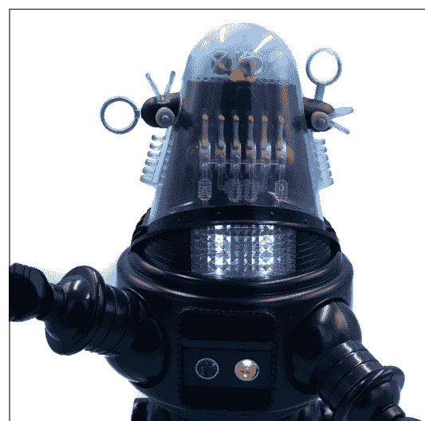

图4-1：《禁忌星球》中的罗比机器人

在设计罗比十年后，木下被制片人欧文·艾伦（Irwin Allen）聘请为他的新电视剧《迷失太空》设计另一个机器人。这个新机器人变得和罗比一样出名。他的技术代号是通用实用非理论环境控制机器人（GUNTER），但几乎总是被简称为“机器人”。他偶尔也被称为型号B-9。欧文·艾伦叫他“眨眼”（Blinky）。

和罗比一样，B-9也是一套服装，具有惊人的机械和电气细节。B-9并没有一个巨大的、装满机械部件的抛物面圆顶头，而是拥有一个玻璃封装的传感器单元，里面装有看起来更现代的电子设备。我一直觉得这个传感器单元类似于带凹槽的、安装在天花板上的浴室或壁橱灯。和罗比一样，B-9也有一个在机器人说话时会发光的“嘴巴”。

图4-2展示了B-9的一个模型（也是我收藏的一部分）。


# 构想VIN-e

VIN-e的想法很久以前就有了，那时我第N次观看《禁忌星球》。我想到，如果能设计并制作类似的东西会很有趣——不是完整的机器人服装，只是一个头部，因为旧科幻小说中机器人的头部似乎总是最有趣的部分。

这个想法搁置了几年，我被许多其他项目分心了。但我一直想着它，最终在2020年COVID-19大流行来袭时决定付诸行动。像许多人一样，我需要一个分散注意力的事情。

我决定我的机器人头部要包含以下元素，主要受罗比机器人和B-9的启发：

-   一个包裹头部的玻璃圆顶
-   类似眼睛、鼻子和耳朵的电子或机械仪器（或两者兼有）
-   一个能随机播放机器人语录的语音系统，包括罗比机器人（“抱歉，小姐，我刚才在给自己做保养” 或 “整个东西加起来还不到十吨”）和B-9（“危险，威尔·罗宾逊” 或 “这无法计算”）的经典台词
-   一个在VIN-e说话时会发光的“嘴巴”
-   至少一个会移动的部件，很可能是圆顶外的传感器或天线
-   闪烁的灯光（废话）
-   尽可能多地使用看起来复古的部件，类似于真空管之类的，并将所有现代电子设备隐藏起来

# 介绍VIN-e 1.0

图4-3展示了VIN-e当前的形态。我觉得它看起来相当不错，但仍有很大的改进空间。一两年后VIN-e会变成什么样子，那将会很有趣！

以下各节简要介绍了构成VIN-e 1.0版本的各种零散部件。

# 圆顶

包裹头部的圆顶是一个我在Target找到的塑料餐碗，大约花了12美元。我意识到塑料材质很重要，这样我才能轻松切割。而且它必须是能直接买到的成品，因为我没有技能自己用有机玻璃塑造一个碗。

这个碗顶部直径11英寸，底部直径6英寸，高6英寸。当然，我为了VIN-e把它倒过来了。

我在圆顶上只切了一个口——顶部切了一个2.5英寸的矩形，以容纳中央支柱。用Dremel旋转工具切割这个碗相当容易。我买了两个碗，以防万一弄坏一个，但我第一次尝试切割就成功了。

# 清单3-3：（续）

```
'启动电机。
SEROUT Sio, Baud, ("!RC4", RC4, "R", RelayMotor, RelayOn)

'等待10秒，让房间清空。
PAUSE 10000

'等待PIR触发0.25秒。
waitTimer = 0
WaitForMotion:
PAUSE 10
waitTimer = waitTimer + Pir * Pir
IF waitTimer < 25 THEN WaitForMotion

'此时触发器已被激活。

'停止电机。
SEROUT Sio, Baud, ("!RC4", RC4, "R", RelayMotor, RelayOff)

'播放尖叫声。
SEROUT Sio, Baud, ("!AP16", AP16, "PW", "SCREAM", 13, 1)

'让小丑弹出。
SEROUT Sio, Baud, ("!RC4", RC4, "R", RelayValve, RelayOn)

'等待尖叫声结束。
StillScreaming:
SEROUT Sio, Baud, ("!AP16", AP16, "G")
SERIN Sio, Baud, ap16Status
IF ap16Playing = 1 THEN StillScreaming

'收回小丑。
SEROUT Sio, Baud, ("!RC4", RC4, "R", RelayValve, RelayOff)

'等待2秒。
PAUSE 2000

'再次执行整个过程。
GOTO Main
```## 底座

头部所放置的底座是一个我在Big Lots花大约10美元买到的塑料餐盘。这个餐盘的实际尺寸是12 x 18英寸，有点大。所以我用我的Dremel工具把它切割成了一个12英寸的正方形。我还用喷漆把它喷成了黑色。

底座高1¾英寸，这个高度足以容纳控制VIN-e的所有电子元件。

## 中央支柱

从底座升起、穿过圆顶并延伸到圆顶上方的中央支柱，是我在Harbor Freight花10美元买到的一个有趣的太阳能庭院灯。这盏灯可以拆分成三个部分，如图4-4所示。

顶部是实际的灯。它顶部有一个太阳能电池板，内部有一个小电路板、一块电池和一个LED。我把它全部拆开，只保留了那个带肋纹的透明部分，其底部还有一个很酷的反射器，可以散射LED的光。我把灯自带的白色LED换成了红色LED，因为这样显示效果更有趣。

886 书籍 8 特效

我保留了灯的中间部分，用作VIN-e头部的中央支柱。它用来固定眼睛和鼻子。我还在上面钻了一些孔，以便走线。

底部是一个用来将灯插入地面的桩。我用我的Dremel工具切掉了实际的桩部分，但保留了那个可以塞进支柱的圆形销钉。我用它来将支柱固定到底座上。

## 眼睛和鼻子

眼睛是用我存放多年的两罐腻子的盖子做的（里面的腻子早就干了）。我用金属青铜漆涂了它们。

眼睛中心的灯以及鼻子的灯，是我从亚马逊购买的LED街机游戏机灯。几年前我为另一个项目买了几十个，还剩下一些。这些LED的额定电压是12VDC，并且内置了限流电阻，所以你不需要自己提供电阻。

我原本希望这些LED能在Arduino板数字I/O引脚提供的5V电压下正常工作，但它们不行，所以我使用了继电器来为LED切换合适的电压。

## 嘴巴

VIN-e的嘴巴是一个6 x 1英寸的装饰性LED灯，就是那种LED被设计成看起来像老式灯丝的灯。这盏特定的灯有一根从顶部到底部扭曲的灯丝。我把这盏灯连接到了我在书籍8第1章中展示的同一个Velleman MK110简易单通道灯光套件上，以MP3扩展板的线路输出信号作为其输入。

我在Home Depot发现了一些非常酷的塑料线管固定器，每个只要17美分。我把两个固定器安装在底座上，间隔大约4英寸，然后简单地把灯夹在它们之间。图4-5展示了这些部件。我使用了一个廉价的灯座，连接到Velleman灯光套件的输出端。

如果我将来能找到一种方法制作出像Robby或B-9嘴巴那样的带凹槽的透明塑料护罩，我会换用它。但我一直没找到合适的东西，所以目前，这款复古风格的LED灯充当了VIN-e的嘴巴。

## “真空管”

我想要一些看起来非常复古的东西，就像老式真空管。我偶然发现了一套烛台底座的LED灯，它们有着复古风格的灯丝，让我想起了真空管，所以我买了几个，还买了几个烛台灯座。我还找到了一个低矮的塑料电气盒，我用它来将灯安装在离底座大约一英寸高的地方。

在复古LED灯前面的灯是从亚马逊购买的1英寸见方的街机游戏灯。它们与我用于眼睛和鼻子的LED类似。一个是红色的，另一个是绿色的。

## 天线

基座顶部的天线是我最喜欢的部分之一。它安装在一个双舵机臂上，这个臂是我从亚马逊花大约20美元买的套件。舵机用几个螺丝固定在回收的太阳能庭院灯顶部。

天线本身来自我在Rite Aid花5美元买的一个手电筒。我只是把它拆开，把超亮的白色LED换成了红色LED。

每个舵机都有一个三线引线，天线本身有一个两线引线。我在支柱背面钻了一个孔，把线引到底座，以便连接到Arduino上相应的引脚。

## 查看VIN-e的电子元件

控制VIN-e所需的所有电子元件都安装在底座下方。使用了以下组件：

- **一块Arduino MEGA板：** MEGA板与UNO板类似，但它有更多的数字I/O引脚，因此你可以控制额外的电路，如图4-6所示。VIN-e实际上并不需要这些额外的引脚，但我选择使用MEGA板，因为它兼容为UNO设计的扩展板，同时提供了未被扩展板覆盖的数字引脚。
- **一块Adafruit MP3扩展板：** 我在网上搜寻了我想让VIN-e说的话，并将它们复制到了micro-SD驱动器中。
- **一块八通道继电器板（见图4-7）：** 这块板提供了八个继电器电路，你可以用Arduino的数字输出引脚来驱动它们。所有12伏的灯都通过继电器板来开关。
- **一个Velleman MK110简易单通道灯光套件：** 这用于同步VIN-e的嘴巴和它的声音。
- **一个小音频放大器：** 我从一套旧的廉价电脑音箱中拆出了一个。我只是把音箱拆开，丢掉了外壳，只保留了放大器电路和扬声器。

两种电源：VIN-e使用以下电源：

- **直接从墙壁插座获取的120V交流电：** 这个电源用于为复古LED灯供电。它也用于为其他两个电源供电。为了安全地管理项目中120V交流电的分配，我使用了一个带盖的端子排，如图4-8所示。在这张图中，你可以看到黑色的电源线连接到端子排，还有额外的接线将120V交流电连接到项目的其他120V交流电组件。
- **5V：** 这用于为Arduino和音频放大器供电。我使用了一个小型墙壁适配器，插入120V交流电路中。

## 关于安全的最后说明

我想以关于安全的最后说明来结束本章——以及本书。

像你将要处理的许多项目一样，VIN-e使用120V交流电的家庭电流。处理家庭电流可能极其危险，因此请采取所有必要的预防措施。如果你不确定如何安全地构建电路，就不要构建它。

请务必查阅书籍1第4章，了解安全操作电子设备的一般提示。并查阅书籍1第1章，获取有关处理家庭电流的额外安全信息。

最后，当你构建像复古机器人头这样的项目时，不要忽视其他方面的安全。所有的电动工具，即使是像Dremel旋转工具这样的小工具，都可能很危险。始终佩戴眼睛和面部防护装备，保持工作区域整洁，并在切割或钻孔之前了解你要切割或钻孔的是什么。

玩得开心！

# 索引

## 特殊字符和数字

- ~（花括号），617
- 1N400x二极管，283
- 1N914二极管，284
- 1N4148二极管，284
- 2N2222晶体管，316, 320, 328
- 2N3904 NPN晶体管，58
- 4位模式LCD，670
- 8位模式LCD，670
- 74xx逻辑系列，344
- 78XX稳压器，439–440
- 555定时器芯片
    - 556双定时器芯片，361–364
    - 非稳态模式，343, 348, 352–357
    - 蜂鸣器，377–382
    - 双稳态模式，349, 357–359
    - 在抛硬币电路中，96–97, 99
    - 描述，346–348
    - LED闪烁电路，369–373
    - 模式
        - 非稳态，343, 348, 352–357
        - 双稳态，349, 357–359
        - 单稳态，343, 348, 349–352
    - 单稳态模式，343, 348, 349–352
    - 单次定时器，364–369
    - 输出引脚，359–360
    - 概述，343–344, 345
    - 引脚，346–348
    - 在原理图中，348
    - 添加置位/复位开关，373–377
- 556双定时器芯片，361–364
- 802.11n无线网络，738
- 4000系列逻辑门，542–543
- 4011四2输入与非门，544–545
- 4013双D触发器，581
- 7400系列TTL逻辑门，541

## A

- A0 UNO板排针引脚，610
- A1 UNO板排针引脚，610
- A2 UNO板排针引脚，610
- A3 UNO板排针引脚，610
- A4 UNO板排针引脚，610
- A5 UNO板排针引脚，610
- 交流电（AC）
    - 交流发电机，411–413
    - 阻断直流电同时通过，254–259
    - 转换直流电，电源，431
    - 定义，33, 406
    - 线路电压
        - 电路，423–428
        - 连接器，421–423
        - 地线，419–421
        - 火线，419–421
        - 零线，419–421
        - 概述，416
        - 在项目中，417–421
        - 电线，421–423
    - 磁场与，408
    - 测量，408–409
    - 电机，413
    - 概述，406–407
    - 电源适配器，430
    - 变压器
        - 自耦变压器，414
        - 中心抽头，432
        - 定义，432
        - 一般讨论，413–416
        - 电感与，413–414
        - 电感器，273
        - 磁性与，413–414
        - 降压，415, 433
        - 升压，415
        - 在原理图中的符号，76

## 酸性焊剂
- 避免使用，125

## 高电平有效电路，562
- 输入电路，648，792–793
- 锁存器，562–569

## 低电平有效电路，562
- 输入电路，648，792–793
- 锁存器，562–563，569–572

## Adafruit，603，694，702，889

## 适配器
- 交流，430
- 连接器尺寸，431
- 电流容量，430
- 直流，430
- 外部，417
- 极性，430–431
- 预组装，430

## ADC（模数转换器），799

## 加法，631–632

## All Electronics，106

## 鳄鱼夹，53，125–126

## 交流电
- 交流发电机，411–413
- 阻断直流同时通过，254–259
- 转换直流的电源，431
- 定义，33，406
- 线路电压
  - 电路，423–428
  - 连接器，421–423
  - 地线，419–421
  - 火线，419–421
  - 零线，419–421
  - 概述，416
- 在项目中使用，417–421
- 电线，421–423
- 磁场与，408
- 测量，408–409
- 电动机，413
- 概述，406–407
- 电源适配器，430
- 变压器
  - 自耦变压器，414
  - 中心抽头，432
  - 定义，432
  - 概述，413–416
  - 电感与，413–414
  - 电感器，273
  - 磁性与，413–414
  - 降压，415，433
  - 升压，415
  - 原理图符号，76
- 交流发电机，408，411–413

## 铝电解电容器，244

## 调幅收音机，449–450

## Amazon，54，666，669，702，711

## 琥珀色，22

## 电流表，137

## 安培，安德烈-玛丽，207

## 安培，29，137，207

## 放大器
- 音频，447
- 定义，17
- 反相，391
- 同相，392
- 开环，388–390
- 运算（运放）
  - 741运放，344
  - 电压相加，398–400
  - 闭环放大器，391–392
  - 连接方式，384–387
  - 定义，343，384
  - 集成电路，401–402
  - 理想特性，389–390
  - 反相，391
  - LM324，344，402
  - LM741，401
  - 同相，392
  - 开环，388–390
  - 起源，387
  - 概述，383–384
  - 原理图符号，384–385
  - 术语，384
- 射频，446
  - 用于收音机接收机，446
  - 用于收音机发射机，446
- 晶体管，308–310
- 单位增益放大器，393–398
  - 作为电压比较器，395–398

## 调幅，445，449

## 安培，11

## 模拟，487–489

## 模拟输入
- 端口，658
- 读取，799–802

## 模拟万用表，134–135

## 模数转换器，799

## 与电路，497–498

## 与门
- CMOS，549–552
- 描述，505
- 作为使能输入，509
- 概述，506–510
- 用于家庭报警系统，508–509
- 刀开关，495–496
- 构建与非门，520
- 构建或非门，521
- 双输入，506

## 与运算，493

## 与晶体管电路，528–529

## 安徒生，汉斯·克里斯蒂安，137

## 动画序列，创建，847–849

## 动画道具控制器
- 动画电子学，定义，851

## AP-16+ 音频播放器模块
- 描述，860
- 播放特定文件，874–875
- 重置，873
- 示例程序，876–877
- 发送命令，864–866
- 音量设置，874
- 等待文件播放完毕，875–876

## 惊吓盒道具
- 组件，855–857
- 提升机构，855–857
- 原理图，857

## 概述，851–852

### PIR 运动探测器
- 描述，860
- 编程，877–878

## 道具控制器，构建，858–862

## Prop-1 控制器，编程，863–864

## RC-4 继电器控制模块
- 控制所有四个继电器的程序，869–871
- 编程，866–876
- 发送命令，864–866
- 同时设置所有四个继电器，868
- 使用符号使命令更易读，869
- 关闭所有继电器，867
- 打开或关闭单个继电器，867–868
- 要求，852–853
- 典型动画道具，854–858

## 阳极，57，167，281，303

## 天线导线，457

## 天线
- 用于晶体收音机，462–465
- 用于收音机接收机，446
- 用于收音机发射机，446

## 防静电手环，70

## AP-16+ 音频播放器模块
- 描述，860
- 惊吓盒程序，878–880
- 播放特定文件，874–875
- 重置，873
- 示例程序，876–877
- 发送命令，864–866
- 音量设置，874
- 等待文件播放完毕，875–876

## Apple macOS，738

## Arduino
- Blink 程序，606，607–608，616–617
- 使用 Arduino UNO 闪烁 LED，612–614
- 注释，627–628
- 数字 I/O 引脚，608–612
- 闪烁 LED，625–627
- 函数，644–646
- IDE，安装，603–605
- 标识符，创建，629
- if 语句，634–638
- 改进的随机程序版本，657–658
- 键盘
  - 键盘库，725–726
  - 排针，724
  - 按下并按住按键，728–729
  - 通过键盘发送行，726–727
- 索引，895
- switch 语句，727–728
- USB 电路，724–725
- 键盘
  - 3x3，712
  - 4x4，712
  - 构建，720
  - 按键，712–713
  - 购买，711
  - 连接，713–714
  - 定义，711
  - 按键映射，717–718
  - Keypad 变量，718–719
  - 库，715–716
  - 行数和列数，717
  - 零件，722
  - 检测按键按下，719
  - 编程，714–716
  - 行和列引脚，717–718
  - 设置，716–720
  - 测试，723
  - 使用，720–723
  - waitForKey 函数，719–720
  - 接线，712
- 语言，615
- LED，控制，608–612
- LED 闪烁器
  - 带注释，628–629
  - 带函数，644–646
  - 带 for 循环，642–643
  - 带按钮控制，652–654
  - 可变速率，660–663
  - 带 while 循环，640
- LED 闪烁程序
  - 带 if 语句，636–638
  - 带变量，632–634
- 使用电位器的 LED 闪烁程序，659–660
- LED 测试电路，622–625
- for 循环，641–643
- 数学运算，631–632
- MEGA 开发板，889，890
- 莫尔斯电码程序，688–690
- MP3 扩展板
  - 组装，695
  - 特点，694–695
  - micro-SD 卡，准备，695–696
  - 引脚，697
  - 播放 MP3 曲目，701
  - 播放声音，699–701
  - 制作音乐，692–694
  - 音乐播放器，构建，699–701
- 概述，599
- 电位器，读取值，658–663
- 编程技巧，647–663
- 原型扩展板，602，619–621
- 按钮程序，651
- 使用按钮，647–649
- 随机程序，655–657
- 与树莓派对比，737–738
- 舵机
  - 购买，702
  - 连接，702–704，707–710
  - 控制程序，705–706
  - 控制信号，702
  - 定义，702
  - 编程，704
  - 三线电缆，702–703
- 扩展板，602
- 警报器，播放，690–691
- sketch，605–607
- 歌曲，播放，692–694
- 扬声器，配合使用
  - beep 函数，683–684
  - 连接扬声器，684–686
  - 用扬声器创建声音，686–688
  - duration 参数，684
  - 概述，681–682
  - 压电蜂鸣器，682
  - tone 函数，683–684
- 入门套件，603
- 开关状态，检查，649–651
- 测试电路，构建，621–625
- UNO，599–601
- 变量，629–631
- while 循环，638–640
- Windows 键盘小工具，729–734
- AREF UNO 开发板排针，610
- 参数，617，776

## ARM 处理器，801

## 阿姆斯特朗，埃德温，453–454

《电子学全合一傻瓜书》，896

## 赋值语句，630

## 假设，本书中，4

## 无稳态模式，555 定时器芯片
- 定义，343，348
- 描述，352
- 占空比，计算，355
- 时间间隔，354–355
- 典型电路，353–354

## 无稳态多谐振荡器，323–325

## ATmega328P 单片机，600

## Atmel ATmega328P 单片机，600，601

## 原子序数，25

## 原子，24–25

## Audacity，817

## 可听蜂鸣器，379–382

## 音频放大器，447，889

## 音频设备
- 定义，16
- 组成部分，16–17

## 音频插孔，树莓派，739

## 汽车玻璃管保险丝（AGC），424

## 自耦变压器，414

## B-9 机器人，883–884

## 《回到未来》（电影），235

## 反向电压，267

## 带通滤波器，273

## 带宽，390

## 接线排，422–423，460

## 基极，58，306，469

## 基极-发射极，306

## BASIC Stamp 微处理器，853，859

## 电池
- 古代，15
- 定义，166
- 处理，167–168
- 概述，165
- 可充电，11，51，169
- 安全，64–65
- 尺寸，167–168
- 原理图符号，76

## 电池夹，52

## 电池盒，52

## 巴维尔，胡里奥，444

## beep 函数，684

## 蜂鸣器，377–382

## begin() 函数，672

## 《Python编程入门傻瓜书》（Mueller），759

## 贝拉，约吉，85

## 偏置电压，306

## bin 目录（Linux），747

## 二进制转换，494–495

## 二进制数系统
- 二进制转换，494–495
- 比特，491–492
- 概述，490–492
- 逻辑运算，493
- 2 的幂，492

## 双极型晶体管，304

## 双稳态电路
- 555 定时器芯片，349，357–359
- 4013 双 D 触发器，581
- D 触发器，580，582–586
- 消抖时钟输入，589
- 定义，349，561
- 边沿触发，579
- 概述，357–359，579–582
- JK 触发器，580–581
- 锁存器
  - 高电平有效，562–569
  - 低电平有效，562–563，569–572
  - 定义，562
  - 门控，572–578
  - 门控 D 锁存器，573，575–578
  - RS 锁存器，565
  - SET 输入，562
  - SR 锁存器，565
- 概述，561
- SR 触发器，580
- T 触发器，580–581
- 翻转，586–589
- 类型，580–581

## C

- C++ 语言，615，760
- C7 灯，834
- C9 灯，834
- 扎带，53
- 电缆
  - Cat5，837
  - HDMI，741
  - 三芯，702–703
- 计算器程序，494–495
- 摄像头串行接口 (CSI)，739
- 电容
  - 定义，237
  - 标记，241
  - 测量，239–240
- 电容器
  - 阻断直流电同时通过交流电，254–259
  - 陶瓷圆片电容器，242–243
  - 充电，250–254
  - 充电电路，245
  - 抛硬币项目，安装在，111
  - 组合，247
  - 定义，66
  - 定义，236–238
  - 放电，66，238，250–254
  - 电解电容器，244
  - 薄膜电容器，243–244
  - 概述，235–238
  - 云母电容器，243
  - 概览，55–56
  - 并联组合，248
  - 极性电容器，238
  - 读取数值，240–241
  - 参考标识符，82
  - 电阻/电容网络，209，245–247
  - 安全，66
  - 安全提示，20
  - 串联组合，248–249
  - 形状，242–244
  - 云母银电容器，243
  - 尺寸，242–244
  - 原理图符号，76，238
  - 容差标记，242
  - 类型，242–244
  - 用途，250
  - 可变电容器，244，457
- 电容。*参见* 电容器
- 碳膜电阻器，208
- 载波，445，452
- 管状保险丝，423
- case 语句，728
- Cat5 电缆，837
- 续流二极管，285
- 阴极，57，100，167，303
- 阴极射线管 (CRT)，150
- 阴极，281
- CCS 引脚，697
- 中心抽头变压器，432
- 中央处理单元 (CPU)
  - 定义，592
  - 树莓派，738
- 陶瓷圆片电容器，56，242–243
- 通道，443，767，832–833
- char 变量，630
- 片选引脚，802
- 芯片。*参见* 集成电路 (ICs)
- 电路板
  - 电容器，20
  - 电路面，19–20
  - 元件面，19–20
  - 定义，18
- 电路。*另见* 集成电路 (ICs)
  - 高电平有效，562
  - 低电平有效，562
  - 与门，497–498
  - Arduino LED 测试电路，622–625
  - 闭合电路，165
  - 抛硬币电路
    - 在无焊面包板上组装，98–103
    - 电路设计，89–93
    - 安装在盒子中，115–120
    - 概览，88–89
    - 在 PCB 上构建，108–113
    - 初步草图，89
    - 原理图，91
    - 规格，88
    - 故障排除，104
  - 定义，13，164–166
  - 设计，89–93
  - 要素，164–166
  - 外壳，113–120
  - 反馈，391
  - 触发器
    - 4013 双 D 触发器，581
    - 高电平有效锁存器，562–569
    - 低电平有效锁存器，562–563，569–572
    - D 触发器，580，582–586
    - 时钟输入去抖动，589
    - 定义，349，561
    - 定义锁存器，562
    - 边沿触发，579
    - 门控 D 锁存器，573，575–578
    - 门控锁存器，572–578
    - 概述，357–359，579–582
    - JK 触发器，580–581
    - 概览，561
    - RS 锁存器，565
    - SET 输入锁存器，562
    - SR 触发器，580
    - SR 锁存器，565
    - T 触发器，580–581
    - 翻转，586–589
    - 类型，580–581
  - 灯电路
    - 并联，183–186
    - 并联开关电路，190–193
    - 串联，181–183
    - 串联开关电路，187–190
    - 简单电路，170–171
    - 开关电路，175–179
    - 在两个灯之间切换，193
    - 用一个开关控制两个灯，193–196
  - 布局，73–74
  - LED 驱动器，314–315
  - LED 闪烁器
    - 带函数的闪烁程序，645–646
    - 带 if 语句的闪烁程序，636–638
    - 带变量的闪烁程序，632–634
    - 使用电位器的 LED 闪烁程序，659–660
    - 制作，369–373
    - 带按钮控制，652–654
    - 可变速率，660–663
    - 使用 while 循环，640
  - 电路中的 LED，295
  - 市电电路
    - 保险丝保护，423–424
    - 继电器控制，425–428
  - 逻辑电路
    - 4000 系列逻辑门，542–543
    - 4011 四 2 输入与非门，544–545
    - 集成电路逻辑门，539–542
    - 与非晶体管电路，529–533
    - 或非晶体管电路，534–539
    - 或晶体管电路，534
    - 概览，523
    - 7400 系列 TTL 逻辑门，541
  - 用万用表测量电路
    - 模拟，134–135
    - 电流，143–145
    - 描述，30–31，47–48
    - 数字，134
    - 概览，133–134
    - 部件，135–136
    - 电阻，146–147
    - 仪表功能的原理图符号，139
    - 类型，137–139
    - 电压，145–146
  - 单稳态 555 定时器电路，366–369
  - 开路电路，165
  - 运算放大器 (运放)
    - 741 运放，344
    - 电压加法，398–400
    - 闭环放大器，391–392
    - 连接，384–387
    - 定义，343，384
    - 集成电路，401–402
    - 理想特性，389–390
    - 反相，391
    - LM324，344，402
    - LM741，401
    - 同相，392
    - 开环，388–390
    - 起源，387
    - 概览，383–384
    - 原理图符号，384–385
    - 术语，384
    - 单位增益放大器，393–398
    - 作为电压比较器，395–398
  - 或门，499–500
  - 概览，13–14
  - 并联电路，179–181
  - 并联开关电路，190–193
  - 在 PCB 上构建电路
    - 抛硬币电路，108–113
    - 定制，创建，107
    - 概览，104–105
    - 预印制，106–107
    - 表面贴装，105–106
    - 通孔，105
  - 极性反转电路，200–202
  - 在无焊面包板上原型制作，94–104，98–103
    - 描述，94–95
    - 布局，96–98
    - 概览，94
  - 无线电调谐电路，273
  - 整流器，292–294
  - 整流器电路
    - 桥式，290–291，435–436
    - 电路，291–294
    - 用整流器将交流电转换为直流电，289–290
    - 定义，283，289，433
    - 正向压降，283
    - 全波，290，435
    - 半波，289，434
  - 再生电路，453
  - 串联电路，179–181
  - 串联开关电路，187–190
  - 短路电路，165
  - 超外差电路，454
  - 开关电路，171–175
  - 测试电路，621–625，761–762
  - 电容定时电路，250
  - 晶体管电路
    - 与非，529–533
    - 或非，534–539
    - 或，534
    - 概览，523–525
  - 分压电路，229–231
  - 异或电路，501–502
- CircuitVerse，522
- 夹具安装，45
- clear() 函数，672
- 时钟，592
- CLOCK 输入，579
- 时钟输入，去抖动，589
- 时钟输入，门控锁存器，572
- CLOCK 引脚，670
- CLOCK 引脚，671
- 时钟引脚，802
- 时钟，模拟与数字，488
- 闭合电路，165
- 闭环放大器，391–392
- CMOS（互补金属氧化物半导体），541
- CMOS 与门，549–552
- CMOS 与非门，546–549
- CMOS 或非门，556–555
- CMOS 或门，552–555
- 线圈
  - 制作，457–460
  - 用于晶体收音机，457–460
  - 初级线圈，414–415，432
  - 次级线圈，414–415
- 抛硬币项目
  - 在无焊面包板上组装，98–103
  - 电路设计，89–93
  - 安装在盒子中，115–120
  - 概览，88–89
  - 在 PCB 上构建，108–113
  - 初步草图，89
  - 原理图，91
  - 规格，88
  - 故障排除，104
- 冷焊点，129
- 集电极电流 ($I_{CE}$)，307
- 集电极-基极电压 ($V_{CBO}$)，307
- 集电极-发射极，306
- 集电极-发射极电压 ($V_{CEO}$)，307
- 集电极，58，306，469
- 彩色风琴
  - 组装，819–825
  - 制作，815–816
  - 连接到光源和声源，817
  - 定义，815
  - 描述，816–817
  - 工作原理，818
  - 零件清单，816，819
  - 使用，825–826
- 命令
  - delay，606
  - digitalWrite，606
  - G，873
  - L，872
  - loop，607
  - P，873
  - PA，873
  - pinMode，606，616
  - PS，873
  - PW，872
  - S，873
  - SEROUT，864
  - setup，606
  - V，873
  - X，872
- 注释，627–628，768–769
- 公共端子，174
- 共基极集电极，308
- 共集电极，308
- 共发射极，308
- 共发射极接近检测器，制作，476–480
- 补偿，157
- 编译后的程序，760
- 编译器，760
- 压缩空气，53
- 计算机，18，831
- 电容器，238
- 条件表达式，634，778
- 电导，222
- 导电路径，165
- 导体
  - 定义，13，204
  - 概述，27–28
- 连接器
  - 用于市电，421–423
  - 电源适配器，431
- 常量
  - Arduino 程序，617
  - Python，770–771
- 接触孔，95
- 控制栅极，303
- 控制引脚，347
- 控制信号，702
- 常规电流，32，165
- 常规电流方向，72–73
- 库仑，239
- *《电气工程课程》（道斯）*，261
- 共价键，276
- CPU（中央处理单元）
  - 定义，592
  - 树莓派，738

## bits

- 位，491–492
- Blink 程序，606，607–608，616–617
- 吹塑人偶，834
- 蓝牙，739
- 螺栓安装，45
- 布尔，乔治，504
- 布尔代数，504
- 布尔逻辑，504–505
- 启动目录 (Linux)，747
- 玻色，贾格迪什，444
- 布兰利，爱德华，444
- 布劳恩，费迪南德，444
- 面包板
  - 接触孔，95
  - 定义，49，85
  - DIP 芯片，338
  - 概览，49–50
  - 原型制作
    - 抛硬币电路，98–103
    - 描述，94–95
    - 布局，96–98
    - 概览，94
  - 端子条，95
  - 微型面包板，619–621
- break 语句，728
- 桥式整流器，290–291，435–436
- 布鲁克斯，梅尔，37
- 字节，492

晶体振荡器，449

晶体收音机
    天线，设置，462–464
    制作，457–460
    电路，组装，460–461
    元件，456–457
    接地，464
    概述，454–455
    原理图，456
    简单晶体收音机电路，455–456
    使用，465

晶体，277

CSI（摄像头串行接口），739

花括号（~），617

电流
    交流电
        交流发电机，411–413
        阻断直流电同时通过，254–259
        与直流电比较，32–34
        转换为直流电，电源，431
        定义，33，406
        线路电压，416–428
        磁场与，408
        测量，408–409
        电动机，413
        概述，406–407
        电源适配器，430
        变压器，413–416
    交变，32–34
    传统，165
    传统电流，32
    直流电
        阻断同时通过交流电，254–259
        用电容器阻断，250
        与交流电比较，32–34
        将交流电转换为，电源，431
        定义，32，406
        电源适配器，430
        用电容器稳定，250
    定义，35
    用电阻限制LED中的电流，295–296
    万用表，用其测量，143–145
    本质，28–29
    概述，13
    整流后的，滤波，436–438
    与功率和电压的关系，35–36
    电阻器，用电阻限制，209，214–218
    安全，62–64
    变压器
        交流电与，408
        自耦变压器，414
        中心抽头，432
        定义，432
        一般讨论，413–416
        电感与，413–414
        电感器，273
        磁性与，413–414
        降压，415，433
        升压，415
        原理图中的符号，76
        单位，207
        与电压比较，63

电流增益（H_FE），307

限流电阻，295–296

截止，313

赛昂LED闪光器，790

## D

D触发器，580，582–586

D0引脚，671

D0→RX UNO板排针，610

D1引脚，671

D1←TX UNO板排针，610

D2引脚，671

~D3 UNO板排针，610

D2 UNO板排针，610

D3引脚，671

D4引脚，671

D4 UNO板排针，610

D5引脚，671

~D5 UNO板排针，610

D6引脚，671

~D6 UNO板排针，610

D7引脚，671

D7 UNO板排针，610

D8 UNO板排针，609

~D10 UNO板排针，610

~D11 UNO板排针，610

D12 UNO板排针，610

D13 UNO板排针，610

数据输入引脚，802

数据输出引脚，802

数据参数，865

数据手册，342–343

道斯，切斯特·L.，261

直流电（DC）
    阻断同时通过交流电，254–259
    用电容器阻断，250
    将交流电转换为，电源，431
    定义，32，406
    电源适配器，430
    用电容器稳定，250

DCS引脚，697

德·摩根，奥古斯都，517

德·摩根定理，516–519

死虫式布线，337

时钟输入去抖动，589

十进制系统，490

def语句，776

delay命令，606

delay函数，618

耗尽区，280

设计系列，539

拆焊，131–132

拆焊带，126，132

拆焊吸球，126，132

探测器，447

dev目录（Linux），747

原理图
    555定时器芯片在，348
    电容器，符号，238
    电路在
        布局，73–74
        表示集成电路，82–83
    抛硬币电路，91
    常见符号，75–77
    晶体收音机，456
    二极管在，289
    保险丝在，424
    集成电路在，339–340
    集成电路在，82–83
    惊吓盒道具，857
    结点在，74–75
    标注元件，80–81
    LED在，295
    运算放大器在，384–385
    电子琴音色电路，818
    概述，71–72
    电位器，符号，233
    电阻器，符号，208
    简单示例，72–73

电介质，238

差分输入，386

DigiKey，290

数字电子学
    与模拟电子学比较，487–489
    二进制数系统
        二进制转换，494–495
        比特，491–492
        一般讨论，490–492
        逻辑运算，493
        2的幂，492
    定义，18
    门电路，用开关构建，495–496
    项目
        与门电路，497–498
        或门电路，499–500
        异或门电路，501–502

数字万用表，134

digitalWrite命令，606

digitalWrite函数，618

数字，491

二极管
    阳极在，281
    用二极管阻断反向极性，286–289
    阴极在，281
    定义，275，281
    正向偏置，281–282
    正向压降，282
    续流，285
    锗，284，457
    高速，284
    概述，56–57，275–276
    峰值反向电压，282–283
    峰值反向电压，282–283
    整流器
        桥式，290–291
        电路，291–294
        用二极管将交流电转换为直流电，289–290
        定义，283，289
        正向压降，283
        全波，290
        半波，289
    参考标识符，82
    反向偏置，281–282
    半导体
        晶体，277
        定义，275，276
        耗尽区，280
        掺杂，278
        平衡，280
        N型，278–279
        概述，276–277
        p-n结，279–280
        P型，278–279
    信号，285
    信号二极管，284
    开关，284
    原理图中的符号，76，282
    稳压二极管，284–286

二极管-晶体管逻辑（DTL），540

直流电（DC）
    阻断同时通过交流电，254–259
    用电容器阻断，250
    与交流电比较，32–34
    将交流电转换为，电源，431
    定义，32，406
    电源适配器，430
    用电容器稳定，250

放电引脚，347

放电，238

分立元件，330

迪士尼乐园，851

显示串行接口（DSI），738

功耗，36

除法，631–632

Dock（Mac），604

掺杂，278

双精度浮点数，630

双精度变量，630

双刀开关，173

双掷开关，184

DPDT（双刀双掷）开关，174，286

DPST（双刀单掷）开关，174

DREQ引脚，697

DSI（显示串行接口），738

DTL（二极管-晶体管逻辑），540

双列直插式封装（DIP），336–338

持续时间参数，684

占空比，计算，355

## E

大地接地，70

ECHO引脚，666–667，668

爱迪生，托马斯，9–10，14，410

爱迪生效应，9

EEPROM（电可擦除可编程只读存储器），593

EFX-TEK，853，858

8位模式LCD，670

802.11n无线网络，738

八通道继电器卡，889，890

爱因斯坦，阿尔伯特，240，262

电荷，12，26–27

电路。*参见* 电路

电流
    交流电
        交流发电机，411–413
        阻断直流电同时通过，254–259
        转换为直流电，电源，431
        定义，33，406
        线路电压，416–428
        磁场与，408
        测量，408–409
        电动机，413
        概述，406–407
        电源适配器，430
        变压器，413–416
    交变，32–34
    传统，165
    传统电流，32
    直流电
        阻断同时通过交流电，254–259
        用电容器阻断，250
        与交流电比较，32–34
        将交流电转换为，电源，431
        定义，32，406
        电源适配器，430
        用电容器稳定，250
    定义，35
    用电阻限制LED中的电流，295–296
    万用表，用其测量，143–145
    本质，28–29
    概述，13
    整流后的，滤波，436–438
    与功率和电压的关系，35–36
    电阻器，用电阻限制，209，214–218
    安全，62–64
    变压器
        交流电与，408
        自耦变压器，414
        中心抽头，432
        定义，432
        一般讨论，413–416
        电感与，413–414
        电感器，273
        磁性与，413–414
        降压，415，433
        升压，415
        原理图中的符号，76
        单位，207
        与电压比较，63

电场，236

触电，63–64

电报，15

电气设备，14–15

电工胶带，53

电
    原子，24–25
    概念，10–13
    危险
        家用电流，62–63
        概述，62
        电压，64
    电荷，12
    电路，13–14
    电流，13
        实验室用，40
    词源，22
    静电，12，69–70
    术语，22

电解质，166

电解电容器，56，244

电磁力，236

电磁感应，265–266

电磁辐射（EMR），442

电磁学，26

电磁铁，263–264

电动势，30，32

基本电子元件
    电容器，20，55–56，235，238
        阻断直流电同时通过交流电，254–259
        陶瓷圆片电容器，242–243
        充电，250–254
        充电电路，245
        抛硬币项目，安装在，111
        组合，247
        定义，66
        定义，236–238
        放电，66，238，250–254
        电解，244
        薄膜，243–244
        云母，243
        并联，组合，248
        极性，238## 电子元件，基础（续）
- 读取值，240–241
- 参考标识符，82
- 电阻器/电容器网络，209, 245–247
- 安全，66
- 串联组合，248–249
- 外形，242–244
- 银云母，243
- 尺寸，242–244
- 原理图符号，76, 238
- 容差标记，242
- 类型，242–244
- 用途，250
- 可变，244, 457

### 二极管
- 阳极，281
- 用于阻断反向极性，286–289
- 阴极，281
- 定义，275, 281
- 正向偏置，281–282
- 正向压降，282
- 续流二极管，285
- 锗管，284, 457
- 高速二极管，284
- 概述，56–57, 275–276
- 峰值反向电压，282–283
- 峰值反向电压，282–283
- 整流器，283, 286, 289, 289–290, 290, 290–291, 291–294
- 参考标识符，82
- 反向偏置，281–282
- 半导体，275, 276, 276–277, 277, 278, 278–279, 279–280, 280
- 信号二极管，285
- 信号二极管，284
- 开关二极管，284
- 原理图符号，76, 282
- 齐纳二极管，284–286

### 集成电路（IC），59
### 电阻器
- 在抛硬币项目中安装，111
- 色环，209–210
- 组合，218–219
- 限流电阻，295–296
- 定义，138, 203, 208
- 用于分压，209, 227–231
- 锁存器，564
- 用于限制LED电流，295–296
- 用于限流，209, 214–218
- 混合串联和并联，221–223
- 概述，54–55, 203–204
- 并联，222
- 并联组合，220–221
- 功率等级，213–214
- 读取值，210–211
- 参考标识符，82
- 电阻器/电容器网络，209
- 串联组合，218
- 串并联组合，223–227
- 标准值，212
- 原理图符号，76, 208
- 容差，211–213
- 用途，209

### 备货，54–59
### 晶体管
- 用于放大，308–310

## E
- 定义，14–15
- 无线电传输，17–18
- 电子项目套件，1
- 电子学
  - 基本用途，音频，16–17
  - 历史，9–10
  - 历史，14
  - 用途
    - 计算，18
    - 发光，17
    - 无线电传输，17–18
- 电子，12, 26, 236
- 静电荷，69–70
- Elegoo UNO 项目超级入门套件，603
- 元素，25–26
- 发射极-基极电压（V_BEC），307
- 发射极，58, 306, 469
- 电磁辐射（EMR），442–443
- 使能输入，门控锁存器，572–575
- 神奇魔幻屋（迪士尼乐园），851
- 外壳，用于电路，113–120
- 能量，用电容器存储，250
- 平衡态，280
- etc 目录（Linux），747
- 以太网，738
- 延长线，63
- 眼部保护，126
- 眼镜，65, 68

# F
- Facebook，444
- 迈克尔·法拉第，240, 265
- 法拉，239, 265
- 反馈电路，391
- 灯丝，9–10, 35–36
- 文件系统，树莓派，746–747
- 薄膜电容器，243–244
- 滤波器，273
- 手指触点，117–119
- 灭火器，69
- 急救箱，69
- +5 V UNO 板接头引脚，611
### 555 定时器芯片
- 556 双定时器芯片，361–364
- 非稳态模式，343, 348, 352–357
- 蜂鸣器，377–382
- 双稳态，357–359
- 双稳态模式，349, 357–359
  - 在抛硬币电路中，96–97, 99
  - 描述，346–348
- LED 闪烁电路，369–373
- 模式
  - 非稳态，343, 348, 352–357
  - 双稳态，349, 357–359
  - 单稳态，343, 348, 349–352
- 单稳态模式，343, 348, 349–352
- 单次定时器，364–369
- 输出引脚，359–360
- 概述，343–344, 345
- 引脚，346–348
  - 在原理图中，348
- 添加置位/复位开关，373–377
- 556 双定时器芯片，361–364

- 闪光灯相机，66
- flashCount 变量，782
### 触发器
- 4013 双 D 触发器，581
- D 触发器，580, 582–586
- 消抖时钟输入，589
- 定义，349, 561
- 边沿触发，579
- 概述，357–359, 579–582
- JK 触发器，580–581
- 锁存器
  - 高电平有效，562–569
  - 低电平有效，562–563, 569–572
  - 定义，562
  - 门控锁存器，572–578
  - 门控 D 锁存器，573, 575–578
  - RS 锁存器，565
  - 置位输入，562
  - SR 锁存器，565
- 概述，561
- SR 触发器，580
- T 触发器，580–581
- 翻转触发器，586–589
- 类型，580–581

- float 变量，630
- 助焊剂，125
- 通量电容器，235
- 续流二极管，285
- 调频（FM），445
- 收音机，451–454
- 射极跟随器，394
- for 循环，641–643, 784–787, 786–787
- *禁忌星球*（电影），881–883
- 正向偏置，281–282
- 正向压降，282
- 4 位模式 LCD，670
- 4000 系列逻辑门，542–543
- 4011 四路 2 输入与非门，544–545
- 4013 双 D 触发器，581
- 四输入或门，510
- 狐洞收音机，462
- *弗兰肯斯坦*（电影），37
- 本杰明·富兰克林，11, 14
- 续流二极管，285
- 用电容器滤波频率，250
- 频率，153, 407, 447, 467–468
- 调频（FM），445, 451, 454
- 熔丝，69
- 全波整流器，290, 435
- 函数库，617
### 函数
- beep，684
- begin()，672
- clear()，672
- 在 Python 中创建，775–777
- delay，618
- digitalWrite，618
- home()，672
- LiquidCrystal()，672
- loop，618, 705, 719
- noTone，684
- playNote，692
- playRest，692
- print()，672
- pulseIn，668
- random，656–657
- setCursor()，672
- setLEDs，776, 782
- setLEDsOn，776
- setup()，618, 705
- tone，683–684
- waitForKey，719–720

### 熔丝
- 汽车用玻璃管熔丝，424
- 管状熔丝，423
- 熔丝座，425
- 保护市电电路，423–424
- 原理图符号，424

# G
- G 命令，873
- 伽马射线，443
- 门控锁存器，572–578
### 逻辑门。*另见* 逻辑电路
- 与门，495–496
  - CMOS，549–552
  - 描述，505
  - 作为使能输入，509
  - 概述，506–510
  - 在家庭报警系统中，508–509
  - 由与非门构建，520
  - 由或非门构建，521
  - 两输入与门，506
- 德·摩根定理，516–519
- 定义，318
- 4000 系列，542–543
- 4011 四路 2 输入与非门，544–545
- 四输入或门，510
- 集成电路逻辑门，539–542
- 与非门
  - 由与非门构建其他门，519–520
  - 德·摩根定理，517–519
  - 定义，511
  - 描述，505
  - 概述，511–513
  - 由与非门构建或非门，521
  - 在传感器电路中，513
  - 符号，512
  - 真值表，511
- 或非门
  - CMOS，556–559
  - 由或非门构建其他门，520–521
  - 德·摩根定理，517–519
  - 描述，505
  - 由或非门构建与非门，520
  - CMOS，556–559
  - 描述，505
- 非门
  - 构建，319–322
  - 定义，318
  - 描述，505
  - 概述，505–506
  - 由与非门构建，519
  - 由或非门构建，521
- 同或非门，描述，505
- 或门
  - CMOS，552–555
  - 描述，505
  - 四输入或门，510
  - 概述，509–511
  - 由与非门构建，520
  - 由或非门构建，521
  - 在传感器电路中，511
  - 真值表，509–510
  - 两输入或门，509–510
- 7400 系列 TTL，541
- 软件逻辑门模拟器，521–522
- 两输入与门，506
- 两输入或门，509–510
- 通用门，512
- 使用开关构建，495–496
- 同或门，514–516
- 异或门，514–516
  - 描述，505

- 线规，51
### 通用输入输出（GPIO）
- 引脚，739, 753
- 端口，739
### 通用输入输出（GPIO）引脚
- 数字输入，用于，791–794
- 消除不必要的警告，766–767

- 发电机，412
- 锗二极管，457
- 吉赫（GHz），442
- 全局变量，631
- 热熔胶枪，460
- 胶棒，460
- GND 引脚，666–667, 671
- GND UNO 板接头引脚，610, 611
### GPIO（通用输入输出）
- 高电平有效连接，792–793
- 低电平有效连接，792–793
- 数字输入，用于，791–794
- 引脚，739, 753
- 端口，739
- 消除不必要的警告，766–767

- 图形处理器，树莓派，738
- 重力，26
- 接地，70
- 接地连接
  - 电路中的路径，78–81
  - 原理图符号，76
- 接地引脚，346
- 接地线，419–421
- 晶体收音机的接地，464

# H
- 半波整流器，289, 434
- 万圣节道具，851–852
- 手持放大镜，43
### 手工工具
- 廉价的，42
- 钳子，42
- 螺丝刀，42
- 剪线钳，42
- 剥线钳，42–43

- 鬼屋（迪士尼乐园），851
### HC-SR04 测距模块
- 计算，668–669
- 描述，666
- 引脚图，666–667
- 读取脉冲输入，668
- 产生触发脉冲，667

### HD44780 LCD
- 购买，669
- 连接到 Arduino，670–671
- 引脚图，671
- 编程，671–672

- HDMI 线缆，741
- HDMI 接口，738

## 热损伤，341–342
- 散热器，126
- Hello, World! 程序，748–751
- 亨利，268–269
- 赫兹，153, 442
- 赫兹，海因里希，442, 444
- 高变量，691
- 高通滤波器，273
- 高速二极管，284
- 爱好者工程，106
- 爱好者虎钳，45–46
- 节日灯光动画
  - 基础 Light-O-Rama 设置，830–831
  - 通道，832–833
  - 布局设计，835
  - 为显示选择灯光，833–834
- Light-O-Rama 序列编辑器
  - 动画序列创建，847–849
  - 功能描述，840–841
  - 音乐序列创建，842–846
  - 概述，827
  - 序列，832–833, 841–842
- ShowTime PC 控制器
  - 组装，835–836
  - 连接到计算机，837–838
  - 功能描述，831
  - 功能特性，828–830
  - 测试，838–840
- 主目录（Linux），747
- home() 函数，672
- 连接线，457, 460
- 热熔胶枪，460
- 热线，419–421
- 家用电流，62–63
- 本书使用的图标，5
- 集成电路（ICs）
  - 74xx 逻辑系列，344
  - 78xx 稳压器，344
  - 555 定时器芯片
    - 556 双定时器芯片，361–364
    - 非稳态模式，343, 348, 352–357
    - 蜂鸣器，377–382
    - 双稳态模式，349, 357–359
    - 功能描述，346–348
    - LED 闪光灯电路，369–373
    - 单稳态模式，343, 348, 349–352
    - 单次触发定时器，364–369
    - 输出引脚，359–360
    - 概述，343–344, 345
    - 引脚，346–348
    - 在电路原理图中，348
    - 添加置位/复位开关，373–377
  - 741 运算放大器，343
  - 避免静电和热损伤，341–342
  - 阅读数据手册，342–343
  - 定义，333, 334
  - 双列直插封装，336–338
  - 555 定时器芯片
    - 非稳态模式，348, 352–357
    - 蜂鸣器，377–382
    - 双稳态，357–359
    - 双稳态模式，357–359
    - 单稳态模式，343, 348
    - 概述，345
  - 556 双定时器芯片，361–364
  - 热损伤，341–342
  - LM324 运算放大器，344
  - 制造，335–336
  - 摩尔定律，335
  - 运算放大器，343, 401–402
  - 概述，333–334
  - 封装，336–338
  - 供电，340–341
  - 参考标识符，82
  - 在电路原理图中，82–83, 339–340
  - 静电放电，341
- 集成开发环境（IDE）
  - Arduino，603–604, 704
  - 定义，594
- 标识符
  - Arduino，629
  - Python，769
- if 语句，634–638, 728, 778–781
- 阻抗，389
- 改进的随机程序，657–658
- 白炽迷你灯，833
- 自增运算符，639
- 自增变量，691
- 索引，717
- 电感，266
- 电感器
  - 组合，271–272
  - 定义，266
  - 电磁铁，263–264
  - 电流感应
    - 亨利，268–269
    - 概述，265
    - 抵抗电流变化，266–268
  - 磁学
    - 南北极，263
    - 概述，262
    - 永久磁铁，263
  - 概述，261–262
  - 并联，272
  - 计算电抗，271
  - 参考标识符，82
  - 计算 RL 时间常数，269–270
  - 自感，266–268
  - 串联，272
  - 在电路原理图中的符号，76
  - 不等值，272
  - 用途，272–273
- 无穷大输入阻抗，389
- 无穷大开环增益，389
- 无穷大电阻，313
- 红外光
  - 共集电极接近探测器，480–484
  - 构建共发射极接近探测器，476–480
  - 创建，473–475
  - 定义，467
  - 检测，469–470
  - 电磁辐射波，443
  - 一般讨论，467–469
  - 红外探测器，471–473
  - 概述，467
  - 构建接近探测器，475
  - 简单红外探测电路，470
- INPUT 常量，617
- 输入电压，395–398
- 绝缘导线，14
- 绝缘体，13, 27–28
- int 变量，630
- 集成电路逻辑门，539–542
- 集成电路（ICs）
  - 74xx 逻辑系列，344
  - 78xx 稳压器，344
  - 555 定时器芯片
    - 556 双定时器芯片，361–364
    - 非稳态模式，343, 348, 352–357
    - 蜂鸣器，377–382
    - 双稳态模式，349, 357–359
    - 功能描述，346–348
    - LED 闪光灯电路，369–373
    - 单稳态模式，343, 348, 349–352
    - 单次触发定时器，364–369
    - 输出引脚，359–360
    - 概述，343–344, 345
    - 引脚，346–348
    - 在电路原理图中，348
    - 添加置位/复位开关，373–377
  - 741 运算放大器，343
  - 避免静电和热损伤，341–342
  - 阅读数据手册，342–343
  - 定义，59, 333, 334
  - 双列直插封装，336–338
  - 555 定时器芯片
    - 非稳态模式，348, 352–357
    - 蜂鸣器，377–382
    - 双稳态，357–359
    - 双稳态模式，357–359
    - 单稳态模式，343, 348
    - 概述，345
  - 556 双定时器芯片，361–364
  - 热损伤，341–342
  - LM324 运算放大器，344
  - 制造，335–336
  - 摩尔定律，335
  - 运算放大器，343, 401–402
  - 概述，333–334
  - 封装，336–338
  - 供电，340–341
  - 参考标识符，82
  - 在电路原理图中，82–83, 339–340
  - 静电放电，341
- 集成开发环境（IDE）
  - Arduino，603–604, 704
  - 定义，594
  - Thonny，747
- 强度，29
- 解释型语言，760
- 反相器
  - 构建，319–322
  - 定义，318, 394
  - 功能描述，505
  - 一般讨论，505–506
  - 与非门构建，519
  - 或非门构建，521
  - 晶体管电路，318–322
  - 真值表，506
- 反相放大器，391
- 反相输入，387
- 《思维规律研究》（布尔），504

## J

- 惊吓箱道具
  - 组件，855–857
  - 提升机构，855–857
  - 概述，87–88
  - 程序，878–880
  - 电路原理图，857
- Jameco Electronics，54, 106, 290, 702, 711
- Java，760
- 珠宝螺丝刀，41
- JK 触发器，Arduino，580–581
- 跳线夹，53
- 跳线
  - 在抛硬币项目中安装，110–111
  - 用于树莓派，754
  - 用于无焊面包板，51, 52, 94
- 结点，74–75

## K

- 卡洛夫，鲍里斯，37
- Keyboard 库，725–726
- 键盘
  - Arduino
    - Keyboard 库，725–726
    - 排针，724
    - 按下并保持按键，728–729
    - 通过键盘发送行，726–727
    - switch 语句，727–728
    - USB 电路，724–725
  - 用于树莓派，741
- 键映射，718
- 矩阵键盘，Arduino
  - 3x3，712
  - 4x4，712
  - 构建，720
  - 其中的按键，712–713
  - 连接，713–714
  - 定义，711
  - 键映射，717–718
  - Keypad 变量，718–719
  - 库，715–716
  - 行列数，717, 717–718
  - 零件，722
  - 检测按下的按键，719
  - 编程，714–716
  - 设置，716–720
  - 测试，723
  - 使用，720–723
  - waitForKey 函数，719–720
  - Windows 键盘小工具，729–734
  - 内部接线，712
- Keypad 变量，718–719
- 千字节，492
- 千赫兹，153
- 木下，罗伯特，882–883
- 刀开关，172

## L

- ⊥ 命令，872
- 实验室
  - 电池，51
  - 扎带，53
  - 压缩空气，53
  - 电工胶带，53
  - 电，40
  - 基本电子元件
    - 电容器，55–56
    - 二极管，56–57
    - 集成电路（ICs），59
    - LED（发光二极管），57
    - 电阻器，54–55
    - 晶体管，58
  - 在科学怪人电影中，37–38
  - 手工工具
    - 廉价工具，42
    - 钳子，42
    - 螺丝刀，41
    - 剥线钳，42
    - 剥线钳，42–43
  - 爱好者虎钳，45–46
  - 跳线夹，53
  - 照明，39
  - 放大镜，43–44
  - 万用表，47–48
  - 座椅，39
  - 设置，38–40
  - 烙铁，46–47
  - 无焊面包板，49–50
  - 空间，38
  - 储存，40
  - 辅助手，44–45
  - 警示标志，60
  - 导线，50–51
  - 工作台，39
- 灯，在电路原理图中的符号，76
- 灯电路
  - 并联，183–186
  - 串联，181–183
  - 串联开关电路，187–190, 190–193
  - 简单电路，170–171
  - 开关控制电路，175–179
  - 在两个灯之间切换，193
  - 用一个开关控制两个灯，193–196
- 灯线，422
- 锁存器
  - 高电平有效，562–569
  - 低电平有效，562–563, 569–572
  - 定义，562
  - 门控，572–578
  - 门控 D 锁存器，573, 575–578
  - RS 锁存器，565
  - 置位（SET）输入，562
  - SR 锁存器，565
- 铅中毒，125
- 引线，171
- LED 闪光灯电路，369–373
- LED- 引脚，671
- LED+ 引脚，671
- LED（发光二极管）
  - 使用 Arduino UNO 闪烁，612–614
  - 在抛硬币项目中安装，111
  - 组合，297
  - 连接到 GPIO 端口，753–754
  - 使用数字 I/O 引脚控制，608–612
  - 赛博格 LED 闪光灯，790
  - 定义，17, 57, 295
  - 闪烁，625–627, 765–766
  - 红外，473–474
  - LED 闪光灯
    - 带注释的，768–769
    - 使用列表的，788–789
    - 使用 for 循环的，786–787
    - 使用嵌套 while 循环的，782–783
    - 使用按钮控制的，652–654
    - 按钮控制的，796–799
    - 使用树莓派的，755–758
    - 可变速率的，807–811
    - 使用 while 循环的，640
  - LED 闪光灯程序
    - 使用常量的，771–772
    - 使用函数的，645–646, 777–778
    - 使用 if 语句的，636–638, 780–781
    - Python 版本，754–755
    - 使用电位器的，659–660, 806–807
    - 使用变量的，632–634
  - LED 测试板，树莓派，762–765
  - 灯光，834
  - 极性，用其检测，297–300
  - 参考标识符，82
  - 在电路原理图中的符号，76, 295
  - 可变速率 LED 闪光灯，660–663

## Leonardo（Arduino 开发板）

- 键盘库，725–726
- 排针，724
- 按下并保持按键，728–729
- 通过键盘发送行，726–727
- switch 语句，727–728
- 与 UNO 对比，724–725
- USB 电路，724–725

杠杆，302

lib 目录（Linux），747

库管理器（Arduino），724–725

灯泡

- 更换，63
- 发明，9

发光二极管（LED）

- 使用 Arduino UNO 闪烁，612–614
- 在电路中，295
- 抛硬币项目，安装，111
- 组合，297
- 连接到 GPIO 端口，753–754
- 使用数字 I/O 引脚控制，608–612
- Cylon LED 闪光器，790
- 定义，17，57，295
- 使用函数的闪光器程序，645–646
- 使用变量的闪光器程序，632–634
- 闪烁，625–627，765–766
- 红外，473–474
- LED 闪光器
    - 构建，327–330，369–373
    - 带注释，768–769
    - 使用列表，788–789
    - 使用 for 循环，786–787
    - 使用嵌套 while 循环，782–783
    - 使用按钮控制，652–654
    - 按钮控制，796–799
    - 使用树莓派，755–758
    - 可变速率，660–663，807–811
    - 使用 while 循环，640
- LED 闪光器程序
    - 使用常量，770–771
    - 使用函数，777–778
    - 使用 if 语句，636–638，780–781
    - 使用 Python，754–755
    - 使用电位器，659–660，806–807
- LED 测试板，树莓派，762–765
- 灯光，834
- 极性，检测，297–300
- 参考标识符，82
- 原理图中的符号，76，295

灯光项目

- 电动道具控制器
    - AP-16+ 音频播放器模块，860，864–866，873–877，874
    - 惊吓盒道具，855–857
    - 概述，851–852
    - PIR 运动探测器，860，877–878
    - 道具控制器，构建，858–862
    - Prop-1 控制器，编程，863–864
    - RC-4 继电器控制模块，866–876，867–868
    - 要求，852–853
    - 典型电动道具，854–858
- 色光风琴
    - 组装，819–825
    - 构建，815–816
    - 连接到光源和声源，817
    - 定义，815
    - 描述，816–817
    - 工作原理，818
    - 零件清单，816，819
    - 使用，825–826
- 节日灯光动画
    - 创建动画序列，847–849
    - 基本 Light-O-Rama 设置，830–831
    - 通道，832–833
    - 设计布局，835
    - 选择展示灯光，833–834
    - Light-O-Rama 序列编辑器，840–849
    - 创建音乐序列，842–846
    - 概述，827
    - 序列，832–833，841–842
    - ShowTime PC 控制器，828–831，835–840

Light-O-Rama，827–828

Light-O-Rama 序列编辑器

- 创建动画序列，847–849
- 描述，840–841
- 创建音乐序列，842–846

灯光

- 吹塑人偶，834
- C7，834
- C9，834
- 一般讨论，443
- 白炽迷你灯，833
- 实验室用，39
- LED，834
- Light-O-Rama，831
- 制作，17
- 巨型树，834
- 迷你灯，833
- 网灯，834
- 绳灯，834
- 线框雕塑，834

市电电压

- 电路，423–428
- 使用保险丝保护，423–424
- 使用继电器控制，425–428
- 连接器，421–423
- 地线，419–421
- 火线，419–421
- 零线，419–421
- 概述，416
- 在项目中，417–421
    - 地线，419–421
    - 火线，419–421
    - 零线，419–421
    - 概述，417
- 安全，418–419
- 电线，421–423

线性渐变电位器，234

Linux 操作系统，737，746–747

LiquidCrystal() 函数，672

列表，Python，787–790

LM78XX 稳压器，439–440

LM317 稳压器，440

LM324 运算放大器，344，402

LM741 运算放大器，401

负载，165

Lodge, Oliver，444

对数渐变电位器，234

逻辑电路。*另见* 逻辑门

- 4000 系列逻辑门，542–543
- 4011 四 2 输入与非门，544–545
- 集成电路逻辑门，539–542
- 与非晶体管电路，529–533
- 或非晶体管电路，534–539
- 或晶体管电路，534
- 概述，523
- 7400 系列 TTL 逻辑门，541
- 晶体管电路
    - 与非，529–533
    - 或非，534–539
    - 或，534
    - 概述，523–525

逻辑门。*另见* 逻辑电路

- 与门，495–496
- CMOS，549–552
- 描述，505
- 作为使能输入，509
- 一般讨论，506–510
- 在家庭报警系统中，508–509
- 构建与非门，520
- 构建或非门，521
- 双输入，506
- 布尔逻辑与，504–505
- 德摩根定理，516–519
- 4000 系列，542–543
- 4011 四 2 输入与非门，544–545
- 四输入或门，510
- 与门，549–552
- 集成电路逻辑门，539–542
- 锁存器，564
- 与非门
    - CMOS，546–549
    - 定义，511
    - 描述，505
    - 一般讨论，511–513
    - 构建或非门，521
    - 在传感器电路中，513
    - 符号，512
    - 真值表，511
- 或非门
    - CMOS，556–559
    - 构建其他门，520–521
    - 描述，505
    - 构建与非门，520
- 非门
    - 构建，319–322
    - 定义，318
    - 描述，505
    - 一般讨论，505–506
    - 构建与非门，519
    - 构建或非门，521
    - 晶体管电路，319–322
- 同或门，描述，505
- 或门
    - CMOS，552–555
    - 描述，505
    - 四输入，510
    - 一般讨论，509–511
    - 构建与非门，520
    - 构建或非门，521
    - 在传感器电路中，511
    - 真值表，509–510
    - 双输入，509–510
- 概述，503–505
- 7400 系列 TTL，541
- 软件模拟器，521–522
- 双输入与门，506
- 双输入或门，509–510
- 通用，512
    - 与非门，519–520
    - 或非门，520–521
- 使用开关构建，495–496
- 异或非门，514–516
- 异或门，514–516
    - 描述，505
    - 逻辑功能，504

逻辑运算，493，504

loop 命令，607

loop 函数，618，705，719

循环，638

循环

- for，641–643，784–787，786–787
- 递增，641
- 初始化，641
- 参数，874
- 测试，641
- while，638–640，781–783

迷失太空（电视剧），881–882，883

低变量，691

低通滤波器，273

## M

- macOS，738

### 疯狂科学家实验室

- 电池，51
- 扎带，53
- 压缩空气，53
- 电工胶带，53
- 电，40
- 基本电子元件
    - 电容器，55–56
    - 二极管，56–57
    - 集成电路（IC），59
    - LED（发光二极管），57
    - 电阻器，54–55
    - 晶体管，58
- 在弗兰肯斯坦电影中，37–38
- 手动工具
    - 廉价，42
    - 钳子，42
    - 螺丝刀，41
    - 剪线钳，42
    - 剥线钳，42–43
- 爱好台钳，45–46
- 跳线夹，53
- 照明，39
- 放大镜，43–44
- 万用表，47–48
- 座位，39
- 设置，38–40
- 电烙铁，46–47
- 无焊面包板，49–50
- 空间，38
- 储存，40
- 第三只手，44–45
- 警告标志，60
- 电线，50–51
- 工作台，39

- 磁性，262
- 磁场，262–263，408
- 磁感应，265
- 磁性
    - 南北磁极，263
    - 概述，262
    - 永磁体，263
- 磁铁，262
- 放大镜，43–44，126
- 放大护目镜，44
- 市电电压，416
- Marconi, Guglielmo，444
- 数学运算，631–632
- 矩阵，717–718
- Maxwell, James，240

### MCP3008 模数转换器

- 将电位器连接到树莓派，802
- 描述，799
- 引脚功能，801–802
- 引脚输出，799
- 在 Python 中使用，804–805

- mcp3008 包，805–807
- MCS 引脚，697
- 平均电压，409
- media 目录（Linux），747
- MEGA 开发板，889，890
- 兆赫，153
- 巨型树，834
- 仪表，137
- µF（微法），56，239
- µH（微亨），269
- 姆欧，222
- 云母电容器，243
- micro HDMI 连接器，738
- 微控制器
    - 中央处理单元，592
    - 时钟，592
    - 定义，592
    - I/O 引脚，593，594–595
    - 概述，591–592
    - 编程，593–594
    - 随机存取存储器（RAM），592
- 微法（µF），56，239
- 微亨（µH），269
- microSD 卡
    - 准备，695–696
    - 在树莓派中，741
- Microsoft Windows，738
- 毫安，137
- 毫安，29，137
- 毫亨，269
- 迷你灯，833
- mnt 目录（Linux），747
- 模式参数，864
- 调制器，445
- 瞬时接触开关，172–173
- 单稳态模式，555 定时器芯片
    - 定义，343，348
    - 电阻-电容电路，350–351
    - 时间间隔，351–352
    - 典型电路，349–350
- 蒙提·派森的飞行马戏团（电视剧），761
- Moore, Gordon，335
- 摩尔定律，335
- Morse, Samuel，15
- 莫尔斯电码，15，688–690
- MOSFET（金属氧化物半导体场效应晶体管），541
- 电机，408
- 电机，413
- 安装，45
- 挂载点，747
- 安装式放大镜，43
- Moura, Roberto de，444
- 鼠标，741
- MP3 扩展板，889
- MP3 音轨，构建，701
- μ，239
- Mueller, John Paul，758
- 多行注释，768
- 万用表
    - 模拟，134–135
    - 描述，30–31，47–48
    - 数字，134
    - 测量，143–147
        - 电流，143–145
        - 电阻，146–147
        - 电压，145–146
    - 概述，133–134
    - 部件，135–136
        - 显示屏或表盘，135
        - 开/关开关，136
        - 选择器，136
        - 测试导线，136
    - 仪表功能的原理图符号，139
    - 仪表类型，137–139
        - 电流表，137
        - 欧姆表，138–139
        - 功能的原理图符号，139
        - 电压表，138
- 多发射极晶体管，540
- 乘法，631–632
- 多谐振荡器，323
- 音乐，16
- Music Maker 扩展板
    - 组装，695
    - 特性，694–695
    - 引脚，697
    - 播放 MP3 音轨，701
    - 使用播放声音，699–701
    - 版本，694

音乐播放器，构建，699–701
音乐序列，创建，842–846

## N

name 参数，874

### 与非门（NAND gate）
- 由其构建其他门，519–520
- 德摩根定理，517–519
- 定义，511
- 描述，505
- 一般性讨论，511–513
- 由或非门构建，521
- 在传感器电路中，513
- 符号，512
- 真值表，511

CMOS 与非门，546–549

与非门晶体管电路，529–533

尖嘴钳，42

否定气泡，506

负电荷，12

负或门，517

负极性，26

嵌套，779

网状灯，834

零线，419–421

新蛋网（Newegg），666，669

牛顿摆（玩具），33–34

NMB 电缆，419–420

噪声，16

同相放大器，392

同相输入端，387

### 或非门（NOR gate）
- CMOS，556–559
- 德摩根定理，517–519
- 描述，505
- 由与非门构建，520

或非晶体管电路，534–539

常闭开关，173

常开开关，172

### 非门（NOT gate）
- 构建，319–322
- 定义，318
- 描述，505
- 一般性讨论，505–506
- 由与非门构建，519
- 由或非门构建，521
- 晶体管电路，318–322

noTone 函数，684

NPN 晶体管，304–305，313

N型半导体，278–279

数制，490

数字，490

异或非门（NXOR gate），描述，505

## O

汉斯·克里斯蒂安·奥斯特（Oersted, Hans Christian），137

失调电压，390

欧姆，222

欧姆表，138–139

欧姆定律，140，206–207，296，474

单次触发 555 定时器电路，366–369

### 在线资源
- Adafruit，603，694，702
- Arduino，599
- Audacity，817
- EFX-TEK，858
- Jameco，711
- Jameco Electronics，702
- Light-O-Rama，828
- Newegg，666，669
- Python Software Foundation，759

在线零售商，666，669，702

开路，165

开环放大器，388–390，391

### 操作系统
- Linux，746–747
- macOS，738
- Microsoft Windows，738
- Raspberry Pi，737–738，742–744

### 运算放大器（运放）
- 741 运放，344
- 电压加法，398–400
- 闭环放大器，391–392
- 连接，384–387
- 定义，343，384
- 集成电路（ICs），401–402
- 理想特性，389–390
- 反相，391
- LM324，344，402
- LM741，401
- 同相，392
- 开环，388–390
- 起源，387
- 概述，383–384
- 电路图符号，384–385
- 术语，384
- 单位增益放大器
  - 概述，393–394
  - 单位跟随器，394
  - 单位反相器，394
- 作为电压比较器，395–398

逻辑运算，493，504

### 运算符
- 自增，639
- 数学运算，631–632

opt 目录（Linux），747

光耦合器，818

### 或门（OR gate）
- 构建，499–500
- CMOS，552–555
- 描述，505
- 四输入，510
- 一般性讨论，509–511
- 由与非门构建，520
- 由或非门构建，521
- 概述，495–496
- 在传感器电路中，511
- 真值表，509–510
- 双输入，509–510

或运算，493

或晶体管电路，534

器官，彩色。参见彩色管风琴

### 振荡器模式，555 定时器芯片
- 描述，352
- 典型电路，353–354

振荡器，323，445

### 示波器
- 校准，155–157
- 将探头连接到音频插孔，159
- 显示，150–151
- 用其显示信号，157–158
- 概述，149–150
- 迹线，152，157
- 波形，152–154

OUTPUT 常量，617

输出引脚，347

## P

P? 命令，873

PA 命令，873

pace 变量，691

Parallax，853

并联电路，179–181

并联电感器，272

并联灯电路，183–186

并联电阻器，222

并联开关电路，190–193

并联开关，186–187

部件号，81

帕提亚帝国，14

### 印刷电路板（PCB）
- 抛硬币电路，108–113
- 定制，创建，107
- 概述，105
- 预印制，106–107
- 表面贴装，105–106
- 通孔，105

PCBWay，107

峰值反向电压，282–283

峰值反向电压，282–283

峰值电压，407，408

峰峰值电压，408

相，412

现象，22

十字螺丝刀，460

电话，69

光电晶体管，469

### 树莓派（Raspberry Pi）
- 模拟输入，读取，799–802
- 与 Arduino 对比，737
- 组件，738–739
- 将 LED 连接到 GPIO 端口，753–754
- 赛博人 LED 闪光灯，790
- 描述，739
- 桌面环境，746
- 文件系统，746–747
- 闪烁 LED，765–767
- GPIO，数字输入，用于，791–794
- GPIO 端口，751–753
- GPIO 警告，消除不必要的，766–767
- 跳线，754
- 键盘，741
- LED 闪光灯程序
  - 构建，755–758
  - 带注释，768–769
  - 使用列表，788–789
  - 使用 for 循环，786–787
  - 使用嵌套 while 循环，782–783
  - 按钮控制，796–799
  - 可变速率，807–811
- LED 闪光灯程序
  - 使用常量，771–772
  - 使用函数，777–778
  - 使用 if 语句，780–781
  - 用 Python 编写，754–755
  - 使用电位器，806–807
- LED 测试板，762–765
- mcp3008 软件包，805–807
- 显示器，741
- 鼠标，741
- 网络连接，741
- 操作系统
  - 与其他操作系统比较，737–738
  - 安装，742–744
  - 概述，737–738
- 电源，741
- 价格，740
- 按钮程序，795–796
- 串行外设接口，启用，803–804
- 设置，741
- 启动，744–745
- 存储，741
- 测试电路，构建，761–762
- Thonny IDE，747
- 版本，740–741
- 编写你的第一个程序，748–751

皮法，239–240

压电蜂鸣器，682

pinMode 命令，606，616

### 引脚
- A0 UNO 板接头，610
- A1 UNO 板接头，610
- A2 UNO 板接头，610
- A3 UNO 板接头，610
- A4 UNO 板接头，610
- A5 UNO 板接头，610
- AREF UNO 板接头，610
- D0，671
- D0->RX UNO 板接头，610
- D1，671
- D1<-TX UNO 板接头，610
- D12 UNO 板接头，610
- D13 UNO 板接头，610
- D2，671
- D2 UNO 板接头，610
- D3，671
- ~D3 UNO 板接头，610
- D4，671
- D4 UNO 板接头，610
- D5，671
- ~D5 UNO 板接头，610
- D6，671
- ~D6 UNO 板接头，610
- D7，671
- D7 UNO 板接头，610
- D8 UNO 板接头，609
- ~D9 UNO 板接头，610
- ~D10 UNO 板接头，610
- ~D11 UNO 板接头，610
- DCS，697
- DREQ，697
- ECHO，666–667，668
- +5 V UNO 板接头，611
- GND，666–667，671
- GND UNO 板接头，610，611
- LED-，671
- LED+，671
- 复位，348
- RS，671
- RW，671
- SCL UNO 板接头，610
- SDA UNO 板接头，610
- +3.3 V UNO 板接头，611
- 阈值，347
- TRIG，666–667，668
- Vcc，346
- VCC，666–667
- VIN UNO 板接头，610
- VO，671
- VSS，671

PIR 红外运动探测器，856

### PIR 运动探测器
- 描述，860
- 编程，877–878

《加勒比海盗》（迪士尼乐园），851

playNote 函数，692

playRest 函数，692

钳子，42

PN 结，279–280

PNP 晶体管，305

### 极性
- 用 LED 检测，297–300
- 负极性，26
- 正极性，26
- 电源适配器，430–431

极性反转电路，200–202

有极性电容器，238

亚历山大·波波夫（Popov, Alexander），444

正电荷，12

正极性，26

电位器。参见 potentiometer

电势，30

### 电位器
- 定义，658
- LED 闪烁程序，659–660，806–807
- 线性渐变，234
- 对数渐变，234
- 神奇的，311–312
- 读取其值，658–663
- 简化接地和电源连接，78–81
- 其中的开关，233
- 电路图符号，76，233
- 微调，233
- 用其改变电阻，231–234

### 功率
- 定义，32，35
- 耗散，36
- 计算公式，416
- 与电压和电流的关系，35–36

### 电源适配器
- 交流（AC），430
- 连接器尺寸，431
- 电流容量，430
- 直流（DC），430
- 外部，417
- 极性，430–431
- 预组装，430

电源砖，417

电源连接，78–81

### 功率额定值
- 定义，55
- 电阻器的，213–214

### 电源
- 构建，417
- 定义，430
- 滤波整流电流，436–438
- 功能，431
- 概述，429–430
- 电源适配器，430–431
- 用于无线电发射器，445
- 用于树莓派，739，741
- 稳压，437–440
- 用电感器平滑电压，272
- 电压
  - 稳压，437–440
  - 变换，431–432

电源电路，电容器，66

预印制 PCB，106–107

初级线圈，414–415，432

print() 函数，672

### 印刷电路板（PCB）
- 抛硬币电路，108–113
- 定制，创建，107
- 概述，105
- 预印制，106–107
- 表面贴装，105–106
- 通孔，105

proc 目录（Linux），747

程序员计算器，494–495

### 编程语言
- 编译程序，760
- 解释型语言，760

## 项目

-   机械动画道具控制器
    -   AP-16+ 音频播放器模块, 860, 864–866, 873–877, 874
    -   惊吓盒道具, 855–857
    -   概述, 851–852
    -   PIR 运动探测器, 860, 877–878
    -   道具控制器, 构建, 858–862
    -   Prop-1 控制器, 编程, 863–864
    -   RC-4 继电器控制模块, 866–876, 867–868
    -   要求, 852–853
    -   典型机械动画道具, 854–858
-   Arduino LED 测试电路, 622–625
-   Arduino 接近传感器, 673–679
-   声音蜂鸣器, 379–382
-   Arduino UNO 闪烁 LED, 612–614
-   阻断直流电, 256–259
-   阻断反向极性, 286–289
-   电容器的充放电, 251–254
-   与门电路, 497–498
-   电路
    -   在 PCB 上构建, 104–113
    -   设计, 89–93
    -   在无焊面包板上原型制作, 93–104
-   CMOS 与门, 549–552
-   CMOS 与非门, 546–549
-   CMOS 或非门, 556–559
-   CMOS 或门, 552–555
-   抛硬币电路
    -   在无焊面包板上组装, 98–103
    -   电路设计, 89–93
    -   安装到盒子中, 115–120
    -   概述, 88–89
    -   PCB, 构建, 108–113
    -   初步草图, 89
    -   原理图, 91
    -   规格, 88
    -   故障排除, 104
-   色光风琴
    -   组装, 819–825
    -   构建, 815–816
    -   连接到光源和声源, 817
    -   定义, 815
    -   描述, 816–817
    -   工作原理, 818
    -   零件清单, 816, 819
    -   使用, 825–826
-   共集电极接近检测器, 480–484
-   共发射极接近检测器, 477–480
-   用扬声器发声, 686–688
-   限流电阻, 216–218
-   D 触发器, 582–586
-   构思, 87–88
-   门控 D 锁存器, 575–578
-   节日灯光动画
    -   动画序列, 创建, 847–849
    -   基本 Light-O-Rama 设置, 830–831
    -   通道, 832–833
    -   布局, 设计, 835
    -   灯光, 为展示选择, 833–834
    -   Light-O-Rama 序列编辑器, 840–849
    -   音乐序列, 创建, 842–846
    -   概述, 827
    -   序列, 832–833, 841–842
    -   ShowTime PC 控制器, 828–831, 835–840
-   灯泡电路, 169–171
-   锁存器
    -   高电平有效, 566–569
    -   低电平有效, 569–572
-   LED 闪烁器
    -   构建, 327–330, 370–373
    -   带按钮控制, 652–654
    -   用树莓派, 755–758
    -   带设置/复位开关, 374–377
    -   可变速率, 660–663, 807–811
-   LED 极性检测器, 298–300
-   非门, 319–322
-   单次触发 555 定时器电路, 366–369
-   或门电路, 499–500
-   并联灯泡电路, 184–186
-   并联开关电路, 190–193
-   极性反转电路, 200–202
-   构建过程, 86–87
-   项目盒子, 114–115
-   项目
    -   机械动画道具控制器
        -   AP-16+ 音频播放器模块, 860, 864–866, 873–877, 874
        -   惊吓盒道具, 855–857
        -   概述, 851–852
        -   PIR 运动探测器, 860, 877–878
        -   道具控制器, 构建, 858–862
        -   Prop-1 控制器, 编程, 863–864
        -   RC-4 继电器控制模块, 866–876, 867–868
        -   要求, 852–853
        -   典型机械动画道具, 854–858
    -   Arduino LED 测试电路, 622–625
    -   Arduino 接近传感器, 673–679
    -   声音蜂鸣器, 379–382
    -   Arduino UNO 闪烁 LED, 612–614
    -   阻断直流电, 256–259
    -   阻断反向极性, 286–289
    -   电容器的充放电, 251–254
    -   抛硬币电路, 88–120
    -   色光风琴, 815–826
    -   共集电极接近检测器, 480–484
    -   共发射极接近检测器, 477–480
    -   用扬声器发声, 686–688
    -   限流电阻, 216–218
    -   节日灯光动画, 827–849
    -   LED 闪烁器, 327–330, 370–373, 652–654, 660–663, 755–758, 807–811
    -   LED 极性检测器, 298–300
    -   单次触发 555 定时器电路, 366–369
    -   极性反转电路, 200–202
    -   复古科幻机器人头部, 881–890
    -   简单红外检测器, 471–473
    -   三路电灯开关, 198–199
    -   分压电路, 229–231
    -   Windows 键盘小工具, 729–734
-   整流电路, 292–294
-   串联和并联的电阻, 223–227
-   复古科幻机器人头部
    -   B-9 机器人, 883–884
    -   底座, 886
    -   中央支柱, 886–887
    -   设计, 884–885
    -   穹顶, 885
    -   电子元件, 889–890
    -   眼睛和鼻子, 887
    -   灵感来源, 882–884
    -   嘴巴, 888
    -   概述, 881–882
    -   电源, 890
    -   机器人罗比, 882–883
    -   真空管, 888–889
-   串联灯泡电路, 181–183
-   串联开关电路, 188–190
-   简单红外检测器, 471–473
-   带开关的灯泡电路, 177–179
-   三路电灯开关, 198–199
-   翻转触发器, 586–589
-   晶体管电路, 525–528
-   晶体管或非门, 536–539
-   用一个开关控制两盏灯, 193–196
-   分压电路, 229–231
-   Windows 键盘小工具, 729–734
-   异或电路, 501–502

## Prop-1 控制器

-   描述, 859–860
-   编程, 863–864
-   Prop-1 控制器板, 853

## Proto Shield

-   603

## 质子

-   12, 26, 236

## 原型扩展板，Arduino

-   602

## 原型制作，在无焊面包板上

-   抛硬币电路, 98–103
-   描述, 94–95
-   布局, 96–98
-   概述, 94

## 原型扩展板

-   619–621

## 接近检测器

-   构建, 475
-   共集电极, 480–484
-   共发射极, 477–480

## 接近传感器，Arduino

-   构建, 673–679
-   LCD
    -   4 位模式, 670
    -   8 位模式, 670
    -   购买, 669
    -   连接, 670–671
    -   引脚, 670
    -   编程, 671–672
-   超声波测距仪
    -   计算, 668–669
    -   定义, 665
    -   HC-SR04 测距仪, 666–667
    -   引脚, 666
    -   脉冲输入, 读取, 668
    -   触发脉冲, 生成, 667

## PS 命令

-   873

## P 型半导体

-   278–279

## 下拉电阻

-   793

## 上拉电阻

-   793

## 脉冲输入，读取

-   668

## pulseIn 函数

-   668

## pulseLength 变量

-   669

## 按钮，与 Arduino 一起使用

-   647–649

## 按钮程序

-   651, 795–796

## 按钮开关

-   172–173

## PW 命令

-   872

## Python

-   在 Python 中检查开关状态, 794–796
-   注释, 768–769
-   常量, 770–771
-   战斗机 LED 闪烁器, 790
-   闪烁 LED 程序, 765–766
-   创建函数, 775–777
-   你好，世界！, 748–751
-   标识符, 769
-   if 语句, 778–781
-   缩进, 760
-   作为解释型语言, 760
-   LED 闪烁器
    -   带注释程序, 768–769
    -   使用列表, 788–789
    -   使用 for 循环, 786–787
    -   使用嵌套 while 循环, 782–783
    -   可变速率, 807–811
-   LED 闪烁器程序
    -   使用常量, 771–772
    -   使用函数, 777–778
    -   使用 if 语句, 780–781
    -   Python 版, 754–755
-   LED 闪烁程序，使用电位器, 806–807
-   列表, 787–790
-   for 循环, 784–787
-   使用 MCP3008, 804–805
-   mcp3008 包, 805–807
-   在线资源, 759
-   按钮程序, 795–796
-   步长, 785
-   while 语句, 781–782
-   编写你的第一个树莓派程序, 748–751

## Python 软件基金会

-   759

## R

## 无线电

-   AM, 449–450
-   频道, 443
-   晶体
    -   天线，设置, 462–464
    -   构建, 457–460
    -   电路，组装, 460–461
    -   元件, 456–457
    -   接地, 464
    -   概述, 454–455
    -   原理图, 456
    -   简单晶体收音机电路, 455–456
    -   使用, 465
-   FM, 451–454
-   战壕收音机, 462
-   发明, 444
-   概述, 17–18, 441–442
-   接收机
    -   天线, 445
    -   音频放大器, 447
    -   组件, 447
    -   检波器, 447
    -   射频放大器, 446
    -   调谐器, 446–447
-   频谱, 448
-   发射机
    -   放大器, 446
    -   天线, 445
    -   调制器, 445
    -   振荡器, 445
    -   电源, 445
-   电波, 442–443

## 射频 (RF) 放大器

-   446

## 无线电调谐电路

-   273

## RadioShack

-   1, 54

## RAM（随机存取存储器）

-   定义, 592
-   树莓派, 738

## 随机存取存储器 (RAM)

-   定义, 592
-   树莓派, 738

## 随机函数

-   656–657

## 随机程序，Arduino

-   655–657

## 测距仪，超声波

-   计算, 668–669
-   定义, 665
-   HC-SR04 测距仪, 666–667
-   引脚, 666
-   脉冲输入，读取, 668
-   触发脉冲，生成, 667

## 树莓派

-   模拟输入，读取, 799–802
-   与 Arduino 对比, 737
-   组件, 738–739
-   将 LED 连接到 GPIO 端口, 753–754
-   战斗机 LED 闪烁器, 790
-   描述, 739
-   桌面, 746
-   文件系统, 746–747
-   闪烁 LED, 765–767
-   GPIO，数字输入，用于, 791–794
-   GPIO 端口, 751–753
-   GPIO 警告，消除不必要的, 766–767
-   跳线, 754
-   键盘, 741
-   LED 闪烁器
    -   构建, 755–758
    -   带注释, 768–769
    -   使用列表, 788–789
    -   使用 for 循环, 786–787
    -   使用嵌套 while 循环, 782–783
    -   按钮控制, 796–799
    -   可变速率, 807–811
-   LED 闪烁器程序
    -   使用常量, 771–772
    -   使用函数, 777–778
    -   使用 if 语句, 780–781
    -   Python 版, 754–755
    -   使用电位器, 806–807
-   LED 测试板, 762–765
-   mcp3008 包, 805–807
-   显示器, 741
-   鼠标, 741
-   网络连接, 741
-   操作系统
    -   与其他操作系统对比, 737–738
    -   安装, 742–744
    -   概述, 737–738
-   电源, 741
-   价格, 740
-   按钮程序, 795–796
-   串行外设接口，启用, 803–804
-   设置, 741
-   启动, 744–745
-   存储, 741
-   测试电路，构建, 761–762
-   Thonny IDE, 747
-   版本, 740–741
-   编写你的第一个程序, 748–751

## 树莓派 2

-   740

## 树莓派 3

-   740

## 树莓派 4

-   740

## RC-4 继电器控制模块

-   描述, 853
-   控制所有四个继电器的程序, 869–871
-   编程, 866–876
-   向其发送命令, 864–866
-   一次设置所有四个继电器, 868
-   使用符号使命令更易读, 869
-   关闭所有继电器, 867
-   打开或关闭单个继电器, 867–868

## RC-4+ 继电器板

-   860

## 接收机

-   天线, 446
-   音频放大器, 447
-   组件, 447
-   检波器, 447
-   射频放大器, 446
-   调谐器, 446–447

## 插座

-   421

## 可充电电池

-   11, 51, 169

## 整流

-   433

## 整流器

-   桥式, 290–291, 435–436
-   电路, 291–294
-   用其将交流转换为直流, 289–290
-   定义, 283, 289, 433
-   正向压降, 283
-   全波, 290, 435
-   半波, 289, 434

## 电导，计算

-   271

## 参考标识符

-   81–82

## 参考电压

-   395–398

## 再生电路

-   453

## 常规模式（Thonny IDE）

-   748

## 复位输入，门控锁存器

-   572–573

## 复位引脚

-   348

## 电阻

-   定义, 204
-   无限, 313
-   测量, 204–205
-   万用表，测量, 146–147
-   欧姆定律, 206–207
-   随电位器变化, 231–234

## 电阻值

-   55

## 电阻/电容网络

-   245–247

## 电阻

-   抛硬币项目，安装, 111
-   色环, 209–210
    -   读取数值, 210–211
    -   标准值, 212
    -   容差, 211–213
-   组合
    -   混联, 221–223
    -   概述, 218–219
    -   并联, 220–221
    -   串联, 218
    -   串联和并联, 223–227
-   限流电阻, 295–296
-   定义, 138, 203, 208
-   用其分压, 209, 227–231
-   锁存器, 564
-   为 LED 限流, 295–296
-   用其限流, 209, 214–218
-   概述, 54–55, 203–204
-   并联, 222
-   功率额定值, 213–214
-   下拉, 793
-   上拉, 793
-   参考标识符, 82
-   电阻/电容网络, 209
-   原理图中的符号, 76, 208
-   用途, 209

## R

-   电阻晶体管逻辑（RTL），540
-   谐振频率，447
-   复古科幻机器人头部
    -   B-9机器人，883–884
    -   灵感来源，882–884
    -   概述，881–882
    -   机器人罗比，882–883
-   VIN-e（虚拟漏斗形衰减器）
    -   底座，886
    -   中心柱，886–887
    -   设计，884–885
    -   穹顶，885
    -   电子元件，889–890
    -   眼睛和鼻子，887
    -   嘴巴，888
    -   电源，890
    -   真空管，888–889
-   反向偏置，281–282
-   反向极性，用二极管阻断，286–289
-   可变电阻器，234
-   纹波，437
-   RMS（均方根）电压，409
-   机器人罗比，882–883
-   摇臂开关，172
-   Romex电缆，419–420
-   根目录（Linux），747
-   绳灯，834
-   旋转开关，172
-   RS锁存器，565
-   RS引脚，671
-   RS-485信号，837
-   RTL（电阻晶体管逻辑），540
-   卢瑟福，欧内斯特，444
-   RW引脚，671

## S

-   S命令，873
-   安全
    -   电的危险
        -   家庭电流，62–63
        -   概述，62
        -   电压，64
    -   安全设备，68
    -   最终忠告，891
    -   概述，61–62
    -   焊接，67–68
-   锯齿波，154
-   sbin目录（Linux），747
-   原理图
    -   555定时器芯片，348
    -   电容器符号，238
    -   电路
        -   布局，73–74
        -   集成电路表示，82–83
    -   抛硬币电路，91
    -   常用符号，75–77
    -   晶体收音机，456
    -   二极管，282
    -   保险丝，424
    -   集成电路，339–340
    -   集成电路，82–83
    -   惊吓盒道具，857
    -   结点，74–75
    -   元件标注，80–81
    -   LED，295
    -   运算放大器，384–385
    -   电子琴色彩电路，818
    -   概述，71–72
    -   电位器符号，233
    -   电阻器符号，208
    -   简单示例，72–73
    -   SCL UNO板排针，610
    -   螺丝刀，42
    -   螺丝端子接线板，685
    -   SDA UNO板排针，610
    -   实验室座椅，39
    -   次级线圈，414–415
    -   种子值，657
    -   自感，266–268
-   半导体
    -   晶体，277
    -   定义，275
    -   耗尽区，280
    -   掺杂，278
    -   平衡，280
    -   N型，278–279
    -   p-n结，279–280
    -   P型，278–279
-   传感器电路
    -   与非门，513
    -   或门，511
-   串行外设接口（SPI）
    -   定义，801
    -   在树莓派上启用，803–804
-   串联电路，179–181
-   串联电感器，272
-   串联开关电路，187–190
-   串联开关，186–187
-   SEROUT命令，864–865
-   舵机
    -   购买，702
    -   连接，702–704, 707–710
    -   控制程序，705–706
    -   控制信号，702
    -   定义，702
    -   编程，704
    -   三芯电缆，702–703
-   SET输入，562, 572–573
-   setCursor()函数，672
-   setLEDs函数，776, 782
-   setLEDsOn函数，776
-   setup命令，606
-   setup函数，616, 618, 705
-   7400系列TTL逻辑门，541
-   shell，748
-   电子壳层，276
-   扩展板，Arduino，602
-   短路，165
-   ShowTime PC控制器
    -   组装，835–836
    -   连接到计算机，837–838
    -   描述，831
    -   功能，828–830
    -   测试，838–840
-   信号二极管，284, 285
-   简单模式（Thonny IDE），748
-   正弦波，151, 152
-   单行注释，768
-   单刀开关，173
-   单掷开关，173–174
-   警报器，播放，690–691
-   程序，Arduino
    -   参数，617
    -   Blink程序，605–607, 616–617
    -   常量，617
    -   函数库，617
    -   函数，616, 644–646
    -   if语句，634–638
    -   LED闪烁器
        -   带注释，628–629
        -   带函数，644–646
        -   带for循环，642–643
        -   带while循环，640
    -   LED闪烁器程序
        -   带if语句，636–638
        -   带变量，632–634
    -   LED测试电路，622–625
    -   for循环，641–643
    -   数学运算，631–632
    -   概述，615–616
    -   语句，617–618
    -   Windows键盘小工具，729–734
-   sleepTime变量，773
-   滑动开关，172
-   箝位二极管，285
-   焊锡，46–47, 124–125
-   焊接
    -   化学危害，68
    -   描述，122
    -   拆焊，131–132
    -   火灾危害，67
    -   检查工作，130–131
    -   材料
        -   鳄鱼夹，125–126
        -   吸锡带，126, 132
        -   吸锡球，126, 132
        -   护目镜，126
        -   放大镜，126
        -   焊锡，124–125
        -   电烙铁，46–47, 123–124
        -   海绵，125
        -   辅助手工具，125
        -   台钳，125
    -   概述，121
    -   准备工作，126
    -   安全，67–68
    -   坚实的焊点，127–129
    -   焊接十诫，127
-   电烙铁架，47
-   电烙铁
    -   内置静电释放，124
    -   内置温控，124
    -   购买，123–124
    -   概述，46–47
    -   电源插头，124
    -   可更换烙铁头，124
    -   功率额定值，123
-   焊接笔。参见电烙铁
-   焊接台，124
-   无焊面包板
    -   接触孔，95
    -   定义，49, 85
    -   DIP芯片，338
    -   概述，49–50
    -   原型电路
        -   抛硬币电路，98–103
        -   描述，94–95
        -   布局，96–98
        -   概述，94
    -   端子条，95
-   坚实的焊点，127–129
-   实心线，50
-   歌曲，播放，692
-   SOS程序，688–690
-   音效，817
-   音响系统，831
-   声波，443
-   电源，16–17
-   电源电压连接，原理图符号，76
-   供电，350
-   扬声器
    -   定义，17
    -   原理图符号，76
-   特效
    -   电动道具控制器
        -   AP-16+音频播放器模块，860, 864–866, 873–877, 874
        -   惊吓盒道具，855–857
        -   概述，851–852
        -   PIR运动探测器，860, 877–878
        -   道具控制器，制作，858–862
        -   Prop-1控制器，编程，863–864
        -   RC-4继电器控制模块，866–876, 867–868
        -   要求，852–853
        -   典型电动道具，854–858
    -   电子琴色彩电路
        -   组装，819–825
        -   制作，815–816
        -   连接到光源和声源，817
        -   定义，815
        -   描述，816–817
        -   工作原理，818
        -   零件清单，816, 819
        -   使用，825–826
    -   节日灯光动画
        -   动画序列，创建，847–849
        -   基本Light-O-Rama设置，830–831
        -   通道，832–833
        -   布局，设计，835
        -   灯光，为展示选择，833–834
        -   Light-O-Rama序列编辑器，840–849
        -   音乐序列，创建，842–846
        -   概述，827
        -   序列，832–833, 841–842
        -   ShowTime PC控制器，828–831, 835–840
    -   复古科幻机器人头部
        -   B-9机器人，883–884
        -   底座，886
        -   中心柱，886–887
        -   设计，884–885
        -   穹顶，885
        -   电子元件，889–890
        -   眼睛和鼻子，887
        -   灵感来源，882–884
        -   嘴巴，888
        -   概述，881–882
        -   电源，890
        -   机器人罗比，882–883
        -   真空管，888–889
-   频谱，448
-   SPI（串行外设接口）
    -   定义，801
    -   在树莓派上启用，803–804
-   分离电源，384
-   海绵，125
-   SPST（单刀单掷）开关，174
-   方波，154
-   SR触发器，580
-   SR锁存器，565
-   srv目录（Linux），747
-   隔离柱，115
-   入门套件，Arduino，603
-   语句
    -   赋值语句，630
    -   break，728
    -   case，728
    -   def，776
    -   定义，617–618
    -   if，634–638, 778–781
    -   switch，727–728
    -   while，760–761, 781–782
-   静电放电，341, 69–70
-   静电，12, 69–70
-   降压变压器，415, 433
-   升压变压器，415
-   储存，实验室，40
-   储物盒，113
-   多股线，50
-   斯特里克法登，肯尼斯，37
-   步长，785
-   强核力，26–27
-   减法，631–632
-   超导体，204
-   超外差电路，454
-   表面贴装PCB，105–106
-   扫描，151
-   扫描时间，151
-   switch语句，727–728
-   开关灯电路，175–179
-   开关
    -   用开关构建门电路，495–496
    -   在Python中检查状态，794–796
    -   定义，171
    -   刀开关，172
    -   灯电路中的开关
        -   并联开关电路，190–193
        -   串联开关电路，187–190
        -   开关控制，175–179
        -   在两个灯之间切换，193
        -   三路开关，196–199
        -   用一个开关控制两个灯，193–196
    -   并联，186–187
    -   刀数，173
    -   电位器中的开关，233
    -   按钮开关，172–173
    -   参考标识符，82
    -   摇臂开关，172
    -   旋转开关，172
    -   串联，186–187
    -   置位/复位开关，555定时器芯片中，373–377
    -   滑动开关，172
    -   状态，检查，649–651
    -   原理图符号，76
    -   掷数，173–174
    -   拨动开关，172
    -   晶体管作为开关，312–314
-   开关二极管，284
-   原理图符号
    -   电池，76
    -   电容器，76, 238
    -   常用符号，75–77
    -   二极管，76
    -   保险丝，424
    -   接地连接，76
    -   电感器，76
    -   灯，76
    -   LED（发光二极管），76, 295
    -   发光二极管（LED），76
    -   仪表功能，139
    -   与非门，512
    -   电位器，76, 233
    -   电阻器，76, 208
    -   电源电压连接，76
    -   扬声器，76
    -   开关，76
    -   变压器，76
    -   晶体管，76
    -   可变电阻器，76
    -   电压，207

## T

-   T触发器，580–581
-   钽电解电容器，244
-   抽头，432
-   太赫兹（THz），443
-   端子条，95
-   端子，171
-   特斯拉，尼古拉，410, 444
-   测试电路，搭建，621–625, 761–762

测试引线，30，136
温度计，模拟与数字，489
第三只手，44–45
第三只手工具，125
Thonny IDE，747
+3.3 V UNO板排针，611
三芯电缆，702–703
三相系统，413
三路开关，196–199
阈值引脚，347
通孔PCB，105
掷，173–174
时间变量，630
定时器芯片（555）
    非稳态模式，343，348，352–357
    蜂鸣器，377–382
    双稳态模式，349，357–359
    在抛硬币电路中，96–97，99
    描述，346–348
    LED闪烁电路，369–373
    模式
        非稳态，343，348，352–357
        双稳态，349，357–359
        单稳态，343，348，349–352
    单稳态模式，343，348，349–352
    单次定时器，364–369
    输出引脚，359–360
    概述，343–344，345
    引脚，346–348
    在原理图中，348
    添加置位/复位开关，373–377
镀锡，126
微型面包板，619–621
tmp目录（Linux），747
翻转触发器，586–589
拨动开关，172
容差，211–213，239
音调函数，683–684
工具
    廉价与昂贵，42
    拆焊，131–132
    手动工具
        廉价，42
        钳子，42
        螺丝刀，41
        剪线钳，42
        剥线钳，42–43
    万用表
        模拟，134–135
        描述，30–31，47–48
        数字，134
        使用测量，143–147
        概述，133–134
        部件，135–136
        仪表功能的原理图符号，139
        仪表类型，137–139
    电烙铁
        内置静电放电，124
        内置温度控制，124
        购买，123–124
        概述，46–47
        电源插头，124
        可更换烙铁头，124
        功率额定值，123
    第三只手，125
总功耗（P_D），307
走线，157
变压器
    交流电与，408
    自耦变压器，414
    中心抽头，432
    在色彩风琴中，818
    定义，432
    一般讨论，413–416
    电感与，413–414
    电感器，273
    磁性与，413–414
    降压，415，433
    升压，415
    在原理图中的符号，76
晶体管电路
    与门，528–529
    构建，525–528
    概述，523–525
晶体管，58
    放大，308–310
    双极型，304
    电路
        LED驱动器，315–317
        LED闪烁器，327–330
        非门，318–322
    分立元件，330
    作为电子杠杆，302
    历史，303
    多发射极，540
    NPN，304–305，313
    振荡，323–325
    概述，300–301
    PNP，305
    参考标识符，82
    形状和尺寸，303
    规格，307
    作为开关，312–314
    在原理图中的符号，76
    晶体管-晶体管逻辑（TTL），540
发射器
    放大器，446
    天线，446
    调制器，445
    振荡器，445
    电源，445
双向可控硅，818
三角波，154
TRIG引脚，666–667，668
触发引脚，347
触发脉冲，生成，667
微调电位器，233
三极管，303
真值表
    定义，505–506
    与门，549
    反相器，506
    或非门，536
    或门，509–510
    或门，552
    同或门，515
    异或门，515
TTL（晶体管-晶体管逻辑），540
调谐器，446–447
二维数组，718
双输入与门，506
双输入或门，509–510
两相系统，412

## U

超声波测距仪
    计算，668–669
    定义，665
    HC-SR04测距仪，666–667
    引脚，666
    脉冲输入，读取，668
    触发脉冲，生成，667
紫外线，443
不等电感器，272
电压跟随器，394
单位增益放大器
    概述，393–394
    电压跟随器，394
    单位反相器，394
单位反相器，394
通用门，512
UNO，连接到，604–605
USB适配器，831
USB端口，树莓派，738
USB Type B连接器，600
usr目录（Linux），747

## V

V命令，873
真空吸盘，45
真空管三极管，303–304
真空管，303，888–889
价电子层，276
数值编号，81
var目录（Linux），747
可变电容器，457
可变电阻器，在原理图中的符号，76
可变速率LED闪烁器，807–811
变量
    Arduino，629–631
    字符型，630
    定义，629
    双精度浮点型，630
    flashCount，782
    浮点型，630
    全局，631
    高，691
    递增，691
    整型，630
    键盘，718–719
    低，691
    节奏，691
    sleepTime，773
V<sub>cc</sub>引脚，346
VCC引脚，666–667
Velleman MK110简易单通道灯光风琴套件，816，818，888，889
视频芯片，树莓派，738
视频电子设备，17
VIN UNO板排针，610
VIN-e（虚拟漏斗形衰减器），881–882
    中心柱，886–887
    设计，884–885
    圆顶，885，886
    电子元件，889–890，890
    眼睛和鼻子，886–887
    嘴巴，888
    真空管，888–889
台钳，125
可见光，443
VO引脚，671
空类型，617
伏打，亚历山德罗，14，207，275
电压
    相加，398–400
    反向，267
    偏置，306
    定义，30，35，138，237
    用电阻分压，209，227–231
    与电流对比，63
    触电，63–64
    输入，395–398
    平均值，409
    万用表测量，145–146
    偏移，390
    概述，15–16
    峰值，407，408
    峰峰值，408
    电源适配器的，430
    参考，395–398
    稳压，437–440
    与功率和电流的关系，35–36
    有效值，409
    电源中的平滑，272
    源，165
    在原理图中的符号，207
    变换，431–432
    意外，65–66
    齐纳，286
电压，线路
    电路
        保险丝保护，423–424
        继电器控制，425–428
    连接器，421–423
    地线，419–421
    火线，419–421
    零线，419–421
    概述，416
    在项目中，417–421
        地线，419–421
        火线，419–421
        零线，419–421
        概述，417
        安全，418–419
    电线，421–423
电压比较器，395–398
电压增益，388
稳压器，344
电压纹波，437
分压电路，228，229–231
电压表，30，138
伏特，11，14，30
冯内古特，库尔特（科幻作家），881
VSS引脚，671

## W

waitForKey函数，719–720
墙插电源，417，430
警告标志，实验室用，60
水，电的危险，65
瓦特，11，35
WAV文件，播放，874–875
波形
    定义，152
    锯齿波，154
    正弦波，152
    方波，154
    三角波，154
波长，443，467–468
弱力，26
网站
    Adafruit，603，694，702
    Amazon，54
    Arduino，594
    Audacity，817
    DigiKey，290
    EFX-TEK，858
    Jameco，54，290，702，711
    Light-O-Rama，828
    Newegg，666，669
    Python软件基金会，759
    RadioShack，54
威斯汀豪斯，乔治，410
惠勒，詹姆斯，37
while循环，638–640，781–783
while语句，760–761，781–782
怀尔德，吉恩，37
Windows计算器，494–495
Windows键盘小工具，729–734
Windows操作系统，738
剪线钳，42，460
接线帽，422
剥线钳，42–43，460
线框雕塑，834
无线网络，738
电线
    天线，457
    地线，419–421
    连接线，457，460
    火线，419–421
    绝缘，14
    跳线
        抛硬币项目安装，110–111
        树莓派用，754
        无焊面包板用，51，52，94
    实验室中，50–51
    灯线，422
    线路电压用，421–423
    零线，419–421
    实心，50
    多股，50
工作区
    电池，51
    扎带，53
    压缩空气，53
    电工胶带，53
    电，40
    基本电子元件
        电容器，55–56
        二极管，56–57
        集成电路（IC），59
        LED（发光二极管），57
        电阻器，54–55
        晶体管，58
    在弗兰肯斯坦电影中，37–38
    手动工具
        廉价，42
        钳子，42
        螺丝刀，41
        剪线钳，42
        剥线钳，42–43
    爱好者台钳，45–46
    跳线夹，53
    照明，39
    放大镜，43–44
    万用表，47–48
    座椅，39
    设置，38–40
    电烙铁，46–47
    无焊面包板，49–50
    空间，38
    储存，40
    第三只手，44–45
    警告标志，60
    电线，50–51
    工作台，39
    防静电腕带，70

## X

X命令，872
同或门，514–516

异或电路，501–502

异或门，495–496，505，514–516

异或运算，493

X射线，443

## Y

*年轻的弗兰肯斯坦（电影），37*

## Z

齐纳二极管，284–286

齐纳电压，286

零失调电压，390

零输出阻抗，390

拉链线，422

扎带，53

## 关于作者

当**道格·洛**10岁时，他的父亲给了他一套电子实验套件，这开启了他对所有电子事物的终身热爱。小时候，道格梦想成为一名电气工程师。但他很快发现自己对写作的热爱不亚于对电子学的热爱，他的第一本技术书籍于1981年出版。从那时起，他已经写了100多本书。所有这些书都涉及电子世界的一个特定领域：计算机。但现在，他终于写了一本关于他初恋的书——从零开始设计和构建电子电路的乐趣。

道格住在阳光明媚的加利福尼亚州弗雷斯诺，那里的座右铭是“Fres-YES!”（不幸的是，他没有编造这个）。他电子热情的成果通常在万圣节前后以动画计算机控制的万圣节装饰形式出现，这些装饰堪比迪士尼的幽灵公馆。

## 献词

我爷爷家后面有一个很棒的工作坊。它很狭窄，冬天很冷，散发着机油、陈咖啡、老化橡胶和潮湿木头的味道——就像一家古老的五金店，勉强在一家大型仓储式商店附近维持生计。正是在那里，我开始了对电子学的终身热爱，当时爷爷试图解释电的奥秘，并教我如何使用烙铁、读取电压表和测试可疑的真空管。

1970年春天，他带着一辆拖车来到我家，拖车里装满了11岁男孩创建自己的电子实验室可能需要的一切。拖车里堆满了坏掉的收音机，一箱又一箱的工具和备件：真空管、烙铁、冷凝器、电压表、电阻、电子管测试仪和调谐电容器。

我仍然记得爸爸看到那辆装满垃圾的拖车停在我们家门前，挂在爷爷那辆旧别克后面时的表情。

我欣喜若狂。我想我爸爸可能去了别的地方。

但他帮忙卸下了拖车，然后为我搭建了一个令人惊叹的工作台，有足够的架子和抽屉来存放所有东西，甚至更多。

本书献给我的祖父肯尼斯·D·洛（Kenneth D. Lowe, Sr.）的回忆，以及我的父亲肯尼斯·D·洛（Kenneth D. Lowe, Jr.）。

献给我的祖父，感谢他给了我一份藏在装满垃圾的拖车里的惊人礼物。献给我的父亲，感谢他让我保留了它。

## 作者致谢

首先，我要感谢伊丽莎白·斯蒂尔韦尔（Elizabeth Stilwell）给了我做这本书第三版的机会，以及凯蒂们：凯蒂·莫尔（Katie Mohr）和凯蒂·费尔特曼（Katie Feltman）批准了前两个版本。

特别感谢伊丽莎白·库巴尔（Elizabeth Kuball）编辑这第三版，以及之前的第二版和过去几年我们合作的所有其他项目。请让我们再次合作！

还要感谢柯克·克莱因施密特（Kirk Kleinschmidt），他对本书进行了出色的技术审查，并在此过程中提出了许多优秀的建议。当然，还要感谢所有幕后人员，他们提供了我甚至不知道的帮助。

## 出版商致谢

**副编辑：** 伊丽莎白·斯蒂尔韦尔
**项目编辑：** 伊丽莎白·库巴尔
**文字编辑：** 伊丽莎白·库巴尔

**技术编辑：** 柯克·克莱因施密特
**制作编辑：** 塔米尔马尼·瓦拉达拉杰（Tamilmani Varadharaj）
**封面照片：** © kilukilu/Shutterstock

## 随时随地带着dummies！

无论您对电子书感到兴奋，想从网络获得更多内容，必须拥有移动应用程序，还是被社交媒体所吸引，dummies都能让一切变得更容易。


## 利用力量

**Dummies** 是参考类别的全球领导者，也是世界上最受信任和高度评价的品牌之一。客户现在不仅可以获取书籍，还可以以他们想要的格式获取所需的dummies内容。我们将共同制定一个解决方案，吸引您的客户，脱颖而出，并帮助您实现目标。

## 广告与赞助

在一个强大的多媒体网站上与参与度高的受众建立联系，并将您的信息与专家操作指南内容并列。Dummies.com是一个一站式商店，提供由专家团队策划的免费在线信息和专业知识。

- 定向广告
- 视频
- 电子邮件营销
- 微型网站
- 抽奖赞助


每月2000万页面浏览量

每月1500万独立访客

43%的访客通过移动设备访问该网站

每周有70万份新闻通讯订阅发送到30万独立个人的收件箱

## dummies的数量


## 定制出版

通过创建解决方案，以任何语言接触全球受众，使您与竞争对手区分开来，放大您的信息，并鼓励客户做出购买决定。

- 应用程序
- 电子书
- 音频
- 书籍
- 视频
- 网络研讨会


## 品牌授权与内容

利用世界上最受欢迎的参考品牌的力量，接触新的受众和分销渠道。

更多信息，请访问 **dummies.com/biz**


## 个人提升


9781119187790
美国 $26.00
加拿大 $31.99
英国 £19.99


9781119179030
美国 $21.99
加拿大 $25.99
英国 £16.99


9781119293354
美国 $24.99
加拿大 $29.99
英国 £17.99


9781119293347
美国 $22.99
加拿大 $27.99
英国 £16.99


9781119310068
美国 $22.99
加拿大 $27.99
英国 £16.99


9781119235606
美国 $24.99
加拿大 $29.99
英国 £17.99


9781119251163
美国 $24.99
加拿大 $29.99
英国 £17.99


9781119235491
美国 $26.99
加拿大 $31.99
英国 £19.99


9781119279952
美国 $24.99
加拿大 $29.99
英国 £17.99


9781119283133
美国 $24.99
加拿大 $29.99
英国 £17.99


9781119287117
美国 $24.99
加拿大 $29.99
英国 £16.99


9781119130246
美国 $22.99
加拿大 $27.99
英国 £16.99

## 职业发展


9781119311041
美国 $24.99
加拿大 $29.99
英国 £17.99


9781119255796
美国 $39.99
加拿大 $47.99
英国 £27.99


9781119293439
美国 $26.99
加拿大 $31.99
英国 £19.99


9781119281467
美国 $26.99
加拿大 $31.99
英国 £19.99


9781119280651
美国 $29.99
加拿大 $35.99
英国 £21.99


9781119251132
美国 $24.99
加拿大 $29.99
英国 £17.99


9781119310563
美国 $34.00
加拿大 $41.99
英国 £24.99

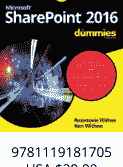

9781119181705
美国 $29.99
加拿大 $35.99
英国 £21.99


9781119263593
美国 $26.99
加拿大 $31.99
英国 £19.99


9781119257769
美国 $29.99
加拿大 $35.99
英国 £21.99


9781119293477
美国 $26.99
加拿大 $31.99
英国 £19.99


9781119265313
美国 $24.99
加拿大 $29.99
英国 £17.99


9781119239314
美国 $29.99
加拿大 $35.99
英国 £21.99


9781119293323
美国 $29.99
加拿大 $35.99
英国 £21.99

## WILEY 最终用户许可协议

请访问 www.wiley.com/go/eula 获取 Wiley 电子书最终用户许可协议。