# 使用Python实现企业自动化

通过易于编写的Python脚本，自动化处理Excel、网页、文档、邮件及各类工作任务

AMBUJ AGRAWAL

版权所有 © 2022 BPB Online

保留所有权利。未经出版商事先书面许可，本书任何部分不得以任何形式或任何方式复制、存储在检索系统中或传播，除非在评论或批评文章中引用简短摘录。

本书的编写已尽一切努力确保所提供信息的准确性。然而，本书所含信息按“原样”出售，不附带任何明示或暗示的担保。作者、BPB Online及其经销商和分销商均不对因本书直接或间接造成的任何损害或据称造成的损害承担责任。

BPB Online已尽力通过适当使用大写字母提供本书提及的所有公司和产品的商标信息。然而，BPB Online无法保证此信息的准确性。

-   集团产品经理：Marianne Conor
-   出版产品经理：Eva Brawn
-   高级编辑：Connell
-   内容开发编辑：Melissa Monroe
-   技术编辑：Anne Stokes
-   文本编辑：Joe Austin
-   语言支持编辑：Justin Baldwin
-   项目协调员：Tyler Horan
-   校对员：Khloe Styles
-   索引员：V. Krishnamurthy
-   生产设计师：Malcolm D'Souza
-   营销协调员：Kristen Kramer

首次出版：2022年8月

由BPB Online出版
WeWork, 119 Marylebone Road
London NW1 5PU

英国 | 阿联酋 | 印度 | 新加坡

ISBN 978-93-55511-379

[www.bpbonline.com](http://www.bpbonline.com)

# 献词

献给我挚爱的父母：
*阿尼尔·阿格拉沃尔 与 萨罗杰·阿格拉沃尔*

# 关于作者

**安布杰·阿格拉沃尔**是人工智能与企业自动化领域的行业专家。他曾获得花旗银行、伦敦帝国理工学院、英国司法部、布里斯托尔大学等众多机构颁发的创新奖项。他也因其在编译器设计与机器学习领域的专长，成为获得英国政府“数字技术杰出人才签证”的最年轻获得者之一。

他是Money2020欧洲峰会、Fin.Techsummit欧洲峰会、伦敦未来工作峰会以及巴黎自动化峰会关于“自动化与未来工作”主题的最年轻演讲者之一。

# 关于审稿人

**阿坎卡·辛哈**是Cognizant智能流程自动化团队的架构师，在其15年的软件开发职业生涯中拥有8年自动化经验。她广泛参与客户在数字营销和技术领域的数字化转型自动化工作。她的工作领域围绕探索自动化潜力、识别自动化用例、设计解决方案，并与团队紧密协作，在多个客户利益相关者的支持下开发一系列机器人，最终通过一系列自动化解决方案为客户提供数字化体验。

她曾与谷歌、推特和哈特福德人寿等客户合作。她的技能涵盖JavaScript、Google Apps Script、Google Cloud、网页开发、Unix、NLP、Python、聊天机器人、开源RPA。开源RPA和NLP是她的兴趣领域，她已在此领域开发了多个原型。

她是Cognizant为科技巨头运营团队设立的工具与自动化团队的创始成员之一。

她是谷歌云认证助理和Kore.AI认证虚拟助手开发者。

她拥有RTM那格浦尔大学电气与电子工程学士学位，目前任职于Cognizant。

# 致谢

首先，我要感谢我的父母，他们不断鼓励我撰写这本书——没有他们的支持，我永远无法完成此书。

我还要感谢我的家人和朋友，他们在我写作过程中给予了持续的支持。

我也要感谢BPB Publications的团队，他们为我提供了出版此书的机会，并在撰写过程中提供了宝贵反馈。

# 前言

本书通过不同的示例和代码片段，引导读者自动化处理重复性工作任务。本书也提供了针对日常工作环境中常见自动化需求和重复性任务的解决方案。阅读本书后，您将能够使用Python为业务流程创建自动化程序。您还将能够识别最常见的适合自动化的业务流程。

本书将使您掌握使用Python程序创建、读取、修改Excel文档并从中提取数据的知识。您还将能够从网站、PDF文档中提取数据，并使用Gmail、Outlook和WhatsApp发送和读取消息。本书将帮助读者创建自动化程序，以自动化处理其枯燥的工作，并将组织效率提升500%。

*本书分为11章。详情如下所列。*

在**第1章**中，您将了解Python的安装步骤和开发环境的设置。我们还将涵盖构建自动化所需的Python包和库的安装。

在**第2章**中，您将了解Python的安装步骤和开发环境的设置。我们还将涵盖构建自动化所需的Python包和库的安装。

在**第3章**中，我们将讨论在您的组织内成功实施自动化所需的心态。我们将探讨识别和优先处理自动化机会的过程。我们还将讨论在自动化程序创建完成后，如何与更广泛的组织共享这些程序。

在**第4章**中，我们将讨论自动化Excel工作流的方法，包括创建、写入和更新Excel文档。我们还将讨论使用Excel和CSV文档的数据处理技术。

在**第5章**中，我们将了解网站和基于Web的任务的自动化。我们将研究如何从网站下载数据，以及如何通过解析HTML文档自动化从网站提取数据。我们还将研究Selenium框架，用于自动化不同网站上的鼠标点击和键盘操作等Web操作。

在**第6章**中，我们将研究使用Python处理不同类型文件的各种基于文件的自动化。我们将讨论一些用于自动化不同文件类型的Python库。我们还将研究从PDF文档和Word文档类型文件结构中提取数据的方法。

在**第7章**中，我们将学习使用Gmail、Outlook和其他SMTP客户端自动化基于电子邮件的任务。我们还将研究使用Twilio API进行短信和WhatsApp自动化。

在**第8章**中，我们将学习通过控制键盘和鼠标操作来自动化图形用户界面（GUI）。我们将使用Python库PyAutoGUI，它适用于Windows、Mac和Linux，并为应用程序内的GUI元素提供自动化功能。

在**第9章**中，我们将研究计算机图像基础以及用于处理图像的Pillow Python库。我们还将研究Tesseract库，该库可用于提取图像和扫描文档中的文本。

在**第10章**中，我们将研究使用日期和定时器调度自动化。我们还将研究外部应用程序，这些程序允许我们基于某些事件（如收到新电子邮件或应用程序启动时）运行自动化。

在**第11章**中，我们将研究扩展Python脚本知识的方法，并根据您的需求开发复杂的端到端流程自动化。我们将学习如何使用外部库以及利用外部代码来构建这些自动化。我们还将研究创建Python Web服务以及使用机器学习进行自动化。

# 代码包与彩色图片

请通过以下链接下载本书的*代码包*和*彩色图片*：

https://rebrand.ly/de9f96

本书的代码包也托管在 GitHub 上，地址为 https://github.com/bpbpublications/Enterprise-Automation-with-Python。如果代码有任何更新，将会在现有的 GitHub 仓库中同步更新。

我们丰富的图书和视频目录中提供了代码包，可在 https://github.com/bpbpublications 获取。欢迎查阅！

# 勘误

我们在 BPB Publications 为自己的工作感到无比自豪，并遵循最佳实践以确保内容的准确性，为订阅者提供沉浸式的阅读体验。我们的读者是我们的镜子，我们利用他们的反馈来反思并改进出版过程中可能出现的任何人为错误。为了让我们保持质量，并帮助我们联系到任何可能因不可预见的错误而遇到困难的读者，请通过以下方式写信给我们：

errata@bpbonline.com

BPB Publications 大家庭非常感谢您的支持、建议和反馈。

> 您知道吗？BPB 提供每本已出版图书的电子书版本，包含 PDF 和 ePub 文件。您可以在 www.bpbonline.com 升级到电子书版本，作为纸质书客户，您有权享受电子书副本的折扣。请通过 [business@bpbonline.com](mailto:business@bpbonline.com) 联系我们了解更多详情。在 [www.bpbonline.com](http://www.bpbonline.com)，您还可以阅读一系列免费技术文章，注册各种免费通讯，并获得 BPB 图书和电子书的独家折扣和优惠。

# 盗版

如果您在互联网上以任何形式发现我们作品的任何非法副本，如果您能向我们提供位置地址或网站名称，我们将不胜感激。请通过 [business@bpbonline.com](mailto:business@bpbonline.com) 联系我们，并附上相关材料的链接。

# 如果您有兴趣成为作者

如果您在某个主题上拥有专业知识，并且有兴趣撰写或参与一本书的创作，请访问 [www.bpbonline.com](http://www.bpbonline.com)。我们已经与数千名开发者和技术专业人士合作，就像您一样，帮助他们与全球技术社区分享他们的见解。您可以提交通用申请，申请我们正在招募作者的特定热门主题，或者提交您自己的想法。

# 评论

请留下评论。一旦您阅读并使用了本书，为什么不在您购买它的网站上留下评论呢？潜在的读者可以看到并利用您的客观意见来做出购买决策。我们 BPB 可以了解您对我们产品的看法，我们的作者也可以看到您对他们书籍的反馈。谢谢！有关 BPB 的更多信息，请访问 [www.bpbonline.com](http://www.bpbonline.com)。

# 目录

1. 设置自动化环境
    - 简介
    - 结构
    - 目标
    - 安装并开始使用 Mu for Python 3
    - 启动 Mu
    - 使用 Mu 安装第三方包
    - 总结
    - 延伸阅读
    - 问题

2. Python 基础
    - 简介
    - 结构
    - 目标
    - Python 简介
    - 决策语句
        - if 语句
        - if-else
        - if-elif-else
    - 循环/重复
        - for 循环
        - while 循环
        - break 语句
        - continue 语句
    - 数据结构
        - 列表
        - 元组
        - 字典
        - 集合
    - 函数
    - 库、模块或包
    - 总结
    - 延伸阅读
    - 问题

3. 自动化思维——Python 作为自动化工具
    - 简介
    - 结构
    - 目标
    - 自动化思维
    - 常见的自动化流程
    - 识别业务流程
    - 总结
    - 延伸阅读
    - 问题

4. 自动化基于 Excel 的任务
    - 简介
    - 结构
    - 目标
    - 安装用于读写 Excel 的库
    - 创建 Excel 文档
    - 读取 Excel 文档
    - 更新工作簿
    - 基于 Excel 的自动化示例
    - CSV 文件自动化
    - 总结
    - 延伸阅读
    - 问题

5. 自动化基于 Web 的任务
    - 简介
    - 结构
    - 目标
    - 从互联网下载文件
    - HTML、CSS 和 JavaScript 简介
        - HTML
        - CSS
        - JavaScript
    - 从网站提取数据
    - 使用 Selenium 控制浏览器
    - 总结
    - 延伸阅读
    - 问题

6. 自动化基于文件的任务
    - 简介
    - 结构
    - 目标
    - 读写文件
    - PDF 文档自动化
    - Word 文档自动化
    - 将 PDF 转换为 Word 文档
    - 总结
    - 延伸阅读
    - 问题

7. 自动化电子邮件、即时通讯应用和消息
    - 简介
    - 结构
    - 目标
    - 简单邮件传输协议
    - 使用 Gmail 发送电子邮件
    - Outlook 电子邮件自动化
    - 短信和 WhatsApp 消息自动化
    - 总结
    - 延伸阅读
    - 问题

8. GUI——键盘和鼠标自动化
    - 简介
    - 结构
    - 目标
    - PyAutoGUI 模块简介
    - 控制鼠标操作
    - 控制键盘操作
    - 使用截图进行自动化
    - 总结
    - 延伸阅读
    - 问题

9. 基于图像的自动化
    - 简介
    - 结构
    - 目标
    - 计算机图像基础
        - 用于图像处理的 Pillow
    - 使用 OCR 从图像中提取文本
    - 总结
    - 延伸阅读
    - 问题

10. 创建基于时间和事件的自动化
    - 简介
    - 结构
    - 目标
    - 调度自动化
        - 编写计时器程序
        - 从 Python 启动程序
        - 使用外部工具作为触发器
    - 总结
    - 延伸阅读
    - 问题

11. 编写复杂的自动化
    - 简介
    - 结构
    - 目标
    - 使用 Python 创建 API
    - 组合多个自动化脚本
    - 在线查找解决方案
    - 使用机器学习进行自动化
    - 总结
    - 延伸阅读
    - 问题

[索引](Index)

# 第 1 章
## 设置自动化环境

## 简介

在本章中，您将了解 Python 的安装步骤和开发环境的设置。我们还将介绍构建自动化所需的 Python 包和库的安装。

## 结构

在本章中，我们将涵盖以下主题：

- 安装并开始使用 Mu for Python 3
- 使用 Mu 安装第三方包

## 目标

学习本章后，您将能够在您的机器上设置自动化环境。您还将了解 Python 开发环境，并能够在您的机器上运行 Python。

### 安装并开始使用 Mu for Python 3

**Mu** 代码是一个面向初学者程序员的简单 Python 编辑器。从 [https://codewith.mu/en/download](https://codewith.mu/en/download) 下载 **Mu 安装程序**。找到您刚刚下载的安装程序（它可能在您的 **Downloads** 文件夹中）。双击安装程序以运行它。如果在安装过程中收到任何警告，请接受这些警告并运行安装程序。安装成功完成后，单击 **Finish** 以关闭安装程序。

### 启动 Mu你可以通过点击 **开始** 菜单中的图标或在 *搜索* 框中输入 **Mu** 来启动Mu。首次运行可能需要一些时间，它会安装并加载所有必需的模块。一旦启动Mu，代码编辑器将如下图所示：

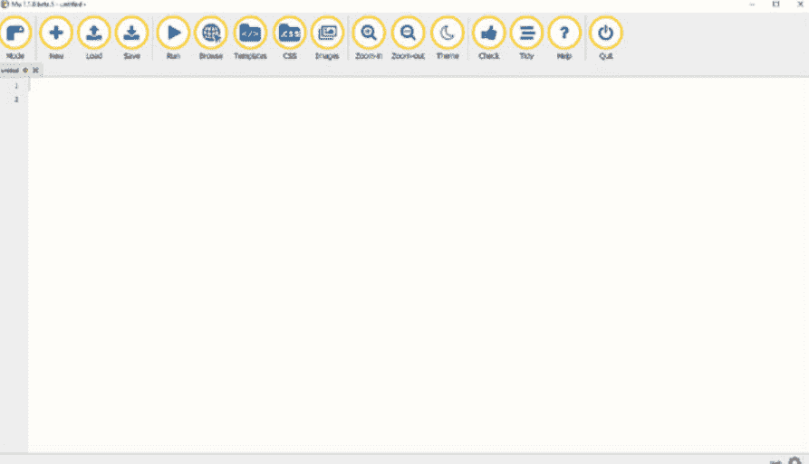

**图 1.1: Mu代码编辑器**

**Mu** 的按钮栏包含用于创建和运行Python代码以及帮助说明的按钮：


**图 1.2: Mu代码编辑器工具栏**

以下是按钮说明，以帮助你开始使用Mu：

- **模式** 按钮用于更改Mu的模式。本书中我们将使用 **Python 3 模式**：

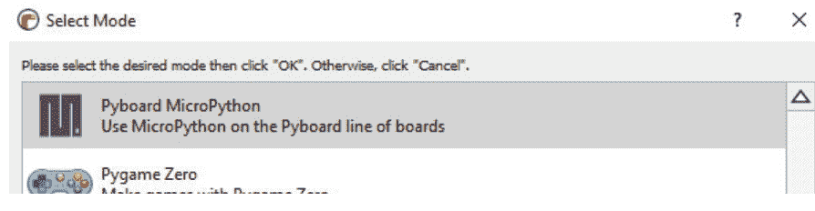

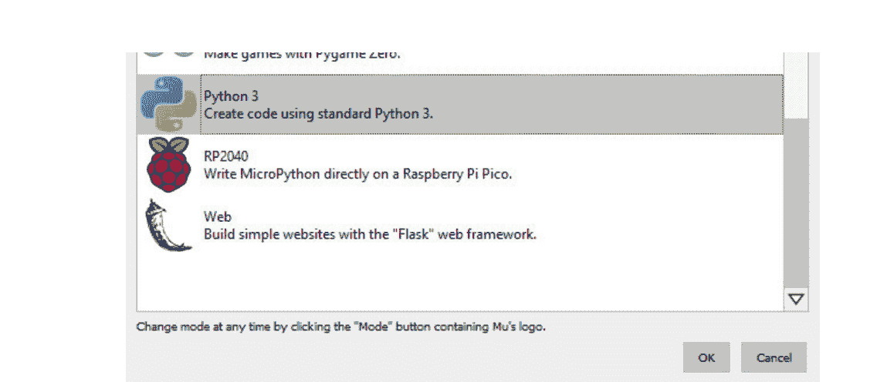

**图 1.3: Mu模式切换视图**

- 新建、加载和保存按钮允许你与计算机硬盘上的文件进行交互：
  - 新建：创建一个新的空白文件。
  - 加载：打开一个文件选择器，以选择要加载到Mu中的文件。
  - 保存：将文件保存到你的计算机硬盘。如果文件没有名称，系统会提示你输入一个名称。
- 运行按钮运行当前脚本。当代码运行时，运行按钮会变成停止按钮。点击停止按钮可以强制以一种干净的方式退出你的代码。
- 调试按钮将启动Mu的可视化调试器，允许你调试Python程序。
- REPL按钮会创建一个新面板，你在这里输入的代码会由Python逐行执行。

你可以从Mu教程页面了解更多关于Mu编辑器的信息 - [https://codewith.mu/en/tutorials/1.1/](https://codewith.mu/en/tutorials/1.1/)。

如果你是一位有经验的程序员，你也可以使用其他Python代码编辑工具，例如 **PyCharm**、**VS Code**、**Jupyter** notebook，或其他任何适合你的代码编辑器工具。

## 使用Mu安装第三方包

在本书中，我们将使用许多第三方包来完成我们的自动化脚本。包（有时称为 **库** 或 **模块**）是可重用的代码，你可以下载、安装并在你的程序中使用它们。它们能指数级地减少开发时间，因为你不必为了在项目中实现相同功能而重写代码。

Python的主要优势之一是它们拥有庞大的包集合，这些包允许你在程序中实现所需的功能。

Mu自带了一个包安装器，它将从 **Python包索引 pypi.org** 下载代码并进行安装，以便你可以在Mu项目中使用它。

要使用Mu安装一个包，请点击页面右下角的 `Mu Administration` 齿轮图标。这是一个 *设置* 形状的按钮，用于安装Python包和更改代码编辑器的设置：

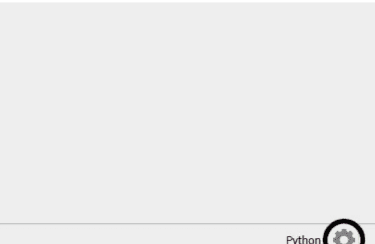

*图 1.4: Mu代码编辑器设置按钮*

选择如下截图所示的 `第三方包` 选项卡：

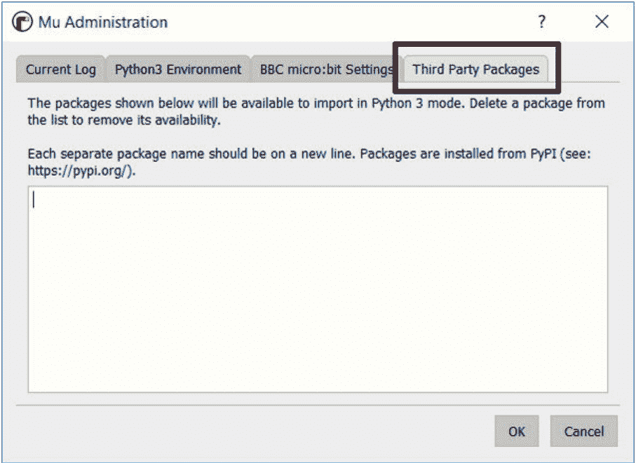

**图 1.5: Mu包安装器页面**

输入你希望安装的包的名称，然后点击确定。该包将被下载并安装。

高级用户也可以使用 `pip`（Python的包安装器）来安装第三方包。

## 总结

在本章中，我们讨论了设置Python开发环境的步骤。在下一章中，我们将介绍Python的基础知识，帮助你入门并开始自动化你的日常企业任务。

## 延伸阅读

互联网上有许多代码编辑工具和资源可以帮助你开始Python开发。下表列出了一些流行的工具及其教程：

| 资源名称 | 链接 |
|---|---|
| 用Mu编程 | https://codewith.mu/en/ |
| Python版Anaconda | https://www.anaconda.com/products/individual |
| Python的Jupyter notebooks | https://jupyter.org/ |
| Python版VS Code | https://code.visualstudio.com/docs/languages/python |
| PyCharm Python IDE | https://www.jetbrains.com/pycharm/ |
| 用Mu编程教程 | https://codewith.mu/en/tutorials/ |
| Python代码编辑器指南 | https://realpython.com/python-ides-code-editors-guide/ |
| 顶级Python开发编辑器 | https://www.simplilearn.com/tutorials/python-tutorial/python-ide |

**表 1.1: 用于Python开发的Python代码编辑工具**

## 问题

1. 有哪些不同的Python开发编辑器可用？
2. 使用Mu进行Python开发有哪些优势？
3. 如何使用Mu安装额外的库？

# 第二章

## Python基础

### 介绍

在本章中，我们将向你介绍Python编程语言。我们将涵盖Python的基础知识，包括决策语句、函数和数据结构。我们还将了解如何导入和使用外部库来实现期望的目标。

## 结构

在本章中，我们将涵盖以下主题：

- Python简介
- 决策语句
- 数据结构
- 循环/重复
- 函数
- 库、模块或包

## 目标

学习本章后，你将能够用Python编程语言编写基本程序。你将获得编程知识，能够开始构建Python程序。你还将理解Python脚本语言、语法和数据结构。

## Python简介

Python是一种通用编程语言，它建立在C编程语言之上。Python也是一种解释型语言，可以交互式使用（类似于将其用作 *高级计算器*，一次执行一个命令）。Python中的 **脚本** 模式允许你执行一系列保存在文本文件中的命令，通常文件名后带有 `.py` 扩展名。

你几乎可以用Python做任何事情，并且它是初学者最容易学习的语言之一。Python在世界范围内被广泛用于构建自动化程序、机器学习模型、数据分析和Web开发。它可以帮助你为日常工作自动化任务、创建Web应用程序、执行数据分析以及构建机器学习模型。

本书中我们使用 *Python版本* 3.8.5，代码应该适用于未来Python的小版本更新。要从一个简单的Python程序开始，请打开Mu编辑器，输入 `print('Hello World')`，保存文件，然后点击运行。你将在控制台窗口看到打印出的 `Hello World`，如下图所示：

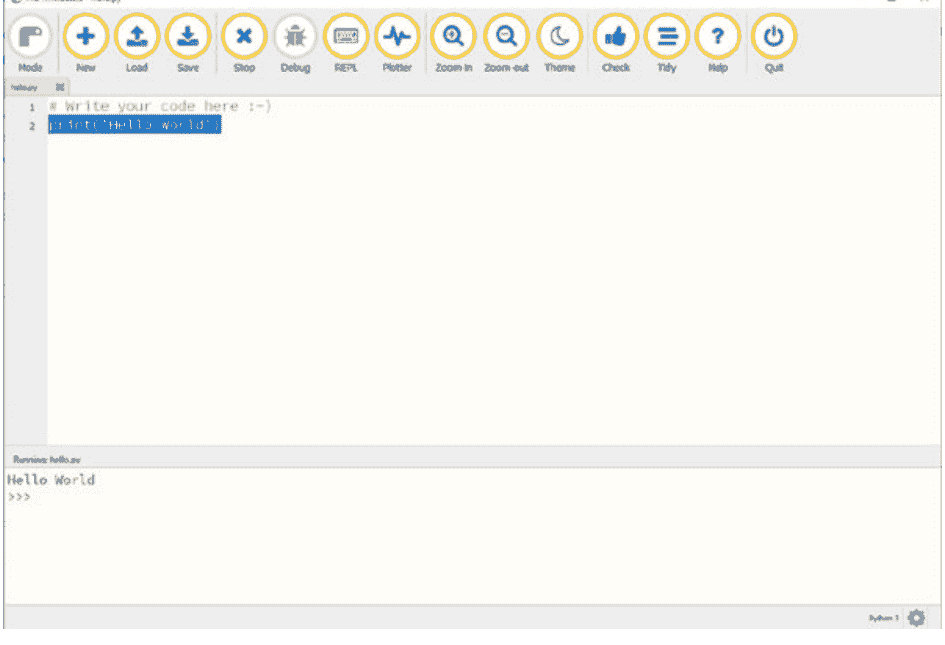

**图 2.1: Hello World程序**

使用Python，你可以轻松地将值赋给变量。以下是将不同数据类型的值赋给变量的一些示例。在Python中，变量、函数、类和代码结构的命名约定遵循PEP 8风格指南。变量采用蛇形命名法，且区分大小写，如下示例所示：

- my_string = "Hello World" # 字符串示例
- my_number = 12321312 # 整数示例
- my_float = 3.1415 # 浮点数示例

在这里，我们使用赋值运算符 `=` 将数据赋给了 `my_string`、`my_number` 和 `my_float`。我们可以通过在Python解释器中输入这些变量名来使用这些赋值。Python还支持算术运算符进行数学运算，例如 `+`, `-`, `/`, `*`, `%`。在下图中，我们看到了Python中执行的一些数学运算示例：

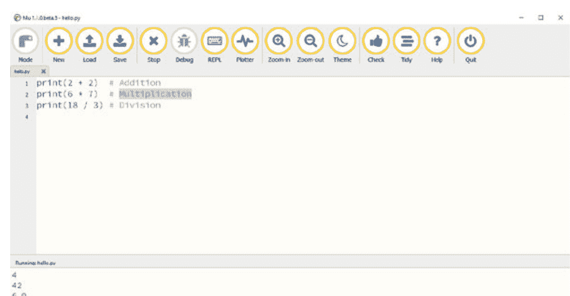

*图 2.2: Python中的数学运算*

我们还可以使用比较和逻辑运算符：`<`, `>`, `==`, `!=`, `<=`, `>=`，以及身份语句，如 `AND`、`OR`、`NOT`。返回的数据类型称为布尔值（参见图2.3）：## 决策语句

决策语句决定了程序执行流程的方向。在Python中，**if**、**else**和**elif**语句用于决策。在Python中，**缩进**用于表示代码块，而不是使用花括号，并且在Python代码中使用一致的缩进非常重要。根据*PEP 8*风格指南，我们通常在Python中每个缩进级别使用四个空格。

### if语句

`if`语句用于决定是否执行某个代码块。

**语法：**

```
if (condition):
    # 条件为真时执行的语句
```

在图2.4中，我们看到使用if语句检查一个变量是否大于100。在这个例子中，由于变量值为1000，因此执行打印语句，输出1000大于100。

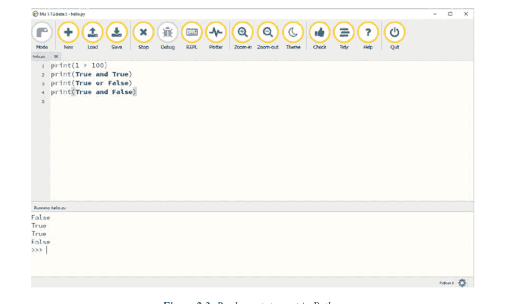

图2.3：Python中的布尔语句

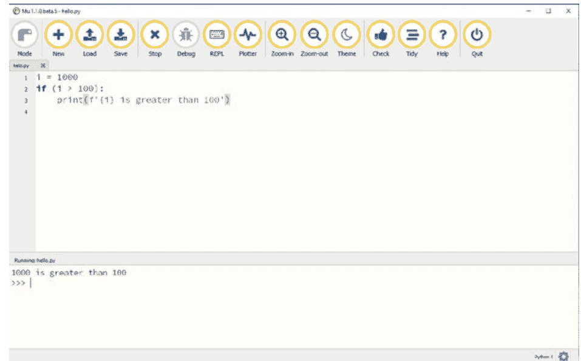

图2.4：If语句

#### if-else

**else**语句允许你在**if**语句条件为*假*时执行代码。

**语法：**

```
if (condition):
    # 条件为真时执行此代码块
else:
    # 条件为假时执行此代码块
```

在*图2.5*中，变量值为10，因此执行**else**块中的**print**语句，输出10小于100。

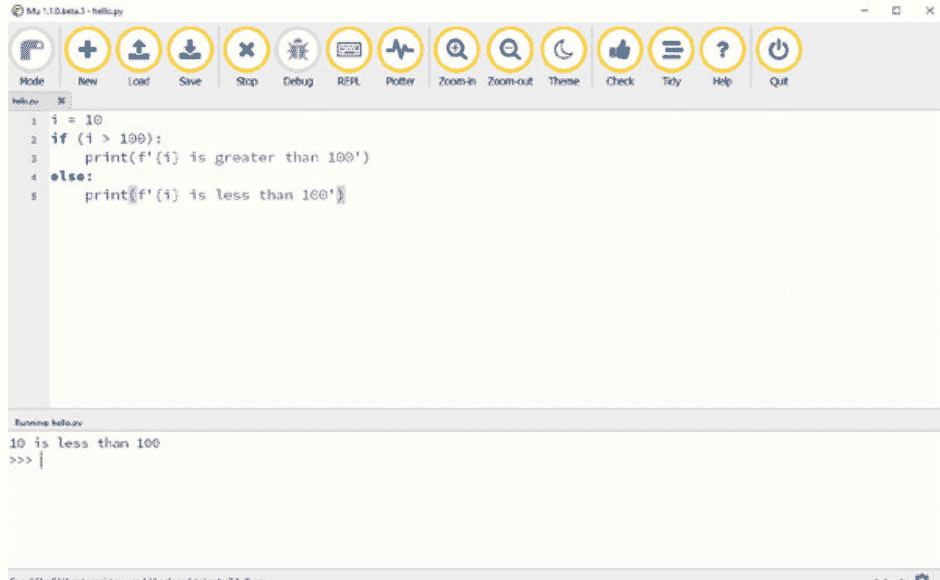

图2.5：If-else程序

#### if-elif-else

在这里，程序员可以在多个选项中做出选择。`if`语句从上到下执行。一旦控制`if`的某个条件为*真*，与该`if`关联的语句就会被执行，而阶梯结构的其余部分将被跳过。如果没有任何条件为*真*，则将执行最后的`else`语句。

**语法：**

```
if (condition):
    statement
elif (condition):
    statement
.
.
else:
    statement
```

在*图2.6*中，变量值为10，因此执行`elif`块中的`print`语句，输出10大于1。

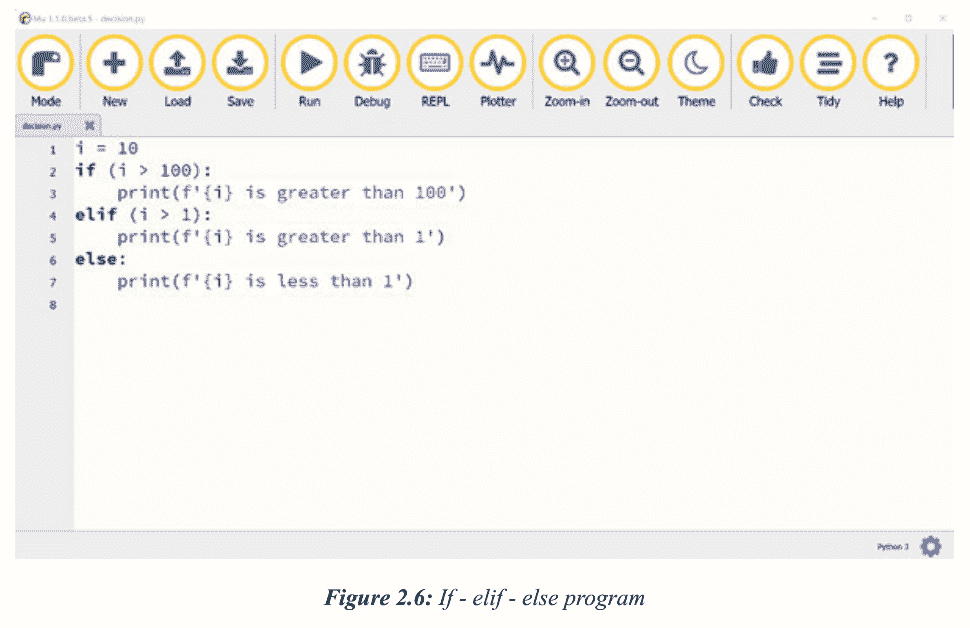

*图2.6：If-elif-else程序*

#### 循环/重复

Python中有两种类型的循环：**for**和**while**。

### for循环

`for`循环遍历给定的序列。我们可以在Python中使用`range()`函数来循环执行一段代码指定的次数。`range()`函数返回一个数字序列，默认从0开始，默认递增1，并在指定的数字处结束。

在*图2.7*中，我们看到一个简单的`for`循环被执行，使用`range`函数打印从0到3的数字。

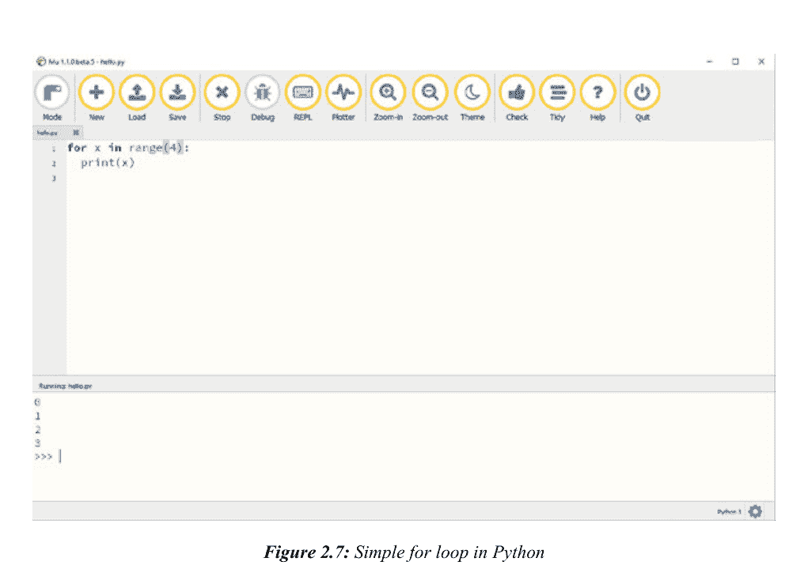

图2.7：Python中的简单for循环

### while循环

while循环类似于for循环，它们只要满足某个布尔条件就会重复执行。

在图2.8中，我们看到一个while循环被执行，变量i的初始值为1，结束条件规定循环应运行到值小于4为止。在循环内部，我们在每次迭代时将变量递增1。一旦变量值达到4，此循环就会终止。

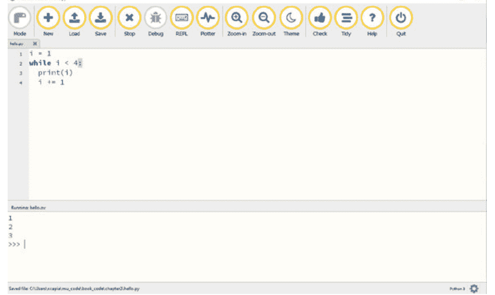

图2.8：Python中的While循环

### break语句

`break`语句用于退出`for`循环或`while`循环。使用`break`语句，我们可以在循环遍历所有项目之前停止循环。

在图2.9中，当变量值为2时，使用`break`语句退出循环。此循环在打印值0和1后终止，并在值达到2时立即退出循环。

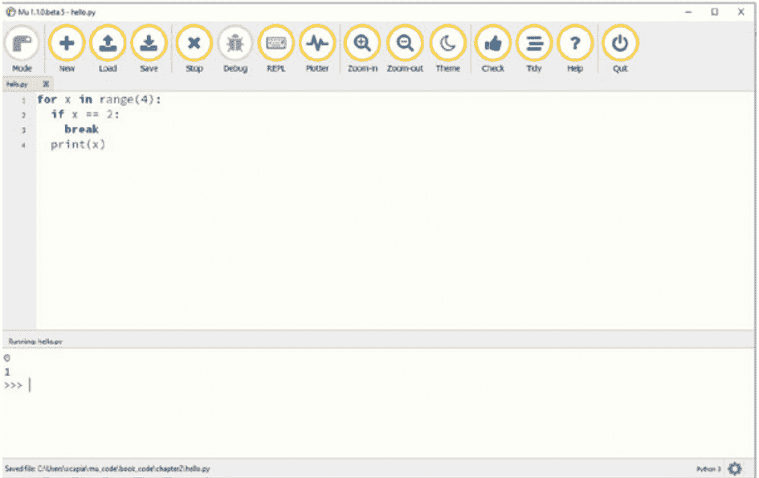

*图2.9：Break语句*

### continue语句

使用`continue`语句，我们跳过循环的当前迭代，并继续下一次迭代。

在图2.10中，当变量值为2时，使用`continue`语句跳过打印该变量。因此，打印了值0、1和3，而当变量值为2时，使用`continue`语句跳过了`print`语句。

```
for x in range(4):
    if x == 2:
        continue
    print(x)
```

输出：
```
0
1
3
```

*图2.10：Continue语句*

#### 数据结构

数据在当前工作环境中扮演着非常重要的角色。Python中的数据结构使你能够轻松地存储数据、检索数据并对其执行操作。**列表、元组、字典**和**集合**是Python中四种基本的数据结构类型。

#### 列表

**列表**在Python中保存一个有序的元素序列。每个元素可以通过*索引*访问。在Python中，索引从**0**开始而不是**1**，因此列表的第一个元素编号为**0**，对于一个有n个元素的列表，最后一个元素编号为*n - 1*。还有负索引，从-1开始，使你能够从最后一个元素访问到第一个元素。

列表通过将*逗号分隔的值*放在方括号[]内来创建。

在下图中，我们看到了几个在Python中创建和修改列表的例子。

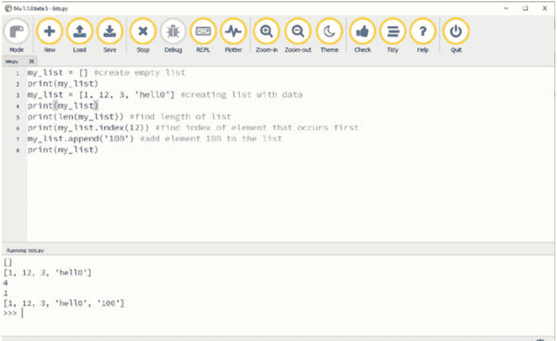

**图2.11：Python中的列表**

可以使用**for**循环来逐个访问列表中的元素。
在[图2.12](#figure-2.12)中，**for**循环用于遍历列表的每个项目，然后使用**print**语句打印此列表的项目。

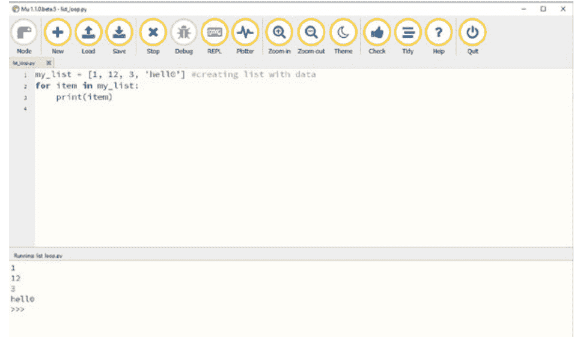

图2.12：带列表的For循环

#### 元组

**元组**类似于列表，是一个有序的元素序列。然而，元组是*不可变的*（一旦创建就不能更改）。

元组通过将*逗号分隔的值*放在圆括号()内来创建。元组没有**append**方法，因为它一旦创建就不能更改。在下图中，创建了一个元组，并使用**for**循环遍历此元组的每个项目，然后打印它们。

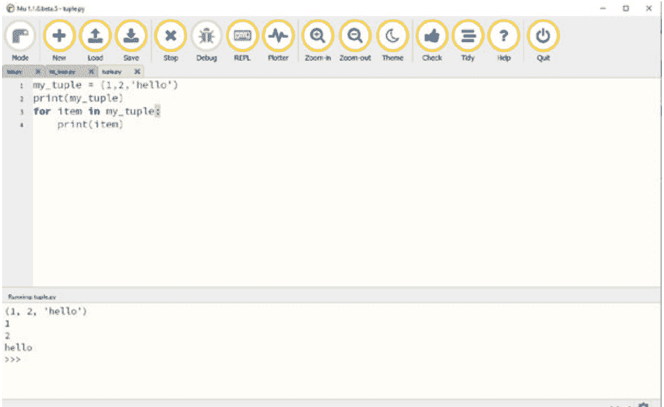

图2.13：Python中的元组

#### 字典

**字典**是一种存储*键值对*的数据结构。字典的一个简单类比是电话簿，其中电话号码是键，姓名是值。你可以通过字典的电话号码来访问姓名。

字典通过将逗号分隔的**键: 值**对放在花括号{ }内来创建。字典的工作方式类似于列表（但你使用键来索引它们）。

在下图中，我们看到了几个在Python中创建、访问和修改字典的例子。

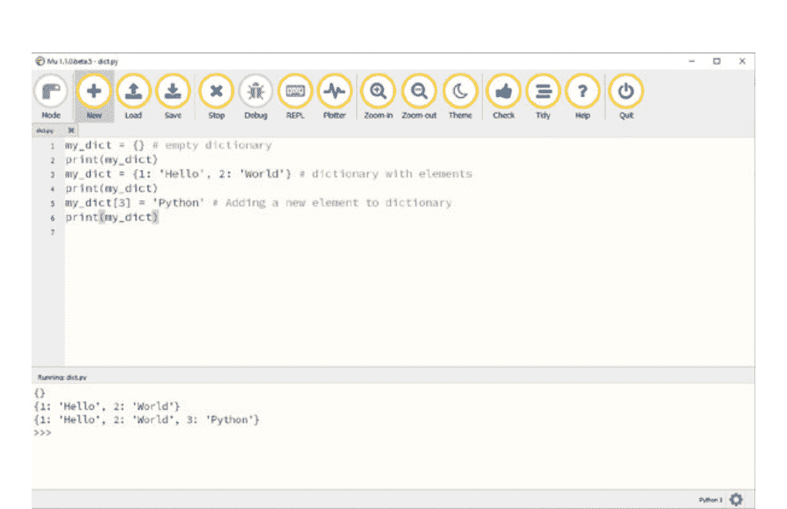

**图2.14：Python中的字典**

可以使用以下方法通过for循环访问字典中的元素：

- items(): 遍历字典中的键: 值对。
- values(): 遍历字典中的值。
- keys(): 遍历字典中的键。

在图2.15中，我们看到了一个使用字典键、值或两者来遍历字典的例子。

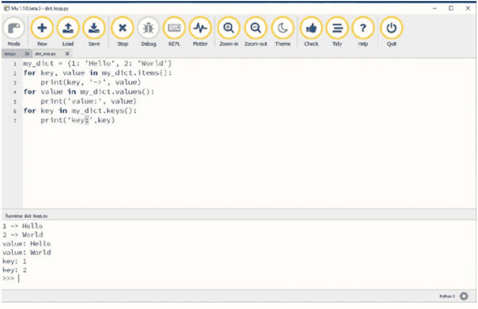

**图2.15：带字典的For循环**

#### 集合

**集合**是无序且唯一元素的集合。它们只保存唯一的值，重复的值在集合中会自动删除。集合通过将逗号分隔的值放在花括号{}内来创建。在下图中，我们看到了一个在Python中创建和遍历集合的例子。请注意，重复的元素在集合中被省略，当我们遍历此集合时，打印的是唯一的元素列表。

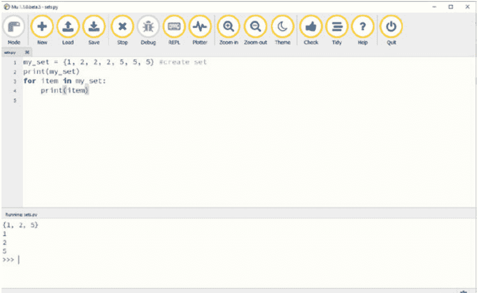

图2.16：Python中的集合

#### 函数

**函数**用于将代码分成块，从而允许你随着时间的推移重用代码。它使程序更容易理解，并允许你在程序之间共享代码。

Python中的函数使用`def`关键字定义，后跟函数名称。函数通过其名称调用，并在函数定义中传递适当的参数。

**示例语法如下：**

```
def func_name(arguments):
    func_operation
```

在下图中，我们看到了一个在Python中创建简单函数以将两个数字相加的例子。该函数在`print`语句内部被调用，我们想要相加的两个数字作为参数传递给函数。

## 库、模块或包

Python 库或模块是包含可重用定义和语句的文件。Python 库是在应用程序之间共享代码的最佳方式。有成千上万的 Python 库由不同的社区和公司创建和维护。**Python 包索引**（[https://pypi.org/](https://pypi.org/)）为 Python 编程语言提供了大量可重用的软件仓库。在本书中，我们将频繁使用 Python 库来帮助我们构建所需的工作自动化程序。

模块可以使用 **Mu**（使用 Mu 安装第三方包）或 **pip** 安装器添加。模块使用 `import` 关键字后跟模块名来导入。

在下图中，我们导入了一个名为 `math` 的 Python 库。导入此库后，我们可以使用库中可用的函数。库的函数定义和使用函数的示例可以在库文档中找到，本例中是 Python `math` 库文档（[https://docs.python.org/3/library/math.html](https://docs.python.org/3/library/math.html)）：

**图 2.18：导入和使用 Python math 库**

## 结论

在本章中，我们讨论了 Python 编程语言的基础知识，包括决策语句、数据结构、循环、函数和 Python 库的示例。我们还介绍了 Python 的语法，以帮助你掌握构建和编辑工作自动化所需的基本编程知识。

在下一章中，我们将讨论识别和自动化日常任务所需的自动化思维。我们还将讨论如何将 Python 用作构建自动化的工具，并讨论一些 Python 用于工作自动化的实际场景。

## 延伸阅读

互联网上有许多在线 Python 教程和资源，可以帮助你开始学习 Python 编程语言。下表列出了一些流行的教程：

| 资源名称 | 链接 |
|---------------|------|
| 官方 Python 教程 | https://docs.python.org/3/tutorial/index.html |
| 你需要学习的 Python 数据结构 | https://www.edureka.co/blog/data-structures-in-python/ |
| Real Python 教程 | https://realpython.com/ |
| w3schools Python 教程 | https://www.w3schools.com/python/default.asp |
| Tutorials point Python 教程 | https://www.tutorialspoint.com/python/index.htm |
| Python 编程简要介绍 | https://datacarpentry.org/python-ecology-lesson/01-short-introduction-to-python/ |

表 2.1：学习 Python 的教程

## 问题

1.  Python 中的 **while** 循环是如何工作的？
2.  Python 中有哪些不同的数据结构？
3.  如何在 Python 中停止一个 **For** 循环？
4.  Python 中的包是什么？

# 第 3 章

## 自动化思维——Python 作为自动化工具

## 简介

在本章中，我们将讨论在组织内成功实施自动化所需的思维模式。我们将介绍识别和优先考虑自动化机会的过程。我们还将讨论在自动化创建后如何与更广泛的组织分享这些自动化成果。

## 结构

在本章中，我们将涵盖以下主题：

- 自动化思维
- 常见的自动化流程
- 识别业务流程

## 目标

学习本章后，你将能够识别组织中的自动化机会。你还将具备正确的思维模式，以决定何时实施自动化，以及何时寻找其他解决方案来优化你的工作流程。

### 自动化思维

自动化思维涉及一种工作方式，我们寻求对现有流程的持续改进，并寻找自动化的机会。这是一种重新构想完成任务或整个工作流程的过程，并寻找使其更高效的机会。你需要乐于接受变化，并寻找工具和解决方案来帮助流程更高效地运行。

在下一节中，我们将讨论一些可以使用 Python 轻松自动化的常见流程和任务。

### 常见的自动化流程

最适合自动化的流程是那些本质上高度重复且占用你总工作量相当大时间的流程。

最常见的自动化机会来自以下三个子类别：

1.  **数据录入**：数据录入流程涉及需要你将数据从一个应用程序输入到另一个应用程序的任务。这些任务本质上是高度手动的，可以使用 Python 轻松自动化。数据录入自动化的主要候选对象包括：
    a. **填写表单**：任何需要为单个或多个数据源重复填写表单的任务。
    b. **发送类似电子邮件**：你需要向大量人员发送批量电子邮件或类似电子邮件的任务。
    c. **在两个系统之间复制数据**：任何需要在多个系统之间复制数据的任务。
    d. **维护 ERP 和 CRM 系统**：涉及向 ERP 和 CRM 系统录入数据的任务。
    e. **更新遗留系统**：涉及使用遗留系统并将数据更新到这些系统的任务。
    f. **向内部系统输入数据**：任何你需要使用和维护内部专有系统的任务。

2.  **数据提取**：数据提取流程涉及你需要从不同文件格式中提取数据以供其他团队或应用程序使用的工作。这些任务可以轻松自动化，从而节省大量日常工作时间。几乎每项工作都涉及从不同文件中提取数据的任务。数据提取自动化的主要候选对象包括：
    a. 提取客户详情：涉及从电子邮件、文档和其他系统中提取客户详情的任务。
    b. 将 PDF 数据转换为 Excel 表格：涉及通过将 PDF 文档转换为 Excel 格式来提取数据的任务。
    c. 从报告中提取数据：涉及从外部和内部报告（如财务报告、新闻稿、法律报告和公司报告）中提取数据的任务。
    d. 从图像中提取数据：涉及从扫描或在线图像中提取数据的任务。

3.  **数据收集**：数据收集流程涉及你需要从多个来源（如网站、文件和应用程序）收集数据的工作。这些任务通常涉及从多个来源收集、清理和整理数据，并对其进行一些分析。数据收集自动化的主要候选对象包括：
    a. 收集股票价格：涉及从股票交易所网站和其他市场数据系统收集股票价格数据的任务。
    b. 进行市场研究：涉及从社交媒体网站、竞争对手网站或媒体文档中收集特定信息的任务。
    c. 收集网站数据：任何涉及从互联网上任何网站收集数据的任务。
    d. 在线报告提取：涉及从基于 HTML 的在线报告中提取数据的任务。

还有一些流程发现和流程挖掘工具可以帮助你发现应该优先考虑和自动化的流程。我们将在下一节讨论其中一些工具。

### 识别业务流程

业务流程发现是识别流程的常用方法。业务流程发现涉及手动或自动构建组织业务流程及其变体的技术和方法。

也可以使用流程文档或基于时间的活动分析来识别组织中的流程。一旦识别出流程并列出了流程中涉及的步骤，请使用以下清单作为指南来选择最佳的自动化候选对象：

-   需要超过几个小时的手动时间才能完成。
-   具有明确定义步骤/规则的流程。
-   重复性的流程。
-   频繁运行的流程，至少每月一次。
-   完成流程涉及多个步骤。
-   工作涉及多个数据文件，如 Excel、文本、PDF 文件。
-   工作涉及处理遗留系统。
-   任务需要高准确性。
-   流程需要高水平的文档记录。
-   由于复杂性或涉及的步骤数量，流程存在较高的人为错误风险。
-   在时间、资源和其他无形资产方面成本高昂的流程。
-   可以轻松自动化的流程。

下图显示了对执行的工作进行的基于时间的分析，以识别最适合自动化的应用程序。可以根据用户访谈进行进一步分析，以确定最终的自动化流程。

图 3.1 显示了跨不同应用程序的基于时间的分析，这有助于识别用户执行的最耗时的任务：## 流程映射

流程频率：**80**
平均流程时间（分钟）：**8**
总流程时间（分钟）：**640**

流程频率：**50**
平均流程时间（分钟）：**3**
总流程时间（分钟）：**150**

**Excel.exe**
**12 个操作**
（复制数据）

**Upload.exe**
**24 个操作**
（验证、复制与粘贴）

**Excel.exe**
**4 个操作**
（粘贴数据）

**Excel.exe**
**4 个操作**
（复制数据）

**Chrome.exe**
**7 个操作**
（粘贴与复制数据）

**Excel.exe**
**4 个操作**
（粘贴数据）

*图 3.2：应用程序流程映射*

*图 3.3* 展示了基于时间的 **explorer.exe** 应用分析，并显示了用户在该应用程序中花费时间最多的部分。我们可以在多个团队乃至整个组织范围内进行此类时间分析：

图 3.3：在 explorer 上花费的时间

还有一些流程挖掘和流程发现软件，它们可以根据记录的步骤、文档和现有的组织工作方法生成流程映射。任何由唯一 ID（有助于分组属于同一任务的任务）、活动名称（对发生任务的描述）和时间戳（任务发生时间）组成的数据都称为 **事件日志**。事件日志用于发现底层的流程模型。**PM4Py** ([https://github.com/pm4py/pm4py-core](https://github.com/pm4py/pm4py-core)) 是一个 Python 流程挖掘包，被广泛用于发现业务流程。

## 结论

在本章中，我们讨论了拥有自动化思维对于成功提高工作质量的重要性。我们已经浏览了可以使用 Python 自动化的最常见流程列表。我们还探讨了各种可用的工具和技术，以帮助我们识别最可能的自动化候选对象。

在下一章中，我们将探讨使用基于 Excel 的数据文件和电子表格实现自动化的各种技术。我们将讨论有助于处理基于 Excel 数据集自动化的 Python 模块，以及可以执行的各种自动化示例。

## 延伸阅读

有一些优秀的工具可用于执行流程发现和流程挖掘，以寻找改进组织内流程的机会。

| 资源名称 | 链接 |
|---|---|
| 2021 年的流程发现：它是什么以及如何运作 | https://research.aimultiple.com/process-discovery/ |
| PM4Py - Python 的流程挖掘 | https://pm4py.fit.fraunhofer.de/ |
| 流程挖掘简介 | https://towardsdatascience.com/introduction-to-process-mining-5f4ce985b7e5 |
| Celonis 流程挖掘 | https://www.celonis.com/ |

*表 3.1：关于流程发现和流程挖掘的资源*

## 问题

1.  什么是流程发现工具？
2.  哪些流程不应该被自动化？
3.  如何在组织内发现自动化机会？
4.  构建自动化需要怎样的思维模式？

# 第四章

## 自动化基于 Excel 的任务

## 简介

在本章中，我们将讨论自动化 Excel 工作流的方法，包括创建、编写和更新 Excel 文档。我们还将讨论使用 Excel 和 CSV 文档进行数据处理的技术。

## 结构

在本章中，我们将涵盖以下主题：

-   安装用于读写 Excel 的库
-   创建 Excel 文档
-   读取 Excel 文档
-   更新工作簿
-   基于 Excel 的自动化示例
-   基于 CSV 文件的自动化

## 目标

学习完本章后，你将获得关于操作 Excel 文件的 Python 库的知识和理解。你还将熟悉如何自动化基于 Excel 任务（如读取、写入和更新工作簿）的代码片段。你将看到一些可以使用 Python 自动化的常见基于 Excel 的任务示例。

### 安装用于读写 Excel 的库

我们将使用 `openpyxl`（最流行的 Python 读写 Excel 文件的库）来自动化基于 Excel 的任务。它允许你以非常简单的方式读取、写入和更新工作簿：

1.  要安装 **openpyxl**，请使用 **mu** 包管理器。输入 **openpyxl** 并点击 **ok**，如下图所示。本书使用 **3.0.9** 版本，因此要导入相同版本，请在包管理器中输入 **openpyxl==3.0.9**。更新的版本也应该能与本章的示例一起使用：

*图 4.1：Mu 设置选项*

2.  点击 **ok** 按钮后，你将看到 **openpyxl** 包正在计算机上安装的消息，如*图 4.2*所示：

图 4.2：Openpyxl 正在 Mu 中安装

3.  你可以通过导入库并使用 `__version__` 属性打印库版本来验证 `openpyxl` 是否已正确安装，如[图 4.3](#figure-43)所示：

图 4.3：导入 Openpyxl 模块

### 创建 Excel 文档

在本节中，我们将通过一个示例来创建一个新的 Excel 工作簿并向其中写入一些数据。

我们可以使用 `openpyxl` 库中的 `Workbook()` 函数创建一个新的工作簿。我们可以通过访问活动工作表，并通过名称选择行和列来向工作簿添加一些数据。要访问 `row 1` 和 `column 1`，请使用 `A1` 作为索引，其中 `A` 代表 `column 1`，`1` 代表 `row 1`，如下图所示。默认情况下，工作簿文件可保存在脚本所在的同一文件夹中：

> 图 4.4：创建新工作簿

保存新工作簿后，你可以从文件浏览器访问它，并从 Excel 应用程序中打开它：

图 4.5：新工作簿保存在代码目录中

在 Excel 应用程序中打开文件后，你可以看到数据 **Hello World** 和程序执行的日期已添加到工作表中，如下图所示：

图 4.6：数据被添加到新工作簿

### 读取 Excel 文档

你可以使用 Python `openpyxl` 库读取和循环遍历数据。根据你的需求，有几种不同的方式来迭代数据。

你可以通过列和行的组合来切片数据。要访问单元格的值，请使用 `.value` 方法。例如，你可以通过使用访问器 `A1` 来访问 *第 1 行* 和 *第 1 列* 的数据，或者使用 `.cell` 函数，并将行号和列号作为参数，如下图所示：

图 4.7：从 Excel 工作簿中访问单元格值

你还可以通过使用 *range* 函数（格式为 *Row or Column 1:Row or Column 2*）来循环遍历整行或整列，以获取列和行之间的单元格，如下图所示：

图 4.8：打印单元格元组

还有多种使用普通 Python 生成器遍历数据的方法。你可以用来实现此目的的主要方法是 `.iter_rows()` 和 `.iter_cols()` 函数。这些函数接受参数 **min_row** 表示起始行号，**max_row** 表示结束行号，**min_col** 表示起始列号，**max_col** 表示结束列号。在[图 4.9]中，你可以看到一个示例，我们使用 `.iter_rows()` 和 `.iter_cols()` 函数循环遍历 **test_workbook** 的行和列：

**图 4.9：在 Excel 工作表中遍历行和列**

在[图 4.10]中，你可以看到一个示例，我们使用 `.iter_rows()` 函数循环遍历 **test_workbook** 的行，并通过另一个 for 循环和 `.value` 函数访问值。如果你需要操作或读取工作簿中的特定行，这会很有帮助：

## 更新工作簿

在本节中，我们将探讨如何更新现有工作簿，以及向工作簿添加或删除数据。

要更新、添加或删除现有单元格的数据，请使用单元格访问器（如 *A1*）并根据需要将其值设置为新值。在图 4.11 中，我们看到一个示例，其中向 **test_workbook** 添加新数据并使用 **iter_rows()** 函数打印数据：

*图 4.10：遍历每一行及其值*

图 4.11：使用新数据更新工作簿

你也可以使用 **openpyxl** 库来添加或删除工作表。要添加新工作表，请使用 **create_sheet(sheet_name)** 函数；要复制工作表，请使用 **copy_worksheet(sheet_name)** 函数；要删除工作表，请使用 **remove(sheet_name)** 函数，如下图所示：

图 4.12：向 Excel 添加新工作簿

## 基于 Excel 自动化的示例

在本节中，我们将看一个简单的 Excel 自动化示例，你需要将数据从一个 Excel 文件移动到另一个 Excel 文件。

在图 4.13 中，我们可以看一个示例，其中我们要将源工作簿的第 1 列和第 2 列复制到目标工作簿。为了实现这一点，我们可以使用 max_row 方法获取源工作簿的行数（使用类似方法 max_column 可以获取列数）。然后，我们使用 for 循环遍历所有行和所需列，从源工作簿获取值，将其存储在变量中，然后将其存储到目标工作簿的相同行和列号中。然后，我们使用 .save() 函数保存目标文件：

图 4.13：将第 1 列和第 2 列复制到另一个工作簿

上述自动化在源工作簿和目标工作簿都存在时有效，图 4.14 显示了源工作簿的数据：

图 4.14：包含示例数据的源工作簿

图 4.15 显示了目标工作簿的数据，其中第 1 列和第 2 列是从源工作簿复制过来的，当我们运行复制数据自动化时：

图 4.15：从源工作簿复制第 1 列和第 2 列后的目标工作簿

## CSV 文件自动化

Python 还拥有操作 CSV 文件的库和函数。*CSV* 文件是 *逗号分隔值* 文件，包含一个数据列表，其中不同元素由逗号分隔。这些文件通常用于在不同应用程序之间交换数据。

Python 有一个内置的 CSV 模块，可以使用 *import csv* 命令导入。该模块提供了读取、写入和更新 CSV 文件的函数。如 *图 4.16* 所示，我们可以使用 CSV 模块的 *reader()* 函数读取 *test_file* CSV 文件，并使用 *writer()* 函数用新数据更新文件。注意，Python 也有文件 I/O 函数，我们可以使用 *open()* 函数打开文件，如下图所示。*第 10 行* 中 *open()* 函数的参数 *a+* 表示我们要打开文件以在其中追加新数据：

图 4.16：使用 CSV 读取器和写入器操作 CSV 文件

图 4.17 显示了执行 *csv_automation* 程序之前的 CSV 文件：

*图 4.17：更新前的 CSV 文件*

*图 4.18* 显示了执行 *csv_automation* 程序之后的 CSV 文件，在 *第 3 行* 添加了新数据：

*图 4.18：在 Mu 中安装 Openpyxl*

你还可以使用 CSV 库创建新的 CSV 文件、操作 CSV 文件内的数据，以及将 CSV 文件转换为 JSON 格式或 Python 对象。

## 结论

在本章中，我们介绍了操作和自动化基于 Excel 任务的基本 Excel 方法。我们探讨了使用 *openpyxl* 库读取、写入和更新 Excel 文件的不同方法。我们还介绍了 Python 中的 CSV 模块，用于读取、写入和更新 CSV 文件。

在下一章中，我们将探讨使用各种在线网站实现自动化的各种技术。我们将讨论有助于基于网站数据集自动化的 Python 模块，以及可以为不同类型网站执行的各种自动化示例。

## 延伸阅读

有很多在线资源可以帮助你进一步学习使用 Python 进行 Excel 和 CSV 自动化。下表列出了一些最佳资源，以进一步提升你在 Python 中使用 Excel 和 CSV 库的学习：

| 资源名称 | 链接 |
| --- | --- |
| openpyxl - 一个用于读取/写入 Excel 文件的 Python 库 | https://openpyxl.readthedocs.io/en/stable/ |
| 使用 openpyxl 的 Python Excel 电子表格指南 | https://realpython.com/openpyxl-excel-spreadsheets-python/ |
| CSV 文件读取和写入 | https://docs.python.org/3/library/csv.html |
| 使用 Python 中的 OPENPYXL 进行 Excel 自动化 | https://www.topcoder.com/thrive/articles/excel-automation-with-openpyxl-in-python |

*表 4.1：Python 中 CSV 和 Excel 库的相关资源*

## 问题

1.  Python 中用于 Excel 自动化最受欢迎的包是什么？
2.  如何在 Python 中创建 Excel 文档？
3.  如何构建自动化任务以在多个 Excel 工作表之间传输数据？
4.  如何将 Excel 文档中的数据读入 Python 数据结构？

# 第5章
自动化基于 Web 的任务

## 简介

在本章中，我们将探讨网站和基于 Web 任务的自动化。我们将研究如何从网站下载数据，以及如何通过解析 HTML 文档来自动化提取网站数据。我们还将介绍 **Selenium** 框架，用于自动化 Web 操作，例如在不同网站上进行鼠标点击和键盘操作。

## 结构

在本章中，我们将涵盖以下主题：

- 从互联网下载文件
- HTML、CSS 和 JavaScript 简介
- 从网站提取数据
- 使用 Selenium 控制浏览器

## 目标

学习本章后，你将能够自动化基于 Web 的任务，例如从网页提取数据、下载文件和执行搜索。你还将了解用于处理网站和 HTML 文档的 Python 库。

## 从互联网下载文件

Python 允许你从互联网下载网页、HTML 文档、PDF 文档、视频和其他文件类型。我们将使用 **requests**，这是一个 Python 库，允许你执行 HTTP 请求。其应用之一是使用文件 URL 从网络下载文件。
要安装 requests，请使用 **mu** 包管理器，输入 **requests**，然后点击 **确定**，如下图所示：

*图 5.1：Mu 包管理器*

库安装后，你可以使用 `import` 语句导入它。**Requests** 库允许你发送 HTTP 请求，无需手动将查询字符串添加到 URL，或对 POST 数据进行表单编码。HTTP 定义了用于指示需要在 Web 服务上执行的操作的方法。**Requests** 库可用的 HTTP 方法如下：

- **GET**：允许你从给定的网络链接检索数据。
- **HEAD**：类似于 GET 请求，但不包含响应体。
- **POST**：将数据提交到指定的网络链接，通常会导致服务器上发生某些操作。
- **PUT**：使用上传的数据替换服务器上的当前表示。
- **DELETE**：删除指定的数据。
- **CONNECT**：建立到由网络链接标识的服务器的隧道。

### 选项：这描述了目标网络链接的通信选项。
-   TRACE：这执行消息回环测试。
-   PATCH：这会对数据进行部分修改。

要从互联网下载文件，我们将使用 `HTTP GET` 方法。如*图 5.2*所示，我们可以使用 `requests` 库，语法为 `requests.get(FILE_LINK)`，从互联网下载文件。

我们还在下图中使用了 Python 文件写入功能，该功能允许我们创建新文件或向现有文件添加数据。Python 有一个 `open()` 函数，这是处理文件的关键函数。`open()` 函数接受两个参数作为参数，即文件位置和模式。使用 `open` 函数打开文件有四种不同的模式：

-   r：读取 - 打开文件进行读取。
-   a：追加 - 打开文件以添加更多数据，如果文件不存在则创建一个新文件。
-   w：写入 - 打开文件进行写入，如果文件不存在则创建一个新文件。
-   x：创建 - 创建一个新文件。

```python
import requests

### 要下载 HTML 的页面 URL
web_page = "https://en.wikipedia.org/wiki/Python_(programming_language)"

### 创建 HTTP 响应对象
# 向服务器发送 HTTP 请求并将
# HTTP 响应保存在响应对象中
response = requests.get(web_page)

### wb 模式用于将二进制内容写入文件
with open("python.html", 'wb') as file:
    # 保存接收到的内容
    file.write(response.content)
```

## 图 5.2：下载简单的 HTML 网页

要从互联网下载多个文件，我们可以在 Python 列表中添加多个 URL，并使用 for 循环遍历链接，然后下载所需的文件，如图 5.3 所示：

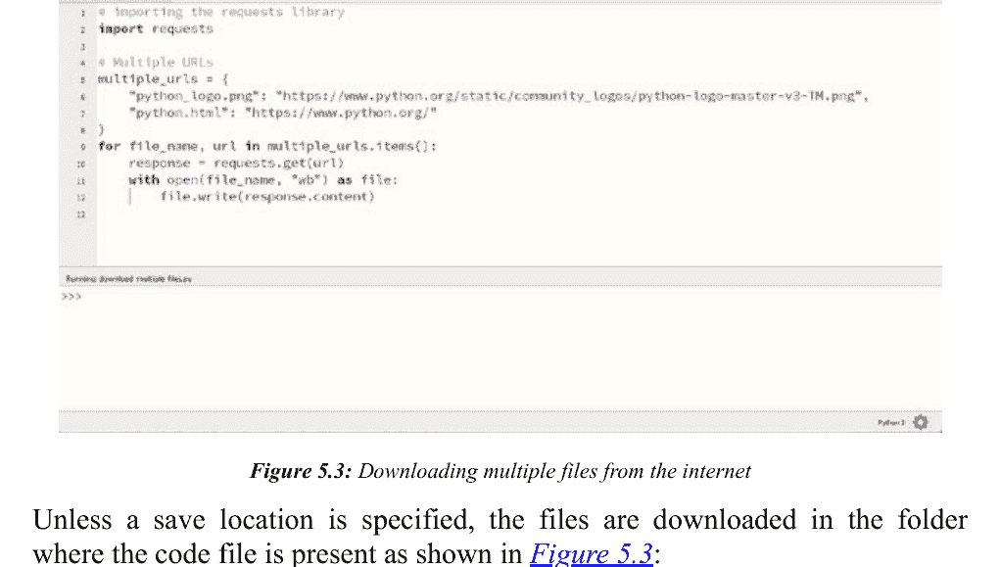

## 图 5.3：从互联网下载多个文件

除非指定了保存位置，否则文件将下载到代码文件所在的文件夹中，如图 5.3 所示：

| 名称                     | 修改日期            | 类型                | 大小 |
|--------------------------|---------------------|---------------------|------|
| download_html_files.py   | 12/18/2021 11:52 AM | PY 文件             | 1 KB |
| download_multiple_files.py | 12/18/2021 12:01 PM | PY 文件             | 1 KB |
| python.html              | 12/18/2021 12:01 PM | Chrome HTML 文档    | 49 KB |
| python_logo.png          | 12/18/2021 12:01 PM | PNG 文件            | 82 KB |

## 图 5.4：下载到代码文件夹中的文件

要从互联网下载大文件，我们可以在 `requests` 函数中将 `stream` 参数设置为 `True`。这将只下载响应头，并且连接将保持*打开*状态。这避免了将大响应的内容一次性全部读入内存。每次迭代 `r.iter_content` 时，都会将一个固定大小的块加载到内存中。如*图 5.5*所示，我们遍历响应并将大型 PDF 文档写入所需文件：

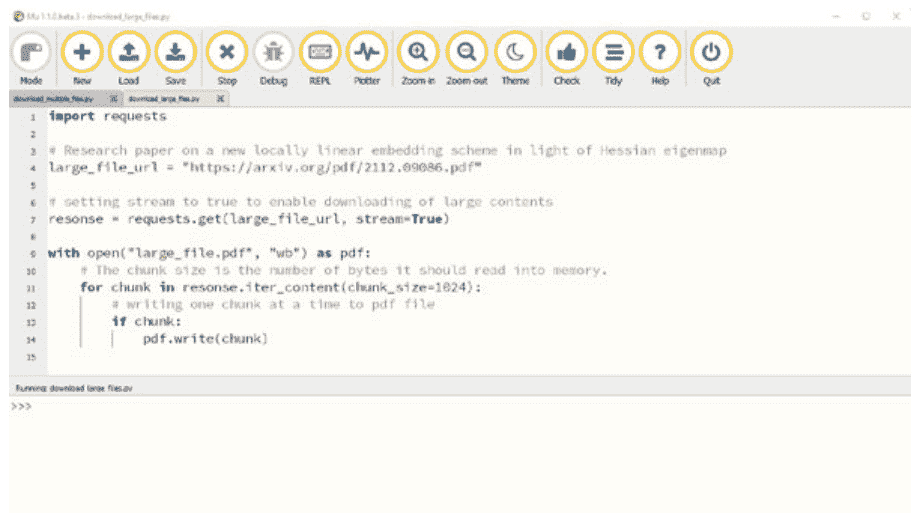

在下一节中，我们将介绍用于创建互联网上可用的网页和网站的 HTML、CSS 和 JavaScript 的基础知识。掌握 HTML、CSS 和 JavaScript 的基础知识对于成功自动化网络数据提取任务至关重要。

## HTML、CSS 和 JavaScript 简介

在本节中，我们将介绍网页的构建块和组件。当我们访问一个网页时，我们的网络浏览器会向网络服务器发出一个 `GET` 请求。然后服务器发回文件，告诉我们的浏览器如何为我们渲染页面。这些文件通常包括：

-   **HTML**：要在浏览器中显示的主要页面内容。
-   **CSS**：用于添加样式，使网页看起来更美观。
-   **JavaScript**：JavaScript 文件为网页添加交互性和额外功能。
-   **图像**：JPG 和 PNG 等图像文件允许网页显示图片。
-   **其他文件格式**：这些可以是视频、文档、音频文件或任何其他文件类型。

在我们的浏览器接收到所有文件后，它会渲染页面并显示它。

### HTML

当我们执行网络抓取时，我们主要感兴趣的是网页的主要内容，即一个 HTML 文档。HTML 代表超文本标记语言，是用于构建网站的语言。HTML 代码基于标签，这些标签提供格式化和显示文档的指令。标签以小于号 < 开始，以大于号 > 结束。

例如，要使单词 Hello 加粗，你可以使用开始粗体标签 <b>，然后是结束粗体标签 </b>，像这样：

```
<b>Hello</b>
```

HTML 文档可以使用 <html> 和 </html> 标签创建。有一个 head 标签，其中包含有关页面标题和其他顶级信息的数据，还有一个 body 标签，其中包含页面的主要内容。对于网络抓取，我们主要对 HTML 页面 body 标签内的内容感兴趣。

常用的 HTML 标签有：

-   `<!-- ... -->`：定义注释。
-   `<!DOCTYPE>`：定义文档类型。
-   `<a>`：定义超链接。
-   `<audio>`：定义嵌入式声音内容。
-   `<b>`：定义粗体文本。
-   `<body>`：定义文档的主体。
-   `<br>`：定义单个换行符。
-   `<button>`：定义按钮。
-   `<caption>`：定义表格标题。
-   `<dialog>`：定义对话框或窗口。
-   `<div>`：定义文档中的一个部分。
-   `<footer>`：定义文档或部分的页脚。
-   `<form>`：定义用于用户输入的 HTML 表单。
-   `<h1>` 到 `<h6>`：定义不同大小的 HTML 标题，其中 h1 最大。
-   `<head>`：包含文档的元数据/信息。
-   `<html>`：定义 HTML 文档的根。
-   ``：定义图像。
-   `<input>`：定义输入控件。
-   `<label>`：为 `<input>` 元素定义标签。
-   `<li>`：定义列表项。
-   `<ol>`：定义有序列表。
-   `<option>`：定义下拉列表中的一个选项。
-   `<p>`：定义段落。
-   `<pre>`：定义预格式化文本。
-   `<select>`：定义下拉列表。
-   `<span>`：定义文档中的一个部分。
-   `<style>`：定义文档的样式信息。
-   `<table>`：定义表格。
-   `<tbody>`：对表格中的主体内容进行分组。
-   `<td>`：定义表格中的一个单元格。
-   `<th>`：定义表格中的一个表头单元格。
-   `<title>`：定义文档的标题。
-   `<tr>`：定义表格中的一行。
-   `<ul>`：定义无序列表。
-   `<video>`：定义嵌入式视频内容。

HTML 文档有一个 id 属性，用于为 HTML 元素指定唯一的 ID。id 属性对于自动化基于网络的任务特别有用。id 的值在 HTML 文档中是唯一的。在 HTML 文档中，id 为特定标签声明，如下例所示：

```
<h1 id="myId">My Id</h1>
```

HTML 文档还有一个 class 属性，可用于识别元素。多个元素可以在 HTML 文档中拥有相同的类。在 HTML 文档中，class 为特定标签声明，如下例所示：

```
<div class="myClass"> </div>
```

一个简单的 HTML 代码片段如下所示，当它在浏览器中显示时将打印 Hello World：

```html
<html>
<head>
</head>
<body>
    <h1>Hello World</h1>
</body>
</html>
```

### CSS

CSS 用于设置网页样式，它代表层叠样式表。它描述了 HTML 元素在屏幕、纸上或其他媒体上的显示方式。它可以在不同的网页中重复使用，通常存储在 CSS 文件中。CSS 文档通常对网络自动化目的没有用处，因为它们只定义网页的样式，而不是其内容。以下示例是一个示例 CSS 文件，其中所有 `<p>` 元素都居中对齐，文本颜色为黑色：

```css
p {
    color: black;
    text-align: center;
}
```

### JavaScript

JavaScript 是一种类似于 Python 的编程语言，是用于设计网页的主要编程语言。JavaScript 用于更改 HTML 内容和操作 HTML 文档。

在HTML文档中，JavaScript代码被添加在**script**标签内，如下所示，其中**main.js**是包含JavaScript代码的JavaScript文件名：

```html
<script src="main.js"></script>
```

以下是一个简单的JavaScript代码示例，可用于更改HTML文档的标题：

1.  `const docHeading = document.querySelector('h1');`
2.  `docHeading.textContent = 'New Heading';`

当我们将此代码添加到HTML文档时，代码执行后会将HTML文档的标题更改为**New Heading**值。

执行基于网络的自动化不需要深入的JavaScript知识，但以下**w3schools**教程（[https://www.w3schools.com/js/](https://www.w3schools.com/js/)）是学习更多关于该语言知识的绝佳起点。

在下一节中，我们将使用HTML文档的基础知识从网页中提取数据并自动化基于网络的任务。

## 从网站提取数据

从网站提取数据被称为**网络抓取**，它涉及从网络获取HTML页面并从HTML文档中提取所需数据。在Python中，我们将使用**Beautiful Soup**库，它使得从HTML文档中提取数据变得非常容易。**Beautiful Soup**允许我们编写自定义代码，过滤我们指定的特定元素，并按照指示提取所需内容。

要安装**Beautiful Soup**，请使用`mu`包管理器，输入`beautifulsoup4`，然后点击`OK`，如下图所示：

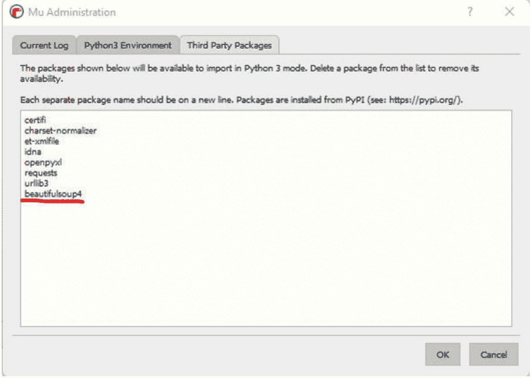

*图 5.6：Mu包管理器*

安装Beautiful Soup库后，你可以使用语句`from bs4 import BeautifulSoup`导入它，其中`bs4`代表`beautifulsoup4`，如[图 5.7](#figure-5-7)所示：

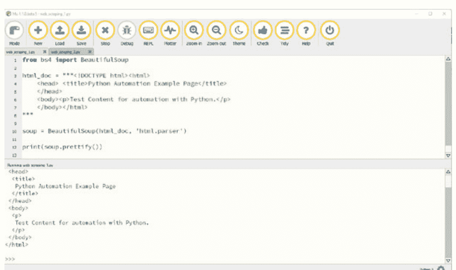

*图 5.7：使用BeautifulSoup库*

Beautiful Soup将复杂的HTML文档转换为Python对象的树。我们将使用四种主要类型的对象从网页中提取数据：**Tag、NavigableString、BeautifulSoup和Comment**。我们将用于数据提取的主要属性和对象是：

-   **Tag**：`tag`对象对应于原始文档中的HTML标签。例如：
```python
soup = BeautifulSoup('<b class="bold">bold text</b>',
'html.parser')
tag = soup.b
type(tag)
### 返回 <class 'bs4.element.Tag'> 作为输出
```

-   **Name**：每个HTML标签都有一个名称，可以使用`.name`访问。例如：
```python
tag.name
### 返回 'b' 作为输出
```

-   **Attributes**：一个标签可以有任意数量的属性。`<b id="bold">`标签有一个属性`id`，其值为`bold`。你可以通过将`tag`视为字典来访问其属性。例如：
```python
tag = BeautifulSoup('<b id="bold">bold text</b>',
'html.parser')
tag['id']
### 返回 bold 作为输出
```
你可以使用`.attrs`函数访问包含所有属性的字典。

-   **NavigableString**：包含标签内文本的字符串。例如：
```python
tag = BeautifulSoup('<b id="bold">bold text</b>', 'html.parser')
bold = tag.b
bold.string
### 返回 'bold text' 字符串作为输出
```

-   **BeautifulSoup**：**BeautifulSoup**对象表示已解析的HTML文档。它类似于**tag**对象，并支持前述方法来导航和搜索文档。

如*图 5.8*所示，我们正在使用**BeautifulSoup**函数转换HTML文档，然后直接使用**tag**对象属性访问其属性：

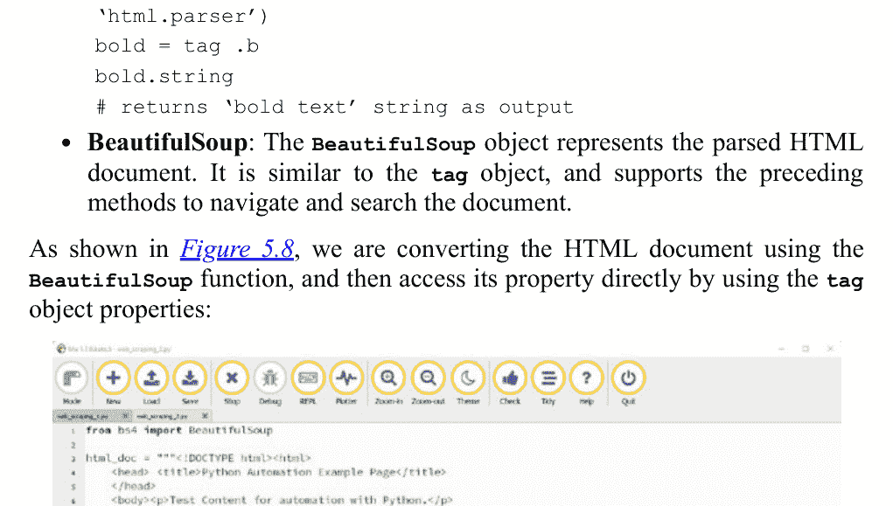

*图 5.8：提取HTML元素*

我们也可以使用**requests**库下载网页，并通过将下载的文档转换为**BeautifulSoup**对象来提取数据，如[图 5.9](#)所示：

```
Document title is: <title>Python Automation Example Page</title>
Document title tag name is: title
Document title string is: Python Automation Example Page
Document title parent tag name is: head
Document title paragraph is: <p>Test Content for automation with Python.</p>
```

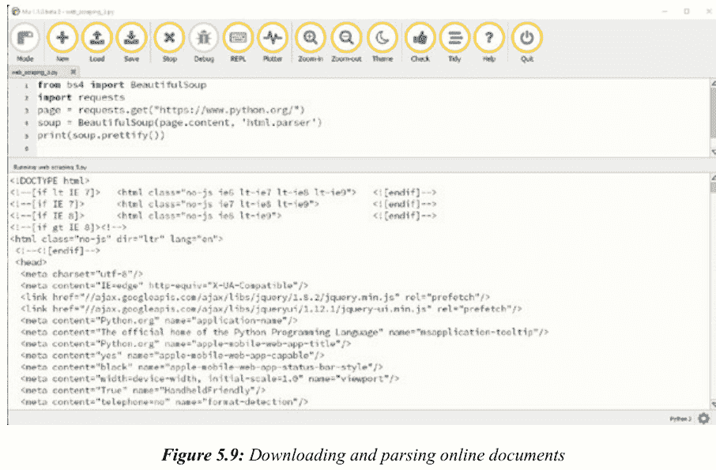

*图 5.9：下载和解析在线文档*

要提取特定类型的元素，我们可以使用`find_all()`函数获取该类型的元素。我们可以使用此函数从特定HTML页面提取所有外部链接，如[图 5.10](#)所示：

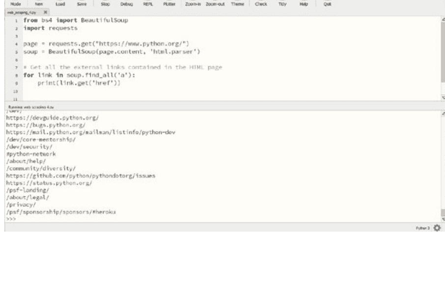

*图 5.10：从网站提取网页链接*

要从标签ID提取元素，我们可以使用`find()`函数并指定所需的`id`值，如[图 5.11](#figure-5-11)所示：

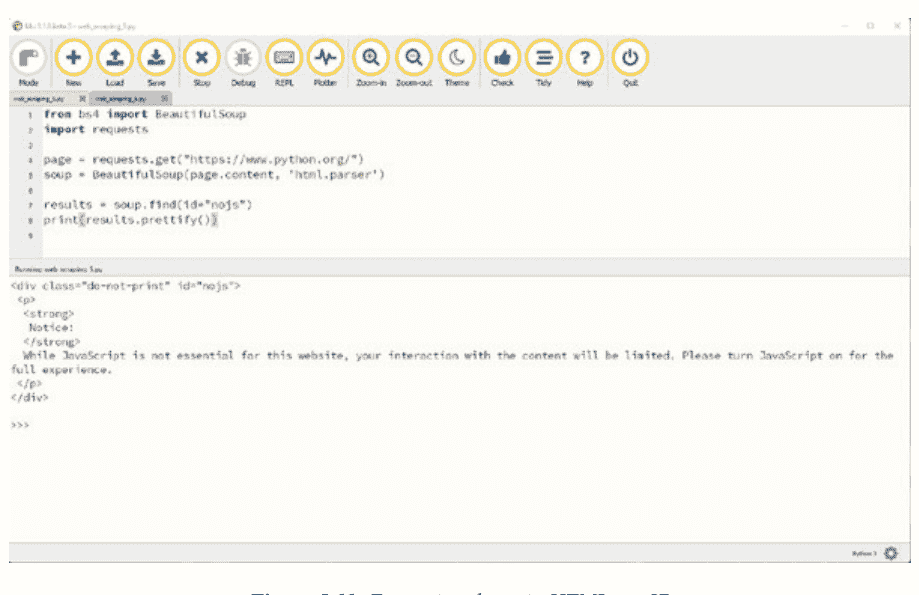

*图 5.11：通过HTML标签ID提取数据*

要从类名提取元素，我们可以使用`find_all()`函数并指定所需的`class`和`tag`值，如[图 5.12](#figure-5-12)所示：

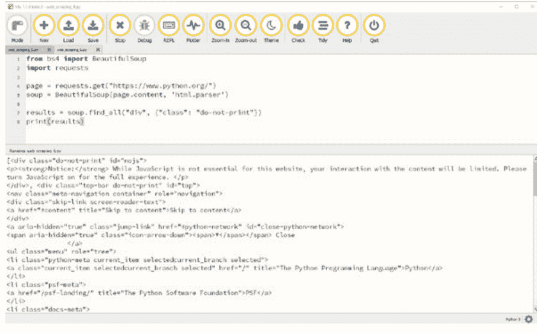

*图 5.12：通过HTML类提取数据*

我们也可以使用`select_one()`函数并将类名作为参数来提取数据，如[图 5.13](#figure-5-13)所示：

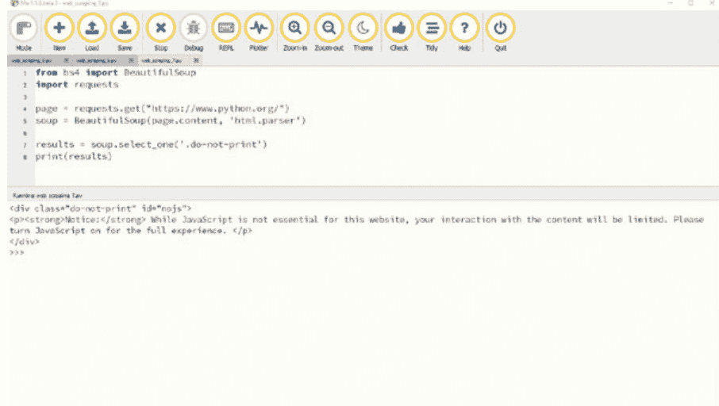

*图 5.13：通过类名提取单个元素数据*

在本节中，我们看了一些示例，了解如何使用**beautifulsoup**和**requests**库从网页中提取所需数据。在下一节中，我们将介绍**Selenium**库，它允许你自动化浏览器的鼠标和键盘操作。

## 使用Selenium控制浏览器

**Selenium**是一个允许你自动化浏览器操作的库。它提供了扩展来模拟用户与浏览器的交互，并允许你编写代码来自动化所有主要的网络浏览器。
我们将研究使用Selenium在*Chrome*浏览器上的自动化，但这些自动化可以轻松地导入到其他浏览器中。要安装**selenium**，请使用**mu**包管理器，输入**selenium**，然后点击**OK**，如下图所示：

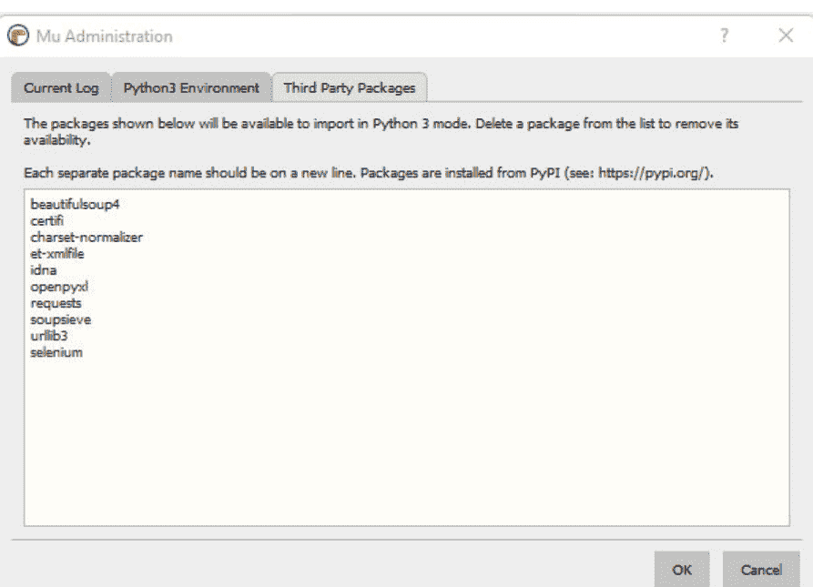

*图 5.14：Mu包管理器*

我们还需要下载Chrome驱动程序与**selenium**包一起使用，以便能够按照以下步骤自动化Chrome操作：

-   从*chromium*网站下载*Chrome*驱动程序，并根据需要选择适合你Chrome浏览器的正确版本和操作系统（[https://chromedriver.chromium.org/downloads](https://chromedriver.chromium.org/downloads)）。
-   使用任何ZIP解压工具解压下载的文件夹，并复制`chromedriver.exe`文件的位置路径。
-   你也可以将文件移动到C驱动器或系统变量可访问的任何其他路径。

之后，我们可以通过使用`from selenium import webdriver`语句从`selenium`库导入web驱动程序来执行浏览器自动化。我们还需要使用`from selenium.webdriver.chrome.service import Service`导入Chrome服务。

要创建`selenium`服务，请使用`Service()`函数并传入`chromedriver`的路径，如*图 5.15*所示：

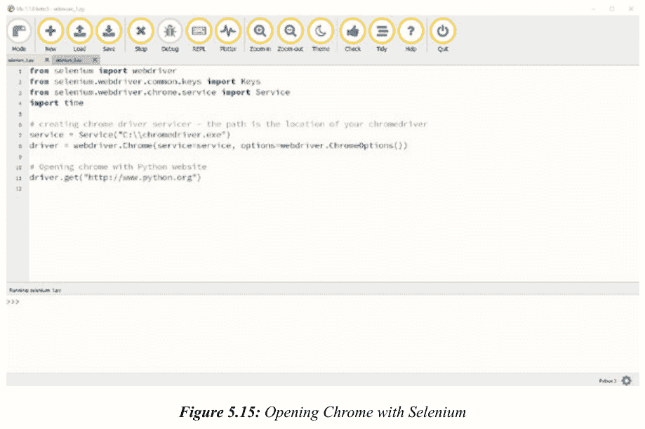

*图 5.15：创建Selenium服务*

`selenium`有一个`get()`函数，它接受要打开的页面的URL作为参数，并打开请求的页面，如*图 5.15*和*5.16*所示：

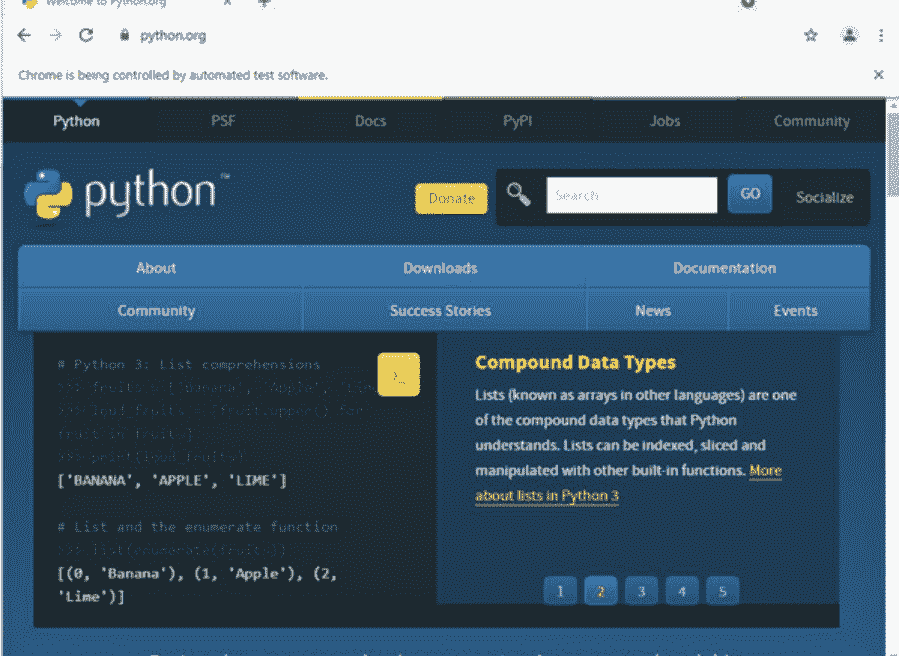

*图 5.16：Python主页*

在selenium中有两个方法，我们将使用它们来定位网页元素并对其执行鼠标或键盘操作。这些方法是`find_element`和`find_elements`。它们可以按照以下示例使用：

1.  `from selenium.webdriver.common.by import By`
2.  `driver.find_element(By.XPATH, '//button[text()="text"]')`
3.  `driver.find_elements(By.XPATH, '//button')`

以下是`By`类可用的属性：

*   `ID = id`
*   `XPATH = xpath`
*   `LINK_TEXT = link text`
*   `PARTIAL_LINK_TEXT = partial link text`
*   `NAME = name`

## 图 5.17：在 Chrome 中自动化键盘操作

- **TAG_NAME** = 标签名
- **CLASS_NAME** = 类名
- **CSS_SELECTOR** = CSS 选择器

如图 5.17 所示，我们可以使用 `find_element()` 函数，配合 `By.NAME` 参数（值为 `q`），并在 Chrome 窗口中向该元素发送按键：

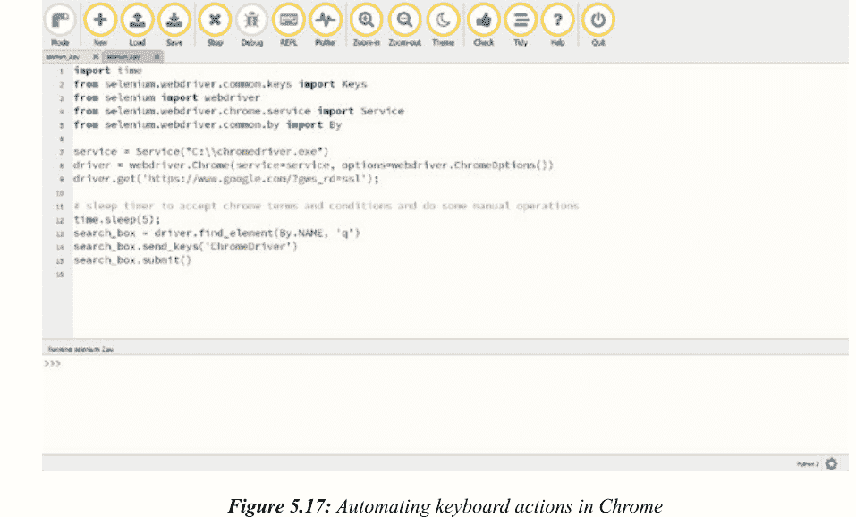

一旦执行了图 5.17 中所示的脚本，*Chrome* 驱动将打开一个 *Google* 搜索页面，并使用 `send_keys()` 和 `submit()` 函数自动搜索 `ChromeDriver`，如图 5.18 所示：

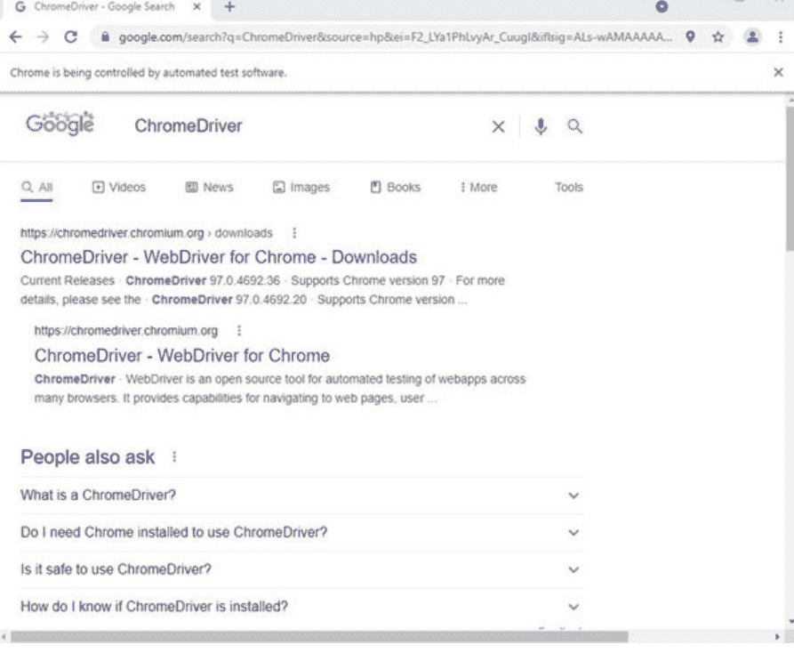

## 图 5.18：执行自动化 Chrome 搜索

我们还可以使用 **Selenium** 自动化涉及填写表单或从内部应用程序复制数据到表单的任务。为此，你可以通过 **XPATH**、**ID** 或 **By** 函数接受的任何其他标签来识别元素。要识别 HTML 元素的名称，请执行以下步骤：

1.  右键单击你要自动化的网页，然后选择“检查”选项，如图 5.19 所示：

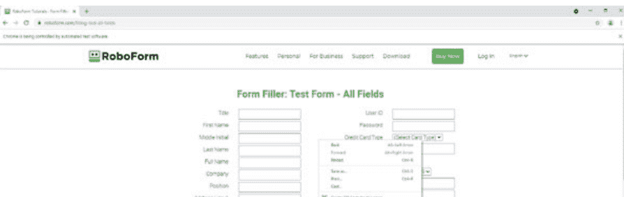


## 图 5.19：示例表单页面

2.  一旦你选择了“检查...”选项，你会看到如图 5.20 所示的元素面板在浏览器右侧打开；

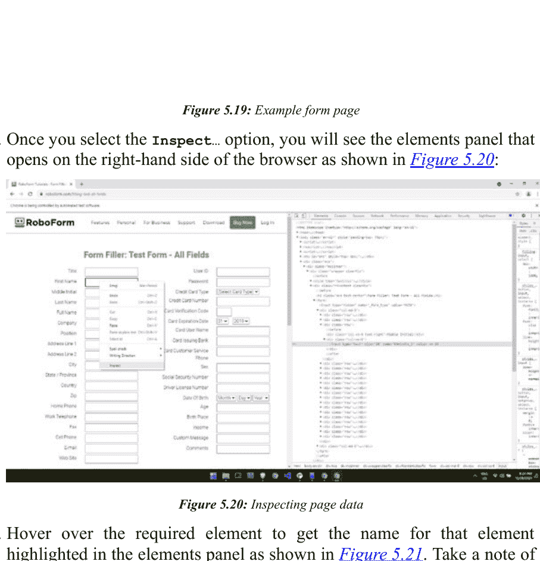

## 图 5.20：检查页面数据

3.  将鼠标悬停在所需元素上，该元素的名称将在元素面板中高亮显示，如图 5.21 所示。记下这个名称，因为你需要在代码中使用它来自动化操作：

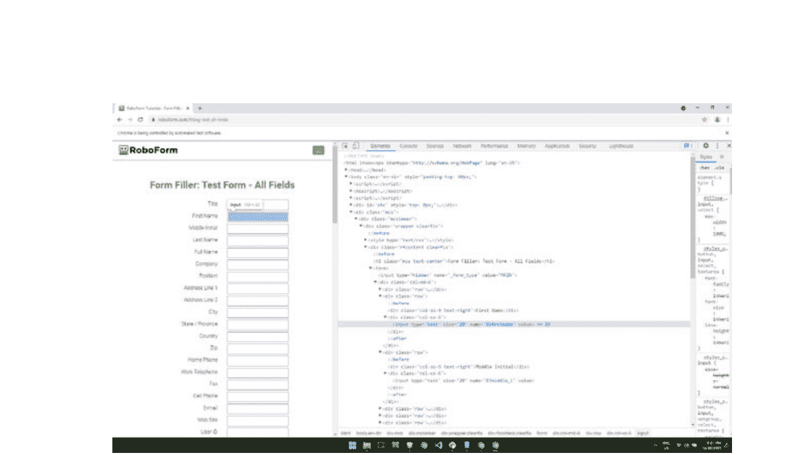

## 图 5.21：获取元素标签

4.  一旦你识别了元素名称，你就可以使用 `find_element()` 函数获取元素，并使用 `send_keys` 函数向该元素发送特定数据，如图 5.22 所示：

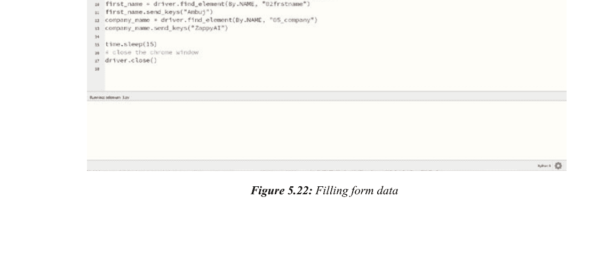

## 图 5.22：填写表单数据

## 图 5.23：表单数据自动填充后的输出

| 字段 | 值 |
|-------|-------|
| Title |  |
| First Name | Ambuj |
| Middle Initial |  |
| Last Name |  |
| Full Name |  |
| Company | ZappyAI |
| Position |  |
| Address Line 1 |  |
| Address Line 2 |  |
| City |  |
| State / Province |  |
| Country |  |
| Zip |  |
| Home Phone |  |
| Work Telephone |  |
| Fax |  |

6.  当我们使用 **selenium** 发送按键时，类似于使用键盘打字。特殊按键也可以使用从 **selenium.webdriver.common.keys** 导入的 **Keys** 类来发送。例如，要按 *Enter* 键，可以使用 **send_keys(Keys.RETURN)** 函数。
7.  最后，要关闭浏览器窗口，你可以使用 **driver.close()** 函数，这将关闭浏览器窗口并结束程序。

## 结论

在本章中，我们涵盖了大量关于 Python 中网络自动化的内容。我们研究了从互联网下载文件、从网站提取数据以及使用 Selenium 控制浏览器操作的方法。我们还介绍了 HTML、CSS 和 JavaScript 的基础知识，以帮助你成功地自动化基于网络的任务。

在下一章中，我们将研究 Python 中各种基于文件的自动化。具体来说，我们将涉及读取、写入和创建 PDF 文档、Word 文档和其他文件类型的自动化。

## 进一步阅读

有很多在线资源可以帮助你学习更多关于 Python 网络自动化的知识。下表列出了一些最佳资源，以进一步提高你对 Python 网络库的学习：

| 资源名称 | 链接 |
|---|---|
| Requests: HTTP for humans | https://requests.readthedocs.io/en/latest/ |
| Downloading files from web using Python | https://www.geeksforgeeks.org/downloading-files-web-using-python/ |
| Beautiful Soup documentation | https://beautiful-soup-4.readthedocs.io/en/latest/ |
| Tutorial: Web Scraping with Python Using Beautiful Soup | https://www.dataquest.io/blog/web-scraping-python-using-beautiful-soup/ |
| Beautiful Soup: Build a Web Scraper with Python | https://realpython.com/beautiful-soup-web-scraper-python/ |
| Selenium with Python | https://selenium-python.readthedocs.io/ |
| Selenium automates browsers | https://www.selenium.dev/ |
| ChromeDriver | https://chromedriver.chromium.org/getting-started |

表 5.1：Python 中网络自动化资源

## 问题

1.  网页浏览器使用什么语言来渲染网页？
2.  如何自动化填写在线表单？

3.  什么是 Selenium？
4.  如何在 Python 中构建网络爬虫？

# 第 6 章

## 基于文件的任务自动化

### 介绍

在本章中，我们将研究 Python 中不同文件类型的各种基于文件的自动化。我们将讨论用于自动化不同文件类型的某些 Python 库。我们还将研究从 PDF 文档和 Word 文档等类型文件结构中提取数据的方法。

## 结构

在本章中，我们将涵盖以下主题：

- 读写文件
- PDF 文档自动化
- Word 文档自动化
- 将 PDF 转换为 Word 文档

## 目标

学习完本章后，你将能够从 PDF 文档中提取文本并生成新的 PDF 文档。你还将能够读取和创建新的 Word 文档。你还将具备使用 Python 库处理多种文件类型的技能和理解能力。

### 读写文件

计算机文件是用于存储数据的连续字节集。数据按照所需格式组织，可以是任何内容，从简单的文本文件到计算机应用程序。这些字节文件被转换为 1 和 0 供计算机使用。

大多数文件类型包含三个主要部分：

- **头部：** 包含有关文件信息的元数据，如文件类型、大小、文件名等。
- **数据：** 以字节为单位的文件内容。
- **文件末尾 (EOF)：** 指示文件结尾的特殊字符。

Python 有许多库可以帮助你处理不同类型的文件。一些流行的、用于不同文件类型的 Python 库如下：

- **wave:** 读取和写入 WAV 音频文件 ([https://docs.python.org/3/library/wave.html](https://docs.python.org/3/library/wave.html)).
- **zipfile:** 处理 ZIP 压缩文件 ([https://docs.python.org/3/library/zipfile.html](https://docs.python.org/3/library/zipfile.html)).
- **configparser:** 创建和读取配置文件 ([https://docs.python.org/3/library/configparser.html](https://docs.python.org/3/library/configparser.html)).
- **xml.etree.ElementTree:** 创建和读取基于 XML 的文件 ([https://docs.python.org/3/library/xml.etree.elementtree.html](https://docs.python.org/3/library/xml.etree.elementtree.html)).
- **PyPDF2:** 用于读取和写入 PDF 文档的工具包 ([https://pypi.org/project/PyPDF2/](https://pypi.org/project/PyPDF2/)).
- **openpyxl:** 读取和写入 Excel 文件 ([https://openpyxl.readthedocs.io/en/stable/](https://openpyxl.readthedocs.io/en/stable/)).
- **Pillow:** 读取和操作基于图像的文件 ([https://pillow.readthedocs.io/en/stable/](https://pillow.readthedocs.io/en/stable/)).

我们将在本书中使用许多这些库来构建工作自动化。在 Python 中处理文本文件时，它有一个内置的 `open()` 函数，这是处理文件的关键函数。`open()` 函数接受两个参数作为参数，即文件位置和模式。使用 `open` 函数打开文件有四种不同的模式：

- **r: 读取** - 打开文件以进行读取。
- **a: 追加** - 打开文件以添加更多数据，如果文件不存在则创建一个新文件。
- **w: 写入** - 打开文件以进行写入，如果文件不存在则创建一个新文件。
- **x: 创建** - 创建一个新文件。

此外，您可以指定文件是以**二进制**模式还是**文本**模式处理：

- t：文本模式。
- b：二进制模式（例如，用于打开图像）。

如*图6.1*所示，我们可以使用`open`函数，通过在文件名后使用参数`wb`来以二进制模式打开文件进行写入。如果未指定具体文件路径，则默认文件路径为脚本运行所在的路径：

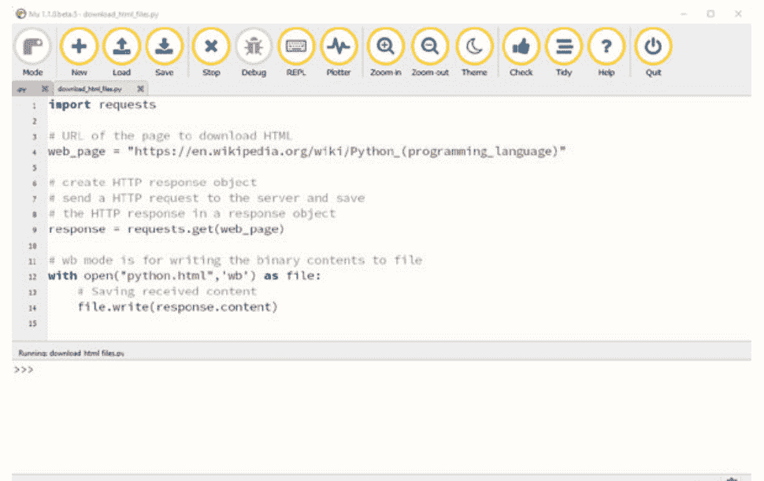

在下一节中，我们将探讨PDF文档自动化，包括创建PDF文档和从PDF文档中提取数据的方法。

## PDF文档自动化

PDF文档在日常工作中被广泛用于各种目的，以呈现和交换文档。在本节中，我们将了解有助于基于PDF的任务自动化的Python库，例如提取PDF数据和创建新的PDF文档。

要从PDF文档中提取文本，Python有两个主要的库：**Pdfminer.six**和**PyPDF2**。**Pdfminer.six**是从PDF文档中提取信息的最佳Python包之一，具有从PDF文档中提取文本、图像和表格的功能。**PyPDF2**的功能远不止从PDF文档中提取文本，例如创建PDF文档、拆分文档、合并文档、裁剪页面、将多个页面合并为单个页面，以及加密和解密PDF文件。

要安装**Pdfminer**，请使用Mu包管理器，输入`Pdfminer.six`，然后点击**确定**，如下图所示：

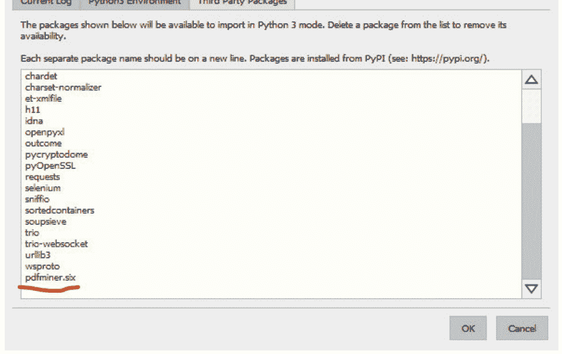

*图6.2：Mu包管理器*

PDF miner有一个`extract_text`函数，用于从PDF文档中提取文本。它接受以下参数来提取文本数据：

- **pdf_file**：PDF文件路径或文件对象。
- **password**：对于加密的PDF，用于解密文档的密码。
- **page_numbers**：要提取文本的页码（索引从0开始）。
- **maxpages**：要提取文本的最大页数。
- **caching**：是否应缓存资源。
- **codec**：文本字符编码（默认使用**UTF-8**）。
- **laparams**：来自`pdfminer.layout`的**LAParams**对象，用于传递文档的布局。

该函数返回一个包含所有提取的文本数据的字符串，如*图6.3*所示：

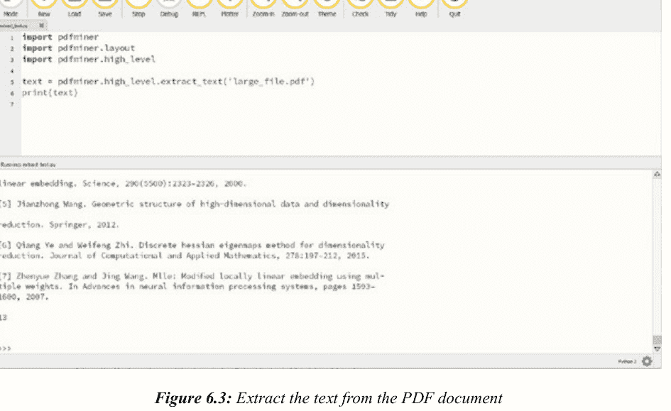

*图6.3：从PDF文档中提取文本*

使用Python库`PyPDF2`，您也可以创建PDF文档。要安装`PyPDF2`，请使用Mu包管理器，输入`PyPDF2`，然后点击确定，如下图所示：

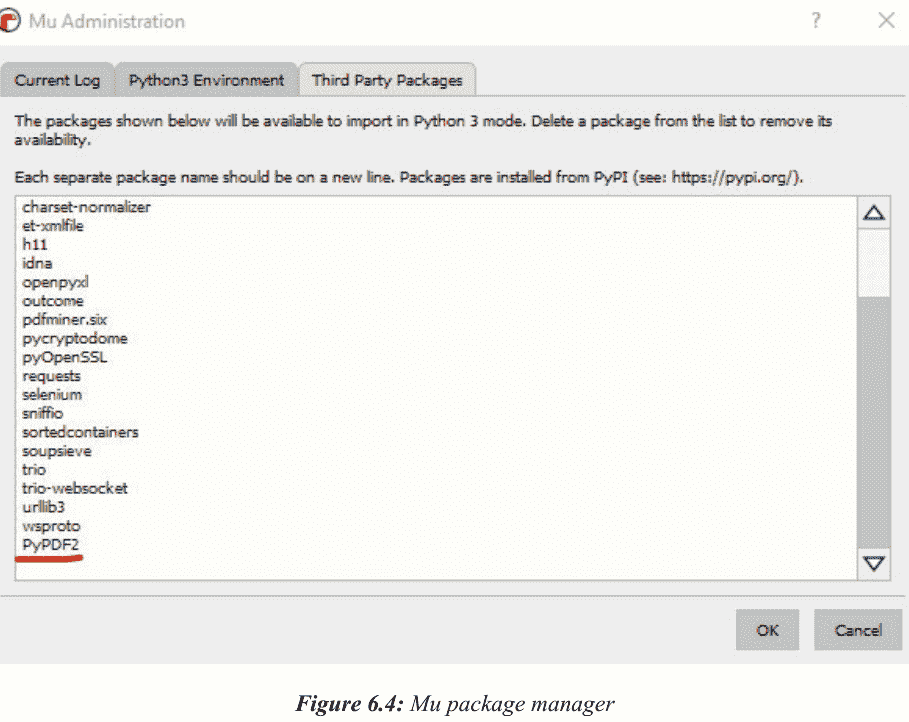

*图6.4：Mu包管理器*

**PyPDF2**允许您从任何PDF中提取有用的数据。例如，您可以提取诸如文档作者、标题和主题以及页数等详细信息。如*图6.5*所示，使用`getNumPages()`函数获取PDF文档的页数，使用`documentInfo`函数获取有关PDF文档的更多信息：

*图6.5：提取PDF信息*

PyPDF2也可以使用extractText()函数从PDF文档中提取文本，如图6.5所示：

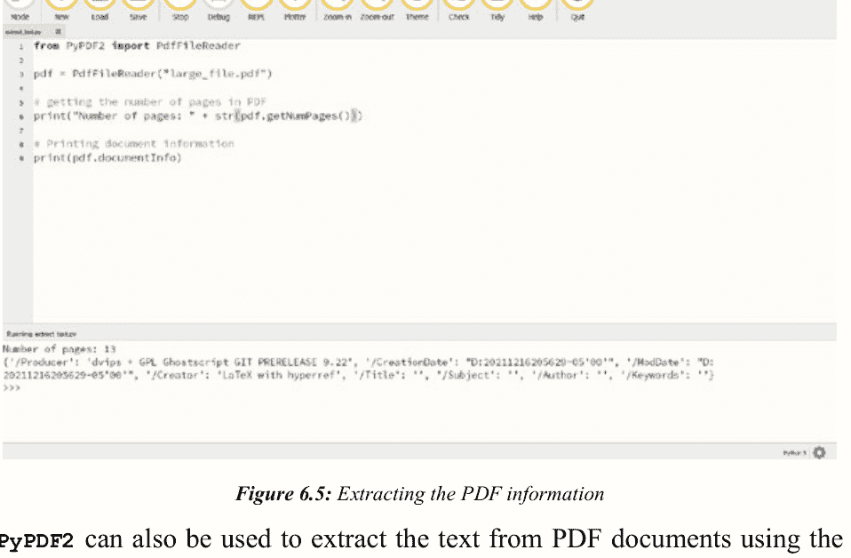

*图6.6：使用PyPDF2提取文本*

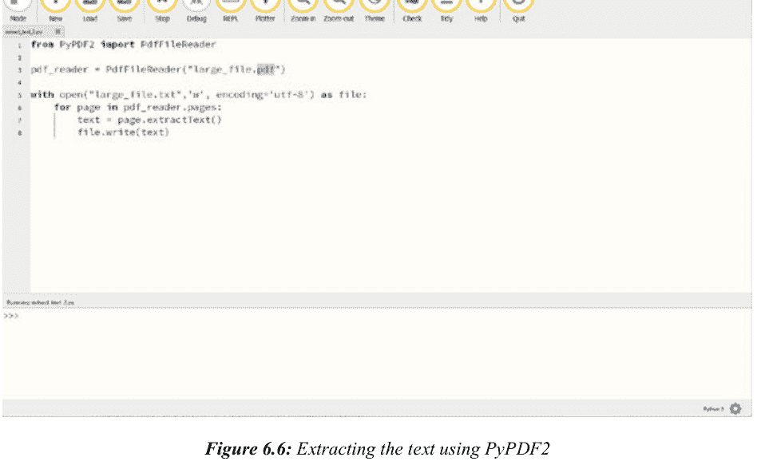

PyPDF2支持使用PdfFileWriter类创建新的PDF文档。PdfFileWriter提供了创建和向新PDF文档添加数据的函数，例如：

- addAttachment：此函数将文件嵌入PDF中，参数为文件名和要存储在文件中的数据。
- addBlankPage：此函数向PDF文件追加一个空白页，并返回它，参数为宽度和高度。
- appendPagesFromReader：此函数将页面从PdfFileReader读取器复制到写入器。它接受PdfFileReader对象作为参数。

更多可用于PdfFileWriter类的函数可以在PyPDF2文档（https://pypdf2.readthedocs.io/en/latest/modules/PdfWriter.html）中找到。如图6.7所示，我们可以使用addBlankPage函数创建一个具有指定宽度和高度的空白PDF：

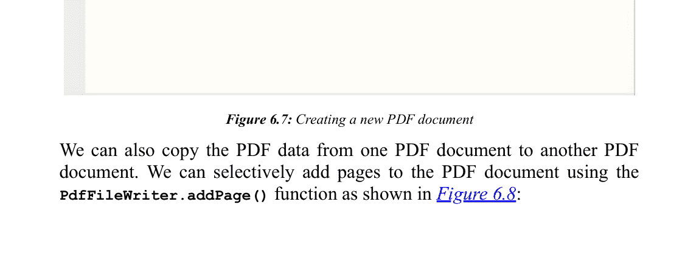

*图6.7：创建新的PDF文档*

我们还可以将PDF数据从一个PDF文档复制到另一个PDF文档。我们可以使用PdfFileWriter.addPage()函数有选择地将页面添加到PDF文档中，如图6.8所示：

```python
from PyPDF2 import PdfFileWriter, PdfFileReader

pdf_file_writer = PdfFileWriter()

large_pdf = PdfFileReader("large_file.pdf")

pdf_file_writer.addPage(large_pdf.getPage(0))

with open("small_pdf.pdf", "wb") as file:
    pdf_file_writer.write(file)
```

*图6.8：从现有PDF文档写入页面*

在图6.9中，我们可以看到由PdfFileWriter创建的新PDF：

## 基于Hessian特征映射的新型局部线性嵌入方案

林立仁* 和 陈志伟†

台湾中山大学应用数学系

### 摘要

我们对Hessian局部线性嵌入（HLLE）提供了一种新的解释，揭示其本质上是实现局部线性嵌入（LLE）相同思想的一种变体方式。基于这种新的解释，可以进行大幅简化，其中“Hessian”的思想被相当任意的权重所取代。此外，我们通过数值示例表明，当目标空间的维度大于数据流形的维度时，HLLE可能会产生类似投影的结果，因此建议对流形维度进行进一步修改。结合所有观察结果，我们最终实现了一种新的LLE型方法，称为切向LLE（TLLE）。它比HLLE更简单、更稳健。

### 1 引言

设 $\mathcal{X} = \{x_i\}_{i=1}^N$ 是某个 $\mathbb{R}^D$ 中的数据点集合。非线性降维（或流形学习）的目标是为 $\mathcal{X}$ 找到一个表示 $\mathcal{Y} = \{y_i\}_{i=1}^N$

*图6.9：新的PDF文档*

在下一节中，我们将探讨如何在Python中创建和读取Word文档。

## Word文档自动化

Word文档在我们的日常工作中被广泛用于生成报告、研究材料和保存笔记。Python有一个**python-docx**库，用于读取和写入Microsoft Word（.docx）文件。

要安装**python-docx**，请使用**Mu**包管理器，输入**python-docx**，然后点击**确定**，如下图所示：

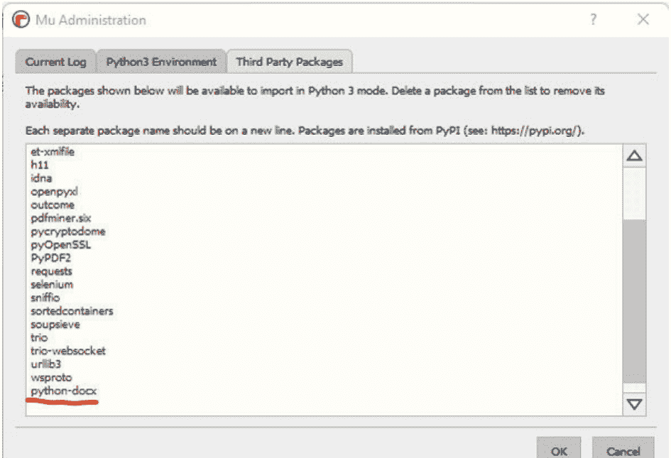

*图6.10：Mu包管理器*

`python-docx`库有一个`Document`类，用于创建空白文档。`Document`类具有以下提到的函数来创建新的Word文档：

- `add_paragraph()`：此函数在文档末尾创建一个新段落，接受段落文本作为参数，以及一个可选的`style`标签来指定Word文档的样式。
- `add_heading()`：默认情况下，此函数添加一个顶级标题，在Word中显示为**标题1**。当您需要子节的标题时，只需指定您想要的级别，作为1到9之间的整数：`document.add_heading('海豚的角色', level=2)`。如果指定级别为0，则添加一个`Title`段落。这对于开始一个相对较短且没有单独标题页的文档很方便。
- `add_page_break()`：此函数向您的文档添加分页符。
- **add_table(rows=2, cols=2)**：使用`add_table`函数，您可以在Word文档中创建一个新表格。它接受行数和列数作为参数。要向特定单元格添加数据，请使用`cell()`函数，将行和列作为参数，或使用`for`循环配合`table.rows`和`row.cells`属性。

以下代码向指定的表格单元格添加数据：

```python
table.cell(0, 0)
cell.text = '我的表格'
```

以下代码允许您遍历表格的行和单元格：

```python
for row in table.rows:
    for cell in row.cells:
        cell.text = '我的文本'
```

- **document.add_picture(picture_path)**：此函数允许您使用指定的图片路径将图片添加到Word文档中。

在*图6.11*中，我们可以看到一个使用前面讨论的函数创建新Word文档的示例：

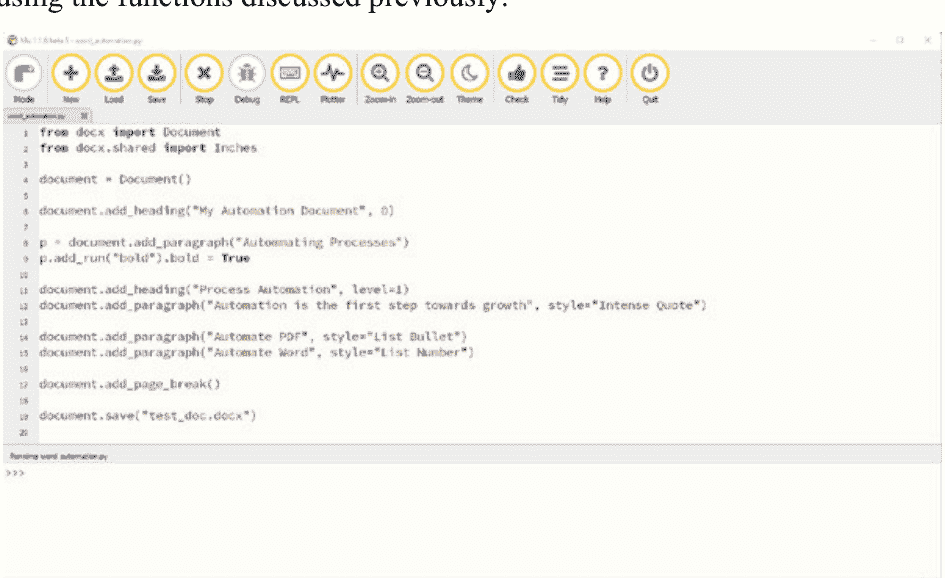

*图6.11：创建新的Word文档*执行文档创建代码后，将创建一个具有指定样式的新Word文档，如图6.12所示：

## 我的自动化文档

流程自动化粗体

## 流程自动化

> 自动化是迈向成长的第一步

- 自动化PDF
- 自动化Word

图6.12：新的Word文档

python-docx库还具有迭代和读取现有Word文档的功能。要遍历段落，请使用document.paragraph参数，如图6.13所示：

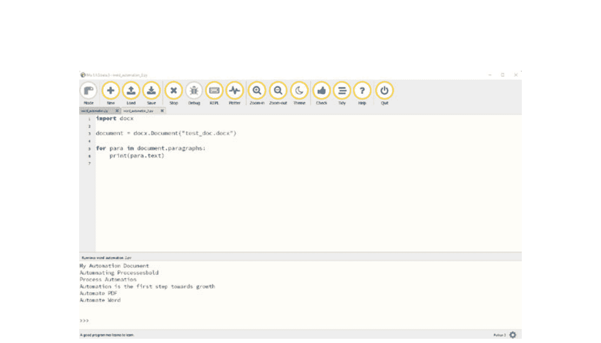

*图6.13：从Word文档中读取数据*

在下一节中，我们将探讨一个常见的自动化需求：将PDF文档转换为Word文档，以便轻松读取和处理PDF文档中包含的数据。

## 将PDF转换为Word文档

我们可以使用**Pdfminer**和**python-docx**库轻松地将PDF文档转换为Word文档。如果PDF文档文本包含无效字符，我们可以通过一个自定义函数移除这些字符以支持Word文档的编码格式。如*[图6.14]*所示，我们将首先使用**extract_text()**函数读取PDF文档，然后使用**add_paragraph()**函数将提取的字符串添加到Word文档中：

```python
import pdfminer
import pdfminer.layout
import pdfminer.high_level
from docx import Document
from docx.shared import Inches

text = pdfminer.high_level.extract_text('small_pdf.pdf')

def valid_xml_char_ordinal(c):
    codepoint = ord(c)
    # conditions ordered by presumed frequency
    return (
        0x20 <= codepoint <= 0xD7FF or
        codepoint in (0x9, 0xA, 0xD) or
        0xE000 <= codepoint <= 0xFFFD or
        0x10000 <= codepoint <= 0x10FFFF
    )

cleaned_string = ''.join(c for c in text if valid_xml_char_ordinal(c))

document = Document()
p = document.add_paragraph(cleaned_string)
document.add_page_break()
document.save("pdf_doc.docx")
```

图6.14：PDF转Word文档

**图6.15** 展示了执行PDF到Word转换脚本后，将PDF文档转换为Word文档的结果：

## 基于海森特征映射的新型局部线性嵌入方案

林立仁* 与 陈志伟†

台湾中山大学应用数学系

### 摘要

我们对海森局部线性嵌入（HLLE）提供了一种新的解释，揭示了其本质上是实现局部线性嵌入（LLE）相同思想的一种变体方法。基于这种新的解释，可以进行大幅简化，其中“海森”思想被相当任意的权重所取代。此外，我们通过数值示例表明，当目标空间的维度大于数据流形维度时，HLLE可能会产生类似投影的结果，因此建议进行有关流形维度的进一步修改。综合所有观察，我们最终实现了一种新的LLE型方法，称为切向LLE（TLLE）。它比HLLE更简单、更稳健。

### 1 引言

设 X = {xi}N i=1 是 RD 中的某组数据点集合。非线性降维（或流形学习）的目标是在 X 位于 RD 中某个未知子流形 M 上的假设下，为 X 在某个较低维的 Rd 中找到一个表示 Y = {yi}N i=1。

在现有的几种流形学习方法中，海森特征映射[2]，也称为海森局部线性嵌入（HLLE），是在流行的合成数据“带孔的瑞士卷”上表现出显著性能的方法之一。它可以被看作是某种意义上拉普拉斯特征映射[1]或另一种意义上LLE[4]的推广。


## 结论

在本章中，我们涵盖了Python中针对不同文件类型的大量基于文件的自动化内容。我们研究了从PDF文档中提取数据和创建新PDF文档的方法。我们还研究了创建新Word文档和将PDF文档转换为Word文档的方法。

在下一章中，我们将探讨使用Gmail、Outlook和SMTP客户端自动化基于电子邮件的任务的方法。我们还将研究使用Twilio API进行短信自动化，以及使用Slack API进行消息自动化的相关方法。

## 延伸阅读

有很多在线资源可以帮助您进一步了解Python文件自动化。下表列出了一些最佳资源，以进一步提升您对Python文件自动化的学习：

| 资源名称 | 链接 |
|---|---|
| 在Python中读写文件 | https://realpython.com/read-write-files-python/ |
| Python PDF解析器 | https://github.com/euske/pdfminer |
| 使用Python从PDF中提取文本 | https://pdfminersix.readthedocs.io/en/latest/tutorial/highlevel.html |
| PyPDF2文档 | https://pypdf2.readthedocs.io/en/latest/ |

表6.1：关于Python网络自动化的资源

## 问题

1. 你如何在Python中读取不同类型的文件？
2. 如何从PDF文档中提取数据？
3. 有哪些用于处理PDF文档的Python库？
4. 如何构建一个将PDF文档转换为Word文档的自动化流程？

# 第7章

## 电子邮件、即时通讯应用与消息的自动化

### 引言

在本章中，我们将学习如何使用*Gmail*、*Outlook*和其他SMTP客户端自动化基于电子邮件的任务。我们还将研究使用*Twilio* API进行短信和*WhatsApp*消息的自动化。

## 结构

在本章中，我们将涵盖以下主题：

- 简单邮件传输协议
- 使用Gmail发送电子邮件
- Outlook邮件自动化
- 短信和WhatsApp消息自动化

## 目标

学习本章后，您将能够通过Python自动读取和发送Gmail及Outlook应用程序中的邮件。您还将能够使用*Twilio* API自动发送短信，以及使用WhatsApp网页应用程序自动发送WhatsApp消息。

### 简单邮件传输协议

**简单邮件传输协议（SMTP）** 是在网络上发送电子邮件的协议系统。它被许多电子邮件应用程序用于在网络上发送和接收电子邮件。SMTP协议确保消息发送到正确的接收服务器，而接收服务器确保消息被传递给正确的最终收件人。

Python有一个名为 `smtplib` 的内置库，用于通过SMTP协议发送电子邮件。可以使用 `import smtplib` 语句导入 `smtplib`。`smtplib` 库有一个SMTP函数，用于连接服务器，参数如下：

1. `smtpObj = smtplib.SMTP( [host [, port [, local_hostname]]] )`

SMTP函数中使用的参数如下：

- `host`：这是运行您的电子邮件服务的SMTP服务器的IP地址或域名。
- `port`：这是与host参数一起使用的端口号，用于指向SMTP服务器正在监听的端口。通常设置为25。
- `local_hostname`：如果您的SMTP服务器在本地机器上运行，那么您可以只指定localhost来引用本地服务器。

SMTP对象有一个名为 `sendmail` 的方法，用于发送电子邮件。它接受以下参数：

- **发件人**：这是一个包含发件人地址的字符串。
- **收件人**：这是一个字符串列表，每个收件人一个字符串。
- **消息**：这是一个格式化字符串形式的消息（也可以是HTML字符串）。

`smtplib` 客户端可以通过提供外发邮件服务器与远程SMTP服务器通信，如下语句所示 - `smtplib.SMTP('mail.your-domain.com', 25)`。
在下一节中，我们将探讨使用Gmail自动发送电子邮件的实际示例。

### 使用Gmail发送电子邮件

我们将使用 `ssl` 库和SMTP库来通过Gmail发送电子邮件。要使用这些库，我们需要启用“允许安全性较低的应用”选项（`https://myaccount.google.com/lesssecureapps`），以允许使用这些库进行基于密码的身份验证。此设置不是适用于启用了*两步验证*的 Gmail 账户。如果你不想在 Gmail 账户中启用此选项，那么你可以使用 OAuth2 授权框架，并遵循 Gmail API 文档（**https://developers.google.com/gmail/api/quickstart/python**）。`ssl` 库中的 `create_default_context()` 函数会返回一个具有默认设置的新 `SSLContext` 对象。`smtplib` 库中的 `SMTP_SSL()` 函数的行为与 SMTP 函数完全相同，其参数如下定义：`smtplib.SMTP_SSL(host='', port=0, local_hostname=None, keyfile=None, certfile=None, [timeout,] context=None, source_address=None)`。`SMTP_SSL` 用于连接开始就需要 SSL 的情况。我们可以使用这些函数创建与 Gmail 的连接，如图 7.1 所示：

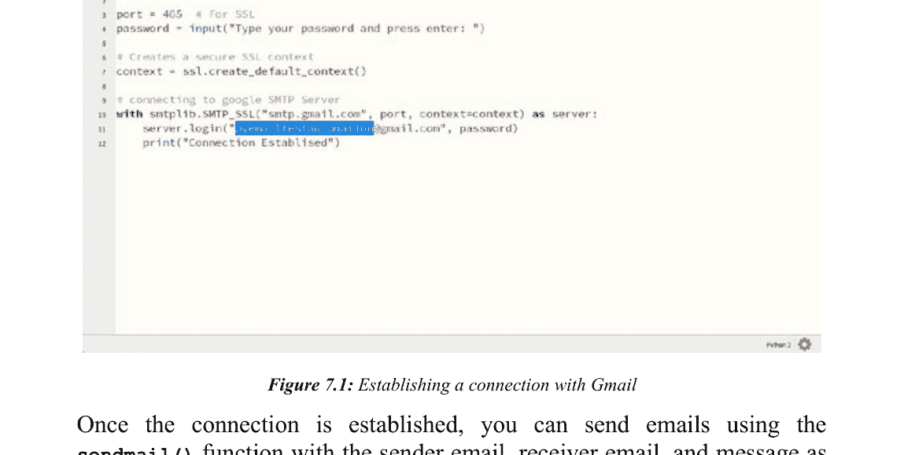

图 7.1：与 Gmail 建立连接

一旦连接建立，你就可以使用 `sendmail()` 函数发送邮件，该函数以发件人邮箱、收件人邮箱和邮件内容作为参数，如图 7.2 所示：

```python
import smtplib, ssl

port = 465  # For SSL
password = input("Type your password and press enter: ")

#### Creates a secure SSL context
context = ssl.create_default_context()

message = """\nSubject: Hi there

I am automating sending of email."""

sender_email = "pyemailtestautomation@gmail.com"
receiver_email = "pyemailtestautomation@gmail.com"

#### connecting to google SMTP Server
with smtplib.SMTP_SSL("smtp.gmail.com", port, context=context) as server:
    server.login(sender_email, password)
    server.sendmail(sender_email, receiver_email, message)
```

图 7.2：使用 Gmail 发送邮件

你可以通过在浏览器中打开 Gmail 来验证邮件是否已正确发送，且具有正确的主题和内容，如 [图 7.3](#figure-7-3) 所示：


图 7.3：由自动化脚本发送的 Gmail 消息

SMTP 库支持**多用途互联网邮件扩展（MIME）** 对象，用于发送附件和 HTML 消息。我们将使用 `MIMEMultipart` 和 `MIMEText` 来发送基于 HTML 的邮件。`MIMEMultipart` 对象可以使用 `MIMEMultipart()` 创建，HTML 消息可以使用 `MIMEText(html_message, 'html')` 函数附加，该函数以 `html_message` 和消息类型 `html` 作为参数。你可以使用 `attach` 函数将 `MIMEText` 附加到 `MIMEMultipart` 对象上，以发送基于 HTML 的邮件，如 [图 7.4](#figure-7-4) 所示：

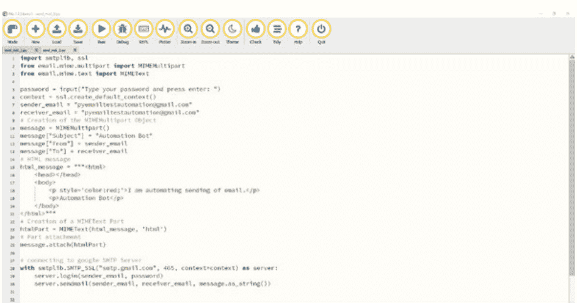

*图 7.4：在 Gmail 上发送 HTML 邮件消息*

你可以在浏览器中打开此邮件，验证 HTML 消息的格式是否正确，如 [图 7.5](#figure-7-5) 所示：


*图 7.5：由自动化机器人发送的 HTML 消息*

你也可以使用 MIME 对象发送带附件的邮件。你需要打开文件，并使用 `set_payload()` 函数将文件附加到 `MIMEBase("application", "octet-stream")` 部分。你还需要编码文件以便通过邮件发送，并将附件部分作为*键值对*添加头部信息，如 [图 7.6](#figure-7-6) 所示：

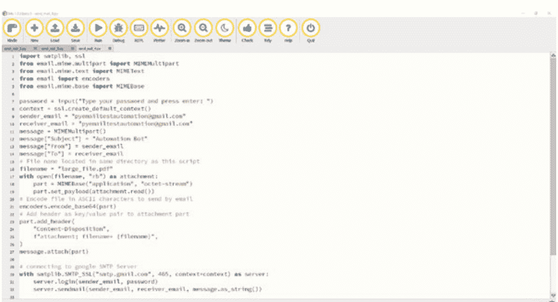

**图 7.6：** *在 Gmail 中附加文件*

你可以在浏览器中打开邮件，验证附件是否已正确发送，如 [图 7.7](#figure-7-7) 所示：


**图 7.7：** *通过自动化机器人收到的附件*

当你使用 Python 自动化发送邮件时，Gmail 会将所有这些邮件添加到 `已发送` 文件夹，你可以审核此文件夹以验证所有消息是否根据自动化要求发送，如 [图 7.8](#figure-7-8) 所示：

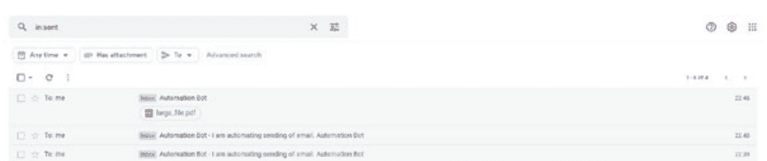

**图 7.8：** *自动化机器人发送的邮件列表*

在下一节中，我们将探讨 Outlook 应用程序邮件自动化。Outlook 应用程序自动化可用于任何电子邮件提供商，只要电子邮件在 Outlook 应用程序中配置过。

## Outlook 邮件自动化

对于 Outlook 应用程序自动化，我们将使用 `pywin32` 库，它提供了对 Windows API 函数的访问。Windows API（也称为 **Win32**）是 Microsoft 编写的应用程序编程接口，允许访问 Windows 功能。Windows API 的主要组件如下：

- **WinBase**：Windows 内核函数，如 `CreateFile`、`CreateProcess` 等。
- **WinUser**：Windows GUI 函数，如 `CreateWindow`、`RegisterClass` 等。
- **WinGDI**：Windows 图形函数，如 `Ellipse`、`SelectObject` 等。

要安装 `pywin32`，请使用 `mu` 包管理器，输入 `pywin32`，然后点击 `确定`，如 *图 7.9* 所示：

### Mu 管理

当前日志 | Python3 环境 | 第三方包

下面显示的包将在 Python 3 模式下可导入。从列表中删除一个包以移除其可用性。

每个单独的包名应占一行。包从 PyPI 安装（参见：https://pypi.org/）。

```
lxml
openpyxl
outcome
pdfminer.six
pycryptodome
pyOpenSSL
PyPDF2
python-docx
requests
selenium
sniffio
sortedcontainers
soupsieve
trio
trio-websocket
urllib3
wsproto
pywin32
```

**图 7.9：** Mu 包管理器

我们将使用 `win32com.client.DispatchEx()` 函数，并以 `Outlook.Application` 作为参数，这将打开你计算机上的 Outlook 应用程序。`CreateItem` 方法创建并返回一个新的 Microsoft Outlook 项目，可用于创建一封新邮件发送给所需的收件人。你可以向 Outlook 项目添加 `mail.To`、`mail.Subject` 和 `mail.HtmlBody`，并使用 `Send` 函数发送邮件，如 [图 7.10](https://example.com/figure7-10) 所示：

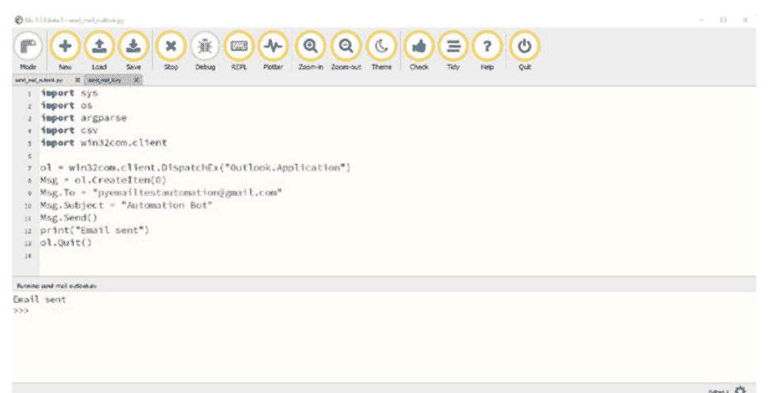

在下一节中，我们将探讨短信和 WhatsApp 自动化。我们将使用 *Twilio* API 进行短信自动化，使用 **pywhatkit** 库进行 WhatsApp 自动化。

## 短信和 WhatsApp 消息自动化

*Twilio* 提供通信 API，用于发送和接收短信、进行语音通话和视频通话，以及访问其他通信工具，如**聊天**和**电子邮件**。它拥有多个产品线，可自动化众多通信渠道，该平台被全球企业用作客户互动平台。

在本章中，我们将仅使用 Twilio API 进行短信自动化。要安装 *Twilio*，请使用 **mu** 包管理器，输入 **twilio**，然后点击 **确定**，如 [图 7.11](#figure-7-11) 所示：

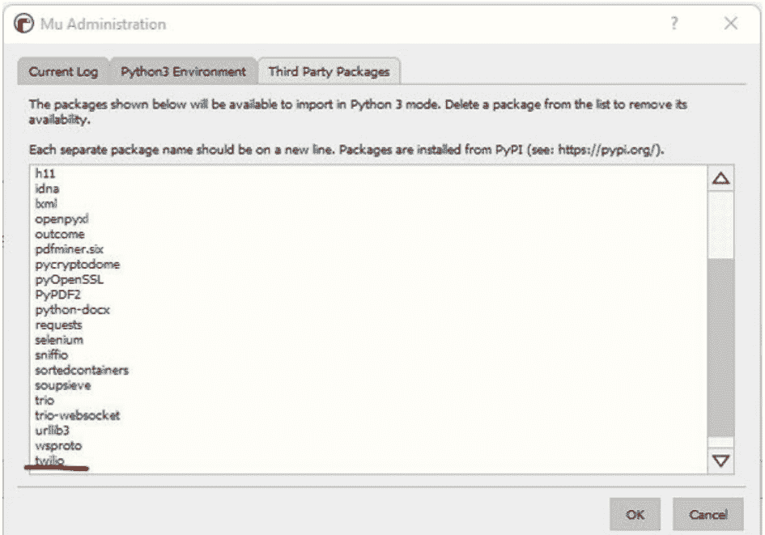

*图 7.11：Mu 包管理器*

要使用 Twilio API 进行短信自动化，你需要在 Twilio 网站（[https://www.twilio.com/](https://www.twilio.com/)）注册一个 Twilio 账户，并创建一个试用号码来测试短信自动化，如 *图 7.12* 所示：

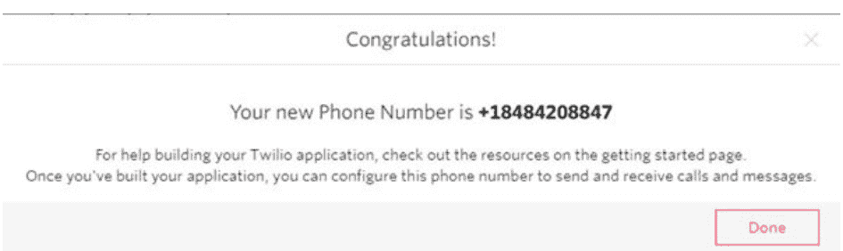

*图 7.12：获取 Twilio 电话号码*

创建 Twilio 账户时，你还会获得一个试用余额，可用于测试短信自动化（见 *图 7.13*）。还有其他 API 提供商也提供短信自动化服务，如果更符合你的需求，你也可以使用它们代替 Twilio：


*图 7.13：验证 Twilio 号码和余额*

当你拥有一个 Twilio 账户时，你会获得一个 **account SID** 和 **Auth token**。这些是你的 API 凭据，将允许你进行身份验证并使用 Twilio API。一旦你通过 API 进行了身份验证，你就可以使用 `message.create()` 函数发送消息，传入消息文本以及发送者和接收者号码，如 [图 7.14](#figure-7-14) 所示：

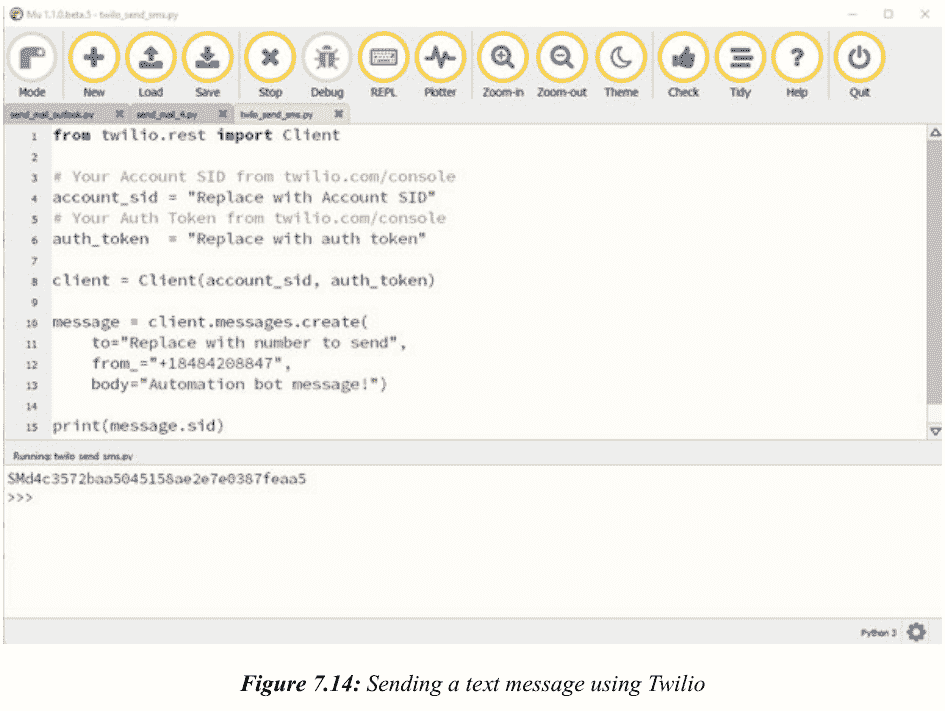

*图 7.14：使用 Twilio 发送短信*

一旦运行代码，消息将发送到指定的收件人，您可以通过在收件人手机上查看此消息来验证，如[图7.15](http://example.com/figure7.15)所示。

+1 848-420-8847
新泽西州

现在

由您的Twilio试用账户发送 - 自动化机器人消息！

发送消息

短信

图7.15：验证手机上收到的消息

WhatsApp Messenger是另一个在全球用户中广泛使用的流行消息应用程序。我们可以使用Twilio API或`pywhatkit`库来自动化发送WhatsApp消息。`PyWhatKit`是一个Python库，可以轻松地自动向WhatsApp群组或联系人发送消息或图片。它无需任何外部API访问权限，并且易于设置以自动化WhatsApp上的简单消息任务。要安装`PyWhatKit`，请使用`Mu`包管理器，输入`pywhatkit`，然后单击`OK`，如下图所示：

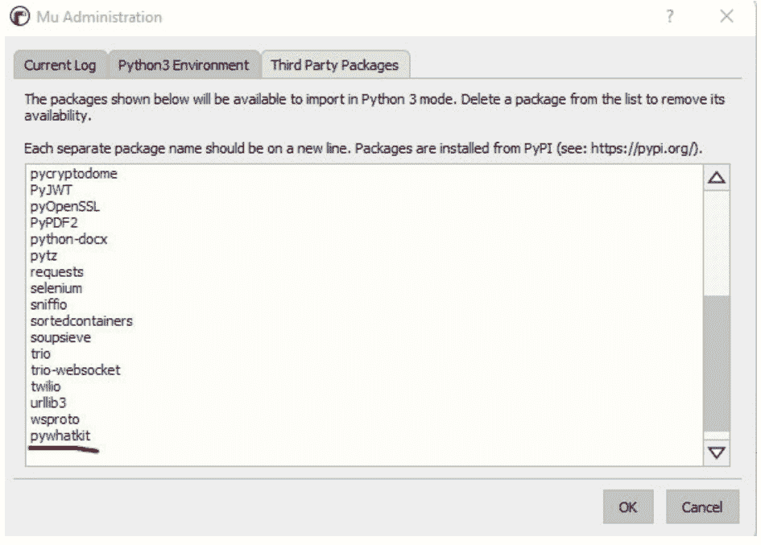

图7.16：Mu包管理器

安装好库后，请在默认浏览器（https://web.whatsapp.com/）中使用您的WhatsApp账户登录WhatsApp网页。`PyWhatKit`使用WhatsApp网页账户来自动发送WhatsApp消息。

`sendwhatmsg()`函数用于在特定时间向指定联系人发送WhatsApp消息，参数包括收件人号码（请使用您要发送自动化消息的国家/地区的国际代码（+...）书写电话号码）、消息和时间。时间使用*24小时格式*表示；例如，要在*下午1:17*发送消息，您需要使用的参数为13:17，如[图7.17](#)所示：

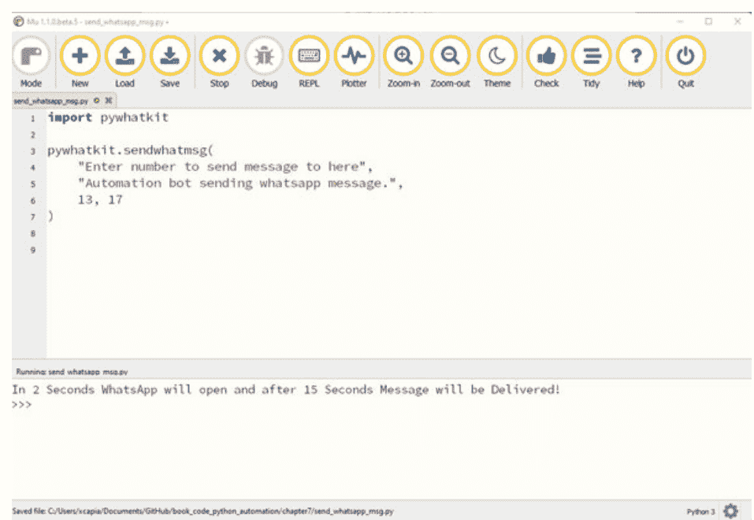

*图7.17：在下午1:17发送WhatsApp消息*

一旦运行代码，消息将发送到指定的收件人，您可以通过点击联系人并查看WhatsApp消息历史记录中的消息已发送状态来验证。由于WhatsApp应用程序会不断更新到新版本，您可能会遇到这样的情况：消息已在聊天中输入但未发送，您可能需要手动点击*发送*按钮。您可以使用第5章[自动化基于网页的任务](#)中讨论的Selenium网页自动化库来自动点击*发送*按钮。


图7.18：使用WhatsApp网页应用程序验证WhatsApp消息已发送

在本章中，我们看到了发送WhatsApp消息的简单示例，但还有其他工具，例如**Twilio** WhatsApp API（https://www.twilio.com/whatsapp），可用于在WhatsApp商业账户上自动化更复杂的工作流程。它可用于提供客户服务、客户支持和通知。

## 结论

在本章中，我们学习了用于自动化Python中基于电子邮件任务的不同库。我们学习了用于发送电子邮件的SMTP和Gmail API的基础知识。我们还研究了一些用于自动化短信发送的API和用于自动化WhatsApp Messenger的库。

在下一章中，我们将探讨如何使用**图形用户界面**自动化计算机上的不同应用程序。这将使您能够自动化各种应用程序，并允许您通过Python程序控制键盘和鼠标操作。

## 延伸阅读

有许多在线资源可以帮助您学习更多关于使用Python自动化电子邮件和消息应用程序的知识。下表列出了一些最佳资源，以进一步帮助您学习构建更复杂的电子邮件和消息应用程序自动化：

| 资源名称 | 链接 |
| --- | --- |
| 使用Python发送电子邮件 | https://realpython.com/python-send-email/ |
| Win32 API编程参考 | https://docs.microsoft.com/en-us/windows/win32/api/ |
| 如何自动化批量短信、推送和聊天通知 | https://www.twilio.com/learn/notifications/automate-mass-sms-push-and-chat-notifications |
| 构建工作流自动化 | https://www.twilio.com/docs/sms/tutorials/workflow-automation |
| 如何在30秒内使用Python发送WhatsApp消息 | https://www.twilio.com/blog/send-whatsapp-message-30-seconds-python |
| Gmail API Python快速入门 | https://developers.google.com/gmail/api/quickstart/python |

*表7.1：关于Python中电子邮件和消息自动化资源*

## 问题

1. 什么是SMTP？
2. 如何实现发送电子邮件的自动化？
3. 用于操作WhatsApp应用程序有哪些不同的Python库？
4. 如何使用Python发送短信？

# 第8章 图形用户界面 – 键盘和鼠标自动化

## 简介

在本章中，我们将学习通过控制键盘和鼠标操作来实现图形用户界面的自动化。我们将使用Python库PyAutoGUI，它适用于Windows、Mac和Linux，并为应用程序内的GUI元素提供自动化功能。

## 结构

在本章中，我们将涵盖以下主题：

- PyAutoGUI模块简介
- 控制鼠标操作
- 控制键盘操作
- 使用截图进行自动化

## 目标

学习完本章后，您将能够自动化您在工作计算机上使用的所有类型的应用程序。我们将在Windows机器上进行示例演示，但这些自动化操作即使您使用Mac或Linux计算机也能工作。

## PyAutoGUI模块简介

我们将使用PyAutoGUI模块，该模块允许您的Python脚本控制鼠标和键盘，以自动化计算机应用程序。PyAutoGUI还跨操作系统工作，例如Windows、macOS和Linux。PyAutoGUI提供如下所述的功能：

- 控制鼠标移动并点击所需应用程序的窗口（用户界面）。
- 向应用程序发送键盘输入字母（例如，用于填写数据）。
- 截取屏幕截图并使用图像搜索按钮和其他控件。
- 显示消息框。
- 定位应用程序窗口并调整应用程序大小（仅适用于Windows操作系统）。

有时，由于代码错误，您可能想要停止使用PyAutoGUI运行的自动化。PyAutoGUI有一个名为**FailSafe**（故障安全）的安全功能，默认情况下是启用的。如果您将鼠标移动到显示器四个角中的任何一个，并且如果PyAutoGUI函数正在运行，它将引发`pyautogui.FailSafeException`。此外，在调用每个PyAutoGUI函数后都有一个0.1秒的延迟，以便您有时间将鼠标猛地移到角落以触发故障安全异常。

要安装`pyautogui`，请使用`Mu`包管理器，输入`pyautogui`，然后单击`OK`，如下图所示：

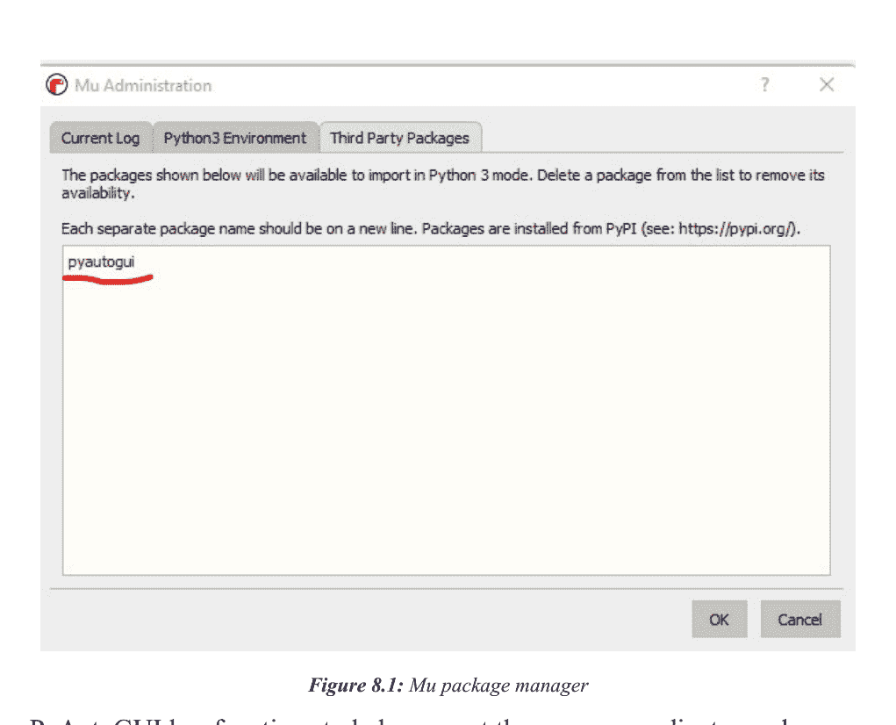

图8.1：Mu包管理器

PyAutoGUI具有帮助您获取屏幕坐标和屏幕分辨率的函数。屏幕左上角的位置坐标是**0, 0**。右下角的位置取决于您屏幕的分辨率（例如，如果屏幕分辨率是*1920 x 1080*，那么右下角的位置将是*1919, 1079*）。

PyAutoGUI具有**size()**函数，返回屏幕分辨率大小，**position()**函数返回鼠标光标的当前**X**和**Y**坐标，以及**onScreen()**函数，可以检查**X**和**Y**坐标是否在屏幕上，如[图8.2](#)所示。我们在此处看到的x和y坐标显示了我们运行代码时所点击的*运行*按钮的位置：

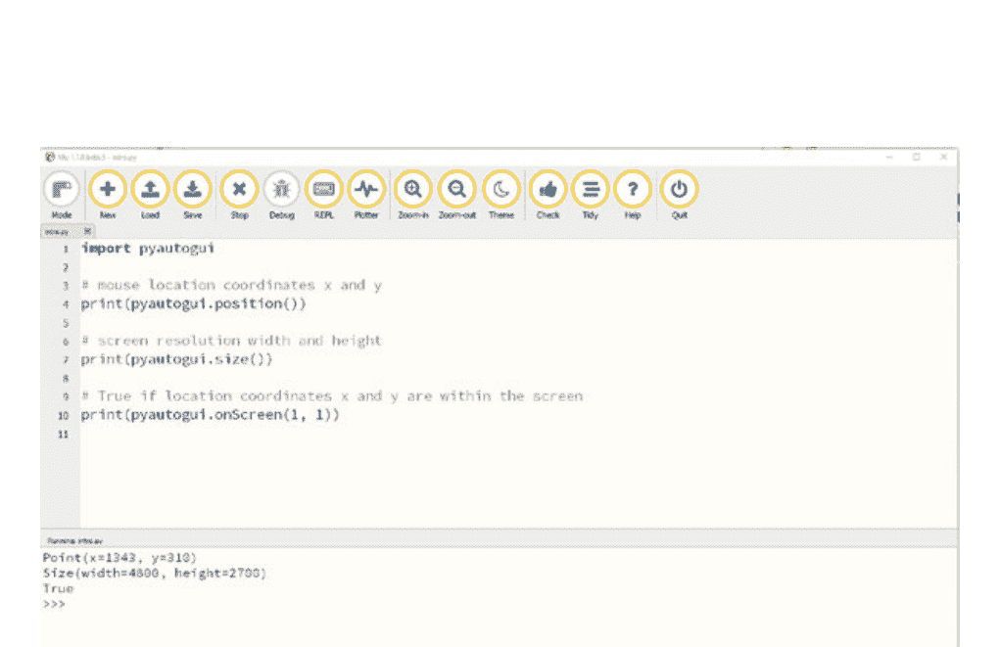

> 图8.2：使用pyautogui基本函数

在下一节中，我们将了解如何使用PyAutoGUI库控制鼠标操作。特别是，我们将了解如何使用该库自动点击应用程序，以及如何使用鼠标拖动功能在应用程序上拖动鼠标指针。

## 控制鼠标操作

PyAutoGUI提供各种函数来控制不同类型的鼠标操作。PyAutoGUI中最常用的鼠标自动化函数如下：

- **moveTo()**：`moveTo()`函数将鼠标光标移动到传递给它的X和Y整数坐标。例如，`pyautogui.moveTo(200, 400)`会将鼠标光标移动到X坐标200和Y坐标400的位置。鼠标指针将立即移动到这些新坐标。
  - 要添加延迟，您可以传递第三个参数作为延迟时间（以秒为单位）。
  - `move()`函数将鼠标移动到相对于当前位置的位置。

**dragTo()** 和 **drag()**：**dragTo()** 和 **drag()** 函数接受 **x** 和 **y** 整数坐标，与 **moveTo()** 和 **move()** 函数类似，但它们是拖动鼠标指针而不是移动鼠标指针。它们也可以接受一个 **button** 关键字，可以设置为 *left*、*middle* 和 *right*，以指定拖动时按住的鼠标按钮。

**scroll()**：**scroll()** 函数模拟鼠标滚轮，接受的参数是滚动的*次*数整数值。例如，**pyautogui.scroll(5)** 将向上滚动 5 *次点击*，而 **pyautogui.scroll(-5)** 将向下滚动 5 *次点击*。

**click()**：**click()** 函数在鼠标当前位置模拟一次左键单击（按下并释放按钮）。

你也可以指定 **X** 和 **Y** 整数坐标，将鼠标移动到该位置，然后单击鼠标左键。

- 要指定不同的鼠标按钮进行单击，你可以在 `button` 关键字参数上传递如 *left*、*middle* 或 *right* 这样的参数。例如，`pyautogui.click(button='right')` 将使用鼠标的右键单击按钮。
- 要进行多次单击，你可以向 `clicks` 关键字参数传递一个整数。例如，`pyautogui.click(clicks=2)` 将在左键上执行双击。
- 还有 `doubleClick()` 和 `rightClick()` 函数，用于模拟双击和鼠标右键单击。

## 图 8.3：自动化鼠标动作

图 8.3 展示了 **moveTo** 函数将鼠标移动到指定坐标，以及 **click** 函数按照自动化要求在正确位置单击的示例。当你运行此代码时，鼠标指针会移动到代码中指定的坐标，然后执行单击和双击动作。之后，鼠标指针会按照 **moveTo** 函数中指定的动画移动到指定坐标，在此例中是 **pyautogui.easeInOutQuad**，该动画快速开始和结束，中间速度较慢：

```python
import pyautogui

### 将鼠标移动到 XY 坐标。
pyautogui.moveTo(1, 12)
### 单击鼠标。
pyautogui.click()
### 双击鼠标。
pyautogui.doubleClick()

### 使用缓动函数在 2 秒内移动鼠标。
pyautogui.moveTo(500, 500, duration=2, tween=pyautogui.easeInOutQuad)
```

你也可以使用 `os.startfile` 函数启动一个新程序，传入程序名称或程序文件位置作为参数。程序启动后，你可以使用鼠标自动化函数对新启动的程序执行自动化操作。图 8.4 展示了启动 `mspaint` 程序并使用 `drag` 函数在画图程序上绘制的示例：

```python
import pyautogui
import os

pyautogui.moveTo(800, 800)

### 通过 Windows 识别的名称或路径打开任何程序
os.startfile("mspaint")

distance = 400
while distance > 0:
    pyautogui.drag(distance, 0, duration=0.5)  # 向右移动
    distance -= 15
    pyautogui.drag(0, distance, duration=0.5)  # 向下移动
    pyautogui.drag(-distance, 0, duration=0.5)  # 向左移动
    distance -= 15
    pyautogui.drag(0, -distance, duration=0.5)  # 向上移动
```

## 图 8.4：自动化画图应用程序

图 8.5 展示了之前所示的画图自动化在两个不同起始位置运行的输出，创建了一个方形螺旋图：

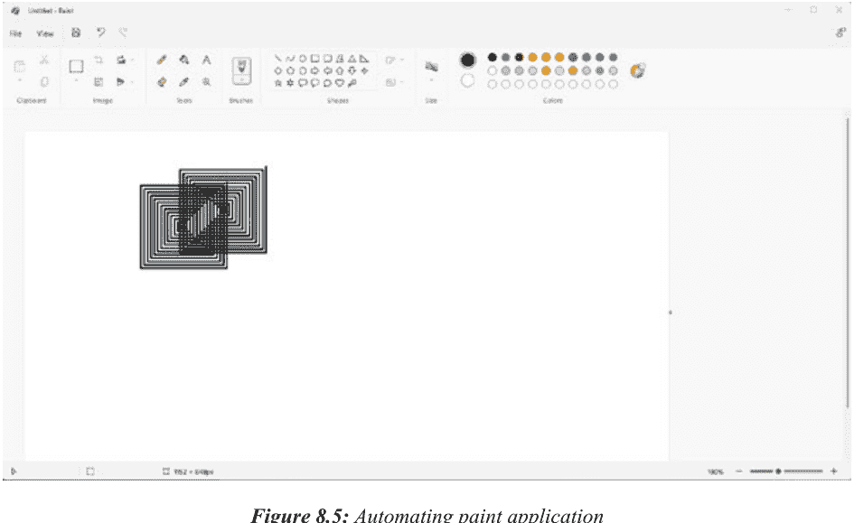

*图 8.5：自动化画图应用程序*

在下一节中，我们将探讨使用 **PyAutoGUI** 库控制键盘动作。特别是，我们将了解如何使用该库在不同应用程序上自动输入，并使用快捷键函数发送诸如**复制**和**粘贴**之类的命令。

### 控制键盘动作

PyAutoGUI 提供了各种函数来控制不同类型的键盘动作。PyAutoGUI 中最常用的键盘自动化函数如下所述：

- **write()**：`write()` 函数是主要的键盘函数，用于输入传递的字符串中的字符。要在按下每个字符键之间添加延迟，可以传递一个带有所需延迟的 interval 关键字参数。例如，`pyautogui.write('hello from bot')` 将在当前聚焦的应用程序上输入文本 **hello from bot**。
- **press()**：`press()` 函数用于按下 `pyautogui.KEYBOARD_KEYS` 中的特定键，例如 `Enter`、`esc`、`F1`。例如，`pyautogui.press('enter')` 将按下 `Enter` 键。`press()` 函数调用 `keyDown()` 和 `keyUp()` 函数，模拟按下键然后释放键。
- **keyDown()** 和 **keyUp()**：`keyDown()` 用于模拟按下键，`keyUp()` 用于模拟释放键。例如，`pyautogui.keyDown('shift')` 按住 *Shift* 键，`pyautogui.keyUp('shift')` 释放 *Shift* 键。你可以在这两个函数之间添加其他按键操作，以便在输入其他键时持续按住 Shift 键。
- **hotkey()**：`hotkey()` 函数用于方便地按下快捷键或键盘快捷方式。`hotkey()` 接受键字符串作为参数，这些键将按顺序按下，然后按相反顺序释放。例如，`pyautogui.hotkey('ctrl', 'a')` 将通过按下 `ctrl` 然后 `a`，然后释放 `a`，最后释放 `ctrl` 来执行全选命令。

PyAutoGUI 文档 (https://pyautogui.readthedocs.io/en/latest/keyboard.html) 中定义了多个有效的 `KEYBOARD_KEYS`，可以传递给 PyAutoGUI 键盘函数的 `write()`、`press()`、`keyDown()`、`keyUp()` 和 `hotkey()`。例如，对于传递功能键，以下是相关的 `KEYBOARD_KEYS`：

```
[alt, altleft, altright, backspace, capslock, ctrl, ctrlleft,
ctrlright, delete, enter, esc, escape, insert, numlock, print,
shift, shiftleft, shiftright, tab]
```

PyAutoGUI 还有一个 `alert()` 函数，可以在自动化完成后显示消息框。此外，PyAutoGUI 具有窗口处理功能，这在应用程序自动化期间非常有用，如下所示：

- `pyautogui.getWindows()`：获取一个由窗口标题映射到窗口 ID 的 `dict`（字典）。
- `pyautogui.getWindow(str_title_or_int_id)`：获取一个 `Win` 对象，可用于对选定窗口执行各种操作。
- `pyautogui.getWindowsWithTitle()`：获取标题与参数中提供的标题匹配的窗口。
- **win.move(x, y)**：将窗口移动到 X 和 Y 位置。
- **win.resize(width, height)**：将窗口调整为给定的宽度和高度。
- **win.maximize()**：最大化窗口。
- **win.minimize()**：最小化窗口。
- **win.restore()**：恢复窗口。
- **win.close()**：关闭窗口。
- **win.position()**：获取窗口左上角的 X 和 Y 位置。

## 图 8.6：自动化键盘动作

图 8.6 展示了使用 pyautogui.getWindowsWithTitle() 获取当前 Mu 代码窗口并将其最小化的示例。此函数中指定的 keyboard.py 是 Mu 文件的名称。然后我们在已打开的记事本应用程序上写入 I am automation bot，接着使用 hotkey 函数选择、复制和粘贴文本。之后，我们使用 alert() 函数提醒用户自动化已完成：

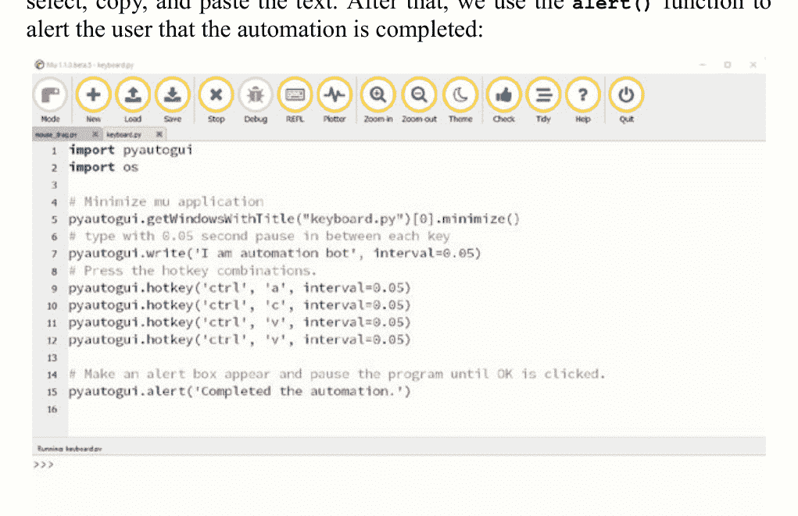

图 8.7 展示了在记事本应用程序上运行键盘自动化的输出：

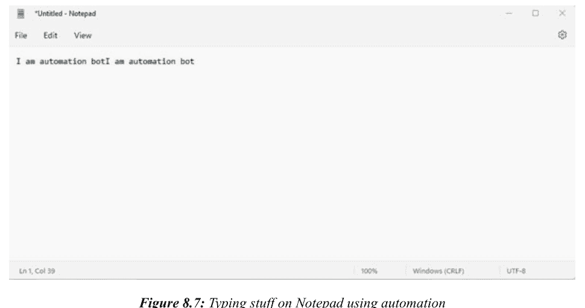

*图 8.7：使用自动化在记事本上输入内容*

在下一节中，我们将探讨使用 PyAutoGUI 库中的截图识别工具来识别窗口和按钮。特别是，我们将了解如何使用该库识别我们希望自动化在其上工作的不同按钮、区域和窗口。

### 使用截图进行自动化

PyAutoGUI 提供了使用截图来识别窗口和按钮的功能。PyAutoGUI 具有截取屏幕截图、将其保存到文件以及在屏幕中定位图像的功能。你也可以使用 Windows 中的截图工具获取所需按钮或窗口的快照，并将其保存以供自动化程序使用。

PyAutoGUI 中最常用的基于截图的功能如下：

- **screenshot()**：screenshot() 函数返回一个捕获屏幕的 Image 对象。你也可以传递文件路径将屏幕截图保存到文件。例如，pyautogui.screenshot('automation_screenshot.png') 将捕获整个屏幕并将其保存到当前 Python 文件夹中，并使用指定的名称。

文件名 `automation_screenshot`。您也可以通过传递一个包含要捕获区域**left**、**top**、**width**和**height**四个整数的元组，提供 `region` 关键字参数来捕获屏幕的子区域。

- **定位函数**：有三个主要的定位函数用于在屏幕上查找捕获图像的位置，如下所示：
  - `locateOnScreen(image, grayscale=False)`：此函数返回在屏幕上找到的第一个图像实例的**左**、**上**、**宽度**和**高度**坐标。如果未在屏幕上找到，则引发 `ImageNotFoundException`。
  - `locateCenterOnScreen(image, grayscale=False)`：此函数返回在屏幕上找到的第一个图像实例中心的**X**和**Y**坐标。如果未在屏幕上找到，则引发 `ImageNotFoundException`。
  - `locateAllOnScreen(image, grayscale=False)`：此函数返回在屏幕上找到的所有图像实例的**左**、**上**、**宽度**和**高度**坐标元组。

*图 8.8* 展示了一个使用 `pyautogui.locateOnScreen()` 获取屏幕上加载按钮图像当前位置的示例。一旦获取到图像位置，我们就使用 `pyautogui.center()` 函数获取该图像位置的中心点，并将其传递给 **X** 和 **Y** 坐标变量。我们可以使用这些 **X** 和 **Y** 坐标变量，并调用 `pyautogui.click()` 来点击 `load` 按钮。此代码中使用的 `loadImage.png` 文件应与 Python 代码位于同一文件夹中，否则您需要指定图像文件的完整路径。此外，图像文件应包含您希望自动化操作所在位置的图像。有关使用图像定位函数的更多信息，请参阅 PyAutoGUI 文档页面 ([https://pyautogui.readthedocs.io/en/latest/](https://pyautogui.readthedocs.io/en/latest/))：

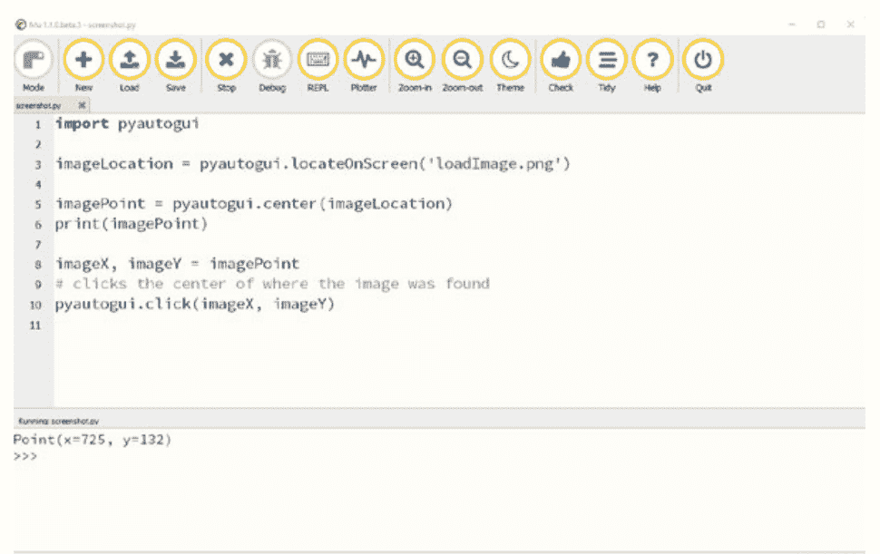

使用 PyAutoGUI，您可以在 Windows、Mac 和 Linux 机器上自动化各种应用程序。如果您只想在 Windows 上自动化应用程序，那么 `pywinauto` 是另一个提供函数来自动化 Microsoft Windows GUI 的库。它允许您向窗口对话框和控件发送鼠标和键盘操作，并且还支持更复杂的操作，例如从不同应用程序获取文本数据。要了解更多关于 `pywinauto` 的信息，请参阅在线提供的 `pywinauto` 文档 ([https://pywinauto.readthedocs.io/en/latest/](https://pywinauto.readthedocs.io/en/latest/))。

## 结论

在本章中，我们学习了 Python 库 PyAutoGUI，用于控制鼠标和键盘操作，并使用**图形用户界面 (GUI)** 自动化应用程序。我们学习了执行点击操作、键入操作以及使用图像识别应用程序控件的可用函数。

在下一章中，我们将探讨图像基础知识以及用于处理图像的 Pillow Python 库。我们还将了解 Tesseract 库，该库可用于提取图像和扫描文档中的文本。

## 延伸阅读

有许多在线资源可以帮助您了解更多关于使用 Python 进行 GUI、键盘和鼠标自动化的知识。下表列出了一些最佳资源，以进一步提升您在 Python GUI 自动化方面的学习：

| 资源名称 | 链接 |
| --- | --- |
| PyAutoGUI 文档 | <https://pyautogui.readthedocs.io/en/latest/> |
| 使用截图工具捕获屏幕截图 | <https://support.microsoft.com/en-us/windows/use-snipping-tool-to-capture-screenshots-00246869-1843-655f-f220-97299b865f6b> |
| 什么是 pywinauto？ | <https://pywinauto.readthedocs.io/en/latest/> |
| PyAutoGUI：三大妙用 | <https://www.youtube.com/watch?v=o0OySmkZo8g> |

表 8.1：关于 Python GUI 自动化的资源

## 问题

1.  PyAutoGUI 模块的用途是什么？
2.  PyAutoGUI 模块中有哪些不同类型的鼠标操作？
3.  如何在 Python 中模拟键盘操作？
4.  如何使用屏幕截图运行自动化任务？

# 第9章

## 基于图像的自动化

### 引言

在本章中，我们将探讨计算机图像基础知识以及用于处理图像的 **Pillow** Python 库。我们还将了解用于从图像和扫描文档中提取文本的 OCR 库。

## 结构

在本章中，我们将涵盖以下主题：
- 计算机图像基础知识
- 使用 Pillow 进行图像处理
- 使用 OCR 从图像中提取文本

## 目标

学完本章后，您将能够处理和修改计算机图像，并从扫描文档和图像中提取文本。您还将了解**光学字符识别 (OCR)**，这是一种用于从保存的图像中提取文本的技术。

### 计算机图像基础知识

计算机图像由**像素 (pixel)** 组成，它是计算机图像的最小组成部分。当计算机处理图像时，像素是单个颜色的点，图像由矩形网格上的像素组成。图像的分辨率是网格中的点数；例如，*1920x1080* 表示图像宽 *1920* 像素，高 *1080* 像素。

存储数字图像有多种格式。大多数图像格式是为特定程序开发的，但其中少数已成为图像格式标准，可以在各种应用程序中使用。这些图像格式也称为位图格式，其中位图是用于映射像素以存储图像的内存组织方式。以下是不同应用程序最常用的图像格式：

- **CompuServe 图形交换格式 (GIF)**：这种图像格式用于文件交换，其格式内置了良好的压缩算法。
- **标签图像文件格式 (TIF/TIFF)**：这是一种灵活的图像格式，支持多种压缩算法。
- **联合图像专家组 (JPG/JPEG)**：这是一种由 ISO 和 CCITT 开发为标准的图像格式。对于连续色调图像，它具有非常好的压缩算法。对于大多数图像，此格式可以压缩并减小图像大小达 20 倍。此格式不支持透明度或透明背景。
- **便携式网络图形 (PNG)**：这是互联网上使用最广泛的图像格式之一。它可以显示透明背景，并且是为了取代 GIF 格式而创建的。它是一种开放格式，没有版权限制，并且在压缩图像时不会丢失任何图像数据（也称为无损压缩，即在不损失质量的情况下减小文件大小）。此格式支持透明度和透明背景。

在下一节中，我们将探讨可用于处理图像和修改图像属性的 Pillow 图像库。

### 使用 Pillow 进行图像处理

Pillow 是一个用于处理图像的 Python 库，它基于 Python Imaging Library (PIL)。Pillow 库增加了图像处理能力，并提供了将图像文件从一种格式转换为另一种格式的广泛支持。

要安装 Pillow 库，请使用 mu 包管理器，输入 pillow，然后点击确定，如图 9.1 所示：

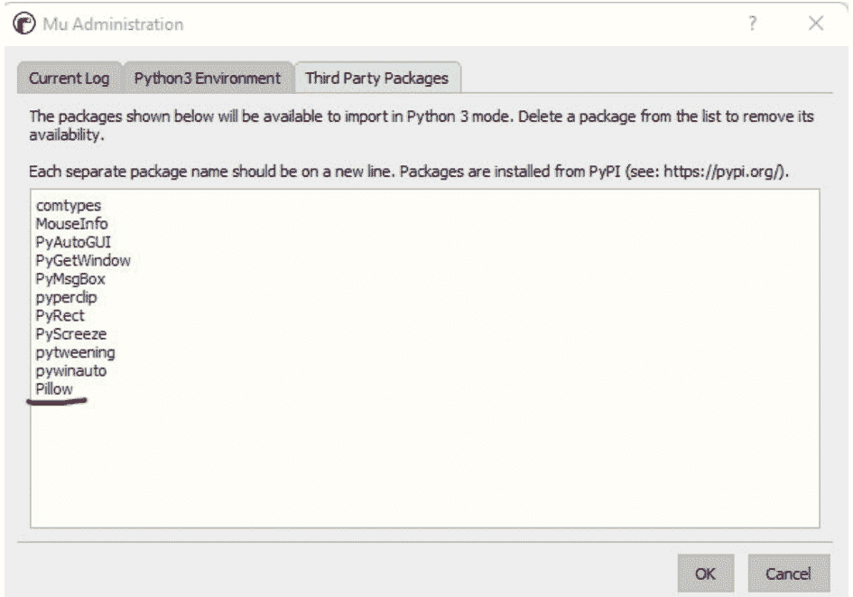

要导入 `pillow` 图像库，请使用语句 `from PIL import Image`。`Image.open("loadImage.png")`。一旦图像通过 `pillow` 模块加载，您就可以获取图像的详细信息，如格式、大小和模式，如 [图 9.2](#figure-9-2) 所示：

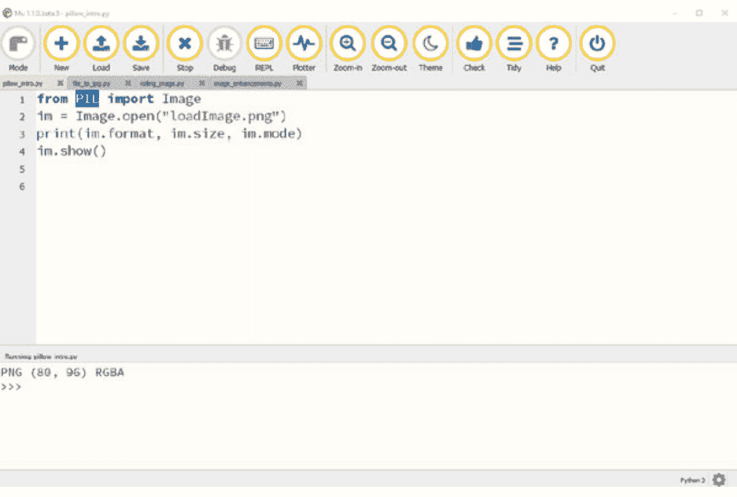

**pillow** 库可用于在不同图像格式之间转换图像。例如，要将图像从 PNG 转换为 JPG，您首先需要将颜色通道从 **Red, Green, Blue, and Alpha (RGBA)**（**Alpha** 是透明度）更改为 **Red, Blue, and Green (RGB)**，然后将图像保存为扩展名 **.jpg**。Pillow 将根据给定的文件扩展名转换图像，并将图像保存为新格式，如 [图 9.3](#figure-9-3) 所示：

import os
from PIL import Image

infile = "loadImage.png"

f, e = os.path.splitext(infile)
outfile = f + ".jpg"
if infile != outfile:
    try:
        with Image.open(infile) as im:
            rgb_im = im.convert('RGB')
            rgb_im.save(outfile)
    except OSError:
        print("无法转换", infile)

**图 9.3：** 将图像转换为 JPG 格式

**Pillow** 库有一个 **ImageEnhance** 模块，包含多个可用于图像增强的类。主要的图像增强类如下：

- **ImageEnhance.Color**：此类用于调整图像的色彩平衡。你可以向该类的 **enhance** 函数传递一个颜色增强因子，其中因子 1.0 代表*原始*图像颜色，因子 0.0 代表*黑白*图像。
- **ImageEnhance.Contrast**：此类用于调整图像的对比度。你可以向该类的 **enhance** 函数传递一个对比度增强因子，其中因子 1.0 代表*原始*图像颜色，因子 0.0 代表*纯灰色*图像。
- **ImageEnhance.Brightness**：此类用于调整图像的亮度。你可以向该类的 **enhance** 函数传递一个亮度增强因子，其中因子 1.0 代表*原始*图像颜色，因子 0.0 代表*纯黑色*图像。
- **ImageEnhance.Sharpness**：此类用于调整图像的锐度。你可以向该类的 **enhance** 函数传递一个锐度增强因子，其中因子 1.0 代表原始图像颜色，因子 0.0 代表模糊图像，高于 1.0 的因子则会生成锐化后的图像。

图 9.4 展示了使用 ImageEnhance 模块增加图像锐度的示例：

```
import os
from PIL import Image
from PIL import ImageEnhance

infile = "loadImage.png"
image = Image.open(infile)

enhancer = ImageEnhance.Sharpness(image)
enhancer.enhance(2).save('loadImageSharpened.png')
```

**图 9.4：** 增加图像的锐度

调用 ImageEnhance.Sharpness 增强函数后，会生成一张新的锐化图像。图 9.5 左侧展示了原始图像，右侧展示了锐化后的图像：

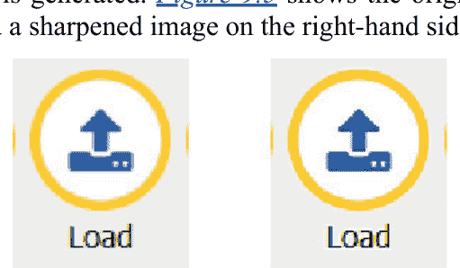

**图 9.5：** 原始图像（左）与锐化后的图像（右）

在下一节中，我们将探讨 Python 中的**光学字符识别（OCR）**库，用于从图像中提取文本。当你处理扫描文档和图像时，这项技术尤其有用。

## 使用 OCR 从图像中提取文本

**光学字符识别（OCR）** 是一种用于从图像或手写文档中提取机器编码文本的技术。本章我们将介绍一个名为 `tesseract` 的开源 OCR 库，但还有多种不同的 OCR 库和 API 可用于从图像和手写文档中提取文本。

**Tesseract** 可以用作命令行程序，也可以与 `pytesseract` 库配合使用，后者是 `tesseract` 引擎的 Python 封装。`Pytesseract` 要求你的计算机上已安装 `tesseract` 库。

要在 Windows 机器上安装 `tesseract`，请下载适用于 Windows 的 `tesseract` 安装程序（[https://github.com/UB-Mannheim/tesseract/wiki](https://github.com/UB-Mannheim/tesseract/wiki)），并按照 *图 9.6* 所示的安装过程操作。对于其他操作系统，可以从 `tesseract` 二进制文件页面（[https://tesseract-ocr.github.io/tessdoc/Home.html#binaries](https://tesseract-ocr.github.io/tessdoc/Home.html#binaries)）下载 `tesseract`：

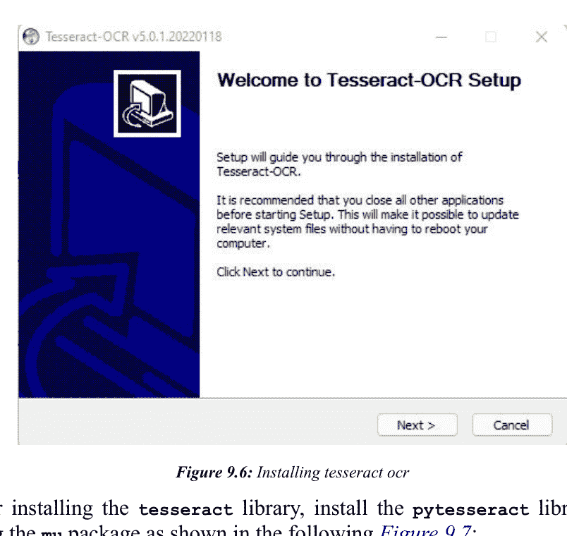

**图 9.6：** 安装 tesseract ocr

安装 `tesseract` 库后，请按照以下 *图 9.7* 所示，使用 `mu` 包管理器安装 `pytesseract` 库：

### Mu 管理

以下显示的包将在 Python 3 模式下可供导入。从列表中删除一个包即可移除其可用性。

每个单独的包名应各占一行。包从 PyPI 安装（参见：https://pypi.org/）。

- comtypes
- MouseInfo
- Pillow
- PyAutoGUI
- PyGetWindow
- PyMsgBox
- pyperclip
- PyRect
- PySqueeze
- pytweening
- pywinauto
- pytesseract

**图 9.7：** Mu 包管理器

要使用 `pytesseract` 库从图像中提取文本，可以使用 `image_to_string()` 函数，如 *图 9.8* 所示。你需要将 `tesseract` 路径提供给 `pytesseract.tesseract_cmd` 变量（在 Windows 上，此路径通常为 C: \Program Files\Tesseract-OCR）：

```
from PIL import Image

import pytesseract

# 您需要通过指定tesseract的安装路径来设定tesseract的位置
pytesseract.pytesseract.tesseract_cmd = r'C:\Program Files\Tesseract-OCR\tesseract.exe'

#### 将图像转换为字符串并打印图像
print(pytesseract.image_to_string(Image.open('ocrTest.jpg')))
```

```
This is a lot of 12 point text to test the
ocr code and see if it works on all types
of file format.

The quick brown dog jumped over the
lazy fox. The quick brown dog jumped
over the lazy fox. The quick brown dog
jumped over the lazy fox. The quick
brown dog jumped over the lazy fox.

>>>
```

### **图 9.8：** 使用 tesseract 将图像转为文本

Pytesseract 库为 image_to_data 或 image_to_string 函数接受不同的参数。以下是函数签名：

```
image_to_data(image, lang=None, config='', timeout=0)
```

此函数接受的不同参数如下所述：

- **image**：可以是对象（PIL 图像/NumPy 数组）或图像文件路径，将由 Tesseract 处理。
- **lang**：这是一个语言字符串，如果未指定语言字符串，则默认值为 eng。你也可以传入多个语言字符串作为参数；例如，eng+fra 代表英语和法语。在传递 lang 字符串之前，请确保已为目标语言下载了正确的 tessdata（https://github.com/tesseract-ocr/tessdata）。
- **config**：传入自定义配置标志，如页面分割模式和 OCR 引擎模式（https://manpages.ubuntu.com/manpages/bionic/man1/tesseract.1.html）。
- **timeout**：传入一个以秒为单位的时长，用于超时 OCR 处理引擎。

当你传入 timeout 参数时，如果 OCR 处理时长超过指定时间，pytesseract 会引发 RuntimeError。这可以在 try except 语句中处理，如图 9.9 所示：

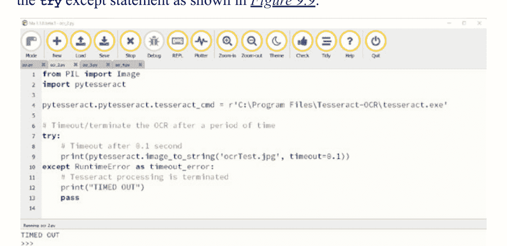

### **图 9.9：** 为较长的图像转换过程添加超时

Pytesseract 库为 tesseract 库提供了多种函数，如下所示：

- **get_languages**：获取 Tesseract 库支持的所有语言。
- **get_tesseract_version**：获取已安装的 Tesseract 版本。
- **image_to_boxes**：获取框边界，并返回这些框边界内的字符。
- **image_to_osd**：获取有关脚本检测和方向的信息。
- **image_to_alto_xml**：以 Tesseract 的 ALTO XML 格式获取结果。
- **run_and_get_output**：从 Tesseract OCR 获取原始输出。
- **image_to_string**：从 Tesseract OCR 以字符串形式获取输出。
- **image_to_data**：获取包含置信度、框边界、行号和页码的结果。

图 9.10 展示了使用 **image_to_boxes** 和 **image_to_data** 函数的示例，结果包含置信度、框边界、行号和页码：

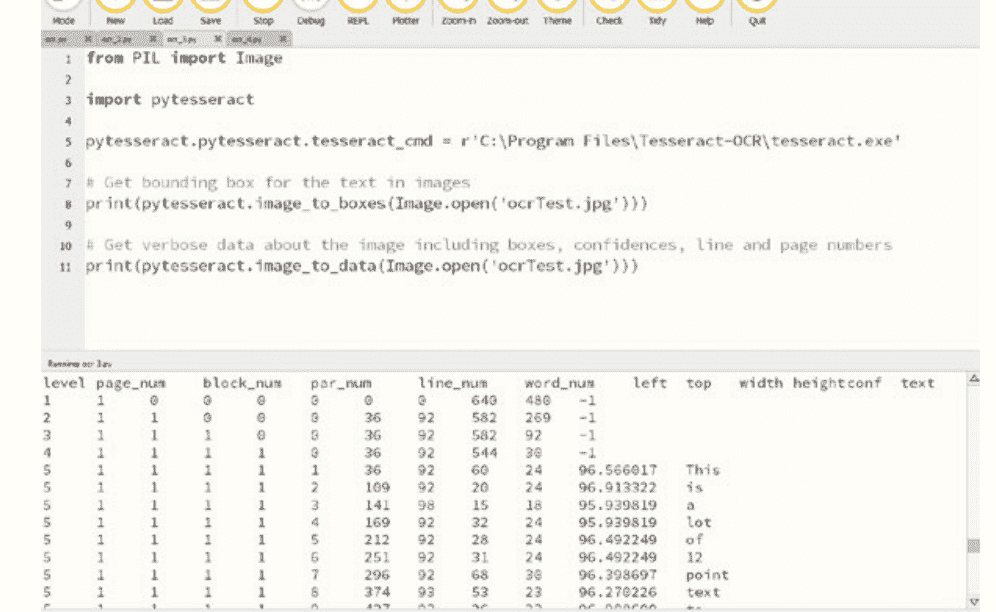

*图 9.10：从 tesseract 获取图像文本和置信度水平*

其他流行的 OCR 库包括 **Filestack OCR**、**ABBYY OCR**、**Anyline OCR** 等。亚马逊网络服务、微软 Azure 和谷歌云平台也提供云 ORC 库，可以为某些图像转文本任务提供更高的准确性。

## 结论

在本章中，我们学习了图像基础知识以及用于处理图像的 Pillow Python 库。我们还探讨了 Tesseract 库，该库可用于提取图像和扫描文档中的文本。

在下一章中，我们将探讨使用日期和定时器函数来调度自动化。我们还将探讨 Python 钩子，它允许我们基于某些事件（如收到新电子邮件或新应用程序启动）运行自动化。

## 延伸阅读

有许多在线资源可以帮助你进一步了解用于图像处理的 Pillow 和 Tesseract OCR。以下 *表 9.1* 列出了一些最佳资源，以进一步增进你对 Pillow 和 OCR 库的学习：

| 资源名称 | 链接 |
|---|---|
| Pillow 文档 | <https://pillow.readthedocs.io/en/stable/index.html> |
| Python-tesseract 是 Google 的 Tesseract-OCR 的 Python 封装 | <https://pypi.org/project/pytesseract/> |
| 检测图像中的文本 | <https://cloud.google.com/vision/docs/ocr> |
| Tesseract OCR | <https://github.com/tesseract-ocr/tesseract> |
| Amazon Textract | <https://aws.amazon.com/textract/> |

**表 9.1：** Python 中图像自动化相关资源

## 问题

1. Pillow 模块中有哪些可用于图像处理的函数？
2. 如何从图像中提取文本？

3. tesseract库是什么？
4. 如何使用Python将多语言图像转换为文本？

## 第10章
创建基于时间和事件的自动化

## 简介
本章我们将探讨如何使用**日期**和**计时器**来调度自动化任务。同时，我们也会介绍一些外部应用程序，它们允许我们基于特定事件（如收到新电子邮件或应用程序启动时）来运行自动化任务。

## 结构
本章将涵盖以下主题：
- 调度自动化
- 编写计时器程序
- 从Python启动程序
- 使用外部工具作为触发器

## 目标
学习完本章后，你将能够在一天的特定时间调度自动化任务。你还将能够创建基于触发器的工作流，并使用外部工具来帮助你运行带有触发器的自动化任务，以及与Web应用程序进行交互。

## 调度自动化
你可以在Python中调度自动化任务，使其在一天的特定时间运行，或基于特定事件运行。**Advanced Python Scheduler (APScheduler)** 是一个Python库，允许你调度Python自动化任务。你可以随时添加或删除作业，甚至可以将这些作业存储在数据库中。**APScheduler** 跨操作系统运行，并提供三种主要的调度功能，如下所示：
- **类Cron作业的语法**：Cron作业使用类似Linux cron命令行工具的语法。
- **基于间隔的语法**：这允许作业在指定的时间间隔运行，并可选择开始和结束时间。
- **一次性延迟执行**：这允许你根据设定的日期和时间执行一次作业。

要安装 `APScheduler` 库，请使用Mu包管理器，输入 `APScheduler`，然后点击 `OK`，如下图所示：
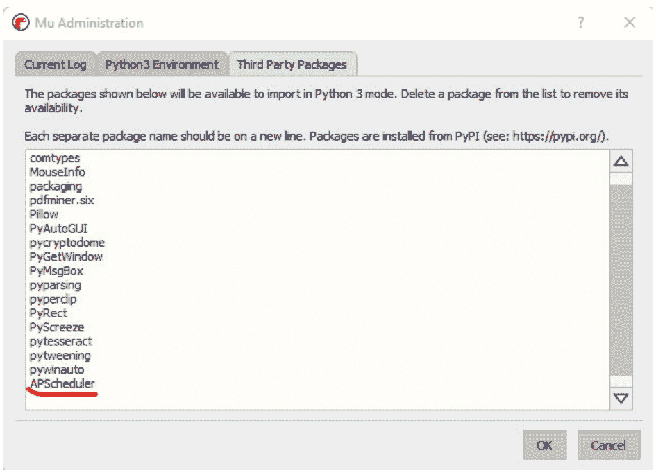
*图 10.1：Mu包管理器*

对于Windows操作系统，你也可以使用**Windows任务计划程序**在特定日期和时间调度任务。通过任务计划程序，你可以调度诸如运行所需的Python自动化、发送电子邮件消息或启动新应用程序等任务。Windows任务计划程序支持基于以下事件运行任务：
- 在特定的系统事件时
- 在特定时间或计划时
- 当计算机空闲时
- 在计算机启动期间
- 在用户登录操作期间

要启动任务计划程序，在“开始”菜单中搜索或按键盘上的Windows + R键启动“运行”对话框，然后输入 `taskschd.msc`。在任务计划程序中，选择“操作”部分的**创建基本任务...**选项以创建基本任务，如图10.2所示：
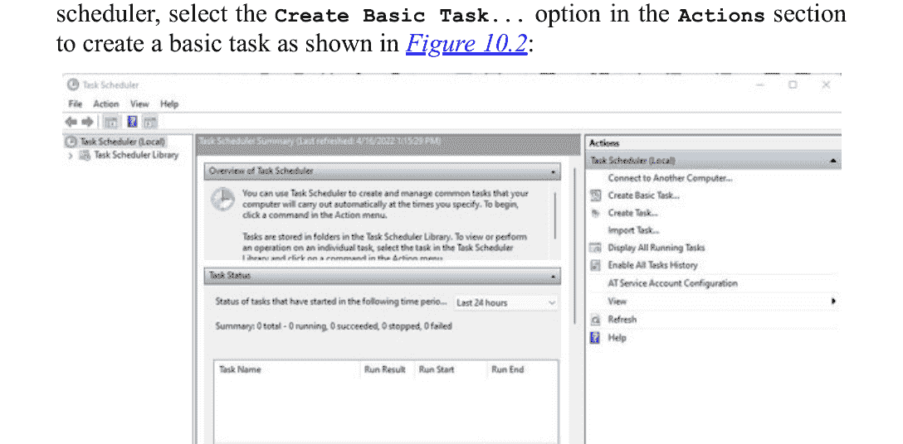
**图 10.2：** 任务计划程序主页

点击创建基本任务的选项后，你将看到**创建基本任务**向导，你可以在其中为计划的任务添加名称并添加任务描述，如图10.3所示：
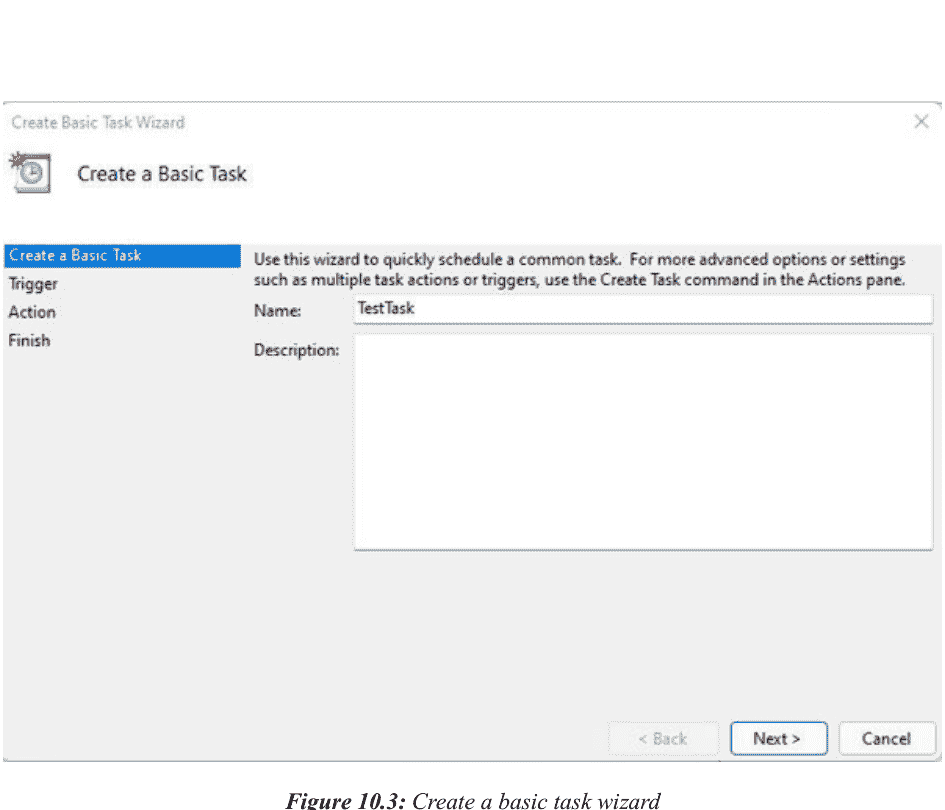
**图 10.3：创建基本任务向导**

点击 **下一步 >** 后，你可以选择作业所需的触发器，例如每天、每周、每月运行作业等，如图10.4所示：
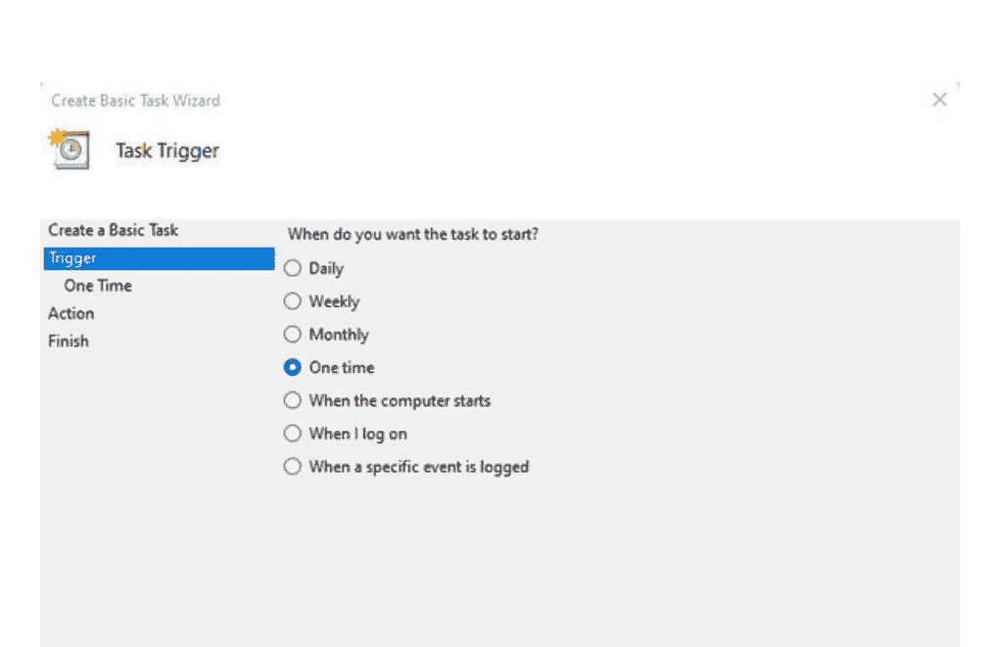
**图 10.4：选择任务触发器**

点击 **下一步 >** 后，你需要指定触发器参数，例如你希望何时调度任务，如图10.5所示：
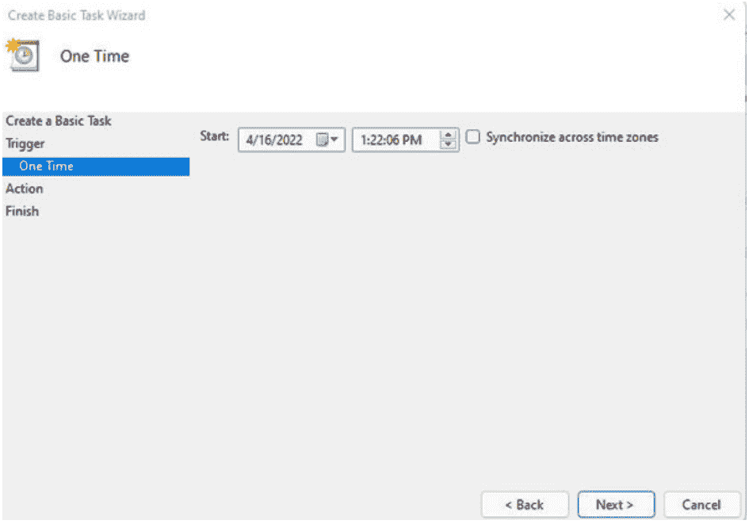
**图 10.5：一次性计划**

点击 **下一步 >** 后，你需要指定是 **启动程序**、**发送电子邮件** 还是 **显示消息**，如图10.6所示：
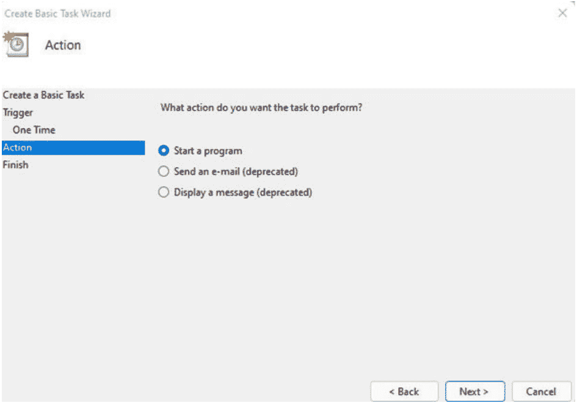
**图 10.6：** 任务管理器操作选项

在这种情况下，我们将选择 `启动程序`，然后点击 **下一步 >**，接着指定Python自动化脚本的路径，如图10.7所示：
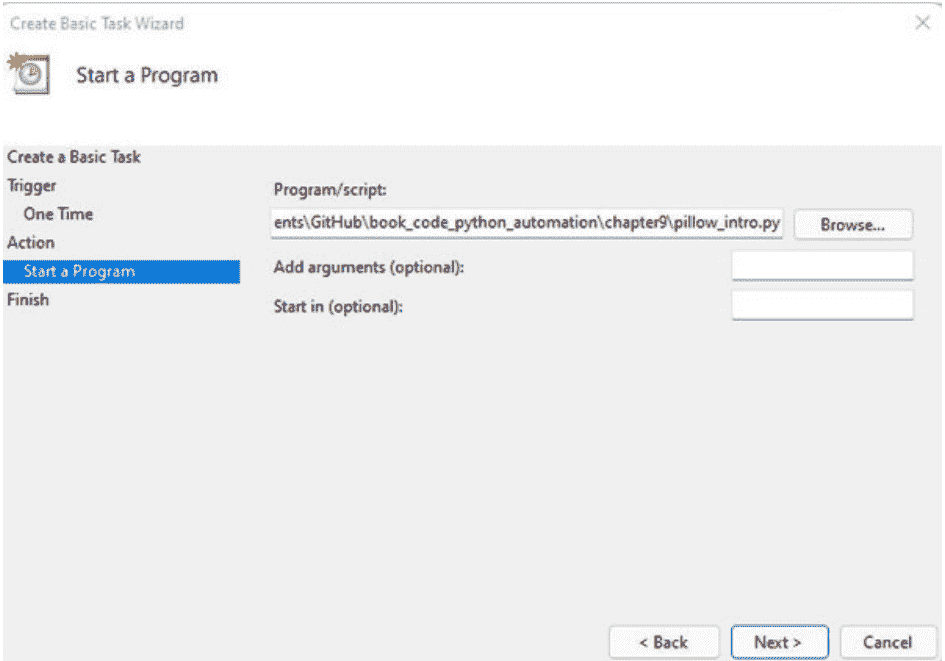
指定路径后，点击 **下一步 >**，你将看到任务摘要，然后需要点击“完成”以基于选定的触发器启动任务。你可以使用**任务计划程序**的“创建任务”选项来调度更复杂的任务，在该选项中，你可以为同一任务设置多个触发器。Linux和Mac操作系统也有可用的任务计划应用程序，例如**crontab**，它使用Cron风格的语法来调度任务。

在下一节中，我们将探讨如何使用Python **APScheduler** 库编写计时器程序和调度触发器。

## 编写计时器程序
**APScheduler** 允许你编写计时器程序来调度和运行Python程序，如前一节所述。**APScheduler** 有一个 **BlockingScheduler**，它是一个在前台运行的简单调度器。你可以通过调用 `start()` 函数来启动调度器。使用 `BlockingScheduler`，你将在完成初始化步骤（如添加作业并传递正确的自动化脚本）后启动调度器。要向调度器添加作业，请使用 `add_job()` 函数，该函数返回一个 `apscheduler.job.Job` 实例，可用于稍后修改或删除作业。可以使用 `remove()` 函数删除已计划的作业。

例如，`scheduler.add_job(myfunc, 'interval', minutes=2)` 创建一个新作业，而 `job.remove()` 删除该作业。你可以使用 `modify()` 函数修改作业，并使用 `reschedule()` 函数重新计划作业。

要关闭调度器，有 `shutdown()` 函数；要暂停作业，使用 `pause()` 函数；要恢复作业，使用 `resume()` 函数。

要启动一个简单的调度器作业，你可以创建一个 `BlockingScheduler`，使用 `add_job` 函数向此调度器添加一个作业，然后使用 `start` 函数启动调度器，如图10.8所示：
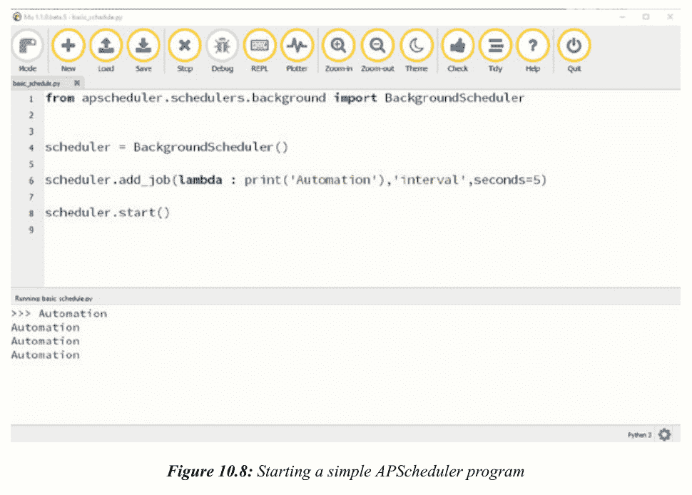
*图 10.8：启动一个简单的APScheduler程序*

除了传递Lambda函数，你还可以传递任何其他Python函数给调度器，调度器将在指定时间调用该函数。APScheduler支持基于Cron的触发器，这与UNIX cron调度器类似，其参数包括：
- year: 4位数年份
- month: 月份 (1-12)
- day: 日期 (1-31)
- week: ISO周 (1-53)
- day_of_week: 星期几的数字或名称 (0-6 或 mon, tue, wed, thu, fri, sat, sun)
- hour: 小时 (0-23)
- minute: 分钟 (0-59)
- second: 秒 (0-59)
- start_date: 开始触发器的起始日期/时间
- end_date: 结束触发器的结束日期/时间
- timezone: 用于日期/时间计算的时区（默认为调度器时区）

例如，你可以运行一个基于Cron的触发器，通过将second参数设置为 `*` 来每秒运行一次作业，如图10.9所示：
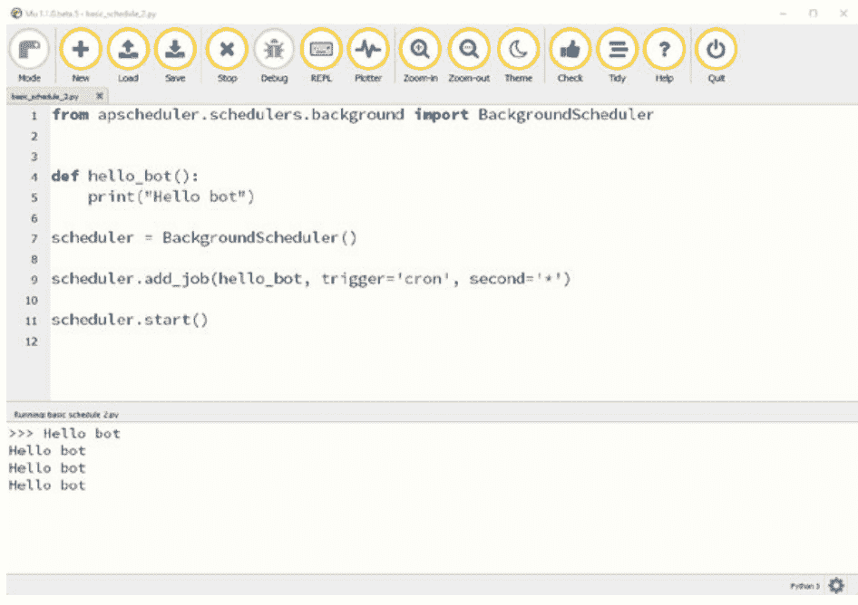
**图 10.9：基于Cron的调度器程序**

在下一节中，我们将探讨使用Python启动其他程序和应用程序的库。

## 从Python启动程序
你还可以从Python启动不同的程序和应用程序。这在计时器程序中特别有用；例如，每次登录时，你希望桌面上的某些应用程序自动启动并设置好。Python脚本可以使用 **subprocess.Popen()** 函数启动计算机上的其他程序。subprocess模块允许你创建新进程、连接到输入和输出管道，以及从外部程序获取返回代码。**subprocess.Popen** 接受程序参数序列或程序字符串作为参数。一个使用启动程序的示例如下图10.10所示：在下一节中，我们将探讨一些可以帮助你运行基于触发器的自动化的外部工具。外部工具的优势在于它们更易于使用，提供预配置的工作流，并且你无需自己编写触发器代码。

## 使用外部工具作为触发器

基于触发器自动化工作流最流行的方式之一是使用外部工作流自动化工具，例如**n8n** (https://n8n.io/)。它是开源的，其源代码可供修改以进行自定义 (https://github.com/n8n-io/n8n)。**n8n** 工具拥有桌面应用程序，并提供了大量工作流模板，你可以根据需求选择所需的工作流来运行。其主屏幕如*图 10.11*所示：

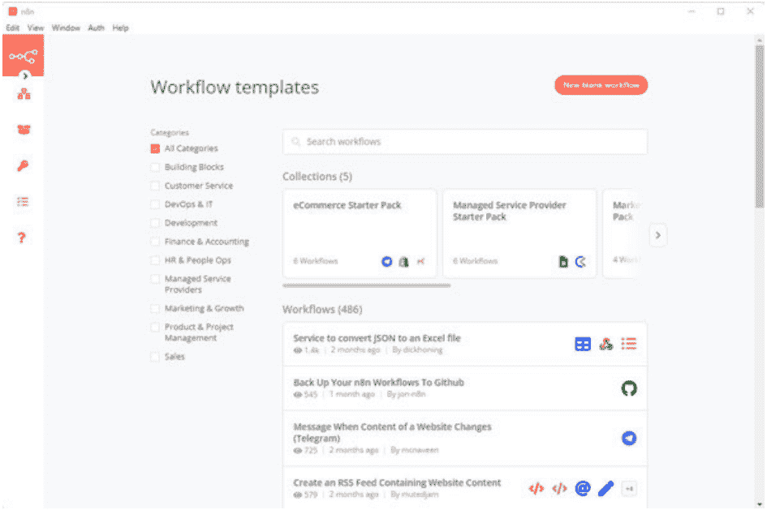
*图 10.11：n8n 主屏幕*

例如，使用**n8n**可以实现的一种工作流自动化是针对**Gmail**——获取带有特定标签的邮件，移除该标签，并添加一个新标签，如*图 10.12*所示。有关如何配置工作流的更多文档可在**n8n**网站和桌面应用程序中找到：

Python 还有一个**Twisted**库 (https://pypi.org/project/Twisted/)，可用于异步编程和基于事件的互联网应用框架，以创建网络自动化触发器。

## 结论

在本章中，我们学习了定时器程序、Python 的**APScheduler**库以及 Windows 任务计划程序。我们还探讨了用于启动新程序的 Python subprocess 库，以及用于创建基于触发器的网络自动化的**n8n**自动化工具。在下一章中，我们将学习如何基于本书所学内容编写更复杂的自动化。我们还将探讨使用 Flask API 创建 Python Web 服务，这将允许你创建可部署到服务器的网络自动化端点，并且这些 API 可以在多个应用程序之间共享。

## 延伸阅读

有许多在线资源可以帮助你进一步了解如何创建基于时间和事件的自动化。下表 10.1 列出了一些最佳资源，以进一步提升你在时间和事件自动化方面的学习。

关于 Python 图像自动化的资源：

| 资源名称 | 链接 |
| :--- | :--- |
| Advanced Python Scheduler | https://apscheduler.readthedocs.io/en/3.x/ |
| Introduction to APScheduler | https://betterprogramming.pub/introduction-to-apscheduler-86337f3bb4a6 |
| How to create an automated task using Task Scheduler on Windows 10 | https://www.windowscentral.com/how-create-automated-task-using-task-scheduler-windows-10 |
| Subprocess management | https://docs.python.org/3/library/subprocess.html |
| Subprocess module | https://www.bogotobogo.com/python/python_subprocess_module.php |
| n8n - Automate without limits | https://n8n.io/ |
| n8n - Workflow automation tool | https://github.com/n8n-io/n8n |
| Twisted library | https://www.twistedmatrix.com/trac/ |

表 10.1：关于 Python 定时器和事件自动化的资源

## 问题

1.  如何安排每天**上午 9:00**运行一次自动化？
2.  在 Python 中编写定时器程序使用的是哪个库？
3.  **n8n**是什么？
4.  如何创建基于触发器的自动化？

# 第 11 章
编写复杂自动化

## 简介

在本章中，我们将探讨扩展你的 Python 脚本知识的方法，并根据你的需求开发复杂的端到端流程自动化。我们将学习如何使用外部库和外部代码来构建这些自动化。我们还将探讨创建 Python Web 服务以及使用机器学习进行自动化。

## 结构

在本章中，我们将涵盖以下主题：

-   使用 Python 创建 API
-   组合多个自动化脚本
-   在线查找解决方案
-   使用机器学习进行自动化

## 目标

学习本章后，你将能够使用 Flask API 在 Python 中构建 Web 服务器，并构建集成多个自动化库的复杂自动化。你还将了解可用于构建自动化程序的机器学习技术。

## 使用 Python 创建 API

你可以使用 Python 中的**Flask**库创建**应用程序编程接口** (API)。API 允许你连接不同的应用程序，在基于触发器自动化应用程序时特别有用。例如，你可以创建一个 API 来检查传入的电子邮件并运行所需的自动化。在本节中，我们将主要探讨**表述性状态转移 (REST)** API，它灵活、轻量，并且是连接组件和应用程序最常用的方式。

REST API 使用四种常见的 HTTP 方法：**GET**（提供对资源的只读访问）、**POST**（用于创建新资源）、**DELETE**（用于删除资源）和**PUT**（用于更新现有资源）。

我们将使用 **Flask** Python 库在 Python 中创建基于 REST API 的服务器。**Flask** 是一个 Python 的微 Web 框架，可用于从头开始创建 Web 应用程序。你可以使用 **Flask** 库构建网页、像维基百科这样的应用程序、商业网站，甚至像 *Google* 这样的搜索引擎。**Flask** 还支持模板引擎来构建动态网站。

要安装 **Flask** 库，请使用 **Mu** 包管理器，输入 **Flask**，然后点击 **OK**，如下图所示：

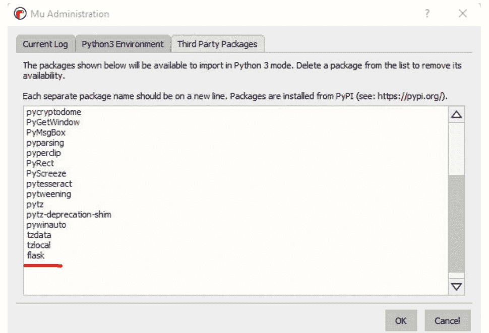
*图 11.1：Mu 包管理器*

要创建一个简单的 Flask 应用程序，你需要导入 **Flask** 类，其实例将允许我们创建一个 **Web 服务器网关接口 (WSGI)** 应用程序。

要创建 **Flask** 类的实例（实例是类的具体实现），请传递应用程序模块的名称，或使用 `__name__` 作为便捷的快捷方式。这是为了让 **Flask** 知道在哪里查找模板和静态文件等资源。

然后我们使用 `route()` 装饰器来指定触发函数的 URL 路径。Python 中的**装饰器**是一个函数，它在不显式修改另一个函数的情况下扩展其行为。我们使用 `@my_decorator` 语法来轻松调用装饰器函数。

使用 `route()` 装饰器后，我们可以调用任何函数并返回我们希望在文档中显示的数据。默认内容类型是 HTML，因此当你传递一个 HTML 字符串时，HTML 数据将由浏览器渲染。

要在本地运行 **Flask** 应用程序，你需要在 `main` 方法内调用 `app.run` 函数，并传入以下参数：

-   `host`：Python Web 服务器的 IP 地址；默认使用本地主机，IP 为 `127.0.0.1`。
-   `port`：托管 Python Web 服务器的端口；默认使用 `8080`。
-   `debug`：如果要启用调试模式，设置为 `True`，否则设置为 `False`。

[图 11.2] 包含一个创建简单 Flask 应用程序的示例，该程序可以在默认路由 `/` 返回 `Automation Bot!` 字符串：

```python
from flask import Flask

app = Flask(__name__)

@app.route("/")
def automation_bot():
    return "<p>Automation Bot!</p>"

if __name__ == '__main__':
    app.run(host='127.0.0.1', port=8080, debug=True)


* Environment: production
   WARNING: This is a development server. Do not use it in a production deployment.
   Use a production WSGI server instead.
* Debug mode: on
* Restarting with stat
* Debugger is active!
* Debugger PIN: 320-645-280
* Running on http://127.0.0.1:8080/ (Press CTRL+C to quit)
```

## 图 11.2：简单的 Flask 应用程序

Web 服务器运行后，你可以在浏览器中访问指定的主机和端口号；在本例中为 127.0.0.1: 8080，你将看到 **Automation Bot!** 被打印出来，如[图 11.3]所示：

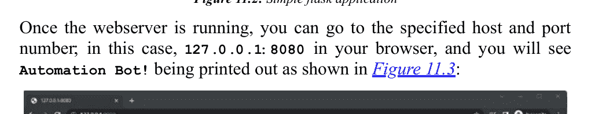图 11.3：Python 网络服务器的输出

Flask 提供了创建带变量的动态路由的功能。您可以通过在 URL 路由中用 `<variable_name>` 标记变量部分来添加变量段。然后，函数会将 `variable_name` 作为关键字参数接收。需要注意的是，在 **Flask**（其默认数据类型是 HTML）中返回 HTML 数据时，如果包含任何用户提供的值，必须对其进行转义以防止注入攻击。来自 markup safe 的 `escape()` 函数提供了转义用户数据的功能。

借助 **Flask** 的变量路由；例如，您可以创建动态路由，比如在 URL 路由中传递机器人名称，该名称会被传递给函数，函数可以使用此变量并将其返回以在浏览器中显示，如 *图 11.4* 所示：

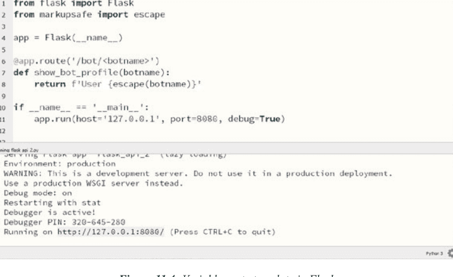

图 11.4：Flask 中的变量路由模板

启动网络服务器后，您可以在浏览器中访问指定的主机和端口号（本例中为 127.0.0.1:8080），然后在 URL 中添加 `/bot/<any_value>`，您将看到变量值被打印出来，并带有前缀 `User`，如 *图 11.5* 浏览器中所示：


*图 11.5：* 带有动态路由的 Python 网络服务器的输出

Flask 有一个 `url_for()` 函数，用于为特定函数构建 URL。它接受函数名作为第一个参数，以及与 URL 规则中的变量部分对应的关键字参数。未知的变量部分将作为查询参数添加到 URL 的末尾。这种 URL 构建方法还展示了特殊字符的转义，并且生成的路径始终是绝对路径。

例如，我们可以使用 `test_request_context()` 方法来尝试 `url_for()` 函数，以获取函数的 URL，如 *图 11.6* 所示：

```
python
from flask import Flask, url_for
from markupsafe import escape

app = Flask(__name__)

@app.route("/")
def automation_bot():
    return "Automation Bot"

@app.route('/bot/<botname>')
def show_bot_profile(botname):
    return f'User {escape(botname)}'

with app.test_request_context():
    print(url_for('automation_bot'))
    print(url_for('automation_bot', next='/'))
    print(url_for('show_bot_profile', botname='TestBot'))
```

```
text
Running flask_api_3.py
/
/?next=%2F
/bot/TestBot
>>>>
```

图 11.6：使用 Flask url_for 函数获取 URL 路径

Flask 允许您创建支持不同 HTTP 方法（如 **GET**、**POST**、**DELETE** 和 **PUT** 请求）的网络服务器。默认情况下，**Flask** 路由只允许 GET 请求。您需要使用 **route()** 装饰器来处理不同的 HTTP 方法。

例如，您可以使用 methods 参数为默认 URL 指定 **GET** 和 **POST** 路由，如 `@app.route('/', methods=['GET', 'POST'])`。**Flask** 库包含 `request` 对象，该对象在每次向 URL 路由发出请求时默认创建。要获取函数接收的 **request** 方法，可以使用 **method** 属性，它会告诉您用户发出了哪种类型的请求（如 **GET**、**POST**、**DELETE** 或 **PUT** 请求）。通过在 **route()** 装饰器中指定不同的 HTTP 方法，您可以根据接收到的请求类型（如 **POST** 请求或 **GET** 请求）执行不同的任务。

您可以检查 **request.method** 是否等于 **POST**，然后从 **POST** 请求中获取数据并完成 **POST** 请求处理；否则执行 **GET** 请求处理。我们可以创建一个自动化机器人端点，在 POST 请求时执行自动化，并在 GET 请求时提供可用的自动化列表，如图 11.7 示例所示：

```
python
from flask import Flask
from flask import request

app = Flask(__name__)

@app.route('/automation_bot', methods=['GET', 'POST'])
def automation_bot():
    if request.method == 'POST':
        return "Doing the automation"
    else:
        return "I can do automations"

if __name__ == '__main__':
    app.run(host='127.0.0.1', port=8080, debug=True)
```

图 11.7：带有 GET 和 POST 请求的机器人端点

要从上述网络服务器的 GET 请求中获取数据，您可以在浏览器中导航到自动化机器人端点，如图 11.8 所示：

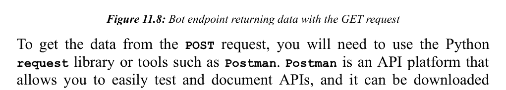

图 11.8：通过 GET 请求返回数据的机器人端点

要从 POST 请求中获取数据，您需要使用 Python 的 `requests` 库或 Postman 等工具。Postman 是一个 API 平台，允许您轻松测试和记录 API，您可以从 [https://www.postman.com/downloads/](https://www.postman.com/downloads/) 下载。我们可以使用 `Postman` 轻松发送 POST 请求并检查 `POST` 请求的响应，如 *图 11.9* 所示：

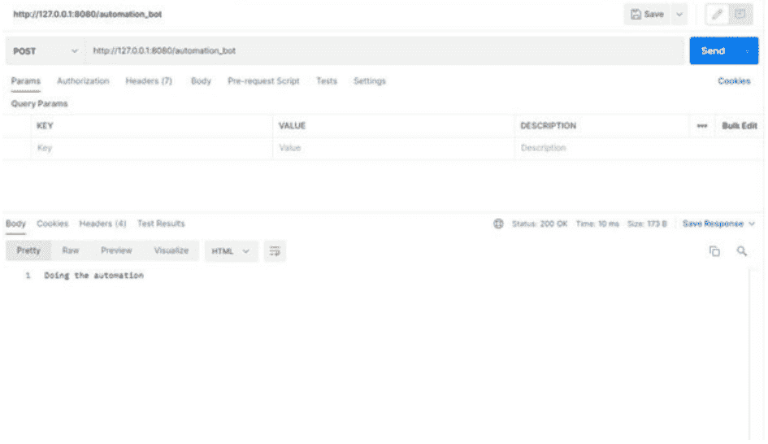

*图 11.9：使用 Postman 发送 POST 请求*

Flask 也可用于构建带有静态文件的动态 Web 应用程序。静态文件通常包括 CSS、JavaScript 以及 Web 应用程序所需的其他文件。要为这些静态文件生成 URL，您可以使用 `url_for` 函数并指定特殊的 `static` 端点名称，例如 `url_for('static', filename='style.css')`。此文件需要以 `static/style.css` 的形式存储在文件系统上。Flask 还支持 HTML 模板引擎，并默认使用 **Jinja2** 作为其模板引擎。模板引擎允许您在多个视图片段中修改和重用通用的 HTML 代码。

在下一节中，我们将看一个将 **Flask** 网络服务器脚本与本书中学习的其他自动化脚本相结合的例子，以构建端到端流程的自动化。

## 结合多个自动化脚本

您可以通过结合本书中学习的不同自动化脚本来构建复杂的自动化脚本。对于端到端流程自动化，您可能需要将 PDF 文档转换为文本文件，从文本文件中提取数据并将其添加到 Web 表单中，提交 Web 表单，并将已完成的流程记录到 Word 文档中。此自动化流程将需要结合第 6 章（自动化基于文件的任务）和第 5 章（自动化基于 Web 的任务）中的脚本。您还可以使用 Flask Web 服务为这种自动化创建 API。

为自动化创建 API 的一个简单方法是调用以下自动化函数，并在 `route()` 装饰器中执行所需的自动化步骤。例如，如果我们想创建一个使用子进程库打开新的记事本应用程序的 Web 服务，我们将在 `open_notepad` 函数中调用 `subprocess.Popen` 来打开记事本应用程序，并在进程完成后返回成功消息，如图 11.10 所示：

```
from flask import Flask
import subprocess

app = Flask(__name__)

@app.route("/open_notepad")
def open_notepad():
    subprocess.Popen('C:\\Windows\\System32\\notepad.exe')
    return "New notepad application created"

if __name__ == '__main__':
    app.run(host='127.0.0.1', port=8080, debug=True)
```

图 11.10：创建用于打开新记事本应用程序的 Web API

当您调用此 Web 服务端点时，一个在运行 Web 服务的服务器上创建一个新的记事本应用程序，您将在浏览器中看到确认消息 **新记事本应用程序已创建**，如 *图 11.11* 所示：

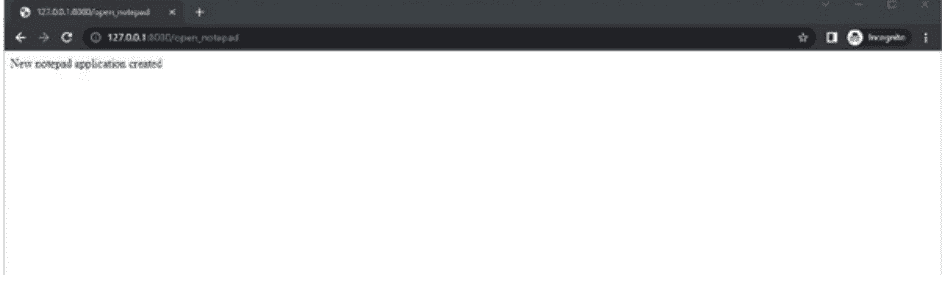

*图 11.11：* Web 服务的响应

如果您希望此网站能在**万维网 (WWW)** 上访问，则需要将其部署在您计算机的公共 IP 地址上，或部署在云服务器上。部署 API 的最佳云服务之一是 *Google App Engine*，它允许您在完全托管的无服务器平台上部署代码。有关 **App Engine** 的更多信息，请访问文档页面 **https://cloud.google.com/appengine**。

在本节中，我们看了一个将本书中学到的多个脚本结合起来创建流程自动化的简单例子。在下一节中，我们将看一些在线资源，这些资源可以帮助解决常见的技术问题，并发现有助于您自动化任务的新库。

## 在线查找解决方案

获取技术问题答案最受欢迎的网站之一是 **Stack Overflow**。Stack Overflow 是一个问答网站，人们在此发布技术问题的提问和解决方案，它有约 *200 万个* 以 `Python` 为语言标签的问题，如 *图 11.12* 所示：## 使用机器学习实现自动化

人工智能（AI）是一个非常广泛的领域，包含许多子领域，涉及信号的自动识别与理解、推理、规划、决策学习以及适应性研究。机器学习（ML）是人工智能的一种类型，它使计算机能够在没有明确编程的情况下具备学习能力。

机器学习可以细分为以下三个主要类别：

- **监督学习**：涉及带标签的数据，可用于**分类**（将相似实例分组）和**回归**（学习*通常发生的情况*以从数据集中推断）。例如，基于垃圾邮件和非垃圾邮件的训练数据，学习将电子邮件分类为垃圾邮件和非垃圾邮件。
- **无监督学习**：涉及未标记的数据，可用于发现数据集中的模式。例如，从*维基百科*页面中学习*英语*语言的模式。
- **强化学习**：涉及基于奖励和反馈循环的实验学习，可用于在模拟环境中训练智能体。例如，教一个机器人玩计算机游戏并最大化得分，以及获胜机会将使用**强化学习（RL）**算法。

机器学习允许你从数据中学习并创建自动化，而无需明确编程自动化。它还可以帮助你识别组织中执行的可重复流程。

Python 有许多库和脚本可以在数据集上执行机器学习，例如 `PyTorch`、`TensorFlow`、`Keras`、`scikit-learn` 等库。训练机器学习模型需要大量数据和计算能力。对于我们的自动化需求，通常预训练的机器学习模型在大多数情况下都能工作。

我们将研究使用 `PyTorch` 库通过预构建模型执行文本摘要。**Hugging Face**（[https://huggingface.co/](https://huggingface.co/)）提供用于各种任务的预训练机器学习模型，包括音频分类、图像分类、目标检测、问答、摘要、文本分类、翻译等。

要安装带有 `PyTorch` 库的 **Hugging Face**，请使用 `nu` 包管理器，输入 `transformers[ torch]`，然后如图所示单击 **OK**。安装过程需要一些时间，因为它将安装各种依赖项和其他机器学习库。

库安装后，你可以使用 transformers 库通过使用摘要管道对象执行摘要，语法为 `pipeline("summarization")`。首次运行时，管道将下载默认模型以执行文本摘要，下载过程需要一些时间。模型下载后，你可以在任何文本数据上调用模型，在文本数据上调用模型，你将获得如图 11.16 所示的摘要文本。

```python
from transformers import pipeline
classifier = pipeline("summarization")
sample_text = "The tower is 324 metres (1,063 ft) tall, about the same height as an 81-storey buildin"
print(classifier(sample_text))
```

你还可以使用预训练模型对一段文本执行情感分析。当你想分析客户评论和反馈的情感时，这特别有用。要使用预训练模型执行*情感分析*，请使用 **pipeline(“sentiment-analysis”)**，如*图 11.17*所示。你还可以通过向 **pipeline** 函数指定模型参数来使用特定的训练模型。

Python 中还有许多其他训练好的机器学习模型可用于日常自动化需求。这些机器学习模型可以帮助你构建将图像转换为文本、自动回复消息、语言翻译以及各种其他任务的自动化。

## 结论

在本章中，我们学习了 Flask 基础知识和 Python 语言中的机器学习库。我们研究了使用 transformers 库在 Python 中用几行代码使用预训练机器学习模型的简单方法。我们还研究了通过结合本书中的不同自动化和在线资源来构建端到端流程自动化的一些方法，以帮助你找到技术挑战的解决方案。

## 延伸阅读

有许多在线资源可以帮助你提高构建复杂自动化机器学习的学习。下表 11.1 列出了一些最佳资源，以进一步提高你对 Flask 和机器学习的学习：

| 资源名称 | 链接 |
| :--- | :--- |
| Pillow 文档 | https://flask.palletsprojects.com/en/2.1.x/ |
| Flask Python Web 应用框架简介 | https://opensource.com/article/18/4/flask |
| 使用 Python 和 Flask 开发 RESTful API | https://auth0.com/blog/developing-restful-apis-with-python-and-flask/ |
| Python 机器学习 | https://www.w3schools.com/python/python_ml_getting_started.asp |
| 你的第一个 Python 机器学习项目分步指南 | https://machinelearningmastery.com/machine-learning-in-python-step-by-step/ |
| 构建未来的 AI 社区 | https://huggingface.co/ |
| Hugging Face transformers | https://www.kdnuggets.com/2021/02/hugging-face-transformer-basics.html |
| PyTorch - 开源机器学习框架 | https://pytorch.org/ |
| 端到端开源机器学习平台 | https://www.tensorflow.org/ |
| Keras：Python 深度学习 API | https://keras.io/ |
| 机器学习简介 | https://developers.google.com/machine-learning/crash-course/ml-intro |

## 问题

1. 什么是 Flask 应用程序？
2. 如何使用 Python 创建 API？
3. 如何组合多个自动化脚本？
4. Python 中最流行的机器学习库有哪些？

# 索引

**A**
- 高级 Python 调度器（APScheduler）128
  - 安装 128, 129
- App Engine 148
- 应用程序编程接口（API）
  - 使用 Python 创建 140-146
- 人工智能（AI）150
- 属性 57
- 自动化
  - 常见流程 26
  - 调度 128-134
- 自动化思维 26
- 带有截图的自动化 110-112

**B**
- Beautiful Soup 56
  - 安装 56
- BeautifulSoup 对象 58
- 位图格式 116
- 布尔值 10
- break 语句 15
- 浏览器
  - 使用 Selenium 自动化 61-68
- 业务流程发现 28
- 业务流程
  - 识别 28, 29

**C**
- Chrome 浏览器
  - 使用 Selenium 自动化 61-68
- 类属性 54
- 逗号分隔值（CSV）文件 43
- CompuServe 图形交换格式（GIF）116
- 计算机文件 72
- 计算机文件类型
  - 数据 72
  - 文件结束符（EOF）72
  - 头部 72
- continue 语句 16
- CSS（层叠样式表）52, 55
- CSV 文件自动化 43-45

# D
- 数据
  - 从网站提取，56-61
- 数据录入自动化 26
- 数据提取自动化 27
- 数据采集自动化 27
- 数据结构
  - 字典 18, 19
  - 列表 16, 17
  - 集合 20
  - 元组 18
- 条件判断语句 11
  - if-elif-else 语句 12, 13
  - if-else 语句 12
  - if 语句 11
- 装饰器 141
- def 关键字 20
- 字典 18, 19
- Document 类 80
  - add_heading() 函数 80
  - add_page_break() 函数 81
  - add_paragraph() 函数 80
  - add_table(rows=2, cols=2) 函数 81
  - document.add_picture(图片路径) 函数 81

# E
- 电子邮件自动化
  - 通过 Gmail 发送邮件 89-92
  - Outlook 电子邮件自动化 93, 94
- 电子邮件
  - 发送，通过 Gmail 89-92
- 事件日志 30
- 基于 Excel 的自动化
  - 示例 41-43
- 基于 Excel 的任务
  - 使用 openpyxl 自动化 34, 35
- Excel 文档
  - 创建 36
  - 读取 37-39
  - 更新工作簿 40
- 外部工具
  - 用于触发器 136, 137

# F
- FailSafe 102
- 基于文件的任务
  - 自动化 72

# 文件
- 二进制模式 73
- 从互联网下载 48-51
- 读取 72, 73
- 文本模式 73
- 写入 72, 73

# Flask 库 140
- 安装 140, 141

# for 循环 13, 14

# 函数 20, 21

# G
- Gmail
  - 使用 Gmail 发送邮件 89-92

# H
- HTML（超文本标记语言） 52
  - 标签 53, 54
- HTTP 方法 49
- Hugging Face 151

# I
- id 属性 54
- 基于图像的自动化
  - 计算机图像基础 116
  - 使用 OCR 提取文本 120-124
- 图像增强类 119
- 图像文件格式 52
- 缩进 11
- 互联网
  - 下载文件 48-51

# J
- JavaScript 52, 55
- JPEG（联合图像专家小组） (JPG/JPEG) 116
- Jupyter notebook 4

# K
- 键盘操作。
  - 自动化 107-110
- 键盘自动化函数
  - alert() 函数 108
  - hotkey() 函数 108
  - keyDown() 函数 108
  - keyUp() 函数 108
  - press() 函数 107
  - write() 函数 107

# L
- 库 4, 21
- 列表 16, 17
- Python 中的循环
  - break 语句 15
  - continue 语句 16
  - for 循环 13, 14
  - while 循环 14
- 无损压缩 116

# M
- 机器学习 (ML) 150
  - 用于自动化 150-153
  - 强化学习 151
  - 监督学习 150
  - 无监督学习 151
- 模块 4, 21
- 鼠标操作
  - 自动化 104-107
- 鼠标自动化函数
  - click() 函数 105
  - drag() 函数 105
  - dragTo() 函数 105
  - moveTo() 函数 104
  - scroll() 函数 105
- Mu 2
  - 启动方式 2, 3
  - 使用第三方包 4, 5
  - 教程页面 4
- Mu 安装程序
  - 下载链接 2
- 多个自动化脚本
  - 组合 147, 148

# N
- name 对象 57
- NavigableString 58

# O
- open() 函数 73
- openpyxl
  - 安装 34, 35
  - 使用 34
- 光学字符识别 (OCR) 120
  - 用于从图像中提取文本 120-124
- Outlook 电子邮件自动化 93, 94

# P
- PDF 文档自动化 74-79
- PdfFileWriter 类 77
  - addAttachment 78
  - addBlankPage 78
  - appendPagesFromReader 78
- Pdfminer.six 74
- PDF 转 Word 83, 84
- 图像元素（像素） 116
- Pillow 库 115
  - 用于图像处理 117-119
  - 安装 117
- PM4Py 30
- PNG（可移植网络图形） 116
- 自动化流程
  - 数据录入 26
  - 数据提取 27
  - 数据采集 27
- 流程图
  - 应用程序流程图 29, 30
- 程序
  - 启动 135
- pyautogui
  - 安装 102
- PyAutoGUI 模块
  - 特性 102
  - 使用 102-104
- PyCharm 4
- PyPDF2 74
  - 安装 76
  - 使用 77
- Pytesseract 库 122, 123
- Python 8-10
  - 数据结构 16
  - 条件判断语句 11
  - 函数 20, 21
  - 库 21
  - 循环 13
  - 模块 21
  - 包 22
- Python Imaging Library (PIL) 117
- Python math 库
  - 参考 22
- Python Package Index 21
  - URL 4
- PyTorch 库 151
- pywhatkit 库 97

# R
- range() 函数 13
- 强化学习 (RL) 算法 151
- 表述性状态转移 (REST) API 140

# S
- 基于截图的函数
  - 定位函数 111
  - screenshot() 函数 110
- Selenium 61
  - 浏览器自动化 61-68
- 集合 20
- 简单邮件传输协议 (SMTP) 88
- 短信自动化
  - 使用 Twilio API 94-96
- SMTP 函数
  - 参数 88
- 截图工具 110
- Stack Overflow 148-150

# T
- TIFF（标记图像文件格式） (TIF/TIFF) 116
- 标签对象 57
- tesseract 120
- 从图像中提取文本
  - 使用光学字符识别 (OCR) 120-124
- 第三方包
  - 使用 Mu 安装 4, 5
- 触发器
  - 使用外部工具 136
- 元组 18
- Twilio
  - 安装 94
  - URL 95
- Twilio API
  - 用于短信自动化 94-96

# V
- VS Code 4

# W
- w3schools 教程 55
- 基于 Web 的任务
  - 自动化 48
- Web 抓取 56-61
- Web 服务器网关接口 (WSGI) 应用程序 141
- WhatsApp 消息自动化 94-98
- WhatsApp Messenger 97
- while 循环 14
- 窗口处理函数 108, 109
- Windows 任务计划程序 129
- Word 文档自动化 80-83
- 工作簿
  - 更新 40
- 万维网 (WWW) 148