# 史诗级Python编程

面向孩子的互动编程冒险

作者：迈克·戈尔德

# 史诗级Python编程：面向孩子的互动编程冒险

迈克·戈尔德

本书可通过 http://leanpub.com/pythonplaygroundinteractivecodingadventuresforkids 购买

本版本发布于 2024年1月2日

这是一本 Leanpub 图书。Leanpub 通过精益出版流程赋能作者和出版商。精益出版是指使用轻量级工具和多次迭代来发布进行中的电子书，以获取读者反馈，不断调整直到找到合适的书籍，并在完成后建立影响力。

© 2024 迈克·戈尔德

献给我的儿子，他喜欢学习，但不会承认。

# 目录

史诗级Python编程：面向孩子的互动编程冒险

# 史诗级 Python 编程：儿童互动编程冒险


图 1. Python 程序员

## “史诗级 Python 编程”简介

**欢迎来到奇妙的 Python 编程世界！**

嘿，未来的程序员！你准备好踏上一段激动人心的 Python 编程世界探险之旅了吗？如果你喜欢解谜、创作故事，或者只是想学习超级酷的新东西，那么你来对地方了！

**什么是 Python？** 不，我们说的不是蛇！Python 是计算机专家用来告诉计算机做什么的一种特殊工具。就像你用语言讲故事一样，程序员使用一种叫做 Python 的语言来给计算机下达指令。最棒的是？Python 既简单又有趣！

**为什么选择 Python？** Python 就像是计算机世界里一种友好、易于理解的语言。它非常适合像你这样的初学者。它被世界各地的人们用来做各种了不起的事情，比如制作电子游戏、解决数学问题、绘画，甚至帮助科学家探索太空！

在本书中，我们将一起探索 Python。你将学习如何让计算机做一些很酷的事情，比如：

- 解决数学谜题
- 玩转单词和句子
- 绘制彩色形状和图案
- 甚至创建你自己的电脑游戏！

你不需要成为计算机天才才能开始。你所需要的只是你的好奇心和学习的热情。所以，戴上你的探险家帽子，让我们一起潜入 Python 编程的奇妙世界。你的冒险即将开始，谁知道你会创造出什么惊人的东西！

你准备好了吗？我们出发吧！ 🚀🐍🌟

## 第一章：开启你的冒险

### 安装 Python

欢迎你迈出了成为少年 Python 程序员的第一步！在我们开始创造酷炫的东西之前，我们需要在你的电脑上设置 Python。别担心，这很简单，我会一步一步引导你！

1.  访问 Python 网站：
-   请一位成年人帮助你打开网页浏览器（如 Chrome、Firefox 或 Safari）。
-   输入网站地址：www.python.org。
-   你会看到这样一个界面：

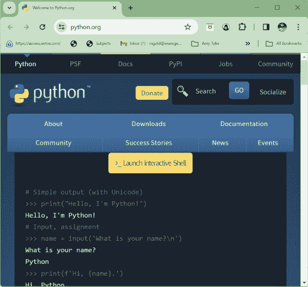

图 2. Python.org 网站截图

2.  下载 Python：
-   点击“Downloads”（下载）选项卡。

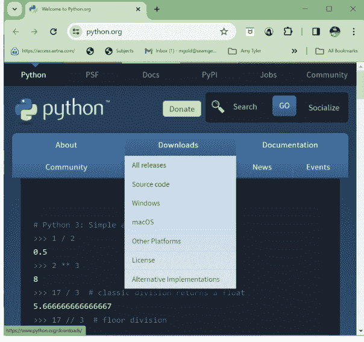

图 3. 下载菜单

-   Python 会识别你的电脑类型，并为你推荐最佳版本。它看起来会像这样：

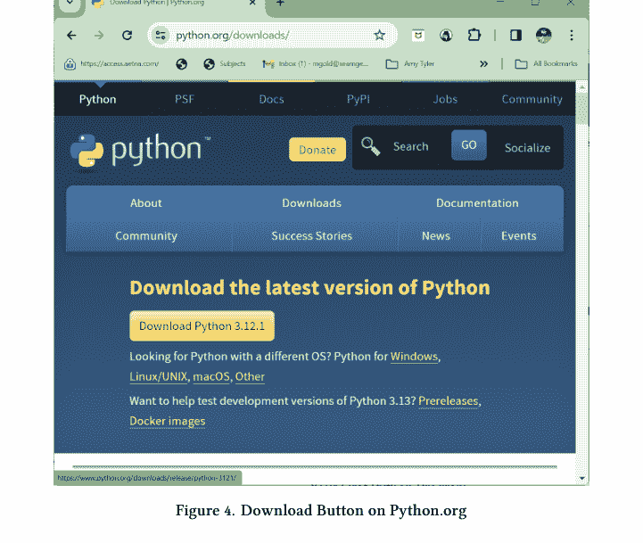

图 4. Python.org 上的下载按钮

-   点击下载按钮。一个文件将开始下载。完成后，点击它打开。

3.  安装 Python：
-   会弹出一个窗口开始安装。请务必勾选“Add Python to PATH”（将 Python 添加到 PATH）—— 这超级重要！
-   然后，点击“Install Now”（现在安装），等待魔法发生！

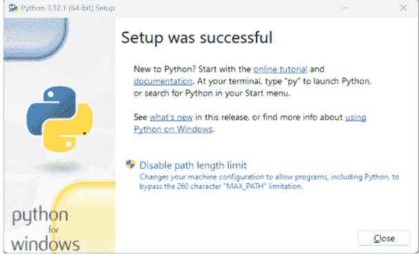

图 5. Python 安装窗口

恭喜！你已经安装好 Python 了！

### 你的第一个 Python 程序

现在，让我们来写你的第一个 Python 程序。我们要让电脑显示一条消息。这就像教你的电脑说话！

1.  打开 Python：
-   在你的电脑搜索栏中搜索 Python。
-   点击 Python 应用程序 —— 它通常被称为“IDLE”（Python 的编辑器）。

2.  编写你的程序：
-   会打开一个窗口，你可以在里面输入代码。
-   准确输入：`print("Hello, Python World!")`

3.  运行你的程序：
-   点击菜单中的“Run”，然后选择“Run Module”。
-   看！电脑在输出窗口中向你问好了！

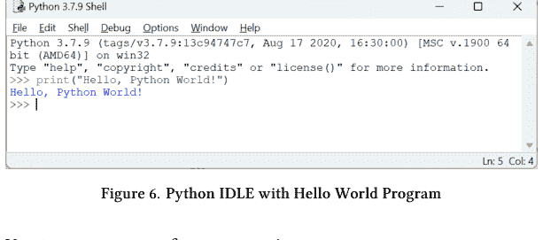

你刚刚写下了你的第一个程序！

### 理解 Python Shell

你编写程序的地方叫做 Python Shell。它就像是你代码的游乐场。你可以在这里编写指令，Python 会做出回应。试试在 Shell 中输入 `print("I’m a Python programmer!")`，看看会发生什么！

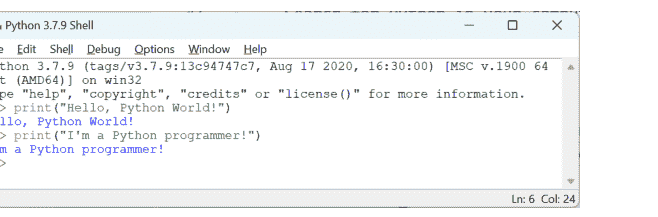

图 7. 我是 Python 程序员

在本章中，我们学习了如何设置 Python 并编写了我们的第一个程序。你现在正走在成为一名出色 Python 程序员的路上。继续加油！

## 第二章：探索 Python 基础

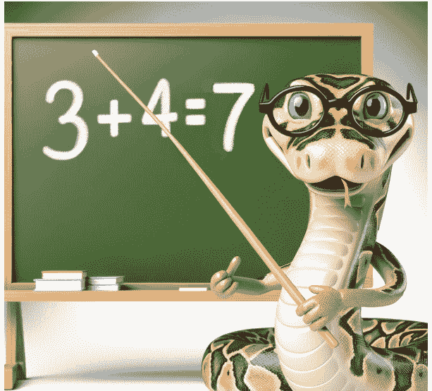

### 玩转数字

欢迎来到 Python 的数字世界！你知道 Python 非常擅长数学吗？让我们来玩一些数字，看看我们能做些什么。

### 1. 简单的数学运算：
-   打开 Python 的 IDLE，就像我们之前做的那样。
-   让我们从简单的东西开始。输入 `3 + 4` 并按 Enter 键。

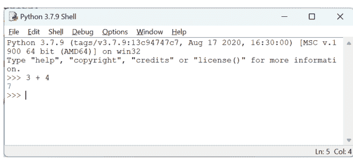

图 8. Python 中的加法

-   哇，Python 会加法！
-   你也可以尝试其他运算：
    -   减法，使用 `-`（如 `5 - 2`）。
    -   乘法，使用 `*`（如 `3 * 4`）。
    -   除法，使用 `/`（如 `10 / 2`）。

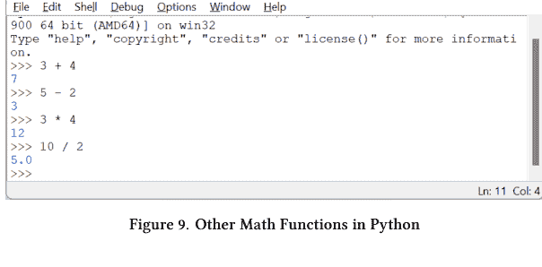

图 9. Python 中的其他数学函数

### 2. 引入变量：
-   把变量想象成可以存放东西的小盒子。在 Python 中，你可以将数字存放在这些盒子里。

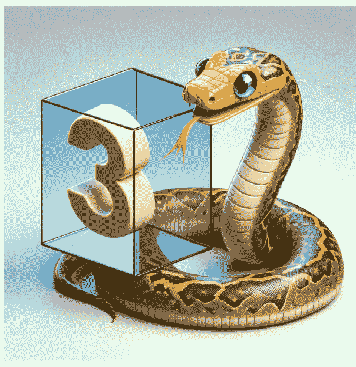

图 10. 盒子中的数字变量

-   让我们创建一个变量。输入 `my_age = 10` 并按 Enter 键。你刚刚告诉 Python 你的年龄是 10 岁！
-   现在，输入 `my_age` 并按 Enter 键。Python 记得它是 10！

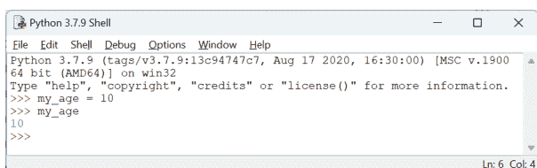

图 11. 将我的年龄存储在变量中

### 使用变量进行数学运算

做得好，你学会了数字和变量！现在，让我们看看如何使用变量进行数学运算。还记得 `my_age` 吗？让我们用它做一些数学运算。

#### 1. 给变量加值：
-   首先，让我们提醒 Python 你多大了。输入 `my_age = 10` 并按回车键。

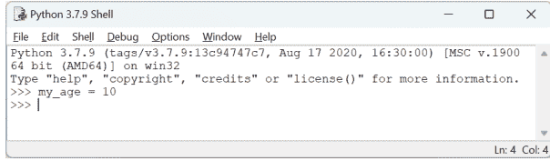

图 12. 设置 my_age 变量

-   如果我们想知道你 3 年后多大呢？我们可以在你的年龄上加 3。
-   输入 `future_age = my_age + 3`。这告诉 Python 将你的当前年龄加 3，并将结果保存在一个名为 `future_age` 的新变量中。

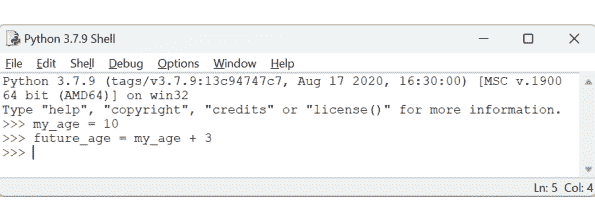

图 13. 创建一个未来年龄变量

-   现在，输入 `print(future_age)`。Python 将显示你 3 年后的年龄！

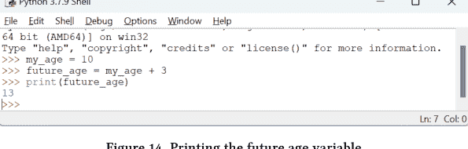

图 14. 打印未来年龄变量

#### 2. 用变量做更多数学运算：
-   你可以用变量做各种数学运算。让我们再试几个。
-   你年龄的一半：输入 `half_my_age = my_age / 2`，然后输入 `print(half_my_age)`。

```python
>>> my_age = 10
>>> half_my_age = my_age / 2
>>> print(half_my_age)
5.0
```

图 15. 计算我的年龄的一半

-   你年龄的两倍：输入 `double_my_age = my_age * 2`，然后输入 `print(double_my_age)`。

```python
>>> double_my_age = my_age * 2
>>> print(double_my_age)
20
```

图 16. 我年龄的两倍

-   减去年数：输入 `younger_age = my_age - 2`，然后输入 `print(younger_age)`。

```python
>>> younger_age = my_age - 2
>>> print(younger_age)
8
```

图 17. 更年轻的年龄

#### 3. 更改变量：
变量是可以更改的。记住变量就像一个盒子，你可以把旧的数字从盒子里拿出来，放一个新的数字进去！如果你过生日了，现在 11 岁了，只需更新它！

-   输入 `my_age = 11` 并按回车键。现在 `my_age` 有了一个新值。

```python
>>> my_age = 11
>>> print(my_age)
11
```

图 18. 将 my_age 更改为 11

-   如果你再次执行 `print(future_age)`，它仍然显示你的未来年龄，就好像你还是 10 岁一样。

```python
>>> print(future_age)
13
```

图 19. 未来年龄未更新

这是因为 `future_age` 是用你的旧年龄计算的。要更新它，你需要用你的新年龄重新计算。

```python
>>> future_age = my_age + 3
>>> print(future_age)
14
```

图 20. 重新计算未来年龄

看看你，像专业人士一样用 Python 做数学运算！变量在编程中非常方便，你已经用得很好了。继续练习，很快你就能用 Python 解决各种酷炫的问题了！

### Python 示例：一次计算并分享你的未来年龄

**我们在做什么？** 我们将告诉 Python 你的年龄，然后让 Python 计算并打印你 5 年后的年龄。我们将用仅仅两行代码完成这一切！

### 逐步操作：

1.  首先，我们告诉 Python 你的年龄：## 复习：变量与打印

当你输入 `my_age = 10` 时，就像是在对Python说：“嘿，我的年龄是10岁！”可以把 `my_age` 想象成一个存放你年龄的盒子。

## 2. 接下来，我们同时做些数学运算和打印：

现在，是有趣的部分！当你输入 `print("In five years, I will be", my_age + 5)` 时，你是在要求Python做两件事：

- **加上你的年龄**：Python从你的 `my_age` 盒子中取出数字（也就是10），然后给它加上5。这就像在问：“10加5等于多少？”
- **打印一条消息**：`print` 部分告诉Python写出一条消息。消息以“In five years, I will be”开头。然后，Python会将“10加5”的答案接在这些词后面。

### 当你运行代码时发生了什么：

Python会思考：“好的，10加5等于15”，然后它会显示在屏幕上：`In five years, I will be 15`。

```
>>> my_age = 10
>>> print("In five years, I will be", my_age + 5)
In five years, I will be 15
```

图21. 替代文本

### 为什么这很酷：

你刚刚告诉Python记住你的年龄并用它做数学运算！Python完成了所有这些，甚至还为你写了一个句子。这真的很棒，对吧？

### 如果你得到一个错误怎么办？

#### 常见错误：忘记定义变量

假设你不小心输入了 `print("In five years, I will be", age + 5)` 而不是使用 `my_age`。

#### Python的回应：

Python会说类似这样的话：`NameError: name 'age' is not defined`

```
>>> future_age = age + 3
Traceback (most recent call last):
  File "<pyshell#13>", line 1, in <module>
    future_age = age + 3
NameError: name 'age' is not defined
```

图22. 代码中的错误

#### 为什么会发生这种情况？

这个错误意味着Python感到困惑，因为它不知道 `age` 是什么。你告诉了Python关于 `my_age` 的事情，但没有告诉它 `age`。

#### 如何修复：

1.  **阅读错误消息：**
    *   它告诉你 `age` 未定义。

2.  **检查你的代码：**
    *   查看你的代码并与说明进行比较。你看到区别了吗？

3.  **进行修正：**
    - 将你的打印语句中的 `age` 改为 `my_age`。

4.  **再试一次：**
    - 再次运行你的代码。

### 从错误中学习：

现在你知道如何修复NameError了！记住，犯错误没关系。修复它们是你学习成为一名优秀程序员的方式！

## 用文字创造故事

现在让我们玩玩文字，或者正如程序员所称的，“字符串”。

### 1. 字符串基础：

字符串在Python中只是一组字母。但是，你必须通过使用引号告诉Python它是一个字符串。

- 试着输入 `print("I love Python!")`。看看Python如何显示你的消息？

```
>>> print("I love Python!")
I love Python!
```

图23. 打印Python消息

### 2. 组合单词和句子：

你可以让Python说更多话。让我们组合两个字符串。

- 输入 `greeting = "Hello" + " there!"` 并按回车。
- 现在输入 `print(greeting)`。Python刚刚将这些词组合起来说“Hello there!”

```
>>> greeting = "Hello" + " there!"
>>> print(greeting)
Hello there!
```

图24. 组合字符串

你做得很好！现在你知道如何在Python中做基础的数学运算和用文字创造故事了。继续练习，你很快就会成为Python专家！

## 第三章：列表和循环的乐趣


图25. Python火车

### 制作列表

欢迎来到Python中超级有趣的部分——列表和循环！让我们从列表开始。

### 列表是什么？

把Python中的列表想象成你的背包，你可以把很多不同的东西放进去。就像你可能有一个你最喜欢的玩具列表一样，Python可以保存一个你告诉它的物品列表，比如数字、词语，甚至是其他列表！

### 如何创建和使用它们：

1.  **创建列表：**
    - 打开Python的IDLE。
    - 让我们创建一个你最喜欢的水果列表。输入这个：
    - 你刚刚告诉Python：“这是我最喜欢的水果列表！”

```
my_fruits = ["apple", "banana", "cherry"]
```

2.  **使用列表：**
    - 想再看一遍你的列表吗？只需输入 `print(my_fruits)` 并按回车。
    - Python会显示：['apple', 'banana', 'cherry']
    - 你列表中的每个项目都是按顺序保存的，就像它们在你的背包里一样。

```
>>> my_fruits = ["apple", "banana", "cherry"]
>>> print(my_fruits)
['apple', 'banana', 'cherry']
```

图26. 水果列表

### 循环起来

现在，让我们用循环玩点有趣的！循环在Python中就像一种超能力，让你可以一遍又一遍地做某件事而不会感到疲倦。

### For循环简介：

Python中的for循环会逐个遍历你列表中的每个项目，并对它做些什么。

#### 1. 使用For循环打印列表中的项目：

让我们逐个遍历列表中的每种水果。输入这个：

```
python
for fruit in my_fruits:
    print(fruit)
```

这就像是告诉Python：“对于我水果列表中的每一种水果，说出水果的名字。”

#### 2. 运行它时会发生什么：

Python会逐个打印每种水果的名字：

```
1 apple
2 banana
3 cherry
```

这就像Python从你的背包里拿出每一种水果给你看。

#### 3. 用于数字游戏的循环：

让我们用数字玩个游戏。首先，创建一个数字列表：

```
python
my_numbers = [1, 2, 3, 4, 5]
```

现在，让我们用一个循环给每个数字加上10：

```
python
for number in my_numbers:
    print(number + 10)
```

这告诉Python：“对于我列表中的每个数字，加上10然后告诉我新的数字。”

#### 4. 看看魔法：

Python会给你展示：

```
1. 11
2. 12
3. 13
4. 14
5. 15
```

是不是很酷？你刚刚对一整个数字列表做了数学运算，而且速度超快！

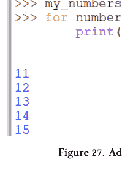

### 更多循环的乐趣：创造故事！

让我们尝试用循环做一些非常酷的事情。我们可以使用循环把一堆单词组合在一起形成一个句子。这就像组装一列火车，每个词就是一节车厢！

### 用单词组成句子：

1.  **首先，制作一个单词列表：**
    - 让我们制作一个将组成我们句子的单词列表。比如编一个有趣的句子怎么样？输入这个：

```
python
silly_words = ["My", "dog", "ate", "my", "homework",
              "yesterday"]
```

- 你刚刚为我们有趣的句子创建了一个单词列表！

2.  **使用循环构建句子：**
    - 现在，我们将使用一个循环来遍历每个单词并将它们组合成一个句子。输入这个：

```
python
sentence = ""
for word in silly_words:
    sentence = sentence + word + " "
print(sentence)
```

- 这是你告诉Python的话：“对于我有趣单词列表中的每个单词，将它添加到我的句子中，并在后面加一个空格。”

3.  **见证魔法发生：**
    - 当你运行这段代码时，Python会显示：

```
output
My dog ate my homework yesterday
```

- 你刚刚通过循环你的单词创造了一个完整的句子！

### 刚刚发生了什么？

- 你从一个空句子开始（`sentence = ""`）。
- 然后，循环遍历了你列表中的每个单词（`for word in silly_words`），将其添加到你的句子中。
- `" "` 部分在每个单词后面添加了一个空格，这样它们就不会挤在一起。
- 最后，你使用 `print(sentence)` 来查看你有趣的句子！

```
python
>>> silly_words = ["My", "dog", "ate", "my", "homework", "yesterday"]
>>> sentence = ""
>>> for word in silly_words:
...     sentence = sentence + word + " "
>>> print(sentence)
My dog ate my homework yesterday
```

图28. 使用循环构建句子

是不是很神奇，你可以拿一些单词，循环遍历它们，然后组成一个完整的句子？你正在成为一个真正的Python巫师！继续练习，很快你就能用你的Python技能创造出各种有趣的故事了！

这就是你在Python中如何制作列表和使用循环了！就像拥有一根魔杖来整理你的背包、玩数字游戏或组织句子。继续练习，很快你就能用Python做更多神奇的事情了！

## 第四章：使用 Python 做出决策


### 从 IDLE 文件开启你的 Python 冒险之旅

在开始学习 Python 中的决策之前，让我们先来聊聊一个很酷的工具，叫做 IDLE Python 文件。它就像是你用来编写和保存 Python 冒险的魔法笔记本！

### 在 Python IDLE 中保存并运行代码

到目前为止，你一直是在 IDLE 的命令行中直接输入你的 Python 冒险。这是个很棒的开始！但你知道吗，你也可以在 Python 文件中编写代码并将其保存下来稍后运行？这就像在笔记本上写一个故事，然后随时可以阅读它！

具体操作如下：

1.  打开新文件：
    *   在 Python 的 IDLE 中，转到顶部菜单的“文件”并选择“新建文件”。这会打开一个新窗口，你可以在这里编写代码，就像在一张很大的空白页面上打字一样。

第四章：使用 Python 做出决策

29

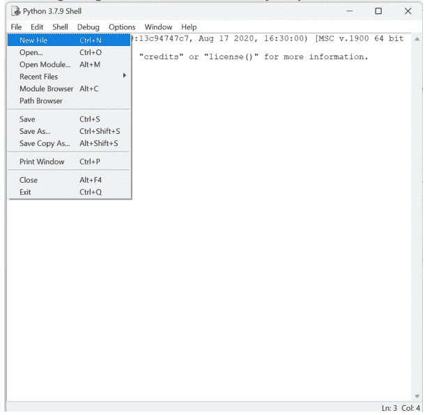

图 29. 打开一个 Python 文件

2.  编写你的 Python 故事：
    *   在这个新窗口中输入你的代码。你可以写各种各样的东西，比如你的变量、if 语句、循环和列表。

3.  保存你的冒险：
    *   要保存代码，请转到 `File`（文件），然后选择 `Save`（保存）或 `Save As`（另存为）。选择你电脑上的一个位置来保存它，比如一个专门为你的 Python 冒险准备的特殊文件夹。给它一个以 `.py` 结尾的名字，比如 `my_adventure.py`。

4.  运行你的代码：
    *   保存后，你就可以运行代码来看看它的效果。只需点击“运行”，然后选择“运行模块”，或者简单地按键盘上的 F5 键。看着 Python 在 IDLE Shell 窗口中让你编写的代码活起来！

通过将代码保存在文件中，你可以随时回来，进行修改或尝试新事物。这就像拥有一本记录你所有编程冒险的日记，你可以随时阅读和添加内容！

### 如果这样，那么那样

准备好迎接一些乐趣吧，因为我们将学习如何在 Python 中做出决策！就像你每天决定穿什么或吃什么一样，我们可以教 Python 使用一种叫做“if 语句”的东西来做出决策。

### 理解 if 语句：

*   “if 语句”是 Python 在不同选项之间进行选择的方式。这就像说：“如果这个条件成立，那么就执行那个操作；否则，执行其他操作。”

1.  你的第一个 if 语句：
    *   让我们从一些简单的东西开始。如果我想让 Python 在早上说“早上好”，在晚上说“晚上好”，该怎么办？我们可以用 if 语句来实现！
    *   首先，我们假定现在是早上。在你的 IDLE 文件中输入以下内容，并将文件保存在一个文件夹中。:

```
1     is_morning = True
2     if is_morning:
3         print("Good morning!")
```

在这里，`is_morning = True` 就像是在告诉 Python：“现在是早上时间。” 而 if 语句则表示：“如果现在是早上（`if is_morning`），就说‘早上好！’”

2.  运行你的代码：
    *   通过按键盘上的 F5 键或从菜单中选择“运行”——>“运行模块”来运行代码。当你运行这段代码时，Python 看到 `is_morning` 的值为 `True`，因此它会遵循指令，输出 `Good morning!`！

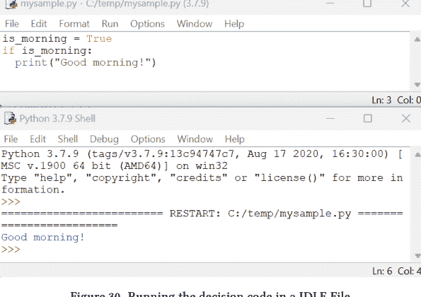

3.  添加更多选择：
    *   但如果不是早上怎么办？我们可以添加另一个部分，称为“else”部分，来告诉 Python 如果不是早上该怎么做。

*   让我们来完善代码：

```
1    is_morning = False
2    if is_morning:
3        print("Good morning!")
4    else:
5        print("Good night!")
```

*   现在，因为 `is_morning` 的值为 `False`，Python 会跳过“Good morning”部分，直接执行 else 部分，输出 `Good night!`！

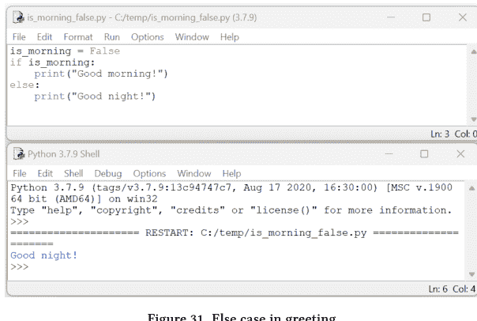

### 基于简单选择的程序：

1.  创建一个小游戏：
    *   让我们来做一个小游戏！我们将让 Python 判断一个数字是大还是小。
    *   输入这个游戏代码：

```
1       number = 5
2       if number > 10:
3           print("That's a big number!")
4       else:
5           print("That's a small number!")
```

*   在这里，Python 检查数字是否大于 10。如果是，就说它很大。如果不是，就说它很小。

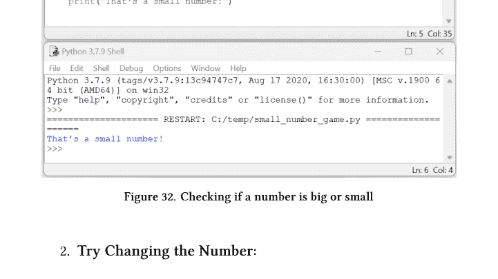

图 32. 检查一个数字是大还是小

2.  尝试修改数字：
    *   在你的 IDLE 文件中，将 `number = 5` 改成不同的数字，比如 12、8 或 20，看看每次 Python 会说什么。

你刚刚学会了如何用 Python 做出决策！能够告诉 Python 在不同选项之间进行选择是不是很酷？记住，编程就是给予指令和做出决定。

### 警惕 Python 中狡猾的缩进错误！

嘿，优秀的程序员！既然你已经将你的 Python 冒险保存在文件中了，有一个棘手的东西你需要了解，叫做**缩进错误**。别担心，一旦你知道了要注意什么，处理起来就很容易了！

### 什么是缩进错误？

*   在 Python 中，一行代码开头的空格至关重要。它们就像一种秘密代码，告诉 Python 哪些指令应该组合在一起。这被称为“缩进”。如果 Python 对这些空格感到困惑，它会给你一个“缩进错误”。

### 缩进错误的例子：

让我们再看看你关于判断数字大小的 `if` 语句代码：

```
1    number = 5
2    if number > 10:
3        print("That's a big number!")
4    else:
5        print("That's a small number!")
```

这段代码运行得非常完美，因为 `if` 和 `else` 下面行首的空格对齐得刚刚好。但如果它们没有对齐呢？让我们制造一个狡猾的缩进错误，看看会发生什么：

```
1 number = 5
2 if number > 10:
3 print("That's a big number!")
4 else:
5     print("That's a small number!")
```

### 你能找出错误吗？

*   这行 `print("That's a big number!")` 在开头应该有空格，就像 `else` 下面的 `print` 行一样。但它没有！

### Python 会怎么说？

Python 看到这个会感到困惑。它会给你一个这样的错误信息：

```
1     IndentationError: expected an indented block
```

### 如何修复它：

*   只需在 `print("That's a big number!")` 行的开头添加空格（或按 Tab 键），使其与 `else` 下的 `print` 对齐：

```
1 number = 5
2 if number > 10:
3     print("That's a big number!")
4 else:
5     print("That's a small number!")
```

### 现在完美了！

*   所有空格都对齐后，Python 就能理解你的代码，并能毫无障碍地判断数字是大还是小！

记住，保持代码行整齐划一是让 Python 保持愉快的关键！

### 如何避免缩进错误：

1.  **保持空格一致：**
    *   当你在 `if` 语句或 `for` 循环等结构下编写代码时，确保每行都从相同的位置开始。这就像把你的玩具整齐地排成一排。
2.  **使用 Tab 键：**
    *   一个方便的技巧是按键盘上的 Tab 键来创建空格。这能让你的缩进保持整洁。
3.  **检查你的代码：**
    *   如果 Python 告诉你有缩进错误，不要慌！只需检查你的代码，看看是否有些行从不同的位置开始，然后将它们调整对齐。
4.  **如果遇到困难，请寻求帮助：**
    *   有时，发现这些小错误就像寻找隐藏的宝藏。如果你卡住了，可以请人帮你找出那些放错位置的空格。

**记住：** 保持代码整洁就像保持房间整洁一样——它能帮助你更快地发现和解决问题，而且是成为优秀程序员的一个超级重要的部分！

快乐编程，小心那些狡猾的缩进错误！

## 第五章：创意颜色与形状


用 Python 绘画
准备好迎接一些色彩斑斓的乐趣吧！你知道吗，Python 可以用来创作艺术？是的，使用 Python，你可以绘制形状并为它们上色。我们将使用一种叫做 Turtle 图形的工具。这就像有一只小海龟，在屏幕上移动时为你绘画！

### 使用 Turtle 图形绘制形状：

*   Turtle 图形是 Python 中一种很酷的绘画方式。这只“海龟”就像一个遵循你的指令进行移动和绘制的小艺术家。

1.  设置你的海龟：
    *   首先，让我们准备好你的海龟。在 Python 的 IDLE 中打开一个新文件，在顶部输入以下内容：

```
1 import turtle
2 my_turtle = turtle.Turtle()
```

*   这告诉 Python：“我想使用海龟，我们叫它 my_turtle 吧。”

2.  移动海龟来绘画：
    *   现在，让我们让你的海龟画一个正方形。在你的代码中添加这些行：

```
1 for _ in range(4):
2     my_turtle.forward(100)
3     my_turtle.right(90)
```

*   这告诉你的海龟向前移动，然后向右转，完成正方形的每一边。
*   以 .py 结尾保存你的文件，比如 `my_square.py`。通过按 F5 来运行代码，你将看到海龟正在绘制正方形！

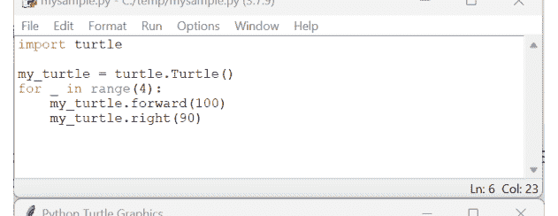

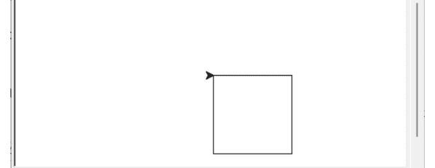

图 33. 绘制正方形

## 3. 添加一些颜色：

- 让我们为你的正方形添加一些颜色。在循环之前，添加这行代码：

```
my_turtle.fillcolor("blue")
my_turtle.begin_fill()
```

- 在循环之后，添加：

```
my_turtle.end_fill()
```

- 现在你的正方形将会被填充为蓝色！

## 4. 运行你的代码：

- 再次通过点击 IDLE 文件菜单中的“保存”来保存你的文件。
- 按 F5 运行它，然后观看你的小海龟绘制一个蓝色的正方形！

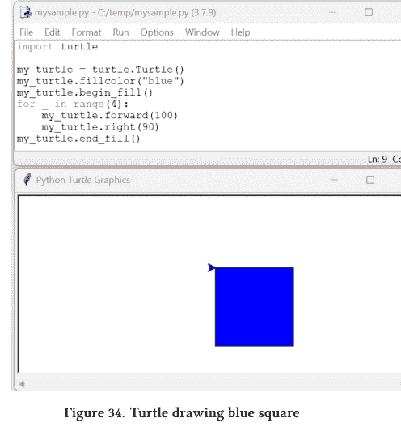

### 基本的颜色和形状命令：

- 你可以让你的小海龟绘制不同的形状和颜色。这里有一个想法：
    - 将 `my_turtle.fillcolor("blue")` 更改为另一种颜色，比如 "red"、"green" 或 "yellow"。
    - 要绘制三角形，请将循环中的 `range(4)` 改为 `range(3)`，并将 `my_turtle.right(90)` 改为 `my_turtle.right(120)`。

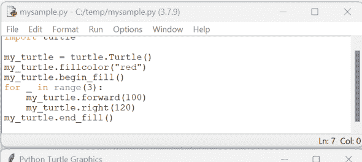

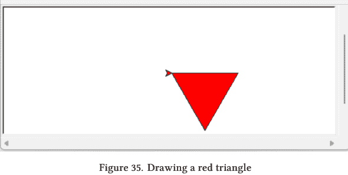

图 35. 绘制一个红色的三角形

### 让你的小海龟艺术更上一层楼

哇，你使用 Python 小海龟绘制和着色形状做得非常棒！准备好迎接更令人兴奋的东西了吗？让我们让你的小海龟绘制一个超级酷的、色彩丰富的螺旋。这不是一个普通的螺旋——这是一个会变得越来越大的彩虹螺旋！

创建一个彩色螺旋：就像你学会了绘制正方形和三角形一样，现在我们要使用一个循环来制作螺旋。但这次，我们会添加不同的颜色，让它看起来像一道彩虹。这就像告诉你的小海龟在跳舞的同时变换颜色！

通过这样做，你将看到如何更改一些简单的指令就能在屏幕上创造出全新的、令人惊叹的东西。让我们开始吧，让你的 Python 小海龟创建一个美丽的、色彩缤纷的螺旋！

### 创建彩色螺旋的步骤：

1. **设置你的小海龟：**
    * 从小海龟的基本设置开始：

    ```python
    import turtle
    my_turtle = turtle.Turtle()
    my_turtle.speed(0)  # 这会让你的小海龟画得更快
    ```

2. **选择你的颜色：**
    * 让我们为螺旋挑选一些颜色。添加以下颜色列表：

    ```python
    colors = ["red", "orange", "yellow", "green", "blue", "purple"]
    ```

3. **绘制螺旋：**
    * 现在，让我们用循环创建螺旋。我们将让小海龟每次多转一点，并改变颜色。添加这段代码：

    ```python
    for i in range(50):
        my_turtle.color(colors[i % 6])  # 每次改变颜色
        my_turtle.forward(i * 5)        # 按增长的距离向前移动
        my_turtle.right(60)             # 向右转 60 度
    ```

## 4. 运行你的代码：

- 将你的文件保存为 `colorful_spiral.py` 这样的名字。
- 按 F5 运行你的代码，然后观看你的小海龟创建一个美丽的螺旋！

## 第五章：创意颜色和形状

```python
import turtle
my_turtle = turtle.Turtle()
my_turtle.speed(0)  # 这会让你的小海龟画得更快
colors = ["red", "orange", "gold", "green", "blue", "purple"]
for i in range(50):
    my_turtle.color(colors[i % 6])  # 每次改变颜色
    my_turtle.forward(i * 5)        # 按增长的距离向前移动
    my_turtle.right(60)             # 向右转 60 度
```

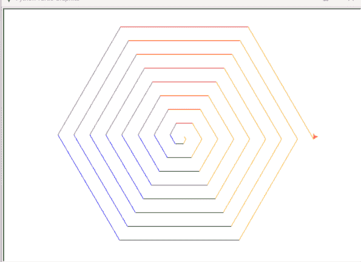

图 36. 用小海龟绘制螺旋

### 代码中发生了什么：

- `for i in range(50)` 循环使得内部的代码运行 50 次。
- `my_turtle.color(colors[i % 6])` 每次改变颜色。`% 6` 确保颜色索引保持在 0 到 5 之间（因为我们有 6 种颜色）。
- `my_turtle.forward(i * 10)` 使小海龟向前移动。`i * 10` 使每一条线都比前一条更长，从而产生螺旋效果。
- `my_turtle.right(60)` 将小海龟向右转 60 度。

这就是你如何在 Python 中使用 Turtle 创建令人惊叹的填充形状和彩色螺旋！就像画家使用不同的画笔和颜色来创作美丽的画作一样，你可以使用 Turtle 的命令来绘制你自己的数字艺术。记住，你可以为你的形状选择任何你喜欢的颜色，通过以某种模式重复简单的步骤，你就能创造出惊人的螺旋。看到你的计算机如何变成想象力的画布，是不是很有趣？继续尝试不同的形状和颜色，你很快就会成为一名 Turtle Python 艺术家！

## 第六章：Python 魔法技巧：有趣的函数


创建你自己的函数

准备在 Python 中开始新的冒险——学习函数！函数就像是编码中的魔法咒语。你创建一次，然后就可以一遍又一遍地使用它们来做很酷的事情。让我们看看函数是什么，以及如何创建你自己的函数！

### 什么是函数？

- 把函数想象成食谱中的一道菜谱。每个菜谱都告诉你如何制作某道特定的菜肴。在 Python 中，函数是一组指令，告诉计算机如何做某事。一旦你编写了一个函数，你就可以让 Python 在你想要的时候遵循这些指令。

### 为什么函数很有用？

- 函数非常有用，因为它们可以帮助你避免一遍又一遍地编写相同的代码。如果你发现自己多次做同样的事情，你可以把那部分代码放进一个函数里，然后只需调用该函数即可！

### 编写简单的函数：

1. **你的第一个函数：**
    - 让我们编写一个说“hello”的函数。在你的 Python 文件中，输入这个：

    ```python
    def say_hello():
        print("Hello, Python World!")
    ```
    - `def` 是一个特殊词语，它告诉 Python 你正在创建一个新函数。`say_hello` 是你函数的名字。空的 `()` 表示这个函数不需要任何额外信息就能工作。

2. **使用你的函数：**
    - 仅仅编写函数还不会让它做任何事情。你必须告诉 Python 使用它。在你的函数下面，输入：

    ```python
    say_hello()
    ```
    - 这就像在说：“嘿，Python，执行我在 `say_hello` 里写的指令！”

3. **看看发生了什么：**
    - 保存你的文件并按 F5 运行它。你会在屏幕上看到 `Hello, Python World!`。你的函数起作用了！

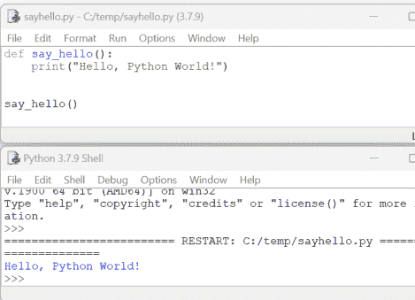

4. **创建一个计数函数：**
    - 现在，让我们制作一个函数来数到三。输入这个新函数：

    ```python
    def count_to_three():
        for number in range(1, 4):
            print(number)
    ```
    - 然后在下面输入 `count_to_three()` 来调用你的函数，并运行你的代码。

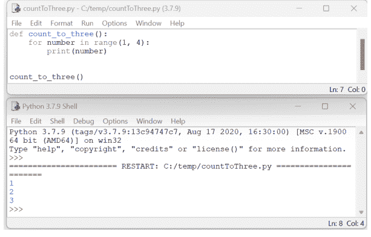

**图 38. 用函数数到三**

让我们来谈谈我们刚刚创建的 `count_to_three` 函数。它是一小段很酷的代码，告诉 Python 从 1 数到 3。让我们分解一下，看看它是如何工作的！

### 计数的秘诀：

- 把 `count_to_three` 想象成一个告诉 Python 如何数到三的菜谱。代码再看一遍：

```python
def count_to_three():
    for number in range(1, 4):
        print(number)
```

### 每部分的作用：

1. **启动菜谱 (def count_to_three()):**
    - `def count_to_three():` 就像是菜谱的标题。它告诉 Python：“这是数到三的方法。”
    - `def` 意味着你正在定义一个新函数，而 `count_to_three` 是你给它的名字。

2. **计数指令 (for number in range(1, 4)):**
    - 在函数内部，我们有一个循环：`for number in range(1, 4)`。
    - 这就像在说：“对于列表 1、2、3 中的每个数字，执行以下操作...”
    - 为什么是 1 到 4，而不是 1 到 3？在 Python 中，`range` 从第一个数字开始，但在最后一个数字之前停止。所以 `range(1, 4)` 包括 1、2 和 3。

3. **告诉 Python 做什么 (print(number)):**
    - `print(number)` 是我们菜谱的动作部分。它告诉 Python 在屏幕上显示每个数字。
    - 所以，Python 将会打印 1，然后是 2，然后是 3，每个数字各占一行。

### 使用函数：

- 仅仅编写函数是不够的。我们必须告诉 Python 使用它。这就是为什么我们在函数后面写 `count_to_three()`。这就像在说：“好的，Python，现在按照菜谱来数到三。”

### 看看实际运行效果：

- 当你运行这段代码时，Python 会读取这个“食谱”并按照步骤执行，大声为你数出1、2、3！

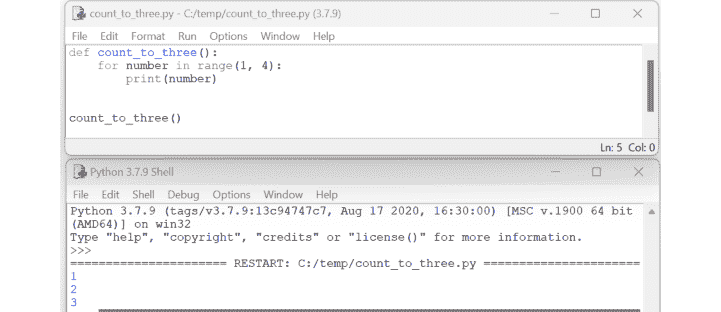

图 39. 在一个函数中数到三

所以，这就是你的 `count_to_three` 函数的工作原理！它就像一个迷你冒险，让 Python 能够大声数数。通过编写这个函数，你刚刚教会了 Python 一个新技巧。做得好！

### 添加一点变化：在函数中使用参数

关于函数的知识学得不错！现在，让我们通过使用一种叫做“参数”的东西来添加一点变化。参数就像是你给函数提供的特殊线索，用来告诉它每次执行时做哪些不同的事。

### 什么是参数？

- 把参数想象成你传递给函数的一个秘密代码，用来改变它的行为。这就像你玩游戏，每次规则会有一点点变化。

### 创建一个带参数的函数：

1.  编写一个问候函数：
    - 让我们编写一个用不同方式说“你好”的函数。我们将使用一个参数来告诉函数要向谁问好。
    - 输入这段代码：
    ```python
    def say_hello_to(name):
        print("Hello, " + name + "!")
    ```
    - 这里，`name` 是参数。它就像一个占位符，代表你在调用函数时想要使用的名字。
2.  用不同的名字使用你的函数：
    - 现在让我们使用这个函数。在你的函数定义下方，输入：
    ```python
    say_hello_to("Emily")
    say_hello_to("Carlos")
    ```
    - 每次调用 `say_hello_to` 时，你都可以给它一个不同的名字。然后 Python 会在问候语中使用这个名字。
3.  运行代码会发生什么：
    - 当你运行这段代码时，Python 会先向 Emily 问好，然后向 Carlos 问好：
    1.  Hello, Emily!
    2.  Hello, Carlos!

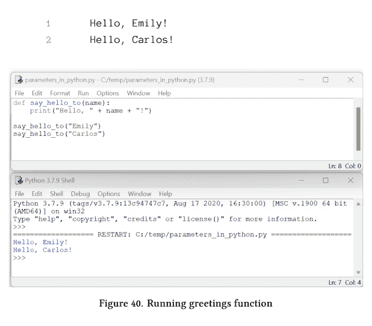

### 为什么参数很有用？

- 参数使函数更加灵活和有趣。你可以用同一个函数来完成略有不同的事情——比如向不同的人问好。

### 另一个有趣的例子：

- 如何编写一个能将任意两个数字相加的函数？让我们试试：

```python
def add_numbers(number1, number2):
    total = number1 + number2
    print("The total is:", total)
```

- 这里，`number1` 和 `number2` 是参数。你可以使用 `add_numbers(5, 3)` 或 `add_numbers(10, 20)` 来将不同的数字相加。

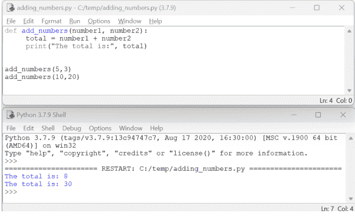

图 41. 在一个函数中添加数字

在函数中使用参数就像赋予你的函数超能力。它们可以做更多的事情，变得更有帮助。尝试制作你自己的带参数的函数，看看你能让 Python 做出什么酷炫的事情！

你刚刚学会了如何在 Python 中编写自己的函数！函数就像小助手，让你的编码更轻松、更有趣。记住，无论何时，只要你发现自己在做同样的事情很多次，可能就需要一个函数。继续尝试不同的函数，看看你能用 Python 做出哪些惊人的事情！

## 第7章：用Python制作游戏

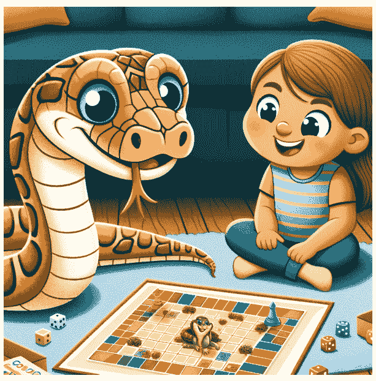

### 构建一个简单的游戏

猜猜看？你可以用 Python 制作自己的游戏！让我们深入游戏制作的魔法世界。我们将从创建一个简单的“猜数字”游戏开始。它既有趣又简单，你还能学到更多关于 Python 的酷知识！

### 设计我们的猜数字游戏：

- 在这个游戏中，Python 会想一个数字，你必须猜出它是什么。Python 会告诉你猜得太高、太低还是正好！

### 1. 设置游戏：

首先，让我们在一个新的 Python 文件中设置我们的游戏。我们需要让 Python 选择一个随机数。在文件顶部，输入：

```python
import random
secret_number = random.randint(1, 10)
```

这段代码让 Python 在1到10之间随机选择一个数字。

### 2. 猜数字：

现在，让我们要求玩家（就是你！）猜这个数字。添加这段代码：

```python
print("I am thinking of a number between 1 and 10.")
guess = int(input("Can you guess it? "))
```

这告诉 Python 要求输入一个猜测值并等待你的回答。

### 3. 检查猜测结果：

接下来，我们将使用一个 if 语句来检查猜测结果是正确、太高还是太低。添加这段代码：

```python
if guess == secret_number:
    print("You got it!")
elif guess < secret_number:
    print("Your guess is too low.")
else:
    print("Your guess is too high.")
```

- 这些代码行将你的猜测与秘密数字进行比较，并告诉你结果如何。

### 4. 运行你的游戏：

- 将你的文件保存为类似 `guess_the_number.py` 的名字。
- 按 F5 运行游戏，尝试猜数字吧！

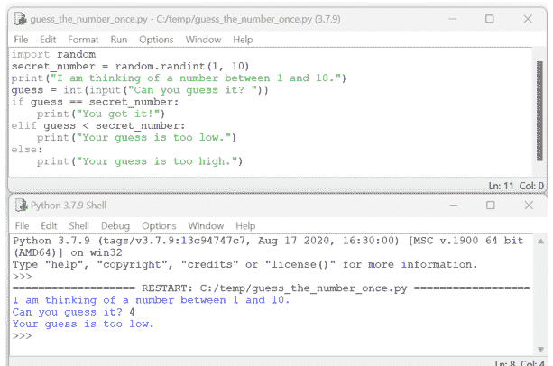

### 反复游玩：

- 现在，你只能猜一次。但你可以添加一个循环，让你持续猜测直到猜对为止。这稍微难一点，但尝试起来超级有趣！

### 用循环让我们的游戏更有趣！

让我们为游戏添加一个循环。记住，循环就像一条重复的路径；它可以让你一遍又一遍地做某事，直到你想停止。

### 添加一个循环来持续猜测：

- 我们将使用一种叫做 `while` 循环的特殊循环。这个循环会持续工作，直到满足某个条件。在我们的游戏中，循环会一直进行，直到你猜对数字为止。

### 以下是添加循环的方法：

1.  从一个 `while` 循环开始：
    - 就在你要求输入猜测值之前，让我们添加一行 `while True:`。它看起来像这样：

    ```python
    while True:
        guess = int(input("Can you guess it? "))
        ...
    ```

    - `while True:` 告诉 Python 要不断重复缩进在它下面的所有内容，直到我们说停止。

2.  在循环内部检查猜测结果：
    - 我们将 if 语句保留在循环内部。如果你的猜测错误，Python 会回到循环的开头并要求再次猜测。
    - 如果你猜对了，我们需要告诉循环停止。

### 3. 当你猜对时停止循环：

- 当你猜中数字时，我们想要祝贺你，然后停止循环。我们通过一个叫做 `break` 的命令来实现。在 `print("You got it!")` 语句下面添加 `break`，如下所示：

```python
if guess == secret_number:
    print("You got it!")
    break
```

### 完整的循环游戏代码：

你的游戏代码现在应该看起来像这样：

```python
import random
secret_number = random.randint(1, 10)

print("I am thinking of a number between 1 and 10.")

while True:
    guess = int(input("Can you guess it? "))
    if guess == secret_number:
        print("You got it!")
        break
    elif guess < secret_number:
        print("Your guess is too low.")
    else:
        print("Your guess is too high.")
```

### 运行你的新循环游戏：

- 保存你的文件并再次运行它。
- 现在你可以持续猜测，直到找到正确的数字。每次你猜测时，Python 会告诉你猜得太高还是太低，然后让你再次猜测。

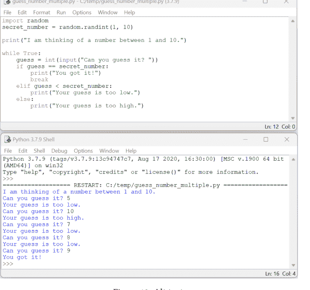

有了这个循环在你的游戏中，尝试猜测秘密数字会更加有趣。记住，循环在编码中非常有用，尤其是在游戏中。它们让你无需每次都重新写出代码就能重复某件事。尽情猜测吧！

就是这样！你刚刚用 Python 制作了一个你自己的“猜数字”游戏。将你的想法变成一个有趣的游戏，这难道不神奇吗？记住，通过编程，你可以制作各种各样的游戏，所以继续尝试和摆弄你的代码吧！

既然我们已经成功制作了一个游戏，让我们用一些相同的概念来构建另一个有趣的游戏！

### 开启森林中的Python冒险之旅

欢迎，年轻的探险家们！今天，我们将深入一个新的 Python 游戏，叫做“循环森林冒险”。在这个游戏中，你将漫步于一片神奇的森林中，寻找隐藏的宝藏。你将做出不同的选择，走向不同的路径，冒险将持续进行，直到你找到宝藏或决定休息一下。让我们发现这个游戏是如何运作的，并在此过程中学习更多关于 Python 编程的知识！

**理解游戏：**

当你开始游戏时，你会身处一片茂密的森林。你可以选择向左走或向右走。如果向左走，你可能会发现一个山洞；如果向右走，你可能会遇到一条河。每个选择都会带来新的决定，比如进入山洞或渡过河流。游戏会一直持续到你找到宝藏。

让我们一步一步地创建代码：

**一步一步来：构思你的Python寻宝之旅**

你好，年轻的程序员们！准备好开始一场激动人心的冒险了吗？今天，我们将使用 Python 创建一个叫做“循环森林冒险”的游戏。这款游戏发生在一个神秘的森林中的寻宝之旅。

在森林中，你需要做出选择来找到隐藏的宝藏。让我们一起一步步来构建这个游戏吧！

# 1. 设置场景：

- 首先，我们需要告诉玩家这个游戏是关于什么的。我们可以使用 `print` 语句来实现。在你的Python编辑器中输入以下几行：

```
print("Welcome to the Looping Treasure Hunt Adventure!")
print("You are in a dense forest, searching for the hidden treasure.")
```

- 这几行代码就像是我们冒险故事的开篇。它们将你引入游戏。

# 2. 为循环做准备：

- 在开始冒险之前，我们需要设置一个方法来跟踪是否找到了宝藏。输入这行代码：

```
treasure_found = False
```

- 这就像拥有一张画着大问号的藏宝图。它的意思是，“我们还没有找到宝藏。”

# 3. 开始冒险循环：

- 现在，让我们创建一个循环来让冒险持续下去。输入这段代码：

```
while not treasure_found:
```

- 这个 `while` 循环会不断重复我们的冒险步骤，直到我们找到宝藏。

# 4. 做出第一个选择：

- 在循环内部，我们询问玩家想向左还是向右走。输入以下代码行：

```
choice = input("Do you want to go left or right? (left/right) ")
```

- 冒险从这里开始分叉。你的决定将引导你走向不同的道路。

# 5. 探索左边的路径：

- 看看如果玩家选择向左会发生什么。添加以下代码行：

```
if choice == "left":
    print("You've stumbled upon a hidden cave!")
    choice = input("Do you dare to enter the cave? (yes/no) ")
```

- 这里，如果你选择向左，你会发现一个洞穴！然后你需要决定是否进入。

# 6. 在洞穴中寻找宝藏：

- 如果你决定进入洞穴，也许会找到宝藏！添加这段代码：

```
if choice == "yes":
    print("Inside the cave, you found the treasure! Congratulations!")
    treasure_found = True
```

- 这些代码行检查你是否选择了进入洞穴。如果你进入了，你就可能找到宝藏，游戏也将结束。

# 7. 探索右边的路径：

- 如果你选择向右走呢？让我们来编写那部分。添加以下代码行：

```
elif choice == "right":
    print("You come across a swiftly flowing river.")
```

- 这部分开启了右边路径的冒险，在那里你会遇到一条河流。

# 8. 在河边做决定：

- 在河边，你需要做出另一个决定。添加以下代码行：

```
choice = input("Do you wish to swim across or follow the river? (swim/follow) ")
```

- 现在你选择：游过河还是沿着河走，看看它通向哪里。

# 9. 河流路径的各种结果：

- 让我们为在河边的每个选择添加后续情况。为游泳添加这段代码：

```
if choice == "swim":
    print("Bravely swimming across, you reach a deserted beach, but no treasure here.")
```

- 为沿河走添加这段代码：

```
else:
    print("Following the river, you find a bridge leading to a mysterious temple.")
```

# 10. 神秘的寺庙：

- 如果你沿着河走并发现了寺庙，你还有一个选择。添加这段代码：

```
choice = input("Do you cross the bridge? (yes/no) ")
if choice == "yes":
    print("In the temple, you find the hidden treasure! Your quest is complete!")
    treasure_found = True
```

- 这是最终的决定：如果你穿过桥进入寺庙，你就可能找到宝藏！

### 整合所有内容

做得好，跟着完成了每一个步骤！既然我们已经探索了游戏的各个部分——设置场景、创建选择以及构想不同的路径——是时候将它们整合在一起了。通过结合这些元素，我们将看到我们的选择如何交织在一起，并引导我们穿越“循环森林冒险”中激动人心的曲折。让我们赋予冒险生命，看看这些片段如何在Python中构成一个完整的、充满乐趣的寻宝游戏。准备好看看你编码的实际运行效果了吗？让我们潜入其中，组装我们的游戏吧！

```
treasure_found = False
while not treasure_found:
    choice = input("Do you want to go left or right? (left/right) ")

    if choice == "left":
        print("You've stumbled upon a hidden cave!")
        choice = input("Do you dare to enter the cave? (yes/no) ")
        if choice == "yes":
            print("Inside the cave, you found the treasure! Congratulations!")
            treasure_found = True
        else:
            print("You chose to stay outside. The forest awaits your next move.")
    elif choice == "right":
        print("You come across a swiftly flowing river.")
        choice = input("Do you wish to swim across or follow the river? (swim/follow) ")
        if choice == "swim":
            print("Bravely swimming across, you reach a deserted beach, but no treasure here.")
        else:
            print("Following the river, you find a bridge leading to a mysterious temple.")
            choice = input("Do you cross the bridge? (yes/no) ")
            if choice == "yes":
                print("In the temple, you find the hidden treasure! Your quest is complete!")
                treasure_found = True
            else:
                print("You decide not to cross. The river path stretches endlessly before you.")
    else:
        print("Lost in the forest, you decide to stop and rest. Maybe try another path next time.")
```

### 你的冒险在等待

现在我们已经写好了游戏，是时候来玩一玩了！保存你的Python脚本并运行它。你做出的每一个决定都会引导你在森林中走上不同的道路。你是会找到宝藏，还是会发现其他令人兴奋的冒险呢？这一切都取决于你！

## 第7章：用Python制作游戏

```
print("Welcome to the Looping Treasure Hunt Adventure!")
print("You are in a dense forest, searching for the hidden treasure.")

treasure_found = False
while not treasure_found:
    choice = input("Do you want to go left or right? (left/right) ")
    
    if choice == "left":
        print("You've stumbled upon a hidden cave!")
        choice = input("Do you dare to enter the cave? (yes/no) ")
        if choice == "yes":
            print("Inside the cave, you found the treasure! Congratulations!")
            treasure_found = True
        else:
            print("You chose to stay outside. The forest awaits your next move.")
    elif choice == "right":
        print("You come across a swiftly flowing river.")
        choice = input("Do you wish to swim across or follow the river? (swim/follow) ")
        if choice == "swim":
            print("Bravely swimming across, you reach a deserted beach, but no treasure here.")
        else:
            print("Following the river, you find a bridge leading to a mysterious temple.")
            choice = input("Do you cross the bridge? (yes/no) ")
            if choice == "yes":
                print("In the temple, you find the hidden treasure! Your quest is complete!")
                treasure_found = True
            else:
                print("You decide not to cross. The river path stretches endlessly before you.")
    else:
        print("Lost in the forest, you decide to stop and rest. Maybe try another path next time.")
```

```
Python 3.7.9 Shell
File  Edit  Shell  Debug  Options  Window  Help

Python 3.7.9 (tags/v3.7.9:13c94747c7, Aug 17 2020, 16:30:00) [MSC v.1900 64 bit (AMD64)] on win32
Type "help", "copyright", "credits" or "license()" for more information.
>>> 
=== RESTART: C:/Repos/Epic Python Coding Source/Chapter 7/treasure_hunt_game.py ===
Welcome to the Looping Treasure Hunt Adventure!
You are in a dense forest, searching for the hidden treasure.
Do you want to go left or right? (left/right) right
You come across a swiftly flowing river.
Do you wish to swim across or follow the river? (swim/follow) swim
Bravely swimming across, you reach a deserted beach, but no treasure here.
Do you want to go left or right? (left/right) left
You've stumbled upon a hidden cave!
Do you dare to enter the cave? (yes/no) no
You chose to stay outside. The forest awaits your next move.
Do you want to go left or right? (left/right) left
You've stumbled upon a hidden cave!
Do you dare to enter the cave? (yes/no) yes
Inside the cave, you found the treasure! Congratulations!
>>>
```

图44. 玩寻宝游戏

## 第八章：Python 在世界中的应用

你已经学了很多关于Python的知识！但你知道吗，全世界的人们都在用Python完成许多了不起的事情？让我们一起探索Python在现实生活中的一些酷炫应用，并尝试一个简单的项目，亲眼见证Python的神奇魔力！

### Python 在我们身边的实践：

### 太空探索：用 Python 点亮星辰大海

- 你知道像美国国家航空航天局这样的航天机构在太空任务中使用Python吗？Python帮助他们控制航天器，并分析来自其他行星和恒星的数据。例如，Python曾被用于开发一个软件系统，该系统拍摄到了令人惊叹的黑洞图像！这就像是把Python当作一台宇宙相机！

### 电影魔法：在银幕上创造奇迹

- 在电影世界里，Python是一位真正的超级明星。它被用来创造那些令人叹为观止的特效，让龙在空中翱翔，让超级英雄飞跃楼宇。一个有趣的事实是：一些《哈利·波特》电影背后的电影制作公司曾使用Python来帮助呈现那些神奇的场景。Python帮助他们为魔法生物的奇妙动作制作动画！

### 游戏冒险：构建激动人心的世界

- 你最喜欢的许多电子游戏都是由Python驱动的。游戏开发者使用Python来设计关卡、创建角色，甚至让他们移动和互动。Python就像是让游戏世界活起来的秘密调料。想象一下，有一天你能用Python创造出自己的游戏世界！

### 科学发现：解开自然的奥秘

- Python是科学家们探索地球及更广阔宇宙的工具。他们用它来预测天气、研究植物生长方式，甚至探索海洋的奥秘。例如，Python帮助科学家理解气候变化如何影响不同的生态系统。Python就像一位侦探，正在解开自然界最重大的谜题！

Python被用在如此多令人兴奋的领域，是不是很神奇？从探索外太空到创造电影魔法和电子游戏冒险，Python无处不在。科学家们也依赖它来做出关于我们世界的重要发现。每次你用Python编程时，你都在学习能够帮助你未来做出非凡成就的技能！

### 你的项目：创建你的天气程序：

现在，让我们用Python制作你自己的天气程序！

1. 准备工作：
   - 新建一个Python文件。这次，你将向某人询问天气，然后你的程序会给出回应！

2. 编写天气程序：
   - 首先输入以下代码：

```python
weather = input("What is the weather like today? \n(sunny, rainy, snowy) ")
if weather == "sunny":
    print("It's a sunny day! Don't forget your sunglasses.")
elif weather == "rainy":
    print("It's raining. You'll need an umbrella!")
elif weather == "snowy":
    print("Wow, it's snowing! Bundle up in your warmest clothes.")
else:
    print("Hmm, I don't know that weather. Sounds like an adventure!")
```

- 这个程序会询问天气情况，并根据你的输入给出回应。

3. 测试你的气象站：
   - 运行你的程序，输入不同的天气状况，如“sunny”（晴天）、“rainy”（雨天）或“snowy”（雪天），看看你的程序会说什么。

### 用 Python 点名 - 一步步构建出勤跟踪器

### 我们的 Python 项目简介

年轻的程序员们，你们好！你们是否想过老师是如何记录谁来上课的呢？今天，我们将使用Python创建自己的出勤跟踪器！我们将一步步构建它，学习列表、循环和计数。最后，我们会将所有部分组合成一个酷炫的程序。让我们开始吧！

1. 创建学生名单：
   - 首先，我们需要一个用于点名的学生名单。在Python中，我们使用方括号 `[]` 创建一个列表，并在其中放入用逗号分隔的名字。

假设我们有五个朋友：Alice、Bob、Charlie、David和Eva。我们的列表将如下所示：

```python
students = ["Alice", "Bob", "Charlie", "David", "Eva"]
```

2. 设置出勤计数器：
   - 接下来，我们需要两个计数器：一个用于记录出勤的学生，一个用于记录缺席的学生。我们从0开始计数，因为还没有统计任何人。

```python
present_count = 0
absent_count = 0
```

3. 询问每个学生：
   - 现在，我们将询问每个学生是否在场。为此，我们使用循环。正如我们之前讨论的，循环就像在转圈，对列表中的每一项做同样的事情。我们将使用 `for` 循环，它让我们可以对 `students` 列表中的每个学生执行操作。

```python
students = ["Alice", "Bob", "Charlie", "David", "Eva"]

### 用于跟踪出勤情况的变量
present_count = 0
absent_count = 0

### 遍历列表中的每个学生
for student in students:
    # 询问每个学生是否在场
```

4. 检查学生是否出勤：
   - 在循环内部，我们将询问每个学生是否在场。我们等待回答，如果答案是“是”，就在 `present_count` 变量上加1。如果答案是“否”，就在 `absent_count` 变量上加1。

我们使用 `if` 语句来选择是将学生标记为缺席还是出勤。`if` 语句让我们根据答案来选择做什么。

```python
# 判断学生是否在场
response = input(f"Is {student} present? (yes/no): ").lower()

# 检查学生是否在场
if response == "yes":
    print(f"{student} is present.")
    present_count += 1
else:
    print(f"{student} is absent.")
    absent_count += 1
```

我们希望有一个简单的方法来询问用户每个学生是否在场。这就是我们使用一个叫做 *字符串插值* 的巧妙Python技巧的地方。

### 通过一个有趣的例子理解字符串插值

我们需要一种方式让我们的出勤跟踪器问这样的问题：“Alice在吗？（是/否）：”？它需要知道如何针对每个学生更改姓名，对吧？这就是字符串插值发挥作用的地方。这个词听起来很大，但实际上它相当简单又酷！

想象一下，你有一张纸上写着一句话：“___在吗？”。现在，想象你有一些印有名字的贴纸。你可以把名字贴到那个空白处来询问不同的学生。在Python中，我们用代码做类似的事情！

### 什么是字符串插值？

- **字符串（String）**：这只是Python中对文本的文雅称呼。
- **插值（Interpolation）**：意思是把东西放到另一个东西的中间。

所以，字符串插值就像在Python中，把一个信息（比如一个名字）放入字符串（一个句子或文本）的中间。

### 我们在程序中如何使用它：

这是用于每个学生姓名的字符串插值的代码 `f"Is {student} present? (yes/no): "`，我们告诉Python要制作一种特殊的字符串（这就是引号前的 `f` 的作用）。`{student}` 部分就像一个空白处，Python可以在这里放入每个学生的名字。

对于我们列表中的每个学生，Python会用实际的名字替换 `{student}`，就像我们可能用贴纸来填补纸上空白处一样。

### 示例：

- 当Python看到 `f"Is {student} present? (yes/no): "` 并且 `student` 是"Alice"时，它会变成："Is Alice present? (yes/no): "
- 然后当 `student` 是"Bob"时，它会变成："Is Bob present? (yes/no): "
- 对每个学生都依此类推！

### 总结

完成点名后，我们就可以分享结果了。我们将使用之前学到的知识来编写一条消息，告诉大家有多少学生在场，有多少学生缺席。这就像把拼图的最后几块拼在一起，看到完整的画面！你注意到我们再次使用了字符串插值来帮助显示结果吗？

```python
### 打印出勤和缺席的学生总数
### 我们再次使用了字符串插值
print(f"\nTotal Present: {present_count}")
print(f"Total Absent: {absent_count}")
```

5. 整合所有部分：
   - 让我们将所有这些部分组合起来，创建完整的出勤跟踪器。我们的完整程序将如下所示：

```python
### 班级中的学生名单
students = ["Alice", "Bob", "Charlie", "David", "Eva"]

### 用于跟踪出勤情况的变量
present_count = 0
absent_count = 0

### 遍历列表中的每个学生
for student in students:
    # 使用字符串插值来提示
    # 一个特定的学生
    response = input(f"Is {student} present? (yes/no): ").lower()

    # 检查学生是否在场
    if response == "yes":
        print(f"{student} is present.")
        present_count += 1
    else:
```## 理解我们如何统计程序中的学生人数

在我们的考勤追踪器中，我们记录有多少学生出勤，有多少学生缺席。为此，我们在 Python 中使用了一个特殊技巧。你可能在我们的代码中见过 `present_count += 1`。让我们分解一下，理解它的作用。

### `present_count += 1` 是什么意思？

- 把 `present_count` 想象成一个存放弹珠的罐子。每颗弹珠代表一名出勤的学生。
- `+= 1` 部分就像往罐子里再添加一颗弹珠。
- 因此，每当我们说 `present_count += 1` 时，我们就是在往“出勤”罐子里添加一颗弹珠，因为又有一名学生到了。

### 示例：

- 想象罐子一开始是空的（`present_count = 0`）。
- 当 Alice 出勤时，我们添加一颗弹珠。现在，有 1 颗弹珠（`present_count = 1`）。
- 如果 Bob 也出勤，我们再添加一颗弹珠。现在，罐子里有 2 颗弹珠（`present_count = 2`）。
- 对于每一位出勤的学生，这个过程都会持续进行。

### 那么 absent_count += 1 呢？

- 我们对 absent_count 做同样的事情。这是另一个罐子，但用于存放缺席的学生。
- 每当一名学生缺席，我们就往这个“缺席”罐子里添加一颗弹珠。

所以，`present_count += 1` 和 `absent_count += 1` 是我们统计出勤和缺席学生人数的方法。这就像往两个不同的罐子里添加弹珠，以跟踪谁在场、谁不在场。这使得我们的考勤追踪器既智能又实用！

## 6. 运行我们的程序：

输入最终代码后，保存它，然后使用 F5 运行。你的电脑会开始询问你每个学生的情况。如果他们在场，输入‘yes’；如果不在，输入‘no’。最后，你会看到有多少人出勤，多少人缺席。

```python
# take_attendance.py

# 班级中的学生列表
students = ["Alice", "Bob", "Charlie", "David", "Eva"]

# 用于跟踪考勤的变量
present_count = 0
absent_count = 0

### 遍历列表中的每个学生
for student in students:
    response = input(f"Is {student} present? (yes/no): ").lower()
    
    # 检查学生是否出勤
    if response == "yes":
        print(f"{student} is present.")
        present_count += 1
    else:
        print(f"{student} is absent.")
        absent_count += 1

# 打印出勤和缺席的总人数
print(f"\nTotal Present: {present_count}")
print(f"Total Absent: {absent_count}")
```

```
Python 3.7.9 (tags/v3.7.9:13c94747c7, Aug 17 2020, 16:30:00) [MSC v.1900 64 bit (AMD64)] on win32
Type "help", "copyright", "credits" or "license()" for more information.
>>> 
=== RESTART: C:\Repos\Python For Beginners\Source\Chapter 8\take_attendance.py ===
Is Alice present? (yes/no): yes
Alice is present.
Is Bob present? (yes/no): no
Bob is absent.
Is Charlie present? (yes/no): no
Charlie is absent.
Is David present? (yes/no): yes
David is present.
Is Eva present? (yes/no): yes
Eva is present.

Total Present: 3
Total Absent: 2
>>>
```

**图 46. 进行考勤**

干得好！你刚刚制作了一个可以帮助老师点名的程序。

Python 可以用来做很多很酷的事情，比如查询天气或在课堂上点名！通过制作这个天气程序和考勤器，你正在学习像真正的科学家和程序员一样使用 Python。继续探索并享受 Python 的乐趣吧——还有更多东西等着你去发现！

### 结论：你的 Python 之旅仍在继续


### 祝贺你完成了精彩的 Python 冒险！

哇，你已经学到了很多关于 Python 的知识！从用 Turtle 画图形到制作自己的游戏，你现在是一个真正的 Python 探险家了。但猜猜看？你的冒险并没有在这里停止。还有更多关于 Python 的东西等着你去学习和探索。让我们谈谈你的下一步，以及你如何继续这段激动人心的旅程。

### 学习 Python 的下一步：

1.  **坚持练习：**
    - 提高 Python 水平的最佳方法是坚持练习。尝试修改你制作的游戏，或者甚至创建新的游戏。记住，熟能生巧！

2.  **寻找更多 Python 项目：**
    - 网上有很多适合初学者的有趣 Python 项目。你可以制作计算器、简单的聊天机器人，甚至是一个小网站。

3.  **加入编程俱乐部：**
    - 许多学校和社区都有编程俱乐部，你可以在那里和其他孩子一起学习。这是学习新事物和结交同样热爱编程的朋友的有趣方式。

4.  **查阅书籍和网站：**
    - 有很多很棒的书籍和网站可以帮助你了解更多关于 Python 的知识。有些网站甚至有互动的 Python 练习和谜题！

### 进一步学习的资源：

-   **网站：**
    -   Code.org 和 Scratch¹ 是练习编程的绝佳网站，提供有趣的项目。
    -   Python.org 有大量资源，也是你可以下载最新版本 Python 的地方。
-   **书籍：**
    -   寻找专为学习 Python 的孩子编写的书籍。它们通常有有趣的例子和易于理解的说明。当你水平更高并想用 Python 创建真正的视频游戏时，请查看《使用 PyGame 创建视频游戏》²。PyGame 是一个库，可以让你轻松地用 Python 创建游戏！

### 鼓励继续探索：

-   记住，学习编程就像寻宝。有时它充满挑战，但它总是令人兴奋的。你学得越多，你发现的宝藏就越多。Python 是一种可以帮助你创造惊人事物、解决问题并获得很多乐趣的语言。
-   不要害怕尝试新事物和犯错。这就是你学习和成长的方式。你已经走在成为一名优秀程序员的路上了！

你的 Python 之旅才刚刚开始，有无限的可能性在等着你。继续探索，继续学习，最重要的是，继续享受 Python 的乐趣。你将做出惊人的事情！

¹https://scratch.mit.edu/studios/315425
²https://www.amazon.com/Creating-Video-Games-Using-PyGame-ebook/dp/B0C6NF5T7W

## 附录

### 访问“史诗般的 Python 编程”的源代码

**在线查找你需要的所有代码！**

你通过“史诗般的 Python 编程”学习 Python 有趣吗？想深入了解并试用书中的代码吗？好消息！本书中所有项目和示例的源代码都在线提供。你可以找到、下载甚至修改代码，尝试你自己的想法！

**在哪里找到代码：**

-   **GitHub 仓库：** 所有源代码都托管在 GitHub 上，这是一个程序员分享代码的网站。你可以访问我们专门的仓库（一个存放我们所有代码的地方）来找到你需要的一切。
-   **URL：** 要访问代码，只需访问 [GitHub 上的 Epic Python Coding 源代码](https://github.com/microgold/Epic-Python-Coding-Source)¹。

**如何使用仓库：**

1.  **访问链接：** 点击链接或将其输入你的网页浏览器。
2.  **浏览文件：** 你会看到一个文件列表，每个文件都以书中的章节或特定项目命名。
3.  **查看或下载代码：** 点击文件查看代码。你也可以将文件下载到你的计算机。

¹https://github.com/microgold/Epic-Python-Coding-Source

### 尝试代码：

-   随意玩转代码！你可以尝试修改它，看看会发生什么。这是学习更多知识和享受 Python 乐趣的好方法。
-   如果你不确定如何做某事，请向父母、老师或朋友寻求帮助。

### 继续编码和探索：

-   记住，你练习得越多，你就会变得越好。使用书中的代码作为你自己 Python 冒险的起点。

我们希望访问源代码能帮助你在学习 Python 的旅程中。继续探索，继续实验，最重要的是，继续享受编码的魔力！

### 1. 术语表

1.  **变量：** 编程中的一个存储空间，用于存放数据（如数字或文本）。
2.  **字符串：** 字符串就像一个单词或一个句子。它只是一堆字母、数字或其他符号粘在一起。在 Python 中，你通过将字符串放在引号中来表示你正在使用字符串。

3. **数字**：Python 中的数字就像你在数学课上使用的数字一样。它们可以是整数（如 1、2、3）或小数（如 1.5 或 2.75）。

4. **函数**：执行特定任务且可重复使用的代码块。

5. **循环**：重复执行一系列指令，直到满足某个条件的序列。

6. **条件语句**：根据条件的真假执行不同操作的命令。

7. **算法**：就像解决问题的配方。它提供逐步执行的说明。

8. **列表**：计算机中的一排方框，每个方框存放着如数字或文字之类的内容。

9. **错误**：计算机程序中的一个错误，导致其行为异常或出错。

10. **类**：计算机编程中创建对象的蓝图。它告诉计算机对象应该具有哪些信息和行为。

11. **注释**：在计算机程序中，注释就像是解释代码作用的小笔记。它们仅供人类阅读，不会影响程序的运行。在 Python 中，如果想写注释，以 `#` 符号开头。`#` 后面该行的所有内容都是注释。

12. **数据类型**：程序可以使用或更改的一种信息类别。它可以是整数、小数或文字。

13. **异常**：计算机运行程序时发生的一种错误，比如尝试用一个数除以零。

14. **IDE（集成开发环境）**：这就像一个大型工具箱，帮助你编写和调试计算机代码。可以把它想象成一种特殊的计算机程序，你可以在其中编写代码、测试代码并确保其正确运行。一个很好的 IDE 示例是安装 Python 时附带的 IDLE。它就像一个有助于编码的贴心助手！

15. **库**：一组现成的代码集合，使得在编程中完成常见任务更加容易，无需从头开始。例如，在 Python 中，`random` 库用于生成随机数。

16. **对象**：在编程中创建的、可以存储信息并执行操作的东西。它使用类作为蓝图来创建。

17. **运算符**：指示计算机进行数学运算或做出判断的符号。例如 `+` 用于加法。

18. **语法**：计算机能够理解的代码编写规则。它就像编程的语法。

19. **变量作用域**：程序中一段信息（变量）可以被使用的位置。有些信息可以在任何地方使用（全局），有些只在特定地方使用（局部）。

20. **While 循环**：程序的一部分，只要满足某个条件就持续重复做同一件事。

## 2. 额外的 Python 挑战

以下是一些引人入胜的项目创意，旨在帮助提升你的 Python 编程技能：

- **基础计算器**：创建一个能够进行加、减、乘、除运算的简单计算器。
- **故事生成器**：编写一个程序，通过混合用户输入随机生成有趣的故事。
- **天气预报器**：创建一个程序，询问用户所在城市，然后使用 API 显示该城市的当前天气。
- **文字冒险游戏**：类似于故事生成器，但这次程序会询问用户特定类型的单词（如名词、动词、形容词），并将其填入一个预先编写好的故事模板中。
- **猜拳游戏**：一个用户可以与电脑进行经典剪刀石头布游戏的程序。
- **简易问答游戏**：编写一个程序，向用户询问一系列选择题，最后进行评分。
- **海龟赛跑**：使用海龟图形库创建一个简单的动画，其中多个海龟对象在屏幕上赛跑。
- **乘法表测试器**：一个测试用户乘法表的程序。
- **字数统计工具**：一个接受一段文本（如一个段落）并统计每个单词出现次数的工具。
- **闹钟**：一个简单的闹钟，用户可以设定时间，程序会在时间到达时发出提醒。
- **货币转换器**：一个使用 API 实时汇率将一种货币金额转换为另一种货币的程序。

### 资源

### 网站：

1. **CodeCombat**：这是一个互动游戏网站，孩子们通过编写代码来导航游戏中的不同关卡，从而学习 Python。https://codecombat.com/

2. **[Trinket.io](https://www.trinket.io)**：一个简单的在线 Python 编辑器，非常适合初学者。它允许孩子们编写 Python 代码并立即看到结果。

3. **[Python for Beginners](https://www.pythonforbeginners.com/)**：虽然并非专门面向儿童，但该网站提供了非常直观易懂的 Python 教程。

## 家长/教师指南

Python 是一门非常适合儿童学习的编程语言，因为它易于阅读且功能多样。作为家长或老师，你的支持对于培养孩子对编程的兴趣和技能至关重要。本指南提供了策略和技巧，以帮助孩子们有效地学习 Python 编程。

### 了解 Python

在协助孩子之前，你最好自己对 Python 有一个基本的了解。Python 以其简洁和易读性而闻名，是孩子们入门的绝佳第一门语言。熟悉基本概念，如循环、变量和函数。

### 技巧与策略

#### 1. 从基础开始
- **简化概念**：将编程概念分解成简单的术语。将循环比作日常任务，如每天刷牙；将变量比作容纳不同东西的盒子。
- **使用视觉辅助**：图表、流程图和可视化编程工具可以使抽象概念更加具体。

#### 2. 鼓励探索
- **基于项目的学习**：鼓励构建小项目，如简单计算器或基础游戏。这使学习更有趣且实用。
- **鼓励提问**：引导他们提出“为什么”和“如何”的问题，培养更深层次的理解和好奇心。

#### 3. 培养解决问题的能力
- **调试练习**：教他们识别和修复简单代码片段中的错误。这能培养批判性思维和韧性。
- **分步方法**：鼓励他们一次解决一个问题，而不是被大局压垮。

#### 4. 保持学习的趣味性和互动性
- **游戏化学习**：使用编程游戏和挑战。像 CodeCombat 或 Scratch 这样的平台提供了学习 Python 的互动方式。
- **联系实际的例子**：使用与他们兴趣相关的例子和项目，无论是体育、艺术还是电子游戏。

#### 5. 鼓励定期练习
- **重在坚持而非强度**：短而定期的编码练习比偶尔长时间的练习更有效。
- **现实世界应用**：向他们展示 Python 在现实世界中的应用，例如在开发电子游戏或科学研究中。

#### 6. 提供支持和鼓励
- **庆祝成就**：肯定他们的进步，无论多么微小。
- **保持耐心**：理解每个人都有自己的学习节奏。提供鼓励和支持，而不是压力。

#### 7. 明智地使用资源
- **在线课程和教程**：利用专为儿童设计的免费在线资源和教程。
- **书籍和教育套件**：考虑适龄的书籍和 Python 学习套件。

#### 8. 创建协作环境
- **小组学习**：如果可能，安排他们与同伴一起学习。这鼓励了协作和思想交流。
- **亲子编程活动**：一起参与编程活动。这不仅有助于学习，还能增进你们的亲子关系。

你参与孩子学习 Python 的旅程会带来巨大的回报。通过运用这些策略，你不仅可以帮助他们培养编程技能，还能培养批判性思维、解决问题的能力以及对学习一生的热爱。请记住，目标是激发他们对编程世界的好奇心和乐趣。