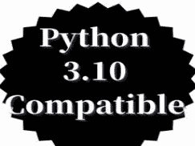
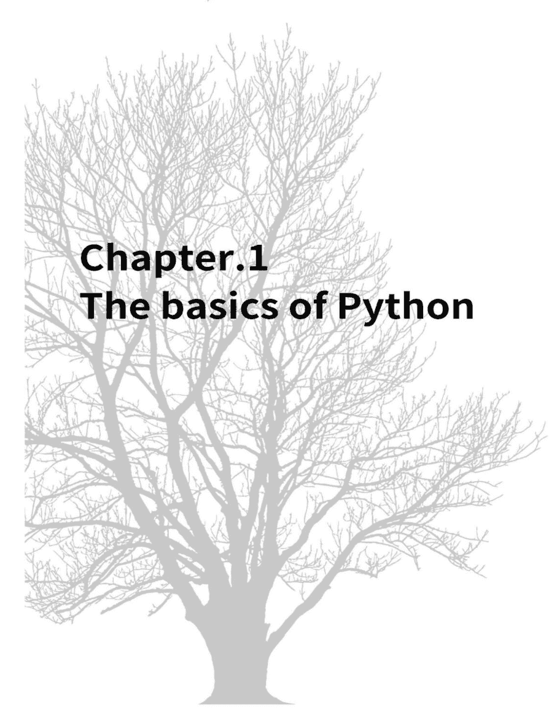
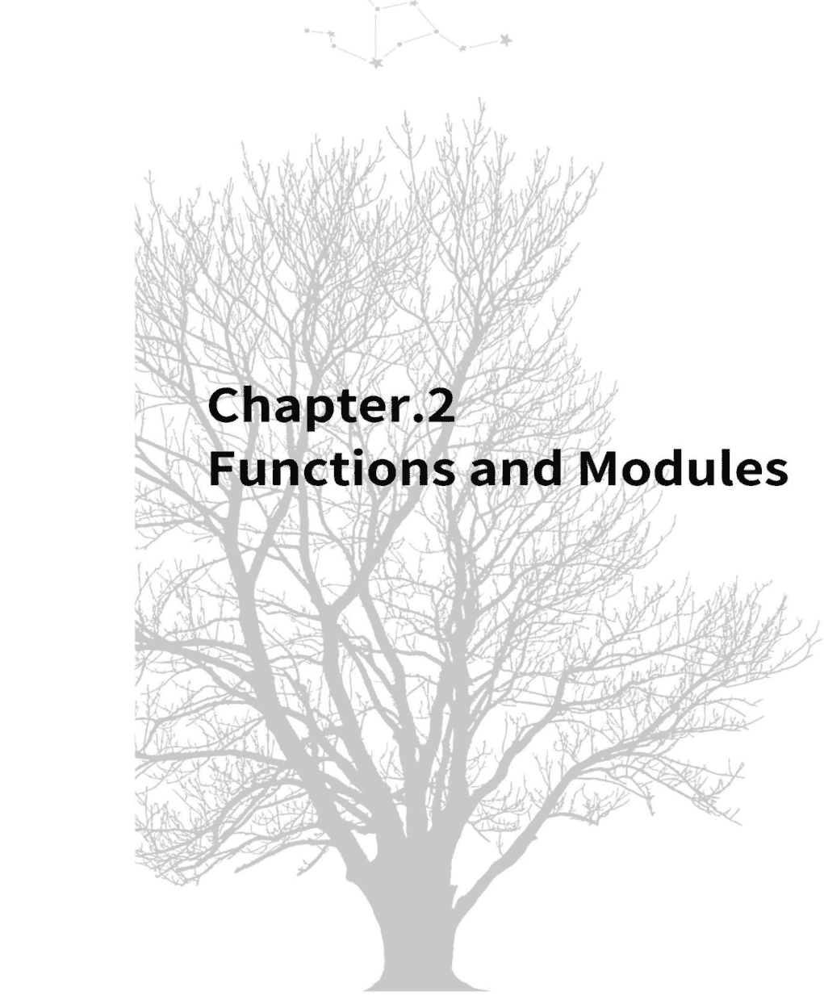
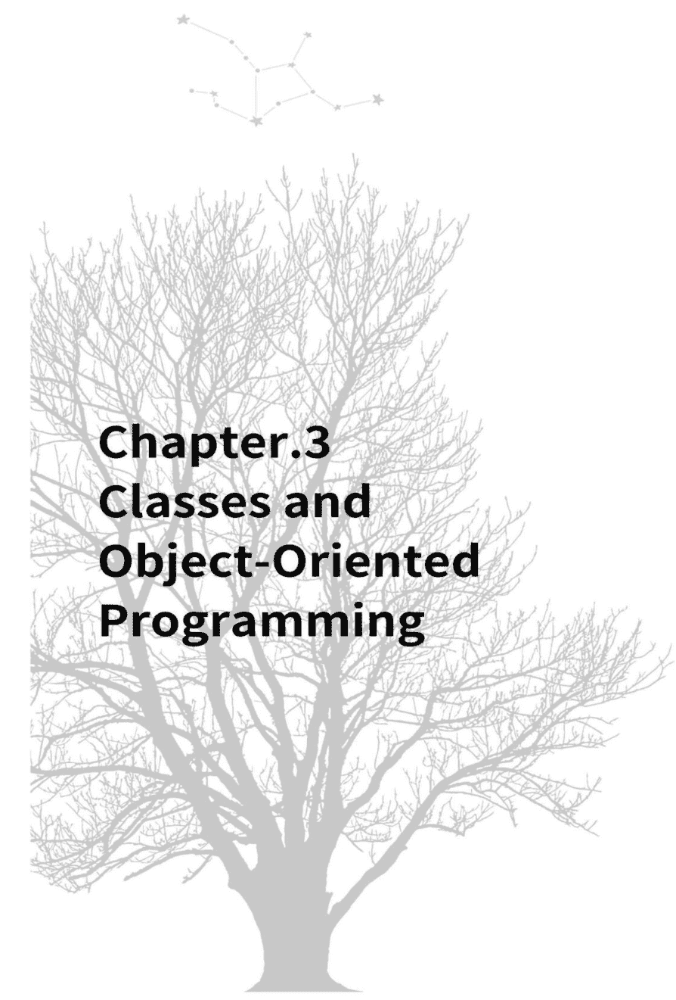
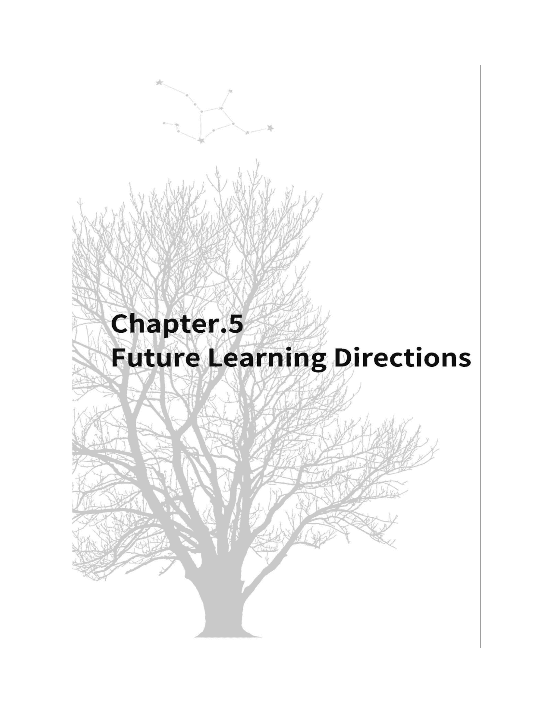

午餐学习系列

Python

## Python 基础

午餐学习指南

高效掌握生成式 AI 时代（如 ChatGPT）所需的编程技能

T.TAKAMIYA



释放 Python 潜力：资深开发者的快速学习指南

## 引言

各位工程师，非常感谢你们在众多书籍中选择了这本书。

请允许我先做个自我介绍。

我是作者，高宫隆。我是一名研发团队的经理兼工程师，在地方城市拥有约 20 年的工程师经验。（虽然被称为“玩票经理”听起来不错，但我本质上是个万金油。）

虽然不是大公司，但在一家约有千名员工的公司里，我参与了从 Web 系统开发到 AI 和传感器的广泛项目。

由于研发的性质，我很幸运有机会不断接触新技术和新方法，而不局限于特定的环境或语言。

此外，通过 PoC 等方式频繁接触终端用户，我获得了处理从上游到下游所有流程的经验，尽管规模不大。

通过这些经历，我意识到的是基础编程概念及其应用能力的重要性，而不是单个语言的细节。
尤其是在接触新语言和工具时，我强烈感觉到理解底层思维能带来顺畅的掌握。

基于从这些经验中获得的知识，本书为那些有其他语言经验的人，简明扼要地总结了 Python 的核心知识。

本书努力让已经理解编程基本概念的读者能在短时间内掌握 Python 的精髓。

作者的座右铭是“抓住编程的本质，并培养灵活应用的能力”。我希望读者也能通过本书掌握这一精髓。

## 本书的目的与目标读者

我们 IT 工程师理想情况下只希望使用我们专长的系统、语言和框架，但现实并非如此简单。

不可避免地会遇到需要新知识的情况，例如意外的项目分配、临时支持、分析业务伙伴公司或前辈创建的工具，我们不断地被迫在繁忙的工作间隙获取新知识。

另一方面，随着以 ChatGPT 为代表的生成式 AI 的出现，编程本身的定位正在发生变化。

直到现在，彻底理解语言的方方面面以及从零开始编写代码的“输出能力”一直被认为是编程能力的指标。

然而，生成式 AI 已经能够处理这种“从 0 到 1”的部分。

相反，我认为对于人类来说，理解已编写源代码的“输入能力”和验证代码有效性的“分析能力”将变得更加重要。

在这种背景下，本书旨在以最短的时间获取启动 Python 所需的最小必要知识。

我认为，能够浏览源代码、理解整体结构和关联、把握程序的行为是至关重要的。

本书《午餐时间可读的 Python 入门》旨在为有编程经验的人在短时间内高效学习 Python 基础。

## 学习范围、前提条件和学习环境

在继续阅读本书之前，我将解释本书涵盖的范围，以及必要的前提条件和学习环境。

### 学习范围

本书旨在获取理解该语言的基础知识，例如 Python 的基本语法、数据类型、函数、类、数组等。

内容基于 Python 3.10 环境编写。截至 2024 年 5 月，最新版本是 3.12，但使用过新的版本可能导致生成式 AI 学习不足或网络信息稀缺，从而降低开发效率，因此使用了稳定且有充分记录的版本。

每章都提供使用示例代码的解释，以加深实践理解。还包括执行结果的解释，以理解代码的行为。

使用各种框架的实践内容计划在单独的书中编写。

### 前提条件

本书面向工程师，假设读者具备基础编程概念（变量、常量、函数、控制结构、类、面向对象等）的知识。
因此，各章省略了诸如“什么是变量”之类的基本解释。

### 学习环境

本书假设使用 VSCode 作为 IDE，安装 Python 扩展，并将其作为示例代码执行环境运行。
然而，如果目的是获取阅读理解能力而无需动手实践，那么只阅读本书而不准备任何特定环境也没有问题。

### Python 的特点与用例

在解释语法之前，我将简要描述 Python 语言的概述。如果您想立即开始学习，请跳到第 1 章。
Python 是一种通用的高级编程语言，具有简单易读的语法、丰富的标准库和强大的第三方库等特点。Python 的主要特点和用例如下：

### 易读易写的语法

- 基于缩进的块结构提供了高代码可读性
- 简洁的语法使代码编写变得容易
- 丰富的内置函数和数据类型支持高效开发

### 数据分析与科学计算

- 使用 NumPy、Pandas 和 SciPy 等强大库进行数据分析
- 使用 Matplotlib 进行数据可视化
- 使用 Jupyter Notebook 进行交互式开发环境

### 机器学习与深度学习

- 利用 Scikit-learn、TensorFlow 和 Keras 等机器学习库
- 应用于图像识别、自然语言处理和推荐系统等领域
- Python 丰富的库和开发环境使得机器学习项目能够高效推进

### Web 应用开发

- 使用 Django、Flask 和 FastAPI 等 Web 框架进行 Web 应用开发
- 利用丰富的第三方库进行高效开发
- 结合 Python 的简洁性和 Web 框架，构建可维护的 Web 应用

### 脚本与自动化

- 自动化文件操作、文本处理和系统管理等任务
- 易于与其他程序和系统集成
- 使用 Python 丰富的标准库和第三方库，可以高效执行各种自动化任务

### 教育与原型设计

- Python 简单易读的语法使其适合编程教育
- 适合学习算法和原型设计的语言
- 交互式开发环境（REPL）允许快速确认代码行为

Python 因其通用性和丰富的库而被广泛应用于各个领域。通过利用 Python 的生态系统，可以实现高效且高质量的软件开发。探索 Python 的潜力并涉足新领域，将提升您作为开发者的技能并扩展您的职业可能性。

## 第 1 章 Python 基础



本章解释变量、类型、控制结构和函数基础。

这些概念虽然在不同语言之间存在表示规则的差异，但作为编程语言，它们属于正常规范的范围，应该容易理解。

有一些独特的规范和表示规则，因此最好留意一下。

### 1.1 变量与常量

在 Python 中，数据使用变量进行存储和操作。变量的值可以更改。

#### 声明和赋值变量

在 Python 中，声明变量时不需要指定类型。通过将值赋给变量名来自动创建变量。

```
message = "Hello, world!"
number = 42
```

在上面的例子中，字符串 "Hello, world!" 被赋值给 message 变量，整数 42 被赋值给 number 变量。

### Python 中的常量

Python 没有像其他语言那样的 `const` 关键字，也没有专门的功能来声明不可变常量。然而，将全大写命名的变量视为常量是一种常见的约定。

```
PI = 3.141592
MAX_SIZE = 1000
```

但是，这仅仅是一种约定，被声明为常量的变量的值实际上是可以改变的。开发者需要注意不要更改被声明为常量的变量的值。

### 变量和常量的命名约定

在 Python 中，变量和常量的命名遵循以下规则：

- 变量名应以小写字母开头，并使用下划线 (_) 分隔单词（例如：my_variable, user_id）。
- 常量名应全部使用大写字母，并使用下划线分隔单词（例如：MAX_VALUE, DEFAULT_SIZE）。
- 变量名和常量名可以使用字母、数字和下划线，但不能以数字开头。
- Python 关键字（if, for, while 等）不能用作变量名或常量名。

### 类型转换

在 Python 中，你可以在需要时进行类型转换（强制转换）。以下是常用的类型转换方法：

- int()：转换为整数类型
- float()：转换为浮点数类型
- str()：转换为字符串类型

```python
x = "10"
y = int(x)  # y = 10 (整数型)
z = float(x)  # z = 10.0 (浮動小數點型)
```

通过在 Python 中恰当地使用变量，你可以提高代码的可读性和可维护性。此外，遵循命名约定也使得与其他开发者共享代码变得更加容易。

按照约定，打算作为常量使用的变量应全部使用大写字母命名，但必须注意不要更改它们的值。

### 1.2 数据类型

Python 具有以下主要数据类型：

#### 数值类型

- 整数 (int)：表示正数、负数和 0。
  示例：42, -10, 0
- 浮点数 (float)：表示带小数点的实数。
  示例：3.14, -2.5, 0.0

#### 字符串类型 (str)

字符串表示用引号（' 或 "）括起来的文本数据。

```python
name = "Alice"
message = 'Hello, world!'
```

可以使用以下方法和运算符进行字符串操作：

- 字符串拼接：可以使用 + 运算符拼接字符串。
  示例："Hello, " + "world!"
- 字符串长度：可以使用 len() 函数获取字符串的长度。
  示例：len("Hello")
- 字符串索引：可以使用 [] 访问字符串中的特定位置。
  示例："Hello"[0]（结果为 "H"）

#### 布尔类型 (bool)

```python
is_student = True
has_kids = False
```

布尔类型的值为 True 或 False。

布尔类型用作条件表达式或比较运算符（==, !=, <, > 等）的结果。

#### 列表 (list)

列表是一种以有序方式存储多个元素的数据类型。用 [] 括起来的数组就是列表。可以添加、删除或修改元素。

```python
numbers = [1, 2, 3, 4, 5]
fruits = ["apple", "banana", "orange"]
```

可以使用以下方法和运算符进行列表操作：

- 添加元素：可以使用 append() 方法将元素添加到列表末尾。
  示例：numbers.append(6)
- 删除元素：可以使用 remove() 方法从列表中删除指定元素。
  示例：fruits.remove("banana")
- 访问元素：可以使用 [] 访问列表中的特定位置。
  示例：numbers[0]（结果为 1）

#### 元组 (tuple)

元组是一种存储多个元素的数据类型，类似于列表，但一旦创建，就不能添加、删除或修改元素。用 () 括起来的数组就是元组。

```python
point = (10, 20)
person = ("Alice", 25, "Engineer")
```

#### 字典 (dict)

字典是一种存储键值对的数据类型。可以使用键来访问值。用 {} 括起来的数组就是字典。

```python
student = {"name": "Bob", "age": 20, "major": "Computer Science"}
```

可以使用以下方法和运算符进行字典操作：

- 访问值：可以使用带指定键的 [] 访问对应的值。
  示例：student["name"]（结果为 "Bob"）
- 添加键和值：使用 [] 指定新键并赋值，即可添加新的键值对。
  示例：student["grade"] = "A"
- 检查键是否存在：可以使用 in 运算符检查键是否存在于字典中。
  示例："age" in student（结果为 True）

理解和正确使用这些数据类型对于在 Python 中管理和处理数据非常重要。

列表、元组和字典将在第 4 章中再次详细解释。

### 1.3 控制结构 (if, for, while)

控制结构是用于控制程序执行流程的构造。Python 主要有以下控制结构：

#### if 语句

if 语句在条件为真 (True) 时执行特定的代码块。

```python
age = 20
if age >= 18:
    print("Adult")
else:
    print("Minor")
```

在 if 语句中，如果条件的结果为 True，则执行紧跟在 if 语句之后的代码块。如果条件为 False，则执行紧跟在 else 语句之后的代码块。

可以使用 elif 语句指定多个条件。

```python
score = 80
if score >= 90:
    print("Excellent")
elif score >= 60:
    print("Pass")
else:
    print("Fail")
```

#### for 语句

for 语句通过从序列（列表、元组、字符串等）中依次提取元素，重复执行特定的代码块。

```python
fruits = ["apple", "banana", "orange"]
for fruit in fruits:
    print(fruit)
```

在上面的例子中，fruits 列表的元素被依次赋值给 fruit，然后执行 print 语句。

可以使用 range() 函数来执行指定次数的代码块。

```python
for i in range(5):
    print(i)
```

在这个例子中，从 0 到 4 的整数被依次赋值给 i，然后执行 print 语句。

#### while 语句

while 语句在条件为真 (True) 时重复执行特定的代码块。

```python
count = 0
while count < 5:
    print(count)
    count += 1
```

在这个例子中，只要 count 小于 5，就会重复执行 print 语句和 count += 1。

#### break 和 continue 语句

break 语句中断循环，并将处理移到循环之外。

```python
for i in range(10):
    if i == 5:
        break
    print(i)
```

在这个例子中，当 i 变为 5 时，循环中断，并输出从 0 到 4 的整数。

continue 语句中断当前迭代，并将处理移到循环的下一次迭代。

```python
for i in range(5):
    if i == 3:
        continue
    print(i)
```

在这个例子中，当 i 为 3 时，跳过 print 语句，并输出 0, 1, 2 和 4。

这些控制结构可用于控制程序流程并实现基于条件的处理。

控制结构可以单独使用，也可以与其他控制结构组合使用，以实现更复杂的处理。

### 1.4 运算符

Python 提供了各种运算符。这里，我将解释主要的运算符。

#### 算术运算符

- +：加法
- -：减法
- *：乘法
- /：除法
- %：取模（求余数）
- **：幂运算
- //：整除（商的整数部分）

```python
x = 10
y = 3

print(x + y)  # 13
print(x - y)  # 7
print(x * y)  # 30
print(x / y)  # 3.3333333333333335
print(x % y)  # 1
print(x ** y)  # 1000
print(x // y)  # 3
```

#### 比较运算符

- ==：等于
- !=：不等于
- <：小于
- >：大于
- <=：小于或等于
- >=：大于或等于

```python
x = 5
y = 3

print(x == y)  # False
print(x != y)  # True
print(x < y)   # False
print(x > y)   # True
print(x <= y)  # False
print(x >= y)  # True
```

#### 逻辑运算符

- and：逻辑与（两个条件都为真时结果为真）
- or：逻辑或（至少一个条件为真时结果为真）
- not：逻辑非（反转条件的真值）

```python
x = 5
y = 3

print(x > 0 and y > 0)  # True
print(x > 0 or y < 0)   # True
print(not (x > 0))      # False
```

#### 赋值运算符

- `=`：简单赋值
- `+=`：加法赋值
- `-=`：减法赋值
- `*=`：乘法赋值
- `/=`：除法赋值
- `%=`：取模赋值
- `**=`：幂赋值
- `//=`：整除赋值

```python
x = 5

x += 3  # x = x + 3
print(x)  # 8

x -= 2  # x = x - 2
print(x)  # 6

x *= 4  # x = x * 4
print(x)  # 24

x /= 3  # x = x / 3
print(x)  # 8.0

x %= 5  # x = x % 5
print(x)  # 3.0

x **= 2  # x = x ** 2
print(x)  # 9.0

x //= 2  # x = x // 2
print(x)  # 4.0
```

#### 成员运算符

- `in`：检查一个对象是否存在于序列中
- `not in`：检查一个对象是否不存在于序列中

```python
my_list = [1, 2, 3, 4, 5]
print(3 in my_list)  # True
print(6 not in my_list)  # True
```

#### 身份运算符

- `is`：检查两个操作数是否引用同一个对象
- `is not`：检查两个操作数是否引用不同的对象

```python
x = [1, 2, 3]
y = [1, 2, 3]
z = x
print(x is y)  # False
print(x is z)  # True
print(x is not y)  # True
```

这些运算符用于求值表达式和执行条件检查。同样重要的是要注意运算符的优先级。优先级较高的运算符会先被求值。运算符是编程中的基本元素。理解并正确使用 Python 运算符可以让你编写出高效且可读的代码。

## 示例代码：简单测验应用

这是一个结合了第1章所学内容的示例代码。
此示例代码演示了以下内容：

- 如何声明和使用变量
- 如何使用数据类型（字符串、整数）
- 如何使用控制结构（if 语句）
- 如何使用运算符

* 请注意，其中包含了第2章（函数）的部分内容。

阅读示例代码，理解如何在实际应用中应用这些概念。

```python
def ask_question(question, answer):
    user_answer = input(question + " ")  # Get user's answer as a string
    if user_answer.lower() == answer.lower():  # Case-insensitive
        print("Correct!")
        return 1  # Return 1 if correct
    else:
        print("Incorrect. The correct answer is " + answer + ".")
        return 0  # Return 0 if incorrect

# Display the start message of the quiz application
print("Welcome to the simple quiz application!")
print("Please answer the following questions.\n")

score = 0  # Initialize the variable to store the number of correct answers

# Call the ask_question function with the question and correct answer as arguments
# Store the return value in a variable and update the number of correct answers
score += ask_question("What is the capital of Japan?", "Tokyo")
score += ask_question("What is the height of Mount Fuji in meters?", "3776")
score += ask_question("What is the national bird of Japan?", "Pheasant")

# Display the end message of the quiz and the number of correct answers
print(f"\nThe quiz is over. You answered {score} out of {score} questions correctly!")
```




## 第2章 函数与模块

本章将解释如何使用函数。如果你有其他编程语言的知识，这部分也应该很容易理解，因为其中没有太多难以掌握的内容。

### 2.1 定义函数、参数和返回值

函数是为执行特定任务而设计的可重用代码块。在 Python 中，函数使用 `def` 语句定义。函数可以接受参数、执行处理并返回值。

#### 定义函数

使用 `def` 语句来定义一个函数。函数由函数名、参数（在括号中指定）和代码块（缩进部分）组成。

```python
def greet(name):
    print(f"Hello, {name}!")
```

在这个例子中，定义了一个名为 `greet` 的函数。`name` 是这个函数的参数。

#### 调用函数

定义好的函数可以通过在函数名后附加括号 `()` 来调用。如果有参数，请在括号内指定值。

```python
greet("Alice")  # Output: Hello, Alice!
```

#### 参数

参数用于指定传递给函数的数据。

```python
def greet(name):
    print(f"Hello, {name}!")

greet("Alice")  # Output: Hello, Alice!
greet("Bob")  # Output: Hello, Bob!
```

在这个例子中，`greet` 函数接受 `name` 作为参数。通过在调用函数时传递不同的参数值，可以灵活地改变函数的行为。

#### 默认参数

通过为参数设置默认值，可以在调用函数时省略参数。

```python
def greet(name="Guest"):
    print(f"Hello, {name}!")

greet()  # Output: Hello, Guest!
greet("Alice")  # Output: Hello, Alice!
```

在这个例子中，`name` 参数被设置了默认值 "Guest"。如果没有指定参数，则使用默认值。

#### 位置参数和关键字参数

参数分为两种类型：位置参数和关键字参数。位置参数在调用函数时按照参数的顺序指定。关键字参数则显式地指定参数的名称。

```python
def introduce(name, age, profession):
    print(f"My name is {name}, and I am {age} years old. My profession is {profession}.")

introduce("Alice", 28, "Engineer")  # Positional arguments
introduce(age=30, name="Bob", profession="Teacher")  # Keyword arguments
```

位置参数和关键字参数可以组合使用。但是，位置参数必须在关键字参数之前指定。

#### 可变长度参数

可以使用 `*args` 来接受任意数量的参数。

```python
def sum_numbers(*args):
    total = 0
    for num in args:
        total += num
    return total

result1 = sum_numbers(1, 2, 3)  # result1 = 6
result2 = sum_numbers(4, 5, 6, 7)  # result2 = 22
```

在这个例子中，`sum_numbers` 函数使用 `*args` 来接受任意数量的参数，并返回它们的总和。

可以使用 `**kwargs` 来接受任意数量的关键字参数。

```python
def print_kwargs(**kwargs):
    for key, value in kwargs.items():
        print(f"{key}: {value}")

print_kwargs(name="Alice", age=25, city="New York")
```

输出：

```
name: Alice
age: 25
city: New York
```

在这个例子中，`print_kwargs` 函数使用 `**kwargs` 来接受任意数量的关键字参数，并输出它们的键和值。

#### 返回值

可以使用 `return` 语句从函数返回一个值。

```python
def square(x):
    return x ** 2

result = square(5)
print(result)  # Output: 25
```

在这个例子中，`square` 函数计算参数 `x` 的平方并返回结果。返回值可以赋值给一个变量，或者作为另一个函数的参数使用。函数也可以返回多个值。在这种情况下，返回值被视为一个元组。

```python
def get_name_and_age():
    name = "Alice"
    age = 28
    return name, age

name, age = get_name_and_age()
print(name)  # Output: Alice
print(age)  # Output: 28
```

适当地使用参数和返回值可以提高函数的通用性和可重用性。函数可以根据接收到的参数执行处理并返回结果。这使得同一个函数可以在各种情况下被重用，从而减少代码重复。

Python 提供了增强函数灵活性的功能，例如默认参数值、位置参数、关键字参数和多个返回值。有效地利用这些功能可以让你编写出更具可读性和可维护性的代码。

### 2.2 Lambda 表达式

Lambda 表达式是定义小型匿名函数的一种简洁方式。使用 Lambda 表达式，你可以当场定义短小的函数，从而提高代码的可读性。

顺便提一下，AWS 也有 Lambda，但那是完全不同的东西，只是名字相同，所以不要混淆。

#### Lambda 表达式的基本语法

Lambda 表达式使用 `lambda` 关键字定义。

`lambda arguments: expression`

```python
double = lambda x: x * 2
```

#### 使用 Lambda 表达式

Lambda 表达式通常与接受函数作为参数的其他函数结合使用。典型的例子包括 `map()`、`filter()`、`sort()` 等函数。

# Lambda 表达式与 map() 函数

`map()` 函数将指定的函数应用于列表的每个元素，并返回一个新列表。

```
numbers = [1, 2, 3, 4, 5]
squared_numbers = list(map(lambda x: x ** 2, numbers))
print(squared_numbers)  # Output: [1, 4, 9, 16, 25]
```

在此示例中，lambda 表达式 `lambda x: x ** 2` 用于计算列表中每个元素的平方。

# Lambda 表达式与 filter() 函数

`filter()` 函数过滤列表的元素，并返回一个仅包含满足指定条件的元素的新列表。

```
numbers = [1, 2, 3, 4, 5]
even_numbers = list(filter(lambda x: x % 2 == 0, numbers))
print(even_numbers)  # Output: [2, 4]
```

在此示例中，lambda 表达式 `lambda x: x % 2 == 0` 用于仅筛选出偶数。

# Lambda 表达式与 sort() 函数

`sort()` 函数对列表的元素进行排序。通过将 lambda 表达式指定为 `key` 参数，你可以定义排序标准。

```
students = [
    {'name': 'Alice', 'score': 80},
    {'name': 'Bob', 'score': 90},
    {'name': 'Charlie', 'score': 70}
]

students.sort(key=lambda x: x['score'], reverse=True)
print(students)
# Output: [{'name': 'Bob', 'score': 90}, {'name': 'Alice', 'score': 80}, {'name': 'Charlie', 'score': 70}]
```

在此示例中，lambda 表达式 `lambda x: x['score']` 用于根据字典的 'score' 键进行排序。

Lambda 表达式适用于定义简短而简洁的函数。当与接受函数作为参数的其他函数结合使用时，它们尤其有用。
然而，对于复杂的处理，使用常规函数定义更具可读性。

正确使用 lambda 表达式可以提高代码的可读性和可维护性。
在 Python 中，lambda 表达式可以与其他函数结合使用，以简洁地表达列表操作和处理。

Lambda 表达式是 Python 的一个重要特性，它利用了其函数式编程的特点。

### 2.3 导入和使用模块

模块是包含相关变量、函数、类等的 Python 文件。使用模块可以提高代码的可重用性和程序结构。Python 的标准库中有许多模块可用，可以根据需要导入和使用。

#### 导入模块

要导入模块，请使用 `import` 语句。

```
import module_name
from module_name import function_name
from module_name import function_name1, function_name2
from module_name import *
```

例如，要导入 `math` 模块，你可以这样做：

```
import math
```

现在你可以使用 `math` 模块中包含的函数和常量。

```
pi = math.pi
print(pi)  # Output: 3.141592653589793

print(math.sqrt(16))  # Output: 4.0
```

你也可以导入特定的函数。

```
from math import sqrt
print(sqrt(16))  # Output: 4.0
```

#### 使用别名导入

如果模块名或函数名很长，你可以使用别名导入它。

```
import numpy as np
print(np.array([1, 2, 3]))  # Output: [1 2 3]
```

#### 创建自定义模块

创建自己的模块可以提高代码的可重用性。

```
# my_module.py
def greet(name):
    print(f"Hello, {name}!")

# main.py
import my_module

my_module.greet("Alice")  # Output: Hello, Alice!
```

在此示例中，`greet` 函数定义在名为 `my_module.py` 的文件中，并在 `main.py` 中导入和使用。

#### 使用 `__name__` 变量

一个 Python 文件可以根据它是作为模块使用还是直接执行来改变其行为。`__name__` 变量用于确定这一点。

```
# my_module.py
def greet(name):
    print(f"Hello, {name}!")

if __name__ == "__main__":
    greet("Alice")
```

在此示例中，如果 `my_module.py` 被直接执行，`if __name__ == "__main__"` 下的代码块将被执行，并且会调用 `greet("Alice")`。

直接执行时：

```
Hello, Alice!
```

另一方面，如果 `my_module.py` 是从另一个文件导入的，`if __name__ == "__main__"` 下的代码块将不会被执行。

导入并执行时：

```
import my_module
my_module.greet("Bob")
```

输出：

```
Hello, Bob!
```

`__main__` 中对 `Alice` 的处理不会被执行。

使用模块可以提高代码的可重用性和程序结构。

Python 拥有丰富的标准库，可以根据需要导入和使用。此外，创建自己的模块使代码管理更容易。

`import` 语句用于导入模块。你可以导入整个模块或特定的函数。
你也可以使用别名导入以提高代码的可读性。

`__name__` 变量可用于确定模块是被直接执行还是被导入。
此功能可用于适当控制模块的行为。

在 Python 中，建议积极使用模块。

通过有效利用标准库并合理设计自定义模块，你可以编写高效且可维护的代码。

### 2.4 文件读写

文件读写是数据持久化和程序间数据交换的基本功能。在 Python 中，可以轻松执行文件读写。

#### 打开和关闭文件

要读取或写入文件，你首先需要打开文件。使用 `open()` 函数打开文件。

```
file = open("file.txt", "r")
```

`open()` 函数的第一个参数是文件路径，第二个参数指定打开文件的模式。模式包括以下几种：

- "r"：读取模式（默认）
- "w"：写入模式（如果文件存在则覆盖）
- "a"：追加模式（追加到文件末尾）
- "x"：独占写入模式（如果文件存在则引发错误）

使用完文件后，调用 `close()` 方法关闭文件。

```
file.close()
```

#### 读取文件

要从文件读取内容，请使用 `read()`、`readline()` 或 `readlines()` 方法。

```
# 读取整个文件
with open("file.txt", "r") as file:
    content = file.read()
    print(content)

# 逐行读取
with open("file.txt", "r") as file:
    line = file.readline()
    while line:
        print(line.strip())
        line = file.readline()

# 将所有行读取为列表
with open("file.txt", "r") as file:
    lines = file.readlines()
    print(lines)
```

使用 `with` 语句，你可以自动关闭文件。

#### 写入文件

要将内容写入文件，请使用 `write()` 方法。

```
with open("file.txt", "w") as file:
    file.write("Hello, World!\n")
    file.write("This is a sample file.\n")
```

`write()` 方法将指定的字符串写入文件。要添加新行，你需要显式指定 `"\n"`。

#### 读写 CSV 文件

CSV（逗号分隔值）是一种用于存储表格数据的文件格式。Python 提供了 `csv` 模块用于读写 CSV 文件。

```
import csv

# 读取 CSV 文件
with open("data.csv", "r") as file:
    reader = csv.reader(file)
    for row in reader:
        print(row)

# 写入 CSV 文件
with open("data.csv", "w", newline="") as file:
    writer = csv.writer(file)
    writer.writerow(["Name", "Age", "City"])
    writer.writerow(["Alice", "28", "New York"])
    writer.writerow(["Bob", "35", "Paris"])
```

`csv` 模块使得读写 CSV 文件变得容易。
文件读写是数据持久化和程序间数据交换的基本功能。在 Python 中，使用 `open()` 函数打开文件，并使用 `read()` 和 `write()` 方法从文件读取和写入文件。使用 `with` 语句允许你自动关闭文件。
此外，Python 提供了 `csv` 模块，便于读写 CSV 文件。CSV 文件作为存储表格数据的文件格式被广泛使用。
正确使用文件读写可以让你高效地执行数据持久化和程序间数据交换。

文件操作是各种应用程序所需的重要功能。

## 示例代码：待办事项应用

基于第2章所学内容，以下示例代码包含：

- 添加任务并将其标记为完成
- 将任务保存到CSV文件以及从CSV文件加载任务
- 设置截止日期并显示距离截止日期的剩余天数
- 任务排序功能

此示例代码运用了以下第2章内容：

- 函数参数与返回值：定义函数来执行任务操作（添加、标记为完成）。
- Lambda表达式：利用Lambda表达式进行任务排序。
- 导入与使用模块：使用datetime模块设置截止日期并计算剩余天数。
- 文件读写：在应用程序启动时，将任务保存到CSV文件以及从CSV文件加载任务。

以下是示例代码概览：

```python
import csv
import datetime

# Task class
class Task:
    def __init__(self, description, due_date):
        self.description = description
        self.due_date = due_date
        self.completed = False

    def days_left(self):
        return (self.due_date - datetime.date.today()).days

# Task list
tasks = []

# Adding a task
def add_task(description, due_date):
    task = Task(description, due_date)
    tasks.append(task)

# Marking a task as complete
def complete_task(index):
    if 0 <= index < len(tasks):
        tasks[index].completed = True

# Saving tasks
def save_tasks(filename):
    with open(filename, "w", newline="") as file:
        writer = csv.writer(file)
        writer.writerow(["Description", "Due Date", "Completed"])
        for task in tasks:
            writer.writerow([task.description, task.due_date, task.completed])

# Loading tasks
def load_tasks(filename):
    tasks.clear()
    with open(filename, "r") as file:
        reader = csv.reader(file)
        next(reader)  # Skip the header row
        for row in reader:
            description, due_date, completed = row
            task = Task(description, datetime.datetime.strptime(due_date, "%Y-%m-%d").date())
            task.completed = completed == "True"
            tasks.append(task)

# Main processing
def main():
    load_tasks("tasks.csv")

    while True:
        print("1. List tasks")
        print("2. Add a task")
        print("3. Mark a task as complete")
        print("4. Sort tasks")
        print("5. Exit")

        choice = input("Select an option: ")

        if choice == "1":
            print("Task list:")
            for i, task in enumerate(tasks, start=1):
                print(f"{i}. {task.description} - {task.due_date} ({task.days_left()} days left) - {'Completed' if task.completed else 'Not completed'}")
        elif choice == "2":
            description = input("Enter the task description: ")
            due_date_str = input("Enter the due date (YYYY-MM-DD): ")
            due_date = datetime.datetime.strptime(due_date_str, "%Y-%m-%d").date()
            add_task(description, due_date)
            print("Task added.")
        elif choice == "3":
            index = int(input("Enter the number of the completed task: ")) - 1
            complete_task(index)
            print("Task marked as complete.")
        elif choice == "4":
            print("1. Sort by earliest due date")
            print("2. Sort by latest due date")
            sort_choice = input("Select an option: ")
            if sort_choice == "1":
                tasks.sort(key=lambda task: task.days_left())
                print("Sorted by earliest due date.")
            elif sort_choice == "2":
                tasks.sort(key=lambda task: task.days_left(), reverse=True)
                print("Sorted by latest due date.")
            else:
                print("Invalid option.")
        elif choice == "5":
            save_tasks("tasks.csv")
            print("Exiting the application.")
            break
        else:
            print("Invalid option.")

if __name__ == "__main__":
    main()
```

## 第3章 类与面向对象编程



<!-- no content -->

本章将讲解Python的类与对象。
面向对象编程的概念，如类定义、实例创建、继承和多态，在Java、C++、C#等语言中很常见，Python也具有类似的功能。
类定义、实例创建、继承和多态等基本概念与其他语言是相通的。

### 3.1 类定义与实例化

面向对象编程（OOP）是一种将程序视为“对象”的技术。
对象拥有数据（属性）和行为（方法）。在Python中，通过定义“类”来创建对象的蓝图，并从这些类生成“实例”来使用对象。

#### 类定义

在Python中，使用`class`关键字定义类。以下是一个简单的`Person`类示例：

```python
class Person:
    def __init__(self, name, age):
        self.name = name
        self.age = age

    def greet(self):
        print(f"Hello, my name is {self.name} and I'm {self.age} years old.")
```

- `__init__`方法是类的构造函数。它在创建实例时自动调用。
- `self`用于引用实例本身。
- `name`和`age`是`Person`类的属性。
- `greet`方法定义了`Person`类的行为。

`self`是在实例方法中引用实例本身的一种方式，用于访问实例的属性和方法。从概念上理解可能有点困难，因此可以将其视为一种语言约定，即必须编写`self`。

#### 实例化

从类创建对象的过程称为“实例化”。要实例化，只需在类名后附加括号即可。

```python
person1 = Person("Alice", 25)
person2 = Person("Bob", 30)
```

在上面的示例中，从`Person`类创建了两个实例：`person1`和`person2`。

#### 使用实例

要访问实例的属性或方法，请使用点表示法。

```python
print(person1.name)  # Output: Alice
print(person2.age)  # Output: 30

person1.greet()  # Output: Hello, my name is Alice and I'm 25 years old.
person2.greet()  # Output: Hello, my name is Bob and I'm 30 years old.
```

正确地定义和使用类与实例，可以提高代码的可重用性和可维护性。
它还允许将现实世界的概念反映在程序中，从而编写出更直观的代码。

在Python中，可以使用类来实现面向对象编程。理解类定义和实例化的概念，能让你开发出更高级、更有效的程序。

### 3.2 继承与多态

继承和多态是面向对象编程中的重要概念。

继承是一种通过扩展现有类来创建新类的功能，它提高了代码的可重用性。

多态指的是具有相同接口的对象能够执行不同行为的能力。

#### 继承

在Python中，定义类时可以从现有类继承。这允许继承父类的属性和方法，并添加新功能或覆盖现有功能。

```python
class Animal:
    def __init__(self, name):
        self.name = name

    def speak(self):
        pass

class Cat(Animal):
    def speak(self):
        return "Meow"

class Dog(Animal):
    def speak(self):
        return "Woof"
```

在上面的示例中，`Animal`类被定义为父类，`Cat`和`Dog`类被定义为子类。`Cat`和`Dog`类从`Animal`类继承了`name`属性。同时，它们各自独立地实现了`speak`方法。

#### 多态

多态指的是具有相同接口的对象能够执行不同行为的能力。在Python中，可以使用继承来实现多态。

```python
def animal_speak(animal):
    print(animal.speak())

# At this point, separate instances from different classes are created
cat = Cat("Whiskers")
dog = Dog("Buddy")

# The behavior implemented in each class is followed for each instance
animal_speak(cat)  # Output: Meow
animal_speak(dog)  # Output: Woof
```

在上面的示例中，`animal_speak`函数接受一个继承自`Animal`类的对象作为参数。当传入`Cat`和`Dog`实例时，会调用每个类中实现的`speak`方法。

利用继承和多态可以提高代码的可重用性和灵活性。它还允许以易于理解的方式设计复杂的系统。

在Python中，可以使用继承创建新的类，并使用多态灵活地定义对象的行为。理解并正确运用这些概念，可以开发出更有效、更易于维护的程序。

### 3.3 封装与访问控制

封装是面向对象编程的重要原则之一。封装指的是隐藏对象的内部状态，并限制外部访问。这有助于维护对象的完整性并防止意外的更改。在Python中，封装是通过访问控制来实现的。

#### 访问控制

Python不像其他语言那样有`private`、`protected`和`public`这样的关键字，但它通过在变量名或函数名开头添加下划线（_）的数量来实现伪访问控制。

- public：变量名或函数名开头没有下划线。可以从外部访问。
- protected：变量名或函数名开头有一个下划线（_）。可以从同一类和子类中访问。
- private：变量名或函数名开头有两个下划线（__）。只能从同一类内部访问。

以下是使用访问控制的示例：

```python
class BankAccount:
    def __init__(self, account_number, balance):
        self._account_number = account_number  # protected
        self.__balance = balance  # private

    def deposit(self, amount):
        self.__balance += amount

    def withdraw(self, amount):
        if amount <= self.__balance:
            self.__balance -= amount
        else:
            print("Insufficient funds")

    def get_balance(self):
        return self.__balance

account = BankAccount("1234567890", 1000)
print(account._account_number)  # Output: 1234567890
account.deposit(500)
account.withdraw(200)
print(account.get_balance())  # Output: 1300
```

在上面的例子中，`_account_number`被视为受保护的，可以从类外部访问。`__balance`被视为私有的，只能通过类内部的方法访问。

然而，Python的访问控制并不严格，更多是开发者之间的一种约定。在实践中，私有和受保护是通过下划线来表示的，但从外部访问它们是可能的。

正确使用封装和访问控制有助于保护对象的内部状态，提高代码的可维护性和可重用性，防止意外的更改，并减少错误。

在Python中，访问控制通过下划线来表示，从而实现了封装。理解封装的原则并进行适当的访问控制，可以开发出更健壮、更易于维护的程序。

## 示例代码：动物模拟

以下是结合第3章所学内容的示例代码。
此示例代码演示了以下内容：

- 如何定义类
- 如何使用继承
- 如何实现多态
- 如何使用封装和访问控制
- 如何创建和操作实例

阅读示例代码，理解如何在实际应用中应用这些概念。此代码以动物模拟应用为例，阐述了面向对象编程的主要概念。
`Animal`类被定义为基类，`Cat`和`Dog`类继承自它，提高了代码的可重用性。同时，通过重写`speak`方法实现了多态。
`Animal`类的`_name`和`_age`属性以及`Cat`类的`__color`属性用于演示访问控制和封装。
`Simulator`类演示了如何创建和操作实例，并展示了如何使用`isinstance`函数根据对象类型执行不同的处理。
通过此示例代码，理解面向对象编程的基本概念，并将其应用于实际的应用开发。

```python
class Animal:
    def __init__(self, name, age):
        self._name = name
        self._age = age

    def speak(self):
        pass

    def __str__(self):
        return f"{self._name} ({self._age} years old)"

class Cat(Animal):
    def __init__(self, name, age, color):
        super().__init__(name, age)
        self.__color = color

    def speak(self):
        return "Meow"

    def get_color(self):
        return self.__color

class Dog(Animal):
    def speak(self):
        return "Woof"

    def fetch(self):
        return f"{self._name} is fetching the ball!"

class Simulator:
    def __init__(self):
        self.animals = []

    def add_animal(self, animal):
        self.animals.append(animal)

    def simulate(self):
        for animal in self.animals:
            print(animal)
            print(f"Sound: {animal.speak()}")
            if isinstance(animal, Dog):
                print(animal.fetch())
            if isinstance(animal, Cat):
                print(f"Color: {animal.get_color()}")
            print()

# Usage example
simulator = Simulator()

while True:
    print("Choose an animal to add:")
    print("1. Cat")
    print("2. Dog")
    print("3. Simulate")
    print("4. Exit")

    choice = input("Enter your choice (1-4): ")

    if choice == "1":
        name = input("Enter the cat's name: ")
        age = int(input("Enter the cat's age: "))
        color = input("Enter the cat's color: ")
        cat = Cat(name, age, color)
        simulator.add_animal(cat)
    elif choice == "2":
        name = input("Enter the dog's name: ")
        age = int(input("Enter the dog's age: "))
        dog = Dog(name, age)
        simulator.add_animal(dog)
    elif choice == "3":
        simulator.simulate()
    elif choice == "4":
        break
    else:
        print("Invalid choice. Please try again.")
```

## 第4章 数据结构与算法

本章讲解数组操作和字符串操作。数组有三种类型，这是Python的特性之一。它们有不同的用途，但一旦习惯，就能直观地理解。

它们有一些特定的规则，但各自的规范并不太难。

### 4.1 列表与元组操作

列表和元组是用于存储多个元素的数据结构。列表用`[]`括起来，而元组用`()`括起来。
列表允许添加、删除和修改元素，而元组一旦定义就不能更改。这里，我将解释列表和元组的基本操作。

#### 列表操作

##### 1. 添加元素

- append()：在列表末尾添加一个元素。
- insert()：在指定位置插入一个元素。
- extend()：将另一个列表的元素添加到列表末尾。

```python
fruits = ['apple', 'banana', 'orange']

fruits.append('grape')
fruits.insert(1, 'kiwi')
fruits.extend(['mango', 'pineapple'])
print(fruits)  # Output: ['apple', 'kiwi', 'banana', 'orange', 'grape', 'mango', 'pineapple']
```

##### 2. 删除元素

- remove()：删除指定的元素。
- pop()：删除并返回指定位置的元素。如果未指定索引，则删除最后一个元素。
- clear()：删除列表中的所有元素。

```python
fruits = ['apple', 'banana', 'orange', 'grape']
fruits.remove('banana')
fruit = fruits.pop(1)
print(fruits)  # Output: ['apple', 'grape']
print(fruit)  # Output: orange
fruits.clear()
print(fruits)  # Output: []
```

##### 3. 访问和修改元素

- 你可以使用索引来访问和修改列表的元素。

```python
fruits = ['apple', 'banana', 'orange']
print(fruits[1])  # Output: banana
fruits[1] = 'kiwi'
print(fruits)  # Output: ['apple', 'kiwi', 'orange']
```

#### 元组操作

元组一旦定义就是不可变的，但你可以访问元素。

```python
fruits = ('apple', 'banana', 'orange')
print(fruits[1])  # Output: banana
```

#### 列表和元组的通用操作

- len()：返回列表或元组中的元素数量。
- count()：返回指定元素出现的次数。
- index()：返回指定元素第一次出现的索引。

```python
fruits = ['apple', 'banana', 'orange', 'banana']
print(len(fruits))  # Output: 4
print(fruits.count('banana'))  # Output: 2
print(fruits.index('orange'))  # Output: 2
```

列表和元组的选择取决于是否需要修改元素。如果需要修改元素，使用列表；如果不需要，使用元组。此外，元组比列表更节省内存，因此在处理大量数据时推荐使用元组。

### 4.2 使用字典和集合

理解这些操作有助于更有效地使用列表和元组进行数据管理和处理。

字典和集合是 Python 中常用的数据结构。字典使用花括号 `{}` 包围。

字典存储键值对，并允许通过键来访问值。集合表示唯一元素的集合，不允许重复元素。这里，我将解释字典和集合的基本操作和用法。

#### 字典操作

##### 1. 添加和修改元素

- 你可以添加新的键值对或修改现有键的值。

```python
student = { 'name' : 'Alice' , 'age' : 20 , 'major' : 'Computer Science' }
student[ 'gender' ] = 'Female'  # 添加一个新的键值对
student[ 'age' ] = 21  # 修改现有键的值
print(student)  # 输出: {'name': 'Alice', 'age': 21, 'major': 'Computer Science', 'gender': 'Female'}
```

##### 2. 删除元素

- 你可以使用 `del` 语句删除指定的键值对。
- 你可以使用 `pop()` 方法删除指定的键值对并返回其值。

```python
student = { 'name' : 'Alice' , 'age' : 21 , 'major' : 'Computer Science' ,
'gender' : 'Female' }
del student[ 'gender' ]
age = student.pop( 'age' )
print(student)  # 输出: {'name': 'Alice', 'major': 'Computer Science'}
print(age)      # 输出: 21
```

##### 3. 访问元素

- 你可以使用键来访问字典的值。
- 你可以使用 `get()` 方法来检索指定键的值。如果键不存在，可以返回一个默认值。

```python
student = { 'name' : 'Alice' , 'age' : 21 , 'major' : 'Computer Science' }
print(student[ 'name' ])  # 输出: Alice
print(student.get( 'gender' , 'Unknown' ))  # 输出: Unknown
```

#### 集合操作

##### 1. 添加和删除元素

- 你可以使用 `add()` 方法向集合中添加一个元素。
- 你可以使用 `remove()` 方法删除一个指定的元素。如果元素不存在，会引发 `KeyError`。
- 你可以使用 `discard()` 方法删除一个指定的元素。如果元素不存在，不会引发错误。

```python
fruits = { 'apple', 'banana', 'orange' }
fruits.add( 'grape' )
fruits.remove( 'banana' )
fruits.discard( 'kiwi' )
print(fruits)  # 输出: {'apple', 'orange', 'grape'}
```

##### 2. 集合运算

- 集合支持并集、差集和交集等运算。
- 你可以使用 `union()`、`intersection()` 和 `difference()` 方法来执行这些运算。

```python
set1 = { 1, 2, 3, 4, 5 }
set2 = { 4, 5, 6, 7, 8 }
union_set = set1.union(set2)
intersection_set = set1.intersection(set2)
difference_set = set1.difference(set2)
print(union_set)  # 输出: {1, 2, 3, 4, 5, 6, 7, 8}
print(intersection_set)  # 输出: {4, 5}
print(difference_set)  # 输出: {1, 2, 3}
```

字典适用于管理键值对，常用于数据库索引、解析配置文件等。集合适用于管理唯一元素的集合，常用于去除重复数据、测试成员资格等。

正确使用这些数据结构可以使数据管理和算法实现更加高效。

### 4.3 使用推导式

推导式是创建列表、字典和集合的一种简洁方式。使用推导式，你可以在一行代码中创建数据结构，而无需使用循环或条件语句。这里，我将解释列表推导式、字典推导式和集合推导式。

#### 列表推导式

列表推导式使用以下语法：

```
new_list = [expression for item in iterable if condition]
```

- `expression`：定义要包含在新列表中的元素。
- `item`：从原始列表中提取的元素。
- `iterable`：原始列表或可迭代对象。
- `condition`：将元素包含在新列表中的条件（可选）。

例如，创建一个包含 1 到 10 整数平方的列表：

```python
squares = [x ** 2 for x in range(1, 11)]
print(squares) # 输出: [1, 4, 9, 16, 25, 36, 49, 64, 81, 100]
```

创建一个只包含偶数的列表：

```python
even_numbers = [x for x in range(1, 11) if x % 2 == 0]
print(even_numbers) # 输出: [2, 4, 6, 8, 10]
```

#### 字典推导式

字典推导式使用以下语法：

```
new_dict = {key_expression: value_expression for item in iterable if condition}
```

- `key_expression`：定义新字典的键。
- `value_expression`：定义新字典的值。
- `item`：从原始列表中提取的元素。
- `iterable`：原始列表或可迭代对象。
- `condition`：将元素包含在新字典中的条件（可选）。

例如，创建一个键为 1 到 5 的整数，值为其平方的字典：

```python
square_dict = {x: x ** 2 for x in range(1, 6)} 
print(square_dict)  # 输出: {1: 1, 2: 4, 3: 9, 4: 16, 5: 25}
```

#### 集合推导式

集合推导式使用以下语法：

```
new_set = {expression for item in iterable if condition}
```

- `expression`：定义要包含在新集合中的元素。
- `item`：从原始列表中提取的元素。
- `iterable`：原始列表或可迭代对象。
- `condition`：将元素包含在新集合中的条件（可选）。

例如，创建一个只包含 1 到 10 中偶数的集合：

```python
even_set = {x for x in range( 1 , 11 ) if x % 2 == 0 }
print(even_set) # 输出: {2, 4, 6, 8, 10}
```

使用推导式可以使代码更简洁，并提高可读性。此外，在处理速度方面，它可能比使用常规循环更快。
推导式常用于创建或转换数据结构，因此学习它们很有用。

然而，过度使用推导式会降低代码的可读性，因此适度使用很重要。

### 4.4 数据的序列化与反序列化

序列化是将对象转换为适合存储或传输的格式（字节序列）的过程。相反，反序列化是将序列化数据转换回原始对象的过程。
在 Python 中，可以使用 `pickle` 模块来序列化和反序列化对象。

#### 使用 pickle 模块

##### 1. 序列化对象

- 可以使用 `pickle.dump()` 函数将对象转换为字节序列并保存到文件中。

```python
import pickle

data = { 'name' : 'Alice' , 'age' : 25 , 'city' : 'New York' }

with open( 'data.pkl' , 'wb' ) as file:
    pickle.dump(data, file)
```

##### 2. 反序列化对象

- 可以使用 `pickle.load()` 函数从文件中读取序列化数据并将其转换回原始对象。

```python
import pickle

with open( 'data.pkl' , 'rb' ) as file:
    loaded_data = pickle.load(file)

print(loaded_data)  # 输出: {'name': 'Alice', 'age': 25, 'city': 'New York'}
```

##### 3. 序列化多个对象

- 要将多个对象序列化到单个文件中，可以多次调用 `pickle.dump()`。

```python
import pickle

data1 = { 'name' : 'Alice' , 'age' : 25 , 'city' : 'New York' }
data2 = [ 1 , 2 , 3 , 4 , 5 ]

with open( 'data.pkl' , 'wb' ) as file:
    pickle.dump(data1, file)
    pickle.dump(data2, file)
```

##### 4. 反序列化多个对象

- 要反序列化多个对象，需要按照它们被序列化的相同顺序调用 `pickle.load()`。

```python
import pickle
with open( 'data.pkl' , 'rb' ) as file:
    loaded_data1 = pickle.load(file)
    loaded_data2 = pickle.load(file)

print(loaded_data1)  # 输出: {'name': 'Alice', 'age': 25, 'city': 'New York'}
print(loaded_data2)  # 输出: [1, 2, 3, 4, 5]
```

序列化和反序列化用于对象持久化和网络数据传输。

`pickle` 模块支持大多数 Python 内置类型和用户定义的类。但是，序列化数据依赖于 Python，与其他编程语言不兼容。

此外，在加载序列化数据时，必须确保数据来自可信来源。反序列化恶意数据可能导致安全问题。

使用 `pickle` 模块进行序列化和反序列化是保存和恢复 Python 对象的一种便捷方式。正确使用它可以轻松实现数据持久化和传输。

## 示例代码：使用数组与字符串操作的任务管理应用程序

以下是一个综合了第4章所学内容的示例代码。
该示例代码演示了以下内容：

-   如何执行列表和元组操作
-   如何利用字典和集合
-   如何使用推导式
-   如何序列化与反序列化数据

该示例代码是一个简单的电影管理应用程序，供用户管理他们喜爱的电影。用户可以输入电影标题、导演、上映年份和类型，并将这些信息存储在一个字典中。用户还可以显示电影列表，并按特定类型搜索电影。此外，电影数据可以保存到文件中，并在之后加载。

```python
import pickle

def add_movie(movies):
    title = input("Enter the movie title: ")
    director = input("Enter the director's name: ")
    year = int(input("Enter the release year: "))
    genres = input("Enter the genres separated by commas: ").split(",")
    movie = { "title" : title, "director" : director, "year" : year, "genres" : tuple(genres)}  # Convert list to tuple and save
    movies.append(movie)
    print("Movie added.")

def list_movies(movies):
    print("Movie list:")
    for movie in movies:
        print(f"Title: {movie['title']}, Director: {movie['director']}, Release Year: {movie['year']}, Genres: {', '.join(movie['genres'])}")

def search_movies(movies):
    search_genre = input("Enter the genre to search: ")
    matching_movies = [movie for movie in movies if search_genre in movie['genres']]
    print(f"Movies in the {search_genre} genre:")
    for movie in matching_movies:
        print(f"Title: {movie['title']}, Director: {movie['director']}, Release Year: {movie['year']}")

def save_movies(movies):
    with open("movies.pkl", "wb") as file:
        pickle.dump(movies, file)
    print("Movie data saved.")

def load_movies():
    try:
        with open("movies.pkl", "rb") as file:
            movies = pickle.load(file)
            print("Movie data loaded.")
            return movies
    except FileNotFoundError:
        print("Movie data file not found.")
        return []

def get_unique_genres(movies):
    # Using list comprehension
    all_genres = [genre for movie in movies for genre in movie['genres']]
    # Using a set to remove duplicates and convert to a tuple
    unique_genres = tuple(set(all_genres))
    return unique_genres

def main():
    movies = load_movies()
    while True:
        print("\nMovie Management Application")
        print("1. Add a movie")
        print("2. List movies")
        print("3. Search by genre")
        print("4. Save data")
        print("5. Display unique genres")  # Added a new feature
        print("6. Exit")
        choice = input("Select an option (1-6): ")

        if choice == "1":
            add_movie(movies)
        elif choice == "2":
            list_movies(movies)
        elif choice == "3":
            search_movies(movies)
        elif choice == "4":
            save_movies(movies)
        elif choice == "5":
            unique_genres = get_unique_genres(movies)  # Get unique genres
            print("Unique genres:", unique_genres)
        elif choice == "6":
            save_movies(movies)
            print("Exiting the application.")
            break
        else:
            print("Invalid option. Please try again.")

if __name__ == "__main__":
    main()
```

此示例代码展示了如何将第4章所学内容，如列表和元组操作、利用字典和集合、使用推导式以及序列化与反序列化数据，应用到一个实际的应用程序中。它使用字典来管理电影数据，并根据用户的选择执行添加、显示、搜索和保存数据等操作。它还高效地使用推导式实现了类型搜索功能。

请阅读示例代码，理解这些概念以及如何应用它们。

## 第5章 未来学习方向



第5章介绍了一些目前为止本书尚未解释的主题。供后续学习参考。

### 5.1 多样的Python库

Python是一门拥有丰富标准库的语言，同时它也拥有海量的第三方库。通过利用这些库，Python编程可以适应各种领域和目的。
库是提供特定功能的代码集合，可以由其他开发者创建，并被任何人自由使用。Python库被一个名为PyPI的中央仓库管理，可以使用`pip`命令轻松安装。
Python库涵盖了广泛的领域，例如：

-   数据分析与科学计算：NumPy, Pandas, SciPy, Matplotlib等。
-   机器学习与深度学习：Scikit-learn, TensorFlow, Keras等。
-   Web应用开发：Django, Flask, FastAPI等。
-   文件操作与数据处理：openpyxl, PyPDF2, BeautifulSoup, Requests等。
-   网络与系统管理：Paramiko, Fabric, psutil等。
-   图像处理与计算机视觉：OpenCV, Pillow等。
-   自然语言处理：NLTK, spaCy, Gensim等。

这些仅是一些例子，还有更多可用的Python库。每个库都提供了针对解决特定问题而优化的工具，极大地提高了编程效率。

在使用一个库时，首先理解其目的和功能是很重要的。需要参考库的官方文档和示例代码来学习如何使用它。同时，也应注意库的版本。根据项目需求选择合适的库版本。

Python的库生态系统非常活跃，每天都在演进。新的库被推出，现有的库不断更新，持续拓展着Python的可能性。

基于本书所学的Python基础知识，学习如何利用库将能实现更实用和高级的Python编程。接下来的章节将更深入地探讨Python库在数据分析与机器学习、Web应用开发以及业务效率提升等领域的应用。

### 5.2 数据分析与机器学习

数据分析和机器学习是Python大放异彩的领域之一。Python在这些领域有许多强大的库。

机器学习可以看作是人工智能的一种类型。

数据分析的核心是NumPy和Pandas。NumPy为大规模多维数组和矩阵计算提供了工具，能够进行快速的数值计算。

Pandas提供了数据操纵和分析工具，允许使用数据帧来组织数据，并进行灵活处理。此外，Matplotlib和Seaborn等库被用于数据可视化。

解释细节需要数学和统计学知识，因此在此仅做概述。（计划在另一本书中详细解释。）

以下是使用Pandas进行数据分析的一个简单示例：

```python
import pandas as pd
import matplotlib.pyplot as plt

# Read data from a CSV file
data = pd.read_csv('data.csv')

# Display data summary
print(data.describe())

# Display a histogram of a specific column
data['age'].hist()
plt.show()
```

通过这种方式，只需几行代码，你就可以理解数据的概要并绘制图表。

在机器学习领域，Scikit-learn是应用最广泛的库之一。Scikit-learn提供了多种机器学习算法，如分类、回归、聚类和降维。它还提供了用于数据预处理和模型评估的广泛工具。

以下是使用Scikit-learn进行机器学习的一个简单示例：

```python
from sklearn.datasets import load_iris
from sklearn.model_selection import train_test_split
from sklearn.svm import SVC

# Load the iris dataset
iris = load_iris()

# Split the data into training and test sets
X_train, X_test, y_train, y_test = train_test_split(iris.data, iris.target, random_state=42)

# Train a classification model using Support Vector Machine (SVM)
clf = SVC()
clf.fit(X_train, y_train)

# Evaluate the model's accuracy using the test data
accuracy = clf.score(X_test, y_test)
print(f"Accuracy: {accuracy:.2f}")
```

-   加载鸢尾花数据集
-   将数据拆分为训练集和测试集
-   使用支持向量机训练分类模型
-   使用测试数据评估模型的准确率

在此示例中，加载了鸢尾花数据集，将其拆分为训练集和测试集，使用SVM训练了一个分类模型，并使用测试数据评估了模型的准确率。

近年来，深度学习受到了极大的关注。深度学习是一种使用人工神经网络的机器学习技术，在图像识别和自然语言处理等领域取得了巨大成果。在Python中，TensorFlow和PyTorch等库被广泛用于深度学习。

### 5.3 在Web应用中的应用

Python 也是一种非常流行的 Web 应用开发语言。借助 Python，你可以构建各种各样的 Web 应用，从简单的博客站点到大规模的 Web 服务。

Python 拥有许多用于 Web 应用开发的框架。其中，Django 和 Flask 是使用最广泛的两种。

Django 是一个全栈框架，专注于快速开发和出色的安全性。Django 提供了 Web 应用开发所需的广泛功能，例如用于数据库操作的 ORM、自动管理界面和模板系统。它还因其丰富的扩展（中间件）和来自庞大社区的支持而具有吸引力。

另一方面，Flask 是一个微框架，强调简洁性和灵活性。Flask 提供了最小化的功能，允许开发者自由地配置他们的应用。Flask 适用于中小型项目，并且具有出色的可扩展性。

下面是一个使用 Flask 构建 Web 应用的简单示例：

```python
from flask import Flask, render_template

app = Flask(__name__)

@app.route("/")
def index():
    return render_template("index.html")

@app.route("/hello/<name>")
def hello(name):
    return f"Hello, {name}!"

if __name__ == "__main__":
    app.run(debug=True)
```

当访问根 URL (“/”) 时，此应用会渲染“index.html”模板；当访问 URL “/hello/[name]” 时，它会返回消息“Hello, [name]!”。

Web 应用开发需要各种功能，例如数据库操作、身份验证、会话管理等。Python 也拥有丰富的库来提供这些功能。例如，SQLAlchemy 提供了一个抽象数据库操作的 ORM。Flask-Login 和 Django 的内置认证系统则提供了用户身份验证功能。

如果你对 Web 应用开发感兴趣，建议从学习 Django 或 Flask 开始。这两个框架都有优秀的文档和教程可供使用。

本书仅提供了简要介绍，但我认为将其作为该语言的一个用例来记住是很重要的。

### 5.4 通过文件操作提升业务效率

Python 非常适合自动化文件操作和数据处理。在日常业务任务中，存在许多重复性任务，例如处理 Excel 文件和 PDF 文件。

使用 Python 自动化这些任务可以显著提高业务效率。

对于操作 Excel 文件，openpyxl 库是常用的选择。使用 openpyxl，你可以轻松地读取 Excel 文件、编辑数据以及创建新文件。

下面是一个使用 openpyxl 读取 Excel 文件并处理数据的简单示例：

```python
from openpyxl import load_workbook

# 加载 Excel 文件
wb = load_workbook('data.xlsx')

# 选择活动工作表
sheet = wb.active

# 读取单元格值并进行处理
for row in sheet.iter_rows(min_row=2, values_only=True):
    name, age, city = row
    print(f"Name: {name}, Age: {age}, City: {city}")
```

在此示例中，加载了 Excel 文件“data.xlsx”，并处理从第二行开始的数据。

对于操作 PDF 文件，PyPDF2 库非常有用。使用 PyPDF2，你可以读取 PDF 文件、提取页面以及合并多个 PDF 文件。

下面是一个使用 PyPDF2 从 PDF 文件中提取特定页面的示例：

```python
from PyPDF2 import PdfFileWriter, PdfFileReader

# 加载 PDF 文件
with open('input.pdf', 'rb') as file:
    reader = PdfFileReader(file)

# 创建一个新的 PDF
writer = PdfFileWriter()

# 将特定页面添加到新 PDF
writer.addPage(reader.getPage(2))

# 保存新 PDF
with open('output.pdf', 'wb') as output:
    writer.write(output)
```

在此示例中，从 PDF 文件“input.pdf”中提取了第三页，并保存为新的 PDF 文件“output.pdf”。

还有许多其他任务可以使用 Python 实现自动化，例如处理 CSV 文件和 JSON 文件、批量处理目录中的文件等。自动化这些任务可以减少错误并节省时间。

如果你日常业务中存在重复性任务，可以考虑是否能用 Python 将其自动化。编写自动化代码可能需要一些时间，但从长远来看，这将带来显著的时间节省。

通过利用 Python 的文件操作和数据处理能力，你可以提高业务效率，并将更多时间投入到创造性工作中。

以上章节介绍了 Python 在机器学习、Web 开发和日常业务任务中的应用案例。Python 极高的灵活性是其能用于如此广泛目的的原因之一。根据每个用例来确定学习方向是很重要的。

## 总结

感谢您将本书读到最后。我希望通过这本书，您已经理解了 Python 编程的基础知识，并获得了阅读和理解代码的能力。

本书解释了基础的编程概念，例如 Python 的基本语法、变量、函数、类、对象、列表和字符串操作。这些知识对于广泛理解 Python 代码至关重要。

然而，Python 的世界是广阔的，本书涵盖的内容只是其中的一部分。如第 5 章所述，数据分析、机器学习、Web 应用开发和业务自动化等应用主题在实际开发项目中扮演着重要角色。

此外，在现代 Python 开发中，库和框架的使用是不可或缺的。根据项目需求选择和学习合适的工具，能够实现更高效、更高质量的应用开发。

基于从本书中获得的知识，我希望您能根据自己的目标和项目继续学习。

Python 开发的世界在不断演进，新技术和新概念持续涌现。保持持续学习的态度并紧跟最新信息，将是成为优秀 Python 开发者的路径。

希望这本书对您学习 Python 编程有所帮助。

非常感谢您从头到尾抽出时间阅读本书。作为作者，您的意见和反馈对我来说非常宝贵。如果您能抽出一点时间，我将非常感激您能在下一页留下评论和评分。

即使只是选择星级评分对我来说也意义重大，但如果您还能留下简短的评论，我将不胜感激。请随时分享您对本书的喜爱之处或认为可以改进的地方的真实想法。

评论表和星级评分可以在下一页找到。这只会占用您一两分钟的时间，而您的反馈将非常有帮助。

我将利用您的意见来指导我未来的写作努力，并致力于为我的读者创作更好的书籍。您的支持对于我作为作者的成长至关重要。

我再次向您——读者，致以衷心的感谢，感谢您做出的宝贵贡献。我们一起可以让编程世界对每个人来说更易上手、更具吸引力。