# 探索

## ESP32 MICROPYTHON

Python 编程、Arduino 编程、树莓派、ESP8266、物联网项目、安卓应用项目

作者
Akira Shiro

# 目录

- [PYTHON VS MICROPYTHON - COMPARE & ACCESS](PYTHON VS MICROPYTHON - COMPARE & ACCESS)
- [MicroPython for ESP32](MicroPython for ESP32)
- [INTRODUCTION](INTRODUCTION)
- [INSTALL PYTHON 3](INSTALL PYTHON 3)
- [INSTALL THONNY IDE](INSTALL THONNY IDE)
- [INSTALL PUTTY](INSTALL PUTTY)
- [SOLVE PORT IS NOT DETECTED DEVICE DRIVERS](SOLVE PORT IS NOT DETECTED DEVICE DRIVERS)
- [INSTALL MICROPYTHON ON ESP8266 ESP32](INSTALL MICROPYTHON ON ESP8266 ESP32)
- [HOW TO GET STARTED WITH MICROPYTHON](HOW TO GET STARTED WITH MICROPYTHON)
- [ESP32 MICROPYTHON WITH RASPBERRY PI](ESP32 MICROPYTHON WITH RASPBERRY PI)
- [ESP32 MICROPYTHON WEB SERVER](ESP32 MICROPYTHON WEB SERVER)
- [CHANGE ESP32 WIFI CREDENTIALS FROM MOBILE](CHANGE ESP32 WIFI CREDENTIALS FROM MOBILE)
- [Download the MicroPython firmware](Download the MicroPython firmware)
- [FLASHING MICROPYTHON USING THONNY IDE](FLASHING MICROPYTHON USING THONNY IDE)
- [FLASHING MICROPYTHON USING ESPTOOL](FLASHING MICROPYTHON USING ESPTOOL)
- [FLASHING MICROPYTHON USING ESPRESS-IF TOOL](FLASHING MICROPYTHON USING ESPRESS-IF TOOL)
- [DEVELOPING AND DEBUGGING ESP32 IOT APPLICATIONS USING ESPRESSIF ECLIPSE PLUGIN](DEVELOPING AND DEBUGGING ESP32 IOT APPLICATIONS USING ESPRESSIF ECLIPSE PLUGIN)
- [PRINT FUNCTION](PRINT FUNCTION)
- [TYPE FUNCTION](TYPE FUNCTION)
- [INPUT FUNCTION](INPUT FUNCTION)
- [HELP FUNCTION](HELP FUNCTION)
- [CONDITIONAL STATEMENTS (IF, ELSE, ELIF)](CONDITIONAL STATEMENTS (IF, ELSE, ELIF))
- [FOR LOOP](FOR LOOP)
- [CREATE OWN FUNCTION](CREATE OWN FUNCTION)
- [ESP32 TUTORIAL USING MICROPYTHON - LET'S GET STARTED](ESP32 TUTORIAL USING MICROPYTHON - LET'S GET STARTED)
- [HOME AUTOMATION USING WEBSERVER ON ESP32 - SENDING HTML PAGE - DNS - MDNS - ESP32](HOME AUTOMATION USING WEBSERVER ON ESP32 - SENDING HTML PAGE - DNS - MDNS - ESP32)
- [BLINK AN LED](BLINK AN LED)
- [ANALOG TO DIGITAL CONVERSION](ANALOG TO DIGITAL CONVERSION)
- [CAPACITIVE TOUCHPAD](CAPACITIVE TOUCHPAD)
- [DHT11 - TEMPERATURE AND HUMIDITY](DHT11 - TEMPERATURE AND HUMIDITY)
- [ESP32 INTERNAL TEMPERATURE](ESP32 INTERNAL TEMPERATURE)
- [ESP32 INTERNAL HALL EFFECT SENSOR](ESP32 INTERNAL HALL EFFECT SENSOR)
- [MULTI THREADING](MULTI THREADING)
- [FATAL FURY ON ESP32 - TIME TO RELEASE HARDWARE EXPLOITS](FATAL FURY ON ESP32 - TIME TO RELEASE HARDWARE EXPLOITS)
- [AUTO CONNECT TO WIFI NETWORK](AUTO CONNECT TO WIFI NETWORK)

# PYTHON VS MICROPYTHON - COMPARE & ACCESS

编程是每个现代创客都应该掌握一些的技能。弄清楚哪种编程最适合你的特定目的，可能就成功了一半。我之前曾聊过编程，但作为概述，编程仅仅是为计算设备创建可理解和执行的指令的过程。这些指令被称为软件。一旦软件程序运行，计算设备就会执行指定的任务。编程语言是一套命令、指令和其他语法，它为你提供了创建这些软件程序的词汇。

现在，Python 和 MicroPython 都是强大的编程语言。每种语言几乎都能满足你想象力所及的编程需求。这两种语言都是可移植的、开源的、日益普及的、相对易于使用的，并且是免费的。它们还有相似的语法、关键字和运算符。那么它们之间到底有什么不同呢？

最大的因素是，Python 由于其密集的处理需求，需要一台全尺寸的计算机、笔记本电脑或云服务器才能有效运行。相比之下，MicroPython 的硬件要求要低几个数量级。这意味着 MicroPython 可以在微控制器和微处理器上有效运行。澄清一下，微控制器是一种紧凑的集成电路，旨在控制嵌入式系统内的特定操作。举例来说，我带来了一个 Arduino UNO，它就是这方面的完美例子。另一方面，微处理器是一种集成电路，它包含了计算机中央处理器的所有功能，包括操作系统。为了演示这一点，我带来了一个树莓派 4 Model B 8GB，它是微处理器的完美例子。这两种设备都能轻松放入你的手掌中，并激发创客们五彩斑斓的创造力。

现在，随着大多数现代技术的发展，MicroPython 用于信用卡大小的计算机，而 Python 用于大型计算设备的这种概念，已经变得不那么绝对了。一些微处理器已经变得如此强大，以至于它们可以有效地运行 Python。最新的树莓派 4 Model B 8GB 就是一个完美的例子。

那么，要打造一个精简、瘦身的 Python 需要什么呢？首先，移除大量的库，只保留一个库的子集。模块是一个具有任意命名属性的 Python 对象，你可以绑定和引用它。简单来说，模块就是一个由 Python 代码组成的文件。库是大量这些模块的集合。此外，在剩下的少数库中，移除 Python 自带的不必要的函数和类。函数是一大块代码，只有在被调用时才会运行。类本质上是确定对象变量和函数的模板。对象只是数据的集合。一些不适合受限系统的特性也会被移除，一些语法上的自由度也被消除了。

这是澳大利亚程序员和物理学家 Damien George 在 2014 年所做工作的简化，他将 Python 转变成了我们今天看到的 MicroPython。这些变化意味着 MicroPython 是一种极其紧凑的编程语言，占用的存储空间不到一兆字节，启动时仅使用大约 16 千字节的 RAM。

如果你对每一个细节都感兴趣，可以来看看这个主题的详细文章，我在其中进行了非常深入的探讨。进入计算机，你可以在 Core Electronics 网站上看到一篇特定的文章。如果你深入了解 Python 和 MicroPython 之间的差异，它会谈论 Python 和 MicroPython 之间真正的细微差别。

Python 和 MicroPython 编程语言都可以免费下载和使用。跳到这里，你可以看到在哪里可以下载 Python，跳到这里，你可以看到在哪里可以下载 MicroPython。它们也是开源的，这给了个人修改、贡献和提出改进的自由。还有基于浏览器的在线模拟器，适用于 Python 和 MicroPython，所以你甚至不需要下载任何东西就能体验这些语言。

另外，如果你对能出色运行 MicroPython 的微型开发板感兴趣，可以回到我之前展示给你的那个网页，在 MicroPython 兼容开发板下，你会看到一大堆能运行 MicroPython 的微型开发板。

# MicroPython for ESP32

这确实是令人垂涎的午餐前时段。嗯，所以如果你们中有人感觉自己有点慢慢昏昏欲睡，我不会往心里去。事情就是这样。所以我在这里谈论 MicroPython 的 ESP32 移植版。嗯，我们已经整体讨论了 MicroPython 项目。从 Damien 那里，谈到了 MicroPython 作为原型制作工具的一些具体应用。我是 Anna，我来这里谈论这个 ESP32 移植版，我对此非常非常兴奋。所以很高兴能来和你们谈谈它。

嗯，有一些关于 MicroPython 的背景，但可能不那么必要，因为我们已经相当好地涵盖了这些内容。但对于之前不在场的人来说，它是 Python 的一个重新实现。我会说它是 Python，因为它非常像所有其他的 Python。如果你知道如何用 Python 编程，你就知道如何用 MicroPython 编程。它运行在各种小型控制器板上，包括 Pyboard 和 micro:bit，以及最近非常流行的 ESP8266 系统级芯片。现在它已经移植到了 ESP32。

## ESP8266 / ESP32


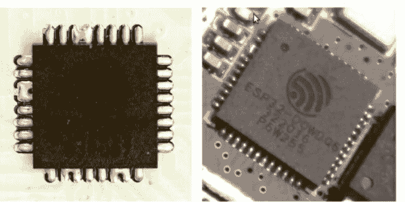

这些芯片是什么？ESP8266，你可能看不太清楚，因为它确实很小，是一个集成了板载Wi-Fi和各种其他外设的小型片上系统。实际上，在我深入介绍之前，它们是由一家名为**乐鑫**的公司制造的，这是一家非常出色的制造商。我认为乐鑫特别有趣的一点是，他们是最早真正拥抱开源世界的中国制造商之一。他们在开源社区非常活跃，对我们的开源开发工作非常支持。这真的很棒，我认为这对他们来说也是一个巨大的优势。8266 成为了一个真正的爱好者热门产品，部分原因是它本身功能非常强大，部分原因是你可以以大约 2 美元的价格买到它们。乐鑫从中学习了很多。他们从人们用 8266 做的事情中获得了大量灵感，其中许多相当有趣，但人们确实从中获得了很大乐趣。人们尝试了很多东西，将很多有趣的东西组合在一起，而公司能够从中学习，并将大量知识整合到 ESP32 中。

## Espressif ESP32

| Arduino | ESP8266 | ESP32 | RPi 0 W |
| :--- | :--- | :--- | :--- |
| AVR ATmega328P | Tensilica Xtensa LX106 | Tensilica Xtensa LX6 | ARM BCM 2835 |
| 8 位 | 32 位 | 32 位 | 32 位 |
| 1 核 | 1 核 | 2 核加 ULP | 1 核加 GPU |
| 20 MHz | 80-160 MHz | 240 MHz | 1 GHz |
| 2 KB RAM | 160 KB RAM | 520 KB RAM | 512 MB RAM |
| 32 KB Flash | 4 MB Flash | 16 MB Flash | MicroSD |

正如我之前提到的，8266 最初是作为 Arduino 等设备的 Wi-Fi 附件而崭露头角，直到有人查看规格表后意识到，它实际上比它所辅助的 Arduino 强大好几倍。这种关系似乎有点可笑，也许我们应该直接为 8266 开发。它有一个相当不错的基于 C 的 SDK，入门并不难。但确实存在一定的入门门槛。幸运的是，有人，Damien，将 MicroPython 移植到了它上面。我发现了这个，当时我刚开始为 8266 开发一些东西。我记得是在 LinuxCon Japan 之后，我对整个 8266 芯片和重新编写 C 代码感到非常兴奋。我已经很久没写 C 了。就在重新编写 C 代码的新鲜感和兴奋感开始消退时，MicroPython 出现了。于是我转向了 MicroPython，觉得这是有史以来最酷的东西。我越来越投入，越来越兴奋。然后我开始用它工作，接着又开始用 C 工作。如此循环，不过没关系。所以，继 8266 之后，现在有了 ESP32。正如我之前所说，它从人们所做的事情中汲取了大量灵感。它更强大。同样，它有两个 CPU，因为除了一个 CPU 核心外，还有一个超低功耗处理器，这是一个非常酷的小配件。它就像一个非常小、非常慢的处理器，刚好有足够的能力在发生有趣的事情时唤醒其他 CPU，如果你使用电池供电，这非常重要。它的时钟频率稍快。对我们来说最重要的是，它拥有更多的 RAM。520 KB 对现代开发者来说听起来不算多。我昨天安装了一些软件来做机器学习，下载了大约半太字节的数据到我的笔记本电脑上才安装完成。但对于 Python，对于 MicroPython 来说，这已经足够使用了。8266 上的 160 KB 余量足以运行 MicroPython，但你的应用程序很容易碰到那个限制。520 KB 给了我们一些喘息的空间。它还有更大的 Flash，这非常好。这些设备比像 RPi Zero W 这样的设备功能弱得多，后者是你可能想到的下一个级别。那是无线 Pi Zero，它拥有更强大的 CPU，运行速度更快，内存更多，扩展能力也更强，比如 Flash 等。但是，它提供了一个中间地带。在 8 位 Arduino AVR 世界和 RPi 世界之间，出现了一个有趣的市场细分。ESP32 非常有趣，因为它除了你所知道的 Wi-Fi 功能外，还具有蓝牙功能，这非常方便。如今很多设备都支持各种 BLE，非常适合与移动设备和其他传感器等通信。它比 8266 有更多的 IO 线，这非常方便。它有多个模拟输入。正如 Anna 提到的，8266 只有一个模拟输入，有时会有点烦人。ESP32 你可以配置多达八个模拟输入，而且实际上可以在引脚之间切换，这很酷。它还有一个数模转换器，这很方便，以及各种引脚的脉宽调制。他们做了一件非常有趣的事情：在芯片内部集成了一个电容式触摸感应电路。所以有八个电容式触摸传感器。如果你的项目想要一个触摸界面而不是按钮界面，这非常容易实现。你不需要任何外部组件，只需要一块铜片，这是一个非常好的特性。

这真的很有趣，它告诉你一些关于他们方法的非常有趣的事情。这可能不是市面上最便宜的片上系统，但如果你不需要板上的其他芯片，它们仍然可以竞争。所以这是一种非常有趣的思考方式。同样，有那个超低功耗处理器，甚至还有像整个霍尔效应传感器这样的东西内置在芯片中。我认为这很酷。很少有人需要它。然而它就在那里。制造起来很容易，只是芯片上的另一块硅。如果你的应用程序出于某种原因需要一个大电流测量设备，你可以将电路板布局成让电源线正好经过处理器，你就能在霍尔效应传感器上看到信号。这很酷，又少了一个组件。

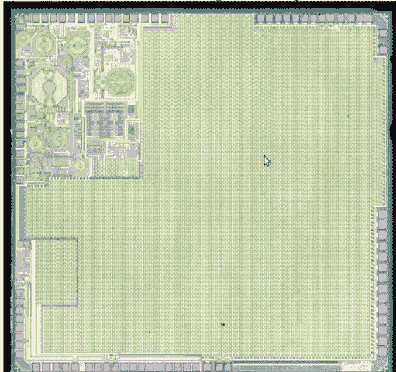

一个名为 Zeptobars 的俄罗斯团队非常擅长将芯片放在酸中煮沸，然后在显微镜下拍照。所以这实际上是一张 ESP32 去封装后的照片。它让你对这些芯片架构的疯狂程度有了一些了解。

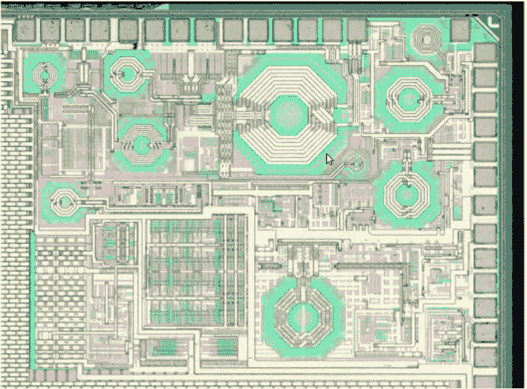

如果你放大那个顶角，你实际上可以看到这个东西的电路、线圈和制造硬件无线电的部件。我认为这非常迷人，你实际上可以做到这一点。你可以用硅制造线圈、布线和电路，它们就在芯片上。

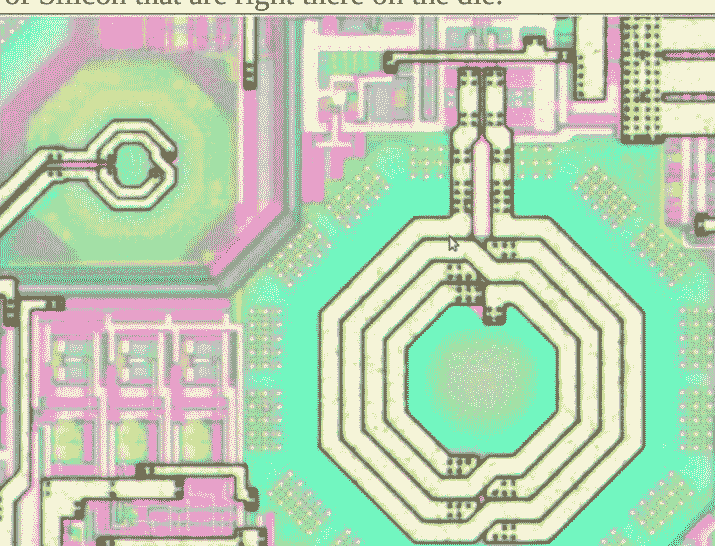

它实际上相当美丽，以一种奇怪的方式……我不知道……它让我想起了那些老游戏中的地图，比如 Quake 之类的，有圆圈、路径和所有那些东西。这真的很惊人，这是我们如今能做到的事情。我认为你通常不会单独购买它作为一个独立的小硅片，因为坦率地说，引脚太小了，你甚至看不见它们，但它们以这种模块的形式提供，更容易焊接。它们在边缘有 0.1 英寸的间距。所以如果你努力的话，实际上可以手工焊接它们。它们是非常方便的小芯片。那个小的 RF 屏蔽罩，顶部的那个标签，是内置天线。所以你甚至不需要处理任何不是数字 3.3 伏线路的东西。哦，对不起。Flash 存储器也在那个小金属罩下面。所以基本上所有东西都为你准备好了，使用起来相当容易。

## ESP32 模块

WROOM-32 或 ESP-32S

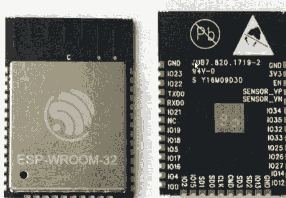

## ESP32 开发板

Sparkfun ESP32 Thing / ESP32-DevKitC / AdaFruit HUZZAH32

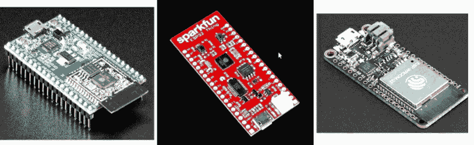

如果觉得焊接这些板子还是有点困难，市面上有很多来自不同制造商的类似板子。中间那块是 Sparkfun 的，它集成了电池管理控制器。其他几块是 Adafruit 的。哦，抱歉，那块是开发套件。所以另一块是 Adafruit Feather。呃，我应该知道的。上面有小字标注吗？没有。嗯，可能是他们 HUZZAH 系列的某一款，它也板载了电池管理控制器。正如 Anna 所说，如果你想做某种便携设备，电池管理控制器非常非常方便，因为这部分很容易出错。所以有一块集成了这个功能的板子，你只需插上锂电池就能用，这真的很方便。嗯，它们在这方面做得很好，标准的排针分布在四周，让你可以很容易地用小电线开始原型制作和项目搭建。嗯，好的。

## Intel：Joule 已烧毁，Edison 已关闭，Galileo——Galileo 不复存在

芯片巨头砍掉物联网和嵌入式计算产品线

Shaun Nichols，旧金山，2017年6月20日 00:03


Intel 已经停产了其面向物联网和嵌入式设备市场的三款产品。

这家芯片制造商在一系列低调的产品更新中表示，将在今年下半年停产 Edison [PDF]、Galileo [PDF] 和 Joule [PDF] 计算模块和开发板。

所以这就是那个模块。既然我们在这里，我刚才谈到了社区。会议的一个重要方面就是关于社区和建立社区。我认为我们拥有一个 MicroPython 社区，拥有一个 Python 社区以及其中的 MicroPython 社区，这非常重要。嗯，还有 MicroPython 社区中的 ESP32 MicroPython 社区。

前几天我注意到这篇新闻文章，嗯，Intel 曾大张旗鼓、满怀热情地推出了 Galileo 平台以及诸如此类的东西。它将接管物联网世界，一切都会变得非常美好。很多人都有它，是的，一切都会很美好。

但背后并没有真正的社区支持。所以大约一年后，当它并没有真正流行起来，每个人都看着手表想，我们用它做过什么酷炫的东西吗？然后，或者没有，他们就这样把它搁置了。所以任何花了很多时间和精力去开发东西或学习那个平台的人，这就好像被釜底抽薪了，我觉得这真的很令人失望。

我的意思是，它是个不错的平台。这是个好主意，但除非有社区支持，否则单靠一家公司无法推动一个平台发展。嗯，他们可以推动一段时间，直到他们失去热情，然后他们就无法让它成为一个全球性的东西。所以它需要的不止于此。它需要一个由人组成的社区。这也是我正努力在 MicroPython 上实现的事情。

PyConAU 2016 物联网迷你会议！
ESP32 模块开始上市
初始移植到 ESP32 w/ REPL (Damien George)
WiFi, Sockets, GPIO (Nick Moore)


嗯，那么 MicroPython 现在进展如何？我去年在这里，可能就在这个房间，谈到了 ESP8266 MicroPython。嗯，那很有趣。当时有很多关于这个新 ESP32 的议论。那些模块实际上在大约十一月开始陆续上市。嗯，然后它们很快就又从市场上消失了。每一块都卖光了。然后它们又零零星星地出现在这里那里。每个人都以一种方式回应了这一点，就是尽可能多地订购他们能拿到的每一块。然后它们又立刻缺货了。嗯，最后我在十一月拿到了我的第一批，我们就可以开始做东西了。嗯，Damien 大概也在那时拿到了他的。嗯，因为最初的移植可以追溯到十二月，那时 REPL 才开始真正工作。嗯，我其实看不清。我不太擅长记日期和时间，但我打字相当不错。登录到终端。所以大概是十二月左右。呃，然后我最终参与进来，和 Damien 一起做了一些项目工作，让 WiFi 功能、TCP 套接字以及更多 GPIO 功能支持得以实现。这项工作，这个移植的初步工作，嗯，我想感谢 Microbian 赞助了这项工作。嗯，他们帮助使其得以启动。作为另一个在 ESP32 上开始的项目，他们制作了一个非常酷的小机器人，叫做 Edison，就是图片上那个，是一个小型教育机器人。所以我想说声谢谢，并向他们表示一点感谢。

- ESP32 分支在 Github 上！
- LinuxConfAU 展示 "IoTuz"
- 支持 NeoPixels (tyggerjai)
- 更多 I/O 功能
- 硬件 SPI (Eric Poulsen)

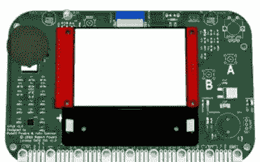

从那里我们继续前进，最终承认我们确实在做这件事，并把它放到了 GitHub 上。嗯，这很棒，因为这让其他人蜂拥而至。然后我去了塔斯马尼亚的 LinuxConfAU，有点像是，你知道，发布它。哇。这是个好借口，不是吗？嗯，我们去了那里，在 LinuxConfAU，我们得到了 Espressif 的支持，制作了一个叫做 IoTuz 的小板子，就是图片上这个东西，嗯，它有一个小 LED 显示屏，一个摇杆，上面有一个 ESP32，以及诸如此类的东西。

而且，呃，当我准备关于如何为 ESP32 开发 C 代码的演讲时，我走上台说，啊，看，不幸的是我们实际上还没有让 MicroPython 在 IoTuz 上启动。等等。然后有人举手说，是的，我做到了。哦，对，好的。太棒了。所以，嗯，我们确实让它在 IoTuz 上运行起来了，这很酷。

嗯，Jaya 可能就在这附近某个地方，让它在板子上的 NeoPixels 上工作了，人们添加了更多东西，突然间我们有了一个滚动的雪球，这太棒了。这就是我所说的社区效应，我们突然有了多个贡献者。不再只是一两个人或三个人推动这件事。它开始像滚雪球一样发展。所以这真的很令人兴奋。我们从软件 SPI 转向了硬件 SPI，这是一个很好的开始。嗯，其他功能也出现了。有人说，为什么没有 PWM？我说，当然有 PWM。然后我说，不，没有。我是说，哦，是的，我毕竟没写那个。我以为我写了。哎呀。所以有人实现了它，这很棒。Andy Valencia 在那里，嗯，UART 支持也到来了。所以现在你可以与板子上的所有三个 UART 通信。嗯，这是另一件让我惊讶的事情。当我发现我实际上有三个 UART 时，这有点酷，呃，其他人一直在添加更多支持。我在这里提到了几个名字。还有很多很多很多其他的贡献者，嗯，在，在这个项目里，记录为你的朋友。但我只想强调一点，这正在成为一个社区项目。这正在成为比仅仅几个人更大的事情。我们又回到了 Python，进展中。

- BLE 实现 (#86)
- 深度睡眠模式 (#32)
- MCPWM (#94)
- 超低功耗 CPU
- psRAM
  (WROVER, ESP32-PRO, ALB32-WROVER 中的串行附加 RAM)
- 位图显示 / 帧缓冲

呃，所以 ESP32 也被用在了阿姆斯特丹（我想是阿姆斯特丹附近）一个叫做 SHA 的会议徽章上，呃，来自那个社区的一大群人一直在努力做很多事情，比如，呃，蓝牙低功耗，呃，我想是同一批人在参与深度睡眠的事情。

我现在记不清了。呃，那些是拉取请求编号，呃，这些东西正等待合并回 ESP32 MicroPython 的主线。但一旦它工作起来，它将支持，呃，蓝牙低功耗，它将能够深度睡眠，这样你就可以用电池运行它，它可以醒来，思考一下，然后再去睡觉。

嗯，芯片上有一些更复杂的 PWM 控制可用。呃，关于这个有趣的一点是，Espressif 在非常公开地进行他们 SDK 的大量开发。这很不寻常，但他们发布了一个非常早期的 SDK，他们称之为 IDF，嗯，物联网开发框架。

他们很早就发布了它，缺少很多东西，然后他们慢慢地一点一点添加这些东西。这有时对我们来说有点挑战，要跟上他们的开发。但这也非常令人兴奋，因为时不时地你会发现新的硬件现在可用了。

我们还需要在某个时候对那个超低功耗 CPU 提供一些支持，因为对于任何想用电池运行东西的人来说，那是一个非常令人兴奋的硬件。而最近突然变得令人兴奋的一件事，嗯，是给这个东西附加更多 RAM。所以 Espressif 很快会推出一款新芯片或新模块，它有四兆字节的板载，嗯，RAM，串行附加 RAM。

所以它只是连接到，嗯，模块的内部总线上。我觉得这非常令人兴奋。我们能让 MicroPython 使用这块大 RAM 吗？你知道，如果我们有更多 RAM 可用，Python 能用上吗？我一直在研究它，轻轻地试探。就在这个演讲之前，我又谷歌了一下，有人在此期间已经实现了它。所以那将会非常，那，那太惊人了。这是，嗯，我们必须现在来看看如何将其整合回 MicroPython 的主线。这样就不会让它成为一个过于独立的分支，但令人兴奋的是，我们现在能够处理多得多的内存。如果你看看开发套件之类的东西，很多开发套件都配备了某种像素映射显示器。

物联网设备一直都有显示屏。乐鑫的开发套件有一个，各种徽章通常也会配备电子墨水屏。嗯，如果能有，那会很有帮助。我希望能有一种标准化的帧缓冲方法，可以跨多种设备工作。这样大家就不必每次都重新发明如何实现这一点。

嗯，可能比你通常用于网络技术之类的东西要轻量得多，但总得想出点办法。所以这些都是目前正在进行中的事情。

接下来，我们已经报名参加了一个周一的冲刺活动。嗯，这真的很令人兴奋。我以前其实没有组织过冲刺活动，也没有参加过 Python 冲刺活动。嗯，但我希望它能让我们实现一些非常酷的东西。嗯，乐鑫非常慷慨地提供了一些支持。有一整箱 ESP32 开发套件，呃，给那些能在冲刺活动中贡献代码的人。嗯，如果你碰巧有周一的冲刺活动门票，请务必过来。那会很有趣。

呃，我认为这不仅仅是，我的意思是，MicroPython 本身是用 C 语言编写的。所以你需要相当不错的 C 语言编程能力，才能在 MicroPython 的核心部分取得很大进展。但如果你确实有一些 C 语言背景，它实际上非常非常容易上手。所以，嗯，呃，部分原因我猜是因为它是相对较近实现的，而且是以相当现代的方式实现的，内部文档也相当完善等等。它是一个很好的代码库，适合开发。但另一件事是，这个平台上还有很多用 Python 完成的工作，呃，好吧。还有很多工作需要做，需要反馈，比如我们如何让它成为一个更好的 Python 平台？我们如何在 MicroPython 的范围内，让我们的类和库尽可能地精简？嗯，所以在这种冲刺活动等等中，肯定也有非 C 语言人员的角色。能过来一起玩，有机会互相交流我们感兴趣的事情等等，那会很棒。

嗯，Tim，他应该在附近某个地方，哦，在后面，Tim。嘿，Tim，呃，也有一个 MicroPython 的 FPGA 板移植项目，他有兴趣在周一做一些相关工作。呃，那基本上是在 FPGA 内的一个小软核中运行 MicroPython。所以那里有一整套 Python 工具链，嗯，可以让你用 Python 配置 FPGA，然后用 Python 编程控制 FPGA 的实际运行等等。这是一个非常有趣的项目。嗯，我不认为 Tim 今年会讲这个，但你在 LinuxCon 上讲过，对吧？我的时间线没错吧？对，就是我讲的那个，我也会把那个链接发出来。

嗯，就是这个。另外我想提一下的是，我正在墨尔本组织一个 MicroPython 聚会小组，呃，在 Connected Community Hackerspace，就在斯威本大学对面。嗯，这给你一个机会过来，认识一些志同道合的爱好者，呃，做一些有趣的工作。这是一个非常注重实践的空间，有机器工具。有类似的东西。嗯，玩玩硬件，做点实验，熟悉一下这个平台，对你们这些外州的人来说可能不太有用，但对本地的人来说，如果有人有兴趣在你所在的地方组织类似的活动，我也很乐意提供相关信息，并帮助在其他地方启动。

好的。关于这些内容，我大概要讲的就是这些。有人对这个 ESP32 移植或者 MicroPython 有什么问题吗？

嗯，我听说 ESP32 的实际芯片在某些功能方面存在一些问题，是这样吗？呃，或者也许你可以评论一下，就目前推出的修订版一芯片给个更新。呃，所以你可以说这意味着修订版零芯片并非完全完美。

我自己不清楚具体情况。我没有遇到过这些问题，但我的东西只占用了芯片相对较小的一部分。所以我不确定。嗯，好的。

谢谢你，Nick。嗯，在这些芯片上的开发体验如何？嗯，我知道是 GCC，是 GCC 移植，但有没有好的 GDB，嗯，交互式调试之类的？呃，我一直严格地在，呃，打印语句和日志的世界里。通过串口发送。你能把那些弄出来工作就很高兴了。

呃，是的，我实际上还没有尝试过在上面使用 GDB。不过有趣的是，开发套件 J 或者不管它叫什么，不是那些小的开发套件，而是大的那些，上面有 JTAG 端口之类的东西。所以，而且我想我不太确定，但我觉得上面有的是，所以有一个 J-Link，一个 USB 转换器。其中一个连接到我们使用的标准串行端口，你通过它给芯片刷固件。我想另一个实际上连接到，呃，JTAG 端口或类似的东西。所以那里有一些我还不明白的电路，嗯，我想它能让你通过 USB 进行调试，而不用真的拿出，你知道的，旧的 Xilinx JTAG 线缆或你有的任何东西。

嗯，呃，不过到目前为止，我没有遇到太多无法用那种方式解决的问题。也许我只是运气好。

## 介绍

我来介绍一下这门课程。面向所有人的 MicroPython，使用 ESP32 或 ESP8266。MicroPython 是为微控制器设计的轻量级 Python 编程语言版本。我们使用 ESP32 作为课程的开发板。ESP8266 也可以用来学习 80% 的内容。如果你是嵌入式系统新手，或者，你知道，你想学习 Python 语言但觉得负担重。

不用担心这个基于项目的笨重接线，原理图已经为你提供了。

那是默认设置。这个已经足够了，最后那个是 0.2 秒，这个是混合的，每个 LED 以不同的速度闪烁。也有多线程。

我们主要使用 Windows 操作系统来讲解这个项目，但同时也支持 Mac 操作系统以及 Linux 操作系统。我们还将讨论如果检测不到端口该如何解决。在第三节课，我们将把 MicroPython 固件刷入 ESP32。同样的方法也适用于 ESP8266。在第四节课，我们将讨论 Python 3 语法。如果你已经了解 Python 3，可以跳过这节课。在第五节课，这非常重要。课程的这一节将控制 GPIO 引脚，从闪烁 LED 到多线程。你可以看到这里，那些黄色的只适用于 ESP32。

我们知道 ESP32 或 ESP8266 具有 Wi-Fi 连接功能。这一节课，我们将能够使用 ESP32 或 ESP8266 自动连接。如果你已经有 ESP8266，可以从它开始。我们需要一个 DHT11 传感器模块来测量温度和湿度。我使用了 LD33 稳压器将电压调节到 3.3 伏，10 千欧电位器，1 千欧电阻，10 到 50 毫米跳线，一个迷你面包板。这里最重要的部分是。Micro USB。这应该是一根质量良好的线缆。这将是开启MicroPython之旅的起点。

## 安装 Python 3

让我们检查一下你的电脑是否安装了Python 3。使用命令提示符，在搜索栏中输入CMD。然后，在打开的命令提示符中，输入 `python 空格 连字符 版本`。

所以，它显示“Python is not recognized”。我们需要安装Python。为此，打开浏览器并访问python.org。

是的，你可以下载Python版本。它适用于Windows、Linux和Mac。它会自动检测操作系统。所以点击这里，或者你可以前往其他操作系统页面下载。我只需点击这里。然后它将被下载到你的下载文件夹。对于Windows操作系统，进入下载文件夹。以管理员身份右键单击下载的文件，点击“Add Python 3.8.2 to PATH”，然后安装。

等待几分钟。你已成功在电脑上安装了Python。假设Python安装成功。关闭此窗口。现在，通过输入CMD进入命令提示符。再次输入 `python --version` 进行检查。所以，Python 3.8.0.2 已安装。现在正在显示。所以你已成功安装Python 3.8.0.2。让我们检查一下Python是否正常工作。要进入Python，在这里输入 `python`。现在Python shell已加载。命令提示符结束了。它应该打印出“Welcome to MicroPython”。让我们看看。它打印出来了。这意味着Python 3.8.0.2已成功安装。在某些情况下，当我们输入 `python` 或检查Python版本时，它会显示路径未设置。在这种情况下，你必须安装路径。让我们看看如何在命令提示符上设置路径。

使用 `where python` 检查Python的安装位置。这显示了Python的路径及其安装位置。它安装在 `AppData\Local\Programs`。复制这个。右键单击“此电脑”，转到属性，转到高级系统设置，转到环境变量。

在这里转到“Path”，然后你可以点击“New”并将路径粘贴到这里。你可以点击“OK”。这就是设置路径的方法。设置好路径后，再次打开命令提示符。检查是否已安装。

## 安装 THONNY IDE

我们需要一个IDE来编写和管理MicroPython代码。在这种情况下，我们使用Thonny IDE。让我们安装Thonny IDE。为此，打开任何浏览器，访问thonny.org。

Thonny IDE适用于Mac、Windows以及Linux操作系统。在这里你可以根据你的操作系统进行下载。在这种情况下，我将下载适用于Windows操作系统的Thonny。只需点击这里。对于Windows操作系统，对于其他操作系统，你可以选择。只需点击，然后它将开始下载。进入下载文件夹。Thonny IDE应用程序已下载。

右键单击该应用程序，点击“以管理员身份运行”。点击“下一步”。接受协议，点击“下一步”。浏览到一个合适的驱动器。所以我保持默认设置。点击“下一步”，你可以通过点击这里创建桌面图标。我们点击“下一步”，然后安装它。等待几分钟。Thonny IDE已成功安装。点击“完成”。

Thonny IDE快捷方式已在桌面上创建。

通常，你可以从桌面启动它。双击图标，点击“运行”。如果你有其他语言，你可以选择。Thonny IDE已成功加载。

所以默认情况下，Thonny IDE自带Python 3.7.7。默认情况下，Python已加载在这里。我们将使用print命令检查默认Python是否正常工作。Python在这里正常工作。所以这是shell。这是潜在的。稍后，Thonny IDE将更改默认解释器以使用适用于ESP32或ESP8266的MicroPython。

## 安装 PUTTY

下一步，我们将为Windows操作系统安装另一个有用的软件，名为PuTTY。它可用于直接与ESP32或ESP8266通信。其他操作系统也有类似的软件。现在让我们为Windows安装PuTTY。打开浏览器。访问putty.org。

在这里你可以点击这个部分。它将开始下载。我已经下载了，所以你可以下载它并进入下载文件夹找到这个应用程序。PuTTY已下载。右键单击并点击“安装”。

点击“运行”。在这里点击“下一步”。浏览一下，我保持默认设置。点击“下一步”。

我将创建一个桌面快捷方式，所以你可以选择其中一个。我只保留这个选项。“安装”。所以PuTTY已成功安装。点击“完成”。图标已在桌面上创建。我们稍后将使用此应用程序。

## 解决端口未检测到设备驱动程序的问题

如果在连接ESP32或ESP8266时，你的电脑未检测到端口，我们必须安装通信驱动IC。主要地，开发板使用CP210x或CH340芯片。ESP32配备CP210x。而ESP8266 NodeMCU板配备CH340芯片。我们将首先安装CH340。进入设备管理器。设备管理器。我这里有两个板子。这个是ESP8266。这个是ESP32，使用CH340芯片。这个是CP210x芯片。所以让我连接ESP8266。

设备管理器已重新加载。你可以看到它检测到类似“USB2.0-Serial”的东西，但驱动程序未安装。所以首先，我们必须安装CH340驱动程序。然后我们将回到CP210x。我已经安装了CP210x，我正在重新连接并检查它。

如果我连接ESP32，你可以看到出现了一个叫做“端口”的东西。如果我查看属性，你可以看到COM6已分配给ESP32，它使用来自Silicon Labs的CP210x通信芯片。所以，我没有插入这个。我已经插入了，但我们将检查如何在你的电脑上安装两者。所以如果我说我重新连接到ESP8266，我们将为这个安装设备驱动程序。打开浏览器。你必须搜索“CH340 driver”。访问wch.cn。点击这个网站，即www.wch.cn，下载驱动程序。点击这里。现在网站已加载。

所以这是中文的。别担心。这是你需要安装的驱动程序。如果你有Google翻译器，你可以翻译成英文。它支持CH340。他们支持很多芯片。有了这个，你会看到CH340。所以只需点击这里下载软件。我已经下载了软件，所以我要进入下载文件夹。

你明白了吗？以管理员身份运行。是的。你可以点击“安装”按钮。它现在已成功安装。你将检查设备驱动程序。我将重新连接它。现在，在“端口”下，你可以看到“USB-SERIAL CH340”。它作为ESP8266的COM5。所以你已成功安装CH340驱动IC。所以这是用于通信的IC。让我们看看。对于ESP32，通常主要使用CP210x。我们接下来将安装那个。转到浏览器。那里总是显示Silicon Labs网站。访问Silicon Labs网站。

# 下载软件

CP210x Manufacturing DLL 和 Runtime DLL 已更新，必须与 v6.0 及更高版本的软件一起使用。受影响的下载包括 AN144SW.zip、AN205SW.zip 和 AN223SW.zip。如果你使用的是 5.x 驱动程序并且需要旧版 DLL，请参阅应用说明软件。

旧版操作系统软件和驱动程序包下载链接及支持信息 >

## 下载适用于 Windows 10 通用版 (v10.1.8)

注意：通用驱动程序的最新版本可以从 Windows Update 自动安装。

| 平台 | 软件 | 发行说明 |
|---|---|---|
| Windows 10 通用版 | 下载 VCP (2.3 MB) | 下载 VCP 修订历史 |

## 下载适用于 Windows 7/8/8.1 (v6.7.6)

| 平台 | 软件 | 发行说明 |
|---|---|---|
| Windows 7/8/8.1 | 下载 VCP (5.3 MB) (默认) | 下载 VCP 修订历史 |

我将使用“下载适用于 Windows 10”，因为我的系统是 Windows 10。你可以点击下载选项，它将被下载。我已经下载了，所以你可以下载它，进入你的下载文件夹。右键单击，解压文件。或者解压到特定驱动器总是好的。点击这里。所以我将使用这个。右键单击并以管理员身份运行。点击“下一步”，“完成”，因为我已经安装过了。所以你已成功安装CP210x通信IC。连接使用CP210x芯片的ESP32。这是这里的通信芯片。在“端口”下，它被检测到。所以你已成功安装开发板**通信IC驱动程序。**

## 在 ESP8266 和 ESP32 上安装 MicroPython

你想在你的 ESP 上安装吗？哦，是 ESP32。不是。

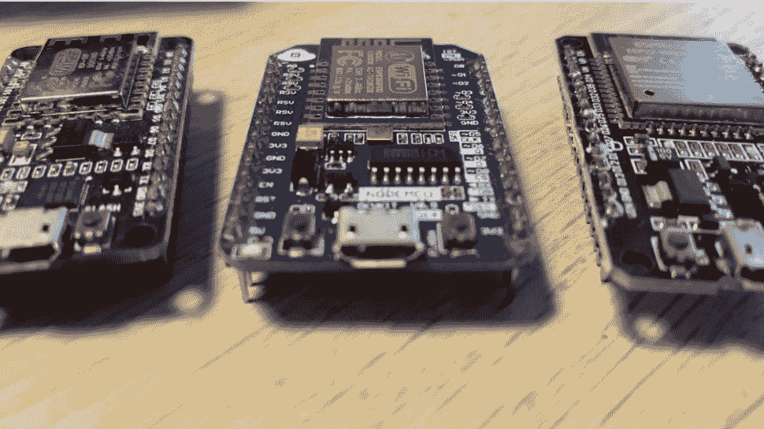

那么 MCU 会持续监控。所以这做起来出奇地简单。在这里，我已经在地图上安装了 Thonny。它在树莓派上的工作方式与在 Windows 上相同。所以我这里只是用了一个运行在 ESP8266 上的 NodeMCU。我已经把它插上了，现在我要做的是，在屏幕底部那里，我点击它。当我点击写着 Python 的地方，我将选择一个不同的解释器。这里我们有一个所有不同解释器的列表

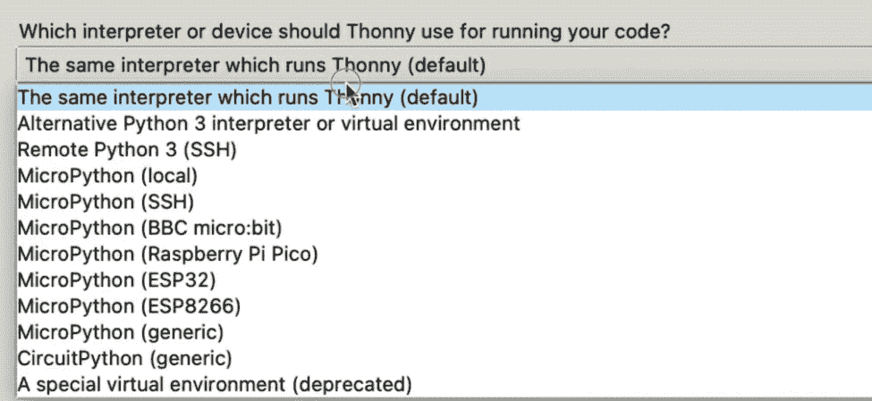

我们可以从中选择，其中之一就是 ESP8266 上的 MicroPython。所以我将选择它。然后我将点击安装或更新固件。

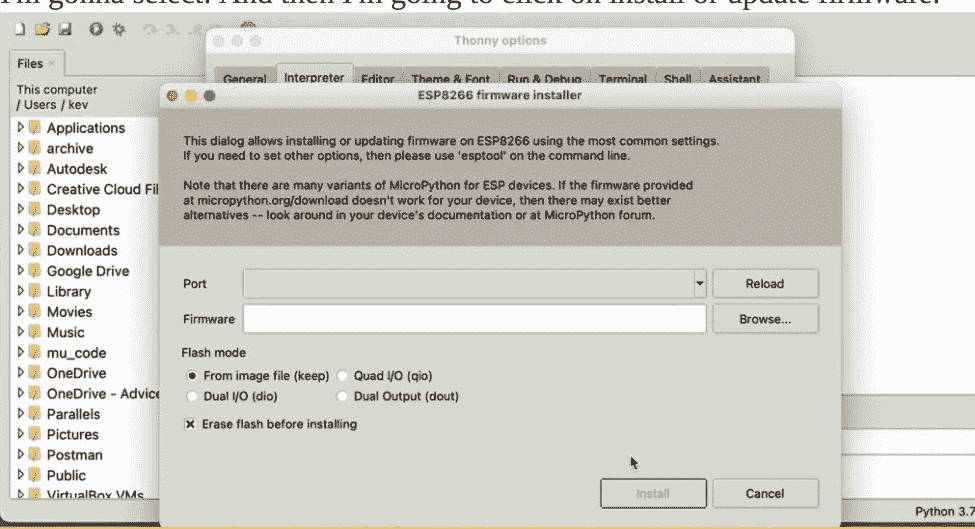

现在我确实需要访问一个网站来获取 MicroPython 的最新二进制文件。所以让我们前往 Microsoft 然后下载那个文件。

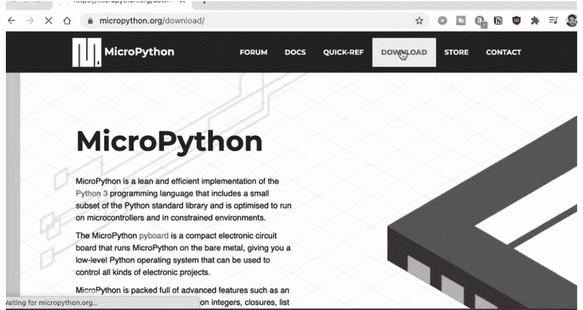

那么在这里的 MicroPython 中，我们只需点击下载标签，然后向下滚动查看我们可以为哪些不同的开发板下载软件包。这就是了，乐鑫的开发板。

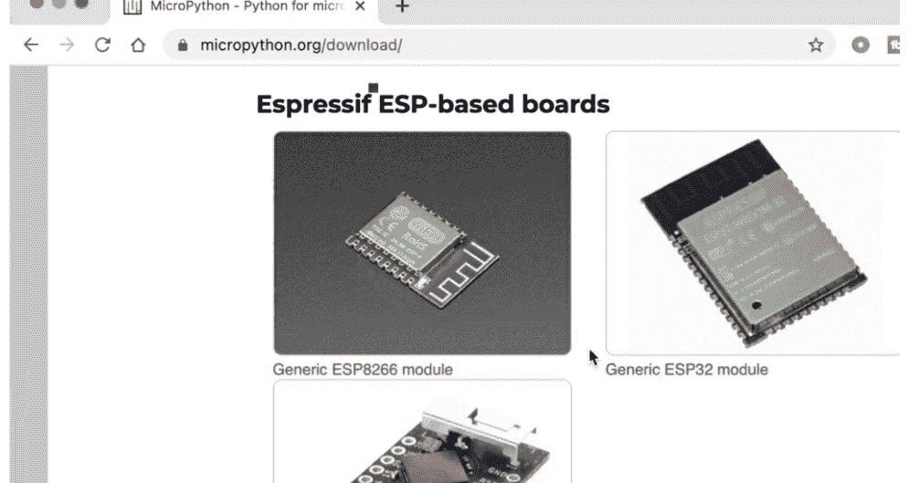

我们将，通用的乐鑫 ESP8266 模块也是。我们将点击它，然后它会给我们很多这个模块的不同版本。我们只想要最上面的那个，最新的那个，就是这个

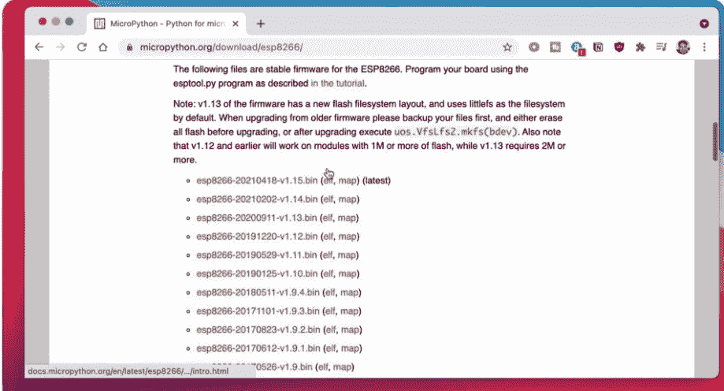

目前是 1.15 版本。所以现在这个文件已经下载到我的下载文件夹了，我们可以回到 Thonny，然后我将点击固件浏览按钮，

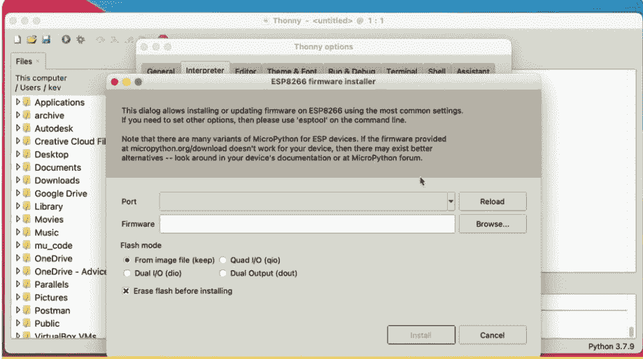

点击下载文件夹。然后就在最上面，我们有刚刚下载的文件。我现在将保持原样，我将在安装前擦除闪存。我将让它选择端口，这个端口

是同一个端口。所以让我们点击安装，它说正在安装存储，但擦除闪存，几秒钟内，大约一分钟左右，它就会完成。好的。百分之百完成。好了。

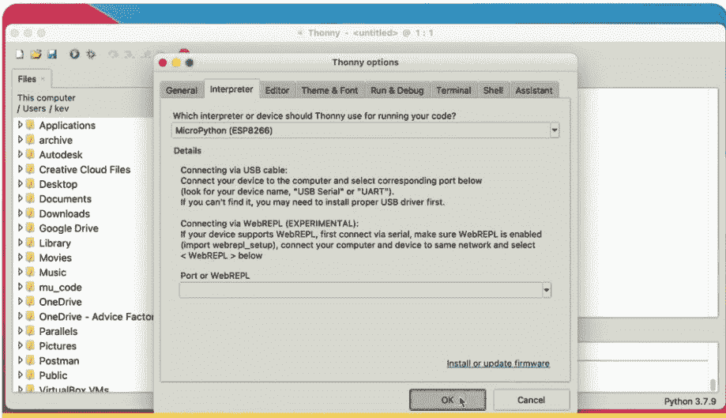

我们可以关闭那个对话框。我们可以点击。好的。然后。它会说，请重启或停止并重启。有时它似乎有效，有时则不然。你也可以直接点击这里进入 MicroPython generic。这似乎也能让它工作。所以好了。我们可以看到你已经在 ESP 模块 USPA 2, 6, 6 上安装了 MicroPython 1.15。所以让我们，呃，导入 machine。

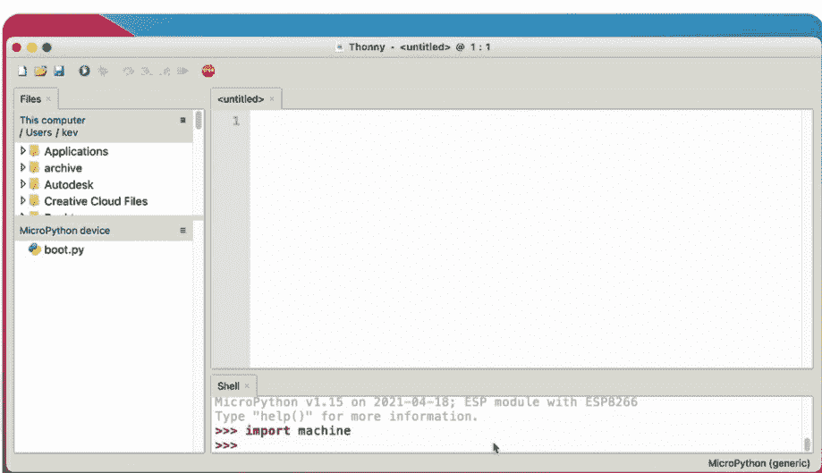

然后执行 DIR machine 来检查。我们可以看到我们已经安装了 MicroPython。所以这也适用于 ESP32。我这里也有一个 ESP32。所以让我们插入那个模块。
所以我们将回到 MicroPython 网站，在那里，我将返回上一页，然后找到通用的 ESP32 模块。我将点击进入，然后向下滚动，我们将寻找它。最新的稳定版本。

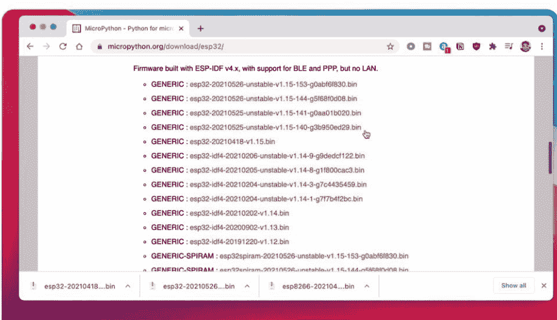

所以其中一些写着不稳定，我们想要最新的稳定版本。所以那是 1.15 版本。我将点击下载它。抱歉，这里，Anthony。我们将再次做同样的事情。我们将点击底部，这次我们将选择 MicroPython 和 ESP32，我们将点击配置解释器。

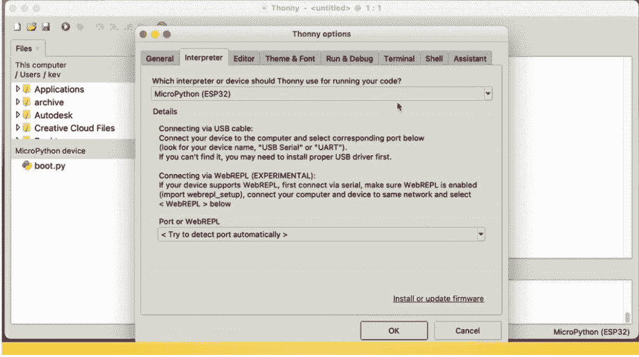

我们现在可以转到安装和更新固件。就像，会是。

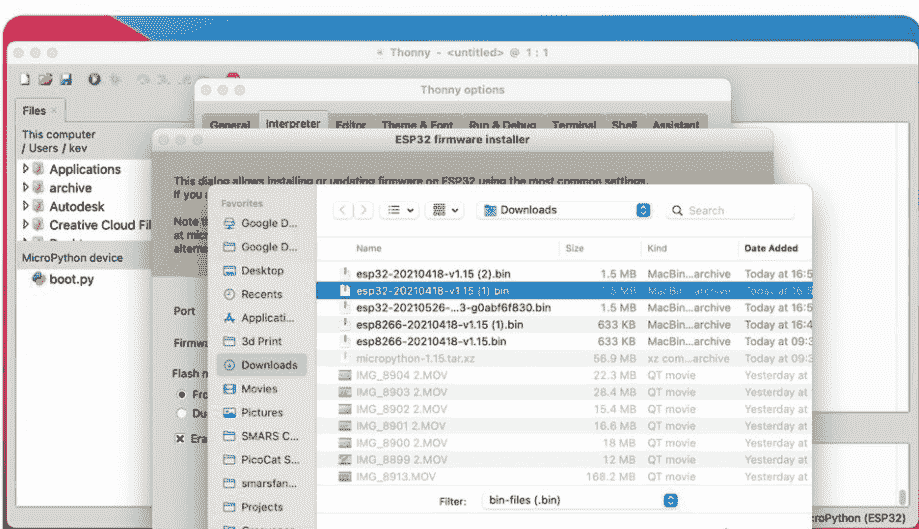

我们可以找到我们刚刚加载的固件，也就是这个 ESP32 的 15.1。然后我们可以直接点击串行按钮本身。我们现在点击安装。

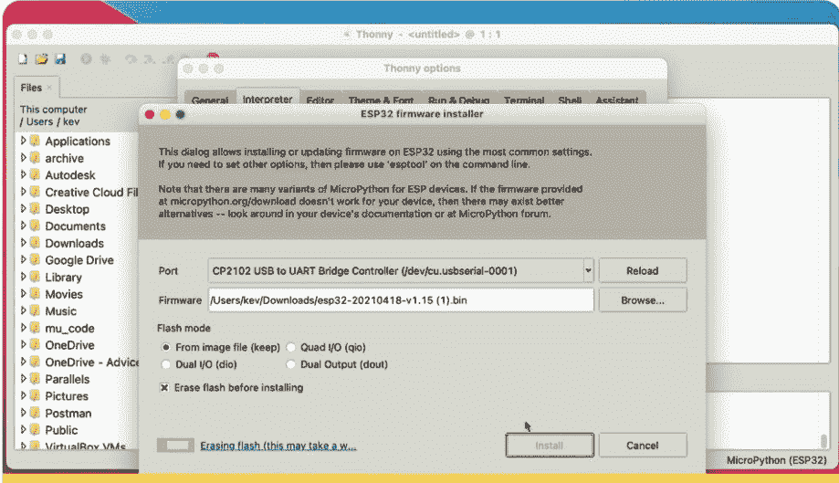

它应该检测到，嗯，闪存。现在，如果它没有检测到开发板，当你第一次插入时，端口是。你需要做的是断开开发板，然后按住启动按钮。当你按下启动按钮并再次连接电源时，仍然按住它，然后再次点击安装。

这次它应该能检测到它，嗯，开始刷写固件。所以如果我把它移上去，我们可以看到，它现在正在擦除闪存，

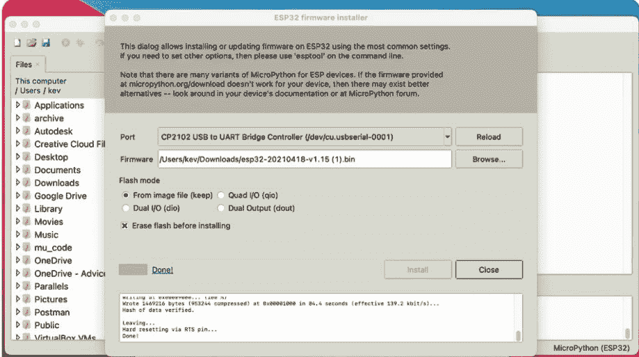

然后它会在擦除闪存后再次重启，然后开始安装。有时你只需要在通电时按住那个启动按钮一次，点击安装，然后松开启动按钮。所以我们可以看到它现在已经写入了。所以现在百分之百完成了，我们可以。退出那个，嗯，看看我们是否安装了 MicroPython。让我们点击。好的。好了。

## 如何开始使用 MicroPython

我们将学习如何开始使用 MicroPython。我将引导你设置你的 MicroPython 环境，我们还将

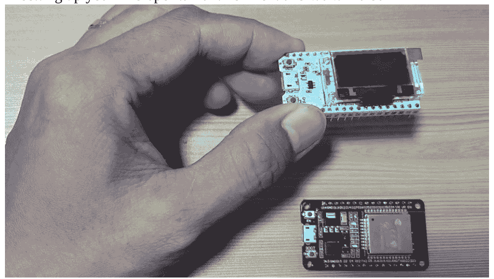

为你选择的开发板做好准备，以便与 MicroPython 一起工作。为此，我将使用乐鑫的 ESP32 开发板，但本教程将是兼容的。并且可以与其他兼容 MicroPython 的开发板一起工作，只需进行一些小的调整，特别是引脚分配。也许有时我也会使用这个。这个是 Heltec WiFi Kit 32，它也带有板载 ESP32。现在我们在我的桌面上。我将打开我的。谷歌浏览器。所以准备工作，第一，从 thonny.org 下载 Thonny Python IDE。由于我使用的是 Windows，我将下载 Windows 版本，它也兼容 Linux、Mac 和 Windows。

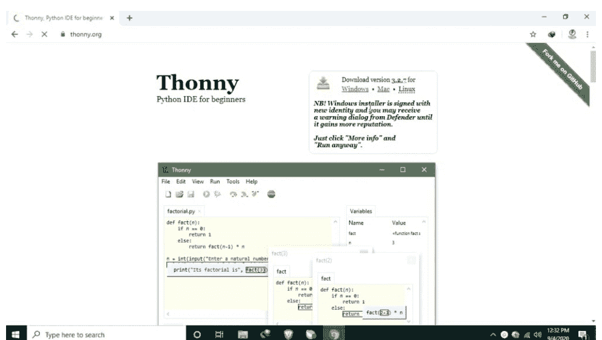

所以它下载了。并保存到并保存到你选择的文件夹。我将把它保存在桌面上以便于参考。所以这里，这是目前最好的、对初学者友好的 IDE 之一。我们还将使用 Thonny Python 在 ESP 工具登录的帮助下擦除和刷写新的固件到 ESP32。第二，从 micropython.org 下载 MicroPython 固件。Mike I，呃，在那个或转到下载部分。


在底部，有一个，顺便说一下，这些是兼容 MicroPython 的开发板。它是 pyboard，STM32。还有这个，呃，WiPy 带有 Wi 和乐鑫开发板。也就是 ESP8266、ESP32 和 TinyPico。顺便说一下，TinyPico 也是 ESP32。所以下载通用的 ESP32 模块。你向下滚动，寻找 ESP32。是的。下载最新的稳定版本。所以对于稳定版，这些是稳定版本或者这个，1.13，它是去年，呃，九月二日新发布的。所以我将下载这个并保存到你选择的文件夹。我将再次选择我在桌面上创建的带有 MicroPython 的文件夹。不，第三，从 Silicon Labs 网站下载 ESP32 USB 驱动程序。knobs。是的，就是这个。还有这个。它在 silabs.com 下，下载软件。我使用的是 Windows 10。所以我将下载这个并再次保存到你选择的文件夹。是的。所以你再次在桌面 MicroPython 文件夹中开始 gunboat。好的。第四，以后，参考资料，下载你的开发板的引脚分配或引脚引出，或原理图。你以后会需要它来了解，比如说，板载 LED 的引脚分配。

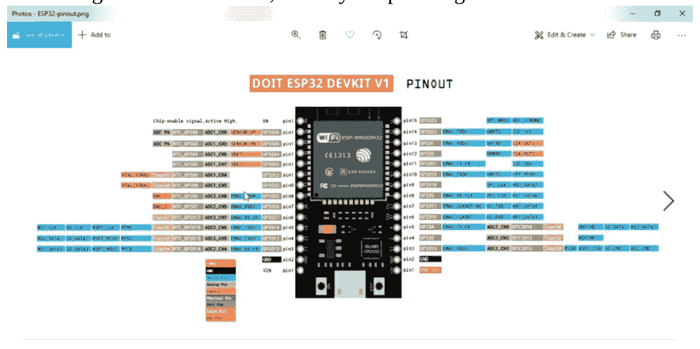

所以我这里有这个的引脚分配副本。呃，ESP32 开发板。所以我将发布这个链接供你下载，同时还有原理图。

## ESP32 MICROPYTHON 与树莓派

我们将演示如何在运行 MicroPython 的 ESP32 微控制器上设置一个程序，该程序由树莓派控制。我的所有教程节奏都很快，但代码注释、更新等更多信息可以在我的网站上找到。一如既往，链接会放在描述中。

这是一个 ESP32 开发板，连接到一个 16x2 的 LCD 显示屏，显示通过单总线接口连接的 DS18B20 传感器读取的温度数据。这是一个独立的设置，但 ESP32 可以轻松地将温度和其他传感器数据从多个远程位置无线传输到中央服务器，例如树莓派。

这是一个通过 UART 连接到 ESP32 的 JQ6500 声音模块。该模块允许你存储和播放音频文件。运动检测器也连接到一个 GPIO 输入引脚。当检测到运动时，会触发一个中断并播放声音。ESP32 是一款功能非常强大且用途广泛的芯片。这是一个通用的 ESP32 开发板。我在 eBay 上花了几美元就买到了。

它们在速卖通上的售价与我这块通用的 eBay 开发板差不多。

但这个并不完全像，呃，开发板，因为我认为这个有 36 个引脚，而这个总共有 30 个引脚，这是，呃，这是 ESP32 DevKit 版本一，有 30 个引脚。现在我们有了所有必要的文件，让我们安装 Thonny Python IDE。所以让我们安装 Thonny Python。在 MicroPython 文件夹中，Thonny Python，IDE。下一步。是的。也许创建桌面快捷方式或添加到开始菜单引用并安装。Thonny Python 是一个对初学者友好的 IDE，因为它易于使用。并且包含了所有必要的工具，例如 REPL、终端、Python 编辑器、对 MicroPython 文件系统的文件访问。甚至刷写 MicroPython 固件，这些都在图形用户界面中可用。现在不要认为一行代码就是在这里点点那里点点，在一个简单的 IDE 中。当然，有功能更丰富的应用程序可用。我们可以看看像 VS Code 这样的，但目前，为了简单起见，我们就用 Thonny Python。所以我将点击下一步。第六步，安装 ESP32 USB 驱动程序。所以我将使用 7-Zip 解压这个到同一个文件夹，然后找到，好的。x64，因为我使用的是 64 位 Windows，只需点击。是的，下一步。并完成。让我们通过将 ESP32 连接到我们的计算机来验证 USB 驱动程序的安装是否成功，然后右键单击。

点击开始，开始按钮并查找设备。在设备管理器下，单击端口。如果你成功安装了 USB 驱动程序，你应该会看到 Silicon Labs CP210x USB to UART Bridge 以及 COM 号。

对我来说，这是 COM4，请记下这个，因为我们稍后会用到它。在我们开始使用 ESP32 进行 MicroPython 开发和编程之前。我们需要擦除原始固件，然后刷写一个安装了 MicroPython 解释器的新固件。所以让我们打开 Thonny Python。我已经有 MicroPython 了。所以这就是为什么我有 MicroPython 的 REPL 提示符。但为了教程，我将向你展示如何用新固件刷写 ESP32。为此。点击 Thonny Python 中的工具菜单，管理插件，在搜索框中输入 ESP tool 并按回车，点击安装，并给它一些下载时间。然后。好的。

然后当你看到那个已安装按钮时，我将点击关闭。现在我们准备好将新固件刷写到我们的 ESP32 了。为此，再次点击工具菜单，然后选择选项并点击解释器选项卡，然后。Thonny 应该使用哪个解释器或设备来运行你的代码？我将选择 ESP32。

它可能是 CircuitPython，但我通过使用 BBC micro:bit 或 MicroPython, ESP8266 或 MicroPython, generic 得到了 MicroPython 的提示。这个使用的是 ESP32。所以让我们选择 MicroPython ESP。在端口中选择正确的 COM 端口，即 COM4，然后点击打开用于在你的设备上安装或升级 MicroPython 的对话框。我将点击这个，在端口中再次选择 COM4，在固件中选择浏览。并转到你之前选择的文件夹，我选择了桌面上的 MicroPython 文件夹，然后我将选择 bin 文件，即安装了 MicroPython 解释器的固件。所以我将打开，然后确保在安装前擦除闪存被勾选或选中。然后点击安装。给它一些时间直到这个成功。好的。擦除完成。

现在正在写入，现在正在将新固件刷写到 ESP32。好的。点击关闭并点击。好的。现在 MicroPython 已成功安装到 ESP32 开发板上。现在我们可以检查这个。我们可以测试一些代码。

```
I (608) heap_init: At 3FFE4350 len 0001BCB0 (111 KiB): D/IRAM
I (614) heap_init: At 4009DE20 len 000021D0 (8 KiB): IRAM
I (620) cpu_start: Pro cpu start user code
I (620) cpu_start: cpu freq: 160000000 Hz
I (620) cpu_start: Application information:
I (625) cpu_start: ESP-IDF v4.0.1 2nd stage bootloader
I (630) cpu_start: compile level debug
I (634) cpu_start: chip revision: v1.0
I (638) cpu_start: ESP32 module with ESP32
MicroPython v1.13 on 2020-09-02; ESP32 module with ESP32
Type "help()" for more information.
>>>
```

让我们让板载 LED 灯亮起和熄灭，编写一些代码，导入 machine。让我们创建一个变量 LED，并将其设置为板载 LED 的引脚，并让我们将引脚方向设置为输出。要打开 LED，我们只需要调用 led.on()。

```
I (614) heap_init: At 4009DE20 len 000021D0 (8 KiB): IRAM
I (620) cpu_start: Pro cpu start user code
I (303) cpu_start: Starting scheduler on PRO CPU.
I (303) cpu_start: Starting scheduler on APP CPU.
MicroPython v1.13 on 2020-09-02; ESP32 module with ESP32
Type "help()" for more information.
>>> import machine
>>> led = machine.Pin(2, machine.Pin.OUT)
>>> led.on()
>>>
```

如你所见，板载 LED 已点亮。要关闭它，你可以输入 led.off()，或者 led.value(1) 或 led.value(0)，但要关闭它。或者 led.value(True) 或 led.value(False)，非常简单。对吧。你可以无需编译就完成它。当你发送代码时，比如这个 led.value(True)。当我按下这个的那一刻。板载 LED 将会亮起。看，它非常快。你可能会问如何让板载 LED 闪烁，就像 Arduino 的 blink 示例一样。为此。我们需要导入 time 或 delay import time。好的。现在 while True。所以要打开它 led.on()，我们需要等待一些时间或延迟一些时间。所以那是 time.sleep()。假设是 500 毫秒，0.5。led.off() 和 time.sleep(0.5)。

所以当我按两次回车时，它将执行代码一、二。如你所见，LED，板载 LED 现在正在闪烁。就像 Arduino IDE 的 blink 示例一样。这就是目前的全部内容，下周，我们将学习什么是 MicroPython。以及它是如何工作的，或者对本教程有任何问题或建议，请随时在评论区写下，我很乐意回答。

你可能也有兴趣查看本教程的配套博客文章以获取更多信息，地址是 techthinker.blogspot.com。如果你喜欢这个视频，请给我一个赞，并分享给你的朋友，订阅以获取更多。就像这样。谢谢。祝你有美好的一天。下周见。

## ESP32 开发板介绍

ESP32 开发板也带有 USB 接口，支持电池供电，称为 ESP32。它是 Feather 系列的一部分。它价格更高，但提供了大量附加功能板，例如实时时钟、SD 卡、显示屏、GPS 等。另一款开发板是 PiComm YP2.0，它紧凑，带有 RGB LED，并提供外部天线选项。

ESP32 专为高效的 Wi-Fi 和蓝牙（包括低功耗蓝牙 BLE）设计。它拥有强大的 240 MHz 双核微控制器，配备 520 KB 的 SRAM。该芯片专为移动设备设计，因此具有超低功耗。它有 32 个 GPIO 引脚，支持 I2C、I2S、SPI 和 UART。此外，它还具有多个模数转换通道、数模转换、硬件加速加密、脉宽调制、电容触摸接口以及更多功能。内置的 Wi-Fi 使 ESP32 成为物联网设备（如传感器、输入设备和继电器）的绝佳解决方案。如果有兴趣，我可能会将这个项目发展成一个系列，详细演示如何将传感器连接到 ESP32，并使用 MQTT 等网络消息协议将数据报告回树莓派。

我喜欢 ESP32 的一个主要原因是你可以用 Python 编程，更具体地说是 MicroPython。这是 Python 3 编程语言的一个非常高效、精简的版本，针对在 ESP32 等微控制器上运行进行了优化。树莓派对许多项目来说都很棒，但它是一台功能齐全的计算机，运行 Linux 操作系统。对于简单、重复的任务，例如监控传感器和控制继电器，使用微控制器通常更容易、更便宜、更可靠、更高效。微控制器可以即时启动并直接运行你的程序。特别是如果你的项目使用电池或太阳能，因为 ESP32 所需的功耗只是树莓派的一小部分。此外，许多传感器都有接口问题，尤其是在较长的导线上。更可靠的方法是用短线将传感器连接到 ESP32，然后使用以太网或无线协议传输结果。

要开始使用，需要将 MicroPython 固件上传到 ESP32。这可以通过一根简单的 USB 线完成，它在树莓派和 ESP32 之间提供双向串行接口。它还提供 5V 电源。在面包板上，我有一个 ESP32 分线板。旁边是一块旧的树莓派 B+，但任何树莓派都应该可以工作。我会将 USB 线的一端插入树莓派，另一端插入 ESP32 板上的 micro USB 端口。红灯表示它已通电。

现在进行软件设置。首先，请确保树莓派是最新的。在终端中输入 `sudo apt-get update` 和 `sudo apt-get upgrade`。使用最新版本的 Raspbian Jessie 以确保你拥有所有必要的软件。一个名为 `esptool` 的实用程序将用于上传 MicroPython 固件。它使用 `sudo pip3 install esptool` 安装。我使用 `pip3` 来针对 Python 3。好的，安装成功了。现在输入 `dmesg | grep ttyUSB`。

这显示一个 CP210x UART USB 桥接器连接到端口 ttyUSB0。一些设备在使用 esptool 之前需要使用板上的按钮进入编程模式。然而，我发现 ESP32 不一定需要这样做，至少我这块板不需要。要测试连接，请输入 `esptool.py --port /dev/ttyUSB0 flash_id`。此命令查询 ESP32 的基本信息，例如芯片类型 ESP32 和闪存大小 4MB。

看起来一切正常。在上传固件之前，建议擦除芯片。我将使用上箭头键调用上一个 esptool 命令，并将 `flash_id` 更改为 `erase_flash`。这给了我们一个空白状态。好的，芯片擦除成功完成。需要一份 MicroPython 固件的副本。你可以从 GitHub 仓库的源代码自己构建它，但更简单的方法是直接下载每日构建版本。打开网页浏览器并访问 micropython.org。

点击下载选项卡，点击 ESP32。目前只有一个固件可用于 ESP32，点击下载它。下载完成后关闭浏览器。

MicroPython 固件构建文件已下载到下载文件夹。`ls` 显示一个很长的文件名，高亮显示该名称并复制到剪贴板，或者调用上一个 esptool 命令。这次将 `erase_flash` 更改为 `write_flash`。`0` 指定要写入的起始地址。输入 `download/` 作为下载文件夹路径，然后从剪贴板粘贴固件文件名。固件现在正在写入 ESP32。速度很快，但我会加速播放，这样你就不用等了。验证完成。好的。

所以开发板应该可以开始编码了。MicroPython 开发板有一个交互式解释器（REPL），这是一个简单的交互式编程环境。它类似于 Python 的 IDLE shell。在 ESP32 上，REPL 通过串行连接器访问。

其他开发板，如 ESP8266（ESP32 非常流行的前身），除了串行 REPL 外，还有一个 Web REPL，允许你通过网络远程编程。此功能尚未在 ESP32 上实现，还有许多其他功能，但新内容每天都在添加。可能会有更多选项。目前，我们将坚持使用串行。用于编程 ESP32 的同一根 USB 线也可用于访问 REPL。

任何串行程序，如 PuTTY 或 Screen，都应该可以工作。然而，这些程序不允许你管理 ESP32 的文件系统，而文件系统可用于存储或程序。

理想情况下，你需要一个提供 REPL 终端并能执行文件系统命令的程序。我尝试过几个程序，目前我最喜欢的是 `rshell`。它可以使用 `sudo pip3 install rshell` 安装。这个简单的程序将在树莓派上运行，用于访问 ESP32 的 REPL 终端。

它还提供文件管理功能，用于在树莓派和 ESP32 之间传输和操作文件。安装完成后，要启动 rshell，请输入 `rshell --buffer-size=30 -p /dev/ttyUSB0`。好的，rshell 正在运行并已连接到 ESP32。当前终端可用于执行文件命令。例如，输入 `boards` 列出所有连接的板。返回一个 ID 为 `pyboard` 的单板，我们稍后需要将其作为参考。`boot.py` 文件在启动时自动运行，包含用于设置板的底层代码。你通常不想编辑它。但是，你可以添加一个名为 `main.py` 的文件，如果你需要在启动后运行自己的代码。在 `boot.py` 之后输入 `repl` 以打开 MicroPython 编程环境。终端现在将接受 Python 命令。`print("Hello, world")` 输出 "Hello world"。让我们尝试一些更有趣的东西。典型的第一个程序是让 LED 闪烁。我将使用一个 NeoPixel LED。

这是一个带有内置芯片的 RGB LED，用于控制颜色和亮度。它可以使用单根数据线驱动，并且非常容易连接到 ESP32。一个 5V 引脚提供电源。

一个 1N4004 二极管用于将 NeoPixel 的电压从 5V 降至 4.3V，这允许 NeoPixel 读取 ESP32 的 3.3V 数据输出。ESP32 的 3.3V 输出需要至少是 NeoPixel 所需电压的 70%。

为寄存器命令提供供电电压。
如果NeoPixel在5伏下运行，那么ESP32的电压仅达到其66%。但在4.3伏时，它就能达到76%的良好工作状态。ESP32的地线连接到NeoPixel的地线。GPIO 13连接到数据输入端。请注意，单个NeoPixel在全亮度下最多可消耗60毫安电流。
因此，如果你想运行一整条LED灯带，我会使用外部电源以防止损坏开发板。Adafruit网站上有一些关于NeoPixels的实用教程，我会在我的网站上提供链接。一块ESP32开发板插在面包板上。这款特定开发板的一个问题是它有点太宽，导致ESP32上只有一排引脚可以接触到。
他们确实生产了更窄、更适合面包板的版本。ESP32的5V引脚连接到5伏电源轨。地线连接到地线轨。我会先连接NeoPixel的地线。最佳实践是先连接地线。断开连接时，地线应最后移除。这是一个8毫米的NeoPixel。
它放置时平面朝右。因此，第三个引脚（地线）连接到黑色的地线跳线。一个1N4004二极管放置在5伏电源轨和NeoPixel的5V引脚之间。同样，二极管有0.7伏的压降，这确保了NeoPixel读取的是ESP32的3.3伏输出，而不是更高的电压。

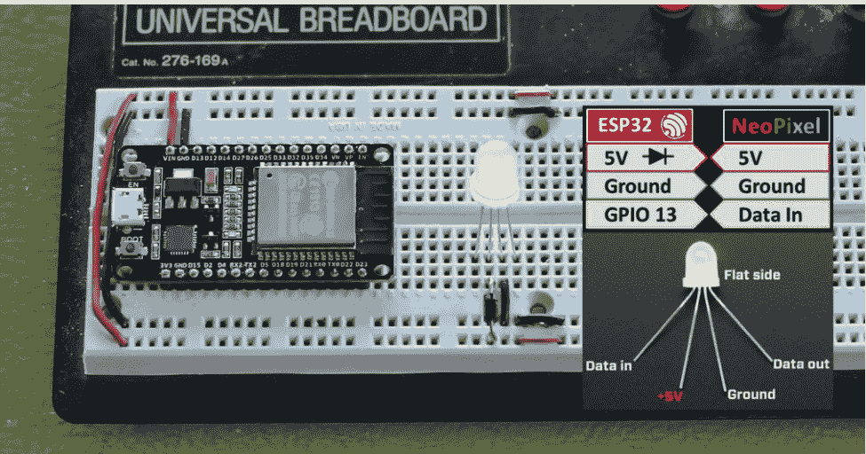

你也可以在数据线上使用电平转换器，在3.3伏和5伏之间进行转换。最后，NeoPixels的数据输入引脚连接到ESP32的GPIO 13。好的。硬件部分就处理完了。现在让我们写一些Python代码。最小化我们的shell并运行IDLE 3。创建一个新文件。`from machine import Pin` 这行很重要。
Pin库与树莓派的GPIO库非常相似。它让你可以引用和控制ESP32的GPIO引脚。`from neopixel import NeoPixel`。这个库用于驱动NeoPixel LED和灯带。`from time import sleep`。MicroPython是Python的一个子集。因此，它不包含所有标准库。
例如，循环RGB LED颜色的一个简单方法是在零到一之间改变色相。这可以通过HSV转RGB方法来实现，这是Python颜色系统的一部分。好的。由于它没有包含在MicroPython中，我将直接从colorsys库中将HSV转RGB函数粘贴到我的代码中。

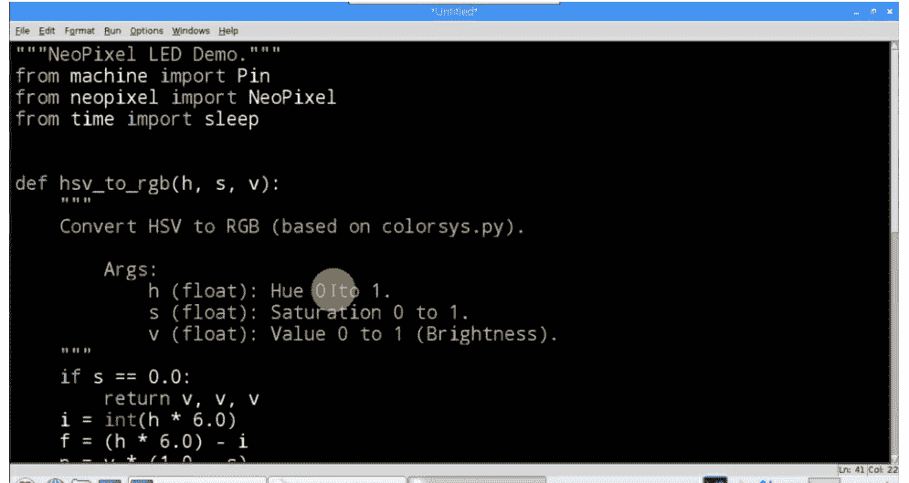

HSV是RGB颜色模型中点的常见圆柱坐标表示法。这个函数简单地将HSV值（色相、饱和度和亮度）转换为RGB值（红、绿、蓝）。我不会解释这个函数的工作原理，因为它与本教程无关，但所有代码都在我的网站上。
如果你想深入研究的话。NeoPixel在GPIO引脚13上实例化。数字1表示LED的数量。NeoPixels也以LED灯带的形式出售，你可以使用单个GPIO引脚控制多个LED。`spectrum` 是一个表示2048种颜色的列表。第一个范围是零到2048，第二个是2048到零。一个try语句用于捕获错误，它包裹着主while循环，该循环是无限的。一个for循环遍历颜色光谱范围。

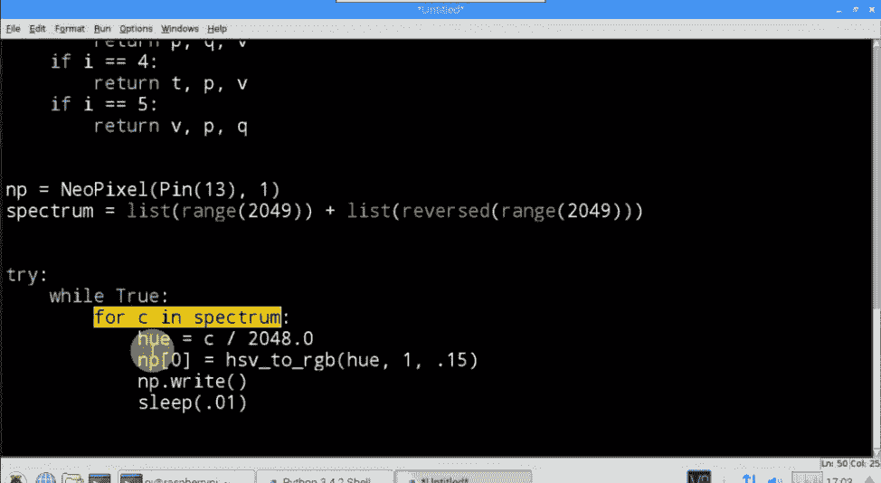

`hue` 被设置为一个从零到一的值，该值被分为2048个步骤。`np[0]` 指的是第一个NeoPixel LED。如果使用灯带，我们可以引用其他LED。HSV转RGB函数接收色相、1%的饱和度，亮度仅设置为15%，以便更容易填充。`np.write()` 将NeoPixel LED设置为指定的颜色。循环休眠10毫秒后继续。`except` 用于在按下Control-C时优雅地退出程序。`finally` 确保通过将红、绿、蓝设置为零来关闭LED。好的。我将保存程序。我会将其命名为 `rgb.py` 并放入文档文件夹。

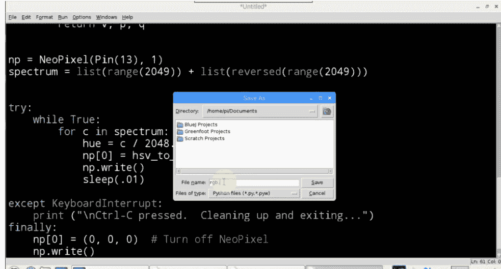

回到我们的shell，我输入Control-X退出REPL，但我仍然在shell中。`ls` 列出我的主目录内容。`cd documents` 切换到我保存Python程序的文件夹。再次输入 `ls` 显示文件 `rgb.py`。`ls /pyboard` 显示ESP32上的文件内容。`/pyboard` 是我们之前使用 `boards` 命令确定的ESP32的ID。

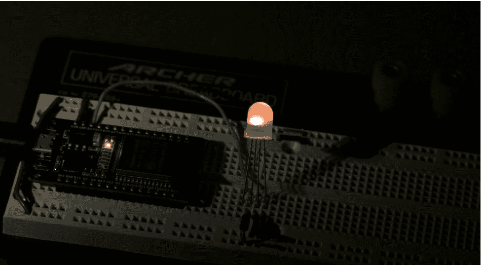

目前，ESP32只包含 `boot.py` 文件。`cp rgb.py /pyboard` 将 `rgb.py` 文件复制到ESP32。现在 `ls /pyboard` 显示 `rgb.py` 文件已成功复制。`repl` 返回到MicroPython REPL。`import rgb` 加载并运行MicroPython程序。回到面包板上。

# ESP32 MICROPYTHON 网页服务器

我的项目节奏很快，但所有的代码、笔记、更新等都可以在网站上找到。一如既往，链接会放在描述中。这是ESP32系列项目的第三个。前两个演示了在ESP32中安装和使用MicroPython的基础知识，以及如何连接和控制NeoPixel LED和DHT22传感器。我建议你观看它们。在前两个项目的基础上，我们将从一个网页开始，该网页显示连接到ESP32的DHT22传感器的温度和湿度。

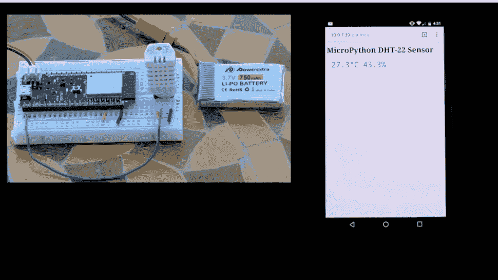

该页面将自动更新新的传感器读数。

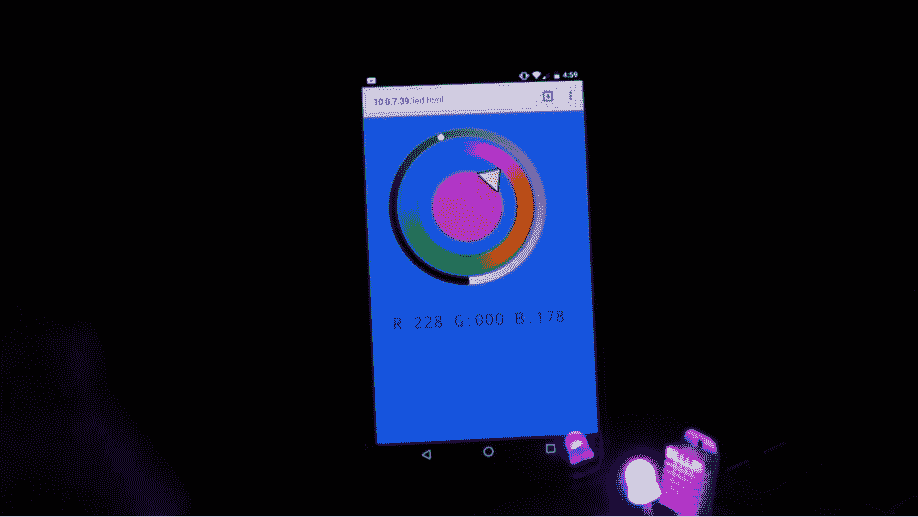

接下来，我们将创建一个带有JavaScript拨盘的网页，用于远程控制连接到ESP32的NeoPixel RGB LED的颜色和亮度。

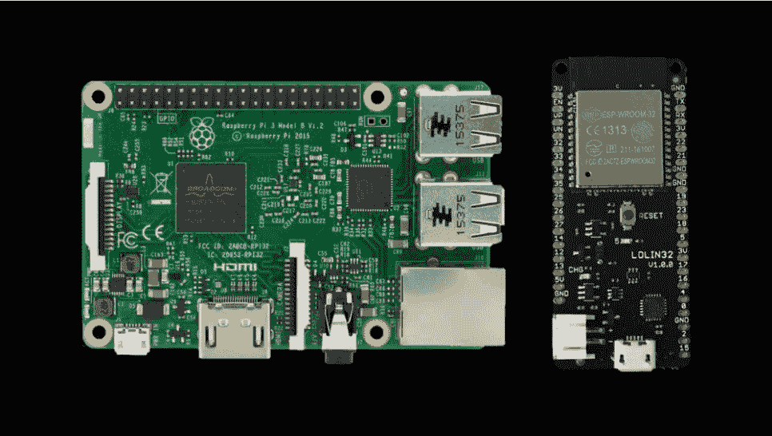

前两个项目的所有工具都已安装在运行最新更新版Raspbian Stretch的Raspberry Pi 3上。我还将最新的MicroPython固件加载到了ESP32上。具体来说，我们使用的是LoLin32。在终端中，首先运行 `rshell` 以连接到 `ttyUSB0` 上的ESP32。使用 `-a` 标志启用ASCII和二进制文件传输，我发现这目前更可靠。另外，添加 `-e nano`，这允许使用nano文本编辑器直接在ESP32上编辑文件。与ESP8266不同，ESP32版本的MicroPython目前不会记住你的WiFi设置。网页服务器将需要网络访问。因此，我将在ESP32上创建一个Python脚本，以便在启动时自动连接到我的WiFi网络。`edit /pyboard/main.py` 创建一个新文件，该文件将保存在ESP32的根目录中。`main.py` 是一个保留文件名，在 `boot.py` 文件之后自动在启动时运行。`import network` 加载网络库。`station` 实例化 `network.WLAN(network.STA_IF)` 并启用站点接口。`station.active(True)` 激活网络接口。`station.connect` 连接到我的WiFi接入点。该方法接受两个参数。第一个是我的接入点的SSID，即“Rotron”。第二个是WiFi密码。启用WiFi就是这么简单。Control-O保存文件，然后Control-X退出nano。退出后，`rshell` 会自动用编辑后的文件更新ESP32。`ls /pyboard` 显示新创建的 `main.py` 文件。我将输入 `repl` 进入MicroPython REPL。

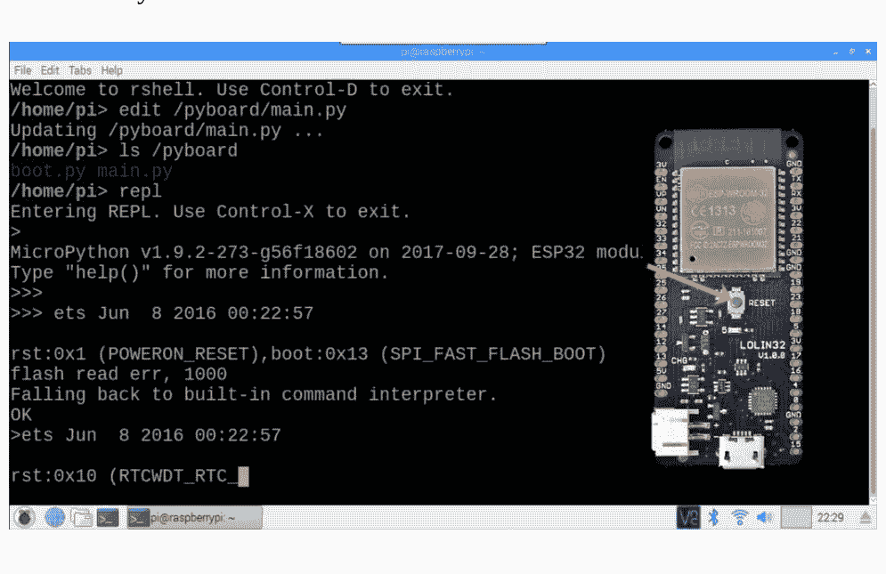

现在当我按下重置按钮时，ESP32会重启。`main.py` 文件被执行，ESP32建立WiFi连接。好的。ESP32已连接，并被分配了IP地址10.0.7.39用于网页服务器。

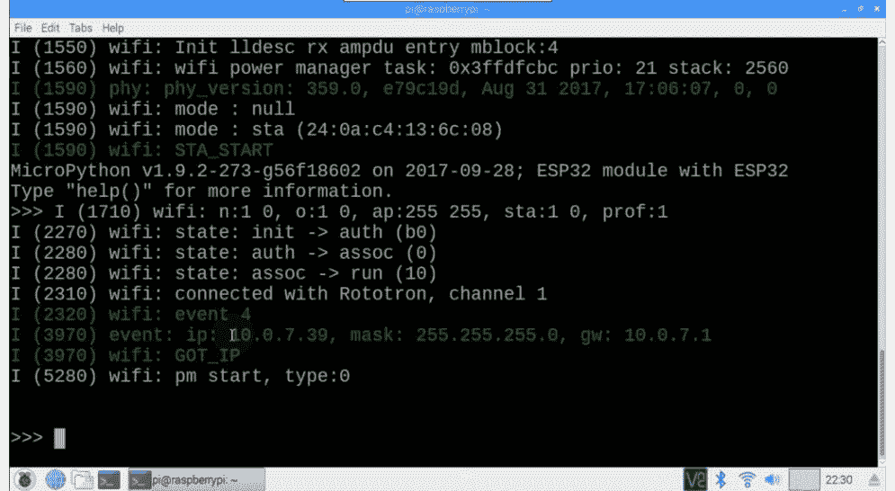

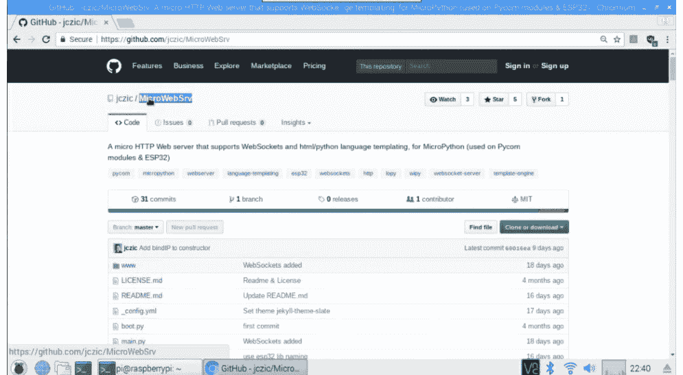

我将使用一个简单且开源的MicroPython库，名为 `microwebserv`，由一位出色的程序员John Chris创建。他做得非常出色，创建了一个功能强大、轻量级的网页服务器，很容易在ESP32上启动和运行。它也是一个Python模块。它支持路由处理和POST请求。你可以在HTTP方法上交换JSON格式以实现完整的REST API。它支持AJAX，甚至支持用于实时数据交换的web sockets。我可能会在未来专门做一个关于web sockets的项目。该库还提供了一种Python模板语言，让你可以创建动态网页。

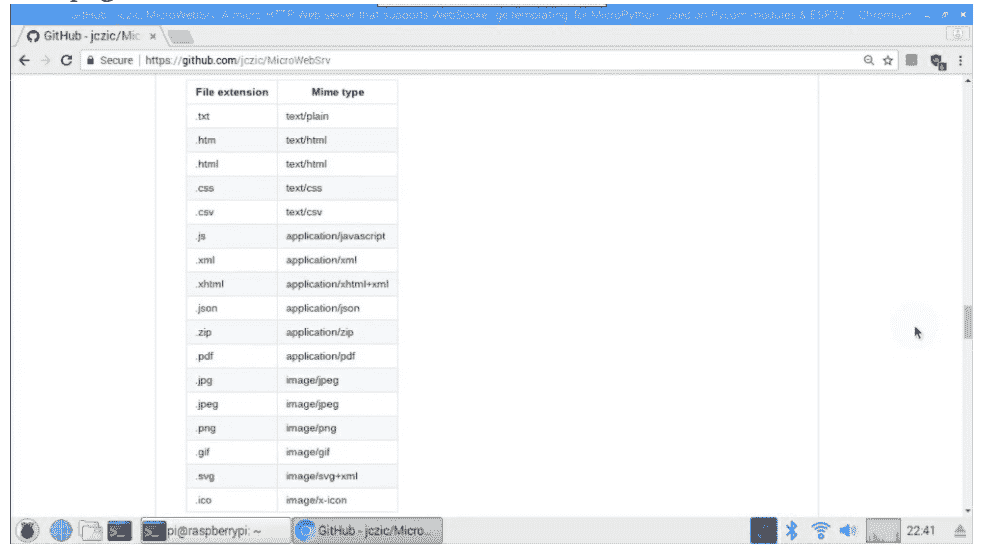

除了常规的静态HTML页面，它还可以提供大多数流行的Web MIME类型，如HTML、CSS、JavaScript、图像、PDF、CSV、ZIP、XML等。你只需将文件放在web路径中，然后就可以通过Web浏览器请求它们。我将向上滚动并将仓库地址复制到剪贴板。最小化浏览器，然后打开一个新的终端窗口。在主文件夹中，输入 `git clone`，然后从剪贴板粘贴 `microwebserv` 地址。好的。库已下载。`ls` 显示 `microwebserv` 文件夹。`cd` 进入下载的文件夹。`ls -a` 显示库附带的所有文件。这些需要被复制到

将ESP32连接到第一个设备。我将删除一些不必要的文件以节省空间并加快传输速度。`rm -rf` 删除git文件夹。我们不需要许可证文件或自述文件。

```
pi@raspberrypi:~ $ git clone https://github.com/jczic/MicroWebSrv.git
Cloning into 'MicroWebSrv'...
remote: Counting objects: 111, done.
remote: Total 111 (delta 0), reused 0 (delta 0), pack-reused 111
Receiving objects: 100% (111/111), 195.16 KiB | 0 bytes/s, done.
Resolving deltas: 100% (60/60), done.
pi@raspberrypi:~ $ ls
Desktop    Downloads    Music    Public    Templates
Documents  MicroWebSrv  Pictures  python_games  Videos
pi@raspberrypi:~ $ cd MicroWebSrv
pi@raspberrypi:~/MicroWebSrv $ ls -A
boot.py  .git  main.py  microWebSrv.py  README.md
_config.yml  LICENSE.md  microWebSocket.py  microWebTemplate.py  WWW
pi@raspberrypi:~/MicroWebSrv $ rm .git -rf
pi@raspberrypi:~/MicroWebSrv $ rm LICENSE.md
pi@raspberrypi:~/MicroWebSrv $ rm README.md
pi@raspberrypi:~/MicroWebSrv $ rm _config.yml
pi@raspberrypi:~/MicroWebSrv $ ls -A
boot.py  main.py  microWebSocket.py  microWebSrv.py  microWebTemplate.py  WWW
pi@raspberrypi:~/MicroWebSrv $
```

或者配置点yaml文件显示了剩余内容。由于我们已经有一个处理wifi连接的main.py文件，我将使用`mv`将main.py文件重命名为start.py。这是一个展示库许多功能的Web服务器示例。让我们来看看它。启动IDLE 3，打开示例文件进行编辑，microWebSrv。

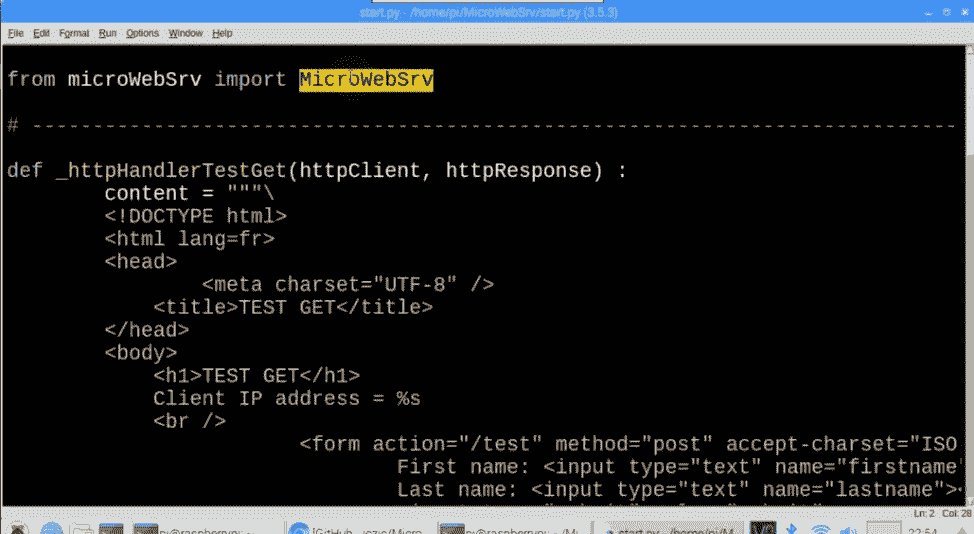

这是主要的Web服务器库。它被导入。一个名为`HTTPHandlerTest_Get`的函数处理返回数据的GET请求，这与用于提交数据（如表单）的POST请求相反。内容被设置为一个HTML内容字符串，其中包含客户端IP地址的占位符。IP地址下方是一个简单的表单，包含名字、姓氏和一个提交按钮。`HTTPClient.GetIP()`动态填充客户端IP地址占位符。`HTTPResponse.WriteResponse()`提供页面。没有头部。内容类型是`text/html; charset=UTF-8`，内容等于上面的contents字符串。

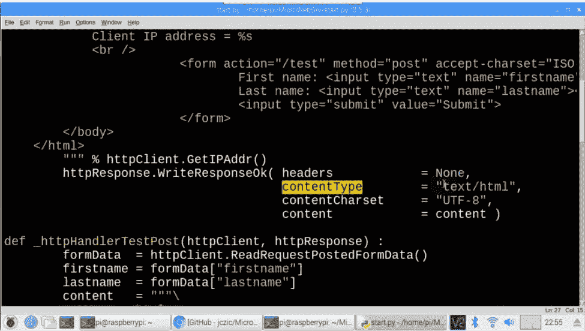

还有另一个路由处理器叫做`HTTPHandlerTest_Post`。

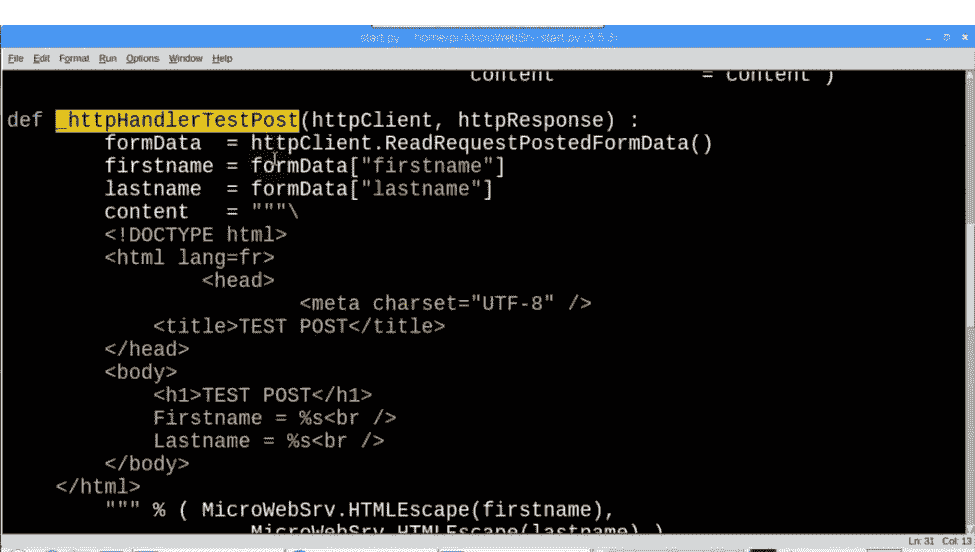

这处理来自上面简单表单的提交数据。当用户点击提交按钮时，使用`HTTPClient.ReadRequestPostedFormDate()`检索表单数据。

提取名字和姓氏。使用一个内容字符串来显示提交的名称。使用`HTMLescape()`确保返回的字符串可以安全显示，这是一个良好的安全实践。同样，`WriteResponse()`将响应返回给浏览器。与之前的GET处理器一样，以下四种方法演示了WebSockets，但我将把这些留到未来的项目中。

我们刚刚查看的两个路由处理器方法被定义。当用户浏览到路由`/test`时，如果请求是GET，则`HTTPHandlerTest_Get`将被触发。否则，如果测试路由被POST访问，则`HTTPHandlerTest_Post`方法将被触发。实例化一个`MicroWebSrv`并传递路由处理器。

该库最初是为Python模块编写的，在ESP32上使用稍微不同的路由路径。

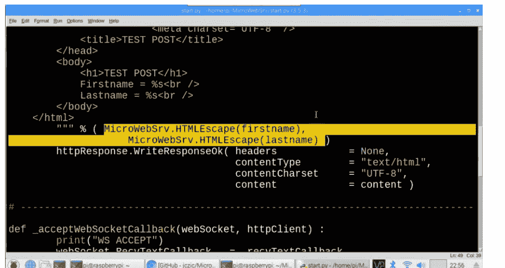

因此，我将添加`webPath`参数并将其值设置为`/www/`。这只是告诉库我们的Web文件将存储在ESP32上名为`www`的文件夹中。这个示例的下三行处理Web套接字。最后，使用`Start()`启动Web服务器。`threaded=False`关闭线程。我将保存对示例的更改。好的。现在让我们将MicroWebSrv库和示例的内容复制到ESP32。看起来我忘记删除一个文件了。`rm boot.py`删除一个名为`boot.py`的示例文件。我们绝对不希望将这个文件复制到ESP32，

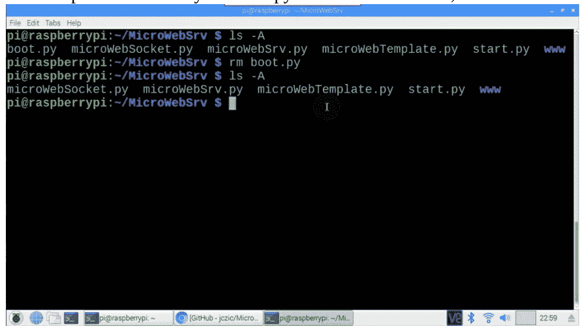

因为它会覆盖现有的`boot.py`文件，通常你不应该修改它，除非你知道自己在做什么。好的。现在一切看起来都很好。我将关闭第二个终端并返回到我们的shell。`Ctrl+X`关闭REPL，但我们仍在shell中。`cd MicroWebSrv`切换到MicroWebSrv文件夹。嗯，看起来我们的shell不支持`-A`，它代表几乎所有。显然`-a`代表全部可以工作，但这并不重要，因为我已经删除了隐藏的git文件夹。`ls -l`显示内容，我们现在将其复制到ESP32。`rsync -r . /pyboard`将当前目录中的所有文件和文件夹同步到ESP32。

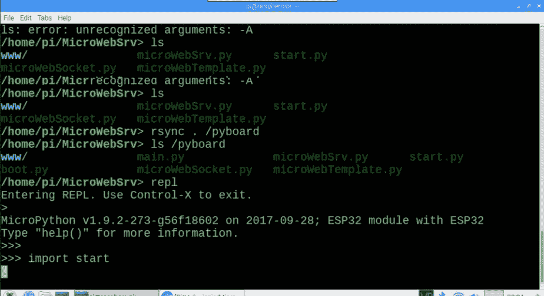

`ls /pyboard`显示所有文件，包括`www`子文件夹，都已成功复制。对于REPL，启动MicroPython REPL。`import start`启动Web服务器。或者没有。显然我在`start.py`文件的第80行有一个bug。一个`rx`的问题。好的，`Ctrl+X`退出REPL回到主shell终端。`edit /pyboard/startup.py`打开位于ESP32上的`startup.py`文件进行编辑。在那里，86行。

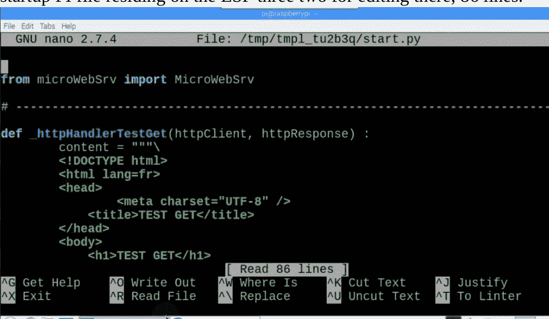

所以第80行的bug应该接近底部。我会一直向下滚动。我看到问题了。一个破折号而不是等号。

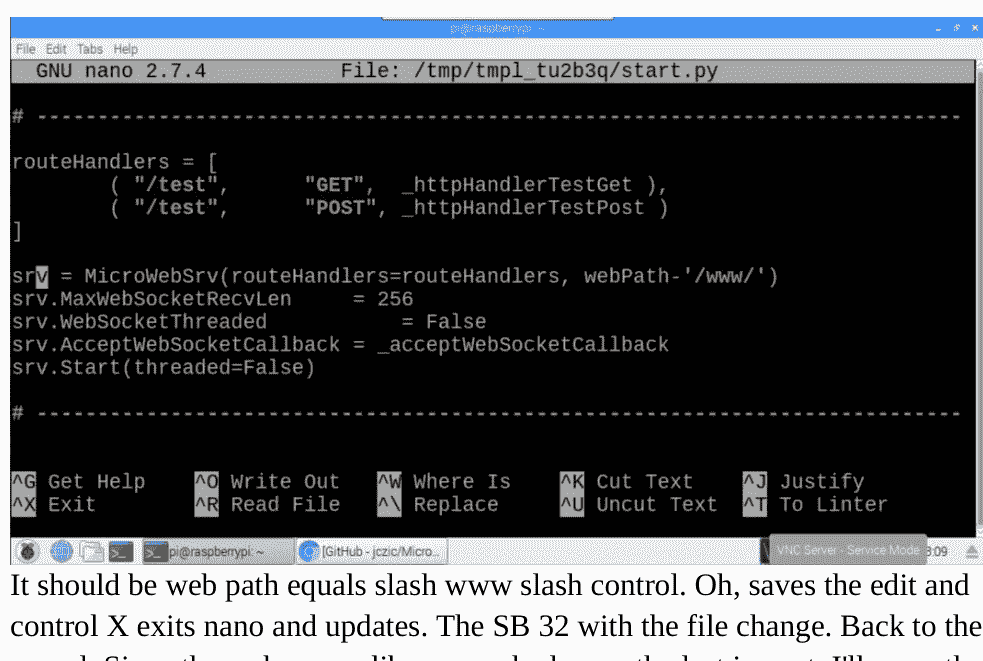

应该是`webPath='/www/'`。`Ctrl+O`保存编辑，`Ctrl+X`退出nano并更新ESP32上的文件更改。回到REPL。由于Web服务器库在上次导入时崩溃，我将按下ESP32上的重置按钮以从头开始。

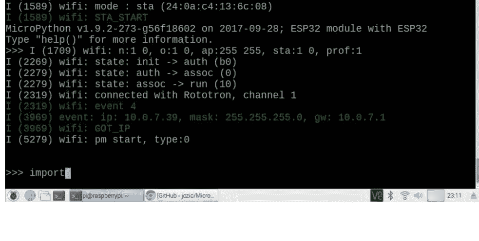

否则可能会有冲突。再次`import start`。现在它工作正常了。一个Web服务器正在ESP32上运行。我将切换回Chromium Web浏览器并浏览到ESP32 IP地址`http://10.0.7.239`，后跟路径`/test`。这访问测试路由，触发相应的GET处理器。

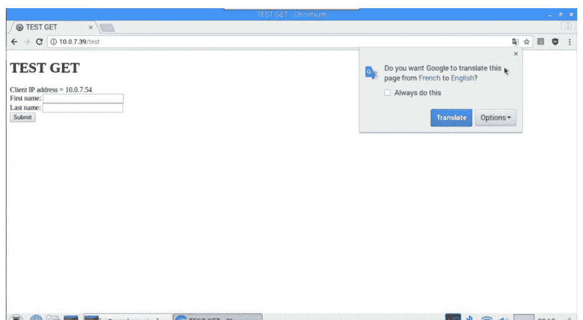

显示了树莓派的IP地址和简单的表单。我将输入名字、姓氏并点击提交。这再次访问测试路由，但这次它触发POST处理器，该处理器简单地返回字段中的名称。好了。我们有了一个工作的Web服务器。除了路由之外，MicroWebSrv库还可以提供常规HTML文件和大多数常见的MIME类型。

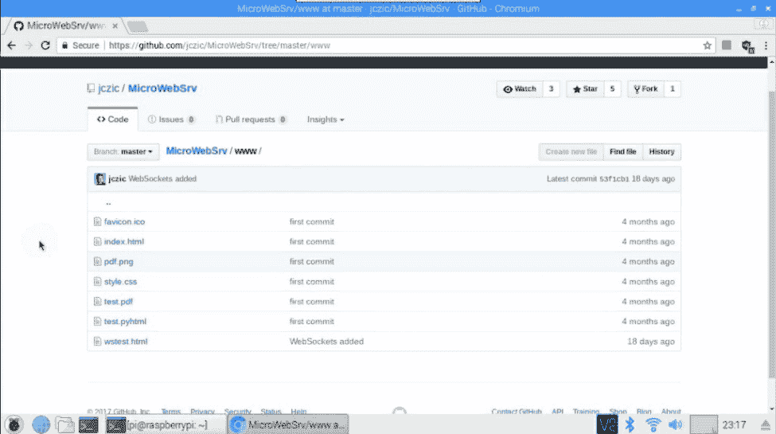

切换回MicroWebSrv GitHub站点并列出`www`文件夹显示了几个示例文件。`index.html`

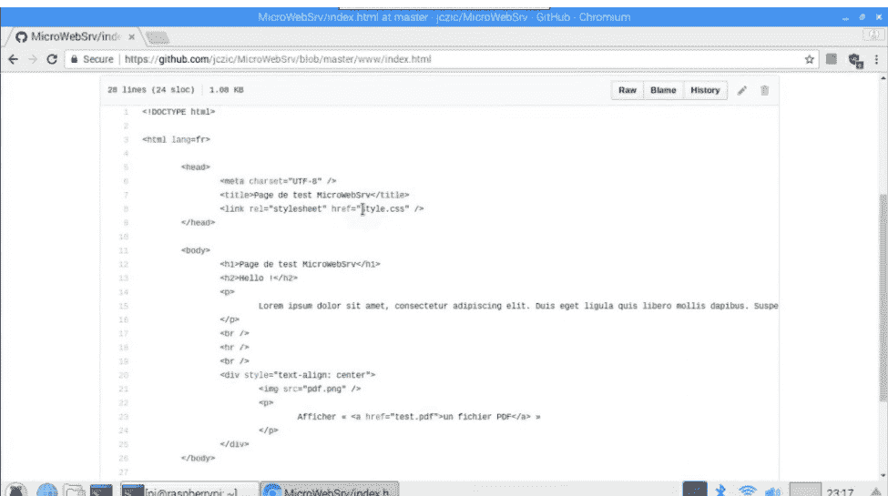

是一个基本网页。样式从外部CSS文件加载。有常见的HTML标签和一些示例文本。显示了一张图片，还有一个下载PDF文件的超链接。下一个示例文件是`test.py.html`。

这演示了Python模板语言。双花括号表示代码块。`def`用于定义一个函数。`test_function`。你可以使用循环。你可以使用if语句。你可以调用已定义的函数。所有这些代码在请求网页时在服务器上运行，结果返回给浏览器。在地址栏中，我将输入`http://ESP32-address/index.html`。返回示例HTML文件。有一张图片、样式化的文本和一个链接，点击时会下载PDF文件。将网址更改为`test.py.html`加载Python模板示例。黑底白字显示了一些for循环，有函数调用，并且只有第三个`if`为真。

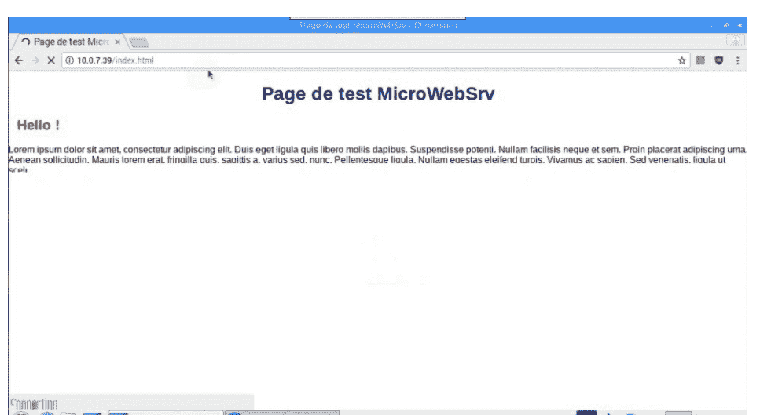

包含的示例提供了丰富的信息，帮助你入门。现在，让我们在这些示例的基础上，为我们的网页服务器添加一个温湿度传感器和一个NeoPixel LED。DHT22温湿度传感器连接到ESP32。ESP32提供3.3伏电源和接地。传感器数据线连接到GPIO15。NeoPixel LED也已连接。来自ESP32的5伏电源通过一个二极管降压至3.3伏。接地线相连，数据线连接到GPIO13。以下是这些组件在小面包板上的样子。

在本系列的前两个项目中，我已经介绍过NeoPixels和DHT22。如果你对更多安装细节感兴趣，请查看它们。我的网站上也有接线原理图和额外的图片。

回到Thonny，我有一个空白的Python文件。从`microWebSrv`导入`MicroWebSrv`。从`machine`导入`Pin`。从`DHT`导入`DHT22`。为DHT22实例化传感器。定义了一个名为`_httpHandlerDHT`的路由GET处理方法。

一个try语句包裹了传感器的测量调用。`t`和`h`被设置为返回值，即温度和湿度。一个if检查确认所有实例都是浮点值。如果是，变量`data`被设置为温度和湿度的格式。否则，记录一个“无效读数”错误，并抛出一个传感器无法读取的异常。

响应是“Okay”。响应头被设置为“no-cache”，因为我们总是希望显示最新的传感器读数。内容类型被设置为“text/event-stream”，因为我们将使用服务器发送事件来确保网页上的传感器读数得到更新。这是WebSockets的一个简单替代方案，当更新仅从服务器单向发送到客户端时，它非常适用，尽管与更流行的WebSockets相比，服务器发送事件的浏览器兼容性有限。字符集是UTF-8，内容被设置为为服务器发送事件格式化的数据。

为`/dht`路由指定了一个单一的路由处理程序。收到GET请求时，它将触发上述方法以返回DHT22传感器数据。创建了`MicroWebSrv`网页服务器实例，并传入了路由处理程序和`/www`网页路径。`Start`方法启动网页服务器。

我将Python文件保存在documents文件夹中，并将其命名为`dht_web.py`。我将关闭Thonny，退出REPL，并退出我们的shell。`cd`到保存了`dht_web.py` Python文件的documents文件夹。

现在让我们创建一个HTML文件来定期轮询`/dht`路由。`nano dht.html`创建一个空白的HTML文件。为了节省时间，我将粘贴所有代码。

我们有一个基本的HTML样板文件，添加了一些内容。一个ID为`result`的单一`div`将用于显示传感器。这个`div`将大约每三秒轮询一次`/dht`路由，我相信这是服务器发送事件的默认设置。错误检查确保浏览器支持EventSource。如果是，一个`source`变量被设置为一个新的`EventSource`，并传入主机名，即ESP32的IP地址后跟`/dht`。当EventSource从服务器接收到新数据时，`source.onmessage`被触发。它用更新的温度和湿度读数填充`result` div的`innerHTML`。同样，服务器发送事件可能存在浏览器兼容性问题。这段简单的代码仅用于演示目的。

Control-O保存HTML文件，Control-X退出nano。我将重新打开我们的shell。`ls`显示`dht.html`文件和`dht_web.py` Python文件。`cp dht_web.py /board`将Python文件复制到ESP32的根文件夹。`cp dht.html /board/www`将HTML文件复制到ESP32上的`/www`网页路径文件夹。`repl`返回REPL。`import dht_web`启动网页服务器。这次没有错误。

我将在树莓派上打开Chromium，并浏览到`http://10.0.7.93/dht.html`。网页显示27.2摄氏度和33.4%的湿度，数据每几秒更新一次。由于ESP32有电池检查，现在可以将ESP32板放置在我的WiFi接入点范围内的任何地方，通过网页检查温度和湿度。

对于最后一个示例，我将创建一个网页来控制NeoPixel LED的颜色和亮度。Control-C停止网页服务器，我将按下重置开关以获得一个干净的开始，然后按Control-X退出REPL。回到Thonny，我有一个新的空白Python文件。前两个导入与之前的示例相同。然后从`neopixel`导入`NeoPixel`，并导入`json`来处理JSON数据。变量`np`在引脚13上实例化一个NeoPixel。1表示单个LED。一个名为`_httpHandlerLEDPost`的路由处理程序将处理使用HTTP客户端`ReadRequestContent`方法发送的JSON POST内容。一个`color`字典将存储发布的颜色数据。

```python
from microWebSrv import MicroWebSrv
from machine import Pin
from neopixel import NeoPixel
import json

np = NeoPixel(Pin(13), 1)

def _httpHandlerLEDPost(httpClient, httpResponse):
    content = httpClient.ReadRequestContent()  # Read JSON color data
    colors = json.loads(content)
    blue, green, red = [colors[k] for k in sorted(colors.keys())]
    np[0] = (green, red, blue)
    np.write()
    httpResponse.WriteResponseJSONOk()
```

`json.loads`转换JSON颜色内容。使用这个字典推导式从颜色字典中提取蓝色、绿色和红色。`np[0]`将NeoPixel设置为指定的RGB颜色。我不确定是NeoPixel库有bug还是只是我的NeoPixel LED，但参数顺序目前是绿色、红色、蓝色，而不是文档中显示的红色、绿色、蓝色。`np.write()`在LED上显示指定的颜色。`httpResponse.WriteResponseJSONOk()`向浏览器发送一个OK响应。

一个单一的路由处理程序处理`/led`路由的POST请求，并相应地触发上述路由处理方法。创建了`MicroWebSrv`实例，传入路由处理程序和网页路径，然后使用`Start`启动网页服务器。

我将文件保存在documents文件夹中，并将其命名为`led_web.py`。我将关闭Thonny并打开一个新的终端窗口。为了控制颜色和亮度，我将使用一个名为HueWheel的开源JavaScript色轮，适用于HTML5。它提供了一个环形控件，支持鼠标和触摸进行颜色和亮度设置。点击`huewheel.min.js`，然后点击Raw，右键单击将JavaScript文件保存到documents文件夹。

现在让我们创建一个HTML网页来托管色轮并与Python LED路由交互。`cd documents`。`ls`显示下载的`huewheel.min.js` JavaScript文件。`nano led.html`打开一个空白的HTML文件进行编辑。我将粘贴所有HTML代码，这与DHT示例类似。导入了`huewheel.min.js`文件。此外，从CDN导入了`underscore.js`。它将用于节流JSON POST请求。主体有一个容器`div`，其中包含一个用于色轮的`div`和一个信息`div`。

脚本定义了一个`throttleSetColor`函数，它调用`_.throttle`方法，并传递函数`setColor`和400毫秒的等待时间。这可以防止页面因发送过多POST请求而使网页服务器过载。`hw`被设置为一个新的`HueWheel`。当色轮的颜色或亮度发生变化时，`onChange`方法被触发并调用`throttleSetColor`函数。大多数其他设置只是默认值。

`setColor`函数将指定的颜色发布到网页服务器。信息`div`显示当前的RGB颜色：红色、绿色和蓝色。`colorJSON`以JSON兼容格式存储RGB颜色数据：红色、绿色和蓝色。`xhr`被设置为一个新的`XMLHttpRequest`。`xhr.open`将POST发送到`http://`后跟ESP32的IP地址，再后跟`/led`。`setRequestHeader`将内容类型设置为`application/json`。`xhr.send`发布颜色JSON数据。这将触发网页服务器上的`/led`路由处理程序，并更改NeoPixel LED的颜色。

Control-O保存，Control-X退出。回到我们的shell，`ls`显示`led_web.py` Python代码、`huewheel.min.js` JavaScript库和`led.html`文件。

## 从手机更改 ESP32 WiFi 凭据

- 如何从手机应用更改 ESP32 WiFi 凭据。
- 如何从手机应用开关 LED。

你可以从手机应用更改 SSID 和密码。更改 SSID 和密码后，我将开关 LED，以向你展示此项目已成功运行，并通过 ESP32 访问互联网。

我们是否需要将其连接到附近的网络？假设我需要将 ESP32 连接到我的家庭路由器。

提供路由器访问 ID 和密码的一种简单方法是通过代码。如果你使用这种技术，那么你就知道每当你的密码更改时，你都需要在代码中进行一些更改。并且随着你的代码更改，你必须重新上传代码。

这就是为什么我开发了这个项目，你可以使用手机应用将 ESP32 连接到任何网络。我将使用 ESP32 的蓝牙功能来更改 WiFi 名称和密码。让我们从入门仪式开始，打开 Google 浏览器搜索我们不需要的东西。

我已经有一个账户。如果你没有，请先用你的电子邮件和密码创建一个。然后登录。我之前已经创建了 ThingSpeak，创建新频道。我将分配任何名称，是的。对于字段一，确保字段一框被选中，向下滚动。然后保存频道。

要确保是否成功运行，请从 API keys 点击 API keys。复制。我将获取食物。

Control C，打开新标签页，粘贴到这里，将字段一的值更改为任何新的数字值，例如 99，按回车，打开你的 ThingSpeak 或什么，但我将查看，你会在字段级别看到相同或新的值。意味着我们的什么现在正在工作，现在关闭它。下一步是创建移动应用或创建 Web 应用，打开新标签页搜索 MIT App Inventor。

创建应用，开始新项目，分配名称。我将分配 ESP32 测试，

按。好的。

这是 MIT App Inventor 的用户界面主页。取列表选择器，更改属性，将宽度更改为填充父级，请。好的。字体折叠更改字体。更改字体大小，现在将文本 "ESP32 to connect to Bluetooth" 更改为。从布局

更改，参数更改为填充父级并执行相同的过程。再一次

时间。然后取一个，再取一个。并从用户界面将宽度更改为填充父级。取级别滑块。再取一个级别并放置到下一个下一个框中。减少文本框一和文本框二更改。级别一的参数更改宽度，以填充父级字体和位置。

然后对社会发言。选择文本框一选择字体以在位置上工作是 20，其中是填充父级。它是提示。对下一个框执行相同的操作，更改，取边，字体，和宽度，以及文本到密码。对 X-Box 也执行相同的过程。好的。从布局。更改参数以取标签并取更改宽度。它是文本。我不打算使用此标签更改按钮参数宽度，以填充父级字体大小。它是 20 使用字体，粗体，并将文本更改为。和那个

从布局取水平排列。更改参数宽度，以填充父级相同从布局，取垂直排列。嗯，我打算这样做，将其放在排列五下面。好的。让我们选择垂直排列将宽度更改为填充父级。这个。好的。取两个并再取一个，多于三个并放置在下面，但然后两个，更改参数的将更改宽度以填充父级风险。好的。将字体大小更改为 20。更改更改文本为 LED ON，对按钮三执行相同的过程，

而不是 led on，取两个 led off。从连接性，选择蓝牙客户端模式将出现在下面。

现在一半部分完成。下一部分是连接逻辑。从块，选择变量。首先取初始化，全局名称并更改变量。名称到 SSID 和第二个变量名称到密码。从文本中选择，我们能够条件完成现在从列表选择器，一选择列表选择器，一。点之前

选择，并让我们选择一之后选择。所以让我们，让我们选择她一并说列表我们一，不消除到块从蓝牙。客户端一，选择蓝牙客户端，一。点地址和名称。从扬声器一选择块。好的。设置列表。选择器一。点选择到块。并从蓝牙客户端一选择调用蓝牙客户端一。点连接。并从让我们选择一选择地址块，这些选择器一。点选择。所以像按钮一，按钮，一点击功能。当按钮一被点击，我们将发送。SSID 和密码设置必要地取社会从文本框。一。点文本。并说全局密码从 X-Box。点文本，文本框二。点文本从蓝牙客户端一选择。调用发送文本到客户端一。点，发送文本流。

他们可以在中间分配。现在获取什么变量对于两个变量是 SSID。和第二个变量是密码设置全局 SSID，并获取，获取全局 SSID 和获取全局密码在中间技术逗号。我们将发送这个给每个人到 现在，当我们转向它点击。这是 led on 按钮。现在我们必须先说 URL 设置。我们有一。点 URL 从文本，取空字符串在这个东西。我们将复制 URL。并从一调用一。点获取功能，按钮二功能是准备好的。我们需要这个 URL。从 ThingSpeak 服务器复制这个 URL，

点击 API keys。复制这个对。通用 URL，复制 Control C 并粘贴到这里。Control V。将字段一的值从零更改为一。这个功能是准备好的。现在制作这个功能的副本，

而不是按钮二。对。按钮三，这是 led off 功能并更改字符串字段一。它将做一。到字段一等于零。什么输入功能也是准备好的？什么框图现在准备好了，

从构建下载应用并保存 APK 并发送到我的计算机。

我将保存在隔壁。我没有看到很多米。
现在你可以看到他们选择一个文件更多这个，一个更大的文件到你的手机复制。
打开我的计算机，打开他们的手机。内部存储并粘贴在任何文件夹中安装这个应用和你的手机打开文件管理器，打开 APK 文件。它
会看到点 APK。是的并打开移动应用准备好了。

现在，下一部分是从文件编写 ESP32 代码。创建新文件关闭之前的。好的。现在，保存这个文件。首先使用任何文件夹我分配名称相同。现在编写代码以节省时间。我已经死了这个代码。你可以从视频描述下载这个代码。Control A 复制并粘贴到这里。我们需要在安装此代码之前进行一些更改。

首先频道编号从 ThingSpeak 服务器复制频道编号打开

事情，说话。

点击 API 密钥。你会看到频道 ID。

按 Ctrl+C 复制，打开 ID，双击，关闭更新，播放，然后按 Ctrl+V。

现在下一步，那个 API 密钥，同样从 things 等处复制，打开 Arduino IDE。好的。双击并粘贴。下一部分是你的路由器，SSID 和密码。首先你可以分配任意值。之后，我们可以从移动应用程序更改这个 SSID，然后是密码。这是密码。不要更改代码中连接 ESP32 到你舒适区的部分。

从工具中，选择板子，我已经选择的板子是 ESP32。型号相同，从工具中，选择通信端口。在我的例子中，COM 端口是 12。现在上传代码。

这会花一些时间。代码已上传。进行连接。根据电路图，你可以从下面的描述中下载电路图，带有字母板，我将开发这个电路图。有两个 LED 和一个开关，开关用于更改路由器的密码。绿色实体用于指示我们处于蓝牙模式并准备就绪，准备就绪，准备就绪？它用于一个糟糕的目的，我将使用 COM 端口为这个电路供电。最终输出。首先，我将打开我的移动热点。如果你看到 SSID 和密码，这与我在程序中使用的是相同的。好的。现在。打开移动应用程序。我设置了电路。

现在，如果你按下，红色 LED 将亮起。如果你按下绿色 LED，绿色 LED 将亮起。现在我将更改路由器的密码。我将更改 SSID 为任何名称，比如 M M M 五次 M。我将更改密码为任何数字，比如八次九。然后按确定。现在打开移动应用程序。现在，如果我打开 LED，如果我按下 LED，LED 将不会亮起，因为我们的 ESP32 没有连接到任何网络。现在我要做的是，我将首先更改密码，打开蓝牙。你会在这里看到，因为我已经与这个配对了。如果你使用，如果你，你的设备不在，你的设备在可用设备中可用。

再次打开应用程序。如果你按下连接到蓝牙开关，你会在这里看到 ESP32 设备。不。现在首先按下开关进入蓝牙模式。绿色绿色。准备就绪？将亮起以指示我们现在处于蓝牙模式。现在请连接到蓝牙开关，按下 ESP32，现在输入 SSID 和密码，现在输入新的 SSID 和密码，SSID 是五次 M，密码是八次九。对。当这个 SSID 和密码成功时，绿色 LED 将熄灭。

现在按下 LED 开，LED 将亮起，按下 LED 关，LED 将熄灭。你可以根据需要多次更改密码。

## 下载 MicroPython 固件

我们将讨论如何将 MicroPython 固件安装到 ESP32。同样，你也可以安装到 ESP8266。为此你需要一个固件，打开任何浏览器并访问 micropython.org 网站。你可以进入下载，在下载标签下。

有很多板子和固件，你可以从中下载。你必须找到四个。基于 ESP 的板子。它根据你拥有的板子进行分类。你可以下载固件，在我的例子中，我使用的是 ESP32 板子。所以我点击这里可用的通用 ESP32 模块。这些命令非常重要。这些命令将在接下来的一周中使用。

固件使用 ESP-IDF v3.x 或 v4.x 提供。如有疑问，请使用 v3.x。

### 使用 ESP-IDF v3.x 的固件

使用 ESP-IDF v3.x 构建的固件，支持 BLE、LAN 和 PPP：

- GENERIC : esp32-idf3-20200601-unstable-v1.12-483-g22806ed5d.bin
- GENERIC : esp32-idf3-20200529-unstable-v1.12-478-g1662a0b06.bin
- GENERIC : esp32-idf3-20200528-unstable-v1.12-477-g2d1fef709.bin
- GENERIC : esp32-idf3-20200527-unstable-v1.12-471-g4bbba3060.bin
- GENERIC : esp32-idf3-20191220-v1.12.bin
- GENERIC : esp32-idf3-20190529-v1.11.bin
- GENERIC : esp32-idf3-20190125-v1.10.bin
- GENERIC : esp32-idf3-20180511-v1.9.4.bin
- GENERIC-SPIRAM : esp32spiram-idf3-20200601-unstable-v1.12-483-g22806ed5d.bin
- GENERIC-SPIRAM : esp32spiram-idf3-20200529-unstable-v1.12-478-g1662a0b06.bin
- GENERIC-SPIRAM : esp32spiram-idf3-20200528-unstable-v1.12-477-g2d1fef709.bin
- GENERIC-SPIRAM : esp32spiram-idf3-20200527-unstable-v1.12-471-g4bbba3060.bin
- GENERIC-SPIRAM : esp32spiram-idf3-20191220-v1.12.bin
- GENERIC-SPIRAM : esp32spiram-idf3-20190529-v1.11.bin
- GENERIC-SPIRAM : esp32spiram-idf3-20190125-v1.10.bin

### 使用 ESP-IDF v4.x 的固件

所以现在固件有很多可用选项。所以这些前几个显示的是不稳定的。这意味着开发人员正在处理它。所以如果你想使用最新的，你可以选择其中任何一个。如果你想使用稳定版本，你可以选择其中任何一个。所以我只是尝试最新的。我现在将使用这个不稳定的。所以我只是下载。我可以保存到下载文件夹。你可以更改，否则就保持原样。是的。这个文件的扩展名是 .bin 文件。我正在保存这个。如果你使用 ESP8266，你可以去下载，在基于乐鑫的板子下，你可以去 ESP8266 模块。从那里，你可以下载最新版本，所以你可以下载这个并使用它。

## 使用 THONNY IDE 刷写 MICROPYTHON

我们将看看如何将 MicroPython 固件刷写到 ESP32。为此，是的。打开 Thonny IDE，转到工具。管理插件。在这里，我们需要安装一个名为 ESP tool 的插件。所以在这里输入，ESP tool 搜索。在我的例子中，ESP tool 已经安装了。

这是满足的。否则有一个选项可以安装。你可以点击那个。

之后转到工具，选项。解释器默认，解释器将是 Python。你可以在这里更改为 MicroPython 解释器。主要有两个选项。MicroPython ESP32 和 MicroPython ESP8266。我们主要讨论这两个板子。其他板子也在这里可用。我在这里使用 ESP32 板子。所以我将选择这个，你必须选择一个端口。我们已经下载并安装了驱动程序。确保你使用的是短 USB。否则，端口可能无法检测到。所以如果，如果它被检测到，它会显示确切的板子。你必须点击这里，同样的板子，你必须导航到固件下载的位置。确保在安装前擦除闪存。点击浏览。这里，这是一个 bin 文件，我们已经下载了。

选择那个。点击打开。现在你必须点击安装。在安装之前，我们想了解一些东西。这里有两个按钮。这个是启用按钮，这个是引导按钮，按下引导按钮。你必须按下引导按钮。我保持这样同时。你可以点击安装。所以我将点击安装。然后释放那个引导按钮，现在你可以看到擦除闪存，擦除闪存，现在它正在上传新的固件，上传 5%。完成了。

只需等待几分钟。现在当你成功将 MicroPython 固件刷写到 ESP32 板子时，它要求点击硬重置按钮。硬重置按钮是这里的引脚。所以在断开电源之前，你必须点击这个上的重置按钮。这是模式一。这是重置一，按下。这个。所以，这是你可以重置的方式。也许你可以尝试一两次点击。好的。

你已经成功上传了你的 MicroPython 固件，现在你可以断开连接，关闭 Thonny IDE，再次打开 Thonny IDE 并重新连接。检查它是否从端口检测到，点击那个，点击。好的。并点击重置按钮。是的，在那之前它已经加载了。你必须点击重置按钮，你可以在这里看到，MicroPython 已加载。我正在尝试使用 print 命令在 MicroPython 中。print 命令是如果它是一个字符串在双引号中，你能够输入你想要打印的内容？我刚刚给出了一个简单的 print 命令。所以我将打印它。这里，这在 shell 下工作。所以如果我运行这个代码，它将转到 ESP32 并在那里运行，响应将在 shell 中可用。它是打印的。Hello world，响应。回到我们这里可用的 shell。也连接到 Putty。让我关闭这个。

## 使用 ESPTOOL 刷写 MicroPython

我们将使用 ESP 工具或集线器来刷写 MicroPython 到 ESP32。请访问 MicroPython 网站，点击下载，找出你的开发板对应的 ESP 固件。这些命令非常重要。我们将使用这些命令来确保 ESP 工具已正确安装。

让我们检查 ESP 工具是否已安装。打开命令提示符（只需输入 `CMD`），然后输入 `pip install esptool`。如果已安装，此要求即满足。

我们已经下载了固件。如果尚未下载，请前往下载。这是擦除 ESP32 中数据的命令。你需要在此处更改开发板名称。这里显示的是 Linux 系统下的开发板名称，对于 Windows 系统，它通常是 `COM6`。那么如何检查呢？请转到设备管理器，在端口下查看。你可以找到它连接到 `COM6`。然后转到命令提示符，输入 `esptool.py --port COM6 erase_flash`。其中 `COM6` 的 `C` 是大写。

你需要按住 ESP32 上的 `BOOT` 按钮，然后按 `ENTER`，并在一到两秒内松开 `BOOT` 按钮。
现在它开始擦除，并成功擦除。现在它要求重置。你需要按 ESP32 上的 `ENABLE` 按钮或 `RESET` 按钮。下一步是上传固件。我将在 `U` 盘下创建一个文件夹。我将创建一个名为 `ESP32` 的文件夹。在其中，我保存了这个 `.bin` 文件。现在转到命令提示符，只需复制下面的命令并粘贴到这里。你需要更改两处。

你需要更改开发板端口，即 `COM6`，我们已知是 `COM6`。最后一个是 `.bin` 文件名，你也需要将其替换为已下载的文件名。只需复制文件名。我已复制。

我将其全部粘贴到这里。按住 `BOOT` 按钮，然后按 `ENTER` 并松开。它没有工作。好的。问题是我选择的文件夹是错误的。所以我必须转到 `ESP32` 文件夹。命令是 `cd ESP32`。这是我创建的文件夹。然后列出这些文件，使用 `dir` 命令。这样我就能看到所有的固件和文件。只需粘贴相同的命令。
只需通过复制此处的文件名来更改 `.bin` 文件名。

在此处粘贴，按 `ENTER`。在此之前，你必须按住 `BOOT` 按钮，并在 1-2 秒的间隔内松开 `BOOT` 按钮。现在它开始写入，现在进度是 80%。
现在成功刷写。MicroPython 固件已刷写，你需要通过按 ESP32 上的 `ENABLE` 或 `RESET` 按钮来重置。只需打开 PuTTY，重新连接 ESP32。你可以打开。

现在 shell 已加载。只需使用 `print("Hello")` 命令检查。此命令成功运行。如果 ESP 工具未正确安装。
那么我们必须设置 ESP 工具的路径。所以我们将检查如何设置 ESP 工具的路径。首先，我们必须检查 ESP 工具安装在哪里。转到命令提示符，

只需输入命令 `pip show -f esptool`，这将显示其安装的文件夹。这是 ESP 工具的路径。只需复制此路径。右键点击“此电脑”。转到属性，转到高级系统设置。然后

当环境变量出现时，点击它。然后在系统变量中转到 `Path` 并点击新建。我已经设置了路径。如果未设置，你可以点击新建。粘贴你复制的路径，然后点击确定。所以如果你这样做，你可以避免这类问题，比如 ESP 工具无法识别。

## 使用 ESPRESSIF 工具刷写 MicroPython

我们将使用乐鑫（Espressif）的另一款软件将 MicroPython 刷写到 ESP32。打开任意浏览器，访问乐鑫网站。你可以搜索 `Espressif`。乐鑫是 ESP8266 和 ESP32 芯片的制造商，提供两款软件。
你可以转到支持。在下载下，你可以转到工具。好的。你可以选择。是的。ESP32。它已经显示出来了。那就是 Flash Download Tool。

这就是我们要在这里使用的工具。用于 ESP8266、ESP32 的 Flash Download Tool。让我们假设这是 ESP32-S。所以你可以下载该软件。
我正在下载该软件。它仅适用于 Windows 操作系统。
下载完成后，转到下载文件夹。你需要解压。可以使用“解压到此处”选项，或者使用这个选项。我正在使用这个选项解压到当前文件夹。打开 `flash_download_tool` 文件夹。这是应用程序。

以管理员身份运行。你可以在这里开启开发者模式。

我们有不同的选项，取决于你的开发板是哪一款。你可以选择。如果你使用的是 ESP8266，你可以点击它。如果你使用的是 ESP32，你可以点击它。我使用的是 ESP32。所以我点击这里。
这里的界面是我们想要上传固件的区域。

这是我们想要放置代码的位置，我们必须首先提供路径。你需要来到这里。选择 `COM6`，默认波特率是 `115200`。这是第一个选项，不是最后一个选项。
所以这两项已选择。首先我们可以擦除。按住 ESP32 上的 `BOOT` 按钮，然后点击擦除。两秒后，你可以松开 `BOOT` 按钮。所以我将点击擦除。`BOOT` 按钮已经被按下并松开。
所以它显示已完成。对。成功擦除了。

现在我们将检查是否使用 PuTTY 默认设置已有任何固件在 ESP32 上，这是我们上次做的。然后点击。是的，你可以看到随机数据出现。这意味着固件已被擦除。所以只需关闭。
好的。然后在这里我们必须点击这三个点，转到下载文件夹，选择这个 `.bin` 文件。然后我们来到这里，我们想要保存的位置。为此，你可以打开 MicroPython 网站 micropython.org。
转到下载。

我们的开发板是 ESP32。然后我们看这里，程序闪存位置是这个。好的。只需复制此位置。即 `0x1000`。将其粘贴到这里。

完成，保持其余设置不变。按住 ESP32 上的 `BOOT` 按钮。这里你有一个开始选项，所以你可以点击开始。
同时，你必须按住 `BOOT` 按钮并保持两到三秒。在点击开始按钮之后。我刚刚松开。现在你可以看到它刚刚开始上传固件。

在命令提示符中。它显示字节，也成功刷写了 MicroPython 固件到 ESP32。你甚至可以使用 PuTTY 检查，并点击重置按钮。不要忘记点击重置按钮，否则固件将不会保存。只需点击重置按钮，即 `ENABLE` 按钮。在 ESP32 上并打开。看，现在 MicroPython 已加载。Shell 已加载在这里。你可以使用 `print("Hello")` 命令测试。好的。它正在打印，这意味着成功。
我们以同样的方式将 MicroPython 固件刷写到了 ESP32。你也可以将固件刷写到 ESP8266。此应用程序仅适用于 Windows 操作系统。确保在使用此应用程序之前，你已正确安装了 ESP 工具。如何检查，我正在说明。
转到命令提示符。如果你尚未安装，如果你未正确安装 ESP 工具，比如 `pip install esptool`。这是你可以用来安装 ESP 工具的命令。只有这样，该特定应用程序才能工作。

## 使用乐鑫Eclipse插件开发和调试ESP32物联网应用

乐鑫以其ESP8266和ESP32 Wi-Fi微控制器而闻名，这些芯片为启动物联网项目提供了一种非常便捷的方式。这些芯片被用于消费设备，例如智能家居设备和电器，以及一些工业应用，例如数据采集网关等。

乐鑫本身总部位于上海，在中国、印度和欧洲的捷克共和国设有办事处，员工也在其他七个国家远程工作。如果您还不熟悉具体产品，我将在下一张幻灯片中简要介绍它们。Wi-Fi和蓝牙微控制器，或我们称之为片上系统（SoC），是主要的具体产品。我将在下一张幻灯片中展示我们目前SoC的对比。但我们需要记住的是基于ESP8266、ESP32和ESP32-S2的SoC。

乐鑫还设计模块，这些模块集成了额外的组件，如SPI闪存和RAM，以及一些无源组件。这些模块经过认证流程，无需太多努力即可集成到产品中。

接下来是开发板。这些开发板再次基于乐鑫的芯片和模块，它们还包括其他组件，如电源、调试接口、USB连接器等。这里展示的是ESP32-DevKitC，这是一个非常常见且简单的设计。还有许多第三方开发板，它们基于单一的外形尺寸。其他开发板还包括显示屏、传感器、音频编解码器等。

接下来，在软件方面，乐鑫提供免费的软件开发套件，可以从GitHub下载，适用于我们所有的产品。通常，这些SDK围绕实时操作系统构建，并包括其他应用库、板级或外设驱动程序、无线和TCP/IP协议栈、文件系统以及一些高级协议库。我稍后将详细介绍其中一个SDK，即ESP-IDF。

乐鑫软件的最新补充是云解决方案ESP RainMaker。它提供了物联网设备、云和智能手机应用程序之间的端到端连接，使得原型设计和部署应用程序变得非常容易。我们在这次演讲中不会深入探讨ESP RainMaker，但如果您感兴趣，请访问乐鑫网站了解详情。

## ESP8266、ESP32、ESP32-S2概述

| 规格 | ESP8266 | ESP32 | ESP32-S2 |
| :--- | :--- | :--- | :--- |
| MCU | 单核Xtensa CPU，最高160MHz时钟 | 双核Xtensa CPU，最高240MHz时钟 | 单核Xtensa CPU，最高240MHz时钟 |
| 内部存储器（IRAM+DRAM） | 160kB | 520kB | 320kB |
| 连接性 | Wi-Fi 802.11bgn (HT20) | Wi-Fi 802.11bgn (HT40) 双模BT/BLE 4.2 以太网 | Wi-Fi 802.11bgn (HT40) |
| 外部存储器 | 最高16MB SPI闪存，（1MB可执行XIP） | 最高16MB SPI闪存，（4MB XIP），最高4MB SPI RAM | 最高1GB SPI闪存，（7MB XIP，4MB只读数据），最高10MB SPI RAM |
| 外设 | GPIO, SPI, UART, I2S, ADC | GPIO, SPI, UART, I2C, I2S, PWM, ADC, DAC, RMT, CAN, SD主机/从机，低功耗协处理器 | GPIO, SPI, UART, I2C, I2S, PWM, ADC, DAC, RMT, USB, 低功耗协处理器 |
| 硬件安全特性 | | SHA2, RSA, AES加速器 透明闪存解密 安全启动 1024位OTP | SHA2, RSA, AES, HMAC加速器 透明闪存/RAM加/解密（AES-XTS） RSA-PSS 安全启动 4096位OTP |

让我们快速看一下ESP8266、ESP32以及它们之间的比较。如您所见，所有这些微控制器都有几百KB的RAM，160到240兆赫兹的CPU频率，以及各种不同的外设。代码通常存储在外部SPI闪存中。此外，ESP32和ESP32-S2还可以连接额外的外部SPI RAM。

## ESP32-S2是ESP32-S系列中的第一款SoC：

- 32位Xtensa® CPU，最高240 MHz频率。
- 320kB内部RAM，支持外部Flash和PSRAM。
- 802.11 b/g/n Wi-Fi
- 硬件加密和安全特性：AES、SHA、RSA、HMAC加速器，PSRAM和Flash的透明AES-XTS加/解密，基于RSA-PSS的安全启动，数字签名，4 kbit OTP密钥存储，TRNG。
- 丰富的外设集：GPIO、UART、SPI、I2C、I2S、PWM、RMT、定时器、脉冲计数器、ADC、DAC、触摸传感器、并行LCD和摄像头接口等。

以下是关于今年推出的ESP32-S2的更多细节。与ESP32相比，它改进了加密加速器和物理安全特性。它拥有更大的OTP密钥存储。除了ESP32中已有的闪存加密和安全启动外，它还具有硬件数字签名模块。该微控制器具有广泛的外设，这些外设可以复用到42个通用I/O中的任何一个。乐鑫有几款开发板，使得基于ESP32-S2开始项目变得更加容易。例如，左边这个，您看到的是ESP32-S2-Saola-1。

以上就是硬件部分和介绍。让我们继续介绍ESP-IDF。

## 乐鑫物联网开发框架（ESP-IDF）

乐鑫**物联网开发框架**（ESP-IDF）是ESP32和ESP32-S系列芯片的官方开发框架。

关键事实：

- 使用C和C++开发
- 自2016年以来发布了11个主要和次要版本，总共超过50个版本，
- 自v4.1起，新版本支持30个月，
- 超过70个组件/库，
- 超过200个示例项目，
- 在线文档：API参考和指南

乐鑫物联网开发框架（ESP-IDF）自2016年以来一直由乐鑫开发。正如我之前提到的，它围绕FreeRTOS实时操作系统构建。该框架用C和C++编写，包含超过70个库，我们称之为组件。这些组件可以涵盖许多领域，例如驱动程序、安全、文件系统、实用程序、网络、配置、调试，可能还有一些其他领域。有大量的示例，我们有在线参考文档。主要和次要版本维护三个月，我们确实会准备错误修复版本。

## 不使用IDE的ESP-IDF

ESP-IDF最初是围绕一组命令行工具开发的：

- CMake构建系统
- Kconfig配置工具
- 编译器、调试器
- 各种Python辅助脚本：
  *下载和安装、代码生成、文件格式转换、代码和二进制分析、安全相关功能、将代码烧录到开发板、性能分析、跟踪等。*

我们的目标是将所有这些工具集成到IDE中。

那么里面有什么呢？ESP-IDF围绕一组命令行工具构建，例如CMake、Kconfig配置工具。这与Linux内核和其他实时操作系统项目（如NuttX）中使用的工具集相同。配置方面，有GCC编译器、GDB调试器，以及多个Python脚本，这些脚本要么由CMake驱动（例如用于代码生成），要么由用户直接调用（例如将应用程序烧录到开发板或设置一些安全相关功能或进行跟踪或调试）。目标是将所有这些工具集成到IDE中。

## 构建流程与工具

这些工具在设计时都考虑了命令行界面的使用。但最终我们希望它们能成为集成开发环境的自然组成部分。在这张图中，你可以看到我们拥有的不同工具以及它们与集成开发环境的关系。左侧是与安装配置和构建流程相关的工具。

IDE与CMake的集成相当标准。但对于SDK的其他部分，我们不得不引入新的用户界面并接入构建流程。然后在右侧，你可以看到与在开发板上运行程序和调试相关的部分。GDB集成再次是我们正在使用的现有部分，但对于其他方面，如大小分析、烧录、串口监视器、跟踪，我们不得不在插件中实现一些自定义逻辑和用户界面。

## IDE集成的主要挑战

1. 命令行工具需要“机器”输出模式，例如JSON输出，而非人类可读的、带进度报告的输出。
2. IDE应接管SDK安装过程的大部分。如果出现任何问题（如Python解释器等），更难进行故障排查。
3. IDE功能的自动化测试比等效的命令行工具更棘手。

我想以提及我们在将CLI工具适配到IDE时遇到的几个挑战来结束我的部分。首先是命令行工具必须增加机器输出模式，例如，生成JSON输出而非人类可读的列表或表格。如果工具正在运行一些耗时操作，这尤其棘手，因为需要实现进度报告。另一个情况是将CLI中的错误传播给用户，以便这些错误能在IDE视角中被发现。

第二个与用户对安装和入门流程的期望有关。当我们使用CLI工具时，需要多个安装步骤。例如，我们获取一些先决条件，克隆一个git仓库，运行某个脚本，安装驱动程序，设置环境变量等等。IDE插件接管了其中许多步骤，但与此同时，用户对底层过程的可见性降低了。如果出现任何问题，对他们和我们来说都更难进行故障排查。因此，当IDE或安装程序尝试设置一切时，期望值更高，我们需要注意收集足够的信息、足够的日志和系统数据，以便在出现任何问题时，我们能找到原因。

最后一个与自动化测试有关。我认为，与一组命令行工具相比，IDE工具包的自动化测试变得更具挑战性。当然，首先为底层工具编写测试让我们更有信心工具本身工作正常，但由于SDK和IDE插件的不同发布周期，由于参数接口等的变化，我们可能需要一些回归测试。因此测试变得非常重要。对于基于UI的应用程序，它通常不如命令行工具那么直接。这是我们看到的另一件事。我的部分到此结束，我将把它交给[演讲者]，让我们更多地了解Eclipse的ESP-IDF插件并展示如何使用它。谢谢。

大家好。欢迎参加ESP-IDF Eclipse插件会议。正如我之前所说，我已经讲过ESP-IDF了。我将简要介绍ESP-IDF的Eclipse插件，然后我们将进入演示部分。Eclipse插件是基于Eclipse CDT开发的。Eclipse是开发者最强大的IDE之一，它已经使用多年，具有许多开发和调试应用程序所需的功能。我们在这里试图做的是增强Eclipse CDT，提供所需的功能，特别是为ESP开发者。此插件适用于Windows、Mac和Linux平台。它支持ESP32和ESP32-S2应用程序。以下是此插件的当前状态：它是开源的。应该可以直接从GitHub页面访问。所以如果你们想为插件贡献任何东西，那将非常好。我们已经发布了一个主要版本。目前我们运行的是1.2.3版本，我可以说，就在一天前。它支持Eclipse 2019-09版本，即4.13版本。如果你们想在Eclipse CDT中获取更新，你们应该能够使用更新站点，或者它也可以在Eclipse Marketplace中找到。

## IDF Eclipse插件功能

- 下载并安装ESP-IDF
- ESP-IDF工具安装
- 创建新的CMake IDF项目
- 创建支持多芯片的ESP启动目标
- 编译项目
- 烧录项目
- 查看串口输出

所以这是它提供的一系列功能。正如我们试图做的，由于ESP-IDF具有一系列功能，我们正试图使用IDE模拟所有这些功能。那么，让我快速进入演示部分。好的。我已经有了Eclipse CDT，版本是4.16。一旦你有了Eclipse，下一步就是你需要使用更新站点安装ESP-IDF Eclipse插件。完成后，你应该能够在你的Eclipse中看到所有特定功能或插件功能。首先，你需要验证的是你需要确保你处于CDT视角。这个图标代表C/C++。然后你可以转到帮助并下载和配置ESP-IDF。

所以，是的。好的，所以在这里你可以选择是安装新的ESP-IDF，还是选择一个现有的ESP-IDF目录（如果已经安装）。例如，如果你想安装新的，你可以从这个列表中选择任何东西。由于时间关系，我已经安装了ESP-IDF的master版本。是的。所以我将使用现有的。为此，你只需选择“从文件系统使用现有的ESP-IDF目录”，然后浏览你的ESP-IDF目录。这是我的ESP-IDF，已经安装好了。只需点击打开并完成。这所做的就是将你的IDE从这个代码路径配置到选定的ESP-IDF目录，并基于此，它会询问你是否要为选定的ESP-IDF安装所需的工具？由于工具因每个ESP-IDF版本而异，我们可能需要安装该版本所需的工具。所以我将点击是。好的。

如果你愿意，你可以选择一个好的Python可执行文件。所以我可以做的是可能我会设置Python 3，所以点击全部安装。

我将把它放大。可见性很好，我可以看到。这所做的就是调用ESP-IDF的一些命令，正如你所看到的，它试图调用`idf_tools install`命令。它将安装所有这些ESP-IDF所需的工具链。然后，呃，之后，它还，呃，配置了Python环境、ESP-IDF环境，使用了你提供的路径。最后，它将所有工具路径暴露出来，以保持CDD构建环境。所以你可以看到，呃，已配置的CDD构建环境变量，你可以在这里检查首选项。所以如果你想查看我的所有环境变量是否都已配置，你只需前往，呃，前往首选项。

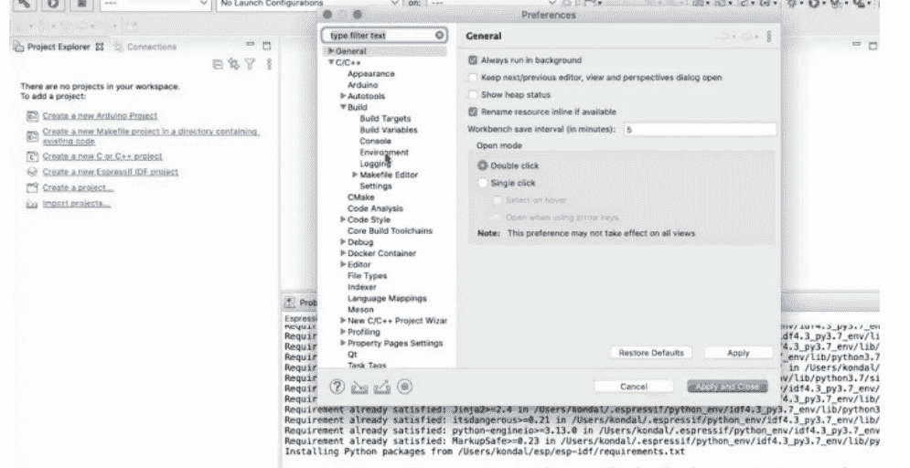

所以在C/C++构建环境设置中，你可以看到所有已配置的路径。我的路径包含了所有工具、信息以及，呃，比如Python，运行ESP-IDF命令所需的所有可执行文件。这些都已配置。看，make、python等等。呃，由于我们支持ESP32、ESP32-S2上的ESP-IDF，我们已配置好。呃，这些是作为其中一部分自动配置的，但也要检查核心构建工具链，其中在CMake工具链下

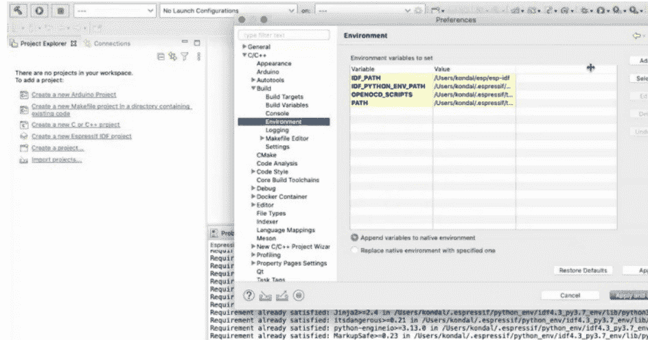

所以这就是首选项的全部内容。我将返回，之所以花费这么少时间，是因为工具已经安装，它只是尝试验证是否已安装。如果已经安装，它只是，你知道，跳过了下载部分。这就是我们能够快速安装的原因。

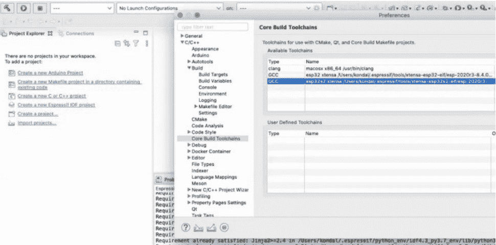

接下来，我们将继续创建一个项目。所以在这里创建一个新项目。让我们选择一个简单的例子。比如我们想以另一种方式玩转它。现在我们将从现有列表中选择一个Hello World模板，这些模板来自ESP-IDF。好的。只需点击完成。

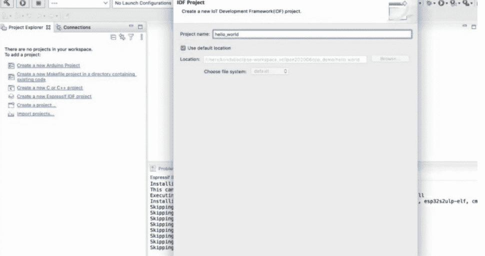

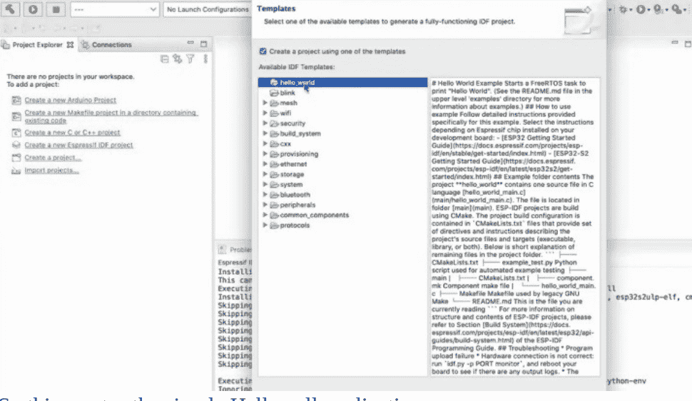

这将创建一个简单的Hello World应用程序。呃，让我打开文件。你可以看到CMake ESP-IDF项目的结构。我们还会有一个build文件夹。目前它是空的，在main下，你应该能看到所有源代码内容。

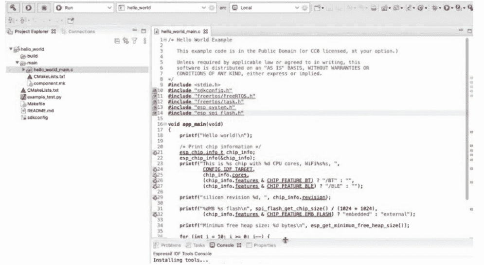

我们在这里。呃，这是一个简单的，呃，Hello World示例，我们想要运行和构建它。呃，请忽略这些错误，一旦你构建应用程序，它们就会被解决。一旦你创建了一个项目，下一个逻辑步骤就是，我们需要决定构建目标，我们需要在哪个板上构建这个应用程序。

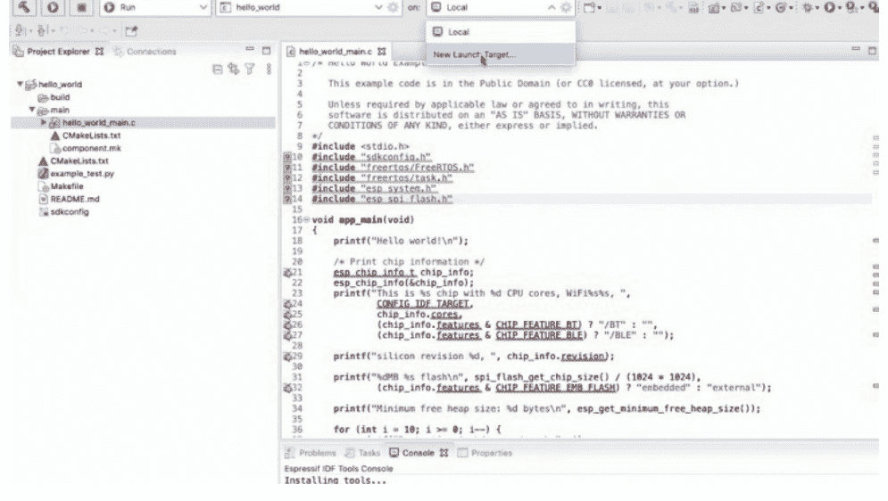

这里你需要选择启动目标。我将要做的是创建一个新的启动目标，只需点击新的启动目标，

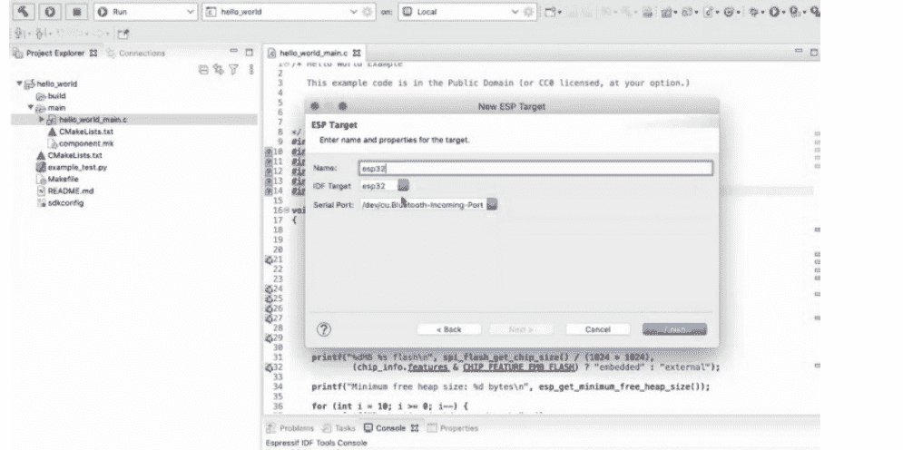

点击ESP32 DevKitJ，ESP32完成。好的。你可以直接点击构建。

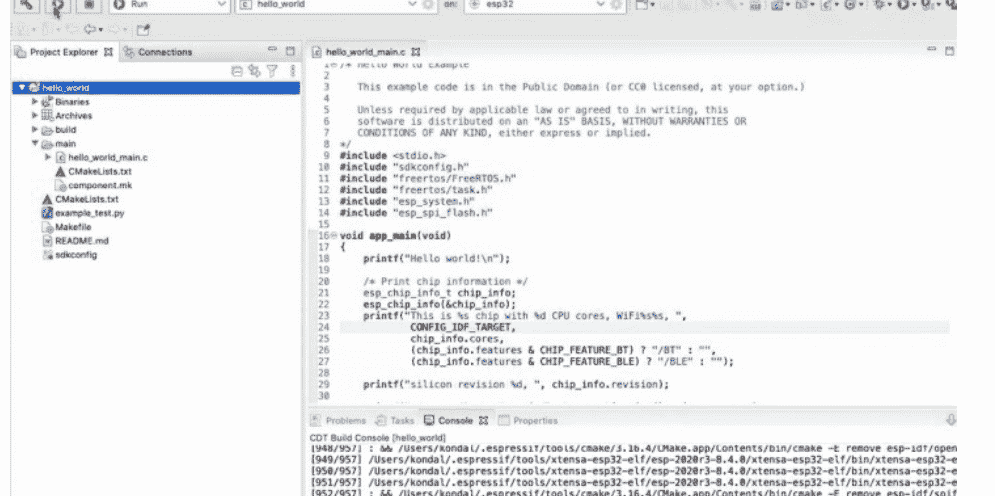

这将需要几秒钟。构建完成，呃，你可以看到，呃，构建完成的那一刻，你项目的所有错误都解决了。

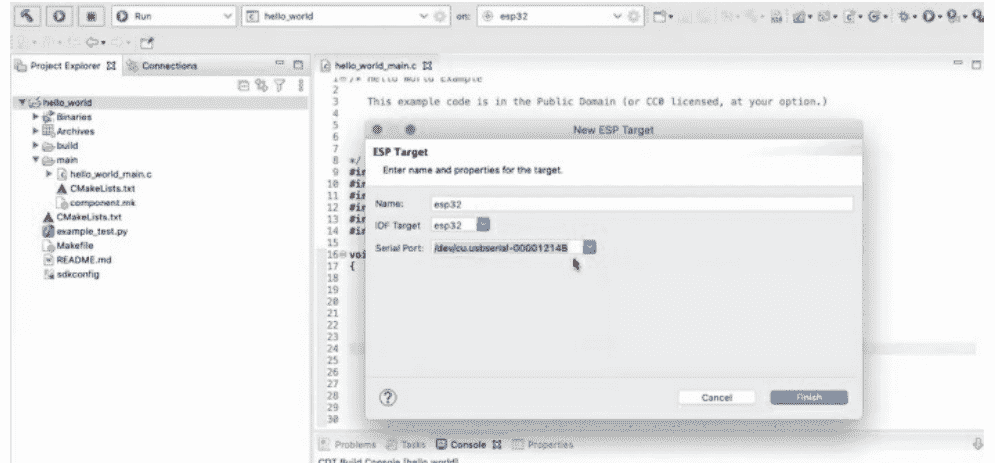

接下来，这个图标代表构建，旁边的这个图标代表烧录。所以，让我检查一下，呃，我选择了正确的，呃，COM端口。这是我设备的串行端口。呃，这是我试图，呃，编程的设备。这是ESP32。好的。点击完成，然后你可以点击运行。这将实际烧录到新设备。现在它将烧录到设备。尝试连接串行端口并将我们的应用程序写入板子。一旦完成，也许你想看看我的程序是如何执行的。为此，呃，

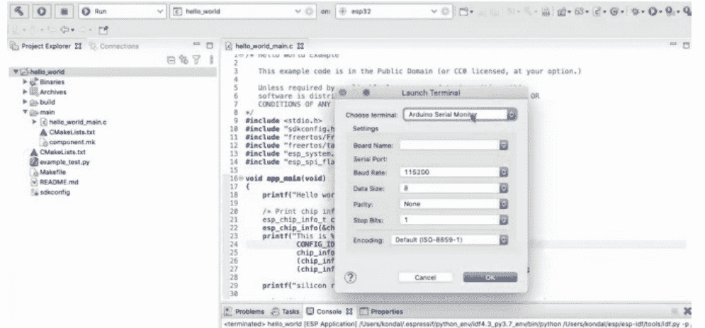

你可以启动，呃，串行监视器。这是我们的串行监视器ESP-IDF串行监视器。默认情况下，你的COM端口和波特率是根据现有配置选择的。点击完成。

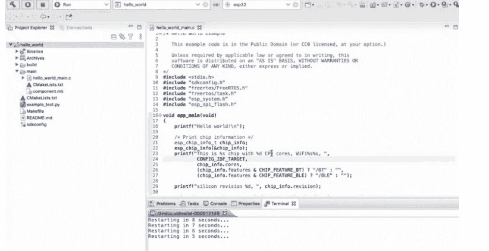

它只是尝试重启并进入这个循环。一旦完成，它将重启板子。你可以看到，它正在再次重启。好的。这就是关于，呃，烧录到设备，我们还有其他类型的功能，比如你想查看应用程序的内存使用情况。

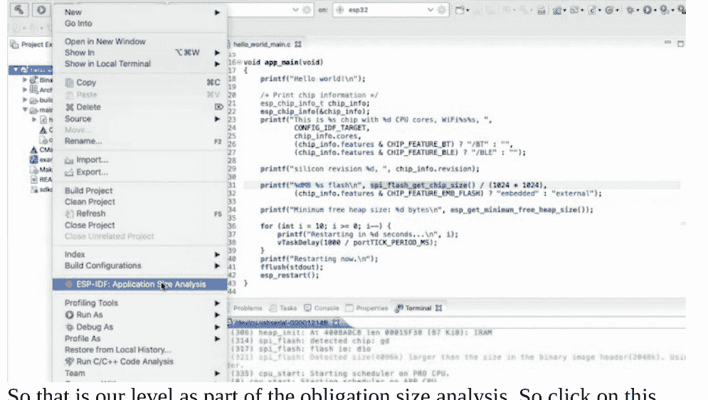

这在应用程序大小分析中可用。点击这个。

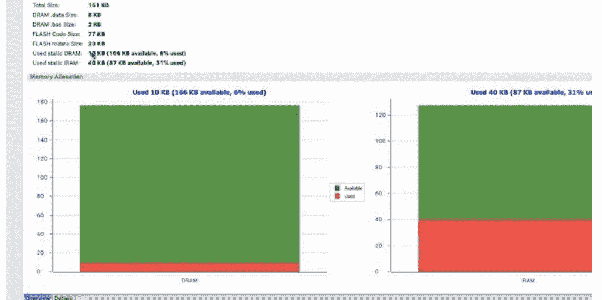

这将启动应用程序大小分析。你可以在值部分看到，它提供了DRAM、闪存和静态数据使用的高级概览。这是相同的图形表示。


在详细部分，你也可以看到每个文件是如何使用的。这意味着什么？每个符号是什么？它应该能够，你知道，对内存使用进行排序，也应该能够从这里搜索特定文件。这就是关于应用程序大小分析编辑器。呃，我们提供的另一个重要编辑器是SDK配置编辑器。

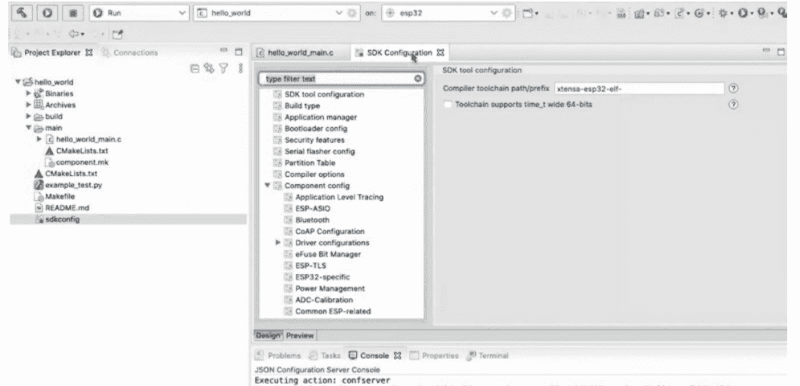

使用SDK配置编辑器，你应该能够配置任何项目或芯片相关设置。在板级设置中，例如，我们现在使用ESP32。

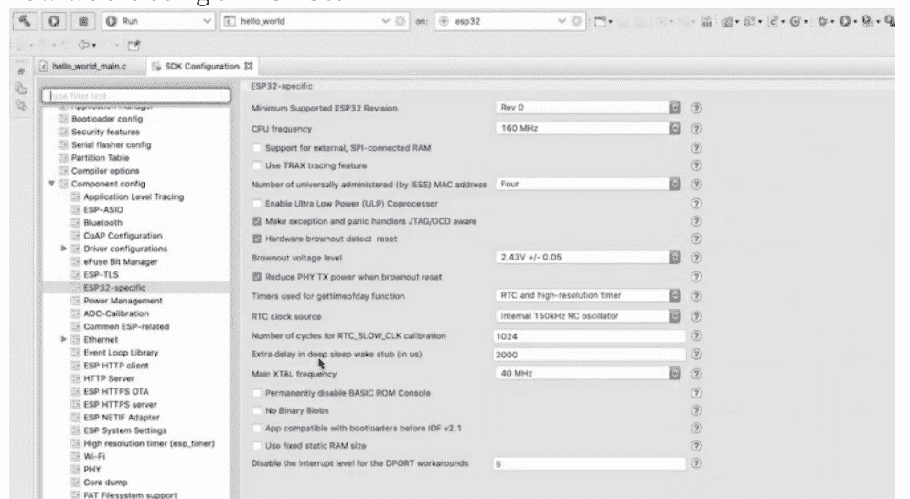

你想做任何ESP特定设置吗？我们应该能够从这里完成。你所要做的就是进行更改并点击保存，它将保存到，呃，应用程序。

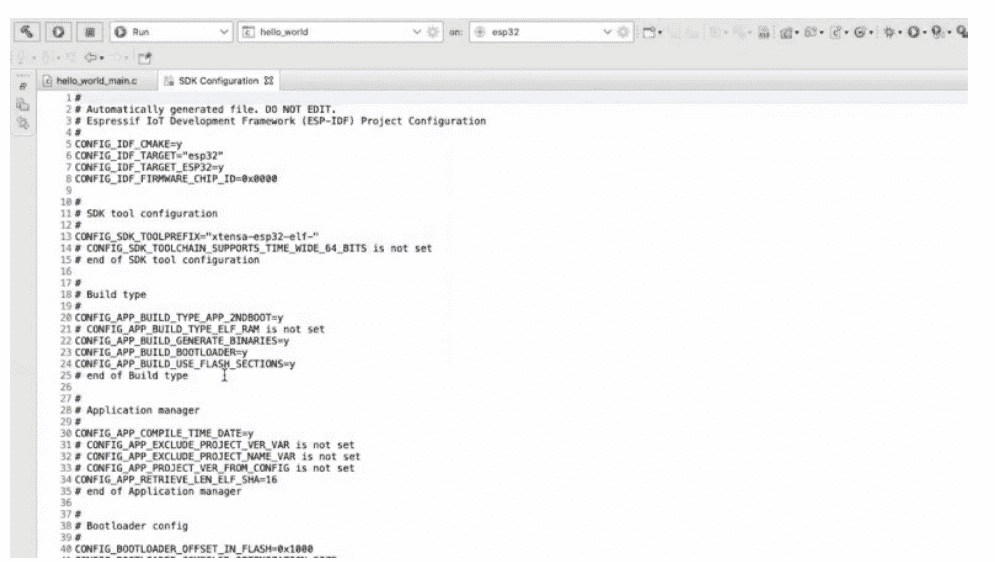

呃，你也可以看到这些更改的预览。呃，你可以看到，这些是一组更改。呃，当你进行任何更改时，它将作为预览选项卡的一部分反映出来。我们最近添加的另一个功能是ESP-IDF终端。要访问ESP-IDF终端，选择项目并点击这里的终端图标。从终端列表中选择ESP-IDF终端，点击确定。

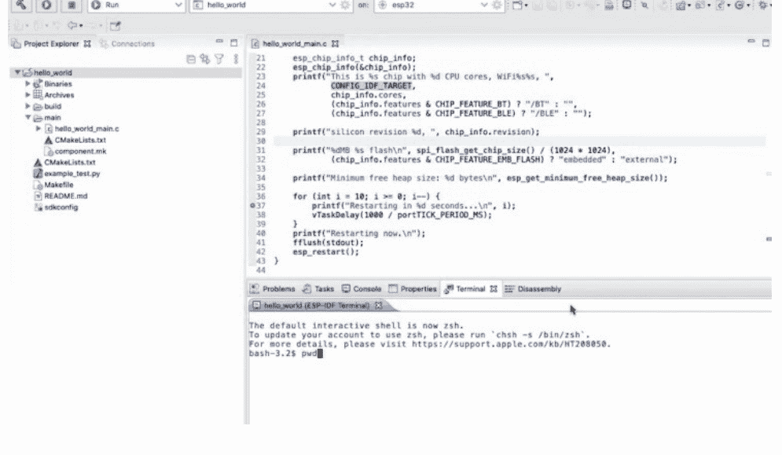

这将默认在hello_world应用程序中启动。你可以看到这是在文件夹的根目录启动的。这个文件夹包含了我们之前为项目配置的所有环境变量。例如，如果你想检查，点击env，你可以看到路径配置了所有ESP-IDF环境变量，这些是运行，呃，一些终端命令所需的。你也可以看到openocd、idf.py，一切都作为终端的一部分配置好了。我们引入这个ESP-IDF终端的原因是为了访问一些，呃，未作为Eclipse IDE一部分集成的ESP-IDF命令。例如，ESP-IDF.py、monitor等等。这些功能未作为Eclipse IDE的一部分集成，但你应该能够直接从ESP-IDF终端访问这些功能。

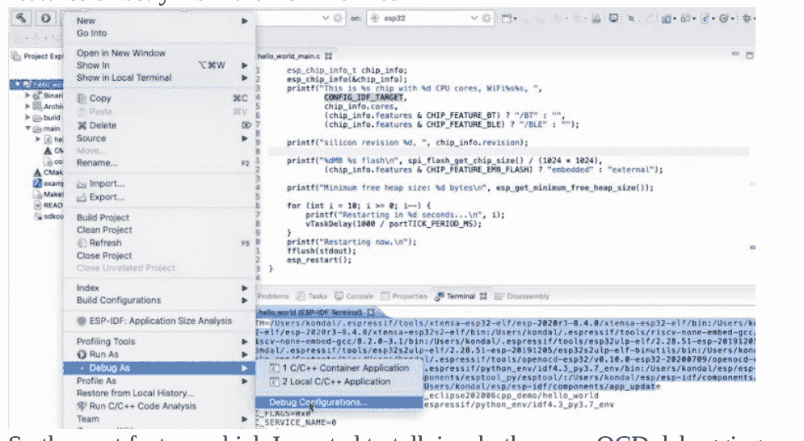

接下来我想谈论的功能是，呃，OpenOCD调试。让我们进入，点击Hello World项目。在左侧，你会看到调试图标，点击调试配置。这里是ESP-IDF GDB OpenOCD调试。这是定制的，呃，ESP-IDF OpenOCD调试，它带有，

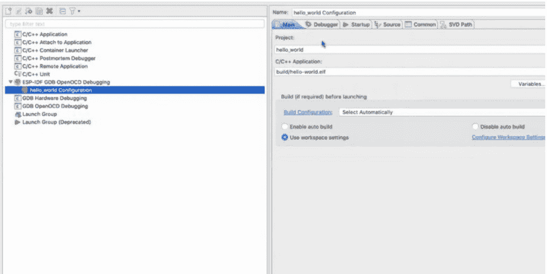

呃，三个配置。点击新配置，你可以看到默认情况下，这个Hello World配置是用所有配置设置创建的。项目和ELF可执行文件hello_world.elf，

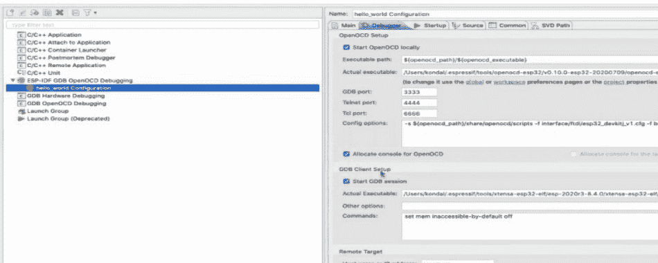

在下一个选项卡中，你可以看到OpenOCD和GDB客户端设置，一切都默认配置好了。所以我们唯一需要做的是配置接口，你特定板子的接口文件。目前我使用的是我的，呃，ESP32 DevKitJ。但如果你有其他板子，你需要配置，呃，接口和板子配置相关的。

## 创建、管理和运行配置

在启动时，配置已经设置好了。调试应用程序所需的所有设置也已处理完毕。因此，默认情况下，我们会在应用程序的 `app` 和 `main` 处的断点暂停。这是应用程序将暂停的第一个断点。

那么我将要做的，就是点击……是的。它要求我们切换到调试模式，点击“切换”。

第一个断点委托在 `app` 和 `main` 处暂停了。那么我们点击 F8。

是的。正如你所看到的，它在我们添加在另一个循环中的下一个断点处暂停了。在那里我们只是尝试，你知道，等待一千毫秒，现在我们可以逐步调试了。我只取六个。好的。这就是关于调试启动调试配置的内容。

现在，在调试时，你可能需要一些其他的视图。这些已经是 Eclipse IDE 的一部分，例如，调试器控制台。这显示了正在执行的断点是哪个，在哪一行，以及哪个线程正在处理这个特定的断点。

所以正如你所看到的，所有这些信息都是调试器控制台的一部分。它还有寄存器视图。

所以你可以看到寄存器以及与之相关的值。

另一个是，正如你在这里看到的，一些其他的视图：变量视图，在那里你将能够看到程序中定义的变量值；以及断点视图，在那里你将能够看到已配置的断点。

在表达式视图中，你应该能够添加表达式。如果你想设置一个表达式，我想看到……的值，并且能够在汇编视图中看到汇编级别的指令。所以这里显示的是你的应用程序、你的程序的汇编指令。

所以当你执行这个时，正如你所看到的，汇编指令正在改变，以及它如何在上下文之间切换。所有这些都会作为汇编视图的一部分显示出来。所以，是的，这就是我想在演示中展示的大部分内容。

## PRINT 函数

我们将讨论 MicroPython 基础知识。那些已经了解 MicroPython 的人可以跳过这一节。否则你可以从这一节学习基础知识。确保你已经使用 USB 电缆将你的 ESP32 连接到你的笔记本电脑或台式机。我刚刚连接好。然后打开我们的 IDE。你可以看到 MicroPython 已经加载在这里。

首先，我们将从 print 函数开始。我们能够在 REPL 中打印一些东西。如果你想注释一些东西，你可以使用井号。所以在井号之后你写的东西将不会被执行。

直接在这里开始打印一些东西。我们可以使用这里的 shell。所以我将只使用这里的 print 来打印一些东西。Print，普通的开括号和闭括号。在里面我可以给任何东西。所以这里我将打印一个数字，我将打印数字三。如果我按回车，数字三将打印在这里。这段代码实际上是在 ESP32 上运行的，并在那里执行。回复被传送到这里的 MicroPython，打印三。这只是为了打印数字。

现在，如果我们想打印一些字符串，那么命令是 print。然后在单引号或双引号中，你可以使用任何东西。如果你使用单引号，你必须使用单引号。如果你使用双引号，你必须使用双引号。在这种情况下，我只使用双引号。Hello，然后关闭这个。

现在让我在这里运行这个。你可以点击运行或按 F5。所以我只点击运行。

它会询问保存到哪里。有两个选项：你可以保存在计算机上，或者直接保存到 MicroPython 设备。那就是 ESP32。在我的情况下，你也可以使用 ESP8266。在这种情况下，我只是保存到这台计算机，放在桌面上。我刚刚创建一个文件和文件夹。MicroPython 代码，我可以保存这个。4.1 print 函数。

你可以保存这个。确保这是 .py 扩展名。因为你必须将其保存为 Python 文件并保存。你得到了输出。第二行在这里。那是打印三，这一行打印 hello world。

现在我们将使用变量来打印一些东西。变量，它可以是整数，可以是浮点数，可以是字符串，以及其他东西。现在让我们从变量开始。我想打印我的名字。名字是……姓氏是……我给了两个变量。你可以将变量命名为 a、b、c、d，任何名字都可以。

你像这样给变量 first_name。我的名字是 Harish。值被赋给……他们将调用 first_name。现在 last_name 被调用为 conduit。所以现在它被赋值为 conduit 给 last_name。那么如何打印它？所以，如果我想打印 first_name，我可以像这样使用 print，它直接在这个控制台中可用，在 shell 中，你将能够在 first 之后得到 Harish。让我使用 F5 运行这个。Harish 未定义。

好的。我忘了放引号，因为这是一个字符串。所以你必须用双引号或单引号给出，两者都可以。所以现在字符串被赋值给 first_name 变量和 last_name 变量。

现在让我们运行。现在你可以看到第一个命令打印三。第二个命令在这里，打印 hello world。这是最后一个。我们被要求打印名字。所以它在这里打印名字 Harish。要打印两个名字，我们将使用字符串连接。字符串连接我们可以通过放一个逗号来简单使用。让我们检查一下。Print，普通的开括号和闭括号。所以我想得到它。我的名字是……所以这里我想用引号，双引号。我的名字是……好的。到这里为止。我想先打印，之后我想添加名字和姓氏。你如何添加名字和姓氏？所以之后，你可以放一个逗号。这个逗号使字符串连接。现在，下一个是什么？我想打印我的名字。所以我必须调用第一个变量，即 first_name。再次，之后第二个名字必须出现。需要一个空格。这就是为什么我放一个空格，然后放一个逗号，然后 last_name。使用逗号，字符串连接。

让我们检查一下它的行为。现在你可以看到我的名字是……所以所有东西都在双引号中。这是一个字符串。之后你添加另一个变量和另一个变量。这部分实际上是字符串。这就是为什么没有……它出现在这里。

所以它打印我的名字是 Harish conduit。这是一种你可以打印和组合两个变量的方法。如果是字符串，现在我们将使用另一种方法，.format。我的名字是……之后，什么变量必须出现，在占位符所在的地方，你必须放在开括号和闭括号中。无论开括号和闭括号出现在哪里，我们将详细讨论这一点。之后我需要一个空格。我需要姓氏，然后再次开括号和闭括号。现在我必须做什么，我必须关闭双引号。一旦你关闭双引号，你可以放 .format。现在，在这里，你可以给出任何必须出现在开括号和闭括号之间的变量。

所以我需要 first_name，first 下划线 name。这是变量。然后你可以放一个逗号。然后下一个，last 下划线 name，那是我们做过的姓氏。它有很多优势，主要是在 Python 程序中。现在你会看到像这样的。所以确保……好的，我忘了……

这里还有一个多余的右括号。

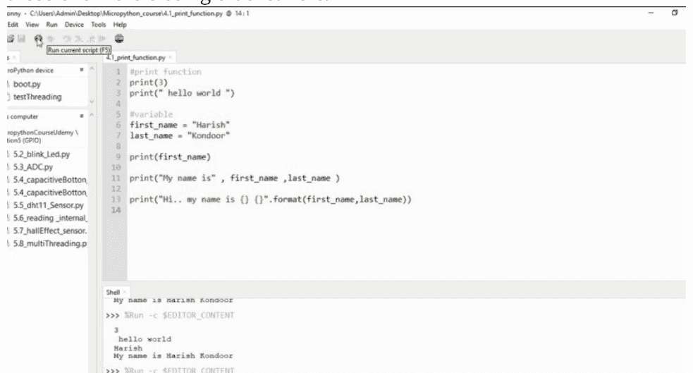

好了，现在完成了。让我们运行一下。现在你可以看到它也是以点格式打印的。嗨，我叫Harish country。现在在这些地方，实际上，默认情况下，名字会出现在第一个位置，第二个位置在这里，下一个可用的会被加载。这意味着这被计为第一个可用。这就是我们称之为索引。我们考虑的是零索引，这个索引号是1。那么这里会发生什么？它是默认的。索引号0，索引号1在可用中。这是索引号0，这是索引号1。所以索引号0将被加载到这里。索引号1将被加载到这里。现在，这是在做什么？我想打印类似姓氏，然后名字的内容。我可以做一个小技巧。我只需要复制这个。你不想在这里改变吗？你可以做什么？你可以在开括号和闭括号内更改索引号，但我们可以更改这个索引。号1。

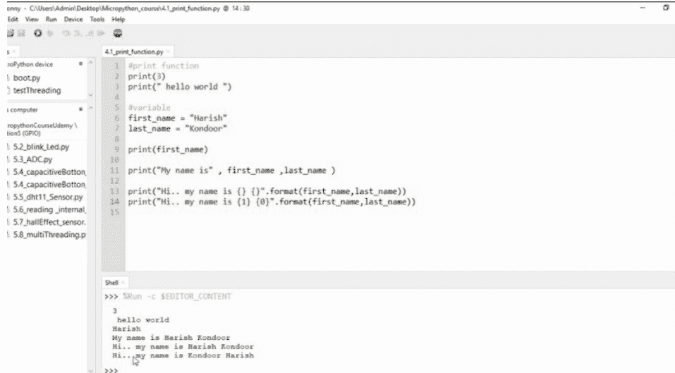

现在姓氏会先出现。然后我可以在这里给出索引号。是的。现在会发生什么？名字会出现在最后。现在让我们看看。让我打印一下。现在。你可以看到区别了。

## TYPE 函数

我们将讨论 defunct ion Antoni ID。你可以看到在左边，有一个文件系统。我可以导航到主文件系统，在那里我可以看到所有代码，它保存在哪里。所以我刚刚更改了代码的位置，我想保存时间。我正在为 F 更改，在我的情况下，第一个代码已经存在。所以我只是关闭这个。我放一个变量，a。数字3，我给 B 等于。任何浮点值在 D 和可用 C 等于字符串，我给字符串。你可以用双引号或单引号，没问题。D 我可以给你一个布尔值，E 是可用的。我给点别的。那是双引号，我给单引号或双引号。这次我可以给这个。我只给你那个单引号。

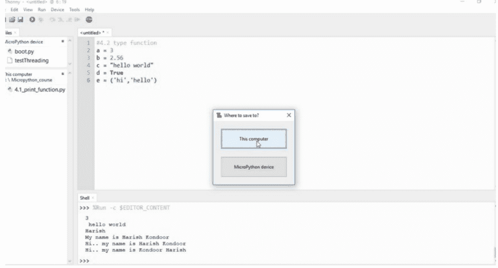

让我运行这个。我可以把它保存到我的电脑，或者直接保存到那个设备。这次我保存到我的电脑，分享它是由...保存。现在你在shell上看不到任何东西，因为它没有打印任何东西，但代码已经运行了。那么我怎么检查呢，我可以在这里检查类型，有什么可用？那是什么类型的变量？A 我可以在这里检查。

这是整数。我们可以在这里再次检查另一个类型变量 B。是的。这是一个浮点类型。然后让我们检查 E 的情况，它是这样的，所以我们可以识别每一个可变的。什么类型。所以它在程序中很有帮助。现在我想一步一步地打印所有内容。

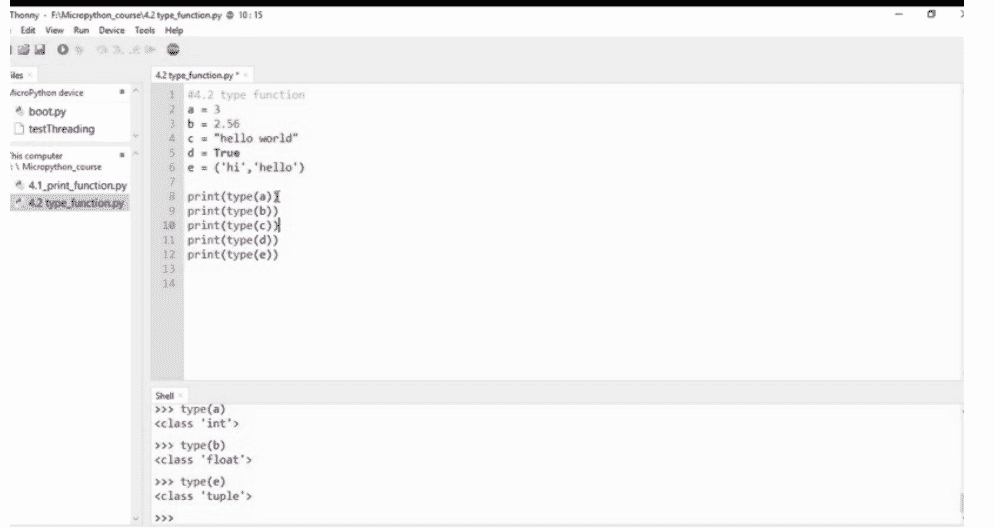

我只需要复制这个打印，所有变量的类型，a B, C, D, 和 E，让我们说通过点击这里运行，或者你可以点击文件，在这种情况下，我只点击文件，按下文件。

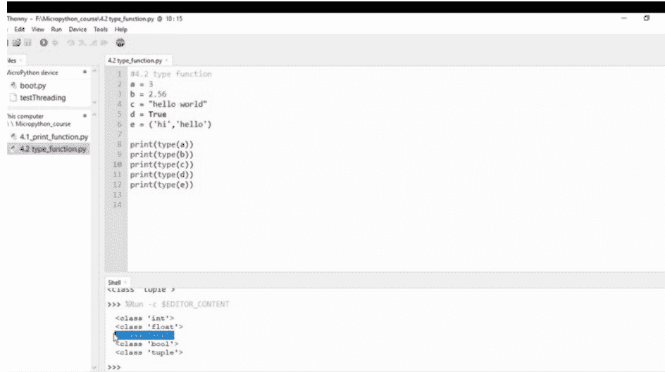

我可以看到第一个是整数。第二个是浮点数。另一个是字符串。第四个是布尔值，第五个是元组。

## INPUT 函数

我们将讨论 input 函数。如果你想从任何用户那里获取输入，我们将使用 input 函数，你可以点击新建，确保你的设备连接到 ESP 32。

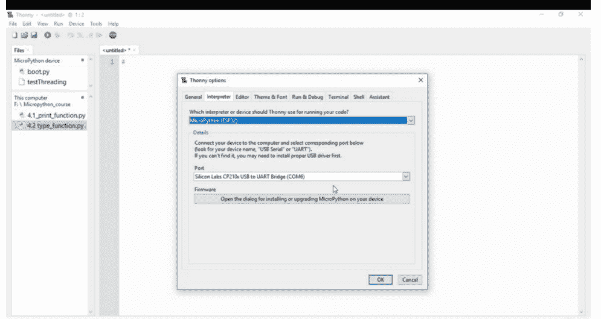

转到工具，选项。解释器应该是 micro by 10 ESP 32。它连接到一个合适的。我长大了，Dennis Lauder 在船上。另外，我们必须创建一个变量。我将获取任何人的名字，创建一个名为 name 的变量。如果你考虑其他语言，我们必须提到什么类型的变量，但在这里我们不需要提到它自动理解。它自己检测命令。它在开括号和闭括号中。所以在我的情况下，我请求输入你的名字，所以我可以放双引号和/或你的名字，让它看起来更好。再次，放一个冒号在这里。我关闭这个。让我运行这个。

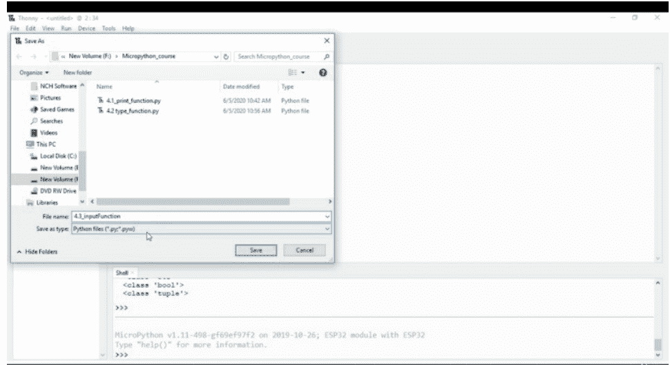

确保它是暗的。现在你可以在终端上看到，它在问输入你的名字。我们没有得到任何响应，或者你没有得到任何输出。为什么？因为我们没有要求打印任何东西。不，无论什么名字它得到，它将被保存到一个名为 name 的变量。然后我们要求打印那个变量。所以打印变量，它是我的，我们的名字是 ed，所以它会被打印。现在让我们再次运行，只写 Joe。Joey。好的。现在它打印 joy。为什么？因为它被保存在 name 中。我们要求打印它。我想问年龄也放在另一个变量 age 等于 input 获取设置为那个年龄。我正在运行这个。

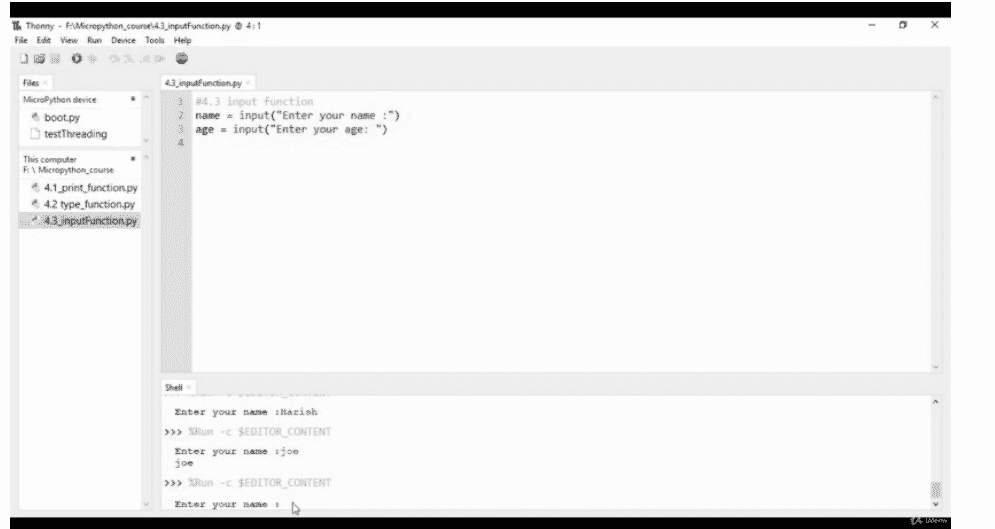

年龄只是开始，现在让我们检查每个类型的类型，name 变量，那是字符串，然后 age 的类型。那也是字符串。

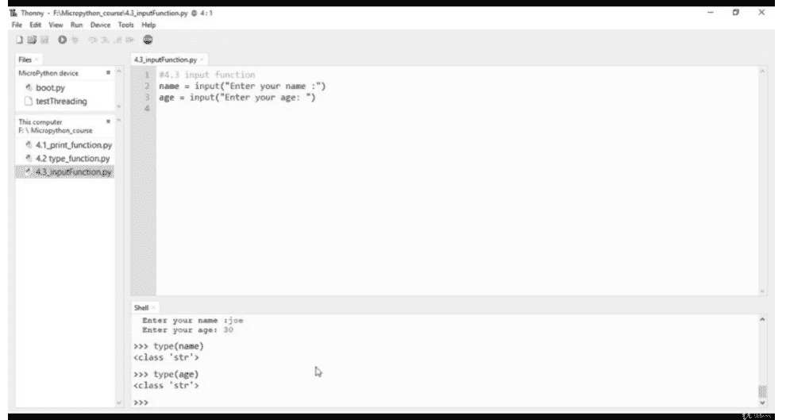

我们实际上给了一个数字，但它显示为字符串本身。现在，问题是什么？每当你使用 input 函数，它总是将所有输入作为字符串。所以如果你想把它作为数字，那么你想把它转换为数字，这非常重要。为此，我们将使用另一个技巧，创建另一个变量 age_1。让我们试试。我的名字。所以现在，它开始去年，年龄是29，现在检查使用 type 函数。我正在检查当前年龄。那是 age。那是一个字符串。

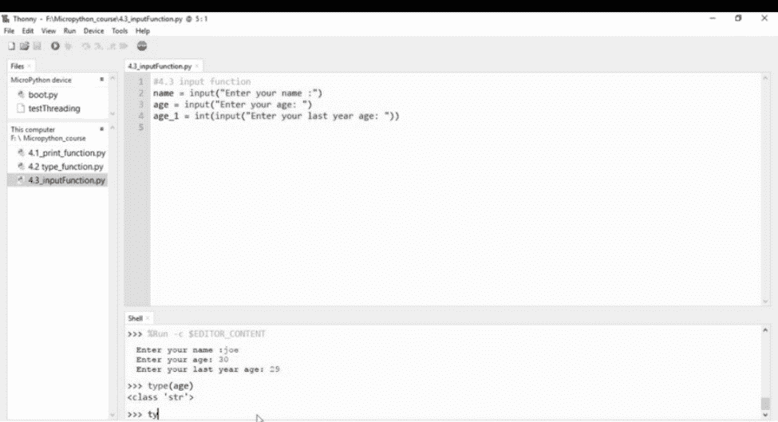

现在检查类型。去年，年龄使用 age_1。所以让我们检查区别。这是现在整数。所以这是你可以将字符串值转换为任何整数的方法，如果你给任何数字。好的。所以我会在这里更新这些内容，一起打印所有内容。

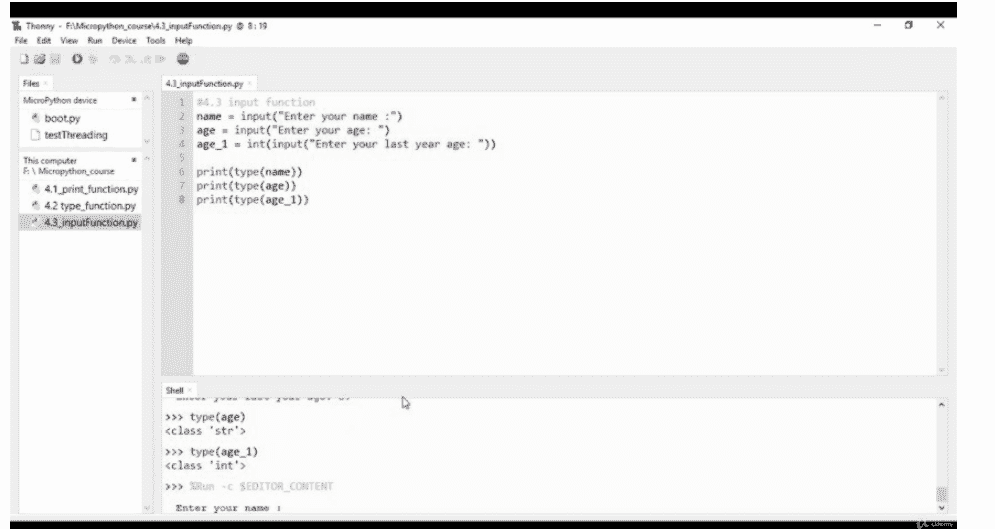

要求输入我的名字，我当前的年龄，去年的年龄，H I C 第一个变量，那是字符串。

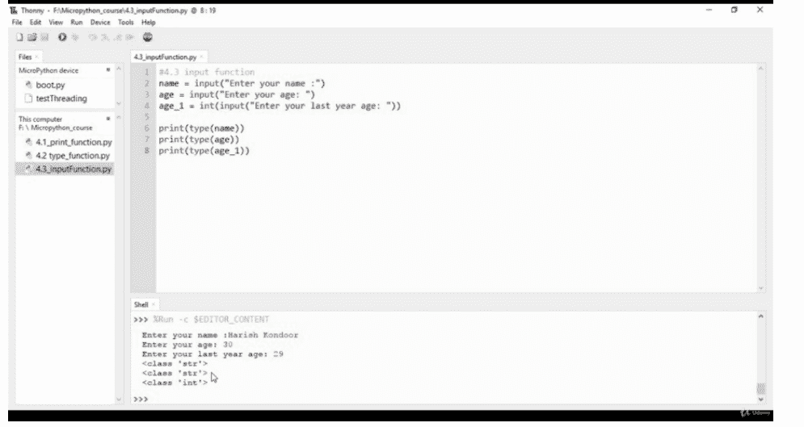

第二个变量也是字符串，因为我们没有在这里转换。第三个，它是整数。

## HELP 函数

我们将讨论你的骨骼健康函数。帮助函数是非常重要的函数，它是非常有用的函数。点击这里新建。我可以在shell中直接运行帮助函数。让我们检查一下。有哪些模块可用在ESP 32中。同样，你也可以检查ESP 82，66的情况。在ESP的情况下有更多模块可用。你必须检查我现在使用ESP 32命令是help。

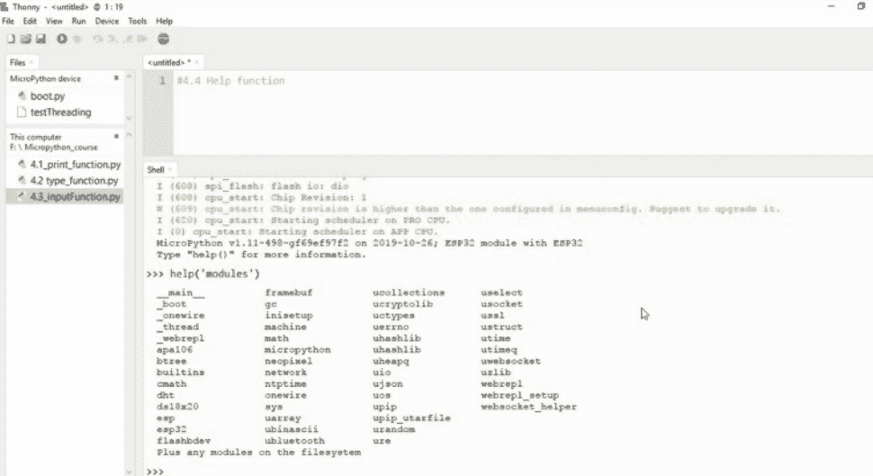

这些是我们将在接下来使用的模块，你可以看到一些这个USP 32模块和非常重要的模块是machine。在machine内部，有许多函数。在这些函数中，我想知道其中一个模块以及模块内部有哪些函数？在这种情况下，你必须输入那个特定的模块。那么如何导入命令是board。好的。模块名。我将使用模块名machine，因为machine是我们将最常使用的。所以我将导入machine。现在你可以看到，没有错误。machine在shell中已导入。现在我想知道machine内部有哪些函数，如何知道帮助。嘿，你不想放单引号或双引号？只需在这里输入模块名。模块名是machine，然后结束它。

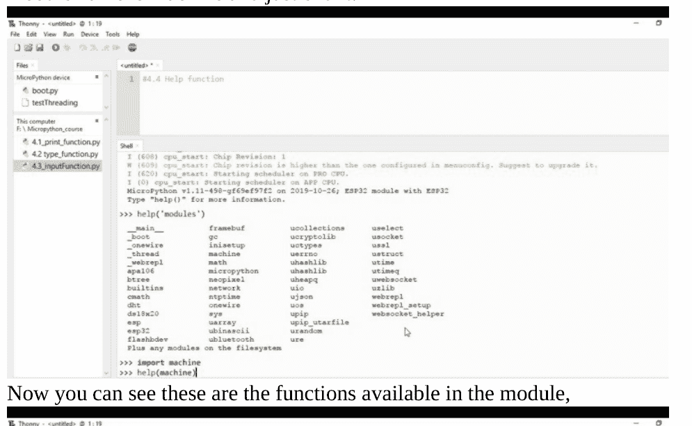

现在你可以看到这些是模块中可用的函数，

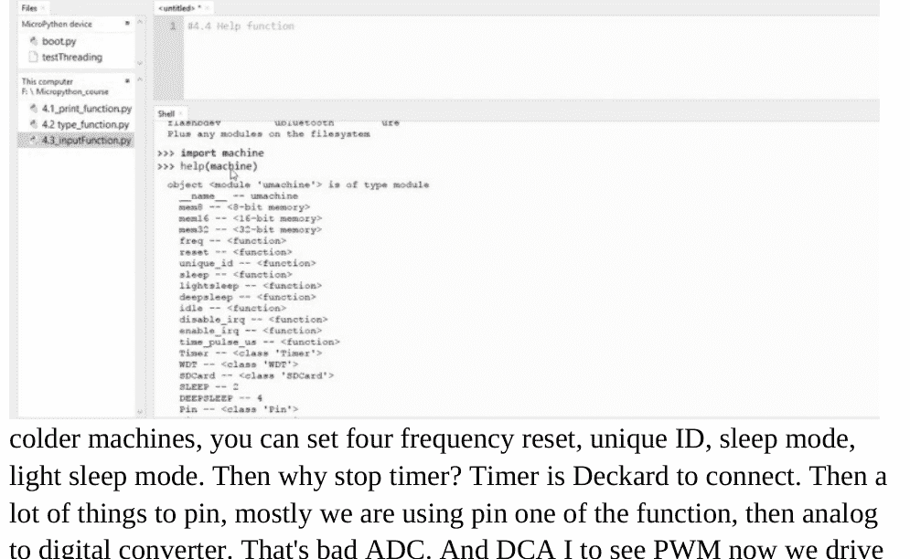

cold机器，你可以设置频率，重置，唯一ID，睡眠模式，轻睡眠模式。然后为什么停止计时器？计时器是Deckard连接。然后很多事情到引脚，我们主要使用引脚之一的函数，然后模数转换器。那是ADC。和DCA I到PWM现在驱动

## 条件语句
（IF、ELSE、ELIF）

我们将讨论文件中的条件语句，如 if、else 和 elif。让我们从基础开始。我们将从用户那里获取一个 1 到 5 范围内的数字，进行检查，并预测朋友的数字。因此，我设置了一个名为 `value` 的变量。默认情况下，我给它赋值为 4。然后，我想从用户变量中获取输入，该变量名为 `value`。接着，我们知道必须获取输入，即那个数字。因此，我想将其转换为数字。然后，我们必须在 `int` 内部使用它。我可以使用 `input` 函数。数字范围是 1 到 5。现在，我们将检查 `value` 是否等于参考值。为此，我们将使用 `if`。在括号内，我们必须给出条件 `value ==`。`==` 表示检查值是否完全相同。一旦给出，你必须加上冒号。然后，你必须在下面给出内容。缩进非常重要。你可以看到有一个制表符，这是缩进。在其他语言中，你通常使用开闭花括号。但在 Python 中，实际上，缩进在 Python 编程语言中非常重要。因此，你必须确保遵循缩进。其余代码都在该 `if` 条件下。现在，如果两者相同，那么我想打印一些内容。它匹配了。

现在让我再次运行，保存到计算机并运行。哦，它在询问。然后输入 1 到 5 范围内的数字，让我输入 4，然后检查输出。现在你得到输出 "value matched"，这意味着它匹配了。现在，我再次运行。我将输入另一个值，比如 2。现在，你没有得到任何输出。你可能期望一些输出，但你没有得到任何输出。为什么？我们还没有说明，如果不匹配，那么应该打印什么或我们想向别人展示什么。因此，在这种情况下，我们在这里放置一个叫做 `else` 的东西。`else` 实际上是在检查 `if` 之后，跳转到 `else`。

现在，如果不匹配，即数字不是 4，我可以运行所有剩余的条件。因此，在 `else` 下，所有剩余的条件都会出现，这就是为什么你不需要在这里放置任何特定条件。你必须在这里放置一个冒号。检查这里的缩进，它会自动出现，但你也应该始终检查缩进。然后让我打印 "it is not matched"。现在让我们运行文件。你可以看到它在询问 "do enter a number"。输入 3。"Number is not matched"。再次运行，输入 4。现在值匹配了。

通过这两种方式，我们可以理解如何使用 `if` 和 `else`。存在多种可能性，比如 1 到 5。因此，如果你输入 1，它想显示 "number 1"。如果你输入 2，它想显示 "number 2"。如果你输入超出此范围的内容，它想显示 "no, value out of range"。在这种情况下，确保你没有输入 4.5 或类似内容。

为什么？因为它会在这里产生一些错误。因此，这些错误我们可以使用 `try` 和 `except`，但这次我们不讨论这个。因此，你尝试始终给出数字 1 到 5 或更多，不应给出任何浮点数。现在让我们检查下一个，逐一检查条件。其中一个条件满足时，它将打印相应内容。我们使用 `elif`。因此，首先，我们想检查其中一个条件，因为这个条件会起作用。所以这就是为什么我不想重复 `if value == 1` 和 `4:`。我想打印 "number is 1"。这是另一种可能性。数字可以是 2。在这种情况下，我们不使用 `else`，而是使用一个新东西叫做 `elif`。我们想给出 `value == 2`，并且值是 2。现在，类似地，我有其他选项，比如 4 或 5。

现在我们可以得到从 1 到 5 的所有可能性。如果我输入 1，假设是数字 10，那么它不会出现在这个 `if` 和 `elif` 中。因此，其他条件会出现。那么我能做什么呢？我可以打印 "our number is not in the range"。好的。现在让我们尝试要求输入特定数字。让我检查这部分是否也有效。

让我输入 2。现在它说 "number is not matched"，因为在这个区域我们取的参考数字是 4，这部分显示 "value is 2"，因为我输入了数字 2，它匹配了。再次，我输入 4。现在 "matched"，因为值是 4，输入的值是 4，因为它出现在这里。

现在，我再次运行，输入一个超出范围的值，比如 8。然后让我们看看。然后 "the number is not in that range"。因此，这个程序成功运行。你可以看到每个变量及其当前值。

## While 循环

这是一个无限循环。它非常重要。我们使用的大多数程序都使用 `while` 循环。开始一个新文件，`while True` 和完整代码。除了 `True`，我们也可以给出其他条件。如果满足特定条件，它将运行。条件始终为 `True`。这意味着它总是反复运行。我想打印一些内容。Hello？好的。代码完成了，但有一个问题。如果我没有在这里给出适当的时间。现在，我的界面可能会卡住，因为在极短的时间内，它正在运行。但打印 "Hello? Hello. Hello."。因此，这就是为什么我们必须在这里给出一个小延迟。

我们必须导入一个叫做 `sleep` 的东西。从名为 `time` 的模块中导入 `sleep` 函数。模块名是 `time`。导入 `sleep`。在打印之后，我想等待一秒。我们如何调用 `sleep`？时间可以以秒为单位给出。时间也可以以毫秒和微秒为单位，通过在这里稍作更改，但现在我们关注秒。因此，这里我只给出 1。这意味着它是一秒。让我上传这个代码。

你可以看到在 shell 中，它开始打印。每秒打印一次 Hello。它仍在继续打印。我中断。要停止打印，我将中断程序。

有一个快捷键，即键盘中断。那就是 Control + C。我可以看到程序已经通过键盘中断被中断。现在你可以看到它没有打印，对吧？我将更改它。比如两秒，它可能再次渲染。现在你可以看到每两秒打印一次 Hello。软重启。这个 ESP 32。还有另一个快捷键，即在键盘上按 Control + B。我可以看到它已经软重启了。

## FOR 循环

我们将讨论如何打开一个新文件，在两个特定程序集下运行它。特定次数，比如五次、六次，也许十次，也许五十次，实际上我们可以对任何变量使用 for 循环，我们可以给变量起任何名字，比如 XYZ。你甚至可以给变量起任何名字，计数器可以起任何名字。我只是把变量名设为 X。是的，函数 `range` 默认从零开始。我提供一个范围，然后从零开始。而我给出的值将被排除，这意味着最大值。

它会一直运行到九。我最后把它带回来了。X 现在。所以它每次默认递增一，打印 X，比如说这个。现在你可以在 shell 中看到，它从零开始，到九结束。这样它默认从零开始，无论你给出的这个值是多少，它都会被排除。
哦，你一次运行完了。它每次递增一，一，这样。每次，X 的值是多少，它就会在这里打印出来？所以，这就是为什么我说它可以用来将某个程序运行特定次数，如果你只运行十次。是的。那么你可以使用这个命令，这样那个程序就只会运行特定的十次，而不是打印，你可以让命令每天闪烁。

我们也可以在 `for` 循环中使用 `in range`，变量名可以更改，也可以保持不变，但我只是在改变它。

为什么 `range` 从二开始，到九结束打印。准备好了吗？砰。等等，让我看看。是的，第一组程序意味着。九在这里之后，它从二开始，到九结束。所以这个值在这种情况下被排除。默认情况下，它每次递增一，但我们想改变，比如递增值应该是二、三，或者类似的东西，我们可以给任何变量，比如我在 `range` 中给出起始值。让我给二。逗号，结束值。我只是给一些其他值。我给比如 26，每次递增的值应该是三。这是差值打印。它从二开始，排除 26，每次差值是三。这意味着第一次是二，下一个是五，再下一个是八。这样，它会继续。

让我运行。这段代码可以看到它一直运行到九。那是这个程序。之后它从二开始，然后加三变成五。然后我又加三。然后它运行到 11，直到 23。它会继续，因为 26 不会出现在这里，因为 23 加三等于 26，但这个六不会在这个程序中被加进去。所以我们得到了 23。

## 创建自己的函数

我们将讨论一个非常重要的话题，那就是创建我们自己的函数。为什么它相关。你创建了一段代码，这段代码你想多次使用。那么再次编写相同的代码并不好。这就是为什么我们创建函数。

有一个关键字叫做 `def` 空格。函数名是什么？你需要给函数起个名字，你可以给它起任何名字。你可以给它起个名字，比如 `symbol`，然后是开括号和闭括号，你可以保护并检查。我最后打印一些东西，打印。现在我们已经创建了第一个函数。所以函数名是 `symbol`。你必须调用函数名。我的函数名是 `symbol`。这就是你调用函数的方式。

现在让我运行这个。保存这个。好的。现在你可以看到值被打印出来了。现在我想，假设，一遍又一遍地打印它，那么我们可以在这里使用 `sleep` 函数。我们怎么使用 `sleep`？我们知道从 `time` 模块，你必须导入 `sleep`。不，我可以在这里使用。我必须在这里创建一个 `while` 循环，`while True`。这就是我说的，`while True` 的情况。所以你必须给出适当的缩进。你可以。然后在这里我可以给它重复一遍又一遍，一段时间。所以 `sleep(1.5)` 秒。现在让我们检查一下。

现在我看到这是函数，但这个函数在这里被调用。那是在 `while True` 循环内部。所以它每次都会打印，函数被调用，它正在执行。打印函数，它在 1.5 秒后再次打印。再次调用这个函数并打印，这样，它会继续运行。
我希望你理解了基础。现在我们需要看一些更多的时间，带参数和返回值。所以首先我们将看参数。我只是改变这个。我不想让它混淆。我只是移除这个。好的，现在让我们看看。如何使用参数？在函数内部。

我们想传递一些值。那实际上被称为参数。我创建一个名为 `add` 的函数。现在在这个括号内，我想传递两个参数，所以我可以在这里给两个变量名。让它成为变量 `a`，然后下一个变量，我可以给逗号。现在我给了两个变量作为参数，`c = a + b`。
现在这是我们给出的条件。我们想把值打印出来。总和正在打印，我们可以使用，放一个逗号，一旦它被相加，值将被保存到 `c`。所以我想调用它。我们会看到，好的。现在如何调用它们。调用非常容易。如何调用 `add`。我们想传递两个参数。
现在我想把两个数字相加，比如六和五，所以六。那是第一个变量。那是第一个参数，它将传递给 `a`，五。那将传递给 `b`。让我运行这个。

为什么这个没有在这里打印出来？因为我还没有在这里调用它。如果我调用了，函数 `symbol` 也会在这里打印出来。
好的。这就是我们所说的传递参数。我创建另一个函数。`def` 是关键字。任何名字你都可以给？我想只给一个变量。所以我放了 `x`。你可以给任何东西，这取决于你。冒号。然后我调用一些东西，它返回，无论你传入 `x` 的值，它都应该乘以二，所以我可以给你，`return x * 2`。
现在，每当我调用这个函数，如果我传入五，`x` 是五，它会来到这里。它将乘以二。然后这个值将再次回到 `x`。
这就是这里会发生的事情。现在我想正确地打印它。
通常我们如何调用，我们知道你可以像 `mul` 这样调用，你想在这里传递什么值？
参数任何人都可以给，让我取数字八。嗯，我想在这里传递，但我也想打印，为了打印，我必须加上 `print`。
否则，我将无法看到这里的值是多少。

现在我可以运行这个，看，八被传递给 `x`。那个八乘以二。那个值 16，16 又回来了。所以那个返回值实际上在这里被打印出来了。函数在 Python 编程中非常重要。

## ESP32 教程使用 MICROPYTHON 让我们开始吧

嘿，大家好，今天这个阴沉的早晨坐在这里，等待会议开始。

所以我想向你们展示这个新的应用程序，现在这是人们遇到的问题。他们看到所有关于这些东西的讨论。我的意思是，我甚至在我的频道上做过这个，对吧？这是。物联网设备和物联网设备。好的。你听到所有关于物联网的讨论，然后你听到这些东西，比如，哦，你知道，ESP32，这是一个很棒的芯片，专为物联网设计，它有 wifi。你可以做这个，你可以做那个。好的。嗯，这都很好。但你没有听到的是，当你有这样的东西时，我的意思是，我在做这个天气项目的项目中提到过。嗯，是当它读取数据时，我的意思是，所以你有

## 介绍

你的设备在这里，它读取你的温度、湿度、气压，连接到互联网，然后将数据发送到某个地方。那么，它发送到哪里呢？这就是关键。

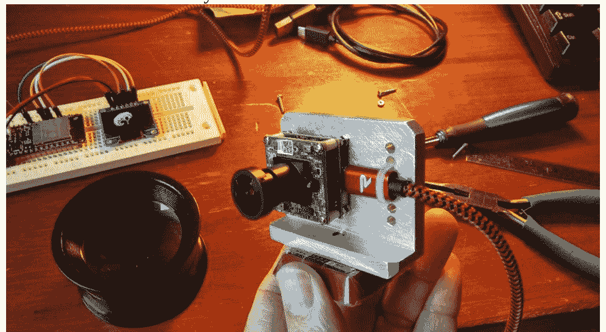

看，这就是大多数人缺失的部分，比如，呃，你知道，这里的观众们。这就是缺失的关键。你把它发送到哪里？好的。所以也许你，你知道，你已经弄到了一个ESP32。我们这里有一个有趣的小板子。我们有很多ESP32的东西。它们都连接到了。所以你拿到这个，开始做一些MicroPython，你在这方面变得相当熟练。你可以连接到互联网。你可以，呃，你可以读取传感器，你可以控制闪光灯等等，但然后你想制作一个物联网设备，你却卡住了，因为你缺少的是那个发送数据的地方。所以你必须拥有。某个地方的服务器。然后你就得，你知道，在DigitalOcean上弄点空间。你得在上面设置一个Linux盒子。是的。你得给自己弄个域名。你得担心，呃，证书和HTTPS。然后你得给自己构建一个API来接收你的数据，等等等等，那是一种不同的编程方式。对吧。和你们大多数人用这个做的不一样。所以这是一个障碍。事实上，我前几天。呃，和Rope聊天，我们谈到这个，他就是撞到了这个障碍，因为他，他无法完成那部分，无法进行下一步。所以

我为你们做了一个应用程序来完成那部分。所以这是一个。云上的地方，你可以把你的数据放在这里。你只需要一行代码，就可以把数据发送上去。我已经为你的ESP32和你的桌面编写了软件。所以只需要一行代码，你就可以把数据发送上去，它就在那里，然后你可以把它取回到这里，如果你愿意的话，或者你可以，你知道，取回到这里，或者你可以把它下载到你的桌面，或者好吧。我们刚才遇到了技术故障。好吧。总之，你可以把它下载到你的桌面，无论你需要做什么。嗯，所以它就像一个你可以发送数据的地方，数据可以在那里停留一段时间，然后你可以把它下载到另一个设备，无论你需要什么。所以你可以交换命令。你可以从你的桌面发送一些东西到这里。嗯，你可以从这里发送一些东西，去到那里，然后再到你的桌面，你知道，无论你需要做什么。所以我要切换到屏幕录制，让我们来看看这个东西。好的。好的。我们从我的YouTube频道开始。别忘了订阅，因为它帮助我写作。所以请务必订阅。好的，我们到这里来。现在这是一个全新的Firefox启动。我这里什么都没有。嗯，一切都是全新的，就像你们可能遇到的那样。

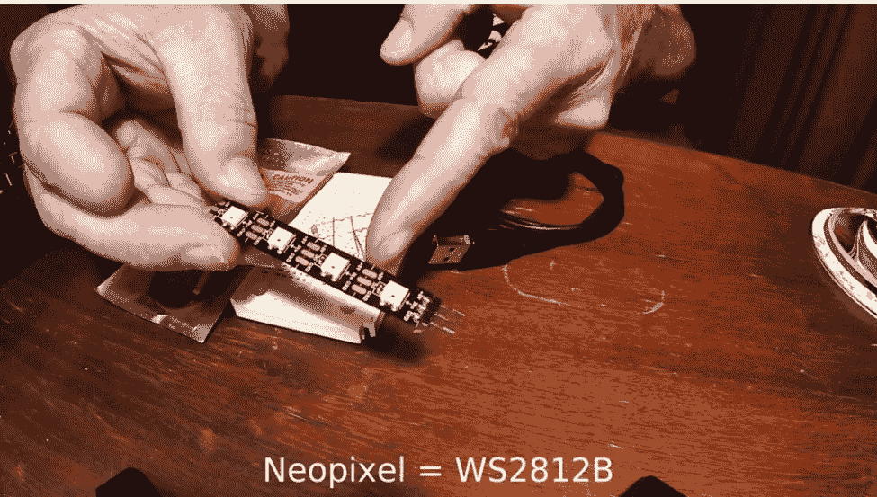

所以我们要去EZIOT.link。L-I-N。这就是我们要做的全部，它会带我们到那里。现在你会看到这是不安全的。所以如果你愿意，你可以用HTTPS访问安全链接，或者，你知道，安全网站，但这真的无关紧要，因为网站上真的没什么事情发生。它只是一个着陆页。一个你可以找到你想去的地方链接的地方。好的。所以网站并没有真正做什么。它只是服务器的前端，API就存在那里。我们将用我们的Python工具来调用那个API。好的。


所以这里的链接，嗯，这里是我的Patreon账户的链接。如果你想成为赞助者，那有助于支持，呃，你知道，支付服务器费用等等。嗯，然后另一个主要链接是GitLab上的Easy IOT，在GitLab上，所有的说明、文件、你需要的东西都在那里。好的。然后这里有一个我的YouTube频道的链接。这里，下面，是iowa lottery.io的链接。现在Easy IOT是为我们制作的。它是为爱好者和开发者准备的。这是一个你可以把你的设备放在这里的地方。你可以把数据发送到这里，它会留在这里，然后你可以把它下载到你的桌面。或者你可以从你的桌面发送命令到这里，然后把它们下载到你的设备上执行操作。但它不是一个完整的云物联网服务。如果你需要那样的服务，拥有无限存储。嗯，各种分析和跟踪，以及，呃，人工智能等等。那么你需要去highaudrey.io。对我们来说。

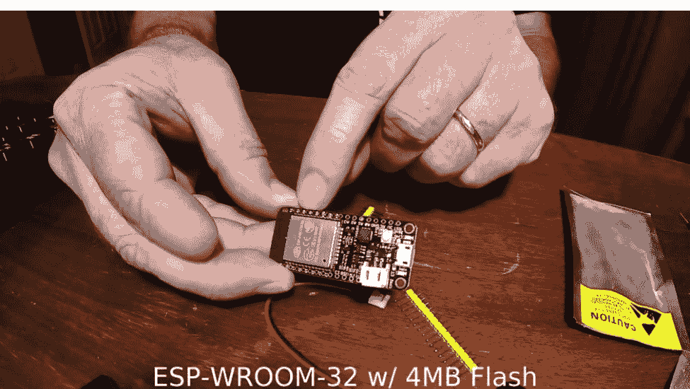

这只是一个中心，我们可以发送数据并在其他地方使用它。好的。好的。这就是我们拥有的主要链接。所以让我们前往GitLab。一旦我们到了GitLab。你可以看到我没有登录。好的。你们也不需要登录。这是一个开放的仓库，可以下载。好的。现在你们感兴趣的两个文件。嗯，实际上你们主要感兴趣的一个文件是easyiot.py。好的。这是SDK或软件开发工具包。如果你向下滚动，你会看到它，呃，它有MicroPython的导入。所以我们将使用MicroPython。它也有常规Python的导入。所以它可以在你的桌面上工作，在任何一个地方都可以。好的。所以我们需要，嗯，我们需要这个。好的。嗯，实际上让我们直接点击下载，我要保存文件。它完成了。好的。所以让我们回去。另一个你可能想要的文件是rebelace.py。这是一个你可以用来上传easyiot.py到你的ESP32的文件。这是我使用的。嗯，所以我也要下载那个。呃，你可以用任何你想要的。它不。它确实。哦，这里我们走。好的。然后最后一件事是readme文件，它会显示在这里。所以readme文件有，嗯，对Easy IOT是什么的介绍。我们已经开始谈论它了。它只是一个你可以

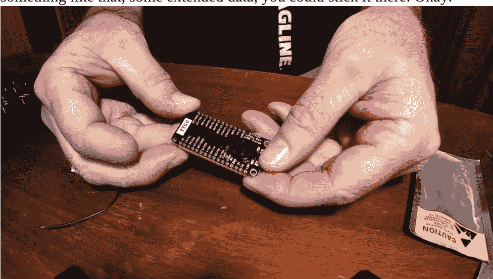

从你的设备获取数据的地方，你可以把它发送到云端，然后你可以把它下载到你的桌面，或者你可以把它下载回另一个设备。所以你可以在设备之间交换数据，诸如此类的事情，一个关于你能做什么的简要概述。你可以上传数据，你可以上传最多1024行。嗯，然后在1024行之后，如果你再次上传，它会丢弃最旧的一行。呃，你有六个，呃，项目可以上传。你可以放一个组，你知道，比如，呃，你正在使用的物联网设备组。你可以放一个设备名称，然后你有四个数据点。这些可以接受整数，可以接受浮点数，或者它们可以接受字符串。呃，这三个数据点，数据1、数据2和数据3，它们可以接受。呃，最长32个字符的字符串。所以那可以是四个名字之类的东西。然后最后一个数据4可以接受一个最长256个字符的字符串。所以那可以用于一个地方。如果你想放一点JSON或者类似的东西，一些扩展数据，你可以把它放在那里。好的。

现在这看起来有限制，但其实不是。它可能可以处理世界上95%的物联网设备。我的意思是，因为你只是发送一些小数据上去，你不是发送大量的数据。我的意思是，有一些设备是，但大多数不是，所以这可以处理很多

东西。好的。所以你可以上传你的数据，然后当然你可以取回你的数据。好的。你上传的任何东西，你都可以取回来。你得到时间戳和IP地址。当你，当你取回它时，它是从哪里发送的，然后当然你可以删除你的数据。呃，我对你的数据不感兴趣。你把它放上去，你管理它。是的。你删除它，无论你想做什么。然后，你知道，我们谈到了通过在设备之间上传和下载来交换数据。好的。现在你不能做的事情，看Easy IOT。它不是用于无限数据的。我们谈到了你能做什么。它不是用于大量数据的。好的。你需要一个更好的服务。比如像highaudrey这样的，如果你需要存储大量数据并永久保存。然后，你知道，用户支持，呃，你知道，我，我正在为我们的YouTube社区构建这个来使用，它经过测试，可以工作。所以只需按照说明操作。这就是你的用户支持。这就是你正在阅读的用户支持文件。我的意思是，就我一个人。好的，所以安全性，嗯，你知道，不要用它来存储个人数据。不要用它来存储军事机密。不要用它来存储商业机密。嗯，你知道，我们使用HTTPS，呃，用于网络流量，但在后端，我们不是以加密的方式存储它。所以，你知道，用它来交换数据。不要用它来存储任何关键信息，如果你需要那个。那么你需要购买，呃，你知道，支付，呃，一个大的，一个真正的物联网云服务，或者，你知道，自己搭建一个。好的。然后这里，这里是文档。好的。然后，嗯，这是测试，测试运行的东西。我们会过一遍这个，但这只是解释如何做所有事情。所以你可以做一些测试。你可以获得一个账户。这就是我们将要

## API 函数概述

嗯，接下来是不同的函数。现在，这些功能有速率限制。我的意思是，你的目标速率限制是每秒一次。对。但如果你有一堆设备在发送数据，这里会有一点缓冲。所以，你知道，如果其中几个设备同时发送数据，它仍然会正常工作。好的。然后所有内容都通过行 ID 来标识，里面只是不同的东西。那么，这就是你如何发布数据。我们会详细介绍。这是你如何获取数据。这是你如何删除数据。你可以获取统计信息，还有一些用于连接 WiFi 的额外函数。如果你使用的是 ESP 32 或类似设备，使用 MicroPython，呃，我们会介绍如何获取凭证，这样你就可以拥有自己的账户。然后这里还有一些，呃，技巧、提示和窍门。好的。

好的。那么我们已经下载了，嗯，我们将要使用的两个文件。现在我们要切换到一个目录和命令行，并尝试一下。好的，这是我创建的一个目录。这是一个全新的目录。里面唯一的东西是，呃，我们下载的两个文件。现在，注意它们在下载时名称确实略有改变。所以我们会，呃，把这些东西重命名。改成它们应该有的名字，也就是去掉 get lab 文件夹。对吧？好的。所以我们会使用这个。当我们加载到 ESP 32 时会使用那个，但现在我们在桌面上。我们只是要使用，呃，easyiot.py，那是软件开发工具包，SDK。我们将在桌面上用 Python 使用这个。好的。那么我要打开它，然后让我调整一下。现在。我在这里做的所有事情都是全新的，就像你们自己在做一样。好的。让我调整一下让你们能看到。好的，我们开始。软件开发工具包。它在这里。现在我们要看的第一件事是这个，API 密钥、密钥和版本。这些是凭证，你最终会得到自己的凭证，但这些是凭证。它只是附带了用于示例数据集的凭证，在，呃，我们只是要使用那个，每个人都可以使用它。你不必获取自己的凭证，但如果你使用这个，你会把你的数据和其他人的数据混合在一起。这是可能的，但你知道，没有理由不拥有自己的东西。

好的。嗯，所以就是这样，这是我们的基础 URL，我们将要访问它来获取数据。你看，我们使用的是 easyiot，我们使用 HTTPS。对吧？因为我们希望数据传输是安全的。然后我们将访问 API，也就是。呃，应用程序编程接口。对。那就是交换发生的地方，但你不需要了解那个。好的。这是 MicroPython 导入或常规 Python 导入。好的。如果你只是打算在 MicroPython 中使用它，你可以，你可以去掉这个，使用下面的这些东西，但这没关系。好的。现在这些是我们可以执行的函数。统计信息。我们可以获取统计信息。我们可以发布数据，这意思就是发送，发送一些数据，把这些东西发送上去并发布在云端。我们可以取回那些数据，嗯，我们可以删除那些数据。好的。然后还有几个函数是用于一旦你在你的 ESP 32 或 MicroPython 设备上时。嗯，这些是一些 WiFi 函数。你可以扫描、基本连接和执行。好的。呃，这是请求函数，你永远不需要费心处理。好的。然后是凭证，我们可以，呃，获取凭证。这将引导你获取自己的凭证，这样你在云端就有自己的空间，可以放置你自己的数据。好的。它只是基于你的。然后当你完成时，或者如果你曾经完成过，或者如果你曾经想要，你可以删除你的凭证，这将完全将你从系统中抹去，就像你从未存在过一样。好的。所以，呃，就是这样，就是这样，这就是全部，我们需要做的全部。我们只需要能够把数据放上去，我们需要知道我们上面有什么数据。所以就是这样。所以我们使用这个。最初是示例账户。那么我们就按 F5 运行这个东西，让我把它调整到你们能看到的地方。等一下。快好了。我将让它运行到末尾一点。呃，这样更容易看到数据。好的。那么第一件事，我们先做统计信息。好的。这是针对示例账户的。所以我们的统计信息告诉我们这是磁盘上的大小。嗯，上面没有数据，所以，呃，我们得放一些上去，呃，让我们看看。所以没有最小行 ID。没有最大行 ID，我想我们得放一些上去。我以为，我以为我有什么东西在运行，正在把数据放上去。嗯，但那样的话会有速率限制，现在对于这个示例账户，你可以，它的速率限制是每秒两个请求。有一个小的突发缓冲区之类的东西。

然后这里有一个与账户关联的电子邮件，但那甚至不是一个真实的电子邮件。所以别，别担心那个。好的。既然上面没有数据，我们就放一些数据上去。所以我们所要做的就是，呃，执行 posted。哦，你得拼写正确。好的。然后记住，嗯，既然我们在桌面上，我们这样做，它会告诉我们我们可以放组，我们可以放一个组，一个设备，呃，然后我们有四个数据位置。那么我们就说，嗯，我们的组将是 test 或 testing。好的。我们的设备我们就设为 desktop。好的。怎么样。然后，呃，让我们放一些数据上去。

我们做 1, 2, 3。这是一个整数，我们做 1, 2, 3 0.4, 5, 6。这是你的浮点数。然后，呃，怎么样，嗯，一个 hello world 作为一些文本？然后，你知道，我们甚至不必把它们都放进去。我们不必填满所有位置，所以我们就做那个。好的。我们发布了数据，就是这样。我们刚刚发布了数据。我们用那一行东西把数据放到了云端。好的。它返回给我们的是，呃，我们刚刚添加到数据中的那一行的行 ID。所以如果我们现在获取统计信息，我们会看到里面有一行数据，最小行 ID。呃，一，最大也是一。好的。好的。那么我们，我们再放一些数据进去，实际上。我们为什么不，我告诉你我们可以做什么。我们做一个小事情。所以，嗯，呃，for x in range(10)。好的。现在这将突发数据，它会处理这个小突发，但然后，嗯，所以我们在这里放一个 x，然后我们甚至不需要这个，我们把这个设为，既然我们在。呃，既然我们在桌面上，我会使用 f 字符串，我们也在那里放一个 x。好的。现在这将执行 10 个的突发。它会把它加载上去。是的，它可能不会达到限制。是的。如果我们做更多，它就会达到限制。好的。所以每次它发布数据，它都返回给我们所发布数据的行 ID。所以我们已经发布了一个。所以它从 2 开始，3, 4, 5, 6, 7, 8, 9, 10, 11。

所以如果我们现在做统计信息，你可以看到，我们有 11 行数据。最低行 ID 是一。最大行 ID 是 11。现在最低行 ID。并不总是一。所以假设在你放入 1024 行数据之后，你又放了一行进去。它会丢弃行一，你会有一千零二十五。所以这会变成二。然后每次你添加，你知道，它会，它会丢弃它。好的。好的。那么这就是我们把数据放到云端。那么我们需要做的下一件事是，嗯，我们需要把数据取回来。所以我们，我们知道如何做统计信息。我们知道如何发布数据，那么让我们取回一些数据。好的。那么对于获取数据，我们可以说，给我 10 行，那会给我们最近的 10 行。或者我们可以说，在某个特定行 ID 之后给我们一些数据，然后我们可以添加组或设备。所以它只会匹配具有该组的行或仅具有该设备的行。所以那允许，那允许你交换命令。所以如果你，你知道，你的组可以，你可以说组是命令，设备是，不，也许是 fund board one。那么你的桌面，你可以发送上去，嘿，fund board one，做这个，然后 fund board one 可以把它拉下来，呃，然后执行命令。好的。那么获取数据。那么这里有一个小技巧，我们可以说，好吧，我们就做一个数字。好的。那么我们就说获取数据 5。现在那应该返回最后五个东西。你会看到它是一个列表。数据的列表的列表。那么我们为什么不这样做，for row in get_data(5)，打印 row，让它更容易看到。好的。那么最后五个由我们加载上去的数据。是，呃，11, 10, 9, 8, 和 7，是行 ID。现在这里是返回的内容。这是你的行 ID。这是你的纪元时间，对吧？它是自 1970 年 1 月 1 日以来的秒数。计算机就是这样计时的。然后这就是史诗级的时间，呃，转换成GMs。好的。然后通常你会得到一个IP，上面会显示日期，但因为这是，每个人都在做这个，呃，我们这里不处理IPS。好的。然后那是我们的组名，这里是我们的设备，呃，目标设备或发布它的设备，无论你在里面放了什么。然后这是我们输入的数字。这是我们的hello world。然后你看到这两个或没有，因为我们没有在那里发布任何数据。现在这里有个小技巧。所以如果，如果我们把这个拉下来，我们可以做after。所以我想看行ID五之后的数据。现在这个会返回所有行ID在行ID五之后的数据。好的。所以你看到了，它开始，呃，最早的一个是。好的。

所以我们可以做，现在这里有个小技巧，我们可以说after zero，现在，零永远不会作为行ID存在。所以如果你使用after zero，它会返回你做过的所有事情，或者，你知道，整个一千零二十四或无论你有多少。好的。所以这返回了我们所有的数据，因为所有行ID零之后的数据。好的。让我们看看如果我们想，嗯，我们需要添加数据。所以让我们，嗯，让我们发布一些不同的数据。呃，发布数据，我们的组可以是，我们只是，我们将是，呃，我们就那样做吧。好的。

所以现在让我们再次拉回所有数据，你会看到行ID二。好的。我们看到行ID十二，那里只是组二，然后其他都是空的。好的。所以我们可以这样做。让我们再做一次。但与其那样做，我们实际上可以指定组。所以组等于组二。好的。它只会拉回一个，当然，因为我们只做了一个组名为组二的。呃，但那样你可以更具体地选择你想要获取的内容。好的。所以我们可以对组这样做，或者我们可以对设备这样做，两者都可以。好的。这就是你如何取回数据。现在删除数据。我们可以通过给出它行ID来删除。我们可以删除行ID之前的所有内容，或者我们可以删除所有数据。好的。所以让我们，让我们试试看。好的。所以我们只需删除数据，我们可以说，嗯，如果我们只想做一个，你实际上可以作弊，但让我们先正确地做。好的。所以行ID等于，然后我们有一个列表。所以让我们从中间选一个。让我们选行ID八。它在数据集的中间，某种程度上，呃，八。嗯，我们可以做八。嗯，让我们也做七吧。好的。所以我们只是告诉它，删除数据，行ID七和八，所以它们应该消失。好的。返回的是被删除的行ID数量。所以它确实删除了两个行ID。现在，如果我们这样做，我们说，你知道，八百和七百，它不会返回任何东西，因为那些行ID不存在。好的。好的。现在我们已经做了这个，让我们把这个拉下来，我们会看到九，然后它跳到六。呃，所以那些是Dawn。呃，所以我们删除了行ID。现在我要展示的技巧是，如果你只有一个东西，你不必给它一个列表。你可以说，你知道，删除数据九。然后如果我们拉下来，你看。

```
clayton@cdev1:~/demo$ sudo apt-get install picocom
Reading package lists... Done
Building dependency tree
Reading state information... Done
picocom is already the newest version (2.2-2).
The following packages were automatically installed and are no longer required:
  linux-headers-4.15.0-50 linux-headers-4.15.0-50-generic linux-image-4.15.0-50-generic linux-modules-4.15.0-50-generic
  linux-modules-extra-4.15.0-50-generic
Use 'sudo apt autoremove' to remove them.
0 upgraded, 0 newly installed, 0 to remove and 0 not upgraded.
clayton@cdev1:~/demo$ picocom -b 115200 /dev/ttyUSB0
picocom v2.2

port is        : /dev/ttyUSB0
flowcontrol    : none
baudrate is    : 115200
parity is      : none
databits are   : 8
stopbits are   : 1
escape is      : C-a
local echo is  : no
noinit is      : no
noreset is     : no
nolock is      : no
send_cmd is    : sz -vv
receive_cmd is : rz -vv -E
imap is        :
omap is        :
emap is        : crcrlf,delbs,

Type [C-a] [C-h] to see available commands

Terminal ready

>>> 
```

九它消失了。好的。嗯，然后假设我们想删除一些旧数据。所以我们读了，我们发布了数据。我们读了它。呃，你知道，这就是关于那个，那是前后的事情之一，你知道，after用于读取，before用于删除，这样我们就不必拉取，假设我们有一千行数据在里面。我们不需要每次都拉下来，这对ESP32来说很难处理。嗯，它浪费了服务器上的带宽和所有那些东西。所以我们只是，呃，我们可以使用before删除旧数据，我们可以。使用after获取新数据，并说，你知道，就像说我看到的最后一个行ID之后。好的。所以我们只需跟踪那个。所以，好的。好吧，删除数据before什么，假设before。嗯，三。好的。所以before三只会删除二和一。所以我们看到我们有两个东西被删除了。

然后如果我们把这个拉下来再试一次，你会看到二和一现在消失了。好的。然后让我们看看。嗯。最后一个是X all等于true。所以任何true值的X all？哦，那是错误的东西。那会给你那个。我应该做删除。是的。好的。X all等于true。或者你可以做X all等于一。任何评估为true的东西。如果我们这样做，它说它删除了七行数据。然后如果我们这样做，我们什么也没得到，但不，那是做错了。我们这样做。

我们，我们能得到一些行吗？我们得不到任何行。什么都没剩下。所以看看stat说什么。是的。所以对于stats，我们没有行，没有行ID，我们删除了我们所有的数据。嗯，我们删除了所有的东西，示例中的数据。好的。所以这就是所有功能。这就是你需要的，你把数据推上去，你把数据拉回来。

呃，你可以通过从一个地方推送数据并从另一个地方拉取数据来交换数据，嗯，所有那些东西。呃，所以下一件事是我们如何获得账户？好的。下一步是获得我们自己的凭证。好的。我们将使用的是这个命令，get creds。没有关键字或任何类似的东西。

好的。所以让我们跳回到我们的窗口，我已经清空了，我们只是要做，呃，我们必须输入正确的东西，get creds。好的。现在我将使用我的，呃，电子邮件地址，因为我需要接收电子邮件。所以。我正在设置一个真实的账户。好的。所以你的电子邮件是什么，你的，呃，电子邮件是什么？只是为了确保你现在输入正确。它说，嘿，看，我刚检查过，我不认识你。所以你想创建一个新账户吗？嗯，是的。是的。然后它会要求你阅读一些东西，你应该阅读这些东西并同意它。

所以它说什么，它说这是一个免费的实验性服务，为我的Patrion和YouTube支持者提供。呃，我可能不会永远保留它。我可能，呃，可能会把你赶出去，如果你不是我认识的人，但现在，我们将把它提供给每个人。即使你不是爱国者。嗯，让我们看看你不应该发送任何敏感数据，对吧？
我们在前端使用加密，但我们不拥有后端。所以你的东西不是以加密方式存储的。不要发送任何敏感的东西。不要发送任何东西。那是商业的，医疗的，军事的，任何东西，如果它是，如果它是关键数据，那不是这个的目的。这是为你的，呃，物联网实验和开发设备。
对吧？呃，不要做任何事情。呃，不要，你知道，这不是一个永久的地方。如果你，如果你需要永久，那么立即下载它。呃，假设，呃，保存你的密钥和秘密，我们即将你也可以使用 adafruit-ampy 程序。

获取，保留那些，呃，保留那些隐藏的。不要把它们给任何人，因为他们可以使用这些来操纵你的账户。嗯，然后这上面写着，嘿，我会成为社区的好成员。滥用东西。我不会下载太多数据。我不会试图登录任何人的账户。我只会成为社区里的一个好人。所以你同意吗？是的，我同意所有这些。因为这有道理。好的。然后它会发送一个代码到你的电子邮件，我们需要获取那个代码。所以我去我的电子邮件里获取那个代码。现在我带着代码回来了，我刚刚复制了它，我必须把它粘贴到那里。好的。这验证了你的电子邮件地址是有效的。然后它说，嘿，我已经把你的新凭证发送到你的电子邮件地址了。所以你为什么不去获取我的新凭证呢？好的。现在我有了我的新凭证。让我向你展示我将如何使用它们。我要到屏幕顶部这里。在这些下面，我要粘贴发送给我的内容，这是一个副本。这是示例账户，这是我的新账户。我知道我刚刚告诉过你不要让别人看到你的密钥和秘密，但当你观看这个项目时，我已经更改了。所以不用担心。你将无法使用我的账户。好的。现在我有了我自己的东西在里面，对吧？我是说，这是我自己的账户。好的。所以我要保存它，然后去运行它。我们又回来了，呃，用我们的新账户。好的。如果我们执行 stats。我们可以看到这个账户关联的电子邮件现在是我的电子邮件。好的。这是我的账户。呃，你看，大小是零。这里从来没有人做过任何事情。好的。让我们发布一些数据，呃，发布数据。我就说。好的，让我们执行 get data。我们获取第一条。好的，它在那里。所以你看到我当前的 IP 地址了。那是我当前的 IP 地址，这是时间戳。那是放进去的数据。它不是一个组名，但你真的没有，你知道，那只是一个信号。好的。所以，那就是那个？好的。然后，嗯，我现在不会删除这个，但如果我想删除它，那么我只需执行 delete creds，然后它会问我，你真的要删除这个吗？是的。因为，嗯，我们即将转到 ESP 32 并在那里做。但如果我们确实想删除它，我们可以说 yes。它会完全将我们从系统中清除。好的。但我们暂时说 no。呃，只是为了确保我们没有将自己从系统中清除，我们可以获取我们的 stats，看那里。所以我们在里面有一行数据。现在你会看到我的最大速率是 Reza，普通用户每秒一次，那是你应该做的目标，不是每秒一次查询或请求，发布，删除等等。不要每秒查询一次，那只是针对计算机的，对吧？我有这个运行在上面，你知道，这不是一个巨大的服务器，我运行在上面，所以，好的。所以，获取凭证就是这些了。最后我们要做的是转到 ESP 32，将我们的东西加载到 ESP 32 上，并从 ESP 32 尝试它。好的。我们回到我们的文件夹，我们即将连接到 ESP 32，但为了开始，我要在这里打开一个终端，让我连接到 ESP 32。我们到了。我只想向你展示。我从没有文件开始，这里没有文件。好的。我们将要使用的所有东西都在 easy_iot.py 脚本中，我们即将加载它。好的。我们有一个干净的开始，全新安装的 microPython。好的，现在让我们打开这个。这是 easy_iot。现在我们要确保的是我们已经把凭证放在这里了，这是我们的凭证。呃，如果我们愿意，我们可以注释掉这个。另一件我们不需要的事情是，如果你愿意，你可以到这里来。注释掉所有这些凭证相关的东西，因为它只是占用了你不需要的空间。好的。所以你可以注释掉所有凭证相关的东西，因为我们不会在 ESP 32 上做凭证相关的事情。好的。所以我们只需要确保我们已经把凭证放在这里了，你可以，或者不可以，这没关系。注释掉多余的东西。然后我们打开了终端。所以我要退出这个，它连接到 ESP 32。我要退出。Control a Control X 我使用 Pico comm，Control a Control X 让我们退出。然后我要加载，呃，我要使用 ampy 来加载我的 ESP 32。现在我向你展示这个，只是为了让你记住，如果我这样做，它会说权限被拒绝，那是因为我没有让它可以执行。所以我只需执行 chmod +x 使其可执行，我们对 ampy 执行。好的。现在我们可以执行这个了。所以这说的是，我希望你，我要运行 ampy，呃，这是我们的端口。我当然在 Linux 机器上。呃，所以这是端口，然后我想包含 easy_iot.py。好的。它正在编译它。现在 ampy 的好处是它已经为你交叉编译了，所以它更小，加载更快。好的，但它在那里。我们已经加载了它。所以让我们重新连接到我们的 ESP 32。哦，让我退出那个。那是加载的一部分。所以，呃，我要执行 Control D，那是重启，然后我要导入 os。我们看看发生了什么。好的。你可以看到我们唯一有的就是 easy_iot。好的。所以让我们导入 easy_iot，实际上让我们更简单一点。呃，让我们直接执行 from easy_iot import *。好的，打字，节省我的生命，导入我需要的一切。好的。从 easy_iot 导入所有东西，现在在 ESP 32 上，与桌面不同，我们必须连接到互联网，所以我们可以执行 wifi，记得我包含了一些工具。让我把它调出来。我们为互联网准备的工具有 wifi_scan 和 wifi_connect，这就是我要使用的。wifi_connect。所以让我把终端调回来。让我们去掉这个。好的。我拿回了我的终端，我将执行 wifi_connect，我要连接到我的测试网络。呃，让我们看看，Darwin net test。那是我们要使用的。所以我有一堆 wifi 网络可以使用，这是我的测试网络，这是我的疯狂密码。好的，现在，当然你不会想展示你的东西如果它很重要，但这只是一个测试网络。它不重要。好的，让我们连接，连接。来吧，伙计。你能做到的。我们到了。好的。我们连接上了。所以现在我们可以做和我们在桌面上做的相同的事情。让我们从 stats 开始。现在你会注意到在 ESP 32 上，获取 stats 或建立这些连接确实需要更长一点时间。对。所以当你使用你的 ESP 32 时，你真的不必太担心速率限制。它就是没那么快。好的。好的。让我们看看。从桌面，你知道，我们有，呃，这里，我们有的行，我们只有一行我们插入的。但现在我们可以使用 ESP 32 看到它。所以让我们，呃，让我们做，好吧。让我们，让我们为一行执行这个，get data print row。它需要一点时间来执行，然后这是我们的行。那是我们从桌面添加的行。如果你记得的话。好的，现在我们可以添加数据。让我们看看，假设我们要使用一个组，所以我们可以说也许我们的组是 ESP 32。也许我们在，我们使用 fun board one，让我们说 hello from ESP 32。它正在发布，它也应该给我们一个真实的 ID。所以如果我们执行这个。我们应该得到两个。哦。我只请求了一行数据。好的。等等。让我们请求，呃，呃，让我们看看，我们会说一行，但我将在那之后获取，零将与执行 after zero 相同，对吧？就像那将与那个相同。我们就那样做吧。那会给我们所有的行。好的。所以这是所有的行。我们最后添加的是这个。Hello from the fun board 或 from the ESP 32。好的。现在，如果我们回到桌面，好的。这是桌面，让我执行 F5。刷新屏幕。好的。

```
clayton@cdev1: ~/demo
>>> outfile.close()
>>> outfile=open('boot.py',mode='wb')
>>> outfile.write(b"print('RUN: boot.py')\n")
22
>>> outfile.close()
>>> outfile=open('main.py',mode='wb')
>>> outfile.write(b"print('RUN: main.py')\nimport blinker\nblinker.blink()\nimport pixeler\npixeler.runner(12,4)\n")
89
>>> outfile.close()
>>> outfile=open('pixeler.py',mode='wb')
>>> outfile.write(b"print('LOAD: pixeler.py')\nimport sys,time\nfrom machine import Pin\nfrom neopixel import NeoPixel\ndef runner(pin=12,pixels=4,timing=True):\n    p = Pin(pin,Pin.OUT)\n    p.value(0)\n    np = NeoPixel(p,pixels,timing=timing)\n    try:\n        for color in next_color(maxvalue=32):\n            print('color:',color)\n            for x in range(pixels):\n                np[x] = color\n                np.write()\n                time.sleep(0.01)\n            np.write()\n            time.sleep(0.2)\n    except KeyboardInterrupt:\n        pass\n    p.value(0)\ndef next_color(maxvalue=32):\n    colors = [\n        ('blue',(0,0,255)),\n        ('deep blue gatorade',(0,32,255)),\n        ('blue gatorade',(0,127,255)),\n        ('cyan',(0,255,255)),\n        ('aqua',(0,255,127)),\n        ('electric mint',(0,255,32)),\n        ('green',(0,255,0)),\n        ('electric lime',(32,255,0)),\n        ('green yellow',(127,255,0)),\n        ('yellow',(255,255,0)),\n        ('orange',(255,127,0)),\n        ('electric pumpkin',(255,32,0)),\n        ('red',(255,0,0)),\n        ('deep pink',(255,0,32)),\n        ('pink',(255,0,127)),\n        ('magenta',(255,0,255)),\n        ('purple',(127,0,255)),\n        ('deep purple',(32,0,255)),\n    ]\ndef get_color(name,maxvalue=32):\n    color = (255,0,0)\n    name = name.lower()\n    for n,c in bold_colors:\n        if n == name:\n            color = c\n            break\n    scale = maxvalue/255\n    color = tuple([int(round(x*scale,0)) for x in color])\n    return color\ndef next_color(maxvalue=32):\n    colors = [x[1] for x in bold_colors]\n    maxplace = len(colors)-1\n    place = 0\n    scale = maxvalue/255\n    while 1:\n        color = colors[place]\n        yield tuple([int(round(x*scale,0)) for x in color])\n        place += 1\n        if place >= maxplace:\n            place = 0\n")
801
>>> outfile.close()
>>>
>>>
>>>
UPLOAD COMPLETE!
Press ENTER to close.
clayton@cdev1:~/demo$ python3 REPlace.py
```

让我们发布数据。我们称之为命令。所以假设我们要发送一个命令，我们想把它发送到 fun board one。我们要说 my shorts。好的。所以我们把那个数据发布到 fun board one 或者云端。

现在让我们回到这里，看看，四行，组等于，呃，命令设备等于什么。我们称之为 fun board one。所以这就是你将如何，呃，所以让我们做

确保我们得到所有内容。所以让我们看看今天有哪些可用的命令。好的。我们请求了零之后的所有内容，这给了我所有组等于命令且设备为 fun board one 的数据。

所以我们看到我们在桌面上所做的操作现在显示在这里，我们可以，呃，运行，假设这是一个真实的命令，然后我们可以运行该命令，然后我们可以将其删除。对。所以我们可以说。我们可以删除数据三，也就是行 ID 三。所以我们完成了命令。好的。好的。我们已经删除了它，然后我们可以回复。也许我们会，呃，看看，将是发布数据。我们可以说组将是响应。这是来自 fun board one 的响应。我们可以说我做到了，然后我们发布该数据。然后如果我们回到让我找到它。这是我们的桌面获取数据。这将获取所有日期数据。哦，我应该，我应该做，呃，我做错了什么？四行和获取数据。对，对。就是这样。所以让我稍微展开一下。好的。这是来自 fun board one 的响应。我做到了。所以这只是我们如何使用桌面的一个例子。我们用桌面发送了一个命令，现在我们收到了命令完成的回复。好的。所以真的就是这些了。所以。发送命令上去或发送数据上去。我们可以拉取数据下来，我们可以在设备之间进行对话。好的。差不多就是这样了。所以我要按 Ctrl+A 然后 Ctrl+X，我离开这里。好的。差不多就是这样了。应该是因为这是不同的。我已经做这个一周了。Amy 剪了头发。我甚至换了衣服，但不管怎样，差不多就是这样了。我需要你们获取你们的 IoT 设备并尝试这个东西。注册一个账户，开始上传一些数据，看看这个东西如何工作。我认为它会工作得很好。嗯，我认为我们都可以使用它。

## E4HOME AUTOMATION USING WEBSERVER ON ESP32 SENDING HTML PAGE DNS MDNS ESP32

你还将学习如何发送 HTML 页面，或者我们可以说向连接的客户端发送简单的文本消息，使用这个 wifi episode。之后，我还会让你了解 DNS 是什么，以及这个 MDNS 是什么，以及如何在这个 ESP 板上使用 MDNS。最后，我将制作一个简单的家庭自动化项目，其中我创建了一个 Web 界面，呃，这样我们就可以控制连接到 ESP32 板的家用电器。或者我们可以说笔记本电脑。所以这就是你在观看完整项目后将学到的所有内容。所以让我们开始吧
打开 Arduino。好的，这是我编写的代码，或者我们可以说是我编辑的代码。代码写着家庭自动化 Web 服务器。这是原始代码的特别编辑版本，原始代码可在文件、示例中找到，呃，我们可以说，wifi web server，以及这个 hello server。

所以这是原始代码，我编辑了这个特定的代码以制作，呃，这个家庭自动化 Web 服务器。所以我会详细解释这个完整的动机网站，我会将这个特定的核心上传到我的 GitHub 账户。你可以从这个项目描述中的链接 Oliver 轻松下载它。所以让我们从这个特定的代码开始。这个特定的核心以四个必要的库声明开始。首先是 wifi dot。Add 第二是 wifi client，或者 as 第三是 web server not ad，以及这个 ESP MD 和 a star test。呃，前三个，我们的家庭必须是家庭。我们与你们所有人一起生活，因为首先，一些功能，比如如果我不连接我的手机到 begin，所有功能都在这个特定的库中可用。然后 wifi client 相关功能在这个特定的库中可用，for server 相关功能在这个库中可用，而 MDNS，什么是 MDNS 我会让你知道。但是，呃，emptiness 函数存储在这个特定的库中。所以所有必要的库都在这里。哦，让我再告诉你一件事。呃，你可以通过只写 ESP two six six wifi.at least pick two six is wifi client 来使用相同的核心。Don't add，呃，同样，如果你不知道我在说什么，请查看第三集，我将在其中详细讨论使用 ESP32 核心到 two 的这种特定技术

```cpp
const char* ssid = "SNS";
const char* password = "sns123456789";

String button = "<html><center><body><h2>Home Automation WebInterface</h2><p>Click on the respected button to switch the appliances:</p><h3>Lamp1</h3><input type=button onClick=\"parent.location='http://192.168.4.1/led1on'\" value='ON'> <input type=button onClick=\"parent.location='http://192.168.4.1/led1off'\" value='OFF'><br><br><h3>Lamp2</h3><input type=button onClick=\"parent.location='http://192.168.4.1/led2on'\" value='ON'> <input type=button onClick=\"parent.location='http://192.168.4.1/led2off'\" value='OFF'><br><br><h3>Fan</h3><input type=button onClick=\"parent.location='http://192.168.4.1/fanon'\" value='ON'> <input type=button onClick=\"parent.location='http://192.168.4.1/fanoff'\" value='OFF'><br><br></body></center></html>";
WebServer server(80);

const int led = 13;

void handleRoot() {
  server.send(200, "text/html", button);
}

void handleNotFound() {
  String message = "File Not Found\n\n";
  message += "URI: ";
  message += server.uri();
  message += "\nMethod: ";
  message += (server.method() == HTTP_GET) ? "GET" : "POST";
  message += "\nArguments: ";
  message += server.args();
  message += "\n";
  for (uint8_t i = 0; i < server.args(); i++) {
    message += " " + server.argName(i) + ": " + server.arg(i) + "\n";
  }
  server.send(404, "text/plain", message);
}

void setup(void) {
  pinMode(LED_BUILTIN, OUTPUT);
  digitalWrite(led, 0);
  Serial.begin(115200);
  WiFi.mode(WIFI_STA); //WiFi Station Mode
  WiFi.begin(ssid, password);
  Serial.println("");

  // Wait for connection
```

好的，让我们继续。我们有常量字符，它写着 SLE 名称和密码。所以你需要将路由器的名称和密码写入，ESP32 将连接到它。我们的 ESP32 充当 wifi 站点。它不充当 wifi 接入点。这意味着我们需要向它提供第二个名称和密码。呃，现在那个路由器可能没有连接到互联网，但它仍然需要一个中央路由器来连接。所有其他客户端也将连接到那个特定的路由器，然后我们将需要这个特定的项目才能工作。好的。让我们继续。我们有一个名为 button 的字符串。呃，不是这个特定的东西，它只是一个 HTML 页面。我一直在这个特定的刺激页面或这个估计页面在代码中如何看起来像，我们使用这个特定的按钮 HTML 页面。好的。所以让我们现在暂停一下。我稍后会讨论它。当你有，

```cpp
String button = "<html><center><body><h2>Home Automation WebInterface</h2><p>Click on the respected button to switch the appliances:</p><h3>Lamp1</h3><input type=button onClick=\"parent.location='
```

```cpp
WebServer server(80);
```

```cpp
const int led = 13;
```

```cpp
void handleRoot() {

    server.send(200, "text/html", button);

}
```

```cpp
void handleNotFound() {

    String message = "File Not Found\n\n";
    message += "URI: ";
    message += server.uri();
    message += "\nMethod: ";
    message += (server.method() == HTTP_GET) ? "GET" : "POST";
    message += "\nArguments: ";
    message += server.args();
    message += "\n";
    for (uint8_t i = 0; i < server.args(); i++) {
        message += " " + server.argName(i) + ": " + server.arg(i) + "\n";
    }
    server.send(404, "text/plain", message);

}
```

```cpp
void setup(void) {
    pinMode(LED_BUILTIN, OUTPUT);
    digitalWrite(led, 0);
    Serial.begin(115200);
    WiFi.mode(WIFI_STA); //WiFi Station Mode
    WiFi.begin(ssid, password);
    Serial.println("");

    // Wait for connection
    while (WiFi.status() != WL_CONNECTED) {
        delay(500);
        Serial.print(".");
    }
```

我们有一个 web 服务器或一个类实例声明为 sober，它在端口 80 上打开。好的。所以，呃，这实际上是报告号，实际上报告号是 80，我们的服务器在那个特定的端口上。好的。继续，我们有一个常量，呃，indigent entity，在我们的产品中没有使用。我只是被降级了。相反，我使用了内置实体，呃，它，呃，你知道，内置在这个特定的 yes Patricia Ward 中，我只是使用那个 web 服务器打开和关闭 lat。我们将讨论所有内容，然后更多。我们有一个名为 white handled road 的函数。好的。这个特定的函数。好的。让我们讨论一下这个特定的函数。这个函数包括这个。所以例如，它只是我们 web 服务器类的实例。这个函数做什么？server.center。现在这个函数需要三个输入。首先是那个代码，STD big 代码。现在我在上一集中讨论了萎缩代码，也就是 CSPD 接收的第三集。如果你想知道，这一切代码是关于什么的？现在我将澄清什么是 200 代码？关于 200 代码指的是在特定的、我们的实际 DB 协议中的成功通信。好的。200 是一种成功代码。因此，我们需要在开始时发送这段代码。第一个输入是成功代码，即200。如果是错误类型的代码，那么我们将发送404，这正是我们在这个特定部分发送的。我们稍后会讨论它。

所以首先，我们需要发送那个HTTP状态码，在本例中是200。然后我们需要指定我们发送的数据类型。好的。这定义在第二个输入中。在本例中，我们发送的是一个HTML页面，对于HTML，我们需要写`text/html`。如果我们发送的是简单的纯文本消息，那么格式应该是`text/plain`。这定义了我们发送的是纯消息，而这个特定的定义了我们以HTML形式发送数据。好的。现在第三个输入是HTML页面本身。

```cpp
WebServer server(80);

void handleRoot() // 192.168.1.1
{
    server.send(200, "text/html", button);
}

void handleNotFound() {
    String message = "File Not Found\n\n";
    message += "URI: ";
    message += server.uri();
    message += "\nMethod: ";
    message += (server.method() == HTTP_GET) ? "GET" : "POST";
    message += "\nArguments: ";
    message += server.args();
    message += "\n";
    for (uint8_t i = 0; i < server.args(); i++) {
        message += " " + server.argName(i) + ": " + server.arg(i) + "\n";
    }
    server.send(404, "text/plain", message);
}

void setup(void) {
    pinMode(LED_BUILTIN, OUTPUT);
    digitalWrite(led, 0);
    Serial.begin(115200);
    WiFi.mode(WIFI_STA); //WiFi Station Mode
    WiFi.begin(ssid, password);
    Serial.println("");

    // Wait for connection
    while (WiFi.status() != WL_CONNECTED) {
        delay(500);
        Serial.print(".");
    }
    Serial.println("");
    Serial.print("Connected to ");
    Serial.println(ssid);
```

那么我们在`handleRoot`上做什么，`handleRoot`定义了什么？我们在这里加个注释，这样你就能有个清晰的概念。这是关于什么的？根目录被视为该服务器的主页。例如，如果我们的ESP32有一个名为192.168.1.1的IP地址，那么这个特定地址被称为ESP32网络的根目录。所以这不是分配给ESP32的IP地址。

我只是，你知道，向你解释这个简单的例子。如果这是ESP32开发板的IP地址，那么这个页面被称为或被视为这个Web服务器的根页面。所以每当我们处于根页面时，我们需要做的，就是我们需要在这里定义的特定事情。所以这段代码说的是，每当我们处于根页面，或者我们可以说主页，它就会将这个特定的HTML页面发送给客户端。明白了吗。所以每当我们打开ESP32的根页面时，它将以HTML形式给出特定的网页。好的。

这就是这个`handleRoot`函数的作用。

```cpp
server.send(200, "text/html", button);
}

void handleNotFound() {
  String message = "File Not Found\n\n";
  message += "URI: ";
  message += server.uri();
  message += "\nMethod: ";
  message += (server.method() == HTTP_GET) ? "GET" : "POST";
  message += "\nArguments: ";
  message += server.args();
  message += "\n";
  for (uint8_t i = 0; i < server.args(); i++) {
    message += " " + server.argName(i) + ": " + server.arg(i) + "\n";
  }
  server.send(404, "text/plain", message);
}

void setup(void) {
  pinMode(LED_BUILTIN, OUTPUT);
  digitalWrite(led, 0);
  Serial.begin(115200);
  WiFi.mode(WIFI_STA); //WiFi Station Mode
  WiFi.begin(ssid, password);
  Serial.println("");

  // Wait for connection
  while (WiFi.status() != WL_CONNECTED) {
    delay(500);
    Serial.print(".");
  }
  Serial.println("");
  Serial.print("Connected to ");
  Serial.println(ssid);
  Serial.print("IP address: ");
  Serial.println(WiFi.localIP());
```

我们有`handleNotFound`。这个特定函数是什么？看，如果你请求Web服务器的根页面，例如192.168.1.1，那就是根页面。好的。如果你写`/page1`，现在如果`page1`存在于ESP32中，那么它会给出`page1`。但如果`page1`不存在于ESP32的Web服务器中，那么它就被称为未找到。好的。页面未找到通常给出404错误。它说页面未找到。这是特定的错误。如果任何特定的句柄或任何特定的链接在Web服务器上未找到，那么我们需要做什么，那么我们需要发送这段特定的代码。好的。它说，首先，它会打印“File Not Found”，然后它会打印URI。

URI是什么意思？让我在这里加个注释。我会用非常非常简单的术语来解释。例如，我们的IP地址是192.168.1.1。那么在这个正斜杠之后写的所有内容都被视为URI。好的。让我输入`/page1/on`。好的。这个特定的术语被视为一个URI。我也在那个特定的网页浏览器上打开了它。好的。所以这里是“page not found”错误，我在这个门户中请求了它。是的，ESP32开发板，它说URI是`/lamp1/on`。好的。这个特定的东西被视为一个URI。好的。之后，它打印方法，比如GET或POST。但通常，在这个特定的代码中，我只使用GET请求方法。所以它执行GET方法和参数。这个特定的东西是对连接客户端的响应，如果有一个叫做“page not found”的错误。好的。之后，我们发送404，这是页面未找到的状态码。然后我们发送一个纯文本消息，然后我们发送消息本身。好的。但这个特定函数是将这个特定页面发送给连接的客户端。好的。但这就是关于`handleNotFound`函数的全部内容。好的。继续前进。

```cpp
message += server.args();
message += "\n";
for (uint8_t i = 0; i < server.args(); i++) {
  message += " " + server.argName(i) + ": " + server.arg(i) + "\n";
}
server.send(404, "text/plain", message);
}
```

```cpp
void setup(void) {
  pinMode(LED_BUILTIN, OUTPUT);
  digitalWrite(led, 0);
  Serial.begin(115200);
  WiFi.mode(WIFI_STA); //WiFi Station Mode
  WiFi.begin(ssid, password);
  Serial.println("");

  // Wait for connection
  while (WiFi.status() != WL_CONNECTED) {
    delay(500);
    Serial.print(".");
  }
  Serial.println("");
  Serial.print("Connected to ");
  Serial.println(ssid);
  Serial.print("IP address: ");
  Serial.println(WiFi.localIP());

  if (MDNS.begin("esp32")) {
    Serial.println("MDNS responder started");
  }

  server.on("/", handleRoot);

  server.on("/lamp1/on", []() {
    server.send(200, "text/html", button);
    digitalWrite(LED_BUILTIN, HIGH);
  });

  server.on("/lamp1/off", []() {
    server.send(200, "text/html", button);
```

我们有`void setup`。`void setup`说，首先，`LED_BUILTIN`，也就是ESP32的内置LED。所以我们将其定义为输出。当然，我们使用这个LED作为输出，我们将删除这个特定的术语，因为我们根本没有使用这个LED。好的。之后，我们以115200波特率开始串口监视器。非常简单。然后是`WiFi.mode`函数。好的。`WiFi.mode`函数。在ESP8266或者我们可以说ESP32中，我们有三种类型的模式。第一种是站点模式。第二种是接入点模式。第三种是两者兼有模式。在这个特定项目中，我们将其用于站点模式，在这种模式下，ESP8266或者我们可以说ESP32将连接到特定的路由器。好的。这就是站点模式。之后，我们开始连接到那个特定的路由器，其SSID和密码在此定义。好的。这也非常简单。

## 代码与解释

```cpp
Serial.println("");

// 等待连接
while (WiFi.status() != WL_CONNECTED) {
  delay(500);
  Serial.print(".");
}
Serial.println("");
Serial.print("Connected to ");
Serial.println(ssid);
Serial.print("IP address: ");
Serial.println(WiFi.localIP());

if (MDNS.begin("esp32")) {
  Serial.println("MDNS responder started");
}

server.on("/", handleRoot);

server.on("/lamp1/on", []() {
  server.send(200, "text/html", button);
  digitalWrite(LED_BUILTIN, HIGH);
});

server.on("/lamp1/off", []() {
  server.send(200, "text/html", button);
  digitalWrite(LED_BUILTIN, LOW);
});

server.on("/lamp2/on", []() {
  server.send(200, "text/html", button);
  digitalWrite(LED_BUILTIN, HIGH);
});

server.on("/lamp2/off", []() {
  server.send(200, "text/html", button);
  digitalWrite(LED_BUILTIN, LOW);
});
```

之后，它会显示正在等待连接，然后建立连接，并打印连接到该特定站点名称或路由器名称。然后，通过调用 `WiFi.localIP()` 函数，它会打印分配给这个特定 ESP 的本地 IP 地址。现在，你几乎已经知道了，如果不知道，让我解释清楚。每个设备、每个连接到路由器的客户端都会被分配一个特定的 IP 地址，这个地址是动态的。

好的。所以这使得每次我们都能获得不同的 IP 地址。好的。所以这不是一个静态的，而是每次我们都获得相同的 IP 地址，它是一种动态 IP 地址。我们称之为本地 IP 地址。好的。所以一旦它连接到该路由器，我们就会从路由器获得本地 IP 地址。

现在，我们有一个条件语句，写着 `MDNS.begin("esp32")`。现在，这是我应该解释 DNS 的地方。好的。那么 DNS 是关于什么的？DNS 代表域名系统。那么，这个域名系统是什么？让我用一个简单的例子来解释。我们都使用过 google.com。

它是一个很棒的搜索引擎，我们在日常生活中使用它。让我告诉你一些事实。每个网站都有自己的服务器。Google 也有，每个服务器基本上是一台计算机，每台连接的计算机都有自己的 IP 地址。好的。我们使用那个 IP 地址，我们能够与特定的计算机通信，对吧？

所以这是一个事实，第二个事实是计算机处理数字。它们不知道什么是 google.com。它们不知道什么是 facebook.com。相反，它们知道 Google 和 Facebook 的 IP 地址。如果我们提供它们 IP 地址，那么它们才能与它们的服务器通信，但我们从不提供 IP 地址。

对吧。那么它们是如何知道 Google 或 Facebook 在哪里的？让我澄清一个事实，google.com 的 IP 地址是 216.58.216.164。所以如果我们在网络浏览器中输入这个特定的 IP 地址，我们也会得到这个 Google 网页，让我们测试一下。

我会按下回车。正如你所看到的，我们在这里看到的是 google.com，对吧？所以如果我们输入 google.com 或者我们输入 IP 地址，它是一样的，它是如何变得一样的。这是因为域名系统。我们人类的大脑更容易记住名字而不是数字，而计算机记住的是数字而不是名字。

所以有一个中介，叫做域名系统。那么这个系统做什么呢，当我们请求一个链接，例如 google.com。如果计算机不知道 IP 地址，计算机会做什么。计算机会将这个 google.com 发送到域名系统，该系统包含域名。

另一方面，它也包含其 IP 地址。所以每当计算机请求 google.com 时，域名系统会将 IP 地址返回给计算机，然后计算机请求该特定 IP 地址。我们得到网页或者我们可以得到 Google 文档。

所以这就是过程。一旦我们输入了 google.com，计算机获取了 IP 地址，计算机，或者我们可以说网络浏览器会将该特定 IP 地址存储在缓存内存中。所以下次你打开 google.com 时，它不会请求域名系统，而是

会从缓存内存中获取数据。我们可以更快地获得 google.com。与我们第一次输入时相比。好的。这就是关于域名系统的全部内容。我希望你已经清楚了这个域名系统。如果我们想详细了解域名系统，我已经在这个项目的描述中附加了一个链接，其中包含一个详细的 DNS 项目。

好的。这就是关于 DNS 的全部内容。现在，这个 mDNS 是关于什么的，对吧。这里写的是 mDNS，而不是 DNS。现在 mDNS 代表多播域名系统。那么区别是什么。如果我需要非常简短地解释，它可以被视为 DNS 的轻量级版本。

DNS 需要一个单独的服务器，称为名称服务器，上面有多个域名，另一方面有 IP 地址。所以它需要一个不同的存储和其他系统。它是一个域名系统。它需要多个东西来完成任务。mDNS 不需要名称服务器，它只是一种独立的方法，可以在像 ESP32 或 ESP8266 这样的小型芯片上实现 DNS 功能。

那么 mDNS 做什么？mDNS 使得在 ESP32 板上，在栈中，我们有一侧是 IP 地址，另一侧是我们可以用来访问这个 ESP32 的 Web 服务器的名称。这个名称我们可以自己决定。

好的。所以这里的名称是 ESP32。所以，无论我们在该特定括号内写什么，它都被视为该特定 Web 服务器的名称。如果我写一个这样的东西，那么它就变成了这个 WiFi Web 服务器的名称，该服务器运行在这个 ESP32 板上。

好的。所以这样，它变得非常容易交互，很容易知道这个 Web 服务器是关于什么的。例如，我们有两个 Web 服务器运行在两个不同的 ESP32 板上。一个包含运动传感器的数据，一个包含温度传感器的数据。所以如果我们想要温度传感器，我们不需要记住这个

特定板的 IP 地址。相反，我们可以分配一个名为 temperature 的名称，对吧？现在很容易记住温度数据存储在哪个服务器上。

但如果它是 IP 地址，那么对于人类来说，知道温度数据存储在哪个 IP 上，运动数据存储在哪个 IP 上，会非常混乱。相反，我们可以给这个 Web 服务器一个像 temperature 这样的名称，给这个 Web 服务器一个像 motion 这样的名称。现在很容易访问温度数据和运动数据。我希望我清楚地解释了 mDNS 对我们有什么用。好的。在这个特定的情况下，我们给的名称是 ESP32。所以下次，如果我们想进入 Web 服务器，我们不需要写它的 IP 地址。

相反，我们需要写 ESP32.local/。所以这个特定的术语等于写 IP 地址。所以 .local 是在写完 Web 服务器名称后必须的。如果它是 search，那么地址将是 search.local 来进入和访问。

好的。所以这很简单。现在它真的非常容易，mDNS 真的非常有帮助，可以使用多个运行不同 Web 服务器的 ESP32 板来制作项目。好的。但这就是关于 mDNS 的全部内容。

让我们继续。我们已经开始了 `server.on` 现在，看看这个函数做什么。这个函数有两个输入。

```cpp
Serial.println(ssid);
Serial.print("IP address: ");
Serial.println(WiFi.localIP());

if (MDNS.begin("esp32")) { //esp32.local/
  Serial.println("MDNS responder started");
}

server.on("/", handleRoot);

server.on("/lamp1/on", []() {
  server.send(200, "text/html", button);
  digitalWrite(LED_BUILTIN, HIGH);
});

server.on("/lamp1/off", []() {
  server.send(200, "text/html", button);
  digitalWrite(LED_BUILTIN, LOW);
});

server.on("/lamp2/on", []() {
  server.send(200, "text/html", button);
  digitalWrite(LED_BUILTIN, HIGH);
});

server.on("/lamp2/off", []() {
  server.send(200, "text/html", button);
  digitalWrite(LED_BUILTIN, LOW);
});

server.onNotFound(handleNotFound);

server.begin();
Serial.println("HTTP server started");
}
```

它可以被视为一个条件和一个结果。如果我们从客户端收到 `/` 响应，那么我们需要发送 `handleRoot`。如果我们从客户端收到 `/lamp1/on`，我们需要发送这个。所以它是一种条件和结果。

好的。所以，每当我们收到这个 `/`，这个 `/` 意味着根页面，对吧？或者例如，如果我们请求 `esp32.local/`，那么这个特定的函数将被激活。在这个点上，我们将得到这个 `handleRoot`，我们已经讨论过了。好的。

所以我们只是在这个点上获取估计页面，当我们请求这个特定的页面时。明白了。继续。`server.onNotFound`。所以每当我们请求 `/lamp1/on` 时，那么我们需要在这里定义。那么我们只是发送一个 200 响应，这是一个成功的连接响应，然后我们发送一个 text/html 页面和按钮本身。

所以每次我们只发送按钮 HTML 页面，按钮 HTML 页面看起来像这样。

让我来展示一下。好的。他和他爸爸来了一会儿，我直接打开这个STL页面。这里有一个网站，链接在描述里。我们直接点击运行。这是我创建的一个XHTML页面，标题是“家庭自动化Web界面”。点击相应的按钮来切换电器开关。

我们有灯1的开和关，灯2的开和关。

我刚学了基础语句，然后学习了按钮以及如何创建按钮。好的，这是Mark。我学了这些特定的东西。我学了这个特定项目所需的内容，因为我需要尽快拍摄并在本周内上传。

我们在下一个函数中打开LED。我们收到关闭请求，所以我们关闭LED，同时也发送这个HTML页面。每次我们从服务器收到请求时，只是发送这个页面。然后我们执行任务。如果是开，我们就打开实体；如果是关，我们就关闭LED。这是一种自动化项目，可以通过在ESP32上安装一个Web服务器程序轻松实现。让我澄清一下，这是基于局域网的。所以它只在路由器范围内工作，ESP32板连接到它。不会工作。

如果我们试图从不同国家或不同地区打开和关闭电器，它不会工作。它只在路由器范围内工作。

好的。同样，我创建了第二个页面，叫做lamp2。如果lamp2收到开请求，我也将这个内置LED设为高电平，因为在这个特定板上我没有其他输出，我需要将LED连接到外部GPIO引脚。

但我现在没有面包板，所以我没有连接任何东西。所以，我做的是，如果我收到lamp2的开请求，我也打开内置LED。如果我收到关请求，我也关闭内置LED。同样，你可以创建许多按钮和许多页面，比如lamp3的开和关，fan1的开，fan1的关。

```cpp
Serial.println(ssid);
Serial.print("IP address: ");
Serial.println(WiFi.localIP());

if (MDNS.begin("esp32")) { //esp32.local/
  Serial.println("MDNS responder started");
}

server.on("/", handleRoot); // esp32.local/

server.on("/lamp1/on", []() {
  server.send(200, "text/html", button);
  digitalWrite(LED_BUILTIN, HIGH);
});

server.on("/lamp1/off", []() {
  server.send(200, "text/html", button);
  digitalWrite(LED_BUILTIN, LOW);
});

server.on("/lamp2/on", []() {
  server.send(200, "text/html", button);
  digitalWrite(LED_BUILTIN, HIGH);
});

server.on("/lamp2/off", []() {
  server.send(200, "text/html", button);
  digitalWrite(LED_BUILTIN, LOW);
});

server.onNotFound(handleNotFound);

server.begin();
Serial.println("HTTP server started");
}
```

你可以在这个函数中打开和关闭相应的电器。在响应中，你应该发送页面，并在这里增加按钮数量。

我也告诉过你，所以我认为这就是代码的全部。好的，这就是代码的全部，最后一个函数是server.onNotFound，当我们找不到任何页面时。例如，如果我请求lamp3/on，那么没有lamp3的页面。它会做什么？它会发送这个handleNotFound函数，这没什么，只是添加了一条404错误消息。

消息会发送“文件未找到”。之后我们只是开始服务器，然后监视器会显示“服务器已启动”。所以我们将从那里开始。在loop函数中，它只是处理客户端，就像在Web服务器上一样。这就是家庭自动化Web服务器代码，LED选择板子，上传到ESP32板。

让我们看看一切如何运作。我会点击这个上传按钮，按住这个boot按钮。如果你不知道按这个按钮的原因，请看这个系列的第一集。好的，

```
clk_drv:0x00,q_drv:0x00,d_drv:0x00,cs0_drv:0x00,hd_drv:0x00,wp_drv:0x00
mode:DIO, clock div:1
load:0x3fff0018,len:4
load:0x3fff001c,len:808
load:0x40078000,len:6084
load:0x40080000,len:6696
entry 0x400802e4
...
Connected to SmS
IP address: 172.20.10.5
MDNS responder started
HTTP server started
```

上传完成了，它真的打开了串口监视器，而不是按重置按钮。

好的。它连接到我的路由器，也就是SMS，它有自己的本地IP地址，但我们不需要记住，多亏了MDNS。

MDNS说响应器已启动。所以MDNS工作正常，服务器也启动了。我们将转到Google Chrome，确保你的设备连接到ESP32连接的同一网络。

我们将打开一个新标签页，输入esp32.local。好的，请求这个特定链接时，我们将得到一个网页或HTML页面作为响应。好的，我们成功得到了相同的HTML页面，我们在这里看到的。好的，是相同的HTML页面。我们得到了响应。好的，如果我点击这个开按钮，灯会打开。

让我放大一下。现在，我想它很具体。我点击这个开按钮，是的，它打开了。我一点击关按钮，它就关了，开和关。如果我点击lamp2，同样的事情发生，因为我在这个lamp2函数中给出了相同的命令。

好的，开和关。当你点击开和关时，你可以看到这里的链接在变化。好的，让我们点击lamp1。链接变成/lamp1/on。如果我点击这个lamp1关，链接变成/lamp1/off。所以一切都按照我们写的代码完美工作。让我放大一下。这个特定的Web服务器在这个ESP32板上完美工作。这种惊人的项目，我的意思是，你可以用这个ESP32制作你自己的家庭自动化系统，但你只需要连接继电器，在继电器上我们可以连接不同的电器并给它命名。在这个网页上，或者你可以说这个HTML页面，同样我们可以从笔记本电脑控制，或者我们甚至可以用智能手机控制，你甚至可以制作一个应用程序。

## 点亮一个LED

因为我们将控制不同的GPIO。不用担心这里的循环。这很容易。第一个项目我们将学习如何控制默认LED。

这是电源LED，还有一个默认LED连接到GPIO引脚2。这个特定的LED是我们要做的第一个项目。确保你的ESP32连接USB电缆，按下重置按钮。Shell现在加载了。创建一个新文件来控制这个GPIO引脚。我们必须使用machine模块。所以machine模块实际上用于控制所有这些外设。命令是import machine和import time。

这是我们为machine需要的两个模块。我们将使用machine中的Pin函数，从time中使用sleep。从machine导入Pin，从time导入sleep。你必须创建一个对象来控制这个LED。设置引脚号，它应该是输入或输出。创建一个对象。

你可以给任何名字，我给的是led_builtin，任何名字都可以。我给了类似这样的东西：led = Pin(2, Pin.OUT)。现在我们

必须在女士进入GPA之前将您的PIN码提供给DPA，PIN码二，逗号豆狗出去。这些大写字母是在哪里创建和引导的？转到EPI编号二，我们实际上正在创建那个阴茎。我会放疼痛。现在你可以创建一个循环。你必须调用对象led_underscore_or_BJ。那是一个LED对象山羊值。如果一表示打开，零表示关闭。所以我正在给led_underscore_object点值。值应该是一，这会使LED打开The request was rejected because it was considered high risk

## ESP32 内部温度

我们将测量 ESP32 的内部温度。我们可以了解它在板上有多热等等。让我停下来。我们在两个 ESP32 中使用一个名为 `ESP32` 的函数。要带延迟打印，你可以使用 `time` 模块中的 `sleep`。你可以导入 `sleep`。现在，如果你想反复读取，可以使用 `while` 循环。读取非常简单。你可以创建一个变量。这里我们获取的是华氏度的值。命令是 `ESP32.raw_temperature`。现在这个值实际上被保存到了名为 `temp_f` 的变量中。我们可以打印它。我们将让它间隔两秒。

现在让我们上传这段代码。保存。

现在你可以看到 ESP32 的华氏温度是多少了。这就是我们测量它们的方法。我直接从 ESP32 上读取了它们。

## ESP32 内部霍尔效应传感器

我们将检查 ESP 中的霍尔效应传感器。我这里有一个设备，上面会有一个磁铁。让我确保你能看到那个测试。这意味着需要一个磁铁。你需要导入 `ESP32` 模块。所以导入 `sleep`。你可以使用 `while` 循环，使用一个名为 `hall_effect_sensor_value` 的变量。如何读取这个？`ESP32.hall_sensor()` 是我们想要用来再次读取霍尔效应传感器值的命令，给它一个休眠时间。

保存代码，查看这段代码。

现在，你可以看到霍尔效应传感器的值大约在一百、一百一十左右，有些变化，我将把它放得更近一些。

当我把它放得非常近时。现在，值降低到大约 20。它检测到了磁密度，然后我移开了。

再次，它会回到那个大约一百的值范围，我放回去，哦，它变成了 20 附近的值。

## 多线程

在这种情况下，多线程意味着处理器可以同时使用线程函数执行多个任务。你可能在英特尔处理器或 AMD 处理器中看到过超线程功能。同样的方式，这是它的微型版本。我们可以在 ESP32 上实现它，我们必须导入 `_thread` 函数，命名。它以不同的方式工作。我不想在每个地方都调用 `_thread`，`_thread`。我可以用另一种方式调用它，比如，好的，`_thread`。我可以只叫它 `th`。所以无论哪里需要 `_thread`，我都可以用 `th`。同时导入 `Pin` 和 `sleep`。我将使用三个 LED。设置如下：

一个连接到 GPIO 引脚号 25。一个连接到 GPIO 引脚号 33。另一个是 GPIO 引脚号 2，那是默认的 LED。所以我们必须创建所有三个对象。我想独立控制这三个 LED，让它们以不同的闪烁速率闪烁。这就是我们要实现线程的地方。
我们必须创建 LED 函数，`Pin.out` LED 到引脚号 33 和 LED 三。我使用引脚号 2。所以这些是三个 LED。我创建了对象 `led1`，`led2` 和 `led3`，所有这些引脚都是输出引脚。如果你想导入线程，我们必须为每个 LED 创建不同的函数。
我们必须在那个线程中调用那个特定的函数。`def` 是创建函数的关键字。
在 `led1` 现在里面，实际上我们必须传递两个参数。它连接到线程函数。你必须传递两个参数，可以是任何东西。所以一个参数，我取为消息，还有一个是时间。所以我在这里给了两个变量作为时间。我简单地给 0.2。现在我可以引入消息了。
我想让 LED 1 根据我传递的时间打开和关闭。是的。然后 `led_object_one.on()` 然后 `sleep`。是的，我可以传递那个时间。然后 `led_one.off()` 传递时间变量并传递 `def`。

所以我创建了第一个函数。现在我必须以类似的方式为其他两个创建。
其他两个更多开始，复制粘贴并进行必要的编辑。函数二，我可以保留为消息。而不是 `led1`，我可以改成 `led2`，同样地我可以再创建一个。那是为下一个。第三个函数名是 `_led3`，抱歉。函数 `_led3` 在这里。我想控制第三个 LED。所以我可以在这里更改这个。
好的。现在我们创建了三个不同的函数来控制三个不同的 LED。

现在如何使用线程函数。好的。我从这里展示，你可以导入 `_thread`，对吧？你可以看到这里。如何调用线程是 `_thread.start_new_thread`。这是我们实际调用函数线程的方式。但如果你仔细看，调用这个之后，你必须传递一个元组，让我们看看元组是如何正确设置的。然后在某些情况下，如果线程工作不正常，现在我们可以做什么，我们可以使用 `try` 和 `except` 方法来处理这里。

所以我使用那个，对吧？`try` 我试图做什么。我试图启动第一个线程，如何启动第一个线程。`_thread.start_new_thread`。我们现在实际上通过这行代码把它叫做 `th`，对吧？所以 `th.start_new_thread`。

好的。你有一个元组，这个括号里的一些东西，首先你需要的是要调用的函数名，第一个 LED，函数名是这个 `function_led1`。

所以，嗯，只需传递这个函数，然后保护逗号。然后你必须传递一个元组。那是两样东西。这个东西实际上会进入这个消息和那个甚至更深。所以我们知道那是我们的。消息。你可以放任何消息和消息。所以这就是为什么我用双引号 `led1`，然后你可以给然后放一个逗号，你想要它以什么速率闪烁，但我想要它以 0.2 秒的时间闪烁。

好的。同样地，我可以为其他两个重复。更多线程，那个是，线程函数名是 `led2`。这个是 `led3`。这里我也可以改成二，这是三。你可以改任何东西。第二个，我需要闪烁速率。让它是一秒。第三个，我需要闪烁速率是两秒。好的，那是引脚 25 上的 LED 以 0.2 秒闪烁，引脚 33 上的 LED 以一秒闪烁。GPIO 2 上的 LED 以两秒闪烁。现在我们正在尝试它。我，如果有任何错误出现，有一个错误叫做 `OSError`。所以我们必须接受它。所以如何接受。它是 `except OSError`。然后你可以在 micropython.org 网站上找到这个。如果你能找到的话。现在，如果发现任何类型的错误，那么你想要打印什么，所以我可以打印出来。这就是我想在shell中传入CD Manito的消息。让我们更新一下。你后面有三个LED。一个是这个，一个是这个，还有一个是默认的。我将以同样的方式更新这个。

我将更新到microbiomes和device，这样我就可以点击这里的micro和device。我可以给它命名。

所以你必须将扩展名设为door。Be wifi。因此，默认情况下，有一个名为it would not by his area的文件。不要对它做任何操作。所以你必须创建一个东西，名字是点P Y扩展名。这将保存在那个ESP 32中。你也可以保存在那个设备本身，或者这次保存在你的笔记本电脑上。

我只是展示如何保存到death。是的，Peter那样做了。

这位特定的女士正计划着她两秒的延迟。那是默认的lad。而这个是用0.2秒延迟的plenty。这个是用她一秒或多线程混合工作的，速度不同，CDL早上好。

你不能吃庆祝活动的闪烁，他们展示一位女士，一秒钟的女士应该展示一位女士，两秒和30秒。这就是你可以使用多线程的方式，这是一个多线程的例子，同样你可以实现，呃，不同的应用程序可以同时运行，使用ESP 32。

## FATAL FURY ON ESP32 TIME TO RELEASE HARDWARE EXPLOITS

我专注于硬件和Loevinger能力。所以没有关联。所以现在是时候玩了。

所以几个月前，我决定打破，抱歉。我决定调查ESP搜索工具。而且，嗯，是的，因为它是一个片上系统。今天部署得非常好。它是在2016年由一家规范指南公司提出的。他们在2019年1月售出了超过1亿台设备。他们成为无线MCU是SOC市场的领导者，并声称拥有最先进的安全性和提供12年的寿命承诺。所以这相当不错。让我们看看。你可以在IOT中找到这种平台，今天有很多不同的IOT正在嵌入这个平台，而且在路上。它可以用作无线外设，以连接到前几代系统。所以目标当然是以下一个USP such to manufactured in fortune and a metallic node packages, CRI offenses boxes, millimeter for Jade pins。

所以它有一些，一些，一些特性。我不会描述这些芯片的所有特性，但在这里我们可以看到你作为一个集成的，不仅提供wifi和蓝牙，是Trello基于extant的功率，surgical colleagues，the six disco可以运行高达240兆瓦。他有ROME作为RAM，但没有CPU缓存，很多很多GPIO触摸传感器，块ADC。很多特性。同样很多协议被这个，呃，IOT芯片支持，用于ISPI三。你甚至可以，但是，呃，没有USB，不幸的是。所以通常它带有这种，呃，外形尺寸。它是一个系统级封装模块，最，呃，著名的是一个USP such to w room such to，我的意思是，这个模块非常容易与现有设备集成。

## ESP32 Form Factor

- ESP32 SiP module (ESP32-WROOM-32)
  - Easy to integrate in any design
  - Flash storage 4MB
  - FCC certified
- ESP32 Dev-Kit (Lolin ESP32)
  - Micro-USB
    - Power
    - ttyUSB0 port
  - Pin headers

你只需要在你的PCB E上为模块制作外形尺寸，它带有集成的闪存存储和其他用于四兆字节的chilled。它是FCC认证的，而且成本非常低。也许一到两次损失用于测试。我将使用一个来自一个套件的距离。它是一个dune，一个官方的，但我的意思是，一样的。你把它插到micro USB，你可以拔出抗生素治疗套件。它提供一个TT TTI USB端口拨号到，到USB端口到，到，到处理，呃，with，with芯片和，和编程它。然后它还有一些暴露的吃东西，而且成本非常低。我的意思是，15美元。

关于软件，正如感知到的开发，和，嗯，开源的deferment框架在GitHub上。它基于extensor，ESP，such to LF工具链，他们还提供一组Python工具叫做ASP工具。它用于管理芯片的配置，to，to刷新固件到NPA，等等，等等。所以文档质量非常好。他们提供数据表，他们提供技术参考手册。他们甚至提供read the docs IO。他们支持Reno，但我不使用它，因为它是预编译库，我不喜欢它。而且这个芯片也是AWS IOT平台上的官方amaze。所以你可以运行一个免费的，而芒果，Wes和你想要的一切RTOS。

所以判断今天是专注于内置安全。为此。我只是抓取了数据表。然后在这个章节安全中，我可以看到四点。所以我们将谈论加密硬件实际上，或者存储。我们将谈论安全启动，闪存加密，和一个witch。

所以是时候开始了，但在开始之前，我们需要一个计划。我将花大约三个月的时间调查这些设备。在我的业余时间，我的目标是逐一打破。之前列出的安全特性为此。当然，我使用物理访问，因为我的意思是，这很容易，而且是今天可能的攻击场景。例如，我们可以fuck。我们可以考虑供应链攻击，甚至是那个。最终用户攻击自己的设备以获利。所以我可能会使用其他技术。第四注入侧信道，也许微软在PCB修改期间，一些逆向，和代码审查。

所以朝着沃尔沃故障电压注入。有时称为电压方程。所以这是一个，众所周知的仍然有效和低成本的故障注入技术，如今，有很多关于电压释放的公共资源。所以我不会详细说明很多，所以你可以去互联网上找。但这些技术的目标是pet up电源，以在平台执行的关键软件硬件操作期间诱导故障。所以我们可以预期效果，比如跳过基因，摩擦，例如，这通常用于绕过CMP指令。我们也可以预期数据的修改。当然，这在你必须修改分支条件时非常有用。例如。但我们也可以发现意想不到的效果，因为真的很难预测和理解当今复杂CPU架构中的故障，由于，由于缓存效应，也许由于管道的，呃，的，的，的字符。

所以当我们谈论电压毛刺时，我们必须标准化电源域。所以是的。USP such too的电源域。它有三个独立的per域是IO电源域。它对我们不感兴趣。它是RTC实时时钟域和CPU域。首先，我们将专注于CPU域，我们可以看到它共享电源信号，VDD CPU，和VDR to see这很奇怪，但有其他，这是我们的设计。所以我们可以看到一些低压差，呃，调节器LDO在安全域和，和外部信号之间。这是为了稳定内部电压，这可能，可以对毛刺有影响。我不知道。然后在数据表中，它明确指定pronoun检测器存在于芯片内部。他们说，如果BDO检测到电压下降，它将触发信号关闭，甚至在你的art上发送消息。所以这可能检测到一些毛刺。所以我做了一些测试，是的，我可以。我可以看到，的，的，的消息在你。关于WTO和芯片的重置，但这只对VDD RTC有效。因此，我将只使用VDD CPU来毛刺。我的ESP搜索。

## 目标准备

- ESP-WROOM-32 模块
  - 已移除屏蔽罩
- 无丝印但有原理图可用
- 我移除了连接到 VDD_CPU 和 VDD_RTC 的电容

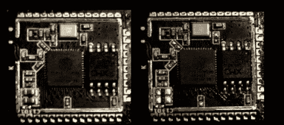

那么现在是时候准备目标了。所以我移除了屏蔽罩。这相当简单。我们现在可以看到 ESP，比如中间的两个，以及它附近的 SPI 闪存。好的。该模块没有丝印，但原理图可用。所以，这真的很容易进行逆向工程。
我移除了连接到 VDD_CPU 和 VDD_RTC 的电容。如果你对比两张图片，你会发现，你会看到差异，可能少了六七个电容。

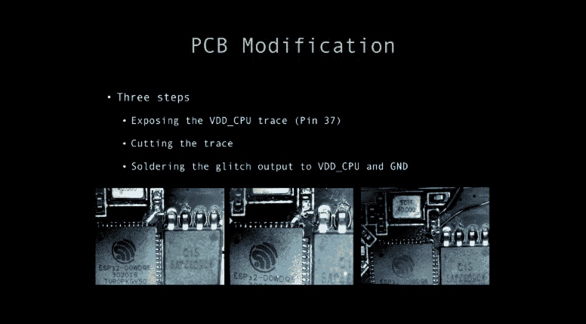

之后，我必须为那三个步骤修改 PCB。我暴露了 VDD_CPU。走线大约是第七条。我切断了这条走线，并将我的毛刺注入器连接到 VDD_CPU，然后我找到了一个 GND，一个相当、相当容易找到的点。

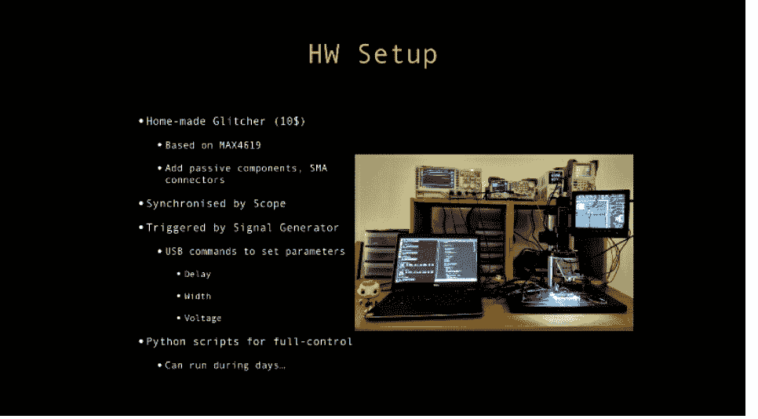

然后，关于其他设置，我设计了自己的多重毛刺注入器。它基于一个 46, 19，这是一个模拟开关。我添加了一些无源元件、SMA 连接器，以便能够轻松地插拔我的线缆。我用示波器同步这个毛刺注入器，并用信号发生器触发这个毛刺。我发送 USB 命令来设置不同的参数，比如延迟、毛刺的宽度、电压。
所以最后，它看起来像这样。我的意思是，这是一个小装置，它由 Python 脚本控制，可以完全自动化地运行压力测试。
所以当我睡觉时，我可以达到目标。


所以我需要，他们将为此对抗电压毛刺效应。我探测了，你得到零，因为 URL 直接由 VDD_CPU 供电。然后我注入毛刺，我可以在信号上看到非常大的毛刺效应。这意味着在芯片内部，我们可以预期相同的效果，相同的低压降效应。
所以对我来说，效果看起来相当好。我现在相当有信心。

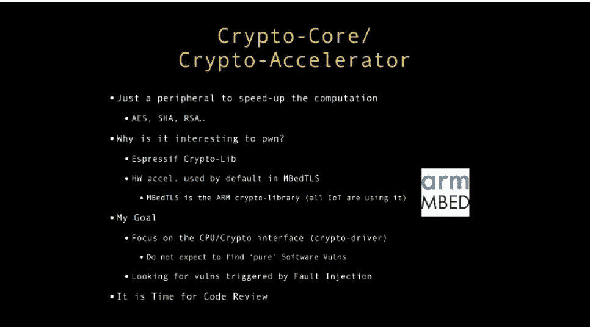

现在是时候对加密核心进行第三次测试了。加密核心也称为加密加速器。加密引擎有时只是一个用于加速不同算法计算的外设。比如，AES、SHA、RSA。
为什么探测它很有趣，因为它也被 ESP-IDF 的加密库使用。他们使用专用的，但 ARM 和 GLS、Amber jealousy、ARM 加密库也使用它，如今许多物联网设备都在使用它。我的目标是专注于 CPU 加密接口。所以通常是加密驱动程序，当然，我不期望找到纯软件漏洞，因为这个加密库很久以前就由许多熟练的人员和密码学家进行了审计和持续关注。
但我，我将寻找由故障注入触发的漏洞。

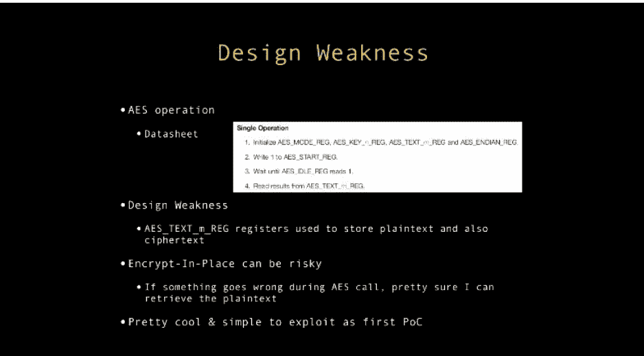

现在是代码审查的时候了，但首先在数据手册中，他们提供了描述单个 AES 操作的第一步。所以我们可以看到寄存器的第一次初始化。然后你向特定寄存器写入 1 以启动 AES。
你等待计算结束，然后你从 AES Text M 寄存器读取结果。当你看到这个时，你会看到一个设计弱点，因为用于存储明文的寄存器也用于存储密文。这通常被称为就地加密，这可能是有风险的，因为如果在 AES 期间甚至在第三步期间出了什么问题，我确信我可以直接检索到明文。
所以这作为第一个漏洞非常酷且易于利用。这就是我现在要演示它的原因。

## 漏洞 n°1 = AES 绕过

- 之前的弱点已确认
- 多个触发点
  - AES 启动
  - while 条件
  - 最后的 for 循环
- 概念验证
  - 输出 = 输入

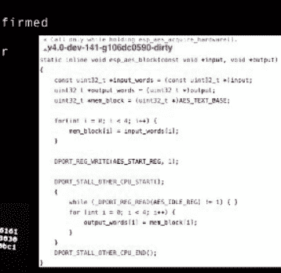

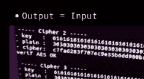

我们来看代码。这是一个用于 AES 的加密驱动程序。然后我们看到了之前描述的相同简单实现的步骤。所以是的，他们使用 mem block 变量，一个数组指针来存储输入，但也用于存储输出。
所以之前的弱点在这里得到了确认。我们有多个触发点来插入我们的故障，我们可以触发 AES 启动。例如，我们可以尝试让 while 条件出错。我们也可以尝试让 for 循环出错。所以这在这里相当容易。所以作为概念验证，我们可以看到在第二个密文上，AES 输出是正确的，但在第三个密文上，密文输出与输入相同。所以这是一个非常简单的概念验证。

## 漏洞 n°2 = AES SetKey

- 可触发的漏洞
  - 用于将密钥加载到加密核心的未受保护的 for 循环
- 概念验证
  - 密钥被清零
  - 持久的密钥值，直到下一次 setkey()
  - 适合攻击 AES 密码块链接模式

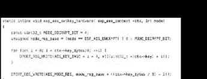

```
- key : 61616161616161616161616161616161
- plain: 30303030303030303030303030303030
- cipher: e00682be5f2b18a6e8437a15b110d418
!!!! Set key Pwned !!!!
```

```
>>> from Crypto.Cipher import AES
>>> 
>>> aes = AES.new(b'\x00' * 16, AES.MODE_ECB)
>>> cipher = aes.encrypt(b'0' * 16)
>>> print(''.join('{:02x}'.format(x) for x in cipher))
e00682be5f2b18a6e8437a15b110d418
```

现在是漏洞。第二个是关于 set key，这是一个将密钥加载到加密核心的函数。所以它必须是安全的，而这里我们只看到一个 for 循环。这是一个未受保护的 for 循环，用于加载非常、非常敏感的数据。因此，当你针对这个 for 循环时。你将改变最终密文的值，然后使用一个小的 Python 脚本。你设置两个零，而不是一个，比如，比如，比如，比如一个 16 字节的富玩。然后你得到相同的密文。这意味着密钥被设置为零。这很好，因为这个密钥的值现在是持久的，直到下一次 set key。所以这通常适合攻击 AES CBC，

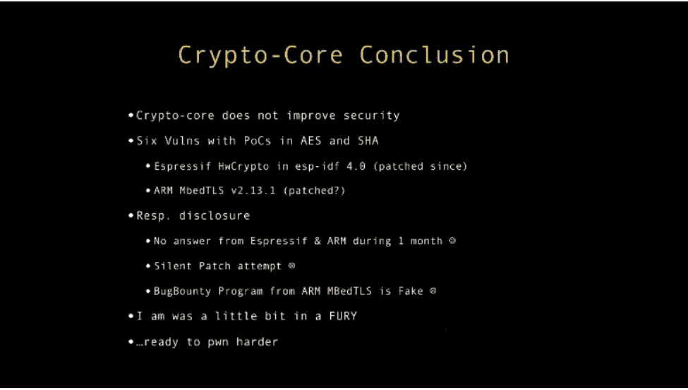

例如，这是在加密核心中发现的一些漏洞。所以作为一个小结论，加密核心并没有提高安全性。我在 AES 和 SHA 中发现了漏洞，就像在感知批次中一样精确。嗯，bet jealous。我不知道。我进行了负责任的披露，嗯，是的，我一个月没说话，但在这段时间里，precede 试图静默地给我打补丁，所以这不是很负责任，ARM 和 bet jealous 的巨额赏金是假的。

所以你不会收到任何奖励。所以我决定不与他们分享。但我有点愤怒，现在准备更用力地指出问题。

## 安全启动的作用

- 固件真实性的保护者
- 避免固件修改
  - 容易将恶意固件刷入 SPI 闪存
  - CRC？不够，抱歉...
- 它将创建一个信任链
  - 从 BootROM 到 Bootloader 直到 App
- 它保证设备上运行的代码是真实的
  - 如果镜像未正确签名，将不会启动

那么让我们谈谈 ESP 的安全启动，它保护真实性，旨在避免固件修改，因为很容易直接将恶意固件刷入 SPI 闪存，特别是当你有物理访问权限时，而今天的 CRC 不够。安全启动将创建一个从 Boot ROM（ESP 内部执行的第一个代码）到 Bootloader 直到最终应用程序的信任链。所以安全启动旨在保证设备上运行的代码是真实的，如果其中一个镜像未正确签名，它将不会启动。

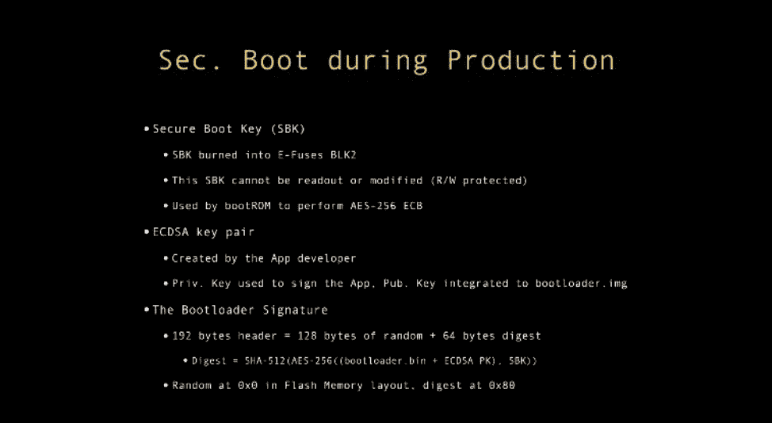

首先在生产过程中。开发者必须将安全启动密钥设置为 SBK。这被烧录到 eFuse 中。块号二，我稍后会解释我选择使用的原因，但它是 ESP 内部的一个内存，因此这个安全启动密钥无法被读取或修改，因为 eFuse 是写保护的。
这个密钥将被 BootROM 用于执行 AES-256 ECB。然后开发者将创建一个 ECDSA 密钥对。私钥将用于签署应用程序，公钥将集成到 Bootloader 中以验证应用程序的签名。所以 Bootloader 签名如下。
现在我们有 192 字节位于 SPI 闪存布局的零零位置。前 128 字节是纯随机数。然后我们有一个 64 字节的摘要。这个摘要是加密的 Bootloader 加上 ECDSA 公钥的哈希结果。并且这些是用安全密钥通过 AES 加密的。然后它只是被哈希。以最终获得在闪存布局中现在在场的内容。

根据我的逆向复位向量，良好的流程如下。好的。底部的那个地址，然后ROM开始启动。ROM加载并使用安全启动营地检查启动镜像。从OTP（一次性可编程存储器）的eFuse（电子熔丝）加载，然后PATRUDA启动。如果一切正常，那么引导加载程序使用ECDSA公钥加载并检查最终应用程序。最后，如果一切正常，应用程序将使用就地执行机制运行。这里我们有两个验证机制。一个是引导ROM阶段。阶段零，它在这里使用安全启动密钥计算摘要，并与之前刷新在SPI闪存0x80位置的64字节哈希值进行比较。然后我们还有由引导加载程序执行的CDSA验证。并且使用了microsec。它是一个开源的，呃，椭圆曲线密码学。所以，我将专注于阶段零，当然，因为这里的签名是基于对称加密的。这是一个非常非常，呃，呃，大的错误。所以，我将专注于安全启动。密钥当然是用来签署引导加载程序的密钥，这是一个关键资产，但是，幸运的是它是受保护的，因为根据规范，我无法从eFuse中读取这个安全启动密钥。

现在，我将在ESP32工具上设置安全启动。这可以由框架自动完成，但我更喜欢手动操作。我正在使用这个命令将安全启动密钥烧录到块号二中。然后我设置安全启动以烧录熔丝来激活安全机制。我们这里考虑eFuse映射。我们可以看到BLK2上的一个集成点，因为我无法读取这个密钥。好的。安全启动已设置，但我没有，呃，烧录标签。eFuse，我们稍后会看到，因为我认为调试总是相当容易且相当有用，可以探索它并准备利用。

所以安全启动动作非常简单。我设计了一个小解码器，所以它是一小段代码。我使用SBK（安全启动密钥）签署它，我进行闪存，然后它当然运行。然后我未签署，我修改代码以执行一个，但我没有签署它。我没有密钥。我将其刷新到内部。我编译，我刷新，然后当然它失败了，因为阶段零的验证不是，嗯，它不好。这对我来说很完美，因为现在我想绕过安全启动。为什么？因为绕过安全启动将赋予两种能力。代码执行。在设备上执行代码是你黑掉某物时要做的第一件事。我将强制ESP32在引导加载程序内部执行一个，然后我将加载我的内部应用程序。我将专注于BootROM，因为它总是向外的，总是容易从漏洞中利用。并且总是容易修复。修复协议漏洞总是很困难。所以我需要逆向BootROM。

首先我需要转储它。转储BootROM。这非常简单。我看内存映射。我可以在第一行看到它。这非常简单。然后也许你记得，我转储了eFuse。所以我将一个小的FTDI板连接到ESP32。我使用OpenOCD连接到GDB。现在我有了一个完全的，完全的后门访问到复位向量。我可以单步。我可以在BootROM内部单步执行，所以我也可以轻松地转储BootROM。

是时候逆向了。我不会描述所有的逆向过程，因为这是一个相当痛苦的任务，但是Xtensa，这种特殊的架构有一些与ARM和，呃，像x86这样的架构不同的，嗯，机制。指令的长度不同。另外，它们根据指令有不同的长度。所以。幸运的是，指令集架构可用于逆向。我们将使用IDA和来自mud inventor的插件。非常非常好的插件来自这个人。我还在IDA中获取了安全启动哈希，它列出了所有他们已弃用的ROM函数。

但现在我有了所有的，所有的符号。我还叫了一个朋友来检查我的混乱。总是去找朋友的议程。它不是，它不是完美的，但显然是可行的。我可以逆向。例如，这里，我显示了ROM函数的开始。

所以，所以我在BootROM内部深入挖掘了一点，并定位了负责检查安全启动的函数。在BootROM中它被称为check_finish。当，当结果错误时，它将走向左侧并打印安全启动检查失败。我们将在UART上，呃，呃，之前看到。这是由BN分支决定的，如果不等于立即指令。结果将取决于a10寄存器。它存储安全启动检查完成函数的返回值。所以我的目标，我希望PC跳转到400075C5以执行引导加载程序。所以这些小指令现在是我的目标。

# JTAG漏洞利用验证

- 通过JTAG设置a10寄存器 = 0以绕过安全启动

所以这是因为我有访问权限。我将验证这一点。使用一个小的，呃，JTAG脚本。所以我使用一个pico来连接它们。然后我启动我的，呃，我的，呃，脚本到GDB。我等待一会儿，然后我们可以看到，我们可以运行未签署的代码，使用a10寄存器上的一个小补丁。所以现在我们代表是时候真正地pwn了。因为在现实生活中，你通常没有JTAG可用。我无法找到一种方法通过纯软件导出和利用这个缺陷。

所以这里注入是我的唯一方法。我稍微修改了生产者设置，以在VDD CPU和VDD RTC上使SMPS（开关模式电源）产生毛刺，以获得最大的压降。我还探测了SPI MOSI。以获得关于帧的时序信息。

SPI的第一次尝试在，这是示波器屏幕上看起来像这样。当然，我之前的，它有助于找到时序和，以及，以及我必须，我必须插入毛刺的特定窗口。所以。我将定位。是的。是的。我假设在内部。是的。所以我们可以看到通道一是串行输出，提供一些打印的，呃，信息。然后我们有SPI，呃，帧，我将在SPI帧结束后立即进行毛刺。好的。是的，我们可以看到毛刺无法修改BootROM的代码，然后我们可以在最后看到安全启动检查失败消息。

但是经过一点时间，一点，呃，嗯，参数的修改。我们可以在这个示波器屏幕上看到UART上的消息已经改变。这意味着CPU正在跳转到入口点。现在正在执行。

所以从shell的角度来看，它看起来像这样。ESP32处于一个无限循环中，试图加载，加载这个内部引导加载程序。最后使用一个小毛刺。我可以运行我的内部代码，抱歉，对于shell，Mitch会迟到。

所以结论是，根据我过去的漏洞利用。我完成了一个由故障注入触发的中子漏洞利用。这不是持久的，如果重置当然，但好的，好的事情是你无法在没有，呃，修订的情况下修复。我进行了负责任的披露。我在9月1日发送了PoC。然后供应商提供了安全公告。我们在9月2日。他们请求CVE并决定通过始终启用闪存加密来修补安全启动模型。所以这意味着现在这种攻击是不可能的，因为你将有一个加密的引导加载程序，并且它不会被ESP32工具正确解密。然后你的引导加载程序将不会被执行，因为它将执行，呃，呃，垃圾指令，呃，对于信息安全实验室称为救援的发现了与我相同的漏洞。我的意思是，在安全启动方面，我的工作现在完成了，它是有线的。

我正在寻找闪存加密。闪存加密的作用是保护固件的机密性。当然，它是为了防止二进制逆向。没有闪存加密，提取敏感数据真的很容易。我，我在开始时做了一点工作。是的。用那个在夏天，呃，灯泡，wifi灯泡上倒汽油。所以总是一点小工作。闪存加密在设备中越来越普遍。对我来说，它有点，嗯，通过模糊性实现安全，但是

## ESP32 E-Fuses 逆向分析

- 仅识别出两个功能
  - `efuse_read` 和 `efuse_program`
- 在“特殊启动模式”下使用
  - 这很有趣...
- BootROM 从不直接访问 OTP 值
  - 这意味着只有 E-Fuses 控制器能访问 OTP
  - 纯硬件处理过程
  - 必须在 BootROM 执行前完成设置

尽管如此，为了实现最高安全级别，它仍可作为推荐的安全启动刷新加密机制高效运作。

因此，让我们针对 ESP 搜索工具中的闪存加密机制重新进行分析。我们拥有一个闪存控制器，其加密和解密功能由硬件完成。在这个闪存控制器内部，它从 eFuse 中获取密钥，同时获取其他一些参数，并将一条锚定指令和数据解密到缓存中。从软件角度来看，你无法访问这个特定部分。哦天哪。是的，闪存加密密钥是核心资产，它是用于解密固件的摘要密钥，并存储在 BLK1 中。

因此我做了同样的操作。我设置闪存加密，将闪存加密密钥烧录到 BLK1 中。我激活了闪存加密。我刷入了一个加密的固件。我检查了 eFuse 映射。现在我们可以看到无法读出 BLK1 和 BLK2。我转储了固件。闪存固件验证显示它是加密的。虽然在这张图上看到这种模式可能不太常见，但你可以相信我，它是加密的，我们可以看到 ECB 模式，因为某些 16 字节的数据块会重复出现。

那么如何破解闪存加密呢？我进行了一些测试。没有发现通过纯软件访问密钥的特定弱点，也没有找到通过差分故障分析进行攻击的方法——这是一种通过故障注入技术进行攻击的方式。我的最后尝试是侧信道分析，目标是监控从 SPI 闪存加载到处理器过程中的解密操作。但我的设备配置可能有点受限，因为 SPI 会产生大量噪声，我无法正确控制 SPA 帧，从而无法为 DPA 曲线的离线处理获得良好的采集数据。我尝试了 DPA 攻击和 CPA，但没有获得足够的泄漏信息。所以，我花了一周时间，没有结果。我有点累了，是的，我必须得出结论：我在闪存加密面前失败了。但我记得要遵循一些建议。正如摄影师们所说，如果你仔细观察开放端技术，也许能找到这些薄弱点。

这就是我现在要解释的原因，因为薄弱点就在 OTP eFuse 中。OTP eFuse 是一种基于 eFuse 的一次性可编程存储器。eFuse 只能从 0 编程为 1 一次，一旦烧录完成，就无法重写或擦除。

ESP 搜索工具的 eFuse 阵列组织结构如下：BLK0 用于 ESP 配置，BLK1 专用于闪存加密密钥，BLK2 专用于安全启动密钥，BLK3 保留给用户应用，例如自定义标记或某些数据。

根据设计，这些 eFuse 是写保护的。一旦设置了保护位，你就无法读取或修改它们。这些 eFuse 由 eFuse 控制器管理，这是 ESP 搜索工具内部的一个专用硬件模块。

让我们来逆向分析这些 eFuse。在 BootROM 中，我只识别出两个功能：`efuse_read` 和 `efuse_program`。这些功能仅在特殊启动模式下使用，这对我来说很有趣。BootROM 从不直接访问 OTP 值，这意味着只有 eFuse 控制器能访问 OTP，这是一个纯硬件处理过程。由于 BootROM 需要安全启动密钥，这个过程必须在 BootROM 执行前完成。

现在让我们谈谈特殊启动模式。ESP 有一个称为“下载模式”的特殊启动模式，用于刷写固件、设置 eFuse 等。这可以通过将 IO0 连接到 GND 然后拉高来激活，之后你会在 UART 上看到一条消息。

是的，这是一个专用的 Python 工具，用于与之前的运行函数通信。它有专用的命令可以通过 UART 处理 eFuse。所以你可以编程它，这非常有用。

现在让我们谈谈 eFuse 保护。当你尝试在 ESP 最高安全设置下转储 eFuse 值时，你只会得到零。你可以看到 BLK1、BLK2 和 BLK3 都是零。但我的目标是识别正确的保护位。我找到了，在 BLK0 的第一个字中。这两个位就是读保护位。

等等，我看不到视图。抱歉，但我知道一些事情：我知道 BootROM 不管理 eFuse，我知道 eFuse 控制器必须在之前完成工作。我还了解特殊启动模式以及保护位的位置。我的想法是绕过 eFuse 控制器初始化来修改读写保护，然后在特殊模式下发送命令，读出 BLK1 和 BLK2。

我称之为“故障注入”。首先，我通过简单的功耗分析识别出这个过程。然后当我放大这个过程并在特定时间点进行故障注入时，我们可以看到功耗通道 3。这次故障注入活动的结果如下：这是从最高安全 ESP32 的 eFuse 中提取的安全启动密钥和闪存加密密钥。当你获得这些时，你会非常高兴。

但当然，由于故障注入效应或 eFuse 阵列的设计，这些值并不完全正确。我知道这一点，因为我预先烧录了密钥，所以我知道真实值。因此我需要进行一些离线统计分析。我重复这个攻击大约 50 次，获得一组密钥，然后只保留出现频率最高的字节。对于安全启动密钥，最终在最坏的情况下，我需要暴力破解 AES-256 密钥的一个字节。这不算太糟。闪存加密也是如此，暴力破解一个字节不是问题。

这是闪存固件利用流程：首先你需要解密固件。你可以使用下载模式或直接转储闪存来获取加密的固件，执行闪存提取以获取密钥，运行统计分析，然后你需要通过解密固件来确认真正的闪存加密密钥。好的，你运行脚本，当在某处获得解密结果时，你就知道用于解密固件的密钥是正确的。我们必须注意二进制文件中的字节顺序，这与 eFuse 阵列中的字节顺序完全不同。是的，这只是个备注。

## 致命漏洞利用步骤二：签署你的代码

-   固件现已解密
-   `dd ivt.bin`（解密后文件 `decrypted.bin` 中位于 `0x00` 的前 128 个随机字节）
-   `dd Bootloader.bin` 位于 `0x1000`
-   确认真正的安全启动密钥（SBK）
    -   摘要计算命令
-   写入你的代码
    -   也许可以留个固件后门？:)
-   编译镜像
    -   使用固件加密密钥（FEK）和安全启动密钥（SBK）

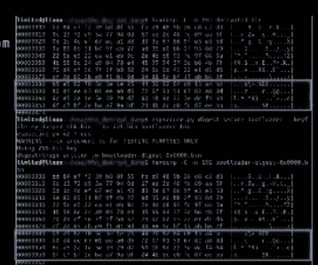

然后现在固件没有被解密。我知道我可以。提取位于解密后固件 `0x0` 处的前 128 个随机字节。嗯，我也提取位于地址 `0x1000` 的引导加载程序，然后我通过再次计算摘要来确认真正的安全启动密钥。所以这是位于 `0x80` 的初始摘要，并且通过使用数字安全引导文档一次和密钥。当我获得相同的摘要时，意味着我用于特定命令的安全密钥是正确的。现在我知道了这两个密钥，我可以写入我的代码。也许你需要学习，我不知道。我使用新的加密密钥和安全启动密钥进行编译。这现在完全透明了，并且由供应商的框架设置。我刷入了新的固件，完成了。

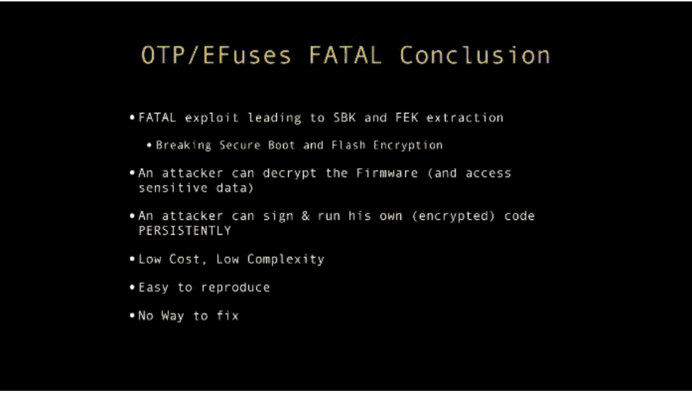

所以关于这个的结论。这是一个导致获取密钥和新的加密密钥的漏洞利用，你破坏了安全启动和新的加密，因为它是基于对称加密的，通过攻击你可以解密固件并访问敏感数据，可以访问 IP，可以访问用户数据，并且攻击者可以持久地签署并运行他自己的加密代码。所以祝你好运检测固件是否被修改。它是低成本、低复杂度的。如果密钥不是每台设备唯一的，你可能会遇到大麻烦。它很容易重现，我认为无法修复，并且所有使用此类安全引导的 USB 设备都存在风险。

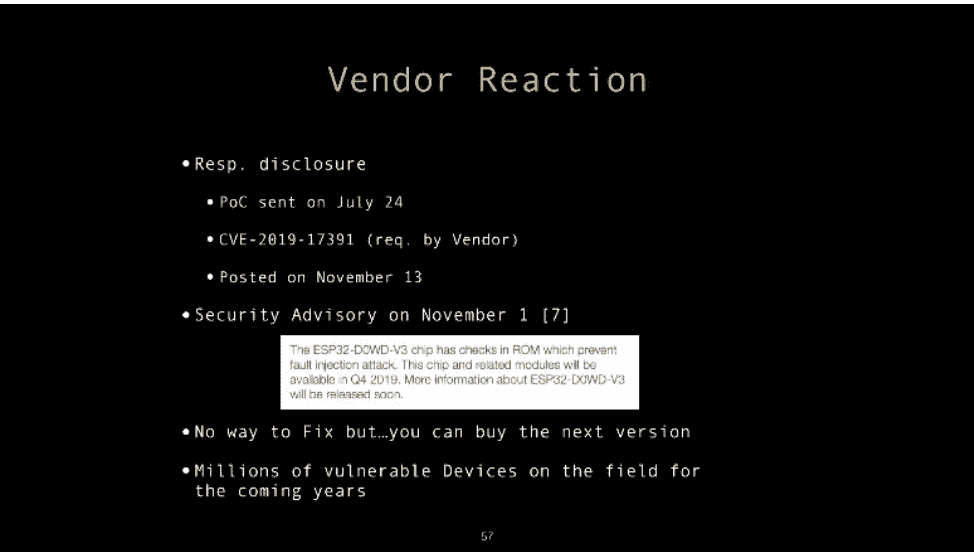

所以供应商，负责任的披露。当然我公布了。我在 7 月 24 日发送了一封邮件，我们之前看到的镜像，他为我确认了 CVE。然后我在 11 月发布了搜索结果，这很好，因为他们在 11 月 1 日发布了一份安全公告。所以，我的意思是，他们从第一次更快的沟通中学到了。他们反应更积极。我的意思是，看到这一点挺好的。所以在安全公告中，他们说他们没有解决方案，但你可以成为下一个版本的 USB 搜索。这对业务来说太糟糕了。但是，是的，在未来几年，现场仍然有数百万台使用此类设备的设备。

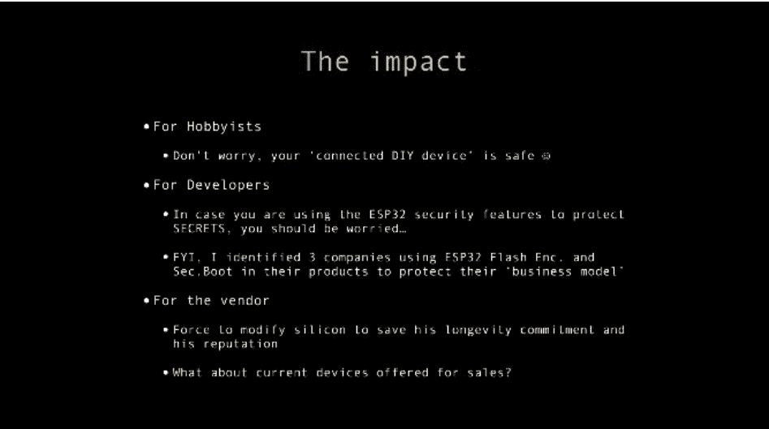

对用户的影响。我的意思是，别担心。你连接的设备是安全的。这不是一个玩笑。这不是为你准备的程序。对于开发者来说，如果你在项目中使用了之前被攻击过的 USB 安全芯片来保护你的设备。我的意思是，你可能应该为你的信息识别出三家公司，他们在项目中使用 USB 安全芯片、新的加密和安全启动来保护他们的商业模式。我不会透露这家供应商公司的名字。供应商被迫修改芯片以挽救其长期承诺和声誉。而且，是的，我只是对当前设备或未来的销售有一个问题。

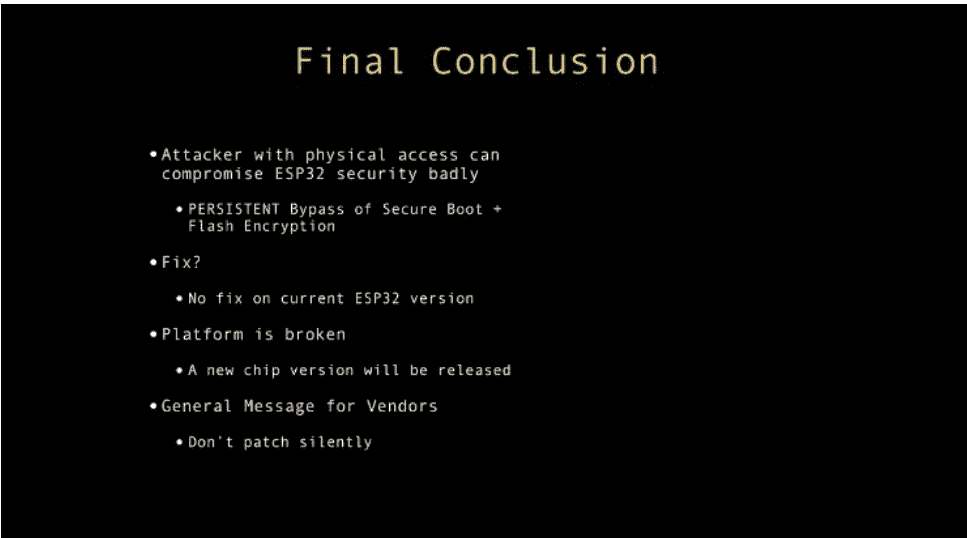

所以最终结论是，拥有物理访问权限的攻击者可以破坏 USB 安全芯片。这是安全启动和新加密的最佳系统绕过。所以没有修复，但形式被破坏了。一个新的芯片版本将会发布。对我来说，这是结束。给供应商的一点普遍信息。所以不要悄悄地打补丁，然后悄悄地打补丁。安全研究人员并不优雅。这不是一个好的技术，新的结果即将发布。当然。所以敬请期待，参考和致谢在这里。嗯，从开始到实际发生故障并成功绕过需要多长时间？不是第一次尝试。是的。我正在尝试。我怎么样？我应该让它运行多久才能得到结果？我的意思是，是的，我在识别过程中，所以这花了我很多，一点时间。但是现在有了这个演示和博客文章，你可以非常容易地重现，因为你有了时序。你有了故障注入的设置。我的意思是，即使对于一个熟练的黑客，我的意思是，在一周内他可以重现这个攻击。我对此相当确定。不，问题是，如果我尝试它，例如，我有一些不想破解的设备。需要多长时间？如果我有一条生产线要破解。我必须保留它多久才能成功？你说你每次第一次尝试都喜欢英语，因为通常底部的故障注入，你需要尝试多次才能真正得到结果。是的。因为你必须尝试多次，因为你不知道你故障注入的具体参数。好的。所以你有了它。你几乎可以用于每个芯片。有了这个演示，你可以找到很多信息。所以这将加速你的过程。好的。非常感谢。欢迎。嗯，非常感谢。非常感谢你的演讲。它非常棒。嗯，你知道新的 ESP32-S2 是否容易受到攻击吗？或者那是他们发布的新版本，我的意思是，你可能应该联系供应商。因为他们没有信息，而且我相当确定他们不会送我一个 ESP32-S2 进行评估。所以你应该联系他们。好的。嗯，感谢你的演讲。嗯，我离开去进行电压故障注入以进行加密。你称之为任何错误的密码测试吗？请重复一下？当你进行加密故障注入时，比如加密核心，你得到任何错误的密码文本吗？是的，是的，当然。你有很多故障。你必须对它们进行排序和过滤，然后取决于你的算法。你尝试攻击取决于你想做什么。是的。你可以使用或不使用不同的故障。有些故障比其他故障更有用。是的。嗯，我的意思是，嗯，你说你得到了一些错误的密码文本，这与明文相同。这意味着加密没有执行。那么你是否得到了任何与明文不同的错误密码文本？是的，当然。好的。但这取决于你的时序。好的。因为当然，如果你要对 GIS 的计算进行故障注入，是的，当然你会得到错误的密码文本，也许你能够进行差分故障分析（DFA），例如。

## 自动连接到 WIFI 网络

使用 USB 线将你的 ESP32 连接到你的笔记本电脑，并通过按启用或重置按钮来重置你的 ESP32。MicroPython 终端或 Shelly 终端加载器。要连接到任何网络，你必须导入网络。网络很重要。现在我们必须创建一个对象。我的对象名称是 station。我们将设置它。它是 station 模式，我的对象要激活。

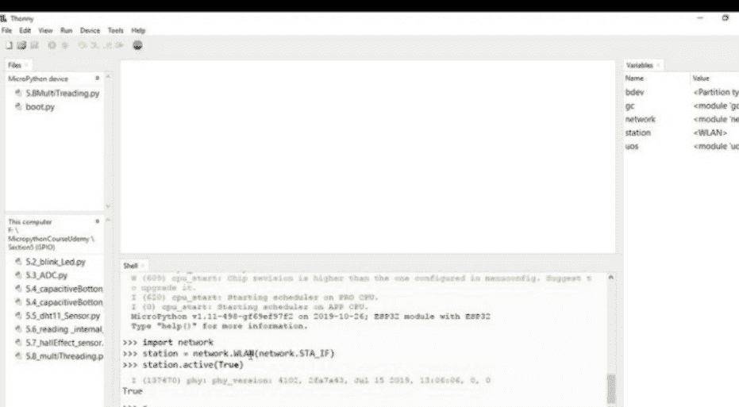

那么如何使其激活，你必须说 true，没有存储，更多获取激活。所以它正在激活以扫描周围任何可用的网络。命令 `station.scan()`。

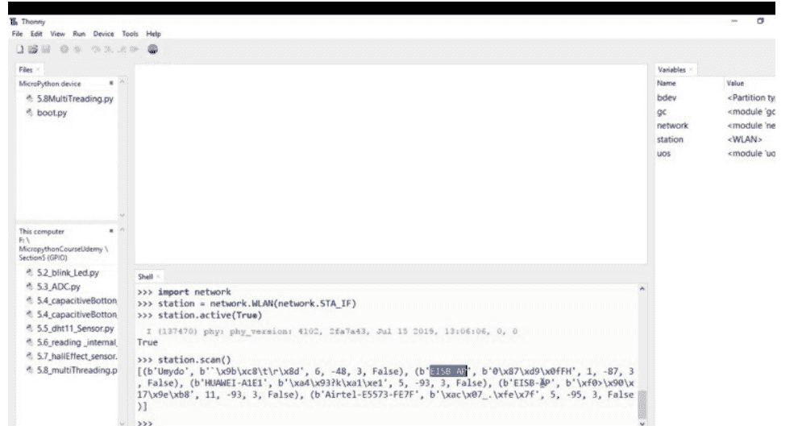

这里。这些是结果。是的。一个网络是你可能做的，USB，hippie，另一个 USB，AP，还有一个。所以这些是不同网络的 SSID。所以这些是每个网络的字符串。这个命令。检查，它是否连接到任何网络？`station.isconnected()`。现在它显示。好的。它没有连接到任何网络。这就是为什么它返回 false。要连接到你的网络。如何连接？`station.connect()`。那是我们的对象，点连接。我们必须在这里传递 SSID 和密码。你有密码，你有 SSID。在我的例子中，我传递我的 SSID。你可能做，逗号。你传递密码，在我的例子中。这是密码。我稍后会更改它。现在，让我们看看，呃，它已连接。现在我们可以检查。它是否连接？通过 `station.is_connected` 命令。现在它显示 `True`。这意味着它已连接。ESP32 已连接到我的网络。使用命令 `station.ifconfig` 查看 ESP32 的本地 IP 地址。现在通过这个命令，这就是 IP 地址。所以它显示了 IP 地址、子网掩码等等。

所以，这是一种我们可以确保它已连接到 WiFi 的方法，或者我们可以让它连接。我希望你理解了这一点。现在我们需要稍微详细讨论一下。我们讨论过这么多项目的代码，它被保存到笔记本电脑或台式机的一些程序中。我们也看到了所有这些。ESP32，检查这个。MicroPython 设备，文件系统，启动时的主文件在这里。这是我们上次课程中保存的文件之一。我打算删除这个。当 ESP32 启动时，第一个运行的文件将是这个 `boot.py`。所以我们可以看看里面还有什么其他东西。这些是 `boot.py` 里面的命令。我们现在不想更改 `boot.py` 中的任何内容。一旦 `boot.py` 运行完毕，下一个默认情况下，ESP32 会检查一个名为 `main.py` 的文件。现在，我们还没有创建任何名为 `main.py` 的文件。所以如果有一个主程序，你必须将你的项目放入 `main.py`。如果断电了，一旦电源恢复，在 `boot.py` 程序之后，它会去检查 `main.py`。然后程序就会运行。

我们将编写一个自动连接到 WiFi 网络的代码。我们知道，就像我提到的，我们想要使用。我将创建一个函数，关键字 `def connect_wifi`。导入 `network`。你的 SSID，你的密码。我们想在这里创建我们的对象。我们创建了一个叫做 `station` 的东西。我们可以在这里创建。`station` 是执行此操作的对象。ESP32 中的站点模式通过命令激活。激活此函数，对象连接到我们的网络。所以这就是我们在这里使用的 SSID 和密码。好的。你可以在这里更改。你的 SSID 和密码。当 `station.is_connected` 等于 `False` 时。这意味着如果它没有连接，那么就 `pass`。`pass` 意味着它将不做任何事情。否则，你可以让它打印。好的。让它打印。打印 "Not connected to network"。你可以给任何内容。你总是可以在那里放 `pass`。另一种情况，我们可以打印 "The connection is successful"。此外，我们可以让它打印配置是什么？那就是 IP 地址。为此，我们可以使用 print。我们使用这个。好的。可以复制粘贴到这里。我将保存。当 MicroPython 设备名称，调用 `connect_wifi`。就是复制这个。我们稍后也需要这个。把所有这些放在一起。连接自动连接为此。呃，在另一个文件之后，正在运行的是 `main.py`。所以我想创建一个名为 `main.py` 的文件。按 Control S 保存到同一个 MicroPython 设备。确保 `main.py`，好的。我刚刚将文件保存到设备。现在，在这种情况下，我们已经创建了一个完整的函数，即 `connect_wifi`。所以我可以将这个完整的模块导入到 `main.py`。那么我们如何导入自己的模块呢？我们以同样的方式调用这里，我们是如何保存的。好的。我刚刚导入了它。在这个特定的模块下，只有一个函数。那个函数是 `connect_wifi`。现在我必须调用那个特定的文件。我如何使用那个函数？`wifi_connect`。好的。点。我想让它连接。就是从这里到这里。所以我可以使用。

现在，让我保存。现在你看到 "Connection is successful"。然后它还显示了由路由器分配给 ESP32 的 IP 地址。我做了一些修正。考虑到程序的前一个，我把它放在了双引号里。所以实际上这个值必须传递给这个变量。所以你可以直接在这里给出变量名。不要放在双引号里。然后我还添加了一些时间。所以它有足够的时间来连接。现在我要做的是，我要重新连接 ESP32 进行重启。

你现在可以按 Control + D。软重启后，"Connection is successful"。它再次给出了 IP 地址。现在让我们进行硬重置。我刚刚移除了。我刚刚重新连接了。我不打算在这里做任何编码。我只是要重新注入 REPL。哦，我的 MicroPython REPL 已加载。

在尝试了这么多次之后，它再次成功连接到我们的 WiFi。感谢观看这个视频。我希望你几乎理解了 MicroPython 的基础知识。

## THE END