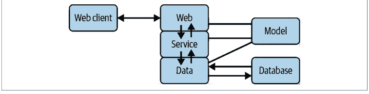
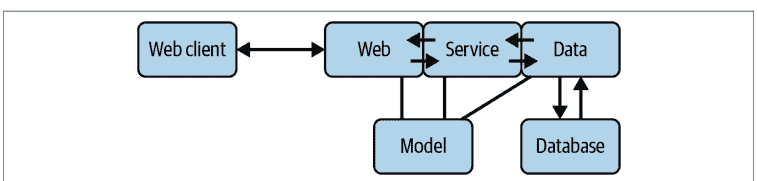
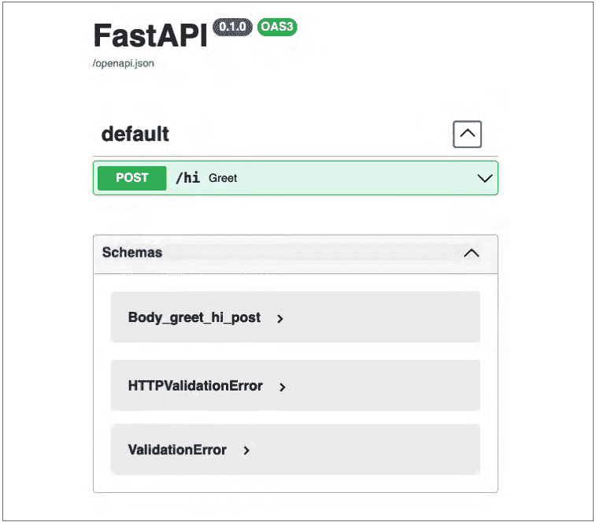
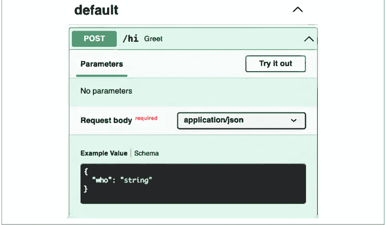
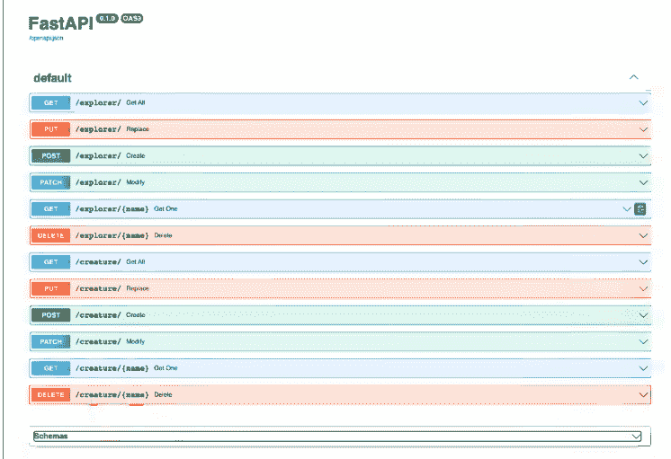
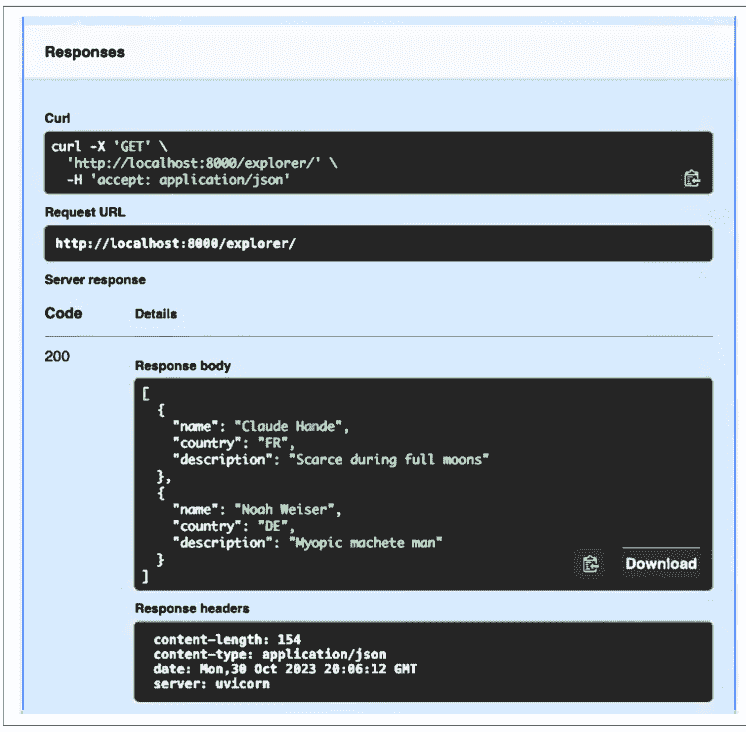
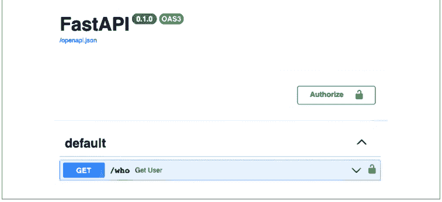
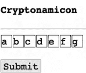

### FastAPI

现代 Python Web 开发


Bill Lubanovic

FastAPI 是一个年轻但坚实的框架，它利用了更新的 Python 特性，并采用了简洁的设计。顾名思义，FastAPI 确实很快，在性能上可以与 Golang 等语言中的类似框架相媲美。通过这本实用的书籍，熟悉 Python 的开发者将学习如何使用 FastAPI，以更少的代码在更短的时间内完成更多工作。

作者 Bill Lubanovic 涵盖了 FastAPI 开发的方方面面，提供了关于表单、数据库访问、图形、地图等各种主题的实用指南，将带你超越基础知识。本书还将帮助你快速掌握 RESTful API、数据验证、授权和性能优化。由于它与 Flask 和 Django 等框架有相似之处，你会发现上手 FastAPI 非常容易。

通过本书的学习，你将：

- 学习如何使用 FastAPI 构建 Web 应用程序
- 了解 FastAPI、Starlette 和 Pydantic 之间的区别
- 学习 FastAPI 的两个独特功能：异步函数和数据类型检查与验证
- 探索 Python 3.8+ 的新特性，特别是类型注解
- 理解同步和异步 Python 之间的区别
- 学习如何连接外部 API 和服务

Bill Lubanovic 拥有超过 40 年的开发经验，专注于 Linux、Web 和 Python。他最近与团队一起使用 FastAPI 重写了一个大型生物医学研究 API。Bill 合著了 *Linux System Administration*，并撰写了 *Introducing Python*，这两本书均由 O'Reilly 出版。

> “FastAPI 变得简单了！这本书擅长简化 FastAPI 的概念，展示了作者的精通。读者将获得实用知识，并能快速上手。”
—Ganesh Harke
花旗银行高级软件工程师

> “这本书全面概述了 FastAPI 框架及其周边生态系统，让读者能够快速而全面地了解现代 Web 开发。”
—William Jamir Silva
Adjust GmbH 高级软件工程师

### FastAPI

现代 Python Web 开发

Bill Lubanovic

北京 • 波士顿 • 法纳姆 • 塞瓦斯托波尔 • 东京


### FastAPI

作者：Bill Lubanovic

版权所有 © 2024 Bill Lubanovic。保留所有权利。

印刷于美国。

由 O'Reilly Media, Inc. 出版，地址：1005 Gravenstein Highway North, Sebastopol, CA 95472。

O'Reilly 图书可用于教育、商业或销售推广用途。大多数图书也提供在线版本 (https://oreilly.com)。如需更多信息，请联系我们的企业/机构销售部门：800-998-9938 或 corporate@oreilly.com。

**策划编辑：** Amanda Quinn
**开发编辑：** Corbin Collins
**制作编辑：** Kristen Brown
**文字编辑：** Sharon Wilkey
**校对：** Liz Wheeler

**索引：** BIM Creatives, LLC
**内页设计：** David Futato
**封面设计：** Karen Montgomery
**插图：** Kate Dullea

2023年11月：第一版

# 第一版修订历史

2023-11-06：首次发布

有关发布详情，请参见 http://oreilly.com/catalog/errata.csp?isbn=9781098135508。

O'Reilly 标志是 O'Reilly Media, Inc. 的注册商标。*FastAPI*、封面图片及相关商业外观是 O'Reilly Media, Inc. 的商标。

本书所表达的观点均为作者个人观点，不代表出版商的观点。虽然出版商和作者已尽最大努力确保本书所含信息和说明的准确性，但出版商和作者对任何错误或遗漏概不负责，包括但不限于因使用或依赖本书而造成的损害。使用本书所含信息和说明的风险由您自行承担。如果本书包含或描述的任何代码示例或其他技术受开源许可或他人知识产权的约束，您有责任确保您的使用符合此类许可和/或权利。

978-1-098-13550-8

[LSI]

谨以此书献给我挚爱的妻子 Mary、我的父母 Bill 和 Tillie，以及我的朋友 Rich 的在天之灵。
我想念你们。

# 目录

前言 ........................................................................................................ xiii

# 第一部分。新特性

## 1. 现代 Web ..................................................................................... 3
预览 3
服务与 API 4
API 的种类 4
HTTP 5
REST(ful) 5
JSON 与 API 数据格式 7
JSON:API 7
GraphQL 8
并发 8
分层 9
数据 12
回顾 13

## 2. 现代 Python ....................................................................................... 15
预览 15
工具 15
入门 16
Python 本身 17
包管理 17
虚拟环境 17
Poetry 18
源代码格式化 19
测试 19
源代码控制与持续集成 19
Web 工具 19
API 与服务 20
变量即名称 20
类型提示 21
数据结构 21
Web 框架 21
Django 22
Flask 22
FastAPI 22
回顾 23

# 第二部分。FastAPI 导览

## 3. FastAPI 导览 27
预览 27
什么是 FastAPI？ 27
一个 FastAPI 应用 28
HTTP 请求 32
URL 路径 33
查询参数 34
请求体 36
HTTP 头 37
多请求数据 38
哪种方法最佳？ 39
HTTP 响应 39
状态码 39
响应头 40
响应类型 40
类型转换 41
模型类型与 response_model 42
自动化文档 43
复杂数据 47
回顾 47

## 4. 异步、并发与 Starlette 导览 49
预览 49
Starlette 49
并发类型 50
分布式与并行计算 50
操作系统进程 50
操作系统线程 51
绿色线程 51
回调 51
Python 生成器 52
Python async、await 和 asyncio 53
FastAPI 与异步 55
直接使用 Starlette 57
插曲：清理 Clue House 57
回顾 59

## 5. Pydantic、类型提示与模型导览 61
预览 61
类型提示 61
数据分组 64
替代方案 68
一个简单示例 69
验证类型 72
验证值 73
回顾 75

## 6. 依赖 77
预览 77
什么是依赖？ 77
依赖的问题 78
依赖注入 78
FastAPI 依赖 78
编写依赖 79
依赖作用域 80
单一路径 80
多路径 81
全局 81
回顾 82

## 7. 框架比较 83
预览 83
Flask 83
路径 84
查询参数 85
请求体 85
请求头 86
Django 86
其他 Web 框架特性 87
数据库 88
建议 88
其他 Python Web 框架 88
回顾 89

# 第三部分。构建网站

## 8. Web 层 93
预览 93
插曲：自顶向下、自底向上，还是中间突破？ 94
RESTful API 设计 95
文件与目录站点布局 97
第一个网站代码 98
请求 100
多路由器 102
构建 Web 层 103
定义数据模型 103
桩数据与模拟数据 104
创建贯穿各层的通用函数 104
创建模拟数据 104
测试！ 109
使用 FastAPI 自动化测试表单 110
与服务层和数据层通信 112
分页与排序 113
回顾 114

## 9. 服务层 115
预览 115
定义服务 115
布局 116
保护 116
函数 116
测试！ 118
其他服务层事项 120
日志记录 120
指标、监控、可观测性 120
追踪 120
其他 121
回顾 121

## 10. 数据层 123
预览 123
DB-API 123
SQLite 125
布局 127
使其工作 127
测试！ 131
完整测试 131
单元测试 140
回顾 142

## 11. 认证与授权 143
预览 143
插曲 1：你需要认证吗？ 144
认证方法 145
全局认证：共享密钥 145
简单个人认证 148
更高级的个人认证 149
OAuth2 150
用户模型 151
用户数据层 151
用户模拟数据层 153
用户服务层 154
用户 Web 层 156
测试！ 158
顶层 158
认证步骤 158
JWT 159
第三方认证：OIDC 159
授权 160
中间件 161
CORS 162
第三方包 163
回顾 163

## 12. 测试 165
预览 165
Web API 测试 165
在哪里测试 166
测试什么 166
Pytest 167
布局 168

## 13. 生产环境

- 预览 185
- 部署 185
- 多个工作进程 186
- HTTPS 187
- Docker 187
- 云服务 188
- Kubernetes 188
- 性能 188
- 异步 188
- 缓存 189
- 数据库、文件与内存 189
- 队列 189
- Python 本身 190
- 故障排除 190
- 问题类型 190
- 日志记录 191
- 指标 191
- 复习 191

## 第四部分. 示例集锦

## 14. 数据库、数据科学与一点人工智能

- 预览 195
- 数据存储替代方案 195
- 关系型数据库与 SQL 196
- SQLAlchemy 197
- SQLModel 198
- SQLite 199
- PostgreSQL 199
- EdgeDB 199
- 非关系型（NoSQL）数据库 200
- Redis 200
- MongoDB 200
- Cassandra 200
- Elasticsearch 201
- SQL 数据库中的 NoSQL 特性 201
- 数据库负载测试 201
- 数据科学与人工智能 203
- 复习 205

## 15. 文件

- 预览 207
- 多部分支持 207
- 上传文件 207
- File() 208
- UploadFile 209
- 下载文件 210
- FileResponse 210
- StreamingResponse 211
- 提供静态文件 211
- 复习 213

## 16. 表单与模板

- 预览 215
- 表单 215
- 模板 217
- 复习 220

## 17. 数据发现与可视化

- 预览 221
- Python 与数据 221
- PSV 文本输出 222
- csv 222
- python-tabulate 223
- pandas 224
- SQLite 数据源与 Web 输出 225
- 图表/图形包 225
- 图表示例 1：测试 226
- 图表示例 2：直方图 228
- 地图包 229
- 地图示例 230
- 复习 232

## 18. 游戏 233

- 预览 233
- Python 游戏包 233
- 拆分游戏逻辑 234
- 游戏设计 234
- Web 部分一：游戏初始化 235
- Web 部分二：游戏步骤 236
- 服务部分一：初始化 238
- 服务部分二：计分 238
- 测试！ 239
- 数据：初始化 240
- 来玩 Cryptonamicon 吧 240
- 复习 242

## A. 延伸阅读 243

## B. 生物与人类 247

## 索引 253

## 前言

这是一本关于 FastAPI 的实用入门书——一个现代的 Python Web 框架。它也是一个关于那些我们偶然发现的、闪亮的新事物，最终可能变得非常有用的故事。当你遇到狼人时，拥有一颗银弹是件好事。（而你将在本书后面遇到狼人。）

我于 1970 年代中期开始编写科学应用程序。1977 年，我在一台 PDP-11 上第一次接触 Unix 和 C 之后，就有一种感觉，这个 Unix 东西可能会流行起来。

在 80 年代和 90 年代初，互联网仍然是非商业化的，但已经是获取免费软件和技术信息的好来源。1993 年，当一个名为 Mosaic 的网络浏览器在早期的开放互联网上发布时，我有一种感觉，这个 Web 东西可能会流行起来。

几年后，当我创办自己的 Web 开发公司时，我的工具是当时常见的那些：PHP、HTML 和 Perl。几年后，在一个合同项目中，我终于尝试了 Python，并惊讶于我能多么快速地访问、操作和显示数据。在两周的业余时间里，我能够复制一个 C 应用程序的大部分功能，而那个程序花了四个开发人员一年的时间才写完。现在我有一种感觉，这个 Python 东西可能会流行起来。

在那之后，我的大部分工作都涉及 Python 及其 Web 框架，主要是 Flask 和 Django。我特别喜欢 Flask 的简洁性，并在许多工作中更喜欢它。但就在几年前，我在灌木丛中瞥见了一丝闪光：一个名为 FastAPI 的新 Python Web 框架，由 Sebastián Ramírez 编写。

当我阅读他（出色的）[文档](https://fastapi.tiangolo.com/)时，我对其中蕴含的设计和思考印象深刻。特别是，他的[历史](https://fastapi.tiangolo.com/history/)页面显示了他评估各种替代方案时所付出的多少心血。这不是一个自我满足的项目或有趣的实验，而是一个用于实际开发的严肃框架。现在我有一种感觉，这个 FastAPI 东西可能会流行起来。

我用 FastAPI 编写了一个生物医学 API 站点，效果非常好，以至于我们团队在接下来的一年里用 FastAPI 重写了我们旧的核心 API。这仍然在生产环境中运行，并且表现良好。我们团队学习了你将在本书中读到的基础知识，并且都觉得我们正在编写更好、更快、错误更少的代码。顺便说一句，我们中有些人以前从未用 Python 编写过，而且只有我使用过 FastAPI。

所以，当我有机会向 O'Reilly 建议我的 *Introducing Python* 一书的后续作品时，FastAPI 是我的首选。在我看来，FastAPI 至少会产生 Flask 和 Django 那样的影响，甚至可能更大。

正如我所提到的，FastAPI 网站本身提供了世界级的文档，包括许多关于常见 Web 主题的细节：数据库、身份验证、部署等等。那么为什么还要写一本书呢？

这本书并非旨在面面俱到，因为，嗯，那太令人疲惫了。它*旨在*实用——帮助你快速掌握 FastAPI 的主要思想并应用它们。我将指出各种需要一些探索的技巧，并提供关于日常最佳实践的建议。

我以每章的预览开始，介绍接下来的内容。接下来，我尽量不忘记我刚刚承诺的内容，提供细节和随机的旁白。最后，有一个简短易懂的复习。

俗话说，“这些是我所依据事实的观点。”你的经历将是独特的，但我希望你能在这里找到足够的价值，成为一名更高效的 Web 开发人员。

## 本书中使用的约定

本书使用以下排版约定：

*斜体*
表示新术语、URL、电子邮件地址、文件名和文件扩展名。

**等宽字体**
用于程序清单，以及在段落中引用程序元素，如变量或函数名、数据库、数据类型、环境变量、语句和关键字。

**等宽粗体**
显示用户应按字面意思输入的命令或其他文本。

*等宽斜体*
显示应替换为用户提供的值或由上下文确定的值的文本。


此元素表示提示或建议。


此元素表示一般说明。

## 使用代码示例

补充材料（代码示例、练习等）可从 [https://github.com/madscheme/fastapi](https://github.com/madscheme/fastapi) 下载。

如果您对代码示例有技术问题或遇到问题，请发送电子邮件至 [support@oreilly.com](mailto:support@oreilly.com)。

本书旨在帮助您完成工作。通常，如果本书提供了示例代码，您可以在程序和文档中使用它。除非您要复制代码的大部分，否则无需联系我们获取许可。例如，编写一个使用本书中多个代码块的程序不需要许可。销售或分发 O'Reilly 书籍中的示例确实需要许可。通过引用本书和引用示例代码来回答问题不需要许可。将本书中大量的示例代码纳入您的产品文档确实需要许可。

我们感谢，但通常不要求署名。署名通常包括书名、作者、出版商和 ISBN。例如：“*FastAPI* by Bill Lubanovic (O'Reilly). Copyright 2024 Bill Lubanovic, 978-1-098-13550-8。”

如果您觉得您对代码示例的使用超出了合理使用或上述许可的范围，请随时通过 [permissions@oreilly.com](mailto:permissions@oreilly.com) 联系我们。

## O'Reilly 在线学习


40 多年来，*O'Reilly Media* 一直提供技术和业务培训、知识和见解，以帮助公司取得成功。

我们独特的专家和创新者网络通过书籍、文章和我们的在线学习平台分享他们的知识和专业知识。O'Reilly 的在线学习该平台为您提供按需访问的实时培训课程、深入的学习路径、交互式编码环境，以及来自O'Reilly和200多家其他出版商的海量文本和视频资源。欲了解更多信息，请访问 [https://oreilly.com](https://oreilly.com)。

## 如何联系我们

请将有关本书的意见和问题发送给出版商：

O’Reilly Media, Inc.
1005 Gravenstein Highway North
Sebastopol, CA 95472
800-889-8969（美国或加拿大）
707-829-7019（国际或本地）
707-829-0104（传真）
[support@oreilly.com](mailto:support@oreilly.com)
[https://www.oreilly.com/about/contact.html](https://www.oreilly.com/about/contact.html)

我们为本书设有一个网页，其中列出了勘误、示例和任何其他信息。您可以通过 [https://oreil.ly/FastAPI](https://oreil.ly/FastAPI) 访问此页面。

有关我们图书和课程的新闻和信息，请访问 [https://oreilly.com](https://oreilly.com)。

在LinkedIn上找到我们：[https://linkedin.com/company/oreilly-media](https://linkedin.com/company/oreilly-media)。

在Twitter上关注我们：[https://twitter.com/oreillymedia](https://twitter.com/oreillymedia)。

在YouTube上观看我们：[https://youtube.com/oreillymedia](https://youtube.com/oreillymedia)。

## 致谢

感谢许多地方的许多人，我从他们那里学到了很多：

- Serra High School
- The University of Pittsburgh
- The Chronobiology Laboratories, University of Minnesota
- Intran
- Crosfield-Dicomed
- Northwest Airlines
- Tela
- WAM!NET
- Mad Scheme
- SSESCO
- Intradyn
- Keep
- Thomson Reuters
- Cray
- Penguin Computing
- Internet Archive
- CrowdStrike
- Flywheel

# 第一部分

## 有什么新内容？

世界受益于蒂姆·伯纳斯-李爵士¹发明的万维网和吉多·范罗苏姆发明的Python编程语言。
唯一的小问题是，一家不知名的计算机图书出版商经常在其相关的网络和Python封面上放置蜘蛛和蛇。如果网络被命名为万维网*Woof*（编织中的交叉线，也称为*纬线*），而Python是*Pooch*，那么这本书的封面可能会像**图I-1**那样。


*图I-1. FastAPI：现代Pooch Woof开发*

1 我实际上曾与他握过手。我一个月没洗手，但我敢打赌他马上就洗了。

但我离题了。² 这本书是关于以下内容的：

*网络*
    一项特别高效的技术，它如何改变，以及现在如何为其开发软件

*Python*
    一种特别高效的网络开发语言

*FastAPI*
    一个特别高效的Python Web框架

第一部分的两章讨论了网络和Python中的新兴主题：服务和API；并发；分层架构；以及大数据。

第二部分是对FastAPI的高级概览，这是一个全新的Python Web框架，对第一部分提出的问题给出了很好的答案。

第三部分深入探讨FastAPI工具箱，包括在生产开发中学到的技巧。

最后，第四部分提供了一个FastAPI Web示例集。它们使用一个共同的数据源——虚构的生物——这可能比通常的随机示例更有趣、更具凝聚力。这些应该能为特定应用提供一个起点。

2 不是最后一次。

# 第1章
现代网络

> 我所设想的网络，我们尚未看到。未来仍然比过去大得多。
—蒂姆·伯纳斯-李

## 预览

曾几何时，网络又小又简单。开发者们把PHP、HTML和MySQL调用扔进单个文件，并自豪地告诉每个人去看看他们的网站，玩得很开心。但随着时间的推移，网络发展到了数以万亿计，不，数以亿亿计的页面——早期的游乐场变成了主题公园的元宇宙。

在本章中，我将指出一些对现代网络变得越来越重要的领域：

- 服务和API
- 并发
- 分层
- 数据

下一章将展示Python在这些领域提供了什么。之后，我们将深入探讨FastAPI Web框架，看看它提供了什么。

## 服务和API

网络是一个伟大的连接纽带。尽管许多活动仍然发生在*内容*方面——HTML、JavaScript、图像等——但越来越强调连接事物的应用程序编程接口（API）。

通常，一个网络*服务*处理底层数据库访问和中层业务逻辑（通常统称为*后端*），而JavaScript或移动应用程序提供丰富的顶层*前端*（交互式用户界面）。这两个前后端世界变得更加复杂和分化，通常要求开发者专精于其中之一。成为*全栈*开发者比以前更难了。¹

这两个世界使用API相互通信。在现代网络中，API设计与网站本身的设计同样重要。API是一个契约，类似于数据库模式。定义和修改API现在是一项主要工作。

## API的种类

每个API定义以下内容：

*协议*
    控制结构

*格式*
    内容结构

随着技术从孤立的机器发展到多任务系统，再到联网服务器，多种API方法已经发展起来。您可能会在某个时候遇到其中一种或多种，因此在介绍本书重点的*HTTP*及其相关协议之前，简要总结如下：

- 在网络出现之前，API通常意味着非常紧密的连接，比如调用与应用程序相同语言的*库*中的函数——例如，在数学库中计算平方根。
- *远程过程调用（RPC）*被发明用于调用其他进程中的函数，无论是在同一台机器上还是其他机器上，就像它们在调用应用程序中一样。一个流行的当前例子是gRPC。
- *消息传递*在进程之间的管道中发送小块数据。消息可能是类似动词的命令，也可能只是指示感兴趣的类似名词的*事件*。当前流行的消息传递解决方案，从工具包到完整服务器各不相同，包括Apache Kafka、RabbitMQ、NATS和ZeroMQ。通信可以遵循不同的模式：

1 我几年前就放弃了尝试。

*请求-响应*
    一对一，就像网络浏览器调用网络服务器。

*发布-订阅，或发布-订阅*
    *发布者*发出消息，*订阅者*根据消息中的某些数据（如主题）对每条消息采取行动。

*队列*
    类似于发布-订阅，但只有一组订阅者中的一个获取消息并对其采取行动。

这些中的任何一种都可以与网络服务一起使用——例如，执行缓慢的后端任务，如发送电子邮件或创建缩略图。

## HTTP

伯纳斯-李为他的万维网提出了三个组成部分：

*HTML*
    一种用于显示数据的语言

*HTTP*
    一种客户端-服务器协议

*URL*
    一种网络资源的寻址方案

尽管这些在事后看来似乎显而易见，但它们被证明是一个极其有用的组合。随着网络的发展，人们进行了实验，一些想法，如IMG标签，在达尔文式的斗争中幸存下来。随着需求变得更加明确，人们开始认真定义标准。

## REST(ful)

罗伊·菲尔丁博士论文中的一章定义了*表述性状态转移（REST）*——一种用于HTTP使用的*架构风格*。² 尽管经常被引用，但它在很大程度上被误解了。

2 *风格*意味着更高层次的模式，比如*客户端-服务器*，而不是特定的设计。

一种大致共享的适应方案已经发展起来，并主导了现代网络。它被称为*RESTful*，具有以下特征：

- 使用HTTP和客户端-服务器协议
- 无状态（每个连接都是独立的）
- 可缓存
- 基于资源

*资源*是您可以区分并对其执行操作的数据。网络服务为每个想要公开的功能提供一个*端点*——一个独特的URL和HTTP*动词*（动作）。端点也称为*路由*，因为它将URL路由到一个函数。

数据库用户熟悉过程的*CRUD*首字母缩写：创建、读取、更新、删除。HTTP动词非常CRUDdy：

| 动词 | 动作 |
| :--- | :--- |
| POST | 创建（写入） |
| PUT | 完全修改（替换） |
| PATCH | 部分修改（更新） |
| GET | 嗯，获取（读取，检索） |
| DELETE | 呃，删除 |

客户端向RESTful端点发送*请求*，数据位于HTTP消息的以下区域之一：

- 头部
- URL字符串
- 查询参数
- 主体值

反过来，HTTP*响应*返回以下内容：

- 一个整数*状态码*，表示以下内容：
    - 100系列：信息，继续

## HTTP状态码

200s
成功

300s
重定向

400s
客户端错误

500s
服务器错误

+   - 各种头部信息
- 一个主体，它可能是空的、单个的，或*分块的*（以连续片段形式）

至少有一个状态码是彩蛋：418（我是一个茶壶）应该由联网的茶壶在被要求煮咖啡时返回。


你会发现很多关于RESTful API设计的网站和书籍，都提供了有用的实用规则。本书也会在过程中分享一些。

## JSON和API数据格式

前端应用可以与后端Web服务交换纯ASCII文本，但如何表达像事物列表这样的数据结构呢？

就在我们真正开始需要它的时候，*JavaScript对象表示法*（JSON）出现了——又一个解决重要问题的简单想法，事后看来似乎显而易见。虽然*J*代表*JavaScript*，但其语法看起来也很像Python。

JSON在很大程度上取代了像XML和SOAP这样的早期尝试。在本书的其余部分，你会看到JSON是默认的Web服务输入和输出格式。

## JSON:API

RESTful设计和JSON数据格式的结合现在很常见。但仍然存在一些模糊性和极客争论的空间。最近的JSON:API提案旨在稍微收紧规范。本书将使用宽松的RESTful方法，但如果你遇到重大争论，JSON:API或类似严格的规范可能有用。

## GraphQL

RESTful接口对于某些目的来说可能很繁琐。Facebook（现为Meta）设计了*图查询语言（GraphQL）*来指定更灵活的服务查询。本书不会深入探讨GraphQL，但如果你发现RESTful设计不足以满足你的应用需求，你可能需要研究一下。

## 并发

除了面向服务的增长，连接到Web服务的数量的快速扩张也要求更好的效率和可扩展性。

我们希望减少以下内容：

*延迟*
    初始等待时间

*吞吐量*
    服务与其调用者之间每秒传输的字节数

在旧的Web时代³，人们梦想着支持数百个同时连接，然后为“万级问题”而烦恼，现在则假设同时有数百万个连接。

术语*并发*并不意味着完全并行。多个处理不会在同一个纳秒内、在单个CPU中发生。相反，并发主要是避免*忙等待*（让CPU空闲直到响应送达）。CPU速度很快，但网络和磁盘慢了几千到几百万倍。所以，每当我们与网络或磁盘通信时，我们不想只是茫然地坐在那里等待它响应。

正常的Python执行是*同步的*：一次一件事，按照代码指定的顺序。有时我们想要*异步*：做一点这件事，然后做一点那件事，再回到第一件事，以此类推。如果我们的所有代码都使用CPU来计算东西（*CPU密集型*），那么确实没有空闲时间来异步。但如果我们执行某些让CPU等待外部事物完成的操作（I/O密集型），我们就可以异步。

异步系统提供一个*事件循环*：发送慢操作的请求并记录下来，但我们不会让CPU等待它们的响应。相反，在每次循环中进行一些即时处理，并在下一次循环中处理在此期间收到的任何响应。

> ³ 大约在穴居人与巨型地懒玩踢毽子的时候。

效果可能是显著的。在本书后面，你会看到FastAPI对异步处理的支持如何使其比典型的Web框架快得多。

异步处理不是魔法。你仍然必须小心避免在事件循环期间做太多CPU密集型工作，因为这会减慢一切。在本书后面，你会看到Python的`async`和`await`关键字的用途，以及FastAPI如何让你混合同步和异步处理。

## 层

*怪物史莱克*的粉丝可能记得他提到了自己性格的层次，驴子回答说：“像洋葱一样？”


好吧，如果食人魔和催泪蔬菜可以有层次，那么软件也可以。为了管理规模和复杂性，许多应用程序长期以来一直使用所谓的*三层模型*。<sup>4</sup> 这并不是什么新鲜事。术语不同，<sup>5</sup> 但对于本书，我使用以下简单的术语划分（见图1-1）：

+   - **Web层**
  基于HTTP的输入/输出层，它组装客户端请求，调用服务层，并返回响应
- **服务层**
  业务逻辑，在需要时调用数据层
- **数据层**
  访问数据存储和其他服务
- **模型**
  所有层共享的数据定义
- **Web客户端**
  Web浏览器或其他HTTP客户端软件

> 4 选择你自己的方言：层/层，番茄/番茄/谢谢。

> 5 你经常会看到术语*模型-视图-控制器（MVC）*及其变体。通常伴随着宗教战争，对此我持不可知论。

数据库
数据存储，通常是SQL或NoSQL服务器



图1-1. 垂直层

这些组件将帮助你扩展网站，而无需从头开始。它们不是量子力学定律，因此将它们视为本书阐述的指南。

这些层通过API相互通信。这些可以是调用独立Python模块的简单函数调用，但也可以通过任何方法访问外部代码。正如我之前所示，这可能包括RPC、消息等。在本书中，我假设有一个Web服务器，Python代码导入其他Python模块。分离和信息隐藏由模块处理。

*Web层*是用户通过*客户端*应用程序和API看到的层。我们通常谈论的是一个RESTful Web接口，带有URL，以及JSON编码的请求和响应。但也可以在Web层旁边构建替代文本（或命令行界面，CLI）客户端。Python Web代码可能会导入服务层模块，但不应导入数据模块。

*服务层*包含此网站提供的任何实际细节。此层本质上看起来像一个*库*。它导入数据模块以访问数据库和外部服务，但不应知道细节。

*数据层*通过文件或客户端调用其他服务，为服务层提供对数据的访问。也可能存在替代数据层，与单个服务层通信。

*模型框*不是一个实际的层，而是各层共享的数据定义的来源。如果在它们之间传递内置的Python数据结构，则不需要这个。正如你将看到的，FastAPI包含Pydantic，使得定义具有许多有用功能的数据结构成为可能。

为什么要进行这些划分？在许多原因中，每一层都可以：

+   - 由专家编写。
- 单独测试。
- 替换或补充：你可能添加第二个Web层，使用不同的API（如gRPC），与Web层并行。

遵循*捉鬼敢死队*的一条规则：不要交叉水流。也就是说，不要让Web细节泄露到Web层之外，也不要让数据库细节泄露到数据层之外。

你可以将*层*想象成一个垂直堆栈，就像《英国烘焙大赛》中的蛋糕一样。⁶


以下是分层的一些原因：

+   - 如果你不分层，就会遇到一个神圣的网络梗：*现在你有两个问题了*。
- 一旦层混合在一起，以后的分离将*非常*困难。
- 如果代码逻辑变得混乱，你需要了解两个或更多专业才能理解和编写测试。

顺便说一句，即使我称它们为*层*，你也不需要假设一层在另一层“之上”或“之下”，并且命令随重力流动。垂直沙文主义！你也可以将层视为横向通信的框（**图1-2**）。



*图1-2. 横向通信的框*

> ⁶ 正如观众所知，如果你的层变得马虎，你可能下周就不会回到帐篷里了。

无论你如何可视化它们，方框/层之间*唯一*的通信路径是箭头（API）。这对测试和调试很重要。如果工厂里存在未记录的门，夜班警卫难免会大吃一惊。

Web客户端和Web层之间的箭头使用HTTP或HTTPS传输主要是JSON文本。数据层和数据库之间的箭头使用数据库特定的协议并携带SQL（或其他）文本。层与层之间的箭头是携带数据模型的函数调用。

此外，流经箭头的推荐数据格式如下：

*客户端* ⇔ *Web*
    带JSON的RESTful HTTP

*Web* ⇔ *服务*
    模型

*服务* ⇔ *数据*
    模型

*数据* ⇔ *数据库和服务*
    特定API

根据我自己的经验，这就是我选择在本书中组织主题的方式。它是可行的，并且已经扩展到相当复杂的站点，但并非神圣不可侵犯。你可能有更好的设计！无论你怎么做，这些是重要的点：

- 分离特定领域的细节。
- 定义层之间的标准API。
- 不要作弊；不要泄露。

有时，决定哪一层是代码的最佳归属是一个挑战。例如，第11章探讨了身份验证和授权要求以及如何实现它们——作为Web和Service之间的一个额外层，或者在其中一个层内实现。软件开发有时既是科学也是艺术。

## 数据

Web经常被用作关系数据库的前端，尽管许多其他存储和访问数据的方式已经发展起来，例如NoSQL或NewSQL数据库。

但除了数据库，*机器学习（ML）*——或*深度学习*或简称为*AI*——正在从根本上重塑技术格局。大型模型的开发需要*大量*处理数据，这传统上被称为提取、转换、加载（ETL）。

作为通用服务架构，Web可以帮助处理ML系统的许多繁琐部分。

## 复习

Web使用许多API，尤其是RESTful API。异步调用允许更好的并发性，从而加快整体流程。Web服务应用程序通常足够大，可以分成多个层。数据已经成为一个独立的主要领域。所有这些概念都将在下一章的Python编程语言中讨论。

# 第2章
现代Python

> 对于“迷惑猫”来说，这都是日常工作。
—蒙提·Python

## 预览

Python不断进化以跟上我们变化的技术世界。本章讨论适用于上一章问题的特定Python特性，以及一些额外内容：

- 工具
- API和服务
- 变量和类型提示
- 数据结构
- Web框架

## 工具

每种计算语言都有以下内容：

- 核心语言和内置标准包
- 添加外部包的方式
- 推荐的外部包
- 开发工具环境

以下部分列出了本书所需或推荐的Python工具。

这些可能会随时间变化！Python打包和开发工具是不断变化的目标，更好的解决方案会不时出现。

## 入门

你应该能够编写并运行一个像示例2-1这样的Python程序。

示例2-1. 像这样运行的Python程序：this.py

```
def paid_promotion():
    print("(that calls this function!)")

print("This is the program")
paid_promotion()
print("that goes like this.")
```

要从文本窗口或终端的命令行执行此程序，我将使用$提示符的约定（你的系统已经在恳求你输入一些东西）。提示符后输入的内容以**粗体**显示。如果将示例2-1保存到名为this.py的文件中，你可以如示例2-2所示运行它。

示例2-2. 测试this.py

```
$ python this.py
This is the program
(that calls this function!)
that goes like this.
```

一些代码示例使用交互式Python解释器，如果你只输入**python**，就会得到它：

```
$ python
Python 3.9.1 (v3.9.1:1e5d33e9b9, Dec  7 2020, 12:10:52)
[Clang 6.0 (clang-600.0.57)] on darwin
Type "help", "copyright", "credits" or "license" for more information.
>>>
```

前几行特定于你的操作系统和Python版本。>>>是这里的提示符。交互式解释器的一个方便额外功能是，如果你输入变量名，它会为你打印变量的值：

```
>>> wrong_answer = 43
>>> wrong_answer
43
```

这也适用于表达式：

```
>>> wrong_answer = 43
>>> wrong_answer - 3
40
```

如果你对Python相当陌生或想快速复习，请阅读接下来的几节。

## Python本身

作为最低要求，你需要Python 3.7。这包括类型提示和asyncio等特性，这些是FastAPI的核心要求。我建议至少使用Python 3.9，它将有更长的支持生命周期。Python的标准来源是[Python软件基金会](https://www.python.org/)。

## 包管理

你将需要下载外部Python包并安全地安装在你的计算机上。为此的经典工具是`pip`。

但你如何下载这个下载器呢？如果你从Python软件基金会安装了Python，你应该已经有pip了。如果没有，请按照pip网站上的说明获取它。在本书中，当我介绍一个新的Python包时，我会包含下载它的pip命令。

虽然你可以用普通的pip做很多事情，但你可能还想使用虚拟环境，并考虑像Poetry这样的替代工具。

## 虚拟环境

Pip会下载并安装包，但它应该把它们放在哪里呢？虽然标准Python及其包含的库通常安装在操作系统上的标准位置，但你可能无法（并且可能不应该）更改那里的任何内容。Pip使用一个不同于系统目录的默认目录，因此你不会干扰系统的标准Python文件。你可以更改此设置；有关操作系统的详细信息，请参阅pip网站。

但通常需要使用多个Python版本，或者为项目进行特定安装，以便你确切知道其中包含哪些包。为此，Python支持*虚拟环境*。这些只是目录（在非Unix世界中是*文件夹*），pip将下载的包写入其中。当你*激活*一个虚拟环境时，你的shell（主系统命令解释器）在加载Python模块时会首先在那里查找。

为此的程序是`venv`，它自Python 3.4版本以来就包含在标准Python中。

让我们创建一个名为venv1的虚拟环境。你可以将venv模块作为独立程序运行：

```
$ venv venv1
```

或者作为Python模块：

```
$ python -m venv venv1
```

要使其成为你当前的Python环境，请运行此shell命令（在Linux或Mac上；有关Windows和其他系统的说明，请参阅venv文档）：

```
$ source venv1/bin/activate
```

现在，每当你运行`pip install`时，它都会将包安装在venv1下。当你运行Python程序时，你的Python解释器和模块将在这里找到。

要*停用*你的虚拟环境，请按Control-D（Linux或Mac），或输入**deactivate**（Windows）。

你可以创建像venv2这样的替代环境，并停用/激活以在它们之间切换（尽管我希望你比我更有命名想象力）。

## Poetry

pip和venv的这种组合非常普遍，以至于人们开始将它们组合起来以节省步骤并避免那个source shell巫术。其中一个包是Pipenv，但一个名为Poetry的更新的竞争对手正变得越来越受欢迎。

使用过pip、Pipenv和Poetry之后，我现在更喜欢Poetry。通过`pip install poetry`获取它。Poetry有许多子命令，例如`poetry add`将包添加到你的虚拟环境，`poetry install`实际下载并安装它，等等。查看Poetry网站或运行`poetry`命令获取帮助。

除了下载单个包，pip和Poetry还在配置文件中管理多个包：pip的*requirements.txt*和Poetry的*pyproject.toml*。Poetry和pip不仅下载包，还管理包可能对其他包产生的棘手依赖关系。你可以将所需的包版本指定为最小值、最大值、范围或精确值（也称为*固定*）。随着项目的增长和它所依赖的包发生变化，这可能很重要。如果你使用的功能首次出现在某个包中，你可能需要该包的最低版本，或者如果某个功能被删除，则需要最高版本。

## 源代码格式化

源代码格式化不如前面章节的主题重要，但仍然很有帮助。使用一个能将源代码整理成标准、非怪异格式的工具，可以避免关于代码格式化（*自行车棚式争论*）的争论。一个不错的选择是 **Black**。使用 `pip install black` 进行安装。

## 测试

测试在 **第12章** 中有详细介绍。虽然标准的 Python 测试包是 unittest，但大多数 Python 开发者使用的工业级 Python 测试包是 **pytest**。使用 `pip install pytest` 进行安装。

## 源代码控制与持续集成

目前几乎通用的源代码控制解决方案是 *Git*，其存储库（*repos*）托管在 GitHub 和 GitLab 等网站上。使用 Git 并非 Python 或 FastAPI 特有，但你很可能会在开发过程中花费大量时间使用 Git。**pre-commit** 工具可以在提交到 Git 之前，在你的本地机器上运行各种测试（例如 `black` 和 `pytest`）。推送到远程 Git 仓库后，可能会在那里运行更多的持续集成（CI）测试。

**第12章** 和第190页的“故障排除”部分有更多细节。

## Web 工具

**第3章** 展示了如何安装和使用本书中使用的主要 Python Web 工具：

- *FastAPI* - Web 框架本身
- *Uvicorn* - 一个异步 Web 服务器
- *HTTPie* - 一个文本 Web 客户端，类似于 curl
- *Requests* - 一个同步 Web 客户端包
- *HTTPX* - 一个同步/异步 Web 客户端包

## API 与服务

Python 的模块和包对于创建不会变成“大泥球”的大型应用程序至关重要。即使在单进程 Web 服务中，你也可以通过精心设计模块和导入来保持第1章中讨论的分离。

Python 的内置数据结构非常灵活，很容易在任何地方使用。但在接下来的章节中，你将看到我们可以定义更高级别的模型，以使我们的层间通信更清晰。这些模型依赖于一个相当新的 Python 特性，称为类型提示。让我们开始介绍这个，但首先简要说明一下 Python 如何处理变量。这不会有害。

## 变量即名称

术语“对象”在软件世界中有许多定义——也许太多了。在 Python 中，对象是一个数据结构，它包装了程序中每个不同的数据片段，从像 5 这样的整数，到函数，再到你可能定义的任何东西。它指定了，除其他簿记信息外，以下内容：

- 一个唯一的标识值
- 与硬件匹配的底层类型
- 具体的值（物理位）
- 引用它的变量数量的引用计数

Python 在对象级别是强类型的（其类型不会改变，尽管其值可能会改变）。如果一个对象的值可以改变，则称为可变对象；如果不能改变，则称为不可变对象。

但在变量级别，Python 与许多其他计算语言不同，这可能会令人困惑。在许多其他语言中，变量本质上是指向内存中包含原始值的区域的直接指针，该值存储在遵循计算机硬件设计的位中。如果你为该变量分配一个新值，该语言会用新值覆盖内存中的旧值。

这是直接且快速的。编译器跟踪什么放在哪里。这是像 C 这样的语言比 Python 更快的原因之一。作为开发者，你需要确保只将正确类型的值分配给每个变量。

现在，这里是 Python 的主要区别：Python 变量只是一个临时与内存中更高级别对象关联的名称。如果你为一个引用不可变对象的变量分配一个新值，你实际上是创建了一个包含该值的新对象，然后让该名称引用这个新对象。旧对象（该名称以前引用的对象）随后被释放，如果没有其他名称仍然引用它（即其引用计数为 0），其内存可以被回收。

在 *Introducing Python* (O'Reilly) 中，我将对象比作放在内存架子上的塑料盒，将名称/变量比作这些盒子上的便利贴。或者你可以将名称想象成用绳子系在这些盒子上的标签。

通常，当你使用一个名称时，你将其分配给一个对象，并且它保持附着。这种简单的一致性有助于你理解代码。变量的 *作用域* 是名称引用同一对象的代码区域——例如在函数内部。你可以在不同的作用域中使用相同的名称，但每个名称引用不同的对象。

尽管你可以在整个 Python 程序中让一个变量引用不同的对象，但这不一定是好的做法。不查看代码，你不知道第100行的名称 x 是否与第20行的名称 x 在同一个作用域中。（顺便说一句，x 是一个糟糕的名称。我们应该选择确实能传达一些意义的名称。）

## 类型提示

所有这些背景都有其意义。

Python 3.6 添加了 *类型提示* 来声明变量引用的对象类型。这些在 Python 解释器运行时*不会*被强制执行！相反，它们可以被各种工具用来确保你对变量的使用是一致的。标准的类型检查器叫做 *mypy*，我稍后会展示如何使用它。

类型提示可能看起来只是一个不错的东西，就像程序员用来避免错误的许多代码检查工具一样。例如，它可能会提醒你，你的变量 count 引用的是一个类型为 *int* 的 Python 对象。但是提示，尽管它们是可选的、未强制执行的注释（字面上，提示），结果却有出乎意料的用途。在本书后面，你将看到 FastAPI 如何调整 Pydantic 包以巧妙地利用类型提示。

类型声明的添加可能是其他以前无类型语言的趋势。例如，许多 JavaScript 开发者已经转向了 [TypeScript](https://www.typescriptlang.org/)。

## 数据结构

你将在 [第5章](https://learning.oreilly.com/library/view/introducing-python-2nd/9781492051374/ch05.html) 中获得关于 Python 和数据结构的详细信息。

## Web 框架

Web 框架除了其他功能外，还在 HTTP 字节和 Python 数据结构之间进行转换。它可以为你节省大量精力。另一方面，如果它的部分功能不符合你的需要，你可能需要修改解决方案。正如俗话所说，不要重新发明轮子——除非你找不到一个圆的。

[Web 服务器网关接口 (WSGI)](https://www.python.org/dev/peps/pep-3333/) 是一个同步的 Python [标准规范](https://www.python.org/dev/peps/pep-3333/)，用于将应用程序代码连接到 Web 服务器。传统的 Python Web 框架都建立在 WSGI 之上。但同步通信可能意味着忙等某些比 CPU *慢得多* 的东西，比如磁盘或网络。然后你会寻找更好的 *并发性*。近年来，并发性变得更加重要。因此，Python 异步服务器网关接口 (ASGI) 规范被开发出来。第4章讨论了这一点。

## Django

Django 是一个功能齐全的 Web 框架，它自称是“为有截止日期的完美主义者准备的 Web 框架”。它由 Adrian Holovaty 和 Simon Willison 于 2003 年发布，并以 20 世纪比利时爵士吉他手 Django Reinhardt 的名字命名。Django 通常用于数据库支持的企业网站。我在第7章中包含了更多关于 Django 的细节。

## Flask

相比之下，Flask 由 Armin Ronacher 于 2010 年推出，是一个 *微框架*。第7章有关于 Flask 的更多信息，以及它与 Django 和 FastAPI 的比较。

### FastAPI

在舞会上与其他追求者相遇后，我们终于遇到了引人入胜的 FastAPI，也就是本书的主题。尽管 FastAPI 由 Sebastián Ramírez 于 2018 年发布，但它已经攀升至 Python Web 框架的第三位，仅次于 Flask 和 Django，并且增长更快。2022 年的一项比较显示，它可能在某个时候超越它们。


截至 2023 年 10 月底，GitHub 星标数如下：

- Django: 73.8 千
- Flask: 64.8 千
- FastAPI: 64 千

经过对备选方案的仔细研究，拉米雷斯设计出的方案主要基于两个第三方Python包：

- *Starlette* 用于处理Web细节
- *Pydantic* 用于处理数据细节

他还在最终产品中加入了自己独特的配料和秘制酱汁。你将在下一章明白我的意思。

## 回顾

本章涵盖了与当今Python相关的诸多内容：

- Python Web开发者的实用工具
- API和服务的突出地位
- Python的类型提示、对象和变量
- Web服务的数据结构
- Web框架

# 第二部分

# FastAPI之旅

本部分的章节提供了FastAPI的鸟瞰图——更像是无人机视角，而非间谍卫星视角。它们快速涵盖了基础知识，但保持在水面之上，以免让你淹没在细节中。这些章节相对较短，旨在为第三部分的深入内容提供背景。

当你熟悉了本部分的概念后，第三部分将深入探讨那些细节。在那里，你可以大展身手，也可能搞砸一切。不做评判；这取决于你。

# 第三章
FastAPI之旅

> FastAPI是一个现代、快速（高性能）的Web框架，用于基于标准Python类型提示构建API，支持Python 3.6+。
—Sebastián Ramírez，FastAPI的创建者

## 预览

FastAPI由Sebastián Ramírez于2018年发布。在许多方面，它比大多数Python Web框架更现代——利用了过去几年添加到Python 3中的特性。本章快速概述了FastAPI的主要特性，重点介绍你首先需要了解的内容：如何处理Web请求和响应。

## 什么是FastAPI？

像任何Web框架一样，FastAPI帮助你构建Web应用程序。每个框架都旨在通过特性、省略和默认设置使某些操作更容易。顾名思义，FastAPI针对Web API的开发，尽管你也可以将其用于传统的Web内容应用程序。

FastAPI网站声称具有以下优势：

- *性能*
    在某些情况下与Node.js和Go一样快，这对于Python框架来说很不寻常。
- *更快的开发*
    没有尖锐的边缘或怪异之处。
- *更好的代码质量*
    类型提示和模型有助于减少错误。
- 自动生成的文档和测试页面
    比手动编辑OpenAPI描述容易得多。

FastAPI使用以下技术：

- Python类型提示
- Starlette用于Web机制，包括异步支持
- Pydantic用于数据定义和验证
- 特殊集成以利用和扩展其他技术

这种组合为Web应用程序，特别是RESTful Web服务，创造了一个令人愉悦的开发环境。

## 一个FastAPI应用程序

让我们编写一个微小的FastAPI应用程序——一个具有单个端点的Web服务。目前，我们处于我称之为Web层的阶段，只处理Web请求和响应。首先，安装我们将使用的基本Python包：

- `FastAPI`框架：`pip install fastapi`
- `Uvicorn` Web服务器：`pip install uvicorn`
- `HTTPie`文本Web客户端：`pip install httpie`
- `Requests`同步Web客户端包：`pip install requests`
- `HTTPX`同步/异步Web客户端包：`pip install httpx`

虽然`curl`是最著名的文本Web客户端，但我认为HTTPie更容易使用。此外，它默认使用JSON编码和解码，这与FastAPI更匹配。在本章后面，你将看到一个截图，其中包含访问特定端点所需的curl命令行语法。

让我们在示例3-1中跟踪一位内向的Web开发者，并将此代码保存为文件`hello.py`。

示例3-1. 一个害羞的端点（hello.py）

```
from fastapi import FastAPI

app = FastAPI()

@app.get("/hi")
def greet():
    return "Hello? World?"
```

以下是一些需要注意的要点：

- app是代表整个Web应用程序的顶级FastAPI对象。
- @app.get("/hi")是一个*路径装饰器*。它告诉FastAPI以下内容：
    - 对此服务器上URL "/hi" 的请求应被定向到以下函数。
    - 此装饰器仅适用于HTTP GET动词。你也可以响应使用其他HTTP动词（PUT、POST等）发送的 "/hi" URL，每个动词对应一个单独的函数。
- def greet()是一个*路径函数*——与HTTP请求和响应的主要接触点。在此示例中，它没有参数，但后续章节将展示FastAPI内部还有更多内容。

下一步是在Web服务器中运行此Web应用程序。FastAPI本身不包含Web服务器，但推荐使用Uvicorn。你可以通过两种方式启动Uvicorn和FastAPI Web应用程序：外部方式或内部方式。

要通过命令行外部启动Uvicorn，请参见示例3-2。

示例3-2. 使用命令行启动Uvicorn

```
$ uvicorn hello:app --reload
```

hello指的是*hello.py*文件，app是其中的FastAPI变量名。

或者，你可以在应用程序内部启动Uvicorn，如示例3-3所示。

示例3-3. 内部启动Uvicorn

```
from fastapi import FastAPI

app = FastAPI()

@app.get("/hi")
def greet():
    return "Hello? World?"

if __name__ == "__main__":
    import uvicorn
    uvicorn.run("hello:app", reload=True)
```

在任何一种情况下，reload都告诉Uvicorn在*hello.py*更改时重启Web服务器。在本章中，我们将大量使用这种自动重新加载。

两种情况都将默认使用你机器上的8000端口（名为localhost）。外部和内部方法都有host和port参数，如果你需要其他设置。

现在服务器有一个端点（/hi），并准备好接收请求。

让我们用多个Web客户端进行测试：

- 对于浏览器，在顶部地址栏中输入URL。
- 对于HTTPie，输入所示命令（$代表你的系统shell的任何命令提示符）。
- 对于Requests或HTTPX，使用交互模式下的Python，并在>>>提示符后输入。

如前言所述，你输入的内容使用

```
粗体等宽字体
```

输出使用

```
普通等宽字体
```

示例3-4到3-7展示了测试Web服务器全新/hi端点的不同方式。

示例3-4. 在浏览器中测试/hi

```
http://localhost:8000/hi
```

示例3-5. 使用Requests测试/hi

```
>>> import requests
>>> r = requests.get("http://localhost:8000/hi")
>>> r.json()
'Hello? World?'
```

示例3-6. 使用HTTPX测试/hi，与Requests几乎相同

```
>>> import httpx
>>> r = httpx.get("http://localhost:8000/hi")
>>> r.json()
'Hello? World?'
```


使用Requests还是HTTPX测试FastAPI路由并不重要。但第13章展示了在进行其他异步调用时HTTPX很有用的情况。因此，本章其余示例使用Requests。

示例3-7. 使用HTTPie测试/hi

```
$ http localhost:8000/hi
HTTP/1.1 200 OK
content-length: 15
content-type: application/json
date: Thu, 30 Jun 2022 07:38:27 GMT
server: uvicorn

"Hello? World?"
```

在示例3-8中使用-b参数跳过响应头，只打印正文。

示例3-8. 使用HTTPie测试/hi，仅打印响应正文

```
$ http -b localhost:8000/hi
"Hello? World?"
```

示例3-9使用-v获取完整的请求头以及响应。

示例3-9. 使用HTTPie测试/hi并获取所有内容

```
$ http -v localhost:8000/hi
GET /hi HTTP/1.1
Accept: */*
Accept-Encoding: gzip, deflate
Connection: keep-alive
Host: localhost:8000
User-Agent: HTTPie/3.2.1

HTTP/1.1 200 OK
content-length: 15
content-type: application/json
date: Thu, 30 Jun 2022 08:05:06 GMT
server: uvicorn

"Hello? World?"
```

本书中的一些示例显示了默认的HTTPie输出（响应头和正文），而另一些只显示正文。

## HTTP请求

示例3-9只包含一个特定请求：对服务器localhost上8000端口的/hi URL的GET请求。

Web请求将数据分散在HTTP请求的不同部分，FastAPI让你可以顺畅地访问它们。从示例3-9中的示例请求，示例3-10显示了http命令发送给Web服务器的HTTP请求。

示例3-10. 一个HTTP请求

```
GET /hi HTTP/1.1
Accept: */*
Accept-Encoding: gzip, deflate
Connection: keep-alive
Host: localhost:8000
User-Agent: HTTPie/3.2.1
```

此请求包含以下内容：

- 动词（GET）和路径（/hi）
- 任何查询参数（本例中?后的文本，此处没有）
- 其他HTTP头
- 没有请求正文内容

FastAPI将这些解包为方便的定义：

- Header
    HTTP头
- Path
    URL
- Query
    查询参数（URL末尾?之后的部分）
- Body
    HTTP正文

FastAPI 从 HTTP 请求的各个部分提供数据的方式是其最佳特性之一，也是对大多数 Python Web 框架处理方式的改进。所有你需要的参数都可以直接在路径函数中声明和提供，使用前面列表中的定义（`Path`、`Query` 等），以及你自己编写的函数。这使用了一种称为*依赖注入*的技术，我们将在后续讨论并在第 6 章中详细展开。

让我们通过添加一个名为 `who` 的参数，使我们之前的应用程序更具个性化，将那声恳切的 "Hello?" 问候指向某个人。我们将尝试不同的方式来传递这个新参数：

- 在 URL *路径*中
- 作为 *查询* 参数，在 URL 的 `?` 之后
- 在 HTTP *请求体*中
- 作为 HTTP *请求头*

## URL 路径

编辑示例 3-11 中的 *hello.py*。

*示例 3-11. 返回问候路径*

```python
from fastapi import FastAPI

app = FastAPI()

@app.get("/hi/{who}")
def greet(who):
    return f"Hello? {who}?"
```

一旦你在编辑器中保存了这个更改，Uvicorn 应该会重启。（否则，我们将创建 *hello2.py* 等文件，并每次重新运行 Uvicorn。）如果你有拼写错误，请持续尝试直到修复，Uvicorn 不会为难你。

在 URL 中添加 `{who}`（在 `@app.get` 之后）告诉 FastAPI 在该位置期望一个名为 `who` 的变量。然后 FastAPI 将其分配给后续 `greet()` 函数中的 `who` 参数。这展示了路径装饰器和路径函数之间的协调。

此处不要对修改后的 URL 字符串（`"/hi/{who}"`）使用 Python f-string。花括号由 FastAPI 本身用于将 URL 片段匹配为路径参数。

在示例 3-12 到 3-14 中，使用前面讨论的各种方法测试这个修改后的端点。

*示例 3-12. 在浏览器中测试 /hi/Mom*

```
localhost:8000/hi/Mom
```

*示例 3-13. 使用 HTTPie 测试 /hi/Mom*

```
$ http localhost:8000/hi/Mom
HTTP/1.1 200 OK
content-length: 13
content-type: application/json
date: Thu, 30 Jun 2022 08:09:02 GMT
server: uvicorn

"Hello? Mom?"
```

*示例 3-14. 使用 Requests 测试 /hi/Mom*

```python
>>> import requests
>>> r = requests.get("http://localhost:8000/hi/Mom")
>>> r.json()
'Hello? Mom?'
```

在每种情况下，字符串 "Mom" 都作为 URL 的一部分传递，作为 `who` 变量传递给 `greet()` 路径函数，并作为响应的一部分返回。

每种情况下的响应都是 JSON 字符串（根据你使用的测试客户端，可能是单引号或双引号）"Hello? Mom?"。

### 查询参数

查询参数是 URL 中 `?` 之后的 `name=value` 字符串，由 `&` 字符分隔。再次编辑示例 3-15 中的 *hello.py*。

*示例 3-15. 返回问候查询参数*

```python
from fastapi import FastAPI

app = FastAPI()

@app.get("/hi")
def greet(who):
    return f"Hello? {who}?"
```

端点函数再次定义为 `greet(who)`，但这次 `{who}` 不在前面装饰器行的 URL 中，因此 FastAPI 现在假设 `who` 是一个查询参数。使用示例 3-16 和 3-17 进行测试。

*示例 3-16. 使用浏览器测试示例 3-15*

```
localhost:8000/hi?who=Mom
```

*示例 3-17. 使用 HTTPie 测试示例 3-15*

```
$ http -b localhost:8000/hi?who=Mom
"Hello? Mom?"
```

在示例 3-18 中，你可以使用查询参数参数调用 HTTPie（注意 `==`）。

*示例 3-18. 使用 HTTPie 和 params 测试示例 3-15*

```
$ http -b localhost:8000/hi who==Mom
"Hello? Mom?"
```

你可以为 HTTPie 提供多个这样的参数，并且将它们作为空格分隔的参数输入更容易。

示例 3-19 和 3-20 展示了 Requests 的相同替代方案。

*示例 3-19. 使用 Requests 测试示例 3-15*

```python
>>> import requests
>>> r = requests.get("http://localhost:8000/hi?who=Mom")
>>> r.json()
'Hello? Mom?'
```

*示例 3-20. 使用 Requests 和 params 测试示例 3-15*

```python
>>> import requests
>>> params = {"who": "Mom"}
>>> r = requests.get("http://localhost:8000/hi", params=params)
>>> r.json()
'Hello? Mom?'
```

在每种情况下，你都以一种新的方式提供 "Mom" 字符串，并将其传递给路径函数，最终传递到响应中。

### 请求体

我们可以为 GET 端点提供路径或查询参数，但不能提供来自请求体的值。在 HTTP 中，GET 应该是*幂等的*——一个计算机术语，意思是*问同样的问题，得到同样的答案*。HTTP GET 应该只返回东西。请求体用于在创建（POST）或更新（PUT 或 PATCH）时向服务器发送东西。第 9 章展示了一种绕过此限制的方法。

因此，在示例 3-21 中，让我们将端点从 GET 更改为 POST。（从技术上讲，我们没有创建任何东西，所以 POST 不太合适，但如果 RESTful 大佬们起诉我们，那么，嘿，看看那个酷炫的法院吧。）

*示例 3-21. 返回问候请求体*

```python
from fastapi import FastAPI, Body

app = FastAPI()

@app.post("/hi")
def greet(who:str = Body(embed=True)):
    return f"Hello? {who}?"
```

需要 `Body(embed=True)` 来告诉 FastAPI，这一次，我们从 JSON 格式的请求体中获取 `who` 的值。`embed` 部分意味着它应该看起来像 `{"who": "Mom"}` 而不是仅仅 `"Mom"`。

尝试在示例 3-22 中使用 HTTPie 进行测试，使用 `-v` 显示生成的请求体（并注意单个 `=` 参数表示 JSON 请求体数据）。

*示例 3-22. 使用 HTTPie 测试示例 3-21*

```
$ http -v localhost:8000/hi who=Mom
POST /hi HTTP/1.1
Accept: application/json, */*;q=0.5
Accept-Encoding: gzip, deflate
Connection: keep-alive
Content-Length: 14
Content-Type: application/json
Host: localhost:8000
User-Agent: HTTPie/3.2.1

{
    "who": "Mom"
}

HTTP/1.1 200 OK
content-length: 13
content-type: application/json
date: Thu, 30 Jun 2022 08:37:00 GMT
server: uvicorn

"Hello? Mom?"
```

最后，在示例 3-23 中使用 Requests 进行测试，它使用其 `json` 参数在请求体中传递 JSON 编码的数据。

*示例 3-23. 使用 Requests 测试示例 3-21*

```python
>>> import requests
>>> r = requests.post("http://localhost:8000/hi", json={"who": "Mom"})
>>> r.json()
'Hello? Mom?'
```

## HTTP 请求头

最后，让我们在示例 3-24 中尝试将问候参数作为 HTTP 请求头传递。

*示例 3-24. 返回问候请求头*

```python
from fastapi import FastAPI, Header

app = FastAPI()

@app.post("/hi")
def greet(who:str = Header()):
    return f"Hello? {who}?"
```

让我们在示例 3-25 中仅使用 HTTPie 测试这个。它使用 `name:value` 来指定 HTTP 请求头。

*示例 3-25. 使用 HTTPie 测试示例 3-24*

```
$ http -v localhost:8000/hi who:Mom
GET /hi HTTP/1.1
Accept: */*
Accept-Encoding: gzip, deflate
Connection: keep-alive
Host: localhost:8000
User-Agent: HTTPie/3.2.1
who: Mom

HTTP/1.1 200 OK
content-length: 13
content-type: application/json
date: Mon, 16 Jan 2023 05:14:46 GMT
server: uvicorn

"Hello? Mom?"
```

FastAPI 将 HTTP 请求头键转换为小写，并将连字符（`-`）转换为下划线（`_`）。因此，你可以在示例 3-26 和 3-27 中这样打印 HTTP `User-Agent` 请求头的值。

*示例 3-26. 返回 User-Agent 请求头 (hello.py)*

```python
from fastapi import FastAPI, Header

app = FastAPI()

@app.post("/agent")
def get_agent(user_agent:str = Header()):
    return user_agent
```

*示例 3-27. 使用 HTTPie 测试 User-Agent 请求头*

```
$ http -v localhost:8000/agent
GET /agent HTTP/1.1
Accept: */*
Accept-Encoding: gzip, deflate
Connection: keep-alive
Host: localhost:8000
User-Agent: HTTPie/3.2.1

HTTP/1.1 200 OK
content-length: 14
content-type: application/json
date: Mon, 16 Jan 2023 05:21:35 GMT
server: uvicorn

"HTTPie/3.2.1"
```

## 多种请求数据

你可以在同一个路径函数中使用多种方法。也就是说，你可以从 URL、查询参数、HTTP 请求体、HTTP 请求头、Cookie 等获取数据。并且你可以编写自己的依赖函数来处理和将它们以特殊方式组合，例如用于分页或身份验证。你将在第6章和第三部分的各章中看到其中一些示例。

## 哪种方法最佳？

以下是一些建议：

- 在URL中传递参数时，遵循RESTful指南是标准做法。
- 查询字符串通常用于提供可选参数，例如分页。
- 请求体通常用于较大的输入，例如完整或部分模型。

在每种情况下，如果你在数据定义中提供了类型提示，你的参数将由Pydantic自动进行类型检查。这确保了它们既存在又正确。

## HTTP响应

默认情况下，FastAPI会将你从端点函数返回的任何内容转换为JSON；HTTP响应头包含Content-type: application/json。因此，尽管`greet()`函数最初返回字符串"Hello? World?"，FastAPI会将其转换为JSON。这是FastAPI为简化API开发而选择的默认设置之一。

在这种情况下，Python字符串"Hello? World?"被转换为等效的JSON字符串"Hello? World?"，这完全是同一个字符串。但你返回的任何内容都会被转换为JSON，无论是内置的Python类型还是Pydantic模型。

## 状态码

默认情况下，FastAPI返回200状态码；异常会引发4xx代码。

在路径装饰器中，指定如果一切顺利应返回的HTTP状态码（异常将生成自己的代码并覆盖它）。将示例3-28中的代码添加到你的`hello.py`中的某处（只是为了避免反复显示整个文件），并用示例3-29进行测试。

示例3-28. 指定HTTP状态码（添加到hello.py）

```
@app.get("/happy")
def happy(status_code=200):
    return ":)"
```

示例3-29. 测试HTTP状态码

```
$ http localhost:8000/happy
HTTP/1.1 200 OK
content-length: 4
content-type: application/json
date: Sun, 05 Feb 2023 04:37:32 GMT
server: uvicorn

":)"
```

## 响应头

你可以注入HTTP响应头，如示例3-30所示（你不需要返回响应）。

示例3-30. 设置HTTP头（添加到hello.py）

```
from fastapi import Response

@app.get("/header/{name}/{value}")
def header(name: str, value: str, response:Response):
    response.headers[name] = value
    return "normal body"
```

让我们看看它是否有效（示例3-31）。

示例3-31. 测试响应HTTP头

```
$ http localhost:8000/header/marco/polo
HTTP/1.1 200 OK
content-length: 13
content-type: application/json
date: Wed, 31 May 2023 17:47:38 GMT
marco: polo
server: uvicorn

"normal body"
```

## 响应类型

响应类型（从`fastapi.responses`导入这些类）包括以下：

- JSONResponse（默认）
- HTMLResponse
- PlainTextResponse
- RedirectResponse
- FileResponse
- StreamingResponse

我将在第15章中更详细地讨论最后两个。

对于其他输出格式（也称为*MIME类型*），你可以使用通用的`Response`类，它需要以下参数：

**content**
    字符串或字节

**media_type**
    字符串MIME类型

**status_code**
    HTTP整数状态码

**headers**
    字符串字典

## 类型转换

路径函数可以返回任何内容，默认情况下（使用`JSONResponse`），FastAPI会将其转换为JSON字符串并返回，同时包含匹配的HTTP响应头`Content-Length`和`Content-Type`。这包括任何Pydantic模型类。

但它是如何做到的呢？如果你使用过Python的`json`库，你可能已经看到当给定某些数据类型（如*datetime*）时，它会引发异常。FastAPI使用一个名为*jsonable_encoder()*的内部函数将任何数据结构转换为“可JSON化”的Python数据结构，然后调用通常的*json.dumps()*将其转换为JSON字符串。示例3-32展示了一个你可以用pytest运行的测试。

示例3-32. 使用*jsonable_encoder()*避免JSON爆炸

```
import datetime
import pytest
from fastapi.encoders import jsonable_encoder
import json

@pytest.fixture
def data():
    return datetime.datetime.now()

def test_json_dump(data):
    with pytest.raises(Exception):
        _ = json.dumps(data)

def test_encoder(data):
    out = jsonable_encoder(data)
    assert out
    json_out = json.dumps(out)
    assert json_out
```

## 模型类型和response_model

可以有多个具有许多相同字段的不同类，只是其中一个专门用于用户输入，一个用于输出，一个用于内部使用。这些变体的一些原因可能包括：

- 从输出中移除一些敏感信息——例如，如果你遇到《健康保险流通与责任法案》（HIPAA）要求，对个人医疗数据进行*去标识化*。
- 向用户输入添加字段（如创建日期和时间）。

示例3-33展示了一个虚构案例中的三个相关类：

- `TagIn`是定义用户需要提供什么的类（在这种情况下，只是一个名为`tag`的字符串）。
- `Tag`由`TagIn`派生，并添加了两个字段：`created`（此标签创建的时间）和`secret`（一个内部字符串，可能存储在数据库中，但绝不应暴露给外界）。
- `TagOut`是定义可以返回给用户（通过查找或搜索端点）的内容的类。它包含来自原始`TagIn`对象及其派生的`Tag`对象的`tag`字段，以及为`Tag`生成的`created`字段，但不包含`secret`。

示例3-33. 模型变体（model/tag.py）

```
from datetime import datetime
from pydantic import BaseClass

class TagIn(BaseClass):
    tag: str

class Tag(BaseClass):
    tag: str
    created: datetime
    secret: str

class TagOut(BaseClass):
    tag: str
    created: datetime
```

你可以通过不同的方式从FastAPI路径函数返回默认JSON以外的数据类型。一种方法是在路径装饰器中使用`response_model`参数来促使FastAPI返回其他内容。FastAPI会丢弃你返回的对象中存在但`response_model`指定的对象中不存在的任何字段。

在示例3-34中，假设你编写了一个名为`service/tag.py`的新服务模块，其中包含`create()`和`get()`函数，为这个Web模块提供调用。这些底层细节在这里并不重要。重要的是底部的`get_one()`路径函数，以及其路径装饰器中的`response_model=TagOut`。这会自动将内部的`Tag`对象转换为经过清理的`TagOut`对象。

示例3-34. 使用`response_model`返回不同的响应类型（web/tag.py）

```
import datetime
from model.tag import TagIn, Tag, TagOut
import service.tag as service

@app.post('/')
def create(tag_in: TagIn) -> TagIn:
    tag: Tag = Tag(tag=tag_in.tag, created=datetime.utcnow(),
                   secret="shhhh")
    service.create(tag)
    return tag_in

@app.get('/{tag_str}', response_model=TagOut)
def get_one(tag_str: str) -> TagOut:
    tag: Tag = service.get(tag_str)
    return tag
```

即使我们返回了一个`Tag`，`response_model`也会将其转换为`TagOut`。

## 自动化文档

本节假设你正在运行示例3-21中的Web应用程序，即通过POST请求将`who`参数放在HTTP请求体中发送到`http://localhost:8000/hi`的版本。

让你的浏览器访问URL `http://localhost:8000/docs`。

你将看到类似图3-1的内容（我裁剪了以下截图以强调特定区域）。



图3-1. 生成的文档页面

这是从哪里来的？

FastAPI从你的代码生成OpenAPI规范，并包含此页面来显示*并测试*你所有的端点。这只是其秘密武器的一个组成部分。

点击绿色框右侧的向下箭头以打开它进行测试（图3-2）。


图3-2. 打开文档页面

点击右侧的“Try it out”按钮。现在你将看到一个区域，允许你在body部分输入一个值（图3-3）。



*图3-3. 数据输入页面*

点击那个“string”。将其更改为**"Cousin Eddie"**（保留周围的双引号）。然后点击底部的蓝色Execute按钮。

现在查看Execute按钮下方的Responses部分（图3-4）。

“Response body”框显示Cousin Eddie出现了。

所以，这是测试网站的另一种方式（除了之前使用浏览器、HTTPie和Requests的示例之外）。

## 复杂数据

这些示例仅展示了如何向端点传递单个字符串。许多端点，尤其是 GET 或 DELETE 端点，可能根本不需要参数，或者只需要少数几个简单参数，如字符串和数字。但在创建（POST）或修改（PUT 或 PATCH）资源时，我们通常需要更复杂的数据结构。第 5 章将展示 FastAPI 如何使用 Pydantic 和数据模型来清晰地实现这些功能。

## 回顾

在本章中，我们使用 FastAPI 创建了一个具有单个端点的网站。多个 Web 客户端对其进行了测试：Web 浏览器、HTTPie 文本程序、Requests Python 包和 HTTPX Python 包。从一个简单的 GET 调用开始，请求参数通过 URL 路径、查询参数和 HTTP 头部传递到服务器。然后，使用 HTTP 主体向 POST 端点发送数据。之后，本章展示了如何返回各种 HTTP 响应类型。最后，一个自动生成的表单页面为第四个测试客户端提供了文档和实时表单。

这个 FastAPI 概述将在第 8 章中扩展。

# 第 4 章
异步、并发与 Starlette 导览

> Starlette 是一个轻量级的 ASGI 框架/工具包，非常适合在 Python 中构建异步 Web 服务。
—Tom Christie，Starlette 的创建者

## 预览

上一章简要介绍了开发者在编写新的 FastAPI 应用程序时首先会遇到的内容。本章重点介绍 FastAPI 底层的 Starlette 库，特别是它对 *异步* 处理的支持。在概述了 Python 中“同时做更多事情”的多种方式之后，你将看到其较新的 `async` 和 `await` 关键字是如何被整合到 Starlette 和 FastAPI 中的。

### Starlette

FastAPI 的大部分 Web 代码基于 [Starlette 包](https://www.starlette.io/)，该包由 Tom Christie 创建。它既可以作为独立的 Web 框架使用，也可以作为其他框架（如 FastAPI）的库。像任何其他 Web 框架一样，Starlette 处理所有常见的 HTTP 请求解析和响应生成。它类似于 [Werkzeug](https://werkzeug.palletsprojects.com/)，即 Flask 底层的包。

但它最重要的特性是其对现代 Python 异步 Web 标准 [ASGI](https://asgi.readthedocs.io/) 的支持。到目前为止，大多数 Python Web 框架（如 Flask 和 Django）都基于传统的同步 [WSGI 标准](https://wsgi.readthedocs.io/)。由于 Web 应用程序经常连接到慢得多的代码（例如数据库、文件和网络访问），ASGI 避免了基于 WSGI 的应用程序的阻塞和忙等待。

因此，Starlette 及其使用的框架是最快的 Python Web 包，甚至可以与 Go 和 Node.js 应用程序相媲美。

## 并发类型

在深入了解 Starlette 和 FastAPI 提供的 *异步* 支持细节之前，了解我们可以实现 *并发* 的多种方式是有用的。

在 *并行* 计算中，一个任务同时分布在多个专用 CPU 上。这在图形和机器学习等“数值密集型”应用程序中很常见。

在 *并发* 计算中，每个 CPU 在多个任务之间切换。有些任务比其他任务花费更长时间，我们希望减少所需的总时间。读取文件或访问远程网络服务实际上比在 CPU 中运行计算慢数千到数百万倍。

Web 应用程序执行大量此类慢速工作。我们如何让 Web 服务器或任何服务器运行得更快？本节讨论一些可能性，从系统级到本章的重点：FastAPI 对 Python `async` 和 `await` 的实现。

## 分布式与并行计算

如果你有一个非常大的应用程序——一个在单个 CPU 上会运行缓慢的应用程序——你可以将其分解成多个部分，并让这些部分在单台机器的多个 CPU 上或在多台机器上运行。你可以用很多很多种方式做到这一点，如果你有这样的应用程序，你已经知道其中一些方法。管理所有这些部分比管理单个服务器更复杂且成本更高。

在本书中，重点是中小型应用程序，这些应用程序可以放在一台机器上。这些应用程序可以混合使用同步和异步代码，由 FastAPI 良好地管理。

## 操作系统进程

操作系统（或 OS，因为打字很累）调度资源：内存、CPU、设备、网络等。它运行的每个程序都在一个或多个 *进程* 中执行其代码。操作系统为每个进程提供受管理的、受保护的资源访问，包括它们何时可以使用 CPU。

大多数系统使用 *抢占式* 进程调度，不允许任何进程独占 CPU、内存或任何其他资源。操作系统根据其设计和设置不断挂起和恢复进程。

对于 CPU 密集型的 Python 应用程序，通常的解决方案是使用多个进程并让操作系统管理它们。Python 有一个 multiprocessing 模块用于此目的。

## 操作系统线程

你也可以在单个进程中运行 *线程* 控制。Python 的 threading 包管理这些线程。

当你的程序是 I/O 密集型时，通常推荐使用线程；当你是 CPU 密集型时，推荐使用多进程。但线程编程很棘手，可能导致难以发现的错误。在 *《Python编程入门》* 中，我将线程比作在鬼屋里飘荡的幽灵：独立且不可见，只能通过其效果来检测。嘿，谁移动了那个烛台？

传统上，Python 将基于进程和基于线程的库分开。开发者必须学习其中任何一个的深奥细节才能使用它们。一个较新的包叫做 concurrent.futures，它是一个更高级的接口，使它们更易于使用。

正如你将看到的，你可以通过较新的异步函数更轻松地获得线程的好处。FastAPI 还通过线程池管理普通同步函数（def，而不是 async def）的线程。

## 绿色线程

一个更神秘的机制由 *绿色线程* 提供，例如 greenlet、gevent 和 Eventlet。这些是 *协作式*（非抢占式）的。它们类似于操作系统线程，但运行在用户空间（即你的程序中），而不是在操作系统内核中。它们通过 *猴子补丁* 标准 Python 函数（在运行时修改标准 Python 函数）来工作，使并发代码看起来像正常的顺序代码：它们在因等待 I/O 而阻塞时放弃控制。

操作系统线程比操作系统进程“更轻”（使用更少内存），而绿色线程比操作系统线程更轻。在一些基准测试中，所有异步方法通常比其同步对应方法更快。

> 阅读本章后，你可能会想知道哪个更好：gevent 还是 asyncio？我认为没有适用于所有用途的单一偏好。绿色线程实现得更早（使用了来自多人游戏 *《EVE Online》* 的想法）。本书以 Python 的标准 asyncio 为特色，它被 FastAPI 使用，比线程更简单，并且性能良好。

## 回调

交互式应用程序（如游戏和图形用户界面）的开发者可能熟悉 *回调*。你编写函数并将它们与事件（如鼠标点击、按键或时间）关联起来。此类别中著名的 Python 包是 Twisted。它的名字反映了基于回调的程序有点“颠倒”且难以理解的现实。

## Python 生成器

像大多数语言一样，Python 通常按顺序执行代码。当你调用一个函数时，Python 从第一行运行到最后一行或遇到 return。

但在 Python *生成器函数* 中，你可以在任何点停止并返回，*并在之后回到该点*。诀窍是 yield 关键字。

在《辛普森一家》的一集中，荷马把他的车撞到了一个鹿雕像上，随后是三行对话。示例 4-1 定义了一个普通的 Python 函数，将这些行作为列表返回，并让调用者遍历它们。

示例 4-1. 使用 return

```
>>> def doh():
...     return ["Homer: D'oh!", "Marge: A deer!", "Lisa: A female deer!"]
...
>>> for line in doh():
...     print(line)
...
Homer: D'oh!
Marge: A deer!
Lisa: A female deer!
```

当列表相对较小时，这工作得很好。但如果我们获取所有《辛普森一家》剧集的所有对话呢？列表会占用内存。

示例 4-2 展示了生成器函数如何分配这些行。

示例 4-2. 使用 yield

```
>>> def doh2():
...     yield "Homer: D'oh!"
...     yield "Marge: A deer!"
...     yield "Lisa: A female deer!"
...
>>> for line in doh2():
...     print(line)
...
Homer: D'oh!
Marge: A deer!
Lisa: A female deer!
```

我们不再迭代由普通函数 `doh()` 返回的列表，而是迭代由*生成器函数* `doh2()` 返回的*生成器对象*。实际的迭代（`for...in`）看起来是一样的。Python 从 `doh2()` 返回第一个字符串，但会记录其位置以便进行下一次迭代，如此往复，直到函数耗尽所有对话内容。

任何包含 `yield` 的函数都是生成器函数。鉴于这种能够回到函数中间并恢复执行的能力，下一节的内容看起来就是一种合乎逻辑的演进。

## Python 的 async、await 和 asyncio

Python 的 asyncio 特性是在不同版本中逐步引入的。你至少需要运行 Python 3.7，因为 `async` 和 `await` 在那时成为了保留关键字。

以下示例展示了一个只有在异步运行时才好笑的笑话。请自己运行这两个示例，因为时机很重要。

首先，运行这个不好笑的示例 4-3。

示例 4-3. 乏味

```
>>> import time
>>>
>>> def q():
...     print("Why can't programmers tell jokes?")
...     time.sleep(3)
...
>>> def a():
...     print("Timing!")
...
>>> def main():
...     q()
...     a()
...
>>> main()
Why can't programmers tell jokes?
Timing!
```

你会看到问题和答案之间有三秒钟的间隔。哈欠连天。

但异步的示例 4-4 有点不同。

示例 4-4. 有趣

```
>>> import asyncio
>>>
>>> async def q():
...     print("Why can't programmers tell jokes?")
...     await asyncio.sleep(3)
...
>>> async def a():
...     print("Timing!")
...
>>> async def main():
...     await asyncio.gather(q(), a())
...
>>> asyncio.run(main())
Why can't programmers tell jokes?
Timing!
```

这一次，答案应该在问题之后立即出现，然后是三秒钟的沉默——就好像一个程序员在讲这个笑话一样。哈哈！咳咳。

> 我在示例 4-4 中使用了 `asyncio.gather()` 和 `asyncio.run()`，但调用异步函数有多种方式。使用 FastAPI 时，你不需要使用这些。

Python 在运行示例 4-4 时会这样想：

1.  执行 `q()`。嗯，目前只执行第一行。
2.  好吧，你这个懒惰的异步 `q()`，我已经设好了秒表，三秒后再回来找你。
3.  与此同时，我会运行 `a()`，立即打印出答案。
4.  没有其他 `await` 了，所以回到 `q()`。
5.  无聊的事件循环！我会坐在这里，盯着看，度过剩下的三秒钟。
6.  好了，现在我完成了。

这个示例使用 `asyncio.sleep()` 来模拟一个需要一些时间的函数，就像读取文件或访问网站的函数一样。你在可能花费大量时间等待的函数前面加上 `await`。而这个函数需要在其 `def` 前面加上 `async`。

> 如果你用 `async def` 定义一个函数，它的调用者必须在调用它时加上 `await`。而调用者本身也必须声明为 `async def`，并且它的调用者也必须 `await` 它，以此类推，一直向上。

顺便说一下，即使一个函数不包含对另一个异步函数的 `await` 调用，你也可以将其声明为 `async`。这没有坏处。

## FastAPI 与异步

在经历了这段漫长的跋山涉水之后，让我们回到 FastAPI，以及这一切为何重要。

因为 Web 服务器花费大量时间在等待上，所以可以通过避免部分等待来提高性能——换句话说，就是并发。其他 Web 服务器使用了许多前面提到的方法：线程、gevent 等等。FastAPI 成为最快的 Python Web 框架之一的原因之一，就是它通过底层的 Starlette 包的 ASGI 支持以及自身的一些创新，整合了异步代码。

> 单独使用 `async` 和 `await` 并不会使代码运行得更快。事实上，由于异步设置的开销，它可能还会稍微慢一点。`async` 的主要用途是避免长时间的 I/O 等待。

现在，让我们看看之前 Web 端点调用，看看如何使它们异步。

在 FastAPI 文档中，将 URL 映射到代码的函数被称为*路径函数*。我也称它们为*Web 端点*，你在第 3 章看到了它们的同步示例。让我们来创建一些异步的。与之前的示例一样，我们现在只使用像数字和字符串这样的简单类型。第 5 章将介绍*类型提示*和 Pydantic，我们将需要它们来处理更复杂的数据结构。

示例 4-5 重新审视了上一章的第一个 FastAPI 程序，并使其异步化。

示例 4-5. 一个害羞的异步端点 (greet_async.py)

```
from fastapi import FastAPI
import asyncio

app = FastAPI()

@app.get("/hi")
async def greet():
    await asyncio.sleep(1)
    return "Hello? World?"
```

要运行这段 Web 代码，你需要一个像 Uvicorn 这样的 Web 服务器。

第一种方法是在命令行上运行 Uvicorn：

```
$ uvicorn greet_async:app
```

第二种方法，如示例 4-6 所示，是在示例代码内部调用 Uvicorn，当它作为主程序运行而不是作为模块时。

示例 4-6. 另一个害羞的异步端点 (greet_async_uvicorn.py)

```
from fastapi import FastAPI
import asyncio
import uvicorn

app = FastAPI()

@app.get("/hi")
async def greet():
    await asyncio.sleep(1)
    return "Hello? World?"

if __name__ == "__main__":
    uvicorn.run("greet_async_uvicorn:app")
```

当作为独立程序运行时，Python 将其命名为 `main`。那个 `if __name__...` 的东西是 Python 的方式，只在作为主程序调用时才运行它。是的，它很丑陋。

这段代码在返回其怯生生的问候之前会暂停一秒钟。与使用标准 `sleep(1)` 函数的同步函数相比，唯一的区别在于，使用异步示例时，Web 服务器可以在此期间处理其他请求。

使用 `asyncio.sleep(1)` 模拟了一个可能需要一秒钟的真实世界函数，比如调用数据库或下载网页。后面的章节将展示从这个 Web 层到服务层，再从服务层到数据层的此类调用示例，实际上将等待时间用于真正的工作。

当 FastAPI 收到对 URL `/hi` 的 GET 请求时，它会调用这个异步的 `greet()` 路径函数本身。你不需要在任何地方添加 `await`。但是，对于你定义的任何其他 `async def` 函数，调用者必须在每次调用前加上 `await`。

FastAPI 运行一个异步事件循环来协调异步路径函数，以及一个线程池用于同步路径函数。开发者不需要了解这些棘手的细节，这是一个很大的优点。例如，你不需要像在之前的（独立的、非 FastAPI）笑话示例中那样运行 `asyncio.gather()` 或 `asyncio.run()` 等方法。

## 直接使用 Starlette

FastAPI 并没有像暴露 Pydantic 那样多地暴露 Starlette。Starlette 在很大程度上是引擎室里嗡嗡作响的机械，保持船只平稳运行。

但如果你好奇，你可以直接使用 Starlette 来编写 Web 应用程序。上一章的示例 3-1 看起来可能像示例 4-7。

示例 4-7. 使用 Starlette：starlette_hello.py

```
from starlette.applications import Starlette
from starlette.responses import JSONResponse
from starlette.routing import Route

async def greeting(request):
    return JSONResponse('Hello? World?')

app = Starlette(debug=True, routes=[
    Route('/hi', greeting),
])
```

使用以下命令运行此 Web 应用程序：

```
$ uvicorn starlette_hello:app
```

在我看来，FastAPI 的附加功能使 Web API 开发变得容易得多。

## 插曲：清理线索屋

你拥有一家小型（非常小：只有你一个人）的房屋清洁公司。你一直靠吃泡面度日，但刚刚签下了一份合同，让你能买得起好得多的泡面。

你的客户买下了一座以棋盘游戏“线索”风格建造的旧宅邸，并想很快在那里举办一个角色派对。但这个地方乱得不可思议。如果近藤麻理惠看到这个地方，她可能会做以下事情：

- 尖叫
- 作呕
- 逃跑
- 以上所有

你的合同包含一个速度奖金。你如何才能在最短的时间内彻底清理这个地方？最好的方法本应是拥有更多的线索保存单元（Clue Preservation Units，CPUs），但你就是那个单元。

所以你可以尝试以下方法之一：

-   在一个房间里完成所有工作，然后到下一个房间，依此类推。
-   在一个房间里完成一项特定任务，然后到下一个房间，依此类推。比如在厨房和餐厅擦拭银器，或在台球室擦拭台球。

这些方法的总耗时会不同吗？也许。但更重要的可能是考虑你是否需要为任何步骤等待相当长的时间。一个例子可能就在脚下：清洁地毯并给地板打蜡后，它们可能需要干燥数小时，才能将家具搬回原处。

那么，这是你每个房间的计划：

1.  清洁所有固定部件（窗户等）。
2.  将房间里的所有家具搬到门厅。
3.  清除地毯和/或硬木地板上多年的污垢。
4.  执行以下操作之一：
    a. 等待地毯或蜡干燥，但请与你的奖金说再见。
    b. 现在就去下一个房间，并重复。在最后一个房间之后，将家具搬回第一个房间，依此类推。

等待干燥的方法是同步的，如果时间不是问题并且你需要休息，这可能是最好的选择。第二种是异步的，节省了每个房间的等待时间。

假设你选择了异步路径，因为钱。你让这处旧宅闪闪发光，并从感激的客户那里获得了奖金。后来的派对非常成功，除了这些问题：

1.  一位没有梗的客人装扮成马里奥。
2.  你在舞厅给舞池打蜡过度，微醺的普朗姆教授穿着袜子滑来滑去，直到他撞到一张桌子，把香槟洒在了斯嘉丽小姐身上。

这个故事的寓意：

-   需求可能相互冲突和/或很奇怪。
-   估算时间和工作量可能取决于许多因素。
-   任务排序可能既是科学也是艺术。
-   当一切完成时，你会感觉很棒。嗯，拉面。

## 回顾

在概述了增加并发性的方法之后，本章扩展了使用 Python 最新关键字 `async` 和 `await` 的函数。它展示了 FastAPI 和 Starlette 如何处理普通的同步函数和这些新的异步函数。

下一章将介绍 FastAPI 的第二条腿：Pydantic 如何帮助你定义数据。

# 第 5 章
Pydantic、类型提示和模型之旅

> 使用 Python 类型提示进行数据验证和设置管理。
> 快速且可扩展，Pydantic 与你的 linter/IDE/大脑配合良好。用纯粹的、规范的 Python 3.6+ 定义数据应有的样子；用 Pydantic 验证它。
> ——Samuel Colvin，Pydantic 开发者

## 预览

FastAPI 主要建立在一个名为 Pydantic 的 Python 包之上。它使用 *模型*（Python 对象类）来定义数据结构。这些在 FastAPI 应用程序中被广泛使用，并且在编写较大的应用程序时是一个真正的优势。

## 类型提示

是时候多了解一点 Python 的 *类型提示* 了。
第 2 章提到，在许多计算机语言中，变量直接指向内存中的值。这要求程序员声明其类型，以便可以确定值的大小和位数。在 Python 中，变量只是与对象关联的名称，而对象才有类型。
在标准编程中，一个变量通常与同一个对象关联。如果我们将类型提示与该变量关联，就可以避免一些编程错误。因此，Python 在标准 typing 模块中向语言添加了类型提示。Python 解释器忽略类型提示语法，就像它不存在一样运行程序。那么它的意义何在？
你可能在一行中将变量视为字符串，后来忘记并给它赋值一个不同类型的对象。虽然其他语言的编译器会报错，但 Python 不会。标准的 Python 解释器会捕获正常的语法错误和运行时异常，但不会捕获变量的类型混合。像 mypy 这样的辅助工具会关注类型提示，并在出现任何不匹配时向你发出警告。

此外，这些提示对 Python 开发者可用，他们可以编写比类型错误检查功能更多的工具。以下部分描述了 Pydantic 包是如何开发出来以解决那些不明显的需求的。稍后，你将看到它与 FastAPI 的集成如何使许多 Web 开发问题更容易处理。

顺便问一下，类型提示是什么样子的？变量有一种语法，函数返回值有另一种语法。

变量类型提示可以只包含类型：

```
name: type
```

或者也可以用值初始化变量：

```
name: type = value
```

*类型* 可以是标准的 Python 简单类型之一，如 `int` 或 `str`，也可以是集合类型，如 `tuple`、`list` 或 `dict`：

```
thing: str = "yeti"
```

在 Python 3.9 之前，你需要从 typing 模块导入这些标准类型名称的大写版本：

```
from typing import Str
thing: Str = "yeti"
```

以下是一些带初始化的例子：

```
physics_magic_number: float = 1.0/137.03599913
hp_lovecraft_noun: str = "ichor"
exploding_sheep: tuple = "sis", "boom", bah!"
responses: dict = {"Marco": "Polo", "answer": 42}
```

你也可以包含集合的子类型：

```
name: dict[keytype, valtype] = {key1: val1, key2: val2}
```

typing 模块对子类型有一些有用的扩展；最常见的如下：

-   **Any**
    任何类型
-   **Union**
    指定类型中的任何一种，例如 `Union[str, int]`。

在 Python 3.10 及更高版本中，你可以用 `type1 | type2` 代替 `Union[type1, type2]`。

以下是 Pydantic 对 Python `dict` 定义的示例：

```python
from typing import Any
responses: dict[str, Any] = {"Marco": "Polo", "answer": 42}
```

或者，更具体一点：

```python
from typing import Union
responses: dict[str, Union[str, int]] = {"Marco": "Polo", "answer": 42}
```

或者（Python 3.10 及更高版本）：

```python
responses: dict[str, str | int] = {"Marco": "Polo", "answer": 42}
```

请注意，带类型提示的变量行是合法的 Python 代码，但裸变量行不是：

```
$ python
...
>>> thing0
Traceback (most recent call last):
  File "<stdin>", line 1, in <module>
NameError: name 'thing0' is not defined
>>> thing0: str
```

此外，常规的 Python 解释器不会捕获不正确的类型使用：

```
$ python
...
>>> thing1: str = "yeti"
>>> thing1 = 47
```

但它们会被 mypy 捕获。如果你还没有安装它，请运行 `pip install mypy`。将前面两行保存到一个名为 `stuff.py` 的文件中，然后尝试这个：

```
$ mypy stuff.py
stuff.py:2: error: Incompatible types in assignment
(expression has type "int", variable has type "str")
Found 1 error in 1 file (checked 1 source file)
```

函数返回类型提示使用箭头而不是冒号：

```python
function(args) -> type:
```

这是一个 Pydantic 函数返回的示例：

```python
def get_thing() -> str:
    return "yeti"
```

你可以使用任何类型，包括你定义的类或它们的组合。你将在几页后看到这一点。

## 数据分组

通常我们需要将一组相关的变量放在一起，而不是传递许多单独的变量。我们如何将多个变量作为一个组整合起来，并保持类型提示？

让我们放下前面章节中那个平淡的问候示例，从现在开始使用更丰富的数据。与本书其余部分一样，我们将使用 *神秘生物*（虚构的生物）和（同样虚构的）寻找它们的探险家的例子。我们最初的神秘生物定义将只包含以下字符串变量：

-   **name**
    键
-   **country**
    两位 ISO 国家代码（3166-1 alpha 2）或 * = 所有
-   **area**
    可选；美国州或其他国家/地区细分
-   **description**
    自由格式
-   **aka**
    又名...

探险家将有以下内容：

-   **name**
    键
-   **country**
    两位 ISO 国家代码
-   **description**
    自由格式

Python 的历史数据分组结构（超出基本的 int、string 等类型）如下所列：

- **元组**：不可变的对象序列。
- **列表**：可变的对象序列。
- **集合**：可变的不重复对象。
- **字典**：可变的键值对对象（键需要是不可变类型）。

元组（示例 5-1）和列表（示例 5-2）只能通过偏移量访问成员变量，因此你必须记住每个元素的位置。

### 示例 5-1. 使用元组

```python
>>> tuple_thing = ("yeti", "CN", "Himalayas",
    "Hirsute Himalayan", "Abominable Snowman")
>>> print("Name is", tuple_thing[0])
Name is yeti
```

### 示例 5-2. 使用列表

```python
>>> list_thing = ["yeti", "CN", "Himalayas",
    "Hirsute Himalayan", "Abominable Snowman"]
>>> print("Name is", list_thing[0])
Name is yeti
```

示例 5-3 展示了通过为整数偏移量定义名称，可以增加一些可读性。

### 示例 5-3. 使用元组和命名偏移量

```python
>>> NAME = 0
>>> COUNTRY = 1
>>> AREA = 2
>>> DESCRIPTION = 3
>>> AKA = 4
>>> tuple_thing = ("yeti", "CN", "Himalayas",
    "Hirsute Himalayan", "Abominable Snowman")
>>> print("Name is", tuple_thing[NAME])
Name is yeti
```

字典在示例 5-4 中稍好一些，允许通过描述性键进行访问。

### 示例 5-4. 使用字典

```python
>>> dict_thing = {"name": "yeti",
...     "country": "CN",
...     "area": "Himalayas",
...     "description": "Hirsute Himalayan",
...     "aka": "Abominable Snowman"}
>>> print("Name is", dict_thing["name"])
Name is yeti
```

集合只包含唯一值，因此对于聚合各种变量来说不太有用。

在示例 5-5 中，*命名元组* 是一种元组，允许通过整数偏移量*或*名称进行访问。

### 示例 5-5. 使用命名元组

```python
>>> from collections import namedtuple
>>> CreatureNamedTuple = namedtuple("CreatureNamedTuple",
...     "name, country, area, description, aka")
>>> namedtuple_thing = CreatureNamedTuple("yeti",
...     "CN",
...     "Himalaya",
...     "Hirsute Himalayan",
...     "Abominable Snowman")
>>> print("Name is", namedtuple_thing[0])
Name is yeti
>>> print("Name is", namedtuple_thing.name)
Name is yeti
```

你不能使用 `namedtuple_thing["name"]`。它是元组，不是字典，因此索引必须是整数。

示例 5-6 定义了一个新的 Python 类，并使用 `self` 添加了所有属性。但仅仅定义它们就需要输入大量代码。

### 示例 5-6. 使用标准类

```python
>>> class CreatureClass():
...     def __init__(self,
...         name: str,
...         country: str,
...         area: str,
...         description: str,
...         aka: str):
...         self.name = name
...         self.country = country
...         self.area = area
...         self.description = description
...         self.aka = aka
...
>>> class_thing = CreatureClass(
...     "yeti",
...     "CN",
...     "Himalayas",
...     "Hirsute Himalayan",
...     "Abominable Snowman")
>>> print("Name is", class_thing.name)
Name is yeti
```

你可能会想，这有什么不好？使用常规类，你可以添加更多数据（属性），尤其是行为（方法）。也许在某个心血来潮的日子，你会决定添加一个查找探险家最爱歌曲的方法。（这不适用于生物。²）但这里的用例只是将一簇数据在各层之间不受干扰地传递，并在进出时进行验证。此外，方法就像方钉，很难塞进数据库的圆孔里。

Python 是否有类似其他计算机语言中称为 *record* 或 *struct*（一组名称和值）的东西？Python 最近新增了 *dataclass*。示例 5-7 展示了使用 dataclass 如何消除所有那些 `self` 代码。

### 示例 5-7. 使用 dataclass

```python
>>> from dataclasses import dataclass
>>>
>>> @dataclass
... class CreatureDataClass():
...     name: str
...     country: str
...     area: str
...     description: str
...     aka: str
...
>>> dataclass_thing = CreatureDataClass(
...     "yeti",
...     "CN",
...     "Himalayas",
...     "Hirsute Himalayan",
...     "Abominable Snowman")
>>> print("Name is", dataclass_thing.name)
Name is yeti
```

这对于将变量组合在一起的部分来说相当不错。但我们想要更多，所以让我们向圣诞老人祈求这些功能：

- 可能替代类型的 *联合*
- 缺失/可选值
- 默认值
- 数据验证
- 序列化为 JSON 等格式以及从这些格式反序列化

## 替代方案

使用 Python 的内置数据结构，尤其是字典，是很诱人的。但你不可避免地会发现字典有点太“松散”了。自由是有代价的。你需要检查*所有内容*：

- 键是可选的吗？
- 如果键缺失，是否有默认值？
- 键是否存在？
- 如果存在，键的值类型是否正确？
- 如果类型正确，值是否在正确的范围内或匹配某种模式？

至少有三种解决方案可以满足其中部分需求：

- **Dataclasses**：Python 标准库的一部分。
- **attrs**：第三方库，但它是 dataclasses 的超集。
- **Pydantic**：也是第三方库，但已集成到 FastAPI 中，因此如果你已经在使用 FastAPI，它是一个简单选择。而如果你正在阅读本书，你很可能已经在使用 FastAPI。

YouTube 上有一个方便的三者比较。一个要点是 Pydantic 在验证方面表现突出，它与 FastAPI 的集成能捕获许多潜在的数据错误。另一个要点是 Pydantic 依赖于继承（从 BaseModel 类），而另外两个使用 Python 装饰器来定义它们的对象。这更多是风格问题。

在另一个比较中，Pydantic 的性能优于像 marshmallow 和名字有趣的 Voluptuous 这样的旧验证库。Pydantic 的另一个大优势是它使用标准的 Python 类型提示语法；旧库早于类型提示出现，因此实现了自己的语法。

因此，我将在本书中使用 Pydantic，但如果你不使用 FastAPI，你可能会发现另外两种替代方案也有用武之地。

Pydantic 提供了指定这些检查任意组合的方式：

- 必需与可选
- 如果未指定但必需时的默认值
- 期望的数据类型或类型
- 值范围限制
- 其他基于函数的检查（如果需要）
- 序列化和反序列化

## 一个简单示例

你已经看到了如何通过 URL、查询参数或 HTTP 主体向 Web 端点提供一个简单的字符串。问题在于，你通常请求和接收的是多种类型的数据组。这就是 Pydantic 模型在 FastAPI 中首次出现的地方。

这个初始示例将使用三个文件：

- *model.py* 定义一个 Pydantic 模型。
- *data.py* 是一个假数据源，定义一个模型实例。
- *web.py* 定义一个返回假数据的 FastAPI Web 端点。

为简化本章内容，让我们将所有文件放在同一目录中。在后面讨论更大网站的章节中，我们将把它们分到各自的层中。首先，在示例 5-8 中定义生物的 *model*。

### 示例 5-8. 定义生物模型：model.py

```python
from pydantic import BaseModel

class Creature(BaseModel):
    name: str
    country: str
    area: str
    description: str
    aka: str

thing = Creature(
    name="yeti",
    country="CN",
    area="Himalayas",
    description="Hirsute Himalayan",
    aka="Abominable Snowman")
print("Name is", thing.name)
```

`Creature` 类继承自 Pydantic 的 `BaseModel`。`name`、`country`、`area`、`description` 和 `aka` 后面的 `: str` 部分是类型提示，表示每个都是 Python 字符串。

在这个例子中，所有字段都是必需的。在 Pydantic 中，如果类型描述中没有 `Optional`，则该字段必须有值。

在示例 5-9 中，如果包含参数名称，可以按任意顺序传递参数。

### 示例 5-9. 创建一个生物

```python
>>> thing = Creature(
...     name="yeti",
...     country="CN",
...     area="Himalayas",
...     description="Hirsute Himalayan",
...     aka="Abominable Snowman")
>>> print("Name is", thing.name)
Name is yeti
```

目前，示例 5-10 定义了一个小型数据源；在后面的章节中，数据库将承担此任务。类型提示 `list[Creature]` 告诉 Python 这是一个仅包含 `Creature` 对象的列表。

### 示例 5-10. 在 data.py 中定义假数据

```python
from model import Creature

_creatures: list[Creature] = [
    Creature(name="yeti",
             country="CN",
             area="Himalayas",
             description="Hirsute Himalayan",
             aka="Abominable Snowman"
             ),
    Creature(name="sasquatch",
             country="US",
             area="*",
```

### 示例 5-11. 定义一个 FastAPI Web 端点：web.py

```python
from model import Creature
from fastapi import FastAPI

app = FastAPI()

@app.get("/creature")
def get_all() -> list[Creature]:
    from data import get_creatures
    return get_creatures()
```

现在，在示例 5-12 中启动这个单端点服务器。

### 示例 5-12. 启动 Uvicorn

```
$ uvicorn creature:app
INFO:     Started server process [24782]
INFO:     Waiting for application startup.
INFO:     Application startup complete.
INFO:     Uvicorn running on http://127.0.0.1:8000 (Press CTRL+C to quit)
```

在另一个窗口中，示例 5-13 使用 HTTPie Web 客户端访问 Web 应用程序（你也可以尝试使用浏览器或 Requests 模块）。

### 示例 5-13. 使用 HTTPie 测试

```
$ http http://localhost:8000/creature
HTTP/1.1 200 OK
content-length: 183
content-type: application/json
date: Mon, 12 Sep 2022 02:21:15 GMT
server: uvicorn
```

```json
[
    {
        "aka": "Abominable Snowman",
        "area": "Himalayas",
        "country": "CN",
        "name": "yeti",
        "description": "Hirsute Himalayan"
    },
    {
        "aka": "Bigfoot",
        "country": "US",
        "area": "*",
        "name": "sasquatch",
        "description": "Yeti's Cousin Eddie"
    }
]
```

FastAPI 和 Starlette 会自动将原始的 Creature 模型对象列表转换为 JSON 字符串。这是 FastAPI 中的默认输出格式，因此我们无需指定。

此外，你最初启动 Uvicorn Web 服务器的窗口应该会打印出一行日志：

```
INFO:     127.0.0.1:52375 - "GET /creature HTTP/1.1" 200 OK
```

## 验证类型

上一节展示了如何执行以下操作：

-   为变量和函数应用类型提示
-   定义并使用 Pydantic 模型
-   从数据源返回模型列表
-   将模型列表返回给 Web 客户端，并自动将模型列表转换为 JSON

现在，让我们真正将其用于数据验证。

尝试为 Creature 字段中的一个或多个字段分配错误类型的值。为此，我们使用一个独立的测试（Pydantic 不适用于任何 Web 代码；它是一个数据层面的东西）。

示例 5-14 列出了 *test1.py*。

### 示例 5-14. 测试 Creature 模型

```python
from model import Creature

dragon = Creature(
    name="dragon",
    description=["incorrect", "string", "list"],
    country="*",
    area="*",
    aka="firedrake")
```

现在尝试示例 5-15 中的测试。

### 示例 5-15. 运行测试

```
$ python test1.py
Traceback (most recent call last):
  File ".../test1.py", line 3, in <module>
    dragon = Creature(
  File "pydantic/main.py", line 342, in
    pydantic.main.BaseModel.__init__
pydantic.error_wrappers.ValidationError:
  1 validation error for Creature description
  str type expected (type=type_error.str)
```

这发现我们将一个字符串列表赋值给了 description 字段，而它期望的是一个普通的字符串。

## 验证值

即使值的类型与其在 Creature 类中的规范匹配，也可能需要通过更多检查。可以对值本身施加一些限制：

-   整数 (conint) 或浮点数：
    -   gt：大于
    -   lt：小于
    -   ge：大于或等于
    -   le：小于或等于
    -   multiple_of：某个值的整数倍
-   字符串 (constr)：
    -   min_length：最小字符（非字节）长度
    -   max_length：最大字符长度
    -   to_upper：转换为大写
    -   to_lower：转换为小写
    -   regex：匹配 Python 正则表达式
-   元组、列表或集合：
    -   min_items：最小元素数量
    -   max_items：最大元素数量

这些在模型的类型部分中指定。

示例 5-16 确保 name 字段始终至少有两个字符长。否则，""（空字符串）是一个有效的字符串。

### 示例 5-16. 查看验证失败

```python
>>> from pydantic import BaseModel, constr
>>>
>>> class Creature(BaseModel):
...     name: constr(min_length=2)
...     country: str
...     area: str
...     description: str
...     aka: str
...
>>> bad_creature = Creature(name="!",
...     description="it's a raccoon",
...     area="your attic")
Traceback (most recent call last):
  File "<stdin>", line 1, in <module>
  File "pydantic/main.py", line 342,
  in pydantic.main.BaseModel.__init__
pydantic.error_wrappers.ValidationError:
1 validation error for Creature name
  ensure this value has at least 2 characters
  (type=value_error.any_str.min_length; limit_value=2)
```

这里的 constr 意味着一个*受约束的字符串*。示例 5-17 使用了另一种方式，即 Pydantic Field 规范。

### 示例 5-17. 另一个验证失败，使用 Field

```python
>>> from pydantic import BaseModel, Field
>>>
>>> class Creature(BaseModel):
...     name: str = Field(..., min_length=2)
...     country: str
...     area: str
...     description: str
...     aka: str
...
>>> bad_creature = Creature(name="!",
...     area="your attic",
...     description="it's a raccoon")
Traceback (most recent call last):
  File "<stdin>", line 1, in <module>
  File "pydantic/main.py", line 342,
  in pydantic.main.BaseModel.__init__
pydantic.error_wrappers.ValidationError:
1 validation error for Creature name
  ensure this value has at least 2 characters
  (type=value_error.any_str.min_length; limit_value=2)
```

传递给 Field() 的 ... 参数表示需要一个值，并且没有默认值。

这是对 Pydantic 的简要介绍。主要要点是它让你能够自动化数据验证。当你从 Web 层或数据层获取数据时，你会看到这有多么有用。

## 回顾

模型是定义将在 Web 应用程序中传递的数据的最佳方式。Pydantic 利用 Python 的*类型提示*来定义在应用程序中传递的数据模型。接下来：定义*依赖项*，以将具体细节与通用代码分离。

# 第 6 章 依赖项

## 预览

FastAPI 一个非常出色的设计特性是一种称为*依赖注入*的技术。这个术语听起来很专业且深奥，但它是 FastAPI 的一个关键方面，并且在许多层面上都非常有用。本章将探讨 FastAPI 的内置功能以及如何编写自己的依赖项。

## 什么是依赖项？

*依赖项*是你在某个时刻需要的特定信息。获取此信息的通常方式是在需要时编写代码来获取它。

当你编写 Web 服务时，在某个时间点你可能需要执行以下操作：

-   从 HTTP 请求中收集输入参数
-   验证输入
-   检查某些端点的用户身份验证和授权
-   从数据源（通常是数据库）查找数据
-   发出指标、日志或跟踪信息

Web 框架将 HTTP 请求字节转换为数据结构，你可以在 Web 层函数中根据需要从中提取所需内容。

## 依赖项的问题

在需要时获取所需内容，并且无需外部代码知道你是如何获取的，这似乎相当合理。但事实证明，这样做会带来一些后果：

*测试*
你无法测试函数的不同变体，这些变体可能以不同方式查找依赖项。

*隐藏依赖项*
隐藏细节意味着当外部代码更改时，你的函数所需的代码可能会中断。

*代码重复*
如果你的依赖项是常见的（例如在数据库中查找用户或组合来自 HTTP 请求的值），你可能会在多个函数中重复查找代码。

*OpenAPI 可见性*
FastAPI 为你自动生成的测试页面需要来自依赖注入机制的信息。

## 依赖注入

术语*依赖注入*比听起来简单：将函数所需的任何*特定*信息*传递给*该函数。一种传统的方法是传入一个辅助函数，然后你调用它来获取特定数据。

## FastAPI 依赖项

FastAPI 更进一步：你可以将依赖项定义为函数的参数，FastAPI 会*自动*调用它们并传入它们返回的*值*。例如，一个 `user_dep` 依赖项可以从 HTTP 参数中获取用户的名称和密码，在数据库中查找它们，并返回一个令牌，你随后使用该令牌来跟踪该用户。你的 Web 处理函数永远不会直接调用它；它在函数调用时被处理。

你已经见过一些依赖项，只是没有这样称呼它们：HTTP 数据源，如 `Path`、`Query`、`Body` 和 `Header`。这些是从 HTTP 请求的各个区域提取请求数据的函数或 Python 类。它们隐藏了细节，例如有效性检查和数据格式。

为什么不自己编写函数来实现这些功能呢？你当然可以，但你就无法拥有这些：

- 数据有效性检查
- 格式转换
- 自动文档生成

在许多其他 Web 框架中，你需要在自己的函数中执行这些检查。你将在第 7 章看到相关示例，该章将 FastAPI 与 Flask 和 Django 等 Python Web 框架进行比较。但在 FastAPI 中，你可以像处理内置依赖一样处理自己的依赖。

## 编写依赖

在 FastAPI 中，依赖是被执行的东西，因此依赖对象需要是 `Callable` 类型，这包括函数和类——即那些你可以用括号和可选参数调用的东西。

示例 6-1 展示了一个 `user_dep()` 依赖函数，它接受 `name` 和 `password` 字符串参数，如果用户有效则返回 `True`。对于这个初始版本，我们让函数对任何输入都返回 `True`。

示例 6-1. 一个依赖函数

```
from fastapi import FastAPI, Depends, Params

app = FastAPI()

#### 依赖函数：
def user_dep(name: str = Params, password: str = Params):
    return {"name": name, "valid": True}

#### 路径函数 / Web 端点：
@app.get("/user")
def get_user(user: dict = Depends(user_dep)) -> dict:
    return user
```

这里，`user_dep()` 是一个依赖函数。它的行为类似于 FastAPI 路径函数（它知道 `Params` 等东西），但其上方没有路径装饰器。它是一个辅助函数，本身不是 Web 端点。

路径函数 `get_user()` 声明它期望一个名为 `user` 的参数变量，该变量的值将来自依赖函数 `user_dep()`。


在 `get_user()` 的参数中，我们不能写成 `user = user_dep`，因为 `user_dep` 是一个 Python 函数对象。我们也不能写成 `user = user_dep()`，因为那会在 `get_user()` *定义*时调用 `user_dep()` 函数，而不是在它被使用时。因此，我们需要那个额外的辅助函数 FastAPI `Depends()` 来在需要时调用 `user_dep()`。

你可以在路径函数的参数列表中拥有多个依赖。

## 依赖作用域

你可以定义依赖来覆盖单个路径函数、一组路径函数或整个 Web 应用程序。

### 单个路径

在你的*路径函数*中，包含一个像这样的参数：

```
def pathfunc(name: depfunc = Depends(depfunc)):
```

或者像这样：

```
def pathfunc(name: depfunc = Depends()):
```

*name* 是你希望用来称呼 *depfunc* 返回值的任何名称。

从前面的例子来看：

- *pathfunc* 是 `get_user()`。
- *depfunc* 是 `user_dep()`。
- *name* 是 `user`。

示例 6-2 使用此路径和依赖来返回固定的用户名和一个有效的布尔值。

示例 6-2. 返回一个用户依赖

```
from fastapi import FastAPI, Depends, Params

app = FastAPI()

#### 依赖函数：
def user_dep(name: str = Params, password: str = Params):
    return {"name": name, "valid": True}

#### 路径函数 / Web 端点：
@app.get("/user")
def get_user(user: dict = Depends(user_dep)) -> dict:
    return user
```

如果你的依赖函数只是检查某些内容而不返回任何值，你也可以在路径*装饰器*（以 @ 开头的前一行）中定义依赖：

```
@app.method(url, dependencies=[Depends(depfunc)])
```

让我们在示例 6-3 中尝试一下。

示例 6-3. 定义一个用户检查依赖

```
from fastapi import FastAPI, Depends, Params

app = FastAPI()

#### 依赖函数：
def check_dep(name: str = Params, password: str = Params):
    if not name:
        raise

#### 路径函数 / Web 端点：
@app.get("/check_user", dependencies=[Depends(check_dep)])
def check_user() -> bool:
    return True
```

### 多个路径

第 9 章提供了更多关于如何构建更大 FastAPI 应用程序的细节，包括在顶级应用程序下定义多个*路由器*对象，而不是将每个端点都附加到顶级应用程序。示例 6-4 概述了这个想法。

示例 6-4. 定义一个子路由器依赖

```
from fastapi import FastAPI, Depends, APIRouter

router = APIRouter(..., dependencies=[Depends(depfunc)])
```

这将导致 `depfunc()` 为路由器下的所有路径函数被调用。

### 全局

当你定义顶级 FastAPI 应用程序对象时，你可以向其添加依赖，这些依赖将应用于其所有路径函数，如示例 6-5 所示。

示例 6-5. 定义应用级依赖

```
from fastapi import FastAPI, Depends

def depfunc1():
    pass

def depfunc2():
    pass

app = FastAPI(dependencies=[Depends(depfunc1), Depends(depfunc2)])

@app.get("/main")
def get_main():
    pass
```

在这种情况下，你使用 `pass` 来忽略其他细节，以展示如何附加依赖。

## 回顾

本章讨论了依赖和依赖注入——以直接的方式在需要时获取所需数据的方法。下一章内容：Flask、Django 和 FastAPI 走进一家酒吧……

# 第 7 章
框架比较

> 你不需要框架。你需要的是画作，而不是画框。
—克劳斯·金斯基，演员

## 预览

对于使用过 Flask、Django 或流行 Python Web 框架的开发者，本章指出了 FastAPI 的相似之处和不同之处。它不会深入每一个令人痛苦的细节，因为否则，装订胶水就无法将这本书粘合在一起。如果你正在考虑将应用程序从这些框架之一迁移到 FastAPI，或者只是感到好奇，本章的比较会很有用。

你可能想了解一个新 Web 框架的第一件事就是如何开始，而自上而下的方式是通过定义*路由*（将 URL 和 HTTP 方法映射到函数）。下一节比较了如何使用 FastAPI 和 Flask 来实现这一点，因为它们彼此之间比 Django 更相似，并且更有可能被一起考虑用于类似的应用程序。

## Flask

Flask 自称是一个*微框架*。它提供基础功能，你可以根据需要下载第三方包来补充它。它比 Django 更小，在入门时学习更快。

Flask 是同步的，基于 WSGI 而不是 ASGI。一个名为 quart 的新项目正在复制 Flask 并添加 ASGI 支持。

让我们从顶层开始，展示 Flask 和 FastAPI 如何定义 Web 路由。

### 路径

在顶层，Flask 和 FastAPI 都使用装饰器将路由与 Web 端点关联起来。在示例 7-1 中，让我们复制示例 3-11（来自第 3 章），它从 URL 路径获取要问候的人。

示例 7-1. FastAPI 路径

```
from fastapi import FastAPI

app = FastAPI()

@app.get("/hi/{who}")
def greet(who: str):
    return f"Hello? {who}?"
```

默认情况下，FastAPI 将该 f"Hello? {who}?" 字符串转换为 JSON 并返回给 Web 客户端。

示例 7-2 展示了 Flask 的做法。

示例 7-2. Flask 路径

```
from flask import Flask, jsonify

app = Flask(__name__)

@app.route("/hi/<who>", methods=["GET"])
def greet(who: str):
    return jsonify(f"Hello? {who}?")
```

注意装饰器中的 `who` 现在被 `<` 和 `>` 包围。在 Flask 中，方法需要作为参数包含——除非它是默认的 GET。因此 `methods=["GET"]` 在这里本可以省略，但明确说明总没有坏处。


Flask 2.0 支持 FastAPI 风格的装饰器，如 `@app.get` 而不是 `app.route`。

Flask 的 `jsonify()` 函数将其参数转换为 JSON 字符串并返回，同时附带指示其为 JSON 的 HTTP 响应头。如果你返回的是一个字典（而不是其他数据类型），最新版本的 Flask 会自动将其转换为 JSON 并返回。显式调用 `jsonify()` 适用于所有数据类型，包括字典。

### 查询参数

在示例 7-3 中，让我们重复示例 3-15，其中 `who` 作为查询参数传递（在 URL 的 ? 之后）。

示例 7-3. FastAPI 查询参数

```
from fastapi import FastAPI

app = FastAPI()

@app.get("/hi")
def greet(who):
    return f"Hello? {who}?"
```

Flask 的等效示例如示例 7-4 所示。

示例 7-4. Flask 查询参数

```
from flask import Flask, request, jsonify

app = Flask(__name__)

@app.route("/hi", methods=["GET"])
def greet():
    who: str = request.args.get("who")
    return jsonify(f"Hello? {who}?")
```

在 Flask 中，我们需要从 `request` 对象获取请求值。在这种情况下，`args` 是一个包含查询参数的字典。

### 请求体

在示例 7-5 中，让我们复制旧的示例 3-21。

示例 7-5. FastAPI 请求体

```
from fastapi import FastAPI

app = FastAPI()

@app.get("/hi")
def greet(who):
    return f"Hello? {who}?"
```

Flask 版本如示例 7-6 所示。

### 示例 7-6. Flask 请求体

```python
from flask import Flask, request, jsonify

app = Flask(__name__)

@app.route("/hi", methods=["GET"])
def greet():
    who: str = request.json["who"]
    return jsonify(f"Hello? {who}?")
```

Flask 将 JSON 输入存储在 `request.json` 中。

### 请求头

最后，让我们在示例 7-7 中重复示例 3-24。

### 示例 7-7. FastAPI 请求头

```python
from fastapi import FastAPI, Header

app = FastAPI()

@app.get("/hi")
def greet(who:str = Header()):
    return f"Hello? {who}?"
```

Flask 版本如示例 7-8 所示。

### 示例 7-8. Flask 请求头

```python
from flask import Flask, request, jsonify

app = Flask(__name__)

@app.route("/hi", methods=["GET"])
def greet():
    who: str = request.headers.get("who")
    return jsonify(f"Hello? {who}?")
```

与查询参数类似，Flask 将请求数据保存在 `request` 对象中。这次是 `headers` 字典属性。请求头的键应该是大小写不敏感的。

## Django

根据其网站介绍，Django 比 Flask 或 FastAPI 更庞大、更复杂，面向“有期限的完美主义者”。其内置的对象关系映射器（ORM）对于具有主要数据库后端的网站非常有用。它更像是一个整体式框架，而非工具包。

额外的复杂性和学习曲线是否合理，取决于你的应用程序。

虽然 Django 是一个传统的 WSGI 应用程序，但 3.0 版本增加了对 ASGI 的支持。

与 Flask 和 FastAPI 不同，Django 喜欢在单个 URLConf 表中定义路由（将 URL 与它称为 *视图函数* 的 Web 函数关联起来），而不是使用装饰器。这使得更容易在一个地方查看所有路由，但当你只查看一个函数时，更难看出它关联的是哪个 URL。

## 其他 Web 框架功能

在前面比较这三个框架的部分，我主要比较了如何定义路由。Web 框架也可能在以下其他领域提供帮助：

- *表单*
    所有三个包都支持标准 HTML 表单。

- *文件*
    所有这些包都处理文件上传和下载，包括多部分 HTTP 请求和响应。

- *模板*
    *模板语言* 让你混合文本和代码，对于*内容导向*的网站（带有动态插入数据的 HTML 文本）很有用，而不是 API 网站。最著名的 Python 模板包是 Jinja，它被 Flask、Django 和 FastAPI 支持。Django 还有自己的[模板语言](https://docs.djangoproject.com/en/3.2/ref/templates/language/)。

如果你想使用基本 HTTP 之外的网络方法，请尝试以下：

- *服务器发送事件*
    根据需要将数据推送到客户端。FastAPI（[sse-starlette](https://github.com/sysid/sse-starlette)）、Flask（[Flask-SSE](https://github.com/paddycarey/flask-sse)）和 Django（[Django EventStream](https://github.com/fanout/django-eventstream)）都支持。

- *队列*
    作业队列、发布-订阅和其他网络模式由 ZeroMQ、Celery、Redis 和 RabbitMQ 等外部包支持。

- *WebSockets*
    FastAPI（直接支持）、Django（[Django Channels](https://channels.readthedocs.io/)）和 Flask（第三方包）都支持。

## 数据库

Flask 和 FastAPI 的基础包中不包含任何数据库处理，但数据库处理是 Django 的一个关键特性。

你网站的数据层可能在不同级别访问数据库：

- 直接 SQL（PostgreSQL，SQLite）
- 直接 NoSQL（Redis，MongoDB，Elasticsearch）
- 生成 SQL 的 ORM
- 生成 NoSQL 的对象文档/数据映射器/管理器（ODM）

对于关系数据库，SQLAlchemy 是一个优秀的包，包含多个访问级别，从直接 SQL 到 ORM。这是 Flask 和 FastAPI 开发者的常见选择。FastAPI 的作者利用 SQLAlchemy 和 Pydantic 创建了 SQLModel 包，这将在第 14 章中进一步讨论。

对于数据库需求繁重的网站，Django 通常是框架选择。它有自己的 ORM 和自动化的数据库管理页面。虽然一些资料建议让非技术人员使用此管理页面进行日常数据管理，但要小心。我曾见过一个非专家误解了管理页面的警告消息，导致需要从备份手动恢复数据库。

第 14 章将更深入地讨论 FastAPI 和数据库。

## 建议

对于基于 API 的服务，FastAPI 似乎是目前的最佳选择。Flask 和 FastAPI 在快速启动和运行服务方面大致相当。Django 需要更多时间来理解，但为大型网站提供了许多有用的功能，特别是那些严重依赖数据库的网站。

## 其他 Python Web 框架

当前三大 Python Web 框架是 Flask、Django 和 FastAPI。搜索 Python web frameworks 会得到大量建议，我不会在这里重复。以下是一些可能在这些列表中不突出但因某种原因而有趣的框架：

- *Bottle*
    一个非常精简（单个 Python 文件）的包，适合快速概念验证

- **Litestar**
    类似于 FastAPI——它基于 ASGI/Starlette 和 Pydantic——但有自己的观点

- **AIOHTTP**
    一个 ASGI 客户端和服务器，带有有用的演示代码

- **Socketify.py**
    一个声称具有非常高性能的新进入者

## 回顾

Flask 和 Django 是最受欢迎的 Python Web 框架，尽管 FastAPI 的受欢迎程度增长更快。这三个框架都处理基本的 Web 服务器任务，学习曲线各不相同。FastAPI 在指定路由方面似乎有更清晰的语法，并且它对 ASGI 的支持使其在许多情况下比竞争对手运行得更快。接下来：让我们开始构建一个网站吧。

# 第三部分
构建网站

第二部分是对 FastAPI 的快速浏览，让你快速上手。本部分将更广泛、更深入地探讨细节。我们将构建一个中等规模的 Web 服务，用于访问和管理关于隐匿生物——虚构的生物——以及同样虚构的寻找它们的探险家的数据。

整个服务将有三个层，正如我之前讨论过的：

- **Web**
    Web 界面
- **Service**
    业务逻辑
- **Data**
    整个系统的宝贵数据

此外，Web 服务将包含这些跨层组件：

- **Model**
    Pydantic 数据定义
- **Tests**
    单元测试、集成测试和端到端测试

网站设计将解决以下问题：

- 每个层内应该包含什么？
- 层与层之间传递什么？
- 我们以后能否在不破坏任何东西的情况下更改/添加/删除代码？
- 如果某些东西坏了，我如何找到并修复它？
- 安全性如何？
- 网站能否扩展并良好运行？
- 我们能否让所有这些尽可能清晰简单？
- 为什么我问这么多问题？为什么，哦，为什么？

# 第 8 章
Web 层

## 预览

第 3 章快速介绍了如何定义 FastAPI Web 端点、向它们传递简单的字符串输入并获取响应。本章将进一步探讨 FastAPI 应用程序的顶层——也可以称为*接口*或*路由*层——以及它与服务层和数据层的集成。

像以前一样，我将从小例子开始。然后我将引入一些结构，将层划分为子部分，以允许更清晰的开发和增长。我们编写的代码越少，以后需要记忆和修复的就越少。

本书中的基本示例数据涉及虚构的生物，或*隐匿生物*，以及它们的探险家。你可能会发现与其他信息领域的相似之处。

通常，我们如何处理信息？像大多数网站一样，我们的网站将提供以下操作方式：

- 检索
- 创建
- 修改
- 替换
- 删除

从顶层开始，我们将创建 Web 端点来对我们的数据执行这些功能。起初，我们将提供假数据，使端点可以与任何 Web 客户端一起工作。在接下来的章节中，我们将把假数据代码向下移动到较低的层。在每一步，我们将确保网站仍然正常工作并正确传递数据。

最后，在第10章中，我们将不再模拟，而是将真实数据存储在真实数据库中，构建一个完整的端到端（Web → 服务 → 数据）网站。


允许任何匿名访客执行所有这些操作，将是一个关于“为什么我们不能拥有美好事物”的生动教训。第11章将讨论定义角色和限制谁可以做什么所需的认证（身份验证和授权）。在本章的剩余部分，我们将绕过认证，只展示如何处理原始的Web功能。

## 插曲：自顶向下、自底向上，还是中间突破？

在设计网站时，你可以从以下任一层面开始：

- Web层，然后向下工作
- 数据层，然后向上工作
- 服务层，然后向两个方向扩展

你是否已经有一个安装好并加载了数据的数据库，正渴望着一种与世界分享它的方式？如果是这样，你可能想先处理数据层的代码和测试，然后是服务层，最后编写Web层。

如果你遵循领域驱动设计，你可能会从中间的服务层开始，定义你的核心实体和数据模型。或者，你可能想先开发Web界面，并在了解对下层的期望之前，模拟对下层的调用。

你将在以下书籍中找到非常好的设计讨论和建议：

- Leonardo Giordani 的 *Clean Architectures in Python*（Digital Cat Books）
- Harry J.W. Percival 和 Bob Gregory 的 *Architecture Patterns with Python*（O’Reilly）
- José Haro Peralta 的 *Microservice APIs*（Manning）

在这些以及其他资料中，你会看到诸如六边形架构、端口和适配器之类的术语。你如何进行的选择很大程度上取决于你已经拥有的数据以及你希望如何开展构建网站的工作。

我猜你们中的许多人主要对尝试FastAPI及其相关技术感兴趣，不一定有一个预先定义好的、成熟的、想要立即实现的数据领域。

因此，在本书中，我采用Web优先的方法——一步一步来，从基本部分开始，并在需要时向下添加其他部分。有时实验会成功，有时则不会。我将避免一开始就把所有东西都塞进这个Web层的冲动。

> 这个Web层只是在用户和服务之间传递数据的一种方式。还存在其他方式，例如通过命令行界面（CLI）或软件开发工具包（SDK）。在其他框架中，你可能会看到这个Web层被称为*视图*或*表示*层。

## RESTful API 设计

HTTP是在Web客户端和服务器之间传递命令和数据的一种方式。但是，就像你可以用冰箱里的食材做出从糟糕到美味的各种菜肴一样，一些HTTP的“食谱”比其他食谱效果更好。

在第1章中，我提到*RESTful*已成为HTTP开发的一个有用但有时模糊的模型。RESTful设计具有以下核心组件：

- **资源**：你的应用程序管理的数据元素
- **ID**：唯一的资源标识符
- **URL**：结构化的资源和ID字符串
- **动词或动作**：伴随URL用于不同目的的术语：
    - **GET**：检索资源。
    - **POST**：创建新资源。
    - **PUT**：完全替换资源。
    - **PATCH**：部分替换资源。
    - **DELETE**：资源被销毁。


你会看到关于PUT与PATCH相对优缺点的分歧。如果你不需要区分部分修改和完全修改（替换），你可能不需要两者兼备。

将动词与包含资源和ID的URL组合的一般RESTful规则使用以下路径参数模式（URL中/之间的内容）：

- `动词 /资源/`：将动词应用于类型为资源的所有资源。
- `动词 /资源/ID`：将动词应用于ID为ID的资源。

使用本书的示例数据，对端点`/thing`的GET请求将返回所有探索者的数据，但对`/thing/abc`的GET请求将只给你ID为`abc`的thing资源的数据。

最后，Web请求通常携带更多信息，指示执行以下操作：

- 对结果排序
- 对结果分页
- 执行另一个功能

这些参数有时可以表示为路径参数（附加在末尾，在另一个/之后），但通常作为查询参数（URL中?之后的var=val内容）包含。因为URL有大小限制，大型请求通常在HTTP正文中传递。


大多数作者建议在命名资源以及相关的命名空间（如API部分和数据库表）时使用复数。我长期以来一直遵循这个建议，但现在觉得单数名称在许多方面更简单（包括英语的奇特性）：

- 有些词本身就是复数：series, fish
- 有些词有不规则复数：children, people
- 你需要在许多地方编写自定义的单数/复数转换代码

由于这些原因，我在本书的许多地方使用单数命名方案。这违背了通常的RESTful建议，所以如果你不同意，可以忽略这一点。

## 文件和目录站点布局

我们的数据主要涉及生物和探索者。最初，我们可以在一个Python文件中定义所有URL及其FastAPI路径函数来访问它们的数据。让我们抵制这种诱惑，就像我们已经是神秘生物Web领域的新星一样开始。有了良好的基础，添加酷炫的新东西会容易得多。

首先，在你的机器上选择一个目录。将其命名为*fastapi*，或者任何能帮助你记住将要处理本书代码的位置的名称。在其中，创建以下子目录：

- *src*：包含所有网站代码
    - *web*：FastAPI Web层
    - *service*：业务逻辑层
    - *data*：存储接口层
    - *model*：Pydantic模型定义
    - *fake*：早期硬编码的（*存根*）数据

这些目录中的每一个很快都会获得三个文件：

- *__init__.py*：将此目录视为包所需
- *creature.py*：此层的生物代码
- *explorer.py*：此层的探索者代码

关于如何为开发布局站点，存在*许多*观点。此设计旨在展示层分离，并为未来的添加留出空间。

现在需要一些解释。首先，*__init__.py*文件是空的。它们有点像Python的技巧，因此其目录应被视为一个Python*包*，可以从中导入。其次，*fake*目录在构建下层时为上层提供一些存根数据。

此外，Python的*import*逻辑并不严格遵循目录层次结构。它依赖于Python*包*和*模块*。前面描述的树结构中列出的*.py*文件是Python模块（源文件）。它们的父目录是包，*如果*它们包含一个`__init__.py`文件。（这是一个约定，用于告诉Python，如果你有一个名为`sys`的目录并输入`import sys`，你实际上是想要系统的那个还是你本地的那个。）

Python程序可以导入包和模块。Python解释器有一个内置的`sys.path`变量，它包含标准Python代码的位置。环境变量`PYTHONPATH`是一个空的或冒号分隔的目录名字符串，它告诉Python在`sys.path`之前检查哪些父目录以找到导入的模块或包。因此，如果你切换到新的*fastapi*目录，输入以下内容（在Linux或macOS上）以确保其下的新代码在导入时首先被检查：

```
$ export PYTHONPATH=$PWD/src
```

那个`$PWD`表示*打印工作目录*，可以省去你输入*fastapi*目录完整路径的麻烦，尽管你也可以输入。而`src`部分意味着只在那里查找要导入的模块和包。

要在Windows下设置`PWD`环境变量，请参阅Python软件基金会网站上的“附录：设置环境变量”。

呼。

## 第一个网站代码

本节讨论如何使用FastAPI为RESTful API网站编写请求和响应。然后，我们将开始将这些应用到我们实际的、日益复杂的网站中。

让我们从示例8-1开始。在*src*内，创建这个新的顶级*main.py*程序，它将启动Uvicorn程序和FastAPI包。

示例8-1. 主程序，main.py

```python
from fastapi import FastAPI

app = FastAPI()

@app.get("/")
def top():
    return "top here"
```

if __name__ == "__main__":
    import uvicorn
    uvicorn.run("main:app", reload=True)

这个应用是将所有部分连接在一起的FastAPI对象。Uvicorn的第一个参数是"main:app"，因为文件名为*main.py*，第二个参数是app，即FastAPI对象的名称。

Uvicorn会持续运行，并在同目录或任何子目录中的代码发生更改时自动重启。如果不设置`reload=True`，每次修改代码后，你都需要手动终止并重启Uvicorn。在接下来的许多示例中，你只需持续修改同一个*main.py*文件并强制重启，而不是创建*main2.py*、*main3.py*等文件。

启动示例8-2中的*main.py*。

### 示例8-2. 运行主程序

```
$ python main.py &
INFO:     Will watch for changes in these directories: [.../fastapi']
INFO:     Uvicorn running on http://127.0.0.1:8000 (Press CTRL+C to quit)
INFO:     Started reloader process [92543] using StatReload
INFO:     Started server process [92551]
INFO:     Waiting for application startup.
INFO:     Application startup complete.
```

最后的`&`将程序置于后台运行，你可以在同一终端窗口中运行其他程序。或者省略`&`，在另一个窗口或标签页中运行其他代码。

现在你可以使用浏览器或之前见过的任何测试程序访问站点localhost:8000。示例8-3使用HTTPie：

### 示例8-3. 测试主程序

```
$ http localhost:8000
HTTP/1.1 200 OK
content-length: 8
content-type: application/json
date: Sun, 05 Feb 2023 03:54:29 GMT
server: uvicorn

"top here"
```

从现在开始，当你进行更改时，Web服务器应会自动重启。如果错误导致服务器终止，请再次使用`python main.py`重启。

示例8-4添加了另一个测试端点，使用*路径*参数（URL的一部分）。

### 示例8-4. 添加端点

```
import uvicorn
from fastapi import FastAPI

app = FastAPI()

@app.get("/")
def top():
    return "top here"

@app.get("/echo/{thing}")
def echo(thing):
    return f"echoing {thing}"

if __name__ == "__main__":
    uvicorn.run("main:app", reload=True)
```

一旦你在编辑器中保存对*main.py*的更改，运行Web服务器的窗口应会打印类似以下内容：

```
WARNING:  StatReload detected changes in 'main.py'. Reloading...
INFO:     Shutting down
INFO:     Waiting for application shutdown.
INFO:     Application shutdown complete.
INFO:     Finished server process [92862]
INFO:     Started server process [92872]
INFO:     Waiting for application startup.
INFO:     Application startup complete.
```

示例8-5展示了新端点是否被正确处理（`-b`仅打印响应体）。

### 示例8-5. 测试新端点

```
$ http -b localhost:8000/echo/argh
"echoing argh"
```

在接下来的部分中，我们将向*main.py*添加更多端点。

## 请求

HTTP请求由文本*头部*后跟一个或多个*主体*部分组成。你可以编写自己的代码将HTTP解析为Python数据结构，但你不会是第一个这样做的人。在你的Web应用程序中，让框架为你处理这些细节会更高效。

FastAPI的依赖注入在这里特别有用。数据可能来自HTTP消息的不同部分，你已经看到如何指定一个或多个这些依赖来说明数据的位置：

- 头部：在HTTP头部中
- 路径：在URL中
- 查询：在URL的`?`之后
- 主体：在HTTP主体中

其他更间接的来源包括：

- 环境变量
- 配置设置

示例8-6展示了一个HTTP请求，使用我们的老朋友HTTPie，并忽略返回的HTML主体数据。

### 示例8-6. HTTP请求和响应头部

```
$ http -p HBh http://example.com/
GET / HTTP/1.1
Accept: /
Accept-Encoding: gzip, deflate
Connection: keep-alive
Host: example.com
User-Agent: HTTPie/3.2.1

HTTP/1.1 200 OK
Age: 374045
Cache-Control: max-age=604800
Content-Encoding: gzip
Content-Length: 648
Content-Type: text/html; charset=UTF-8
Date: Sat, 04 Feb 2023 01:00:21 GMT
Etag: "3147526947+gzip"
Expires: Sat, 11 Feb 2023 01:00:21 GMT
Last-Modified: Thu, 17 Oct 2019 07:18:26 GMT
Server: ECS (cha/80E2)
Vary: Accept-Encoding
X-Cache: HIT
```

第一行请求*example.com*（一个任何人都可以在示例中使用的免费网站）的首页。它只请求一个URL，没有其他地方的参数。第一组行是发送到网站的HTTP请求头，下一组包含HTTP响应头。


从这里开始的大多数测试示例不需要所有这些请求和响应头，因此你会看到更多使用`http -b`。

## 多路由器

大多数Web服务处理多种类型的资源。虽然你可以将所有路径处理代码放在一个文件中，然后去享受欢乐时光，但使用多个*子路由器*而不是大多数示例中使用的单个app变量通常更方便。

在*web*目录下（与你一直修改的*main.py*文件在同一目录），创建一个名为*explorer.py*的文件，如示例8-7所示。

### 示例8-7. 在web/explorer.py中使用APIRouter

```
from fastapi import APIRouter

router = APIRouter(prefix="/explorer")

@router.get("/")
def top():
    return "top explorer endpoint"
```

现在，示例8-8让顶层应用程序*main.py*知道有一个新的子路由器，它将处理所有以`/explorer`开头的URL：

### 示例8-8. 将主应用程序(main.py)连接到子路由器

```
from fastapi import FastAPI
from .web import explorer

app = FastAPI()

app.include_router(explorer.router)
```

这个新文件将被Uvicorn识别。像往常一样，在示例8-9中测试，而不是假设它会工作。

### 示例8-9. 测试新子路由器

```
$ http -b localhost:8000/explorer/
"top explorer endpoint"
```

## 构建Web层

现在让我们开始向Web层添加实际的核心函数。最初，在Web函数本身中模拟所有数据。在第9章中，我们将把模拟数据部分移到相应的服务函数中，在第10章中，移到数据函数中。最后，将为数据层添加一个实际的数据库供其访问。在每个开发步骤中，对Web端点的调用仍应正常工作。

## 定义数据模型

首先，定义我们将在各层之间传递的数据。我们的*领域*包含探险家和生物，因此让我们为它们定义最小的初始Pydantic模型。其他想法可能会在以后出现，比如探险、日志或咖啡杯的电子商务销售。但现在，只包括示例8-10中的两个有呼吸的（通常是生物）模型。

### 示例8-10. 在model/explorer.py中定义模型

```
from pydantic import BaseModel

class Explorer(BaseModel):
    name: str
    country: str
    description: str
```

示例8-11重新启用了前面章节中的Creature定义。

### 示例8-11. 在model/creature.py中定义模型

```
from pydantic import BaseModel

class Creature(BaseModel):
    name: str
    country: str
    area: str
    description: str
    aka: str
```

这些是非常简单的初始模型。你没有使用Pydantic的任何特性，比如必需与可选，或约束值。这段简单的代码可以在以后增强，而无需大规模的逻辑变动。

对于国家值，你将使用ISO双字符国家代码；这节省了一些输入，但代价是需要查找不常见的国家。

## 桩和模拟数据

也称为*模拟数据*，桩是在不调用正常“实时”模块的情况下返回的预设结果。它们是测试路由和响应的快速方法。

*模拟*是真实数据源的替代品，它执行至少一些相同的功能。一个例子是模拟数据库的内存类。在本章和接下来的几章中，你将创建一些模拟数据，同时填充定义各层及其通信的代码。在第10章中，你将定义一个实际的实时数据存储（数据库）来替换这些模拟。

## 通过堆栈创建通用函数

与数据示例类似，构建此站点的方法是探索性的。通常不清楚最终需要什么，因此让我们从一些对类似站点通用的部分开始。为数据提供前端通常需要以下方式：

- *获取*一个、一些、全部
- *创建*
- *完全替换*
- *部分修改*
- *删除*

本质上，这些是数据库的CRUD基础，尽管我将U拆分为部分（*修改*）和完整（*替换*）函数。也许这个区分会被证明是不必要的！这取决于数据的走向。

## 创建模拟数据

自顶向下工作，你将在所有三个级别中复制一些函数。为了节省输入，示例8-12引入了名为*fake*的顶级目录，其中的模块提供关于探险家和生物的模拟数据。

### 示例8-12. 新模块fake/explorer.py

```
from model.explorer import Explorer

# 模拟数据，在第10章中将被真实数据库和SQL替换
_explorers = [
```

### 示例 8-13. 新模块 fake/creature.py

```python
from model.creature import Creature

# 伪数据，直到我们使用真正的数据库和 SQL
_creatures = [
    Creature(name="Yeti",
             aka="Abominable Snowman",
             country="CN",
             area="Himalayas",
             description="Hirsute Himalayan"),
    Creature(name="Bigfoot",
             description="Yeti's Cousin Eddie",
             country="US",
             area="*",
             aka="Sasquatch"),
]

def get_all() -> list[Creature]:
    """返回所有生物"""
    return _creatures

def get_one(name: str) -> Creature | None:
    """返回一个生物"""
    for _creature in _creatures:
        if _creature.name == name:
            return _creature
    return None

# 以下函数目前没有实际功能，
# 因此它们只是假装工作，而不修改
# 实际的伪 _creatures 列表：
def create(creature: Creature) -> Creature:
    """添加一个生物"""
    return creature

def modify(creature: Creature) -> Creature:
    """部分修改一个生物"""
    return creature

def replace(creature: Creature) -> Creature:
    """完全替换一个生物"""
    return creature

def delete(name: str):
    """删除一个生物；如果存在则返回 None"""
    return None
```

是的，这些模块函数几乎完全相同。当真正的数据库到来并必须处理两个模型的不同字段时，它们稍后会改变。此外，你在这里使用的是独立的函数，而不是定义一个 Fake 类或抽象类。模块有自己的命名空间，因此这是一种等效的打包数据和函数的方式。

现在让我们修改示例 8-12 和 8-13 中的 web 函数。为构建后续层（Service 和 Data）做准备，导入刚刚定义的伪数据提供者，但在这里将其命名为 service：`import fake.explorer as service`（示例 8-14）。在第 9 章中，你将执行以下操作：

- 创建一个新的 *service/explorer.py* 文件。
- 在那里导入伪数据。
- 让 *web/explorer.py* 导入新的 service 模块，而不是 fake 模块。

在第 10 章中，你将在 Data 层执行相同的操作。所有这些都只是添加部件并将它们连接在一起，尽可能减少代码重写。你不会在第 10 章后期才接通电源（即，一个实时数据库和持久化数据）。

### 示例 8-14. web/explorer.py 的新端点

```python
from fastapi import APIRouter
from model.explorer import Explorer
import fake.explorer as service

router = APIRouter(prefix="/explorer")

@router.get("/")
def get_all() -> list[Explorer]:
    return service.get_all()

@router.get("/{name}")
def get_one(name) -> Explorer | None:
    return service.get_one(name)

# 所有剩余端点目前都不做任何事情：
@router.post("/")
def create(explorer: Explorer) -> Explorer:
    return service.create(explorer)

@router.patch("/")
def modify(explorer: Explorer) -> Explorer:
    return service.modify(explorer)

@router.put("/")
def replace(explorer: Explorer) -> Explorer:
    return service.replace(explorer)

@router.delete("/{name}")
def delete(name: str):
    return None
```

现在，对 /creature 端点执行相同的操作（示例 8-15）。是的，这目前是类似的复制粘贴代码，但提前这样做可以简化以后的更改——而且以后总会有更改。

### 示例 8-15. web/creature.py 的新端点

```python
from fastapi import APIRouter
from model.creature import Creature
import fake.creature as service

router = APIRouter(prefix="/creature")

@router.get("/")
def get_all() -> list[Creature]:
    return service.get_all()

@router.get("/{name}")
def get_one(name) -> Creature:
    return service.get_one(name)

# 所有剩余端点目前都不做任何事情：
@router.post("/")
def create(creature: Creature) -> Creature:
    return service.create(creature)

@router.patch("/")
def modify(creature: Creature) -> Creature:
    return service.modify(creature)

@router.put("/")
def replace(creature: Creature) -> Creature:
    return service.replace(creature)

@router.delete("/{name}")
def delete(name: str):
    return service.delete(name)
```

上次我们修改 *main.py* 时，是为了添加 /explorer URL 的子路由器。现在，让我们在示例 8-16 中为 /creature 添加另一个。

### 示例 8-16. 将 creature 子路由器添加到 main.py

```python
import uvicorn
from fastapi import FastAPI
from web import explorer, creature

app = FastAPI()

app.include_router(explorer.router)
app.include_router(creature.router)

if __name__ == "__main__":
    uvicorn.run("main:app", reload=True)
```

所有这些都工作正常吗？如果你完全输入或粘贴了所有内容，Uvicorn 应该已经重启了应用程序。让我们尝试一些手动测试。

## 测试！

第 12 章将展示如何使用 pytest 在各个级别进行自动化测试。示例 8-17 到 8-21 使用 HTTPie 对 explorer 端点执行一些手动 Web 层测试。

### 示例 8-17. 测试获取全部端点

```
$ http -b localhost:8000/explorer/
[
    {
        "country": "FR",
        "name": "Claude Hande",
        "description": "Scarce during full moons"
    },
    {
        "country": "DE",
        "name": "Noah Weiser",
        "description": "Myopic machete man"
    }
]
```

### 示例 8-18. 测试获取单个端点

```
$ http -b localhost:8000/explorer/"Noah Weiser"
{
    "country": "DE",
    "name": "Noah Weiser",
    "description": "Myopic machete man"
}
```

### 示例 8-19. 测试替换端点

```
$ http -b PUT localhost:8000/explorer/"Noah Weiser"
{
    "country": "DE",
    "name": "Noah Weiser",
    "description": "Myopic machete man"
}
```

### 示例 8-20. 测试修改端点

```
$ http -b PATCH localhost:8000/explorer/"Noah Weiser"
{
    "country": "DE",
    "name": "Noah Weiser",
    "description": "Myopic machete man"
}
```

### 示例 8-21. 测试删除端点

```
$ http -b DELETE localhost:8000/explorer/Noah%20Weiser
true

$ http -b DELETE localhost:8000/explorer/Edmund%20Hillary
false
```

你可以对 /creature 端点执行相同的操作。

## 使用 FastAPI 自动化测试表单

除了我在大多数示例中使用的手动测试外，FastAPI 在端点 /docs 和 /redocs 提供了非常好的自动化测试表单。它们是同一信息的两种不同风格，所以我只在图 8-1 中展示 /docs 页面的一小部分。



尝试第一个测试：

1. 点击顶部 GET /explorer/ 部分右侧的下拉箭头。这将打开一个大的浅蓝色表单。
2. 点击左侧的蓝色执行按钮。你将看到图 8-2 中结果的顶部部分。



在下方的“响应体”部分，你会看到针对你目前定义的（模拟）探险家数据返回的 JSON：

```json
[
  {
    "name": "Claude Hande",
    "country": "FE",
    "description": "Scarce during full moons"
  },
  {
    "name": "Noah Weiser",
    "country": "DE",
    "description": "Myopic machete man"
  }
]
```

尝试所有其他端点。对于某些端点（如 GET /explorer/{name}），你需要提供一个输入值。每个端点都会返回响应，尽管在添加数据库代码之前，少数端点仍然不起作用。你可以在第 9 章和第 10 章末尾附近重复这些测试，以确保在这些代码更改期间没有数据管道被破坏。

## 与服务层和数据层通信

每当 Web 层中的函数需要 Data 层管理的数据时，该函数应请求 Service 层作为中介。这需要更多代码，可能看起来不必要，但这是个好主意：

- 正如罐子上的标签所示，Web 层处理网络，Data 层处理外部数据存储和服务。将它们各自的细节完全分开要安全得多。
- 各层可以独立测试。层机制的分离允许这样做。

对于一个非常小的站点，如果 Service 层不增加任何价值，你可以跳过它。第 9 章最初定义的服务函数所做的工作，除了在 Web 层和 Data 层之间传递请求和响应外，几乎别无其他。不过，至少要保持 Web 层和 Data 层分离。

那个 Service 层函数是做什么的？你将在下一章看到。提示：它与 Data 层对话，但声音很小，这样 Web 层就不知道它具体在说什么。但它也定义了任何特定的业务逻辑，例如资源之间的交互。主要的是，Web 层和 Data 层不应该关心那里发生了什么。（Service 层是特勤局。）

## 分页和排序

在 Web 界面中，当使用像 GET /resource 这样的 URL 模式返回许多或所有事物时，你通常希望请求查找并返回以下内容：

- 仅一个事物
- 可能多个事物
- 所有事物

你如何让你那善意但极其字面化的计算机做到这些事情呢？嗯，对于第一种情况，我之前提到的 RESTful 模式是在 URL 路径中包含资源的 ID。当获取多个资源时，我们可能希望按特定顺序查看结果：

*排序*
对所有结果进行排序，即使你一次只获取其中一部分。

*分页*
一次只返回部分结果，同时遵守任何排序。

在每种情况下，一组用户指定的参数指示你想要什么。通常将这些作为查询参数提供。以下是一些示例：

*排序*
GET /explorer?sort=country：获取所有探险家，按国家代码排序。

*分页*
GET /explorer?offset=10&size=10：返回（在这种情况下，未排序的）探险家，位于整个列表的第 10 到 19 位。

*两者兼有*
GET /explorer?sort=country&offset=10&size=10

虽然你可以将这些指定为单独的查询参数，但 FastAPI 的依赖注入可以提供帮助：

- 将排序和分页参数定义为 Pydantic 模型。
- 使用路径函数参数中的 Depends 功能，将参数模型提供给 get_all() 路径函数。

排序和分页应该在哪里发生？起初，让数据库查询将完整结果传递到 Web 层，然后在那里使用 Python 来分割数据，这似乎是最简单的。但这不是很高效。这些任务通常最适合放在 Data 层，因为数据库擅长这些事情。我最终会在第 17 章中为这些任务编写一些代码，该章包含比第 10 章更多的数据库细节。

## 复习

本章充实了第 3 章和其他章节的更多细节。它开始了为虚构生物及其探险家信息构建完整站点的过程。从 Web 层开始，你使用 FastAPI 路径装饰器和路径函数定义了端点。路径函数从 HTTP 请求字节中的任何位置收集请求数据。模型数据由 Pydantic 自动检查和验证。路径函数通常将参数传递给相应的服务函数，这些函数将在下一章介绍。

# 第 9 章
服务层

> 那个中间的东西是什么？
—奥托·韦斯特，《一条名叫旺达的鱼》

## 预览

本章扩展了 Service 层——那个中间的东西。漏水的屋顶可能会花费很多钱。泄漏的软件不那么明显，但可能会花费大量的时间和精力。你如何构建你的应用程序，使各层不泄漏？特别是，什么应该和不应该放入中间的 Service 层？

## 定义服务

Service 层是网站的核心，是其存在的理由。它从多个来源接收请求，访问作为网站 DNA 的数据，并返回响应。

常见的服务模式包括以下组合的组合：

- 创建 / 检索 / 更改（部分或完全） / 删除
- 一个事物 / 多个事物

在 RESTful 路由器层，名词是*资源*。在本书中，我们的资源最初将包括神秘生物（虚构生物）和人（神秘生物探险家）。

稍后，将可以定义像这样的相关资源：

- 地点
- 事件（例如，探险、目击）

## 布局

以下是当前的文件和目录布局：

```
main.py
web
├── __init__.py
├── creature.py
└── explorer.py
service
├── __init__.py
├── creature.py
└── explorer.py
data
├── __init__.py
├── creature.py
└── explorer.py
model
├── __init__.py
├── creature.py
└── explorer.py
fake
├── __init__.py
├── creature.py
├── explorer.py
└── test
```

在本章中，你将处理 *service* 目录中的文件。

## 保护

分层的一个好处是你不必担心所有事情。Service 层只关心进出数据的内容。正如你将在第 11 章中看到的，更高层（在本书中是 *Web* 层）可以处理身份验证和授权的复杂性。创建、修改和删除的函数不应该完全开放，甚至获取函数最终可能也需要一些限制。

## 函数

让我们从 *creature.py* 开始。此时，*explorer.py* 的需求几乎相同，我们可以借用几乎所有内容。编写一个处理两者的单一服务文件非常诱人，但几乎不可避免的是，在某个时候我们需要以不同的方式处理它们。

同样在这个时候，服务文件几乎是一个透传层。在这种情况下，开始时的一点额外结构将在以后得到回报。就像你在第 8 章中为 *web/creature.py* 和 *web/explorer.py* 所做的那样，你将为两者定义服务模块，并将它们都连接到相应的模拟数据模块（示例 9-1 和 9-2）。

示例 9-1. 初始的 service/creature.py 文件

```python
from models.creature import Creature
import fake.creature as data

def get_all() -> list[Creature]:
    return data.get_all()

def get_one(name: str) -> Creature | None:
    return data.get(id)

def create(creature: Creature) -> Creature:
    return data.create(creature)

def replace(id, creature: Creature) -> Creature:
    return data.replace(id, creature)

def modify(id, creature: Creature) -> Creature:
    return data.modify(id, creature)

def delete(id, creature: Creature) -> bool:
    return data.delete(id)
```

示例 9-2. 初始的 service/explorer.py 文件

```python
from models.explorer import Explorer
import fake.explorer as data

def get_all() -> list[Explorer]:
    return data.get_all()

def get_one(name: str) -> Explorer | None:
    return data.get(name)

def create(explorer: Explorer) -> Explorer:
    return data.create(explorer)

def replace(id, explorer: Explorer) -> Explorer:
    return data.replace(id, explorer)

def modify(id, explorer: Explorer) -> Explorer:
    return data.modify(id, explorer)

def delete(id, explorer: Explorer) -> bool:
    return data.delete(id)
```

## 测试！

既然代码库已初具规模，现在是引入自动化测试的好时机。（上一章的 Web 测试都是手动测试。）那么，让我们创建一些目录：

- **test**
  - 一个顶级目录，与 *web*、*service*、*data* 和 *model* 并列。
- **unit**
  - 测试单个函数，但不跨越层边界。
  - **web**
    - Web 层单元测试。
  - **service**
    - 服务层单元测试。
  - **data**
    - 数据层单元测试。
- **full**
  - 也称为 *端到端* 或 *契约* 测试，这些测试同时跨越所有层。它们针对 Web 层中的 API 端点。

这些目录使用 `test_` 前缀或 `_test` 后缀，以便 pytest 使用，你将在示例 9-4（运行示例 9-3 中的测试）中开始看到这一点。

在测试之前，需要做出一些 API 设计选择。如果找不到匹配的 `Creature` 或 `Explorer`，`get_one()` 函数应该返回什么？你可以返回 `None`，如示例 9-2 所示。或者你可以引发异常。Python 的内置异常类型都没有直接处理缺失值：

- `TypeError` 可能是最接近的，因为 `None` 是与 `Creature` 不同的类型。
- `ValueError` 更适合给定类型的错误值，但我猜你可以说将缺失的字符串 `id` 传递给 `get_one(id)` 符合条件。
- 如果你真的想，可以定义自己的 `MissingError`。

无论你选择哪种方法，效果都会一直冒泡到顶层。现在让我们选择 None 方案而不是异常。毕竟，这就是 *none* 的意思。示例 9-3 是一个测试。

示例 9-3. 服务测试 test/unit/service/test_creature.py

```python
from model.creature import Creature
from service import creature as code

sample = Creature(name="yeti",
                  country="CN",
                  area="Himalayas",
                  description="Hirsute Himalayan",
                  aka="Abominable Snowman",
                  )

def test_create():
    resp = code.create(sample)
    assert resp == sample

def test_get_exists():
    resp = code.get_one("yeti")
    assert resp == sample

def test_get_missing():
    resp = code.get_one("boxturtle")
    assert resp is None
```

运行示例 9-4 中的测试。

示例 9-4. 运行服务测试

```
$ pytest -v test/unit/service/test_creature.py
test_creature.py::test_create PASSED [ 16%]
test_creature.py::test_get_exists PASSED [ 50%]
test_creature.py::test_get_missing PASSED [ 66%]

========================= 3 passed in 0.06s ==========================
```

在第 10 章中，`get_one()` 将不再为缺失的生物返回 `None`，示例 9-4 中的 `test_get_missing()` 测试将会失败。但这将会被修复。

## 其他服务层内容

我们现在处于技术栈的中间部分——真正定义我们网站目的的部分。到目前为止，我们只用它来将 Web 请求转发到（下一章的）数据层。

到目前为止，本书以迭代方式开发了网站，为未来的工作构建了一个最小的基础。随着你对现有内容、可执行操作以及用户可能需求的了解加深，你可以扩展并进行实验。有些想法可能只对大型网站有益，但这里有一些技术性的网站辅助想法：

- 日志记录
- 指标
- 监控
- 追踪

本节将讨论这些内容。我们将在第 190 页的“故障排除”中重新审视这些选项，看看它们是否有助于诊断问题。

## 日志记录

FastAPI 会将每个 API 调用记录到端点——包括时间戳、方法和 URL——但不记录通过请求体或头部传递的任何数据。

### 指标、监控、可观测性

如果你运营一个网站，你可能想知道它的运行状况。对于 API 网站，你可能想知道哪些端点正在被访问、有多少人在访问等等。这些因素的统计数据称为 *指标*，而收集这些数据的过程称为 *监控* 或 *可观测性*。

如今流行的指标工具包括用于收集指标的 [Prometheus](https://prometheus.io/) 和用于显示指标的 [Grafana](https://grafana.com/)。

### 追踪

你的网站性能如何？通常指标整体表现良好，但某些地方结果令人失望。或者整个网站可能一团糟。无论哪种情况，拥有一个工具来衡量 API 调用端到端所需的时间——不仅是总时间，还包括每个中间步骤的时间——都是有用的。如果某个环节慢，你可以找到链条中的薄弱环节。这就是 *追踪*。

一个新的开源项目已经将早期的追踪产品如 [Jaeger](https://www.jaegertracing.io/) 整合，并命名为 [OpenTelemetry](https://opentelemetry.io/)。它有一个 [Python API](https://opentelemetry.io/docs/instrumentation/python/)，并且至少有一个与 FastAPI 的[集成](https://opentelemetry.io/docs/instrumentation/python/frameworks/fastapi/)。

要安装和配置 OpenTelemetry 与 Python，请按照 [OpenTelemetry Python 文档](https://opentelemetry.io/docs/instrumentation/python/)中的说明操作。

### 其他

这些生产问题将在第 13 章讨论。除此之外，关于我们的领域——隐匿生物及其相关的一切呢？除了探索者和生物的基本细节，你可能还想处理什么？你可能会想出需要修改模型和其他层的新想法。以下是一些你可以尝试的想法：

- 探索者与他们所寻找的生物之间的链接
- 目击数据
- 探险活动
- 照片和视频
- 大脚怪马克杯和 T 恤（图 9-1）

图 9-1. 来自赞助商的一句话

这些类别中的每一个通常都需要定义一个或多个新模型，以及新的模块和函数。其中一些将在第四部分添加，这是在第三部分构建的基础上添加的应用程序集锦。

## 回顾

在本章中，你复制了 Web 层的一些函数，并移动了它们使用的假数据。目标是启动新的服务层。到目前为止，这是一个千篇一律的过程，但之后它将演变和分化。下一章将构建最终的数据层，从而产生一个真正活跃的网站。

# 第 10 章
数据层

> 如果我没弄错的话，我想 Data 是剧中的喜剧担当。
—布伦特·斯派纳，《星际迷航：下一代》

## 预览

本章终于为我们的网站数据创建了一个持久的家，最终连接了三个层。它使用关系数据库 SQLite，并介绍了 Python 的数据库 API，恰当地命名为 DB-API。第 14 章将更详细地介绍数据库，包括 SQLAlchemy 包和非关系数据库。

## DB-API

20 多年来，Python 一直包含一个名为 DB-API 的关系数据库接口基本定义：PEP 249。任何为关系数据库编写 Python 驱动程序的人都应至少包含对 DB-API 的支持，尽管可能包含其他功能。

以下是主要的 DB-API 函数：

- 使用 `connect()` 创建到数据库的连接 `conn`。
- 使用 `conn.cursor()` 创建游标 `curs`。
- 使用 `curs.execute(stmt)` 执行 SQL 字符串 `stmt`。

`execute...()` 函数运行带有可选参数的 SQL 语句 *stmt* 字符串，如下所列：

- `execute(*stmt*)` 如果没有参数
- `execute(*stmt*, *params*)`，参数 *params* 在单个序列（列表或元组）或字典中
- `executemany(*stmt*, *params_seq*)`，多个参数组在序列 *params_seq* 中

有五种指定参数的方式，并非所有数据库驱动程序都支持所有方式。如果我们有一个以 "select * from creature where" 开头的语句 *stmt*，并且我们想为生物的名称 *或* 国家指定字符串参数，*stmt* 字符串的其余部分及其参数将如表 10-1 所示。

表 10-1. 指定语句和参数

| 类型 | 语句部分 | 参数部分 |
|---|---|---|
| qmark | `name=? or country=?` | `(name, country)` |
| numeric | `name=:0 or country=:1` | `(name, country)` |
| format | `name=%s or country=%s` | `(name, country)` |
| named | `name=:name or country=:country` | `{"name": name, "country": country}` |
| pyformat | `name=%(name)s or country=%(country)s` | `{"name": name, "country": country}` |

前三种接受一个元组参数，其中参数顺序与语句中的 `?`、`:N` 或 `%s` 匹配。后两种接受一个字典，其中的键与语句中的名称匹配。

因此，*named* 风格的完整调用将如示例 10-1 所示。

示例 10-1. 使用命名风格参数。

```python
stmt = """select * from creature where
    name=:name or country=:country"""
params = {"name": "yeti", "country": "CN"}
curs.execute(stmt, params)
```

对于 SQL 的 INSERT、DELETE 和 UPDATE 语句，`execute()` 的返回值会告诉你操作的结果。对于 SELECT 语句，你需要通过一个获取方法，以 Python 元组的形式遍历返回的数据行：

- `fetchone()` 返回一个元组，或 `None`。
- `fetchall()` 返回一个元组序列。
- `fetchmany(num)` 返回最多 `num` 个元组。

## SQLite

Python 的标准库中包含对一种数据库（SQLite）的支持，即 `sqlite3` 模块。

SQLite 很特别：它没有独立的数据库服务器。所有代码都在一个库中，存储在一个单独的文件里。其他数据库则运行独立的服务器，客户端通过 TCP/IP 使用特定协议与它们通信。让我们将 SQLite 作为本网站的第一个物理数据存储。第 14 章将介绍其他数据库，包括关系型和非关系型，以及更高级的包（如 SQLAlchemy）和技术（如 ORM）。

首先，我们需要定义网站中一直使用的数据结构（模型）如何在数据库中表示。到目前为止，我们唯一的模型虽然简单且相似，但并不完全相同：`Creature` 和 `Explorer`。随着我们想到更多可以对它们进行的操作，并让数据在不进行大规模代码更改的情况下演进，它们将会发生变化。

示例 10-2 展示了用于创建和操作第一个表的原始 DB-API 代码和 SQL。它使用了命名参数字符串（值以 `:name` 的形式表示），这是 `sqlite3` 包支持的。

### 示例 10-2. 使用 sqlite3 创建文件 data/creature.py

```python
import sqlite3
from model.creature import Creature

DB_NAME = "cryptid.db"
conn = sqlite3.connect(DB_NAME)
curs = conn.cursor()

def init():
    curs.execute("create table creature(name, description, country, area, aka)")

def row_to_model(row: tuple) -> Creature:
    name, description, country, area, aka = row
    return Creature(name, description, country, area, aka)

def model_to_dict(creature: Creature) -> dict:
    return creature.dict()

def get_one(name: str) -> Creature:
    qry = "select * from creature where name=:name"
    params = {"name": name}
    curs.execute(qry, params)
    row = curs.fetchone()
    return row_to_model(row)

def get_all(name: str) -> list[Creature]:
    qry = "select * from creature"
    curs.execute(qry)
    rows = list(curs.fetchall())
    return [row_to_model(row) for row in rows]

def create(creature: Creature):
    qry = """insert into creature values
            (:name, :description, :country, :area, :aka)"""
    params = model_to_dict(creature)
    curs.execute(qry, params)

def modify(creature: Creature):
    return creature

def replace(creature: Creature):
    return creature

def delete(creature: Creature):
    qry = "delete from creature where name = :name"
    params = {"name": creature.name}
    curs.execute(qry, params)
```

在文件顶部，`init()` 函数建立了与 `sqlite3` 和数据库文件 `cryptid.db` 的连接。它将连接存储在变量 `conn` 中；这个变量在 `data/creature.py` 模块内是全局的。接下来，`curs` 变量是一个游标，用于遍历执行 SQL SELECT 语句返回的数据；它在模块内也是全局的。

两个实用函数在 Pydantic 模型和 DB-API 之间进行转换：

- `row_to_model()` 将获取函数返回的元组转换为模型对象。
- `model_to_dict()` 将 Pydantic 模型转换为字典，适合作为命名查询参数使用。

到目前为止，在每一层（Web → Service → Data）中存在的那些伪造的 CRUD 函数现在将被替换。它们现在只使用纯 SQL 和 `sqlite3` 中的 DB-API 方法。

## 布局

到目前为止，（伪造的）数据是通过以下步骤修改的：

1. 在第 8 章，我们在 *web/creature.py* 中创建了伪造的 *creatures* 列表。
2. 在第 8 章，我们在 *web/explorer.py* 中创建了伪造的 *explorers* 列表。
3. 在第 9 章，我们将伪造的 *creatures* 移动到了 *service/creature.py*。
4. 在第 9 章，我们将伪造的 *explorers* 移动到了 *service/explorer.py*。

现在数据进行了最后一次移动，下移到了 *data/creature.py*。但它不再是伪造的了：它是真实的、持久化在 SQLite 数据库文件 *cryptids.db* 中的实时数据。同样由于缺乏想象力，`Creature` 数据存储在这个数据库的 SQL 表 *creature* 中。

一旦你保存了这个新文件，Uvicorn 应该会从你的顶层 *main.py* 重启，它调用 *web/creature.py*，后者调用 *service/creature.py*，最后到达这个新的 *data/creature.py*。

## 使其工作

我们有一个小问题：这个模块从未调用其 `init()` 函数，因此其他函数没有 SQLite 连接或游标可以使用。这是一个配置问题：我们如何在启动时提供数据库信息？可能性包括：

- 在代码中硬编码数据库信息，如示例 10-2 所示。
- 将信息逐层传递。但这会违反分层原则；Web 和 Service 层不应该知道 Data 层的内部细节。
- 从不同的外部源传递信息，例如
  - 配置文件
  - 环境变量

环境变量很简单，并且得到了像《十二要素应用》这样的建议的支持。如果未指定环境变量，代码可以包含一个默认值。这种方法也可以在测试中使用，以提供与生产环境不同的测试数据库。

在示例 10-3 中，让我们定义一个名为 `CRYPTID_SQLITE_DB` 的环境变量，默认值为 *cryptid.db*。创建一个名为 *data/init.py* 的新文件，用于新的数据库初始化代码，这样它也可以被 explorer 代码重用。

### 示例 10-3. 新的数据初始化模块 data/init.py

```python
"""Initialize SQLite database"""

import os
from pathlib import Path
from sqlite3 import connect, Connection, Cursor, IntegrityError

conn: Connection | None = None
curs: Cursor | None = None

def get_db(name: str|None = None, reset: bool = False):
    """Connect to SQLite database file"""
    global conn, curs
    if conn:
        if not reset:
            return
        conn = None
    if not name:
        name = os.getenv("CRYPTID_SQLITE_DB")
        top_dir = Path(__file__).resolve().parents[1] # repo top
        db_dir = top_dir / "db"
        db_name = "cryptid.db"
        db_path = str(db_dir / db_name)
        name = os.getenv("CRYPTID_SQLITE_DB", db_path)
    conn = connect(name, check_same_thread=False)
    curs = conn.cursor()

get_db()
```

Python 模块是一个*单例*，尽管被多次导入，但只会被调用一次。因此，*init.py* 中的初始化代码只在第一次导入时运行一次。

最后，修改示例 10-4 中的 *data/creature.py*，以使用这个新模块：

- 主要删除第 4 到第 8 行。
- 哦，首先创建 creature 表！
- 表字段都是 SQL 文本字符串。这是 SQLite 中的默认列类型（与大多数 SQL 数据库不同），所以你之前不需要包含 `text`，但明确指定也无妨。
- `if not exists` 避免了在表已创建后将其覆盖。
- `name` 字段是此表的显式主键。如果此表将来存储大量 explorer 数据，该键对于快速查找是必需的。否则就是可怕的表扫描，数据库代码需要查看每一行，直到找到与 `name` 匹配的行。

### 示例 10-4. 向 data/creature.py 添加数据库配置

```python
from .init import conn, curs
from model.creature import Creature

curs.execute("""create table if not exists creature(
                name text primary key,
                description text,
                country text,
                area text,
                aka text)""")

def row_to_model(row: tuple) -> Creature:
    (name, description, country, area, aka) = row
    return Creature(name, description, country, area, aka)

def model_to_dict(creature: Creature) -> dict:
    return creature.dict()

def get_one(name: str) -> Creature:
    qry = "select * from creature where name=:name"
    params = {"name": name}
    curs.execute(qry, params)
    return row_to_model(curs.fetchone())

def get_all() -> list[Creature]:
    qry = "select * from creature"
    curs.execute(qry)
    return [row_to_model(row) for row in curs.fetchall()]

def create(creature: Creature) -> Creature:
    qry = "insert into creature values"
          "(:name, :description, :country, :area, :aka)"
    params = model_to_dict(creature)
    curs.execute(qry, params)
    return get_one(creature.name)

def modify(creature: Creature) -> Creature:
    qry = """update creature
            set country=:country,
                name=:name,
                description=:description,
                area=:area,
                aka=:aka
            where name=:name_orig"""
    params = model_to_dict(creature)
    params["name_orig"] = creature.name
    _ = curs.execute(qry, params)
    return get_one(creature.name)

def delete(creature: Creature) -> bool:
    qry = "delete from creature where name = :name"
```

## 完整测试

这些测试调用 Web 端点，让代码电梯穿过服务层下降到数据层，然后再返回。有时这些测试被称为*端到端*测试或*契约*测试。

### 获取所有探索者

勇敢的志愿者示例 10-6 正在试探性地踏入测试水域，还不知道里面是否潜伏着食人鱼。

示例 10-6. 获取所有探索者测试

```
$ http localhost:8000/explorer
HTTP/1.1 405 Method Not Allowed
allow: POST
content-length: 31
content-type: application/json
date: Mon, 27 Feb 2023 20:05:18 GMT
server: uvicorn

{
    "detail": "Method Not Allowed"
}
```

哎呀！发生了什么？

哦。测试请求的是 `/explorer`，而不是 `/explorer/`，并且 URL `/explorer`（没有末尾斜杠）没有对应的 GET 方法路径函数。在 `web/explorer.py` 中，`get_all()` 路径函数的路径装饰器是这样的：

```
@router.get("/")
```

再加上之前的代码

```
router = APIRouter(prefix = "/explorer")
```

这意味着这个 `get_all()` 路径函数服务于包含 `/explorer/` 的 URL。

示例 10-7 愉快地展示了你可以为一个路径函数添加多个路径装饰器。

示例 10-7. 为 get_all() 路径函数添加一个无斜杠的路径装饰器

```
@router.get("")
@router.get("/")
def get_all() -> list[Explorer]:
    return service.get_all()
```

使用示例 10-8 和 10-9 中的两个 URL 进行测试。

示例 10-8. 测试无斜杠端点

```
$ http localhost:8000/explorer
HTTP/1.1 200 OK
content-length: 2
content-type: application/json
date: Mon, 27 Feb 2023 20:12:44 GMT
server: uvicorn

[]
```

示例 10-9. 测试带斜杠端点

```
$ http localhost:8000/explorer/
HTTP/1.1 200 OK
content-length: 2
content-type: application/json
date: Mon, 27 Feb 2023 20:14:39 GMT
server: uvicorn

[]
```

既然这两个都能工作了，就创建一个探索者，然后重试获取所有测试。示例 10-10 尝试了这个操作，但出现了一个情节转折。

示例 10-10. 测试探索者创建，但输入有误

```
$ http post localhost:8000/explorer name="Beau Buffette", country="US"
HTTP/1.1 422 Unprocessable Entity
content-length: 95
content-type: application/json
date: Mon, 27 Feb 2023 20:17:45 GMT
server: uvicorn

{
    "detail": [
        {
            "loc": [
                "body",
                "country"
            ],
            "msg": "field required",
            "type": "value_error.missing"
        }
    ]
}
```

我拼错了 `country`，尽管我的拼写通常无可挑剔。Pydantic 在 Web 层捕获了这个错误，返回了 422 HTTP 状态码和问题描述。通常，如果 FastAPI 返回 422，很可能是 Pydantic 指出了罪魁祸首。"loc" 部分指出了错误发生的位置：字段 "country" 缺失，因为我是个笨拙的打字员。

修正拼写并在示例 10-11 中重新测试。

示例 10-11. 使用修正后的值创建探索者

```
$ http post localhost:8000/explorer name="Beau Buffette" country="US"
HTTP/1.1 201 Created
content-length: 55
content-type: application/json
date: Mon, 27 Feb 2023 20:20:49 GMT
server: uvicorn

{
    "name": "Beau Buffette",
    "country": "US",
    "description": ""
}
```

这次调用返回了 201 状态码，这是资源创建时的传统做法（所有 2xx 状态码都被认为表示成功，其中 200 是最通用的）。响应还包含了刚刚创建的 Explorer 对象的 JSON 版本。

现在回到最初的测试：Beau 会出现在获取所有探索者测试中吗？示例 10-12 回答了这个迫切的问题。

示例 10-12. 最新的 create() 调用成功了吗？

```
$ http localhost:8000/explorer
HTTP/1.1 200 OK
content-length: 57
content-type: application/json
date: Mon, 27 Feb 2023 20:26:26 GMT
server: uvicorn

[
    {
        "name": "Beau Buffette",
        "country": "US",
        "description": ""
    }
]
```

太好了。

### 获取单个探索者

现在，如果你尝试使用获取单个端点（示例 10-13）来查找 Beau，会发生什么？

示例 10-13. 测试获取单个端点

```
$ http localhost:8000/explorer/"Beau Buffette"
HTTP/1.1 200 OK
content-length: 55
content-type: application/json
date: Mon, 27 Feb 2023 20:28:48 GMT
server: uvicorn

{
    "name": "Beau Buffette",
    "country": "US",
    "description": ""
}
```

我使用了引号来保留名字和姓氏之间的空格。在 URL 中，你也可以使用 `Beau%20Buffette`；`%20` 是 ASCII 中空格字符的十六进制代码。

### 缺失和重复数据

到目前为止，我忽略了两个主要的错误类别：

- *缺失数据*：如果你尝试通过数据库中不存在的名称来获取、修改或删除一个探索者。
- *重复数据*：如果你尝试多次创建同名的探索者。

那么，如果你请求一个不存在或重复的探索者会怎样？到目前为止，代码过于乐观，异常将从深渊中冒泡上升。

我们的朋友 Beau 刚刚被添加到数据库中。想象一下他的邪恶克隆体（共享他的名字）在某个黑暗的夜晚密谋取代他，使用示例 10-14。

示例 10-14. 重复错误：尝试多次创建探索者

```
$ http post localhost:8000/explorer name="Beau Buffette" country="US"
HTTP/1.1 500 Internal Server Error
content-length: 3127
content-type: text/plain; charset=utf-8
date: Mon, 27 Feb 2023 21:04:09 GMT
server: uvicorn

Traceback (most recent call last):
  File ".../starlette/middleware/errors.py", line 162, in call
  ... (lots of confusing innards here) ...
  File ".../service/explorer.py", line 11, in create
    return data.create(explorer)
    ^^^^^^^^
```

### 示例 10-15. 获取一个不存在的探索者

```
$ http localhost:8000/explorer/"Beau Buffalo"
HTTP/1.1 500 Internal Server Error
content-length: 3282
content-type: text/plain; charset=utf-8
date: Mon, 27 Feb 2023 21:09:37 GMT
server: uvicorn

Traceback (most recent call last):
  File ".../starlette/middleware/errors.py", line 162, in call
  ... (many lines of ancient cuneiform) ...
  File ".../data/explorer.py", line 11, in row_to_model
    name, country, description = row
    ^^^^^^^^^^^
TypeError: cannot unpack non-iterable NoneType object
```

在底层（数据层）捕获这些错误，并将详细信息传递给顶层（Web层）的好方法有哪些？可能性包括以下几种：

-   让SQLite抛出一个异常（hairball），然后在Web层处理它。
    —— 但是：这混合了各层，这是*不好的*。Web层不应该了解任何特定数据库的细节。
-   让服务层和数据层中的每个函数都返回 `Explorer | None`，而不是以前的 `Explorer`。这样，`None` 就表示失败。（你可以通过在 *model/explorer.py* 中定义 `OptExplorer = Explorer | None` 来简化这个写法。）
    —— 但是：函数可能因为不止一个原因失败，而你可能需要详细信息。而且这需要大量的代码编辑。
-   为缺失和重复数据定义异常，包括问题的详细信息。这些异常将沿着层向上流动，无需更改任何代码，直到Web路径函数捕获它们。它们也是特定于应用程序的，而不是特定于数据库的，从而保持了各层的纯洁性。
    —— 但是：实际上，我喜欢这个方案，所以它出现在示例 10-16 中。

### 示例 10-16. 定义一个新的顶层 errors.py

```
class Missing(Exception):
    def __init__(self, msg:str):
        self.msg = msg

class Duplicate(Exception):
    def __init__(self, msg:str):
        self.msg = msg
```

这些异常中的每一个都有一个 `msg` 字符串属性，可以通知上层代码发生了什么。

为了实现这一点，在示例 10-17 中，让 `data/init.py` 导入SQLite在遇到重复数据时会引发的DB-API异常。

### 示例 10-17. 在 data/init.py 中添加 SQLite 异常导入

```
from sqlite3 import connect, IntegrityError
```

在示例 10-18 中导入并捕获此错误。

### 示例 10-18. 修改 data/explorer.py 以捕获并引发这些异常

```
from init import (conn, curs, IntegrityError)
from model.explorer import Explorer
from error import Missing, Duplicate

curs.execute("""create table if not exists explorer(
                name text primary key,
                country text,
                description text)""")

def row_to_model(row: tuple) -> Explorer:
    name, country, description = row
    return Explorer(name=name,
        country=country, description=description)

def model_to_dict(explorer: Explorer) -> dict:
    return explorer.dict()

def get_one(name: str) -> Explorer:
    qry = "select * from explorer where name=:name"
    params = {"name": name}
    curs.execute(qry, params)
    row = curs.fetchone()
    if row:
        return row_to_model(row)
    else:
        raise Missing(msg=f"Explorer {name} not found")

def get_all() -> list[Explorer]:
    qry = "select * from explorer"
    curs.execute(qry)
    return [row_to_model(row) for row in curs.fetchall()]

def create(explorer: Explorer) -> Explorer:
    if not explorer: return None
    qry = """insert into explorer (name, country, description) values
            (:name, :country, :description)"""
    params = model_to_dict(explorer)
    try:
        curs.execute(qry, params)
    except IntegrityError:
        raise Duplicate(msg=
            f"Explorer {explorer.name} already exists")
    return get_one(explorer.name)

def modify(name: str, explorer: Explorer) -> Explorer:
    if not (name and explorer): return None
    qry = """update explorer
            set name=:name,
            country=:country,
            description=:description
            where name=:name_orig"""
    params = model_to_dict(explorer)
    params["name_orig"] = explorer.name
    curs.execute(qry, params)
    if curs.rowcount == 1:
        return get_one(explorer.name)
    else:
        raise Missing(msg=f"Explorer {name} not found")

def delete(name: str):
    if not name: return False
    qry = "delete from explorer where name = :name"
    params = {"name": name}
    curs.execute(qry, params)
    if curs.rowcount != 1:
        raise Missing(msg=f"Explorer {name} not found")
```

这消除了声明任何函数返回 `Explorer | None` 或 `Optional[Explorer]` 的需要。你只为正常的返回类型指示类型提示，而不是异常。因为异常会独立于调用栈向上流动，直到有人捕获它们，所以这一次你不必在服务层做任何更改。但这是示例 10-19 中新的 `web/explorer.py`，其中包含了异常处理器和适当的HTTP状态码返回。

### 示例 10-19. 在 web/explorer.py 中处理 Missing 和 Duplicate 异常

```
from fastapi import APIRouter, HTTPException
from model.explorer import Explorer
from service import explorer as service
from error import Duplicate, Missing

router = APIRouter(prefix = "/explorer")

@router.get("")
@router.get("/")
def get_all() -> list[Explorer]:
    return service.get_all()

@router.get("/{name}")
def get_one(name) -> Explorer:
    try:
        return service.get_one(name)
    except Missing as exc:
        raise HTTPException(status_code=404, detail=exc.msg)

@router.post("", status_code=201)
@router.post("/", status_code=201)
def create(explorer: Explorer) -> Explorer:
    try:
        return service.create(explorer)
    except Duplicate as exc:
        raise HTTPException(status_code=404, detail=exc.msg)

@router.patch("/")
def modify(name: str, explorer: Explorer) -> Explorer:
    try:
        return service.modify(name, explorer)
    except Missing as exc:
        raise HTTPException(status_code=404, detail=exc.msg)

@router.delete("/{name}", status_code=204)
def delete(name: str):
    try:
        return service.delete(name)
    except Missing as exc:
        raise HTTPException(status_code=404, detail=exc.msg)
```

在示例 10-20 中测试这些更改。

### 示例 10-20. 使用新的 Missing 异常再次测试获取一个不存在的探索者

```
$ http localhost:8000/explorer/"Beau Buffalo"
HTTP/1.1 404 Not Found
content-length: 44
content-type: application/json
date: Mon, 27 Feb 2023 21:11:27 GMT
server: uvicorn

{
    "detail": "Explorer Beau Buffalo not found"
}
```

很好。现在，在示例 10-21 中再次尝试那个恶意的克隆尝试。

### 示例 10-21. 测试重复数据修复

```
$ http post localhost:8000/explorer name="Beau Buffette" country="US"
HTTP/1.1 404 Not Found
content-length: 50
content-type: application/json
date: Mon, 27 Feb 2023 21:14:00 GMT
server: uvicorn

{
    "detail": "Explorer Beau Buffette already exists"
}
```

缺失检查也适用于修改和删除端点。你可以尝试为它们编写类似的测试。

## 单元测试

单元测试仅处理数据层，检查数据库调用和SQL语法。我将这一节放在完整测试之后，因为我希望 `Missing` 和 `Duplicate` 异常已经被定义、解释并编码到 `data/creature.py` 中。示例 10-22 列出了测试脚本 `test/unit/data/test_creature.py`。以下是一些需要注意的要点：

-   在从 `data` 导入 `init` 或 `creature` 之前，将环境变量 `CRYPTID_SQLITE_DATABASE` 设置为 `":memory:"`。这个值使SQLite完全在内存中工作，不会覆盖任何现有的数据库文件，甚至不会在磁盘上创建文件。它在 `data/init.py` 模块首次导入时被检查。
-   名为 `sample` 的 fixture 被传递给需要 `Creature` 对象的函数。

+   - 测试按顺序运行。在这种情况下，同一个数据库在整个过程中保持运行状态，而不是在函数之间重置。原因是允许先前函数的更改得以保留。使用 pytest 时，一个 fixture 可以具有以下作用域：
    - 函数作用域（默认）
        它在每个测试函数之前都会被重新调用。
    - 会话作用域
        它只在开始时被调用一次。
- 一些测试强制触发 Missing 或 Duplicate 异常，并验证它们是否被捕获。

因此，示例 10-22 中的每个测试都会获得一个全新的、未更改的 Creature 对象，名为 sample。

示例 10-22. data/creature.py 的单元测试

```
import os
import pytest
from model.creature import Creature
from error import Missing, Duplicate

# set this before data imports below for data.init
os.environ["CRYPTID_SQLITE_DB"] = ":memory:"
from data import creature

@pytest.fixture
def sample() -> Creature:
    return Creature(name="yeti", country="CN", area="Himalayas",
        description="Harmless Himalayan",
        aka="Abominable Snowman")

def test_create(sample):
    resp = creature.create(sample)
    assert resp == sample

def test_create_duplicate(sample):
    with pytest.raises(Duplicate):
        _ = creature.create(sample)

def test_get_one(sample):
    resp = creature.get_one(sample.name)
    assert resp == sample

def test_get_one_missing():
    with pytest.raises(Missing):
        _ = creature.get_one("boxturtle")

def test_modify(sample):
    creature.area = "Sesame Street"
    resp = creature.modify(sample.name, sample)
    assert resp == sample

def test_modify_missing():
    thing: Creature = Creature(name="snurfle", country="RU", area="",
        description="some thing", aka="")
    with pytest.raises(Missing):
        _ = creature.modify(thing.name, thing)

def test_delete(sample):
    resp = creature.delete(sample.name)
    assert resp is None

def test_delete_missing(sample):
    with pytest.raises(Missing):
        _ = creature.delete(sample.name)
```

提示：你可以创建自己的 *test/unit/data/test_explorer.py* 版本。

## 回顾

本章介绍了一个简单的数据处理层，并根据需要在层栈之间进行了几次上下穿梭。[第 12 章](#) 包含了每一层的单元测试，以及跨层集成和完整的端到端测试。[第 14 章](#) 则深入探讨了更多数据库细节和详细示例。

# 第 11 章

## 认证与授权

> 尊重我的权威！
—埃里克·卡特曼，《南方公园》

## 预览

有时网站是完全开放的，任何访问者都可以访问任何页面。但是，如果网站的任何内容可能被修改，某些端点将仅限于特定人员或群体访问。如果任何人都可以修改亚马逊上的页面，想象一下会出现多么奇怪的商品，以及某些人会突然获得多么惊人的销量。不幸的是，这是人性——对某些人来说——会利用其他人，而其他人则为他们的活动支付隐性成本。

我们应该让我们的神秘生物网站对任何用户开放，允许他们访问任何端点吗？不！几乎任何规模可观的 Web 服务最终都需要处理以下问题：

+   *认证 (authn)*
    你是谁？

*授权 (authz)*
    你想做什么？

认证和授权（auth）代码是否应该拥有自己的新层，比如说位于 Web 层和 Service 层之间？还是应该由 Web 层或 Service 层本身处理所有事情？本章将探讨认证技术及其放置位置。

通常，关于 Web 安全的描述似乎比实际需要的更加令人困惑。攻击者可能非常、非常狡猾，而对策可能并不简单。


正如我多次提到的，官方的 FastAPI 文档非常出色。如果本章没有提供你想要的那么多细节，请尝试阅读 [安全部分](https://example.com)。

那么，让我们分步骤进行这次演练。我将从一些简单的技术开始，这些技术旨在仅为测试目的将认证钩入 Web 端点，但无法在公共网站上使用。

## 插曲 1：你需要认证吗？

再次强调，*认证* 关注的是 *身份*：你是谁？要实现认证，我们需要一个从秘密信息到唯一身份的映射。有很多方法可以做到这一点，复杂程度 *多种多样*。让我们从小处着手，逐步深入。

通常，关于 Web 开发的书籍和文章会直接跳到认证和授权的细节，有时会将它们混为一谈。它们有时会跳过第一个问题：你真的需要其中任何一个吗？

你可以允许完全匿名访问你网站的所有页面。但这会让你容易受到拒绝服务攻击等漏洞的利用。虽然一些保护措施（如速率限制）可以在 Web 服务器之外实现（参见 [第 13 章](https://example.com)），但几乎所有公共 API 提供者都至少需要一些认证。

除了安全之外，我们还想了解网站的有效性：

+   - 有多少独立访客？
- 哪些页面最受欢迎？
- 某些更改是否增加了浏览量？
- 哪些页面序列是常见的？

这些问题的答案需要对特定访客进行认证。否则，你只能获得总数。


如果你的网站需要认证或授权，对其访问应进行加密（使用 HTTPS 而不是 HTTP），以防止攻击者从纯文本中提取秘密数据。有关设置 HTTPS 的详细信息，请参阅 [第 13 章](https://example.com)。

## 认证方法

有许多 Web 认证方法和工具：

+   - *用户名/邮箱和密码*
    使用经典的 HTTP 基本认证和摘要认证
- *API 密钥*
    一个不透明的长字符串，附带一个 *密钥*
- *OAuth2*
    一套用于认证和授权的标准
- *JavaScript Web 令牌 (JWT)*
    一种包含加密签名用户信息的编码格式

在本节中，我将回顾前两种方法，并向你展示如何传统地实现它们。但我将在完成 API 和数据库代码之前停止。相反，我们将使用 OAuth2 和 JWT 完全实现一个更现代的方案。

### 全局认证：共享密钥

最简单的认证方法是传递一个通常只有 Web 服务器知道的秘密。如果匹配，你就通过了。如果你的 API 站点通过 HTTP 而不是 HTTPS 公开暴露，这并不安全。如果它隐藏在一个本身是开放的前端站点后面，前端和后端可以使用共享的常量密钥进行通信。但如果你的前端站点被黑了，那就糟了。让我们看看 FastAPI 如何处理简单的认证。

创建一个名为 *auth.py* 的新顶级文件。检查你是否没有另一个来自前面章节那些不断变化的 *main.py* 文件的 FastAPI 服务器仍在运行。示例 11-1 实现了一个服务器，该服务器只是返回使用 HTTP 基本认证发送给它的任何用户名和密码——这是 Web 原始时代的一种方法。

示例 11-1. 使用 HTTP 基本认证获取用户信息：auth.py

```
import uvicorn
from fastapi import Depends, FastAPI
from fastapi.security import HTTPBasic, HTTPBasicCredentials

app = FastAPI()

basic = HTTPBasic()

@app.get("/who")
def get_user(
    creds: HTTPBasicCredentials = Depends(basic)):
    return {"username": creds.username, "password": creds.password}

if __name__ == "__main__":
    uvicorn.run("auth:app", reload=True)
```

在示例 11-2 中，告诉 HTTPie 进行此基本认证请求（这需要参数 -a name:password）。这里，让我们使用名称 me 和密码 secret。

示例 11-2. 使用 HTTPie 测试

```
$ http -q -a me:secret localhost:8000/who
{
    "password": "secret",
    "username": "me"
}
```

在示例 11-3 中使用 Requests 包进行测试类似，使用 auth 参数。

示例 11-3. 使用 Requests 测试

```
>>> import requests
>>> r = requests.get("http://localhost:8000/who",
    auth=("me", "secret"))
>>> r.json()
{'username': 'me', 'password': 'secret'}
```

你也可以使用自动文档页面 (http://localhost:8000/docs) 测试示例 11-1，如图 11-1 所示。



图 11-1. 简单认证的文档页面

点击右侧的下拉箭头，然后点击“Try It Out”按钮，接着点击“Execute”按钮。你会看到一个要求输入用户名和密码的表单。随意输入任何内容。文档表单将向该服务器端点发送请求，并在响应中显示这些值。

这些测试表明，你可以将用户名和密码发送到服务器并接收回来（尽管这些测试实际上都没有验证任何内容）。服务器中的某些部分需要验证此用户名和密码是否与批准的值匹配。因此，在示例 11-4 中，我将在 Web 服务器中包含一个固定的用户名和密码。你现在传入的用户名和密码需要与它们匹配（每个都是一个*共享密钥*），否则你将收到一个异常。HTTP 状态码 401 官方称为“未授权”，但它实际上意味着*未认证*。


与其记住所有的 HTTP 状态码，你可以导入 FastAPI 的 status 模块（该模块本身直接从 Starlette 导入）。因此，在示例 11-4 中，你可以使用更具解释性的 `status_code=HTTP_401_UNAUTHORIZED`，而不是简单的 `status_code=401`。

*示例 11-4. 在 auth.py 中添加固定的用户名和密码*

```python
import uvicorn
from fastapi import Depends, FastAPI, HTTPException
from fastapi.security import HTTPBasic, HTTPBasicCredentials

app = FastAPI()

secret_user: str = "newphone"
secret_password: str = "whodis?"

basic: HTTPBasicCredentials = HTTPBasic()

@app.get("/who")
def get_user(
    creds: HTTPBasicCredentials = Depends(basic)) -> dict:
    if (creds.username == secret_user and
        creds.password == secret_password):
        return {"username": creds.username,
                "password": creds.password}
    raise HTTPException(status_code=401, detail="Hey!")

if __name__ == "__main__":
    uvicorn.run("auth:app", reload=True)
```

在示例 11-5 中，猜错用户名和密码会收到一个温和的 401 错误提示。

示例 11-5. 使用 HTTPie 和不匹配的用户名/密码进行测试

```
$ http -a me:secret localhost:8000/who
HTTP/1.1 401 Unauthorized
content-length: 17
content-type: application/json
date: Fri, 03 Mar 2023 03:25:09 GMT
server: uvicorn

{
    "detail": "Hey!"
}
```

在示例 11-6 中，使用正确的组合将像之前一样返回用户名和密码。

示例 11-6. 使用 HTTPie 和正确的用户名/密码进行测试

```
$ http -q -a newphone:whodis? localhost:8000/who
{
    "password": "whodis?",
    "username": "newphone"
}
```

### 简单的个人身份验证

上一节展示了如何使用共享密钥来控制访问。这是一种宽泛的方法，安全性不高。而且它无法告诉你任何关于个体访问者的信息，只知道他们（或一个有感知能力的 AI）知道这个密钥。
许多网站希望做以下事情：

- 以某种方式定义个体访问者
- 在访问者访问特定端点时识别特定访问者（身份验证）
- 可能为某些访问者和端点分配不同的权限（授权）
- 可能为每个访问者保存特定信息（兴趣、购买记录等）

如果你的访问者是人类，你可能希望他们提供用户名或电子邮件以及密码。如果他们是外部程序，你可能希望他们提供 API 密钥和密钥。


从这里开始，我将仅使用 *username* 来指代用户选择的名称或电子邮件。

为了对真实的个体用户进行身份验证，而不是伪造的用户，你需要做更多工作：

- 将用户值（名称和密码）作为 HTTP 头传递给 API 服务器端点。
- 使用 HTTPS 而不是 HTTP，以避免任何人窥探这些头的文本。
- 将密码*哈希*成不同的字符串。结果是“不可逆哈希”——你无法从其哈希值推导出原始密码。
- 让一个真实的数据库存储一个包含用户名和哈希密码（永远不要存储原始明文密码）的 User 数据库表。
- 对新输入的密码进行哈希处理，并将结果与数据库中的哈希密码进行比较。
- 如果用户名和哈希密码匹配，则将匹配的 User 对象传递到上层。如果不匹配，则返回 None 或引发异常。
- 在服务层，触发与个体用户身份验证相关的任何指标/日志等。
- 在 Web 层，将已认证的用户信息发送到任何需要它的函数。

我将在接下来的部分中向你展示如何使用 OAuth2 和 JWT 等最新工具来完成所有这些事情。

### 更高级的个人身份验证

如果你想对个体进行身份验证，你必须将一些个体信息存储在某个地方——例如，在一个包含至少一个键（用户名或 API 密钥）和一个密钥（密码或 API 密钥）的记录的数据库中。你的网站访问者在访问受保护的 URL 时会提供这些信息，你需要数据库中的某些内容来与之匹配。

FastAPI 官方安全文档（[入门](https://fastapi.tiangolo.com/tutorial/security/) 和 [高级](https://fastapi.tiangolo.com/advanced/security/)）自上而下地描述了如何使用本地数据库为多个用户设置身份验证。但是，示例 Web 函数伪造了实际的数据库访问。

在这里，你将做相反的事情：从数据层开始，自下而上。你将定义如何定义、存储和访问用户/访问者。然后你将向上到 Web 层，以及用户标识如何被传入、评估和认证。

### OAuth2

> OAuth 2.0，代表“开放授权”，是一个标准，旨在允许网站或应用程序代表用户访问其他 Web 应用程序托管的资源。
—Auth0

在早期信任的 Web 时代，你可以将网站（我们称之为 B）的登录名和密码提供给另一个网站（当然是 A），并让它为你访问 B 上的内容。这将赋予 *A 对 B 的完全访问权限*，尽管它被信任只访问它应该访问的内容。B 和资源的例子包括 Twitter 关注者、Facebook 好友、电子邮件联系人等。当然，这种情况不可能持续太久，因此各种公司和团体聚集在一起定义了 OAuth。它最初设计仅允许网站 A 访问网站 B 上的特定（而非全部）资源。

**OAuth2** 是一个流行但复杂的*授权*标准，其用途超出了 A/B 示例。有许多关于它的解释，从[轻量级](https://www.google.com)到[重量级](https://www.google.com)。


曾经有一个 **OAuth1**，但它不再使用了。一些最初的 OAuth2 建议现在已被弃用（计算机术语，意为*不要使用它们*）。即将到来的是 **OAuth2.1**，更远的未来是 **txauth**。

OAuth 为不同的情况提供了各种[流程](https://www.google.com)。我将在这里使用*授权码流程*。本节将逐步介绍一个实现，每次一个中等大小的步骤。

首先，你需要安装这些第三方 Python 包：

```
JWT 处理
    pip install python-jose[cryptography]

安全密码处理
    pip install passlib

表单处理
    pip install python-multipart
```

以下部分从用户数据模型和数据库管理开始，然后向上到熟悉的服务层和 Web 层，OAuth 在那里出现。

## 用户模型

让我们从示例 11-7 中非常简单的用户模型定义开始。这些将在所有层中使用。

示例 11-7. 用户定义：model/user.py

```python
from pydantic import BaseModel

class User(BaseModel):
    name: str
    hash: str
```

一个 User 对象包含一个任意名称加上一个哈希字符串（哈希后的密码，而不是原始明文密码），并保存在数据库中。我们需要两者来对访问者进行身份验证。

## 用户数据层

示例 11-8 包含用户数据库代码。


该代码创建 user（活跃用户）和 xuser（已删除用户）表。通常，开发人员会在用户表中添加一个布尔型 deleted 字段，以表示用户不再活跃，而无需实际从表中删除记录。我更喜欢将已删除用户的数据移动到另一个表中。这避免了在所有用户查询中重复检查 deleted 字段。它还可以帮助加快查询速度：为像布尔型这样的低基数字段创建索引没有好处。

示例 11-8. 数据层：data/user.py

```python
from model.user import User
from .init import (conn, curs, get_db, IntegrityError)
from error import Missing, Duplicate

curs.execute("""create table if not exists
              user(
                  name text primary key,
                  hash text)""")
curs.execute("""create table if not exists
              xuser(
                  name text primary key,
                  hash text)""")

def row_to_model(row: tuple) -> User:
    name, hash = row
    return User(name=name, hash=hash)
```

def model_to_dict(user: User) -> dict:
    return user.dict()

def get_one(name: str) -> User:
    qry = "select * from user where name=:name"
    params = {"name": name}
    curs.execute(qry, params)
    row = curs.fetchone()
    if row:
        return row_to_model(row)
    else:
        raise Missing(msg=f"User {name} not found")

def get_all() -> list[User]:
    qry = "select * from user"
    curs.execute(qry)
    return [row_to_model(row) for row in curs.fetchall()]

def create(user: User, table: str = "user"):
    """将 <user> 添加到 user 或 xuser 表"""
    qry = f"""insert into {table}
        (name, hash)
        values
        (:name, :hash)"""
    params = model_to_dict(user)
    try:
        curs.execute(qry, params)
    except IntegrityError:
        raise Duplicate(msg=
            f"{table}: user {user.name} already exists")

def modify(name: str, user: User) -> User:
    qry = """update user set
                name=:name, hash=:hash
                where name=:name0"""
    params = {
        "name": user.name,
        "hash": user.hash,
        "name0": name}
    curs.execute(qry, params)
    if curs.rowcount == 1:
        return get_one(user.name)
    else:
        raise Missing(msg=f"User {name} not found")

def delete(name: str) -> None:
    """从 user 表中删除名为 <name> 的用户，并将其添加到 xuser 表"""
    user = get_one(name)
    qry = "delete from user where name = :name"
    params = {"name": name}
    curs.execute(qry, params)
    if curs.rowcount != 1:
        raise Missing(msg=f"User {name} not found")
    create(user, table="xuser")

## 用户模拟数据层

示例 11-9 中的模块用于排除数据库但需要一些用户数据的测试。

示例 11-9. 模拟层：fake/user.py

```python
from model.user import User
from error import Missing, Duplicate

# (本模块中不进行哈希密码检查)
fakes = [
    User(name="kwijobo",
         hash="abc"),
    User(name="ermagerd",
         hash="xyz"),
]

def find(name: str) -> User | None:
    for e in fakes:
        if e.name == name:
            return e
    return None

def check_missing(name: str):
    if not find(name):
        raise Missing(msg=f"Missing user {name}")

def check_duplicate(name: str):
    if find(name):
        raise Duplicate(msg=f"Duplicate user {name}")

def get_all() -> list[User]:
    """返回所有用户"""
    return fakes

def get_one(name: str) -> User:
    """返回一个用户"""
    check_missing(name)
    return find(name)

def create(user: User) -> User:
    """添加一个用户"""
    check_duplicate(user.name)
    return user

def modify(name: str, user: User) -> User:
    """部分修改一个用户"""
    check_missing(name)
    return user

def delete(name: str) -> None:
    """删除一个用户"""
    check_missing(name)
    return None
```

## 用户服务层

示例 11-10 定义了用户的 Service 层。与其他 Service 层模块的一个区别是增加了 OAuth2 和 JWT 功能。我认为将它们放在这里比放在 Web 层更清晰，尽管一些 OAuth2 Web 层函数将在接下来的 web/user.py 中出现。

CRUD 函数目前仍然是直通式的，但未来可以根据需要添加指标。请注意，与 creature 和 explorer 服务一样，此设计支持在运行时使用模拟或真实的数据层来访问用户数据。

示例 11-10. 服务层：service/user.py

```python
from datetime import timedelta, datetime
import os
from jose import jwt
from model.user import User

if os.getenv("CRYPTID_UNIT_TEST"):
    from fake import user as data
else:
    from data import user as data

# --- 新的认证相关内容

from passlib.context import CryptContext

# 生产环境请更改 SECRET_KEY！
SECRET_KEY = "keep-it-secret-keep-it-safe"
ALGORITHM = "HS256"
pwd_context = CryptContext(schemes=["bcrypt"], deprecated="auto")

def verify_password(plain: str, hash: str) -> bool:
    """对 <plain> 进行哈希处理，并与数据库中的 <hash> 进行比较"""
    return pwd_context.verify(plain, hash)

def get_hash(plain: str) -> str:
    """返回 <plain> 字符串的哈希值"""
    return pwd_context.hash(plain)

def get_jwt_username(token: str) -> str | None:
    """从 JWT 访问 <token> 中返回用户名"""
    try:
        payload = jwt.decode(token, SECRET_KEY, algorithms=[ALGORITHM])
        if not (username := payload.get("sub")):
            return None
    except jwt.JWTError:
        return None
    return username

def get_current_user(token: str) -> User | None:
    """解码 OAuth 访问 <token> 并返回 User"""
    if not (username := get_jwt_username(token)):
        return None
    if (user := lookup_user(username)):
        return user
    return None

def lookup_user(username: str) -> User | None:
    """从数据库中返回与 <name> 匹配的 User"""
    if (user := data.get(username)):
        return user
    return None

def auth_user(name: str, plain: str) -> User | None:
    """验证用户 <name> 和 <plain> 密码"""
    if not (user := lookup_user(name)):
        return None
    if not verify_password(plain, user.hash):
        return None
    return user

def create_access_token(data: dict,
    expires: timedelta | None = None
):
    """返回一个 JWT 访问令牌"""
    src = data.copy()
    now = datetime.utcnow()
    if not expires:
        expires = timedelta(minutes=15)
    src.update(["exp": now + expires])
    encoded_jwt = jwt.encode(src, SECRET_KEY, algorithm=ALGORITHM)
    return encoded_jwt

# --- CRUD 直通相关内容

def get_all() -> list[User]:
    return data.get_all()

def get_one(name) -> User:
    return data.get_one(name)

def create(user: User) -> User:
    return data.create(user)

def modify(name: str, user: User) -> User:
    return data.modify(name, user)

def delete(name: str) -> None:
    return data.delete(name)
```

## 用户 Web 层

示例 11-11 定义了 Web 层中的基础用户模块。它使用了示例 11-10 中 service/user.py 模块的新认证代码。

示例 11-11. Web 层：web/user.py

```python
import os
from fastapi import APIRouter, HTTPException, Depends
from fastapi.security import OAuth2PasswordBearer, OAuth2PasswordRequestForm
from model.user import User
if os.getenv("CRYPTID_UNIT_TEST"):
    from fake import user as service
else:
    from service import user as service
from error import Missing, Duplicate

ACCESS_TOKEN_EXPIRE_MINUTES = 30

router = APIRouter(prefix="/user")

# --- 新的认证相关内容

# 此依赖项会向 "/user/token" 发送 POST 请求
# （来自包含用户名和密码的表单）
# 并返回一个访问令牌。
oauth2_dep = OAuth2PasswordBearer(tokenUrl="token")

def unauthed():
    raise HTTPException(
        status_code=401,
        detail="Incorrect username or password",
        headers={"WWW-Authenticate": "Bearer"},
        )

# 任何具有 oauth2_dep() 依赖项的调用都会指向此端点：
@router.post("/token")
async def create_access_token(
    form_data: OAuth2PasswordRequestForm = Depends()
):
    """从 OAuth 表单获取用户名和密码，
        返回访问令牌"""
    user = service.auth_user(form_data.username, form_data.password)
    if not user:
        unauthed()
    expires = timedelta(minutes=ACCESS_TOKEN_EXPIRE_MINUTES)
    access_token = service.create_access_token(
        data={"sub": user.username}, expires=expires
    )
    return {"access_token": access_token, "token_type": "bearer"}

@app.get("/token")
def get_access_token(token: str = Depends(oauth2_dep)) -> dict:
    """返回当前访问令牌"""
    return {"token": token}

# --- 之前的 CRUD 相关内容

@router.get("/")
def get_all() -> list[User]:
    return service.get_all()

@router.get("/{name}")
def get_one(name) -> User:
    try:
        return service.get_one(name)
    except Missing as exc:
        raise HTTPException(status_code=404, detail=exc.msg)

@router.post("/", status_code=201)
def create(user: User) -> User:
    try:
        return service.create(user)
    except Duplicate as exc:
        raise HTTPException(status_code=409, detail=exc.msg)

@router.patch("/")
def modify(name: str, user: User) -> User:
    try:
        return service.modify(name, user)
    except Missing as exc:
        raise HTTPException(status_code=404, detail=exc.msg)

@router.delete("/{name}")
def delete(name: str) -> None:
    try:
        return service.delete(name)
    except Missing as exc:
        raise HTTPException(status_code=404, detail=exc.msg)
```

## 测试！

这个新用户组件的单元测试和完整测试与你之前看到的生物和探索者测试类似。与其在这里使用纸笔，你可以在本书的配套网站上查看它们。¹

## 顶层

上一节为以 /user 开头的 URL 定义了一个新的路由器变量，因此示例 11-12 添加了这个子路由器。

示例 11-12. 顶层：main.py

```python
from fastapi import FastAPI
from web import explorer, creature, user

app = FastAPI()
app.include_router(explorer.router)
app.include_router(creature.router)
app.include_router(user.router)
```

当 Uvicorn 自动重载时，/user/... 端点现在应该可用了。

这很有趣，是在“有趣”的宽泛定义下。鉴于刚刚创建的所有用户代码，让我们给它点事情做。

## 认证步骤

以下是前几节中那堆代码的回顾：

- 如果一个端点有依赖项 `oauth2_dep()`（在 `web/user.py` 中），则会生成一个包含用户名和密码字段的表单并发送给客户端。
- 客户端填写并提交此表单后，用户名和密码（使用与本地数据库中已存储的密码相同的算法进行哈希处理）将与本地数据库进行匹配。
- 如果匹配成功，则会生成一个访问令牌（JWT 格式）并返回。
- 此访问令牌在后续请求中作为 Authorization HTTP 头传回 Web 服务器。此 JWT 令牌在本地服务器上被解码为用户名和其他详细信息。此名称无需再次在数据库中查找。
- 用户名通过身份验证，服务器可以对其执行任何操作。

1 如果我是按行计酬，命运可能会介入。

服务器可以用这些来之不易的认证信息做什么？服务器可以执行以下操作：

- 生成指标（此用户、此端点、此时间）以帮助研究谁在查看什么、查看了多久等。
- 保存用户特定信息。

## JWT

本节包含一些关于 JWT 的详细信息。你其实不需要它们来使用本章前面的所有代码，但如果你有点好奇……

JWT 是一种编码方案，而不是一种认证方法。其底层细节在 RFC 7519 中定义。它可以用于传递 OAuth2（以及其他方法）的认证信息，我将在此展示。

JWT 是一个可读字符串，包含三个由点分隔的部分：

- 头部：使用的加密算法和令牌类型
- 载荷：...
- 签名：...

每个部分由一个 JSON 字符串组成，以 Base 64 URL 格式编码。这是一个示例（为了适应页面宽度，已在点处拆分）：

```
eyJhbGciOiJIUzI1NiIsInR5cCI6IkpXVCJ9.
eyJzdWIiOiIxMjM0NTY3ODkwIiwibmFtZSI6IkpvaG4gRG9lIiwiaWF0IjoxNTE2MjM5MDIyfQ.
SflKxwRJSMeKKF2QT4fwpMeJf36POk6yJV_adQssw5c
```

作为一个纯 ASCII 字符串，它也可以安全地在 URL 中使用，可以作为 URL 的一部分、查询参数、HTTP 头、Cookie 等传递给 Web 服务器。

JWT 避免了数据库查找，但这也意味着你无法直接检测到已撤销的授权。

## 第三方认证：OIDC

你经常会看到允许你使用 ID 和密码登录的网站，或者允许你通过其他网站（如 Google、Facebook/Meta、LinkedIn 或许多其他网站）的账户登录。这些通常使用一种称为 OpenID Connect (OIDC) 的标准，该标准构建在 OAuth2 之上。当你连接到支持外部 OIDC 的站点时，你会收到一个 OAuth2 访问令牌（如本章示例所示），以及一个 ID 令牌。

FastAPI 的官方文档不包含与 OIDC 集成的示例代码。如果你想尝试，一些第三方包（FastAPI 特定的和更通用的）将比自己实现更节省时间：

- FastAPI OIDC
- fastapi-third-party-auth
- FastAPI Resource Server
- oauthlib
- oic
- OIDC Client
- oidc-op
- OpenID Connect

[FastAPI Repo Issues 页面](https://github.com/tiangolo/fastapi/issues) 包含多个代码示例，以及 tiangelo (Sebastián Ramírez) 的评论，表示 FastAPI OIDC 示例将来会包含在官方文档和教程中。

## 授权

认证处理 *谁*（身份），授权处理 *什么*：你被允许访问哪些资源（Web 端点），以及以何种方式访问？*谁* 和 *什么* 的组合数量可能很大。

在本书中，探索者和生物一直是主要资源。查找一个探索者，或列出所有探索者，通常比添加或修改现有探索者更“开放”。如果网站应该是某些数据的可靠接口，那么写访问权限应该比读访问权限更受限。因为，呃，人们。

如果每个端点都是完全开放的，你不需要授权，可以跳过本节。最简单的授权可以是一个简单的布尔值（此用户是否是管理员？）；对于本书中的示例，你可能需要管理员授权来添加、删除或修改探索者或生物。如果你的数据库有很多条目，你可能还想通过进一步的权限限制非管理员的 `get_all()` 函数。随着网站变得越来越复杂，权限可能会变得更加细粒度。

让我们看看授权案例的演进。我们将使用 User 表，其中 name 可以是电子邮件、用户名或 API 密钥；“配对”表是关系数据库中匹配两个独立表条目的方式：

- 如果你只想跟踪管理员访客，其余保持匿名：
  - 使用一个已认证用户名的 Admin 表。你会从 Admin 表中查找名称，如果匹配，则比较 User 表中的哈希密码。
- 如果*所有*访客都应经过身份验证，但你只需要为某些端点授权管理员：
  - 如前面的示例所示（从 User 表）对每个人进行身份验证，然后检查 Admin 表以查看此用户是否也是管理员。
- 对于多种权限类型（例如只读、读、写）：
  - 使用权限定义表。
  - 使用一个将用户和权限配对的 UserPermission 表。这有时称为*访问控制列表*。
- 如果权限组合很复杂，添加一个级别并定义*角色*（独立的权限集）：
  - 创建一个 Role 表。
  - 创建一个将 User 和 Role 条目配对的 UserRole 表。这有时称为*基于角色的访问控制* (RBAC)。

## 中间件

FastAPI 允许在 Web 层插入代码，执行以下操作：

- 拦截请求
- 对请求执行某些操作
- 将请求传递给路径函数
- 拦截路径函数返回的响应
- 对响应执行某些操作
- 将响应返回给调用者

这类似于 Python 装饰器对其“包装”的函数所做的操作。

在某些情况下，你可以使用中间件或使用 `Depends()` 的依赖注入。中间件对于更全局的安全问题（如 CORS）更方便，这就引出了……

## CORS

跨源资源共享 (CORS) 涉及其他受信任服务器与你的网站之间的通信。如果你的站点将所有前端和后端代码放在一个地方，那么就没有问题。但如今，通常有一个 JavaScript 前端与用 FastAPI 等编写的后端进行通信。这些服务器将没有相同的*源*：

*协议*
    http 或 https

*域名*
    互联网域名，如 google.com 或 localhost

*端口*
    该域上的数字 TCP/IP 端口，如 80、443 或 8000

后端如何从一盒发霉的萝卜或一个捻着胡子的攻击者中识别出可信任的前端？这是 CORS 的工作，它指定了后端信任的内容，最突出的是以下内容：

- 源
- HTTP 方法
- HTTP 头
- CORS 缓存超时

你在 Web 层接入 CORS。示例 11-13 展示了如何仅允许一个前端服务器（域名为 *https://ui.cryptids.com*），以及任何 HTTP 头或方法。

*示例 11-13. 激活 CORS 中间件*

```python
from fastapi import FastAPI, Request
from fastapi.middleware.cors import CORSMiddleware

app = FastAPI()

app.add_middleware(
    CORSMiddleware,
    allow_origins=["https://ui.cryptids.com"],
    allow_credentials=True,
    allow_methods=["*"],
    allow_headers=["*"],
    )

@app.get("/test_cors")
```

def test_cors(request: Request):
    print(request)

一旦完成，任何其他试图直接联系你后端站点的域名都将被拒绝。

## 第三方包

你现在已经阅读了如何使用 FastAPI 编写身份验证和授权解决方案的示例。但也许你不需要事事亲力亲为。FastAPI 生态系统发展迅速，可能已有现成的包能为你完成大量工作。

以下是一些未经测试的示例。无法保证此列表中的任何包在未来仍会存在并得到支持，但它们可能值得一试：

- FastAPI Users
- FastAPI JWT Auth
- FastAPI-Login
- fastapi-auth0
- AuthX
- FastAPI-User-Auth
- fastapi-authz
- fastapi-opa
- FastAPI-key-auth
- FastAPI Auth Middleware
- fastapi-jwt
- fastapi_auth2
- fastapi-sso
- Fief

## 回顾

本章比大多数章节内容更重。它展示了你可以用来验证访问者身份并授权他们执行某些操作的方法。这是网络安全的两个方面。本章还讨论了 CORS，另一个重要的网络安全话题。

# 第12章
测试

> 一个 QA 工程师走进一家酒吧。点了一杯啤酒。点了 0 杯啤酒。点了 99999999999 杯啤酒。点了一只蜥蜴。点了 -1 杯啤酒。点了一杯 ueicbksjhd。
> 第一个真正的顾客走进来，问洗手间在哪里。酒吧突然起火，所有人都死了。
> ——Brenan Keller, Twitter

## 预览

本章讨论了你会对 FastAPI 站点执行的测试类型：*单元*、*集成*和*完整*测试。它以 *pytest* 和自动化测试开发为特色。

## Web API 测试

在添加端点时，你已经看到了几种手动 API 测试工具：

- HTTPie
- Requests
- HTTPX
- 网页浏览器

还有更多可用的测试工具：

- **Curl** 非常知名，尽管在本书中我使用了语法更简单的 HTTPie。
- **Httpbin**，由 Requests 的作者编写，是一个免费的测试服务器，提供了许多查看 HTTP 请求的方式。
- Postman 是一个完整的 API 测试平台。
- Chrome DevTools 是一个丰富的工具集，是 Chrome 浏览器的一部分。

这些都可以用于完整（端到端）测试，就像你在前面章节中看到的那样。那些手动测试对于在代码输入后快速验证代码很有用。

但如果你后来所做的更改破坏了那些早期的手动测试（*回归*）怎么办？你不想在每次代码更改后都重新运行数十个测试。这就是*自动化*测试变得重要的时候。本章的其余部分将重点介绍这些测试，以及如何使用 pytest 构建它们。

## 在哪里测试

我提到了各种测试：

- *单元*：在单层内，测试单个函数
- *集成*：跨层，测试连接性
- *完整*：测试完整的 API 及其下方的整个技术栈

有时这些被称为*测试金字塔*，宽度表示每组中应有的相对测试数量（图 12-1）。


## 测试什么

在编写代码时，你应该测试什么？基本上，对于给定的输入，确认你得到正确的输出。你可能需要检查以下内容：

- 缺失的输入
- 重复的输入
- 错误的输入类型
- 错误的输入顺序
- 无效的输入值
- 巨大的输入或输出

错误可能发生在任何地方：

- *Web 层*：Pydantic 会捕获任何与模型不匹配的情况，并返回 422 HTTP 状态码。
- *数据层*：数据库会为缺失或重复的数据以及 SQL 查询语法错误引发异常。当一次性传递巨大的数据结果，而不是使用生成器或分页分块传递时，可能会发生超时或内存耗尽。
- *任何层*：普通的错误和疏忽都可能发生。

第 8 至 10 章包含了一些此类测试：

- *完整手动测试*，使用 HTTPie 等工具
- *单元手动测试*，作为 Python 代码片段
- *自动化测试*，使用 pytest 脚本

接下来的几节将扩展 pytest。

## Pytest

Python 长期以来都有标准包 `unittest`。后来一个名为 `nose` 的第三方包试图改进它。现在大多数 Python 开发者更喜欢 `pytest`，它比这两者功能更多，也更易于使用。它不是 Python 内置的，所以如果你还没有安装，需要运行 `pip install pytest`。另外，运行 `pip install pytest-mock` 以获取自动的 mocker fixture；你将在本章后面看到这个。

pytest 提供了什么？不错的自动功能包括以下内容：

- *测试发现*：Python 文件名中的测试前缀或测试后缀将被自动运行。这种文件名匹配会深入到子目录，执行你拥有的所有测试。
- *断言失败详情*：失败的 `assert` 语句会打印预期的内容和实际发生的内容。
- *Fixtures*：这些函数可以为整个测试脚本运行一次，也可以为每个测试运行（其作用域），为测试函数提供参数，如标准测试数据或数据库初始化。Fixtures 是一种依赖注入，就像 FastAPI 为 Web 路径函数提供的那样：将特定数据传递给通用测试函数。
- *参数化*：这为测试函数提供多个测试数据。

## 布局

你应该把测试放在哪里？似乎没有广泛的共识，但这里有两个合理的设计：

- 在顶层有一个测试目录，为被测试的代码区域（如 web、service 等）设置子目录。
- 在每个代码目录（如 web、service 等）下有一个测试目录。

另外，在像 test/web 这样的特定子目录中，是否应该为不同的测试类型（如单元、集成和完整）创建更多目录？在本书中，我使用这种层次结构：

```
test
├── unit
│   ├── web
│   ├── service
│   └── data
├── integration
└── full
```

各个测试脚本位于最底层的目录中。这些内容在本章中。

## 自动化单元测试

单元测试应该在单层内检查一件事。这通常意味着向函数传递参数并断言应该返回的内容。
单元测试要求被测试的代码是隔离的。如果不是，你也在测试其他东西。那么，如何为单元测试隔离代码呢？

## Mocking

在本书的代码栈中，通过 Web API 访问 URL 通常会调用 Web 层中的一个函数，该函数调用 Service 层中的一个函数，该函数又调用 Data 层中的一个函数，该函数访问数据库。结果沿着链向上流动，最终从 Web 层返回给调用者。

单元测试听起来很简单。对于代码库中的每个函数，传入测试参数并确认它返回预期的值。这对于*纯函数*来说效果很好：一个接受输入参数并返回响应，而不引用任何外部代码的函数。但大多数函数也会调用其他函数，那么如何控制这些其他函数的行为呢？来自这些外部源的数据怎么办？需要控制的最常见的外部因素是数据库访问，但实际上它可以是任何东西。

一种方法是*模拟*每个外部函数调用。因为函数在 Python 中是一等对象，你可以用一个函数替换另一个函数。unittest 包有一个 mock 模块可以做到这一点。

许多开发者认为 mock 是隔离单元测试的最佳方式。我将首先在这里展示 mock 的示例，以及一个论点，即 mock 通常需要太多关于你的代码*如何*工作的知识，而不是结果。你可能会听到*结构测试*（如 mock，被测试的代码相当可见）和*行为测试*（不需要代码内部细节）这些术语。

示例 12-1 和 12-2 定义了模块 *mod1.py* 和 *mod2.py*。

**示例 12-1. 被调用模块 (mod1.py)**

```python
def preamble() -> str:
    return "The sum is "
```

**示例 12-2. 调用模块 (mod2.py)**

```python
import mod1

def summer(x: int, y:int) -> str:
    return mod1.preamble() + f"{x+y}"
```

*summer()* 函数计算其参数的和，并返回一个带有前缀和和的字符串。示例 12-3 是一个最小的 pytest 脚本，用于验证 *summer()*。

**示例 12-3. Pytest 脚本 test_summer1.py**

```python
import mod2

def test_summer():
    assert "The sum is 11" == mod2.summer(5,6)
```

示例 12-4 成功运行了测试。

### 示例 12-4. 运行 pytest 脚本

```
$ pytest -q test_summer1.py
.
[100%]
1 passed in 0.04s
```

（`-q` 参数让测试静默运行，不打印大量额外细节。）好的，测试通过了。但 `summer()` 函数从 `preamble()` 函数获取了一些文本。如果我们只想测试加法是否成功呢？

我们可以编写一个新函数，只返回两个数字字符串化的和，然后重写 `summer()` 以返回这个结果附加到 `preamble()` 字符串之后。

或者，我们可以模拟 `preamble()` 以消除其影响，如示例 12-5 所示的多种方式。

### 示例 12-5. 使用模拟的 pytest (test_summer2.py)

```
from unittest import mock
import mod1
import mod2

def test_summer_a():
    with mock.patch("mod1.preamble", return_value=""):
        assert "11" == mod2.summer(5,6)

def test_summer_b():
    with mock.patch("mod1.preamble") as mock_preamble:
        mock_preamble.return_value=""
        assert "11" == mod2.summer(5,6)

@mock.patch("mod1.preamble", return_value="")
def test_summer_c(mock_preamble):
    assert "11" == mod2.summer(5,6)

@mock.patch("mod1.preamble")
def test_caller_d(mock_preamble):
    mock_preamble.return_value = ""
    assert "11" == mod2.summer(5,6)
```

这些测试表明，模拟对象可以通过多种方式创建。函数 `test_summer_a()` 使用 `mock.patch()` 作为 Python 上下文管理器（`with` 语句）。其参数如下：

-   `"mod1.preamble"`：模块 `mod1` 中 `preamble()` 函数的完整字符串名称。
-   `return_value=""`：使此模拟版本返回一个空字符串。

`test_summer_b()` 函数几乎相同，但添加了 `as mock_preamble` 以便在下一行使用模拟对象。

`test_summer_c()` 函数使用 Python *装饰器* 定义模拟。模拟对象作为参数传递给 `test_summer_c()`。

`test_caller_d()` 函数类似于 `test_summer_b()`，在单独的调用中设置 `mock_preamble` 的 `return_value`。

在每种情况下，被模拟对象的字符串名称必须与被测试代码中的调用方式相匹配——在本例中是 `summer()`。模拟库将此字符串名称转换为一个变量，该变量将拦截对该名称原始变量的任何引用。（请记住，在 Python 中，变量只是对实际对象的引用。）

因此，当运行示例 12-6 时，在所有四个 `summer()` 测试函数中，当调用 `summer(5,6)` 时，会调用伪装的模拟 `preamble()` 而不是真实的。模拟版本丢弃了那个字符串，因此测试可以确保 `summer()` 返回其两个参数之和的字符串版本。

### 示例 12-6. 运行模拟的 pytest

```
$ pytest -q test_summer2.py
....
[100%]
4 passed in 0.13s
```

> 那是一个为了简单起见而人为设计的案例。模拟可能相当复杂；有关清晰的示例，请参阅 Alex Ronquillo 的文章“Understanding the Python Mock Object Library”，有关令人头疼的细节，请参阅官方 Python 文档。

## 测试替身与伪对象

要执行该模拟，你需要知道 `summer()` 函数从模块 `mod1` 导入了函数 `preamble()`。这是一个结构测试，需要了解特定的变量和模块名称。

有没有一种方法可以执行不需要这些知识的行为测试？

一种方法是定义一个*替身*：在测试中执行我们想要操作的独立代码——在本例中，让 `preamble()` 返回一个空字符串。一种方法是使用导入。在将其用于接下来三节中各层的单元测试之前，先将其应用于此示例。

首先，在示例 12-7 中重新定义 `mod2.py`。

### 示例 12-7. 使 mod2.py 在单元测试时导入替身

```
import os
if os.getenv("UNIT_TEST"):
    import fake_mod1 as mod1
else:
    import mod1

def summer(x: int, y:int) -> str:
    return mod1.preamble() + f"{x+y}"
```

示例 12-8 定义了该替身模块 *fake_mod1.py*。

### 示例 12-8. 替身 fake_mod1.py

```
def preamble() -> str:
    return ""
```

示例 12-9 是测试。

### 示例 12-9. 测试脚本 test_summer_fake.py

```
import os
os.environ["UNIT_TEST"] = "true"
import mod2

def test_summer_fake():
    assert "11" == mod2.summer(5,6)
```

....然后示例 12-10 运行它。

### 示例 12-10. 运行新的单元测试

```
$ pytest -q test_summer_fake.py
.
1 passed in 0.04s
```

这种导入切换方法确实需要添加对环境变量的检查，但避免了为函数调用编写特定模拟的需要。你可以自行判断更喜欢哪种方式。接下来的几节将使用导入方法，它与我在定义代码层时一直使用的伪包配合得很好。

总而言之，这些示例在测试脚本中用模拟替换了 `preamble()`，或者导入了一个分身替身。你可以用其他方式隔离被测试的代码，但这些方法有效，并且不像 Google 可能为你找到的其他方法那样棘手。

## Web 层

此层实现了站点的 API。理想情况下，每个路径函数（端点）至少应该有一个测试——如果函数可能以多种方式失败，可能需要更多。在 Web 层，你通常想查看端点是否存在、是否使用正确的参数工作，以及是否返回正确的状态码和数据。

> 这些是浅层的 API 测试，仅在 Web 层内进行测试。因此，需要拦截服务层调用（这些调用又会调用数据层和数据库），以及任何其他离开 Web 层的调用。

使用上一节的导入思想，使用环境变量 `CRYPTID_UNIT_TEST` 导入 *fake* 包作为服务，而不是真实的服务。这阻止了 Web 函数调用服务函数，而是将它们短路到 *伪*（替身）版本。然后，较低的数据层和数据库也不会被涉及。我们得到了我们想要的：单元测试。示例 12-11 是修改后的 *web/creature.py* 文件。

### 示例 12-11. 修改后的 *web/creature.py*

```
import os
from fastapi import APIRouter, HTTPException
from model.creature import Creature
if os.getenv("CRYPTID_UNIT_TEST"):
    from fake import creature as service
else:
    from service import creature as service
from error import Missing, Duplicate

router = APIRouter(prefix = "/creature")

@router.get("/")
def get_all() -> list[Creature]:
    return service.get_all()

@router.get("/{name}")
def get_one(name) -> Creature:
    try:
        return service.get_one(name)
    except Missing as exc:
        raise HTTPException(status_code=404, detail=exc.msg)

@router.post("/", status_code=201)
def create(creature: Creature) -> Creature:
    try:
        return service.create(creature)
    except Duplicate as exc:
        raise HTTPException(status_code=409, detail=exc.msg)

@router.patch("/")
def modify(name: str, creature: Creature) -> Creature:
    try:
        return service.modify(name, creature)
    except Missing as exc:
        raise HTTPException(status_code=404, detail=exc.msg)

@router.delete("/{name}")
def delete(name: str) -> None:
    try:
        return service.delete(name)
    except Missing as exc:
        raise HTTPException(status_code=404, detail=exc.msg)
```

示例 12-12 包含测试，使用了两个 pytest fixture：

-   **`sample()`**：一个新的 `Creature` 对象。
-   **`fakes()`**：一个“现有”生物的列表。

伪对象从一个较低级别的模块获取。通过设置环境变量 `CRYPTID_UNIT_TEST`，示例 12-11 中的 Web 模块导入了伪服务版本（提供伪数据而不是调用数据库），而不是真实版本。这隔离了测试，这正是重点。

### 示例 12-12. 使用 fixture 的生物 Web 单元测试

```
from fastapi import HTTPException
import pytest
import os
os.environ["CRYPTID_UNIT_TEST"] = "true"
from model.creature import Creature
from web import creature

@pytest.fixture
def sample() -> Creature:
    return Creature(name="dragon",
        description="Wings! Fire! Aieee!",
        country="*")

@pytest.fixture
def fakes() -> list[Creature]:
    return creature.get_all()
```

## 服务层

在某种程度上，服务层是重要的一环，它可以连接到不同的 Web 层和数据层。示例 12-13 与示例 12-11 类似，主要区别在于导入和使用了更底层的数据模块。它也不捕获可能从数据层产生的任何异常，而是将它们留给 Web 层处理。

### 示例 12-13. 修改后的 service/creature.py

```python
import os
from model.creature import Creature
if os.getenv("CRYPTID_UNIT_TEST"):
    from fake import creature as data
else:
    from data import creature as data

def get_all() -> list[Creature]:
    return data.get_all()

def get_one(name) -> Creature:
    return data.get_one(name)

def create(creature: Creature) -> Creature:
    return data.create(creature)

def modify(name: str, creature: Creature) -> Creature:
    return data.modify(name, creature)

def delete(name: str) -> None:
    return data.delete(name)
```

示例 12-14 包含了相应的单元测试。

### 示例 12-14. test/unit/service/test_creature.py 中的服务测试

```python
import os
os.environ["CRYPTID_UNIT_TEST"] = "true"
import pytest

from model.creature import Creature
from error import Missing, Duplicate
from data import creature as data

@pytest.fixture
def sample() -> Creature:
    return Creature(name="yeti",
        aka="Abominable Snowman",
        country="CN",
        area="Himalayas",
        description="Handsome Himalayan")

def test_create(sample):
    resp = data.create(sample)
    assert resp == sample

def test_create_duplicate(sample):
    resp = data.create(sample)
    assert resp == sample
    with pytest.raises(Duplicate):
        resp = data.create(sample)

def test_get_exists(sample):
    resp = data.create(sample)
    assert resp == sample
    resp = data.get_one(sample.name)
    assert resp == sample

def test_get_missing():
    with pytest.raises(Missing):
        _ = data.get_one("boxturtle")

def test_modify(sample):
    sample.country = "CA" # Canada!
    resp = data.modify(sample.name, sample)
    assert resp == sample

def test_modify_missing():
    bob: Creature = Creature(name="bob", country="US", area="*",
        description="some guy", aka="??")
    with pytest.raises(Missing):
        _ = data.modify(bob.name, bob)
```

## 数据层

数据层更容易进行隔离测试，因为不用担心意外调用更底层的函数。单元测试应覆盖此层中的函数以及它们使用的特定数据库查询。到目前为止，SQLite 一直是数据库“服务器”，SQL 是查询语言。但正如我在第 14 章中提到的，你可能决定使用像 SQLAlchemy 这样的包，并使用其 SQLAlchemy 表达式语言或其 ORM。那么这些就需要完整的测试。到目前为止，我一直坚持使用最低级别：Python 的 DB-API 和原生 SQL 查询。

与 Web 和 Service 单元测试不同，这次我们不需要“假”模块来替换现有的数据层模块。相反，设置一个不同的环境变量，让数据层使用仅内存的 SQLite 实例，而不是基于文件的实例。这不需要对现有数据模块进行任何更改，只需在示例 12-15 的测试中，在导入任何数据模块*之前*进行设置即可。

### 示例 12-15. 数据单元测试 test/unit/data/test_creature.py

```python
import os
import pytest
from model.creature import Creature
from error import Missing, Duplicate

# set this before data import below
os.environ["CRYPTID_SQLITE_DB"] = ":memory:"

from data import creature

@pytest.fixture
def sample() -> Creature:
    return Creature(name="yeti",
        aka="Abominable Snowman",
        country="CN",
        area="Himalayas",
        description="Hapless Himalayan")

def test_create(sample):
    resp = creature.create(sample)
    assert resp == sample

def test_create_duplicate(sample):
    with pytest.raises(Duplicate):
        _ = creature.create(sample)

def test_get_one(sample):
    resp = creature.get_one(sample.name)
    assert resp == sample

def test_get_one_missing():
    with pytest.raises(Missing):
        resp = creature.get_one("boxturtle")

def test_modify(sample):
    creature.country = "JP"  # Japan!
    resp = creature.modify(sample.name, sample)
    assert resp == sample

def test_modify_missing():
    thing: Creature = Creature(name="snurfle",
        description="some thing", country="somewhere")
    with pytest.raises(Missing):
        _ = creature.modify(thing.name, thing)

def test_delete(sample):
    resp = creature.delete(sample.name)
    assert resp is None

def test_delete_missing(sample):
    with pytest.raises(Missing):
        _ = creature.delete(sample.name)
```

## 自动化集成测试

集成测试展示了不同代码在*层间*交互的效果。但如果你寻找这方面的例子，会得到许多不同的答案。你应该测试部分调用路径，比如 Web → Service、Web → Data 等等吗？

要完全测试 A → B → C 管道中的每个连接，你需要测试以下内容：

- A → B
- B → C
- A → C

如果你的连接点超过这三个，箭头会填满一个箭袋。
或者，集成测试本质上应该是完整的测试，只是模拟了最末端的部分——磁盘上的数据存储？
到目前为止，你一直使用 SQLite 作为数据库，你可以使用内存中的 SQLite 作为磁盘上 SQLite 数据库的替身（假货）。如果你的查询是*非常标准*的 SQL，内存中的 SQLite 也可能足以模拟其他数据库。如果不是，这些模块专门用于模拟特定数据库：

- *PostgreSQL*: pgmock
- *MongoDB*: Mongomock
- *多种数据库*: Pytest Mock Resources 在 Docker 容器中启动各种测试数据库，并与 pytest 集成。

最后，你也可以直接启动一个与生产环境相同类型的测试数据库。一个环境变量可以包含具体细节，就像你一直使用的单元测试/假货技巧一样。

## 仓储模式

虽然我在本书中没有实现它，但仓储模式是一个有趣的方法。*仓储*是一个简单的中间内存数据存储——就像你目前在这里看到的假数据层一样。然后它与可插拔的真实数据库后端通信。它伴随着一个工作单元模式，该模式确保单个*会话*中的一组操作要么作为一个整体提交，要么作为一个整体回滚。
到目前为止，本书中的数据库查询都是原子性的。对于现实世界的数据库工作，你可能需要多步查询和某种会话处理。仓储模式也与依赖注入相辅相成，你在本书的其他地方已经见过它，现在可能也稍微欣赏它了。

## 自动化完整测试

完整测试将所有层一起运行，尽可能接近生产环境的使用情况。你在本书中已经看到的大多数测试都是完整的：调用 Web 端点，穿过服务镇到达数据村中心，然后带着杂货返回。这些是封闭测试。一切都是实时的，你不在乎它是如何做到的，只在乎它做到了。

你可以通过两种方式完整测试整体 API 中的每个端点：

- *通过 HTTP/HTTPS*：编写单独的 Python 测试客户端来访问服务器。本书中的许多例子都这样做了，使用像 HTTPie 这样的独立客户端，或者在使用 Requests 的脚本中。
- *使用 TestClient*：使用这个内置的 FastAPI/Starlette 对象直接访问服务器，无需显式的 TCP 连接。

但这些方法需要为每个端点编写一个或多个测试。这可能会变得非常繁琐，而我们现在已经过了中世纪好几个世纪了。一种更新的方法是基于*属性测试*。这利用了 FastAPI 自动生成的文档。每次你在 Web 层更改路径函数或路径装饰器时，FastAPI 都会创建一个名为 *openapi.json* 的 OpenAPI *模式*。此模式详细描述了每个端点的所有内容：参数、返回值等。这就是 OpenAPI 的用途，正如 [OpenAPI Initiative 的 FAQ 页面](https://www.openapis.org/faq) 所描述的：

> OAS 为 REST API 定义了一个标准的、与编程语言无关的接口描述，它允许人类和计算机在无需访问源代码、额外文档或检查网络流量的情况下发现和理解服务的功能。
—OAS（OpenAPI 规范）

需要两个包：

- *Hypothesis*：`pip install hypothesis`
- *Schemathesis*：`pip install schemathesis`

Hypothesis 是基础库，Schemathesis 将其应用于 FastAPI 生成的 OpenAPI 3.0 模式。运行 Schemathesis 会读取此模式，生成大量具有不同数据的测试（这些数据你不需要自己想出来！），并与 pytest 配合使用。

### 示例 12-16. 精简版 main.py

```python
from fastapi import FastAPI
from web import explorer, creature

app = FastAPI()
app.include_router(explorer.router)
app.include_router(creature.router)
```

示例 12-17 运行测试。

### 示例 12-17. 运行 Schemathesis 测试

```
$ schemathesis http://localhost:8000/openapi.json
===================== Schemathesis 测试会话开始 ======================
Schema 位置: http://localhost:8000/openapi.json
基础 URL: http://localhost:8000/
规范版本: Open API 3.0.2
工作进程数: 1
收集到的 API 操作数: 12

GET /explorer/ .                                [  8%]
POST /explorer/ .                               [ 16%]
PATCH /explorer/ F                              [ 25%]
GET /explorer .                                 [ 33%]
POST /explorer .                                [ 41%]
GET /explorer/{name} .                          [ 50%]
DELETE /explorer/{name} .                       [ 58%]
GET /creature/ .                                [ 66%]
POST /creature/ .                               [ 75%]
PATCH /creature/ F                              [ 83%]
GET /creature/{name} .                          [ 91%]
DELETE /creature/{name} .                       [100%]
```

我得到了两个 F，都在 PATCH 调用（`modify()` 函数）中。真是令人尴尬。

此输出部分之后是一个标记为 `FAILURES` 的部分，其中包含任何失败测试的详细堆栈跟踪。这些需要修复。最后部分标记为 `SUMMARY`：

```
执行的检查：
    not_a_server_error                    717 / 727 通过          失败

提示：你可以通过在 CLI 命令中使用 '--report' 在 Schemathesis.io 中可视化测试结果。
```

这速度很快，而且不需要为每个端点运行多个测试来想象可能破坏它们的输入。基于属性的测试从 API 模式中读取输入参数的类型和约束，并生成一系列值来测试每个端点。

这是类型提示带来的又一个意想不到的好处，它起初看起来只是些好东西：

类型提示 → OpenAPI 模式 → 生成的文档 *和* 测试

## 安全测试

安全不是单一的事情，而是方方面面。你需要防御恶意攻击，也要防范普通的错误，甚至是你无法控制的事件。我们将扩展性问题推迟到下一节，这里主要讨论潜在威胁的分析。

第 11 章讨论了身份验证和授权。这些因素总是混乱且容易出错。人们很容易想用巧妙的方法来对抗巧妙的攻击，而设计易于理解和实施的保护措施始终是一个挑战。

但既然你已经了解了 Schemathesis，请阅读其关于身份验证的基于属性的测试文档。正如它极大地简化了大多数 API 的测试一样，它也可以自动化许多需要身份验证的端点的测试。

## 负载测试

负载测试显示你的应用程序如何处理高流量：

- API 调用
- 数据库读写
- 内存使用
- 磁盘使用
- 网络延迟和带宽

有些可以是 *完整* 的测试，模拟一大群用户争先恐后地使用你的服务；你希望在那一天到来之前做好准备。本节的内容与第 188 页的“性能”和第 190 页的“故障排除”有重叠。

市面上有很多优秀的负载测试工具，但这里我推荐 Locust。使用 Locust，你可以用纯 Python 脚本定义所有测试。它可以模拟数十万用户，同时冲击你的网站，甚至是多个服务器。

使用 `pip install locust` 在本地安装。你的第一个测试可能是你的网站能处理多少并发访问者。这就像测试一栋建筑在面临飓风/地震/暴风雪或其他家庭保险事件时能承受多大的极端天气。因此，你需要一些网站结构测试。所有详细信息请参阅 Locust 文档。

但是，正如电视上说的，还有更多！最近，Grasshopper 扩展了 Locust，使其能够执行诸如测量多个 HTTP 调用时间等操作。要尝试此扩展，请使用 `pip install locust-grasshopper` 安装。

## 回顾

本章详细阐述了测试类型，并给出了 pytest 在单元、集成和完整级别执行自动化代码测试的示例。API 测试可以使用 Schemathesis 自动化。本章还讨论了如何在安全和性能问题发生之前暴露它们。

# 第 13 章
生产环境

> 如果建筑工人建造建筑的方式与程序员编写程序的方式相同，那么第一只啄木鸟的出现就会摧毁文明。
—杰拉尔德·温伯格，计算机科学家

## 预览

你有一个在本地机器上运行的应用程序，现在你想分享它。本章介绍了许多关于如何将应用程序迁移到生产环境并保持其正确高效运行的场景。因为有些细节可能非常详细，在某些情况下，我会参考有用的外部文档，而不是把它们都塞在这里。

## 部署

到目前为止，本书中的所有代码示例都使用了在本地主机 8000 端口上运行的单个 uvicorn 实例。为了处理大量流量，你需要多个服务器，运行在现代硬件提供的多个核心上。你还需要在这些服务器之上做一些事情：

- 保持它们运行（一个监督器）
- 收集和转发外部请求（一个反向代理）
- 返回响应
- 提供 HTTPS 终止（SSL 解密）

## 多个工作进程

你可能见过另一个名为 Gunicorn 的 Python 服务器。它可以监督多个工作进程，但它是一个 WSGI 服务器，而 FastAPI 基于 ASGI。幸运的是，有一个特殊的 Uvicorn 工作进程类可以由 Gunicorn 管理。

示例 13-1 在本地主机 8000 端口上设置这些 Uvicorn 工作进程（这是根据官方文档改编的）。引号保护 shell 免受任何特殊解释。

### 示例 13-1. 使用带有 Uvicorn 工作进程的 Gunicorn

```
$ pip install "uvicorn[standard]" gunicorn
$ gunicorn main:app --workers 4 --worker-class uvicorn.workers.UvicornWorker --bind 0.0.0.0:8000
```

你会看到 Gunicorn 执行你的命令时输出的许多行。它将启动一个顶层 Gunicorn 进程，与四个 Uvicorn 工作进程子进程通信，所有进程共享本地主机（0.0.0.0）上的 8000 端口。如果你想使用其他设置，请更改主机、端口或工作进程数。`main:app` 指的是 `main.py` 和变量名为 `app` 的 FastAPI 对象。Gunicorn 文档声称：

> Gunicorn 应该只需要 4-12 个工作进程就能处理每秒数百或数千个请求。

事实证明，Uvicorn 本身也可以启动多个 Uvicorn 工作进程，如示例 13-2 所示。

### 示例 13-2. 使用带有 Uvicorn 工作进程的 Uvicorn

```
$ uvicorn main:app --host 0.0.0.0 --port 8000 --workers 4
```

但这种方法不进行进程管理，因此通常更倾向于使用 gunicorn 方法。Uvicorn 还有其他进程管理器：请参阅其官方文档。

这处理了上一节提到的四项工作中的三项，但不包括 HTTPS 加密。

## HTTPS

官方的 FastAPI [HTTPS 文档](https://fastapi.tiangolo.com/deployment/https/)，像所有官方 FastAPI 文档一样，信息量极大。我建议阅读它们，然后阅读 Ramírez 关于如何使用 [Traefik](https://traefik.io/) 为 FastAPI 添加 HTTPS 支持的[描述](https://testdriven.io/blog/fastapi-docker-https/)。Traefik 位于你的 Web 服务器“之上”，类似于 nginx 作为反向代理和负载均衡器，但它包含了 HTTPS 的魔法。

尽管这个过程有许多步骤，但它仍然比以前简单得多。特别是，你过去经常需要向证书颁发机构支付一大笔钱来获取数字证书，以便为你的网站提供 HTTPS。幸运的是，这些机构在很大程度上已被免费服务 [Let's Encrypt](https://letsencrypt.org/) 取代。

## Docker

当 Docker 出现时（在 2013 年 PyCon 大会上，dotCloud 的 Solomon Hykes 进行了一次五分钟的[闪电演讲](https://www.youtube.com/watch?v=w6W8BgabdOY)），这是我们大多数人第一次听说 Linux 容器。随着时间的推移，我们了解到 Docker 比虚拟机更快、更轻量。每个容器不是模拟一个完整的操作系统，而是共享服务器的 Linux 内核，并将进程和网络隔离到自己的命名空间中。突然之间，通过使用免费的 Docker 软件，你可以在一台机器上托管多个独立的服务，而不用担心它们相互干扰。

十年后，Docker 已被普遍认可和支持。如果你想在云服务上托管你的 FastAPI 应用程序，通常需要先为其创建一个 *Docker 镜像*。[官方 FastAPI 文档](https://fastapi.tiangolo.com/deployment/docker/)详细描述了如何构建你的 FastAPI 应用程序的 Docker 化版本。其中一个步骤是编写一个 *Dockerfile*：一个包含 Docker 配置信息的文本文件，例如使用哪些应用程序代码以及运行哪些进程。为了证明这不是在火箭发射期间进行脑外科手术，以下是来自该页面的 Dockerfile：

```dockerfile
FROM python:3.9
WORKDIR /code
COPY ./requirements.txt /code/requirements.txt
RUN pip install --no-cache-dir --upgrade -r /code/requirements.txt
COPY ./app /code/app
CMD ["uvicorn", "app.main:app", "--host", "0.0.0.0", "--port", "80"]
```

我建议阅读官方文档，或者通过搜索“fastapi docker”产生的其他链接，例如 Christopher Samiullah 的“[终极 FastAPI 教程第 13 部分——使用 Docker 部署你的应用](https://testdriven.io/blog/fastapi-docker/)”。

## 云服务

网络上提供许多付费或免费的托管服务。以下是一些关于如何使用它们托管 FastAPI 的指南：

-   Tutorials Point 的《FastAPI—部署》
-   Christopher Samiullah 的《终极 FastAPI 教程 第 6b 部分—在 Linode 上的基础部署》
-   Shinichi Okada 的《如何在 Heroku 上免费部署 FastAPI 应用》

## Kubernetes

Kubernetes 源自 Google 内部用于管理日益复杂的内部系统的代码。系统管理员（当时的称呼）过去常常手动配置负载均衡器、反向代理、雪茄保湿盒¹等工具。Kubernetes 旨在将这些知识的大部分自动化：不要告诉我*如何*处理；告诉我你*想要*什么。这包括保持服务运行，或在流量激增时启动更多服务器等任务。

有许多关于如何在 Kubernetes 上部署 FastAPI 的描述，包括 Sumanta Mukhopadhyay 的《在 Kubernetes 上部署 FastAPI 应用》。

## 性能

FastAPI 的性能目前在所有 Python Web 框架中名列前茅，甚至可以与 Go 等更快语言的框架相媲美。但这很大程度上归功于 ASGI，通过异步避免了 I/O 等待。Python 本身是一种相对较慢的语言。以下是一些提高整体性能的技巧和窍门。

### 异步

通常，Web 服务器不需要非常快。它大部分时间都在获取 HTTP 网络请求和返回结果（本书中的 Web 层）。在此之间，Web 服务执行业务逻辑（服务层）并访问数据源（数据层），并且同样在网络 I/O 上花费大量时间。

每当 Web 服务中的代码需要等待响应时，它就是使用异步函数（`async def` 而不是 `def`）的好候选。这允许 FastAPI 和 Starlette 调度异步函数，并在等待其获得响应时执行其他操作。这是 FastAPI 的基准测试优于基于 WSGI 的框架（如 Flask 和 Django）的原因之一。

¹ 等等，那些是用来保持雪茄新鲜的。

性能有两个方面：

-   处理单个请求的时间
-   可以同时处理的请求数量

### 缓存

如果你有一个 Web 端点最终从静态源获取数据（例如很少或从不更改的数据库记录），则可以在函数中*缓存*数据。这可以在任何层中进行。Python 提供了标准的 `functools` 模块以及 `cache()` 和 `lru_cache()` 函数。

### 数据库、文件和内存

网站缓慢的最常见原因之一是缺少足够大的数据库表的索引。通常，直到表增长到特定大小，你才会看到问题，然后查询突然变得慢得多。在 SQL 中，`WHERE` 子句中的任何列都应该建立索引。

在本书的许多示例中，`creature` 和 `explorer` 表的主键一直是文本字段 `name`。创建表时，`name` 被声明为 `primary` 键。对于本书中目前看到的微小表，SQLite 无论如何都会忽略该键，因为直接扫描表更快。但一旦表达到相当大的规模——比如一百万行——缺少索引就会产生明显的差异。解决方案：运行 `query optimizer`。

即使你有一个小表，你也可以使用 Python 脚本或开源工具进行数据库负载测试。如果你正在进行大量顺序数据库查询，可能可以将它们合并到单个批处理中。如果你正在上传或下载大文件，请使用流式版本，而不是一次性全部吞下。

### 队列

如果你正在执行任何耗时超过几分之一秒的任务（如发送确认电子邮件或调整图像大小），将其交给像 `Celery` 这样的作业队列可能是值得的。

### Python 本身

如果你的 Web 服务因为使用 Python 进行大量计算而显得缓慢，你可能想要一个“更快的 Python”。替代方案包括：

-   使用 PyPy 而不是标准的 CPython。
-   用 C、C++ 或 Rust 编写 Python 扩展。
-   将缓慢的 Python 代码转换为 Cython（Pydantic 和 Uvicorn 本身使用）。

最近一个非常有趣的公告是 Mojo 语言。它旨在成为 Python 的完整超集，具有新功能（使用相同的友好 Python 语法），可以将 Python 示例加速数千倍。主要作者 Chris Lattner 之前曾参与 LLVM、Clang 和 MLIR 等编译器工具以及 Apple 的 Swift 语言的工作。

Mojo 旨在成为 AI 开发的单一语言解决方案，目前（在 PyTorch 和 TensorFlow 中）需要难以开发、管理和调试的 Python/C/C++ 三明治。但 Mojo 除了 AI 之外，也将是一种很好的通用语言。

我用 C 编码多年，一直等待着一个像 Python 一样易于使用但性能相当的后继者。D、Go、Julia、Zig 和 Rust 都是可能的选择，但如果 Mojo 能够实现其目标，我将广泛使用 Mojo。

## 故障排除

从遇到问题的时间和地点自下而上地查看。这包括时间和空间性能问题，以及逻辑和异步陷阱。

### 问题类型

乍一看，你得到了什么 HTTP 响应代码？

404
: 认证或授权错误。

422
: 通常是 Pydantic 对模型使用的抱怨。

500
: 你的 FastAPI 后面的服务失败。

## 日志记录

Uvicorn 和其他 Web 服务器通常将日志写入标准输出。你可以检查日志以查看实际进行了什么调用，包括 HTTP 动词和 URL，但不包括正文、标头或 Cookie 中的数据。

如果特定端点返回 400 级别的状态代码，你可以尝试将相同的输入重新输入，看看错误是否再次发生。如果是这样，我第一个原始调试本能是在相关的 Web、服务和数据函数中添加 `print()` 语句。

此外，无论在哪里引发异常，都要添加详细信息。如果数据库查找失败，请包含输入值和具体错误，例如尝试使唯一键字段加倍。

## 指标

术语*指标*、*监控*、*可观察性*和*遥测*可能看起来重叠。在 Python 领域，通常的做法是使用：

-   Prometheus 来收集指标
-   Grafana 来显示它们
-   OpenTelemetry 来测量时间

你可以将这些应用于你网站的所有层：Web、服务和数据。服务层可能更面向业务，而其他层更技术性，对网站开发人员和维护人员有用。

以下是一些收集 FastAPI 指标的链接：

-   Prometheus FastAPI Instrumentator
-   Zoo Codes 的《入门：使用 Grafana 和 Prometheus 监控 FastAPI 应用—分步指南》
-   Grafana Labs 网站的《FastAPI 可观察性》页面
-   OpenTelemetry FastAPI Instrumentation
-   Ankit Anand 的《OpenTelemetry FastAPI 教程—完整实施指南》
-   OpenTelemetry Python 文档

## 回顾

很明显，生产环境并不容易。问题包括 Web 机制本身、网络和磁盘过载以及数据库问题。本章提供了关于如何获取所需信息以及在问题出现时从何处开始挖掘的提示。

# 第四部分

## 画廊

在第三部分中，你使用一些基本代码构建了一个最小的网站。现在让我们用它做一些有趣的事情。以下章节将 FastAPI 应用于常见的 Web 用途：表单、文件、数据库、图表和图形、地图以及游戏。

为了将这些应用程序联系起来，并使它们比通常的枯燥计算书籍示例更有趣，我们将从一个不寻常的来源获取数据，其中一些你已经瞥见：来自世界民间传说的虚构生物和追求它们的探险家。会有雪人，但也有更鲜为人知——但同样引人注目——的成员。

# 第 14 章

## 数据库、数据科学和一点 AI

## 预览

本章讨论如何使用 FastAPI 存储和检索数据。它扩展了第 10 章的简单 SQLite 示例，包括：

-   其他开源数据库（关系型和非关系型）
-   SQLAlchemy 的更高级用法
-   更好的错误检查

### 数据存储替代方案

术语*数据库*不幸地用于指代三件事：

-   服务器*类型*，如 PostgreSQL、SQLite 或 MySQL
-   该*服务器*的运行实例
-   该服务器上的*表集合*

为避免混淆——将最后一个要点项的实例称为“PostgreSQL 数据库数据库数据库”——我将附加其他术语以指示我指的是哪一个。

网站的通常后端是数据库。网站和数据库就像花生酱和果冻，虽然你可以想象以其他方式存储数据（或将花生酱与泡菜搭配），但在本书中，我们将坚持使用数据库。

数据库能处理许多原本需要你自己用代码解决的问题，例如：

- 多用户访问
- 索引
- 数据一致性

数据库的常见选择如下：

- 关系型数据库，使用 SQL 查询语言
- 非关系型数据库，使用多种查询语言

## 关系型数据库与 SQL

Python 有一个标准的关系型 API 定义，称为 DB-API，所有主流数据库的 Python 驱动包都支持它。表 14-1 列出了一些著名的关系型数据库及其主要的 Python 驱动包。

表 14-1. 关系型数据库与 Python 驱动

| 数据库 | Python 驱动 |
| :--- | :--- |
| **开源** | |
| SQLite | sqlite3 |
| PostgreSQL | psycopg2 和 asyncpg |
| MySQL | MySQLdb 和 PyMySQL |
| **商业** | |
| Oracle | python-oracledb |
| SQL Server | pyodbc 和 pymssql |
| IBM Db2 | ibm_db |

关系型数据库和 SQL 的主要 Python 包如下：

*SQLAlchemy*
一个功能全面的库，可在多个层次上使用

*SQLModel*
由 FastAPI 的作者开发，结合了 SQLAlchemy 和 Pydantic

*Records*
由 Requests 包的作者开发，提供简单的查询 API

## SQLAlchemy

最受欢迎的 Python SQL 包是 SQLAlchemy。尽管许多关于 SQLAlchemy 的讨论只涉及其 ORM，但它实际上包含多个层次，我将自底向上进行介绍。

### 核心

SQLAlchemy 的基础称为 *Core*，包含以下部分：

- 一个实现 DB-API 标准的 Engine 对象
- 表达 SQL 服务器类型、驱动以及该服务器上特定数据库集合的 URL
- 客户端-服务器连接池
- 事务（COMMIT 和 ROLLBACK）
- 各种数据库类型之间的 SQL *方言* 差异
- 直接 SQL（文本字符串）查询
- 使用 SQLAlchemy 表达式语言的查询

其中一些特性，比如方言处理，使得 SQLAlchemy 成为处理各种服务器类型的首选包。你可以用它来执行普通的 DB-API SQL 语句，也可以使用 SQLAlchemy 表达式语言。

到目前为止，我一直在使用原始的 DB-API SQLite 驱动，并将继续使用。但对于较大的站点或可能需要利用特殊服务器功能的站点，SQLAlchemy（使用基本的 DB-API、SQLAlchemy 表达式语言或完整的 ORM）非常值得使用。

### SQLAlchemy 表达式语言

SQLAlchemy 表达式语言 *不是* ORM，而是另一种表达关系表查询的方式。它将底层存储结构映射到 Python 类，如 `Table` 和 `Column`，并将操作映射到 Python 方法，如 `select()` 和 `insert()`。这些函数会转换为普通的 SQL 字符串，你可以访问它们来查看具体发生了什么。这种语言独立于 SQL 服务器类型。如果你觉得 SQL 很难，这可能值得一试。

让我们比较几个例子。示例 14-1 展示了普通 SQL 版本。

示例 14-1. `data/explorer.py` 中 `get_one()` 的纯 SQL 代码

```
def get_one(name: str) -> Explorer:
    qry = "select * from explorer where name=:name"
    params = {"name": name}
    curs.execute(qry, params)
    return row_to_model(curs.fetchone())
```

示例 14-2 展示了部分 SQLAlchemy 表达式语言等效代码，用于设置数据库、构建表并执行插入操作。

示例 14-2. 用于 get_one() 的 SQLAlchemy 表达式语言

```
from sqlalchemy import Metadata, Table, Column, Text
from sqlalchemy import connect, insert

conn = connect("sqlite:///cryptid.db")
meta = Metadata()
explorer_table = Table(
    "explorer",
    meta,
    Column("name", Text, primary_key=True),
    Column("country", Text),
    Column("description", Text),
    )
insert(explorer_table).values(
    name="Beau Buffette",
    country="US",
    description="...")
```

更多示例，请参考一些替代文档，它们比官方页面更易读。

### ORM

ORM 使用领域数据模型来表达查询，而不是基于数据库机制底层的关系表和 SQL 逻辑。官方文档详细介绍了所有细节。ORM 比 SQL 表达式语言复杂得多。偏好完全面向对象模式的开发者通常更喜欢 ORM。

许多关于 FastAPI 的书籍和文章在涉及数据库部分时，会直接跳到 SQLAlchemy 的 ORM。我理解其吸引力，但也知道这需要你学习另一种抽象。SQLAlchemy 是一个优秀的包，但如果其抽象并不总是成立，那么你就会面临两个问题。最简单的解决方案可能就是直接使用 SQL，如果 SQL 变得太复杂，再转向表达式语言或 ORM。

## SQLModel

FastAPI 的作者结合了 FastAPI、Pydantic 和 SQLAlchemy 的特点，创建了 SQLModel。它将 Web 世界的一些开发技术重新用于关系型数据库。SQLModel 将 SQLAlchemy 的 ORM 与 Pydantic 的数据定义和验证相匹配。

## SQLite

我在第 10 章介绍了 SQLite，并将其用于数据层示例。它是公共领域的——没有比这更开源的了。SQLite 被用于每个浏览器和每部智能手机，使其成为世界上部署最广泛的软件包之一。在选择关系型数据库时，它经常被忽视，但多个 SQLite “服务器”可能像强大的 PostgreSQL 服务器一样，也能支持一些大型服务。

## PostgreSQL

在关系型数据库的早期，IBM 的 System R 是先驱，其衍生产品争夺新市场——主要是开源的 Ingres 对阵商业的 Oracle。Ingres 采用名为 QUEL 的查询语言，而 System R 使用 SQL。尽管有些人认为 QUEL 优于 SQL，但 Oracle 采用 SQL 作为标准，加上 IBM 的影响力，帮助推动了 Oracle 和 SQL 的成功。

多年后，Michael Stonebraker 回归并将 Ingres 迁移到 PostgreSQL。如今，开源开发者倾向于选择 PostgreSQL，尽管 MySQL 几年前很流行，现在仍然存在。

## EdgeDB

尽管 SQL 多年来取得了成功，但它确实存在一些设计缺陷，使得查询变得笨拙。与 SQL 所基于的数学理论（E. F. Codd 的关系演算）不同，SQL 语言设计本身是不可组合的。这主要意味着很难将查询嵌套在更大的查询中，导致代码更复杂和冗长。

所以，只是为了好玩，我在这里介绍一个新的关系型数据库。EdgeDB 是由 Python asyncio 的作者用 Python 编写的！它被描述为后 SQL 或图关系型。在底层，它使用 PostgreSQL 来处理复杂的系统事务。Edge 的贡献是 EdgeQL：一种新的查询语言，旨在避免 SQL 那些尖锐的边缘；它实际上被转换为 SQL 供 PostgreSQL 执行。Ivan Daniluk 的《我的 EdgeDB 体验》一文方便地比较了 EdgeQL 和 SQL。其可读的图文并茂的官方文档与《德古拉》一书相媲美。

EdgeQL 能否超越 EdgeDB，成为 SQL 的替代品？时间会证明一切。

## 非关系型（NoSQL）数据库

开源 NoSQL 或 NewSQL 领域的巨头列于表 14-2。

表 14-2. NoSQL 数据库与 Python 驱动

| 数据库 | Python 驱动 |
| :--- | :--- |
| Redis | redis-py |
| MongoDB | PyMongo, Motor |
| Apache Cassandra | DataStax Driver for Apache Cassandra |
| Elasticsearch | Python Elasticsearch Client |

有时 *NoSQL* 字面意思是 *没有 SQL*，但有时是 *不仅仅是 SQL*。关系型数据库对数据施加结构，通常可视化为带有列字段和数据行的矩形表，类似于电子表格。为了减少冗余并提高性能，关系型数据库使用 *范式*（关于数据和结构的规则）进行 *规范化*，例如只允许每个单元格（行/列交叉点）有一个值。

NoSQL 数据库放宽了这些规则，有时允许不同的数据行具有不同的列/字段类型。通常，*模式*（数据库设计）可以是参差不齐的结构，就像你可以用 JSON 或 Python 表达的那样，而不是关系型的方框。

### Redis

*Redis* 是一个完全在内存中运行的数据结构服务器，尽管它可以保存到磁盘并从磁盘恢复。它与 Python 自身的数据结构紧密匹配，已经变得极其流行。

### MongoDB

*MongoDB* 有点像 NoSQL 服务器中的 PostgreSQL。一个 *集合* 相当于一个 SQL 表，一个 *文档* 相当于一个 SQL 表行。另一个区别，也是使用 NoSQL 数据库的主要原因，是你不需要定义文档的外观。换句话说，没有固定的 *模式*。文档就像一个 Python 字典，任何字符串都可以作为键。

### Cassandra

Cassandra 是一个大规模数据库，可以分布在数百个节点上。它是用 Java 编写的。

另一个名为 ScyllaDB 的替代数据库是用 C++ 编写的，声称与 Cassandra 兼容但性能更高。

## Elasticsearch

Elasticsearch 更像是一个数据库索引，而非数据库本身。它通常用于全文搜索。

## SQL 数据库中的 NoSQL 特性

如前所述，关系型数据库传统上是规范化的——被约束以遵循称为*范式*的不同级别规则。一个基本规则是每个单元格（行与列的交点）中的值必须是*标量*（不能是数组或其他结构）。

NoSQL（或*文档*）数据库直接支持 JSON，并且如果你的数据结构“不均匀”或“参差不齐”，它们通常是你唯一的选择。它们通常是*反规范化*的：文档所需的所有数据都包含在该文档中。在 SQL 中，你通常需要跨表*连接*才能构建完整的文档。

然而，最近的 SQL 标准修订也允许在关系型数据库中存储 JSON 数据。一些关系型数据库现在允许你在表单元格中存储复杂（非标量）数据，甚至可以在其中进行搜索和索引。SQLite、PostgreSQL、MySQL、Oracle 等都以各种方式支持 JSON 函数。

带有 JSON 的 SQL 可以兼得两者之长。SQL 数据库存在的时间要长得多，并且具有非常有用的功能，如外键和二级索引。此外，SQL 在某种程度上相当标准化，而 NoSQL 查询语言则各不相同。

最后，新的数据设计和查询语言试图结合 SQL 和 NoSQL 的优势，比如我之前提到的 EdgeQL。

因此，如果你无法将数据放入矩形的关系型盒子中，可以考虑使用 NoSQL 数据库、支持 JSON 的关系型数据库，或“后 SQL”数据库。

## 数据库负载测试

本书主要关于 FastAPI，但网站经常与数据库紧密相连。

本书中的数据示例都很小。要真正对数据库进行压力测试，数百万条数据会更好。与其费心去想添加什么数据，不如使用像 Faker 这样的 Python 包更容易。Faker 可以快速生成多种数据——姓名、地点或你定义的特殊类型。

在示例 14-3 中，Faker 生成姓名和国家，然后由 load() 加载到 SQLite 中。

### 示例 14-3. 在 test_load.py 中加载假探险家数据

```python
from faker import Faker
from time import perf_counter

def load():
    from error import Duplicate
    from data.explorer import create
    from model.explorer import Explorer

    f = Faker()
    NUM = 100_000
    t1 = perf_counter()
    for row in range(NUM):
        try:
            create(Explorer(name=f.name(),
                country=f.country(),
                description=f.description))
        except Duplicate:
            pass
    t2 = perf_counter()
    print(NUM, "rows")
    print("write time:", t2-t1)

def read_db():
    from data.explorer import get_all

    t1 = perf_counter()
    _ = get_all()
    t2 = perf_counter()
    print("db read time:", t2-t1)

def read_api():
    from fastapi.testclient import TestClient
    from main import app

    t1 = perf_counter()
    client = TestClient(app)
    _ = client.get("/explorer/")
    t2 = perf_counter()
    print("api read time:", t2-t1)

load()
read_db()
read_db()
read_api()
```

你在 load() 中捕获了 Duplicate 异常并忽略它，因为 Faker 从一个有限的列表中生成姓名，很可能会偶尔重复。因此，最终加载的探险家数量可能少于 100,000。

此外，你调用了两次 read_db()，以消除 SQLite 执行查询时的任何启动时间。这样 read_api() 的计时应该更公平。示例 14-4 运行了它。

### 示例 14-4. 测试数据库查询性能

```
$ python test_load.py
100000 rows
write time: 14.868232927983627
db read time: 0.4025074450764805
db read time: 0.39750714192632586
api read time: 2.597553930943832
```

API 读取所有探险家的时间比数据层的读取时间慢得多。其中一部分可能是 FastAPI 将响应转换为 JSON 的开销。此外，初始写入数据库的时间也不是很快。它一次写入一个探险家，因为数据层 API 只有一个 create() 函数，而没有 create_many()；在读取方面，API 可以返回一个（get_one()）或所有（get_all()）。因此，如果你需要进行批量加载，最好添加一个新的数据加载函数和一个新的 Web 端点（并设置权限限制）。

另外，如果你预计数据库中的任何表会增长到 100,000 行，也许你不应该允许随机用户通过一次 API 调用获取所有数据。分页会很有用，或者提供一种从表中下载单个 CSV 文件的方式。

## 数据科学与人工智能

Python 已经成为数据科学领域，尤其是机器学习领域最突出的语言。需要大量的数据处理，而 Python 擅长此道。

有时开发者会使用像 pandas 这样的外部工具来处理在 SQL 中过于棘手的数据操作。

PyTorch 是最受欢迎的机器学习工具之一，因为它利用了 Python 在数据操作方面的优势。底层的计算可能是用 C 或 C++ 编写的以提高速度，但 Python 或 Go 非常适合“更高层”的数据集成任务。（Mojo 语言，作为 Python 的超集，如果按计划成功，可能同时处理高端和低端任务。虽然是一种通用语言，但它专门解决当前 AI 开发中的一些复杂性。）

一个名为 Chroma 的新 Python 工具是一个数据库，类似于 SQLite，但专为机器学习量身定制，特别是大型语言模型（LLM）。阅读入门页面，你知道的，开始吧。

尽管 AI 开发复杂且发展迅速，你可以尝试在自己的机器上使用 Python 运行一些 AI，而无需花费支撑 GPT-4 和 ChatGPT 的巨额资金。让我们为一个小型 AI 模型构建一个小型的 FastAPI Web 界面。


*模型*在 AI 和 Pydantic/FastAPI 中有不同的含义。在 Pydantic 中，模型是一个捆绑相关数据字段的 Python 类。AI 模型涵盖了用于确定数据模式的广泛技术。

**Hugging Face** 提供免费的 AI 模型、数据集和使用它们的 Python 代码。首先，安装 PyTorch 和 Hugging Face 代码：

```
$ pip install torch torchvision
$ pip install transformers
```

**示例 14-5** 展示了一个 FastAPI 应用程序，它使用 Hugging Face 的 transformers 模块来访问一个预训练的中型开源机器语言模型，并尝试回答你的提示。（这改编自 YouTube 频道 CodeToTheMoon 上的一个命令行示例。）

### 示例 14-5. 顶层 LLM 测试 (ai.py)

```python
from fastapi import FastAPI

app = FastAPI()

from transformers import (AutoTokenizer,
    AutoModelForSeq2SeqLM, GenerationConfig)
model_name = "google/flan-t5-base"
tokenizer = AutoTokenizer.from_pretrained(model_name)
model = AutoModelForSeq2SeqLM.from_pretrained(model_name)
config = GenerationConfig(max_new_tokens=200)

@app.get("/ai")
def prompt(line: str) -> str:
    tokens = tokenizer(line, return_tensors="pt")
    outputs = model.generate(**tokens,
        generator_config=config)
    result = tokenizer.batch_decode(outputs,
        skip_special_tokens=True)
    return result[0]
```

使用 uvicorn ai:app 运行它（一如既往，首先确保没有其他 Web 服务器在 localhost 的 8000 端口上运行）。向 /ai 端点提问并获取答案，像这样（注意 HTTPie 查询参数使用双等号 ==）：

```
$ http -b localhost:8000/ai line=="What are you?"
"a sailor"
```

这是一个相当小的模型，如你所见，它回答问题的效果不是特别好。我尝试了其他提示（line 参数），得到了同样值得注意的答案：

- 问：猫比狗好吗？
- 答：不
- 问：大脚怪早餐吃什么？
- 答：一只鱿鱼
- 问：谁从烟囱下来？
- 答：一只尖叫的猪
- 问：约翰·克里斯属于哪个团体？
- 答：披头士乐队
- 问：什么有难看的尖牙？
- 答：一只泰迪熊

这些问题在不同时间可能会得到不同的答案！有一次，同一个端点说大脚怪早餐吃沙子。在 AI 术语中，这样的答案被称为*幻觉*。你可以通过使用更大的模型（如 google/flan-75-xl）来获得更好的答案，但它在个人计算机上下载模型数据和响应的时间会更长。当然，像 ChatGPT 这样的模型是在它们能找到的所有数据上训练的（使用了每一个 CPU、GPU、TPU 和任何其他类型的 PU），并且会给出优秀的答案。

## 复习

本章扩展了我们在第 10 章讨论的 SQLite 的使用，涵盖了其他 SQL 数据库，甚至 NoSQL 数据库。它还展示了一些 SQL 数据库如何通过 JSON 支持实现 NoSQL 的技巧。最后，它讨论了数据库和特殊数据工具的用途，随着机器学习持续爆炸式增长，这些工具变得越来越重要。

# 第15章
文件

## 预览

除了处理API请求和HTML等传统内容外，Web服务器还需要处理双向文件传输。非常大的文件可能需要以*分块*方式传输，以避免占用过多系统内存。你还可以通过静态文件功能提供对文件目录（以及任意深度的子目录）的访问。

## 多部分支持

要处理大文件，FastAPI的上传和下载功能需要这些额外模块：

```
Python-Multipart
    pip install python-multipart

aio-files
    pip install aiofiles
```

## 上传文件

FastAPI专注于API开发，本书中的大多数示例都使用了JSON请求和响应。但在下一章中，你将看到表单，其处理方式有所不同。本章介绍文件，它在某些方面与表单的处理方式类似。

FastAPI提供了两种文件上传技术：`File()`和`UploadFile`。

### File()

File()用作直接文件上传的类型。你的路径函数可以是同步的（def）或异步的（async def），但异步版本更好，因为它不会在文件上传期间阻塞你的Web服务器。

FastAPI会分块读取文件并在内存中重新组装，因此File()应仅用于相对较小的文件。FastAPI不会假设输入是JSON，而是将文件编码为表单元素。

让我们编写代码来请求文件并进行测试。你可以使用机器上的任何文件进行测试，或者从Fastest Fish等网站下载一个。我从那里下载了一个1 KB的文件，并将其本地保存为1KB.bin。

示例15-1. 使用FastAPI处理小文件上传

```
from fastapi import File

@app.post("/small")
async def upload_small_file(small_file: bytes = File()) -> str:
    return f"file size: {len(small_file)}"
```

Uvicorn重启后，尝试示例15-2中的HTTPie测试。

示例15-2. 使用HTTPie上传小文件

```
$ http -f -b POST http://localhost:8000/small small_file@1KB.bin
"file size: 1000"
```

关于此测试的几点说明：

- 你需要包含-f（或--form），因为文件是像表单一样上传的，而不是作为JSON文本。
- small_file@1KB.bin：
  - small_file
    与示例15-1中FastAPI路径函数中的变量名small_file匹配
  - @
    HTTPie用于创建表单的简写
  - 1KB.bin
    正在上传的文件

示例15-3是一个等效的编程测试。

示例15-3. 使用Requests上传小文件

```
$ python
>>> import requests
>>> url = "http://localhost:8000/small"
>>> files = {'small_file': open('1KB.bin', 'rb')}
>>> resp = requests.post(url, files=files)
>>> print(resp.json())
file size: 1000
```

### UploadFile

对于大文件，最好使用UploadFile。这会创建一个Python SpooledTemporary File对象，主要存储在服务器磁盘上而不是内存中。这是一个Python类文件对象，支持read()、write()和seek()方法。示例15-4展示了这一点，并且使用了async def而不是def，以避免在文件分块上传时阻塞Web服务器。

示例15-4. 使用FastAPI上传大文件（添加到main.py）

```
from fastapi import UploadFile

@app.post("/big")
async def upload_big_file(big_file: UploadFile) -> str:
    return f"file size: {big_file.size}, name: {big_file.filename}"
```

File()创建了一个bytes对象并需要括号。UploadFile是一个不同的对象类。

如果Uvicorn的启动马达还没有磨损，那么测试时间到了。这次，示例15-5到15-6使用了我从Fastest Fish下载的1 GB文件（1GB.bin）。

示例15-5. 使用HTTPie测试大文件上传

```
$ http -f -b POST http://localhost:8000/big big_file@1GB.bin
"file size: 1000000000, name: 1GB.bin"
```

示例15-6. 使用Requests测试大文件上传

```
>>> import requests
>>> url = "http://localhost:8000/big"
>>> files = {'big_file': open('1GB.bin', 'rb')}
>>> resp = requests.post(url, files=files)
>>> print(resp.json())
file size: 1000000000, name: 1GB.bin
```

## 下载文件

遗憾的是，重力并不能让文件下载得更快。相反，我们将使用与上传方法等效的方式。

### FileResponse

首先，在示例15-7中，是一次性下载的版本，FileResponse。

示例15-7. 使用FileResponse下载小文件（添加到main.py）

```
from fastapi.responses import FileResponse

@app.get("/small/{name}")
async def download_small_file(name):
    return FileResponse(name)
```

这里某处有一个测试。首先，将文件1KB.bin放在与main.py相同的目录中。现在，运行示例15-8。

示例15-8. 使用HTTPie下载小文件

```
$ http -b http://localhost:8000/small/1KB.bin

---------------------------------------
| NOTE: binary data not shown in terminal |
---------------------------------------
```

如果你不相信那个抑制消息，示例15-9将输出通过管道传输到wc等实用程序，以确保你收到了1,000字节。

示例15-9. 使用HTTPie下载小文件，带字节计数

```
$ http -b http://localhost:8000/small/1KB.bin | wc -c
1000
```

### StreamingResponse

类似于FileUpload，最好使用StreamingResponse下载大文件，它会分块返回文件。示例15-10展示了这一点，使用async def路径函数以避免在CPU未使用时阻塞。我现在跳过了错误检查；如果文件路径不存在，open()调用将引发异常。

示例15-10. 使用StreamingResponse返回大文件（添加到main.py）

```
from pathlib import path
from typing import Generator
from fastapi.responses import StreamingResponse

def gen_file(path: str) -> Generator:
    with open(file=path, mode="rb") as file:
        yield file.read()

@app.get("/download_big/{name}")
async def download_big_file(name:str):
    gen_expr = gen_file(file_path=path)
    response = StreamingResponse(
        content=gen_expr,
        status_code=200,
    )
    return response
```

gen_expr是生成器函数gen_file()返回的生成器表达式。StreamingResponse将其用作可迭代内容参数，因此它可以分块下载文件。

示例15-11是配套的测试。（这首先需要将文件1GB.bin放在main.py旁边，并且会花费稍长的时间。）

示例15-11. 使用HTTPie下载大文件

```
$ http -b http://localhost:8000/big/1GB.bin | wc -c
1000000000
```

## 提供静态文件

传统的Web服务器可以将服务器文件视为位于普通文件系统上。FastAPI允许你使用StaticFiles来实现这一点。

对于这个示例，让我们创建一个（无聊的）免费文件目录供用户下载：

- 创建一个名为*static*的目录，与*main.py*处于同一级别。（这可以有任何名称；我称它为*static*只是为了帮助记住我为什么创建它。）
- 在其中放入一个名为*abc.txt*的文本文件，文本内容为abc :)。

示例15-12将为任何以*/static*开头的URL（你也可以在这里使用任何文本字符串）提供来自*static*目录的文件。

示例15-12. 使用*StaticFiles*提供目录中的所有内容（添加到*main.py*）

```
from pathlib import Path
from fastapi import FastAPI
from fastapi.staticfiles import StaticFiles

# Directory containing main.py:
top = Path(__file__).resolve.parent

app.mount("/static",
    StaticFiles(directory=f"{top}/static", html=True),
    name="free")
```

那个*top*计算确保你将*static*放在*main.py*旁边。`__file__`变量是此文件（*main.py*）的完整路径名。

示例15-13是手动测试示例15-12的一种方法。

示例15-13. 获取静态文件

```
$ http -b localhost:8000/static/abc.txt
abc :)
```

你传递给`StaticFiles()`的那个`html=True`参数是做什么的？它使其工作方式更像传统服务器，如果该目录中存在*index.html*文件，则返回该文件，但你没有在URL中明确请求*index.html*。因此，让我们在*static*目录中创建一个*index.html*文件，内容为Oh. Hi!，然后使用示例15-14进行测试。

示例15-14. 从*/static*获取*index.html*文件

```
$ http -b localhost:8000/static/
Oh. Hi!
```

你可以拥有任意数量的文件（以及包含文件的子目录等）。在 *static* 下创建一个名为 *xyz* 的子目录，并在其中放入两个文件：

*xyx.txt*
    包含文本 xyz :(。

*index.html*
    包含文本 How did you find me?

我不会在这里包含示例。请自己尝试，希望你能发挥更多命名想象力。

## 回顾

本章展示了如何上传和下载文件——小文件、大文件，甚至是巨型文件。此外，你还学习了如何以怀旧的（非 API）Web 风格从目录中提供 *静态文件*。

# 第 16 章
表单与模板

## 预览

尽管 *FastAPI* 中的 *API* 暗示了其主要关注点，但 FastAPI 也能处理传统的 Web 内容。本章讨论标准的 HTML 表单和用于将数据插入 HTML 的模板。

## 表单

正如你所见，FastAPI 主要是为了构建 API 而设计的，其默认输入是 JSON。但这并不意味着它不能提供标准的香蕉 HTML、表单及其相关内容。

FastAPI 支持来自 HTML 表单的数据，就像它支持来自 Query 和 Path 等其他来源的数据一样，使用 Form 依赖项。

你需要 Python-Multipart 包来进行任何 FastAPI 表单工作，因此如果需要，请运行 pip install python-multipart。此外，第 15 章的 *static* 目录将用于存放本章的测试表单。

让我们重做示例 3-11，但通过表单而不是 JSON 字符串提供 who 值。（将此路径函数命名为 greet2()，以避免覆盖旧的 greet() 路径函数（如果它仍然存在）。）将示例 16-1 添加到 *main.py*。

示例 16-1. 从 GET 表单获取值

```
from fastapi import FastAPI, Form

app = FastAPI()

@app.get("/who2")
def greet2(name: str = Form()):
    return f"Hello, {name}?"
```

主要区别在于值来自 Form，而不是 Path、Query 以及第 3 章中的其他来源。

使用 HTTPie 进行初始表单测试，如示例 16-2 所示（你需要 -f 来以表单编码而不是 JSON 上传）。

示例 16-2. 使用 HTTPie 的表单 GET 请求

```
$ http -f -b GET localhost:8000/who2 name="Bob Frapples"
"Hello, Bob Frapples?"
```

你也可以从标准的 HTML 表单文件发送请求。第 15 章展示了如何创建一个名为 static 的目录（通过 URL /static 访问），该目录可以存放任何内容，包括 HTML 文件，因此在示例 16-3 中，让我们将此文件（form1.html）放在那里。

示例 16-3. 表单 GET 请求 (static/form1.html)

```
<form action="http://localhost:8000/who2" method="get">
Say hello to my little friend:
<input type="text" name="name" value="Bob Frapples">
<input type="submit">
</form>
```

如果你让浏览器加载 http://localhost:8000/static/form1.html，你会看到一个表单。如果你填写任何测试字符串，你会得到这个返回：

```
"detail":[{"loc":["body","name"],
            "msg":"field required",
            "type":"value_error.missing"}]
```

嗯？

查看 Uvicorn 运行的窗口，看看它的日志说了什么：

```
INFO:     127.0.0.1:63502 -
          "GET /who2?name=rr23r23 HTTP/1.1"
422 Unprocessable Entity
```

为什么这个表单将 name 作为查询参数发送，而我们将其放在表单字段中？这原来是 HTML 的一个怪癖，在 W3C 网站上有记录。此外，如果你的 URL 中有任何查询参数，它会擦除它们并用 name 替换它们。

那么，为什么 HTTPie 按预期处理了它？我不知道。这是一个需要注意的不一致性。

官方的 HTML 咒语是将 action 从 GET 更改为 POST。因此，让我们在示例 16-4 中为 /who2 添加一个 POST 端点到 main.py。

示例 16-4. 从 POST 表单获取值

```
from fastapi import FastAPI, Form

app = FastAPI()

@app.post("/who2")
def greet3(name: str = Form()):
    return f"Hello, {name}?"
```

示例 16-5 是 stuff/form2.html，其中 get 更改为 post。

示例 16-5. 表单 POST 请求 (static/form2.html)

```
<form action="http://localhost:8000/who2" method="post">
Say hello to my little friend:
<input type="text" name="name">
<input type="submit">
</form>
```

让你的浏览器从它的数字臀部上起来，为你获取这个新表单。填写 **Bob Frapples** 并提交表单。这一次，你会得到从 HTTPie 得到的结果：

> "Hello, Bob Frapples?"

所以，如果你从 HTML 文件提交表单，请使用 POST。

## 模板

你可能见过文字游戏 *Mad Libs*。你让人们提供一系列词语——名词、动词，或者更具体的东西——然后你将它们输入到文本页面中标记好的位置。一旦你有了所有的词语，你就朗读插入了值的文本，然后笑料百出，有时会令人尴尬。

嗯，Web *模板* 类似，尽管通常没有尴尬。模板包含一堆文本，其中有供服务器插入数据的插槽。它的通常目的是生成具有可变内容的 HTML，这与第 15 章的 *静态* HTML 不同。

Flask 的用户非常熟悉它的配套项目，模板引擎 Jinja（也常被称为 *Jinja2*）。FastAPI 支持 Jinja 以及其他模板引擎。

在 *main.py* 旁边创建一个名为 *template* 的目录，用于存放 Jinja 增强的 HTML 文件。在里面，创建一个名为 *list.html* 的文件，如示例 16-6 所示。

示例 16-6. 定义模板文件 (template/list.html)

```
<html>
<table bgcolor="#eeeeee">
  <tr>
    <th colspan=3>Creatures</th>
  </tr>
  <tr>
    <th>Name</th>
    <th>Description</th>
    <th>Country</th>
    <th>Area</th>
    <th>AKA</th>
  </tr>
  
  <tr>
    <td>{{ creature.name }}</td>
    <td>{{ creature.description }}</td>
    <td>{{ creature.country }}</td>
    <td>{{ creature.area }}</td>
    <td>{{ creature.aka }}</td>
  </tr>
  
</table>

<br>

<table bgcolor="#dddddd">
  <tr>
    <th colspan=2>Explorers</th>
  </tr>
  <tr>
    <th>Name</th>
    <th>Country</th>
    <th>Description</th>
  </tr>
  
  <tr>
    <td>{{ explorer.name }}</td>
    <td>{{ explorer.country }}</td>
    <td>{{ explorer.description }}</td>
  </tr>
  
</table>
</html>
```

我不在乎它看起来如何，所以没有 CSS，只有古老的 CSS 前 bgcolor 表格属性来区分两个表格。

双花括号括起应插入的 Python 变量，而  括起 if 语句、for 循环和其他控制结构。有关语法和示例，请参阅 Jinja 文档。

此模板期望传递名为 creatures 和 explorers 的 Python 变量，它们是 Creature 和 Explorer 对象的列表。

示例 16-7 展示了需要添加到 *main.py* 的内容，以设置模板并使用示例 16-6 中的模板。它使用前几章 *fake* 目录下的模块（如果数据库为空或未连接，这些模块提供测试数据）将 creatures 和 explorers 提供给模板。

示例 16-7. 配置模板并使用一个 (main.py)

```
from pathlib import Path
from fastapi import FastAPI, Request
from fastapi.templating import Jinja2Templates

app = FastAPI()

top = Path(__file__).resolve().parent

template_obj = Jinja2Templates(directory=f"{top}/template")

# Get some small predefined lists of our buddies:
from fake.creature import fakes as fake_creatures
from fake.explorer import fakes as fake_explorers

@app.get("/list")
def explorer_list(request: Request):
    return template_obj.TemplateResponse("list.html",
        {"request": request,
        "explorers": fake_explorers,
        "creatures": fake_creatures})
```

向你最喜欢的浏览器，或者甚至是你不太喜欢的浏览器，请求 *http://localhost:8000/list*，你应该会得到图 16-1。


图 16-1. /list 的输出

## 回顾

本章快速概述了 FastAPI 如何处理非 API 主题，如表单和模板。连同前一章关于文件的内容，这些是你经常遇到的传统核心 Web 任务。

# 第 17 章

## 数据发现与可视化

## 预览

尽管 FastAPI 的名称中确实有 *API*，但它可以提供的内容不止 API。本章向你展示如何使用来自世界各地的虚构生物的小型数据库，从数据生成表格、图表、图形和地图。

### Python 与数据

Python 在过去几年中变得非常流行，原因有很多：

- 易于学习
- 语法简洁
- 丰富的标准库
- 大量高质量的第三方包
- 特别强调数据操作、转换和内省

最后一点对于数据库创建的传统 ETL 任务一直很重要。一个名为 PyData 的非营利组织甚至组织会议并开发用于使用 Python 进行开源数据分析的工具。Python 的流行也反映了最近 AI 的激增以及为 AI 模型提供数据的工具需求。

在本章中，我们将尝试一些 Python 数据包，并看看它们与现代 Python Web 开发和 FastAPI 的关系。

## PSV 文本输出

在本节中，我们将使用附录 B 中列出的生物。数据位于本书的 GitHub 仓库中，包含在管道分隔文件 *cryptid.psv* 和 SQLite 数据库 *cryptid.db* 中。逗号分隔（.csv）和制表符分隔（.tsv）文件很常见，但逗号本身会用在数据单元格内，而制表符有时难以与其他空白字符区分。管道字符（|）很独特，在标准文本中很少出现，因此是一个很好的分隔符。

让我们先尝试 .psv 文本文件，为简单起见，仅使用文本输出示例，然后再使用 SQLite 数据库进行完整的 Web 示例。

.psv 文件的初始标题行包含字段名称：

- name
- country（* 表示多个国家）
- area（可选，美国州或其他国家/地区）
- description
- aka（也称为）

文件中的其余行每次描述一个生物，字段按此顺序排列，由 | 字符分隔。

## CSV

示例 17-1 将生物数据读入 Python 数据结构。首先，管道分隔文件 *cryptids.psv* 可以使用标准 Python csv 包读取，生成一个元组列表，其中每个元组代表文件中的一行数据。（csv 包还包括一个 DictReader，它返回一个字典列表。）该文件的第一行是包含列名的标题行；如果没有这一行，我们仍然可以通过 csv 函数的参数提供标题。

我在示例中包含了类型提示，但如果你使用的是较旧版本的 Python，可以省略这些提示，代码仍然可以运行。为了节省一些树木，我们只打印标题和前五行。¹

> 1 如果存在像托尔金的恩特那样的树木，我们可不想它们在某个晚上蹒跚地来到我们门口，要和我们理论一番。

### 示例 17-1. 使用 csv 读取 PSV 文件（load_csv.py）

```python
import csv
import sys

def read_csv(fname: str) -> list[tuple]:
    with open(fname) as file:
        data = [row for row in csv.reader(file, delimiter="|")]
    return data

if __name__ == "__main__":
    data = read_csv(sys.argv[1])
    for row in data[0:5]:
        print(row)
```

现在运行示例 17-2 中的测试。

### 示例 17-2. 测试 CSV 数据库加载

```
$ python load_csv.py cryptid.psv
['name', 'country', 'area', 'description', 'aka']
['Abaia', 'FJ', ' ', 'Lake eel', ' ']
['Afanc', 'UK', 'CYM', 'Welsh lake monster', ' ']
['Agropelter', 'US', 'ME', 'Forest twig flinger', ' ']
['Akkorokamui', 'JP', ' ', 'Giant Ainu octopus', ' ']
['Albatwitch', 'US', 'PA', 'Apple stealing mini Bigfoot', ' ']
```

## python-tabulate

让我们再试一个专门为表格输出设计的开源工具 python-tabulate。你需要先运行 pip install tabulate。示例 17-3 展示了代码。

### 示例 17-3. 使用 python-tabulate 读取 PSV 文件（load_tabulate.py）

```python
from tabulate import tabulate
import sys

def read_csv(fname: str) -> list[tuple]:
    with open(fname) as file:
        data = [row for row in csv.reader(file, delimiter="|")]
    return data

if __name__ == "__main__":
    data = read_csv(sys.argv[1])
    print(tabulate(data[0:5]))
```

在示例 17-4 中运行示例 17-3。

### 示例 17-4. 运行 tabulate 加载脚本

```
$ python load_tabulate.py cryptid.psv
----------- ------- --- ------------------- ---
Name        Country Area Description         AKA
Abaia       FJ             Lake eel
Afanc       UK      CYM   Welsh lake monster
Agropelter  US      ME    Forest twig flinger
Akkorokamui JP            Giant Ainu octopus
----------- ------- --- ------------------- ---
```

## pandas

前面的两个示例主要是输出格式化工具。Pandas 是一个用于数据切片和切块的优秀工具。它超越了标准 Python 数据结构，提供了像 DataFrame 这样的高级构造：表格、字典和序列的组合。它还可以读取 .csv 和其他字符分隔文件。示例 17-5 与前面的示例类似，但 pandas 返回的是 DataFrame 而不是元组列表。

### 示例 17-5. 使用 pandas 读取 PSV 文件（load_pandas.py）

```python
import pandas
import sys

def read_pandas(fname: str) -> pandas.DataFrame:
    data = pandas.read_csv(fname, sep="|")
    return data

if __name__ == "__main__":
    data = read_pandas(sys.argv[1])
    print(data.head(5))
```

在示例 17-6 中运行示例 17-5。

### 示例 17-6. 运行 pandas 加载脚本

```
$ python load_pandas.py cryptid.psv
   name country area          description  aka
0  Abaia      FJ                  Lake eel
1  Afanc      UK  CYM    Welsh lake monster
2  Agropelter  US   ME  Forest twig flinger
3  Akkorokamui  JP       Giant Ainu octopus
4  Albatwitch  US   PA  Apple stealing mini Bigfoot
```

Pandas 有大量有趣的功能，所以不妨看看。

## SQLite 数据源和 Web 输出

本章剩余的示例将从 SQLite 数据库读取生物数据，并使用前面章节中的一些网站代码。然后，你将使用不同的方法对数据进行切片、切块和处理。你将不再使用简单的文本输出，而是将每个示例安装到我们不断发展的 cryptid 网站中。你需要对我们现有的 Web、Service 和 Data 层进行一些补充。

首先，你需要一个 Web 层函数和一个关联的 HTTP GET 路由来返回所有生物数据。而你已经有一个了！让我们发起一个 Web 调用来获取所有内容，但同样只显示前几行（你知道的，为了树木）。这就是示例 17-7，就在这里。

### 示例 17-7. 运行生物下载测试（截断；树木在看着）

```
$ http -b localhost:8000/creature
[
    {
        "aka": "AKA",
        "area": "Area",
        "country": "Country",
        "description": "Description",
        "name": "Name"
    },
    {
        "aka": " ",
        "area": " ",
        "country": "FJ",
        "description": "Lake eel",
        "name": "Abaia"
    },
...
]
```

## 图表/图形包

现在我们可以超越文本，进入图形用户界面（GUI）领域。一些最有用和最受欢迎的 Python 图形数据展示包包括：

- **Matplotlib**：功能全面，但需要一些调整才能获得最漂亮的结果
- **Plotly**：类似于 Matplotlib 和 Seaborn，强调交互式图表
- **Dash**：基于 Plotly 构建，作为一种数据仪表板
- **Seaborn**：基于 Matplotlib 构建，提供更高级的接口，但图表类型较少
- **Bokeh**：与 JavaScript 集成，提供非常大数据集的仪表板视图

如何选择？你可以考虑以下标准：

- 图表类型（例如，散点图、柱状图、折线图）
- 样式
- 易用性
- 性能
- 数据限制

像 khuyentran1476 的“Top 6 Python Libraries for Visualization: Which One to Use?”这样的比较文章可以帮助你做出选择。最终，选择通常归结为你最先弄清楚的那个。在本章中，我选择了 Plotly，它可以在不编写太多代码的情况下创建有吸引力的图表。

## 图表示例 1：测试

Plotly 是一个开源（免费）的 Python 库，具有多层控制和细节：

- **Plotly Express**：一个最小的 Plotly 库
- **Plotly**：主库
- **Dash**：数据应用工具

还有 **Dash Enterprise**，就像几乎所有名字里带有 *Enterprise* 的东西（包括宇宙飞船模型）一样，需要花钱。

我们实际上能从生物数据中展示什么？图表和图形有一些常见的形式：

- 散点图
- 折线图
- 柱状图
- 直方图
- 箱线图（统计）

我们的数据字段都是字符串，有意保持最小化，以避免示例压倒逻辑和集成步骤。对于每个示例，我们将使用前面章节中的代码从 SQLite 数据库读取所有生物数据，并添加 Web 和 Service 函数来选择特定数据，以馈送到绘图库函数。

首先，安装 Plotly，以及 Plotly 导出图像所需的一个库：

- pip install plotly
- pip install kaleido

然后，在示例 17-8 中，向 web/creature.py 添加一个测试函数，以查看我们是否在正确的位置拥有正确的组件。

### 示例 17-8. 添加测试绘图端点（编辑 web/creature.py）

```python
# （将这些行插入 web/creature.py）

from fastapi import Response
import plotly.express as px

@router.get("/test")
def test():
    df = px.data.iris()
    fig = px.scatter(df, x="sepal_width", y="sepal_length", color="species")
    fig_bytes = fig.to_image(format="png")
    return Response(content=fig_bytes, media_type="image/png")
```

文档通常建议调用 fig.show() 来显示你刚刚创建的图像，但我们试图融入 FastAPI 和 Starlette 的工作方式。

所以首先你获取 fig_bytes（图像的实际字节内容）；然后你返回一个自定义的 Response 对象。

在你将此端点添加到 web/creature.py 并重启 Web 服务器（如果你使用 --reload 运行 Uvicorn，则会自动重启）之后，尝试在浏览器的地址栏中输入 localhost:8000/creature/test 来访问这个新端点。你应该会看到图 17-1。

## 图表示例 2：直方图

如果一切顺利，让我们开始处理我们的生物数据。我们将在 `web/creature.py` 中添加一个 `plot()` 函数。我们将通过 `service/creature.py` 和 `data/creature.py` 中的 `get_all()` 函数从数据库获取所有生物数据。然后，我们将提取所需信息，并使用 Plotly 展示各种结果图像。

作为我们的第一个技巧（示例 17-9），我们将仅使用名称字段，制作一个条形图，显示以每个字母开头的生物名称数量。

示例 17-9. 生物名称首字母条形图

```
# (在 web/creature.py 中插入以下代码)

from collections import Counter
from fastapi import Response
import plotly.express as px
from service.creature import get_all

@router.get("/plot")
def plot():
    creatures = get_all()
    letters = "ABCDEFGHIJKLMNOPQRSTUVWXYZ"
    counts = Counter(creature.name[0] for creature in creatures)
    y = { letter: counts.get(letter, 0) for letter in letters }
    fig = px.histogram(x=list(letters), y=y, title="Creature Names",
        labels={"x": "Initial", "y": "Initial"})
    fig_bytes = fig.to_image(format="png")
    return Response(content=fig_bytes, media_type="image/png")
```

在浏览器的地址栏中输入 `localhost:8000/creature/plot`。你应该会看到图 17-2。

*图 17-2. 生物名称首字母直方图*

## 地图包

如果你尝试在谷歌上搜索 **Python** 和 **地图**，你会得到很多关于 Python 字典的链接，这是该语言内置的*映射类型*，并非同一回事。因此，你可能需要尝试同义词，如 *GIS*、*地理*、*制图*、*空间* 等。流行的包（其中一些是基于列表中的其他包构建的）包括：

- *PyGIS*
  - Python 空间数据处理参考
- *PySAL*
  - Python 空间分析库
- *Cartopy*
  - 分析和绘制地理空间数据
- *Folium*
  - 与 JavaScript 集成
- *Python Client for Google Maps Services*
  - 访问 Google Maps 的 API
- *Geemap*
  - 支持 Google Earth
- *Geoplot*
  - 扩展 Cartopy 和 Matplotlib
- *GeoPandas*
  - 我们的朋友 pandas 的扩展
- *ArcGIS and ArcPy*
  - Esri 的开源接口

与绘图/图表包的选择标准类似，选择可能取决于以下因素：

- 地图类型（例如，等值区域图、矢量图、栅格图）
- 样式
- 易用性
- 性能
- 数据限制

与图表和图形一样，地图也有多种类型，可用于各种目的。

## 地图示例

我将再次使用 Plotly 来绘制这些地图示例；它既不太基础也不太复杂，这有助于展示如何将一个小型基于 Web 的地图与 FastAPI 集成。

示例 17-10 获取我们生物的两个字母的 ISO 国家代码。但事实证明，绘制 Plotly 地图的函数（一种*等值区域图*，听起来本身就像一种变形的神秘生物）希望使用另一个*三个字母*的 ISO 国家代码标准。唉。因此，我们可以重新制作数据库和 PSV 文件中的所有代码，但更简单的方法是运行 `pip install country_converter` 并将一组国家代码映射到另一组。

示例 17-10. 用神秘生物绘制国家地图（编辑 web/creature.py）

```
# (在 web/creature.py 中插入以下代码)

import plotly.express as px
import country_converter as coco

@router.get("/map")
def map():
    creatures = service.get_all()
    iso2_codes = set(creature.country for creature in creatures)
    iso3_codes = coco.convert(names=iso2_codes, to="ISO3")
    fig = px.choropleth(
        locationmode="ISO-3",
        locations=iso3_codes)
    fig_bytes = fig.to_image(format="png")
    return Response(content=fig_bytes, media_type="image/png")
```

请你的浏览器访问 **localhost:8000/creature/map**，如果运气好，你会看到一张地图，其中包含神秘生物的国家会突出显示（图 17-3）。

*图 17-3. 神秘生物国家地图*

你可以扩展此地图，通过使用 area 字段（如果国家是 US，则为两个字符的州代码）来专注于美国。使用 `locationmode="USA-states"`，并将这些 area 值分配给 `px.choropleth()` 的 locations 参数。

## 回顾

有没有神秘生物在你家附近嗅探？你在本章中找到了答案，其中各种绘图、图表和地图工具深入探究了一个令人担忧的生物数据库。

# 第 18 章
游戏

## 预览

游戏涵盖的范围很广，从简单的文本到多人 3D 盛宴。本章将演示一个简单的游戏，以及 Web 端点如何在多个步骤中与用户交互。这个过程与你迄今为止所熟悉的单次请求-响应 Web 端点不同。

## Python 游戏包

如果你真的想用 Python 来做游戏，这里有一些有用的工具：

- 文本：
  - Adventurelib
- 图形：
  - PyGame, primer
  - pyglet
  - Python Arcade
  - HARFANG
  - Panda3D

但本章我不会使用其中任何一个。示例代码可能会变得非常庞大和复杂，以至于掩盖了本书的目标：使用 FastAPI 尽可能简单地创建网站——API 和传统内容。

## 分割游戏逻辑

编写游戏的方式有很多种。谁做什么，谁把什么放在哪里——客户端还是服务器？Web 是无状态的，所以每次客户端调用服务器时，服务器都是完全健忘的，并且发誓以前从未见过这个客户端。因此，我们需要在某个地方保持*状态*：跨游戏步骤保留的数据，将它们全部串联起来。

我们可以在客户端完全用 JavaScript 编写游戏，并将所有状态保留在那里。如果你精通 JavaScript，这是一个很好的解决方案，但如果你不精通（这是一种可能性，因为你正在阅读一本 Python 书），让我们也给 Python 一些事情做。

在另一个极端，我们可以编写一个服务器繁重的应用程序：在初始 Web 调用时为此特定游戏生成一个唯一的 ID，并在后续游戏步骤中将该 ID 与其他数据一起传递给服务器，并在某个服务器端数据存储（如数据库）中维护所有这些变化的状态。

最后，我们可以将游戏构建为一系列客户端-服务器 Web 端点调用，即所谓的单页应用程序（SPA）。编写 SPA 通常会让 JavaScript 向服务器发出 Ajax 调用，并将 Web 响应定向到刷新页面的部分，而不是整个显示。客户端 JavaScript 和 HTML 完成部分工作，服务器处理部分逻辑和数据。

## 游戏设计

首先，游戏是什么？我们将构建一个简单的 [类 Wordle 游戏](https://www.nytimes.com/games/wordle/index.html)，但仅使用 *cryptid.db* 数据库中的生物名称。这使得它比 Wordle 容易得多，特别是如果你作弊并查看 [附录 B](#appendix-b)。

我们将使用上述最终的、平衡的设计方法：

1. 让我们在客户端使用原生 JavaScript，而不是像 React、Angular 甚至 jQuery 这样知名的 JavaScript 库。
2. 一个新的 FastAPI 端点 `GET /game` 初始化游戏。它从我们的神秘生物数据库中获取一个随机生物名称，并将其作为隐藏值嵌入到包含 HTML、CSS 和 JavaScript 的 Jinja 模板文件中返回。
3. 在客户端，新返回的 HTML 和 JavaScript 显示一个 Wordle 类型的界面。出现一系列方框，每个方框对应隐藏生物名称中的一个字母。
4. 玩家在每个方框中输入一个字母，然后将此猜测和隐藏的真实名称提交给服务器。这是在 AJAX 调用中完成的，使用 JavaScript 的 `fetch()` 函数。
5. 第二个新的 FastAPI 端点 POST /game 接受此猜测和实际的秘密名称，并根据该名称对猜测进行评分。它将猜测和分数返回给客户端。
6. 客户端在新生成的表格行中使用适当的 CSS 颜色显示猜测和分数：绿色表示字母在正确位置，黄色表示字母在名称中但位置不同，灰色表示字母未出现在隐藏名称中。分数是一个单字符字符串，用作 CSS 类名来显示猜测字母的正确颜色。
7. 如果所有字母都是绿色的，那么相应地庆祝。否则，客户端显示一组新的文本输入框用于下一次猜测，并重复步骤 4 及之后的步骤，直到猜出名称或你放弃。大多数神秘生物名称不是常用词，因此请根据需要查看附录 B。

这些规则与官方 Wordle 略有不同，后者仅允许五个字母的字典单词，并限制六步。

不要抱太大希望。像本书中的大多数示例一样，游戏逻辑和设计是最小化的——刚好足以让各个部分协同工作。在可用的基础上，你可以赋予更多的风格和优雅。

## Web 第一部分：游戏初始化

我们需要两个新的 Web 端点。我们使用生物名称，所以可能会考虑将端点命名为 GET /creature/game 和 POST /creature/game。但这行不通，因为我们已经有类似的端点 GET /creature/{name} 和 POST /creature/{name}，FastAPI 会首先匹配它们。因此，让我们创建一个新的顶级路由命名空间 /game，并将两个新端点都放在其下。

示例 18-1 中的第一个端点初始化游戏。它需要从数据库中获取一个随机的生物名称，并将其与实现多步骤游戏逻辑的所有客户端代码一起返回。为此，我们将使用一个 Jinja 模板（你在第 16 章中见过），其中包含 HTML、CSS 和 JavaScript。

示例 18-1. Web 游戏初始化（web/game.py）

```
from pathlib import Path

from fastapi import APIRouter, Body, Request
from fastapi.templating import Jinja2Templates

from service import game as service

router = APIRouter(prefix = "/game")

# 初始游戏请求
```

## Web 第二部分：游戏步骤

```python
@router.get("")
def game_start(request: Request):
    name = service.get_word()
    top = Path(__file__).resolve().parents[1] # grandparent
    templates = Jinja2Templates(directory=f"{top}/template")
    return templates.TemplateResponse("game.html",
        {"request": request, "word": name})
```

```python
# 后续游戏请求
@router.post("")
async def game_step(word: str = Body(), guess: str = Body()):
    score = service.get_score(word, guess)
    return score
```

FastAPI 要求 `game_start()` 路径函数必须有一个 `request` 参数，并将其作为参数传递给模板。

接下来，在示例 18-2 中，将这个 `/game` 子路由器挂接到负责 `/explorer` 和 `/creature` 路由的主模块中。

示例 18-2. 添加 /game 子路由 (web/main.py)

```python
from fastapi import FastAPI
from web import creature, explorer, game

app = FastAPI()

app.include_router(explorer.router)
app.include_router(creature.router)
app.include_router(game.router)

if __name__ == "__main__":
    import uvicorn
    uvicorn.run("main:app",
        host="localhost", port=8000, reload=True)
```

客户端模板（HTML、CSS 和 JavaScript）的最大组成部分可以在示例 18-3 中看到。

示例 18-3. 可用的 Jinja 模板文件 (template/game.html)

```html
<head>
<style>
html * {
    font-size: 20pt;
    font-family: Courier, sans-serif;
}
body {
  margin: 0 auto;
  max-width: 700px;
}
input[type=text] {
  width: 30px;
  margin: 1px;
  padding: 0px;
  border: 1px solid black;
}
td, th {
  cell-spacing: 4pt;
  cell-padding: 4pt;
  border: 1px solid black;
}
.H { background-color: #00EE00; } /* 命中 (绿色) */
.C { background-color: #EEEE00; } /* 接近 (黄色) */
.M { background-color: #EEEEEE; } /* 未命中 (灰色) */
</style>
</head>
<body>
<script>
function show_score(guess, score){
    var table = document.getElementById("guesses");
    var row = table.insertRow(row);
    for (var i = 0; i < guess.length; i++) {
        var cell = row.insertCell(i);
        cell.innerHTML = guess[i];
        cell.classList.add(score[i]);
    }
    var word = document.getElementById("word").value;
    if (guess.toLowerCase() == word.toLowerCase()) {
        console.log("matched");
        document.getElementById("status").innerHTML = "&#x1F600";
    }
}

async function post_guess() {
    var word = document.getElementById("word").value;
    var vals = document.getElementsByName("guess");
    var guess = "";
    for (var i = 0; i < vals.length; i++) {
        guess += vals[i].value;
    }
    console.log("guess=", guess);
    console.log("word=", word);
    var req = new Request("http://localhost:8000/game", {
        method: "POST",
        headers: {"Content-Type": "application/json"},
        body: JSON.stringify({"guess": guess, "word": word})
        }
    )
fetch(req)
    .then((resp) => resp.json())
    .then((score) => {
        show_score(guess, score);
        for (var i = 0; i < vals.length; i++) {
            vals[i].value = "";
        }
    });
}
</script>
<h2>Cryptonami.con</h2>
<table id="guesses">
</table>
<span id="status"></span>
<hr>
<div>
<input type=text name="guess">
<input type=hidden id="word" value="{{word}}">
<br><br>
<input type=submit onclick="post_guess()">
</div>
</body>
```

## 服务层第一部分：初始化

示例 18-4 展示了将 Web 层的游戏启动功能连接到数据层提供随机生物名称的服务代码。

示例 18-4. 计算分数 (service/game.py)

```python
import data.game as data

def get_word() -> str:
    return data.get_word()
```

## 服务层第二部分：评分

将示例 18-5（接下来）中的代码添加到示例 18-4 的代码中。分数是一个由单个字符组成的字符串，用于指示猜测的字母是否在正确位置匹配、在其他位置匹配或未匹配。猜测和单词都转换为小写，以使匹配不区分大小写。如果猜测的长度与隐藏单词不同，则返回空字符串分数。

示例 18-5. 计算分数 (service/game.py)

```python
from collections import Counter, defaultdict

HIT = "H"
MISS = "M"
CLOSE = "C"  # (字母在单词中，但在另一个位置)

def get_score(actual: str, guess: str) -> str:
    length: int = len(actual)
    if len(guess) != length:
        return ERROR
    actual_counter = Counter(actual) # {letter: count, ...}
    guess_counter = defaultdict(int)
    result = [MISS] * length
    for pos, letter in enumerate(guess):
        if letter == actual[pos]:
            result[pos] = HIT
            guess_counter[letter] += 1
    for pos, letter in enumerate(guess):
        if result[pos] == HIT:
            continue
        guess_counter[letter] += 1
        if (letter in actual and
            guess_counter[letter] <= actual_counter[letter]):
            result[pos] = CLOSE
    result = ''.join(result)
    return result
```

## 测试！

示例 18-6 包含一些用于服务分数计算的 pytest 练习。它使用 pytest 的 parametrize 功能传入一系列测试，而不是在测试函数本身内部编写循环。请记住示例 18-5 中的说明：H 表示直接命中，C 表示接近（位置错误），M 表示未命中。

示例 18-6. 测试分数计算 (test/unit/service/test_game.py)

```python
import pytest
from service import game

word = "bigfoot"
guesses = [
    ("bigfoot", "HHHHHHH"),
    ("abcdefg", "MCMMMCC"),
    ("toofgib", "CCCHCCC"),
    ("wronglength", ""),
    ("", ""),
    ]

@pytest.mark.parametrize("guess,score", guesses)
def test_match(guess, score):
    assert game.get_score(word, guess) == score
```

运行它：

```
$ pytest -q test_game.py
..... [100%]
5 passed in 0.05s
```

## 数据层：初始化

我们只需要在新的 *data/game.py* 模块中添加一个函数，如示例 18-7 所示。

示例 18-7. 获取随机生物名称 (data/game.py)

```python
from .init import curs

def get_word() -> str:
    qry = "select name from creature order by random() limit 1"
    curs.execute(qry)
    row = curs.fetchone()
    if row:
        name = row[0]
    else:
        name = "bigfoot"
    return name
```

## 让我们玩 Cryptonamicon

（有人，请想个更好的名字。）

在浏览器中，访问 http://localhost:8000/game。你应该会看到如下初始显示：


让我们输入几个字母并作为猜测提交，看看会发生什么：



字母 *b*、*f* 和 *g* 是黄色的（如果你不是在彩色模式下查看，你得相信我的话！），这意味着它们在隐藏的名称中，但位置错误：


让我们试着猜一下这个名字，但最后一个字母搞错了。我们在第二行看到了很多绿色。哦，太接近了！


让我们修正最后一个字母，为了好玩，将一些字母大写以确保我们获得不区分大小写的匹配。现在提交那个，天哪：


## 回顾

我们使用了 HTML、JavaScript、CSS 和 FastAPI 来构建一个（非常！）简单的交互式 Wordle 风格游戏。本章演示了如何使用 JSON 和 Ajax 管理 Web 客户端和服务器之间的多线程对话。

# 附录 A

## 延伸阅读

如果你想了解更多并填补我没有足够深入或根本没有涵盖的领域，有许多很棒的资源可用。本附录列出了 Python、FastAPI、Starlette 和 Pydantic 的资源。

### Python

以下是一些著名的 Python 网站：

- *Python 软件基金会*
  母舰
- *Real Python 教程*
  详细的 Python 教程
- *Reddit*
  Python 子版块
- *Stack Overflow*
  标记为“Python”的问题
- *Pycoder's Weekly*
  每周电子邮件通讯
- *Anaconda*
  科学发行版

这些只是我在撰写本书时发现的一些有用的 Python 书籍：

- *Python 入门*，第 2 版，作者 Bill Lubanovic（O'Reilly）
- *Python 精粹*，作者 David Beazley（Pearson Education）
- *流畅的 Python*，作者 Luciano Ramalho（O'Reilly）
- *健壮的 Python*，作者 Patrick Viafore（O'Reilly）
- *Python 架构模式*，作者 Harry J. W. Percival 和 Bob Gregory（O'Reilly）

### FastAPI

以下是一些 FastAPI 网站：

- *主页*
  官方网站，也是我见过的最好的技术文档
- *外部链接和文章*
  来自官方网站
- *FastAPI GitHub*
  FastAPI 代码仓库
- *Awesome FastAPI*
  精选资源列表
- *终极 FastAPI 教程*
  详细的、分部分的演练
- *蓝皮书：FastAPI*
  FastAPI 的详细概述
- *Medium*
  标记为“FastAPI”的文章
- *使用 FastAPI 构建 Python Web API*
  精简的 FastAPI 文档
- *Twitter*
  包含 @FastAPI 或 #FastAPI 的推文
- *Gitter*
  帮助请求和解答
- *GitHub*
  名称中包含 FastAPI 的仓库

尽管 FastAPI 在 2018 年底才出现，但目前还没有太多相关书籍出版。以下是我读过并从中学习的一些：

- *使用 FastAPI 构建数据科学应用*，作者 François Voron（Packt）
- *使用 FastAPI 构建 Python 微服务*，作者 Sherwin John C. Tragura（Packt）
- *微服务 API*，作者 José Haro Peralta（Manning）

### Starlette

Starlette 的主要链接包括：

- [主页](https://www.starlette.io/)
- [GitHub](https://github.com/encode/starlette)

### Pydantic

Pydantic 的主要链接如下：

- [主页](https://pydantic-docs.helpmanual.io/)
- [文档](https://pydantic-docs.helpmanual.io/)
- [GitHub](https://github.com/samuelcolvin/pydantic)

# 附录 B

## 生物与人类

> 从食尸鬼和幽灵
> 和长腿的野兽
> 和在夜里碰撞的东西
> 善良的主啊，拯救我们。
> ——康沃尔连祷文中的诗句

虚构的生物，或称*神秘动物*，在世界各地都有报告。一些曾被认为是虚构的动物——如大熊猫、鸭嘴兽和黑天鹅——后来被证实是真实的。所以我们不会妄加推测。勇敢的探险家们正在寻找它们。它们共同为本书中的示例提供了数据。


### 生物

表 B-1 列出了我们将要研究的生物。

表 B-1. 迷你动物寓言集

| 名称 | 国家 | 地区 | 描述 | 别名 |
|---|---|---|---|---|
| Abaia | FJ | | 湖鳗 | |
| Afanc | UK | CYM | 威尔士湖怪 | |
| Agropelter | US | ME | 森林树枝投掷者 | |
| Akkorokamui | JP | | 巨型阿伊努章鱼 | |
| Albatwitch | US | PA | 偷苹果的迷你大脚怪 | |
| Alicanto | CL | | 食金鸟 | |
| Altamata-ha | US | GA | 沼泽生物 | Altie |
| Amarok | CA | | 因纽特狼灵 | |
| Auli | CY | | 阿伊亚纳帕海怪 | 友好怪物 |
| Azeban | CA | | 恶作剧精灵 | 浣熊 |
| Batsquatch | US | WA | 飞行的萨斯夸奇 | |
| Beast of Bladenboro | US | NC | 吸血狗 | |
| Beast of Bray Road | US | WI | 威斯康星狼人 | |
| Beast of Busco | US | IN | 巨龟 | |
| Beast of Gevaudan | FR | | 法国狼人 | |
| Beaver Eater | CA | | 小屋翻转者 | Saytoechin |
| Bigfoot | US | | 雪人的表弟埃迪 | Sasquatch |
| Bukavac | HR | | 湖泊扼杀者 | |
| Bunyip | AU | | 澳洲水生生物 | |
| Cadborosaurus | CA | BC | 海蛇 | Caddie |
| Champ | US | VT | 尚普兰湖潜伏者 | Champsy |
| Chupacabra | MX | | 吸血山羊 | |
| Dahu | FR | | Wampahoofus 的法国表亲 | |
| Doyarchu | IE | | 狗-水獭 | 爱尔兰鳄鱼 |
| Dragon | * | | 翅膀！火焰！ | |
| Drop Bear | AU | | 食肉考拉 | |
| Dungavenhooter | US | | 将猎物击打成蒸汽，然后吸入 | |
| Encantado | BR | | 活泼的河豚 | |
| Fouke Monster | US | AR | 臭烘烘的大脚怪 | 沼泽怪物 |
| Glocester Ghoul | US | RI | 罗德岛龙 | |
| Gloucester Sea Serpent | US | MA | 美国尼斯湖水怪 | |
| Igopogo | CA | ON | 加拿大尼斯湖水怪 | |
| Isshii | JP | | 湖怪 | Issie |
| Jackalope | US | * | 长角的兔子 | |
| Jersey Devil | US | NJ | 雪地屋顶跳跃者 | |
| Kodiak Dinosaur | US | AK | 巨型海洋蜥蜴 | |
| Kraken | * | | 巨型乌贼 | |
| Lizard Man | US | SC | 沼泽生物 | |
| LLaaammaa | CL | | 羊驼的头，羊驼的身体。但不是同一只羊驼。 | |
| Loch Ness Monsterᵃ | UK | SC | 著名的湖中野兽 | Nessie |
| Lusca | BS | | 巨型章鱼 | |
| Maero | NZ | | 巨人 | |
| Menehune | US | HI | 夏威夷精灵 | |
| Mokele-mbembe | CG | | 沼泽怪物 | |
| Mongolian Death Worm | MN | | 阿拉基斯访客 | |
| Mothman | US | WV | 唯一出现在理查德·基尔电影中的神秘动物 | |
| Snarly Yow | US | MD | 地狱犬 | |
| Vampire | * | | 吸血鬼 | |
| Vlad the Impala | KE | | 草原吸血鬼 | |
| Wendigo | CA | | 食人大脚怪 | |
| Werewolf | * | | 变形者 | Loup-garou, Rougarouᵇ |
| Wyvern | UK | | 无后腿的龙 | |
| Wampahoofus | US | VT | 不对称的山地居民 | Sidehill Gouger |
| Yeti | CN | | 多毛的喜马拉雅人 | 雪人 |

ᵃ 我曾遇到过 Peter MacNab，他拍摄了据称是尼斯湖水怪的照片之一。
ᵇ 法语。或者史酷比：“Ruh-roh! Rougarou!”

### 探险家

我们的调查团队，来自四面八方，列于表 B-2。


表 B-2. 人类

| 名称 | 国家 | 描述 |
| :--- | :--- | :--- |
| Claude Hande | UK | 满月时稀少 |
| Helena Hande-Basquette | UK | 拥有成名主张的女爵士<sup>a</sup> |
| Beau Buffette | US | 从不摘下他的硬木盔 |
| O. B. Juan Cannoli | MX | 精通森林之道 |
| Simon N. Glorfindel | FR | 卷发、耳朵灵敏的林地人 |
| “Pa” Tuohy | IE | 探险家/吐痰者 |
| Radha Tuohy | IN | 神秘的大地母亲 |
| Noah Weiser | DE | 近视的砍刀人 |

<sup>a</sup> 指贵族身份，而非答案。

### 探险家出版物

以下是我们虚构探险家的虚构出版物：

- *鼠岛的秘密*，作者 B. Buffette
- *我当时在想什么？*，作者 O. B. J. Cannoli
- “蜘蛛从不睡觉”，*《令人不安的结果杂志》*，作者 N. Weiser
- “Sehr Böse Spinnen”，*《比较神秘动物学杂志》*，作者 N. Weiser

### 其他来源

神秘动物学传说有许多来源。一些神秘动物可能被归类为虚构生物，一些可能出现在远距离拍摄的模糊照片中。我的来源包括：

- “神秘动物列表”维基百科页面
- “按类型列出的传说生物”维基百科页面
- 神秘动物动物园：神秘动物学的动物园
- *美国的神秘动物*，作者 J. W. Ocker（Quirk Books）
- *追踪海蛇*，作者 Bernard Heuvelmans（Hill & Wang）
- *可憎的雪人：传说成真*，作者 Ivan T. Sanderson（Chilton）
- “每个国家都有怪物”，作者 Mystery Science Theater
- 大脚怪目击资源
    - — Tim Renner 的大脚怪目击数据
    - — 大脚怪目击仪表板应用
    - — 使用 Dash 寻找大脚怪 第 1 部分，第 2 部分，第 3 部分
    - — “如果它在那里，它会是熊吗？”作者 Floe Foxon

# 索引

**A**
Adventurelib, 233
AI（人工智能），12, 203-205
    外部工具, 203
    幻觉, 205
    模型, 204
aio-files, 207
AIOHTTP, 89
Anand, Ankit, 191
Apache Kafka, 4
API（应用程序编程接口）
    层/框之间的通信, 10, 12
    定义, 4
    在 Python 中, 20
    种类, 4-5
ArcGIS, 230
ArcPy, 230
人工智能（见 AI）
ASGI（异步服务器网关接口），22
async 关键字和函数, 53-54, 188
异步处理, 8
    异步 Web 标准, 49
    Clue 房屋清洁示例, 57-58
    事件循环, 56
    FastAPI 和, 55-56
asyncio, 53-54
asyncpg, 196
attrs, 68
认证, 94
    数据层, 151-153
    全局, 145-148
    实现, 144
    单独, 148-150
    JWT, 159
    方法, 145
    OAuth2, 150
    OpenID Connect, 159-160
    服务层, 154
    步骤, 158
    测试, 158
    顶层, 158
    用户模型, 151
    Web 层, 156
授权, 94
    跨源资源共享, 162-163
    定义, 160
    中间件, 161
    权限, 161
    第三方包, 163
AuthX, 163
自动化文档, 43-46
await 关键字和函数, 53-54

**B**
后端, 4
行为测试, 169
Berners-Lee, Tim, 1, 3, 5
Black, 19
Bokeh, 226
Bottle, 88
忙等待, 8

**C**
缓存, 189
回调, 51
Cartopy, 230

## D

- Dash, 225, 226
- Dash Enterprise, 226
- 数据发现与可视化, 221-232
    - PSV 文本输出, 222-224
    - SQLite 数据源与 Web 输出, 225-231
- 数据分组, 64-69
- 数据层, 9, 10, 12, 123-142
    - 认证, 151-153
    - 启动时的数据库信息, 127-130
    - DB-API, 123-125
    - 重复数据错误, 135
    - 完整测试, 131-140
    - 布局, 127
    - 缺失数据错误, 135
    - SQLite, 125-126
    - 测试, 131-142, 167, 177
    - 单元测试, 140-142
    - Web 层与, 112
- 数据模型，定义, 103-104
- 数据科学, 203-205
- 数据库, 10, 12, 88, 195-205
    - 令人困惑的术语, 195
    - 负载测试, 201-203
    - NoSQL 数据库, 200-201
    - 关系型数据库中的 NoSQL 特性, 201
    - 性能与, 189
    - 关系型数据库, 196-199
- dataclasses, 67, 68
- DB-API
    - 数据层, 123-125
    - 主要功能, 123-124
    - 指定参数, 124
- 装饰器, 171
- 深度学习, 12
- 依赖项, 77-82
    - 代码重复, 78
    - 定义, 77
    - FastAPI 与, 78
    - 隐式依赖, 78
    - OpenAPI 可见性, 78
    - 问题, 78
    - 作用域, 80-82
    - 测试, 78
    - 编写, 79
- 依赖注入, 33, 78, 179
- 部署, 185-188
    - 云服务, 188
    - Docker, 187
    - HTTPS, 187
    - Kubernetes, 188
    - 多个工作进程, 186
- 设计方法, 94-95
- 字典 (dicts), 65-66
- 分布式计算, 50
- Django, 86
    - 数据库, 88
    - 定义, 22
- Django EventStream, 87
- Docker, 187
- 重复数据错误, 135

## E

- EdgeDB, 199
- EdgeQL, 199
- Elasticsearch, 201
- 端点 (路由), 6
- Esri, 230
- ETL (提取、转换、加载), 12, 221
- 事件循环, 8, 56
- Eventlet, 51

## F

- 假数据, 104-109
- Faker, 201
- FastAPI, 27-47, 87
    - 优势, 27
    - 异步处理与, 55-56
    - 自动化文档, 43-46
    - 自动化测试表单, 110-112
    - 定义, 19, 27
    - 依赖项, 78
    - 下载文件, 210-211
    - Flask 对比, 84-86
    - Hello? World? 应用, 28-31
    - 帮助资源, 244
    - HTTP 请求, 32-39
    - HTTP 响应, 39-43
    - 安装, 28
    - 崛起, 22
    - 上传文件, 207-209
- FastAPI Auth Middleware, 163
- FastAPI JWT Auth, 163
- FastAPI OIDC, 160
- FastAPI Repo Issues 页面, 160
- FastAPI Resource Server, 160
- FastAPI Users, 163
- fastapi-auth0, 163
- fastapi-authz, 163
- fastapi-jwt, 163
- FastAPI-key-auth, 163
- FastAPI-Login, 163
- fastapi-opa, 163
- fastapi-sso, 163
- fastapi-third-party-auth, 160
- FastAPI-User-Auth, 163
- fastapi_auth2, 163
- Fastest Fish, 208
- Fielding, Roy, 5
- 文件与目录布局
    - 服务层, 116
    - Web 层, 97-98
- File(), 208
- FileResponse, 210
- 文件, 207-213
    - 下载, 87, 210-211
    - 多部分支持, 207
    - 性能与, 189
    - 静态文件, 211-213
    - 上传, 87, 207-209
- Flask, 22, 83-86, 87
    - 请求体, 85
    - 请求头, 86
    - 查询参数, 85
    - URL 路径, 84
- Folium, 230
- 表单, 215-217
    - GET 表单, 215-216
    - POST 表单, 217
- 前端, 4
- 完整 (端到端; 契约) 测试
    - 自动化, 180-182
    - 数据层, 131-140
    - 定义, 166
- 函数返回类型提示, 63
- functools, 189

## G

- 游戏, 233-242
    - 示例游戏, 234-242
    - 游戏包, 233
    - 逻辑拆分, 234-242
- Geemap, 230
- 生成器, 52-53
- GeoPandas, 230
- Geoplot, 230
- gevent, 51
- Git, 19
- 全局认证, 145-148
- Grafana, 191
- GraphQL, 8
- Grasshopper, 183
- 绿色线程, 51
- greenlet, 51
- gRPC, 4
- Gunicorn, 186

## H

- HARFANG, 233
- 直方图, 228-229
- Holovaty, Adrian, 22
- HTML, 5
- HTML 表单, 87
- HTTP, 5
- HTTP 请求, 6, 32-39
    - 请求体, 36-37
    - 请求头, 37-38
    - 多请求数据, 38
    - 查询参数, 34-36
    - URL 路径, 33-34
- Web 层, 100-102
- HTTP 响应, 6, 39-43
    - 响应头, 40
    - 模型类型, 42-43
    - 状态码, 39
    - 响应码故障排除, 190
    - 类型转换, 41
    - 类型, 40-41
- HTTP 动词, 6, 95-96
- httpbin, 165
- HTTPie
    - 使用查询参数参数调用, 35
    - 定义, 19
    - 下载文件, 210, 211
    - 安装, 28
    - 测试, 165
    - 上传文件, 208, 209
- HTTPS, 187
- HTTPX
    - 定义, 19
    - 安装, 28
    - 使用其测试, 30
- Hugging Face, 204
- Hykes, Solomon, 187
- Hypothesis, 180

## I

- IBM Db2, 196
- ibm_db, 196
- 幂等性, 36
- 个人认证, 148-150
- 集成测试, 166, 178-179

## J

- Jinja, 217
- JSON (JavaScript 对象表示法), 7
    - SQL 与, 201
    - 类型转换, 41
- JSON:API 提案, 7
- JWT (JavaScript Web 令牌), 159

## K

- Kafka, Apache, 4
- Keller, Brenan, 165
- Kubernetes, 188

## L

- Lattner, Chris, 190
- 层, 9-12
    - 分离, 11
    - 侧向通信的盒子, 11
    - 垂直, 10, 11
- Let's Encrypt, 187
- 库, 4
- 列表, 65
- Litestar, 89
- LLVM, 190
- 负载测试, 182, 201-203
- Locust, 182
- 日志记录, 120, 191

## M

- 地图包, 229-231
- Matplotlib, 225
- 内存与性能, 189
- 消息传递, 4
- 指标, 120, 191
- 中间件, 161
- MIME 类型, 41
- 缺失数据错误, 135
- ML (机器学习), 12
- MLIR, 190
- 模拟, 104, 168-171
- 模型框, 9, 10
- 模型, 61
- Mojo, 190, 203
- MongoDB, 179, 200
- Mongomock, 179
- Mukhopadhyay, Sumanta, 188
- MVC (模型-视图-控制器), 9
- mypy, 21, 63
- MySQL, 196
- MySQLdb, 196

## N

- NATS, 4
- NewSQL, 200
- 范式, 201
- nose, 167
- NoSQL (非关系型) 数据库, 200-201
    - Cassandra, 200
    - Elasticsearch, 201
    - MongoDB, 200
    - Redis, 200

## O

- OAuth2, 150
- oauthlib, 160
- 对象, 20-21
- oic, 160
- OIDC (OpenID Connect), 159-160
- OIDC Client, 160
- oidc-op, 160
- Okada, Shinichi, 188
- OpenTelemetry, 191
- Oracle, 196
- ORM (对象关系映射器), 86, 198
- 操作系统 (OSs)
    - 进程, 50
    - 线程, 51

## P

- 分页, 113
- Panda3D, 233
- pandas, 203, 224
- 并行计算, 50
- 路径装饰器, 29
- 路径函数 (Web 端点), 29, 55
- 路径参数, 96
- 性能, 188-190
    - 异步函数, 188
    - 缓存, 189
    - 数据库, 189
    - 文件, 189
    - 内存, 189
    - Python 与, 190
    - 队列, 189
- 权限, 161
- pgmock, 179
- pip, 17, 18
- Pipenv, 18
- Plotly, 225, 226-228
- Poetry, 18
- PostgreSQL, 179, 196, 199
- Postman, 166
- pre-commit 工具, 19
- 抢占式进程调度, 50
- 表示层 (参见 Web 层)
- 入门, 233
- 打印工作目录 (PWD) 环境变量, 98
- 进程, 50
- 生产环境, 185-191
    - 部署, 185-188
    - 性能, 188-190
    - 故障排除, 190-191
- Prometheus, 191
- PSV 文本输出, 222-224
    - csv 包, 222-223
    - pandas, 224
    - python-tabulate, 223
- psycopg2, 196
- 发布-订阅 (pub-sub), 5
- PWD (打印工作目录) 环境变量, 98
- Pydantic, 68-69
    - 帮助资源, 245
    - 使用简单示例, 69-72
    - 验证类型, 72-73
    - 验证值, 73-75
- pydata, 221
- PyGame, 233
- PyGIS, 229
- pyglet, 233
- pymssql, 196
- PyMySQL, 196
- pyodbc, 196
- PyPy, 190
- PySAL, 229
- pytest, 19, 167-168
- Pytest Mock 资源, 179
- Python, 15-23
    - API 与服务, 20
    - asyncio, 53-54
    - 创始人, 1
    - 数据与, 221
    - 游戏包, 233
    - 生成器, 52-53
    - 帮助资源, 243
    - 模型, 61
    - 模块, 98
    - NoSQL 数据库驱动, 200-201
    - 对象, 20-21
    - 包, 17, 98
    - 性能与, 190
    - 基于进程和基于线程的库, 51
    - 关系型数据库与 SQL 包, 196-199
    - 源代码控制, 19
    - 源代码格式化, 19
    - 同步处理, 8
    - 测试, 19
    - 类型提示, 21, 61-64
    - 变量, 20
    - 版本, 17
    - 虚拟环境, 17-18
    - Web 框架, 21-23
- Python Arcade, 233
- Python Client for Google Maps Services, 230
- Python Software Foundation, 17
- Python-Multipart, 207, 215
- python-oracledb, 196
- python-tabulate, 223
- PYTHONPATH 环境变量, 98
- PyTorch, 203

## Q

- 查询优化器, 189
- 查询参数, 32, 34-36, 85, 96
- 队列, 5, 87, 189

## R

- RabbitMQ, 4
- Ramirez, Sebastián, 22, 27, 187
- RBAC (基于角色的访问控制), 161
- Records 包, 196
- Redis, 200
- 关系型数据库, 88, 196-199
    - EdgeDB, 199
    - 其中的 NoSQL 特性, 201
    - PostgreSQL, 199
    - SQLAlchemy, 196-198
    - SQLite, 199
    - SQLModel, 198
- 远程过程调用 (RPCs), 4
- 仓储模式, 179
- 请求-响应, 5
- Requests 包
    - 定义, 19
    - 安装, 28
    - 使用其测试, 30
    - 上传文件, 209
- 资源, 6
- response_model 参数, 43
- RESTful API 设计, 5-7
    - 核心组件, 95
    - Web 层, 95-96
- 基于角色的访问控制 (RBAC), 161
- Ronacher, Armin, 22
- Ronquillo, Alex, 171
- 路由 (端点), 6
- RPCs (远程过程调用), 4

## S

- Samiullah, Christopher, 187
- Schemathesis, 180, 182
- Seaborn, 226
- 安全测试, 182
- 服务器发送事件, 87
- 服务层, 9, 10, 12, 115-121
    - 认证, 154
    - 常见服务模式, 115
    - 文件与目录布局, 116
    - 函数, 116-118
    - 日志记录, 120
    - 指标, 120
    - 监控, 120
    - 可观测性, 120
    - 保护, 116
    - 测试, 118-119, 175-176
    - 追踪, 120-121
    - Web 层与, 112
- 服务, 4, 20
- 集合, 65
- 单页应用 (SPA), 234
- 单例, 128
- Socketify.py, 89
- 排序, 113
- 源代码控制, 19
- 源代码格式化, 19
- SPA (单页应用), 234
- SQL, 196-199, 201
- SQL Server, 196
- SQLAlchemy, 177, 196-198
    - Core, 197
    - ORM, 198
    - SQLAlchemy 表达式语言, 197-198
- SQLite, 196, 199
    - 图表/图形包, 225-229
    - 数据层, 125-126
    - 数据源与 Web 输出, 225-231
    - 地图包, 229-231
- sqlite3, 125, 196
- SQLModel, 196, 198
- Starlette, 49-50
    - 定义, 49
    - 帮助资源, 245
    - 直接编写应用, 57
- 静态文件, 211-213
- Stonebraker, Michael, 199
- StreamingResponse, 211
- 结构测试, 169

存根（模拟数据），104
子路由器，102
Swift，190
同步处理，8
    同步 Web 标准，49
    线程池，56

## T

模板，87，217-219
    配置和使用，219
    定义模板文件，218-219
测试金字塔，166
测试，19，165-183
    认证，158
    数据层，131-142，167，177
    集成测试，166，178-179
    布局，168
    负载测试，182
    pytest，167-168
    仓储模式，179
    安全测试，182
    服务层，118-119，175-176
    单元测试，140-142，166，168-177
    测试类型，166
    Web API 测试，165-166
    Web 层，109-112，167，173-174
    测试内容，166-167
线程池，56
线程，51
三层模型，9
Tonks，可爱的小狗，1
追踪，120-121
Traefik，187
故障排除，190-191
    HTTP 响应码，190
    日志记录，191
    指标，191
元组，65，66
十二要素应用，127
Twisted 包，52
txauth，150
类型提示，21，61-64
    函数返回类型提示，63
    变量类型提示，62
类型验证，72-73

## U

工作单元模式，179
单元测试，166，168-177
    数据层，140-142，177
    模拟，168-171
    服务层，175-176
    测试替身与伪造对象，171-172
    Web 层，173-174
unittest，167
UploadFile，209
URL 路径，33-34，84
URL，5
Uvicorn
    定义，19
    安装，28
    外部启动，29
    内部启动，29

## V

值验证，73-75
van Rossum，Guido，1
变量类型提示，62
变量，20
venv，17
视图函数，87
视图层（参见 Web 层）
虚拟环境，17-18

## W

Web API 测试，165-166
Web 端点（路径函数），29，55
Web 框架，21-23，83-89
    AIOHTTP，89
    Bottle，88
    数据库，88
    Django，86
    Flask，83-86
    Litestar，89
    Socketify.py，89
Web 层，9，10，12，93-114
    认证，156
    构建，103-109
    创建通用函数，104
    数据层与，112
    定义数据模型，103-104
    设计方法，94-95
    伪造对象，104，104-109
    FastAPI 自动化测试表单，110
    文件与目录站点布局，97-98
    首个网站代码，98-100
    HTTP 请求，100-102
    分页，113
    RESTful API 设计，95-96
    服务层与，112
    排序，113
    存根，104
    子路由器，102
    测试，109-112，167，173-174
WebSockets，87
Weinberg，Gerald，185
Werkzeug，49
Willison，Simon，22
WSGI（Web 服务器网关接口），21

## Z

ZeroMQ，4

## 关于作者

**Bill Lubanovic** 是一位拥有超过 40 年经验的开发者，专注于 Linux、Web 和 Python。他合著了 O'Reilly 出版的《Linux 系统管理》，并撰写了《Python 入门》的两个版本。几年前他发现了 FastAPI，并与团队一起使用它重写了一个大型生物医学研究 API。这次经历非常成功，以至于他们已将 FastAPI 用于所有新项目。Bill 与家人和猫咪居住在明尼苏达州的 Sangre de Sasquatch 山区。

## 版权页

*FastAPI* 封面上的动物是棘尾鬣蜥（*Ctenosaura* 属）。Ctenosaura 这个名字来源于两个希腊词：ctenos（意为梳子，指其背部和尾巴上梳子状的棘刺）和 saura（蜥蜴）。目前已知的棘尾鬣蜥有 15 种，包括五脊、黑胸、莫塔瓜、瓦哈卡、罗阿坦和乌蒂拉等。

棘尾鬣蜥的体长范围从 4.9 英寸到 39 英寸不等。每个物种都有不同的颜色，这些颜色会根据它们的体温、情绪、健康状况和栖息地温度而变化。一些颜色包括棕色、黑色、灰色、粉色、绿色和黄色。总的来说，棘尾鬣蜥是杂食动物，以各种水果、花朵、叶子和小动物为食。

虽然鬣蜥可以在多种栖息地找到，但棘尾鬣蜥原产于墨西哥和中美洲。它们可以在热带和亚热带干旱森林、灌木丛中找到，偶尔也出现在人类改造的栖息地和城市地区。一些物种，如罗阿坦（仅在洪都拉斯的罗阿坦湾岛发现）、乌蒂拉（仅在乌蒂拉发现，乌蒂拉是洪都拉斯加勒比海岸外的一个群岛，在沼泽和红树林生态系统中）和莫塔瓜（仅在危地马拉发现），是特定地区的特有种。

几种棘尾鬣蜥被列为濒危或极度濒危物种。其中一些在美国也被认为是入侵物种（西部和黑棘尾鬣蜥）。它们面临许多威胁，包括农业和畜牧业导致的栖息地丧失、非法宠物贸易和偷猎、栖息地碎片化、引入的捕食者以及基于恐惧的捕杀。O'Reilly 封面上的许多动物都濒临灭绝；它们对世界都很重要。

封面插图由 Karen Montgomery 创作，基于《Museum of Animated Nature》中的一幅古老版画。封面字体为 Gilroy Semibold 和 Guardian Sans。正文字体为 Adobe Minion Pro；标题字体为 Adobe Myriad Condensed；代码字体为 Dalton Maag 的 Ubuntu Mono。

### O'REILLY®

### 向专家学习。
### 成为专家。

图书 | 在线直播课程
即时解答 | 虚拟活动
视频 | 互动学习

访问 oreilly.com 开始学习。