# FastAPI

Python Web开发

比尔·卢巴诺维奇

# FastAPI

现代Python Web开发

比尔·卢巴诺维奇

北京 • 波士顿 • 法纳姆 • 塞瓦斯托波尔 • 东京

# FastAPI

Python Web开发

比尔·卢巴诺维奇

BBK 32.988.02-018
UDC 004.738.5
L93

# 卢巴诺维奇 比尔

L93 FastAPI: Python Web开发. — 阿斯塔纳: «Sprint Book», 2024. — 288页: 插图.
ISBN 978-601-08-3847-5

FastAPI是一个相对较新但可靠的框架，设计简洁，充分利用了Python的最新特性。顾名思义，FastAPI以高性能著称，其速度足以与Golang等语言的类似框架相媲美。这本实用的书籍将向熟悉Python的开发者介绍，FastAPI如何帮助他们用更少的时间和代码实现更多功能。

比尔·卢巴诺维奇深入讲解了使用FastAPI开发的细节，并就表单、数据库访问、图表、地图等众多主题提供了大量建议，帮助读者掌握基础甚至更进一步。此外，您还将了解RESTful API、数据验证技巧、授权以及性能优化。得益于与Flask和Django等框架的相似性，您将能轻松上手FastAPI。

**16+**（根据2010年12月29日第436-FZ号联邦法律。）

BBK 32.988.02-018
UDC 004.738.5

出版权经O'Reilly许可获得。保留所有权利。未经版权所有者书面许可，不得以任何形式复制本书的任何部分。

本书所含信息来自出版商认为可靠的来源。然而，考虑到可能存在的人为或技术错误，出版商无法保证所提供信息的绝对准确性和完整性，也不对因使用本书可能产生的任何错误负责。出版商不对本书中可能引用的材料的可用性负责。在本书准备出版时，所有互联网资源链接均有效。

出版商不对本书中可能引用的材料的可用性负责。在本书准备出版时，所有互联网资源链接均有效。

ISBN 978-1098135508 英文版
ISBN 978-601-08-3847-5

FastAPI英文版的授权俄文翻译。
ISBN 978-1098135508 © 2024 Bill Lubanovic.
本翻译版本经O'Reilly Media, Inc.许可出版和销售，该公司拥有或控制出版和销售该版本的所有权利。
© 俄文翻译 © «Sprint Book»有限责任公司, 2024
© 俄文版出版、设计 © «Sprint Book»有限责任公司, 2024

# 目录

前言 .....................................................................................................................14

符号说明 ....................................................................................................16

代码示例 ...................................................................................................................16

致谢 ...................................................................................................................17

出版者的话 ..................................................................................................................18

# 第一部分. 我们有什么新东西

## 第1章. 现代万维网 ........................................................................21

概述 .................................................................................................................................21

服务与API ....................................................................................................................22

并发性 .................................................................................................................26

层级（层） .....................................................................................................................28

数据 ...............................................................................................................................32

总结 .......................................................................................................................32

## 第2章. 现代Python ...........................................................................................33

概述 .................................................................................................................................33

工具 ......................................................................................................................33

开始工作 ...........................................................................................................34

API与服务 .....................................................................................................................38

变量即名称 ..................................................................................................39

类型提示 ...............................................................................................................40

数据结构 ............................................................................................................41

Web框架 ..............................................................................................................41

总结 .......................................................................................................................42

# 第二部分. FASTAPI概览

## 第3章. FastAPI概览 ..................................................................................................44

概述 .............................................................................................................................44

什么是FastAPI ............................................................................................................44

FastAPI应用程序 ........................................................................................................45

HTTP请求 ..................................................................................................................49

HTTP响应 ....................................................................................................................57

自动化文档 ................................................................................62

复杂数据 ......................................................................................................65

总结 .....................................................................................................................65

## 第4章. 异步、并发与Starlette库概览 .................66

概述 .............................................................................................................................66

Starlette库 ........................................................................................................66

并发类型 .....................................................................................................67

FastAPI与异步 ................................................................................................73

直接使用Starlette ....................................................................75

稍作离题：Clue游戏中的房屋整理 ..........................................................76

总结 .....................................................................................................................78

## 第5章. Pydantic、类型提示与模型概览 ..................................................79

概述 .............................................................................................................................79

数据类型提示 ................................................................................................79

数据分组 .......................................................................................................82

替代方案 .................................................................................................................86

## 第6章 依赖项

概述
什么是依赖项
依赖项相关问题
依赖项注入
FastAPI依赖项
编写依赖项
依赖项作用域
总结

## 第7章 框架比较

概述
Flask
Django
Web框架的其他功能特性
数据库
建议
其他Python Web框架
总结

## 第三部分 构建网站

## 第8章 Web层

概述
稍作探讨：自顶向下、自底向上还是从中心向外？
设计RESTful API
网站文件与目录结构
网站初始代码
请求
多个路由器
构建Web层
定义数据模型
占位符与模拟数据
利用技术栈构建通用功能
创建模拟数据
测试！
使用FastAPI自动化测试表单
与服务层和数据层通信
分页与排序
总结

## 第9章 服务层

概述
定义服务
结构设计
安全防护
功能实现
测试！
服务层其他注意事项
总结

## 第10章 数据层

概述
DB-API
SQLite
结构设计
让一切运转起来
测试！
总结

## 第11章 认证与授权

概述
稍作探讨：您需要认证功能吗？
认证方法
全局认证——密钥或共享密钥
简单个人认证
更复杂的个人认证
授权
中间件
总结

## 第12章 测试

概述
Web API测试
测试位置
测试内容
Pytest
结构设计
自动化单元测试
自动化集成测试
"仓储"模式
自动化端到端测试

## 10 目录

- 安全测试 ........................................................................ 208
- 负载测试 ........................................................................ 208
- 总结 ................................................................................................ 209

## 第13章 投入使用 ........................................................................ 210

- 概述 ........................................................................................................ 210
- 部署 .......................................................................................... 210
- 性能 .................................................................................. 214
- 故障排除 ................................................................................ 216
- 总结 ................................................................................................ 218

## 第四部分 画廊

## 第14章 数据库、数据科学与一点人工智能 ........................................ 220

- 概述 ........................................................................................................ 220
- 替代数据存储方案 ............................................ 220
- 关系型数据库与SQL ................................................................ 221
- 非关系型（NoSQL）数据库 ...................................................... 226
- SQL数据库中的NoSQL功能 .................................................. 227
- 数据库负载测试 ...................................................... 228
- 数据科学与人工智能 .............................................. 230
- 总结 ................................................................................................ 233

## 第15章 文件 ................................................................................................ 234

- 概述 ........................................................................................................ 234
- Multipart支持 .................................................................................. 234
- 文件上传 ........................................................................................ 234
- 文件下载 .......................................................................................... 237
- 提供静态文件 .......................................................... 239
- 总结 ................................................................................................ 240

## 第16章 表单与模板

- 概述 ........................................................................................................ 241
- 表单 ........................................................................................................ 241
- 模板 .................................................................................................... 244
- 总结 ................................................................................................ 246

## 第17章 数据发现与可视化

- 概述 ........................................................................................................ 247
- Python与数据 ........................................................................................ 247
- 使用PSV进行文本输出 ............................................................ 248
- SQLite数据源与Web输出 ...................................................... 251
- 总结 ................................................................................................ 259

## 第18章 游戏

- 概述 ........................................................................................................ 260
- Python游戏包 ........................................................................ 260
- 游戏逻辑分离 ...................................................................... 261
- 游戏设计 .............................................................................................. 261
- 第一个Web部分——游戏初始化 ................................................ 263
- 第二个Web部分——游戏阶段 .............................................................. 264
- 第一个服务部分——初始化 .............................................. 266
- 第二个服务部分——结果确定 .............................. 266
- 测试！ .................................................................................................. 267
- 数据——初始化 ........................................................................ 268
- 来玩“密码术”吧 .................................................. 268
- 总结 ................................................................................................ 270

## 附录A 补充阅读

- Python ...................................................................................................... 271
- FastAPI ........................................................................................................ 272
- Starlette ...................................................................................................... 273
- Pydantic ...................................................................................................... 273

## 12 目录

- **附录B 生物与人物** ........................................................................................................ 274
    - 生物 ........................................................................................................................................ 275
    - 研究者 ................................................................................................................................ 278
    - 研究者出版物 ........................................................................................................ 279
    - 其他来源 ............................................................................................................................ 279
- 关于作者 ............................................................................................................................................ 280
- 封面插图 ................................................................................................................ 281
- 字母索引 .................................................................................................................... 282

> 纪念我的妻子玛丽、父母比尔和蒂莉，以及朋友里奇。我想念你们。

## 前言

您面前的是一本关于FastAPI的实用入门指南——一个基于Python的现代Web框架。这是一个关于那些偶尔闪现的、耀眼而卓越的事物，最终可能被证明非常有用的故事。银弹在手，何惧狼人。（而在这本书里，您还会遇到狼人。）

我于20世纪70年代中期开始编写科学应用程序。1977年，在PDP-11计算机上初次接触Unix和C之后，我便有一种感觉：Unix可能会扎根下来。

在20世纪80年代和90年代初，互联网尚未商业化，但已成为获取免费软件和技术信息的良好来源。1993年，当Mosaic浏览器出现在新兴的开放互联网上时，我感觉到这种Web能力可能会流行起来。

几年后，当我创办自己的Web开发公司时，我使用的工具是当时最普通的PHP、HTML和Perl。几年后，在做合同工期间，我终于尝试了Python，并惊讶于自己能如此快速地访问数据、操作数据并展示数据。在业余时间，我仅用两周就重现了用C语言编写的应用程序的大部分功能，而那个应用曾耗费了四位开发人员一年的时间。那时我便觉得，Python的故事很精彩。

此后，我的大部分工作都与Python及其Web框架相关，主要是Flask和Django。我特别喜欢Flask的简洁性，并倾向于在许多任务中使用这个框架。而几年前，我注意到视野边缘闪过一个新事物——一个名为FastAPI的Python Web框架，由塞巴斯蒂安·拉米雷斯编写。

我在阅读这份出色的文档（https://fastapi.tiangolo.com）时，对其深思熟虑的设计印象深刻。特别是关于历史（https://oreil.ly/Ds-xM）的描述页面，展示了作者在评估各种备选方案时的严谨态度。这并非一个个人项目或有趣的实验，而是一个为现实世界开发奠定的坚实基础。我当时就感觉 FastAPI 可能会流行起来。

借助 FastAPI，我编写了一个生物医学 API 网站，一切进展得非常顺利，以至于在接下来的一年里，我们团队将旧的核心 API 重写为基于 FastAPI 的版本。它至今仍在运行，并且表现非常出色。我们团队学习了本书中介绍的基础知识，大家都注意到我们编写的代码质量更高了，速度更快，错误也更少了。顺便说一句，我们中有些人以前从未用 Python 编写过代码——只有我使用过 FastAPI。因此，当有机会向 O'Reilly 出版社提议我的《简洁 Python》一书的续作时，FastAPI 是主题列表上的首选。在我看来，FastAPI 至少会产生与 Flask 和 Django 相当的影响，甚至可能更大。

正如我之前提到的，FastAPI 官方网站提供了世界级的文档，涵盖了众多常见 Web 主题的详细内容：数据库、身份验证、部署等等。那么，为什么还要再写点什么呢？

本书并不打算成为一本包罗万象的材料，因为那样的篇幅会让读者感到疲惫。它的目的是提供帮助，让您能够快速理解 FastAPI 的核心思想并将其付诸实践。我将指出一些需要深入研究的技巧，并提供在日常工作中使用最佳实践的建议。

在每一章的开头，我会介绍即将讨论的内容。接着，我会努力记住刚才承诺的内容，提供细节并适当展开。最后，我会做一个简要回顾。

俗话说，“我的事实基于我的观点”。您的经验将是独特的，但我希望您能在这里找到足够有用的内容，从而成为一名更高效的 Web 开发者。

## 约定说明

本书使用以下字体约定。

*斜体*
用于标注新术语。

**粗体**
用于标注 URL、电子邮件地址和界面元素。

**等宽字体**
用于程序代码示例，以及在段落中引用程序元素，如变量名或函数名、数据库、数据类型、环境变量、运算符、关键字以及文件名和扩展名。

**等宽粗体字体**
用于表示用户需要逐字输入的命令或其他文本。

*等宽斜体字体*
用于表示需要由用户根据上下文替换为实际值的文本。


此图标表示一般性说明。


此图标表示建议。

## 代码示例

补充材料（代码示例、练习等）可在 [https://github.com/madscheme/fastapi](https://github.com/madscheme/fastapi) 页面下载。

如果您在使用代码示例时遇到技术问题或困难，请发送电子邮件至我们的支持邮箱 support@oreilly.com。

通常情况下，您可以将本书中的所有代码示例用于您的程序和文档中。如果您不打算复制程序代码的实质性部分，则无需联系出版商获取许可。如果您正在开发一个程序并使用了本书中的几个代码片段，也无需申请许可。但是，要销售或分发本书中的示例，则需要获得 O'Reilly 出版社的许可。您可以通过引用本书或其中的示例来回答问题，但要在您的产品文档中包含本书中大量的程序代码，则需要获得许可。

我们建议（但不强制要求）在引用时添加原始来源的链接。原始来源链接是指作者、出版商和 ISBN。

如需获取使用本书中大量程序代码的许可，请联系 permissions@oreilly.com。

## 致谢

我要感谢来自不同组织的许多人：Serra 高中、匹兹堡大学、明尼苏达大学时间生物学实验室、西北航空公司、Crosfield-Dicomed、Tela、WAM!NET、Mad Scheme、SSESCO、Intradyn、Keep、Cray、Penguin Computing、Flywheel、Thomson Reuters 媒体公司、Intran 组织和“互联网档案馆”、CrowdStrike 创业公司。我从你们那里学到了很多。

## 出版社信息

请将您的意见、建议和问题发送至 comp@sprintbook.kz（SprintBook 出版社，计算机编辑部）。
我们很乐意听取您的意见！

# 第一部分

## 我们有什么新内容

世界从蒂姆·伯纳斯-李爵士¹发明的万维网（或简称“Web”）和吉多·范罗苏姆发明的 Python 编程语言中获益匪浅。

唯一的小问题是，一家不知名的计算机图书出版社经常在他们的 Web 和 Python 相关书籍封面上分别放置蜘蛛和蛇。如果网络叫“万维汪汪”，Python 叫“（小熊）维尼”，那么这本书的封面可能会像图 I.1 那样。


> ¹ 我曾和他握过一次手。我一个月没洗手，但我敢打赌他立刻就洗了。

但我跑题了¹。本书涵盖以下主题：

- *万维网*——这项特别高效的技术，它是如何演变的，以及现在如何为其开发软件；
- *Python*——一种非常高效的 Web 开发语言；
- *FastAPI*——一个特别高性能的 Python Web 框架。

本书第一部分的两章讨论了 Web 开发和 Python 语言中的新主题：服务与 API、并发性、多层架构和海量数据。

第二部分是对 FastAPI 的概述，这是一个基于 Python 的全新 Web 框架。本部分包含了对第一部分所提问题的回答。

在第三部分，我们深入探讨 FastAPI 的工具集，包括在开发过程中获得的建议。

最后，第四部分展示了一系列 FastAPI 的 Web 示例。它们使用了一个共同的数据源——一个虚构生物列表，这可能比通常的随机数据展示更有趣、更完整。这应该能为您提供一个具体的起点，来应用这个 Web 框架。

¹ 而且肯定不是最后一次。

# 第一章

## 现代万维网

> 我们尚未看到我所想象的万维网。未来仍然远比过去广阔。

*蒂姆·伯纳斯-李*

### 概述

曾经，万维网小巧而简单。开发者们乐此不疲地将 PHP、HTML 和 MySQL 调用发送到不同的文件，并自豪地告诉所有人可以访问他们的网站。但随着时间的推移，网络已经发展到难以想象的页面数量，这个不断发展的游乐场变成了一个主题公园式的元宇宙。

本章指出了现代万维网中一些日益重要的领域：

- 服务与 API；
- 并发性；
- 层级（层次）；
- 数据。

在下一章，我将介绍 Python 在这些领域提供了哪些能力。之后，我们将深入探讨 Web 框架 FastAPI，看看它能提供什么。

### 服务与 API

网络是一个出色的连接组织。尽管大部分活动仍然发生在内容端——HTML、JavaScript、图像等，但越来越多的关注点转向了应用程序编程接口（API），它们连接着程序的不同部分。

通常，Web 服务管理对数据库的低级访问和中层业务逻辑（通常将它们统称为后端），而 JavaScript 或移动应用程序则提供丰富的上层前端（交互式用户界面）。这两个世界变得越来越复杂和多样化，这通常要求开发者专注于其中一个方向。

现在成为一名全栈开发者比以前更难了¹。

这两个世界通过 API 进行通信。在现代互联网中，API 的设计与网站本身的设计同样重要。API 就像数据库模式一样是一种契约。定义和修改 API 已经是一项严肃的工作。

### API 的类型

每个 API 定义了以下内容：

- 协议——控制结构；
- 格式——内容结构。

随着技术从独立机器发展到多任务系统和网络服务器，众多的 API 方法也随之演进。您可能会在某个时候遇到其中一种或多种，因此在介绍本书中描述的 HTTP 语言及其相关技术之前，我先简要介绍一下。

- 在网络出现之前，API 通常意味着非常紧密的耦合，例如从与您的应用程序相同语言的库中调用函数——比如在数学库中计算平方根。

> ¹ 我几年前就放弃了尝试。

● *远程过程调用*（remote procedure call, RPC）被设计用于调用同一台或不同机器上其他进程中的函数，就像它们位于调用应用程序中一样。目前一个流行的例子是 gRPC 系统 (https://grpc.io)。

● 通过*消息传递系统*，可以在进程之间通过管道发送小的数据片段。消息可以是动词性的命令，或者仅仅是表示你感兴趣的*事件*，类似于名词。目前流行的消息传递解决方案（从工具集到完整的服务器）包括 Apache Kafka (https://kafka.apache.org)、RabbitMQ (https://www.rabbitmq.com)、NATS (https://nats.io) 和 ZeroMQ (https://zeromq.org)。交互可以基于不同的模式：
    * *请求-响应*。就像浏览器调用 Web 服务器一样；
    * *发布-订阅*，或 *pub-sub*。发布者（publisher，或 pub）发送消息，订阅者（subscribers，或 sub）根据消息中包含的某些数据（例如主题）处理每条消息；
    * *队列*。工作方式类似于 pub-sub 模式，但只有一个订阅者从池中接收消息并根据其执行操作。

这些方法中的任何一种都可以与 Web 服务结合使用，例如，用于执行后端的慢速任务，如发送电子邮件或创建缩略图。

## HTTP

伯纳斯-李为他的万维网提出了三个组成部分：
● *HTML* — 用于显示数据的语言；
● *HTTP* — “客户端-服务器”协议；
● *URL* — Web 资源的寻址方案。

尽管事后看来一切都显得显而易见，但实际上这是一个极其有用的组合。随着互联网的发展，人们进行了各种实验，一些想法，如 IMG 标签，在达尔文式的竞争中得以幸存。随着用户需求的明确，人们开始认真着手定义标准。

## REST(ful)

在罗伊·菲尔丁博士论文的一章 ([https://oreil.ly/TwGmX](https://oreil.ly/TwGmX)) 中，定义了*表述性状态转移*（Representational State Transfer, REST）——一种使用 HTTP¹ 的*架构风格*。尽管这项工作经常被引用，但大部分都被误解了 ([https://oreil.ly/bsSry](https://oreil.ly/bsSry))。

在现代网络中，发展并主导着一种大致相同的适应形式。它被称为 *RESTful*，具有以下特征：

- 使用 HTTP 和“客户端-服务器”协议；
- 无状态（每个连接独立）；
- 可缓存；
- 基于资源。

*资源*是可以定义并可以对其执行操作的数据。Web 服务为每个功能提供一个*端点*——一个单独的 URL 和一个 HTTP 动词（操作）。端点也被称为*路由*，因为它将 URL 引导到相应的功能。

数据库用户熟悉用于操作的首字母缩略词 *CRUD*：创建（create）、读取（read）、修改（update）、删除（delete）。HTTP 动词与 CRUD 概念非常契合：

- POST — 创建（写入）；
- PUT — 完全修改（替换）；
- PATCH — 部分修改（更新）；
- GET — 获取（读取、检索）；
- DELETE — 删除。

客户端向 RESTful 端点发送请求，数据位于 HTTP 消息的以下区域之一：

> ¹ 这里指的风格是更高层次的模板，例如“客户端-服务器”，而不是具体的构造。

- 标头；
- URL 字符串；
- 查询参数；
- 消息体中的值。

作为回应，HTTP 响应返回：

- 一个整数值的*状态码* ([https://oreil.ly/oBena](https://oreil.ly/oBena))，定义了诸如以下的状态：
    - 1xx 系列代码 — 信息，继续执行；
    - 2xx 系列代码 — 成功执行；
    - 3xx 系列代码 — 重定向；
    - 4xx 系列代码 — 客户端错误；
    - 5xx 系列代码 — 服务器错误；
- 各种标头；
- 消息体，可以为空、单一或分为多个*部分*（连续的片段）。

至少有一个状态码可以算作一个彩蛋 — 418（I'm a teapot，[https://www.google.com/teapot](https://www.google.com/teapot)）。页面上应该会出现一个联网的茶壶。如果你请求，它会为你倒一杯茶。


公开渠道存在许多关于设计 RESTful API 的网站和书籍，它们都包含有用的实践指南。本书将成为你旅途中的助手。

## 数据格式 JSON 和 API

前端应用程序可以与后端 Web 服务交换基于 ASCII 标准的纯文本，但如何表达数据结构，例如元素列表呢？

就在迫切需要的时候，“JavaScript 对象表示法”（JavaScript Object Notation, JSON）格式应运而生——这是另一个解决重要问题且事后看来显而易见的简单想法。虽然 J 代表 JavaScript，但其语法与 Python 非常相似。

JSON 在很大程度上取代了更早实现这一想法的尝试，如 XML 和 SOAP。在本书的其余部分，你将看到 JSON 是 Web 服务默认的输入和输出格式。

## JSON:API

RESTful 设计与 JSON 数据格式的结合已成为惯例。但仍然存在一些模糊和繁琐的可能性。最近提出的 JSON:API (https://jsonapi.org) 旨在稍微严格规范。本书采用宽松的 RESTful 方法，但如果你遇到严重困难，JSON:API 或类似的东西可能会很有用。

## GraphQL

对于某些目标，RESTful 接口可能显得笨重。Facebook（现为 Meta¹）开发了一种名为图查询语言（Graph Query Language, GraphQL）(https://graphql.org) 的语言。它允许定义更灵活的查询。本书不讨论 GraphQL，但如果你认为 RESTful 设计不适合你的应用程序，可能值得留意一下。

## 并发性

随着服务导向性的增长，Web 服务连接数量的急剧增加要求更高的效率和可扩展性。需要降低以下指标：

¹ 在俄罗斯联邦被禁止。

- *延迟* — 初始等待时间；
- *吞吐量* — 服务与其订阅者之间每秒传输的字节数。

在遥远的过去，当人们在万维网¹上工作时，梦想着支持数百个并发连接，然后担心“10,000 问题”，而现在则讨论百万级的数值。

术语“并发性”并不意味着完全的并行处理。多重处理不会在同一纳秒内发生在同一个处理器上。并发性主要是为了避免紧张的等待（中央处理器（CPU）在等待响应时的空闲）。CPU 运行速度很快，而网络和磁盘则慢数千甚至数百万倍。因此，当访问网络或磁盘时，没有人愿意在等待响应时无所事事地干瞪眼。

Python 的常规执行是*同步的*——按照代码指定的顺序一次执行一个操作。有时需要*异步*工作——执行一点这个，然后执行一点那个，再回到第一个，等等。如果整个代码都使用 CPU 进行计算（*CPU 密集型*），那么我们就没有空闲时间进行异步处理。但如果执行的进程指示 CPU 等待来自外部源的操作完成（I/O 密集型），就可以组织异步处理。

异步系统提供*事件循环*：对慢速操作的请求被发送并标记，但在等待其响应期间不会阻塞 CPU 的工作。相反，在每次循环中执行即时处理，而在此期间收到的所有响应将在下一次循环中处理。

这些操作的效果可能是显著的。在本书的后续部分，你将看到 FastAPI 中对异步处理的支持如何使其比典型的 Web 框架快得多。异步处理不是魔法。你仍然需要小心，不要在事件循环期间执行太多需要大量 CPU 资源的工作，因为这会减慢整个执行过程。在本书的后续部分，你将看到如何使用 Python 的 `async` 和 `await` 关键字，以及 FastAPI 如何允许结合同步和异步处理。

> ¹ 大约在穴居人与巨型地懒踢足球的时候。

## 层级（分层）

《怪物史莱克》的粉丝或许还记得，史莱克曾这样描述自己性格的层次，而驴子则追问：“像洋葱一样吗？”


好吧，如果食人魔和催泪蔬菜都有层次，那么软件自然也不例外。为了管理规模和复杂性，许多应用程序早已采用所谓的*三层模型*¹。这并非什么新鲜事物。术语可能有所不同²，但在本书中，我指的是以下简单的概念划分（图 1.1）：

- *Web 层* —— 基于 HTTP 的输入/输出层。它收集客户端请求，调用服务层并返回响应；
- *服务层* —— 业务逻辑，必要时执行对数据层的调用；
- *数据层* —— 访问数据存储和其他服务；
- *模型层* —— 各层共享的数据定义；
- *Web 客户端* —— Web 浏览器或其他 HTTP 客户端软件；
- *数据库* —— 数据存储，通常是 SQL 或 NoSQL 服务器。

这些组件将帮助您扩展网站，而无需从头开始。它们不能与量子力学定律相提并论，因此请将它们视为本书内容的指导原则。

> ¹ 请选择您喜欢的术语：层级/层，番茄/西红柿。
> ² 常见术语有“模型-视图-控制器”（Model — View — Controller, MVC）及其类似变体。这通常伴随着“圣战”，但在此我保持中立。

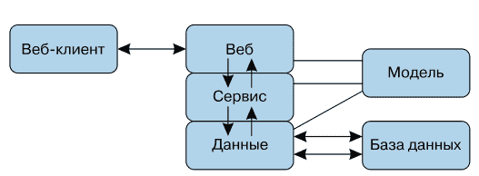

各层通过 API 相互交互。这可以是调用 Python 各模块的简单函数，也可以通过任何方式调用外部代码。正如我之前所示，可以是 RPC、消息等。在本书中，我假设有一个 Web 服务器，其中的 Python 代码导入其他 Python 模块。信息的分离和隐藏由模块完成。

用户通过客户端应用程序和 API 看到 **Web 层**。通常我们讨论的是带有 URL、请求和 JSON 格式响应的 RESTful Web 接口。但除了 Web 层，还可以创建替代的文本客户端或命令行界面（Command-Line Interface, CLI）。Python Web 代码可以导入服务层模块，但不应导入数据层模块。

*服务层*包含该网站实际提供的数据。本质上，这一层类似于*库*。它导入数据层模块以访问数据库和外部服务，但不应从它们那里获取详细信息。

*数据层*通过文件或调用其他服务的客户端，为服务层提供数据访问。也可能存在与同一服务层交互的替代数据层。

模型层（*model box*）并非真正的层级，而是各层共享的数据定义来源。如果在各层之间传递 Python 内置数据结构，则不需要它。稍后您会看到，在 FastAPI 中包含 Pydantic 库可以定义具有许多有用功能的数据结构。

为什么要进行这样的划分？出于多种原因，每一层都可以：

- 由专业人员编写；
- 独立测试；
- 替换或扩展——您可以在现有 Web 层之外，添加使用其他 API（例如 gRPC）的第二个 Web 层。

请遵循电影《捉鬼敢死队》中的一条规则——不要交叉光束。也就是说，不要让网站的部分内容泄露到 Web 层之外，也不要让数据库的细节泄露到数据层之外。

您可以将层级想象成垂直堆叠的蛋糕，就像《英国最佳烘焙师》¹节目中的蛋糕一样。


以下是划分层级的一些原因。

- 如果您不划分层级，那么请准备好成为一个广为流传的网络梗：“现在你有两个问题了。”
- 如果层级混在一起，之后再想分开将会非常困难。
- 如果代码逻辑混乱，您将需要两个或更多专业知识才能理解和编写测试。

顺便说一句，虽然我称它们为*层级*，但不要认为其中一个高于或低于另一个，也不要认为指令是靠重力移动的。这将是垂直沙文主义的表现！您可以将层级视为并排站立的模块（图 1.2）。

无论您如何想象，模块/层级之间*唯一*的通信路径是箭头（API）。这对于测试和调试非常重要。如果工厂里有未知的门，夜班警卫难免会感到惊讶。

> ¹ 众所周知，如果您蛋糕的层次堆叠得不整齐，您可能下周就回不了帐篷了。

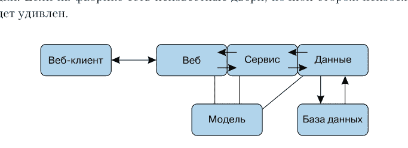

Web 客户端和 Web 层之间的箭头使用 HTTP 或 HTTPS 协议传输文本，主要是 JSON 格式。数据层和数据库之间的箭头使用数据库专用协议，以 SQL 或其他格式传输文本。各层之间的箭头是传输数据模型的函数调用。

此外，通过箭头传递的数据推荐格式如下：

- 客户端 ⇔ Web 层 —— 使用 JSON 的 RESTful HTTP；
- Web 层 ⇔ 服务层 —— 模型；
- 服务层 ⇔ 数据层 —— 模型；
- 数据层 ⇔ 数据库和服务 —— 专用 API。

基于我自己的经验，我为本书选择了这样的主题结构。它相当实用，适用于相当复杂的网站，但并非唯一正确的选择。您可以设计出更好的方案！无论您如何选择，请注意以下关键点。

- 分离领域特有的细节。
- 定义各层之间的标准 API。
- 不要欺骗，不要泄露。

有时，确定代码最适合放在哪个层级并不容易。例如，第 11 章讨论了身份验证和授权的要求及其实施方式——作为 Web 层和服务层之间的额外层级，或位于其中一个层级内部。软件开发有时不仅是艺术，也是科学。

## 数据

Web 层通常用作关系型数据库的前端，尽管目前出现了许多其他数据存储和访问方式，例如 NoSQL 或 NewSQL 类型的数据库。

除了数据库，机器学习（Machine Learning, ML）、深度学习或简称为人工智能（AI）也极大地改变了技术格局。开发大型模型需要大量的数据处理工作，传统上称为提取、转换、加载（Extract, Transform, Load, ETL）。

作为一种通用的服务架构，Web 可以帮助解决与 ML 系统相关的许多复杂问题。

# 结论

万维网上使用了许多 API，但基于 RESTful 的交互尤其多。异步调用提供了更好的并发性，从而加快了整体执行过程。Web 服务应用程序通常足够大，可以将其划分为多个层级。数据已成为一个独立的重要领域。所有这些概念都在 Python 编程语言中讨论。这将是下一章的主题。

## 第 2 章

## 现代 Python

> 这是“惊奇猫”的一个普通工作日。
> *蒙提·派森*

### 概述

Python 不断发展，以适应不断变化的技术世界。本章讨论了与上一章所述问题相关的 Python 特定功能，以及一些额外内容：

- 工具；
- API 和服务；
- 变量和类型提示；
- 数据结构；
- Web 框架。

## 工具

每种编程语言都有以下要素：

- 主要语言和内置标准包；
- 添加第三方包的方式；
- 推荐的第三方包；
- 开发工具环境。

在接下来的章节中，列出了与本书一起工作所必需或推荐的 Python 工具。

它们可能会随时间而改变！Python 的打包和开发工具是不断发展的目标，更完善的解决方案会不时出现。

## 开始工作

你应该能够编写并运行一个类似于示例 2.1 的 Python 程序。

**示例 2.1. Python 程序：this.py**

```
def paid_promotion():
    print("(that calls this function!)")

print("This is the program")
paid_promotion()
print("that goes like this.")
```

为了在文本窗口或终端的命令行中运行这个程序，我将使用 *提示符* $（你的系统在恳求你快点输入点什么）。你在提示符后输入的内容会以 **粗体** 显示。如果你将示例 2.1 保存为文件 **this.py**，就可以如示例 2.2 所示运行它。

**示例 2.2. 测试 this.py 文件**

```
$ python this.py
This is the program
(that calls this function!)
that goes like this.
```

一些代码示例使用了 Python 的交互式解释器。只需输入单词 python 即可访问它：

```
$ python
Python 3.9.1 (v3.9.1:1e5d33e9b9, Dec  7 2020, 12:10:52)
[Clang 6.0 (clang-600.0.57)] on darwin
Type "help", "copyright", "credits" or "license" for more information.
>>>
```

前几行取决于你的操作系统和 Python 版本。符号 >>> 表示输入命令的提示。交互式解释器的一个便捷附加功能是，如果你输入变量名，它会输出该变量的值：

```
>>> wrong_answer = 43
>>> wrong_answer
43
```

这对表达式也有效：

```
>>> wrong_answer = 43
>>> wrong_answer - 3
40
```

如果你最近才接触 Python，或者想快速回顾一下，请阅读接下来的几个小节。

## Python 本身

你至少需要 Python 3.7。它具有类型提示和 asyncio 模块等功能，这些是 FastAPI 的基本要求。我建议至少使用 Python 3.9，因为它有更长的支持周期。获取 Python 的标准来源是 Python 软件基金会 (https://www.python.org)。

## 包管理

你需要下载第三方 Python 包并将其安全地安装到你的计算机上。经典的工具是 pip 系统 (https://pip.pypa.io)。

但是如何下载这个下载器呢？如果你安装的是来自 Python 软件基金会的 Python，那么你应该已经有 pip 了。如果没有，请按照 pip 网站上的说明获取它。在整本书中，当我介绍一个新的 Python 包时，我也会指出用于下载它的 pip 命令。

你可以用经典好用的 pip 做很多事情，但你可能还想使用虚拟环境，并考虑使用 Poetry 等替代工具。

## 虚拟环境

Pip 会下载并安装包，但它应该把它们放在哪里呢？虽然标准 Python 及其附带的库通常安装在操作系统的标准位置，但你无法（而且很可能不应该）在那里进行任何更改。Pip 使用一个与系统不同的默认目录，因此安装不会影响系统中的标准 Python 文件。这是可以更改的。有关你的操作系统的详细信息，请参阅 pip 网站。

通常需要处理多个 Python 版本或为特定项目安装版本，因此你肯定想知道系统中有哪些包。为此，Python 支持 *虚拟环境*。这些只是目录（在非 Unix 世界中是 *文件夹*），pip 将下载的包写入其中。当你 *激活* 一个虚拟环境时，你的 shell（主要系统命令的解释器）在加载 Python 模块时会首先查找它。这通过 venv 程序 ([https://oreil.ly/9kv5T](https://oreil.ly/9kv5T)) 实现，该程序从 Python 3.4 版本开始就包含在标准安装包中。

让我们创建一个名为 venv1 的虚拟环境。你可以将 venv 模块作为独立程序运行：

```
$ venv venv1
```

或者作为 Python 模块运行：

```
$ python -m venv venv1
```

要使其成为你当前的 Python 环境，请执行此 shell 命令（在 Linux 或 Mac 上，对于 Windows 和其他操作系统，请参阅 venv 文档）：

```
$ source venv1/bin/activate
```

现在，每次你运行 pip install 时，包都会安装到 venv1 环境中。当你运行 Python 程序时，你的 Python 解释器和模块就在那里。

要停用虚拟环境，请按 Control+D 组合键（对于 Linux 或 Mac）或输入 deactivate 命令（对于 Windows）。

你可以创建替代的开发环境，例如 venv2，并停用/激活它们以在它们之间切换（尽管我希望你在命名方面比我更有想象力）。

## Poetry 工具

pip 和 venv 的组合非常普遍，以至于人们开始将它们结合起来以减少工作步骤并避免 shell 的 *source* 技巧。其中一个这样的包是 Pipenv (https://pipenv.pypa.io)，但一个名为 Poetry (https://python-poetry.org) 的更新的竞争对手正变得越来越受欢迎。

我使用过 pip、Pipenv 和 Poetry，但现在更喜欢 Poetry。可以通过命令 `pip install poetry` 安装它。Poetry 有许多额外的命令，例如 `poetry add` 用于将包添加到虚拟环境，`poetry install` 用于下载和安装工具等。请查看 Poetry 网站或运行命令 `poetry` 以打开帮助部分。

除了下载单个包之外，pip 和 Poetry 还在配置文件中管理多个包——pip 使用 `requirements.txt`，Poetry 使用 `pyproject.toml`。Poetry 和 pip 不仅下载包，还管理包之间可能存在的复杂依赖关系。你可以将所需的包版本指定为最小值、最大值、范围或精确值，这也称为 *pinning* 或 *固定*。随着项目的增长和其依赖包的变化，这个问题可能变得重要。如果使用的功能是首次出现在某个包中，则可能需要该包的最小版本，或者如果该功能已被弃用，则可能需要最大版本。

## 源代码格式化

源代码格式化不如前面章节的主题重要，但仍然很有用。使用将源代码转换为标准、非奇怪格式的工具，可以避免关于代码格式化的争论（*bikeshedding*）。一个好的选择是 Black 包 (https://black.readthedocs.io)。可以通过命令 `pip install black` 安装它。

## 测试

测试在第 12 章中有详细介绍。虽然 Python 的标准测试包是 unittest，但大多数 Python 开发人员使用的工业级 Python 测试包是 pytest (https://docs.pytest.org)。可以通过命令 `pip install pytest` 安装它。

## 源代码控制和持续集成

现在几乎通用的源代码控制解决方案是 *Git*，其仓库（repositories）托管在 GitHub 和 GitLab 等网站上。使用 *Git* 不能被认为是 Python 或 FastAPI 特有的，但你很可能会在开发过程中大部分时间都使用它。*pre-commit* 工具 (https://pre-commit.com) 在你执行 *Git* 提交之前，在你的本地机器上运行各种测试，例如 *black* 和 *pytest*。在将代码放入远程 *Git* 仓库后，可以在那里运行更多的持续集成 (Continuous Integration, CI) 测试。

更详细的信息包含在第 12 章和第 13 章的“故障排除”部分。

## Web 工具

第 3 章展示了如何安装和应用本书中使用的主要 Python Web 工具：

- *FastAPI* — Web 框架本身；
- *Uvicorn* — 异步 Web 服务器；
- *HTTPie* — 类似于 *curl* 的文本 Web 客户端；
- *Requests* — 同步 Web 客户端包；
- *HTTPX* — 同步/异步 Web 客户端包。

## API 和服务

Python 模块和包对于创建不会变成“一团糟”(https://oreil.ly/zzX5T) 的大型应用程序是必需的。即使在单进程 Web 服务中，也可以通过仔细设计模块和导入来保持第 1 章中描述的分离。

Python 的内置数据结构非常灵活，到处使用它们非常诱人。但在接下来的章节中，你将看到可以定义更高级别的模型，以使跨层交互更清晰。这些模型依赖于 Python 的一个相对较新的补充，称为 *类型提示* (type hinting)。让我们来解决这个问题，但首先简要介绍一下 Python 如何 *处理变量*。这不会妨碍你。

## 变量即名称

术语“对象”在软件世界中获得了众多定义，可能甚至太多了。在Python中，*对象*是一种数据结构，用于将程序中每个独立的数据片段打包起来，从整数5到函数，以及你能定义的任何东西。除了其他报告信息外，它还指定了：

- 唯一的*标识*值；
- 对应于硬件的底层*类型*；
- 具体的*值*（物理比特）；
- 引用它的变量数量的*计数*。

Python在对象层面是*强类型*的（对象的类型不会改变，尽管其值可以改变）。如果一个对象的值可以被修改，则称其为*可变的*；如果不能，则称为*不可变的*。

在*变量*层面，Python与许多其他计算语言不同，这可能会让人困惑。在许多其他语言中，*变量*本质上是一个直接指向内存区域的指针，该区域包含存储在与计算机硬件设计相对应的比特中的原始*值*。如果你为这个变量赋予一个新值，语言会用新值覆盖内存中的旧值。

这是一个直接且快速的解决方案。编译器会跟踪什么被写入到哪里。这是像C这样的语言比Python更快的原因之一。作为开发者，你需要确保为每个变量只赋正确类型的值。

而Python在这里有一个显著的不同——变量仅仅是一个*名称*，临时与内存中一个更高级别的*对象*相关联。如果你为一个引用不可变对象的变量赋予新值，那么实际上你创建了一个包含该值的新对象，然后获得一个名称来引用这个新对象。旧对象（之前被该名称引用的）被释放，如果没有其他名称引用它，即引用计数为0，其内存就可以被回收。

在《流畅的Python》¹一书中，我将对象比作放在内存架子上的塑料盒，而名称/变量则是这些盒子上的贴纸。或者你可以将名称想象成用细绳系在这些盒子上的标签。

> ¹ 卢巴诺维奇 B. 《流畅的Python》. 现代编程风格. 第2版. — 圣彼得堡: 皮特出版社, 2021.

通常，当你使用一个名称时，你会将其分配给一个对象，并且它会一直保留给该对象。这种简单的顺序有助于理解你的代码。变量的*作用域*是代码中名称引用同一个对象的区域，例如，在函数内部。你可以在不同的作用域中使用相同的名称，但每个名称将引用不同的对象。

你可以让一个变量在Python程序中引用不同的对象，但这并不总是好的。不查看代码，你无法知道第100行的名称x是否与第20行的名称x在同一个作用域中。（顺便说一句，x是一个糟糕的变量名选择。应该选择真正有意义的名称。）

## 类型提示

所有这些背景都有其意义。

在Python 3.6中，添加了*类型提示*（type hints）来声明变量引用的对象类型。它们在Python解释器运行时不会被执行！相反，它们可以被各种工具用来确保变量的一致使用。标准的类型检查程序叫做*mypy*，稍后我会向你展示它是如何工作的。

类型提示可能看起来只是一个不错的功能，就像许多帮助程序员避免错误的lint工具一样。例如，它可能会提醒你，你的变量count引用了一个Python的int类型对象。但是，尽管类型提示是额外的功能并且是可选的注释（字面上是暗示），它们却出人意料地有用。在本书的后面部分，你将看到FastAPI如何调整Pydantic包以巧妙地使用类型提示。

添加类型声明可能成为其他以前没有类型的语言的趋势。例如，许多JavaScript开发者已经转向了TypeScript (https://www.typescriptlang.org)。

## 数据结构

关于Python和数据结构的更多内容，你将在第5章中了解。

## Web框架

除了其他功能外，Web框架实现了HTTP字节码和Python数据结构之间的转换。这将节省大量精力。同时，如果它的部分功能不符合你的需求，你可能需要破解解决方案。正如俗话所说，不要重新发明轮子——除非你找不到圆形的。

Web Server Gateway Interface (WSGI) (https://wsgi.readthedocs.io) 是一个同步标准规范 (https://peps.python.org/pep-3333)，用于将Python应用程序代码连接到Web服务器。所有传统的Python Web框架都建立在WSGI之上。但同步交互可能意味着你正忙于等待比处理器慢得多的东西，例如磁盘或网络请求。那么你将寻求更好的*并发性*。近年来，它变得越来越重要。因此，为Python开发了Asynchronous Server Gateway Interface (ASGI) (https://asgi.readthedocs.io) 规范。这将在第4章中讨论。

## Django

Django (https://www.djangoproject.com) 是一个全功能的Web框架，自称为“为有紧迫期限的完美主义者设计的Web框架”。它由Adrian Holovaty和Simon Willison于2003年发布，并以20世纪比利时爵士吉他手Django Reinhardt的名字命名。Django通常用于带有数据库的企业网站。更详细的描述见第7章。

## Flask

Flask (https://flask.palletsprojects.com) 由Armin Ronacher于2010年推出，是一个微框架。在第7章中，你将找到关于它的更多信息，以及它与Django和FastAPI的比较。

# FastAPI

在舞会上遇到其他追求者后，我们终于遇到了引人入胜的FastAPI，这正是本书将要讨论的主题。尽管FastAPI由Sebastián Ramírez于2018年发布，但它已经跃升至Python Web框架的第三位，仅次于Flask和Django，并且发展速度越来越快。2022年的一项比较 (https://oreil.ly/36WTQ) 显示，在某个时刻它可能会超越竞争对手。


以下是截至2023年10月底GitHub上的星标数量数据：

- Django — 73.8千；
- Flask — 64.8千；
- FastAPI — 64千。

在仔细研究了替代方案 (https://oreil.ly/JDDOm) 之后，Ramírez设计了一个主要基于两个第三方Python包的架构 (https://oreil.ly/zJFTX)：

- *Starlette* — 用于获取有关网页的详细信息；
- *Pydantic* — 用于获取有关数据的详细信息。

然后他在成品中添加了自己的配料和特殊酱汁。在下一章中，你将清楚这是什么意思。

# 结论

本章讨论了许多与现代Python相关的问题：

- 对Python Web开发者有用的工具；
- API和服务的重要性；
- Python中的类型提示、对象和变量；
- 用于Web服务的数据结构；
- Web框架。

## 第二部分

## FastAPI概览

本部分的章节从鸟瞰的角度介绍了FastAPI，但更像是无人机的视角，而不是间谍卫星的视角。它们简要介绍了基础知识，但描述没有深入到水线以下，以免让你淹没在细节中。这些章节相对较短，旨在为本书第三部分的深入学习提供背景。

在你熟悉了本部分阐述的理念之后，在第三部分你将能够更详细地研究它们。正是在这里，你可以为你的知识带来真正的益处或损害。不要评判，一切都取决于你。

## 第3章

## FastAPI 概览

> FastAPI 是一个现代、快速（高性能）的 Web 框架，用于在 Python 3.6+ 上构建 API，基于标准的 Python 类型提示。

*FastAPI 的创建者，塞巴斯蒂安·拉米雷斯*

## 概览

FastAPI (https://fastapi.tiangolo.com) 由塞巴斯蒂安·拉米雷斯 (https://tiangolo.com) 于 2018 年推出。在许多方面，它比大多数 Python Web 框架更现代，并利用了过去几年中添加到 Python 3 的功能。本章简要概述了 FastAPI 的主要功能，重点放在您关心的第一个问题上：如何处理 Web 请求和响应？

## 什么是 FastAPI

与任何其他 Web 框架一样，FastAPI 有助于创建 Web 应用程序。每个框架都旨在通过其特性、假设和默认设置来简化某些操作的执行。顾名思义，FastAPI 旨在开发 API Web 接口，尽管它也可以用于传统的 Web 内容应用程序。

FastAPI 网站上列出了其以下优势：

- *高性能* — 在某些情况下，它的运行速度与 Node.js 和 Go 一样快，这对于 Python 框架来说是不寻常的；
- *加速开发过程* — 没有死角或怪异之处；
- *提高代码质量* — 类型提示和模型有助于减少错误数量；
- *自动生成的文档和测试页面* — 这比手动编辑 OpenAPI 描述要简单得多。

FastAPI 使用了：

- Python 类型提示；
- Starlette 包用于 Web 机器，包括异步支持；
- Pydantic 包用于定义和验证数据；
- 允许使用和扩展其他框架功能的特殊集成。

这种组合为开发 Web 应用程序，特别是 RESTful Web 服务创造了愉快的环境。

## FastAPI 应用程序

让我们编写一个小型 FastAPI 应用程序 — 一个具有单个端点的 Web 服务。目前，我们将工作在所谓的 Web 层，其中只处理 Web 请求和响应。首先安装主要的必需 Python 包：

- FastAPI 框架 (https://fastapi.tiangolo.com) — pip install fastapi；
- Uvicorn Web 服务器 (https://www.uvicorn.org) — pip install uvicorn；
- 文本 Web 客户端 HTTPie (https://httpie.io) — pip install httpie；
- 同步 Web 客户端 Requests 包 (https://requests.readthedocs.io) — pip install requests；
- 同步/异步 Web 客户端 HTTPX 包 (https://www.python-httpx.org) — pip install httpx。

虽然 curl (https://curl.se) 是最著名的文本 Web 客户端，但我认为 HTTPie 更易于使用。此外，它默认使用 JSON 编码和解码，这更适合 FastAPI。在本章后面，您将看到一个屏幕截图，其中包含访问特定端点所需的 curl 命令行语法。

在示例 3.1 中，我们将扮演一个内向的 Web 开发人员的角色，并将此代码保存在 hello.py 文件中。

### 示例 3.1. 羞怯的端点 (hello.py)

```python
from fastapi import FastAPI

app = FastAPI()

@app.get("/hi")
def greet():
    return "Hello? World?"
```

需要注意以下几点。

- app 是一个顶层的 FastAPI 对象，代表整个 Web 应用程序。
- @app.get("/hi") 是一个路径装饰器。它告诉 FastAPI 以下内容：
    - 对此服务器上 URL 地址 "/hi" 的请求应路由到下一个函数；
    - 此装饰器仅适用于 HTTP 动词 GET。也可以响应使用其他 HTTP 动词（PUT、POST 等）发送的 "/hi" URL 请求，每个动词都有单独的函数。
- def greet() 是一个路径函数 — 与 HTTP 请求和响应的主要接触点。在这个例子中，它没有参数，但接下来的部分将展示 FastAPI 内部隐藏着更多内容。

下一步是在 Web 服务器上启动此 Web 应用程序。FastAPI 本身不包含 Web 服务器，但建议使用 Uvicorn。可以通过两种方式启动 Uvicorn 和 FastAPI Web 应用程序 — 从外部或从内部。

要从外部通过命令行启动 Uvicorn，请参见示例 3.2。

### 示例 3.2. 使用命令行启动 Uvicorn

```bash
$ uvicorn hello:app --reload
```

单词 hello 引用了 hello.py 文件，而单词 app 是该文件中 FastAPI 变量的名称。

此外，您可以在应用程序内部启动 Uvicorn，如示例 3.3 所示。

### 示例 3.3. 在应用程序内部启动 Uvicorn

```python
from fastapi import FastAPI

app = FastAPI()

@app.get("/hi")
def greet():
    return "Hello? World?"

if __name__ == "__main__":
    import uvicorn
    uvicorn.run("hello:app", reload=True)
```

在任何情况下，reload 参数都指示 Uvicorn 在 hello.py 文件的内容发生变化时重新启动 Web 服务器。在本章中，我们将经常使用自动重新加载。

默认情况下，将使用您机器上名为 localhost 的端口 8000。外部和内部方法都有 host 和 port 参数，但您可能更喜欢其他设置。

现在服务器有一个端点 (/hi)，并准备好接收请求。让我们用几个 Web 客户端来测试它。

- 在浏览器中，在窗口顶部的地址栏中输入 URL。
- 对于文本 Web 客户端 HTTPie，输入示例 3.7 中所示的命令（符号 $ 表示您系统 shell 中使用的命令行）。
- 对于 Requests 或 HTTPX，在交互模式下使用 Python 并在 >>> 后输入文本。

正如前言中所写，您输入的内容以 **粗体等宽字体** 突出显示，输出以普通等宽字体格式呈现。

示例 3.4–3.7 展示了测试 Web 服务器新端点 /hi 的不同方式。

**示例 3.4.** 在浏览器中检查 /hi
http://localhost:8000/hi

**示例 3.5.** 使用 Requests 检查 /hi

```python
>>> import requests
>>> r = requests.get("http://localhost:8000/hi")
>>> r.json()
'Hello? World?'
```

**示例 3.6.** 使用 HTTPX 检查 /hi，与使用 Requests 几乎相同

```python
>>> import httpx
>>> r = httpx.get("http://localhost:8000/hi")
>>> r.json()
'Hello? World?'
```

> 无论您使用 Requests 还是 HTTPX 来测试 FastAPI 路由，这并不重要。但在第 13 章中展示了在执行其他异步调用时 HTTPX 很有用的情况。因此，本章中的其余示例将使用 Requests。

**示例 3.7.** 使用 HTTPie 检查 /hi

```bash
$ http localhost:8000/hi
HTTP/1.1 200 OK
content-length: 15
content-type: application/json
date: Thu, 30 Jun 2022 07:38:27 GMT
server: uvicorn

"Hello? World?"
```

在示例 3.8 中，使用 -b 参数跳过响应头，仅输出请求体。

### 示例 3.8. 使用 HTTPie 检查 /hi，仅输出响应体

```bash
$ http -b localhost:8000/hi
"Hello? World?"
```

示例 3.9 允许使用 -v 参数获取完整的请求头以及响应。

### 示例 3.9. 使用 HTTPie 检查 /hi，获取所有数据

```bash
$ http -v localhost:8000/hi
GET /hi HTTP/1.1
Accept: /
Accept-Encoding: gzip, deflate
Connection: keep-alive
Host: localhost:8000
User-Agent: HTTPie/3.2.1

HTTP/1.1 200 OK
content-length: 15
content-type: application/json
date: Thu, 30 Jun 2022 08:05:06 GMT
server: uvicorn

"Hello? World?"
```

书中提供的一些示例展示了 HTTPie 的标准输出（响应头和正文），而另一些则仅展示正文。

## HTTP 请求

示例 3.9 仅包含一个特定的请求：对服务器 localhost 端口 8000 上 URL /hi 的 GET 请求。

Web 请求“穿梭”于 HTTP 请求的不同部分，而 FastAPI 允许您无障碍地访问它们。示例 3.10 展示了示例 3.9 中请求示例的 HTTP 请求，该请求通过 http 命令发送到 Web 服务器。

### 示例 3.10. HTTP 请求

```
GET /hi HTTP/1.1
Accept: /
Accept-Encoding: gzip, deflate
```

Connection: keep-alive
Host: localhost:8000
User-Agent: HTTPie/3.2.1

此请求包含：

- 操作动词（GET）和路径（/hi）；
- 所有*请求参数*（?符号后的文本，此处不存在）；
- 其他HTTP头信息；
- 请求体内容（不存在）。

FastAPI会将其分解为以下便捷定义：

- Header — HTTP头信息；
- Path — URL地址；
- Query — 请求参数（URL末尾?符号后的部分）；
- Body — HTTP消息体。


FastAPI从HTTP请求的不同部分提供数据的方式，是其最优秀的特性之一，也是相较于大多数Python Web框架的改进。所有必要的参数都可以直接在路径函数内部声明和提供，使用上文列表中的定义（Path、Query等），以及您编写的函数。为此，采用了一种称为依赖注入的技术。我们将在后续章节中探讨此技术，并在第6章扩展相关描述。

让我们通过添加一个`who`参数来使之前的应用更具个性化，以解决“Hello?”这个重要问题。尝试以下几种传递此新参数的方式：

- 在URL的*路径*中；
- 作为URL中?符号后的*请求参数*；
- 在HTTP消息的*正文*中；
- 在HTTP头信息中。

## URL路径

编辑示例3.11中的`hello.py`文件。

**示例3.11.** 返回问候路径

```
from fastapi import FastAPI

app = FastAPI()

@app.get("/hi/{who}")
def greet(who):
    return f"Hello? {who}?"
```

一旦您在编辑器中保存更改，Uvicorn应该会自动重启。（否则，我们将不得不创建`hello2.py`等文件，并每次重新启动Uvicorn。）如果您输入有误，请继续尝试输入代码，直到修正错误，Uvicorn才会正常工作。

在URL地址中添加`{who}`一词（在`@app.get`表达式之后）会指示FastAPI在URL的指定位置提取名为`who`的变量。然后，FastAPI将其赋值给后续`greet()`函数的`who`参数。这展示了路径装饰器与路径函数之间的协调。

> 此处不应使用Python的f字符串来修改URL字符串（"/hi/{who}"）。花括号由FastAPI本身用于将URL部分匹配为路径参数。

在示例3.12至3.14中，使用之前讨论的不同方法测试此改进后的端点。

**示例3.12.** 在浏览器中测试/hi/Mom

```
localhost:8000/hi/Mom
```

**示例3.13.** 使用HTTPie测试/hi/Mom

```
$ http localhost:8000/hi/Mom
HTTP/1.1 200 OK
content-length: 13
content-type: application/json
date: Thu, 30 Jun 2022 08:09:02 GMT
server: uvicorn

"Hello? Mom?"
```

**示例3.14.** 使用Requests测试/hi/Mom

```
>>> import requests
>>> r = requests.get("http://localhost:8000/hi/Mom")
>>> r.json()
'Hello? Mom?'
```

在所有情况下，作为URL一部分发送的字符串"Mom"都会作为变量`who`传递给路径函数`greet()`，并作为响应的一部分返回。每次响应都是JSON字符串"Hello? Mom?"（根据您使用的测试客户端，可能使用单引号或双引号）。

## 请求参数

请求参数是URL地址中?符号后的`name=value`字符串，用&符号分隔。编辑示例3.15中的`hello.py`文件。

**示例3.15.** 返回问候的请求参数

```
from fastapi import FastAPI

app = FastAPI()

@app.get("/hi")
def greet(who):
    return f"Hello? {who}?"
```

端点函数再次被定义为`greet(who)`，但这次URL地址中（在上一行装饰器中）没有`{who}`表达式，因此FastAPI假定`who`一词是一个请求参数。在示例3.16和3.17中测试代码。

**示例3.16.** 使用浏览器测试示例3.15

```
localhost:8000/hi?who=Mom
```

**示例3.17.** 使用HTTPie测试示例3.15

```
$ http -b localhost:8000/hi?who=Mom
"Hello? Mom?"
```

在示例3.18中，可以使用请求参数参数调用HTTPie（注意`==`运算符）。

**示例3.18.** 使用HTTPie和参数测试示例3.15

```
$ http -b localhost:8000/hi who==Mom
"Hello? Mom?"
```

您可以为HTTPie提供多个此类参数，并且通过空格分隔输入会更方便。

示例3.19和3.20展示了Web客户端Requests的相同替代方案。

**示例3.19.** 使用Requests测试示例3.15

```
>>> import requests
>>> r = requests.get("http://localhost:8000/hi?who=Mom")
>>> r.json()
'Hello? Mom?'
```

**示例3.20.** 使用Requests和参数测试示例3.15

```
>>> import requests
>>> params = {"who": "Mom"}
>>> r = requests.get("http://localhost:8000/hi", params=params)
>>> r.json()
'Hello? Mom?'
```

在所有情况下，您都以新的方式提供字符串"Mom"，将其传递给路径函数，并最终得到响应。

## 请求体

可以为GET端点提供路径或请求参数，但不能提供请求体中的值。在HTTP中，GET请求必须是幂等的。*幂等性*是一个计算术语，意思是“提出相同的问题——得到相同的答案”。HTTP GET请求应仅执行数据返回。请求体用于在创建（POST）或更新（PUT或PATCH）时向服务器发送数据。第9章展示了一种绕过此问题的方法。

因此，在示例3.21中，我们将端点从GET更改为POST。（从技术上讲，我们没有创建任何东西，所以POST方法并不完全合规，但如果RESTful的守护者们要起诉我们，那就欣赏一下他们宏伟的法庭大楼吧。）

**示例3.21.** 返回问候的请求体

```
from fastapi import FastAPI, Body

app = FastAPI()

@app.post("/hi")
def greet(who:str = Body(embed=True)):
    return f"Hello? {who}?"
```


需要`Body(embed=True)`表达式来告知FastAPI，这次我们从JSON格式的请求体中获取`who`的值。括号中的`embed`部分意味着响应应该看起来像`{"who": "Mom"}`，而不仅仅是`"Mom"`。

在示例3.22中，尝试使用HTTPie进行测试，使用`-v`参数显示生成的请求体（注意用于指定JSON格式数据的单个`=`参数）。

**示例3.22.** 使用HTTPie测试示例3.21

```
$ http -v localhost:8000/hi who=Mom
POST /hi HTTP/1.1
Accept: application/json, */*;q=0.5
Accept-Encoding: gzip, deflate
Connection: keep-alive
Content-Length: 14
Content-Type: application/json
Host: localhost:8000
User-Agent: HTTPie/3.2.1
{
    "who": "Mom"
}

HTTP/1.1 200 OK
content-length: 13
content-type: application/json
date: Thu, 30 Jun 2022 08:37:00 GMT
server: uvicorn

"Hello? Mom?"
```

最后，在示例3.23中使用Requests进行测试，它使用自己的`json`参数在请求体中传递JSON编码的数据。

**示例3.23.** 使用Requests测试示例3.21

```
>>> import requests
>>> r = requests.post("http://localhost:8000/hi", json={"who": "Mom"})
>>> r.json()
'Hello? Mom?'
```

## HTTP头信息

最后，在示例3.24中，尝试将问候参数作为HTTP头信息传递。

**示例3.24.** 返回问候的头信息

```
from fastapi import FastAPI, Header

app = FastAPI()

@app.post("/hi")
def greet(who:str = Header()):
    return f"Hello? {who}?"
```

在示例3.25中使用HTTPie进行测试。使用`name:value`表达式定义HTTP头信息。

**示例3.25.** 使用HTTPie测试示例3.24

```
$ http -v localhost:8000/hi who:Mom
GET /hi HTTP/1.1
Accept: */*
Accept-Encoding: gzip, deflate
Connection: keep-alive
Host: localhost:8000
User-Agent: HTTPie/3.2.1
who: Mom

HTTP/1.1 200 OK
content-length: 13
content-type: application/json
date: Mon, 16 Jan 2023 05:14:46 GMT
server: uvicorn

"Hello? Mom?"
```

FastAPI将HTTP头信息的键转换为小写，并将连字符（-）转换为下划线（_）。因此，您可以输出HTTP User-Agent头信息的值，如示例3.26和3.27所示。

## 示例 3.26. 返回 User-Agent 头信息 (hello.py)

```python
from fastapi import FastAPI, Header

app = FastAPI()

@app.post("/agent")
def get_agent(user_agent:str = Header()):
    return user_agent
```

## 示例 3.27. 使用 HTTPie 返回 User-Agent 头信息

```bash
$ http -v localhost:8000/agent
GET /agent HTTP/1.1
Accept: */*
Accept-Encoding: gzip, deflate
Connection: keep-alive
Host: localhost:8000
User-Agent: HTTPie/3.2.1

HTTP/1.1 200 OK
content-length: 14
content-type: application/json
date: Mon, 16 Jan 2023 05:21:35 GMT
server: uvicorn

"HTTPie/3.2.1"
```

## 多请求数据

在一个路径函数中，可以使用多个上述方法。也就是说，你可以从 URL、查询参数、HTTP 请求体、HTTP 头信息、cookie 文件等处获取数据。你可以编写自己的依赖函数，以特定方式处理和组合它们，例如用于分页或身份验证。其中一些内容你将在第 6 章和第三部分的各章中看到。

## 哪种方法更好？

以下是一些可能有助于做出正确选择的建议。

- 在 URL 中传递参数时，遵循 RESTful 准则已成为标准做法。
- 查询字符串通常用于提供额外的参数，例如分页。
- 请求体通常用于处理大量输入数据，例如完整的或部分的模型。

在所有情况下，如果你在数据定义中提供了类型提示，你的参数将由 Pydantic 库自动验证。这确保了它们的存在性和正确性。

## HTTP 响应

默认情况下，FastAPI 会将你从端点函数返回的所有内容转换为 JSON 格式。HTTP 响应包含 `Content-type: application/json` 的头信息行。因此，尽管 `greet()` 函数最初返回的是字符串 "Hello? World?"，FastAPI 会将其转换为 JSON 格式。这是 FastAPI 为简化 API 开发而选择的默认设置之一。

在这种情况下，Python 字符串 "Hello? World?" 将被转换为其 JSON 格式的等效字符串 "Hello? World?"，它代表相同的字符串。但无论你返回什么，都会被转换为 JSON 格式，无论是 Python 的内置类型还是 Pydantic 模型。

## 状态码

默认情况下，FastAPI 返回状态码 200。异常会引发 4xx 系列的状态码。

在路径装饰器中，你需要指定成功时返回的 HTTP 状态码（异常将生成自己的状态码并覆盖此值）。将示例 3.28 中的代码添加到你的 `hello.py` 文件中的某个位置（以避免反复显示整个文件），并在示例 3.29 中进行测试。

**示例 3.28.** 指定 HTTP 状态码（添加到 hello.py 文件）

```python
@app.get("/happy")
def happy(status_code=200):
    return ":)"
```

**示例 3.29.** 指定 HTTP 状态码

```bash
$ http localhost:8000/happy
HTTP/1.1 200 OK
content-length: 4
content-type: application/json
date: Sun, 05 Feb 2023 04:37:32 GMT
server: uvicorn

":)"
```

## 头信息

可以设置 HTTP 响应头，如示例 3.30 所示（你不需要返回 `response` 对象）。

**示例 3.30.** 设置 HTTP 头信息（添加到 hello.py 文件）

```python
from fastapi import Response

@app.get("/header/{name}/{value}")
def header(name: str, value: str, response:Response):
    response.headers[name] = value
    return "normal body"
```

让我们看看是否成功（示例 3.31）。

**示例 3.31.** 检查 HTTP 响应头

```bash
$ http localhost:8000/header/marco/polo
HTTP/1.1 200 OK
content-length: 13
content-type: application/json
date: Wed, 31 May 2023 17:47:38 GMT
marco: polo
server: uvicorn

"normal body"
```

## 响应类型

响应类型（从 `fastapi.responses` 模块导入这些类）有以下几种：

- `JSONResponse`（默认）；
- `HTMLResponse`；
- `PlainTextResponse`；
- `RedirectResponse`；
- `FileResponse`；
- `StreamingResponse`。

关于最后两种，我将在第 15 章中详细介绍。

对于其他输出格式，也称为 *MIME 类型* 或 *媒体类型*，可以使用通用的 `Response` 类，它需要以下实体：

- `content` — 字符串或字节；
- `media_type` — MIME 类型字符串；
- `status_code` — 整数 HTTP 状态码；
- `headers` — 字符串字典（dict）。

## 类型转换

路径函数可以返回任何内容，默认情况下（使用 `JSONResponse`），FastAPI 会将其转换为 JSON 字符串，并返回带有相应 HTTP 响应头 `Content-Length` 和 `Content-Type` 的响应。这包括任何 Pydantic 模型类。

但这是如何实现的呢？如果你使用过 Python 的 JSON 库，你肯定见过它在提供某些数据类型（如 `datetime`）时会引发异常。FastAPI 使用内置函数 `jsonable_encoder()` 将任何数据结构转换为类似 JSON 的 Python 数据结构，然后调用普通的 `json.dumps()` 函数将该结构转换为 JSON 字符串。示例 3.32 展示了使用 pytest 框架执行的测试。

**示例 3.32.** 使用 `jsonable_encoder()` 函数避免 JSON 中的异常

```python
import datetime
import pytest
from fastapi.encoders import jsonable_encoder
import json

@pytest.fixture
def data():
    return datetime.datetime.now()

def test_json_dump(data):
    with pytest.raises(Exception):
        _ = json.dumps(data)

def test_encoder(data):
    out = jsonable_encoder(data)
    assert out
    json_out = json.dumps(out)
    assert json_out
```

## 模型类型和 response_model

程序中可能存在具有相同字段的不同类，但其中一个专门用于用户输入，另一个用于输出，第三个用于内部应用。出现这些变体的原因可能如下。

- 从输出数据中删除某些机密信息——例如，如果你遇到《健康保险流通与责任法案》（HIPAA）的要求，需要对个人医疗数据进行去标识化处理。
- 添加用于用户输入的字段，例如创建日期和时间。

示例 3.33 展示了针对非标准情况的三个相关类。

- `TagIn` 是一个定义用户应提供什么的类（在这种情况下，只是一个名为 `tag` 的字符串）。
- `Tag` 是从 `TagIn` 类创建的，并添加了两个字段：`created`（Tag 对象创建的时间）和 `secret`（一个内部字符串，可以存储在数据库中，但绝不应公开）。
- `TagOut` 是一个定义可以返回给用户的内容的类（特定或未定义搜索的端点）。它包含来自原始 `TagIn` 对象及其派生的 `Tag` 对象的 `tag` 字段，以及为 `Tag` 对象创建的 `created` 字段，但不包含 `secret` 字段。

**示例 3.33.** 模型变体 (model/tag.py)

```python
from datetime import datetime
from pydantic import BaseClass

class TagIn(BaseClass):
    tag: str

class Tag(BaseClass):
    tag: str
    created: datetime
    secret: str

class TagOut(BaseClass):
    tag: str
    created: datetime
```

从路径函数中，FastAPI 可以通过多种方式返回不同于标准 JSON 的数据类型。一种方法是在路径装饰器中使用 `response_model` 参数，以指定 FastAPI 返回其他内容。FastAPI 会丢弃返回对象中未在 `response_model` 参数指定的对象中定义的所有字段。

假设在示例 3.34 中，你编写了一个新的服务模块 `service/tag.py`，其中包含 `create()` 和 `get()` 函数，使此 Web 模块能够调用某些功能。这些底层细节在这里并不重要。重要的部分是底部的路径函数 `get_one()` 和路径装饰器中的表达式 `response_model=TagOut`。这会自动将内部 `Tag` 对象替换为清理后的 `TagOut` 对象。

**示例 3.34.** 使用 response_model 参数返回不同的响应类型 (web/tag.py)

```python
import datetime
from model.tag import TagIn, Tag, TagOut
import service.tag as service

@app.post('/')
def create(tag_in: TagIn) -> TagIn:
    tag: Tag = Tag(tag=tag_in.tag, created=datetime.utcnow(),
        secret="shhhh")
    service.create(tag)
    return tag_in

@app.get('/{tag_str}', response_model=TagOut)
def get_one(tag_str: str) -> TagOut:
    tag: Tag = service.get(tag_str)
    return tag
```

尽管我们返回了 `Tag` 对象，但 `response_model` 将其转换为 `TagOut`。

## 自动化文档

此处假设您正在使用示例 3.21 中的 Web 应用程序——即通过 POST 请求向 http://localhost:8000/hi 发送 `who` 参数的版本。

需要确保浏览器访问 URL **http://localhost:8000/docs**。

您将看到类似图 3.1 的界面（我裁剪了后续截图以突出特定区域）。

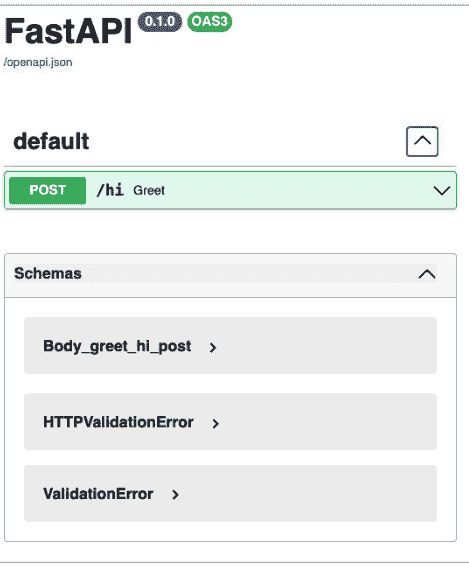

这是从何而来？

FastAPI 会从您的代码生成 OpenAPI 规范，并包含此页面以显示和测试所有端点。这仅仅是“秘密配方”的一个成分。

点击绿色字段右侧的向下箭头以展开测试（图 3.2）。


**图 3.2. 打开文档页面**

点击右侧的 Try it out（试一试）按钮。现在您将看到一个区域，允许在请求体部分输入值（图 3.3）。

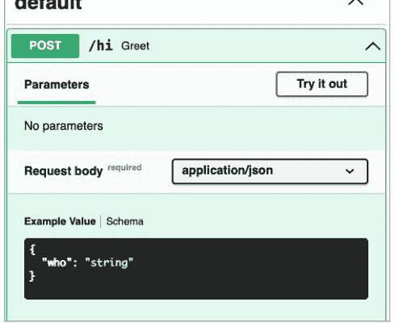

**图 3.3. 数据输入页面**

左键单击 "string" 标签。将其更改为 "**Cousin Eddie**"（表弟埃迪）（应包含在双引号中）。然后点击下方的蓝色 Execute（执行）按钮。

现在查看 Execute（执行）按钮下方的 Responses（响应）部分（图 3.4）。

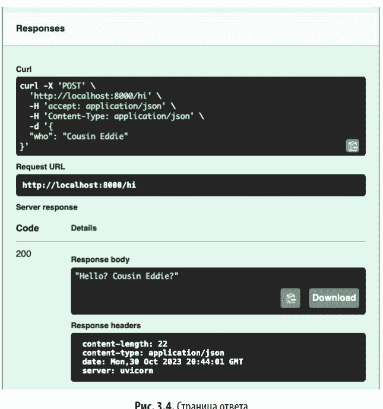

在 Response body（响应体）字段中显示表弟埃迪已出现。

此过程代表了测试网站的另一种方式（除了之前使用浏览器、HTTPie 和 Requests 的示例）。

顺便说一句，在 Responses（响应）窗口的 Curl 字段中可以看到，使用 curl 命令行工具进行测试比使用 HTTPie 需要更多输入。HTTPie 的自动 JSON 编码在此处会有所帮助。

这种自动化文档实际上是一个所谓的重大举措。当您的 Web 服务扩展到数百个端点时，拥有一个持续更新的文档和测试页面非常有用。

## 复杂数据

这些示例展示了如何向端点传递单个字符串。许多端点，特别是 GET 或 DELETE，可能有多个简单参数（如字符串和数字），或者根本没有参数。但在创建（POST）或修改（PUT 或 PATCH）资源时，我们通常需要更复杂的数据结构。第 5 章展示了 FastAPI 如何使用 Pydantic 库和数据模型来清晰地实现这一点。

# 结论

在本章中，我们使用 FastAPI 创建了一个具有单个端点的网站。通过多种 Web 客户端对其进行了测试：浏览器、文本程序 HTTPie、Python 的 Requests 包和 Python 的 HTTPX 包。从简单的 GET 调用开始，请求参数通过 URL 路径、查询参数和 HTTP 头传递到服务器。然后，HTTP 请求体用于向 POST 端点发送数据。随后展示了如何返回不同类型的 HTTP 响应。最后，自动生成的表单页面为第四个测试客户端提供了文档和可用的表单。

FastAPI 的此概述将在第 8 章中扩展。

# 第 4 章

## 异步、并发与 Starlette 库概述

> Starlette 是一个轻量级的 ASGI 框架/工具包，非常适合在 Python 中创建异步 Web 服务。
*Starlette 的创建者 Tom Christie*

### 概述

上一章简要介绍了开发人员在编写新的 FastAPI 应用程序时可能遇到的情况。本章专注于 FastAPI 的基础库 Starlette。特别是，我们将探讨使用它进行*异步*处理的能力。在概述了 Python 中同时处理更多任务的各种方式之后，您将了解 `async` 和 `await` 关键字是如何被纳入 Starlette 和 FastAPI 的。

## Starlette 库

FastAPI 的大部分 Web 代码基于 Tom Christie 创建的 Starlette 包 (https://www.starlette.io)。它可以作为独立的 Web 框架使用，也可以作为其他框架（如 FastAPI）的库。与任何其他 Web 框架一样，Starlette 执行所有常规的 HTTP 请求解析和响应生成操作。它类似于 Flask 底层的 Werkzeug 包 (https://werkzeug.palletsprojects.com)。

其最重要的特性是支持现代的 Python 异步 Web 标准——ASGI (https://asgi.readthedocs.io)。到目前为止，大多数 Python Web 框架（如 Flask 和 Django）都基于传统的同步标准 WSGI (https://wsgi.readthedocs.io)。ASGI 允许避免基于 WSGI 的应用程序中常见的阻塞和紧张等待。此类问题通常与 Web 应用程序频繁连接到慢得多的代码（例如访问数据库、文件和网络）有关。因此，Starlette 及其使用的框架成为 Python 中最快的 Web 包，甚至与 Go 和 Node.js 应用程序竞争。

## 并发类型

在深入了解 Starlette 和 FastAPI 提供的*异步*支持细节之前，了解实现*并发*的各种方式很有帮助。

在*并行*计算中，任务被分配给多个专用中央处理器（CPU）。此方法通常用于执行计算的应用程序，例如图形处理和机器学习任务。

在*并发*计算中，每个 CPU 在多个任务之间切换。某些任务流需要更多时间，因此需要缩短总执行时间。读取文件或访问远程网络服务的速度比 CPU 中的计算慢数千甚至数百万倍。

Web 应用程序执行大部分此类缓慢的工作。如何让它们或任何其他服务器运行得更快？本节探讨了一些可能性，从通用系统级到本章的主题——在 FastAPI 中为 Python 实现 `async` 和 `await` 结构。

## 分布式和并行计算

如果您的应用程序确实很大——大到在一个处理器上运行困难——您可以将其分解并指定它们在一台或多台机器上的单独处理器上运行。这可以通过多种方式实现，如果您有这样的应用程序，您已经知道其中一些。管理所有这些部分比管理单个服务器更复杂且更昂贵。

这里我们将主要关注部署在单台机器上的中小型应用程序。这些应用程序可能混合了同步和异步代码，使用 FastAPI 可以很好地管理它们。

## 操作系统中的进程

操作系统（或 OS，因为输入长单词很累）计划资源的使用：内存、处理器、设备、网络等。每个运行的程序在一个或多个*进程*中执行其代码。操作系统为每个进程提供受控、受保护的资源访问，包括 CPU 运行时间。

大多数系统使用*抢占式*进程调度，不允许任何进程占用处理器、内存或任何其他资源。操作系统根据其系统设计和设置不断暂停和恢复进程。

对开发人员来说好消息是：这不是您的问题！但坏消息（通常掩盖了好消息）是：即使您想，也无法做任何事情来改变这一点。

对于需要高处理器性能的 Python 应用程序，通常的解决方案是使用多个进程，这些进程交由操作系统管理。在 Python 中，为此存在多进程模块 ([https://oreil.ly/YO4YE](https://oreil.ly/YO4YE))。

## 操作系统中的线程

您还可以在单个进程内运行*线程*。在 Python 中，有用于处理此类任务的线程包 ([https://oreil.ly/xwVB1](https://oreil.ly/xwVB1))。

## 绿色线程

如果您的程序涉及输入输出操作，建议使用线程。而当程序执行受限于处理器环境时，则应使用多进程。但线程编程较为复杂，可能引发难以察觉的错误。在《Python入门》一书中，我曾将线程比作在鬼屋里游荡的幽灵——它们自由且无形，只能通过其影响来察觉。哎呀，是谁移动了这根蜡烛？

传统上，Python中基于进程的库和基于线程的库是分开的。开发者需要钻研所有细节和微妙之处才能使用它们。一个更现代的包名为`concurrent.futures`（https://oreil.ly/dT150），它提供了一个更高级别的接口，简化了它们的应用。

您很快会了解到，线程的优势更容易通过新的异步函数来获得。FastAPI也通过线程池管理普通同步函数（`def`，而非`async def`）的线程。

更神秘的机制体现在诸如`greenlet`（https://greenlet.readthedocs.io）、`gevent`（http://www.gevent.org）和`Eventlet`（https://eventlet.net）这样的绿色线程中。它们是协作式的（非抢占式）。绿色线程类似于操作系统线程，但在用户空间（即您的程序中）执行，而非在操作系统内核中。它们通过采用猴子补丁（在标准Python函数执行过程中修改它们）的方法应用于标准Python函数，使得并行代码看起来像普通的顺序代码——当它们因等待输入输出而阻塞时，会交出控制权。

操作系统线程比操作系统进程更轻量（占用更少内存），而绿色线程比操作系统线程更轻量。在一些基准测试（https://oreil.ly/1NFYb）中，所有异步方法总体上比其同步对应方法更快。


读完本章后，您可能会问：哪个库更好——`gevent`还是`asyncio`？我认为对于所有使用场景，并不存在统一的偏好意见。绿色线程是早期通过多人在线游戏《EVE Online》中的理念实现的。本书讲述的是在FastAPI中应用的Python标准`asyncio`。它比线程更简单，并能提供良好的性能。

## 回调

交互式应用程序（如游戏和图形用户界面）的开发者肯定熟悉*回调*。您编写函数并将其绑定到某个事件，例如鼠标点击、按键或时间。Python中此类别中杰出的包是Twisted（https://twisted.org）。它的名字表明，基于回调的程序有点“颠倒”，难以跟踪其执行流程。

## Python生成器

与大多数语言一样，Python通常顺序执行代码。当您调用函数时，Python会从第一行开始执行，直到结束或遇到`return`关键字。

但在Python的生成器函数中，您可以从任何点停止并返回，*并且稍后可以返回到该点*。诀窍在于`yield`关键字。

在动画片《辛普森一家》的一集中，荷马开车撞上了一尊鹿雕像，随后是三句对话。示例4.1定义了一个普通的Python函数，使用`return`关键字以列表形式返回这些行，并由调用方进行迭代。

**示例4.1.** 使用`return`关键字

```
>>> def doh():
...     return ["Homer: D'oh!", "Marge: A deer!", "Lisa: A female deer!"]
...
>>> for line in doh():
...     print(line)
...
Homer: D'oh!
Marge: A deer!
Lisa: A female deer!
```

当列表相对较小时，这种方法效果很好。但如果我们获取《辛普森一家》所有剧集的所有对话呢？列表会占用大量内存。

示例4.2展示了生成器函数如何逐行输出。

### 示例4.2. 使用`yield`关键字

```
>>> def doh2():
...     yield "Homer: D'oh!"
...     yield "Marge: A deer!"
...     yield "Lisa: A female deer!"
...
>>> for line in doh2():
...     print(line)
...
Homer: D'oh!
Marge: A deer!
Lisa: A female deer!
```

我们不是迭代普通函数`doh()`返回的列表，而是迭代*生成器函数*`doh2()`返回的*生成器对象*。实际的迭代（`for...in`）看起来是一样的。Python从生成器`doh2()`返回第一行，但会跟踪其位置以便下次迭代，如此持续直到函数耗尽对话。

任何包含`yield`关键字的函数都是生成器函数。考虑到这种能够返回到函数中间并恢复执行的能力，下一节看起来是合乎逻辑的延伸。

## Python的`async`、`await`关键字和`asyncio`模块

Python的`asyncio`库（https://oreil.ly/cBMAc）的功能在不同版本中逐步引入。您至少使用Python 3.7版本，其中`async`和`await`已成为保留关键字。

以下示例展示了一个只有在异步执行时才有趣的笑话。请自行运行这两个示例，因为时序很重要。首先运行无趣的示例4.3。

### 示例4.3. 乏味

```
>>> import time
>>>
>>> def q():
...     print("Why can't programmers tell jokes?")
...     time.sleep(3)
...
>>> def a():
...     print("Timing!")
...
>>> def main():
...     q()
...     a()
...
>>> main()
Why can't programmers tell jokes?
Timing!
```

问题和回答之间会有三秒钟的间隔。很无聊。

但在异步示例4.4中，情况有所不同。

### 示例4.4. 有趣

```
>>> import asyncio
>>>
>>> async def q():
...     print("Why can't programmers tell jokes?")
...     await asyncio.sleep(3)
...
>>> async def a():
...     print("Timing!")
...
>>> async def main():
...     await asyncio.gather(q(), a())
...
>>> asyncio.run(main())
Why can't programmers tell jokes?
Timing!
```

这次回答应该在问题之后立即出现，然后是三秒钟的沉默——就像程序员说话一样。哈哈！嗯。

> 在示例4.4中，我使用了`asyncio.gather()`和`asyncio.run()`函数，但调用异步函数有多种方式。使用FastAPI时，您不需要它们。

Python执行示例4.4时的思考过程如下。

1.  执行函数`q()`。嗯，现在只执行第一行。
2.  好吧，你这个懒惰的异步`q()`，我设置了计时器，三秒后回来找你。
3.  同时，我执行函数`a()`并立即输出答案。
4.  没有其他`await`关键字了，所以应该返回继续执行函数`q()`。
5.  无聊的事件循环！我会坐在这里等待这整整三秒钟。
6.  好了，终于完成了。

此示例使用`asyncio.sleep()`来模拟需要一些时间的函数，例如读取文件或访问网站。`await`关键字放置在可能大部分时间都在等待的函数之前。并且在该函数中，`def`表达式之前必须有`async`关键字。

> 如果您使用`async def`定义了函数，其调用方必须在调用前放置`await`。调用模块本身必须使用`async def`声明，并且其调用模块必须在整个执行过程中使用`await`等待。

顺便说一下，即使函数不包含对其他异步函数的`await`调用，您也可以将其声明为`async`（异步）。这不会造成问题。

## FastAPI与异步

经过漫长的探索，让我们回到FastAPI以及这一切为何重要。

由于Web服务器花费大量时间在等待上，可以通过避免部分等待来提高性能——换句话说，通过并发性。其他Web服务器使用了许多前面提到的方法：线程、`gevent`等。FastAPI成为最快的Python Web框架之一的原因之一，是通过Starlette包对ASGI协议的支持以及一些自身的创新，引入了异步代码。

> 仅使用`async`和`await`关键字本身并不会加速代码执行。实际上，由于异步设置的开销，这样的代码可能稍慢一些。`async`构造的主要目的是避免长时间的输入输出等待。

现在让我们回顾一下之前Web应用的端点调用，并讨论如何将它们变为异步。

在FastAPI文档中，将URL映射到代码的函数被称为*路径函数*。我也曾称它们为*Web应用端点*，你在第3章中已经看到了它们的同步示例。现在让我们创建几个异步版本。与之前的示例一样，我们将使用简单的类型，如数字和字符串。第5章介绍了*类型提示*和Pydantic——它们将用于处理更复杂的数据结构。

示例4.5将我们带回上一章的第一个FastAPI程序，并将其改为异步。

**示例 4.5.** 一个简单的异步端点 (greet_async.py)

```
from fastapi import FastAPI
import asyncio

app = FastAPI()

@app.get("/hi")
async def greet():
    await asyncio.sleep(1)
    return "Hello? World?"
```

要运行这段Web代码片段，你需要一个Web服务器，例如Uvicorn。第一种方法是在命令行中启动Uvicorn：

```
$ uvicorn greet_async:app
```

第二种方法如示例4.6所示，是在代码内部调用Uvicorn，当它作为主程序运行而不是作为模块导入时。

**示例 4.6.** 另一个简单的异步端点 (greet_async_uvicorn.py)

```
from fastapi import FastAPI
import asyncio
import uvicorn

app = FastAPI()

@app.get("/hi")
async def greet():
    await asyncio.sleep(1)
    return "Hello? World?"

if __name__ == "__main__":
    uvicorn.run("greet_async_uvicorn:app")
```

当作为独立程序运行时，Python将其称为main。`if __name__...`表达式是告诉Python仅在作为主程序调用时才运行Uvicorn。是的，这看起来不太优雅。

这段代码会暂停一秒，然后返回其简单的问候。与使用标准`sleep(1)`函数的同步函数相比，唯一的区别在于异步示例中，Web服务器在此期间可以处理其他请求。

使用`asyncio.sleep(1)`模拟了一个耗时一秒的真实函数，例如数据库调用或网页加载。后续章节将提供从Web层到服务层，再到数据层的此类调用示例，从而将等待时间用于实际工作。

当FastAPI收到对URL `/hi`的GET请求时，它会自动调用异步路径函数`greet()`。你不需要在任何地方添加`await`关键字。但对于任何其他`async def`函数定义，调用方必须在每个调用前放置`await`操作符。


FastAPI启动一个异步事件循环来协调异步路径执行的函数，以及一个线程池用于同步路径函数。开发者无需深入了解其复杂的细节，这成为了一个巨大的优势。例如，你不需要像示例4.4那样运行`asyncio.gather()`或`asyncio.run()`等方法。

## 直接使用Starlette

FastAPI并没有像Pydantic那样大量暴露Starlette。Starlette在很大程度上是一个在后台运行的机制，确保应用程序平稳运行。但如果你感兴趣，可以直接使用Starlette来编写Web应用。上一章的示例3.1可以像示例4.7这样编写。

**示例 4.7.** 使用Starlette：starlette_hello.py

```
from starlette.applications import Starlette
from starlette.responses import JSONResponse
from starlette.routing import Route

async def greeting(request):
    return JSONResponse('Hello? World?')

app = Starlette(debug=True, routes=[
    Route('/hi', greeting),
])
```

使用以下命令启动此Web应用：

```
$ uvicorn starlette_hello:app
```

在我看来，FastAPI的附加功能极大地简化了Web界面的开发。

## 稍作离题：来自Clue游戏的房屋清洁

你拥有一家小型（非常小，只有你一人）的房屋清洁公司。你的收入只够买意大利面，但你刚刚签订了一份合同，让你有能力负担得起质量好得多的食物。

你的客户买了一座古老的豪宅，其风格灵感来源于桌面游戏Clue，并希望很快在那里举办一场化装舞会。但房子里乱得不可思议。如果玛丽·近藤看到这个地方，她会：

- 尖叫；
- 用手捂住嘴；
- 跑掉；
- 做出以上所有行为。

你的合同包含一项速度奖金。如何在最短时间内彻底清洁房屋？最好的方法是获得更多的Clue保存单元（Clue Preservation Units, CPU），但这取决于你自己。

因此，你可以尝试以下选项之一。

- 在一个房间里完成所有工作，然后在下一个房间重复，依此类推。
- 在一个房间里执行特定任务，然后在另一个房间重复，依此类推。例如，在厨房和餐厅擦亮银器，或在台球室擦拭台球。

不同的方法所花费的总时间会有所不同吗？也许会。但也许更重要的是考虑是否需要为某个步骤等待很长时间。例如，看看脚下：清洁地毯并打蜡后，它们需要干燥几个小时才能放置家具。所以，这是你为每个房间制定的计划。

1. 清洁所有固定部分（窗户等）。
2. 将所有家具从房间移到门厅。
3. 清除地毯和/或木地板上的陈年污垢。
4. 执行以下任一操作：
   - 等待地毯或蜡干燥，然后与你的奖金告别；
   - 进入下一个房间并重复所有步骤。在最后一个房间完成工作后，将家具搬回第一个房间，依此类推。

“等待干燥”的方法是同步方法，如果时间不重要且你需要休息，这可能是最好的选择。第二种选择代表异步工作，节省了每个房间的等待时间。

假设你选择了异步路径，因为这样可以赚更多钱。你会让这座旧宅闪闪发光，并从感激的客户那里获得奖金。迟到的派对非常成功，除了一些小插曲。

1. 一位健忘的客人装扮成马里奥来了。
2. 你在舞厅的舞池上打了蜡，而微醺的普拉姆教授穿着袜子滑来滑去，直到撞到桌子，把香槟洒在了斯嘉丽小姐身上。

这个故事的寓意是。

- 需求可能是矛盾的和/或奇怪的。
- 时间和精力的评估可能取决于许多因素。
- 任务执行的顺序既是一门艺术，也是一门科学。
- 当一切准备就绪时，你会感觉很棒。嗯，意大利面！

# 结论

在回顾了增加并发性的方法后，本章探讨了使用Python新出现的`async`和`await`关键字的函数。展示了FastAPI和Starlette如何与旧的同步函数以及新的异步函数协同工作。

在下一章中，我们将了解FastAPI的第二部分——Pydantic如何帮助定义数据。

# 第5章

## Pydantic、类型提示和模型概述

> 快速且可扩展，Pydantic与你的linter/IDE/大脑完美结合。在纯净、规范的Python 3.6+中定义数据应该是什么样子。使用Pydantic进行验证。

*Samuel Colvin，Pydantic开发者*

### 概述

FastAPI在很大程度上依赖于一个名为Pydantic的Python包。数据结构使用*模型*（Python的类对象）来定义。它们在FastAPI应用程序中被广泛使用，并在编写大型应用程序时成为真正的优势。

## 数据类型提示

是时候更深入地了解Python中的类型提示了。

在第2章中提到，在许多计算机语言中，变量直接指向内存中的值。这要求程序员声明值的类型，以便确定其大小和位数。在Python中，变量只是与对象关联的名称，而类型是对象所具有的。

## 类型提示

在标准编程中，一个变量通常与同一个对象关联。如果我们为这个变量绑定一个类型提示，就能避免一些编程错误。因此，Python 将类型提示添加到了语言中，作为标准类型模块的一部分。Python 解释器会忽略类型提示的语法，就像它不存在一样执行程序。那么，它的意义何在呢？

简而言之，你可能将一个变量视为字符串，然后忘记这一点并给它赋值另一个类型的对象。其他语言的编译器会报错，但 Python 不会。标准的 Python 解释器会捕获常见的语法错误和运行时异常，但不会检查变量类型是否混用。像 mypy 这样的辅助工具会关注类型提示，并对任何不匹配发出警告。

此外，类型提示对 Python 开发者开放，他们可以编写不仅限于类型错误检查的工具。接下来的章节将描述 Pydantic 包是如何被开发出来以满足那些不明显的需求的。稍后你将看到，它与 FastAPI 的集成极大地简化了 Web 开发中的许多问题。

顺便问一下，类型提示长什么样？变量和函数返回值各有一种语法。

变量的类型提示可以只包含类型：

```
name: type
```

或者同时用值初始化变量：

```
name: type = value
```

*类型*可以是 Python 的标准简单类型之一，如 *int* 或 *str*，也可以是集合类型，如 *tuple*、*list* 或 *dict*：

```
thing: str = "yeti"
```

如果使用 Python 3.9 之前的版本，需要从 typing 模块导入标准类型名称的大写版本：

```
from typing import Str
thing: Str = "yeti"
```

以下是一些带初始化的例子：

```
physics_magic_number: float = 1.0/137.03599913
hp_lovecraft_noun: str = "ichor"
exploding_sheep: tuple = "sis", "boom", "bah!"
responses: dict = {"Marco": "Polo", "answer": 42}
```

也可以包含集合的子类型：

```
name: dict[keytype, valtype] = {key1: val1, key2: val2}
```

typing 模块为子类型提供了有用的补充。其中最常见的是：

- Any — 任何类型；
- Union — 指定类型中的任意一种，例如 Union[str, int]。

在 Python 3.10 及更高版本中，可以写成 type1|type2，而不是 Union[type1, type2]。

Python 中字典（dict）的 Pydantic 定义示例如下：

```
from typing import Any
responses: dict[str, Any] = {"Marco": "Polo", "answer": 42}
```

或者，更精确地说：

```
from typing import Union
responses: dict[str, Union[str, int]] = {"Marco": "Polo", "answer": 42}
```

或者（在 Python 3.10 及更高版本中）：

```
responses: dict[str, str | int] = {"Marco": "Polo", "answer": 42}
```

请注意，在 Python 中，带有类型提示的变量行是有效的，而简单的变量行则不是：

```
$ python
...
>>> thing0
Traceback (most recent call last):
  File "<stdin>", line 1, in <module>
NameError: name thing0 is not defined
>>> thing0: str
```

此外，标准的 Python 解释器不会捕获不正确的类型使用：

```
$ python
...
>>> thing1: str = "yeti"
>>> thing1 = 47
```

但 mypy 会检测到这类错误。如果你还没有安装这个静态分析器，请输入命令 `pip install mypy`。将前面两行保存到文件 `stuff.py`¹ 中，然后尝试执行以下命令：

```
$ mypy stuff.py
stuff.py:2: error: Incompatible types in assignment
(expression has type "int", variable has type "str")
Found 1 error in 1 file (checked 1 source file)
```

在函数返回值的类型提示中，使用箭头代替冒号：

```
function(args) -> type:
```

以下是使用 Pydantic 时函数返回值的示例：

```
def get_thing() -> str:
    return "yeti"
```

可以使用任何类型，包括已定义的类或它们的组合。你将在几页后看到这一点。

## 数据分组

很多时候，我们需要保存一组相关的变量，而不是传递多个单独的变量。如何将多个变量组合成一组并保留类型提示呢？

让我们告别前面章节中简单的问候示例，开始使用更丰富的数据。与本书的其他部分一样，我将使用隐秘生物（虚构的生物）和寻找它们的研究者（同样是虚构的）作为例子。隐秘生物的初始定义将只包含以下参数的字符串变量：

- name — 键；
- country — 符合 ISO (3166-1 alpha 2) 标准的双字母国家代码，或 *，表示“所有”；
- area（可选）— 美国的州或该国的其他行政区划；
- description — 自由格式；
- aka — 表示“又名...”（also known as...）。

研究者将获得以下参数：

- name — 键；
- country — 符合 ISO 标准的双字母国家代码；
- description — 自由格式。

Python 中历史上的数据分组结构（除了基本的 int、string 及类似类型）如下：

- tuple — 不可变的对象序列（元组）；
- list — 可变的对象序列（列表）；
- set — 可变的独立对象（集合）；
- dict — 可变对象的“键-值”对（键必须是不可变类型）（字典）。

元组（示例 5.1）和列表（示例 5.2）只能通过偏移量访问成员变量，因此你必须记住哪个位置对应哪个内容。

**示例 5.1. 使用元组**

```
>>> tuple_thing = ("yeti", "CN", "Himalayas",
    "Hirsute Himalayan", "Abominable Snowman")
>>> print("Name is", tuple_thing[0])
Name is yeti
```

**示例 5.2. 使用列表**

```
>>> list_thing = ["yeti", "CN", "Himalayas",
    "Hirsute Himalayan", "Abominable Snowman"]
>>> print("Name is", list_thing[0])
Name is yeti
```

示例 5.3 展示了通过为整数偏移量定义名称，可以获得更好的可读性。

### 示例 5.3. 使用元组和命名偏移量

```
>>> NAME = 0
>>> COUNTRY = 1
>>> AREA = 2
>>> DESCRIPTION = 3
>>> AKA = 4
>>> tuple_thing = ("yeti", "CN", "Himalayas",
    "Hirsute Himalayan", "Abominable Snowman")
>>> print("Name is", tuple_thing[NAME])
Name is yeti
```

在示例 5.4 中，字典看起来更好一些，提供了通过描述性键进行访问的方式。

### 示例 5.4. 使用字典

```
>>> dict_thing = {"name": "yeti",
...     "country": "CN",
...     "area": "Himalayas",
...     "description": "Hirsute Himalayan",
...     "aka": "Abominable Snowman"}
>>> print("Name is", dict_thing["name"])
Name is yeti
```

集合只包含唯一值，因此它们对于分组不同的变量不太有用。

在示例 5.5 中，命名元组是一个元组，它允许你通过整数偏移量或名称进行访问。

### 示例 5.5. 使用命名元组

```
>>> from collections import namedtuple
>>> CreatureNamedTuple = namedtuple("CreatureNamedTuple",
...     "name, country, area, description, aka")
>>> namedtuple_thing = CreatureNamedTuple("yeti",
...     "CN",
...     "Himalaya",
...     "Hirsute Himalayan",
...     "Abominable Snowman")
>>> print("Name is", namedtuple_thing[0])
Name is yeti
>>> print("Name is", namedtuple_thing.name)
Name is yeti
```

不能写 namedtuple_thing["name"]。因为它是元组而不是字典，所以索引必须是整数。

在示例 5.6 中，定义了一个名为 **class** 的新 Python 类，并使用 **self** 添加了所有属性。但要定义它们，你需要输入大量文本。

### 示例 5.6. 使用标准类

```
>>> class CreatureClass():
...     def __init__(self,
...         name: str,
...         country: str,
...         area: str,
...         description: str,
...         aka: str):
...         self.name = name
...         self.country = country
...         self.area = area
...         self.description = description
...         self.aka = aka
...
>>> class_thing = CreatureClass(
...     "yeti",
...     "CN",
...     "Himalayas",
...     "Hirsute Himalayan",
...     "Abominable Snowman")
>>> print("Name is", class_thing.name)
Name is yeti
```

你可能会想：这有什么不好？在普通类中，你可以添加更多数据（属性），尤其是行为（方法）。在某个疯狂的日子里，你可能会决定添加一个方法来搜索研究者喜欢的歌曲。（这不能应用于生物¹。）但在这种情况下，我们讨论的是如何在不同层级之间无干扰地移动数据包，并在输入和输出时进行检查。此外，方法是方形的细节，很难塞进数据库的圆形孔洞里。

Python 中是否有类似其他计算机语言中称为 *记录*（record）或 *结构体*（struct）（一组名称和值）的东西？Python 最近引入了一个用于存储数据的类（dataclass）。示例 5.7 展示了使用数据类时，所有这些 self 表达式是如何消失的。

> ¹ 除了一小群会约德尔唱法的雪人（一个不错的乐队名）。

## 示例 5.7. 数据类 dataclass 的应用

```python
>>> from dataclasses import dataclass
>>>
>>> @dataclass
... class CreatureDataClass():
...     name: str
...     country: str
...     area: str
...     description: str
...     aka: str
...
>>> dataclass_thing = CreatureDataClass(
...     "yeti",
...     "CN",
...     "Himalayas",
...     "Hirsute Himalayan",
...     "Abominable Snowman")
>>> print("Name is", dataclass_thing.name)
Name is yeti
```

这对于将变量组合在一起的描述部分非常有用。但我们需要更多功能，因此让我们向圣诞老人请求以下特性：

- 合并可能的替代类型；
- 处理缺失/额外的值；
- 提供默认值；
- 数据验证；
- 序列化为 JSON 等格式，以及从这些格式反序列化。

## 替代方案

使用 Python 内置的数据结构，特别是字典，是非常诱人的。但你不可避免地会发现字典过于自由。而自由是有代价的。你需要检查*所有*内容。

- 键是可选的吗？
- 如果键缺失，是否有默认值？
- 键是否存在？
- 如果存在，键的值是否属于正确的类型？
- 如果是，值是否在正确的范围内或符合预期的模式？

至少有三种解决方案能满足部分这些要求：

- *Dataclasses* (https://oreil.ly/mxANA) — Python 标准语言的一部分；
- *attrs* (https://www.attrs.org) — 第三方包，但提供了数据类的超集；
- *Pydantic* (https://docs.pydantic.dev) — 同样是第三方产品，但已集成到 FastAPI 中，因此如果你已经在使用 FastAPI，选择它会很容易。而如果你正在阅读这本书，那么很可能你确实在使用 FastAPI。

你可以在 YouTube 上找到对这三种方案的便捷比较 (https://oreil.ly/pkQD3)。其中一个结论是 Pydantic 在验证方面表现出色，并且它与 FastAPI 的集成有助于发现数据中的许多潜在错误。另一方面，Pydantic 依赖于继承（继承自 BaseModel 类），而另外两个则使用 Python 装饰器来定义它们的对象。这更多是风格问题。

在另一个比较中 (https://oreil.ly/gU28a)，Pydantic 超越了更旧的验证包，如 marshmallow (https://marshmallow.readthedocs.io) 和一个名字引人入胜的库 Voluptuous¹ (https://github.com/alecthomas/voluptuous)。Pydantic 的另一个巨大优势是它使用了标准的 Python 类型提示语法——更旧的库不使用类型提示，而是创建自己的语法。

在本书中，我选择了 Pydantic，但如果你不使用 FastAPI，你也可以找到其他替代方案的应用场景。

Pydantic 提供了定义以下任意组合验证的能力：

- 必需和可选字段；
- 如果未提供但必需时的默认值；
- 预期的数据类型或多种类型；
- 值范围的限制；
- 必要时基于函数的其他验证；
- 序列化和反序列化。

> ¹ Voluptuous（英语）——“感官的”。——译者注。

## 简单示例

你已经见过如何通过 URL、请求参数或 HTTP 请求体将简单的字符串传递给 Web 应用程序的端点。问题在于，通常你请求和接收的是不同类型的成组数据。这正是 Pydantic 模型在 FastAPI 中首次登场的地方。在初始示例中，将使用三个文件：

- model.py — 定义 Pydantic 模型；
- data.py — 定义模型实例的模拟数据源；
- web.py — 定义返回模拟数据的 FastAPI Web 应用程序端点。

为简单起见，在本章中，我们将所有文件保存在一个目录中。在后续讨论更大规模网站的章节中，我们将把它们分到相应的层级。首先，让我们在示例 5.8 中定义生物模型。

**示例 5.8.** 定义生物模型：model.py

```python
from pydantic import BaseModel

class Creature(BaseModel):
    name: str
    country: str
    area: str
    description: str
    aka: str

thing = Creature(
    name="yeti",
    country="CN",
    area="Himalayas",
    description="Hirsute Himalayan",
    aka="Abominable Snowman")
print("Name is", thing.name)
```

Creature 类继承自 Pydantic 的 BaseModel 类。在 `name`、`country`、`area`、`description` 和 `aka` 之后的 `: str` 部分是类型提示——每个值都属于 Python 的字符串数据类型。

> 在此示例中，所有字段都是必填的。在 Pydantic 中，如果类型描述中没有 `Optional` 这个词，则该字段必须包含一个值。

在示例 5.9 中，只要你指定了参数名，参数可以按任意顺序传递。

### 示例 5.9. 创建生物

```python
>>> thing = Creature(
...     name="yeti",
...     country="CN",
...     area="Himalayas",
...     description="Hirsute Himalayan",
...     aka="Abominable Snowman")
>>> print("Name is", thing.name)
Name is yeti
```

目前，在示例 5.10 中定义了一个小型数据源。在后续章节中，这将由数据库来处理。类型提示 `list[Creature]` 告诉 Python，这是一个仅包含 `Creature` 对象的列表。

### 示例 5.10. 在 data.py 文件中定义模拟数据

```python
from model import Creature

_creatures: list[Creature] = [
    Creature(name="yeti",
        country="CN",
        area="Himalayas",
        description="Hirsute Himalayan",
        aka="Abominable Snowman"
        ),
    Creature(name="sasquatch",
        country="US",
        area="*",
        description="Yeti's Cousin Eddie",
        aka="Bigfoot")
]

def get_creatures() -> list[Creature]:
    return _creatures
```

（我们为 Bigfoot 对象的 `area` 参数使用了 `*` 符号，因为它可能生活在几乎任何地方。）

这段代码导入了我们之前编写的 `model.py` 文件。它通过将 `Creature` 对象列表命名为 `_creatures` 并提供 `get_creatures()` 函数来返回它们，从而对数据进行了一定程度的封装。

示例 5.11 展示了定义 FastAPI Web 应用程序端点的 `web.py` 文件。

### 示例 5.11. 定义 FastAPI Web 应用程序端点：web.py

```python
from model import Creature
from fastapi import FastAPI

app = FastAPI()

@app.get("/creature")
def get_all() -> list[Creature]:
    from data import get_creatures
    return get_creatures()
```

现在，在示例 5.12 中启动这个只有一个端点的服务器。

### 示例 5.12. 启动 Uvicorn

```bash
$ uvicorn creature:app
INFO:     Started server process [24782]
INFO:     Waiting for application startup.
INFO:     Application startup complete.
INFO:     Uvicorn running on http://127.0.0.1:8000 (Press CTRL+C to quit)
```

在另一个窗口中，示例 5.13 使用 HTTPie Web 客户端访问该 Web 应用程序（你可以根据需要尝试使用自己的浏览器或 Requests 模块）。

### 示例 5.13. 使用 HTTPie 进行测试

```bash
$ http http://localhost:8000/creature
HTTP/1.1 200 OK
content-length: 183
content-type: application/json
date: Mon, 12 Sep 2022 02:21:15 GMT
server: uvicorn
[
    {
        "aka": "Abominable Snowman",
        "area": "Himalayas",
        "country": "CN",
        "name": "yeti",
        "description": "Hirsute Himalayan"
    },
    {
        "aka": "Bigfoot",
        "country": "US",
        "area": "*",
        "name": "sasquatch",
        "description": "Yeti's Cousin Eddie"
    }
]
```

FastAPI 和 Starlette 会自动将原始的 `Creature` 模型对象列表转换为 JSON 字符串。这是 FastAPI 的默认输出格式，因此我们不需要显式指定。

此外，在你最初启动 Uvicorn Web 服务器的窗口中，应该会输出一行日志：

```
INFO: 127.0.0.1:52375 - "GET /creature HTTP/1.1" 200 OK
```

## 类型检查

上一节展示了如何完成以下操作：

- 将类型提示应用于变量和函数；
- 定义和使用 Pydantic 模型；
- 从数据源返回模型列表；
- 将模型列表返回给 Web 客户端，并自动将其转换为 JSON。

现在，让我们真正应用这个计划来验证数据。

尝试为 `Creature` 对象的一个或多个字段分配错误类型的值。为此，我们将使用一个独立的测试（Pydantic 不应用于任何 Web 代码，它只与数据相关）。

示例 5.14 展示了 `test1.py` 文件的内容。

**示例 5.14.** 测试 Creature 模型

```python
from model import Creature

dragon = Creature(
    name="dragon",
    description=["incorrect", "string", "list"],
    country="*",
    area="*",
    aka="firedrake")
```

现在尝试执行示例 5.15 中的测试。

它表明我们为 `description` 字段分配了一个字符串列表，而它需要的是一个普通的字符串。

## 示例 5.15. 测试续

```
$ python test1.py
Traceback (most recent call last):
  File ".../test1.py", line 3, in <module>
    dragon = Creature(
File "pydantic/main.py", line 342, in
    pydantic.main.BaseModel.__init__
pydantic.error_wrappers.ValidationError:
1 validation error for Creature description
str type expected (type=type_error.str)
```

## 值的验证

即使值的类型符合其在 `Creature` 类中的规范，也可能需要进行额外的验证。某些约束可能直接应用于值本身。

- 整数值 (`conint`) 或浮点数：
  - `gt` — 大于；
  - `lt` — 小于；
  - `ge` — 大于或等于；
  - `le` — 小于或等于；
  - `multiple_of` — 是某个值的整数倍。
- 字符串 (`constr`) 值：
  - `min_length` — 最小字符长度（非字节数）；
  - `max_length` — 最大字符长度；
  - `to_upper` — 转换为大写字母；
  - `to_lower` — 转换为小写字母；
  - `regex` — 匹配 Python 正则表达式。
- 元组、列表或集合：
  - `min_items` — 最小元素数量；
  - `max_items` — 最大元素数量。

它们在模型的类型部分中指定。

示例 5.16 允许确保 `name` 字段始终包含至少两个字符。否则，`""`（空字符串）将被视为有效。

## 示例 5.16. 查看验证错误

```
>>> from pydantic import BaseModel, constr
>>>
>>> class Creature(BaseModel):
...     name: constr(min_length=2)
...     country: str
...     area: str
...     description: str
...     aka: str
...
>>> bad_creature = Creature(name="!",
...     description="it's a raccoon",
...     area="your attic")
Traceback (most recent call last):
  File "<stdin>", line 1, in <module>
  File "pydantic/main.py", line 342,
    in pydantic.main.BaseModel.__init__
pydantic.error_wrappers.ValidationError:
1 validation error for Creature name
  ensure this value has at least 2 characters
  (type=value_error.any_str.min_length; limit_value=2)
```

关键字 `constr` 表示 *受限字符串* (constrained string)。示例 5.17 使用了另一种方式——Pydantic 库的 `Field` 规范。

## 示例 5.17. 另一个验证失败，使用了 Field 函数

```
>>> from pydantic import BaseModel, Field
>>>
>>> class Creature(BaseModel):
...     name: str = Field(..., min_length=2)
...     country: str
...     area: str
...     description: str
...     aka: str
...
>>> bad_creature = Creature(name="!",
...     area="your attic",
...     description="it's a raccoon")
Traceback (most recent call last):
  File "<stdin>", line 1, in <module>
  File "pydantic/main.py", line 342,
    in pydantic.main.BaseModel.__init__
pydantic.error_wrappers.ValidationError:
1 validation error for Creature name
  ensure this value has at least 2 characters
  (type=value_error.any_str.min_length; limit_value=2)
```

`Field()` 函数的参数 `...` 表示该值是必需的，且没有提供默认值。

这是对 Pydantic 的一个简要介绍。最重要的功能是能够自动化数据验证。当您从 Web 层或数据层获取数据时，您会看到这有多么有用。

# 结论

模型提供了定义在 Web 应用程序中传递数据的最佳方式。Pydantic 库使用 Python 的类型提示来定义在应用程序中传递的数据模型。接下来是定义 *依赖项*，以从通用代码中提取具体细节。

# 第 6 章

## 依赖项

### 概述

FastAPI 设计中一个非常令人愉悦的特性是称为 *依赖项注入* 的技术。这个术语听起来很技术化且深奥，但它是 FastAPI 的一个关键方面，并且在许多层面上都非常有用。本章探讨了 FastAPI 的内置功能以及编写自定义依赖项的方法。

### 什么是依赖项

*依赖项* 是您在特定时刻需要的具体信息。获取此信息的通常方式是编写代码，恰好在需要时提供它。

在编写 Web 服务时，您可能在某个时刻需要执行以下操作：

- 从 HTTP 请求中获取输入参数；
- 验证输入数据；
- 为某些端点验证用户的认证和授权；
- 在数据源（通常是数据库）中查找数据；
- 输出参数、日志或跟踪信息。

Web 框架将 HTTP 请求的字节转换为数据结构，然后您根据需要在 Web 层函数中从中提取所需内容。

### 依赖项的问题

在需要时恰好获得所需内容，而外部代码不一定知道您是如何获得的，这似乎相当合理。但事实证明，这会带来一些后果。

- *测试* —— 您无法测试以不同方式查找依赖项的函数变体。
- *隐藏的依赖项* —— 隐藏详细信息意味着您的函数所需的代码可能会在外部代码更改时中断。
- *代码重复* —— 如果依赖项是共享的（例如，在数据库中查找用户或合并来自 HTTP 请求的值），查找代码可能会在多个函数中重复。
- *OpenAPI 可见性* —— FastAPI 创建的自动测试页面需要来自依赖项注入机制的信息。

### 依赖项注入

术语“依赖项注入”比看起来更简单——它是传递函数所需的任何 *特定* 信息。传统的做法是传递一个辅助函数，然后调用它来获取具体数据。

### FastAPI 的依赖项

FastAPI 更进一步——它允许将依赖项定义为函数参数，并且它们将被 FastAPI *自动* 调用并传递其返回的 *值*。例如，依赖项 *user_dep* 可能从 HTTP 参数中获取用户名和密码，在数据库中查找它们，并返回一个令牌，用于后续跟踪该用户。您的 Web 处理函数从不直接调用依赖项——它在函数调用期间被处理。

您已经看到过一些依赖项，只是以前不这么称呼它们——它们是 HTTP 数据源，如 `Path`、`Query`、`Body` 和 `Header`。这些是从 HTTP 请求的不同区域提取请求数据的 Python 函数或类。它们隐藏了诸如数据验证和格式化之类的细节。

为什么不为此编写自己的函数呢？可以，但您将失去：

- 数据验证；
- 格式转换；
- 自动文档化。

在许多其他 Web 框架中，这些检查是在您自己的函数内部执行的。它们的工作示例在第 7 章中给出，其中 FastAPI 与 Flask 和 Django 等 Python Web 框架进行了比较。但在 FastAPI 中，您可以像处理内置依赖项一样处理自定义依赖项。

### 编写依赖项

在 FastAPI 中，依赖项是被执行的东西，因此依赖对象必须是 `Callable` 类型，包括函数和类——即您用括号和可选参数调用的东西。

示例 6.1 展示了一个依赖函数 `user_dep()`。它接受字符串参数 `name` 和 `password`，如果用户通过了有效性检查，则简单地返回 `True` 值。对于这个初始版本，让函数对所有数据都返回 `True`。

**示例 6.1. 依赖函数**

```
from fastapi import FastAPI, Depends, Params

app = FastAPI()

# 依赖函数：
def user_dep(name: str = Params, password: str = Params):
    return {"name": name, "valid": True}

# Web 应用程序的路径/端点函数：
@app.get("/user")
def get_user(user: dict = Depends(user_dep)) -> dict:
    return user
```

## 依赖项的作用域

你可以为单个路径函数、一组路径函数或整个 Web 应用程序定义依赖项。

## 单个路径

在*路径函数*中包含这样一个参数：

```
def pathfunc(name: depfunc = Depends(depfunc)):
```

或者简单地这样写：

```
def pathfunc(name: depfunc = Depends()):
```

`name` 是你希望为 `depfunc` 返回的值（或值）所起的名称。根据前面的例子：

- `pathfunc` 是 `get_user()`；
- `depfunc` 是 `user_dep()`；
- `name` 是 `user`。

示例 6.2 考虑了这个路径和依赖项，用于返回固定的用户名（`name`）和布尔值 `valid`。

## 示例 6.2. 返回用户依赖项

```
from fastapi import FastAPI, Depends, Params

app = FastAPI()

# 依赖函数：
def user_dep(name: str = Params, password: str = Params):
    return {"name": name, "valid": True}

# 路径函数/Web 应用程序端点：
@app.get("/user")
def get_user(user: dict = Depends(user_dep)) -> dict:
    return user
```

如果依赖函数只是检查某些内容而不返回任何值，你可以在路径的*装饰器*中定义依赖项（上一行以 @ 开头的代码）：

```
@app.method(url, dependencies=[Depends(depfunc)])
```

让我们在示例 6.3 中尝试这样做。

## 示例 6.3. 定义用户检查依赖项

```
from fastapi import FastAPI, Depends, Params

app = FastAPI()

# 依赖函数：
def check_dep(name: str = Params, password: str = Params):
    if not name:
        raise

# 路径函数/Web 应用程序端点：
@app.get("/check_user", dependencies=[Depends(check_dep)])
def check_user() -> bool:
    return True
```

## 多个路径

第 9 章详细介绍了如何构建更大的 FastAPI 应用程序，包括在顶层应用程序中定义多个*路由器*对象，而不是将每个端点都附加到该应用程序。示例 6.4 说明了这个概念。

## 示例 6.4. 定义子路由依赖项

```
from fastapi import FastAPI, Depends, APIRouter

router = APIRouter(..., dependencies=[Depends(depfunc)])
```

这将导致对 router 对象下的所有路径函数调用 depfunc() 函数。

## 全局依赖注入方式

在定义顶层 FastAPI 应用程序对象时，可以为其添加依赖项，这些依赖项将应用于其所有路径函数，如示例 6.5 所示。

## 示例 6.5. 定义应用程序级别的依赖项

```
from fastapi import FastAPI, Depends

def depfunc1():
    pass

def depfunc2():
    pass

app = FastAPI(dependencies=[Depends(depfunc1), Depends(depfunc2)])

@app.get("/main")
def get_main():
    pass
```

在这种情况下，使用了 pass 语句来忽略其他细节，以展示如何连接依赖项。

# 结论

在本章中，我们讨论了依赖项及其注入——在需要时以简单方式获取所需数据的方法。在下一章中，Flask、Django 和 FastAPI 将走进酒吧...

# 第 7 章

## 框架比较

> 你不需要一个框架。你需要的是一幅画，而不是它的画框¹。

克劳斯·金斯基，演员

### 概述

对于之前使用过 Flask、Django 或其他流行 Python Web 框架的开发者，本章指出了它们与 FastAPI 的相似之处和不同之处。这里没有讨论所有繁琐的细节，否则胶水就无法将这本书粘合在一起。如果你正在考虑将应用程序从这些框架之一迁移到 FastAPI，或者只是出于好奇，这里提供的比较可能会有所帮助。

关于一个新的 Web 框架，你可能首先了解的事情之一是如何开始工作，而自上而下的路径是定义路由（将 URL 地址与 HTTP 方法和函数关联起来）。在下一节中，我们将比较如何使用 FastAPI 和 Flask 完成这项任务，因为它们彼此之间比 Django 更相似，并且很可能在处理类似应用程序时被放在一起讨论。

¹ 这句话反映了某种文字游戏，因为在英语中，framework 一词既指框架，也指开发者熟悉的框架。——译者注。

## Flask

Flask (https://flask.palletsprojects.com) 的开发者称其为*微框架*。它提供基本功能，你可以根据需要加载第三方包来补充它们。它比 Django 更小，在开始时可以更快地掌握。

Flask 属于同步类型，基于 WSGI 标准构建，而不是 ASGI。一个名为 quart (https://quart.palletsprojects.com) 的新项目复制了 Flask 并添加了对 ASGI 标准的支持。

让我们从头开始，展示 Flask 和 FastAPI 如何定义 Web 路由。

## 路径

在顶层，Flask 和 FastAPI 都使用装饰器将路由与 Web 端点关联起来。在示例 7.1 中，我们将复制示例 3.11，其中一个人从 URL 路径获得问候。

**示例 7.1. FastAPI 路径**

```
from fastapi import FastAPI

app = FastAPI()

@app.get("/hi/{who}")
def greet(who: str):
    return f"Hello? {who}?"
```

默认情况下，FastAPI 将字符串 `f"Hello? {who}?"` 转换为 JSON 格式并返回给 Web 客户端。

示例 7.2 展示了 Flask 如何做到这一点。

**示例 7.2. Flask 路径**

```
from flask import Flask, jsonify

app = Flask(__name__)

@app.route("/hi/<who>", methods=["GET"])
def greet(who: str):
    return jsonify(f"Hello? {who}?")
```

请注意，装饰器中的单词 who 现在被尖括号（< 和 >）括起来。在 Flask 中，除非默认使用 GET，否则必须将方法作为参数包含在内。因此，表达式 methods= ["GET"] 本来可以省略，但清晰总没有坏处。


Flask 的 jsonify() 函数将参数转换为 JSON 格式的字符串，并将其与指示这是 JSON 格式的 HTTP 响应头一起返回。如果你返回的是 dict 类型的数据（而不是其他数据类型），最新版本的 Flask 会自动将其转换为 JSON 并返回。显式调用 jsonify() 函数适用于所有数据类型，包括 dict。

## 查询参数

在示例 7.3 中，我们将重复示例 3.15，其中 who 作为查询参数传递（在 URL 地址的 ? 符号之后）。

**示例 7.3. FastAPI 查询参数**

```
from fastapi import FastAPI

app = FastAPI()

@app.get("/hi")
def greet(who):
    return f"Hello? {who}?"
```

Flask 的等效示例如示例 7.4 所示。

**示例 7.4. Flask 查询参数**

```
from flask import Flask, request, jsonify

app = Flask(__name__)

@app.route("/hi", methods=["GET"])
def greet():
    who: str = request.args.get("who")
    return jsonify(f"Hello? {who}?")
```

在 Flask 中，我们需要从 request 对象获取请求值。在这种情况下，参数 args 是一个 dict 类型，包含查询参数。

## 请求体

在示例 7.5 中，我们将复制旧的示例 3.21。

**示例 7.5. FastAPI 请求体**

```
from fastapi import FastAPI

app = FastAPI()

@app.get("/hi")
def greet(who):
    return f"Hello? {who}?"
```

Flask 版本如示例 7.6 所示。

**示例 7.6. Flask 请求体**

```
from flask import Flask, request, jsonify

app = Flask(__name__)

@app.route("/hi", methods=["GET"])
def greet():
    who: str = request.json["who"]
    return jsonify(f"Hello? {who}?")
```

Flask 将 JSON 格式的输入数据存储在 `request.json` 文件中。

## 请求头

最后，在示例 7.7 中重复示例 3.24。

**示例 7.7. FastAPI 请求头**

```
from fastapi import FastAPI, Header

app = FastAPI()

@app.get("/hi")
def greet(who:str = Header()):
    return f"Hello? {who}?"
```

Flask 版本如示例 7.8 所示。

**示例 7.8. Flask 请求头**

```
from flask import Flask, request, jsonify

app = Flask(__name__)
```

@app.route("/hi", methods=["GET"])
def greet():
    who: str = request.headers.get("who")
    return jsonify(f"Hello? {who}?")

与查询参数类似，Flask 将请求数据存储在 `request` 对象中。在这种情况下，它将是 `dict` 类型的 `headers` 属性。请求头的键名应不区分大小写。

## Django

Django (https://www.djangoproject.com) 是一个比 Flask 或 FastAPI 更庞大、更复杂的项目，正如其网站所宣称的，它面向“有期限的完美主义者”。内置的对象关系映射（Object-Relational Mapper, ORM）对于以数据库后端为核心的网站非常有用。它更像是一个整体，而非一套工具集。是否值得投入学习成本并掌握其额外的复杂性，取决于你的具体需求。

尽管 Django 传统上是一个 WSGI 应用，但在 3.0 版本中增加了对 ASGI 标准的支持。

与 Flask 和 FastAPI 不同，Django 倾向于在单个 URLConf 表中定义路由（将 URL 与其称为 *视图函数* 的 web 函数关联），而不是使用装饰器。这便于在一个地方查看所有路由，但当你只查看函数本身时，却难以理解哪个 URL 与之关联。

## 其他 Web 框架功能

在前面比较三个框架的章节中，我主要比较了定义路由的方式。从 Web 框架中，你还可以期待它在其他领域提供帮助。

- **表单** — 所有这三个包都支持标准的 HTML 表单。
- **文件** — 所有这些包都能处理文件的上传和下载，包括多部分 HTTP 请求和响应。
- **模板** — 模板语言允许混合文本和代码，对于内容导向的网站（带有动态插入数据的 HTML 文本）而非 API 网站非常有用。Python 最著名的模板包是 Jinja (https://jinja.palletsprojects.com)，它被 Flask、Django 和 FastAPI 支持。Django 也有自己的模板语言 (https://oreil.ly/OlbVJ)。

如果你想使用超出基本 HTTP 范围的网络方法，请尝试以下选项。

- **服务器发送事件 (SSE)** — 按需向客户端传输数据。FastAPI (sse-starlette, https://oreil.ly/Hv-QP)、Flask (Flask-SSE, https://oreil.ly/oz518) 和 Django (Django EventStream, https://oreil.ly/NiBE5) 均支持。
- **队列** — 任务队列、发布-订阅以及其他网络模式由 ZeroMQ、Celery、Redis 和 RabbitMQ 等外部包支持。
- **WebSockets** — FastAPI（直接支持）、Django (Django Channels, https://channels.readthedocs.io) 和 Flask（通过第三方包）均支持。

## 数据库

Flask 和 FastAPI 的基础包不包含数据库操作，但这是 Django 的一个关键特性。

你网站的数据层可以在不同级别访问数据库：

- 直接使用 SQL (PostgreSQL, SQLite)；
- 直接使用 NoSQL (Redis, MongoDB, Elasticsearch)；
- 生成 SQL 的 ORM；
- 生成 NoSQL 的对象文档映射（Object Document Mapping, ODM）。

对于关系型数据库，SQLAlchemy (https://www.sqlalchemy.org) 是一个优秀的包，它包含多个访问级别，从直接 SQL 到 ORM。这是 Flask 和 FastAPI 开发者的常见选择。FastAPI 的作者使用了 SQLAlchemy 和 Pydantic 来创建 SQLModel (https://sqlmodel.tiangolo.com) 包——我们将在第 14 章详细讨论它。

Django 经常被选为对数据库需求较大的网站的框架。它有自己的 ORM (https://oreil.ly/eFzZn) 和自动化的数据库管理页面 (https://oreil.ly/_al42)。虽然一些资料建议允许非技术人员使用管理员页面进行日常数据管理，但请务必谨慎。我曾见过一次，非技术人员误解了管理员页面上的警告信息，结果不得不从备份中手动恢复数据库。

第 14 章将更详细地探讨 FastAPI 和数据库。

## 推荐

对于基于 API 的服务，FastAPI 似乎是最佳选择。Flask 和 FastAPI 在服务启动速度方面大致相当。要理解 Django 需要更多时间，但它提供了许多对大型网站（尤其是严重依赖数据库的网站）有用的功能。

## 其他 Python Web 框架

目前，Python 的三大主要 Web 框架是 Flask、Django 和 FastAPI。在 Google 上搜索 **python web frameworks**，你会得到许多建议，我这里就不一一列举了。在那些可能未在这些列表中突出显示，但因各种原因值得关注的框架中，可以提到以下这些：

- **Bottle** (https://bottlepy.org/docs/dev) — 极简（单个 Python 文件）的包，非常适合快速验证概念；
- **Litestar** (https://litestar.dev) — 类似于 FastAPI — 基于 ASGI/Starlette 和 Pydantic，但对任务提出了不同的视角；
- **AIOHTTP** (https://docs.aiohttp.org) — 带有有用示例代码的 ASGI 客户端和服务器；
- **Socketify.py** (https://docs.socketify.dev) — 新参与者，潜在的高性能。

# 结论

Flask 和 Django 是 Python 中最受欢迎的 Web 框架，尽管 FastAPI 的受欢迎程度增长更快。这三个框架都能处理 Web 服务器的基本任务，但它们的学习速度不同。FastAPI 似乎拥有更清晰的路由定义语法，并且对 ASGI 的支持使其在许多情况下比竞争对手运行得更快。接下来：让我们开始创建网站吧。

# 第三部分

## 创建网站

在第二部分，我简要介绍了 FastAPI，以便让你快速入门。在本书的这一部分，我们将深入细节。我们将创建一个中等规模的 Web 服务，用于访问关于隐匿生物（cryptids）——虚构的生物以及同样虚构的寻找它们的研究者——的数据，并对其进行管理。

完整的服务将包含三个层次，正如我之前所说：

- **Web 层** — Web 界面；
- **服务层** — 业务逻辑；
- **数据层** — 整个结构的宝贵 DNA。

此外，Web 服务将包含以下跨层组件：

- **模型** — Pydantic 数据定义；
- **测试** — 单元测试、集成测试和综合测试。

网站设计将考虑以下几点。

- 每个层次应该放置什么？
- 层次之间传递什么？
- 我们以后能否在不破坏任何东西的情况下修改/添加/删除代码？
- 如果某部分工作出错，我如何找到并修复它？
- 安全性如何？
- 网站能否扩展并保持功能正常？
- 能否让这一切尽可能清晰简单？
- 为什么我问这么多问题？为什么，为什么？

# 第 8 章

## Web 层

### 概述

在第 3 章中，我们简要讨论了如何定义 FastAPI 端点、向它们传递简单的字符串数据以及获取响应。在本章中，我们将更详细地探讨 FastAPI 应用的顶层——也可以称为 *接口* 或 *路由* 层——以及它与服务层和数据层的集成。

和以前一样，我将从一些小例子开始。然后，通过将层次划分为子层次来引入一些结构，以确保 Web 应用更清晰地发展和增长。我们编写的代码越少，以后需要回忆和修复的就越少。

本书中的主要数据示例涉及虚构的生物，或称 *隐匿生物*，以及它们的研究者。但你可以将其与其他领域的信息进行类比。

我们究竟如何处理信息？与大多数其他网站一样，在我们的网站上，你将找到执行以下操作的方法：

- 获取；
- 创建；
- 修改；
- 替换；
- 删除。

从最顶层开始，我们将创建能够对我们的数据执行这些功能的 Web 应用端点。首先提供虚拟数据，以便端点能与任何 Web 客户端一起工作。在接下来的章节中，我们将把这些数据的代码迁移到更低的层次。在每个阶段，都需要确保网站仍然正常工作并正确传递数据。

最后，在第 10 章中，我们将放弃虚拟数据，将真实数据存储在真实的数据库中，以创建一个完整的网站（Web → 服务 → 数据）。

> 如果允许任何匿名访客执行所有这些操作，就别指望会有什么好事发生。第 11 章讨论了身份验证和授权（auth），这对于确定角色和限制谁可以做什么是必要的。在本章的剩余部分，我们将不进行身份验证，只探讨如何处理原始的 Web 函数。

### 稍微偏离一下：自顶向下、自底向上，还是从中心向外？

在开发网站时，你可以实现以下任一方式：

- 从 Web 层开始，然后向下工作；
- 从数据层开始，然后向上工作；
- 从服务层开始，然后向两个方向工作。

你是否已经有一个安装好并填充了数据的数据库，并且迫不及待地想与全世界分享？如果是这样，那么也许应该先处理数据层的代码和测试，然后是服务层，最后才编写 Web 层。

如果你的方法是领域驱动设计（Domain-Driven Design, DDD）(https://oreil.ly/ijU9Q)，你可以从中间的服务层开始，定义核心实体和数据模型。或者先开发 Web 界面，等到明白对底层有什么期望时再处理底层。

你可以在以下书籍中找到非常好的讨论和设计建议：

## RESTful API 设计

HTTP 是 Web 客户端与服务器之间传递命令和数据的一种方式。但就像冰箱里的食材可以组合成从难吃到精致的各种菜肴一样，HTTP 的某些“配方”比其他配方效果更好。

在第 1 章中，我提到过 *RESTful* 已经成为开发 HTTP 的一种有用但有时定义模糊的模型。RESTful 设计包含以下核心组件：

- *资源* — 应用程序管理的数据元素；
- *标识符* — 资源的唯一标识符；
- *URL* — 资源和标识符的结构化字符串；
- *动词运算符或动作* — 伴随 URL 用于不同目的的术语：
  - GET — 获取资源；
  - POST — 创建新资源；
  - PUT — 完全替换资源；
  - PATCH — 部分替换资源；
  - DELETE — 资源被删除。

> 你会看到关于 PUT 与 PATCH 相对优劣的争论。如果你不需要区分部分修改和完全替换，那么可能两个运算符都不需要。

关于动词与包含资源和标识符的 URL 组合的通用 RESTful 规则，规定了以下路径参数模式（URL 中 / 之间的内容）：

- verb/resource/ — 将动词运算符 (verb) 应用于所有 resource 类型的资源；
- verb/resource/id — 将动词运算符 (verb) 应用于标识符为 id 的 resource 资源。

使用本书的数据示例，对端点 /thing 的 GET 请求将返回所有研究者的数据，但对 /thing/abc 的 GET 请求将仅提供标识符为 abc 的 thing 资源的数据。

最后，Web 请求通常包含更多信息，表明需要执行以下操作：

- 对结果进行排序；
- 对结果进行分页；
- 执行其他功能。

它们的参数有时可以是路径参数（在末尾添加另一个 / 符号），但更常见的是作为查询参数（URL 中 ? 后的 var=val）。由于 URL 有大小限制，大型请求通常通过 HTTP 主体传输。

大多数作者建议在命名资源及其相关命名空间（如 API 部分和数据库表）时使用复数形式。我曾长期遵循这一建议，但现在认为单数名称在许多方面更简单（包括英语的怪异之处）：

- 有些词本身就是复数形式 — series, fish；
- 有些词的复数形式不规则 — children, people；
- 你需要在许多地方按需编写单数到复数的转换代码。

基于这些原因，在本书的许多情况下，我使用单数命名方案。这与 RESTful 的常规建议相悖，因此如果你不同意，可以随意忽略我的这个特点。

## 网站文件与目录结构

我们的数据主要涉及生物和研究者。最初，我们可以在一个 Python 文件中定义所有 URL 及其 FastAPI 路径函数来访问数据。让我们不要屈服于诱惑，不要一开始就表现得好像我们已经是加密网络空间的明星。有了良好的基础，添加新的酷炫功能会容易得多。

首先，在你的机器上选择一个目录。将其命名为 **fastapi** 或任何有助于记住你将在此处处理本书代码的名称。在其中创建以下子目录：

- `src` — 包含网站的所有代码；
- `web` — FastAPI 的 Web 层；
- `service` — 业务逻辑层；
- `data` — 数据存储接口层；
- `model` — 用于定义 Pydantic 模型；
- `fake` — 用于早期阶段的硬编码数据（存根）。

在这些文件夹中的每一个里，很快会出现三个文件：

- `__init__.py` — 使该目录被视为包所必需；
- `creature.py` — 该层的生物代码；
- `explorer.py` — 该层的研究者代码。

关于如何规划页面进行开发，存在*多种*观点。这种设计旨在展示层级划分，并为*未来*的扩展留出空间。

现在需要做一些解释。起初，`__init__.py` 文件将是空的。它们是关于 Python 的一种黑客技巧，因此包含它们的文件夹应被视为可导入的 Python 包。其次，`fake` 文件夹在构建底层时为上层提供一些存根数据。

此外，Python 中的*导入*逻辑并不严格遵循目录层次结构。它依赖于 Python 的*包*和*模块*。前面树状结构中列出的扩展名为 `.py` 的文件是 Python 模块（源文件）。它们的父目录将被视为包，*如果*它们包含 `__init__.py` 文件。（这是必要的约定，这样如果你有一个 `sys` 目录并输入 `import sys`，Python 就能确定你需要的是系统目录还是你的本地目录。）

Python 程序可以导入包和模块。Python 解释器有一个内置变量 `sys.path`。它包含标准 Python 代码的位置。环境变量 `PYTHONPATH` 是一个空的或以冒号分隔的目录名字符串。它告诉 Python 在 `sys.path` 之前检查哪些父目录以找到要导入的模块或包。因此，如果你进入新的 `fastapi` 文件夹，请输入以下命令（在 Linux 或 macOS 上），以便在导入时首先检查其中的新代码：

```
$ export PYTHONPATH=$PWD/src
```

表达式 `$PWD` 的部分表示“输出*工作目录*”，免去了输入 `fastapi` 目录完整路径的麻烦，尽管你也可以这样做。而 `src` 表示只在那里查找要导入的模块和包。

要在 Windows 上设置环境变量 `PWD`，请参阅 Python 软件基金会网站上的 *附录：设置环境变量* (https://oreil.ly/9NRBA)。

呼。

## 网站的第一段代码

在本节中，我们将探讨如何使用 FastAPI 为 RESTful API 网站编写请求和响应。然后开始在我们真实的、越来越奇怪的网站上应用它们。

从示例 8.1 开始。在 src 目录中，创建一个新的顶级程序 main.py — 它将运行 Uvicorn 程序和 FastAPI 包。

**示例 8.1. 主程序 main.py**

```
from fastapi import FastAPI

app = FastAPI()

@app.get("/")
def top():
    return "top here"

if __name__ == "__main__":
    import uvicorn
    uvicorn.run("main:app", reload=True)
```

这里的单词 app 代表一个 FastAPI 对象，将所有内容连接在一起。Uvicorn 的第一个参数是 "main:app"，因为文件名为 main.py，第二个参数是 app，即 FastAPI 对象的名称。

Uvicorn 将继续运行，并在相同目录或任何子目录中的代码发生更改时重新启动。如果没有 reload=True 参数，每次修改代码时都必须重新启动 Uvicorn。在接下来的许多示例中，只需修改同一个 main.py 文件并强制重新启动它，而不是创建 main2.py、main3.py 等文件。运行示例 8.2 中的 main.py 文件。

**示例 8.2. 运行主程序**

```
$ python main.py &
INFO:     Will watch for changes in these directories: [.../fastapi']
INFO:     Uvicorn running on http://127.0.0.1:8000 (Press CTRL+C to quit)
INFO:     Started reloader process [92543] using StatReload
INFO:     Started server process [92551]
INFO:     Waiting for application startup.
INFO:     Application startup complete.
```

---

*Python 中的整洁架构* (https://oreil.ly/5KrL9)，作者 Leonardo Giordani (Digital Cat Books)；
*Python 架构模式* (https://www.cosmicpython.com)，作者 Harry Percival 和 Bob Gregory (O'Reilly)¹；
*微服务 API* (https://oreil.ly/Gk0z2)，作者 Héctor Aponte Peralta (Manning)²。

在这些和其他来源中，你会看到诸如“*六边形架构*”、“*端口*”和“*适配器*”之类的术语。选择行动方式在很大程度上取决于你已有的数据以及你希望如何构建网站。

我假设你们中的许多人主要对尝试 FastAPI 及其相关技术感兴趣，不一定拥有预先定义好的、成熟的领域数据想要立即使用。因此，在本书中，我使用一种名为 web-first 的方法 — 从基本部分开始，逐步添加其他部分。有时实验会成功，有时不会。起初，我会尽量克制将所有东西都塞进 Web 层的冲动。

> Web 层只是用户和服务之间传递数据的一种方式。还有其他选择，例如通过命令行界面 (CLI) 或软件开发工具包 (SDK)。在其他框架中，Web 层有时被称为表示层或展示层。

---

¹ Percival H., Gregory B. *Паттерны разработки на Python*. — СПб.: Питер, 2022.
² Peralta H. A. *Микросервисы и API*. — СПб.: Питер, 2024.

行尾的 `&` 符号会将程序置于后台运行，这样你就可以在同一个终端窗口中运行其他程序。或者省略 `&` 符号，在另一个窗口或标签页中运行其他代码。

现在，你可以通过浏览器或之前提到的任何测试程序访问 **localhost:8000** 网站。示例 8.3 使用了 HTTPie。

## 示例 8.3. 测试主程序

```
$ http localhost:8000
HTTP/1.1 200 OK
content-length: 8
content-type: application/json
date: Sun, 05 Feb 2023 03:54:29 GMT
server: uvicorn

"top here"
```

从现在开始，当你修改文件时，Web 服务器应该会自动重启。如果错误导致服务器停止，请使用 `python main.py` 命令重新启动服务器。

示例 8.4 添加了另一个使用路径参数（URL 的一部分）的测试端点。

## 示例 8.4. 添加端点

```
import uvicorn
from fastapi import FastAPI

app = FastAPI()

@app.get("/")
def top():
    return "top here"

@app.get("/echo/{thing}")
def echo(thing):
    return f"echoing {thing}"

if __name__ == "__main__":
    uvicorn.run("main:app", reload=True)
```

一旦你在编辑器中保存了对 `main.py` 文件的更改，在运行 Web 服务器的窗口中应该会出现类似这样的内容：

```
WARNING:  StatReload detected changes in 'main.py'. Reloading...
INFO:     Shutting down
INFO:     Waiting for application shutdown.
INFO:     Application shutdown complete.
INFO:     Finished server process [92862]
INFO:     Started server process [92872]
INFO:     Waiting for application startup.
INFO:     Application startup complete.
```

示例 8.5 展示了新的端点是否被正确处理（使用 `-b` 参数仅输出响应体）。

## 示例 8.5. 测试新端点

```
$ http -b localhost:8000/echo/argh
"echoing argh"
```

在接下来的章节中，我们将在 `main.py` 文件中添加更多端点。

## 请求

HTTP 请求由文本头部和随后的一个或多个正文部分组成。

你可以编写自己的代码来将 HTTP 解析为 Python 数据结构，但你不会是第一个这样做的人。在 Web 应用程序中，最好将这些细节交给框架处理。

在这里实现 FastAPI 的依赖注入功能特别有用。数据可以来自 HTTP 消息的不同部分，你已经看到如何指定一个或多个这样的依赖来告诉数据在哪里：

- Header — 在 HTTP 头部中；
- Path — 在 URL 路径中；
- Query — 在 URL 的 `?` 符号之后；
- Body — 在 HTTP 消息的正文中。

其他更间接的来源包括：

- 环境变量；
- 配置设置。

示例 8.6 使用我们熟悉的老朋友 HTTPie 执行了一个 HTTP 请求，并忽略了返回的 HTML 正文数据。

## 示例 8.6. HTTP 请求和响应头

```
$ http -p HBh http://example.com/
GET / HTTP/1.1
Accept: /
Accept-Encoding: gzip, deflate
Connection: keep-alive
Host: example.com
User-Agent: HTTPie/3.2.1

HTTP/1.1 200 OK
Age: 374045
Cache-Control: max-age=604800
Content-Encoding: gzip
Content-Length: 648
Content-Type: text/html; charset=UTF-8
Date: Sat, 04 Feb 2023 01:00:21 GMT
Etag: "3147526947+gzip"
Expires: Sat, 11 Feb 2023 01:00:21 GMT
Last-Modified: Thu, 17 Oct 2019 07:18:26 GMT
Server: ECS (cha/80E2)
Vary: Accept-Encoding
X-Cache: HIT
```

第一行请求 example.com 的首页（一个可供任何人作为示例使用的免费网站）。代码仅请求 URL，不带任何参数。第一个代码块是发送到网站的 HTTP 请求头，下一个代码块包含 HTTP 响应头。


从现在开始的大多数测试示例中，所有这些请求和响应头都不需要，因此你会更频繁地使用 `http -b` 表达式。

## 多个路由器

大多数 Web 服务处理多种类型的资源。虽然你可以将所有路径处理代码放在一个文件中，然后去别处偷懒，但通常使用多个 *子路由* 而不是像之前大多数示例中那样使用单个 `app` 变量会更方便。

在 `web` 目录（与你的工作文件 `main.py` 所在目录相同）中，创建一个 `explorer.py` 文件，如示例 8.7 所示。

**示例 8.7.** 在 `web/explorer.py` 文件中使用 APIRouter

```
from fastapi import APIRouter

router = APIRouter(prefix = "/explorer")

@router.get("/")
def top():
    return "top explorer endpoint"
```

现在，在示例 8.8 中，顶层应用程序 `main.py` 将知道系统中出现了一个新的子路由，它处理所有以 `/explorer` 开头的 URL。

**示例 8.8.** 将主应用程序 (main.py) 连接到子路由

```
from fastapi import FastAPI
from .web import explorer

app = FastAPI()

app.include_router(explorer.router)
```

Uvicorn 会加载这个新文件。像往常一样，请在示例 8.9 中验证，而不是假设它会工作。

**示例 8.9.** 测试新子路由

```
$ http -b localhost:8000/explorer/
"top explorer endpoint"
```

## 创建 Web 层

现在开始为 Web 层添加基本功能。最初，Web 函数本身将提供模拟数据。在第 9 章中，我们将把这些数据转移到相应的服务函数中，然后在第 10 章中转移到数据函数。最后，将添加一个真实数据库，数据层可以访问它。在每个开发阶段，对 Web 端点的调用都应该能够工作。

## 定义数据模型

首先，需要定义在各层之间传递的数据。我们的 *领域*（或域）包含探险家和生物，因此让我们为它们定义最小的初始 Pydantic 模型。以后可能会出现其他想法，例如探险、日记或通过电子商务销售咖啡杯。但现在，只需在示例 8.10 中包含两个活跃的（通常是生物）模型。

**示例 8.10.** 在 `model/explorer.py` 文件中定义模型

```
from pydantic import BaseModel

class Explorer(BaseModel):
    name: str
    country: str
    description: str
```

在示例 8.11 中，重新引入了前面章节中定义的 Creature。

**示例 8.11.** 在 `model/creature.py` 文件中定义模型

```
from pydantic import BaseModel

class Creature(BaseModel):
    name: str
    country: str
    area: str
    description: str
    aka: str
```

这些是非常简单的初始模型。这里没有使用 Pydantic 的功能，例如必填和可选字段或受限值。这个简单的代码可以在以后进行改进，而无需进行大规模的逻辑重构。

`country` 的值将使用 ISO 标准的双字符国家代码。这可以节省一些输入时间，但有时需要查找不常见的代码。

## 桩代码和模拟数据

*桩代码*，也称为 *数据模型*，是在不调用常规活动模块的情况下返回的固定结果。这是检查路由和响应的一种快速方法。

*模拟数据* 是真实数据源的模拟，至少执行一些相同的功能。例如，可以是一个在内存中模拟数据库的类。在本章和接下来的章节中，随着你填充定义各层及其交互的代码，你将创建一些模拟数据。在第 10 章中，你将定义真实的数据存储（数据库），它将取代模拟数据。

## 使用堆栈创建通用功能

与数据示例一样，创建此网站的方法是探索性的。通常不清楚最终需要什么，因此让我们从一些此类网站的典型元素开始。为了确保前端能够访问数据，通常需要执行以下请求的方法：

- *获取* 一个、一些、所有 (get one, some, all)；
- *创建* (create)；
- *完全替换* (replace)；
- *部分修改* (modify)；
- *删除* (delete)。

本质上，这是数据库的 CRUD 基础，尽管我将字母 U（更新）分成了部分（*修改*）和完全（*替换*）功能。也许这种区分是多余的！这取决于数据的去向。

## 创建模拟数据

自顶向下工作时，您将在所有三个层级上复制某些功能。为了节省输入时间，在示例8.12中，我将创建一个名为`fake`的顶层目录。其中包含提供关于探险家和生物的模拟数据的模块。

### 示例8.12. 文件`fake/explorer.py`中的新模块

```python
from model.explorer import Explorer

# 模拟数据，在第10章中将被替换为真实数据库和SQL
_explorers = [
    Explorer(name="Claude Hande",
             country="FR",
             description="Scarce during full moons"),
    Explorer(name="Noah Weiser",
             country="DE",
             description="Myopic machete man"),
]

def get_all() -> list[Explorer]:
    """返回所有探险家"""
    return _explorers

def get_one(name: str) -> Explorer | None:
    for _explorer in _explorers:
        if _explorer.name == name:
            return _explorer
    return None

# 以下变体目前尚不可用，
# 因此它们只是假装在工作，
# 而不改变真实的模拟列表
def create(explorer: Explorer) -> Explorer:
    """添加探险家"""
    return explorer

def modify(explorer: Explorer) -> Explorer:
    """部分修改探险家记录"""
    return explorer

def replace(explorer: Explorer) -> Explorer:
    """完全替换探险家记录"""
    return explorer

def delete(name: str) -> bool:
    """删除探险家记录；如果记录存在则返回None"""
    return None
```

示例8.13中的生物设置类似。

### 示例8.13. 文件`fake/creature.py`中的新模块

```python
from model.creature import Creature

# 模拟数据，直到被真实数据库和SQL替换为止
_creatures = [
    Creature(name="Yeti",
             aka="Abominable Snowman",
             country="CN",
             area="Himalayas",
             description="Hirsute Himalayan"),
    Creature(name="Bigfoot",
             description="Yeti's Cousin Eddie",
             country="US",
             area="*",
             aka="Sasquatch"),
]

def get_all() -> list[Creature]:
    """返回所有生物"""
    return _creatures

def get_one(name: str) -> Creature | None:
    """返回单个生物"""
    for _creature in _creatures:
        if _creature.name == name:
            return _creature
    return None

# 以下变体目前尚不可用，
# 因此它们只是假装在工作，
# 而不改变真实的模拟列表
def create(creature: Creature) -> Creature:
    """添加生物"""
    return creature

def modify(creature: Creature) -> Creature:
    """部分修改生物记录"""
    return creature

def replace(creature: Creature) -> Creature:
    """完全替换生物记录"""
    return creature

def delete(name: str):
    """删除生物记录；如果记录存在则返回None"""
    return None
```

是的，这些模块的函数几乎完全相同。当出现真实数据库时，它们稍后会改变——它将处理两个模型的不同字段。此外，我使用了单独的函数，而不是定义一个抽象类或`Fake`类。模块有自己的命名空间，因此这是组合数据和函数的等效方式。

现在，让我们修改示例8.12和8.13中的Web函数。为准备创建后续层级（服务层和数据层），请导入刚刚定义的模拟数据提供者，但在`import fake.explorer as service`这行中将其命名为`service`（示例8.14）。在第9章中，您将执行以下操作：

- 创建一个新文件`service/explorer.py`；
- 在其中导入模拟数据；
- 指示`web/explorer.py`文件的代码导入新的服务模块，而不是模拟模块。

在第10章中，您将在数据层执行相同的操作。所有这些都归结为添加程序的各个部分并连接它们，同时尽可能少地重写代码。电力（即真实数据库和持久数据）您将在第10章稍后接通。

### 示例8.14. 文件`web/explorer.py`中的新端点

```python
from fastapi import APIRouter
from model.explorer import Explorer
import fake.explorer as service

router = APIRouter(prefix = "/explorer")

@router.get("/")
def get_all() -> list[Explorer]:
    return service.get_all()

@router.get("/{name}")
def get_one(name) -> Explorer | None:
    return service.get_one(name)

# 所有其他端点目前都不执行任何操作：
@router.post("/")
def create(explorer: Explorer) -> Explorer:
    return service.create(explorer)

@router.patch("/")
def modify(explorer: Explorer) -> Explorer:
    return service.modify(explorer)

@router.put("/")
def replace(explorer: Explorer) -> Explorer:
    return service.replace(explorer)

@router.delete("/{name}")
def delete(name: str):
    return None
```

现在，对`/creature`端点执行相同的操作（示例8.15）。是的，目前这看起来像是复制粘贴的代码，但如果提前完成所有操作，将简化后续的修改——而修改总是会发生的。

### 示例8.15. 文件`web/creature.py`中的新端点

```python
from fastapi import APIRouter
from model.creature import Creature
import fake.creature as service

router = APIRouter(prefix = "/creature")

@router.get("/")
def get_all() -> list[Creature]:
    return service.get_all()

@router.get("/{name}")
def get_one(name) -> Creature:
    return service.get_one(name)

# 所有其他端点目前都不执行任何操作：
@router.post("/")
def create(creature: Creature) -> Creature:
    return service.create(creature)

@router.patch("/")
def modify(creature: Creature) -> Creature:
    return service.modify(creature)

@router.put("/")
def replace(creature: Creature) -> Creature:
    return service.replace(creature)

@router.delete("/{name}")
def delete(name: str):
    return service.delete(name)
```

上一次我们访问了`main.py`文件，为`/explorer` URL添加了子路由。现在，让我们为`/creature`模块添加另一个子路由（示例8.16）。

### 示例8.16. 在文件`main.py`中添加生物子路由

```python
import uvicorn
from fastapi import FastAPI
from web import explorer, creature

app = FastAPI()

app.include_router(explorer.router)
app.include_router(creature.router)

if __name__ == "__main__":
    uvicorn.run("main:app", reload=True)
```

一切正常吗？如果您准确地输入或粘贴了所有内容，Uvicorn应该已经重新启动了应用程序。让我们尝试手动进行一些测试。

# 测试！

第12章将展示如何使用pytest在不同层级上自动化测试。在示例8.17–8.21中，我们使用HTTPie手动执行几个Web层级的探险家端点测试。

### 示例8.17. 测试Get All指令的端点

```bash
$ http -b localhost:8000/explorer/
[
    {
        "country": "FR",
        "name": "Claude Hande",
        "description": "Scarce during full moons"
    },
    {
        "country": "DE",
        "name": "Noah Weiser",
        "description": "Myopic machete man"
    }
]
```

### 示例8.18. 测试Get One指令的端点

```bash
$ http -b localhost:8000/explorer/"Noah Weiser"
{
    "country": "DE",
    "name": "Noah Weiser",
    "description": "Myopic machete man"
}
```

### 示例8.19. 测试Replace指令的端点

```bash
$ http -b PUT localhost:8000/explorer/"Noah Weiser"
{
    "country": "DE",
    "name": "Noah Weiser",
    "description": "Myopic machete man"
}
```

### 示例8.20. 测试Modify指令的端点

```bash
$ http -b PATCH localhost:8000/explorer/"Noah Weiser"
{
    "country": "DE",
    "name": "Noah Weiser",
    "description": "Myopic machete man"
}
```

### 示例8.21. 测试Delete指令的端点

```bash
$ http -b DELETE localhost:8000/explorer/Noah%20Weiser
true

$ http -b DELETE localhost:8000/explorer/Edmund%20Hillary
false
```

对于`/creature`部分的端点，也可以执行相同的操作。

## 使用 FastAPI 的自动化测试表单

除了我在大多数示例中使用的手动测试外，FastAPI 在 `/docs` 和 `/redocs` 端点提供了非常好的自动化测试表单。这两种是针对相同信息的不同风格，因此我将只展示一些在 `/docs` 页面上显示的信息（图 8.1）。

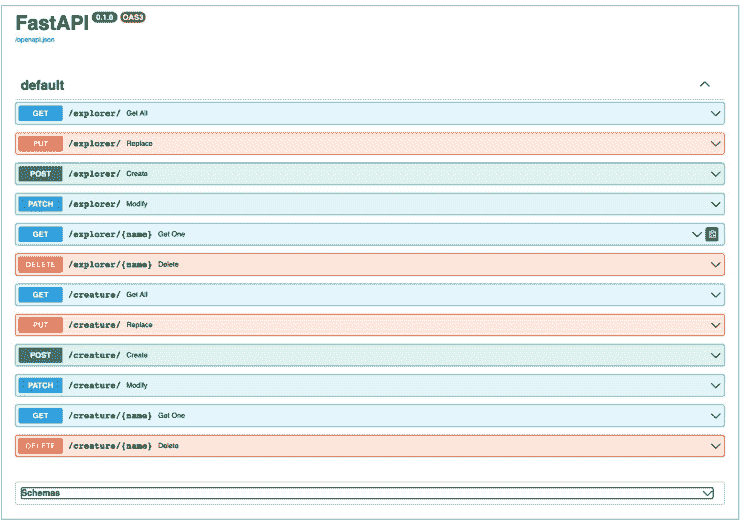

**图 8.1.** 自动生成的文档页面

请尝试执行第一个测试。

1.  点击顶部 `GET /explorer/` 部分右侧的向下箭头。将打开一个大的浅蓝色表单。
2.  点击左侧的蓝色 `Execute`（执行）按钮。在图 8.2 中，您可以看到结果的上半部分。

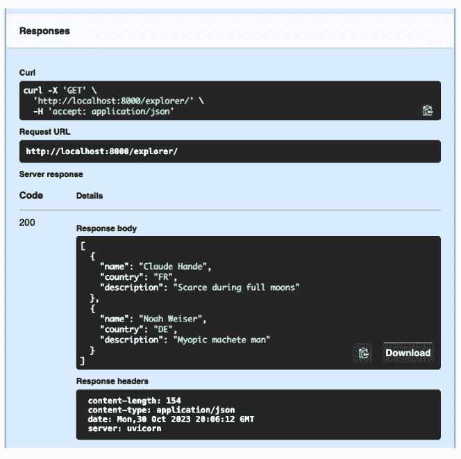

**图 8.2.** 为 `GET /explorer/` 生成的结果页面

在 `Response body`（响应体）部分，显示了为虚构的研究者数据返回的 JSON 格式文本。这些数据我们之前已经定义过：

```json
[
    {
        "name": "Claude Hande",
        "country": "FE",
        "description": "Scarce during full moons"
    },
    {
        "name": "Noah Weiser",
        "country": "DE",
        "description": "Myopic machete man"
    }
]
```

请尝试执行所有其他测试。对于某些测试，例如 `GET /explorer/{name}`，您需要指定一个输入值。您将获得每个测试的响应（当然，有些测试在添加数据库代码之前将保持无响应状态）。您可以在第 9 章和第 10 章结束时重复这些测试，以确保在修改代码时没有数据管道被破坏。

## 与服务层和数据层的通信

当 Web 层的函数需要数据层管理的数据时，它必须请求服务层作为中介。这需要更多的代码，并且可能看起来不必要，但这是一个好主意。

- 正如罐子上的标签所说，Web 层处理互联网，而数据层处理外部数据存储和服务。将它们的数据分开存储要安全得多。
- 各层可以彼此独立地进行测试。分层机制使得这成为可能。


对于非常小的网站，如果服务层什么都不做，可以跳过它。在第 9 章中，最初定义的服务函数仅在 Web 层和数据层之间传递请求和响应。至少这些层需要被分离。

服务层函数做什么？您将在下一章中了解。提示：它与数据层对话，但声音很轻，以免 Web 层听懂它具体说了什么。它还定义了任何特定的业务逻辑，例如资源之间的交互。通常，Web 层和数据层不应关心内部发生了什么。

> （服务层是秘密服务。）

## 分页和排序

在 Web 界面中，当使用诸如 `GET /resource` 之类的 URL 模式返回许多或所有实体时，通常需要请求搜索和返回资源：

- 仅一个；
- 可能多个；
- 全部。

如何让我们善意但极其直线思维的计算机执行这些任务？在第一种情况下，根据前面描述的 RESTful 模式，需要在 URL 路径中包含资源标识符。当获取多个资源时，可能需要按特定顺序查看结果。

- *排序* — 对所有结果进行排序，即使一次只获取其中一部分。
- *分页* — 一次仅返回部分结果，同时遵循任何类型的排序。

在每种情况下，用户指定的一组参数指示了您需要的内容。通常，它们作为查询参数指定。以下是一些示例。

- *排序* `GET /explorer?sort=country` — 获取所有按国家代码排序的研究者。
- *分页* `GET /explorer?offset=10&size=10` — 从整个列表中仅返回位置在第 10 到 19 位的研究者记录（在此示例中未排序）。
- *两者兼有* — `GET /explorer?sort=country&offset=10&size=10`。

它们可以作为单独的查询参数指定，FastAPI 的依赖注入将帮助您实现这一点。

- 将排序和分页参数定义为 Pydantic 模型。
- 在路径函数 `get_all()` 的参数中，使用 `Depends` 功能提供参数模型。

排序和分页应该放在哪里？起初，最简单的方法似乎是将所有数据库查询结果传递到 Web 层，然后使用 Python 在那里处理数据。但这不是一个非常有效的方法。这些任务通常最好在数据层解决，因为数据库擅长处理此类任务。我将在第 17 章中处理它们的代码。该章包含比第 10 章更多关于数据库的信息。

## 总结

在本章中，您更详细地了解了第 3 章等内容中讨论的内容。从那里开始，创建了一个包含虚构生物及其研究者信息的完整网站的过程。从 Web 层开始，您使用 FastAPI 的路径装饰器和路径函数定义端点。后者从 HTTP 请求的字节中收集请求数据，无论它们位于何处。模型数据会自动由 Pydantic 进行验证和确认。路径函数通常将参数传递给相应的服务函数，这些函数将在下一章中讨论。

# 第 9 章

## 服务层

> 中间那个是什么？
> 奥托·韦斯特（电影《一条名叫旺达的鱼》）

### 概述

本章介绍服务层——中间层。屋顶漏水造成的损害可能会导致一大笔开销。软件中的泄漏不那么明显，但修复它们引起的问题可能需要大量的时间和精力。如何构建应用程序以使各层之间不发生泄漏？具体来说，什么应该和什么不应该进入位于中间的服务层？

## 定义服务

服务层是网站的心脏，是其存在的意义。它接受来自不同来源的请求，访问代表网站 DNA 的数据，并返回响应。

通用的服务模式包括以下元素的组合：

- 创建/检索/修改（部分或完全）/删除；
- 单个/多个元素。

在 RESTful 路由器层，名词是*资源*。在本书中，资源最初将包括隐匿生物（虚构生物）和人类（隐匿生物的研究者）。稍后可以定义相关的资源，例如：

- 位置；
- 事件（例如，探险、观测）。

## 布局

以下是当前的文件和目录布局：

```
main.py
web
├── __init__.py
├── creature.py
├── explorer.py
service
├── __init__.py
├── creature.py
├── explorer.py
data
├── __init__.py
├── creature.py
├── explorer.py
model
├── __init__.py
├── creature.py
├── explorer.py
fake
├── __init__.py
├── creature.py
├── explorer.py
└── test
```

在本章中，您将处理位于 **service** 目录中的文件。

## 保护

分层的一个好处是您不必担心所有事情。服务层只关心进入数据层和从数据层出来的东西。在第 11 章中，您将看到更高层（这里是 Web 层）可以处理所有身份验证和授权的复杂性。创建、修改和删除函数不应广泛开放，即使是获取函数，随着时间的推移也可能需要一些限制。

## 函数

让我们从 `creature.py` 文件开始。在这个阶段，`explorer.py` 文件的需求几乎相同，我们可以借用几乎所有之前编写的代码。编写一个处理两种资源类型的服务文件很诱人，但几乎不可避免的是，在某个时候我们需要以不同的方式处理它们。

此外，目前服务文件实际上是一个直通层。在这种情况下，在初始阶段创建一点额外的结构将在以后得到回报。就像在第 8 章中为 `web/creature.py` 和 `web/explorer.py` 文件所做的那样，您将为两个资源定义服务模块，并将它们连接到相应的模拟数据模块（示例 9.1 和 9.2）。

**示例 9.1. 初始文件 service/creature.py**

```python
from models.creature import Creature
import fake.creature as data

def get_all() -> list[Creature]:
    return data.get_all()

def get_one(name: str) -> Creature | None:
    return data.get(id)

def create(creature: Creature) -> Creature:
    return data.create(creature)

def replace(id, creature: Creature) -> Creature:
    return data.replace(id, creature)

def modify(id, creature: Creature) -> Creature:
    return data.modify(id, creature)

def delete(id, creature: Creature) -> bool:
    return data.delete(id)
```

**示例 9.2. 初始文件 service/explorer.py**

```python
from models.explorer import Explorer
import fake.explorer as data

def get_all() -> list[Explorer]:
    return data.get_all()
```

def get_one(name: str) -> Explorer | None:
    return data.get(name)

def create(explorer: Explorer) -> Explorer:
    return data.create(explorer)

def replace(id, explorer: Explorer) -> Explorer:
    return data.replace(id, explorer)

def modify(id, explorer: Explorer) -> Explorer:
    return data.modify(id, explorer)

def delete(id, explorer: Explorer) -> bool:
    return data.delete(id)

> 函数 `get_one()` 的语法，其返回值为 `(Creature | None)`，要求使用 Python 3.9 或更高版本的构建。对于更早的版本，你需要使用 `Optional` 代码：

```python
from typing import Optional
...
def get_one(name: str) -> Optional[Creature]:
...
```

# 测试！

现在，代码库已经稍微充实了一些，是时候引入自动化测试了。（上一章中的所有 Web 测试都是手动执行的。）那么，让我们创建几个目录：

- `test` — 与 `web`、`service`、`data` 和 `model` 并列的顶级目录；
- `unit` — 检查单个函数，不跨越层级边界；
- `web` — Web 层的模块测试；
- `service` — 服务层的模块测试；
- `data` — 数据层的模块测试；
- `full` — 也称为*端到端*或*契约*测试，它们同时覆盖所有层级，并访问 Web 层的 API 端点。

这些目录将使用 `test_` 前缀或 `_test` 后缀，以便使用 pytest，如示例 9.4 所示（其中运行了示例 9.3 中的测试）。

在开始测试之前，需要选择几种 API 设计方案。当 `Creature` 或 `Explorer` 资源没有匹配项时，`get_one()` 函数应该返回什么？可以像示例 9.2 那样返回 `None` 值。或者引发异常。Python 的任何内置异常类型都不能直接用于缺失值。

- `TypeError` 可能是最接近的，因为 `None` 和 `Creature` 的类型不同。
- `ValueError` 更适合用于给定类型的错误值，但也许可以说，将缺失的字符串 `id` 传递给 `get_one(id)` 函数是合适的。
- 如果你真的想这样做，可以定义自己的 `MissingError` 类型。

无论你选择哪种方式，结果都会影响到顶层。

目前我们先选择返回 `None` 而不是引发异常。毕竟，`none` 这个词的意思就是缺少某物。示例 9.3 是一个测试。

### 示例 9.3. 服务测试 test/unit/service/test_creature.py

```python
from model.creature import Creature
from service import creature as code

sample = Creature(name="yeti",
                  country="CN",
                  area="Himalayas",
                  description="Hirsute Himalayan",
                  aka="Abominable Snowman",
                  )

def test_create():
    resp = code.create(sample)
    assert resp == sample

def test_get_exists():
    resp = code.get_one("yeti")
    assert resp == sample

def test_get_missing():
    resp = code.get_one("boxturtle")
    assert data is None
```

运行示例 9.4 中的测试。

### 示例 9.4. 运行服务测试

```
$ pytest -v test/unit/service/test_creature.py
test_creature.py::test_create PASSED [ 16%]
test_creature.py::test_get_exists PASSED [ 50%]
test_creature.py::test_get_missing PASSED [ 66%]

============================= 3 passed in 0.06s ==============================
```


在第 10 章中，`get_one()` 函数将不再为缺失的生物返回 `None` 值，而运行示例 9.4 中的 `test_get_missing()` 测试将会失败。但这将会被修复。

## 服务层的其他细节

目前我们处于技术栈的中间部分——这部分确实定义了我们网站的目标。到目前为止，我们只使用这个层级将 Web 请求转发到数据层（参见下一章）。

到目前为止，在本书中，网站是迭代式开发的，为后续工作创建了最小基础。在了解更多关于现有信息、你能用它做什么以及用户可能需要什么之后，你可以发展网站并进行实验。有些想法可能只对大型网站有用，但这里有一些针对辅助网站的技术思路：

- 日志记录；
- 获取指标；
- 监控；
- 追踪。

在本节中，我们将逐一探讨它们。我们将在“故障排除”部分（第 13 章）回到这些参数，看看它们是否有助于诊断问题。

## 日志记录

FastAPI 会记录对端点的每次 API 调用，包括时间戳、方法和 URL，但不包括在请求体或头部传递的任何数据。

## 指标、监控、可观测性

如果你有一个网站，你肯定想知道它运行得如何。对于带有 API 的网站，可能需要了解哪些端点被访问、有多少人访问它们等等。关于这些因素的统计数据称为指标，而收集它们的过程称为监控或观测。

目前，用于处理指标的流行工具是 Prometheus (https://prometheus.io)，用于收集指标，以及 Grafana (https://grafana.com) 用于显示它们。

## 追踪

你的网站运行良好吗？通常会出现这样的情况：整体指标良好，但结果时好时坏。或者整个网站可能运行不佳。在这种情况下，拥有一个工具来测量从开始到结束调用 API 所花费的时间是很有用的，不仅是总时长，还包括每个中间阶段的持续时间。如果某些东西运行缓慢，你可以在链条中找到薄弱环节。这被称为追踪。

一个新的开源项目借鉴了早期的追踪产品，如 Jaeger (https://www.jaegertracing.io)，并将其命名为 OpenTelemetry (https://opentelemetry.io)。它包括一个 Python API (https://oreil.ly/gyL70) 和至少一个与 FastAPI 的集成 (https://oreil.ly/L6RXV)。

要使用 Python 安装和配置 OpenTelemetry，请按照 OpenTelemetry Python 文档 (https://oreil.ly/MBgd5) 中的说明操作。

## 其他可能性

操作问题将在第 13 章讨论。那么我们的隐生生物领域以及与之相关的一切呢？除了关于研究者和生物的赤裸裸的细节，你还能利用什么？你可能会有一些新的想法，需要对模型和其他层级进行修改。你可以尝试以下这些：

- 将研究者与他们发现的生物联系起来；
- 观察数据；
- 探险；
- 照片和视频；
- 印有雪人图案的杯子和 T 恤。


这些类别中的每一个通常都需要定义一个或多个新模型，以及新的模块和功能。其中一些将添加到本书的第四部分，该部分是一个在第三部分创建的基础上添加的应用程序画廊。

# 结论

在本章中，你回顾了 Web 层的一些功能，并迁移了它们使用的模拟数据。目的是启动创建新的服务层。到目前为止，这是一个标准流程，但现在它将发展并分化。在下一章中，将创建数据层，从而形成一个真正活跃的网站。

# 第 10 章

## 数据层

> 如果我没记错的话，Data 在剧中扮演了一个喜剧角色。

布伦特·斯派纳（电影《星际迷航：下一代》）

### 概述

在本章中，我们将为网站的数据创建一个持久的家，最终将三个层级连接起来。它使用关系数据库 SQLite，并介绍了 Python 数据库 API，恰当地命名为 DB-API。数据库，包括 SQLAlchemy 包和非关系数据库，在第 14 章中有更详细的介绍。

## DB-API

二十多年来，Python 中一直存在一个名为 DB-API 的关系数据库接口基本定义：PEP 249 (https://oreil.ly/4Gp9T)。任何为关系数据库编写 Python 驱动程序的人至少都必须包含对 DB-API 的支持，尽管可能还会涉及其他功能。以下是 DB-API 的主要功能。

- 使用 `connect()` 函数创建与数据库的连接 `conn`。
- 使用 `conn.cursor()` 函数创建游标 `curs`。
- 使用 `curs.execute(stmt)` 函数执行 SQL 字符串 `stmt`。

`execute...()` 系列函数执行带有后续附加参数的 SQL 语句 `stmt`：

-   `execute(stmt)`，当没有参数时；
-   `execute(stmt, params)`，其中 `params` 是一个序列（列表或元组）或字典；
-   `executemany(stmt, params_seq)`，其中 `params_seq` 包含多组参数序列。

有五种指定参数的方式，但并非所有数据库驱动都支持全部方式。如果语句 `stmt` 以表达式 "select * from creature where" 开头，并且需要指定生物的字符串参数 `name` 或 `country`，那么语句 `stmt` 的剩余部分及其参数将如表 10.1 所示。

**表 10.1.** 指定语句和参数

| 类型 | 显示语句的部分 | 显示参数的部分 |
| :--- | :--- | :--- |
| qmark | name=? or country=? | (name, country) |
| numeric | name=:0 or country=:1 | (name, country) |
| format | name=%s or country=%s | (name, country) |
| named | name=:name or country=:country | {"name": name, "country": country} |
| pyformat | name=%(name)s or country=%(country)s | {"name": name, "country": country} |

前三种接受一个元组作为参数，其中参数的顺序对应于语句描述中的 `?`、`:N` 或 `%s`。后两种接受一个字典，其中的键对应于语句中的名称。

因此，完整的 *命名* 风格调用将如示例 10.1 所示。

**示例 10.1.** 使用命名风格的参数

```
stmt = """select * from creature where
    name=:name or country=:country"""
params = {"name": "yeti", "country": "CN"}
curs.execute(stmt, params)
```

对于 `INSERT`、`DELETE` 和 `UPDATE` 等 SQL 语句，`execute()` 函数返回的值说明了其工作方式。对于 `SELECT` 语句，则需要使用 `fetch` 方法对返回的数据行进行迭代，将其视为 Python 元组：

-   `fetchone()` 返回一个元组，或 `None` 值；
-   `fetchall()` 返回一个元组序列；
-   `fetchmany(num)` 返回最多 `num` 个元组。

### SQLite

标准 Python 包通过 `sqlite3` 模块 (https://oreil.ly/CcYtJ) 支持一种数据库 (SQLite, https://www.sqlite.org)。

SQLite 很独特——它没有单独的数据库服务器。所有代码都在库中，存储在一个文件中实现。其他数据库在单独的服务器上运行，客户端通过 TCP/IP 使用特定协议与它们通信。我们将 SQLite 作为本网站的第一个物理数据存储。第 14 章将讨论其他数据库（关系型和非关系型），以及更高级的包（如 SQLAlchemy）和类似 ORM 的方法。

首先需要确定网站上使用的数据结构（*模型*）如何在数据库中表示。到目前为止，我们唯一的模型简单且相似但不完全相同：*Creature* 和 *Explorer*。随着我们构思如何使用它们并允许数据发展而无需大规模代码更改，它们将会发生变化。

示例 10.2 展示了用于创建初始表并操作它们的裸 DB-API 和 SQL 代码。它使用了 `sqlite3` 包支持的 *命名* 参数字符串（值表示为 `name`）。

**示例 10.2.** 使用 sqlite3 创建文件 `data/creature.py`

```
import sqlite3
from model.creature import Creature

DB_NAME = "cryptid.db"
conn = sqlite3.connect(DB_NAME)
curs = conn.cursor()

def init():
    curs.execute("create table creature(name, description, country, area, aka)")

def row_to_model(row: tuple) -> Creature:
    name, description, country, area, aka = row
    return Creature(name, description, country, area, aka)

def model_to_dict(creature: Creature) -> dict:
    return creature.dict()

def get_one(name: str) -> Creature:
    qry = "select * from creature where name=:name"
    params = {"name": name}
    curs.execute(qry, params)
    row = curs.fetchone()
    return row_to_model(row)

def get_all(name: str) -> list[Creature]:
    qry = "select * from creature"
    curs.execute(qry)
    rows = list(curs.fetchall())
    return [row_to_model(row) for row in rows]

def create(creature: Creature):
    qry = """insert into creature values
        (:name, :description, :country, :area, :aka)"""
    params = model_to_dict(creature)
    curs.execute(qry, params)

def modify(creature: Creature):
    return creature

def replace(creature: Creature):
    return creature

def delete(creature: Creature):
    qry = "delete from creature where name = :name"
    params = {"name": creature.name}
    curs.execute(qry, params)
```

在最顶部，`init()` 函数建立与 sqlite3 和数据库 `scriptid.db` 的连接。它将其存储在变量 `conn` 中——该变量对于模块 `data/creature.py` 是全局的。接下来，变量 `curs` 是一个游标，用于迭代执行 SQL `SELECT` 语句返回的数据。它也是模块全局的。

两个辅助函数执行 Pydantic 模型和 DB-API 之间的转换：

-   `row_to_model()` 将 `fetch` 函数返回的元组转换为模型对象；
-   `model_to_dict()` 将 Pydantic 模型转换为可用作查询命名参数的字典。

存储在每一层（web → service → data）的 CRUD 虚拟函数现在将被替换。它们仅应用普通 SQL 和 sqlite3 中的 DB-API 方法。

## 布局

到目前为止，数据（虚拟的）是分阶段更改的：

-   在第 8 章，我们在文件 `web/creature.py` 中创建了虚拟的 *creatures* 列表；
-   在第 8 章，我们在文件 `web/explorer.py` 中创建了虚拟的 *explorers* 列表；
-   在第 9 章，我们将 *creatures* 的模拟数据移到了 `service/creature.py` 目录；
-   在第 9 章，我们将 *explorers* 的模拟数据移到了 `service/explorer.py` 目录。

现在数据进行了最后一次迁移——移到了文件 `data/creature.py`。但这不再是模拟数据——这是存储在 SQLite 数据库文件 `cryptids.db` 中的真实活动数据。同样由于缺乏想象力，生物数据存储在该数据库的 SQL 表 `creature` 中。

一旦你保存这个新文件，Uvicorn 应该会从顶层文件 `main.py` 重启，该文件调用 `web/creature.py`，后者调用 `service/creature.py` 文件，最终指向新文件 `data/creature.py`。

## 让这一切运作起来

我们有一个小问题——这个模块从未调用其 `init()` 函数，因此 SQLite 中没有其他函数可以使用的 `conn` 和 `curs` 变量。这是一个配置问题：如何在启动时提供数据库信息？以下是可能的选项。

-   将数据库信息硬编码在代码中，如示例 10.2 所示。
-   跨层传递信息。但这会违反分层原则——web 和 service 层不应了解数据层的内部工作原理。
-   从另一个外部来源传递信息：
    -   配置文件；
    -   环境变量。

环境变量很简单，并且受到诸如 Twelve-Factor App (https://12factor.net/config) 等建议的支持。如果未定义环境变量，代码可以包含默认值。这种方法也可用于测试，以创建一个与生产环境分离的测试数据库。

在示例 10.3 中，我们将定义环境变量 `CRYPTID_SQLITE_DB` 并为其分配默认值 `cryptid.db`。为新的数据库初始化代码创建一个新文件 `data/init.py`，以便它也可以用于研究者代码。

### 示例 10.3. 新的数据库初始化模块 data/init.py

```
"""SQLite 数据库初始化"""

import os
from pathlib import Path
from sqlite3 import connect, Connection, Cursor, IntegrityError

conn: Connection | None = None
curs: Cursor | None = None

def get_db(name: str|None = None, reset: bool = False):
    """连接到 SQLite 数据库文件"""
    global conn, curs
    if conn:
        if not reset:
            return
        conn = None
    if not name:
        name = os.getenv("CRYPTID_SQLITE_DB")
        top_dir = Path(__file__).resolve().parents[1] # 仓库顶层
        db_dir = top_dir / "db"
        db_name = "cryptid.db"
        db_path = str(db_dir / db_name)
        name = os.getenv("CRYPTID_SQLITE_DB", db_path)
    conn = connect(name, check_same_thread=False)
    curs = conn.cursor()

get_db()
```

Python 模块是一个 *单例*，尽管被多次导入，但只调用一次。因此，`init.py` 文件中的初始化代码仅在首次导入时运行一次。

最后，修改示例 10.4 中的文件 `data/creature.py`，以使用新模块代替它。

## 重点是，删除从第四行到第八行的内容。
- 首先，创建 `creature` 表！
- 表的所有字段都是 `text` 类型的 SQL 字符串。这是 SQLite 中的默认列类型，与大多数 SQL 数据库不同，因此您之前不需要包含 `text`，但明确指定也无妨。
- `if not exists` 表达式可以避免在表创建后将其销毁。
- `name` 字段作为该表的显式主键（primary key）。如果其中存储了大量研究者数据，则需要此键进行快速搜索。另一种选择可能是可怕的表扫描，即数据库代码必须逐行查看，直到找到与 `name` 字段匹配的记录。

## 示例 10.4. 在 data/creature.py 文件中添加数据库配置

```python
from .init import conn, curs
from model.creature import Creature

curs.execute("""create table if not exists creature(
    name text primary key,
    description text,
    country text,
    area text,
    aka text)""")

def row_to_model(row: tuple) -> Creature:
    (name, description, country, area, aka) = row
    return Creature(name, description, country, area, aka)

def model_to_dict(creature: Creature) -> dict:
    return creature.dict()

def get_one(name: str) -> Creature:
    qry = "select * from creature where name=:name"
    params = {"name": name}
    curs.execute(qry, params)
    return row_to_model(curs.fetchone())

def get_all() -> list[Creature]:
    qry = "select * from creature"
    curs.execute(qry)
    return [row_to_model(row) for row in curs.fetchall()]

def create(creature: Creature) -> Creature:
    qry = "insert into creature values (:name, :description, :country, :area, :aka)"
    params = model_to_dict(creature)
    curs.execute(qry, params)
    return get_one(creature.name)

def modify(creature: Creature) -> Creature:
    qry = """update creature
            set country=:country,
                name=:name,
                description=:description,
                area=:area,
                aka=:aka
            where name=:name_orig"""
    params = model_to_dict(creature)
    params["name_orig"] = creature.name
    _ = curs.execute(qry, params)
    return get_one(creature.name)

def delete(creature: Creature) -> bool:
    qry = "delete from creature where name = :name"
    params = {"name": creature.name}
    res = curs.execute(qry, params)
    return bool(res)
```

从 `init.py` 文件导入 `conn` 和 `curs` 对象后，`data/creature.py` 文件就不再需要导入 `sqlite3` 模块本身了。除非将来需要调用 `conn` 或 `curs` 对象方法之外的其他 `sqlite3` 方法。

同样，这些更改应指示 Uvicorn 重新加载所有内容。从现在开始，使用之前描述的任何方法（HTTPie 及其类似工具或自动表单 /docs）进行测试将显示保存的数据。如果您添加了一个生物，那么下次收集所有生物时它就会出现。

我们将在示例 10.5 中为研究者做同样的事情。

## 示例 10.5. 在 data/explorer.py 文件中添加数据库配置

```python
from .init import curs
from model.explorer import Explorer

curs.execute("""create table if not exists explorer(
    name text primary key,
    country text,
    description text)""")

def row_to_model(row: tuple) -> Explorer:
    return Explorer(name=row[0], country=row[1], description=row[2])

def model_to_dict(explorer: Explorer) -> dict:
    return explorer.dict() if explorer else None

def get_one(name: str) -> Explorer:
    qry = "select * from explorer where name=:name"
    params = {"name": name}
    curs.execute(qry, params)
    return row_to_model(curs.fetchone())

def get_all() -> list[Explorer]:
    qry = "select * from explorer"
    curs.execute(qry)
    return [row_to_model(row) for row in curs.fetchall()]

def create(explorer: Explorer) -> Explorer:
    qry = """insert into explorer (name, country, description)
            values (:name, :country, :description)"""
    params = model_to_dict(explorer)
    _ = curs.execute(qry, params)
    return get_one(explorer.name)

def modify(name: str, explorer: Explorer) -> Explorer:
    qry = """update explorer
            set country=:country,
                name=:name,
                description=:description
            where name=:name_orig"""
    params = model_to_dict(explorer)
    params["name_orig"] = explorer.name
    _ = curs.execute(qry, params)
    explorer2 = get_one(explorer.name)
    return explorer2

def delete(explorer: Explorer) -> bool:
    qry = "delete from explorer where name = :name"
    params = {"name": explorer.name}
    res = curs.execute(qry, params)
    return bool(res)
```

# 测试！

我们输入了很多代码却没有测试。一切都正常吗？如果真这样，我会感到惊讶。那么，让我们创建一些测试。

在 **test** 目录中创建以下子目录：
- unit — 在内部层级；
- full — 跨所有层级。

应该先编写和运行哪种类型的测试？大多数人首先编写自动化单元测试——它们更小，而且其他层的部分可能还不存在。在本书中，开发是从上到下进行的，现在我们正在完成最后一层。此外，在第 8 章和第 9 章中，我们使用 HTTPie 和类似工具进行了手动测试。它们有助于快速发现错误和遗漏。自动化测试确保您以后不会重复相同的错误。因此我建议：
- 在编写代码的过程中进行一些手动测试；
- 在修复 Python 语法错误后执行单元测试；
- 在获得所有层级的完整数据流后进行完整测试。

## 完整测试

它们调用最终的 Web 端点，将代码电梯向下穿过服务层到达数据层，然后再向上返回。有时它们被称为 *端到端* 或 *契约* 测试。

## 获取所有研究者

在还不知道测试水域是否食人鱼出没的情况下，勇敢的志愿者可以先试水——示例 10.6。

**示例 10.6.** 测试获取所有研究者

```
$ http localhost:8000/explorer
HTTP/1.1 405 Method Not Allowed
allow: POST
content-length: 31
content-type: application/json
date: Mon, 27 Feb 2023 20:05:18 GMT
server: uvicorn

{
    "detail": "Method Not Allowed"
}
```

哇！发生了什么？

哦。测试请求的路径是 `/explorer`，而不是 `/explorer/`，并且 URL `/explorer`（没有尾部斜杠）的路径函数缺少 GET 方法。在 `web/explorer.py` 文件中，路径函数 `get_all()` 的路径装饰器如下所示：

```python
@router.get("/")
```

这加上之前的代码：

```python
router = APIRouter(prefix = "/explorer")
```

意味着路径函数 `get_all()` 提供的 URL 包含表达式 `/explorer/`。

示例 10.7 显示一个路径函数可以有多个路径装饰器。

**示例 10.7.** 为路径函数 `get_all()` 添加不带斜杠的路径装饰器

```python
@router.get("")
@router.get("/")
def get_all() -> list[Explorer]:
    return service.get_all()
```

我们将在示例 10.8 和 10.9 中测试这两个 URL。

**示例 10.8.** 测试末尾不带斜杠的端点

```
$ http localhost:8000/explorer
HTTP/1.1 200 OK
content-length: 2
content-type: application/json
date: Mon, 27 Feb 2023 20:12:44 GMT
server: uvicorn

[]
```

**示例 10.9.** 测试末尾带斜杠的端点

```
$ http localhost:8000/explorer/
HTTP/1.1 200 OK
content-length: 2
content-type: application/json
date: Mon, 27 Feb 2023 20:14:39 GMT
server: uvicorn

[]
```

现在两个变体都工作了，创建一个研究者对象并重复获取所有资源的测试。在示例 10.10 中进行了类似的尝试，但情节发生了转折。

**示例 10.10.** 创建带有输入错误的测试研究者

```
$ http post localhost:8000/explorer name="Beau Buffette", country="US"
HTTP/1.1 422 Unprocessable Entity
content-length: 95
content-type: application/json
date: Mon, 27 Feb 2023 20:17:45 GMT
server: uvicorn

{
    "detail": [
        {
            "loc": [
                "body",
                "country"
            ],
            "msg": "field required",
            "type": "value_error.missing"
        }
    ]
}
```

我拼错了 `country` 这个词，尽管我的拼写通常无可挑剔。Pydantic 在 Web 层检测到了这一点，返回了 HTTP 状态码 422 和问题描述。通常，如果 FastAPI 返回 422 代码，很可能是 Pydantic 找到了故障原因。表达式 "loc" 的部分指出了错误发生的位置：字段 "country" 有误，因为我打字太糟糕了。

## 示例 10.11. 创建具有修正值的研究员

```
$ http post localhost:8000/explorer name="Beau Buffette" country="US"
HTTP/1.1 201 Created
content-length: 55
content-type: application/json
date: Mon, 27 Feb 2023 20:20:49 GMT
server: uvicorn

{
    "name": "Beau Buffette,",
    "country": "US",
    "description": ""
}
```

这次调用返回了状态码 201。这通常是在创建资源时获得的（所有 2xx 组的状态码都被视为成功标志，其中最常见的是简单的 200 码）。响应还包含了刚刚创建的 Explorer 对象的 JSON 版本。

现在让我们回到最初的测试：在获取所有研究员记录的测试中，会出现 Beau 的名字吗？示例 10.12 回答了这个引人关注的问题。

## 示例 10.12. 最后的 create() 函数有效吗？

```
$ http localhost:8000/explorer
HTTP/1.1 200 OK
content-length: 57
content-type: application/json
date: Mon, 27 Feb 2023 20:26:26 GMT
server: uvicorn

[
    {
        "name": "Beau Buffette",
        "country": "US",
        "description": ""
    }
]
```

太棒了！

## 获取单个研究员的记录

如果你尝试使用获取单个记录的端点——Get One（示例 10.13）来查找 Beau，会发生什么？

**示例 10.13.** 测试带有 Get One 指令的端点

```
HTTP/1.1 200 OK
content-length: 55
content-type: application/json
date: Mon, 27 Feb 2023 20:28:48 GMT
server: uvicorn

{
    "name": "Beau Buffette",
    "country": "US",
    "description": ""
}
```

我使用了引号来保留名字和姓氏之间的空格。在 URL 中，你也可以使用 Beau%20Buffette 这样的写法。表达式 %20 表示 ASCII 标准中的空格字符的十六进制代码。

## 缺失和重复的数据

到目前为止，我忽略了两类主要的错误：

- *缺失数据* —— 如果你尝试获取、修改或删除一个在数据库中不存在名字的研究员记录；
- *重复数据* —— 如果你尝试多次创建具有相同名字的研究员记录。

那么，如果你请求一个不存在或重复的研究员记录，该怎么办？目前代码过于乐观，异常将从深渊中浮现。

我们那位名叫 Beau 的朋友刚刚被添加到数据库中。想象一下，他那个邪恶的克隆体，顶着同样的名字，正计划在某个黑暗的夜晚利用示例 10.14 来取代他。

**示例 10.14.** 重复错误——尝试多次创建研究员

```
$ http post localhost:8000/explorer name="Beau Buffette" country="US"
HTTP/1.1 500 Internal Server Error
content-length: 3127
content-type: text/plain; charset=utf-8
date: Mon, 27 Feb 2023 21:04:09 GMT
server: uvicorn

Traceback (most recent call last):
  File ".../starlette/middleware/errors.py", line 162, in call
  ... (lots of confusing innards here) ...
  File ".../service/explorer.py", line 11, in create
    return data.create(explorer)
          ^^^^^^^^^
  File ".../data/explorer.py", line 37, in create
    curs.execute(qry, params)
sqlite3.IntegrityError: UNIQUE constraint failed: explorer.name
```

我在这次错误跟踪中省略了大多数行，并用省略号替换了部分内容，因为这些数据主要包含 FastAPI 和底层 Starlette 执行的内部调用。但最后一行——是 SQLite 在 Web 层抛出的异常！哪里有供晕倒用的躺椅？

紧随其后的是另一个恐怖事件——研究员的消失（示例 10.15）。

## 示例 10.15. 获取不存在的研究员

```
$ http localhost:8000/explorer/"Beau Buffalo"
HTTP/1.1 500 Internal Server Error
content-length: 3282
content-type: text/plain; charset=utf-8
date: Mon, 27 Feb 2023 21:09:37 GMT
server: uvicorn

Traceback (most recent call last):
  File ".../starlette/middleware/errors.py", line 162, in call
  ... (many lines of ancient cuneiform) ...
  File ".../data/explorer.py", line 11, in row_to_model
    name, country, description = row
          ^^^^^^^^^
TypeError: cannot unpack non-iterable NoneType object
```

有什么好方法可以在底层（数据层）检测它们，并将细节传递到上层（Web 层）？以下是几种可能的方案。

- 让 SQLite 咳出毛球（异常），然后在 Web 层处理它。

  但是！这混淆了层级，这是*不好的*。Web 层不应该了解任何特定数据库的细节。

- 让服务层和数据层的所有函数在返回 Explorer 对象的地方都返回 Explorer | None。在这种情况下，None 将表示失败。（你可以通过在 model/explorer.py 文件中定义 OptExplorer = Explorer | None 来简化这个过程。）

  但是！函数可能因为多种原因失败，你可能需要详细信息。而这需要编辑大量代码。

- 为缺失（Missing）和重复（Duplicate）数据定义异常，包括更详细的问题描述。它们将穿过所有层级而无需更改代码，直到 Web 层的路由函数捕获它们。此外，它们依赖于应用程序而非数据库，从而保持了层级的完整性。

  但是！实际上我喜欢这个方案，所以它将出现在示例 10.16 中。

## 示例 10.16. 定义新的顶层 errors.py 文件

```
class Missing(Exception):
    def __init__(self, msg:str):
        self.msg = msg

class Duplicate(Exception):
    def __init__(self, msg:str):
        self.msg = msg
```

这些异常中的每一个都有一个字符串属性 msg。它可以向更高层的代码报告发生了什么。

为了实现这一点，在示例 10.17 中，将 DB-API 异常导入到 data/init.py 文件中。当数据重复时，SQLite 将调用它。

## 示例 10.17. 在 data/init.py 文件中添加 SQLite 异常导入

```
from sqlite3 import connect, IntegrityError
```

在示例 10.18 中导入并捕获此错误。

## 示例 10.18. 修改 data/explorer.py 以捕获和抛出异常

```
from init import (conn, curs, IntegrityError)
from model.explorer import Explorer
from error import Missing, Duplicate

curs.execute("""create table if not exists explorer(
    name text primary key,
    country text,
    description text)""")

def row_to_model(row: tuple) -> Explorer:
    name, country, description = row
    return Explorer(name=name,
        country=country, description=description)

def model_to_dict(explorer: Explorer) -> dict:
    return explorer.dict()

def get_one(name: str) -> Explorer:
    qry = "select * from explorer where name=:name"
    params = {"name": name}
    curs.execute(qry, params)
    row = curs.fetchone()
    if row:
        return row_to_model(row)
    else:
        raise Missing(msg=f"Explorer {name} not found")

def get_all() -> list[Explorer]:
    qry = "select * from explorer"
    curs.execute(qry)
    return [row_to_model(row) for row in curs.fetchall()]

def create(explorer: Explorer) -> Explorer:
    if not explorer: return None
    qry = """insert into explorer (name, country, description) values
            (:name, :country, :description)"""
    params = model_to_dict(explorer)
    try:
        curs.execute(qry, params)
    except IntegrityError:
        raise Duplicate(msg=
            f"Explorer {explorer.name} already exists")
    return get_one(explorer.name)

def modify(name: str, explorer: Explorer) -> Explorer:
    if not (name and explorer): return None
    qry = """update explorer
            set name=:name,
            country=:country,
            description=:description
            where name=:name_orig"""
    params = model_to_dict(explorer)
    params["name_orig"] = explorer.name
    curs.execute(qry, params)
    if curs.rowcount == 1:
        return get_one(explorer.name)
    else:
        raise Missing(msg=f"Explorer {name} not found")

def delete(name: str):
    if not name: return False
    qry = "delete from explorer where name = :name"
    params = {"name": name}
    curs.execute(qry, params)
    if curs.rowcount != 1:
        raise Missing(msg=f"Explorer {name} not found")
```

这消除了声明所有函数都返回 Explorer | None 或 Optional[Explorer] 表达式的需要。

你只为常规的返回类型指定类型提示，而不为异常指定。由于异常会独立于调用栈向上冒泡，直到被某人捕获，因此你无需在服务层做任何更改。下面是带有异常处理程序和相应 HTTP 状态码返回的新 web/explorer.py 文件（示例 10.19）。

## 示例 10.19. 在 web/explorer.py 文件中处理 Missing 和 Duplicate 异常

```
from fastapi import APIRouter, HTTPException
from model.explorer import Explorer
from service import explorer as service
from error import Duplicate, Missing

router = APIRouter(prefix = "/explorer")

@router.get("")
@router.get("/")
def get_all() -> list[Explorer]:
    return service.get_all()

@router.get("/{name}")
def get_one(name) -> Explorer:
    try:
        return service.get_one(name)
    except Missing as exc:
        raise HTTPException(status_code=404, detail=exc.msg)

@router.post("", status_code=201)
@router.post("/", status_code=201)
def create(explorer: Explorer) -> Explorer:
    try:
        return service.create(explorer)
```

except Duplicate as exc:
    raise HTTPException(status_code=404, detail=exc.msg)

@router.patch("/")
def modify(name: str, explorer: Explorer) -> Explorer:
    try:
        return service.modify(name, explorer)
    except Missing as exc:
        raise HTTPException(status_code=404, detail=exc.msg)

@router.delete("/{name}", status_code=204)
def delete(name: str):
    try:
        return service.delete(name)
    except Missing as exc:
        raise HTTPException(status_code=404, detail=exc.msg)

请在示例 10.20 中验证这些更改。

## 示例 10.20. 使用新的 Missing 异常重新测试 Get One 端点（当研究员记录不存在时）

```
$ http localhost:8000/explorer/"Beau Buffalo"
HTTP/1.1 404 Not Found
content-length: 44
content-type: application/json
date: Mon, 27 Feb 2023 21:11:27 GMT
server: uvicorn

{
    "detail": "Explorer Beau Buffalo not found"
}
```

很好。现在尝试再次创建一个“邪恶克隆体”（示例 10.21）。

## 示例 10.21. 测试重复项处理

```
$ http post localhost:8000/explorer name="Beau Buffette" country="US"
HTTP/1.1 404 Not Found
content-length: 50
content-type: application/json
date: Mon, 27 Feb 2023 21:14:00 GMT
server: uvicorn

{
    "detail": "Explorer Beau Buffette already exists"
}
```

对缺失数据的请求测试同样适用于修改（Modify）和删除（Delete）端点。你可以尝试为它们编写类似的测试。

## 模块测试

模块测试仅在数据层进行，检查数据库调用和 SQL 语法。我将此部分放在完整测试之后，是因为我希望 Missing 和 Duplicate 异常已经在 `data/creature.py` 文件中定义、解释并编码完成。示例 10.22 展示了测试脚本 `test/unit/data/test_creature.py`。以下是需要注意的要点。

- 在从 `data` 导入 `init` 或 `creature` 之前，你将环境变量 `CRYPTID_SQLITE_DATABASE` 设置为 `":memory:"`。这个值指示 SQLite 仅在内存中工作，不会污染现有的数据库文件，甚至不会在磁盘上创建文件。它在首次导入 `data/init.py` 模块时被检查。
- 名为 `sample` 的 fixture 被传递给需要 `Creature` 对象的函数。
- 测试按顺序执行。在这种情况下，整个执行过程中使用的是同一个数据库，而不是在函数之间重置。这是为了确保前序函数所做的更改得以保留。在 pytest 中，fixture 可以有以下作用域：
    - 函数作用域（默认）——在每个测试函数之前重新调用；
    - 会话作用域——仅在开始时调用一次。
- 一些测试会强制触发 Missing 或 Duplicate 异常，并验证是否能捕获它们。

因此，每个测试都会获得一个全新的、未修改的名为 `sample` 的 `Creature` 对象（示例 10.22）。

**示例 10.22.** 针对 `data/creature.py` 文件的模块测试

```
import os
import pytest
from model.creature import Creature
from error import Missing, Duplicate

# 在下面导入 data 之前设置此变量，以便 data.init 使用
os.environ["CRYPTID_SQLITE_DB"] = ":memory:"
from data import creature

@pytest.fixture
def sample() -> Creature:
    return Creature(name="yeti", country="CN", area="Himalayas",
        description="Harmless Himalayan",
        aka="Abominable Snowman")

def test_create(sample):
    resp = creature.create(sample)
    assert resp == sample

def test_create_duplicate(sample):
    with pytest.raises(Duplicate):
        _ = creature.create(sample)

def test_get_one(sample):
    resp = creature.get_one(sample.name)
    assert resp == sample

def test_get_one_missing():
    with pytest.raises(Missing):
        _ = creature.get_one("boxturtle")

def test_modify(sample):
    creature.area = "Sesame Street"
    resp = creature.modify(sample.name, sample)
    assert resp == sample

def test_modify_missing():
    thing: Creature = Creature(name="snurffle", country="RU", area="",
        description="some thing", aka="")
    with pytest.raises(Missing):
        _ = creature.modify(thing.name, thing)

def test_delete(sample):
    resp = creature.delete(sample.name)
    assert resp is None

def test_delete_missing(sample):
    with pytest.raises(Missing):
        _ = creature.delete(sample.name)
```

提示：你可以创建自己的 `test/unit/data/test_explorer.py` 版本。

# 结论

本章介绍了一个简单的数据处理层，其中包含根据需要在各层之间进行的一些上下转换。第 12 章将讨论每个层的模块测试、层间集成测试以及完整的端到端测试。第 14 章将深入探讨数据库并提供详细示例。

# 第 11 章

## 认证与授权

> 尊重我的权威！
> 埃里克·卡特曼
> （动画片《南方公园》）

### 概述

有时网站提供广泛的访问权限，任何访问者都可以进入任何页面。但如果网站内容可以被修改，某些端点将仅限于特定人员或群体访问。如果每个人都能修改亚马逊上的页面，想象一下页面上会出现多少奇怪的商品，以及一些人会收到多么令人惊讶的订单。不幸的是，这就是人性——有些人利用其他人，而其他人则为他们的行为支付隐性税。

我们应该让我们的隐生生物网站对任何用户开放任何端点的访问吗？不！实际上，任何大型 Web 服务最终都必须解决以下任务。

- 认证（authn）。你是谁？
- 授权（authz）。你需要什么？

认证和授权（auth）代码是否应该获得自己的新层级，比如说，位于服务层和 Web 层之间？还是所有事情都应该由服务层或 Web 层自行解决？在本章中，你将了解认证方法以及在哪里使用它们。

关于 Web 安全性的描述常常显得比实际需要的更复杂。

攻击者可能非常、非常狡猾，而应对措施也并不简单。


正如我多次提到的，FastAPI 的官方文档非常出色。如果本章的信息对你来说不够详细，请尝试阅读安全部分（https://oreil.ly/oYsKL）。

那么，让我们一步步来解决这个问题。我将从简单的技术开始，这些技术仅用于将 auth 系统连接到网站的端点进行测试，但不会在公共网站上应用。

## 稍微跑个题。你需要认证吗？

我再说一遍：*认证*与*身份识别*相关——你是谁？要实现认证，需要将秘密信息与唯一标识符进行匹配。有多种方法可以实现这一点，并且具有*不同*的复杂度级别。让我们从小处着手，逐步深入。

在 Web 开发的书籍和文章中，通常会立即转向认证和授权的细节，有时会混淆它们。有时这些材料中遗漏了第一个问题：你真的需要两者吗？

你可以为网站的所有页面提供完全匿名的访问。但这将为拒绝服务（DoS）等攻击留下漏洞。虽然某些保护措施，例如请求速率限制，可以在 Web 服务器之外实现（参见第 13 章），但几乎所有公共 API 提供商都要求至少进行某种形式的认证。除了安全性之外，还需要了解网站的效率如何。

- 有多少独立访客？
- 哪些页面最受欢迎？
- 特定的更改是否增加了页面浏览量？
- 哪些页面访问序列经常出现？

回答这些问题需要对具体访问者进行身份验证。否则，您只能获得所有指标的总体数值。

如果您的网站需要身份验证或授权，则必须对其访问进行加密（使用 HTTPS 而非 HTTP），以防止恶意用户从明文中提取敏感数据。有关配置 HTTPS 的详细信息，请参阅第 13 章。

## 身份验证方法

Web 身份验证有多种方法和工具：

- *用户名/电子邮件和密码* — 使用经典的 HTTP Basic 和 Digest 认证；
- *API 密钥* — 一串含义不明的长字符串及其关联的密钥；
- *OAuth2* — 一套用于身份验证和授权的标准；
- *JavaScript Web 令牌*（JavaScript Web Tokens, JWT）— 一种编码格式，包含经过加密签名的用户信息。

在本节中，我将介绍前两种方法并展示其传统实现方式。但在填充 API 和数据库代码之前，我将停止介绍。相反，我们将完整实现一个更现代的方案，使用 OAuth2 和 JWT。

## 全局身份验证 — 密钥或共享密钥（Shared Secret）

最简单的身份验证方法是传递一个通常只有 Web 服务器知道的密钥。如果密钥匹配，则授予访问权限。如果您的 API 站点通过 HTTP 而非 HTTPS 公开访问，这种方法并不安全。如果它隐藏在公开的前端站点之后，前端和后端系统可以使用一个共享的固定密钥进行交互。但如果前端站点被攻破，一切就都完了。让我们看看 FastAPI 如何处理简单的身份验证。

创建一个名为 `auth.py` 的新顶层文件。确保没有其他 FastAPI 服务器从前面章节中不断变化的 main.py 文件中运行。示例 11.1 实现了一个服务器，它只是返回通过 HTTP Basic Authentication（互联网早期的一种方法）发送给它的所有 username 和 password 记录。

### 示例 11.1. 使用 HTTP Basic Auth 获取用户信息：auth.py

```python
import uvicorn
from fastapi import Depends, FastAPI
from fastapi.security import HTTPBasic, HTTPBasicCredentials

app = FastAPI()

basic = HTTPBasic()

@app.get("/who")
def get_user(
    creds: HTTPBasicCredentials = Depends(basic)):
    return {"username": creds.username, "password": creds.password}

if __name__ == "__main__":
    uvicorn.run("auth:app", reload=True)
```

在示例 11.2 中，指定 HTTPie 执行此 Basic Auth 请求（这需要参数 -a name:password）。这里我们使用名称 me 和密码 secret。

### 示例 11.2. 使用 HTTPie 进行测试

```bash
$ http -q -a me:secret localhost:8000/who
{
    "password": "secret",
    "username": "me"
}
```

示例 11.3 中使用 Requests 包的测试类似，使用了 auth 参数。

### 示例 11.3. 使用 Requests 进行测试

```python
>>> import requests
>>> r = requests.get("http://localhost:8000/who",
    auth=("me", "secret"))
>>> r.json()
{'username': 'me', 'password': 'secret'}
```

您也可以使用图 11.1 所示的自动文档页面（http://localhost:8000/docs）来测试示例 11.1。

点击右侧的向下箭头，然后点击 Try It Out（试用）按钮和 Execute（执行）按钮。您将看到一个要求输入用户名和密码的表单。输入任意内容。文档表单将调用服务器的此端点，并在响应中显示这些值。

这些测试表明，您可以获取服务器的用户名和密码并返回（尽管实际上两者都没有进行任何验证）。服务器上的某些东西必须验证用户名和密码是否与批准的值匹配。因此，在示例 11.4 中，我将在 Web 中包含一个秘密的用户名和密码。输入的用户名和密码必须匹配（每个都代表一个*密钥*），否则将引发异常。HTTP 状态码 401 正式名称是 Unauthorized（未授权），但实际上它意味着“未认证”。

> 与其记住所有 HTTP 状态码，不如导入 FastAPI 的 status 模块，该模块直接从 Starlette 导入。因此，您可以在示例 11.4 中使用更易理解的 status_code=HTTP_401_UNAUTHORIZED，而不是简单的字符串 status_code=401。

### 示例 11.4. 在 auth.py 中添加秘密用户名和密码

```python
import uvicorn
from fastapi import Depends, FastAPI, HTTPException
from fastapi.security import HTTPBasic, HTTPBasicCredentials

app = FastAPI()

secret_user: str = "newphone"
secret_password: str = "whodis?"

basic: HTTPBasicCredentials = HTTPBasic()

@app.get("/who")
def get_user(
    creds: HTTPBasicCredentials = Depends(basic)) -> dict:
    if (creds.username == secret_user and
        creds.password == secret_password):
        return {"username": creds.username,
                "password": creds.password}
    raise HTTPException(status_code=401, detail="Hey!")

if __name__ == "__main__":
    uvicorn.run("auth:app", reload=True)
```

错误输入用户名和密码将导致一个温和的 401 警告，如示例 11.5 所示。

### 示例 11.5. 使用 HTTPie 和不匹配的用户名/密码进行测试

```bash
$ http -a me:secret localhost:8000/who
HTTP/1.1 401 Unauthorized
content-length: 17
content-type: application/json
date: Fri, 03 Mar 2023 03:25:09 GMT
server: uvicorn

{
    "detail": "Hey!"
}
```

使用正确的组合将返回用户名和密码，如示例 11.6 所示。

### 示例 11.6. 使用 HTTPie 和正确的用户名/密码进行测试

```bash
$ http -q -a newphone:whodis? localhost:8000/who
{
    "password": "whodis?",
    "username": "newphone"
}
```

## 简单的个人身份验证

上一节展示了如何使用密钥来控制访问。这是一种广泛使用但不太可靠的方法。它无法告诉您关于具体访问者的任何信息，只知道他（或一个合理的 AI）知道密钥。许多网站需要实现以下功能：

- 以某种方式识别单个访问者；
- 在访问者访问特定端点时识别其身份（身份验证）；
- 能够为某些访问者和端点分配不同的访问权限（授权）；
- 能够保存每个访问者的特定信息（兴趣、购买记录等）。

如果您的访问者是人类，您可以要求他们提供用户名或电子邮件以及密码。如果他们是外部程序，可以要求他们提供 API 密钥和密钥。

在下文中，我将简单地使用“用户名”来指代他们选择的名称或电子邮件。

为了验证真实的、而非虚构的用户，您需要做更多工作。

- 将用户值（用户名和密码）作为 HTTP 头传递给 API 服务器端点。
- 使用 HTTPS 而非 HTTP，以防止任何人窥探这些头的明文。
- 将密码哈希为一个单独的字符串。结果是“不可逆的”——无法从其哈希值中提取原始密码。
- 真实的数据库应存储一个 User 表，其中包含用户名和哈希后的密码（绝不能以明文形式存储原始密码）。
- 对刚刚输入的密码进行哈希处理，并将结果与数据库中哈希后的密码进行比较。
- 如果用户名和哈希后的密码匹配，则将相应的 User 对象向上传递到调用栈。如果不匹配，则返回 None 值或引发异常。
- 在服务层，启动所有与单个用户身份验证相关的指标/日志记录/任何操作。
- 在 Web 层，将已验证用户的信息发送给所有需要它的函数。

在接下来的章节中，我将向您展示如何使用 OAuth2 和 JWT 等现代工具来完成所有这些事情。

## 更复杂的个人身份验证

如果需要对单个用户进行身份验证，您需要在某处存储他们的信息——例如，在一个数据库中，该数据库包含至少存储密钥（用户名或 API 密钥）和密钥（密码或 API 密钥）的记录。您网站的访问者在访问受保护的 URL 时会提供这些信息，您需要数据库中的数据来进行匹配。

FastAPI 的官方安全文档（入门级 (https://oreil.ly/kkTUB) 和高级 (https://oreil.ly/biKwy)）详细描述了如何使用本地数据库为多个用户配置身份验证。但 Web 函数的示例模拟了对数据库的实际访问。

在这里，您将反其道而行之——从数据层开始，然后向上工作。指定用户/访问者如何被定义、存储以及如何访问。然后您将转到 Web 层，了解用户身份如何被传递、评估和验证。

## OAuth2

OAuth 2.0，全称为开放授权（Open Authorization），是一项标准，允许网站或应用程序代表用户访问其他网络应用程序托管的资源。

### Auth0

在互联网早期完全信任的时代，你可以将网站（我们称之为网站B）的登录名和密码提供给另一个网站（当然是网站A），这样网站A就能为你访问网站B上的内容。结果，网站A获得了对网站B的完全访问权限，而它本应只被允许访问其被授权的部分。网站B及其资源的例子可以是Twitter上的关注者、Facebook上的好友、电子邮件联系人等等。当然，这种情况不可能持续太久，因此不同的公司和团体联合起来制定了OAuth标准。最初，它只是为了允许网站A访问网站B的特定（而非全部）资源而设计的。

OAuth2 (https://oauth.net/2) 是一个流行但复杂的授权标准，其应用范围超出了网站A/网站B的示例。关于它有许多解释，从简单 (https://oreil.ly/ehmuf) 到复杂 (https://oreil.ly/qAUaM) 不等。


以前存在OAuth1 (https://oauth.net/1) 标准，但它已不再使用。OAuth2的一些初始建议已经过时（换句话说——不要使用它们）。OAuth2.1 (https://oauth.net/2.1) 标准已初现端倪，而更远的未来则隐约可见txauth (https://oreil.ly/5PW2T)。

OAuth为不同的情况提供了不同的流程 (flows) (https://oreil.ly/kRiWh)。在这里，我将使用授权码流程（Authorization Code Flow）。在本节中，我们将逐步实现，每次处理一个中等规模的步骤。

首先，你需要安装以下Python第三方包：

-   JWT处理 — `pip install python-jose[cryptography]`；
-   安全密码处理 — `pip install passlib`；
-   表单处理 — `pip install python-multipart`。

接下来的部分将从用户数据模型和数据库管理开始，然后沿着熟悉的层级上升到服务层和Web层，OAuth将在那里登场。

## 用户模型

让我们从示例11.7中用户模型的最小定义开始。这些定义将应用于所有层级。

```
示例 11.7. 用户定义：model/user.py
from pydantic import BaseModel

class User(BaseModel):
    name: str
    hash: str
```

User对象包含一个任意字段`name`和一个字符串`hash`——这是哈希后的密码，而非明文原始密码，它被存储在数据库中。为了对访问者进行身份验证，我们需要这两种形式。

## 用户数据层

示例11.8包含用户数据库的代码。


代码包含`user`表（活跃用户）和`xuser`表（已删除用户）。通常，开发人员会在用户表中添加一个布尔字段`deleted`来表示用户不再活跃，而不是从表中删除记录。我更倾向于将已删除用户的数据移动到另一个表中。这可以避免在所有用户查询中重复检查`deleted`字段。同时，这也有助于加快查询速度——为基数低的字段（如布尔字段）创建索引不会带来任何好处。

```
示例 11.8. 数据层：data/user.py
from model.user import User
from .init import (conn, curs, get_db, IntegrityError)
from error import Missing, Duplicate

curs.execute("""create table if not exists
              user(
                  name text primary key,
                  hash text)""")

curs.execute("""create table if not exists
    xuser(
        name text primary key,
        hash text)""")

def row_to_model(row: tuple) -> User:
    name, hash = row
    return User(name=name, hash=hash)

def model_to_dict(user: User) -> dict:
    return user.dict()

def get_one(name: str) -> User:
    qry = "select * from user where name=:name"
    params = {"name": name}
    curs.execute(qry, params)
    row = curs.fetchone()
    if row:
        return row_to_model(row)
    else:
        raise Missing(msg=f"User {name} not found")

def get_all() -> list[User]:
    qry = "select * from user"
    curs.execute(qry)
    return [row_to_model(row) for row in curs.fetchall()]

def create(user: User, table:str = "user"):
    """将<用户>添加到user表或xuser表"""
    qry = f"""insert into {table}
        (name, hash)
        values
        (:name, :hash)"""
    params = model_to_dict(user)
    try:
        curs.execute(qry, params)
    except IntegrityError:
        raise Duplicate(msg=
            f"{table}: user {user.name} already exists")

def modify(name: str, user: User) -> User:
    qry = """update user set
            name=:name, hash=:hash
            where name=:name0"""
    params = {
        "name": user.name,
        "hash": user.hash,
        "name0": name}
    curs.execute(qry, params)
    if curs.rowcount == 1:
        return get_one(user.name)
    else:
        raise Missing(msg=f"User {name} not found")

def delete(name: str) -> None:
    """将名为<name>的用户从用户表中移除，
    并将其添加到xuser表"""
    user = get_one(name)
    qry = "delete from user where name = :name"
    params = {"name": name}
    curs.execute(qry, params)
    if curs.rowcount != 1:
        raise Missing(msg=f"User {name} not found")
    create(user, table="xuser")
```

## 用户模拟数据层

示例11.9中的模块用于排除数据库的测试，但需要用户数据。

**示例 11.9.** 模拟数据层：fake/user.py

```
from model.user import User
from error import Missing, Duplicate

# (此模块中没有对哈希密码的验证)
fakes = [
    User(name="kwijobo",
         hash="abc"),
    User(name="ermagerd",
         hash="xyz"),
    ]

def find(name: str) -> User | None:
    for e in fakes:
        if e.name == name:
            return e
    return None

def check_missing(name: str):
    if not find(name):
        raise Missing(msg=f"Missing user {name}")

def check_duplicate(name: str):
    if find(name):
        raise Duplicate(msg=f"Duplicate user {name}")

def get_all() -> list[User]:
    """返回所有用户"""
    return fakes

def get_one(name: str) -> User:
    """返回单个用户"""
    check_missing(name)
    return find(name)

def create(user: User) -> User:
    """添加用户"""
    check_duplicate(user.name)
    return user

def modify(name: str, user: User) -> User:
    """部分修改用户"""
    check_missing(name)
    return user

def delete(name: str) -> None:
    """删除用户"""
    check_missing(name)
    return None
```

## 用户服务层

示例11.10定义了用户的服务层。与其他服务层模块的不同之处在于添加了OAuth2和JWT功能。我认为将它们放在这里比放在Web层更好，尽管Web层中已经有一些OAuth2功能存在于即将完成的项目`web/user.py`中。

目前，CRUD功能仍然是简单的透传，但未来可以根据自己的喜好添加各种指标。请注意，与实体和研究者的服务一样，此结构支持在运行时使用模拟数据层或真实数据层来访问用户数据。

**示例 11.10.** 服务层：service/user.py

```
from datetime import timedelta, datetime
import os
from jose import jwt
from model.user import User

if os.getenv("CRYPTID_UNIT_TEST"):
    from fake import user as data
else:
    from data import user as data

# --- 新的认证数据

from passlib.context import CryptContext

# 请为生产环境更改SECRET_KEY！
SECRET_KEY = "keep-it-secret-keep-it-safe"
ALGORITHM = "HS256"
pwd_context = CryptContext(schemes=["bcrypt"], deprecated="auto")

def verify_password(plain: str, hash: str) -> bool:
    """对字符串<plain>进行哈希处理，并与数据库中的记录<hash>进行比较"""
    return pwd_context.verify(plain, hash)

def get_hash(plain: str) -> str:
    """返回字符串<plain>的哈希值"""
    return pwd_context.hash(plain)

def get_jwt_username(token:str) -> str | None:
    """从JWT访问令牌<token>中返回用户名"""
    try:
        payload = jwt.decode(token, SECRET_KEY, algorithms=[ALGORITHM])
        if not (username := payload.get("sub")):
            return None
    except jwt.JWTError:
        return None
    return username

def get_current_user(token: str) -> User | None:
    """解码OAuth访问令牌<token>并返回User对象"""
    if not (username := get_jwt_username(token)):
        return None
    if (user := lookup_user(username)):
        return user
    return None

def lookup_user(username: str) -> User | None:
    """从数据库中返回与字符串<name>匹配的用户"""
    if (user := data.get(username)):
        return user
    return None

def auth_user(name: str, plain: str) -> User | None:
    """对用户<name>和明文密码<plain>进行身份验证"""
    if not (user := lookup_user(name)):
        return None
```

## 用户层

示例 11.11 定义了用户层的基础用户模块。它应用了示例 11.10 中 `service/user.py` 模块的新认证代码。

**示例 11.11.** 用户层：web/user.py

```python
import os
from fastapi import APIRouter, HTTPException
from fastapi.security import OAuth2PasswordBearer, OAuth2PasswordRequestForm
from model.user import User
if os.getenv("CRYPTID_UNIT_TEST"):
    from fake import user as service
else:
    from service import user as service
from error import Missing, Duplicate

ACCESS_TOKEN_EXPIRE_MINUTES = 30

router = APIRouter(prefix = "/user")

# --- 新的认证数据

# 此依赖项在目录 "/user/token" 中创建消息
# （来自包含用户名和密码的表单）
# 并返回访问令牌。
oauth2_dep = OAuth2PasswordBearer(tokenUrl="token")

def unauthed():
    raise HTTPException(
        status_code=401,
        detail="Incorrect username or password",
        headers={"WWW-Authenticate": "Bearer"},
        )

# 任何包含 oauth2_dep() 依赖项的调用
# 都会路由到此端点：
@router.post("/token")
async
def create_access_token(
    form_data: OAuth2PasswordRequestForm = Depends()
):
    """从 OAuth 表单获取用户名和密码，
    返回访问令牌"""
    user = service.auth_user(form_data.username, form_data.password)
    if not user:
        unauthed()
    expires = timedelta(minutes=ACCESS_TOKEN_EXPIRE_MINUTES)
    access_token = service.create_access_token(
        data={"sub": user.username}, expires=expires
    )
    return {"access_token": access_token, "token_type": "bearer"}

@app.get("/token")
def get_access_token(token: str = Depends(oauth2_dep)) -> dict:
    """返回当前访问令牌"""
    return {"token": token}

# --- 之前的 CRUD 材料

@router.get("/")
def get_all() -> list[User]:
    return service.get_all()

@router.get("/{name}")
def get_one(name) -> User:
    try:
        return service.get_one(name)
    except Missing as exc:
        raise HTTPException(status_code=404, detail=exc.msg)

@router.post("/", status_code=201)
def create(user: User) -> User:
    try:
        return service.create(user)
    except Duplicate as exc:
        raise HTTPException(status_code=409, detail=exc.msg)

@router.patch("/")
def modify(name: str, user: User) -> User:
    try:
        return service.modify(name, user)
    except Missing as exc:
        raise HTTPException(status_code=404, detail=exc.msg)

@router.delete("/{name}")
def delete(name: str) -> None:
    try:
        return service.delete(name)
    except Missing as exc:
        raise HTTPException(status_code=404, detail=exc.msg)
```

# 测试！

这个新用户组件的单元测试和集成测试与你之前看到的关于生物和研究者的测试类似。与其研究印刷文本，不如在本书的配套网站上查看它们¹。

## 顶层

在上一节中，定义了一个新的 `router` 变量，用于以 `/user` 路径开头的 URL，因此在示例 11.12 中添加了这个子路由。

> 如果我的报酬按行数计算，我的命运可能会改变。

**示例 11.12.** 顶层：main.py

```python
from fastapi import FastAPI
from web import explorer, creature, user

app = FastAPI()
app.include_router(explorer.router)
app.include_router(creature.router)
app.include_router(user.router)
```

当 Uvicorn 自动加载时，`/user/...` 文件夹中的端点现在应该可以访问了。

所以，我们创建了用户代码，现在让我们给它一个工作的理由。

## 认证阶段

以下是前面章节中大量代码的概述。

- 如果端点有 `oauth2_dep()` 依赖项（在 `web/user.py` 文件中），则会生成包含用户名和密码字段的表单并发送给客户端。
- 客户端填写并提交此表单后，用户名和密码（使用与本地数据库中已存储的密码相同的算法进行哈希处理）将与本地数据库中的记录进行匹配。
- 如果匹配成功，则生成并返回访问令牌（JWT 格式）。
- 此访问令牌在后续请求中作为 HTTP `Authorization` 头传回 Web 服务器。JWT 令牌在本地服务器上被解码为用户名和其他数据。此用户名无需再次在数据库中查找。
- 用户名已通过认证，服务器可以对其执行任何操作。

服务器可以用如此辛苦获得的认证信息做什么？它可以：

- 生成指标（用户、端点、时间），以研究谁在查看什么、查看多久等；
- 保存用户信息。

## JWT

本节包含一些关于 JWT 的细节。实际上，要应用本章前面的所有代码并不需要这些令牌，但如果你好奇的话……

JWT ([https://jwt.io](https://jwt.io)) 是一种编码方案，而不是认证方法。其底层细节在 RFC 7519 标准 ([https://oreil.ly/_op1j](https://oreil.ly/_op1j)) 中定义。它可以用于为 OAuth2 和其他方法传递认证信息，我将展示一个这样的实现示例。

JWT 是一个可读的字符串，由三个部分组成，用点分隔：

- 头部 — 使用的加密算法和令牌类型；
- 负载 — ...；
- 签名 — ...。

每个部分由一个 JSON 字符串组成，该字符串以 Base 64 URL ([https://www.base64url.com](https://www.base64url.com)) 格式编码。这是一个示例（为了适应页面宽度，已按点位置拆分）：

```
eyJhbGciOiJIUzI1NiIsInR5cCI6IkpXVCJ9.
eyJzdWIiOiIxMjM0NTY3ODkwIiwibmFtZSI6IkpvaG4gRG9lIiwiaWF0IjoxNTE2MjM5MDIyfQ.
SflKxwRJSMeKKF2QT4fwpMeJf36POk6yJV_adQssw5c
```

作为一个普通的 ASCII 字符串，它也可以在 URL 中使用，可以作为 URL 的一部分、查询参数、HTTP 头、Cookie 等传递给 Web 服务器。

JWT 允许避免数据库查找，但这也意味着你无法直接检测到已撤销的授权。

## 第三方认证：OIDC

经常可以遇到允许使用标识符和密码登录，或通过其他网站（如 Google、Facebook/Meta、LinkedIn 等）的账户登录的网站。在这种情况下，通常使用 OpenID Connect (OIDC) 标准 ([https://openid.net/connect](https://openid.net/connect))，该标准构建在 OAuth2 之上。当你连接到支持 OIDC 的外部网站时，你会收到一个 OAuth2 访问令牌（如本章示例所示）以及一个 ID 令牌。

FastAPI 的官方文档不包含与 OIDC 集成的代码示例。如果你想尝试，一些第三方包（无论是 FastAPI 特定的还是更通用的）可以节省你创建自己实现的时间：

- FastAPI OIDC (https://oreil.ly/TDABr)；
- fastapi-third-party-auth (https://oreil.ly/yGaO6)；
- FastAPI Resource Server (https://oreil.ly/THByF)；
- oauthlib (https://oreil.ly/J-pDB)；
- oic (https://oreil.ly/AgYKZ)；
- OIDC Client (https://oreil.ly/e9QGb)；
- oidc-op (https://oreil.ly/cJCF4)；
- OpenID Connect (https://oreil.ly/WH49I)。

FastAPI 的问题跟踪页面 (https://oreil.ly/ztR3r) 包含许多代码示例，以及用户 tianangelo (Sebastián Ramírez) 的评论，称未来 FastAPI OIDC 示例将包含在官方文档和教程中。

## 授权

认证负责 *谁*（身份），而授权负责 *什么*：允许你访问哪些资源（网页端点）以及以何种方式？“谁？”和“什么？”问题的答案组合数量可能是巨大的。

在本书中，主要资源变成了研究者和生物。查找研究者或其共同列表通常是一个比添加或修改现有记录更开放的过程。如果网站必须是访问数据的可靠接口，那么对记录的访问权限应该比读取访问权限更受限。因为，呃，人。

如果所有端点的访问权限完全开放，则不需要授权，你可以跳过本节。最简单的授权可以是一个简单的布尔函数（此用户是否是管理员？）。对于本书中的示例，你可能需要管理员级别的授权来添加、删除或修改研究者或生物。如果你的数据库中有很多记录，你可能希望限制 `get_all()` 函数的权限，为非管理员添加额外权限。随着网站复杂度的增加，权限可能会变得越来越细化。

让我们考虑几种授权方案。我们使用 `User` 表，其中 `name` 字段可以是电子邮件、用户名或 API 密钥。关联表是关系型数据库将两个独立表中的记录进行匹配的一种方式：

- 如果您只想跟踪管理员访客，而将其他访客保持为匿名状态，那么请使用 `Admin` 表来存储已认证的用户名。在该表中查找用户名，如果匹配，则比较 `User` 表中的哈希密码。
- 如果*所有*访客都需要进行身份验证，但您只需要为某些端点授权管理员，那么请像前面的示例一样（从 `User` 表）对所有用户进行身份验证，然后检查 `Admin` 表以确定该用户是否也是管理员。
- 对于多种权限类型（例如，只读、读写）：
    - 使用权限级别定义表 `Permission`；
    - 使用 `UserPermission` 表，该表映射用户和权限级别。有时它被称为*访问控制列表*。
- 如果访问控制级别组合复杂，请添加级别并定义*角色*（独立的权限集）：
    - 创建角色表 `Role`；
    - 创建 `UserRole` 表，该表映射来自用户表和角色表的实体对——分别是 `User` 和 `Role`。有时它被称为*基于角色的访问控制*（Role-Based Access Control, RBAC）。

## 中间件

FastAPI 允许在 Web 层插入执行以下操作的代码：

- 拦截请求；
- 对请求进行操作；
- 将请求传递给路径函数；
- 拦截执行函数返回的响应；
- 对响应进行操作；
- 将响应返回给调用方。

这类似于 Python 中装饰器对被包装函数所做的操作。

在某些情况下，可以使用中间件或通过 `Depends()` 函数进行依赖注入。中间件更适合解决更全局性的安全问题，例如 CORS，这导致了……

## CORS

跨源资源共享（Cross-Origin Resource Sharing, CORS）涉及其他受信任服务器与您的网站之间的通信。如果网站的所有前端和后端代码都在一个地方，那么就不会出现问题。但在当今，经常出现的情况是，用 JavaScript 编写的前端与用类似 FastAPI 的语言编写的后端进行通信。这些服务器将不具有相同的来源：

- 协议——HTTP 或 HTTPS；
- 域名——互联网域名，例如 google.com 或 localhost；
- 端口——该域名中的数字 TCP/IP 端口，例如 80、443 或 8000。

后端如何区分可信的前端和一盒发霉的红矮星，或者一个捻着胡子的恶意攻击者？这是 CORS 的工作——一种定义后端信任什么的技术。最著名的方法包括：

- Origin 请求头；
- HTTP 方法；
- HTTP 头；
- CORS 缓存超时。

您在 Web 层连接 CORS。示例 11.13 展示了如何仅允许一个前端服务器（域名为 https://ui.cryptids.com），以及任何 HTTP 头和方法。

### 示例 11.13. 激活 CORS 中间件

```python
from fastapi import FastAPI, Request
from fastapi.middleware.cors import CORSMiddleware

app = FastAPI()

app.add_middleware(
    CORSMiddleware,
    allow_origins=["https://ui.cryptids.com",],
    allow_credentials=True,
    allow_methods=["*"],
    allow_headers=["*"],
    )

@app.get("/test_cors")
def test_cors(request: Request):
    print(request)
```

此后，任何其他试图直接与网站后端通信的域名都将被拒绝。

## 第三方软件包

您已经了解了如何使用 FastAPI 创建身份验证和授权解决方案的示例。但是，可能不需要全部自己动手。FastAPI 的生态系统正在快速发展，可能会出现为您完成大部分工作的软件包。

我将提供一些未经验证的示例。无法保证一段时间后此列表中的任何软件包都会继续存在并得到维护，但也许值得您关注：

- FastAPI Users (https://oreil.ly/ueVfq);
- FastAPIJWT Auth (https://oreil.ly/ooGSK);
- FastAPI-Login (https://oreil.ly/oWA3p);
- fastapi-auth0 (https://oreil.ly/fHfkU);
- AuthX (https://authx.yezz.me);
- FastAPI-User-Auth (https://oreil.ly/J57xu);
- fastapi-authz (https://oreil.ly/aAGzW);
- fastapi-opa (https://oreil.ly/Bvzv3);
- FastAPI-key-auth (https://oreil.ly/s-Ui5);
- FastAPI Auth Middleware (https://oreil.ly/jnR-s);
- fastapi-jwt (https://oreil.ly/RrxUZ);
- fastapi_auth2 (https://oreil.ly/5DXkB);
- fastapi-sso (https://oreil.ly/GLTdt);
- Fief (https://www.fief.dev).

# 结论

本章比其他章节更难。它展示了对访客进行身份验证和授权以执行特定操作的方法。这是 Web 安全的两个方面。这里还讨论了 CORS——Web 安全的另一个重要主题。

# 第 12 章

## 测试

> 质量保证工程师走进一家酒吧。点了一杯啤酒。点了 0 杯啤酒。点了 99 999 999 999 杯啤酒。点了一只蜥蜴。点了 -1 杯啤酒。点了 ueicbksjdhd。

第一位真正的顾客走进来，询问洗手间在哪里。酒吧里燃起了火焰，所有人都死了。

*布伦南·凯勒（Twitter）*

### 概述

本章讨论了在 FastAPI 网站上执行的测试类型：*单元测试、集成测试和端到端测试*。这里将应用 *pytest* 模块和自动化测试开发。

## Web API 测试

您已经看到了一些在添加端点时手动测试 API 的工具：

- HTTPie；
- Requests；
- HTTPX；
- 浏览器。

还有许多其他测试工具。

- Curl 工具 (https://curl.se) 非常著名，尽管在本书中我使用了 HTTPie，以使语法更简单。
- Httpbin 服务 (http://httpbin.org) 由 Requests 库的作者编写。它是一个免费的测试服务器，可以让您了解关于 HTTP 请求的许多信息。
- Postman (https://www.postman.com) 是一个功能齐全的 API 测试平台。
- Chrome DevTools (https://oreil.ly/eUK_R) 是 Chrome 浏览器内置的一套丰富的工具集。

所有这些都可以用于执行端到端测试，类似于您在前面章节中看到的那些测试。这些手动测试对于在输入代码后快速检查代码非常有用。

但是，如果后来的更改破坏了这些早期手动测试中的一个（*回归测试*）怎么办？您不想在每次代码更改后都重复数十个测试。这就是*自动化*测试变得非常重要的原因。本章的其余部分将专注于它们以及如何使用 pytest 创建它们。

## 在哪里测试

我已经提到了测试的种类：

- *单元测试*——在层级内部，测试单个函数；
- *集成测试*——跨不同层级，测试相互关系；
- *端到端测试*——测试完整的 API 及其底层技术栈。

有时它们被称为*测试金字塔*，其宽度表示每组所需的相对测试数量（图 12.1）。

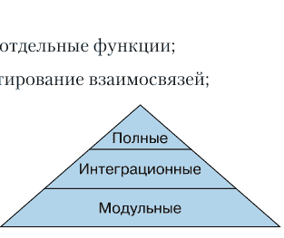

## 测试什么

在编写代码的过程中需要测试什么？本质上，需要确认在给定输入数据的情况下，您将获得正确的输出数据。

可以检查以下几点：

- 错误输入；
- 重复输入；
- 错误的输入类型；
- 错误的输入顺序；
- 不允许的输入值；
- 巨大的输入和输出数据数组。

错误可能发生在任何地方。

- *Web 层*——Pydantic 会捕获任何模型不匹配的情况，并返回 HTTP 状态码 422。
- *数据层*——当数据缺失或重复，以及 SQL 查询语法错误时，数据库将抛出异常。当以单个块而不是通过生成器或分页分段传输巨大的数据结果时，可能会发生超时或内存耗尽。
- *任何层级*——都可能出现普通的错误和疏忽。

第 8-10 章包含其中一些测试：

- 使用 HTTPie 等工具进行*手动端到端测试*；
- 以 Python 代码片段形式进行的*手动单元测试*；
- 使用 pytest 脚本进行的*自动化测试*。

在接下来的几个部分中，我们将详细探讨 pytest。

## Pytest

Python 中早已存在标准包 `unittest`（https://oreil.ly/3u0M_）。后来出现的第三方包 `nose`（https://nose.readthedocs.io）试图对其进行改进。目前大多数 Python 开发者更倾向于使用 `pytest` 框架（https://docs.pytest.org），它比之前提到的任何框架功能更强大，也更易于使用。它并非 Python 内置，因此需要时需执行 `pip install pytest` 命令安装。同时运行 `pip install pytestmock` 命令以获取自动化的 `mocker` fixture——你将在本章后面看到它。

pytest 提供了哪些功能？其便捷的自动化特性包括：

- *测试发现*——文件名以 `test_` 为前缀或以 `_test` 为后缀的 Python 文件中的测试将被自动执行。这种文件名匹配规则会递归到子目录，执行其中包含的所有测试。
- *详细的失败信息与断言构造*——断言语句会输出预期结果与实际发生的情况。
- *Fixture*——这些函数可以为整个测试脚本运行一次，也可以为每个测试（在其作用域内）执行，为测试函数提供诸如标准测试数据或数据库初始化等参数。Fixture 是一种依赖注入机制，类似于 FastAPI 为 Web 应用路径函数提供的功能——将具体数据传递给通用的测试函数。
- *参数化*——为测试函数提供多组测试数据。

## 布局

测试应该放在哪里？似乎没有统一的意见，但以下是两种合理的方案：

- 在顶层创建 `test` 目录，并为被测试的代码区域（如 `web`、`service` 等）创建子目录；
- 在每个代码目录（如 `web`、`service` 等）下创建 `test` 子目录。

此外，在具体的 `test/web` 子目录内，应为不同类型的测试（单元测试、集成测试和完整测试）创建额外的子目录。本书中我使用以下层级结构：

```
test
├── unit
│   ├── web
│   ├── service
│   └── data
├── integration
└── full
```

单独的测试脚本位于最底层的目录中。本章将讨论这些内容。

## 自动化单元测试

单元测试应仅验证单一层级内的某项功能。通常这意味着向函数传递参数，并断言其应返回的结果。

单元测试要求被测代码具有*隔离性*。如果没有隔离，那么你测试的可能还包括其他代码部分。那么，如何为单元测试隔离代码呢？

## Mock（模拟）

在本书的代码栈中，通过 Web 界面访问 URL 通常会调用 Web 层的函数，该函数再调用服务层的函数。接着，服务层函数调用数据层的函数来访问数据库。结果沿调用链返回，最终从 Web 层返回给调用方。

单元测试乍看很简单。对于代码库中的每个函数，传入测试参数，并验证其是否返回预期值。这对于*纯函数*（接受输入参数并返回结果，不依赖任何外部代码）来说效果很好。但大多数函数还会调用其他函数。那么，如何控制其他函数的行为呢？对于来自外部源的数据又该如何处理？最常见的需要控制的外部因素是数据库访问，但实际上它可能是任何东西。

一种方法是为每个外部函数调用创建一个 *mock*（模拟对象）。由于 Python 中的函数是一等对象，可以用一个函数替换另一个。`unittest` 包中有一个 `mock` 模块，正是执行此操作的。

许多开发者认为 mock 是隔离单元测试的最佳方式。我将首先展示 mock 的示例，并论证一个观点：mock 通常需要过多了解代码的内部工作原理，而非其结果。你可能熟悉“结构测试”（如 mock，被测代码结构清晰可见）和“行为测试”（不需要了解代码内部结构）这两个术语。示例 12.1 和 12.2 分别定义了模块 `mod1.py` 和 `mod2.py`。

### 示例 12.1. 被调用模块 (mod1.py)

```
def preamble() -> str:
    return "The sum is "
```

### 示例 12.2. 调用模块 (mod2.py)

```
import mod1

def summer(x: int, y:int) -> str:
    return mod1.preamble() + f"{x+y}"
```

函数 `summer()` 计算其参数的和，并返回一个包含 `preamble` 函数结果和总和的字符串。示例 12.3 是一个用于测试 `summer()` 函数的最小化 pytest 脚本。

### 示例 12.3. Pytest 脚本 test_summer1.py

```
import mod2

def test_summer():
    assert "The sum is 11" == mod2.summer(5,6)
```

在示例 12.4 中，测试成功执行。

### 示例 12.4. 运行 pytest 脚本

```
$ pytest -q test_summer1.py
.
[100%]
1 passed in 0.04s
```

（`-q` 参数使测试静默运行，不输出多余细节。）很好，测试通过了。但 `summer()` 函数从 `preamble()` 函数获取了文本。如果我们只想验证加法运算是否正确呢？

可以编写一个新函数，返回两个数字的字符串和，然后重写 `summer()` 函数，使其返回该和并附加到 `preamble()` 的字符串中。或者，可以创建一个 `preamble()` 函数的 mock，以消除其影响，如示例 12.5 所示。

### 示例 12.5. 使用 mock 的 Pytest 脚本 (test_summer2.py)

```
from unittest import mock
import mod1
import mod2

def test_summer_a():
    with mock.patch("mod1.preamble", return_value=""):
        assert "11" == mod2.summer(5,6)

def test_summer_b():
    with mock.patch("mod1.preamble") as mock_preamble:
        mock_preamble.return_value=""
        assert "11" == mod2.summer(5,6)

@mock.patch("mod1.preamble", return_value="")
def test_summer_c(mock_preamble):
    assert "11" == mod2.summer(5,6)

@mock.patch("mod1.preamble")
def test_caller_d(mock_preamble):
    mock_preamble.return_value = ""
    assert "11" == mod2.summer(5,6)
```

这些测试表明，创建 mock 有多种方式。函数 `test_caller_a()` 使用 `mock.patch()` 作为 Python 的上下文管理器（`with` 语句）。其参数如下：

- `"mod1.preamble"` —— 模块 `mod1` 中函数 `preamble()` 的完整字符串名称；
- `return_value=""` —— 指定 mock 版本返回空字符串。

函数 `test_caller_b()` 几乎相同，但添加了 `as mock_preamble` 表达式，以便在下一行使用 mock 对象。

函数 `test_caller_c()` 使用 Python *装饰器* 定义 mock。mock 对象作为参数传递给 `test_caller2()` 函数。

函数 `test_caller_d()` 类似于 `test_caller_b()`，在单独的 `mock_preamble` 调用中设置 `return_value` 参数。

在每种情况下，mock 对象的字符串名称必须与被测代码中的调用方式一致——在本例中是 `summer()`。mock 库将此字符串名称转换为一个变量，该变量拦截所有对同名原始变量的引用。（请记住，在 Python 中，变量只是对实际对象的引用。）

因此，在示例 12.6 中，所有四个测试函数中的 `summer()` 在调用 `summer(5,6)` 时，调用的是修改后的 mock `preamble()`，而非真实函数。在 mock 版本中，该字符串被丢弃，因此测试可以验证 `summer()` 函数返回的是其两个参数之和的字符串版本。

### 示例 12.6. 运行 mock 脚本 pytest

```
$ pytest -q test_summer2.py
.....
[100%]
4 passed in 0.13s
```

这是一个为了简化而虚构的例子。Mock 可能相当复杂。可以在诸如 Alex Ronkilo 的《Understanding the Python Mock Object Library》（https://oreil.ly/I0bkd）等文章中找到直观的示例。而令人望而生畏的详细信息则存在于 Python 官方文档中（https://oreil.ly/hN9lZ）。

## 测试替身与伪对象

要执行 mock，你需要知道 `summer()` 函数从 `mod1` 模块导入了 `preamble()` 函数。这是一种结构测试，需要了解特定的变量名和模块名。

是否有办法进行不需要这些知识的行为测试呢？

一种方法是定义一个*测试替身*（有时称为*替身*或*模拟对象*）。这是一段独立的代码，执行我们在测试中想要的功能——在本例中，让 `preamble()` 函数返回空字符串。一种实现方式是通过导入。首先应用这种方法针对此示例，然后将其用于以下三个部分的模块化测试。

首先，重新定义 `mod2.py` 文件（示例 12.7）。

## 示例 12.7. 指定文件 `mod2.py` 在模块化测试时导入替代模块

```python
import os
if os.get_env("UNIT_TEST"):
    import fake_mod1 as mod1
else:
    import mod1

def summer(x: int, y:int) -> str:
    return mod1.preamble() + f"{x+y}"
```

示例 12.8 定义了这个替代模块 `fake_mod1.py`。

## 示例 12.8. 替代模块 `fake_mod1.py`

```python
def preamble() -> str:
    return ""
```

而示例 12.9 是一个测试...

## 示例 12.9. 测试脚本 `test_summer_fake.py`

```python
import os
os.environ["UNIT_TEST"] = "true"
import mod2

def test_summer_fake():
    assert "11" == mod2.summer(5,6)
```

...由示例 12.10 运行。

## 示例 12.10. 运行新的模块化测试

```
$ pytest -q test_summer_fake.py
.
[100%]
1 passed in 0.04s
```

这种切换导入的方法需要添加环境变量检查，但可以避免为函数调用编写特殊模拟的需要。您可以自行决定更喜欢哪种方式。在接下来的部分中，我们将采用导入方法——它与我在定义代码层时使用的模拟包配合得非常好。

总而言之，在这些示例中，`preamble()` 函数在测试脚本中被模拟替代，或者导入了替代模块。您也可以通过其他方式隔离被测试的代码，但上述方法有效且不像 Google 可能向您推荐的其他方法那样包含特殊技巧。

## Web 层

此层实现了网站的 API。理想情况下，每个路径函数（端点）至少应有一个测试，如果函数可能以多种方式失败，则应有更多测试。在 Web 层，通常需要检查端点是否存在、是否使用正确的参数工作以及是否返回正确的状态码和数据。


这些是表面的 API 测试，仅测试 Web 层。因此，服务层的调用（服务层又会访问数据层和数据库）必须像任何其他离开 Web 层的调用一样被拦截。

利用上一节中实现的 `import` 结构思想，使用环境变量 `CRYPTID_UNIT_TEST` 来导入模拟包（如 `service`）而不是真正的 `service`。这可以防止 Web 函数调用服务函数，而是将其连接到模拟（替代）版本。这样，底层的数据层和数据库也不会被使用。我们得到了想要的——模块化测试。示例 12.11 展示了修改后的 `web/creature.py` 文件。

### 示例 12.11. 修改后的文件 `web/creature.py`

```python
import os
from fastapi import APIRouter, HTTPException
from model.creature import Creature
if os.getenv("CRYPTID_UNIT_TEST"):
    from fake import creature as service
else:
    from service import creature as service
from error import Missing, Duplicate

router = APIRouter(prefix = "/creature")

@router.get("/")
def get_all() -> list[Creature]:
    return service.get_all()

@router.get("/{name}")
def get_one(name) -> Creature:
    try:
        return service.get_one(name)
    except Missing as exc:
        raise HTTPException(status_code=404, detail=exc.msg)

@router.post("/", status_code=201)
def create(creature: Creature) -> Creature:
    try:
        return service.create(creature)
    except Duplicate as exc:
        raise HTTPException(status_code=409, detail=exc.msg)

@router.patch("/")
def modify(name: str, creature: Creature) -> Creature:
    try:
        return service.modify(name, creature)
    except Missing as exc:
        raise HTTPException(status_code=404, detail=exc.msg)

@router.delete("/{name}")
def delete(name: str) -> None:
    try:
        return service.delete(name)
    except Missing as exc:
        raise HTTPException(status_code=404, detail=exc.msg)
```

示例 12.12 展示了使用两个 pytest 固定装置的测试：

- `sample()` — 一个新的 `Creature` 对象；
- `fakes()` — 一个生物列表。

模拟数据来自底层模块。通过设置环境变量 `CRYPTID_UNIT_TEST`，示例 12.11 中的 Web 模块导入了模拟版本的服务（提供模拟数据，而不是调用数据库），而不是真实的服务。这允许隔离测试，而这正是其意义所在。

### 示例 12.12. 使用固定装置的 Web 层生物模块化测试

```python
from fastapi import HTTPException
import pytest
import os
os.environ["CRYPTID_UNIT_TEST"] = "true"
from model.creature import Creature
from web import creature

@pytest.fixture
def sample() -> Creature:
    return Creature(name="dragon",
                    description="Wings! Fire! Aieee!",
                    country="*")

@pytest.fixture
def fakes() -> list[Creature]:
    return creature.get_all()

def assert_duplicate(exc):
    assert exc.value.status_code == 404
    assert "Duplicate" in exc.value.msg

def assert_missing(exc):
    assert exc.value.status_code == 404
    assert "Missing" in exc.value.msg

def test_create(sample):
    assert creature.create(sample) == sample

def test_create_duplicate(fakes):
    with pytest.raises(HTTPException) as exc:
        _ = creature.create(fakes[0])
        assert_duplicate(exc)

def test_get_one(fakes):
    assert creature.get_one(fakes[0].name) == fakes[0]

def test_get_one_missing():
    with pytest.raises(HTTPException) as exc:
        _ = creature.get_one("bobcat")
        assert_missing(exc)

def test_modify(fakes):
    assert creature.modify(fakes[0].name, fakes[0]) == fakes[0]

def test_modify_missing(sample):
    with pytest.raises(HTTPException) as exc:
        _ = creature.modify(sample.name, sample)
        assert_missing(exc)

def test_delete(fakes):
    assert creature.delete(fakes[0].name) is None

def test_delete_missing(sample):
    with pytest.raises(HTTPException) as exc:
        _ = creature.delete("emu")
        assert_missing(exc)
```

## 服务层

在某种意义上，服务层是最重要的，它可能与不同的数据层和 Web 层相关联。示例 12.13 类似于示例 12.11，主要区别在于 `import` 指令和使用底层数据模块。它也不拦截数据层出现的异常，而是将其留给 Web 层处理。

### 示例 12.13. 修改后的文件 `service/creature.py`

```python
import os
from model.creature import Creature
if os.getenv("CRYPTID_UNIT_TEST"):
    from fake import creature as data
else:
    from data import creature as data

def get_all() -> list[Creature]:
    return data.get_all()

def get_one(name) -> Creature:
    return data.get_one(name)

def create(creature: Creature) -> Creature:
    return data.create(creature)

def modify(name: str, creature: Creature) -> Creature:
    return data.modify(name, creature)

def delete(name: str) -> None:
    return data.delete(name)
```

示例 12.14 展示了相应的模块化测试。

### 示例 12.14. 服务测试文件 `test/unit/service/test_creature.py`

```python
import os
os.environ["CRYPTID_UNIT_TEST"]= "true"
import pytest

from model.creature import Creature
from error import Missing, Duplicate
from data import creature as data

@pytest.fixture
def sample() -> Creature:
    return Creature(name="yeti",
        aka="Abominable Snowman",
        country="CN",
        area="Himalayas",
        description="Handsome Himalayan")

def test_create(sample):
    resp = data.create(sample)
    assert resp == sample

def test_create_duplicate(sample):
    resp = data.create(sample)
    assert resp == sample
    with pytest.raises(Duplicate):
        resp = data.create(sample)

def test_get_exists(sample):
    resp = data.create(sample)
    assert resp == sample
    resp = data.get_one(sample.name)
    assert resp == sample

def test_get_missing():
    with pytest.raises(Missing):
        _ = data.get_one("boxturtle")

def test_modify(sample):
    sample.country = "CA" # Canada!
    resp = data.modify(sample.name, sample)
    assert resp == sample

def test_modify_missing():
    bob: Creature = Creature(name="bob", country="US", area="*",
        description="some guy", aka="??")
    with pytest.raises(Missing):
        _ = data.modify(bob.name, bob)
```

## 数据层

数据层更容易进行隔离测试，因为无需担心意外调用更低层的函数。模块化测试应涵盖此层的函数以及使用的具体数据库查询。到目前为止，SQLite 是“服务器”数据库，SQL 是查询语言。但您可以决定使用像 SQLAlchemy 这样的包，并利用其 SQLAlchemy 表达式语言或 ORM 功能。那时就需要完整的测试。目前，我坚持使用最低级别——DB-API Python 和普通 SQL 查询。

## 示例 12.15. data/creature.py 文件的模块化数据测试

```python
import os
import pytest
from model.creature import Creature
from error import Missing, Duplicate

# 在导入数据之前设置此参数
os.environ["CRYPTID_SQLITE_DB"] = ":memory:"
from data import creature

@pytest.fixture
def sample() -> Creature:
    return Creature(name="yeti",
        aka="Abominable Snowman",
        country="CN",
        area="Himalayas",
        description="Hapless Himalayan")

def test_create(sample):
    resp = creature.create(sample)
    assert resp == sample

def test_create_duplicate(sample):
    with pytest.raises(Duplicate):
        _ = creature.create(sample)

def test_get_one(sample):
    resp = creature.get_one(sample.name)
    assert resp == sample

def test_get_one_missing():
    with pytest.raises(Missing):
        resp = creature.get_one("boxturtle")

def test_modify(sample):
    creature.country = "JP" # 日本！
    resp = creature.modify(sample.name, sample)
    assert resp == sample

def test_modify_missing():
    thing: Creature = Creature(name="snurifle",
        description="some thing", country="somewhere")
    with pytest.raises(Missing):
        _ = creature.modify(thing.name, thing)

def test_delete(sample):
    resp = creature.delete(sample.name)
    assert resp is None

def test_delete_missing(sample):
    with pytest.raises(Missing):
        _ = creature.delete(sample.name)
```

与 Web 层和 Service 层的模块化测试不同，这次我们不需要用于替换现有数据层模块的模拟模块。相反，我们设置另一个环境变量，以指示数据层使用一个仅基于内存的 SQLite 实例，而不是基于文件的实例。这不需要对现有数据模块进行任何更改，只需在示例 12.15 中*导入任何数据模块之前*进行测试配置即可。

## 自动化集成测试

集成测试用于展示不同代码片段在各层之间的交互是否良好。但如果你去搜索相关示例，会得到许多不同的答案。是否需要测试部分调用路径，例如 Web → Service、Web → Data 等？

为了完全测试管道 A → B → C 中的每个连接，需要检查以下组合：

- A → B；
- B → C；
- A → C。

如果系统中有超过三个交叉点，你将拥有满满一箭袋这样的箭头。或者，集成测试本质上应该是端到端测试，但最后一部分——磁盘上的数据存储——使用模拟？

到目前为止，你一直使用 SQLite 作为数据库，并且可以利用 SQLite 的内存模式作为磁盘上 SQLite 数据库的模拟。如果你的查询是*标准*的 SQL，那么 SQLite-In-Memory 也可以作为其他数据库的合适模拟选项。如果不是，那么以下模块已针对特定数据库的模拟进行了适配：

- PostgreSQL — pgmock (https://pgmock.readthedocs.io)；
- MongoDB — Mongomock (https://github.com/mongomock/mongomock)；
- 多种 Pytest Mock 资源 (https://pytest-mock-resources.readthedocs.io)，它们在 Docker 容器中运行各种测试数据库，并且与 pytest 集成。

最后，也可以直接运行与生产环境相同类型的测试数据库。环境变量可以具有特定性，类似于你之前在单元测试/模拟中使用的技巧。

## “仓储”模式

虽然我在本书中没有使用它，但“仓储”模式 (https://oreil.ly/3JMKH) 是一种有趣的方法。仓储是一个简单的内存中间数据存储，类似于前面介绍的模拟数据层。然后，它与可插拔的数据库适配器连接，用于真实的数据库。仓储通常与工作单元模式 (https://oreil.ly/jHGV8) 一起使用，该模式确保在一次会话中的一组操作要么全部提交，要么全部回滚，就像一个整体一样。

到目前为止，本书中的数据库查询都是原子性的。在实践中，为了处理数据库，你可能需要多步骤查询和特定的会话处理。“仓储”模式也与依赖注入 (https://oreil.ly/0f0Q3) 结合使用，你已经在本书的其他部分遇到过它，并且可能已经对其有所了解。

## 自动化端到端测试

在端到端或全链路测试中，所有层同时被使用——这种方法最接近生产环境的应用。前面描述的大多数测试都是端到端测试：调用 Web 应用程序的端点，穿越 Service 城，进入 Data 堡中心，然后带着产品返回。这些是封闭测试。一切都在实时发生，你不需要关心它是如何发生的——重要的是它发生了。

你可以通过两种方式完全测试通用 API 中的每个端点。

- 使用 HTTP/HTTPS 编写单独的、与服务器交互的 Python 测试客户端。在本书的许多示例中，这是通过独立的客户端（如 HTTPie）或使用 Requests 的脚本完成的。
- 使用 TestClient 应用 FastAPI/Starlette 的内置对象，以获得对服务器的直接访问，而无需建立开放的 TCP 连接。

然而，这些方法需要为每个端点编写一个或多个测试。这可能会变得像中世纪一样繁琐，而我们早已进入了更现代的时代。一种更现代的方法是基于属性的测试 (Property-Based Testing, PBT)。它利用了 FastAPI 自动生成文档的优势。名为 openapi.json 的 OpenAPI 模式在每次你修改 Web 层的路径函数或路径装饰器时由 FastAPI 生成。该模式详细描述了每个端点的所有信息——参数、返回值等。OpenAPI 规范 (OpenAPI Specification, OAS) 正是为此而生，正如 OpenAPI Initiative 的常见问题解答 (https://www.openapis.org/faq) 页面所述：“OAS 为 REST API 定义了一种与编程语言无关的标准接口描述，它允许人们和计算机在无需访问源代码、额外文档或研究网络流量的情况下，发现并理解服务的功能。”

需要两个包来完成这项工作：

- Hypothesis (https://hypothesis.works) — pip install hypothesis；
- Schemathesis (https://schemathesis.readthedocs.io) — pip install schemathesis。

Hypothesis 是基础库，而 Schemathesis 将其应用于 FastAPI 生成的 OpenAPI 3.0 模式。运行时，Schemathesis 工具会读取该模式，生成大量具有不同数据的测试（你不需要自己构思！），并与 pytest 一起工作。

为了不拖延，在示例 12.16 中，我们首先将 main.py 文件中的代码缩减为生物和探索者的基本端点——creature 和 explorer。

## 示例 12.16. main.py 文件的基础

```python
from fastapi import FastAPI
from web import explorer, creature

app = FastAPI()
app.include_router(explorer.router)
app.include_router(creature.router)
```

在示例 12.17 中执行测试。

## 示例 12.17. 运行 Schemathesis 测试

```
$ schemathesis http://localhost:8000/openapi.json
======================== Schemathesis test session starts ========================
Schema location: http://localhost:8000/openapi.json
Base URL: http://localhost:8000/
Specification version: Open API 3.0.2
Workers: 1
Collected API operations: 12

GET /explorer/ .                                [  8%]
POST /explorer/ .                               [ 16%]
PATCH /explorer/ F                              [ 25%]
GET /explorer .                                 [ 33%]
POST /explorer .                                [ 41%]
GET /explorer/{name} .                          [ 50%]
DELETE /explorer/{name} .                       [ 58%]
GET /creature/ .                                [ 66%]
POST /creature/ .                               [ 75%]
PATCH /creature/ F                              [ 83%]
GET /creature/{name} .                          [ 91%]
DELETE /creature/{name} .                       [100%]
```

我得到了两个 F 标记，都是在调用 PATCH（modify() 函数）时出现的。这真令人不快。

在此输出部分之后，是一个标记为 FAILURES（失败）的部分，其中包含所有失败测试的详细堆栈跟踪。这些需要修复。最后一部分标记为 SUMMARY（摘要）：

```
Performed checks:
    not_a_server_error                    717 / 727 passed          FAILED

Hint: You can visualize test results in Schemathesis.io
by using `--report` in your CLI command.
```

这很快，而且不需要为每个端点进行大量测试，也不用去想哪些输入数据可能会破坏它们的工作。基于属性的测试从 API 模式中读取输入参数的类型和约束，并为每个端点生成一系列值进行检查。

这是类型提示带来的又一个意想不到的好处，起初它们似乎只是些锦上添花的东西：类型提示 → OpenAPI 模式 → 自动生成的文档和测试。

## 安全测试

安全并非单一要素，而是一个整体。你不仅需要防范恶意攻击，还要应对普通错误，甚至那些超出你控制范围的事件。我们将扩展性问题留到下一节讨论，这里主要关注潜在威胁的分析。

第 11 章讨论了身份验证和授权。这些因素总是杂乱无章且容易出错。人们倾向于使用巧妙的方法来对抗巧妙的攻击，而设计一个易于理解和实现的防护措施总是很困难。

但现在，既然你了解了 Schemathesis，请阅读其关于基于属性的身份验证测试的文档 (https://oreil.ly/v_O-Q)。正如它极大地简化了大部分 API 的测试一样，它也可以自动化大部分需要身份验证的端点测试。

## 负载测试

负载测试可以检验你的应用如何处理大流量，具体检查：

- API 调用；
- 数据库的读写；
- 内存使用情况；
- 磁盘空间使用情况；
- 网络延迟和吞吐量。

其中一些可能是*端到端*测试，模拟一大群用户渴望使用你的服务。你应该为这一天的到来做好准备。本节内容与第 13 章的“性能”和“故障排除”部分有部分重叠。

有许多优秀的负载测试工具，但这里我推荐一个名为 Locust (https://locust.io) 的工具。使用它时，你可以用普通的 Python 脚本定义所有测试。它可以模拟成千上万的用户同时访问你的网站甚至多个服务器。

使用命令 `pip install locust` 在本地安装它。第一个测试可以是检查你的网站可能承受的同时访问者数量。这就像检查建筑物在飓风、地震、暴风雪或其他可怕事件期间能承受多极端的天气条件。因此，你需要对网站进行结构测试。更多详细信息可以在 Locust 的文档 (https://docs.locust.io) 中找到。

但是，正如电视上常说的，这还不是全部！最近，Grasshopper (https://github.com/alteryx/locust-grasshopper) 工具的开发者扩展了 Locust 的功能，使其能够执行诸如测量多个 HTTP 调用时间等任务。要尝试此扩展，请使用命令 `pip install locust-grasshopper` 进行安装。

# 结论

本章详细介绍了各种测试类型，并给出了使用 pytest 进行模块级、集成和完整测试的自动化代码测试示例。API 测试可以使用 Schemathesis 工具实现自动化。这里还讨论了如何在问题出现之前发现安全性和性能问题。

# 第 13 章

## 投入使用

> 如果建筑工人建造大楼的方式和程序员编写程序的方式一样，那么第一只出现的啄木鸟就会摧毁整个文明。

*杰拉尔德·温伯格，IT 领域科学家*

### 概述

你有一个在本地机器上运行的应用程序，现在你想分享它。本章介绍了许多将应用程序迁移到生产环境并确保其正确高效运行的场景。由于部分描述**非常**详细，在某些情况下，我将引用有用的第三方文档，而不是在此处全部列出。

## 部署

到目前为止，本书中所有的代码示例都使用了一个在 `localhost` 地址 8000 端口上运行的 uvicorn 实例。为了处理大量流量，你需要多个服务器在现代硬件提供的多个核心上运行。此外，还需要在这些服务器之上部署一些东西来执行以下操作：

- 保持它们正常运行（*进程管理器*）；
- 收集和发送外部请求（*反向代理*）；
- 返回响应；
- 提供 HTTPS 终端（解密 SSL）。

## 多进程

你可能见过一个名为 Gunicorn (https://gunicorn.org) 的 Python 服务器。它可以管理多个进程，但它是一个 WSGI 服务器，而 FastAPI 基于 ASGI。幸运的是，存在一个专门的 Uvicorn 进程类，可以由 Gunicorn 管理。

示例 13.1 讨论了这些在 localhost 8000 端口上的 Uvicorn 进程（摘自官方文档，https://oreil.ly/Svdhx）。引号可以保护 shell 免受任何特殊解释。

**示例 13.1.** 将 Gunicorn 与 Uvicorn 进程一起使用

```
$ pip install "uvicorn[standard]" gunicorn
$ gunicorn main:app --workers 4 --worker-class uvicorn.workers.UvicornWorker --bind 0.0.0.0:8000
```

当 Gunicorn 处理你的请求时，你会看到许多行输出。将启动一个顶层 Gunicorn 进程，它将与四个共享 local host (0.0.0.0) 上 8000 端口的 Uvicorn 工作子进程进行通信。如果你需要其他设置，请更改主机、端口或进程数量。表达式 main:app 引用文件 main.py 和名为 app 的 FastAPI 对象。Gunicorn 文档 (https://oreil.ly/TxYIy) 声称：“为了处理每秒数百或数千个请求，Gunicorn 只需要 4-12 个工作进程。”

事实证明，Uvicorn 本身也可以运行多个 Uvicorn 进程，如示例 13.2 所示。

**示例 13.2.** 将 Uvicorn 与 Uvicorn 工作进程一起使用

```
$ uvicorn main:app --host 0.0.0.0 --port 8000 --workers 4
```

但这种方法不允许管理进程，因此通常更倾向于使用 Gunicorn 方法。Uvicorn 还有其他进程管理器——请参阅官方文档 (https://www.uvicorn.org/deployment)。

这允许执行前面章节中提到的四个任务中的三个，但不包括 HTTPS 加密。

## HTTPS

FastAPI 关于 HTTPS 的官方文档 (https://oreil.ly/HYRW7) 与其他文档一样，信息量极大。我建议你阅读它，然后阅读 Ramires 关于如何使用名为 Traefik (https://traefik.io) 的反向代理为 FastAPI 添加 HTTPS 支持的描述 (https://oreil.ly/zcUWS)。它位于你的 Web 服务器之上，类似于 nginx 作为反向代理和负载均衡器，但包含了 HTTPS 的魔力。

尽管这个过程包含许多步骤，但它仍然比以前简单得多。特别是，以前你不得不定期向认证中心支付高额费用，以获取可用于在你的网站上支持 HTTPS 协议的数字证书。幸运的是，免费服务 Let's Encrypt (https://letsencrypt.org) 取代了这些机构。

## Docker

当 Docker 登场时（它在 Solomon Hykes 于 2013 年 PyCon 上的五分钟闪电演讲 (https://oreil.ly/25oef) 中被提及），我们大多数人第一次听说了 Linux 容器。随着时间的推移，我们意识到 Docker 比虚拟机更快、更轻量。所有容器共享服务器的 Linux 内核，而不是模拟完整的操作系统，进程和网络在各自的命名空间中隔离。突然间，你可以使用免费的 Docker 软件在一台机器上托管多个独立的服务，而不用担心它们会相互干扰。

十年后，Docker 获得了广泛的认可和支持。如果你想将你的 FastAPI 应用部署到云服务上，通常需要先创建它的 *Docker 镜像*。FastAPI 官方文档 (https://oreil.ly/QnwOW) 详细描述了如何为你的 FastAPI 应用创建 Docker 版本。其中一个步骤是编写 *Dockerfile*，这是一个包含 Docker 配置信息的文本文件，例如使用哪些应用程序代码以及启动哪些进程。为了证明这并非像火箭发射时的脑部手术那样复杂，我在此提供该页面上的 Dockerfile：

```
FROM python:3.9
WORKDIR /code
COPY ./requirements.txt /code/requirements.txt
```

## 云服务

在网络上可以找到许多付费或免费的托管服务来源。以下是一些关于如何使用它们部署 FastAPI 的示例信息：

-   Tutorials Point 网站上的文章 *FastAPI — Deployment* ([https://oreil.ly/DBZcm](https://oreil.ly/DBZcm))；
-   由工程师克里斯托弗·萨穆拉整理的资料 *The Ultimate FastAPI Tutorial Part 6b — Basic Deployment on Linode* ([https://oreil.ly/s8iar](https://oreil.ly/s8iar))；
-   奥卡达·希皮尼奇的文章 *How to Deploy a FastAPI App on Heroku for Free* ([https://oreil.ly/A6gij](https://oreil.ly/A6gij))。

我建议阅读官方文档或通过 Google 搜索 *fastapi docker* 得到的其他链接，例如克里斯托弗·萨穆拉的 *The Ultimate FastAPI Tutorial Part 13 — Using Docker to Deploy Your App* ([https://oreil.ly/7TUpR](https://oreil.ly/7TUpR))。

```
RUN pip install --no-cache-dir --upgrade -r /code/requirements.txt
COPY ./app /code/app
CMD ["uvicorn", "app.main:app", "--host", "0.0.0.0", "--port", "80"]
```

## Kubernetes

Kubernetes 平台源于 Google 内部用于管理其内部系统的代码，这些系统变得异常复杂。系统管理员（当时的称呼）手动配置负载均衡器、反向代理、*humors*¹ 等工具。Kubernetes 旨在将这些知识的大部分内容自动化——不要告诉我*如何*做，而是告诉我你*想要*什么。这包括维护服务的可用性或在流量激增时启动额外服务器等任务。

有许多关于如何在 Kubernetes 上部署 FastAPI 的描述，包括苏曼塔·慕克吉的文章 *Deploying a FastAPI Application on Kubernetes* ([https://oreil.ly/ktTNu](https://oreil.ly/ktTNu))。

¹ 等等，它们不是用来保持雪茄新鲜的吗？

## 性能

目前，FastAPI 的性能在所有 Python Web 框架中是最高的之一 ([https://oreil.ly/mxabf](https://oreil.ly/mxabf))，甚至可以与使用更快语言（如 Go）的框架相媲美。但这在很大程度上归功于 ASGI，它通过异步性避免了 I/O 等待。Python 本身是一种相当慢的语言。以下是一些提高整体性能的建议和技巧。

## 异步性

通常，Web 服务器不需要非常快。它大部分时间都花在接收网络 HTTP 请求和返回结果上（在本书中，这由 Web 层表示）。在这之间，Web 服务执行业务逻辑（服务层）、访问数据源（数据层），并再次将大部分时间花在网络 I/O 上。

当 Web 服务中的代码需要等待响应时，最好使用异步函数（`async def`，而不是 `def`）。这允许 FastAPI 和 Starlette 调度异步函数的工作，并在等待其响应时执行其他操作。这是 FastAPI 基准测试优于基于 WSGI 的框架（如 Flask 和 Django）的原因之一。性能有两个方面：

-   处理单个请求的时间；
-   同时处理的请求数量。

## 缓存

如果你有一个从静态源（例如很少或从不更改的数据库记录）获取数据的 Web 应用程序端点，可以在函数中缓存数据。这可以在任何层级进行。Python 提供了标准模块 `functools` ([https://oreil.ly/8Kg4V](https://oreil.ly/8Kg4V))，以及 `cache()` 和 `lru_cache()` 函数。

## 数据库、文件和内存

网站运行缓慢最常见的原因之一是数据库表缺少足够大小的索引。通常，直到表增长到一定大小之前，你都不会注意到问题，然后查询突然变得慢得多。在 SQL 中，`WHERE` 子句中的任何列都应该被索引。

在本书给出的许多示例中，`creature` 和 `explorer` 表的主键是文本字段 `name`。在创建表时，`name` 字段被声明为主键（`primary key`）。对于前面提到的小表，SQLite 无论如何都会忽略这个键，因为直接扫描表会更快。但一旦表达到相当大的规模——比如一百万行，缺少索引就会变得明显。解决方案可以是运行查询优化器 ([https://oreil.ly/YPR3Q](https://oreil.ly/YPR3Q))。

即使你有一个小表，也可以使用 Python 脚本或开源工具对数据库进行负载测试。如果对数据库执行许多连续查询，也许值得将它们合并为一个批处理。如果你上传或下载一个大文件，请使用流式版本，而不是巨大的数据块。

## 队列

如果你正在执行任何耗时超过几分之一秒的任务，例如发送确认邮件或缩小图像，也许值得将其传递给任务队列，例如 Celery ([https://docs.celeryq.dev](https://docs.celeryq.dev))。

## Python 本身

如果 Web 服务因为使用 Python 执行大量计算而显得缓慢，你可能需要“更快的 Python”。替代方案包括：

-   使用 PyPy ([https://www.pypy.org](https://www.pypy.org)) 而不是标准的 CPython 实现；
-   用 C、C++ 或 Rust 为 Python 编写扩展 ([https://oreil.ly/BEIJa](https://oreil.ly/BEIJa))；
-   将缓慢的 Python 代码转换为 Cython ([https://cython.org](https://cython.org)) 语言，Pydantic 和 Uvicorn 使用的就是它。

最近，Mojo ([https://oreil.ly/C96kx](https://oreil.ly/C96kx)) 语言发布了一个非常引人注目的公告。它旨在成为 Python 的完整超集，具有新功能（使用 Python 友好的相同语法），能够将 Python 示例加速数千倍。主要作者克里斯·拉特纳此前曾参与 LLVM ([https://llvm.org](https://llvm.org))、Clang ([https://clang.llvm.org](https://clang.llvm.org)) 和 MLIR ([https://mlir.llvm.org](https://mlir.llvm.org)) 等编译工具以及 Apple 的 Swift ([https://www.swift.org](https://www.swift.org)) 语言的开发。

Mojo 旨在成为 AI 开发的单一语言解决方案，而目前（在 PyTorch 和 TensorFlow 中）这需要 Python/C/C++ 构建，这些构建在开发、管理和调试方面都很复杂。但 Mojo 不仅在 AI 领域会是一个很好的通用语言。

我用 C 语言编写了很多年，一直在等待一个兼具性能和 Python 易用性的继任者。可能的候选者有 D、Go、Julia、Zig 和 Rust，但如果 Mojo 能够实现其目标 ([https://oreil.ly/EojvA](https://oreil.ly/EojvA))，我会积极使用它。

## 故障排除

从你遇到问题的时间点和位置开始，自下而上地查看。这些问题包括时间和空间上的性能问题，以及逻辑和异步陷阱。

## 问题类型

你首先收到了哪个 HTTP 状态码？

-   404 — 认证或授权错误。
-   422 — 通常是 Pydantic 对模型使用的抱怨。
-   500 — 位于你的 FastAPI 后面的服务故障。

## 日志记录

Uvicorn 和其他 Web 服务器通常将日志写入标准输出文件。你可以检查日志以了解实际进行了哪个调用，包括 HTTP 动词和 URL，但不包括正文、头文件或 cookie 中的数据。

如果某个端点返回 400 系列的状态码，可以尝试再次提交相同的数据，看看错误是否重复。如果是这样，我调试器的第一个原始本能就是在 Web、服务和数据层的相应函数中添加 `print()` 语句。

此外，在你引发异常的任何地方，都添加详细的描述。如果数据库搜索失败，请提供输入值和具体错误，例如尝试复制唯一的键字段。

## 指标

“指标”、“监控”、“可观测性”和“遥测”这些术语的含义似乎有部分重叠。在 Python 领域，通常使用：

-   Prometheus ([https://prometheus.io](https://prometheus.io)) — 用于获取指标；
-   Grafana ([https://grafana.com](https://grafana.com)) — 用于显示它们；
-   OpenTelemetry ([https://opentelemetry.io](https://opentelemetry.io)) — 用于测量时间。

你可以将它们应用于网站的所有层级：Web 层、服务层和数据层。服务层可能更偏向业务，而其他层则更偏向技术，在网站开发和维护中很有用。

以下是一些用于收集 FastAPI 指标的链接：

-   Prometheus FastAPI Instrumentator ([https://oreil.ly/EYJwR](https://oreil.ly/EYJwR))；
-   Getting Started: Monitoring a FastAPI App with Grafana and Prometheus — A Step-by-Step Guide，作者：祖·科德斯 ([https://oreil.ly/Gs90t](https://oreil.ly/Gs90t))；
-   Grafana Labs 网站上的 FastAPI Observability 页面 ([https://oreil.ly/spKwe](https://oreil.ly/spKwe))。

# 结论

显而易见，生产环境部署并非易事。其中涉及的问题包括 Web 技术本身、网络与磁盘过载，以及数据库相关问题。本章将提供一些提示，帮助您获取所需信息，并在遇到问题时知道从何处着手排查。

## 第四部分

## 画廊

在第三部分中，您已经使用基础代码创建了一个最小化的网站。现在，让我们用它来做些有趣的事情。接下来的章节将展示如何将 FastAPI 应用于常见的 Web 应用场景：表单、文件、数据库、图表、图形、地图和游戏。

为了将这些应用联系起来，并使它们比计算机科学书籍中那些枯燥的示例更有趣，我们将从一些不寻常的来源获取数据——其中一部分您已经见过：来自世界民间传说的虚构生物以及追踪它们的研究者。这里不仅有雪人，还有这个领域中其他虽不那么知名、但同样引人注目的代表。

## 第14章

## 数据库、数据科学与一点人工智能

### 概述

本章将介绍如何使用 FastAPI 来存储和获取数据。这里扩展了第10章中介绍的简单 SQLite 示例：

- 其他开源数据库（关系型与非关系型）；
- 更高级地使用 SQLAlchemy；
- 改进的错误检查。

### 替代的数据存储方案


“数据库”这个术语不幸地被用来指代三样东西：

- 服务器类型，例如 PostgreSQL、SQLite 或 MySQL；
- 该服务器的运行实例；
- 该服务器上的表集合。

为了避免混淆，当我将最后一种情况的实例称为 PostgreSQL 数据库时，我会使用其他术语来明确我指的是哪一种。

网站的后端通常是一个数据库。网站和数据库就像花生酱和果冻，虽然您也可以用其他方式存储数据（或者把花生酱和黄瓜搭配），但在本书中，我们将使用数据库。

数据库解决了许多原本需要您自己用代码解决的问题，例如：

- 多用户访问；
- 索引；
- 数据一致性。

总体而言，数据库的选择如下：

- 使用 SQL 查询语言的关系型数据库；
- 使用各种查询语言的非关系型数据库。

### 关系型数据库与 SQL

Python 中有一个名为 DB-API (https://oreil.ly/StbE4) 的标准关系型 API 定义。它得到了所有主要数据库的 Python 驱动程序包的支持。表 14.1 列出了一些知名的关系型数据库及其主要的 Python 驱动程序包。

**表 14.1.** 关系型数据库与 Python 驱动程序

| 数据库 | Python 驱动程序 |
|---|---|
| *开源* | |
| SQLite (https://www.sqlite.org) | sqlite3 (https://oreil.ly/TNNaA) |
| PostgreSQL (https://www.postgresql.org) | psycopg2 (https://oreil.ly/nLn5x) 和 asyncpg (https://oreil.ly/90pvK) |
| MySQL (https://www.mysql.com) | MySQLdb (https://oreil.ly/yn1fn) 和 PyMySQL (https://oreil.ly/Cmup-) |
| *商业* | |
| Oracle (https://www.oracle.com) | python-oracledb (https://oreil.ly/gynvX) |
| SQL Server (https://www.microsoft.com/en-us/sql-server) | pyodbc (https://oreil.ly/_UEYq) 和 pymssql (https://oreil.ly/FkKUn) |
| IBM Db2 (https://www.ibm.com/products/db2) | ibm_db (https://oreil.ly/3uwpD) |

用于关系型数据库和 SQL 的主要 Python 包：

- *SQLAlchemy* (https://www.sqlalchemy.org) — 一个功能齐全的库，可在不同层次上使用；
- *SQLModel* (https://sqlmodel.tiangolo.com) — 由 FastAPI 作者结合 SQLAlchemy 和 Pydantic 创建；
- *Records* (https://github.com/kennethreitz/records) — 由 Requests 包的作者开发，提供简单的查询 API。

### SQLAlchemy

SQLAlchemy 已成为 Python 中最受欢迎的 SQL 包。尽管许多关于 SQLAlchemy 的讲解只讨论其 ORM 功能，但它实际上包含多个层次，我将从底层向上进行介绍。

### Core

SQLAlchemy 的基础，称为 *Core*，包括以下内容：

- 实现 DB-API 标准的 Engine 对象；
- 表示 SQL 服务器类型、驱动程序以及该服务器上特定数据库集合的 URL；
- “客户端-服务器”连接池；
- 事务（COMMIT 和 ROLLBACK）；
- 不同数据库类型的 SQL *方言*差异；
- 直接的 SQL 查询（文本字符串）；
- SQLAlchemy 表达式语言查询。

其中一些功能，例如处理方言的能力，使 SQLAlchemy 成为处理不同类型服务器的最佳选择。使用它，您可以执行普通的 DB-API SQL 查询，或者使用 SQLAlchemy 表达式语言。

在此之前，我一直在使用 SQLite 的基础 DB-API 驱动程序，并将继续这样做。但对于大型网站，或者需要利用服务器的特殊功能时，值得考虑使用 SQLAlchemy（应用基础 DB-API、SQLAlchemy 表达式语言或完整的 ORM）。

### SQLAlchemy 表达式语言

SQLAlchemy 表达式语言（SQLAlchemy Expression Language）*不是* ORM，而是表达关系表查询的另一种方式。它将基础的数据存储结构映射到 Python 类，如 Table 和 Column，并使用 Python 方法进行操作，例如 `select()` 和 `insert()`。这些函数被转换为普通的 SQL 字符串，您可以查看它们以了解发生了什么。该语言独立于 SQL 服务器类型。如果您觉得 SQL 难以掌握，或许可以尝试这种方式。

我们来比较几个示例。示例 14.1 展示了纯 SQL 版本。

**示例 14.1.** `data/explorer.py` 文件中 `get_one()` 函数的直接 SQL 代码

```
def get_one(name: str) -> Explorer:
    qry = "select * from explorer where name=:name"
    params = {"name": name}
    curs.execute(qry, params)
    return row_to_model(curs.fetchone())
```

示例 14.2 展示了用于数据库设置、创建表和执行插入操作的 SQLAlchemy 表达式语言的部分等效代码。

**示例 14.2.** `get_one()` 函数的 SQLAlchemy 表达式语言版本

```
from sqlalchemy import Metadata, Table, Column, Text
from sqlalchemy import connect, insert

conn = connect("sqlite:///cryptid.db")
meta = Metadata()
explorer_table = Table(
    "explorer",
    meta,
    Column("name", Text, primary_key=True),
    Column("country", Text),
    Column("description", Text),
    )
insert(explorer_table).values(
    name="Beau Buffette",
    country="US",
    description="...")
```

要获取更多示例，可以参考替代文档 (https://oreil.ly/ZGCHv)——它比官方页面稍易阅读。

### ORM

ORM 使用领域数据模型的术语来表达查询，而不是底层数据库机制的关系表和 SQL 逻辑。官方文档 (https://oreil.ly/x4DCi) 提供了详细信息。ORM 比 SQL 表达式语言复杂得多。倾向于完全面向对象模型的开发者通常会选择 ORM。

在许多关于 FastAPI 的书籍和文章中，作者在开始数据库章节时，会立即转向 SQLAlchemy ORM。我理解这很有吸引力，但也知道这需要学习另一层抽象。SQLAlchemy 是一个优秀的包，但如果其抽象层有时无法正常工作，您就会面临两个问题。最简单的解决方案可能是先使用 SQL，如果 SQL 变得过于复杂，再转向表达式语言或 ORM。

### SQLModel

FastAPI 的作者结合了 FastAPI、Pydantic 和 SQLAlchemy 的方面，创建了 SQLModel 库 (https://sqlmodel.tiangolo.com)。它将 Web 世界的一些开发方法引入了关系型数据库。SQLModel 结合了 SQLAlchemy 的 ORM 与 Pydantic 的数据定义和验证功能。

### SQLite

SQLite 包在第10章中已介绍，我在数据层示例中使用了它。它是公共领域软件——没有比这更开放的源代码了。SQLite 应用于每个浏览器和每部智能手机，使其成为世界上最广泛使用的软件包之一。在选择关系型数据库时，这个包经常被忽视，但完全有可能几个 SQLite “服务器”能够像 PostgreSQL 这样强大的服务器一样，支撑起一些大型服务。

## PostgreSQL

在关系型数据库发展的初期，IBM的System R系统是先驱，而其衍生系统——主要是开源的Ingres和商业产品Oracle——则在争夺新兴市场。Ingres采用了查询语言QUEL，而System R使用了SQL。尽管有些人认为QUEL优于SQL，但Oracle SQL被采纳为标准，加上IBM的影响力，最终帮助Oracle和SQL取得了成功。

多年后，迈克尔·斯通布雷克回归，推动了从Ingres到PostgreSQL (https://www.postgresql.org) 的转变。目前，开源系统开发者最常选择PostgreSQL，尽管MySQL系统在几年前曾流行一时，且至今仍未失去其重要性。

## EdgeDB

尽管SQL取得了多年成功，但它存在一些缺点，使得查询变得不便。与SQL所基于的数学理论（E.F.科德的关系演算）不同，SQL语言本身的构造并非组合式的。这主要意味着，将查询嵌套到更大的查询中很困难，从而导致代码更复杂、更冗长。

因此，纯粹为了娱乐，我将在这里创建一个新的关系型数据库。EdgeDB (https://www.edgedb.com) 是由Python asyncio库的作者编写的（使用Python！）。它被描述为Post-SQL或图关系型数据库。其数据库核心使用PostgreSQL来处理复杂的系统任务。Edge公司为此领域带来了他们的产品EdgeQL (https://oreil.ly/sdk4J)——一种新的查询语言，旨在避免SQL的尖锐棱角。实际上，它会被翻译成SQL以在PostgreSQL上执行。伊万·达尼柳克的文章《My Experience with EdgeDB》(https://oreil.ly/clNfg) 提供了EdgeQL与SQL的便捷比较。其官方文档 (https://oreil.ly/ce6u3) 阅读体验愉快且图文并茂，并与《德古拉》一书进行了类比。

EdgeQL能否超越EdgeDB的范围，成为SQL的替代品？时间会证明一切。

## 非关系型（NoSQL）数据库

开源世界中NoSQL或NewSQL的主要参与者列于表14.2。

表14.2. NoSQL数据库与Python驱动程序

| 数据库 | Python驱动程序 |
|---|---|
| Redis (https://redis.io) | redis-py (https://github.com/redis/redis-py) |
| MongoDB (https://www.mongodb.com) | PyMongo (https://pymongo.readthedocs.io), Motor (https://oreil.ly/Cmgtl) |
| Apache Cassandra (https://cassandra.apache.org) | DataStax Driver for Apache Cassandra (https://github.com/datastax/python-driver) |
| Elasticsearch (https://www.elastic.co/elasticsearch) | Python Elasticsearch Client (https://oreil.ly/e_bDl) |

有时NoSQL字面意思是“没有SQL”，有时则是“不仅仅是SQL”。关系型数据库为数据施加了结构。这种结构通常可视化为带有字段（列）和数据行的矩形表格，类似于电子表格。为了减少冗余并提高性能，关系型数据库通过范式（针对数据和结构的规则）进行规范化，例如只允许单元格（行与列的交点）中有一个值。

NoSQL数据库放宽了这些规则，有时允许在不同数据行中改变列/字段的类型。通常，模式（数据库设计）可以不是关系型单元格，而是可以用JSON或Python表达的零散结构。

## Redis

Redis是一个完全在内存中运行的数据结构服务器，尽管它可以将数据保存到磁盘并从磁盘恢复。它完全符合Python自身的数据结构，并且变得非常流行。

## MongoDB

MongoDB是NoSQL服务器中的某种PostgreSQL。*集合*相当于SQL表，而*文档*相当于SQL表行。另一个区别——也是NoSQL数据库成为主流的主要原因——在于您无需定义文档的外观。换句话说，没有固定的*模式*。文档就像一个Python字典，其中的键可以是任何字符串。

## Cassandra

Cassandra是一个大规模数据库，可以分布在数百个节点上。它是用Java编写的。

另一种替代数据库名为ScyllaDB (https://www.scylladb.com)。它是用C++编写的，据称与Cassandra兼容，但具有更高的性能。

## Elasticsearch

Elasticsearch (https://www.elastic.co/elasticsearch) 更像是一个数据库索引，而不是数据库本身。它通常用于全文搜索。

## SQL数据库中的NoSQL功能

如前所述，关系型数据库传统上是规范化的，并受到称为*范式*的各种级别规则的限制。其中一个主要规则是每个单元格中的值必须是*标量*——不能是数组或其他结构。

NoSQL数据库（或面向文档的数据库）直接支持JSON，如果您拥有不均匀或不规则的数据结构，它们通常是唯一的选择。它们通常是*反规范化*的——文档所需的所有数据都包含在其中。在SQL中，要创建完整的文档，通常需要从不同表中*连接*数据。

然而，SQL标准的最新更改允许在关系型数据库中存储JSON数据。其中一些数据库允许在表单元格中存储复杂（非标量）数据，甚至在其中进行搜索和索引。JSON功能以不同方式支持SQLite (https://oreil.ly/h_FNn)、PostgreSQL (https://oreil.ly/awYrc)、MySQL (https://oreil.ly/OA_sT)、Oracle (https://oreil.ly/osOYk) 和其他系统。

带有JSON的SQL可能是两全其美。SQL数据库存在的时间要长得多，并支持真正有用的功能，如外键和二级索引。此外，SQL在某种程度上标准化得相当好，而NoSQL查询语言则各不相同。

最后，新的数据设计和查询语言试图结合SQL和NoSQL的优势，例如我之前提到的EdgeQL。因此，如果您的数据无法放入矩形的关系型盒子中，请考虑使用NoSQL数据库、支持JSON的关系型数据库或Post-SQL数据库。

## 数据库负载测试

本书主要关注FastAPI，但网站与数据库的关联过于频繁。

本书中的数据示例非常微小。为了真正测试数据库的压力承受能力，最好使用数百万个元素。与其手动构思和添加它们，不如使用Python包，例如Faker (https://faker.readthedocs.io)。它可以快速生成各种类型的数据——姓名、地点或您定义的特殊类型。

在示例14.3中，Faker函数提取姓名和国家，然后通过load()函数加载到SQLite中。

**示例14.3.** 将虚构的研究人员加载到文件test_load.py中

```python
from faker import Faker
from time import perf_counter

def load():
    from error import Duplicate
    from data.explorer import create
    from model.explorer import Explorer

    f = Faker()
    NUM = 100_000
    t1 = perf_counter()
    for row in range(NUM):
        try:
            create(Explorer(name=f.name(),
                            country=f.country(),
                            description=f.description))
        except Duplicate:
            pass
    t2 = perf_counter()
    print(NUM, "rows")
    print("write time:", t2-t1)

def read_db():
    from data.explorer import get_all

    t1 = perf_counter()
    _ = get_all()
    t2 = perf_counter()
    print("db read time:", t2-t1)

def read_api():
    from fastapi.testclient import TestClient
    from main import app

    t1 = perf_counter()
    client = TestClient(app)
    _ = client.get("/explorer/")
    t2 = perf_counter()
    print("api read time:", t2-t1)

load()
read_db()
read_db()
read_api()
```

代码会在load()函数中捕获Duplicate异常，但可以忽略它，因为Faker从一个有限的列表中生成姓名，并且很可能会不时重复其中一些。因此，最终加载的研究人员可能少于100,000名。

此外，您调用read_db()函数两次，以排除SQLite执行查询时的进程启动时间。这样，read_api()的执行时间应该是公平的。示例14.4启动了测试。

## 示例 14.4. 数据库查询性能测试

```
$ python test_load.py
100000 rows
write time: 14.868232927983627
db read time: 0.4025074450764805
db read time: 0.39750714192632586
api read time: 2.597553930943832
```

API 读取所有研究者的时间比数据层读取时间慢得多。这部分开销可能与使用 FastAPI 将响应转换为 JSON 有关。此外，初始写入数据库的时间也不是很快。代码一次写入一个研究者，因为数据层 API 中只有一个 `create()` 函数，而没有 `create_many()` 函数。在读取部分，API 可以返回单个结果 (`get_one()`) 或所有结果 (`get_all()`)。因此，如果您想执行批量加载，可能值得添加一个新的数据加载函数和一个新的 Web 应用程序端点（带有限制授权）。此外，如果您预计数据库中的任何表会增长到 100,000 行，可能不应该允许随机用户通过一次 API 调用获取所有数据。分页或从表中下载单个 CSV 文件的功能会很有帮助。

## 数据科学与人工智能

Python 已成为数据科学领域，特别是机器学习（Machine Learning, ML）领域最受欢迎的语言。该领域需要大量处理数据，而 Python 非常擅长这项任务。

有时开发人员会使用第三方工具（https://oreil.ly/WFH09），例如 pandas，来处理用 SQL 表示过于复杂的数据。

PyTorch (https://pytorch.org) 是最受欢迎的 ML 工具之一，因为它在处理数据时利用了 Python 的优势。为了提高速度，基础计算可以在 C 或 C++ 上执行，而对于更高级的数据集成任务，Python 或 Go 非常合适。Mojo 语言 (https://www.modular.com/mojo) 是 Python 的超集，如果一切按计划实现，它将能够处理各种复杂程度的任务。虽然它是一种通用语言，但它专门用于解决当前 AI 开发中的一些问题。

一个名为 Chroma (https://www.trychroma.com) 的新 Python 工具是一个类似于 SQLite 的数据库，但专为机器学习设计，特别是针对大型语言模型（Large Language Models, LLM）。请阅读入门页面 (https://oreil.ly/W59nn) 以快速开始使用。

尽管 AI 开发复杂且发展迅速，但您可以在自己的机器上使用 Python 体验人工智能，而无需花费创建 GPT-4 和 ChatGPT 所投入的巨额资金。我们将为一个小型人工智能模型创建一个简单的 FastAPI Web 界面。


“模型”一词在 AI 和 Pydantic/FastAPI 领域具有不同的含义。在 Pydantic 中，模型是将相关数据字段组合在一起的 Python 类。AI 模型涵盖了在数据中识别模式的广泛方法。

Hugging Face 平台 (https://huggingface.co) 提供免费的人工智能模型、数据集以及用于使用它们的 Python 代码。首先安装 PyTorch 和 Hugging Face 代码：

```
$ pip install torch torchvision
$ pip install transformers
```

示例 14.5 展示了一个 FastAPI 应用程序，它使用 Hugging Face 平台的 transformers 模块来访问一个中等规模的开源预训练机器语言模型。该程序将尝试回答您的问题。（代码改编自 YouTube 频道 CodeToTheMoon 上提供的命令行示例。）

### 示例 14.5. LLM 的高级测试 (ai.py)

```
from fastapi import FastAPI

app = FastAPI()

from transformers import (AutoTokenizer,
    AutoModelForSeq2SeqLM, GenerationConfig)
model_name = "google/flan-t5-base"
tokenizer = AutoTokenizer.from_pretrained(model_name)
model = AutoModelForSeq2SeqLM.from_pretrained(model_name)
config = GenerationConfig(max_new_tokens=200)

@app.get("/ai")
def prompt(line: str) -> str:
    tokens = tokenizer(line, return_tensors="pt")
    outputs = model.generate(**tokens,
                            generator_config=config)
    result = tokenizer.batch_decode(outputs,
                                  skip_special_tokens=True)
    return result[0]
```

使用命令 `uvicorn ai:app` 运行此代码（一如既往，首先确保没有其他 Web 服务器在 localhost 的 8000 端口上运行）。向 `/ai` 端点提问并获取答案，例如这样（注意 HTTPie 的查询参数使用双等号 `==`）：

```
$ http -b localhost:8000/ai line=="What are you?"
"a sailor"
```

这是一个相当小的模型，正如您所看到的，它回答问题的效果不是特别好。我尝试了其他任务（line 参数）并得到了同样不太理想的答案。

- **问：** 猫比狗好吗？
  **答：** 不。

- **问：** 蚂蚁早餐吃什么？
  **答：** 鱿鱼。

- **问：** 谁顺着烟囱下来？
  **答：** 尖叫的猪。

- **问：** 约翰·克里斯属于哪个乐队？
  **答：** The Beatles。

- **问：** 什么有讨厌的锋利牙齿？
  **答：** 泰迪熊。

在不同时间，这些问题的答案可能会不同！有一次，同一个端点回答说蚂蚁早餐吃沙子。在 AI 领域，这类答案被称为幻觉。您可以使用更大的模型（例如 google/flan-75xl）来获得更准确的答案，但在个人计算机上加载模型数据并获得答案需要更多时间。当然，像 ChatGPT 这样的模型是在它们能找到的所有数据上训练的（使用了所有的 CPU、GPU、TPU 和任何其他类型的处理器），并会给出优秀的答案。

# 结论

在本章中，我们将第 10 章中描述的 SQLite 应用范围扩展到了其他 SQL 数据库，甚至 NoSQL 数据库。本章还展示了一些 SQL 数据库如何通过支持 JSON 来执行 NoSQL 的技巧。最后，讨论了使用数据库和专用工具来处理数据，随着机器学习的持续快速发展，这些工具变得越来越重要。

# 第 15 章

## 文件

### 概述

除了处理 API 请求和传统内容（如 HTML）之外，Web 服务器还必须处理双向的文件传输。非常大的文件可以*分块*传输，以避免占用大量系统内存。您还可以通过静态文件（Static Files）提供对文件夹（以及任意深度的子文件夹）的访问。

### 多部分支持

为了处理大文件，FastAPI 的上传和下载功能需要以下附加模块：

- *Python-Multipart* (https://oreil.ly/FUBk7) — pip install python-multipart；
- *aio-files* (https://oreil.ly/OZYYR) — pip install aiofiles。

### 文件上传

FastAPI 旨在开发 API，本书中的大多数示例都使用 JSON 格式的请求和响应。但在下一章中，您将了解以不同方式处理的表单。这里讨论的文件在某些方面与表单类似。

FastAPI 提供了两种上传文件的方式：`File()` 函数和 `UploadFile` 类。

### File() 函数

`File()` 函数用作直接文件上传的类型。您的路径函数可以是同步的（`def`）或异步的（`async def`），但异步版本更好，因为它不会在文件上传期间给 Web 服务器带来负担。

FastAPI 将分块提取文件并在内存中组装，因此 `File()` 函数应仅用于相对较小的文件。FastAPI 不会假设输入数据是 JSON 格式，而是将文件编码为表单元素。

让我们编写代码来请求文件并进行测试。您可以使用机器上的任何文件进行测试，或者从 Fastest Fish (https://oreil.ly/EnIH-) 这样的网站下载。我从那里取了一个 1 KB 的文件，并将其本地保存为 `1KB.bin`。在示例 15.1 中，将这些行添加到顶层的 `main.py` 文件中。

**示例 15.1.** 使用 FastAPI 处理小文件上传

```
from fastapi import File

@app.post("/small")
async def upload_small_file(small_file: bytes = File()) -> str:
    return f"file size: {len(small_file)}"
```

重启 Uvicorn 后，尝试执行示例 15.2 中的 HTTPie 测试。

**示例 15.2.** 使用 HTTPie 上传小文件

```
$ http -f -b POST http://localhost:8000/small small_file@1KB.bin
"file size: 1000"
```

关于此测试，我有几点说明。

- 需要添加 `-f` 或 `--form` 参数，因为文件是作为表单上传的，而不是作为 JSON 文本。
- `small_file@1KB.bin`：
    - `small_file` 对应于示例 15.1 中 FastAPI 路径函数中的变量名 `small_file`；
    - `@` 是 HTTPie 创建表单的简写；
    - `1KB.bin` 是要上传的文件。

## 示例 15.3. 使用 Requests 上传小文件

```
$ python
>>> import requests
>>> url = "http://localhost:8000/small"
>>> files = {'small_file': open('1KB.bin', 'rb')}
>>> resp = requests.post(url, files=files)
>>> print(resp.json())
file size: 1000
```

## UploadFile 类

对于大文件，最好使用 `UploadFile` 类。它会创建一个名为 `SpooledTemporaryFile` 的 Python 对象，通常存储在服务器磁盘上，而非内存中。这是一个类文件的 Python 对象，支持 `read()`、`write()` 和 `seek()` 方法。示例 15.4 展示了这种方法的实现；其中还使用了 `async def` 声明代替 `def`，以避免在上传文件片段时阻塞 Web 服务器。

## 示例 15.4. 使用 FastAPI 上传大文件
（添加到 `main.py` 文件）

```
from fastapi import UploadFile

@app.post("/big")
async def upload_big_file(big_file: UploadFile) -> str:
    return f"file size: {big_file.size}, name: {big_file.filename}"
```

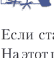

`File()` 函数创建一个 `bytes` 对象，需要使用圆括号。`UploadFile` 是另一个类的对象。

如果 Uvicorn 启动器还没被用坏，那么是时候进行测试了。这次在示例 15.5 和 15.6 中，我使用了一个 1GB 大小的文件（1GB.bin），它来自 Fastest.Fish 网站。

## 示例 15.5. 使用 HTTPie 测试上传大文件

```
$ http -f -b POST http://localhost:8000/big big_file@1GB.bin
"file size: 1000000000, name: 1GB.bin"
```

## 示例 15.6. 使用 Requests 测试上传大文件

```
>>> import requests
>>> url = "http://localhost:8000/big"
>>> files = {'big_file': open('1GB.bin', 'rb')}
>>> resp = requests.post(url, files=files)
>>> print(resp.json())
file size: 1000000000, name: 1GB.bin
```

## 文件下载

遗憾的是，重力并不能加速文件下载。相反，我们将使用与上传方法等效的下载方法。

## FileResponse 类

首先（示例 15.7）介绍“一步到位”的方案：`FileResponse` 类。

### 示例 15.7. 使用 FileResponse 下载小文件（添加到 `main.py` 文件）

```
from fastapi.responses import FileResponse

@app.get("/small/{name}")
async def download_small_file(name):
    return FileResponse(name)
```

这里应该有个测试。首先，将文件 `1KB.bin` 放在与 `main.py` 相同的目录中。现在运行示例 15.8。

### 示例 15.8. 使用 HTTPie 下载小文件

```
$ http -b http://localhost:8000/small/1KB.bin

---------------------------------------
| NOTE: binary data not shown in terminal |
---------------------------------------
```

如果你不相信这个关于限制的提示，那么示例 15.9 将输出重定向到 `wc` 之类的工具，以确认你确实收到了全部 1000 字节。

## 示例 15.9. 使用 HTTPie 下载小文件并计算字节数

```
$ http -b http://localhost:8000/small/1KB.bin | wc -c
1000
```

## StreamingResponse 类

与 `FileUpload` 模块的情况类似，对于大文件，最好使用 `StreamingResponse` 类，它分块返回文件。示例 15.10 展示了使用定义为 `async def` 的路径函数来实现这种方法。它允许在处理器空闲时避免阻塞。我暂时跳过了错误检查。如果 `path` 文件不存在，调用 `open()` 函数将引发异常。

### 示例 15.10. 使用 StreamingResponse 类返回大文件（添加到 `main.py` 文件）

```
from pathlib import Path
from typing import Generator
from fastapi.responses import StreamingResponse

def gen_file(path: str) -> Generator:
    with open(file=path, mode="rb") as file:
        yield file.read()

@app.get("/download_big/{name}")
async def download_big_file(name:str):
    gen_expr = gen_file(path=path)
    response = StreamingResponse(
        content=gen_expr,
        status_code=200,
    )
    return response
```

`gen_expr` 是生成器函数 `gen_file()` 返回的生成器表达式。`StreamingResponse` 类将其用作可迭代的 `content` 参数，以分块方式加载文件。

示例 15.11 是一个配套测试。（为此，首先需要将文件 `1GB.bin` 放在 `main.py` 文件旁边，这个过程会花费稍多一些时间。）

### 示例 15.11. 使用 HTTPie 下载大文件

```
$ http -b http://localhost:8000/big/1GB.bin | wc -c
1000000000
```

## 提供静态文件

传统的 Web 服务器可以像处理普通文件系统一样处理服务器上的文件。FastAPI 允许通过 `StaticFiles` 类来实现这一点。

在这个例子中，我们将创建一个存放无聊的免费文件供用户下载的目录。

- 在与 `main.py` 文件相同的级别创建一个 `static` 目录。（这个存储库可以有任何名称，我将其命名为 `static`（静态）只是为了不忘创建它的目的。）
- 在其中放置一个文本文件 `abc.txt`，内容为 `abc :)`。

### 示例 15.12. 使用 StaticFiles 提供目录中的所有内容（添加到 `main.py` 文件）

```
from pathlib import Path
from fastapi import FastAPI
from fastapi.staticfiles import StaticFiles

# 包含 main.py 文件的目录：
top = Path(__file__).resolve().parent

app.mount("/static",
    StaticFiles(directory=f"{top}/static", html=True),
    name="free")
```

计算 `top` 确保你将 `static` 目录放在 `main.py` 文件旁边。变量 `__file__` 表示此文件的完整路径名。

### 示例 15.13. 获取静态文件

```
$ http -b localhost:8000/static/abc.txt
abc :)
```

那么我们传递给 `StaticFiles()` 函数的参数 `html=True` 是什么作用呢？这使得它的行为更像传统服务器，如果该目录中存在 `index.html` 文件，即使你没有在 URL 中明确请求 `index.html` 文件，它也会返回该文件。因此，让我们在 `static` 目录中创建一个内容为 `Oh. Hi!` 的 `index.html` 文件，然后测试示例 15.14 中的代码。

### 示例 15.14. 从 /static 目录获取 index.html 文件

```
$ http -b localhost:8000/static/
Oh. Hi!
```

你可以拥有任意数量的文件（以及包含文件的子目录等）。在 `static` 目录中创建一个子目录 `xyz`，并在其中放置两个文件：

- `xyx.txt` — 包含文本：`xyz : (;`
- `index.html` — 包含文本 `How did you find me?`。

我不会在这里给出示例。请尝试自己运行它们（希望你有更丰富的想象力）。

# 结论

本章展示了如何上传和下载文件——小文件、大文件，甚至是巨型文件。此外，你还学会了如何以怀旧的（非 API）Web 风格从目录中提供静态文件。

# 第 16 章

## 表单与模板

### 概述

尽管 *FastAPI* 名称中的缩写 *API* 暗示了其主要方向，但 FastAPI 也能处理传统的 Web 内容。本章将介绍用于将数据插入 HTML 的标准 HTML 表单和模板。

### 表单

正如你已经理解的，FastAPI 主要是为了创建 API 而设计的，其默认输入数据格式是 JSON。但这并不意味着它不能服务于标准的 HTML 表单及其相关内容。

FastAPI 使用 `Form` 依赖项来处理来自 HTML 表单的数据，就像处理来自 `Query` 和 `Path` 等其他来源的数据一样。

要使用 FastAPI 处理表单，你需要安装 `python-multipart` 包，因此请根据需要执行命令 `pip install python-multipart`。此外，第 15 章中的 `static` 目录将用于存放其中的测试表单。

我们将重复示例 3.11，但这次通过表单提供 `who` 的值，而不是作为 JSON 字符串。（调用路径函数 `greet2()` 以避免破坏旧的路径函数 `greet()`（如果它仍然存在）。）将示例 16.1 添加到 `main.py` 文件中。

## 示例 16.1. 从 GET 表单获取值

```python
from fastapi import FastAPI, Form

app = FastAPI()

@app.get("/who2")
def greet2(name: str = Form()):
    return f"Hello, {name}?"
```

主要区别在于，值来自 `Form` 对象，而不是第 3 章中的 `Path`、`Query` 等其他对象。

尝试使用 HTTPie 进行表单的初始测试（示例 16.2）（你需要 `-f` 参数，以便以表单编码而非 JSON 格式发送数据）。

## 示例 16.2. 使用 HTTPie 构造 GET 请求

```bash
$ http -f -b GET localhost:8000/who2 name="Bob Frapples"
"Hello, Bob Frapples?"
```

你也可以从标准的 HTML 表单文件发送请求。第 15 章展示了如何创建 `static` 目录（可通过 URL `/static` 访问）来存储任何数据，包括 HTML 文件，因此在示例 16.3 中，我们将该文件（`form1.html`）放在此处。

## 示例 16.3. 构造 GET 请求 (static/form1.html)

```html
<form action="http://localhost:8000/who2" method="get">
Say hello to my little friend:
<input type="text" name="name" value="Bob Frapples">
<input type="submit">
</form>
```

如果你让浏览器加载页面 `http://localhost:8000/static/form1.html`，你会看到一个表单。如果输入任何测试字符串，你会得到以下消息：

```json
"detail":[{"loc":["body","name"],
            "msg":"field required",
            "type":"value_error.missing"}]
```

啊？

查看运行 Uvicorn 的窗口，看看其日志中写了什么：

```
INFO:     127.0.0.1:63502 - "GET /who2?name=rr23r23 HTTP/1.1"
422 Unprocessable Entity
```

为什么表单将 `name` 变量作为查询参数发送，而我们将其放在了表单字段中？这原来是 HTML 的一个怪癖，在 W3C 网站（https://oreil.ly/e6CJb）上有记录。此外，如果你的 URL 中有查询参数，它会删除这些参数并用 `name` 的值替换。

为什么 HTTPie 却能按预期工作？我不知道。这是一个需要了解的不一致之处。

官方的 HTML 魔法公式是将操作从 GET 改为 POST。因此，我们将在 `main.py` 文件中为 `/who2` 添加一个 POST 端点（示例 16.4）。

## 示例 16.4. 从 POST 表单获取值

```python
from fastapi import FastAPI, Form

app = FastAPI()

@app.post("/who2")
def greet3(name: str = Form()):
    return f"Hello, {name}?"
```

示例 16.5 是 `stuff/form2.html` 文件，但将 `get` 操作符替换为 `post`。

## 示例 16.5. 构造 POST 请求 (static/form2.html)

```html
<form action="http://localhost:8000/who2" method="post">
Say hello to my little friend:
<input type="text" name="name">
<input type="submit">
</form>
```

唤醒你的浏览器，让它获取这个新表单。在其中输入文本 **Bob Frapples** 并确认提交表单。这次你将得到与使用 HTTPie 时相同的结果：

> "Hello, Bob Frapples?"

因此，如果从 HTML 文件发送表单，请使用 POST 方法。

## 模板

你可能熟悉文字游戏 *Mad Libs*。玩家会得到一系列词语——名词、动词或更具体的东西，他们将这些词插入到文本页面的标记位置。插入所有词语后，需要阅读文本——乐趣就开始了，有时会伴随着尴尬。

Web 模板与此类似，但通常没有尴尬。模板包含大量文本，其中留有服务器插入数据的插槽。它的通常目的是生成具有可变内容的 HTML，这与第 15 章的 *静态* HTML 不同。

Flask 用户对其配套项目——模板引擎 Jinja（https://jinja.palletsprojects.com）（通常也称为 *Jinja2*）非常熟悉。FastAPI 支持 Jinja 和其他模板引擎。

在 `main.py` 文件旁边创建一个 `template` 目录，用于存放支持 Jinja 的 HTML 文件。在其中创建一个 `list.html` 文件（示例 16.6）。

**示例 16.6.** 定义模板文件 (template/list.html)

```html
<html>
  <table bgcolor="#eeeeee">
    <tr>
      <th colspan=3>Creatures</th>
    </tr>
    <tr>
      <th>Name</th>
      <th>Description</th>
      <th>Country</th>
      <th>Area</th>
      <th>AKA</th>
    </tr>
    
    <tr>
      <td>{{ creature.name }}</td>
      <td>{{ creature.description }}</td>
      <td>{{ creature.country }}</td>
      <td>{{ creature.area }}</td>
      <td>{{ creature.aka }}</td>
    </tr>
    
  </table>

  <br>

  <table bgcolor="#dddddd">
    <tr>
      <th colspan=2>Explorers</th>
    </tr>
    <tr>
      <th>Name</th>
      <th>Country</th>
      <th>Description</th>
    </tr>
    
    <tr>
      <td>{{ explorer.name }}</td>
      <td>{{ explorer.country }}</td>
      <td>{{ explorer.description }}</td>
    </tr>
    
  </table>
</html>
```

外观并不重要，因此这里没有使用正式的 CSS 语言，只使用了古老的、在 CSS 出现之前就存在的表格属性 `bgcolor`，以确保两个表格之间的区别。

需要插入的 Python 变量用双花括号括起来，而 `if`、`for` 循环和其他控制结构则用字符集 `` 括起来。有关语法和示例的完整信息，请参阅 Jinja 文档（https://jinja.palletsprojects.com）。

此模板期望接收 Python 变量 `creatures` 和 `explorers`，它们代表 `Creature` 和 `Explorer` 对象的列表。

示例 16.7 展示了需要在 `main.py` 文件中添加的内容，以设置模板并使用示例 16.6 中的数据。该代码通过应用前几章中虚拟目录中的模块，将变量 `creatures` 和 `explorers` 提供给模板——如果数据库为空或未连接，该文件夹会提供测试数据。

## 示例 16.7. 设置模板并使用其中一个 (main.py)

```python
from pathlib import Path
from fastapi import FastAPI, Request
from fastapi.templating import Jinja2Templates

app = FastAPI()

top = Path(__file__).resolve().parent
template_obj = Jinja2Templates(directory=f"{top}/template")

# 获取几个我们朋友的小型预定义列表：
from fake.creature import fakes as fake_creatures
from fake.explorer import fakes as fake_explorers

@app.get("/list")
def explorer_list(request: Request):
    return template_obj.TemplateResponse("list.html",
        {"request": request,
        "explorers": fake_explorers,
        "creatures": fake_creatures})
```

让你喜欢的浏览器，甚至是你不太喜欢的浏览器，访问地址 `http://localhost:8000/list`，你将得到图 16.1 的响应。

| Name | Description | Country | Area | AKA |
|---|---|---|---|---|
| Yeti | Hirsute Himalayan | CN | Himalayas | Abominable Snowman |
| Bigfoot | New world Cousin Eddie of the yeti | US | * | Sasquatch |

| Name | Country | Description |
|---|---|---|
| Claude Hande | FR | Scarce during full moons |
| Noah Weiser | DE | Myopic machete man |

**图 16.1.** 从 /list 目录的输出

# 结论

本章简要介绍了 FastAPI 如何处理与 API 无关的主题，例如表单和模板。连同前一章关于文件的内容，这些是传统的、最小必要的 Web 任务，你会经常遇到它们。

# 第 17 章

## 数据发现与可视化

### 概述

尽管 FastAPI 框架的名称中包含 *API* 这个缩写，但它不仅可以用于 API。在本章中，你将学习如何基于数据创建表格、图表、图形和地图，使用一个关于来自世界各地的虚构生物的小型数据库。

### Python 与数据

在过去的几年里，Python 因多种原因变得非常流行：

- 它易于学习；
- 它具有清晰的语法；
- 它拥有丰富的标准库；
- 它有大量高质量的第三方包；
- 它特别注重数据操作、转换和独立验证。

最后一点对于传统的ETL（提取、转换、加载）数据库构建任务始终至关重要。非营利组织PyData (https://pydata.org) 甚至组织会议并开发基于Python的开源数据分析工具。Python的流行也反映了近期人工智能的兴起以及对用于AI模型的数据准备工具的需求。

在本章中，我们将尝试应用几个Python数据包，并探讨它们如何与现代Python和FastAPI的Web开发相关联。

## 使用PSV进行文本输出

在本节中，我们将使用附录B中列出的生物。数据位于本书的GitHub仓库中，文件为`cryptid.psv`（使用竖线作为分隔符）以及SQLite数据库`cryptid.db`。使用逗号分隔（`.csv`）和制表符分隔（`.tsv`）的文件非常普遍，但逗号本身会出现在数据单元格中，而制表符有时难以与其他空白字符区分。竖线符号（`|`）与其他字符不同，且在标准文本中很少出现，因此是一个很好的分隔符。

首先，我们将尝试使用扩展名为`.psv`的文本文件，为简单起见，仅使用文本输出示例，然后再过渡到使用SQLite数据库的完整Web示例。

`.psv`文件的标题初始行包含字段名称：

-   name（名称）；
-   country（国家，符号`*`表示多个国家）；
-   area（区域，可选，美国州或该国的其他行政区划）；
-   description（描述）；
-   aka（also known as，意为“又名”）。

文件中的其余行描述一个生物，字段按此顺序排列，并用`|`符号分隔。

## csv模块

示例17.1将生物数据读入Python数据结构。首先，使用竖线分隔符的`cryptids.psv`文件可以通过Python标准`csv`包读取，得到一个元组列表，其中每个元组代表文件中的一行数据。（`csv`包还包括`DictReader`类，返回字典列表。）该文件的第一行是包含列名的标题行。如果没有标题行，我们可以通过`csv`函数的参数提供标题。

我在示例中包含了类型提示，但如果您的Python版本较旧，可以省略它们——代码仍然可以运行。我们将只打印标题和前五行，以节省一些树木¹。

**示例17.1.** 使用csv读取PSV文件 (load_csv.py)

```python
import csv
import sys

def read_csv(fname: str) -> list[tuple]:
    with open(fname) as file:
        data = [row for row in csv.reader(file, delimiter="|")]
    return data

if __name__ == "__main__":
    data = read_csv(sys.argv[1])
    for row in data[0:5]:
        print(row)
```

现在运行示例17.2中的测试。

**示例17.2.** 测试CSV数据库加载

```
$ python load_csv.py cryptid.psv
['name', 'country', 'area', 'description', 'aka']
['Abaia', 'FJ', ' ', 'Lake eel', ' ']
['Afanc', 'UK', 'CYM', 'Welsh lake monster', ' ']
['Agropelter', 'US', 'ME', 'Forest twig flinger', ' ']
['Akkorokamui', 'JP', ' ', 'Giant Ainu octopus', ' ']
['Albatwitch', 'US', 'PA', 'Apple stealing mini Bigfoot', ' ']
```

> ¹ 如果有像托尔金书中的树人那样的树木，我不希望它们晚上走到我们家门口进行一次小小的交谈。

## python-tabulate模块

让我们再试一个开源工具，python-tabulate (https://oreil.ly/L0f6k)。它专为表格输出而设计。首先需要运行命令`pip install tabulate`。示例17.3展示了代码。

**示例17.3.** 使用python-tabulate读取PSV文件 (load_tabulate.py)

```python
from tabulate import tabulate
import sys

def read_csv(fname: str) -> list[tuple]:
    with open(fname) as file:
        data = [row for row in csv.reader(file, delimiter="|")]
    return data

if __name__ == "__main__":
    data = read_csv(sys.argv[1])
    print(tabulate(data[0:5]))
```

在示例17.4中执行示例17.3。

**示例17.4.** 运行tabulate加载脚本

```
$ python load_tabulate.py cryptid.psv
----------  -------  ----  ----------------------  ---
Name        Country  Area  Description             AKA
Abaia       FJ             Lake eel
Afanc       UK       CYM   Welsh lake monster
Agropelter  US       ME    Forest twig flinger
Akkorokamui JP             Giant Ainu octopus
----------  -------  ----  ----------------------  ---
```

## pandas模块

前两个示例主要是输出格式化工具。pandas库 (https://pandas.pydata.org) 是一个出色的数据切片工具。它超越了标准的Python数据结构，使用了诸如DataFrame (https://oreil.ly/j-8eh) 这样的高级构造——它是表格、字典和序列的组合。它可以读取`.csv`和其他使用字符分隔符的文件。示例17.5类似于前面的示例，但pandas返回的是DataFrame而不是元组列表。

**示例17.5.** 使用pandas读取PSV文件 (load_pandas.py)

```python
import pandas
import sys

def read_pandas(fname: str) -> pandas.DataFrame:
    data = pandas.read_csv(fname, sep="|")
    return data

if __name__ == "__main__":
    data = read_pandas(sys.argv[1])
    print(data.head(5))
```

在示例17.6中执行示例17.5。

**示例17.6.** 运行pandas加载脚本

```
$ python load_pandas.py cryptid.psv
          name country area          description aka
0       Abaia      FJ              Lake eel
1       Afanc     UK  CYM     Welsh lake monster
2  Agropelter      US   ME  Forest twig flinger
3  Akkorokamui      JP          Giant Ainu octopus
4  Albatwitch      US   PA  Apple stealing mini Bigfoot
```

pandas库有许多有趣的功能，值得更深入地研究。

## SQLite数据源和Web输出

在本章的其余示例中，您将从SQLite数据库读取生物数据，并使用前几章中网站的特定代码片段。然后，您将把数据切成小块、立方体，并按照不同的食谱进行腌制。您将不再进行简单的文本输出，而是将每个示例安装到我们不断发展的关于神秘生物的网站上。您需要对现有的服务层、Web层和数据层进行一些补充。

首先，需要一个Web层函数和相应的HTTP GET路由来返回所有生物数据。而您已经有了这个！让我们进行一次Web调用以获取所有数据，但在示例17.7中再次只显示前几行（毕竟，树木在看着呢）。

**示例17.7.** 运行生物加载测试（截断版——树木在观察）

```
$ http -b localhost:8000/creature
[
    {
        "aka": "AKA",
        "area": "Area",
        "country": "Country",
        "description": "Description",
        "name": "Name"
    },
    {
        "aka": " ",
        "area": " ",
        "country": "FJ",
        "description": "Lake eel",
        "name": "Abaia"
    },
...
]
```

## 图表和绘图包

现在我们可以从文本转向图形用户界面（Graphical User Interface, GUI）。在Python中用于图形化数据展示的最有用和最流行的包包括：

-   *Matplotlib* (https://matplotlib.org) —— 功能广泛，但需要一些调整才能获得漂亮的结果；
-   *Plotly* (https://plotly.com/python) —— 类似于Matplotlib和Seaborn，但侧重于交互式图表；
-   *Dash* (https://dash.plotly.com) —— 基于Plotly包构建，是一种信息仪表板；
-   *Seaborn* (https://seaborn.pydata.org) —— 基于Matplotlib包构建，提供了更高级别的接口，但图表类型较少；
-   *Bokeh* (http://bokeh.org) —— 与JavaScript集成，用于创建查看超大数据集的信息仪表板。

如何做出正确的选择？应考虑以下标准：

-   图表类型（例如，散点图、柱状图、折线图）；
-   样式；
-   易用性；
-   性能；
-   数据限制。

诸如用户khuyentran1476的*Top 6 Python Libraries for Visualization: Which One to Use?* (https://oreil.ly/10Nsw)之类的比较研究，可以帮助您做出选择。归根结底，选择往往取决于您最熟悉的那个选项。在本章中，我选择了Plotly包，它允许在不编写过多代码的情况下创建美观的图表。

## 图表示例 1. 测试

Plotly是一个开源（免费）的Python库，提供多个层级的控制和细节：

-   *Plotly Express* (https://plotly.com/python/plotly-express) — Plotly的极简库；
-   *Plotly* (https://plotly.com/python) — 核心库；
-   *Dash* (https://dash.plotly.com) — 数据处理工具。

还有一个Dash Enterprise (https://dash.plotly.com/dash-enterprise)平台。它和几乎所有名称中带有“enterprise”（企业级）一词的东西一样（包括宇宙飞船模型），都是要花钱的，而且通常价格不菲。

基于生物数据，我们可以展示什么？图表和图形有几种常见形式：

-   柱状图；
-   散点图；
-   折线图；
-   箱线图（统计图）；
-   直方图。

我们所有的数据字段——行，都特意设计得尽可能小，以免示例在逻辑和集成步骤上过于复杂。对于每个示例，我们将使用前面章节的代码从SQLite数据库中读取所有生物数据，并添加Web层和服务层函数，以选择特定数据传递给绘图库函数。首先安装Plotly包及其导出图像所需的库：

-   pip install plotly；
-   pip install kaleido。

然后（示例17.8）在`web/creature.py`文件中添加一个测试函数，以验证我们是否在正确的位置拥有所需的代码片段。

### 示例 17.8. 添加测试端点（编辑文件 `web/creature.py`）

```python
# (将这些行添加到文件 web/creature.py)

from fastapi import Response
import plotly.express as px

@router.get("/test")
def test():
    df = px.data.iris()
    fig = px.scatter(df, x="sepal_width", y="sepal_length", color="species")
    fig_bytes = fig.to_image(format="png")
    return Response(content=fig_bytes, media_type="image/png")
```

文档通常建议调用`fig.show()`函数来显示刚刚创建的图像，但我们试图遵循FastAPI和Starlette的做法。

因此，首先您获得`fig_bytes`（图像的实际字节内容）。然后返回自定义的`Response`对象。

在将端点添加到`web/creature.py`文件并重启Web服务器（如果您使用`--reload`参数启动Uvicorn，则会自动重启）后，尝试在浏览器地址栏中输入**localhost:8000/creature/test**来访问新端点。屏幕上应出现图17.1所示的图像。

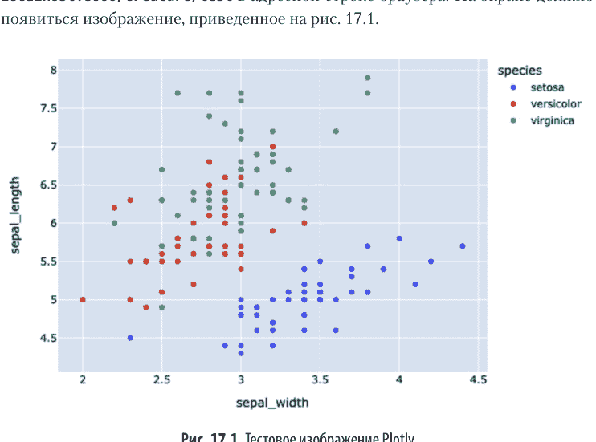

如果您从Uvicorn收到奇怪的错误，例如`ValueError: 'not' is not a valid parameter name`，请更新Pydantic以修复此问题：`pip install -U pydantic`。

## 图表示例 2. 直方图

如果一切正常，让我们开始处理生物数据。在`web/creature.py`文件中添加`plot()`函数。我们将使用`service/creature.py`和`data/creature.py`文件中的`get_all()`函数从数据库获取所有生物数据。然后提取我们需要的内容，并利用Plotly的功能输出各种结果图像。

对于第一个示例（示例17.9），我们只使用`name`字段，并构建一个直方图，显示以每个字母开头的生物名称的数量。

### 示例 17.9. 生物名称首字母柱状图

```python
# (将这些行添加到文件 web/creature.py)

from collections import Counter
from fastapi import Response
import plotly.express as px
from service.creature import get_all

@router.get("/plot")
def plot():
    creatures = get_all()
    letters = "ABCDEFGHIJKLMNOPQRSTUVWXYZ"
    counts = Counter(creature.name[0] for creature in creatures)
    y = { letter: counts.get(letter, 0) for letter in letters }
    fig = px.histogram(x=list(letters), y=y, title="Creature Names",
        labels={"x": "Initial", "y": "Initial"})
    fig_bytes = fig.to_image(format="png")
    return Response(content=fig_bytes, media_type="image/png")
```

在浏览器地址栏中输入`localhost:8000/creature/plot`。您应该会看到图17.2所示的图像。


图 17.2. 生物名称首字母直方图

## 地图处理包

如果您在Google搜索栏中输入*Python*和*maps*，会得到大量关于Python字典的链接，字典是语言内置的映射类型¹，但这并非我们当前要讨论的内容。因此，您可能需要尝试诸如*GIS*、*geo*、*cartography*、*spatial*等同义词。以下列出的一些流行包是基于列表中的其他包构建的：

-   *PyGIS* (https://oreil.ly/3QvCz) — 关于Python中空间数据处理的链接；
-   *PySAL* (https://pysal.org) — Python空间分析库；
-   *Cartopy* (https://oreil.ly/YnUow) — 分析和绘制地理空间数据；
-   *Folium* (https://oreil.ly/72luj) — 与JavaScript集成；
-   *Python Client for Google Maps Services* (https://oreil.ly/LWfS5) — Google Maps的API访问；
-   *Geemap* (https://geemap.org) — 支持Google Earth；
-   *Geoplot* (https://oreil.ly/Slfvc) — 扩展Cartopy和Matplotlib包；
-   *GeoPandas* (https://geopandas.org) — 我们喜爱的pandas库的扩展；
-   *ArcGIS and ArcPy* (https://oreil.ly/l7M5C) — Esri的开源接口。

与图表/图形包的情况一样，选择可能取决于以下因素：

-   地图类型（例如，背景图、矢量图、栅格图）；
-   样式；
-   易用性；
-   性能；
-   数据限制。

> ¹ 在英语中，单词map既表示“地图”，也表示“映射”。翻译仅因上下文而异。—— *译者注*

与图表和图形一样，地图也有不同类型，可用于不同目的。

## 地图示例

对于制图领域的示例，我将再次使用Plotly包——它既不太简单也不太复杂，并有助于展示如何将小型Web地图与FastAPI集成。

示例17.10演示了如何获取我们生物的ISO两位国家代码。但事实证明，创建Plotly地图（背景图或*choropleth*，这本身听起来就像一个会变形的神秘生物）的函数希望使用另一种三位ISO国家代码标准。呃。我们可以重写数据库和PSV文件中的所有代码，但更简单的方法是执行`pip install country_converter`命令，将一组国家代码映射到另一组。

### 示例 17.10. 包含神秘生物的国家地图（编辑文件 `web/creature.py`）

```python
# (将这些行添加到文件 web/creature.py)

import plotly.express as px
import country_converter as coco

@router.get("/map")
def map():
    creatures = service.get_all()
    iso2_codes = set(creature.country for creature in creatures)
    iso3_codes = coco.convert(names=iso2_codes, to="ISO3")
    fig = px.choropleth(
        locationmode="ISO-3",
        locations=iso3_codes)
    fig_bytes = fig.to_image(format="png")
    return Response(content=fig_bytes, media_type="image/png")
```

在浏览器中请求地址`localhost:8000/creature/map`，如果运气好，您将看到一张突出显示了有神秘生物的国家的地图（图17.3）。

您可以使用`area`字段（代表两位国家代码，其中`country`为US）来放大这张地图以聚焦美国。使用表达式`locationmode="USA-states"`并将`area`赋值给`px.choropleth()`函数的`locations`参数。

# 结论

你家附近没有出现过神秘生物吗？你可以从本章中找到答案，其中介绍了用于构建图表、示意图和地图的各种工具，这些工具为我们建立了一个引发焦虑的生物数据库。

## 第18章

## 游戏

### 概述

游戏种类繁多，从简单的文本游戏到多人3D游戏。在本章中，我将演示一个简单的游戏，以及Web应用的端点如何在多个步骤中与用户交互。这个过程与本书中你熟悉的Web应用端点的一次性请求-响应模式不同。

### Python中的游戏包

如果你想真正掌握Python游戏开发，这里有一些有用的工具：

- 文本游戏 — Adventurelib (https://adventurelib.readthedocs.io)；
- 图形游戏：
    - PyGame (https://www.pygame.org), 入门指南 (https://realpython.com/pygame-a-primer)；
    - pyglet (https://pyglet.org)；
    - Python Arcade (https://api.arcade.academy)；
    - HARFANG (https://www.harfang3d.com)；
    - Panda3D (https://docs.panda3d.org)。

但在本章中，我不会使用其中任何一个。示例代码可能会变得非常庞大和复杂，从而偏离本书的核心目标——使用FastAPI以最简化的方式创建网站（API和传统内容）。

### 游戏逻辑的划分

编写游戏的方式多种多样。但如何确定谁负责什么，以及数据存储在哪里呢？Web应用没有状态，每次客户端访问服务器时，服务器都会完全失忆，并坚称从未见过该客户端。因此，我们需要在某个地方存储*状态*——即在游戏所有阶段保存的数据，以便将它们串联起来。

我们可以在客户端完全用JavaScript编写游戏，并在那里存储所有状态。如果你精通JavaScript，这是一个不错的选择，但如果不熟悉（这很有可能，因为你正在阅读一本关于Python的书），我们也让Python参与一些工作。

同时，我们也可以编写一个对服务器来说过于繁重的应用。例如，在第一次Web调用时为特定游戏生成一个唯一的标识符，在后续游戏步骤中将该标识符与其他数据一起发送给服务器，并将所有变化的状态存储在服务器端的某个数据存储中，比如数据库。

最后，我们可以将游戏构建为一系列客户端-服务器Web应用端点的调用，即所谓的单页应用程序（Single-Page Application, SPA）。在编写SPA时，通常JavaScript会向服务器发起Ajax调用，并更新Web响应以刷新页面的特定部分，而不是整个屏幕。客户端JavaScript和HTML处理部分工作，服务器处理部分逻辑和数据。

### 游戏设计

首先，这是什么游戏？我们将创建一个类似于Wordle (https://oreil.ly/PuD-Y) 的简单游戏，但其中只使用来自`cryptid.db`数据库的生物名称。这比Wordle简单得多，特别是如果你耍点小聪明，参考一下附录B。我们将应用之前描述的最终平衡设计方法。

1. 在客户端使用原生JavaScript，而不是像React、Angular甚至jQuery这样的知名JavaScript库。
2. 一个新的FastAPI端点，GET /game，用于初始化游戏。它从我们的神秘生物数据库中获取一个随机生物的名称，并将其作为隐藏值嵌入到一个由HTML、CSS和JavaScript组成的Jinja模板文件中返回。
3. 在客户端，新创建的HTML和JavaScript显示一个类似Wordle的界面。会出现一系列方框，每个方框对应隐藏生物名称中的一个字母。
4. 玩家在每个方框中输入一个字母，然后提交他们的猜测和隐藏的真实名称到服务器。这是通过JavaScript的fetch()函数进行的Ajax调用。
5. 第二个新的FastAPI端点，POST /game，接收这个猜测和真实的秘密名称，并根据它来评估猜测。它将猜测值和结果返回给客户端。
6. 客户端部分在新创建的表格行中用相应的CSS颜色显示猜测和结果：绿色表示字母在正确位置，黄色表示字母在名称中但位置不同，灰色表示字母不在隐藏名称中。结果是一个由单个字符组成的字符串，用作CSS类名来显示猜测字母的正确颜色。
7. 如果所有字母都是绿色的，就可以庆祝了。否则，客户端会显示新的一行文本输入框用于下一次猜测，并重复步骤4及后续步骤，直到名称被猜出或你放弃。大多数神秘生物的名称不是常用词，因此必要时请参考附录B。

这些规则与官方的Wordle游戏略有不同，后者只允许使用五个字母的字典单词，并且有六次尝试的限制。

不要对此抱太大期望。就像本书中的大多数示例一样，游戏的逻辑和设计是最小化的——足以让各个部分协同工作。如果你有工作基础，你可以为游戏增添更多的风格和优雅。

### 第一个Web部分——游戏初始化

我们需要两个新的Web应用端点。我们使用生物名称，因此可以将端点命名为：GET /creature/game 和 POST /creature/game。但这行不通，因为我们已经有类似的端点——GET /creature/{name} 和 POST /creature/{name}，FastAPI会优先选择它们作为匹配项。因此，让我们创建一个新的顶级路由命名空间/game，并将两个新端点都放在其中。

示例18.1中的第一个端点执行游戏初始化。它应该从数据库中获取一个随机的生物名称，并将其与实现多步骤游戏逻辑的所有客户端代码一起返回。为此，我们使用一个Jinja模板（在第16章中介绍过），其中包含HTML、CSS和JavaScript。

**示例18.1.** 初始化Web游戏 (web/game.py)

```python
from pathlib import Path

from fastapi import APIRouter, Body, Request
from fastapi.templating import Jinja2Templates

from service import game as service

router = APIRouter(prefix="/game")

# 初始游戏请求
@router.get("")
def game_start(request: Request):
    name = service.get_word()
    top = Path(__file__).resolve().parents[1] # 祖先目录
    templates = Jinja2Templates(directory=f"{top}/template")
    return templates.TemplateResponse("game.html",
        {"request": request, "word": name})

# 后续游戏请求
@router.post("")
async def game_step(word: str = Body(), guess: str = Body()):
    score = service.get_score(word, guess)
    return score
```

FastAPI需要game_start()函数来获取request参数并将其作为参数传递给模板。

接下来，在示例18.2中，将子路由/game连接到控制/explorer和/creature路由的主模块。

**示例18.2. 添加子路由/game (web/main.py)**

```python
from fastapi import FastAPI
from web import creature, explorer, game

app = FastAPI()

app.include_router(explorer.router)
app.include_router(creature.router)
app.include_router(game.router)

if __name__ == "__main__":
    import uvicorn
    uvicorn.run("main:app",
        host="localhost", port=8000, reload=True)
```

### 第二个Web部分——游戏步骤

客户端模板（HTML、CSS和JavaScript）中最大的组件如示例18.3所示。

**示例18.3. Jinja模板工作文件 (template/game.html)**

```html
<head>
<style>
html * {
    font-size: 20pt;
    font-family: Courier, sans-serif;
}
body {
    margin: 0 auto;
    max-width: 700px;
}
input[type=text] {
    width: 30px;
    margin: 1px;
    padding: 0px;
    border: 1px solid black;
}
td, th {
    cell-spacing: 4pt;
    cell-padding: 4pt;
    border: 1px solid black;
}
</style>
```

## 密码术

```html
<table id="guesses">
</table>
<span id="status"></span>
<hr>
```

<div>
<input type=text name="guess">
<input type=hidden id="word" value="{{word}}">
<br><br>
<input type=submit onclick="post_guess()">
</div>

</body>

# 第一部分服务 — 初始化

示例 18.4 展示了将 Web 层的游戏启动功能与数据层的随机生物名称提供功能连接起来的服务代码。

**示例 18.4.** 计算结果 (service/game.py)

```python
import data.game as data

def get_word() -> str:
    return data.get_word()
```

# 第二部分服务 — 定义结果

将示例 18.5 中的代码添加到示例 18.4 的代码中。结果是一个由单个字符组成的字符串，指示输入的字母是否与正确位置匹配、与其他位置匹配或指示错误。猜测的字母和单词都转换为小写，以使匹配不区分大小写。如果猜测的长度与隐藏单词的长度不匹配，则返回空字符串。

**示例 18.5.** 计算结果 (service/game.py)

```python
from collections import Counter, defaultdict

HIT = "H"
MISS = "M"
CLOSE = "C" # (字母在单词中，但在不同位置)

def get_score(actual: str, guess: str) -> str:
    length: int = len(actual)
    if len(guess) != length:
        return ERROR
    actual_counter = Counter(actual) # {字母: 计数, ...}
    guess_counter = defaultdict(int)
    result = [MISS] * length
    for pos, letter in enumerate(guess):
        if letter == actual[pos]:
            result[pos] = HIT
            guess_counter[letter] += 1
    for pos, letter in enumerate(guess):
        if result[pos] == HIT:
            continue
        guess_counter[letter] += 1
        if (letter in actual and
            guess_counter[letter] <= actual_counter[letter]):
            result[pos] = CLOSE
    result = ''.join(result)
    return result
```

# 测试！

示例 18.6 包含几个用于计算服务评分的 pytest 练习。在代码中，我们使用 pytest 的参数化功能来传递测试序列，而不是在测试函数本身内部编写循环。请记住示例 18.5 中的内容，H 表示精确命中，C 表示接近（位置错误），M 表示玩家完全没有猜中。

**示例 18.6.** 测试计算结果 (test/unit/service/test_game.py)

```python
import pytest
from service import game

word = "bigfoot"
guesses = [
    ("bigfoot", "HHHHHHH"),
    ("abcdefg", "MCMMMCC"),
    ("toofgib", "CCCHCCC"),
    ("wronglength", ""),
    ("", ""),
    ]

@pytest.mark.parametrize("guess,score", guesses)
def test_match(guess, score):
    assert game.get_score(word, guess) == score
```

运行：

```
$ pytest -q test_game.py
.....
5 passed in 0.05s
```

# 数据 — 初始化

在新模块 data/game.py 中，只需要一个函数，如示例 18.7 所示。

**示例 18.7.** 获取随机生物名称 (data/game.py)

```python
from .init import curs

def get_word() -> str:
    qry = "select name from creature order by random() limit 1"
    curs.execute(qry)
    row = curs.fetchone()
    if row:
        name = row[0]
    else:
        name = "bigfoot"
    return name
```

# 让我们玩“密码术”

（谁来想个更好的名字吧。）

在浏览器中访问 http://localhost:8000/game。屏幕上应该会出现以下图像。

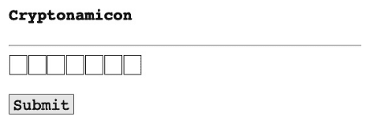

输入几个字母并作为猜测提交，看看会发生什么。


字母 *b*、*f* 和 *g* 以黄色突出显示（如果您没有看到颜色，您必须相信我的话！）。这表明它们存在于隐藏的名称中，但位置不正确。


让我们尝试想出一个名称，但更改最后一个字母。在第二行中，我们看到了很多绿色。哇，太接近了！


更正最后一个字母，并出于兴趣将某些字母大写，以确保匹配不区分大小写。确认提交，太棒了！


# 结论

我们使用了 HTML、JavaScript、CSS 和 FastAPI 来创建一个简单的（非常！）类似 Wordle 的交互式游戏。本节展示了如何使用 JSON 和 Ajax 管理 Web 客户端和服务器之间的多线程交互。

# 附录 A

# 补充阅读

如果您想了解更多，并填补我未深入探讨或完全未涉及的领域的知识，您会发现许多优秀的资源。本附录列出了学习 Python、FastAPI、Starlette 和 Pydantic 的资源。

# Python

以下是一些著名的 Python 网站：

- *Python 软件基金会* (https://www.python.org) — 基础材料；
- *Real Python 教程* (https://realpython.com) — 详细的 Python 学习指南；
- *Reddit* (https://www.reddit.com/r/Python) — reddit.com 网站上关于 Python 的主要论坛部分；
- *Stack Overflow* (https://stackoverflow.com/questions/tagged/python) — 带有 Python 标签的问题；
- *Pycoder's Weekly* (https://pycoders.com) — 每周电子邮件通讯；
- *Anaconda* (https://www.anaconda.com) — 科学信息分发。

以下是一些在撰写本书期间对我有用的 Python 书籍：

- *Любанович Б.* 简单的 Python。第 2 版。— 圣彼得堡：Piter，2021；
- *Бизли Д.* Python。全面指南。— 圣彼得堡：Piter，2023；
- *Рамальо Л.* Python。精通之道。— 2016；
- *Виафоре П.* 可靠的 Python。— 2023；
- *Персиваль Г., Грегори Б.* Python 开发模式。— 圣彼得堡：Piter，2022。

# FastAPI

以下列出了一些 FastAPI 网站：

- *主页* (https://fastapi.tiangolo.com) — 官方网站和我见过的最好的技术文档；
- *外部链接和文章* (https://fastapi.tiangolo.com/external-links) — 来自官方网站；
- *FastAPI GitHub* (https://github.com/tiangolo/fastapi) — FastAPI 代码仓库；
- *Awesome FastAPI* (https://github.com/mjhea0/awesome-fastapi) — 资源列表；
- *终极 FastAPI 教程* (https://oreil.ly/vfvS3) — 多部分详细描述；
- *蓝皮书：FastAPI* (https://lyz-code.github.io/blue-book/fastapi) — FastAPI 详细概述；
- *Medium* (https://medium.com/tag/fastapi) — 带有 FastAPI 标签的文章；
- *使用 FastAPI 构建 Python Web API* (https://realpython.com/fastapi-python-webapis) — FastAPI 简化文档；
- *Twitter* (https://oreil.ly/kHJm_) — 带有 @FastAPI 或 #FastAPI 标记的推文；
- *Gitter* (https://oreil.ly/-56rC) — 寻求帮助和回答；
- *GitHub* (https://oreil.ly/NXTU1) — 名称中包含 FastAPI 的仓库。

尽管 FastAPI 出现在 2018 年底，但关于它的书籍还不多。我从阅读以下书籍中获得了有用的经验：

- *使用 FastAPI 构建数据科学应用程序*，作者 François Voron (Packt)；
- *使用 FastAPI 构建 Python 微服务*，作者 Sherwin John Tragura (Packt)；
- *微服务 API*，作者 Hotze Aro Peralta (Manning)。

## Starlette

Starlette 的主要链接：

- 主页 (https://www.starlette.io)
- GitHub (https://github.com/encode/starlette)

## Pydantic

Pydantic 的主要链接：

- 主页 (https://pydantic.dev)
- 文档 (https://docs.pydantic.dev)
- GitHub (https://github.com/pydantic/pydantic)

## 附录 B

## 生物与人类

> 从吸血鬼，从幽灵，
> 从长爪的怪物，
> 以及在夜间游荡的生物中，
> 拯救我们吧，上帝！

*康沃尔连祷文中的诗节*

关于虚构生物，或称 *隐生动物* 的报告来自四面八方。一些曾被认为是虚构的动物——熊猫、鸭嘴兽和黑天鹅——后来被证实是真实的。因此，我们不会妄加猜测。勇敢的研究者们正在寻找它们。他们共同为本书中提供的示例提供了数据。


## 生物

表 B.1 列出了我们将要研究的生物。

表 B.1. 迷你生物图鉴

| 名称 | 国家 | 地区 | 描述 | 别名 |
|---|---|---|---|---|
| Abaia (阿拜亚) | FJ | | 来自伊尔湖 | |
| Afanc (阿凡克) | UK | CYM | 威尔士湖怪 | |
| Agropelter (阿格罗佩尔特) | US | ME | 在森林中向人投掷树枝 | |
| Akkorokamui (阿科罗卡穆伊) | JP | | 阿伊努民间传说中的巨型章鱼 | |
| Albatwitch (阿尔巴特维奇) | US | PA | 偷苹果的迷你雪人 | |
| Alicanto (阿利坎托) | CL | | 以黄金为食的鸟 | |
| Altamata-ha (阿尔塔马塔-哈) | US | GA | 沼泽生物 | 阿尔蒂 |
| Amarok (阿马罗克) | CA | | 因纽特人的狼灵 | |
| Auli (奥利) | CY | | 阿伊亚纳帕的海怪 | 友好的怪物 |
| Azeban (阿泽班) | CA | | 恶作剧精灵 | 浣熊 |
| Batsquatch (蝙蝠怪) | US | WA | 会飞的雪人 | |
| Beast of Bladenboro (布莱登伯勒野兽) | US | NC | 吸血犬 | |
| Beast of Bray Road (布雷路野兽) | US | WI | 威斯康星州的狼人 | |
| Beast of Busco (布斯科野兽) | US | IN | 巨型乌龟 | |
| Beast of Gevaudan (热沃当野兽) | FR | | 法国狼人 | |

## 表 B.1 (续)

| 名称 | 国家 | 地区 | 描述 | 别名 |
| :--- | :--- | :--- | :--- | :--- |
| Beaver Eater (食河狸者) | CA | | 掀翻住所 | 赛托埃钦 |
| Bigfoot (大脚怪) | US | | 雪人的表亲——埃迪 | 萨斯夸奇 |
| Bukavas (布卡瓦茨) | HR | | 湖中扼杀者 | |
| Bunyip (本耶普) | AU | | 澳大利亚水怪 | |
| Cadborosaurus (卡德波龙) | CA | BC | 海蛇 | 卡迪 |
| Champ (尚普) | US | VT | 潜伏在尚普兰湖的生物 | 尚皮 |
| Chupacabra (卓柏卡布拉) | MX | | 山羊杀手 | |
| Dahu (达胡) | FR | | 瓦姆帕胡弗斯的法国表亲 | |
| Doyarchu (多瓦尔-胡) | IE | | 水犬 | 爱尔兰鳄鱼 |
| Dragon (龙) | * | | 翅膀！火焰！ | |
| Drop Bear (坠落熊) | AU | | 食肉考拉 | |
| Dungavenhooter (敦加文胡特) | US | | 将猎物碾成粉末，然后吸入 | |
| Encantado (恩坎塔多) | BR | | 活泼的河豚 | |
| Fouke Monster (福克怪物) | US | AR | 臭烘烘的大脚怪 | 沼泽溪流怪物 |
| Glocester Ghoul (格洛斯特食尸鬼) | US | RI | 罗德岛龙 | |
| Gloucester Sea Serpent (格洛斯特海蛇) | US | MA | 美国版的尼斯湖水怪 | |
| Igorogo (伊戈罗戈) | CA | ON | 加拿大版的尼斯湖水怪 | |
| Isshii (伊西) | JP | | | 伊西 |
| Jackalope (杰克洛普) | US | | 长角的兔子 | |
| Jersey Devil (泽西恶魔) | US | NJ | 在雪屋顶上跳跃的生物 | |
| Kodiak Dinosaur (科迪亚克恐龙) | US | AK | 巨型海洋蜥蜴 | |
| Kraken (克拉肯) | * | | 巨型乌贼 | |
| Lizard Man (蜥蜴人) | US | SC | 沼泽生物 | |
| LLamamaa (拉玛玛) | CL | | 羊驼头，羊驼身。但不是那种羊驼 | |
| Lochness Monster ¹ (尼斯湖水怪) | UK | SC | 著名的尼斯湖水怪 | 尼西 |
| Lusca (卢斯卡) | BS | | 巨型章鱼 | |
| Maero (马埃罗) | NZ | | 巨人 | |
| Menehune (梅内胡内) | US | HI | 夏威夷精灵 | |
| Mokele-mbembe (莫凯莱-姆贝姆贝) | CG | | 沼泽怪物 | |
| Mongolian Death Worm (蒙古死亡蠕虫) | MN | | 来自阿拉基斯的外星生物 | |
| Mothman (天蛾人) | US | WV | 理查德·吉尔电影中唯一的隐生动物 | |
| Snarly Yow (咆哮的亚乌) | US | MD | 地狱猎犬 | |
| Vampire (吸血鬼) | * | | 吸血者 | |
| Vlad the Impala (弗拉德·黑斑羚) | KE | | 草原吸血鬼 | |
| Wendigo (温迪戈) | CA | | 食人大脚怪 | |
| Werewolf (狼人) | * | | 变形者 | 卢加鲁，鲁加鲁 ² |
| Wyvern (飞龙) | UK | | 只有一对腿的龙 | |
| Wampahoofus (瓦姆帕胡弗斯) | US | VT | 不对称的山地居民 | 赛德希尔·古杰 |
| Yeti (雪人) | CN | | 毛茸茸的喜马拉雅怪物 | 令人厌恶的雪人 |

¹ 有一次我遇到了彼得·麦克纳布，他拍摄了其中一张据称是尼斯湖水怪的照片。

² 源自法语单词。或者来自史酷比的台词：“Ruh-roh! Rougarou!”

## 研究者

我们这支来自世界各地的研究团队如表 B.2 所示。


## 表 B.2. 人物

| 姓名 | 国家 | 描述 |
| :--- | :--- | :--- |
| Claude Hande (克劳德·汉德) | UK | 满月时会消失 |
| Helena Hande-Basquette (海伦娜·汉德-巴斯克特) | UK | 一位¹ 以名声自诩的女士 |
| Beau Buffette (博·巴菲特) | US | 从不摘下头盔 |
| O. B. Juan Cannoli (O. B. 胡安·坎诺利) | MX | 森林事务的智者 |
| Simon N. Glorfindel (西蒙·格洛芬德尔) | FR | 卷发尖耳的伐木工 |
| «Pa» Tuohy (「帕」·托希) | IE | 研究者 |
| Radha Tuohy (拉达·托希) | IN | 神秘的大地之母 |
| Noah Weiser (诺亚·魏泽) | DE | 带着砍刀的近视眼 |

> ¹ 指高贵，而非出身名门。

## 研究者的出版物

以下是我们虚构研究者的虚构出版物：

- *The Secret of Rat Island*, В. Buffette (巴菲特 B. 《老鼠岛的秘密》)
- *What Was I Thinking?*, О. В. J. Cannoli (坎诺利 O. B. H. 《我当时在想什么？》)
- *Spiders Never Sleep, Journal of Disturbing Results*, N. Weiser (魏泽 N. 《蜘蛛从不睡觉》，《令人不安的结果杂志》)
- «*Sehr Böse Spinnen*, Zeitscrift für Vergleichende Kryptozoologie», N. Weiser (魏泽 N. 《非常邪恶的蜘蛛》，《比较隐生动物学杂志》)

## 其他来源

关于隐生动物的传说有很多来源。一些隐生动物可以归为虚构生物，而另一些则可以在远距离拍摄的模糊照片中看到。我的来源包括：

- 维基百科页面 *List of Cryptids* (https://oreil.ly/7e1ED)
- 维基百科页面 *List of Legendary Creatures by Type* (https://oreil.ly/1AVfx)
- 网站 *The Cryptid Zoo: A Menagerie of Cryptozoology* (http://www.newanimal.org)
- 书籍 *The United States of Cryptids*，作者 J. W. Oker (Quirk Books)
- 书籍 *In the Wake of the Sea-Serpents*，作者 Bernard Heuvelmans (Hill & Wang)
- 书籍 *Abominable Snowmen: Legend Come to Life*，作者 Ivan T. Sanderson (Chilton)
- 视频 *Every Country Has a Monster* (https://oreil.ly/yQP7Q)，Mystery Science Theater
- 关于大脚怪观测的资源：
    - *Data on Bigfoot sightings by Tim Renner* (https://oreil.ly/1wMDb)
    - *Bigfoot Sightings Dash App* (https://oreil.ly/b5IKt)
    - *Finding Bigfoot with Dash Part 1* (https://oreil.ly/0gjCT), *Part 2* (https://oreil.ly/Lespw), *Part 3* (https://oreil.ly/aDV8K)
    - *If It’s There, Could It Be a Bear?* (https://oreil.ly/TlYn7)，作者 Flo Foxen

## 关于作者

**比尔·卢巴诺维奇**从事软件开发已有40多年，专注于 Linux、Web 技术和 Python。他是 O'Reilly 出版社《Linux 系统管理》一书的合著者，并撰写了《简单 Python》的两个版本。几年前，他发现了 FastAPI，并与他的团队一起使用它来重写一个用于生物医学研究的大型 API。这次经历非常成功，以至于他们决定在所有新项目中都使用 FastAPI。比尔与他的家人和猫一起住在明尼苏达州的圣格雷-德-萨斯夸奇山脉。

## 封面插图

封面动物是刺尾鬣蜥（*Ctenosaura*属）。*Ctenosaura*这个名字源自两个希腊词：*ctenos*，意为“梳子”（因其背部和尾部有梳子状的棘刺），以及*saura*，意为“蜥蜴”。目前已知有15种刺尾鬣蜥，包括五趾刺尾鬣蜥、黑胸刺尾鬣蜥、莫塔瓜刺尾鬣蜥、瓦哈卡刺尾鬣蜥、罗阿坦刺尾鬣蜥和乌蒂拉刺尾鬣蜥。

刺尾鬣蜥的体长在12到100厘米之间。每个物种都有其独特的颜色，这种颜色会根据动物的体温、情绪、健康状况以及栖息地的温度而变化。刺尾鬣蜥是杂食性动物，以各种水果、花朵、树叶和小型动物为食。

鬣蜥可以在各种不同的栖息地找到。刺尾鬣蜥的原产地是墨西哥和中美洲。它们可以在热带和亚热带的干燥森林、灌木丛中被发现，有时也出现在人类改造过的栖息地和城市区域。一些物种，如罗阿坦刺尾鬣蜥（仅在洪都拉斯湾的罗阿坦岛发现）、乌蒂拉刺尾鬣蜥（仅在乌蒂拉群岛——位于洪都拉斯加勒比海岸的海湾中，在沼泽和红树林生态系统中发现）和莫塔瓜刺尾鬣蜥（仅在危地马拉发现），是特定区域的特有种。

有几种刺尾鬣蜥被列入濒危或极度濒危物种名单。其中一些（西部刺尾鬣蜥和黑色刺尾鬣蜥）在美国被认为是入侵物种。它们面临着一系列威胁，包括因农业和畜牧业导致的栖息地丧失、非法宠物贸易和偷猎、栖息地碎片化、引入的捕食者以及因恐惧而被杀害。

O'Reilly出版社封面上描绘的许多动物都濒临灭绝，尽管它们对世界都很重要。封面插图由Karen Montgomery根据自然历史博物馆的古老版画创作。

## 字母索引

- **A**
  - 异步服务器网关接口，ASGI 41
  - 授权码流程 173
- **C**
  - 命令行界面，CLI 29
  - 跨源资源共享，CORS 186
  - CRUD 24
- **D**
  - 领域驱动设计，DDD 112
- **E**
  - 提取、转换、加载，ETL 32
- **F**
  - FastAPI 38
- **G**
  - 图查询语言（GraphQL） 26
- **H**
  - HTML 23
  - HTTP 23
  - HTTPie 38
  - HTTPX 38
  - HTTP动词 24
  - HTTP头 55
- **J**
  - JavaScript对象表示法，JSON 26
  - JWT 183
- **M**
  - 机器学习，ML 32
  - MIME类型 59
- **N**
  - NoSQL 226
- **O**
  - OAuth2 173
- **R**
  - 远程过程调用，RPC 23
  - 表征性状态转移，REST 24
  - Requests 38
  - RESTful 24
  - 基于角色的访问控制，RBAC 185
- **T**
  - 类型提示 40
- **U**
  - URL 23
  - Uvicorn 38
- **W**
  - Web服务器网关接口，WSGI 41

## 字母索引

### А

- 授权 165
- 异步模式 27
- 认证 165

### Б

- 数据库 28
- 块模型 29
- 后端 22

### В

- Web 19
- Web客户端 28
- Web服务 22
- Web层 28
- Web模板 244
- 日志记录 217
- 虚拟环境 36
- 依赖注入 96
- 超时时间 27
- 万维网 19
- 抢占式调度 68

### Г

- 幻觉 232
- 数据组 82

### Д

- 路径装饰器 46, 99
- 重复数据 156

### З

- 数据依赖 95
- 桩 123
- 请求-响应 23

### И

- 幂等性 53
- 发布-订阅 23
- 可变对象 39
- 命名元组 84
- 集成测试 190
- 命令行界面 29
- 人工智能，AI 32

### К

- 重复代码 196
- 状态码 25
- 端点 24
- 并发 27
- 并行计算 67
- async/await结构 71
- 契约测试 138
- 协作线程 69
- 元组 83
- 隐生动物 82

### М

- 原型 194
- 原型设计 194
- 数据原型 123
- 路由 24, 101
- 机器学习 32
- 上下文管理器 195
- 指标 141
- 集合 83
- 数据模型 28
- 资源模型 88
- 单元测试 190
- 监控 141

### Н

- 观察 141
- 负载测试 208
- 不可变对象 39
- 范式 226

### О

- 变量作用域 40
- JavaScript对象表示法 26
- Docker镜像 212
- 回调 70
- 对象 39
- 生成器对象 71
- 游标对象 146
- 限制字符串 93
- 缺失数据 156
- 消息队列 23
- 作业队列 215

### П

- 结果分页 133
- Poetry包 37
- 并行计算 67
- 参数化 192
- 查询参数 50, 52, 114
- 路径参数 114
- “仓储”模式 205
- 表征性状态转移 24
- 变量 39
- 环境变量 116
- 测试金字塔 190
- 类型提示 80
- 类型提示 40
- web-first方法 113
- 全面测试 190
- 控制流 68
- 领域 122
- 领域驱动设计 112
- 中间件 186
- 吞吐量 27
- API协议 22
- 操作系统进程 68

### Р

- 资源 24
- 角色 185

### С

- 密钥 167
- 私钥 169
- 服务层 28
- 单例 148
- 同步模式 27
- 消息传递系统 23
- pip系统 35
- 端到端测试 138
- 字典 83
- 事件 23
- 跨源资源共享 186
- 结果排序 133
- 列表 83
- 强类型 39
- 数据库模式 226

### Т

- 请求体 53
- 消息体 25
- 响应类型 58
- 追踪 141

### У

- 远程过程调用 23
- 数据层 28

### Ф

- 配置文件 37
- 固件 192
- 模拟数据 123
- API格式 22
- 前端 22
- 生成器函数 70
- 路径函数 46, 74

### Х

- 哈希 172

### Ц

- 事件循环 27

### Я

- SQLAlchemy表达式语言 223

## 比尔·卢巴诺维奇

## FastAPI：Python Web开发

Я. Голуб 译自英文

| 部门负责人 | Ю. Сергиенко |
| 项目负责人 | А. Питиримов |
| 主编 | Н. Гринчик |
| 文学编辑 | Н. Рощина |
| 美术编辑 | В. Мостипан |
| 校对 | Е. Павлович, Н. Терех |
| 排版 | Г. Блинов |

哈萨克斯坦制造。制造商：Sprint Book LLP。
所在地和实际地址：
010000，哈萨克斯坦，阿斯塔纳市，阿拉木图区，
Rakymzhan Koshkarbayev大道，10/1号，18号办公室。

制造日期：2024年6月。
产品名称：图书产品。
保质期：无限期。

2024年4月23日付印。格式70×100/16。胶版纸。
印张23.220。印数700。订单号0000。
印刷于FAROS Graphics LLP。
100004，哈萨克斯坦，卡拉干达市，莫洛科夫街，106/2号。